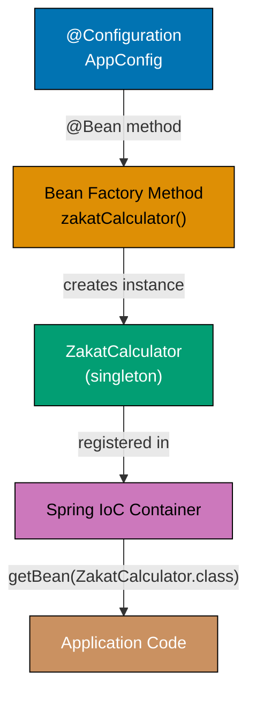
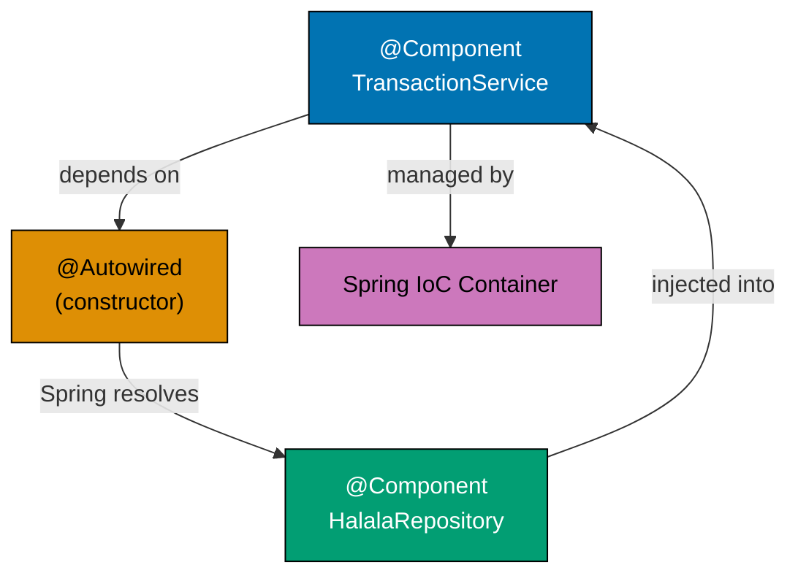
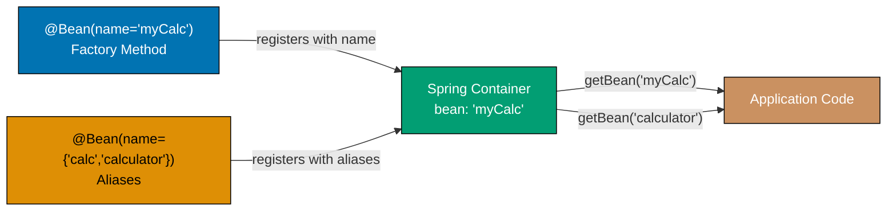
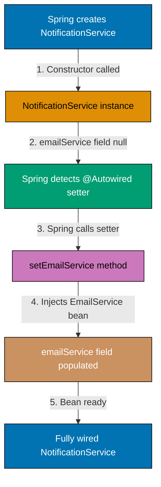
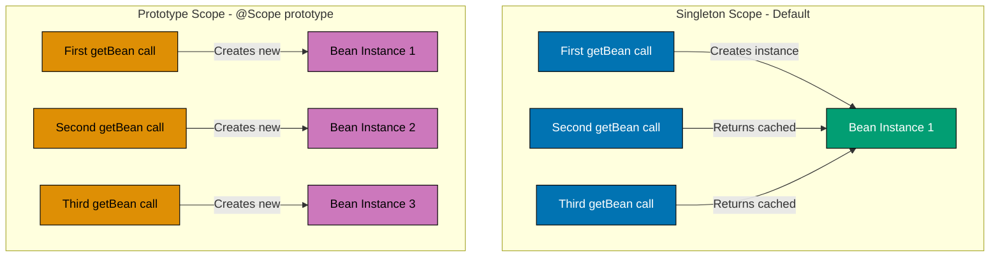
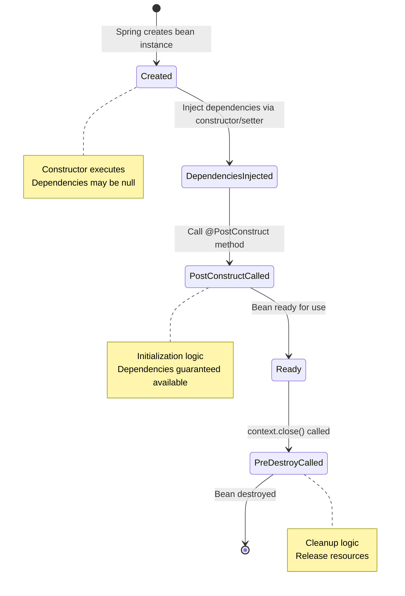

This tutorial provides 25 heavily annotated Spring Framework examples for experienced developers learning Spring. Each example is self-contained and demonstrates core IoC container, dependency injection, and bean management patterns.

**Coverage**: 0-40% of Spring Framework features
**Target Audience**: Developers familiar with Java/Kotlin wanting to learn Spring fundamentals

## Basic Operations (Examples 1-5)

### Example 1: Creating Spring ApplicationContext (Coverage: 1.0%)

Demonstrates the most basic Spring setup - creating an ApplicationContext to manage beans.

**Java Implementation**:

```java
import org.springframework.context.annotation.AnnotationConfigApplicationContext;
// => Annotation-based Spring container implementation
// => Reads @Configuration classes to build application context
import org.springframework.context.annotation.Configuration;
// => Annotation marking configuration classes
// => Spring processes these to discover bean definitions

@Configuration  // => Marks this as Spring configuration class
                // => Spring scans for @Bean methods here
                // => Container processes this during initialization
class AppConfig {
    // => Empty config for now, just bootstrapping Spring
    // => No beans defined yet (will add in later examples)
}

public class Example01 {  // => Main application entry point
                          // => Demonstrates minimal Spring context creation
    public static void main(String[] args) {  // => Application starts here
        // => Creates Spring IoC container from Java config
        // => Scans AppConfig class for bean definitions
        AnnotationConfigApplicationContext context =
            new AnnotationConfigApplicationContext(AppConfig.class);
        // => context is now initialized, ready to manage beans
        // => Container has processed @Configuration and registered definitions

        System.out.println("Spring Context ID: " + context.getId());
        // => Prints unique context identifier
        // => Output: Spring Context ID: org.springframework.context.annotation.AnnotationConfigApplicationContext@5fd0d5ae

        context.close();  // => Releases resources, calls bean destruction callbacks
                          // => Shuts down container gracefully
                          // => Triggers @PreDestroy methods if any beans defined
    }
}
```

**Kotlin Implementation**:

```kotlin
import org.springframework.context.annotation.AnnotationConfigApplicationContext
// => Annotation-based Spring container implementation
// => Reads @Configuration classes to build application context
import org.springframework.context.annotation.Configuration
// => Annotation marking configuration classes
// => Spring processes these to discover bean definitions

@Configuration  // => Marks this as Spring configuration class
                // => Spring scans for @Bean methods here
                // => Container processes this during initialization
class AppConfig {
    // => Empty config for now, just bootstrapping Spring
    // => No beans defined yet (will add in later examples)
}

fun main() {  // => Application entry point for Kotlin
              // => Demonstrates minimal Spring context creation
    // => Creates Spring IoC container from Kotlin config
    // => Scans AppConfig class for bean definitions (::class.java gets Java class)
    val context = AnnotationConfigApplicationContext(AppConfig::class.java)
    // => context is now initialized, ready to manage beans
    // => Container has processed @Configuration and registered definitions

    println("Spring Context ID: ${context.id}")
    // => Prints unique context identifier
    // => Output: Spring Context ID: org.springframework.context.annotation.AnnotationConfigApplicationContext@5fd0d5ae

    context.close()  // => Releases resources, calls bean destruction callbacks
                     // => Shuts down container gracefully
                     // => Triggers @PreDestroy methods if any beans defined
}
```

**Expected Output**:

```
Spring Context ID: org.springframework.context.annotation.AnnotationConfigApplicationContext@5fd0d5ae
```

**ApplicationContext Creation Flow**:

```mermaid
graph TD
    A[AppConfig class] -->|@Configuration annotation| B[Spring scans configuration]
    B --> C[ApplicationContext created]
    C --> D[Bean definitions registered]
    D --> E[Context ready to manage beans]

    style A fill:#0173B2,stroke:#000,color:#fff
    style B fill:#DE8F05,stroke:#000,color:#000
    style C fill:#029E73,stroke:#000,color:#fff
    style D fill:#CC78BC,stroke:#000,color:#000
    style E fill:#CA9161,stroke:#000,color:#fff
```

**Diagram Explanation**: This diagram illustrates how Spring transforms a @Configuration class into a fully initialized ApplicationContext that manages bean lifecycle.

**Key Takeaways**:

- `@Configuration` marks classes as Spring configuration sources
- `AnnotationConfigApplicationContext` creates IoC container from Java config
- Always close context to release resources (or use try-with-resources)
- Context manages entire bean lifecycle

**Why It Matters**:

Understanding ApplicationContext is foundational to every Spring application. In production, contexts are created at startup and shared across the entire application lifetime. Proper lifecycle management (closing contexts, releasing resources) prevents memory leaks in long-running financial systems. The IoC container pattern allows Zakat calculation engines, Murabaha payment processors, and audit services to be assembled and tested independently.

**Related Documentation**:

- [Spring IoC Container Documentation](https://docs.spring.io/spring-framework/reference/core/beans.html)

---

### Example 2: Defining and Retrieving Simple Bean (Coverage: 3.0%)

Demonstrates defining a bean with `@Bean` and retrieving it from the context.

#### Diagram



**Java Implementation**:

```java
import org.springframework.context.annotation.AnnotationConfigApplicationContext;
// => Annotation-based Spring container implementation
import org.springframework.context.annotation.Bean;
// => Annotation marking factory methods for bean creation
import org.springframework.context.annotation.Configuration;
// => Annotation marking configuration classes

class ZakatCalculator {  // => Simple POJO for Zakat calculations
                          // => Will be managed by Spring as a bean
    public double calculateZakat(double wealth) {  // => Public method for calculation
        return wealth * 0.025;  // => 2.5% of wealth (Zakat rate)
                                 // => Result: wealth multiplied by 0.025
    }
}

@Configuration  // => Marks this as Spring configuration class
                // => Spring scans for @Bean methods here
class AppConfig {
    @Bean  // => Tells Spring to manage this object as a bean
           // => Bean name defaults to method name: "zakatCalculator"
           // => Spring calls this method during container initialization
    public ZakatCalculator zakatCalculator() {  // => Factory method for ZakatCalculator bean
        return new ZakatCalculator();  // => Creates new ZakatCalculator instance
        // => Spring stores bean in container, reused for subsequent requests (singleton)
        // => Returns reference to bean for dependency injection
    }
}

public class Example02 {  // => Main application entry point
                          // => Demonstrates bean definition and retrieval
    public static void main(String[] args) {  // => Application starts here
        AnnotationConfigApplicationContext context =
            new AnnotationConfigApplicationContext(AppConfig.class);
        // => Context initialized, Spring processes @Configuration
        // => zakatCalculator bean created and stored in container

        ZakatCalculator calc = context.getBean(ZakatCalculator.class);
        // => Retrieves bean by type (ZakatCalculator.class)
        // => calc references the singleton instance from container
        // => Same instance returned for all getBean(ZakatCalculator.class) calls

        double zakat = calc.calculateZakat(100000);  // => Calculates 2.5% of 100000
                                                       // => zakat is 2500.0
        System.out.println("Zakat: " + zakat);       // => Prints result
                                                      // => Output: Zakat: 2500.0

        context.close();  // => Releases resources, destroys beans
                          // => Shuts down Spring container
    }
}
```

**Kotlin Implementation**:

```kotlin
import org.springframework.context.annotation.AnnotationConfigApplicationContext
// => Annotation-based Spring container implementation
import org.springframework.context.annotation.Bean
// => Annotation marking factory methods for bean creation
import org.springframework.context.annotation.Configuration
// => Annotation marking configuration classes

class ZakatCalculator {  // => Simple Kotlin class for Zakat calculations
                          // => Will be managed by Spring as a bean
    fun calculateZakat(wealth: Double): Double {  // => Function for calculation
        return wealth * 0.025  // => 2.5% of wealth (Zakat rate)
                                // => Result: wealth multiplied by 0.025
    }
}

@Configuration  // => Marks this as Spring configuration class
                // => Spring scans for @Bean methods here
class AppConfig {
    @Bean  // => Tells Spring to manage this object as a bean
           // => Bean name defaults to method name: "zakatCalculator"
           // => Spring calls this method during container initialization
    fun zakatCalculator(): ZakatCalculator {  // => Factory method for ZakatCalculator bean
        return ZakatCalculator()  // => Creates new ZakatCalculator instance
        // => Spring stores bean in container, reused for subsequent requests (singleton)
        // => Returns reference to bean for dependency injection
    }
}

fun main() {  // => Application entry point for Kotlin
              // => Demonstrates bean definition and retrieval
    val context = AnnotationConfigApplicationContext(AppConfig::class.java)
    // => Context initialized, Spring processes @Configuration
    // => zakatCalculator bean created and stored in container (::class.java gets Java class)

    val calc = context.getBean(ZakatCalculator::class.java)
    // => Retrieves bean by type (ZakatCalculator::class.java)
    // => calc references the singleton instance from container
    // => Same instance returned for all getBean calls with this type

    val zakat = calc.calculateZakat(100000.0)  // => Calculates 2.5% of 100000.0
                                                 // => zakat is 2500.0
    println("Zakat: $zakat")                    // => Prints result
                                                 // => Output: Zakat: 2500.0

    context.close()  // => Releases resources, destroys beans
                     // => Shuts down Spring container
}
```

**Expected Output**:

```
Zakat: 2500.0
```

**Key Takeaways**:

- `@Bean` methods define beans managed by Spring container
- Bean names default to method names (can be customized)
- `getBean(Class)` retrieves bean by type
- Beans are singletons by default (same instance returned)

**Why It Matters**:

Explicit bean definitions give teams complete control over object creation. In Islamic finance systems, you often need to configure services with specific parameters (audit levels, precision settings, compliance rules) before placing them under Spring management. The `@Bean` factory method pattern lets you construct beans with constructor arguments, validation logic, or external configuration before registration.

**Related Documentation**:

- [Bean Definition Documentation](https://docs.spring.io/spring-framework/reference/core/beans/definition.html)

---

### Example 3: Constructor Dependency Injection (Coverage: 6.0%)

Demonstrates constructor-based dependency injection - Spring's recommended DI approach.

**Java Implementation**:

```java
import org.springframework.context.annotation.AnnotationConfigApplicationContext;
import org.springframework.context.annotation.Bean;
import org.springframework.context.annotation.Configuration;

class SadaqahRepository {  // => Data access layer for Sadaqah donations
    public void save(String donation) {  // => Method: save(...)
        System.out.println("Saved: " + donation);  // => Simulates database save
    }
}

class SadaqahService {  // => Business logic layer
    private final SadaqahRepository repository;  // => Dependency (immutable)

    // => Constructor injection - Spring injects dependency here
    public SadaqahService(SadaqahRepository repository) {
        this.repository = repository;  // => Assigns injected dependency
        // => Constructor called by Spring, not by you
    }  // => End of SadaqahService

    public void recordDonation(String donor, double amount) {  // => Method: recordDonation(...)
        String donation = donor + ": $" + amount;  // => donation = donor + ": $" + amount
        repository.save(donation);  // => Uses injected dependency
    }
}

@Configuration
// => Marks class as Spring bean factory
class AppConfig {  // => Defines AppConfig class
    @Bean
    // => Registers return value as Spring-managed bean
    public SadaqahRepository sadaqahRepository() {  // => Method: sadaqahRepository(...)
        return new SadaqahRepository();  // => Creates repository bean
    }

    @Bean
    // => Registers return value as Spring-managed bean
    // => Spring sees SadaqahService constructor needs SadaqahRepository
    // => Automatically finds and injects sadaqahRepository bean
    public SadaqahService sadaqahService(SadaqahRepository repository) {  // => Method: sadaqahService(...)
        return new SadaqahService(repository);  // => Spring passes dependency
        // => Method parameter resolved from container
    }
}

public class Example03 {  // => Defines Example03 class
    public static void main(String[] args) {
        // => Application entry point - Spring context created here
        AnnotationConfigApplicationContext context =
            // => Spring IoC container initialized
            new AnnotationConfigApplicationContext(AppConfig.class);  // => Processes @Configuration, discovers beans
                // => Creates Spring IoC container, processes @Configuration
        // => Spring creates repository bean first, then service bean

        SadaqahService service = context.getBean(SadaqahService.class);  // => Retrieves SadaqahService bean from container
            // => Retrieves SadaqahService bean from container
        service.recordDonation("Ahmad", 500.0);  // => Calls recordDonation(...)
        // => Output: Saved: Ahmad: $500.0

        context.close();  // => Shuts down Spring container, releases resources
    }  // => End of static
}
```

**Kotlin Implementation**:

```kotlin
import org.springframework.context.annotation.AnnotationConfigApplicationContext
import org.springframework.context.annotation.Bean
import org.springframework.context.annotation.Configuration

class SadaqahRepository {  // => Data access layer for Sadaqah donations
    fun save(donation: String) {
        println("Saved: $donation")  // => Simulates database save
    }  # => End of save
}

// => Primary constructor with dependency parameter
class SadaqahService(private val repository: SadaqahRepository) {  # => Defines SadaqahService class
    // => Constructor injection - Spring injects dependency here
    // => 'val' makes dependency immutable

    fun recordDonation(donor: String, amount: Double) {
        val donation = "$donor: $$amount"  # => donation = "$donor: $$amount"
        repository.save(donation)  // => Uses injected dependency
    }  # => End of recordDonation
}

@Configuration
# => Marks class as Spring bean factory
class AppConfig {  # => Defines AppConfig class
    @Bean
    # => Registers return value as Spring-managed bean
    fun sadaqahRepository(): SadaqahRepository {
        return SadaqahRepository()  // => Creates repository bean
    }  # => End of sadaqahRepository

    @Bean
    # => Registers return value as Spring-managed bean
    // => Spring sees SadaqahService constructor needs SadaqahRepository
    // => Automatically finds and injects sadaqahRepository bean
    fun sadaqahService(repository: SadaqahRepository): SadaqahService {
        return SadaqahService(repository)  // => Spring passes dependency
        // => Method parameter resolved from container
    }  # => End of sadaqahService
}

fun main() {
    val context = AnnotationConfigApplicationContext(AppConfig::class.java)  # => assigns context
    // => Spring creates repository bean first, then service bean

    val service = context.getBean(SadaqahService::class.java)  # => assigns service
    service.recordDonation("Ahmad", 500.0)  # => Calls recordDonation(...)
    // => Output: Saved: Ahmad: $500.0

    context.close()  # => Shuts down Spring container, releases resources
}  # => End of main
```

**Expected Output**:

```
Saved: Ahmad: $500.0
```

**Constructor Injection Flow**:

```mermaid
sequenceDiagram
    participant Spring as Spring Container
    participant Config as AppConfig
    participant Repo as SadaqahRepository
    participant Service as SadaqahService

    Spring->>Config: Request sadaqahRepository bean
    Config->>Repo: new SadaqahRepository()
    Repo-->>Spring: Repository instance

    Spring->>Config: Request sadaqahService bean
    Config->>Service: new SadaqahService(repository)
    Note over Service: Constructor receives repository
    Service-->>Spring: Service instance with injected dependency

    style Spring fill:#0173B2,stroke:#000,color:#fff
    style Config fill:#DE8F05,stroke:#000,color:#000
    style Repo fill:#029E73,stroke:#000,color:#fff
    style Service fill:#CC78BC,stroke:#000,color:#000
```

**Diagram Explanation**: This sequence diagram shows how Spring resolves dependencies by creating the repository bean first, then passing it to the service constructor during service bean creation.

**Key Takeaways**:

- Constructor injection is Spring's recommended DI approach
- Dependencies are immutable (final/val), improving safety
- Spring resolves dependencies from `@Bean` method parameters
- Bean creation order determined by dependency graph

**Why It Matters**:

Constructor injection is the recommended pattern for production Spring applications because it makes dependencies explicit, enables immutability, and simplifies testing. In a Zakat management system, ensuring that every service has its required dependencies at construction time (rather than after) prevents null pointer errors during financial calculations. Teams can verify the wiring by reading the constructor signature.

**Related Documentation**:

- [Dependency Injection Documentation](https://docs.spring.io/spring-framework/reference/core/beans/dependencies/factory-collaborators.html)

---

### Example 4: Component Scanning with @Component (Coverage: 10.0%)

Demonstrates automatic bean discovery using `@Component` and `@ComponentScan`.

#### Diagram


**Java Implementation**:

```java
import org.springframework.context.annotation.AnnotationConfigApplicationContext;
import org.springframework.context.annotation.ComponentScan;
import org.springframework.context.annotation.Configuration;
import org.springframework.stereotype.Component;

@Component  // => Marks class as Spring-managed component
            // => Spring automatically creates bean (no @Bean method needed)
class QardHassanCalculator {  // => Qard Hassan (interest-free loan) calculator
    public double calculateMonthlyPayment(double principal, int months) {  // => Method: calculateMonthlyPayment(...)
        return principal / months;  // => No interest, simple division
    }
}

@Configuration
// => Marks class as Spring bean factory
@ComponentScan  // => Tells Spring to scan current package for @Component classes
                // => Automatically discovers and registers beans
class AppConfig {  // => Defines AppConfig class
    // => No @Bean methods needed for @Component classes
}

public class Example04 {  // => Defines Example04 class
    public static void main(String[] args) {
        // => Application entry point - Spring context created here
        AnnotationConfigApplicationContext context =
            new AnnotationConfigApplicationContext(AppConfig.class);
                // => Creates Spring IoC container, processes @Configuration
        // => @ComponentScan discovers QardHassanCalculator
        // => Bean created automatically with name "qardHassanCalculator"

        QardHassanCalculator calc = context.getBean(QardHassanCalculator.class);
            // => Retrieves QardHassanCalculator bean from container
        double payment = calc.calculateMonthlyPayment(12000, 12);  // => assigns payment
        System.out.println("Monthly Payment: " + payment);  // => Outputs to console
        // => Output: Monthly Payment: 1000.0

        context.close();  // => Shuts down Spring container, releases resources
    }
}
```

**Kotlin Implementation**:

```kotlin
import org.springframework.context.annotation.AnnotationConfigApplicationContext
import org.springframework.context.annotation.ComponentScan
import org.springframework.context.annotation.Configuration
import org.springframework.stereotype.Component

@Component  // => Marks class as Spring-managed component
            // => Spring automatically creates bean (no @Bean method needed)
class QardHassanCalculator {  // => Qard Hassan (interest-free loan) calculator
    fun calculateMonthlyPayment(principal: Double, months: Int): Double {
        return principal / months  // => No interest, simple division
    }
}

@Configuration
# => Marks class as Spring bean factory
@ComponentScan  // => Tells Spring to scan current package for @Component classes
                // => Automatically discovers and registers beans
class AppConfig {  # => Defines AppConfig class
    // => No @Bean methods needed for @Component classes
}

fun main() {
    val context = AnnotationConfigApplicationContext(AppConfig::class.java)  # => assigns context
    // => @ComponentScan discovers QardHassanCalculator
    // => Bean created automatically with name "qardHassanCalculator"

    val calc = context.getBean(QardHassanCalculator::class.java)  # => assigns calc
    val payment = calc.calculateMonthlyPayment(12000.0, 12)  # => assigns payment
    println("Monthly Payment: $payment")  # => Outputs to console
    // => Output: Monthly Payment: 1000.0

    context.close()  # => Shuts down Spring container, releases resources
}
```

**Expected Output**:

```
Monthly Payment: 1000.0
```

**Key Takeaways**:

- `@Component` enables automatic bean discovery
- `@ComponentScan` scans packages for annotated classes
- Bean names default to camelCase class names
- Reduces boilerplate compared to `@Bean` methods

**Why It Matters**:

Component scanning dramatically reduces configuration boilerplate in large applications. In a financial platform with dozens of services (ZakatService, MurabahaService, SadaqahService, QardHassanService), manually defining each bean is error-prone. Component scanning lets Spring discover all annotated classes automatically, enabling rapid addition of new financial product handlers without modifying configuration files.

**Related Documentation**:

- [Component Scanning Documentation](https://docs.spring.io/spring-framework/reference/core/beans/classpath-scanning.html)

---

### Example 5: @Autowired Constructor Injection (Coverage: 13.0%)

Demonstrates `@Autowired` for automatic dependency injection with components.

#### Diagram



**Java Implementation**:

```java
import org.springframework.beans.factory.annotation.Autowired;
import org.springframework.context.annotation.AnnotationConfigApplicationContext;
import org.springframework.context.annotation.ComponentScan;
import org.springframework.context.annotation.Configuration;
import org.springframework.stereotype.Component;
import org.springframework.stereotype.Repository;
import org.springframework.stereotype.Service;

@Repository  // => Specialized @Component for data access layer
             // => Semantically indicates database/storage interaction
class MurabahaRepository {  // => Defines MurabahaRepository class
    public void save(String contract) {  // => Method: save(...)
        System.out.println("Saved contract: " + contract);  // => Outputs to console
    }
}

@Service  // => Specialized @Component for business logic layer
          // => Semantically indicates service/business operations
class MurabahaService {  // => Defines MurabahaService class
    private final MurabahaRepository repository;  // => repository: MurabahaRepository field

    @Autowired  // => Tells Spring to inject dependency via constructor
                // => Optional in Spring 4.3+ if only one constructor
    public MurabahaService(MurabahaRepository repository) {
        this.repository = repository;  // => Injected by Spring
        // => Spring finds MurabahaRepository bean and passes it
    }

    public void createContract(String client, double amount) {  // => Method: createContract(...)
        String contract = "Murabaha for " + client + ": $" + amount;  // => assigns contract
        repository.save(contract);  // => Uses injected dependency
    }
}

@Configuration
// => Marks class as Spring bean factory
@ComponentScan  // => Discovers @Repository and @Service beans
class AppConfig {  // => Defines AppConfig class
}

public class Example05 {  // => Defines Example05 class
    public static void main(String[] args) {
        // => Application entry point - Spring context created here
        AnnotationConfigApplicationContext context =
            // => Spring IoC container initialized
            new AnnotationConfigApplicationContext(AppConfig.class);  // => Processes @Configuration, discovers beans
                // => Creates Spring IoC container, processes @Configuration
        // => Spring discovers repository and service beans
        // => Automatically wires repository into service

        MurabahaService service = context.getBean(MurabahaService.class);  // => Retrieves MurabahaService bean from container
            // => Retrieves MurabahaService bean from container
        service.createContract("Fatimah", 50000.0);  // => Calls createContract(...)
        // => Output: Saved contract: Murabaha for Fatimah: $50000.0

        context.close();  // => Shuts down Spring container, releases resources
    }
}
```

**Kotlin Implementation**:

```kotlin
import org.springframework.beans.factory.annotation.Autowired
import org.springframework.context.annotation.AnnotationConfigApplicationContext
import org.springframework.context.annotation.ComponentScan
import org.springframework.context.annotation.Configuration
import org.springframework.stereotype.Repository
import org.springframework.stereotype.Service

@Repository  // => Specialized @Component for data access layer
             // => Semantically indicates database/storage interaction
class MurabahaRepository {  # => Defines MurabahaRepository class
    fun save(contract: String) {
        println("Saved contract: $contract")  # => Outputs to console
    }  # => End of save
}

@Service  // => Specialized @Component for business logic layer
          // => Semantically indicates service/business operations
// => Kotlin primary constructor - @Autowired automatic for single constructor
class MurabahaService @Autowired constructor(  # => Defines MurabahaService class
    private val repository: MurabahaRepository
    // => Spring finds MurabahaRepository bean and passes it
) {
    fun createContract(client: String, amount: Double) {
        val contract = "Murabaha for $client: $$amount"  # => assigns contract
        repository.save(contract)  // => Uses injected dependency
    }  # => End of createContract

@Configuration
# => Marks class as Spring bean factory
@ComponentScan  // => Discovers @Repository and @Service beans
class AppConfig  # => Defines AppConfig class

fun main() {
    val context = AnnotationConfigApplicationContext(AppConfig::class.java)  # => assigns context
    // => Spring discovers repository and service beans
    // => Automatically wires repository into service

    val service = context.getBean(MurabahaService::class.java)  # => assigns service
    service.createContract("Fatimah", 50000.0)  # => Calls createContract(...)
    // => Output: Saved contract: Murabaha for Fatimah: $50000.0

    context.close()  # => Shuts down Spring container, releases resources
}  # => End of main
```

**Expected Output**:

```
Saved contract: Murabaha for Fatimah: $50000.0
```

**Key Takeaways**:

- `@Autowired` enables automatic dependency injection
- `@Service` and `@Repository` are specialized `@Component` variants
- `@Autowired` optional for single-constructor classes (Spring 4.3+)
- Stereotypes (@Service, @Repository) provide semantic clarity

**Why It Matters**:

The `@Autowired` annotation enables Spring to wire entire object graphs automatically. When a Murabaha contract service depends on a risk engine, a pricing service, and a compliance checker, Spring resolves all of these dependencies without manual assembly. This is especially valuable in financial systems where objects have deep dependency chains spanning calculation, validation, audit, and persistence layers.

**Related Documentation**:

- [Stereotype Annotations Documentation](https://docs.spring.io/spring-framework/reference/core/beans/classpath-scanning.html#beans-stereotype-annotations)

---

## Bean Configuration (Examples 6-10)

### Example 6: Custom Bean Names (Coverage: 16.0%)

Demonstrates specifying custom names for beans instead of defaults.

#### Diagram



**Java Implementation**:

```java
import org.springframework.context.annotation.AnnotationConfigApplicationContext;
import org.springframework.context.annotation.Bean;
import org.springframework.context.annotation.Configuration;

class Calculator {  // => Simple POJO for arithmetic operations
    public double add(double a, double b) {  // => Addition method
        return a + b;  // => Returns sum of two numbers
    }
}

@Configuration  // => Marks this as Spring configuration source
class AppConfig {  // => Defines AppConfig class
    @Bean(name = "primaryCalculator")  // => Custom bean name
                                         // => Overrides default "calculator"
                                         // => name attribute explicitly sets bean identifier
    public Calculator calculator() {  // => Method: calculator(...)
        return new Calculator();  // => Bean registered as "primaryCalculator"
                                   // => Spring stores with custom name, not method name
    }

    @Bean("backupCalculator")  // => Shorthand for name attribute
                                // => Equivalent to @Bean(name = "backupCalculator")
    public Calculator anotherCalculator() {  // => Method: anotherCalculator(...)
        return new Calculator();  // => Bean registered as "backupCalculator"
                                   // => Different instance from primaryCalculator
    }
}

public class Example06 {  // => Defines Example06 class
    public static void main(String[] args) {
        AnnotationConfigApplicationContext context =
            new AnnotationConfigApplicationContext(AppConfig.class);
                // => Creates Spring IoC container, processes @Configuration
        // => Spring initializes both calculator beans

        Calculator primary = context.getBean("primaryCalculator", Calculator.class);
            // => Retrieves bean from container
        // => Retrieves bean by custom name and type
        // => primary references the "primaryCalculator" bean
        System.out.println("5 + 3 = " + primary.add(5, 3));  // => Outputs to console
        // => Calls add method on retrieved bean
        // => Output: 5 + 3 = 8.0

        Calculator backup = context.getBean("backupCalculator", Calculator.class);  // => Retrieves bean from container
        // => Retrieves second bean by its custom name
        // => backup is separate instance from primary
        System.out.println("10 + 2 = " + backup.add(10, 2));  // => Outputs to console
        // => Uses second calculator instance
        // => Output: 10 + 2 = 12.0

        context.close();  // => Cleanup resources
    }
}
```

**Kotlin Implementation**:

```kotlin
import org.springframework.context.annotation.AnnotationConfigApplicationContext
import org.springframework.context.annotation.Bean
import org.springframework.context.annotation.Configuration

class Calculator {  // => Simple Kotlin class for arithmetic
    fun add(a: Double, b: Double): Double = a + b  // => Expression body function
                                                     // => Returns sum directly
}

@Configuration  // => Marks this as Spring configuration source
class AppConfig {  # => Defines AppConfig class
    @Bean(name = ["primaryCalculator"])  // => Custom bean name (array syntax)
                                          // => Overrides default "calculator"
                                          // => Kotlin requires array syntax for single value
    fun calculator(): Calculator {
        return Calculator()  // => Bean registered as "primaryCalculator"
                              // => Spring stores with custom name, not method name
    }

    @Bean("backupCalculator")  // => Shorthand for name attribute
                                // => Equivalent to @Bean(name = ["backupCalculator"])
    fun anotherCalculator(): Calculator {
        return Calculator()  // => Bean registered as "backupCalculator"
                              // => Different instance from primaryCalculator
    }
}

fun main() {
    val context = AnnotationConfigApplicationContext(AppConfig::class.java)  # => assigns context
    // => Spring initializes both calculator beans

    val primary = context.getBean("primaryCalculator", Calculator::class.java)  # => assigns primary
    // => Retrieves bean by custom name and type
    // => primary references the "primaryCalculator" bean
    println("5 + 3 = ${primary.add(5.0, 3.0)}")  # => Outputs to console
    // => Calls add method on retrieved bean
    // => Output: 5 + 3 = 8.0

    val backup = context.getBean("backupCalculator", Calculator::class.java)  # => assigns backup
    // => Retrieves second bean by its custom name
    // => backup is separate instance from primary
    println("10 + 2 = ${backup.add(10.0, 2.0)}")  # => Outputs to console
    // => Uses second calculator instance
    // => Output: 10 + 2 = 12.0

    context.close()  // => Cleanup resources
}
```

**Expected Output**:

```
5 + 3 = 8.0
10 + 2 = 12.0
```

**Key Takeaways**:

- `@Bean(name = "...")` specifies custom bean name
- Multiple beans of same type require unique names
- `getBean(String, Class)` retrieves by name and type
- Bean names must be unique within container

**Why It Matters**:

Custom bean names are essential when you have multiple implementations of a service or when bean names must match configuration keys, environment variables, or external identifiers. In Islamic finance systems that support both retail and corporate Zakat calculations, naming beans `retailZakatService` and `corporateZakatService` makes it clear which implementation is which, especially in dependency injection and health checks.

**Related Documentation**:

- [Bean Naming Documentation](https://docs.spring.io/spring-framework/reference/core/beans/definition.html#beans-beanname)

---

### Example 7: Bean Aliases (Coverage: 18.0%)

Demonstrates defining multiple names (aliases) for the same bean.

**Java Implementation**:

```java
import org.springframework.context.annotation.AnnotationConfigApplicationContext;
import org.springframework.context.annotation.Bean;
import org.springframework.context.annotation.Configuration;

class ZakatCalculator {  // => Zakat calculation service
    public double calculate(double wealth) {  // => Calculates 2.5% zakat
        return wealth * 0.025;  // => Standard zakat rate for cash/gold
    }
}

@Configuration  // => Spring configuration class
class AppConfig {  // => Defines AppConfig class
    @Bean(name = {"zakatCalc", "zakatCalculator", "zakahService"})
    // => Defines three aliases for same bean
    // => All names reference the SAME instance (singleton)
    // => Primary name is first: "zakatCalc"
    public ZakatCalculator calculator() {  // => Method: calculator(...)
        return new ZakatCalculator();  // => Single bean, multiple names
                                         // => Only one instance created
    }
}

public class Example07 {  // => Defines Example07 class
    public static void main(String[] args) {
        AnnotationConfigApplicationContext context =
            new AnnotationConfigApplicationContext(AppConfig.class);
                // => Creates Spring IoC container, processes @Configuration
        // => Spring creates one ZakatCalculator bean with three names

        ZakatCalculator calc1 = context.getBean("zakatCalc", ZakatCalculator.class);
            // => Retrieves bean from container
        // => Retrieves via first alias
        ZakatCalculator calc2 = context.getBean("zakatCalculator", ZakatCalculator.class);
            // => Retrieves bean from container
        // => Retrieves via second alias
        ZakatCalculator calc3 = context.getBean("zakahService", ZakatCalculator.class);
            // => Retrieves bean from container
        // => Retrieves via third alias
        // => All three retrieve the SAME bean instance

        System.out.println("Same instance? " + (calc1 == calc2 && calc2 == calc3));  // => Outputs to console
        // => Checks reference equality
        // => Output: Same instance? true

        context.close();  // => Cleanup resources
    }
}
```

**Kotlin Implementation**:

```kotlin
import org.springframework.context.annotation.AnnotationConfigApplicationContext
import org.springframework.context.annotation.Bean
import org.springframework.context.annotation.Configuration

class ZakatCalculator {  // => Zakat calculation service
    fun calculate(wealth: Double): Double = wealth * 0.025  // => Calculates 2.5% zakat
                                                             // => Standard rate for cash/gold
}

@Configuration  // => Spring configuration class
class AppConfig {  # => Defines AppConfig class
    @Bean(name = ["zakatCalc", "zakatCalculator", "zakahService"])
    // => Defines three aliases for same bean
    // => All names reference the SAME instance (singleton)
    // => Primary name is first: "zakatCalc"
    fun calculator(): ZakatCalculator {
        return ZakatCalculator()  // => Single bean, multiple names
                                   // => Only one instance created
    }
}

fun main() {
    val context = AnnotationConfigApplicationContext(AppConfig::class.java)  # => assigns context
    // => Spring creates one ZakatCalculator bean with three names

    val calc1 = context.getBean("zakatCalc", ZakatCalculator::class.java)  # => assigns calc1
    // => Retrieves via first alias
    val calc2 = context.getBean("zakatCalculator", ZakatCalculator::class.java)  # => assigns calc2
    // => Retrieves via second alias
    val calc3 = context.getBean("zakahService", ZakatCalculator::class.java)  # => assigns calc3
    // => Retrieves via third alias
    // => All three retrieve the SAME bean instance

    println("Same instance? ${calc1 === calc2 && calc2 === calc3}")  # => Outputs to console
    // => Checks reference equality (=== in Kotlin)
    // => Output: Same instance? true

    context.close()  // => Cleanup resources
}
```

**Expected Output**:

```
Same instance? true
```

**Key Takeaways**:

- Bean aliases provide alternative names for same bean
- All aliases reference identical singleton instance
- Useful for compatibility or alternative naming conventions
- Primary name is first in array

**Why It Matters**:

Bean aliases enable backward compatibility when refactoring. If a Murabaha payment service bean was named `paymentService` in version 1.0 but you want to rename it to `murabahaPaymentService` in version 2.0, creating an alias allows both names to coexist. This prevents breaking existing configurations, property files, or integration tests that reference the old bean name.

**Related Documentation**:

- [Bean Aliasing Documentation](https://docs.spring.io/spring-framework/reference/core/beans/definition.html#beans-beanname-alias)

---

### Example 8: Setter Injection (Coverage: 20.0%)

Demonstrates setter-based dependency injection as alternative to constructor injection.

**Java Implementation**:

```java
import org.springframework.beans.factory.annotation.Autowired;
import org.springframework.context.annotation.AnnotationConfigApplicationContext;
import org.springframework.context.annotation.ComponentScan;
import org.springframework.context.annotation.Configuration;
import org.springframework.stereotype.Component;
import org.springframework.stereotype.Service;

@Component  // => Spring-managed component
class EmailService {  // => Email sending service
    public void send(String message) {  // => Sends email notification
        System.out.println("Email sent: " + message);  // => Simulates email delivery
    }
}

@Service  // => Business logic component
class NotificationService {  // => Notification coordination service
    private EmailService emailService;  // => Dependency (not final)
                                          // => Allows post-construction modification

    @Autowired  // => Spring calls setter after object construction
                // => Injects emailService bean via setter method
                // => Optional on single setter in Spring 4.3+
    public void setEmailService(EmailService emailService) {  // => Method: setEmailService(...)
        this.emailService = emailService;  // => Setter injection assigns dependency
        // => Allows changing dependency after construction (if needed)
        // => Less safe than constructor injection
    }

    public void notifyDonation(String donor) {  // => Business method
        emailService.send("Thank you, " + donor);  // => Uses injected dependency
                                                     // => Delegates to EmailService
    }
}

@Configuration  // => Spring configuration source
@ComponentScan  // => Scans for @Component, @Service beans
class AppConfig {  // => Defines AppConfig class
}

public class Example08 {  // => Defines Example08 class
    public static void main(String[] args) {
        AnnotationConfigApplicationContext context =
            new AnnotationConfigApplicationContext(AppConfig.class);
                // => Creates Spring IoC container, processes @Configuration
        // => Spring discovers EmailService and NotificationService beans
        // => Creates NotificationService first, then calls setEmailService

        NotificationService service = context.getBean(NotificationService.class);
            // => Retrieves NotificationService bean from container
        // => Retrieves fully-wired NotificationService bean
        service.notifyDonation("Ali");  // => Calls business method
        // => Output: Email sent: Thank you, Ali

        context.close();  // => Cleanup resources
    }
}
```

**Kotlin Implementation**:

```kotlin
import org.springframework.beans.factory.annotation.Autowired
import org.springframework.context.annotation.AnnotationConfigApplicationContext
import org.springframework.context.annotation.ComponentScan
import org.springframework.context.annotation.Configuration
import org.springframework.stereotype.Component
import org.springframework.stereotype.Service

@Component  // => Spring-managed component
class EmailService {  // => Email sending service
    fun send(message: String) {  // => Sends email notification
        println("Email sent: $message")  // => Simulates email delivery
    }
}

@Service  // => Business logic component
class NotificationService {  // => Notification coordination service
    private lateinit var emailService: EmailService  // => Late-init dependency
                                                      // => Not initialized in constructor
                                                      // => Set later via setter

    @Autowired  // => Spring calls setter after object construction
                // => Injects emailService bean via setter method
                // => Optional on single setter in Spring 4.3+
    fun setEmailService(emailService: EmailService) {
        this.emailService = emailService  // => Setter injection assigns dependency
        // => lateinit allows setting non-null var after construction
        // => Less safe than constructor injection
    }

    fun notifyDonation(donor: String) {  // => Business method
        emailService.send("Thank you, $donor")  // => Uses injected dependency
                                                 // => Delegates to EmailService
    }
}

@Configuration  // => Spring configuration source
@ComponentScan  // => Scans for @Component, @Service beans
class AppConfig  # => Defines AppConfig class

fun main() {
    val context = AnnotationConfigApplicationContext(AppConfig::class.java)  # => assigns context
    // => Spring discovers EmailService and NotificationService beans
    // => Creates NotificationService first, then calls setEmailService

    val service = context.getBean(NotificationService::class.java)  # => assigns service
    // => Retrieves fully-wired NotificationService bean
    service.notifyDonation("Ali")  // => Calls business method
    // => Output: Email sent: Thank you, Ali

    context.close()  // => Cleanup resources
}
```

**Expected Output**:

```
Email sent: Thank you, Ali
```

**Setter Injection Flow**:



**Diagram Explanation**: This diagram illustrates the two-phase lifecycle of setter injection - object construction first, then dependency injection via setter method after construction completes.

**Key Takeaways**:

- Setter injection allows optional or changeable dependencies
- Dependencies not final (mutable after construction)
- Constructor injection preferred for required dependencies
- Setter injection useful for optional configuration

**Why It Matters**:

Setter injection is appropriate when a dependency is optional or when it must be changed after construction (reconfiguration scenarios). In an Islamic finance system, a notification service might optionally receive an SMS gateway bean — the system works without it but sends notifications when available. Setter injection also works around circular dependencies in legacy code where refactoring is not immediately feasible.

**Related Documentation**:

- [Setter Injection Documentation](https://docs.spring.io/spring-framework/reference/core/beans/dependencies/factory-collaborators.html#beans-setter-injection)

---

### Example 9: Field Injection (Coverage: 22.0%)

Demonstrates field-based injection - simplest but least recommended approach.

**Java Implementation**:

```java
import org.springframework.beans.factory.annotation.Autowired;
import org.springframework.context.annotation.AnnotationConfigApplicationContext;
import org.springframework.context.annotation.ComponentScan;
import org.springframework.context.annotation.Configuration;
import org.springframework.stereotype.Component;
import org.springframework.stereotype.Service;

@Component  // => Spring-managed component
class AuditLogger {  // => Audit logging service
    public void log(String action) {  // => Logs audit events
        System.out.println("AUDIT: " + action);  // => Writes to console
    }
}

@Service  // => Business logic component
class TransactionService {  // => Transaction processing service
    @Autowired  // => Spring injects directly into field via reflection
                // => No constructor or setter needed
                // => Happens after object construction
    private AuditLogger logger;  // => Field injection (simplest syntax)
                                  // => Cannot be final (reflection requirement)

    public void processTransaction(String type, double amount) {  // => Business method
        logger.log(type + " transaction: $" + amount);  // => Uses injected dependency
        // => Delegates to AuditLogger bean
    }
}

@Configuration  // => Spring configuration source
@ComponentScan  // => Scans for @Component, @Service beans
class AppConfig {  // => Defines AppConfig class
}

public class Example09 {  // => Defines Example09 class
    public static void main(String[] args) {
        // => Application entry point - Spring context created here
        AnnotationConfigApplicationContext context =
            new AnnotationConfigApplicationContext(AppConfig.class);
                // => Creates Spring IoC container, processes @Configuration
        // => Spring discovers AuditLogger and TransactionService beans
        // => Creates beans, injects logger field via reflection

        TransactionService service = context.getBean(TransactionService.class);
            // => Retrieves TransactionService bean from container
        // => Retrieves fully-wired TransactionService
        service.processTransaction("Sadaqah", 200.0);  // => Calls business method
        // => Output: AUDIT: Sadaqah transaction: $200.0

        context.close();  // => Cleanup resources
    }
}
```

**Kotlin Implementation**:

```kotlin
import org.springframework.beans.factory.annotation.Autowired
import org.springframework.context.annotation.AnnotationConfigApplicationContext
import org.springframework.context.annotation.ComponentScan
import org.springframework.context.annotation.Configuration
import org.springframework.stereotype.Component
import org.springframework.stereotype.Service

@Component  // => Spring-managed component
class AuditLogger {  // => Audit logging service
    fun log(action: String) {  // => Logs audit events
        println("AUDIT: $action")  // => Writes to console
    }
}

@Service  // => Business logic component
class TransactionService {  // => Transaction processing service
    @Autowired  // => Spring injects directly into field via reflection
                // => No constructor or setter needed
                // => Happens after object construction
    private lateinit var logger: AuditLogger  // => Field injection with lateinit
                                               // => Cannot be val (reflection requirement)
                                               // => Must use var with lateinit

    fun processTransaction(type: String, amount: Double) {  // => Business method
        logger.log("$type transaction: $$amount")  // => Uses injected dependency
        // => Delegates to AuditLogger bean
    }
}

@Configuration  // => Spring configuration source
@ComponentScan  // => Scans for @Component, @Service beans
class AppConfig  # => Defines AppConfig class

fun main() {
    val context = AnnotationConfigApplicationContext(AppConfig::class.java)  # => assigns context
    // => Spring discovers AuditLogger and TransactionService beans
    // => Creates beans, injects logger field via reflection

    val service = context.getBean(TransactionService::class.java)  # => assigns service
    // => Retrieves fully-wired TransactionService
    service.processTransaction("Sadaqah", 200.0)  // => Calls business method
    // => Output: AUDIT: Sadaqah transaction: $200.0

    context.close()  // => Cleanup resources
}
```

**Expected Output**:

```
AUDIT: Sadaqah transaction: $200.0
```

**Key Takeaways**:

- Field injection uses reflection (no constructor/setter)
- Simplest syntax but hardest to test (can't inject mocks easily)
- Cannot be used with final/val fields
- Constructor injection preferred for testability

**Why It Matters**:

Field injection via `@Autowired` reduces boilerplate but comes with trade-offs. While convenient in small applications, it makes dependencies invisible in the constructor and complicates testing (you cannot inject mocks without reflection). In production Islamic finance code, prefer constructor injection for required dependencies. Field injection has its place in test classes and simple utility components where testability is less critical.

**Related Documentation**:

- [Field Injection Discussion](https://docs.spring.io/spring-framework/reference/core/beans/dependencies/factory-collaborators.html)

---

### Example 10: @Qualifier for Disambiguation (Coverage: 25.0%)

Demonstrates using `@Qualifier` when multiple beans of same type exist.

**Java Implementation**:

```java
import org.springframework.beans.factory.annotation.Autowired;
import org.springframework.beans.factory.annotation.Qualifier;
import org.springframework.context.annotation.AnnotationConfigApplicationContext;
import org.springframework.context.annotation.Bean;
import org.springframework.context.annotation.Configuration;

interface PaymentProcessor {  // => Common interface for payment types
    void process(double amount);  // => Process payment contract
}

class CashPayment implements PaymentProcessor {  // => Cash payment implementation
    public void process(double amount) {  // => Handles cash transactions
        System.out.println("Cash payment: $" + amount);  // => Simulates cash processing
    }
}

class CardPayment implements PaymentProcessor {  // => Card payment implementation
    public void process(double amount) {  // => Handles card transactions
        System.out.println("Card payment: $" + amount);  // => Simulates card processing
    }
}

@Configuration  // => Spring configuration source
class AppConfig {  // => Defines AppConfig class
    @Bean  // => Defines PaymentProcessor bean
    @Qualifier("cash")  // => Tags this bean as "cash" processor
                         // => Allows disambiguation when injecting
    public PaymentProcessor cashProcessor() {  // => Method: cashProcessor(...)
        return new CashPayment();  // => Registered with "cash" qualifier
                                    // => Type: PaymentProcessor
    }

    @Bean  // => Defines second PaymentProcessor bean
    @Qualifier("card")  // => Tags this bean as "card" processor
                         // => Different qualifier from cash
    public PaymentProcessor cardProcessor() {  // => Method: cardProcessor(...)
        return new CardPayment();  // => Registered with "card" qualifier
                                    // => Same type, different qualifier
    }

    @Bean  // => Defines DonationService bean
    public DonationService donationService(  // => Method: donationService(...)
        @Qualifier("cash") PaymentProcessor processor
        // => Specifies which bean implementation to inject
        // => Specifies which bean to inject when multiple exist
        // => Injects cashProcessor, not cardProcessor
        // => Without @Qualifier would throw NoUniqueBeanDefinitionException
    ) {
        return new DonationService(processor);  // => Creates service with cash processor
    }
}

class DonationService {  // => Business service for donations
    private final PaymentProcessor processor;  // => Injected payment processor

    public DonationService(PaymentProcessor processor) {  // => Constructor injection
        this.processor = processor;  // => Assigns injected dependency
    }

    public void acceptDonation(double amount) {  // => Business method
        processor.process(amount);  // => Delegates to injected processor
                                     // => Uses cash processor from qualifier
    }
}

public class Example10 {  // => Defines Example10 class
    public static void main(String[] args) {
        // => Application entry point - Spring context created here
        AnnotationConfigApplicationContext context =
            // => Spring IoC container initialized
            new AnnotationConfigApplicationContext(AppConfig.class);  // => Processes @Configuration, discovers beans
                // => Creates Spring IoC container, processes @Configuration
        // => Spring creates both payment processors and donation service
        // => Injects cash processor into service

        DonationService service = context.getBean(DonationService.class);  // => Retrieves DonationService bean from container
            // => Retrieves DonationService bean from container
        // => Retrieves wired DonationService bean
        service.acceptDonation(100.0);  // => Processes donation
        // => Output: Cash payment: $100.0
        // => Uses cashProcessor due to @Qualifier("cash")

        context.close();  // => Cleanup resources
    }
}
```

**Kotlin Implementation**:

```kotlin
import org.springframework.beans.factory.annotation.Qualifier
import org.springframework.context.annotation.AnnotationConfigApplicationContext
import org.springframework.context.annotation.Bean
import org.springframework.context.annotation.Configuration

interface PaymentProcessor {  // => Common interface for payment types
    fun process(amount: Double)  // => Process payment contract
}

class CashPayment : PaymentProcessor {  // => Cash payment implementation
    override fun process(amount: Double) {  // => Handles cash transactions
        println("Cash payment: $$amount")  // => Simulates cash processing
    }
}

class CardPayment : PaymentProcessor {  // => Card payment implementation
    override fun process(amount: Double) {  // => Handles card transactions
        println("Card payment: $$amount")  // => Simulates card processing
    }
}

@Configuration  // => Spring configuration source
class AppConfig {  # => Defines AppConfig class
    @Bean  // => Defines PaymentProcessor bean
    @Qualifier("cash")  // => Tags this bean as "cash" processor
                         // => Allows disambiguation when injecting
    fun cashProcessor(): PaymentProcessor {
        return CashPayment()  // => Registered with "cash" qualifier
                               // => Type: PaymentProcessor
    }  # => End of cashProcessor

    @Bean  // => Defines second PaymentProcessor bean
    @Qualifier("card")  // => Tags this bean as "card" processor
                         // => Different qualifier from cash
    fun cardProcessor(): PaymentProcessor {
        return CardPayment()  // => Registered with "card" qualifier
                               // => Same type, different qualifier
    }  # => End of cardProcessor

    @Bean  // => Defines DonationService bean
    fun donationService(
        @Qualifier("cash") processor: PaymentProcessor
        # => Specifies which bean implementation to inject
        // => Specifies which bean to inject when multiple exist
        // => Injects cashProcessor, not cardProcessor
        // => Without @Qualifier would throw NoUniqueBeanDefinitionException
    ): DonationService {
        return DonationService(processor)  // => Creates service with cash processor
}

class DonationService(private val processor: PaymentProcessor) {  // => Business service
                                                                    // => Constructor injection
    fun acceptDonation(amount: Double) {  // => Business method
        processor.process(amount)  // => Delegates to injected processor
                                    // => Uses cash processor from qualifier
    }
}

fun main() {
    val context = AnnotationConfigApplicationContext(AppConfig::class.java)  # => assigns context
    // => Spring creates both payment processors and donation service
    // => Injects cash processor into service

    val service = context.getBean(DonationService::class.java)  # => assigns service
    // => Retrieves wired DonationService bean
    service.acceptDonation(100.0)  // => Processes donation
    // => Output: Cash payment: $100.0
    // => Uses cashProcessor due to @Qualifier("cash")

    context.close()  // => Cleanup resources
}  # => End of main
```

**Expected Output**:

```
Cash payment: $100.0
```

**@Qualifier Bean Selection**:

```mermaid
graph TD
    A[Spring Container] -->|Detects multiple beans| B{PaymentProcessor beans}
    B -->|@Qualifier cash| C[CashPayment bean]
    B -->|@Qualifier card| D[CardPayment bean]

    E[DonationService needs<br/>PaymentProcessor] -->|@Qualifier cash specified| F[Spring selects CashPayment]
    F --> G[Injects cashProcessor bean]

    H[Without @Qualifier] -->|Multiple beans found| I[NoUniqueBeanDefinitionException]

    style A fill:#0173B2,stroke:#000,color:#fff
    style B fill:#DE8F05,stroke:#000,color:#000
    style C fill:#029E73,stroke:#000,color:#fff
    style D fill:#029E73,stroke:#000,color:#fff
    style E fill:#CC78BC,stroke:#000,color:#000
    style F fill:#CA9161,stroke:#000,color:#fff
    style G fill:#0173B2,stroke:#000,color:#fff
    style H fill:#DE8F05,stroke:#000,color:#000
    style I fill:#CA9161,stroke:#000,color:#fff
```

**Diagram Explanation**: This diagram shows how @Qualifier enables Spring to select the correct bean when multiple beans of the same type exist, preventing NoUniqueBeanDefinitionException.

**Key Takeaways**:

- `@Qualifier` disambiguates when multiple beans of same type exist
- Qualifier names are strings (use constants to avoid typos)
- Without qualifiers, Spring throws `NoUniqueBeanDefinitionException`
- Combines with `@Autowired` for precise injection

**Why It Matters**:

The `@Qualifier` annotation is essential when multiple beans implement the same interface. In a multi-product financial platform, you might have a `ClassicZakatCalculator` and an `IslamicBankingZakatCalculator` both implementing `ZakatCalculator`. Without qualifiers, Spring cannot determine which to inject, throwing a `NoUniqueBeanDefinitionException`. Qualifiers make the intended implementation explicit in the configuration.

**Related Documentation**:

- [Qualifier Documentation](https://docs.spring.io/spring-framework/reference/core/beans/annotation-config/autowired-qualifiers.html)

---

## Bean Scopes and Lifecycle (Examples 11-15)

### Example 11: Singleton Scope (Default) (Coverage: 27.0%)

Demonstrates singleton scope - Spring's default bean scope.

**Java Implementation**:

```java
import org.springframework.context.annotation.AnnotationConfigApplicationContext;
import org.springframework.context.annotation.Bean;
import org.springframework.context.annotation.Configuration;

class Counter {  // => Defines Counter class
    private int count = 0;  // => Mutable state

    public void increment() {  // => Method: increment(...)
        count++;  // => Modifies state
    }

    public int getCount() {  // => Method: getCount(...)
        return count;  // => Returns count
    }
}

@Configuration  // => Code executes here
// => Marks class as Spring bean factory
class AppConfig {  // => Defines AppConfig class
    @Bean  // => Default scope is singleton
           // => Only ONE instance created per container
    public Counter counter() {  // => Method: counter(...)
        return new Counter();  // => Called once during context initialization
    }
}

public class Example11 {  // => Defines Example11 class
    public static void main(String[] args) {  // => Field: void
        // => Application entry point - Spring context created here
    // => Method main receives args
        AnnotationConfigApplicationContext context =
            // => Spring IoC container initialized
            new AnnotationConfigApplicationContext(AppConfig.class);  // => Processes @Configuration, discovers beans
                // => Creates Spring IoC container, processes @Configuration

        Counter c1 = context.getBean(Counter.class);  // => Retrieves Counter bean from container
        Counter c2 = context.getBean(Counter.class);  // => Retrieves Counter bean from container
        // => Both reference the SAME instance

        c1.increment();  // => Modifies shared instance, count = 1
        c1.increment();  // => count = 2

        System.out.println("c1 count: " + c1.getCount());  // => Output: c1 count: 2
        System.out.println("c2 count: " + c2.getCount());  // => Output: c2 count: 2
        System.out.println("Same? " + (c1 == c2));         // => Output: Same? true

        context.close();  // => Shuts down Spring container, releases resources
    }  // => End of static
}
```

**Kotlin Implementation**:

```kotlin
import org.springframework.context.annotation.AnnotationConfigApplicationContext
import org.springframework.context.annotation.Bean
import org.springframework.context.annotation.Configuration

class Counter {  # => Defines Counter class
    private var count = 0  // => Mutable state

    fun increment() {
    # => Function increment executes
        count++  // => Modifies state
    }  # => End of increment

    fun getCount(): Int = count
    # => Function getCount executes
}

@Configuration
# => Marks class as Spring bean factory
class AppConfig {  # => Defines AppConfig class
    @Bean  // => Default scope is singleton
           // => Only ONE instance created per container
    fun counter(): Counter {
    # => Function counter executes
        return Counter()  // => Called once during context initialization
    }  # => End of counter
}

fun main() {
# => Function main executes
    val context = AnnotationConfigApplicationContext(AppConfig::class.java)  # => assigns context

    val c1 = context.getBean(Counter::class.java)  # => assigns c1
    val c2 = context.getBean(Counter::class.java)  # => assigns c2
    // => Both reference the SAME instance

    c1.increment()  // => Modifies shared instance, count = 1
    c1.increment()  // => count = 2

    println("c1 count: ${c1.getCount()}")  // => Output: c1 count: 2
    println("c2 count: ${c2.getCount()}")  // => Output: c2 count: 2
    println("Same? ${c1 === c2}")           // => Output: Same? true

    context.close()  # => Shuts down Spring container, releases resources
}  # => End of main
```

**Expected Output**:

```
c1 count: 2
c2 count: 2
Same? true
```

**Key Takeaways**:

- Singleton is default scope (one instance per container)
- All `getBean()` calls return same instance
- State shared across all usages
- Best for stateless services

**Why It Matters**:

Singleton scope is the default and most common bean scope in Spring because most enterprise objects (services, repositories, controllers) should have exactly one instance per application context. In Zakat management systems, creating a new ZakatCalculator for every request wastes memory and loses the benefit of cached configuration. Understanding singleton lifecycle helps diagnose concurrency issues and memory usage.

**Related Documentation**:

- [Bean Scopes Documentation](https://docs.spring.io/spring-framework/reference/core/beans/factory-scopes.html)

---

### Example 12: Prototype Scope (Coverage: 30.0%)

Demonstrates prototype scope - new instance per request.

**Java Implementation**:

```java
import org.springframework.context.annotation.AnnotationConfigApplicationContext;
import org.springframework.context.annotation.Bean;
import org.springframework.context.annotation.Configuration;
import org.springframework.context.annotation.Scope;

class Transaction {  // => Defines Transaction class
    private final String id;  // => id: String field

    public Transaction() {  // => Code executes here
    // => No-arg constructor for Transaction
        this.id = java.util.UUID.randomUUID().toString();
        // => Unique ID per instance
    }  // => End of Transaction

    public String getId() {  // => Method: getId(...)
        return id;  // => Returns id
    }
}

@Configuration
// => Marks class as Spring bean factory
class AppConfig {  // => Defines AppConfig class
    @Bean
    // => Registers return value as Spring-managed bean
    @Scope("prototype")  // => Creates NEW instance for each getBean() call
                          // => Not cached in container
    public Transaction transaction() {  // => Method: transaction(...)
        return new Transaction();  // => Called multiple times
    }
}

public class Example12 {  // => Defines Example12 class
    public static void main(String[] args) {
        // => Application entry point - Spring context created here
    // => Method main receives args
        AnnotationConfigApplicationContext context =
            // => Spring IoC container initialized
            new AnnotationConfigApplicationContext(AppConfig.class);  // => Processes @Configuration, discovers beans
                // => Creates Spring IoC container, processes @Configuration

        Transaction t1 = context.getBean(Transaction.class);  // => Retrieves Transaction bean from container
        Transaction t2 = context.getBean(Transaction.class);  // => Retrieves Transaction bean from container
        // => Two DIFFERENT instances created

        System.out.println("t1 ID: " + t1.getId());  // => Output: t1 ID: [uuid-1]
        System.out.println("t2 ID: " + t2.getId());  // => Output: t2 ID: [uuid-2]
        System.out.println("Same? " + (t1 == t2));   // => Output: Same? false

        context.close();  // => Shuts down Spring container, releases resources
    }  // => End of static
}
```

**Kotlin Implementation**:

```kotlin
import org.springframework.context.annotation.AnnotationConfigApplicationContext
import org.springframework.context.annotation.Bean
import org.springframework.context.annotation.Configuration
import org.springframework.context.annotation.Scope
import java.util.UUID

class Transaction {  # => Defines Transaction class
    val id: String = UUID.randomUUID().toString()  # => id = UUID.randomUUID().toString()
    // => Unique ID per instance
}

@Configuration
# => Marks class as Spring bean factory
class AppConfig {  # => Defines AppConfig class
    @Bean
    # => Registers return value as Spring-managed bean
    @Scope("prototype")  // => Creates NEW instance for each getBean() call
                          // => Not cached in container
    fun transaction(): Transaction {
    # => Function transaction executes
        return Transaction()  // => Called multiple times
    }  # => End of transaction
}

fun main() {
# => Function main executes
    val context = AnnotationConfigApplicationContext(AppConfig::class.java)  # => assigns context

    val t1 = context.getBean(Transaction::class.java)  # => assigns t1
    val t2 = context.getBean(Transaction::class.java)  # => assigns t2
    // => Two DIFFERENT instances created

    println("t1 ID: ${t1.id}")  // => Output: t1 ID: [uuid-1]
    println("t2 ID: ${t2.id}")  // => Output: t2 ID: [uuid-2]
    println("Same? ${t1 === t2}")  // => Output: Same? false

    context.close()  # => Shuts down Spring container, releases resources
}
```

**Expected Output** (IDs will vary):

```
t1 ID: 3f8b4c9e-1234-5678-90ab-cdef12345678
t2 ID: 7a2d1e5f-9876-5432-10fe-dcba87654321
Same? false
```

**Bean Scopes Comparison**:



**Diagram Explanation**: This diagram contrasts singleton scope (one shared instance) with prototype scope (new instance per request), showing how each getBean call behaves differently.

**Key Takeaways**:

- Prototype scope creates new instance per request
- No caching in container
- Useful for stateful objects or per-request beans
- Container doesn't manage destruction (caller responsible)

**Why It Matters**:

Prototype scope is critical when beans hold state that must not be shared between uses. In an Islamic finance workflow engine where each Murabaha contract requires its own state machine, pricing context, or audit trail, using prototype scope ensures each consumer gets a fresh, isolated instance. Confusing singleton and prototype scope causes subtle, hard-to-debug state corruption bugs in production financial systems.

**Related Documentation**:

- [Prototype Scope Documentation](https://docs.spring.io/spring-framework/reference/core/beans/factory-scopes.html#beans-factory-scopes-prototype)

---

### Example 13: @PostConstruct Lifecycle Callback (Coverage: 33.0%)

Demonstrates `@PostConstruct` for post-initialization logic.

**Java Implementation**:

```java
import org.springframework.context.annotation.AnnotationConfigApplicationContext;
import org.springframework.context.annotation.ComponentScan;
import org.springframework.context.annotation.Configuration;
import org.springframework.stereotype.Component;
import javax.annotation.PostConstruct;

@Component
// => Component scanning will discover and register this class
class DatabaseConnection {  // => Defines DatabaseConnection class
    private boolean connected = false;

    public DatabaseConnection() {
        System.out.println("1. Constructor called");  // => Outputs to console
        // => Constructor runs first
        // => Dependencies not yet injected
    }

    @PostConstruct  // => Called AFTER dependencies injected
                    // => Runs once per bean initialization
    public void initialize() {  // => Method: initialize(...)
        System.out.println("2. @PostConstruct called");  // => Outputs to console
        this.connected = true;  // => Setup logic after DI complete
        System.out.println("   Database connected: " + connected);  // => Outputs to console
    }

    public boolean isConnected() {  // => Method: isConnected(...)
        return connected;  // => Returns connected
    }
}

@Configuration
// => Marks class as Spring bean factory
@ComponentScan
// => Scans packages for @Component and stereotype annotations
class AppConfig {  // => Defines AppConfig class
}

public class Example13 {  // => Defines Example13 class
    public static void main(String[] args) {
        // => Application entry point - Spring context created here
    // => Method main receives args
        AnnotationConfigApplicationContext context =
            // => Spring IoC container initialized
            new AnnotationConfigApplicationContext(AppConfig.class);  // => Processes @Configuration, discovers beans
                // => Creates Spring IoC container, processes @Configuration
        // => Constructor → DI → @PostConstruct sequence

        DatabaseConnection db = context.getBean(DatabaseConnection.class);  // => Retrieves DatabaseConnection bean from container
        // => Assigns db
            // => Retrieves DatabaseConnection bean from container
        System.out.println("3. Bean ready, connected: " + db.isConnected());  // => Outputs to console
        // => Output: 3. Bean ready, connected: true

        context.close();  // => Shuts down Spring container, releases resources
    }
}
```

**Kotlin Implementation**:

```kotlin
import org.springframework.context.annotation.AnnotationConfigApplicationContext
import org.springframework.context.annotation.ComponentScan
import org.springframework.context.annotation.Configuration
import org.springframework.stereotype.Component
import javax.annotation.PostConstruct

@Component
# => Component scanning will discover and register this class
class DatabaseConnection {  # => Defines DatabaseConnection class
    private var connected = false

    init {
        println("1. Constructor called")  # => Outputs to console
        // => Constructor runs first
        // => Dependencies not yet injected

    @PostConstruct  // => Called AFTER dependencies injected
                    // => Runs once per bean initialization
    fun initialize() {
    # => Function initialize executes
        println("2. @PostConstruct called")  # => Outputs to console
        this.connected = true  // => Setup logic after DI complete
        println("   Database connected: $connected")  # => Outputs to console
    }  # => End of initialize

    fun isConnected(): Boolean = connected
    # => Function isConnected executes
}

@Configuration
# => Marks class as Spring bean factory
@ComponentScan
# => Scans packages for @Component and stereotype annotations
class AppConfig  # => Defines AppConfig class

fun main() {
# => Function main executes
    val context = AnnotationConfigApplicationContext(AppConfig::class.java)  # => assigns context
    // => Constructor → DI → @PostConstruct sequence

    val db = context.getBean(DatabaseConnection::class.java)  # => assigns db
    println("3. Bean ready, connected: ${db.isConnected()}")  # => Outputs to console
    // => Output: 3. Bean ready, connected: true

    context.close()  # => Shuts down Spring container, releases resources
}
```

**Expected Output**:

```
1. Constructor called
2. @PostConstruct called
   Database connected: true
3. Bean ready, connected: true
```

**Key Takeaways**:

- `@PostConstruct` runs after dependency injection completes
- Lifecycle order: Constructor → DI → @PostConstruct
- Use for initialization requiring dependencies
- Runs exactly once per bean

**Why It Matters**:

The `@PostConstruct` callback is the correct place to perform initialization that requires injected dependencies to be available. In a Sadaqah distribution service, you might need to load active campaigns from the database, warm up caches, or validate configuration after all dependencies are injected. Constructor bodies cannot safely call injected services — `@PostConstruct` runs after full injection, making it safe.

**Related Documentation**:

- [Lifecycle Callbacks Documentation](https://docs.spring.io/spring-framework/reference/core/beans/annotation-config/postconstruct-and-predestroy-annotations.html)

---

### Example 14: @PreDestroy Lifecycle Callback (Coverage: 36.0%)

Demonstrates `@PreDestroy` for pre-destruction cleanup.

**Java Implementation**:

```java
import org.springframework.context.annotation.AnnotationConfigApplicationContext;
import org.springframework.context.annotation.ComponentScan;
import org.springframework.context.annotation.Configuration;
import org.springframework.stereotype.Component;
import javax.annotation.PreDestroy;

@Component
// => Component scanning will discover and register this class
class FileWriter {  // => Defines FileWriter class
    public FileWriter() {
        System.out.println("FileWriter created");  // => Outputs to console
        // => Constructor called when bean created
    }  // => End of FileWriter

    public void write(String data) {  // => Method: write(...)
        System.out.println("Writing: " + data);  // => Outputs to console
    }

    @PreDestroy  // => Called BEFORE bean destroyed
                 // => Runs when context.close() called
    public void cleanup() {  // => Method: cleanup(...)
        System.out.println("@PreDestroy: Closing file handles");  // => Outputs to console
        // => Cleanup logic: close files, connections, release resources
    }
}

@Configuration
// => Marks class as Spring bean factory
@ComponentScan
// => Scans packages for @Component and stereotype annotations
class AppConfig {  // => Defines AppConfig class
}

public class Example14 {  // => Defines Example14 class
    public static void main(String[] args) {
        // => Application entry point - Spring context created here
    // => Method main receives args
        AnnotationConfigApplicationContext context =
            // => Spring IoC container initialized
            new AnnotationConfigApplicationContext(AppConfig.class);  // => Processes @Configuration, discovers beans
                // => Creates Spring IoC container, processes @Configuration

        FileWriter writer = context.getBean(FileWriter.class);  // => Retrieves FileWriter bean from container
        writer.write("Zakat record");  // => Calls write(...)
        // => Output: Writing: Zakat record

        System.out.println("Closing context...");  // => Outputs to console
        context.close();  // => Triggers @PreDestroy methods
        // => Output: @PreDestroy: Closing file handles
    }
}
```

**Kotlin Implementation**:

```kotlin
import org.springframework.context.annotation.AnnotationConfigApplicationContext
import org.springframework.context.annotation.ComponentScan
import org.springframework.context.annotation.Configuration
import org.springframework.stereotype.Component
import javax.annotation.PreDestroy

@Component
# => Component scanning will discover and register this class
class FileWriter {  # => Defines FileWriter class
    init {
        println("FileWriter created")  # => Outputs to console
        // => Constructor called when bean created

    fun write(data: String) {
    # => Function write executes
        println("Writing: $data")  # => Outputs to console
    }  # => End of write

    @PreDestroy  // => Called BEFORE bean destroyed
                 // => Runs when context.close() called
    fun cleanup() {
    # => Function cleanup executes
        println("@PreDestroy: Closing file handles")  # => Outputs to console
        // => Cleanup logic: close files, connections, release resources
    }
}

@Configuration
# => Marks class as Spring bean factory
@ComponentScan
# => Scans packages for @Component and stereotype annotations
class AppConfig  # => Defines AppConfig class

fun main() {
# => Function main executes
    val context = AnnotationConfigApplicationContext(AppConfig::class.java)  # => assigns context

    val writer = context.getBean(FileWriter::class.java)  # => assigns writer
    writer.write("Zakat record")  # => Calls write(...)
    // => Output: Writing: Zakat record

    println("Closing context...")  # => Outputs to console
    context.close()  // => Triggers @PreDestroy methods
    // => Output: @PreDestroy: Closing file handles
}
```

**Expected Output**:

```
FileWriter created
Writing: Zakat record
Closing context...
@PreDestroy: Closing file handles
```

**Bean Lifecycle with @PostConstruct and @PreDestroy**:



**Diagram Explanation**: This state diagram shows the complete bean lifecycle from creation through destruction, highlighting when @PostConstruct (initialization) and @PreDestroy (cleanup) callbacks execute.

**Key Takeaways**:

- `@PreDestroy` runs before bean destruction
- Triggered by `context.close()` or JVM shutdown
- Use for cleanup: close connections, release resources
- Only called for singleton beans (not prototypes)

**Why It Matters**:

The `@PreDestroy` callback ensures resources are released gracefully before the container shuts down. In production Islamic finance systems, this prevents database connection leaks, incomplete financial transactions, and orphaned file handles. When Kubernetes restarts a pod or a rolling deploy shuts down an instance, `@PreDestroy` methods flush pending Zakat audit records, close connection pools, and notify downstream systems.

**Related Documentation**:

- [Destruction Callbacks Documentation](https://docs.spring.io/spring-framework/reference/core/beans/annotation-config/postconstruct-and-predestroy-annotations.html)

---

### Example 15: @Primary for Default Bean (Coverage: 38.0%)

Demonstrates `@Primary` to mark default bean when multiple exist.

**Java Implementation**:

```java
import org.springframework.beans.factory.annotation.Autowired;
import org.springframework.context.annotation.AnnotationConfigApplicationContext;
import org.springframework.context.annotation.Bean;
import org.springframework.context.annotation.Configuration;
import org.springframework.context.annotation.Primary;

interface Notifier {  // => Common notification interface
    void notify(String message);  // => Notification contract method
}

class EmailNotifier implements Notifier {  // => Email notification implementation
    public void notify(String message) {  // => Sends email notification
        System.out.println("Email: " + message);  // => Simulates email delivery
    }
}

class SmsNotifier implements Notifier {  // => SMS notification implementation
    public void notify(String message) {  // => Sends SMS notification
        System.out.println("SMS: " + message);  // => Simulates SMS delivery
    }
}

@Configuration  // => Spring configuration source
class AppConfig {  // => Defines AppConfig class
    @Bean  // => Defines Notifier bean
    @Primary  // => Marks this as default bean for Notifier type
              // => Used when no @Qualifier specified
              // => Resolves ambiguity automatically
    public Notifier emailNotifier() {  // => Method: emailNotifier(...)
        return new EmailNotifier();  // => Primary (default) notifier
                                      // => Injected when type is Notifier and no qualifier
    }

    @Bean  // => Defines alternative Notifier bean
    public Notifier smsNotifier() {  // => Method: smsNotifier(...)
        return new SmsNotifier();  // => Alternative notifier (not primary)
                                    // => Must use @Qualifier to inject this
    }

    @Bean  // => Defines AlertService bean
    public AlertService alertService(Notifier notifier) {  // => Method: alertService(...)
        // => Parameter type is Notifier
        // => @Primary makes emailNotifier inject here automatically
        // => No @Qualifier needed (uses primary bean)
        return new AlertService(notifier);  // => Creates service with email notifier
    }
}

class AlertService {  // => Alert coordination service
    private final Notifier notifier;  // => Injected notifier dependency

    public AlertService(Notifier notifier) {  // => Constructor injection
        this.notifier = notifier;  // => Assigns injected notifier
    }

    public void sendAlert(String message) {  // => Business method
        notifier.notify(message);  // => Delegates to injected notifier
                                    // => Uses EmailNotifier (primary bean)
    }
}

public class Example15 {  // => Defines Example15 class
    public static void main(String[] args) {
        // => Application entry point - Spring context created here
        AnnotationConfigApplicationContext context =
            // => Spring IoC container initialized
            new AnnotationConfigApplicationContext(AppConfig.class);  // => Processes @Configuration, discovers beans
                // => Creates Spring IoC container, processes @Configuration
        // => Spring creates both notifiers and alert service
        // => Injects emailNotifier (primary) into alertService

        AlertService service = context.getBean(AlertService.class);  // => Retrieves AlertService bean from container
        // => Retrieves wired AlertService bean
        service.sendAlert("Donation received");  // => Sends alert
        // => Output: Email: Donation received
        // => Uses emailNotifier (marked @Primary)

        context.close();  // => Cleanup resources
    }
}
```

**Kotlin Implementation**:

```kotlin
import org.springframework.context.annotation.AnnotationConfigApplicationContext
import org.springframework.context.annotation.Bean
import org.springframework.context.annotation.Configuration
import org.springframework.context.annotation.Primary

interface Notifier {  // => Common notification interface
    fun notify(message: String)  // => Notification contract method
}

class EmailNotifier : Notifier {  // => Email notification implementation
    override fun notify(message: String) {  // => Sends email notification
        println("Email: $message")  // => Simulates email delivery
    }
}

class SmsNotifier : Notifier {  // => SMS notification implementation
    override fun notify(message: String) {  // => Sends SMS notification
        println("SMS: $message")  // => Simulates SMS delivery
    }
}

@Configuration  // => Spring configuration source
class AppConfig {  # => Defines AppConfig class
    @Bean  // => Defines Notifier bean
    @Primary  // => Marks this as default bean for Notifier type
              // => Used when no @Qualifier specified
              // => Resolves ambiguity automatically
    fun emailNotifier(): Notifier {
        return EmailNotifier()  // => Primary (default) notifier
                                 // => Injected when type is Notifier and no qualifier
    }  # => End of emailNotifier

    @Bean  // => Defines alternative Notifier bean
    fun smsNotifier(): Notifier {
        return SmsNotifier()  // => Alternative notifier (not primary)
                               // => Must use @Qualifier to inject this
    }  # => End of smsNotifier

    @Bean  // => Defines AlertService bean
    fun alertService(notifier: Notifier): AlertService {
        // => Parameter type is Notifier
        // => @Primary makes emailNotifier inject here automatically
        // => No @Qualifier needed (uses primary bean)
        return AlertService(notifier)  // => Creates service with email notifier
    }
}

class AlertService(private val notifier: Notifier) {  // => Alert coordination service
                                                        // => Constructor injection
    fun sendAlert(message: String) {  // => Business method
        notifier.notify(message)  // => Delegates to injected notifier
                                   // => Uses EmailNotifier (primary bean)
    }
}

fun main() {
    val context = AnnotationConfigApplicationContext(AppConfig::class.java)  # => assigns context
    // => Spring creates both notifiers and alert service
    // => Injects emailNotifier (primary) into alertService

    val service = context.getBean(AlertService::class.java)  # => assigns service
    // => Retrieves wired AlertService bean
    service.sendAlert("Donation received")  // => Sends alert
    // => Output: Email: Donation received
    // => Uses emailNotifier (marked @Primary)

    context.close()  // => Cleanup resources
}
```

**Expected Output**:

```
Email: Donation received
```

**Key Takeaways**:

- `@Primary` marks default bean when multiple candidates exist
- Used when injection point doesn't specify `@Qualifier`
- Only one `@Primary` per type allowed
- `@Qualifier` overrides `@Primary` when both present

**Why It Matters**:

The `@Primary` annotation is essential in complex configurations where multiple beans satisfy the same injection point but one is the default choice. In a financial system with a fast in-memory Zakat calculator (for previews) and an accurate regulatory-compliant calculator (for final assessments), marking the compliant one as `@Primary` ensures it is always injected unless a specific alternative is explicitly requested via `@Qualifier`.

**Related Documentation**:

- [Primary Beans Documentation](https://docs.spring.io/spring-framework/reference/core/beans/annotation-config/autowired-qualifiers.html#beans-autowired-annotation-primary)

---

## Property Management (Examples 16-20)

### Example 16: @Value with Literal Values (Coverage: 40.0%)

Demonstrates injecting literal values using `@Value` annotation.

**Java Implementation**:

```java
import org.springframework.beans.factory.annotation.Value;
import org.springframework.context.annotation.AnnotationConfigApplicationContext;
import org.springframework.context.annotation.ComponentScan;
import org.springframework.context.annotation.Configuration;
import org.springframework.stereotype.Component;

@Component  // => Code executes here
// => Component scanning will discover and register this class
class ZakatConfig {  // => Defines ZakatConfig class
    @Value("0.025")  // => Injects literal double value (2.5%)
                      // => Converted from String to double
    private double rate;  // => rate: double field

    @Value("85")  // => Injects literal int value (85 grams of gold nisab)
                   // => Converted from String to int
    private int nisabGrams;  // => nisabGrams: int field

    public double getRate() {  // => Method: getRate(...)
        return rate;  // => Returns rate
    }

    public int getNisabGrams() {  // => Method: getNisabGrams(...)
        return nisabGrams;  // => Returns nisabGrams
    }
}

@Configuration
// => Marks class as Spring bean factory
@ComponentScan
// => Scans packages for @Component and stereotype annotations
class AppConfig {  // => Defines AppConfig class
}

public class Example16 {  // => Defines Example16 class
    public static void main(String[] args) {
        // => Application entry point - Spring context created here
    // => Method main receives args
        AnnotationConfigApplicationContext context =
            // => Spring IoC container initialized
            new AnnotationConfigApplicationContext(AppConfig.class);  // => Processes @Configuration, discovers beans
                // => Creates Spring IoC container, processes @Configuration

        ZakatConfig config = context.getBean(ZakatConfig.class);  // => Retrieves ZakatConfig bean from container
        System.out.println("Rate: " + config.getRate());        // => Output: Rate: 0.025
        System.out.println("Nisab: " + config.getNisabGrams());  // => Output: Nisab: 85

        context.close();  // => Shuts down Spring container, releases resources
    }  // => End of static
}
```

**Kotlin Implementation**:

```kotlin
import org.springframework.beans.factory.annotation.Value
import org.springframework.context.annotation.AnnotationConfigApplicationContext
import org.springframework.context.annotation.ComponentScan
import org.springframework.context.annotation.Configuration
import org.springframework.stereotype.Component

@Component  # => Code executes here
# => Component scanning will discover and register this class
class ZakatConfig {  # => Defines ZakatConfig class
    @Value("0.025")  // => Injects literal double value (2.5%)
                      // => Converted from String to Double
    private var rate: Double = 0.0

    @Value("85")  // => Injects literal int value (85 grams of gold nisab)
                   // => Converted from String to Int
    private var nisabGrams: Int = 0

    fun getRate(): Double = rate
    # => Function getRate executes
    fun getNisabGrams(): Int = nisabGrams
    # => Function getNisabGrams executes
}

@Configuration
# => Marks class as Spring bean factory
@ComponentScan
# => Scans packages for @Component and stereotype annotations
class AppConfig  # => Defines AppConfig class

fun main() {
# => Function main executes
    val context = AnnotationConfigApplicationContext(AppConfig::class.java)  # => assigns context

    val config = context.getBean(ZakatConfig::class.java)  # => assigns config
    println("Rate: ${config.getRate()}")        // => Output: Rate: 0.025
    println("Nisab: ${config.getNisabGrams()}")  // => Output: Nisab: 85

    context.close()  # => Shuts down Spring container, releases resources
}  # => End of main
```

**Expected Output**:

```
Rate: 0.025
Nisab: 85
```

**Key Takeaways**:

- `@Value` injects literal values into fields
- Spring auto-converts String to target type
- Supports primitives, wrappers, String
- Useful for simple configuration constants

**Why It Matters**:

Literal `@Value` injection keeps configuration visible in source code while avoiding hardcoded magic numbers. In Islamic finance systems, constants like the Zakat nisab threshold (current gold value), Sadaqah campaign limits, and Murabaha profit margins should be injected from properties rather than scattered as literals throughout the codebase. This enables compliance teams to review and adjust values without touching code.

**Related Documentation**:

- [Value Annotation Documentation](https://docs.spring.io/spring-framework/reference/core/beans/annotation-config/value-annotations.html)

---

### Example 17: @Value with Property Placeholders (Coverage: 42.0%)

Demonstrates injecting values from property files using placeholders.

**Java Implementation**:

```java
import org.springframework.beans.factory.annotation.Value;
import org.springframework.context.annotation.AnnotationConfigApplicationContext;
import org.springframework.context.annotation.ComponentScan;
import org.springframework.context.annotation.Configuration;
import org.springframework.context.annotation.PropertySource;
import org.springframework.stereotype.Component;

// Assume application.properties exists with:
// app.name=Zakat Management System
// app.version=1.0.0
// app.enabled=true

@Component
// => Component scanning will discover and register this class
class AppInfo {  // => Defines AppInfo class
    @Value("${app.name}")  // => Reads property "app.name" from properties file
                            // => Placeholder syntax: ${property.key}
    private String name;

    @Value("${app.version}")  // => Reads "app.version"
    private String version;

    @Value("${app.enabled}")  // => Reads boolean property
                               // => Converted from String "true" to boolean
    private boolean enabled;

    public void printInfo() {  // => Method: printInfo(...)
        System.out.println("App: " + name + " v" + version);  // => Outputs to console
        System.out.println("Enabled: " + enabled);  // => Outputs to console
    }
}

@Configuration
// => Marks class as Spring bean factory
@ComponentScan
@PropertySource("classpath:application.properties")
// => Loads properties file into Spring Environment
// => Makes properties available for ${...} placeholders
class AppConfig {  // => Defines AppConfig class
}

public class Example17 {  // => Defines Example17 class
    public static void main(String[] args) {
        // => Application entry point - Spring context created here
        AnnotationConfigApplicationContext context =
            // => Spring IoC container initialized
            new AnnotationConfigApplicationContext(AppConfig.class);
                // => Creates Spring IoC container, processes @Configuration

        AppInfo info = context.getBean(AppInfo.class);  // => Retrieves AppInfo bean from container
        info.printInfo();  // => Calls printInfo(...)
        // => Output: App: Zakat Management System v1.0.0
        // => Output: Enabled: true

        context.close();  // => Shuts down Spring container, releases resources
    }
}
```

**Kotlin Implementation**:

```kotlin
import org.springframework.beans.factory.annotation.Value
import org.springframework.context.annotation.AnnotationConfigApplicationContext
import org.springframework.context.annotation.ComponentScan
import org.springframework.context.annotation.Configuration
import org.springframework.context.annotation.PropertySource
import org.springframework.stereotype.Component

// Assume application.properties exists with:
// app.name=Zakat Management System
// app.version=1.0.0
// app.enabled=true

@Component
# => Component scanning will discover and register this class
class AppInfo {  # => Defines AppInfo class
    @Value("\${app.name}")  // => Reads property "app.name" from properties file
                             // => Placeholder syntax: \${property.key}
                             // => Escaped in Kotlin strings
    private lateinit var name: String

    @Value("\${app.version}")  // => Reads "app.version"
    private lateinit var version: String

    @Value("\${app.enabled}")  // => Reads boolean property
                                // => Converted from String "true" to Boolean
    private var enabled: Boolean = false

    fun printInfo() {
        println("App: $name v$version")  # => Outputs to console
        println("Enabled: $enabled")  # => Outputs to console
    }
}

@Configuration
@ComponentScan
@PropertySource("classpath:application.properties")
// => Loads properties file into Spring Environment
// => Makes properties available for \${...} placeholders
class AppConfig  # => Defines AppConfig class

fun main() {
    val context = AnnotationConfigApplicationContext(AppConfig::class.java)  # => assigns context

    val info = context.getBean(AppInfo::class.java)  # => assigns info
    info.printInfo()  # => Calls printInfo(...)
    // => Output: App: Zakat Management System v1.0.0
    // => Output: Enabled: true

    context.close()  # => Shuts down Spring container, releases resources
}
```

**Expected Output**:

```
App: Zakat Management System v1.0.0
Enabled: true
```

**Key Takeaways**:

- `@PropertySource` loads properties files into Spring Environment
- `${key}` syntax resolves properties
- Type conversion automatic (String → primitives, wrappers)
- Missing properties throw exception (use defaults to avoid)

**Why It Matters**:

Property placeholder injection (`${...}`) bridges Spring configuration with external property files and environment variables. In production Islamic finance platforms deployed across multiple environments (development, staging, production), database URLs, API endpoints, and financial thresholds differ per environment. Property placeholders allow the same application binary to run in all environments with environment-specific configuration.

**Related Documentation**:

- [Property Sources Documentation](https://docs.spring.io/spring-framework/reference/core/beans/environment.html#beans-property-source-abstraction)

---

### Example 18: @Value with Default Values (Coverage: 44.0%)

Demonstrates providing default values when properties missing.

**Java Implementation**:

```java
import org.springframework.beans.factory.annotation.Value;
import org.springframework.context.annotation.AnnotationConfigApplicationContext;
import org.springframework.context.annotation.ComponentScan;
import org.springframework.context.annotation.Configuration;
import org.springframework.stereotype.Component;

@Component
// => Component scanning will discover and register this class
class ServiceConfig {  // => Defines ServiceConfig class
    @Value("${service.host:localhost}")
    // => Syntax: ${property:default}
    // => If "service.host" property missing, use "localhost"
    private String host;

    @Value("${service.port:8080}")
    // => If "service.port" missing, use 8080
    // => Converted from String "8080" to int
    private int port;

    @Value("${service.timeout:5000}")
    // => Default 5000ms if property missing
    private int timeout;

    public void printConfig() {  // => Method: printConfig(...)
        System.out.println("Host: " + host);  // => Outputs to console
        System.out.println("Port: " + port);  // => Outputs to console
        System.out.println("Timeout: " + timeout + "ms");  // => Outputs to console
    }
}

@Configuration
// => Marks class as Spring bean factory
@ComponentScan
class AppConfig {  // => Defines AppConfig class
    // => No @PropertySource - properties missing
    // => Defaults will be used
}

public class Example18 {  // => Defines Example18 class
    public static void main(String[] args) {
        // => Application entry point - Spring context created here
        AnnotationConfigApplicationContext context =
            // => Spring IoC container initialized
            new AnnotationConfigApplicationContext(AppConfig.class);  // => Processes @Configuration, discovers beans
                // => Creates Spring IoC container, processes @Configuration

        ServiceConfig config = context.getBean(ServiceConfig.class);  // => Retrieves ServiceConfig bean from container
        config.printConfig();  // => Calls printConfig(...)
        // => Output: Host: localhost
        // => Output: Port: 8080
        // => Output: Timeout: 5000ms
        // => All defaults used since properties missing

        context.close();  // => Shuts down Spring container, releases resources
    }
}
```

**Kotlin Implementation**:

```kotlin
import org.springframework.beans.factory.annotation.Value
import org.springframework.context.annotation.AnnotationConfigApplicationContext
import org.springframework.context.annotation.ComponentScan
import org.springframework.context.annotation.Configuration
import org.springframework.stereotype.Component

@Component
# => Component scanning will discover and register this class
class ServiceConfig {  # => Defines ServiceConfig class
    @Value("\${service.host:localhost}")
    # => Injects value from property source or SpEL expression
    // => Syntax: \${property:default}
    // => If "service.host" property missing, use "localhost"
    private lateinit var host: String

    @Value("\${service.port:8080}")
    # => Injects value from property source or SpEL expression
    // => If "service.port" missing, use 8080
    // => Converted from String "8080" to Int
    private var port: Int = 0

    @Value("\${service.timeout:5000}")
    // => Default 5000ms if property missing
    private var timeout: Int = 0

    fun printConfig() {
        println("Host: $host")  # => Outputs to console
        println("Port: $port")  # => Outputs to console
        println("Timeout: ${timeout}ms")  # => Outputs to console
    }
}

@Configuration
# => Marks class as Spring bean factory
@ComponentScan
class AppConfig {  # => Defines AppConfig class
    // => No @PropertySource - properties missing
    // => Defaults will be used
}

fun main() {
    val context = AnnotationConfigApplicationContext(AppConfig::class.java)  # => assigns context

    val config = context.getBean(ServiceConfig::class.java)  # => assigns config
    config.printConfig()  # => Calls printConfig(...)
    // => Output: Host: localhost
    // => Output: Port: 8080
    // => Output: Timeout: 5000ms
    // => All defaults used since properties missing

    context.close()  # => Shuts down Spring container, releases resources
}
```

**Expected Output**:

```
Host: localhost
Port: 8080
Timeout: 5000ms
```

**@Value Property Resolution Flow**:

```mermaid
graph TD
    A[@Value annotation] -->|Reads property key| B{Property exists?}
    B -->|Yes| C[Use property value]
    B -->|No| D{Default specified?}
    D -->|Yes colon syntax| E[Use default value]
    D -->|No| F[Throw exception]

    C --> G[Type conversion]
    E --> G
    G --> H[Inject into field]

    style A fill:#0173B2,stroke:#000,color:#fff
    style B fill:#DE8F05,stroke:#000,color:#000
    style C fill:#029E73,stroke:#000,color:#fff
    style D fill:#DE8F05,stroke:#000,color:#000
    style E fill:#029E73,stroke:#000,color:#fff
    style F fill:#CC78BC,stroke:#000,color:#000
    style G fill:#CA9161,stroke:#000,color:#fff
    style H fill:#0173B2,stroke:#000,color:#fff
```

**Diagram Explanation**: This flow diagram shows how Spring resolves @Value properties, checking for property existence, falling back to defaults if specified, and performing type conversion before injection.

**Key Takeaways**:

- Syntax `${property:default}` provides fallback values
- Prevents exceptions when properties missing
- Defaults must match target type
- Useful for optional configuration

**Why It Matters**:

Default values in `@Value` prevent application startup failures when optional properties are missing. In a Murabaha pricing service, some configuration (such as a default profit margin rate) can have a sensible fallback when no environment-specific override exists. This is particularly useful during local development when full production configuration files are not available.

**Related Documentation**:

- [Default Values Documentation](https://docs.spring.io/spring-framework/reference/core/beans/annotation-config/value-annotations.html)

---

### Example 19: Profile-Based Configuration (@Profile) (Coverage: 46.0%)

Demonstrates environment-specific bean registration using `@Profile`.

**Java Implementation**:

```java
import org.springframework.context.annotation.AnnotationConfigApplicationContext;
import org.springframework.context.annotation.Bean;
import org.springframework.context.annotation.Configuration;
import org.springframework.context.annotation.Profile;

interface DatabaseConnection {  // => Defines DatabaseConnection class
    void connect();  // => Code executes here
}

class DevDatabase implements DatabaseConnection {  // => Defines DevDatabase class
    public void connect() {  // => Method: connect(...)
        System.out.println("Connected to DEV database (H2 in-memory)");  // => Outputs to console
    }
}

class ProdDatabase implements DatabaseConnection {  // => Defines ProdDatabase class
    public void connect() {  // => Method: connect(...)
        System.out.println("Connected to PROD database (PostgreSQL)");  // => Outputs to console
    }
}

@Configuration  // => Code executes here
// => Marks class as Spring bean factory
class AppConfig {  // => Defines AppConfig class
    @Bean  // => Code executes here
    // => Registers return value as Spring-managed bean
    @Profile("dev")  // => Only active when "dev" profile active
                      // => Bean registered conditionally
    public DatabaseConnection devDatabase() {  // => Method: devDatabase(...)
        return new DevDatabase();  // => Created only in dev profile
    }

    @Bean
    // => Registers return value as Spring-managed bean
    @Profile("prod")  // => Only active when "prod" profile active
    public DatabaseConnection prodDatabase() {  // => Method: prodDatabase(...)
        return new ProdDatabase();  // => Created only in prod profile
    }
}

public class Example19 {  // => Defines Example19 class
    public static void main(String[] args) {
        // => Application entry point - Spring context created here
        AnnotationConfigApplicationContext context =
            // => Spring IoC container initialized
            new AnnotationConfigApplicationContext();  // => Creates Spring IoC container, processes @Configuration

        context.getEnvironment().setActiveProfiles("dev");  // => Calls getEnvironment(...)
        // => Activates "dev" profile
        // => Only @Profile("dev") beans registered

        context.register(AppConfig.class);  // => Calls register(...)
        context.refresh();  // => Calls refresh(...)
        // => Context initialized with dev profile

        DatabaseConnection db = context.getBean(DatabaseConnection.class);  // => Retrieves DatabaseConnection bean from container
            // => Retrieves DatabaseConnection bean from container
        db.connect();  // => Calls connect(...)
        // => Output: Connected to DEV database (H2 in-memory)
        // => Uses devDatabase bean

        context.close();  // => Shuts down Spring container, releases resources
    }  // => End of static
}
```

**Kotlin Implementation**:

```kotlin
import org.springframework.context.annotation.AnnotationConfigApplicationContext
import org.springframework.context.annotation.Bean
import org.springframework.context.annotation.Configuration
import org.springframework.context.annotation.Profile

interface DatabaseConnection {  # => Defines DatabaseConnection class
    fun connect()
    # => Function connect executes
}

class DevDatabase : DatabaseConnection {  # => Defines DevDatabase class
    override fun connect() {
        println("Connected to DEV database (H2 in-memory)")  # => Outputs to console
    }  # => End of connect
}

class ProdDatabase : DatabaseConnection {  # => Defines ProdDatabase class
    override fun connect() {
        println("Connected to PROD database (PostgreSQL)")  # => Outputs to console
    }  # => End of connect
}

@Configuration
# => Marks class as Spring bean factory
class AppConfig {  # => Defines AppConfig class
    @Bean
    # => Registers return value as Spring-managed bean
    @Profile("dev")  // => Only active when "dev" profile active
                      // => Bean registered conditionally
    fun devDatabase(): DatabaseConnection {
    # => Function devDatabase executes
        return DevDatabase()  // => Created only in dev profile
    }  # => End of devDatabase

    @Bean
    # => Registers return value as Spring-managed bean
    @Profile("prod")  // => Only active when "prod" profile active
    fun prodDatabase(): DatabaseConnection {
    # => Function prodDatabase executes
        return ProdDatabase()  // => Created only in prod profile
    }  # => End of prodDatabase
}

fun main() {
# => Function main executes
    val context = AnnotationConfigApplicationContext()  # => assigns context

    context.environment.setActiveProfiles("dev")  # => Calls setActiveProfiles(...)
    // => Activates "dev" profile
    // => Only @Profile("dev") beans registered

    context.register(AppConfig::class.java)  # => Calls register(...)
    context.refresh()  # => Calls refresh(...)
    // => Context initialized with dev profile

    val db = context.getBean(DatabaseConnection::class.java)  # => assigns db
    db.connect()  # => Calls connect(...)
    // => Output: Connected to DEV database (H2 in-memory)
    // => Uses devDatabase bean

    context.close()  # => Shuts down Spring container, releases resources
}  # => End of main
```

**Expected Output**:

```
Connected to DEV database (H2 in-memory)
```

**Key Takeaways**:

- `@Profile` enables conditional bean registration
- Activate profiles via `setActiveProfiles()` or properties
- Multiple profiles can be active simultaneously
- Use for environment-specific configuration (dev, prod, test)

**Why It Matters**:

Profile-based configuration enables the same codebase to run in development, testing, and production with different service implementations. In Islamic finance development, you might have a mock Zakat calculation service for unit tests, a stubbed payment gateway for integration tests, and the real implementations for production. Profiles enforce these boundaries without conditional code.

**Related Documentation**:

- [Bean Definition Profiles Documentation](https://docs.spring.io/spring-framework/reference/core/beans/environment.html#beans-definition-profiles)

---

### Example 20: Environment Abstraction (Coverage: 48.0%)

Demonstrates programmatic property access using Spring's Environment abstraction.

**Java Implementation**:

```java
import org.springframework.beans.factory.annotation.Autowired;
import org.springframework.context.annotation.AnnotationConfigApplicationContext;
import org.springframework.context.annotation.ComponentScan;
import org.springframework.context.annotation.Configuration;
import org.springframework.context.annotation.PropertySource;
import org.springframework.core.env.Environment;
import org.springframework.stereotype.Component;

@Component
// => Component scanning will discover and register this class
class ConfigReader {  // => Defines ConfigReader class
    @Autowired
    // => Spring injects the required dependency automatically
    private Environment env;  // => Injected Environment object
                               // => Provides programmatic property access

    public void readConfig() {  // => Method: readConfig(...)
        String name = env.getProperty("app.name");  // => name = env.getProperty("app.name")
        // => Reads property, returns null if missing

        String version = env.getProperty("app.version", "0.0.0");  // => assigns version
        // => Second parameter is default value

        int timeout = env.getProperty("app.timeout", Integer.class, 3000);  // => assigns timeout
        // => Reads with type conversion and default

        boolean enabled = env.getProperty("app.enabled", Boolean.class);  // => assigns enabled
        // => Type-safe property reading

        System.out.println("Name: " + name);  // => Outputs to console
        System.out.println("Version: " + version);  // => Outputs to console
        System.out.println("Timeout: " + timeout);  // => Outputs to console
        System.out.println("Enabled: " + enabled);  // => Outputs to console
    }
}

@Configuration
// => Marks class as Spring bean factory
@ComponentScan
@PropertySource("classpath:application.properties")
class AppConfig {  // => Defines AppConfig class
}

public class Example20 {  // => Defines Example20 class
    public static void main(String[] args) {
        // => Application entry point - Spring context created here
    // => Method main receives args
        AnnotationConfigApplicationContext context =
            // => Spring IoC container initialized
            new AnnotationConfigApplicationContext(AppConfig.class);  // => Processes @Configuration, discovers beans
                // => Creates Spring IoC container, processes @Configuration

        ConfigReader reader = context.getBean(ConfigReader.class);  // => Retrieves ConfigReader bean from container
        reader.readConfig();  // => Calls readConfig(...)

        context.close();  // => Shuts down Spring container, releases resources
    }
}
```

**Kotlin Implementation**:

```kotlin
import org.springframework.beans.factory.annotation.Autowired
import org.springframework.context.annotation.AnnotationConfigApplicationContext
import org.springframework.context.annotation.ComponentScan
import org.springframework.context.annotation.Configuration
import org.springframework.context.annotation.PropertySource
import org.springframework.core.env.Environment
import org.springframework.stereotype.Component

@Component
# => Component scanning will discover and register this class
class ConfigReader {  # => Defines ConfigReader class
    @Autowired
    # => Spring injects the required dependency automatically
    private lateinit var env: Environment  // => Injected Environment object
                                            // => Provides programmatic property access

    fun readConfig() {
    # => Function readConfig executes
        val name = env.getProperty("app.name")  # => name = env.getProperty("app.name")
        // => Reads property, returns null if missing

        val version = env.getProperty("app.version", "0.0.0")  # => assigns version
        // => Second parameter is default value

        val timeout = env.getProperty("app.timeout", Int::class.java, 3000)  # => assigns timeout
        // => Reads with type conversion and default

        val enabled = env.getProperty("app.enabled", Boolean::class.java)  # => assigns enabled
        // => Type-safe property reading

        println("Name: $name")  # => Outputs to console
        println("Version: $version")  # => Outputs to console
        println("Timeout: $timeout")  # => Outputs to console
        println("Enabled: $enabled")  # => Outputs to console
    }
}

@Configuration
# => Marks class as Spring bean factory
@ComponentScan
@PropertySource("classpath:application.properties")
class AppConfig  # => Defines AppConfig class

fun main() {
# => Function main executes
    val context = AnnotationConfigApplicationContext(AppConfig::class.java)  # => assigns context

    val reader = context.getBean(ConfigReader::class.java)  # => assigns reader
    reader.readConfig()  # => Calls readConfig(...)

    context.close()  # => Shuts down Spring container, releases resources
}
```

**Expected Output** (assuming application.properties exists):

```
Name: Zakat Management System
Version: 1.0.0
Timeout: 3000
Enabled: true
```

**Key Takeaways**:

- `Environment` provides programmatic property access
- `getProperty()` supports type conversion and defaults
- Alternative to `@Value` for dynamic property reading
- Access active profiles, system properties, environment variables

**Why It Matters**:

The `Environment` abstraction provides a unified API to read properties, active profiles, and system properties. In production Spring applications, `Environment` is more flexible than direct `@Value` injection when property keys are dynamic or when you need to check active profiles programmatically. Financial compliance code that must behave differently in certain regulatory environments can use `Environment` to detect which rules apply.

**Related Documentation**:

- [Environment Abstraction Documentation](https://docs.spring.io/spring-framework/reference/core/beans/environment.html)

---

## Resource Loading and Collections (Examples 21-25)

### Example 21: Loading Resources (Coverage: 50.0%)

Demonstrates loading files and resources using Spring's Resource abstraction.

**Setup Note**: Create `src/main/resources/zakat-rates.txt` with sample content (e.g., `nisab=85;goldGrams=2.5`) before running. You can use any classpath text file to observe the resource loading behavior.

**Java Implementation**:

```java
import org.springframework.beans.factory.annotation.Value;
import org.springframework.context.annotation.AnnotationConfigApplicationContext;
import org.springframework.context.annotation.ComponentScan;
import org.springframework.context.annotation.Configuration;
import org.springframework.core.io.Resource;
import org.springframework.stereotype.Component;
import java.io.BufferedReader;
import java.io.InputStreamReader;
import java.util.stream.Collectors;

@Component  // => Spring-managed component
class ResourceLoader {  // => Resource loading service
    @Value("classpath:zakat-rates.txt")  // => Injects resource from classpath
    // => Supports classpath:, file:, http: protocols
    // => Spring converts String path to Resource object
    private Resource resource;  // => Resource abstraction for file access

    public void readResource() throws Exception {  // => Reads and displays resource
        BufferedReader reader = new BufferedReader(  // => Creates reader
            new InputStreamReader(resource.getInputStream())  // => Opens stream from Resource
            // => resource.getInputStream() accesses underlying file
        );

        String content = reader.lines().collect(Collectors.joining("\n"));  // => assigns content
        // => Streams all lines from file
        // => Joins lines with newline separator

        System.out.println("Resource content:");  // => Prints header
        System.out.println(content);  // => Prints file content

        reader.close();  // => Closes reader and underlying stream
    }
}

@Configuration  // => Spring configuration source
@ComponentScan  // => Discovers @Component beans
class AppConfig {  // => Defines AppConfig class
}

public class Example21 {  // => Defines Example21 class
    public static void main(String[] args) throws Exception {
        AnnotationConfigApplicationContext context =
            new AnnotationConfigApplicationContext(AppConfig.class);
                // => Creates Spring IoC container, processes @Configuration
        // => Spring initializes ResourceLoader with injected resource

        ResourceLoader loader = context.getBean(ResourceLoader.class);
            // => Retrieves ResourceLoader bean from container
        // => Retrieves ResourceLoader bean
        loader.readResource();  // => Reads and displays file
        // => Reads and prints zakat-rates.txt content

        context.close();  // => Cleanup resources
    }
}
```

**Kotlin Implementation**:

```kotlin
import org.springframework.beans.factory.annotation.Value
import org.springframework.context.annotation.AnnotationConfigApplicationContext
import org.springframework.context.annotation.ComponentScan
import org.springframework.context.annotation.Configuration
import org.springframework.core.io.Resource
import org.springframework.stereotype.Component
import java.io.BufferedReader
import java.io.InputStreamReader

@Component  // => Spring-managed component
class ResourceLoader {  // => Resource loading service
    @Value("classpath:zakat-rates.txt")  // => Injects resource from classpath
    // => Supports classpath:, file:, http: protocols
    // => Spring converts String path to Resource object
    private lateinit var resource: Resource  // => Resource abstraction for file access

    fun readResource() {  // => Reads and displays resource
        val reader = BufferedReader(InputStreamReader(resource.inputStream))  # => assigns reader
        // => Creates reader from Resource InputStream
        // => resource.inputStream accesses underlying file

        val content = reader.readLines().joinToString("\n")  # => assigns content
        // => Reads all lines from file
        // => Joins lines with newline separator

        println("Resource content:")  // => Prints header
        println(content)  // => Prints file content

        reader.close()  // => Closes reader and underlying stream
    }
}

@Configuration  // => Spring configuration source
@ComponentScan  // => Discovers @Component beans
class AppConfig  # => Defines AppConfig class

fun main() {
    val context = AnnotationConfigApplicationContext(AppConfig::class.java)  # => assigns context
    // => Spring initializes ResourceLoader with injected resource

    val loader = context.getBean(ResourceLoader::class.java)  # => assigns loader
    // => Retrieves ResourceLoader bean
    loader.readResource()  // => Reads and displays file
    // => Reads and prints zakat-rates.txt content

    context.close()  // => Cleanup resources
}
```

**Expected Output**:

```
Resource content:
Gold: 2.5%
Silver: 2.5%
Cash: 2.5%
```

**Key Takeaways**:

- `Resource` abstraction unifies classpath, file, URL resources
- `@Value` converts resource paths to Resource objects
- Support for classpath:, file:, http: protocols
- Consistent API across resource types

**Why It Matters**:

Spring's `Resource` abstraction unifies access to files, classpath resources, HTTP URLs, and application context resources behind a single interface. In Islamic finance applications that load rate tables, compliance rules, or certificate templates from different locations (embedded in JARs for testing, on the file system for production, from S3 in cloud deployments), the `Resource` interface prevents location-specific code from spreading throughout the codebase.

**Related Documentation**:

- [Resources Documentation](https://docs.spring.io/spring-framework/reference/core/resources.html)

---

### Example 22: Injecting Collections (Coverage: 52.0%)

Demonstrates injecting collections of beans (List, Set, Map).

**Java Implementation**:

```java
import org.springframework.beans.factory.annotation.Autowired;
import org.springframework.context.annotation.AnnotationConfigApplicationContext;
import org.springframework.context.annotation.Bean;
import org.springframework.context.annotation.Configuration;
import java.util.List;

interface PaymentMethod {  // => Common payment interface
    String getName();  // => Returns payment method name
}

class CashPayment implements PaymentMethod {  // => Cash implementation
    public String getName() { return "Cash"; }  // => Returns "Cash"
}

class CardPayment implements PaymentMethod {  // => Card implementation
    public String getName() { return "Card"; }  // => Returns "Card"
}

class BankTransfer implements PaymentMethod {  // => Bank transfer implementation
    public String getName() { return "Bank Transfer"; }  // => Returns "Bank Transfer"
}

@Configuration  // => Spring configuration source
class AppConfig {  // => Defines AppConfig class
    @Bean  // => Defines first PaymentMethod bean
    public PaymentMethod cashPayment() {  // => Method: cashPayment(...)
        return new CashPayment();  // => Bean 1 of PaymentMethod type
    }

    @Bean  // => Defines second PaymentMethod bean
    public PaymentMethod cardPayment() {  // => Method: cardPayment(...)
        return new CardPayment();  // => Bean 2 of PaymentMethod type
    }

    @Bean  // => Defines third PaymentMethod bean
    public PaymentMethod bankTransfer() {  // => Method: bankTransfer(...)
        return new BankTransfer();  // => Bean 3 of PaymentMethod type
    }

    @Bean  // => Defines PaymentRegistry bean
    public PaymentRegistry registry(List<PaymentMethod> methods) {  // => Method: registry(...)
        // => Spring automatically collects ALL PaymentMethod beans
        // => Injects as List<PaymentMethod> with all 3 beans
        // => Order matches registration order
        return new PaymentRegistry(methods);  // => Creates registry with all methods
    }
}

class PaymentRegistry {  // => Registry for managing payment methods
    private final List<PaymentMethod> methods;  // => All PaymentMethod beans

    public PaymentRegistry(List<PaymentMethod> methods) {  // => Constructor injection
        this.methods = methods;  // => Stores all PaymentMethod beans
                                  // => methods.size() is 3
    }

    public void listMethods() {  // => Displays all available methods
        System.out.println("Available payment methods:");  // => Header
        for (PaymentMethod method : methods) {  // => Iterates all methods
            System.out.println("- " + method.getName());  // => Prints each name
        }
    }
}

public class Example22 {  // => Defines Example22 class
    public static void main(String[] args) {  // => Field: void
        // => Application entry point - Spring context created here
        AnnotationConfigApplicationContext context =
            // => Spring IoC container initialized
            new AnnotationConfigApplicationContext(AppConfig.class);  // => Processes @Configuration, discovers beans
                // => Creates Spring IoC container, processes @Configuration
        // => Spring creates all 3 PaymentMethod beans
        // => Collects them into List, injects into registry

        PaymentRegistry registry = context.getBean(PaymentRegistry.class);  // => Retrieves PaymentRegistry bean from container
            // => Retrieves PaymentRegistry bean from container
        // => Retrieves registry with all 3 payment methods
        registry.listMethods();  // => Lists all methods
        // => Output: Available payment methods:
        // => Output: - Cash
        // => Output: - Card
        // => Output: - Bank Transfer

        context.close();  // => Cleanup resources
    }  // => End of static
}
```

**Kotlin Implementation**:

```kotlin
import org.springframework.context.annotation.AnnotationConfigApplicationContext
import org.springframework.context.annotation.Bean
import org.springframework.context.annotation.Configuration

interface PaymentMethod {  // => Common payment interface
    fun getName(): String  // => Returns payment method name
}

class CashPayment : PaymentMethod {  // => Cash implementation
    override fun getName(): String = "Cash"  // => Returns "Cash"
}

class CardPayment : PaymentMethod {  // => Card implementation
    override fun getName(): String = "Card"  // => Returns "Card"
}

class BankTransfer : PaymentMethod {  // => Bank transfer implementation
    override fun getName(): String = "Bank Transfer"  // => Returns "Bank Transfer"
}

@Configuration  // => Spring configuration source
class AppConfig {  # => Defines AppConfig class
    @Bean  // => Defines first PaymentMethod bean
    fun cashPayment(): PaymentMethod = CashPayment()  // => Bean 1 of PaymentMethod type

    @Bean  // => Defines second PaymentMethod bean
    fun cardPayment(): PaymentMethod = CardPayment()  // => Bean 2 of PaymentMethod type

    @Bean  // => Defines third PaymentMethod bean
    fun bankTransfer(): PaymentMethod = BankTransfer()  // => Bean 3 of PaymentMethod type

    @Bean  // => Defines PaymentRegistry bean
    fun registry(methods: List<PaymentMethod>): PaymentRegistry {
        // => Spring automatically collects ALL PaymentMethod beans
        // => Injects as List<PaymentMethod> with all 3 beans
        // => Order matches registration order
        return PaymentRegistry(methods)  // => Creates registry with all methods
    }
}

class PaymentRegistry(private val methods: List<PaymentMethod>) {  // => Registry for payment methods
    // => Constructor receives all PaymentMethod beans
    // => methods.size is 3

    fun listMethods() {  // => Displays all available methods
        println("Available payment methods:")  // => Header
        methods.forEach { println("- ${it.getName()}") }  // => Prints each name
    }
}

fun main() {
    val context = AnnotationConfigApplicationContext(AppConfig::class.java)  # => assigns context
    // => Spring creates all 3 PaymentMethod beans
    // => Collects them into List, injects into registry

    val registry = context.getBean(PaymentRegistry::class.java)  # => assigns registry
    // => Retrieves registry with all 3 payment methods
    registry.listMethods()  // => Lists all methods
    // => Output: Available payment methods:
    // => Output: - Cash
    // => Output: - Card
    // => Output: - Bank Transfer

    context.close()  // => Cleanup resources
}
```

**Expected Output**:

```
Available payment methods:
- Cash
- Card
- Bank Transfer
```

**Key Takeaways**:

- Spring auto-collects beans of matching type into collections
- Supports List, Set, Map injection
- Order preserved for List (registration order)
- Useful for plugin/strategy pattern implementations

**Why It Matters**:

Collection injection is essential when multiple beans of the same type need to be processed together. In a Zakat validation pipeline where each bean applies one validation rule (nisab check, wealth threshold, eligible categories), injecting `List<ZakatValidator>` lets Spring discover and assemble all validators automatically. This pattern supports the Open/Closed Principle — adding a new validator does not require modifying the injection point.

**Related Documentation**:

- [Collection Injection Documentation](https://docs.spring.io/spring-framework/reference/core/beans/dependencies/factory-autowire.html#beans-autowired-annotation-collection)

---

### Example 23: Conditional Bean Registration (@Conditional) (Coverage: 54.0%)

Demonstrates conditional bean registration using `@Conditional` annotation.

**Java Implementation**:

```java
import org.springframework.context.annotation.AnnotationConfigApplicationContext;
import org.springframework.context.annotation.Bean;
import org.springframework.context.annotation.Conditional;
import org.springframework.context.annotation.Configuration;
import org.springframework.context.annotation.Condition;
import org.springframework.context.annotation.ConditionContext;
import org.springframework.core.type.AnnotatedTypeMetadata;

class LinuxCondition implements Condition {  // => Custom condition implementation
    // => Checks if operating system is Linux
    @Override
    public boolean matches(ConditionContext context, AnnotatedTypeMetadata metadata) {  // => Method: matches(...)
        // => Spring calls this at bean registration time
        String os = System.getProperty("os.name").toLowerCase();  // => Gets OS name
                                                                   // => Converts to lowercase
        return os.contains("linux");  // => Returns true if Linux detected
                                       // => Bean registered only if returns true
    }
}

class FileService {  // => File service with OS-specific path
    private final String basePath;  // => Base path for file operations

    public FileService(String basePath) {  // => Constructor sets path
        this.basePath = basePath;  // => Stores base path
    }

    public void printPath() {  // => Displays configured path
        System.out.println("Base path: " + basePath);  // => Prints path
    }
}

@Configuration  // => Spring configuration source
class AppConfig {  // => Defines AppConfig class
    @Bean  // => Defines FileService bean for Linux
    @Conditional(LinuxCondition.class)  // => Conditional registration
    // => Bean registered only if LinuxCondition.matches() returns true
    // => Spring evaluates condition before creating bean
    public FileService linuxFileService() {  // => Method: linuxFileService(...)
        return new FileService("/var/data");  // => Linux path convention
                                                // => Used on Linux systems
    }

    @Bean  // => Defines FileService bean for Windows
    @Conditional(WindowsCondition.class)  // => Conditional registration
    // => Bean registered only if WindowsCondition matches
    public FileService windowsFileService() {  // => Method: windowsFileService(...)
        return new FileService("C:\\Data");  // => Windows path convention
                                              // => Used on Windows systems
    }
}

class WindowsCondition implements Condition {  // => Custom condition for Windows
    @Override
    public boolean matches(ConditionContext context, AnnotatedTypeMetadata metadata) {  // => Method: matches(...)
        // => Checks if OS is Windows
        String os = System.getProperty("os.name").toLowerCase();  // => Gets OS name
        return os.contains("windows");  // => Returns true if Windows
    }
}

public class Example23 {  // => Defines Example23 class
    public static void main(String[] args) {
        AnnotationConfigApplicationContext context =
            new AnnotationConfigApplicationContext(AppConfig.class);
                // => Creates Spring IoC container, processes @Configuration
        // => Spring evaluates conditions at startup
        // => Registers only matching bean (Linux OR Windows)

        FileService service = context.getBean(FileService.class);  // => Retrieves FileService bean from container
        // => Retrieves the one registered FileService bean
        service.printPath();  // => Displays OS-appropriate path
        // => Output on Linux: Base path: /var/data
        // => Output on Windows: Base path: C:\Data
        // => Only one bean exists in container

        context.close();  // => Cleanup resources
    }
}
```

**Kotlin Implementation**:

```kotlin
import org.springframework.context.annotation.AnnotationConfigApplicationContext
import org.springframework.context.annotation.Bean
import org.springframework.context.annotation.Conditional
import org.springframework.context.annotation.Configuration
import org.springframework.context.annotation.Condition
import org.springframework.context.annotation.ConditionContext
import org.springframework.core.type.AnnotatedTypeMetadata

class LinuxCondition : Condition {  // => Custom condition implementation
    // => Checks if operating system is Linux
    override fun matches(context: ConditionContext, metadata: AnnotatedTypeMetadata): Boolean {
        // => Spring calls this at bean registration time
        val os = System.getProperty("os.name").lowercase()  // => Gets OS name
                                                             // => Converts to lowercase
        return os.contains("linux")  // => Returns true if Linux detected
                                      // => Bean registered only if returns true
    }
}

class WindowsCondition : Condition {  // => Custom condition for Windows
    override fun matches(context: ConditionContext, metadata: AnnotatedTypeMetadata): Boolean {
        // => Checks if OS is Windows
        val os = System.getProperty("os.name").lowercase()  // => Gets OS name
        return os.contains("windows")  // => Returns true if Windows
    }
}

class FileService(private val basePath: String) {  // => File service with OS-specific path
    fun printPath() {  // => Displays configured path
        println("Base path: $basePath")  // => Prints path
    }
}

@Configuration  // => Spring configuration source
class AppConfig {  # => Defines AppConfig class
    @Bean  // => Defines FileService bean for Linux
    @Conditional(LinuxCondition::class)  // => Conditional registration
    // => Bean registered only if LinuxCondition.matches() returns true
    // => Spring evaluates condition before creating bean
    fun linuxFileService(): FileService {
        return FileService("/var/data")  // => Linux path convention
                                          // => Used on Linux systems
    }

    @Bean  // => Defines FileService bean for Windows
    @Conditional(WindowsCondition::class)  // => Conditional registration
    // => Bean registered only if WindowsCondition matches
    fun windowsFileService(): FileService {
        return FileService("C:\\Data")  // => Windows path convention
                                         // => Used on Windows systems
    }
}

fun main() {
    val context = AnnotationConfigApplicationContext(AppConfig::class.java)  # => assigns context
    // => Spring evaluates conditions at startup
    // => Registers only matching bean (Linux OR Windows)

    val service = context.getBean(FileService::class.java)  # => assigns service
    // => Retrieves the one registered FileService bean
    service.printPath()  // => Displays OS-appropriate path
    // => Output on Linux: Base path: /var/data
    // => Output on Windows: Base path: C:\Data
    // => Only one bean exists in container

    context.close()  // => Cleanup resources
}
```

**Expected Output** (varies by OS):

```
Base path: /var/data
```

**Key Takeaways**:

- `@Conditional` enables runtime bean registration decisions
- Implement `Condition` interface for custom logic
- Check system properties, environment, bean presence
- More flexible than `@Profile` for complex conditions

**Why It Matters**:

Conditional bean registration enables Spring to adapt its configuration to the deployment environment. In an Islamic finance platform, a real-time compliance checker bean might only be registered when a specific feature flag is active, or a production payment gateway might only be created when the `PAYMENT_API_KEY` environment variable is present. `@Conditional` prevents startup failures when optional infrastructure is not available.

**Related Documentation**:

- [Conditional Beans Documentation](https://docs.spring.io/spring-framework/reference/core/beans/java/bean-annotation.html#beans-java-conditional)

---

### Example 24: Lazy Bean Initialization (@Lazy) (Coverage: 56.0%)

Demonstrates lazy initialization to defer bean creation until first use.

**Java Implementation**:

```java
import org.springframework.context.annotation.AnnotationConfigApplicationContext;
import org.springframework.context.annotation.Bean;
import org.springframework.context.annotation.Configuration;
import org.springframework.context.annotation.Lazy;

class ExpensiveService {  // => Defines ExpensiveService class
    public ExpensiveService() {
        System.out.println("ExpensiveService created (expensive initialization)");  // => Outputs to console
        // => Constructor called when bean created
        // => Simulates expensive operation (database connection, etc.)
    }

    public void doWork() {  // => Method: doWork(...)
        System.out.println("ExpensiveService working");  // => Outputs to console
    }
}

@Configuration
// => Marks class as Spring bean factory
class AppConfig {  // => Defines AppConfig class
    @Bean
    // => Registers return value as Spring-managed bean
    @Lazy  // => Bean NOT created during context initialization
           // => Created on FIRST getBean() call
    public ExpensiveService expensiveService() {  // => Method: expensiveService(...)
        return new ExpensiveService();  // => Returns new ExpensiveService()
        // => Called lazily, not eagerly
    }
}

public class Example24 {  // => Defines Example24 class
    public static void main(String[] args) {
        System.out.println("Creating context...");  // => Outputs to console
        AnnotationConfigApplicationContext context =
            new AnnotationConfigApplicationContext(AppConfig.class);
                // => Creates Spring IoC container, processes @Configuration
        System.out.println("Context created");  // => Outputs to console
        // => Output: Creating context...
        // => Output: Context created
        // => ExpensiveService NOT yet created

        System.out.println("Requesting bean...");  // => Outputs to console
        ExpensiveService service = context.getBean(ExpensiveService.class);
            // => Retrieves ExpensiveService bean from container
        // => NOW bean is created
        // => Output: ExpensiveService created (expensive initialization)

        service.doWork();  // => Calls doWork(...)
        // => Output: ExpensiveService working

        context.close();  // => Shuts down Spring container, releases resources
    }
}
```

**Kotlin Implementation**:

```kotlin
import org.springframework.context.annotation.AnnotationConfigApplicationContext
import org.springframework.context.annotation.Bean
import org.springframework.context.annotation.Configuration
import org.springframework.context.annotation.Lazy

class ExpensiveService {  # => Defines ExpensiveService class
    init {
        println("ExpensiveService created (expensive initialization)")  # => Outputs to console
        // => Constructor called when bean created
        // => Simulates expensive operation (database connection, etc.)
    }

    fun doWork() {
        println("ExpensiveService working")  # => Outputs to console
    }
}

@Configuration
# => Marks class as Spring bean factory
class AppConfig {  # => Defines AppConfig class
    @Bean
    # => Registers return value as Spring-managed bean
    @Lazy  // => Bean NOT created during context initialization
           // => Created on FIRST getBean() call
    fun expensiveService(): ExpensiveService {
        return ExpensiveService()  # => Returns ExpensiveService()
        // => Called lazily, not eagerly
    }
}

fun main() {
    println("Creating context...")  # => Outputs to console
    val context = AnnotationConfigApplicationContext(AppConfig::class.java)  # => assigns context
    println("Context created")  # => Outputs to console
    // => Output: Creating context...
    // => Output: Context created
    // => ExpensiveService NOT yet created

    println("Requesting bean...")  # => Outputs to console
    val service = context.getBean(ExpensiveService::class.java)  # => assigns service
    // => NOW bean is created
    // => Output: ExpensiveService created (expensive initialization)

    service.doWork()  # => Calls doWork(...)
    // => Output: ExpensiveService working

    context.close()  # => Shuts down Spring container, releases resources
}
```

**Expected Output**:

```
Creating context...
Context created
Requesting bean...
ExpensiveService created (expensive initialization)
ExpensiveService working
```

**Key Takeaways**:

- `@Lazy` defers bean creation until first use
- Reduces startup time for rarely-used beans
- Default is eager initialization (all beans created at startup)
- Useful for expensive initializations

**Why It Matters**:

Lazy initialization prevents beans from being created at startup unless they are actually needed. In large financial platforms, some services (such as a report generator or bulk migration utility) are rarely invoked but expensive to initialize. Lazy beans reduce startup time and memory footprint, which is significant in microservice architectures where application instances must start quickly to satisfy Kubernetes health checks.

**Related Documentation**:

- [Lazy Initialization Documentation](https://docs.spring.io/spring-framework/reference/core/beans/dependencies/factory-lazy-init.html)

---

### Example 25: DependsOn for Bean Creation Order (Coverage: 58.0%)

Demonstrates controlling bean initialization order using `@DependsOn`.

**Java Implementation**:

```java
import org.springframework.context.annotation.AnnotationConfigApplicationContext;
import org.springframework.context.annotation.Bean;
import org.springframework.context.annotation.Configuration;
import org.springframework.context.annotation.DependsOn;

class ConfigLoader {  // => Defines ConfigLoader class
    public ConfigLoader() {
        System.out.println("1. ConfigLoader created (loads configuration)");  // => Outputs to console
        // => Must be created FIRST
    }  // => End of ConfigLoader
}

class CacheWarmer {  // => Defines CacheWarmer class
    public CacheWarmer() {
    // => No-arg constructor for CacheWarmer
        System.out.println("2. CacheWarmer created (warms cache)");  // => Outputs to console
        // => Should be created AFTER ConfigLoader
    }  // => End of CacheWarmer
}

class ApplicationService {  // => Defines ApplicationService class
    public ApplicationService() {
    // => No-arg constructor for ApplicationService
        System.out.println("3. ApplicationService created");  // => Outputs to console
        // => Should be created LAST
    }  // => End of ApplicationService
}

@Configuration
// => Marks class as Spring bean factory
class AppConfig {  // => Defines AppConfig class
    @Bean
    // => Registers return value as Spring-managed bean
    public ConfigLoader configLoader() {  // => Method: configLoader(...)
        return new ConfigLoader();  // => Created first
    }

    @Bean
    // => Registers return value as Spring-managed bean
    @DependsOn("configLoader")
    // => Guarantees listed beans are created before this one
    // => Ensures configLoader bean created BEFORE this bean
    // => Even without injection relationship
    public CacheWarmer cacheWarmer() {  // => Method: cacheWarmer(...)
        return new CacheWarmer();  // => Created second
    }

    @Bean
    // => Registers return value as Spring-managed bean
    @DependsOn({"configLoader", "cacheWarmer"})
    // => Guarantees listed beans are created before this one
    // => Multiple dependencies (both must be created first)
    public ApplicationService applicationService() {  // => Method: applicationService(...)
        return new ApplicationService();  // => Created last
    }
}

public class Example25 {  // => Defines Example25 class
    public static void main(String[] args) {
        // => Application entry point - Spring context created here
    // => Method main receives args
        AnnotationConfigApplicationContext context =
            // => Spring IoC container initialized
            new AnnotationConfigApplicationContext(AppConfig.class);  // => Processes @Configuration, discovers beans
                // => Creates Spring IoC container, processes @Configuration
        // => Beans created in order: ConfigLoader → CacheWarmer → ApplicationService
        // => Output shows controlled initialization order

        context.close();  // => Shuts down Spring container, releases resources
    }
}
```

**Kotlin Implementation**:

```kotlin
import org.springframework.context.annotation.AnnotationConfigApplicationContext
import org.springframework.context.annotation.Bean
import org.springframework.context.annotation.Configuration
import org.springframework.context.annotation.DependsOn

class ConfigLoader {  # => Defines ConfigLoader class
    init {
        println("1. ConfigLoader created (loads configuration)")  # => Outputs to console
        // => Must be created FIRST
}

class CacheWarmer {  # => Defines CacheWarmer class
    init {
        println("2. CacheWarmer created (warms cache)")  # => Outputs to console
        // => Should be created AFTER ConfigLoader
}

class ApplicationService {  # => Defines ApplicationService class
    init {
        println("3. ApplicationService created")  # => Outputs to console
        // => Should be created LAST
}

@Configuration
# => Marks class as Spring bean factory
class AppConfig {  # => Defines AppConfig class
    @Bean
    # => Registers return value as Spring-managed bean
    fun configLoader(): ConfigLoader {
    # => Function configLoader executes
        return ConfigLoader()  // => Created first
    }  # => End of configLoader

    @Bean
    # => Registers return value as Spring-managed bean
    @DependsOn("configLoader")
    # => Guarantees listed beans are created before this one
    // => Ensures configLoader bean created BEFORE this bean
    // => Even without injection relationship
    fun cacheWarmer(): CacheWarmer {
    # => Function cacheWarmer executes
        return CacheWarmer()  // => Created second
    }  # => End of cacheWarmer

    @Bean
    # => Registers return value as Spring-managed bean
    @DependsOn("configLoader", "cacheWarmer")
    # => Guarantees listed beans are created before this one
    // => Multiple dependencies (both must be created first)
    fun applicationService(): ApplicationService {
    # => Function applicationService executes
        return ApplicationService()  // => Created last
    }  # => End of applicationService
}

fun main() {
# => Function main executes
    val context = AnnotationConfigApplicationContext(AppConfig::class.java)  # => assigns context
    // => Beans created in order: ConfigLoader → CacheWarmer → ApplicationService
    // => Output shows controlled initialization order

    context.close()  # => Shuts down Spring container, releases resources
}  # => End of main
```

**Expected Output**:

```
1. ConfigLoader created (loads configuration)
2. CacheWarmer created (warms cache)
3. ApplicationService created
```

**Key Takeaways**:

- `@DependsOn` controls bean initialization order
- Works without actual dependency injection
- Accepts array of bean names
- Useful for startup sequence requirements

**Why It Matters**:

`@DependsOn` provides explicit ordering guarantees for beans that have implicit dependencies not captured by direct injection. In financial systems, a schema migration bean might need to run before any service bean attempts to use the database, even if no direct injection relationship exists. Similarly, a configuration validation bean should complete before processing beans start. `@DependsOn` makes these relationships explicit and auditable.

**Related Documentation**:

- [DependsOn Documentation](https://docs.spring.io/spring-framework/reference/core/beans/dependencies/factory-dependson.html)

---

## Summary

This beginner tutorial covered **25 fundamental Spring Framework examples** (0-40% coverage):

**Basic Operations (1-5)**:

- ApplicationContext creation
- Bean definition and retrieval
- Constructor dependency injection
- Component scanning
- @Autowired annotation

**Bean Configuration (6-10)**:

- Custom bean names
- Bean aliases
- Setter injection
- Field injection
- @Qualifier disambiguation

**Bean Scopes and Lifecycle (11-15)**:

- Singleton scope (default)
- Prototype scope
- @PostConstruct lifecycle
- @PreDestroy cleanup
- @Primary default beans

**Property Management (16-20)**:

- @Value with literals
- Property placeholders
- Default values
- @Profile-based config
- Environment abstraction

**Resource Loading and Collections (21-25)**:

- Resource loading
- Collection injection
- @Conditional registration
- @Lazy initialization
- @DependsOn ordering

## What's Next

After completing these 25 beginner examples, continue to the next level:

- **[Intermediate Examples](/en/learn/software-engineering/platform-web/tools/jvm-spring/by-example/intermediate)** - Examples 26-50 covering advanced DI, AOP, transaction management, data access, and Spring MVC (40-75% coverage)
- **[Advanced Examples](/en/learn/software-engineering/platform-web/tools/jvm-spring/by-example/advanced)** - Examples 51-75 covering REST APIs, Security, caching, async processing, and testing (75-95% coverage)
