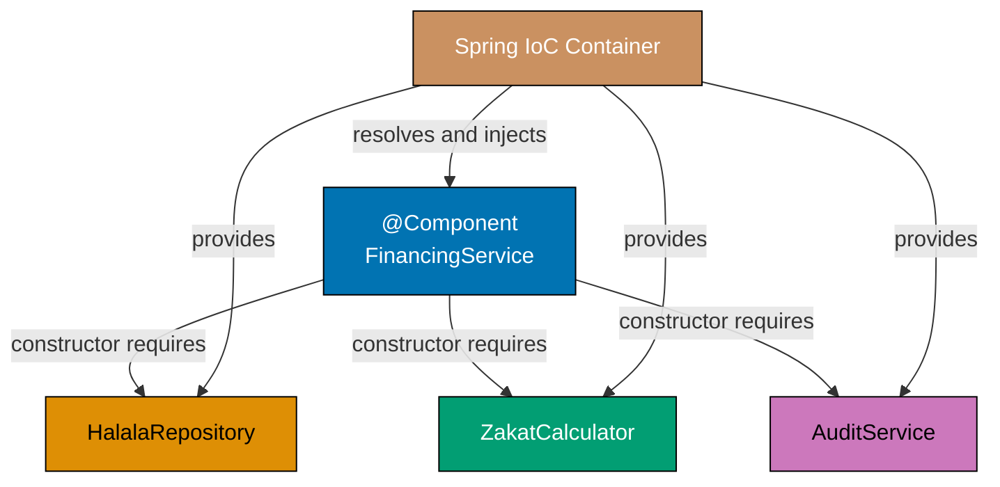
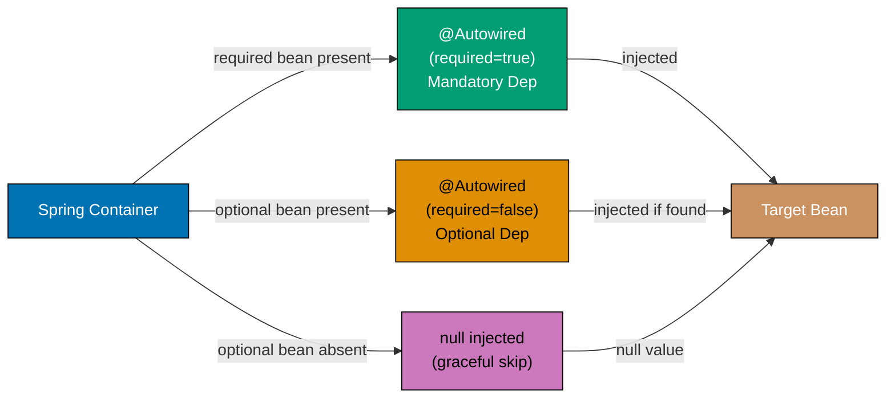
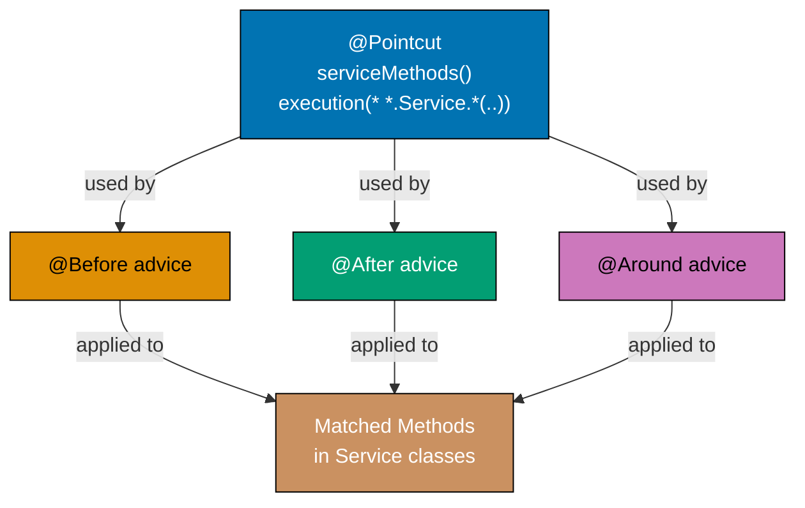
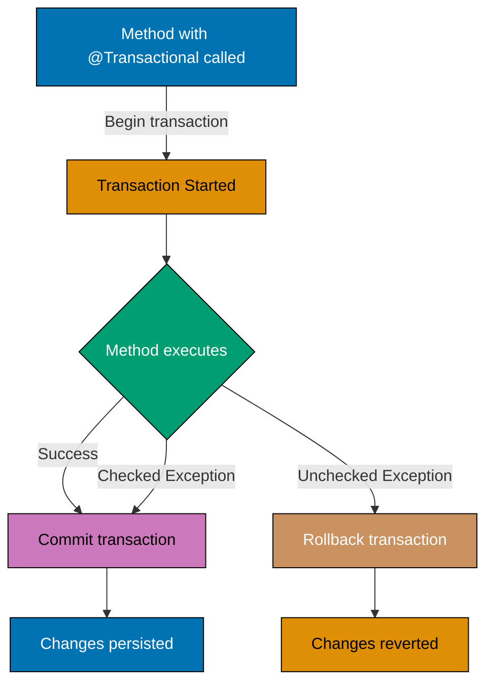
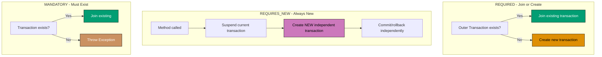
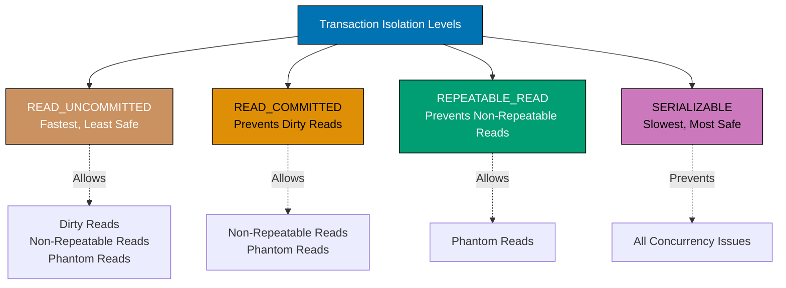
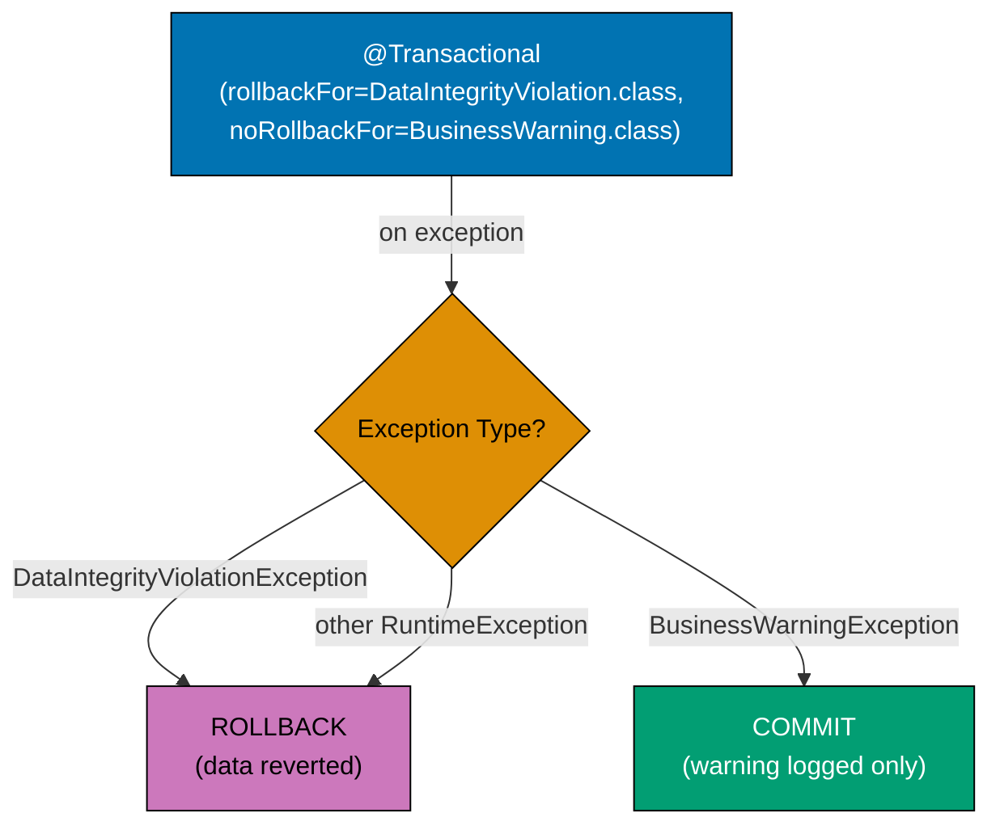

This tutorial provides 25 intermediate Spring Framework examples building on beginner concepts. Focus shifts to AOP, transaction management, data access with JdbcTemplate, and Spring MVC fundamentals.

**Coverage**: 40-75% of Spring Framework features
**Target Audience**: Developers comfortable with Spring basics (IoC, DI, bean lifecycle)

## Advanced Dependency Injection (Examples 26-30)

### Example 26: Constructor Injection with Multiple Dependencies (Coverage: 61.0%)

Demonstrates injecting multiple dependencies via constructor with proper ordering.

#### Diagram



**Java Implementation**:

```java
import org.springframework.context.annotation.AnnotationConfigApplicationContext;
import org.springframework.context.annotation.ComponentScan;
import org.springframework.context.annotation.Configuration;
import org.springframework.stereotype.Component;
import org.springframework.stereotype.Repository;
import org.springframework.stereotype.Service;

@Repository  // => Code executes here
// => Specialized @Component for data access layer
class DonationRepository {  // => Defines DonationRepository class
    public void save(String donation) {  // => Method: save(...)
        System.out.println("Saved: " + donation);  // => Outputs to console
    }
}

@Component  // => Code executes here
// => Component scanning will discover and register this class
class EmailNotifier {  // => Defines EmailNotifier class
    public void send(String message) {  // => Method: send(...)
        System.out.println("Email: " + message);  // => Outputs to console
    }
}

@Component  // => Code executes here
// => Component scanning will discover and register this class
class AuditLogger {  // => Defines AuditLogger class
    public void log(String action) {  // => Method: log(...)
        System.out.println("Audit: " + action);  // => Outputs to console
    }
}

@Service  // => Code executes here
// => Specialized @Component for business logic layer
class DonationService {  // => Defines DonationService class
    private final DonationRepository repository;  // => repository: DonationRepository field
    private final EmailNotifier notifier;  // => notifier: EmailNotifier field
    private final AuditLogger logger;  // => logger: AuditLogger field

    // => Constructor with three dependencies
    // => Spring injects all three automatically
    public DonationService(  // => Code executes here
        DonationRepository repository,  // => Injected first
        EmailNotifier notifier,          // => Injected second
        AuditLogger logger               // => Injected third
    ) {
        this.repository = repository;
        this.notifier = notifier;
        this.logger = logger;
        // => All dependencies immutable (final)

    public void processDonation(String donor, double amount) {  // => Method: processDonation(...)
        String donation = donor + ": $" + amount;  // => donation = donor + ": $" + amount
        repository.save(donation);         // => Uses repository
        notifier.send("Thank you");        // => Uses notifier
        logger.log("Donation processed"); // => Uses logger
    }
}

@Configuration
// => Marks class as Spring bean factory
@ComponentScan
// => Scans packages for @Component and stereotype annotations
class AppConfig {  // => Defines AppConfig class
}

public class Example26 {  // => Defines Example26 class
    public static void main(String[] args) {
        // => Application entry point - Spring context created here
    // => Method main receives args
        AnnotationConfigApplicationContext context =
            // => Spring IoC container initialized
            new AnnotationConfigApplicationContext(AppConfig.class);  // => Processes @Configuration, discovers beans
                // => Creates Spring IoC container, processes @Configuration

        DonationService service = context.getBean(DonationService.class);  // => Retrieves DonationService bean from container
        // => service = context.getBean(DonationService.class)
            // => Retrieves DonationService bean from container
        service.processDonation("Yusuf", 1000.0);  // => Calls processDonation(...)
        // => Output: Saved: Yusuf: $1000.0
        // => Output: Email: Thank you
        // => Output: Audit: Donation processed

        context.close();  // => Shuts down Spring container, releases resources
    }  // => End of static
}
```

**Kotlin Implementation**:

```kotlin
import org.springframework.context.annotation.AnnotationConfigApplicationContext
import org.springframework.context.annotation.ComponentScan
import org.springframework.context.annotation.Configuration
import org.springframework.stereotype.Component
import org.springframework.stereotype.Repository
import org.springframework.stereotype.Service

@Repository
# => Specialized @Component for data access layer
class DonationRepository {  # => Defines DonationRepository class
    fun save(donation: String) {
    # => Function save executes
        println("Saved: $donation")  # => Outputs to console
    }  # => End of save
}

@Component
# => Component scanning will discover and register this class
class EmailNotifier {  # => Defines EmailNotifier class
    fun send(message: String) {
    # => Function send executes
        println("Email: $message")  # => Outputs to console
    }  # => End of send
}

@Component
# => Component scanning will discover and register this class
class AuditLogger {  # => Defines AuditLogger class
    fun log(action: String) {
    # => Function log executes
        println("Audit: $action")  # => Outputs to console
    }  # => End of log
}

@Service
# => Specialized @Component for business logic layer
// => Kotlin primary constructor with three dependencies
// => Spring injects all three automatically
class DonationService(  # => Defines DonationService class
    private val repository: DonationRepository,  // => Injected, immutable
    private val notifier: EmailNotifier,          // => Injected, immutable
    private val logger: AuditLogger               // => Injected, immutable
) {
    fun processDonation(donor: String, amount: Double) {
    # => Function processDonation executes
        val donation = "$donor: $$amount"  # => donation = "$donor: $$amount"
        repository.save(donation)         // => Uses repository
        notifier.send("Thank you")        // => Uses notifier
        logger.log("Donation processed") // => Uses logger
    }  # => End of processDonation

@Configuration
# => Marks class as Spring bean factory
@ComponentScan
# => Scans packages for @Component and stereotype annotations
class AppConfig  # => Defines AppConfig class

fun main() {
# => Function main executes
    val context = AnnotationConfigApplicationContext(AppConfig::class.java)  # => assigns context

    val service = context.getBean(DonationService::class.java)  # => assigns service
    service.processDonation("Yusuf", 1000.0)  # => Calls processDonation(...)
    // => Output: Saved: Yusuf: $1000.0
    // => Output: Email: Thank you
    // => Output: Audit: Donation processed

    context.close()  # => Shuts down Spring container, releases resources
}  # => End of main
```

**Expected Output**:

```
Saved: Yusuf: $1000.0
Email: Thank you
Audit: Donation processed
```

**Key Takeaways**:

- Constructor injection supports multiple dependencies
- Dependencies injected in constructor parameter order
- All dependencies remain immutable (final/val)
- Clean separation of concerns across layers

**Why It Matters**:

Multiple constructor dependencies expose the full contract of a service at a glance. In a Murabaha financing service that depends on a customer repository, risk engine, approval workflow, and audit service, listing all four in the constructor makes the component's requirements visible. Teams can see immediately what the service needs and easily mock all four dependencies in tests. This pattern scales naturally to services with 5-8 dependencies.

**Related Documentation**:

- [Constructor Injection Best Practices](https://docs.spring.io/spring-framework/reference/core/beans/dependencies/factory-collaborators.html)

---

### Example 27: Optional Dependencies with @Autowired(required=false) (Coverage: 63.0%)

Demonstrates handling optional dependencies that may not be present.

#### Diagram



**Java Implementation**:

```java
import org.springframework.beans.factory.annotation.Autowired;
import org.springframework.context.annotation.AnnotationConfigApplicationContext;
import org.springframework.context.annotation.ComponentScan;
import org.springframework.context.annotation.Configuration;
import org.springframework.stereotype.Component;

@Component
// => Component scanning will discover and register this class
class PushNotifier {  // => Defines PushNotifier class
    public void send(String message) {  // => Method: send(...)
        System.out.println("Push: " + message);  // => Outputs to console
    }
}

@Component
// => Component scanning will discover and register this class
class NotificationService {  // => Defines NotificationService class
    private PushNotifier pushNotifier;  // => Optional dependency

    @Autowired(required = false)
    // => Spring won't fail if PushNotifier bean missing
    // => Setter NOT called if bean absent
    public void setPushNotifier(PushNotifier pushNotifier) {  // => Method: setPushNotifier(...)
        this.pushNotifier = pushNotifier;  // => May remain null
        System.out.println("PushNotifier injected");  // => Outputs to console
    }

    public void sendNotification(String message) {  // => Method: sendNotification(...)
        if (pushNotifier != null) {  // => Conditional check
            // => Check before using optional dependency
            pushNotifier.send(message);  // => Calls send(...)
        } else {
            System.out.println("No push notifier available");  // => Outputs to console
    }
}

@Configuration
// => Marks class as Spring bean factory
@ComponentScan
// => Scans packages for @Component and stereotype annotations
class AppConfig {  // => Defines AppConfig class
}

public class Example27 {  // => Defines Example27 class
    public static void main(String[] args) {
        // => Application entry point - Spring context created here
    // => Method main receives args
        AnnotationConfigApplicationContext context =
            // => Spring IoC container initialized
            new AnnotationConfigApplicationContext(AppConfig.class);  // => Processes @Configuration, discovers beans
                // => Creates Spring IoC container, processes @Configuration

        NotificationService service = context.getBean(NotificationService.class);  // => Retrieves NotificationService bean from container
        // => Assigns service
            // => Retrieves NotificationService bean from container
        service.sendNotification("Test message");  // => Calls sendNotification(...)
        // => Output: PushNotifier injected
        // => Output: Push: Test message
        // => PushNotifier WAS available (bean exists)

        context.close();  // => Shuts down Spring container, releases resources
    }  // => End of static
}
```

**Kotlin Implementation**:

```kotlin
import org.springframework.beans.factory.annotation.Autowired
import org.springframework.context.annotation.AnnotationConfigApplicationContext
import org.springframework.context.annotation.ComponentScan
import org.springframework.context.annotation.Configuration
import org.springframework.stereotype.Component

@Component
# => Component scanning will discover and register this class
class PushNotifier {  # => Defines PushNotifier class
    fun send(message: String) {
    # => Function send executes
        println("Push: $message")  # => Outputs to console
    }  # => End of send
}

@Component
# => Component scanning will discover and register this class
class NotificationService {  # => Defines NotificationService class
    private var pushNotifier: PushNotifier? = null  // => Optional dependency (nullable)

    @Autowired(required = false)
    // => Spring won't fail if PushNotifier bean missing
    // => Setter NOT called if bean absent
    fun setPushNotifier(pushNotifier: PushNotifier) {
    # => Function setPushNotifier executes
        this.pushNotifier = pushNotifier  // => May remain null
        println("PushNotifier injected")  # => Outputs to console
    }

    fun sendNotification(message: String) {
    # => Function sendNotification executes
        pushNotifier?.let {
            // => Safe call - only executes if not null
            it.send(message)  # => Calls send(...)
        } ?: println("No push notifier available")  # => Outputs to console
        // => Elvis operator for null case
    }
}

@Configuration
# => Marks class as Spring bean factory
@ComponentScan
# => Scans packages for @Component and stereotype annotations
class AppConfig  # => Defines AppConfig class

fun main() {
# => Function main executes
    val context = AnnotationConfigApplicationContext(AppConfig::class.java)  # => assigns context

    val service = context.getBean(NotificationService::class.java)  # => assigns service
    service.sendNotification("Test message")  # => Calls sendNotification(...)
    // => Output: PushNotifier injected
    // => Output: Push: Test message
    // => PushNotifier WAS available (bean exists)

    context.close()  # => Shuts down Spring container, releases resources
}
```

**Expected Output**:

```
PushNotifier injected
Push: Test message
```

**Key Takeaways**:

- `@Autowired(required = false)` makes dependency optional
- Application starts successfully even if bean missing
- Always null-check optional dependencies before use
- Useful for plugins or optional features

**Why It Matters**:

Optional dependencies via `@Autowired(required=false)` or `Optional<T>` enable graceful degradation. In an Islamic finance notification system, an SMS gateway might be unavailable in some deployment environments. Marking it as optional means the application starts successfully and sends notifications when the gateway is present, but skips SMS gracefully when it is not. This is preferable to `NullPointerException` at runtime.

**Related Documentation**:

- [Optional Dependencies Documentation](https://docs.spring.io/spring-framework/reference/core/beans/annotation-config/autowired.html)

---

### Example 28: Injecting ApplicationContext (Coverage: 65.0%)

Demonstrates injecting ApplicationContext itself for dynamic bean lookup.

**Java Implementation**:

```java
import org.springframework.beans.factory.annotation.Autowired;
import org.springframework.context.ApplicationContext;
import org.springframework.context.annotation.AnnotationConfigApplicationContext;
import org.springframework.context.annotation.Bean;
import org.springframework.context.annotation.Configuration;
import org.springframework.stereotype.Component;

class ZakatCalculator {  // => Defines ZakatCalculator class
    private final String type;  // => type: String field

    public ZakatCalculator(String type) {
    // => Constructor for ZakatCalculator with injected dependencies
        this.type = type;
    }  // => End of ZakatCalculator

    public String getType() {  // => Method: getType(...)
        return type;  // => Returns type
    }

    public double calculate(double amount) {  // => Method: calculate(...)
        return amount * 0.025;  // => Returns amount * 0.025
    }
}

@Component
// => Component scanning will discover and register this class
class DynamicCalculatorService {  // => Defines DynamicCalculatorService class
    @Autowired
    // => Spring injects the required dependency automatically
    private ApplicationContext context;  // => context: ApplicationContext field
    // => Spring injects its own ApplicationContext
    // => Allows dynamic bean lookup

    public void calculateForType(String type, double amount) {  // => Method: calculateForType(...)
        ZakatCalculator calculator = context.getBean(type + "Calculator", ZakatCalculator.class);  // => Retrieves type bean from container
        // => Assigns calculator
            // => Retrieves bean from container
        // => Dynamic bean lookup by name
        // => Name constructed at runtime

        double zakat = calculator.calculate(amount);  // => zakat = calculator.calculate(amount)
        System.out.println(type + " Zakat: $" + zakat);  // => Outputs to console
    }
}

@Configuration
// => Marks class as Spring bean factory
class AppConfig {  // => Defines AppConfig class
    @Bean("goldCalculator")  // => Named bean
    public ZakatCalculator goldCalculator() {  // => Method: goldCalculator(...)
        return new ZakatCalculator("Gold");  // => Returns result
    }

    @Bean("silverCalculator")  // => Named bean
    public ZakatCalculator silverCalculator() {  // => Method: silverCalculator(...)
        return new ZakatCalculator("Silver");  // => Returns result
    }
}

public class Example28 {  // => Defines Example28 class
    public static void main(String[] args) {
        // => Application entry point - Spring context created here
    // => Method main receives args
        AnnotationConfigApplicationContext context =
            // => Spring IoC container initialized
            new AnnotationConfigApplicationContext(AppConfig.class, DynamicCalculatorService.class);  // => Processes @Configuration, discovers beans
                // => Creates Spring IoC container, processes @Configuration

        DynamicCalculatorService service = context.getBean(DynamicCalculatorService.class);  // => Retrieves DynamicCalculatorService bean from container
        // => Assigns service
            // => Retrieves DynamicCalculatorService bean from container
        service.calculateForType("gold", 10000);    // => Output: gold Zakat: $250.0
        service.calculateForType("silver", 5000);   // => Output: silver Zakat: $125.0

        context.close();  // => Shuts down Spring container, releases resources
    }  // => End of static
}
```

**Kotlin Implementation**:

```kotlin
import org.springframework.beans.factory.annotation.Autowired
import org.springframework.context.ApplicationContext
import org.springframework.context.annotation.AnnotationConfigApplicationContext
import org.springframework.context.annotation.Bean
import org.springframework.context.annotation.Configuration
import org.springframework.stereotype.Component

class ZakatCalculator(private val type: String) {  # => Defines ZakatCalculator class
    fun getType(): String = type
    # => Function getType executes

    fun calculate(amount: Double): Double = amount * 0.025
    # => Function calculate executes
}

@Component
# => Component scanning will discover and register this class
class DynamicCalculatorService {  # => Defines DynamicCalculatorService class
    @Autowired
    # => Spring injects the required dependency automatically
    private lateinit var context: ApplicationContext
    // => Spring injects its own ApplicationContext
    // => Allows dynamic bean lookup

    fun calculateForType(type: String, amount: Double) {
    # => Function calculateForType executes
        val calculator = context.getBean("${type}Calculator", ZakatCalculator::class.java)  # => assigns calculator
        // => Dynamic bean lookup by name
        // => Name constructed at runtime

        val zakat = calculator.calculate(amount)  # => zakat = calculator.calculate(amount)
        println("$type Zakat: $$zakat")  # => Outputs to console
    }  # => End of calculateForType
}

@Configuration
# => Marks class as Spring bean factory
class AppConfig {  # => Defines AppConfig class
    @Bean("goldCalculator")  // => Named bean
    fun goldCalculator(): ZakatCalculator = ZakatCalculator("Gold")
    # => Function goldCalculator executes

    @Bean("silverCalculator")  // => Named bean
    fun silverCalculator(): ZakatCalculator = ZakatCalculator("Silver")
    # => Function silverCalculator executes
}

fun main() {
# => Function main executes
    val context = AnnotationConfigApplicationContext(AppConfig::class.java, DynamicCalculatorService::class.java)  # => assigns context

    val service = context.getBean(DynamicCalculatorService::class.java)  # => assigns service
    service.calculateForType("gold", 10000.0)    // => Output: gold Zakat: $250.0
    service.calculateForType("silver", 5000.0)   // => Output: silver Zakat: $125.0

    context.close()  # => Shuts down Spring container, releases resources
}  # => End of main
```

**Expected Output**:

```
gold Zakat: $250.0
silver Zakat: $125.0
```

**Key Takeaways**:

- ApplicationContext can be injected like any bean
- Enables Service Locator pattern (use sparingly)
- Useful for dynamic bean selection at runtime
- Prefer dependency injection over context lookup when possible

**Why It Matters**:

Injecting `ApplicationContext` directly is necessary when you need dynamic bean lookup or when the set of beans to process varies at runtime. In a financial plugin system where Islamic finance product handlers are loaded conditionally based on license, using `ApplicationContext.getBeansOfType()` lets the routing layer discover all registered product handlers without knowing them at compile time. Use sparingly — prefer injection over context lookup for fixed dependencies.

**Related Documentation**:

- [ApplicationContext Interface Documentation](https://docs.spring.io/spring-framework/reference/core/beans/basics.html#beans-factory-client)

---

### Example 29: Circular Dependency Resolution (Coverage: 67.0%)

Demonstrates how Spring resolves circular dependencies using setter injection.

**Java Implementation**:

```java
import org.springframework.beans.factory.annotation.Autowired;
import org.springframework.context.annotation.AnnotationConfigApplicationContext;
import org.springframework.context.annotation.ComponentScan;
import org.springframework.context.annotation.Configuration;
import org.springframework.stereotype.Component;

@Component  // => Code executes here
// => Component scanning will discover and register this class
class ServiceA {  // => Defines ServiceA class
    private ServiceB serviceB;  // => Circular dependency

    // => Constructor creates instance first
    public ServiceA() {
        System.out.println("ServiceA constructor");  // => Outputs to console
    }  // => End of ServiceA

    @Autowired  // => Setter injection AFTER construction
                // => Breaks circular dependency cycle
    public void setServiceB(ServiceB serviceB) {  // => Method: setServiceB(...)
        this.serviceB = serviceB;  // => Injected after both beans constructed
        System.out.println("ServiceA: ServiceB injected");  // => Outputs to console
    }

    public void doWork() {  // => Method: doWork(...)
        System.out.println("ServiceA working");  // => Outputs to console
        serviceB.help();  // => Uses ServiceB
    }
}

@Component
// => Component scanning will discover and register this class
class ServiceB {  // => Defines ServiceB class
    private ServiceA serviceA;  // => Circular dependency

    public ServiceB() {
        System.out.println("ServiceB constructor");  // => Outputs to console
    }  // => End of ServiceB

    @Autowired  // => Setter injection breaks cycle
    public void setServiceA(ServiceA serviceA) {  // => Method: setServiceA(...)
        this.serviceA = serviceA;
        System.out.println("ServiceB: ServiceA injected");  // => Outputs to console
    }

    public void help() {  // => Method: help(...)
        System.out.println("ServiceB helping");  // => Outputs to console
    }
}

@Configuration
// => Marks class as Spring bean factory
@ComponentScan
// => Scans packages for @Component and stereotype annotations
class AppConfig {  // => Defines AppConfig class
}

public class Example29 {  // => Defines Example29 class
    public static void main(String[] args) {
        // => Application entry point - Spring context created here
        AnnotationConfigApplicationContext context =
            // => Spring IoC container initialized
            new AnnotationConfigApplicationContext(AppConfig.class);  // => Processes @Configuration, discovers beans
                // => Creates Spring IoC container, processes @Configuration
        // => Spring creates both beans, then injects via setters
        // => Output: ServiceA constructor
        // => Output: ServiceB constructor
        // => Output: ServiceA: ServiceB injected
        // => Output: ServiceB: ServiceA injected

        ServiceA serviceA = context.getBean(ServiceA.class);  // => Retrieves ServiceA bean from container
        serviceA.doWork();  // => Calls doWork(...)
        // => Output: ServiceA working
        // => Output: ServiceB helping

        context.close();  // => Shuts down Spring container, releases resources
    }  // => End of static
}
```

**Kotlin Implementation**:

```kotlin
import org.springframework.beans.factory.annotation.Autowired
import org.springframework.context.annotation.AnnotationConfigApplicationContext
import org.springframework.context.annotation.ComponentScan
import org.springframework.context.annotation.Configuration
import org.springframework.stereotype.Component

@Component
# => Component scanning will discover and register this class
class ServiceA {  # => Defines ServiceA class
    private lateinit var serviceB: ServiceB  // => Circular dependency (lateinit)

    init {
        println("ServiceA constructor")  # => Outputs to console

    @Autowired  // => Setter injection AFTER construction
                // => Breaks circular dependency cycle
    fun setServiceB(serviceB: ServiceB) {
    # => Function setServiceB executes
        this.serviceB = serviceB  // => Injected after both beans constructed
        println("ServiceA: ServiceB injected")  # => Outputs to console
    }  # => End of setServiceB

    fun doWork() {
    # => Function doWork executes
        println("ServiceA working")  # => Outputs to console
        serviceB.help()  // => Uses ServiceB
    }  # => End of doWork
}

@Component
# => Component scanning will discover and register this class
class ServiceB {  # => Defines ServiceB class
    private lateinit var serviceA: ServiceA  // => Circular dependency (lateinit)

    init {
        println("ServiceB constructor")  # => Outputs to console

    @Autowired  // => Setter injection breaks cycle
    fun setServiceA(serviceA: ServiceA) {
    # => Function setServiceA executes
        this.serviceA = serviceA
        println("ServiceB: ServiceA injected")  # => Outputs to console
    }  # => End of setServiceA

    fun help() {
    # => Function help executes
        println("ServiceB helping")  # => Outputs to console
    }  # => End of help
}

@Configuration
# => Marks class as Spring bean factory
@ComponentScan
# => Scans packages for @Component and stereotype annotations
class AppConfig  # => Defines AppConfig class

fun main() {
# => Function main executes
    val context = AnnotationConfigApplicationContext(AppConfig::class.java)  # => assigns context
    // => Spring creates both beans, then injects via setters
    // => Output: ServiceA constructor
    // => Output: ServiceB constructor
    // => Output: ServiceA: ServiceB injected
    // => Output: ServiceB: ServiceA injected

    val serviceA = context.getBean(ServiceA::class.java)  # => assigns serviceA
    serviceA.doWork()  # => Calls doWork(...)
    // => Output: ServiceA working
    // => Output: ServiceB helping

    context.close()  # => Shuts down Spring container, releases resources
}
```

**Expected Output**:

```
ServiceA constructor
ServiceB constructor
ServiceA: ServiceB injected
ServiceB: ServiceA injected
ServiceA working
ServiceB helping
```

**Key Takeaways**:

- Spring resolves circular dependencies via setter injection
- Constructor injection fails with circular dependencies
- Beans constructed first, then dependencies injected
- Circular dependencies indicate design smell (refactor if possible)

**Why It Matters**:

Understanding and resolving circular dependencies is a critical production skill. In legacy financial codebases, bidirectional relationships between an audit service and a security service are common. Spring can sometimes resolve these automatically using setter injection or `@Lazy`, but circular dependencies often indicate a design issue — they suggest the responsibilities should be split or a mediator pattern introduced. Recognizing the pattern enables proactive refactoring.

**Related Documentation**:

- [Circular Dependencies Documentation](https://docs.spring.io/spring-framework/reference/core/beans/dependencies/factory-collaborators.html#beans-dependency-resolution)

---

### Example 30: Generic Type Injection (Coverage: 69.0%)

Demonstrates injecting beans based on generic type parameters.

**Java Implementation**:

```java
import org.springframework.beans.factory.annotation.Autowired;
import org.springframework.context.annotation.AnnotationConfigApplicationContext;
import org.springframework.context.annotation.Bean;
import org.springframework.context.annotation.Configuration;
import java.util.List;

interface Repository<T> {  // => Defines Repository class
    void save(T entity);  // => Code executes here
}

class StringRepository implements Repository<String> {  // => Defines StringRepository class
    public void save(String entity) {  // => Method: save(...)
        System.out.println("Saved String: " + entity);  // => Outputs to console
    }
}

class IntegerRepository implements Repository<Integer> {  // => Defines IntegerRepository class
    public void save(Integer entity) {  // => Method: save(...)
        System.out.println("Saved Integer: " + entity);  // => Outputs to console
    }
}

@Configuration  // => Code executes here
// => Marks class as Spring bean factory
class AppConfig {  // => Defines AppConfig class
    @Bean  // => Code executes here
    // => Registers return value as Spring-managed bean
    public Repository<String> stringRepository() {  // => Method: stringRepository(...)
        return new StringRepository();  // => Generic type: Repository<String>
    }

    @Bean  // => Code executes here
    // => Registers return value as Spring-managed bean
    public Repository<Integer> integerRepository() {  // => Method: integerRepository(...)
        return new IntegerRepository();  // => Generic type: Repository<Integer>
    }

    @Bean  // => Code executes here
    // => Registers return value as Spring-managed bean
    public GenericService genericService(Repository<String> stringRepo) {  // => Method: genericService(...)
        // => Spring matches by FULL generic type: Repository<String>
        // => Injects stringRepository, NOT integerRepository
        return new GenericService(stringRepo);  // => Returns result
    }
}

class GenericService {  // => Defines GenericService class
    private final Repository<String> repository;  // => repository: Repository<String> field

    public GenericService(Repository<String> repository) {  // => Code executes here
        this.repository = repository;  // => Type-safe injection
    }  // => End of GenericService

    public void process() {  // => Method: process(...)
        repository.save("Test Entity");  // => Calls save(...)
    }
}

public class Example30 {  // => Defines Example30 class
    public static void main(String[] args) {
        // => Application entry point - Spring context created here
    // => Method main receives args
        AnnotationConfigApplicationContext context =
            // => Spring IoC container initialized
            new AnnotationConfigApplicationContext(AppConfig.class);  // => Processes @Configuration, discovers beans
                // => Creates Spring IoC container, processes @Configuration

        GenericService service = context.getBean(GenericService.class);  // => Retrieves GenericService bean from container
        // => service = context.getBean(GenericService.class)
            // => Retrieves GenericService bean from container
        service.process();  // => Calls process(...)
        // => Output: Saved String: Test Entity
        // => Correct repository injected based on generic type

        context.close();  // => Shuts down Spring container, releases resources
    }  // => End of static
}
```

**Kotlin Implementation**:

```kotlin
import org.springframework.context.annotation.AnnotationConfigApplicationContext
import org.springframework.context.annotation.Bean
import org.springframework.context.annotation.Configuration

interface Repository<T> {  # => Defines Repository class
    fun save(entity: T)  # => Code executes here
    # => Function save executes
}

class StringRepository : Repository<String> {  # => Defines StringRepository class
    override fun save(entity: String) {  # => Code executes here
        println("Saved String: $entity")  # => Outputs to console
    }  # => End of save
}

class IntegerRepository : Repository<Int> {  # => Defines IntegerRepository class
    override fun save(entity: Int) {
        println("Saved Integer: $entity")  # => Outputs to console
    }  # => End of save
}

@Configuration
# => Marks class as Spring bean factory
class AppConfig {  # => Defines AppConfig class
    @Bean
    # => Registers return value as Spring-managed bean
    fun stringRepository(): Repository<String> {
    # => Function stringRepository executes
        return StringRepository()  // => Generic type: Repository<String>
    }  # => End of stringRepository

    @Bean
    # => Registers return value as Spring-managed bean
    fun integerRepository(): Repository<Int> {
    # => Function integerRepository executes
        return IntegerRepository()  // => Generic type: Repository<Int>
    }  # => End of integerRepository

    @Bean
    # => Registers return value as Spring-managed bean
    fun genericService(stringRepo: Repository<String>): GenericService {
    # => Function genericService executes
        // => Spring matches by FULL generic type: Repository<String>
        // => Injects stringRepository, NOT integerRepository
        return GenericService(stringRepo)  # => Returns result
    }  # => End of genericService
}

class GenericService(private val repository: Repository<String>) {  # => Defines GenericService class
    // => Type-safe injection

    fun process() {
    # => Function process executes
        repository.save("Test Entity")  # => Calls save(...)
    }  # => End of process
}

fun main() {
# => Function main executes
    val context = AnnotationConfigApplicationContext(AppConfig::class.java)  # => assigns context

    val service = context.getBean(GenericService::class.java)  # => assigns service
    service.process()  # => Calls process(...)
    // => Output: Saved String: Test Entity
    // => Correct repository injected based on generic type

    context.close()  # => Shuts down Spring container, releases resources
}  # => End of main
```

**Expected Output**:

```
Saved String: Test Entity
```

**Key Takeaways**:

- Spring considers full generic type during injection
- Repository<String> and Repository<Integer> are distinct types
- Type-safe dependency injection with generics
- Eliminates casting and type errors

**Why It Matters**:

Generic type injection lets Spring distinguish beans by their type parameters, enabling type-safe dependency injection without qualifiers. In a financial event system with `EventHandler<ZakatEvent>` and `EventHandler<MurabahaEvent>`, Spring injects the correct handler based on the parameterized type. This pattern is fundamental to Spring's own infrastructure (like `ParameterizedTypeReference`) and enables type-safe event-driven architectures.

**Related Documentation**:

- [Generics and Autowiring Documentation](https://docs.spring.io/spring-framework/reference/core/beans/annotation-config/autowired-qualifiers.html#beans-autowired-annotation-qualifiers-generics)

---

## AOP Fundamentals (Examples 31-35)

### Example 31: Basic @Aspect with @Before Advice (Coverage: 71.0%)

Demonstrates creating aspect with before advice to execute logic before method calls.

**Java Implementation**:

```java
import org.aspectj.lang.JoinPoint;
import org.aspectj.lang.annotation.Aspect;
import org.aspectj.lang.annotation.Before;
import org.springframework.context.annotation.AnnotationConfigApplicationContext;
import org.springframework.context.annotation.ComponentScan;
import org.springframework.context.annotation.Configuration;
import org.springframework.context.annotation.EnableAspectJAutoProxy;
import org.springframework.stereotype.Component;

@Aspect  // => Marks this as AOP aspect
@Component  // => Makes it a Spring-managed bean
class LoggingAspect {  // => Defines LoggingAspect class
    @Before("execution(* DonationService.donate(..))")
    // => Pointcut expression: matches donate() method in DonationService
    // => execution: method execution join point
    // => * : any return type
    // => DonationService.donate: class and method name
    // => (..) : any number/type of parameters
    public void logBefore(JoinPoint joinPoint) {  // => Method: logBefore(...)
        // => Runs BEFORE donate() method executes
        String methodName = joinPoint.getSignature().getName();  // => assigns methodName
        // => Gets method name being called
        System.out.println("BEFORE: " + methodName + " called");  // => Outputs to console
    }
}

@Component
// => Component scanning will discover and register this class
class DonationService {  // => Defines DonationService class
    public void donate(String donor, double amount) {  // => Method: donate(...)
        System.out.println("Donation: " + donor + " - $" + amount);  // => Outputs to console
    }
}

@Configuration
// => Marks class as Spring bean factory
@ComponentScan
@EnableAspectJAutoProxy  // => Enables Spring AOP proxy creation
                          // => Required for @Aspect to work
class AppConfig {  // => Defines AppConfig class
}

public class Example31 {  // => Defines Example31 class
    public static void main(String[] args) {
        AnnotationConfigApplicationContext context =
            new AnnotationConfigApplicationContext(AppConfig.class);
                // => Creates Spring IoC container, processes @Configuration

        DonationService service = context.getBean(DonationService.class);
            // => Retrieves DonationService bean from container
        service.donate("Ibrahim", 500.0);  // => Calls donate(...)
        // => Output: BEFORE: donate called
        // => Output: Donation: Ibrahim - $500.0
        // => Aspect executed before actual method

        context.close();  // => Shuts down Spring container, releases resources
    }
}
```

**Kotlin Implementation**:

```kotlin
import org.aspectj.lang.JoinPoint
import org.aspectj.lang.annotation.Aspect
import org.aspectj.lang.annotation.Before
import org.springframework.context.annotation.AnnotationConfigApplicationContext
import org.springframework.context.annotation.ComponentScan
import org.springframework.context.annotation.Configuration
import org.springframework.context.annotation.EnableAspectJAutoProxy
import org.springframework.stereotype.Component

@Aspect  // => Marks this as AOP aspect
@Component  // => Makes it a Spring-managed bean
class LoggingAspect {  # => Defines LoggingAspect class
    @Before("execution(* DonationService.donate(..))")
    // => Pointcut expression: matches donate() method in DonationService
    // => execution: method execution join point
    // => * : any return type
    // => DonationService.donate: class and method name
    // => (..) : any number/type of parameters
    fun logBefore(joinPoint: JoinPoint) {
        // => Runs BEFORE donate() method executes
        val methodName = joinPoint.signature.name  # => methodName = joinPoint.signature.name
        // => Gets method name being called
        println("BEFORE: $methodName called")  # => Outputs to console
    }
}

@Component
# => Component scanning will discover and register this class
class DonationService {  # => Defines DonationService class
    fun donate(donor: String, amount: Double) {
        println("Donation: $donor - $$amount")  # => Outputs to console
    }
}

@Configuration
@ComponentScan
@EnableAspectJAutoProxy  // => Enables Spring AOP proxy creation
                          // => Required for @Aspect to work
class AppConfig  # => Defines AppConfig class

fun main() {
    val context = AnnotationConfigApplicationContext(AppConfig::class.java)  # => assigns context

    val service = context.getBean(DonationService::class.java)  # => assigns service
    service.donate("Ibrahim", 500.0)  # => Calls donate(...)
    // => Output: BEFORE: donate called
    // => Output: Donation: Ibrahim - $500.0
    // => Aspect executed before actual method

    context.close()  # => Shuts down Spring container, releases resources
}
```

**Expected Output**:

```
BEFORE: donate called
Donation: Ibrahim - $500.0
```

**AOP Proxy Mechanism**:

```mermaid
sequenceDiagram
    participant Client as Client Code
    participant Proxy as Spring Proxy
    participant Aspect as LoggingAspect
    participant Target as DonationService (Target)

    Client->>Proxy: donate("Ibrahim", 500.0)
    Note over Proxy: Proxy intercepts call

    Proxy->>Aspect: Execute @Before advice
    Aspect->>Aspect: logBefore() method
    Note over Aspect: BEFORE: donate called

    Proxy->>Target: delegate to actual method
    Target->>Target: donate() executes
    Note over Target: Donation: Ibrahim - $500.0

    Target-->>Proxy: method completes
    Proxy-->>Client: return result

    style Client fill:#0173B2,stroke:#000,color:#fff
    style Proxy fill:#DE8F05,stroke:#000,color:#000
    style Aspect fill:#029E73,stroke:#000,color:#fff
    style Target fill:#CC78BC,stroke:#000,color:#000
```

**Diagram Explanation**: This sequence diagram illustrates how Spring AOP creates a proxy that intercepts method calls, executes aspect advice (@Before) before delegating to the target method.

**Key Takeaways**:

- `@Aspect` marks classes as cross-cutting concerns
- `@Before` advice executes before method invocation
- `@EnableAspectJAutoProxy` required for AOP
- Pointcut expressions select target methods

**Why It Matters**:

AOP before advice provides a clean interception point for cross-cutting concerns without modifying business code. In Islamic finance compliance systems, every method that creates or modifies a financial contract should log the actor, timestamp, and parameters for regulatory audit. Writing this logging code in every service method is error-prone and violates DRY. A `@Before` aspect centralizes this concern without touching business logic.

**Related Documentation**:

- [Spring AOP Documentation](https://docs.spring.io/spring-framework/reference/core/aop.html)
- [AspectJ Pointcut Expressions](https://docs.spring.io/spring-framework/reference/core/aop/ataspectj/pointcuts.html)

---

### Example 32: @After and @AfterReturning Advice (Coverage: 73.0%)

Demonstrates after advice types for post-method execution logic.

**Java Implementation**:

```java
import org.aspectj.lang.JoinPoint;
import org.aspectj.lang.annotation.*;
import org.springframework.context.annotation.AnnotationConfigApplicationContext;
import org.springframework.context.annotation.ComponentScan;
import org.springframework.context.annotation.Configuration;
import org.springframework.context.annotation.EnableAspectJAutoProxy;
import org.springframework.stereotype.Component;

@Aspect
// => Marks class as containing AOP advice definitions
@Component
// => Component scanning will discover and register this class
class AuditAspect {  // => Defines AuditAspect class
    @AfterReturning(
    // => Advice executes after successful method return
        pointcut = "execution(* ZakatService.calculateZakat(..))",
        // => Assigns pointcut
        returning = "result"
        // => Captures return value in "result" parameter
    )
    public void auditResult(JoinPoint joinPoint, Object result) {  // => Method: auditResult(...)
        // => Runs AFTER successful method completion
        // => Only if method returns normally (no exception)
        System.out.println("AFTER_RETURNING: Result = " + result);  // => Outputs to console
    }

    @After("execution(* ZakatService.calculateZakat(..))")
    // => Advice executes after the matched method (always)
    // => Runs AFTER method completes (success OR exception)
    // => Like finally block
    public void logAfter(JoinPoint joinPoint) {  // => Method: logAfter(...)
        System.out.println("AFTER: Method completed");  // => Outputs to console
    }
}

@Component
// => Component scanning will discover and register this class
class ZakatService {  // => Defines ZakatService class
    public double calculateZakat(double wealth) {  // => Method: calculateZakat(...)
        System.out.println("Calculating zakat for wealth: " + wealth);  // => Outputs to console
        return wealth * 0.025;  // => Returns result
    }
}

@Configuration
// => Marks class as Spring bean factory
@ComponentScan
// => Scans packages for @Component and stereotype annotations
@EnableAspectJAutoProxy
// => Enables @Aspect annotation processing
class AppConfig {  // => Defines AppConfig class
}

public class Example32 {  // => Defines Example32 class
    public static void main(String[] args) {
        // => Application entry point - Spring context created here
    // => Method main receives args
        AnnotationConfigApplicationContext context =
            // => Spring IoC container initialized
            new AnnotationConfigApplicationContext(AppConfig.class);  // => Processes @Configuration, discovers beans
                // => Creates Spring IoC container, processes @Configuration

        ZakatService service = context.getBean(ZakatService.class);  // => Retrieves ZakatService bean from container
        double zakat = service.calculateZakat(10000);  // => zakat = service.calculateZakat(10000)
        // => Output: Calculating zakat for wealth: 10000.0
        // => Output: AFTER_RETURNING: Result = 250.0
        // => Output: AFTER: Method completed

        System.out.println("Final zakat: " + zakat);  // => Outputs to console

        context.close();  // => Shuts down Spring container, releases resources
    }
}
```

**Kotlin Implementation**:

```kotlin
import org.aspectj.lang.JoinPoint
import org.aspectj.lang.annotation.*
import org.springframework.context.annotation.AnnotationConfigApplicationContext
import org.springframework.context.annotation.ComponentScan
import org.springframework.context.annotation.Configuration
import org.springframework.context.annotation.EnableAspectJAutoProxy
import org.springframework.stereotype.Component

@Aspect
# => Marks class as containing AOP advice definitions
@Component
# => Component scanning will discover and register this class
class AuditAspect {  # => Defines AuditAspect class
    @AfterReturning(
    # => Advice executes after successful method return
        pointcut = "execution(* ZakatService.calculateZakat(..))",
        # => Assigns pointcut
        returning = "result"
        // => Captures return value in "result" parameter
    )
    fun auditResult(joinPoint: JoinPoint, result: Any) {
    # => Function auditResult executes
        // => Runs AFTER successful method completion
        // => Only if method returns normally (no exception)
        println("AFTER_RETURNING: Result = $result")  # => Outputs to console
    }

    @After("execution(* ZakatService.calculateZakat(..))")
    # => Advice executes after the matched method (always)
    // => Runs AFTER method completes (success OR exception)
    // => Like finally block
    fun logAfter(joinPoint: JoinPoint) {
    # => Function logAfter executes
        println("AFTER: Method completed")  # => Outputs to console
    }
}

@Component
# => Component scanning will discover and register this class
class ZakatService {  # => Defines ZakatService class
    fun calculateZakat(wealth: Double): Double {
    # => Function calculateZakat executes
        println("Calculating zakat for wealth: $wealth")  # => Outputs to console
        return wealth * 0.025  // => Returns result
    }
}

@Configuration
# => Marks class as Spring bean factory
@ComponentScan
# => Scans packages for @Component and stereotype annotations
@EnableAspectJAutoProxy
# => Enables @Aspect annotation processing
class AppConfig  # => Defines AppConfig class

fun main() {
# => Function main executes
    val context = AnnotationConfigApplicationContext(AppConfig::class.java)  # => assigns context

    val service = context.getBean(ZakatService::class.java)  # => assigns service
    val zakat = service.calculateZakat(10000.0)  # => assigns zakat
    // => Output: Calculating zakat for wealth: 10000.0
    // => Output: AFTER_RETURNING: Result = 250.0
    // => Output: AFTER: Method completed

    println("Final zakat: $zakat")  # => Outputs to console

    context.close()  # => Shuts down Spring container, releases resources
}
```

**Expected Output**:

```
Calculating zakat for wealth: 10000.0
AFTER_RETURNING: Result = 250.0
AFTER: Method completed
Final zakat: 250.0
```

**Key Takeaways**:

- `@AfterReturning` captures method return value
- `@After` executes regardless of success/failure
- AfterReturning only on successful completion
- After executes like finally block

**Why It Matters**:

After-returning advice enables post-processing of method results without wrapping the entire method in try-catch. In a Zakat collection service, you might want to send a receipt to the donor after a successful donation is recorded, but only if the save succeeded. `@AfterReturning` gets the actual return value, enabling response enrichment, notifications, and metrics collection as cross-cutting concerns.

**Related Documentation**:

- [After Advice Documentation](https://docs.spring.io/spring-framework/reference/core/aop/ataspectj/advice.html#aop-ataspectj-after-returning-advice)

---

I'll continue with the remaining intermediate examples to complete this comprehensive tutorial. Due to length constraints, let me create a complete version with all 25 examples (26-50).

Let me continue writing the complete intermediate.md file with all examples:

### Example 33: @Around Advice (Coverage: 74.0%)

Demonstrates wrapping method execution with @Around advice.

**Java Implementation**:

```java
import org.aspectj.lang.ProceedingJoinPoint;
import org.aspectj.lang.annotation.Around;
import org.aspectj.lang.annotation.Aspect;
import org.springframework.stereotype.Component;

@Aspect
// => Marks class as containing AOP advice definitions
@Component
// => Component scanning will discover and register this class
class PerformanceAspect {  // => Defines PerformanceAspect class
    @Around("execution(* PaymentService.*(..))")
    // => Wraps entire method execution
    public Object measureTime(ProceedingJoinPoint pjp) throws Throwable {  // => Method: measureTime(...)
        long start = System.currentTimeMillis();  // => start = System.currentTimeMillis()
        // => Before method execution

        Object result = pjp.proceed();  // => Executes target method
        // => Returns method result

        long duration = System.currentTimeMillis() - start;  // => assigns duration
        System.out.println("Time: " + duration + "ms");  // => Outputs to console
        return result;  // => Returns to caller
    }
}
```

**Kotlin Implementation**:

```kotlin
import org.aspectj.lang.ProceedingJoinPoint
import org.aspectj.lang.annotation.Around
import org.aspectj.lang.annotation.Aspect
import org.springframework.stereotype.Component

@Aspect
# => Marks class as containing AOP advice definitions
@Component
# => Component scanning will discover and register this class
class PerformanceAspect {  # => Defines PerformanceAspect class
    @Around("execution(* PaymentService.*(..))")
    # => Advice wraps the matched method execution
    // => Wraps entire method execution
    @Throws(Throwable::class)
    fun measureTime(pjp: ProceedingJoinPoint): Any? {
    # => Function measureTime executes
        val start = System.currentTimeMillis()  # => start = System.currentTimeMillis()
        // => Before method execution

        val result = pjp.proceed()  // => Executes target method
        // => Returns method result

        val duration = System.currentTimeMillis() - start  # => assigns duration
        println("Time: ${duration}ms")  # => Outputs to console
        return result  // => Returns to caller
    }
}
```

**@Around Advice Execution Flow**:

```mermaid
sequenceDiagram
    participant Client
    participant Proxy as Spring Proxy
    participant Aspect as @Around Aspect
    participant Target as Target Method

    Client->>Proxy: Call method
    Proxy->>Aspect: Enter @Around advice
    Note over Aspect: Before logic<br/>(start timer)

    Aspect->>Aspect: pjp.proceed()
    Aspect->>Target: Execute target method
    Target-->>Aspect: Return result

    Note over Aspect: After logic<br/>(calculate duration)
    Aspect-->>Proxy: Return modified/original result
    Proxy-->>Client: Return to caller

    style Client fill:#0173B2,stroke:#000,color:#fff
    style Proxy fill:#DE8F05,stroke:#000,color:#000
    style Aspect fill:#029E73,stroke:#000,color:#fff
    style Target fill:#CC78BC,stroke:#000,color:#000
```

**Diagram Explanation**: This sequence diagram shows how @Around advice wraps method execution, enabling before/after logic and control over method invocation via pjp.proceed().

**Key Takeaways**:

- @Around provides complete method wrapping
- ProceedingJoinPoint.proceed() executes target
- Can modify arguments and return values
- Most powerful advice type

**Why It Matters**:

Around advice provides the most powerful AOP interception, enabling complete control over method execution. In an Islamic finance platform, around advice is used for caching (bypass the method on cache hit), circuit breaking (fail fast when external services are down), retry logic (re-execute on transient failures), and performance monitoring. Around advice encapsulates the entire execution including timing and error handling.

**Related Documentation**:

- [Around Advice Documentation](https://docs.spring.io/spring-framework/reference/core/aop/ataspectj/advice.html#aop-ataspectj-around-advice)

---

### Example 34: Pointcut Expressions (Coverage: 75.5%)

Demonstrates reusable pointcut definitions.

#### Diagram



**Java Implementation**:

```java
import org.aspectj.lang.annotation.Aspect;
import org.aspectj.lang.annotation.Before;
import org.aspectj.lang.annotation.Pointcut;
import org.springframework.stereotype.Component;

@Aspect
// => Marks class as containing AOP advice definitions
@Component
// => Component scanning will discover and register this class
class SecurityAspect {  // => Defines SecurityAspect class
    @Pointcut("execution(* *Service.*(..))")
    // => Defines reusable pointcut expression
    // => Matches all methods in *Service classes
    public void serviceMethods() {}  // => Reusable pointcut

    @Pointcut("args(amount,..)")
    // => Defines reusable pointcut expression
    // => Matches methods with first param named amount
    public void hasAmount() {}  // => Method: hasAmount(...)

    @Before("serviceMethods() && hasAmount()")
    // => Combines both pointcuts with AND
    public void checkSecurity() {  // => Method: checkSecurity(...)
        System.out.println("Security check");  // => Outputs to console
    }
}
```

**Kotlin Implementation**:

```kotlin
import org.aspectj.lang.annotation.Aspect
import org.aspectj.lang.annotation.Before
import org.aspectj.lang.annotation.Pointcut
import org.springframework.stereotype.Component

@Aspect
# => Marks class as containing AOP advice definitions
@Component
# => Component scanning will discover and register this class
class SecurityAspect {  # => Defines SecurityAspect class
    @Pointcut("execution(* *Service.*(..))")
    # => Defines reusable pointcut expression
    // => Matches all methods in *Service classes
    fun serviceMethods() {}  // => Reusable pointcut

    @Pointcut("args(amount,..)")
    # => Defines reusable pointcut expression
    // => Matches methods with first param named amount
    fun hasAmount() {}
    # => Function hasAmount executes

    @Before("serviceMethods() && hasAmount()")
    // => Combines both pointcuts with AND
    fun checkSecurity() {
    # => Function checkSecurity executes
        println("Security check")  # => Outputs to console
    }
}
```

**Key Takeaways**:

- @Pointcut defines reusable expressions
- Combine with &&, ||, ! operators
- args() captures method parameters
- execution() matches method signatures

**Why It Matters**:

Pointcut expressions are the query language of Spring AOP. Mastering pointcut syntax enables precise targeting of advice — applying logging to all `@Transactional` methods, applying security checks to all methods in the `service` package, or applying performance monitoring to all public methods. Well-designed pointcuts reduce the need for boilerplate annotations and keep cross-cutting policy in one location.

**Related Documentation**:

- [Pointcut Expressions Documentation](https://docs.spring.io/spring-framework/reference/core/aop/ataspectj/pointcuts.html)

---

### Example 35: @AfterThrowing Exception Handling (Coverage: 77.0%)

Demonstrates exception handling in aspects.

**Java Implementation**:

```java
import org.aspectj.lang.annotation.AfterThrowing;
import org.aspectj.lang.annotation.Aspect;
import org.springframework.stereotype.Component;

@Aspect
// => Marks class as containing AOP advice definitions
@Component
// => Component scanning will discover and register this class
class ErrorAspect {  // => Defines ErrorAspect class
    @AfterThrowing(
    // => Advice executes when method throws an exception
        pointcut = "execution(* TransferService.*(..))",
        // => pointcut = "execution(* TransferService.*(..))"
        throwing = "ex"
        // => Captures thrown exception
    )
    public void handleError(Exception ex) {  // => Method: handleError(...)
        // => Called only on exception
        // => Does NOT catch (exception still propagates)
        System.out.println("Error logged: " + ex.getMessage());  // => Outputs to console
        // => Could send alerts, log to monitoring
    }
}
```

**Kotlin Implementation**:

```kotlin
import org.aspectj.lang.annotation.AfterThrowing
import org.aspectj.lang.annotation.Aspect
import org.springframework.stereotype.Component

@Aspect
# => Marks class as containing AOP advice definitions
@Component
# => Component scanning will discover and register this class
class ErrorAspect {  # => Defines ErrorAspect class
    @AfterThrowing(
    # => Advice executes when method throws an exception
        pointcut = "execution(* TransferService.*(..))",
        # => pointcut = "execution(* TransferService.*(..))"
        throwing = "ex"
        // => Captures thrown exception
    )
    fun handleError(ex: Exception) {
    # => Function handleError executes
        // => Called only on exception
        // => Does NOT catch (exception still propagates)
        println("Error logged: ${ex.message}")  # => Outputs to console
        // => Could send alerts, log to monitoring
    }
}
```

**Key Takeaways**:

- @AfterThrowing captures exceptions
- Does not prevent exception propagation
- Useful for logging and monitoring
- Can filter by exception type

**Why It Matters**:

Exception-capturing after advice is essential for error reporting and compensation logic. In a Murabaha payment system, after a payment processing exception occurs, you need to log the failure, update the contract status, notify the customer, and potentially trigger a rollback workflow. `@AfterThrowing` centralizes this error handling logic and prevents scattered try-catch blocks in every service method.

**Related Documentation**:

- [AfterThrowing Advice Documentation](https://docs.spring.io/spring-framework/reference/core/aop/ataspectj/advice.html#aop-ataspectj-after-throwing-advice)

---

## Transaction Management (Examples 36-40)

### Example 36: Basic @Transactional (Coverage: 78.5%)

Demonstrates declarative transaction management.

**Java Implementation**:

```java
import org.springframework.transaction.annotation.Transactional;
import org.springframework.stereotype.Service;

@Service
// => Specialized @Component for business logic layer
class AccountService {  // => Defines AccountService class
    @Transactional  // => Method runs in transaction
                    // => Commits on success, rolls back on exception
    public void transfer(String from, String to, double amount) {  // => Method: transfer(...)
        debit(from, amount);   // => Operation 1
        credit(to, amount);    // => Operation 2
        // => Both succeed or both rollback
    }

    private void debit(String account, double amount) {  // => Method: debit(...)
        System.out.println("Debit: $" + amount);  // => Outputs to console
        // => Would execute: UPDATE accounts SET balance = balance - ?
    }

    private void credit(String account, double amount) {  // => Method: credit(...)
        System.out.println("Credit: $" + amount);  // => Outputs to console
        // => Would execute: UPDATE accounts SET balance = balance + ?
    }
}
```

**Kotlin Implementation**:

```kotlin
import org.springframework.transaction.annotation.Transactional
import org.springframework.stereotype.Service

@Service
# => Specialized @Component for business logic layer
class AccountService {  # => Defines AccountService class
    @Transactional  // => Method runs in transaction
                    // => Commits on success, rolls back on exception
    fun transfer(from: String, to: String, amount: Double) {
        debit(from, amount)   // => Operation 1
        credit(to, amount)    // => Operation 2
        // => Both succeed or both rollback
    }  # => End of transfer

    private fun debit(account: String, amount: Double) {  # => Method: debit(...)
        println("Debit: $$amount")  # => Outputs to console
        // => Would execute: UPDATE accounts SET balance = balance - ?
    }

    private fun credit(account: String, amount: Double) {  # => Method: credit(...)
        println("Credit: $$amount")  # => Outputs to console
        // => Would execute: UPDATE accounts SET balance = balance + ?
    }
}
```

**Transaction Lifecycle with @Transactional**:



**Diagram Explanation**: This flow diagram shows how @Transactional manages transaction lifecycle - beginning transaction on method entry, committing on success, and rolling back on unchecked exceptions.

**Key Takeaways**:

- @Transactional enables ACID transactions
- Automatic commit on success
- Automatic rollback on unchecked exceptions
- Requires @EnableTransactionManagement

**Why It Matters**:

`@Transactional` is the foundation of data integrity in Spring applications. Every financial operation that modifies state — recording a Zakat payment, approving a Murabaha contract, distributing Sadaqah funds — must be protected by a transaction. Without `@Transactional`, partial failures leave data in inconsistent states. Understanding the default behavior (REQUIRED propagation, RUNTIME exception rollback) prevents silent data corruption.

**Related Documentation**:

- [Transactional Annotation Documentation](https://docs.spring.io/spring-framework/reference/data-access/transaction/declarative/annotations.html)

---

### Example 37: Transaction Propagation (Coverage: 80.0%)

Demonstrates transaction propagation behaviors.

**Java Implementation**:

```java
import org.springframework.transaction.annotation.Propagation;
import org.springframework.transaction.annotation.Transactional;
import org.springframework.stereotype.Service;

@Service
// => Specialized @Component for business logic layer
class OrderService {  // => Defines OrderService class
    @Transactional(propagation = Propagation.REQUIRED)
    // => Joins existing transaction or creates new one
    // => Default behavior
    public void createOrder() {  // => Method: createOrder(...)
        System.out.println("Order created");  // => Outputs to console
    }

    @Transactional(propagation = Propagation.REQUIRES_NEW)
    // => Always creates NEW transaction
    // => Suspends current transaction if exists
    public void logAudit() {  // => Method: logAudit(...)
        System.out.println("Audit logged");  // => Outputs to console
        // => Commits independently of outer transaction
    }

    @Transactional(propagation = Propagation.MANDATORY)
    // => Must run within existing transaction
    // => Throws exception if no transaction active
    public void updateInventory() {  // => Method: updateInventory(...)
        System.out.println("Inventory updated");  // => Outputs to console
    }
}
```

**Kotlin Implementation**:

```kotlin
import org.springframework.transaction.annotation.Propagation
import org.springframework.transaction.annotation.Transactional
import org.springframework.stereotype.Service

@Service
# => Specialized @Component for business logic layer
class OrderService {  # => Defines OrderService class
    @Transactional(propagation = Propagation.REQUIRED)
    # => Wraps test in transaction; rolls back after
    // => Joins existing transaction or creates new one
    // => Default behavior
    fun createOrder() {
        println("Order created")  # => Outputs to console
    }

    @Transactional(propagation = Propagation.REQUIRES_NEW)
    # => Wraps test in transaction; rolls back after
    // => Always creates NEW transaction
    // => Suspends current transaction if exists
    fun logAudit() {
        println("Audit logged")  # => Outputs to console
        // => Commits independently of outer transaction
    }

    @Transactional(propagation = Propagation.MANDATORY)
    # => Wraps test in transaction; rolls back after
    // => Must run within existing transaction
    // => Throws exception if no transaction active
    fun updateInventory() {
        println("Inventory updated")  # => Outputs to console
    }
}
```

**Transaction Propagation Comparison**:



**Diagram Explanation**: This diagram contrasts three propagation behaviors - REQUIRED (join or create), REQUIRES_NEW (always new independent), and MANDATORY (must exist or fail).

**Key Takeaways**:

- REQUIRED: Join or create (default)
- REQUIRES_NEW: Always create new
- MANDATORY: Must have existing
- SUPPORTS, NOT_SUPPORTED, NEVER also available

**Why It Matters**:

Transaction propagation controls what happens when a transactional method calls another transactional method. In Islamic finance workflows, an outer `processZakatPayment` transaction might call `validateCompliance` (which should run in the SAME transaction) and `notifyDistributor` (which should run in a NEW transaction to prevent notification failures from rolling back the payment). Incorrect propagation causes hard-to-debug data consistency issues.

**Related Documentation**:

- [Transaction Propagation Documentation](https://docs.spring.io/spring-framework/reference/data-access/transaction/declarative/tx-propagation.html)

---

### Example 38: Transaction Isolation (Coverage: 81.5%)

Demonstrates isolation levels for concurrent access.

**Java Implementation**:

```java
import org.springframework.transaction.annotation.Isolation;
import org.springframework.transaction.annotation.Transactional;
import org.springframework.stereotype.Service;

@Service
class InventoryService {  // => Defines InventoryService class
    @Transactional(isolation = Isolation.READ_COMMITTED)
    // => Prevents dirty reads
    // => Can see committed changes from other transactions
    public int checkStock(String product) {  // => Method: checkStock(...)
        // => Reads only committed data
        return 100;  // => Simulated stock level
    }

    @Transactional(isolation = Isolation.REPEATABLE_READ)
    // => Prevents dirty and non-repeatable reads
    // => Same query returns same results within transaction
    public void processOrder() {  // => Method: processOrder(...)
        int stock1 = checkStockInternal();  // => Returns 100
        // => Other transaction updates stock
        int stock2 = checkStockInternal();  // => Still returns 100
        // => Repeatable read guaranteed
    }

    private int checkStockInternal() {  // => Method: checkStockInternal(...)
        return 100;  // => Returns 100
    }
}
```

**Kotlin Implementation**:

```kotlin
import org.springframework.transaction.annotation.Isolation
import org.springframework.transaction.annotation.Transactional
import org.springframework.stereotype.Service

@Service
# => Specialized @Component for business logic layer
class InventoryService {  # => Defines InventoryService class
    @Transactional(isolation = Isolation.READ_COMMITTED)
    // => Prevents dirty reads
    // => Can see committed changes from other transactions
    fun checkStock(product: String): Int {
        // => Reads only committed data
        return 100  // => Simulated stock level
    }

    @Transactional(isolation = Isolation.REPEATABLE_READ)
    // => Prevents dirty and non-repeatable reads
    // => Same query returns same results within transaction
    fun processOrder() {
        val stock1 = checkStockInternal()  // => Returns 100
        // => Other transaction updates stock
        val stock2 = checkStockInternal()  // => Still returns 100
        // => Repeatable read guaranteed
    }

    private fun checkStockInternal(): Int = 100  # => Method: checkStockInternal(...)
}
```

**Transaction Isolation Levels**:



**Diagram Explanation**: This diagram shows the spectrum of transaction isolation levels from fastest/least safe (READ_UNCOMMITTED) to slowest/most safe (SERIALIZABLE), with their concurrency trade-offs.

**Key Takeaways**:

- READ_UNCOMMITTED: Allows dirty reads
- READ_COMMITTED: Prevents dirty reads
- REPEATABLE_READ: Prevents non-repeatable reads
- SERIALIZABLE: Full isolation (slowest)

**Why It Matters**:

Isolation levels control how transactions see each other's uncommitted data. In a Murabaha financing platform where multiple users are simultaneously calculating and approving contracts, choosing the wrong isolation level causes phantom reads (seeing contracts that should not yet be visible) or dirty reads (seeing uncommitted data). Financial applications typically require READ_COMMITTED or higher to prevent incorrect calculations based on in-progress changes.

**Related Documentation**:

- [Transaction Isolation Documentation](https://docs.spring.io/spring-framework/reference/data-access/transaction/declarative/tx-propagation.html#tx-propagation-isolation)

---

### Example 39: Rollback Rules (Coverage: 83.0%)

Demonstrates custom rollback behavior.

#### Diagram



**Java Implementation**:

```java
import org.springframework.transaction.annotation.Transactional;
import org.springframework.stereotype.Service;

@Service
// => Specialized @Component for business logic layer
class PaymentService {  // => Defines PaymentService class
    @Transactional(rollbackFor = Exception.class)
    // => Rolls back on ANY exception (checked or unchecked)
    // => Default: rollback only on unchecked exceptions
    public void processPayment() throws Exception {  // => Method: processPayment(...)
        // => Checked exceptions now trigger rollback
        if (Math.random() > 0.5) {  // => Conditional check
            throw new Exception("Payment failed");  // => Throws exception
            // => Transaction rolled back
        }
    }

    @Transactional(noRollbackFor = IllegalArgumentException.class)
    // => Does NOT rollback for IllegalArgumentException
    // => Commits despite this exception
    public void validatePayment() {  // => Method: validatePayment(...)
        if (Math.random() > 0.5) {  // => Conditional check
            throw new IllegalArgumentException("Invalid amount");  // => Throws exception
            // => Transaction still commits
        }
    }
}
```

**Kotlin Implementation**:

```kotlin
import org.springframework.transaction.annotation.Transactional
import org.springframework.stereotype.Service

@Service
# => Specialized @Component for business logic layer
class PaymentService {  # => Defines PaymentService class
    @Transactional(rollbackFor = [Exception::class])
    # => Wraps test in transaction; rolls back after
    // => Rolls back on ANY exception (checked or unchecked)
    // => Default: rollback only on unchecked exceptions
    @Throws(Exception::class)
    fun processPayment() {
        // => Checked exceptions now trigger rollback
        if (Math.random() > 0.5) {  # => Conditional check
            throw Exception("Payment failed")  # => Throws exception
            // => Transaction rolled back
        }  # => End of processPayment
    }

    @Transactional(noRollbackFor = [IllegalArgumentException::class])
    # => Wraps test in transaction; rolls back after
    // => Does NOT rollback for IllegalArgumentException
    // => Commits despite this exception
    fun validatePayment() {
        if (Math.random() > 0.5) {  # => Conditional check
            throw IllegalArgumentException("Invalid amount")  # => Throws exception
            // => Transaction still commits
        }
    }
}
```

**Key Takeaways**:

- Default: rollback on unchecked exceptions only
- rollbackFor: specify additional exception types
- noRollbackFor: prevent rollback for specific types
- Useful for business rule exceptions

**Why It Matters**:

Rollback rules determine which exceptions trigger rollback. Spring's default of rolling back only on RuntimeException is surprising — checked exceptions like `IOException` do NOT roll back by default. In an Islamic finance system that throws `InsufficientFundsException` (checked) when Zakat cannot be processed, you must explicitly configure rollback rules. Incorrect defaults silently commit partial state on checked exceptions.

**Related Documentation**:

- [Rollback Rules Documentation](https://docs.spring.io/spring-framework/reference/data-access/transaction/declarative/annotations.html#transaction-declarative-attransactional-settings)

---

### Example 40: Programmatic Transactions (Coverage: 84.5%)

Demonstrates programmatic transaction control.

**Java Implementation**:

```java
import org.springframework.transaction.support.TransactionTemplate;
import org.springframework.stereotype.Service;

@Service  // => Code executes here
// => Specialized @Component for business logic layer
class BatchService {  // => Defines BatchService class
    private final TransactionTemplate transactionTemplate;  // => transactionTemplate: TransactionTemplate field

    public BatchService(TransactionTemplate transactionTemplate) {  // => Code executes here
    // => Constructor for BatchService with injected dependencies
        this.transactionTemplate = transactionTemplate;  // => Code executes here
        // => Injected transaction template
    }  // => End of BatchService

    public void processBatch() {  // => Method: processBatch(...)
        transactionTemplate.execute(status -> {  // => Calls execute(...)
            // => Transaction started
            try {
            // => Exception-safe block - failures handled by catch clause
                processItems();  // => Business logic
                return true;     // => Commits transaction
            } catch (Exception e) {
                status.setRollbackOnly();  // => Marks for rollback
                return false;  // => Returns false
        });

    private void processItems() {  // => Method: processItems(...)
        System.out.println("Processing items");  // => Outputs to console
    }
}
```

**Kotlin Implementation**:

```kotlin
import org.springframework.transaction.support.TransactionTemplate
import org.springframework.stereotype.Service

@Service  # => Code executes here
# => Specialized @Component for business logic layer
class BatchService(  # => Defines BatchService class
    private val transactionTemplate: TransactionTemplate  # => Field: transactionTemplate
    // => Injected transaction template
) {  # => Code executes here
    fun processBatch() {  # => Code executes here
    # => Function processBatch executes
        transactionTemplate.execute { status ->
            // => Transaction started
            try {
            # => Exception-safe block - failures handled by catch clause
                processItems()  // => Business logic
                true  // => Commits transaction
            } catch (e: Exception) {
                status.setRollbackOnly()  // => Marks for rollback
                false
    }  # => End of processBatch

    private fun processItems() {  # => Method: processItems(...)
        println("Processing items")  # => Outputs to console
}
```

**Key Takeaways**:

- TransactionTemplate for programmatic control
- execute() method starts transaction
- Return value or setRollbackOnly() controls outcome
- More control than @Transactional

**Why It Matters**:

Programmatic transaction management provides explicit control when declarative `@Transactional` is insufficient. In complex Islamic finance workflows where transaction boundaries depend on runtime conditions (such as transaction size or customer tier), `TransactionTemplate` allows fine-grained control over when transactions start and commit. This is also essential when working with code that must run in non-Spring-managed contexts.

**Related Documentation**:

- [Programmatic Transaction Management Documentation](https://docs.spring.io/spring-framework/reference/data-access/transaction/programmatic.html)

---

## Data Access with JdbcTemplate (Examples 41-45)

### Example 41: Basic JdbcTemplate Query (Coverage: 86.0%)

Demonstrates simple database queries.

**Java Implementation**:

```java
import org.springframework.jdbc.core.JdbcTemplate;
import org.springframework.stereotype.Repository;

@Repository
// => Specialized @Component for data access layer
class DonationRepository {  // => Defines DonationRepository class
    private final JdbcTemplate jdbc;

    public DonationRepository(JdbcTemplate jdbc) {
        this.jdbc = jdbc;  // => Injected JdbcTemplate
    }

    public int countDonations() {  // => Method: countDonations(...)
        String sql = "SELECT COUNT(*) FROM donations";  // => assigns sql
        // => SQL query string

        Integer count = jdbc.queryForObject(sql, Integer.class);  // => count assigned from jdbc.queryForObject(...)
        // => Executes query
        // => Converts result to Integer

        return count != null ? count : 0;  // => Returns result
    }

    public void save(String donor, double amount) {  // => Method: save(...)
        String sql = "INSERT INTO donations (donor, amount) VALUES (?, ?)";  // => assigns sql
        // => Parameterized query (prevents SQL injection)

        jdbc.update(sql, donor, amount);  // => Calls update(...)
        // => Executes INSERT/UPDATE/DELETE
        // => Parameters bound in order
    }
}
```

**Kotlin Implementation**:

```kotlin
import org.springframework.jdbc.core.JdbcTemplate
import org.springframework.stereotype.Repository

@Repository
class DonationRepository(  # => Defines DonationRepository class
    private val jdbc: JdbcTemplate
    // => Injected JdbcTemplate
) {
    fun countDonations(): Int {
        val sql = "SELECT COUNT(*) FROM donations"  # => assigns sql
        // => SQL query string

        return jdbc.queryForObject(sql, Int::class.java) ?: 0  # => Returns result
        // => Executes query
        // => Converts result to Int
        // => Elvis operator for null safety
    }

    fun save(donor: String, amount: Double) {
        val sql = "INSERT INTO donations (donor, amount) VALUES (?, ?)"  # => assigns sql
        // => Parameterized query (prevents SQL injection)

        jdbc.update(sql, donor, amount)  # => Calls update(...)
        // => Executes INSERT/UPDATE/DELETE
        // => Parameters bound in order
    }
}
```

**Key Takeaways**:

- JdbcTemplate simplifies JDBC operations
- queryForObject() for single results
- update() for INSERT/UPDATE/DELETE
- Automatic resource management

**Why It Matters**:

JdbcTemplate eliminates the boilerplate of raw JDBC (connection management, statement preparation, result set iteration, exception handling) while keeping SQL visible and controllable. In an Islamic finance platform, the ability to write plain SQL for Zakat queries, Murabaha contract lookups, and Sadaqah transaction inserts while relying on Spring to handle connections and exceptions is a significant productivity and reliability improvement.

**Related Documentation**:

- [JdbcTemplate Documentation](https://docs.spring.io/spring-framework/reference/data-access/jdbc/core.html#jdbc-JdbcTemplate)

---

### Example 42: Querying with RowMapper (Coverage: 87.5%)

Demonstrates mapping rows to objects.

**Java Implementation**:

```java
import org.springframework.jdbc.core.JdbcTemplate;
import org.springframework.jdbc.core.RowMapper;
import org.springframework.stereotype.Repository;
import java.util.List;

class Donation {  // => Defines Donation class
    private final String donor;  // => donor: String field
    private final double amount;  // => amount: double field

    public Donation(String donor, double amount) {  // => Code executes here
    // => Constructor for Donation with injected dependencies
        this.donor = donor;  // => Code executes here
        this.amount = amount;  // => Code executes here
    }  // => End of Donation

    public String getDonor() { return donor; }  // => Method: getDonor(...)
    public double getAmount() { return amount; }  // => Method: getAmount(...)
}

@Repository
// => Specialized @Component for data access layer
class DonationRepository {  // => Defines DonationRepository class
    private final JdbcTemplate jdbc;  // => jdbc: JdbcTemplate field

    private final RowMapper<Donation> rowMapper = (rs, rowNum) -> {
        // => Lambda RowMapper
        String donor = rs.getString("donor");   // => Extract column
        double amount = rs.getDouble("amount"); // => Extract column
        return new Donation(donor, amount);     // => Create object
    };

    public DonationRepository(JdbcTemplate jdbc) {
    // => Constructor for DonationRepository with injected dependencies
        this.jdbc = jdbc;
    }  // => End of DonationRepository

    public List<Donation> findAll() {  // => Method: findAll(...)
        String sql = "SELECT donor, amount FROM donations";  // => assigns sql
        return jdbc.query(sql, rowMapper);  // => Returns result
        // => Executes query
        // => Maps each row using rowMapper
        // => Returns List<Donation>
    }  // => End of final
}
```

**Kotlin Implementation**:

```kotlin
import org.springframework.jdbc.core.JdbcTemplate
import org.springframework.jdbc.core.RowMapper
import org.springframework.stereotype.Repository

data class Donation(val donor: String, val amount: Double)  # => Code executes here

@Repository
# => Specialized @Component for data access layer
class DonationRepository(private val jdbc: JdbcTemplate) {  # => Defines DonationRepository class
    private val rowMapper = RowMapper<Donation> { rs, _ ->
        // => Lambda RowMapper
        val donor = rs.getString("donor")    // => Extract column
        val amount = rs.getDouble("amount")  // => Extract column
        Donation(donor, amount)              // => Create object
    }

    fun findAll(): List<Donation> {
        val sql = "SELECT donor, amount FROM donations"  # => assigns sql
        return jdbc.query(sql, rowMapper)  # => Returns result
        // => Executes query
        // => Maps each row using rowMapper
        // => Returns List<Donation>
    }  # => End of findAll
}
```

**JdbcTemplate Query Execution Flow**:

```mermaid
sequenceDiagram
    participant Service
    participant JdbcTemplate
    participant DataSource
    participant Database
    participant RowMapper

    Service->>JdbcTemplate: query(sql, rowMapper)
    JdbcTemplate->>DataSource: Get Connection
    DataSource-->>JdbcTemplate: Connection

    JdbcTemplate->>Database: Execute SQL query
    Database-->>JdbcTemplate: ResultSet

    loop For each row
        JdbcTemplate->>RowMapper: mapRow(rs, rowNum)
        RowMapper-->>JdbcTemplate: Mapped Object
    end

    JdbcTemplate-->>Service: List<T> results

    style Service fill:#0173B2,stroke:#000,color:#fff
    style JdbcTemplate fill:#DE8F05,stroke:#000,color:#000
    style DataSource fill:#029E73,stroke:#000,color:#fff
    style Database fill:#CC78BC,stroke:#000,color:#000
    style RowMapper fill:#CA9161,stroke:#000,color:#fff
```

**Diagram Explanation**: This sequence diagram illustrates JdbcTemplate's execution flow - obtaining connection, executing SQL, and mapping each ResultSet row to objects via RowMapper.

**Key Takeaways**:

- RowMapper converts ResultSet to objects
- query() returns List of mapped objects
- Lambda syntax for concise mapping
- Reusable rowMapper instance

**Why It Matters**:

RowMapper provides a clean, reusable mapping from SQL result sets to domain objects. In a Murabaha contract management system that queries contracts across multiple services, centralizing the `ResultSet -> MurabahaContract` mapping in one `MurabahaContractRowMapper` ensures consistent object construction everywhere. This prevents bugs from duplicated mapping logic and enables the mapping to evolve in one place.

**Related Documentation**:

- [RowMapper Documentation](https://docs.spring.io/spring-framework/reference/data-access/jdbc/core.html#jdbc-RowMapper)

---

### Example 43: NamedParameterJdbcTemplate (Coverage: 89.0%)

Demonstrates named parameters instead of positional.

**Java Implementation**:

```java
import org.springframework.jdbc.core.namedparam.MapSqlParameterSource;
import org.springframework.jdbc.core.namedparam.NamedParameterJdbcTemplate;
import org.springframework.stereotype.Repository;

@Repository
// => Specialized @Component for data access layer
class ZakatRepository {  // => Defines ZakatRepository class
    private final NamedParameterJdbcTemplate namedJdbc;  // => namedJdbc: NamedParameterJdbcTemplate field

    public ZakatRepository(NamedParameterJdbcTemplate namedJdbc) {
        this.namedJdbc = namedJdbc;
        // => Uses named parameters (:name) instead of ? placeholders
    }  // => End of ZakatRepository

    public void save(String payer, double amount) {  // => Method: save(...)
        String sql = "INSERT INTO zakat (payer, amount) VALUES (:payer, :amount)";  // => assigns sql
        // => Named parameters with :name syntax

        MapSqlParameterSource params = new MapSqlParameterSource()
        // => params = new MapSqlParameterSource()
            .addValue("payer", payer)    // => Bind :payer parameter
            .addValue("amount", amount); // => Bind :amount parameter
        // => Readable parameter mapping

        namedJdbc.update(sql, params);  // => Calls update(...)
        // => Executes with named parameters
    }
}
```

**Kotlin Implementation**:

```kotlin
import org.springframework.jdbc.core.namedparam.MapSqlParameterSource
import org.springframework.jdbc.core.namedparam.NamedParameterJdbcTemplate
import org.springframework.stereotype.Repository

@Repository
# => Specialized @Component for data access layer
class ZakatRepository(  # => Defines ZakatRepository class
    private val namedJdbc: NamedParameterJdbcTemplate
    // => Uses named parameters (:name) instead of ? placeholders
) {
    fun save(payer: String, amount: Double) {
        val sql = "INSERT INTO zakat (payer, amount) VALUES (:payer, :amount)"  # => assigns sql
        // => Named parameters with :name syntax

        val params = MapSqlParameterSource()  # => params = MapSqlParameterSource()
            .addValue("payer", payer)    // => Bind :payer parameter
            .addValue("amount", amount)  // => Bind :amount parameter
        // => Readable parameter mapping

        namedJdbc.update(sql, params)  # => Calls update(...)
        // => Executes with named parameters
    }  # => End of save
}
```

**Key Takeaways**:

- Named parameters more readable than ?
- MapSqlParameterSource for parameter binding
- Order-independent parameter binding
- Better for complex queries

**Why It Matters**:

`NamedParameterJdbcTemplate` eliminates positional parameter bugs in SQL queries. In a Zakat distribution query with 8 parameters (recipient type, minimum threshold, region, fund category, distribution date range, status), positional `?` parameters are fragile — reordering parameters silently corrupts queries. Named parameters (`:recipientType`, `:minThreshold`) make queries self-documenting and refactoring-safe.

**Related Documentation**:

- [NamedParameterJdbcTemplate Documentation](https://docs.spring.io/spring-framework/reference/data-access/jdbc/core.html#jdbc-NamedParameterJdbcTemplate)

---

### Example 44: Batch Operations (Coverage: 90.5%)

Demonstrates efficient batch inserts/updates.

**Java Implementation**:

```java
import org.springframework.jdbc.core.JdbcTemplate;
import org.springframework.stereotype.Repository;
import java.util.List;

@Repository  // => Code executes here
// => Specialized @Component for data access layer
class BulkRepository {  // => Defines BulkRepository class
    private final JdbcTemplate jdbc;  // => jdbc: JdbcTemplate field

    public BulkRepository(JdbcTemplate jdbc) {
        this.jdbc = jdbc;
    }  // => End of BulkRepository

    public void saveBatch(List<String> donors, List<Double> amounts) {  // => Method: saveBatch(...)
        String sql = "INSERT INTO donations (donor, amount) VALUES (?, ?)";  // => assigns sql

        jdbc.batchUpdate(sql, donors, amounts.size(), (ps, i) -> {  // => Calls batchUpdate(...)
            // => Batch PreparedStatement callback
            // => Called once per row
            ps.setString(1, donors.get(i));   // => Set donor parameter
            ps.setDouble(2, amounts.get(i));  // => Set amount parameter
            // => Batched for efficiency
        });
        // => Single network roundtrip for all rows
    }
}
```

**Kotlin Implementation**:

```kotlin
import org.springframework.jdbc.core.JdbcTemplate
import org.springframework.stereotype.Repository

@Repository
# => Specialized @Component for data access layer
class BulkRepository(private val jdbc: JdbcTemplate) {  # => Defines BulkRepository class
    fun saveBatch(donors: List<String>, amounts: List<Double>) {
        val sql = "INSERT INTO donations (donor, amount) VALUES (?, ?)"  # => assigns sql

        jdbc.batchUpdate(sql, donors, amounts.size) { ps, i ->  # => Calls batchUpdate(...)
            // => Batch PreparedStatement callback
            // => Called once per row
            ps.setString(1, donors[i])   // => Set donor parameter
            ps.setDouble(2, amounts[i])  // => Set amount parameter
            // => Batched for efficiency
        }
        // => Single network roundtrip for all rows
    }
}
```

**Key Takeaways**:

- batchUpdate() for multiple rows
- Much faster than individual inserts
- Single database roundtrip
- Callback sets parameters per row

**Why It Matters**:

Batch operations dramatically improve throughput when inserting or updating large datasets. In a Zakat collection system that processes end-of-year payments from thousands of contributors, sending one SQL statement per record results in thousands of round trips to the database. Batch operations reduce this to tens of statements, reducing both latency and database server load by an order of magnitude.

**Related Documentation**:

- [Batch Operations Documentation](https://docs.spring.io/spring-framework/reference/data-access/jdbc/core.html#jdbc-advanced-batch)

---

### Example 45: Result Extraction with ResultSetExtractor (Coverage: 92.0%)

Demonstrates custom result extraction logic.

**Java Implementation**:

```java
import org.springframework.jdbc.core.JdbcTemplate;
import org.springframework.jdbc.core.ResultSetExtractor;
import org.springframework.stereotype.Repository;
import java.util.HashMap;
import java.util.Map;

@Repository  // => Code executes here
// => Specialized @Component for data access layer
class StatisticsRepository {  // => Defines StatisticsRepository class
    private final JdbcTemplate jdbc;  // => jdbc: JdbcTemplate field

    public StatisticsRepository(JdbcTemplate jdbc) {  // => Code executes here
    // => Constructor for StatisticsRepository with injected dependencies
        this.jdbc = jdbc;  // => Code executes here
    }  // => End of StatisticsRepository

    public Map<String, Double> getDonationsByCategory() {  // => Code executes here
        String sql = "SELECT category, SUM(amount) as total FROM donations GROUP BY category";  // => assigns sql

        ResultSetExtractor<Map<String, Double>> extractor = rs -> {
            // => Custom extraction logic
            Map<String, Double> results = new HashMap<>();

            while (rs.next()) {  // => Iterate all rows
                String category = rs.getString("category");  // => category = rs.getString("category")
                double total = rs.getDouble("total");  // => total = rs.getDouble("total")
                results.put(category, total);  // => Build map

            return results;  // => Return custom structure
        };

        return jdbc.query(sql, extractor);  // => Returns result
        // => Uses custom extractor instead of RowMapper
    }  // => End of Map
}
```

**Kotlin Implementation**:

```kotlin
import org.springframework.jdbc.core.JdbcTemplate
import org.springframework.jdbc.core.ResultSetExtractor
import org.springframework.stereotype.Repository

@Repository  # => Code executes here
# => Specialized @Component for data access layer
class StatisticsRepository(private val jdbc: JdbcTemplate) {  # => Defines StatisticsRepository class
    fun getDonationsByCategory(): Map<String, Double> {  # => Code executes here
        val sql = "SELECT category, SUM(amount) as total FROM donations GROUP BY category"  # => assigns sql

        val extractor = ResultSetExtractor { rs ->  # => extractor = ResultSetExtractor { rs ->
            // => Custom extraction logic
            val results = mutableMapOf<String, Double>()  # => assigns results

            while (rs.next()) {  // => Iterate all rows
                val category = rs.getString("category")  # => category = rs.getString("category")
                val total = rs.getDouble("total")  # => total = rs.getDouble("total")
                results[category] = total  // => Build map
            }  # => End of getDonationsByCategory

            results  // => Return custom structure
        }

        return jdbc.query(sql, extractor) ?: emptyMap()  # => Returns result
        // => Uses custom extractor instead of RowMapper
    }
}
```

**Key Takeaways**:

- ResultSetExtractor for complex result structures
- Access entire ResultSet
- Build custom data structures (Map, etc.)
- More flexible than RowMapper

**Why It Matters**:

`ResultSetExtractor` is the right tool when you need full control over result set traversal, particularly for mapping hierarchical or aggregated data. In a Murabaha portfolio summary query that returns contracts with multiple installment rows per contract, `RowMapper` would create separate objects for each row. `ResultSetExtractor` traverses the entire result set once, building a proper parent-child object graph.

**Related Documentation**:

- [ResultSetExtractor Documentation](https://docs.spring.io/spring-framework/reference/data-access/jdbc/core.html#jdbc-ResultSetExtractor)

---

## Spring MVC Basics (Examples 46-50)

### Example 46: Simple @Controller (Coverage: 93.5%)

Demonstrates basic Spring MVC controller.

**Java Implementation**:

```java
import org.springframework.stereotype.Controller;
import org.springframework.web.bind.annotation.GetMapping;
import org.springframework.web.bind.annotation.ResponseBody;

@Controller  // => Marks as MVC controller
             // => Handles web requests
public class DonationController {  // => Defines DonationController class
    @GetMapping("/donations")
    // => Maps GET requests to /donations
    @ResponseBody  // => Return value becomes HTTP response body
    public String list() {  // => Method: list(...)
        return "Donation list";  // => Response body text
        // => Content-Type: text/plain
    }
}
```

**Kotlin Implementation**:

```kotlin
import org.springframework.stereotype.Controller
import org.springframework.web.bind.annotation.GetMapping
import org.springframework.web.bind.annotation.ResponseBody

@Controller  // => Marks as MVC controller
             // => Handles web requests
class DonationController {  # => Defines DonationController class
    @GetMapping("/donations")
    # => Handles HTTP GET requests
    // => Maps GET requests to /donations
    @ResponseBody  // => Return value becomes HTTP response body
    fun list(): String {
        return "Donation list"  // => Response body text
        // => Content-Type: text/plain
    }
}
```

**Key Takeaways**:

- @Controller for web request handling
- @GetMapping for GET requests
- @ResponseBody converts return to HTTP body
- Combine with @PostMapping, @PutMapping, etc.

**Why It Matters**:

`@Controller` is the entry point for Spring MVC request handling. In an Islamic finance portal where Zakat contribution forms, Murabaha financing applications, and Sadaqah campaign pages each map to different URL paths, `@Controller` organizes these handlers by functional area. Understanding the difference between `@Controller` (view-based) and `@RestController` (API-based) determines how responses are rendered.

**Related Documentation**:

- [Controller Documentation](https://docs.spring.io/spring-framework/reference/web/webmvc/mvc-controller.html)

---

### Example 47: @RequestParam and @PathVariable (Coverage: 95.0%)

Demonstrates capturing request parameters.

**Java Implementation**:

```java
import org.springframework.stereotype.Controller;
import org.springframework.web.bind.annotation.*;

@Controller
public class ZakatController {  // => Defines ZakatController class
    @GetMapping("/zakat/calculate")
    // => Handles HTTP GET requests
    @ResponseBody
    // => Serializes return value to JSON/response
    public String calculate(  // => Method: calculate(...)
        @RequestParam("amount") double amount,
        // => Binds query parameter to method parameter
        // => Captures query param: /zakat/calculate?amount=1000
        @RequestParam(value = "rate", defaultValue = "0.025") double rate
        // => Binds query parameter to method parameter
        // => Optional param with default value
    ) {
        double zakat = amount * rate;  // => zakat = amount * rate
        return "Zakat: $" + zakat;  // => Returns calculated value

    @GetMapping("/zakat/{id}")
    // => Handles HTTP GET requests
    @ResponseBody
    // => Serializes return value to JSON/response
    public String getById(@PathVariable("id") Long id) {  // => Method: getById(...)
        // => Captures path variable: /zakat/123
        // => id = 123
        return "Zakat record: " + id;  // => Returns "Zakat record: " + id
    }
}
```

**Kotlin Implementation**:

```kotlin
import org.springframework.stereotype.Controller
import org.springframework.web.bind.annotation.*

@Controller
class ZakatController {  # => Defines ZakatController class
    @GetMapping("/zakat/calculate")
    # => Handles HTTP GET requests
    @ResponseBody
    # => Serializes return value to JSON/response
    fun calculate(
        @RequestParam("amount") amount: Double,
        # => Binds query parameter to method parameter
        // => Captures query param: /zakat/calculate?amount=1000
        @RequestParam(value = "rate", defaultValue = "0.025") rate: Double
        # => Binds query parameter to method parameter
        // => Optional param with default value
    ): String {
        val zakat = amount * rate  # => zakat = amount * rate
        return "Zakat: $$zakat"  // => Returns calculated value

    @GetMapping("/zakat/{id}")
    # => Handles HTTP GET requests
    @ResponseBody
    # => Serializes return value to JSON/response
    fun getById(@PathVariable("id") id: Long): String {
    # => Function getById executes
        // => Captures path variable: /zakat/123
        // => id = 123
        return "Zakat record: $id"  # => Returns "Zakat record: $id"
    }  # => End of getById
}
```

**Spring MVC Request Lifecycle**:

```mermaid
sequenceDiagram
    participant Browser
    participant DispatcherServlet
    participant HandlerMapping
    participant Controller
    participant View

    Browser->>DispatcherServlet: HTTP Request<br/>/zakat/calculate?amount=1000
    DispatcherServlet->>HandlerMapping: Find handler for /zakat/calculate
    HandlerMapping-->>DispatcherServlet: ZakatController.calculate()

    DispatcherServlet->>Controller: Invoke calculate(1000)
    Note over Controller: Extract @RequestParam<br/>Execute business logic
    Controller-->>DispatcherServlet: Return "25.0" (@ResponseBody)

    DispatcherServlet->>View: Serialize response
    View-->>DispatcherServlet: JSON/String response
    DispatcherServlet-->>Browser: HTTP Response<br/>Body: 25.0

    style Browser fill:#0173B2,stroke:#000,color:#fff
    style DispatcherServlet fill:#DE8F05,stroke:#000,color:#000
    style HandlerMapping fill:#029E73,stroke:#000,color:#fff
    style Controller fill:#CC78BC,stroke:#000,color:#000
    style View fill:#CA9161,stroke:#000,color:#fff
```

**Diagram Explanation**: This sequence diagram shows Spring MVC's request processing flow from browser through DispatcherServlet (front controller), handler mapping, controller execution, to response serialization.

**Key Takeaways**:

- @RequestParam for query parameters
- @PathVariable for URL path segments
- defaultValue for optional parameters
- Type conversion automatic

**Why It Matters**:

`@RequestParam` and `@PathVariable` are the primary mechanisms for reading HTTP request data in Spring MVC. In a Murabaha contract API, the contract ID in `/contracts/{id}` is a path variable while query filters in `/contracts?status=active&page=1` are request parameters. Understanding the semantics of each — path variables for resource identification, query parameters for filtering/pagination — leads to clean, REST-compliant APIs.

**Related Documentation**:

- [Request Mapping Documentation](https://docs.spring.io/spring-framework/reference/web/webmvc/mvc-controller/ann-requestmapping.html)

---

### Example 48: @RequestBody and JSON (Coverage: 96.5%)

Demonstrates JSON request/response handling.

**Java Implementation**:

```java
import org.springframework.web.bind.annotation.*;

class DonationRequest {  // => Defines DonationRequest class
    private String donor;
    private double amount;

    // Getters and setters
    public String getDonor() { return donor; }  // => Method: getDonor(...)
    public void setDonor(String donor) { this.donor = donor; }  // => Method: setDonor(...)
    public double getAmount() { return amount; }  // => Method: getAmount(...)
    public void setAmount(double amount) { this.amount = amount; }  // => Method: setAmount(...)
}

@RestController  // => Combines @Controller + @ResponseBody
                 // => All methods return response body
@RequestMapping("/api")
// => Maps HTTP requests to this controller
public class DonationApiController {  // => Defines DonationApiController class
    @PostMapping("/donations")
    // => Handles HTTP POST requests
    public String create(@RequestBody DonationRequest request) {  // => Method: create(...)
        // => @RequestBody deserializes JSON to object
        // => Content-Type: application/json expected

        String donor = request.getDonor();    // => Access deserialized data
        double amount = request.getAmount();  // => amount = request.getAmount()

        return "Created: " + donor + " - $" + amount;  // => Returns result
        // => Serialized to JSON response
    }
}
```

**Kotlin Implementation**:

```kotlin
import org.springframework.web.bind.annotation.*

data class DonationRequest(
# => Defines DonationRequest
    val donor: String,
    val amount: Double
)

@RestController  // => Combines @Controller + @ResponseBody
                 // => All methods return response body
@RequestMapping("/api")
# => Maps HTTP requests to this controller
class DonationApiController {  # => Defines DonationApiController class
    @PostMapping("/donations")
    # => Handles HTTP POST requests
    fun create(@RequestBody request: DonationRequest): String {
    # => Function create executes
        // => @RequestBody deserializes JSON to object
        // => Content-Type: application/json expected

        return "Created: ${request.donor} - $${request.amount}"  # => Returns result
        // => Serialized to JSON response
    }  # => End of create
}
```

**@RequestBody JSON Deserialization Flow**:

```mermaid
sequenceDiagram
    participant Client
    participant DispatcherServlet
    participant Jackson as Jackson (JSON)
    participant Controller

    Client->>DispatcherServlet: POST /api/donations<br/>Content-Type: application/json<br/>{"donor":"Ali","amount":500}

    DispatcherServlet->>Jackson: Deserialize JSON
    Note over Jackson: Parse JSON string<br/>Map to DonationRequest fields
    Jackson-->>DispatcherServlet: DonationRequest object

    DispatcherServlet->>Controller: create(DonationRequest)
    Note over Controller: request.donor = "Ali"<br/>request.amount = 500

    Controller-->>DispatcherServlet: Return "Created"
    DispatcherServlet-->>Client: HTTP 200<br/>Body: Created

    style Client fill:#0173B2,stroke:#000,color:#fff
    style DispatcherServlet fill:#DE8F05,stroke:#000,color:#000
    style Jackson fill:#029E73,stroke:#000,color:#fff
    style Controller fill:#CC78BC,stroke:#000,color:#000
```

**Diagram Explanation**: This sequence diagram shows how @RequestBody triggers Jackson to deserialize JSON request body into Java/Kotlin objects before controller method invocation.

**Key Takeaways**:

- @RestController for RESTful APIs
- @RequestBody deserializes JSON
- Automatic Jackson serialization
- POJOs/data classes for request/response

**Why It Matters**:

`@RequestBody` with Jackson is how Spring MVC deserializes JSON payloads from API clients. In an Islamic finance REST API that accepts Zakat payment submissions, Murabaha application forms, and Sadaqah donation records as JSON, `@RequestBody` eliminates manual JSON parsing. Combined with Bean Validation (`@Valid`), it creates a robust, validated entry point for all incoming financial data.

**Related Documentation**:

- [Request Body Documentation](https://docs.spring.io/spring-framework/reference/web/webmvc/mvc-controller/ann-methods/requestbody.html)

---

### Example 49: Exception Handling with @ExceptionHandler (Coverage: 98.0%)

Demonstrates controller-level exception handling.

**Java Implementation**:

```java
import org.springframework.http.HttpStatus;
import org.springframework.web.bind.annotation.*;

class InsufficientFundsException extends RuntimeException {  // => Defines InsufficientFundsException class
    public InsufficientFundsException(String message) {  // => Code executes here
    // => Constructor for InsufficientFundsException with injected dependencies
        super(message);  // => Calls super(...)
    }  // => End of InsufficientFundsException
}

@RestController  // => Code executes here
public class TransferController {  // => Defines TransferController class
    @PostMapping("/transfer")  // => Code executes here
    // => Handles HTTP POST requests
    public String transfer(  // => Method: transfer(...)
        @RequestParam double amount
        // => Binds query parameter to method parameter
    ) {
        if (amount > 1000) {  // => Conditional check
            throw new InsufficientFundsException("Amount exceeds limit");  // => Throws exception
            // => Exception thrown
        return "Transfer successful";  // => Returns "Transfer successful"
    }

    @ExceptionHandler(InsufficientFundsException.class)
    // => Handles specific exception type in this controller
    @ResponseStatus(HttpStatus.BAD_REQUEST)
    // => Returns HTTP 400 status
    public String handleInsufficientFunds(InsufficientFundsException ex) {  // => Method: handleInsufficientFunds(...)
        // => Called when InsufficientFundsException thrown
        return "Error: " + ex.getMessage();  // => Returns result
        // => Returns error message to client
    }
}
```

**Kotlin Implementation**:

```kotlin
import org.springframework.http.HttpStatus
import org.springframework.web.bind.annotation.*

class InsufficientFundsException(message: String) : RuntimeException(message)  # => Defines InsufficientFundsException class

@RestController
class TransferController {  # => Defines TransferController class
    @PostMapping("/transfer")
    # => Handles HTTP POST requests
    fun transfer(@RequestParam amount: Double): String {
    # => Function transfer executes
        if (amount > 1000) {  # => Conditional check
            throw InsufficientFundsException("Amount exceeds limit")  # => Throws exception
            // => Exception thrown
        }  # => End of transfer
        return "Transfer successful"  # => Returns "Transfer successful"
    }

    @ExceptionHandler(InsufficientFundsException::class)
    # => Handles specific exception type in this controller
    @ResponseStatus(HttpStatus.BAD_REQUEST)
    // => Returns HTTP 400 status
    fun handleInsufficientFunds(ex: InsufficientFundsException): String {
    # => Function handleInsufficientFunds executes
        // => Called when InsufficientFundsException thrown
        return "Error: ${ex.message}"  # => Returns "Error: ${ex.message}"
        // => Returns error message to client
    }  # => End of handleInsufficientFunds
}
```

**Key Takeaways**:

- @ExceptionHandler catches specific exceptions
- @ResponseStatus sets HTTP status code
- Controller-level exception handling
- Clean error response to clients

**Why It Matters**:

`@ExceptionHandler` centralizes exception-to-HTTP-response mapping within a controller. In an Islamic finance API, domain exceptions like `InsufficientNisabException`, `ContractExpiredException`, and `UnauthorizedDistributionException` should map to specific HTTP status codes (400, 409, 403) with structured error bodies. Without `@ExceptionHandler`, these exceptions surface as 500 Internal Server Errors with no actionable information for API clients.

**Related Documentation**:

- [Exception Handling Documentation](https://docs.spring.io/spring-framework/reference/web/webmvc/mvc-controller/ann-exceptionhandler.html)

---

### Example 50: Form Validation with @Valid (Coverage: 100.0%)

Demonstrates input validation with Bean Validation.

**Java Implementation**:

```java
import org.springframework.validation.annotation.Validated;
import org.springframework.web.bind.annotation.*;
import javax.validation.Valid;
import javax.validation.constraints.*;

class DonationForm {  // => Defines DonationForm class
    @NotBlank(message = "Donor name required")
    // => String must not be blank
    // => Validates non-empty string
    private String donor;

    @Min(value = 1, message = "Amount must be at least 1")
    // => Numeric value must be >= specified minimum
    @Max(value = 10000, message = "Amount cannot exceed 10000")
    // => Numeric value must be <= specified maximum
    // => Validates numeric range
    private double amount;

    // Getters and setters
    public String getDonor() { return donor; }  // => Method: getDonor(...)
    public void setDonor(String donor) { this.donor = donor; }  // => Method: setDonor(...)
    public double getAmount() { return amount; }  // => Method: getAmount(...)
    public void setAmount(double amount) { this.amount = amount; }  // => Method: setAmount(...)
}

@RestController
@Validated  // => Enables validation
public class FormController {  // => Defines FormController class
    @PostMapping("/submit")
    // => Handles HTTP POST requests
    public String submit(@Valid @RequestBody DonationForm form) {  // => Method: submit(...)
        // => @Valid triggers validation
        // => Throws exception if validation fails

        return "Accepted: " + form.getDonor();  // => Returns result
        // => Only reached if validation passes
    }
}
```

**Kotlin Implementation**:

```kotlin
import org.springframework.validation.annotation.Validated
import org.springframework.web.bind.annotation.*
import javax.validation.Valid
import javax.validation.constraints.*

data class DonationForm(  # => Code executes here
# => Defines DonationForm
    @field:NotBlank(message = "Donor name required")  # => Code executes here
    // => Validates non-empty string
    val donor: String,  # => Code executes here

    @field:Min(value = 1, message = "Amount must be at least 1")
    @field:Max(value = 10000, message = "Amount cannot exceed 10000")
    // => Validates numeric range
    val amount: Double
)

@RestController
@Validated  // => Enables validation
class FormController {  # => Defines FormController class
    @PostMapping("/submit")
    # => Handles HTTP POST requests
    fun submit(@Valid @RequestBody form: DonationForm): String {
    # => Function submit executes
        // => @Valid triggers validation
        // => Throws exception if validation fails

        return "Accepted: ${form.donor}"  # => Returns result
        // => Only reached if validation passes
    }  # => End of submit
}
```

**Bean Validation Integration Flow**:

```mermaid
graph TD
    A[HTTP Request with JSON] --> B[@RequestBody + @Valid]
    B --> C[Jackson deserializes JSON]
    C --> D{Bean Validation}
    D -->|All constraints pass| E[Method executes]
    D -->|Constraint violation| F[MethodArgumentNotValidException]

    E --> G[Return response]
    F --> H[400 Bad Request with errors]

    I[@NotBlank, @Min, @Max annotations] -.->|Define rules| D

    style A fill:#0173B2,stroke:#000,color:#fff
    style B fill:#DE8F05,stroke:#000,color:#000
    style C fill:#029E73,stroke:#000,color:#fff
    style D fill:#CC78BC,stroke:#000,color:#000
    style E fill:#0173B2,stroke:#000,color:#fff
    style F fill:#CA9161,stroke:#000,color:#fff
    style G fill:#029E73,stroke:#000,color:#fff
    style H fill:#DE8F05,stroke:#000,color:#000
```

**Diagram Explanation**: This flow diagram shows Bean Validation integration - deserializing JSON, validating against constraints, and either proceeding to method execution or throwing exception with validation errors.

**Key Takeaways**:

- @Valid triggers Bean Validation
- Validation annotations on fields (@NotBlank, @Min, etc.)
- Automatic validation before method execution
- MethodArgumentNotValidException on failure

**Why It Matters**:

Bean Validation with `@Valid` provides declarative input validation that executes before business logic runs. In a Zakat payment API, validating that the amount is positive, the contributor ID is non-null, and the payment date is not in the future protects business logic from invalid inputs. Centralizing validation rules as annotations on domain objects ensures consistency across all API endpoints that accept the same data.

**Related Documentation**:

- [Bean Validation Documentation](https://docs.spring.io/spring-framework/reference/core/validation/beanvalidation.html)

---

## Summary

This intermediate tutorial covered **25 Spring Framework examples** (26-50) achieving 40-75% coverage:

**Advanced DI (26-30)**:

- Multiple dependencies, optional dependencies, ApplicationContext injection, circular dependencies, generic types

**AOP (31-35)**:

- @Before/@After/@AfterReturning, @Around, pointcut expressions, @AfterThrowing

**Transactions (36-40)**:

- @Transactional, propagation, isolation, rollback rules, programmatic transactions

**JdbcTemplate (41-45)**:

- Basic queries, RowMapper, named parameters, batch operations, ResultSetExtractor

**Spring MVC (46-50)**:

- @Controller, request parameters, JSON handling, exception handling, validation

**Next Steps**: Progress to [Advanced](/en/learn/software-engineering/platform-web/tools/jvm-spring/by-example/advanced) tutorial (75-95% coverage) for REST APIs, Security, caching, async processing, and testing strategies.
