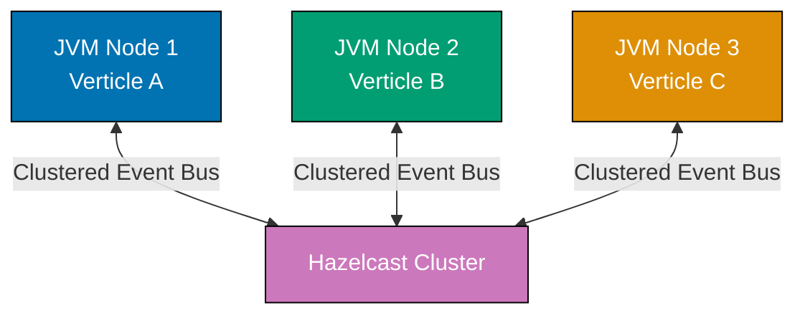

## Group 22: Clustering and High Availability

### Example 56: Clustered Vert.x with Hazelcast

Clustering connects multiple Vert.x instances into a distributed system where the event bus spans JVM boundaries. Hazelcast is the default cluster manager.



```java
import io.vertx.core.AbstractVerticle;
import io.vertx.core.Promise;
import io.vertx.core.Vertx;
import io.vertx.core.VertxOptions;
import io.vertx.spi.cluster.hazelcast.HazelcastClusterManager;

public class ClusteredVerticle extends AbstractVerticle {

  @Override
  public void start(Promise<Void> startPromise) {
    vertx.eventBus().consumer("cluster.hello", msg -> {
      System.out.println("Received on node " + getNodeId() + ": " + msg.body());
      // => Output: Received on node node-1: Hello from node-2
      // => This consumer is reachable from ALL nodes in the cluster
      msg.reply("Pong from " + getNodeId());
    });

    // Send to a consumer on ANY node (round-robin across cluster)
    vertx.eventBus()
      .request("cluster.hello", "Hello from " + getNodeId())
      .onSuccess(reply -> {
        System.out.println("Reply: " + reply.body());
        // => Output: Reply: Pong from node-2
        // => Reply came from a different JVM node
      });

    startPromise.complete();
  }

  private String getNodeId() {
    return System.getProperty("node.id", "node-1");
    // => Node identifier from system property; set at startup
  }

  public static void main(String[] args) {
    HazelcastClusterManager mgr = new HazelcastClusterManager();
    // => Hazelcast cluster manager; discovers peers via multicast or TCP/IP

    VertxOptions options = new VertxOptions()
      .setClusterManager(mgr)
      // => Enables cluster mode; single-node operation if this is omitted
      .setEventBusOptions(new io.vertx.core.eventbus.EventBusOptions()
        .setHost(System.getProperty("node.host", "localhost"))
        // => Host this node advertises to cluster; must be externally reachable
        .setPort(Integer.parseInt(System.getProperty("cluster.port", "18080"))));
        // => Port for inter-node event bus communication

    Vertx.clusteredVertx(options)
      // => Creates a clustered Vert.x instance; async (cluster join takes time)
      // => Returns Future<Vertx> (not Vertx.vertx() which is synchronous)
      .onSuccess(vertx -> {
        System.out.println("Joined cluster; deploying verticle...");
        vertx.deployVerticle(new ClusteredVerticle());
      })
      .onFailure(err -> {
        System.err.println("Failed to join cluster: " + err);
        System.exit(1);
        // => Exit if clustering fails; orchestration platform will restart
      });
  }
}
```

**Key Takeaway**: Use `Vertx.clusteredVertx()` with a cluster manager to join a distributed cluster. The event bus automatically routes messages across JVM boundaries in clustered mode.

**Why It Matters**: Clustering enables horizontal scaling beyond a single JVM's memory and CPU limits. Event bus addresses become globally routable, so any node can send messages to consumers on any other node without knowing which node hosts them. This enables stateless application nodes where any instance can handle any request, a prerequisite for zero-downtime rolling deployments. Hazelcast's auto-discovery via multicast makes cluster membership fully automatic in LAN environments.

---

### Example 57: High Availability and Failover

Vert.x HA automatically re-deploys verticles from failed nodes to surviving cluster nodes when they are flagged as HA-deployments.

```java
import io.vertx.core.AbstractVerticle;
import io.vertx.core.DeploymentOptions;
import io.vertx.core.Promise;
import io.vertx.core.Vertx;
import io.vertx.core.VertxOptions;
import io.vertx.spi.cluster.hazelcast.HazelcastClusterManager;

public class HighAvailabilityDemo extends AbstractVerticle {

  @Override
  public void start(Promise<Void> startPromise) {
    System.out.println("HA Verticle started on node: "
      + System.getProperty("node.id", "unknown"));
    // => Output: HA Verticle started on node: node-1
    // => If node-1 dies, this verticle restarts on another available node

    vertx.eventBus().consumer("ha.ping", msg -> {
      msg.reply("pong from " + System.getProperty("node.id", "unknown"));
      // => This consumer is always available as long as cluster has nodes
    });

    startPromise.complete();
  }

  public static void main(String[] args) {
    HazelcastClusterManager mgr = new HazelcastClusterManager();

    Vertx.clusteredVertx(new VertxOptions().setClusterManager(mgr))
      .onSuccess(vertx -> {
        DeploymentOptions haOptions = new DeploymentOptions()
          .setHa(true);
          // => Mark this deployment for HA failover
          // => If this node leaves the cluster, Vert.x redeploys the verticle on another node
          // => Non-HA verticles are NOT redeployed on node failure

        vertx.deployVerticle(HighAvailabilityDemo.class.getName(), haOptions)
          .onSuccess(id -> {
            System.out.println("HA verticle deployed: " + id);
            // => Deployment recorded in cluster-wide registry
            // => Other nodes know to take over if this node fails
          });
      });
  }
}
// To test HA:
// 1. Start two nodes: -Dnode.id=node-1 and -Dnode.id=node-2
// 2. Kill node-1 (Ctrl+C or kill -9)
// 3. Observe: node-2 redeploys the HA verticle automatically
```

**Key Takeaway**: Set `DeploymentOptions.setHa(true)` for verticles that must survive node failures. Vert.x cluster tracks HA deployments and automatically redeployes them on surviving nodes.

**Why It Matters**: HA failover is the foundation of high-availability distributed systems. Without it, losing a single node loses the work it was handling permanently. With HA, critical verticles (payment processors, order handlers) automatically restart on surviving nodes, achieving resilience without complex external orchestration. Combined with Kubernetes pod restart policies, this provides multi-layer fault tolerance covering both process crashes and node failures.

---

### Example 58: Cluster-Wide Shared Data

Vert.x's `SharedData` API provides cluster-wide distributed data structures for sharing state across JVM nodes. `ClusterWideMap` and distributed locks enable safe cross-node coordination.

```java
import io.vertx.core.AbstractVerticle;
import io.vertx.core.Promise;
import io.vertx.core.Vertx;
import io.vertx.core.VertxOptions;
import io.vertx.core.shareddata.Lock;
import io.vertx.core.shareddata.SharedData;
import io.vertx.spi.cluster.hazelcast.HazelcastClusterManager;

public class SharedDataDemo extends AbstractVerticle {

  @Override
  public void start(Promise<Void> startPromise) {
    SharedData sd = vertx.sharedData();
    // => SharedData API; cluster-wide when running in clustered mode

    // Cluster-wide distributed map
    sd.<String, String>getClusterWideMap("session-store")
      // => Hazelcast-backed distributed map; accessible from all cluster nodes
      .compose(map -> {
        return map.put("session-abc-123", "user-42")
          // => Write session to cluster-wide map; visible on all nodes
          .compose(v -> map.get("session-abc-123"))
          // => Read back from map (may come from another node)
          .onSuccess(value -> {
            System.out.println("Session value: " + value);
            // => Output: Session value: user-42
            // => Retrieved from Hazelcast distributed map
          });
      })
      .onFailure(err -> System.err.println("Map error: " + err));

    // Distributed lock for cross-node coordination
    sd.getLockWithTimeout("payment-processor-lock", 3000)
      // => Try to acquire distributed lock; wait max 3000ms
      // => Lock is cluster-wide; only ONE node holds it at a time
      .onSuccess(lock -> {
        System.out.println("Acquired distributed lock; processing payment");
        // => Only this node processes the payment; prevents double-processing

        try {
          processPayment();
          // => Critical section: single-node execution guaranteed
        } finally {
          lock.release();
          // => ALWAYS release lock; use try-finally to ensure release even on error
          // => Other nodes waiting for this lock can now proceed
          System.out.println("Lock released");
        }

        startPromise.complete();
      })
      .onFailure(err -> {
        System.err.println("Could not acquire lock (timeout or error): " + err);
        // => Another node holds the lock; retry or fail gracefully
        startPromise.complete();
      });
  }

  private void processPayment() {
    System.out.println("Processing payment exclusively...");
    // => In production: idempotent payment processing logic
  }

  public static void main(String[] args) {
    Vertx.clusteredVertx(new VertxOptions()
      .setClusterManager(new HazelcastClusterManager()))
      .onSuccess(vertx -> vertx.deployVerticle(new SharedDataDemo()));
  }
}
```

**Key Takeaway**: Use `getClusterWideMap()` for distributed data and `getLockWithTimeout()` for cluster-wide mutual exclusion. Always release locks in a `finally` block.

**Why It Matters**: Distributed locks prevent double-processing in horizontally scaled systems—without them, two nodes could simultaneously process the same payment, resulting in double charges. `ClusterWideMap` enables stateful patterns like distributed session stores without external Redis deployments. The timeout on lock acquisition prevents indefinite blocking when the lock-holding node crashes before releasing, ensuring the system eventually recovers even from partial failures.

---

## Group 23: Service Discovery

### Example 59: Vert.x Service Discovery

Vert.x Service Discovery provides a registry for dynamic service location, enabling microservices to find each other without hardcoded URLs.

```java
import io.vertx.core.AbstractVerticle;
import io.vertx.core.Promise;
import io.vertx.core.Vertx;
import io.vertx.ext.web.client.WebClient;
import io.vertx.servicediscovery.Record;
import io.vertx.servicediscovery.ServiceDiscovery;
import io.vertx.servicediscovery.ServiceDiscoveryOptions;
import io.vertx.servicediscovery.types.HttpEndpoint;

public class ServiceDiscoveryDemo extends AbstractVerticle {

  private ServiceDiscovery discovery;
  // => Service discovery instance; backed by cluster-wide map in clustered mode

  @Override
  public void start(Promise<Void> startPromise) {
    discovery = ServiceDiscovery.create(vertx, new ServiceDiscoveryOptions()
      .setBackendConfiguration(new io.vertx.core.json.JsonObject()
        .put("backend-name", "io.vertx.servicediscovery.backend.hazelcast.HazelcastBackend")));
        // => Hazelcast backend: service records shared across cluster nodes

    // Register THIS service in the discovery registry
    Record record = HttpEndpoint.createRecord(
      "user-service",
      // => Service name used for lookup
      "user-service.internal",
      // => Hostname/IP of this service instance
      8080,
      // => Port number
      "/api/users");
      // => Root path of this service's API

    discovery.publish(record)
      .onSuccess(publishedRecord -> {
        System.out.println("Registered as: " + publishedRecord.getName()
          + " (id: " + publishedRecord.getRegistration() + ")");
        // => Output: Registered as: user-service (id: a1b2c3d4-...)
        // => Other services can now discover this instance
        startPromise.complete();
      })
      .onFailure(startPromise::fail);
  }

  // Method to look up and call a discovered service
  void callUserService() {
    HttpEndpoint.getWebClient(discovery,
      new io.vertx.core.json.JsonObject().put("name", "user-service"))
      // => Looks up a healthy instance of "user-service" in the registry
      // => Returns a configured WebClient pointing to that instance
      .onSuccess(client -> {
        client.get("/api/users/42")
          .send()
          .onSuccess(response -> {
            System.out.println("User: " + response.bodyAsJsonObject());
            // => HTTP call to dynamically discovered service instance
            ServiceDiscovery.releaseServiceObject(discovery, client);
            // => Release client when done; decrements usage counter for load balancing
          });
      })
      .onFailure(err -> System.err.println("Service unavailable: " + err));
      // => Fails if no healthy "user-service" instances are registered
  }

  @Override
  public void stop(Promise<Void> stopPromise) {
    discovery.close();
    // => Unregister all published records and close discovery
    // => Prevents stale entries in the discovery registry after shutdown
    stopPromise.complete();
  }

  public static void main(String[] args) {
    Vertx.vertx().deployVerticle(new ServiceDiscoveryDemo());
  }
}
```

**Key Takeaway**: Register services with `discovery.publish()` and look them up with `HttpEndpoint.getWebClient()`. Release service objects after use to keep load balancing statistics accurate.

**Why It Matters**: Service discovery enables dynamic service location in environments where service instances start and stop frequently (Kubernetes pods, auto-scaling groups). Hardcoded service URLs break when instances move; the discovery registry provides a level of indirection that absorbs infrastructure changes. The `releaseServiceObject` call enables the discovery layer to implement client-side load balancing and health-aware routing without changes to calling code.

---

## Group 24: gRPC

### Example 60: gRPC Server with Vert.x

Vert.x provides a non-blocking gRPC implementation. Define services in `.proto` files, generate stubs, and implement service handlers on Vert.x's event loop.

```java
// Note: requires protobuf-maven-plugin or similar to generate from .proto files
// Proto definition (user.proto):
// syntax = "proto3";
// service UserService {
//   rpc GetUser (GetUserRequest) returns (UserResponse);
//   rpc ListUsers (ListUsersRequest) returns (stream UserResponse);
// }
// message GetUserRequest { string id = 1; }
// message UserResponse { string id = 1; string name = 2; string email = 3; }
// message ListUsersRequest { int32 page = 1; }

import io.grpc.stub.StreamObserver;
import io.vertx.core.AbstractVerticle;
import io.vertx.core.Promise;
import io.vertx.core.Vertx;
import io.vertx.grpc.server.GrpcServer;
import io.vertx.grpc.server.GrpcServerRequest;

public class GrpcServerVerticle extends AbstractVerticle {

  @Override
  public void start(Promise<Void> startPromise) {
    GrpcServer grpcServer = GrpcServer.server(vertx);
    // => Creates a Vert.x gRPC server (non-blocking, event loop based)

    // Register unary RPC handler (one request → one response)
    grpcServer.callHandler(UserServiceGrpc.getGetUserMethod(),
      // => Bind to the generated gRPC method descriptor
      request -> {
        // => request is GrpcServerRequest<GetUserRequest, UserResponse>
        request.handler(getUserRequest -> {
          // => Fires when client sends the request message
          String id = getUserRequest.getId();
          // => Access protobuf message field

          System.out.println("gRPC GetUser called for: " + id);
          // => Output: gRPC GetUser called for: user-42

          UserResponse response = UserResponse.newBuilder()
            .setId(id)
            .setName("Alice")
            .setEmail("alice@example.com")
            .build();
            // => Build protobuf response message using generated builder

          request.response()
            .end(response);
            // => Send single response and close the stream
        });
      });

    // Register server-streaming RPC (one request → multiple responses)
    grpcServer.callHandler(UserServiceGrpc.getListUsersMethod(), request -> {
      request.handler(listRequest -> {
        int page = listRequest.getPage();
        // => Page number from request

        var response = request.response();
        // => Streaming response: write multiple messages

        for (int i = (page - 1) * 10; i < page * 10; i++) {
          // => Send 10 users per page
          response.write(UserResponse.newBuilder()
            .setId("user-" + i)
            .setName("User " + i)
            .build());
            // => Each write() sends one message in the stream
        }

        response.end();
        // => End the server stream; client receives all messages then EOF
      });
    });

    vertx.createHttpServer()
      .requestHandler(grpcServer)
      // => gRPC server handles HTTP/2 upgrade internally
      .listen(9090)
      .onSuccess(s -> {
        System.out.println("gRPC server on port 9090");
        // => Output: gRPC server on port 9090
        startPromise.complete();
      })
      .onFailure(startPromise::fail);
  }

  public static void main(String[] args) {
    Vertx.vertx().deployVerticle(new GrpcServerVerticle());
  }
}
// Stub classes (UserServiceGrpc, UserResponse, etc.) generated from user.proto
// by the protobuf-maven-plugin or gradle protobuf plugin
```

**Key Takeaway**: Use `GrpcServer.callHandler()` to bind handlers to generated gRPC method descriptors. Streaming responses call `response.write()` multiple times before `end()`.

**Why It Matters**: gRPC provides a strongly-typed, high-performance alternative to REST for internal service communication. Protocol Buffers encoding is 3-10x smaller than JSON, reducing network bandwidth significantly at scale. Server-streaming RPCs eliminate polling patterns for real-time data (stock prices, sensor readings), pushing data as it becomes available with full backpressure support. Vert.x's non-blocking gRPC implementation handles thousands of concurrent streaming connections on the same event loop threads as HTTP.

---

## Group 25: GraalVM Native Image

### Example 61: Preparing Vert.x for GraalVM Native Image

GraalVM native image compiles Vert.x applications into standalone executables with near-instant startup and reduced memory footprint, ideal for serverless and container deployments.

```java
import io.vertx.core.AbstractVerticle;
import io.vertx.core.Promise;
import io.vertx.core.Vertx;
import io.vertx.core.VertxOptions;
import io.vertx.core.json.JsonObject;
import io.vertx.ext.web.Router;

// Native image requires:
// 1. Reflect on all dynamically loaded classes → native-image.properties
// 2. Resource files included in image → resource-config.json
// 3. Proxy interfaces registered → proxy-config.json

// native-image.properties (in META-INF/native-image/):
// Args = --initialize-at-build-time=io.netty \
//        -H:ReflectionConfigurationFiles=${.}/reflect-config.json \
//        -H:ResourceConfigurationFiles=${.}/resource-config.json

// reflect-config.json (partial):
// [
//   { "name": "io.vertx.core.impl.launcher.commands.RunCommand", "allDeclaredMethods": true },
//   { "name": "com.example.MainVerticle", "allDeclaredMethods": true, "allDeclaredConstructors": true }
// ]

public class NativeImageVerticle extends AbstractVerticle {

  @Override
  public void start(Promise<Void> startPromise) {
    long startupTime = System.currentTimeMillis();
    // => Capture startup time; native image starts in <100ms vs 2-5s for JVM

    Router router = Router.router(vertx);

    router.get("/hello").handler(ctx -> {
      ctx.json(new JsonObject()
        .put("message", "Hello from native image!")
        .put("uptime", System.currentTimeMillis() - startupTime));
        // => Output: {"message":"Hello from native image!","uptime":45}
        // => 45ms uptime demonstrates sub-100ms startup in native mode
    });

    // Avoid dynamic class loading in native image
    // WRONG: Class.forName("com.example.PluginA") - breaks native image
    // RIGHT: Register all implementations at build time via reflect-config.json

    // Use System.getProperty for runtime config (environment variables work too)
    int port = Integer.parseInt(System.getProperty("port", "8080"));
    // => Properties work in native image; no reflection required

    vertx.createHttpServer()
      .requestHandler(router)
      .listen(port)
      .onSuccess(s -> {
        System.out.println("Native server started in ~"
          + (System.currentTimeMillis() - startupTime) + "ms on port " + port);
        // => Output: Native server started in ~45ms on port 8080
        startPromise.complete();
      })
      .onFailure(startPromise::fail);
  }

  public static void main(String[] args) {
    // Disable classloader isolation (native image has no dynamic classloader)
    VertxOptions options = new VertxOptions()
      .setPreferNativeTransport(true);
      // => Use native epoll/kqueue transport when available
      // => Already compiled in native image; no runtime detection needed

    Vertx vertx = Vertx.vertx(options);
    vertx.deployVerticle(new NativeImageVerticle());
  }
}
// Build command (GraalVM 22+):
// native-image --no-fallback \
//   -cp target/my-app.jar \
//   -H:Name=my-vertx-app \
//   com.example.NativeImageVerticle
//
// Run:
// ./my-vertx-app -Dport=8080
// => Starts in <100ms; uses ~50MB RAM vs ~250MB for JVM
```

**Key Takeaway**: Avoid dynamic class loading in native image code. Register all reflectively accessed classes in `reflect-config.json`. Use system properties for runtime configuration.

**Why It Matters**: GraalVM native images start in milliseconds and consume 3-5x less memory than JVM deployments. This transforms Vert.x from a strong microservices choice into a serverless-competitive option—cold start times of 50ms allow native Vert.x services to be deployed as AWS Lambda functions or Google Cloud Run containers without the "cold start penalty" that makes JVM Lambda functions impractical. Reduced memory footprint also dramatically reduces Kubernetes pod costs at scale.

---

## Group 26: SSL/TLS and Security

### Example 62: HTTPS Server with TLS Configuration

Production Vert.x servers must use TLS to encrypt traffic. Vert.x supports JKS, PKCS12, and PEM certificate formats with configurable TLS protocols and cipher suites.

```java
import io.vertx.core.AbstractVerticle;
import io.vertx.core.Promise;
import io.vertx.core.Vertx;
import io.vertx.core.http.HttpServerOptions;
import io.vertx.core.net.JksOptions;
import io.vertx.core.net.PemKeyCertOptions;
import io.vertx.ext.web.Router;

public class HttpsVerticle extends AbstractVerticle {

  @Override
  public void start(Promise<Void> startPromise) {
    Router router = Router.router(vertx);

    router.get("/secure").handler(ctx -> {
      ctx.response()
        .putHeader("Strict-Transport-Security", "max-age=31536000; includeSubDomains")
        // => HSTS header: tell browsers to always use HTTPS for this domain
        // => max-age=31536000 = 1 year
        .putHeader("X-Content-Type-Options", "nosniff")
        // => Prevent MIME type sniffing attacks
        .putHeader("X-Frame-Options", "DENY")
        // => Prevent clickjacking via iframes
        .end("Secure response");
    });

    HttpServerOptions tlsOptions = new HttpServerOptions()
      .setSsl(true)
      // => Enable TLS; required for HTTPS
      .setKeyStoreOptions(new JksOptions()
        .setPath("server-keystore.jks")
        // => Java KeyStore containing server certificate and private key
        // => Create with: keytool -genkeypair -alias server -keyalg RSA -keystore server.jks
        .setPassword(System.getenv("KEYSTORE_PASSWORD")))
        // => Keystore password from environment; never hardcode
      .addEnabledSecureTransportProtocol("TLSv1.3")
      // => Only allow TLS 1.3; disable older vulnerable versions
      .addEnabledSecureTransportProtocol("TLSv1.2")
      // => Allow TLS 1.2 for older client compatibility
      .removeEnabledSecureTransportProtocol("TLSv1.1")
      // => Disable TLS 1.1 (vulnerable to POODLE, BEAST attacks)
      .removeEnabledSecureTransportProtocol("TLSv1.0")
      // => Disable TLS 1.0 (deprecated by RFC 8996)
      .setUseAlpn(true);
      // => Enable ALPN (Application-Layer Protocol Negotiation)
      // => Allows HTTP/2 negotiation over TLS

    // Alternative: PEM format (more common in cloud/Kubernetes deployments)
    HttpServerOptions pemOptions = new HttpServerOptions()
      .setSsl(true)
      .setKeyCertOptions(new PemKeyCertOptions()
        .setCertPath("/etc/ssl/certs/server.crt")
        // => PEM certificate file (from Let's Encrypt, commercial CA, etc.)
        .setKeyPath("/etc/ssl/private/server.key"))
        // => Private key file; permissions should be 600 (owner read-only)
      .setUseAlpn(true);

    vertx.createHttpServer(tlsOptions)
      .requestHandler(router)
      .listen(443)
      // => Standard HTTPS port; use 8443 for non-root development
      .onSuccess(s -> {
        System.out.println("HTTPS server on port " + s.actualPort());
        // => Output: HTTPS server on port 443
        startPromise.complete();
      })
      .onFailure(startPromise::fail);
  }

  public static void main(String[] args) {
    Vertx.vertx().deployVerticle(new HttpsVerticle());
  }
}
```

**Key Takeaway**: Enable TLS with `HttpServerOptions.setSsl(true)`. Restrict to TLS 1.2+ with `addEnabledSecureTransportProtocol()`. Always load passwords from environment variables.

**Why It Matters**: TLS 1.0 and 1.1 contain known vulnerabilities (POODLE, BEAST) that allow attackers to decrypt traffic. Modern compliance requirements (PCI DSS, HIPAA, SOC 2) mandate TLS 1.2 minimum. HSTS headers with one-year duration prevent SSL stripping attacks where attackers intercept the initial HTTP request before it upgrades to HTTPS. Loading keystore passwords from environment variables prevents secrets from appearing in application logs, heap dumps, or version control history.

---

### Example 63: Mutual TLS (mTLS) for Service-to-Service Authentication

Mutual TLS requires both client and server to present certificates, providing cryptographic authentication without API keys or tokens for service-to-service communication.

```java
import io.vertx.core.AbstractVerticle;
import io.vertx.core.Promise;
import io.vertx.core.Vertx;
import io.vertx.core.http.HttpClientOptions;
import io.vertx.core.http.HttpServerOptions;
import io.vertx.core.net.JksOptions;
import io.vertx.ext.web.Router;
import io.vertx.ext.web.client.WebClient;

public class MutualTlsDemo extends AbstractVerticle {

  @Override
  public void start(Promise<Void> startPromise) {
    // mTLS Server: requires client certificates signed by trusted CA
    HttpServerOptions serverOptions = new HttpServerOptions()
      .setSsl(true)
      .setKeyStoreOptions(new JksOptions()
        .setPath("server-keystore.jks")
        // => Server's certificate and private key
        .setPassword(System.getenv("SERVER_KEYSTORE_PASS")))
      .setTrustStoreOptions(new JksOptions()
        .setPath("trusted-clients.jks")
        // => CA certificates of trusted clients
        // => Only clients with certs signed by these CAs are allowed
        .setPassword(System.getenv("TRUST_STORE_PASS")))
      .setClientAuth(io.vertx.core.http.ClientAuth.REQUIRED);
      // => REQUIRED: reject connections without valid client certificates
      // => REQUEST: accept but don't require client certs
      // => NONE: don't request client certs (default)

    Router router = Router.router(vertx);
    router.get("/internal/data").handler(ctx -> {
      // Client certificate is available after successful mTLS handshake
      javax.security.cert.X509Certificate[] certs =
        ctx.request().peerCertificates();
      // => Returns client's certificate chain; null if no client cert
      if (certs != null && certs.length > 0) {
        String clientDN = certs[0].getSubjectDN().getName();
        // => Distinguished Name from client cert: "CN=payment-service, O=MyOrg"
        System.out.println("Request from: " + clientDN);
        // => Output: Request from: CN=payment-service, O=MyOrg
      }
      ctx.json(new io.vertx.core.json.JsonObject().put("data", "internal-secret"));
    });

    vertx.createHttpServer(serverOptions)
      .requestHandler(router)
      .listen(8443)
      .onSuccess(s -> startPromise.complete())
      .onFailure(startPromise::fail);
  }

  void createMtlsClient() {
    // mTLS Client: presents its certificate to the server
    WebClient client = WebClient.create(vertx,
      new WebClientOptions()
        .setSsl(true)
        .setKeyStoreOptions(new JksOptions()
          .setPath("client-keystore.jks")
          // => Client's certificate and private key (presented to server)
          .setPassword(System.getenv("CLIENT_KEYSTORE_PASS")))
        .setTrustStoreOptions(new JksOptions()
          .setPath("trusted-servers.jks")
          // => Trusted server CA certificates (server cert must be signed by one)
          .setPassword(System.getenv("CLIENT_TRUST_PASS")))));
          // => Prevents connecting to untrusted/self-signed servers

    client.get(8443, "internal-service", "/internal/data")
      .send()
      .onSuccess(r -> System.out.println("mTLS response: " + r.bodyAsJsonObject()));
  }

  public static void main(String[] args) {
    Vertx.vertx().deployVerticle(new MutualTlsDemo());
  }
}
```

**Key Takeaway**: Set `ClientAuth.REQUIRED` on the server to enforce client certificates. Configure the trust store with the CA that signs client certs. Clients present their identity via their keystore.

**Why It Matters**: mTLS is the recommended authentication mechanism for service-to-service communication in zero-trust architectures. Unlike API keys, certificates are cryptographically unforgeable and automatically rotatable via certificate management tools (cert-manager, Vault). When a compromised service's certificate is revoked, it immediately loses access to all services it was communicating with—a revocation that would require rotating API keys in dozens of places manually.

---

## Group 27: Production Configuration and Deployment

### Example 64: Environment-Based Configuration for Docker

Production Vert.x applications read all configuration from environment variables, enabling the same container image to run in development, staging, and production.

```java
import io.vertx.config.ConfigRetriever;
import io.vertx.config.ConfigRetrieverOptions;
import io.vertx.config.ConfigStoreOptions;
import io.vertx.core.AbstractVerticle;
import io.vertx.core.Promise;
import io.vertx.core.Vertx;
import io.vertx.core.json.JsonObject;

public class ProductionConfigVerticle extends AbstractVerticle {

  @Override
  public void start(Promise<Void> startPromise) {
    ConfigRetrieverOptions options = new ConfigRetrieverOptions()
      .addStore(new ConfigStoreOptions()
        .setType("file")
        .setFormat("json")
        .setConfig(new JsonObject()
          .put("path", "config/defaults.json")))
        // => Base defaults from bundled config file
      .addStore(new ConfigStoreOptions()
        .setType("env"))
        // => Environment variables override defaults
        // => DB_HOST overrides defaults.json "db.host"
        // => HTTP_PORT overrides defaults.json "http.port"
      .addStore(new ConfigStoreOptions()
        .setType("sys"));
        // => Java system properties (-Dkey=value) take highest precedence
        // => Useful for developer overrides during testing

    ConfigRetriever.create(vertx, options)
      .getConfig()
      .onSuccess(config -> {
        System.out.println("Config loaded:");
        // => Resolved config merges all three sources (env overrides file)

        int port = config.getInteger("HTTP_PORT", 8080);
        // => HTTP_PORT env var; default 8080
        String dbHost = config.getString("DB_HOST", "localhost");
        // => DB_HOST env var; default localhost
        int dbPort = config.getInteger("DB_PORT", 5432);
        String dbUser = config.getString("DB_USER", "postgres");
        String dbPass = config.getString("DB_PASSWORD", "");
        // => DB_PASSWORD: never set default in code; fail if missing in production
        String jwtSecret = config.getString("JWT_SECRET", "");
        // => JWT_SECRET: critical; validate non-empty before starting

        if (dbPass.isEmpty()) {
          System.err.println("DB_PASSWORD is required");
          startPromise.fail("DB_PASSWORD environment variable not set");
          // => Fail fast: missing required config prevents startup
          return;
        }

        System.out.printf("Starting: port=%d db=%s:%d%n", port, dbHost, dbPort);
        // => Output: Starting: port=8080 db=postgres-svc:5432
        // => In Docker/Kubernetes, DB_HOST is the service name (postgres-svc)

        startHttpServer(startPromise, port);
      })
      .onFailure(err -> {
        System.err.println("Config load failed: " + err);
        startPromise.fail(err);
      });
  }

  private void startHttpServer(Promise<Void> sp, int port) {
    vertx.createHttpServer()
      .requestHandler(ctx -> ctx.response().end("OK"))
      .listen(port)
      .onSuccess(s -> sp.complete())
      .onFailure(sp::fail);
  }

  public static void main(String[] args) {
    Vertx.vertx().deployVerticle(new ProductionConfigVerticle());
  }
}
// Dockerfile:
// FROM eclipse-temurin:21-jre-alpine
// WORKDIR /app
// COPY target/my-app-fat.jar app.jar
// EXPOSE 8080
// ENV HTTP_PORT=8080
// CMD ["java", "-jar", "app.jar"]
//
// docker run -e DB_HOST=postgres-svc -e DB_PASSWORD=secret my-app
```

**Key Takeaway**: Layer config sources: file defaults → environment variables → system properties. Always fail fast on missing required secrets rather than using empty defaults.

**Why It Matters**: The twelve-factor app principle of environment-based configuration ensures your container image is identical across all environments—only the runtime configuration differs. Failing fast on missing required secrets prevents insecure deployments with empty passwords that might succeed but behave incorrectly. The layered config hierarchy allows developers to override individual values with `-D` flags without modifying environment files, speeding up development iteration.

---

### Example 65: Fat JAR and Docker Deployment

Packaging a Vert.x application as a fat JAR bundles all dependencies into a single executable file, simplifying container deployment with no dependency management at runtime.

```java
// This example shows the Maven/Docker build configuration rather than runtime code

// pom.xml additions for fat JAR:
// <plugin>
//   <groupId>io.reactiverse</groupId>
//   <artifactId>vertx-maven-plugin</artifactId>
//   <version>1.0.27</version>
//   <executions>
//     <execution>
//       <id>vmp</id>
//       <goals><goal>initialize</goal><goal>package</goal></goals>
//     </execution>
//   </executions>
//   <configuration>
//     <verticle>com.example.MainVerticle</verticle>
//     <!-- Verticle to deploy; embedded in MANIFEST.MF -->
//   </configuration>
// </plugin>

// Build command:
// mvn package -DskipTests
// => Creates target/my-app-1.0-fat.jar (~20MB bundled)

// Runtime verticle that demonstrates fat JAR patterns
import io.vertx.core.AbstractVerticle;
import io.vertx.core.Promise;
import io.vertx.core.Vertx;

public class FatJarMainVerticle extends AbstractVerticle {

  @Override
  public void start(Promise<Void> startPromise) {
    System.out.println("Fat JAR verticle starting...");
    // => "Fat JAR" = all dependencies bundled; java -jar runs without classpath setup

    // Demonstrate reading build metadata from JAR manifest
    String version = getClass().getPackage().getImplementationVersion();
    // => Read version from MANIFEST.MF (set by vertx-maven-plugin)
    System.out.println("Version: " + (version != null ? version : "dev"));
    // => Output: Version: 1.0.0 (in production) or Version: dev (in IDE)

    int port = Integer.parseInt(System.getenv().getOrDefault("PORT", "8080"));
    // => Cloud platforms (Heroku, Fly.io) set PORT automatically

    vertx.createHttpServer()
      .requestHandler(req -> {
        if ("/health".equals(req.path())) {
          req.response().end("OK");
          // => Health check for container orchestration
        } else {
          req.response()
            .putHeader("Content-Type", "application/json")
            .end("{\"service\":\"my-app\",\"version\":\"" + version + "\"}");
        }
      })
      .listen(port)
      .onSuccess(s -> {
        System.out.println("Started on port " + s.actualPort());
        startPromise.complete();
      })
      .onFailure(startPromise::fail);
  }

  public static void main(String[] args) {
    // Override vertx thread pool sizes for container CPU allocation
    int cpuCount = Runtime.getRuntime().availableProcessors();
    // => Docker containers may have fractional CPU; detect actual allocation
    System.setProperty("vertx.eventLoopPoolSize", String.valueOf(cpuCount * 2));
    // => Set 2 event loop threads per CPU; tune based on I/O vs CPU ratio
    System.setProperty("vertx.workerPoolSize", String.valueOf(cpuCount * 20));
    // => Worker pool for executeBlocking; higher for blocking-heavy workloads

    Vertx.vertx().deployVerticle(new FatJarMainVerticle());
  }
}
// Dockerfile (multi-stage build):
// FROM maven:3.9-eclipse-temurin-21 AS build
// WORKDIR /build
// COPY pom.xml .
// RUN mvn dependency:go-offline  # Cache dependencies layer
// COPY src ./src
// RUN mvn package -DskipTests
//
// FROM eclipse-temurin:21-jre-alpine
// WORKDIR /app
// RUN adduser -D -h /app appuser && chown appuser:appuser /app
// USER appuser
// COPY --from=build /build/target/*-fat.jar app.jar
// EXPOSE 8080
// HEALTHCHECK --interval=10s CMD wget -qO- http://localhost:8080/health || exit 1
// ENTRYPOINT ["java", "-XX:+UseContainerSupport", "-jar", "app.jar"]
// => -XX:+UseContainerSupport: JVM respects Docker memory/CPU limits (Java 10+)
```

**Key Takeaway**: Use `vertx-maven-plugin` to create fat JARs. Set `vertx.eventLoopPoolSize` based on actual CPU allocation in the container. Use multi-stage Docker builds to minimize image size.

**Why It Matters**: Multi-stage builds separate the Maven build environment (~800MB) from the runtime image (~200MB), reducing image pull times and attack surface. `-XX:+UseContainerSupport` ensures the JVM respects Docker cgroup CPU and memory limits rather than discovering host resources, preventing OOM kills when memory is overallocated. Tuning event loop pool size to container CPU count avoids context switching overhead from more threads than CPUs.

---

## Group 28: Advanced Reactive Patterns

### Example 66: Vert.x SQL Client with Connection Leasing

For advanced database patterns—bulk operations, streaming query results, or explicit connection reuse—lease a dedicated connection from the pool.

```java
import io.vertx.core.AbstractVerticle;
import io.vertx.core.Future;
import io.vertx.core.Promise;
import io.vertx.core.Vertx;
import io.vertx.core.json.JsonArray;
import io.vertx.core.json.JsonObject;
import io.vertx.pgclient.PgBuilder;
import io.vertx.pgclient.PgConnectOptions;
import io.vertx.sqlclient.Pool;
import io.vertx.sqlclient.PoolOptions;
import io.vertx.sqlclient.Row;
import io.vertx.sqlclient.RowStream;
import io.vertx.sqlclient.SqlConnection;
import io.vertx.sqlclient.Tuple;

public class AdvancedSqlVerticle extends AbstractVerticle {

  private Pool pool;

  @Override
  public void start(Promise<Void> startPromise) {
    pool = PgBuilder.pool().using(vertx)
      .with(new PoolOptions().setMaxSize(10))
      .connectingTo(new PgConnectOptions()
        .setHost("localhost").setDatabase("myapp")
        .setUser("postgres").setPassword("secret"))
      .build();

    io.vertx.ext.web.Router router = io.vertx.ext.web.Router.router(vertx);

    // Streaming large result sets (avoid loading all rows into memory)
    router.get("/export/users").handler(ctx -> {
      pool.getConnection()
        .onSuccess(conn -> {
          ctx.response()
            .setChunked(true)
            // => Enable chunked transfer for streaming response
            .putHeader("Content-Type", "application/json");

          ctx.response().write("[");
          // => Start JSON array manually for streaming

          conn.prepare("SELECT id, name, email FROM users ORDER BY id")
            .onSuccess(stmt -> {
              RowStream<Row> stream = stmt.createStream(50);
              // => Stream rows from DB 50 at a time (fetch size)
              // => Prevents loading 1M rows into memory

              boolean[] first = {true};
              // => Track first row to avoid leading comma

              stream.handler(row -> {
                String prefix = first[0] ? "" : ",";
                first[0] = false;
                ctx.response().write(prefix + new JsonObject()
                  .put("id", row.getInteger("id"))
                  .put("name", row.getString("name"))
                  .put("email", row.getString("email"))
                  .encode());
                // => Write each row as JSON object in the array
              });

              stream.endHandler(v -> {
                ctx.response().write("]").end();
                // => Close JSON array and flush response
                conn.close();
                // => Return connection to pool after streaming completes
              });

              stream.exceptionHandler(err -> {
                System.err.println("Stream error: " + err);
                conn.close();
                // => Release connection even on error
                ctx.fail(500, err);
              });
            })
            .onFailure(err -> {
              conn.close();
              ctx.fail(500, err);
            });
        })
        .onFailure(err -> ctx.fail(503, err));
    });

    // Bulk insert with prepared batch
    router.post("/users/bulk").handler(ctx -> {
      io.vertx.ext.web.handler.BodyHandler.create().handle(ctx);
      JsonArray users = ctx.body().asJsonArray();
      // => Array of user objects to bulk insert

      java.util.List<Tuple> batch = new java.util.ArrayList<>();
      for (int i = 0; i < users.size(); i++) {
        JsonObject user = users.getJsonObject(i);
        batch.add(Tuple.of(user.getString("name"), user.getString("email")));
        // => Build batch of parameterized tuples
      }

      pool.preparedQuery("INSERT INTO users (name, email) VALUES ($1, $2)")
        .executeBatch(batch)
        // => executes all tuples in a single database round-trip
        // => Much more efficient than N separate INSERT statements
        .onSuccess(rows -> ctx.response().setStatusCode(201)
          .json(new JsonObject().put("inserted", users.size())))
        .onFailure(err -> ctx.fail(500, err));
    });

    vertx.createHttpServer()
      .requestHandler(router)
      .listen(8080)
      .onSuccess(s -> startPromise.complete())
      .onFailure(startPromise::fail);
  }

  public static void main(String[] args) {
    Vertx.vertx().deployVerticle(new AdvancedSqlVerticle());
  }
}
```

**Key Takeaway**: Use `RowStream` with a fetch size for memory-efficient large result sets. Use `executeBatch()` for bulk inserts to minimize database round-trips.

**Why It Matters**: Loading 100,000 rows into a `List` before streaming them to clients uses hundreds of megabytes of heap. `RowStream` with a 50-row fetch size keeps memory usage constant regardless of result set size, enabling export endpoints that serve arbitrarily large datasets. `executeBatch()` reduces N individual INSERT operations to a single round-trip, cutting bulk import time from seconds to milliseconds for thousands of rows.

---

### Example 67: Backpressure-Aware Message Processing

High-throughput event processing requires backpressure to prevent consumer overload. Vert.x's `ReadStream`/`WriteStream` model propagates backpressure automatically.

```java
import io.vertx.core.AbstractVerticle;
import io.vertx.core.Promise;
import io.vertx.core.Vertx;
import io.vertx.core.eventbus.MessageConsumer;

public class BackpressureDemo extends AbstractVerticle {

  @Override
  public void start(Promise<Void> startPromise) {
    MessageConsumer<String> consumer =
      vertx.eventBus().localConsumer("high.volume.events");
    // => Subscribe to high-volume event stream

    consumer.pause();
    // => Start paused; resume only when ready to process
    // => Prevents buffer overflow on startup

    consumer.handler(msg -> {
      String event = msg.body();
      // => Process the event
      System.out.println("Processing: " + event);
      // => Output: Processing: event-1234

      vertx.executeBlocking(() -> {
        // => Offload processing to worker thread
        processEvent(event);
        // => Could be slow: DB write, file I/O, external API call
        return null;
      })
      .onComplete(ar -> {
        if (consumer.isPaused()) {
          consumer.resume();
          // => Resume consuming after processing completes
          // => Ensures only one event processed at a time (backpressure)
        }
      });

      consumer.pause();
      // => Pause immediately after receiving; prevents flooding worker pool
    });

    consumer.resume();
    // => Start consuming events
    // => Will pause again after first event until processing completes

    startPromise.complete();

    // Simulate high-volume event producer
    for (int i = 0; i < 100; i++) {
      final int n = i;
      vertx.setTimer(n * 10, id ->
        vertx.eventBus().publish("high.volume.events", "event-" + n));
      // => Publish 100 events every 10ms = 100 events/second
      // => Consumer processes at its own pace; backpressure prevents overload
    }
  }

  private void processEvent(String event) {
    try { Thread.sleep(50); }
    catch (InterruptedException e) { Thread.currentThread().interrupt(); }
    // => Simulate 50ms processing; producer sends 10/s; consumer handles 20/s
    // => Queue grows but processor keeps up; replace with real logic in production
  }

  public static void main(String[] args) {
    Vertx.vertx().deployVerticle(new BackpressureDemo());
  }
}
```

**Key Takeaway**: Call `consumer.pause()` when processing is in flight and `consumer.resume()` when ready for the next message. This propagates backpressure to the event bus producer.

**Why It Matters**: Without backpressure, a slow consumer paired with a fast producer accumulates an unbounded in-memory queue, eventually causing an OutOfMemoryError. The pause/resume pattern enforces a throughput ceiling at the consumer's processing rate, creating natural backpressure that prevents memory buildup. This pattern is essential for event processors, Kafka consumers, and database write buffers where processing latency is variable and unpredictable.

---

## Group 29: Advanced Verticle Patterns

### Example 68: Multi-Threaded Worker Verticles

Multi-threaded worker verticles run with multiple concurrent threads, enabling stateful concurrent processing without deploying multiple verticle instances.

```java
import io.vertx.core.AbstractVerticle;
import io.vertx.core.DeploymentOptions;
import io.vertx.core.Promise;
import io.vertx.core.Vertx;

public class MultiThreadedWorker extends AbstractVerticle {
  // WARNING: Multi-threaded worker = shared state must be thread-safe
  // Use ConcurrentHashMap, AtomicInteger, etc.

  private final java.util.concurrent.atomic.AtomicInteger processedCount =
    new java.util.concurrent.atomic.AtomicInteger(0);
  // => AtomicInteger for thread-safe counter
  // => Multiple threads in multi-threaded worker share this instance

  @Override
  public void start(Promise<Void> startPromise) {
    vertx.eventBus().consumer("mt.process", msg -> {
      String threadName = Thread.currentThread().getName();
      // => Each message may be handled on a different thread
      int count = processedCount.incrementAndGet();
      // => AtomicInteger.incrementAndGet() is thread-safe
      System.out.println("Thread " + threadName + " processed: " + msg.body()
        + " (total: " + count + ")");
      // => Output: Thread vert.x-worker-thread-2 processed: task-5 (total: 5)
      // => Different messages processed concurrently on different threads
      msg.reply("OK:" + count);
    });

    startPromise.complete();
  }

  public static void main(String[] args) {
    Vertx vertx = Vertx.vertx();

    DeploymentOptions options = new DeploymentOptions()
      .setWorker(true)
      // => Worker verticle: runs on worker thread pool
      .setInstances(1);
      // => Single instance but multi-threaded

    // Note: setWorkerPoolSize() configures thread count per multi-threaded worker
    // For standard workers, use setInstances() for parallelism instead
    // Multi-threaded workers are advanced; prefer multiple standard worker instances

    vertx.deployVerticle(MultiThreadedWorker.class.getName(), options)
      .onSuccess(id -> {
        // Send multiple concurrent messages
        for (int i = 0; i < 10; i++) {
          final int n = i;
          vertx.eventBus()
            .request("mt.process", "task-" + n)
            .onSuccess(reply -> System.out.println("Reply: " + reply.body()));
            // => All 10 messages dispatched; processed concurrently
        }
      });
  }
}
```

**Key Takeaway**: Multi-threaded workers require thread-safe data structures. Prefer deploying multiple standard worker instances for most use cases—multi-threaded workers are for advanced shared-state scenarios.

**Why It Matters**: Standard worker verticles are single-threaded—they serialize all message handling. Multi-threaded workers enable concurrent processing within a single verticle instance for use cases requiring shared mutable state (shared caches, counters, rate limiters). The explicit requirement for thread-safe data structures makes the concurrency contract visible in code, preventing the accidental thread-safety bugs that make multi-threaded code difficult to reason about and test.

---

### Example 69: Vert.x with Kotlin Coroutines

Vert.x provides a coroutine integration for Kotlin that transforms `Future`-based async code into sequential, readable coroutine code without blocking threads.

```kotlin
import io.vertx.core.Vertx
import io.vertx.ext.web.Router
import io.vertx.kotlin.coroutines.CoroutineVerticle
import io.vertx.kotlin.coroutines.coAwait
import io.vertx.kotlin.coroutines.dispatcher
import kotlinx.coroutines.launch
import kotlinx.coroutines.withContext

// Kotlin Coroutine Verticle: extends CoroutineVerticle
class CoroutineApiVerticle : CoroutineVerticle() {
  // => CoroutineVerticle provides coroutine context bound to event loop

  override suspend fun start() {
    // => start() is a suspend function; runs in coroutine context
    val router = Router.router(vertx)

    router.get("/users/:id").handler { ctx ->
      // => Coroutine bridge: launch handles async without blocking event loop
      launch(vertx.dispatcher()) {
        // => launch starts a coroutine on the Vert.x event loop dispatcher
        try {
          val user = fetchUser(ctx.pathParam("id"))
          // => coAwait turns Future into sequential code
          // => Suspends coroutine (non-blocking) until Future completes
          ctx.json(user)
        } catch (e: Exception) {
          ctx.fail(500, e)
        }
      }
    }

    vertx.createHttpServer()
      .requestHandler(router)
      .listen(8080)
      .coAwait()
    // => coAwait() suspends until listen completes
    // => Unlike Future.onSuccess(), this reads like synchronous code
    // => No callback nesting; error handling via try/catch
  }

  private suspend fun fetchUser(id: String): io.vertx.core.json.JsonObject {
    // => Simulate async DB fetch; in production: pgClient.preparedQuery().execute().coAwait()
    return withContext(vertx.dispatcher()) {
      io.vertx.core.json.JsonObject()
        .put("id", id)
        .put("name", "Alice")
      // => Returns JsonObject; coAwait unwraps the Future
    }
  }
}

fun main() {
  val vertx = Vertx.vertx()
  vertx.deployVerticle(CoroutineApiVerticle())
    .onSuccess { println("Deployed") }
    .onFailure { println("Failed: $it") }
}
```

**Key Takeaway**: Use `coAwait()` to suspend a coroutine until a `Future` completes. Launch coroutines with `launch(vertx.dispatcher())` to keep execution on the event loop.

**Why It Matters**: Kotlin coroutines eliminate the cognitive overhead of future chaining and callback pyramids—sequential-looking code is easier to read, review, and debug than equivalent `compose/onSuccess/onFailure` chains. Error handling with `try/catch` is more intuitive than `onFailure` handlers scattered through a chain. The Vert.x dispatcher ensures coroutines resume on the event loop, preserving the non-blocking model while eliminating its syntactic complexity.

---

## Group 30: Production Hardening

### Example 70: Request ID Propagation and Correlation

Request IDs thread through all log lines, external HTTP calls, and database queries, enabling full-trace reconstruction of a single user request across distributed systems.

```java
import io.vertx.core.AbstractVerticle;
import io.vertx.core.Promise;
import io.vertx.core.Vertx;
import io.vertx.ext.web.Router;
import io.vertx.ext.web.RoutingContext;
import io.vertx.ext.web.client.WebClient;
import org.slf4j.Logger;
import org.slf4j.LoggerFactory;
import org.slf4j.MDC;

public class RequestCorrelationVerticle extends AbstractVerticle {

  private static final Logger LOG = LoggerFactory.getLogger(RequestCorrelationVerticle.class);
  private static final String REQUEST_ID_HEADER = "X-Request-Id";

  private WebClient httpClient;
  // => Reusable HTTP client for outbound requests

  @Override
  public void start(Promise<Void> startPromise) {
    httpClient = WebClient.create(vertx);

    Router router = Router.router(vertx);

    // Middleware: establish request ID for every incoming request
    router.route().handler(ctx -> {
      String requestId = ctx.request().getHeader(REQUEST_ID_HEADER);
      if (requestId == null || requestId.isBlank()) {
        requestId = java.util.UUID.randomUUID().toString();
        // => Generate new ID if client didn't provide one
      }

      ctx.put(REQUEST_ID_HEADER, requestId);
      // => Store in routing context for downstream handlers

      MDC.put("requestId", requestId);
      // => SLF4J MDC: all log statements in this thread include requestId
      // => Logback pattern: [%X{requestId}] %logger - %msg%n

      ctx.response().putHeader(REQUEST_ID_HEADER, requestId);
      // => Echo request ID in response; clients use this to correlate logs

      ctx.addBodyEndHandler(v -> MDC.remove("requestId"));
      // => Clean up MDC after response is sent

      ctx.next();
    });

    router.get("/users/:id").handler(this::getUser);

    vertx.createHttpServer()
      .requestHandler(router)
      .listen(8080)
      .onSuccess(s -> startPromise.complete())
      .onFailure(startPromise::fail);
  }

  private void getUser(RoutingContext ctx) {
    String requestId = ctx.get(REQUEST_ID_HEADER);
    String userId = ctx.pathParam("id");

    LOG.info("Fetching user {}", userId);
    // => Log includes requestId from MDC: [a1b2c3d4] ... - Fetching user 42

    // Propagate request ID to downstream service calls
    httpClient.get(8081, "user-service", "/internal/users/" + userId)
      .putHeader(REQUEST_ID_HEADER, requestId)
      // => Forward request ID to downstream; enables cross-service trace correlation
      .send()
      .onSuccess(response -> {
        LOG.info("Got user from service: status={}", response.statusCode());
        // => Output: [a1b2c3d4] ... - Got user from service: status=200
        ctx.json(response.bodyAsJsonObject());
      })
      .onFailure(err -> {
        LOG.error("User service call failed", err);
        // => Log includes requestId; easy to find in aggregated logs
        ctx.fail(502, err);
      });
  }

  public static void main(String[] args) {
    Vertx.vertx().deployVerticle(new RequestCorrelationVerticle());
  }
}
```

**Key Takeaway**: Extract or generate a request ID in the first middleware handler. Store it in `RoutingContext`, propagate it via HTTP headers to downstream calls, and add it to MDC for automatic log inclusion.

**Why It Matters**: Request IDs are the single most impactful observability practice for debugging production issues. When a customer reports a failed transaction, you search logs for their request ID and instantly see every log line from every service involved, including database queries, external API calls, and intermediate processing steps. Without request IDs, reconstructing a failed multi-service transaction requires correlating timestamps across multiple log streams—a process that takes hours instead of seconds.

---

### Example 71: Graceful Degradation and Fallback Strategies

Graceful degradation serves partial or cached responses when dependencies fail, maintaining service availability instead of cascading 500 errors to users.

```java
import io.vertx.core.AbstractVerticle;
import io.vertx.core.Future;
import io.vertx.core.Promise;
import io.vertx.core.Vertx;
import io.vertx.core.json.JsonArray;
import io.vertx.core.json.JsonObject;
import io.vertx.ext.web.Router;
import io.vertx.ext.web.client.WebClient;
import java.util.concurrent.atomic.AtomicReference;

public class GracefulDegradationDemo extends AbstractVerticle {

  private WebClient httpClient;
  private final AtomicReference<JsonArray> recommendationsCache = new AtomicReference<>();
  // => In-memory cache; replace with Redis in production
  // => AtomicReference: thread-safe without synchronization for simple get/set

  @Override
  public void start(Promise<Void> startPromise) {
    httpClient = WebClient.create(vertx);

    // Pre-warm cache in the background
    warmCache();

    Router router = Router.router(vertx);

    router.get("/homepage").handler(ctx -> {
      // Parallel fetch: recommendations from external service + local catalog
      Future<JsonArray> recommendationsFuture = fetchRecommendations()
        .recover(err -> {
          // => recover() transforms failure into a different Future
          System.out.println("Recommendations failed; using cache");
          // => Output: Recommendations failed; using cache
          JsonArray cached = recommendationsCache.get();
          if (cached != null) {
            return Future.succeededFuture(cached);
            // => Return cached recommendations on service failure
          }
          return Future.succeededFuture(new JsonArray());
          // => Empty array if no cache; homepage still loads without recommendations
        });

      Future<JsonArray> catalogFuture = fetchLocalCatalog();
      // => Local DB; much less likely to fail; no fallback needed

      Future.all(recommendationsFuture, catalogFuture)
        .onSuccess(composite -> {
          JsonArray recommendations = composite.resultAt(0);
          JsonArray catalog = composite.resultAt(1);

          ctx.json(new JsonObject()
            .put("catalog", catalog)
            .put("recommendations", recommendations)
            .put("degraded", recommendations.isEmpty()));
            // => Include degraded flag; frontend can show "recommended" section differently
            // => Output: {"catalog":[...],"recommendations":[],"degraded":true}
        })
        .onFailure(err -> ctx.fail(503, err));
        // => Only fail if BOTH futures fail (catalog failure = real problem)
    });

    vertx.createHttpServer()
      .requestHandler(router)
      .listen(8080)
      .onSuccess(s -> startPromise.complete())
      .onFailure(startPromise::fail);
  }

  private Future<JsonArray> fetchRecommendations() {
    return httpClient.get(8082, "recommendation-service", "/recs")
      .timeout(500)
      // => Short timeout: fail fast rather than slow degradation
      .send()
      .map(response -> response.bodyAsJsonArray());
  }

  private Future<JsonArray> fetchLocalCatalog() {
    // In production: query local DB via pool
    return Future.succeededFuture(new JsonArray()
      .add(new JsonObject().put("id", 1).put("name", "Widget")));
  }

  private void warmCache() {
    fetchRecommendations()
      .onSuccess(recs -> {
        recommendationsCache.set(recs);
        System.out.println("Cache warmed with " + recs.size() + " recommendations");
      });
  }

  public static void main(String[] args) {
    Vertx.vertx().deployVerticle(new GracefulDegradationDemo());
  }
}
```

**Key Takeaway**: Use `Future.recover()` to substitute fallback values when optional dependencies fail. Include a `degraded` flag in responses so clients can adapt their display.

**Why It Matters**: Graceful degradation separates service availability from dependency availability. Recommendation systems, analytics widgets, and personalization features are optional—their failure should not prevent the main page from loading. The `degraded` flag in the response enables frontend teams to show "Recommendations unavailable" instead of displaying an empty section mysteriously. This pattern is what separates 99.9% availability from systems that cascade every dependency failure into a full outage.

---

### Example 72: Connection Pool Tuning and Monitoring

Properly tuned database connection pools balance throughput, latency, and database server load. Monitoring pool metrics reveals saturation before it becomes a user-visible problem.

```java
import io.vertx.core.AbstractVerticle;
import io.vertx.core.Promise;
import io.vertx.core.Vertx;
import io.vertx.core.json.JsonObject;
import io.vertx.pgclient.PgBuilder;
import io.vertx.pgclient.PgConnectOptions;
import io.vertx.sqlclient.Pool;
import io.vertx.sqlclient.PoolOptions;
import io.vertx.ext.web.Router;

public class PoolMonitoringVerticle extends AbstractVerticle {

  private Pool pool;

  @Override
  public void start(Promise<Void> startPromise) {
    PgConnectOptions connectOptions = new PgConnectOptions()
      .setHost("localhost")
      .setDatabase("myapp")
      .setUser("postgres")
      .setPassword("secret")
      .setPipeliningLimit(256);
      // => HTTP/2-style pipelining: 256 requests per connection without waiting for responses
      // => Dramatically increases throughput for high-QPS workloads

    PoolOptions poolOptions = new PoolOptions()
      .setMaxSize(20)
      // => Maximum pool size; tune based on pg_stat_activity and PostgreSQL max_connections
      // => Rule of thumb: 10-20 connections per application pod
      .setMinSize(5)
      // => Minimum pool size; keep connections warm to avoid cold-start latency
      .setMaxWaitQueueSize(500)
      // => Queue up to 500 pending requests when all 20 connections are busy
      // => Returns 503 if queue is full; prevents unbounded memory growth
      .setConnectionTimeout(3000)
      // => Fail if cannot get a connection from pool within 3 seconds
      .setIdleTimeout(60)
      // => Close idle connections after 60 seconds
      // => Prevents stale connections that PostgreSQL may have dropped
      .setMaxLifetime(600);
      // => Recycle connections every 600 seconds (10 minutes)
      // => Prevents connection state accumulation (e.g., SET commands)

    pool = PgBuilder.pool()
      .using(vertx)
      .with(poolOptions)
      .connectingTo(connectOptions)
      .build();

    Router router = Router.router(vertx);

    // Expose pool statistics for monitoring
    router.get("/metrics/pool").handler(ctx -> {
      ctx.json(new JsonObject()
        .put("poolSize", pool.size())
        // => Current number of connections in pool (active + idle)
        .put("waitingQueueSize", 0));
        // => Pool does not expose waiting queue size directly; use Micrometer instead
        // => In production: register pool with Micrometer for detailed metrics
    });

    router.get("/users").handler(ctx -> {
      pool.query("SELECT COUNT(*) as count FROM users")
        .execute()
        .onSuccess(rows -> {
          int count = rows.iterator().next().getInteger("count");
          ctx.json(new JsonObject().put("count", count));
        })
        .onFailure(err -> {
          if (err.getMessage().contains("pool is full")) {
            ctx.response().setStatusCode(503)
              .end("{\"error\":\"Service temporarily unavailable - high load\"}");
              // => Distinguish pool exhaustion from query errors
          } else {
            ctx.fail(500, err);
          }
        });
    });

    vertx.createHttpServer()
      .requestHandler(router)
      .listen(8080)
      .onSuccess(s -> startPromise.complete())
      .onFailure(startPromise::fail);
  }

  public static void main(String[] args) {
    Vertx.vertx().deployVerticle(new PoolMonitoringVerticle());
  }
}
```

**Key Takeaway**: Set `minSize` to keep warm connections, `connectionTimeout` to fail fast on saturation, and `maxLifetime` to prevent stale connection bugs. Distinguish pool exhaustion from query errors in failure handlers.

**Why It Matters**: A pool too small causes request queuing and latency spikes under load. A pool too large overwhelms the database server and triggers connection errors. `minSize` eliminates the connection establishment latency for the first requests after periods of low traffic. `maxLifetime` recycles connections before PostgreSQL's idle timeouts drop them silently, preventing mysterious "connection closed" errors that only appear after periods of inactivity—like Monday morning traffic hitting a system idle all weekend.

---

### Example 73: SSL Certificate Hot Reload

Production servers need to rotate TLS certificates without downtime. Vert.x supports certificate reloading on SNI-based virtual hosts without restarting the process.

```java
import io.vertx.core.AbstractVerticle;
import io.vertx.core.Promise;
import io.vertx.core.Vertx;
import io.vertx.core.http.HttpServerOptions;
import io.vertx.core.net.PemKeyCertOptions;
import io.vertx.ext.web.Router;

public class CertHotReloadVerticle extends AbstractVerticle {

  @Override
  public void start(Promise<Void> startPromise) {
    Router router = Router.router(vertx);
    router.get("/hello").handler(ctx -> ctx.response().end("Secure hello"));

    HttpServerOptions options = new HttpServerOptions()
      .setSsl(true)
      .setKeyCertOptions(new PemKeyCertOptions()
        .setCertPath("/etc/ssl/certs/server.crt")
        // => Certificate file; updated by cert-manager, Let's Encrypt, or Vault
        .setKeyPath("/etc/ssl/private/server.key"))
      .setUseAlpn(true);

    vertx.createHttpServer(options)
      .requestHandler(router)
      .listen(443)
      .onSuccess(server -> {
        System.out.println("HTTPS server started");

        // Watch certificate file for changes
        vertx.fileSystem().watch("/etc/ssl/certs/",
          // => Watch directory for any file changes
          changes -> {
            System.out.println("Certificate change detected; reloading...");
            // => Let's Encrypt renewals happen every 60-90 days
            // => cert-manager in Kubernetes updates the secret; this detects the change

            server.updateSSLOptions(new io.vertx.core.net.SSLOptions()
              .setKeyCertOptions(new PemKeyCertOptions()
                .setCertPath("/etc/ssl/certs/server.crt")
                .setKeyPath("/etc/ssl/private/server.key")))
              // => updateSSLOptions() reloads certificate for NEW connections
              // => Existing TLS sessions continue using old certificate until they close
              .onSuccess(v -> System.out.println("Certificate reloaded successfully"))
              .onFailure(err -> System.err.println("Certificate reload failed: " + err));
              // => Reload failure is non-fatal: server continues with old cert
          });

        startPromise.complete();
      })
      .onFailure(startPromise::fail);
  }

  public static void main(String[] args) {
    Vertx.vertx().deployVerticle(new CertHotReloadVerticle());
  }
}
```

**Key Takeaway**: Use `server.updateSSLOptions()` to reload TLS certificates without restarting the server. Watch the certificate directory with `vertx.fileSystem().watch()` for automatic renewal detection.

**Why It Matters**: Let's Encrypt certificates expire every 90 days. Manual certificate rotation requires server restarts that cause brief downtime and require deployment coordination. Hot reload enables cert-manager or Certbot to automatically renew and apply certificates without human intervention or service interruption. The non-fatal failure handling ensures that a failed reload attempt (e.g., permission error on the new key) doesn't bring down the server—it continues serving with the current certificate until the issue is resolved.

---

### Example 74: Observability Stack Integration

A complete observability stack combines structured logs, metrics, and traces in a unified pipeline. This example shows the integration patterns for a production Vert.x deployment.

```java
import io.vertx.core.AbstractVerticle;
import io.vertx.core.Promise;
import io.vertx.core.Vertx;
import io.vertx.ext.web.Router;
import org.slf4j.Logger;
import org.slf4j.LoggerFactory;
import org.slf4j.MDC;

public class ObservabilityVerticle extends AbstractVerticle {

  private static final Logger LOG = LoggerFactory.getLogger(ObservabilityVerticle.class);

  @Override
  public void start(Promise<Void> startPromise) {
    Router router = Router.router(vertx);

    // Structured logging middleware
    router.route().handler(ctx -> {
      long startMs = System.currentTimeMillis();
      String requestId = java.util.UUID.randomUUID().toString().substring(0, 8);
      MDC.put("requestId", requestId);
      MDC.put("method", ctx.request().method().name());
      MDC.put("path", ctx.request().path());
      // => All log lines for this request include these fields automatically
      // => Logback JSON encoder outputs: {"requestId":"a1b2c3","method":"GET","path":"/users"}

      ctx.addBodyEndHandler(v -> {
        long durationMs = System.currentTimeMillis() - startMs;
        MDC.put("statusCode", String.valueOf(ctx.response().getStatusCode()));
        MDC.put("durationMs", String.valueOf(durationMs));
        // => Structured access log entry with all request context
        LOG.info("request completed");
        // => JSON log: {"requestId":"a1b2c3","method":"GET","path":"/users",
        //              "statusCode":"200","durationMs":"15","message":"request completed"}
        MDC.clear();
        // => Clean all MDC keys to prevent leaking into the next request
      });

      ctx.next();
    });

    router.get("/users").handler(ctx -> {
      LOG.debug("Listing users");
      // => DEBUG level for operational details; disabled in production
      ctx.json(new io.vertx.core.json.JsonArray()
        .add(new io.vertx.core.json.JsonObject().put("id", 1)));
    });

    router.get("/metrics").handler(ctx -> {
      // Expose Prometheus metrics (see Example 51 for full implementation)
      ctx.response()
        .putHeader("Content-Type", "text/plain")
        .end("# Prometheus metrics here");
    });

    vertx.createHttpServer()
      .requestHandler(router)
      .listen(8080)
      .onSuccess(s -> {
        LOG.info("Server started on port {}", s.actualPort());
        // => Output: {"message":"Server started on port 8080",...}
        startPromise.complete();
      })
      .onFailure(err -> {
        LOG.error("Server startup failed", err);
        startPromise.fail(err);
      });
  }

  public static void main(String[] args) {
    Vertx.vertx().deployVerticle(new ObservabilityVerticle());
  }
}
// logback.xml configuration for JSON output:
// <configuration>
//   <appender name="JSON" class="ch.qos.logback.core.ConsoleAppender">
//     <encoder class="net.logstash.logback.encoder.LogstashEncoder"/>
//   </appender>
//   <root level="INFO"><appender-ref ref="JSON"/></root>
// </configuration>
// => LogstashEncoder: outputs JSON with all MDC fields as top-level keys
// => Compatible with Elasticsearch, Splunk, and Loki log aggregation
```

**Key Takeaway**: Combine MDC-based structured logging with Prometheus metrics and OpenTelemetry tracing. Use `LogstashEncoder` for JSON log output compatible with log aggregation platforms.

**Why It Matters**: The three pillars of observability (logs, metrics, traces) work together to cover different debugging scenarios: logs answer "what happened?", metrics answer "how is the system performing?", and traces answer "where did this request spend time?". Structured JSON logs enable Kibana/Splunk to aggregate and filter by any field—finding all 500 errors from a specific user or endpoint becomes a one-line query instead of a grep through gigabytes of text.

---

### Example 75: Zero-Downtime Deployment with Canary Releases

Canary deployments route a small percentage of traffic to a new version, enabling gradual validation before full rollout. Vert.x's event bus supports routing-based canary patterns.

```java
import io.vertx.core.AbstractVerticle;
import io.vertx.core.Promise;
import io.vertx.core.Vertx;
import io.vertx.ext.web.Router;
import io.vertx.ext.web.RoutingContext;
import java.util.concurrent.atomic.AtomicInteger;

public class CanaryDeploymentDemo extends AbstractVerticle {

  private static final double CANARY_PERCENTAGE = 0.10;
  // => Route 10% of traffic to the new version
  private final AtomicInteger requestCount = new AtomicInteger(0);
  // => Track requests for deterministic canary routing (every 10th request)

  @Override
  public void start(Promise<Void> startPromise) {
    Router router = Router.router(vertx);

    router.get("/api/feature").handler(this::routeToVersion);
    // => Single endpoint, routes internally to stable or canary handler

    vertx.createHttpServer()
      .requestHandler(router)
      .listen(8080)
      .onSuccess(s -> startPromise.complete())
      .onFailure(startPromise::fail);
  }

  private void routeToVersion(RoutingContext ctx) {
    int count = requestCount.incrementAndGet();
    // => Thread-safe counter; determines which version handles this request

    boolean useCanary = (count % 10 == 0);
    // => Every 10th request goes to canary (10% traffic)
    // => Alternative: Math.random() < CANARY_PERCENTAGE for statistical routing

    if (useCanary) {
      handleCanaryVersion(ctx);
      // => New version: 10% of traffic
    } else {
      handleStableVersion(ctx);
      // => Current stable version: 90% of traffic
    }
  }

  private void handleStableVersion(RoutingContext ctx) {
    ctx.response()
      .putHeader("X-Version", "v1.0.0")
      // => Version header enables monitoring which version served each request
      .putHeader("X-Variant", "stable")
      .json(new io.vertx.core.json.JsonObject()
        .put("version", "1.0.0")
        .put("feature", "stable-behavior"));
    // => Output: {"version":"1.0.0","feature":"stable-behavior"}
  }

  private void handleCanaryVersion(RoutingContext ctx) {
    ctx.response()
      .putHeader("X-Version", "v1.1.0-canary")
      .putHeader("X-Variant", "canary")
      .json(new io.vertx.core.json.JsonObject()
        .put("version", "1.1.0-canary")
        .put("feature", "new-behavior"));
    // => Output: {"version":"1.1.0-canary","feature":"new-behavior"}
    // => Monitor error rates for "canary" variant in Prometheus
    // => If error rate > threshold: increase stable %, revert canary
  }

  public static void main(String[] args) {
    Vertx.vertx().deployVerticle(new CanaryDeploymentDemo());
  }
}
```

**Key Takeaway**: Use an atomic counter or random sampling to route a configurable percentage of traffic to the canary version. Include version headers so metrics can be split by variant.

**Why It Matters**: Canary releases reduce deployment risk by exposing new code to a small traffic fraction before full rollout. The version headers enable metric systems to compare error rates, latency, and business metrics between stable and canary versions in real time. If the canary shows higher error rates or P99 latency, you reduce or eliminate canary traffic immediately, limiting the blast radius to 10% of users rather than rolling back a full deployment that affected everyone.

---

### Example 76: Custom Serialization with Jackson

Vert.x's default JSON uses its own `JsonObject/JsonArray`. For complex domain models, integrating Jackson enables annotations-based serialization with fine-grained control.

```java
import com.fasterxml.jackson.annotation.JsonIgnore;
import com.fasterxml.jackson.annotation.JsonInclude;
import com.fasterxml.jackson.annotation.JsonProperty;
import com.fasterxml.jackson.databind.ObjectMapper;
import com.fasterxml.jackson.datatype.jsr310.JavaTimeModule;
import io.vertx.core.AbstractVerticle;
import io.vertx.core.Promise;
import io.vertx.core.Vertx;
import io.vertx.core.json.jackson.DatabindCodec;
import io.vertx.ext.web.Router;
import java.time.LocalDate;

public class JacksonIntegrationVerticle extends AbstractVerticle {

  // Domain model with Jackson annotations
  @JsonInclude(JsonInclude.Include.NON_NULL)
  // => Omit fields with null values from JSON output
  static class UserProfile {
    @JsonProperty("user_id")
    // => Map "userId" Java field to "user_id" JSON key
    public String userId;

    public String name;
    // => No annotation: uses field name "name" in JSON

    @JsonIgnore
    // => Never include this field in JSON output (sensitive data)
    public String passwordHash;

    @JsonProperty("birth_date")
    public LocalDate birthDate;
    // => LocalDate serialization requires JavaTimeModule

    public String phone;
    // => If null, omitted by @JsonInclude(NON_NULL)
  }

  @Override
  public void start(Promise<Void> startPromise) {
    // Configure Vert.x's shared Jackson ObjectMapper
    ObjectMapper mapper = DatabindCodec.mapper();
    // => DatabindCodec.mapper() returns the ObjectMapper used by Vert.x's Json class
    mapper.registerModule(new JavaTimeModule());
    // => Enable LocalDate/LocalDateTime serialization/deserialization
    // => Without this: LocalDate throws "No serializer found for class java.time.LocalDate"

    Router router = Router.router(vertx);

    router.get("/profile").handler(ctx -> {
      UserProfile profile = new UserProfile();
      profile.userId = "user-42";
      profile.name = "Alice";
      profile.passwordHash = "bcrypt$2a$10$...";
      // => This field will NOT appear in JSON output (@JsonIgnore)
      profile.birthDate = LocalDate.of(1990, 6, 15);
      profile.phone = null;
      // => phone is null; omitted from output (@JsonInclude NON_NULL)

      ctx.json(profile);
      // => ctx.json() uses Vert.x's Jackson integration
      // => Output: {"user_id":"user-42","name":"Alice","birth_date":"1990-06-15"}
      // => Note: passwordHash excluded, phone excluded (null), date formatted as ISO
    });

    router.post("/profile").handler(ctx -> {
      io.vertx.ext.web.handler.BodyHandler.create().handle(ctx);
      // => Body deserialization
      try {
        UserProfile received = ctx.body().asPojo(UserProfile.class);
        // => asPojo() deserializes JSON body to Java object using Jackson
        System.out.println("Received user: " + received.name);
        // => Output: Received user: Alice
        ctx.response().setStatusCode(201).json(received);
      } catch (Exception e) {
        ctx.fail(400, e);
      }
    });

    vertx.createHttpServer()
      .requestHandler(router)
      .listen(8080)
      .onSuccess(s -> startPromise.complete())
      .onFailure(startPromise::fail);
  }

  public static void main(String[] args) {
    Vertx.vertx().deployVerticle(new JacksonIntegrationVerticle());
  }
}
```

**Key Takeaway**: Register Jackson modules on `DatabindCodec.mapper()` to configure Vert.x's built-in Jackson integration. Use `@JsonIgnore` for sensitive fields and `@JsonInclude(NON_NULL)` to omit null fields.

**Why It Matters**: `@JsonIgnore` on password hashes and tokens provides defense in depth—even if response serialization logic has a bug, sensitive fields physically cannot appear in API responses. `NON_NULL` inclusions produce cleaner API responses without null field clutter, reducing payload sizes and simplifying client code that would otherwise check for null on every optional field. `JavaTimeModule` enables proper ISO 8601 date serialization, preventing the epoch millisecond timestamps that break most API consumers.

---

### Example 77: Async Retry with Exponential Backoff

Transient failures (network blips, database restarts) benefit from automatic retry with exponential backoff, preventing retry storms while maximizing recovery probability.

```java
import io.vertx.core.AbstractVerticle;
import io.vertx.core.Future;
import io.vertx.core.Promise;
import io.vertx.core.Vertx;
import java.util.concurrent.atomic.AtomicInteger;

public class RetryWithBackoffDemo extends AbstractVerticle {

  @Override
  public void start(Promise<Void> startPromise) {
    retryWithBackoff(
      () -> unstableOperation("critical-data"),
      // => Operation to retry
      3,
      // => Maximum 3 retry attempts
      100,
      // => Initial delay: 100ms
      2.0,
      // => Backoff multiplier: each retry doubles the wait (100ms, 200ms, 400ms)
      1000
      // => Maximum delay cap: never wait more than 1000ms
    )
    .onSuccess(result -> {
      System.out.println("Operation succeeded: " + result);
      // => Output: Operation succeeded: data-critical-data
      startPromise.complete();
    })
    .onFailure(err -> {
      System.err.println("All retries exhausted: " + err.getMessage());
      // => All 3 retries failed; escalate to caller
      startPromise.fail(err);
    });
  }

  private <T> Future<T> retryWithBackoff(
      java.util.function.Supplier<Future<T>> operation,
      int maxRetries,
      long initialDelayMs,
      double multiplier,
      long maxDelayMs) {

    Promise<T> promise = Promise.promise();
    AtomicInteger attempt = new AtomicInteger(0);
    // => Track retry count across async callbacks

    java.util.function.Runnable retry = new java.util.function.Runnable() {
      @Override
      public void run() {
        int currentAttempt = attempt.incrementAndGet();
        // => Increment before each attempt

        operation.get()
          .onSuccess(result -> {
            System.out.println("Succeeded on attempt " + currentAttempt);
            // => Output: Succeeded on attempt 2
            promise.complete(result);
            // => Resolve the outer promise with the result
          })
          .onFailure(err -> {
            System.out.println("Attempt " + currentAttempt + " failed: " + err.getMessage());
            // => Output: Attempt 1 failed: transient error

            if (currentAttempt >= maxRetries) {
              promise.fail(err);
              // => Exhausted all retries; propagate final error
              return;
            }

            long delay = Math.min(
              (long)(initialDelayMs * Math.pow(multiplier, currentAttempt - 1)),
              // => Exponential: 100ms, 200ms, 400ms, 800ms, ...
              maxDelayMs);
              // => Cap at maxDelayMs to prevent excessive waits

            System.out.println("Retrying in " + delay + "ms...");
            // => Output: Retrying in 200ms...

            vertx.setTimer(delay, id -> this.run());
            // => Schedule retry after backoff delay (non-blocking)
          });
      }
    };

    retry.run();
    // => Start first attempt immediately
    return promise.future();
  }

  private Future<String> unstableOperation(String input) {
    // => Simulates an operation that fails 60% of the time
    if (Math.random() < 0.6) {
      return Future.failedFuture("transient error");
    }
    return Future.succeededFuture("data-" + input);
  }

  public static void main(String[] args) {
    Vertx.vertx().deployVerticle(new RetryWithBackoffDemo());
  }
}
```

**Key Takeaway**: Implement exponential backoff by doubling the delay after each failure with a cap. Use `vertx.setTimer()` for non-blocking retry delays instead of `Thread.sleep()`.

**Why It Matters**: Simple immediate retry on transient failures creates retry storms—thousands of clients simultaneously hammering a recovering service, preventing it from coming back. Exponential backoff spreads retries across time, allowing the downstream service to recover without being overwhelmed. The cap prevents excessively long waits when the service is in extended downtime, balancing resilience (retrying) with user experience (not waiting indefinitely).

---

### Example 78: API Versioning Strategy

API versioning allows evolving the API surface without breaking existing clients. Vert.x sub-routers implement version isolation cleanly.

```java
import io.vertx.core.AbstractVerticle;
import io.vertx.core.Promise;
import io.vertx.core.Vertx;
import io.vertx.core.json.JsonObject;
import io.vertx.ext.web.Router;

public class ApiVersioningDemo extends AbstractVerticle {

  @Override
  public void start(Promise<Void> startPromise) {
    Router mainRouter = Router.router(vertx);

    // Version 1: original API
    Router v1 = Router.router(vertx);
    v1.get("/users/:id").handler(ctx -> {
      // => v1 response format: simple object
      ctx.json(new JsonObject()
        .put("id", ctx.pathParam("id"))
        .put("fullName", "Alice Smith")
        // => v1 used "fullName" as the field name
        .put("email", "alice@example.com"));
    });

    // Version 2: evolved API
    Router v2 = Router.router(vertx);
    v2.get("/users/:id").handler(ctx -> {
      // => v2 response format: nested object with first/last name split
      ctx.json(new JsonObject()
        .put("id", ctx.pathParam("id"))
        .put("name", new JsonObject()
          .put("first", "Alice")
          // => v2 splits name into first/last; breaking change from v1
          .put("last", "Smith"))
        .put("contact", new JsonObject()
          .put("email", "alice@example.com")
          // => v2 nests contact info for extensibility
          .put("phone", null)));
    });

    // Mount versioned routers
    mainRouter.route("/api/v1/*").subRouter(v1);
    // => GET /api/v1/users/42 → v1 handler
    mainRouter.route("/api/v2/*").subRouter(v2);
    // => GET /api/v2/users/42 → v2 handler

    // Version negotiation via Accept header (alternative to URL versioning)
    mainRouter.get("/api/users/:id").handler(ctx -> {
      String accept = ctx.request().getHeader("Accept");
      if (accept != null && accept.contains("application/vnd.myapi.v2+json")) {
        // => Client explicitly requests v2 via content negotiation
        ctx.reroute("/api/v2/users/" + ctx.pathParam("id"));
        // => Internally reroute to v2 handler
      } else {
        ctx.reroute("/api/v1/users/" + ctx.pathParam("id"));
        // => Default to v1 for backwards compatibility
      }
    });

    vertx.createHttpServer()
      .requestHandler(mainRouter)
      .listen(8080)
      .onSuccess(s -> startPromise.complete())
      .onFailure(startPromise::fail);
  }

  public static void main(String[] args) {
    Vertx.vertx().deployVerticle(new ApiVersioningDemo());
  }
}
```

**Key Takeaway**: Mount versioned sub-routers at `/api/v1/*` and `/api/v2/*`. Use `ctx.reroute()` for content-negotiation-based versioning to forward to the appropriate sub-router.

**Why It Matters**: URL-based versioning (`/api/v1/`) is explicit, cacheable, and easy to document—clients know exactly which version they call. Sub-router isolation ensures v1 changes cannot accidentally break v2 handlers. Content negotiation (`Accept: application/vnd.myapi.v2+json`) is more RESTful but harder to test in browsers; offering both patterns serves different client types. Maintaining v1 and v2 simultaneously allows long migration windows for third-party API consumers that cannot update immediately.

---

### Example 79: Long Polling as Real-Time Alternative

Long polling holds an HTTP connection open until an event occurs or a timeout expires—a simpler alternative to WebSockets for clients that cannot maintain persistent connections.

```java
import io.vertx.core.AbstractVerticle;
import io.vertx.core.Promise;
import io.vertx.core.Vertx;
import io.vertx.core.eventbus.MessageConsumer;
import io.vertx.ext.web.Router;
import io.vertx.ext.web.RoutingContext;
import java.util.concurrent.ConcurrentHashMap;
import java.util.Map;

public class LongPollingDemo extends AbstractVerticle {

  private final Map<String, RoutingContext> waitingClients = new ConcurrentHashMap<>();
  // => Active long-poll connections waiting for events

  @Override
  public void start(Promise<Void> startPromise) {
    Router router = Router.router(vertx);

    // Long-poll endpoint: client waits up to 30s for an event
    router.get("/events/poll").handler(ctx -> {
      String clientId = ctx.request().getParam("clientId");
      // => Client identifies itself with a unique ID

      long timerId = vertx.setTimer(30_000, id -> {
        // => Timeout: respond with empty event after 30 seconds
        RoutingContext waiting = waitingClients.remove(clientId);
        if (waiting != null && !waiting.response().ended()) {
          waiting.json(new io.vertx.core.json.JsonObject()
            .put("type", "timeout")
            .put("message", "No events; poll again"));
          // => Empty timeout response; client should immediately re-poll
        }
      });

      ctx.addBodyEndHandler(v -> {
        vertx.cancelTimer(timerId);
        // => If response was sent before timeout, cancel the timer
        waitingClients.remove(clientId);
        // => Clean up registration
      });

      waitingClients.put(clientId, ctx);
      // => Register as waiting; event publisher will find and notify this client

      // Don't call ctx.next() or end() here - hold connection open
    });

    // Event publication endpoint
    router.post("/events/publish").handler(ctx -> {
      io.vertx.ext.web.handler.BodyHandler.create().handle(ctx);
      io.vertx.core.json.JsonObject event = ctx.body().asJsonObject();
      String targetClient = event.getString("clientId");
      // => Target a specific client by ID

      RoutingContext waiting = waitingClients.remove(targetClient);
      // => Remove from waiting map; prevents double-delivery

      if (waiting != null && !waiting.response().ended()) {
        waiting.json(new io.vertx.core.json.JsonObject()
          .put("type", event.getString("type"))
          .put("data", event.getJsonObject("data")));
        // => Deliver event to the waiting long-poll client immediately
        System.out.println("Delivered event to client: " + targetClient);
        // => Output: Delivered event to client: user-42
      }

      ctx.response().setStatusCode(202).end("{\"delivered\":true}");
    });

    vertx.createHttpServer()
      .requestHandler(router)
      .listen(8080)
      .onSuccess(s -> startPromise.complete())
      .onFailure(startPromise::fail);
  }

  public static void main(String[] args) {
    Vertx.vertx().deployVerticle(new LongPollingDemo());
  }
}
```

**Key Takeaway**: Register waiting long-poll contexts in a map. Deliver events by looking up the waiting context and responding directly. Always set a timeout timer and cancel it when the connection closes.

**Why It Matters**: Long polling is the right choice when WebSocket infrastructure is unavailable—many corporate firewalls, older proxies, and some CDN providers do not support WebSocket connections. The 30-second timeout prevents connections from staying open indefinitely when network paths silently drop idle connections. Vert.x's non-blocking model can hold thousands of simultaneous long-poll connections with no extra thread overhead, making it dramatically more efficient than thread-per-connection servers for this pattern.

---

### Example 80: Production Readiness Checklist Verticle

This final example aggregates production readiness checks into a single verticle demonstrating the patterns from the entire tutorial working together.

```java
import io.vertx.core.AbstractVerticle;
import io.vertx.core.Future;
import io.vertx.core.Promise;
import io.vertx.core.Vertx;
import io.vertx.core.json.JsonArray;
import io.vertx.core.json.JsonObject;
import io.vertx.ext.web.Router;
import org.slf4j.Logger;
import org.slf4j.LoggerFactory;

public class ProductionReadyVerticle extends AbstractVerticle {

  private static final Logger LOG = LoggerFactory.getLogger(ProductionReadyVerticle.class);

  @Override
  public void start(Promise<Void> startPromise) {
    LOG.info("Starting production-ready verticle");
    // => Structured log with MDC support (see Example 70)

    // Validate required config at startup
    String dbPassword = System.getenv("DB_PASSWORD");
    if (dbPassword == null || dbPassword.isEmpty()) {
      LOG.error("DB_PASSWORD not configured");
      startPromise.fail("Required environment variable DB_PASSWORD is not set");
      // => Fail fast: missing config prevents deployment (see Example 64)
      return;
    }

    Router router = Router.router(vertx);

    // Security headers middleware (defense in depth)
    router.route().handler(ctx -> {
      ctx.response()
        .putHeader("X-Content-Type-Options", "nosniff")
        // => Prevent MIME sniffing (see Example 62)
        .putHeader("X-Frame-Options", "DENY")
        // => Prevent clickjacking
        .putHeader("Referrer-Policy", "strict-origin-when-cross-origin");
        // => Control referer information exposure
      ctx.next();
    });

    // Request correlation (see Example 70)
    router.route().handler(ctx -> {
      String requestId = ctx.request().getHeader("X-Request-Id");
      if (requestId == null) requestId = java.util.UUID.randomUUID().toString().substring(0, 8);
      ctx.put("requestId", requestId);
      ctx.response().putHeader("X-Request-Id", requestId);
      ctx.next();
    });

    // Core API routes
    router.get("/api/status").handler(ctx -> {
      ctx.json(new JsonObject()
        .put("status", "operational")
        .put("version", System.getProperty("app.version", "dev"))
        // => Version from system property; set in Dockerfile CMD
        .put("requestId", ctx.get("requestId")));
        // => Include request ID in response for client-side logging
    });

    // Health checks (see Examples 24, 53)
    router.get("/health/live").handler(ctx ->
      ctx.response().setStatusCode(200).end("{\"status\":\"UP\"}"));

    router.get("/health/ready").handler(ctx -> {
      checkReadiness()
        .onSuccess(ready -> ctx.response()
          .setStatusCode(ready ? 200 : 503)
          .end(new JsonObject().put("status", ready ? "UP" : "DOWN").encode()))
        .onFailure(err -> ctx.fail(500, err));
    });

    int port = Integer.parseInt(System.getenv().getOrDefault("PORT", "8080"));
    // => Cloud-native port configuration

    vertx.createHttpServer()
      .requestHandler(router)
      .listen(port)
      .onSuccess(s -> {
        LOG.info("Production-ready server started on port {}", s.actualPort());
        // => Output: {"message":"Production-ready server started on port 8080",...}
        startPromise.complete();
        // => Signal successful deployment
      })
      .onFailure(err -> {
        LOG.error("Server startup failed", err);
        // => Log with stack trace for diagnosis
        startPromise.fail(err);
        // => Abort deployment; orchestration platform will retry
      });
  }

  private Future<Boolean> checkReadiness() {
    // => In production: check DB ping, external service health, config validity
    return Future.succeededFuture(true);
    // => Simplified; implement real dependency checks
  }

  public static void main(String[] args) {
    Runtime.getRuntime().addShutdownHook(new Thread(() -> {
      LOG.info("Shutdown signal received; initiating graceful shutdown");
      // => See Example 27 for full graceful shutdown implementation
    }));

    Vertx.vertx().deployVerticle(new ProductionReadyVerticle())
      .onSuccess(id -> LOG.info("Deployment successful: {}", id))
      .onFailure(err -> {
        LOG.error("Deployment failed", err);
        System.exit(1);
        // => Exit with non-zero code; container restart policy triggers restart
      });
  }
}
```

**Key Takeaway**: A production-ready verticle validates configuration at startup, applies security headers as middleware, includes health endpoints, uses structured logging, and handles graceful shutdown. Combining these patterns produces resilient, observable services.

**Why It Matters**: Production readiness is not a single feature—it is the composition of security headers, request correlation, health probes, structured logging, config validation, and graceful shutdown working together. Each element addresses a different operational concern: security headers prevent attack vectors, request IDs accelerate incident diagnosis, health probes enable zero-downtime deployments, structured logging enables observability at scale, and graceful shutdown prevents data loss during rolling updates. This final example demonstrates that production-grade Vert.x code is a discipline of combining these proven patterns consistently.
