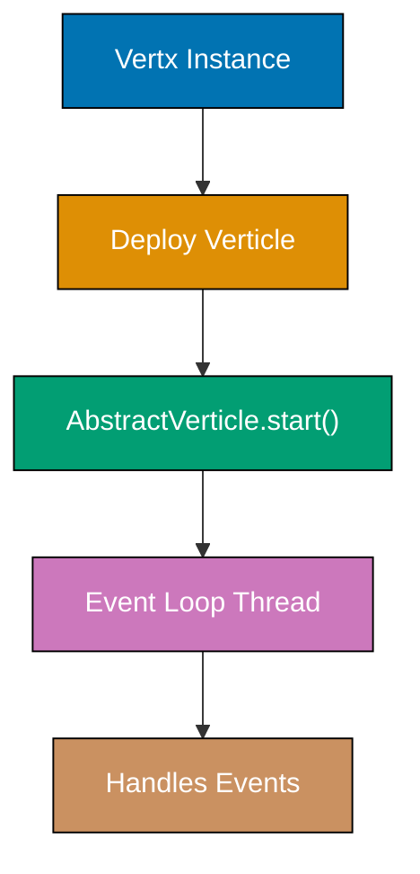

## Group 1: Core Vert.x Fundamentals

### Example 1: Creating and Deploying a Verticle

A verticle is the fundamental unit of deployment in Vert.x—an actor-like component that runs on the event loop. You extend `AbstractVerticle` and override `start()` to initialize your application.



```java
import io.vertx.core.AbstractVerticle;          // => Base class for all standard verticles
import io.vertx.core.Promise;                   // => Used to signal async start completion
import io.vertx.core.Vertx;                     // => Entry point: creates event loop, deploys verticles

public class MainVerticle extends AbstractVerticle {
  // => Extends AbstractVerticle to participate in Vert.x lifecycle
  // => This class runs on a single event loop thread

  @Override
  public void start(Promise<Void> startPromise) {
    // => Called once when verticle is deployed
    // => startPromise signals deployment success or failure to caller
    System.out.println("Verticle started on thread: "
      + Thread.currentThread().getName());
    // => Output: Verticle started on thread: vert.x-eventloop-thread-0
    // => Always runs on an event loop thread, never a plain Java thread

    startPromise.complete();
    // => Signals: "I finished starting up successfully"
    // => If you call startPromise.fail(cause), deployment is aborted
  }

  @Override
  public void stop(Promise<Void> stopPromise) {
    // => Called when verticle is undeployed (app shutdown or hot-reload)
    // => Use this to close resources: HTTP servers, DB connections, timers
    System.out.println("Verticle stopped");
    // => Output: Verticle stopped
    stopPromise.complete();
    // => Signal clean shutdown; callers await this before proceeding
  }

  public static void main(String[] args) {
    Vertx vertx = Vertx.vertx();
    // => Creates a new Vert.x instance with default options
    // => Starts the event loop thread pool (default: 2 * CPU cores)
    // => Only create ONE Vertx instance per JVM process

    vertx.deployVerticle(new MainVerticle())
      .onSuccess(id -> System.out.println("Deployed with ID: " + id))
      // => Output: Deployed with ID: 7a3c9f12-...
      // => Deployment ID is used to undeploy later: vertx.undeploy(id)
      .onFailure(err -> System.err.println("Deployment failed: " + err));
      // => Handles deployment errors (e.g., port already in use)
  }
}
```

**Key Takeaway**: Verticles are your application's deployment unit. One verticle instance per event loop thread; Vert.x manages thread assignment automatically.

**Why It Matters**: The verticle model enforces concurrency safety by design—each verticle owns its event loop thread, so you never need synchronized blocks or thread-safe data structures for verticle-local state. This eliminates entire classes of race conditions common in thread-per-request frameworks. Deploying multiple instances of the same verticle scales across CPU cores without writing a single line of concurrency code.

---

### Example 2: The Event Loop Golden Rule

Vert.x runs all handlers on the event loop. The golden rule is: **never block the event loop**. This example demonstrates what blocking means and how to detect it.

```java
import io.vertx.core.AbstractVerticle;
import io.vertx.core.Promise;
import io.vertx.core.Vertx;
import io.vertx.core.VertxOptions;

public class EventLoopDemo extends AbstractVerticle {

  @Override
  public void start(Promise<Void> startPromise) {
    // WRONG - blocks the event loop (never do this)
    // Thread.sleep(5000); // => Freezes ALL event handling for 5 seconds
    // new File("data.txt").exists(); // => Blocking file I/O on event loop

    // CORRECT - non-blocking timer using Vert.x scheduler
    vertx.setTimer(2000, timerId -> {
      // => Handler fires after 2000ms on the SAME event loop thread
      // => timerId is a long you can use to cancel: vertx.cancelTimer(timerId)
      System.out.println("Timer fired after 2 seconds");
      // => Output: Timer fired after 2 seconds
      // => Event loop was FREE to handle other events during those 2 seconds
    });

    // CORRECT - periodic timer
    vertx.setPeriodic(1000, timerId -> {
      // => Handler fires every 1000ms
      System.out.println("Tick: " + System.currentTimeMillis());
      // => Output: Tick: 1741234567890 (every second)
    });

    startPromise.complete();
    // => Start completes immediately; timers fire asynchronously later
  }

  public static void main(String[] args) {
    // Enable blocked thread checker for development
    VertxOptions options = new VertxOptions()
      .setBlockedThreadCheckInterval(1000)
      // => Vert.x warns if event loop is blocked >1000ms
      // => Default is 2000ms; lower this in dev to catch accidental blocking
      .setMaxEventLoopExecuteTime(2000_000_000L);
      // => Max nanoseconds before "blocked thread" warning fires (2s default)

    Vertx vertx = Vertx.vertx(options);
    // => Creates Vertx with blocked-thread detector enabled
    vertx.deployVerticle(new EventLoopDemo());
  }
}
```

**Key Takeaway**: The event loop must never block. Use Vert.x timers, async file I/O, and worker verticles instead of blocking APIs.

**Why It Matters**: A single blocked event loop thread stalls all HTTP requests, WebSocket messages, and timer callbacks processed by that thread. In a default Vert.x setup with 2×CPU event loop threads, blocking just one thread halves your throughput. The blocked thread checker gives you an early warning during development, preventing performance disasters that are notoriously hard to diagnose in production under high load.

---

### Example 3: Deploying Multiple Verticle Instances

You can deploy several instances of the same verticle to distribute load across event loop threads. Vert.x round-robins incoming connections across instances.

```java
import io.vertx.core.AbstractVerticle;
import io.vertx.core.DeploymentOptions;
import io.vertx.core.Promise;
import io.vertx.core.Vertx;

public class WorkerVerticle extends AbstractVerticle {

  @Override
  public void start(Promise<Void> startPromise) {
    System.out.println("Instance started on: "
      + Thread.currentThread().getName());
    // => Output (x4): Instance started on: vert.x-eventloop-thread-0
    //                  Instance started on: vert.x-eventloop-thread-1
    //                  Instance started on: vert.x-eventloop-thread-2
    //                  Instance started on: vert.x-eventloop-thread-3
    // => Each instance gets its own event loop thread automatically
    startPromise.complete();
  }

  public static void main(String[] args) {
    Vertx vertx = Vertx.vertx();

    DeploymentOptions options = new DeploymentOptions()
      .setInstances(4);
      // => Deploy 4 independent copies of WorkerVerticle
      // => Each instance runs on a separate event loop thread
      // => Vert.x load-balances event bus messages across all 4

    vertx.deployVerticle(WorkerVerticle.class.getName(), options)
      // => Use class name string for multi-instance deployments
      // => Vert.x instantiates the class 4 times via reflection
      .onSuccess(deploymentId -> {
        System.out.println("4 instances deployed: " + deploymentId);
        // => deploymentId covers all 4 instances; undeploy all with one call
      })
      .onFailure(err -> System.err.println("Failed: " + err));
  }
}
```

**Key Takeaway**: Use `DeploymentOptions.setInstances(n)` to scale verticles across CPU cores. Vert.x handles thread distribution automatically.

**Why It Matters**: Deploying `2 * Runtime.getRuntime().availableProcessors()` instances saturates all available CPU cores without writing thread pool management code. This horizontal scaling within a single JVM process delivers near-linear throughput gains on multi-core machines, making Vert.x applications highly efficient for I/O-bound workloads like REST APIs and WebSocket servers.

---

### Example 4: Futures and Async Composition

Vert.x 4.x uses `Future<T>` for all async operations. You chain operations with `compose`, `map`, and `onSuccess`/`onFailure` instead of nesting callbacks.

```java
import io.vertx.core.Future;
import io.vertx.core.Promise;
import io.vertx.core.Vertx;

public class FutureDemo {

  public static void main(String[] args) {
    Vertx vertx = Vertx.vertx();

    // Create a Future manually using Promise
    Promise<String> promise = Promise.promise();
    // => Promise is the write-side; Future is the read-side
    // => Consumers get future(); producers call promise.complete/fail

    Future<String> future = promise.future();
    // => future is a handle to the eventual result

    // Register handlers BEFORE completing (safe in async world)
    future
      .map(String::toUpperCase)
      // => Transforms result: "hello" → "HELLO"
      // => map() is synchronous transformation; use compose() for async
      .onSuccess(result -> System.out.println("Result: " + result))
      // => Output: Result: HELLO
      .onFailure(err -> System.err.println("Error: " + err));

    promise.complete("hello");
    // => Triggers the chain: map → onSuccess
    // => Handlers fire asynchronously on the event loop

    // Composing multiple async operations
    fetchUser(vertx, "user-1")
      .compose(user -> fetchOrders(vertx, user))
      // => compose() chains async operations sequentially
      // => Only called if fetchUser succeeds; short-circuits on failure
      .compose(orders -> sendEmail(vertx, orders))
      // => Each step returns a Future; compose flattens the nested Future
      .onSuccess(v -> System.out.println("Email sent"))
      .onFailure(err -> System.err.println("Pipeline failed: " + err));
      // => Single failure handler for the entire chain
  }

  static Future<String> fetchUser(Vertx vertx, String id) {
    // => Simulates async user fetch (database, HTTP, etc.)
    return vertx.executeBlocking(() -> "User:" + id);
    // => executeBlocking runs on a worker thread; returns Future
  }

  static Future<String> fetchOrders(Vertx vertx, String user) {
    return vertx.executeBlocking(() -> "Orders for " + user);
    // => Simulates async order fetch
  }

  static Future<Void> sendEmail(Vertx vertx, String orders) {
    return vertx.executeBlocking(() -> {
      System.out.println("Sending email for: " + orders);
      // => Output: Sending email for: Orders for User:user-1
      return null;
      // => Returning null signals Void completion
    });
  }
}
```

**Key Takeaway**: Use `Future.compose()` to chain async operations sequentially. A single `onFailure()` at the end handles errors from any step in the chain.

**Why It Matters**: Flat future chains replace deeply nested callback pyramids, making async code as readable as synchronous code. The fail-fast propagation means one failed step immediately skips remaining steps and delivers the error to the single failure handler. This dramatically reduces the error-handling boilerplate that makes callback-based systems fragile and hard to test.

---

## Group 2: HTTP Server and Request Handling

### Example 5: Creating an HTTP Server

Vert.x HTTP servers are non-blocking and handle thousands of concurrent connections on a single event loop thread. You register a request handler that fires for every incoming HTTP request.

```java
import io.vertx.core.AbstractVerticle;
import io.vertx.core.Promise;
import io.vertx.core.http.HttpServer;

public class HttpServerVerticle extends AbstractVerticle {

  @Override
  public void start(Promise<Void> startPromise) {
    HttpServer server = vertx.createHttpServer();
    // => Creates an HTTP server backed by Netty (not yet listening)
    // => Server uses the event loop thread of this verticle

    server.requestHandler(request -> {
      // => Handler fires for every incoming HTTP request
      // => request is HttpServerRequest: immutable view of incoming request
      System.out.println("Received: " + request.method()
        + " " + request.uri());
      // => Output: Received: GET /hello

      request.response()
        // => Get the mutable response object
        .putHeader("Content-Type", "text/plain")
        // => Set response header; called before writing body
        .end("Hello from Vert.x!");
        // => Write body and flush; MUST call end() or connection hangs
        // => After end(), response is complete; do not write more data
    });

    server.listen(8080)
      // => Bind to port 8080 on all interfaces (0.0.0.0)
      // => Returns Future<HttpServer>; bind is async
      .onSuccess(s -> {
        System.out.println("Server listening on port " + s.actualPort());
        // => Output: Server listening on port 8080
        // => actualPort() is useful when port 0 is used (OS assigns free port)
        startPromise.complete();
        // => Signal that verticle started successfully
      })
      .onFailure(startPromise::fail);
      // => If port is in use, fail deployment with the cause
  }
}
```

**Key Takeaway**: Create an HTTP server with `vertx.createHttpServer()`, attach a request handler, then call `listen()`. Signal deployment completion inside the `onSuccess` callback.

**Why It Matters**: Vert.x HTTP servers use Netty's non-blocking I/O, handling tens of thousands of concurrent connections on a single thread. Calling `startPromise.complete()` inside `listen().onSuccess()` ensures the server is truly ready before Vert.x reports successful deployment, preventing race conditions where load balancers send traffic before the port is bound.

---

### Example 6: Using Vert.x Web Router

The `Router` from `vertx-web` organizes request handlers by HTTP method and path pattern. It replaces raw `requestHandler` with structured route declarations.

```java
import io.vertx.core.AbstractVerticle;
import io.vertx.core.Promise;
import io.vertx.ext.web.Router;
import io.vertx.ext.web.RoutingContext;

public class RouterVerticle extends AbstractVerticle {

  @Override
  public void start(Promise<Void> startPromise) {
    Router router = Router.router(vertx);
    // => Creates a new router; pass vertx instance for event bus integration
    // => Router is NOT thread-safe; create once and reuse across requests

    router.get("/hello")
      // => Match GET /hello exactly
      .handler(this::handleHello);
      // => Method reference to handler; called for each matching request

    router.post("/echo")
      // => Match POST /echo
      .handler(ctx -> {
        // => ctx is RoutingContext: wraps request + response + user data
        ctx.response()
          .putHeader("Content-Type", "text/plain")
          .end("Echo: " + ctx.request().uri());
          // => Output body: Echo: /echo
      });

    router.get("/items")
      // => Match GET /items
      .handler(ctx -> {
        ctx.response()
          .putHeader("Content-Type", "application/json")
          .end("{\"items\": []}");
          // => Return empty JSON array (static for now)
      });

    vertx.createHttpServer()
      .requestHandler(router)
      // => Router implements Handler<HttpServerRequest>
      // => Routes request to matching handler; returns 404 if no match
      .listen(8080)
      .onSuccess(s -> startPromise.complete())
      .onFailure(startPromise::fail);
  }

  private void handleHello(RoutingContext ctx) {
    // => Extracted as a method for readability and testability
    ctx.response()
      .putHeader("Content-Type", "text/plain")
      .end("Hello, World!");
      // => Output: Hello, World!
  }
}
```

**Key Takeaway**: `Router` maps HTTP method+path combinations to handler functions. `RoutingContext` provides a unified API for request, response, and per-request user data.

**Why It Matters**: The router's declarative route table makes API surface visible at a glance, unlike deeply nested if-else chains. Route matching is first-match wins, giving you predictable precedence. The `RoutingContext` carries request-scoped data (authenticated user, parsed body, session) through a handler chain without thread-local variables, making the flow explicit and testable.

---

### Example 7: Path Parameters and Query Parameters

Vert.x Web Router captures named path segments with `:param` syntax and reads query strings from the request. Both are available on `RoutingContext`.

```java
import io.vertx.core.AbstractVerticle;
import io.vertx.core.Promise;
import io.vertx.core.json.JsonObject;
import io.vertx.ext.web.Router;
import io.vertx.ext.web.RoutingContext;

public class ParamsVerticle extends AbstractVerticle {

  @Override
  public void start(Promise<Void> startPromise) {
    Router router = Router.router(vertx);

    // Path parameter: /users/42 → id = "42"
    router.get("/users/:id")
      // => :id captures any URL segment at that position
      // => /users/alice → id = "alice"
      // => /users/123  → id = "123"
      .handler(this::handleGetUser);

    // Multiple path parameters: /orgs/acme/repos/vertx
    router.get("/orgs/:org/repos/:repo")
      // => Captures two named segments
      .handler(ctx -> {
        String org = ctx.pathParam("org");
        // => org = "acme"
        String repo = ctx.pathParam("repo");
        // => repo = "vertx"
        ctx.response()
          .putHeader("Content-Type", "application/json")
          .end(new JsonObject()
            .put("org", org)
            .put("repo", repo)
            .encode());
          // => Output: {"org":"acme","repo":"vertx"}
      });

    vertx.createHttpServer()
      .requestHandler(router)
      .listen(8080)
      .onSuccess(s -> startPromise.complete())
      .onFailure(startPromise::fail);
  }

  private void handleGetUser(RoutingContext ctx) {
    String id = ctx.pathParam("id");
    // => Retrieves named path parameter; null if param not declared on route

    // Query parameters from ?name=alice&role=admin
    String name = ctx.queryParam("name").stream().findFirst().orElse("unknown");
    // => queryParam returns List<String> (multi-value params supported)
    // => /users/42?name=alice → name = "alice"
    // => /users/42           → name = "unknown"

    String role = ctx.request().getParam("role");
    // => getParam works for both path params and query params
    // => Returns null if not present

    ctx.response()
      .putHeader("Content-Type", "application/json")
      .end(new JsonObject()
        .put("id", id)
        .put("name", name)
        .put("role", role != null ? role : "viewer")
        .encode());
    // => Output: {"id":"42","name":"alice","role":"admin"}
  }
}
```

**Key Takeaway**: Use `:paramName` in route patterns for path parameters and `ctx.queryParam()` for query strings. Both return strings; parse to typed values in your handler.

**Why It Matters**: Explicit path parameters make your API surface self-documenting and allow the router to reject malformed paths before your handler runs. Query parameter access through `RoutingContext` keeps all request data in one place, simplifying handler signatures and making unit testing straightforward—you only need to mock `RoutingContext`.

---

### Example 8: Reading the Request Body

For POST/PUT requests, you must attach a `BodyHandler` to the router before your route handler. The body handler buffers the request body and makes it available on `RoutingContext`.

```java
import io.vertx.core.AbstractVerticle;
import io.vertx.core.Promise;
import io.vertx.core.json.JsonObject;
import io.vertx.ext.web.Router;
import io.vertx.ext.web.RoutingContext;
import io.vertx.ext.web.handler.BodyHandler;

public class BodyReadVerticle extends AbstractVerticle {

  @Override
  public void start(Promise<Void> startPromise) {
    Router router = Router.router(vertx);

    // MUST add BodyHandler before any route that reads the body
    router.route().handler(BodyHandler.create());
    // => router.route() with no args matches ALL routes/methods
    // => BodyHandler buffers the entire request body into memory
    // => Default max body size: 10MB; configure with setBodyLimit()

    router.post("/users")
      .handler(this::createUser);

    router.put("/users/:id")
      .handler(ctx -> {
        String id = ctx.pathParam("id");
        // => Extract path param before reading body
        JsonObject body = ctx.body().asJsonObject();
        // => Parse body as JSON; throws if invalid JSON
        // => ctx.body() is Buffer; asJsonObject() deserializes it

        ctx.response()
          .putHeader("Content-Type", "application/json")
          .end(new JsonObject()
            .put("updated", id)
            .put("name", body.getString("name"))
            .encode());
        // => Output: {"updated":"42","name":"Alice"}
      });

    vertx.createHttpServer()
      .requestHandler(router)
      .listen(8080)
      .onSuccess(s -> startPromise.complete())
      .onFailure(startPromise::fail);
  }

  private void createUser(RoutingContext ctx) {
    JsonObject body = ctx.body().asJsonObject();
    // => Body is available because BodyHandler already ran

    if (body == null || !body.containsKey("name")) {
      // => Validate required fields before processing
      ctx.response().setStatusCode(400)
        // => 400 Bad Request for client errors
        .end("{\"error\":\"name is required\"}");
      return;
      // => Return early to stop handler execution
    }

    String name = body.getString("name");
    // => Extract string field; returns null if key absent
    int age = body.getInteger("age", 0);
    // => Extract integer with default value 0 if key absent

    ctx.response()
      .setStatusCode(201)
      // => 201 Created for successful resource creation
      .putHeader("Content-Type", "application/json")
      .end(new JsonObject()
        .put("id", "new-123")
        // => In production, use DB-generated ID
        .put("name", name)
        .put("age", age)
        .encode());
    // => Output: {"id":"new-123","name":"Alice","age":30}
  }
}
```

**Key Takeaway**: Add `BodyHandler` to the router before route handlers that read request bodies. Access the parsed body via `ctx.body().asJsonObject()` or `ctx.body().asString()`.

**Why It Matters**: The body handler decouples body buffering from your business logic. Without it, you would manually accumulate body chunks in an async data event loop, a common source of bugs. The centralized buffer approach also enforces body size limits at the framework layer, preventing memory exhaustion attacks before they reach your application code.

---

### Example 9: Sending JSON Responses

Vert.x provides `JsonObject` and `JsonArray` for safe, fluent JSON construction. Use them to build consistent API responses without manual string formatting.

```java
import io.vertx.core.AbstractVerticle;
import io.vertx.core.Promise;
import io.vertx.core.json.JsonArray;
import io.vertx.core.json.JsonObject;
import io.vertx.ext.web.Router;
import io.vertx.ext.web.RoutingContext;

public class JsonResponseVerticle extends AbstractVerticle {

  @Override
  public void start(Promise<Void> startPromise) {
    Router router = Router.router(vertx);

    router.get("/user")
      .handler(this::getUser);

    router.get("/users")
      .handler(this::getUsers);

    router.get("/error")
      .handler(this::errorExample);

    vertx.createHttpServer()
      .requestHandler(router)
      .listen(8080)
      .onSuccess(s -> startPromise.complete())
      .onFailure(startPromise::fail);
  }

  private void getUser(RoutingContext ctx) {
    JsonObject user = new JsonObject()
      // => JsonObject: type-safe JSON object builder
      .put("id", 1)
      // => put(key, value) supports String, Integer, Long, Boolean, JsonObject, JsonArray
      .put("name", "Alice")
      .put("email", "alice@example.com")
      .put("active", true);
      // => Fluent builder: each put() returns the same JsonObject

    ctx.response()
      .putHeader("Content-Type", "application/json")
      .end(user.encode());
      // => encode() serializes to compact JSON string
      // => Output: {"id":1,"name":"Alice","email":"alice@example.com","active":true}
  }

  private void getUsers(RoutingContext ctx) {
    JsonArray users = new JsonArray()
      // => JsonArray: type-safe JSON array builder
      .add(new JsonObject().put("id", 1).put("name", "Alice"))
      // => add() appends any JSON-compatible type
      .add(new JsonObject().put("id", 2).put("name", "Bob"));
      // => Nested JsonObjects build complex structures safely

    JsonObject response = new JsonObject()
      .put("users", users)
      // => Embed JsonArray inside JsonObject
      .put("total", users.size());
      // => size() returns element count: 2

    ctx.json(response);
    // => ctx.json() is shorthand: sets Content-Type to application/json
    // => and calls response.end(jsonObject.encode()) in one call
    // => Output: {"users":[{"id":1,"name":"Alice"},{"id":2,"name":"Bob"}],"total":2}
  }

  private void errorExample(RoutingContext ctx) {
    JsonObject error = new JsonObject()
      .put("error", "NOT_FOUND")
      .put("message", "Resource not found")
      .put("path", ctx.request().path());
      // => Include request path for debugging

    ctx.response()
      .setStatusCode(404)
      // => 404 Not Found status code
      .putHeader("Content-Type", "application/json")
      .end(error.encode());
    // => Output: {"error":"NOT_FOUND","message":"Resource not found","path":"/error"}
  }
}
```

**Key Takeaway**: Use `JsonObject` and `JsonArray` for all JSON construction. The `ctx.json()` shorthand sets the Content-Type header and encodes the object in one call.

**Why It Matters**: Manual JSON string concatenation produces subtle bugs with special characters, null values, and nested objects. `JsonObject` handles escaping, null serialization, and type coercion correctly. Consistent use of `ctx.json()` also ensures every JSON endpoint sets the correct `Content-Type` header, preventing clients from guessing the response format.

---

### Example 10: HTTP Status Codes and Response Headers

Every HTTP response carries a status code and headers that communicate success, failure, and metadata. Vert.x makes both explicit on the response object.

```java
import io.vertx.core.AbstractVerticle;
import io.vertx.core.Promise;
import io.vertx.ext.web.Router;
import io.vertx.ext.web.RoutingContext;

public class StatusCodesVerticle extends AbstractVerticle {

  @Override
  public void start(Promise<Void> startPromise) {
    Router router = Router.router(vertx);

    router.get("/ok").handler(ctx -> sendStatus(ctx, 200, "OK"));
    // => 200 OK: successful GET/HEAD

    router.post("/created").handler(ctx -> sendStatus(ctx, 201, "Created"));
    // => 201 Created: successful resource creation (POST)

    router.get("/no-content").handler(ctx -> {
      ctx.response().setStatusCode(204).end();
      // => 204 No Content: success but no body (DELETE, some PUTs)
      // => MUST NOT include a response body with 204
    });

    router.get("/redirect").handler(ctx -> {
      ctx.response()
        .setStatusCode(301)
        // => 301 Moved Permanently: URL has changed forever
        .putHeader("Location", "/new-location")
        // => Location header tells client where to go
        .end();
        // => Body is empty for redirects
    });

    router.get("/bad-request").handler(ctx -> {
      ctx.response()
        .setStatusCode(400)
        // => 400 Bad Request: client sent malformed data
        .putHeader("Content-Type", "application/json")
        .end("{\"error\":\"Invalid input\"}");
    });

    router.get("/unauthorized").handler(ctx -> {
      ctx.response()
        .setStatusCode(401)
        // => 401 Unauthorized: missing or invalid credentials
        .putHeader("WWW-Authenticate", "Bearer realm=\"api\"")
        // => WWW-Authenticate tells client which auth scheme to use
        .end();
    });

    router.get("/forbidden").handler(ctx -> {
      ctx.response().setStatusCode(403).end("Forbidden");
      // => 403 Forbidden: authenticated but not authorized
      // => Different from 401: client IS authenticated, just lacks permission
    });

    router.get("/internal-error").handler(ctx -> {
      ctx.response().setStatusCode(500).end("Internal Server Error");
      // => 500 Internal Server Error: unexpected server failure
      // => In production, never expose stack traces in 500 responses
    });

    vertx.createHttpServer()
      .requestHandler(router)
      .listen(8080)
      .onSuccess(s -> startPromise.complete())
      .onFailure(startPromise::fail);
  }

  private void sendStatus(RoutingContext ctx, int code, String body) {
    ctx.response()
      .setStatusCode(code)
      // => Default status code is 200; always set explicitly for non-200
      .putHeader("Content-Type", "text/plain")
      .putHeader("X-Request-Id", java.util.UUID.randomUUID().toString())
      // => Custom headers use X- prefix by convention (deprecated but widely used)
      // => Unique request ID helps correlate logs across services
      .end(body);
  }
}
```

**Key Takeaway**: Set status codes explicitly with `setStatusCode()` before calling `end()`. Default status is 200; always override for error, creation, or redirect responses.

**Why It Matters**: Correct HTTP status codes allow clients to distinguish retryable errors (503) from permanent failures (404) without parsing response bodies. API clients, load balancers, and monitoring systems all interpret status codes to trigger automated behavior—retries, circuit breakers, alerting. Returning 200 with an error body silently breaks these integrations and makes incident debugging significantly harder.

---

## Group 3: Working with JSON and Data

### Example 11: JsonObject Deep Dive

`JsonObject` provides rich methods for safe data access, nested navigation, and serialization. Understanding these prevents null pointer exceptions in deeply nested JSON structures.

```java
import io.vertx.core.json.JsonArray;
import io.vertx.core.json.JsonObject;
import java.util.Map;

public class JsonObjectDemo {

  public static void main(String[] args) {
    // Building from a Map
    JsonObject fromMap = new JsonObject(Map.of(
      "id", 1,
      "name", "Alice"
    ));
    // => fromMap = {"id":1,"name":"Alice"}

    // Parsing from a JSON string
    JsonObject parsed = new JsonObject("{\"score\":98,\"grade\":\"A\"}");
    // => parsed = {"score":98,"grade":"A"}
    // => Throws DecodeException if string is not valid JSON

    // Safe typed access
    String name = fromMap.getString("name");
    // => name = "Alice"; returns null if key absent

    int id = fromMap.getInteger("id");
    // => id = 1; throws NullPointerException if key absent (use default overload)

    int score = parsed.getInteger("score", 0);
    // => score = 98; second arg is default value if key absent
    // => Safe alternative to getInteger("score")

    // Nested objects
    JsonObject nested = new JsonObject()
      .put("user", new JsonObject()
        .put("address", new JsonObject()
          .put("city", "Jakarta")));
    // => {"user":{"address":{"city":"Jakarta"}}}

    String city = nested.getJsonObject("user")
      .getJsonObject("address")
      .getString("city");
    // => city = "Jakarta"
    // => Chain getJsonObject() calls to navigate nested structure

    // Working with arrays
    JsonObject withArray = new JsonObject()
      .put("tags", new JsonArray().add("java").add("vertx"));
    // => {"tags":["java","vertx"]}

    JsonArray tags = withArray.getJsonArray("tags");
    // => tags = ["java","vertx"]

    String firstTag = tags.getString(0);
    // => firstTag = "java"
    // => getXxx(int index) for array element access

    // Merging objects
    JsonObject base = new JsonObject().put("a", 1).put("b", 2);
    JsonObject override = new JsonObject().put("b", 99).put("c", 3);
    JsonObject merged = base.mergeIn(override);
    // => merged = {"a":1,"b":99,"c":3}
    // => mergeIn is destructive: modifies base in place and returns it

    // Converting to Map
    Map<String, Object> asMap = merged.getMap();
    // => Regular Java Map; useful for frameworks expecting Map<String, Object>

    System.out.println(merged.encodePrettily());
    // => encodePrettily() outputs indented JSON for logging/debugging
    // => Output:
    // => {
    // =>   "a" : 1,
    // =>   "b" : 99,
    // =>   "c" : 3
    // => }
  }
}
```

**Key Takeaway**: Use typed getters with default values (`getInteger("key", 0)`) to avoid NPEs. Use `encodePrettily()` for human-readable output and `encode()` for compact JSON.

**Why It Matters**: Defensive JSON access with defaults prevents cascading null pointer exceptions when external APIs return partial data, a common occurrence in microservice architectures. The fluent builder API and safe access methods eliminate boilerplate try-catch blocks around JSON parsing, making integration code concise and readable while handling the full range of partial or malformed responses gracefully.

---

### Example 12: Serving Static Files

Vert.x Web includes `StaticHandler` to serve files from the filesystem or classpath. A single handler declaration replaces manually routing every asset request.

```java
import io.vertx.core.AbstractVerticle;
import io.vertx.core.Promise;
import io.vertx.ext.web.Router;
import io.vertx.ext.web.handler.StaticHandler;

public class StaticFilesVerticle extends AbstractVerticle {

  @Override
  public void start(Promise<Void> startPromise) {
    Router router = Router.router(vertx);

    // API routes before static handler
    router.get("/api/health")
      .handler(ctx -> ctx.response().end("OK"));
      // => API routes defined first take priority over static handler

    // Serve static files from "webroot" directory (default)
    router.route("/static/*")
      // => Match all paths under /static/
      .handler(StaticHandler.create());
      // => Looks for files in src/main/resources/webroot/ on classpath
      // => GET /static/index.html → serves webroot/index.html
      // => GET /static/js/app.js → serves webroot/js/app.js
      // => Returns 404 if file not found

    // Serve from a custom filesystem path
    router.route("/assets/*")
      .handler(StaticHandler.create("/var/www/assets"));
      // => Absolute filesystem path; useful for user-uploaded content

    // SPA (Single Page Application) fallback
    router.get("/*")
      .handler(StaticHandler.create()
        .setIndexPage("index.html")
        // => Serve index.html for unknown paths (SPA client-side routing)
        .setCachingEnabled(true)
        // => Set Cache-Control headers for browser caching
        .setMaxAgeSeconds(3600));
        // => Cache files for 1 hour (3600 seconds)

    vertx.createHttpServer()
      .requestHandler(router)
      .listen(8080)
      .onSuccess(s -> {
        System.out.println("Static server started on port 8080");
        // => Output: Static server started on port 8080
        startPromise.complete();
      })
      .onFailure(startPromise::fail);
  }
}
```

**Key Takeaway**: Use `StaticHandler.create()` to serve static assets. Define API routes before the static handler to ensure API paths take precedence over file system lookup.

**Why It Matters**: Serving static files through Vert.x's non-blocking static handler avoids thread blocking from traditional file I/O. The handler uses OS-level `sendfile()` when possible, making large file transfers highly efficient. Enabling caching reduces server load by letting browsers cache unchanged assets, a critical optimization for production web applications with high asset counts.

---

## Group 4: Error Handling

### Example 13: Route-Level and Global Error Handlers

Vert.x Web lets you define error handlers at the route level and a global failure handler that catches unhandled exceptions from any route.

```java
import io.vertx.core.AbstractVerticle;
import io.vertx.core.Promise;
import io.vertx.core.json.JsonObject;
import io.vertx.ext.web.Router;
import io.vertx.ext.web.RoutingContext;

public class ErrorHandlingVerticle extends AbstractVerticle {

  @Override
  public void start(Promise<Void> startPromise) {
    Router router = Router.router(vertx);

    // Route that intentionally fails
    router.get("/fail")
      .handler(ctx -> {
        ctx.fail(500, new RuntimeException("Something went wrong"));
        // => ctx.fail(statusCode, cause) triggers the failure handler
        // => Stops current handler chain and routes to failure handler
        // => Do NOT call ctx.response().end() after ctx.fail()
      });

    router.get("/not-found")
      .handler(ctx -> {
        ctx.fail(404);
        // => Fail with status code only (no exception)
        // => Useful for business-logic "not found" scenarios
      });

    // Per-route error handler (only catches failures from this route)
    router.get("/guarded")
      .handler(ctx -> {
        throw new IllegalArgumentException("Bad input");
        // => Uncaught exception is automatically caught by Vert.x
        // => Converted to ctx.fail(500, exception)
      })
      .failureHandler(ctx -> {
        // => failureHandler is chained after the main handler
        // => Only fires for failures from THIS route
        ctx.response()
          .setStatusCode(ctx.statusCode())
          .end("Route-specific error: " + ctx.failure().getMessage());
        // => ctx.failure() returns the Throwable that caused failure
        // => ctx.statusCode() returns the HTTP status set by ctx.fail()
      });

    // Global failure handler - catches all unhandled failures
    router.errorHandler(500, this::handleInternalError);
    // => errorHandler(statusCode, handler) registers for specific status code
    router.errorHandler(404, ctx -> {
      ctx.json(new JsonObject()
        .put("error", "NOT_FOUND")
        .put("path", ctx.request().path()));
      // => Structured 404 response for all unmatched routes
    });

    vertx.createHttpServer()
      .requestHandler(router)
      .listen(8080)
      .onSuccess(s -> startPromise.complete())
      .onFailure(startPromise::fail);
  }

  private void handleInternalError(RoutingContext ctx) {
    Throwable cause = ctx.failure();
    // => Retrieves the root exception; null if fail(code) with no exception

    System.err.println("Internal error: " + cause);
    // => Log the full exception for debugging
    // => NEVER expose stack traces in API responses

    ctx.response()
      .setStatusCode(500)
      .putHeader("Content-Type", "application/json")
      .end(new JsonObject()
        .put("error", "INTERNAL_ERROR")
        .put("message", "An unexpected error occurred")
        .encode());
    // => Sanitized error response; no internal details
  }
}
```

**Key Takeaway**: Use `ctx.fail()` to trigger error handlers and `router.errorHandler()` for global failure handling. Never expose stack traces in API responses.

**Why It Matters**: Centralized error handling enforces consistent error response shapes across all endpoints, making API clients more reliable. Global handlers prevent unhandled exceptions from silently hanging connections, a difficult-to-diagnose production problem. Logging full exceptions on the server while returning sanitized messages to clients balances debuggability with security—stack traces reveal implementation details that attackers can exploit.

---

### Example 14: Custom Exception Types and Error Codes

Defining custom exception classes with domain-specific error codes produces machine-readable error responses that API clients can programmatically interpret.

```java
import io.vertx.core.AbstractVerticle;
import io.vertx.core.Promise;
import io.vertx.core.json.JsonObject;
import io.vertx.ext.web.Router;
import io.vertx.ext.web.RoutingContext;
import io.vertx.ext.web.handler.BodyHandler;

public class CustomExceptionsVerticle extends AbstractVerticle {

  // Custom exception hierarchy
  static class ApiException extends RuntimeException {
    private final int statusCode;
    // => HTTP status code this exception maps to
    private final String errorCode;
    // => Machine-readable error code for API clients

    ApiException(int statusCode, String errorCode, String message) {
      super(message);
      this.statusCode = statusCode;
      // => Store as field for the failure handler to read
      this.errorCode = errorCode;
    }

    int getStatusCode() { return statusCode; }
    // => Accessor for failure handler

    String getErrorCode() { return errorCode; }
  }

  static class NotFoundException extends ApiException {
    NotFoundException(String resource, String id) {
      super(404, "NOT_FOUND", resource + " with id=" + id + " not found");
      // => Pre-fills status 404 and error code for this domain event
    }
  }

  static class ValidationException extends ApiException {
    ValidationException(String field, String reason) {
      super(400, "VALIDATION_ERROR", "Field '" + field + "': " + reason);
    }
  }

  @Override
  public void start(Promise<Void> startPromise) {
    Router router = Router.router(vertx);
    router.route().handler(BodyHandler.create());

    router.get("/users/:id").handler(ctx -> {
      String id = ctx.pathParam("id");
      if ("999".equals(id)) {
        throw new NotFoundException("User", id);
        // => Vert.x catches unchecked exceptions and calls ctx.fail(500, ex)
        // => But our failure handler reads the actual status from the exception
      }
      ctx.json(new JsonObject().put("id", id).put("name", "Alice"));
    });

    router.post("/users").handler(ctx -> {
      JsonObject body = ctx.body().asJsonObject();
      if (body == null || !body.containsKey("email")) {
        throw new ValidationException("email", "is required");
      }
      ctx.response().setStatusCode(201)
        .json(new JsonObject().put("created", true));
    });

    // Global handler for all ApiExceptions
    router.errorHandler(500, ctx -> {
      Throwable ex = ctx.failure();
      // => Check if this is our custom exception
      if (ex instanceof ApiException apiEx) {
        // => Java 16+ pattern matching instanceof
        ctx.response()
          .setStatusCode(apiEx.getStatusCode())
          // => Use domain-specific status code, not the default 500
          .putHeader("Content-Type", "application/json")
          .end(new JsonObject()
            .put("error", apiEx.getErrorCode())
            .put("message", ex.getMessage())
            .encode());
      } else {
        ctx.response().setStatusCode(500)
          .end("{\"error\":\"INTERNAL_ERROR\"}");
      }
    });

    vertx.createHttpServer()
      .requestHandler(router)
      .listen(8080)
      .onSuccess(s -> startPromise.complete())
      .onFailure(startPromise::fail);
  }
}
```

**Key Takeaway**: Define custom exception classes that carry HTTP status codes. A single global failure handler translates them to consistent JSON error responses.

**Why It Matters**: Custom exception types decouple business logic from HTTP concerns—service methods throw domain exceptions without knowing anything about HTTP status codes. The centralized mapping in the failure handler keeps this translation logic in one place, making it easy to change error response formats across all endpoints simultaneously. API clients can rely on consistent error code strings for programmatic error handling.

---

## Group 5: The Event Bus

### Example 15: Event Bus Point-to-Point Messaging

The Vert.x event bus is a lightweight message-passing system connecting verticles. Point-to-point delivery sends a message to exactly one consumer registered at the address.


```java
import io.vertx.core.AbstractVerticle;
import io.vertx.core.Promise;
import io.vertx.core.Vertx;
import io.vertx.core.eventbus.EventBus;
import io.vertx.core.eventbus.Message;

public class EventBusDemo extends AbstractVerticle {

  @Override
  public void start(Promise<Void> startPromise) {
    EventBus eb = vertx.eventBus();
    // => Obtain the event bus; shared across all verticles in the same Vertx instance

    // Register a consumer on an address
    eb.consumer("users.create", this::handleCreateUser);
    // => "users.create" is the address (any string; convention: domain.action)
    // => Only ONE consumer receives each point-to-point message
    // => Multiple consumers on same address → round-robin delivery

    // Send a message with a reply handler
    eb.request("users.create", new io.vertx.core.json.JsonObject()
      .put("name", "Bob")
      .put("email", "bob@example.com"))
      // => request() sends point-to-point AND expects a reply
      // => Blocks until reply arrives or timeout expires (default: 30s)
      .onSuccess(reply -> {
        System.out.println("Reply: " + reply.body());
        // => Output: Reply: {"id":"new-42","name":"Bob"}
      })
      .onFailure(err -> System.err.println("No reply: " + err));

    // Fire-and-forget: no reply expected
    eb.send("notifications.email", "Welcome to Vert.x!");
    // => send() delivers to ONE consumer; does not wait for reply
    // => If no consumer exists, message is silently dropped

    startPromise.complete();
  }

  private void handleCreateUser(Message<io.vertx.core.json.JsonObject> msg) {
    io.vertx.core.json.JsonObject data = msg.body();
    // => msg.body() returns the message payload; type parameter ensures compile-time safety
    System.out.println("Creating user: " + data.getString("name"));
    // => Output: Creating user: Bob

    // Simulate user creation
    io.vertx.core.json.JsonObject created = new io.vertx.core.json.JsonObject()
      .put("id", "new-42")
      .put("name", data.getString("name"));

    msg.reply(created);
    // => Send reply back to the requester
    // => Only valid when sender used request(); ignored for send()
  }
}
```

**Key Takeaway**: Use `eventBus.request()` for request/reply patterns and `eventBus.send()` for fire-and-forget. Consumers call `msg.reply()` to respond to requests.

**Why It Matters**: The event bus enables loose coupling between verticles—the creator of a user doesn't know which verticle handles creation. This allows horizontal scaling of compute-intensive handlers by deploying more consumer instances without changing sender code. Event bus messaging also provides a clean boundary for unit testing: you can test consumers in isolation by sending test messages without invoking the full HTTP stack.

---

### Example 16: Event Bus Publish/Subscribe

Publish/subscribe delivers a message to ALL consumers registered on an address. Use it for broadcasting events to multiple interested parties simultaneously.

```java
import io.vertx.core.AbstractVerticle;
import io.vertx.core.Promise;
import io.vertx.core.Vertx;
import io.vertx.core.eventbus.EventBus;

public class PubSubDemo extends AbstractVerticle {

  @Override
  public void start(Promise<Void> startPromise) {
    EventBus eb = vertx.eventBus();

    // Register multiple consumers on the same address
    eb.consumer("order.placed", msg -> {
      System.out.println("[Email] Sending confirmation for: " + msg.body());
      // => Output: [Email] Sending confirmation for: {"orderId":"ORD-1"}
      // => This consumer sends email notifications
    });

    eb.consumer("order.placed", msg -> {
      System.out.println("[Inventory] Reserving stock for: " + msg.body());
      // => Output: [Inventory] Reserving stock for: {"orderId":"ORD-1"}
      // => This consumer updates inventory
    });

    eb.consumer("order.placed", msg -> {
      System.out.println("[Analytics] Tracking order: " + msg.body());
      // => Output: [Analytics] Tracking order: {"orderId":"ORD-1"}
      // => This consumer records analytics
    });

    // Publish: all three consumers receive this message
    eb.publish("order.placed", new io.vertx.core.json.JsonObject()
      .put("orderId", "ORD-1")
      .put("total", 99.99));
    // => publish() broadcasts to ALL consumers on "order.placed"
    // => All three handlers fire independently
    // => Order of execution is not guaranteed

    // Contrast: send() only delivers to ONE of the three consumers
    eb.send("order.placed", new io.vertx.core.json.JsonObject()
      .put("orderId", "ORD-2"));
    // => Only ONE consumer receives ORD-2 (round-robin selection)
    // => Use publish() when you need ALL consumers to react

    startPromise.complete();
  }
}
```

**Key Takeaway**: Use `eventBus.publish()` to broadcast to all consumers. Use `eventBus.send()` to deliver to exactly one consumer. Same address, different semantics.

**Why It Matters**: Publish/subscribe enables the open/closed principle at the messaging layer—adding a new reaction to an event (e.g., a new analytics service) requires zero changes to the publisher. This decoupling is essential for microservice evolution, where business requirements constantly add cross-cutting concerns. The event bus naturally implements the observer pattern without shared state or coupling to specific subscriber implementations.

---

## Group 6: Configuration and Logging

### Example 17: Application Configuration

Vert.x provides `ConfigRetriever` for hierarchical configuration from files, environment variables, and custom sources. This enables twelve-factor app configuration without code changes.

```java
import io.vertx.config.ConfigRetriever;
import io.vertx.config.ConfigRetrieverOptions;
import io.vertx.config.ConfigStoreOptions;
import io.vertx.core.AbstractVerticle;
import io.vertx.core.Promise;
import io.vertx.core.json.JsonObject;

public class ConfigVerticle extends AbstractVerticle {

  @Override
  public void start(Promise<Void> startPromise) {
    // Configure multiple config sources (later sources override earlier ones)
    ConfigRetrieverOptions options = new ConfigRetrieverOptions()
      .addStore(new ConfigStoreOptions()
        .setType("file")
        // => Load from JSON file; relative to working directory
        .setConfig(new JsonObject().put("path", "config/app.json")))
      .addStore(new ConfigStoreOptions()
        .setType("env"));
        // => Load from environment variables (DB_HOST, HTTP_PORT, etc.)
        // => Environment variables override file config values

    ConfigRetriever retriever = ConfigRetriever.create(vertx, options);
    // => Creates a config retriever bound to this Vert.x instance

    retriever.getConfig()
      // => Asynchronously loads and merges all config sources
      .onSuccess(config -> {
        System.out.println("Loaded config: " + config.encode());
        // => Output: {"http":{"port":8080},"db":{"host":"localhost","port":5432}}

        int port = config.getJsonObject("http", new JsonObject())
          .getInteger("port", 8080);
        // => Read nested config with default value
        // => Falls back to 8080 if "http.port" not configured

        String dbHost = config.getString("DB_HOST", "localhost");
        // => Environment variables are flat keys: DB_HOST maps to config["DB_HOST"]
        // => Default to "localhost" for local development

        startHttpServer(startPromise, port, dbHost);
        // => Pass config values to dependent components
      })
      .onFailure(err -> {
        System.err.println("Config load failed: " + err);
        // => Log config failures clearly; they are often startup blockers
        startPromise.fail(err);
        // => Abort startup if config is unavailable
      });
  }

  private void startHttpServer(Promise<Void> startPromise, int port, String dbHost) {
    System.out.println("Starting server on port " + port + " with DB: " + dbHost);
    // => Output: Starting server on port 8080 with DB: localhost
    startPromise.complete();
    // => Signal successful startup
  }
}
```

**Key Takeaway**: Use `ConfigRetriever` with multiple stores to layer file defaults over environment variable overrides. Always provide default values for non-critical settings.

**Why It Matters**: Externalizing configuration allows the same artifact to run in development, staging, and production without rebuilds. Environment variable override semantics mean your defaults live in version-controlled files while secrets and environment-specific values stay in the deployment platform, satisfying security requirements and enabling infrastructure-as-code. Failing fast on missing required config prevents subtle runtime failures hours after deployment.

---

### Example 18: Structured Logging with SLF4J

Vert.x is compatible with any SLF4J-backed logger. Structured logging with contextual fields (request ID, user ID, operation) makes log aggregation and querying efficient.

```java
import io.vertx.core.AbstractVerticle;
import io.vertx.core.Promise;
import io.vertx.ext.web.Router;
import io.vertx.ext.web.RoutingContext;
import io.vertx.ext.web.handler.BodyHandler;
import org.slf4j.Logger;
import org.slf4j.LoggerFactory;
import org.slf4j.MDC;

public class LoggingVerticle extends AbstractVerticle {

  private static final Logger LOG = LoggerFactory.getLogger(LoggingVerticle.class);
  // => SLF4J logger; backed by Logback or Log4j2 at runtime
  // => Use class-specific logger for granular log filtering by package

  @Override
  public void start(Promise<Void> startPromise) {
    Router router = Router.router(vertx);
    router.route().handler(BodyHandler.create());

    // Request logging middleware
    router.route().handler(ctx -> {
      String requestId = java.util.UUID.randomUUID().toString().substring(0, 8);
      // => Short UUID for request tracing across log lines
      MDC.put("requestId", requestId);
      // => MDC (Mapped Diagnostic Context): thread-local key-value pairs
      // => SLF4J includes MDC values in log output automatically
      // => Logback pattern: [%X{requestId}] %msg%n

      LOG.info("Incoming {} {}", ctx.request().method(), ctx.request().path());
      // => {} placeholders: lazy evaluation, no string concat if log disabled
      // => Output: [a1b2c3d4] Incoming GET /users

      ctx.addBodyEndHandler(v -> {
        // => Fires after response is sent; perfect for access logging
        LOG.info("Completed {} {} → {}",
          ctx.request().method(),
          ctx.request().path(),
          ctx.response().getStatusCode());
        // => Output: [a1b2c3d4] Completed GET /users → 200
        MDC.remove("requestId");
        // => Clean up MDC after request; prevents leaking into other requests
      });

      ctx.next();
      // => Must call next() in middleware handlers to pass to next handler
    });

    router.get("/users").handler(ctx -> {
      LOG.debug("Fetching users list");
      // => DEBUG level for verbose operational details
      // => Disabled in production but enabled for troubleshooting

      LOG.info("Returning users");
      // => INFO level for normal operational events

      ctx.json(new io.vertx.core.json.JsonArray()
        .add(new io.vertx.core.json.JsonObject().put("id", 1)));
    });

    vertx.createHttpServer()
      .requestHandler(router)
      .listen(8080)
      .onSuccess(s -> {
        LOG.info("Server started on port {}", s.actualPort());
        // => Output: Server started on port 8080
        startPromise.complete();
      })
      .onFailure(err -> {
        LOG.error("Server startup failed", err);
        // => LOG.error(msg, throwable) logs stack trace automatically
        startPromise.fail(err);
      });
  }
}
```

**Key Takeaway**: Use SLF4J with MDC for structured, contextual logging. Include request IDs in MDC so all log lines for a request share a correlatable identifier.

**Why It Matters**: Structured logs with consistent fields enable log aggregation platforms (Elasticsearch, Splunk, Loki) to filter and query logs by request ID, user ID, or error code in milliseconds. Random request IDs allow you to reconstruct the complete story of a failing request from dozens of log lines across multiple services, making production incident investigation tractable instead of searching through gigabytes of unstructured text.

---

## Group 7: Vert.x Web Templates and Forms

### Example 19: Handlebars Templates

Vert.x Web supports multiple template engines. Handlebars provides logic-minimal templates for server-side HTML rendering with `{{ variable }}` interpolation.

```java
import io.vertx.core.AbstractVerticle;
import io.vertx.core.Promise;
import io.vertx.core.json.JsonArray;
import io.vertx.core.json.JsonObject;
import io.vertx.ext.web.Router;
import io.vertx.ext.web.RoutingContext;
import io.vertx.ext.web.templ.handlebars.HandlebarsTemplateEngine;

public class TemplateVerticle extends AbstractVerticle {

  private HandlebarsTemplateEngine engine;
  // => Template engine; create once and reuse; thread-safe after initialization

  @Override
  public void start(Promise<Void> startPromise) {
    engine = HandlebarsTemplateEngine.create(vertx);
    // => Creates Handlebars engine; templates loaded from classpath /templates/

    Router router = Router.router(vertx);

    router.get("/").handler(this::renderIndex);
    router.get("/users/:id").handler(this::renderUser);

    vertx.createHttpServer()
      .requestHandler(router)
      .listen(8080)
      .onSuccess(s -> startPromise.complete())
      .onFailure(startPromise::fail);
  }

  private void renderIndex(RoutingContext ctx) {
    JsonObject data = new JsonObject()
      .put("title", "User List")
      // => Template variable: {{ title }}
      .put("users", new JsonArray()
        .add(new JsonObject().put("id", 1).put("name", "Alice"))
        .add(new JsonObject().put("id", 2).put("name", "Bob")));
        // => Array variable: {{#each users}} ... {{/each}}

    engine.render(data, "templates/index.hbs")
      // => Render templates/index.hbs with data as context
      // => Returns Future<Buffer> containing rendered HTML
      .onSuccess(buffer -> {
        ctx.response()
          .putHeader("Content-Type", "text/html")
          .end(buffer);
          // => Send rendered HTML to browser
      })
      .onFailure(err -> {
        ctx.fail(500, err);
        // => Propagate template errors to global failure handler
      });
  }

  private void renderUser(RoutingContext ctx) {
    String id = ctx.pathParam("id");
    // => Fetch user by ID (simulated here)
    JsonObject user = new JsonObject()
      .put("id", id)
      .put("name", "Alice")
      .put("bio", "Software engineer");

    engine.render(user, "templates/user.hbs")
      .onSuccess(buf -> ctx.response()
        .putHeader("Content-Type", "text/html").end(buf))
      .onFailure(err -> ctx.fail(500, err));
  }
}
// Template file: src/main/resources/templates/index.hbs
// <html><body>
//   <h1>{{ title }}</h1>
//   <ul>
//     {{#each users}}
//       <li><a href="/users/{{ id }}">{{ name }}</a></li>
//     {{/each}}
//   </ul>
// </body></html>
```

**Key Takeaway**: Pass a `JsonObject` as the template context to `engine.render()`. Template rendering is async; chain the result in `onSuccess` to send the HTML response.

**Why It Matters**: Server-side rendering with templates eliminates the need for a separate frontend build process for content-focused web applications. Handlebars' logic-minimal syntax enforces a clean separation between display and business logic, making templates maintainable by frontend developers without Vert.x knowledge. Async rendering means the event loop is not blocked while templates load and process, maintaining throughput under concurrent requests.

---

### Example 20: HTML Form Handling

HTML forms submit data via POST with `application/x-www-form-urlencoded` encoding. Vert.x Web's `BodyHandler` parses this format and exposes form fields through the same `getParam()` API.

```java
import io.vertx.core.AbstractVerticle;
import io.vertx.core.Promise;
import io.vertx.ext.web.Router;
import io.vertx.ext.web.RoutingContext;
import io.vertx.ext.web.handler.BodyHandler;

public class FormHandlingVerticle extends AbstractVerticle {

  @Override
  public void start(Promise<Void> startPromise) {
    Router router = Router.router(vertx);

    // BodyHandler must be before form routes
    router.route().handler(BodyHandler.create()
      .setMergeFormAttributes(true));
      // => setMergeFormAttributes(true): form fields available via request.getParam()
      // => Without this, form fields are ONLY in request.formAttributes()

    // Serve the HTML form
    router.get("/register").handler(ctx -> {
      ctx.response()
        .putHeader("Content-Type", "text/html")
        .end("""
          <form method="POST" action="/register">
            <input name="username" placeholder="Username" />
            <input name="email" type="email" placeholder="Email" />
            <input name="password" type="password" placeholder="Password" />
            <button type="submit">Register</button>
          </form>
          """);
          // => Text block (Java 15+) for multiline strings
    });

    // Handle form submission
    router.post("/register").handler(this::handleRegister);

    vertx.createHttpServer()
      .requestHandler(router)
      .listen(8080)
      .onSuccess(s -> startPromise.complete())
      .onFailure(startPromise::fail);
  }

  private void handleRegister(RoutingContext ctx) {
    String username = ctx.request().getParam("username");
    // => Form field accessed same as query param after setMergeFormAttributes
    String email = ctx.request().getParam("email");
    String password = ctx.request().getParam("password");

    // Server-side validation
    if (username == null || username.isBlank()) {
      // => isBlank() checks empty AND whitespace-only strings (Java 11+)
      ctx.response()
        .setStatusCode(400)
        .end("Username is required");
      return;
    }

    if (email == null || !email.contains("@")) {
      ctx.response()
        .setStatusCode(400)
        .end("Valid email is required");
      return;
    }

    System.out.println("Registering: " + username + " / " + email);
    // => Output: Registering: alice / alice@example.com
    // => NEVER log passwords, even in development

    // Redirect after successful form submission (POST-Redirect-GET pattern)
    ctx.response()
      .setStatusCode(303)
      // => 303 See Other: redirect after POST (not 302)
      // => Browser follows with GET, preventing form resubmission on refresh
      .putHeader("Location", "/dashboard?welcome=" + username)
      .end();
  }
}
```

**Key Takeaway**: Use `BodyHandler.setMergeFormAttributes(true)` to access form fields via `getParam()`. Always redirect after a successful POST to prevent form resubmission.

**Why It Matters**: The POST-Redirect-GET pattern prevents duplicate form submissions when users refresh the browser after a successful action, a common source of duplicate records in databases. Server-side validation catches malicious or malformed submissions before they reach business logic, providing defense in depth even when client-side validation is bypassed. Treating form data with the same care as API data prevents injection vulnerabilities.

---

## Group 8: Advanced Request Handling

### Example 21: Request Timeout Handling

Long-running operations need timeouts to prevent connections from hanging indefinitely. Vert.x Web's `TimeoutHandler` automatically responds with 408 after a deadline.

```java
import io.vertx.core.AbstractVerticle;
import io.vertx.core.Promise;
import io.vertx.ext.web.Router;
import io.vertx.ext.web.handler.TimeoutHandler;

public class TimeoutVerticle extends AbstractVerticle {

  @Override
  public void start(Promise<Void> startPromise) {
    Router router = Router.router(vertx);

    // Global timeout: 5000ms for all routes
    router.route().handler(TimeoutHandler.create(5000));
    // => Sends 408 Request Timeout if handler chain doesn't complete in 5000ms
    // => Must be added before route handlers

    router.get("/fast").handler(ctx -> {
      ctx.response().end("Fast response");
      // => Completes well within 5000ms; no timeout
    });

    router.get("/slow").handler(ctx -> {
      vertx.setTimer(3000, id -> {
        // => Response arrives after 3000ms; within 5000ms limit
        if (!ctx.response().ended()) {
          // => Check ended() before writing: TimeoutHandler may have already responded
          ctx.response().end("Slow but OK");
          // => Output: Slow but OK (after 3 seconds)
        }
      });
    });

    router.get("/very-slow").handler(ctx -> {
      vertx.setTimer(10000, id -> {
        // => This fires AFTER the 5000ms timeout has already sent 408
        if (!ctx.response().ended()) {
          ctx.response().end("Too late");
          // => This branch never executes: TimeoutHandler already ended response
        }
      });
      // => Client receives 408 Request Timeout after 5000ms
    });

    // Per-route timeout override
    router.get("/quick-only")
      .handler(TimeoutHandler.create(1000))
      // => This route has a stricter 1000ms timeout
      .handler(ctx -> ctx.response().end("Very fast"));

    vertx.createHttpServer()
      .requestHandler(router)
      .listen(8080)
      .onSuccess(s -> startPromise.complete())
      .onFailure(startPromise::fail);
  }
}
```

**Key Takeaway**: Add `TimeoutHandler` before route handlers. Always check `ctx.response().ended()` before writing in delayed callbacks, as the timeout may have already closed the response.

**Why It Matters**: Without timeouts, a slow database query or external API call keeps a connection open indefinitely, eventually exhausting connection pools and cascading into full service unavailability. Explicit timeouts communicate service level agreements to clients, allow them to retry with a different strategy, and protect server resources from accumulating stalled requests. Checking `response.ended()` prevents double-write exceptions that produce confusing error logs.

---

### Example 22: Content Negotiation

Content negotiation allows a single endpoint to serve multiple formats (JSON, XML, HTML) based on the client's `Accept` header.

```java
import io.vertx.core.AbstractVerticle;
import io.vertx.core.Promise;
import io.vertx.core.json.JsonObject;
import io.vertx.ext.web.Router;
import io.vertx.ext.web.RoutingContext;

public class ContentNegotiationVerticle extends AbstractVerticle {

  @Override
  public void start(Promise<Void> startPromise) {
    Router router = Router.router(vertx);

    router.get("/product/:id").handler(this::getProduct);

    vertx.createHttpServer()
      .requestHandler(router)
      .listen(8080)
      .onSuccess(s -> startPromise.complete())
      .onFailure(startPromise::fail);
  }

  private void getProduct(RoutingContext ctx) {
    String id = ctx.pathParam("id");
    // => id = "42" from GET /product/42

    // Simulated product data
    JsonObject product = new JsonObject()
      .put("id", id)
      .put("name", "Vert.x in Action")
      .put("price", 49.99);

    // Read Accept header to determine response format
    String accept = ctx.request().getHeader("Accept");
    // => Browser sends: Accept: text/html,application/xhtml+xml,...
    // => API clients send: Accept: application/json
    // => curl default: Accept: */*

    if (accept != null && accept.contains("text/html")) {
      // => Client prefers HTML
      ctx.response()
        .putHeader("Content-Type", "text/html")
        .end("<html><body><h1>" + product.getString("name")
          + "</h1><p>$" + product.getDouble("price") + "</p></body></html>");
        // => Output (browser): HTML page with product details
    } else if (accept != null && accept.contains("application/xml")) {
      // => Client prefers XML
      ctx.response()
        .putHeader("Content-Type", "application/xml")
        .end("<product><id>" + id + "</id><name>"
          + product.getString("name") + "</name></product>");
        // => Output (XML client): <product>...</product>
    } else {
      // => Default to JSON for API clients and */* requests
      ctx.json(product);
      // => Output (JSON): {"id":"42","name":"Vert.x in Action","price":49.99}
    }
  }
}
```

**Key Takeaway**: Read the `Accept` header to determine the response format. Default to JSON for API clients and unknown accept types.

**Why It Matters**: Content negotiation allows a single API endpoint to serve both human-facing browser requests (HTML) and machine-facing API calls (JSON) without separate URL paths. This keeps URL design clean and REST semantics correct—the same resource has one URL regardless of representation. For public APIs that both browsers and third-party developers consume, this flexibility reduces the API surface area and eliminates the need for separate web and API controllers.

---

### Example 23: Response Compression

Vert.x Web can compress response bodies with gzip or deflate when the client indicates support via `Accept-Encoding`. Compression significantly reduces bandwidth for JSON and HTML responses.

```java
import io.vertx.core.AbstractVerticle;
import io.vertx.core.Promise;
import io.vertx.core.http.HttpServerOptions;
import io.vertx.ext.web.Router;

public class CompressionVerticle extends AbstractVerticle {

  @Override
  public void start(Promise<Void> startPromise) {
    Router router = Router.router(vertx);

    router.get("/data").handler(ctx -> {
      // Large JSON payload that benefits from compression
      StringBuilder sb = new StringBuilder("{\"items\":[");
      for (int i = 0; i < 1000; i++) {
        if (i > 0) sb.append(",");
        sb.append("{\"id\":").append(i)
          .append(",\"name\":\"item-").append(i).append("\"}");
      }
      sb.append("]}");
      // => ~30KB of JSON data; compresses to ~2KB with gzip

      ctx.response()
        .putHeader("Content-Type", "application/json")
        .end(sb.toString());
      // => With compression enabled, Vert.x automatically compresses
      // => if client sends Accept-Encoding: gzip
    });

    HttpServerOptions serverOptions = new HttpServerOptions()
      .setCompressionSupported(true)
      // => Enable automatic gzip/deflate compression
      // => Vert.x checks Accept-Encoding header per request
      .setCompressionLevel(6);
      // => Compression level 1-9; 6 is default (balanced speed/ratio)
      // => Level 1: fastest, worst compression
      // => Level 9: slowest, best compression

    vertx.createHttpServer(serverOptions)
      .requestHandler(router)
      .listen(8080)
      .onSuccess(s -> {
        System.out.println("Compression-enabled server on port 8080");
        // => Output: Compression-enabled server on port 8080
        startPromise.complete();
      })
      .onFailure(startPromise::fail);
  }
}
```

**Key Takeaway**: Enable compression with `HttpServerOptions.setCompressionSupported(true)`. Vert.x automatically compresses responses when clients send `Accept-Encoding: gzip`.

**Why It Matters**: Compression reduces bandwidth consumption by 60-90% for text-based responses (JSON, HTML, CSS, JavaScript), directly translating to lower hosting costs and faster page loads. The compression level parameter lets you tune the CPU-to-bandwidth tradeoff based on your infrastructure profile—CPU-bound deployments prefer level 1 while bandwidth-constrained environments prefer level 9. Automatic negotiation via `Accept-Encoding` ensures backwards compatibility with clients that don't support compression.

---

## Group 9: Health and Readiness

### Example 24: Basic Health Check Endpoint

A health check endpoint lets orchestration platforms (Kubernetes, Docker Swarm) verify that your service is running and capable of handling requests before routing traffic to it.

```java
import io.vertx.core.AbstractVerticle;
import io.vertx.core.Promise;
import io.vertx.core.json.JsonObject;
import io.vertx.ext.web.Router;
import java.lang.management.ManagementFactory;

public class HealthCheckVerticle extends AbstractVerticle {

  private final long startTime = System.currentTimeMillis();
  // => Record startup time for uptime calculation

  @Override
  public void start(Promise<Void> startPromise) {
    Router router = Router.router(vertx);

    // Simple liveness check: is the process alive?
    router.get("/health/live").handler(ctx -> {
      ctx.json(new JsonObject()
        .put("status", "UP")
        .put("timestamp", System.currentTimeMillis()));
      // => Output: {"status":"UP","timestamp":1741234567890}
      // => Kubernetes liveness probe: restart pod if this returns non-2xx
    });

    // Readiness check: can the service handle requests?
    router.get("/health/ready").handler(ctx -> {
      boolean ready = checkDependencies();
      // => Check DB connection, external services, etc.

      ctx.response()
        .setStatusCode(ready ? 200 : 503)
        // => 200 OK: pod receives traffic
        // => 503 Service Unavailable: pod excluded from load balancer
        .putHeader("Content-Type", "application/json")
        .end(new JsonObject()
          .put("status", ready ? "UP" : "DOWN")
          .put("uptime", System.currentTimeMillis() - startTime)
          // => Uptime in milliseconds since verticle started
          .encode());
    });

    // Detailed health info
    router.get("/health/info").handler(ctx -> {
      Runtime runtime = Runtime.getRuntime();
      ctx.json(new JsonObject()
        .put("status", "UP")
        .put("jvm", new JsonObject()
          .put("totalMemory", runtime.totalMemory())
          // => Total JVM heap memory in bytes
          .put("freeMemory", runtime.freeMemory())
          // => Available heap memory in bytes
          .put("processors", runtime.availableProcessors()))
          // => Number of CPU cores available to JVM
        .put("uptime", ManagementFactory.getRuntimeMXBean().getUptime()));
        // => JVM uptime in milliseconds (more accurate than manual tracking)
    });

    vertx.createHttpServer()
      .requestHandler(router)
      .listen(8080)
      .onSuccess(s -> startPromise.complete())
      .onFailure(startPromise::fail);
  }

  private boolean checkDependencies() {
    // => In production: check DB ping, cache connectivity, etc.
    return true;
    // => Returning true simulates all dependencies healthy
  }
}
```

**Key Takeaway**: Implement separate liveness (`/health/live`) and readiness (`/health/ready`) endpoints. Return 503 for readiness when dependencies are unavailable.

**Why It Matters**: The liveness/readiness split is essential for Kubernetes deployments. Liveness failures trigger pod restarts (fixing deadlocked processes), while readiness failures temporarily remove pods from the load balancer (handling cold starts, dependency outages). Without these endpoints, Kubernetes cannot distinguish between a healthy pod and one stuck in a crash loop, leading to traffic being sent to unavailable instances and user-facing errors.

---

## Group 10: Verticle Communication Patterns

### Example 25: Worker Verticles for Blocking Operations

Worker verticles run on a separate thread pool, allowing blocking operations without violating the event loop golden rule. Use them for CPU-intensive tasks, legacy blocking APIs, and file processing.

```java
import io.vertx.core.AbstractVerticle;
import io.vertx.core.DeploymentOptions;
import io.vertx.core.Promise;
import io.vertx.core.Vertx;

public class WorkerVerticleDemo extends AbstractVerticle {

  // This verticle runs on a WORKER thread, not an event loop thread
  static class BlockingTaskVerticle extends AbstractVerticle {
    @Override
    public void start(Promise<Void> startPromise) {
      vertx.eventBus().consumer("blocking.task", msg -> {
        // => This handler runs on a WORKER thread (safe to block)
        System.out.println("Worker thread: " + Thread.currentThread().getName());
        // => Output: Worker thread: vert.x-worker-thread-0
        // => Note "worker-thread" prefix, not "eventloop-thread"

        try {
          Thread.sleep(500);
          // => Blocking sleep is OK on worker thread
          // => Event loop continues handling other events during this sleep
        } catch (InterruptedException e) {
          Thread.currentThread().interrupt();
          // => Restore interrupt flag; do not swallow InterruptedException
        }

        String result = "Processed: " + msg.body();
        // => Result of blocking computation
        msg.reply(result);
        // => Reply returns to caller's event loop thread asynchronously
      });
      startPromise.complete();
    }
  }

  @Override
  public void start(Promise<Void> startPromise) {
    DeploymentOptions workerOptions = new DeploymentOptions()
      .setWorker(true)
      // => Deploy as worker verticle (uses worker thread pool)
      // => Worker verticles are serialized: one handler at a time per instance
      .setInstances(4);
      // => 4 worker instances = 4 parallel blocking tasks

    vertx.deployVerticle(BlockingTaskVerticle.class.getName(), workerOptions)
      .onSuccess(id -> {
        System.out.println("Worker verticle deployed: " + id);
        // => Send a task to the worker
        vertx.eventBus()
          .request("blocking.task", "heavy-computation")
          .onSuccess(reply -> System.out.println("Got reply: " + reply.body()));
          // => Output: Got reply: Processed: heavy-computation
        startPromise.complete();
      })
      .onFailure(startPromise::fail);
  }

  public static void main(String[] args) {
    Vertx.vertx().deployVerticle(new WorkerVerticleDemo());
  }
}
```

**Key Takeaway**: Deploy blocking code in worker verticles with `DeploymentOptions.setWorker(true)`. Communicate with workers via the event bus to keep the event loop free.

**Why It Matters**: Worker verticles bridge the gap between Vert.x's non-blocking model and the vast ecosystem of blocking Java libraries (JDBC, Apache POI, legacy SDKs). They prevent common performance pitfalls where developers accidentally block the event loop when integrating with blocking third-party code. The event bus communication boundary makes it impossible to accidentally call blocking code from the event loop, enforcing the architectural separation between reactive and blocking code at the framework level.

---

### Example 26: Verticle-to-Verticle Coordination with Future.join

Multiple async operations often need to complete before proceeding. `Future.all()` waits for all futures to complete successfully, failing fast if any one fails.

```java
import io.vertx.core.AbstractVerticle;
import io.vertx.core.Future;
import io.vertx.core.Promise;
import io.vertx.core.Vertx;
import java.util.List;

public class FutureJoinDemo extends AbstractVerticle {

  @Override
  public void start(Promise<Void> startPromise) {
    // Parallel async operations
    Future<String> userFuture = fetchUser("user-1");
    // => Starts fetching user immediately (non-blocking)
    Future<String> orderFuture = fetchOrders("user-1");
    // => Starts fetching orders in parallel (non-blocking)
    Future<String> preferencesFuture = fetchPreferences("user-1");
    // => Starts fetching preferences in parallel (non-blocking)
    // => All three start concurrently; total latency ≈ max(user, order, prefs)

    Future.all(userFuture, orderFuture, preferencesFuture)
      // => Future.all() waits for ALL futures to complete
      // => Returns composite future; fails if ANY future fails
      .onSuccess(composite -> {
        String user = composite.resultAt(0);
        // => Get result by index (same order as Future.all() arguments)
        String orders = composite.resultAt(1);
        String preferences = composite.resultAt(2);

        System.out.println("All fetched:");
        // => Output: All fetched:
        System.out.println("  User: " + user);
        // => Output:   User: User:user-1
        System.out.println("  Orders: " + orders);
        // => Output:   Orders: Orders:user-1
        System.out.println("  Prefs: " + preferences);
        // => Output:   Prefs: Prefs:user-1
        startPromise.complete();
      })
      .onFailure(err -> {
        System.err.println("One or more fetches failed: " + err);
        // => If ANY future fails, this handler fires immediately
        // => The other pending futures continue but their results are ignored
        startPromise.fail(err);
      });
  }

  Future<String> fetchUser(String id) {
    return vertx.executeBlocking(() -> "User:" + id);
    // => Simulates async DB fetch
  }

  Future<String> fetchOrders(String userId) {
    return vertx.executeBlocking(() -> "Orders:" + userId);
  }

  Future<String> fetchPreferences(String userId) {
    return vertx.executeBlocking(() -> "Prefs:" + userId);
  }

  public static void main(String[] args) {
    Vertx.vertx().deployVerticle(new FutureJoinDemo());
  }
}
```

**Key Takeaway**: Use `Future.all()` to run async operations in parallel and wait for all results. Use `composite.resultAt(index)` to retrieve individual results in order.

**Why It Matters**: Sequential async calls for independent data (user, orders, preferences) multiply latency—three 50ms operations take 150ms sequentially. `Future.all()` parallelizes them, reducing total latency to roughly the slowest individual operation (~50ms). For user-facing request handlers, this latency reduction is immediately visible as improved response times. The fail-fast behavior on any failure prevents partial state from being used in business logic.

---

### Example 27: Graceful Shutdown

Graceful shutdown stops accepting new requests, waits for in-flight requests to complete, and then closes resources in the correct order.

```java
import io.vertx.core.AbstractVerticle;
import io.vertx.core.Promise;
import io.vertx.core.Vertx;
import io.vertx.core.http.HttpServer;

public class GracefulShutdownVerticle extends AbstractVerticle {

  private HttpServer httpServer;
  // => Keep reference to HTTP server for shutdown

  @Override
  public void start(Promise<Void> startPromise) {
    httpServer = vertx.createHttpServer();

    httpServer.requestHandler(req -> {
      vertx.setTimer(200, id -> {
        // => Simulate 200ms processing time per request
        if (!req.response().ended()) {
          req.response().end("Done");
          // => Respond if not already timed out
        }
      });
    });

    httpServer.listen(8080)
      .onSuccess(s -> {
        System.out.println("Server started on port 8080");
        setupShutdownHook();
        // => Register JVM shutdown hook after successful start
        startPromise.complete();
      })
      .onFailure(startPromise::fail);
  }

  @Override
  public void stop(Promise<Void> stopPromise) {
    // => Called when verticle is undeployed
    // => Vert.x calls stop() before destroying the verticle
    System.out.println("Stopping: closing HTTP server...");

    httpServer.close()
      // => close() stops accepting new connections
      // => Waits for existing requests to complete (up to server close timeout)
      .onSuccess(v -> {
        System.out.println("HTTP server closed cleanly");
        // => Output: HTTP server closed cleanly
        stopPromise.complete();
        // => Signal: shutdown complete; Vert.x can now destroy the verticle
      })
      .onFailure(err -> {
        System.err.println("Error during shutdown: " + err);
        stopPromise.fail(err);
        // => Even failed shutdown should call fail() to unblock the shutdown sequence
      });
  }

  private void setupShutdownHook() {
    Runtime.getRuntime().addShutdownHook(new Thread(() -> {
      System.out.println("JVM shutdown signal received; undeploying verticle...");
      // => Called on SIGTERM or Ctrl+C
      vertx.close()
        // => vertx.close() undeploys all verticles (calls stop() on each)
        // => Then shuts down thread pools and event loop
        .toCompletionStage()
        .toCompletableFuture()
        .join();
        // => Block the shutdown hook thread until Vert.x fully closes
        // => JVM waits for shutdown hooks to finish before exiting
    }));
  }

  public static void main(String[] args) {
    Vertx.vertx().deployVerticle(new GracefulShutdownVerticle());
  }
}
```

**Key Takeaway**: Override `stop(Promise<Void>)` to close resources on shutdown. Use `Runtime.getRuntime().addShutdownHook()` to trigger `vertx.close()` on SIGTERM.

**Why It Matters**: Abrupt process termination drops in-flight requests, leaving API clients with broken connections and incomplete transactions. Graceful shutdown allows the process to drain existing work before exiting, satisfying requests that arrived just before the shutdown signal. This is essential for zero-downtime deployments in Kubernetes, where rolling updates send SIGTERM to old pods while new pods start. A 5-10 second graceful drain period is typically sufficient for REST API workloads.
