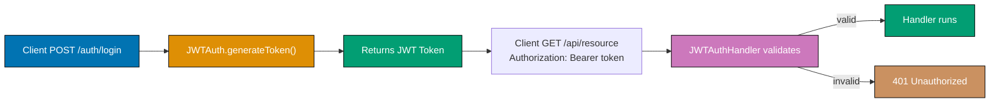
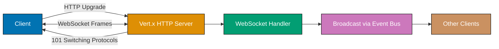
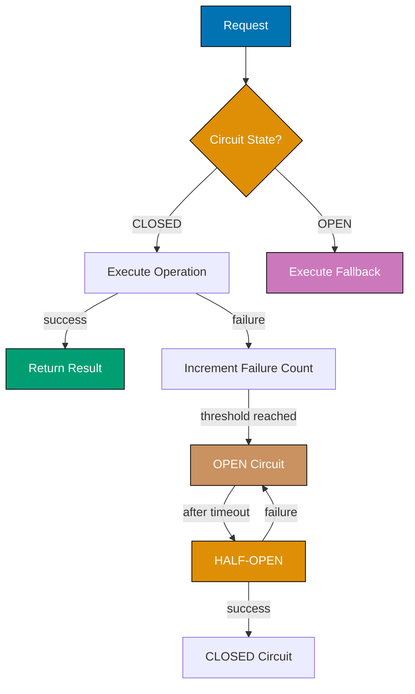

## Group 11: Advanced Event Bus Patterns

### Example 28: Event Bus with Codecs

By default, the event bus serializes messages as JSON. Registering a custom codec enables passing Java objects directly without serialization overhead when communicating within the same JVM.

```java
import io.vertx.core.AbstractVerticle;
import io.vertx.core.Promise;
import io.vertx.core.Vertx;
import io.vertx.core.buffer.Buffer;
import io.vertx.core.eventbus.MessageCodec;

public class EventBusCodecDemo extends AbstractVerticle {

  // Domain object to pass on event bus
  record UserEvent(String userId, String action, long timestamp) {}
  // => Java 16+ record: immutable data class with auto-generated equals/hashCode/toString

  // Custom codec for UserEvent
  static class UserEventCodec implements MessageCodec<UserEvent, UserEvent> {
    @Override
    public void encodeToWire(Buffer buffer, UserEvent event) {
      // => Called when message crosses cluster boundary (network)
      byte[] userId = event.userId().getBytes();
      // => Serialize userId bytes
      buffer.appendInt(userId.length);
      // => Write length prefix for variable-length fields
      buffer.appendBytes(userId);
      // => Write userId bytes
      byte[] action = event.action().getBytes();
      buffer.appendInt(action.length);
      buffer.appendBytes(action);
      buffer.appendLong(event.timestamp());
      // => Serialize fixed-length long directly
    }

    @Override
    public UserEvent decodeFromWire(int pos, Buffer buffer) {
      // => Called when message arrives from network; deserialize from buffer
      int idLen = buffer.getInt(pos);
      // => Read length-prefixed userId
      pos += 4;
      // => Advance position past the int
      String userId = buffer.getString(pos, pos + idLen);
      pos += idLen;
      int actionLen = buffer.getInt(pos);
      pos += 4;
      String action = buffer.getString(pos, pos + actionLen);
      pos += actionLen;
      long timestamp = buffer.getLong(pos);
      return new UserEvent(userId, action, timestamp);
      // => Reconstruct domain object from wire bytes
    }

    @Override
    public UserEvent transform(UserEvent event) {
      return event;
      // => Called for LOCAL delivery (same JVM); return event as-is
      // => No serialization needed for local messages
    }

    @Override public String name() { return "UserEventCodec"; }
    // => Unique codec name; used to look up codec by name

    @Override public byte systemCodecID() { return -1; }
    // => -1 means user-defined codec (not a built-in codec)
  }

  @Override
  public void start(Promise<Void> startPromise) {
    vertx.eventBus().registerCodec(new UserEventCodec());
    // => Register codec globally; all verticles in this Vertx instance can use it

    vertx.eventBus().consumer("user.events",
      (io.vertx.core.eventbus.Message<UserEvent> msg) -> {
        UserEvent event = msg.body();
        // => Received as UserEvent object, not JSON string (local JVM delivery)
        System.out.println("Received event: " + event.action()
          + " from " + event.userId());
        // => Output: Received event: LOGIN from user-42
      });

    UserEvent event = new UserEvent("user-42", "LOGIN", System.currentTimeMillis());
    vertx.eventBus()
      .send("user.events", event, new io.vertx.core.eventbus.DeliveryOptions()
        .setCodecName("UserEventCodec"));
        // => Specify codec by name when sending; Vert.x uses it for encoding/decoding

    startPromise.complete();
  }

  public static void main(String[] args) {
    Vertx.vertx().deployVerticle(new EventBusCodecDemo());
  }
}
```

**Key Takeaway**: Register custom `MessageCodec` implementations to pass Java objects on the event bus without JSON serialization. Specify the codec in `DeliveryOptions.setCodecName()`.

**Why It Matters**: Custom codecs eliminate the double-serialization overhead of converting domain objects to JSON and back for every intra-JVM message. For high-throughput event-driven systems where thousands of messages per second flow between verticles, this can reduce CPU load by 10-30%. Custom codecs also preserve type safety—the consumer receives the exact domain type, eliminating JSON schema mismatch bugs that only surface at runtime.

---

### Example 29: Event Bus Headers and Message Interceptors

Event bus messages carry headers for metadata (correlation IDs, auth tokens, priority). Message interceptors allow cross-cutting concerns like authentication and audit logging at the bus level.

```java
import io.vertx.core.AbstractVerticle;
import io.vertx.core.Promise;
import io.vertx.core.Vertx;
import io.vertx.core.eventbus.DeliveryOptions;
import io.vertx.core.eventbus.EventBus;
import io.vertx.core.eventbus.Message;

public class EventBusHeadersDemo extends AbstractVerticle {

  @Override
  public void start(Promise<Void> startPromise) {
    EventBus eb = vertx.eventBus();

    // Outbound interceptor: add headers to all outgoing messages
    eb.addOutboundInterceptor(ctx -> {
      ctx.message().headers().set("x-correlation-id",
        java.util.UUID.randomUUID().toString());
      // => Automatically inject correlation ID into every outgoing message
      // => Enables distributed tracing across verticle boundaries
      ctx.next();
      // => MUST call next() to continue the interceptor chain
    });

    // Inbound interceptor: log all incoming messages
    eb.addInboundInterceptor(ctx -> {
      String correlationId = ctx.message().headers().get("x-correlation-id");
      System.out.println("Message received. CorrelationID: " + correlationId
        + " Address: " + ctx.message().address());
      // => Output: Message received. CorrelationID: a1b2c3d4-... Address: order.process
      ctx.next();
      // => Pass to next interceptor or consumer
    });

    // Consumer that reads custom headers
    eb.consumer("order.process", (Message<String> msg) -> {
      String priority = msg.headers().get("priority");
      // => Read custom header from sender
      String correlationId = msg.headers().get("x-correlation-id");
      // => Correlation ID injected by outbound interceptor
      System.out.println("Processing order (priority=" + priority
        + ", correlation=" + correlationId + "): " + msg.body());
      // => Output: Processing order (priority=HIGH, correlation=a1b2c3d4-...): ORD-999
      msg.reply("OK");
    });

    // Send with custom headers
    DeliveryOptions options = new DeliveryOptions()
      .addHeader("priority", "HIGH")
      // => Custom headers for routing decisions or metadata
      .addHeader("source", "checkout-service")
      .setSendTimeout(5000);
      // => Custom reply timeout (5 seconds); default is 30 seconds

    eb.request("order.process", "ORD-999", options)
      .onSuccess(reply -> System.out.println("Reply: " + reply.body()));
      // => Output: Reply: OK

    startPromise.complete();
  }

  public static void main(String[] args) {
    Vertx.vertx().deployVerticle(new EventBusHeadersDemo());
  }
}
```

**Key Takeaway**: Event bus headers carry metadata like correlation IDs. Message interceptors inject cross-cutting behavior (logging, auth, tracing) at the bus layer without modifying consumers.

**Why It Matters**: Message interceptors enforce policies like authentication and audit logging at the infrastructure layer, preventing individual verticle developers from accidentally omitting these concerns. Correlation IDs thread through all bus messages enable distributed tracing across the entire application, making it possible to reconstruct the execution path of a business transaction that spans multiple verticles and external systems.

---

## Group 12: Advanced Web Router

### Example 30: Sub-Routers and Modular Route Organization

Sub-routers split a large router into domain-specific modules, each managing its own routes and middleware. The main router mounts sub-routers at path prefixes.

```java
import io.vertx.core.AbstractVerticle;
import io.vertx.core.Promise;
import io.vertx.ext.web.Router;
import io.vertx.ext.web.RoutingContext;
import io.vertx.ext.web.handler.BodyHandler;

public class SubRouterDemo extends AbstractVerticle {

  @Override
  public void start(Promise<Void> startPromise) {
    Router mainRouter = Router.router(vertx);

    // Mount sub-routers at prefixes
    mainRouter.route("/api/users/*").subRouter(createUserRouter());
    // => All /api/users/* routes handled by user sub-router
    mainRouter.route("/api/orders/*").subRouter(createOrderRouter());
    // => All /api/orders/* routes handled by order sub-router

    // Root-level routes still on main router
    mainRouter.get("/health").handler(ctx -> ctx.response().end("OK"));
    mainRouter.get("/").handler(ctx -> ctx.json(
      new io.vertx.core.json.JsonObject().put("service", "api")));

    vertx.createHttpServer()
      .requestHandler(mainRouter)
      .listen(8080)
      .onSuccess(s -> startPromise.complete())
      .onFailure(startPromise::fail);
  }

  private Router createUserRouter() {
    Router userRouter = Router.router(vertx);
    // => Sub-router has its own handler chain

    userRouter.route().handler(BodyHandler.create());
    // => BodyHandler on sub-router applies only to user routes
    userRouter.route().handler(this::auditLog);
    // => Middleware on sub-router applies only to /api/users/* routes

    userRouter.get("/").handler(ctx -> {
      // => Mounted at /api/users/* → GET /api/users/ maps here
      ctx.json(new io.vertx.core.json.JsonArray()
        .add(new io.vertx.core.json.JsonObject().put("id", 1).put("name", "Alice")));
    });

    userRouter.get("/:id").handler(ctx -> {
      // => GET /api/users/42 → id = "42"
      String id = ctx.pathParam("id");
      ctx.json(new io.vertx.core.json.JsonObject().put("id", id));
    });

    userRouter.post("/").handler(ctx -> {
      // => POST /api/users/
      io.vertx.core.json.JsonObject body = ctx.body().asJsonObject();
      ctx.response().setStatusCode(201).json(body);
    });

    return userRouter;
  }

  private Router createOrderRouter() {
    Router orderRouter = Router.router(vertx);
    orderRouter.route().handler(BodyHandler.create());

    orderRouter.get("/").handler(ctx -> {
      // => GET /api/orders/
      ctx.json(new io.vertx.core.json.JsonArray());
    });

    orderRouter.get("/:id").handler(ctx -> {
      // => GET /api/orders/ORD-1
      ctx.json(new io.vertx.core.json.JsonObject()
        .put("orderId", ctx.pathParam("id"))
        .put("status", "PENDING"));
    });

    return orderRouter;
  }

  private void auditLog(RoutingContext ctx) {
    System.out.println("[AUDIT] " + ctx.request().method()
      + " " + ctx.request().path());
    // => Output: [AUDIT] GET /api/users/
    ctx.next();
    // => Pass to next handler in the chain
  }
}
```

**Key Takeaway**: Use `mainRouter.route(prefix).subRouter(sub)` to organize routes by domain. Each sub-router has its own middleware chain that applies only to its mounted prefix.

**Why It Matters**: Sub-routers enable team-based development where different teams own different API domains without coordinating on a single router file. Domain-specific middleware (e.g., admin-only auth on `/api/admin/*`) applies automatically to all routes in that sub-router, eliminating the risk of forgetting to add middleware to new routes. This structure also makes integration testing focused—each sub-router can be tested in isolation.

---

### Example 31: Handler Chains and Middleware

Handler chains execute multiple handlers sequentially for a single route. Each handler calls `ctx.next()` to pass control to the next handler, enabling layered behavior like authentication, validation, and business logic.

```java
import io.vertx.core.AbstractVerticle;
import io.vertx.core.Promise;
import io.vertx.core.json.JsonObject;
import io.vertx.ext.web.Router;
import io.vertx.ext.web.RoutingContext;
import io.vertx.ext.web.handler.BodyHandler;

public class HandlerChainDemo extends AbstractVerticle {

  @Override
  public void start(Promise<Void> startPromise) {
    Router router = Router.router(vertx);
    router.route().handler(BodyHandler.create());

    // Route with a chain of handlers
    router.post("/transfer")
      .handler(this::authenticate)
      // => Step 1: verify caller identity
      .handler(this::validateTransfer)
      // => Step 2: validate request data
      .handler(this::checkBalance)
      // => Step 3: check business rules
      .handler(this::executeTransfer);
      // => Step 4: perform the transfer

    vertx.createHttpServer()
      .requestHandler(router)
      .listen(8080)
      .onSuccess(s -> startPromise.complete())
      .onFailure(startPromise::fail);
  }

  private void authenticate(RoutingContext ctx) {
    String token = ctx.request().getHeader("Authorization");
    // => Read Bearer token from Authorization header
    if (token == null || !token.startsWith("Bearer ")) {
      ctx.fail(401);
      // => Short-circuit: stop chain and trigger 401 handler
      return;
      // => Return prevents calling ctx.next()
    }
    ctx.put("userId", "user-42");
    // => ctx.put() stores data in the per-request context map
    // => Later handlers retrieve it with ctx.get("userId")
    ctx.next();
    // => Authenticated: proceed to next handler
  }

  private void validateTransfer(RoutingContext ctx) {
    JsonObject body = ctx.body().asJsonObject();
    if (body == null || !body.containsKey("amount") || !body.containsKey("to")) {
      ctx.fail(400);
      // => Invalid request: stop chain
      return;
    }
    double amount = body.getDouble("amount");
    if (amount <= 0) {
      ctx.response().setStatusCode(400)
        .end("{\"error\":\"Amount must be positive\"}");
      return;
      // => Respond directly without using ctx.fail() for custom error bodies
    }
    ctx.put("amount", amount);
    ctx.put("toAccount", body.getString("to"));
    // => Store validated values for downstream handlers
    ctx.next();
  }

  private void checkBalance(RoutingContext ctx) {
    double amount = ctx.get("amount");
    // => Retrieve validated amount set by validateTransfer
    double currentBalance = 500.0;
    // => In production: fetch from database
    if (amount > currentBalance) {
      ctx.response().setStatusCode(422)
        // => 422 Unprocessable Entity: valid format but business rule violation
        .end("{\"error\":\"Insufficient funds\"}");
      return;
    }
    ctx.next();
  }

  private void executeTransfer(RoutingContext ctx) {
    String userId = ctx.get("userId");
    // => All validated data available from context
    double amount = ctx.get("amount");
    String toAccount = ctx.get("toAccount");
    System.out.println("Transfer: " + userId + " sends $" + amount + " to " + toAccount);
    // => Output: Transfer: user-42 sends $100.0 to acc-99
    ctx.response().setStatusCode(200)
      .json(new JsonObject().put("status", "completed").put("amount", amount));
  }
}
```

**Key Takeaway**: Chain multiple handlers on a route for layered behavior. Use `ctx.put()/ctx.get()` to pass validated data between handlers, and `ctx.next()` to proceed or `ctx.fail()` to short-circuit.

**Why It Matters**: Handler chains implement separation of concerns at the request-handling level—authentication, validation, authorization, and business logic each live in focused, independently testable functions. Short-circuiting with `ctx.fail()` ensures that later handlers only execute when all preconditions are satisfied, preventing partial execution bugs. Sharing data via `ctx.put()/ctx.get()` avoids parsing the request body multiple times.

---

## Group 13: Authentication

### Example 32: JWT Authentication

JSON Web Tokens provide stateless authentication. Vert.x Web's `JWTAuthHandler` validates tokens and populates the routing context with the authenticated user.



```java
import io.vertx.core.AbstractVerticle;
import io.vertx.core.Promise;
import io.vertx.core.json.JsonObject;
import io.vertx.ext.auth.JWTOptions;
import io.vertx.ext.auth.jwt.JWTAuth;
import io.vertx.ext.auth.jwt.JWTAuthOptions;
import io.vertx.ext.web.Router;
import io.vertx.ext.web.RoutingContext;
import io.vertx.ext.web.handler.BodyHandler;
import io.vertx.ext.web.handler.JWTAuthHandler;

public class JwtAuthVerticle extends AbstractVerticle {

  private JWTAuth jwtAuth;
  // => JWT provider: generates and validates tokens

  @Override
  public void start(Promise<Void> startPromise) {
    jwtAuth = JWTAuth.create(vertx, new JWTAuthOptions()
      .addJwkStore(new JsonObject()
        .put("type", "secret")
        .put("path", "keystore.jceks")
        // => Java keystore file; create with: keytool -genseckey ...
        .put("password", System.getenv("KEYSTORE_PASS"))));
        // => Load password from environment; never hardcode secrets

    Router router = Router.router(vertx);
    router.route().handler(BodyHandler.create());

    // Public endpoint: login
    router.post("/auth/login").handler(this::login);

    // Protected routes: require valid JWT
    router.route("/api/*")
      .handler(JWTAuthHandler.create(jwtAuth));
      // => Validates Bearer token in Authorization header
      // => Populates ctx.user() on success; returns 401 on failure

    router.get("/api/profile").handler(this::getProfile);
    router.get("/api/data").handler(ctx -> {
      ctx.json(new JsonObject().put("data", "secret-stuff"));
    });

    vertx.createHttpServer()
      .requestHandler(router)
      .listen(8080)
      .onSuccess(s -> startPromise.complete())
      .onFailure(startPromise::fail);
  }

  private void login(RoutingContext ctx) {
    JsonObject body = ctx.body().asJsonObject();
    String username = body.getString("username");
    String password = body.getString("password");
    // => In production: validate against DB with bcrypt comparison

    if (!"admin".equals(username) || !"secret".equals(password)) {
      ctx.response().setStatusCode(401)
        .end("{\"error\":\"Invalid credentials\"}");
      return;
    }

    // Generate JWT token with claims
    String token = jwtAuth.generateToken(
      new JsonObject()
        .put("sub", username)
        // => "sub" (subject): identifies the principal
        .put("role", "admin")
        // => Custom claim: role for authorization decisions
        .put("email", username + "@example.com"),
      new JWTOptions()
        .setExpiresInSeconds(3600)
        // => Token expires in 1 hour; client must re-login after expiry
        .setAlgorithm("HS256"));
        // => HMAC-SHA256 signature algorithm

    ctx.json(new JsonObject()
      .put("token", token)
      // => Return token to client; client sends it as "Authorization: Bearer <token>"
      .put("expiresIn", 3600));
  }

  private void getProfile(RoutingContext ctx) {
    // JWTAuthHandler already validated the token and set ctx.user()
    io.vertx.ext.auth.User user = ctx.user();
    // => ctx.user() is the authenticated principal

    user.principal().getString("sub");
    // => Read JWT claim; "sub" = username set during token generation
    String role = user.principal().getString("role");
    // => role = "admin"

    ctx.json(new JsonObject()
      .put("username", user.principal().getString("sub"))
      .put("role", role));
    // => Output: {"username":"admin","role":"admin"}
  }
}
```

**Key Takeaway**: Use `JWTAuthHandler` to protect routes. Tokens are validated automatically; claims are available via `ctx.user().principal()` in protected handlers.

**Why It Matters**: Stateless JWT authentication scales horizontally without shared session storage—any server instance can validate any token using the signing key. The 1-hour expiry limits the window of a stolen token's usability. Centralizing token validation in `JWTAuthHandler` means individual route handlers focus on business logic rather than security concerns, reducing the risk of accidentally skipping authentication on a protected route.

---

### Example 33: Role-Based Authorization

After authentication, authorization checks whether the authenticated user has permission to perform the requested operation. Vert.x provides authorization providers that work with user principals.

```java
import io.vertx.core.AbstractVerticle;
import io.vertx.core.Promise;
import io.vertx.core.json.JsonObject;
import io.vertx.ext.auth.User;
import io.vertx.ext.auth.authorization.RoleBasedAuthorization;
import io.vertx.ext.web.Router;
import io.vertx.ext.web.RoutingContext;
import io.vertx.ext.web.handler.BodyHandler;

public class AuthorizationDemo extends AbstractVerticle {

  @Override
  public void start(Promise<Void> startPromise) {
    Router router = Router.router(vertx);
    router.route().handler(BodyHandler.create());

    // Simulate authenticated user context setup
    router.route().handler(ctx -> {
      // In production: JWTAuthHandler populates ctx.user()
      // Here we simulate it for the authorization demo
      JsonObject principal = new JsonObject()
        .put("sub", "alice")
        .put("roles", new io.vertx.core.json.JsonArray().add("user").add("editor"));
        // => Roles embedded in JWT or fetched from DB

      io.vertx.ext.auth.impl.UserImpl user =
        new io.vertx.ext.auth.impl.UserImpl(principal, new JsonObject());
      ctx.setUser(user);
      // => Set the user principal on the context
      ctx.next();
    });

    router.get("/articles").handler(ctx -> {
      // => Anyone can read articles (no authorization check)
      ctx.json(new io.vertx.core.json.JsonArray()
        .add(new JsonObject().put("id", 1).put("title", "Vert.x Guide")));
    });

    router.post("/articles").handler(this::requireRole("editor"))
      .handler(ctx -> {
        // => Only "editor" role reaches this handler
        JsonObject body = ctx.body().asJsonObject();
        ctx.response().setStatusCode(201)
          .json(new JsonObject().put("created", true).put("title", body.getString("title")));
      });

    router.delete("/articles/:id").handler(this::requireRole("admin"))
      .handler(ctx -> {
        // => Only "admin" role can delete
        ctx.response().setStatusCode(204).end();
      });

    vertx.createHttpServer()
      .requestHandler(router)
      .listen(8080)
      .onSuccess(s -> startPromise.complete())
      .onFailure(startPromise::fail);
  }

  private io.vertx.core.Handler<RoutingContext> requireRole(String requiredRole) {
    return ctx -> {
      User user = ctx.user();
      if (user == null) {
        ctx.fail(401);
        // => Not authenticated
        return;
      }

      io.vertx.core.json.JsonArray roles = user.principal()
        .getJsonArray("roles", new io.vertx.core.json.JsonArray());
      // => Get roles array from JWT principal

      boolean hasRole = roles.stream()
        .anyMatch(r -> requiredRole.equals(r.toString()));
      // => Check if required role is in user's role list

      if (!hasRole) {
        ctx.fail(403);
        // => Authenticated but not authorized
        System.out.println("Access denied: user lacks role " + requiredRole);
        // => Output: Access denied: user lacks role admin
        return;
      }

      ctx.next();
      // => Authorized: proceed to business logic handler
    };
  }
}
```

**Key Takeaway**: Implement authorization as a handler factory that returns a `Handler<RoutingContext>`. Return 401 for unauthenticated users and 403 for authenticated but unauthorized users.

**Why It Matters**: Separating authentication (who are you?) from authorization (what can you do?) keeps each concern focused and testable. The `requireRole()` factory pattern makes authorization declarations self-documenting in the route definition and ensures the check runs before business logic for every protected route. The 401/403 distinction helps API clients implement correct retry logic—401 prompts re-login while 403 signals a permanent permission denial.

---

### Example 34: CORS Configuration

Cross-Origin Resource Sharing (CORS) controls which web origins can make API calls. Vert.x Web's `CorsHandler` configures allowed origins, methods, and headers.

```java
import io.vertx.core.AbstractVerticle;
import io.vertx.core.Promise;
import io.vertx.ext.web.Router;
import io.vertx.ext.web.handler.CorsHandler;
import java.util.Set;

public class CorsVerticle extends AbstractVerticle {

  @Override
  public void start(Promise<Void> startPromise) {
    Router router = Router.router(vertx);

    // CORS handler must be BEFORE all other route handlers
    router.route().handler(CorsHandler.create()
      .addOrigin("https://myapp.example.com")
      // => Allow requests from this specific origin
      // => Rejects CORS requests from all other origins (403)
      .addOrigin("http://localhost:3000")
      // => Allow local dev frontend
      .allowedMethod(io.vertx.core.http.HttpMethod.GET)
      .allowedMethod(io.vertx.core.http.HttpMethod.POST)
      .allowedMethod(io.vertx.core.http.HttpMethod.PUT)
      .allowedMethod(io.vertx.core.http.HttpMethod.DELETE)
      .allowedMethod(io.vertx.core.http.HttpMethod.OPTIONS)
      // => OPTIONS is required for preflight requests
      .allowedHeaders(Set.of(
        "Authorization",
        // => Allow JWT token header
        "Content-Type",
        // => Allow JSON content type header
        "X-Request-Id"
        // => Custom request ID header
      ))
      .allowCredentials(true)
      // => Allow cookies and Authorization header
      // => Required when frontend sends credentials
      .maxAgeSeconds(86400));
      // => Cache preflight response for 24 hours (86400 seconds)
      // => Reduces OPTIONS preflight requests for frequent APIs

    router.get("/api/data").handler(ctx -> {
      ctx.response()
        .putHeader("Content-Type", "application/json")
        .end("{\"data\":\"accessible from allowed origins\"}");
      // => Response includes CORS headers automatically:
      // => Access-Control-Allow-Origin: https://myapp.example.com
    });

    vertx.createHttpServer()
      .requestHandler(router)
      .listen(8080)
      .onSuccess(s -> startPromise.complete())
      .onFailure(startPromise::fail);
  }
}
```

**Key Takeaway**: Add `CorsHandler` before all route handlers. Allow credentials only when necessary, and cache preflight responses with `maxAgeSeconds` to reduce OPTIONS requests.

**Why It Matters**: Misconfigured CORS is a common security vulnerability. Using a wildcard origin (`*`) with `allowCredentials(true)` creates a CSRF attack vector. Explicitly listing allowed origins ensures only your frontend applications can make credentialed API calls. Caching preflight responses for 24 hours eliminates the performance overhead of OPTIONS preflight requests on every cross-origin API call, which is significant for high-frequency SPAs.

---

## Group 14: File Upload and WebSocket

### Example 35: File Upload Handling

Vert.x Web handles multipart file uploads through `BodyHandler`. Uploaded files are temporarily stored and accessible as `FileUpload` objects on the routing context.

```java
import io.vertx.core.AbstractVerticle;
import io.vertx.core.Promise;
import io.vertx.ext.web.FileUpload;
import io.vertx.ext.web.Router;
import io.vertx.ext.web.RoutingContext;
import io.vertx.ext.web.handler.BodyHandler;
import java.nio.file.Path;

public class FileUploadVerticle extends AbstractVerticle {

  private static final String UPLOAD_DIR = "/tmp/uploads";
  // => Directory where uploaded files are temporarily stored

  @Override
  public void start(Promise<Void> startPromise) {
    // Ensure upload directory exists
    vertx.fileSystem().mkdirs(UPLOAD_DIR)
      .onSuccess(v -> {
        Router router = Router.router(vertx);

        router.route().handler(BodyHandler.create()
          .setUploadsDirectory(UPLOAD_DIR)
          // => BodyHandler stores uploads here temporarily
          .setBodyLimit(10 * 1024 * 1024));
          // => 10MB max upload size; returns 413 if exceeded

        router.post("/upload").handler(this::handleUpload);

        vertx.createHttpServer()
          .requestHandler(router)
          .listen(8080)
          .onSuccess(s -> startPromise.complete())
          .onFailure(startPromise::fail);
      });
  }

  private void handleUpload(RoutingContext ctx) {
    java.util.List<FileUpload> uploads = ctx.fileUploads();
    // => List of uploaded files from multipart/form-data request
    // => Populated by BodyHandler; empty if no files uploaded

    if (uploads.isEmpty()) {
      ctx.response().setStatusCode(400)
        .end("{\"error\":\"No files uploaded\"}");
      return;
    }

    FileUpload file = uploads.get(0);
    // => First uploaded file
    String filename = file.fileName();
    // => Original filename from client (e.g., "photo.jpg")
    // => NEVER use this directly as filesystem path (path traversal attack)
    String contentType = file.contentType();
    // => MIME type from client: "image/jpeg", "application/pdf", etc.
    long size = file.size();
    // => File size in bytes

    System.out.println("Upload: " + filename + " (" + contentType + ", " + size + " bytes)");
    // => Output: Upload: photo.jpg (image/jpeg, 245678 bytes)

    // Validate file type
    if (!contentType.startsWith("image/")) {
      ctx.response().setStatusCode(415)
        // => 415 Unsupported Media Type
        .end("{\"error\":\"Only images allowed\"}");
      vertx.fileSystem().delete(file.uploadedFileName(), null);
      // => Delete temporary file for rejected uploads
      return;
    }

    // Move to permanent storage with a safe filename
    String safeFilename = java.util.UUID.randomUUID() + "-"
      + Path.of(filename).getFileName().toString();
    // => UUID prefix prevents filename collisions
    // => Path.of().getFileName() strips directory components
    String dest = UPLOAD_DIR + "/" + safeFilename;

    vertx.fileSystem().move(file.uploadedFileName(), dest)
      // => Async file move; non-blocking
      .onSuccess(v -> {
        ctx.response().setStatusCode(201)
          .putHeader("Content-Type", "application/json")
          .end("{\"filename\":\"" + safeFilename
            + "\",\"size\":" + size + "}");
        // => Output: {"filename":"a1b2c3d4-photo.jpg","size":245678}
      })
      .onFailure(err -> ctx.fail(500, err));
  }
}
```

**Key Takeaway**: Use `BodyHandler` with `setUploadsDirectory()` for file uploads. Always validate MIME type server-side and use UUID-prefixed filenames to prevent collisions and path traversal.

**Why It Matters**: File uploads are a major attack surface. Client-provided filenames can contain path traversal sequences (`../../etc/passwd`) that overwrite sensitive files. MIME type validation server-side prevents executable files disguised as images. UUID-based storage names prevent enumeration attacks where attackers guess filenames of other users' uploads. Setting a body size limit prevents memory exhaustion from maliciously large uploads.

---

### Example 36: WebSocket Server

Vert.x HTTP servers support WebSocket upgrades. Upgraded connections remain open for bidirectional real-time communication without polling.



```java
import io.vertx.core.AbstractVerticle;
import io.vertx.core.Promise;
import io.vertx.core.http.HttpServer;
import io.vertx.core.http.ServerWebSocket;
import io.vertx.ext.web.Router;
import java.util.concurrent.ConcurrentHashMap;
import java.util.Map;

public class WebSocketVerticle extends AbstractVerticle {

  private final Map<String, ServerWebSocket> clients = new ConcurrentHashMap<>();
  // => Track connected clients by ID
  // => ConcurrentHashMap for thread-safe access from multiple event loops

  @Override
  public void start(Promise<Void> startPromise) {
    Router router = Router.router(vertx);
    router.get("/health").handler(ctx -> ctx.response().end("OK"));

    HttpServer server = vertx.createHttpServer();

    // WebSocket upgrade handler
    server.webSocketHandler(ws -> {
      String clientId = java.util.UUID.randomUUID().toString().substring(0, 8);
      // => Unique ID for this connection

      System.out.println("Client connected: " + clientId + " at " + ws.path());
      // => Output: Client connected: a1b2c3d4 at /chat
      // => ws.path() is the URL path used during upgrade request

      clients.put(clientId, ws);
      // => Register client for broadcasting

      ws.textMessageHandler(msg -> {
        // => Fires when client sends a text WebSocket frame
        System.out.println("Message from " + clientId + ": " + msg);
        // => Output: Message from a1b2c3d4: {"text":"Hello, World!"}
        broadcast(clientId, msg);
        // => Echo message to all OTHER clients
      });

      ws.closeHandler(v -> {
        // => Fires when client disconnects (gracefully or network drop)
        clients.remove(clientId);
        System.out.println("Client disconnected: " + clientId);
        // => Output: Client disconnected: a1b2c3d4
        broadcast(clientId, clientId + " left the chat");
        // => Notify remaining clients
      });

      ws.exceptionHandler(err -> {
        // => Fires on WebSocket errors (corrupt frame, timeout, etc.)
        System.err.println("WS error for " + clientId + ": " + err);
        clients.remove(clientId);
      });

      ws.writeTextMessage("Welcome! Your ID: " + clientId);
      // => Send greeting to newly connected client
    });

    server.requestHandler(router)
      .listen(8080)
      .onSuccess(s -> startPromise.complete())
      .onFailure(startPromise::fail);
  }

  private void broadcast(String senderId, String message) {
    clients.forEach((id, ws) -> {
      if (!id.equals(senderId)) {
        // => Don't echo back to sender
        ws.writeTextMessage(message)
          .onFailure(err -> {
            System.err.println("Failed to send to " + id + ": " + err);
            clients.remove(id);
            // => Remove client if write fails (connection likely dead)
          });
      }
    });
  }
}
```

**Key Takeaway**: Register a `webSocketHandler` on the HTTP server for WebSocket connections. Use `ws.textMessageHandler()` for incoming frames and `ws.writeTextMessage()` to send.

**Why It Matters**: WebSockets eliminate polling overhead for real-time features—a single persistent connection replaces hundreds of HTTP requests per minute for live updates. Vert.x handles thousands of simultaneous WebSocket connections on the same event loop threads that handle HTTP, with no additional thread overhead. Tracking connections in a map enables targeted messaging and broadcast patterns that power chat, live dashboards, collaborative tools, and gaming applications.

---

## Group 15: Database with Vert.x SQL Client

### Example 37: Reactive PostgreSQL Client - Connection Pool

The Vert.x reactive PostgreSQL client provides fully non-blocking database access. Queries return `Future<RowSet>`, enabling async composition without blocking the event loop.

```java
import io.vertx.core.AbstractVerticle;
import io.vertx.core.Promise;
import io.vertx.core.json.JsonObject;
import io.vertx.pgclient.PgBuilder;
import io.vertx.pgclient.PgConnectOptions;
import io.vertx.sqlclient.Pool;
import io.vertx.sqlclient.PoolOptions;

public class PgClientVerticle extends AbstractVerticle {

  private Pool pool;
  // => Connection pool; create once, reuse across requests

  @Override
  public void start(Promise<Void> startPromise) {
    PgConnectOptions connectOptions = new PgConnectOptions()
      .setHost(System.getenv().getOrDefault("DB_HOST", "localhost"))
      // => Read from environment; default to localhost for development
      .setPort(5432)
      .setDatabase("myapp")
      .setUser(System.getenv().getOrDefault("DB_USER", "postgres"))
      .setPassword(System.getenv("DB_PASSWORD"));
      // => NEVER hardcode passwords; use environment variables

    PoolOptions poolOptions = new PoolOptions()
      .setMaxSize(5)
      // => Maximum 5 concurrent connections in the pool
      // => Tune based on PostgreSQL max_connections and expected load
      .setMaxWaitQueueSize(100);
      // => Queue up to 100 pending requests when pool is exhausted
      // => Returns error if queue is full (prevents memory buildup)

    pool = PgBuilder.pool()
      .using(vertx)
      .with(poolOptions)
      .connectingTo(connectOptions)
      .build();
    // => Creates the pool; connections are lazy (established on first query)

    // Verify DB connectivity at startup
    pool.getConnection()
      .onSuccess(conn -> {
        System.out.println("Database connected successfully");
        // => Output: Database connected successfully
        conn.close();
        // => Return connection to pool; MUST close after use
        startPromise.complete();
      })
      .onFailure(err -> {
        System.err.println("Database connection failed: " + err);
        startPromise.fail(err);
        // => Abort startup if DB is unreachable
      });
  }

  @Override
  public void stop(Promise<Void> stopPromise) {
    pool.close()
      // => Close all pooled connections on shutdown
      .onComplete(ar -> stopPromise.complete());
  }
}
```

**Key Takeaway**: Create one `Pool` per Vert.x instance and reuse it. Always close connections after use with `conn.close()` to return them to the pool.

**Why It Matters**: Connection pooling is essential for database-backed services. Creating a new connection per request typically takes 20-50ms and overloads the database server. A pool reuses connections, reducing connection overhead to near-zero. The `setMaxWaitQueueSize` limit prevents memory exhaustion during traffic spikes when all connections are busy. Failing fast at startup on DB connectivity issues surfaces configuration problems immediately rather than hours after deployment.

---

### Example 38: Parameterized Queries and Row Mapping

Parameterized queries prevent SQL injection. The reactive client returns `RowSet<Row>` that you map to domain objects or JSON directly.

```java
import io.vertx.core.AbstractVerticle;
import io.vertx.core.Promise;
import io.vertx.core.json.JsonArray;
import io.vertx.core.json.JsonObject;
import io.vertx.ext.web.Router;
import io.vertx.ext.web.handler.BodyHandler;
import io.vertx.pgclient.PgBuilder;
import io.vertx.pgclient.PgConnectOptions;
import io.vertx.sqlclient.Pool;
import io.vertx.sqlclient.PoolOptions;
import io.vertx.sqlclient.Row;
import io.vertx.sqlclient.RowSet;
import io.vertx.sqlclient.Tuple;

public class QueryVerticle extends AbstractVerticle {

  private Pool pool;

  @Override
  public void start(Promise<Void> startPromise) {
    pool = PgBuilder.pool()
      .using(vertx)
      .with(new PoolOptions().setMaxSize(5))
      .connectingTo(new PgConnectOptions()
        .setHost("localhost").setDatabase("myapp")
        .setUser("postgres").setPassword("secret"))
      .build();

    Router router = Router.router(vertx);
    router.route().handler(BodyHandler.create());

    router.get("/users").handler(this::listUsers);
    router.get("/users/:id").handler(this::getUser);
    router.post("/users").handler(this::createUser);
    router.delete("/users/:id").handler(this::deleteUser);

    vertx.createHttpServer()
      .requestHandler(router)
      .listen(8080)
      .onSuccess(s -> startPromise.complete())
      .onFailure(startPromise::fail);
  }

  private void listUsers(io.vertx.ext.web.RoutingContext ctx) {
    pool.query("SELECT id, name, email FROM users ORDER BY id")
      // => Simple query with no parameters
      .execute()
      // => Returns Future<RowSet<Row>>
      .onSuccess(rows -> {
        JsonArray result = new JsonArray();
        for (Row row : rows) {
          // => Iterate RowSet; each Row represents one DB row
          result.add(new JsonObject()
            .put("id", row.getInteger("id"))
            // => Access column by name; type-safe
            .put("name", row.getString("name"))
            .put("email", row.getString("email")));
        }
        ctx.json(result);
        // => Output: [{"id":1,"name":"Alice","email":"alice@example.com"}]
      })
      .onFailure(err -> ctx.fail(500, err));
  }

  private void getUser(io.vertx.ext.web.RoutingContext ctx) {
    int id = Integer.parseInt(ctx.pathParam("id"));
    // => Parse path param to int for type-safe query

    pool.preparedQuery("SELECT id, name, email FROM users WHERE id = $1")
      // => $1 is the PostgreSQL positional parameter placeholder
      // => NEVER concatenate user input into SQL strings (SQL injection risk)
      .execute(Tuple.of(id))
      // => Tuple.of(value) provides parameter values in order
      .onSuccess(rows -> {
        if (rows.rowCount() == 0) {
          // => rowCount() returns number of rows in the result set
          ctx.fail(404);
          return;
        }
        Row row = rows.iterator().next();
        // => First row from result set
        ctx.json(new JsonObject()
          .put("id", row.getInteger("id"))
          .put("name", row.getString("name"))
          .put("email", row.getString("email")));
      })
      .onFailure(err -> ctx.fail(500, err));
  }

  private void createUser(io.vertx.ext.web.RoutingContext ctx) {
    JsonObject body = ctx.body().asJsonObject();
    pool.preparedQuery(
      "INSERT INTO users (name, email) VALUES ($1, $2) RETURNING id, name, email")
      // => RETURNING clause returns the inserted row
      .execute(Tuple.of(body.getString("name"), body.getString("email")))
      .onSuccess(rows -> {
        Row row = rows.iterator().next();
        // => RETURNING gives us back the generated id
        ctx.response().setStatusCode(201)
          .json(new JsonObject()
            .put("id", row.getInteger("id"))
            .put("name", row.getString("name"))
            .put("email", row.getString("email")));
        // => Output: {"id":42,"name":"Alice","email":"alice@example.com"}
      })
      .onFailure(err -> ctx.fail(500, err));
  }

  private void deleteUser(io.vertx.ext.web.RoutingContext ctx) {
    int id = Integer.parseInt(ctx.pathParam("id"));
    pool.preparedQuery("DELETE FROM users WHERE id = $1")
      .execute(Tuple.of(id))
      .onSuccess(rows -> {
        if (rows.rowCount() == 0) {
          ctx.fail(404);
          return;
        }
        ctx.response().setStatusCode(204).end();
        // => 204 No Content: delete successful, no body
      })
      .onFailure(err -> ctx.fail(500, err));
  }
}
```

**Key Takeaway**: Always use `preparedQuery()` with `Tuple` parameters. Never concatenate user input into SQL strings. Use `rows.rowCount()` to detect missing records.

**Why It Matters**: Parameterized queries are the single most effective defense against SQL injection attacks, one of the top OWASP vulnerabilities. The reactive SQL client returns futures that compose seamlessly with other Vert.x async operations, enabling database queries inside HTTP handlers without blocking the event loop. The `RETURNING` clause on INSERT eliminates the need for a separate SELECT query to retrieve generated IDs, halving the number of database round-trips for create operations.

---

### Example 39: Database Transactions

Transactions group multiple SQL operations into an atomic unit. Either all operations succeed or all are rolled back, maintaining database consistency.

```java
import io.vertx.core.AbstractVerticle;
import io.vertx.core.Promise;
import io.vertx.core.json.JsonObject;
import io.vertx.ext.web.Router;
import io.vertx.ext.web.RoutingContext;
import io.vertx.ext.web.handler.BodyHandler;
import io.vertx.pgclient.PgBuilder;
import io.vertx.pgclient.PgConnectOptions;
import io.vertx.sqlclient.Pool;
import io.vertx.sqlclient.PoolOptions;
import io.vertx.sqlclient.SqlConnection;
import io.vertx.sqlclient.Transaction;
import io.vertx.sqlclient.Tuple;

public class TransactionVerticle extends AbstractVerticle {

  private Pool pool;

  @Override
  public void start(Promise<Void> startPromise) {
    pool = PgBuilder.pool()
      .using(vertx)
      .with(new PoolOptions().setMaxSize(5))
      .connectingTo(new PgConnectOptions()
        .setHost("localhost").setDatabase("myapp")
        .setUser("postgres").setPassword("secret"))
      .build();

    Router router = Router.router(vertx);
    router.route().handler(BodyHandler.create());
    router.post("/transfer").handler(this::transfer);

    vertx.createHttpServer()
      .requestHandler(router)
      .listen(8080)
      .onSuccess(s -> startPromise.complete())
      .onFailure(startPromise::fail);
  }

  private void transfer(RoutingContext ctx) {
    JsonObject body = ctx.body().asJsonObject();
    int fromId = body.getInteger("from");
    int toId = body.getInteger("to");
    double amount = body.getDouble("amount");
    // => Transfer $amount from account fromId to account toId

    pool.getConnection()
      // => Get a dedicated connection for the transaction
      .compose(conn -> conn.begin()
        // => conn.begin() starts a transaction; returns Transaction
        .compose(tx -> {
          // => Execute both updates within the same transaction
          return conn.preparedQuery(
            "UPDATE accounts SET balance = balance - $1 WHERE id = $2")
            .execute(Tuple.of(amount, fromId))
            // => Debit source account
            .compose(rows -> {
              if (rows.rowCount() == 0) {
                return tx.rollback()
                  // => Source account not found; rollback transaction
                  .compose(v -> io.vertx.core.Future.failedFuture(
                    new RuntimeException("Source account not found")));
              }
              return conn.preparedQuery(
                "UPDATE accounts SET balance = balance + $1 WHERE id = $2")
                .execute(Tuple.of(amount, toId));
                // => Credit destination account
            })
            .compose(rows -> {
              if (rows.rowCount() == 0) {
                return tx.rollback()
                  .compose(v -> io.vertx.core.Future.failedFuture(
                    new RuntimeException("Destination account not found")));
              }
              return tx.commit();
              // => Both updates succeeded; commit atomically
            })
            .onComplete(ar -> conn.close());
            // => ALWAYS close connection; releases it back to pool
        }))
      .onSuccess(v -> ctx.response().setStatusCode(200)
        .json(new JsonObject().put("status", "transferred").put("amount", amount)))
      .onFailure(err -> {
        System.err.println("Transfer failed: " + err.getMessage());
        // => Either rollback happened or commit failed
        ctx.response().setStatusCode(422)
          .end("{\"error\":\"" + err.getMessage() + "\"}");
      });
  }
}
```

**Key Takeaway**: Use `conn.begin()` to start a transaction. Call `tx.commit()` on success and `tx.rollback()` on any failure. Always close the connection in `onComplete`.

**Why It Matters**: Database transactions are the foundation of data integrity in financial and inventory systems. Without transactions, a network failure between the debit and credit updates leaves accounts in an inconsistent state. The reactive transaction API composes naturally with futures, making it possible to write safe, atomic operations without the callback nesting that makes traditional async transaction code error-prone. Closing the connection in `onComplete` (not just `onSuccess`) ensures connections return to the pool even on failures.

---

## Group 16: Testing Vert.x Applications

### Example 40: JUnit 5 with VertxExtension

`VertxExtension` integrates Vert.x with JUnit 5, providing async test support and automatic verticle deployment for integration tests.

```java
import io.vertx.core.Vertx;
import io.vertx.core.json.JsonObject;
import io.vertx.ext.web.client.WebClient;
import io.vertx.ext.web.client.WebClientOptions;
import io.vertx.junit5.VertxExtension;
import io.vertx.junit5.VertxTestContext;
import org.junit.jupiter.api.AfterEach;
import org.junit.jupiter.api.BeforeEach;
import org.junit.jupiter.api.Test;
import org.junit.jupiter.api.extension.ExtendWith;

import static org.assertj.core.api.Assertions.assertThat;

@ExtendWith(VertxExtension.class)
// => Registers VertxExtension; manages Vert.x lifecycle for tests
// => Provides Vertx and VertxTestContext injection into test methods
class UserApiTest {

  private WebClient client;
  // => HTTP client for making test requests

  @BeforeEach
  void setUp(Vertx vertx, VertxTestContext ctx) {
    // => Vertx is injected by VertxExtension (fresh instance per test class)
    // => VertxTestContext manages async test completion and failures
    client = WebClient.create(vertx, new WebClientOptions()
      .setDefaultHost("localhost")
      .setDefaultPort(8080));
      // => WebClient for making HTTP requests in tests

    vertx.deployVerticle(new RouterVerticle())
      // => Deploy the verticle under test
      .onSuccess(id -> ctx.completeNow())
      // => ctx.completeNow() signals test setup is done
      .onFailure(ctx::failNow);
      // => ctx.failNow(cause) fails the test immediately
  }

  @AfterEach
  void tearDown(Vertx vertx, VertxTestContext ctx) {
    vertx.close().onComplete(ar -> ctx.completeNow());
    // => Clean up Vert.x after each test
  }

  @Test
  void testGetUsers(Vertx vertx, VertxTestContext ctx) {
    client.get("/users")
      // => Make GET /users request
      .send()
      .onSuccess(response -> {
        ctx.verify(() -> {
          // => ctx.verify() wraps assertions; failures are reported correctly
          assertThat(response.statusCode()).isEqualTo(200);
          // => Verify HTTP 200
          assertThat(response.bodyAsJsonArray()).isNotNull();
          // => Verify JSON array body
        });
        ctx.completeNow();
        // => Signal test passed
      })
      .onFailure(ctx::failNow);
  }

  @Test
  void testCreateUser(Vertx vertx, VertxTestContext ctx) {
    JsonObject payload = new JsonObject()
      .put("name", "Alice")
      .put("email", "alice@example.com");

    client.post("/users")
      .putHeader("Content-Type", "application/json")
      .sendJsonObject(payload)
      // => Send JSON body; sets Content-Type automatically
      .onSuccess(response -> {
        ctx.verify(() -> {
          assertThat(response.statusCode()).isEqualTo(201);
          // => Verify 201 Created
          JsonObject body = response.bodyAsJsonObject();
          assertThat(body.getString("name")).isEqualTo("Alice");
          // => Verify response body fields
        });
        ctx.completeNow();
      })
      .onFailure(ctx::failNow);
  }
}
// => RouterVerticle is the verticle created in Example 6 (simplified)
// => This test deploys the real verticle and makes actual HTTP calls
```

**Key Takeaway**: Use `@ExtendWith(VertxExtension.class)` for JUnit 5 async test support. Wrap assertions in `ctx.verify()` and always call `ctx.completeNow()` or `ctx.failNow()`.

**Why It Matters**: Async testing without proper framework support leads to tests that pass even when assertions fail—the test method returns before assertions execute. `VertxTestContext` solves this by holding the test open until `completeNow()` or `failNow()` is called, ensuring assertions execute before the test concludes. Testing with the real verticle deployed catches integration issues like missing `BodyHandler` or incorrect route ordering that unit tests with mocks would miss.

---

### Example 41: Testing with WebClient and Mocking the Event Bus

Isolate unit tests by mocking event bus consumers, allowing you to test HTTP handlers without deploying real downstream verticles.

```java
import io.vertx.core.Vertx;
import io.vertx.core.json.JsonObject;
import io.vertx.ext.web.client.WebClient;
import io.vertx.junit5.VertxExtension;
import io.vertx.junit5.VertxTestContext;
import org.junit.jupiter.api.BeforeEach;
import org.junit.jupiter.api.Test;
import org.junit.jupiter.api.extension.ExtendWith;

@ExtendWith(VertxExtension.class)
class OrderApiTest {

  @BeforeEach
  void setUp(Vertx vertx, VertxTestContext ctx) {
    // Register a MOCK event bus consumer before deploying the HTTP verticle
    vertx.eventBus().consumer("order.create", msg -> {
      // => This mock consumer handles messages that would normally go to a real OrderVerticle
      JsonObject order = (JsonObject) msg.body();
      System.out.println("[Mock] Processing order: " + order.getString("item"));
      // => Output: [Mock] Processing order: laptop

      msg.reply(new JsonObject()
        .put("orderId", "MOCK-001")
        .put("status", "created"));
        // => Mock response simulates successful order creation
    });

    // Deploy the HTTP verticle under test
    vertx.deployVerticle(new OrderHttpVerticle())
      .onSuccess(id -> ctx.completeNow())
      .onFailure(ctx::failNow);
  }

  @Test
  void testCreateOrderSuccess(Vertx vertx, VertxTestContext ctx) {
    WebClient client = WebClient.create(vertx);

    client.post(8080, "localhost", "/orders")
      .putHeader("Content-Type", "application/json")
      .sendJson(new JsonObject().put("item", "laptop").put("quantity", 1))
      .onSuccess(response -> {
        ctx.verify(() -> {
          org.assertj.core.api.Assertions
            .assertThat(response.statusCode()).isEqualTo(201);
          // => HTTP 201 from OrderHttpVerticle
          org.assertj.core.api.Assertions
            .assertThat(response.bodyAsJsonObject().getString("orderId"))
            .isEqualTo("MOCK-001");
          // => Response comes from our mock consumer
        });
        ctx.completeNow();
      })
      .onFailure(ctx::failNow);
  }
}

// Simplified OrderHttpVerticle for the test
class OrderHttpVerticle extends io.vertx.core.AbstractVerticle {
  @Override
  public void start(io.vertx.core.Promise<Void> sp) {
    io.vertx.ext.web.Router r = io.vertx.ext.web.Router.router(vertx);
    r.route().handler(io.vertx.ext.web.handler.BodyHandler.create());
    r.post("/orders").handler(ctx -> {
      vertx.eventBus()
        .request("order.create", ctx.body().asJsonObject())
        .onSuccess(reply -> ctx.response().setStatusCode(201).json(reply.body()))
        .onFailure(err -> ctx.fail(500, err));
    });
    vertx.createHttpServer().requestHandler(r)
      .listen(8080).onSuccess(s -> sp.complete()).onFailure(sp::fail);
  }
}
```

**Key Takeaway**: Register mock event bus consumers in `@BeforeEach` to isolate HTTP handler tests from downstream verticles. The mock consumer controls response behavior for different test scenarios.

**Why It Matters**: Event bus mocking enables testing HTTP handlers in isolation without requiring a full deployment of downstream services. This makes tests faster, more reliable (no flaky dependencies), and easier to set up for edge cases (e.g., timeout, error scenarios). The mock consumer approach is simpler than dependency injection frameworks and works naturally with Vert.x's event-driven architecture.

---

## Group 17: Resilience Patterns

### Example 42: Circuit Breaker

The circuit breaker pattern prevents cascading failures by short-circuiting calls to failing services. Vert.x provides `CircuitBreaker` with configurable thresholds and fallback handlers.



```java
import io.vertx.circuitbreaker.CircuitBreaker;
import io.vertx.circuitbreaker.CircuitBreakerOptions;
import io.vertx.core.AbstractVerticle;
import io.vertx.core.Future;
import io.vertx.core.Promise;
import io.vertx.core.json.JsonObject;
import io.vertx.ext.web.Router;

public class CircuitBreakerDemo extends AbstractVerticle {

  private CircuitBreaker breaker;
  // => Circuit breaker for calls to external payment service

  @Override
  public void start(Promise<Void> startPromise) {
    breaker = CircuitBreaker.create("payment-service", vertx,
      new CircuitBreakerOptions()
        .setMaxFailures(3)
        // => Open circuit after 3 consecutive failures
        .setTimeout(2000)
        // => Each attempt times out after 2000ms
        .setResetTimeout(10000)
        // => After 10s in OPEN state, move to HALF-OPEN to try again
        .setFallbackOnFailure(true));
        // => Execute fallback when circuit is OPEN

    breaker.openHandler(v ->
      System.out.println("Circuit OPENED - payment service unavailable"));
    // => Called when circuit transitions from CLOSED to OPEN
    breaker.closeHandler(v ->
      System.out.println("Circuit CLOSED - payment service recovered"));
    // => Called when circuit transitions back to CLOSED

    Router router = Router.router(vertx);
    router.post("/payments").handler(ctx -> {
      io.vertx.ext.web.handler.BodyHandler.create().handle(ctx);
      JsonObject body = ctx.body().asJsonObject();

      breaker.executeWithFallback(
        this::callPaymentService,
        // => Primary operation: call external payment service
        throwable -> {
          // => Fallback: executed when circuit is OPEN or operation fails
          System.out.println("Fallback triggered: " + throwable.getMessage());
          // => Output: Fallback triggered: Circuit breaker is OPEN
          return new JsonObject()
            .put("status", "PENDING")
            .put("message", "Payment queued for retry");
            // => Degraded response: accept the request and queue for later processing
        })
        .onSuccess(result -> ctx.json(result))
        .onFailure(err -> ctx.fail(503, err));
    });

    vertx.createHttpServer()
      .requestHandler(router)
      .listen(8080)
      .onSuccess(s -> startPromise.complete())
      .onFailure(startPromise::fail);
  }

  private Future<JsonObject> callPaymentService(Promise<JsonObject> promise) {
    // => Simulate calling an external payment API
    // => In production: make HTTP call to payment provider
    boolean serviceAvailable = Math.random() > 0.7;
    // => 30% simulated failure rate to trigger circuit opening

    if (serviceAvailable) {
      promise.complete(new JsonObject()
        .put("status", "APPROVED")
        .put("transactionId", "TXN-" + System.currentTimeMillis()));
    } else {
      promise.fail("Payment service timeout");
      // => Failure increments the breaker's failure counter
    }
    return promise.future();
  }
}
```

**Key Takeaway**: Wrap external service calls in a `CircuitBreaker` with failure thresholds and a fallback handler. The circuit opens after repeated failures, protecting both your service and the downstream dependency.

**Why It Matters**: Without circuit breakers, a slow or failed downstream service causes your service's thread pool to exhaust waiting for timeouts, cascading failures across the entire system. The circuit breaker fast-fails when the service is known to be unavailable, returning degraded responses immediately. This protects user experience (queue the payment rather than timing out) and gives the downstream service time to recover without being overwhelmed by retry storms.

---

### Example 43: Rate Limiting with Vert.x Web

Rate limiting prevents individual clients from overwhelming your API. Vert.x Web provides `RateLimiterHandler` based on a token bucket algorithm.

```java
import io.vertx.core.AbstractVerticle;
import io.vertx.core.Promise;
import io.vertx.ext.web.Router;
import io.vertx.ext.web.handler.RateLimiterHandler;

public class RateLimitingDemo extends AbstractVerticle {

  @Override
  public void start(Promise<Void> startPromise) {
    Router router = Router.router(vertx);

    // Rate limit: 10 requests per second per client IP
    RateLimiterHandler rateLimiter = RateLimiterHandler.create(vertx, 10)
      // => 10 requests per second globally (or per identifier)
      // => Uses token bucket: tokens refill at 10/second
      // => Clients that exhaust tokens receive 429 Too Many Requests
      .identifierProvider(ctx -> ctx.request().remoteAddress().host());
      // => Identify clients by IP address
      // => Could also use JWT subject: ctx.user().principal().getString("sub")

    router.route("/api/*").handler(rateLimiter);
    // => Apply rate limiter to all /api/* routes

    router.get("/api/data").handler(ctx -> {
      ctx.json(new io.vertx.core.json.JsonObject()
        .put("data", "rate-limited response"));
      // => Only reached if client has remaining tokens
    });

    // Route outside rate limiting
    router.get("/health").handler(ctx -> ctx.response().end("OK"));
    // => Health checks bypass the rate limiter (intentional)

    vertx.createHttpServer()
      .requestHandler(router)
      .listen(8080)
      .onSuccess(s -> startPromise.complete())
      .onFailure(startPromise::fail);
  }
}
```

**Key Takeaway**: Use `RateLimiterHandler` with an identifier provider to rate limit by client IP or authenticated user. Apply rate limiting only to paths that need protection.

**Why It Matters**: Rate limiting is essential defense against denial-of-service attacks, scraping bots, and API abuse. The token bucket algorithm allows short bursts above the average rate while maintaining long-term limits, providing a better user experience than hard per-second caps. Using JWT subject as the identifier limits authenticated users independently regardless of IP, preventing shared-IP users (corporate NAT) from being unfairly grouped together.

---

## Group 18: Advanced Routing Patterns

### Example 44: Request Validation with Vert.x Web Validator

Declarative request validation with `ValidationHandler` validates path params, query params, and request bodies before they reach your business logic, reducing boilerplate validation code.

```java
import io.vertx.core.AbstractVerticle;
import io.vertx.core.Promise;
import io.vertx.core.json.JsonObject;
import io.vertx.ext.web.Router;
import io.vertx.ext.web.handler.BodyHandler;
import io.vertx.ext.web.validation.RequestParameters;
import io.vertx.ext.web.validation.ValidationHandler;
import io.vertx.ext.web.validation.builder.Bodies;
import io.vertx.ext.web.validation.builder.Parameters;
import io.vertx.json.schema.SchemaParser;
import io.vertx.json.schema.SchemaRouter;
import io.vertx.json.schema.SchemaRouterOptions;
import io.vertx.json.schema.draft7.dsl.Keywords;
import io.vertx.json.schema.draft7.dsl.SchemaBuilder;

import static io.vertx.json.schema.draft7.dsl.Schemas.*;

public class ValidationDemo extends AbstractVerticle {

  @Override
  public void start(Promise<Void> startPromise) {
    SchemaRouter schemaRouter = SchemaRouter.create(vertx, new SchemaRouterOptions());
    // => Schema router manages JSON Schema definitions
    SchemaParser schemaParser = SchemaParser.createDraft7SchemaParser(schemaRouter);
    // => Parses JSON Schema draft 7; used for body validation

    Router router = Router.router(vertx);
    router.route().handler(BodyHandler.create());

    // Validate path param, query param, and body in one handler
    router.post("/users/:id/orders")
      .handler(ValidationHandler.builder(schemaParser)
        .pathParameter(Parameters.param("id", intSchema()))
        // => Path param "id" must be an integer; fails if non-numeric
        .queryParameter(Parameters.optionalParam("status",
          stringSchema().with(Keywords.allowedValues("PENDING", "COMPLETED", "CANCELLED"))))
        // => Optional query param; if present must be one of the allowed values
        .body(Bodies.json(objectSchema()
          .requiredProperty("item", stringSchema().with(Keywords.minLength(1)))
          // => Body must be JSON object with non-empty "item" string
          .requiredProperty("quantity", intSchema().with(Keywords.minimum(1)))
          // => "quantity" must be integer >= 1
          .optionalProperty("notes", stringSchema())))
          // => "notes" is optional string
        .build())
      .handler(ctx -> {
        RequestParameters params = ctx.get(ValidationHandler.REQUEST_CONTEXT_KEY);
        // => Retrieve validated and type-converted parameters
        int userId = params.pathParameter("id").getInteger();
        // => Already converted to Integer by validator; no parseInt() needed
        String status = params.queryParameter("status") != null
          ? params.queryParameter("status").getString() : "PENDING";
        // => Optional param with default

        JsonObject body = params.body().getJsonObject();
        // => Validated and parsed body; schema guarantees required fields present

        System.out.println("Create order for user " + userId
          + " item=" + body.getString("item")
          + " qty=" + body.getInteger("quantity")
          + " status=" + status);
        // => Output: Create order for user 42 item=laptop qty=2 status=PENDING

        ctx.response().setStatusCode(201)
          .json(new JsonObject().put("created", true).put("userId", userId));
      });

    vertx.createHttpServer()
      .requestHandler(router)
      .listen(8080)
      .onSuccess(s -> startPromise.complete())
      .onFailure(startPromise::fail);
  }
}
```

**Key Takeaway**: Use `ValidationHandler.builder()` to declare parameter and body schemas. The handler automatically returns 400 with error details for invalid requests before your business logic runs.

**Why It Matters**: Declarative validation moves request validation from imperative if-statements scattered across handlers to structured schema declarations at the route definition level. This eliminates an entire class of validation bugs (forgetting to validate a field) and makes the API contract visible in code. Automatic 400 responses with detailed error messages improve developer experience for API consumers debugging integration issues.

---

### Example 45: Serving Compressed and Cached Static Assets

Production static file serving requires proper cache control headers to reduce server load and improve client-side performance.

```java
import io.vertx.core.AbstractVerticle;
import io.vertx.core.Promise;
import io.vertx.core.http.HttpServerOptions;
import io.vertx.ext.web.Router;
import io.vertx.ext.web.handler.StaticHandler;

public class ProductionStaticVerticle extends AbstractVerticle {

  @Override
  public void start(Promise<Void> startPromise) {
    Router router = Router.router(vertx);

    // Immutable versioned assets: very long cache TTL
    router.route("/static/versioned/*")
      .handler(StaticHandler.create("webroot/versioned")
        .setCachingEnabled(true)
        .setMaxAgeSeconds(31536000)
        // => 1 year cache (365 days × 86400 sec); versioned files never change
        // => URL contains content hash: /static/versioned/app.a1b2c3.js
        .setFilesReadOnly(true)
        // => Hint: files don't change; skip filesystem mtime checks
        .setIncludeHidden(false));
        // => Do not serve dotfiles (.env, .htpasswd)

    // Regular assets: moderate cache TTL
    router.route("/static/*")
      .handler(StaticHandler.create("webroot/static")
        .setCachingEnabled(true)
        .setMaxAgeSeconds(86400)
        // => 24-hour cache for regular assets
        .setSendVaryHeader(true));
        // => Add Vary: Accept-Encoding header
        // => Required when serving both compressed and uncompressed versions

    // SPA HTML: no caching (must re-check for new deployments)
    router.route("/*")
      .handler(StaticHandler.create("webroot")
        .setIndexPage("index.html")
        .setCachingEnabled(false)
        // => No cache for HTML; clients always get latest version
        .setMaxAgeSeconds(0));

    HttpServerOptions options = new HttpServerOptions()
      .setCompressionSupported(true)
      .setCompressionLevel(6);
      // => Gzip responses when client supports it

    vertx.createHttpServer(options)
      .requestHandler(router)
      .listen(8080)
      .onSuccess(s -> startPromise.complete())
      .onFailure(startPromise::fail);
  }
}
```

**Key Takeaway**: Use long cache TTLs for content-hashed versioned assets and no caching for HTML entry points. Combine with `setCompressionSupported(true)` for maximum performance.

**Why It Matters**: Optimal cache headers for static assets dramatically reduce server load and improve page load times. Versioned assets with year-long caches mean returning visitors load pages from browser cache with zero server requests. The no-cache HTML policy ensures users always run the latest version of your application after deployments, avoiding the common problem of cached HTML referencing non-existent old asset URLs after a new release.

---

## Group 19: Advanced Async Patterns

### Example 46: executeBlocking and Thread Pool Management

`vertx.executeBlocking()` runs blocking code on the worker thread pool while keeping the result delivery on the event loop, bridging blocking and non-blocking worlds cleanly.

```java
import io.vertx.core.AbstractVerticle;
import io.vertx.core.Future;
import io.vertx.core.Promise;
import io.vertx.core.Vertx;
import io.vertx.ext.web.Router;
import io.vertx.ext.web.RoutingContext;

public class ExecuteBlockingDemo extends AbstractVerticle {

  @Override
  public void start(Promise<Void> startPromise) {
    Router router = Router.router(vertx);

    router.get("/thumbnail/:id").handler(this::generateThumbnail);
    router.get("/report/:id").handler(this::generateReport);

    vertx.createHttpServer()
      .requestHandler(router)
      .listen(8080)
      .onSuccess(s -> startPromise.complete())
      .onFailure(startPromise::fail);
  }

  private void generateThumbnail(RoutingContext ctx) {
    String id = ctx.pathParam("id");

    vertx.executeBlocking(() -> {
      // => This lambda runs on the WORKER thread pool
      // => Safe to use blocking APIs: ImageIO, javax.imageio, etc.
      System.out.println("Generating thumbnail on: "
        + Thread.currentThread().getName());
      // => Output: Generating thumbnail on: vert.x-worker-thread-0

      // Simulate blocking image processing (e.g., ImageIO.read/write)
      Thread.sleep(100);
      // => Blocking sleep OK on worker thread
      return "thumbnail-" + id + ".jpg";
      // => Return result; delivered to onSuccess on event loop thread
    })
    .onSuccess(filename -> {
      // => This handler runs on the EVENT LOOP thread (not worker)
      System.out.println("Thumbnail ready: " + filename);
      // => Output: Thumbnail ready: thumbnail-42.jpg
      ctx.response()
        .putHeader("Content-Type", "application/json")
        .end("{\"filename\":\"" + filename + "\"}");
    })
    .onFailure(err -> ctx.fail(500, err));
  }

  private void generateReport(RoutingContext ctx) {
    String id = ctx.pathParam("id");

    // Default: ordered=true (executes serially on a single worker thread)
    // For parallel execution, use executeBlocking(callable, false)
    vertx.executeBlocking(() -> heavyComputation(id), false)
      // => false = unordered: multiple calls may run in parallel on worker pool
      // => true (default) = ordered: calls queue on same worker thread
      .onSuccess(result -> ctx.json(
        new io.vertx.core.json.JsonObject().put("report", result)))
      .onFailure(err -> ctx.fail(500, err));
  }

  private String heavyComputation(String id) {
    // => CPU-intensive or blocking I/O; safe on worker thread
    try { Thread.sleep(200); } catch (InterruptedException e) {
      Thread.currentThread().interrupt();
    }
    return "report-data-" + id;
    // => Result returned to event loop via Future
  }

  public static void main(String[] args) {
    Vertx.vertx().deployVerticle(new ExecuteBlockingDemo());
  }
}
```

**Key Takeaway**: Use `vertx.executeBlocking()` to run blocking code safely. Pass `false` as the second argument to allow parallel execution on the worker thread pool.

**Why It Matters**: `executeBlocking` provides a safe escape hatch for integrating blocking libraries without violating the event loop model. The ordered mode (default) ensures sequential execution for stateful operations, while unordered mode maximizes parallelism for independent blocking tasks. The automatic delivery of results back to the event loop thread means downstream handlers remain on the same thread model, preventing concurrency bugs at the blocking/non-blocking boundary.

---

### Example 47: Periodic Tasks and Scheduled Jobs

Vert.x timers enable periodic background tasks without external schedulers. Worker verticles handle recurring jobs that involve blocking operations.

```java
import io.vertx.core.AbstractVerticle;
import io.vertx.core.DeploymentOptions;
import io.vertx.core.Promise;
import io.vertx.core.Vertx;

public class ScheduledTasksVerticle extends AbstractVerticle {

  private long periodicTimerId;
  // => Store timer ID to cancel on shutdown

  @Override
  public void start(Promise<Void> startPromise) {
    // Periodic task every 30 seconds
    periodicTimerId = vertx.setPeriodic(30_000, id -> {
      // => Fires every 30 seconds on the event loop
      // => Use for lightweight checks (state updates, cache invalidation)
      System.out.println("Periodic task at: " + java.time.Instant.now());
      // => Output: Periodic task at: 2026-03-19T00:00:30Z

      // Offload actual work to worker thread if it's blocking
      vertx.executeBlocking(() -> {
        // => Heavy work on worker thread
        cleanExpiredSessions();
        // => Blocking DB operation safe here
        return null;
      }).onFailure(err -> System.err.println("Cleanup failed: " + err));
    });

    // One-shot delayed task
    vertx.setTimer(5_000, id -> {
      // => Fires ONCE after 5 seconds
      System.out.println("Delayed initialization complete");
      // => Use for delayed initialization (warmup caches, etc.)
    });

    startPromise.complete();
  }

  @Override
  public void stop(Promise<Void> stopPromise) {
    vertx.cancelTimer(periodicTimerId);
    // => Cancel periodic timer on shutdown to prevent orphaned tasks
    // => Without cancellation, timer fires after verticle is stopped
    System.out.println("Cancelled periodic task timer");
    stopPromise.complete();
  }

  private void cleanExpiredSessions() {
    // => In production: DELETE FROM sessions WHERE expires_at < NOW()
    System.out.println("Cleaned expired sessions (simulated)");
  }

  public static void main(String[] args) {
    Vertx.vertx().deployVerticle(new ScheduledTasksVerticle());
  }
}
```

**Key Takeaway**: Use `vertx.setPeriodic()` for recurring tasks and store the timer ID in a field. Cancel timers in `stop()` to prevent execution after the verticle is stopped.

**Why It Matters**: Cancelling timers on shutdown prevents tasks from firing against already-closed resources (database connections, HTTP clients), which can cause confusing NullPointerException logs during graceful shutdown. Offloading periodic work to `executeBlocking` keeps periodic timers lightweight and non-blocking, ensuring they don't accumulate delay if the previous execution runs long. This pattern handles session cleanup, cache warming, and metrics flushing without an external cron job.

---

## Group 20: Vert.x Service Proxy

### Example 48: Service Proxy Code Generation

Vert.x service proxies generate type-safe event bus clients from interface definitions, hiding the low-level message-passing details behind clean Java interfaces.

```java
import io.vertx.codegen.annotations.ProxyGen;
import io.vertx.codegen.annotations.VertxGen;
import io.vertx.core.AsyncResult;
import io.vertx.core.Future;
import io.vertx.core.Handler;
import io.vertx.core.Vertx;
import io.vertx.core.json.JsonObject;
import io.vertx.serviceproxy.ServiceBinder;
import io.vertx.serviceproxy.ServiceProxyBuilder;

// Service interface annotated for proxy generation
@ProxyGen
// => Triggers code generation of UserServiceVertxEBProxy class
// => Run mvn generate-sources or gradle generateProxies
@VertxGen
// => Marks interface as Vert.x generated; required for multi-language support
interface UserService {
  // => All methods must return Future<T> or accept Handler<AsyncResult<T>>
  Future<JsonObject> getUser(String id);
  // => Returns user data by ID asynchronously

  Future<JsonObject> createUser(JsonObject data);
  // => Creates a new user and returns the created user data

  Future<Void> deleteUser(String id);
  // => Deletes a user; returns Void on success
}

// Service implementation
class UserServiceImpl implements UserService {
  @Override
  public Future<JsonObject> getUser(String id) {
    // => Real implementation: query database
    return Future.succeededFuture(new JsonObject()
      .put("id", id).put("name", "Alice"));
    // => Returns completed future with result
  }

  @Override
  public Future<JsonObject> createUser(JsonObject data) {
    return Future.succeededFuture(data.copy().put("id", "new-" + System.currentTimeMillis()));
    // => Simulates DB insert; returns data with generated ID
  }

  @Override
  public Future<Void> deleteUser(String id) {
    System.out.println("Deleting user: " + id);
    return Future.succeededFuture();
    // => Future.succeededFuture() for Void returns completed future
  }
}

// Verticle that registers the service
class ServiceRegistrationDemo extends io.vertx.core.AbstractVerticle {
  @Override
  public void start(io.vertx.core.Promise<Void> sp) {
    new ServiceBinder(vertx)
      .setAddress("user.service")
      // => Event bus address where the service is reachable
      .register(UserService.class, new UserServiceImpl());
      // => Registers the implementation; generates a consumer on the event bus

    // Use the generated proxy to call the service
    UserService proxy = new ServiceProxyBuilder(vertx)
      .setAddress("user.service")
      // => Connect to the service at this address
      .build(UserService.class);
      // => Builds a type-safe proxy; calls translate to event bus messages

    proxy.getUser("user-42")
      .onSuccess(user -> {
        System.out.println("Got user: " + user.encode());
        // => Output: Got user: {"id":"user-42","name":"Alice"}
        // => Method call transparently becomes event bus request/reply
      });

    sp.complete();
  }

  public static void main(String[] args) {
    Vertx.vertx().deployVerticle(new ServiceRegistrationDemo());
  }
}
```

**Key Takeaway**: Define service interfaces with `@ProxyGen`, register implementations with `ServiceBinder`, and call them through generated proxies. Event bus messaging is transparent to callers.

**Why It Matters**: Service proxies enforce API contracts between verticles at compile time, preventing the type erasure that comes with raw event bus message passing. The generated proxy code handles serialization, deserialization, and timeout management, eliminating boilerplate that developers would otherwise write and potentially get wrong. When a service moves to a different cluster node, proxy callers require no code changes—only the event bus address needs to remain consistent.

---

### Example 49: Session Management with Vert.x Web

Server-side sessions store user state between requests. Vert.x Web's `SessionHandler` manages session lifecycle, storage, and expiry automatically.

```java
import io.vertx.core.AbstractVerticle;
import io.vertx.core.Promise;
import io.vertx.core.json.JsonObject;
import io.vertx.ext.web.Router;
import io.vertx.ext.web.RoutingContext;
import io.vertx.ext.web.Session;
import io.vertx.ext.web.handler.BodyHandler;
import io.vertx.ext.web.handler.CookieHandler;
import io.vertx.ext.web.handler.SessionHandler;
import io.vertx.ext.web.sstore.LocalSessionStore;

public class SessionDemo extends AbstractVerticle {

  @Override
  public void start(Promise<Void> startPromise) {
    Router router = Router.router(vertx);
    router.route().handler(BodyHandler.create());

    // Session handlers must run before route handlers
    router.route().handler(SessionHandler.create(
      LocalSessionStore.create(vertx))
      // => LocalSessionStore: in-memory; use ClusteredSessionStore for distributed deployments
      .setSessionTimeout(30 * 60 * 1000)
      // => Session expires after 30 minutes of inactivity
      .setNagHttps(false));
      // => setNagHttps(false): allow sessions over HTTP (development only)
      // => In production: setNagHttps(true) enforces HTTPS

    router.post("/login").handler(this::login);
    router.get("/dashboard").handler(this::dashboard);
    router.post("/logout").handler(this::logout);

    vertx.createHttpServer()
      .requestHandler(router)
      .listen(8080)
      .onSuccess(s -> startPromise.complete())
      .onFailure(startPromise::fail);
  }

  private void login(RoutingContext ctx) {
    JsonObject body = ctx.body().asJsonObject();
    String username = body.getString("username");
    // => Validate credentials (simplified)
    if (!"alice".equals(username)) {
      ctx.response().setStatusCode(401).end("Invalid credentials");
      return;
    }

    Session session = ctx.session();
    // => Get session from RoutingContext (created by SessionHandler)
    session.put("userId", "user-42");
    // => Store user data in session; persisted between requests
    session.put("username", username);
    // => Session is identified by a cookie sent to client

    ctx.response()
      .setStatusCode(303)
      .putHeader("Location", "/dashboard")
      .end();
    // => Redirect to dashboard after successful login
  }

  private void dashboard(RoutingContext ctx) {
    Session session = ctx.session();
    String userId = session.get("userId");
    // => Retrieve stored session data
    if (userId == null) {
      ctx.response()
        .setStatusCode(303)
        .putHeader("Location", "/login")
        .end();
      // => Redirect unauthenticated users to login
      return;
    }

    ctx.json(new JsonObject()
      .put("message", "Welcome, " + session.get("username"))
      .put("userId", userId));
    // => Output: {"message":"Welcome, alice","userId":"user-42"}
  }

  private void logout(RoutingContext ctx) {
    ctx.session().destroy();
    // => Invalidate session; removes from store; clears cookie
    ctx.response()
      .setStatusCode(303)
      .putHeader("Location", "/login")
      .end();
  }
}
```

**Key Takeaway**: Add `SessionHandler` before route handlers. Use `ctx.session().put()/get()` to store and retrieve user data. Call `session.destroy()` on logout.

**Why It Matters**: Server-side sessions provide a secure alternative to JWT for applications where token revocation is critical. Destroying a session immediately revokes access, unlike JWTs which remain valid until expiry. `LocalSessionStore` is appropriate for single-instance deployments; production clustered deployments should use `ClusteredSessionStore` or an external Redis-backed store to ensure sessions are accessible across all server instances.

---

### Example 50: Response Caching with Cache Headers

Proper HTTP cache headers reduce server load by allowing clients and intermediary caches to serve responses without hitting the server. This example demonstrates different caching strategies.

```java
import io.vertx.core.AbstractVerticle;
import io.vertx.core.Promise;
import io.vertx.core.json.JsonObject;
import io.vertx.ext.web.Router;
import io.vertx.ext.web.RoutingContext;

public class CacheHeadersDemo extends AbstractVerticle {

  @Override
  public void start(Promise<Void> startPromise) {
    Router router = Router.router(vertx);

    // No caching: user-specific, frequently changing data
    router.get("/api/cart").handler(this::getCart);

    // Short cache: semi-static list data
    router.get("/api/categories").handler(this::getCategories);

    // Long cache: immutable versioned content
    router.get("/api/config/:version").handler(this::getConfig);

    // Conditional GET: ETag-based caching
    router.get("/api/products/:id").handler(this::getProduct);

    vertx.createHttpServer()
      .requestHandler(router)
      .listen(8080)
      .onSuccess(s -> startPromise.complete())
      .onFailure(startPromise::fail);
  }

  private void getCart(RoutingContext ctx) {
    ctx.response()
      .putHeader("Cache-Control", "private, no-cache, no-store")
      // => private: only browser may cache; no CDN
      // => no-store: never persist to disk (sensitive data)
      .json(new JsonObject().put("items", 3).put("total", 99.99));
  }

  private void getCategories(RoutingContext ctx) {
    ctx.response()
      .putHeader("Cache-Control", "public, max-age=300")
      // => public: CDN and browser may cache
      // => max-age=300: valid for 5 minutes (300 seconds)
      .json(new io.vertx.core.json.JsonArray()
        .add("Electronics").add("Books").add("Clothing"));
  }

  private void getConfig(RoutingContext ctx) {
    String version = ctx.pathParam("version");
    ctx.response()
      .putHeader("Cache-Control", "public, max-age=31536000, immutable")
      // => immutable: content never changes at this versioned URL
      // => Browsers skip revalidation entirely for 1 year
      .json(new JsonObject().put("version", version).put("theme", "dark"));
  }

  private void getProduct(RoutingContext ctx) {
    String id = ctx.pathParam("id");
    // => Compute ETag from product data (e.g., last-modified timestamp)
    String etag = "\"product-" + id + "-v3\"";
    // => ETag uniquely identifies this version of the resource

    String clientEtag = ctx.request().getHeader("If-None-Match");
    // => Browser sends this header when it has a cached version
    if (etag.equals(clientEtag)) {
      ctx.response().setStatusCode(304).end();
      // => 304 Not Modified: client's cache is still valid; send no body
      // => Saves bandwidth; client uses its cached copy
      return;
    }

    ctx.response()
      .putHeader("ETag", etag)
      // => Set ETag for client to use in future If-None-Match requests
      .putHeader("Cache-Control", "public, max-age=60")
      // => Cache for 60 seconds; revalidate with ETag after expiry
      .json(new JsonObject().put("id", id).put("name", "Widget").put("price", 9.99));
  }
}
```

**Key Takeaway**: Match caching strategy to data mutability: `no-store` for sensitive data, short `max-age` for semi-static data, `immutable` for versioned assets, and ETags for conditional GETs.

**Why It Matters**: Proper cache headers are one of the highest-ROI performance optimizations. A well-configured CDN serves category lists millions of times without hitting your server. ETags reduce bandwidth by 90% for unchanged resources, critical for mobile users with limited data plans. The `immutable` directive eliminates revalidation overhead for versioned assets, reducing page load HTTP roundtrips by 50-80% for returning visitors.

---

## Group 21: Monitoring

### Example 51: Micrometer Metrics Integration

Vert.x integrates with Micrometer to expose JVM and application metrics in Prometheus format, enabling real-time monitoring and alerting.

```java
import io.micrometer.core.instrument.Counter;
import io.micrometer.core.instrument.Timer;
import io.micrometer.prometheus.PrometheusConfig;
import io.micrometer.prometheus.PrometheusMeterRegistry;
import io.vertx.core.AbstractVerticle;
import io.vertx.core.Promise;
import io.vertx.core.metrics.MetricsOptions;
import io.vertx.ext.web.Router;
import io.vertx.micrometer.MicrometerMetricsOptions;
import io.vertx.micrometer.VertxPrometheusOptions;

public class MetricsVerticle extends AbstractVerticle {

  private PrometheusMeterRegistry registry;
  // => Prometheus registry: collects and exposes metrics
  private Counter requestCounter;
  // => Count total HTTP requests
  private Timer requestTimer;
  // => Measure request duration

  @Override
  public void start(Promise<Void> startPromise) {
    registry = new PrometheusMeterRegistry(PrometheusConfig.DEFAULT);
    // => In-process Prometheus registry; collects all registered meters

    requestCounter = Counter.builder("api_requests_total")
      .description("Total number of API requests")
      // => Metric description for documentation
      .tag("service", "vertx-api")
      // => Static tag applied to all observations of this counter
      .register(registry);
      // => Register with the global registry

    requestTimer = Timer.builder("api_request_duration")
      .description("API request duration in seconds")
      .publishPercentiles(0.5, 0.95, 0.99)
      // => Track 50th, 95th, 99th percentile latencies
      .register(registry);

    Router router = Router.router(vertx);

    // Request instrumentation middleware
    router.route().handler(ctx -> {
      requestCounter.increment();
      // => Increment counter for every request
      Timer.Sample sample = Timer.start(registry);
      // => Start timing this request

      ctx.addBodyEndHandler(v -> {
        sample.stop(requestTimer);
        // => Stop timer when response is sent; records duration
      });

      ctx.next();
    });

    router.get("/api/data").handler(ctx -> {
      ctx.json(new io.vertx.core.json.JsonObject().put("data", "OK"));
    });

    // Prometheus scrape endpoint
    router.get("/metrics").handler(ctx -> {
      ctx.response()
        .putHeader("Content-Type", registry.contentType())
        // => Prometheus text format: "text/plain; version=0.0.4; charset=utf-8"
        .end(registry.scrape());
        // => Output: # HELP api_requests_total Total number of API requests
        //            # TYPE api_requests_total counter
        //            api_requests_total{service="vertx-api"} 42.0
    });

    vertx.createHttpServer()
      .requestHandler(router)
      .listen(8080)
      .onSuccess(s -> startPromise.complete())
      .onFailure(startPromise::fail);
  }
}
```

**Key Takeaway**: Register Micrometer metrics in the verticle start method. Expose a `/metrics` endpoint for Prometheus scraping. Instrument middleware with counters and timers.

**Why It Matters**: Prometheus metrics with percentile tracking expose the actual user experience—P99 latency shows what 1% of users experience, often revealing tail latency issues invisible in averages. The counter/timer middleware added once to the router instruments all routes automatically, ensuring no endpoint is forgotten. These metrics feed alerting rules that page on-call engineers before users report problems, transforming reactive incident response into proactive monitoring.

---

### Example 52: Distributed Tracing with OpenTelemetry

OpenTelemetry distributed tracing propagates trace context across service boundaries, enabling full request path visualization in tools like Jaeger or Zipkin.

```java
import io.opentelemetry.api.GlobalOpenTelemetry;
import io.opentelemetry.api.trace.Span;
import io.opentelemetry.api.trace.StatusCode;
import io.opentelemetry.api.trace.Tracer;
import io.opentelemetry.context.Context;
import io.opentelemetry.context.Scope;
import io.vertx.core.AbstractVerticle;
import io.vertx.core.Promise;
import io.vertx.ext.web.Router;
import io.vertx.ext.web.RoutingContext;

public class TracingVerticle extends AbstractVerticle {

  private Tracer tracer;
  // => OpenTelemetry tracer for creating spans

  @Override
  public void start(Promise<Void> startPromise) {
    // In production: configure OTel exporter (Jaeger, OTLP, etc.) at startup
    // io.opentelemetry.sdk.trace.SdkTracerProvider...
    tracer = GlobalOpenTelemetry.getTracer("vertx-api", "1.0.0");
    // => Get tracer for this component; "vertx-api" identifies the instrumentation

    Router router = Router.router(vertx);

    // Trace context propagation middleware
    router.route().handler(ctx -> {
      Span span = tracer.spanBuilder(
        ctx.request().method() + " " + ctx.request().path())
        // => Span name: "GET /users/42" (HTTP method + path)
        .startSpan();
        // => Start timing this request in the trace

      span.setAttribute("http.method", ctx.request().method().name());
      // => Add HTTP attributes per OpenTelemetry semantic conventions
      span.setAttribute("http.url", ctx.request().absoluteURI());
      span.setAttribute("http.target", ctx.request().path());

      ctx.put("span", span);
      // => Store span in routing context for downstream handlers to use

      ctx.addBodyEndHandler(v -> {
        span.setAttribute("http.status_code", ctx.response().getStatusCode());
        // => Record response status after handler completes
        if (ctx.response().getStatusCode() >= 500) {
          span.setStatus(StatusCode.ERROR, "Server error");
          // => Mark span as error for 5xx responses
        }
        span.end();
        // => End span; records total request duration
      });

      ctx.next();
    });

    router.get("/users/:id").handler(ctx -> {
      Span parentSpan = ctx.get("span");
      // => Get parent span created by middleware

      Span childSpan = tracer.spanBuilder("db.query.getUser")
        // => Create child span for the DB query
        .setParent(Context.current().with(parentSpan))
        .startSpan();

      try (Scope scope = childSpan.makeCurrent()) {
        // => scope ensures childSpan is current for nested operations
        childSpan.setAttribute("db.statement", "SELECT * FROM users WHERE id = $1");
        childSpan.setAttribute("db.system", "postgresql");

        // Simulate DB query
        String userId = ctx.pathParam("id");
        childSpan.end();
        // => End child span before sending response

        ctx.json(new io.vertx.core.json.JsonObject()
          .put("id", userId).put("name", "Alice"));
      }
    });

    vertx.createHttpServer()
      .requestHandler(router)
      .listen(8080)
      .onSuccess(s -> startPromise.complete())
      .onFailure(startPromise::fail);
  }
}
```

**Key Takeaway**: Create spans in middleware and child spans for sub-operations. Store the parent span in `RoutingContext` so downstream handlers can attach child spans.

**Why It Matters**: Distributed tracing reveals the full execution path of a request across services, databases, and caches in a timeline visualization. Without tracing, diagnosing why a specific request took 2 seconds requires correlating logs across multiple services—a process that takes hours. With Jaeger or Zipkin, you see in seconds that 1.8 seconds were spent in a database query, pointing directly at the N+1 query problem or missing index responsible.

---

### Example 53: Health Checks with Vert.x Health

`HealthCheckHandler` provides a standardized health check endpoint with named procedures that check individual dependencies—ideal for Kubernetes probes.

```java
import io.vertx.core.AbstractVerticle;
import io.vertx.core.Future;
import io.vertx.core.Promise;
import io.vertx.ext.healthchecks.HealthCheckHandler;
import io.vertx.ext.healthchecks.HealthChecks;
import io.vertx.ext.healthchecks.Status;
import io.vertx.ext.web.Router;
import io.vertx.pgclient.PgBuilder;
import io.vertx.pgclient.PgConnectOptions;
import io.vertx.sqlclient.Pool;
import io.vertx.sqlclient.PoolOptions;

public class HealthChecksVerticle extends AbstractVerticle {

  private Pool dbPool;

  @Override
  public void start(Promise<Void> startPromise) {
    dbPool = PgBuilder.pool().using(vertx)
      .with(new PoolOptions().setMaxSize(2))
      .connectingTo(new PgConnectOptions()
        .setHost("localhost").setDatabase("myapp")
        .setUser("postgres").setPassword("secret"))
      .build();

    HealthChecks hc = HealthChecks.create(vertx);
    // => Health check registry; register named procedures

    hc.register("database", promise -> {
      // => Named check: "database"
      dbPool.query("SELECT 1")
        .execute()
        .onSuccess(rows -> promise.complete(Status.OK()))
        // => Status.OK() marks this check as healthy
        .onFailure(err -> promise.complete(Status.KO()
          .put("error", err.getMessage())));
          // => Status.KO() marks check as failed; include error details
    });

    hc.register("memory", promise -> {
      Runtime runtime = Runtime.getRuntime();
      long freeMemory = runtime.freeMemory();
      long totalMemory = runtime.totalMemory();
      double usedPercent = (double)(totalMemory - freeMemory) / totalMemory * 100;
      // => Calculate memory utilization percentage

      if (usedPercent > 90) {
        promise.complete(Status.KO()
          .put("used_percent", usedPercent)
          .put("message", "Memory pressure critical"));
          // => Fail check if memory >90% used
      } else {
        promise.complete(Status.OK()
          .put("used_percent", Math.round(usedPercent)));
          // => Include current value in health response for monitoring
      }
    });

    Router router = Router.router(vertx);

    // Readiness probe: checks all registered procedures
    router.get("/health/ready").handler(HealthCheckHandler.createWithHealthChecks(hc));
    // => Returns 200 if ALL checks pass; 503 if any check fails
    // => Response body: {"status":"UP","checks":[{"id":"database","status":"UP"},...]}

    // Liveness probe: always returns 200 if process is running
    router.get("/health/live").handler(ctx ->
      ctx.json(new io.vertx.core.json.JsonObject().put("status", "UP")));

    vertx.createHttpServer()
      .requestHandler(router)
      .listen(8080)
      .onSuccess(s -> startPromise.complete())
      .onFailure(startPromise::fail);
  }
}
```

**Key Takeaway**: Register named health check procedures with `HealthChecks.register()`. Use `HealthCheckHandler` to expose a standards-compliant health endpoint that returns 503 when any check fails.

**Why It Matters**: Granular named health checks tell Kubernetes and load balancers exactly which dependency is failing, accelerating incident diagnosis. When the database check fails, the readiness probe returns 503, removing the pod from the load balancer rotation before users experience errors. Memory pressure checks catch JVM heap exhaustion before it becomes an OutOfMemoryError, allowing graceful pod replacement rather than crash recovery.

---

### Example 54: WebClient for HTTP Service Calls

`WebClient` provides a fluent, non-blocking HTTP client for calling external services. It returns futures, composing cleanly with other Vert.x async operations.

```java
import io.vertx.core.AbstractVerticle;
import io.vertx.core.Future;
import io.vertx.core.Promise;
import io.vertx.core.json.JsonObject;
import io.vertx.ext.web.client.WebClient;
import io.vertx.ext.web.client.WebClientOptions;
import io.vertx.ext.web.client.predicate.ResponsePredicate;

public class WebClientDemo extends AbstractVerticle {

  private WebClient client;
  // => Reusable HTTP client; thread-safe, create once

  @Override
  public void start(Promise<Void> startPromise) {
    client = WebClient.create(vertx, new WebClientOptions()
      .setDefaultHost("api.example.com")
      .setDefaultPort(443)
      .setSsl(true)
      // => Enable HTTPS
      .setConnectTimeout(3000)
      // => Connection timeout: 3 seconds
      .setIdleTimeout(10)
      // => Idle connection timeout: 10 seconds
      .setUserAgent("my-vertx-service/1.0"));
      // => Set User-Agent header for all requests

    // Make a GET request
    client.get("/users/42")
      .putHeader("Authorization", "Bearer " + getToken())
      // => Add auth header
      .as(io.vertx.ext.web.codec.BodyCodec.jsonObject())
      // => Decode response body as JsonObject automatically
      .send()
      .onSuccess(response -> {
        int status = response.statusCode();
        // => HTTP status code
        JsonObject user = response.body();
        // => Already decoded as JsonObject by BodyCodec
        System.out.println("Got user: " + user.encode());
        // => Output: Got user: {"id":42,"name":"Alice"}
      })
      .onFailure(err -> System.err.println("Request failed: " + err));

    // POST with body and response predicate
    client.post("/users")
      .expect(ResponsePredicate.SC_CREATED)
      // => Automatically fail if status code is not 201 Created
      .sendJsonObject(new JsonObject().put("name", "Bob").put("email", "bob@example.com"))
      // => Send JSON body; sets Content-Type: application/json
      .onSuccess(response -> System.out.println("Created: " + response.bodyAsJsonObject()))
      .onFailure(err -> System.err.println("Create failed: " + err));
      // => onFailure fires if status != 201 OR network error

    startPromise.complete();
  }

  @Override
  public void stop(Promise<Void> stopPromise) {
    client.close();
    // => Release connection pool resources on shutdown
    stopPromise.complete();
  }

  private String getToken() {
    return "example-token";
    // => In production: retrieve from config or token store
  }
}
```

**Key Takeaway**: Use `WebClient` for external HTTP calls. Use `expect(ResponsePredicate)` to auto-fail on unexpected status codes and `BodyCodec` for automatic deserialization.

**Why It Matters**: `ResponsePredicate` prevents the common mistake of treating all HTTP responses as successes—a service returning 404 for a "found" resource is a bug that silent success handling misses. `BodyCodec` eliminates manual JSON deserialization and its associated error handling. Creating `WebClient` once and reusing it across requests enables connection pooling to the same upstream service, dramatically reducing connection overhead for service meshes making thousands of calls per second.

---

### Example 55: Reactive Streams with Vert.x Streams API

Vert.x Streams API provides backpressure-aware streaming for large data, preventing memory exhaustion when producers outpace consumers.

```java
import io.vertx.core.AbstractVerticle;
import io.vertx.core.Promise;
import io.vertx.core.Vertx;
import io.vertx.core.buffer.Buffer;
import io.vertx.core.file.AsyncFile;
import io.vertx.core.file.OpenOptions;
import io.vertx.core.streams.Pipe;
import io.vertx.ext.web.Router;

public class StreamingVerticle extends AbstractVerticle {

  @Override
  public void start(Promise<Void> startPromise) {
    Router router = Router.router(vertx);

    router.get("/download/:filename").handler(ctx -> {
      String filename = "/data/" + ctx.pathParam("filename");

      vertx.fileSystem().open(filename,
        new OpenOptions().setRead(true),
        ar -> {
          if (ar.failed()) {
            ctx.fail(404, ar.cause());
            return;
          }
          AsyncFile file = ar.result();
          // => AsyncFile implements ReadStream<Buffer>

          ctx.response()
            .putHeader("Content-Type", "application/octet-stream")
            .putHeader("Transfer-Encoding", "chunked");
            // => Chunked encoding: send data as it becomes available

          Pipe<Buffer> pipe = file.pipe();
          // => Pipe manages backpressure between source and destination
          // => Pauses the source when destination's write queue is full

          pipe.to(ctx.response())
            // => Pipe file content directly to HTTP response
            // => Backpressure: if client reads slowly, file reading pauses
            .onSuccess(v -> System.out.println("File streamed successfully"))
            .onFailure(err -> {
              System.err.println("Stream error: " + err);
              // => Error during streaming; connection may already be closed
            });
        });
    });

    router.post("/upload/stream").handler(ctx -> {
      ctx.request().pause();
      // => Pause request stream immediately to avoid buffering before pipe is set up
      ctx.request().resume();
      // => Resume after setting up downstream processing

      ctx.request()
        .pipeTo(vertx.fileSystem().openBlocking(
          "/uploads/" + java.util.UUID.randomUUID() + ".dat",
          new OpenOptions().setWrite(true).setCreate(true)))
        // => Stream request body directly to file; minimal memory usage
        .onSuccess(v -> ctx.response().setStatusCode(201).end("{\"stored\":true}"))
        .onFailure(err -> ctx.fail(500, err));
    });

    vertx.createHttpServer()
      .requestHandler(router)
      .listen(8080)
      .onSuccess(s -> startPromise.complete())
      .onFailure(startPromise::fail);
  }

  public static void main(String[] args) {
    Vertx.vertx().deployVerticle(new StreamingVerticle());
  }
}
```

**Key Takeaway**: Use `pipe().to()` for streaming between `ReadStream` and `WriteStream`. Backpressure is automatic—the source pauses when the destination's write queue fills.

**Why It Matters**: Streaming with backpressure is essential for serving large files (video, CSV exports, database dumps) without loading the entire file into memory. Without backpressure, a slow network client receiving a 1GB file forces your server to buffer the entire file in memory, quickly exhausting heap space under concurrent downloads. Vert.x's Pipe API handles buffer size management automatically, keeping memory usage constant regardless of file size or client download speed.
