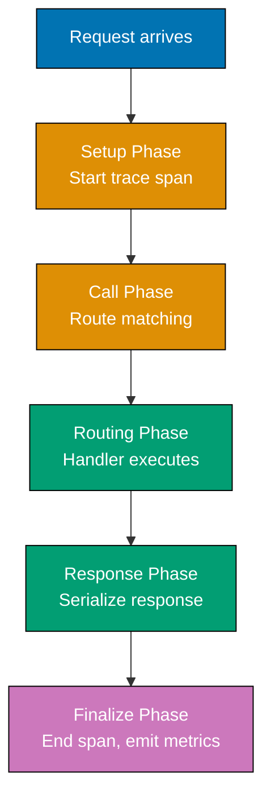
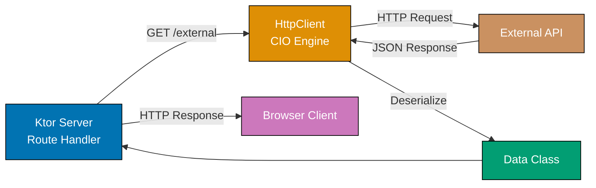

## Group 1: Advanced Plugin Development

### Example 56: Advanced Plugin with Pipeline Phases

Production plugins often need to interact with multiple pipeline phases: setup on call start, intercept before routing, and teardown after response. This pattern implements request tracing that spans the entire request lifecycle.



```kotlin
import io.ktor.server.application.*
import io.ktor.server.response.*
import io.ktor.server.routing.*
import io.ktor.util.*
import io.ktor.util.pipeline.*

// Plugin that measures request duration and route label for metrics
data class TraceContext(
    val startNanos: Long,                 // => Nanosecond timestamp of request start
    val requestId: String                 // => Unique ID for this request
)

val TraceContextKey = AttributeKey<TraceContext>("TraceContext")

class TracingConfig {
    var emitter: ((route: String, durationMs: Long, statusCode: Int) -> Unit)? = null
    // => Callback for emitting metrics; defaults to no-op
}

val TracingPlugin = createApplicationPlugin("TracingPlugin", ::TracingConfig) {
    val emitter = pluginConfig.emitter

    // Phase 1: Intercept BEFORE any processing (set up context)
    onCall { call ->
        val ctx = TraceContext(
            startNanos = System.nanoTime(),              // => Record start time
            requestId = java.util.UUID.randomUUID().toString()
        )
        call.attributes.put(TraceContextKey, ctx)        // => Store for later phases
    }

    // Phase 2: Intercept AFTER response is built (emit metrics)
    onCallRespond { call, _ ->
        val ctx = call.attributes.getOrNull(TraceContextKey) ?: return@onCallRespond
        val durationMs = (System.nanoTime() - ctx.startNanos) / 1_000_000L
                                                         // => Convert nanos to millis
        val statusCode = call.response.status()?.value ?: 0
        val route = call.request.uri                     // => Use RouteInfo for named routes

        emitter?.invoke(route, durationMs, statusCode)   // => Emit to metrics backend
        call.response.headers.append("X-Trace-ID", ctx.requestId)
        call.response.headers.append("X-Response-Time", "${durationMs}ms")
    }
}

fun Application.configureTracing() {
    install(TracingPlugin) {
        emitter = { route, durationMs, status ->
            // In production: emit to Prometheus, Datadog, CloudWatch
            log.info("METRIC: route=$route status=$status duration=${durationMs}ms")
        }
    }
}

fun Application.configureRouting() {
    routing {
        get("/traced") {
            kotlinx.coroutines.delay(25)  // => Simulate 25ms processing
            call.respondText("Traced response")
        }
    }
}
// => GET /traced
//    Response headers: X-Trace-ID: 550e8400-..., X-Response-Time: 26ms
//    Log: METRIC: route=/traced status=200 duration=26ms
```

**Key Takeaway**: Use `onCall { }` for request setup and `onCallRespond { }` for response-phase teardown; `call.attributes` transfers data between phases; the `emitter` callback decouples the plugin from specific metrics implementations.

**Why It Matters**: Production observability requires measuring every request, not just the ones that error. Multi-phase plugins attach to both request start and response completion, measuring true end-to-end duration including serialization time. The emitter callback pattern prevents the plugin from importing Prometheus, Datadog, or Micrometer directly, enabling it to work with any metrics backend. Injecting the emitter function also makes the plugin unit-testable by passing a list-accumulating lambda in tests and asserting captured metrics.

---

### Example 57: Plugin Composition and Ordering

Ktor plugins compose in installation order. Understanding phase dependencies between plugins prevents subtle bugs where a plugin assumes another plugin has already run.

```kotlin
import io.ktor.server.application.*
import io.ktor.server.auth.*
import io.ktor.server.plugins.callid.*
import io.ktor.server.plugins.calllogging.*
import io.ktor.server.plugins.contentnegotiation.*
import io.ktor.server.plugins.statuspages.*
import io.ktor.serialization.kotlinx.json.*

fun Application.configurePluginsInCorrectOrder() {
    // ORDERING MATTERS: install in dependency order

    // 1. Call ID first - generates ID before other plugins log
    install(CallId) {
        generate { java.util.UUID.randomUUID().toString() }
        replyToHeader("X-Request-ID")
    }

    // 2. Call Logging uses Call ID for MDC - must come AFTER CallId
    install(CallLogging) {
        callIdMdc("requestId")             // => Uses Call ID generated in step 1
    }

    // 3. Status Pages - catches exceptions from ALL subsequent plugins and routes
    // Must be installed early so it can handle exceptions from auth, serialization, etc.
    install(StatusPages) {
        exception<Throwable> { call, cause ->
            call.application.environment.log.error("Error", cause)
            call.respondText("Error: ${cause.message}",
                status = io.ktor.http.HttpStatusCode.InternalServerError)
        }
    }

    // 4. Content Negotiation - used by routes, must be before routing
    install(ContentNegotiation) {
        json()
    }

    // 5. Authentication - last plugin, used by protected routes
    install(Authentication) {
        basic("auth-basic") {
            validate { creds ->
                if (creds.name == "user") UserIdPrincipal(creds.name) else null
            }
        }
    }

    // Routes reference plugins installed above
    // configureRouting() called after all plugins installed
}

// Anti-pattern: wrong order causes subtle bugs
fun Application.configurePluginsWrongOrder() {
    install(CallLogging) {
        callIdMdc("requestId")  // => BUG: CallId not installed yet; requestId always null
    }
    install(CallId) {           // => Too late: CallLogging won't see the ID
        generate { java.util.UUID.randomUUID().toString() }
    }
    // => All log lines: requestId=null
    // => Difficult to debug: no error thrown, just missing data
}
// Correct output: requestId=550e8400-e29b-41d4-a716-... in every log line
// Wrong output:   requestId=null in every log line
```

**Key Takeaway**: Install plugins in dependency order: ID generation before logging (which uses the ID), status pages before authentication (to handle auth errors), content negotiation before routes (which serialize responses); wrong order causes silent failures rather than errors.

**Why It Matters**: Incorrect plugin ordering is a category of bug that only manifests in production behavior (missing trace IDs in logs, unformatted error responses for auth failures) rather than startup errors. Documenting the required order in comments and encapsulating the ordered installation in a single `configurePluginsInCorrectOrder()` function creates an auditable, reviewable policy. Teams that establish module installation order conventions prevent these issues from appearing in code review rather than discovering them during post-incident analysis.

---

## Group 2: Metrics with Micrometer

### Example 58: Micrometer Metrics Integration

Micrometer is the standard metrics facade for JVM applications, supporting Prometheus, Datadog, CloudWatch, and more. Ktor's Micrometer plugin adds automatic HTTP metrics to all requests.

```kotlin
// build.gradle.kts:
// implementation("io.ktor:ktor-server-metrics-micrometer:3.0.3")
// implementation("io.micrometer:micrometer-registry-prometheus:1.12.0")

import io.ktor.server.application.*
import io.ktor.server.metrics.micrometer.*   // => MicrometerMetrics plugin
import io.ktor.server.response.*
import io.ktor.server.routing.*
import io.micrometer.core.instrument.*
import io.micrometer.prometheus.*

fun Application.configureMetrics() {
    // Create Prometheus registry (stores metrics in Prometheus format)
    val prometheusRegistry = PrometheusMeterRegistry(PrometheusConfig.DEFAULT)
                                              // => Stores counters, timers, gauges

    install(MicrometerMetrics) {              // => Install Micrometer plugin
        registry = prometheusRegistry         // => Use Prometheus as the registry backend
        // => Automatically records per-route metrics:
        // =>   ktor.http.server.requests (timer): count, mean, max, percentiles
        // =>   ktor.http.server.active.requests (gauge): concurrent in-flight requests
    }

    // Custom business metric: counter for user signups
    val signupCounter = prometheusRegistry.counter(
        "myapp.user.signups",                // => Metric name (dot-separated)
        "source", "api"                      // => Tag: source=api (for filtering in dashboards)
    )
    // => Counter is a cumulative value that only increases

    // Custom gauge: current queue size
    var queueSize = 0
    prometheusRegistry.gauge(
        "myapp.queue.size",                  // => Metric name
        emptyList<Tag>(),                    // => No tags
        queueSize                            // => Current value (polled when scraped)
    )

    routing {
        // Expose Prometheus scrape endpoint
        get("/metrics") {
            // prometheusRegistry.scrape() returns metrics in Prometheus text format
            call.respondText(
                prometheusRegistry.scrape(),  // => Text with all metric values
                contentType = io.ktor.http.ContentType.Text.Plain
            )
        }

        // Business endpoint with custom metric tracking
        post("/signup") {
            signupCounter.increment()         // => Increment counter for each signup
            call.respondText("Signed up!")
        }
    }
}
// => GET /metrics (Prometheus format):
// => # HELP ktor_http_server_requests_seconds_count HTTP server requests
// => ktor_http_server_requests_seconds_count{method="GET",route="/metrics",...} 1.0
// => # HELP myapp_user_signups_total User signups
// => myapp_user_signups_total{source="api"} 5.0
```

**Key Takeaway**: `install(MicrometerMetrics) { registry = prometheusRegistry }` adds automatic HTTP metrics; use `registry.counter()`, `registry.timer()`, and `registry.gauge()` for custom business metrics; expose metrics at `/metrics` for Prometheus scraping.

**Why It Matters**: Infrastructure metrics (CPU, memory) tell you a server is struggling; HTTP metrics tell you which endpoints are slow; business metrics tell you whether the application is delivering value. Prometheus + Grafana dashboards built on Micrometer metrics answer "What is my P99 latency for user creation?" and "How many signups occurred in the last 5 minutes?" - questions that server-level metrics cannot answer. Tags on business metrics enable segmentation: tracking signups by `source=api` vs `source=web` reveals which client drives growth.

---

### Example 59: Custom Timers and Histograms

Beyond automatic HTTP metrics, production applications need business operation timers: database query duration, external API call latency, and background job execution time.

```kotlin
import io.ktor.server.application.*
import io.ktor.server.response.*
import io.ktor.server.routing.*
import io.micrometer.core.instrument.*
import io.micrometer.prometheus.*
import kotlin.time.*
import kotlin.time.Duration.Companion.milliseconds

class MetricsService(private val registry: MeterRegistry) {

    // Timer measures duration with histogram (enables percentile calculation)
    private val dbQueryTimer = Timer.builder("myapp.db.query")
        .description("Database query duration")
        .tag("operation", "select")          // => Tag for filtering in dashboards
        .publishPercentiles(0.5, 0.95, 0.99) // => Publish p50, p95, p99 percentiles
        .register(registry)                   // => Register with registry

    // Distribution summary: records values like response sizes
    private val responseSizeSummary = DistributionSummary.builder("myapp.response.size")
        .baseUnit("bytes")
        .description("HTTP response body size in bytes")
        .register(registry)

    // Record a DB query with timing
    suspend fun executeQuery(query: String): List<String> {
        val timerSample = Timer.start(registry)  // => Start timer
                                                  // => Captures start time

        return try {
            // Simulate DB query
            kotlinx.coroutines.delay(5)          // => 5ms simulated query
            val results = listOf("row1", "row2")

            timerSample.stop(dbQueryTimer)        // => Stop timer; records duration
                                                   // => Emits histogram bucket values
            results
        } catch (e: Exception) {
            // Record failed queries separately (different tag value)
            Timer.builder("myapp.db.query")
                .tag("operation", "select")
                .tag("error", "true")             // => Tag failures for alerting
                .register(registry)
                .record(0.milliseconds.toJavaDuration())
            throw e
        }
    }

    fun recordResponseSize(bytes: Int) {
        responseSizeSummary.record(bytes.toDouble())  // => Record distribution value
    }
}

fun Application.configureRouting() {
    val registry = PrometheusMeterRegistry(PrometheusConfig.DEFAULT)

    routing {
        val metricsService = MetricsService(registry)

        get("/data") {
            val results = metricsService.executeQuery("SELECT * FROM items")
            val responseText = results.joinToString(",")
            metricsService.recordResponseSize(responseText.length)
            call.respondText(responseText)
        }

        get("/metrics") {
            call.respondText(registry.scrape(),
                io.ktor.http.ContentType.Text.Plain)
        }
    }
}
// => After 100 GET /data requests:
// => myapp_db_query_seconds{quantile="0.95"} 0.007  (p95 = 7ms)
// => myapp_db_query_seconds{quantile="0.99"} 0.010  (p99 = 10ms)
// => myapp_response_size_bytes_sum 1500.0           (total bytes)
```

**Key Takeaway**: `Timer.builder("metric.name").publishPercentiles(0.5, 0.95, 0.99).register(registry)` enables percentile calculation; `Timer.start(registry)` + `sample.stop(timer)` wraps any operation; record failed operations with different tags for alerting.

**Why It Matters**: Average latency metrics are misleading: a p50 of 10ms can coexist with a p99 of 5000ms, meaning 1% of users experience 500x slower responses than the median. SLAs are defined in percentiles: "99% of requests complete in under 200ms." Histograms with percentile publishing enable Grafana dashboards and PagerDuty alerts on p99 latency. Tagging failures separately from successes enables success-rate dashboards that alert on anomalous error rates before user impact escalates.

---

## Group 3: Distributed Tracing

### Example 60: OpenTelemetry Distributed Tracing

OpenTelemetry provides vendor-neutral distributed tracing that correlates requests across microservices. Ktor's OpenTelemetry integration automatically creates spans for HTTP requests.

```kotlin
// build.gradle.kts:
// implementation("io.opentelemetry:opentelemetry-api:1.36.0")
// implementation("io.opentelemetry:opentelemetry-sdk:1.36.0")
// implementation("io.opentelemetry.instrumentation:opentelemetry-ktor-3.0:2.3.0-alpha")
// implementation("io.opentelemetry:opentelemetry-exporter-otlp:1.36.0")

import io.opentelemetry.api.GlobalOpenTelemetry
import io.opentelemetry.api.trace.Tracer
import io.opentelemetry.api.trace.SpanKind
import io.opentelemetry.api.trace.StatusCode
import io.opentelemetry.context.Context
import io.ktor.server.application.*
import io.ktor.server.response.*
import io.ktor.server.routing.*

// Initialize OpenTelemetry (typically done at startup)
// In production: configure OTLP exporter pointing to Jaeger/Tempo/Honeycomb
val tracer: Tracer = GlobalOpenTelemetry.getTracer(
    "ktor-app",                          // => Instrumentation library name
    "1.0.0"                              // => Version
)

fun Application.configureRouting() {
    routing {
        get("/orders/{id}") {
            val orderId = call.parameters["id"] ?: "unknown"

            // Create child span for this operation
            val span = tracer.spanBuilder("get-order")  // => Span name
                .setSpanKind(SpanKind.SERVER)            // => Server-side processing span
                .startSpan()                             // => Start timing

            try {
                // Make span active in this scope
                span.makeCurrent().use {
                    // Any spans created here are children of this span
                    span.setAttribute("order.id", orderId)  // => Structured attribute
                    span.setAttribute("http.route", "/orders/{id}")

                    val order = fetchOrderWithTracing(orderId)  // => Child span inside
                    span.setStatus(StatusCode.OK)               // => Mark span successful

                    call.respondText("Order: $order")
                }
            } catch (e: Exception) {
                span.setStatus(StatusCode.ERROR, e.message ?: "Unknown error")
                span.recordException(e)                  // => Attach exception to span
                throw e
            } finally {
                span.end()                               // => Always end span (even on error)
            }
        }
    }
}

// Function that creates its own child span
suspend fun fetchOrderWithTracing(orderId: String): String {
    val span = tracer.spanBuilder("db-fetch-order")
        .setSpanKind(SpanKind.CLIENT)                   // => Client-side DB call
        .startSpan()

    return try {
        kotlinx.coroutines.delay(10)                    // => Simulate DB query
        span.setAttribute("db.statement", "SELECT * FROM orders WHERE id = ?")
        "Order-$orderId"
    } finally {
        span.end()                                       // => End child span
    }
}
// => GET /orders/123 generates trace:
// => Span: get-order (15ms total)
// =>   Span: db-fetch-order (10ms) - child span
// => Trace visible in Jaeger/Tempo UI with parent-child relationship
```

**Key Takeaway**: `tracer.spanBuilder("name").startSpan()` creates a span; `span.makeCurrent()` propagates context to child spans; always call `span.end()` in `finally`; use `span.setAttribute()` for structured metadata searchable in trace UIs.

**Why It Matters**: In microservice architectures, a single user action (checkout) spans tens of service calls. When checkout is slow, finding the culprit requires following the trace through API gateway → order service → inventory service → payment service → notification service. OpenTelemetry's W3C TraceContext propagation passes trace IDs in HTTP headers automatically, creating the parent-child span tree. Jaeger or Grafana Tempo visualizes this tree as a Gantt chart, showing which service consumed the most time - reducing incident resolution from hours to minutes.

---

## Group 4: SSL/TLS and HTTP/2

### Example 61: HTTPS Configuration with SSL/TLS

Production Ktor applications serve HTTPS to protect data in transit. Configuring SSL with a JKS keystore enables HTTPS for both browser and API clients.

```kotlin
import io.ktor.server.engine.*
import io.ktor.server.netty.*
import io.ktor.server.application.*
import io.ktor.server.response.*
import io.ktor.server.routing.*
import java.security.KeyStore

fun main() {
    // Load keystore from classpath (JKS or PKCS12 format)
    // Generate with: keytool -genkeypair -alias myapp -keyalg RSA -keysize 2048
    //               -validity 365 -keystore keystore.jks
    val keyStore = KeyStore.getInstance("JKS")
    keyStore.load(
        ClassLoader.getSystemResourceAsStream("keystore.jks"),
        "keystore-password".toCharArray()  // => Keystore file password
    )

    val environment = applicationEngineEnvironment {
        // HTTPS connector on port 8443
        sslConnector(
            keyStore = keyStore,
            keyAlias = "myapp",                     // => Certificate alias in keystore
            keyStorePassword = { "keystore-password".toCharArray() },
            privateKeyPassword = { "key-password".toCharArray() }
        ) {
            port = 8443                              // => HTTPS port
            host = "0.0.0.0"
            // keyStorePath = File("keystore.jks")  // => Alternative: file path
        }

        // Optional: HTTP connector for redirect to HTTPS
        connector {
            port = 8080                              // => HTTP port (for redirect only)
            host = "0.0.0.0"
        }

        module {
            // Force HTTPS redirect for HTTP requests
            intercept(io.ktor.server.application.ApplicationCallPipeline.Plugins) {
                if (call.request.origin.scheme == "http") {
                    val httpsUrl = call.request.uri
                        .replace("http://", "https://")
                        .let { if (!it.contains(":8443")) it.replace(":8080", ":8443") else it }
                    call.respondRedirect(httpsUrl, permanent = true)
                    return@intercept
                }
            }
            routing {
                get("/secure") {
                    call.respondText("Secure HTTPS response")
                }
            }
        }
    }

    embeddedServer(Netty, environment).start(wait = true)
}
// => HTTP GET http://localhost:8080/secure
//    => 301 Redirect to https://localhost:8443/secure
// => HTTPS GET https://localhost:8443/secure
//    => 200 "Secure HTTPS response"
```

**Key Takeaway**: `sslConnector(keyStore, keyAlias, ...)` configures an HTTPS connector; `applicationEngineEnvironment { }` enables multiple connectors (HTTP + HTTPS) on the same server instance.

**Why It Matters**: HTTPS is mandatory for production APIs handling any sensitive data - authentication tokens, personal information, or business data. Without TLS, credentials are transmitted in plain text over any network between client and server, including coffee shop WiFi and cloud provider internal networks. Modern browsers mark HTTP sites as insecure, deterring users. The HTTP-to-HTTPS redirect ensures users who bookmark or type HTTP URLs still reach the secure version, while HSTS headers instruct browsers to always use HTTPS for your domain after the first visit.

---

### Example 62: HTTP/2 with Ktor

HTTP/2 enables multiplexed requests, header compression, and server push over a single TCP connection, improving performance for clients making multiple requests.

```kotlin
import io.ktor.server.engine.*
import io.ktor.server.netty.*
import io.ktor.server.application.*
import io.ktor.server.response.*
import io.ktor.server.routing.*
import io.ktor.http.*

fun main() {
    // HTTP/2 requires TLS (h2 only; h2c = HTTP/2 cleartext, not widely supported)
    // Netty engine supports HTTP/2 automatically when SSL is configured
    val environment = applicationEngineEnvironment {
        sslConnector(
            keyStore = java.security.KeyStore.getInstance("JKS").also {
                it.load(
                    ClassLoader.getSystemResourceAsStream("keystore.jks"),
                    "password".toCharArray()
                )
            },
            keyAlias = "myapp",
            keyStorePassword = { "password".toCharArray() },
            privateKeyPassword = { "password".toCharArray() }
        ) {
            port = 8443
        }

        module {
            routing {
                get("/api/data") {
                    // HTTP/2 clients automatically multiplex multiple requests
                    // over the same connection without head-of-line blocking
                    call.respondText(
                        """{"data": "HTTP/2 response"}""",
                        ContentType.Application.Json
                    )
                }

                // Server Push: proactively push resources to client
                // (HTTP/2 only; ignored by HTTP/1.1 clients)
                get("/page") {
                    // Push stylesheet before client requests it
                    call.response.link(              // => <Link> header for push hints
                        rel = "preload",
                        href = "/styles.css",
                        type = "text/css"
                    )
                    call.respondText(
                        "<html><link rel='stylesheet' href='/styles.css'><body>Page</body></html>",
                        ContentType.Text.Html
                    )
                    // => Browser uses Link preload header to fetch /styles.css
                    // => With HTTP/2, both page and CSS arrive in same connection
                }
            }
        }
    }

    embeddedServer(Netty, environment) {
        // Netty automatically negotiates HTTP/2 via ALPN when TLS is configured
        // No explicit HTTP/2 enable flag needed with Netty
    }.start(wait = true)
}
// => HTTPS client connecting to :8443
// => Netty negotiates: TLS + ALPN -> h2 (HTTP/2)
// => Multiple requests multiplexed over single TCP connection
// => GET /page => sends Link: preload header, browser fetches /styles.css eagerly
```

**Key Takeaway**: Netty automatically enables HTTP/2 via ALPN negotiation when TLS is configured; no additional configuration is required; `call.response.link(rel = "preload", ...)` hints HTTP/2 clients to prefetch resources.

**Why It Matters**: HTTP/1.1 clients open multiple TCP connections to parallelize requests, consuming server file descriptors and adding TCP handshake overhead. HTTP/2 multiplexes dozens of requests over a single connection, eliminating connection overhead while maintaining parallelism. For API-heavy single-page applications that make 10-20 API calls on page load, HTTP/2 multiplexing reduces connection establishment time from O(N connections) to O(1 connection). The performance gain is most visible in high-latency networks (mobile, intercontinental) where connection establishment overhead dominates.

---

## Group 5: Ktor HTTP Client

### Example 63: Ktor Client for Outbound HTTP

Ktor provides `HttpClient` for making outbound HTTP requests using the same coroutine-native API as the server. The client shares the serialization and content negotiation ecosystem with the server.



```kotlin
// build.gradle.kts:
// implementation("io.ktor:ktor-client-core:3.0.3")
// implementation("io.ktor:ktor-client-cio:3.0.3")
// implementation("io.ktor:ktor-client-content-negotiation:3.0.3")
// implementation("io.ktor:ktor-client-logging:3.0.3")

import io.ktor.client.*
import io.ktor.client.engine.cio.*
import io.ktor.client.plugins.contentnegotiation.*
import io.ktor.client.plugins.logging.*
import io.ktor.client.request.*
import io.ktor.client.statement.*
import io.ktor.client.call.*
import io.ktor.serialization.kotlinx.json.*
import io.ktor.server.application.*
import io.ktor.server.response.*
import io.ktor.server.routing.*
import kotlinx.serialization.Serializable

@Serializable
data class GithubUser(
    val login: String,
    val name: String?,
    val publicRepos: Int = 0
)

// Create shared HttpClient (expensive to create; reuse across requests)
// Close client on application shutdown
val httpClient = HttpClient(CIO) {             // => CIO engine: pure Kotlin coroutines
    install(ContentNegotiation) {              // => Auto-deserialize JSON responses
        json()
    }
    install(Logging) {                         // => Log all HTTP client requests
        level = LogLevel.HEADERS               // => Log headers (use BODY for debugging)
    }
    engine {
        requestTimeout = 10_000                // => 10s timeout for full request
        endpoint {
            connectTimeout = 5_000             // => 5s to establish TCP connection
            socketTimeout = 10_000             // => 10s to read response
        }
    }
}

fun Application.configureRouting() {
    routing {
        get("/github/{username}") {
            val username = call.parameters["username"] ?: return@get

            // GET request with automatic JSON deserialization
            val githubUser: GithubUser = httpClient.get(
                "https://api.github.com/users/$username"  // => External API URL
            ) {
                header("Accept", "application/vnd.github.v3+json")  // => GitHub API version
                header("User-Agent", "ktor-example/1.0")            // => Required by GitHub API
            }.body()                           // => Deserializes response body to GithubUser
            // => body() is a suspend function; waits for full response

            call.respond(githubUser)           // => Re-serialize to client as JSON
        }

        get("/post-example") {
            // POST with body
            val response = httpClient.post("https://httpbin.org/post") {
                contentType(io.ktor.http.ContentType.Application.Json)
                setBody(mapOf("key" to "value"))  // => Serialized to JSON body
            }
            call.respondText(response.bodyAsText())  // => Echo response body
        }
    }
}
// => GET /github/jetbrains
//    => Fetches from api.github.com, responds with: {"login":"JetBrains","name":"JetBrains",...}
```

**Key Takeaway**: Create one `HttpClient` instance per application and reuse it; `httpClient.get(url) { ... }.body<T>()` makes a GET request and deserializes the JSON response to type `T`; configure timeouts to prevent hanging requests.

**Why It Matters**: Creating an `HttpClient` per request creates a new TCP connection pool per request, exhausting operating system sockets under load and adding 50-200ms of TCP handshake overhead per request. A shared client reuses connections (HTTP keep-alive) across requests. Missing timeout configuration causes route handlers to hang indefinitely when the external API is slow or down, exhausting coroutine workers and eventually causing cascading failures in your service. Always configure both connect and read timeouts for external HTTP calls.

---

### Example 64: HTTP Client Retry and Error Handling

External APIs fail intermittently. Automatic retries with exponential backoff improve reliability for transient failures.

```kotlin
import io.ktor.client.*
import io.ktor.client.engine.cio.*
import io.ktor.client.plugins.*
import io.ktor.client.plugins.contentnegotiation.*
import io.ktor.client.request.*
import io.ktor.client.statement.*
import io.ktor.serialization.kotlinx.json.*
import io.ktor.http.*
import kotlinx.coroutines.delay

val resilientClient = HttpClient(CIO) {
    install(ContentNegotiation) { json() }

    // Retry plugin: automatically retries failed requests
    install(HttpRequestRetry) {
        retryOnServerErrors(maxRetries = 3)    // => Retry on 5xx responses (not 4xx)
                                                // => 3 retries maximum
        retryOnException(
            maxRetries = 3,
            retryOnTimeout = true              // => Also retry on connection timeout
        )
        exponentialDelay(                      // => Exponential backoff between retries
            base = 2.0,                        // => Base for exponential calculation
            maxDelayMs = 10_000L               // => Cap delay at 10 seconds
        )
        // => Retry 1: 1s delay, Retry 2: 2s delay, Retry 3: 4s delay
        // => Total max wait: 1 + 2 + 4 = 7s before giving up
    }

    // Circuit breaker (manual implementation - Ktor doesn't have built-in)
    // Use Resilience4j for production circuit breaker patterns
}

// Wrapper for robust external API calls with fallback
suspend fun fetchExternalData(url: String): Result<String> {
    return try {
        val response = resilientClient.get(url)

        when (response.status) {
            HttpStatusCode.OK ->
                Result.success(response.bodyAsText())  // => Success with response body
            HttpStatusCode.NotFound ->
                Result.failure(NoSuchElementException("Resource not found at $url"))
                // => 404: don't retry (permanent failure)
            HttpStatusCode.TooManyRequests -> {
                val retryAfter = response.headers["Retry-After"]?.toLongOrNull() ?: 60L
                delay(retryAfter * 1000)              // => Respect server's Retry-After header
                Result.failure(RuntimeException("Rate limited"))
            }
            else ->
                Result.failure(RuntimeException("HTTP ${response.status.value}"))
        }
    } catch (e: Exception) {
        Result.failure(e)                             // => Network errors wrapped in Result
    }
}
// => fetchExternalData("https://api.example.com/data")
// => On 503: retries 3 times with 1s, 2s, 4s backoff
// => On 404: immediately returns Result.failure (not retried)
// => On 429: waits Retry-After seconds, returns Result.failure
```

**Key Takeaway**: `install(HttpRequestRetry) { retryOnServerErrors(3); exponentialDelay() }` adds automatic retries for 5xx errors; use `Result<T>` return types to propagate failure without exceptions; respect `Retry-After` headers to avoid exacerbating rate limit situations.

**Why It Matters**: External services (payment processors, shipping APIs, notification services) have transient failures. Without retry logic, a momentary network hiccup converts a successful user action into an error. Exponential backoff prevents the "thundering herd" problem where all clients retry simultaneously after a service recovers, immediately overwhelming it again. Distinguishing retryable (5xx, timeout) from non-retryable (4xx) responses prevents wasted retry attempts on permanent errors like "resource not found" or "authentication failed."

---

## Group 6: Advanced Coroutine Patterns

### Example 65: Structured Concurrency for Parallel Operations

Ktor route handlers can run multiple independent operations concurrently using Kotlin coroutines' structured concurrency. This reduces response time for handlers that aggregate data from multiple sources.

```kotlin
import io.ktor.server.application.*
import io.ktor.server.response.*
import io.ktor.server.routing.*
import kotlinx.coroutines.*
import kotlinx.serialization.Serializable

@Serializable
data class UserProfile(
    val userId: String,
    val name: String,
    val recentOrders: List<String>,
    val recommendations: List<String>
)

// Simulate service calls with different latencies
suspend fun fetchUserInfo(userId: String): String {
    delay(50)                              // => 50ms database query
    return "Alice"
}

suspend fun fetchRecentOrders(userId: String): List<String> {
    delay(80)                              // => 80ms order history query
    return listOf("Order-1", "Order-2", "Order-3")
}

suspend fun fetchRecommendations(userId: String): List<String> {
    delay(120)                             // => 120ms ML recommendation API
    return listOf("Product-A", "Product-B")
}

fun Application.configureRouting() {
    routing {
        get("/users/{id}/profile") {
            val userId = call.parameters["id"] ?: return@get

            // Sequential: 50 + 80 + 120 = 250ms total
            // val name = fetchUserInfo(userId)
            // val orders = fetchRecentOrders(userId)
            // val recs = fetchRecommendations(userId)

            // Parallel with coroutineScope: max(50, 80, 120) = 120ms total
            val (name, orders, recommendations) = coroutineScope {
                val nameDeferred = async { fetchUserInfo(userId) }          // => Starts immediately
                val ordersDeferred = async { fetchRecentOrders(userId) }    // => Starts immediately
                val recsDeferred = async { fetchRecommendations(userId) }   // => Starts immediately
                // => All three run concurrently

                Triple(
                    nameDeferred.await(),     // => Waits for result (50ms)
                    ordersDeferred.await(),   // => Waits for result (80ms)
                    recsDeferred.await()      // => Waits for result (120ms)
                )
                // => Total wait = max(50, 80, 120) = 120ms (parallel)
                // => If ANY async throws, coroutineScope cancels ALL others (structured)
            }

            call.respond(UserProfile(userId, name, orders, recommendations))
            // => Response in ~120ms instead of ~250ms
        }
    }
}
// => GET /users/123/profile
//    Concurrent: fetchUserInfo + fetchRecentOrders + fetchRecommendations start simultaneously
//    Response in ~120ms (limited by slowest: fetchRecommendations)
//    Sequential would take ~250ms
```

**Key Takeaway**: `coroutineScope { async { } + async { } + await() }` runs operations concurrently while maintaining structured concurrency; total time equals the slowest operation; any exception cancels all siblings automatically.

**Why It Matters**: Dashboard pages and profile pages aggregate data from multiple sources. Running queries sequentially wastes wall-clock time: if three queries take 50ms, 80ms, and 120ms, sequential execution takes 250ms. Parallel execution takes 120ms - a 52% improvement with no additional infrastructure. `coroutineScope` provides structured concurrency guarantees: if the recommendations API call fails, the other two calls are cancelled and resources released, preventing the common bug of fire-and-forget async tasks that continue consuming resources after the request fails.

---

### Example 66: Flow-Based Streaming with Coroutines

Kotlin Flows enable composable reactive streams for processing data sequences. Ktor route handlers can use Flows to process database result sets, Kafka streams, or periodic data without loading everything into memory.

```kotlin
import io.ktor.server.application.*
import io.ktor.server.response.*
import io.ktor.server.routing.*
import io.ktor.http.*
import kotlinx.coroutines.flow.*
import kotlinx.coroutines.*

// Simulates a database cursor returning rows as a Flow
fun databaseRows(batchSize: Int = 10): Flow<String> = flow {
    var offset = 0
    while (true) {                         // => Infinite scroll; terminate on empty batch
        val batch = (offset until offset + batchSize)
            .map { "row-$it" }             // => Simulate fetched rows
        if (batch.isEmpty()) break
        batch.forEach { emit(it) }         // => Emit rows one at a time
        offset += batchSize
        delay(5)                           // => Simulate DB fetch delay between batches
        if (offset >= 50) break            // => Stop at 50 for this example
    }
}

fun Application.configureRouting() {
    routing {
        // Stream NDJSON (newline-delimited JSON) using Flow
        get("/stream/data") {
            call.response.headers.append(HttpHeaders.CacheControl, "no-cache")

            call.respondTextWriter(
                ContentType.parse("application/x-ndjson"),  // => NDJSON content type
                status = HttpStatusCode.OK
            ) {
                // Collect Flow and write each element as a JSON line
                databaseRows()
                    .filter { !it.endsWith("-3") }          // => Filter operator: skip every N
                    .map { """{"value":"$it"}""" }           // => Transform to JSON
                    .take(20)                                // => Limit to 20 items
                    .collect { jsonLine ->
                        write(jsonLine + "\n")               // => Each line is a JSON object
                        flush()                              // => Send immediately
                    }
                // => Client receives: {"value":"row-0"}\n{"value":"row-1"}\n...
            }
        }

        // Flow with error handling
        get("/stream/safe") {
            call.respondTextWriter(ContentType.Text.Plain) {
                databaseRows()
                    .catch { e ->                            // => Catch errors in Flow
                        emit("ERROR: ${e.message}")         // => Emit error as a value
                        // => Allows stream to complete gracefully on error
                    }
                    .collect { row ->
                        write("$row\n")
                        flush()
                    }
            }
        }
    }
}
// => GET /stream/data
//    Streams: {"value":"row-0"}\n{"value":"row-1"}\n{"value":"row-2"}\n{"value":"row-4"}\n...
//    (row-3 filtered, row-13 filtered, etc.)
//    Client receives 20 items then connection closes
```

**Key Takeaway**: Cold Flows represent composable data sequences; `flow { emit(...) }` creates producers; `filter`, `map`, `take` compose transformations; `collect { }` consumes items; `catch { emit(fallback) }` handles errors without terminating the stream.

**Why It Matters**: Processing large datasets with Flows instead of lists keeps memory usage constant regardless of dataset size. A Flow fetching 1 million database rows in batches uses O(batch size) memory, while loading all rows into a List uses O(N) memory - the difference between 10MB and 10GB. Flow's operator composability allows building data pipelines (fetch → filter → transform → paginate) without materializing intermediate collections. The `catch` operator enables partial failure handling: a stream delivering 10,000 records can gracefully emit an error marker at record 5,000 and continue rather than losing all 10,000.

---

## Group 7: Caching

### Example 67: In-Memory Caching with Cache4k

Caching reduces database load and improves response time for frequently-accessed, infrequently-changing data. Cache4k provides a type-safe Kotlin cache with TTL and LRU eviction.

```kotlin
// build.gradle.kts: implementation("io.github.reactivecircus.cache4k:cache4k:0.13.0")

import io.github.reactivecircus.cache4k.Cache
import io.ktor.server.application.*
import io.ktor.server.response.*
import io.ktor.server.routing.*
import kotlinx.coroutines.*
import kotlinx.serialization.Serializable
import kotlin.time.Duration.Companion.minutes
import kotlin.time.Duration.Companion.seconds

@Serializable
data class ProductCatalog(val products: List<String>, val lastUpdated: Long)

// Application-level cache (singleton pattern)
val productCache = Cache.Builder<String, ProductCatalog>()
    .maximumCacheSize(1000)               // => Max 1000 entries (LRU eviction)
    .expireAfterWrite(5.minutes)          // => Expire 5 minutes after write
    .expireAfterAccess(10.minutes)        // => Reset expiry on access
    .build()

// Simulate slow database query (would be Exposed transaction in real app)
suspend fun fetchProductCatalogFromDb(category: String): ProductCatalog {
    delay(200)                            // => Simulate 200ms database query
    return ProductCatalog(
        products = listOf("$category-A", "$category-B", "$category-C"),
        lastUpdated = System.currentTimeMillis()
    )
}

fun Application.configureRouting() {
    routing {
        get("/catalog/{category}") {
            val category = call.parameters["category"] ?: return@get

            // Cache-aside pattern: check cache first, fall back to DB
            val catalog = productCache.get(category)   // => Returns cached value or null
                ?: fetchProductCatalogFromDb(category)  // => Cache miss: fetch from DB
                    .also { productCache.put(category, it) }
                    // => .also { } stores fetched value in cache before returning
                    // => Subsequent requests for same category hit the cache

            call.respond(catalog)
            // => First request:  200ms (DB query) + cache write
            // => Second request: ~1ms (cache hit) - 200x faster
        }

        // Admin endpoint to invalidate cache (after catalog updates)
        delete("/catalog/{category}/cache") {
            val category = call.parameters["category"] ?: return@delete
            productCache.invalidate(category)           // => Remove specific entry
            call.respondText("Cache invalidated for $category")
        }

        // Refresh all caches (post-deployment hook)
        post("/admin/refresh-cache") {
            productCache.invalidateAll()               // => Clears entire cache
            call.respondText("All caches cleared")
        }
    }
}
// => GET /catalog/electronics (first call) => 200ms (DB hit), stores in cache
// => GET /catalog/electronics (subsequent) => ~1ms (cache hit)
// => DELETE /catalog/electronics/cache     => Clears electronics entry
// => GET /catalog/electronics (after delete) => 200ms (DB hit again)
```

**Key Takeaway**: `Cache.Builder().maximumCacheSize(N).expireAfterWrite(duration).build()` creates an LRU cache; cache-aside pattern reads cache first, falls back to DB on miss; `productCache.invalidate(key)` enables targeted cache invalidation.

**Why It Matters**: Database queries for catalog data, configuration, and reference tables execute thousands of times per minute but return the same result for minutes or hours. Caching these results reduces database connections by 80-95%, extending database capacity for write-heavy operations. The `expireAfterWrite(5.minutes)` TTL balances freshness with performance: stale data is acceptable for product catalogs but not for inventory or pricing. Cache invalidation via the admin endpoint allows immediate refresh after manual catalog updates without waiting for TTL expiration.

---

## Group 8: Rate Limiting

### Example 68: Production Rate Limiting with Redis

Production rate limiting must work across multiple server instances, requiring shared state in Redis rather than in-memory maps.

```kotlin
// build.gradle.kts: implementation("io.lettuce:lettuce-core:6.3.1.RELEASE")

import io.ktor.server.application.*
import io.ktor.server.response.*
import io.ktor.server.routing.*
import io.ktor.http.*
import io.lettuce.core.RedisClient
import io.lettuce.core.api.async.RedisAsyncCommands

// Sliding window rate limiter using Redis INCR + EXPIRE
class RedisRateLimiter(
    private val redis: RedisAsyncCommands<String, String>,
    private val windowSeconds: Long = 60L,
    private val maxRequests: Int = 100
) {
    suspend fun isAllowed(key: String): RateLimitResult {
        val redisKey = "ratelimit:$key:${System.currentTimeMillis() / (windowSeconds * 1000)}"
                                              // => Bucket key changes each window
                                              // => "ratelimit:ip:203.0.113.42:28516" (minute bucket)

        // INCR atomically increments and returns new value
        val count = redis.incr(redisKey).toCompletableFuture().get().toInt()
                                              // => Atomic increment; count is the new value

        if (count == 1) {
            // First request in this window: set expiry
            redis.expire(redisKey, windowSeconds + 1).toCompletableFuture().get()
            // => Key expires after window; prevents Redis memory leak
        }

        val remaining = (maxRequests - count).coerceAtLeast(0)
        return if (count <= maxRequests) {
            RateLimitResult(allowed = true, remaining = remaining, resetIn = windowSeconds)
        } else {
            RateLimitResult(allowed = false, remaining = 0, resetIn = windowSeconds)
        }
    }
}

data class RateLimitResult(
    val allowed: Boolean,
    val remaining: Int,             // => Requests remaining in current window
    val resetIn: Long               // => Seconds until window resets
)

fun Application.configureRouting() {
    // In production: configure Redis URL from environment variable
    val redisClient = RedisClient.create("redis://localhost:6379")
    val redisConn = redisClient.connect()
    val redis = redisConn.async()
    val rateLimiter = RedisRateLimiter(redis, windowSeconds = 60, maxRequests = 100)

    routing {
        get("/api/data") {
            val clientIp = call.request.origin.remoteHost  // => Client IP as rate limit key

            val result = rateLimiter.isAllowed(clientIp)
            call.response.headers.apply {
                append("X-RateLimit-Limit", "100")
                append("X-RateLimit-Remaining", result.remaining.toString())
                append("X-RateLimit-Reset", result.resetIn.toString())
                // => Standard rate limit headers clients can use for backoff
            }

            if (!result.allowed) {
                call.response.headers.append("Retry-After", result.resetIn.toString())
                call.respond(
                    HttpStatusCode.TooManyRequests,
                    mapOf("error" to "Rate limit exceeded", "resetIn" to result.resetIn)
                )
                return@get
            }

            call.respondText("Data response")
        }
    }
}
// => First 100 GET /api/data from same IP in 60s => 200 X-RateLimit-Remaining: 99..0
// => 101st request => 429 {"error":"Rate limit exceeded","resetIn":45}
// => Works correctly across multiple Ktor instances (Redis is shared)
```

**Key Takeaway**: Redis INCR with per-window keys implements atomic sliding-window rate limiting that works across multiple server instances; return `X-RateLimit-Remaining` and `Retry-After` headers so clients can implement respectful backoff.

**Why It Matters**: In-memory rate limiting fails silently in multi-instance deployments: a client can reach the limit on instance A then switch to instance B for another full quota. Redis provides shared, atomic counters that work correctly regardless of which instance handles the request. The `Retry-After` header is essential client UX: without it, clients must implement random backoff and guess when to retry. With it, API clients can schedule the exact retry time, reducing unnecessary follow-up requests that further stress your API during rate limit conditions.

---

## Group 9: Docker and Deployment

### Example 69: Production Docker Configuration

Containerizing Ktor applications requires a multi-stage Docker build that separates build dependencies from runtime, minimizing final image size.

```kotlin
// --- Build the fat JAR first ---
// build.gradle.kts additions:
// plugins {
//     id("com.github.johnrengelman.shadow") version "8.1.1"  // => Fat JAR plugin
// }
// tasks.shadowJar {
//     manifest { attributes["Main-Class"] = "com.example.ApplicationKt" }
// }

// --- Dockerfile ---
// # Stage 1: Build
// FROM gradle:8.5-jdk21 AS build
// WORKDIR /app
// COPY gradle/ gradle/
// COPY gradlew build.gradle.kts settings.gradle.kts ./
// RUN ./gradlew dependencies --no-daemon  # Cache dependency layer
// COPY src/ src/
// RUN ./gradlew shadowJar --no-daemon    # Build fat JAR
//
// # Stage 2: Runtime (much smaller image)
// FROM eclipse-temurin:21-jre-alpine     # JRE only (not JDK) - smaller
// WORKDIR /app
// RUN addgroup -S appuser && adduser -S appuser -G appuser  # Non-root user
// COPY --from=build /app/build/libs/*-all.jar app.jar
// USER appuser                           # Run as non-root (security requirement)
//
// EXPOSE 8080
// HEALTHCHECK --interval=30s --timeout=10s --start-period=30s --retries=3 \
//   CMD wget -qO- http://localhost:8080/health/live || exit 1
//
// ENTRYPOINT ["java",                    # JVM flags for container environment
//   "-XX:+UseContainerSupport",         # Enable JVM container awareness
//   "-XX:MaxRAMPercentage=75.0",        # Use up to 75% of container RAM for heap
//   "-XX:+ExitOnOutOfMemoryError",      # Exit (not continue) on OOM (trigger restart)
//   "-jar", "app.jar"]

// --- docker-compose.yml for local development ---
// version: '3.8'
// services:
//   app:
//     build: .
//     ports:
//       - "8080:8080"
//     environment:
//       - DATABASE_URL=jdbc:postgresql://db:5432/mydb
//       - JWT_SECRET=${JWT_SECRET}       # From .env file or shell environment
//     depends_on:
//       db:
//         condition: service_healthy    # Wait for DB health check before starting
//   db:
//     image: postgres:16-alpine
//     environment:
//       POSTGRES_DB: mydb
//       POSTGRES_USER: myuser
//       POSTGRES_PASSWORD: ${DB_PASSWORD}
//     healthcheck:
//       test: ["CMD-SHELL", "pg_isready -U myuser -d mydb"]
//       interval: 5s
//       timeout: 5s
//       retries: 5

// Application.kt - Production-ready startup
import io.ktor.server.engine.*
import io.ktor.server.netty.*
import io.ktor.server.application.*

fun main() {
    // PORT env var is standard for container platforms (Heroku, Railway, Render)
    val port = System.getenv("PORT")?.toIntOrNull() ?: 8080

    embeddedServer(
        Netty,
        port = port,
        host = "0.0.0.0"                 // => Bind to all interfaces (required in containers)
                                          // => 127.0.0.1 would only accept localhost connections
    ) {
        // Module functions here
    }.start(wait = true)
}
// => docker build -t myapp .
// => docker run -p 8080:8080 -e JWT_SECRET=prod-secret myapp
// => curl http://localhost:8080/health/live => {"status":"UP"}
```

**Key Takeaway**: Multi-stage Docker builds use JDK for compilation and JRE-alpine for the runtime image, reducing image size by 60%; `-XX:UseContainerSupport` and `-XX:MaxRAMPercentage=75.0` are essential JVM flags for container deployments.

**Why It Matters**: JVM container awareness via `-XX:UseContainerSupport` prevents the JVM from reading `/proc/meminfo` (total system RAM) instead of cgroup memory limits, which causes heap sizes many times larger than the container limit, resulting in OOM kills and container crashes. `MaxRAMPercentage=75.0` reserves 25% for off-heap memory (NIO buffers, Netty, metaspace). Multi-stage builds prevent development tools (gradle wrapper, JDK source) from bloating production images. Non-root users prevent container escape vulnerabilities from elevating to root on the host system.

---

### Example 70: Environment-Based Configuration for Production

Production deployments require strict configuration validation at startup to fail fast on missing secrets rather than failing later when the secret is first needed.

```kotlin
import io.ktor.server.application.*

// Configuration data class with validation
data class AppConfig(
    val port: Int,
    val databaseUrl: String,
    val jwtSecret: String,
    val environment: String,
    val allowedOrigins: List<String>
)

// Read and validate configuration at startup
// Throws IllegalStateException with clear message if required config is missing
fun Application.loadAndValidateConfig(): AppConfig {
    val env = System.getenv()            // => All environment variables as Map

    // Helper: require env var or throw with clear message
    fun requireEnv(name: String): String =
        env[name] ?: throw IllegalStateException(
            "Required environment variable '$name' is not set. " +
            "Set it in your .env file or deployment configuration."
        )
        // => Fails fast at startup with actionable error message
        // => Much better than NullPointerException 10 minutes into a request

    val environment = env.getOrDefault("APP_ENV", "development")

    // Validate JWT secret strength in production
    val jwtSecret = requireEnv("JWT_SECRET")
    if (environment == "production" && jwtSecret.length < 32) {
        throw IllegalStateException(
            "JWT_SECRET must be at least 32 characters in production. " +
            "Generate with: openssl rand -base64 32"
        )
    }

    return AppConfig(
        port = env["PORT"]?.toIntOrNull() ?: 8080,
        databaseUrl = requireEnv("DATABASE_URL"),
        jwtSecret = jwtSecret,
        environment = environment,
        allowedOrigins = env["ALLOWED_ORIGINS"]
            ?.split(",")
            ?.map { it.trim() }
            ?: listOf("http://localhost:3000")  // => Dev default
    )
}

fun Application.module() {
    val config = loadAndValidateConfig()  // => Throws at startup if misconfigured
    log.info("Starting in ${config.environment} mode on port ${config.port}")
    // Never log config.jwtSecret or config.databaseUrl (contains passwords)

    // Use config values throughout the application
    // configureCORS(config.allowedOrigins)
    // configureDatabase(config.databaseUrl)
    // configureJWT(config.jwtSecret)
}
// => Missing JWT_SECRET => startup fails immediately:
//    IllegalStateException: Required environment variable 'JWT_SECRET' is not set.
//    Set it in your .env file or deployment configuration.
// => Short JWT_SECRET in production => startup fails:
//    IllegalStateException: JWT_SECRET must be at least 32 characters in production.
```

**Key Takeaway**: Validate all required configuration at application startup using a single `loadAndValidateConfig()` function; fail with actionable error messages rather than silently using defaults that cause security issues.

**Why It Matters**: Configuration errors discovered at startup take seconds to fix and deploy. Configuration errors discovered mid-request cause user-facing errors that are difficult to correlate to misconfiguration without application monitoring. Startup validation also prevents insecure defaults from silently persisting in production: a short JWT secret or missing database URL should prevent the server from starting, not allow it to start in a broken or insecure state. Clear error messages with remediation instructions reduce deployment friction for engineers who are not familiar with the specific secret requirement.

---

## Group 10: Advanced Authentication Patterns

### Example 71: Multi-Provider Authentication

Production applications support multiple authentication methods simultaneously: API keys for programmatic access, JWT for mobile clients, and session cookies for web browsers.

```kotlin
import io.ktor.server.application.*
import io.ktor.server.auth.*
import io.ktor.server.auth.jwt.*
import io.ktor.server.response.*
import io.ktor.server.routing.*
import io.ktor.http.*
import com.auth0.jwt.JWT
import com.auth0.jwt.algorithms.Algorithm

// Unified principal regardless of auth method used
data class AuthenticatedUser(
    val userId: String,
    val role: String,
    val authMethod: String              // => "jwt", "api-key", "session"
) : Principal

fun Application.configureMultiAuth() {
    install(Authentication) {
        // Provider 1: JWT for mobile clients and SPAs
        jwt("jwt") {
            realm = "myapp"
            verifier(
                JWT.require(Algorithm.HMAC256("secret-key"))
                    .withIssuer("myapp")
                    .build()
            )
            validate { credential ->
                val userId = credential.payload.getClaim("userId").asString()
                    ?: return@validate null
                JWTPrincipal(credential.payload)
            }
        }

        // Provider 2: API key for programmatic/server-to-server access
        basic("api-key") {
            realm = "myapp-api"
            validate { credentials ->
                // credentials.name = "api-key", credentials.password = actual key
                if (credentials.name == "api-key" && isValidApiKey(credentials.password)) {
                    UserIdPrincipal("service-account")  // => API key -> service account
                } else null
            }
        }

        // Provider 3: Session for web browser clients
        session<UserSession>("session") {  // => Reuse UserSession from Example 30
            challenge {                    // => Called when session is invalid
                call.respondRedirect("/login")
            }
            validate { session ->
                if (session.userId.isNotEmpty()) session else null
                // => Returns Principal (UserSession) if valid, null if invalid
            }
        }
    }
}

// Dummy API key validation (replace with database lookup in production)
fun isValidApiKey(key: String): Boolean = key.startsWith("ak-") && key.length == 40

fun Application.configureRouting() {
    routing {
        // Accepts any of the three auth methods
        authenticate("jwt", "api-key", "session") {
            get("/api/protected") {
                // Different principal types depending on which method was used
                val jwtPrincipal = call.principal<JWTPrincipal>()
                val sessionPrincipal = call.principal<UserSession>()
                val apiKeyPrincipal = call.principal<UserIdPrincipal>()

                val userId = jwtPrincipal?.payload?.getClaim("userId")?.asString()
                    ?: sessionPrincipal?.userId
                    ?: apiKeyPrincipal?.name
                    ?: "unknown"

                call.respondText("Authenticated as: $userId")
            }
        }

        // JWT only (no API key or session)
        authenticate("jwt") {
            get("/mobile/data") {
                call.respondText("Mobile JWT endpoint")
            }
        }
    }
}
// => GET /api/protected (JWT Bearer)   => "Authenticated as: user-123"
// => GET /api/protected (API key Basic auth) => "Authenticated as: service-account"
// => GET /api/protected (session cookie) => "Authenticated as: alice"
```

**Key Takeaway**: Pass multiple auth provider names to `authenticate("p1", "p2", "p3")` to accept any of them; use `call.principal<SpecificType>()` to identify which provider succeeded; each provider can return a different principal type.

**Why It Matters**: Real-world APIs serve multiple client types simultaneously. Mobile apps use JWT for stateless authentication that works without cookie support. Browser clients use sessions for seamless browser-managed cookie handling. Server-to-server integrations use API keys that can be rotated independently of user credentials. Supporting all three from a single endpoint reduces duplication and ensures consistent authorization logic regardless of how the client authenticates. The ability to identify the auth method also enables audit logging differentiation and provider-specific rate limiting.

---

## Group 11: Database Advanced Patterns

### Example 72: Database Transactions and Rollback

Complex business operations span multiple database writes. Exposed's `transaction` block rolls back all changes if any operation fails, maintaining data consistency.

```kotlin
import io.ktor.server.application.*
import io.ktor.server.response.*
import io.ktor.server.routing.*
import io.ktor.http.*
import org.jetbrains.exposed.sql.*
import org.jetbrains.exposed.sql.transactions.transaction
import kotlinx.serialization.Serializable

// Two tables that must stay consistent
object Orders : Table("orders") {
    val id = integer("id").autoIncrement()
    val userId = integer("user_id")
    val total = decimal("total", 10, 2)
    override val primaryKey = PrimaryKey(id)
}

object Inventory : Table("inventory") {
    val productId = integer("product_id")
    val quantity = integer("quantity")
    override val primaryKey = PrimaryKey(productId)
}

@Serializable
data class PlaceOrderRequest(val userId: Int, val productId: Int, val quantity: Int)

fun Application.configureRouting() {
    routing {
        post("/orders") {
            val request = call.receive<PlaceOrderRequest>()

            try {
                val orderId = transaction {  // => All operations in one transaction
                    // Step 1: Check inventory
                    val currentQty = Inventory
                        .select { Inventory.productId eq request.productId }
                        .singleOrNull()
                        ?.get(Inventory.quantity)
                        ?: throw IllegalStateException("Product not found")
                                             // => Exception rolls back transaction

                    if (currentQty < request.quantity) {
                        rollback()           // => Explicit rollback (alternative to exception)
                        throw IllegalStateException("Insufficient inventory: $currentQty available")
                    }

                    // Step 2: Deduct inventory
                    Inventory.update({ Inventory.productId eq request.productId }) {
                        it[quantity] = currentQty - request.quantity
                        // => If order insert fails below, this update is rolled back
                    }

                    // Step 3: Create order
                    val newOrderId = Orders.insert {
                        it[userId] = request.userId
                        it[total] = java.math.BigDecimal("99.99")
                    } get Orders.id
                    // => If any step threw, ALL previous steps in this transaction are undone

                    newOrderId  // => Return order ID from transaction
                }

                call.respond(HttpStatusCode.Created, mapOf("orderId" to orderId))
            } catch (e: IllegalStateException) {
                call.respond(HttpStatusCode.BadRequest, mapOf("error" to e.message))
            }
        }
    }
}
// => POST /orders {"userId":1,"productId":5,"quantity":3}
//    If inventory >= 3: => 201 {"orderId":42}, inventory decremented, order created atomically
//    If inventory < 3:  => 400 {"error":"Insufficient inventory: 1 available"}
//                          inventory unchanged, no order created
```

**Key Takeaway**: Expose's `transaction { }` rolls back all changes if any statement throws; `rollback()` allows explicit rollback without throwing; never split a logically atomic business operation across multiple `transaction { }` calls.

**Why It Matters**: Without transactions, partial failures create data inconsistencies: inventory decremented but order not created, or order created but payment not recorded. These "phantom" states require manual data correction and customer support intervention. Database transactions eliminate the inconsistency window: either all operations succeed (commit) or none take effect (rollback). In high-concurrency scenarios, transactions also prevent race conditions where two concurrent requests both see "inventory=1" and both decrement it to -1. Proper transaction isolation prevents overselling inventory under load.

---

## Group 12: Testing Advanced Patterns

### Example 73: Contract Testing with MockEngine

Testing Ktor HttpClient calls without real external services uses `MockEngine` to return predetermined responses, enabling reliable, fast tests for code that depends on external APIs.

```kotlin
import io.ktor.client.*
import io.ktor.client.engine.mock.*        // => MockEngine for testing
import io.ktor.client.plugins.contentnegotiation.*
import io.ktor.client.request.*
import io.ktor.client.call.*
import io.ktor.serialization.kotlinx.json.*
import io.ktor.http.*
import io.ktor.server.testing.*
import kotlin.test.*
import kotlinx.serialization.Serializable

@Serializable
data class WeatherData(val city: String, val temperature: Double)

// Service class using HttpClient (production code)
class WeatherService(private val client: HttpClient, private val baseUrl: String) {
    suspend fun getWeather(city: String): WeatherData {
        return client.get("$baseUrl/weather?city=$city").body()
    }
}

class WeatherServiceTest {

    @Test
    fun `getWeather returns weather data for valid city`() = runBlocking {
        // Create MockEngine with predefined response
        val mockEngine = MockEngine { request ->
            // Verify the request URL contains expected city
            assertTrue(request.url.parameters["city"] == "London")

            respond(                         // => Return mock response
                content = """{"city":"London","temperature":15.5}""",
                status = HttpStatusCode.OK,
                headers = headersOf(
                    HttpHeaders.ContentType, ContentType.Application.Json.toString()
                )
            )
        }

        val mockClient = HttpClient(mockEngine) {
            install(ContentNegotiation) { json() }
        }

        val service = WeatherService(mockClient, "https://weather-api.example.com")
        val weather = service.getWeather("London")

        assertEquals("London", weather.city)
        assertEquals(15.5, weather.temperature)
        // => No real HTTP call made; MockEngine intercepts and returns test data
    }

    @Test
    fun `getWeather handles 404 from external API`() = runBlocking {
        val mockEngine = MockEngine {
            respond(
                content = """{"error":"City not found"}""",
                status = HttpStatusCode.NotFound
            )
        }

        val mockClient = HttpClient(mockEngine) {
            install(ContentNegotiation) { json() }
        }

        val service = WeatherService(mockClient, "https://weather-api.example.com")

        // Verify that 404 from external API causes appropriate exception
        assertFailsWith<io.ktor.client.plugins.ResponseException> {
            service.getWeather("Atlantis")   // => MockEngine returns 404
        }
    }
}
```

**Key Takeaway**: `MockEngine { request -> respond(content, status, headers) }` creates a test HTTP client that returns predetermined responses; assertions on `request.url` verify the service constructs correct URLs.

**Why It Matters**: Tests that make real HTTP calls to external APIs are slow (network RTT), unreliable (API availability, rate limits), non-deterministic (responses change), and sometimes expensive (pay-per-call APIs). MockEngine eliminates all these problems: tests run in milliseconds with no network dependency. Asserting on the request URL and headers verifies that the service constructs API calls correctly, catching bugs like missing authentication headers or incorrect parameter encoding before they reach production.

---

## Group 13: Performance Optimization

### Example 74: Connection Pool Tuning and Monitoring

Database connection pool configuration dramatically affects throughput and latency under load. Monitoring pool metrics reveals bottlenecks before they cause user-visible latency.

```kotlin
import com.zaxxer.hikari.HikariConfig
import com.zaxxer.hikari.HikariDataSource
import io.ktor.server.application.*
import io.ktor.server.response.*
import io.ktor.server.routing.*
import io.micrometer.prometheus.PrometheusMeterRegistry
import io.micrometer.prometheus.PrometheusConfig

fun createTunedDataSource(
    jdbcUrl: String,
    registry: PrometheusMeterRegistry  // => Inject metrics registry for pool monitoring
): HikariDataSource {
    val config = HikariConfig().apply {
        this.jdbcUrl = jdbcUrl
        driverClassName = "org.postgresql.Driver"

        // Pool sizing: PostgreSQL recommended formula
        // poolSize = (core_count * 2) + effective_spindle_count
        // For a 4-core server with SSD (1 spindle): 4*2+1 = 9
        maximumPoolSize = 9              // => Max connections to PostgreSQL
                                          // => More connections != more throughput
                                          // => Too many connections increase contention
        minimumIdle = 2                  // => Always keep 2 connections warm
                                          // => New connections take ~50ms to establish
        maxLifetime = 1_800_000L         // => Replace connections after 30 minutes
                                          // => Prevents stale connections from dead TCP sessions
        keepaliveTime = 60_000L          // => Send keepalive after 60s idle
                                          // => Detects connections severed by network equipment

        // Timeouts
        connectionTimeout = 30_000L     // => Wait max 30s for a connection from pool
                                          // => Throw HikariPool.PoolInitializationException on timeout
        idleTimeout = 600_000L           // => Close connections idle for 10 minutes
        validationTimeout = 5_000L       // => Timeout for connection validation query

        // Performance
        isAutoCommit = false             // => Exposed manages transactions
        connectionTestQuery = "SELECT 1" // => Validation query for old drivers
                                          // => Modern drivers: use isReadOnly validation instead
        // Enable HikariCP metrics export to Micrometer/Prometheus
        metricRegistry = registry        // => Exports pool metrics automatically
        // => Metrics: hikaricp.connections.active, .idle, .pending, .timeout.total
    }
    return HikariDataSource(config)
}

fun Application.configureRouting() {
    val registry = PrometheusMeterRegistry(PrometheusConfig.DEFAULT)

    routing {
        // Pool health endpoint for operations teams
        get("/admin/db-pool") {
            val source = /* hikariDataSource */ HikariDataSource(HikariConfig())
            call.respondText(
                "Pool stats: active=${source.hikariPoolMXBean?.activeConnections}, " +
                "idle=${source.hikariPoolMXBean?.idleConnections}, " +
                "pending=${source.hikariPoolMXBean?.threadsAwaitingConnection}"
                // => "Pool stats: active=3, idle=6, pending=0"
            )
        }

        get("/metrics") {
            call.respondText(registry.scrape(), io.ktor.http.ContentType.Text.Plain)
        }
    }
}
// => Prometheus metrics include:
// => hikaricp_connections_active{pool="HikariPool-1"} 3.0
// => hikaricp_connections_pending{pool="HikariPool-1"} 0.0
// => hikaricp_connections_timeout_total{pool="HikariPool-1"} 0.0
```

**Key Takeaway**: Size the connection pool to `(CPU cores * 2) + 1` rather than hundreds; export pool metrics to Prometheus to detect pool exhaustion before it causes timeouts; `connectionTimeout = 30s` prevents handlers from hanging indefinitely waiting for a connection.

**Why It Matters**: Connection pool exhaustion is the most common cause of database-related latency spikes. When all connections are in use, new requests queue in HikariCP. With default `connectionTimeout = 30s`, handlers can hang for 30 seconds before failing, which cascades: while handlers hang, more requests arrive and queue, eventually exhausting thread pools. Pool metrics (`hikaricp_connections_pending`) alert on this condition before response latencies become user-visible. Reducing `connectionTimeout` to 5-10 seconds converts 30-second hangs into fast 5-second failures that degrade gracefully rather than cascade.

---

## Group 14: Security Hardening

### Example 75: Security Headers

Security headers instruct browsers to apply additional protections against common web attacks. These headers complement authentication and input validation as defense-in-depth layers.

```kotlin
import io.ktor.server.application.*
import io.ktor.server.plugins.defaultheaders.*
import io.ktor.server.response.*
import io.ktor.server.routing.*
import io.ktor.http.*

fun Application.configureSecurityHeaders() {
    install(DefaultHeaders) {
        // HSTS: Force HTTPS for 1 year (never send over HTTP)
        header(
            HttpHeaders.StrictTransportSecurity,
            "max-age=31536000; includeSubDomains; preload"
            // => max-age=1 year; applies to all subdomains; eligible for preload list
        )

        // CSP: Restrict which sources can load content (prevents XSS)
        header(
            "Content-Security-Policy",
            buildString {
                append("default-src 'self'; ")          // => Only load from same origin by default
                append("script-src 'self'; ")            // => No inline scripts
                append("style-src 'self' 'unsafe-inline'; ") // => Allow inline CSS (relax for styled components)
                append("img-src 'self' data: https:; ") // => Images from same origin, data URIs, any HTTPS
                append("connect-src 'self'; ")           // => XHR/Fetch only to same origin
                append("frame-ancestors 'none'; ")       // => Prevent embedding in iframes (clickjacking)
                append("form-action 'self'")             // => Forms submit only to same origin
            }
        )

        // X-Frame-Options: Prevent clickjacking (legacy, CSP frame-ancestors preferred)
        header("X-Frame-Options", "DENY")
        // => Prevents page from being embedded in iframes

        // X-Content-Type-Options: Prevent MIME sniffing
        header("X-Content-Type-Options", "nosniff")
        // => Browser must use Content-Type as declared, not guess from content

        // Referrer-Policy: Control Referer header in cross-origin requests
        header("Referrer-Policy", "strict-origin-when-cross-origin")
        // => Sends full URL within same origin, only origin for cross-origin requests

        // Permissions-Policy: Disable browser features not needed
        header(
            "Permissions-Policy",
            "camera=(), microphone=(), geolocation=()"
            // => Disable camera, microphone, geolocation access
            // => Limits attack surface if XSS exploit injects malicious code
        )
    }
}
// => Every response includes:
// => Strict-Transport-Security: max-age=31536000; includeSubDomains; preload
// => Content-Security-Policy: default-src 'self'; ...
// => X-Frame-Options: DENY
// => X-Content-Type-Options: nosniff
```

**Key Takeaway**: Security headers are a zero-cost, high-impact defense layer; `DefaultHeaders` ensures they apply to every response; use Mozilla Observatory or SecurityHeaders.com to score your configuration.

**Why It Matters**: Security headers stop entire attack classes at the browser layer before server-side code executes. HSTS prevents protocol downgrade attacks that strip HTTPS in man-in-the-middle positions. CSP's `default-src 'self'` prevents injected XSS scripts from loading resources from attacker-controlled domains, limiting exfiltration. `X-Content-Type-Options: nosniff` prevents Internet Explorer's MIME sniffing from executing uploaded text files as JavaScript. A complete security header set typically raises SecurityHeaders.com score from F to A+ in under 10 lines of Ktor configuration.

---

## Group 15: Advanced WebSocket Patterns

### Example 76: WebSocket with Binary Protocol

High-performance WebSocket applications use binary frames with Protocol Buffers or MessagePack to reduce payload size compared to JSON text frames.

```kotlin
import io.ktor.server.application.*
import io.ktor.server.websocket.*
import io.ktor.websocket.*
import io.ktor.server.routing.*
import kotlinx.coroutines.channels.consumeEach
import java.nio.ByteBuffer

// Simple binary message format (substitute with protobuf in production):
// Byte 0: message type (1=ping, 2=data, 3=close)
// Bytes 1-4: payload length (big-endian int)
// Bytes 5+: payload

enum class MessageType(val code: Byte) {
    PING(1), DATA(2), CLOSE(3)
}

data class BinaryMessage(val type: MessageType, val payload: ByteArray)

fun encodeBinaryMessage(msg: BinaryMessage): ByteArray {
    val buffer = ByteBuffer.allocate(5 + msg.payload.size)
    buffer.put(msg.type.code)                // => Type byte
    buffer.putInt(msg.payload.size)          // => Length as 4-byte big-endian int
    buffer.put(msg.payload)                  // => Payload bytes
    return buffer.array()                    // => Complete message bytes
}

fun decodeBinaryMessage(bytes: ByteArray): BinaryMessage {
    val buffer = ByteBuffer.wrap(bytes)
    val typeByte = buffer.get()              // => Read type byte
    val typeEnum = MessageType.entries.first { it.code == typeByte }
    val length = buffer.getInt()             // => Read 4-byte length
    val payload = ByteArray(length)
    buffer.get(payload)                      // => Read payload bytes
    return BinaryMessage(typeEnum, payload)
}

fun Application.configureRouting() {
    routing {
        webSocket("/ws/binary") {
            send(Frame.Binary(                // => Send binary frame
                fin = true,                  // => This is a complete message (not fragmented)
                data = encodeBinaryMessage(
                    BinaryMessage(MessageType.PING, "hello".toByteArray())
                )
            ))

            incoming.consumeEach { frame ->
                when (frame) {
                    is Frame.Binary -> {
                        val msg = decodeBinaryMessage(frame.data)
                                             // => frame.data = raw ByteArray
                        when (msg.type) {
                            MessageType.DATA -> {
                                val text = String(msg.payload)  // => Decode payload
                                // Process data...
                                send(Frame.Binary(
                                    fin = true,
                                    data = encodeBinaryMessage(
                                        BinaryMessage(MessageType.DATA, "ack:$text".toByteArray())
                                    )
                                ))
                            }
                            MessageType.CLOSE -> close()
                            else -> {} // PING handled
                        }
                    }
                    else -> {}
                }
            }
        }
    }
}
// => Binary WebSocket client connects to ws://localhost:8080/ws/binary
// => Server sends PING frame (type=1, length=5, payload="hello")
// => Client sends DATA frame (type=2, length=7, payload="message")
// => Server sends DATA frame (type=2, payload="ack:message")
```

**Key Takeaway**: `Frame.Binary(fin = true, data = byteArray)` sends binary WebSocket frames; `frame.data` retrieves the raw bytes; binary protocols reduce payload size and eliminate JSON parsing overhead for high-throughput real-time applications.

**Why It Matters**: JSON text WebSocket frames for a trading application sending 10,000 price updates per second consume significant bandwidth and CPU (JSON parsing is not free). Binary protocols reduce payload size by 30-70% and eliminate JSON encoding/decoding overhead. Protocol Buffers provide schema enforcement and backward compatibility on top of binary encoding. For game servers, financial data feeds, and IoT telemetry applications where WebSocket message rates exceed 1,000/second per connection, binary protocol overhead savings compound into meaningful latency and throughput improvements.

---

## Group 16: Production Readiness

### Example 77: Flyway Database Migrations

Production databases evolve over time. Flyway manages schema migrations as versioned SQL scripts, ensuring all environments apply the same schema changes in order.

```kotlin
// build.gradle.kts: implementation("org.flywaydb:flyway-core:9.22.3")

import org.flywaydb.core.Flyway
import io.ktor.server.application.*
import com.zaxxer.hikari.HikariDataSource

fun runDatabaseMigrations(dataSource: HikariDataSource) {
    val flyway = Flyway.configure()
        .dataSource(dataSource)              // => Use same HikariCP pool
        .locations("classpath:db/migration") // => Look for SQL files in resources/db/migration/
        .baselineOnMigrate(true)             // => Handle existing databases without migration history
        .validateOnMigrate(true)             // => Fail if migration files changed after running
        .load()

    val result = flyway.migrate()            // => Run all pending migrations
    println("Applied ${result.migrationsExecuted} migrations")
    // => "Applied 3 migrations" on first run
    // => "Applied 0 migrations" if already up to date
}

fun Application.configureDatabase(dataSource: HikariDataSource) {
    // Run migrations BEFORE application starts accepting requests
    runDatabaseMigrations(dataSource)        // => Ensures schema is current
    org.jetbrains.exposed.sql.Database.connect(dataSource)
}

// Migration file naming: V{version}__{description}.sql
// resources/db/migration/V1__create_users.sql:
// CREATE TABLE users (
//     id SERIAL PRIMARY KEY,
//     name VARCHAR(255) NOT NULL,
//     email VARCHAR(255) UNIQUE NOT NULL,
//     created_at BIGINT NOT NULL
// );
//
// resources/db/migration/V2__add_users_index.sql:
// CREATE INDEX idx_users_email ON users(email);
//
// resources/db/migration/V3__create_orders.sql:
// CREATE TABLE orders (
//     id SERIAL PRIMARY KEY,
//     user_id INTEGER NOT NULL REFERENCES users(id),
//     total DECIMAL(10,2) NOT NULL,
//     created_at BIGINT NOT NULL
// );

// Flyway checksum table in database (flyway_schema_history):
// version | description         | installed_on         | success
// 1       | create users        | 2026-03-19 10:00:00  | true
// 2       | add users index     | 2026-03-19 10:00:01  | true
// 3       | create orders       | 2026-03-19 10:00:02  | true
```

**Key Takeaway**: `Flyway.configure().dataSource(ds).load().migrate()` applies all pending SQL migration files in version order before the application accepts requests; `validateOnMigrate = true` prevents running against a database with modified migration history.

**Why It Matters**: Manual schema changes applied to production databases cause drift: staging has one schema, production has another, and developers have a third. Schema drift is the root cause of "works on my machine" bugs and deployment failures. Flyway maintains a migration history table ensuring every environment has exactly the same schema applied in the same order. Running migrations at startup (before accepting traffic) ensures the application never serves requests against a schema it does not expect. `validateOnMigrate = true` prevents the catastrophic scenario of accidentally editing a past migration file and silently running on a different schema.

---

### Example 78: Coroutine Dispatcher Configuration

Ktor's default dispatcher runs route handlers on the Dispatchers.IO thread pool. Heavy CPU-bound work needs Dispatchers.Default to avoid starving I/O threads; blocking I/O should use `withContext(Dispatchers.IO)`.

```kotlin
import io.ktor.server.application.*
import io.ktor.server.response.*
import io.ktor.server.routing.*
import kotlinx.coroutines.*

fun Application.configureRouting() {
    routing {
        // CPU-bound: image processing, compression, cryptography
        get("/process-image") {
            val result = withContext(Dispatchers.Default) {
                // Dispatchers.Default: thread pool sized to CPU cores
                // Ideal for CPU-bound work that doesn't block on I/O
                performHeavyCpuWork()        // => Image resize, compression, encryption
            }
            // => Releases Dispatchers.Default thread immediately after computation
            call.respondText(result)
        }

        // Blocking I/O: legacy JDBC without coroutine support, file operations
        get("/legacy-query") {
            val result = withContext(Dispatchers.IO) {
                // Dispatchers.IO: elastic thread pool for blocking calls
                // Grows automatically when threads are blocked (unlike Default which is fixed)
                performBlockingDatabaseCall()  // => Synchronous JDBC query (blocking)
            }
            // => Ktor's coroutine handler suspends while IO thread blocks
            // => No wasted coroutine workers during the blocking call
            call.respondText(result)
        }

        // Background computation with explicit scope
        get("/async-pipeline") {
            // supervisor scope: child failures don't cancel siblings
            val (step1, step2) = supervisorScope {
                val a = async(Dispatchers.Default) {
                    heavyComputation("A")    // => CPU-bound on Default dispatcher
                }
                val b = async(Dispatchers.IO) {
                    fetchFromLegacyApi("B")  // => Blocking I/O on IO dispatcher
                }
                // If a fails, b continues (supervisor scope)
                // => coroutineScope would cancel b if a throws
                a.await() to b.await()
            }
            call.respondText("$step1, $step2")
        }
    }
}

suspend fun performHeavyCpuWork(): String {
    delay(100)                             // => Simulate CPU work
    return "Processed"
}

suspend fun performBlockingDatabaseCall(): String {
    Thread.sleep(50)                       // => Simulates blocking JDBC call
    return "Legacy query result"
}

suspend fun heavyComputation(label: String) = "Computed-$label"
suspend fun fetchFromLegacyApi(label: String) = "Fetched-$label"
// => GET /process-image => uses Default dispatcher for CPU work; IO threads unblocked
// => GET /legacy-query  => uses IO dispatcher; Default threads unblocked
```

**Key Takeaway**: Use `withContext(Dispatchers.Default)` for CPU-bound work, `withContext(Dispatchers.IO)` for blocking I/O calls; never call blocking functions on Ktor's coroutine dispatcher - it starves all other request handlers.

**Why It Matters**: Calling `Thread.sleep(50)` or a synchronous JDBC call directly in a route handler blocks the coroutine worker thread, preventing it from handling other requests during the blocking operation. With 4 CPU cores and 8 worker threads, 8 concurrent blocking requests freeze the entire server. `Dispatchers.IO` provides an elastic thread pool that grows to accommodate blocking calls without interfering with coroutine workers. Misuse of dispatchers is the most common cause of Ktor performance degradation in applications migrating from synchronous Spring Boot handlers.

---

### Example 79: Application Lifecycle Hooks

Ktor applications need startup and shutdown hooks for resource initialization (database pools, cache warming) and cleanup (flushing buffers, closing connections).

```kotlin
import io.ktor.server.application.*
import io.ktor.server.response.*
import io.ktor.server.routing.*
import kotlinx.coroutines.*

fun Application.module() {
    // Environment.monitor provides lifecycle event hooks
    val startupJob: Job? = null
    var databasePool: Any? = null

    // Called when application starts (after all modules loaded)
    environment.monitor.subscribe(ApplicationStarted) {
        log.info("Application started! Initializing resources...")

        // Warm up connection pool by executing a test query
        // databasePool = createHikariDataSource(...)
        // transaction { exec("SELECT 1") }
        // => Pool connections established before first real request

        // Warm application caches
        // GlobalCache.warmUp()
        // => Prevents cache-miss spike on first real traffic

        log.info("Resources initialized. Server ready.")
    }

    // Called when application is stopping (graceful shutdown begins)
    environment.monitor.subscribe(ApplicationStopping) {
        log.info("Application stopping... draining in-flight operations")

        // Flush any buffered metrics before shutdown
        // metricsRegistry.forceFlush()

        // Stop accepting new background jobs
        // backgroundJobScheduler.shutdown()

        log.info("In-flight operations completed.")
    }

    // Called after application fully stopped
    environment.monitor.subscribe(ApplicationStopped) {
        log.info("Application stopped. Releasing final resources.")

        // Close connection pool (returns connections to PostgreSQL)
        // (databasePool as? HikariDataSource)?.close()

        // Close HttpClient
        // httpClient.close()

        log.info("All resources released.")
    }

    routing {
        get("/") { call.respondText("Application is running") }
    }
}
// => Startup log sequence:
// => INFO - Application started! Initializing resources...
// => INFO - Resources initialized. Server ready.
// => ... application serves requests ...
// => SIGTERM received
// => INFO - Application stopping... draining in-flight operations
// => INFO - In-flight operations completed.
// => INFO - Application stopped. Releasing final resources.
// => INFO - All resources released.
```

**Key Takeaway**: `environment.monitor.subscribe(ApplicationStarted)` and `ApplicationStopped` provide lifecycle hooks for resource initialization and cleanup; always close connection pools and HTTP clients in `ApplicationStopped` to prevent connection leaks.

**Why It Matters**: Applications that don't close their connection pools on shutdown leave orphaned connections in PostgreSQL's connection table, eventually hitting `max_connections`. In Kubernetes rolling deployments where instances restart frequently, each restart leaks connections until the database rejects new ones. The `ApplicationStarted` hook enables connection pool warming, which prevents the "cold start" latency spike where the first requests after deployment are slow because they must establish new TCP connections while serving real traffic.

---

### Example 80: Production Monitoring Dashboard Summary

Combining all production observability patterns into a summary: a complete monitoring setup that exposes health, metrics, and traces in a Kubernetes-ready configuration.

```kotlin
import io.ktor.server.application.*
import io.ktor.server.auth.*
import io.ktor.server.plugins.callid.*
import io.ktor.server.plugins.calllogging.*
import io.ktor.server.plugins.defaultheaders.*
import io.ktor.server.plugins.statuspages.*
import io.ktor.server.plugins.contentnegotiation.*
import io.ktor.server.plugins.cors.routing.*
import io.ktor.server.plugins.compression.*
import io.ktor.serialization.kotlinx.json.*
import io.ktor.server.response.*
import io.ktor.server.routing.*
import io.ktor.http.*
import org.slf4j.event.Level

// Complete production module combining all patterns
fun Application.productionModule() {

    // === Observability ===
    install(CallId) {                       // => Request ID tracking
        retrieveFromHeader("X-Request-ID")
        generate { java.util.UUID.randomUUID().toString() }
        replyToHeader("X-Request-ID")
    }

    install(CallLogging) {                  // => Structured request logging
        level = Level.INFO
        callIdMdc("requestId")
        filter { call ->
            !call.request.path().startsWith("/health")  // => Skip health checks
        }
    }

    // === Security ===
    install(DefaultHeaders) {               // => Security headers on every response
        header("X-Content-Type-Options", "nosniff")
        header("X-Frame-Options", "DENY")
        header(HttpHeaders.Server, "ktor")  // => Hide engine version
    }

    install(CORS) {                         // => CORS for browser clients
        val origins = environment.config
            .propertyOrNull("cors.allowedOrigins")?.getString()
            ?.split(",") ?: listOf("http://localhost:3000")
        origins.forEach { origin ->
            allowHost(origin.removePrefix("http://").removePrefix("https://"),
                schemes = if (origin.startsWith("https")) listOf("https") else listOf("http"))
        }
        allowMethod(HttpMethod.Get)
        allowMethod(HttpMethod.Post)
        allowMethod(HttpMethod.Put)
        allowMethod(HttpMethod.Delete)
        allowHeader(HttpHeaders.ContentType)
        allowHeader(HttpHeaders.Authorization)
        allowCredentials = true
    }

    // === Performance ===
    install(Compression) {                  // => Reduce response sizes
        gzip { minimumSize(1024) }
    }

    // === API ===
    install(ContentNegotiation) {           // => JSON serialization
        json()
    }

    install(StatusPages) {                  // => Consistent error responses
        exception<Throwable> { call, cause ->
            call.application.environment.log.error("Unhandled error on ${call.request.uri}", cause)
            call.respond(HttpStatusCode.InternalServerError,
                mapOf("error" to "Internal server error"))
        }
        status(HttpStatusCode.NotFound) { call, status ->
            call.respond(status, mapOf("error" to "Not found: ${call.request.uri}"))
        }
    }

    // === Routes ===
    routing {
        // Health endpoints (not logged, not authenticated)
        get("/health/live") { call.respond(mapOf("status" to "UP")) }
        get("/health/ready") { call.respond(mapOf("status" to "UP", "database" to "UP")) }

        // API routes (authenticated, logged, compressed)
        route("/api/v1") {
            get("/status") {
                call.respond(mapOf("version" to "1.0.0", "env" to "production"))
            }
        }
    }
}
// => Kubernetes deployment can now:
//    liveness:  GET /health/live  -> 200 {"status":"UP"}
//    readiness: GET /health/ready -> 200 {"status":"UP","database":"UP"} or 503
//    All requests: X-Request-ID logged and returned in response
//    All responses: compressed, security-hardened headers
//    All errors: consistent JSON format with request ID for correlation
```

**Key Takeaway**: Production readiness requires composing CallId + CallLogging + DefaultHeaders + CORS + Compression + ContentNegotiation + StatusPages + health endpoints in a single module; each layer addresses a specific operational concern.

**Why It Matters**: The gap between a Ktor application that "works in development" and one that "runs safely in production" is precisely this stack of observability, security, and error handling configuration. Missing any layer creates blind spots: no CallId means untraced incidents; no StatusPages means raw exception messages leaked to clients; no health endpoints means Kubernetes cannot perform zero-downtime deployments. Encapsulating all of this in a single `productionModule()` function that every application imports ensures no team skips a critical layer, creating a standardized, auditable production baseline across all services.
