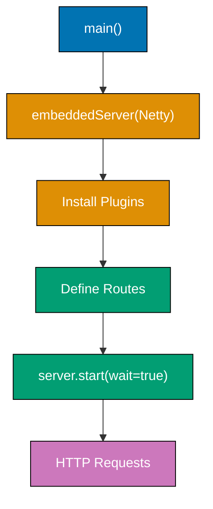
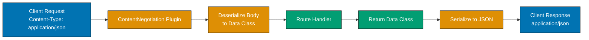
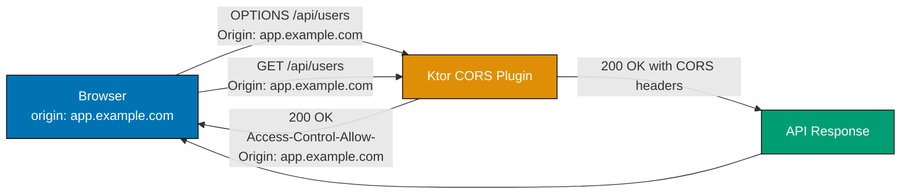

## Group 1: Embedded Server and Application Structure

### Example 1: Minimal Embedded Server

Ktor runs as an embedded server inside your JVM application rather than deploying a WAR to a container. You choose an engine (Netty, CIO, Jetty), configure it programmatically, and call `start()`. This makes deployment a single fat JAR with no external server required.



```kotlin
// build.gradle.kts - Ktor dependencies for embedded Netty server
// dependencies {
//     implementation("io.ktor:ktor-server-netty:3.0.3")
//     implementation("io.ktor:ktor-server-core:3.0.3")
//     implementation("ch.qos.logback:logback-classic:1.4.14")
// }

import io.ktor.server.engine.*           // => embeddedServer, ApplicationEngine
import io.ktor.server.netty.*            // => Netty engine implementation
import io.ktor.server.application.*      // => Application, ApplicationCall
import io.ktor.server.response.*         // => respond, respondText
import io.ktor.server.routing.*          // => routing, get, post

fun main() {
    // embeddedServer creates and configures the server inline
    // First arg: engine class (Netty here; alternatives: CIO, Jetty)
    // port: TCP port to listen on
    val server = embeddedServer(
        Netty,                           // => Use Netty as the HTTP engine
        port = 8080,                     // => Listen on port 8080
        host = "0.0.0.0"                 // => Accept connections from all network interfaces
    ) {
        // This lambda is the Application configure block
        // 'this' is an Application instance
        routing {                        // => Install routing plugin inline
            get("/") {                   // => Register GET handler for "/"
                call.respondText(        // => Send plain text response
                    "Hello, Ktor!"       // => Response body string
                )                        // => HTTP 200 with Content-Type: text/plain
            }
        }
    }

    server.start(wait = true)            // => Start server and block the main thread
                                         // => wait=false returns immediately (useful in tests)
    // => Server listens at http://localhost:8080
    // => GET / returns: Hello, Ktor!
}
```

**Key Takeaway**: `embeddedServer(Engine, port) { ... }` creates a fully self-contained HTTP server; calling `start(wait = true)` blocks until the server shuts down.

**Why It Matters**: Embedding the server eliminates the distinction between application and container. Your JAR is your deployment unit. In production, this simplifies Docker images (no Tomcat needed), enables fast startup for cloud functions, and lets you configure everything in code rather than XML. Teams adopting Ktor reduce operational complexity by removing the servlet container layer entirely.

---

### Example 2: Application Module Pattern

Large Ktor applications organize plugins and routes into module functions rather than one giant `main()` block. Modules are extension functions on `Application` that install plugins and define routes, enabling testability and separation of concerns.

```kotlin
import io.ktor.server.engine.*
import io.ktor.server.netty.*
import io.ktor.server.application.*
import io.ktor.server.response.*
import io.ktor.server.routing.*

// Module function: extension on Application, no return value
// This signature allows testApplication to call it directly in tests
fun Application.configureRouting() {    // => Extension fn on Application
    routing {                           // => Defines the routing tree
        get("/health") {
            call.respondText("OK")      // => Responds with "OK" and HTTP 200
        }
        get("/version") {
            call.respondText("1.0.0")   // => Responds with version string
        }
    }
}

// Separate module for plugins (keeps concerns isolated)
fun Application.configurePlugins() {    // => Another module function
    // Install plugins here (logging, serialization, etc.)
    // Called before configureRouting so plugins are ready for routes
}

fun main() {
    embeddedServer(Netty, port = 8080) {
        configurePlugins()               // => Install plugins first
        configureRouting()               // => Then define routes
        // => Modules called in order; plugins must be installed before routes use them
    }.start(wait = true)
}
// => GET /health => "OK"
// => GET /version => "1.0.0"
```

**Key Takeaway**: Module functions (extension functions on `Application`) separate plugin installation from route definitions, making each concern independently testable and composable.

**Why It Matters**: As applications grow, a single `main()` block becomes unmaintainable. Module functions let teams own different sections of the application independently. The `testApplication` testing API calls these same module functions, so integration tests exercise identical configuration as production. This pattern prevents the "works in production but not in tests" class of bugs caused by configuration divergence.

---

### Example 3: Engine Selection and Configuration

Ktor supports three built-in engines: Netty (high-throughput production), CIO (pure Kotlin coroutine-based, minimal dependencies), and Jetty (useful when existing Jetty infrastructure exists). Each engine accepts connector and thread-pool configuration.

```kotlin
import io.ktor.server.engine.*
import io.ktor.server.netty.*
import io.ktor.server.cio.*            // => CIO engine (coroutine I/O)

// --- Option A: Netty (recommended for production) ---
// Netty uses NIO with an optimized pipeline; handles high concurrency
fun startWithNetty() {
    embeddedServer(
        Netty,
        configure = {
            // connector block configures the listening socket
            connector {
                port = 8080            // => TCP port
                host = "0.0.0.0"       // => Bind to all interfaces
            }
            // Worker threads handle business logic after I/O decode
            workerGroupSize = 4        // => 4 Netty worker threads
                                       // => Default: number of CPU cores * 2
            callGroupSize = 4          // => 4 threads for call handling
        }
    ) {
        // Application configure block
    }.start(wait = true)
}

// --- Option B: CIO (pure Kotlin, smaller footprint) ---
// CIO is ideal when you want minimal external dependencies
// Uses Kotlin coroutines directly for I/O; no Netty/Jetty required
fun startWithCIO() {
    embeddedServer(
        CIO,                           // => Pure Kotlin coroutine-based engine
        port = 8080,
        configure = {
            connectionIdleTimeoutSeconds = 45  // => Drop idle connections after 45s
                                               // => Prevents resource exhaustion from stale clients
        }
    ) {
        // Application configure block identical to Netty
    }.start(wait = true)
}
// => Both engines expose identical Application API
// => Engine choice is infrastructure; application code is unchanged
```

**Key Takeaway**: Choose Netty for production workloads and maximum throughput; choose CIO for minimal dependencies or when targeting Kotlin Multiplatform environments.

**Why It Matters**: Engine selection affects throughput, memory use, and dependency footprint without changing a single line of application code. This separation of engine from framework logic means you can benchmark both engines against your specific workload and switch with a one-line change. Production teams running Ktor in Docker containers often choose CIO to keep image sizes small while maintaining full coroutine support.

---

## Group 2: Routing

### Example 4: Basic Route Definitions

Ktor's routing DSL uses functions named after HTTP methods (`get`, `post`, `put`, `delete`, `patch`) inside a `routing { }` block. Each function receives a path string and a handler lambda where `call` is the `ApplicationCall` giving access to request and response.

```kotlin
import io.ktor.server.application.*
import io.ktor.server.response.*
import io.ktor.server.routing.*
import io.ktor.http.*

fun Application.configureRouting() {
    routing {
        // GET handler - read operations, no body
        get("/users") {                   // => Matches GET /users
            call.respondText(             // => Responds with plain text
                "List of users",
                status = HttpStatusCode.OK  // => Explicit 200 (default anyway)
            )
        }

        // POST handler - create operations, accepts request body
        post("/users") {                  // => Matches POST /users
            call.respondText(
                "User created",
                status = HttpStatusCode.Created  // => HTTP 201 Created
            )
        }

        // PUT handler - full resource replacement
        put("/users/{id}") {              // => {id} is a path parameter
            val id = call.parameters["id"]  // => Extract "id" from URL path
                                             // => call.parameters returns String?
            call.respondText("Updated user $id")  // => "Updated user 42" if id="42"
        }

        // DELETE handler - resource removal
        delete("/users/{id}") {           // => Matches DELETE /users/{id}
            val id = call.parameters["id"]
            call.respond(HttpStatusCode.NoContent)  // => HTTP 204 No Content
                                                     // => No body for successful deletes
        }
    }
}
// => GET    /users     => 200 "List of users"
// => POST   /users     => 201 "User created"
// => PUT    /users/42  => 200 "Updated user 42"
// => DELETE /users/42  => 204 (no body)
```

**Key Takeaway**: HTTP method functions (`get`, `post`, `put`, `delete`) inside `routing { }` register handlers; `call.parameters["name"]` extracts path parameters as nullable strings.

**Why It Matters**: Ktor's routing DSL maps directly to REST conventions, making API design readable in code. Using correct HTTP status codes (201 for creation, 204 for deletion) is not just convention - it signals intent to API consumers and enables correct caching behavior in browsers and HTTP clients. Teams that enforce proper status codes reduce client-side error handling complexity.

---

### Example 5: Route Parameters and Query Strings

Path parameters capture dynamic URL segments while query parameters handle optional filtering and pagination. Ktor provides both through `call.parameters` (path) and `call.request.queryParameters` (query string).

```kotlin
import io.ktor.server.application.*
import io.ktor.server.response.*
import io.ktor.server.routing.*

fun Application.configureRouting() {
    routing {
        // Path parameter: captures required URL segment
        // Curly braces {name} define a named segment
        get("/users/{id}") {
            val id = call.parameters["id"]      // => String? from path segment
                                                 // => null if not present (shouldn't happen here)
            val userId = id?.toIntOrNull()       // => Convert to Int; null if non-numeric
                ?: return@get call.respondText( // => Early return if invalid
                    "Invalid user ID",
                    status = io.ktor.http.HttpStatusCode.BadRequest
                )
            call.respondText("User ID: $userId")  // => "User ID: 42"
        }

        // Query parameters: optional, come after '?'
        // URL: GET /search?q=kotlin&page=2&size=10
        get("/search") {
            val query = call.request.queryParameters["q"]     // => "kotlin" or null
            val page = call.request.queryParameters["page"]   // => "2" or null
                ?.toIntOrNull() ?: 1                          // => Default page = 1
            val size = call.request.queryParameters["size"]   // => "10" or null
                ?.toIntOrNull() ?: 20                         // => Default size = 20

            if (query == null) {
                call.respondText("Missing 'q' parameter",
                    status = io.ktor.http.HttpStatusCode.BadRequest)
                return@get                       // => Exit handler early
            }

            call.respondText(
                "Searching for '$query', page=$page, size=$size"
            )
            // => "Searching for 'kotlin', page=2, size=10"
        }

        // Wildcard path: {...} captures remaining path segments
        get("/files/{path...}") {
            val filePath = call.parameters.getAll("path")
                ?.joinToString("/")              // => Joins ["docs", "api", "v1"] -> "docs/api/v1"
            call.respondText("File: $filePath")  // => "File: docs/api/v1"
        }
    }
}
// => GET /users/42          => "User ID: 42"
// => GET /users/abc         => 400 "Invalid user ID"
// => GET /search?q=kotlin   => "Searching for 'kotlin', page=1, size=20"
// => GET /files/docs/api/v1 => "File: docs/api/v1"
```

**Key Takeaway**: `call.parameters["name"]` returns nullable path segments; `call.request.queryParameters["name"]` returns nullable query params; always provide defaults or return early with `BadRequest` for invalid input.

**Why It Matters**: Proper parameter validation at the routing layer prevents invalid data from reaching business logic. Returning `400 BadRequest` with a clear message (rather than throwing a `NullPointerException` or returning `500`) dramatically improves API debuggability. Production APIs that validate and document parameter requirements reduce support burden by making incorrect usage self-evident.

---

### Example 6: Route Groups and Nested Routes

Ktor supports nested routing that mirrors URL hierarchy. The `route()` function creates a path prefix scope; handlers inside inherit the prefix. This avoids repetition and groups related endpoints logically.

```kotlin
import io.ktor.server.application.*
import io.ktor.server.response.*
import io.ktor.server.routing.*
import io.ktor.http.*

fun Application.configureRouting() {
    routing {
        // Top-level route group with shared prefix "/api/v1"
        route("/api/v1") {               // => All children prefixed with /api/v1
            // Nested group for /api/v1/users
            route("/users") {            // => All children prefixed with /api/v1/users
                get {                    // => GET /api/v1/users (no additional path)
                    call.respondText("All users")
                }
                get("/{id}") {           // => GET /api/v1/users/{id}
                    val id = call.parameters["id"]
                    call.respondText("User $id")
                }
                post {                   // => POST /api/v1/users
                    call.respond(HttpStatusCode.Created)
                }
                route("/{userId}/posts") {  // => Another level of nesting
                    get {                   // => GET /api/v1/users/{userId}/posts
                        val userId = call.parameters["userId"]
                        call.respondText("Posts for user $userId")
                    }
                }
            }

            // Separate nested group for /api/v1/products
            route("/products") {         // => /api/v1/products prefix
                get {                    // => GET /api/v1/products
                    call.respondText("All products")
                }
            }
        }
    }
}
// => GET  /api/v1/users             => "All users"
// => GET  /api/v1/users/42          => "User 42"
// => POST /api/v1/users             => 201 Created
// => GET  /api/v1/users/42/posts    => "Posts for user 42"
// => GET  /api/v1/products          => "All products"
```

**Key Takeaway**: `route("/prefix") { }` creates a path scope; nested `route()` calls compose prefixes; this mirrors the URL hierarchy in code structure, improving readability.

**Why It Matters**: As REST APIs grow beyond a handful of endpoints, flat route lists become unmaintainable. Nested routes create a one-to-one mapping between URL structure and code structure. This means developers find relevant handlers by following the URL path in the source tree. Teams report significantly less time navigating routing files when routes mirror the API hierarchy rather than being listed alphabetically or by creation order.

---

### Example 7: Route Extensions and Separate Files

Defining all routes in one file creates merge conflicts in team environments. Ktor's extension function pattern lets you split routes across files while keeping the DSL structure.

```kotlin
// --- File: UserRoutes.kt ---
import io.ktor.server.application.*
import io.ktor.server.response.*
import io.ktor.server.routing.*
import io.ktor.http.*

// Extension function on Route (not Application) to define sub-routes
// This can be called inside any routing block
fun Route.userRoutes() {                 // => Extension on Route DSL
    route("/users") {
        get {
            call.respondText("GET users")
        }
        post {
            call.respond(HttpStatusCode.Created)
        }
        delete("/{id}") {
            call.respond(HttpStatusCode.NoContent)
        }
    }
}

// --- File: ProductRoutes.kt ---
fun Route.productRoutes() {              // => Another Route extension
    route("/products") {
        get {
            call.respondText("GET products")
        }
    }
}

// --- File: Application.kt ---
fun Application.configureRouting() {
    routing {
        route("/api/v1") {
            userRoutes()                 // => Registers /api/v1/users routes
                                         // => Calls the extension fn, which adds to this Route
            productRoutes()              // => Registers /api/v1/products routes
        }
    }
}
// => GET  /api/v1/users     => "GET users"
// => POST /api/v1/users     => 201
// => GET  /api/v1/products  => "GET products"
```

**Key Takeaway**: Extension functions on `Route` let you define route groups in separate files and compose them cleanly inside `routing { }` blocks.

**Why It Matters**: Splitting routes into feature files (`UserRoutes.kt`, `ProductRoutes.kt`, `OrderRoutes.kt`) enables parallel development without merge conflicts. Each feature team owns their route file. The extension function pattern also enables shared middleware setup per feature group - for example, all user routes can install authentication in one place. This is the standard Ktor convention for structuring production applications.

---

## Group 3: Request and Response

### Example 8: Reading Request Bodies

POST and PUT handlers need to read request bodies. Ktor provides `receive<T>()` on `ApplicationCall` to deserialize bodies. For plain text or raw bytes, use `receiveText()` or `receiveChannel()`.

```kotlin
import io.ktor.server.application.*
import io.ktor.server.request.*          // => receive, receiveText, receiveParameters
import io.ktor.server.response.*
import io.ktor.server.routing.*
import io.ktor.http.*

fun Application.configureRouting() {
    routing {
        // Read plain text body
        post("/echo") {
            val body = call.receiveText()  // => Reads entire body as String
                                           // => Suspends until body fully received
            call.respondText("Echo: $body")
        }

        // Read URL-encoded form data (application/x-www-form-urlencoded)
        post("/login") {
            val params = call.receiveParameters()  // => Parses form-encoded body
                                                    // => Returns Parameters map
            val username = params["username"]       // => "alice" or null
            val password = params["password"]       // => "secret" or null

            if (username == null || password == null) {
                call.respond(HttpStatusCode.BadRequest)
                return@post
            }
            // In real code: verify credentials against database
            call.respondText("Logged in as $username")
        }

        // Read raw bytes (for binary data, file uploads handled separately)
        post("/binary") {
            val bytes = call.receive<ByteArray>()   // => Reads body as raw bytes
            call.respondText("Received ${bytes.size} bytes")
        }
    }
}
// => POST /echo body="hello"           => "Echo: hello"
// => POST /login username=alice&password=secret => "Logged in as alice"
// => POST /binary (binary body)        => "Received 1024 bytes"
```

**Key Takeaway**: `call.receiveText()` reads raw body strings; `call.receiveParameters()` parses URL-encoded forms; `call.receive<T>()` deserializes to a type (requires content negotiation plugin for JSON).

**Why It Matters**: Understanding the different receive methods prevents a common bug: calling `receive()` without a content negotiation plugin installed throws a confusing exception rather than returning a useful error message. Production handlers should always validate received data before processing, and using `receiveParameters()` for form data correctly handles URL encoding that would corrupt data if read as raw text.

---

### Example 9: Response Building

Ktor's response API provides multiple `respond*` methods for different content types. Using the correct method with the correct `Content-Type` header ensures clients parse responses correctly.

```kotlin
import io.ktor.server.application.*
import io.ktor.server.response.*
import io.ktor.server.routing.*
import io.ktor.http.*

fun Application.configureRouting() {
    routing {
        // Plain text response - sets Content-Type: text/plain; charset=UTF-8
        get("/text") {
            call.respondText("Plain text response")  // => 200 text/plain
        }

        // HTML response - sets Content-Type: text/html; charset=UTF-8
        get("/html") {
            call.respondText(
                "<h1>Hello HTML</h1>",
                ContentType.Text.Html             // => Sets Content-Type header
            )
        }

        // Custom status code
        get("/not-found") {
            call.respondText(
                "Resource not found",
                status = HttpStatusCode.NotFound  // => HTTP 404
            )
        }

        // Respond with HttpStatusCode only (no body)
        delete("/resource") {
            call.respond(HttpStatusCode.NoContent)  // => HTTP 204, empty body
        }

        // Custom headers on response
        get("/with-headers") {
            call.response.headers.append(           // => Add response header
                "X-Custom-Header", "my-value"       // => Name, value pair
            )
            call.response.headers.append(
                HttpHeaders.CacheControl, "no-cache"  // => Standard header constant
            )
            call.respondText("Response with custom headers")
        }

        // Redirect response
        get("/old-path") {
            call.respondRedirect(                  // => Sets Location header
                "/new-path",                       // => Redirect target URL
                permanent = true                   // => true = 301, false = 302
            )
        }
    }
}
// => GET /text         => 200 "Plain text response" (text/plain)
// => GET /html         => 200 "<h1>Hello HTML</h1>" (text/html)
// => GET /not-found    => 404 "Resource not found"
// => DELETE /resource  => 204 (no body)
// => GET /with-headers => 200 + X-Custom-Header: my-value
// => GET /old-path     => 301 Location: /new-path
```

**Key Takeaway**: Use typed `respond*` methods to set both status and content type correctly; add custom headers via `call.response.headers.append()` before calling `respond*`.

**Why It Matters**: Correct `Content-Type` headers are not optional - browsers and API clients parse response bodies differently based on this header. An API returning JSON as `text/plain` breaks clients that check content type before parsing. Proper 301 vs 302 redirects affect SEO and client caching. Production teams use status code linting and contract testing to catch incorrect response metadata before it reaches clients.

---

## Group 4: Content Negotiation and JSON

### Example 10: Installing Content Negotiation with kotlinx.serialization

Content negotiation lets Ktor automatically serialize response objects to JSON and deserialize request bodies based on `Accept` and `Content-Type` headers. The `kotlinx.serialization` engine is the recommended choice for Kotlin projects.



```kotlin
// build.gradle.kts additions:
// implementation("io.ktor:ktor-server-content-negotiation:3.0.3")
// implementation("io.ktor:ktor-serialization-kotlinx-json:3.0.3")
// implementation("org.jetbrains.kotlinx:kotlinx-serialization-json:1.7.3")
// Also add: id("org.jetbrains.kotlin.plugin.serialization") to plugins block

import io.ktor.server.application.*
import io.ktor.server.plugins.contentnegotiation.*  // => ContentNegotiation plugin
import io.ktor.serialization.kotlinx.json.*          // => json() converter
import io.ktor.server.response.*
import io.ktor.server.request.*
import io.ktor.server.routing.*
import kotlinx.serialization.Serializable

// @Serializable generates serializer at compile time
// No reflection needed: fast and works with R8/ProGuard
@Serializable
data class User(                         // => Data class with generated serializer
    val id: Int,                         // => Maps to JSON "id" field
    val name: String,                    // => Maps to JSON "name" field
    val email: String                    // => Maps to JSON "email" field
)

@Serializable
data class CreateUserRequest(
    val name: String,
    val email: String
)

fun Application.configureContentNegotiation() {
    install(ContentNegotiation) {        // => Install the plugin
        json()                           // => Register JSON converter (kotlinx.serialization)
                                         // => json() can accept Json { ... } config block
        // json(Json {
        //     prettyPrint = true        // => Indent JSON output (useful for debugging)
        //     isLenient = true          // => Accept unquoted keys (non-standard)
        //     ignoreUnknownKeys = true  // => Don't fail on extra JSON fields from client
        // })
    }
}

fun Application.configureRouting() {
    routing {
        // Return data class - automatically serialized to JSON
        get("/users/{id}") {
            val id = call.parameters["id"]?.toIntOrNull() ?: 0
            val user = User(id, "Alice", "alice@example.com")
            call.respond(user)           // => Serializes User to JSON automatically
                                         // => {"id":1,"name":"Alice","email":"alice@example.com"}
        }

        // Receive JSON body - automatically deserialized
        post("/users") {
            val request = call.receive<CreateUserRequest>()  // => Deserializes JSON body
                                                              // => Content-Type must be application/json
            val newUser = User(42, request.name, request.email)
            call.respond(newUser)        // => Returns created user as JSON
        }
    }
}
// => GET /users/1
//    Response: {"id":1,"name":"Alice","email":"alice@example.com"}
// => POST /users {"name":"Bob","email":"bob@example.com"}
//    Response: {"id":42,"name":"Bob","email":"bob@example.com"}
```

**Key Takeaway**: `install(ContentNegotiation) { json() }` enables automatic JSON serialization; `@Serializable` data classes serialize without reflection using compile-time generated code.

**Why It Matters**: Content negotiation eliminates the manual `ObjectMapper.writeValueAsString()` calls scattered across controllers in traditional Java frameworks. The compile-time serialization in kotlinx.serialization catches type mismatches at build time rather than runtime, preventing `JsonProcessingException` in production. Enabling `ignoreUnknownKeys = true` in your JSON config prevents API versioning breakage when clients send fields your current version doesn't recognize.

---

### Example 11: JSON Response Customization

Production APIs often need camelCase/snake_case field name transformations, null handling, and custom serializers. kotlinx.serialization provides annotations and configuration options to control serialization output.

```kotlin
import io.ktor.server.application.*
import io.ktor.server.plugins.contentnegotiation.*
import io.ktor.serialization.kotlinx.json.*
import io.ktor.server.response.*
import io.ktor.server.routing.*
import kotlinx.serialization.SerialName
import kotlinx.serialization.Serializable
import kotlinx.serialization.json.Json

// @SerialName overrides the JSON key name
@Serializable
data class Product(
    val id: Int,
    @SerialName("product_name")          // => JSON key is "product_name", not "productName"
    val productName: String,
    @SerialName("unit_price")
    val unitPrice: Double,
    val inStock: Boolean? = null         // => Nullable field; null by default
)

fun Application.configureContentNegotiation() {
    install(ContentNegotiation) {
        json(Json {
            prettyPrint = true           // => Indented output (disable in production for size)
            ignoreUnknownKeys = true     // => Don't fail on extra client fields
            encodeDefaults = false       // => Don't serialize null defaults
                                         // => Reduces payload size for optional fields
            coerceInputValues = true     // => Convert JSON null to Kotlin default
        })
    }
}

fun Application.configureRouting() {
    routing {
        get("/product") {
            val product = Product(
                id = 1,
                productName = "Widget",  // => In JSON: "product_name": "Widget"
                unitPrice = 9.99,        // => In JSON: "unit_price": 9.99
                inStock = null           // => With encodeDefaults=false: omitted from JSON
            )
            call.respond(product)
            // => Response (pretty-printed):
            // => {
            // =>   "id": 1,
            // =>   "product_name": "Widget",
            // =>   "unit_price": 9.99
            // => }  (inStock omitted because null and encodeDefaults=false)
        }
    }
}
```

**Key Takeaway**: `@SerialName("snake_case")` overrides JSON key names; `encodeDefaults = false` omits null fields; `ignoreUnknownKeys = true` prevents forward-compatibility breakage.

**Why It Matters**: Many external clients and databases use snake_case while Kotlin conventions use camelCase. `@SerialName` bridges this without runtime overhead. Omitting null fields (`encodeDefaults = false`) reduces JSON payload size - critical for mobile clients on metered connections. Enabling `ignoreUnknownKeys` is essential for rolling deployments where old server and new client versions coexist temporarily, preventing needless 400 errors during deployment windows.

---

## Group 5: Status Pages and Error Handling

### Example 12: StatusPages Plugin for Centralized Error Handling

The StatusPages plugin intercepts exceptions and HTTP status codes, routing them to centralized handlers rather than letting each route handle errors individually. This produces consistent error response formats across all endpoints.

```kotlin
// build.gradle.kts: implementation("io.ktor:ktor-server-status-pages:3.0.3")

import io.ktor.server.application.*
import io.ktor.server.plugins.statuspages.*  // => StatusPages plugin
import io.ktor.server.response.*
import io.ktor.server.routing.*
import io.ktor.http.*
import kotlinx.serialization.Serializable

// Consistent error response shape for all API errors
@Serializable
data class ErrorResponse(
    val code: Int,
    val message: String,
    val details: String? = null
)

// Custom exception classes for domain errors
class NotFoundException(message: String) : RuntimeException(message)
class ValidationException(message: String) : RuntimeException(message)

fun Application.configureStatusPages() {
    install(StatusPages) {              // => Install status pages plugin
        // Handle specific exception type
        exception<NotFoundException> { call, cause ->
            // 'cause' is the thrown exception instance
            call.respond(
                HttpStatusCode.NotFound,  // => HTTP 404
                ErrorResponse(404, cause.message ?: "Not found")
            )
        }

        // Handle validation errors
        exception<ValidationException> { call, cause ->
            call.respond(
                HttpStatusCode.UnprocessableEntity,  // => HTTP 422
                ErrorResponse(422, "Validation failed", cause.message)
            )
        }

        // Catch-all for unhandled exceptions (prevents stack traces leaking)
        exception<Throwable> { call, cause ->
            // Log the real error server-side (not shown to client)
            call.application.environment.log.error("Unhandled error", cause)
            call.respond(
                HttpStatusCode.InternalServerError,  // => HTTP 500
                ErrorResponse(500, "Internal server error")
                // => Never return cause.message here: security risk
            )
        }

        // Handle specific HTTP status codes (e.g., route not found = 404)
        status(HttpStatusCode.NotFound) { call, status ->
            call.respond(status, ErrorResponse(404, "Route not found"))
        }
    }
}

fun Application.configureRouting() {
    routing {
        get("/users/{id}") {
            val id = call.parameters["id"]?.toIntOrNull()
                ?: throw ValidationException("ID must be a number")
                // => ValidationException caught by StatusPages -> 422

            if (id > 100) throw NotFoundException("User $id not found")
            // => NotFoundException caught by StatusPages -> 404

            call.respondText("User $id")
        }
    }
}
// => GET /users/abc   => 422 {"code":422,"message":"Validation failed","details":"ID must be a number"}
// => GET /users/200   => 404 {"code":404,"message":"User 200 not found"}
// => GET /unknown     => 404 {"code":404,"message":"Route not found"}
```

**Key Takeaway**: `install(StatusPages) { exception<T> { ... } }` intercepts exceptions thrown from handlers; the catch-all `exception<Throwable>` prevents internal details from leaking in error responses.

**Why It Matters**: Consistent error response shapes are a contract between your API and its consumers. Clients that receive varying error formats must write complex error handling logic. StatusPages enforces a single error shape across all endpoints without coupling every route handler to error formatting. The catch-all exception handler is a security requirement: stack traces in error responses reveal internal implementation details that attackers use to craft targeted exploits.

---

### Example 13: Custom HTTP Status Handling

Beyond exceptions, StatusPages also intercepts when Ktor itself would return 404 (no matching route), 405 (method not allowed), or other framework-level errors, letting you maintain consistent error format even for infrastructure-level responses.

```kotlin
import io.ktor.server.application.*
import io.ktor.server.plugins.statuspages.*
import io.ktor.server.response.*
import io.ktor.http.*
import kotlinx.serialization.Serializable

@Serializable
data class ApiError(val status: Int, val error: String)

fun Application.configureStatusPages() {
    install(StatusPages) {
        // Intercept 404 from routing (no matching route found)
        status(HttpStatusCode.NotFound) { call, status ->
            call.respond(
                status,                           // => Pass through the 404 status
                ApiError(404, "Endpoint not found: ${call.request.uri}")
            )
        }

        // Intercept 405 from routing (route exists but wrong method)
        status(HttpStatusCode.MethodNotAllowed) { call, status ->
            call.respond(
                status,
                ApiError(405, "Method ${call.request.httpMethod.value} not allowed here")
            )
        }

        // Intercept 401 set by authentication plugin
        status(HttpStatusCode.Unauthorized) { call, status ->
            call.respond(
                status,
                ApiError(401, "Authentication required")
            )
        }

        // Intercept range of status codes using statusFile
        // (alternative: use status() for each code individually)
        statusFile(
            HttpStatusCode.InternalServerError,  // => Handle 500 with template file
            filePattern = "error-#.html"          // => Serves error-500.html from resources
        )
    }
}
// => GET  /nonexistent         => 404 {"status":404,"error":"Endpoint not found: /nonexistent"}
// => POST /users (if only GET) => 405 {"status":405,"error":"Method POST not allowed here"}
// => GET  /protected (no auth) => 401 {"status":401,"error":"Authentication required"}
```

**Key Takeaway**: Use `status(HttpStatusCode.X) { ... }` to intercept specific HTTP codes that Ktor generates; this includes routing 404s and authentication 401s, ensuring consistent error format across all error sources.

**Why It Matters**: APIs that return HTML 404 pages for unknown routes while returning JSON for application errors create parsing failures in API clients. Intercepting framework-level status codes at the StatusPages layer guarantees uniform JSON error responses regardless of whether the error originated in your code or Ktor's routing layer. This is especially important for mobile clients that perform strict content-type checking before parsing responses.

---

## Group 6: Static Content

### Example 14: Serving Static Files

Ktor's static content plugin serves files from the filesystem or classpath resources. This handles CSS, JavaScript, images, and other static assets without writing per-file route handlers.

```kotlin
// build.gradle.kts: implementation("io.ktor:ktor-server-static:3.0.3")
// (included in ktor-server-core for Ktor 3.x)

import io.ktor.server.application.*
import io.ktor.server.http.content.*    // => static, staticResources, staticFiles
import io.ktor.server.routing.*

fun Application.configureStaticContent() {
    routing {
        // Serve files from filesystem directory
        staticFiles(
            remotePath = "/static",         // => URL prefix: /static/file.js
            dir = java.io.File("static")    // => Local directory on filesystem
        )

        // Serve files from classpath resources (bundled in JAR)
        // Files go in src/main/resources/static/
        staticResources(
            remotePath = "/assets",         // => URL prefix: /assets/style.css
            basePackage = "static"          // => Classpath package: resources/static/
        )

        // Single-page application (SPA) setup:
        // Serve index.html for all unmatched routes (client-side routing)
        staticResources(
            remotePath = "/app",
            basePackage = "webapp"
        ) {
            default("index.html")           // => Fallback to index.html for unknown paths
                                             // => Enables React/Vue router to handle routing
        }
    }
}
// => GET /static/script.js   => Serves static/script.js from filesystem
// => GET /assets/style.css   => Serves resources/static/style.css from classpath
// => GET /app/dashboard      => Serves resources/webapp/index.html (SPA fallback)
```

**Key Takeaway**: `staticFiles()` serves from the filesystem; `staticResources()` serves from the classpath (bundled in JAR); both accept a `remotePath` URL prefix and file source path.

**Why It Matters**: For simple applications, serving static assets from Ktor eliminates the need for a separate Nginx reverse proxy just for asset serving. The classpath variant bundles assets into the JAR, creating a single deployable artifact. For larger applications, use Nginx or a CDN in front of Ktor for static assets, but during development and for small projects, Ktor's static content plugin provides a zero-configuration solution that removes operational complexity.

---

## Group 7: Templates

### Example 15: FreeMarker Templates

Ktor integrates with FreeMarker for server-side HTML rendering. Templates separate presentation from logic, making HTML maintainable without string concatenation in route handlers.

```kotlin
// build.gradle.kts: implementation("io.ktor:ktor-server-freemarker:3.0.3")

import freemarker.cache.ClassTemplateLoader
import io.ktor.server.application.*
import io.ktor.server.freemarker.*          // => FreeMarker plugin
import io.ktor.server.response.*
import io.ktor.server.routing.*

// Data class passed to template as model
data class UserViewModel(
    val name: String,
    val items: List<String>
)

fun Application.configureFreeMarker() {
    install(FreeMarker) {                   // => Install FreeMarker plugin
        templateLoader = ClassTemplateLoader(
            this::class.java.classLoader,   // => Load templates from classpath
            "templates"                     // => templates/ directory in resources
        )
        // defaultEncoding = "UTF-8"        // => Default; explicit for clarity
    }
}

fun Application.configureRouting() {
    routing {
        get("/dashboard") {
            val model = UserViewModel(
                name = "Alice",
                items = listOf("Report A", "Report B", "Report C")
            )
            call.respond(
                FreeMarkerContent(          // => Wraps template name + model
                    "dashboard.ftl",        // => Template file in resources/templates/
                    mapOf("user" to model)  // => Model variables available in template
                )
            )
            // => Renders resources/templates/dashboard.ftl with user variable
        }
    }
}

// --- resources/templates/dashboard.ftl ---
// <!DOCTYPE html>
// <html>
// <head><title>Dashboard - ${user.name}</title></head>
// <body>
//   <h2>Welcome, ${user.name}</h2>
//   <ul>
//     <#list user.items as item>
//       <li>${item}</li>
//     </#list>
//   </ul>
// </body>
// </html>
//
// => Rendered output for Alice with 3 items:
// => <h2>Welcome, Alice</h2>
// => <ul><li>Report A</li><li>Report B</li><li>Report C</li></ul>
```

**Key Takeaway**: `install(FreeMarker) { templateLoader = ClassTemplateLoader(...) }` configures template loading; `call.respond(FreeMarkerContent("template.ftl", model))` renders a template with data.

**Why It Matters**: Server-side rendering with templates remains the right choice for content-heavy web applications, admin interfaces, and SEO-critical pages where JavaScript-heavy SPAs add unnecessary complexity. FreeMarker's `ClassTemplateLoader` bundles templates in the JAR, maintaining the single-artifact deployment model. Template caching is enabled by default in FreeMarker, preventing repeated filesystem reads in production that would degrade response times under load.

---

### Example 16: Thymeleaf Templates

Thymeleaf is an alternative template engine that uses valid HTML with `th:` attribute syntax, enabling designers to open templates directly in browsers without server rendering.

```kotlin
// build.gradle.kts: implementation("io.ktor:ktor-server-thymeleaf:3.0.3")

import io.ktor.server.application.*
import io.ktor.server.thymeleaf.*           // => Thymeleaf plugin
import io.ktor.server.response.*
import io.ktor.server.routing.*
import org.thymeleaf.templateresolver.ClassLoaderTemplateResolver

fun Application.configureThymeleaf() {
    install(Thymeleaf) {                    // => Install Thymeleaf plugin
        setTemplateResolver(
            ClassLoaderTemplateResolver().apply {
                prefix = "templates/"       // => Load from resources/templates/ directory
                suffix = ".html"            // => Template files end in .html
                characterEncoding = "UTF-8"
                isCacheable = true          // => Cache parsed templates in production
                                             // => Set false during development for live reload
            }
        )
    }
}

fun Application.configureRouting() {
    routing {
        get("/profile/{username}") {
            val username = call.parameters["username"] ?: "Guest"
            call.respond(
                ThymeleafContent(           // => Thymeleaf response wrapper
                    "profile",              // => Template name (maps to templates/profile.html)
                    mapOf(                  // => Variables available in template
                        "username" to username,
                        "posts" to listOf("First post", "Second post")
                    )
                )
            )
        }
    }
}

// --- resources/templates/profile.html ---
// <!DOCTYPE html>
// <html xmlns:th="http://www.thymeleaf.org">
// <head><title th:text="${username} + ' Profile'">Profile</title></head>
// <body>
//   <h1 th:text="'Hello, ' + ${username}">Hello, User</h1>
//   <ul>
//     <li th:each="post : ${posts}" th:text="${post}">Post title</li>
//   </ul>
// </body>
// </html>
//
// => GET /profile/alice
// => <h1>Hello, alice</h1>
// => <li>First post</li><li>Second post</li>
```

**Key Takeaway**: `install(Thymeleaf) { setTemplateResolver(...) }` and `call.respond(ThymeleafContent("name", model))` enable Thymeleaf rendering with natural HTML templates that remain valid HTML files.

**Why It Matters**: Thymeleaf's natural templates allow designers to prototype with real HTML that browsers render correctly even before server integration. This accelerates UI development in teams with dedicated frontend designers who use browser-based tools. Unlike FreeMarker's `${}` syntax which breaks HTML validation, Thymeleaf `th:` attributes preserve valid HTML, enabling CSS design and preview workflows without running the server.

---

## Group 8: Headers and Cookies

### Example 17: Reading and Writing Headers

HTTP headers convey metadata about requests and responses. Ktor exposes request headers through `call.request.headers` and response headers through `call.response.headers`. Standard headers have named constants in `HttpHeaders`.

```kotlin
import io.ktor.server.application.*
import io.ktor.server.response.*
import io.ktor.server.routing.*
import io.ktor.http.*

fun Application.configureRouting() {
    routing {
        get("/headers-demo") {
            // Read standard request headers
            val accept = call.request.headers[HttpHeaders.Accept]
                                                // => "application/json" or null
            val contentType = call.request.contentType()
                                                // => ContentType parsed from Content-Type header
            val userAgent = call.request.headers[HttpHeaders.UserAgent]
                                                // => "Mozilla/5.0 ..." or null

            // Read custom request header
            val apiVersion = call.request.headers["X-API-Version"]
                                                // => "v2" or null (custom header)

            // Write response headers before respond()
            call.response.headers.apply {
                append(HttpHeaders.CacheControl, "public, max-age=3600")
                                                // => Browser caches response for 1 hour
                append("X-Request-ID", "req-${System.currentTimeMillis()}")
                                                // => Custom header for request tracing
                append(HttpHeaders.ContentLanguage, "en-US")
                                                // => Declare response language
            }

            call.respondText(
                "Accept: $accept, User-Agent: $userAgent, API-Version: $apiVersion"
            )
        }

        // CORS preflight check example (handled by CORS plugin, but manual version):
        options("/resource") {
            call.response.headers.apply {
                append(HttpHeaders.AccessControlAllowOrigin, "https://myapp.com")
                append(HttpHeaders.AccessControlAllowMethods, "GET, POST, PUT")
                append(HttpHeaders.AccessControlMaxAge, "86400")  // => Cache preflight 24h
            }
            call.respond(HttpStatusCode.NoContent)  // => 204 for OPTIONS preflight
        }
    }
}
// => GET /headers-demo (with User-Agent: curl/7.8, X-API-Version: v2)
//    Response headers: Cache-Control: public, max-age=3600
//                      X-Request-ID: req-1234567890
//    Body: Accept: null, User-Agent: curl/7.8, API-Version: v2
```

**Key Takeaway**: Read headers with `call.request.headers[HttpHeaders.Name]`; write response headers with `call.response.headers.append()` before calling `respond*()`.

**Why It Matters**: Headers are the metadata layer of HTTP that many developers overlook until issues arise in production. `Cache-Control` headers prevent unnecessary repeat requests to your server, reducing load by 30-80% for cacheable resources. `X-Request-ID` headers enable distributed tracing: pass the same ID through your service calls to correlate logs across microservices. Security headers like `Strict-Transport-Security` and `Content-Security-Policy` prevent entire classes of attacks.

---

### Example 18: Cookies

Cookies store small amounts of state in the client browser. Ktor provides `call.request.cookies` for reading and `call.response.cookies.append()` for writing cookies with full control over security attributes.

```kotlin
import io.ktor.server.application.*
import io.ktor.server.response.*
import io.ktor.server.routing.*
import io.ktor.http.*

fun Application.configureRouting() {
    routing {
        // Set a cookie
        get("/set-cookie") {
            call.response.cookies.append(       // => Adds Set-Cookie header to response
                Cookie(
                    name = "session_id",        // => Cookie name
                    value = "abc123xyz",         // => Cookie value
                    maxAge = 3600,               // => Expires in 1 hour (seconds)
                                                 // => null = session cookie (browser close expires)
                    secure = true,               // => Only sent over HTTPS
                                                 // => CRITICAL: prevents cookie theft via HTTP
                    httpOnly = true,             // => Not accessible via JavaScript
                                                 // => Prevents XSS cookie theft
                    path = "/",                  // => Valid for all paths on the domain
                    domain = null,               // => Valid for current domain only (null = current)
                    extensions = mapOf(          // => SameSite attribute via extension
                        "SameSite" to "Strict"   // => Only sent for same-site requests
                                                 // => Prevents CSRF attacks
                    )
                )
            )
            call.respondText("Cookie set!")
        }

        // Read a cookie
        get("/read-cookie") {
            val sessionId = call.request.cookies["session_id"]
                                                // => "abc123xyz" or null if not set
            if (sessionId == null) {
                call.respondText("No session", status = HttpStatusCode.Unauthorized)
                return@get
            }
            call.respondText("Session: $sessionId")
        }

        // Delete a cookie (set same name with maxAge=0)
        get("/clear-cookie") {
            call.response.cookies.appendExpired("session_id")
                                                // => Sets Set-Cookie with Max-Age=0
                                                // => Browser deletes the cookie
            call.respondText("Cookie cleared")
        }
    }
}
// => GET /set-cookie  => Sets session_id cookie, responds "Cookie set!"
// => GET /read-cookie (with cookie) => "Session: abc123xyz"
// => GET /clear-cookie => Deletes session_id cookie
```

**Key Takeaway**: Use `Cookie(httpOnly = true, secure = true, extensions = mapOf("SameSite" to "Strict"))` as the minimum security baseline; `appendExpired()` deletes cookies by setting `Max-Age=0`.

**Why It Matters**: Cookie security attributes are a defense-in-depth requirement. `HttpOnly` prevents XSS attacks from stealing session tokens via `document.cookie`. `Secure` prevents transmission over unencrypted HTTP connections. `SameSite=Strict` blocks CSRF attacks where other sites submit forms to your API using the victim's cookies. Missing any of these attributes in a production authentication system creates exploitable vulnerabilities that OWASP consistently ranks among the most common web security issues.

---

## Group 9: Logging

### Example 19: CallLogging Plugin

The CallLogging plugin logs HTTP requests and responses including method, URL, status code, and duration. It integrates with SLF4J-compatible logging frameworks like Logback.

```kotlin
// build.gradle.kts: implementation("io.ktor:ktor-server-call-logging:3.0.3")
//                   implementation("ch.qos.logback:logback-classic:1.4.14")

import io.ktor.server.application.*
import io.ktor.server.plugins.calllogging.*  // => CallLogging plugin
import io.ktor.server.request.*
import io.ktor.server.routing.*
import io.ktor.server.response.*
import org.slf4j.event.Level

fun Application.configureLogging() {
    install(CallLogging) {             // => Install the call logging plugin
        level = Level.INFO             // => Log at INFO level
                                        // => Use Level.DEBUG for verbose request details

        // Filter: only log specific requests (e.g., skip health checks)
        filter { call ->               // => Predicate: return true to log this call
            call.request.path().startsWith("/api")
            // => Logs /api/** requests; skips /health, /metrics, /static/**
        }

        // Customize log format
        format { call ->               // => Custom message format lambda
            val status = call.response.status()          // => HttpStatusCode or null
            val method = call.request.httpMethod.value   // => "GET", "POST", etc.
            val uri = call.request.uri                   // => "/api/users?page=1"
            val duration = call.processingTimeMillis()   // => Time in milliseconds
            "$method $uri => ${status?.value} (${duration}ms)"
            // => "GET /api/users => 200 (42ms)"
        }

        // Add MDC (Mapped Diagnostic Context) values to log entries
        // Useful for correlating logs by request ID across log lines
        mdc("requestId") {             // => Add "requestId" to MDC for this call
            call.request.headers["X-Request-ID"]
                ?: "req-${System.nanoTime()}"
                // => MDC value: client-provided ID or generated one
        }
    }
}
// => Log output:
// => INFO  ktor.application - GET /api/users => 200 (42ms) {requestId=req-abc123}
// => INFO  ktor.application - POST /api/users => 201 (87ms) {requestId=req-def456}
// => (Health check GET /health is NOT logged due to filter)
```

**Key Takeaway**: `install(CallLogging) { level = Level.INFO; format { ... }; filter { ... } }` provides structured request logging; `mdc()` adds correlation IDs for distributed tracing.

**Why It Matters**: Request logging is the first tool for diagnosing production issues. Without it, you cannot answer basic questions: which endpoints are slow, what error rate is occurring, or which clients are misbehaving. The MDC-based request ID correlation enables cross-service log tracing in microservice architectures - a requirement for any non-trivial distributed system. The filter capability prevents health check endpoints from flooding logs and obscuring real traffic patterns.

---

### Example 20: Structured Logging with Logback

While CallLogging logs HTTP requests, application code needs structured logging for business events. Logback with JSON encoder produces machine-parseable logs that monitoring tools like Datadog, Splunk, and CloudWatch can query.

```kotlin
// resources/logback.xml
// <configuration>
//   <appender name="STDOUT" class="ch.qos.logback.core.ConsoleAppender">
//     <encoder class="net.logstash.logback.encoder.LogstashEncoder"/>
//   </appender>
//   <root level="INFO">
//     <appender-ref ref="STDOUT"/>
//   </root>
// </configuration>

import io.ktor.server.application.*
import io.ktor.server.routing.*
import io.ktor.server.response.*
import org.slf4j.LoggerFactory
import org.slf4j.MDC

// Get a logger bound to this class - standard SLF4J pattern
private val logger = LoggerFactory.getLogger("UserService")
                                         // => Logger named "UserService"
                                         // => Appears in log output as logger name

fun Application.configureRouting() {
    routing {
        get("/users/{id}") {
            val userId = call.parameters["id"] ?: "unknown"

            // Add structured context to all log lines in this block
            MDC.put("userId", userId)    // => MDC key-value for log correlation
            try {
                logger.info("Fetching user")   // => INFO: Fetching user {userId=42}
                                                // => MDC values appear in JSON logs

                // Simulate finding or not finding user
                if (userId == "999") {
                    logger.warn(               // => WARN level for expected failures
                        "User not found",
                        mapOf("userId" to userId).toString()
                    )
                    call.respondText("Not found",
                        status = io.ktor.http.HttpStatusCode.NotFound)
                    return@get
                }

                logger.info("User found successfully")
                call.respondText("User $userId")
            } catch (e: Exception) {
                logger.error("Failed to fetch user: ${e.message}", e)
                                                // => ERROR with stack trace in JSON
                throw e                         // => Re-throw for StatusPages to handle
            } finally {
                MDC.remove("userId")    // => Always clean up MDC to prevent leaks
                                         // => Coroutines reuse threads; stale MDC poisons next request
            }
        }
    }
}
// => JSON log output:
// => {"level":"INFO","logger":"UserService","message":"Fetching user","userId":"42"}
// => {"level":"INFO","logger":"UserService","message":"User found successfully","userId":"42"}
```

**Key Takeaway**: `MDC.put("key", value)` adds structured context to all log lines within a try-finally block; always call `MDC.remove()` in `finally` to prevent MDC values from leaking into subsequent coroutine executions.

**Why It Matters**: Unstructured log strings become unsearchable in production at scale. JSON logs with consistent field names enable log aggregation tools to answer questions like "show all errors for userId=42 in the last hour" with a single query. The MDC cleanup in `finally` prevents a subtle coroutine bug: when coroutines suspend and resume on different threads, stale MDC values from previous requests contaminate new request log lines, causing incorrect correlation in traces.

---

## Group 10: CORS

### Example 21: CORS Plugin Configuration

The CORS plugin adds Cross-Origin Resource Sharing headers to responses, allowing browsers to make cross-origin requests to your API. Without correct CORS headers, browsers block API calls from different domains.



```kotlin
// build.gradle.kts: implementation("io.ktor:ktor-server-cors:3.0.3")

import io.ktor.server.application.*
import io.ktor.server.plugins.cors.routing.*  // => CORS plugin
import io.ktor.http.*

fun Application.configureCORS() {
    install(CORS) {                      // => Install CORS plugin
        // Allowed origins (specific domains)
        allowHost("app.example.com")     // => Allow requests from https://app.example.com
        allowHost(
            "localhost:3000",            // => Allow local development server
            schemes = listOf("http")     // => http scheme for localhost
        )

        // Alternative: allow all origins (NOT recommended for production APIs)
        // anyHost()                     // => Adds: Access-Control-Allow-Origin: *
        //                               // => Disables credentials (cookies won't work)

        // Allowed HTTP methods
        allowMethod(HttpMethod.Get)      // => Allow GET requests
        allowMethod(HttpMethod.Post)     // => Allow POST requests
        allowMethod(HttpMethod.Put)      // => Allow PUT requests
        allowMethod(HttpMethod.Delete)   // => Allow DELETE requests
        allowMethod(HttpMethod.Options)  // => Required for preflight requests

        // Allowed request headers
        allowHeader(HttpHeaders.ContentType)      // => Allow Content-Type header
        allowHeader(HttpHeaders.Authorization)    // => Allow Authorization (JWT/Bearer)
        allowHeader("X-API-Key")                  // => Custom header
                                                   // => Not using allowHeaders() - be explicit

        // Expose response headers to JavaScript
        exposeHeader("X-Request-ID")     // => JS can read this response header
        exposeHeader("X-Rate-Limit-Remaining")

        // Allow credentials (cookies, auth headers)
        allowCredentials = true          // => Required if frontend sends cookies
                                         // => Cannot combine with anyHost()

        // Cache preflight results
        maxAgeInSeconds = 3600L          // => Browser caches preflight for 1 hour
                                         // => Reduces OPTIONS requests to your server
    }
}
// => OPTIONS /api/users (preflight from app.example.com)
//    Response: Access-Control-Allow-Origin: https://app.example.com
//              Access-Control-Allow-Methods: GET, POST, PUT, DELETE, OPTIONS
//              Access-Control-Allow-Headers: Content-Type, Authorization
//              Access-Control-Max-Age: 3600
// => GET /api/users (with Origin: app.example.com)
//    Response includes: Access-Control-Allow-Origin: https://app.example.com
```

**Key Takeaway**: List specific allowed origins with `allowHost()` rather than `anyHost()` in production; `allowCredentials = true` enables cookies but requires explicit origin allowlisting.

**Why It Matters**: CORS misconfiguration is one of the most common API security issues. `anyHost()` with `allowCredentials = true` is impossible (browsers reject this combination), but `anyHost()` without credentials silently allows any website to call your API, enabling data exfiltration attacks. Explicit origin allowlisting means only your trusted frontend domains can make credentialed requests. Setting `maxAgeInSeconds` reduces unnecessary preflight round trips, improving perceived API performance for single-page applications.

---

### Example 22: CORS for Development vs Production

Different CORS configurations for development and production environments prevent overly permissive settings from reaching production while maintaining developer productivity.

```kotlin
import io.ktor.server.application.*
import io.ktor.server.plugins.cors.routing.*
import io.ktor.http.*

fun Application.configureCORS() {
    // Read environment from application config
    val isDevelopment = environment.config
        .propertyOrNull("ktor.deployment.environment")
        ?.getString() == "development"   // => true in dev, false in prod

    install(CORS) {
        if (isDevelopment) {
            // Development: allow common local dev server ports
            allowHost("localhost:3000", schemes = listOf("http"))  // => React dev server
            allowHost("localhost:4200", schemes = listOf("http"))  // => Angular CLI
            allowHost("localhost:5173", schemes = listOf("http"))  // => Vite dev server
            allowHost("127.0.0.1:3000", schemes = listOf("http")) // => Alternative localhost
        } else {
            // Production: only allow your real frontend domains
            allowHost("myapp.com", schemes = listOf("https"))      // => Production domain
            allowHost("www.myapp.com", schemes = listOf("https"))  // => www subdomain
            allowHost("staging.myapp.com", schemes = listOf("https")) // => Staging
        }

        // Same for both environments
        allowMethod(HttpMethod.Get)
        allowMethod(HttpMethod.Post)
        allowMethod(HttpMethod.Put)
        allowMethod(HttpMethod.Delete)
        allowHeader(HttpHeaders.ContentType)
        allowHeader(HttpHeaders.Authorization)
        allowCredentials = true
        maxAgeInSeconds = if (isDevelopment) 60L else 3600L
        // => Short cache in dev (changes take effect quickly)
        // => Long cache in prod (reduces preflight overhead)
    }
}
// => Development: allows localhost:3000, :4200, :5173
// => Production: allows only myapp.com, www.myapp.com, staging.myapp.com
```

**Key Takeaway**: Read `environment.config` to branch CORS configuration between development and production; use short `maxAgeInSeconds` in development for rapid iteration and long values in production for performance.

**Why It Matters**: Hardcoding production CORS rules during development creates two problems: developers cannot use their local servers, and overly permissive development rules leak into production through copy-paste accidents. Environment-driven configuration means the same application binary deploys safely to production without manual configuration changes. This configuration-as-code approach is auditable in version control, unlike environment-specific server configurations that live only in deployment infrastructure.

---

## Group 11: Default Headers and Compression

### Example 23: DefaultHeaders Plugin

The DefaultHeaders plugin automatically adds headers to every response, ensuring consistent metadata without per-handler boilerplate. Server identification, date headers, and security headers belong here.

```kotlin
// build.gradle.kts: implementation("io.ktor:ktor-server-default-headers:3.0.3")

import io.ktor.server.application.*
import io.ktor.server.plugins.defaultheaders.*  // => DefaultHeaders plugin
import io.ktor.http.*

fun Application.configureHeaders() {
    install(DefaultHeaders) {           // => Added to every response automatically
        header("X-Engine", "Ktor")      // => Custom header on all responses
        header("X-API-Version", "1.0")  // => Version identifier for all endpoints
        header(
            HttpHeaders.Server,         // => Override "Server" header
            "MyApp/1.0"                 // => Hide Ktor/Netty version (security best practice)
        )
        // Date header is added automatically by DefaultHeaders
        // X-Powered-By is NOT added (unlike Express.js default; good security)
    }
}
// => Every response includes:
// => X-Engine: Ktor
// => X-API-Version: 1.0
// => Server: MyApp/1.0
// => Date: Wed, 19 Mar 2026 10:00:00 GMT
```

**Key Takeaway**: `install(DefaultHeaders) { header("Name", "Value") }` appends specified headers to all responses automatically; override the `Server` header to avoid revealing implementation details.

**Why It Matters**: Exposing `Server: ktor-server-netty/3.0.3` in every response tells attackers exactly which framework version to target for known vulnerabilities. Replacing it with a generic identifier removes this information. Conversely, `X-API-Version` on all responses helps clients detect when they are talking to a different API version than expected, enabling graceful degradation. Adding these headers once in DefaultHeaders is more reliable than trusting every developer to add them in each route handler.

---

### Example 24: Compression Plugin

HTTP compression reduces response body size before transmission. The Compression plugin automatically compresses eligible responses using gzip or deflate, reducing bandwidth usage and improving response times for clients that support it.

```kotlin
// build.gradle.kts: implementation("io.ktor:ktor-server-compression:3.0.3")

import io.ktor.server.application.*
import io.ktor.server.plugins.compression.*  // => Compression plugin
import io.ktor.http.*

fun Application.configureCompression() {
    install(Compression) {              // => Compress eligible responses automatically
        gzip {                          // => gzip compression encoder
            priority = 1.0             // => Higher priority than deflate
            minimumSize(1024)           // => Only compress responses >= 1024 bytes
                                         // => Small responses waste CPU compressing
        }
        deflate {                       // => deflate compression encoder
            priority = 0.9             // => Lower priority than gzip
            minimumSize(1024)
        }

        // Exclude content types that are already compressed
        excludeContentType(ContentType.Image.JPEG)  // => JPEG already compressed
        excludeContentType(ContentType.Image.PNG)   // => PNG already compressed
        excludeContentType(ContentType.Video.MPEG)  // => Video already compressed
        // => Compressing pre-compressed data wastes CPU and may increase size
    }
}
// => GET /api/users (with Accept-Encoding: gzip)
//    Response: Content-Encoding: gzip, body compressed
//    Typical compression: 60-80% size reduction for JSON responses

// => GET /api/users (without Accept-Encoding header)
//    Response: no Content-Encoding, body uncompressed (client doesn't support it)

// => GET /image.jpg
//    Response: no Content-Encoding (excluded content type)
```

**Key Takeaway**: `install(Compression) { gzip { minimumSize(1024) } }` compresses eligible responses; always exclude pre-compressed content types to avoid wasting CPU on content that won't benefit.

**Why It Matters**: JSON API responses compress exceptionally well - typical compression ratios of 60-80% mean a 100KB response becomes 20-40KB over the wire. For mobile clients on cellular connections, this directly reduces data usage and perceived latency. The `minimumSize(1024)` threshold prevents compressing tiny responses where the gzip header overhead exceeds the savings. Production APIs handling high-volume endpoints (user lists, product catalogs) should always enable compression to reduce both server bandwidth costs and client latency.

---

## Group 12: Request Validation and Content Type

### Example 25: Request Validation Plugin

The RequestValidation plugin provides a centralized place to validate deserialized request bodies before they reach route handlers, separating validation logic from business logic.

```kotlin
// build.gradle.kts: implementation("io.ktor:ktor-server-request-validation:3.0.3")

import io.ktor.server.application.*
import io.ktor.server.plugins.requestvalidation.*  // => RequestValidation plugin
import io.ktor.server.plugins.statuspages.*
import io.ktor.server.response.*
import io.ktor.server.request.*
import io.ktor.server.routing.*
import io.ktor.http.*
import kotlinx.serialization.Serializable

@Serializable
data class CreateUserRequest(
    val name: String,
    val email: String,
    val age: Int
)

fun Application.configureValidation() {
    install(RequestValidation) {        // => Install validation plugin
        validate<CreateUserRequest> { user ->
            // Return ValidationResult.Valid or ValidationResult.Invalid(reason)
            when {
                user.name.isBlank() ->
                    ValidationResult.Invalid("Name must not be blank")
                                         // => Triggers RequestValidationException
                user.email.isEmpty() || !user.email.contains("@") ->
                    ValidationResult.Invalid("Email must be a valid email address")
                user.age < 0 || user.age > 150 ->
                    ValidationResult.Invalid("Age must be between 0 and 150")
                else ->
                    ValidationResult.Valid  // => Passes validation; handler proceeds
            }
        }
    }

    // Handle RequestValidationException in StatusPages
    install(StatusPages) {
        exception<RequestValidationException> { call, cause ->
            call.respond(
                HttpStatusCode.UnprocessableEntity,  // => HTTP 422
                mapOf(
                    "error" to "Validation failed",
                    "reasons" to cause.reasons        // => List of validation messages
                )
            )
        }
    }
}

fun Application.configureRouting() {
    routing {
        post("/users") {
            val user = call.receive<CreateUserRequest>()
            // => At this point, validation already passed
            // => user.name is non-blank, email contains @, age in range
            call.respondText("Created: ${user.name}", status = HttpStatusCode.Created)
        }
    }
}
// => POST /users {"name":"","email":"bad","age":-1}
//    => 422 {"error":"Validation failed","reasons":["Name must not be blank"]}
// => POST /users {"name":"Alice","email":"alice@example.com","age":30}
//    => 201 "Created: Alice"
```

**Key Takeaway**: `validate<T> { instance -> ValidationResult.Valid or .Invalid("reason") }` registers type-specific validators that run automatically after deserialization and before route handlers.

**Why It Matters**: Separating validation from business logic keeps route handlers focused on happy-path flow. Centralized validators run consistently regardless of which route receives the request type - useful when multiple routes accept the same request body. The `RequestValidationException` integrates with StatusPages to produce uniform validation error responses, preventing the anti-pattern of duplicate validation error formatting scattered across all POST/PUT handlers.

---

## Group 13: Forwarded Headers and Request Context

### Example 26: Forwarded Headers Behind a Proxy

Production Ktor applications typically run behind a reverse proxy (Nginx, load balancer) that sets `X-Forwarded-For` and `X-Forwarded-Proto` headers. The ForwardedHeaders plugin correctly extracts the client's real IP address and protocol.

```kotlin
// build.gradle.kts: implementation("io.ktor:ktor-server-forwarded-header:3.0.3")

import io.ktor.server.application.*
import io.ktor.server.plugins.forwardedheaders.*  // => ForwardedHeaders plugins
import io.ktor.server.routing.*
import io.ktor.server.response.*
import io.ktor.server.request.*

fun Application.configureForwardedHeaders() {
    // Install ONLY if your server is behind a trusted proxy
    // Installing this without a proxy lets clients spoof their IP
    install(ForwardedHeaders)           // => Processes "Forwarded" header (RFC 7239)
    install(XForwardedHeaders)          // => Processes "X-Forwarded-For", "X-Forwarded-Proto"
                                         // => Both plugins update call.request.origin
}

fun Application.configureRouting() {
    routing {
        get("/ip") {
            val origin = call.request.origin  // => RequestConnectionPoint with real info

            // After ForwardedHeaders/XForwardedHeaders installation:
            // origin.remoteHost = real client IP (from X-Forwarded-For)
            // origin.scheme = original protocol (from X-Forwarded-Proto)
            // Without plugins: origin.remoteHost = proxy IP address

            val clientIp = origin.remoteHost  // => "203.0.113.42" (real client IP)
            val scheme = origin.scheme         // => "https" (even if proxy-to-ktor is http)

            call.respondText("Client IP: $clientIp, Scheme: $scheme")
        }

        get("/force-https") {
            val scheme = call.request.origin.scheme
            if (scheme != "https") {
                // Redirect to HTTPS version
                val host = call.request.host()
                val uri = call.request.uri
                call.respondRedirect("https://$host$uri", permanent = true)
                return@get
            }
            call.respondText("You are on HTTPS")
        }
    }
}
// => GET /ip (behind proxy with X-Forwarded-For: 203.0.113.42)
//    => "Client IP: 203.0.113.42, Scheme: https"
// => GET /force-https (with X-Forwarded-Proto: http)
//    => 301 Location: https://myapp.com/force-https
```

**Key Takeaway**: `install(ForwardedHeaders)` and `install(XForwardedHeaders)` make `call.request.origin.remoteHost` return the real client IP rather than the proxy's IP; only install these when actually behind a trusted proxy.

**Why It Matters**: Rate limiting, geolocation, access control, and audit logging all depend on the client's real IP address. Without ForwardedHeaders, every request appears to come from your load balancer's IP address, making rate limiting impossible and audit logs meaningless. The security caveat is critical: installing these plugins on a directly-exposed server lets clients lie about their IP by setting the `X-Forwarded-For` header themselves, undermining all IP-based security measures.

---

## Group 14: Conditional Responses

### Example 27: Caching Headers and Conditional Requests

HTTP caching through `ETag` and `Last-Modified` headers allows clients to revalidate cached responses without re-downloading unchanged content. Ktor's `CachingHeaders` plugin and manual `etag`/`lastModified` helpers implement this.

```kotlin
// build.gradle.kts: implementation("io.ktor:ktor-server-caching-headers:3.0.3")

import io.ktor.server.application.*
import io.ktor.server.plugins.cachingheaders.*  // => CachingHeaders plugin
import io.ktor.server.response.*
import io.ktor.server.routing.*
import io.ktor.http.*
import io.ktor.http.content.*

fun Application.configureCachingHeaders() {
    install(CachingHeaders) {           // => Adds caching headers plugin
        options { call, outgoingContent ->
            // Return CachingOptions based on content type
            when (outgoingContent.contentType?.withoutParameters()) {
                ContentType.Text.CSS ->    // => CSS files: cache 1 day
                    CachingOptions(CacheControl.MaxAge(maxAgeSeconds = 86400))
                ContentType.Text.JavaScript -> // => JS files: cache 1 week
                    CachingOptions(CacheControl.MaxAge(maxAgeSeconds = 604800))
                ContentType.Application.Json -> // => JSON: no cache (dynamic data)
                    CachingOptions(CacheControl.NoCache())
                else -> null               // => No caching header added for other types
            }
        }
    }
}

fun Application.configureRouting() {
    routing {
        // Manual ETag-based conditional response
        get("/api/config") {
            val config = mapOf("version" to "1.2.3", "feature_flags" to listOf("dark_mode"))
            val etag = config.hashCode().toString()  // => ETag derived from content hash
                                                      // => Changes when config changes

            // Check if client already has this version
            val clientEtag = call.request.headers[HttpHeaders.IfNoneMatch]
            if (clientEtag == etag) {
                call.respond(HttpStatusCode.NotModified)  // => 304: client cache is fresh
                                                           // => No body sent (saves bandwidth)
                return@get
            }

            call.response.headers.append(HttpHeaders.ETag, etag)  // => Tell client ETag value
            call.respondText(config.toString())  // => 200 with full response body
        }
    }
}
// => GET /api/config (first request)
//    Response: 200, ETag: "-1234567890", body: {version=1.2.3, ...}
// => GET /api/config (second request with If-None-Match: -1234567890)
//    Response: 304 Not Modified (no body, saves bandwidth)
// => GET /api/config (after config changes, new ETag)
//    Response: 200, ETag: "987654321", body: {version=1.2.4, ...}
```

**Key Takeaway**: Return `304 Not Modified` when the client's `If-None-Match` matches the current ETag; this eliminates redundant data transfer for unchanged resources.

**Why It Matters**: Conditional requests are essential for high-traffic APIs serving data that changes infrequently. A configuration endpoint receiving 10,000 requests per hour can skip 9,500 response body serializations if most clients already have the current version. This reduces CPU load, bandwidth costs, and client latency simultaneously. ETag-based caching is especially valuable for mobile applications on metered connections, where eliminating unnecessary data transfer directly reduces user costs and improves perceived performance.
