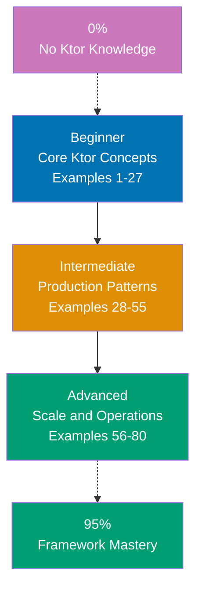

## Want to Master Ktor Through Working Code?

This guide teaches you Kotlin Ktor through **80 production-ready code examples** rather than lengthy explanations. If you are an experienced developer switching to Ktor, or want to deepen your framework mastery, you will build intuition through actual working patterns.

## What Is By-Example Learning?

By-example learning is a **code-first approach** where you learn concepts through annotated, working examples rather than narrative explanations. Each example shows:

1. **What the code does** - Brief explanation of the Ktor concept
2. **How it works** - A focused, heavily commented code example
3. **Why it matters** - A pattern summary highlighting the key takeaway

This approach works best when you already understand programming fundamentals and Kotlin basics. You learn Ktor's idioms, patterns, and best practices by studying real code rather than theoretical descriptions.

## What Is Kotlin Ktor?

Ktor is an **asynchronous web framework for Kotlin** built by JetBrains that prioritizes flexibility, lightweight footprint, and coroutine-native concurrency. Key distinctions:

- **Not Spring**: Ktor is minimal and explicit; Spring Boot does heavy auto-configuration by convention
- **Coroutine-native**: Every handler is a suspend function; concurrency uses structured Kotlin coroutines, not thread pools
- **Plugin-based**: Features like JSON serialization, authentication, and sessions are opt-in plugins installed explicitly
- **Embedded server**: Runs as a library inside your application; no container deployment required
- **Type-safe routing**: Routes use Kotlin DSL with type-safe parameter extraction via `TypedRoute` or path parameters
- **Both client and server**: Same framework provides `HttpClient` for making outbound HTTP requests

## Learning Path



## Coverage Philosophy: 95% Through 80 Examples

The **95% coverage** means you will understand Ktor deeply enough to build production systems with confidence. It does not mean you will know every edge case or advanced feature - those come with experience.

The 80 examples are organized progressively:

- **Beginner (Examples 1-27)**: Foundation concepts (embedded server, routing, request/response, JSON, status pages, static files, templates, headers, cookies, logging, CORS)
- **Intermediate (Examples 28-55)**: Production patterns (authentication, sessions, database with Exposed, plugins, WebSocket, testing, custom plugins, configuration, file upload, dependency injection)
- **Advanced (Examples 56-80)**: Scale and operations (custom plugin development, metrics, distributed tracing, SSL/TLS, HTTP/2, Ktor client, coroutine patterns, rate limiting, caching, API versioning, Docker, production configuration)

Together, these examples cover **95% of what you will use** in production Ktor applications.

## What Is Covered

### Core Web Framework Concepts

- **Embedded Server**: Starting Ktor with Netty, CIO, Jetty engine selection and configuration
- **Routing DSL**: Route groups, path parameters, query parameters, nested routing
- **Request Handling**: Reading body, headers, query params, form data, multipart uploads
- **Response Building**: Responding with text, JSON, HTML, status codes, custom headers
- **Content Negotiation**: Automatic JSON serialization with kotlinx.serialization and Gson
- **Status Pages**: Centralized exception handling and HTTP error responses

### Plugins and Middleware

- **Plugin Architecture**: Installing plugins via `install()`, configuring plugin options
- **Built-in Plugins**: CORS, compression, caching headers, default headers, call logging
- **Custom Plugins**: Creating reusable `ApplicationPlugin` and `RouteScopedPlugin`
- **Interceptors**: Request and response pipeline interception for cross-cutting concerns

### Authentication and Security

- **Basic Auth**: Username/password authentication with `authenticate` route blocks
- **JWT Authentication**: Bearer token validation, claims extraction, token generation
- **Session Auth**: Cookie-based sessions, session serialization, session storage
- **OAuth Integration**: OAuth2 with Google, GitHub via `OAuthServerSettings`
- **Form Auth**: HTML form login with credential validation

### Data and Persistence

- **Exposed ORM**: Kotlin's Exposed library for type-safe SQL queries
- **Database Config**: HikariCP connection pooling, transaction management
- **CRUD Operations**: Insert, select, update, delete with Exposed DSL and DAO API
- **Migrations**: Database schema migrations with Flyway integration

### Real-Time and Async

- **WebSocket**: Full-duplex communication with `webSocket {}` handler
- **Server-Sent Events**: Streaming responses with `respondTextWriter` for SSE
- **Coroutine Patterns**: Structured concurrency, `async`/`await`, channel-based streaming
- **Background Jobs**: Launching coroutines from route handlers safely

### Testing

- **testApplication**: Integration testing with `testApplication {}` builder
- **MockEngine**: Mocking `HttpClient` responses in unit tests
- **Assertions**: Asserting status codes, response bodies, headers
- **Test Fixtures**: Reusable test application setup and database seeding

### Production and Operations

- **Configuration (HOCON)**: `application.conf` with environment variable substitution
- **Deployment**: Fat JAR packaging, Docker containerization with multi-stage builds
- **Metrics**: Micrometer integration with Prometheus endpoint
- **Distributed Tracing**: OpenTelemetry span creation and propagation
- **SSL/TLS**: HTTPS configuration with keystore and Let's Encrypt certificates
- **Graceful Shutdown**: Stopping server cleanly on SIGTERM with coroutine cancellation

## What Is NOT Covered

We exclude topics that belong in specialized tutorials:

- **Detailed Kotlin syntax**: Master Kotlin first through language tutorials
- **Coroutines deep dive**: Ktor assumes coroutine familiarity; see Kotlin coroutines tutorials
- **Advanced DevOps**: Kubernetes, Terraform, complex multi-region deployments
- **Database internals**: Deep PostgreSQL query planning, advanced SQL optimization
- **Framework internals**: How Ktor's pipeline processes requests internally
- **gRPC with Ktor**: Uses different dependencies; see dedicated gRPC tutorials

For these topics, see dedicated tutorials and framework documentation.

## How to Use This Guide

### 1. Choose Your Starting Point

- **New to Ktor?** Start with Beginner (Example 1)
- **Framework experience** (Spring, Django, Rails)? Start with Intermediate (Example 28)
- **Building a specific feature?** Search for relevant example topic

### 2. Read the Example

Each example has five parts:

- **Brief Explanation** (2-3 sentences): What Ktor concept, why it exists, when to use it
- **Optional Diagram**: Mermaid diagram when concept relationships are complex
- **Code** (with heavy comments): Working Kotlin code showing the pattern
- **Key Takeaway** (1-2 sentences): Distilled essence of the pattern
- **Why It Matters** (50-100 words): Production context and real-world significance

### 3. Run the Code

Create a test project and run each example:

```bash
# Create new Ktor project with Gradle
mkdir ktor-examples && cd ktor-examples
gradle init --type kotlin-application
# Add Ktor dependencies to build.gradle.kts
# Paste example code into src/main/kotlin/Application.kt
./gradlew run
```

### 4. Modify and Experiment

Change variable names, add features, break things on purpose. Experiment builds intuition faster than reading.

### 5. Reference as Needed

Use this guide as a reference when building features. Search for relevant examples and adapt patterns to your code.

## Relationship to Other Tutorial Types

| Tutorial Type               | Approach                       | Coverage                   | Best For                       | Why Different                       |
| --------------------------- | ------------------------------ | -------------------------- | ------------------------------ | ----------------------------------- |
| **By Example** (this guide) | Code-first, 80 examples        | 95% breadth                | Learning framework idioms      | Emphasizes patterns through code    |
| **Quick Start**             | Project-based, hands-on        | 5-30% touchpoints          | Getting something working fast | Linear project flow, minimal theory |
| **Beginner Tutorial**       | Narrative, explanation-first   | 0-60% comprehensive        | Understanding concepts deeply  | Detailed explanations, slower pace  |
| **Cookbook**                | Recipe-based, problem-solution | Problem-specific           | Solving specific problems      | Quick solutions, minimal context    |

## Prerequisites

### Required

- **Kotlin fundamentals**: Data classes, extension functions, lambdas, null safety
- **Coroutines basics**: `suspend` functions, `launch`, `async`, coroutine scope concepts
- **Web development**: HTTP basics, REST, JSON, HTML fundamentals
- **Programming experience**: You have built applications before in another language

### Recommended

- **Gradle build system**: Kotlin DSL build files, dependency management
- **Relational databases**: SQL basics, schema design, transactions
- **Docker**: Container basics for deployment examples

### Not Required

- **Ktor experience**: This guide assumes you are new to the framework
- **Spring or Java EE experience**: Not necessary, but helpful for context
- **Advanced Kotlin**: Generics, reified types (explained when used)

## Learning Strategies

### For Spring Boot Developers Switching to Ktor

Spring Boot developers will find Ktor intentionally minimal. Embrace explicit configuration:

- **Map Spring concepts**: Controllers become route handlers; `@Component` beans become constructor-injected classes; `@Autowired` becomes Koin/manual DI
- **Understand coroutine concurrency**: Replace thread-per-request mental model with coroutine suspension
- **Learn plugin installation**: Where Spring uses annotations and classpath scanning, Ktor uses explicit `install()`
- **Recommended path**: Examples 1-10 (Ktor basics) → Examples 28-35 (Auth patterns) → Examples 40-45 (Database)

### For Node.js Developers Switching to Ktor

Ktor's async model resembles Node.js but uses coroutines rather than an event loop:

- **Understand coroutine suspension**: Similar to async/await in JavaScript but with structured concurrency guarantees
- **Compare plugin installation**: Ktor plugins resemble Express middleware but installed via DSL
- **Learn Kotlin type safety**: Strong typing eliminates runtime type errors common in JavaScript
- **Recommended path**: Examples 1-15 (Ktor server and routing) → Examples 50-55 (WebSocket, coroutine patterns)

### For Python/FastAPI Developers Switching to Ktor

Both FastAPI and Ktor embrace async-first design:

- **Map decorators to DSL**: FastAPI's `@app.get("/path")` becomes `get("/path") { ... }` in Ktor routing
- **Compare Pydantic to data classes**: Kotlin data classes with kotlinx.serialization replace Pydantic models
- **Understand JVM startup cost**: Ktor starts slower than FastAPI but handles more concurrent requests
- **Recommended path**: Examples 1-12 (Routing and JSON) → Examples 28-40 (Auth and database)

### For Go/Gin Developers Switching to Ktor

Go and Ktor share minimalist philosophy but differ in concurrency model:

- **Coroutines vs goroutines**: Both are lightweight but Ktor uses structured concurrency with explicit scope
- **Plugin vs middleware**: Ktor plugins resemble Gin middleware but installed declaratively
- **Type safety over interfaces**: Kotlin's sealed classes and data classes give richer types than Go interfaces
- **Recommended path**: Examples 1-15 (Server basics) → Examples 48-55 (WebSocket, coroutines)

## Structure of Each Example

All examples follow a consistent 5-part format:

```
### Example N: Descriptive Title

2-3 sentence explanation of the concept.

[Optional Mermaid diagram]

```kotlin
// Heavily annotated code example
// showing the Ktor pattern in action
// => annotations show values, states, outputs
```

**Key Takeaway**: 1-2 sentence summary.

**Why It Matters**: 50-100 words explaining production significance.
```

**Code annotations**:

- `// =>` shows expected output or result value
- Inline comments explain what each line does and WHY
- Variable names are self-documenting
- Multiple code blocks used for before/after comparisons

**Mermaid diagrams** appear when visualizing flow or architecture improves understanding. The color-blind friendly palette used throughout:

- Blue #0173B2 - Primary elements
- Orange #DE8F05 - Secondary elements, decisions
- Teal #029E73 - Success paths, validation
- Purple #CC78BC - Special states, alternatives
- Brown #CA9161 - Neutral elements

## Ready to Start?

Choose your learning path:

- **[Beginner](/en/learn/software-engineering/platform-web/tools/kotlin-ktor/by-example/beginner)** - Start here if new to Ktor. Build foundation understanding through 27 core examples covering embedded server, routing, JSON, and essential plugins.
- **[Intermediate](/en/learn/software-engineering/platform-web/tools/kotlin-ktor/by-example/intermediate)** - Jump here if you know Ktor basics. Master production patterns through 28 examples covering authentication, database, WebSocket, and testing.
- **[Advanced](/en/learn/software-engineering/platform-web/tools/kotlin-ktor/by-example/advanced)** - Expert mastery through 25 advanced examples covering custom plugins, metrics, tracing, SSL, coroutine patterns, and Docker deployment.
