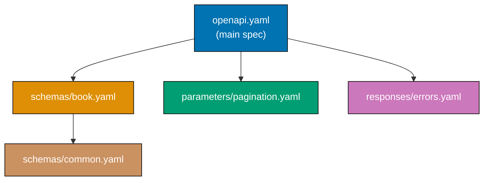
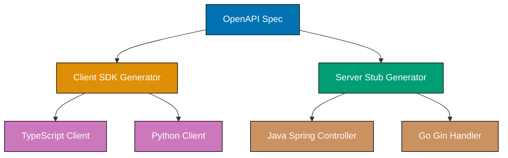
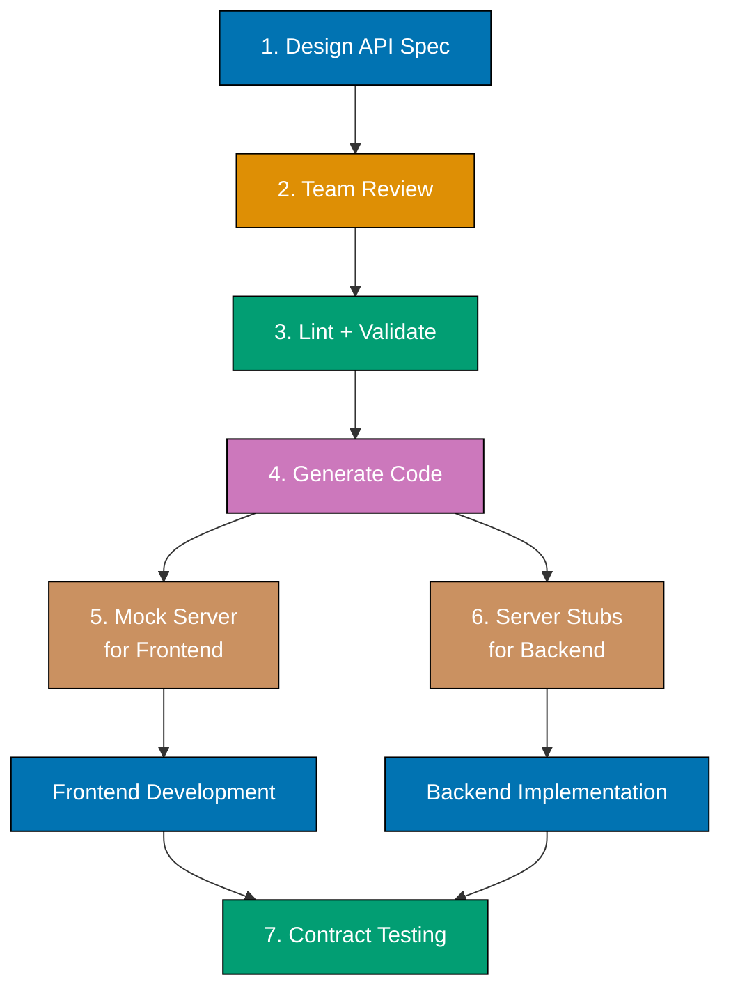
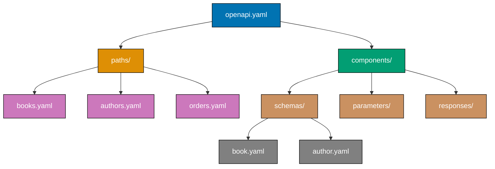

This tutorial covers advanced OpenAPI patterns for production environments including OpenAPI 3.1 JSON Schema alignment, specification extensions, code generation, documentation generation, linting, contract-first workflows, multi-file specifications, API versioning, and gateway integration.

## OpenAPI 3.1 Features (Examples 56-60)

### Example 56: JSON Schema 2020-12 Alignment

OpenAPI 3.1 fully aligns with JSON Schema 2020-12, unlocking keywords that were unavailable or modified in 3.0. This alignment means standard JSON Schema validators work directly on OpenAPI schemas.


**Code**:

```yaml
openapi: "3.1.0"
# => 3.1 enables full JSON Schema 2020-12 support
info:
  title: Modern Bookstore API
  version: "1.0.0"
  summary: A bookstore API using OpenAPI 3.1 features
  # => summary is a 3.1 addition to the info object
  # => Short one-liner separate from description

components:
  schemas:
    Book:
      type: object
      # => Standard object type
      properties:
        title:
          type: string
          # => String type (same in 3.0 and 3.1)
        subtitle:
          type:
            - string
            - "null"
          # => 3.1: type as array replaces nullable: true
          # => Aligns with JSON Schema 2020-12
        tags:
          type: array
          items:
            type: string
          prefixItems:
            - type: string
              const: "primary-genre"
            # => 3.1: prefixItems replaces items-as-array (tuple validation)
            # => First element must be "primary-genre"
          contains:
            type: string
            pattern: "^genre:"
            # => 3.1: contains keyword -- array must include at least one match
            # => At least one tag must start with "genre:"
        metadata:
          type: object
          patternProperties:
            "^x-":
              type: string
              # => 3.1: patternProperties from JSON Schema
              # => Any property starting with "x-" must be a string
          propertyNames:
            pattern: "^[a-z][a-z0-9_]*$"
            # => 3.1: propertyNames constrains key names
            # => All keys must be lowercase snake_case
        price:
          type: number
          exclusiveMinimum: 0
          # => 3.1: exclusiveMinimum is a number (not boolean)
          # => In 3.0: exclusiveMinimum was boolean alongside minimum
          # => In 3.1: exclusiveMinimum is the value itself (JSON Schema style)
        isbn:
          $ref: "#/components/schemas/ISBN"
          description: "Override description for this usage"
          # => 3.1: siblings alongside $ref are allowed
          # => In 3.0: $ref siblings were ignored
          # => Enables per-usage customization of referenced schemas

    ISBN:
      type: string
      pattern: "^978-\\d{1,5}-\\d{1,7}-\\d{1,7}-\\d$"
      # => Reusable ISBN schema
```

**Key Takeaway**: OpenAPI 3.1 aligns fully with JSON Schema 2020-12, adding `prefixItems`, `contains`, `patternProperties`, `propertyNames`, type arrays for nullable, numeric `exclusiveMinimum`, and `$ref` siblings.

**Why It Matters**: Full JSON Schema alignment means you can use standard JSON Schema validators (ajv, jsonschema) directly on OpenAPI schemas without translation layers. The `$ref` sibling support alone eliminates one of the most frustrating 3.0 limitations -- no longer do you need wrapper schemas just to override a description. Migration from 3.0 to 3.1 requires updating `nullable: true` to type arrays and `exclusiveMinimum: true` to numeric values, but unlocks the complete JSON Schema vocabulary.

---

### Example 57: Specification Extensions (x- Properties)

Specification extensions (vendor extensions) use the `x-` prefix to add custom metadata that tooling can interpret. They are valid on any OpenAPI object.

**Code**:

```yaml
openapi: "3.1.0"
info:
  title: Bookstore API
  version: "1.0.0"
  x-api-team: platform-engineering
  # => Custom extension on the info object
  # => Used by internal tooling to route API ownership
  x-api-maturity: production
  # => Custom maturity level (draft, beta, production)
  # => Internal documentation portals filter by maturity

paths:
  /books:
    get:
      summary: List books
      operationId: listBooks
      x-rate-limit:
        # => Custom rate limit metadata
        requests: 1000
        window: 60
        unit: seconds
        # => 1000 requests per 60 seconds
        # => API gateways read this to configure limits
      x-code-samples:
        # => Custom code examples for documentation
        - lang: curl
          source: |
            curl -H "Authorization: Bearer TOKEN" \
              https://api.example.com/v1/books
          # => Shell example for curl users
        - lang: python
          source: |
            import requests
            response = requests.get(
              "https://api.example.com/v1/books",
              headers={"Authorization": "Bearer TOKEN"}
            )
          # => Python example
      x-internal: false
      # => Whether this is an internal-only endpoint
      # => Documentation generators can filter by this flag
      responses:
        "200":
          description: Book list

  /admin/metrics:
    get:
      summary: Get system metrics
      operationId: getMetrics
      x-internal: true
      # => Internal endpoint - hidden from public docs
      # => Documentation generators exclude x-internal: true
      x-required-role: admin
      # => Custom role requirement
      # => Used by authorization middleware
      responses:
        "200":
          description: System metrics

components:
  schemas:
    Book:
      type: object
      x-db-table: books
      # => Maps schema to database table name
      # => Custom ORM code generators use this
      properties:
        id:
          type: integer
          x-db-column: book_id
          # => Maps property to database column name
          # => Useful when API field names differ from DB columns
        title:
          type: string
          x-searchable: true
          # => Custom flag for search indexing
          # => Search infrastructure reads this to build indexes
```

**Key Takeaway**: Prefix custom properties with `x-` to add metadata for your tooling. Extensions are valid on any OpenAPI object and ignored by tools that do not understand them.

**Why It Matters**: Extensions bridge the gap between the OpenAPI standard and your organization's specific needs. API gateways read `x-rate-limit` to auto-configure throttling. Documentation generators read `x-internal` to hide internal endpoints. Code generators read `x-db-table` to produce ORM code. The `x-` prefix ensures extensions never conflict with future standard properties, making them safe for any custom metadata.

---

### Example 58: External $ref for Cross-File References

The `$ref` keyword can reference schemas in external files, enabling modular specification organization.



**Code**:

**Main file (openapi.yaml)**:

```yaml
openapi: "3.1.0"
# => Main specification file
info:
  title: Bookstore API
  version: "1.0.0"

paths:
  /books:
    get:
      summary: List books
      operationId: listBooks
      parameters:
        - $ref: "./parameters/pagination.yaml#/PageParam"
          # => References PageParam from external file
          # => Relative path from this file's location
        - $ref: "./parameters/pagination.yaml#/LimitParam"
          # => References LimitParam from same external file
      responses:
        "200":
          description: Book list
          content:
            application/json:
              schema:
                type: array
                items:
                  $ref: "./schemas/book.yaml#/Book"
                  # => References Book schema from external file
        "404":
          $ref: "./responses/errors.yaml#/NotFound"
          # => References complete response from external file

components:
  schemas:
    BookList:
      type: object
      properties:
        data:
          type: array
          items:
            $ref: "./schemas/book.yaml#/Book"
            # => Same external reference used in components
```

**External schema file (schemas/book.yaml)**:

```yaml
Book:
  # => Book schema defined in its own file
  type: object
  required:
    - title
  properties:
    id:
      type: integer
      # => Book identifier
      readOnly: true
    title:
      type: string
      # => Book title
    author:
      $ref: "./common.yaml#/PersonName"
      # => References another external file (relative to this file)
    price:
      type: number
      format: double
      # => Book price
```

**External parameters file (parameters/pagination.yaml)**:

```yaml
PageParam:
  # => Reusable page parameter
  name: page
  in: query
  required: false
  schema:
    type: integer
    minimum: 1
    default: 1
    # => Default to first page

LimitParam:
  # => Reusable limit parameter
  name: limit
  in: query
  required: false
  schema:
    type: integer
    minimum: 1
    maximum: 100
    default: 20
    # => Default page size
```

**Key Takeaway**: Use relative file paths in `$ref` to split large specifications across files. The `#/` fragment identifies a specific object within the referenced file.

**Why It Matters**: Production APIs with hundreds of endpoints become unmanageable in a single file. Multi-file specs enable team ownership -- the payments team owns `schemas/payment.yaml` while the catalog team owns `schemas/book.yaml`. Tools like `swagger-cli bundle` or `@redocly/cli bundle` merge multi-file specs into a single document for deployment. Version control diffs become meaningful when changes are scoped to individual files.

---

### Example 59: JSON Schema $id and $defs

OpenAPI 3.1 supports JSON Schema `$id` for schema identification and `$defs` for local schema definitions within a schema.

**Code**:

```yaml
components:
  schemas:
    Order:
      $id: "https://api.example.com/schemas/order"
      # => Unique identifier for this schema
      # => Enables external references by URI
      # => JSON Schema validators use this for resolution
      type: object
      required:
        - orderId
        - items
      properties:
        orderId:
          type: string
          format: uuid
          # => Order identifier
        items:
          type: array
          items:
            $ref: "#/$defs/OrderItem"
            # => References local definition within this schema
            # => Not components/schemas -- $defs is schema-local
          minItems: 1
          # => At least one item required
        discount:
          $ref: "#/$defs/Discount"
          # => Another local definition

      $defs:
        # => Local schema definitions (JSON Schema 2020-12)
        # => Scoped to this schema only
        OrderItem:
          # => Only used within the Order schema
          type: object
          required:
            - productId
            - quantity
          properties:
            productId:
              type: integer
              # => Product reference
            quantity:
              type: integer
              minimum: 1
              # => At least one item
            unitPrice:
              type: number
              format: double
              # => Price per unit

        Discount:
          # => Discount only makes sense within an Order context
          type: object
          properties:
            code:
              type: string
              # => Discount code
            percentage:
              type: number
              minimum: 0
              maximum: 100
              # => Discount percentage (0-100)
            maxAmount:
              type: number
              # => Maximum discount cap
```

**Key Takeaway**: Use `$defs` for schemas that are local to a parent schema and not reused elsewhere. Use `$id` to give schemas globally unique identifiers for external referencing.

**Why It Matters**: `$defs` solves the problem of schemas that only make sense in one context -- an OrderItem outside an Order is meaningless, so placing it in `components/schemas` pollutes the global namespace. `$id` enables cross-specification references where one API references schemas from another API by URI. Together, they bring full JSON Schema modularity to OpenAPI, enabling schema reuse across microservice boundaries.

---

### Example 60: Overlays for Environment-Specific Customization

OpenAPI Overlay Specification (companion spec) modifies an existing OpenAPI document without changing the original. Use overlays for environment-specific server URLs or documentation customization.

**Code**:

**Base specification (openapi.yaml)**:

```yaml
openapi: "3.1.0"
# => Base specification shared across environments
info:
  title: Bookstore API
  version: "1.0.0"
  description: Production-ready bookstore API
  # => Base description

servers:
  - url: "https://api.example.com/v1"
    description: Default server
    # => Placeholder server URL

paths:
  /books:
    get:
      summary: List books
      operationId: listBooks
      responses:
        "200":
          description: Book list
```

**Staging overlay (overlay-staging.yaml)**:

```yaml
overlay: "1.0.0"
# => Overlay specification version
info:
  title: Staging Environment Overlay
  version: "1.0.0"
  # => Metadata about this overlay

actions:
  # => List of modifications to apply
  - target: "$.servers"
    # => JSONPath targeting the servers array
    update:
      # => Replaces the matched value
      - url: "https://staging-api.example.com/v1"
        description: Staging server
        # => Override with staging URL
      - url: "http://localhost:3000/v1"
        description: Local development
        # => Add local dev URL
  - target: "$.info.description"
    # => Target the info description
    update: "STAGING ENVIRONMENT - Not for production use"
    # => Replace description with staging warning
  - target: "$.paths['/books'].get"
    # => Target a specific operation
    update:
      x-rate-limit:
        requests: 100
        window: 60
        # => Lower rate limit for staging
```

**Production overlay (overlay-production.yaml)**:

```yaml
overlay: "1.0.0"
info:
  title: Production Environment Overlay
  version: "1.0.0"

actions:
  - target: "$.servers"
    update:
      - url: "https://api.example.com/v1"
        description: Production (US-East)
      - url: "https://eu.api.example.com/v1"
        description: Production (EU-West)
        # => Multi-region production servers
  - target: "$.paths['/admin/metrics']"
    remove: true
    # => Remove internal endpoint from production docs
    # => Production documentation hides admin endpoints
```

**Key Takeaway**: Overlays modify OpenAPI documents without editing the original. Use JSONPath targets and `update` or `remove` actions for environment-specific customization.

**Why It Matters**: Teams maintaining one API spec for multiple environments (staging, production, partner portal) previously duplicated the entire spec or used fragile sed scripts. Overlays provide a declarative way to customize servers, descriptions, rate limits, and visibility per environment. The base spec remains the single source of truth, and overlays apply transformations at build time, producing environment-specific documentation from one codebase.

---

## Code Generation and Tooling (Examples 61-67)

### Example 61: Code Generation Metadata

Structure your spec to produce clean, idiomatic generated code. Operation IDs, schema names, and tags directly control generated code structure.



**Code**:

```yaml
openapi: "3.1.0"
info:
  title: Bookstore API
  version: "1.0.0"
  x-codegen-settings:
    # => Custom extension for code generation tools
    packageName: bookstore-client
    # => Generated package/module name
    modelPackage: models
    # => Sub-package for generated model classes
    apiPackage: api
    # => Sub-package for generated API classes

tags:
  - name: Books
    # => Generates BooksApi class/module
    description: Book catalog operations
  - name: Orders
    # => Generates OrdersApi class/module
    description: Order management operations

paths:
  /books:
    get:
      tags:
        - Books
        # => Method placed in BooksApi class
      operationId: listBooks
      # => Generated method name: listBooks()
      # => Convention: camelCase verb + noun
      # => Bad: getAllTheBooks, fetchBookList
      # => Good: listBooks, getBook, createBook, deleteBook
      summary: List all books
      parameters:
        - name: genre
          in: query
          required: false
          schema:
            $ref: "#/components/schemas/Genre"
            # => Named schema generates Genre enum type
      responses:
        "200":
          description: Book list
          content:
            application/json:
              schema:
                type: array
                items:
                  $ref: "#/components/schemas/Book"
                  # => Generates Book class/interface
    post:
      tags:
        - Books
      operationId: createBook
      # => Generated method: createBook(bookInput: BookInput)
      requestBody:
        content:
          application/json:
            schema:
              $ref: "#/components/schemas/BookInput"
              # => Separate input schema generates CreateBookRequest type
      responses:
        "201":
          description: Book created
          content:
            application/json:
              schema:
                $ref: "#/components/schemas/Book"

components:
  schemas:
    Genre:
      type: string
      enum:
        - fiction
        - nonfiction
        - science
        - history
      # => Generates Genre enum in all target languages
      # => TypeScript: type Genre = "fiction" | "nonfiction" | ...
      # => Java: public enum Genre { FICTION, NONFICTION, ... }
      # => Python: class Genre(str, Enum): FICTION = "fiction"

    Book:
      type: object
      # => Generates Book class/interface
      required:
        - title
      properties:
        id:
          type: integer
          readOnly: true
          # => Excluded from input types, included in response types
        title:
          type: string
          # => Required property -> non-nullable in generated code
        price:
          type: number
          format: double
          # => format: double -> Java double, TypeScript number, Python float

    BookInput:
      type: object
      # => Generates BookInput class (request body type)
      required:
        - title
      properties:
        title:
          type: string
        price:
          type: number
          format: double
```

**Key Takeaway**: Use consistent `operationId` naming (camelCase verb+noun), named schemas for reusable types, and tags for API class grouping. These choices directly control generated code quality.

**Why It Matters**: Code generators are only as good as the spec they consume. Unclear operation IDs produce poorly named methods that developers must manually rename. Anonymous inline schemas generate unreadable types like `InlineResponse200`. Named schemas with clear naming conventions produce professional SDK code that developers enjoy using. The difference between a good and bad generated SDK often comes down to spec organization, not generator quality.

---

### Example 62: Documentation Generation (Swagger UI and Redoc)

Structure your spec to produce excellent documentation. Use descriptions, examples, and tags strategically for documentation tools.

**Code**:

```yaml
openapi: "3.1.0"
info:
  title: Bookstore API
  version: "1.0.0"
  description: |
    ## Getting Started

    1. Get an API key from the [developer portal](https://dev.example.com)
    2. Include the key in the `X-API-Key` header
    3. Start making requests

    ## Authentication

    All endpoints require authentication via API key or Bearer token.
    See the security section for details.

    ## Rate Limits

    | Plan       | Requests/min | Burst |
    |------------|-------------|-------|
    | Free       | 60          | 10    |
    | Pro        | 1000        | 100   |
    | Enterprise | Unlimited   | 1000  |
  # => Rich Markdown description renders as API landing page
  # => Swagger UI and Redoc display this prominently
  # => Include onboarding steps, auth overview, rate limits

  x-logo:
    url: "https://example.com/logo.png"
    altText: "Bookstore API Logo"
    # => Redoc extension for API logo

tags:
  - name: Books
    description: |
      Manage the book catalog. Books are the primary resource
      in this API, supporting full CRUD operations with
      filtering, pagination, and search.
    # => Tag descriptions appear as section introductions
    x-displayName: "Book Catalog"
    # => Redoc extension for display name override

paths:
  /books:
    get:
      tags:
        - Books
      summary: List all books
      # => Appears in collapsed operation list
      description: |
        Returns a paginated list of books with optional filtering.

        ### Filtering

        Use query parameters to filter results:
        - `genre`: Filter by genre
        - `minPrice` / `maxPrice`: Price range filter
        - `author`: Filter by author name (partial match)

        ### Sorting

        Use `sort` parameter with format `field:direction`:
        - `title:asc` - Sort by title ascending
        - `price:desc` - Sort by price descending
      # => Expanded view shows rich Markdown documentation
      operationId: listBooks
      parameters:
        - name: genre
          in: query
          required: false
          description: Filter by book genre
          # => Parameter descriptions appear in docs
          schema:
            type: string
            enum:
              - fiction
              - nonfiction
          example: fiction
          # => Example pre-fills in "Try It" forms
      responses:
        "200":
          description: Paginated book list
          content:
            application/json:
              schema:
                type: object
                properties:
                  data:
                    type: array
                    items:
                      type: object
                      properties:
                        id:
                          type: integer
                          description: Unique book identifier
                          # => Property descriptions appear in schema docs
                        title:
                          type: string
                          description: Book title
              examples:
                # => Multiple named examples create dropdown in docs
                fiction:
                  summary: Fiction books
                  # => Dropdown label
                  value:
                    data:
                      - id: 1
                        title: "The Great Gatsby"
                      - id: 2
                        title: "1984"
                nonfiction:
                  summary: Nonfiction books
                  value:
                    data:
                      - id: 3
                        title: "Sapiens"
```

**Key Takeaway**: Use Markdown in `description` fields for rich documentation. Provide multiple named examples for response dropdowns. Use `x-logo` and `x-displayName` for Redoc customization.

**Why It Matters**: API documentation is often the first and primary touchpoint for consumers. Swagger UI and Redoc render every description field, example value, and tag annotation. A well-structured spec produces documentation that rivals hand-written API portals -- with tables, code blocks, and navigation -- without maintaining a separate documentation system. The spec becomes the documentation source of truth, eliminating the drift between docs and implementation.

---

### Example 63: Linting with Spectral Rules

Spectral is the standard OpenAPI linter. Define custom rules to enforce API design conventions across your organization.

**Code**:

**Spectral configuration (.spectral.yaml)**:

```yaml
extends:
  - spectral:oas
  # => Extends the built-in OpenAPI ruleset
  # => Includes rules for valid OpenAPI structure

rules:
  # => Custom rules for organizational conventions
  operation-operationId-casing:
    # => Enforce camelCase operation IDs
    description: Operation IDs must be camelCase
    # => Rule description for error messages
    severity: error
    # => error (blocks CI), warn (advisory), info, hint
    given: "$.paths[*][*].operationId"
    # => JSONPath targeting all operationIds
    then:
      function: casing
      functionOptions:
        type: camel
        # => Requires camelCase format
    # => Fails on: list-books, ListBooks, list_books
    # => Passes on: listBooks, getBook, createOrder

  operation-must-have-tags:
    # => Every operation must have at least one tag
    description: Operations must be tagged for documentation grouping
    severity: error
    given: "$.paths[*][*]"
    # => All operations
    then:
      field: tags
      function: truthy
      # => tags field must exist and be non-empty

  path-must-be-kebab-case:
    # => Enforce kebab-case path segments
    description: Path segments must be kebab-case
    severity: error
    given: "$.paths"
    then:
      function: pattern
      functionOptions:
        match: "^\\/[a-z][a-z0-9\\-\\/{}]*$"
        # => Lowercase, hyphens, no underscores or camelCase
    # => Fails on: /bookReviews, /book_reviews
    # => Passes on: /book-reviews, /books/{bookId}

  response-must-have-error-schema:
    # => All 4xx/5xx responses must use error schema
    description: Error responses must reference the ErrorResponse schema
    severity: warn
    given: "$.paths[*][*].responses[?(@property >= '400')]"
    # => Target all responses with 4xx+ status codes
    then:
      field: content.application/json.schema.$ref
      function: pattern
      functionOptions:
        match: "ErrorResponse"
        # => Must reference an error schema

  schema-must-have-description:
    # => All component schemas need descriptions
    description: Schemas in components must have a description
    severity: warn
    given: "$.components.schemas[*]"
    then:
      field: description
      function: truthy

  no-eval-in-description:
    # => Security: prevent XSS in descriptions
    description: Descriptions must not contain script tags
    severity: error
    given: "$..description"
    # => All descriptions anywhere in the spec
    then:
      function: pattern
      functionOptions:
        notMatch: "<script"
        # => Block script injection
```

**Key Takeaway**: Extend Spectral's built-in OpenAPI ruleset with custom rules enforcing your organization's conventions. Use JSONPath to target specific spec locations and severity levels to control CI behavior.

**Why It Matters**: Without linting, API conventions degrade as teams grow. One team uses camelCase paths while another uses snake_case. Spectral rules enforce consistency in CI/CD pipelines -- pull requests with convention violations fail automated checks before human review. Custom rules codify organizational decisions (kebab-case paths, required tags, error schema usage) into automated checks, making API governance scalable.

---

### Example 64: Contract-First Development Workflow

Contract-first development defines the API specification before writing implementation code. The spec serves as the contract between frontend and backend teams.



**Code**:

**Step 1 - Define the spec (openapi.yaml)**:

```yaml
openapi: "3.1.0"
info:
  title: Bookstore API
  version: "1.0.0"
  description: Contract-first API specification
  # => Written BEFORE any implementation code

paths:
  /books:
    get:
      operationId: listBooks
      # => Both teams agree on this interface
      summary: List books with pagination
      parameters:
        - name: page
          in: query
          schema:
            type: integer
            default: 1
        - name: limit
          in: query
          schema:
            type: integer
            default: 20
      responses:
        "200":
          description: Paginated book list
          content:
            application/json:
              schema:
                $ref: "#/components/schemas/BookListResponse"

components:
  schemas:
    BookListResponse:
      type: object
      required:
        - data
        - pagination
      properties:
        data:
          type: array
          items:
            $ref: "#/components/schemas/Book"
        pagination:
          type: object
          properties:
            page:
              type: integer
            limit:
              type: integer
            total:
              type: integer

    Book:
      type: object
      required:
        - id
        - title
      properties:
        id:
          type: integer
        title:
          type: string
        author:
          type: string
        price:
          type: number
          format: double
```

**Step 2 - Generate client and server code**:

```yaml
# This YAML represents the codegen configuration (not OpenAPI)
# openapi-generator-cli config for TypeScript client
x-codegen-config-typescript:
  # => Configuration for openapi-generator-cli
  generatorName: typescript-fetch
  # => Generates TypeScript client using Fetch API
  inputSpec: ./openapi.yaml
  # => Path to the OpenAPI specification
  outputDir: ./generated/typescript-client
  # => Output directory for generated code
  additionalProperties:
    npmName: "@bookstore/api-client"
    # => NPM package name for the generated client
    supportsES6: true
    # => Generate ES6+ compatible code
    typescriptThreePlus: true
    # => Target TypeScript 3+ features

x-codegen-config-java:
  # => Configuration for Java server stubs
  generatorName: spring
  # => Generates Spring Boot server stubs
  inputSpec: ./openapi.yaml
  outputDir: ./generated/java-server
  additionalProperties:
    basePackage: com.example.bookstore
    # => Java base package name
    useSpringBoot3: true
    # => Target Spring Boot 3
    interfaceOnly: true
    # => Generate interfaces only (you implement)
    # => Does not generate full server (you control implementation)
```

**Key Takeaway**: Contract-first development writes the OpenAPI spec before code, then generates client SDKs and server stubs from that spec. The spec is the shared contract that enables parallel development.

**Why It Matters**: Without a contract, frontend and backend teams discover incompatibilities during integration -- different field names, missing parameters, unexpected response shapes. Contract-first eliminates integration surprises because both teams develop against the same specification. The frontend uses a mock server generated from the spec, and the backend implements interfaces generated from the spec. Contract tests verify the implementation matches the spec, catching drift early.

---

### Example 65: Mock Server Generation

Generate mock servers from your OpenAPI spec to enable frontend development before the backend is ready. Mock servers return realistic example data.

**Code**:

```yaml
openapi: "3.1.0"
info:
  title: Bookstore API
  version: "1.0.0"

paths:
  /books:
    get:
      operationId: listBooks
      summary: List books
      responses:
        "200":
          description: Book list
          content:
            application/json:
              schema:
                type: array
                items:
                  $ref: "#/components/schemas/Book"
              examples:
                sample:
                  value:
                    - id: 1
                      title: "The Great Gatsby"
                      author: "F. Scott Fitzgerald"
                      price: 12.99
                    - id: 2
                      title: "1984"
                      author: "George Orwell"
                      price: 9.99
                  # => Mock servers return this example data
                  # => Prism reads examples to generate responses
    post:
      operationId: createBook
      summary: Create book
      requestBody:
        required: true
        content:
          application/json:
            schema:
              $ref: "#/components/schemas/BookInput"
      responses:
        "201":
          description: Book created
          content:
            application/json:
              schema:
                $ref: "#/components/schemas/Book"
              example:
                id: 42
                title: "New Book"
                author: "New Author"
                price: 19.99
                # => Mock server returns this for POST requests
        "400":
          description: Validation error
          content:
            application/json:
              schema:
                $ref: "#/components/schemas/ErrorResponse"
              example:
                status: 400
                error: "VALIDATION_ERROR"
                message: "Title is required"
                # => Mock server returns this when Prefer: code=400

components:
  schemas:
    Book:
      type: object
      properties:
        id:
          type: integer
          example: 1
          # => Property-level example for schema-based generation
        title:
          type: string
          example: "The Great Gatsby"
        author:
          type: string
          example: "F. Scott Fitzgerald"
        price:
          type: number
          format: double
          minimum: 0
          example: 12.99
          # => Constraints guide random data generation

    BookInput:
      type: object
      required:
        - title
      properties:
        title:
          type: string
          example: "New Book"
        author:
          type: string
          example: "New Author"
        price:
          type: number
          format: double

    ErrorResponse:
      type: object
      properties:
        status:
          type: integer
        error:
          type: string
        message:
          type: string
```

**Key Takeaway**: Provide examples at the response and property levels so mock servers return realistic data. Use schema constraints (minimum, maximum, pattern) to guide random data generation when examples are not provided.

**Why It Matters**: Mock servers (Prism, Stoplight, WireMock) let frontend teams develop against realistic API responses while the backend is still under construction. The quality of mock responses depends entirely on the examples in your spec. Specs without examples produce empty objects or random strings, defeating the purpose. Specs with rich examples produce a functional mock that frontend developers can build full features against.

---

### Example 66: SDK Generation Patterns

Structure schemas for optimal SDK generation across multiple programming languages. Naming conventions and type choices affect all generated clients.

**Code**:

```yaml
components:
  schemas:
    # SDK naming conventions
    CreateBookRequest:
      # => Input type naming: [Action][Resource]Request
      # => Generates: CreateBookRequest class/interface
      type: object
      required:
        - title
      properties:
        title:
          type: string
        isbn:
          type: string
        price:
          type: number
          format: double
          # => double -> Java double, TypeScript number
        tags:
          type: array
          items:
            type: string

    BookResponse:
      # => Output type naming: [Resource]Response
      # => Generates: BookResponse class/interface
      type: object
      properties:
        id:
          type: integer
          format: int64
          # => int64 -> Java long, TypeScript number, Python int
          # => Use int64 for IDs to avoid overflow
        title:
          type: string
        isbn:
          type: string
        price:
          type: number
          format: double
        tags:
          type: array
          items:
            type: string
        createdAt:
          type: string
          format: date-time
          # => date-time -> Java OffsetDateTime, TS Date, Python datetime
        status:
          $ref: "#/components/schemas/BookStatus"
          # => Named enum generates type-safe enum in all languages

    BookStatus:
      # => Enum naming: [Resource][Property]
      type: string
      enum:
        - draft
        - published
        - archived
      # => Generates enum in each target language:
      # => TypeScript: type BookStatus = "draft" | "published" | "archived"
      # => Java: public enum BookStatus { DRAFT, PUBLISHED, ARCHIVED }
      # => Python: class BookStatus(str, Enum): DRAFT = "draft"
      # => Go: type BookStatus string; const BookStatusDraft BookStatus = "draft"

    PaginatedBookResponse:
      # => Wrapper for paginated results
      type: object
      required:
        - data
        - pagination
      properties:
        data:
          type: array
          items:
            $ref: "#/components/schemas/BookResponse"
            # => References the full response type
        pagination:
          $ref: "#/components/schemas/PaginationInfo"

    PaginationInfo:
      # => Reusable across all paginated endpoints
      type: object
      properties:
        page:
          type: integer
        limit:
          type: integer
        total:
          type: integer
        hasMore:
          type: boolean
          # => boolean -> same in all languages
```

**Key Takeaway**: Name schemas as `[Action]Request` and `[Resource]Response` for clear SDK types. Use `format` hints (int64, double, date-time) to produce appropriate language-native types. Extract enums as named schemas.

**Why It Matters**: Generated SDKs are used by every API consumer. Schema naming directly becomes class/interface naming in generated code. `CreateBookRequest` produces a clear, discoverable type; `InlineObject3` does not. Format hints like `int64` prevent subtle bugs -- Java's `int` overflows at 2 billion, causing ID corruption for large-scale systems. A well-structured spec produces SDKs that feel hand-written, increasing adoption and reducing support burden.

---

### Example 67: Testing Against the Spec

Use the OpenAPI spec as the source of truth for API contract tests. Test implementations verify that actual responses match the spec.

**Code**:

```yaml
# This example shows the spec structure that enables contract testing

openapi: "3.1.0"
info:
  title: Bookstore API
  version: "1.0.0"

paths:
  /books:
    get:
      operationId: listBooks
      responses:
        "200":
          description: Book list
          content:
            application/json:
              schema:
                type: array
                items:
                  $ref: "#/components/schemas/Book"
                # => Contract tests validate actual responses against this schema
                # => If server returns a field not in schema, test flags it
                # => If server omits a required field, test flags it

  /books/{bookId}:
    get:
      operationId: getBook
      parameters:
        - name: bookId
          in: path
          required: true
          schema:
            type: integer
            minimum: 1
            # => Contract tests validate parameter constraints
      responses:
        "200":
          description: Book details
          content:
            application/json:
              schema:
                $ref: "#/components/schemas/Book"
        "404":
          description: Not found
          content:
            application/json:
              schema:
                $ref: "#/components/schemas/ErrorResponse"
              # => Contract tests verify 404 response matches this schema

components:
  schemas:
    Book:
      type: object
      required:
        - id
        - title
      # => Contract tests verify required fields are present
      properties:
        id:
          type: integer
          format: int64
        title:
          type: string
          minLength: 1
          # => minLength validated by contract tests
        author:
          type: string
        price:
          type: number
          format: double
          minimum: 0
          # => Constraint validated against actual response values
      additionalProperties: false
      # => Strict mode: reject unknown properties
      # => Contract tests catch when server adds undocumented fields
      # => Forces spec updates before implementation changes

    ErrorResponse:
      type: object
      required:
        - error
        - message
      properties:
        error:
          type: string
        message:
          type: string
      additionalProperties: false
      # => Error responses must also match exactly
```

**Key Takeaway**: Use `required` arrays, type constraints, and `additionalProperties: false` to enable strict contract testing. Contract tests validate that actual API responses match the schema exactly.

**Why It Matters**: Specs drift from implementations over time -- developers add response fields without updating the spec, or change validation rules without reflecting them in schemas. Contract testing catches this drift in CI. With `additionalProperties: false`, any undocumented field in a response fails the test, forcing spec updates to happen alongside code changes. This keeps the spec accurate and consumers can trust that the documented schema matches reality.

---

## API Design Patterns (Examples 68-73)

### Example 68: API Versioning via URL Path

URL path versioning embeds the API version in the path. It is the most visible and cacheable versioning strategy.

**Code**:

```yaml
openapi: "3.1.0"
info:
  title: Bookstore API
  version: "2.0.0"
  # => API version (matches path version)

servers:
  - url: "https://api.example.com/v2"
    # => Version in base URL path
    # => All paths are relative to this versioned base
    description: Version 2 (current)
  - url: "https://api.example.com/v1"
    # => Previous version still available
    description: Version 1 (deprecated)

paths:
  # Paths are relative to server URL
  # Full URL: https://api.example.com/v2/books
  /books:
    get:
      summary: List books (v2 - paginated response)
      operationId: listBooksV2
      # => Version-specific operationId
      # => Prevents collision when maintaining multiple versions
      responses:
        "200":
          description: Paginated book list
          content:
            application/json:
              schema:
                type: object
                # => V2 returns envelope with pagination
                properties:
                  data:
                    type: array
                    items:
                      $ref: "#/components/schemas/BookV2"
                  pagination:
                    type: object
                    properties:
                      page:
                        type: integer
                      total:
                        type: integer

components:
  schemas:
    BookV2:
      # => Version-specific schema name
      type: object
      required:
        - id
        - title
        - author
        # => V2 makes author required (V1 did not)
      properties:
        id:
          type: integer
        title:
          type: string
        author:
          type: object
          # => V2 changed author from string to object
          # => Breaking change requiring new version
          properties:
            name:
              type: string
            bio:
              type: string
        price:
          type: number
          format: double
```

**Key Takeaway**: URL path versioning (`/v1/books`, `/v2/books`) is the most explicit strategy. Maintain separate specs per version and use version-specific schema names to prevent collisions.

**Why It Matters**: URL versioning is the most widely adopted strategy because it is visible, cacheable, and simple to route at the load balancer level. Each version gets its own complete specification, making it clear exactly what changed. The tradeoff is URL proliferation -- consumers must update their base URL to migrate. Choose URL versioning when you make breaking changes infrequently and want maximum clarity about which version a consumer uses.

---

### Example 69: API Versioning via Headers

Header-based versioning keeps URLs clean and uses custom headers or `Accept` content negotiation for version selection.

**Code**:

```yaml
openapi: "3.1.0"
info:
  title: Bookstore API
  version: "2024-06-01"
  # => Date-based versioning common with header strategy

servers:
  - url: "https://api.example.com"
    # => No version in URL
    description: Bookstore API (version via headers)

paths:
  /books:
    get:
      summary: List books (version via header)
      operationId: listBooks
      parameters:
        - name: X-API-Version
          in: header
          required: false
          # => Optional: server uses latest version when omitted
          description: |
            API version to use. Defaults to latest stable version.
            Format: YYYY-MM-DD date of the version release.
          schema:
            type: string
            default: "2024-06-01"
            enum:
              - "2024-01-01"
              # => Initial version
              - "2024-06-01"
              # => Current version (added pagination)
          # => Server routes to appropriate handler based on version
        - name: Accept
          in: header
          required: false
          description: Content negotiation with version
          schema:
            type: string
            default: "application/json"
            enum:
              - "application/json"
              - "application/vnd.bookstore.v2+json"
              # => Vendor media type with version
              # => Alternative to X-API-Version header
      responses:
        "200":
          description: Book list (format depends on version)
          headers:
            X-API-Version:
              description: Version that served this response
              # => Response confirms which version was used
              schema:
                type: string
                example: "2024-06-01"
          content:
            application/json:
              schema:
                type: object
                properties:
                  data:
                    type: array
                    items:
                      type: object
                      properties:
                        id:
                          type: integer
                        title:
                          type: string
```

**Key Takeaway**: Header versioning uses custom headers (`X-API-Version`) or content negotiation (`Accept: application/vnd.bookstore.v2+json`). Echo the version in response headers to confirm which version served the request.

**Why It Matters**: Header versioning keeps URLs clean and RESTful -- `/books` is always `/books` regardless of version. This is preferred by APIs that evolve frequently with minor changes (GitHub, Stripe use date-based header versioning). The tradeoff is reduced visibility -- consumers must remember to set headers, and caching requires Vary header configuration. Choose header versioning when you make frequent, backward-compatible changes and want stable URLs.

---

### Example 70: HATEOAS Links Pattern

Hypermedia-driven responses include links that guide clients to related resources and available actions.

**Code**:

```yaml
components:
  schemas:
    BookWithLinks:
      type: object
      # => Book resource with HATEOAS navigation links
      required:
        - id
        - title
        - _links
      properties:
        id:
          type: integer
          # => Book identifier
        title:
          type: string
          # => Book title
        author:
          type: string
          # => Author name
        _links:
          type: object
          # => HATEOAS link collection
          # => Convention: _links (underscore prefix for metadata)
          properties:
            self:
              $ref: "#/components/schemas/Link"
              # => Link to this resource
            author:
              $ref: "#/components/schemas/Link"
              # => Link to the author resource
            reviews:
              $ref: "#/components/schemas/Link"
              # => Link to the book's reviews
            update:
              $ref: "#/components/schemas/Link"
              # => Link to update this book (if authorized)
            delete:
              $ref: "#/components/schemas/Link"
              # => Link to delete this book (if authorized)
          # => Available links vary based on authorization
          # => Unauthorized users may not see update/delete links

    Link:
      type: object
      # => HAL-style link object
      required:
        - href
      properties:
        href:
          type: string
          format: uri
          # => URL to the related resource
          example: "/books/42"
        method:
          type: string
          enum:
            - GET
            - POST
            - PUT
            - PATCH
            - DELETE
          # => HTTP method for this link
          example: GET
        title:
          type: string
          # => Human-readable link description
          example: "Get book details"

paths:
  /books/{bookId}:
    get:
      summary: Get book with navigation links
      operationId: getBook
      parameters:
        - name: bookId
          in: path
          required: true
          schema:
            type: integer
      responses:
        "200":
          description: Book with HATEOAS links
          content:
            application/json:
              schema:
                $ref: "#/components/schemas/BookWithLinks"
              example:
                id: 42
                title: "The Great Gatsby"
                author: "F. Scott Fitzgerald"
                _links:
                  self:
                    href: "/books/42"
                    method: GET
                  author:
                    href: "/authors/15"
                    method: GET
                  reviews:
                    href: "/books/42/reviews"
                    method: GET
                  update:
                    href: "/books/42"
                    method: PUT
                    title: "Update this book"
```

**Key Takeaway**: HATEOAS links embed navigation in response bodies, guiding clients to related resources and available actions. Use a standard link format (HAL, JSON:API) for consistency.

**Why It Matters**: HATEOAS makes APIs self-documenting at runtime -- clients discover available actions from the response instead of hardcoding URL patterns. When an admin views a book, the response includes update and delete links; a regular user sees only read links. This shifts authorization visibility to the client, enabling dynamic UIs that show or hide buttons based on available links. The OpenAPI spec documents the link schema while runtime responses customize the actual links per user.

---

### Example 71: Bulk Operations Pattern

Bulk operations process multiple resources in a single request, reducing HTTP overhead for batch operations.

**Code**:

```yaml
paths:
  /books/bulk:
    post:
      summary: Bulk create books
      operationId: bulkCreateBooks
      # => Creates multiple books in one request
      description: |
        Creates up to 100 books in a single request.
        Returns individual results for each book (some may fail
        while others succeed).
      requestBody:
        required: true
        content:
          application/json:
            schema:
              type: object
              required:
                - books
              properties:
                books:
                  type: array
                  # => Array of books to create
                  items:
                    type: object
                    required:
                      - title
                    properties:
                      title:
                        type: string
                      isbn:
                        type: string
                      price:
                        type: number
                        format: double
                  minItems: 1
                  # => At least one book
                  maxItems: 100
                  # => Cap at 100 per request
      responses:
        "207":
          # => 207 Multi-Status for mixed results
          description: Bulk operation results (individual items may succeed or fail)
          content:
            application/json:
              schema:
                type: object
                properties:
                  results:
                    type: array
                    items:
                      type: object
                      properties:
                        index:
                          type: integer
                          # => Position in the request array
                        status:
                          type: integer
                          # => HTTP status for this item
                          example: 201
                        data:
                          type: object
                          # => Created book (on success)
                          properties:
                            id:
                              type: integer
                            title:
                              type: string
                        error:
                          type: object
                          # => Error details (on failure)
                          properties:
                            code:
                              type: string
                            message:
                              type: string
                  summary:
                    type: object
                    properties:
                      total:
                        type: integer
                        # => Total items processed
                      succeeded:
                        type: integer
                        # => Number that succeeded
                      failed:
                        type: integer
                        # => Number that failed
              example:
                results:
                  - index: 0
                    status: 201
                    data:
                      id: 42
                      title: "Book One"
                  - index: 1
                    status: 400
                    error:
                      code: "DUPLICATE_ISBN"
                      message: "ISBN already exists"
                summary:
                  total: 2
                  succeeded: 1
                  failed: 1
```

**Key Takeaway**: Use HTTP 207 (Multi-Status) for bulk operations where individual items can independently succeed or fail. Include per-item status codes and a summary of the overall operation.

**Why It Matters**: APIs without bulk operations force clients to make hundreds of sequential HTTP requests for batch data imports. Bulk endpoints reduce round trips from 100 to 1, dramatically improving throughput. The 207 Multi-Status pattern is critical because bulk operations have partial failure -- some items succeed while others fail. Returning 201 or 400 for the entire batch loses information. Per-item status lets clients identify and retry only the failed items.

---

### Example 72: Cursor-Based Pagination

Cursor-based pagination uses opaque tokens instead of page numbers, providing consistent results even when data changes between requests.

**Code**:

```yaml
components:
  schemas:
    CursorPaginatedBooks:
      type: object
      # => Cursor-based pagination envelope
      required:
        - data
        - pagination
      properties:
        data:
          type: array
          items:
            $ref: "#/components/schemas/Book"
          # => Array of book objects
        pagination:
          type: object
          required:
            - hasMore
          properties:
            cursor:
              type: string
              # => Opaque cursor token for next page
              # => Encodes position (not page number)
              # => Clients must not parse or construct cursors
              example: "eyJpZCI6NDIsInNvcnQiOiJ0aXRsZSJ9"
              # => Base64-encoded position data
            hasMore:
              type: boolean
              # => Whether more results exist after this page
              example: true
            totalEstimate:
              type: integer
              # => Approximate total count (exact count expensive)
              # => Optional because exact count requires full scan
              example: 1500

  parameters:
    CursorParam:
      name: cursor
      in: query
      required: false
      description: |
        Opaque pagination cursor from a previous response.
        Omit for the first page.
      # => Do not construct cursor values manually
      schema:
        type: string
        example: "eyJpZCI6NDIsInNvcnQiOiJ0aXRsZSJ9"
    CursorLimitParam:
      name: limit
      in: query
      required: false
      description: Number of items per page
      schema:
        type: integer
        minimum: 1
        maximum: 100
        default: 20

paths:
  /books:
    get:
      summary: List books (cursor pagination)
      operationId: listBooks
      parameters:
        - $ref: "#/components/parameters/CursorParam"
          # => Optional cursor for subsequent pages
        - $ref: "#/components/parameters/CursorLimitParam"
          # => Items per page
      responses:
        "200":
          description: Cursor-paginated book list
          content:
            application/json:
              schema:
                $ref: "#/components/schemas/CursorPaginatedBooks"
              example:
                data:
                  - id: 42
                    title: "Book 42"
                  - id: 43
                    title: "Book 43"
                pagination:
                  cursor: "eyJpZCI6NDMsInNvcnQiOiJ0aXRsZSJ9"
                  hasMore: true
                  totalEstimate: 1500
```

**Key Takeaway**: Cursor pagination uses opaque tokens instead of page numbers. Return the cursor in the response for clients to request the next page. Use `hasMore` instead of `totalPages`.

**Why It Matters**: Offset pagination (`page=5&limit=20`) breaks when data changes between requests -- inserting a row shifts all subsequent pages, causing items to appear twice or be skipped. Cursor pagination maintains a stable position reference, producing consistent results regardless of concurrent modifications. This is essential for real-time feeds, infinite scroll, and APIs with frequent inserts. The tradeoff is losing random page access (page 50 directly), which is acceptable for most modern API use cases.

---

### Example 73: Idempotency Key Pattern

Idempotency keys prevent duplicate resource creation when clients retry failed requests.

**Code**:

```yaml
components:
  parameters:
    IdempotencyKey:
      name: Idempotency-Key
      in: header
      required: true
      # => Required for all mutating operations
      description: |
        Client-generated unique key for this request.
        If the server receives a duplicate key, it returns
        the original response without re-executing the operation.
        Keys expire after 24 hours.
      schema:
        type: string
        format: uuid
        # => UUID format recommended for uniqueness
        example: "550e8400-e29b-41d4-a716-446655440000"

  headers:
    Idempotency-Status:
      description: Whether this response is from a new or replayed request
      schema:
        type: string
        enum:
          - new
          # => First time this idempotency key was seen
          - replayed
          # => Duplicate key; returning cached response
        example: new

paths:
  /orders:
    post:
      summary: Place an order (idempotent)
      operationId: createOrder
      parameters:
        - $ref: "#/components/parameters/IdempotencyKey"
          # => Client must provide unique key
      requestBody:
        required: true
        content:
          application/json:
            schema:
              type: object
              required:
                - items
              properties:
                items:
                  type: array
                  items:
                    type: object
                    properties:
                      bookId:
                        type: integer
                      quantity:
                        type: integer
      responses:
        "201":
          description: Order created
          headers:
            Idempotency-Status:
              $ref: "#/components/headers/Idempotency-Status"
              # => Tells client if this was new or replayed
          content:
            application/json:
              schema:
                type: object
                properties:
                  orderId:
                    type: string
                    format: uuid
                  total:
                    type: number
                  status:
                    type: string
        "409":
          description: Idempotency key reused with different request body
          # => Key was used before with a DIFFERENT payload
          # => This is an error, not a replay
          content:
            application/json:
              schema:
                type: object
                properties:
                  error:
                    type: string
                    const: "IDEMPOTENCY_MISMATCH"
                  message:
                    type: string
```

**Key Takeaway**: Require `Idempotency-Key` headers on mutating operations. Return the original response for duplicate keys and 409 when the key is reused with different data.

**Why It Matters**: Network failures during order placement or payment processing leave clients unsure whether the server received the request. Without idempotency keys, retrying creates duplicate orders or charges. Documenting idempotency in the spec generates client SDKs that automatically include unique keys on every mutating request. The 409 response catches the subtle bug where clients reuse keys across different operations, which would silently ignore the second request.

---

## Production Integration (Examples 74-80)

### Example 74: API Gateway Configuration Extensions

Use specification extensions to configure API gateway features directly from the OpenAPI spec.

**Code**:

```yaml
openapi: "3.1.0"
info:
  title: Bookstore API
  version: "1.0.0"

paths:
  /books:
    get:
      summary: List books
      operationId: listBooks
      x-amazon-apigateway-integration:
        # => AWS API Gateway extension
        type: aws_proxy
        # => Lambda proxy integration
        httpMethod: POST
        # => Gateway -> Lambda uses POST
        uri: "arn:aws:apigateway:us-east-1:lambda:path/2015-03-31/functions/arn:aws:lambda:us-east-1:123456:function:listBooks/invocations"
        # => Lambda function ARN
      x-kong-plugin-rate-limiting:
        # => Kong API Gateway rate limiting extension
        config:
          minute: 100
          # => 100 requests per minute
          policy: local
          # => Per-node rate limiting
      x-google-backend:
        # => Google Cloud Endpoints extension
        address: "https://bookstore-backend.run.app"
        # => Cloud Run service URL
        protocol: h2
        # => HTTP/2 protocol
      responses:
        "200":
          description: Book list
        "429":
          description: Rate limit exceeded

  /admin/config:
    get:
      summary: Admin configuration
      operationId: getAdminConfig
      x-kong-plugin-ip-restriction:
        # => Kong IP restriction extension
        config:
          allow:
            - "10.0.0.0/8"
            # => Only internal network
      x-amazon-apigateway-auth:
        # => AWS API Gateway auth extension
        type: AWS_IAM
        # => IAM-based authentication
      responses:
        "200":
          description: Admin config
```

**Key Takeaway**: Use vendor-specific extensions (`x-amazon-apigateway-*`, `x-kong-*`, `x-google-*`) to configure API gateway features directly in the spec. Each gateway vendor defines their own extensions.

**Why It Matters**: API gateways read extensions from the OpenAPI spec to auto-configure routing, rate limiting, authentication, and backend integration. This means your spec is not just documentation -- it is executable infrastructure configuration. Deploying the spec to an API gateway creates the routes, applies rate limits, and connects backends. Changes to the spec deploy as infrastructure changes, bringing API management under version control.

---

### Example 75: Multi-File Spec Organization

Large APIs benefit from a structured directory layout with separate files for paths, schemas, and shared components.



**Code**:

**Root file (openapi.yaml)**:

```yaml
openapi: "3.1.0"
# => Root specification file
# => References all paths and components from separate files
info:
  title: Bookstore API
  version: "1.0.0"

servers:
  - url: "https://api.example.com/v1"

tags:
  - name: Books
    description: Book catalog operations
  - name: Authors
    description: Author management
  - name: Orders
    description: Order processing

paths:
  /books:
    $ref: "./paths/books.yaml#/collection"
    # => References the books collection path item
  /books/{bookId}:
    $ref: "./paths/books.yaml#/individual"
    # => References the individual book path item
  /authors:
    $ref: "./paths/authors.yaml#/collection"
    # => References authors collection
  /orders:
    $ref: "./paths/orders.yaml#/collection"
    # => References orders collection

components:
  schemas:
    Book:
      $ref: "./components/schemas/book.yaml#/Book"
    Author:
      $ref: "./components/schemas/author.yaml#/Author"
    ErrorResponse:
      $ref: "./components/schemas/common.yaml#/ErrorResponse"
  parameters:
    PageParam:
      $ref: "./components/parameters/pagination.yaml#/PageParam"
    LimitParam:
      $ref: "./components/parameters/pagination.yaml#/LimitParam"
  responses:
    NotFound:
      $ref: "./components/responses/errors.yaml#/NotFound"
```

**Path file (paths/books.yaml)**:

```yaml
collection:
  # => /books path item
  get:
    tags:
      - Books
    summary: List books
    operationId: listBooks
    parameters:
      - $ref: "../components/parameters/pagination.yaml#/PageParam"
      - $ref: "../components/parameters/pagination.yaml#/LimitParam"
    responses:
      "200":
        description: Book list
        content:
          application/json:
            schema:
              type: array
              items:
                $ref: "../components/schemas/book.yaml#/Book"

individual:
  # => /books/{bookId} path item
  parameters:
    - name: bookId
      in: path
      required: true
      schema:
        type: integer
  get:
    tags:
      - Books
    summary: Get book by ID
    operationId: getBook
    responses:
      "200":
        description: Book details
        content:
          application/json:
            schema:
              $ref: "../components/schemas/book.yaml#/Book"
      "404":
        $ref: "../components/responses/errors.yaml#/NotFound"
```

**Key Takeaway**: Organize large specs into a directory structure with separate files for paths, schemas, parameters, and responses. Use relative `$ref` paths between files. Bundle into a single file for deployment.

**Why It Matters**: Production APIs with hundreds of endpoints and schemas become unmanageable in a single file. Multi-file organization enables team ownership (the books team owns `paths/books.yaml`), meaningful code review diffs, and reduced merge conflicts. Build tools (`@redocly/cli bundle`, `swagger-cli bundle`) merge everything into a single file for deployment. This is how every large-scale API specification is maintained in practice.

---

### Example 76: Redoc Documentation Configuration

Redoc provides extensive configuration through specification extensions for professional API documentation portals.

**Code**:

```yaml
openapi: "3.1.0"
info:
  title: Bookstore API
  version: "1.0.0"
  description: |
    Welcome to the Bookstore API documentation.
  x-logo:
    url: "https://example.com/logo.png"
    altText: Bookstore API
    # => Logo displayed in Redoc sidebar

x-tagGroups:
  # => Redoc extension: groups tags into categories
  - name: Resource Management
    tags:
      - Books
      - Authors
    # => Books and Authors grouped together
  - name: Commerce
    tags:
      - Orders
      - Payments
    # => Orders and Payments grouped together
  - name: System
    tags:
      - Health
      - Metrics
    # => System endpoints grouped separately

tags:
  - name: Books
    description: Book catalog operations
    x-displayName: Book Catalog
    # => Redoc display name override
  - name: Authors
    description: Author management
  - name: Orders
    description: Order processing
  - name: Payments
    description: Payment handling
  - name: Health
    description: System health checks
  - name: Metrics
    description: System metrics

paths:
  /books:
    get:
      tags:
        - Books
      summary: List books
      operationId: listBooks
      x-codeSamples:
        # => Redoc extension for code examples
        - lang: Shell
          label: cURL
          source: |
            curl -X GET "https://api.example.com/v1/books" \
              -H "Authorization: Bearer TOKEN"
        - lang: JavaScript
          label: Node.js
          source: |
            const response = await fetch(
              "https://api.example.com/v1/books",
              { headers: { Authorization: "Bearer TOKEN" } }
            );
            const books = await response.json();
        - lang: Python
          label: Python
          source: |
            import requests
            response = requests.get(
              "https://api.example.com/v1/books",
              headers={"Authorization": "Bearer TOKEN"}
            )
            books = response.json()
      responses:
        "200":
          description: Book list
```

**Key Takeaway**: Use Redoc extensions (`x-tagGroups`, `x-logo`, `x-codeSamples`, `x-displayName`) to create professional documentation portals with grouped navigation, code samples, and branding.

**Why It Matters**: Default Swagger UI is functional but basic. Redoc with extensions produces documentation portals that rival custom-built developer portals -- with branded headers, grouped navigation, multi-language code samples, and responsive design. The `x-tagGroups` extension is particularly valuable for large APIs where flat tag lists become unwieldy. These extensions are ignored by tools that do not support them, making them safe to add.

---

### Example 77: Security Scopes with Granular Permissions

Model fine-grained permission systems with OAuth2 scopes that map to resource-level operations.

**Code**:

```yaml
components:
  securitySchemes:
    OAuth2:
      type: oauth2
      flows:
        authorizationCode:
          authorizationUrl: "https://auth.example.com/authorize"
          tokenUrl: "https://auth.example.com/token"
          scopes:
            # => Fine-grained resource-level scopes
            books:read: Read book catalog
            # => View books and book details
            books:write: Create and update books
            # => Create, update, delete books
            books:admin: Manage book metadata and status
            # => Publish, unpublish, feature books
            orders:read: View orders
            # => View own orders
            orders:write: Place and cancel orders
            # => Create and cancel orders
            orders:admin: Manage all orders
            # => View and modify any user's orders
            users:read: View user profiles
            users:admin: Manage user accounts
            # => Suspend, delete, modify users

paths:
  /books:
    get:
      summary: List books
      operationId: listBooks
      security:
        - OAuth2:
            - books:read
            # => Requires books:read scope
      responses:
        "200":
          description: Book list
    post:
      summary: Create a book
      operationId: createBook
      security:
        - OAuth2:
            - books:write
            # => Requires books:write scope
      requestBody:
        required: true
        content:
          application/json:
            schema:
              type: object
              properties:
                title:
                  type: string
      responses:
        "201":
          description: Book created
        "403":
          description: Insufficient scope
          # => Token lacks books:write scope

  /books/{bookId}/publish:
    post:
      summary: Publish a book
      operationId: publishBook
      security:
        - OAuth2:
            - books:admin
            # => Admin scope required for state changes
      parameters:
        - name: bookId
          in: path
          required: true
          schema:
            type: integer
      responses:
        "200":
          description: Book published
        "403":
          description: Requires books:admin scope
```

**Key Takeaway**: Use `resource:action` naming convention for OAuth2 scopes (e.g., `books:read`, `books:write`, `books:admin`). Apply minimum required scopes per operation.

**Why It Matters**: Granular scopes implement the principle of least privilege. A mobile app that only displays books requests `books:read` scope, not `books:admin`. When a token is compromised, damage is limited to the granted scopes. Documenting scopes per operation lets consumers request exactly the permissions they need during OAuth consent. Generated SDKs can validate scope requirements before making requests, providing immediate feedback instead of waiting for 403 responses.

---

### Example 78: Streaming and Server-Sent Events

Document streaming endpoints that deliver data incrementally using Server-Sent Events (SSE) or newline-delimited JSON.

**Code**:

````yaml
paths:
  /books/feed:
    get:
      summary: Real-time book feed (SSE)
      operationId: bookFeed
      # => Server-Sent Events stream
      description: |
        Streams new book events in real-time using Server-Sent Events.
        Connection stays open and server pushes events as they occur.
        Client should handle reconnection on connection drop.
      parameters:
        - name: since
          in: query
          required: false
          description: Resume from this event ID (for reconnection)
          schema:
            type: string
            example: "evt_42"
      responses:
        "200":
          description: Event stream
          content:
            text/event-stream:
              # => SSE content type
              schema:
                type: string
                # => SSE format: data: {json}\n\n
                description: |
                  Server-Sent Events stream. Each event has format:
                  ```
                  id: evt_43
                  event: book.created
                  data: {"id": 43, "title": "New Book"}

                  ```
              # => OpenAPI cannot fully describe streaming schemas
              # => Use description to document the event format

  /books/export:
    get:
      summary: Export books as streaming JSON
      operationId: exportBooks
      # => Newline-delimited JSON (NDJSON) stream
      description: |
        Streams all books as newline-delimited JSON.
        Each line is a complete JSON object.
        Useful for large dataset exports without loading all data in memory.
      responses:
        "200":
          description: NDJSON stream of books
          content:
            application/x-ndjson:
              # => NDJSON content type
              schema:
                type: object
                # => Each line is one of these objects
                properties:
                  id:
                    type: integer
                  title:
                    type: string
                  author:
                    type: string
                  price:
                    type: number
                    format: double
              # => Note: schema describes a single line
              # => Response is multiple lines, each matching this schema

  /chat:
    post:
      summary: AI chat with streaming response
      operationId: chat
      # => Common pattern for LLM API streaming
      requestBody:
        required: true
        content:
          application/json:
            schema:
              type: object
              required:
                - message
              properties:
                message:
                  type: string
                stream:
                  type: boolean
                  default: false
                  # => When true, response is streamed
      responses:
        "200":
          description: Chat response (streaming or complete)
          content:
            application/json:
              # => Non-streaming response
              schema:
                type: object
                properties:
                  response:
                    type: string
            text/event-stream:
              # => Streaming response (when stream=true)
              schema:
                type: string
                description: SSE stream of response chunks
````

**Key Takeaway**: Use `text/event-stream` for SSE and `application/x-ndjson` for newline-delimited JSON streaming. OpenAPI cannot fully describe streaming schemas; use `description` to document event formats.

**Why It Matters**: Streaming is essential for real-time features (live feeds, AI responses, large exports) but is one of OpenAPI's weaker areas. The specification was designed for request-response APIs, not persistent connections. Documenting streaming endpoints with the appropriate media types and detailed descriptions ensures consumers understand the protocol even though the schema cannot represent the streaming nature. As streaming APIs become more common (LLM APIs, real-time analytics), this documentation pattern becomes increasingly important.

---

### Example 79: Deprecation Strategy with Sunset Headers

Implement a complete deprecation lifecycle with sunset dates, migration guides, and response headers.

**Code**:

```yaml
openapi: "3.1.0"
info:
  title: Bookstore API
  version: "3.0.0"
  x-api-changelog:
    # => Custom extension for tracking changes
    - version: "3.0.0"
      date: "2024-06-01"
      changes:
        - "Removed /books/search (sunset date reached)"
        - "Author field changed from string to object"
    - version: "2.0.0"
      date: "2024-01-01"
      changes:
        - "Deprecated /books/search in favor of /search"
        - "Added sunset header to deprecated endpoints"

paths:
  /v2/books/search:
    get:
      summary: Search books (DEPRECATED - sunset 2024-12-31)
      operationId: searchBooksV2
      deprecated: true
      # => Marks as deprecated in documentation and generated code
      description: |
        **DEPRECATED**: This endpoint will be removed on 2024-12-31.

        **Migration guide**: Use `GET /v3/search?type=books` instead.

        Changes in v3:
        - Combined search endpoint for all resource types
        - Improved relevance scoring
        - Added faceted search support
      # => Always provide migration guidance
      parameters:
        - name: q
          in: query
          required: true
          schema:
            type: string
      responses:
        "200":
          description: Search results
          headers:
            Sunset:
              # => Standard Sunset header (RFC 8594)
              description: Date when this endpoint will be removed
              schema:
                type: string
                example: "Sat, 31 Dec 2024 23:59:59 GMT"
                # => RFC 7231 date format
            Deprecation:
              # => Standard Deprecation header (draft RFC)
              description: Date when this endpoint was deprecated
              schema:
                type: string
                example: "Mon, 01 Jan 2024 00:00:00 GMT"
            Link:
              # => Points to successor endpoint
              description: Link to replacement endpoint documentation
              schema:
                type: string
                example: '</v3/search>; rel="successor-version"'
                # => RFC 8288 Web Linking format

  /v3/search:
    get:
      summary: Universal search (current)
      operationId: search
      parameters:
        - name: q
          in: query
          required: true
          schema:
            type: string
        - name: type
          in: query
          schema:
            type: string
            enum:
              - books
              - authors
              - orders
      responses:
        "200":
          description: Search results
```

**Key Takeaway**: Use `deprecated: true`, the `Sunset` response header (RFC 8594), and `Link` headers pointing to successor endpoints. Always include migration guides in the description.

**Why It Matters**: Professional API deprecation requires more than a flag in documentation. The `Sunset` header (RFC 8594) lets client libraries automatically warn when consuming deprecated endpoints. The `Link` header with `rel="successor-version"` enables automated migration detection. This three-part approach (spec flag + response headers + documentation) ensures consumers at every level -- reading docs, using SDKs, or inspecting HTTP traffic -- are aware of the upcoming removal and know how to migrate.

---

### Example 80: Complete Production API Spec

A complete production-ready specification tying together all patterns: security, pagination, errors, versioning, and documentation.

**Code**:

```yaml
openapi: "3.1.0"
# => Production OpenAPI 3.1 specification

info:
  title: Bookstore API
  version: "2.0.0"
  description: |
    Production-ready API for managing a bookstore catalog, orders, and users.
    Supports authentication via API key or OAuth2.
  contact:
    name: API Support
    email: api@example.com
    url: "https://developer.example.com/support"
  license:
    name: MIT
    url: "https://opensource.org/licenses/MIT"

servers:
  - url: "https://api.example.com/v2"
    description: Production
  - url: "https://staging-api.example.com/v2"
    description: Staging

tags:
  - name: Books
    description: Book catalog management
  - name: Orders
    description: Order processing

components:
  securitySchemes:
    BearerAuth:
      type: http
      scheme: bearer
      bearerFormat: JWT
    ApiKey:
      type: apiKey
      name: X-API-Key
      in: header

  schemas:
    Book:
      type: object
      # => Core book resource
      required:
        - id
        - title
      properties:
        id:
          type: integer
          format: int64
          readOnly: true
          # => Server-assigned
        title:
          type: string
          minLength: 1
          maxLength: 500
          # => Validated bounds
        author:
          type: string
          # => Author name
        price:
          type: number
          format: double
          minimum: 0
          # => Non-negative price
        status:
          type: string
          enum:
            - draft
            - published
            - archived
          default: draft
          # => Lifecycle status
        createdAt:
          type: string
          format: date-time
          readOnly: true
          # => Server-generated timestamp

    CreateBookRequest:
      type: object
      # => Input schema for creation
      required:
        - title
      properties:
        title:
          type: string
          minLength: 1
        author:
          type: string
        price:
          type: number
          format: double
          minimum: 0

    PaginatedBooks:
      type: object
      # => Paginated response envelope
      required:
        - data
        - pagination
      properties:
        data:
          type: array
          items:
            $ref: "#/components/schemas/Book"
        pagination:
          type: object
          properties:
            page:
              type: integer
            limit:
              type: integer
            total:
              type: integer
            hasMore:
              type: boolean

    ErrorResponse:
      type: object
      # => Standard error envelope
      required:
        - error
        - message
      properties:
        error:
          type: string
          # => Machine-readable code
        message:
          type: string
          # => Human-readable description
        details:
          type: array
          items:
            type: object
            properties:
              field:
                type: string
              message:
                type: string
        traceId:
          type: string
          # => Support reference

  parameters:
    PageParam:
      name: page
      in: query
      schema:
        type: integer
        minimum: 1
        default: 1
    LimitParam:
      name: limit
      in: query
      schema:
        type: integer
        minimum: 1
        maximum: 100
        default: 20

  responses:
    NotFound:
      description: Resource not found
      content:
        application/json:
          schema:
            $ref: "#/components/schemas/ErrorResponse"
    Unauthorized:
      description: Authentication required
      content:
        application/json:
          schema:
            $ref: "#/components/schemas/ErrorResponse"

security:
  - BearerAuth: []
  - ApiKey: []
  # => Global: either auth method accepted

paths:
  /books:
    get:
      tags:
        - Books
      summary: List books
      operationId: listBooks
      parameters:
        - $ref: "#/components/parameters/PageParam"
        - $ref: "#/components/parameters/LimitParam"
        - name: status
          in: query
          schema:
            type: string
            enum:
              - draft
              - published
              - archived
      responses:
        "200":
          description: Paginated book list
          content:
            application/json:
              schema:
                $ref: "#/components/schemas/PaginatedBooks"
        "401":
          $ref: "#/components/responses/Unauthorized"
    post:
      tags:
        - Books
      summary: Create a book
      operationId: createBook
      requestBody:
        required: true
        content:
          application/json:
            schema:
              $ref: "#/components/schemas/CreateBookRequest"
      responses:
        "201":
          description: Book created
          content:
            application/json:
              schema:
                $ref: "#/components/schemas/Book"
        "400":
          description: Invalid input
          content:
            application/json:
              schema:
                $ref: "#/components/schemas/ErrorResponse"
        "401":
          $ref: "#/components/responses/Unauthorized"

  /books/{bookId}:
    parameters:
      - name: bookId
        in: path
        required: true
        schema:
          type: integer
          format: int64
    get:
      tags:
        - Books
      summary: Get book by ID
      operationId: getBook
      responses:
        "200":
          description: Book details
          content:
            application/json:
              schema:
                $ref: "#/components/schemas/Book"
        "404":
          $ref: "#/components/responses/NotFound"
    delete:
      tags:
        - Books
      summary: Delete a book
      operationId: deleteBook
      responses:
        "204":
          description: Book deleted
        "404":
          $ref: "#/components/responses/NotFound"

  /health:
    get:
      summary: Health check
      operationId: healthCheck
      security: []
      # => Public endpoint
      responses:
        "200":
          description: Service healthy
          content:
            application/json:
              schema:
                type: object
                properties:
                  status:
                    type: string
                    const: healthy
                  version:
                    type: string
```

**Key Takeaway**: A production specification combines all patterns: multiple security schemes, reusable components (schemas, parameters, responses), consistent error handling, pagination, and public health endpoints. Structure the spec for both documentation and code generation.

**Why It Matters**: This example demonstrates how individual OpenAPI features compose into a professional API specification. Every pattern covered in this tutorial -- from basic path definitions to security schemes, from schema composition to reusable components -- comes together in production specs. The spec serves simultaneously as documentation (Swagger UI/Redoc), client SDK source (code generators), server contract (contract tests), gateway configuration (API gateways), and team communication (design reviews). Mastering these patterns means your API spec becomes the single source of truth for your entire API ecosystem.
