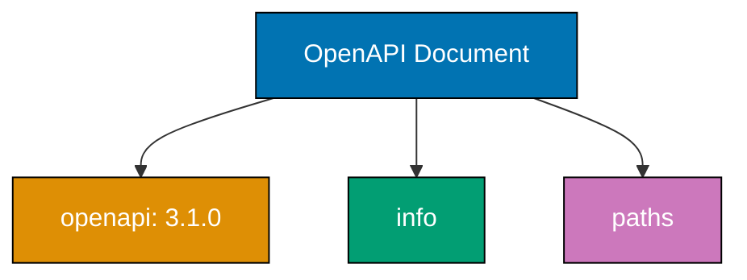
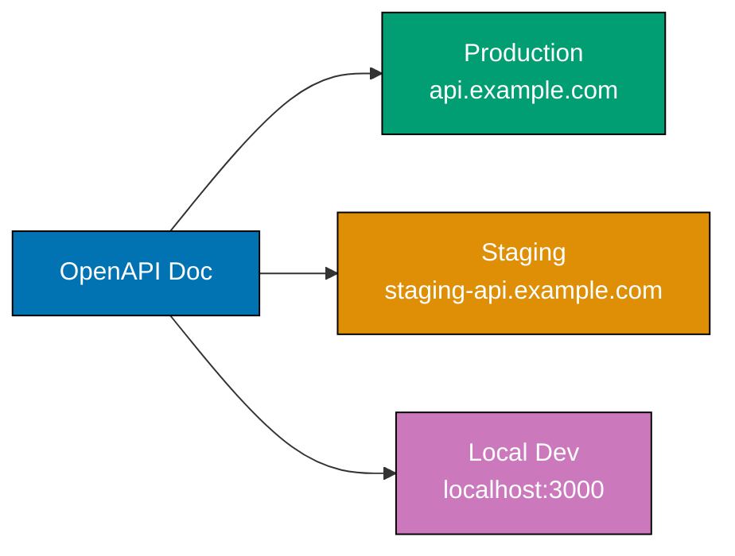
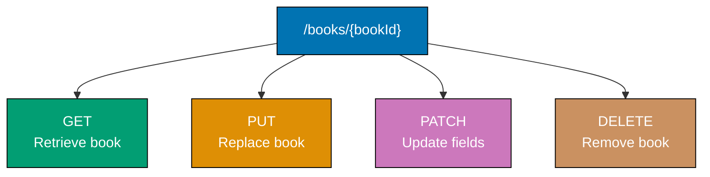
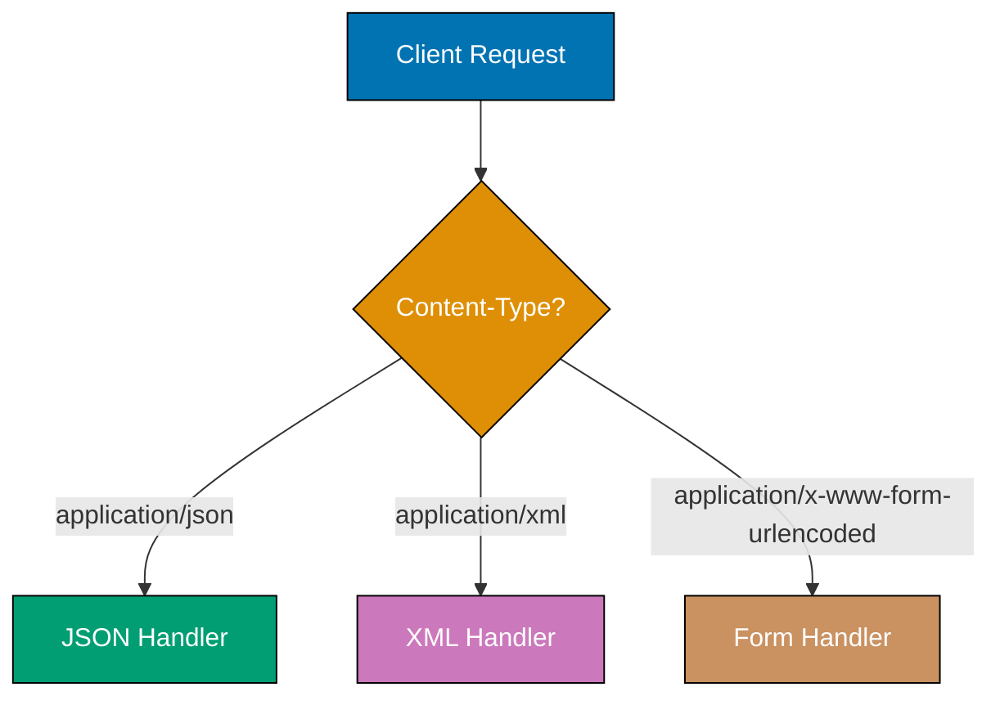
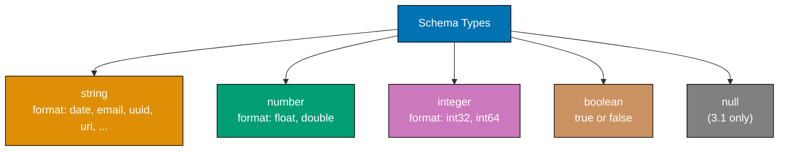
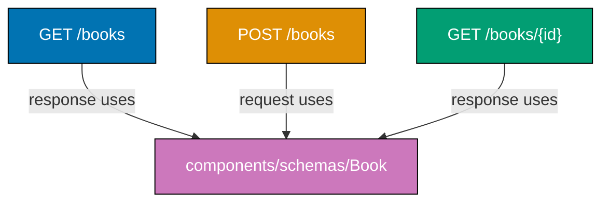

Learn OpenAPI 3.x fundamentals through 28 annotated YAML examples. Each example is a self-contained, valid OpenAPI fragment, heavily commented to show what each field does, how tools interpret it, and how fields relate to each other.

## Specification Structure (Examples 1-5)

### Example 1: Minimal Valid OpenAPI Document

Every OpenAPI document requires three root-level fields: `openapi` (version), `info` (metadata), and `paths` (endpoints). This is the smallest valid document you can write.



**Code**:

```yaml
openapi: "3.1.0"
# => Declares this document follows OpenAPI Specification version 3.1.0
# => Tooling uses this to decide which features and validation rules apply
# => Must be a string (quoted) to prevent YAML interpreting it as a float

info:
  # => Required metadata object describing the API
  title: Bookstore API
  # => Human-readable name displayed in documentation tools
  # => Appears as the main heading in Swagger UI and Redoc
  version: "1.0.0"
  # => API version (your versioning scheme, not the OpenAPI spec version)
  # => String format allows semver, date-based, or custom schemes

paths: {}
# => Required object holding all API endpoints
# => Empty object is valid but means no endpoints are defined yet
# => Each key in paths is a URL path template like /books
```

**Key Takeaway**: A valid OpenAPI document needs exactly three root fields: `openapi`, `info`, and `paths`. The `openapi` field tells tools which specification version to use for validation.

**Why It Matters**: Starting with the minimal document establishes the skeleton every API spec builds upon. Validators reject documents missing any of these three fields, so understanding this structure prevents confusing error messages when you begin defining endpoints. The version field is particularly important because OpenAPI 3.0 and 3.1 have meaningful differences in JSON Schema support.

---

### Example 2: Rich Info Object with Contact and License

The `info` object supports optional fields for API description, terms of service, contact information, and license. These fields populate generated documentation.

**Code**:

```yaml
openapi: "3.1.0"
# => OpenAPI version declaration

info:
  title: Bookstore API
  # => API name for documentation headers
  version: "2.1.0"
  # => Current API version
  description: |
    A RESTful API for managing books, authors, and inventory.
    Supports full CRUD operations with pagination and filtering.
  # => Multi-line description using YAML literal block scalar
  # => Rendered as Markdown in Swagger UI and Redoc
  # => Supports headings, lists, links, and code blocks
  termsOfService: "https://example.com/terms"
  # => URL to the API's terms of service
  # => Must be a valid URL format
  contact:
    # => Contact information for API support
    name: API Support Team
    # => Name of the contact person or team
    url: "https://example.com/support"
    # => URL to support page
    email: api-support@example.com
    # => Support email address
  license:
    # => License information for the API
    name: MIT
    # => SPDX license identifier or custom name
    url: "https://opensource.org/licenses/MIT"
    # => URL to the full license text

paths: {}
# => Endpoints defined elsewhere
```

**Key Takeaway**: The `info` object is your API's metadata hub. Use `description` with Markdown for rich documentation, and always include `contact` and `license` for professional APIs.

**Why It Matters**: Generated documentation tools (Swagger UI, Redoc) render every `info` field prominently. APIs without proper metadata appear unprofessional and make onboarding difficult for consumers. The `description` field supports Markdown, giving you a landing page for your API documentation without any additional tooling.

---

### Example 3: Server Definitions

The `servers` array defines base URLs where the API is available. Tools use these for request routing, documentation "Try It" features, and code generation.



**Code**:

```yaml
openapi: "3.1.0"
# => Version declaration
info:
  title: Bookstore API
  # => API name
  version: "1.0.0"
  # => API version

servers:
  # => Array of server objects defining where the API is hosted
  # => Tools present these as a dropdown in "Try It" features
  - url: "https://api.example.com/v1"
    # => Production base URL
    # => All paths are appended to this (e.g., /books becomes https://api.example.com/v1/books)
    description: Production server
    # => Human-readable label for this server
  - url: "https://staging-api.example.com/v1"
    # => Staging environment URL
    description: Staging server
    # => Helps developers test against non-production
  - url: "http://localhost:3000/v1"
    # => Local development URL
    # => Note: http (not https) is valid for localhost
    description: Local development
    # => Developers use this during local API development

paths: {}
# => Endpoints defined elsewhere
```

**Key Takeaway**: Define multiple `servers` entries for each environment where your API is available. Tools use the first server as the default.

**Why It Matters**: Server definitions make API documentation immediately actionable. Documentation consumers can switch between environments in Swagger UI's server dropdown and execute requests against staging or production directly. Without server definitions, consumers must guess the base URL or read external documentation to make their first API call.

---

### Example 4: Server Variables for Dynamic URLs

Server URLs can contain variables enclosed in braces, with default values and optional enumerations. This supports multi-tenant APIs and environment switching.

**Code**:

```yaml
openapi: "3.1.0"
# => Version declaration
info:
  title: Multi-Tenant API
  # => API supporting multiple tenants
  version: "1.0.0"
  # => API version

servers:
  - url: "https://{tenant}.api.example.com/{version}"
    # => URL template with two variables: tenant and version
    # => Variables are enclosed in curly braces
    description: Multi-tenant production server
    # => Description of this server
    variables:
      # => Defines values for URL template variables
      tenant:
        # => Variable name matching {tenant} in the URL
        default: acme
        # => Default value used when not specified
        # => Required field for every server variable
        description: Tenant identifier
        # => Explains what this variable represents
        enum:
          # => Allowed values (optional but recommended)
          - acme
          # => First tenant option
          - globex
          # => Second tenant option
          - initech
          # => Third tenant option
      version:
        # => Variable name matching {version} in the URL
        default: v2
        # => Default API version
        enum:
          - v1
          # => Legacy version
          - v2
          # => Current version

paths: {}
# => Endpoints defined elsewhere
```

**Key Takeaway**: Use server variables for dynamic URL segments like tenant identifiers or API versions. The `enum` field restricts allowed values, and `default` is required for every variable.

**Why It Matters**: Multi-tenant SaaS APIs and versioned APIs need dynamic base URLs. Server variables let documentation tools generate correct URLs for each tenant or version without duplicating server entries. Generated SDKs can expose these variables as configuration options, making multi-tenant support a first-class feature of the generated client code.

---

### Example 5: Tags for Grouping Operations

Tags organize API operations into logical groups. Documentation tools render these as collapsible sections, making large APIs navigable.

**Code**:

```yaml
openapi: "3.1.0"
# => Version declaration
info:
  title: Bookstore API
  # => API name
  version: "1.0.0"
  # => API version

tags:
  # => Top-level tag definitions with descriptions
  # => Order here determines display order in documentation
  - name: Books
    # => Tag name referenced by operations
    description: Operations for managing the book catalog
    # => Rendered as section description in docs
    externalDocs:
      # => Link to additional documentation outside the spec
      description: Book management guide
      # => Link text
      url: "https://docs.example.com/books"
      # => External URL
  - name: Authors
    # => Second tag for author-related operations
    description: Operations for managing author profiles
    # => Section description
  - name: Orders
    # => Third tag for order operations
    description: Operations for placing and tracking orders
    # => Section description

paths:
  /books:
    get:
      tags:
        - Books
        # => Associates this operation with the Books tag
        # => Swagger UI groups it under the Books section
      summary: List all books
      # => Short description of the operation
      responses:
        "200":
          description: Successful response
          # => Response description

servers: []
# => Servers defined elsewhere
```

**Key Takeaway**: Define tags at the top level with descriptions, then reference them in operations. Tag order at the top level controls documentation section order.

**Why It Matters**: APIs with dozens of endpoints become unusable without grouping. Tags create the table of contents for your API documentation. Swagger UI and Redoc collapse operations under tag headings, letting consumers find relevant endpoints without scrolling through hundreds of operations. Well-organized tags reflect good API design -- resources map naturally to tags.

---

## Path Items and Operations (Examples 6-12)

### Example 6: Basic GET Operation

A path item defines operations available at a URL path. The simplest pattern is a GET operation that retrieves a resource collection.


**Code**:

```yaml
paths:
  /books:
    # => Path template (appended to server URL)
    # => Represents the books collection resource
    get:
      # => HTTP GET method for this path
      # => GET retrieves resources without side effects
      summary: List all books
      # => Short one-line description (appears in operation list)
      description: |
        Returns a paginated list of all books in the catalog.
        Results are sorted by title ascending by default.
      # => Longer description with Markdown support
      # => Rendered in expanded operation view
      operationId: listBooks
      # => Unique identifier for this operation across the entire spec
      # => Used by code generators to name functions/methods
      # => Convention: camelCase verb+noun
      tags:
        - Books
        # => Groups this operation under Books in documentation
      responses:
        "200":
          # => HTTP status code (must be quoted string in YAML)
          description: A list of books
          # => Required description for every response
          content:
            application/json:
              # => Media type of the response body
              schema:
                type: array
                # => Response is a JSON array
                items:
                  type: object
                  # => Each item is a JSON object
```

**Key Takeaway**: Each path key maps to a URL, and HTTP methods (get, post, put, delete, patch) define operations on that path. Use `operationId` for code generation and `tags` for documentation grouping.

**Why It Matters**: The path-operation pair is the fundamental building block of every OpenAPI spec. Code generators use `operationId` to name client methods (e.g., `listBooks()` in TypeScript), so choosing clear, consistent IDs directly affects developer experience. The `summary` and `description` separation allows documentation tools to show brief listings while supporting detailed expanded views.

---

### Example 7: POST Operation with Request Body

POST operations create new resources. The `requestBody` field defines the expected payload with media type and schema.

**Code**:

```yaml
paths:
  /books:
    post:
      # => HTTP POST method creates a new resource
      summary: Create a new book
      # => Short operation description
      operationId: createBook
      # => Unique operation identifier for code generators
      tags:
        - Books
        # => Groups under Books section
      requestBody:
        # => Defines the expected request payload
        required: true
        # => Client must send a request body
        # => Validators reject requests without a body when true
        description: Book data to create
        # => Human-readable description of the payload
        content:
          application/json:
            # => Accepts JSON content type
            schema:
              type: object
              # => Payload is a JSON object
              required:
                - title
                # => title field is mandatory
                - isbn
                # => isbn field is mandatory
              properties:
                title:
                  type: string
                  # => Book title as a string
                  example: "The Great Gatsby"
                  # => Example value shown in documentation
                isbn:
                  type: string
                  # => ISBN identifier
                  example: "978-0743273565"
                  # => Example ISBN value
                price:
                  type: number
                  # => Price as a decimal number
                  format: double
                  # => 64-bit floating point precision
                  example: 12.99
                  # => Example price value
      responses:
        "201":
          # => 201 Created - standard response for successful creation
          description: Book created successfully
          # => Response description
          content:
            application/json:
              schema:
                type: object
                # => Returns the created book object
                properties:
                  id:
                    type: integer
                    # => Server-assigned unique identifier
                    example: 42
                    # => Example ID value
                  title:
                    type: string
                    # => Echoed title from request
        "400":
          # => 400 Bad Request - validation errors
          description: Invalid input data
          # => Describes when this status is returned
```

**Key Takeaway**: POST operations use `requestBody` to define payloads. Mark `required: true` when the body is mandatory, and list required properties in the schema's `required` array.

**Why It Matters**: Request body definitions are the contract between API producer and consumer. When `required` properties are specified, code generators create types that enforce these constraints at compile time. Documentation tools render interactive forms where users can fill in example values and execute requests, turning your spec into a testable API playground.

---

### Example 8: PUT Operation for Full Resource Update

PUT replaces an entire resource. The path includes a parameter for the resource identifier, and the request body contains the complete updated resource.

**Code**:

```yaml
paths:
  /books/{bookId}:
    # => Path with parameter placeholder
    # => {bookId} is replaced with actual value at runtime
    put:
      # => HTTP PUT replaces the entire resource
      # => Client must send ALL fields, not just changed ones
      summary: Replace a book
      # => Short description
      operationId: replaceBook
      # => Unique ID for code generation
      tags:
        - Books
        # => Documentation grouping
      parameters:
        - name: bookId
          # => Parameter name matching {bookId} in path
          in: path
          # => Located in the URL path
          required: true
          # => Path parameters are always required
          description: Unique book identifier
          # => Human-readable description
          schema:
            type: integer
            # => Book ID is an integer
            example: 42
            # => Example value
      requestBody:
        required: true
        # => PUT requires a complete resource representation
        content:
          application/json:
            schema:
              type: object
              # => Complete book object
              required:
                - title
                - isbn
                # => All mandatory fields must be present in PUT
              properties:
                title:
                  type: string
                  # => Updated title
                isbn:
                  type: string
                  # => ISBN (cannot change but must be present)
                price:
                  type: number
                  # => Updated price
      responses:
        "200":
          description: Book replaced successfully
          # => 200 OK for successful update
        "404":
          description: Book not found
          # => Returned when bookId does not exist
```

**Key Takeaway**: PUT replaces the entire resource -- all required fields must be in the request body. Path parameters use `{paramName}` syntax in the path and are always `required: true`.

**Why It Matters**: Distinguishing PUT from PATCH in your spec communicates replacement semantics to API consumers. PUT forces clients to send complete objects, preventing accidental field deletion that occurs when consumers assume PATCH semantics. Clear PUT documentation prevents the common bug where clients omit optional fields, unintentionally setting them to null.

---

### Example 9: PATCH Operation for Partial Update

PATCH applies partial modifications to a resource. Only the fields included in the request body are updated.

**Code**:

```yaml
paths:
  /books/{bookId}:
    patch:
      # => HTTP PATCH applies partial modifications
      # => Only fields present in the body are updated
      summary: Update book fields
      # => Short description
      operationId: updateBook
      # => Unique ID for code generation
      tags:
        - Books
        # => Documentation grouping
      parameters:
        - name: bookId
          in: path
          # => Path parameter for resource identification
          required: true
          # => Path params are always required
          schema:
            type: integer
            # => Integer book identifier
      requestBody:
        required: true
        # => Body is required but individual fields are optional
        content:
          application/json:
            schema:
              type: object
              # => Partial book object
              # => Note: no "required" array for PATCH
              # => All properties are optional for partial update
              properties:
                title:
                  type: string
                  # => Optionally update the title
                price:
                  type: number
                  # => Optionally update the price
                  format: double
                  # => 64-bit floating point
              minProperties: 1
              # => At least one property must be present
              # => Prevents empty PATCH requests
      responses:
        "200":
          description: Book updated successfully
          # => Returns updated book
          content:
            application/json:
              schema:
                type: object
                # => Full book object with applied changes
                properties:
                  id:
                    type: integer
                    # => Unchanged book ID
                  title:
                    type: string
                    # => Current title (updated or original)
                  price:
                    type: number
                    # => Current price (updated or original)
        "404":
          description: Book not found
          # => bookId does not match any existing book
```

**Key Takeaway**: PATCH schemas omit the `required` array so all properties are optional. Use `minProperties: 1` to prevent empty patch requests. PATCH returns the full updated resource.

**Why It Matters**: PATCH is the most common update method in modern APIs because it reduces payload size and prevents accidental data loss. Defining PATCH correctly in your spec -- with all-optional properties and `minProperties` -- generates client code that enforces partial update semantics. This prevents the common mistake of clients sending empty objects that produce no-op updates, wasting server resources.

---

### Example 10: DELETE Operation

DELETE removes a resource. DELETE operations typically have no request body and return either 200 (with deleted resource) or 204 (no content).

**Code**:

```yaml
paths:
  /books/{bookId}:
    delete:
      # => HTTP DELETE removes the specified resource
      summary: Delete a book
      # => Short description
      operationId: deleteBook
      # => Unique ID for code generation
      tags:
        - Books
        # => Documentation grouping
      parameters:
        - name: bookId
          in: path
          # => Path parameter identifying the book to delete
          required: true
          # => Always required for path parameters
          schema:
            type: integer
            # => Integer identifier
      responses:
        "204":
          # => 204 No Content - successful deletion with no response body
          description: Book deleted successfully
          # => Description is still required even with no body
          # => No "content" field needed for 204 responses
        "404":
          description: Book not found
          # => Book with given ID does not exist
        "409":
          description: Conflict - book has active orders
          # => Cannot delete due to business rule constraint
          # => Informs client why deletion was refused
```

**Key Takeaway**: DELETE operations use path parameters to identify the target resource. Use 204 (No Content) when no response body is needed, or 200 with the deleted resource for confirmation.

**Why It Matters**: Defining DELETE responses precisely communicates lifecycle semantics. The 409 (Conflict) response documents business rules that prevent deletion, saving consumers from guessing why their request failed. Generated client SDKs can provide typed error handling for each status code, turning HTTP status codes into language-specific exception types.

---

### Example 11: Multiple Operations on One Path

A single path item can define multiple HTTP method operations. This represents different actions on the same resource.



**Code**:

```yaml
paths:
  /books/{bookId}:
    # => Single path with multiple operations
    # => All operations share the path parameter
    parameters:
      # => Path-level parameters shared by all operations below
      - name: bookId
        in: path
        required: true
        # => Defined once, applies to get, put, patch, and delete
        schema:
          type: integer
          # => Integer identifier
    get:
      # => GET retrieves the book
      summary: Get a book by ID
      operationId: getBook
      # => Unique across all operations
      responses:
        "200":
          description: Book details
          # => Returns the full book object
        "404":
          description: Book not found
          # => ID does not match any book
    put:
      # => PUT replaces the entire book
      summary: Replace a book
      operationId: replaceBook
      # => Different operationId from get
      requestBody:
        required: true
        content:
          application/json:
            schema:
              type: object
              # => Complete replacement object
      responses:
        "200":
          description: Book replaced
          # => Returns updated book
    delete:
      # => DELETE removes the book
      summary: Delete a book
      operationId: deleteBook
      # => Unique operation identifier
      responses:
        "204":
          description: Book deleted
          # => No response body
```

**Key Takeaway**: Define shared parameters at the path level to avoid repetition across operations. Each operation must have a unique `operationId` even though they share the same path.

**Why It Matters**: Path-level parameter definitions follow the DRY principle and reduce spec size in APIs with many CRUD operations. When parameters are defined at the path level, validators ensure consistency across all operations on that path. This prevents the common bug where GET and DELETE accept different ID formats because the parameter was defined independently in each operation.

---

### Example 12: Summary vs Description in Operations

`summary` and `description` serve different purposes in documentation rendering. Understanding their roles produces better API documentation.

**Code**:

```yaml
paths:
  /books/search:
    get:
      summary: Search the book catalog
      # => summary: one-line text shown in collapsed operation lists
      # => Swagger UI displays this next to the HTTP method badge
      # => Keep under 120 characters for readability
      description: |
        Performs a full-text search across book titles, descriptions,
        and author names. Results are ranked by relevance score.

        ## Search Syntax

        - Simple terms: `fiction` matches any field containing "fiction"
        - Quoted phrases: `"great gatsby"` matches exact phrase
        - Boolean operators: `fiction AND mystery` requires both terms

        ## Rate Limiting

        This endpoint is rate-limited to 100 requests per minute per API key.
      # => description: extended Markdown content
      # => Rendered when the operation is expanded in docs
      # => Supports full Markdown: headings, lists, code blocks, tables
      # => Use for complex behavior, examples, or usage notes
      operationId: searchBooks
      # => Unique operation identifier
      responses:
        "200":
          description: |
            Search results with relevance scores.
            Empty array when no matches found.
          # => Response descriptions also support multi-line Markdown
          # => Document both success and edge cases
```

**Key Takeaway**: Use `summary` for the collapsed one-liner and `description` for expanded Markdown content. Both are optional, but `summary` appears in operation lists while `description` appears in detail views.

**Why It Matters**: API documentation is read at two levels: scanning (which endpoint do I need?) and studying (how exactly does this endpoint work?). Summary serves scanners -- it appears in the operation list without expanding. Description serves studiers -- it provides the full context. APIs that only use `summary` force consumers to read source code for details; APIs that only use `description` make scanning impossible.

---

## Parameters (Examples 13-18)

### Example 13: Path Parameters

Path parameters are variable segments in the URL path, enclosed in curly braces. They are always required and identify specific resources.

**Code**:

```yaml
paths:
  /authors/{authorId}/books/{bookId}:
    # => Nested resource path with two parameters
    # => Represents a specific book by a specific author
    get:
      summary: Get a specific book by an author
      # => Short description
      operationId: getAuthorBook
      # => Unique operation identifier
      parameters:
        - name: authorId
          # => Must match {authorId} in the path exactly
          in: path
          # => Located in the URL path segment
          required: true
          # => Path parameters MUST be required: true
          # => OpenAPI validators enforce this rule
          description: The author's unique identifier
          # => Human-readable description
          schema:
            type: integer
            # => Integer ID
            minimum: 1
            # => Must be positive
            example: 15
            # => Example value for documentation
        - name: bookId
          # => Second path parameter matching {bookId}
          in: path
          required: true
          # => Also required (all path params are)
          schema:
            type: string
            # => String identifier (UUIDs, slugs, etc.)
            format: uuid
            # => UUID format hint for validators and generators
            example: "550e8400-e29b-41d4-a716-446655440000"
            # => Example UUID value
      responses:
        "200":
          description: Book details for the specified author
          # => Successful retrieval
        "404":
          description: Author or book not found
          # => Either resource does not exist
```

**Key Takeaway**: Path parameters must match `{paramName}` placeholders exactly and are always `required: true`. Use descriptive schema types and formats for each parameter.

**Why It Matters**: Path parameters define your API's resource hierarchy. Using `format: uuid` versus `type: integer` communicates the identifier strategy to consumers and enables code generators to use appropriate types (UUID class vs. int). Nested paths like `/authors/{authorId}/books/{bookId}` express resource ownership, letting consumers understand relationships without reading documentation.

---

### Example 14: Query Parameters

Query parameters filter, sort, or paginate collections. They appear after `?` in the URL and are typically optional.

**Code**:

```yaml
paths:
  /books:
    get:
      summary: List books with filtering
      # => Collection endpoint with query filters
      operationId: listBooks
      # => Unique operation identifier
      parameters:
        - name: page
          # => Pagination: which page of results
          in: query
          # => Located in the URL query string (?page=2)
          required: false
          # => Optional parameter with default value
          description: Page number for pagination
          # => Human-readable description
          schema:
            type: integer
            # => Integer page number
            minimum: 1
            # => First page is 1 (not 0)
            default: 1
            # => Default value when parameter is omitted
            example: 1
            # => Example value
        - name: limit
          # => Pagination: results per page
          in: query
          required: false
          # => Optional with default
          schema:
            type: integer
            minimum: 1
            # => At least one result per page
            maximum: 100
            # => Cap to prevent excessive responses
            default: 20
            # => Returns 20 items when not specified
        - name: genre
          # => Filter by book genre
          in: query
          required: false
          # => Optional filter
          schema:
            type: string
            # => Genre name as string
            enum:
              - fiction
              - nonfiction
              - science
              - history
            # => Restricts to allowed values
            # => Documentation shows these as a dropdown
        - name: sort
          # => Sort order for results
          in: query
          required: false
          schema:
            type: string
            default: title
            # => Default sort field
            enum:
              - title
              - price
              - published_date
            # => Allowed sort fields
      responses:
        "200":
          description: Paginated list of books
          # => Returns filtered, sorted, paginated results
```

**Key Takeaway**: Query parameters use `in: query` and are typically optional with `default` values. Use `enum` to restrict allowed values and `minimum`/`maximum` for numeric bounds.

**Why It Matters**: Query parameter design determines API usability. Defaults reduce the burden on consumers -- they can call `/books` without any parameters and get sensible results. Enums generate dropdown selectors in documentation and type-safe constants in client SDKs, preventing typos like `genere=ficton`. Maximum bounds protect servers from resource exhaustion when clients request unbounded result sets.

---

### Example 15: Header Parameters

Header parameters pass metadata with the request, such as API versions, request IDs, or custom headers.

**Code**:

```yaml
paths:
  /books:
    get:
      summary: List books with header options
      # => Operation using header parameters
      operationId: listBooksWithHeaders
      # => Unique operation identifier
      parameters:
        - name: X-Request-ID
          # => Custom header name
          # => Convention: X- prefix for custom headers
          in: header
          # => Located in HTTP request headers
          required: false
          # => Optional but recommended for tracing
          description: Unique request identifier for distributed tracing
          # => Explains the header's purpose
          schema:
            type: string
            format: uuid
            # => UUID format for uniqueness
            example: "123e4567-e89b-12d3-a456-426614174000"
            # => Example UUID
        - name: Accept-Language
          # => Standard HTTP header for content negotiation
          in: header
          required: false
          # => Optional language preference
          description: Preferred response language
          # => Describes what this header controls
          schema:
            type: string
            default: en
            # => English by default
            enum:
              - en
              - id
              - ja
            # => Supported languages
        - name: X-API-Version
          # => Custom version header
          in: header
          required: false
          schema:
            type: string
            default: "2024-01-01"
            # => Date-based API version default
            # => Allows header-based API versioning
      responses:
        "200":
          description: Book list with requested language
          # => Response respects Accept-Language header
```

**Key Takeaway**: Header parameters use `in: header` and define metadata that travels with the request. Use them for cross-cutting concerns like tracing, versioning, and content negotiation.

**Why It Matters**: Header parameters document the invisible contract between client and server. Without explicit header documentation, consumers discover required headers only through trial and error or by reading server source code. Request ID headers enable distributed tracing across microservices, and documenting them in the spec ensures all consumers participate in observability.

---

### Example 16: Cookie Parameters

Cookie parameters describe values sent via HTTP cookies. They are less common but essential for session-based APIs.

**Code**:

```yaml
paths:
  /profile:
    get:
      summary: Get user profile from session
      # => Session-based authentication via cookie
      operationId: getProfile
      # => Unique operation identifier
      parameters:
        - name: session_id
          # => Cookie name
          in: cookie
          # => Located in HTTP Cookie header
          required: true
          # => Session cookie is required for this endpoint
          description: Session identifier set during login
          # => Explains when this cookie is set
          schema:
            type: string
            # => Opaque session token
            example: "abc123def456"
            # => Example session ID
        - name: preferences
          # => Optional preferences cookie
          in: cookie
          required: false
          # => Not required for basic functionality
          description: User display preferences
          # => JSON-encoded preference object
          schema:
            type: string
            # => Serialized as string in cookie
            example: '{"theme":"dark","lang":"en"}'
            # => Example serialized preferences
      responses:
        "200":
          description: User profile data
          # => Returns profile using session context
        "401":
          description: Invalid or expired session
          # => Session cookie is missing or no longer valid
```

**Key Takeaway**: Cookie parameters use `in: cookie` and describe values from the HTTP Cookie header. Use them for session-based APIs where authentication tokens are stored in cookies.

**Why It Matters**: While token-based authentication (Bearer headers) dominates modern APIs, many web applications still use cookie-based sessions. Documenting cookie parameters makes the authentication flow explicit in the spec, preventing the common pattern where consumers discover cookie requirements only after receiving 401 responses. Security-sensitive cookies should also be documented with security schemes for complete coverage.

---

### Example 17: Required vs Optional Parameters

The `required` field determines whether a parameter must be sent with every request. Understanding this distinction prevents validation errors and improves API usability.

**Code**:

```yaml
paths:
  /books/{bookId}/reviews:
    get:
      summary: List reviews for a book
      # => Reviews endpoint with mixed parameter requirements
      operationId: listBookReviews
      # => Unique operation identifier
      parameters:
        # Required parameters - must be present in every request
        - name: bookId
          in: path
          required: true
          # => Path parameters are ALWAYS required
          # => Omitting required:true on path params fails validation
          schema:
            type: integer
            # => Integer book identifier
        # Optional parameters - enhance the request when present
        - name: rating
          in: query
          required: false
          # => Optional filter for minimum star rating
          # => Request works without this parameter
          description: Filter reviews by minimum rating
          # => Describes the filter behavior
          schema:
            type: integer
            minimum: 1
            # => Lowest possible rating
            maximum: 5
            # => Highest possible rating
        - name: verified
          in: query
          required: false
          # => Optional filter for verified purchases
          schema:
            type: boolean
            # => true filters to verified-only reviews
            # => Omitting returns all reviews
        - name: X-Correlation-ID
          in: header
          required: false
          # => Optional tracing header
          schema:
            type: string
            format: uuid
            # => UUID for request correlation
      responses:
        "200":
          description: List of reviews
          # => Returns filtered reviews
```

**Key Takeaway**: Path parameters must always be `required: true`. Query, header, and cookie parameters can be optional (`required: false` or omitted, since false is the default).

**Why It Matters**: The required/optional distinction drives code generation and validation. Required parameters become mandatory function arguments in generated SDKs, while optional parameters become optional arguments or configuration objects. Over-requiring parameters creates friction; under-requiring them causes runtime errors. Getting this right in the spec prevents both poor developer experience and server-side validation failures.

---

### Example 18: Parameter Schema with Constraints

Parameter schemas support the same constraints as JSON Schema: patterns, ranges, lengths, and formats. These constraints enable validation at the API gateway level.

**Code**:

```yaml
paths:
  /books:
    get:
      summary: Search books with constrained parameters
      # => Demonstrates parameter validation constraints
      operationId: searchBooksConstrained
      # => Unique operation identifier
      parameters:
        - name: isbn
          in: query
          required: false
          # => Optional ISBN search
          schema:
            type: string
            pattern: "^(978|979)-\\d{1,5}-\\d{1,7}-\\d{1,7}-\\d$"
            # => Regex pattern for ISBN-13 format
            # => Validates format before the request reaches business logic
            example: "978-0-13-468599-1"
            # => Example matching the pattern
        - name: minPrice
          in: query
          required: false
          schema:
            type: number
            # => Decimal price value
            format: double
            # => 64-bit floating point
            minimum: 0
            # => Cannot be negative
            exclusiveMinimum: true
            # => Must be strictly greater than 0 (not equal)
        - name: maxPrice
          in: query
          required: false
          schema:
            type: number
            format: double
            maximum: 10000
            # => Upper bound for sanity checking
        - name: title
          in: query
          required: false
          schema:
            type: string
            minLength: 1
            # => Cannot be empty string
            maxLength: 200
            # => Reasonable upper bound
            # => Prevents abuse and buffer overflow
        - name: publishedAfter
          in: query
          required: false
          schema:
            type: string
            format: date
            # => ISO 8601 date format (YYYY-MM-DD)
            # => Tools validate date format
            example: "2024-01-01"
            # => Example date value
      responses:
        "200":
          description: Books matching search criteria
          # => Returns filtered results
        "400":
          description: Invalid parameter format
          # => Returned when constraints are violated
```

**Key Takeaway**: Use schema constraints (`pattern`, `minimum`, `maximum`, `minLength`, `maxLength`, `format`) to validate parameters at the spec level. This shifts validation left, before business logic.

**Why It Matters**: Parameter constraints are enforced by API gateways and validation middleware, preventing invalid data from reaching your application code. Regex patterns on string parameters catch malformed identifiers early. Numeric bounds prevent resource exhaustion (imagine `maxPrice=999999999999`). These constraints generate validation code in SDKs, giving consumers compile-time or runtime feedback before making HTTP calls.

---

## Request Bodies and Responses (Examples 19-22)

### Example 19: Request Body with Multiple Media Types

A request body can accept multiple content types. The API chooses the handler based on the `Content-Type` header.



**Code**:

```yaml
paths:
  /books:
    post:
      summary: Create a book (multiple formats)
      # => Accepts different content types for the same operation
      operationId: createBookMultiFormat
      # => Unique operation identifier
      requestBody:
        required: true
        # => Body is mandatory regardless of format
        content:
          application/json:
            # => JSON format (most common for REST APIs)
            schema:
              type: object
              required:
                - title
                # => Title is required in JSON format
              properties:
                title:
                  type: string
                  # => Book title
                isbn:
                  type: string
                  # => ISBN identifier
            example:
              # => Complete example for JSON format
              title: "Clean Code"
              isbn: "978-0132350884"
              # => Shown in Swagger UI "Example Value"
          application/xml:
            # => XML format for legacy system integration
            schema:
              type: object
              properties:
                title:
                  type: string
                  # => Same fields, different serialization
                isbn:
                  type: string
                  # => XML element or attribute
          application/x-www-form-urlencoded:
            # => HTML form submission format
            schema:
              type: object
              properties:
                title:
                  type: string
                  # => Form field name="title"
                isbn:
                  type: string
                  # => Form field name="isbn"
      responses:
        "201":
          description: Book created
          # => Same response regardless of input format
```

**Key Takeaway**: List each accepted media type under `content` with its own schema. The server reads the `Content-Type` header to determine which format the client sent.

**Why It Matters**: Supporting multiple media types lets one API serve different consumers -- modern frontends send JSON while legacy enterprise systems send XML or form data. Documenting all accepted formats in the spec generates client code that handles serialization correctly. Without explicit media type documentation, consumers default to JSON and discover XML support only through trial or source code reading.

---

### Example 20: Response with Headers

Responses can include custom headers for metadata like pagination info, rate limits, or cache control.

**Code**:

```yaml
paths:
  /books:
    get:
      summary: List books with pagination headers
      # => Response includes metadata in headers
      operationId: listBooksWithHeaders
      # => Unique operation identifier
      responses:
        "200":
          description: Paginated book list
          # => Successful response description
          headers:
            # => Custom response headers
            X-Total-Count:
              # => Total number of matching resources
              description: Total number of books matching the query
              # => Explains what this header contains
              schema:
                type: integer
                # => Integer count
                example: 142
                # => Example total count
            X-Page:
              # => Current page number
              description: Current page number
              schema:
                type: integer
                example: 3
                # => Example page number
            X-Per-Page:
              # => Items per page
              description: Number of items per page
              schema:
                type: integer
                example: 20
                # => Example page size
            X-Rate-Limit-Remaining:
              # => Rate limiting information
              description: Number of requests remaining in the current window
              # => Helps clients implement backoff strategies
              schema:
                type: integer
                example: 95
                # => 95 requests remaining
          content:
            application/json:
              schema:
                type: array
                # => Array of book objects
                items:
                  type: object
                  # => Individual book
                  properties:
                    id:
                      type: integer
                      # => Book identifier
                    title:
                      type: string
                      # => Book title
```

**Key Takeaway**: Define response headers under the `headers` field of each response object. Headers carry metadata that does not belong in the response body, like pagination state and rate limits.

**Why It Matters**: Response headers are part of the API contract but are invisible without explicit documentation. Pagination headers let clients build pagination UI without parsing response body metadata. Rate limit headers enable automatic backoff in client SDKs. Code generators create typed header accessors, so consumers access `response.headers.xTotalCount` as a number instead of manually parsing `response.headers['X-Total-Count']`.

---

### Example 21: Multiple Response Status Codes

Operations typically return different status codes for success, client errors, and server errors. Each status code can have its own schema.

**Code**:

```yaml
paths:
  /books/{bookId}:
    get:
      summary: Get book with comprehensive error responses
      # => Demonstrates multiple response definitions
      operationId: getBookDetailed
      # => Unique operation identifier
      parameters:
        - name: bookId
          in: path
          required: true
          schema:
            type: integer
            # => Book identifier
      responses:
        "200":
          # => Success response
          description: Book found and returned
          content:
            application/json:
              schema:
                type: object
                properties:
                  id:
                    type: integer
                    # => Book identifier
                  title:
                    type: string
                    # => Book title
                  author:
                    type: string
                    # => Author name
        "400":
          # => Client error - bad request format
          description: Invalid book ID format
          # => e.g., bookId is not an integer
          content:
            application/json:
              schema:
                type: object
                # => Error response object
                properties:
                  error:
                    type: string
                    example: "INVALID_ID"
                    # => Machine-readable error code
                  message:
                    type: string
                    example: "Book ID must be a positive integer"
                    # => Human-readable error message
        "404":
          # => Resource not found
          description: Book does not exist
          content:
            application/json:
              schema:
                type: object
                properties:
                  error:
                    type: string
                    example: "NOT_FOUND"
                    # => Error code for programmatic handling
                  message:
                    type: string
                    example: "No book found with ID 999"
                    # => Descriptive error message
        "500":
          # => Server error
          description: Internal server error
          content:
            application/json:
              schema:
                type: object
                properties:
                  error:
                    type: string
                    example: "INTERNAL_ERROR"
                    # => Generic server error code
                  message:
                    type: string
                    example: "An unexpected error occurred"
                    # => Does not expose internal details
```

**Key Takeaway**: Define response schemas for each status code your API returns. Use consistent error schemas across all operations for predictable client-side error handling.

**Why It Matters**: Comprehensive response definitions enable code generators to produce typed error handling. Without 400/404/500 response schemas, generated client code treats all errors as opaque HTTP failures. With them, clients get `BookNotFoundError` and `InvalidIdError` as distinct types, enabling precise error handling. Consistent error schemas across operations mean one error handler works everywhere.

---

### Example 22: Default Response for Unexpected Errors

The `default` response catches any status code not explicitly defined. Use it for generic error responses.

**Code**:

```yaml
paths:
  /books:
    get:
      summary: List books with default error handler
      # => Uses default response for uncovered status codes
      operationId: listBooksWithDefault
      # => Unique operation identifier
      responses:
        "200":
          # => Explicitly defined success response
          description: Successful book list
          content:
            application/json:
              schema:
                type: array
                items:
                  type: object
                  # => Book objects
        "429":
          # => Explicitly defined rate limit response
          description: Rate limit exceeded
          # => Client sent too many requests
          content:
            application/json:
              schema:
                type: object
                properties:
                  error:
                    type: string
                    example: "RATE_LIMITED"
                    # => Error code
                  retryAfter:
                    type: integer
                    example: 30
                    # => Seconds to wait before retrying
        default:
          # => Catches ALL other status codes (4xx, 5xx, etc.)
          # => Acts as a fallback error response
          description: Unexpected error
          # => Generic error description
          content:
            application/json:
              schema:
                type: object
                # => Generic error envelope
                properties:
                  error:
                    type: string
                    # => Error code
                  message:
                    type: string
                    # => Human-readable description
                  statusCode:
                    type: integer
                    # => HTTP status code for convenience
```

**Key Takeaway**: The `default` response handles any status code not explicitly listed. Use it as a safety net for unexpected errors while explicitly defining common status codes.

**Why It Matters**: The `default` response prevents code generators from treating unlisted status codes as undefined behavior. Without it, a 503 response from a load balancer produces an untyped error in generated clients. With `default`, every possible response has a known shape, making error handling comprehensive. The pattern of explicit common codes plus default fallback balances thoroughness with maintainability.

---

## Schema Types and Constraints (Examples 23-28)

### Example 23: Primitive Schema Types

OpenAPI supports five primitive types: string, number, integer, boolean, and null (3.1 only). Each type supports format hints for more precise typing.



**Code**:

```yaml
components:
  schemas:
    BookPrimitives:
      # => Demonstrates all primitive types with formats
      type: object
      properties:
        title:
          type: string
          # => UTF-8 text of any length (unless constrained)
          minLength: 1
          # => At least one character
          maxLength: 500
          # => Upper bound for storage safety
          example: "The Great Gatsby"
          # => Example value for documentation
        isbn:
          type: string
          format: isbn
          # => Custom format (not built-in, but tools may support)
          # => Built-in formats: date, date-time, email, uri, uuid, etc.
          pattern: "^\\d{3}-\\d{1,5}-\\d{1,7}-\\d{1,7}-\\d$"
          # => Regex validation
        price:
          type: number
          # => Floating-point number (decimal)
          format: double
          # => 64-bit IEEE 754 (use float for 32-bit)
          minimum: 0
          # => Cannot be negative
          example: 29.99
          # => Example price
        pageCount:
          type: integer
          # => Whole number (no decimals)
          format: int32
          # => 32-bit signed integer (-2^31 to 2^31-1)
          # => Use int64 for values exceeding 32-bit range
          minimum: 1
          # => At least one page
          example: 218
          # => Example page count
        inStock:
          type: boolean
          # => true or false only
          # => No truthy/falsy values ("yes", 1, etc.)
          example: true
          # => Example boolean value
        publishedDate:
          type: string
          format: date
          # => ISO 8601 date: YYYY-MM-DD
          # => Validators check date format
          example: "1925-04-10"
          # => Example date
        createdAt:
          type: string
          format: date-time
          # => ISO 8601 datetime: YYYY-MM-DDTHH:MM:SSZ
          example: "2024-01-15T09:30:00Z"
          # => Example datetime with UTC timezone
```

**Key Takeaway**: Use `type` for the base type and `format` for precision hints. Code generators use `format` to choose language-specific types (e.g., `format: int64` becomes `long` in Java, `bigint` in TypeScript).

**Why It Matters**: Precise typing prevents data loss and overflow bugs. Using `integer` with `format: int64` instead of `number` ensures code generators produce `long` instead of `double`, avoiding floating-point precision loss for large IDs. The `format` field is a hint -- validators may ignore unknown formats, but code generators use them to produce the most appropriate language-native types.

---

### Example 24: Object Schema with Nested Properties

Objects define structured data with named properties. Nesting creates complex data shapes for request and response bodies.

**Code**:

```yaml
components:
  schemas:
    Book:
      type: object
      # => JSON object type
      required:
        - title
        - author
        # => These properties must be present in valid instances
        # => Validators reject objects missing required properties
      properties:
        id:
          type: integer
          # => Server-assigned identifier (not in required array)
          # => Omitted from creation requests, present in responses
          readOnly: true
          # => readOnly: appears in responses but ignored in requests
          # => Swagger UI hides readOnly fields in request body forms
        title:
          type: string
          # => Required book title
          minLength: 1
          # => Cannot be empty string
        author:
          # => Nested object (inline definition)
          type: object
          # => Author is an embedded object, not a separate resource
          required:
            - name
            # => Author name is required within the nested object
          properties:
            name:
              type: string
              # => Author's full name
              example: "F. Scott Fitzgerald"
              # => Example value
            bio:
              type: string
              # => Optional author biography
              maxLength: 2000
              # => Reasonable length limit
        metadata:
          # => Another nested object for flexible data
          type: object
          # => Metadata container
          additionalProperties: true
          # => Allows any additional key-value pairs
          # => Useful for extensible data without fixed schema
          # => Use sparingly -- prefer explicit properties when possible
      example:
        # => Complete example of a valid Book object
        id: 1
        title: "The Great Gatsby"
        author:
          name: "F. Scott Fitzgerald"
          bio: "American novelist"
        metadata:
          genre: "fiction"
          awards: 3
```

**Key Takeaway**: Use `required` at the object level to list mandatory properties. Nest objects inline for tightly coupled data, and use `readOnly` for server-generated fields.

**Why It Matters**: The `required` array and `readOnly` modifier work together to define different shapes for requests and responses from the same schema. A `Book` schema with `id` marked `readOnly` generates a creation request type without `id` and a response type with `id`. This eliminates the need for separate `CreateBook` and `BookResponse` schemas, reducing duplication while maintaining type safety.

---

### Example 25: Array Schema with Item Constraints

Arrays define ordered collections with typed items. Constraints like `minItems`, `maxItems`, and `uniqueItems` enforce collection rules.

**Code**:

```yaml
components:
  schemas:
    BookList:
      type: object
      # => Wrapper object for paginated results
      properties:
        books:
          type: array
          # => Ordered collection of book objects
          items:
            # => Schema for each element in the array
            type: object
            properties:
              id:
                type: integer
                # => Book identifier
              title:
                type: string
                # => Book title
          minItems: 0
          # => Empty array is valid (no results found)
          maxItems: 100
          # => Upper bound prevents excessive response sizes
          # => Aligns with pagination limit
        tags:
          type: array
          # => Array of simple string values
          items:
            type: string
            # => Each tag is a string
            minLength: 1
            # => No empty strings in the array
          uniqueItems: true
          # => No duplicate tags allowed
          # => Validators reject ["fiction", "fiction"]
          example:
            - fiction
            - classic
            - american
            # => Example tag array
        ratings:
          type: array
          # => Array of numbers
          items:
            type: integer
            minimum: 1
            # => Minimum rating value
            maximum: 5
            # => Maximum rating value
          minItems: 1
          # => At least one rating required
          # => Cannot be empty array
```

**Key Takeaway**: Use `items` to define the type of array elements, `minItems`/`maxItems` for length constraints, and `uniqueItems: true` to prevent duplicates.

**Why It Matters**: Array constraints catch data quality issues at the API boundary. Without `maxItems`, a client could send an array of 10 million items, crashing the server. Without `uniqueItems`, duplicate data silently passes validation. Code generators use array constraints to produce collection types with built-in validation, shifting error detection from runtime server logic to client-side type checking.

---

### Example 26: Enum Values and Constant Fields

Enums restrict a field to a predefined set of values. This enables type-safe handling and generates enum types in client SDKs.

**Code**:

```yaml
components:
  schemas:
    BookStatus:
      # => Enum schema for book availability status
      type: string
      # => Base type is string
      enum:
        - available
        # => Book can be purchased
        - out_of_stock
        # => Temporarily unavailable
        - discontinued
        # => Permanently removed from catalog
        - pre_order
        # => Available for advance purchase
      description: Current availability status of a book
      # => Explains the enum's purpose
      example: available
      # => Default example value

    OrderType:
      # => Enum with integer values
      type: integer
      enum:
        - 1
        # => Standard order
        - 2
        # => Express order
        - 3
        # => Wholesale order
      description: |
        Order type codes:
        - 1: Standard shipping
        - 2: Express shipping
        - 3: Wholesale bulk order
      # => Document meaning of each numeric value

    Book:
      type: object
      properties:
        status:
          $ref: "#/components/schemas/BookStatus"
          # => References the enum schema defined above
        format:
          type: string
          # => Book format with inline enum
          enum:
            - hardcover
            - paperback
            - ebook
            - audiobook
          # => Inline enum for simple cases
        currency:
          type: string
          const: USD
          # => const restricts to exactly one value (OpenAPI 3.1)
          # => Equivalent to enum with single value
          # => Signals this field never changes
```

**Key Takeaway**: Use `enum` for fields with a fixed set of allowed values and `const` (3.1 only) for fields with exactly one value. Define enums as named schemas for reuse across operations.

**Why It Matters**: Enums generate type-safe constants in client SDKs -- instead of comparing strings (`if status == "available"`), consumers use enum values (`if status == BookStatus.AVAILABLE`), catching typos at compile time. Named enum schemas (`BookStatus`) generate their own type, while inline enums generate anonymous unions. Consistent enum usage across an API creates a shared vocabulary between producer and consumer.

---

### Example 27: Basic $ref for Schema Reuse

The `$ref` keyword references a schema defined elsewhere in the document. This eliminates duplication and ensures consistency.



**Code**:

```yaml
openapi: "3.1.0"
# => Version declaration
info:
  title: Bookstore API
  version: "1.0.0"
  # => API metadata

paths:
  /books:
    get:
      summary: List all books
      # => Returns array of books
      operationId: listBooks
      responses:
        "200":
          description: Book list
          content:
            application/json:
              schema:
                type: array
                items:
                  $ref: "#/components/schemas/Book"
                  # => References the Book schema from components
                  # => #/ means root of this document
                  # => components/schemas/Book is the path
    post:
      summary: Create a book
      # => Creates a new book
      operationId: createBook
      requestBody:
        required: true
        content:
          application/json:
            schema:
              $ref: "#/components/schemas/Book"
              # => Same schema for creation request body
              # => readOnly fields (like id) are ignored in requests

  /books/{bookId}:
    get:
      summary: Get book by ID
      # => Returns single book
      operationId: getBook
      parameters:
        - name: bookId
          in: path
          required: true
          schema:
            type: integer
      responses:
        "200":
          description: Book details
          content:
            application/json:
              schema:
                $ref: "#/components/schemas/Book"
                # => Same schema reused for single book response
                # => Change once in components, all references update

components:
  schemas:
    Book:
      # => Single source of truth for Book shape
      type: object
      required:
        - title
      properties:
        id:
          type: integer
          readOnly: true
          # => Server-generated, excluded from request validation
        title:
          type: string
          # => Book title
        price:
          type: number
          format: double
          # => Book price
```

**Key Takeaway**: Define schemas in `components/schemas` and reference them with `$ref: "#/components/schemas/SchemaName"`. Changes to the referenced schema automatically apply everywhere it is used.

**Why It Matters**: Without `$ref`, every operation that uses a `Book` object duplicates the schema. When you add a field, you must update every copy -- missing one creates an inconsistency that confuses consumers. `$ref` creates a single source of truth. Code generators produce one `Book` type used across all operations, ensuring type consistency. The `$ref` mechanism is the foundation of scalable API specification.

---

### Example 28: Nullable and Optional Fields

OpenAPI 3.0 and 3.1 handle nullable fields differently. Understanding both approaches prevents validation errors across spec versions.

**Code**:

**OpenAPI 3.0 approach (nullable keyword)**:

```yaml
# OpenAPI 3.0 nullable syntax
components:
  schemas:
    BookResponse30:
      # => OpenAPI 3.0 nullable pattern
      type: object
      properties:
        title:
          type: string
          # => Always a string, never null
        subtitle:
          type: string
          nullable: true
          # => 3.0 ONLY: nullable keyword allows null value
          # => Value can be "Some Subtitle" or null
          # => This keyword does NOT exist in 3.1
        publishedDate:
          type: string
          format: date
          nullable: true
          # => Date or null (book not yet published)
```

**OpenAPI 3.1 approach (type array with null)**:

```yaml
# OpenAPI 3.1 nullable syntax (JSON Schema aligned)
components:
  schemas:
    BookResponse31:
      # => OpenAPI 3.1 nullable pattern
      type: object
      properties:
        title:
          type: string
          # => Always a string, never null
        subtitle:
          type:
            - string
            - "null"
          # => 3.1: type is an array including "null"
          # => Aligns with JSON Schema 2020-12
          # => Value can be "Some Subtitle" or null
        publishedDate:
          type:
            - string
            - "null"
          format: date
          # => Date string or null
          # => Format applies to the string type only
```

**Key Takeaway**: In OpenAPI 3.0, use `nullable: true` to allow null values. In OpenAPI 3.1, use a type array `[string, "null"]` following JSON Schema 2020-12 alignment. Never mix the two approaches.

**Why It Matters**: The nullable change between 3.0 and 3.1 is the most common migration stumbling block. Using `nullable: true` in a 3.1 spec causes validation warnings or errors depending on the tool. Using type arrays in a 3.0 spec fails validation entirely. Understanding both approaches lets you write version-correct specs and migrate existing 3.0 specs to 3.1 confidently. Code generators produce `string | null` union types from both patterns.
