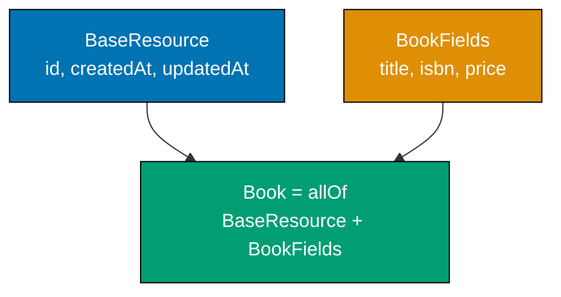
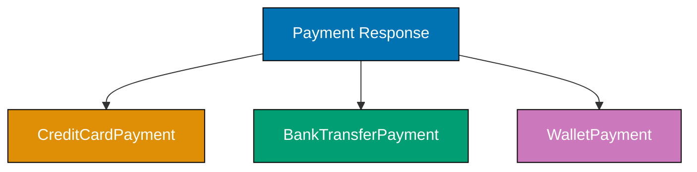
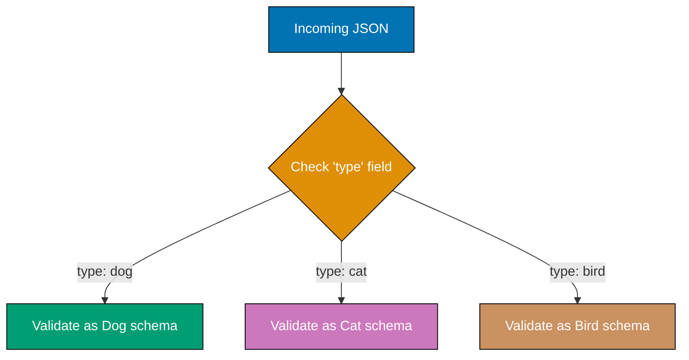
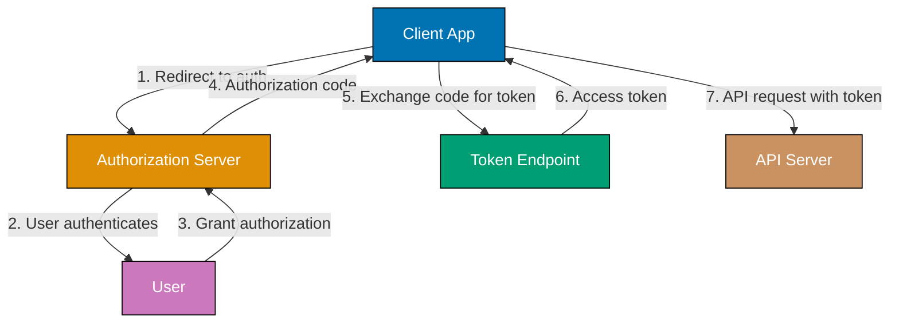

This tutorial covers intermediate OpenAPI techniques including schema composition (allOf, oneOf, anyOf), reusable components, security schemes, content negotiation, file uploads, webhooks, and production API patterns used in real-world API specifications.

## Schema Composition (Examples 29-36)

### Example 29: allOf for Schema Inheritance

`allOf` combines multiple schemas into one, requiring a valid instance to satisfy ALL listed schemas. Use it for inheritance and mixin patterns.



**Code**:

```yaml
components:
  schemas:
    BaseResource:
      # => Common fields shared by all resources
      type: object
      required:
        - id
        # => All resources have an ID
      properties:
        id:
          type: integer
          readOnly: true
          # => Server-assigned identifier
        createdAt:
          type: string
          format: date-time
          readOnly: true
          # => Timestamp of creation
        updatedAt:
          type: string
          format: date-time
          readOnly: true
          # => Timestamp of last update

    Book:
      allOf:
        # => Combines BaseResource + Book-specific properties
        # => Valid Book must satisfy BOTH schemas
        - $ref: "#/components/schemas/BaseResource"
          # => Includes id, createdAt, updatedAt
        - type: object
          # => Additional Book-specific properties
          required:
            - title
            # => title is required for Book
          properties:
            title:
              type: string
              # => Book title
            isbn:
              type: string
              # => ISBN identifier
            price:
              type: number
              format: double
              # => Book price
      # => Resulting Book schema has: id, createdAt, updatedAt, title, isbn, price
      # => Code generators produce a Book class extending BaseResource
```

**Key Takeaway**: `allOf` merges schemas, requiring instances to satisfy all listed schemas. Use it to add base resource fields (id, timestamps) to domain-specific schemas without duplication.

**Why It Matters**: API specifications without `allOf` duplicate common fields across every schema -- id, createdAt, updatedAt appear in Book, Author, Order, and every other resource. When you add a field to the base (like `etag`), you must update every schema. `allOf` creates a single source of truth for shared fields. Code generators produce class hierarchies, so changing BaseResource automatically propagates to all child types.

---

### Example 30: oneOf for Polymorphic Responses

`oneOf` specifies that a value must match EXACTLY ONE of the listed schemas. Use it for polymorphic endpoints that return different shapes based on conditions.



**Code**:

```yaml
components:
  schemas:
    CreditCardPayment:
      type: object
      # => Credit card payment details
      required:
        - type
        - cardLast4
        # => Required fields for credit card
      properties:
        type:
          type: string
          const: credit_card
          # => Discriminator value identifying this schema
        cardLast4:
          type: string
          pattern: "^\\d{4}$"
          # => Last 4 digits of card number
        expiryMonth:
          type: integer
          minimum: 1
          maximum: 12
          # => Card expiry month

    BankTransferPayment:
      type: object
      # => Bank transfer payment details
      required:
        - type
        - bankName
      properties:
        type:
          type: string
          const: bank_transfer
          # => Discriminator value
        bankName:
          type: string
          # => Name of the bank
        accountLast4:
          type: string
          # => Last 4 digits of account

    PaymentMethod:
      oneOf:
        # => Value matches EXACTLY ONE of these schemas
        # => Validators reject values matching zero or multiple
        - $ref: "#/components/schemas/CreditCardPayment"
          # => Credit card option
        - $ref: "#/components/schemas/BankTransferPayment"
          # => Bank transfer option
      # => Client sends one shape, server uses type field to determine which
```

**Key Takeaway**: `oneOf` enforces mutual exclusivity -- a value must match exactly one listed schema. Use `const` values on a shared property (like `type`) to help consumers and tools distinguish between variants.

**Why It Matters**: Payment methods, notification channels, and authentication strategies all have polymorphic shapes. Without `oneOf`, you must either use a single flexible schema (losing type safety) or duplicate endpoints for each variant (losing API simplicity). `oneOf` lets one endpoint handle multiple data shapes while maintaining strict typing. Code generators produce union types or sealed classes, enabling exhaustive pattern matching.

---

### Example 31: anyOf for Flexible Matching

`anyOf` allows a value to match ONE OR MORE of the listed schemas. Use it when values can satisfy multiple schemas simultaneously.

**Code**:

```yaml
components:
  schemas:
    PetOwner:
      type: object
      # => Person who owns a pet
      properties:
        name:
          type: string
          # => Owner name
        email:
          type: string
          format: email
          # => Contact email

    PetSitter:
      type: object
      # => Person who sits pets professionally
      properties:
        name:
          type: string
          # => Sitter name
        licenseNumber:
          type: string
          # => Professional license

    PetContact:
      anyOf:
        # => Value must match AT LEAST ONE of these schemas
        # => Unlike oneOf, matching multiple schemas is valid
        - $ref: "#/components/schemas/PetOwner"
          # => Contact could be an owner
        - $ref: "#/components/schemas/PetSitter"
          # => Contact could be a sitter
      # => A person who is both owner AND sitter matches both (valid with anyOf)
      # => Same data with oneOf would fail (matches two schemas)

    SearchResult:
      anyOf:
        # => Search can return different resource types
        - type: object
          properties:
            resultType:
              type: string
              const: book
              # => Book result
            title:
              type: string
              # => Book title
        - type: object
          properties:
            resultType:
              type: string
              const: author
              # => Author result
            name:
              type: string
              # => Author name
      # => Search results may match one or both schemas
      # => anyOf is more permissive than oneOf
```

**Key Takeaway**: `anyOf` requires matching at least one schema but allows matching multiple. Use it when types overlap or when a value legitimately satisfies multiple shapes. Prefer `oneOf` when schemas are mutually exclusive.

**Why It Matters**: `anyOf` models real-world data where categories overlap. A person can be both a pet owner and a pet sitter. Search results may match multiple type criteria. Using `oneOf` for overlapping types forces artificial exclusivity, causing valid data to fail validation. `anyOf` accurately represents the domain model, and code generators produce union types that preserve all possible shapes.

---

### Example 32: not for Schema Exclusion

`not` inverts a schema -- a value is valid if it does NOT match the specified schema. Use it to exclude specific patterns.

**Code**:

```yaml
components:
  schemas:
    NonEmptyString:
      # => String that cannot be empty
      type: string
      not:
        # => Value must NOT match this schema
        maxLength: 0
        # => Rejects empty strings (length 0)
      # => Equivalent to minLength: 1, but demonstrates not keyword

    NonAdminUser:
      type: object
      # => User that is explicitly not an admin
      properties:
        role:
          type: string
          not:
            # => Role cannot be admin
            enum:
              - admin
              - superadmin
            # => These values are excluded
          # => Any other role string is valid
          # => Useful for endpoints restricted from admin access
        username:
          type: string
          # => User identifier

    PositiveNonZero:
      type: integer
      # => Integer value
      not:
        # => Cannot match this sub-schema
        const: 0
        # => Excludes exactly zero
      minimum: 0
      # => Combined with not-zero, effectively means >= 1
      # => More explicit about intent than just minimum: 1
```

**Key Takeaway**: `not` rejects values matching the specified schema. Use it to exclude specific values or patterns that simple constraints cannot express. Combine with other keywords for precise validation.

**Why It Matters**: The `not` keyword handles exclusion patterns that positive constraints cannot express cleanly. While `minLength: 1` achieves the same result as `not: { maxLength: 0 }` for strings, `not` shines in complex scenarios like excluding specific enum values from a superset or preventing specific object shapes in polymorphic schemas. It completes the boolean logic set (allOf=AND, anyOf=OR, oneOf=XOR, not=NOT).

---

### Example 33: Discriminator for Polymorphic Deserialization

The `discriminator` object tells tools which property determines the schema variant. This optimizes deserialization and documentation.



**Code**:

```yaml
components:
  schemas:
    Pet:
      oneOf:
        - $ref: "#/components/schemas/Dog"
        - $ref: "#/components/schemas/Cat"
        - $ref: "#/components/schemas/Bird"
      discriminator:
        # => Tells tools which property identifies the variant
        propertyName: type
        # => Look at the "type" field to determine schema
        mapping:
          # => Maps discriminator values to schema references
          dog: "#/components/schemas/Dog"
          # => type: "dog" -> validate as Dog
          cat: "#/components/schemas/Cat"
          # => type: "cat" -> validate as Cat
          bird: "#/components/schemas/Bird"
          # => type: "bird" -> validate as Bird

    Dog:
      type: object
      required:
        - type
        - breed
        # => Dog-specific required fields
      properties:
        type:
          type: string
          # => Discriminator property
          const: dog
          # => Fixed value for this variant
        breed:
          type: string
          # => Dog breed name
        barkVolume:
          type: integer
          # => Dog-specific property
          minimum: 0
          maximum: 10

    Cat:
      type: object
      required:
        - type
        - indoor
      properties:
        type:
          type: string
          const: cat
          # => Fixed discriminator value
        indoor:
          type: boolean
          # => Whether the cat lives indoors
        clawsRetracted:
          type: boolean
          # => Cat-specific property

    Bird:
      type: object
      required:
        - type
        - canFly
      properties:
        type:
          type: string
          const: bird
          # => Fixed discriminator value
        canFly:
          type: boolean
          # => Whether the bird can fly
        wingspan:
          type: number
          # => Bird-specific measurement
```

**Key Takeaway**: Use `discriminator` with `oneOf` to specify the property that identifies which schema variant applies. The `mapping` field explicitly links discriminator values to schema references.

**Why It Matters**: Without `discriminator`, tools must try each `oneOf` schema until one matches -- expensive for validation and ambiguous for code generation. With `discriminator`, tools read one property value and immediately know which schema to use. Code generators produce efficient deserialization code (a single switch statement) instead of try-catch loops. Documentation tools render a clear table showing which values map to which types.

---

### Example 34: allOf with Additional Properties

Combine `allOf` with inline schemas to extend referenced schemas with additional fields specific to a context.

**Code**:

```yaml
components:
  schemas:
    Address:
      # => Reusable address schema
      type: object
      required:
        - street
        - city
        - country
      properties:
        street:
          type: string
          # => Street address line
        city:
          type: string
          # => City name
        country:
          type: string
          # => Country code or name
        postalCode:
          type: string
          # => Postal/ZIP code

    ShippingAddress:
      allOf:
        - $ref: "#/components/schemas/Address"
          # => Inherits all Address fields
        - type: object
          # => Adds shipping-specific fields
          required:
            - recipientName
            # => Shipping requires a recipient
          properties:
            recipientName:
              type: string
              # => Name of the person receiving the package
            deliveryInstructions:
              type: string
              # => Special delivery notes
              maxLength: 500
              # => Reasonable length limit
            isResidential:
              type: boolean
              # => Residential vs commercial address
              default: true
              # => Assume residential by default
      # => ShippingAddress = street + city + country + postalCode
      #    + recipientName + deliveryInstructions + isResidential

    BillingAddress:
      allOf:
        - $ref: "#/components/schemas/Address"
          # => Same base Address fields
        - type: object
          # => Adds billing-specific fields
          properties:
            companyName:
              type: string
              # => Optional company for business billing
            taxId:
              type: string
              # => Tax identification number
      # => BillingAddress = Address + companyName + taxId
```

**Key Takeaway**: Use `allOf` with a `$ref` and an inline object to extend a base schema with context-specific fields. This creates variants without modifying the original schema.

**Why It Matters**: Real APIs have addresses for shipping, billing, and headquarters -- all sharing street/city/country but differing in additional fields. `allOf` with inline extensions creates these variants from a single base Address schema. When you add a field to Address (like `state`), all variants inherit it automatically. Code generators produce `ShippingAddress extends Address` hierarchies with full type safety.

---

### Example 35: Nested oneOf for Complex Polymorphism

Complex APIs sometimes need polymorphism at multiple levels. Nest composition keywords to model deeply polymorphic data.

**Code**:

```yaml
components:
  schemas:
    Notification:
      type: object
      # => Notification with polymorphic channel and content
      required:
        - channel
        - content
      properties:
        channel:
          oneOf:
            # => Delivery channel varies
            - type: object
              required:
                - type
                - address
              properties:
                type:
                  type: string
                  const: email
                  # => Email channel
                address:
                  type: string
                  format: email
                  # => Recipient email address
            - type: object
              required:
                - type
                - phoneNumber
              properties:
                type:
                  type: string
                  const: sms
                  # => SMS channel
                phoneNumber:
                  type: string
                  pattern: "^\\+\\d{10,15}$"
                  # => International phone format
          discriminator:
            propertyName: type
            # => Discriminates on channel type
        content:
          oneOf:
            # => Content format also varies
            - type: object
              required:
                - format
                - text
              properties:
                format:
                  type: string
                  const: plain
                  # => Plain text content
                text:
                  type: string
                  # => Message body
            - type: object
              required:
                - format
                - html
              properties:
                format:
                  type: string
                  const: rich
                  # => Rich HTML content
                html:
                  type: string
                  # => HTML body
                subject:
                  type: string
                  # => Optional subject line
          discriminator:
            propertyName: format
            # => Discriminates on content format
```

**Key Takeaway**: Nest `oneOf` inside object properties to model polymorphism at multiple levels. Each polymorphic property can have its own `discriminator`.

**Why It Matters**: Real notification systems support multiple channels (email, SMS, push) with multiple content formats (plain text, HTML, template). Modeling this with flat schemas creates a combinatorial explosion of types. Nested `oneOf` keeps each dimension independent -- adding a new channel does not require changes to content schemas. Code generators produce independent union types for each polymorphic property.

---

### Example 36: Combining allOf and oneOf

Mix composition keywords to model schemas that share common fields but have polymorphic sections.

**Code**:

```yaml
components:
  schemas:
    EventBase:
      # => Common fields for all events
      type: object
      required:
        - eventId
        - timestamp
        - eventType
      properties:
        eventId:
          type: string
          format: uuid
          # => Unique event identifier
        timestamp:
          type: string
          format: date-time
          # => When the event occurred
        eventType:
          type: string
          # => Discriminator for event payload

    OrderEvent:
      allOf:
        # => Extends EventBase
        - $ref: "#/components/schemas/EventBase"
        - type: object
          properties:
            eventType:
              const: order
              # => Fixed for order events
            payload:
              oneOf:
                # => Order event payload varies
                - type: object
                  properties:
                    action:
                      type: string
                      const: created
                      # => Order created
                    orderId:
                      type: string
                      # => New order ID
                    total:
                      type: number
                      # => Order total
                - type: object
                  properties:
                    action:
                      type: string
                      const: cancelled
                      # => Order cancelled
                    orderId:
                      type: string
                      # => Cancelled order ID
                    reason:
                      type: string
                      # => Cancellation reason
              discriminator:
                propertyName: action
                # => Discriminates order actions
      # => OrderEvent = EventBase fields + polymorphic order payload
```

**Key Takeaway**: Combine `allOf` (for shared fields) with `oneOf` (for polymorphic sections) to model event systems where all events share metadata but have different payloads.

**Why It Matters**: Event-driven architectures need both shared envelope fields (eventId, timestamp) and variant payloads (order created vs. order cancelled). Using `allOf` + `oneOf` together models this precisely. Code generators produce a base event class with typed payload variants, enabling exhaustive event handling. Without this combination, you must either duplicate base fields or lose payload type safety.

---

## Reusable Components (Examples 37-42)

### Example 37: Reusable Parameters

Define parameters in `components/parameters` and reference them across multiple operations. This ensures consistency for shared parameters like pagination.

**Code**:

```yaml
components:
  parameters:
    PageParam:
      # => Reusable pagination parameter
      name: page
      in: query
      required: false
      description: Page number (1-based)
      # => Consistent description across all paginated endpoints
      schema:
        type: integer
        minimum: 1
        default: 1
        # => Default to first page
    LimitParam:
      # => Reusable page size parameter
      name: limit
      in: query
      required: false
      description: Number of items per page
      schema:
        type: integer
        minimum: 1
        maximum: 100
        default: 20
        # => Sensible default page size
    SortParam:
      # => Reusable sort parameter
      name: sort
      in: query
      required: false
      description: "Sort field and direction (e.g., title:asc)"
      # => Documents the format
      schema:
        type: string
        pattern: "^[a-zA-Z_]+:(asc|desc)$"
        # => Validates sort format
        example: "title:asc"

paths:
  /books:
    get:
      summary: List books
      operationId: listBooks
      parameters:
        - $ref: "#/components/parameters/PageParam"
          # => Reuses pagination parameter
        - $ref: "#/components/parameters/LimitParam"
          # => Reuses page size parameter
        - $ref: "#/components/parameters/SortParam"
          # => Reuses sort parameter
      responses:
        "200":
          description: Paginated book list
  /authors:
    get:
      summary: List authors
      operationId: listAuthors
      parameters:
        - $ref: "#/components/parameters/PageParam"
          # => Same pagination as /books
        - $ref: "#/components/parameters/LimitParam"
          # => Same page size as /books
      responses:
        "200":
          description: Paginated author list
```

**Key Takeaway**: Define shared parameters in `components/parameters` and reference them with `$ref`. This ensures pagination, sorting, and filtering behave identically across all endpoints.

**Why It Matters**: APIs with inconsistent pagination (page vs. offset, limit vs. pageSize, 0-based vs. 1-based) frustrate consumers. Reusable parameters enforce consistency -- every paginated endpoint uses the same parameter names, types, and defaults. When you change the maximum page size from 100 to 50, one update propagates everywhere. Code generators produce shared parameter types, reducing client-side boilerplate.

---

### Example 38: Reusable Request Bodies

Define common request body shapes in `components/requestBodies` for operations that share identical payloads.

**Code**:

```yaml
components:
  requestBodies:
    BookInput:
      # => Reusable request body for book creation and full update
      description: Book data for creation or replacement
      # => Shared description
      required: true
      # => Body is mandatory
      content:
        application/json:
          schema:
            $ref: "#/components/schemas/BookInput"
            # => References the input schema
          example:
            title: "Clean Architecture"
            isbn: "978-0134494166"
            price: 34.99
            # => Complete example for documentation

  schemas:
    BookInput:
      type: object
      required:
        - title
        - isbn
      properties:
        title:
          type: string
          # => Book title
          minLength: 1
        isbn:
          type: string
          # => ISBN identifier
        price:
          type: number
          format: double
          # => Book price
          minimum: 0

paths:
  /books:
    post:
      summary: Create a book
      operationId: createBook
      requestBody:
        $ref: "#/components/requestBodies/BookInput"
        # => Reuses the BookInput request body
      responses:
        "201":
          description: Book created
  /books/{bookId}:
    put:
      summary: Replace a book
      operationId: replaceBook
      parameters:
        - name: bookId
          in: path
          required: true
          schema:
            type: integer
      requestBody:
        $ref: "#/components/requestBodies/BookInput"
        # => Same request body for PUT (full replacement)
      responses:
        "200":
          description: Book replaced
```

**Key Takeaway**: Use `components/requestBodies` when multiple operations accept identical payloads. Reference them with `$ref` to keep operations consistent.

**Why It Matters**: POST (create) and PUT (replace) operations often accept identical request bodies. Defining the body once in `components/requestBodies` ensures both operations validate against the same schema. When you add a new required field, both endpoints update simultaneously. This prevents the subtle bug where POST accepts new fields but PUT does not, causing consumer confusion.

---

### Example 39: Reusable Responses

Define common response shapes in `components/responses` for status codes shared across operations, like error responses.

**Code**:

```yaml
components:
  responses:
    NotFound:
      # => Standard 404 response used across all endpoints
      description: The requested resource was not found
      content:
        application/json:
          schema:
            $ref: "#/components/schemas/ErrorResponse"
          example:
            error: "NOT_FOUND"
            message: "Resource not found"
            statusCode: 404

    BadRequest:
      # => Standard 400 response for validation errors
      description: The request contains invalid data
      content:
        application/json:
          schema:
            $ref: "#/components/schemas/ValidationErrorResponse"
          example:
            error: "VALIDATION_ERROR"
            message: "Request validation failed"
            details:
              - field: "title"
                message: "Title is required"

    Unauthorized:
      # => Standard 401 response for missing/invalid auth
      description: Authentication required or token invalid
      content:
        application/json:
          schema:
            $ref: "#/components/schemas/ErrorResponse"
          example:
            error: "UNAUTHORIZED"
            message: "Invalid or missing authentication token"
            statusCode: 401

  schemas:
    ErrorResponse:
      type: object
      required:
        - error
        - message
      properties:
        error:
          type: string
          # => Machine-readable error code
        message:
          type: string
          # => Human-readable description
        statusCode:
          type: integer
          # => HTTP status for convenience

    ValidationErrorResponse:
      allOf:
        - $ref: "#/components/schemas/ErrorResponse"
        - type: object
          properties:
            details:
              type: array
              items:
                type: object
                properties:
                  field:
                    type: string
                    # => Field that failed validation
                  message:
                    type: string
                    # => Why it failed

paths:
  /books/{bookId}:
    get:
      summary: Get a book
      operationId: getBook
      parameters:
        - name: bookId
          in: path
          required: true
          schema:
            type: integer
      responses:
        "200":
          description: Book details
          content:
            application/json:
              schema:
                $ref: "#/components/schemas/Book"
        "401":
          $ref: "#/components/responses/Unauthorized"
          # => Reuses standard 401 response
        "404":
          $ref: "#/components/responses/NotFound"
          # => Reuses standard 404 response
```

**Key Takeaway**: Define standard error responses in `components/responses` and reference them in every operation. This ensures consistent error shapes across your entire API.

**Why It Matters**: Inconsistent error responses are the top API consumer complaint. When `/books` returns `{ "error": "not_found" }` but `/authors` returns `{ "code": 404, "msg": "Not Found" }`, clients need endpoint-specific error handlers. Reusable responses guarantee identical error shapes everywhere. Code generators produce a single error type, and clients implement one error handler that works across all endpoints.

---

### Example 40: Reusable Headers

Define response headers in `components/headers` for headers returned by multiple operations.

**Code**:

```yaml
components:
  headers:
    X-Rate-Limit:
      # => Rate limit information header
      description: Maximum requests allowed per window
      schema:
        type: integer
        example: 1000
        # => 1000 requests per window
    X-Rate-Limit-Remaining:
      # => Remaining requests in current window
      description: Requests remaining in current rate limit window
      schema:
        type: integer
        example: 995
    X-Rate-Limit-Reset:
      # => When the rate limit window resets
      description: UTC epoch seconds when the rate limit resets
      schema:
        type: integer
        example: 1704067200
        # => Unix timestamp
    X-Request-ID:
      # => Request tracing identifier
      description: Unique identifier for this request (for support reference)
      schema:
        type: string
        format: uuid
        example: "550e8400-e29b-41d4-a716-446655440000"

paths:
  /books:
    get:
      summary: List books
      operationId: listBooks
      responses:
        "200":
          description: Book list
          headers:
            X-Rate-Limit:
              $ref: "#/components/headers/X-Rate-Limit"
              # => Reuses rate limit header
            X-Rate-Limit-Remaining:
              $ref: "#/components/headers/X-Rate-Limit-Remaining"
              # => Reuses remaining header
            X-Rate-Limit-Reset:
              $ref: "#/components/headers/X-Rate-Limit-Reset"
              # => Reuses reset header
            X-Request-ID:
              $ref: "#/components/headers/X-Request-ID"
              # => Reuses request ID header
          content:
            application/json:
              schema:
                type: array
                items:
                  type: object
                  # => Book objects
```

**Key Takeaway**: Define shared response headers in `components/headers` for rate limiting, tracing, and other cross-cutting metadata. Reference them in every response that includes these headers.

**Why It Matters**: Rate limit headers appear on every response in a rate-limited API. Defining them once in `components/headers` ensures consistent naming and documentation. API gateways (Kong, AWS API Gateway) can auto-populate these headers, and the spec documents their presence. Generated client SDKs expose typed header accessors, so consumers implement automatic retry with backoff using `X-Rate-Limit-Reset`.

---

### Example 41: Reusable Examples

The `components/examples` section stores reusable example values for schemas, parameters, and request/response bodies.

**Code**:

```yaml
components:
  examples:
    BookFiction:
      # => Example of a fiction book
      summary: Fiction book example
      # => Short label for documentation dropdowns
      description: A classic fiction novel
      # => Longer description
      value:
        # => The actual example data
        id: 1
        title: "The Great Gatsby"
        isbn: "978-0743273565"
        price: 12.99
        genre: "fiction"
    BookNonfiction:
      # => Example of a nonfiction book
      summary: Nonfiction book example
      value:
        id: 2
        title: "Sapiens"
        isbn: "978-0062316097"
        price: 18.99
        genre: "nonfiction"
    BookMinimal:
      # => Minimal valid book (required fields only)
      summary: Minimal book (required fields only)
      value:
        title: "Untitled"
        isbn: "978-0000000000"

paths:
  /books:
    get:
      summary: List books
      operationId: listBooks
      responses:
        "200":
          description: Book list
          content:
            application/json:
              examples:
                # => Multiple named examples for the response
                fiction:
                  $ref: "#/components/examples/BookFiction"
                  # => Reuses fiction book example
                nonfiction:
                  $ref: "#/components/examples/BookNonfiction"
                  # => Reuses nonfiction book example
    post:
      summary: Create a book
      operationId: createBook
      requestBody:
        content:
          application/json:
            examples:
              full:
                $ref: "#/components/examples/BookFiction"
                # => Full example for creation
              minimal:
                $ref: "#/components/examples/BookMinimal"
                # => Minimal valid example
      responses:
        "201":
          description: Book created
```

**Key Takeaway**: Store examples in `components/examples` and reference them in request/response `examples` maps. Multiple named examples give documentation users a dropdown to switch between scenarios.

**Why It Matters**: Good examples are the most impactful documentation feature -- developers copy-paste examples before reading schemas. Reusable examples ensure the same data appears consistently in GET responses and POST requests. Swagger UI renders named examples as a dropdown, letting consumers see different scenarios (fiction book, nonfiction book, minimal book) without scrolling. Mock servers use these examples to generate realistic test data.

---

### Example 42: Links Between Operations

The `links` object describes relationships between operations, showing how response values feed into subsequent requests.


**Code**:

```yaml
paths:
  /books:
    post:
      summary: Create a book
      operationId: createBook
      requestBody:
        required: true
        content:
          application/json:
            schema:
              type: object
              properties:
                title:
                  type: string
                authorId:
                  type: integer
      responses:
        "201":
          description: Book created
          content:
            application/json:
              schema:
                type: object
                properties:
                  id:
                    type: integer
                    # => Newly created book ID
                  authorId:
                    type: integer
                    # => Author of the book
          links:
            # => Describes related operations
            GetBookById:
              # => Link name (documentation label)
              operationId: getBook
              # => Target operation
              parameters:
                bookId: "$response.body#/id"
                # => Uses the id from the POST response body
                # => Runtime expression: $response.body#/id
              description: Retrieve the newly created book
              # => Explains the link purpose
            GetAuthor:
              operationId: getAuthor
              parameters:
                authorId: "$response.body#/authorId"
                # => Uses authorId from the POST response
              description: Retrieve the book's author

  /books/{bookId}:
    get:
      summary: Get book by ID
      operationId: getBook
      parameters:
        - name: bookId
          in: path
          required: true
          schema:
            type: integer
      responses:
        "200":
          description: Book details

  /authors/{authorId}:
    get:
      summary: Get author by ID
      operationId: getAuthor
      parameters:
        - name: authorId
          in: path
          required: true
          schema:
            type: integer
      responses:
        "200":
          description: Author details
```

**Key Takeaway**: Use `links` to document how response values feed into other operations. Runtime expressions like `$response.body#/id` reference specific response fields.

**Why It Matters**: Links make APIs discoverable -- after creating a book, the consumer sees exactly how to retrieve it. Documentation tools render links as clickable navigation between operations. This is the OpenAPI approach to HATEOAS (Hypermedia as the Engine of Application State) without requiring hypermedia in response bodies. Advanced tooling can auto-generate workflow sequences from link chains.

---

## Security Schemes (Examples 43-47)

### Example 43: API Key Authentication

API key authentication sends a secret token in a header, query parameter, or cookie. It is the simplest security scheme.


**Code**:

```yaml
openapi: "3.1.0"
info:
  title: Bookstore API
  version: "1.0.0"

components:
  securitySchemes:
    # => Security scheme definitions
    ApiKeyHeader:
      type: apiKey
      # => API key authentication type
      name: X-API-Key
      # => Header name carrying the key
      in: header
      # => Key sent as HTTP header
      description: API key sent in X-API-Key header
      # => Documentation for consumers
    ApiKeyQuery:
      type: apiKey
      name: api_key
      # => Query parameter name
      in: query
      # => Key sent as URL query parameter
      # => Less secure (key visible in URLs, logs)
      description: API key sent as query parameter
    ApiKeyCookie:
      type: apiKey
      name: session
      # => Cookie name
      in: cookie
      # => Key sent as HTTP cookie
      description: API key stored in session cookie

security:
  # => Global security requirement (applies to all operations)
  - ApiKeyHeader: []
    # => All operations require X-API-Key header by default
    # => Empty array means no specific scopes

paths:
  /books:
    get:
      summary: List books (requires API key)
      operationId: listBooks
      # => Inherits global ApiKeyHeader security
      responses:
        "200":
          description: Book list
        "401":
          description: Missing or invalid API key
  /health:
    get:
      summary: Health check (no auth required)
      operationId: healthCheck
      security: []
      # => Empty array overrides global security
      # => This endpoint requires NO authentication
      responses:
        "200":
          description: Service is healthy
```

**Key Takeaway**: Define API key schemes in `components/securitySchemes` with `type: apiKey` and specify location (`header`, `query`, `cookie`). Apply globally with top-level `security` or per-operation. Use `security: []` to opt out of global security.

**Why It Matters**: API key authentication is used by most third-party APIs (Stripe, SendGrid, GitHub). Documenting the key location and name in the spec lets Swagger UI add an "Authorize" button where consumers enter their key once and all requests include it automatically. Code generators create client constructors that require the API key, preventing unauthenticated requests at compile time.

---

### Example 44: HTTP Bearer Token Authentication

HTTP authentication with Bearer tokens is the standard for JWT-based APIs. The token is sent in the `Authorization` header.

**Code**:

```yaml
components:
  securitySchemes:
    BearerAuth:
      type: http
      # => HTTP authentication scheme
      scheme: bearer
      # => Bearer token scheme (Authorization: Bearer <token>)
      bearerFormat: JWT
      # => Token format hint (documentation only, not validated)
      # => Common values: JWT, OAuth, opaque
      description: |
        JWT token obtained from /auth/login endpoint.
        Include as: Authorization: Bearer <token>
      # => Usage instructions for consumers

    BasicAuth:
      type: http
      scheme: basic
      # => HTTP Basic authentication (username:password base64)
      # => Less common in modern APIs but still used
      description: Base64 encoded username:password

security:
  - BearerAuth: []
    # => Global Bearer token requirement

paths:
  /auth/login:
    post:
      summary: Authenticate and receive JWT token
      operationId: login
      security: []
      # => Login endpoint has no auth requirement
      requestBody:
        required: true
        content:
          application/json:
            schema:
              type: object
              required:
                - email
                - password
              properties:
                email:
                  type: string
                  format: email
                  # => User email
                password:
                  type: string
                  format: password
                  # => format: password hides value in docs
      responses:
        "200":
          description: Authentication successful
          content:
            application/json:
              schema:
                type: object
                properties:
                  token:
                    type: string
                    # => JWT token to use in subsequent requests
                  expiresIn:
                    type: integer
                    # => Token lifetime in seconds
        "401":
          description: Invalid credentials

  /books:
    get:
      summary: List books (requires Bearer token)
      operationId: listBooks
      # => Inherits global BearerAuth
      responses:
        "200":
          description: Book list
        "401":
          description: Missing or invalid Bearer token
```

**Key Takeaway**: Use `type: http` with `scheme: bearer` for JWT-based authentication. The `bearerFormat` field is a documentation hint. Exempt login endpoints with `security: []`.

**Why It Matters**: JWT Bearer tokens are the dominant authentication pattern for modern APIs. Documenting the scheme in OpenAPI lets Swagger UI display a token input dialog and automatically add the `Authorization: Bearer` header to all requests. Generated client SDKs include token management in their constructor, and `format: password` ensures documentation tools mask password fields in request body forms.

---

### Example 45: OAuth2 Security Flows

OAuth2 supports multiple flows for different client types. OpenAPI documents all flows and their scopes.



**Code**:

```yaml
components:
  securitySchemes:
    OAuth2:
      type: oauth2
      # => OAuth 2.0 authentication
      description: OAuth2 authorization for the Bookstore API
      flows:
        # => OAuth2 supports multiple grant types (flows)
        authorizationCode:
          # => Authorization Code flow (most secure, for server-side apps)
          authorizationUrl: "https://auth.example.com/authorize"
          # => URL where users authenticate
          tokenUrl: "https://auth.example.com/token"
          # => URL to exchange code for token
          refreshUrl: "https://auth.example.com/refresh"
          # => URL to refresh expired tokens (optional)
          scopes:
            # => Available permission scopes
            read:books: Read access to books
            # => Scope name: description
            write:books: Create, update, and delete books
            # => Write scope
            read:orders: Read access to orders
            # => Order read scope
            admin: Full administrative access
            # => Admin scope
        clientCredentials:
          # => Client Credentials flow (for machine-to-machine)
          tokenUrl: "https://auth.example.com/token"
          # => Only needs token URL (no user interaction)
          scopes:
            read:books: Read access to books
            write:books: Write access to books

paths:
  /books:
    get:
      summary: List books
      operationId: listBooks
      security:
        - OAuth2:
            - read:books
            # => Requires read:books scope
      responses:
        "200":
          description: Book list
    post:
      summary: Create a book
      operationId: createBook
      security:
        - OAuth2:
            - write:books
            # => Requires write:books scope
      requestBody:
        required: true
        content:
          application/json:
            schema:
              type: object
              properties:
                title:
                  type: string
      responses:
        "201":
          description: Book created
        "403":
          description: Insufficient scope
          # => Token valid but lacks required scope
```

**Key Takeaway**: OAuth2 schemes define flows (authorizationCode, clientCredentials, implicit, password) with their URLs and scopes. Operations reference specific scopes they require.

**Why It Matters**: OAuth2 is the industry standard for delegated authorization. Documenting flows and scopes in the spec lets Swagger UI initiate the full OAuth flow -- users click "Authorize," authenticate, grant scopes, and receive tokens without leaving the documentation page. Code generators produce scope-aware client code that requests only necessary permissions. The scopes list serves as your API's permission model documentation.

---

### Example 46: OpenID Connect Discovery

OpenID Connect extends OAuth2 with identity verification. The spec references a discovery URL that provides all configuration.

**Code**:

```yaml
components:
  securitySchemes:
    OpenIDConnect:
      type: openIdConnect
      # => OpenID Connect authentication type
      openIdConnectUrl: "https://auth.example.com/.well-known/openid-configuration"
      # => Discovery document URL
      # => Tools fetch this URL to discover:
      # =>   - Authorization endpoint
      # =>   - Token endpoint
      # =>   - Supported scopes
      # =>   - Supported grant types
      # =>   - JWKS (public key) endpoint
      description: |
        OpenID Connect authentication via example.com identity provider.
        Supports standard OIDC scopes: openid, profile, email.
      # => Human-readable description

security:
  - OpenIDConnect:
      - openid
      # => Standard OIDC scope (required for OIDC)
      - profile
      # => Access to user profile information
      - email
      # => Access to user email

paths:
  /me:
    get:
      summary: Get authenticated user profile
      operationId: getCurrentUser
      # => Inherits global OpenIDConnect security
      responses:
        "200":
          description: User profile from OIDC claims
          content:
            application/json:
              schema:
                type: object
                properties:
                  sub:
                    type: string
                    # => OIDC subject identifier (unique user ID)
                  name:
                    type: string
                    # => User's display name (from profile scope)
                  email:
                    type: string
                    format: email
                    # => User's email (from email scope)
```

**Key Takeaway**: OpenID Connect uses a single `openIdConnectUrl` pointing to the discovery document. Tools fetch this URL to auto-configure authentication endpoints and supported scopes.

**Why It Matters**: OpenID Connect is used by enterprise identity providers (Okta, Auth0, Azure AD, Keycloak). The discovery URL contains everything tools need to implement authentication -- no manual endpoint configuration. Swagger UI can initiate OIDC flows automatically after fetching the discovery document. This is the most future-proof security scheme because changing your identity provider only requires updating one URL.

---

### Example 47: Multiple Security Schemes (AND/OR)

Security requirements support AND (all required) and OR (any one sufficient) logic for operations requiring multiple authentication methods.

**Code**:

```yaml
components:
  securitySchemes:
    BearerAuth:
      type: http
      scheme: bearer
      bearerFormat: JWT
      # => JWT token authentication
    ApiKey:
      type: apiKey
      name: X-API-Key
      in: header
      # => API key authentication

security:
  # => Global security: OR logic (satisfy any ONE item)
  - BearerAuth: []
    # => Option 1: Bearer token alone
  - ApiKey: []
    # => Option 2: API key alone

paths:
  /admin/config:
    get:
      summary: Get admin configuration
      operationId: getAdminConfig
      security:
        # => Operation-level override: AND logic
        - BearerAuth: []
          ApiKey: []
          # => Requires BOTH Bearer token AND API key
          # => Multiple schemes in one array item = AND
          # => Separate array items = OR
      responses:
        "200":
          description: Admin configuration
        "401":
          description: Missing authentication
        "403":
          description: Insufficient permissions

  /books:
    get:
      summary: List books
      operationId: listBooks
      # => Inherits global OR security
      # => Either Bearer token OR API key is sufficient
      responses:
        "200":
          description: Book list

  /public/catalog:
    get:
      summary: Public catalog (no auth)
      operationId: getPublicCatalog
      security: []
      # => Explicitly no security required
      responses:
        "200":
          description: Public catalog
```

**Key Takeaway**: Array items in `security` represent OR (any one is sufficient). Multiple schemes within one array item represent AND (all required). Use `security: []` for public endpoints.

**Why It Matters**: Real APIs often support multiple authentication methods -- API keys for server-to-server calls and Bearer tokens for user-facing apps. The OR pattern lets consumers choose their preferred method. The AND pattern (both API key and Bearer token) implements defense in depth for critical admin endpoints. Understanding this security logic prevents misconfiguration that either blocks legitimate users or allows unauthorized access.

---

## Content Patterns (Examples 48-52)

### Example 48: File Upload with Multipart Form

File uploads use `multipart/form-data` content type with binary file fields and optional metadata.

**Code**:

```yaml
paths:
  /books/{bookId}/cover:
    post:
      summary: Upload book cover image
      operationId: uploadBookCover
      # => File upload operation
      parameters:
        - name: bookId
          in: path
          required: true
          schema:
            type: integer
      requestBody:
        required: true
        content:
          multipart/form-data:
            # => Multipart form for file + metadata
            schema:
              type: object
              required:
                - file
                # => File field is required
              properties:
                file:
                  type: string
                  format: binary
                  # => Binary file content
                  # => format: binary indicates raw file bytes
                  # => Swagger UI renders a file picker input
                description:
                  type: string
                  # => Optional text metadata alongside the file
                  maxLength: 200
                  # => Limit description length
                isPrimary:
                  type: boolean
                  # => Whether this is the primary cover image
                  default: false
                  # => Default to non-primary
            encoding:
              # => Encoding settings for multipart fields
              file:
                contentType: image/png, image/jpeg, image/webp
                # => Allowed file MIME types
                # => Restricts uploads to image formats
```

**Key Takeaway**: Use `multipart/form-data` for file uploads with `format: binary` on file fields. The `encoding` object specifies allowed content types for individual parts.

**Why It Matters**: File uploads are one of the most common API operations yet the most poorly documented. Specifying `format: binary` triggers Swagger UI to render a file picker instead of a text input. The `encoding.contentType` restriction prevents clients from uploading executables as "images." Code generators produce strongly typed upload methods with proper multipart handling instead of raw HTTP request builders.

---

### Example 49: Content Negotiation

Content negotiation lets clients request specific response formats using the `Accept` header. The API returns different representations of the same resource.

**Code**:

```yaml
paths:
  /books/{bookId}:
    get:
      summary: Get book in requested format
      operationId: getBook
      # => Supports multiple response formats
      parameters:
        - name: bookId
          in: path
          required: true
          schema:
            type: integer
      responses:
        "200":
          description: Book details in requested format
          content:
            application/json:
              # => JSON format (Accept: application/json)
              schema:
                type: object
                properties:
                  id:
                    type: integer
                  title:
                    type: string
                  price:
                    type: number
              # => Standard JSON representation
            application/xml:
              # => XML format (Accept: application/xml)
              schema:
                type: object
                properties:
                  id:
                    type: integer
                  title:
                    type: string
                  price:
                    type: number
              # => Same data structure, XML serialization
            text/csv:
              # => CSV format (Accept: text/csv)
              schema:
                type: string
                # => CSV is returned as plain text
              example: "id,title,price\n42,The Great Gatsby,12.99"
              # => Example CSV output
            application/pdf:
              # => PDF format (Accept: application/pdf)
              schema:
                type: string
                format: binary
                # => Binary PDF file
              # => Returns a formatted book report
        "406":
          description: Requested format not supported
          # => Accept header contains unsupported media type
```

**Key Takeaway**: List all supported media types under the response `content` object. The server reads the `Accept` header to choose the format. Return 406 when the requested format is not supported.

**Why It Matters**: Content negotiation lets one endpoint serve web browsers (HTML/JSON), data pipelines (CSV), and report generators (PDF) without separate endpoints. Documenting all supported formats in the spec lets consumers discover available representations. Code generators produce format-specific deserialization -- `getBook()` returns a typed object for JSON and raw bytes for PDF, with format selection as a method parameter.

---

### Example 50: Pagination Response Pattern

Pagination is a cross-cutting pattern for collection endpoints. Define a consistent pagination envelope for all list operations.

**Code**:

```yaml
components:
  schemas:
    PaginationMeta:
      # => Reusable pagination metadata
      type: object
      required:
        - page
        - limit
        - totalItems
        - totalPages
      properties:
        page:
          type: integer
          # => Current page number (1-based)
          example: 2
        limit:
          type: integer
          # => Items per page
          example: 20
        totalItems:
          type: integer
          # => Total matching items across all pages
          example: 142
        totalPages:
          type: integer
          # => Total number of pages
          example: 8
        hasNextPage:
          type: boolean
          # => Whether more pages exist
          example: true
        hasPreviousPage:
          type: boolean
          # => Whether previous pages exist
          example: true

    BookListResponse:
      type: object
      # => Paginated book list envelope
      required:
        - data
        - pagination
      properties:
        data:
          type: array
          # => Array of book objects
          items:
            $ref: "#/components/schemas/Book"
            # => References Book schema
        pagination:
          $ref: "#/components/schemas/PaginationMeta"
          # => Reusable pagination info
        links:
          type: object
          # => HATEOAS-style navigation links
          properties:
            self:
              type: string
              format: uri
              # => Current page URL
              example: "/books?page=2&limit=20"
            next:
              type: string
              format: uri
              # => Next page URL (null if last page)
              example: "/books?page=3&limit=20"
            previous:
              type: string
              format: uri
              # => Previous page URL (null if first page)
              example: "/books?page=1&limit=20"
            first:
              type: string
              format: uri
              # => First page URL
              example: "/books?page=1&limit=20"
            last:
              type: string
              format: uri
              # => Last page URL
              example: "/books?page=8&limit=20"

paths:
  /books:
    get:
      summary: List books (paginated)
      operationId: listBooks
      parameters:
        - $ref: "#/components/parameters/PageParam"
        - $ref: "#/components/parameters/LimitParam"
      responses:
        "200":
          description: Paginated book list
          content:
            application/json:
              schema:
                $ref: "#/components/schemas/BookListResponse"
```

**Key Takeaway**: Define a reusable `PaginationMeta` schema and wrap collection responses in a pagination envelope with `data`, `pagination`, and optional `links` fields.

**Why It Matters**: Every collection endpoint needs pagination, and inconsistent pagination formats frustrate consumers. A standardized pagination envelope with navigation links enables generic pagination components in client applications. Code generators produce paginated response types with built-in navigation methods, so consuming paginated APIs becomes `while (response.hasNextPage) { response = await response.nextPage(); }`.

---

### Example 51: Error Response Pattern

Define a consistent error response format used across all error status codes. This pattern enables unified error handling on the client side.

**Code**:

```yaml
components:
  schemas:
    ErrorResponse:
      # => Standard error envelope for all error responses
      type: object
      required:
        - status
        - error
        - message
      properties:
        status:
          type: integer
          # => HTTP status code repeated in body
          # => Convenient when status is lost in middleware
          example: 422
        error:
          type: string
          # => Machine-readable error code
          # => Use for programmatic error handling
          example: "VALIDATION_ERROR"
        message:
          type: string
          # => Human-readable error description
          # => Safe to display to end users
          example: "The request data failed validation"
        details:
          type: array
          # => Optional array of specific error details
          items:
            type: object
            properties:
              field:
                type: string
                # => Which field caused the error
                example: "email"
              code:
                type: string
                # => Field-level error code
                example: "INVALID_FORMAT"
              message:
                type: string
                # => Field-level error description
                example: "Must be a valid email address"
        traceId:
          type: string
          # => Correlation ID for support debugging
          # => Client includes this when filing support tickets
          example: "abc-123-def-456"
        timestamp:
          type: string
          format: date-time
          # => When the error occurred
          example: "2024-06-15T10:30:00Z"

paths:
  /books:
    post:
      summary: Create a book
      operationId: createBook
      requestBody:
        required: true
        content:
          application/json:
            schema:
              type: object
              required:
                - title
              properties:
                title:
                  type: string
                price:
                  type: number
      responses:
        "201":
          description: Book created
        "400":
          description: Invalid request format
          content:
            application/json:
              schema:
                $ref: "#/components/schemas/ErrorResponse"
        "422":
          description: Validation errors
          content:
            application/json:
              schema:
                $ref: "#/components/schemas/ErrorResponse"
              example:
                status: 422
                error: "VALIDATION_ERROR"
                message: "Request validation failed"
                details:
                  - field: "title"
                    code: "REQUIRED"
                    message: "Title is required"
                  - field: "price"
                    code: "INVALID_RANGE"
                    message: "Price must be greater than 0"
                traceId: "req-abc-123"
                timestamp: "2024-06-15T10:30:00Z"
```

**Key Takeaway**: Use a single `ErrorResponse` schema for all error responses with a `details` array for field-level errors. Include `traceId` for debugging and `error` codes for programmatic handling.

**Why It Matters**: Consistent error responses are the hallmark of a professional API. When every error returns the same shape, clients implement one error handler that works everywhere. The `details` array enables form-level validation display -- clients map field errors to input fields in the UI. The `traceId` bridges the gap between client-side error display and server-side debugging, dramatically reducing support resolution time.

---

### Example 52: Callbacks for Asynchronous Operations

Callbacks define webhooks that the API server sends to a client-provided URL. They document the asynchronous notification contract.


**Code**:

```yaml
paths:
  /orders:
    post:
      summary: Place an order (async processing)
      operationId: createOrder
      # => Order is processed asynchronously
      requestBody:
        required: true
        content:
          application/json:
            schema:
              type: object
              required:
                - items
                - callbackUrl
              properties:
                items:
                  type: array
                  items:
                    type: object
                    properties:
                      bookId:
                        type: integer
                      quantity:
                        type: integer
                callbackUrl:
                  type: string
                  format: uri
                  # => Client provides URL for status notifications
                  # => Server POSTs updates to this URL
      callbacks:
        # => Defines the callback (webhook) contract
        orderStatusUpdate:
          # => Callback name (documentation label)
          "{$request.body#/callbackUrl}":
            # => Runtime expression resolving to the callbackUrl
            # => The URL comes from the request body
            post:
              # => Server POSTs to the callback URL
              summary: Order status notification
              # => What the callback delivers
              requestBody:
                required: true
                content:
                  application/json:
                    schema:
                      type: object
                      properties:
                        orderId:
                          type: string
                          # => Which order changed
                        status:
                          type: string
                          enum:
                            - processing
                            - shipped
                            - delivered
                            - cancelled
                          # => New order status
                        updatedAt:
                          type: string
                          format: date-time
                          # => When status changed
              responses:
                "200":
                  description: Callback received successfully
                  # => Expected response from the client's server
      responses:
        "202":
          description: Order accepted for processing
          # => 202 Accepted (not 201 Created) for async
          content:
            application/json:
              schema:
                type: object
                properties:
                  orderId:
                    type: string
                    # => Tracking identifier
                  status:
                    type: string
                    const: processing
                    # => Initial status
```

**Key Takeaway**: Use `callbacks` to document webhooks that the server sends to client-provided URLs. Runtime expressions like `{$request.body#/callbackUrl}` reference values from the triggering request.

**Why It Matters**: Asynchronous APIs are increasingly common for long-running operations (order processing, report generation, data imports). Without callback documentation, consumers must reverse-engineer the webhook payload from server logs. The OpenAPI callback specification serves as the contract for what the consumer's webhook endpoint should expect, enabling code generation for both the API client and the webhook handler.

---

## Webhooks and Advanced Patterns (Examples 53-55)

### Example 53: Webhooks (OpenAPI 3.1)

OpenAPI 3.1 introduces a top-level `webhooks` field for server-initiated events that are not tied to a specific API operation.

**Code**:

```yaml
openapi: "3.1.0"
# => 3.1 required for top-level webhooks
info:
  title: Bookstore API
  version: "1.0.0"

webhooks:
  # => Top-level webhook definitions (3.1 feature)
  # => Unlike callbacks, these are not tied to a request
  bookPublished:
    # => Webhook event name
    post:
      # => Server POSTs to subscriber's registered URL
      summary: New book published notification
      # => Describes what triggers this webhook
      operationId: onBookPublished
      # => Unique identifier for code generation
      requestBody:
        required: true
        content:
          application/json:
            schema:
              type: object
              required:
                - event
                - data
              properties:
                event:
                  type: string
                  const: book.published
                  # => Event type identifier
                data:
                  type: object
                  properties:
                    bookId:
                      type: integer
                      # => Published book ID
                    title:
                      type: string
                      # => Book title
                    publishedAt:
                      type: string
                      format: date-time
                      # => Publication timestamp
                webhookId:
                  type: string
                  # => Unique delivery ID for idempotency
                timestamp:
                  type: string
                  format: date-time
                  # => Delivery timestamp
      responses:
        "200":
          description: Webhook received successfully
        "410":
          description: Webhook subscription cancelled
          # => Consumer indicates they no longer want events

  inventoryLow:
    post:
      summary: Low inventory alert
      operationId: onInventoryLow
      # => Triggered when stock drops below threshold
      requestBody:
        required: true
        content:
          application/json:
            schema:
              type: object
              properties:
                event:
                  type: string
                  const: inventory.low
                  # => Event type
                data:
                  type: object
                  properties:
                    bookId:
                      type: integer
                      # => Affected book
                    currentStock:
                      type: integer
                      # => Current inventory level
                    threshold:
                      type: integer
                      # => Configured alert threshold
      responses:
        "200":
          description: Alert received

paths:
  /webhooks/subscriptions:
    post:
      summary: Subscribe to webhook events
      operationId: createWebhookSubscription
      # => Register a URL to receive webhook events
      requestBody:
        required: true
        content:
          application/json:
            schema:
              type: object
              required:
                - url
                - events
              properties:
                url:
                  type: string
                  format: uri
                  # => URL to receive webhook POSTs
                events:
                  type: array
                  items:
                    type: string
                    enum:
                      - book.published
                      - inventory.low
                    # => Events to subscribe to
                secret:
                  type: string
                  # => Shared secret for signature verification
      responses:
        "201":
          description: Subscription created
```

**Key Takeaway**: Use the top-level `webhooks` field (3.1 only) for server-to-client events independent of specific operations. Webhooks document what the consumer's endpoint receives, including event structure and expected responses.

**Why It Matters**: Webhooks are the backbone of event-driven integrations (Stripe payment events, GitHub push events, Slack message events). The `webhooks` field makes these events first-class citizens in your API spec instead of afterthoughts in external documentation. Code generators produce webhook handler interfaces and event type definitions, giving consumers type-safe webhook processing with exhaustive event handling.

---

### Example 54: Path Templating with Special Characters

Path templates support complex patterns for APIs with non-trivial resource hierarchies. Understanding path resolution rules prevents routing errors.

**Code**:

```yaml
paths:
  /books/{bookId}:
    # => Standard single-segment path parameter
    # => bookId captures one path segment (no slashes)
    get:
      summary: Get book by ID
      operationId: getBook
      parameters:
        - name: bookId
          in: path
          required: true
          schema:
            type: integer
      responses:
        "200":
          description: Book details

  /files/{filepath}:
    # => filepath captures one segment only
    # => /files/readme.txt matches, /files/docs/readme.txt does NOT
    get:
      summary: Get file by name
      operationId: getFile
      parameters:
        - name: filepath
          in: path
          required: true
          schema:
            type: string
            # => Single filename (no slashes)
      responses:
        "200":
          description: File content

  /books/{bookId}/chapters/{chapterId}/sections/{sectionId}:
    # => Deeply nested resource path
    # => Three parameters identifying a specific section
    get:
      summary: Get specific section in a chapter
      operationId: getSection
      parameters:
        - name: bookId
          in: path
          required: true
          schema:
            type: integer
        - name: chapterId
          in: path
          required: true
          schema:
            type: integer
        - name: sectionId
          in: path
          required: true
          schema:
            type: string
            # => String ID allows slugs like "introduction"
      responses:
        "200":
          description: Section content

  /search/{+query}:
    # => Note: {+query} is NOT standard OpenAPI
    # => OpenAPI does not support RFC 6570 operators (+, #, .)
    # => Use query parameters instead of path encoding for complex values
    get:
      summary: Search (use query parameters instead)
      operationId: searchBooks
      parameters:
        - name: q
          in: query
          required: true
          schema:
            type: string
            # => Search term in query parameter
      responses:
        "200":
          description: Search results
```

**Key Takeaway**: Path parameters capture single path segments (no slashes). OpenAPI does not support RFC 6570 URI Template operators. Use query parameters for complex or multi-value search terms.

**Why It Matters**: Path template misunderstandings cause routing bugs. A path parameter in `/files/{filepath}` does not match `/files/docs/readme.txt` because the parameter captures only one segment. Deeply nested paths express resource ownership but become unwieldy beyond 3 levels -- consider flattening with query parameters. Understanding these limitations prevents designing paths that work in documentation but fail in API gateways.

---

### Example 55: Deprecated Operations and Fields

The `deprecated` flag marks operations or schema fields as planned for removal. Tools render warnings to guide consumers toward alternatives.

**Code**:

```yaml
paths:
  /books/search:
    get:
      summary: Search books (use /search endpoint instead)
      operationId: searchBooksLegacy
      deprecated: true
      # => Marks this entire operation as deprecated
      # => Swagger UI renders it with a strikethrough
      # => Code generators add @Deprecated annotations
      description: |
        **Deprecated**: Use `GET /search?type=books` instead.
        This endpoint will be removed in API version 3.0.
      # => Always explain what to use instead and when removal happens
      parameters:
        - name: q
          in: query
          required: true
          schema:
            type: string
      responses:
        "200":
          description: Search results

  /search:
    get:
      summary: Universal search
      operationId: search
      # => Replacement for deprecated /books/search
      parameters:
        - name: q
          in: query
          required: true
          schema:
            type: string
        - name: type
          in: query
          required: false
          schema:
            type: string
            enum:
              - books
              - authors
              - orders
      responses:
        "200":
          description: Search results

components:
  schemas:
    Book:
      type: object
      properties:
        id:
          type: integer
          # => Current identifier
        legacyId:
          type: string
          deprecated: true
          # => Field-level deprecation
          # => This specific property is deprecated
          description: "Deprecated: Use 'id' instead. Will be removed in v3."
          # => Migration guidance
        title:
          type: string
        isbn10:
          type: string
          deprecated: true
          # => ISBN-10 deprecated in favor of ISBN-13
          description: "Deprecated: Use 'isbn13' instead."
        isbn13:
          type: string
          # => Current ISBN field
```

**Key Takeaway**: Use `deprecated: true` at the operation level or property level to signal planned removal. Always include migration guidance in the `description` explaining what to use instead.

**Why It Matters**: Deprecation is essential for API evolution without breaking changes. The `deprecated` flag triggers visual warnings in Swagger UI (strikethrough rendering) and code-level warnings in generated SDKs (`@Deprecated` in Java, deprecation comments in TypeScript). This gradual migration approach lets consumers update at their pace while the API evolves. APIs that remove features without a deprecation period break consumer trust and integrations.
