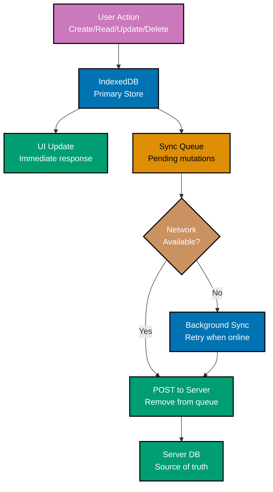

This advanced tutorial covers expert PWA patterns through 28 heavily annotated examples. Each example maintains 1-2.25 comment lines per code line. These examples assume fluency with service worker lifecycle, Workbox, push notifications, and IndexedDB from the Beginner and Intermediate sections.

## Group 11: Desktop PWA and Advanced APIs

## Example 58: Window Controls Overlay — Custom Title Bar for Desktop PWAs

Window Controls Overlay (WCO) removes the default browser title bar in desktop PWAs and lets your app draw into that space. Only supported in Chrome and Edge on desktop.

**Code**:

```json
{
  "name": "My Desktop App",
  "display_override": ["window-controls-overlay", "standalone"],
  "display": "standalone"
}
```

```javascript
// app.js — use CSS env vars to position content relative to the title bar area

// => Detect Window Controls Overlay support
const isWCO = "windowControlsOverlay" in navigator;
// => isWCO: true in Chrome/Edge desktop with WCO enabled, false otherwise

if (isWCO) {
  // => windowControlsOverlay.visible: true when WCO is active (not just standalone)
  const isVisible = navigator.windowControlsOverlay.visible;
  // => isVisible: true when the OS title bar controls (close/minimize/maximize) are shown
  // => and the app has taken over the title bar area

  if (isVisible) {
    applyWCOLayout();
    // => Only apply WCO layout when the overlay is actually visible
  }

  // => Listen for geometry changes (user toggles WCO, window resizes)
  navigator.windowControlsOverlay.addEventListener("geometrychange", (event) => {
    // => event.titlebarAreaRect: DOMRect with title bar position and size
    const rect = event.titlebarAreaRect;
    console.log("Title bar rect:", rect.x, rect.y, rect.width, rect.height);
    // => Output: "Title bar rect: 0 0 800 32" (varies by OS and window size)
  });
}

function applyWCOLayout() {
  // => CSS env vars expose the title bar geometry to CSS
  // => Use these to position elements inside the title bar area
  document.documentElement.style.setProperty(
    "--title-bar-height",
    "env(titlebar-area-height, 0px)",
    // => env(titlebar-area-height, 0px): height of the title bar, default 0px fallback
  );
}
```

CSS for WCO layout:

```css
/* styles.css */
/* Color Palette: Blue #0173B2 for title bar background */

/* => app-region: drag makes this element draggable as a window title bar */
.title-bar {
  /* => position the title bar using CSS env vars from the OS */
  position: fixed;
  top: env(titlebar-area-y, 0);
  /* => env(titlebar-area-y): top position of the title bar content area */
  left: env(titlebar-area-x, 0);
  /* => env(titlebar-area-x): left edge (right of OS window controls on Mac) */
  width: env(titlebar-area-width, 100%);
  /* => env(titlebar-area-width): available width excluding OS controls */
  height: env(titlebar-area-height, 40px);
  /* => env(titlebar-area-height): height of the title bar area */

  background-color: #0173b2;
  /* => Title bar background color matching app theme */
  -webkit-app-region: drag;
  /* => Makes the element draggable like a native window title bar */
  app-region: drag;
}

/* => Interactive elements inside the title bar must not be draggable */
.title-bar button,
.title-bar input {
  -webkit-app-region: no-drag;
  /* => no-drag: allow click/focus on these elements */
  app-region: no-drag;
}
```

**Key Takeaway**: Add `"display_override": ["window-controls-overlay", "standalone"]` to the manifest and use CSS `env(titlebar-area-*)` variables to position content in the title bar area. Set `-webkit-app-region: drag` for the draggable region and `no-drag` for interactive elements inside it.

**Why It Matters**: Window Controls Overlay is the feature that makes a desktop PWA visually indistinguishable from a native app. Apps like Visual Studio Code use this technique to draw their menu bar and tab strip into the title bar area, maximizing usable screen space. Without WCO, desktop PWAs have a plain white title bar with just the app name — clearly browser-like. With WCO, the entire window canvas belongs to the app.

---

## Example 59: Drag-and-Drop File Handling with dragover/drop Events

Drag-and-drop file handling combined with the File System Access API creates a native-quality file opening experience directly in the browser.

**Code**:

```javascript
// app.js

const dropZone = document.getElementById("drop-zone");
// => dropZone: the HTML element that accepts dropped files

// => Prevent default browser behavior (opening the file in the browser)
dropZone.addEventListener("dragover", (event) => {
  event.preventDefault();
  // => preventDefault(): stop browser from navigating to the dropped file
  event.dataTransfer.dropEffect = "copy";
  // => dropEffect: visual feedback cursor — "copy" shows a plus icon
  dropZone.classList.add("drag-active");
  // => Visual: highlight the drop zone while dragging over it
});

dropZone.addEventListener("dragleave", (event) => {
  // => dragleave fires when the dragged item leaves the element
  dropZone.classList.remove("drag-active");
  // => Remove highlight when drag leaves the zone
});

dropZone.addEventListener("drop", async (event) => {
  event.preventDefault();
  // => Prevent browser from opening the file directly

  dropZone.classList.remove("drag-active");
  // => Remove drag highlight after drop

  // => event.dataTransfer.items: DataTransferItemList — preferred for File System Access
  const items = [...event.dataTransfer.items];
  // => Spread to array for easier iteration

  for (const item of items) {
    // => item.kind: "file" or "string"
    if (item.kind !== "file") continue;
    // => Skip non-file items (dragged text, links, etc.)

    // => getAsFileSystemHandle() returns a FileSystemFileHandle or FileSystemDirectoryHandle
    // => This is the modern API — requires user gesture (the drop event qualifies)
    const handle = await item.getAsFileSystemHandle();
    // => handle: FileSystemFileHandle if a file, FileSystemDirectoryHandle if a folder

    if (handle.kind === "file") {
      // => handle.kind: "file" for files, "directory" for folders
      const file = await handle.getFile();
      // => file: File object — read contents with file.text(), file.arrayBuffer()

      console.log("Dropped file:", file.name, file.type, file.size);
      // => Output: "Dropped file: readme.md text/markdown 2048"

      const content = await file.text();
      // => content: full text content of the dropped file
      displayFileContent(file.name, content);
      // => Show file in the editor
    } else if (handle.kind === "directory") {
      console.log("Dropped directory:", handle.name);
      // => Handle directory: iterate entries with handle.entries()
    }
  }
});
```

**Key Takeaway**: In the `drop` event handler, call `event.preventDefault()` to prevent browser navigation. Use `event.dataTransfer.items[i].getAsFileSystemHandle()` to get writable `FileSystemFileHandle` objects from dropped files.

**Why It Matters**: Drag-and-drop file handling is a desktop interaction paradigm that PWAs must support to compete with native apps. Users expect to drag files from their file manager directly into a web editor or uploader. Combining `drop` events with `getAsFileSystemHandle()` (instead of the older `getAsFile()`) provides writable access — enabling Save in-place after editing, not just one-time reads.

---

## Group 12: Offline-First Architecture

## Example 60: Offline-First Architecture — IndexedDB as Primary Data Store

Offline-first apps treat IndexedDB as the primary data source. The UI reads from IndexedDB and sync runs in the background — the network is an implementation detail, not a requirement.



**Code**:

```javascript
// data-layer.js — offline-first data layer

import { openDB } from "idb";

const db = await openDB("app-db", 1, {
  upgrade(db) {
    // => tasks store: primary data store (IndexedDB is the source of truth for UI)
    db.createObjectStore("tasks", { keyPath: "id" });
    // => syncQueue store: pending mutations to send to server
    db.createObjectStore("sync-queue", { keyPath: "queueId", autoIncrement: true });
  },
});

// => Create a task: write to IndexedDB first, then queue for server sync
async function createTask(task) {
  const newTask = {
    ...task,
    id: crypto.randomUUID(),
    // => Generate client-side UUID — no server round-trip needed for the ID
    createdAt: new Date().toISOString(),
    syncStatus: "pending",
    // => syncStatus: "pending" | "synced" | "conflict"
  };

  // => Step 1: Write to IndexedDB — UI updates immediately (optimistic update)
  await db.put("tasks", newTask);
  // => Task is immediately in IndexedDB — UI can render it now

  // => Step 2: Queue the mutation for server sync
  await db.add("sync-queue", {
    type: "CREATE_TASK",
    // => type: identifies the mutation type for the sync handler
    payload: newTask,
    // => payload: the full task data to send to the server
    attemptedAt: null,
    // => attemptedAt: null until first sync attempt
  });
  // => queueId: auto-incremented by IndexedDB

  // => Step 3: Trigger Background Sync (Chromium) or immediate attempt if online
  const registration = await navigator.serviceWorker.ready;
  if ("sync" in registration) {
    await registration.sync.register("sync-tasks");
    // => Chromium: OS will call sync event when network available
  } else if (navigator.onLine) {
    await syncNow();
    // => Firefox/Safari: try immediate sync if online
  }

  return newTask;
  // => Return immediately — UI doesn't wait for server confirmation
}

// => Read tasks: always from IndexedDB (instant, offline-capable)
async function getAllTasks() {
  return db.getAll("tasks");
  // => Always reads from IndexedDB — never blocks on network
  // => Returns stale data if sync is pending, but data is always available
}
```

**Key Takeaway**: In offline-first architecture, all writes go to IndexedDB first, the UI reads from IndexedDB, and server sync runs asynchronously in the background. Generate client-side IDs (UUID) to avoid blocking writes on server round-trips.

**Why It Matters**: Traditional apps fail on bad connections because they require server responses before updating the UI. Offline-first apps respond instantly to every user action. The tradeoff is eventual consistency and the need for conflict resolution (next example). For productivity apps, note-taking, and any data entry workflow, offline-first is the correct default architecture.

---

## Example 61: Conflict Resolution Strategies for Offline-First Apps

When multiple clients modify the same data offline, conflicts arise during sync. Common resolution strategies are last-write-wins and CRDT (Conflict-free Replicated Data Types).

**Code**:

```javascript
// conflict-resolution.js

// === STRATEGY 1: Last-Write-Wins (LWW) ===
// Simple, easy to implement, loses changes from the "loser" device

async function syncTaskLWW(localTask, serverTask) {
  // => Compare timestamps to determine which version is newer
  const localTime = new Date(localTask.updatedAt).getTime();
  // => localTime: Unix timestamp of local modification
  const serverTime = new Date(serverTask.updatedAt).getTime();
  // => serverTime: Unix timestamp of server version

  if (localTime > serverTime) {
    // => Local version is newer — push local to server
    const response = await fetch(`/api/tasks/${localTask.id}`, {
      method: "PUT",
      body: JSON.stringify(localTask),
      headers: { "Content-Type": "application/json" },
    });
    console.log("Local version won — pushed to server");
    // => Server now has the local version
  } else if (serverTime > localTime) {
    // => Server version is newer — pull server to local
    const db = await openDatabase();
    await db.put("tasks", { ...serverTask, syncStatus: "synced" });
    // => Local IndexedDB updated with server version
    console.log("Server version won — pulled to local");
    // => Local changes are overwritten — data from offline edits may be lost
  } else {
    // => Same timestamp — no conflict (or treat as no-op)
    console.log("No conflict: same timestamp");
  }
}

// === STRATEGY 2: Field-Level Merge (structured merge) ===
// Preserves non-conflicting changes from both sides

async function mergeTask(localTask, serverTask) {
  // => Each field independently compared — only truly conflicting fields need resolution
  const merged = { ...serverTask };
  // => Start with server version as base

  // => title: if local changed title and server did not, keep local change
  if (localTask.title !== serverTask.title && localTask.baseTitle === serverTask.title) {
    merged.title = localTask.title;
    // => Local changed title, server didn't — take local title
    // => baseTitle: the title at last sync point (needed for 3-way merge)
  }

  // => completedAt: if local completed but server didn't mark it — take local
  if (localTask.completedAt && !serverTask.completedAt) {
    merged.completedAt = localTask.completedAt;
    // => Completion is a non-conflicting fact: user completed the task
  }

  // => Save merged result
  const db = await openDatabase();
  await db.put("tasks", { ...merged, syncStatus: "synced" });
  // => Merged version saved locally

  await fetch(`/api/tasks/${merged.id}`, {
    method: "PUT",
    body: JSON.stringify(merged),
  });
  // => Merged version pushed to server
  console.log("Field-level merge complete:", merged);
}

// === STRATEGY 3: CRDT reference (Yjs library) ===
// Mathematically guaranteed to converge — no conflicts possible
// Appropriate for collaborative text editing
// Example: import * as Y from 'yjs'
// const ydoc = new Y.Doc()
// const yText = ydoc.getText('task-notes')
// yText.insert(0, 'new text') — concurrent inserts always merge correctly
```

**Key Takeaway**: Last-write-wins is simple but lossy. Field-level merge preserves non-conflicting changes. CRDTs (via libraries like Yjs) are mathematically conflict-free for collaborative editing. Choose the strategy based on your data model and how often conflicts occur.

**Why It Matters**: Ignoring conflicts in offline-first apps destroys user trust. A productivity app that silently overwrites 2 hours of offline edits is worse than one with no offline support. Last-write-wins is acceptable for apps with a single user on multiple devices. Field-level merge is appropriate for structured data (tasks, contacts). CRDTs are the gold standard for real-time collaborative text editing.

---

## Group 13: Service Worker Communication

## Example 62: Service Worker Message Passing — postMessage Between SW and Clients

Service workers can send and receive messages to/from their controlled clients. This enables bidirectional communication for cache status updates, version notifications, and data transfer.

**Code**:

```javascript
// sw.js — send a message to a specific client

self.addEventListener("message", (event) => {
  // => event.data: the message received from a client
  const { type, payload } = event.data;
  // => type: "REQUEST_CACHE_STATUS" or other message types

  if (type === "REQUEST_CACHE_STATUS") {
    // => Client asked for cache status — respond with current cache info
    event.waitUntil(
      (async () => {
        const cacheNames = await caches.keys();
        // => cacheNames: ["app-shell-v2", "api-cache-v1"]

        // => event.source: the client that sent the message
        // => event.source.postMessage(): send response back to that specific client
        event.source.postMessage({
          type: "CACHE_STATUS_RESPONSE",
          payload: { caches: cacheNames, timestamp: Date.now() },
          // => payload contains the requested cache information
        });
      })(),
    );
  }
});

// => Broadcast a message to ALL controlled clients
async function notifyAllClients(message) {
  // => clients.matchAll() returns all controlled client windows/tabs
  const allClients = await clients.matchAll({ type: "window" });
  // => allClients: array of WindowClient objects

  for (const client of allClients) {
    client.postMessage(message);
    // => Send message to each open tab individually
    // => Message delivered asynchronously — no acknowledgement mechanism
  }
}
```

Receiving messages in the main thread:

```javascript
// app.js — listen for messages from the service worker

navigator.serviceWorker.addEventListener("message", (event) => {
  // => event.data: message sent by the service worker
  const { type, payload } = event.data;

  if (type === "CACHE_STATUS_RESPONSE") {
    console.log("Cache status from SW:", payload.caches);
    // => Output: "Cache status from SW: ['app-shell-v2', 'api-cache-v1']"
    updateCacheStatusUI(payload.caches);
    // => Update cache management panel in dev tools or settings page
  }

  if (type === "NEW_CONTENT_AVAILABLE") {
    // => SW notified that a content update is available
    showUpdateBanner();
    // => Show "New version available — click to reload" banner
  }
});

// => Send a message to the active service worker
async function requestCacheStatus() {
  const registration = await navigator.serviceWorker.ready;
  registration.active.postMessage({ type: "REQUEST_CACHE_STATUS" });
  // => registration.active: the active SW controller
  // => postMessage() sends message to sw.js message handler
}
```

**Key Takeaway**: The service worker receives messages via `self.addEventListener('message', ...)` and responds with `event.source.postMessage()`. The main thread listens with `navigator.serviceWorker.addEventListener('message', ...)` and sends with `registration.active.postMessage()`.

**Why It Matters**: Message passing is the backbone of complex SW-client coordination — reporting cache status to a developer settings panel, triggering a precache refresh from a button click, or delivering real-time data from a push event directly to an open tab. Without message passing, the SW is a black box that the UI cannot observe or control.

---

## Example 63: Cross-Tab Communication — BroadcastChannel Between Service Worker and Clients

`BroadcastChannel` enables one-to-many messaging across all open tabs with the same channel name, without needing to enumerate clients. It works in both the main thread and service workers.

**Code**:

```javascript
// app.js — subscribe to the broadcast channel in each open tab

// => Create a BroadcastChannel — all tabs and the SW using "app-channel" receive messages
const channel = new BroadcastChannel("app-channel");
// => Channel name must match across all tabs and the SW for communication to work

channel.addEventListener("message", (event) => {
  // => event.data: the message broadcast by any tab or the SW
  const { type, payload } = event.data;

  if (type === "USER_LOGGED_OUT") {
    // => Another tab logged the user out — log out this tab too
    console.log("Logout broadcast received — clearing session");
    clearSessionData();
    // => Remove tokens, clear IndexedDB, redirect to login page
    window.location.href = "/login";
    // => Redirect to login: all tabs respond to the logout event
  }

  if (type === "CACHE_UPDATED") {
    // => SW broadcast: a cached response was updated (from BroadcastUpdatePlugin)
    console.log("Content updated for:", payload.url);
    refreshDisplayIfNeeded(payload.url);
    // => Re-fetch and re-render if this tab is showing the updated URL
  }
});

// => Broadcast a message from this tab to all other tabs and the SW
function broadcastLogout() {
  channel.postMessage({
    type: "USER_LOGGED_OUT",
    payload: { timestamp: Date.now() },
    // => Broadcast logout to all tabs — each tab clears session and redirects
  });
  // => channel.postMessage: message delivered to ALL listeners on "app-channel"
  // => including other browser tabs and the SW (if it listens on same channel)
}

document.getElementById("logout-btn").addEventListener("click", async () => {
  await fetch("/api/auth/logout", { method: "POST" });
  // => Tell server session is ending
  broadcastLogout();
  // => Tell all open tabs to clear session
  window.location.href = "/login";
  // => Redirect this tab to login page
});
```

Service worker listening on same channel:

```javascript
// sw.js

const channel = new BroadcastChannel("app-channel");
// => Same channel name — SW receives messages from all tabs

channel.addEventListener("message", (event) => {
  if (event.data.type === "USER_LOGGED_OUT") {
    // => User logged out — clear all cached private data
    caches
      .keys()
      .then((names) =>
        Promise.all(names.filter((name) => name.includes("user-data")).map((name) => caches.delete(name))),
      );
    // => Delete user-specific caches on logout — prevent data exposure
    console.log("SW: cleared user data caches after logout");
  }
});
```

**Key Takeaway**: `BroadcastChannel` delivers messages to all contexts (tabs and SW) subscribed to the same channel name without needing to enumerate clients. Use it for events that all tabs must respond to — logout, theme changes, or critical data updates.

**Why It Matters**: Multi-tab applications fail spectacularly without cross-tab coordination. A user who logs out in one tab and finds another tab still showing their private data will immediately distrust the app. `BroadcastChannel` solves this with a single `postMessage` call that reaches every open tab. It is simpler and more reliable than the `clients.matchAll()` + loop pattern from Example 62 when the SW does not need to track individual clients.

---

## Example 64: Cache Versioning Strategy — Manifest Hash in Cache Name

Embedding the build manifest hash in the cache name creates globally unique cache identifiers per deployment. This guarantees clean isolation between deployments without manual version bumping.

**Code**:

```javascript
// sw.js — generated by Workbox InjectManifest or @serwist/next

// => __CACHE_VERSION__ is injected at build time by the build tool
// => It contains the content hash of the current build (e.g., "a3b7c9d1")
// => Every build that changes any asset produces a different hash
declare const __CACHE_VERSION__: string; // => TypeScript declaration

// => CACHE_NAME: uniquely identifies this deployment's cache
const CACHE_NAME = `app-shell-${__CACHE_VERSION__}`;
// => Example: "app-shell-a3b7c9d1" — unique per deployment

const CURRENT_CACHES = [
  CACHE_NAME,
  `api-${__CACHE_VERSION__}`,
  // => "api-a3b7c9d1" — API cache also versioned per deployment
  `images-${__CACHE_VERSION__}`,
  // => "images-a3b7c9d1" — images versioned too
];

self.addEventListener("install", (event) => {
  event.waitUntil(
    caches.open(CACHE_NAME).then((cache) =>
      cache.addAll(["/", "/app.js", "/styles.css"])
      // => Caches app shell under "app-shell-a3b7c9d1"
    )
  );
});

self.addEventListener("activate", (event) => {
  event.waitUntil(
    (async () => {
      const allCaches = await caches.keys();
      // => allCaches may include: ["app-shell-9f2e1a0c", "api-9f2e1a0c"] (old deployment)

      const staleCaches = allCaches.filter(
        (name) => !CURRENT_CACHES.includes(name)
        // => Stale: any cache not in the current deployment's cache list
      );
      // => staleCaches: ["app-shell-9f2e1a0c", "api-9f2e1a0c"] — previous build's caches

      await Promise.all(staleCaches.map((name) => caches.delete(name)));
      // => All stale deployment caches deleted — only current build's caches remain

      console.log(
        "Active caches after cleanup:",
        await caches.keys()
        // => Output: ["app-shell-a3b7c9d1", "api-a3b7c9d1", "images-a3b7c9d1"]
      );
    })()
  );
});
```

**Key Takeaway**: Inject the build content hash into cache names via build tool template replacement. This creates deployment-isolated caches automatically — no manual version increment, no human error.

**Why It Matters**: Manual version bumping (`v1`, `v2`, `v3`) is forgotten in deployments under pressure, causing new code to serve old assets. Content-hash-based cache names are deterministic — the same code always produces the same hash, and different code always produces a different hash. This makes cache versioning as reliable as the build system.

---

## Example 65: Dynamic Caching with URL Pattern Matching — RegExp Routes in Workbox

Dynamic Workbox routes match URLs with regular expressions, enabling precise control over which requests get which caching strategy.

**Code**:

```javascript
// sw.js

import { registerRoute } from "workbox-routing";
import { CacheFirst, NetworkFirst, StaleWhileRevalidate } from "workbox-strategies";
import { ExpirationPlugin } from "workbox-expiration";

// => Route 1: Versioned JS/CSS bundles — CacheFirst (hash in filename = immutable)
registerRoute(
  ({ url }) => /\/static\/js\/[a-f0-9]+\.(js|css)$/.test(url.pathname),
  // => RegExp: matches /static/js/a3b7c9d1.js or /static/css/9f2e1a0c.css
  // => [a-f0-9]+: content hash characters (lowercase hex)
  new CacheFirst({
    cacheName: "static-bundles",
    plugins: [
      new ExpirationPlugin({
        maxEntries: 30,
        // => At most 30 bundle files (multiple versions may co-exist briefly)
        maxAgeSeconds: 365 * 24 * 60 * 60,
        // => 1 year TTL — hash-named files never change at the same URL
      }),
    ],
  }),
);

// => Route 2: Image optimization CDN — CacheFirst with strict limits
registerRoute(
  ({ url }) => url.hostname === "images.example.com" && /\.(jpg|jpeg|png|webp|avif)$/.test(url.pathname),
  // => Matches: https://images.example.com/photo.webp
  new CacheFirst({
    cacheName: "cdn-images",
    plugins: [
      new ExpirationPlugin({
        maxEntries: 100,
        // => Cache up to 100 CDN images
        maxAgeSeconds: 7 * 24 * 60 * 60,
        // => CDN images: 7 day TTL (they may update with new edits)
      }),
    ],
  }),
);

// => Route 3: Paginated API responses — StaleWhileRevalidate
registerRoute(
  ({ url }) => url.pathname.startsWith("/api/") && url.searchParams.has("page"),
  // => Matches: /api/articles?page=2&per_page=20
  // => Does NOT match: /api/articles (no page param — handled differently)
  new StaleWhileRevalidate({
    cacheName: "paginated-api",
    plugins: [
      new ExpirationPlugin({ maxEntries: 50, maxAgeSeconds: 5 * 60 }),
      // => Paginated data: 50 pages max, 5-minute TTL
    ],
  }),
);
```

**Key Takeaway**: Use regular expressions in Workbox route matchers to precisely target URLs by pattern — hash-named assets, CDN hostnames, paginated query parameters. Test RegExp patterns against real URLs before deploying.

**Why It Matters**: Naive URL matching ("all images" or "all API calls") applies one strategy to resources that may have very different update frequencies. A product thumbnail (change rarely) and a user avatar (change often) both match "image" but need different TTLs. RegExp matching gives surgical control without complex conditional logic in a single handler.

---

## Example 66: Streaming Responses in Service Workers — ReadableStream for Large Content

Service workers can create streaming responses from cached chunks, enabling large files to be served efficiently without loading them entirely into memory.

**Code**:

```javascript
// sw.js

self.addEventListener("fetch", (event) => {
  const url = new URL(event.request.url);

  // => Apply streaming response only to large media files
  if (!url.pathname.startsWith("/media/")) return;

  event.respondWith(
    (async () => {
      // => Check if we have the full file cached
      const cachedResponse = await caches.match(event.request);

      if (cachedResponse) {
        // => For cached responses, re-create a streaming response
        // => cachedResponse.body is a ReadableStream
        const { readable, writable } = new TransformStream();
        // => TransformStream: piping channel between readable and writable

        // => Pipe the cached body through the transform stream
        cachedResponse.body.pipeTo(writable);
        // => Data flows: cachedResponse.body → writable → readable

        return new Response(readable, {
          // => Return a new Response wrapping the readable stream
          headers: cachedResponse.headers,
          // => Preserve original headers (Content-Type, Content-Length)
          status: cachedResponse.status,
        });
        // => Browser receives a streaming Response — bytes delivered as they are read
        // => No memory spike from loading the entire file into a buffer
      }

      // => Not cached: fetch from network and cache incrementally
      const networkResponse = await fetch(event.request);
      // => networkResponse.body: ReadableStream from the network

      // => Clone the stream: one for the browser, one for caching
      const [browserStream, cacheStream] = networkResponse.body.tee();
      // => .tee(): splits one ReadableStream into two identical streams
      // => Both streams receive the same data as it arrives from the network

      // => Cache the response using the cache stream
      const cache = await caches.open("media-cache");
      cache.put(
        event.request,
        new Response(cacheStream, { headers: networkResponse.headers }),
        // => Cache stream stored incrementally as data arrives
      );

      // => Return browser stream immediately — user starts receiving data
      return new Response(browserStream, {
        headers: networkResponse.headers,
        status: networkResponse.status,
      });
      // => Browser and cache receive data simultaneously — no extra latency
    })(),
  );
});
```

**Key Takeaway**: Use `.tee()` on `ReadableStream` to split a network response into two streams — one for the browser and one for the cache. Both receive data simultaneously without buffering the entire response in memory.

**Why It Matters**: Buffering large media files (videos, large PDFs) entirely before serving them introduces latency and memory pressure. Streaming responses enable video playback to start before the entire file is downloaded or cached. The `.tee()` pattern is the standard approach for caching-while-streaming — the user experiences zero additional latency compared to direct network delivery.

---

## Example 67: Navigation Preload — Reducing Service Worker Boot Latency

Navigation preload starts the network request for HTML documents in parallel with the service worker boot process, eliminating the "SW startup tax" on navigation requests.

**Code**:

```javascript
// sw.js

self.addEventListener("activate", (event) => {
  event.waitUntil(
    (async () => {
      // => Enable navigation preload in the activate event
      // => Must be done after activation — preload is for active SW only
      if (self.registration.navigationPreload) {
        // => Feature detect: navigationPreload not supported in all browsers
        await self.registration.navigationPreload.enable();
        // => From now on, navigation requests start in parallel with SW boot
        console.log("Navigation preload enabled");
      }
    })(),
  );
});

self.addEventListener("fetch", (event) => {
  // => Only use preload response for navigation requests
  if (event.request.mode !== "navigate") return;

  event.respondWith(
    (async () => {
      // => Check cache first (fastest path)
      const cached = await caches.match(event.request);
      if (cached) {
        return cached;
        // => Cache hit: serve instantly, ignore preload response
      }

      // => event.preloadResponse: the in-flight preload request
      // => Started when the browser initiated navigation (before SW booted)
      // => May already be resolved or still resolving — either way, no wasted time
      const preloadResponse = await event.preloadResponse;
      // => preloadResponse: Response from preload, or undefined if not supported/available

      if (preloadResponse) {
        // => Preload responded — use it and optionally cache it
        const cache = await caches.open("pages-cache");
        cache.put(event.request, preloadResponse.clone());
        // => Cache the preloaded response for future offline access

        return preloadResponse;
        // => Serve the preloaded (already in-flight) response — zero extra latency
      }

      // => Fallback: no cache, no preload — fetch from network normally
      return fetch(event.request);
      // => Normal network fetch (slower than preload, but SW is booted now)
    })(),
  );
});
```

**Key Takeaway**: Enable navigation preload with `registration.navigationPreload.enable()` in the `activate` event. In the `fetch` handler, check `event.preloadResponse` before falling back to `fetch()`. The preload request starts when the browser navigates, not when the SW boots.

**Why It Matters**: Service workers add 50-200ms latency to navigation requests due to boot time, even with a cache hit. Navigation preload eliminates this overhead for HTML documents by starting the network request in parallel with SW initialization. For apps where page load speed is critical, enabling navigation preload is a free performance win that requires fewer than 20 lines of code.

---

## Group 14: Update UX Patterns

## Example 68: Service Worker Update Flow — Detecting a New Version

When a new service worker is deployed, the browser downloads the new `sw.js` and enters the waiting state. Detecting this transition lets you notify users that an update is available.

**Code**:

```javascript
// app.js — detect and notify users about SW updates

async function setupUpdateDetection() {
  if (!("serviceWorker" in navigator)) return;

  const registration = await navigator.serviceWorker.register("/sw.js");
  // => registration: ServiceWorkerRegistration object

  // => Check if there's already a waiting SW (user left tab open over an update)
  if (registration.waiting) {
    // => A new SW version is already waiting — notify user immediately
    notifyUpdate(registration.waiting);
    return;
  }

  // => Listen for a new SW entering the waiting state
  registration.addEventListener("updatefound", () => {
    // => updatefound: a new SW version is being installed
    const installingWorker = registration.installing;
    // => installingWorker: the new SW currently in 'installing' state

    installingWorker.addEventListener("statechange", () => {
      // => statechange: fires as the SW moves through lifecycle states
      if (installingWorker.state === "installed") {
        // => New SW installed — is there an existing controller?
        if (navigator.serviceWorker.controller) {
          // => Yes: existing SW was running — new one is waiting
          // => User is on an old version — notify them of the update
          notifyUpdate(installingWorker);
          // => Show "Update available" banner (Example 69)
        }
        // => If no existing controller: this is first install, no update needed
      }
    });
  });

  // => Handle page reloads triggered by the SW itself (skipWaiting flow)
  let refreshing = false;
  navigator.serviceWorker.addEventListener("controllerchange", () => {
    // => controllerchange: a new SW has taken control (after skipWaiting)
    if (!refreshing) {
      refreshing = true;
      // => Guard against multiple reloads
      window.location.reload();
      // => Reload to load resources from the new SW version
    }
  });
}

function notifyUpdate(worker) {
  // => worker: the waiting or installing SW — used in Example 69 to trigger activation
  window.updateWorker = worker;
  // => Store reference for the "Reload" button click handler
  document.getElementById("update-banner").hidden = false;
  // => Show the update notification banner
}

setupUpdateDetection();
```

**Key Takeaway**: Listen for `updatefound` on the registration, then watch the installing worker's `statechange`. When `state === 'installed'` and a controller exists, a new version is waiting. Store the worker reference for the user-triggered update in Example 69.

**Why It Matters**: The default PWA update flow is invisible to users — they get the new version next time they close all tabs and reopen. For single-page apps or long-lived sessions, this could mean weeks without updates. Explicit update detection enables the "Update available" UX that lets users choose when to apply the update — respecting their current task while ensuring timely updates.

---

## Example 69: App Update Notification UX — "Update Available" Banner with Reload Button

After detecting a waiting service worker (Example 68), show a dismissible banner that lets users apply the update at a convenient moment.

**Code**:

```javascript
// app.js — update notification banner logic

function setupUpdateBanner() {
  const banner = document.getElementById("update-banner");
  const reloadBtn = document.getElementById("reload-btn");
  const dismissBtn = document.getElementById("dismiss-update-btn");

  reloadBtn.addEventListener("click", () => {
    // => User clicked "Update" — tell the waiting SW to skip the wait phase
    if (window.updateWorker) {
      window.updateWorker.postMessage({ type: "SKIP_WAITING" });
      // => postMessage to the waiting SW: skip the waiting phase
      // => SW will call skipWaiting() and enter activating state
      // => controllerchange event fires → page reloads (Example 68)
    }
  });

  dismissBtn.addEventListener("click", () => {
    banner.hidden = true;
    // => User chose to delay the update — hide the banner
    // => Update will apply naturally when they next close all tabs
    sessionStorage.setItem("update-dismissed", "true");
    // => Track dismissal: don't re-show for this session
  });
}

setupUpdateBanner();
```

Service worker handling the SKIP_WAITING message:

```javascript
// sw.js

self.addEventListener("message", (event) => {
  // => Receive SKIP_WAITING message from the app
  if (event.data && event.data.type === "SKIP_WAITING") {
    // => skipWaiting(): move from 'waiting' to 'activating' immediately
    self.skipWaiting();
    // => After this, 'controllerchange' fires in all tabs
    // => Each tab handles controllerchange by reloading (Example 68)
    console.log("SW: skipWaiting() called — activating new version");
  }
});
```

HTML for the update banner:

```html
<!-- => Update banner: hidden by default, shown when update available -->
<div id="update-banner" hidden class="update-notification" role="alert">
  <!-- => role="alert": announced by screen readers immediately when shown -->
  <p>A new version is available.</p>
  <button id="reload-btn" type="button">Update Now</button>
  <!-- => Update Now: applies update immediately with a page reload -->
  <button id="dismiss-update-btn" type="button">Later</button>
  <!-- => Later: dismisses banner, update applied on next session -->
</div>
```

**Key Takeaway**: The update banner sends a `SKIP_WAITING` message to the waiting SW, which calls `self.skipWaiting()`, which triggers `controllerchange` in all tabs, which each handle by reloading. The `role="alert"` attribute ensures screen readers announce the update prompt.

**Why It Matters**: Forcing immediate silent reloads during updates loses user data — unsubmitted forms, in-progress text, scroll positions. An explicit "Update Now / Later" choice respects the user's current task. The `role="alert"` ARIA attribute ensures screen reader users are not surprised by the reload. This pattern is used by Google Docs, VS Code in the browser, and other production PWAs.

---

## Group 15: Performance and Monitoring

## Example 70: PWA Performance — Render-Blocking Resource Elimination and Critical CSS

PWA performance starts at the critical rendering path. Eliminating render-blocking resources and inlining critical CSS reduces Time to First Paint dramatically.

**Code**:

```html
<head>
  <!-- => Load fonts asynchronously — they are not render-blocking -->
  <!-- => rel="preconnect": establish TCP+TLS connection to Google Fonts early -->
  <link rel="preconnect" href="https://fonts.googleapis.com" />
  <link rel="preconnect" href="https://fonts.gstatic.com" crossorigin />
  <!-- => crossorigin: required for fonts.gstatic.com (different origin for font files) -->

  <!-- => Preload the font CSS: browser fetches it early but doesn't block render -->
  <link
    rel="preload"
    href="https://fonts.googleapis.com/css2?family=Inter:wght@400;700&display=swap"
    as="style"
    onload="this.onload=null;this.rel='stylesheet'"
  />
  <!-- => onload trick: preloaded resource becomes a stylesheet after load -->
  <!-- => This avoids render blocking while still loading fonts early -->

  <!-- => Noscript fallback for browsers with JavaScript disabled -->
  <noscript>
    <link href="https://fonts.googleapis.com/css2?family=Inter:wght@400;700&display=swap" rel="stylesheet" />
  </noscript>

  <!-- => Inline critical CSS: styles needed for above-the-fold content -->
  <!-- => No network request required — renders immediately -->
  <style>
    /* Critical CSS: layout and above-the-fold styles only */
    body {
      margin: 0;
      font-family: Inter, system-ui, sans-serif;
      /* => system-ui fallback renders before Inter font loads */
    }
    .hero {
      display: grid;
      min-height: 100svh;
      /* => svh: small viewport height — handles mobile browser chrome correctly */
    }
    /* Non-critical styles: loaded via external stylesheet below */
  </style>

  <!-- => Main stylesheet: non-critical styles loaded after initial render -->
  <link rel="stylesheet" href="/styles/main.css" media="print" onload="this.media='all'" />
  <!-- => media="print": browser does not block render for print stylesheets -->
  <!-- => onload: switch to media="all" after load — non-blocking stylesheet load -->
</head>
```

**Key Takeaway**: Use `rel="preload"` with the `onload` swap trick for stylesheets and `rel="preconnect"` for third-party origins. Inline only above-the-fold CSS to eliminate render-blocking. Load non-critical styles with the `media="print"` trick.

**Why It Matters**: LCP (Largest Contentful Paint) and FCP (First Contentful Paint) are the metrics most correlated with user retention. Every additional render-blocking resource delays FCP. For PWAs, this is especially important because the first visit performance (before service worker caches are warm) directly determines whether users will install the app or bounce.

---

## Example 71: Web Vitals Monitoring in PWAs — LCP, INP, and CLS Tracking

The `web-vitals` library measures Core Web Vitals in the browser. Tracking them in production reveals real-user performance beyond Lighthouse lab scores.

**Code**:

```javascript
// app.js

import { onLCP, onINP, onCLS, onFCP, onTTFB } from "web-vitals";
// => web-vitals: Google's library for measuring Core Web Vitals in real browsers
// => LCP: Largest Contentful Paint — loading performance
// => INP: Interaction to Next Paint (replaced FID) — responsiveness
// => CLS: Cumulative Layout Shift — visual stability
// => FCP: First Contentful Paint — initial loading
// => TTFB: Time to First Byte — server/SW response time

// => Helper: send metric to your analytics endpoint
function sendToAnalytics(metric) {
  // => metric: { name, value, rating, id, navigationType, entries }
  // => metric.name: "LCP", "INP", "CLS", etc.
  // => metric.value: the metric value in ms (or unitless for CLS)
  // => metric.rating: "good" | "needs-improvement" | "poor"

  const body = JSON.stringify({
    name: metric.name,
    // => "LCP"
    value: Math.round(metric.value),
    // => LCP: value in ms (e.g., 1250 ms)
    rating: metric.rating,
    // => "good" if LCP < 2500ms, "needs-improvement" 2500-4000ms, "poor" > 4000ms
    pwa: window.matchMedia("(display-mode: standalone)").matches,
    // => pwa: true if running as installed PWA — segment metrics by install status
    navigationType: metric.navigationType,
    // => "navigate" | "reload" | "back-forward" | "prerender"
  });

  // => Use navigator.sendBeacon() — survives page unload, doesn't block UI
  if (navigator.sendBeacon) {
    navigator.sendBeacon("/analytics/vitals", body);
    // => Asynchronous, non-blocking metric delivery
  } else {
    fetch("/analytics/vitals", { method: "POST", body, keepalive: true });
    // => keepalive: request survives page close (fetch equivalent of sendBeacon)
  }
}

// => Register metric observers
onLCP(sendToAnalytics);
// => Reports Largest Contentful Paint when element is painted
onINP(sendToAnalytics);
// => Reports Interaction to Next Paint (worst interaction delay)
onCLS(sendToAnalytics);
// => Reports Cumulative Layout Shift (sum of unexpected layout shifts)
onFCP(sendToAnalytics);
// => Reports First Contentful Paint
onTTFB(sendToAnalytics);
// => Reports Time to First Byte (includes SW startup for cached pages)

// => PWA-specific TTFB segmentation
// => Compare TTFB for SW-served vs network-served pages:
// => Good TTFB: <100ms (SW cache hit), Poor TTFB: >1800ms (network)
```

**Key Takeaway**: Import individual metric functions from `web-vitals` and pass them a reporting callback. Use `navigator.sendBeacon()` for non-blocking metric delivery. Include a `pwa: boolean` field to segment metrics by installed vs browser usage.

**Why It Matters**: Lighthouse scores are lab measurements in ideal conditions. Real User Monitoring (RUM) with `web-vitals` reveals actual user experience across all device types, network conditions, and geographic locations. PWA-specific segmentation shows whether the installed experience is measurably faster than the browser experience — the key evidence for PWA value to non-technical stakeholders.

---

## Example 72: PWA Analytics — Tracking Install Events, Offline Usage, and Push Engagement

Comprehensive PWA analytics tracks the metrics that matter for PWA business cases: install rate, offline session rate, and push notification engagement.

**Code**:

```javascript
// analytics.js — PWA-specific analytics instrumentation

// === 1. INSTALL TRACKING ===

// => Track when install prompt is shown
window.addEventListener("beforeinstallprompt", (event) => {
  event.preventDefault();
  deferredPrompt = event;

  trackEvent("pwa_install_prompt_shown", {
    // => Sent when browser decides app is installable and we show install button
    page: window.location.pathname,
    // => Which page triggered the install prompt
    referrer: document.referrer,
    // => Where user came from (useful for install funnel optimization)
  });
});

// => Track install dialog outcome
deferredPrompt.prompt();
const { outcome } = await deferredPrompt.userChoice;
trackEvent("pwa_install_prompt_responded", {
  outcome,
  // => "accepted" or "dismissed" — key conversion metric
});

// => Track successful installation
window.addEventListener("appinstalled", () => {
  trackEvent("pwa_installed", {
    installSource: "in-app-prompt",
    // => "in-app-prompt" | "browser-prompt" | "ambient-badge"
  });
  // => Calculate install funnel conversion rate:
  // => (pwa_installed events) / (pwa_install_prompt_shown events)
});

// === 2. OFFLINE USAGE TRACKING ===

// => Track offline sessions
window.addEventListener("offline", () => {
  trackEvent("pwa_offline_session_started", {
    cachedPagesAvailable: "check-indexeddb",
    // => Did user have offline content available?
  });
});

window.addEventListener("online", () => {
  trackEvent("pwa_back_online", {
    offlineDurationMs: Date.now() - offlineStartTime,
    // => How long was the user offline?
    pendingSyncItems: pendingQueue.length,
    // => How many mutations were queued during offline period?
  });
});

// === 3. PUSH NOTIFICATION ENGAGEMENT ===

// => Track push subscription
async function trackPushSubscription() {
  const reg = await navigator.serviceWorker.ready;
  const subscription = await reg.pushManager.getSubscription();
  trackEvent("pwa_push_subscription_status", {
    subscribed: subscription !== null,
    // => true if user is subscribed to push notifications
  });
}

// => Track push notification click (in service worker)
// sw.js
self.addEventListener("notificationclick", (event) => {
  trackEvent("push_notification_clicked", {
    action: event.action || "body",
    // => Which button user clicked, or "body" for main notification tap
    tag: event.notification.tag,
    // => Which notification type (order-ready, new-message, etc.)
  });
});

function trackEvent(name, properties) {
  navigator.sendBeacon("/analytics/event", JSON.stringify({ name, properties, ts: Date.now() }));
  // => Non-blocking analytics delivery
}
```

**Key Takeaway**: Track the full PWA funnel — install prompt shown → accepted/dismissed → installed → offline session started → push notification clicked. These metrics provide the business case for PWA investment and reveal optimization opportunities.

**Why It Matters**: PWA metrics are the evidence that justifies the engineering investment. Install rate, offline session rate, and push engagement directly map to user retention improvements. Companies that track these metrics can demonstrate 2-3x return visits from installed users vs browser users — the key argument for continuing PWA development.

---

## Group 16: Testing and Security

## Example 73: Push Payload Encryption — web-push Payload Structure

Push payloads are end-to-end encrypted by the browser. The server uses the subscription's public key to encrypt the payload; only the subscribing browser can decrypt it.

**Code**:

```javascript
// server.js — sending encrypted push payloads with web-push

const webPush = require("web-push");

// => VAPID configuration (keys from Example 40)
webPush.setVapidDetails("mailto:admin@example.com", process.env.VAPID_PUBLIC_KEY, process.env.VAPID_PRIVATE_KEY);

async function sendEncryptedPush(subscription, data) {
  // => subscription: { endpoint, keys: { p256dh, auth } }
  // => keys.p256dh: public key for ECDH encryption (from browser's crypto)
  // => keys.auth: authentication secret (16 random bytes from browser)

  // => The payload is encrypted using RFC 8188 (HTTP Encrypted Content Coding)
  // => web-push handles encryption automatically using keys.p256dh and keys.auth
  const payload = JSON.stringify({
    title: data.title,
    body: data.body,
    icon: "/icons/icon-192.png",
    badge: "/icons/badge-72.png",
    data: data.customData,
    // => customData: arbitrary JSON passed to notificationclick handler
    tag: data.tag || "default",
    // => tag: group notifications — same tag replaces previous notification
  });
  // => payload: JSON string, max size ~4096 bytes after encryption overhead

  const options = {
    TTL: 86400,
    // => TTL: time-to-live in seconds (24 hours)
    // => Push services (FCM, Mozilla) hold undelivered messages this long
    // => Set shorter for time-sensitive notifications (e.g., TTL: 3600 for 1 hour)

    urgency: "normal",
    // => urgency: "very-low" | "low" | "normal" | "high"
    // => "high": deliver immediately even on low-battery mode (Android)
    // => "low": defer delivery to save battery

    topic: data.tag,
    // => topic: push services replace previous message with same topic
    // => Server-side equivalent of notification tag — prevents message flooding
  };

  try {
    const response = await webPush.sendNotification(subscription, payload, options);
    // => response: { statusCode: 201 } on success
    // => 201 Created: message accepted by push service (FCM, Mozilla Push)
    console.log("Push sent:", response.statusCode);
    return true;
  } catch (error) {
    // => 410 Gone: subscription expired or revoked — delete from database
    // => 429 Too Many Requests: rate limited — implement exponential backoff
    // => 400 Bad Request: invalid subscription or payload too large
    if (error.statusCode === 410) {
      await deleteSubscription(subscription.endpoint);
      // => Remove expired subscription from database
    }
    console.error("Push failed:", error.statusCode, error.body);
    return false;
  }
}
```

**Key Takeaway**: `web-push.sendNotification(subscription, payload, options)` handles ECDH encryption automatically. Set `TTL`, `urgency`, and `topic` in options to control delivery timing and deduplication on the push service.

**Why It Matters**: End-to-end encryption is not optional for push — it is built into the Web Push Protocol and handled automatically by the browser and `web-push`. The key insight is that push service providers (Google FCM, Mozilla Push) never see the payload contents — they only route the encrypted envelope. Understanding encryption helps debug payload size limits (4KB max after overhead) and auth errors.

---

## Example 74: Push Subscription Management — Server-Side Storage and pushsubscriptionchange

Push subscriptions expire and rotate. The `pushsubscriptionchange` event fires when a browser rotates a subscription's keys — the server must receive the new subscription to continue delivering pushes.

**Code**:

```javascript
// sw.js — handle push subscription renewal

self.addEventListener("pushsubscriptionchange", (event) => {
  // => pushsubscriptionchange fires when the browser renews the push subscription
  // => This happens automatically (browser-managed key rotation)
  // => event.oldSubscription: the previous subscription object (may be null)
  // => event.newSubscription: the renewed subscription object

  event.waitUntil(
    (async () => {
      // => event.newSubscription may be null if the subscription was revoked
      let newSubscription = event.newSubscription;

      if (!newSubscription) {
        // => Subscription was not automatically renewed — re-subscribe
        const registration = await self.registration;
        newSubscription = await registration.pushManager.subscribe({
          userVisibleOnly: true,
          applicationServerKey: VAPID_PUBLIC_KEY,
          // => Must match the VAPID key used for the original subscription
        });
        // => Fresh subscription created
      }

      // => Send the new subscription to the server
      // => Server must replace the old subscription with the new one
      const response = await fetch("/api/push/update-subscription", {
        method: "POST",
        body: JSON.stringify({
          oldEndpoint: event.oldSubscription?.endpoint,
          // => oldEndpoint: identifies which subscription to replace in the database
          newSubscription: newSubscription.toJSON(),
          // => newSubscription: the replacement subscription object
        }),
        headers: { "Content-Type": "application/json" },
      });

      if (response.ok) {
        console.log("SW: push subscription updated on server");
        // => Server has the new subscription — pushes will continue working
      } else {
        console.error("SW: failed to update subscription on server");
        // => Push notifications will fail until the subscription is updated
        // => Consider retry logic here
      }
    })(),
  );
});
```

Server update handler:

```javascript
// server.js — update subscription in database

app.post("/api/push/update-subscription", async (req, res) => {
  const { oldEndpoint, newSubscription } = req.body;
  // => oldEndpoint: identifies the row to update in the subscriptions table
  // => newSubscription: complete new PushSubscription JSON object

  if (oldEndpoint) {
    // => Update existing subscription (key rotation)
    await db.query(
      "UPDATE push_subscriptions SET subscription = $1 WHERE endpoint = $2",
      [JSON.stringify(newSubscription), oldEndpoint],
      // => Replace old subscription JSON with new subscription JSON
    );
  } else {
    // => No old endpoint: insert as new subscription
    await db.insertSubscription(newSubscription);
  }

  res.status(200).json({ updated: true });
  // => 200 OK: subscription updated
});
```

**Key Takeaway**: Handle `pushsubscriptionchange` in the service worker by re-subscribing if `event.newSubscription` is null, then sending the new subscription to the server with the old endpoint for database lookup.

**Why It Matters**: Push notifications silently stop working when subscriptions rotate and the server is not updated. Users who opted into notifications assume the app is broken when notifications stop arriving — they often uninstall rather than re-subscribing. Handling `pushsubscriptionchange` ensures push continuity across browser updates, re-installations, and key rotation events.

---

## Example 75: Testing Service Workers with Playwright — Intercepting Fetch in E2E Tests

Playwright's network interception can simulate offline conditions and verify that the service worker serves cached responses correctly.

**Code**:

```javascript
// tests/pwa.spec.ts — Playwright E2E test for PWA offline behavior

import { test, expect } from "@playwright/test";

test.describe("PWA offline behavior", () => {
  test("serves cached home page when offline", async ({ page, context }) => {
    // => Step 1: Visit the page online to populate the service worker cache
    await page.goto("http://localhost:3000");
    // => page.goto(): navigates to the URL and waits for load event

    // => Wait for service worker to become active and cache app shell
    await page.waitForFunction(
      () => navigator.serviceWorker.controller !== null,
      // => navigator.serviceWorker.controller !== null: SW is active and controlling
    );
    // => Service worker is now active — caches populated

    // => Step 2: Simulate going offline
    await context.setOffline(true);
    // => context.setOffline(true): Playwright intercepts all requests and returns network errors
    // => Simulates complete network unavailability

    // => Step 3: Navigate to the page while offline
    await page.goto("http://localhost:3000");
    // => SW should intercept and serve from cache

    // => Step 4: Verify the cached page was served correctly
    const heading = page.locator("h1");
    await expect(heading).toBeVisible();
    // => Heading visible: page loaded from cache, not showing browser error screen

    const title = await page.title();
    expect(title).toBe("My PWA App");
    // => Correct title: confirms cached HTML was served, not an error page

    // => Step 5: Restore online state for test cleanup
    await context.setOffline(false);
  });

  test("shows offline fallback page for uncached routes", async ({ page, context }) => {
    // => Visit app once to activate service worker
    await page.goto("http://localhost:3000");
    await page.waitForFunction(() => navigator.serviceWorker.controller !== null);

    // => Go offline
    await context.setOffline(true);

    // => Navigate to a page that was NOT cached during install
    await page.goto("http://localhost:3000/uncached-page");
    // => Service worker has no cache for this URL — should serve /offline.html

    // => Verify the offline fallback page is shown
    const offlineMessage = page.locator("[data-testid='offline-message']");
    await expect(offlineMessage).toBeVisible();
    // => Offline fallback page content is visible

    await context.setOffline(false);
  });
});
```

**Key Takeaway**: Use `context.setOffline(true)` to simulate network unavailability in Playwright. Wait for `navigator.serviceWorker.controller !== null` before going offline to ensure the SW is active. Test both cache hits and offline fallback behavior.

**Why It Matters**: Service worker behavior is notoriously difficult to test manually — caches persist between sessions, lifecycle states are invisible, and network conditions are hard to reproduce. Playwright's `setOffline()` creates reproducible offline conditions in CI. E2E tests for offline behavior are the only reliable way to catch regressions where a code change breaks the service worker installation or caching logic.

---

## Example 76: Service Worker Unit Testing with Vitest and workbox-testing

`workbox-testing` provides a simulated service worker environment for unit testing Workbox routing logic without a real browser.

**Code**:

```javascript
// sw.test.js — Vitest unit tests for service worker caching logic

import { jest } from "@jest/globals";
import { testHandler, createRequest, createResponse } from "workbox-testing";
// => workbox-testing: test utilities for Workbox strategies in Node.js/Vitest
import { CacheFirst } from "workbox-strategies";
import { ExpirationPlugin } from "workbox-expiration";

describe("CacheFirst strategy", () => {
  // => Set up mock caches API before each test
  beforeEach(() => {
    // => workbox-testing sets up a fake Cache API in the test environment
    // => No real browser or service worker context needed
  });

  test("serves from cache when available", async () => {
    const strategy = new CacheFirst({
      cacheName: "test-cache",
      // => Use a unique cache name per test to avoid cross-test pollution
    });

    // => Pre-populate the cache with a test response
    const cache = await caches.open("test-cache");
    const mockRequest = createRequest("https://example.com/api/data");
    // => createRequest(): creates a fake Request object for testing
    const mockResponse = createResponse({ status: 200, body: "cached content" });
    // => createResponse(): creates a fake Response object
    await cache.put(mockRequest, mockResponse);
    // => Cache pre-populated with our mock response

    // => Execute the CacheFirst handler
    const request = new Request("https://example.com/api/data");
    const response = await testHandler(strategy, { request });
    // => testHandler(): runs the strategy's handle() method in the test environment

    // => Verify the cached response was returned
    expect(response.status).toBe(200);
    const body = await response.text();
    expect(body).toBe("cached content");
    // => Strategy correctly served from cache, not network
  });

  test("falls back to network on cache miss", async () => {
    const strategy = new CacheFirst({ cacheName: "test-cache-2" });

    // => Mock the global fetch (no pre-cached response)
    globalThis.fetch = jest.fn().mockResolvedValue(new Response("network content", { status: 200 }));
    // => fetch mock: returns "network content" when called

    const request = new Request("https://example.com/api/new-data");
    const response = await testHandler(strategy, { request });
    // => Cache miss: strategy falls back to mocked fetch

    expect(globalThis.fetch).toHaveBeenCalledWith(request);
    // => Verify fetch was called with the original request
    const body = await response.text();
    expect(body).toBe("network content");
    // => Network response returned correctly
  });
});
```

**Key Takeaway**: Use `workbox-testing`'s `testHandler(strategy, { request })` to unit test Workbox strategies in isolation. Pre-populate the fake cache with `caches.open().then(cache.put())` and mock `globalThis.fetch` for network responses.

**Why It Matters**: Testing service worker caching logic in a real browser is slow, stateful, and hard to automate. Unit tests with `workbox-testing` run in sub-second cycles in CI, catch regressions in route matching and cache behavior, and enable test-driven development for complex caching strategies. Unit tests complement the Playwright E2E tests (Example 75) — unit tests cover strategy logic, E2E tests cover the full integration including SW registration and lifecycle.

---

## Example 77: PWA in Next.js App Router — Metadata API for Manifest and Viewport Config

Next.js 13+ App Router provides a `metadata` API for declaring manifest links, theme colors, and Apple meta tags — replacing manual `<head>` tag management.

**Code**:

```typescript
// app/layout.tsx — Next.js App Router root layout with PWA metadata

import type { Metadata, Viewport } from "next";

// => Viewport export: controls viewport meta tag and theme color
// => Must be a separate named export, not part of metadata
export const viewport: Viewport = {
  themeColor: [
    { media: "(prefers-color-scheme: light)", color: "#0173B2" },
    // => themeColor for light mode: blue
    { media: "(prefers-color-scheme: dark)", color: "#0d1b2a" },
    // => themeColor for dark mode: dark background
  ],
  width: "device-width",
  // => width: standard responsive viewport width
  initialScale: 1,
  // => initialScale: no zoom on load (standard for PWAs)
  minimumScale: 1,
  // => minimumScale: prevent zoom-out below 1x
};

// => Metadata export: all other <head> elements
export const metadata: Metadata = {
  title: "My PWA",
  description: "A Progressive Web App built with Next.js",

  manifest: "/manifest.json",
  // => manifest: generates <link rel="manifest" href="/manifest.json">

  appleWebApp: {
    capable: true,
    // => generates: <meta name="apple-mobile-web-app-capable" content="yes">
    title: "My PWA",
    // => generates: <meta name="apple-mobile-web-app-title" content="My PWA">
    statusBarStyle: "default",
    // => generates: <meta name="apple-mobile-web-app-status-bar-style" content="default">
  },

  icons: {
    icon: [
      { url: "/icons/icon-16.png", sizes: "16x16", type: "image/png" },
      { url: "/icons/icon-32.png", sizes: "32x32", type: "image/png" },
    ],
    // => Generates: <link rel="icon" href="/icons/icon-32.png" sizes="32x32">
    apple: [{ url: "/icons/apple-touch-icon.png", sizes: "180x180" }],
    // => Generates: <link rel="apple-touch-icon" href="/icons/apple-touch-icon.png">
  },
};

export default function RootLayout({ children }: { children: React.ReactNode }) {
  return (
    <html lang="en">
      <body>{children}</body>
    </html>
  );
}
```

**Key Takeaway**: In Next.js App Router, export `viewport` for theme-color and viewport config, and `metadata` for manifest, apple-web-app, and icon links. Both are typed via `Metadata` and `Viewport` from `next`.

**Why It Matters**: Manual head tag management in App Router layouts leads to duplicate tags and inconsistent rendering across routes. The typed metadata API prevents typos in attribute names (like `apple-mobile-web-app-capable` vs. `apple-mobile-web-app-status-bar-style`), enforces correct attribute syntax at compile time, and generates semantically correct HTML. For @serwist/next PWAs, this is the correct modern approach.

---

## Example 78: PWA with Vite — vite-plugin-pwa Configuration

For non-Next.js applications using Vite (Vue, React, Svelte, vanilla), `vite-plugin-pwa` provides Workbox integration with zero configuration.

**Code**:

```javascript
// vite.config.js

import { defineConfig } from "vite";
import { VitePWA } from "vite-plugin-pwa";
// => vite-plugin-pwa: Vite plugin wrapping Workbox for non-Next.js apps
// => Install: npm install vite-plugin-pwa --save-dev

export default defineConfig({
  plugins: [
    VitePWA({
      // => registerType: how SW updates are handled
      // => "autoUpdate": SW updates silently in background
      // => "prompt": show update prompt (Example 68-69 pattern)
      registerType: "prompt",
      // => "prompt" selected: triggers updatefound + waiting for custom update UI

      // => injectRegister: how to register the SW in the app
      // => "auto": vite-plugin-pwa injects registration script automatically
      injectRegister: "auto",

      // => manifest: generates manifest.json in the build output
      manifest: {
        name: "My Vite PWA",
        short_name: "VitePWA",
        start_url: "/",
        display: "standalone",
        theme_color: "#0173B2",
        background_color: "#ffffff",
        icons: [
          {
            src: "/icons/icon-192.png",
            sizes: "192x192",
            type: "image/png",
            purpose: "any",
          },
          {
            src: "/icons/icon-512.png",
            sizes: "512x512",
            type: "image/png",
            purpose: "maskable",
          },
        ],
      },

      // => workbox: Workbox GenerateSW configuration
      workbox: {
        // => globPatterns: which build output files to precache
        globPatterns: ["**/*.{js,css,html,ico,png,svg,woff2}"],
        // => Matches all JS, CSS, HTML, image, and font files in dist/

        // => runtimeCaching: additional runtime caching rules
        runtimeCaching: [
          {
            urlPattern: /^https:\/\/fonts\.googleapis\.com/,
            handler: "StaleWhileRevalidate",
            options: { cacheName: "google-fonts-stylesheets" },
          },
        ],
      },
    }),
  ],
});
```

**Key Takeaway**: Add `VitePWA({ manifest, workbox })` to Vite plugins. The plugin generates `manifest.json`, registers the service worker, and configures Workbox precaching — equivalent to `@serwist/next` for Next.js, but for Vite-based apps.

**Why It Matters**: `vite-plugin-pwa` is the standard PWA solution for Vite apps (Vue 3, React + Vite, SvelteKit, Astro). It provides the same Workbox capabilities as `@serwist/next` but with Vite's build pipeline. Knowing both ecosystems lets you apply PWA patterns regardless of the framework or build tool.

---

## Example 79: Desktop PWA Features — launch_handler in Manifest

`launch_handler` controls what happens when the user opens a second instance of an already-running desktop PWA — whether to focus the existing window or open a new one.

**Code**:

```json
{
  "name": "My Desktop App",
  "display": "standalone",
  "launch_handler": {
    "client_mode": "navigate-existing"
  }
}
```

```javascript
// app.js — handle launch parameters when existing window is focused

// => launchQueue: receives launch params when client_mode is "navigate-existing"
// => and an existing window is focused instead of a new one being opened
if ("launchQueue" in window) {
  window.launchQueue.setConsumer((launchParams) => {
    // => launchParams.targetURL: the URL the new launch was targeting
    // => This fires when another launch attempt focuses this window instead
    const targetUrl = launchParams.targetURL;
    // => targetUrl: "https://myapp.com/documents/123" — navigate to this URL

    if (targetUrl && new URL(targetUrl).pathname !== window.location.pathname) {
      // => Navigate to the new URL within the existing window
      window.history.pushState({}, "", targetUrl);
      // => Update browser history without full reload
      handleRouteChange(targetUrl);
      // => App's client-side router handles the new URL
      console.log("Launch in existing window, navigating to:", targetUrl);
    }
  });
}

// => client_mode values and their behavior:
// => "auto": browser decides (usually same as "navigate-existing")
// => "navigate-existing": focus existing window, navigate to new URL
// => "focus-existing": focus existing window, keep current URL (launchQueue still fires)
// => "navigate-new": always open a new window (standard behavior without launch_handler)
```

**Key Takeaway**: Add `"launch_handler": { "client_mode": "navigate-existing" }` to the manifest to make second launches focus the existing app window. Handle the new URL in `window.launchQueue.setConsumer()`.

**Why It Matters**: Without `launch_handler`, clicking a PWA shortcut while it's already open opens a second window — the opposite of native app behavior. Native apps focus the existing window and navigate to the new context. `launch_handler` brings this behavior to desktop PWAs, which is critical for productivity apps where users expect a single app instance.

---

## Example 80: Multi-Page PWA Architecture — Separate Service Workers Per Section

Large PWAs can partition their service worker scope to isolate caching and update behavior per section, allowing sections to update independently without affecting the whole app.

**Code**:

```javascript
// main.js — register different SWs for different app sections

async function registerSectionServiceWorkers() {
  if (!("serviceWorker" in navigator)) return;

  // => Register main app shell SW for the root scope
  await navigator.serviceWorker.register("/sw.js", {
    scope: "/",
    // => "/" scope: handles all pages not covered by more specific SWs
  });
  // => Main SW: handles home, nav, common pages

  // => Register separate SW for the /dashboard/ section
  await navigator.serviceWorker.register("/dashboard/sw.js", {
    scope: "/dashboard/",
    // => "/dashboard/" scope: only handles /dashboard/* requests
    // => More specific scope takes precedence over "/" scope for /dashboard/ URLs
  });
  // => Dashboard SW: heavy data caching, separate update cycle from main app

  // => Register separate SW for the /editor/ section
  await navigator.serviceWorker.register("/editor/sw.js", {
    scope: "/editor/",
    // => "/editor/" scope: document editor with specialized caching needs
  });
  // => Editor SW: aggressive offline support, local file system integration

  console.log("All section service workers registered");
}

registerSectionServiceWorkers();
```

Separate SW for the dashboard section:

```javascript
// public/dashboard/sw.js — service worker scoped to /dashboard/

import { precacheAndRoute } from "workbox-precaching";
import { registerRoute } from "workbox-routing";
import { NetworkFirst } from "workbox-strategies";

// => Only dashboard-specific build assets are precached here
precacheAndRoute(self.__WB_MANIFEST);
// => __WB_MANIFEST: only dashboard chunk files (separate entry point in webpack/Vite)

// => Dashboard-specific caching: aggressive network-first with short timeout
registerRoute(
  ({ url }) => url.pathname.startsWith("/api/dashboard/"),
  // => Only handles /api/dashboard/* — main SW handles other API routes
  new NetworkFirst({ networkTimeoutSeconds: 1, cacheName: "dashboard-api-v1" }),
  // => 1 second timeout: dashboard needs real-time data
);
```

**Key Takeaway**: Register multiple service workers with distinct `scope` values. More specific scopes (like `/dashboard/`) take precedence over less specific ones (`/`) for matching URLs. Each section maintains its own cache and update cycle.

**Why It Matters**: Single-SW architectures create coupling between app sections — a dashboard update redeploys the entire service worker, invalidating caches for every section. Partitioned SWs allow the editor to be updated independently of the dashboard, with separate cache versions, strategies, and update prompts. This is the architecture used by large PWAs like Figma and Google Docs for their embedded experience sections.

---

## Example 81: A/B Testing in PWAs — Feature Flags via Service Worker as Proxy

The service worker can inject feature flag headers or modify API responses to implement A/B testing without client-side SDK complexity.

**Code**:

```javascript
// sw.js — A/B testing via request header injection

// => Load feature flag assignments at SW startup
// => (In practice, fetch from server or read from IndexedDB)
let featureFlags = {};

self.addEventListener("activate", (event) => {
  event.waitUntil(
    (async () => {
      // => Fetch A/B assignments from server on SW activation
      try {
        const res = await fetch("/api/feature-flags");
        featureFlags = await res.json();
        // => featureFlags: { "new-checkout-flow": true, "dark-mode-default": false }
      } catch {
        featureFlags = {};
        // => Fetch failed (offline): use default flags
      }
    })(),
  );
});

self.addEventListener("fetch", (event) => {
  const url = new URL(event.request.url);

  // => Inject feature flag headers on all API requests
  if (url.pathname.startsWith("/api/")) {
    event.respondWith(
      (async () => {
        // => Clone the request and add feature flag headers
        const modifiedRequest = new Request(event.request, {
          headers: new Headers({
            ...Object.fromEntries(event.request.headers),
            // => Preserve original headers
            "X-Feature-Flags": JSON.stringify(featureFlags),
            // => Add feature flags as a header — server uses this for A/B routing
            "X-User-Bucket": getUserBucket(),
            // => User's A/B test bucket — server assigns variant based on this
          }),
        });

        return fetch(modifiedRequest);
        // => Forward modified request to server — server sees feature flag headers
      })(),
    );
  }
});

function getUserBucket() {
  // => Get or generate a stable bucket identifier for this user
  const stored = localStorage.getItem("ab-bucket");
  // => localStorage accessible in SW via clients API or pre-set in main thread
  if (stored) return stored;
  const bucket = Math.floor(Math.random() * 100).toString();
  // => bucket: 0-99 — used for percentage-based experiment assignment
  return bucket;
}
```

**Key Takeaway**: The service worker intercepts API requests and injects feature flag headers before forwarding to the server. The server uses these headers to return experiment-appropriate responses without client-side SDK overhead.

**Why It Matters**: Client-side feature flag SDKs add JavaScript bundle weight and require careful integration with every data-fetching call. The SW proxy approach centralizes flag injection in a single place — the fetch event handler — without modifying any application code. This pattern also enables server-side A/B variant selection, which is more reliable than client-side variant injection for server-rendered content.

---

## Example 82: Content Security Policy for PWAs — Allowing Service Worker Scripts

PWAs require specific Content Security Policy (CSP) directives to allow service worker registration and `eval` usage (if Workbox's development mode is used).

**Code**:

```javascript
// server.js — setting CSP headers for a PWA

app.use((req, res, next) => {
  // => Content-Security-Policy: controls which resources the browser can load
  // => PWAs require specific directives for service workers and Workbox

  const csp = [
    // => default-src: fallback for all content types not explicitly specified
    "default-src 'self'",
    // => 'self': only load resources from the same origin

    // => script-src: controls which JavaScript can execute
    // => 'self': same-origin JS
    // => 'wasm-unsafe-eval': required if using WebAssembly (common in Workbox SW)
    "script-src 'self' 'wasm-unsafe-eval'",
    // => Note: avoid 'unsafe-eval' — use 'wasm-unsafe-eval' only if needed
    // => Workbox production mode does NOT require eval

    // => worker-src: controls which URLs can be used as service workers
    // => Must include 'self' to allow /sw.js registration
    "worker-src 'self'",
    // => worker-src 'self': allows navigator.serviceWorker.register('/sw.js')

    // => connect-src: restricts fetch(), XHR, WebSocket connections
    // => 'self': same-origin API calls
    // => https://push.example.com: your push notification server
    "connect-src 'self' https://push.example.com",

    // => img-src: where images can be loaded from
    "img-src 'self' data: https://images.example.com",
    // => data:: allows inline base64 images (for icons, fallbacks)
    // => https://images.example.com: your image CDN

    // => style-src: where stylesheets can be loaded from
    "style-src 'self' 'unsafe-inline' https://fonts.googleapis.com",
    // => 'unsafe-inline': required for CSS-in-JS libraries (emotion, styled-components)
    // => Prefer 'nonce-{random}' approach to avoid 'unsafe-inline' in strict CSPs

    // => font-src: where fonts can be loaded from
    "font-src 'self' https://fonts.gstatic.com",

    // => manifest-src: where the web app manifest can be loaded from
    "manifest-src 'self'",
    // => 'self': /manifest.json served from same origin
  ].join("; ");

  res.setHeader("Content-Security-Policy", csp);
  // => CSP header sent with every HTML response
  next();
});
```

**Key Takeaway**: PWA CSP requires at minimum: `worker-src 'self'` for service worker registration, `connect-src` to cover API and push endpoints, and `manifest-src 'self'` for the web app manifest. Avoid `'unsafe-eval'` — Workbox production builds don't require it.

**Why It Matters**: A missing or incorrect CSP is a security vulnerability. Service workers that can be registered from arbitrary origins are dangerous because they intercept all requests. `worker-src 'self'` locks SW registration to same-origin scripts only. CSP also blocks XSS attacks from injecting malicious code — critical for PWAs that cache content and serve it offline (cached XSS payloads would persist indefinitely without CSP).

---

## Example 83: HTTPS Requirements for PWAs — mkcert for Local Development

Service workers require HTTPS (or localhost). mkcert creates locally-trusted SSL certificates for development without security warnings.

**Code**:

```bash
# Install mkcert — creates locally trusted development certificates
# macOS (Homebrew)
brew install mkcert
# => Installs mkcert and nss (for Firefox support)

# Windows (Chocolatey or Scoop)
# choco install mkcert
# scoop bucket add extras && scoop install mkcert

# Linux
# sudo apt install libnss3-tools
# curl -JLO "https://dl.filippo.io/mkcert/latest?for=linux/amd64"
# chmod +x mkcert-v*-linux-amd64 && sudo mv mkcert-v*-linux-amd64 /usr/local/bin/mkcert

# Install the local CA into your system trust store
mkcert -install
# => Installs mkcert's CA certificate into macOS Keychain, Windows Cert Store, Firefox NSS
# => Certificates signed by this CA are trusted without browser warnings

# Generate certificate for localhost and local IP
mkcert localhost 127.0.0.1 ::1
# => Creates two files:
# => localhost+2.pem       — certificate file
# => localhost+2-key.pem   — private key file
# => Both trusted by all browsers because of the installed CA

# Use with Node.js HTTPS server
node -e "
const https = require('https');
const fs = require('fs');
const { createApp } = require('./app');

const server = https.createServer({
  key: fs.readFileSync('localhost+2-key.pem'),
  cert: fs.readFileSync('localhost+2.pem'),
}, createApp());

server.listen(3000, () => {
  console.log('HTTPS server running at https://localhost:3000');
  // => Service workers, Push API, Web Share, Wake Lock all require HTTPS
  // => localhost exemption: Chrome/Edge allow SW on http://localhost (not http://192.168.x.x)
});
"
```

**Key Takeaway**: Use `mkcert -install && mkcert localhost 127.0.0.1` to generate locally-trusted certificates. Service workers and most modern browser APIs require HTTPS — the `localhost` exemption in Chrome/Edge does not extend to local network IPs.

**Why It Matters**: Many PWA APIs — service workers (in non-localhost cases), Push API, Badging, File System Access, Screen Wake Lock — require a secure context (HTTPS). Testing over plain HTTP produces misleading results: features appear broken in staging when they worked fine on localhost. mkcert eliminates the friction of self-signed certificate warnings, making HTTPS development as seamless as HTTP.

---

## Example 84: App Store Submission — PWABuilder for Microsoft Store and Bubblewrap for Play Store

PWAs can be submitted to app stores without rewriting them as native apps. PWABuilder packages your PWA for Microsoft Store, and Google's Bubblewrap tool creates a Play Store APK using Trusted Web Activity (TWA).

**Code**:

```bash
# === MICROSOFT STORE: PWABuilder CLI ===

# Install PWABuilder CLI
npm install -g @pwabuilder/cli
# => @pwabuilder/cli: Microsoft's official PWA packaging tool

# Analyze your PWA and generate store packages
pwabuilder https://myapp.example.com
# => Fetches manifest, checks SW, validates Lighthouse score
# => Generates download links for:
# => - Windows MSIX package (Microsoft Store)
# => - Meta Quest package (Oculus/Quest VR)
# => - iOS IPA package (Apple App Store — requires Xcode for signing)

# Build specifically for Microsoft Store
pwabuilder https://myapp.example.com --platform windows
# => Generates an MSIX package ready for Microsoft Store submission
# => Requirements: manifest with name, icons, start_url, display: standalone


# === GOOGLE PLAY STORE: Bubblewrap CLI ===

# Install Bubblewrap
npm install -g @bubblewrap/cli
# => Bubblewrap: Google's tool for wrapping PWAs in Trusted Web Activity (TWA)
# => TWA: Android WebView that loads your PWA URL without browser chrome

# Initialize a Bubblewrap project
bubblewrap init --manifest https://myapp.example.com/manifest.json
# => Reads manifest.json from your live site
# => Generates an Android project structure in the current directory
# => Prompts for: package name (com.example.myapp), signing keystore, version code

# Build the APK
bubblewrap build
# => Outputs: app-release-signed.apk — ready for Play Store upload
# => Requires: Android SDK, Java 11+, Gradle

# Requirements for Play Store submission via TWA:
# => 1. Digital Asset Links: /.well-known/assetlinks.json must verify domain ownership
# => 2. PWA quality: Lighthouse PWA score >= 80
# => 3. HTTPS: entire app served over HTTPS
# => 4. Icons: 512x512 maskable icon in manifest

# assetlinks.json for domain verification (required for TWA)
echo '[{ "relation": ["delegate_permission/common.handle_all_urls"],
  "target": { "namespace": "android_app",
    "package_name": "com.example.myapp",
    "sha256_cert_fingerprints": ["YOUR_SIGNING_CERT_SHA256"] }
}]' > .well-known/assetlinks.json
# => sha256_cert_fingerprints: SHA256 of your APK signing certificate
# => Generate with: keytool -printcert -jarfile app-release-signed.apk
```

**Key Takeaway**: Use `pwabuilder` to package for Microsoft Store (MSIX) and `bubblewrap` for Google Play (TWA/APK). Both tools read your existing manifest.json and wrap your live PWA URL — no native code required.

**Why It Matters**: App store distribution dramatically increases discoverability for user segments that search the store rather than the web. Microsoft Store PWAs appear alongside native apps with the same installation flow. Google Play TWA apps pass Play Protect checks because they load from your HTTPS domain — an existing PWA becomes a Play Store app in hours, not months. App store presence increases install conversion rate from store discovery by 3-5x compared to web-only distribution.

---

## Example 85: PWA Production Checklist — Manifest, Icons, HTTPS, Service Worker, Offline, Performance

A comprehensive production checklist verifying all mandatory PWA requirements before deployment.

**Code**:

```javascript
// pwa-checklist.js — automated PWA production verification

async function verifyPWAProduction() {
  const results = [];

  // === 1. MANIFEST VERIFICATION ===
  try {
    const manifest = await fetch("/manifest.json").then((r) => r.json());
    // => Fetch and parse manifest.json

    const requiredFields = ["name", "short_name", "start_url", "display", "icons"];
    // => These five fields are required for Chrome/Edge install prompt
    for (const field of requiredFields) {
      results.push({
        check: `Manifest: ${field}`,
        pass: field in manifest && manifest[field] !== "",
        // => Pass if field exists and is not empty
      });
    }

    const has192Icon = manifest.icons?.some(
      (icon) => icon.sizes?.includes("192x192"),
      // => At least one icon must be 192x192 for Android home screen
    );
    results.push({ check: "Manifest: 192px icon", pass: has192Icon });

    const has512Icon = manifest.icons?.some((icon) => icon.sizes?.includes("512x512"));
    results.push({ check: "Manifest: 512px icon", pass: has512Icon });

    const hasMaskable = manifest.icons?.some(
      (icon) => icon.purpose?.includes("maskable"),
      // => Maskable icon prevents Android adaptive icon clipping
    );
    results.push({ check: "Manifest: maskable icon", pass: hasMaskable });
  } catch (e) {
    results.push({ check: "Manifest: fetchable", pass: false, error: e.message });
  }

  // === 2. SERVICE WORKER VERIFICATION ===
  const swSupported = "serviceWorker" in navigator;
  results.push({ check: "Browser: SW support", pass: swSupported });

  if (swSupported) {
    const reg = await navigator.serviceWorker.ready;
    results.push({
      check: "SW: active controller",
      pass: navigator.serviceWorker.controller !== null,
      // => Controller must be active to intercept fetch events
    });

    const cacheNames = await caches.keys();
    results.push({
      check: "SW: caches populated",
      pass: cacheNames.length > 0,
      // => At least one cache must exist — proof of install-time caching
    });
  }

  // === 3. HTTPS VERIFICATION ===
  results.push({
    check: "Security: HTTPS",
    pass: location.protocol === "https:" || location.hostname === "localhost",
    // => HTTPS required in production; localhost exempted for development
  });

  // === 4. OFFLINE FALLBACK VERIFICATION ===
  try {
    const offlinePage = await caches.match("/offline.html");
    results.push({
      check: "Offline: fallback page cached",
      pass: offlinePage !== undefined,
      // => /offline.html must be pre-cached during SW install
    });
  } catch {
    results.push({ check: "Offline: fallback page cached", pass: false });
  }

  // === 5. PERFORMANCE VERIFICATION ===
  results.push({
    check: "Performance: viewport meta",
    pass: !!document.querySelector('meta[name="viewport"]'),
    // => Viewport meta required for mobile-responsive layout
  });

  results.push({
    check: "Performance: theme-color meta",
    pass: !!document.querySelector('meta[name="theme-color"]'),
    // => Theme-color required for browser toolbar branding
  });

  // === REPORT ===
  const passing = results.filter((r) => r.pass).length;
  const total = results.length;
  console.log(`\nPWA Production Checklist: ${passing}/${total} passing`);
  // => Output: "PWA Production Checklist: 14/14 passing" (all checks pass)

  results.forEach((r) => {
    const icon = r.pass ? "[PASS]" : "[FAIL]";
    // => [PASS] or [FAIL] for each check
    console.log(`${icon} ${r.check}`);
    if (!r.pass && r.error) console.log(`  Error: ${r.error}`);
  });

  return { passing, total, results };
}

verifyPWAProduction();
// => Run this in the browser console before production deployment
// => Or call from an E2E test suite (Example 75)
```

**Key Takeaway**: A complete PWA production checklist covers manifest required fields, maskable icons, active service worker, populated caches, HTTPS, offline fallback, and performance meta tags. Automate this check in your CI/CD pipeline using the Playwright framework from Example 75.

**Why It Matters**: PWA failures are frequently invisible — a service worker that fails to install silently shows no error; a manifest with a missing field silently disables the install prompt; an uncached offline.html silently shows the browser error page. The production checklist surfaces all these silent failures before users encounter them. Integrating it into CI means regressions are caught at pull request time, not after deployment.
