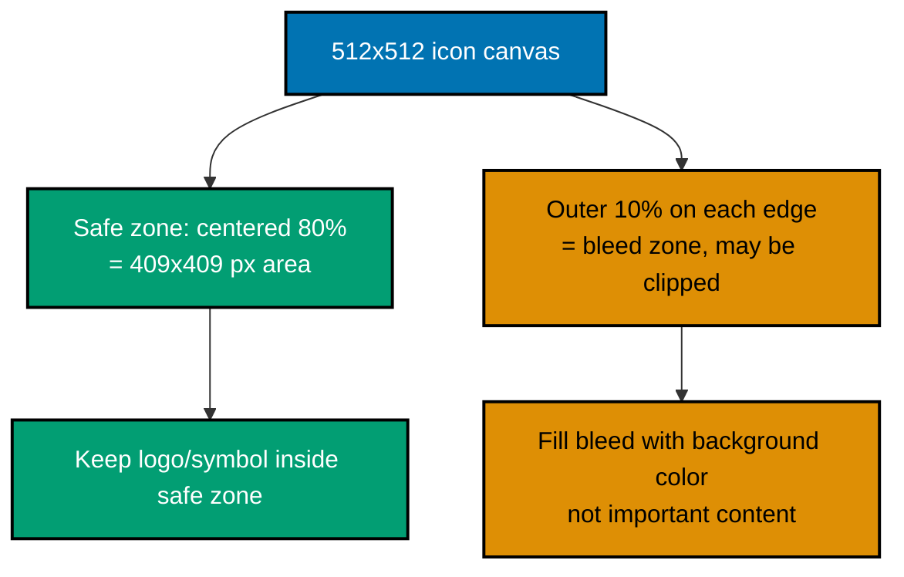
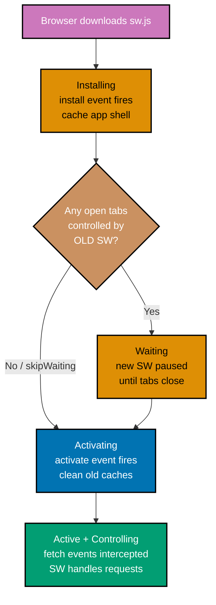

This beginner tutorial covers foundational Progressive Web App concepts through 28 heavily annotated examples. Each example maintains 1-2.25 comment lines per code line to ensure deep understanding.

## Prerequisites

Before starting, ensure you understand:

- JavaScript ES6+ syntax (arrow functions, destructuring, template literals, Promises, async/await)
- HTML basics (link elements, meta tags, script tags)
- HTTP fundamentals (requests, responses, URLs)
- Basic web development experience (you have served a web page before)

## Group 1: Web App Manifest

## Example 1: Creating a Web App Manifest — Required Fields for Installability

A web app manifest is a JSON file that tells the browser your app's name, icons, and display preferences. Chrome and Edge require `name`, `short_name`, `start_url`, `display`, and at least a 192px icon before they show the install prompt.

**Code**:

```json
{
  "name": "My Awesome App",
  "short_name": "AwesomeApp",
  "start_url": "/",
  "display": "standalone",
  "icons": [
    {
      "src": "/icons/icon-192.png",
      "sizes": "192x192",
      "type": "image/png"
    },
    {
      "src": "/icons/icon-512.png",
      "sizes": "512x512",
      "type": "image/png"
    }
  ]
}
```

**Key Takeaway**: A manifest needs `name`, `short_name`, `start_url`, `display`, and a 192px + 512px icon pair to qualify for the browser install prompt.

**Why It Matters**: The manifest is the entry point for PWA installability. Without it, the browser treats the site as a regular webpage regardless of how sophisticated the service worker is. Chrome, Edge, and Samsung Internet read this file to determine whether to show the "Add to Home Screen" or desktop install prompt. Getting these five fields right is the minimum viable step before any other PWA feature becomes reachable.

---

## Example 2: Adding Theme Color, Background Color, Description, and Language to the Manifest

Additional manifest fields improve the installed app's appearance in the OS launcher, splash screen, and browser UI. `theme_color` colors the browser toolbar, `background_color` sets the splash screen background before the app loads.

**Code**:

```json
{
  "name": "My Awesome App",
  "short_name": "AwesomeApp",
  "start_url": "/",
  "display": "standalone",
  "theme_color": "#0173B2",
  "background_color": "#ffffff",
  "description": "A productivity app that works offline and syncs in the background.",
  "lang": "en",
  "dir": "ltr",
  "orientation": "portrait-primary",
  "icons": [
    {
      "src": "/icons/icon-192.png",
      "sizes": "192x192",
      "type": "image/png"
    },
    {
      "src": "/icons/icon-512.png",
      "sizes": "512x512",
      "type": "image/png"
    }
  ]
}
```

**Key Takeaway**: `theme_color` and `background_color` control OS-level chrome for the installed app; `description` surfaces in browser install dialogs; `lang` and `dir` declare text direction for accessibility.

**Why It Matters**: These fields directly affect the first impression of an installed PWA. `background_color` eliminates the white flash during the splash screen before JavaScript loads. `theme_color` matches the app's brand in the Android task switcher and Chrome toolbar. `description` appears in Microsoft Store listings when using PWABuilder. Missing these fields produces a generic, unpolished installed app experience that reduces user retention.

---

## Example 3: Generating Maskable Icons — Safe Zone Rule

Maskable icons let the OS apply its own shape (circle, squircle, rounded rectangle) to your icon. The safe zone rule requires all meaningful content to stay within the central 80% of the icon so the OS mask does not clip it.



**Code**:

```json
{
  "icons": [
    {
      "src": "/icons/icon-192.png",
      "sizes": "192x192",
      "type": "image/png",
      "purpose": "any"
    },
    {
      "src": "/icons/icon-512.png",
      "sizes": "512x512",
      "type": "image/png",
      "purpose": "any"
    },
    {
      "src": "/icons/icon-maskable-512.png",
      "sizes": "512x512",
      "type": "image/png",
      "purpose": "maskable"
    }
  ]
}
```

**Key Takeaway**: Provide a separate `purpose: "maskable"` icon where your logo is centered in the safe zone (inner 80%), with a solid background color filling the outer bleed area.

**Why It Matters**: Android Adaptive Icons and other OS icon systems clip icons to a shape chosen by the launcher or theme. Without a maskable icon, Android falls back to a white square with your regular icon, which looks broken on circular icon launchers used by many Android skins. Maskable icons guarantee your app looks intentional on every device's home screen shape.

---

## Example 4: Linking the Manifest in HTML

The browser discovers the manifest through a `<link>` tag in the HTML `<head>`. Without this link, no manifest fields take effect regardless of where the JSON file lives.

**Code**:

```html
<!doctype html>
<html lang="en">
  <head>
    <meta charset="UTF-8" />
    <!-- => Viewport meta essential for mobile-responsive PWA -->
    <meta name="viewport" content="width=device-width, initial-scale=1.0" />

    <!-- => Links the web app manifest; href is relative to HTML file -->
    <!-- => Browser fetches this on page load to read PWA metadata -->
    <link rel="manifest" href="/manifest.json" />

    <!-- => theme-color meta tag: fallback for browsers that read meta tags -->
    <!-- => Chrome on Android reads both manifest theme_color and this tag -->
    <meta name="theme-color" content="#0173B2" />

    <title>My Awesome App</title>
  </head>
  <body>
    <!-- => App content here -->
    <div id="root"></div>
    <script src="/app.js"></script>
    <!-- => Service worker registered in app.js after page loads -->
  </body>
</html>
```

**Key Takeaway**: Add `<link rel="manifest" href="/manifest.json">` inside the `<head>` of every HTML page. The path must be absolute or relative to the HTML file's origin.

**Why It Matters**: The manifest link is what transforms a regular HTML page into a PWA candidate. Browsers like Chrome scan every navigation for this tag. Missing it from a subpage means users navigating directly to that URL lose installability. In multi-page apps, every HTML shell needs the manifest link — a single-page app's index.html is sufficient because the router serves one shell file.

---

## Example 5: Adding iOS Meta Tags for Safari PWA Support

Safari does not use the web app manifest for home screen installation. Apple uses proprietary meta tags. These tags are required for PWA-quality installation on iOS devices.

**Code**:

```html
<head>
  <!-- => Tells Safari to allow standalone mode (no browser chrome) -->
  <!-- => Without this, tapping the home screen icon opens Safari with address bar -->
  <meta name="apple-mobile-web-app-capable" content="yes" />

  <!-- => Sets the status bar style when running standalone -->
  <!-- => Options: "default" (white), "black", "black-translucent" (overlays content) -->
  <meta name="apple-mobile-web-app-status-bar-style" content="default" />

  <!-- => App name shown under the icon on the iOS home screen -->
  <!-- => Overrides the HTML <title> for this purpose -->
  <meta name="apple-mobile-web-app-title" content="AwesomeApp" />

  <!-- => iOS home screen icon: 180x180 px is the modern standard -->
  <!-- => Safari does not read manifest icons for home screen -->
  <link rel="apple-touch-icon" href="/icons/apple-touch-icon.png" />

  <!-- => Sized icons for older devices (optional but thorough) -->
  <link rel="apple-touch-icon" sizes="152x152" href="/icons/apple-touch-icon-152.png" />
  <link rel="apple-touch-icon" sizes="167x167" href="/icons/apple-touch-icon-167.png" />
  <link rel="apple-touch-icon" sizes="180x180" href="/icons/apple-touch-icon-180.png" />
</head>
```

**Key Takeaway**: Safari requires `apple-mobile-web-app-capable`, `apple-touch-icon`, and `apple-mobile-web-app-title` meta tags for iOS home screen installation — the manifest alone is not sufficient for iOS.

**Why It Matters**: iOS Safari has significant market share, especially in markets where iPhone is dominant. Skipping Apple meta tags produces a degraded experience: icons use a screenshot thumbnail instead of your branded icon, the status bar overlaps content, and the app name defaults to the full page title. Including these tags costs five lines of HTML and delivers a properly branded iOS installation experience.

---

## Group 2: Service Worker Fundamentals

## Example 6: Registering a Service Worker

Service worker registration tells the browser to install and run the `sw.js` script as a background worker. Registration should happen after the page loads to avoid blocking rendering.

**Code**:

```javascript
// main.js — executed in the main browser thread, not the service worker

// => Check if the browser supports service workers (all modern browsers do)
if ("serviceWorker" in navigator) {
  // => Wait for the page to fully load before registering
  // => Avoids competing with page resources during initial load
  window.addEventListener("load", async () => {
    try {
      // => Register the service worker script at /sw.js
      // => scope defaults to the directory containing sw.js ("/")
      // => type: 'module' enables ES module imports inside sw.js
      const registration = await navigator.serviceWorker.register("/sw.js", {
        scope: "/", // => Explicit scope: SW controls all pages under /
        type: "module", // => Enables import statements in the SW file
      });

      // => registration.scope is the absolute URL the SW controls
      console.log("SW registered:", registration.scope);
      // => Output: SW registered: https://example.com/

      // => registration.installing: SW in install phase (null if already active)
      // => registration.waiting: SW waiting to take over (null if none waiting)
      // => registration.active: currently controlling SW (null on first visit)
      console.log("Active SW:", registration.active);
    } catch (error) {
      // => Registration fails if sw.js has a syntax error or is unreachable
      console.error("SW registration failed:", error);
      // => App still works without SW; PWA features degrade gracefully
    }
  });
}
```

**Key Takeaway**: Register the service worker after the `load` event to avoid competing with page resources. Use `try/catch` so registration failures degrade gracefully without breaking the app.

**Why It Matters**: Service worker registration is the gateway to every offline, caching, push, and background sync capability. The registration is persistent — the browser keeps the service worker active between page loads. Once registered, the SW intercepts all network requests in its scope until explicitly unregistered or replaced by a new version. This single call is the most important PWA initialization step.

---

## Example 7: Service Worker Lifecycle — Install, Waiting, Activate, Controlling

The service worker lifecycle is a state machine managed by the browser. Understanding it prevents common bugs where old code keeps running or new features do not activate immediately.



**Code**:

```javascript
// sw.js — this runs in the service worker context, not the main thread

// => 'install' fires when the browser first encounters this SW version
// => or when sw.js content changes (new deployment)
self.addEventListener("install", (event) => {
  console.log("SW: install event");
  // => SW is in 'installing' state during this event
  // => Use event.waitUntil() to extend install phase until promise resolves
  // => If the promise rejects, install fails and SW is discarded
});

// => 'activate' fires after install completes and SW takes control
// => At this point, the old SW has stopped and this SW is now active
self.addEventListener("activate", (event) => {
  console.log("SW: activate event");
  // => SW is now 'active' but may not yet control existing tabs
  // => Call clients.claim() to control tabs immediately (Example 17)
});

// => 'fetch' fires for every network request made by controlled pages
// => This includes HTML, CSS, JS, images, API calls — everything
self.addEventListener("fetch", (event) => {
  console.log("SW: fetch event for", event.request.url);
  // => Without event.respondWith(), requests pass through to network normally
  // => Example 10 shows how to intercept and respond with cached data
});
```

**Key Takeaway**: The service worker lifecycle transitions through install → waiting → activate → controlling. The waiting state prevents a new SW from disrupting tabs still using the old version.

**Why It Matters**: The lifecycle protects users from sudden changes mid-session. A PWA that blindly updates mid-session can break outstanding API requests, corrupt local state, or change routing behavior unexpectedly. Understanding waiting lets you build update flows that notify users ("New version available — click to refresh") rather than silently breaking their session.

---

## Example 8: The Install Event — Caching the App Shell

The install event is the ideal time to pre-cache the static resources your app needs to load offline. These resources form the "app shell" — the minimal HTML, CSS, and JS needed to display the UI.

**Code**:

```javascript
// sw.js

// => Cache name includes version so old caches can be cleaned in activate
const CACHE_NAME = "app-shell-v1";

// => App shell: minimal resources needed to display UI without network
// => List every file that must load for the app to render at all
const APP_SHELL_URLS = [
  "/", // => HTML entry point (index.html)
  "/index.html", // => Explicit HTML file (some servers need both)
  "/css/main.css", // => Main stylesheet
  "/js/app.js", // => Application JavaScript bundle
  "/icons/icon-192.png", // => PWA icon referenced by manifest
  "/offline.html", // => Fallback page shown when offline (Example 16)
];

self.addEventListener("install", (event) => {
  // => event.waitUntil() keeps SW in 'installing' state until promise settles
  // => If promise rejects, install fails — SW will retry next page load
  event.waitUntil(
    (async () => {
      // => caches.open() creates or opens a named cache store
      // => Returns a Cache object for storing request/response pairs
      const cache = await caches.open(CACHE_NAME);
      // => Output: Cache {name: "app-shell-v1"}

      // => cache.addAll() fetches each URL and stores response in cache
      // => Equivalent to: fetch(url).then(res => cache.put(url, res))
      // => Throws if ANY request fails — prevents partial installs
      await cache.addAll(APP_SHELL_URLS);
      // => All 6 URLs now cached in "app-shell-v1"

      console.log("SW: app shell cached");
    })(),
  );
});
```

**Key Takeaway**: Use `cache.addAll()` in the install event to pre-cache the app shell. If any URL fails to fetch, the entire install fails, ensuring the cache is always complete.

**Why It Matters**: Pre-caching the app shell is what makes a PWA load instantly on repeat visits regardless of network quality. The browser serves these assets from disk without touching the network. This is the foundation of the "reliable" characteristic of PWAs. Without a pre-cached shell, the service worker cannot serve anything offline and every visit requires network access.

---

## Example 9: The Activate Event — Deleting Old Caches and Claiming Clients

The activate event runs after a new service worker takes over. It is the correct time to delete caches from older versions to free disk space and prevent stale assets from being served.

**Code**:

```javascript
// sw.js

const CACHE_NAME = "app-shell-v2"; // => Bumped from v1 to v2 on new deployment

self.addEventListener("activate", (event) => {
  event.waitUntil(
    (async () => {
      // => caches.keys() returns all cache names as an array of strings
      const cacheNames = await caches.keys();
      // => Example: ["app-shell-v1", "api-cache-v1"] (old caches)

      // => Delete every cache that is not the current version
      await Promise.all(
        cacheNames
          .filter(
            (name) => name !== CACHE_NAME, // => Keep only "app-shell-v2"
          )
          .map(
            (name) => caches.delete(name), // => Delete "app-shell-v1", "api-cache-v1", etc.
          ),
      );
      // => Old caches removed; "app-shell-v2" remains

      // => clients.claim() makes this SW control all open tabs immediately
      // => Without this, existing tabs remain controlled by old SW until reload
      await clients.claim();
      // => All tabs now controlled by this SW version

      console.log("SW: old caches cleaned, clients claimed");
    })(),
  );
});
```

**Key Takeaway**: Delete old caches by name in the activate event and call `clients.claim()` to immediately control all open tabs with the new service worker version.

**Why It Matters**: Without cache cleanup, every deployment accumulates stale caches consuming user disk space — a serious problem on low-storage mobile devices. Without `clients.claim()`, users who have the app open must close and reopen it before the new SW version takes effect. Combining both operations produces clean, immediate transitions to new versions without leaving orphaned data behind.

---

## Example 10: The Fetch Event — Basic Request Interception

The fetch event fires for every network request from a controlled page. The service worker can respond with cached data, modify requests, or let them pass through to the network.

**Code**:

```javascript
// sw.js

self.addEventListener("fetch", (event) => {
  // => event.request: the Request object containing url, method, headers, body
  const { url, method } = event.request;
  // => url: "https://example.com/api/data"
  // => method: "GET"

  // => Skip non-GET requests — caches store responses to GET requests only
  // => POST/PUT/DELETE requests contain body data and are not cacheable
  if (method !== "GET") {
    // => Returning without calling event.respondWith() passes the request through
    return;
  }

  // => event.respondWith() intercepts the request
  // => Must be called synchronously before the event handler returns
  // => Takes a Promise<Response> — resolves to what the client receives
  event.respondWith(
    (async () => {
      // => Check if we have a cached response for this URL
      const cached = await caches.match(event.request);
      // => cached: Response object if found, undefined if not in any cache

      if (cached) {
        // => Serve from cache: fast, no network needed
        console.log("SW: serving from cache:", url);
        return cached; // => Returns cached Response to the browser
      }

      // => No cache hit — fetch from network
      console.log("SW: fetching from network:", url);
      return fetch(event.request); // => Network Response returned to browser
    })(),
  );
});
```

**Key Takeaway**: The fetch event intercepts all GET requests in the service worker's scope. Call `event.respondWith()` with a `Response` promise to serve cached content, or return early to pass the request to the network unchanged.

**Why It Matters**: The fetch event is the engine of every caching strategy. Everything from simple cache-first serving to sophisticated stale-while-revalidate patterns happens inside this handler. Understanding that it must call `event.respondWith()` synchronously — even if the response is determined asynchronously — prevents a common bug where requests fall through because `respondWith` is called too late.

---

## Group 3: Caching Strategies

## Example 11: Cache First Strategy — Serve from Cache, Fall Back to Network

Cache First serves assets from cache immediately, only reaching the network if the asset is not cached. It is ideal for static assets like images, fonts, and CSS that rarely change.

**Code**:

```javascript
// sw.js

const STATIC_CACHE = "static-v1";

self.addEventListener("fetch", (event) => {
  // => Only apply Cache First to same-origin GET requests
  const url = new URL(event.request.url);
  if (event.request.method !== "GET" || url.origin !== self.location.origin) {
    return; // => Pass cross-origin or non-GET requests through unchanged
  }

  event.respondWith(
    (async () => {
      // => Step 1: Check the cache first
      const cached = await caches.match(event.request);
      // => cached: Response if found in any open cache, undefined otherwise

      if (cached) {
        // => Cache hit — return immediately, zero network latency
        return cached;
        // => Note: cached content may be stale; ideal for versioned files
      }

      // => Step 2: Cache miss — fetch from network
      const networkResponse = await fetch(event.request);
      // => networkResponse: fresh Response from the server

      // => Step 3: Store the new response in cache for future requests
      const cache = await caches.open(STATIC_CACHE);
      // => cache.put() stores the request/response pair
      // => Must clone the response — Response body can only be consumed once
      cache.put(event.request, networkResponse.clone());
      // => "static-v1" now contains this URL's response

      return networkResponse; // => Return original response to the browser
    })(),
  );
});
```

**Key Takeaway**: Cache First returns cached assets instantly with zero network latency. Always clone the response before storing it because a Response body can only be read once.

**Why It Matters**: Cache First is the highest-performance strategy for static assets. Images, fonts, and versioned JS/CSS bundles do not change between deployments — the cache hit rate approaches 100% for returning users. Workbox's `CacheFirst` class (Example 32) adds expiration and max-entry limits to prevent unbounded cache growth, which raw Cache First does not handle.

---

## Example 12: Network First Strategy — Try Network, Fall Back to Cache

Network First always attempts the network and only falls back to cache on network failure. It is ideal for HTML pages and API responses where freshness matters more than speed.

**Code**:

```javascript
// sw.js

const PAGES_CACHE = "pages-v1";

self.addEventListener("fetch", (event) => {
  // => Only handle navigation requests (HTML page loads)
  if (event.request.mode !== "navigate") {
    return; // => Let non-navigation requests use other strategies
  }

  event.respondWith(
    (async () => {
      try {
        // => Step 1: Try the network first for fresh HTML
        const networkResponse = await fetch(event.request);
        // => networkResponse: fresh HTML from server

        // => Step 2: Cache the fresh response for offline use
        const cache = await caches.open(PAGES_CACHE);
        cache.put(event.request, networkResponse.clone());
        // => Response cloned because body can only be consumed once

        return networkResponse; // => Serve fresh response to browser
      } catch (networkError) {
        // => Network failed (offline, timeout, DNS failure)
        console.log("SW: network failed, checking cache:", networkError);

        // => Step 3: Fall back to cached version
        const cached = await caches.match(event.request);
        // => cached: previously stored HTML for this URL

        if (cached) {
          return cached; // => Serve stale HTML — better than nothing offline
        }

        // => Step 4: No cache and no network — serve offline fallback page
        return caches.match("/offline.html");
        // => /offline.html must be pre-cached in install event (Example 8)
      }
    })(),
  );
});
```

**Key Takeaway**: Network First ensures freshness on good connections while providing offline resilience through the cache fallback. Always pair it with a pre-cached offline fallback for complete offline coverage.

**Why It Matters**: HTML pages are the wrong candidates for Cache First — users would see yesterday's content every visit. Network First delivers the current page on fast connections while guaranteeing something useful appears when the network is down. This is the recommended strategy for navigation requests in most apps.

---

## Example 13: Stale While Revalidate — Serve Cache Immediately, Update in Background

Stale While Revalidate (SWR) serves the cached version immediately for speed, then fetches the network version in the background and updates the cache. Perfect for API responses where moderate staleness is acceptable.

**Code**:

```javascript
// sw.js

const API_CACHE = "api-v1";

self.addEventListener("fetch", (event) => {
  // => Apply SWR only to API requests (adjust URL pattern as needed)
  const url = new URL(event.request.url);
  if (!url.pathname.startsWith("/api/")) {
    return; // => Non-API requests handled by other strategies
  }

  event.respondWith(
    (async () => {
      // => Step 1: Open cache and check for existing response
      const cache = await caches.open(API_CACHE);
      const cached = await cache.match(event.request);
      // => cached: previous API response or undefined on first visit

      // => Step 2: Start network fetch regardless of cache hit
      // => Do NOT await it here — we want it to run in the background
      const networkFetch = fetch(event.request).then((networkResponse) => {
        // => Network response arrived — update cache in background
        cache.put(event.request, networkResponse.clone());
        // => Cache now holds the fresh response for next request
        return networkResponse;
      });
      // => networkFetch is a pending Promise — not yet resolved

      // => Step 3: Return cached response immediately (or wait for network if no cache)
      // => If cached exists, user sees instant response; background fetch updates cache
      return cached || networkFetch;
      // => If no cache: awaits network response (first visit behavior)
      // => If cache exists: returns stale data immediately, cache updated silently
    })(),
  );
});
```

**Key Takeaway**: Stale While Revalidate provides instant responses from cache while keeping data fresh through background network updates. The user always gets a fast response; freshness catches up silently.

**Why It Matters**: SWR is the sweet spot between speed and freshness for most API data. Showing a list of articles, product listings, or user profiles from cache while a fresh version loads invisibly in the background is imperceptible to users but dramatically improves perceived performance. Workbox's `StaleWhileRevalidate` class (Example 34) adds retry logic and expiration policies.

---

## Example 14: Cache Only Strategy — Serve Only from Cache

Cache Only serves responses exclusively from cache and returns a failure if the asset is not cached. It is appropriate for assets that were pre-cached during install and should never be fetched over the network at runtime.

**Code**:

```javascript
// sw.js

self.addEventListener("fetch", (event) => {
  const url = new URL(event.request.url);

  // => Apply Cache Only to versioned static assets (fingerprinted filenames)
  // => These files are pre-cached during install: changing them means a new deployment
  const isVersionedAsset = /\.(css|js)$/.test(url.pathname) && url.searchParams.has("v"); // => e.g., /app.js?v=abc123

  if (!isVersionedAsset) {
    return; // => Other requests use different strategies
  }

  event.respondWith(
    (async () => {
      // => caches.match() searches ALL open caches for a matching response
      const cached = await caches.match(event.request);
      // => cached: Response from pre-cached install, or undefined

      if (cached) {
        return cached; // => Serve from cache — never hit the network
      }

      // => Asset not in cache — this should not happen for pre-cached assets
      // => Return a meaningful error response instead of letting it hang
      return new Response("Asset not found in cache", {
        status: 503,
        // => 503 Service Unavailable: asset should exist but does not
        statusText: "Service Unavailable",
        headers: { "Content-Type": "text/plain" },
      });
    })(),
  );
});
```

**Key Takeaway**: Cache Only is appropriate for pre-cached versioned assets where network fetching is never expected. Use it only for assets guaranteed to be in the cache from the install step.

**Why It Matters**: Cache Only eliminates all network requests for stable assets, which maximizes offline reliability and minimizes bandwidth. Fingerprinted build artifacts (Webpack, Vite) generate unique filenames per build, so the same filename always refers to the same content. Serving them exclusively from cache is semantically correct and maximally efficient.

---

## Example 15: Network Only Strategy — Bypass Cache Entirely

Network Only passes requests directly to the network without checking or updating the cache. Use it for non-cacheable requests: POST mutations, payment endpoints, and real-time data.

**Code**:

```javascript
// sw.js

self.addEventListener("fetch", (event) => {
  const url = new URL(event.request.url);

  // => Apply Network Only to POST requests and specific API paths
  const isNonCacheable =
    event.request.method !== "GET" || // => POST, PUT, DELETE, PATCH
    url.pathname.startsWith("/api/auth/") || // => Auth endpoints: always fresh
    url.pathname.startsWith("/api/payment/"); // => Payment: never cache

  if (!isNonCacheable) {
    return; // => Other requests handled by appropriate caching strategies
  }

  event.respondWith(
    (async () => {
      try {
        // => Fetch directly from network — no cache read or write
        const response = await fetch(event.request);
        // => response: live Response from server

        // => Note: we do NOT call cache.put() here
        // => Payment and auth data must never be stored in browser cache
        return response;
      } catch (error) {
        // => Network failure: return meaningful error, not a generic failure
        return new Response(JSON.stringify({ error: "Network unavailable", offline: true }), {
          status: 503,
          // => 503: server or network unreachable
          headers: { "Content-Type": "application/json" },
        });
      }
    })(),
  );
});
```

**Key Takeaway**: Network Only is the correct strategy for state-mutating requests and sensitive endpoints. These requests must never be served from cache because caching would replay mutations or expose sensitive data.

**Why It Matters**: Using the wrong caching strategy on mutation endpoints is a serious bug. Serving a cached POST response would appear to succeed while the actual request was never sent. Serving a cached authentication token check after logout could leave a user appearing logged in. Network Only is the safe default for any request with side effects.

---

## Example 16: Offline Fallback Page

An offline fallback page is served when the user is offline and no cached version of the requested page exists. It provides a graceful degradation instead of a browser error screen.

**Code**:

```javascript
// sw.js — pre-cache offline.html in the install event

const CACHE_NAME = "app-shell-v1";
const OFFLINE_URL = "/offline.html";

// => Cache offline.html during install so it is always available
self.addEventListener("install", (event) => {
  event.waitUntil(
    caches.open(CACHE_NAME).then((cache) => {
      // => cache.add() fetches and caches a single URL
      // => offline.html must be a complete standalone HTML page
      return cache.add(OFFLINE_URL);
    }),
  );
});

self.addEventListener("fetch", (event) => {
  // => Only apply offline fallback to navigation requests (page loads)
  if (event.request.mode !== "navigate") return;

  event.respondWith(
    (async () => {
      try {
        // => 1. Try network first
        return await fetch(event.request);
        // => Success: fresh page served
      } catch {
        // => 2. Network failed — check page cache
        const cached = await caches.match(event.request);
        if (cached) return cached;
        // => Cached page exists: serve stale but functional page

        // => 3. No network, no cache — serve offline fallback
        const offline = await caches.match(OFFLINE_URL);
        // => offline: the pre-cached /offline.html page
        return offline;
        // => User sees friendly "You are offline" page instead of browser error
      }
    })(),
  );
});
```

**Key Takeaway**: Pre-cache `/offline.html` during install and serve it as the last resort fallback when both the network and the page cache are unavailable for navigation requests.

**Why It Matters**: Browser error pages ("No internet connection" in Chrome) destroy the perception of a native app. A custom offline page maintains the app's visual identity, explains the situation, and can provide cached content or actions (like showing offline data from IndexedDB). Lighthouse audits check for a custom offline page as part of the PWA installability score.

---

## Group 4: Service Worker Control

## Example 17: skipWaiting and clients.claim for Immediate Activation

By default, a new service worker waits for all open tabs to close before taking over. `skipWaiting()` bypasses this wait, and `clients.claim()` immediately controls all open tabs.

**Code**:

```javascript
// sw.js

const CACHE_NAME = "app-v2"; // => New version of the cache

self.addEventListener("install", (event) => {
  event.waitUntil(
    (async () => {
      const cache = await caches.open(CACHE_NAME);
      await cache.addAll(["/", "/index.html", "/app.js", "/styles.css"]);
      // => App shell cached for v2

      // => skipWaiting() signals the browser to activate this SW immediately
      // => Instead of waiting for old SW to release, this SW takes over now
      // => CAUTION: activating while old tabs are open can cause version mismatches
      await self.skipWaiting();
      // => SW moves from 'waiting' to 'activating' state immediately
    })(),
  );
});

self.addEventListener("activate", (event) => {
  event.waitUntil(
    (async () => {
      // => Clean up old caches (same pattern as Example 9)
      const cacheNames = await caches.keys();
      await Promise.all(cacheNames.filter((name) => name !== CACHE_NAME).map((name) => caches.delete(name)));

      // => clients.claim() makes this SW the controller of all open tabs
      // => Without this, existing tabs are still controlled by old SW
      // => After claim(), fetch events on those tabs go through this new SW
      await clients.claim();
      // => All open tabs now controlled by app-v2 SW
    })(),
  );
});
```

**Key Takeaway**: `skipWaiting()` in the install event and `clients.claim()` in the activate event together produce immediate service worker takeover without requiring the user to close and reopen tabs.

**Why It Matters**: The default waiting behavior protects users from mid-session disruption but frustrates developers expecting immediate updates. `skipWaiting()` is appropriate for stateless apps where switching SW version mid-session has no side effects. For apps with complex state, it is safer to notify users of the update and let them choose when to reload (Example 68 covers this update UX pattern).

---

## Example 18: Versioned Cache Names for Cache Busting

Versioned cache names allow a new service worker deployment to create fresh caches while the old version's caches remain available until the old SW deactivates.

**Code**:

```javascript
// sw.js

// => Cache name version strategy: increment CACHE_VERSION on every deployment
// => This ensures new deployments get fresh caches, not stale content
const CACHE_VERSION = "v3"; // => Bump to v4 on next deployment
const STATIC_CACHE = `static-${CACHE_VERSION}`; // => "static-v3"
const API_CACHE = `api-${CACHE_VERSION}`; // => "api-v3"
const IMAGE_CACHE = `images-${CACHE_VERSION}`; // => "images-v3"

// => All known caches for THIS version — used in activate cleanup
const CURRENT_CACHES = [STATIC_CACHE, API_CACHE, IMAGE_CACHE];

self.addEventListener("install", (event) => {
  event.waitUntil(
    (async () => {
      const cache = await caches.open(STATIC_CACHE);
      // => Opens "static-v3" — previous "static-v2" still exists during install
      await cache.addAll(["/", "/app.js", "/styles.css"]);
      // => "static-v3" now has fresh assets
      console.log("Installed cache:", STATIC_CACHE);
    })(),
  );
});

self.addEventListener("activate", (event) => {
  event.waitUntil(
    (async () => {
      const allCaches = await caches.keys();
      // => allCaches: ["static-v1", "api-v1", "static-v2", "api-v2", "static-v3", ...]

      // => Delete any cache not in CURRENT_CACHES (old versions)
      await Promise.all(
        allCaches
          .filter((name) => !CURRENT_CACHES.includes(name))
          // => Filters to: ["static-v1", "api-v1", "static-v2", "api-v2"]
          .map((name) => caches.delete(name)),
        // => All old version caches deleted
      );

      console.log(
        "Caches after cleanup:",
        await caches.keys(),
        // => Output: ["static-v3", "api-v3", "images-v3"]
      );
    })(),
  );
});
```

**Key Takeaway**: Use a `CACHE_VERSION` constant in cache names. Increment it on every deployment, then clean up all non-current caches in the activate event.

**Why It Matters**: Without cache versioning, deploying a new service worker may mix assets from different deployments — old CSS with new HTML, or old API responses with new request formats. Version suffixes guarantee that each deployment operates on its own isolated set of caches. The cleanup in activate prevents cache accumulation that would silently consume user storage.

---

## Group 5: Offline and Install Detection

## Example 19: Detecting Online and Offline Status

The browser exposes `navigator.onLine` and fires `online`/`offline` events when connectivity changes. These let you adjust the UI to inform users of their connectivity state.

**Code**:

```javascript
// app.js — main thread JavaScript, not the service worker

// => navigator.onLine: boolean, true if browser believes it has network access
// => Note: true does not guarantee internet access — only that an interface is connected
console.log("Currently online:", navigator.onLine);
// => Output: "Currently online: true" (or false if no network interface)

// => Show initial connectivity state in UI
function updateConnectivityUI(isOnline) {
  const banner = document.getElementById("offline-banner");
  if (banner) {
    // => Hide banner when online, show it when offline
    banner.hidden = isOnline;
    // => banner.hidden = true when online → banner not rendered
    // => banner.hidden = false when offline → "You are offline" visible
    banner.textContent = isOnline ? "" : "You are offline — changes will sync when reconnected";
  }
}

updateConnectivityUI(navigator.onLine); // => Set initial state on page load

// => 'online' event fires when browser regains network connectivity
window.addEventListener("online", () => {
  console.log("Network restored");
  updateConnectivityUI(true); // => Hide offline banner
  // => Good time to flush queued operations (sync pending data, retry requests)
});

// => 'offline' event fires when browser loses network connectivity
window.addEventListener("offline", () => {
  console.log("Network lost");
  updateConnectivityUI(false); // => Show offline banner
  // => Good time to pause auto-refresh intervals, show cached data notice
});
```

**Key Takeaway**: Listen for `online` and `offline` events on `window` to reactively update the UI. Check `navigator.onLine` for the current state on page load. Note that `navigator.onLine: true` only means a network interface exists, not that internet access is available.

**Why It Matters**: Transparent connectivity feedback is critical for user trust in offline-capable apps. Without explicit offline indicators, users assume the app is broken when data stops loading. Showing "You are offline" with an explanation eliminates support tickets and frustration. The `online` event is also the trigger for flushing queued operations like background sync fallbacks in browsers that don't support the Background Sync API.

---

## Example 20: Display Mode Detection — Detecting Standalone Mode

When a PWA runs in standalone mode (installed), the browser hides its address bar and navigation chrome. Detecting standalone mode lets you adapt the UI (show a custom back button, adjust layout, or track install analytics).

**Code**:

```javascript
// app.js

// => matchMedia query checks the current display mode against the manifest value
// => Returns a MediaQueryList object (same API as (prefers-color-scheme: dark))
const standaloneQuery = window.matchMedia("(display-mode: standalone)");

// => .matches: boolean — true if currently running in standalone mode
const isStandalone = standaloneQuery.matches;
// => isStandalone: true when opened from home screen, false in browser tab

console.log("Running in standalone mode:", isStandalone);
// => Output: "Running in standalone mode: true" (when launched from home screen)

// => Adjust layout based on display mode
function applyDisplayModeUI(isStandalone) {
  const header = document.querySelector("header");
  if (header && isStandalone) {
    // => No browser address bar — add custom navigation header
    header.classList.add("pwa-standalone-header");
    // => Custom header styles: fixed top position, back button, etc.
  }
}

applyDisplayModeUI(isStandalone); // => Apply on load

// => Listen for display mode changes (rare but possible on desktop)
standaloneQuery.addEventListener("change", (event) => {
  // => event.matches: new display mode state
  console.log("Display mode changed, standalone:", event.matches);
  applyDisplayModeUI(event.matches);
});

// => Check for iOS standalone mode (Safari does not support display-mode media query)
// => navigator.standalone is an Apple-proprietary boolean
const isIOSStandalone = window.navigator.standalone === true;
// => isIOSStandalone: true when launched from iOS home screen
console.log("iOS standalone:", isIOSStandalone);
```

**Key Takeaway**: Use `window.matchMedia('(display-mode: standalone)')` to detect PWA standalone mode in most browsers. Add `window.navigator.standalone` check for iOS Safari, which does not support the display-mode media query.

**Why It Matters**: Standalone mode removes browser navigation controls. A PWA without custom navigation in standalone mode leaves users unable to go back or access other pages. Analytics that track standalone usage inform how many users have installed the PWA versus using it in the browser — a key metric for PWA adoption and engagement rates.

---

## Example 21: Intercepting beforeinstallprompt for a Custom Install Button

Chrome and Edge fire `beforeinstallprompt` before showing the default install UI. Calling `preventDefault()` suppresses the browser prompt, letting you show a custom "Install App" button at the right moment.

**Code**:

```javascript
// app.js

// => Store the deferred prompt event — it cannot be recreated
let deferredPrompt = null;

// => beforeinstallprompt fires when browser decides the app is installable
// => Chrome/Edge only — does NOT fire in Firefox or Safari
window.addEventListener("beforeinstallprompt", (event) => {
  // => Prevent Chrome/Edge from showing the automatic mini-infobar
  event.preventDefault();
  // => Mini-infobar suppressed

  // => Save the event so we can trigger it later from our button
  deferredPrompt = event;
  // => deferredPrompt is now a BeforeInstallPromptEvent object

  // => Show our custom install button (hidden by default)
  const installButton = document.getElementById("install-btn");
  if (installButton) {
    installButton.style.display = "block";
    // => Install button is now visible in the UI
  }

  console.log("beforeinstallprompt captured — custom install button shown");
});

// => Also listen for appinstalled to hide the button after installation
window.addEventListener("appinstalled", () => {
  deferredPrompt = null; // => No longer needed
  const installButton = document.getElementById("install-btn");
  if (installButton) {
    installButton.style.display = "none"; // => Hide after install
  }
});
```

**Key Takeaway**: Store the `beforeinstallprompt` event in a variable after calling `preventDefault()`. Display a custom install button only when this event has fired, hiding it in browsers that do not support the prompt (Firefox, Safari).

**Why It Matters**: The default Chrome mini-infobar appears at random moments and is easily dismissed. A contextual install button shown at the right moment — after the user has engaged with the app — converts significantly better. Studies show that timing the install prompt to post-engagement (after completing a task) increases install rates by 30-50%.

---

## Example 22: Showing the Native Install Dialog

After capturing `beforeinstallprompt`, call `deferredPrompt.prompt()` from a user gesture to show the native install dialog. Handle the user's choice to track the outcome.

**Code**:

```javascript
// app.js (continues from Example 21)

const installButton = document.getElementById("install-btn");

installButton.addEventListener("click", async () => {
  // => deferredPrompt must not be null — button should only be visible when set
  if (!deferredPrompt) {
    console.log("No install prompt available");
    return; // => Guard: prompt already used or browser does not support it
  }

  // => prompt() shows the native OS install dialog
  // => Must be called from a user gesture (click, keydown, etc.)
  // => Calling it outside a user gesture throws a DOMException
  deferredPrompt.prompt();
  // => Native install dialog appears: "Add MyApp to Home Screen?"

  // => Wait for the user to respond to the dialog
  const { outcome } = await deferredPrompt.userChoice;
  // => outcome: "accepted" if user tapped Install, "dismissed" if they tapped Cancel

  console.log("User choice:", outcome);
  // => Output: "User choice: accepted" or "User choice: dismissed"

  if (outcome === "accepted") {
    console.log("User accepted the install prompt");
    // => Good time to log analytics event: install_prompt_accepted
    // => App will install and appinstalled event will fire
  } else {
    console.log("User dismissed the install prompt");
    // => Good time to log analytics event: install_prompt_dismissed
    // => Do not immediately re-prompt — wait for meaningful re-engagement
  }

  // => Prompt can only be used once — null it after use
  deferredPrompt = null;
  // => deferredPrompt is now null until browser fires beforeinstallprompt again
});
```

**Key Takeaway**: Call `deferredPrompt.prompt()` from a user click handler, then `await deferredPrompt.userChoice` to receive the outcome. The prompt can only be shown once per event — null the reference after use.

**Why It Matters**: The native install dialog is the browser's sanctioned mechanism for committing a web app to the user's device. It is the only path to true home screen installation on Android (Chrome/Edge). Handling `userChoice` provides data to improve install conversion — knowing the dismiss rate helps tune when and how often to surface the install button.

---

## Example 23: The appinstalled Event — Tracking Successful Installation

The `appinstalled` event fires after the user successfully installs the PWA. Use it to send analytics, update the UI, and stop showing install prompts.

**Code**:

```javascript
// app.js

// => appinstalled fires on the window after the PWA is added to home screen
// => Fires in Chrome, Edge, Samsung Internet after successful installation
// => Does NOT fire in Safari (iOS uses a different install mechanism)
window.addEventListener("appinstalled", (event) => {
  console.log("PWA installed successfully", event);
  // => event: AppInstalledEvent object (minimal fields)

  // => 1. Clear the deferred prompt — no longer needed
  deferredPrompt = null;

  // => 2. Hide the install button — app is already installed
  const installButton = document.getElementById("install-btn");
  if (installButton) {
    installButton.style.display = "none";
    // => Install button hidden — prevents confusing "Install" button in installed app
  }

  // => 3. Track the installation in analytics
  // => This is the key metric for PWA adoption
  if (typeof gtag === "function") {
    gtag("event", "pwa_install", {
      event_category: "PWA",
      event_label: "Installation",
      // => Sent to Google Analytics: event_category="PWA", event_label="Installation"
    });
  }

  // => 4. Optionally show a welcome message for new installs
  const welcomeBanner = document.getElementById("install-success-banner");
  if (welcomeBanner) {
    welcomeBanner.hidden = false;
    // => "App installed! Launch it from your home screen."
    setTimeout(() => {
      welcomeBanner.hidden = true;
    }, 5000);
    // => Auto-hide the banner after 5 seconds
  }
});
```

**Key Takeaway**: The `appinstalled` event confirms successful installation. Use it to clear the install prompt state, hide the install button, and fire analytics events tracking PWA adoption.

**Why It Matters**: Installation tracking is a critical PWA business metric. Without it, teams cannot measure the ROI of PWA investment or A/B test install prompt strategies. The `appinstalled` event provides a reliable signal for each new installation, enabling funnel analysis from page visit → install prompt shown → install accepted → app launched from home screen.

---

## Example 24: Web Share API — Sharing Content with Native Dialogs

The Web Share API invokes the native OS share sheet, letting users share URLs, text, and files through any app on their device. Always use feature detection before calling it.

**Code**:

```javascript
// app.js

const shareButton = document.getElementById("share-btn");

shareButton.addEventListener("click", async () => {
  // => Prepare the share data object
  const shareData = {
    title: "Check out this article",
    // => title: suggested title for the share target (e.g., email subject)
    text: "I found this really useful article about PWAs.",
    // => text: body text for the share (e.g., email body, tweet text)
    url: window.location.href,
    // => url: the URL to share — defaults to current page
  };

  // => Step 1: Feature detect — not all browsers support Web Share API
  if (!navigator.share) {
    // => Fallback: copy URL to clipboard or show manual share options
    console.log("Web Share API not supported — use fallback");
    await navigator.clipboard.writeText(shareData.url);
    // => Clipboard API as fallback — writes URL to clipboard
    alert("Link copied to clipboard!");
    return;
  }

  // => Step 2: canShare() validates the data before calling share()
  // => Returns false if data contains unsupported fields or invalid URLs
  if (!navigator.canShare(shareData)) {
    console.log("Share data not supported by browser");
    return; // => Data format rejected — adjust shareData fields
  }

  try {
    // => Step 3: share() opens the native OS share sheet
    await navigator.share(shareData);
    // => On Android: opens share menu with all installed apps
    // => On iOS: opens the iOS share sheet
    // => On macOS/Windows: opens native share dialog

    console.log("Content shared successfully");
    // => User completed or dismissed the share — no event to distinguish
  } catch (error) {
    if (error.name === "AbortError") {
      // => User dismissed the share sheet without sharing
      console.log("Share cancelled by user");
    } else {
      // => Unexpected error (permissions, invalid data)
      console.error("Share failed:", error);
    }
  }
});
```

**Key Takeaway**: Always check `navigator.share` exists and call `navigator.canShare(data)` before invoking `navigator.share(data)`. Wrap in try/catch to distinguish user cancellation (`AbortError`) from errors.

**Why It Matters**: The Web Share API replaces custom social sharing buttons with the OS native experience, which is more trusted and familiar to users. Users can share to any app — WhatsApp, email, SMS, Slack — without the developer needing to integrate each platform. On mobile, this is dramatically better UX than a row of social media logos.

---

## Example 25: Storage Estimation — Checking Quota and Usage

`navigator.storage.estimate()` reports how much storage the PWA is using and how much is available. Use it to make informed decisions about caching and to warn users before their quota is exhausted.

**Code**:

```javascript
// app.js

async function checkStorageQuota() {
  // => storageManager only available in secure contexts (HTTPS or localhost)
  if (!("storage" in navigator && "estimate" in navigator.storage)) {
    console.log("Storage Estimation API not supported");
    return null; // => Safari < 15.2 did not support this API
  }

  // => estimate() returns an object with usage and quota in bytes
  const estimate = await navigator.storage.estimate();
  // => estimate: { usage: 1234567, quota: 536870912, usageDetails: {...} }

  const usageBytes = estimate.usage;
  // => usageBytes: 1234567 — total bytes used by this origin
  const quotaBytes = estimate.quota;
  // => quotaBytes: 536870912 — maximum bytes available (browser-managed)

  // => Convert to megabytes for readable display
  const usageMB = (usageBytes / 1024 / 1024).toFixed(2);
  // => usageMB: "1.18" (MB used)
  const quotaMB = (quotaBytes / 1024 / 1024).toFixed(2);
  // => quotaMB: "512.00" (MB available)

  console.log(`Storage: ${usageMB} MB used of ${quotaMB} MB quota`);
  // => Output: "Storage: 1.18 MB used of 512.00 MB quota"

  // => Warn user if approaching quota (above 80% usage)
  const usagePercent = (usageBytes / quotaBytes) * 100;
  // => usagePercent: 0.23 (well under limit in this example)

  if (usagePercent > 80) {
    console.warn(`Storage at ${usagePercent.toFixed(1)}% — consider clearing caches`);
    // => Alert user or proactively clear old API caches
  }

  return { usageBytes, quotaBytes, usagePercent };
}

checkStorageQuota();
```

**Key Takeaway**: Call `navigator.storage.estimate()` to retrieve `usage` and `quota` in bytes. Use the ratio to warn users or proactively clear caches before hitting the storage limit.

**Why It Matters**: PWAs on mobile devices operate under strict storage quotas. Chrome grants up to 60% of free disk space but can evict data under storage pressure. Without monitoring, a heavy cache strategy silently consumes storage until the browser evicts caches without warning. Proactive monitoring and cache limits (via Workbox `ExpirationPlugin`) prevent this.

---

## Example 26: Persistent Storage — Requesting Protection from Eviction

By default, browser storage is "best effort" — the browser may delete it when storage is low. `navigator.storage.persist()` requests that the browser never evict this origin's data without explicit user permission.

**Code**:

```javascript
// app.js

async function requestPersistentStorage() {
  // => Check if the API is available (all modern browsers support it)
  if (!("storage" in navigator && "persist" in navigator.storage)) {
    console.log("Persistent Storage API not supported");
    return false;
  }

  // => Check if already persistent (avoid redundant prompts)
  const alreadyPersisted = await navigator.storage.persisted();
  // => alreadyPersisted: boolean — true if persistence already granted

  if (alreadyPersisted) {
    console.log("Storage already persistent — no action needed");
    return true; // => Already protected, nothing to do
  }

  // => persist() requests that the browser protect this origin's storage
  // => Chrome grants it automatically if: site is bookmarked, has high engagement, or
  // => is installed as a PWA. Firefox shows a permission prompt.
  const isPersisted = await navigator.storage.persist();
  // => isPersisted: true if granted, false if denied or not yet granted

  if (isPersisted) {
    console.log("Persistent storage granted — data protected from eviction");
    // => IndexedDB, cache storage, localStorage: all protected
  } else {
    console.log("Persistent storage denied — data may be evicted under pressure");
    // => Handle gracefully: data is still stored, just not guaranteed
    // => Consider informing users that offline data may not persist long-term
  }

  return isPersisted;
}

// => Request persistent storage when user saves important offline data
document.getElementById("save-offline-btn")?.addEventListener("click", async () => {
  await requestPersistentStorage(); // => Request before storing important data
  // => Then save data to IndexedDB or localStorage
});
```

**Key Takeaway**: Call `navigator.storage.persist()` before storing important offline data. Check `navigator.storage.persisted()` first to avoid redundant calls. Granted persistence protects IndexedDB and cache storage from browser eviction.

**Why It Matters**: An offline-first app that loses its data silently when the device runs low on storage is worse than no offline support at all — users expect their data to be there. Persistent storage is especially critical for productivity apps (notes, forms, offline documents) where data loss directly causes harm. Chrome automatically grants persistence to installed PWAs, making this a strong reason to encourage installation.

---

## Example 27: Linking Favicon, apple-touch-icon, and theme-color for Full Browser UI Integration

A complete PWA needs icons and color metadata declared in multiple places to achieve consistent branding across browser tabs, bookmarks, OS task switchers, and home screens.

**Code**:

```html
<head>
  <!-- => Standard favicon: shows in browser tabs, bookmarks, history -->
  <!-- => SVG favicon supported in all modern browsers — scales to any size -->
  <link rel="icon" type="image/svg+xml" href="/icons/favicon.svg" />

  <!-- => PNG fallback for browsers without SVG favicon support -->
  <!-- => sizes attribute helps browser pick the right resolution -->
  <link rel="icon" type="image/png" sizes="32x32" href="/icons/favicon-32.png" />
  <link rel="icon" type="image/png" sizes="16x16" href="/icons/favicon-16.png" />

  <!-- => apple-touch-icon: iOS home screen and bookmarks icon -->
  <!-- => 180x180 px is the standard size for modern iPhones -->
  <!-- => Safari reads this when user adds to home screen -->
  <link rel="apple-touch-icon" sizes="180x180" href="/icons/apple-touch-icon.png" />

  <!-- => Manifest link: connects web app manifest (Example 4) -->
  <link rel="manifest" href="/manifest.json" />

  <!-- => theme-color meta: colors browser toolbar and address bar on Android -->
  <!-- => Matches theme_color in manifest.json for consistent branding -->
  <meta name="theme-color" content="#0173B2" />

  <!-- => Dark mode theme-color: adjusts browser chrome when OS is in dark mode -->
  <meta name="theme-color" media="(prefers-color-scheme: dark)" content="#0d1b2a" />
  <!-- => Dark background for dark mode browser toolbar -->

  <!-- => For Windows tiles (Microsoft Edge + Windows integration) -->
  <meta name="msapplication-TileColor" content="#0173B2" />
  <!-- => Colors the Windows Start menu tile -->
</head>
```

**Key Takeaway**: Full browser UI integration requires: SVG favicon + PNG fallback for tabs/bookmarks, `apple-touch-icon` for iOS, `<link rel="manifest">` for PWA features, and `theme-color` meta tags for browser toolbar branding.

**Why It Matters**: Each platform reads different icon and color signals. Omitting any single element produces a noticeably unpolished experience on that platform. A branded browser toolbar (`theme-color`) reinforces the app's identity even before installation. The dark mode `theme-color` variant (using the `media` attribute) ensures correct appearance in dark-themed browsers — a detail that immediately distinguishes a polished PWA from a basic website.

---

## Example 28: Auditing a PWA with Lighthouse

Lighthouse is Chrome DevTools' automated audit tool. Running a PWA audit reveals exactly which installability criteria are met or missing, and provides an offline readiness score.

**Code**:

```bash
# Run Lighthouse from the command line using the Lighthouse CLI
# Install Lighthouse globally with npm
npm install -g lighthouse
# => Installs the lighthouse binary globally

# Run a PWA audit on a local development server
lighthouse http://localhost:3000 --only-categories=pwa --output=html --output-path=./pwa-audit.html
# => --only-categories=pwa: runs only PWA checks (skips performance, SEO, accessibility)
# => --output=html: generates an HTML report file
# => --output-path: where to save the report
# => Report saved to ./pwa-audit.html

# Run a full audit including performance and accessibility
lighthouse http://localhost:3000 --output=html --output-path=./full-audit.html --view
# => --view: opens the report in Chrome automatically after audit

# JSON output for CI integration
lighthouse http://localhost:3000 --only-categories=pwa --output=json --output-path=./pwa-audit.json
# => JSON output: machine-readable for CI pass/fail checks

# Chrome DevTools alternative (no install required):
# 1. Open Chrome DevTools (F12)
# 2. Select "Lighthouse" tab
# 3. Check "Progressive Web App" category
# 4. Click "Analyze page load"
# => Lighthouse runs in the browser and shows results inline
```

The key PWA checks Lighthouse evaluates:

```javascript
// Lighthouse PWA checklist — these are the core criteria:

const lighthousePWACriteria = {
  // => Installability criteria
  hasManifest: "manifest.json linked in HTML head",
  // => manifest must be reachable and valid JSON
  hasServiceWorker: "Service worker registered and active",
  // => SW must control the page (not just registered)
  hasValidIcons: "At least one 192px icon in manifest",
  // => Icon must be reachable and correct size
  servesHTTPS: "All resources served over HTTPS",
  // => Service workers require secure origin (HTTPS or localhost)

  // => PWA Optimized criteria
  hasOfflineFallback: "Custom offline page served when offline",
  // => Service worker must respond to navigation when offline
  hasThemeColor: "theme-color meta tag or manifest field",
  // => Browser toolbar branding
  hasAppleTouchIcon: "apple-touch-icon link in HTML head",
  // => iOS home screen icon
  hasSplashScreen: "background_color in manifest",
  // => Splash screen color while app loads
  maskableIcon: "At least one maskable icon in manifest",
  // => Adaptive icon for Android
};

// => Lighthouse score: 0-100 for each category
// => PWA category: pass/fail per criterion, not a numeric score
```

**Key Takeaway**: Run `lighthouse <url> --only-categories=pwa` in the CLI or use Chrome DevTools Lighthouse tab to audit PWA installability. Each failing criterion includes a direct fix suggestion.

**Why It Matters**: Lighthouse is the authoritative source for PWA criteria defined by the Chrome team. Passing all Lighthouse PWA checks guarantees the app meets installability requirements for Chrome on Android. The audit catches common mistakes — missing icon sizes, broken service worker scope, HTTPS misconfigurations — before they reach production users. Running it in CI ensures regressions are caught automatically.
