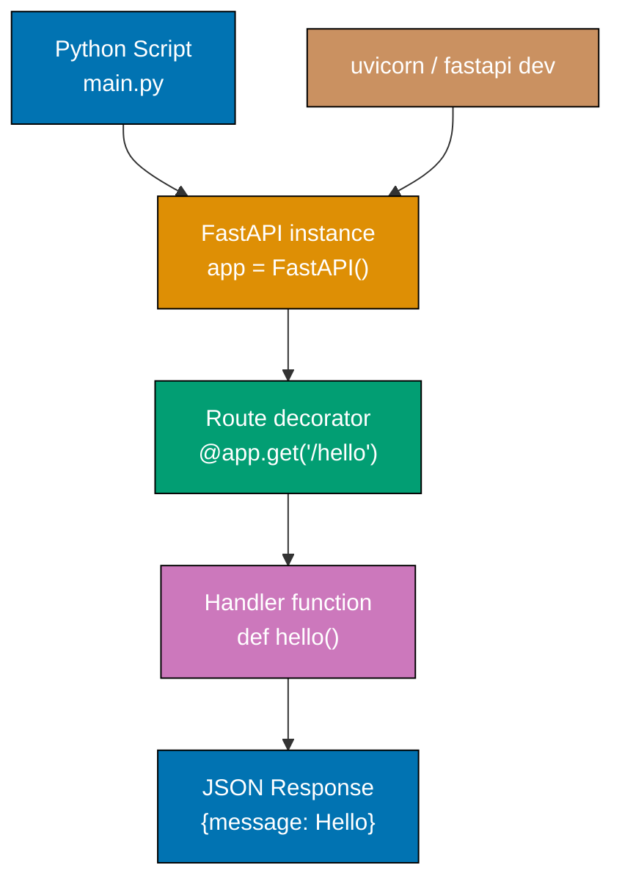

## Group 1: Application Basics

### Example 1: Minimal FastAPI Application

A FastAPI application requires only four lines to serve its first endpoint. FastAPI instantiates as a plain Python object, and route handlers are registered by decorating ordinary functions. The framework automatically starts an ASGI server when you run `fastapi dev main.py`.



```python
# main.py - The smallest possible FastAPI application
from fastapi import FastAPI           # => Import the FastAPI class from the fastapi package

app = FastAPI()                       # => Create an ASGI application instance
                                      # => app is the object uvicorn/gunicorn will serve
                                      # => All routes, middleware, and events attach to app

@app.get("/hello")                    # => Register a GET route at path "/hello"
                                      # => Decorator adds route to app.routes list
def hello():                          # => Sync handler; FastAPI runs it in a thread pool
                                      # => No parameters needed for this simple handler
    return {"message": "Hello World"} # => FastAPI serializes dict to JSON automatically
                                      # => Response Content-Type: application/json
                                      # => Status code defaults to 200 OK
```

**Key Takeaway**: FastAPI turns any Python function into an HTTP endpoint with a single decorator. The return value is automatically serialized to JSON.

**Why It Matters**: The minimal ceremony in FastAPI accelerates prototype-to-production cycles. Because route handlers are ordinary Python functions, they are trivially unit-testable without mocking HTTP infrastructure. The automatic JSON serialization removes an entire class of boilerplate that plagues Flask and Django REST endpoints, letting teams focus on business logic from the first commit.

---

### Example 2: Application Metadata and Automatic Docs

FastAPI generates interactive OpenAPI documentation automatically from your application metadata and type annotations. The `/docs` endpoint serves Swagger UI, while `/redoc` serves ReDoc—both derived from the same OpenAPI schema.

```python
# main.py - Application with metadata for rich auto-generated docs
from fastapi import FastAPI

app = FastAPI(
    title="Book Store API",           # => Sets the title shown in /docs UI
                                      # => Also used in OpenAPI schema info.title
    description="""
## Book Store API

Manage books, authors, and reviews.
    """,                              # => Markdown-formatted description
                                      # => Rendered as formatted HTML in /docs
    version="1.0.0",                  # => API version string (not FastAPI version)
                                      # => Appears in OpenAPI schema info.version
    terms_of_service="https://example.com/terms",
                                      # => Optional ToS URL in schema
    contact={                         # => Contact info block in OpenAPI schema
        "name": "API Support",
        "email": "support@example.com",
    },
    license_info={                    # => License block in OpenAPI schema
        "name": "MIT",
        "url": "https://opensource.org/licenses/MIT",
    },
    docs_url="/docs",                 # => Path for Swagger UI (default: /docs)
                                      # => Set to None to disable Swagger UI
    redoc_url="/redoc",               # => Path for ReDoc UI (default: /redoc)
    openapi_url="/openapi.json",      # => Path for raw OpenAPI schema (default)
                                      # => Set to None to disable all docs in production
)

@app.get("/")
def root():
    return {"message": "Welcome to Book Store API"}
                                      # => curl http://localhost:8000/ returns this JSON
                                      # => Visit http://localhost:8000/docs for interactive docs
```

**Key Takeaway**: Pass metadata to `FastAPI()` constructor to enrich the auto-generated OpenAPI documentation without writing any schema manually.

**Why It Matters**: Auto-generated, always-accurate API documentation eliminates the maintenance burden of keeping docs in sync with code. When each release updates code, the docs update automatically. Teams using FastAPI report fewer integration bugs between frontend and backend because both sides work from the same machine-readable OpenAPI contract, enabling automated client code generation for TypeScript, Kotlin, and Swift consumers.

---

### Example 3: Async Path Operations

FastAPI supports both synchronous and asynchronous path operation functions. Use `async def` for I/O-bound operations—database queries, HTTP calls, file reads—to avoid blocking the event loop. Use `def` for CPU-bound work; FastAPI runs these in a thread pool automatically.

```python
# main.py - Demonstrating async vs sync path operation functions
import asyncio
from fastapi import FastAPI

app = FastAPI()

@app.get("/sync")
def sync_handler():                   # => Sync function - FastAPI runs in threadpool executor
                                      # => Safe for blocking I/O (legacy libs, blocking DB drivers)
                                      # => Never blocks the event loop because it runs off it
    import time
    time.sleep(0.1)                   # => Simulates blocking I/O (e.g., psycopg2 query)
                                      # => This sleep is in a thread, not the event loop
    return {"mode": "sync", "note": "runs in threadpool"}
                                      # => Response after ~100ms

@app.get("/async")
async def async_handler():            # => Async function - runs directly on event loop
                                      # => Must only call async-compatible libraries
                                      # => Never call blocking I/O here (time.sleep, psycopg2)
    await asyncio.sleep(0.1)          # => Non-blocking sleep; yields control to event loop
                                      # => Other requests are handled during this await
    return {"mode": "async", "note": "runs on event loop"}
                                      # => Response after ~100ms without blocking other requests

@app.get("/cpu")
def cpu_bound():                      # => CPU-intensive work goes in sync def, not async def
                                      # => FastAPI thread pool isolates CPU work from event loop
    result = sum(range(1_000_000))    # => Blocking computation in thread; event loop stays free
                                      # => result = 499999500000
    return {"result": result}
```

**Key Takeaway**: Use `async def` for I/O-bound operations with async libraries, and plain `def` for blocking I/O or CPU work. Never mix blocking calls inside `async def` handlers.

**Why It Matters**: Choosing the right function type determines your application's concurrency ceiling. An `async def` handler that calls a blocking database driver will freeze the entire server under load—a production outage waiting to happen. FastAPI's dual-mode design lets you adopt async incrementally: start with sync handlers using existing blocking libraries, then migrate to async drivers as you scale. This pragmatic approach prevents performance cliffs during the modernization journey.

---

## Group 2: Path and Query Parameters

### Example 4: Path Parameters with Type Validation

Path parameters are extracted from the URL and automatically converted to the declared Python type. FastAPI returns a 422 Unprocessable Entity response when the path segment cannot be converted.

```python
# main.py - Path parameters with automatic type conversion and validation
from fastapi import FastAPI

app = FastAPI()

@app.get("/items/{item_id}")
def get_item(item_id: int):           # => item_id declared as int
                                      # => FastAPI converts URL segment "42" to int 42
                                      # => GET /items/42 => item_id = 42 (int)
                                      # => GET /items/abc => 422 error (cannot convert)
    return {"item_id": item_id, "type": str(type(item_id))}
                                      # => Returns {"item_id": 42, "type": "<class 'int'>"}

@app.get("/users/{user_id}/posts/{post_id}")
def get_user_post(user_id: int, post_id: int):
                                      # => Multiple path parameters, each converted to int
                                      # => GET /users/5/posts/10 => user_id=5, post_id=10
    return {"user_id": user_id, "post_id": post_id}
                                      # => Returns {"user_id": 5, "post_id": 10}

@app.get("/files/{file_path:path}")   # => :path converter captures slashes too
                                      # => GET /files/dir/sub/file.txt => file_path="dir/sub/file.txt"
def get_file(file_path: str):
    return {"file_path": file_path}   # => Returns {"file_path": "dir/sub/file.txt"}
```

**Key Takeaway**: Type-annotate path parameters to get automatic conversion and validation. Use `{param:path}` when the parameter should capture forward slashes.

**Why It Matters**: Automatic type coercion at the routing layer eliminates an entire category of defensive coding. Without FastAPI, every handler must validate and convert `request.path_params["item_id"]` manually—a pattern that routinely causes 500 errors when developers forget edge cases. FastAPI's declaration-driven approach enforces contracts at the framework level, returning standard 422 responses before business logic executes, keeping handler code focused and clean.

---

### Example 5: Query Parameters with Defaults and Optional Types

Query parameters are function parameters not present in the path pattern. FastAPI automatically reads them from the request URL query string, applies type conversion, and validates required vs optional status.

```python
# main.py - Query parameters with various type annotations
from typing import Optional
from fastapi import FastAPI

app = FastAPI()

@app.get("/items")
def list_items(
    skip: int = 0,                    # => Default value makes this optional
                                      # => GET /items => skip=0 (default used)
                                      # => GET /items?skip=10 => skip=10
    limit: int = 20,                  # => Another optional with default
                                      # => GET /items?skip=0&limit=5 => limit=5
    search: Optional[str] = None,     # => Optional[str] = None means not required
                                      # => GET /items => search=None
                                      # => GET /items?search=python => search="python"
    active: bool = True,              # => Bool params accept: true/false, 1/0, yes/no
                                      # => GET /items?active=false => active=False
                                      # => GET /items?active=0 => active=False
):
    result = {                        # => Build response showing received values
        "skip": skip,
        "limit": limit,
        "search": search,
        "active": active,
    }
    return result                     # => GET /items?skip=5&search=python returns:
                                      # => {"skip": 5, "limit": 20, "search": "python", "active": true}

@app.get("/search")
def search_items(q: str):             # => No default = required query parameter
                                      # => GET /search => 422 error (missing required q)
                                      # => GET /search?q=book => q="book"
    return {"query": q, "results": []}
```

**Key Takeaway**: Function parameters with defaults become optional query parameters. Parameters without defaults are required query parameters. Type annotations control conversion and validation.

**Why It Matters**: Query parameter declaration in FastAPI serves triple duty: it defines the interface, validates the input, and documents the endpoint in OpenAPI—all from a single annotation. Flask and Django require separate form validation libraries (WTForms, django-filters) to achieve equivalent safety. FastAPI's approach ensures the docs always reflect the actual parameter behavior, eliminating the documentation drift that causes API integration bugs.

---

### Example 6: Enum Path Parameters

Python `Enum` classes constrain path parameters to a fixed set of valid values. FastAPI validates the path segment against enum members and returns 422 for invalid values, while OpenAPI documents the allowed values automatically.

```python
# main.py - Enum path parameters for constrained values
from enum import Enum
from fastapi import FastAPI

app = FastAPI()

class ModelName(str, Enum):           # => str Enum: members are strings AND enum values
                                      # => Inheriting str enables direct comparison with strings
    alexnet = "alexnet"               # => Member name = "alexnet", value = "alexnet"
    resnet = "resnet"                 # => Member name = "resnet", value = "resnet"
    lenet = "lenet"                   # => Member name = "lenet", value = "lenet"

@app.get("/models/{model_name}")
def get_model(model_name: ModelName): # => FastAPI validates path segment against ModelName
                                      # => GET /models/alexnet => model_name = ModelName.alexnet
                                      # => GET /models/vgg => 422 error (not in enum)
                                      # => OpenAPI docs show allowed values: alexnet, resnet, lenet
    if model_name == ModelName.alexnet:
                                      # => Enum comparison works because ModelName inherits str
        return {
            "model_name": model_name,  # => Returns "alexnet" (serialized as enum value)
            "message": "Deep Learning FTW!",
        }

    if model_name.value == "lenet":   # => Access .value for the string representation
                                      # => model_name.value == "lenet" (type: str)
        return {"model_name": model_name, "message": "LeCNN all the images"}

    return {"model_name": model_name, "message": "Have some residuals"}
                                      # => All three paths return JSON with model_name serialized
```

**Key Takeaway**: Use `str, Enum` inheritance for path parameters that must be one of a fixed set of values. FastAPI validates and documents the allowed values automatically.

**Why It Matters**: Enum path parameters prevent the "magic string" anti-pattern where route handlers contain `if model == "alexnet"` branches that silently misbehave when typos slip through. The constraint lives at the type level, not inside business logic. OpenAPI documentation shows allowed values in dropdown menus, helping API consumers discover valid inputs without reading source code—reducing support requests and integration mistakes.

---

### Example 7: Query Parameter Validation with Field Constraints

Use `Query()` from FastAPI to add validation constraints, metadata, and aliases to query parameters beyond what type annotations provide. This enables string length limits, numeric ranges, and regex patterns.

```python
# main.py - Query parameter validation using the Query() function
from typing import Annotated, Optional
from fastapi import FastAPI, Query

app = FastAPI()

@app.get("/items")
def list_items(
    q: Annotated[Optional[str], Query(
        title="Search Query",         # => Title shown in OpenAPI docs
        description="Query for items to search in the database",
                                      # => Description in OpenAPI docs
        min_length=3,                 # => Minimum string length; fails with 422 if shorter
        max_length=50,                # => Maximum string length; fails with 422 if longer
        pattern=r"^[a-zA-Z0-9 ]+$",  # => Regex pattern; must match or 422 error
                                      # => This allows only alphanumeric and spaces
    )] = None,                        # => None default makes the parameter optional
    page: Annotated[int, Query(
        ge=1,                         # => ge = greater than or equal to 1
        le=100,                       # => le = less than or equal to 100
        description="Page number (1-100)",
    )] = 1,                           # => Default page is 1
    size: Annotated[int, Query(
        ge=1,                         # => Must be at least 1 item per page
        le=50,                        # => At most 50 items per page
    )] = 10,                          # => Default page size is 10
):
    return {                          # => GET /items?q=python&page=2&size=5
        "q": q,                       # => q = "python"
        "page": page,                 # => page = 2
        "size": size,                 # => size = 5
        "offset": (page - 1) * size,  # => offset = 5 (for SQL OFFSET clause)
    }
```

**Key Takeaway**: Use `Annotated[Type, Query(...)]` to attach validation constraints, documentation, and metadata to query parameters without cluttering the function signature.

**Why It Matters**: Validation constraints declared at the parameter level protect your database and business logic from malformed inputs before they execute. A query parameter without `max_length` can accept arbitrarily long strings that cause slow LIKE queries or memory pressure. Declaring constraints in `Query()` means every API consumer sees the limits in the OpenAPI docs, preventing the "why does my 500-character search break?" support ticket before it is filed.

---

## Group 3: Request Bodies with Pydantic

### Example 8: Basic Request Body with Pydantic Model

Declare a Pydantic `BaseModel` subclass as a path operation parameter to receive JSON request bodies. FastAPI reads the request body, deserializes it, validates all fields, and passes the typed model instance to your handler.

```python
# main.py - Request body with Pydantic model
from typing import Optional
from fastapi import FastAPI
from pydantic import BaseModel

app = FastAPI()

class Item(BaseModel):                # => Pydantic model defines the expected request body
    name: str                         # => Required string field (no default = required)
    description: Optional[str] = None # => Optional string, defaults to None if absent
    price: float                      # => Required float field
    tax: Optional[float] = None       # => Optional float, defaults to None

@app.post("/items")
def create_item(item: Item):          # => item: Item causes FastAPI to read request body
                                      # => FastAPI parses JSON body as Item model
                                      # => Validation error (422) if body is malformed
                                      # => item.name, item.price are Python-typed after parsing
    item_with_tax = item.price        # => item.price is float, not string
    if item.tax:                      # => item.tax is None or float
        item_with_tax += item.tax     # => Safe arithmetic; type is guaranteed by Pydantic
    return {
        "item_name": item.name,       # => item.name is str (guaranteed)
        "total_price": item_with_tax, # => float result
    }
# POST /items with body: {"name": "Widget", "price": 9.99}
# => Returns {"item_name": "Widget", "total_price": 9.99}

# POST /items with body: {"name": "Widget", "price": 9.99, "tax": 1.00}
# => Returns {"item_name": "Widget", "total_price": 10.99}

# POST /items with body: {"price": 9.99}  (missing required "name")
# => Returns 422 Unprocessable Entity with field error details
```

**Key Takeaway**: Declare a Pydantic `BaseModel` as a path operation parameter to receive, validate, and deserialize a JSON request body with full type safety.

**Why It Matters**: Pydantic validation at the boundary prevents malformed data from reaching database or business logic layers, where type coercion bugs cause silent data corruption. Unlike Flask where `request.json["price"]` returns a string that crashes `float + int` arithmetic, FastAPI guarantees `item.price` is a Python `float` before your code executes. This shifts error detection from runtime production failures to standardized 422 responses that API clients can handle programmatically.

---

### Example 9: Pydantic Field Validation and Constraints

Use `Field()` from Pydantic to add validation constraints, default values, examples, and descriptions to individual model fields. This enriches both runtime validation and OpenAPI schema generation.

```python
# main.py - Pydantic models with Field constraints
from typing import Optional
from fastapi import FastAPI
from pydantic import BaseModel, Field, field_validator

app = FastAPI()

class Product(BaseModel):
    name: str = Field(
        ...,                          # => ... (Ellipsis) = required field, no default
        min_length=1,                 # => Must be at least 1 character
        max_length=100,               # => Must be at most 100 characters
        description="Product name",   # => Shown in OpenAPI schema
        examples=["Laptop", "Mouse"], # => Example values in OpenAPI docs
    )
    price: float = Field(
        ...,                          # => Required
        gt=0,                         # => gt = greater than 0 (strictly positive)
        description="Price in USD (must be positive)",
    )
    quantity: int = Field(
        default=0,                    # => Optional with default 0
        ge=0,                         # => ge = greater than or equal to 0 (non-negative)
        le=10_000,                    # => le = less than or equal to 10,000
    )
    sku: Optional[str] = Field(
        default=None,
        pattern=r"^[A-Z]{3}-[0-9]{4}$",
                                      # => Regex: exactly 3 uppercase letters, dash, 4 digits
                                      # => Valid: "LAP-0042"; Invalid: "lap-42"
    )

    @field_validator("name")          # => Pydantic v2 field validator
    @classmethod
    def name_must_not_be_empty(cls, v: str) -> str:
                                      # => cls is the model class; v is the field value
        if v.strip() == "":           # => Strip whitespace before checking emptiness
            raise ValueError("name cannot be blank or whitespace")
                                      # => ValueError message included in 422 response
        return v.strip()              # => Return stripped value - Pydantic stores this

@app.post("/products")
def create_product(product: Product):
    return product                    # => Pydantic model is serializable to JSON directly
                                      # => POST body: {"name": "Laptop", "price": 999.99}
                                      # => Returns: {"name": "Laptop", "price": 999.99, "quantity": 0, "sku": null}
```

**Key Takeaway**: Use `Field()` for per-field constraints and `@field_validator` for custom validation logic. Both integrate seamlessly with OpenAPI schema generation.

**Why It Matters**: Declaring validation rules at the model level creates a single source of truth for data contracts. When a frontend developer asks "what are the constraints on the product name field?", the answer lives in the Pydantic model and appears automatically in the OpenAPI docs—not in a separate wiki page that drifts out of date. Field-level validators catch domain rule violations (empty names, negative prices) before they reach the database, preventing constraint violation errors that require round-trips to fix.

---

### Example 10: Nested Pydantic Models

Pydantic models can reference other Pydantic models as field types, creating deeply nested data structures. FastAPI validates the entire hierarchy and generates the corresponding nested OpenAPI schema automatically.

```python
# main.py - Nested Pydantic models for complex request bodies
from typing import List, Optional
from fastapi import FastAPI
from pydantic import BaseModel

app = FastAPI()

class Address(BaseModel):             # => Nested model for address data
    street: str
    city: str
    country: str = "US"               # => Default value for country field

class OrderItem(BaseModel):           # => Nested model for line items
    product_id: int
    quantity: int
    unit_price: float

class Order(BaseModel):               # => Top-level model with nested models
    customer_name: str
    shipping_address: Address         # => Nested Pydantic model as field type
                                      # => FastAPI expects an object at this key in JSON
    items: List[OrderItem]            # => List of nested Pydantic models
                                      # => FastAPI expects an array of objects
    notes: Optional[str] = None

@app.post("/orders")
def create_order(order: Order):       # => order: Order triggers nested validation
                                      # => All nested models validated simultaneously
    total = sum(                      # => Safe arithmetic because types are guaranteed
        item.quantity * item.unit_price
        for item in order.items       # => order.items is List[OrderItem] (typed)
    )
    return {
        "customer": order.customer_name,
        "city": order.shipping_address.city,
                                      # => Nested field access with . notation
        "item_count": len(order.items),
        "total": total,
    }
# POST /orders with body:
# {
#   "customer_name": "Alice",
#   "shipping_address": {"street": "123 Main St", "city": "Portland"},
#   "items": [{"product_id": 1, "quantity": 2, "unit_price": 29.99}]
# }
# => Returns {"customer": "Alice", "city": "Portland", "item_count": 1, "total": 59.98}
```

**Key Takeaway**: Nested Pydantic models compose naturally as field types. FastAPI validates the entire hierarchy in one pass and generates a complete nested OpenAPI schema.

**Why It Matters**: Deep object hierarchies are common in real APIs—orders contain line items, users have addresses, blog posts have authors. Pydantic's compositional model system means validation logic stays close to the data structure definition rather than scattered across handler functions. When the `Address` model adds a required `postal_code` field, every endpoint accepting an `Address` gains that validation automatically—one change, consistent enforcement across the entire API.

---

## Group 4: Response Models and Status Codes

### Example 11: Response Model Declaration

Declare a `response_model` on the route decorator to control what FastAPI returns in the response. The response model filters out fields not in the model (useful for hiding sensitive data), validates the response, and generates the response schema in OpenAPI docs.

```python
# main.py - Response models to filter and document responses
from typing import Optional
from fastapi import FastAPI
from pydantic import BaseModel

app = FastAPI()

class UserIn(BaseModel):              # => Input model with password (used for POST body)
    username: str
    password: str                     # => We never want to return this in responses
    email: str
    full_name: Optional[str] = None

class UserOut(BaseModel):             # => Output model WITHOUT the password field
    username: str                     # => Only fields defined here appear in response
    email: str
    full_name: Optional[str] = None
                                      # => password is absent - it will be filtered out

fake_db: dict[str, UserIn] = {}       # => In-memory store for this example

@app.post("/users", response_model=UserOut)
                                      # => response_model=UserOut tells FastAPI to:
                                      # => 1. Validate the return value against UserOut
                                      # => 2. Filter out fields not in UserOut
                                      # => 3. Generate UserOut schema in OpenAPI docs
def create_user(user: UserIn):        # => Accepts UserIn (with password)
    fake_db[user.username] = user     # => Store full user including password
    return user                       # => Return full UserIn object
                                      # => FastAPI filters it through UserOut schema
                                      # => password field is REMOVED from JSON response
                                      # => Response: {"username": "alice", "email": "...", "full_name": null}

@app.get("/users/{username}", response_model=UserOut)
def get_user(username: str):
    user = fake_db.get(username)
    if user is None:
        return {}                     # => Empty dict passes through response_model filter
    return user                       # => password stripped automatically by response_model
```

**Key Takeaway**: Use `response_model` on route decorators to filter sensitive fields from responses, validate return values, and generate accurate response schemas in API docs.

**Why It Matters**: Accidentally leaking password hashes, internal IDs, or audit timestamps in API responses is a security vulnerability that has caused real data breaches. Declaring `response_model` makes field exclusion structural and permanent—a future refactor that adds a `hashed_password` field to `UserIn` will not accidentally expose it in the response, because `UserOut` acts as an explicit allowlist. This is more reliable than manually deleting sensitive keys from dicts before returning.

---

### Example 12: HTTP Status Codes

Control the HTTP status code of successful responses using `status_code` on the route decorator. FastAPI accepts integer codes or named constants from the `status` module. Non-2xx status codes document failure modes in OpenAPI.

```python
# main.py - HTTP status codes for various operations
from fastapi import FastAPI, status
from pydantic import BaseModel

app = FastAPI()

class Item(BaseModel):
    name: str
    price: float

items: dict[int, Item] = {}           # => In-memory item store
next_id: int = 1                      # => Auto-increment ID counter

@app.post("/items", status_code=status.HTTP_201_CREATED)
                                      # => 201 Created is idiomatic for successful resource creation
                                      # => status.HTTP_201_CREATED = 201 (named constant)
                                      # => Can also use status_code=201 (integer literal)
def create_item(item: Item):
    global next_id
    items[next_id] = item             # => Store item with auto-increment ID
    result = {"id": next_id, **item.model_dump()}
                                      # => model_dump() converts Pydantic model to dict
    next_id += 1
    return result                     # => HTTP 201 with JSON body

@app.delete("/items/{item_id}", status_code=status.HTTP_204_NO_CONTENT)
                                      # => 204 No Content means success with no body
                                      # => Client should not expect a response body
def delete_item(item_id: int):
    items.pop(item_id, None)          # => Remove item; None default avoids KeyError
    # Do NOT return anything here      # => Returning data with 204 is ignored by FastAPI
                                      # => HTTP spec says 204 responses have no body

@app.get("/items/{item_id}", status_code=200)
                                      # => 200 is the default; explicit here for clarity
def get_item(item_id: int):
    return items.get(item_id, {})     # => Returns item dict or empty dict
```

**Key Takeaway**: Set `status_code` on route decorators to return semantically correct HTTP status codes. Use `status.HTTP_*` constants for readability. Return nothing for 204 responses.

**Why It Matters**: Correct HTTP status codes enable proper client behavior without custom response parsing. A 201 response tells the client to update its cache and redirect to the new resource URL. A 204 response tells clients not to parse a response body—avoiding JSON parse errors on empty strings. API clients built on OpenAPI-generated SDKs rely on status codes to choose the correct response model for deserialization, so semantic accuracy prevents client-side runtime crashes.

---

### Example 13: Response Model with `response_model_exclude_unset`

By default, FastAPI includes all fields in the response even when they have default values. Set `response_model_exclude_unset=True` to return only the fields explicitly set in the model instance, enabling efficient PATCH-style partial responses.

```python
# main.py - Controlling which fields appear in responses
from typing import Optional
from fastapi import FastAPI
from pydantic import BaseModel

app = FastAPI()

class Item(BaseModel):
    name: str
    description: Optional[str] = None  # => Default None - often not set
    price: float
    tax: Optional[float] = None        # => Default None - often not set
    tags: list[str] = []               # => Default empty list

@app.get("/items/{item_id}", response_model=Item, response_model_exclude_unset=True)
                                      # => response_model_exclude_unset=True:
                                      # => Only fields explicitly set are in response
                                      # => Fields with defaults that weren't set are omitted
def get_item(item_id: int):
    if item_id == 1:
        return Item(name="Widget", price=9.99)
                                      # => Only name and price were set
                                      # => Response: {"name": "Widget", "price": 9.99}
                                      # => description, tax, tags are OMITTED (not set)
    if item_id == 2:
        return Item(name="Gadget", price=49.99, description="A cool gadget")
                                      # => name, price, description were set
                                      # => Response: {"name": "Gadget", "price": 49.99, "description": "A cool gadget"}
                                      # => tax, tags are OMITTED
    return Item(name="Default", price=0.0, description=None, tax=None, tags=[])
                                      # => All fields explicitly set (even to defaults)
                                      # => Response includes ALL fields including nulls
```

**Key Takeaway**: Use `response_model_exclude_unset=True` to return only explicitly set fields, enabling sparse responses that only include populated data.

**Why It Matters**: APIs that always return every field with null values waste bandwidth and confuse clients trying to distinguish "field not applicable" from "field was set to null". The `exclude_unset` pattern is essential for PATCH endpoints where the response should mirror only what was changed. Mobile clients on slow networks particularly benefit from sparse responses—a user profile update returning 2 fields instead of 50 reduces response size by 96% in typical cases.

---

## Group 5: Error Handling

### Example 14: HTTPException for Client Errors

Raise `HTTPException` from FastAPI to return HTTP error responses with custom status codes and detail messages. The exception exits the current function immediately and FastAPI converts it to the appropriate JSON error response.

```python
# main.py - HTTPException for controlled error responses
from fastapi import FastAPI, HTTPException, status
from pydantic import BaseModel

app = FastAPI()

class Item(BaseModel):
    name: str
    price: float

items: dict[int, Item] = {
    1: Item(name="Widget", price=9.99),
    2: Item(name="Gadget", price=49.99),
}

@app.get("/items/{item_id}")
def get_item(item_id: int):
    if item_id not in items:          # => Check existence before access
        raise HTTPException(          # => Raises exception; code after this does NOT run
            status_code=status.HTTP_404_NOT_FOUND,
                                      # => 404 = resource not found
            detail=f"Item with id {item_id} not found",
                                      # => detail becomes the "detail" field in JSON response
                                      # => Response body: {"detail": "Item with id 99 not found"}
        )
    return items[item_id]             # => Only reached if item_id exists

@app.put("/items/{item_id}")
def update_item(item_id: int, item: Item):
    if item_id not in items:
        raise HTTPException(
            status_code=404,          # => Integer literal also works
            detail="Item not found",
            headers={"X-Error": "item-not-found"},
                                      # => Custom headers on error responses
                                      # => Useful for client-side error code parsing
        )
    items[item_id] = item
    return items[item_id]

@app.delete("/admin/items/{item_id}")
def admin_delete(item_id: int, admin_key: str):
    if admin_key != "secret":         # => Simplified auth check for demo
        raise HTTPException(
            status_code=status.HTTP_403_FORBIDDEN,
                                      # => 403 = authenticated but not authorized
            detail="Not authorized to delete items",
        )
    items.pop(item_id, None)
```

**Key Takeaway**: Raise `HTTPException` with appropriate `status_code` and `detail` to return structured error responses. Use `status.HTTP_*` constants for semantic clarity.

**Why It Matters**: Structured error responses with consistent JSON shape (`{"detail": "..."}`) enable API clients to handle errors programmatically instead of parsing error message strings. Clients can display `error.detail` directly in UI error messages without custom parsing logic. Using semantically correct status codes (404 vs 500, 403 vs 401) lets API gateways, load balancers, and monitoring systems apply appropriate routing and alerting rules without inspecting response bodies.

---

### Example 15: Request Validation Errors

FastAPI automatically returns 422 Unprocessable Entity responses when request data fails Pydantic validation. The error response body contains a structured list of validation errors with field locations and messages.

```python
# main.py - Understanding validation error responses
from typing import Annotated
from fastapi import FastAPI, Query
from pydantic import BaseModel, Field

app = FastAPI()

class Product(BaseModel):
    name: str = Field(min_length=1, max_length=50)
    price: float = Field(gt=0)
    quantity: int = Field(ge=0)

@app.post("/products")
def create_product(product: Product):
    return product

@app.get("/products")
def list_products(
    page: Annotated[int, Query(ge=1)] = 1,
    size: Annotated[int, Query(ge=1, le=100)] = 10,
):
    return {"page": page, "size": size}

# When validation fails, FastAPI returns 422 with this structure:
# {
#   "detail": [
#     {
#       "type": "string_too_short",         # => Pydantic error type
#       "loc": ["body", "name"],            # => Location: "body" key "name"
#       "msg": "String should have at least 1 character",
#       "input": "",                        # => The invalid input value
#       "ctx": {"min_length": 1}            # => Context with constraint values
#     },
#     {
#       "type": "greater_than",
#       "loc": ["body", "price"],           # => "body" means request body field
#       "msg": "Input should be greater than 0",
#       "input": -5.0,
#       "ctx": {"gt": 0}
#     }
#   ]
# }
# loc values:
# ["body", "field_name"]  => Request body field
# ["path", "param_name"]  => Path parameter
# ["query", "param_name"] => Query parameter
# ["header", "name"]      => Request header

@app.get("/echo")
def echo(value: int):                 # => GET /echo?value=abc => 422 error:
                                      # => loc: ["query", "value"]
                                      # => msg: "Input should be a valid integer"
    return {"value": value}
```

**Key Takeaway**: FastAPI returns structured 422 errors with field locations (`loc`), error types, human-readable messages, and the invalid input values. Parse `error.detail[].loc` to map errors to specific form fields.

**Why It Matters**: Structured validation errors enable client-side form field highlighting without custom error message parsing. A frontend receiving `loc: ["body", "email"]` can highlight the email input directly. Libraries like React Hook Form, Angular Reactive Forms, and Flutter Form Builder can consume this structure automatically when using FastAPI-generated client SDKs. The consistent format means error handling code is written once and works across all endpoints.

---

## Group 6: Form Data and File Upload

### Example 16: Form Data

Use `Form()` to receive HTML form submissions (`application/x-www-form-urlencoded` or `multipart/form-data`). Form data and JSON request bodies are mutually exclusive—a single endpoint cannot accept both.

```python
# main.py - Receiving HTML form data
from fastapi import FastAPI, Form
from typing import Annotated

app = FastAPI()

@app.post("/login")
def login(
    username: Annotated[str, Form()],  # => Reads "username" field from form body
                                       # => Form() indicates multipart or url-encoded form
    password: Annotated[str, Form()],  # => Reads "password" field from form body
):
    # POST /login with Content-Type: application/x-www-form-urlencoded
    # Body: username=alice&password=secret123
    # => username = "alice", password = "secret123"
    if username == "alice" and password == "secret123":
                                       # => Simplified auth check for demo
        return {"access_token": "fake-jwt-token", "token_type": "bearer"}
                                       # => Real app would generate JWT here
    return {"error": "Invalid credentials"}
                                       # => Return 400 in real app, simplified here

@app.post("/register")
def register(
    username: Annotated[str, Form(min_length=3, max_length=50)],
                                       # => Form() accepts same constraints as Query() and Field()
    email: Annotated[str, Form()],
    password: Annotated[str, Form(min_length=8)],
                                       # => Minimum 8 characters for password
    agree_terms: Annotated[bool, Form()],
                                       # => Checkbox value from form: "true"/"false"
):
    return {                           # => All form fields received and validated
        "username": username,
        "email": email,
        "agreed": agree_terms,
    }
# Note: Form and Body (JSON) cannot mix in one endpoint
# To accept JSON: use Pydantic model parameter (no Form())
# To accept form: use Form() on each field
```

**Key Takeaway**: Use `Annotated[type, Form()]` for each field to receive HTML form submissions. Form validation constraints work identically to query parameter constraints.

**Why It Matters**: HTML forms and OAuth2 password flow both send data as `application/x-www-form-urlencoded`—the OAuth2 specification mandates this format for token endpoints. FastAPI's `Form()` parameter enables standards-compliant OAuth2 token endpoints that work with all OAuth2 client libraries without custom request parsing. Web applications serving traditional HTML forms also benefit from the same validation framework used for JSON APIs, rather than maintaining separate validation logic.

---

### Example 17: File Upload with UploadFile

Use `UploadFile` to receive file uploads via multipart form data. `UploadFile` provides async file reading, content type detection, and a filename attribute. Use `File()` for small files read into bytes directly.

```python
# main.py - File upload handling
import os
from fastapi import FastAPI, File, UploadFile
from typing import Annotated

app = FastAPI()

@app.post("/upload/bytes")
async def upload_bytes(
    data: Annotated[bytes, File()],   # => File() reads entire file into bytes
                                      # => Use for small files only (loads all into memory)
):
    return {                          # => data is raw bytes of the uploaded file
        "size": len(data),            # => Number of bytes received
        "preview": data[:50].decode("utf-8", errors="ignore"),
                                      # => First 50 bytes as string for preview
    }

@app.post("/upload/file")
async def upload_file(
    file: UploadFile,                 # => UploadFile: async file-like object
                                      # => Does NOT read entire file into memory immediately
                                      # => Suitable for large files
):
    content = await file.read()       # => Async read: reads entire file content
                                      # => content is bytes
    return {
        "filename": file.filename,    # => Original filename from upload form
        "content_type": file.content_type,
                                      # => MIME type: "image/jpeg", "text/csv", etc.
        "size": len(content),         # => File size in bytes
    }

@app.post("/upload/multiple")
async def upload_multiple(
    files: list[UploadFile],          # => Accept multiple files in one request
                                      # => Client sends multiple file inputs with same name
):
    results = []
    for file in files:                # => Iterate over each uploaded file
        content = await file.read()   # => Read each file asynchronously
        results.append({
            "filename": file.filename,
            "size": len(content),
            "content_type": file.content_type,
        })
    return {"uploaded": results}      # => Summary of all uploaded files

@app.post("/upload/validated")
async def upload_validated(
    file: UploadFile,
):
    MAX_SIZE = 5 * 1024 * 1024        # => 5MB limit (5 * 1024 * 1024 bytes)
    allowed_types = {"image/jpeg", "image/png", "image/gif"}
                                      # => Whitelist of allowed MIME types
    if file.content_type not in allowed_types:
        return {"error": f"File type {file.content_type} not allowed"}
                                      # => Reject disallowed file types
    content = await file.read()
    if len(content) > MAX_SIZE:
        return {"error": "File too large (max 5MB)"}
                                      # => Reject files exceeding size limit
    return {"filename": file.filename, "size": len(content)}
```

**Key Takeaway**: Use `UploadFile` for file uploads. It provides async reading, filename, and content type. Validate file type and size before processing.

**Why It Matters**: File upload endpoints without size and type validation are common attack vectors for denial-of-service (large files exhausting memory) and malware upload (executable files disguised as images). `UploadFile`'s streaming interface allows size checking without loading gigabyte files into RAM. The `content_type` attribute enables MIME type filtering, though production systems should additionally verify file magic bytes since `content_type` is client-supplied and can be spoofed.

---

## Group 7: Middleware Basics

### Example 18: Request Timing Middleware

Middleware in FastAPI is ASGI middleware that wraps every request-response cycle. Use it for cross-cutting concerns: logging, timing, request ID injection, and response modification. FastAPI uses `@app.middleware("http")` for simple middleware.

```python
# main.py - Request timing middleware
import time
import uuid
from fastapi import FastAPI, Request, Response

app = FastAPI()

@app.middleware("http")               # => Register middleware for all HTTP requests
async def timing_middleware(
    request: Request,                 # => Incoming request object
    call_next,                        # => Callable to invoke the next handler
                                      # => call_next(request) calls the actual route handler
):
    start_time = time.perf_counter()  # => High-resolution timer start
    request_id = str(uuid.uuid4())    # => Generate unique request ID
                                      # => request_id is "a7c3f2e1-..." (UUID string)

    response: Response = await call_next(request)
                                      # => call_next invokes the route handler
                                      # => await waits for handler to complete
                                      # => response is the Response object to return

    duration_ms = (time.perf_counter() - start_time) * 1000
                                      # => Calculate duration in milliseconds
                                      # => duration_ms = 12.4 (example value)

    response.headers["X-Request-ID"] = request_id
                                      # => Add request ID header to all responses
    response.headers["X-Process-Time"] = f"{duration_ms:.2f}ms"
                                      # => Add timing header: "12.40ms"

    print(f"[{request_id[:8]}] {request.method} {request.url.path} - {duration_ms:.2f}ms")
                                      # => Structured log line with timing info
    return response                   # => Return modified response to client

@app.get("/slow")
async def slow_endpoint():
    import asyncio
    await asyncio.sleep(0.1)          # => Simulates 100ms I/O operation
    return {"status": "done"}         # => Response will have X-Process-Time: ~100ms
```

**Key Takeaway**: Use `@app.middleware("http")` for cross-cutting request/response logic. Call `await call_next(request)` to invoke the route handler, then modify the response before returning.

**Why It Matters**: Request timing middleware is the foundation of API observability. Without it, you discover slow endpoints reactively through customer complaints. Adding `X-Process-Time` headers lets API gateway dashboards surface p95 latency spikes within minutes of deployment. The `X-Request-ID` header enables distributed tracing—correlating logs across multiple services for a single request becomes possible when every service propagates this header, transforming hours of log archaeology into seconds.

---

### Example 19: CORS Middleware

Cross-Origin Resource Sharing (CORS) headers allow browsers to make JavaScript requests to your API from a different origin. FastAPI includes a built-in `CORSMiddleware` from Starlette that handles CORS preflight requests and adds the appropriate headers.

```python
# main.py - CORS configuration for browser-accessible APIs
from fastapi import FastAPI
from fastapi.middleware.cors import CORSMiddleware

app = FastAPI()

# Configure allowed origins for cross-origin requests
origins = [
    "http://localhost:3000",          # => React dev server
    "http://localhost:5173",          # => Vite dev server
    "https://myapp.example.com",      # => Production frontend domain
]

app.add_middleware(                   # => Add CORS middleware to the app
    CORSMiddleware,                   # => Built-in Starlette CORS middleware
    allow_origins=origins,            # => List of allowed origin URLs
                                      # => ["*"] allows all origins (unsafe for credentials)
    allow_credentials=True,           # => Allow cookies and auth headers in cross-origin requests
                                      # => Requires specific origins (not "*") when True
    allow_methods=["GET", "POST", "PUT", "DELETE", "PATCH", "OPTIONS"],
                                      # => HTTP methods allowed in CORS requests
                                      # => OPTIONS is required for preflight requests
    allow_headers=["Authorization", "Content-Type", "X-Request-ID"],
                                      # => Custom headers browser is allowed to send
                                      # => "Authorization" required for Bearer token auth
    expose_headers=["X-Process-Time", "X-Request-ID"],
                                      # => Headers browser JavaScript can access in response
                                      # => By default, only simple response headers are exposed
    max_age=600,                      # => Cache preflight response for 600 seconds (10 min)
                                      # => Reduces OPTIONS preflight requests
)

@app.get("/api/data")
def get_data():
    return {"data": "accessible from allowed origins"}
                                      # => Response includes CORS headers:
                                      # => Access-Control-Allow-Origin: http://localhost:3000
                                      # => Access-Control-Allow-Credentials: true
```

**Key Takeaway**: Add `CORSMiddleware` with a specific list of allowed origins to enable browser JavaScript requests from different domains. Never use `allow_origins=["*"]` with `allow_credentials=True`.

**Why It Matters**: Incorrect CORS configuration causes silent failures in production—browsers block requests with no visible error in the API server logs, only in browser DevTools. Using `allow_origins=["*"]` with credentials creates a cross-site request forgery vulnerability where any website can make authenticated requests on behalf of logged-in users. Explicit origin lists ensure only your frontend applications can make credentialed cross-origin requests, preventing session hijacking attacks.

---

## Group 8: Static Files and Templates

### Example 20: Serving Static Files

FastAPI (via Starlette) can serve static files directly from a directory. Mount a `StaticFiles` instance at a path prefix to serve CSS, JavaScript, images, and other assets.

```python
# main.py - Serving static files
from fastapi import FastAPI
from fastapi.staticfiles import StaticFiles

app = FastAPI()

# Directory structure expected:
# .
# ├── main.py
# └── static/
#     ├── css/
#     │   └── app.css
#     ├── js/
#     │   └── app.js
#     └── images/
#         └── logo.png

app.mount(
    "/static",                        # => URL path prefix for static files
    StaticFiles(directory="static"),  # => Directory to serve files from
                                      # => Relative to where Python process runs
    name="static",                    # => Name for URL generation (optional)
                                      # => Used with request.url_for("static", path="...")
)

# With this configuration:
# GET /static/css/app.css         => serves static/css/app.css
# GET /static/js/app.js           => serves static/js/app.js
# GET /static/images/logo.png     => serves static/images/logo.png
# GET /static/missing.txt         => 404 Not Found

@app.get("/")
def home():
    return {
        "message": "API is running",
        "static_css": "/static/css/app.css",   # => Client can fetch this URL
        "static_js": "/static/js/app.js",
    }

# For production: serve static files from a CDN or nginx
# Mount is useful for development and simple deployments
# StaticFiles supports html=True for Single Page Applications:
app.mount(
    "/spa",
    StaticFiles(directory="spa_dist", html=True),
                                      # => html=True serves index.html for unknown paths
                                      # => Enables client-side routing in React/Vue/Angular
    name="spa",
)
```

**Key Takeaway**: Mount `StaticFiles` at a path prefix to serve a directory of files. Use `html=True` for Single Page Applications that need client-side routing.

**Why It Matters**: For small projects and internal tools, serving static files from FastAPI simplifies deployment by eliminating a separate nginx or CDN configuration. The `html=True` option enables SPA deployment without configuring URL rewriting rules—any path not matching an API route falls back to `index.html`, letting React Router or Vue Router handle navigation. For high-traffic production deployments, offloading static file serving to a CDN reduces API server load and improves global response times.

---

### Example 21: Jinja2 HTML Templates

FastAPI integrates with Jinja2 templates via the `Jinja2Templates` class. Use it to render server-side HTML pages when building traditional web applications or API endpoints that return HTML.

```python
# main.py - Server-side HTML rendering with Jinja2 templates
from fastapi import FastAPI, Request
from fastapi.responses import HTMLResponse
from fastapi.templating import Jinja2Templates

app = FastAPI()

templates = Jinja2Templates(directory="templates")
                                      # => Create template renderer pointing at templates/
                                      # => Templates directory must exist relative to process cwd

# templates/index.html content:
# <!DOCTYPE html>
# <html>
# <head><title>{{ title }}</title></head>
# <body>
#   <h1>{{ title }}</h1>
#   <ul>
#     
#       <li>{{ item.name }} - ${{ item.price }}</li>
#     
#   </ul>
# </body>
# </html>

@app.get("/", response_class=HTMLResponse)
                                      # => response_class=HTMLResponse tells FastAPI
                                      # => the endpoint returns HTML, not JSON
                                      # => Updates Content-Type and OpenAPI schema
async def home(request: Request):     # => Request must be passed to template context
                                      # => Jinja2Templates.TemplateResponse needs it
    items = [                         # => Data to pass to template
        {"name": "Widget", "price": 9.99},
        {"name": "Gadget", "price": 49.99},
    ]
    return templates.TemplateResponse(
        request=request,              # => Required: pass request object to template
        name="index.html",            # => Template file relative to templates directory
        context={                     # => Variables available in the template
            "title": "Item Store",    # => Accessed as {{ title }} in template
            "items": items,           # => Accessed as 
        },
    )
                                      # => Returns HTMLResponse with rendered HTML
                                      # => Content-Type: text/html; charset=utf-8
```

**Key Takeaway**: Use `Jinja2Templates` with `TemplateResponse` to render server-side HTML. Always pass the `request` object to the template context.

**Why It Matters**: Server-side HTML rendering with Jinja2 enables FastAPI to power traditional web applications alongside JSON APIs—one framework for both use cases. Admin dashboards, email templates, and PDF generation all benefit from Jinja2 integration. Applications migrating from Flask often start with server-side rendering and gradually shift to JSON APIs as they add React or Vue frontends, making FastAPI's template support a useful bridge during migrations.

---

## Group 9: Additional Response Types

### Example 22: Custom Response Types

FastAPI defaults to JSON responses but supports multiple response types through dedicated response classes. Use `HTMLResponse`, `PlainTextResponse`, `RedirectResponse`, `FileResponse`, and `StreamingResponse` for appropriate content types.

```python
# main.py - Various response types beyond JSON
import os
from fastapi import FastAPI
from fastapi.responses import (
    HTMLResponse,                     # => text/html content type
    PlainTextResponse,                # => text/plain content type
    RedirectResponse,                 # => HTTP redirect (301, 302, 307, 308)
    FileResponse,                     # => Serve a file with proper headers
    Response,                         # => Raw response with custom content type
)

app = FastAPI()

@app.get("/html", response_class=HTMLResponse)
def html_page():
    html = "<html><body><h1>Hello HTML</h1></body></html>"
    return HTMLResponse(content=html, status_code=200)
                                      # => Returns HTML with Content-Type: text/html

@app.get("/text", response_class=PlainTextResponse)
def plain_text():
    return "Hello, plain text world!"  # => Returning str with PlainTextResponse
                                       # => Content-Type: text/plain; charset=utf-8

@app.get("/old-url")
def redirect():
    return RedirectResponse(
        url="/new-url",               # => Redirect destination URL
        status_code=301,              # => 301 Permanent redirect (cached by browsers)
                                      # => Use 307 Temporary for non-permanent redirects
    )

@app.get("/new-url")
def new_url():
    return {"message": "You were redirected here"}

@app.get("/download/{filename}")
def download_file(filename: str):
    file_path = f"/tmp/{filename}"    # => File path on server
    if not os.path.exists(file_path):
        return Response(status_code=404)
    return FileResponse(
        path=file_path,               # => Path to file on disk
        filename=filename,            # => Name shown in browser download dialog
        media_type="application/octet-stream",
                                      # => Generic binary download content type
    )

@app.get("/csv")
def csv_data():
    csv_content = "id,name,price\n1,Widget,9.99\n2,Gadget,49.99\n"
    return Response(
        content=csv_content,          # => Raw string/bytes content
        media_type="text/csv",        # => Content-Type header value
        headers={"Content-Disposition": 'attachment; filename="data.csv"'},
                                      # => Forces download with filename
    )
```

**Key Takeaway**: Use specialized response classes (`HTMLResponse`, `RedirectResponse`, `FileResponse`, `StreamingResponse`) when the default JSON serialization is not appropriate for the content type.

**Why It Matters**: APIs that only return JSON cannot serve file downloads, redirect legacy URLs, or power server-rendered pages. A report generation endpoint returning `FileResponse` lets browsers trigger native download dialogs without JavaScript—critical for enterprise dashboards where users expect Excel or CSV exports. Permanent redirects (301) preserve SEO rankings during URL migrations. Response class diversity lets one FastAPI application replace what previously required separate Flask and file-serving nginx configurations.

---

### Example 23: Response Headers and Cookies

Set custom response headers and cookies directly on the `Response` object injected into your handler, or by returning a `Response` subclass. This enables session management, cache control, and security headers.

```python
# main.py - Custom response headers and cookies
from fastapi import FastAPI, Response, Cookie
from typing import Optional

app = FastAPI()

@app.get("/with-headers")
def with_headers(response: Response):  # => Inject Response to set headers/cookies
                                       # => FastAPI sees Response parameter and injects it
                                       # => You still return your data (JSON) normally
    response.headers["X-Custom-Header"] = "my-value"
                                       # => Add custom header to response
    response.headers["Cache-Control"] = "public, max-age=3600"
                                       # => Cache response for 1 hour in CDN/browser
    return {"message": "response has custom headers"}
                                       # => JSON body + custom headers in one response

@app.post("/login")
def login(response: Response):
    # Simplified: skip actual auth for demo
    response.set_cookie(
        key="session_token",          # => Cookie name
        value="abc123xyz",            # => Cookie value
        httponly=True,                # => Prevents JavaScript access (security)
                                      # => Prevents XSS from stealing session tokens
        secure=True,                  # => HTTPS only (set False in local dev)
        samesite="lax",               # => CSRF protection: lax allows top-level nav
                                      # => Options: "strict" | "lax" | "none"
        max_age=3600,                 # => Cookie expires after 3600 seconds (1 hour)
    )
    return {"message": "logged in"}   # => Returns JSON + Set-Cookie header

@app.get("/profile")
def profile(
    session_token: Optional[str] = Cookie(default=None),
                                      # => Cookie() reads cookie by name from request
                                      # => GET /profile with Cookie: session_token=abc123xyz
                                      # => => session_token = "abc123xyz"
):
    if session_token is None:
        return {"error": "not authenticated"}
    return {"message": f"profile for token {session_token[:8]}..."}

@app.post("/logout")
def logout(response: Response):
    response.delete_cookie("session_token")
                                      # => Sends Set-Cookie with empty value and max-age=0
                                      # => Browser deletes the cookie
    return {"message": "logged out"}
```

**Key Takeaway**: Inject `Response` as a parameter to set headers and cookies while still returning JSON. Use `Cookie()` in function parameters to read incoming cookies.

**Why It Matters**: HTTP-only cookies are the most secure session storage mechanism for web applications—they resist XSS attacks because JavaScript cannot read them. The `SameSite=Lax` attribute prevents CSRF attacks in most scenarios without breaking normal navigation flows. FastAPI's dependency-injection approach to setting cookies (via injected `Response`) is cleaner than Flask's `make_response()` pattern, keeping business logic separate from HTTP response construction.

---

## Group 10: Advanced Beginner Patterns

### Example 24: Background Tasks

`BackgroundTasks` lets you schedule work to run after the HTTP response is sent. Use it for non-critical operations that should not block the response: sending emails, writing logs, updating analytics counters, or triggering webhooks.

```python
# main.py - Background tasks after response
import time
from fastapi import FastAPI, BackgroundTasks
from pydantic import BaseModel

app = FastAPI()

def send_welcome_email(email: str, username: str):
                                      # => Regular function (sync or async) for background work
                                      # => Called AFTER response is sent to client
    print(f"[BG] Sending welcome email to {email} for user {username}")
    time.sleep(2)                     # => Simulate email sending delay (2 seconds)
    print(f"[BG] Welcome email sent to {email}")
                                      # => This print appears 2s AFTER response is returned

def log_registration(username: str):
    print(f"[BG] Logging registration for {username}")
                                      # => Additional background task, runs after email task

class UserRegistration(BaseModel):
    username: str
    email: str

@app.post("/register")
async def register(
    user: UserRegistration,
    background_tasks: BackgroundTasks,  # => Inject BackgroundTasks
                                        # => FastAPI provides this automatically
):
    background_tasks.add_task(          # => Schedule background task
        send_welcome_email,             # => Function to call
        user.email,                     # => Positional arg for email parameter
        user.username,                  # => Positional arg for username parameter
    )
    background_tasks.add_task(log_registration, user.username)
                                        # => Can add multiple tasks; run in order

    return {"message": f"User {user.username} registered successfully"}
                                        # => Response returned IMMEDIATELY
                                        # => Background tasks run AFTER this return
                                        # => Client receives response before email is sent
```

**Key Takeaway**: Add functions to `BackgroundTasks` to run after the HTTP response. This pattern provides fast response times while handling non-critical side effects asynchronously.

**Why It Matters**: Background tasks prevent slow operations from degrading API response times for the user. An endpoint that sends a welcome email inline takes 2-5 seconds to respond, creating a frustrating registration experience. With `BackgroundTasks`, registration completes in milliseconds and the welcome email arrives moments later. This pattern is appropriate for best-effort operations where occasional failure is acceptable. For guaranteed delivery with retry logic, use a dedicated job queue like Celery or Arq instead.

---

### Example 25: Path Operation Tags and Grouping

Tags organize endpoints in the OpenAPI documentation and enable logical grouping in the Swagger UI. Assign tags to individual endpoints or set a default tag for an entire router using `APIRouter`.

```python
# main.py - Tags and OpenAPI documentation organization
from fastapi import FastAPI, APIRouter
from pydantic import BaseModel

app = FastAPI()

# Router for user-related endpoints
users_router = APIRouter(
    prefix="/users",                  # => All routes in this router start with /users
    tags=["users"],                   # => All routes tagged "users" in OpenAPI docs
)

# Router for item-related endpoints
items_router = APIRouter(
    prefix="/items",
    tags=["items"],
)

class User(BaseModel):
    id: int
    username: str

class Item(BaseModel):
    id: int
    name: str

@users_router.get("/")               # => Full path: GET /users
def list_users():
    return [User(id=1, username="alice")]
                                      # => Appears under "users" section in /docs

@users_router.get("/{user_id}")      # => Full path: GET /users/{user_id}
def get_user(user_id: int):
    return User(id=user_id, username="alice")
                                      # => Also under "users" section

@items_router.get("/")               # => Full path: GET /items
def list_items():
    return [Item(id=1, name="Widget")]
                                      # => Appears under "items" section in /docs

@app.get(
    "/health",
    tags=["monitoring"],             # => Individual endpoint tag override
    summary="Health Check",          # => Short summary shown in OpenAPI UI
    description="Returns service health status and version",
                                      # => Longer description in endpoint detail
    response_description="Health status object",
                                      # => Description of the success response
)
def health():
    return {"status": "ok", "version": "1.0.0"}

app.include_router(users_router)     # => Register users router with app
app.include_router(items_router)     # => Register items router with app
                                      # => /users/* and /items/* routes are now active
```

**Key Takeaway**: Use `APIRouter` with `prefix` and `tags` to organize endpoints into logical groups. Include routers with `app.include_router()` to register them.

**Why It Matters**: OpenAPI documentation organization directly impacts developer onboarding speed. An API with 50 endpoints in a flat unsorted list takes hours to comprehend; the same API grouped into "users", "items", "orders", "admin" sections becomes navigable in minutes. `APIRouter` also enforces separation of concerns at the file level—each domain gets its own router module, preventing the "main.py with 2000 lines" anti-pattern that makes routing changes risky.

---

### Example 26: Path Operation Dependencies Basics

The `Depends()` function in FastAPI implements dependency injection. Use it to share common logic across multiple endpoints: common query parameters, database sessions, authentication checks, and request validation.

```python
# main.py - Introduction to dependency injection with Depends
from typing import Annotated, Optional
from fastapi import FastAPI, Depends, Header, HTTPException

app = FastAPI()

# A dependency is just a function that FastAPI calls before the route handler
def common_pagination(
    skip: int = 0,                    # => Pagination offset
    limit: int = 20,                  # => Page size with default 20
) -> dict:
    return {"skip": skip, "limit": limit}
                                      # => Returns dict; FastAPI injects it as parameter value

def verify_api_key(
    x_api_key: Annotated[Optional[str], Header()] = None,
                                      # => Read X-API-Key header from request
                                      # => HTTP header "X-API-Key" maps to x_api_key parameter
):
    if x_api_key != "my-secret-key":  # => Simplified key check
        raise HTTPException(status_code=403, detail="Invalid API key")
                                      # => HTTPException in dependency aborts the request
                                      # => Route handler is NOT called

@app.get("/items")
def list_items(
    pagination: Annotated[dict, Depends(common_pagination)],
                                      # => Depends(common_pagination) calls the function
                                      # => and injects its return value as pagination
    _: Annotated[None, Depends(verify_api_key)],
                                      # => _ means we don't use the return value
                                      # => but the dependency still runs (auth check)
):
    return {                          # => GET /items?skip=10&limit=5 with valid API key
        "items": [],
        "skip": pagination["skip"],   # => skip = 10
        "limit": pagination["limit"], # => limit = 5
    }

@app.get("/products")
def list_products(
    pagination: Annotated[dict, Depends(common_pagination)],
                                      # => Same pagination dependency reused here
                                      # => DRY: no copy-paste of pagination logic
):
    return {"products": [], **pagination}
```

**Key Takeaway**: `Depends()` injects shared logic into path operation functions. Dependencies can raise `HTTPException` to abort the request before the handler executes.

**Why It Matters**: Dependency injection is FastAPI's most powerful architectural feature. Without it, pagination, authentication, and database session management are copy-pasted into every handler—a maintenance nightmare where fixing a pagination bug requires updating 30 endpoints. With `Depends()`, shared logic lives in one place. When authentication requirements change (adding rate limiting, logging, token refresh), updating the single `verify_api_key` dependency propagates the change to every protected endpoint automatically.

---

### Example 27: Request and Response Lifecycle Overview

Understanding the order in which FastAPI processes a request—from middleware to dependencies to the handler and back—is essential for debugging unexpected behavior and designing middleware correctly.


```python
# main.py - Demonstrating request lifecycle with logging at each stage
from fastapi import FastAPI, Depends, Request
from fastapi.middleware.cors import CORSMiddleware

app = FastAPI()

# Stage 1: Middleware (outermost layer, runs first and last)
@app.middleware("http")
async def lifecycle_middleware(request: Request, call_next):
    print(f"[1] MIDDLEWARE START: {request.method} {request.url.path}")
                                      # => Printed FIRST for every request
    response = await call_next(request)
                                      # => All other stages run inside this await
    print(f"[5] MIDDLEWARE END: status={response.status_code}")
                                      # => Printed LAST, after handler returns
    return response

# Stage 2: Dependency (runs after middleware, before handler)
def log_dependency():
    print("[2] DEPENDENCY CALLED")    # => Runs after middleware start, before handler
    return "dependency_value"         # => Return value injected into handler parameter

# Stage 3: Handler
@app.get("/lifecycle")
def lifecycle_endpoint(dep_value: str = Depends(log_dependency)):
    print(f"[3] HANDLER CALLED: dep={dep_value}")
                                      # => Runs after dependency resolves
                                      # => dep_value = "dependency_value"
    print("[4] HANDLER RETURNING")
    return {"stage": "handler complete"}
                                      # => After this return:
                                      # => [4] is printed
                                      # => Response model validation runs
                                      # => Middleware post-processing runs
                                      # => [5] is printed
# Full output order for GET /lifecycle:
# [1] MIDDLEWARE START: GET /lifecycle
# [2] DEPENDENCY CALLED
# [3] HANDLER CALLED: dep=dependency_value
# [4] HANDLER RETURNING
# [5] MIDDLEWARE END: status=200
```

**Key Takeaway**: Request processing flows: middleware start → dependency resolution → handler → response model validation → middleware end. Exceptions at any stage abort the remaining stages.

**Why It Matters**: Misunderstanding the request lifecycle causes subtle bugs in production systems. Authentication middleware that runs after the route handler provides zero security—a classic mistake when migrating from Express.js where middleware order is implicit. FastAPI's explicit layer ordering (ASGI stack → router → dependencies → handler) makes authorization failures visible through proper exception propagation. Knowing when each stage runs enables precise placement of logging, timing, and caching logic for maximum effectiveness.
