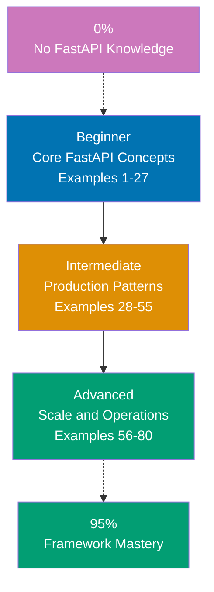

## Want to Master FastAPI Through Working Code?

This guide teaches you Python FastAPI through **80+ production-ready code examples** rather than lengthy explanations. If you are an experienced developer switching to FastAPI, or want to deepen your framework mastery, you will build intuition through actual working patterns.

## What Is By-Example Learning?

By-example learning is a **code-first approach** where you learn concepts through annotated, working examples rather than narrative explanations. Each example shows:

1. **What the code does** - Brief explanation of the FastAPI concept
2. **How it works** - A focused, heavily commented code example
3. **Why it matters** - A pattern summary highlighting the key takeaway

This approach works best when you already understand programming fundamentals. You learn FastAPI's idioms, patterns, and best practices by studying real code rather than theoretical descriptions.

## What Is Python FastAPI?

FastAPI is a **modern, high-performance Python web framework** built on top of Starlette and Pydantic. Key distinctions:

- **Not Django or Flask**: FastAPI is asynchronous-first, type-annotation-driven, and generates automatic OpenAPI docs
- **Performance**: Comparable to Node.js and Go in benchmarks due to async I/O with asyncio
- **Type-safe**: Uses Python type hints throughout for runtime validation, serialization, and IDE support
- **Standards-based**: Fully compliant with OpenAPI 3.1 and JSON Schema specifications
- **Modern Python**: Targets Python 3.10+ features including union types, structural pattern matching, and native asyncio

## Learning Path



## Coverage Philosophy: 95% Through 80+ Examples

The **95% coverage** means you will understand FastAPI deeply enough to build production systems with confidence. It does not mean you will know every edge case or advanced feature—those come with experience.

The 80 examples are organized progressively:

- **Beginner (Examples 1-27)**: Foundation concepts (path operations, Pydantic models, path and query parameters, request bodies, response models, status codes, form data, file uploads, error handling, middleware basics, static files, templates, CORS)
- **Intermediate (Examples 28-55)**: Production patterns (dependency injection, OAuth2, JWT authentication, SQLAlchemy database integration, background tasks, WebSockets, testing, custom middleware, application lifecycle events, response streaming, sub-applications, configuration management)
- **Advanced (Examples 56-80)**: Scale and operations (custom exception handlers, middleware stacking, OpenAPI customization, GraphQL integration, rate limiting, caching strategies, async patterns, distributed tracing, metrics, production deployment, Docker, performance tuning)

Together, these examples cover **95% of what you will use** in production FastAPI applications.

## What's Covered

### Core Web Framework Concepts

- **Path Operations**: GET, POST, PUT, PATCH, DELETE decorators, route parameters, query parameters
- **Pydantic Models**: Request bodies, response models, validation, nested models, field constraints
- **Request/Response**: Status codes, response headers, cookies, content negotiation, streaming
- **Error Handling**: HTTPException, custom exception handlers, validation error customization

### Data Validation and Serialization

- **Pydantic v2**: Model definition, field validators, model validators, computed fields, aliases
- **Type Annotations**: Python type hints driving runtime validation and OpenAPI schema generation
- **Response Models**: Filtering output fields, exclude_unset patterns, response model inheritance
- **Form Data and Files**: multipart/form-data handling, UploadFile, file size validation

### Security and Authentication

- **OAuth2 Password Flow**: Bearer token extraction, password hash verification, login endpoints
- **JWT Tokens**: Token creation with python-jose, payload extraction, token expiry handling
- **API Keys**: Header-based and query-parameter-based API key authentication
- **HTTPS and CORS**: TrustedHost middleware, CORS configuration, allowed origins

### Dependency Injection

- **Depends System**: Function dependencies, class-based dependencies, nested dependencies
- **Shared Resources**: Database sessions via Depends, common query parameters, pagination helpers
- **Testing Dependencies**: Overriding dependencies in tests for clean unit testing

### Database Integration

- **SQLAlchemy async**: Async session factory, declarative base, CRUD operations
- **Alembic Migrations**: Schema versioning, migration scripts, upgrade and downgrade
- **Repository Pattern**: Separating database logic from route handlers

### Async Patterns

- **async/await**: Async path operation functions, awaiting coroutines, concurrent execution
- **Background Tasks**: FastAPI BackgroundTasks, fire-and-forget patterns
- **WebSockets**: Bidirectional communication, connection management, broadcast patterns
- **httpx AsyncClient**: Async HTTP client for external API calls

### Testing

- **TestClient**: Synchronous HTTPX-based test client for synchronous test suites
- **AsyncClient**: Async test client for async test suites (pytest-asyncio)
- **Dependency Overrides**: Replacing database sessions, auth checks in tests

### Production and Operations

- **Deployment**: Uvicorn, Gunicorn+Uvicorn workers, Docker containerization
- **Configuration**: Pydantic Settings, environment variables, secrets management
- **Observability**: Structured logging, Prometheus metrics, OpenTelemetry tracing
- **Performance**: Connection pooling, caching with Redis, response compression

## What's NOT Covered

We exclude topics that belong in specialized tutorials:

- **Python language fundamentals**: Master Python first through language tutorials
- **Advanced asyncio internals**: Event loop mechanics, custom executors, loop policies
- **Database-specific SQL optimization**: Deep query analysis, index tuning, query plans
- **DevOps and Kubernetes**: Container orchestration, service mesh, complex deployment pipelines
- **Pydantic internals**: Custom type construction, plugin system, advanced model metaclass manipulation

For these topics, see dedicated tutorials and framework documentation.

## How to Use This Guide

### 1. Choose Your Starting Point

- **New to FastAPI?** Start with Beginner (Example 1)
- **Framework experience** (Flask, Django, Express)? Start with Intermediate (Example 28)
- **Building a specific feature?** Search for relevant example topic

### 2. Read the Example

Each example has five parts:

- **Explanation** (2-3 sentences): What FastAPI concept, why it exists, when to use it
- **Diagram** (optional): Mermaid diagram when relationships or flow benefit from visualization
- **Code** (with heavy comments): Working Python code showing the pattern
- **Key Takeaway** (1-2 sentences): Distilled essence of the pattern
- **Why It Matters** (50-100 words): Production impact and real-world significance

### 3. Run the Code

Install FastAPI and run each example:

```bash
pip install "fastapi[standard]"
# Save example to main.py
fastapi dev main.py
# Visit http://localhost:8000/docs for interactive API explorer
```

### 4. Modify and Experiment

Change field names, add validators, break things on purpose. Experimentation builds intuition faster than reading.

### 5. Reference as Needed

Use this guide as a reference when building features. Search for relevant examples and adapt patterns to your code.

## Relationship to Other Tutorial Types

| Tutorial Type               | Approach                        | Coverage              | Best For                       | Why Different                        |
| --------------------------- | ------------------------------- | --------------------- | ------------------------------ | ------------------------------------ |
| **By Example** (this guide) | Code-first, 80+ examples        | 95% breadth           | Learning framework idioms      | Emphasizes patterns through code     |
| **Quick Start**             | Project-based, hands-on         | 5-30% touchpoints     | Getting something working fast | Linear project flow, minimal theory  |
| **Beginner Tutorial**       | Narrative, explanation-first    | 0-60% comprehensive   | Understanding concepts deeply  | Detailed explanations, slower pace   |
| **Intermediate Tutorial**   | Problem-solving, practical      | 60-85% patterns       | Building real features         | Focus on common problems             |
| **Advanced Tutorial**       | Specialized topics, deep dives  | 85-95% expert mastery | Optimizing, scaling, internals | Advanced edge cases                  |
| **Cookbook**                | Recipe-based, problem-solution  | Problem-specific      | Solving specific problems      | Quick solutions, minimal context     |

## Prerequisites

### Required

- **Python fundamentals**: Functions, classes, decorators, type hints, async/await basics
- **Web development**: HTTP basics, JSON, REST concepts
- **Programming experience**: You have built applications before in another language

### Recommended

- **Pydantic v2 familiarity**: Model definition, validators, field types
- **asyncio basics**: Coroutines, event loop concept, await expressions
- **Relational databases**: SQL basics, schema design, ORM concepts

### Not Required

- **FastAPI experience**: This guide assumes you are new to the framework
- **Advanced Python**: We assume intermediate Python knowledge
- **DevOps experience**: Not necessary, but helpful for advanced sections

## Learning Strategies

### For Flask Developers Switching to FastAPI

- **Map Flask concepts**: Routes use decorators (same syntax); `request` object is replaced by function parameters; `jsonify` is replaced by returning Pydantic models
- **Embrace type hints**: FastAPI uses Python type hints for validation; add type annotations to all parameters immediately
- **Learn Pydantic early**: Pydantic models replace Flask-Marshmallow or manual validation; see Examples 4-10
- **Understand async**: FastAPI supports both sync and async path functions; prefer async for I/O-bound routes
- **Recommended path**: Examples 1-15 (Core FastAPI) → Examples 20-30 (Pydantic + validation) → Examples 35-45 (Auth patterns)

### For Django Developers Switching to FastAPI

- **Map Django REST Framework concepts**: Serializers become Pydantic models; ViewSets become path operation functions; permissions become dependencies
- **Understand the difference in philosophy**: FastAPI is micro-framework style (bring your own ORM, auth, etc.) vs Django's batteries-included approach
- **Learn dependency injection**: Replaces Django's middleware and mixin patterns for shared logic
- **Focus on async patterns**: Django ORM is sync by default; SQLAlchemy async replaces it in FastAPI
- **Recommended path**: Examples 1-10 (FastAPI basics) → Examples 28-40 (Dependencies + Auth) → Examples 41-50 (SQLAlchemy async)

### For Node.js/Express Developers Switching to FastAPI

- **Map Express concepts**: Middleware becomes FastAPI Depends or middleware classes; route handlers map directly; request/response objects become function parameters
- **Appreciate Python type safety**: FastAPI's Pydantic validation replaces manual `req.body` validation; type hints drive both docs and runtime checks
- **Learn Python async**: asyncio differs from Node.js event loop; Python uses explicit `await` everywhere
- **Recommended path**: Examples 1-15 (FastAPI fundamentals) → Examples 28-35 (Dependency injection) → Examples 56-65 (Performance and async)

### For Complete Framework Beginners

- **Master Python first**: Complete Python fundamentals including type hints, decorators, and async/await before starting FastAPI
- **Follow sequential order**: Read Examples 1-80 in order; each builds on previous concepts
- **Run every example**: Interactive docs at `/docs` let you test each endpoint immediately
- **Build small projects**: After Beginner examples, build a simple CRUD API with Pydantic models
- **Recommended path**: Python fundamentals → asyncio basics → Examples 1-27 (Beginner) → Build simple CRUD API → Examples 28-55 (Intermediate) → Build auth system → Examples 56-80 (Advanced)

## Structure of Each Example

All examples follow a consistent 5-part format:

```
### Example N: Descriptive Title

2-3 sentence explanation of the concept.

[Optional Mermaid diagram]

```python
# Heavily annotated code example
# showing the FastAPI pattern in action
# => shows expected values or output
```

**Key Takeaway**: 1-2 sentence summary.

**Why It Matters**: 50-100 word production-focused explanation.
```

**Code annotations**:

- `# =>` shows expected output or result values
- Inline comments explain what each line does and why
- Variable names are self-documenting

**Mermaid diagrams** appear when visualizing flow or architecture improves understanding. We use a color-blind friendly palette:

- Blue #0173B2 - Primary elements
- Orange #DE8F05 - Decisions and secondary elements
- Teal #029E73 - Success and validation paths
- Purple #CC78BC - Special states and alternatives
- Brown #CA9161 - Neutral and supporting elements

## Ready to Start?

Choose your learning path:

- **[Beginner](/en/learn/software-engineering/platform-web/tools/python-fastapi/by-example/beginner)** - Start here if new to FastAPI. Build foundation understanding through 27 core examples covering path operations, Pydantic, and request handling.
- **[Intermediate](/en/learn/software-engineering/platform-web/tools/python-fastapi/by-example/intermediate)** - Jump here if you know FastAPI basics. Master production patterns through 28 examples covering dependency injection, auth, and database integration.
- **[Advanced](/en/learn/software-engineering/platform-web/tools/python-fastapi/by-example/advanced)** - Expert mastery through 25 advanced examples covering performance, observability, and production deployment.

Or jump to specific topics by searching for relevant example keywords (routing, authentication, Pydantic, testing, deployment, WebSocket, etc.).
