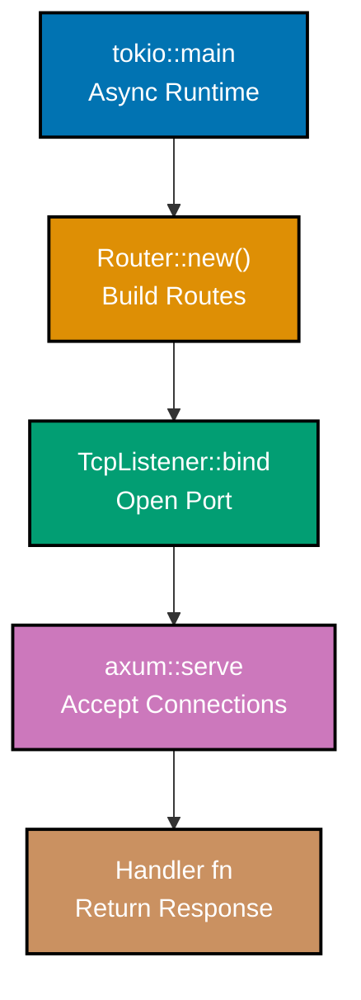
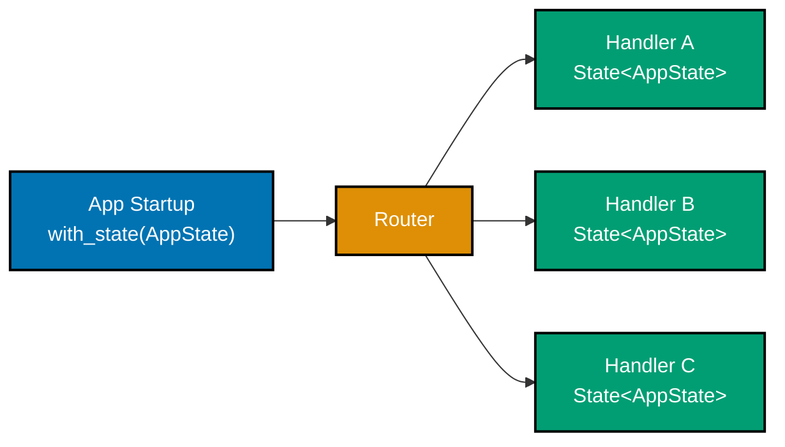

## Group 1: Hello World and Project Setup

### Example 1: Minimal Axum Server

An Axum application starts with a `Router`, a socket address, and a call to `axum::serve`. This example is the smallest possible Axum server that responds to HTTP requests.



```rust
// Cargo.toml dependencies needed:
// axum = "0.8"
// tokio = { version = "1", features = ["full"] }

use axum::{routing::get, Router};  // => axum::Router builds the route tree
                                    // => routing::get attaches GET method handlers

#[tokio::main]                      // => Macro expands to tokio runtime setup
                                    // => Equivalent to: tokio::runtime::Builder::new_multi_thread()...
async fn main() {
    // Build the application router
    let app = Router::new()         // => Creates empty Router (no routes yet)
        .route("/", get(root));     // => Maps GET / to the root() handler function
                                    // => route() returns a new Router (immutable, builder pattern)

    // Bind to a local TCP address
    let listener = tokio::net::TcpListener::bind("0.0.0.0:3000")
        .await                      // => .await suspends until TCP bind completes
        .unwrap();                  // => Panics if port 3000 is already in use
                                    // => In production use .expect("Failed to bind") or handle Error

    println!("Listening on http://0.0.0.0:3000");

    // Start the server - blocks until shutdown signal
    axum::serve(listener, app)      // => Ties the TcpListener to the Router
        .await                      // => Drives the server; never returns on success
        .unwrap();                  // => Propagates any fatal server errors
}

// Handler functions are plain async functions
async fn root() -> &'static str {  // => &'static str implements IntoResponse
                                    // => Axum converts it to 200 OK with text/plain body
    "Hello, World!"                 // => Response body: "Hello, World!"
                                    // => Status: 200 OK
}
```

**Key Takeaway**: An Axum server requires three ingredients: a `Router` with routes, a `TcpListener`, and `axum::serve`. Every handler is an async function that returns a type implementing `IntoResponse`.

**Why It Matters**: Axum's minimal startup overhead and zero-cost async model make it ideal for high-throughput services. The `tokio::main` macro bootstraps the async runtime once, and `axum::serve` drives all incoming connections using the same multi-threaded runtime. Production services built this way handle tens of thousands of concurrent connections with microsecond overhead per request, not milliseconds.

---

### Example 2: Route Registration Patterns

Axum routes register HTTP methods explicitly. You can chain multiple method handlers on the same path using `.route_service` or method-routing helpers.

```rust
use axum::{
    routing::{delete, get, post, put}, // => Import method-specific routing helpers
    Router,
};

#[tokio::main]
async fn main() {
    let app = Router::new()
        // Each route maps (path, method) to a handler
        .route("/users", get(list_users))     // => GET /users → list_users()
        .route("/users", post(create_user))   // => POST /users → create_user()
        // Chaining on same path is idiomatic in Axum 0.8
        .route("/users/:id", get(get_user))   // => GET /users/:id → get_user()
                                               // => :id is a named capture segment
        .route("/users/:id", put(update_user))  // => PUT /users/:id → update_user()
        .route("/users/:id", delete(delete_user)); // => DELETE /users/:id → delete_user()
                                                    // => CRUD pattern complete

    let listener = tokio::net::TcpListener::bind("0.0.0.0:3000")
        .await.unwrap();
    axum::serve(listener, app).await.unwrap();
}

// Handlers return &'static str for brevity; real handlers return Json or Html
async fn list_users() -> &'static str { "list users" }   // => GET /users
async fn create_user() -> &'static str { "created" }     // => POST /users
async fn get_user() -> &'static str { "one user" }       // => GET /users/:id
async fn update_user() -> &'static str { "updated" }     // => PUT /users/:id
async fn delete_user() -> &'static str { "deleted" }     // => DELETE /users/:id
```

**Key Takeaway**: Register each HTTP method separately using `routing::get`, `routing::post`, etc. The `Router` is immutable and builder-pattern based—each `.route()` call returns a new `Router`.

**Why It Matters**: Explicit per-method routing prevents accidental exposure of mutation endpoints. Unlike frameworks that accept all methods by default, Axum returns `405 Method Not Allowed` automatically for unregistered methods on a known path—a safe-by-default behavior that avoids a common class of API security bugs without any additional configuration.

---

### Example 3: Path Parameters

Path parameters are dynamic segments in URLs captured at routing time. Axum uses the `Path` extractor to pull them out of the request with full type safety.

```rust
use axum::{
    extract::Path,  // => Path<T> extractor for URL segments
    routing::get,
    Router,
};

#[tokio::main]
async fn main() {
    let app = Router::new()
        .route("/users/:id", get(get_user))
        // Multiple segments: /orders/:user_id/items/:item_id
        .route("/orders/:user_id/items/:item_id", get(get_item));

    let listener = tokio::net::TcpListener::bind("0.0.0.0:3000")
        .await.unwrap();
    axum::serve(listener, app).await.unwrap();
}

// Single path param - Axum parses ":id" into the given type
async fn get_user(
    Path(user_id): Path<u64>,  // => Destructure Path<u64> directly
                                // => Axum parses the ":id" segment as u64
                                // => Returns 400 Bad Request if parsing fails
                                // => e.g. GET /users/42 → user_id = 42
) -> String {
    format!("User ID: {}", user_id)  // => "User ID: 42"
}

// Multiple path params - use a tuple or struct
async fn get_item(
    Path((user_id, item_id)): Path<(u64, u64)>,  // => Tuple destructuring
                                                   // => First :user_id → user_id: u64
                                                   // => Second :item_id → item_id: u64
) -> String {
    format!("User {}, Item {}", user_id, item_id)  // => "User 5, Item 12"
}
```

**Key Takeaway**: The `Path<T>` extractor parses URL segments into Rust types at compile time. Use tuple destructuring `Path<(A, B)>` for multiple segments.

**Why It Matters**: Type-safe path extraction eliminates an entire category of runtime parsing bugs. When you declare `Path<u64>`, Axum rejects non-numeric IDs with a `400` before your handler ever runs—no `unwrap()`, no `parse()`, no forgotten validation. This compile-time contract between URL structure and handler signature makes refactoring safe and reduces defensive code in business logic.

---

### Example 4: Query Parameters

Query parameters (`?key=value`) are parsed via the `Query` extractor. Axum deserializes them into any `serde::Deserialize` type automatically.

```rust
use axum::{
    extract::Query,           // => Query<T> extractor for ?key=value pairs
    routing::get,
    Router,
};
use serde::Deserialize;       // => Serde trait for deserialization

// Define a struct matching expected query parameters
#[derive(Deserialize)]        // => Auto-generate deserialization from query string
struct Pagination {
    page: Option<u32>,        // => ?page=2  (optional, defaults to None)
    per_page: Option<u32>,    // => ?per_page=20 (optional)
}

#[derive(Deserialize)]
struct SearchParams {
    q: String,                // => ?q=rust  (required - returns 400 if missing)
    lang: Option<String>,     // => ?lang=en (optional)
}

async fn list_posts(
    Query(pagination): Query<Pagination>,  // => Deserializes ?page=&per_page= into Pagination
                                            // => All fields Optional → never returns 400
) -> String {
    let page = pagination.page.unwrap_or(1);           // => page=1 if not provided
    let per_page = pagination.per_page.unwrap_or(20);  // => per_page=20 if not provided
    format!("Page {}, {} per page", page, per_page)
}

async fn search(
    Query(params): Query<SearchParams>,    // => Deserializes ?q= into SearchParams
                                            // => Returns 400 if required field "q" missing
) -> String {
    format!("Search: {} (lang: {:?})", params.q, params.lang)
    // => "Search: rust (lang: Some(\"en\"))"
    // => "Search: axum (lang: None)" if ?lang not provided
}

#[tokio::main]
async fn main() {
    let app = Router::new()
        .route("/posts", get(list_posts))
        .route("/search", get(search));
    let listener = tokio::net::TcpListener::bind("0.0.0.0:3000").await.unwrap();
    axum::serve(listener, app).await.unwrap();
}
```

**Key Takeaway**: `Query<T>` deserializes the query string into any `serde::Deserialize` struct. Use `Option<T>` fields for optional parameters and plain `T` for required ones.

**Why It Matters**: Struct-based query parsing turns URL parameters into strongly typed values before your handler runs. Missing required fields return `400 Bad Request` automatically. Serde's `rename`, `default`, and `alias` attributes let you accept `camelCase` URL parameters while keeping your struct fields in `snake_case`—handling API versioning and client conventions cleanly.

---

### Example 5: JSON Request Body

The `Json` extractor deserializes a JSON request body into a Rust struct. The struct must implement `serde::Deserialize`.

```rust
use axum::{
    extract::Json,       // => Json<T> extractor for application/json bodies
    http::StatusCode,    // => HTTP status code constants
    routing::post,
    Router,
};
use serde::{Deserialize, Serialize};

#[derive(Deserialize)]   // => Allows Json extractor to parse request body
struct CreateUser {
    username: String,    // => Required JSON field "username"
    email: String,       // => Required JSON field "email"
    age: Option<u8>,     // => Optional JSON field "age"
}

#[derive(Serialize)]     // => Allows Json<T> response to serialize to JSON
struct UserCreated {
    id: u64,             // => Assigned user ID
    username: String,    // => Echo back the username
    message: String,     // => Confirmation message
}

async fn create_user(
    Json(payload): Json<CreateUser>,  // => Extracts and deserializes JSON body
                                       // => Returns 422 Unprocessable Entity if body is invalid JSON
                                       // => Returns 400 Bad Request if Content-Type is not application/json
) -> (StatusCode, Json<UserCreated>) { // => Return tuple: (status, json body)
    let user = UserCreated {
        id: 1,                          // => Would be DB-assigned in real code
        username: payload.username,     // => Move username from request into response
        message: "User created".into(), // => Confirmation string
    };
    (StatusCode::CREATED, Json(user))  // => 201 Created + JSON body
    // => Response: {"id":1,"username":"alice","message":"User created"}
}

#[tokio::main]
async fn main() {
    let app = Router::new().route("/users", post(create_user));
    let listener = tokio::net::TcpListener::bind("0.0.0.0:3000").await.unwrap();
    axum::serve(listener, app).await.unwrap();
}
```

**Key Takeaway**: `Json<T>` both extracts request bodies (as a handler parameter) and wraps response values (as a return type). Pair it with `StatusCode` in a tuple to control response status.

**Why It Matters**: Axum's `Json` extractor performs content-type checking, JSON parsing, and struct deserialization in one step—returning appropriate error codes for each failure mode. Returning `Json<T>` as a response sets `Content-Type: application/json` automatically. This eliminates boilerplate that exists in every other JSON API: manual `Content-Type` headers, `serde_json::from_str` calls, and error mapping are all handled by the extractor trait machinery.

---

## Group 2: Application State

### Example 6: Shared State with `State` Extractor

Axum's `State` extractor injects shared application state into handlers. The state must be `Clone + Send + Sync + 'static`.



```rust
use axum::{
    extract::State,      // => State<T> extractor injects shared state
    routing::get,
    Router,
};
use std::sync::Arc;      // => Arc for shared ownership across threads

// Define your application state
#[derive(Clone)]         // => Clone required by State extractor
struct AppState {
    db_url: String,      // => Database connection string
    app_name: String,    // => Application name for headers/logging
}

async fn health_check(
    State(state): State<Arc<AppState>>,  // => Clones the Arc (cheap - increments ref count)
                                          // => Arc<AppState> for shared ownership across threads
                                          // => State<T> clones T on each request; use Arc for cheap clone
) -> String {
    format!("OK: {}", state.app_name)   // => "OK: my-api"
    // => state.db_url is accessible too: state.db_url
}

async fn config(
    State(state): State<Arc<AppState>>,  // => Same Arc clone, different handler
) -> String {
    format!("DB: {}", state.db_url)     // => "DB: postgres://localhost/mydb"
}

#[tokio::main]
async fn main() {
    let state = Arc::new(AppState {      // => Wrap in Arc for cheap clone in handlers
        db_url: "postgres://localhost/mydb".into(),
        app_name: "my-api".into(),
    });

    let app = Router::new()
        .route("/health", get(health_check))
        .route("/config", get(config))
        .with_state(state);              // => Attach state to the router
                                          // => All child routes inherit this state

    let listener = tokio::net::TcpListener::bind("0.0.0.0:3000").await.unwrap();
    axum::serve(listener, app).await.unwrap();
}
```

**Key Takeaway**: Wrap state in `Arc<T>` and attach it via `.with_state()`. Extract with `State<Arc<T>>` in handlers—cloning an `Arc` is cheap (atomic reference count increment).

**Why It Matters**: `State` is Axum's primary dependency injection mechanism. Unlike global `static` variables, state is scoped to the router—subrouters can have different state types, enabling modular application composition. The `Arc` wrapping ensures safe shared access across Tokio's multi-threaded executor without locks for read-only data, and `Arc<Mutex<T>>` or `Arc<RwLock<T>>` for mutable shared data.

---

### Example 7: Mutable State with `Arc<RwLock<T>>`

For state that changes at runtime, wrap the mutable data in `Arc<RwLock<T>>`. This provides concurrent read access and exclusive write access.

```rust
use axum::{
    extract::State,
    routing::{get, post},
    Json, Router,
};
use serde::{Deserialize, Serialize};
use std::sync::{Arc, RwLock};

// Counter state - wraps mutable u64 in RwLock for safe concurrent access
type SharedCounter = Arc<RwLock<u64>>;  // => Type alias for readability
                                         // => Arc = shared ownership, RwLock = interior mutability

#[derive(Serialize)]
struct CounterResponse {
    count: u64,   // => Current counter value to serialize to JSON
}

async fn get_count(
    State(counter): State<SharedCounter>,  // => Clones the Arc (cheap)
) -> Json<CounterResponse> {
    let count = counter.read()             // => Acquires read lock (non-blocking if no writer)
        .unwrap()                          // => Panics if lock is poisoned (writer panicked)
        .clone();                          // => Copy the u64 value before dropping lock
                                            // => Lock released here (guard dropped)
    Json(CounterResponse { count })        // => {"count": 42}
}

async fn increment(
    State(counter): State<SharedCounter>,  // => Clones the Arc
) -> Json<CounterResponse> {
    let mut count = counter.write()        // => Acquires exclusive write lock
        .unwrap();                          // => Blocks until all readers release
    *count += 1;                           // => Dereference MutexGuard to modify value
    let current = *count;                  // => Copy value before dropping lock
                                            // => Lock released when `count` drops at end of scope
    Json(CounterResponse { count: current })
}

#[tokio::main]
async fn main() {
    let counter: SharedCounter = Arc::new(RwLock::new(0));  // => Initialize counter to 0

    let app = Router::new()
        .route("/count", get(get_count))
        .route("/increment", post(increment))
        .with_state(counter);

    let listener = tokio::net::TcpListener::bind("0.0.0.0:3000").await.unwrap();
    axum::serve(listener, app).await.unwrap();
}
```

**Key Takeaway**: Use `Arc<RwLock<T>>` for mutable shared state. Read locks allow concurrent readers; write locks are exclusive. Always release locks promptly by copying values out.

**Why It Matters**: In-memory mutable state is often the right choice for lightweight counters, caches, and feature flags—no database round-trip required. `RwLock` allows concurrent reads (important for hot-path state like configuration) while serializing writes. For high-contention writes, prefer `DashMap` or actor-based approaches via `tokio::sync::mpsc` channels to avoid lock contention bottlenecks.

---

## Group 3: Response Types

### Example 8: `IntoResponse` and Custom Responses

Any type implementing `IntoResponse` can be returned from a handler. Axum provides implementations for common types and tuples.

```rust
use axum::{
    http::{header, HeaderMap, StatusCode},  // => HTTP primitives
    response::{Html, IntoResponse, Response},  // => Response types
    routing::get,
    Json, Router,
};
use serde::Serialize;

// 1. Plain string - 200 OK with text/plain
async fn plain_text() -> &'static str {
    "Hello"                        // => Status: 200, Content-Type: text/plain
}

// 2. HTML response
async fn html_page() -> Html<String> {
    Html("<h1>Hello</h1>".to_string())  // => Status: 200, Content-Type: text/html
}

// 3. Status code only
async fn no_content() -> StatusCode {
    StatusCode::NO_CONTENT         // => Status: 204, no body
}

// 4. Tuple: (StatusCode, body) - override default 200
async fn created() -> (StatusCode, &'static str) {
    (StatusCode::CREATED, "Created")  // => Status: 201, body: "Created"
}

// 5. Custom headers via HeaderMap
async fn with_headers() -> impl IntoResponse {  // => impl IntoResponse is idiomatic
    let mut headers = HeaderMap::new();
    headers.insert(
        header::CACHE_CONTROL,
        "max-age=3600".parse().unwrap(),  // => Cache-Control: max-age=3600
    );
    (headers, "Cached response")           // => Tuple of (headers, body)
}

// 6. Full custom response
async fn custom_response() -> Response {
    Response::builder()                     // => Start building a response
        .status(StatusCode::ACCEPTED)       // => 202 Accepted
        .header("X-Job-Id", "abc-123")     // => Custom header
        .body("Processing".into())          // => String body as axum::body::Body
        .unwrap()                           // => Building always succeeds here
}

#[tokio::main]
async fn main() {
    let app = Router::new()
        .route("/text", get(plain_text))
        .route("/html", get(html_page))
        .route("/empty", get(no_content))
        .route("/created", get(created))
        .route("/cached", get(with_headers))
        .route("/custom", get(custom_response));
    let listener = tokio::net::TcpListener::bind("0.0.0.0:3000").await.unwrap();
    axum::serve(listener, app).await.unwrap();
}
```

**Key Takeaway**: Return `impl IntoResponse` from handlers for maximum flexibility. Common types like `&str`, `String`, `Json<T>`, `Html<T>`, `StatusCode`, and tuples all implement `IntoResponse` out of the box.

**Why It Matters**: The `IntoResponse` trait is Axum's extensibility point for responses. By returning `impl IntoResponse`, your handler can return different response types based on runtime conditions—`Json` for API clients, `Html` for browsers, `StatusCode` for empty responses—without changing the function signature. Production services use this to implement content negotiation and return structured errors consistently.

---

### Example 9: Error Handling with Custom Error Types

Axum handlers can return `Result<T, E>` where `E: IntoResponse`. This allows structured error types that map to HTTP responses.

```rust
use axum::{
    http::StatusCode,
    response::{IntoResponse, Response},
    routing::get,
    Json, Router,
};
use serde::Serialize;

// Define application error types
#[derive(Debug)]
enum AppError {
    NotFound(String),       // => Maps to 404 Not Found
    BadRequest(String),     // => Maps to 400 Bad Request
    InternalError(String),  // => Maps to 500 Internal Server Error
}

// Error response body
#[derive(Serialize)]
struct ErrorBody {
    error: String,   // => Human-readable error message
    code: u16,       // => HTTP status code for client parsing
}

// Implement IntoResponse for our error enum
impl IntoResponse for AppError {
    fn into_response(self) -> Response {
        let (status, message) = match self {
            AppError::NotFound(msg) => (StatusCode::NOT_FOUND, msg),
            // => 404 + message
            AppError::BadRequest(msg) => (StatusCode::BAD_REQUEST, msg),
            // => 400 + message
            AppError::InternalError(msg) => (StatusCode::INTERNAL_SERVER_ERROR, msg),
            // => 500 + message (scrub details in production!)
        };
        let body = ErrorBody {
            code: status.as_u16(),  // => e.g. 404
            error: message,          // => e.g. "User not found"
        };
        (status, Json(body)).into_response()  // => Compose status + JSON body
    }
}

// Handler returns Result; Err variant uses our AppError
async fn find_user(
    axum::extract::Path(id): axum::extract::Path<u64>,
) -> Result<Json<String>, AppError> {  // => Ok = JSON response, Err = error response
    if id == 0 {
        return Err(AppError::BadRequest("ID must be non-zero".into()));
        // => Response: 400 {"error":"ID must be non-zero","code":400}
    }
    if id > 100 {
        return Err(AppError::NotFound(format!("User {} not found", id)));
        // => Response: 404 {"error":"User 42 not found","code":404}
    }
    Ok(Json(format!("User {}", id)))  // => Response: 200 "\"User 5\""
}

#[tokio::main]
async fn main() {
    let app = Router::new().route("/users/:id", get(find_user));
    let listener = tokio::net::TcpListener::bind("0.0.0.0:3000").await.unwrap();
    axum::serve(listener, app).await.unwrap();
}
```

**Key Takeaway**: Implement `IntoResponse` for your error enum. Handlers return `Result<T, AppError>` and Axum automatically calls `into_response()` on errors.

**Why It Matters**: Centralized error mapping prevents inconsistent error responses—a common API quality problem. When all errors flow through a single `IntoResponse` implementation, you control the response format in one place: add request IDs, scrub internal details in production, log errors before responding, and ensure clients always receive properly structured error bodies regardless of where in the handler chain the error originates.

---

## Group 4: Headers and Cookies

### Example 10: Reading Request Headers

Axum provides the `HeaderMap` extractor for raw header access and the `TypedHeader` extractor for strongly typed headers via the `headers` crate.

```rust
use axum::{
    extract::TypedHeader,             // => Typed header extractor
    http::{HeaderMap, StatusCode},    // => Raw header map
    routing::get,
    Router,
};
use axum_extra::TypedHeader as ExtraTypedHeader;  // => axum-extra crate
// Note: For axum 0.8, use axum::TypedHeader directly

#[tokio::main]
async fn main() {
    let app = Router::new()
        .route("/raw-headers", get(raw_headers))
        .route("/auth", get(check_auth));
    let listener = tokio::net::TcpListener::bind("0.0.0.0:3000").await.unwrap();
    axum::serve(listener, app).await.unwrap();
}

// Raw header access via HeaderMap
async fn raw_headers(
    headers: HeaderMap,           // => Injects full request HeaderMap
                                   // => No need for Path/Query/State wrappers
) -> String {
    // Get a specific header by name
    let content_type = headers
        .get("content-type")      // => Returns Option<&HeaderValue>
        .and_then(|v| v.to_str().ok())  // => Convert to &str, None if not valid UTF-8
        .unwrap_or("not set");          // => Default if header absent

    // Get the User-Agent header
    let user_agent = headers
        .get("user-agent")
        .and_then(|v| v.to_str().ok())
        .unwrap_or("unknown");

    format!("Content-Type: {}, User-Agent: {}", content_type, user_agent)
    // => "Content-Type: application/json, User-Agent: curl/7.88"
}

// Check Authorization header manually (real apps use middleware)
async fn check_auth(
    headers: HeaderMap,           // => Full header map
) -> Result<String, StatusCode> { // => Return 401 if missing auth
    let auth = headers
        .get("authorization")     // => Look for Authorization header
        .and_then(|v| v.to_str().ok())
        .ok_or(StatusCode::UNAUTHORIZED)?;  // => ? operator: return 401 if None

    if auth.starts_with("Bearer ") {  // => Check for Bearer token scheme
        Ok(format!("Authorized: {}", &auth[7..]))  // => Skip "Bearer " prefix
    } else {
        Err(StatusCode::UNAUTHORIZED)               // => Wrong scheme → 401
    }
}
```

**Key Takeaway**: Use `HeaderMap` for raw header access and `TypedHeader<T>` (via `axum-extra`) for strongly typed common headers like `Authorization` and `Content-Type`.

**Why It Matters**: Header validation belongs in middleware for cross-cutting concerns like authentication, but direct header access in handlers is appropriate for per-route logic. Axum's compile-time extractor system means that if a handler declares `TypedHeader<Authorization>`, the framework guarantees the header exists and is validly formatted before the handler runs—no null checks, no format validation in business logic.

---

### Example 11: Setting Response Headers and Cookies

Set response headers by returning `(HeaderMap, body)` tuples, and manage cookies using the `cookie` crate with `Set-Cookie` headers.

```rust
use axum::{
    http::{header, HeaderMap, HeaderValue},  // => HTTP header types
    routing::{get, post},
    Router,
};

#[tokio::main]
async fn main() {
    let app = Router::new()
        .route("/set-cookie", post(set_cookie))
        .route("/cached", get(cached_response));
    let listener = tokio::net::TcpListener::bind("0.0.0.0:3000").await.unwrap();
    axum::serve(listener, app).await.unwrap();
}

// Set a cookie in the response
async fn set_cookie() -> (HeaderMap, &'static str) {
    let mut headers = HeaderMap::new();

    // Build a Set-Cookie header value
    let cookie_value = "session_id=abc123; HttpOnly; SameSite=Lax; Path=/; Max-Age=3600";
    // => HttpOnly: JS cannot read this cookie (XSS protection)
    // => SameSite=Lax: sent on same-site navigations (CSRF protection)
    // => Path=/: valid for all paths
    // => Max-Age=3600: expires in 1 hour

    headers.insert(
        header::SET_COOKIE,
        HeaderValue::from_static(cookie_value),  // => Static strings are safe to use directly
    );

    (headers, "Cookie set!")  // => Response includes Set-Cookie header
}

// Return a response with caching headers
async fn cached_response() -> (HeaderMap, String) {
    let mut headers = HeaderMap::new();

    headers.insert(
        header::CACHE_CONTROL,
        "public, max-age=3600, must-revalidate".parse().unwrap(),
        // => public: cacheable by CDNs
        // => max-age=3600: fresh for 1 hour
        // => must-revalidate: recheck after expiry
    );
    headers.insert(
        header::CONTENT_TYPE,
        HeaderValue::from_static("application/json"),
    );

    (headers, r#"{"data": "cached"}"#.to_string())
    // => Returns JSON with caching headers
}
```

**Key Takeaway**: Return `(HeaderMap, body)` tuples to add headers to responses. Build cookie values as formatted strings, inserting them as `Set-Cookie` headers.

**Why It Matters**: Proper caching headers can reduce server load by orders of magnitude for read-heavy APIs. Setting `Cache-Control`, `ETag`, and `Last-Modified` headers correctly enables CDN and browser caching without application-level changes. Cookie security attributes (`HttpOnly`, `SameSite`, `Secure`) are your primary CSRF and XSS defenses—getting them right at the framework layer means every endpoint automatically benefits from the security posture.

---

## Group 5: Form Handling

### Example 12: HTML Form Submission

The `Form` extractor handles `application/x-www-form-urlencoded` POST bodies, the format sent by HTML forms by default.

```rust
use axum::{
    extract::Form,               // => Form<T> extractor for urlencoded bodies
    response::{Html, Redirect},  // => Html for pages, Redirect for Post/Redirect/Get
    routing::{get, post},
    Router,
};
use serde::Deserialize;

// Fields must match HTML input name attributes
#[derive(Deserialize)]
struct LoginForm {
    username: String,  // => <input name="username">
    password: String,  // => <input name="password">
}

// GET handler: show the login form
async fn login_page() -> Html<&'static str> {
    Html(r#"
        <!DOCTYPE html>
        <html>
        <body>
            <form method="POST" action="/login">
                <input type="text" name="username" placeholder="Username">
                <input type="password" name="password" placeholder="Password">
                <button type="submit">Login</button>
            </form>
        </body>
        </html>
    "#)
    // => Returns HTML form page (200 OK, Content-Type: text/html)
}

// POST handler: process form submission
async fn handle_login(
    Form(credentials): Form<LoginForm>,  // => Parses urlencoded body into LoginForm
                                          // => Returns 422 if body is malformed
                                          // => Returns 400 if Content-Type is wrong
) -> Redirect {
    // In real code: validate credentials against DB
    println!("Login attempt: {}", credentials.username);
    // => Log: "Login attempt: alice"
    // => credentials.password = "secret" (NEVER log passwords!)

    // Post/Redirect/Get pattern prevents duplicate form submission on refresh
    Redirect::to("/dashboard")  // => 303 See Other → GET /dashboard
}

#[tokio::main]
async fn main() {
    let app = Router::new()
        .route("/login", get(login_page).post(handle_login));
        // => get() and post() can be chained on same path with .route()
    let listener = tokio::net::TcpListener::bind("0.0.0.0:3000").await.unwrap();
    axum::serve(listener, app).await.unwrap();
}
```

**Key Takeaway**: `Form<T>` extracts `application/x-www-form-urlencoded` bodies. Use the Post/Redirect/Get pattern (`Redirect::to(...)`) after form processing to prevent duplicate submissions on browser refresh.

**Why It Matters**: HTML forms are still the most reliable way to handle user input across all browsers and assistive technologies. The Post/Redirect/Get pattern is a foundational web security technique—without it, users who refresh after a POST will re-submit the form, causing duplicate orders, double charges, or duplicate user accounts. Axum's `Redirect` response type makes this pattern trivial to implement correctly.

---

## Group 6: Static Files and Templates

### Example 13: Serving Static Files with `tower-http`

`tower-http`'s `ServeDir` service serves an entire directory of static files, handling content negotiation, range requests, and ETags automatically.

```rust
// Cargo.toml:
// axum = "0.8"
// tower-http = { version = "0.6", features = ["fs", "trace"] }
// tokio = { version = "1", features = ["full"] }

use axum::{routing::get_service, Router};
use tower_http::services::ServeDir;  // => Static file serving tower service

#[tokio::main]
async fn main() {
    // Serve the ./static directory at the /static URL prefix
    let static_service = ServeDir::new("static")  // => Serve from ./static/ directory
        .append_index_html_on_directories(true);   // => GET /static/ → serves index.html

    let app = Router::new()
        // Mount static file service under /static prefix
        .nest_service("/static", static_service)
        // => GET /static/style.css → reads ./static/style.css
        // => GET /static/js/app.js → reads ./static/js/app.js
        // => Handles ETags and Last-Modified for browser caching
        // => Range requests supported for large files
        .route("/", get(index));

    let listener = tokio::net::TcpListener::bind("0.0.0.0:3000").await.unwrap();
    axum::serve(listener, app).await.unwrap();
}

async fn index() -> axum::response::Html<&'static str> {
    axum::response::Html(r#"
        <link rel="stylesheet" href="/static/style.css">
        <script src="/static/js/app.js"></script>
        <h1>Hello from Axum</h1>
    "#)
    // => HTML page that loads static files from /static/*
}
```

**Key Takeaway**: Use `tower_http::services::ServeDir` with `.nest_service()` to serve a static directory. It handles ETags, range requests, and index files automatically.

**Why It Matters**: `ServeDir` implements proper HTTP caching semantics out of the box—ETags for change detection, `Last-Modified` headers, conditional GET support, and partial content (range) requests for video streaming. A production setup typically places a CDN in front, but even without a CDN, `ServeDir` serves static files efficiently from disk with OS-level caching, without the overhead of loading files into Rust memory.

---

### Example 14: HTML Templates with Askama

Askama is a compile-time type-safe template engine for Rust. Templates are checked at compile time, preventing template typos and missing variable errors.

```rust
// Cargo.toml:
// axum = "0.8"
// askama = "0.12"
// askama_axum = "0.4"

use askama::Template;           // => Template derive macro and trait
use askama_axum::IntoResponse;  // => Implement IntoResponse for templates
use axum::{routing::get, Router};

// The template file lives at templates/index.html (relative to Cargo.toml)
#[derive(Template)]
#[template(path = "index.html")]  // => Compile-time: reads templates/index.html
struct IndexTemplate {
    title: String,                // => {{ title }} in template
    items: Vec<String>,           // =>  in template
    user_count: u32,              // => {{ user_count }} in template
}

// Template file (templates/index.html):
// <!DOCTYPE html>
// <html>
// <head><title>{{ title }}</title></head>
// <body>
//   <h1>{{ title }}</h1>
//   <ul>
//   
//     <li>{{ item }}</li>
//   
//   </ul>
//   <p>{{ user_count }} users online</p>
// </body>
// </html>

async fn index() -> IndexTemplate {  // => askama_axum makes Template impl IntoResponse
    IndexTemplate {
        title: "My Axum App".to_string(),   // => Rendered into {{ title }}
        items: vec![                         // => Rendered in for loop
            "Rust".to_string(),
            "Axum".to_string(),
            "Askama".to_string(),
        ],
        user_count: 42,                      // => Rendered into {{ user_count }}
    }
    // => Response: 200 OK, Content-Type: text/html
    // => Rendered HTML with the template filled in
}

#[tokio::main]
async fn main() {
    let app = Router::new().route("/", get(index));
    let listener = tokio::net::TcpListener::bind("0.0.0.0:3000").await.unwrap();
    axum::serve(listener, app).await.unwrap();
}
```

**Key Takeaway**: Askama generates Rust code from templates at compile time. Template errors (missing variables, type mismatches) become compile errors, not runtime panics.

**Why It Matters**: Compile-time template checking eliminates an entire category of production bugs—missing template variables become build failures, not 500 errors in production. Askama templates render 10-50x faster than interpreted template engines because the template logic compiles to Rust code. For server-rendered applications, this means sub-millisecond rendering for most pages even under high concurrency.

---

## Group 7: Middleware Basics

### Example 15: Request Logging with `TraceLayer`

`tower-http`'s `TraceLayer` adds structured request/response tracing using the `tracing` crate. It logs method, path, status, and latency automatically.

```rust
// Cargo.toml:
// axum = "0.8"
// tower-http = { version = "0.6", features = ["trace"] }
// tracing = "0.1"
// tracing-subscriber = { version = "0.3", features = ["env-filter"] }
// tokio = { version = "1", features = ["full"] }

use axum::{routing::get, Router};
use tower_http::trace::TraceLayer;  // => Adds structured request tracing
use tracing_subscriber::{layer::SubscriberExt, util::SubscriberInitExt};

#[tokio::main]
async fn main() {
    // Initialize tracing subscriber (prints to stdout by default)
    tracing_subscriber::registry()
        .with(
            tracing_subscriber::EnvFilter::try_from_default_env()
                // => Reads RUST_LOG env var: e.g. RUST_LOG=info,tower_http=debug
                .unwrap_or_else(|_| "my_app=info,tower_http=debug".into()),
                // => Fallback: app=info, tower_http=debug
        )
        .with(tracing_subscriber::fmt::layer())  // => Format logs as human-readable text
        .init();                                  // => Install as global default subscriber

    let app = Router::new()
        .route("/", get(handler))
        .layer(TraceLayer::new_for_http());
        // => Wraps the router with tracing middleware
        // => Logs: "request" span with method, uri, version
        // => Logs: "response" event with status, latency
        // => Output: INFO request{method=GET uri=/ version=HTTP/1.1} response{status=200 latency=1ms}

    let listener = tokio::net::TcpListener::bind("0.0.0.0:3000").await.unwrap();
    axum::serve(listener, app).await.unwrap();
}

async fn handler() -> &'static str {
    tracing::info!("Handler called");  // => Emits INFO event inside request span
                                        // => Automatically includes request context
    "Hello"
}
```

**Key Takeaway**: Add `TraceLayer::new_for_http()` via `.layer()` to get structured request logging. Control verbosity with `RUST_LOG` environment variable.

**Why It Matters**: Structured logs are queryable in ways that printf-style logs are not. Every request log from `TraceLayer` includes the trace ID, method, URI, status, and latency in a machine-readable format. Platforms like Datadog, Grafana Loki, and CloudWatch can filter, aggregate, and alert on these fields—enabling you to answer questions like "all requests that took over 500ms to `/api/users`" without log parsing hacks.

---

### Example 16: Custom Function Middleware

`axum::middleware::from_fn` converts an async function into Tower middleware. This is the simplest way to add custom logic that runs before or after handlers.

```rust
use axum::{
    http::{Request, StatusCode},
    middleware::{self, Next},  // => from_fn and Next type
    response::Response,
    routing::get,
    Router,
};

// Middleware function signature: (Request, Next) -> Response
async fn auth_middleware(
    request: Request,  // => Incoming HTTP request (mutable via extensions)
    next: Next,        // => The rest of the middleware chain + handler
) -> Result<Response, StatusCode> {
    // Extract Authorization header from request
    let auth_header = request
        .headers()
        .get("Authorization")               // => Look for Authorization header
        .and_then(|v| v.to_str().ok());     // => Convert to &str

    match auth_header {
        Some(token) if token.starts_with("Bearer ") => {
            // Valid token format - continue to next middleware/handler
            let response = next.run(request).await;  // => Call remaining chain
                                                       // => Returns the handler's response
            Ok(response)
        }
        _ => {
            // Missing or malformed token - reject before reaching handler
            Err(StatusCode::UNAUTHORIZED)   // => 401 - handler never called
        }
    }
}

async fn protected_handler() -> &'static str {
    "Secret data"  // => Only reached if auth_middleware passed
}

async fn public_handler() -> &'static str {
    "Public data"  // => No auth required
}

#[tokio::main]
async fn main() {
    let app = Router::new()
        .route("/secret", get(protected_handler))
        .layer(middleware::from_fn(auth_middleware))
        // => auth_middleware runs for ALL routes in this router
        .route("/public", get(public_handler));
        // => /public added AFTER layer, so NOT wrapped by auth_middleware
        // => Route order matters: layers apply to routes defined BEFORE them

    let listener = tokio::net::TcpListener::bind("0.0.0.0:3000").await.unwrap();
    axum::serve(listener, app).await.unwrap();
}
```

**Key Takeaway**: Use `middleware::from_fn(your_fn)` for custom middleware. Routes added after `.layer()` are NOT wrapped—add protected routes before the layer call.

**Why It Matters**: Middleware placement in Axum is explicit and compile-time determined—unlike some frameworks where middleware ordering is implicit. Routes added after a `.layer()` call bypass that middleware entirely, enabling precise security zones: a single router can have public routes, authenticated routes, and admin routes each with different middleware stacks, all defined clearly in one place without conditional logic in handlers.

---

### Example 17: Timeout and Request Size Limits

`tower-http` provides `TimeoutLayer` for request duration limits and `RequestBodyLimitLayer` for body size limits—essential production protections.

```rust
// Cargo.toml:
// tower-http = { version = "0.6", features = ["timeout", "limit"] }
// tower = "0.5"

use axum::{routing::post, Router};
use std::time::Duration;
use tower::ServiceBuilder;         // => Compose multiple layers together
use tower_http::{
    limit::RequestBodyLimitLayer,  // => Reject bodies above size limit
    timeout::TimeoutLayer,         // => Cancel requests that take too long
};

#[tokio::main]
async fn main() {
    let app = Router::new()
        .route("/upload", post(upload_handler))
        .layer(
            ServiceBuilder::new()
                .layer(TimeoutLayer::new(Duration::from_secs(30)))
                // => Cancel any request taking > 30 seconds
                // => Returns 408 Request Timeout
                // => Protects against slow clients and runaway handlers
                .layer(RequestBodyLimitLayer::new(10 * 1024 * 1024))
                // => Reject bodies larger than 10 MB
                // => Returns 413 Payload Too Large
                // => Prevents memory exhaustion from large uploads
        );

    let listener = tokio::net::TcpListener::bind("0.0.0.0:3000").await.unwrap();
    axum::serve(listener, app).await.unwrap();
}

async fn upload_handler(body: axum::body::Bytes) -> String {
    // => body is at most 10MB (enforced by RequestBodyLimitLayer)
    // => Handler not called if timeout exceeded
    format!("Received {} bytes", body.len())
}
```

**Key Takeaway**: Compose `TimeoutLayer` and `RequestBodyLimitLayer` via `ServiceBuilder::new()` to protect your service from slow clients and oversized payloads.

**Why It Matters**: Without these protections, a single slow client can hold a connection open indefinitely, and a single large upload can exhaust your server's memory. `TimeoutLayer` enforces response SLAs and protects against Slowloris-style DoS attacks. `RequestBodyLimitLayer` prevents memory exhaustion from accidentally or maliciously large payloads. These two layers cost microseconds of overhead and prevent entire classes of availability incidents.

---

## Group 8: Nested Routers and Router Organization

### Example 18: Nested Routers

Large applications organize routes using nested routers. Axum's `.nest()` mounts a sub-router at a path prefix.

```rust
use axum::{routing::get, Router};

// User-related routes in their own module/function
fn user_router() -> Router {
    Router::new()
        .route("/", get(list_users))         // => GET /users/
        .route("/:id", get(get_user))        // => GET /users/:id
        .route("/:id/posts", get(user_posts)) // => GET /users/:id/posts
}

// Post-related routes
fn post_router() -> Router {
    Router::new()
        .route("/", get(list_posts))         // => GET /posts/
        .route("/:id", get(get_post))        // => GET /posts/:id
}

// API v1 router composes user and post routers
fn api_v1_router() -> Router {
    Router::new()
        .nest("/users", user_router())       // => Mounts user_router at /users prefix
        .nest("/posts", post_router())       // => Mounts post_router at /posts prefix
}

#[tokio::main]
async fn main() {
    let app = Router::new()
        .nest("/api/v1", api_v1_router())    // => All v1 routes under /api/v1
        // => GET /api/v1/users/
        // => GET /api/v1/users/:id
        // => GET /api/v1/users/:id/posts
        // => GET /api/v1/posts/
        // => GET /api/v1/posts/:id
        .route("/health", get(health));      // => Top-level /health (no prefix)

    let listener = tokio::net::TcpListener::bind("0.0.0.0:3000").await.unwrap();
    axum::serve(listener, app).await.unwrap();
}

async fn list_users() -> &'static str { "users list" }
async fn get_user() -> &'static str { "one user" }
async fn user_posts() -> &'static str { "user posts" }
async fn list_posts() -> &'static str { "posts list" }
async fn get_post() -> &'static str { "one post" }
async fn health() -> &'static str { "OK" }
```

**Key Takeaway**: Use `.nest("/prefix", sub_router)` to mount sub-routers at path prefixes. Each router function returns a plain `Router`, keeping route definition modular.

**Why It Matters**: Nested routers are Axum's primary tool for organizing large APIs. Each domain—users, posts, orders, payments—lives in its own router function or module. Teams can own their routers independently, and each sub-router can have its own middleware stack, state type, and error handlers. This modularity is what makes Axum applications scale from 10 routes to 1,000 routes without becoming a maintenance burden.

---

### Example 19: Router with Fallback Handler

A fallback handler responds to requests that match no registered route. It provides graceful 404 responses instead of Axum's default empty response.

```rust
use axum::{
    http::{StatusCode, Uri},   // => Uri extractor for the requested path
    routing::get,
    Json, Router,
};
use serde::Serialize;

#[derive(Serialize)]
struct NotFoundResponse {
    error: String,    // => "Not Found"
    path: String,     // => The unmatched path
    status: u16,      // => 404
}

// Fallback handler receives the unmatched Uri
async fn not_found(uri: Uri) -> (StatusCode, Json<NotFoundResponse>) {
    (
        StatusCode::NOT_FOUND,
        Json(NotFoundResponse {
            error: "Not Found".to_string(),
            path: uri.path().to_string(),  // => The unmatched path, e.g. "/unknown"
            status: 404,
        }),
    )
    // => 404 {"error":"Not Found","path":"/unknown","status":404}
}

#[tokio::main]
async fn main() {
    let app = Router::new()
        .route("/", get(|| async { "Home" }))  // => Inline async closure as handler
        .route("/about", get(|| async { "About" }))
        .fallback(not_found);                  // => Catches all unmatched requests
                                                // => Any method, any path
                                                // => Called ONLY if no route matches

    let listener = tokio::net::TcpListener::bind("0.0.0.0:3000").await.unwrap();
    axum::serve(listener, app).await.unwrap();
}
```

**Key Takeaway**: `.fallback(handler)` handles all requests that match no route. Use it to return structured 404 responses instead of Axum's default empty 404.

**Why It Matters**: A well-designed 404 response includes the requested path, a human-readable message, and the status code in the body—making API clients and log parsers effective. Without a fallback, Axum returns an empty 404 body, which causes JSON API clients to fail parsing the response and makes debugging harder. A structured fallback also enables request logging for 404s, useful for detecting broken links and potential security probing.

---

## Group 9: Extractors Composition

### Example 20: Multiple Extractors in One Handler

Axum handlers can declare multiple extractors as parameters. They execute in order; if any extractor fails, the request is rejected before the handler runs.

```rust
use axum::{
    extract::{Path, Query, State},  // => Multiple extractors
    routing::get,
    Json, Router,
};
use serde::{Deserialize, Serialize};
use std::sync::Arc;

#[derive(Clone)]
struct AppState {
    api_key: String,   // => Shared config in state
}

#[derive(Deserialize)]
struct ListOptions {
    limit: Option<u32>,   // => ?limit=10
    offset: Option<u32>,  // => ?offset=0
}

#[derive(Serialize)]
struct ItemList {
    user_id: u64,         // => From path
    limit: u32,           // => From query
    offset: u32,          // => From query
    api_key_prefix: String, // => From state
}

async fn list_user_items(
    Path(user_id): Path<u64>,         // => Extractor 1: parse :user_id from path
    Query(options): Query<ListOptions>, // => Extractor 2: parse ?limit=&offset=
    State(state): State<Arc<AppState>>, // => Extractor 3: inject shared state
    // All three run in order; any failure returns an error response
) -> Json<ItemList> {
    Json(ItemList {
        user_id,                                // => From path
        limit: options.limit.unwrap_or(20),     // => From query or default
        offset: options.offset.unwrap_or(0),    // => From query or default
        api_key_prefix: state.api_key.chars().take(4).collect(), // => From state
    })
    // => {"user_id":5,"limit":10,"offset":0,"api_key_prefix":"sk-l"}
}

#[tokio::main]
async fn main() {
    let state = Arc::new(AppState { api_key: "sk-live-abc123".into() });
    let app = Router::new()
        .route("/users/:user_id/items", get(list_user_items))
        .with_state(state);
    let listener = tokio::net::TcpListener::bind("0.0.0.0:3000").await.unwrap();
    axum::serve(listener, app).await.unwrap();
}
```

**Key Takeaway**: Declare multiple extractors as handler parameters—Axum runs them in declaration order. If any extractor fails (invalid path param, missing required query param), the request is rejected with an appropriate error response.

**Why It Matters**: Extractor composition is Axum's most powerful design feature. A handler that needs path, query, body, headers, and state can declare all five without boilerplate—each extractor is independently validated and type-checked. The handler only runs if all extractors succeed, which means your handler body contains zero input validation code, only business logic. This keeps handlers short, readable, and easy to test in isolation.

---

### Example 21: `Extension` Extractor

The `Extension` extractor retrieves values inserted into the request by middleware. It enables middleware-to-handler data passing without modifying handler signatures globally.

```rust
use axum::{
    extract::Extension,          // => Extension<T> extractor for middleware data
    http::Request,
    middleware::{self, Next},
    response::Response,
    routing::get,
    Router,
};
use std::sync::Arc;

// Represent a verified user from auth middleware
#[derive(Clone, Debug)]
struct AuthenticatedUser {
    user_id: u64,    // => Verified user ID from JWT
    role: String,    // => User role for authorization
}

// Middleware: validate token and insert AuthenticatedUser into extensions
async fn auth_middleware(
    mut request: Request,  // => mut: we will modify extensions
    next: Next,
) -> Response {
    // Simulate JWT validation (real code would decode and verify)
    let user = AuthenticatedUser {
        user_id: 42,               // => Would come from decoded JWT claims
        role: "admin".to_string(), // => Would come from JWT or DB lookup
    };

    // Insert the authenticated user into request extensions
    request.extensions_mut().insert(Arc::new(user));
    // => Arc<AuthenticatedUser> stored keyed by type
    // => Extension<Arc<AuthenticatedUser>> can retrieve it

    next.run(request).await  // => Continue to handler with modified request
}

// Handler: extract the AuthenticatedUser set by middleware
async fn profile(
    Extension(user): Extension<Arc<AuthenticatedUser>>,  // => Retrieve from extensions
                                                           // => Panics if not set (programmer error)
) -> String {
    format!("Hello user {} (role: {})", user.user_id, user.role)
    // => "Hello user 42 (role: admin)"
}

#[tokio::main]
async fn main() {
    let app = Router::new()
        .route("/profile", get(profile))
        .layer(middleware::from_fn(auth_middleware));
    let listener = tokio::net::TcpListener::bind("0.0.0.0:3000").await.unwrap();
    axum::serve(listener, app).await.unwrap();
}
```

**Key Takeaway**: Middleware inserts data via `request.extensions_mut().insert(value)`. Handlers retrieve it via `Extension<T>`. Note that `Extension<T>` panics if the value is not present—use it only when middleware guarantees insertion.

**Why It Matters**: The extension system decouples middleware from handler signatures. Auth middleware can insert an `AuthenticatedUser` without every handler declaring a `State<AuthDb>` and performing its own lookup. For user-specific data like decoded JWT claims, roles, and tenant IDs that are set once per request and read by many handlers, extensions are the right abstraction—clean, fast, and type-safe.

---

## Group 10: Working with HTTP

### Example 22: Redirect Responses

Axum provides `Redirect` for HTTP redirections. Use `to()` for relative redirects and chain permanent vs temporary redirect status codes.

```rust
use axum::{
    response::Redirect,     // => Redirect response type
    routing::{get, post},
    Router,
};

#[tokio::main]
async fn main() {
    let app = Router::new()
        .route("/old-path", get(permanent_redirect))
        .route("/login", get(show_login))
        .route("/login", post(process_login))
        .route("/home", get(|| async { "Welcome home!" }));
    let listener = tokio::net::TcpListener::bind("0.0.0.0:3000").await.unwrap();
    axum::serve(listener, app).await.unwrap();
}

// Permanent redirect (301) - for moved resources
async fn permanent_redirect() -> Redirect {
    Redirect::permanent("/new-path")  // => 301 Moved Permanently
                                       // => Browsers cache this indefinitely
                                       // => Use for renamed endpoints
}

// Temporary redirect (307) - preserves request method
async fn show_login() -> axum::response::Html<&'static str> {
    axum::response::Html(r#"<form method="POST"><input name="u"><button>Login</button></form>"#)
}

async fn process_login() -> Redirect {
    // After form POST, redirect with GET to avoid resubmission
    Redirect::to("/home")  // => 303 See Other (default for Redirect::to)
                            // => Changes POST to GET for the redirect
                            // => Post/Redirect/Get pattern
}
```

**Key Takeaway**: `Redirect::to(path)` issues a `303 See Other` (safe for form POST redirects). `Redirect::permanent(path)` issues a `301 Moved Permanently` for URL renaming.

**Why It Matters**: Correct redirect status codes determine both SEO and user experience. A `301` permanent redirect passes link equity to the new URL and is cached by browsers indefinitely—right for renamed API endpoints. A `303 See Other` after a POST changes the follow-up request to GET, preventing browsers from re-submitting form data on refresh. Getting these codes wrong leads to form resubmissions, broken bookmarks, or duplicate content indexed by search engines.

---

### Example 23: Streaming Responses

Axum supports streaming responses via the `Body` type and async streams. Use this for large files, real-time data, or chunked transfers.

```rust
use axum::{
    body::Body,                     // => Streaming body type
    response::Response,
    routing::get,
    Router,
};
use futures::stream::{self, StreamExt};  // => Stream utilities
use std::convert::Infallible;

async fn stream_numbers() -> Response {
    // Create a stream that yields chunks of data
    let stream = stream::iter(1..=5u32)  // => Iterator: 1, 2, 3, 4, 5
        .map(|n| {
            let chunk = format!("data: {}\n\n", n);  // => Each chunk as string
            Ok::<_, Infallible>(chunk.into_bytes())  // => Convert to bytes
                                                      // => Infallible = can never fail
        });

    // Wrap iterator in an axum Body and stream it
    Response::builder()
        .header("Content-Type", "text/plain")
        .body(Body::from_stream(stream))  // => Streams chunks as HTTP chunked transfer
                                           // => Each chunk sent as soon as available
        .unwrap()
    // => HTTP/1.1 200 OK
    // => Transfer-Encoding: chunked
    // => Body: "data: 1\n\ndata: 2\n\n..." streamed incrementally
}

#[tokio::main]
async fn main() {
    let app = Router::new().route("/stream", get(stream_numbers));
    let listener = tokio::net::TcpListener::bind("0.0.0.0:3000").await.unwrap();
    axum::serve(listener, app).await.unwrap();
}
```

**Key Takeaway**: Use `Body::from_stream(stream)` to create streaming responses. The HTTP layer uses chunked transfer encoding automatically, sending each chunk as it becomes available.

**Why It Matters**: Streaming is essential for large file downloads, log streaming, and real-time data feeds. Without streaming, a 1GB file would require 1GB of memory to buffer before sending. With streaming, memory usage stays constant regardless of response size—each chunk is sent and discarded. Chunked transfer encoding also reduces time-to-first-byte for large responses, improving perceived performance for end users.

---

## Group 11: Request Lifecycle

### Example 24: Request Body as Bytes

The `Bytes` extractor gives raw access to the request body. Use it when you need to process binary data or implement custom parsing.

```rust
use axum::{
    body::Bytes,             // => Raw bytes extractor
    http::{HeaderMap, StatusCode},
    routing::post,
    Router,
};

async fn webhook_handler(
    headers: HeaderMap,      // => Read signature from headers
    body: Bytes,             // => Raw request body bytes
                              // => The entire body is buffered into memory
                              // => Use streaming for large bodies
) -> Result<String, StatusCode> {
    // Verify webhook signature (e.g., HMAC-SHA256)
    let signature = headers
        .get("X-Signature-SHA256")    // => GitHub/Stripe style signature header
        .and_then(|v| v.to_str().ok())
        .ok_or(StatusCode::BAD_REQUEST)?;  // => 400 if header missing

    // In real code, compute HMAC and compare
    let _body_str = std::str::from_utf8(&body)  // => Convert bytes to string
        .map_err(|_| StatusCode::BAD_REQUEST)?;  // => 400 if not valid UTF-8

    println!("Signature: {}, Body len: {}", signature, body.len());
    // => "Signature: sha256=abc, Body len: 243"

    Ok("Webhook processed".to_string())  // => 200 OK
}

#[tokio::main]
async fn main() {
    let app = Router::new().route("/webhook", post(webhook_handler));
    let listener = tokio::net::TcpListener::bind("0.0.0.0:3000").await.unwrap();
    axum::serve(listener, app).await.unwrap();
}
```

**Key Takeaway**: The `Bytes` extractor buffers the entire request body into memory. Combine with `HeaderMap` for webhook signature verification where you need both raw bytes and headers.

**Why It Matters**: Webhook signature verification requires the raw, unmodified request body—if you first deserialize to JSON and then re-serialize for HMAC computation, whitespace differences can cause signature mismatches. By extracting `Bytes` directly, you compute the HMAC over exactly what the sender signed. This pattern is required for secure webhooks from Stripe, GitHub, Twilio, and other platforms, and Axum's extractor system makes it trivial.

---

### Example 25: Content-Type Negotiation

Respond with different formats (JSON or HTML) based on the `Accept` header. This pattern serves both API clients and browsers from the same endpoint.

```rust
use axum::{
    http::{HeaderMap, StatusCode},
    response::{Html, IntoResponse, Response},
    routing::get,
    Json, Router,
};
use serde::Serialize;

#[derive(Serialize, Clone)]
struct User {
    id: u64,
    name: String,
}

async fn get_user(headers: HeaderMap) -> Response {
    let user = User { id: 1, name: "Alice".to_string() };

    // Check Accept header to determine response format
    let accept = headers
        .get("accept")
        .and_then(|v| v.to_str().ok())
        .unwrap_or("");  // => Default to empty if not set

    if accept.contains("text/html") {
        // Browser request - return HTML
        let html = format!("<h1>User: {}</h1><p>ID: {}</p>", user.name, user.id);
        Html(html).into_response()  // => Content-Type: text/html
    } else if accept.contains("application/json") || accept.contains("*/*") {
        // API client or default - return JSON
        Json(user).into_response()  // => Content-Type: application/json
    } else {
        // Unsupported format
        (StatusCode::NOT_ACCEPTABLE, "Supported: application/json, text/html")
            .into_response()        // => 406 Not Acceptable
    }
}

#[tokio::main]
async fn main() {
    let app = Router::new().route("/users/1", get(get_user));
    let listener = tokio::net::TcpListener::bind("0.0.0.0:3000").await.unwrap();
    axum::serve(listener, app).await.unwrap();
}
```

**Key Takeaway**: Check the `Accept` header to return JSON for API clients and HTML for browsers from the same route. Return `406 Not Acceptable` for unsupported formats.

**Why It Matters**: Content negotiation enables a single codebase to serve both human-facing and machine-facing interfaces. This is especially valuable for internal tools where you want `curl` to return JSON for scripting and browsers to return styled HTML for humans. RESTful APIs that properly implement `406 Not Acceptable` give clients clear feedback when they request unsupported formats, rather than silently returning the wrong content type.

---

## Group 12: Testing Axum Handlers

### Example 26: Unit Testing Handlers with `tower`

Axum routers implement the `tower::Service` trait. The `tower::ServiceExt` extension trait provides `oneshot()` for testing handlers without starting a real server.

```rust
// This is a test module; in a real project, place in src/main.rs or lib.rs tests module
use axum::{
    body::Body,
    http::{Request, StatusCode},
    routing::get,
    Router,
};
use tower::ServiceExt;  // => Provides .oneshot() for testing
use http_body_util::BodyExt;  // => .collect() to read response body

async fn hello_handler() -> &'static str {
    "Hello, Test!"
}

// Test function: #[tokio::test] for async tests
#[tokio::test]
async fn test_hello_handler() {
    // Build the app exactly as in main()
    let app = Router::new().route("/hello", get(hello_handler));

    // Create a test request
    let request = Request::builder()
        .uri("/hello")              // => Path to test
        .method("GET")              // => HTTP method
        .body(Body::empty())        // => No request body
        .unwrap();

    // Drive the app with .oneshot() - no real TCP connection
    let response = app
        .oneshot(request)           // => Processes exactly one request
        .await                      // => Returns the Response
        .unwrap();

    // Assert on status code
    assert_eq!(response.status(), StatusCode::OK);  // => 200 OK
    // => response.status() is StatusCode::OK

    // Read and assert on response body
    let body_bytes = response.into_body()
        .collect()                  // => Collect all body chunks
        .await
        .unwrap()
        .to_bytes();                // => Merge into Bytes

    assert_eq!(&body_bytes[..], b"Hello, Test!");  // => Body matches
}

// To run: cargo test
```

**Key Takeaway**: Use `app.oneshot(request)` from `tower::ServiceExt` to test handlers in-process without binding a port. This is fast, reliable, and parallelizable.

**Why It Matters**: In-process testing with `oneshot` is 100-1000x faster than integration tests that start a real server. No port conflicts, no network overhead, no server lifecycle management. Each test runs in complete isolation with its own router and state. This makes it practical to write hundreds of handler tests that run in seconds during development, giving you fast feedback loops while maintaining high confidence in endpoint behavior.

---

### Example 27: Testing with JSON Body and State

Test handlers that use `State` and `Json` extractors by building the app with state and sending requests with JSON bodies.

```rust
use axum::{
    body::Body,
    extract::{Json, State},
    http::{Request, StatusCode, header},
    routing::post,
    Router,
};
use serde::{Deserialize, Serialize};
use std::sync::Arc;
use tower::ServiceExt;
use http_body_util::BodyExt;

#[derive(Clone)]
struct TestState {
    multiplier: u32,  // => Test-injected value
}

#[derive(Deserialize)]
struct CalcInput {
    value: u32,  // => Input to multiply
}

#[derive(Serialize, Deserialize)]
struct CalcResult {
    result: u32,  // => value * multiplier
}

async fn multiply(
    State(state): State<Arc<TestState>>,
    Json(input): Json<CalcInput>,
) -> Json<CalcResult> {
    Json(CalcResult { result: input.value * state.multiplier })
    // => {"result": value * multiplier}
}

#[tokio::test]
async fn test_multiply_with_state() {
    // Inject test state with a known multiplier
    let state = Arc::new(TestState { multiplier: 3 });
    let app = Router::new()
        .route("/multiply", post(multiply))
        .with_state(state);

    // Build JSON request body
    let body = serde_json::json!({ "value": 5 });  // => {"value": 5}
    let body_str = serde_json::to_string(&body).unwrap();

    let request = Request::builder()
        .uri("/multiply")
        .method("POST")
        .header(header::CONTENT_TYPE, "application/json")  // => Required for Json extractor
        .body(Body::from(body_str))                         // => JSON body as bytes
        .unwrap();

    let response = app.oneshot(request).await.unwrap();

    assert_eq!(response.status(), StatusCode::OK);  // => 200 OK

    let body = response.into_body().collect().await.unwrap().to_bytes();
    let result: CalcResult = serde_json::from_slice(&body).unwrap();
    assert_eq!(result.result, 15);  // => 5 * 3 = 15
}
```

**Key Takeaway**: Build the app with test-specific state and send requests with proper `Content-Type` headers. Use `serde_json::from_slice` to parse the response body in assertions.

**Why It Matters**: Testing with state injection validates the complete request processing pipeline—extractors, business logic, and serialization—without coupling tests to a real database. By substituting a `TestState` with known values, you write deterministic tests for handler logic that would otherwise require database setup and teardown. This pattern scales to testing authentication middleware, rate limiters, and any state-dependent behavior by controlling exactly what state the handler receives.
