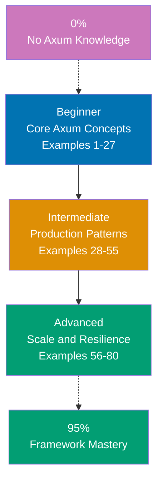

## Want to Master Axum Through Working Code?

This guide teaches you Rust Axum through **80+ production-ready code examples** rather than lengthy explanations. If you are an experienced developer switching to Rust web development, or want to deepen your framework mastery, you will build intuition through actual working patterns.

## What Is By-Example Learning?

By-example learning is a **code-first approach** where you learn concepts through annotated, working examples rather than narrative explanations. Each example shows:

1. **What the code does** - Brief explanation of the Axum concept
2. **How it works** - A focused, heavily commented code example
3. **Why it matters** - A pattern summary highlighting the key takeaway

This approach works best when you already understand programming fundamentals. You learn Axum's idioms, patterns, and best practices by studying real code rather than theoretical descriptions.

## What Is Rust Axum?

Axum is a **web application framework for Rust** built on top of Tokio, Tower, and Hyper. Key distinctions:

- **Not Express/Actix-web**: Axum is more compositional than Express and safer than raw Actix-web, leveraging the Tower ecosystem for middleware
- **Async-first**: Built entirely on Tokio's async runtime; every handler is an async function
- **Type-safe extractors**: Request data extraction is compile-time safe through the `FromRequest` and `FromRequestParts` traits
- **Tower middleware**: Middleware integrates seamlessly via the Tower `Service` trait, enabling deep composition
- **Zero-cost abstractions**: Rust's ownership model ensures memory safety without garbage collection

## Learning Path



## Coverage Philosophy: 95% Through 80+ Examples

The **95% coverage** means you will understand Axum deeply enough to build production systems with confidence. It does not mean you will know every edge case or advanced feature—those come with experience.

The 80 examples are organized progressively:

- **Beginner (Examples 1-27)**: Foundation concepts (routing, handlers, extractors, state, responses, templates, error handling, middleware basics)
- **Intermediate (Examples 28-55)**: Production patterns (shared state, SQLx, JWT authentication, CORS, rate limiting, WebSockets, SSE, testing, graceful shutdown, tracing)
- **Advanced (Examples 56-80)**: Scale and resilience (custom extractors, tower middleware, connection pooling, streaming, metrics, distributed tracing, circuit breakers, API versioning, Docker deployment)

Together, these examples cover **95% of what you will use** in production Axum applications.

## What Is Covered

### Core Web Framework Concepts

- **Routing**: `Router`, nested routes, path parameters, query parameters, method routing
- **Handlers**: Async handler functions, response types, `IntoResponse` trait
- **Extractors**: `Path`, `Query`, `Json`, `State`, `Form`, `Headers`, `Extension`, `TypedHeader`
- **Responses**: `Response`, `Json`, `Html`, status codes, headers, streaming

### Middleware and Tower

- **tower-http**: `TraceLayer`, `CorsLayer`, `CompressionLayer`, `TimeoutLayer`, `RequestBodyLimitLayer`
- **Custom middleware**: Implementing `Layer` and `Service` traits, `axum::middleware::from_fn`
- **Authentication middleware**: JWT validation, session checks, role-based access
- **Rate limiting**: `tower_governor` integration, per-IP limits

### Data and Persistence

- **SQLx**: Async database queries, connection pooling, migrations, typed queries
- **Connection pools**: `PgPool`, `SqlitePool`, pool configuration, health checks
- **Transactions**: Multi-step queries with rollback safety

### Security and Authentication

- **JWT**: Token generation and validation with `jsonwebtoken` crate
- **Password hashing**: `bcrypt` / `argon2` integration
- **Session management**: Cookie-based sessions with `tower-sessions`
- **CORS**: Fine-grained origin and method control

### Real-Time Features

- **WebSockets**: Upgrade path, message framing, broadcast patterns
- **Server-Sent Events**: SSE streams with `axum::response::sse`

### Testing and Quality

- **Integration testing**: `axum-test` / `tower::ServiceExt` for handler tests
- **Mocking**: Fake state injection, in-memory stores

### Production and Operations

- **Graceful shutdown**: Signal handling, drain connections, health endpoints
- **Tracing**: `tracing` + `tracing-subscriber` structured logging
- **Metrics**: Prometheus metrics via `axum-prometheus`
- **OpenTelemetry**: Distributed tracing with `opentelemetry` crate
- **Docker**: Multi-stage builds for minimal production images

## What Is NOT Covered

We exclude topics that belong in specialized tutorials:

- **Detailed Rust syntax**: Master Rust first through language tutorials
- **Advanced Tokio internals**: Runtime configuration, task scheduling details
- **Database-specific SQL optimization**: Deep PostgreSQL internals, query plans
- **Infrastructure as code**: Kubernetes, Terraform, advanced deployment pipelines
- **Hyper internals**: Low-level HTTP/2 and TLS configuration below Axum's abstraction

For these topics, see dedicated tutorials and framework documentation.

## How to Use This Guide

### 1. Choose Your Starting Point

- **New to Axum?** Start with Beginner (Example 1)
- **Rust web experience** (Actix-web, Warp)? Start with Intermediate (Example 28)
- **Building a specific feature?** Search for relevant example topic

### 2. Read the Example

Each example has five parts:

- **Explanation** (2-3 sentences): What Axum concept, why it exists, when to use it
- **Optional diagram**: Mermaid diagram when visualizing flow improves understanding
- **Code** (with heavy comments): Working Rust code showing the pattern
- **Key Takeaway** (1-2 sentences): Distilled essence of the pattern
- **Why It Matters** (50-100 words): Production context and real-world relevance

### 3. Run the Code

Create a test project and run each example:

```bash
cargo new my_axum_app
cd my_axum_app
# Add dependencies to Cargo.toml
# Paste example code into src/main.rs
cargo run
```

### 4. Modify and Experiment

Change variable names, add features, break things on purpose. Experiment builds intuition faster than reading.

### 5. Reference as Needed

Use this guide as a reference when building features. Search for relevant examples and adapt patterns to your code.

## Relationship to Other Tutorial Types

| Tutorial Type               | Approach                       | Coverage                   | Best For                       |
| --------------------------- | ------------------------------ | -------------------------- | ------------------------------ |
| **By Example** (this guide) | Code-first, 80+ examples       | 95% breadth                | Learning framework idioms      |
| **Quick Start**             | Project-based, hands-on        | 5-30% touchpoints          | Getting something working fast |
| **Beginner Tutorial**       | Narrative, explanation-first   | 0-60% comprehensive        | Understanding concepts deeply  |
| **Cookbook**                | Recipe-based, problem-solution | Problem-specific           | Solving specific problems      |

## Prerequisites

### Required

- **Rust fundamentals**: Ownership, borrowing, lifetimes, traits, generics, async/await
- **Web development**: HTTP basics, REST APIs, JSON
- **Programming experience**: Built applications in another language

### Recommended

- **Tokio basics**: Understanding async runtimes, `tokio::spawn`, `tokio::select`
- **Serde**: JSON serialization and deserialization patterns
- **Cargo**: Dependency management, feature flags, workspace setup

### Not Required

- **Axum experience**: This guide assumes you are new to the framework
- **Advanced Rust**: Macros, unsafe code, custom allocators are not needed
- **Previous web framework experience**: Helpful but not required

## Learning Strategies

### For Actix-web Developers Switching to Axum

You know Rust web development but want Axum's compositional Tower ecosystem:

- **Map Actix handlers to Axum handlers** - Axum handlers use extractors instead of `web::Data`, `web::Path` annotations; see Examples 1-10
- **Understand Tower vs Actix middleware** - Tower `Service` trait replaces Actix middleware; see Examples 20-25 for `from_fn` middleware
- **Learn extractor composition** - Axum composes extractors at compile time; tuple extractors work differently from Actix's parameter injection
- **Recommended path**: Examples 1-15 (Axum fundamentals) → Examples 20-27 (middleware) → Examples 56-65 (advanced Tower)

### For Node.js/Express Developers Switching to Rust

You know Express patterns but are new to Rust's ownership model:

- **Map Express middleware to Tower** - Express middleware `(req, res, next)` maps to Tower `Service`; see Examples 20-27
- **Understand async/await differences** - Rust's async is poll-based, not event loop; ownership rules apply to async too; see Examples 1-5
- **Learn typed extractors** - No `req.body`, `req.params`; everything is compile-time typed via extractors; see Examples 6-15
- **Recommended path**: Examples 1-10 (basics) → Examples 11-20 (extractors) → Examples 28-40 (state and DB)

### For Python/Django/FastAPI Developers Switching to Rust

Phoenix's architecture resembles Django but with static types and no garbage collector:

- **Map FastAPI dependencies to Axum State** - FastAPI's `Depends()` maps to Axum's `State` extractor; see Examples 12-15
- **Understand compile-time error handling** - No exceptions; `Result<T, E>` forces explicit error handling; see Examples 16-19
- **Learn ownership before async** - Rust's ownership rules interact with async in non-obvious ways; study Examples 1-5 carefully
- **Recommended path**: Examples 1-20 (Axum basics) → Examples 28-40 (state and DB) → Examples 44-55 (testing)

## Structure of Each Example

All examples follow a consistent 5-part format:

```
### Example N: Descriptive Title

2-3 sentence explanation of the concept.

[Optional Mermaid diagram]

```rust
// Heavily annotated code example
// showing the Axum pattern in action
```

**Key Takeaway**: 1-2 sentence summary.

**Why It Matters**: 50-100 words of production context.
```

**Code annotations**:

- `// =>` shows expected output, types, or values
- Inline comments explain what each line does and why
- Variable names are self-documenting

**Mermaid diagrams** appear when visualizing flow or architecture improves understanding. We use a color-blind friendly palette:

- Blue #0173B2 - Primary
- Orange #DE8F05 - Secondary
- Teal #029E73 - Accent
- Purple #CC78BC - Alternative
- Brown #CA9161 - Neutral

## Ready to Start?

Choose your learning path:

- **[Beginner](/en/learn/software-engineering/platform-web/tools/rust-axum/by-example/beginner)** - Start here if new to Axum. Build foundation understanding through 27 core examples covering routing, handlers, extractors, and basic middleware.
- **[Intermediate](/en/learn/software-engineering/platform-web/tools/rust-axum/by-example/intermediate)** - Jump here if you know Axum basics. Master production patterns through 28 examples covering databases, authentication, WebSockets, and testing.
- **[Advanced](/en/learn/software-engineering/platform-web/tools/rust-axum/by-example/advanced)** - Expert mastery through 25 advanced examples covering custom extractors, Tower internals, metrics, distributed tracing, and production deployment.

Or jump to specific topics by searching for relevant example keywords (routing, extractors, JWT, SQLx, WebSockets, tracing, Docker, etc.).
