## Group 23: Fiber Lifecycle and FiberRef

### Example 56: Fiber Lifecycle — Fork, Supervise, and Await

The full fiber lifecycle includes forking, supervising (watching for completion), awaiting (getting the Exit value), and interrupting. Understanding this lifecycle enables building robust concurrent systems with precise control over error propagation.

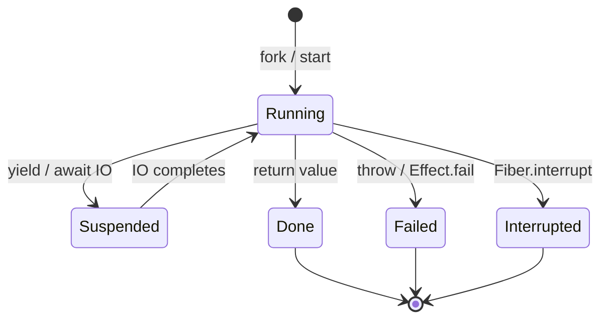

```typescript
import { Effect, Fiber, Exit, Duration } from "effect";

const task = (name: string, ms: number, succeed: boolean) =>
  Effect.gen(function* () {
    yield* Effect.sleep(Duration.millis(ms));
    if (!succeed) {
      return yield* Effect.fail(new Error(`${name} failed`));
      // => Typed failure for this task
    }
    console.log(`${name} completed`);
    return name;
  });

const program = Effect.gen(function* () {
  // Fork multiple fibers — they run concurrently immediately
  const fiber1 = yield* Effect.fork(task("task-A", 50, true));
  // => fiber1: Fiber<string, Error> — succeeds after 50ms
  const fiber2 = yield* Effect.fork(task("task-B", 100, false));
  // => fiber2: Fiber<string, Error> — fails after 100ms
  const fiber3 = yield* Effect.fork(task("task-C", 75, true));
  // => fiber3: Fiber<string, Error> — succeeds after 75ms

  // Fiber.await: wait for fiber to complete, returns Exit
  // Unlike Fiber.join, Fiber.await never throws — always returns Exit
  const exit1 = yield* Fiber.await(fiber1);
  // => exit1 is Exit.Success { value: "task-A" }

  Exit.match(exit1, {
    onSuccess: (v) => console.log("fiber1 result:", v),
    // => Output: fiber1 result: task-A
    onFailure: (c) => console.log("fiber1 failed:", c),
  });

  // Fiber.poll: non-blocking check — returns Option<Exit>
  const fiber2Status = yield* Fiber.poll(fiber2);
  // => Option.none() if still running, Option.some(exit) if done
  console.log("fiber2 done?", fiber2Status._id !== "None" ? "yes" : "maybe not");
  // => Output: fiber2 done? maybe not (might still be running at this point)

  // Fiber.awaitAll: wait for multiple fibers simultaneously
  const exits = yield* Fiber.awaitAll([fiber2, fiber3]);
  // => exits is [Exit<string, Error>, Exit<string, Error>]
  // => Waits for all fibers; returns their Exit values

  exits.forEach((exit, i) => {
    if (Exit.isSuccess(exit)) console.log(`fiber${i + 2}: success`);
    if (Exit.isFailure(exit)) console.log(`fiber${i + 2}: failure`);
    // => Output: fiber2: failure, fiber3: success
  });
});

Effect.runPromise(program);
```

**Key Takeaway**: `Fiber.await` returns an `Exit` without throwing. `Fiber.poll` non-blockingly checks if a fiber is done. `Fiber.awaitAll` waits for multiple fibers and returns all their Exits.

**Why It Matters**: Production concurrent systems need visibility into fiber outcomes. Unlike `Fiber.join` (which propagates the fiber's failure), `Fiber.await` gives you the raw Exit value — letting you decide how to handle success and failure independently. This is essential for supervisor patterns: a supervisor fiber awaits its children's exits and decides whether to restart them, escalate errors, or shut down gracefully. `Fiber.poll` enables non-blocking status checks useful for monitoring dashboards and health check endpoints that report the status of background workers.

---

### Example 57: FiberRef — Fiber-Local State

`FiberRef<A>` is a reference whose value can differ between fibers. It behaves like a thread-local variable. Child fibers inherit a copy of the parent's value at fork time; changes in the child do not affect the parent.

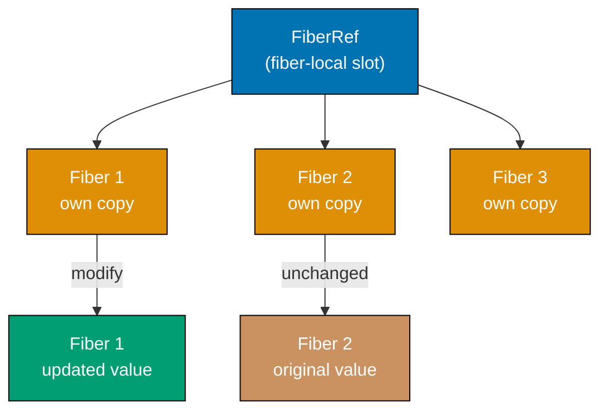

```typescript
import { Effect, FiberRef, Fiber } from "effect";

// Create a FiberRef with an initial value
// FiberRef.make creates a FiberRef scoped to the current fiber
const requestId = FiberRef.unsafeMake("initial-request-id");
// => FiberRef<string> — each fiber gets its own copy

const program = Effect.gen(function* () {
  // Set the current fiber's value
  yield* FiberRef.set(requestId, "req-001");
  // => This fiber's requestId is now "req-001"

  const parentValue = yield* FiberRef.get(requestId);
  console.log("parent:", parentValue);
  // => Output: parent: req-001

  // Fork a child fiber — it inherits the parent's current value
  const childFiber = yield* Effect.fork(
    Effect.gen(function* () {
      const inherited = yield* FiberRef.get(requestId);
      console.log("child inherited:", inherited);
      // => Output: child inherited: req-001
      // => Child gets a COPY of the parent's value

      yield* FiberRef.set(requestId, "req-001-child");
      // => Only this fiber's copy is updated

      const childValue = yield* FiberRef.get(requestId);
      console.log("child updated to:", childValue);
      // => Output: child updated to: req-001-child
    }),
  );

  yield* Fiber.join(childFiber);
  // => Wait for child to finish

  // Parent's value is unchanged — child's update did not affect parent
  const parentAfter = yield* FiberRef.get(requestId);
  console.log("parent after child:", parentAfter);
  // => Output: parent after child: req-001
  // => Unchanged — child's FiberRef.set only changed the child's copy
});

Effect.runSync(program);
// => FiberRef is used internally for:
// => - Request correlation IDs (trace context propagation)
// => - Logger context (current log level, metadata)
// => - Transaction boundaries (current DB transaction)
```

**Key Takeaway**: `FiberRef` provides fiber-local state. Child fibers inherit a copy at fork time. Changes in a child do not propagate to the parent. Use it for request-scoped context.

**Why It Matters**: Distributed tracing requires propagating a request ID through all operations triggered by a single request — including operations spawned in child fibers. `FiberRef` is exactly how Effect implements this: the trace context is a FiberRef. When a fiber forks, the child inherits the parent's trace context automatically. Operations in the child are correctly attributed to the parent request in the trace. This automatic propagation is invisible to application code — you do not pass trace IDs explicitly between functions. `FiberRef` is also how structured logging propagates context from request handling to all downstream service calls.

---

## Group 24: Advanced Concurrency

### Example 58: Effect.raceAll and Effect.allSettled

`Effect.raceAll` races any number of effects and returns the first to succeed. `Effect.allSettled` (via `Effect.all` with `mode: "validate"`) runs all effects and collects all results, including failures.

```typescript
import { Effect, Duration, Either } from "effect";

// raceAll: race multiple effects, return the first to succeed
const servers = [
  { id: "us-east", latency: 80 },
  { id: "eu-west", latency: 40 },
  { id: "ap-south", latency: 120 },
];

const fetchFromServer = (server: { id: string; latency: number }) =>
  Effect.gen(function* () {
    yield* Effect.sleep(Duration.millis(server.latency));
    console.log(`${server.id} responded after ${server.latency}ms`);
    return `response from ${server.id}`;
  });

// raceAll: race all servers, take the fastest
const fastest = Effect.raceAll(servers.map(fetchFromServer));
// => The fastest server (eu-west at 40ms) wins
// => Others are interrupted when eu-west responds

Effect.runPromise(fastest).then((result) => {
  console.log("fastest server result:", result);
  // => Output:
  // => eu-west responded after 40ms
  // => fastest server result: response from eu-west
});

// Running all effects and collecting both successes and failures
const tasks: Effect.Effect<string, Error, never>[] = [
  Effect.succeed("task-1 ok"),
  Effect.fail(new Error("task-2 failed")),
  Effect.succeed("task-3 ok"),
  Effect.fail(new Error("task-4 failed")),
];

// Use Effect.either to collect results without failing
const allResults = Effect.all(
  tasks.map((t) => t.pipe(Effect.either)),
  // => Effect.either wraps each result in Either
  { concurrency: "unbounded" },
  // => Run all concurrently
);

Effect.runPromise(allResults).then((results) => {
  const successes = results.filter(Either.isRight).map((e) => e.right);
  const failures = results.filter(Either.isLeft).map((e) => e.left.message);
  console.log("successes:", successes);
  // => Output: successes: ['task-1 ok', 'task-3 ok']
  console.log("failures:", failures);
  // => Output: failures: ['task-2 failed', 'task-4 failed']
});
```

**Key Takeaway**: `raceAll` runs many effects and returns the first to succeed, interrupting the rest. Combine `Effect.either` with `Effect.all` to collect all results including failures without short-circuiting.

**Why It Matters**: Multi-region and multi-datacenter architectures often have multiple replicas of a service. Racing requests to all replicas and taking the first response (Hedged Requests pattern) is the most effective technique for reducing tail latency — sometimes by 10x. `raceAll` implements this pattern cleanly. The pattern of collecting all results with `Effect.either` is equally important for bulk operations: process all items and report all failures instead of abandoning work at the first error. Both patterns appear in high-reliability production systems where maximizing throughput and minimizing latency are engineering requirements.

---

### Example 59: Semaphore — Limiting Concurrent Access

`Semaphore` is a concurrency limiter that allows at most N fibers to execute concurrently. Use it to implement rate limiting, connection pool throttling, and resource-constrained operations.

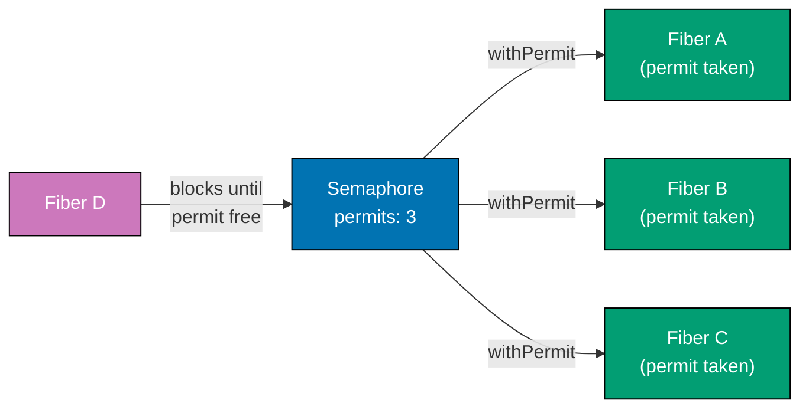

```typescript
import { Effect, Semaphore, Fiber, Duration } from "effect";

// Create a semaphore with N permits
const program = Effect.gen(function* () {
  const semaphore = yield* Semaphore.make(2);
  // => Semaphore with 2 permits
  // => At most 2 fibers can hold a permit simultaneously

  let active = 0;
  let maxConcurrent = 0;

  const task = (id: number) =>
    semaphore.withPermits(1)(
      // => Acquire 1 permit before executing, release after
      Effect.gen(function* () {
        active++;
        maxConcurrent = Math.max(maxConcurrent, active);
        // => Track peak concurrency

        console.log(`task ${id} started (active: ${active})`);
        yield* Effect.sleep(Duration.millis(50));
        // => Simulates work
        console.log(`task ${id} completed`);

        active--;
      }),
    );

  // Launch 5 tasks concurrently — semaphore limits to 2 at a time
  const fibers = yield* Effect.all(
    [1, 2, 3, 4, 5].map((id) => Effect.fork(task(id))),
    { concurrency: "unbounded" },
  );

  yield* Fiber.awaitAll(fibers);
  // => Wait for all tasks to complete

  console.log(`max concurrent: ${maxConcurrent}`);
  // => Output: max concurrent: 2 — never exceeded the permit limit
});

Effect.runPromise(program);
// => Output (order may vary):
// => task 1 started (active: 1)
// => task 2 started (active: 2)
// => task 1 completed
// => task 3 started (active: 2)  ← task 3 starts after task 1 releases
// => task 2 completed
// => task 4 started (active: 2)
// => ...
// => max concurrent: 2
```

**Key Takeaway**: `Semaphore.make(N)` creates a semaphore with N permits. `withPermits(n)` wraps an Effect to acquire N permits before executing and release them after. Fibers queue when no permits are available.

**Why It Matters**: Every shared resource has a capacity limit: a database connection pool has a maximum number of connections, an external API has a rate limit, a file system has I/O bandwidth constraints. Exceeding these limits causes errors, degraded performance, or cascading failures. `Semaphore` enforces the limit at the code level: attempts beyond the limit block instead of failing. This backpressure is healthier than failing fast — it lets the system absorb burst traffic without shedding load. Production services use semaphores to ensure they respect the capacity of every dependency they call.

---

## Group 25: Advanced Stream Patterns

### Example 60: Stream.unfold — Generating Streams from State

`Stream.unfold` generates a stream by repeatedly applying a step function to a state. It is the fundamental primitive for creating streams from external sources: pagination, cursor-based queries, iterators.

```typescript
import { Stream, Effect, Option } from "effect";

// Stream.unfold: generate elements by unfolding state
// unfold(initialState, step) where step returns Option<[element, nextState]>
// Option.none() terminates the stream

// Generate Fibonacci numbers
const fibonacci = Stream.unfold(
  [0, 1] as [number, number],
  ([a, b]) => Option.some([a, [b, a + b] as [number, number]]),
  // => Emit 'a', next state is [b, a+b]
  // => This never returns none() — infinite stream
);
// => Stream<number, never, never> — infinite Fibonacci sequence

// Take the first 10 Fibonacci numbers
const first10 = fibonacci.pipe(Stream.take(10));

Effect.runPromise(Stream.runCollect(first10)).then((chunk) => {
  console.log("Fibonacci:", Array.from(chunk));
  // => Output: Fibonacci: [0, 1, 1, 2, 3, 5, 8, 13, 21, 34]
});

// Practical: paginated API unfold
interface Page {
  items: string[];
  nextCursor: string | null;
}

const fetchPage = (cursor: string | null): Effect.Effect<Page, Error, never> =>
  Effect.succeed({
    items: cursor === null ? ["item1", "item2"] : ["item3", "item4"],
    nextCursor: cursor === null ? "cursor-1" : null,
    // => Page 1: items 1-2 with cursor; Page 2: items 3-4, no next cursor
  });

const paginatedStream = Stream.unfoldEffect(
  null as string | null,
  // => Initial state: null cursor (first page)
  (cursor) =>
    fetchPage(cursor).pipe(
      Effect.map((page) => {
        if (page.items.length === 0) return Option.none();
        // => No items: end stream
        return Option.some([
          Stream.fromIterable(page.items),
          // => Emit this page's items as a sub-stream
          page.nextCursor,
          // => Next state: the cursor for the next page
        ] as const);
      }),
    ),
);
// => Stream<Stream<string>, Error, never> — stream of page streams

const allItems = paginatedStream.pipe(Stream.flatten());
// => Stream<string, Error, never> — flattened stream of all items

Effect.runPromise(Stream.runCollect(allItems)).then((chunk) => {
  console.log("all items:", Array.from(chunk));
  // => Output: all items: ['item1', 'item2', 'item3', 'item4']
});
```

**Key Takeaway**: `Stream.unfold` generates a stream by unfolding a state. `Stream.unfoldEffect` allows effectful page-fetching. Together they model any cursor-based or paginated data source as a Stream.

**Why It Matters**: The most common data access pattern in production — paginated database queries, cursor-based API iteration, reading a log file by chunks — follows the unfold pattern: start with an initial state, emit data, compute next state from the response, repeat until done. `Stream.unfold` encodes this pattern once and reuses it everywhere. The stream consumers (transformations, sinks) do not need to know about pagination — they just process elements. This separation means you can compose pagination with filtering, mapping, and batching without pagination logic leaking into business code.

---

### Example 61: Stream Sinks — Collecting Stream Results

A `Sink<In, Out, E, R>` is a consumer that processes a stream and produces a result. Effect provides built-in sinks for common patterns: collecting to arrays, summing, counting, and folding.

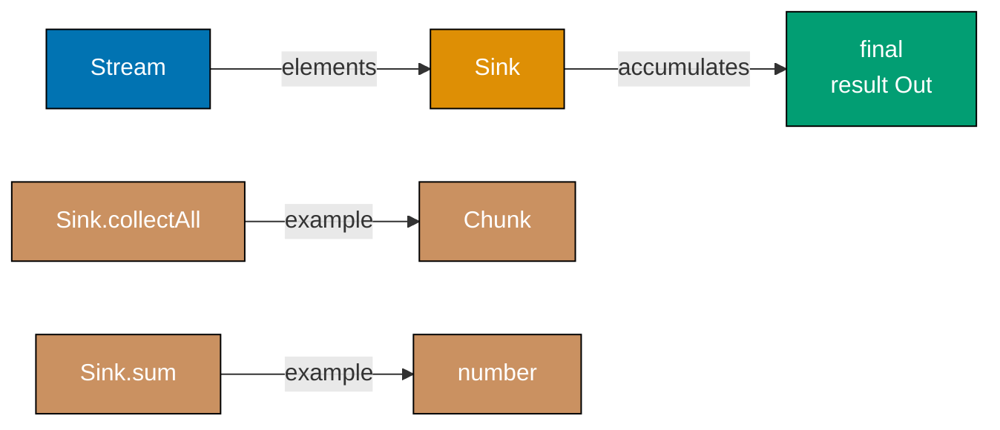

```typescript
import { Stream, Sink, Effect, Chunk } from "effect";

const numbers = Stream.range(1, 11);
// => Stream emitting 1 through 10

// Sink.collectAll: collect all elements into a Chunk
const collected = numbers.pipe(Stream.run(Sink.collectAll()));
// => Effect<Chunk<number>, never, never>

Effect.runPromise(collected).then((chunk) => {
  console.log("collected:", Array.from(chunk));
  // => Output: collected: [1, 2, 3, 4, 5, 6, 7, 8, 9, 10]
});

// Sink.sum: sum all numbers
const total = numbers.pipe(Stream.run(Sink.sum));
// => Effect<number, never, never>

Effect.runPromise(total).then((n) => {
  console.log("sum:", n);
  // => Output: sum: 55
});

// Sink.count: count elements
const count = numbers.pipe(Stream.run(Sink.count));

Effect.runPromise(count).then((n) => {
  console.log("count:", n);
  // => Output: count: 10
});

// Sink.fold: reduce stream with an initial value and function
const product = numbers.pipe(
  Stream.run(Sink.foldLeft(1, (acc, n) => acc * n)),
  // => Multiplies all numbers: 1 * 1 * 2 * 3 * ... * 10 = 3628800
);

Effect.runPromise(product).then((n) => {
  console.log("product:", n);
  // => Output: product: 3628800
});

// Custom sink: collect only even numbers
const evenSink: Sink.Sink<Chunk.Chunk<number>, number, never, never, never> = Sink.collectAllWhile((n) => n % 2 === 0);
// => Note: collectAllWhile stops on first non-matching element
// => Better to use Stream.filter before the sink for complex filtering

const evens = Stream.make(2, 4, 3, 6, 8).pipe(
  Stream.filter((n) => n % 2 === 0),
  // => Filter in the stream, not the sink
  Stream.run(Sink.collectAll()),
);

Effect.runPromise(evens).then((chunk) => {
  console.log("evens:", Array.from(chunk));
  // => Output: evens: [2, 4, 6, 8]
});
```

**Key Takeaway**: Sinks consume streams and produce values. Built-in sinks handle common patterns: `collectAll`, `sum`, `count`, `foldLeft`. Run a stream with a sink using `Stream.run(sink)`.

**Why It Matters**: Data pipelines ultimately produce results: aggregate metrics, validated datasets, transformed output files. Sinks are the typed boundary between the pipeline and the result. The composability of sinks and streams means you can describe the complete data flow — source, transformations, aggregation — as a single composable value. Splitting a stream into multiple sinks for concurrent processing (one counts records, another writes to a file, another sends to an API) is a production pattern enabled by Effect's Sink composition. This architecture is more testable and maintainable than imperative pipeline code with embedded output logic.

---

### Example 62: Stream.groupBy and Stream.chunks

`Stream.groupBy` partitions a stream into sub-streams by a key function. `Stream.chunks` exposes the underlying `Chunk` batching of a stream for efficient bulk processing.

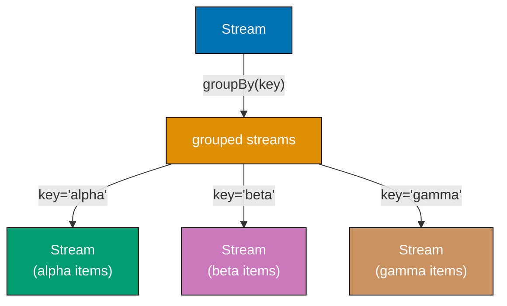

```typescript
import { Stream, Effect, GroupBy } from "effect";

// Stream.groupBy: partition stream elements by a key
const events = Stream.make(
  { type: "click", userId: "u1" },
  { type: "view", userId: "u2" },
  { type: "click", userId: "u1" },
  { type: "purchase", userId: "u3" },
  { type: "view", userId: "u1" },
);

// Group events by userId, then count events per user
const eventCounts = events.pipe(
  Stream.groupByKey((event) => event.userId),
  // => Partitions events into sub-streams by userId
  // => u1 gets: click, click, view
  // => u2 gets: view
  // => u3 gets: purchase
  GroupBy.evaluate((userId, userEvents) =>
    userEvents.pipe(
      Stream.runCollect,
      // => Collect all events for this user
      Effect.map((events) => ({ userId, count: events.length })),
      // => Count events for this user
      Stream.fromEffect,
      // => Wrap result as a single-element stream
    ),
  ),
);

Effect.runPromise(Stream.runCollect(eventCounts)).then((chunk) => {
  console.log("event counts:", Array.from(chunk));
  // => Output: event counts:
  // => [{ userId: 'u1', count: 3 }, { userId: 'u2', count: 1 }, { userId: 'u3', count: 1 }]
});

// Stream.chunks: access the underlying Chunk batches
const chunked = Stream.range(1, 11).pipe(
  Stream.rechunk(3),
  // => Regroup elements into chunks of size 3
  // => Chunks: [1,2,3], [4,5,6], [7,8,9], [10]
  Stream.chunks,
  // => Emit each Chunk as a single stream element
  Stream.map((chunk) => ({
    batch: Array.from(chunk),
    size: chunk.length,
  })),
);

Effect.runPromise(Stream.runCollect(chunked)).then((batches) => {
  Array.from(batches).forEach((b) => console.log("batch:", b.batch, "size:", b.size));
  // => Output:
  // => batch: [1, 2, 3] size: 3
  // => batch: [4, 5, 6] size: 3
  // => batch: [7, 8, 9] size: 3
  // => batch: [10] size: 1
});
```

**Key Takeaway**: `Stream.groupByKey` partitions a stream by a key function, producing sub-streams per key. `Stream.rechunk` and `Stream.chunks` control batch size for bulk operations.

**Why It Matters**: Grouping operations — aggregate metrics by user, batch database writes by table, partition events by topic — are essential in data processing pipelines. `Stream.groupBy` encodes this partitioning pattern without materializing the full dataset. Each sub-stream is processed lazily, keeping memory bounded. Batch processing with `rechunk` and `chunks` is critical for database performance: writing records one at a time is 10-100x slower than batch inserts. By rechunking a stream to batch size 1000 before the sink, you get optimal bulk insert performance without changing the stream source or transformation logic.

---

## Group 26: Schema Advanced Patterns

### Example 63: Schema.Brand — Branded Types for Type Safety

Branded types distinguish values that have the same underlying type but different semantics. `Schema.brand` creates a Schema that produces a branded type, preventing confusion between e.g. user IDs and order IDs that are both strings.

```typescript
import { Schema, Effect, Brand } from "effect";

// Define branded types — same underlying type, different semantic
type UserId = string & Brand.Brand<"UserId">;
type OrderId = string & Brand.Brand<"OrderId">;

// Schema.brand creates a Schema producing branded types
const UserIdSchema = Schema.String.pipe(
  Schema.brand<"UserId">(),
  // => Schema<UserId, string, never>
  // => Decodes string -> UserId branded type
);

const OrderIdSchema = Schema.String.pipe(
  Schema.brand<"OrderId">(),
  // => Schema<OrderId, string, never>
);

// Use branded types in a struct
const OrderSchema = Schema.Struct({
  id: OrderIdSchema,
  userId: UserIdSchema,
  // => Both are strings in JSON, but distinct types in TypeScript
  total: Schema.Number,
});

type Order = typeof OrderSchema.Type;
// => { id: OrderId; userId: UserId; total: number }

// Decoding produces branded types
const rawOrder = { id: "ord-1", userId: "usr-1", total: 99.99 };
Effect.runPromise(Schema.decodeUnknown(OrderSchema)(rawOrder)).then((order) => {
  console.log("order.id type check:", typeof order.id);
  // => Output: order.id type check: string
  // => At runtime it's a string; at compile time it's OrderId

  // TypeScript prevents passing an OrderId where UserId is expected:
  // const wrong: UserId = order.id  // => TypeScript error: OrderId is not UserId
  // This prevents a class of bugs where IDs are swapped
});

// Validating and constructing branded values from user input
const parseUserId = Schema.decodeUnknown(UserIdSchema);
Effect.runPromise(parseUserId("usr-42")).then((id) => {
  console.log("UserId:", id);
  // => Output: UserId: usr-42
  // => TypeScript type is UserId, not string
});
```

**Key Takeaway**: `Schema.brand` produces a branded type — a value that is a plain string or number at runtime but a distinct type at compile time. This prevents passing a `UserId` where an `OrderId` is expected.

**Why It Matters**: Functions that accept multiple ID parameters are prone to argument-order bugs: `getOrder(userId, orderId)` vs `getOrder(orderId, userId)`. Branded types make these errors compile-time failures. A function that accepts `UserId` refuses to compile when passed an `OrderId`, even though both are strings at runtime. Combined with Schema's decode functions, branded types provide a safety net at every input boundary: raw strings from API requests are parsed into branded types before use, and the compiler verifies they are never confused thereafter. This pattern eliminates an entire class of data correlation bugs common in multi-tenant systems.

---

## Group 27: Request Batching

### Example 64: Effect.request and RequestResolver — Automatic Batching

`Effect.request` and `RequestResolver` implement automatic batching of similar requests. When multiple fibers need the same data, Effect groups their requests into a single batch, calls the resolver once, and distributes results — eliminating the N+1 query problem.

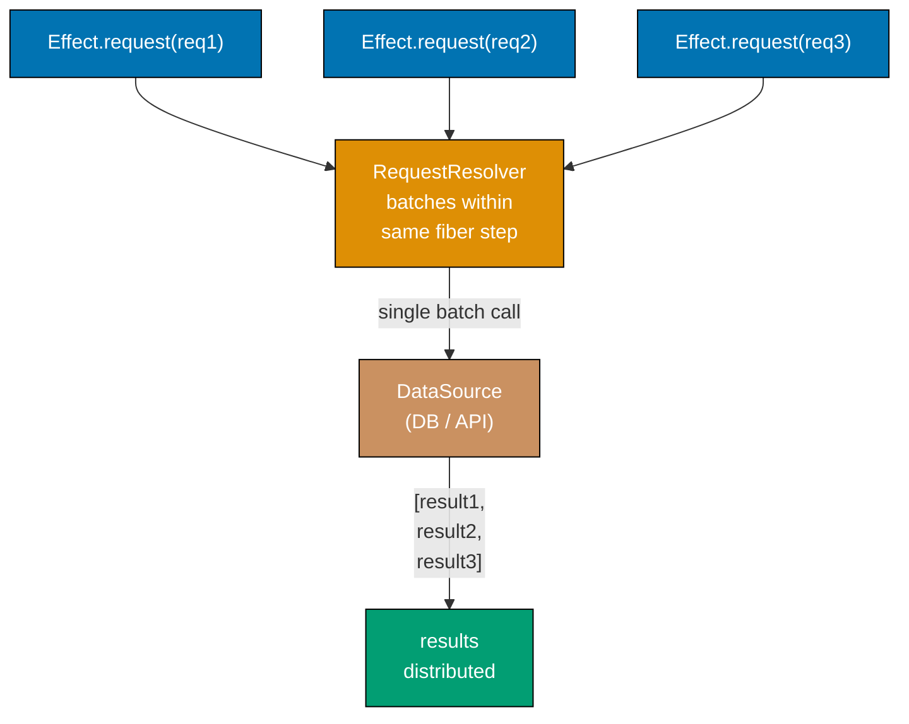

```typescript
import { Effect, RequestResolver, Request } from "effect";

// Define a Request type — the "query" to be batched
interface GetUser extends Request.Request<{ id: string; name: string }, Error> {
  readonly _tag: "GetUser";
  readonly id: string;
}

const GetUser = Request.tagged<GetUser>("GetUser");
// => Constructor for GetUser requests

// Database call counter — demonstrates that batching reduces calls
let dbCallCount = 0;

// RequestResolver: handles a batch of requests in one call
const UserResolver = RequestResolver.makeBatched(
  (requests: ReadonlyArray<GetUser>) =>
    Effect.gen(function* () {
      dbCallCount++;
      console.log(`DB call #${dbCallCount}: fetching ${requests.length} users`);
      // => One DB call for the entire batch of requests

      // Simulate batch database fetch
      const users = requests.map((r) => ({
        id: r.id,
        name: `User-${r.id}`,
      }));

      // Resolve each request with its result
      yield* Effect.forEach(
        requests,
        (request, i) => Request.succeed(request, users[i]!),
        // => Provides the result for each individual request
      );
    }),
  { concurrency: 1 },
);

// Usage: each fiber requests its own user
const getUser = (id: string) => Effect.request(GetUser({ id }), UserResolver);
// => Effect<{ id: string; name: string }, Error, never>

// Multiple concurrent fibers requesting different users
const program = Effect.gen(function* () {
  // These three requests run in the same "batch window"
  const [user1, user2, user3] = yield* Effect.all(
    [getUser("1"), getUser("2"), getUser("3")],
    { concurrency: "unbounded" },
    // => All three run concurrently — Effect batches them automatically
  );

  console.log("users:", user1.name, user2.name, user3.name);
  // => Output: users: User-1 User-2 User-3
  console.log("total DB calls:", dbCallCount);
  // => Output: total DB calls: 1
  // => Three logical requests, but only ONE database call
});

Effect.runPromise(program);
```

**Key Takeaway**: `Effect.request` declares a cacheable, batchable request. `RequestResolver.makeBatched` handles a batch of requests in one call. Effect groups concurrent requests automatically — no N+1 query problem.

**Why It Matters**: The N+1 query problem — fetching a list of N items and then making N individual queries for related data — is the single most common performance problem in production applications. DataLoader (from the GraphQL ecosystem) popularized the batching solution. Effect's `request` and `RequestResolver` bring this pattern to any TypeScript application, not just GraphQL. When 100 concurrent requests each need the same user record, Effect makes exactly 1 database query. This reduction from 100 queries to 1 can mean the difference between a responsive service and a database overload event.

---

## Group 28: Observability

### Example 65: Metric — Counters, Histograms, and Gauges

Effect's `Metric` module provides counters, histograms, gauges, and frequencies for production observability. Metrics are emitted through the Effect runtime and can be exported to Prometheus, StatsD, or any other monitoring system.

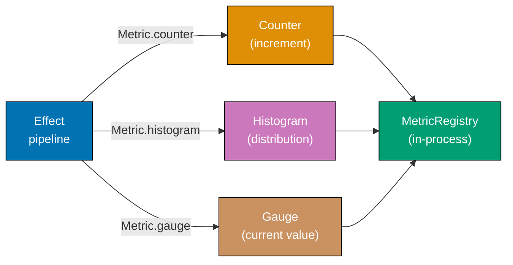

```typescript
import { Effect, Metric, Duration } from "effect";

// Metric.counter: tracks cumulative counts
const requestCount = Metric.counter("http.requests.total", {
  description: "Total number of HTTP requests processed",
  // => Metadata for the monitoring system
});
// => Metric<MetricState.Counter, number, never>

// Metric.histogram: tracks value distributions (latencies, sizes)
const requestLatency = Metric.histogram(
  "http.request.duration.ms",
  Metric.Boundaries.linear({ start: 0, width: 10, count: 20 }),
  // => Buckets: 0-10ms, 10-20ms, 20-30ms, ..., 190-200ms, >200ms
);

// Metric.gauge: tracks current value (queue depth, active connections)
const activeConnections = Metric.gauge("db.connections.active", {
  description: "Number of active database connections",
});

// Using metrics in Effects
const handleRequest = Effect.gen(function* () {
  const startTime = Date.now();
  // => Record request start time

  yield* Effect.sleep(Duration.millis(15));
  // => Simulates request processing (15ms)

  const duration = Date.now() - startTime;
  // => Calculate actual duration

  yield* requestCount.pipe(Metric.increment);
  // => Increment the request counter by 1

  yield* requestLatency.pipe(Metric.record(duration));
  // => Record the latency in the histogram bucket for ~15ms

  yield* activeConnections.pipe(Metric.set(5));
  // => Set the active connections gauge to 5

  return "response";
});

// Metric.value: read the current metric state
const monitoringProgram = Effect.gen(function* () {
  // Process several requests
  yield* Effect.all(
    Array.from({ length: 5 }, () => handleRequest),
    { concurrency: "unbounded" },
  );

  // Read metric state
  const countState = yield* Metric.value(requestCount);
  console.log("requests processed:", countState.count);
  // => Output: requests processed: 5

  const latencyState = yield* Metric.value(requestLatency);
  console.log("latency count:", latencyState.count);
  // => Output: latency count: 5
});

Effect.runPromise(monitoringProgram);
```

**Key Takeaway**: `Metric.counter` tracks cumulative counts. `Metric.histogram` tracks value distributions. `Metric.gauge` tracks current values. Increment, record, and read metrics with `Metric.increment`, `Metric.record`, and `Metric.value`.

**Why It Matters**: Production services are operated, not just deployed. Without metrics, operators fly blind: they cannot tell if a service is handling more requests than usual, if latency is increasing, or if a connection pool is exhausted. Metrics are the foundation of observability dashboards, alerting systems, and capacity planning. Effect's `Metric` system integrates metrics directly into the Effect pipeline — you add `Metric.increment` to an existing `tap` without restructuring code. The metrics are exported through the runtime, compatible with standard monitoring infrastructure like Prometheus. Adding metrics after the fact is far costlier than adding them during development.

---

### Example 66: Effect.withSpan — Distributed Tracing

`Effect.withSpan` wraps an Effect in a tracing span. Spans are nested and propagated automatically through the fiber tree — child spans reference their parent. This creates a trace tree showing exactly where time is spent in complex operations.

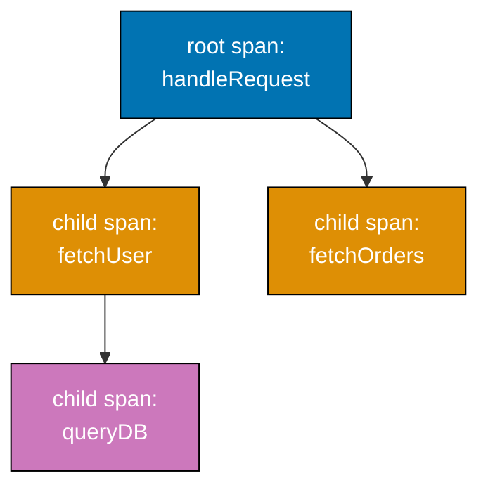

```typescript
import { Effect, Duration } from "effect";

// withSpan: wrap an Effect in a named tracing span
const parseRequest = Effect.gen(function* () {
  yield* Effect.sleep(Duration.millis(5));
  // => Simulates parsing work
  return { userId: "u1", action: "create" };
}).pipe(
  Effect.withSpan("parse-request", {
    attributes: { "http.method": "POST", "http.path": "/users" },
    // => Span attributes appear in the trace as key-value pairs
  }),
);
// => Effect<..., never, Tracer>
// => withSpan requires a Tracer service to be provided

const validateUser = (userId: string) =>
  Effect.gen(function* () {
    yield* Effect.sleep(Duration.millis(10));
    // => Simulates validation work
    return { id: userId, valid: true };
  }).pipe(
    Effect.withSpan("validate-user", {
      attributes: { "user.id": userId },
      // => Span attribute for the user being validated
    }),
  );

const persistToDatabase = (data: object) =>
  Effect.gen(function* () {
    yield* Effect.sleep(Duration.millis(30));
    // => Simulates database write
    return "record-created";
  }).pipe(
    Effect.withSpan("persist-to-database", {
      attributes: { "db.operation": "INSERT", "db.table": "users" },
    }),
  );

// The full operation creates a trace tree:
// [handleCreateUser] (root span)
//   [parse-request] (child span, 5ms)
//   [validate-user] (child span, 10ms)
//   [persist-to-database] (child span, 30ms)
const handleCreateUser = Effect.gen(function* () {
  const request = yield* parseRequest;
  // => Creates a child span "parse-request"

  const validated = yield* validateUser(request.userId);
  // => Creates a child span "validate-user"

  const result = yield* persistToDatabase(validated);
  // => Creates a child span "persist-to-database"

  return result;
}).pipe(
  Effect.withSpan("handle-create-user"),
  // => Root span for this operation — contains all child spans
);

// Provide a tracer to capture spans
// In production: use @effect/opentelemetry with OTLP export
Effect.runPromise(
  handleCreateUser.pipe(
    Effect.provide(
      (await import("@effect/opentelemetry")).NodeSdk.layer(() => ({
        resource: { serviceName: "my-service" },
      })) as any,
    ),
  ),
).catch(() => console.log("tracing infrastructure not available in this example"));
```

**Key Takeaway**: `Effect.withSpan` wraps an Effect in a tracing span. Spans nest automatically — child operations create child spans under the parent. Span attributes provide context visible in the trace.

**Why It Matters**: When a user reports that a request was slow, distributed tracing tells you exactly where the time was spent: was it parsing (2ms), validation (1ms), or the database write (500ms)? Without spans, this question requires guesswork or adding and removing timing logs. `Effect.withSpan` adds tracing to any Effect with one line. Because spans propagate through fibers automatically, concurrent sub-operations each get their own span, and the trace tree shows the true execution structure. This visibility is indispensable for optimizing production performance and diagnosing latency outliers.

---

## Group 29: Custom Runtime

### Example 67: ManagedRuntime — Production Runtime Configuration

`ManagedRuntime` bundles a Layer into a runtime that can be reused across many Effect executions. In production, you create a ManagedRuntime once at startup and use it to run all requests. This avoids rebuilding the service graph on each request.

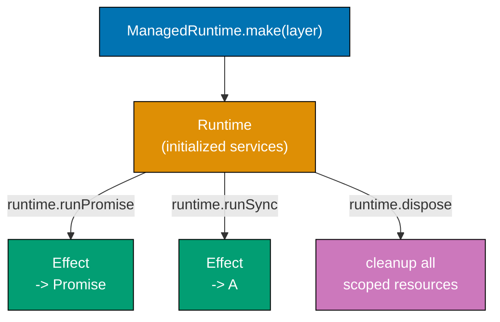

```typescript
import { Effect, ManagedRuntime, Context, Layer, Logger, LogLevel } from "effect";

// Define application services
interface AppConfig {
  readonly environment: string;
}
interface AppLogger {
  readonly log: (msg: string) => void;
}

const AppConfig = Context.GenericTag<AppConfig>("AppConfig");
const AppLogger = Context.GenericTag<AppLogger>("AppLogger");

// Production layers
const ProdConfig = Layer.succeed(AppConfig, { environment: "production" });

const ProdLogger = Layer.effect(
  AppLogger,
  Effect.gen(function* () {
    const config = yield* AppConfig;
    return {
      log: (msg) => console.log(`[${config.environment}] ${msg}`),
    };
  }),
);

// The application layer — combines all services
const AppLayer = ProdLogger.pipe(Layer.provide(ProdConfig));

// ManagedRuntime: builds the layer once, reuses it for many runs
const runtime = ManagedRuntime.make(AppLayer);
// => ManagedRuntime<AppConfig | AppLogger, never>

// Use the runtime to run an Effect (e.g., in an HTTP handler)
const handleRequest = (path: string) =>
  Effect.gen(function* () {
    const logger = yield* AppLogger;
    logger.log(`Handling request: ${path}`);
    // => Uses the AppLogger from the runtime's service graph

    return `response for ${path}`;
  });

// Run multiple Effects using the same runtime
async function main() {
  // Run effects using the pre-built runtime
  const result1 = await runtime.runPromise(handleRequest("/users"));
  console.log("result1:", result1);
  // => Output:
  // => [production] Handling request: /users
  // => result1: response for /users

  const result2 = await runtime.runPromise(handleRequest("/orders"));
  console.log("result2:", result2);
  // => Output:
  // => [production] Handling request: /orders
  // => result2: response for /orders

  // Dispose when shutting down — runs all finalizers
  await runtime.dispose();
  // => Triggers shutdown: closes connections, flushes logs, etc.
  console.log("runtime disposed");
}

main();
```

**Key Takeaway**: `ManagedRuntime` builds the service layer once and reuses it for many Effect runs. This is the correct pattern for HTTP servers, queue consumers, and any long-running service.

**Why It Matters**: Building the Layer graph (connecting to databases, loading config, establishing pools) on every request is prohibitively expensive. `ManagedRuntime` amortizes this startup cost by building the graph once and sharing it across all requests. In an HTTP server handling 1000 requests per second, the alternative would be establishing 1000 database connections per second. The `dispose()` method triggers graceful shutdown: all scoped resources run their finalizers, in-flight requests are completed, and connections are closed cleanly. This pattern is the production deployment model for all Effect-based services.

---

### Example 68: Runtime Configuration — Logging and Tracing

The Effect runtime's default Logger and Tracer can be replaced or configured without changing application code. This enables structured JSON logging in production, debug logging in development, and distributed tracing in staging.

```typescript
import { Effect, Logger, LogLevel, Runtime } from "effect";

// The default Logger outputs human-readable text
// Replace it for structured JSON logging in production

// Logger.json: outputs each log entry as a JSON object
const jsonLogger = Logger.json;
// => Outputs: {"message":"...","level":"INFO","timestamp":"...","fiberId":"..."}

// Logger.logfmt: logfmt format for structured text
const logfmtLogger = Logger.logfmt;
// => Outputs: timestamp=... level=INFO message="..."

// Logger.replace: replace the default Logger with a custom one
const withJsonLogging = (program: Effect.Effect<unknown>) =>
  program.pipe(
    Effect.provide(Logger.replace(Logger.defaultLogger, jsonLogger)),
    // => Replaces the default logger with JSON logger
    // => All Effect.log* calls now output JSON
  );

// Logger.withMinimumLogLevel: filter by minimum log level
const withProductionLogLevel = (program: Effect.Effect<unknown>) =>
  program.pipe(
    Effect.provide(Logger.minimumLogLevel(LogLevel.Warning)),
    // => Only WARNING and above are emitted
    // => DEBUG and INFO are filtered out — reduces log volume
  );

// Combining: JSON logger + production log level
const withProductionLogging = (program: Effect.Effect<unknown>) =>
  program.pipe(
    Effect.provide(
      Logger.replace(Logger.defaultLogger, jsonLogger).pipe(
        Layer.provide(Logger.minimumLogLevel(LogLevel.Warning)),
      ) as any,
    ),
  );

// Test the different loggers
const program = Effect.gen(function* () {
  yield* Effect.logDebug("Debug: connection pool initialized");
  // => Filtered out at WARNING level
  yield* Effect.log("Info: request received");
  // => Filtered out at WARNING level
  yield* Effect.logWarning("Warning: high memory usage");
  // => Emitted: important operational signal
  yield* Effect.logError("Error: database connection failed");
  // => Emitted: critical error
});

// Run with production logging configuration
Effect.runSync(program.pipe(Effect.provide(Logger.minimumLogLevel(LogLevel.Warning))));
// => Output (WARNING and above only):
// => timestamp=... level=WARNING message="Warning: high memory usage"
// => timestamp=... level=ERROR message="Error: database connection failed"
```

**Key Takeaway**: Replace `Logger.defaultLogger` to change log format. Use `Logger.minimumLogLevel` to filter by severity. Configure once at the application entry point — application code is unchanged.

**Why It Matters**: Production logging requirements differ from development. Development benefits from verbose, human-readable logs. Production requires structured JSON for log aggregation (Splunk, Datadog), and WARNING-or-above level to avoid log volume costs. Effect's logger is a service — swap the implementation at the entry point without touching any application code. This separation means the same codebase runs with debug logging in development (by providing a debug-level logger) and structured JSON logging in production (by providing a JSON logger). No `if (process.env.NODE_ENV === 'production')` guards scattered through the codebase.

---

## Group 30: Error Management Strategies

### Example 69: Effect.die and Defects — Unrecoverable Errors

`Effect.die` and `Effect.dieWith` create defects — unrecoverable errors that represent programming mistakes. Unlike typed errors (from `Effect.fail`), defects should not be caught by normal error handling — they indicate bugs.

```typescript
import { Effect, Cause, Exit, Data } from "effect";

class InvalidArgument extends Data.TaggedError("InvalidArgument")<{
  readonly message: string;
}> {}

// Effect.die: fail with an unexpected defect (not a typed error)
// Use when something impossible has occurred — indicates a bug
const parsePositiveNumber = (n: number): Effect.Effect<number, InvalidArgument, never> => {
  if (!Number.isFinite(n)) {
    // => Not-finite numbers indicate a bug in the caller — this is a defect
    return Effect.die(new Error(`Expected finite number, got ${n}`));
    // => die: puts error in the defect channel, not the typed error channel
    // => Unlike fail: this cannot be caught with catchTag or catchAll
  }
  if (n <= 0) {
    return Effect.fail(new InvalidArgument({ message: `${n} is not positive` }));
    // => fail: puts error in typed error channel — caller is expected to handle this
  }
  return Effect.succeed(n);
};

// Typed error vs defect: different handling
const withTypedError = parsePositiveNumber(-5);
const exit1 = Effect.runSyncExit(withTypedError);

if (Exit.isFailure(exit1)) {
  const isTypedError = Cause.isFailType(exit1.cause);
  console.log("is typed error:", isTypedError);
  // => Output: is typed error: true
  // => catchAll and catchTag CAN catch this
}

const withDefect = parsePositiveNumber(Infinity);
const exit2 = Effect.runSyncExit(withDefect);

if (Exit.isFailure(exit2)) {
  const isDefect = Cause.isDieType(exit2.cause);
  console.log("is defect:", isDefect);
  // => Output: is defect: true
  // => catchAll does NOT catch defects — they are bugs, not expected failures
}

// Effect.sandbox: expose defects as typed errors for recovery
const recovered = withDefect.pipe(
  Effect.sandbox,
  // => Converts defects into typed errors so catchAll can handle them
  Effect.catchAll((cause) => {
    if (Cause.isDieType(cause)) {
      console.log("caught defect — this is a bug!");
      return Effect.succeed(-1);
      // => Recovers from defect (only do this at top-level error boundaries)
    }
    return Effect.fail(cause);
  }),
  Effect.unsandbox,
  // => Restores the original Cause structure
);
```

**Key Takeaway**: `Effect.die` creates unrecoverable defects that represent bugs. Typed `Effect.fail` errors are expected failures that callers handle. Use `Effect.sandbox` only at top-level boundaries to catch defects for logging.

**Why It Matters**: The distinction between expected failures and bugs is fundamental to building robust systems. A "user not found" error is expected — handle it gracefully. A null dereference is a bug — log it, alert, and restart. Conflating these two categories leads to silent bug swallowing: a catch-all that returns "user not found" when the real problem is a null pointer in the parsing code. Effect's Cause model enforces this distinction. Typed errors (from `fail`) are the expected failure modes of your domain. Defects (from `die`) are programming mistakes. Correct error handling means catching the former and alarming on the latter.

---

### Example 70: Effect.yieldNow and Cooperative Scheduling

`Effect.yieldNow` explicitly yields control to the Effect scheduler, allowing other fibers to run. This is the Effect equivalent of `setImmediate` in Node.js — useful for preventing any single long-running fiber from starving others.

```typescript
import { Effect, Fiber, Duration } from "effect";

// Without yielding: a tight loop in a fiber can starve other fibers
const heavyComputation = (n: number): Effect.Effect<number, never, never> => {
  if (n <= 0) return Effect.succeed(0);
  // => Base case: stop recursion
  return Effect.gen(function* () {
    // Simulate CPU-intensive work
    let result = 0;
    for (let i = 0; i < 10000; i++) {
      result += Math.sqrt(i) * n; // => CPU work
    }

    // Effect.yieldNow: give other fibers a chance to run
    if (n % 100 === 0) {
      yield* Effect.yieldNow();
      // => Yields control to the scheduler every 100 iterations
      // => Other fibers (logging, health checks) can run here
    }

    return result + (yield* heavyComputation(n - 1));
  });
};

// Monitor fiber: should run regularly, not be starved
const monitor = Effect.gen(function* () {
  let ticks = 0;
  while (ticks < 5) {
    yield* Effect.sleep(Duration.millis(1));
    // => Tries to tick every 1ms
    ticks++;
    console.log(`monitor tick ${ticks}`);
  }
});

const program = Effect.gen(function* () {
  // Fork the monitor — it should run concurrently with the computation
  const monitorFiber = yield* Effect.fork(monitor);

  // Run heavy computation — yields periodically so monitor can tick
  const result = yield* heavyComputation(200);
  console.log("computation result:", result);

  yield* Fiber.join(monitorFiber);
});

Effect.runPromise(program);
// => monitor ticks appear between computation yields
// => Without yieldNow, monitor might not run until computation completes
```

**Key Takeaway**: `Effect.yieldNow` explicitly yields to the scheduler, allowing other fibers to run. Use it in long CPU-intensive loops to prevent fiber starvation.

**Why It Matters**: Effect's scheduler is cooperative — fibers yield voluntarily at `yield*` points. CPU-intensive loops with no `yield*` can prevent other fibers from executing for extended periods, causing latency spikes for health check endpoints, monitoring tasks, and other concurrent operations. `Effect.yieldNow` is the escape valve: insert it in tight loops to periodically yield control. In production, a health check endpoint that times out because the CPU is saturated with a batch job running on the same thread pool is a common operational problem. `Effect.yieldNow` prevents this by interleaving cooperative tasks with CPU-intensive ones.

---

## Group 31: Production Patterns

### Example 71: Graceful Shutdown Pattern

Production services must handle shutdown signals (SIGTERM, SIGINT) gracefully: stop accepting new work, complete in-flight requests, release resources, and exit cleanly. Effect's fiber and scope system makes this pattern straightforward.

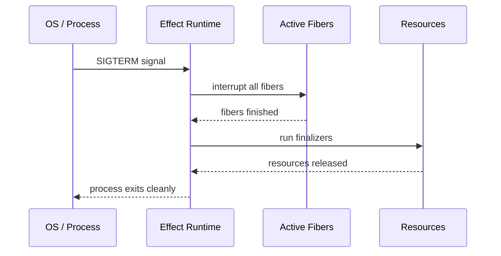

```typescript
import { Effect, Scope, Fiber, Duration, Layer, ManagedRuntime } from "effect";

// Simulate a service with in-flight work
const processRequest = (id: number) =>
  Effect.gen(function* () {
    console.log(`request ${id}: started`);
    yield* Effect.sleep(Duration.millis(100));
    // => Simulates request processing time
    console.log(`request ${id}: completed`);
    return `response-${id}`;
  });

// The application: accepts requests until interrupted
const server = Effect.gen(function* () {
  // Register shutdown cleanup
  yield* Effect.addFinalizer(
    () => Effect.sync(() => console.log("server: shutdown complete")),
    // => Runs when the server's scope is closed
  );

  console.log("server: started, accepting requests");

  // Fork in-flight requests
  const fibers = yield* Effect.all(
    [1, 2, 3].map((id) => Effect.fork(processRequest(id))),
    { concurrency: "unbounded" },
  );

  // Wait for all in-flight requests to complete
  yield* Fiber.awaitAll(fibers);
  console.log("server: all requests completed");
});

// Run the server — Ctrl+C or programmatic interrupt triggers shutdown
const runtime = ManagedRuntime.make(Layer.empty);

async function runServer() {
  // Register OS signal handler
  process.once("SIGTERM", () => {
    console.log("SIGTERM received — shutting down");
    runtime.dispose().then(() => process.exit(0));
    // => dispose() runs all finalizers, waits for scope to close
  });

  await runtime.runPromise(server.pipe(Effect.scoped));
  // => scoped: server's scope is tied to this run's lifetime
}

// Programmatic graceful shutdown demonstration
Effect.runPromise(
  Effect.scoped(server).pipe(
    Effect.timeout(Duration.millis(500)),
    // => Timeout for demonstration — in production, wait for real signal
    Effect.catchAll(() => Effect.succeed("timeout — shutdown triggered")),
  ),
).then((result) => console.log("shutdown result:", result));
```

**Key Takeaway**: Add finalizers with `Effect.addFinalizer` for cleanup logic. `ManagedRuntime.dispose()` triggers graceful shutdown: all scoped resources run finalizers. Handle OS signals to initiate the shutdown.

**Why It Matters**: Kubernetes, container orchestrators, and load balancers send SIGTERM before forcibly killing a process. A service that handles SIGTERM gracefully drains in-flight requests before exiting, preventing request failures during deployments. Effect's scope system makes graceful shutdown automatic: when the main scope closes, all finalizers run in reverse registration order. This is not something to implement manually — it is a property of correctly structured Effect code. Every `Layer.scoped` and `Effect.addFinalizer` automatically participates in graceful shutdown without additional coordination code.

---

### Example 72: Circuit Breaker Pattern with Ref and Schedule

A circuit breaker stops calling a failing service when it is clearly unhealthy, giving it time to recover. After a cooldown period, it allows a probe request to test recovery before reopening fully.

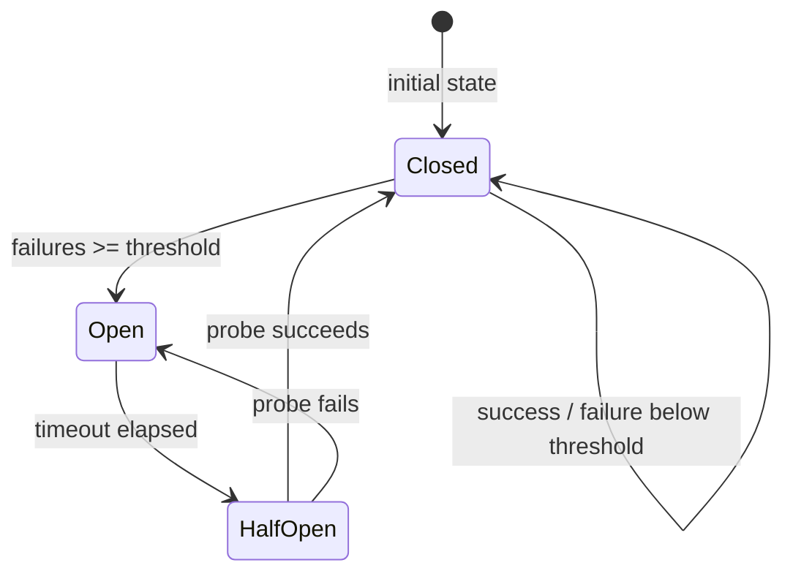

```typescript
import { Effect, Ref, Schedule, Duration, Data } from "effect";

class CircuitOpenError extends Data.TaggedError("CircuitOpenError")<{
  readonly service: string;
}> {}

type CircuitState = "closed" | "open" | "half-open";

// Build a circuit breaker around a service call
const makeCircuitBreaker = (serviceName: string, failureThreshold: number, cooldown: Duration.Duration) =>
  Effect.gen(function* () {
    const state = yield* Ref.make<CircuitState>("closed");
    // => Circuit starts closed (requests allowed)
    const failureCount = yield* Ref.make(0);
    // => Counts consecutive failures

    const call = <A, E>(operation: Effect.Effect<A, E, never>) =>
      Effect.gen(function* () {
        const currentState = yield* Ref.get(state);
        // => Check circuit state before calling

        if (currentState === "open") {
          return yield* Effect.fail(new CircuitOpenError({ service: serviceName }));
          // => Circuit is open: reject immediately without calling service
        }

        // Execute the operation
        const result = yield* operation.pipe(
          Effect.tapError((_e) =>
            Effect.gen(function* () {
              const count = yield* Ref.updateAndGet(failureCount, (n) => n + 1);
              // => Increment failure counter

              if (count >= failureThreshold) {
                yield* Ref.set(state, "open");
                // => Too many failures: open the circuit
                console.log(`${serviceName}: circuit opened after ${count} failures`);

                // Schedule automatic recovery attempt
                yield* Effect.fork(
                  Effect.sleep(cooldown).pipe(
                    Effect.andThen(Ref.set(state, "half-open")),
                    // => After cooldown, allow one probe request
                  ),
                );
              }
            }),
          ),
          Effect.tap(() => Ref.set(failureCount, 0)),
          // => Success: reset failure counter
        );

        return result;
      });

    return { call };
  });

// Usage
const program = Effect.gen(function* () {
  const cb = yield* makeCircuitBreaker("payment-service", 2, Duration.millis(50));

  // Simulate calls: first two fail, triggering the circuit breaker
  for (let i = 1; i <= 4; i++) {
    const result = yield* cb
      .call(i <= 2 ? Effect.fail(new Error("service down")) : Effect.succeed(`response-${i}`))
      .pipe(Effect.either);
    console.log(`call ${i}:`, result._tag);
    // => call 1: Left (failure)
    // => call 2: Left (failure) → circuit opens
    // => call 3: Left (CircuitOpenError) → circuit is open, rejected immediately
    // => call 4: Left (CircuitOpenError) → still open
  }
});

Effect.runPromise(program);
```

**Key Takeaway**: A circuit breaker tracks failures, opens when a threshold is exceeded, and auto-recovers after a cooldown. Implement with `Ref` for state and `Effect.fork` for the cooldown timer.

**Why It Matters**: Without circuit breakers, a failing downstream service causes every request to wait for timeouts before failing, exhausting connection pools and degrading the entire application. The circuit breaker pattern (popularized by Michael Nygard in "Release It!") is the standard solution: open the circuit when failure rate exceeds a threshold, reject requests immediately, and probe for recovery. This reduces latency (rejecting immediately instead of waiting), reduces load on the struggling service, and allows it to recover. Effect's concurrency primitives (`Ref`, `Effect.fork`) make the circuit breaker a natural Effect composition rather than a complex external library.

---

### Example 73: Effect.withConcurrency — Limiting Global Concurrency

`Effect.withConcurrency` sets a global concurrency limit for all forked fibers within a scope. This is useful for limiting total concurrency during batch processing without changing individual operation code.

```typescript
import { Effect, Duration } from "effect";

// A workload that creates many concurrent operations
const processItem = (id: number) =>
  Effect.gen(function* () {
    yield* Effect.sleep(Duration.millis(50));
    // => Simulates work
    return `processed-${id}`;
  });

// Without concurrency limit: all 20 items run simultaneously
const unconstrained = Effect.all(
  Array.from({ length: 20 }, (_, i) => processItem(i)),
  { concurrency: "unbounded" },
  // => 20 concurrent operations — may overwhelm downstream services
);

// Effect.withConcurrency: limit concurrency for a scope of effects
// All Effect.fork calls within this scope are limited to N concurrent fibers
const constrained = Effect.all(
  Array.from({ length: 20 }, (_, i) => processItem(i)),
  { concurrency: "unbounded" },
).pipe(
  Effect.withConcurrency(5),
  // => Even though we said "unbounded" above, this scope limits to 5
  // => At most 5 items process simultaneously
);

// Measure the difference
const measureTime = <A>(label: string, effect: Effect.Effect<A>) =>
  Effect.gen(function* () {
    const start = Date.now();
    const result = yield* effect;
    const elapsed = Date.now() - start;
    console.log(`${label}: ${elapsed}ms`);
    return result;
  });

Effect.runPromise(
  Effect.all({
    unconstrained: measureTime("unconstrained", unconstrained),
    constrained: measureTime("constrained (5)", constrained),
  }),
).then(() => console.log("done"));
// => Output:
// => unconstrained: ~50ms (all 20 run in parallel, limited by single batch)
// => constrained (5): ~200ms (4 batches of 5, each taking 50ms)
```

**Key Takeaway**: `Effect.withConcurrency(N)` limits the concurrency of all fibers forked within the scope to N, regardless of their individual concurrency settings. Use it to globally limit concurrency for a batch operation.

**Why It Matters**: Batch processing jobs that spawn many concurrent fibers can accidentally overwhelm dependent services — a batch of 10,000 items processed with unbounded concurrency might open 10,000 simultaneous database connections. `Effect.withConcurrency` provides a simple knob to control this: limit the batch to your connection pool size and database query capacity. This single-line change converts a potentially dangerous high-concurrency operation into a well-behaved batch job with predictable resource usage. It is the production-safe way to express "process all items, but only N at a time."

---

### Example 74: Effect.withSpan and Nested Traces

Tracing spans nest hierarchically. When a span-wrapped Effect forks child fibers or calls other span-wrapped functions, the spans automatically form a tree in the trace. This example shows how nested spans build a complete trace.

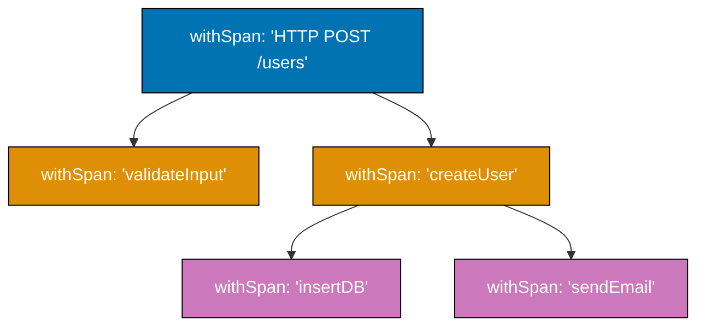

```typescript
import { Effect, Duration } from "effect";

// Functions that wrap their work in spans
const checkInventory = (itemId: string) =>
  Effect.gen(function* () {
    yield* Effect.sleep(Duration.millis(10));
    return { itemId, available: true, quantity: 50 };
  }).pipe(
    Effect.withSpan("check-inventory", {
      attributes: { "item.id": itemId },
    }),
  );

const reserveItem = (itemId: string, qty: number) =>
  Effect.gen(function* () {
    yield* Effect.sleep(Duration.millis(20));
    return `reservation-${itemId}-${qty}`;
  }).pipe(
    Effect.withSpan("reserve-item", {
      attributes: { "item.id": itemId, "item.quantity": qty },
    }),
  );

const chargePayment = (amount: number) =>
  Effect.gen(function* () {
    yield* Effect.sleep(Duration.millis(50));
    return `charge-${amount}`;
  }).pipe(
    Effect.withSpan("charge-payment", {
      attributes: { "payment.amount": amount },
    }),
  );

// Root span: the complete checkout operation
// Creates a trace tree:
// [checkout] (root, ~80ms total)
//   [check-inventory] (child, 10ms)
//   [reserve-item] (child, 20ms)
//   [charge-payment] (child, 50ms)
const checkout = (itemId: string, qty: number, amount: number) =>
  Effect.gen(function* () {
    // Span attributes are accessible in the trace — no need to log them
    const inventory = yield* checkInventory(itemId);
    // => Creates "check-inventory" span as child of "checkout"

    if (!inventory.available) {
      return yield* Effect.fail("item not available");
    }

    const reservation = yield* reserveItem(itemId, qty);
    // => Creates "reserve-item" span as child of "checkout"

    const charge = yield* chargePayment(amount);
    // => Creates "charge-payment" span as child of "checkout"

    return { reservation, charge };
  }).pipe(
    Effect.withSpan("checkout", {
      attributes: {
        "order.item": itemId,
        "order.quantity": qty,
        "order.amount": amount,
      },
    }),
  );

// In production: spans are exported to Jaeger, Zipkin, or OTLP
// In development: spans appear in console when using a dev tracer
Effect.runPromise(checkout("item-1", 2, 49.99)).then((result) => console.log("checkout result:", result));
```

**Key Takeaway**: Spans nest automatically when span-wrapped Effects call other span-wrapped Effects. The trace tree mirrors the call tree, showing exactly how time is distributed across operations.

**Why It Matters**: A checkout operation that takes 500ms needs to show which sub-operations contributed to that latency: was it inventory (5ms), payment (200ms), or database (295ms)? Without nested spans, you see one opaque 500ms span. With nested spans, you see the breakdown instantly. In microservices, nested spans cross service boundaries via trace context propagation — the checkout service's span becomes the parent of the payment service's span, giving a complete end-to-end view. `Effect.withSpan` builds this trace structure automatically as Effects compose, requiring zero additional instrumentation code beyond adding the span wrapper.

---

### Example 75: Stream with External Resources — Reading Files

Combining Stream with resource management enables processing large files without loading them entirely into memory. Each chunk is processed and discarded before the next is read.

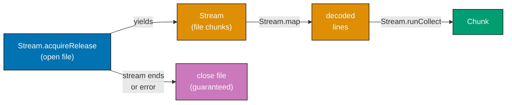

```typescript
import { Stream, Effect, Scope } from "effect";
import { NodeFileSystem } from "@effect/platform-node";
import { FileSystem } from "@effect/platform";

// Reading a file as a stream of lines — memory-efficient for large files
const processLargeFile = (path: string) =>
  Effect.gen(function* () {
    const fs = yield* FileSystem.FileSystem;
    // => Requires FileSystem service from context

    // Open the file as a readable stream
    const stream = yield* fs.readFileString(path).pipe(
      Effect.map((content) => {
        // => For demonstration: simulate line-by-line processing
        const lines = content.split("\n");
        return Stream.fromIterable(lines);
      }),
    );
    // => In production: use fs.readFile and rechunk for true streaming

    return stream;
  });

// More realistic: Stream that simulates line-by-line file processing
const simulatedFileStream = (lineCount: number): Stream.Stream<string, never, never> =>
  Stream.unfold(0, (lineNum) => {
    if (lineNum >= lineCount) return undefined as any;
    // => End of file
    return [
      `line ${lineNum + 1}: data-${Math.random().toFixed(4)}`,
      // => Simulated file line content
      lineNum + 1,
      // => Next state: incremented line number
    ] as const;
  }).pipe(
    Stream.mapBefore((v) => v),
    // => Stream.unfold signature note: returns Option<[element, state]>
  );

// Process file in batches for efficient bulk operations
const batchProcessFile = Stream.unfold(0 as number, (n) =>
  n >= 100 ? (undefined as any) : ([`line-${n}`, n + 1] as const),
).pipe(
  Stream.rechunk(10),
  // => Group into batches of 10 lines
  Stream.mapChunksEffect((chunk) =>
    Effect.gen(function* () {
      const lines = Array.from(chunk);
      console.log(`processing batch of ${lines.length} lines`);
      // => Process each batch: parse, validate, write to DB
      yield* Effect.sleep(0);
      // => Yields to scheduler — allows other fibers to run between batches
      return chunk;
    }),
  ),
  Stream.runCollect,
  // => Collect all results — in production, use a Sink that writes to a DB
);

Effect.runPromise(batchProcessFile).then((all) => {
  console.log(`processed ${all.length} total lines`);
  // => Output: processed 100 total lines
});
```

**Key Takeaway**: Process large files with Stream to keep memory usage constant. `rechunk` creates processing batches. `mapChunksEffect` applies effectful transformations to each batch.

**Why It Matters**: Loading large files into memory before processing is a common source of out-of-memory crashes in production. A CSV import of 10 million rows requires gigabytes of memory if loaded all at once. Stream-based processing keeps memory usage bounded to the chunk size: read 1000 rows, process them, discard, read the next 1000. The Effect's `@effect/platform` FileSystem service provides platform-independent file access, and combining it with Stream creates a production-quality file processing pipeline with zero unnecessary memory allocation. This is the correct architecture for ETL jobs, log processing, and bulk data operations.

---

### Example 76: Effect.promise Interop — Working with Legacy Async Code

Effect provides several patterns for integrating with existing Promise-based code. Understanding the correct interop pattern prevents common mistakes when mixing Effect and non-Effect code.

```typescript
import { Effect, Runtime } from "effect";

// Pattern 1: Wrapping a Promise library function (the common case)
// Use Effect.tryPromise for operations that might reject
const fetchWithAxios = (url: string) =>
  Effect.tryPromise({
    try: () => fetch(url).then((r) => r.json()),
    // => fetch returns a Promise that may reject on network error
    catch: (e) => new Error(`network error: ${e}`),
    // => Convert the rejection reason to a typed error
  });
// => Effect<unknown, Error, never> — correct interop

// Pattern 2: Passing an Effect-based callback to a Promise-based library
// Some libraries accept callbacks — use Effect.runPromise inside the callback
const legacyLibrary = {
  processData: (data: string, callback: (result: string) => Promise<void>): void => {
    callback(data.toUpperCase()).catch(console.error);
    // => Calls the callback and chains on its Promise
  },
};

const processWithEffect = (data: string): Effect.Effect<void, Error, never> =>
  Effect.tryPromise({
    try: () =>
      new Promise<void>((resolve, reject) => {
        legacyLibrary.processData(data, async (result) => {
          // => Inside the callback, use async/await
          console.log("legacy library processed:", result);
          resolve();
        });
      }),
    catch: (e) => new Error(`processing failed: ${e}`),
  });

// Pattern 3: Converting an Effect into a callback for legacy libraries
// Use Effect.runPromise or a runtime's runPromise
const effectToCallback = <A, E>(
  effect: Effect.Effect<A, E, never>,
  onSuccess: (value: A) => void,
  onError: (error: unknown) => void,
): void => {
  Effect.runPromise(effect).then(onSuccess).catch(onError);
  // => Converts Effect into a callback-based API
  // => Used when integrating with libraries that don't support Promises
};

effectToCallback(
  Effect.succeed(42),
  (value) => console.log("success:", value),
  // => Output: success: 42
  (error) => console.log("error:", error),
);
```

**Key Takeaway**: Use `Effect.tryPromise` to wrap Promise-based code. Use `Effect.runPromise` to convert Effects into Promises when calling legacy libraries. Wrap Promise-accepting callbacks with `new Promise` and `Effect.tryPromise`.

**Why It Matters**: No greenfield project starts without existing dependencies. npm has millions of packages, virtually all Promise-based. Interop with this ecosystem is not optional — it is a daily reality. `Effect.tryPromise` is the correct and complete bridge: it handles both resolution and rejection, requires you to type the error, and produces an Effect that composes with the rest of your Effect code. The reverse direction — passing an Effect to a Promise-expecting library — is less common but equally important. Understanding both directions enables gradual adoption of Effect in existing codebases without needing to rewrite all dependencies.

---

### Example 77: Effect.tapDefect — Monitoring for Unexpected Errors

`Effect.tapDefect` runs a side effect when a defect (unexpected error) occurs. It is the right place to alert on bugs, not on expected failures. Combined with structured logging, it provides comprehensive error monitoring.

```typescript
import { Effect, Cause, Data } from "effect";

class ExpectedError extends Data.TaggedError("ExpectedError")<{
  readonly message: string;
}> {}

// tapError: runs for typed errors (expected failures)
// tapDefect: runs for defects (unexpected bugs)

const program = Effect.gen(function* () {
  yield* Effect.fail(new ExpectedError({ message: "user not found" }));
  // => Typed failure — handled by tapError, NOT tapDefect
});

const withMonitoring = program.pipe(
  Effect.tapError((error) => {
    // => Runs for TYPED errors only
    console.log(`expected error: ${error._tag}`);
    return Effect.unit;
    // => Return void Effect
  }),
  Effect.tapDefect((defect) => {
    // => Runs for DEFECTS only — bugs and unexpected crashes
    console.error(`BUG DETECTED: ${Cause.pretty(defect)}`);
    // => In production: send alert, create ticket, page on-call
    return Effect.unit;
  }),
);

Effect.runSyncExit(withMonitoring);
// => Output: expected error: ExpectedError
// => tapDefect does NOT run — ExpectedError is a typed failure, not a defect

// Now with a defect:
const programWithDefect = Effect.sync(() => {
  throw new Error("null pointer — this is a bug!");
  // => Thrown exceptions become defects (Cause.die)
});

const withDefectMonitoring = programWithDefect.pipe(
  Effect.tapError((error) => {
    console.log("typed error:", error);
    return Effect.unit;
    // => Does NOT run — thrown Error is a defect, not typed failure
  }),
  Effect.tapDefect((defect) => {
    console.error("defect detected:", Cause.pretty(defect));
    // => Output: defect detected: Error: null pointer — this is a bug!
    // => This runs — the thrown exception is a defect
    return Effect.unit;
  }),
);

Effect.runSyncExit(withDefectMonitoring);
// => tapDefect runs, tapError does not
```

**Key Takeaway**: `tapDefect` monitors for unexpected defects (bugs). `tapError` monitors for expected typed errors. Use them at appropriate monitoring layers to distinguish normal failures from programming mistakes.

**Why It Matters**: Production alerting requires distinguishing signal from noise. If every "user not found" or "invalid input" error pages the on-call engineer, the team becomes desensitized to alerts (alarm fatigue) and misses real emergencies. `tapDefect` ensures alerts fire only on genuine bugs — null pointers, assertion failures, invariant violations — while `tapError` handles the expected-failure cases through normal business logic. This separation is the foundation of an effective incident response culture: alerts have high signal-to-noise ratio, on-call engineers are paged for real problems, and expected errors are handled gracefully without human intervention.

---

### Example 78: Effect.clockWith — Custom Time Sources

`Effect.clockWith` provides access to the `Clock` service, allowing you to control time-dependent behavior. In tests, replace the clock with `TestClock`. In production, the default clock uses `Date.now` and `performance.now`.

```typescript
import { Effect, Clock, Duration } from "effect";

// Clock.currentTimeMillis: get current time in milliseconds
const program = Effect.gen(function* () {
  const startMs = yield* Clock.currentTimeMillis;
  // => startMs is the current time in milliseconds (since epoch)
  console.log("current time (ms):", startMs);

  yield* Effect.sleep(Duration.millis(10));
  // => Wait 10 milliseconds

  const endMs = yield* Clock.currentTimeMillis;
  const elapsed = endMs - startMs;
  // => elapsed is the actual time elapsed in milliseconds
  console.log("elapsed:", elapsed, "ms");
  // => Output: elapsed: 10 ms (approximately)
});

Effect.runPromise(program);

// Clock.currentTimeNanos: nanosecond precision for performance measurement
const measure = <A>(label: string, effect: Effect.Effect<A>) =>
  Effect.gen(function* () {
    const startNs = yield* Clock.currentTimeNanos;
    // => startNs is BigInt nanoseconds — higher precision than milliseconds

    const result = yield* effect;

    const endNs = yield* Clock.currentTimeNanos;
    const elapsedMs = Number(endNs - startNs) / 1_000_000;
    // => Convert nanoseconds to milliseconds
    console.log(`${label}: ${elapsedMs.toFixed(2)}ms`);

    return result;
  });

// Use measure to time any Effect
Effect.runPromise(
  measure(
    "sort 1000 items",
    Effect.sync(() => {
      const arr = Array.from({ length: 1000 }, () => Math.random());
      arr.sort();
      return arr.length;
    }),
  ),
);
// => Output: sort 1000 items: 0.15ms (varies by hardware)
```

**Key Takeaway**: `Clock.currentTimeMillis` and `Clock.currentTimeNanos` access the current time as Effects. In tests, provide `TestClock` to control and observe time. In production, the default clock uses real system time.

**Why It Matters**: Time-dependent code that calls `Date.now()` directly is impossible to test deterministically — every test run uses real time. By using `Clock.currentTimeMillis`, time becomes a service you can replace. Test code provides `TestClock`, which starts at a fixed instant and advances only when explicitly told. This makes timing-sensitive tests — latency measurement, deadline calculation, time-based expiry — deterministic and fast. Production code that uses the `Clock` service is also more explicit about its time dependency, making it clear that behavior changes based on time (a non-obvious dependency that `Date.now()` hides).

---

### Example 79: Effect.cached — Time-Bounded Memoization

`Effect.cached` memoizes an Effect's result for a specified duration. Unlike `Effect.memoize` (caches forever), `cached` refreshes automatically after the TTL expires. Use it for configuration, feature flags, and other data that changes infrequently.

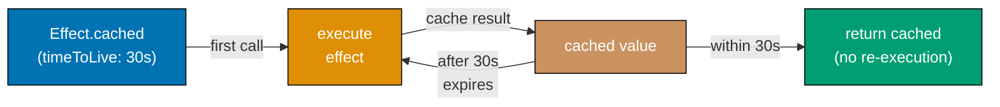

```typescript
import { Effect, Duration } from "effect";

// Simulate an expensive configuration fetch
let fetchCount = 0;
const fetchConfig = Effect.tryPromise({
  try: async () => {
    fetchCount++;
    console.log(`fetching config (fetch #${fetchCount})`);
    // => Simulates a network call to a config service
    return {
      featureFlags: { darkMode: true, betaFeatures: false },
      maxRetries: 3,
      timeout: 5000,
    };
  },
  catch: (e) => new Error(`config fetch failed: ${e}`),
});

// Cache the config for 30 seconds
// After 30 seconds, the next access refetches automatically
const cachedConfig = Effect.cached(fetchConfig, Duration.seconds(30));
// => Effect<Effect<Config, Error, never>, never, never>
// => cachedConfig is an Effect that produces a memoized Effect

const program = Effect.gen(function* () {
  // Build the cached accessor once
  const config = yield* cachedConfig;
  // => config is an Effect<Config, Error, never>
  // => Calling config multiple times within 30s returns cached result

  // First access: fetches from config service
  const c1 = yield* config;
  console.log("config1 darkMode:", c1.featureFlags.darkMode);
  // => Output:
  // => fetching config (fetch #1)
  // => config1 darkMode: true

  // Second access: returns cached result (no network call)
  const c2 = yield* config;
  console.log("config2 maxRetries:", c2.maxRetries);
  // => Output: config2 maxRetries: 3 (no "fetching config" log)

  // Third access: still cached
  const c3 = yield* config;
  console.log("config3 timeout:", c3.timeout);
  // => Output: config3 timeout: 5000

  console.log("total fetches:", fetchCount);
  // => Output: total fetches: 1 — only one network call despite three accesses
});

Effect.runPromise(program);
```

**Key Takeaway**: `Effect.cached` returns a memoized accessor that caches the result for the given TTL. After expiry, the next access refetches. Access the cached value with `yield* cachedConfig` then `yield* config`.

**Why It Matters**: Configuration, feature flags, and rate-limit rules change infrequently but are accessed on every request. Fetching these from a remote service on every request adds latency and load. TTL-based caching with `Effect.cached` provides a simple, correct caching strategy: serve from cache for 30 seconds, refresh automatically when stale, handle fetch errors gracefully. Unlike manual caching with `setInterval` refreshes, `Effect.cached` is lazy (only fetches when accessed), composable (returns an Effect), and handles concurrent access safely (multiple fibers accessing the cache simultaneously trigger only one fetch). This is the correct caching primitive for most production use cases.

---

### Example 80: Putting It All Together — A Mini Production Service

This final example combines multiple Effect concepts into a realistic production service pattern: typed errors, services, Layers, retries, logging, and metrics in a single cohesive program.

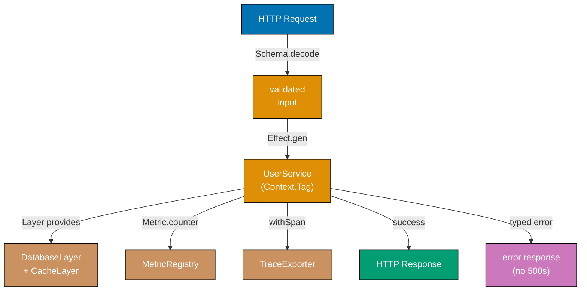

```typescript
import { Effect, Context, Layer, Metric, Schedule, Duration, Data } from "effect";

// Typed errors
class UserNotFound extends Data.TaggedError("UserNotFound")<{ id: string }> {}
class DatabaseError extends Data.TaggedError("DatabaseError")<{ message: string }> {}

// Service interfaces
interface UserRepository {
  readonly findById: (id: string) => Effect.Effect<{ id: string; name: string }, UserNotFound | DatabaseError, never>;
}

// Service Tags
const UserRepository = Context.GenericTag<UserRepository>("UserRepository");

// Metrics
const userLookups = Metric.counter("user.lookups.total");
const userLookupErrors = Metric.counter("user.lookups.errors");

// Application logic using the service
const getUser = (id: string) =>
  Effect.gen(function* () {
    yield* Effect.log(`Looking up user: ${id}`);
    // => Structured log entry

    yield* userLookups.pipe(Metric.increment);
    // => Increment lookup counter

    const repo = yield* UserRepository;
    const user = yield* repo.findById(id).pipe(
      Effect.retry(
        Schedule.exponential(Duration.millis(50)).pipe(
          Schedule.compose(Schedule.recurs(2)),
          // => Retry up to 2 times with exponential backoff (for DatabaseError)
        ),
      ),
    );
    // => user is { id: string; name: string }

    yield* Effect.log(`Found user: ${user.name}`);
    return user;
  }).pipe(
    Effect.tapError(() => userLookupErrors.pipe(Metric.increment)),
    // => Increment error counter on any failure
    Effect.withSpan("get-user", { attributes: { "user.id": id } }),
    // => Wrap in tracing span
  );

// Test Layer: in-memory implementation for testing
const TestUserRepository = Layer.succeed(UserRepository, {
  findById: (id) => {
    const users: Record<string, { id: string; name: string }> = {
      u1: { id: "u1", name: "Alice" },
      u2: { id: "u2", name: "Bob" },
    };
    const user = users[id];
    return user ? Effect.succeed(user) : Effect.fail(new UserNotFound({ id }));
  },
});

// Run with the test layer
const program = Effect.gen(function* () {
  const alice = yield* getUser("u1");
  console.log("found:", alice.name);
  // => Output: found: Alice

  const notFound = yield* getUser("u99").pipe(
    Effect.catchTag("UserNotFound", (e) => {
      console.log(`user ${e.id} not found`);
      return Effect.succeed({ id: "guest", name: "Guest" });
    }),
  );
  console.log("fallback:", notFound.name);
  // => Output: user u99 not found
  // => fallback: Guest
});

Effect.runPromise(program.pipe(Effect.provide(TestUserRepository)));
```

**Key Takeaway**: Production Effect services combine typed errors, service interfaces, Layers, retries, logging, metrics, and tracing as composable parts of a single, coherent pipeline. Each concept adds its capability without complicating the others.

**Why It Matters**: The 80 examples in this tutorial build toward this final pattern: a service function that is observable, resilient, testable, and correct. Typed errors make failure modes explicit. The service interface makes the database dependency injectable. Metrics provide production visibility. Retry logic makes the service resilient to transient failures. Tracing links individual operations to request traces. Structured logging provides searchable records. Each of these concerns is handled by a different Effect abstraction, but all compose naturally. This is Effect's core value proposition: production-quality concerns are first-class language features, not afterthoughts bolted onto a simpler foundation.
