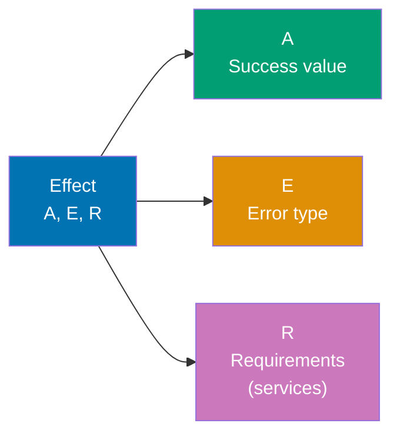
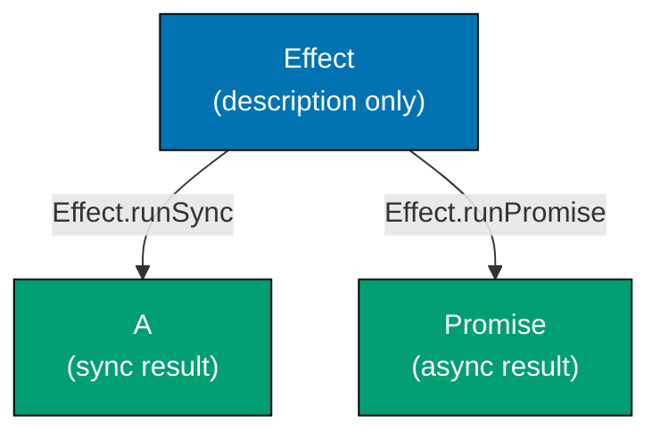
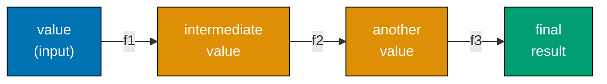
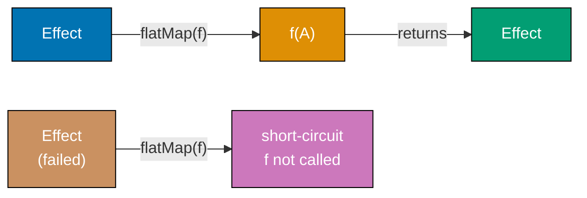
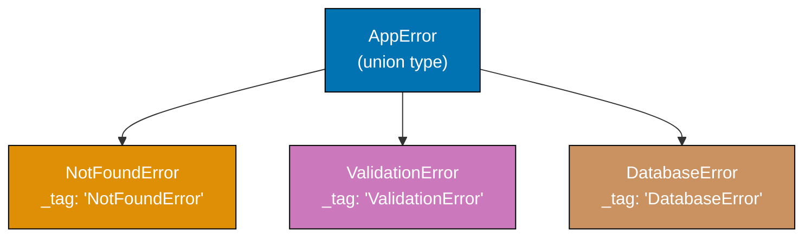
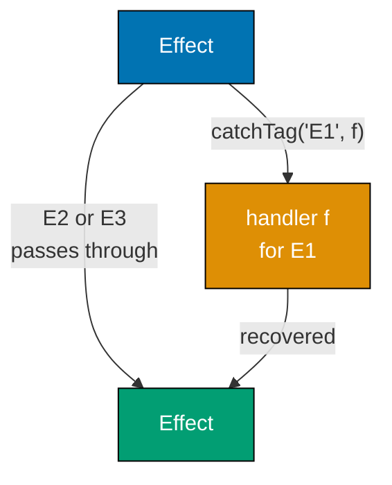
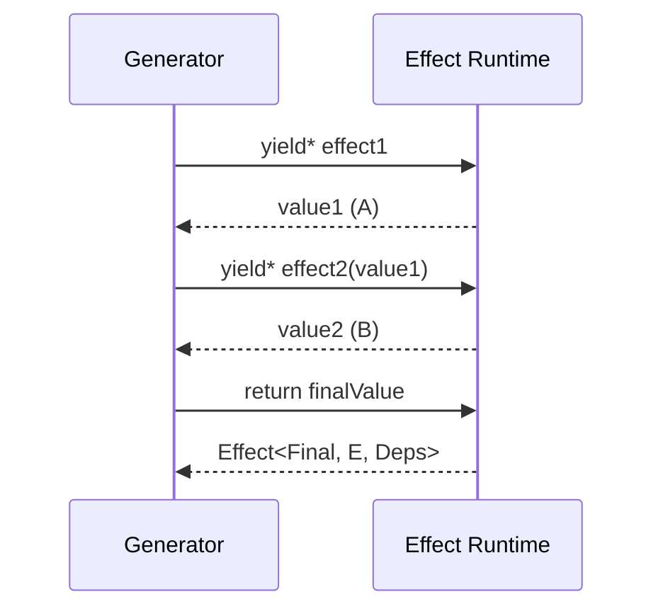
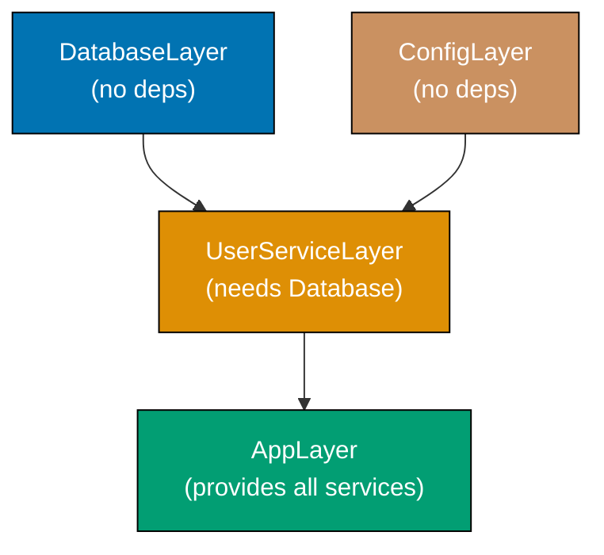
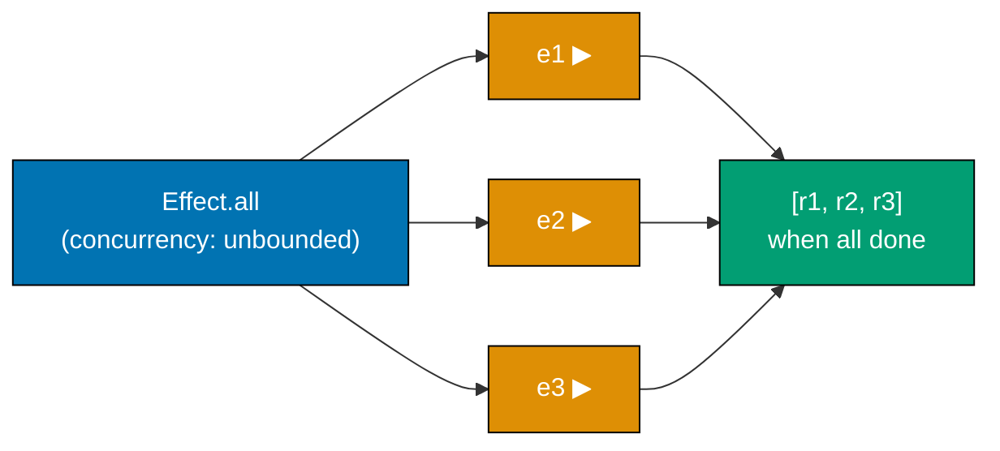

## Group 1: The Effect Type

### Example 1: Understanding the Effect Type Signature

The `Effect<Success, Error, Requirements>` type is the foundation of the entire library. Every computation you describe in Effect produces a value of this type — it is a description of a program, not the execution of one. The three type parameters encode what the computation produces, how it can fail, and what services it needs.



```typescript
import { Effect } from "effect";

// Effect<number, never, never>
// Success = number, Error = never (cannot fail), Requirements = never (no services needed)
const alwaysSucceeds: Effect.Effect<number, never, never> = Effect.succeed(42);
// => Describes a computation that, when run, produces 42

// Effect<never, string, never>
// Success = never (never succeeds), Error = string, Requirements = never
const alwaysFails: Effect.Effect<never, string, never> = Effect.fail("something went wrong");
// => Describes a computation that, when run, fails with the string error

// Effect<string, Error, never>
// Success = string, Error = native Error object, Requirements = never
const mightFail: Effect.Effect<string, Error, never> = Effect.try({
  try: () => JSON.parse('{"key":"value"}'), // => runs this, may throw
  catch: (e) => new Error(`parse failed: ${e}`), // => catches thrown error, wraps in typed Error
});
// => Describes a computation that runs JSON.parse and handles exceptions

// Shorthand: Effect.Effect<A, E, R> can be written as Effect<A, E, R>
// The 'never' for Requirements means: this effect needs no external services
// The 'never' for Error means: this effect cannot fail in a typed way
```

**Key Takeaway**: `Effect<A, E, R>` is a lazy description of a program — it does nothing until you run it. The type parameters make success values, errors, and dependencies visible to the compiler.

**Why It Matters**: Traditional TypeScript code hides errors inside `try/catch` blocks and dependencies inside closures. Effect moves both into the type system. When a function returns `Effect<User, NotFoundError, Database>`, callers know at compile time that it needs a `Database` service and can fail with `NotFoundError`. This eliminates entire categories of runtime surprises in production systems.

---

### Example 2: Creating Effects — succeed, fail, sync

The three most common ways to create an Effect are `succeed` for values you already have, `fail` for typed errors, and `sync` for wrapping synchronous code that might throw. Understanding which constructor to use is the first practical skill in Effect.

```typescript
import { Effect } from "effect";

// Effect.succeed wraps an already-computed value
// Use when you have a value and need it as an Effect
const fromValue = Effect.succeed(100);
// => Effect<number, never, never>
// => When run: produces 100

// Effect.fail wraps an error value
// The error becomes part of the type — not an exception
const fromError = Effect.fail(new Error("database unavailable"));
// => Effect<never, Error, never>
// => When run: fails with Error("database unavailable")

// Effect.sync wraps a synchronous computation that might throw
// The callback is only called when the effect is actually run
const fromSync = Effect.sync(() => {
  // => This function is NOT called when you call Effect.sync()
  // => It is called only when the Effect is executed
  const now = Date.now(); // => Gets current timestamp
  return `timestamp: ${now}`; // => Returns string
});
// => Effect<string, never, never>
// => The possible throw is intentionally ignored here (use Effect.try for safe wrapping)

// Effect.sync is safe for truly synchronous operations that cannot throw
const randomNumber = Effect.sync(() => Math.random());
// => Effect<number, never, never>
// => Math.random() never throws, so sync is appropriate

// Comparing: a value vs a description of computing a value
const directValue = Math.random(); // => Called immediately, value fixed at definition time
const lazyValue = Effect.sync(() => Math.random());
// => Called only when run — each run may produce different value
```

**Key Takeaway**: Use `succeed` for known values, `fail` for typed errors, `sync` for synchronous computations you know cannot throw, and `try` (shown next) for computations that might throw.

**Why It Matters**: Wrapping all computations — even trivial ones — in Effect creates a uniform interface for composition. When everything returns an Effect, you can chain, retry, trace, and test without special cases. This uniformity is what makes large Effect codebases tractable: `Effect.sync(() => Date.now())` and a complex database query compose with the same operators.

---

### Example 3: Creating Effects — try, promise, tryPromise

`Effect.try` and `Effect.tryPromise` bridge the gap between standard JavaScript code and the Effect type system. They capture thrown exceptions and convert them into typed failures.

```typescript
import { Effect } from "effect";

// Effect.try wraps synchronous code that might throw
// Converts thrown exceptions into typed failures
const parseJson = (input: string) =>
  Effect.try({
    try: () => JSON.parse(input), // => This may throw SyntaxError
    catch: (unknown) => new Error(`JSON parse failed: ${unknown}`),
    // => catch receives the thrown value (typed as unknown)
    // => We must convert it to our error type
  });
// => Effect<unknown, Error, never>

const goodResult = parseJson('{"name":"Alice"}');
// => When run: succeeds with { name: "Alice" }

const badResult = parseJson("not json");
// => When run: fails with Error("JSON parse failed: SyntaxError: ...")

// Effect.promise wraps a Promise that is assumed to never reject
// Use only when the promise truly cannot reject (rare in practice)
const fetchTime = Effect.promise(() => Promise.resolve(Date.now()));
// => Effect<number, never, never>
// => The lack of error type means a rejection becomes a defect (unexpected crash)

// Effect.tryPromise wraps a Promise that might reject
// Converts rejections into typed failures — the safer choice for real APIs
const fetchUser = (id: string) =>
  Effect.tryPromise({
    try: () => fetch(`/api/users/${id}`).then((r) => r.json()),
    // => This promise chain may reject on network error or bad JSON
    catch: (unknown) => new Error(`fetch failed: ${unknown}`),
    // => Converts rejection reason into typed Error
  });
// => Effect<unknown, Error, never>

// Effect.tryPromise is the right choice for any real-world async operation
const readFile = (path: string) =>
  Effect.tryPromise({
    try: () => import("fs/promises").then((fs) => fs.readFile(path, "utf-8")),
    catch: (e) => new Error(`cannot read ${path}: ${e}`),
  });
// => Effect<string, Error, never>
```

**Key Takeaway**: Use `try` for synchronous throwing code and `tryPromise` for async operations. Both require you to provide a `catch` function that converts unknown thrown values into your typed error type.

**Why It Matters**: Every boundary between Effect code and standard JavaScript code is a potential untyped error source. `Effect.try` and `Effect.tryPromise` enforce discipline at those boundaries: you must explicitly decide what kind of error results from each external call. This practice ensures that by the time an error reaches your business logic, it has a specific type that the compiler can check.

---

### Example 4: Running Effects — runSync, runPromise

Effects are lazy descriptions — they do nothing until you "run" them. Effect provides several runners for different execution contexts. `runSync` executes an effect synchronously and throws if it fails. `runPromise` executes asynchronously and returns a Promise.



```typescript
import { Effect } from "effect";

// --- runSync: execute synchronously, throw on failure ---

const greeting = Effect.succeed("Hello, Effect!");

const result = Effect.runSync(greeting);
// => result is "Hello, Effect!" (type: string)
// => runSync returns the success value directly

console.log(result);
// => Output: Hello, Effect!

// runSync throws if the effect fails — not for production use with typed errors
const failing = Effect.fail("oops");
try {
  Effect.runSync(failing);
  // => This line is never reached
} catch (e) {
  console.log("caught:", e);
  // => Output: caught: { _id: 'FiberFailure', cause: { _id: 'Fail', error: 'oops' } }
  // => The thrown value is a FiberFailure wrapping the cause
}

// --- runPromise: execute asynchronously, reject on failure ---

const asyncGreeting = Effect.promise(() => Promise.resolve("Hello async!"));

Effect.runPromise(asyncGreeting).then((value) => {
  console.log(value);
  // => Output: Hello async!
});
// => runPromise returns Promise<string>

// runPromise rejects if the effect fails
const asyncFailing = Effect.fail(new Error("async failure"));
Effect.runPromise(asyncFailing).catch((e) => {
  console.log("caught:", e.message);
  // => Output: caught: async failure
  // => The rejection value is a FiberFailure; e.message extracts the inner error message
});

// runSync cannot execute asynchronous effects — it throws if it encounters async work
// runPromise handles both sync and async effects correctly
```

**Key Takeaway**: Call `runSync` only for purely synchronous effects in environments where throwing is acceptable. Call `runPromise` for all other cases — it handles both sync and async effects.

**Why It Matters**: Effect programs have a single integration point with the outside world: the `run*` functions at your program's entry point. Everything inside your application stays in Effect's type-safe world. This means error handling, dependency injection, and resource management are all modeled correctly. Only when you cross the boundary to the outside world (main function, HTTP handler, test runner) do you convert an Effect to a Promise or synchronous value.

---

### Example 5: Running Effects — runSyncExit, runPromiseExit

`runSyncExit` and `runPromiseExit` return an `Exit` value instead of throwing. An `Exit` is either `Exit.succeed(value)` or `Exit.fail(cause)` — it represents the outcome as a data structure you can inspect safely.

```typescript
import { Effect, Exit, Cause } from "effect";

// --- runSyncExit: returns Exit instead of throwing ---

const success = Effect.succeed(42);
const successExit = Effect.runSyncExit(success);
// => successExit is Exit.Success { _tag: 'Success', value: 42 }

if (Exit.isSuccess(successExit)) {
  console.log("value:", successExit.value);
  // => Output: value: 42
  // => successExit.value is the success value when isSuccess is true
}

const failure = Effect.fail("not found");
const failureExit = Effect.runSyncExit(failure);
// => failureExit is Exit.Failure { _tag: 'Failure', cause: Cause.fail("not found") }

if (Exit.isFailure(failureExit)) {
  console.log("cause:", Cause.pretty(failureExit.cause));
  // => Output: cause: Error: not found
  // => failureExit.cause is a Cause value describing how the effect failed
}

// --- runPromiseExit: async version returns Promise<Exit> ---

const asyncEffect = Effect.tryPromise({
  try: () => Promise.resolve("fetched data"),
  catch: (e) => new Error(`${e}`),
});

const asyncExit = await Effect.runPromiseExit(asyncEffect);
// => asyncExit is Exit.Success { value: "fetched data" }

Exit.match(asyncExit, {
  onSuccess: (value) => console.log("success:", value),
  // => Output: success: fetched data
  onFailure: (cause) => console.log("failure:", Cause.pretty(cause)),
  // => Not reached in this example
});
```

**Key Takeaway**: Use `runSyncExit` and `runPromiseExit` when you need to inspect the outcome safely without catching thrown exceptions. These runners give you an `Exit` value that you pattern-match over.

**Why It Matters**: `runSyncExit` and `runPromiseExit` are essential at integration boundaries where you cannot let exceptions propagate — HTTP handlers, message queue consumers, scheduled jobs. They convert the Effect result into a discriminated union that you can pattern-match exhaustively. This prevents forgotten `try/catch` blocks and ensures every failure mode is handled explicitly before the result leaves the Effect boundary.

---

## Group 2: Pipelines and Transformations

### Example 6: pipe and the Pipeline Pattern

`pipe` is a utility that threads a value through a sequence of functions left to right. In Effect, nearly everything is built with `pipe` — it is the primary way to compose operations without nesting.



```typescript
import { Effect, pipe } from "effect";

// pipe(value, fn1, fn2, fn3) is equivalent to fn3(fn2(fn1(value)))
// It reads left to right, which is easier to follow than nested calls

// Without pipe — deeply nested, reads inside-out:
const nested = Effect.map(
  Effect.map(Effect.succeed(5), (n) => n * 2),
  (n) => n + 1,
);
// => Produces 11, but the nesting obscures the data flow

// With pipe — flat, reads top to bottom:
const piped = pipe(
  Effect.succeed(5), // => Start: Effect<number, never, never> producing 5
  Effect.map((n) => n * 2), // => Step 1: multiply by 2, producing 10
  Effect.map((n) => n + 1), // => Step 2: add 1, producing 11
);
// => piped is Effect<number, never, never>
// => When run: produces 11

const result = Effect.runSync(piped);
console.log(result);
// => Output: 11

// Effect methods also accept pipe-friendly signatures directly on Effect
// You can call Effect.map directly too:
const direct = Effect.succeed(5).pipe(
  Effect.map((n) => n * 2), // => n is 10
  Effect.map((n) => n + 1), // => n is 11
);
// => direct is Effect<number, never, never>, equivalent to piped above

// pipe with multiple effect types
const pipeline = pipe(
  Effect.succeed("hello"), // => Effect<string, never, never>
  Effect.map((s) => s.length), // => Effect<number, never, never>, value is 5
  Effect.map((n) => n > 3), // => Effect<boolean, never, never>, value is true
);
console.log(Effect.runSync(pipeline));
// => Output: true
```

**Key Takeaway**: `pipe` turns nested function calls into a readable left-to-right sequence. Effect is designed around `pipe`; most operators take the Effect as their last argument to enable this pattern.

**Why It Matters**: Large production systems accumulate long chains of business logic transformations. `pipe` makes those chains readable — each step is a single named transformation with a clear input type and output type. When a step fails, you see its position in the chain immediately. This readability pays dividends during code review, debugging, and onboarding because the data flow is explicit and linear rather than hidden in nested callbacks or promise chains.

---

### Example 7: Effect.map — Transforming Success Values

`Effect.map` transforms the success value of an Effect without changing its error type or requirements. If the Effect fails, `map` is skipped and the failure propagates unchanged.

```typescript
import { Effect } from "effect";

// Effect.map transforms the success value
// It ONLY runs if the effect succeeds — failures pass through untouched
const original = Effect.succeed(10);
// => Effect<number, never, never>

const doubled = original.pipe(Effect.map((n) => n * 2));
// => Effect<number, never, never>
// => map transforms number -> number
// => When run: produces 20

const asString = original.pipe(Effect.map((n) => `value is ${n}`));
// => Effect<string, never, never>
// => map changed the Success type from number to string
// => When run: produces "value is 10"

// map on a failing effect: the transformation is skipped
const failing = Effect.fail("error");
const mappedFailing = failing.pipe(Effect.map((n) => n * 2));
// => mappedFailing is still Effect<never, string, never>
// => The map callback never runs when the effect fails
// => Failure propagates unchanged

// Chaining multiple maps: each transforms the previous success value
const chain = Effect.succeed(5).pipe(
  Effect.map((n) => n * 3), // => 15
  Effect.map((n) => n - 1), // => 14
  Effect.map((n) => `Result: ${n}`), // => "Result: 14"
);
console.log(Effect.runSync(chain));
// => Output: Result: 14

// map for data transformation — parsing a raw response
const rawResponse = Effect.succeed({ status: 200, body: '{"name":"Alice"}' });
const parsedName = rawResponse.pipe(
  Effect.map((r) => JSON.parse(r.body) as { name: string }),
  // => { name: "Alice" }
  Effect.map((parsed) => parsed.name.toUpperCase()),
  // => "ALICE"
);
console.log(Effect.runSync(parsedName));
// => Output: ALICE
```

**Key Takeaway**: `Effect.map` transforms success values while leaving errors untouched. Think of it as `Array.map` but for the success channel of an Effect.

**Why It Matters**: `map` is the primary tool for pure data transformation inside Effect pipelines. Because `map` callbacks are pure functions that cannot fail, the error type stays unchanged. This property keeps pipelines composable: you can insert pure transformations anywhere without accidentally changing the failure contract. In production, this means parsing, formatting, and data-shaping steps are clearly separated from effectful operations like database queries or HTTP calls.

---

### Example 8: Effect.flatMap — Chaining Effects

`Effect.flatMap` (also called `andThen` when passing an Effect directly) chains effects together. Use it when each step in your pipeline itself returns an Effect. This is the fundamental building block for sequential effectful computations.



```typescript
import { Effect } from "effect";

// flatMap takes the success value and returns a NEW Effect
// The new Effect is then run — its success or failure becomes the overall result
const step1 = Effect.succeed(5);
// => Effect<number, never, never>

const step2 = step1.pipe(
  Effect.flatMap((n) => Effect.succeed(n * 2)),
  // => Callback receives n=5
  // => Returns Effect<number, never, never> producing 10
  // => The outer Effect's result is now this inner Effect's result
);
// => step2 is Effect<number, never, never>
// => When run: produces 10

// Difference between map and flatMap:
// map:     f returns a plain value   — wraps it in Effect automatically
// flatMap: f returns an Effect      — "unwraps" one level of nesting

// Sequential database-like operations using flatMap
type User = { id: string; name: string; email: string };
type Order = { userId: string; total: number };

const findUser = (id: string): Effect.Effect<User, Error, never> =>
  Effect.tryPromise({
    try: async () => ({ id, name: "Alice", email: "alice@example.com" }),
    // => Simulates a database lookup
    catch: (e) => new Error(`user lookup failed: ${e}`),
  });

const findOrders = (userId: string): Effect.Effect<Order[], Error, never> =>
  Effect.tryPromise({
    try: async () => [{ userId, total: 99.99 }],
    // => Simulates fetching orders for a user
    catch: (e) => new Error(`orders lookup failed: ${e}`),
  });

// Chain the two effects with flatMap:
const userWithOrders = Effect.succeed("user-123").pipe(
  Effect.flatMap((id) => findUser(id)),
  // => Receives "user-123", returns Effect<User, Error, never>
  Effect.flatMap((user) => findOrders(user.id)),
  // => Receives User, returns Effect<Order[], Error, never>
  Effect.map((orders) => orders.length),
  // => Receives Order[], returns number via pure map
);
// => userWithOrders is Effect<number, Error, never>
// => When run: produces 1 (the number of orders)

Effect.runPromise(userWithOrders).then(
  (count) => console.log(`order count: ${count}`),
  // => Output: order count: 1
);
```

**Key Takeaway**: `flatMap` sequences effects — it runs one effect, takes its success value, and uses it to create and run the next effect. If any step fails, the entire chain fails immediately.

**Why It Matters**: Most business logic consists of sequential steps where each step depends on the previous result: look up a user, then fetch their orders, then calculate a total, then write to the database. `flatMap` models this dependency chain explicitly and safely. Any failure at any step short-circuits the rest of the chain with a typed error. This eliminates the pyramid-of-doom common in callback code and the hidden failure modes common in untyped Promise chains.

---

### Example 9: Effect.tap — Side Effects in Pipelines

`Effect.tap` runs a side-effecting operation in the middle of a pipeline without changing the success value. Use it for logging, metrics, auditing, or debugging — operations that observe the value but do not transform it.

```typescript
import { Effect } from "effect";

// tap runs a side effect but passes the ORIGINAL value through
// If tap's effect fails, the whole pipeline fails
// If tap's effect succeeds, the original value continues unchanged

const pipeline = Effect.succeed({ id: "u1", name: "Alice" }).pipe(
  Effect.tap((user) => {
    // => user is { id: "u1", name: "Alice" }
    return Effect.sync(() => console.log(`processing user: ${user.name}`));
    // => Runs this log, returns Effect<void, never, never>
    // => The void result is discarded — user passes through unchanged
  }),
  // => Still { id: "u1", name: "Alice" } after the tap
  Effect.map((user) => user.name.toUpperCase()),
  // => Transforms to "ALICE"
);
// => pipeline is Effect<string, never, never>

Effect.runSync(pipeline);
// => Output (to console): processing user: Alice
// => Returns: "ALICE"

// tap for logging at multiple stages
const withLogging = Effect.succeed(100).pipe(
  Effect.tap((n) => Effect.sync(() => console.log(`input: ${n}`))),
  // => Logs: input: 100
  Effect.map((n) => n * 2),
  // => n is 200
  Effect.tap((n) => Effect.sync(() => console.log(`after doubling: ${n}`))),
  // => Logs: after doubling: 200
  Effect.map((n) => n + 50),
  // => n is 250
);

Effect.runSync(withLogging);
// => Output:
// => input: 100
// => after doubling: 200

// tapError runs only when the effect fails — mirrors tap for the error channel
const withErrorLogging = Effect.fail("connection refused").pipe(
  Effect.tapError(
    (error) => Effect.sync(() => console.log(`error occurred: ${error}`)),
    // => Logs: error occurred: connection refused
    // => The error is not changed — it still propagates
  ),
);

Effect.runSync(withErrorLogging);
// => Throws (after logging): connection refused
```

**Key Takeaway**: `tap` inserts observable side effects into a pipeline without altering data flow. `tapError` does the same for the error channel.

**Why It Matters**: Production systems require comprehensive observability — logging, metrics emission, audit trails, and tracing spans. `tap` and `tapError` let you add these cross-cutting concerns to any pipeline without contaminating business logic. The business logic pipeline reads cleanly as a sequence of transformations, and observability hooks sit alongside it transparently. This separation makes pipelines easier to test (observability can be disabled) and easier to reason about (data flow is uninterrupted).

---

## Group 3: Error Handling

### Example 10: Typed Errors with Data.TaggedError

Effect shines when errors are explicit types rather than generic `Error` objects. `Data.TaggedError` creates tagged error classes with a `_tag` field that Effect uses for pattern matching. This makes error handling exhaustive and discoverable.



```typescript
import { Effect, Data } from "effect";

// Data.TaggedError creates a class with a discriminant _tag field
// The tag enables type-safe pattern matching in catchTag
class NotFoundError extends Data.TaggedError("NotFoundError")<{
  readonly id: string; // => Payload fields are typed
}> {}

class ValidationError extends Data.TaggedError("ValidationError")<{
  readonly field: string;
  readonly message: string;
}> {}

class DatabaseError extends Data.TaggedError("DatabaseError")<{
  readonly query: string;
  readonly cause: unknown;
}> {}

// Functions declare their errors in the Effect type signature
const findUser = (id: string): Effect.Effect<string, NotFoundError | DatabaseError, never> => {
  if (id === "") {
    // => Empty id: database would fail
    return Effect.fail(new DatabaseError({ query: "SELECT * FROM users WHERE id = ''", cause: "empty id" }));
    // => Fails with DatabaseError
  }
  if (id === "unknown") {
    return Effect.fail(new NotFoundError({ id }));
    // => Fails with NotFoundError — id not in database
  }
  return Effect.succeed(`User-${id}`);
  // => Succeeds with user name string
};

// The error type tells callers what to expect
const program = findUser("unknown").pipe(
  Effect.catchTag("NotFoundError", (e) => {
    // => e is typed as NotFoundError, e.id is "unknown"
    console.log(`User ${e.id} not found, returning default`);
    return Effect.succeed("Guest");
    // => Recovers from NotFoundError by returning "Guest"
    // => NotFoundError is removed from the error type after this
  }),
  // => Now Effect<string, DatabaseError, never> — NotFoundError handled
);

Effect.runSync(program);
// => Output: User unknown not found, returning default
// => Returns: "Guest"
```

**Key Takeaway**: `Data.TaggedError` creates typed, tagged error classes. `catchTag` handles specific error tags, narrowing the remaining error type. The TypeScript compiler verifies that all error cases are handled.

**Why It Matters**: Generic `catch (e: unknown)` blocks in traditional code treat every error the same way, leading to incorrect recovery logic and silent bugs. Tagged errors make the distinction explicit: a `NotFoundError` should return a 404, while a `DatabaseError` should return a 503 and trigger an alert. When the compiler knows which errors each function can produce, it guides you to handle each one correctly. Production incidents caused by handling the wrong error type become compile-time errors instead.

---

### Example 11: Effect.catchAll — Recovering from All Errors

`catchAll` provides a recovery handler that runs when any error occurs. It is the broadest error handler — use it as a last resort or when all error types warrant the same recovery strategy.

```typescript
import { Effect, Data } from "effect";

class NetworkError extends Data.TaggedError("NetworkError")<{ url: string }> {}
class TimeoutError extends Data.TaggedError("TimeoutError")<{ ms: number }> {}

// A function that can fail in two different ways
const fetchData = (url: string): Effect.Effect<string, NetworkError | TimeoutError, never> => {
  if (url.includes("slow")) {
    return Effect.fail(new TimeoutError({ ms: 5000 }));
    // => Fails with timeout after "5000ms"
  }
  if (url.includes("bad")) {
    return Effect.fail(new NetworkError({ url }));
    // => Fails with network error
  }
  return Effect.succeed(`data from ${url}`);
  // => Succeeds with data
};

// catchAll catches ALL error types and must return an Effect with the same Success type
const withFallback = fetchData("bad-host.com").pipe(
  Effect.catchAll((error) => {
    // => error is NetworkError | TimeoutError (the full union)
    // => We can pattern match on _tag to distinguish them
    console.log(`recovering from: ${error._tag}`);
    return Effect.succeed("fallback data");
    // => Returns the same type as the success channel (string)
    // => After catchAll, error type becomes never (all errors handled)
  }),
);
// => withFallback is Effect<string, never, never>

Effect.runSync(withFallback);
// => Output: recovering from: NetworkError
// => Returns: "fallback data"

// catchAll is also useful for rethrowing as a different error type
const withTranslation = fetchData("slow-api.com").pipe(
  Effect.catchAll(
    (e) => Effect.fail(new Error(`service unavailable: ${e._tag}`)),
    // => Converts any typed error into a generic Error
    // => Useful at API boundaries where callers expect generic errors
  ),
);
// => withTranslation is Effect<string, Error, never>
```

**Key Takeaway**: `catchAll` handles every error and returns a recovery Effect. After `catchAll`, the error type becomes `never` because all errors are handled.

**Why It Matters**: `catchAll` serves as the circuit breaker in production pipelines. When a complex operation involving multiple services fails, `catchAll` provides a single fallback — returning a cached result, an empty list, or a default value. It prevents cascading failures by absorbing errors at defined boundaries. While `catchTag` is more precise for domain logic, `catchAll` is essential at infrastructure boundaries where any failure warrants the same response: return a safe fallback and log the error.

---

### Example 12: Effect.catchTag — Handling Specific Error Types

`catchTag` handles a single tagged error type, leaving other error types unchanged in the Effect's type signature. This is the recommended approach for domain error handling — handle each error type at the appropriate level.



```typescript
import { Effect, Data } from "effect";

class UserNotFound extends Data.TaggedError("UserNotFound")<{ id: string }> {}
class OrderNotFound extends Data.TaggedError("OrderNotFound")<{ orderId: string }> {}
class DatabaseError extends Data.TaggedError("DatabaseError")<{ message: string }> {}

type AppError = UserNotFound | OrderNotFound | DatabaseError;

const getOrder = (userId: string, orderId: string): Effect.Effect<string, AppError, never> => {
  // => Simulates a lookup that might fail in three ways
  return Effect.fail(new UserNotFound({ id: userId }));
  // => Returns UserNotFound for this example
};

// Handle only UserNotFound — other errors remain in the type
const step1 = getOrder("u1", "o1").pipe(
  Effect.catchTag("UserNotFound", (e) => {
    // => e is UserNotFound, e.id is "u1"
    console.log(`user ${e.id} not found, using guest`);
    return Effect.succeed("guest-order");
    // => Recovers with a default value
    // => UserNotFound is removed from error union
  }),
);
// => step1 is Effect<string, OrderNotFound | DatabaseError, never>
// => UserNotFound is gone because it was caught above

// Chain: handle OrderNotFound next
const step2 = step1.pipe(
  Effect.catchTag("OrderNotFound", (e) => {
    console.log(`order ${e.orderId} not found`);
    return Effect.succeed("empty-order");
    // => OrderNotFound removed from error union
  }),
);
// => step2 is Effect<string, DatabaseError, never>

// Final step: DatabaseError still unhandled — caller must deal with it
// This is intentional: infrastructure errors often bubble up to the top level

Effect.runSync(step1);
// => Output: user u1 not found, using guest
// => Returns: "guest-order"
```

**Key Takeaway**: `catchTag` handles one error type at a time, narrowing the remaining error union with each call. This incremental error handling mirrors how real business logic handles specific failure modes at each layer.

**Why It Matters**: Handling errors at the right layer is a hallmark of well-architected software. `catchTag` enforces this discipline at the type level: if you catch `UserNotFound` in the user service layer, the compiler removes it from the error type. Callers of the user service then cannot accidentally double-handle or ignore it. This layered error handling model prevents the common anti-pattern where every layer catches everything and logs it, losing error context and triggering duplicate alerts.

---

### Example 13: Effect.retry with Schedule

`Effect.retry` reruns an Effect when it fails, according to a `Schedule` policy. Retry logic is notoriously error-prone to write manually — Effect's Schedule system makes it declarative and composable.

```typescript
import { Effect, Schedule, Duration } from "effect";

// Schedule.recurs(n): retry up to n times, immediately
const retryThreeTimes = Schedule.recurs(3);
// => Defines a policy: retry up to 3 times with no delay

// Schedule.exponential: double the wait time each retry
const exponentialBackoff = Schedule.exponential(Duration.millis(100));
// => Retries with delays: 100ms, 200ms, 400ms, 800ms, ...

// Schedule.spaced: fixed delay between retries
const fixedDelay = Schedule.spaced(Duration.millis(500));
// => Retries with 500ms between each attempt

// Combining schedules: retry with exponential backoff, max 5 times
const boundedExponential = Schedule.exponential(Duration.millis(100)).pipe(
  Schedule.compose(Schedule.recurs(4)),
  // => Combines: exponential delay AND limit to 4 retries
  // => After 4 retries: stops, even if delay would continue
);

let attempt = 0;
const unstableEffect = Effect.tryPromise({
  try: async () => {
    attempt++;
    console.log(`attempt ${attempt}`); // => Logs each attempt number
    if (attempt < 3) throw new Error("not ready yet");
    // => Fails for the first 2 attempts
    return "success"; // => Succeeds on attempt 3
  },
  catch: (e) => new Error(`${e}`),
});

// retry: run the effect, and if it fails, apply the schedule
const withRetry = unstableEffect.pipe(
  Effect.retry(Schedule.recurs(5)),
  // => Will retry up to 5 times if the effect fails
  // => Stops as soon as the effect succeeds
);

Effect.runPromise(withRetry).then((result) => {
  console.log("final result:", result);
  // => Output:
  // => attempt 1
  // => attempt 2
  // => attempt 3
  // => final result: success
});
```

**Key Takeaway**: `Effect.retry` accepts a `Schedule` that defines retry timing and limits. Schedules are composable — combine `exponential` with `recurs` to get bounded exponential backoff.

**Why It Matters**: Transient failures from network calls, database connections, and external APIs are among the most common sources of production incidents. Manual retry logic introduces subtle bugs: off-by-one errors in retry counts, incorrect delay calculations, missing jitter, and forgotten cleanup on final failure. Effect's `Schedule` system eliminates all of these by encoding retry policies as composable, testable values. When a policy needs to change, you update one Schedule definition — not scattered `setTimeout` calls throughout the codebase.

---

## Group 4: Generators — Async/Await Style

### Example 14: Effect.gen — Generator-Based Pipelines

`Effect.gen` provides an async/await-like syntax for Effect using JavaScript generators. Instead of chaining `flatMap` calls, you use `yield*` to unwrap effects and write sequential logic that looks like imperative code.



```typescript
import { Effect, Data } from "effect";

class ParseError extends Data.TaggedError("ParseError")<{ input: string }> {}
class ValidationError extends Data.TaggedError("ValidationError")<{ message: string }> {}

const parseId = (raw: string): Effect.Effect<number, ParseError, never> => {
  const n = parseInt(raw, 10);
  // => Parses the string as a base-10 integer
  return isNaN(n)
    ? Effect.fail(new ParseError({ input: raw })) // => Fail if not a number
    : Effect.succeed(n); // => Succeed with the parsed number
};

const validatePositive = (n: number): Effect.Effect<number, ValidationError, never> => {
  return n > 0
    ? Effect.succeed(n) // => Positive: OK
    : Effect.fail(new ValidationError({ message: `${n} is not positive` })); // => Non-positive: fail
};

// With flatMap (functional style):
const withFlatMap = (raw: string) =>
  parseId(raw).pipe(
    Effect.flatMap((n) => validatePositive(n)),
    Effect.flatMap((n) => Effect.succeed(n * 10)),
  );

// With Effect.gen (generator style) — reads like async/await:
const withGen = (raw: string) =>
  Effect.gen(function* () {
    // => yield* "awaits" an Effect and returns its success value
    // => If the Effect fails, the generator throws (propagates the error)

    const parsed = yield* parseId(raw);
    // => parsed is number — the success value of parseId
    // => If parseId fails, the generator stops here and propagates ParseError

    const validated = yield* validatePositive(parsed);
    // => validated is number — the success value of validatePositive
    // => If validatePositive fails, propagates ValidationError

    return validated * 10;
    // => The generator's return value becomes the Effect's success value
    // => Return type is Effect<number, ParseError | ValidationError, never>
  });

// Both styles produce identical types and behaviors
Effect.runSync(withGen("5"));
// => Returns: 50

Effect.runSync(withGen("abc")).catch((e) => console.log(e));
// => Throws/fails with ParseError { input: "abc" }
```

**Key Takeaway**: `Effect.gen` and `yield*` give you async/await ergonomics for Effect pipelines. The generator automatically propagates errors — any `yield*` that fails short-circuits the generator.

**Why It Matters**: Complex business logic with many sequential steps becomes unreadable as deeply nested `flatMap` chains. `Effect.gen` solves this readability problem while preserving all of Effect's type safety. In practice, most application-layer code uses `Effect.gen` for readability, while library authors use `flatMap` for precision. The choice is stylistic — both produce identical runtime behavior. Teams coming from async/await TypeScript typically find `Effect.gen` the fastest way to become productive with Effect.

---

### Example 15: yield\* with Multiple Dependencies in Generators

`Effect.gen` becomes especially powerful when combining multiple effects with different error types and services. The generator accumulates all error and requirement types automatically.

```typescript
import { Effect, Data } from "effect";

class DbError extends Data.TaggedError("DbError")<{ query: string }> {}
class CacheError extends Data.TaggedError("CacheError")<{ key: string }> {}
class NotFound extends Data.TaggedError("NotFound")<{ id: string }> {}

// Simulated service functions — each returns an Effect
const lookupCache = (id: string): Effect.Effect<string | null, CacheError, never> =>
  Effect.succeed(id === "cached-id" ? "cached-value" : null);
// => Returns cached value or null

const lookupDatabase = (id: string): Effect.Effect<string, DbError | NotFound, never> =>
  id === "missing" ? Effect.fail(new NotFound({ id })) : Effect.succeed(`db-value-for-${id}`);
// => Returns db value or fails

const updateCache = (key: string, value: string): Effect.Effect<void, CacheError, never> =>
  Effect.sync(() => console.log(`cache set: ${key} = ${value}`));
// => Simulates setting a cache entry

// Effect.gen combines all errors automatically
// The return type accumulates: DbError | NotFound | CacheError
const getWithCache = (id: string) =>
  Effect.gen(function* () {
    const cached = yield* lookupCache(id);
    // => cached is string | null
    // => Error type so far: CacheError

    if (cached !== null) {
      console.log(`cache hit for ${id}`); // => Logs cache hit
      return cached; // => Return early — no DB needed
    }

    console.log(`cache miss for ${id}, fetching from DB`);
    const dbValue = yield* lookupDatabase(id);
    // => dbValue is string
    // => Error type now: CacheError | DbError | NotFound

    yield* updateCache(id, dbValue);
    // => void — but we still yield* to propagate potential CacheError
    // => Error type remains: CacheError | DbError | NotFound

    return dbValue;
    // => Final return: string
  });
// => Return type: Effect<string, CacheError | DbError | NotFound, never>

Effect.runPromise(getWithCache("test-id")).then((v) => console.log("result:", v));
// => Output:
// => cache miss for test-id, fetching from DB
// => cache set: test-id = db-value-for-test-id
// => result: db-value-for-test-id
```

**Key Takeaway**: Inside `Effect.gen`, each `yield*` adds that effect's error types to the generator's accumulated error union. The TypeScript compiler tracks the full union automatically.

**Why It Matters**: Real business logic touches multiple services — caches, databases, queues, external APIs. Each service has its own failure modes. `Effect.gen` makes the full error surface visible in the function's return type without requiring the developer to manually write union types. When a new service with a new error type is added to a generator, the return type updates automatically, and callers are forced to handle the new error. This eliminates the class of production bugs where a new failure mode is silently ignored.

---

## Group 5: Option and Either

### Example 16: Option — Modeling Optional Values

`Option<A>` from the Effect ecosystem represents a value that may or may not be present: `Option.some(value)` or `Option.none()`. It replaces nullable types and makes optionality explicit in the type system.

```typescript
import { Option, Effect } from "effect";

// Option.some wraps a value
const withValue: Option.Option<number> = Option.some(42);
// => Option<number> — contains 42

// Option.none represents absence
const without: Option.Option<number> = Option.none();
// => Option<number> — contains nothing

// Option.fromNullable converts nullable values
const fromNull: Option.Option<string> = Option.fromNullable(null);
// => Option.none() — null becomes absence

const fromValue: Option.Option<string> = Option.fromNullable("hello");
// => Option.some("hello") — non-null becomes presence

// Inspecting an Option
if (Option.isSome(withValue)) {
  console.log("value:", withValue.value);
  // => Output: value: 42
  // => withValue.value is safe to access inside this block
}

if (Option.isNone(without)) {
  console.log("no value present");
  // => Output: no value present
}

// Option.map: transform the inner value (skips if None)
const doubled = Option.map(withValue, (n) => n * 2);
// => Option.some(84)

const doubledNone = Option.map(without, (n) => n * 2);
// => Option.none() — map skips None

// Option.getOrElse: provide a default for None
const value = Option.getOrElse(without, () => 0);
// => 0 — uses default because Option is None

const actualValue = Option.getOrElse(withValue, () => 0);
// => 42 — uses the Some value

// Lifting Option into Effect
const optionToEffect = (opt: Option.Option<string>): Effect.Effect<string, string, never> =>
  Option.match(opt, {
    onNone: () => Effect.fail("value not found"),
    // => None becomes a typed failure
    onSome: (v) => Effect.succeed(v),
    // => Some becomes success
  });

Effect.runSync(optionToEffect(Option.some("hello")));
// => Returns: "hello"
```

**Key Takeaway**: `Option` makes optional values explicit in the type system, eliminating `null` checks scattered throughout your code. Use `Option.map`, `Option.flatMap`, and `Option.getOrElse` to work with optional values without if-null guards.

**Why It Matters**: `null` and `undefined` are among TypeScript's most common sources of runtime errors. While TypeScript's strict null checks help, they still permit `null` as a return type from functions. `Option` makes the optionality semantic explicit and forces callers to handle the missing case before accessing the value. In production Effect codebases, functions that look up data return `Option<T>` rather than `T | null`, and the compiler verifies that callers handle both cases — preventing the `Cannot read properties of null` errors that cause real production incidents.

---

### Example 17: Either — Modeling Computations That Can Fail

`Either<Right, Left>` represents a computation that produces either a success (`Right`) or a failure (`Left`). Unlike `Option`, `Either` carries information in both branches. In Effect, `Either` is useful for pure computations that validate data.

```typescript
import { Either, Effect } from "effect";

// Either.right: the success case
const success: Either.Either<number, string> = Either.right(42);
// => Either<number, string> — Right value is 42

// Either.left: the failure case (convention: Left = error, Right = success)
const failure: Either.Either<number, string> = Either.left("validation failed");
// => Either<number, string> — Left value is "validation failed"

// Inspecting Either
if (Either.isRight(success)) {
  console.log("success:", success.right);
  // => Output: success: 42
}

if (Either.isLeft(failure)) {
  console.log("failure:", failure.left);
  // => Output: failure: validation failed
}

// A pure validation function returning Either
const validateEmail = (email: string): Either.Either<string, string> => {
  if (!email.includes("@")) {
    return Either.left(`"${email}" is not a valid email address`);
    // => Left: validation error description
  }
  return Either.right(email.toLowerCase());
  // => Right: normalized email
};

console.log(validateEmail("not-an-email"));
// => Output: { _tag: 'Left', left: '"not-an-email" is not a valid email address' }

console.log(validateEmail("Alice@Example.COM"));
// => Output: { _tag: 'Right', right: 'alice@example.com' }

// Either.map transforms the Right value (skips Left)
const mapped = Either.map(validateEmail("test@test.com"), (email) => email.toUpperCase());
// => Either.right("TEST@TEST.COM")

// Lifting Either into Effect
const eitherToEffect = <R, L>(e: Either.Either<R, L>): Effect.Effect<R, L, never> =>
  Either.match(e, {
    onLeft: (l) => Effect.fail(l), // => Left becomes typed failure
    onRight: (r) => Effect.succeed(r), // => Right becomes success
  });

Effect.runSync(eitherToEffect(validateEmail("user@domain.com")));
// => Returns: "user@domain.com"
```

**Key Takeaway**: `Either<Right, Left>` models computations with typed outcomes. `Either.right` is success, `Either.left` is failure. Use `Either` for pure validation logic and lift it into Effect with `Effect.either` or pattern matching.

**Why It Matters**: Pure validation logic — parsing, schema checking, business rule enforcement — produces results that are either valid or invalid. Using `Either` for these computations separates pure validation (no side effects, deterministic) from effectful operations (I/O, state mutation). This separation makes validation logic easy to test without Effect infrastructure and easy to reason about. In production, a pipeline that validates data with `Either` before persisting it with Effect clearly separates the "is this valid?" step from the "save this to the database" step.

---

## Group 6: Basic Services and Layers

### Example 18: Context.Tag — Declaring Services

Services in Effect are declared using `Context.Tag`. A Tag is a unique identifier for a service interface. Effects that require a service express this in their `Requirements` type parameter (`R`).

```typescript
import { Effect, Context } from "effect";

// Define a service interface
interface Logger {
  readonly log: (message: string) => void;
  readonly warn: (message: string) => void;
}

// Create a Tag — the unique identifier for this service
const Logger = Context.GenericTag<Logger>("Logger");
// => Logger is a Tag<Logger> — identifies the Logger service
// => The string "Logger" is used for error messages and debugging

// Use the service in an Effect
// Effect.flatMap with Tag.pipe is how you access a service
const greetUser = (name: string): Effect.Effect<void, never, Logger> =>
  // => Requirements type is Logger — this effect needs the Logger service
  Effect.gen(function* () {
    const logger = yield* Logger;
    // => logger is the Logger service from the context
    // => Type: Logger — with log and warn methods

    logger.log(`Hello, ${name}!`);
    // => Calls the log method on the injected Logger service
    // => The actual implementation is provided at runtime via a Layer
  });
// => Return type: Effect<void, never, Logger>
// => The Logger requirement is visible to callers

// To run an effect that has requirements, you must provide them
// Layer is the mechanism for providing services (shown in Example 19)
// For now, provide a context directly:

const loggerImpl: Logger = {
  log: (msg) => console.log(`[INFO] ${msg}`), // => Console log implementation
  warn: (msg) => console.warn(`[WARN] ${msg}`), // => Console warn implementation
};

const context = Context.make(Logger, loggerImpl);
// => Creates a Context containing the Logger implementation

const program = greetUser("Alice").pipe(
  Effect.provideContext(context),
  // => Resolves the Logger requirement by providing the context
  // => Return type is now Effect<void, never, never> — no requirements left
);

Effect.runSync(program);
// => Output: [INFO] Hello, Alice!
```

**Key Takeaway**: `Context.Tag` declares a service type and creates a unique identifier. Effects express service dependencies in their `R` type parameter. Services are provided via `Layer` or `Context`.

**Why It Matters**: Traditional dependency injection in TypeScript relies on constructors, interfaces, and DI containers that are checked at runtime. Effect's service system is checked at compile time: if an effect requires a `Database` service and you try to run it without providing one, the TypeScript compiler rejects the program. This means missing dependencies — one of the most common causes of production startup failures — become build errors. The DI system is zero-cost at runtime since it uses plain JavaScript closures.

---

### Example 19: Layer — Providing Service Implementations

`Layer` is how you provide implementations for services declared with `Context.Tag`. A Layer builds a service from its dependencies and manages its lifecycle.

```typescript
import { Effect, Context, Layer } from "effect";

// Define service interfaces and Tags
interface Logger {
  readonly log: (msg: string) => void;
}

interface Database {
  readonly query: (sql: string) => string[];
}

const Logger = Context.GenericTag<Logger>("Logger");
const Database = Context.GenericTag<Database>("Database");

// Layer.succeed: provide a service with no dependencies or setup needed
const ConsoleLogger = Layer.succeed(Logger, {
  log: (msg) => console.log(`[LOG] ${msg}`),
  // => Simple console implementation
});
// => Layer<Logger, never, never> — provides Logger, needs nothing

// Layer.effect: provide a service using an Effect (for initialization logic)
const SqliteDatabase = Layer.effect(
  Database,
  Effect.gen(function* () {
    const logger = yield* Logger;
    // => Database layer depends on Logger service
    logger.log("Database connection established");
    // => Logs during initialization
    return {
      query: (sql: string) => {
        logger.log(`Executing: ${sql}`);
        return [`row1-for-${sql}`, `row2-for-${sql}`];
        // => Simulated query results
      },
    };
  }),
);
// => Layer<Database, never, Logger> — provides Database, needs Logger

// Compose layers: SqliteDatabase needs Logger, so provide ConsoleLogger to it
const AppLayer = SqliteDatabase.pipe(Layer.provide(ConsoleLogger));
// => Layer<Database, never, never> — all requirements resolved

// Use the services in an Effect
const program = Effect.gen(function* () {
  const db = yield* Database;
  // => db is the Database service
  const rows = db.query("SELECT * FROM users");
  // => rows is ["row1-for-SELECT * FROM users", "row2-for-SELECT * FROM users"]
  console.log("rows:", rows);
});

// Run the program with the composed layer
Effect.runSync(program.pipe(Effect.provide(AppLayer)));
// => Output:
// => [LOG] Database connection established
// => [LOG] Executing: SELECT * FROM users
// => rows: [ 'row1-for-SELECT * FROM users', 'row2-for-SELECT * FROM users' ]
```

**Key Takeaway**: `Layer.succeed` provides a simple service. `Layer.effect` provides a service with initialization logic. `Layer.provide` wires layers together to resolve dependencies.

**Why It Matters**: Application startup — connecting to databases, loading configurations, establishing connection pools — is one of the most failure-prone parts of a production system. Layer models startup as a dependency graph of Effects: each service declares what it needs, and the framework resolves the graph at startup. Failed initialization fails the application with a typed error. Resource cleanup during shutdown happens automatically via Scope. This disciplined approach to application startup prevents the class of production issues caused by partially initialized services or missing cleanup on shutdown.

---

### Example 20: Layer Composition Patterns

Layers compose in two ways: sequentially (one layer provides what another needs) and in parallel (independent layers merged together). Understanding layer composition is key to structuring larger applications.



```typescript
import { Effect, Context, Layer } from "effect";

// Three independent service interfaces
interface Config {
  readonly dbUrl: string;
  readonly logLevel: string;
}

interface Logger {
  readonly log: (msg: string) => void;
}

interface Database {
  readonly query: (sql: string) => Promise<string[]>;
}

const Config = Context.GenericTag<Config>("Config");
const Logger = Context.GenericTag<Logger>("Logger");
const Database = Context.GenericTag<Database>("Database");

// Config layer: no dependencies
const AppConfig = Layer.succeed(Config, {
  dbUrl: "postgresql://localhost/app",
  logLevel: "info",
});
// => Layer<Config, never, never>

// Logger layer: depends on Config to know the log level
const AppLogger = Layer.effect(
  Logger,
  Effect.gen(function* () {
    const config = yield* Config;
    // => Reads config.logLevel to configure logging behavior
    return { log: (msg) => console.log(`[${config.logLevel.toUpperCase()}] ${msg}`) };
  }),
);
// => Layer<Logger, never, Config>

// Database layer: depends on Config and Logger
const AppDatabase = Layer.effect(
  Database,
  Effect.gen(function* () {
    const config = yield* Config;
    const logger = yield* Logger;
    logger.log(`Connecting to ${config.dbUrl}`);
    // => Logs the connection attempt during startup
    return {
      query: async (sql: string) => {
        logger.log(`Query: ${sql}`);
        return [`result for: ${sql}`];
      },
    };
  }),
);
// => Layer<Database, never, Config | Logger>

// Build the full application layer by composing dependencies
// Layer.merge combines independent layers in parallel
// Layer.provide adds dependencies sequentially
const BaseLayer = Layer.merge(AppConfig, AppConfig.pipe(Layer.provide(AppConfig)));
// For clarity, the full composition:
const FullAppLayer = AppDatabase.pipe(Layer.provide(Layer.merge(AppLogger, AppConfig).pipe(Layer.provide(AppConfig))));
// => Layer<Database, never, never> — all requirements resolved

const program = Effect.gen(function* () {
  const db = yield* Database;
  const rows = yield* Effect.promise(() => db.query("SELECT 1"));
  console.log("result:", rows);
});

Effect.runSync(program.pipe(Effect.provide(FullAppLayer)));
// => Output:
// => [INFO] Connecting to postgresql://localhost/app
// => [INFO] Query: SELECT 1
// => result: [ 'result for: SELECT 1' ]
```

**Key Takeaway**: `Layer.merge` combines independent layers. `Layer.provide` wires dependent layers. Build the full dependency graph once at the application entry point.

**Why It Matters**: Application service graphs in production can involve dozens of services with complex dependency relationships. Effect's Layer system models this graph declaratively: each layer specifies its dependencies in its type, and the compiler verifies the full graph is wired correctly before the application starts. There are no runtime "service not found" errors, no initialization order bugs, and no forgotten cleanups. The entire service graph — with all dependencies and lifecycle management — is expressed as composable values that you can test, swap, and inspect.

---

## Group 7: Duration, Exit, and Cause

### Example 21: Duration — Type-Safe Time Values

`Duration` represents a time interval as a first-class value. Use it wherever you need to express time: schedules, timeouts, delays, and rate limits. `Duration` prevents the common bug of passing milliseconds where seconds are expected.

```typescript
import { Duration, Effect, Schedule } from "effect";

// Creating Duration values
const fiveSeconds = Duration.seconds(5);
// => Duration representing 5 seconds

const twoMinutes = Duration.minutes(2);
// => Duration representing 2 minutes (= 120 seconds)

const oneHundredMillis = Duration.millis(100);
// => Duration representing 100 milliseconds

const nanos = Duration.nanos(BigInt(1_000_000));
// => Duration representing 1 millisecond in nanoseconds

// Duration arithmetic
const total = Duration.sum(fiveSeconds, twoMinutes);
// => Duration representing 2 minutes and 5 seconds (125 seconds)

const doubled = Duration.times(fiveSeconds, 2);
// => Duration representing 10 seconds

// Duration comparison
console.log(Duration.greaterThan(twoMinutes, fiveSeconds));
// => Output: true
// => 2 minutes > 5 seconds

console.log(Duration.lessThan(oneHundredMillis, fiveSeconds));
// => Output: true
// => 100ms < 5 seconds

// Converting Duration to primitives
console.log(Duration.toMillis(fiveSeconds));
// => Output: 5000
// => 5 seconds = 5000 milliseconds

// Using Duration with Effect.sleep
const delayedEffect = Effect.gen(function* () {
  console.log("before delay");
  yield* Effect.sleep(Duration.millis(10));
  // => Pauses execution for 10 milliseconds
  console.log("after delay");
});

// Using Duration in Schedule
const withBackoff = Schedule.exponential(Duration.millis(50));
// => Retry with 50ms, 100ms, 200ms, 400ms... delays
```

**Key Takeaway**: Use `Duration` instead of raw millisecond numbers. `Duration.seconds(5)` is self-documenting and prevents unit confusion bugs. Duration values compose with arithmetic and comparison operators.

**Why It Matters**: Time-related bugs — passing milliseconds where seconds are expected, forgetting to convert units, using magic numbers like `3600000` — are subtle and hard to catch in code review. `Duration` makes the unit explicit in the type and the name. `Duration.minutes(30)` is unambiguous; `30 * 60 * 1000` requires careful reading. In production systems with complex retry policies, rate limits, cache TTLs, and timeouts, consistent use of `Duration` prevents an entire class of "the timeout was too short" or "we're retrying too fast" incidents.

---

### Example 22: Exit — Representing Outcomes as Values

`Exit<Success, Error>` represents the completed outcome of an Effect as a data structure rather than a thrown value. It is either `Exit.succeed(value)` or `Exit.fail(cause)`. Use `Exit` when you need to inspect or store the result of an Effect.

```typescript
import { Effect, Exit, Cause } from "effect";

// Exit.succeed wraps a successful outcome
const successExit: Exit.Exit<number, never> = Exit.succeed(42);
// => Exit.Success { _tag: 'Success', value: 42 }

// Exit.fail wraps a failed outcome — note it wraps a Cause, not the error directly
const failureExit: Exit.Exit<never, string> = Exit.fail(Cause.fail("not found"));
// => Exit.Failure { _tag: 'Failure', cause: Cause.fail("not found") }

// Pattern matching over Exit
Exit.match(successExit, {
  onSuccess: (value) => console.log("succeeded with:", value),
  // => Output: succeeded with: 42
  onFailure: (cause) => console.log("failed with:", Cause.pretty(cause)),
  // => Not reached in this example
});

// isSuccess and isFailure are type guards
if (Exit.isSuccess(successExit)) {
  const value: number = successExit.value; // => value is 42, typed as number
  console.log("value:", value);
  // => Output: value: 42
}

// runSyncExit returns an Exit — use when you need to inspect the result
const program = Effect.gen(function* () {
  const n = yield* Effect.succeed(10);
  if (n > 5) {
    return yield* Effect.fail("too large");
    // => Fails when n > 5
  }
  return n;
});

const exit = Effect.runSyncExit(program);
// => exit is Exit.Failure since 10 > 5

if (Exit.isFailure(exit)) {
  // => Cause.failureOption extracts the typed error if present
  const errorOption = Cause.failureOption(exit.cause);
  console.log("error:", errorOption);
  // => Output: error: { _id: 'Some', value: 'too large' }
}
```

**Key Takeaway**: `Exit` represents an Effect's outcome as a plain data structure — either success with a value or failure with a `Cause`. Use `Exit.match` to pattern-match over outcomes.

**Why It Matters**: `Exit` enables treating Effect outcomes as data you can store, pass around, and inspect later. This is essential for supervision logic, test assertions, and audit logging: you need to capture what happened, not just observe a side effect. In concurrent programs, collecting Exit values from multiple fibers lets you implement custom error aggregation strategies — for example, failing fast on the first error or collecting all errors before reporting. Exit gives you the flexibility to decide how to handle outcomes after they occur.

---

### Example 23: Cause — Understanding Failure Modes

`Cause` is a data structure that represents all the ways an Effect can fail: a typed error (`Cause.fail`), an unexpected exception (`Cause.die`), an interruption (`Cause.interrupt`), or a combination of parallel failures (`Cause.parallel`). Understanding Cause is key to debugging and error reporting.

```typescript
import { Effect, Cause, Exit } from "effect";

// Cause.fail: expected failure — a typed error from Effect.fail
const typedError = Cause.fail("database connection refused");
// => Cause<string> — represents a typed failure

// Cause.die: unexpected defect — an uncaught exception or bug
const defect = Cause.die(new Error("null pointer exception"));
// => Cause<never> — defects have no typed error (they're unexpected)

// Cause.interrupt: the fiber was interrupted
// Cause.interrupt(FiberId.none) represents interruption from outside

// Distinguishing cause types in an exit
const program1 = Effect.fail("user error");
const exit1 = Effect.runSyncExit(program1);
// => Exit.Failure with Cause.fail("user error")

const program2 = Effect.sync(() => {
  throw new Error("unexpected!");
});
const exit2 = Effect.runSyncExit(program2);
// => Exit.Failure with Cause.die(Error("unexpected!"))

if (Exit.isFailure(exit1)) {
  console.log("is failure?", Cause.isFailType(exit1.cause));
  // => Output: is failure? true
  console.log("is defect?", Cause.isDieType(exit1.cause));
  // => Output: is defect? false
}

if (Exit.isFailure(exit2)) {
  console.log("is failure?", Cause.isFailType(exit2.cause));
  // => Output: is failure? false
  console.log("is defect?", Cause.isDieType(exit2.cause));
  // => Output: is defect? true
}

// Cause.pretty formats a Cause for human-readable display
const prettyFail = Cause.pretty(Cause.fail("something went wrong"));
console.log(prettyFail);
// => Output: Error: something went wrong

// Extracting the typed error from a Cause
const error = Cause.failureOption(Cause.fail("typed error"));
// => Option.some("typed error")

// Cause.squash converts any Cause to a thrown Error (for interop)
const thrownError = Cause.squash(Cause.fail("an error"));
// => Error with message "an error"
```

**Key Takeaway**: `Cause` distinguishes between typed failures (`fail`), unexpected defects (`die`), and interruptions. A typed failure is expected and handled; a defect is a bug that should be reported.

**Why It Matters**: Traditional JavaScript error handling treats every exception identically: if it was thrown, catch it and log it. Effect's Cause model forces a critical distinction: a `ValidationError` is expected and should be handled by business logic; a `TypeError: Cannot read property of undefined` is a defect that indicates a bug. Production monitoring systems should treat these differently — handle expected errors gracefully, alert on defects immediately. `Cause` makes this distinction programmable. When you see a `Cause.die` in production, you know to file a bug report; when you see a `Cause.fail`, you know to handle it gracefully.

---

## Group 8: Effect Utilities

### Example 24: Effect.all — Sequential and Concurrent Execution

`Effect.all` runs a collection of effects and returns their results. By default, effects run sequentially. With `{ concurrency: "unbounded" }`, effects run concurrently.



```typescript
import { Effect } from "effect";

// Effect.all with an array — runs sequentially by default
const effects = [
  Effect.succeed(1), // => Produces 1
  Effect.succeed(2), // => Produces 2
  Effect.succeed(3), // => Produces 3
];

const sequentialResults = Effect.all(effects);
// => Effect<number[], never, never>
// => Runs effects one after another

Effect.runSync(sequentialResults).then;
console.log(Effect.runSync(sequentialResults));
// => Output: [1, 2, 3]

// Effect.all with an object — returns an object with matching keys
const objectEffects = {
  user: Effect.succeed({ id: "1", name: "Alice" }),
  orders: Effect.succeed([{ total: 50 }, { total: 75 }]),
  balance: Effect.succeed(125.0),
};

const combined = Effect.all(objectEffects);
// => Effect<{ user: User, orders: Order[], balance: number }, never, never>
// => TypeScript infers the result type from the input object shape

const result = Effect.runSync(combined);
console.log(result.user.name); // => Output: Alice
console.log(result.orders.length); // => Output: 2
console.log(result.balance); // => Output: 125

// Concurrent execution: { concurrency: "unbounded" }
const concurrent = Effect.all(effects, { concurrency: "unbounded" });
// => Runs all three effects concurrently
// => Returns when all complete: [1, 2, 3]

// Short-circuit on first failure (default behavior)
const withFailure = Effect.all([
  Effect.succeed(1), // => Succeeds: 1
  Effect.fail("error in step 2"), // => Fails: short-circuits
  Effect.succeed(3), // => Never runs
]);
// => Fails with "error in step 2" — [1] never returned

Effect.runSyncExit(withFailure);
// => Exit.Failure — failed at the second effect
```

**Key Takeaway**: `Effect.all` combines a tuple, array, or object of effects. Sequential by default; add `{ concurrency: "unbounded" }` for concurrent execution. Fails fast on first failure.

**Why It Matters**: Fetching multiple independent resources — user profile, permissions, preferences — is a common pattern. Without concurrency, sequential calls add latency proportional to the number of requests. `Effect.all` with concurrency makes parallelism declarative: express what data you need, not how to fetch it. The fail-fast behavior ensures that when one resource is unavailable, you do not wait for the others before reporting the error. This combination of ergonomics and performance pays dividends in any service that aggregates data from multiple sources.

---

### Example 25: Effect.if, Effect.when, and Effect.unless

Effect provides conditional operators for branching in pipelines. `Effect.if` selects between two effects based on a boolean. `Effect.when` runs an effect only when a condition is true. `Effect.unless` runs an effect only when a condition is false.

```typescript
import { Effect, Option } from "effect";

// Effect.if: choose between two effects based on a boolean effect
const userIsAdmin = Effect.succeed(true);
// => Simulates checking if the current user is an admin

const adminOnlyOp = Effect.if(userIsAdmin, {
  onTrue: () =>
    Effect.sync(() => {
      console.log("performing admin operation");
      return "admin result";
    }),
  // => Runs when userIsAdmin produces true
  onFalse: () => Effect.fail("permission denied"),
  // => Runs when userIsAdmin produces false
});
// => Effect<string, string, never>

Effect.runSync(adminOnlyOp);
// => Output: performing admin operation
// => Returns: "admin result"

// Effect.when: run an effect only when condition is true, returns Option
const sendWelcomeEmail = Effect.sync(() => {
  console.log("sending welcome email");
  return "email sent";
});

const isNewUser = true;
const conditionalEmail = sendWelcomeEmail.pipe(
  Effect.when(() => isNewUser),
  // => Runs sendWelcomeEmail only when isNewUser is true
  // => Returns Effect<Option<string>, never, never>
  // => Option.some("email sent") if run, Option.none() if skipped
);

const emailResult = Effect.runSync(conditionalEmail);
console.log(emailResult);
// => Output: sending welcome email
// => Output: { _id: 'Some', value: 'email sent' }

// Effect.unless: run an effect only when condition is false
const skipOnCacheHit = Effect.sync(() => {
  console.log("fetching from database");
  return "db data";
});

const cacheHit = false;
const conditionalFetch = skipOnCacheHit.pipe(
  Effect.unless(() => cacheHit),
  // => Runs the effect unless cacheHit is true
  // => Returns Option<string>
);

const fetchResult = Effect.runSync(conditionalFetch);
console.log(fetchResult);
// => Output: fetching from database
// => Output: { _id: 'Some', value: 'db data' }
```

**Key Takeaway**: `Effect.if` branches on a boolean Effect. `Effect.when` and `Effect.unless` run an effect conditionally, returning `Option` to signal whether it ran.

**Why It Matters**: Conditional business logic — "only send the email if this is a new user," "only query the database if there is no cache hit" — is ubiquitous in production systems. `Effect.if`, `Effect.when`, and `Effect.unless` express these conditions as composable Effect values rather than if statements scattered through generators. The `Option` return type of `when` and `unless` makes it visible to callers whether the operation ran, preventing bugs where callers assume an operation always executes.

---

### Example 26: Effect.timeout and Effect.timeoutFail

`Effect.timeout` limits how long an Effect can run. If the Effect completes before the deadline, its result passes through. If the deadline expires, the Effect fails with a timeout error.

```typescript
import { Effect, Duration, Data } from "effect";

class TimeoutError extends Data.TaggedError("TimeoutError")<{
  readonly ms: number;
}> {}

// Simulate a slow operation
const slowOperation = Effect.gen(function* () {
  yield* Effect.sleep(Duration.millis(200));
  // => Sleeps for 200ms before completing
  return "slow result";
});

// Effect.timeout: times out with a generic TimeoutException
const withGenericTimeout = slowOperation.pipe(
  Effect.timeout(Duration.millis(50)),
  // => Fails if slowOperation doesn't complete within 50ms
  // => Fails with TimeoutException (Effect's built-in timeout error)
);

Effect.runPromise(withGenericTimeout).catch(
  (e) => console.log("timed out:", e._tag ?? e.message),
  // => Output: timed out: TimeoutException (or similar)
);

// Effect.timeoutFail: times out with a custom typed error
const withTypedTimeout = slowOperation.pipe(
  Effect.timeoutFail({
    duration: Duration.millis(50),
    // => Same 50ms deadline
    onTimeout: () => new TimeoutError({ ms: 50 }),
    // => Custom error — TimeoutError with the duration
  }),
);
// => Effect<string, TimeoutError, never>
// => The error type is our custom TimeoutError

Effect.runPromise(withTypedTimeout).catch(
  (e) => console.log("timed out with typed error:", e._tag, "after", e.ms, "ms"),
  // => Output: timed out with typed error: TimeoutError after 50 ms
);

// Fast operation completes before timeout — no error
const fastOperation = Effect.succeed("fast result");
const withTimeoutFast = fastOperation.pipe(
  Effect.timeout(Duration.seconds(5)),
  // => 5 second timeout — fast operation completes immediately
);

Effect.runSync(withTimeoutFast);
// => Returns: Option.some("fast result")
// => timeout wraps the success in Option.some to distinguish from timeout
```

**Key Takeaway**: `Effect.timeout` applies a deadline to any Effect. Use `Effect.timeoutFail` to produce a typed error on timeout. Fast effects complete normally; slow effects fail at the deadline.

**Why It Matters**: Unbounded waiting is one of the most dangerous patterns in production systems — a slow external dependency can exhaust connection pools and bring down an entire service. `Effect.timeout` enforces Service Level Objectives at the code level: every external call gets a deadline. When the deadline expires, the operation fails with a typed error that the caller handles explicitly. Combined with retry schedules, timeouts create resilient patterns: try quickly, time out if slow, retry with backoff. This discipline prevents cascading failures from slow dependencies.

---

### Example 27: Effect.log — Structured Logging

Effect provides a built-in structured logging system. `Effect.log`, `Effect.logDebug`, `Effect.logWarning`, and `Effect.logError` emit log entries that the runtime's Logger service handles. By default, logs go to the console with timestamp and span information.

```typescript
import { Effect, Logger, LogLevel } from "effect";

// Effect.log: logs at INFO level
// Effect.logDebug: logs at DEBUG level (filtered out unless debug logging enabled)
// Effect.logWarning: logs at WARNING level
// Effect.logError: logs at ERROR level

const program = Effect.gen(function* () {
  yield* Effect.log("Starting user import");
  // => Emits: timestamp=... fiber=... message="Starting user import"

  const userCount = 42;
  yield* Effect.log(`Importing ${userCount} users`);
  // => Emits: message="Importing 42 users"

  yield* Effect.logDebug("Debug: processing started");
  // => Emits at DEBUG level — filtered out by default
  // => Visible when log level is set to Debug

  yield* Effect.logWarning("Some users had missing email addresses");
  // => Emits at WARNING level — visible in most configurations

  yield* Effect.logError("Failed to import user ID 99");
  // => Emits at ERROR level — always visible

  return userCount;
});

// The Logger service handles log output
// Replace with a custom logger for JSON output, log aggregation, etc.

// Configure minimum log level with Logger.minimumLogLevel
const withDebugLogging = program.pipe(
  Effect.provide(Logger.minimumLogLevel(LogLevel.Debug)),
  // => Now DEBUG logs are also emitted
);

Effect.runSync(program);
// => Output (abbreviated):
// => timestamp=2026-... fiber=#0 message="Starting user import"
// => timestamp=2026-... fiber=#0 message="Importing 42 users"
// => timestamp=2026-... fiber=#0 level=WARNING message="Some users had missing email addresses"
// => timestamp=2026-... fiber=#0 level=ERROR message="Failed to import user ID 99"
```

**Key Takeaway**: `Effect.log*` functions emit structured log entries through the Logger service. Log levels filter output. Replace the default Logger with a custom implementation for production log aggregation.

**Why It Matters**: Unstructured console.log calls scattered throughout production code create log noise that is difficult to search, filter, and aggregate. Effect's structured logging emits log entries as data — with timestamps, fiber IDs, log levels, and span context automatically attached. This structure is what log aggregation systems (Datadog, Splunk, CloudWatch) require for effective searching and alerting. Replacing `console.log` with `Effect.log` is the first step toward production observability, and it costs nothing because the Logger service can be swapped without changing application code.
