## Group 9: Advanced Layer Patterns

### Example 28: Scoped Layers — Resource Lifecycle Management

A scoped Layer acquires a resource when the layer is built and releases it when the application shuts down. This is the Effect way to manage database connections, file handles, and other resources that need explicit cleanup.

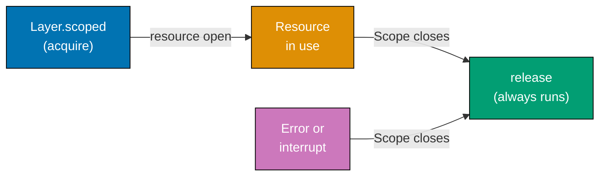

```typescript
import { Effect, Context, Layer, Scope } from "effect";

interface DatabasePool {
  readonly query: (sql: string) => Effect.Effect<string[], never, never>;
  readonly close: () => Effect.Effect<void, never, never>;
}

const DatabasePool = Context.GenericTag<DatabasePool>("DatabasePool");

// Layer.scoped: acquire a resource and release it when the scope closes
const DatabasePoolLayer = Layer.scoped(
  DatabasePool,
  Effect.gen(function* () {
    // => This Effect runs when the layer is initialized
    console.log("Opening database connection pool");
    // => Simulates opening a pool of connections

    const pool: DatabasePool = {
      query: (sql) => Effect.succeed([`result: ${sql}`]),
      close: () => Effect.sync(() => console.log("Pool closed")),
    };

    // Effect.addFinalizer: registers cleanup to run when scope closes
    yield* Effect.addFinalizer(
      () => Effect.sync(() => console.log("Finalizer: closing database pool")),
      // => Runs automatically when the application exits or the scope is released
    );

    return pool;
    // => Returns the initialized resource
  }),
);
// => Layer<DatabasePool, never, never> — scoped: lifecycle managed automatically

const program = Effect.gen(function* () {
  const db = yield* DatabasePool;
  const rows = yield* db.query("SELECT * FROM users");
  console.log("rows:", rows);
});

// Effect.runPromise with provide handles the scope lifecycle
Effect.runPromise(program.pipe(Effect.provide(DatabasePoolLayer)));
// => Output:
// => Opening database connection pool
// => rows: [ 'result: SELECT * FROM users' ]
// => Finalizer: closing database pool
// => (pool closed automatically after runPromise completes)
```

**Key Takeaway**: `Layer.scoped` pairs resource acquisition with guaranteed cleanup via `Effect.addFinalizer`. The framework manages the lifecycle — resources open at startup, close at shutdown.

**Why It Matters**: Resource leaks — database connections left open, file handles not closed, network sockets lingering — are among the most insidious production problems. They manifest as slow memory leaks or "too many open files" errors under load. `Layer.scoped` makes cleanup unconditional: whether the application exits normally, crashes, or is interrupted, finalizers run. This guarantee eliminates resource leak bugs by construction. Production systems using scoped layers have consistent resource usage across restarts and graceful degradation under partial failure.

---

### Example 29: Layer.provideMerge and Layer.mergeAll

`Layer.provideMerge` creates a new layer that provides both the original and the provided services. `Layer.mergeAll` combines multiple independent layers. These are the primary tools for assembling the application service graph.

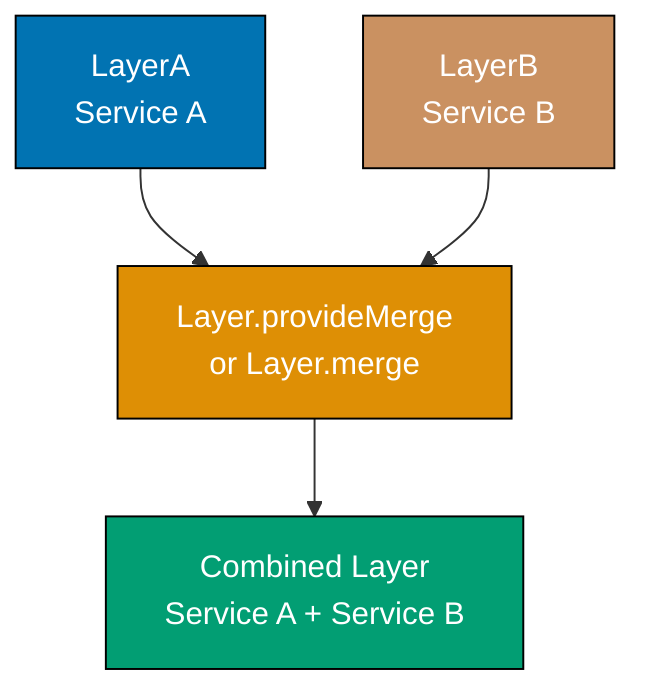

```typescript
import { Effect, Context, Layer } from "effect";

interface Config {
  readonly apiKey: string;
}
interface Logger {
  readonly log: (msg: string) => void;
}
interface Cache {
  readonly get: (k: string) => string | null;
}
interface Api {
  readonly call: (endpoint: string) => string;
}

const Config = Context.GenericTag<Config>("Config");
const Logger = Context.GenericTag<Logger>("Logger");
const Cache = Context.GenericTag<Cache>("Cache");
const Api = Context.GenericTag<Api>("Api");

// Four independent layers — no inter-dependencies here
const ConfigLive = Layer.succeed(Config, { apiKey: "secret-key-123" });
// => Layer<Config, never, never>

const LoggerLive = Layer.succeed(Logger, {
  log: (msg) => console.log(`[LOG] ${msg}`),
});
// => Layer<Logger, never, never>

const CacheLive = Layer.succeed(Cache, {
  get: (k) => (k === "user:1" ? "Alice" : null),
});
// => Layer<Cache, never, never>

const ApiLive = Layer.effect(
  Api,
  Effect.gen(function* () {
    const config = yield* Config;
    // => Api depends on Config for the API key
    const logger = yield* Logger;
    // => Api depends on Logger for request logging
    return {
      call: (endpoint) => {
        logger.log(`Calling ${endpoint} with key ${config.apiKey.slice(0, 3)}...`);
        return `response from ${endpoint}`;
      },
    };
  }),
);
// => Layer<Api, never, Config | Logger>

// Layer.mergeAll: combine independent layers in parallel
const BaseLayer = Layer.mergeAll(ConfigLive, LoggerLive, CacheLive);
// => Layer<Config | Logger | Cache, never, never>
// => All three services available in one layer

// Layer.provideMerge: wire ApiLive's dependencies and keep them available
const FullLayer = ApiLive.pipe(Layer.provideMerge(BaseLayer));
// => Layer<Api | Config | Logger | Cache, never, never>
// => ApiLive gets Config and Logger from BaseLayer
// => ALL services remain available to the program

const program = Effect.gen(function* () {
  const api = yield* Api;
  const cache = yield* Cache;
  // => Both Api and Cache accessible because of provideMerge
  const cached = cache.get("user:1");
  // => cached is "Alice"
  if (!cached) return api.call("/users/1");
  return cached;
});

Effect.runSync(program.pipe(Effect.provide(FullLayer)));
// => Returns: "Alice" (cache hit, no API call)
```

**Key Takeaway**: `Layer.mergeAll` combines independent layers. `Layer.provideMerge` wires a layer's dependencies while keeping all services accessible. Use these to build the complete application service graph.

**Why It Matters**: Application service graphs tend to grow organically as features are added. `Layer.mergeAll` and `Layer.provideMerge` let you assemble the graph incrementally and compositionally. Each module exports its Layer, and the application entry point composes them. When a new service is added, you add its Layer to the merge — no configuration files, no IoC container, no XML. The compiler verifies the complete graph is wired correctly. This makes large Effect applications predictable: the service graph is a value you can inspect, test, and modify confidently.

---

## Group 10: Concurrency

### Example 30: Effect.all Concurrency Modes

`Effect.all` supports several concurrency modes: sequential (default), unbounded parallel, and bounded parallel. Choosing the right mode balances throughput against resource pressure.

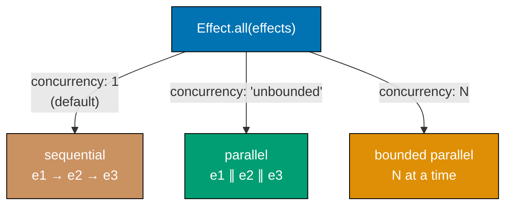

```typescript
import { Effect, Duration } from "effect";

// Simulate a slow operation (e.g., a database or API call)
const slowOp = (id: number) =>
  Effect.gen(function* () {
    yield* Effect.sleep(Duration.millis(50));
    // => Simulates 50ms of latency
    return `result-${id}`;
  });

const ids = [1, 2, 3, 4, 5];

// Sequential: effects run one after another — total time = 5 * 50ms = 250ms
const sequential = Effect.all(ids.map(slowOp));
// => Effect<string[], never, never>
// => Default: { concurrency: 1 }

// Unbounded parallel: all run at once — total time ≈ 50ms
const parallel = Effect.all(ids.map(slowOp), { concurrency: "unbounded" });
// => Launches all 5 effects simultaneously
// => Completes when the last one finishes

// Bounded parallel: at most N run at once — rate limits concurrency
const bounded = Effect.all(ids.map(slowOp), { concurrency: 2 });
// => At most 2 effects running at any given moment
// => Batch 1: ids 1, 2 (50ms)
// => Batch 2: ids 3, 4 (50ms)
// => Batch 3: id 5 (50ms)
// => Total time ≈ 150ms — 3x faster than sequential, controlled pressure

// discard: run effects for side effects, discard results
const withDiscard = Effect.all(
  ids.map((id) => Effect.sync(() => console.log(`processing ${id}`))),
  { concurrency: "unbounded", discard: true },
);
// => Effect<void, never, never> — results discarded, only side effects matter

Effect.runPromise(parallel).then((results) => {
  console.log("parallel results:", results);
  // => Output: parallel results: ['result-1', 'result-2', 'result-3', 'result-4', 'result-5']
});
```

**Key Takeaway**: `{ concurrency: 1 }` is sequential (default), `{ concurrency: "unbounded" }` is fully parallel, and `{ concurrency: N }` limits to N concurrent effects. Choose based on resource constraints.

**Why It Matters**: Fan-out patterns — fetching N items, processing a batch of records, calling multiple APIs — are common in production services. The correct concurrency level depends on the downstream service's capacity. Unbounded concurrency against a database can exhaust the connection pool; sequential is too slow. Bounded concurrency with `{ concurrency: N }` matches your connection pool size, providing maximum throughput without overwhelming dependencies. This control at the call site — not buried in configuration files — makes the concurrency characteristics of a service visible and adjustable.

---

### Example 31: Fiber — Forking and Joining

`Fiber` is Effect's lightweight concurrent process. Unlike threads, thousands of fibers run on a small thread pool. You `fork` a fiber to run an effect concurrently, then `join` it later to get the result.

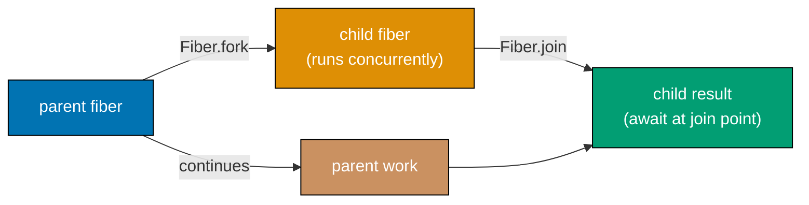

```typescript
import { Effect, Fiber, Duration } from "effect";

// Effect.fork: starts an effect in a new fiber, returns immediately
// The forked fiber runs concurrently with the current fiber

const task = (name: string, ms: number) =>
  Effect.gen(function* () {
    yield* Effect.sleep(Duration.millis(ms));
    // => Simulates work taking ms milliseconds
    console.log(`${name} completed after ${ms}ms`);
    return `result-${name}`;
  });

const program = Effect.gen(function* () {
  console.log("Starting concurrent tasks");

  // Fork two tasks to run concurrently
  const fiber1 = yield* Effect.fork(task("task-A", 100));
  // => fiber1 is Fiber<string, never> — task-A is now running
  // => This line returns immediately — does not wait for task-A

  const fiber2 = yield* Effect.fork(task("task-B", 50));
  // => fiber2 is Fiber<string, never> — task-B is now running
  // => Both task-A and task-B are running concurrently

  console.log("Both tasks forked, doing other work...");
  yield* Effect.sleep(Duration.millis(10));
  // => Simulates doing other work while tasks run concurrently

  // Fiber.join: wait for a fiber to complete and get its result
  const result1 = yield* Fiber.join(fiber1);
  // => result1 is "result-task-A"
  // => Waits for task-A to finish (may already be done)

  const result2 = yield* Fiber.join(fiber2);
  // => result2 is "result-task-B"
  // => task-B finishes first (50ms < 100ms), but we join in order

  console.log("Results:", result1, result2);
  return [result1, result2];
});

Effect.runPromise(program).then((results) => console.log("Final:", results));
// => Output:
// => Starting concurrent tasks
// => Both tasks forked, doing other work...
// => task-B completed after 50ms
// => task-A completed after 100ms
// => Results: result-task-A result-task-B
// => Final: ['result-task-A', 'result-task-B']
```

**Key Takeaway**: `Effect.fork` starts an effect concurrently and returns a `Fiber` immediately. `Fiber.join` waits for the fiber and returns its result. Fibers are lightweight — you can fork thousands.

**Why It Matters**: Many production workloads are naturally concurrent: process each item in a queue, fan out to multiple services, run background maintenance tasks while serving requests. Fibers make concurrency composable: you express what work should happen concurrently, not how to schedule threads. Because fibers are managed by the Effect runtime, interruption (when the parent fiber is cancelled) propagates automatically to children. This prevents orphaned background tasks that continue running after a request times out — a common source of resource waste and unexpected behavior in production systems.

---

### Example 32: Fiber.interrupt and Structured Concurrency

Interrupting a fiber stops it and runs any finalizers it registered. Structured concurrency in Effect means that when a parent fiber stops, its forked children stop too — preventing orphaned computations.

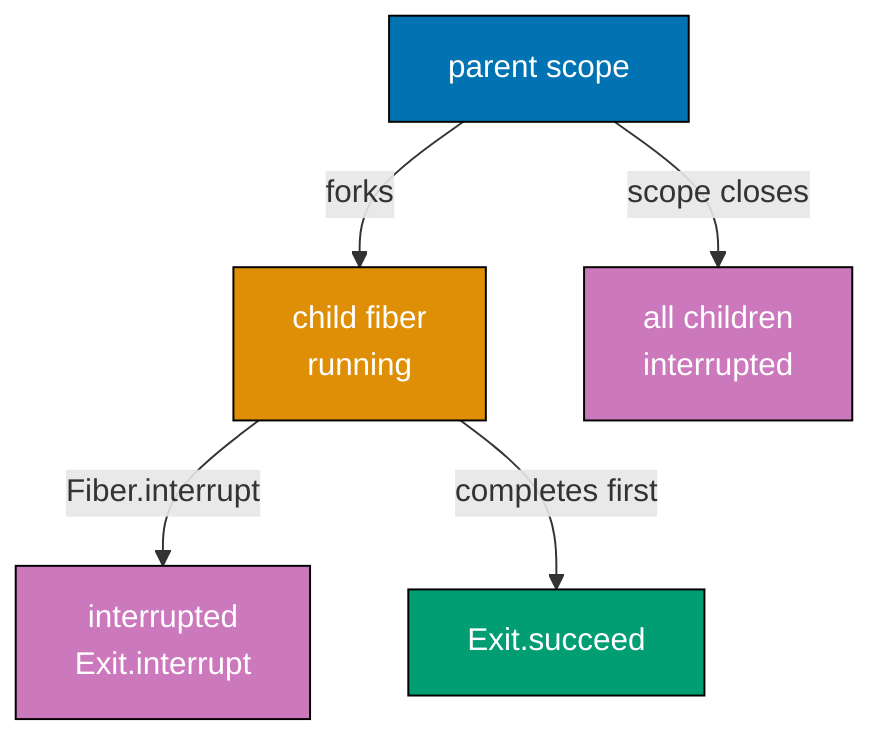

```typescript
import { Effect, Fiber, Duration } from "effect";

// A long-running task that cleans up on interruption
const longTask = Effect.gen(function* () {
  yield* Effect.addFinalizer(
    () => Effect.sync(() => console.log("longTask: cleaning up after interruption")),
    // => Runs when the fiber is interrupted — guaranteed cleanup
  );
  console.log("longTask: started");
  yield* Effect.sleep(Duration.millis(10000));
  // => Sleeps for 10 seconds (will be interrupted before this completes)
  console.log("longTask: completed");
  // => This line never runs because we interrupt the fiber
  return "completed";
});

const program = Effect.gen(function* () {
  const fiber = yield* Effect.fork(longTask);
  // => fiber is running longTask concurrently

  yield* Effect.sleep(Duration.millis(100));
  // => Wait 100ms, then interrupt

  console.log("interrupting fiber...");
  yield* Fiber.interrupt(fiber);
  // => Sends interruption signal to the fiber
  // => fiber's addFinalizer callbacks run before interruption completes
  // => Fiber.interrupt returns Exit.interrupt — the fiber's outcome

  console.log("fiber interrupted");
});

Effect.runPromise(program);
// => Output:
// => longTask: started
// => interrupting fiber...
// => longTask: cleaning up after interruption
// => fiber interrupted

// Structured concurrency: forkScoped ties fiber lifecycle to its scope
const structuredProgram = Effect.scoped(
  Effect.gen(function* () {
    const fiber = yield* Effect.forkScoped(longTask);
    // => fiber is tied to the current scope
    // => When the scope closes, fiber is automatically interrupted
    yield* Effect.sleep(Duration.millis(100));
    // => Scope closes here — fiber interrupted automatically
    return "scope done";
  }),
);
```

**Key Takeaway**: `Fiber.interrupt` stops a fiber and runs its finalizers. `Effect.forkScoped` ties a fiber's lifetime to a scope, ensuring automatic interruption when the scope closes.

**Why It Matters**: In production, long-running operations must be cancellable. HTTP request handlers need to stop background work when a client disconnects. Queue consumers need to finish current tasks on shutdown. Without structured concurrency, background fibers continue running after their parent exits, wasting resources and causing race conditions. Effect's structured concurrency model ensures that when you cancel a computation, all its children are cancelled too, all finalizers run, and the system reaches a clean state. This makes graceful shutdown predictable and resource-efficient.

---

## Group 11: Scheduling

### Example 33: Schedule Basics — recurs, spaced, exponential

`Schedule` defines when to retry or repeat an Effect. Schedules are values that you compose with `pipe`. The most common schedules are `recurs` (fixed count), `spaced` (fixed delay), and `exponential` (doubling delay).

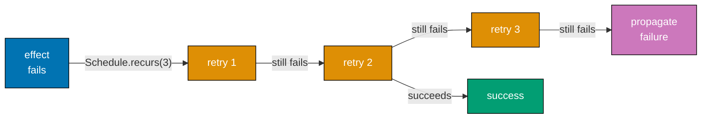

```typescript
import { Schedule, Duration, Effect } from "effect";

// Schedule.recurs(n): run n additional times after the first attempt
const threeRetries = Schedule.recurs(3);
// => Allows 3 retries (4 total attempts)

// Schedule.spaced(duration): wait duration between each retry
const every500ms = Schedule.spaced(Duration.millis(500));
// => Retries with 500ms gap between each attempt
// => No limit on retries unless composed with recurs

// Schedule.exponential(base): double the delay each time
const backoff = Schedule.exponential(Duration.millis(100));
// => 100ms, 200ms, 400ms, 800ms, 1600ms, ...

// Schedule.fixed(duration): retry at fixed intervals (wall clock)
const everySecond = Schedule.fixed(Duration.seconds(1));
// => Retries at t=0, t=1, t=2, ... seconds (regardless of execution time)

// Compose schedules with pipe
const boundedBackoff = backoff.pipe(
  Schedule.compose(Schedule.recurs(4)),
  // => Exponential backoff, but stop after 4 retries
  // => Delays: 100ms, 200ms, 400ms, 800ms (then stop)
);

// Adding jitter: randomize delays to prevent thundering herd
const jitteredBackoff = Schedule.exponential(Duration.millis(100)).pipe(
  Schedule.jittered,
  // => Applies random jitter to each delay
  // => Prevents all clients retrying at exactly the same moment
  Schedule.compose(Schedule.recurs(5)),
  // => Max 5 retries
);

// Using a schedule with Effect.retry
let count = 0;
const flaky = Effect.tryPromise({
  try: async () => {
    count++;
    if (count < 3) throw new Error(`attempt ${count} failed`);
    return "success";
  },
  catch: (e) => new Error(`${e}`),
});

Effect.runPromise(flaky.pipe(Effect.retry(Schedule.recurs(5)))).then((r) => console.log("result:", r));
// => Output: result: success (after 2 failed attempts)
```

**Key Takeaway**: Build retry policies by composing `Schedule` values. `recurs` bounds the count, `spaced` adds fixed delays, `exponential` adds doubling delays, and `jittered` adds randomization to prevent synchronized retries.

**Why It Matters**: Retry logic is one of the most impactful reliability improvements in distributed systems. Exponential backoff with jitter is the standard recommendation from AWS, Google, and Netflix because it prevents thundering herds — the scenario where all clients retry simultaneously, amplifying the load on a recovering service. Effect's `Schedule` system implements these best practices as composable values rather than ad-hoc `setTimeout` loops. When a service's retry policy needs to change, you update one `Schedule` definition. Jitter, backoff base, and maximum retries are all visible, testable parameters.

---

### Example 34: Schedule.repeat — Recurring Effects

`Effect.repeat` runs an Effect repeatedly according to a Schedule. Unlike `retry` (which repeats on failure), `repeat` repeats on success. Use it for polling, heartbeats, cache refresh, and background maintenance tasks.

```typescript
import { Effect, Schedule, Duration } from "effect";

// Effect.repeat: run the effect repeatedly, collecting results
let iteration = 0;
const heartbeat = Effect.sync(() => {
  iteration++;
  console.log(`heartbeat ${iteration} at ${Date.now()}`);
  return iteration;
});

// repeat with recurs(2): run the effect 3 times total (1 + 2 repeats)
const threeHeartbeats = heartbeat.pipe(
  Effect.repeat(Schedule.recurs(2)),
  // => Runs heartbeat once, then repeats 2 more times
  // => Returns the LAST value emitted by the schedule
);

Effect.runSync(threeHeartbeats);
// => Output:
// => heartbeat 1 at ...
// => heartbeat 2 at ...
// => heartbeat 3 at ...
// => Returns: 2 (the 0-indexed repeat count from Schedule.recurs)

// repeat with spaced: run every N milliseconds (like setInterval)
const pollingTask = Effect.gen(function* () {
  const status = yield* Effect.succeed("healthy");
  // => Simulates checking a service status
  console.log(`status check: ${status}`);
  return status;
});

// Poll every 1 second, 5 times total
const polling = pollingTask.pipe(
  Effect.repeat(
    Schedule.spaced(Duration.millis(100)).pipe(
      Schedule.compose(Schedule.recurs(4)),
      // => Wait 100ms between polls, max 4 repeats (5 total)
    ),
  ),
);

// Schedule.forever: repeat indefinitely (until interrupted)
const forever = heartbeat.pipe(
  Effect.repeat(Schedule.spaced(Duration.seconds(60))),
  // => Runs every 60 seconds until the fiber is interrupted
  // => Return type: Effect<number, never, never> — runs until interrupted
);

// In practice, repeat with forever is used in long-running services
// The fiber is interrupted when the application shuts down
```

**Key Takeaway**: `Effect.repeat` runs an effect repeatedly on success according to a Schedule. `Schedule.spaced` with `Schedule.recurs` gives you bounded polling. `Schedule.spaced` alone gives you infinite repetition until interrupted.

**Why It Matters**: Background maintenance tasks — cache warming, status polling, metrics emission, database cleanup — are standard in production services. `Effect.repeat` with Schedules expresses these tasks declaratively: "run this every 30 seconds, forever." The fiber running the repeating task is a first-class value you can monitor, pause, and interrupt. When the application shuts down, the fiber's interruption runs finalizers, ensuring the last execution completes cleanly before the process exits. This is far safer than `setInterval`, which provides no interruption or cleanup mechanism.

---

## Group 12: State Management

### Example 35: Ref — Mutable State in Effect

`Ref<A>` is a mutable reference to a value of type `A`. All operations on a Ref are atomic with respect to concurrent fibers — reads and updates happen without races. Use Ref for shared state in concurrent programs.

```typescript
import { Effect, Ref } from "effect";

// Create a Ref with an initial value
const program = Effect.gen(function* () {
  const counter = yield* Ref.make(0);
  // => counter is Ref<number>, initialized to 0
  // => Ref.make returns Effect<Ref<number>, never, never>

  // Ref.get: read the current value
  const initial = yield* Ref.get(counter);
  console.log("initial:", initial);
  // => Output: initial: 0

  // Ref.set: replace the value
  yield* Ref.set(counter, 42);
  // => Sets counter to 42

  const afterSet = yield* Ref.get(counter);
  console.log("after set:", afterSet);
  // => Output: after set: 42

  // Ref.update: apply a function to the current value atomically
  yield* Ref.update(counter, (n) => n + 1);
  // => Reads 42, applies (42 + 1), writes 43
  // => The read-modify-write happens atomically

  const afterUpdate = yield* Ref.get(counter);
  console.log("after update:", afterUpdate);
  // => Output: after update: 43

  // Ref.updateAndGet: update and return the new value
  const newValue = yield* Ref.updateAndGet(counter, (n) => n * 2);
  // => Reads 43, applies (43 * 2), writes 86, returns 86
  console.log("after updateAndGet:", newValue);
  // => Output: after updateAndGet: 86

  // Ref.modify: update and return both old and new values
  const [old, updated] = yield* Ref.modify(counter, (n) => [n, n + 100]);
  // => Returns [current value, new value] — [86, 186]
  console.log("old:", old, "new:", updated);
  // => Output: old: 86 new: 186
});

Effect.runSync(program);
```

**Key Takeaway**: `Ref` provides atomic mutable state for Effect programs. Use `get`, `set`, `update`, and `modify` for safe concurrent reads and writes.

**Why It Matters**: Shared mutable state is notoriously difficult to manage correctly in concurrent programs. Race conditions, lost updates, and inconsistent reads are common bugs in multi-threaded code. `Ref` provides atomic operations that eliminate these bugs by construction: `Ref.update` guarantees that no other fiber can modify the value between the read and the write. In production services, `Ref` is the right tool for counters, rate limiters, caches, and any shared mutable state that multiple concurrent fibers access. The atomic guarantee prevents the class of bugs where two requests both read `count=5` and both write `count=6` instead of `count=7`.

---

### Example 36: Queue — Concurrent Message Passing

`Queue<A>` is a concurrent, bounded or unbounded queue. Producers offer items; consumers take items. When the queue is full (bounded), `offer` suspends. When empty, `take` suspends. Use Queue to decouple producers from consumers.

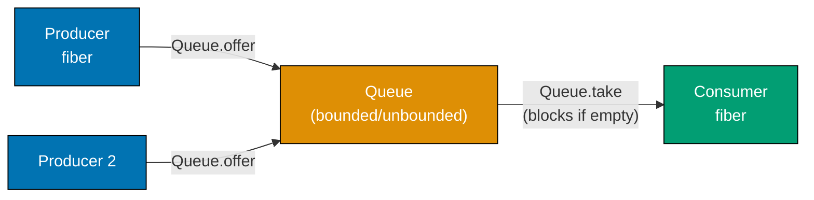

```typescript
import { Effect, Queue, Fiber, Duration } from "effect";

const program = Effect.gen(function* () {
  // Create a bounded queue with capacity 5
  const queue = yield* Queue.bounded<string>(5);
  // => queue is Queue<string> with max capacity 5
  // => Offering to a full queue suspends the fiber until space is available

  // Producer fiber: offers items to the queue
  const producer = yield* Effect.fork(
    Effect.gen(function* () {
      for (let i = 1; i <= 3; i++) {
        yield* Queue.offer(queue, `item-${i}`);
        // => Offers "item-1", "item-2", "item-3" to the queue
        console.log(`produced: item-${i}`);
        yield* Effect.sleep(Duration.millis(10));
        // => Small delay between productions
      }
      yield* Queue.shutdown(queue);
      // => Signals that no more items will be offered
    }),
  );

  // Consumer: takes items from the queue
  // Queue.takeAll: take all available items (non-blocking)
  yield* Effect.sleep(Duration.millis(50));
  // => Wait for producer to add items

  const items = yield* Queue.takeAll(queue);
  // => Takes all currently available items
  console.log("consumed:", Array.from(items));
  // => Output: consumed: ['item-1', 'item-2', 'item-3']

  yield* Fiber.join(producer);
  // => Wait for producer to finish
});

Effect.runPromise(program);
// => Output:
// => produced: item-1
// => produced: item-2
// => produced: item-3
// => consumed: ['item-1', 'item-2', 'item-3']

// Queue.unbounded: no capacity limit — offering never suspends
const unboundedQueue = Queue.unbounded<number>();

// Queue.dropping: drops new items when full (producer never suspends)
const droppingQueue = Queue.dropping<number>(100);
// => At capacity 100, new offers are silently dropped

// Queue.sliding: drops oldest items when full
const slidingQueue = Queue.sliding<number>(100);
// => At capacity 100, oldest item is removed to make room for new one
```

**Key Takeaway**: `Queue.bounded` creates a back-pressuring queue. `offer` suspends when full. `take` suspends when empty. `takeAll` takes all available items without blocking.

**Why It Matters**: Producer-consumer patterns are fundamental in production systems: HTTP request handlers produce work; background workers consume it. A bounded queue applies backpressure automatically: when workers fall behind, producers slow down, preventing unbounded memory growth. Without backpressure, a slow consumer causes the queue to grow until the process runs out of memory. `Queue.bounded` encodes the right behavior without extra code: producers naturally slow when the system is overloaded. This self-regulating behavior is essential for production services that must remain stable under variable load.

---

### Example 37: PubSub — Broadcast Messaging

`PubSub<A>` broadcasts each message to all current subscribers. Unlike `Queue` (one consumer per message), `PubSub` delivers each message to every subscriber. Use it for event notifications, real-time updates, and observability hooks.

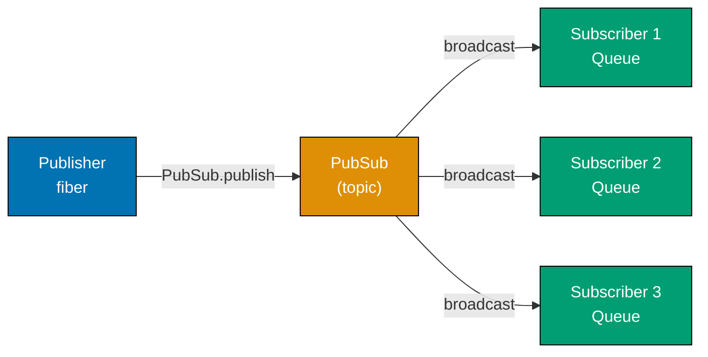

```typescript
import { Effect, PubSub, Fiber, Duration } from "effect";

type AppEvent = { type: string; payload: unknown };

const program = Effect.gen(function* () {
  // Create a bounded PubSub
  const pubsub = yield* PubSub.bounded<AppEvent>(16);
  // => PubSub with capacity 16
  // => Each published message is delivered to ALL subscribers

  // Subscribe creates a Queue that receives all published messages
  // Subscriptions must be created before publishing to receive messages
  const sub1Fiber = yield* Effect.fork(
    PubSub.subscribe(pubsub).pipe(
      // => PubSub.subscribe returns a scoped Queue
      Effect.flatMap((sub1) =>
        Effect.gen(function* () {
          const event = yield* Queue.take(sub1);
          // => Waits for the first event
          console.log("subscriber 1 received:", event.type);
        }),
      ),
      Effect.scoped,
      // => Scope closes the subscription when done
    ),
  );

  const sub2Fiber = yield* Effect.fork(
    PubSub.subscribe(pubsub).pipe(
      Effect.flatMap((sub2) =>
        Effect.gen(function* () {
          const event = yield* Queue.take(sub2);
          console.log("subscriber 2 received:", event.type);
        }),
      ),
      Effect.scoped,
    ),
  );

  // Give subscribers time to set up
  yield* Effect.sleep(Duration.millis(10));

  // Publish broadcasts to ALL subscribers
  yield* PubSub.publish(pubsub, { type: "UserCreated", payload: { id: "u1" } });
  // => Both sub1 and sub2 receive this event

  yield* Fiber.join(sub1Fiber);
  yield* Fiber.join(sub2Fiber);
});

// Import Queue for take operation
import { Queue } from "effect";

Effect.runPromise(program);
// => Output:
// => subscriber 1 received: UserCreated
// => subscriber 2 received: UserCreated
```

**Key Takeaway**: `PubSub` delivers each published message to every subscriber. Create subscriptions before publishing to receive all messages. Subscriptions are scoped resources — they clean up when the scope closes.

**Why It Matters**: Event-driven architectures in production need fan-out: a "payment processed" event must notify billing, logistics, and analytics simultaneously. `PubSub` implements this broadcast pattern without external message brokers for in-process communication. Each subscriber runs in its own fiber, processes events at its own pace, and can be added or removed dynamically. This decoupling means the payment service does not need to know about billing or analytics — it just publishes events. New event consumers can be added without modifying producers, making the system extensible.

---

## Group 13: Schema — Validation and Serialization

### Example 38: Schema Basics — Decoding Unknown Data

`Schema` from the `effect` package defines the shape of data and provides `decode` and `encode` functions. Use Schema to validate and parse data at the boundaries of your application — API inputs, configuration files, database records.

```typescript
import { Schema, Effect } from "effect";

// Define a schema for a User
const UserSchema = Schema.Struct({
  id: Schema.String,
  // => id must be a string
  name: Schema.String,
  // => name must be a string
  age: Schema.Number,
  // => age must be a number
  email: Schema.optional(Schema.String),
  // => email is optional — may be absent
});

// Schema.decodeUnknown: parse unknown data and return Effect
const decodeUser = Schema.decodeUnknown(UserSchema);
// => decodeUser: (input: unknown) => Effect<User, ParseError, never>
// => ParseError is thrown when input doesn't match schema

const validInput = { id: "1", name: "Alice", age: 30, email: "alice@example.com" };
const invalidInput = { id: 123, name: "Alice" };
// => id is number instead of string, age is missing

// Decoding valid data succeeds
Effect.runPromise(decodeUser(validInput)).then((user) => {
  console.log("decoded:", user);
  // => Output: decoded: { id: '1', name: 'Alice', age: 30, email: 'alice@example.com' }
  // => TypeScript type is { id: string; name: string; age: number; email?: string }
});

// Decoding invalid data fails with ParseError
Effect.runPromise(decodeUser(invalidInput)).catch((e) => {
  console.log("decode failed:", e.message);
  // => Output: decode failed: (Encoded side)...Expected string, got number...
  // => ParseError includes detailed path and reason information
});

// Schema.is: type predicate for runtime checks
const isUser = Schema.is(UserSchema);
// => isUser: (input: unknown) => input is User

console.log(isUser(validInput));
// => Output: true

console.log(isUser({ name: 123 }));
// => Output: false
```

**Key Takeaway**: `Schema.Struct` defines a schema. `Schema.decodeUnknown` returns a function that parses unknown input and returns an Effect. Invalid input fails with a detailed `ParseError`.

**Why It Matters**: Every application boundary — API endpoints, configuration files, database queries, message queue payloads — receives data of type `unknown`. Validating this data before using it prevents the most common source of runtime errors: operating on data with unexpected shapes. Schema validation at the boundary means that inside your application, data always has the types you declared. The `ParseError` is comprehensive and human-readable, making it easy to return informative error messages to API clients. This approach replaces ad-hoc validation code spread throughout the codebase with a single declarative schema definition.

---

### Example 39: Schema — Encoding, Refinements, and Transformations

Schema not only decodes incoming data but also encodes typed data for output. Refinements add custom validation rules. Transformations convert between different representations (e.g., string to Date).

```typescript
import { Schema, Effect } from "effect";

// Schema.filter adds a custom validation predicate
const PositiveNumber = Schema.Number.pipe(
  Schema.filter((n) => n > 0, {
    message: () => "must be a positive number",
    // => Custom error message when the filter fails
  }),
);
// => Schema<number, number, never> — only positive numbers pass

// Schema.transform: convert between encoded and decoded types
// Useful for parsing Date from string, parsing enum from string, etc.
const DateFromString = Schema.transform(
  Schema.String, // => Encoded type: string (what comes from JSON)
  Schema.DateFromSelf, // => Decoded type: Date (what your code uses)
  {
    decode: (s) => new Date(s),
    // => Converts string -> Date when decoding (parsing input)
    encode: (d) => d.toISOString(),
    // => Converts Date -> string when encoding (serializing output)
  },
);
// => Schema<Date, string, never>
// => decodeUnknown("2026-03-19") -> Date
// => encode(new Date()) -> "2026-03-19T..."

const EventSchema = Schema.Struct({
  id: Schema.String,
  name: Schema.String,
  capacity: PositiveNumber,
  // => Only positive numbers accepted for capacity
  startsAt: DateFromString,
  // => startsAt parsed from string, used as Date in code
});

type Event = typeof EventSchema.Type;
// => { id: string; name: string; capacity: number; startsAt: Date }

const input = { id: "e1", name: "Conference", capacity: 500, startsAt: "2026-06-01T09:00:00Z" };

Effect.runPromise(Schema.decodeUnknown(EventSchema)(input)).then((event) => {
  console.log("event:", event);
  // => event.startsAt is a Date object
  // => event.capacity is 500 (number, validated > 0)
  console.log("startsAt type:", event.startsAt instanceof Date);
  // => Output: startsAt type: true
});

// Encoding: converts typed data back to serializable form
const encodeEvent = Schema.encode(EventSchema);
const toSerialize: Event = { id: "e1", name: "Conference", capacity: 500, startsAt: new Date("2026-06-01") };

Effect.runPromise(encodeEvent(toSerialize)).then((encoded) => {
  console.log("encoded:", encoded);
  // => encoded.startsAt is a string (ISO format), not a Date
  // => Safe to JSON.stringify
});
```

**Key Takeaway**: Schema `transform` converts between wire format (strings, numbers) and domain types (Date, branded types). `Schema.filter` adds custom validation rules. Encode is the inverse of decode.

**Why It Matters**: APIs receive strings and numbers but domain code works with Date objects, validated IDs, and branded types. Without explicit transformation, this conversion is scattered throughout the codebase in ad-hoc parsing functions. Schema centralizes all data transformations at the boundary: parse strings to Dates on the way in, encode Dates to strings on the way out. The encode/decode symmetry ensures that serialized data always deserializes correctly, preventing subtle bugs where data is serialized in one format and parsed with different assumptions. This round-trip guarantee is essential for event sourcing, audit logs, and API versioning.

---

## Group 14: Testing with Effect

### Example 40: TestClock — Controlling Time in Tests

`TestClock` replaces the real clock in tests. Instead of waiting for actual time to pass, you advance the test clock programmatically. This makes time-dependent tests fast, deterministic, and reliable.

```typescript
import { Effect, TestClock, Duration, Ref } from "effect";

// A time-dependent operation: waits 5 seconds then runs
const delayedTask = Effect.gen(function* () {
  yield* Effect.sleep(Duration.seconds(5));
  // => In production: sleeps 5 real seconds
  // => In tests with TestClock: sleeps until clock is advanced past 5 seconds
  return "task completed after 5 seconds";
});

// Test: use TestClock to control time
const test = Effect.gen(function* () {
  // Fork the delayed task — it's suspended waiting for the clock
  const fiber = yield* Effect.fork(delayedTask);
  // => delayedTask is now waiting for 5 seconds to elapse (on the test clock)

  // Advance the test clock by 5 seconds — releases the sleeping effect
  yield* TestClock.adjust(Duration.seconds(5));
  // => All effects sleeping for <= 5 seconds are woken up

  // Now the fiber can complete
  const result = yield* Fiber.join(fiber);
  // => fiber completed because clock was advanced
  console.log("test result:", result);
  // => Output: test result: task completed after 5 seconds
  // => This ran instantly in real time — no actual 5 second wait
});

// Import Fiber
import { Fiber } from "effect";

// Run the test — completes immediately despite the 5 second sleep
Effect.runPromise(test);
// => Completes in milliseconds, not seconds

// TestClock also works for scheduled retries
const retryTest = Effect.gen(function* () {
  let attempts = 0;
  const flaky = Effect.gen(function* () {
    attempts++;
    if (attempts < 3) {
      return yield* Effect.fail("not ready");
    }
    return "success";
  });

  const fiber = yield* Effect.fork(
    flaky.pipe(Effect.retry(Schedule.exponential(Duration.seconds(1)).pipe(Schedule.compose(Schedule.recurs(5))))),
  );

  // Advance clock to trigger retries
  yield* TestClock.adjust(Duration.seconds(10));
  // => Triggers all pending retries up to 10 seconds

  const result = yield* Fiber.join(fiber);
  console.log("result:", result, "attempts:", attempts);
  // => Output: result: success attempts: 3
});
```

**Key Takeaway**: `TestClock.adjust` advances the virtual clock without waiting for real time. Effects sleeping or retrying on schedules are triggered when the test clock passes their deadline.

**Why It Matters**: Tests that rely on real time are slow, flaky (on slow CI machines), and non-deterministic. A test suite with 50 tests that each wait 1 second takes over a minute. `TestClock` eliminates this cost entirely: tests that verify retry logic, timeout behavior, and scheduled tasks run instantly and deterministically. This enables testing time-dependent behavior comprehensively — testing the 5th retry with exponential backoff is no more expensive than testing the 1st. Comprehensive time-dependent tests prevent the class of production incidents caused by incorrect retry timing or missing timeout handling.

---

### Example 41: Providing Test Services with Layer

Replacing live service implementations with test doubles in Effect tests requires providing a test Layer. The test Layer satisfies the same service type but uses controllable implementations.

```typescript
import { Effect, Context, Layer, Ref } from "effect";

// Production service interface and Tag
interface EmailService {
  readonly send: (to: string, subject: string, body: string) => Effect.Effect<void, Error, never>;
}

const EmailService = Context.GenericTag<EmailService>("EmailService");

// Production Layer: actually sends emails
const LiveEmailLayer = Layer.succeed(EmailService, {
  send: (to, subject, body) =>
    Effect.tryPromise({
      try: () => fetch("https://api.sendgrid.com/...", { method: "POST" }),
      catch: (e) => new Error(`email send failed: ${e}`),
    }).pipe(Effect.map(() => undefined)),
});

// Test Layer: records sent emails without making network calls
const makeTestEmailLayer = Effect.gen(function* () {
  const sentEmails = yield* Ref.make<Array<{ to: string; subject: string }>>([]);
  // => In-memory store for sent emails

  const layer = Layer.succeed(EmailService, {
    send: (to, subject, _body) => Ref.update(sentEmails, (emails) => [...emails, { to, subject }]),
    // => Records the email in the Ref instead of sending it
  });

  return { layer, sentEmails };
  // => Returns both the layer and a reference to inspect sent emails
});

// Application code using EmailService
const welcomeUser = (userEmail: string) =>
  Effect.gen(function* () {
    const email = yield* EmailService;
    yield* email.send(userEmail, "Welcome!", "Welcome to our app");
    console.log(`welcome email queued for ${userEmail}`);
  });

// Test using the test layer
const test = Effect.gen(function* () {
  const { layer, sentEmails } = yield* makeTestEmailLayer;

  yield* welcomeUser("alice@example.com").pipe(Effect.provide(layer));
  // => Runs the production function with the test email service

  const emails = yield* Ref.get(sentEmails);
  // => emails contains everything "sent" during the test
  console.log("emails sent:", emails);
  // => Output: emails sent: [{ to: 'alice@example.com', subject: 'Welcome!' }]
  console.log("test passed:", emails.length === 1);
  // => Output: test passed: true
});

Effect.runSync(test);
```

**Key Takeaway**: Test Layers provide alternative implementations of services. Create a test Layer that records calls or returns predetermined values. The application code under test is unchanged — only the Layer changes.

**Why It Matters**: Tests that call real external services are slow, non-deterministic, and expensive. They depend on network availability, credentials, and service state. Test Layers replace real services with in-memory implementations that execute instantly and record every call. The critical insight is that the application code under test is identical to production — only the Layer differs. This means tests truly verify production behavior. When a service switches from one email provider to another, only the production Layer changes — the test Layer and all tests remain valid.

---

## Group 15: HTTP Client

### Example 42: HTTP Client with @effect/platform

Effect's `@effect/platform` package provides a type-safe HTTP client. Requests return Effect values with typed errors, making HTTP calls composable with the rest of your Effect code.

```typescript
import { Effect, Layer } from "effect";
import { HttpClient, HttpClientRequest, HttpClientResponse } from "@effect/platform";
import { NodeHttpClient } from "@effect/platform-node";

// Define a type for the API response
interface Post {
  id: number;
  title: string;
  body: string;
  userId: number;
}

// Make an HTTP GET request
const fetchPost = (id: number): Effect.Effect<Post, HttpClient.HttpClientError, HttpClient.HttpClient> =>
  HttpClientRequest.get(`https://jsonplaceholder.typicode.com/posts/${id}`).pipe(
    // => Creates a GET request to the JSONPlaceholder API
    HttpClient.execute,
    // => Executes the request using the HttpClient service
    Effect.flatMap(
      HttpClientResponse.schemaBodyJson(
        // => Parse the JSON response body
        // Schema for the response:
        {
          parse: (u): u is Post => typeof u === "object" && u !== null && "id" in u,
          // => Basic type guard for the post shape
        } as any,
      ),
    ),
    Effect.scoped,
    // => Scoped: response body stream is cleaned up after use
  );

// Alternative: use HttpClient directly
const fetchWithClient = Effect.gen(function* () {
  const client = yield* HttpClient.HttpClient;
  // => Accesses the HttpClient service from context

  const response = yield* client.get("https://jsonplaceholder.typicode.com/posts/1");
  // => Makes the GET request — returns HttpClientResponse

  const body = yield* HttpClientResponse.json(response);
  // => Reads and parses the JSON body

  return body as Post;
});
// => Effect<Post, HttpClientError, HttpClient.HttpClient>

// Provide the Node.js HTTP client implementation
const program = fetchWithClient.pipe(
  Effect.provide(NodeHttpClient.layer),
  // => Provides the Node.js implementation of HttpClient
);

Effect.runPromise(program).then((post) => {
  console.log("post title:", (post as Post).title);
  // => Output: post title: sunt aut facere repellat provident...
});
```

**Key Takeaway**: `@effect/platform` provides an `HttpClient` service. HTTP requests return Effects with typed errors. Provide the platform implementation (Node.js, browser) with a Layer.

**Why It Matters**: Raw `fetch` calls in Effect programs are integration boundaries that require `Effect.tryPromise` wrapping for every call. The `@effect/platform` HTTP client integrates directly with Effect's type system: HTTP errors are typed, retries compose with Effect's retry system, and the client is a service you can replace in tests. Production HTTP clients need connection pooling, timeout management, retry policies, and request tracing. Building these on top of `fetch` requires significant boilerplate. The platform HTTP client provides them as composable Effect building blocks, reducing the code needed for a production-ready HTTP integration to a few lines.

---

## Group 16: Config

### Example 43: Config — Type-Safe Application Configuration

`Config` in Effect provides type-safe configuration loading from environment variables, config files, and custom sources. Configuration errors are typed and reported with helpful messages.

```typescript
import { Effect, Config } from "effect";

// Config primitives: string, number, boolean, secret
const databaseUrl = Config.string("DATABASE_URL");
// => Config<string> — reads DATABASE_URL from environment

const port = Config.number("PORT").pipe(
  Config.withDefault(3000),
  // => Defaults to 3000 if PORT is not set
);
// => Config<number>

const debugMode = Config.boolean("DEBUG").pipe(
  Config.withDefault(false),
  // => Defaults to false if DEBUG is not set
);
// => Config<boolean>

// Config.secret: reads sensitive values — value is redacted in logs
const apiKey = Config.secret("API_KEY");
// => Config<Secret<string>> — Secret prevents accidental logging

// Combine multiple configs into a struct
const AppConfig = Config.all({
  databaseUrl,
  port,
  debugMode,
});
// => Config<{ databaseUrl: string; port: number; debugMode: boolean }>

// Use Config in an Effect program
const program = Effect.gen(function* () {
  const config = yield* AppConfig;
  // => config is { databaseUrl: string; port: number; debugMode: boolean }
  // => If DATABASE_URL is missing, Effect fails with ConfigError

  console.log(`Starting server on port ${config.port}`);
  console.log(`Database: ${config.databaseUrl}`);
  console.log(`Debug mode: ${config.debugMode}`);

  if (config.debugMode) {
    yield* Effect.log("Debug logging enabled");
    // => Only logs when debug mode is true
  }
});

// Config.map: transform a config value
const portConfig = Config.number("PORT").pipe(
  Config.withDefault(8080),
  Config.map((p) => ({ port: p, host: "0.0.0.0" })),
  // => Transforms number to an address object
);

// Running in a test environment without real env vars
const testConfig = program.pipe(
  Effect.provide(
    Config.mapInputContext(() =>
      Effect.succeed({ DATABASE_URL: "postgresql://localhost/test", PORT: "4000", DEBUG: "true" }),
    ) as any,
  ),
);
```

**Key Takeaway**: `Config` reads typed configuration values from the environment. Missing required values fail with descriptive errors before the application starts. Combine with `Config.all` to define the complete config shape.

**Why It Matters**: Configuration errors — missing environment variables, wrong data types, invalid values — are among the most common causes of production deployment failures. A service that starts up and then crashes on first request because of a missing config variable is embarrassing and costly. `Config` validates all configuration at startup: if any required variable is missing or has the wrong format, the application fails immediately with a clear error message listing what is missing. This fail-fast behavior catches configuration errors in staging before they reach production, and the detailed error messages accelerate debugging.

---

## Group 17: Chunk and Collections

### Example 44: Chunk — Efficient Immutable Collections

`Chunk<A>` is an immutable, persistent collection optimized for prepend, append, and concat operations. It is the native collection type for Effect's Stream and other bulk data operations.

```typescript
import { Chunk, Effect } from "effect";

// Creating Chunks
const fromArray = Chunk.fromIterable([1, 2, 3, 4, 5]);
// => Chunk<number> containing [1, 2, 3, 4, 5]

const single = Chunk.of("hello");
// => Chunk<string> containing ["hello"]

const empty = Chunk.empty<number>();
// => Chunk<number> — empty chunk

// Appending elements (efficient — O(1) amortized)
const appended = Chunk.append(fromArray, 6);
// => Chunk<number> containing [1, 2, 3, 4, 5, 6]

const prepended = Chunk.prepend(fromArray, 0);
// => Chunk<number> containing [0, 1, 2, 3, 4, 5]

// Concatenating chunks (efficient — O(1))
const concat = Chunk.appendAll(fromArray, Chunk.fromIterable([6, 7, 8]));
// => Chunk<number> containing [1, 2, 3, 4, 5, 6, 7, 8]

// Common collection operations
const doubled = Chunk.map(fromArray, (n) => n * 2);
// => Chunk<number> containing [2, 4, 6, 8, 10]

const evens = Chunk.filter(fromArray, (n) => n % 2 === 0);
// => Chunk<number> containing [2, 4]

const first = Chunk.head(fromArray);
// => Option<number> = Option.some(1)

const rest = Chunk.tail(fromArray);
// => Option<Chunk<number>> = Option.some(Chunk[2, 3, 4, 5])

// Converting back to array when needed
const asArray = Chunk.toArray(fromArray);
// => number[] = [1, 2, 3, 4, 5]

// Chunk size
console.log(Chunk.size(fromArray));
// => Output: 5

// Chunk is used internally by Stream for efficient bulk data processing
// When processing large datasets with Stream, results come as Chunks
console.log(Chunk.toArray(doubled));
// => Output: [2, 4, 6, 8, 10]
```

**Key Takeaway**: `Chunk` is an immutable collection optimized for append, prepend, and concat. It is used throughout Effect's streaming system and is more efficient than arrays for incremental construction.

**Why It Matters**: Processing large datasets incrementally — reading files in chunks, streaming query results, batching API responses — requires an efficient data structure that can be built up piece by piece. Arrays in JavaScript require copying the entire array for each append operation, making repeated appends O(n²). `Chunk` uses a persistent tree structure that makes append and concat O(1) amortized. For Stream pipelines processing millions of records, the difference between O(n²) and O(n) can mean the difference between a pipeline that runs in seconds and one that takes hours. Understanding Chunk is essential for writing performant Effect Stream code.

---

## Group 18: Stream Basics

### Example 45: Stream — Creating and Running Streams

`Stream<A, E, R>` is a lazy, effectful sequence of values. Like Effect, a Stream is a description — it does nothing until you run it. Use Stream for processing sequences of data: reading files, database result sets, API pagination, event feeds.

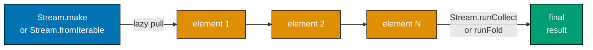

```typescript
import { Stream, Effect } from "effect";

// Stream.make: create a finite stream from values
const finite = Stream.make(1, 2, 3, 4, 5);
// => Stream<number, never, never>
// => When run: emits 1, 2, 3, 4, 5, then ends

// Stream.fromIterable: create a stream from any iterable
const fromArray = Stream.fromIterable([10, 20, 30]);
// => Stream<number, never, never>

// Stream.range: create a stream of numbers in a range
const range = Stream.range(1, 10);
// => Stream<number, never, never> emitting 1 through 9

// Stream.fromEffect: lift a single Effect into a Stream
const fromEffect = Stream.fromEffect(Effect.succeed(42));
// => Stream<number, never, never> emitting 42 once

// Collecting stream elements into an array
const collected = Stream.runCollect(finite);
// => Effect<Chunk<number>, never, never>
// => When run: returns Chunk[1, 2, 3, 4, 5]

Effect.runPromise(collected).then((chunk) => {
  console.log("collected:", Array.from(chunk));
  // => Output: collected: [1, 2, 3, 4, 5]
});

// Stream.runForEach: consume stream elements one by one
const consumed = Stream.runForEach(
  finite,
  (n) => Effect.sync(() => console.log(`processing: ${n}`)),
  // => Effect run for each element
);
// => Effect<void, never, never>

Effect.runSync(consumed);
// => Output:
// => processing: 1
// => processing: 2
// => processing: 3
// => processing: 4
// => processing: 5

// Stream.runSum: reduce stream to a sum
const sum = Stream.runSum(range);
Effect.runSync(sum).then;
console.log(Effect.runSync(sum));
// => Output: 45 (1+2+...+9)
```

**Key Takeaway**: `Stream<A, E, R>` is a lazy sequence. Create streams with `Stream.make`, `fromIterable`, or `fromEffect`. Run streams with `runCollect`, `runForEach`, or other sinks.

**Why It Matters**: Processing large datasets all at once — loading a million database rows into an array — exhausts memory. Streams solve this by processing data incrementally: emit one element, transform it, emit the next. The streaming model keeps memory usage constant regardless of dataset size. In production, streams model pagination (fetch page 1, process, fetch page 2), file processing (read chunk by chunk), and event feeds (process each event as it arrives). Effect's Stream type extends this with typed errors, resource management, and integration with the service system — making it the right abstraction for any production data pipeline.

---

### Example 46: Stream Transformations — map, filter, flatMap

Stream transformations build data pipelines over sequences. Like Effect's `map` and `flatMap`, stream transformations are lazy — they describe processing steps that execute when the stream is run.

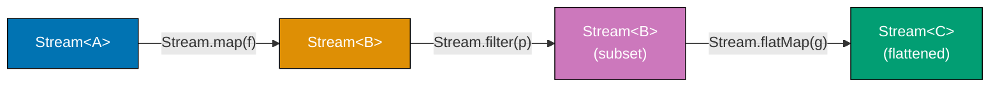

```typescript
import { Stream, Effect } from "effect";

// Stream.map: transform each element
const numbers = Stream.range(1, 6);
// => Emits 1, 2, 3, 4, 5

const doubled = numbers.pipe(Stream.map((n) => n * 2));
// => Emits 2, 4, 6, 8, 10

// Stream.filter: keep only matching elements
const evens = numbers.pipe(Stream.filter((n) => n % 2 === 0));
// => Emits 2, 4

// Chaining transformations
const pipeline = Stream.range(1, 11).pipe(
  Stream.filter((n) => n % 2 === 0),
  // => Keep only even numbers: 2, 4, 6, 8, 10
  Stream.map((n) => n * n),
  // => Square each: 4, 16, 36, 64, 100
  Stream.take(3),
  // => Take only the first 3: 4, 16, 36
);

Effect.runPromise(Stream.runCollect(pipeline)).then((chunk) => {
  console.log("pipeline result:", Array.from(chunk));
  // => Output: pipeline result: [4, 16, 36]
});

// Stream.flatMap: each element becomes a sub-stream
const sentences = Stream.make("hello world", "foo bar baz");
const words = sentences.pipe(
  Stream.flatMap(
    (sentence) => Stream.fromIterable(sentence.split(" ")),
    // => Each sentence becomes a stream of words
  ),
);
// => Emits "hello", "world", "foo", "bar", "baz"

Effect.runPromise(Stream.runCollect(words)).then((chunk) => {
  console.log("words:", Array.from(chunk));
  // => Output: words: ['hello', 'world', 'foo', 'bar', 'baz']
});

// Stream.mapEffect: run an Effect for each element
const processedItems = Stream.make("a", "b", "c").pipe(
  Stream.mapEffect((item) =>
    Effect.sync(() => {
      console.log(`processing: ${item}`);
      return item.toUpperCase();
      // => Each element is processed with an Effect
    }),
  ),
);

Effect.runSync(Stream.runCollect(processedItems));
// => Output:
// => processing: a
// => processing: b
// => processing: c
```

**Key Takeaway**: Stream transformations (`map`, `filter`, `flatMap`) are lazy — they describe the pipeline without executing it. `mapEffect` applies an effectful transformation to each element.

**Why It Matters**: Data pipelines in production follow a consistent pattern: read from a source, filter irrelevant items, transform each item, write to a sink. Stream transformations make each step of this pipeline explicit and composable. Adding a new transformation step — a filter, a lookup, a format conversion — requires adding one line to the pipeline without touching other steps. The lazy execution model means the pipeline processes one element at a time, keeping memory usage constant. For ETL pipelines processing gigabytes of data, this constant memory usage is the difference between a job that completes and one that runs out of memory.

---

### Example 47: Stream.merge and Stream.zip

`Stream.merge` interleaves two streams as elements arrive. `Stream.zip` pairs elements from two streams, emitting tuples. These are the primary tools for combining multiple data streams.

```typescript
import { Stream, Effect, Duration } from "effect";

// Stream.merge: interleave two streams (emit elements as they arrive)
const slow = Stream.make("slow-1", "slow-2").pipe(
  Stream.mapEffect((s) => Effect.sleep(Duration.millis(100)).pipe(Effect.as(s))),
  // => Each element takes 100ms to produce
);

const fast = Stream.make("fast-1", "fast-2", "fast-3").pipe(
  Stream.mapEffect((s) => Effect.sleep(Duration.millis(30)).pipe(Effect.as(s))),
  // => Each element takes 30ms to produce
);

const merged = Stream.merge(fast, slow);
// => Elements from both streams, in arrival order
// => fast-1, fast-2, fast-3 arrive before slow-1, slow-2 due to timing

Effect.runPromise(Stream.runCollect(merged)).then((chunk) => {
  console.log("merged:", Array.from(chunk));
  // => Output (order may vary by timing):
  // => merged: ['fast-1', 'fast-2', 'fast-3', 'slow-1', 'slow-2']
});

// Stream.zip: combine two streams element by element into tuples
const names = Stream.make("Alice", "Bob", "Carol");
const scores = Stream.make(95, 87, 92);

const paired = Stream.zip(names, scores);
// => Stream<[string, number], never, never>
// => Emits ["Alice", 95], ["Bob", 87], ["Carol", 92]
// => Stops when the shorter stream ends

Effect.runPromise(Stream.runCollect(paired)).then((chunk) => {
  Array.from(chunk).forEach(([name, score]) => {
    console.log(`${name}: ${score}`);
    // => Output:
    // => Alice: 95
    // => Bob: 87
    // => Carol: 92
  });
});

// Stream.zipWith: zip and transform the pairs simultaneously
const combined = Stream.zipWith(names, scores, (name, score) => ({ name, score }));
// => Stream<{ name: string; score: number }, never, never>
```

**Key Takeaway**: `Stream.merge` interleaves streams in arrival order. `Stream.zip` pairs elements positionally. `Stream.zipWith` pairs and transforms simultaneously.

**Why It Matters**: Production data pipelines often combine data from multiple sources: merge log streams from multiple services, zip a list of IDs with their database records, combine a stream of prices with a stream of quantities. `merge` and `zip` cover the two fundamental combination patterns. `merge` is for unordered fan-in (combine events from multiple sources as they arrive). `zip` is for ordered pairing (match records from two aligned sequences). These primitives compose with all other stream transformations, building complex multi-source pipelines from simple building blocks.

---

## Group 19: Advanced Error Handling

### Example 48: Effect.catchIf and Effect.orElse

`catchIf` handles errors matching a predicate. `orElse` provides a complete fallback Effect when the original fails. These operators give finer control over error recovery than `catchAll` or `catchTag`.

```typescript
import { Effect, Data } from "effect";

class HttpError extends Data.TaggedError("HttpError")<{
  readonly status: number;
  readonly message: string;
}> {}

const fetchResource = (url: string): Effect.Effect<string, HttpError, never> => {
  if (url.includes("404")) {
    return Effect.fail(new HttpError({ status: 404, message: "not found" }));
  }
  if (url.includes("500")) {
    return Effect.fail(new HttpError({ status: 500, message: "server error" }));
  }
  return Effect.succeed(`content from ${url}`);
};

// catchIf: catch errors matching a predicate
const with404Fallback = fetchResource("http://example.com/404").pipe(
  Effect.catchIf(
    (e) => e.status === 404,
    // => Predicate: only catch 404 errors
    (_e) => Effect.succeed("default content for missing resource"),
    // => Fallback when predicate matches
  ),
);
// => 404 errors produce "default content"
// => 500 errors still propagate — not caught

Effect.runSync(with404Fallback).toString;
console.log(Effect.runSync(with404Fallback));
// => Output: default content for missing resource

// orElse: provide a complete alternative Effect when the original fails
const primary = fetchResource("http://primary.com/500");
const fallback = fetchResource("http://fallback.com/data");
// => Simulates a fallback to a secondary service

const withFallback = primary.pipe(
  Effect.orElse(() => fallback),
  // => If primary fails for any reason, run fallback
  // => fallback runs only when primary fails
);
// => Effect<string, HttpError, never>

Effect.runSync(withFallback);
// => primary fails (500), fallback succeeds
// => Returns: "content from http://fallback.com/data"

// orElseSucceed: replace any failure with a success value
const withDefault = fetchResource("http://broken.com/500").pipe(
  Effect.orElseSucceed(() => "fallback data"),
  // => Any failure becomes this success value
);
// => Effect<string, never, never> — cannot fail after orElseSucceed
```

**Key Takeaway**: `catchIf` handles errors matching a predicate. `orElse` provides a complete fallback Effect. `orElseSucceed` converts any failure to a success value.

**Why It Matters**: Production error handling requires different recovery strategies for different failure modes. A 404 should return a default value; a 500 should try a fallback service; a 401 should redirect to login. `catchIf` lets you apply different recovery logic based on error properties, while `orElse` implements the active-passive failover pattern common in high-availability systems. These fine-grained recovery operators prevent the common anti-pattern of catching all errors and handling them uniformly, which masks the distinction between "resource not found" (normal) and "database down" (critical).

---

### Example 49: Effect.validateAll and Effect.partition

`Effect.validateAll` runs effects over a collection and collects all errors instead of failing fast. `Effect.partition` splits a collection into successes and failures. Use these for batch operations where you want to process all items and report all failures.

```typescript
import { Effect, Either } from "effect";

// validateAll: run effects over a list, collecting ALL errors
const validateAge = (age: number): Effect.Effect<number, string, never> => {
  if (age < 0) return Effect.fail(`age ${age} is negative`);
  if (age > 150) return Effect.fail(`age ${age} is unrealistically large`);
  return Effect.succeed(age);
};

const ages = [25, -1, 30, 200, 45];
// => Mix of valid and invalid ages

const validated = Effect.validateAll(ages, validateAge);
// => Effect<number[], string[], never>
// => If ANY fail: fails with an ARRAY of all errors (not just the first)
// => Unlike Effect.all (fails on first error), validateAll collects all errors

Effect.runSyncExit(validated).pipe;
const exit = Effect.runSyncExit(validated);
if (exit._tag === "Failure") {
  console.log("validation errors:", exit.cause);
  // => Contains all errors: ["-1 is negative", "200 is unrealistically large"]
}

// partition: split successes and failures, always succeeds
const partitioned = Effect.partition(ages, validateAge);
// => Effect<[errors: string[], successes: number[]], never, never>
// => NEVER fails — always returns both lists

Effect.runPromise(partitioned).then(([errors, successes]) => {
  console.log("errors:", errors);
  // => Output: errors: ['age -1 is negative', 'age 200 is unrealistically large']
  console.log("successes:", successes);
  // => Output: successes: [25, 30, 45]
  // => Valid ages are processed; invalid ages are reported; both are available
});

// Collecting Either: convert each failure to Either without failing the whole Effect
const asEithers = Effect.all(
  ages.map(
    (age) => validateAge(age).pipe(Effect.either),
    // => Effect.either: converts Effect<A, E> to Effect<Either<A, E>, never>
    // => Never fails — wraps the result
  ),
);

Effect.runPromise(asEithers).then((eithers) => {
  const valid = eithers.filter(Either.isRight).map((e) => e.right);
  const invalid = eithers.filter(Either.isLeft).map((e) => e.left);
  console.log("valid:", valid, "invalid:", invalid);
  // => Output: valid: [25, 30, 45] invalid: ['age -1 is negative', 'age 200 is unrealistically large']
});
```

**Key Takeaway**: `validateAll` collects all errors; `partition` always succeeds with two lists. Use these for batch validation where reporting all errors is better than failing on the first.

**Why It Matters**: Fail-fast error handling is correct for sequential operations where later steps depend on earlier ones. But batch imports, form validation, and bulk updates benefit from collecting all errors so the user can fix everything at once instead of resubmitting repeatedly. `validateAll` and `partition` encode this "collect all errors" strategy. In production, an import job that validates all rows before committing any provides a better user experience than one that fails on row 17 after having written rows 1-16, leaving data in a partially imported state.

---

## Group 20: SynchronizedRef and Advanced State

### Example 50: SynchronizedRef — Effectful State Updates

`SynchronizedRef<A>` extends `Ref<A>` to support effectful update functions. Use it when updating the state requires an Effect — for example, fetching from a cache with a database fallback.

```typescript
import { Effect, SynchronizedRef, Duration } from "effect";

// Create a SynchronizedRef with an initial Map (as a cache)
const program = Effect.gen(function* () {
  const cache = yield* SynchronizedRef.make(new Map<string, string>());
  // => cache is SynchronizedRef<Map<string, string>>
  // => Initialized with an empty Map

  // SynchronizedRef.updateEffect: run an Effect to compute the new value
  // The Effect has exclusive access to the ref during the update
  const fetchWithCache = (key: string) =>
    SynchronizedRef.updateAndGetEffect(cache, (currentMap) => {
      // => currentMap is the current Map value
      if (currentMap.has(key)) {
        console.log(`cache hit: ${key}`);
        return Effect.succeed(currentMap);
        // => No update needed — return map unchanged
      }

      // Simulate a database fetch
      return Effect.gen(function* () {
        console.log(`cache miss: ${key}, fetching...`);
        yield* Effect.sleep(Duration.millis(10));
        // => Simulates async database fetch
        const value = `db-value-for-${key}`;
        const newMap = new Map(currentMap);
        newMap.set(key, value);
        // => Add the fetched value to the cache
        return newMap;
        // => Returns the updated Map
      });
    }).pipe(
      Effect.map((map) => map.get(key)!),
      // => Extract the value for this key
    );

  // First access: cache miss, fetches from "database"
  const val1 = yield* fetchWithCache("user:1");
  console.log("got:", val1);
  // => Output:
  // => cache miss: user:1, fetching...
  // => got: db-value-for-user:1

  // Second access: cache hit, no fetch
  const val2 = yield* fetchWithCache("user:1");
  console.log("got:", val2);
  // => Output:
  // => cache hit: user:1
  // => got: db-value-for-user:1
});

Effect.runPromise(program);
```

**Key Takeaway**: `SynchronizedRef.updateEffect` allows effectful state updates with exclusive access to the ref. The update Effect runs atomically — no other fiber can modify the ref during the update.

**Why It Matters**: Many real-world state transitions require side effects: "get from cache, or fetch from database and populate cache" is the classic example. Regular `Ref.update` only accepts pure functions. `SynchronizedRef.updateEffect` handles the effectful case while maintaining atomicity. Without this atomicity, concurrent requests for the same uncached key would all miss the cache simultaneously, generating multiple database fetches for the same data — the "cache stampede" problem. `SynchronizedRef` prevents stampedes by ensuring only one fiber runs the database fetch, with the result populated for all concurrent waiters.

---

## Group 21: Effect Composition Patterns

### Example 51: Effect.andThen — Simplified Sequential Composition

`Effect.andThen` is a versatile operator that sequences effects. Unlike `flatMap`, it accepts either a function returning an Effect, a plain Effect, or a value — choosing the right behavior automatically. Many developers find it cleaner than `flatMap` for common sequential patterns.

```typescript
import { Effect } from "effect";

// andThen with a function: same as flatMap
const step1 = Effect.succeed(10);

const withFunction = step1.pipe(
  Effect.andThen((n) => Effect.succeed(n * 2)),
  // => Receives 10, returns Effect<number> producing 20
  // => Equivalent to Effect.flatMap(n => Effect.succeed(n * 2))
);
console.log(Effect.runSync(withFunction));
// => Output: 20

// andThen with a plain Effect: ignores the previous value, runs the next Effect
const withEffect = step1.pipe(
  Effect.andThen(Effect.succeed("next step")),
  // => Runs step1 (for side effects), then runs this Effect
  // => The 10 from step1 is discarded
  // => Equivalent to Effect.flatMap(() => Effect.succeed("next step"))
);
console.log(Effect.runSync(withEffect));
// => Output: next step

// andThen with a value: wraps the value in Effect.succeed
const withValue = step1.pipe(
  Effect.andThen("a string value"),
  // => Replaces the success value with "a string value"
  // => Equivalent to Effect.as("a string value")
);
console.log(Effect.runSync(withValue));
// => Output: a string value

// Practical: chaining a sequence of related operations
const registerUser = Effect.gen(function* () {
  const userId = yield* Effect.succeed("new-user-id");
  // => Step 1: create user record

  yield* Effect.andThen(Effect.sync(() => console.log(`created user: ${userId}`)))(Effect.succeed(userId));
  // => Step 2: log creation (result discarded)

  return userId;
});
// andThen is particularly useful when the previous value is not needed in the next step
```

**Key Takeaway**: `andThen` handles function-returning, Effect, and value cases — it is the Swiss army knife of sequential composition. Use it when the return value of the previous step is not needed by the next.

**Why It Matters**: Sequential Effect pipelines often include steps that run for side effects rather than producing values needed by subsequent steps — logging, emitting metrics, updating audit tables. `andThen` with a plain Effect or value eliminates the `() => ...` lambda needed in `flatMap` for these cases. The result is pipelines that read more naturally: "do this, then do that, then produce this value" rather than "take the result of this, ignore it, and do that." Cleaner pipelines reduce cognitive load during code review and maintenance.

---

### Example 52: Effect.ensuring — Guaranteed Cleanup

`Effect.ensuring` attaches a finalizer Effect that always runs — whether the main Effect succeeds, fails, or is interrupted. Use it for cleanup operations that must run regardless of outcome.

```typescript
import { Effect, Data } from "effect";

class LockError extends Data.TaggedError("LockError")<{ resource: string }> {}

// Simulated resource acquisition
const acquireLock = (resource: string) =>
  Effect.sync(() => {
    console.log(`lock acquired: ${resource}`);
    return resource;
  });

const releaseLock = (resource: string) => Effect.sync(() => console.log(`lock released: ${resource}`));
// => This MUST run to prevent deadlock

const processResource = (resource: string) =>
  Effect.gen(function* () {
    yield* acquireLock(resource);
    // => Lock acquired — must be released

    // Simulate work that might fail
    if (resource === "broken") {
      yield* Effect.fail(new LockError({ resource }));
      // => Fails — lock must still be released
    }

    console.log(`processing: ${resource}`);
    return `processed: ${resource}`;
  }).pipe(
    Effect.ensuring(releaseLock(resource)),
    // => releaseLock runs ALWAYS:
    // => - after success
    // => - after failure
    // => - after interruption
    // => This is the guarantee — not "usually" or "when not interrupted"
  );

// Success path: lock released after success
Effect.runSync(processResource("data"));
// => Output:
// => lock acquired: data
// => processing: data
// => lock released: data

// Failure path: lock released even though processing failed
Effect.runSyncExit(processResource("broken"));
// => Output:
// => lock acquired: broken
// => lock released: broken   ← runs despite failure
// => (then: Exit.Failure with LockError)
```

**Key Takeaway**: `Effect.ensuring` attaches a cleanup Effect that always runs — on success, failure, or interruption. Use it to guarantee resource release even when the main operation fails.

**Why It Matters**: The guarantee that cleanup runs unconditionally is essential for correctness in production systems. Database transactions must be rolled back on failure. Locks must be released even when the operation throws. File handles must be closed even when parsing fails. Code that relies on `try/finally` blocks for cleanup is fragile: if the code path doesn't reach the `finally`, cleanup doesn't run. `Effect.ensuring` is implemented at the runtime level — it runs even if the fiber is forcibly interrupted. This unconditional guarantee prevents resource leaks in all edge cases, not just the happy path.

---

## Group 22: Additional Intermediate Patterns

### Example 53: Effect.memoize — Caching Effect Results

`Effect.memoize` wraps an Effect so that it runs only once — subsequent calls return the cached result. This is useful for lazy initialization, expensive computations, and configuration loading.

```typescript
import { Effect } from "effect";

// Effect.memoize: lazily run an effect exactly once
let initCount = 0;

const expensiveInit = Effect.sync(() => {
  initCount++;
  console.log(`expensive initialization ran (count: ${initCount})`);
  return { connection: "db-pool-1", ready: true };
  // => Simulates expensive one-time setup
});

// Memoize: the effect runs at most once, result is cached
const memoized = Effect.runSync(Effect.memoize(expensiveInit));
// => memoized is Effect<{ connection: string; ready: boolean }, never, never>
// => But calling runSync on it will only run expensiveInit once

const program = Effect.gen(function* () {
  const result1 = yield* memoized;
  // => First call: runs expensiveInit, caches result
  console.log("result1:", result1.connection);

  const result2 = yield* memoized;
  // => Second call: returns cached result, does NOT run expensiveInit again
  console.log("result2:", result2.connection);

  const result3 = yield* memoized;
  // => Third call: still cached
  console.log("result3:", result3.connection);

  console.log("init ran", initCount, "time(s)");
  // => initCount is 1 — only ran once despite three accesses
});

Effect.runSync(program);
// => Output:
// => expensive initialization ran (count: 1)
// => result1: db-pool-1
// => result2: db-pool-1
// => result3: db-pool-1
// => init ran 1 time(s)
```

**Key Takeaway**: `Effect.memoize` creates an Effect that executes at most once and caches its result. Subsequent uses return the cached value without re-executing.

**Why It Matters**: Many production systems have one-time initialization work: loading configuration, establishing connection pools, reading secrets from a vault. Running this work once and sharing the result is both efficient and correct. Without memoization, code that calls an initialization function multiple times in different parts of the application risks running expensive or non-idempotent operations multiple times. `Effect.memoize` encodes the "run once" guarantee in the type system — the caller gets the same effect type and does not need to know that the underlying work only runs once.

---

### Example 54: Effect.race — First to Succeed Wins

`Effect.race` runs two effects concurrently and returns the result of whichever finishes first. The loser is interrupted. Use it for implementing timeouts, hedged requests, and competitive execution patterns.

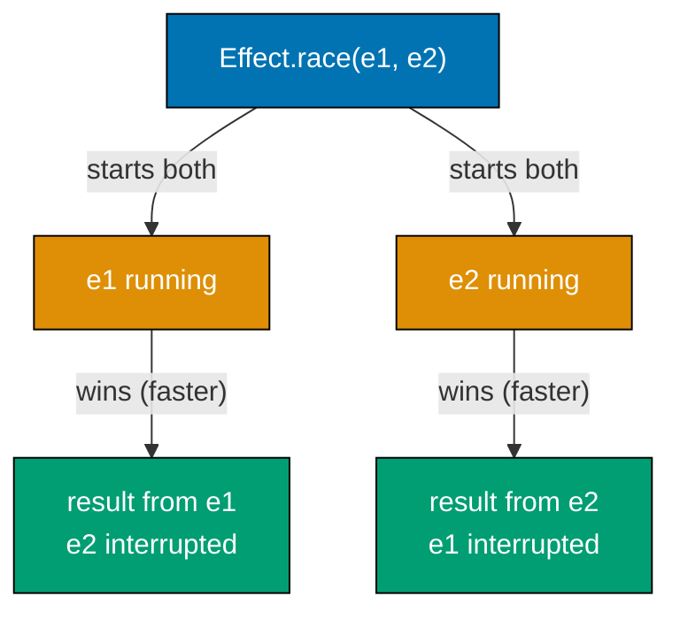

```typescript
import { Effect, Duration } from "effect";

// Two effects competing: the faster one wins
const primary = Effect.gen(function* () {
  yield* Effect.sleep(Duration.millis(100));
  // => Simulates a slow primary service (100ms)
  return "primary result";
});

const secondary = Effect.gen(function* () {
  yield* Effect.sleep(Duration.millis(50));
  // => Simulates a faster secondary service (50ms)
  return "secondary result";
});

// race: run both, take the first to complete, interrupt the other
const raceResult = Effect.race(primary, secondary);
// => secondary finishes first (50ms < 100ms)
// => primary is interrupted when secondary completes

Effect.runPromise(raceResult).then((result) => {
  console.log("winner:", result);
  // => Output: winner: secondary result
});

// Practical use: hedge requests to multiple replicas
const fetchFromReplica = (id: number) =>
  Effect.gen(function* () {
    const delay = id * 30; // => Different latency per replica
    yield* Effect.sleep(Duration.millis(delay));
    return `response from replica ${id}`;
  });

// Hedge: send to multiple replicas, take the fastest
const hedged = Effect.race(
  fetchFromReplica(1), // => 30ms
  Effect.race(
    fetchFromReplica(2), // => 60ms
    fetchFromReplica(3), // => 90ms
  ),
);

Effect.runPromise(hedged).then((result) => {
  console.log("fastest replica:", result);
  // => Output: fastest replica: response from replica 1
});

// race with timeout: either the operation succeeds or timeout fires first
const withTimeout = Effect.race(
  primary,
  // => primary takes 100ms
  Effect.gen(function* () {
    yield* Effect.sleep(Duration.millis(200));
    return yield* Effect.fail("timeout");
    // => Fires after 200ms if primary hasn't completed
  }),
);
```

**Key Takeaway**: `Effect.race` starts two effects concurrently and returns the first to complete. The other is interrupted. Use it for hedged requests, competitive execution, and custom timeout patterns.

**Why It Matters**: Tail latency — the slowest few percent of requests — often drives user experience in production systems. A technique proven to reduce P99 latency is hedging: send the request to multiple backends and take the first response, cancelling the others. `Effect.race` implements hedging in two lines. The automatic interruption of the losing fiber ensures that resources (connections, compute) used by the cancelled request are released promptly. This approach is used at scale by Google and Netflix to keep tail latencies low when any single backend might occasionally be slow.

---

### Example 55: Effect.acquireUseRelease — Safe Resource Patterns

`Effect.acquireUseRelease` models the "acquire, use, release" pattern for resources. It guarantees that the release action runs even if the use action fails or is interrupted.

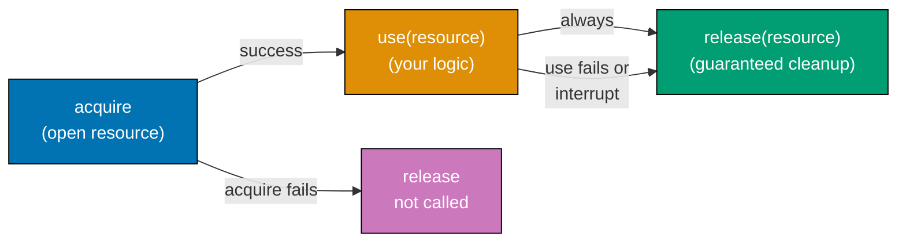

```typescript
import { Effect, Duration } from "effect";

// The three-phase resource pattern:
// 1. acquire: get the resource (may fail)
// 2. use: do work with the resource (may fail)
// 3. release: always runs — even if use failed or was interrupted

const withDatabaseConnection = <A>(
  use: (conn: { query: (sql: string) => string[] }) => Effect.Effect<A, Error, never>,
): Effect.Effect<A, Error, never> =>
  Effect.acquireUseRelease(
    // Phase 1: Acquire
    Effect.sync(() => {
      console.log("opening database connection");
      return {
        query: (sql: string) => [`row1: ${sql}`, `row2: ${sql}`],
        // => Simulated database connection
      };
    }),
    // Phase 2: Use — receives the acquired resource
    (conn) => {
      console.log("using connection");
      return use(conn);
      // => Delegates to the caller-provided use function
    },
    // Phase 3: Release — receives the resource, always runs
    (_conn) =>
      Effect.sync(() => {
        console.log("closing database connection");
        // => Cleanup: close the connection
      }),
  );

// Using the resource abstraction
const program = withDatabaseConnection((conn) => {
  const rows = conn.query("SELECT * FROM users");
  // => Executes the query using the connection
  console.log("rows:", rows);
  return Effect.succeed(rows.length);
  // => Returns the row count
});

Effect.runSync(program);
// => Output:
// => opening database connection
// => using connection
// => rows: ['row1: SELECT * FROM users', 'row2: SELECT * FROM users']
// => closing database connection
// => Returns: 2

// Even when use fails, release runs:
const failingProgram = withDatabaseConnection((_) => Effect.fail(new Error("query failed")));
Effect.runSyncExit(failingProgram);
// => Output:
// => opening database connection
// => using connection
// => closing database connection   ← runs despite the failure
// => (then: Exit.Failure with Error("query failed"))
```

**Key Takeaway**: `acquireUseRelease` guarantees the release action runs unconditionally. It is the safe pattern for any resource that must be explicitly closed: database connections, file handles, network sockets.

**Why It Matters**: Failing to release resources is one of the most common bugs in production systems — especially in error paths where developers write the happy path but forget cleanup on failure. `acquireUseRelease` makes resource management a first-class concern: you cannot use a resource without providing its release action. The framework enforces that release always runs, even under interruption. This pattern is used throughout Effect's ecosystem for connection pools, file handles, and network sockets. Adopting it in application code eliminates resource leak bugs by making "forgot to close" a structurally impossible mistake.
