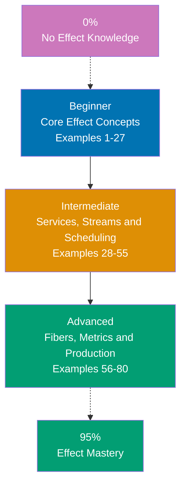

## Want to Master Effect Through Working Code?

This guide teaches you the TypeScript **Effect library** through **80 production-ready code examples** rather than lengthy explanations. If you're an experienced developer who wants to write safer, more composable TypeScript, you'll build intuition through actual working patterns.

## What Is By-Example Learning?

By-example learning is a **code-first approach** where you learn concepts through annotated, working examples rather than narrative explanations. Each example shows:

1. **What the code does** - Brief explanation of the Effect concept
2. **How it works** - A focused, heavily commented code example
3. **Why it matters** - A pattern summary highlighting the production value

This approach works best when you already understand TypeScript and programming fundamentals. You learn Effect's idioms, patterns, and best practices by studying real code rather than theoretical descriptions.

## What Is Effect?

Effect is a **functional effect system for TypeScript** — not a web framework, not a testing library, not an ORM. It is a foundational toolkit for writing programs that handle errors, dependencies, concurrency, and resources in a principled, composable way.

Key distinctions:

- **Not a framework**: Effect does not handle HTTP routing or HTML rendering. It manages program logic, data flow, and side effects.
- **Type-safe errors**: Errors appear in the type signature as `Effect<Success, Error, Requirements>` — the compiler forces you to handle them.
- **Dependency injection built in**: Services and dependencies are declared as types and resolved at runtime via Layers.
- **Structured concurrency**: Fibers give you lightweight concurrency with automatic resource cleanup and interruption.
- **Composable by design**: Everything is a value you can combine, transform, retry, trace, or test.

Effect 3.x (the current major version) unified the ecosystem into a single `effect` npm package. It works in Node.js, Bun, Deno, and modern browsers.

## Learning Path



## Coverage Philosophy: 95% Through 80 Examples

The **95% coverage** means you'll understand Effect deeply enough to build production systems confidently. It does not mean you'll know every edge case — those come with experience.

The 80 examples are organized progressively:

- **Beginner (Examples 1-27)**: Core Effect type, creating and running effects, pipelines, error handling, generators, Option/Either, basic services, Duration, Exit, Cause
- **Intermediate (Examples 28-55)**: Layer composition, Context/Tag, Scope/Resource, concurrency, scheduling, Ref, Queue, PubSub, Schema, HTTP client, testing, Config, logging, Stream basics
- **Advanced (Examples 56-80)**: Fiber lifecycle, FiberRef, advanced concurrency, Stream channels, Schema transformations, batching with RequestResolver, Metric, tracing, custom Runtime, production patterns

Together, these examples cover **95% of what you'll use** in production Effect applications.

## What's Covered

### Core Effect Type and Execution

- **Effect type**: `Effect<Success, Error, Requirements>` — the three type parameters
- **Creating effects**: `Effect.succeed`, `Effect.fail`, `Effect.sync`, `Effect.promise`, `Effect.try`
- **Running effects**: `Effect.runSync`, `Effect.runPromise`, `Effect.runSyncExit`, `Effect.runPromiseExit`
- **Pipelines**: `pipe`, `Effect.map`, `Effect.flatMap`, `Effect.tap`, `Effect.andThen`

### Error Handling

- **Typed errors**: Errors as values, `Data.TaggedError`, discriminated unions
- **Recovery**: `Effect.catchAll`, `Effect.catchTag`, `Effect.catchIf`, `Effect.orElse`
- **Retry**: `Effect.retry` with `Schedule`
- **Cause**: `Cause.die`, `Cause.fail`, `Cause.interrupt` — understanding failure modes
- **Exit**: `Exit.succeed`, `Exit.fail`, `Exit.interrupt` — representing outcomes as values

### Generators and Async Style

- **Effect.gen**: Generator-based async/await style for Effect pipelines
- **yield\***: Unwrapping effects inside generators
- **Combining generators with services**: Ergonomic dependency injection in generators

### Data Types

- **Option**: `Option.some`, `Option.none`, integration with Effect
- **Either**: `Either.right`, `Either.left`, lifting into Effect
- **Chunk**: Efficient immutable arrays for streaming
- **Duration**: Type-safe time values for scheduling and timeouts

### Services and Dependency Injection

- **Context.Tag**: Declaring services as types
- **Layer**: Building, combining, and providing service implementations
- **Layer composition**: Sequential (`Layer.provideMerge`), parallel (`Layer.merge`), scoped
- **Testing**: Replacing live services with test implementations

### Concurrency and Resources

- **Effect.all**: Run effects concurrently or sequentially
- **Fiber**: Lightweight concurrent processes with `Fiber.fork`, `Fiber.join`, `Fiber.interrupt`
- **Scope**: Lifecycle management for resources (database connections, file handles)
- **Resource** (`Effect.acquireRelease`): Safe resource acquisition with guaranteed cleanup

### State and Coordination

- **Ref**: Mutable references with atomic update semantics
- **SynchronizedRef**: Ref with effectful updates
- **Queue**: Bounded and unbounded concurrent queues
- **PubSub**: Topic-based message broadcasting

### Scheduling

- **Schedule**: Composable retry and repeat policies
- **Schedule.recurs**: Fixed repetition
- **Schedule.exponential**: Exponential backoff
- **Schedule.spaced**: Fixed delay between executions
- **Schedule.compose**: Combining schedules

### Schema and Validation

- **Schema.decode**: Parse and validate unknown data
- **Schema.encode**: Serialize typed data
- **Schema definitions**: Struct, Union, Array, Literal, and custom schemas
- **Schema transformations**: `Schema.transform`, `Schema.transformOrFail`
- **Schema filters**: `Schema.filter` for custom validation rules

### Observability

- **Effect.log**: Structured logging with log levels
- **Effect.withSpan**: Distributed tracing spans
- **Metric**: Counters, histograms, and gauges
- **FiberRef**: Fiber-local state for request correlation IDs

### Advanced Patterns

- **Effect.request / RequestResolver**: Automatic request batching and deduplication
- **Stream**: Lazy, composable data streams with backpressure
- **Channel**: Low-level bidirectional communication primitive
- **Custom Runtime**: Configuring logging, tracing, and services for production

## What's NOT Covered

We exclude topics that belong in specialized tutorials:

- **TypeScript language internals**: Master TypeScript first through language tutorials
- **HTTP server frameworks**: Effect-based HTTP servers (e.g., `@effect/platform` HTTP) are touched in Advanced but not the focus
- **Database integrations**: ORMs and query builders built on Effect are separate topics
- **Frontend UI**: Effect works in the browser but React/Vue integration is out of scope
- **Effect internals**: Fiber scheduler internals, memory model, and runtime implementation details

For these topics, see the official Effect documentation and ecosystem packages.

## How to Use This Guide

### 1. Set Up Your Environment

```bash
mkdir effect-tutorial && cd effect-tutorial
npm init -y
npm install effect
npm install -D typescript tsx @types/node
npx tsc --init --strict true --target ES2022 --module NodeNext --moduleResolution NodeNext
```

### 2. Run Each Example

Each example is self-contained. Save it to a `.ts` file and run:

```bash
npx tsx example.ts
```

### 3. Read the Example Structure

Each example has five parts:

- **Brief explanation** (2-3 sentences): What Effect concept, why it exists, when to use it
- **Optional diagram**: Mermaid diagram when concept relationships benefit from visualization
- **Code** (with heavy comments): Working TypeScript showing the pattern with `// =>` annotations
- **Key Takeaway** (1-2 sentences): Distilled essence of the pattern
- **Why It Matters** (50-100 words): Production rationale and real-world significance

### 4. Modify and Experiment

Change type parameters, swap error types, add retry policies. Breaking things intentionally builds intuition faster than reading.

### 5. Reference as Needed

Use this guide as a reference when building features. Search for relevant examples and adapt patterns to your code.

## Relationship to Other Tutorial Types

| Tutorial Type               | Approach                       | Coverage          | Best For                      |
| --------------------------- | ------------------------------ | ----------------- | ----------------------------- |
| **By Example** (this guide) | Code-first, 80 examples        | 95% breadth       | Learning Effect idioms        |
| **Quick Start**             | Project-based, hands-on        | 5-30% touchpoints | Getting something working     |
| **Beginner Tutorial**       | Narrative, explanation-first   | 0-60% coverage    | Understanding concepts deeply |
| **Cookbook**                | Recipe-based, problem-solution | Problem-specific  | Solving specific problems     |

## Prerequisites

### Required

- **TypeScript fundamentals**: Types, generics, async/await, union types, discriminated unions
- **Programming experience**: You have built applications in at least one language
- **Node.js basics**: Module system, npm, running scripts

### Recommended

- **Functional programming concepts**: Pure functions, immutability, function composition
- **Promise/async experience**: Understanding JavaScript's async model helps contrast with Effect's approach

### Not Required

- **Effect experience**: This guide assumes you are new to the library
- **Category theory**: You do not need to know monads or functors by name

## Structure of Each Example

All examples follow a consistent format:

```
### Example N: Descriptive Title

2-3 sentence explanation of the concept.

[Optional Mermaid diagram]

```typescript
// Heavily annotated code example
// showing the Effect pattern in action
// => annotations show values and outputs
```

**Key Takeaway**: 1-2 sentence summary.

**Why It Matters**: 50-100 words on production significance.
```

**Code annotations**:

- `// =>` shows expected output or computed value
- Inline comments explain what each line does and why
- Variable names are self-documenting

**Mermaid diagrams** appear when visualizing flow or type relationships improves understanding. Color palette:

- Blue #0173B2 - Primary elements
- Orange #DE8F05 - Secondary / decisions
- Teal #029E73 - Success / completion
- Purple #CC78BC - Alternative states
- Brown #CA9161 - Neutral elements

## Ready to Start?

Choose your learning path:

- **[Beginner](/en/learn/software-engineering/platform-web/tools/ts-effect/by-example/beginner)** - Start here if new to Effect. Build foundation understanding through 27 core examples.
- **[Intermediate](/en/learn/software-engineering/platform-web/tools/ts-effect/by-example/intermediate)** - Jump here if you know Effect basics. Master services, scheduling, and streaming through 28 examples.
- **[Advanced](/en/learn/software-engineering/platform-web/tools/ts-effect/by-example/advanced)** - Expert mastery through 25 advanced examples covering fibers, metrics, tracing, and production runtime.
