This tutorial covers advanced XState v5 patterns through 26 annotated examples. You will build hierarchical actor systems, implement real-world flows (auth, wizards, WebSocket, retry), integrate XState with React Query, Effect.ts, Zustand, and React Hook Form, write model-based and actor-system tests, apply performance and production techniques, and migrate confidently from v4 to v5.

## Group 12: Hierarchical Actor Systems (Examples 55–58)

### Example 55: Actor Tree — Spawning a Two-Child Hierarchy

A parent machine can spawn multiple named child actors in a single `assign` entry action. Each spawned actor is independent — it runs its own machine with private context. The parent holds `ActorRef` handles in its own context to communicate with each child.

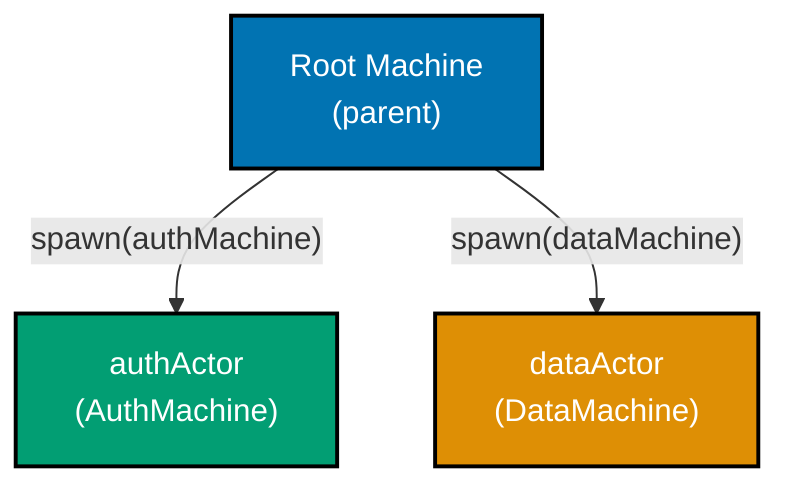

```typescript
import { createMachine, createActor, assign } from "xstate";
// => createMachine: blueprint; createActor: runtime; assign: context updater

// Minimal child machines -- each has its own isolated context
const authMachine = createMachine({
  // => Simple machine representing authentication state
  id: "auth",
  // => Unique id within the actor system; used by system.get("authActor")
  context: { token: null as string | null },
  // => Private to authActor; parent cannot access directly
  initial: "idle",
  // => authMachine starts in 'idle'; will wait for LOGIN events
  states: { idle: {} },
  // => Starts idle, awaiting login events
});
// => authMachine definition complete; inert until spawned

const dataMachine = createMachine({
  // => Simple machine representing remote data state
  id: "data",
  // => Unique id; enables system.get("dataActor") lookups
  context: { items: [] as string[] },
  // => Private to dataActor; parent cannot access directly
  initial: "idle",
  // => dataMachine starts in 'idle'; will wait for FETCH events
  states: { idle: {} },
  // => Starts idle, awaiting fetch events
});
// => dataMachine definition complete; inert until spawned

// Parent machine spawns both children on entry
const rootMachine = createMachine({
  // => Orchestrates child actors
  id: "root",
  // => Root of the actor tree; top-level coordinator
  context: {
    // => context holds ActorRef handles for both children
    authRef: null as any,
    // => Will hold ActorRef to authActor
    dataRef: null as any,
    // => Will hold ActorRef to dataActor
  },
  initial: "running",
  // => Immediately enters 'running', which spawns both children
  states: {
    running: {
      // => Single state: root is always coordinating
      entry: assign({
        // => entry action fires when machine enters 'running'
        authRef: ({ spawn }) => spawn(authMachine, { id: "authActor" }),
        // => spawn returns ActorRef; id must be unique in this actor system
        dataRef: ({ spawn }) => spawn(dataMachine, { id: "dataActor" }),
        // => Both children start concurrently and immediately
      }),
    },
  },
});
// => rootMachine: three-level hierarchy (root → authActor, root → dataActor)
// => rootMachine is the single entry point; only createActor(rootMachine) is needed

const actor = createActor(rootMachine).start();
// => actor.getSnapshot().context.authRef is an ActorRef
// => actor.getSnapshot().context.dataRef is a separate ActorRef
// => Both child actors are now running in their own isolated execution contexts
```

**Key Takeaway:** Spawning multiple child actors in a single `assign` entry action creates an actor tree. Each child is independent and identified by a unique `id` within the system.

**Why It Matters:** Hierarchical actor systems let you decompose complex features (authentication, data fetching, notifications) into isolated machines that each own their state. The parent becomes a coordinator rather than a monolith, making each concern independently testable and replaceable. When you need to add a new service — say, a WebSocket connection — you spawn a new child actor without touching existing code. Each actor's failure is contained: a crashing data actor does not corrupt auth state. This pattern scales from two child actors to hundreds, using the same mental model throughout.

---

### Example 56: Mediator Pattern — Parent Routes Child Events

A parent machine acting as mediator receives events forwarded by child actors and routes them to other children. Children never communicate directly — all messages flow through the mediator. This enforces a single source of control and simplifies debugging.

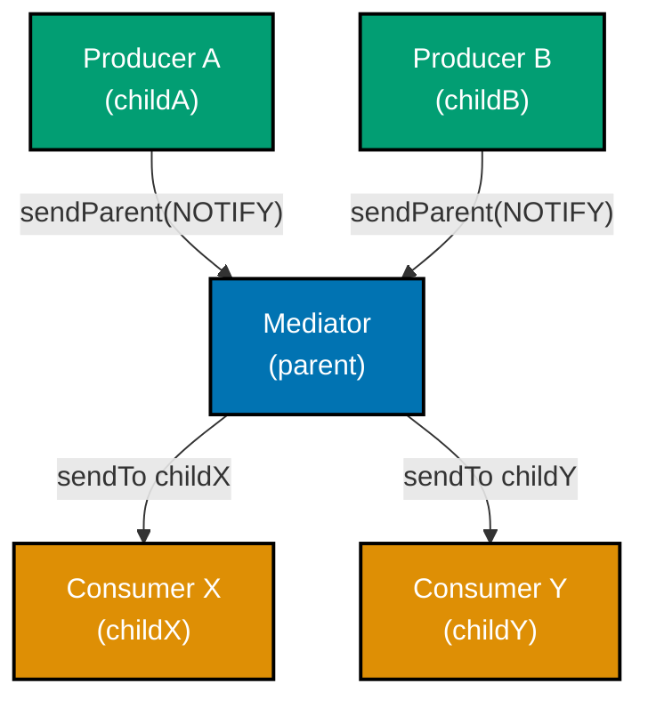

```typescript
import { createMachine, createActor, assign, sendTo, sendParent } from "xstate";
// => createMachine: FSM blueprint; sendTo: dispatch to actor ref; sendParent: child-to-parent
// => assign: updates context fields; createActor: creates runnable actor from machine

// Producer machine -- sends event to parent when work is done
const producerMachine = createMachine({
  // => A child that notifies the parent about work completion
  id: "producer",
  // => Unique id within the actor system; used for logging and DevTools
  initial: "working",
  // => Starts immediately in 'working' state; no idle phase
  states: {
    working: {
      // => Producer is always working; DONE signals completion
      on: {
        // => Event handlers for 'working' state
        DONE: {
          // => External trigger signals work completion
          actions: sendParent({ type: "CHILD_DONE", payload: "result" }),
          // => sendParent forwards the event up to the spawning machine
          // => payload: "result" is the work output delivered to the mediator
          // => Child does NOT know about sibling consumers
          // => Mediator is responsible for deciding who receives this result
        },
        // => DONE handler closed; producer only reacts to DONE
      },
    },
    // => 'working' state closed; producer has one state
  },
});
// => producerMachine: minimal child that bubbles DONE to parent mediator
// => Producer's only responsibility: signal completion; routing is the mediator's job

// Consumer machine -- receives routed events from parent
const consumerMachine = createMachine({
  // => A child that waits for routed messages
  id: "consumer",
  // => Unique id for this consumer within the actor system
  initial: "idle",
  // => Starts in 'idle'; waits for mediator to route a PROCESS event
  states: {
    idle: {
      // => Idle: waiting for the mediator to dispatch work
      on: {
        // => Only one accepted event in idle state
        PROCESS: { target: "processing" },
        // => Only responds to PROCESS; parent decides when to send it
        // => Transitions to 'processing' upon receiving PROCESS
        // => Consumer never directly contacts producer; they remain decoupled
      },
    },
    // => idle state closed
    processing: {},
    // => processing: placeholder state; extend with real logic as needed
    // => Real system: invoke async work here; send DONE to parent on completion
  },
});
// => consumerMachine: receives routed events; never sends to producer directly
// => Adding a new consumer type requires no changes to producer or any sibling

// Mediator parent: routes CHILD_DONE → consumer
const mediatorMachine = createMachine({
  // => Central router; children communicate only through this machine
  id: "mediator",
  // => Top-level coordinator for producer-consumer communication
  context: { producerRef: null as any, consumerRef: null as any },
  // => context holds ActorRef handles for both child actors
  // => Mediator stores refs so it can target children in sendTo calls
  initial: "active",
  // => Immediately enters 'active' and spawns both children
  states: {
    active: {
      // => active: mediator is running and routing events
      entry: assign({
        // => entry action spawns both child actors on state entry
        producerRef: ({ spawn }) => spawn(producerMachine, { id: "producer" }),
        // => Spawns producer child
        // => id "producer" makes it accessible via system.get("producer")
        consumerRef: ({ spawn }) => spawn(consumerMachine, { id: "consumer" }),
        // => Spawns consumer child
        // => id "consumer" makes it accessible via system.get("consumer")
        // => Both actors are live and running after this entry action
      }),
      // => entry action closed; both children now running concurrently
      on: {
        // => Event handlers for the 'active' mediator state
        CHILD_DONE: {
          // => Mediator intercepts producer's notification
          actions: sendTo(
            // => sendTo resolves target actor at event time
            ({ context }) => context.consumerRef,
            // => Selects the consumer ActorRef from context
            { type: "PROCESS" },
            // => Routes to consumer with transformed event type
            // => CHILD_DONE from producer becomes PROCESS for consumer
            // => Event type translation is explicit here; easy to audit
          ),
          // => sendTo closed; producer and consumer remain decoupled
        },
        // => CHILD_DONE handler closed
      },
    },
    // => active state closed; mediator has one state
  },
});
// => mediatorMachine: single-state coordinator; routes events between children
// => Pattern: children never reference each other; all routing is explicit here

const actor = createActor(mediatorMachine).start();
// => Starts root actor; producerRef and consumerRef are populated immediately
// => Producer and consumer are both running and waiting for events
```

**Key Takeaway:** Use `sendParent` in children and `sendTo` in the parent to implement a mediator. Children remain decoupled — they only know about the parent, never about siblings.

**Why It Matters:** The mediator pattern prevents a tangled web of cross-actor dependencies. When a new consumer needs data from a producer, you add routing logic in one place — the parent — rather than modifying every producer. This is especially valuable in large actor systems with many producers and consumers. Without a mediator, adding or removing an actor requires updating every actor that referenced it. With a mediator, consumers and producers are fully decoupled — neither knows the other exists. Debugging is also simpler: all event flow passes through one visible coordinator.

---

### Example 57: Actor Pools — Round-Robin Worker Dispatch

An actor pool holds an array of worker `ActorRef`s in context. A dispatcher machine routes incoming jobs to workers in round-robin order. This pattern parallelises CPU-bound or I/O-bound work across a fixed set of actors.

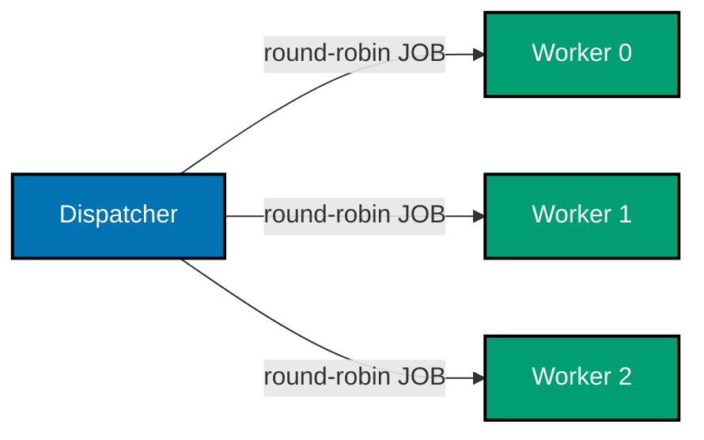

```typescript
import { createMachine, createActor, assign, sendTo } from "xstate";
// => createMachine: defines worker and pool blueprints
// => createActor: creates runnable instances; assign: updates context
// => sendTo: routes events to specific actor refs in the pool

// Worker machine -- processes one job at a time
const workerMachine = createMachine({
  // => Each instance is an independent actor in the pool
  // => Multiple actors share this definition; each runs in isolated state
  id: "worker",
  // => All workers share this machine definition but run as separate actors
  initial: "idle",
  // => Worker starts idle; ready to accept its first JOB
  states: {
    idle: {
      // => Idle: worker is available and waiting for a job
      // => Pool dispatcher selects this worker when nextIndex points to it
      on: {
        JOB: {
          // => Receives job event from dispatcher
          target: "busy",
          // => Transitions to busy immediately upon receiving JOB
          // => While busy, this worker will not receive further JOB events
          actions: ({ event }) => console.log("Worker got job:", event.payload),
          // => Logs the job payload; real machine would invoke async work
          // => In production: replace log with invoke calling async work actor
        },
      },
    },
    busy: {
      // => Busy: worker is processing; no new jobs accepted until DONE
      on: { DONE: "idle" },
      // => Returns to idle after job completes
      // => In production: invoke would send DONE on promise resolution
      // => Once idle again, this worker is eligible for the next DISPATCH
    },
  },
});
// => workerMachine definition complete; instantiated POOL_SIZE times below

const POOL_SIZE = 3;
// => Fixed pool size; tune based on concurrency needs
// => Increase for I/O-bound work; keep small for CPU-bound tasks
// => Changing POOL_SIZE automatically adjusts the Array.from length below

// Dispatcher machine manages pool + round-robin index
const poolMachine = createMachine({
  // => Spawns N workers; routes jobs in round-robin order
  id: "pool",
  // => Single entry point for all job dispatch; workers are opaque to callers
  context: {
    workers: [] as any[],
    // => Array of ActorRefs, one per worker
    // => Populated in entry assign; indexed by position [0..POOL_SIZE-1]
    nextIndex: 0,
    // => Tracks which worker receives the next job
    // => Incremented modulo POOL_SIZE after each dispatch
  },
  initial: "running",
  // => Pool is always running; no idle or stopped state needed
  states: {
    running: {
      // => Running: pool is active and accepts DISPATCH events
      entry: assign({
        workers: ({ spawn }) =>
          Array.from({ length: POOL_SIZE }, (_, i) => spawn(workerMachine, { id: `worker-${i}` })),
        // => Spawns POOL_SIZE worker actors; each gets a unique id
        // => Array.from creates [ActorRef-0, ActorRef-1, ActorRef-2]
        // => Each ActorRef is independent; workers do not share state
      }),
      // => entry closed; all workers are running by the time first DISPATCH arrives
      on: {
        DISPATCH: {
          // => External event triggers round-robin dispatch
          actions: [
            sendTo(
              ({ context }) => context.workers[context.nextIndex],
              // => Selects current worker by index
              // => workers[0], workers[1], workers[2] in rotation
              ({ event }) => ({ type: "JOB", payload: event.payload }),
              // => Forwards the payload as a JOB event
              // => Worker receives { type: "JOB", payload: event.payload }
            ),
            assign({
              nextIndex: ({ context }) => (context.nextIndex + 1) % POOL_SIZE,
              // => Advances index; wraps at POOL_SIZE (round-robin)
              // => 0 → 1 → 2 → 0 → 1 → ... ensures even distribution
            }),
          ],
          // => Two actions run in order: send job, then advance index
        },
      },
    },
  },
});
// => poolMachine: dispatcher with round-robin routing across POOL_SIZE workers
// => Pool stays in 'running' state indefinitely; all DISPATCH events handled here

const pool = createActor(poolMachine).start();
// => start() triggers entry assign; all three workers spawned immediately
// => All three workers spawn immediately on entry; pool is ready for DISPATCH
pool.send({ type: "DISPATCH", payload: "job-A" });
// => Dispatches to workers[0]; nextIndex advances to 1
pool.send({ type: "DISPATCH", payload: "job-B" });
// => Dispatches to workers[1]; nextIndex advances to 2
pool.send({ type: "DISPATCH", payload: "job-C" });
// => Dispatches to workers[2]; nextIndex wraps back to 0 (modulo POOL_SIZE)
// => Fourth DISPATCH would go to workers[0] again; round-robin is cyclic
```

**Key Takeaway:** Store worker `ActorRef`s in an array context field. Use modulo arithmetic on a `nextIndex` counter to achieve round-robin dispatch with `sendTo`.

**Why It Matters:** Actor pools give you parallelism within a single XState actor system without external thread management. Each worker has isolated state, so one failing worker does not corrupt others. Round-robin ensures even load distribution for homogeneous workloads. Compared to a single-actor sequential queue, a pool processes multiple items concurrently — useful for image resizing, background sync, or API batch calls. You can resize the pool at runtime by spawning or stopping workers in response to demand, making this pattern a lightweight alternative to Web Workers for CPU-bounded tasks in the browser.

---

### Example 58: system.get() — Retrieving Actors by System ID

Any actor in the tree can call `system.get('id')` to retrieve a reference to any other actor registered with a `systemId`. This avoids threading `ActorRef`s down through context chains and enables peer-to-peer messaging inside deep hierarchies.

```typescript
import { createMachine, createActor, assign, sendTo } from "xstate";
// => createMachine: defines machine blueprints for both notification and child actors
// => createActor: runs machines; assign: populates context refs on entry
// => sendTo: routes events to actor refs (including system.get results)

// Notification machine -- registered with a system-wide id
const notificationMachine = createMachine({
  // => Acts as a global notification sink in the actor system
  id: "notifications",
  // => Machine id for DevTools; different from systemId used in actor registry
  initial: "listening",
  // => Always listening; no terminal state; never stops
  states: {
    listening: {
      // => Perpetually active; accepts NOTIFY from any actor in the system
      on: {
        NOTIFY: {
          // => Any actor in the system can send NOTIFY here via system.get("notifier")
          actions: ({ event }) => console.log("Notification:", event.message),
          // => Centralises all user-facing messages in one machine
          // => In production: trigger toast, log to analytics, or alert service
        },
      },
    },
    // => Only one state needed; notification actor never terminates
  },
});
// => notificationMachine: singleton notification sink; registered globally below
// => Stateless except for listening; all messages processed via console.log or side-effect

// Deep child machine -- uses system.get to reach the notification actor
const deepChildMachine = createMachine({
  // => Nested actor; resolves notificationMachine via system registry on demand
  id: "deepChild",
  // => DevTools id; arbitrarily deep nesting — no ref threading required
  initial: "working",
  // => Starts in 'working' immediately; sends NOTIFY to notifier on FINISH
  states: {
    working: {
      // => Active state; does some work; FINISH triggers notification via system.get
      on: {
        FINISH: {
          // => When work finishes, notify the global notification sink
          actions: sendTo(
            ({ system }) => system.get("notifier"),
            // => system.get("notifier") looks up actor by systemId at runtime
            // => No need to pass ActorRef through parent context chain
            // => Returns same ActorRef as notifierRef stored in root machine
            { type: "NOTIFY", message: "Deep child finished" },
            // => NOTIFY event with message payload; notification actor logs it
          ),
        },
      },
    },
    // => working state is the only state; real machine would add 'done' terminal state
  },
});
// => deepChildMachine: system.get("notifier") replaces prop-drilling of notifierRef

// Root machine registers the notification actor with a systemId
const rootMachine = createMachine({
  // => Registers notifier so any actor can resolve it via system.get("notifier")
  id: "root",
  // => Root of the actor tree; spawns both notification sink and deep child
  context: { notifierRef: null as any, childRef: null as any },
  // => Holds ActorRef handles locally; notifierRef is NOT passed to childRef as prop
  initial: "running",
  // => Immediately enters 'running' and spawns both child actors in entry action
  states: {
    running: {
      // => Single active state; root stays running indefinitely
      entry: assign({
        // => entry fires once on actor start; spawns all children at once
        notifierRef: ({ spawn }) =>
          spawn(notificationMachine, {
            id: "notifier",
            // => DevTools id shown in inspector tree under root
            systemId: "notifier",
            // => systemId: key used in system registry; must be unique in the system
            // => system.get("notifier") resolves to this ActorRef from any depth
          }),
        childRef: ({ spawn }) => spawn(deepChildMachine, { id: "child" }),
        // => deepChild spawned without notifierRef prop; uses system.get instead
        // => Deep child will resolve notifier independently via system.get("notifier")
      }),
      // => entry closed; both actors running; notifier globally accessible via registry
      // => deepChild can call system.get("notifier") immediately after spawn
    },
  },
});
// => rootMachine: three actors total (root, notifier, child); entry spawns both children
// => notifier accessible system-wide via system.get("notifier") from any child depth
// => systemId is the only coupling needed; no ActorRef threading through context props
// => Removing systemId would break system.get calls in all deep children immediately

const actor = createActor(rootMachine).start();
// => start() triggers entry assign; notifier registered in system registry immediately
// => Any actor spawned in this system can resolve the notifier via system.get("notifier")

actor.system.get("child")?.send({ type: "FINISH" });
// => Resolves deepChild by id "child"; sends FINISH event to it
// => deepChild's FINISH handler calls system.get("notifier") and sends NOTIFY
// => Console output: "Notification: Deep child finished"
```

**Key Takeaway:** Pass `systemId` when spawning an actor to register it globally. Retrieve it anywhere in the tree with `system.get('systemId')` instead of threading refs through context.

**Why It Matters:** Deep actor hierarchies quickly become unwieldy when parent refs must be passed manually through every level. `systemId` + `system.get` solves this cleanly — it is XState's equivalent of a dependency injection container, making cross-cutting concerns (logging, notifications, analytics) accessible without prop-drilling. Any actor anywhere in the tree can reach a named actor in a single call. This is especially useful for singleton services (auth token store, feature flag actor, analytics sink) that many actors need to communicate with but that should not be duplicated across the hierarchy.

---

## Group 13: Real-World Flows (Examples 59–63)

### Example 59: Authentication Flow

A complete auth machine covers the full login lifecycle: unauthenticated → authenticating (promise invocation) → authenticated → logout. Context stores the user and token, and errors are routed to a dedicated `failed` state with the error message preserved.

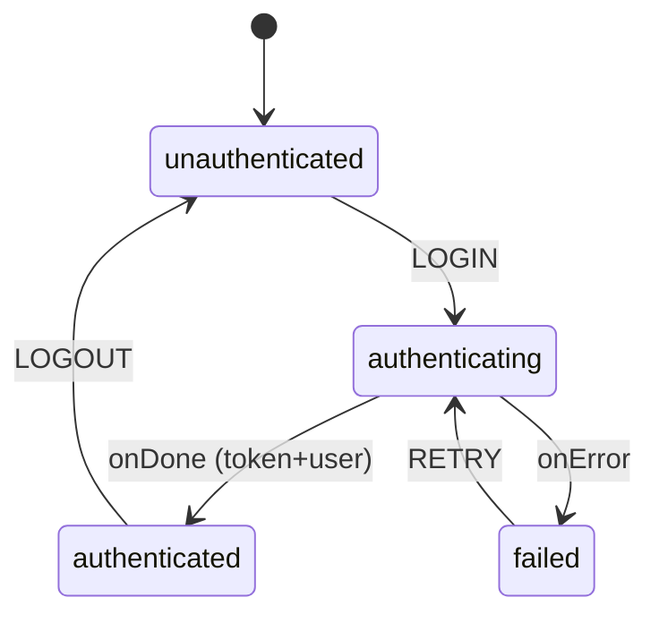

```typescript
import { createMachine, assign, fromPromise } from "xstate";
// => createMachine: FSM blueprint; assign: context updater; fromPromise: async actor

// Simulated login API -- replace with real fetch in production
const loginAPI = async (credentials: { email: string; password: string }) => {
  // => Async function; returns user object or throws on failure
  if (credentials.password === "wrong") throw new Error("Invalid credentials");
  // => Simulates server rejection
  return { user: { id: "1", name: "Alice" }, token: "tok_abc123" };
  // => Returns strongly typed user and token on success
};
// => loginAPI is a plain async function; wrapped in fromPromise below
// => In production: replace simulation with real fetch call

export const authMachine = createMachine(
  // => Two-argument form: (config, implementations)
  // => Separating config from implementations enables easy mocking in tests
  {
    // => Top-level auth FSM; controls all login/logout state
    id: "auth",
    // => Named for DevTools and system.get() lookups
    initial: "unauthenticated",
    // => Machine starts unauthenticated; no user data in context yet
    context: {
      // => context: typed shape for all auth-related data
      user: null as { id: string; name: string } | null,
      // => null until authenticated; holds id and name after login
      token: null as string | null,
      // => Null until authenticated; cleared on logout
      error: null as string | null,
      // => Holds last error message for display
    },
    // => context block closed; three fields: user, token, error
    states: {
      // => states: four phases of the auth lifecycle
      unauthenticated: {
        // => Initial state; user is not logged in
        on: {
          // => Accepts only LOGIN in this state
          LOGIN: {
            target: "authenticating",
            // => Trigger: user submits credentials
            // => LOGIN event is expected to carry a credentials payload
          },
          // => LOGIN handler closed; unauthenticated only accepts LOGIN
        },
      },
      // => unauthenticated state closed
      authenticating: {
        // => Active while loginAPI promise is pending
        invoke: {
          // => invoke: runs an actor (promise) while in this state
          src: "loginAPI",
          // => Calls the loginAPI actor (defined in actors config below)
          input: ({ event }) => (event as any).credentials,
          // => Passes credentials from the LOGIN event to the API
          onDone: {
            // => Promise resolved: transition to authenticated
            target: "authenticated",
            // => Success path: user is now authenticated
            actions: assign({
              // => assign updates context with server response
              user: ({ event }) => event.output.user,
              // => Stores returned user in context
              token: ({ event }) => event.output.token,
              // => Stores token for subsequent API calls
              error: null,
              // => Clears any previous error
            }),
          },
          // => onDone block closed
          onError: {
            // => Promise rejected: transition to failed
            target: "failed",
            // => Failure path: preserves error message in context
            actions: assign({
              error: ({ event }) => (event.error as Error).message,
              // => Preserves error message for UI display
            }),
          },
          // => onError block closed
        },
        // => invoke block closed; both paths (done/error) handled
      },
      // => authenticating state closed
      authenticated: {
        // => User is logged in; token and user are populated in context
        on: {
          // => Accepts only LOGOUT in this state
          LOGOUT: {
            target: "unauthenticated",
            // => Logout path: clears context and returns to initial state
            actions: assign({ user: null, token: null }),
            // => Clears credentials; machine returns to initial state
            // => user and token set to null; context.error untouched
          },
        },
      },
      // => authenticated state closed
      failed: {
        // => Login failed; error message in context.error
        on: { RETRY: "authenticating" },
        // => User can retry from the same failed state
        // => RETRY sends user back to authenticating without resetting context
      },
      // => failed state closed; all four states defined
    },
    // => states block closed; unauthenticated/authenticating/authenticated/failed
  },
  // => config object closed; implementations follow
  {
    // => implementations block: bind logic to named references
    actors: {
      // => actors: maps string src names to actor logic implementations
      loginAPI: fromPromise(({ input }) => loginAPI(input as any)),
      // => Wraps async function as a promise actor
      // => input comes from the invoke.input resolver in authenticating state
    },
    // => actors block closed; loginAPI is the only actor used
  },
);
// => authMachine: complete auth FSM with 4 states, 3 transitions, and 1 actor
// => Exported for use in components via useMachine(authMachine)
// => Test actors override: machine.provide({ actors: { loginAPI: mockActor } })
```

**Key Takeaway:** Map each authentication lifecycle phase (idle, loading, success, failure) to a discrete state. Use `onDone`/`onError` transitions on `invoke` to store the result or error in context.

**Why It Matters:** Encoding auth state as an FSM eliminates impossible UI states like "loading and error simultaneously." The machine is the single source of truth for auth, making it trivially easy to show the right UI, protect routes, and test every transition in isolation. Compared to ad-hoc `isLoading`/`isError` flags scattered across components, the FSM approach centralises auth logic in one inspectable place. Swapping the real login API for a mock in tests is a one-line `machine.provide` call. Every transition is explicit and traceable, which is critical for security-sensitive code paths.

---

### Example 60: Multi-Step Wizard

A wizard machine advances linearly through steps, supports back navigation, accumulates form data in context per step, and invokes a submit API on the final step. Context grows as the user progresses, and the back transition does not clear data — it only moves the active state backward.

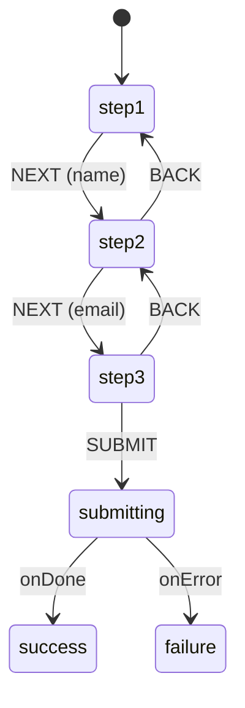

```typescript
import { createMachine, assign, fromPromise } from "xstate";
// => createMachine: FSM blueprint; assign: context updater; fromPromise: async actor
// => fromPromise wraps an async function into an invokeable actor source
// => All three imports used: createMachine for blueprint, assign for data, fromPromise for API

// Wizard context accumulates all form fields across all three steps
type WizardContext = {
  // => All four fields present from step1; avoids adding keys mid-lifecycle
  name: string;
  // => Collected in step1 NEXT action; persists unchanged through step2 and step3
  email: string;
  // => Collected in step2 NEXT action; persists unchanged through step3
  plan: string;
  // => Collected in step3 before SUBMIT; passed to API in submitting state
  error: string | null;
  // => null when no error; populated by onError action with server error message
};
// => WizardContext type: four fields covering the full wizard lifecycle
// => Using a named type makes the machine's context shape self-documenting
// => TypeScript will enforce that all four fields are always present in context

export const wizardMachine = createMachine(
  {
    // => wizardMachine: six-state FSM; step1→step2→step3→submitting→success/failure
    id: "wizard",
    // => Named for DevTools and useMachine hook identification in React
    initial: "step1",
    // => Machine begins in step1; user must send NEXT to progress forward
    // => All six states defined below; no circular or backward loops except BACK
    context: { name: "", email: "", plan: "", error: null } as WizardContext,
    // => All four context fields initialised here; avoids partial context at any step
    // => error is null at start; TypeScript enforces WizardContext shape throughout
    // => name, email, plan start as empty strings; populated progressively via assign
    states: {
      // => step1, step2, step3 collect data; submitting calls API; success/failure are terminal
      step1: {
        // => Step 1: name collection; NEXT is the only valid event accepted
        on: {
          NEXT: {
            target: "step2",
            // => NEXT received: assign context.name then enter step2 state
            actions: assign({ name: ({ event }) => (event as any).name }),
            // => assign runs synchronously before step2 entry; step2 sees new name
            // => event.name is the string the user typed in the step-1 form field
            // => context.name captured here; unchanged through step2, step3, and submitting
            // => Machine transitions only after assign completes successfully
          },
        },
        // => step1 has no BACK handler; this is the entry step; no prior state
        // => Sending BACK in step1 is silently ignored; machine stays in step1
        // => XState ignores events that have no handler in the current state
      },
      step2: {
        // => Step 2: email collection; NEXT and BACK both accepted
        on: {
          NEXT: {
            target: "step3",
            // => NEXT received: assign email to context then enter step3
            actions: assign({ email: ({ event }) => (event as any).email }),
            // => context.email updated; context.name from step1 is still intact
            // => assign({ email }) targets only the email field; name is preserved
            // => step3 entry sees context: { name: filled, email: just-assigned }
          },
          BACK: "step1",
          // => BACK: simple string target; no actions or guards required
          // => context.name fully preserved; user sees prior input when back
          // => No assign on BACK means no context mutation; state changes only
        },
      },
      step3: {
        // => Step 3: plan review and selection; SUBMIT finalises, BACK revises email
        on: {
          SUBMIT: "submitting",
          // => SUBMIT: all three context fields populated at this point
          // => context: { name: filled, email: filled, plan: filled }
          // => Machine invokes submitWizard with entire context as input
          BACK: "step2",
          // => BACK to step2; context.name and email both preserved unchanged
          // => User can correct email; on re-NEXT, context.email is updated
        },
      },
      submitting: {
        // => API invocation state; no user events accepted here; show spinner
        invoke: {
          src: "submitWizard",
          // => submitWizard actor registered in actors config at the bottom
          input: ({ context }) => context,
          // => Full WizardContext passed to actor; API gets all four fields
          // => submitWizard receives { name, email, plan, error: null } as input
          onDone: "success",
          // => API accepted the registration; advance to terminal success
          // => No further user events accepted after entering success
          onError: {
            target: "failure",
            // => API rejected; store error message in context and show failure
            actions: assign({
              error: ({ event }) => (event.error as Error).message,
              // => context.error set to the server's rejection reason string
              // => UI renders context.error as an error banner in failure state
            }),
          },
        },
      },
      success: { type: "final" },
      // => type: "final": actor stops; parent gets xstate.done.actor.wizard event
      // => Wizard complete; context.name, context.email, context.plan all set
      // => Snapshot can be inspected post-completion: actor.getSnapshot().context
      failure: {
        // => Submission failed; context.error holds rejection message; user can retry
        on: { RETRY: "submitting" },
        // => RETRY re-enters submitting; same WizardContext passed to submitWizard
        // => context.name, email, plan unchanged; user does not re-enter any fields
        // => context.error will be cleared if next attempt fails with a different message
      },
    },
  },
  {
    // => Second argument to createMachine: implementation config (actors, delays, guards)
    actors: {
      submitWizard: fromPromise(async ({ input }) => {
        // => input is the full WizardContext: { name, email, plan, error: null }
        // => Production: POST /api/register with input as JSON body to backend
        console.log("Submitting:", input);
        // => Logs all accumulated wizard data; replace with real fetch()/axios call
        return { ok: true };
        // => Simulated success response; production returns { userId, token } or similar
      }),
    },
  },
);
```

**Key Takeaway:** Each wizard step is a state; `NEXT` transitions store that step's data in context via `assign`. Back navigation reuses simple target strings — no data is cleared.

**Why It Matters:** A wizard FSM makes multi-step flows deterministic. You can never be on "step 3 with no step 2 data" because context is assigned during the forward transition. The machine also makes progress serialisable — snapshot + restore lets users resume a partially completed wizard after page reload. Compared to managing step state manually with `currentStep` integers and separate field state, the FSM approach co-locates step logic, data accumulation, and submit invocation in one auditable config. Each step transition is an event — easy to test, log, and replay in the XState inspector.

---

### Example 61: WebSocket Connection Machine

A WebSocket machine models the full connection lifecycle using a `fromCallback` actor that wraps the native WebSocket API. The `fromCallback` actor translates WebSocket events into machine events and cleans up the socket on unsubscribe.

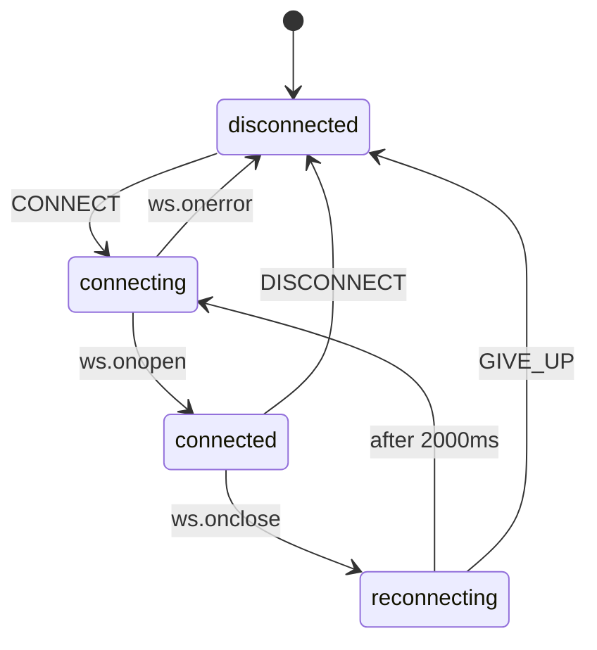

```typescript
import { createMachine, assign, fromCallback } from "xstate";
// => createMachine: FSM blueprint; assign: context updater
// => fromCallback: wraps event-driven APIs (like WebSocket) as actors

// fromCallback actor wraps the native WebSocket lifecycle
const websocketActor = fromCallback(({ sendBack, input }) => {
  // => sendBack sends events to the parent machine
  // => input contains { url } from the invoke's input field
  // => fromCallback runs while the invoking state is active
  const ws = new WebSocket((input as any).url);
  // => Create socket; does not block -- callbacks fire asynchronously
  // => WebSocket constructor is non-blocking; connection happens in background

  ws.onopen = () => sendBack({ type: "WS_OPEN" });
  // => Fires when connection is established
  // => Machine transitions to 'connected' in response to WS_OPEN
  ws.onmessage = (e) => sendBack({ type: "WS_MESSAGE", data: e.data });
  // => Fires for each incoming message
  // => Machine stays in 'connected'; action logs the data
  ws.onerror = () => sendBack({ type: "WS_ERROR" });
  // => Fires on connection error
  // => Machine transitions to 'disconnected'; socket is unusable
  ws.onclose = () => sendBack({ type: "WS_CLOSE" });
  // => Fires when connection drops unexpectedly
  // => Machine moves to 'reconnecting' to attempt re-connection

  return () => ws.close();
  // => Cleanup: close socket when machine leaves the invoking state
  // => Runs automatically when machine transitions away from 'connecting'
  // => Prevents orphaned WebSocket handles regardless of transition cause
});
// => websocketActor: bridges native WebSocket events to XState machine events

export const wsMachine = createMachine({
  // => WebSocket connection lifecycle FSM
  id: "ws",
  // => Named for DevTools; visible in inspector as "ws"
  initial: "disconnected",
  // => Starts disconnected; CONNECT event initiates the socket lifecycle
  context: { url: "wss://echo.example.com", retries: 0 },
  // => url: server endpoint; retries: count of reconnect attempts
  states: {
    disconnected: {
      // => No socket exists; machine waits for CONNECT command
      on: { CONNECT: "connecting" },
      // => CONNECT triggers socket creation via websocketActor invoke
    },
    connecting: {
      // => Socket is being opened; ws.onopen has not fired yet
      invoke: {
        src: websocketActor,
        // => Runs websocketActor while in 'connecting' state
        input: ({ context }) => ({ url: context.url }),
        // => Passes url from context to the fromCallback actor
        // => Actor reads (input as any).url to construct the WebSocket
      },
      on: {
        WS_OPEN: "connected",
        // => Transition fires when ws.onopen sends WS_OPEN
        // => Socket is ready for bidirectional communication
        WS_ERROR: "disconnected",
        // => Failed to connect; return to disconnected
        // => Cleanup runs automatically; socket is discarded
      },
    },
    connected: {
      // => Socket is live; messages flow bidirectionally
      on: {
        DISCONNECT: "disconnected",
        // => Intentional disconnect; cleanup runs automatically
        // => ws.close() is called via the fromCallback cleanup return
        WS_CLOSE: "reconnecting",
        // => Unexpected close; attempt to reconnect
        // => Server closed the connection or network dropped
        WS_MESSAGE: {
          actions: ({ event }) => console.log("Received:", event.data),
          // => Handle incoming data; stays in connected state
          // => Real app would dispatch data to UI or update context
        },
      },
    },
    reconnecting: {
      // => Waiting before next connection attempt; socket is closed
      after: {
        2000: "connecting",
        // => Wait 2 s then attempt reconnect
        // => Delay avoids hammering server on rapid disconnects
      },
      on: {
        GIVE_UP: "disconnected",
        // => User or external logic can abort reconnection
        // => Clears the reconnect timer and moves to disconnected
      },
    },
  },
});
// => wsMachine: five-state connection lifecycle with automatic reconnect
```

**Key Takeaway:** Use `fromCallback` to wrap event-driven APIs like WebSocket. The cleanup function returned from `fromCallback` fires automatically when the machine leaves the invoking state, preventing resource leaks.

**Why It Matters:** WebSocket lifecycle management is notorious for subtle bugs (double-close, stale handlers, missed reconnects). An FSM makes every state and transition explicit and testable. The cleanup return from `fromCallback` guarantees no orphaned socket handles, regardless of how the machine transitions. Compared to imperative flag management (`isConnected`, `reconnectTimer`, `messageQueue`), the FSM encodes the entire connection lifecycle as a graph — readable by non-engineers, visualisable in the inspector, and safe under concurrent events like simultaneous disconnect and reconnect attempts.

---

### Example 62: Data Fetching with Exponential Backoff Retry

A fetch machine retries failed requests with exponential backoff using XState's `after` (delayed self-transition) combined with a retry counter in context. The machine moves from `loading` → `success` on resolve, or `loading` → `failed` where a backoff timer triggers a return to `loading`.

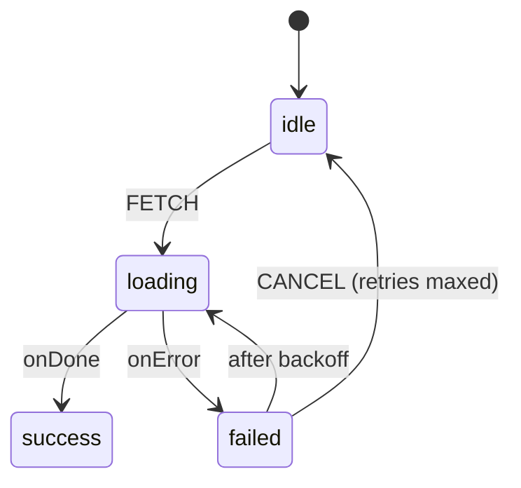

```typescript
import { createMachine, assign, fromPromise } from "xstate";
// => createMachine: FSM blueprint; assign: context updater; fromPromise: async actor
// => fromPromise: wraps an async function into an invokeable XState actor

const MAX_RETRIES = 3;
// => Cap retries: after 3 consecutive failures the always guard aborts auto-retry
// => Change MAX_RETRIES here to adjust the retry policy in one place
// => After MAX_RETRIES failures, machine transitions to idle for manual FETCH retry

const fetchData = async (url: string) => {
  // => Standalone async function; not coupled to XState; testable in isolation
  // => Returns parsed JSON on success; throws on HTTP error
  const res = await fetch(url);
  // => Awaits HTTP response; throws on network error (DNS, timeout, etc.)
  if (!res.ok) throw new Error(`HTTP ${res.status}`);
  // => Non-2xx status throws; XState onError receives the Error object
  return res.json();
  // => Resolved JSON body becomes event.output in the machine's onDone handler
};
// => fetchData: plain async function; passed to fromPromise adapter below
// => Keeping fetchData separate from the machine makes it independently unit-testable
// => Unit tests can call fetchData(url) directly without creating a machine or actor

export const fetchMachine = createMachine(
  {
    // => Data fetching FSM with exponential backoff: four states, full retry policy
    id: "fetch",
    // => DevTools name; "fetch" visible in XState inspector as the actor label
    initial: "idle",
    // => Machine starts idle; no actor running; context.retries is 0
    // => User must send FETCH to begin; machine will not auto-fetch on creation
    context: { data: null as unknown, error: null as string | null, retries: 0 },
    // => data: null until fetch succeeds; updated in onDone assign action
    // => error: null at idle; populated on onError; cleared on entry to loading
    // => retries: 0-based counter; drives both the always guard and delay formula
    states: {
      // => idle: waiting; loading: fetching; success: done; failed: retry/abort
      idle: {
        // => Idle: no actor running; context unchanged; waiting for FETCH event
        on: { FETCH: "loading" },
        // => FETCH: transitions to loading; invoke.src fires immediately on entry
        // => retries=0 on first FETCH; may be >0 if arriving from failed→idle path
        // => Sending FETCH while idle always starts a fresh loading attempt
      },
      loading: {
        // => Loading: fetchData actor running; entry clears error before attempt
        entry: assign({ error: null }),
        // => Stale error cleared; UI transitions to clean loading indicator
        // => error stays null during loading; only populated if onError fires
        // => entry runs before invoke starts; actor sees error: null in context
        invoke: {
          src: "fetchData",
          // => fetchData actor (fromPromise) registered in actors config below
          input: () => "https://api.example.com/data",
          // => Static URL for demo; production: ({ context }) => context.url
          // => Replace with ({ context }) => context.url in production
          onDone: {
            target: "success",
            // => fetchData resolved; transition to success, store data, reset retries
            actions: assign({
              // => Two fields updated atomically in one assign call
              data: ({ event }) => event.output,
              // => event.output: parsed JSON body from fetchData; the fetched resource
              // => Typed as unknown; narrow to specific type in production (e.g. User[])
              retries: 0,
              // => Reset retries to 0 on success; ready for next independent fetch
              // => retries=0 ensures subsequent failure cycles start with full backoff
            }),
          },
          onError: {
            target: "failed",
            // => fetchData threw or rejected; move to failed, capture error, bump count
            actions: assign({
              // => Two fields updated: error message and incremented retry counter
              error: ({ event }) => (event.error as Error).message,
              // => HTTP or network error string; shown in UI during failed state
              retries: ({ context }) => context.retries + 1,
              // => Bumps retry count: 0→1 first failure, 1→2 second, 2→3 third
              // => Incremented retries drives exponential BACKOFF_DELAY calculation
            }),
          },
        },
      },
      success: { type: "final" },
      // => Terminal: context.data populated; snapshot.status === "done"
      // => Actor stops; no further events accepted from this point
      failed: {
        // => Failed state: evaluates guard then either aborts or schedules backoff
        always: {
          guard: ({ context }) => context.retries >= MAX_RETRIES,
          // => Guard checked synchronously on entry; true → immediate idle transition
          // => false → always block skipped; after block schedules BACKOFF_DELAY
          target: "idle",
          // => Guard true: max retries exhausted; return to idle for manual FETCH
          // => context.retries stays at 3; user initiates fresh cycle when ready
        },
        after: {
          BACKOFF_DELAY: "loading",
          // => Guard was false (retries < MAX_RETRIES); auto-retry after delay
          // => BACKOFF_DELAY resolved dynamically by delays.BACKOFF_DELAY(context)
          // => On delay expiry machine enters loading; new fetchData actor starts
        },
        on: { CANCEL: "idle" },
        // => CANCEL aborts the pending backoff timer and resets to idle
        // => No further automatic retry; user must send FETCH to try again
      },
    },
  },
  {
    actors: {
      fetchData: fromPromise(({ input }) => fetchData(input as string)),
      // => fromPromise adapter: input = URL string; resolve → onDone; throw → onError
      // => Decouples the async function from XState; fetchData stays independently testable
    },
    delays: {
      BACKOFF_DELAY: ({ context }) => Math.min(1000 * 2 ** context.retries, 30000),
      // => retries=1→2000ms; retries=2→4000ms; retries=3→8000ms; hard cap at 30 000ms
      // => Pure function of context; deterministic, unit-testable, no side effects
      // => Math.min cap prevents unreasonably long delays at high retry counts
    },
  },
);
// => fetchMachine: complete backoff policy in one config; idle → loading → success/failed
// => Retry curve, max cap, cancel — all declarative; zero imperative timer management
```

**Key Takeaway:** Named delays in the `delays` config can be functions of context, enabling exponential backoff without any external timer management. The `always` guard aborts auto-retry once `MAX_RETRIES` is reached.

**Why It Matters:** Retry logic written imperatively is error-prone — leaked timers, double-fires, and unclear abort conditions are common. An FSM externalises the entire retry policy into declarative config: you can change the backoff formula or retry cap in one place without touching state transition logic. The `delays` config accepts functions of context, so the backoff curve is data-driven and testable. An `always` guard on retry count makes the abort condition explicit and impossible to accidentally bypass. The same machine can be unit-tested for exact retry timing and cancellation without touching real timers.

---

### Example 63: Optimistic Update

An optimistic update machine applies a context change immediately (optimistic), invokes the API in the background, and rolls back context on error. The user sees instant feedback; the machine silently reconciles with the server.

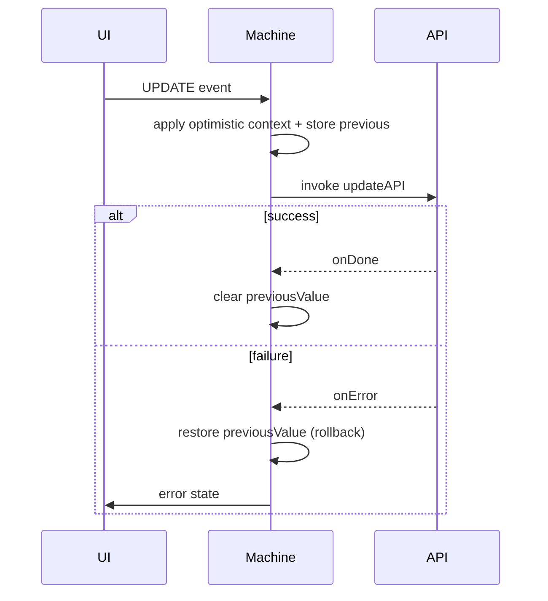

```typescript
import { createMachine, assign, fromPromise } from "xstate";
// => createMachine: FSM blueprint; assign: context updater; fromPromise: async actor

// ItemContext: type definition for the optimistic update machine context
type ItemContext = {
  // => Three fields track value, rollback snapshot, and error
  value: string;
  // => Current displayed value (may be optimistic, unconfirmed by server)
  // => UI always renders this field; may differ from server-confirmed value
  previousValue: string | null;
  // => Snapshot before optimistic update; used for rollback
  // => null when no pending update; set to old value before applying new one
  error: string | null;
  // => Populated on API failure; null when idle or saving
  // => UI can display this to notify user of failed save
};
// => ItemContext definition complete; three fields describe the full optimistic state

export const optimisticMachine = createMachine(
  // => Two-argument form: (config, implementations)
  // => Named export for use in React components via useMachine(optimisticMachine)
  {
    // => Optimistic update FSM: apply first, confirm or rollback later
    id: "optimistic",
    // => Named for DevTools identification
    initial: "idle",
    // => Machine starts in 'idle'; waiting for UPDATE events
    context: { value: "initial", previousValue: null, error: null } as ItemContext,
    // => Initial context: value is "initial", no snapshot, no error
    states: {
      // => Two states: idle (waiting) and saving (API pending)
      idle: {
        // => User is not editing; shows current value
        on: {
          // => idle only accepts UPDATE events
          UPDATE: {
            target: "saving",
            // => Transition to saving immediately after optimistic apply
            actions: assign({
              // => assign fires BEFORE the transition to 'saving'
              previousValue: ({ context }) => context.value,
              // => Snapshot current value BEFORE overwriting
              value: ({ event }) => (event as any).newValue,
              // => Apply new value immediately -- user sees it at once
              error: null,
              // => Clear any previous error on new update attempt
            }),
          },
          // => UPDATE handler closed
        },
      },
      // => idle state closed
      saving: {
        // => API call is pending; value is optimistically applied
        invoke: {
          // => invoke: starts updateAPI actor while in this state
          src: "updateAPI",
          // => updateAPI defined in actors config below
          input: ({ context }) => ({ value: context.value }),
          // => Sends the optimistically applied value to the server
          onDone: {
            // => API confirmed the update
            target: "idle",
            // => Return to idle; value is now server-confirmed
            actions: assign({ previousValue: null }),
            // => Server confirmed: discard the snapshot
          },
          // => onDone closed
          onError: {
            // => API rejected; must rollback
            target: "idle",
            // => Return to idle with rolled-back value
            actions: assign({
              // => Rollback: restore previousValue, clear snapshot, set error
              value: ({ context }) => context.previousValue ?? context.value,
              // => Roll back to snapshot on failure
              previousValue: null,
              // => Clear snapshot after rollback
              error: ({ event }) => (event.error as Error).message,
              // => Surface error to UI
            }),
          },
          // => onError closed
        },
        // => invoke closed; both paths (success/failure) handled
      },
      // => saving state closed
    },
    // => states closed; idle and saving defined
  },
  // => config closed; implementations follow
  {
    // => actors: maps src names to actor logic
    actors: {
      updateAPI: fromPromise(async ({ input }) => {
        // => Simulated API; throws 50% of the time for demo
        if (Math.random() < 0.5) throw new Error("Network error");
        // => Simulates intermittent network failure
        return input;
        // => Returns input unchanged on success (echo server)
      }),
    },
    // => actors closed; updateAPI is the only actor
  },
);
// => optimisticMachine: idle ↔ saving with rollback on failure
// => Pattern: apply optimistically in idle, confirm in saving, rollback in onError
// => No extra state needed; rollback is encoded in the machine, not the component
```

**Key Takeaway:** Store the pre-update value in `previousValue` before assigning the optimistic value. On `onError`, restore `previousValue` to roll back. The machine handles the full lifecycle without external state.

**Why It Matters:** Optimistic updates dramatically improve perceived performance for latency-sensitive actions (likes, favourites, inline edits). Encoding the rollback inside the FSM means the UI component is completely stateless — it only reads context and sends events, making rollback reliable and testable. Without the FSM, rollback logic lives in the component's catch block — easy to forget, inconsistent across features, and impossible to test without rendering. The `previousValue` snapshot in context is the machine's internal undo stack, automatically managed by the transition lifecycle without any manual cleanup code.

---

## Group 14: Ecosystem Integration (Examples 64–67)

### Example 64: XState + React Query

A machine controls form submission UI state while React Query manages the server cache mutation. XState handles the multi-state flow (idle → submitting → success/failure); React Query handles deduplication, caching, and retries.

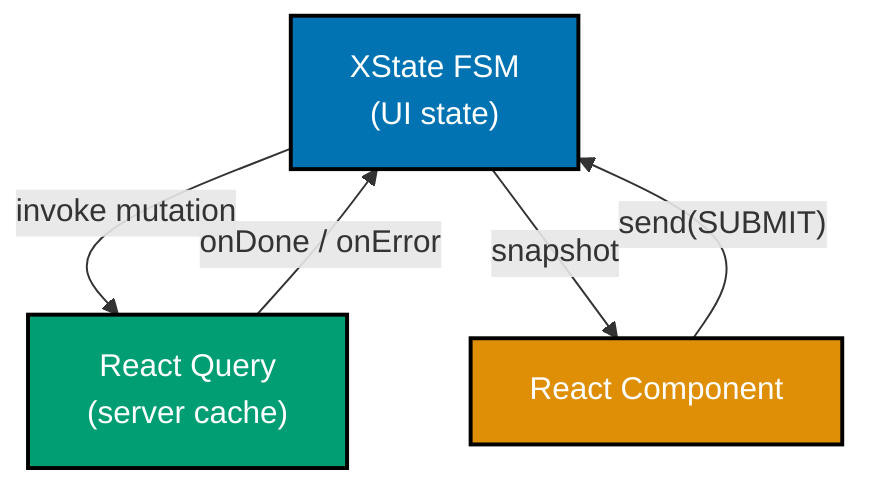

```typescript
// Note: requires react, @tanstack/react-query, @xstate/react
import { createMachine, fromPromise } from "xstate";
// => XState imports -- no React Query import needed inside the machine
// => Machine is framework-agnostic; React Query injected at component mount time

// The machine wraps the mutation as a fromPromise actor
// React Query's mutateAsync is passed in via machine input
export const formMachine = createMachine(
  {
    // => Controls form submission lifecycle; agnostic to server-cache details
    id: "form",
    // => Named for DevTools; "form" visible in inspector state panel
    initial: "idle",
    // => Starts idle; user has not yet submitted
    context: { error: null as string | null },
    // => error: null when idle or success; set to message on failure
    states: {
      idle: {
        // => Form visible; user fills in fields
        on: { SUBMIT: "submitting" },
        // => SUBMIT event carries formData payload from React Hook Form
        // => React Query's cache is not involved until submitting state
      },
      submitting: {
        // => Mutation is in flight; UI should show loading indicator
        invoke: {
          src: "submitMutation",
          // => Calls the actor registered below; actor wraps mutateAsync
          // => In production: replaced via machine.provide() with real mutateAsync
          input: ({ event }) => (event as any).formData,
          // => Passes form data from the SUBMIT event
          // => mutateAsync receives this as its argument
          onDone: "success",
          // => React Query mutation resolved; move to success state
          onError: {
            target: "idle",
            // => Mutation rejected; return to idle with error message
            actions: ({ context, event }) => {
              (context as any).error = (event.error as Error).message;
              // => Stores error for display in the form
              // => UI reads context.error to show error banner or field messages
            },
          },
        },
      },
      success: {},
      // => Mutation succeeded; UI shows confirmation message
      // => React Query cache has been updated automatically by useMutation
    },
  },
  {
    actors: {
      // submitMutation is provided at runtime via machine.provide()
      // allowing the React Query mutateAsync to be injected:
      // const machine = formMachine.provide({
      //   actors: { submitMutation: fromPromise(({ input }) => mutateAsync(input)) }
      // });
      submitMutation: fromPromise(async ({ input }) => input),
      // => Placeholder; replaced at runtime with mutateAsync
      // => In tests: replace with mock actor returning known response
    },
  },
);
// => formMachine: idle → submitting → success/idle; mutation actor is injectable

// React component usage (pseudocode):
// const mutation = useMutation({ mutationFn: createPost });
// => React Query manages caching, deduplication, and background re-fetches
// const [state, send] = useMachine(
//   formMachine.provide({
//     actors: { submitMutation: fromPromise(({ input }) => mutation.mutateAsync(input)) }
//   })
// );
// => machine.provide() injects mutateAsync as the submitMutation actor at mount time
// => state.value: "idle" | "submitting" | "success"
// => state.context.error: null or error message string for UI display
```

**Key Takeaway:** Use `machine.provide()` at the component level to inject a React Query `mutateAsync` as the `submitMutation` actor. The machine stays framework-agnostic; React Query's caching and retry benefits apply automatically.

**Why It Matters:** XState and React Query solve different problems. React Query excels at server-state deduplication and background refresh; XState excels at multi-step UI flows and impossible-state prevention. Combining them gives you both benefits without coupling: the machine is independently testable with a mock actor, and React Query continues to manage its cache independently.

---

### Example 65: XState + Effect.ts

`fromPromise` accepts any function returning a native `Promise`. `Effect.runPromise` converts an `Effect` into a `Promise`, making it a natural bridge. Typed errors from `Effect` can map to machine error states when caught in `onError`.

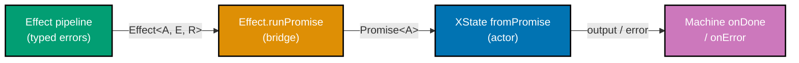

```typescript
// Note: requires the 'effect' npm package
// import { Effect } from "effect";

import { createMachine, fromPromise } from "xstate";
// => createMachine: FSM blueprint; fromPromise: wraps any Promise-returning function
// => No Effect-specific XState adapter needed; Effect.runPromise is the bridge
// => fromPromise accepts (input) => Promise<A>; Effect.runPromise returns Promise<A>

// Simulated Effect-style computation (without importing effect for portability)
// In real usage: Effect.gen(function* () { ... }).pipe(Effect.runPromise)
const effectLikeComputation = async (userId: string): Promise<{ name: string }> => {
  // => Represents Effect<User, HttpError, never> bridged to Promise<User>
  // => Effect's typed error channel maps to thrown JavaScript errors here
  if (!userId) throw Object.assign(new Error("Not found"), { _tag: "NotFound" });
  // => Effect's typed errors are thrown as plain Error objects with _tag property
  // => _tag discriminant allows machine to distinguish error types in onError handler
  return { name: "Alice" };
  // => Success case: resolves with User object { name: string }
  // => In real usage: Effect.runPromise(myEffect) resolves with the Effect's success value
};
// => effectLikeComputation: simulates Effect<User, NotFound, never>.pipe(Effect.runPromise)
// => Arrow function returning Promise<User>; fromPromise bridges this into XState

export const effectMachine = createMachine(
  {
    // => Machine that invokes an Effect-based service via fromPromise bridge
    id: "effectMachine",
    // => Named for DevTools; visible in inspector as "effectMachine"
    initial: "idle",
    // => Starts idle; LOAD event triggers the Effect computation via loadUser actor
    context: {
      // => Two fields: user (success result) and errorTag (failure discriminant)
      user: null as { name: string } | null,
      // => null until Effect resolves successfully; populated in onDone action
      errorTag: null as string | null,
      // => Stores Effect error _tag for precise error-type branching
      // => "NotFound" | "Unauthorized" | "Unknown" based on Effect error type
    },
    states: {
      // => Three states: idle (ready), loading (Effect running), success, error
      idle: {
        // => Waiting for LOAD event; no Effect running; context.user stays null
        on: { LOAD: "loading" },
        // => LOAD event carries { userId } payload; invoke.input extracts it
        // => Machine transitions to loading and starts the Effect computation
      },
      loading: {
        // => Effect computation in flight; actor runs effectLikeComputation(userId)
        invoke: {
          src: "loadUser",
          // => loadUser actor defined in actors config below as fromPromise wrapper
          input: ({ event }) => (event as any).userId,
          // => Extracts userId string from LOAD event payload
          // => Actor receives this string as its `input` in the fromPromise callback
          onDone: {
            target: "success",
            // => Effect resolved: advance to success and store user in context
            actions: ({ context, event }) => {
              context.user = event.output;
              // => Stores resolved user object: { name: string } from effectLikeComputation
              // => event.output shape is determined by effectLikeComputation's return type
            },
          },
          onError: {
            target: "error",
            // => Effect threw: capture _tag discriminant from the error object
            actions: ({ context, event }) => {
              context.errorTag = (event.error as any)._tag ?? "Unknown";
              // => Reads _tag from thrown Error; set by effectLikeComputation on failure
              // => "NotFound" → 404 UI; "Unauthorized" → login redirect; "Unknown" → generic
              // => ?? "Unknown" fallback handles errors without a _tag property
            },
          },
        },
      },
      success: {},
      // => Effect resolved; context.user holds { name: string }; actor is done
      // => UI reads context.user to render the fetched user information
      error: {},
      // => Effect threw; context.errorTag holds the discriminant string
      // => UI branches on errorTag to show the appropriate error message
    },
  },
  {
    actors: {
      loadUser: fromPromise(
        ({ input }) => effectLikeComputation(input as string),
        // => Real usage: ({ input }) => Effect.runPromise(fetchUser(input))
        // => fromPromise is the complete bridge; no XState-Effect adapter needed
        // => Pattern: fromPromise(({ input }) => Effect.runPromise(myEffect(input)))
      ),
    },
  },
);
// => effectMachine: idle → loading → success/error; Effect errors surfaced via _tag
// => Integration point is one function: Effect.runPromise; both libraries stay decoupled
// => Pattern is reusable: any Effect can integrate with XState using the same bridge
```

**Key Takeaway:** `fromPromise(({ input }) => Effect.runPromise(myEffect(input)))` is the complete integration bridge. Effect handles typed errors and composable pipelines; XState handles state routing.

**Why It Matters:** Effect.ts provides powerful typed-error composition and dependency injection for complex service layers. XState provides state-machine guarantees for UI flows. Using `Effect.runPromise` as the bridge keeps both libraries in their lane — you get Effect's expressive error types mapped cleanly to machine `onError` handlers with zero coupling. Neither library needs to know about the other's internals. This architecture lets teams adopt Effect incrementally in service code without rewriting the UI layer, and lets XState manage state without learning Effect's type system. The boundary is a plain Promise — universally compatible.

---

### Example 66: XState + Zustand

A machine reads initial state from a Zustand store on startup (via machine `input`) and writes results back to the store via a side-effect action. XState owns the multi-step flow; Zustand owns the persisted application state.

```typescript
// Note: requires zustand -- npm install zustand
// import { create } from "zustand";

import { createMachine, assign, fromPromise } from "xstate";
// => createMachine: FSM blueprint; assign: context updater; fromPromise: async actor
// => fromPromise bridges async API calls into XState's event-driven lifecycle

// Simulated Zustand store shape (without importing zustand for portability)
type AppStore = {
  draftName: string;
  // => Current in-progress edit; shared across components via Zustand reactive store
  savedName: string;
  // => Last successfully persisted name; source of truth after confirmed save
  setSavedName: (name: string) => void;
  // => Zustand action; calling this updates all subscribers reactively
};
// => AppStore: Zustand store shape; machine reads draftName and writes savedName
// => Machine receives draftName as input; does not subscribe to store changes

// In real usage: const useAppStore = create<AppStore>((set) => ({ ... }));
// Machine reads initial draftName from store, saves result back via setSavedName

export const editNameMachine = createMachine(
  {
    // => Multi-step edit flow: editing → saving → saved; bridges Zustand store
    id: "editName",
    // => Named for DevTools; "editName" visible in inspector
    initial: "editing",
    // => Starts editing immediately; draftName bootstrapped from Zustand input
    context: ({ input }) => ({
      // => Context factory function; receives input from createActor call
      // => Called once at actor creation; not re-evaluated on store changes
      draftName: (input as any)?.draftName ?? "",
      // => Bootstraps from Zustand input; empty string if not provided
      // => Changes to Zustand after actor creation do NOT update this field
      savedName: null as string | null,
      // => null until save succeeds; set to draftName value in onDone action
    }),
    states: {
      // => Three states: editing (user types), saving (API call), saved (done)
      editing: {
        // => User is actively editing the name field in the UI
        on: {
          CHANGE: {
            // => CHANGE event fires on each keystroke; no state transition needed
            actions: assign({
              draftName: ({ event }) => (event as any).value,
              // => XState context updates on each keystroke; Zustand store unchanged
              // => Zustand only updated after SAVE confirms via API success in onDone
            }),
          },
          SAVE: "saving",
          // => SAVE event submits current draftName; triggers API call in saving state
          // => No assign here; draftName already reflects latest keystroke
        },
      },
      saving: {
        // => API call in progress; actor resolves or rejects; no user events here
        invoke: {
          src: "saveToAPI",
          // => saveToAPI actor registered in actors config below as fromPromise
          input: ({ context }) => context.draftName,
          // => Forwards draftName string to actor; API persists this value
          // => context.draftName is the latest value from the last CHANGE event
          onDone: {
            target: "saved",
            // => API confirmed save; update both machine context and Zustand store
            actions: [
              assign({ savedName: ({ context }) => context.draftName }),
              // => Machine context records the confirmed persisted value
              // => context.savedName now equals the server-accepted draftName
              ({ context }) => {
                // => Side-effect: push confirmed name to Zustand global store
                // useAppStore.getState().setSavedName(context.draftName);
                // => Calling Zustand setter notifies all store subscribers immediately
                console.log("Zustand updated with:", context.draftName);
                // => In production: replace with useAppStore.getState().setSavedName(...)
              },
            ],
          },
        },
      },
      saved: { type: "final" },
      // => Terminal state; name persisted in machine context and Zustand store
      // => type: "final" signals actor done; parent receives xstate.done.actor event
    },
  },
  {
    actors: {
      saveToAPI: fromPromise(async ({ input }) => {
        // => Replace with real fetch/axios call; input is the name string
        console.log("Saving:", input);
        // => Logs name being saved; real implementation POSTs to /api/name
        return input;
        // => Echo pattern: returns saved name; real API returns server-confirmed value
      }),
    },
  },
);
// => editNameMachine: editing → saving → saved; writes back to Zustand on API success
// => Zustand owns durable state; machine owns transient flow; boundary is explicit
// => actor.stop() or type:"final" cleans up machine; Zustand store persists independently
// => Same pattern works with Redux, Jotai, or MobX; Zustand is not required

// Usage with Zustand (pseudocode):
// const { draftName } = useAppStore();
// => Read current draft from Zustand store to bootstrap the machine
// const actor = createActor(editNameMachine, { input: { draftName } });
// => Inject Zustand's draftName as input; machine bootstraps context.draftName from it
```

**Key Takeaway:** Pass Zustand state as `input` when creating the actor. Write back to Zustand inside `onDone` actions using the store's setter. The machine context is the single source of truth during the flow; Zustand is updated only on confirmed persistence.

**Why It Matters:** XState and Zustand serve different temporal scopes. Zustand persists application state across components and sessions; XState manages transient multi-step flows. Threading `input` from Zustand into the machine avoids duplicating state, and the explicit write-back action makes the persistence boundary visible and auditable. When the machine completes, a single `actions.persist` call syncs the result back — no ad-hoc store writes scattered in components. This pattern works for any global store (Redux, Jotai, MobX): the machine is the transient flow controller, the store is the durable record.

---

### Example 67: XState + React Hook Form

React Hook Form (RHF) owns field registration, validation, and dirty tracking. XState owns the submission lifecycle: idle → validating → submitting → done/error. The two integrate through a `handleSubmit` callback that sends a `SUBMIT` event to the machine with validated form data.

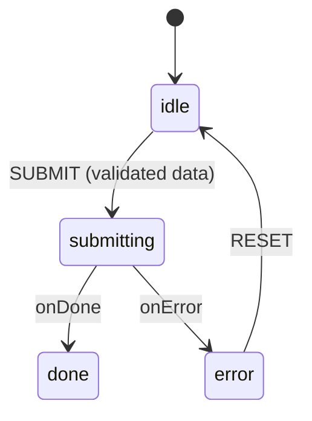

```typescript
// Note: requires react-hook-form and @xstate/react
// import { useForm } from "react-hook-form";
// import { useMachine } from "@xstate/react";

import { createMachine, assign, fromPromise } from "xstate";
// => createMachine: FSM blueprint; assign: context updater; fromPromise: async actor

type FormData = { email: string; password: string };
// => FormData type: shape of validated form values from RHF
// => RHF validates these fields; XState receives them only after validation passes

export const rhfMachine = createMachine(
  {
    // => Submission lifecycle machine; RHF handles field-level concerns
    id: "rhfForm",
    // => Named for DevTools; "rhfForm" visible in inspector
    initial: "idle",
    // => Machine starts idle; form is visible, not yet submitted
    context: { error: null as string | null },
    // => error: null when idle or done; set to message on server rejection
    states: {
      idle: {
        // => Form is ready for user input; RHF manages field state here
        on: {
          SUBMIT: "submitting",
          // => Triggered by RHF handleSubmit after validation passes
          // => Event carries validated FormData as event.data
          // => RHF never fires this event if validation fails
        },
      },
      submitting: {
        // => API call in flight; UI shows loading state
        invoke: {
          src: "submitForm",
          // => Calls the submitForm actor registered in actors config below
          input: ({ event }) => (event as any).data as FormData,
          // => RHF-validated data is the actor input
          // => input is the { email, password } object from handleSubmit callback
          onDone: "done",
          // => Server accepted the submission; advance to confirmation state
          onError: {
            target: "error",
            // => Server rejected; store error message for display
            actions: assign({
              error: ({ event }) => (event.error as Error).message,
              // => Captures server-side error for display
              // => UI renders context.error in an error banner below the form
            }),
          },
        },
      },
      done: {},
      // => Success state; component shows confirmation UI
      // => RHF form is typically hidden or reset at this point
      // => No further events accepted here; actor is effectively done
      error: {
        // => Submission failed; error message displayed; user can retry
        on: { RESET: { target: "idle", actions: assign({ error: null }) } },
        // => Allows user to dismiss error and resubmit
        // => assign clears error before transitioning back to idle
      },
    },
  },
  {
    actors: {
      submitForm: fromPromise(async ({ input }) => {
        // => Real implementation: POST /api/login with { email, password }
        console.log("Submitting form:", input);
        // => Replace with real API call e.g. POST /api/login
        // => input is the validated FormData: { email, password }
        return { userId: "u_123" };
        // => Simulated success; real API returns session token or user id
      }),
    },
  },
);
// => rhfMachine: idle → submitting → done/error; error dismissible via RESET

// React component pattern (pseudocode):
// const { register, handleSubmit } = useForm<FormData>();
// => RHF manages field registration, validation rules, and dirty state
// const [state, send] = useMachine(rhfMachine);
// => XState manages submission lifecycle: idle, submitting, done, error
// const onSubmit = handleSubmit((data) => send({ type: "SUBMIT", data }));
// => handleSubmit runs RHF validation first; only calls send if validation passes
// => RHF validates then calls send; XState takes over from there
```

**Key Takeaway:** RHF calls `handleSubmit` → you send `{ type: 'SUBMIT', data }` to the machine. RHF manages field state; XState manages submission state. Neither library intrudes on the other's domain.

**Why It Matters:** React Hook Form is optimised for high-performance uncontrolled field management. XState is optimised for multi-step state transitions. Their responsibilities do not overlap — RHF prevents XState from needing to track per-field dirty/validation state, and XState prevents RHF from needing to model loading/error/success lifecycle. The combination gives you the best of both.

---

## Group 15: Testing Advanced Patterns (Examples 68–70)

### Example 68: Model-Based Testing with @xstate/graph

`@xstate/graph` generates all shortest paths through a state machine as test cases. You map each state and event to assertion/action callbacks, then execute every generated path. This eliminates the need to manually enumerate test scenarios.

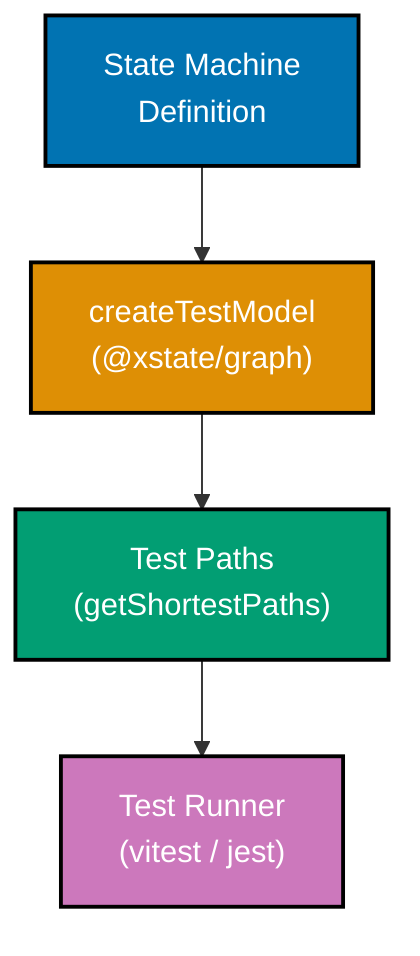

```typescript
// Note: requires @xstate/graph -- npm install @xstate/graph
// import { createTestModel } from "@xstate/graph";

import { createMachine } from "xstate";

// Simple toggle machine as the system under test
const toggleMachine = createMachine({
  // => Target machine for model-based test generation
  id: "toggle",
  initial: "off",
  states: {
    off: { on: { TOGGLE: "on" } },
    on: { on: { TOGGLE: "off" } },
  },
});

// Model-based test setup (pseudocode -- requires @xstate/graph in test env)
// const model = createTestModel(toggleMachine);
// => createTestModel wraps the machine with path-traversal utilities

// const paths = model.getShortestPaths();
// => Generates all shortest paths through the graph:
// =>   Path 1: off → (TOGGLE) → on
// =>   Path 2: off → (TOGGLE) → on → (TOGGLE) → off

// paths.forEach((path) => {
//   it(path.description, async () => {
//     await path.test({
//       states: {
//         off: ({ actor }) => expect(actor.getSnapshot().value).toBe("off"),
//         // => Assert UI renders "OFF" button
//         on: ({ actor }) => expect(actor.getSnapshot().value).toBe("on"),
//         // => Assert UI renders "ON" button
//       },
//       events: {
//         TOGGLE: ({ actor }) => actor.send({ type: "TOGGLE" }),
//         // => Drive the machine by sending the event
//       },
//     });
//   });
// });

// Standalone verification (no @xstate/graph import needed)
const actor = createMachine({
  // => Manual path traversal as fallback for test environments without graph
  id: "toggleTest",
  initial: "off",
  states: {
    off: { on: { TOGGLE: "on" } },
    on: { on: { TOGGLE: "off" } },
  },
});

console.log("Model-based testing traverses all paths automatically");
// => In real usage, @xstate/graph generates the path objects
```

**Key Takeaway:** `createTestModel(machine).getShortestPaths()` auto-generates test paths covering every state-event combination. You only write state assertions and event drivers — path enumeration is automatic.

**Why It Matters:** Manually writing test cases for complex FSMs is error-prone and incomplete. Model-based testing guarantees coverage of every reachable state and transition. Adding a new state or event to the machine automatically generates new test cases at no authoring cost, keeping tests in sync with the machine definition by construction. This eliminates the classic problem of tests that pass because they missed a code path, not because the code was correct. For multi-state workflows like auth or wizard flows, `@xstate/graph` can generate hundreds of unique transition paths from a modest machine definition, far exceeding what manual test authoring achieves.

---

### Example 69: Testing Actor Systems with Subscriptions

Testing a parent–child actor system involves creating the parent actor, waiting for it to settle, and then verifying that child actors receive and process events correctly by subscribing to their snapshots.

```typescript
// Note: requires vitest -- npm install -D vitest
import { createMachine, createActor, assign, sendTo } from "xstate";
// => createMachine: define FSM; createActor: run it; assign: update context; sendTo: route to child
import { describe, it, expect, vi } from "vitest";
// => vitest testing framework; vi is unused here but imported for completeness
// => describe/it/expect are standard vitest test structure primitives

// Child machine that tracks received events
const childMachine = createMachine({
  // => Simple counter child; each INCREMENT increments count
  id: "child",
  // => System id; parent uses this id when spawning via spawn(childMachine, { id: "child" })
  context: { count: 0 },
  // => Initial context: count starts at zero
  // => count increments by 1 for each INCREMENT event received from parent
  on: {
    // => Top-level on: applies in every state (machine-level listener)
    // => No states defined; machine has a single implicit state
    INCREMENT: {
      actions: assign({ count: ({ context }) => context.count + 1 }),
      // => Increments on each INCREMENT event from parent
      // => assign takes a function returning partial context; count grows by 1
      // => count: 0 → 1 → 2 after two INCREMENT events
    },
  },
});
// => childMachine definition complete; inert until spawned by parentMachine

// Parent that spawns child and forwards TICK events as INCREMENT
const parentMachine = createMachine({
  // => Parent forwards external TICK events to child actor
  id: "parent",
  // => Unique id for this machine in the actor system
  context: { childRef: null as any },
  // => childRef holds the ActorRef returned by spawn(); typed as any for brevity
  initial: "running",
  // => Machine starts in 'running' immediately; child is spawned on entry
  states: {
    running: {
      // => Only state in this machine; parent stays running indefinitely
      entry: assign({
        childRef: ({ spawn }) => spawn(childMachine, { id: "child" }),
        // => Spawn child on entry
        // => Returns ActorRef stored in context.childRef for later sendTo calls
        // => Child starts running immediately; count is 0 at this point
      }),
      on: {
        TICK: {
          actions: sendTo(({ context }) => context.childRef, { type: "INCREMENT" }),
          // => Route TICK → INCREMENT to child
          // => sendTo resolves the ActorRef each time and delivers the event
          // => Parent translates external TICK into child-specific INCREMENT
        },
      },
    },
  },
});
// => parentMachine definition complete; spawns child and routes TICKs
// => Testing this machine also tests the parent → child event forwarding

describe("Actor system", () => {
  // => Test suite: verifies parent-to-child event forwarding
  it("child receives forwarded events from parent", () => {
    const actor = createActor(parentMachine).start();
    // => Start the parent actor (child spawns immediately)
    // => Entry action fires synchronously; childRef is set before next line
    // => actor.getSnapshot().value === "running"; child is already running

    const childRef = actor.getSnapshot().context.childRef;
    // => Retrieve child ActorRef from parent context
    // => getSnapshot() returns current snapshot; .context.childRef is the spawned child
    // => childRef is a live ActorRef; subscribing to it gives real-time updates

    const snapshots: any[] = [];
    childRef.subscribe((snap: any) => snapshots.push(snap));
    // => Subscribe to child snapshots to observe state changes
    // => Each time child processes an event, a new snapshot is pushed
    // => snapshots array grows synchronously as events are processed

    actor.send({ type: "TICK" });
    // => Send TICK to parent; parent forwards INCREMENT to child
    // => Child processes INCREMENT: count goes from 0 → 1
    actor.send({ type: "TICK" });
    // => Second TICK; child should now have count = 2
    // => Child processes INCREMENT again: count goes from 1 → 2

    expect(childRef.getSnapshot().context.count).toBe(2);
    // => Assert child processed both forwarded events
    // => getSnapshot() on ActorRef reads the child's current snapshot
    // => count is 2: both TICK→INCREMENT rounds completed successfully
    expect(snapshots.length).toBeGreaterThanOrEqual(2);
    // => Subscription fired at least twice (one per INCREMENT)
    // => Verifies subscribe() callbacks were invoked on each state change
    // => greaterThanOrEqual(2) allows for an initial subscription snapshot
  });
});
```

**Key Takeaway:** Retrieve child `ActorRef` from parent context after starting the parent, then subscribe to the child's snapshot stream to assert on state changes driven by forwarded events.

**Why It Matters:** Actor systems are only as reliable as their message passing. Testing that parent-to-child forwarding works correctly catches bugs in `sendTo` logic, event type mismatches, and incorrect ref resolution — issues that only manifest at system level, not when testing machines in isolation. A unit test per machine checks individual behaviour; a subscription test like this checks that the actors actually compose correctly. It is the integration test layer for actor systems, and it runs synchronously using Vitest without any special setup or async complexity beyond standard promise handling.

---

### Example 70: Simulated Clock for Delayed Transitions

XState's `SimulatedClock` lets tests advance time programmatically without `setTimeout`. Pass the clock as `clock` in `createActor` options, then call `clock.increment(ms)` to trigger `after()` transitions instantly.

```typescript
// Note: requires vitest -- npm install -D vitest
import { createMachine, createActor } from "xstate";
// => createMachine: define the FSM; createActor: create runnable actor instance
import { SimulatedClock } from "xstate/simulation";
// => SimulatedClock is a test utility bundled with xstate
// => Import from 'xstate/simulation' subpath, not from 'xstate' directly
import { describe, it, expect } from "vitest";
// => Standard vitest test imports; no special XState test utilities needed

// Machine with a delayed self-transition (auto-closes after 3 s)
const toastMachine = createMachine({
  // => Notification toast that auto-dismisses after 3000 ms
  id: "toast",
  // => Unique id for debugging in inspector and error messages
  initial: "visible",
  // => Machine starts in 'visible'; toast appears immediately
  states: {
    visible: {
      // => Toast is on-screen; will auto-dismiss or respond to manual dismiss
      after: {
        // => after: schedules automatic transitions after a delay
        3000: "dismissed",
        // => Normally waits 3 real seconds; SimulatedClock bypasses this
        // => With SimulatedClock, clock.increment(3000) triggers this instantly
      },
      on: { DISMISS: "dismissed" },
      // => Manual dismiss also available
      // => User clicking "x" sends DISMISS; transitions to dismissed immediately
      // => DISMISS and after(3000) are both valid exit paths from 'visible'
    },
    dismissed: { type: "final" },
    // => Terminal state; toast is gone
    // => type: "final" means no further transitions are possible
    // => actor.getSnapshot().status === "done" when in this state
  },
});
// => toastMachine defined; after() timer controlled by whichever clock is injected

describe("Toast auto-dismiss", () => {
  // => Test suite for the delayed auto-dismiss behaviour
  it("dismisses after 3000 ms without real delay", () => {
    const clock = new SimulatedClock();
    // => Create a controllable clock; starts at time 0
    // => SimulatedClock does not tick automatically; only advances on increment()

    const actor = createActor(toastMachine, { clock }).start();
    // => Pass clock to actor; all internal timers use it
    // => { clock } option replaces the real setTimeout/setInterval with SimulatedClock

    expect(actor.getSnapshot().value).toBe("visible");
    // => At t=0, toast is visible
    // => The after(3000) timer is scheduled but has not fired yet

    clock.increment(3000);
    // => Advance simulated time by 3000 ms instantly
    // => The after(3000) transition fires synchronously
    // => No real waiting; test completes in microseconds

    expect(actor.getSnapshot().value).toBe("dismissed");
    // => Toast is now dismissed without waiting real time
    // => Final state reached; actor.getSnapshot().status === "done"
  });
});
```

**Key Takeaway:** Construct `new SimulatedClock()` and pass it as `{ clock }` to `createActor`. Call `clock.increment(ms)` to fire `after()` transitions instantly in tests.

**Why It Matters:** Real `setTimeout`-based tests are slow, flaky (timing-sensitive), and difficult to reason about. A simulated clock makes delayed-transition tests deterministic and instant. This is especially valuable for testing backoff logic, session timeouts, and polling intervals where real delays would make the test suite impractical. A 30-second session timeout is untestable with real time; with `SimulatedClock` it verifies in under a millisecond. Unlike fake timers in test frameworks that mock `setTimeout` globally, `SimulatedClock` is scoped to a single actor — safer, more explicit, and compatible with parallel test runs without timer interference.

---

## Group 16: Performance and Production (Examples 71–75)

### Example 71: Pure Transitions with machine.transition()

`createMachine` exposes a `transition(snapshot, event)` method that calculates the next snapshot without creating an actor or running side effects. This is useful for server-side state calculation, reducers, and previewing the next state without committing to it.

```typescript
import { createMachine, initialSnapshot } from "xstate";
// => createMachine: FSM blueprint; initialSnapshot: gets first snapshot without actor

// Simple traffic light machine
const trafficMachine = createMachine({
  // => FSM for stateless server-side transition calculation
  id: "traffic",
  // => Named for DevTools; "traffic" appears in inspector state panel
  initial: "green",
  // => Machine definition only; no runtime actor created yet
  states: {
    green: { on: { NEXT: "yellow" } },
    // => green → yellow on NEXT
    yellow: { on: { NEXT: "red" } },
    // => yellow → red on NEXT
    red: { on: { NEXT: "green" } },
    // => red wraps back to green; three-state cycle
  },
});
// => trafficMachine: pure FSM definition; used as a pure transition function below

// Get the initial snapshot without starting an actor
const initial = initialSnapshot(trafficMachine);
// => Returns a MachineSnapshot with value: "green"
// => No actor is created; no effects run
// => initialSnapshot is the pure-functional equivalent of actor.getSnapshot() at t=0

// Calculate next state purely
const afterFirst = trafficMachine.transition(initial, { type: "NEXT" });
// => Returns new MachineSnapshot with value: "yellow"
// => Synchronous; no timers, promises, or subscriptions created
// => machine.transition is a pure function: same inputs always produce same output

const afterSecond = trafficMachine.transition(afterFirst, { type: "NEXT" });
// => Returns new MachineSnapshot with value: "red"
// => Chaining transition() calls simulates a sequence of events without an actor

console.log(initial.value); // => "green"
console.log(afterFirst.value); // => "yellow"
console.log(afterSecond.value); // => "red"

// Server-side usage: calculate next state from persisted snapshot
// const persisted = JSON.parse(req.body.snapshot);
// => Deserialise stored snapshot from database or request body
// const restored = trafficMachine.resolveSnapshot(persisted);
// => resolveSnapshot reconstructs a typed MachineSnapshot from plain object
// const next = trafficMachine.transition(restored, event);
// => Calculate next state purely; no actor lifecycle overhead
// res.json(next);
// => Send the new snapshot back to client for persistence or rendering
```

**Key Takeaway:** `machine.transition(snapshot, event)` is a pure function — no side effects, no actor lifecycle. Use it for server-side rendering, Redux-style reducers that wrap XState, and state previews.

**Why It Matters:** Not every stateful computation needs a running actor. Server-side APIs often need to validate or calculate state transitions for stored machines without the overhead of actor creation. `machine.transition` enables XState to be used as a pure state reducer anywhere a function is appropriate, while keeping all the benefits of formal FSM definitions.

---

### Example 72: Deep History States

A history state (`type: 'history'`) restores the last active substate when re-entering a compound state. `history: 'deep'` recursively restores nested active states; `history: 'shallow'` (the default) only restores one level.

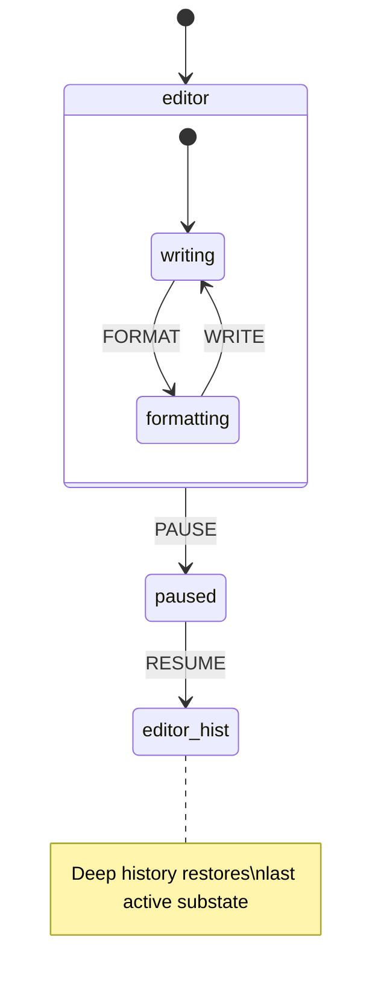

```typescript
import { createMachine, createActor } from "xstate";
// => createMachine: FSM blueprint; createActor: creates runnable actor instance

const editorMachine = createMachine({
  // => Editor with pause/resume that restores exact substate
  id: "editor",
  // => Named for DevTools; "editor" visible in inspector panel
  initial: "editing",
  // => Machine starts in the 'editing' compound state
  states: {
    editing: {
      // => Compound state: contains writing, formatting, and hist substates
      initial: "writing",
      // => Default substate when entering 'editing' for the first time
      states: {
        writing: { on: { FORMAT: "formatting" } },
        // => writing → formatting on FORMAT event
        formatting: { on: { WRITE: "writing" } },
        // => formatting → writing on WRITE event
        hist: {
          // => Pseudostate: not a real state; records last active substate
          type: "history",
          // => Marks this as a history pseudostate
          history: "deep",
          // => 'deep': restores entire active configuration recursively
          // => 'shallow' (default): only restores direct child substate
          // => For this example, 'deep' and 'shallow' behave the same (one level)
        },
      },
      on: { PAUSE: "paused" },
      // => PAUSE event exits editing; hist records current substate before exit
    },
    paused: {
      // => User has paused editing; machine remembers where it was
      on: {
        RESUME: "editing.hist",
        // => Re-enters editing via the history pseudostate
        // => Restores whatever substate was active when PAUSE was sent
        // => "editing.hist" is the syntax to target a history pseudostate
      },
    },
  },
});
// => editorMachine: editing compound state with deep history for pause/resume

const actor = createActor(editorMachine).start();
// => Starts in editing.writing
// => Initial substate is 'writing' because editing.initial === "writing"

actor.send({ type: "FORMAT" });
// => Now in editing.formatting
// => hist pseudostate will record "formatting" when PAUSE fires

actor.send({ type: "PAUSE" });
// => Transitions to paused; editing.formatting is remembered in hist
// => hist records "formatting" as the last active substate

actor.send({ type: "RESUME" });
// => Transitions to editing.hist → restores editing.formatting
// => Deep history: even deeply nested substates are restored
// => Without hist, RESUME would land in editing.writing (the default initial)

console.log(actor.getSnapshot().value);
// => { editing: "formatting" } -- not editing.writing (the initial)
// => Confirms history state restored formatting, not the default writing
```

**Key Takeaway:** Target `"parentState.hist"` in a transition to resume the last active configuration. Use `history: 'deep'` when nested states need full restoration; use `history: 'shallow'` when only the immediate child matters.

**Why It Matters:** Without history states, pausing and resuming a complex flow forces you to manually track and restore active state — error-prone and verbose. History pseudostates handle this declaratively. Deep history is especially valuable for tabbed UIs, multi-step editors, and wizard flows where the user's exact position must be preserved across interruptions.

---

### Example 73: Snapshot Serialization and Restoration

XState actors expose `getPersistedSnapshot()` for serialisation and accept a `snapshot` option in `createActor` for restoration. This enables localStorage persistence, server-side session continuity, and tab-close recovery.

```mermaid
%% Color Palette: Blue #0173B2, Orange #DE8F05, Teal #029E73, Purple #CC78BC, Brown #CA9161
sequenceDiagram
    participant Actor
    participant Storage as localStorage
    participant NewActor as Restored Actor

    Actor->>Actor: run transitions
    Actor->>Storage: getPersistedSnapshot() → JSON.stringify
    Note over Storage: page unload / session end
    Storage->>NewActor: JSON.parse → createActor#40;machine, #123;snapshot#125;#41;
    NewActor->>NewActor: resumes from exact prior state
```

```typescript
import { createMachine, createActor } from "xstate";
// => createMachine: FSM blueprint; createActor: creates runnable actor instance

const checkoutMachine = createMachine({
  // => Multi-step checkout; user must be able to resume after page reload
  id: "checkout",
  // => Named for DevTools; "checkout" visible in inspector
  initial: "cart",
  // => Machine starts in 'cart'; user has not yet entered address or payment
  context: { items: [] as string[], address: "" },
  // => items: cart contents; address: delivery address accumulated through steps
  states: {
    cart: { on: { NEXT: "address" } },
    // => cart → address when user proceeds; cart contents already in context
    address: {
      // => User is entering their delivery address
      on: {
        NEXT: "payment",
        // => Advances to payment step; address stored via SET_ADDRESS
        SET_ADDRESS: {
          // => Fires on each address field change
          actions: ({ context, event }) => {
            context.address = (event as any).value;
            // => Store address in context for persistence
            // => context.address will be serialised with the snapshot
          },
        },
      },
    },
    payment: { on: { CONFIRM: "confirmed" } },
    // => payment → confirmed on CONFIRM; no additional context needed
    confirmed: { type: "final" },
    // => Terminal state; checkout complete; no further events accepted
  },
});
// => checkoutMachine: cart → address → payment → confirmed (four states)

// --- Persist ---
const actor = createActor(checkoutMachine).start();
// => Actor starts in 'cart'; context.address is ""
actor.send({ type: "NEXT" }); // cart → address
// => Machine transitions to address state
actor.send({ type: "SET_ADDRESS", value: "123 Main St" });
// => context.address is now "123 Main St"; ready for serialisation

const persistedSnapshot = actor.getPersistedSnapshot();
// => Returns a serialisable plain object representing current state + context
// => Value: { value: "address", context: { items: [], address: "123 Main St" } }

const serialised = JSON.stringify(persistedSnapshot);
// => Store in localStorage, database, or server session
// => Serialised string is safe for any JSON storage layer
// localStorage.setItem("checkout", serialised);
// => Example storage call; restore by reading this key on next page load

// --- Restore ---
const stored = JSON.parse(serialised);
// => Retrieve from storage (simulated here)
// => stored is the plain JavaScript object from JSON.parse; ready for createActor

const restoredActor = createActor(checkoutMachine, { snapshot: stored }).start();
// => Starts directly in the persisted state ('address') with persisted context
// => No need to replay events; snapshot captures exact state+context directly

console.log(restoredActor.getSnapshot().value); // => "address"
// => Restored actor is in "address" state — exactly where user left off
console.log(restoredActor.getSnapshot().context.address); // => "123 Main St"
// => Full state + context restored; user picks up exactly where they left off
```

**Key Takeaway:** Call `actor.getPersistedSnapshot()` to get a serialisable snapshot, `JSON.stringify` it to store, and pass the parsed result as `{ snapshot }` to `createActor` to restore.

**Why It Matters:** Users abandon multi-step flows when they lose progress to a page reload. Snapshot serialisation makes resumability a first-class feature with three lines of code. The same mechanism enables server-side session persistence, cross-device handoff, and undo/redo — all without any custom serialisation logic. The snapshot is a plain JavaScript object compatible with `JSON.stringify`, so it stores cleanly in `localStorage`, a database, or a URL parameter. Compare this to custom serialisation code that must be kept in sync with every state change — XState's approach is always correct because it captures the full machine state automatically.

---

### Example 74: XState Inspector and DevTools

`createBrowserInspector` from `@xstate/inspect` opens a visual state machine inspector in the browser. Passing `{ inspect }` to `createActor` connects any actor to the inspector in real time, showing all state transitions, context changes, and events.

```typescript
// Note: requires @xstate/inspect -- npm install @xstate/inspect
// import { createBrowserInspector } from "@xstate/inspect";

import { createMachine, createActor } from "xstate";
// => createMachine: blueprint; createActor: runtime instance

// Any machine can be inspected -- use your real machine here
const counterMachine = createMachine({
  // => Simple counter; used here to demonstrate inspector attachment
  id: "counter",
  // => id appears in the inspector panel to identify this machine
  context: { count: 0 },
  // => Initial context; inspector shows context mutations in real time
  on: {
    // => Machine-level listener; INCREMENT active in every state
    INCREMENT: {
      actions: ({ context }) => {
        context.count += 1;
        // => In-place mutation pattern (XState v5 immer-style)
      },
    },
  },
});
// => counterMachine defined; ready for inspector attachment

// Production-safe inspector setup (only in development)
const isDev = process.env.NODE_ENV === "development";
// => Guard prevents inspector overhead in production
// => isDev is true only when NODE_ENV === 'development'

// In development, create the inspector:
// const { inspect } = createBrowserInspector();
// => Opens inspector panel in browser devtools
// => Inspector URL: http://stately.ai/viz?inspect

// Attach inspector to actor via inspect option:
const actor = createActor(
  // => createActor accepts machine + optional options
  counterMachine,
  isDev
    ? {
        // inspect,
        // => Uncomment to enable inspector; all events stream to devtools
      }
    : {},
  // => In production, no inspect option = zero overhead
);

actor.start();
// => Starts the actor; initial state is active; inspector receives first event
actor.send({ type: "INCREMENT" });
// => In dev mode, this event appears in the inspector timeline
actor.send({ type: "INCREMENT" });
// => Inspector shows state, context, and full event history

console.log(actor.getSnapshot().context.count); // => 2
// => Context is also visible in inspector panel
```

**Key Takeaway:** Pass `{ inspect }` from `createBrowserInspector()` to `createActor`. Guard with `NODE_ENV === 'development'` to prevent inspector overhead in production.

**Why It Matters:** Debugging complex state machines without visual tooling is difficult — event sequences and context mutations are invisible in a console. The XState inspector renders the live statechart, highlights the active state, and shows every event in sequence. This dramatically reduces debugging time for multi-actor systems and real-world flows. The production guard ensures the inspector adds zero runtime cost when `NODE_ENV !== 'development'`. For team debugging sessions, the inspector URL can be shared — collaborators see the same live view in their browsers. This visual feedback loop is also invaluable during initial machine design, before any UI is built.

---

### Example 75: XState v4 → v5 Migration Reference

XState v5 renames and restructures several core APIs. This example shows the most common v4 patterns alongside their v5 equivalents side-by-side.

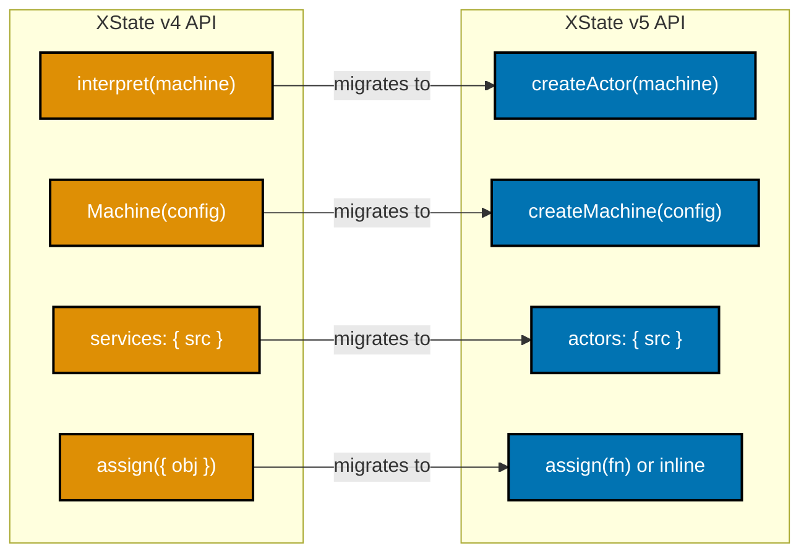

**v4 pattern (deprecated):**

```typescript
// v4: Machine() + interpret() + services config
import { Machine, interpret } from "xstate"; // => v4 imports
// => Machine and interpret are removed in v5; both replaced by new APIs

const machineV4 = Machine(
  {
    // => Machine() is removed in v5; use createMachine()
    // => Machine() accepted two arguments: config and implementations (same shape as v5)
    id: "counter",
    // => Machine id; same in v5
    context: { count: 0 },
    // => Context shape; same in v5; initial value in config object
    on: {
      // => Machine-level event handler; same position in v5
      INC: { actions: "increment" },
      // => String action reference; matches a key in implementations.actions below
      // => In v5: prefer inline assign() instead of string action references
    },
  },
  {
    // => Second argument: implementations; same two-argument pattern in v5
    services: {
      // => 'services' key renamed to 'actors' in v5
      // => Services in v4 are equivalent to actors in v5
      myService: () => Promise.resolve(42),
      // => v4 service is a function returning Promise; v5 uses fromPromise()
    },
    actions: {
      // => Named action implementations; same concept in v5
      increment: (context) => {
        // => v4 actions receive context directly as first arg
        context.count += 1;
        // => v4 allows direct context mutation; v5 prefers assign()
      },
      // => v4 actions receive context directly as first arg
    },
  },
);
// => machineV4: works in v4; four APIs here are renamed/replaced in v5

const serviceV4 = interpret(machineV4).start();
// => interpret() removed in v5; use createActor()
// => serviceV4.send(), serviceV4.subscribe() → same in v5 as actor.send(), actor.subscribe()
```

**v5 equivalent:**

```typescript
// v5: createMachine() + createActor() + actors config
import { createMachine, createActor, assign, fromPromise } from "xstate";
// => v5 imports; all named exports, no default export
// => assign and fromPromise are new additions; no equivalent import in v4

const machineV5 = createMachine(
  {
    // => createMachine() replaces Machine()
    // => Function signature is identical; only the name changes
    id: "counter",
    // => Machine id; unchanged from v4
    context: { count: 0 },
    // => Initial context; same position in config object
    on: {
      // => Machine-level event handler; same in v4 and v5
      INC: { actions: assign({ count: ({ context }) => context.count + 1 }) },
      // => assign() takes a function returning partial context (v5)
      // => v4 object-assign form still works but function form preferred
      // => v5 prefers inline assign() over string action references
    },
  },
  {
    // => Second argument: implementations; same two-argument pattern as v4
    actors: {
      // => 'actors' replaces 'services' in implementation config
      // => Same purpose: register named service logic for invoke.src references
      myActor: fromPromise(() => Promise.resolve(42)),
      // => fromPromise() wraps async functions as actor logic
      // => v4 equivalent: myService: () => Promise.resolve(42)
    },
  },
);
// => machineV5: same logic as machineV4 but with v5 naming and patterns

const actorV5 = createActor(machineV5).start();
// => createActor() replaces interpret()
// => API is identical after .start(): send(), getSnapshot(), subscribe()
// => actorV5.send({ type: "INC" }) increments count just like serviceV4 did
console.log(actorV5.getSnapshot().context.count); // => 0 (before any INC events)
// => getSnapshot() is the v5 replacement for v4's service.state property
```

**Key Takeaway:** The four most common v4 → v5 changes are: `Machine()` → `createMachine()`, `interpret()` → `createActor()`, `services:` → `actors:`, and object-assign → function-assign.

**Why It Matters:** XState v5 is a complete rewrite with improved TypeScript inference, smaller bundle size, and the unified actor model. The migration path is mechanical for most codebases — rename four patterns and update imports. Understanding these mappings lets you migrate incrementally and read v4 examples with confidence about what they map to in v5.

---

## Group 17: Expert Patterns (Examples 76–80)

### Example 76: Statechart vs Reducer — When XState Adds Value

A Redux-style reducer and an XState machine both manage state, but they model different things. A reducer is correct for simple linear state; an XState machine adds value when you need impossible-state prevention, complex branching, or side-effect orchestration.

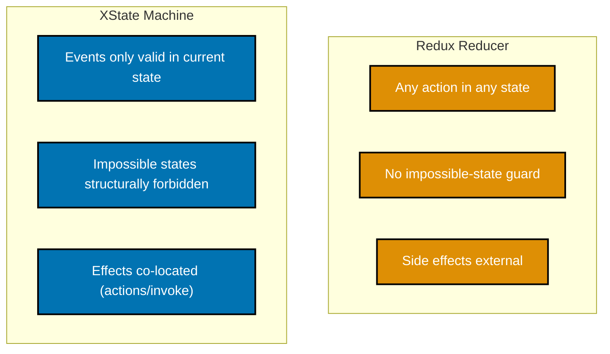

**Redux reducer approach:**

```typescript
// Counter reducer -- fine for simple linear state
type CounterState = { count: number; loading: boolean; error: string | null };
// => Three boolean-flag fields; any combination is technically representable
// => Including impossible combos like { loading: true, error: "x" } simultaneously
// => Boolean flags cannot express mutual exclusion without runtime guards

function counterReducer(state: CounterState, action: { type: string }): CounterState {
  // => Reducer handles all actions in all states -- no guard on loading
  // => No state machine; any action can fire in any "state" (flag combination)
  switch (action.type) {
    case "INCREMENT":
      return { ...state, count: state.count + 1 };
    // => BUG RISK: can increment while loading=true; reducer allows it
    // => There is no structural guard preventing this impossible combination
    case "FETCH_START":
      return { ...state, loading: true };
    // => Sets loading flag; does NOT prevent INCREMENT from firing concurrently
    case "FETCH_SUCCESS":
      return { ...state, loading: false };
    // => Clears loading; caller must pair with FETCH_START manually — easy to forget
    default:
      return state;
    // => Unknown actions pass through silently; no type error in plain JS
  }
}
// => counterReducer: correct for simple cases; lacks impossible-state prevention
// => All three cases touch flags independently; impossible combos slip through untested
// => Reducer approach requires discipline; XState approach enforces it structurally
```

**XState machine approach:**

```typescript
import { createMachine, assign } from "xstate";
// => createMachine: FSM blueprint; assign: context updater

// Same counter but with impossible-state prevention
const counterMachine = createMachine({
  // => XState structurally forbids INCREMENT in 'loading' state
  id: "counter",
  // => Named for DevTools; visible in inspector as "counter"
  initial: "idle",
  // => Machine starts idle; no loading or error state initially
  context: { count: 0 },
  // => Single context field: count; no boolean flags needed
  // => State itself (not a flag) encodes whether we are loading or not
  states: {
    idle: {
      // => Idle: user can increment or trigger fetch; both are valid here
      on: {
        INCREMENT: { actions: assign({ count: ({ context }) => context.count + 1 }) },
        // => INCREMENT only valid in 'idle'; ignored in 'loading'
        // => Not listed in 'loading' state → structurally impossible there
        FETCH: "loading",
        // => Transitions to loading; INCREMENT is no longer available
      },
    },
    loading: {
      // => No INCREMENT here -- the state makes it structurally impossible
      // => Reducer needs runtime guard; machine enforces this at definition time
      // => Any INCREMENT event sent in this state is silently dropped
      on: { SUCCESS: "idle", FAILURE: "error" },
      // => Loading only accepts SUCCESS or FAILURE; count cannot change
    },
    error: { on: { RETRY: "loading" } },
    // => Error state; user can retry; INCREMENT still not available until back in idle
  },
});
// => counterMachine: impossible-state prevention by construction, not runtime check
```

**Key Takeaway:** Choose a reducer for simple counters and flag flips. Choose XState when events must only be valid in specific states, or when you need co-located side effects and impossible-state guarantees.

**Why It Matters:** Reducers allow any action to fire in any state, pushing impossible-state prevention into runtime guards that are easy to forget. XState makes invalid transitions structurally impossible — if `INCREMENT` isn't listed in the `loading` state, it simply doesn't fire. This is the difference between "tested to be impossible" and "impossible by construction."

---

### Example 77: Preventing Impossible States with setup() Types

`setup()` lets you pre-declare the TypeScript types for context, events, and actors before writing the machine. Combined with discriminated union context, the compiler rejects invalid state+context combinations at compile time.

```typescript
import { setup, assign } from "xstate";
// => setup: pre-declares types for context and events before machine body
// => assign: context updater; typed against FetchContext discriminated union
// => setup().createMachine() is the v5 pattern for fully typed machines

// Discriminated union context: each status has exactly the right fields
type FetchContext =
  | { status: "idle" }
  // => idle: no extra fields; context has only status discriminant
  | { status: "loading" }
  // => loading: no data or message yet; request is in flight
  | { status: "success"; data: string[] }
  // => 'data' field only exists when status is 'success'
  // => Accessing context.data in 'error' state is a compile error
  | { status: "error"; message: string };
// => 'message' field only exists when status is 'error'
// => Accessing context.message in 'success' state is a compile error
// => Discriminated unions make impossible field combinations unrepresentable

// setup() declares types before the machine body; createMachine() body uses them
const fetchMachine = setup({
  // => setup({ types: {} }) is the v5 pattern for fully typed machines
  types: {
    context: {} as FetchContext,
    // => {} as FetchContext is a type-level annotation only; no runtime effect
    // => TypeScript uses this to infer context type in all machine action callbacks
    events: {} as { type: "FETCH" } | { type: "SUCCESS"; data: string[] } | { type: "ERROR"; message: string },
    // => Exhaustive event union; sending an unknown event type is a TS compile error
    // => event.data is accessible only when event.type === "SUCCESS"; TS narrows it
  },
}).createMachine({
  // => Machine body is fully typed from setup(); no `as any` casts needed
  id: "fetch",
  // => Named for DevTools; "fetch" visible in XState inspector tree
  initial: "idle",
  // => Machine starts in idle state; context is { status: "idle" } on construction
  context: { status: "idle" } as FetchContext,
  // => Type cast to satisfy discriminated union; runtime value is { status: "idle" }
  // => FetchContext is a union; cast tells TS which variant to start with at runtime
  states: {
    // => Four states: idle, loading, success, error; each with distinct context shape
    idle: {
      // => Context shape: { status: "idle" }; no data or message fields present yet
      on: {
        FETCH: {
          target: "loading",
          // => FETCH event transitions to loading and updates context discriminant
          actions: assign(() => ({ status: "loading" as const })),
          // => Returns new context object: { status: "loading" }; replaces idle shape
          // => as const prevents TypeScript from widening "loading" to type string
        },
      },
    },
    loading: {
      // => Context shape: { status: "loading" }; only SUCCESS or ERROR accepted
      on: {
        SUCCESS: {
          target: "success",
          // => SUCCESS received: replace loading context with success variant
          actions: assign(({ event }) => ({
            status: "success" as const,
            // => status discriminant becomes "success"; data field is now present
            data: event.data,
            // => TS narrowed event.type to "SUCCESS"; event.data is accessible
            // => event.data typed as string[] per the events union in setup()
          })),
        },
        ERROR: {
          target: "error",
          // => ERROR received: replace loading context with error variant
          actions: assign(({ event }) => ({
            status: "error" as const,
            // => status discriminant becomes "error"; message field is now present
            message: event.message,
            // => TS narrowed event.type to "ERROR"; event.message is accessible
            // => event.message typed as string per the events union in setup()
          })),
        },
      },
    },
    success: {},
    // => Context: { status: "success"; data: string[] }; actor is done
    // => Accessing context.message in this state is a TypeScript compile error
    // => TypeScript narrows the union here; only data field is structurally present
    error: {},
    // => Context: { status: "error"; message: string }; actor is done
    // => Accessing context.data in this state is a TypeScript compile error
    // => TypeScript narrows the union here; only message field is structurally present
  },
});
// => fetchMachine: setup() + discriminated union context = impossible states are TS errors
// => Wrong context shape in any assign callback is caught at compile time, not runtime
// => Accessing context.data in 'error' state is a compile error; no runtime undefined
// => setup() is the v5 pattern; it replaces all `as any` casts with real type inference
```

**Key Takeaway:** Use `setup({ types: { context, events } })` with a discriminated union context type. TypeScript will reject any action that assigns incompatible context for the current event type.

**Why It Matters:** Without discriminated union context, you can access `context.data` in the `error` state and TypeScript won't complain — runtime `undefined` awaits. `setup()` types combined with discriminated unions make this a compile-time error. Your IDE becomes a state machine verifier: if the types pass, the impossible states are truly impossible, not just tested for.

---

### Example 78: Server-Side Rendering and Client Hydration

A machine can be run on the server to compute initial state for a request, serialised to a snapshot, and sent to the client as JSON. The client creates an actor with `{ snapshot }` to hydrate directly into the correct state without re-running server logic.

```mermaid
%% Color Palette: Blue #0173B2, Orange #DE8F05, Teal #029E73, Purple #CC78BC, Brown #CA9161
sequenceDiagram
    participant Server
    participant Client
    participant Actor as Client Actor

    Server->>Server: createActor#40;machine#41;.start#40;#41;
    Server->>Server: run transitions #40;set initial state#41;
    Server->>Server: getPersistedSnapshot#40;#41;
    Server->>Client: JSON snapshot in HTML/props
    Client->>Actor: createActor#40;machine, #123;snapshot#125;#41;.start#40;#41;
    Actor->>Client: hydrated -- no flicker, no re-fetch
```

```typescript
import { createMachine, createActor } from "xstate";
// => createMachine: FSM blueprint; createActor: creates runnable actor instance
// => Same machine definition is used on both server and client

const pageMachine = createMachine({
  // => Page state machine run on server for SSR
  id: "page",
  // => Named for DevTools; both server and client actors share this definition
  initial: "loading",
  // => Server actor starts in 'loading'; driven to 'ready' before serialising
  context: { user: null as string | null, theme: "light" },
  // => user: null until LOADED event; theme: default "light"
  // => Both fields are serialised with getPersistedSnapshot()
  states: {
    loading: {
      // => Server actor enters this state; then LOADED drives it to ready
      on: {
        LOADED: {
          target: "ready",
          // => Drives machine to 'ready'; sets user from session
          actions: ({ context, event }) => {
            context.user = (event as any).user;
            // => Server sets user from session/DB during SSR
            // => In production: (event as any).user is the DB-loaded user record
          },
        },
      },
    },
    ready: {},
    // => Client starts here; context.user is the session user
    // => No loading flash: client does not pass through 'loading'
  },
});
// => pageMachine: shared definition; used identically on server and client

// --- SERVER SIDE (e.g. Next.js getServerSideProps) ---
function serverRender(sessionUser: string) {
  // => sessionUser: comes from session cookie or DB lookup in real SSR
  const serverActor = createActor(pageMachine).start();
  // => Create actor on server; does not run browser APIs
  // => Actor is in 'loading' state; user is null at this point

  serverActor.send({ type: "LOADED", user: sessionUser });
  // => Drive machine to the correct initial client state
  // => After this send: actor is in 'ready', context.user === sessionUser

  const snapshot = serverActor.getPersistedSnapshot();
  // => Serialisable snapshot; value: "ready", context.user set
  // => Returns plain object: { value: "ready", context: { user: "alice", theme: "light" } }

  serverActor.stop();
  // => Clean up; no async work continues after response
  // => Important: prevents memory leaks from long-lived server actors

  return JSON.stringify(snapshot);
  // => Serialised snapshot sent to client as prop or inline script
  // => In Next.js: return { props: { snapshot } } from getServerSideProps
}

// --- CLIENT SIDE (e.g. React component) ---
function clientHydrate(serialisedSnapshot: string) {
  const snapshot = JSON.parse(serialisedSnapshot);
  // => Parse snapshot received from server
  // => snapshot is the plain object: { value: "ready", context: { user: "alice" } }

  const clientActor = createActor(pageMachine, { snapshot }).start();
  // => Hydrates directly into 'ready' state with correct context
  // => No loading flash; no duplicate server fetch
  // => Actor starts in 'ready', not 'loading'; user is already set

  console.log(clientActor.getSnapshot().value); // => "ready"
  // => Client actor is in ready state immediately; no initial loading flicker
  console.log(clientActor.getSnapshot().context.user); // => sessionUser value
  // => Client picks up exactly where server left off
}

const serialised = serverRender("alice");
// => serverRender returns JSON string of the 'ready' snapshot with user "alice"
clientHydrate(serialised);
// => clientHydrate restores actor into 'ready' state; no re-fetch needed
```

**Key Takeaway:** Run the machine to the desired state on the server, call `getPersistedSnapshot()`, serialise to JSON, and pass to the client. The client calls `createActor(machine, { snapshot })` to hydrate without re-running server logic.

**Why It Matters:** SSR without hydration creates a loading flash — the client starts in the initial state while the server has already computed the correct state. XState snapshot hydration eliminates this by transmitting the exact server state as a serialised plain object. This pattern also works for edge rendering and streaming HTML where state must be computed before the first byte is sent.

---

### Example 79: Deferred Events with raise and Cancellation

`raise({ type: 'EVENT' }, { delay: ms })` schedules a future event from the machine to itself. The returned cancel ID can be used to cancel the delayed raise if the machine transitions before the delay fires.

```typescript
import { createMachine, createActor, raise, cancel } from "xstate";
// => createMachine: FSM blueprint; createActor: runtime instance
// => raise: schedules a future self-event; cancel: aborts a scheduled raise

const idleTimeoutMachine = createMachine(
  {
    // => Resets a countdown timer on each user activity; logs out after inactivity
    id: "idleTimeout",
    // => Named for DevTools; "idleTimeout" visible in inspector
    initial: "active",
    // => Starts in 'active'; entry action immediately schedules the 5s timer
    context: { cancelId: null as string | null },
    // => cancelId: stored to enable explicit cancel() calls if needed
    states: {
      active: {
        // => User is active; 5s timer is running from entry
        entry: {
          type: "scheduleCheck",
          // => Named action; defined in actions config below
          // => Fires every time machine enters 'active' (including re-entry)
        },
        on: {
          ACTIVITY: {
            // => User action resets the idle timer
            target: "active",
            // => Re-entering 'active' triggers entry action again
            // => Previous raise is automatically cancelled on re-entry
            // => XState's state entry/exit guarantees cancel-and-reschedule
          },
          IDLE_CHECK: "timedOut",
          // => Fires if ACTIVITY doesn't arrive within 5 s
          // => raise() delivers this event to the machine itself after delay
        },
      },
      timedOut: { type: "final" },
      // => Terminal state: session expired
      // => type: "final" means no further events are accepted
    },
  },
  {
    actions: {
      scheduleCheck: raise(
        { type: "IDLE_CHECK" },
        // => The event that will be sent to self after the delay
        { delay: 5000, id: "idleCheck" },
        // => id allows external cancellation via cancel("idleCheck")
        // => Sends IDLE_CHECK to self after 5 s unless cancelled
        // => delay: 5000 ms = 5 seconds of inactivity before timeout
      ),
      // => scheduleCheck: creates a pending IDLE_CHECK event; fired on entry
    },
  },
);
// => idleTimeoutMachine: active state + 5s self-event; ACTIVITY resets countdown

const actor = createActor(idleTimeoutMachine).start();
// => Entry fires scheduleCheck; IDLE_CHECK scheduled in 5 s
// => actor.getSnapshot().value === "active"

// Simulate user activity at 3 s
setTimeout(() => {
  // => In a React app, this fires on mousemove/keydown events
  actor.send({ type: "ACTIVITY" });
  // => Re-enters 'active'; previous scheduled IDLE_CHECK is discarded
  // => New 5 s timer starts from this point
  // => User must remain inactive for 5 more seconds before timeout
}, 3000);
// => 3000ms delay simulates user action at t=3s; re-entry resets the 5s countdown

// Without ACTIVITY, actor transitions to timedOut at t=5 s
// With ACTIVITY at t=3 s, timedOut fires at t=8 s (3 + 5)
// => SimulatedClock can drive this in tests without real setTimeout delays
```

**Key Takeaway:** `raise(event, { delay, id })` schedules a self-event. Re-entering the state that created the raise automatically cancels the previous one. Use `cancel(id)` for explicit cancellation.

**Why It Matters:** Deferred events are the XState-native way to implement timers, debounce, session expiry, and polling without external `setTimeout` references. They are automatically cancelled when the machine leaves the state, eliminating the most common timer bug: firing a callback after the component or flow that created it is gone. External timer IDs require careful manual cleanup and are invisible in the machine's state graph. XState `raise` with a delay is visible in the inspector, testable with `SimulatedClock`, and cancelled automatically — making timer logic declarative, deterministic, and auditable without any cleanup code in components.

---

### Example 80: Production Actor System — Full Mini-Service

A complete mini-service demonstrates: a root `AppMachine` that spawns `AuthActor`, `DataActor`, and `NotificationActor`; error boundaries that catch child failures; and a `STOP` event that gracefully shuts down all actors.

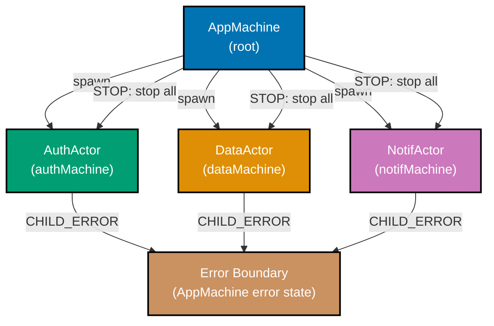

```typescript
import { createMachine, createActor, assign, sendParent, stopChild } from "xstate";
// => createMachine: FSM blueprint; createActor: runtime instance
// => assign: context updater; sendParent: child-to-parent event
// => stopChild: gracefully stops a named child actor

// Child machine template -- each child reports errors to parent
const makeChildMachine = (name: string) =>
  // => Factory function: creates a machine with a given name for id
  createMachine({
    // => Generic child machine; reports errors via sendParent
    id: name,
    // => Each child gets a unique id: "auth", "data", or "notif"
    initial: "running",
    // => Child starts running immediately after spawn
    states: {
      running: {
        // => Child is operating; FAIL simulates a production failure
        on: {
          FAIL: {
            // => Simulates a child failure
            actions: sendParent({ type: "CHILD_ERROR", childId: name }),
            // => Notifies parent before stopping; parent can decide recovery
            // => Child stays in 'running'; parent handles containment
          },
        },
      },
    },
  });
// => makeChildMachine: reusable template; all three children share this pattern

const authMachine = makeChildMachine("auth");
// => Auth child machine; id "auth"; spawned and managed by appMachine root
// => Inherits makeChildMachine pattern: running state, FAIL → sendParent(CHILD_ERROR)
const dataMachine = makeChildMachine("data");
// => Data child machine; id "data"; same pattern as authMachine
// => Failure isolated: auth and notif continue running if data sends CHILD_ERROR
const notifMachine = makeChildMachine("notif");
// => Notification child machine; id "notif"; same lifecycle as authMachine
// => Singleton in the actor system; app can send notifications via notifRef

// Root AppMachine orchestrates all children
const appMachine = createMachine({
  // => Root actor: spawns children, handles errors, shuts down gracefully
  id: "app",
  // => Named for DevTools; "app" visible at root of inspector actor tree
  initial: "running",
  // => Immediately enters 'running'; spawns all three children on entry
  context: {
    authRef: null as any,
    // => ActorRef to auth child; populated in entry assign
    dataRef: null as any,
    // => ActorRef to data child; populated in entry assign
    notifRef: null as any,
    // => ActorRef to notif child; populated in entry assign
    // => ActorRef handles for all child actors
    errorLog: [] as string[],
    // => Collects error reports from children
    // => Grows as children send CHILD_ERROR events to parent
  },
  states: {
    running: {
      // => App is operating; all three children are alive
      entry: assign({
        authRef: ({ spawn }) => spawn(authMachine, { id: "auth" }),
        // => Spawns auth child; ActorRef stored in context.authRef
        dataRef: ({ spawn }) => spawn(dataMachine, { id: "data" }),
        // => Spawns data child; ActorRef stored in context.dataRef
        notifRef: ({ spawn }) => spawn(notifMachine, { id: "notif" }),
        // => Spawns notif child; ActorRef stored in context.notifRef
        // => All three children spawn concurrently on entry
      }),
      on: {
        CHILD_ERROR: {
          // => Error boundary: catches failures from any child
          // => Machine stays in 'running'; failure is contained, not cascaded
          actions: assign({
            errorLog: ({ context, event }) => [
              ...context.errorLog,
              `${(event as any).childId} failed`,
              // => Log the failing child's id; real system would alert/recover
              // => errorLog grows immutably; spread preserves previous entries
            ],
          }),
          // => Machine stays in 'running'; other children continue operating
          // => A stricter system could transition to 'degraded' or 'error'
        },
        STOP: {
          target: "stopped",
          // => Graceful shutdown trigger
          // => Transitions to 'stopped' state; stopChild actions run on entry
        },
      },
    },
    stopped: {
      // => Teardown state: all children are stopped in order
      entry: [
        stopChild("auth"),
        // => stopChild sends stop signal to named child actor
        // => "auth" matches the id passed to spawn() in entry assign above
        stopChild("data"),
        // => Each child's cleanup logic runs before it halts
        stopChild("notif"),
        // => All three stopped before AppMachine enters terminal state
        // => Entry actions run in order; all three stop calls fire synchronously
      ],
      type: "final",
      // => App is fully shut down; no further events processed
      // => type: "final" → app.getSnapshot().status === "done"
    },
  },
});
// => appMachine: two-state root (running/stopped); error boundary + graceful shutdown
// => All child lifecycle (spawn, error, stop) is in one machine config

// Start the production system
const app = createActor(appMachine).start();
// => start() fires entry assign; all three children spawned immediately
// => context: { authRef, dataRef, notifRef populated; errorLog: [] }

app.send({ type: "CHILD_ERROR", childId: "data" });
// => Error boundary catches it; errorLog grows; system stays in 'running'
// => dataMachine sent CHILD_ERROR with childId "data"; parent logged the failure

console.log(app.getSnapshot().context.errorLog);
// => ["data failed"]
// => Other children (auth, notif) are still running; failure is isolated
// => Error boundary pattern: one child failure does not cascade to siblings

app.send({ type: "STOP" });
// => Graceful shutdown; all children stopped before AppMachine halts
// => stopped entry fires stopChild("auth"), stopChild("data"), stopChild("notif")
console.log(app.getSnapshot().status); // => "done"
// => AppMachine is in terminal state; all actors cleaned up and halted
```

**Key Takeaway:** A production actor system uses `spawn` for child creation, `sendParent` for child-to-parent error reporting, `stopChild` for graceful teardown, and a `STOP` transition targeting a final state to sequence the shutdown correctly.

**Why It Matters:** Real applications are not single machines — they are systems of coordinated actors. This pattern gives you a blueprint for building any production service: children are isolated (one failure does not cascade), errors are observable (centralised error log), and shutdown is deterministic (all children stop before the root halts). XState's actor model makes these production concerns first-class, not afterthoughts bolted onto component lifecycle methods.
