This tutorial covers advanced XState v5 patterns through 26 annotated examples. You will build hierarchical actor systems, implement real-world flows (auth, wizards, WebSocket, retry), integrate XState with React Query, Effect.ts, Zustand, and React Hook Form, write model-based and actor-system tests, apply performance and production techniques, and migrate confidently from v4 to v5.

## Group 12: Hierarchical Actor Systems (Examples 55–58)

### Example 55: Actor Tree — Spawning a Two-Child Hierarchy

A parent machine can spawn multiple named child actors in a single `assign` entry action. Each spawned actor is independent — it runs its own machine with private context. The parent holds `ActorRef` handles in its own context to communicate with each child.

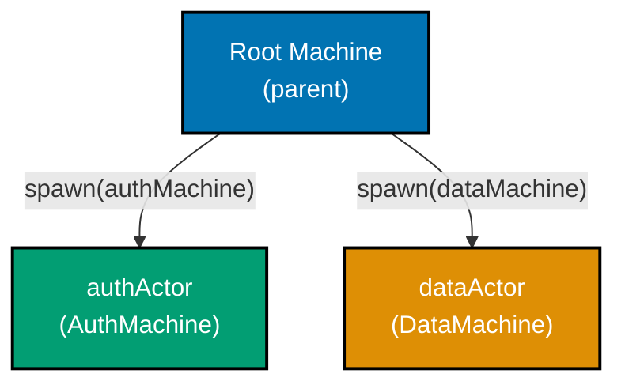

```typescript
import { createMachine, createActor, assign } from "xstate";

// Minimal child machines -- each has its own isolated context
const authMachine = createMachine({
  // => Simple machine representing authentication state
  id: "auth",
  context: { token: null as string | null },
  // => Private to authActor; parent cannot access directly
  initial: "idle",
  states: { idle: {} },
  // => Starts idle, awaiting login events
});

const dataMachine = createMachine({
  // => Simple machine representing remote data state
  id: "data",
  context: { items: [] as string[] },
  // => Private to dataActor; parent cannot access directly
  initial: "idle",
  states: { idle: {} },
  // => Starts idle, awaiting fetch events
});

// Parent machine spawns both children on entry
const rootMachine = createMachine({
  // => Orchestrates child actors
  id: "root",
  context: {
    authRef: null as any,
    // => Will hold ActorRef to authActor
    dataRef: null as any,
    // => Will hold ActorRef to dataActor
  },
  initial: "running",
  states: {
    running: {
      entry: assign({
        // => entry action fires when machine enters 'running'
        authRef: ({ spawn }) => spawn(authMachine, { id: "authActor" }),
        // => spawn returns ActorRef; id must be unique in this actor system
        dataRef: ({ spawn }) => spawn(dataMachine, { id: "dataActor" }),
        // => Both children start concurrently and immediately
      }),
    },
  },
});

const actor = createActor(rootMachine).start();
// => actor.getSnapshot().context.authRef is an ActorRef
// => actor.getSnapshot().context.dataRef is a separate ActorRef
```

**Key Takeaway:** Spawning multiple child actors in a single `assign` entry action creates an actor tree. Each child is independent and identified by a unique `id` within the system.

**Why It Matters:** Hierarchical actor systems let you decompose complex features (authentication, data fetching, notifications) into isolated machines that each own their state. The parent becomes a coordinator rather than a monolith, making each concern independently testable and replaceable.

---

### Example 56: Mediator Pattern — Parent Routes Child Events

A parent machine acting as mediator receives events forwarded by child actors and routes them to other children. Children never communicate directly — all messages flow through the mediator. This enforces a single source of control and simplifies debugging.

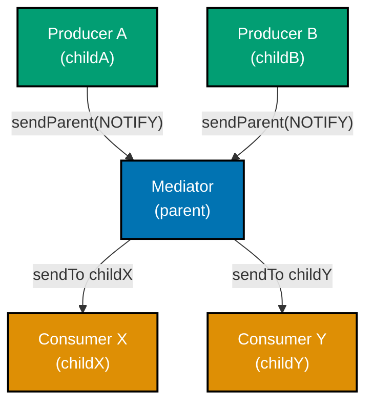

```typescript
import { createMachine, createActor, assign, sendTo, sendParent } from "xstate";

// Producer machine -- sends event to parent when work is done
const producerMachine = createMachine({
  // => A child that notifies the parent about work completion
  id: "producer",
  initial: "working",
  states: {
    working: {
      on: {
        DONE: {
          // => External trigger signals work completion
          actions: sendParent({ type: "CHILD_DONE", payload: "result" }),
          // => sendParent forwards the event up to the spawning machine
          // => Child does NOT know about sibling consumers
        },
      },
    },
  },
});

// Consumer machine -- receives routed events from parent
const consumerMachine = createMachine({
  // => A child that waits for routed messages
  id: "consumer",
  initial: "idle",
  states: {
    idle: {
      on: {
        PROCESS: { target: "processing" },
        // => Only responds to PROCESS; parent decides when to send it
      },
    },
    processing: {},
  },
});

// Mediator parent: routes CHILD_DONE → consumer
const mediatorMachine = createMachine({
  // => Central router; children communicate only through this machine
  id: "mediator",
  context: { producerRef: null as any, consumerRef: null as any },
  initial: "active",
  states: {
    active: {
      entry: assign({
        producerRef: ({ spawn }) => spawn(producerMachine, { id: "producer" }),
        // => Spawns producer child
        consumerRef: ({ spawn }) => spawn(consumerMachine, { id: "consumer" }),
        // => Spawns consumer child
      }),
      on: {
        CHILD_DONE: {
          // => Mediator intercepts producer's notification
          actions: sendTo(
            ({ context }) => context.consumerRef,
            { type: "PROCESS" },
            // => Routes to consumer with transformed event type
          ),
        },
      },
    },
  },
});
```

**Key Takeaway:** Use `sendParent` in children and `sendTo` in the parent to implement a mediator. Children remain decoupled — they only know about the parent, never about siblings.

**Why It Matters:** The mediator pattern prevents a tangled web of cross-actor dependencies. When a new consumer needs data from a producer, you add routing logic in one place — the parent — rather than modifying every producer. This is especially valuable in large actor systems with many producers and consumers.

---

### Example 57: Actor Pools — Round-Robin Worker Dispatch

An actor pool holds an array of worker `ActorRef`s in context. A dispatcher machine routes incoming jobs to workers in round-robin order. This pattern parallelises CPU-bound or I/O-bound work across a fixed set of actors.

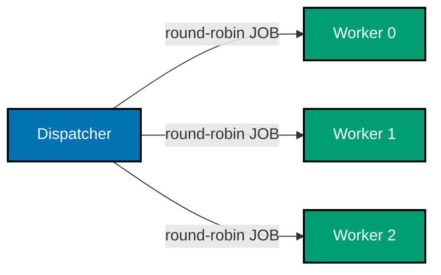

```typescript
import { createMachine, createActor, assign, sendTo } from "xstate";

// Worker machine -- processes one job at a time
const workerMachine = createMachine({
  // => Each instance is an independent actor in the pool
  id: "worker",
  initial: "idle",
  states: {
    idle: {
      on: {
        JOB: {
          // => Receives job event from dispatcher
          target: "busy",
          actions: ({ event }) => console.log("Worker got job:", event.payload),
          // => Logs the job payload; real machine would invoke async work
        },
      },
    },
    busy: {
      on: { DONE: "idle" },
      // => Returns to idle after job completes
    },
  },
});

const POOL_SIZE = 3;
// => Fixed pool size; tune based on concurrency needs

// Dispatcher machine manages pool + round-robin index
const poolMachine = createMachine({
  // => Spawns N workers; routes jobs in round-robin order
  id: "pool",
  context: {
    workers: [] as any[],
    // => Array of ActorRefs, one per worker
    nextIndex: 0,
    // => Tracks which worker receives the next job
  },
  initial: "running",
  states: {
    running: {
      entry: assign({
        workers: ({ spawn }) =>
          Array.from({ length: POOL_SIZE }, (_, i) => spawn(workerMachine, { id: `worker-${i}` })),
        // => Spawns POOL_SIZE worker actors; each gets a unique id
      }),
      on: {
        DISPATCH: {
          // => External event triggers round-robin dispatch
          actions: [
            sendTo(
              ({ context }) => context.workers[context.nextIndex],
              // => Selects current worker by index
              ({ event }) => ({ type: "JOB", payload: event.payload }),
              // => Forwards the payload as a JOB event
            ),
            assign({
              nextIndex: ({ context }) => (context.nextIndex + 1) % POOL_SIZE,
              // => Advances index; wraps at POOL_SIZE (round-robin)
            }),
          ],
        },
      },
    },
  },
});
```

**Key Takeaway:** Store worker `ActorRef`s in an array context field. Use modulo arithmetic on a `nextIndex` counter to achieve round-robin dispatch with `sendTo`.

**Why It Matters:** Actor pools give you parallelism within a single XState actor system without external thread management. Each worker has isolated state, so one failing worker does not corrupt others. Round-robin ensures even load distribution for homogeneous workloads.

---

### Example 58: system.get() — Retrieving Actors by System ID

Any actor in the tree can call `system.get('id')` to retrieve a reference to any other actor registered with a `systemId`. This avoids threading `ActorRef`s down through context chains and enables peer-to-peer messaging inside deep hierarchies.

```typescript
import { createMachine, createActor, assign, sendTo } from "xstate";

// Notification machine -- registered with a system-wide id
const notificationMachine = createMachine({
  // => Acts as a global notification sink in the actor system
  id: "notifications",
  initial: "listening",
  states: {
    listening: {
      on: {
        NOTIFY: {
          // => Any actor in the system can send NOTIFY here
          actions: ({ event }) => console.log("Notification:", event.message),
          // => Centralises all user-facing messages in one machine
        },
      },
    },
  },
});

// Deep child machine -- uses system.get to reach the notification actor
const deepChildMachine = createMachine({
  // => Nested actor that does not hold notificationRef in its own context
  id: "deepChild",
  initial: "working",
  states: {
    working: {
      on: {
        FINISH: {
          // => When work finishes, notify via system registry
          actions: sendTo(
            ({ system }) => system.get("notifier"),
            // => system.get resolves actor by systemId at event time
            // => No need to pass ActorRef through parent context chain
            { type: "NOTIFY", message: "Deep child finished" },
          ),
        },
      },
    },
  },
});

// Root machine registers the notification actor with a systemId
const rootMachine = createMachine({
  // => Registers notifier so any actor can resolve it via system.get
  id: "root",
  context: { notifierRef: null as any, childRef: null as any },
  initial: "running",
  states: {
    running: {
      entry: assign({
        notifierRef: ({ spawn }) =>
          spawn(notificationMachine, {
            id: "notifier",
            systemId: "notifier",
            // => systemId registers this actor in the actor system registry
          }),
        childRef: ({ spawn }) => spawn(deepChildMachine, { id: "child" }),
        // => deepChild does NOT receive notifierRef as a prop
      }),
    },
  },
});

const actor = createActor(rootMachine).start();
// => actor.system.get("notifier") returns the notification ActorRef
```

**Key Takeaway:** Pass `systemId` when spawning an actor to register it globally. Retrieve it anywhere in the tree with `system.get('systemId')` instead of threading refs through context.

**Why It Matters:** Deep actor hierarchies quickly become unwieldy when parent refs must be passed manually through every level. `systemId` + `system.get` solves this cleanly — it is XState's equivalent of a dependency injection container, making cross-cutting concerns (logging, notifications, analytics) accessible without prop-drilling.

---

## Group 13: Real-World Flows (Examples 59–63)

### Example 59: Authentication Flow

A complete auth machine covers the full login lifecycle: unauthenticated → authenticating (promise invocation) → authenticated → logout. Context stores the user and token, and errors are routed to a dedicated `failed` state with the error message preserved.

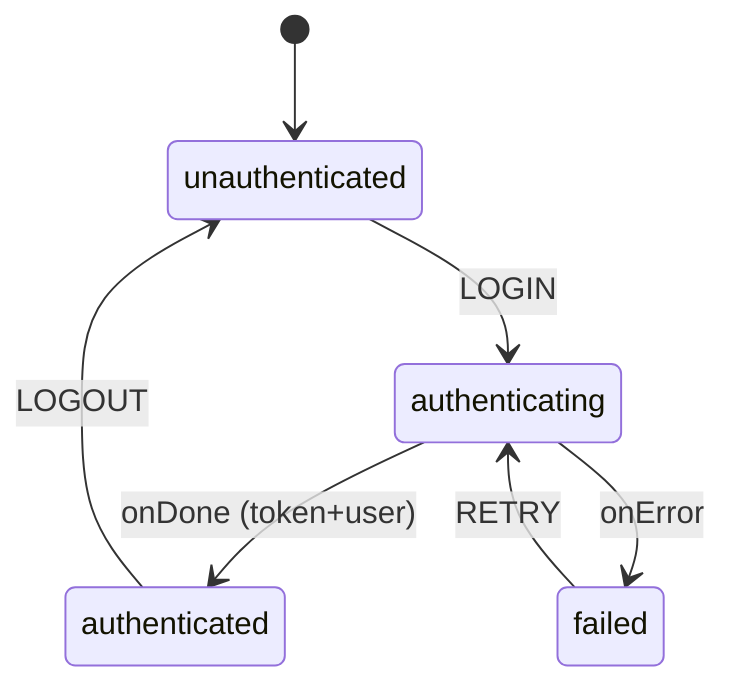

```typescript
import { createMachine, assign, fromPromise } from "xstate";

// Simulated login API -- replace with real fetch in production
const loginAPI = async (credentials: { email: string; password: string }) => {
  // => Async function; returns user object or throws on failure
  if (credentials.password === "wrong") throw new Error("Invalid credentials");
  // => Simulates server rejection
  return { user: { id: "1", name: "Alice" }, token: "tok_abc123" };
  // => Returns strongly typed user and token on success
};

export const authMachine = createMachine(
  {
    // => Top-level auth FSM; controls all login/logout state
    id: "auth",
    initial: "unauthenticated",
    context: {
      user: null as { id: string; name: string } | null,
      token: null as string | null,
      // => Null until authenticated; cleared on logout
      error: null as string | null,
      // => Holds last error message for display
    },
    states: {
      unauthenticated: {
        on: {
          LOGIN: {
            target: "authenticating",
            // => Trigger: user submits credentials
          },
        },
      },
      authenticating: {
        invoke: {
          src: "loginAPI",
          // => Calls the loginAPI actor (defined in actors config below)
          input: ({ event }) => (event as any).credentials,
          // => Passes credentials from the LOGIN event to the API
          onDone: {
            target: "authenticated",
            actions: assign({
              user: ({ event }) => event.output.user,
              // => Stores returned user in context
              token: ({ event }) => event.output.token,
              // => Stores token for subsequent API calls
              error: null,
              // => Clears any previous error
            }),
          },
          onError: {
            target: "failed",
            actions: assign({
              error: ({ event }) => (event.error as Error).message,
              // => Preserves error message for UI display
            }),
          },
        },
      },
      authenticated: {
        on: {
          LOGOUT: {
            target: "unauthenticated",
            actions: assign({ user: null, token: null }),
            // => Clears credentials; machine returns to initial state
          },
        },
      },
      failed: {
        on: { RETRY: "authenticating" },
        // => User can retry from the same failed state
      },
    },
  },
  {
    actors: {
      loginAPI: fromPromise(({ input }) => loginAPI(input as any)),
      // => Wraps async function as a promise actor
    },
  },
);
```

**Key Takeaway:** Map each authentication lifecycle phase (idle, loading, success, failure) to a discrete state. Use `onDone`/`onError` transitions on `invoke` to store the result or error in context.

**Why It Matters:** Encoding auth state as an FSM eliminates impossible UI states like "loading and error simultaneously." The machine is the single source of truth for auth, making it trivially easy to show the right UI, protect routes, and test every transition in isolation.

---

### Example 60: Multi-Step Wizard

A wizard machine advances linearly through steps, supports back navigation, accumulates form data in context per step, and invokes a submit API on the final step. Context grows as the user progresses, and the back transition does not clear data — it only moves the active state backward.

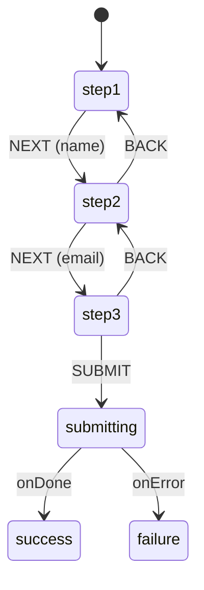

```typescript
import { createMachine, assign, fromPromise } from "xstate";

// Wizard context accumulates all form fields
type WizardContext = {
  name: string;
  email: string;
  plan: string;
  error: string | null;
};

export const wizardMachine = createMachine(
  {
    // => Three-step sign-up wizard
    id: "wizard",
    initial: "step1",
    context: { name: "", email: "", plan: "", error: null } as WizardContext,
    states: {
      step1: {
        on: {
          NEXT: {
            target: "step2",
            actions: assign({ name: ({ event }) => (event as any).name }),
            // => Captures name from event; context is updated before transition
          },
        },
      },
      step2: {
        on: {
          NEXT: {
            target: "step3",
            actions: assign({ email: ({ event }) => (event as any).email }),
            // => Captures email; previous fields (name) remain intact
          },
          BACK: "step1",
          // => Back navigation preserves context; only state changes
        },
      },
      step3: {
        on: {
          SUBMIT: "submitting",
          // => Triggers final submission with all accumulated context
          BACK: "step2",
          // => User can still go back and change email
        },
      },
      submitting: {
        invoke: {
          src: "submitWizard",
          // => Submits the complete wizard context to the API
          input: ({ context }) => context,
          // => Passes entire accumulated context as the API input
          onDone: "success",
          onError: {
            target: "failure",
            actions: assign({
              error: ({ event }) => (event.error as Error).message,
            }),
          },
        },
      },
      success: { type: "final" },
      // => Terminal state; wizard is complete
      failure: {
        on: { RETRY: "submitting" },
        // => User can retry submission without re-entering form data
      },
    },
  },
  {
    actors: {
      submitWizard: fromPromise(async ({ input }) => {
        // => Replace with real API call
        console.log("Submitting:", input);
        // => Logs accumulated wizard data
        return { ok: true };
      }),
    },
  },
);
```

**Key Takeaway:** Each wizard step is a state; `NEXT` transitions store that step's data in context via `assign`. Back navigation reuses simple target strings — no data is cleared.

**Why It Matters:** A wizard FSM makes multi-step flows deterministic. You can never be on "step 3 with no step 2 data" because context is assigned during the forward transition. The machine also makes progress serialisable — snapshot + restore lets users resume a partially completed wizard after page reload.

---

### Example 61: WebSocket Connection Machine

A WebSocket machine models the full connection lifecycle using a `fromCallback` actor that wraps the native WebSocket API. The `fromCallback` actor translates WebSocket events into machine events and cleans up the socket on unsubscribe.

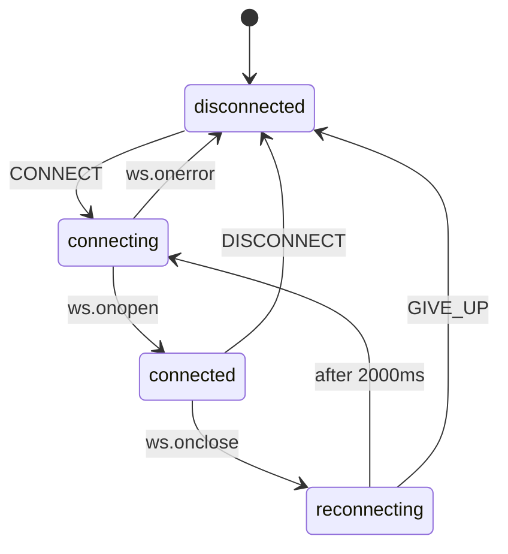

```typescript
import { createMachine, assign, fromCallback } from "xstate";

// fromCallback actor wraps the native WebSocket lifecycle
const websocketActor = fromCallback(({ sendBack, input }) => {
  // => sendBack sends events to the parent machine
  // => input contains { url } from the invoke's input field
  const ws = new WebSocket((input as any).url);
  // => Create socket; does not block -- callbacks fire asynchronously

  ws.onopen = () => sendBack({ type: "WS_OPEN" });
  // => Fires when connection is established
  ws.onmessage = (e) => sendBack({ type: "WS_MESSAGE", data: e.data });
  // => Fires for each incoming message
  ws.onerror = () => sendBack({ type: "WS_ERROR" });
  // => Fires on connection error
  ws.onclose = () => sendBack({ type: "WS_CLOSE" });
  // => Fires when connection drops unexpectedly

  return () => ws.close();
  // => Cleanup: close socket when machine leaves the invoking state
});

export const wsMachine = createMachine({
  // => WebSocket connection lifecycle FSM
  id: "ws",
  initial: "disconnected",
  context: { url: "wss://echo.example.com", retries: 0 },
  states: {
    disconnected: {
      on: { CONNECT: "connecting" },
    },
    connecting: {
      invoke: {
        src: websocketActor,
        input: ({ context }) => ({ url: context.url }),
        // => Passes url from context to the fromCallback actor
      },
      on: {
        WS_OPEN: "connected",
        // => Transition fires when ws.onopen sends WS_OPEN
        WS_ERROR: "disconnected",
        // => Failed to connect; return to disconnected
      },
    },
    connected: {
      on: {
        DISCONNECT: "disconnected",
        // => Intentional disconnect; cleanup runs automatically
        WS_CLOSE: "reconnecting",
        // => Unexpected close; attempt to reconnect
        WS_MESSAGE: {
          actions: ({ event }) => console.log("Received:", event.data),
          // => Handle incoming data; stays in connected state
        },
      },
    },
    reconnecting: {
      after: {
        2000: "connecting",
        // => Wait 2 s then attempt reconnect
      },
      on: {
        GIVE_UP: "disconnected",
        // => User or external logic can abort reconnection
      },
    },
  },
});
```

**Key Takeaway:** Use `fromCallback` to wrap event-driven APIs like WebSocket. The cleanup function returned from `fromCallback` fires automatically when the machine leaves the invoking state, preventing resource leaks.

**Why It Matters:** WebSocket lifecycle management is notorious for subtle bugs (double-close, stale handlers, missed reconnects). An FSM makes every state and transition explicit and testable. The cleanup return from `fromCallback` guarantees no orphaned socket handles, regardless of how the machine transitions.

---

### Example 62: Data Fetching with Exponential Backoff Retry

A fetch machine retries failed requests with exponential backoff using XState's `after` (delayed self-transition) combined with a retry counter in context. The machine moves from `loading` → `success` on resolve, or `loading` → `failed` where a backoff timer triggers a return to `loading`.

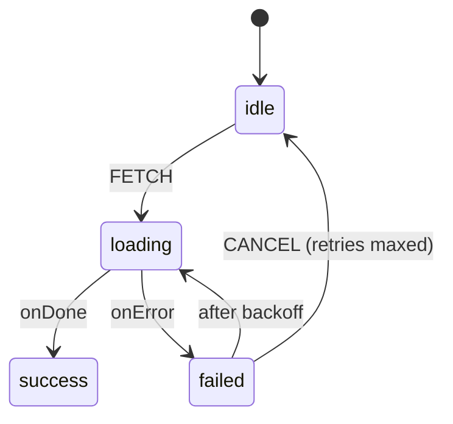

```typescript
import { createMachine, assign, fromPromise } from "xstate";

const MAX_RETRIES = 3;
// => Cap retries to prevent infinite loops

const fetchData = async (url: string) => {
  // => Real implementation would use fetch(); this simulates failure then success
  const res = await fetch(url);
  if (!res.ok) throw new Error(`HTTP ${res.status}`);
  return res.json();
};

export const fetchMachine = createMachine(
  {
    // => Data fetching FSM with exponential backoff
    id: "fetch",
    initial: "idle",
    context: { data: null as unknown, error: null as string | null, retries: 0 },
    states: {
      idle: {
        on: { FETCH: "loading" },
      },
      loading: {
        entry: assign({ error: null }),
        // => Clear previous error on each attempt
        invoke: {
          src: "fetchData",
          input: () => "https://api.example.com/data",
          // => URL could come from context or event in a real machine
          onDone: {
            target: "success",
            actions: assign({
              data: ({ event }) => event.output,
              retries: 0,
              // => Reset retries on success
            }),
          },
          onError: {
            target: "failed",
            actions: assign({
              error: ({ event }) => (event.error as Error).message,
              retries: ({ context }) => context.retries + 1,
              // => Increment retry counter for backoff calculation
            }),
          },
        },
      },
      success: { type: "final" },
      failed: {
        always: {
          guard: ({ context }) => context.retries >= MAX_RETRIES,
          // => Guard: if max retries reached, stay in failed (no auto-retry)
          target: "idle",
          // => Reset to idle so user can manually retry
        },
        after: {
          BACKOFF_DELAY: "loading",
          // => Named delay; value computed dynamically in delays config
        },
        on: { CANCEL: "idle" },
      },
    },
  },
  {
    actors: {
      fetchData: fromPromise(({ input }) => fetchData(input as string)),
    },
    delays: {
      BACKOFF_DELAY: ({ context }) => Math.min(1000 * 2 ** context.retries, 30000),
      // => 1s, 2s, 4s, 8s … capped at 30 s
      // => Exponential backoff reduces server pressure during outages
    },
  },
);
```

**Key Takeaway:** Named delays in the `delays` config can be functions of context, enabling exponential backoff without any external timer management. The `always` guard aborts auto-retry once `MAX_RETRIES` is reached.

**Why It Matters:** Retry logic written imperatively is error-prone — leaked timers, double-fires, and unclear abort conditions are common. An FSM externalises the entire retry policy into declarative config: you can change the backoff formula or retry cap in one place without touching state transition logic.

---

### Example 63: Optimistic Update

An optimistic update machine applies a context change immediately (optimistic), invokes the API in the background, and rolls back context on error. The user sees instant feedback; the machine silently reconciles with the server.

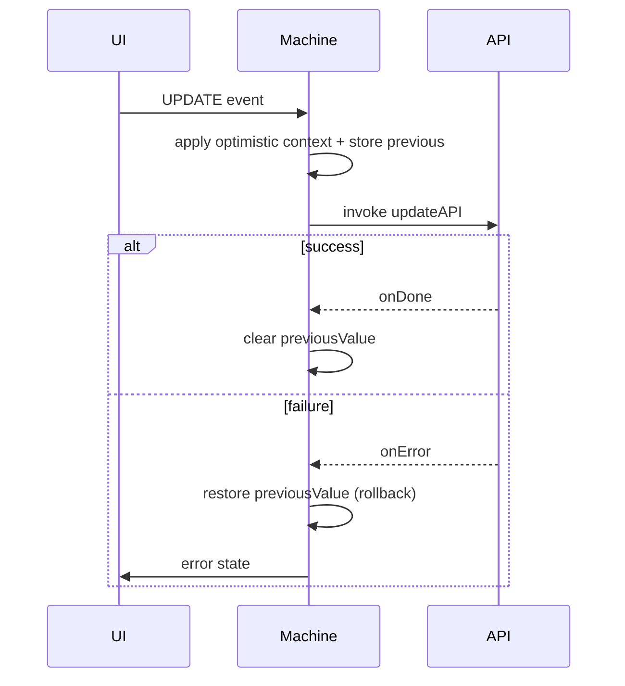

```typescript
import { createMachine, assign, fromPromise } from "xstate";

type ItemContext = {
  value: string;
  previousValue: string | null;
  // => Snapshot before optimistic update; used for rollback
  error: string | null;
};

export const optimisticMachine = createMachine(
  {
    // => Optimistic update FSM: apply first, confirm or rollback later
    id: "optimistic",
    initial: "idle",
    context: { value: "initial", previousValue: null, error: null } as ItemContext,
    states: {
      idle: {
        on: {
          UPDATE: {
            target: "saving",
            actions: assign({
              previousValue: ({ context }) => context.value,
              // => Snapshot current value BEFORE overwriting
              value: ({ event }) => (event as any).newValue,
              // => Apply new value immediately -- user sees it at once
              error: null,
            }),
          },
        },
      },
      saving: {
        invoke: {
          src: "updateAPI",
          input: ({ context }) => ({ value: context.value }),
          // => Sends the optimistically applied value to the server
          onDone: {
            target: "idle",
            actions: assign({ previousValue: null }),
            // => Server confirmed: discard the snapshot
          },
          onError: {
            target: "idle",
            actions: assign({
              value: ({ context }) => context.previousValue ?? context.value,
              // => Roll back to snapshot on failure
              previousValue: null,
              error: ({ event }) => (event.error as Error).message,
              // => Surface error to UI
            }),
          },
        },
      },
    },
  },
  {
    actors: {
      updateAPI: fromPromise(async ({ input }) => {
        // => Simulated API; throws 50% of the time for demo
        if (Math.random() < 0.5) throw new Error("Network error");
        return input;
      }),
    },
  },
);
```

**Key Takeaway:** Store the pre-update value in `previousValue` before assigning the optimistic value. On `onError`, restore `previousValue` to roll back. The machine handles the full lifecycle without external state.

**Why It Matters:** Optimistic updates dramatically improve perceived performance for latency-sensitive actions (likes, favourites, inline edits). Encoding the rollback inside the FSM means the UI component is completely stateless — it only reads context and sends events, making rollback reliable and testable.

---

## Group 14: Ecosystem Integration (Examples 64–67)

### Example 64: XState + React Query

A machine controls form submission UI state while React Query manages the server cache mutation. XState handles the multi-state flow (idle → submitting → success/failure); React Query handles deduplication, caching, and retries.

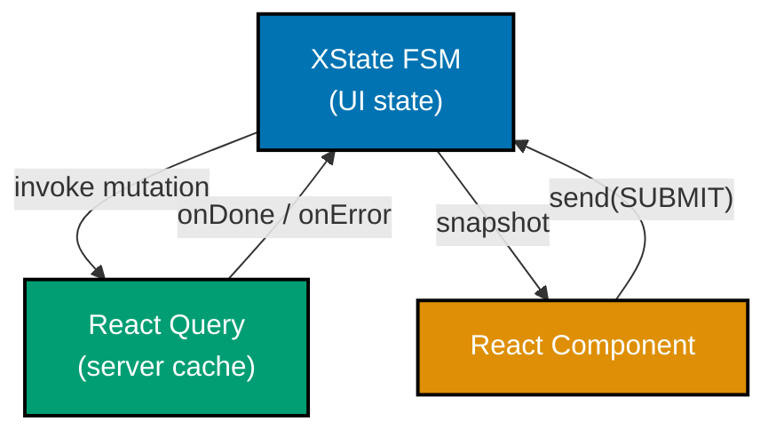

```typescript
// Note: requires react, @tanstack/react-query, @xstate/react
import { createMachine, fromPromise } from "xstate";
// => XState imports -- no React Query import needed inside the machine

// The machine wraps the mutation as a fromPromise actor
// React Query's mutateAsync is passed in via machine input
export const formMachine = createMachine(
  {
    // => Controls form submission lifecycle; agnostic to server-cache details
    id: "form",
    initial: "idle",
    context: { error: null as string | null },
    states: {
      idle: {
        on: { SUBMIT: "submitting" },
      },
      submitting: {
        invoke: {
          src: "submitMutation",
          // => Calls the actor registered below; actor wraps mutateAsync
          input: ({ event }) => (event as any).formData,
          // => Passes form data from the SUBMIT event
          onDone: "success",
          onError: {
            target: "idle",
            actions: ({ context, event }) => {
              (context as any).error = (event.error as Error).message;
              // => Stores error for display in the form
            },
          },
        },
      },
      success: {},
    },
  },
  {
    actors: {
      // submitMutation is provided at runtime via machine.provide()
      // allowing the React Query mutateAsync to be injected:
      // const machine = formMachine.provide({
      //   actors: { submitMutation: fromPromise(({ input }) => mutateAsync(input)) }
      // });
      submitMutation: fromPromise(async ({ input }) => input),
      // => Placeholder; replaced at runtime with mutateAsync
    },
  },
);

// React component usage (pseudocode):
// const mutation = useMutation({ mutationFn: createPost });
// const [state, send] = useMachine(
//   formMachine.provide({
//     actors: { submitMutation: fromPromise(({ input }) => mutation.mutateAsync(input)) }
//   })
// );
```

**Key Takeaway:** Use `machine.provide()` at the component level to inject a React Query `mutateAsync` as the `submitMutation` actor. The machine stays framework-agnostic; React Query's caching and retry benefits apply automatically.

**Why It Matters:** XState and React Query solve different problems. React Query excels at server-state deduplication and background refresh; XState excels at multi-step UI flows and impossible-state prevention. Combining them gives you both benefits without coupling: the machine is independently testable with a mock actor, and React Query continues to manage its cache independently.

---

### Example 65: XState + Effect.ts

`fromPromise` accepts any function returning a native `Promise`. `Effect.runPromise` converts an `Effect` into a `Promise`, making it a natural bridge. Typed errors from `Effect` can map to machine error states when caught in `onError`.

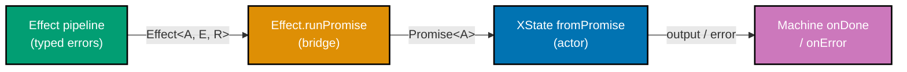

```typescript
// Note: requires the 'effect' npm package
// import { Effect } from "effect";

import { createMachine, fromPromise } from "xstate";

// Simulated Effect-style computation (without importing effect for portability)
// In real usage: Effect.gen(function* () { ... }).pipe(Effect.runPromise)
const effectLikeComputation = async (userId: string): Promise<{ name: string }> => {
  // => Represents Effect<User, HttpError, never> bridged to Promise
  if (!userId) throw Object.assign(new Error("Not found"), { _tag: "NotFound" });
  // => Effect's typed errors become typed thrown objects
  return { name: "Alice" };
  // => Success case resolves with User
};

export const effectMachine = createMachine(
  {
    // => Machine that invokes an Effect-based service
    id: "effectMachine",
    initial: "idle",
    context: {
      user: null as { name: string } | null,
      errorTag: null as string | null,
      // => Stores Effect error _tag for precise error handling
    },
    states: {
      idle: {
        on: { LOAD: "loading" },
      },
      loading: {
        invoke: {
          src: "loadUser",
          input: ({ event }) => (event as any).userId,
          // => Passes userId to the actor
          onDone: {
            target: "success",
            actions: ({ context, event }) => {
              context.user = event.output;
              // => Stores the resolved user from Effect output
            },
          },
          onError: {
            target: "error",
            actions: ({ context, event }) => {
              context.errorTag = (event.error as any)._tag ?? "Unknown";
              // => Captures Effect's discriminated error tag
              // => Allows machine to branch on NotFound vs Unauthorized etc.
            },
          },
        },
      },
      success: {},
      error: {},
    },
  },
  {
    actors: {
      loadUser: fromPromise(
        ({ input }) => effectLikeComputation(input as string),
        // => Effect.runPromise(myEffect) would go here in real usage
        // => fromPromise is the only bridge needed; no XState-Effect adapter required
      ),
    },
  },
);
```

**Key Takeaway:** `fromPromise(({ input }) => Effect.runPromise(myEffect(input)))` is the complete integration bridge. Effect handles typed errors and composable pipelines; XState handles state routing.

**Why It Matters:** Effect.ts provides powerful typed-error composition and dependency injection for complex service layers. XState provides state-machine guarantees for UI flows. Using `Effect.runPromise` as the bridge keeps both libraries in their lane — you get Effect's expressive error types mapped cleanly to machine `onError` handlers with zero coupling.

---

### Example 66: XState + Zustand

A machine reads initial state from a Zustand store on startup (via machine `input`) and writes results back to the store via a side-effect action. XState owns the multi-step flow; Zustand owns the persisted application state.

```typescript
// Note: requires zustand -- npm install zustand
// import { create } from "zustand";

import { createMachine, assign, fromPromise } from "xstate";

// Simulated Zustand store shape (without importing zustand for portability)
type AppStore = {
  draftName: string;
  savedName: string;
  setSavedName: (name: string) => void;
};

// In real usage: const useAppStore = create<AppStore>((set) => ({ ... }));
// Machine reads initial draftName from store, saves result back

export const editNameMachine = createMachine(
  {
    // => Multi-step edit flow; reads from and writes to external Zustand store
    id: "editName",
    initial: "editing",
    context: ({ input }) => ({
      // => input is provided at createActor time from Zustand store
      draftName: (input as any)?.draftName ?? "",
      // => Bootstraps context from Zustand; not live-synced
      savedName: null as string | null,
    }),
    states: {
      editing: {
        on: {
          CHANGE: {
            actions: assign({
              draftName: ({ event }) => (event as any).value,
              // => XState context tracks local edits; Zustand unchanged
            }),
          },
          SAVE: "saving",
        },
      },
      saving: {
        invoke: {
          src: "saveToAPI",
          input: ({ context }) => context.draftName,
          onDone: {
            target: "saved",
            actions: [
              assign({ savedName: ({ context }) => context.draftName }),
              // => Update machine context with persisted value
              ({ context }) => {
                // => Side-effect: write back to Zustand store
                // useAppStore.getState().setSavedName(context.draftName);
                console.log("Zustand updated with:", context.draftName);
                // => In production, call the Zustand setter here
              },
            ],
          },
        },
      },
      saved: { type: "final" },
    },
  },
  {
    actors: {
      saveToAPI: fromPromise(async ({ input }) => {
        console.log("Saving:", input);
        return input;
      }),
    },
  },
);

// Usage with Zustand (pseudocode):
// const { draftName } = useAppStore();
// const actor = createActor(editNameMachine, { input: { draftName } });
```

**Key Takeaway:** Pass Zustand state as `input` when creating the actor. Write back to Zustand inside `onDone` actions using the store's setter. The machine context is the single source of truth during the flow; Zustand is updated only on confirmed persistence.

**Why It Matters:** XState and Zustand serve different temporal scopes. Zustand persists application state across components and sessions; XState manages transient multi-step flows. Threading `input` from Zustand into the machine avoids duplicating state, and the explicit write-back action makes the persistence boundary visible and auditable.

---

### Example 67: XState + React Hook Form

React Hook Form (RHF) owns field registration, validation, and dirty tracking. XState owns the submission lifecycle: idle → validating → submitting → done/error. The two integrate through a `handleSubmit` callback that sends a `SUBMIT` event to the machine with validated form data.

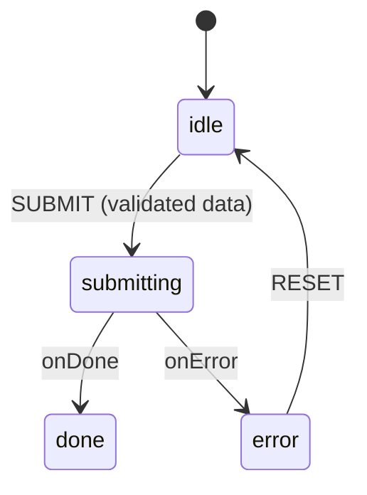

```typescript
// Note: requires react-hook-form and @xstate/react
// import { useForm } from "react-hook-form";
// import { useMachine } from "@xstate/react";

import { createMachine, assign, fromPromise } from "xstate";

type FormData = { email: string; password: string };

export const rhfMachine = createMachine(
  {
    // => Submission lifecycle machine; RHF handles field-level concerns
    id: "rhfForm",
    initial: "idle",
    context: { error: null as string | null },
    states: {
      idle: {
        on: {
          SUBMIT: "submitting",
          // => Triggered by RHF handleSubmit after validation passes
          // => Event carries validated FormData
        },
      },
      submitting: {
        invoke: {
          src: "submitForm",
          input: ({ event }) => (event as any).data as FormData,
          // => RHF-validated data is the actor input
          onDone: "done",
          onError: {
            target: "error",
            actions: assign({
              error: ({ event }) => (event.error as Error).message,
              // => Captures server-side error for display
            }),
          },
        },
      },
      done: {},
      // => Success state; component shows confirmation UI
      error: {
        on: { RESET: { target: "idle", actions: assign({ error: null }) } },
        // => Allows user to dismiss error and resubmit
      },
    },
  },
  {
    actors: {
      submitForm: fromPromise(async ({ input }) => {
        console.log("Submitting form:", input);
        // => Replace with real API call e.g. POST /api/login
        return { userId: "u_123" };
      }),
    },
  },
);

// React component pattern (pseudocode):
// const { register, handleSubmit } = useForm<FormData>();
// const [state, send] = useMachine(rhfMachine);
// const onSubmit = handleSubmit((data) => send({ type: "SUBMIT", data }));
// RHF validates then calls send; XState takes over from there
```

**Key Takeaway:** RHF calls `handleSubmit` → you send `{ type: 'SUBMIT', data }` to the machine. RHF manages field state; XState manages submission state. Neither library intrudes on the other's domain.

**Why It Matters:** React Hook Form is optimised for high-performance uncontrolled field management. XState is optimised for multi-step state transitions. Their responsibilities do not overlap — RHF prevents XState from needing to track per-field dirty/validation state, and XState prevents RHF from needing to model loading/error/success lifecycle. The combination gives you the best of both.

---

## Group 15: Testing Advanced Patterns (Examples 68–70)

### Example 68: Model-Based Testing with @xstate/graph

`@xstate/graph` generates all shortest paths through a state machine as test cases. You map each state and event to assertion/action callbacks, then execute every generated path. This eliminates the need to manually enumerate test scenarios.

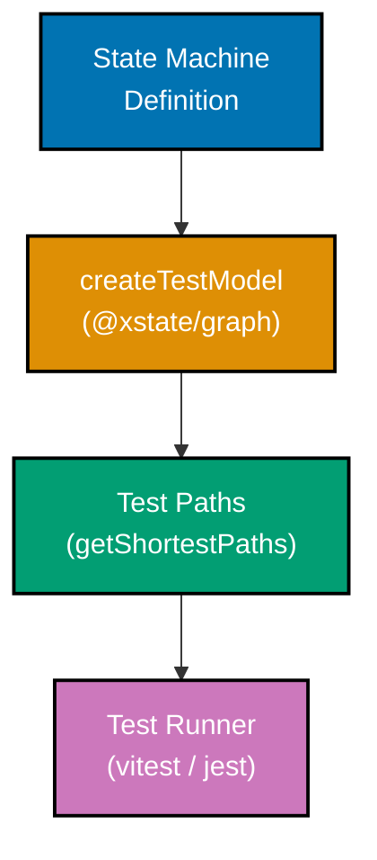

```typescript
// Note: requires @xstate/graph -- npm install @xstate/graph
// import { createTestModel } from "@xstate/graph";

import { createMachine } from "xstate";

// Simple toggle machine as the system under test
const toggleMachine = createMachine({
  // => Target machine for model-based test generation
  id: "toggle",
  initial: "off",
  states: {
    off: { on: { TOGGLE: "on" } },
    on: { on: { TOGGLE: "off" } },
  },
});

// Model-based test setup (pseudocode -- requires @xstate/graph in test env)
// const model = createTestModel(toggleMachine);
// => createTestModel wraps the machine with path-traversal utilities

// const paths = model.getShortestPaths();
// => Generates all shortest paths through the graph:
// =>   Path 1: off → (TOGGLE) → on
// =>   Path 2: off → (TOGGLE) → on → (TOGGLE) → off

// paths.forEach((path) => {
//   it(path.description, async () => {
//     await path.test({
//       states: {
//         off: ({ actor }) => expect(actor.getSnapshot().value).toBe("off"),
//         // => Assert UI renders "OFF" button
//         on: ({ actor }) => expect(actor.getSnapshot().value).toBe("on"),
//         // => Assert UI renders "ON" button
//       },
//       events: {
//         TOGGLE: ({ actor }) => actor.send({ type: "TOGGLE" }),
//         // => Drive the machine by sending the event
//       },
//     });
//   });
// });

// Standalone verification (no @xstate/graph import needed)
const actor = createMachine({
  // => Manual path traversal as fallback for test environments without graph
  id: "toggleTest",
  initial: "off",
  states: {
    off: { on: { TOGGLE: "on" } },
    on: { on: { TOGGLE: "off" } },
  },
});

console.log("Model-based testing traverses all paths automatically");
// => In real usage, @xstate/graph generates the path objects
```

**Key Takeaway:** `createTestModel(machine).getShortestPaths()` auto-generates test paths covering every state-event combination. You only write state assertions and event drivers — path enumeration is automatic.

**Why It Matters:** Manually writing test cases for complex FSMs is error-prone and incomplete. Model-based testing guarantees coverage of every reachable state and transition. Adding a new state or event to the machine automatically generates new test cases at no authoring cost, keeping tests in sync with the machine definition by construction.

---

### Example 69: Testing Actor Systems with Subscriptions

Testing a parent–child actor system involves creating the parent actor, waiting for it to settle, and then verifying that child actors receive and process events correctly by subscribing to their snapshots.

```typescript
import { createMachine, createActor, assign, sendTo } from "xstate";
import { describe, it, expect, vi } from "vitest";

// Child machine that tracks received events
const childMachine = createMachine({
  // => Simple counter child; each INCREMENT increments count
  id: "child",
  context: { count: 0 },
  on: {
    INCREMENT: {
      actions: assign({ count: ({ context }) => context.count + 1 }),
      // => Increments on each INCREMENT event from parent
    },
  },
});

// Parent that spawns child and forwards TICK events as INCREMENT
const parentMachine = createMachine({
  // => Parent forwards external TICK events to child actor
  id: "parent",
  context: { childRef: null as any },
  initial: "running",
  states: {
    running: {
      entry: assign({
        childRef: ({ spawn }) => spawn(childMachine, { id: "child" }),
        // => Spawn child on entry
      }),
      on: {
        TICK: {
          actions: sendTo(({ context }) => context.childRef, { type: "INCREMENT" }),
          // => Route TICK → INCREMENT to child
        },
      },
    },
  },
});

describe("Actor system", () => {
  it("child receives forwarded events from parent", () => {
    const actor = createActor(parentMachine).start();
    // => Start the parent actor (child spawns immediately)

    const childRef = actor.getSnapshot().context.childRef;
    // => Retrieve child ActorRef from parent context

    const snapshots: any[] = [];
    childRef.subscribe((snap: any) => snapshots.push(snap));
    // => Subscribe to child snapshots to observe state changes

    actor.send({ type: "TICK" });
    // => Send TICK to parent; parent forwards INCREMENT to child
    actor.send({ type: "TICK" });
    // => Second TICK; child should now have count = 2

    expect(childRef.getSnapshot().context.count).toBe(2);
    // => Assert child processed both forwarded events
    expect(snapshots.length).toBeGreaterThanOrEqual(2);
    // => Subscription fired at least twice (one per INCREMENT)
  });
});
```

**Key Takeaway:** Retrieve child `ActorRef` from parent context after starting the parent, then subscribe to the child's snapshot stream to assert on state changes driven by forwarded events.

**Why It Matters:** Actor systems are only as reliable as their message passing. Testing that parent-to-child forwarding works correctly catches bugs in `sendTo` logic, event type mismatches, and incorrect ref resolution — issues that only manifest at system level, not when testing machines in isolation.

---

### Example 70: Simulated Clock for Delayed Transitions

XState's `SimulatedClock` lets tests advance time programmatically without `setTimeout`. Pass the clock as `clock` in `createActor` options, then call `clock.increment(ms)` to trigger `after()` transitions instantly.

```typescript
import { createMachine, createActor } from "xstate";
import { SimulatedClock } from "xstate/simulation";
// => SimulatedClock is a test utility bundled with xstate
import { describe, it, expect } from "vitest";

// Machine with a delayed self-transition (auto-closes after 3 s)
const toastMachine = createMachine({
  // => Notification toast that auto-dismisses after 3000 ms
  id: "toast",
  initial: "visible",
  states: {
    visible: {
      after: {
        3000: "dismissed",
        // => Normally waits 3 real seconds; SimulatedClock bypasses this
      },
      on: { DISMISS: "dismissed" },
      // => Manual dismiss also available
    },
    dismissed: { type: "final" },
    // => Terminal state; toast is gone
  },
});

describe("Toast auto-dismiss", () => {
  it("dismisses after 3000 ms without real delay", () => {
    const clock = new SimulatedClock();
    // => Create a controllable clock; starts at time 0

    const actor = createActor(toastMachine, { clock }).start();
    // => Pass clock to actor; all internal timers use it

    expect(actor.getSnapshot().value).toBe("visible");
    // => At t=0, toast is visible

    clock.increment(3000);
    // => Advance simulated time by 3000 ms instantly
    // => The after(3000) transition fires synchronously

    expect(actor.getSnapshot().value).toBe("dismissed");
    // => Toast is now dismissed without waiting real time
  });
});
```

**Key Takeaway:** Construct `new SimulatedClock()` and pass it as `{ clock }` to `createActor`. Call `clock.increment(ms)` to fire `after()` transitions instantly in tests.

**Why It Matters:** Real `setTimeout`-based tests are slow, flaky (timing-sensitive), and difficult to reason about. A simulated clock makes delayed-transition tests deterministic and instant. This is especially valuable for testing backoff logic, session timeouts, and polling intervals where real delays would make the test suite impractical.

---

## Group 16: Performance and Production (Examples 71–75)

### Example 71: Pure Transitions with machine.transition()

`createMachine` exposes a `transition(snapshot, event)` method that calculates the next snapshot without creating an actor or running side effects. This is useful for server-side state calculation, reducers, and previewing the next state without committing to it.

```typescript
import { createMachine, initialSnapshot } from "xstate";

// Simple traffic light machine
const trafficMachine = createMachine({
  // => FSM for stateless server-side transition calculation
  id: "traffic",
  initial: "green",
  states: {
    green: { on: { NEXT: "yellow" } },
    yellow: { on: { NEXT: "red" } },
    red: { on: { NEXT: "green" } },
  },
});

// Get the initial snapshot without starting an actor
const initial = initialSnapshot(trafficMachine);
// => Returns a MachineSnapshot with value: "green"
// => No actor is created; no effects run

// Calculate next state purely
const afterFirst = trafficMachine.transition(initial, { type: "NEXT" });
// => Returns new MachineSnapshot with value: "yellow"
// => Synchronous; no timers, promises, or subscriptions created

const afterSecond = trafficMachine.transition(afterFirst, { type: "NEXT" });
// => Returns new MachineSnapshot with value: "red"

console.log(initial.value); // => "green"
console.log(afterFirst.value); // => "yellow"
console.log(afterSecond.value); // => "red"

// Server-side usage: calculate next state from persisted snapshot
// const persisted = JSON.parse(req.body.snapshot);
// const restored = trafficMachine.resolveSnapshot(persisted);
// const next = trafficMachine.transition(restored, event);
// res.json(next);
```

**Key Takeaway:** `machine.transition(snapshot, event)` is a pure function — no side effects, no actor lifecycle. Use it for server-side rendering, Redux-style reducers that wrap XState, and state previews.

**Why It Matters:** Not every stateful computation needs a running actor. Server-side APIs often need to validate or calculate state transitions for stored machines without the overhead of actor creation. `machine.transition` enables XState to be used as a pure state reducer anywhere a function is appropriate, while keeping all the benefits of formal FSM definitions.

---

### Example 72: Deep History States

A history state (`type: 'history'`) restores the last active substate when re-entering a compound state. `history: 'deep'` recursively restores nested active states; `history: 'shallow'` (the default) only restores one level.

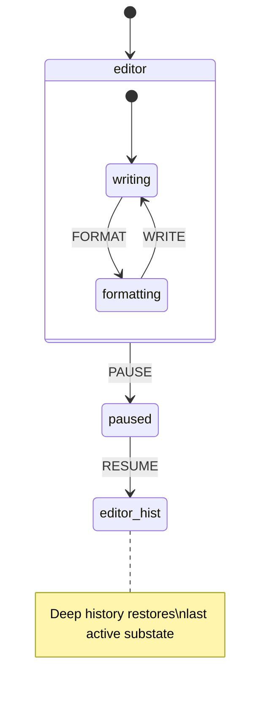

```typescript
import { createMachine, createActor } from "xstate";

const editorMachine = createMachine({
  // => Editor with pause/resume that restores exact substate
  id: "editor",
  initial: "editing",
  states: {
    editing: {
      initial: "writing",
      states: {
        writing: { on: { FORMAT: "formatting" } },
        formatting: { on: { WRITE: "writing" } },
        hist: {
          type: "history",
          history: "deep",
          // => 'deep': restores entire active configuration recursively
          // => 'shallow' (default): only restores direct child substate
        },
      },
      on: { PAUSE: "paused" },
    },
    paused: {
      on: {
        RESUME: "editing.hist",
        // => Re-enters editing via the history pseudostate
        // => Restores whatever substate was active when PAUSE was sent
      },
    },
  },
});

const actor = createActor(editorMachine).start();
// => Starts in editing.writing

actor.send({ type: "FORMAT" });
// => Now in editing.formatting

actor.send({ type: "PAUSE" });
// => Transitions to paused; editing.formatting is remembered in hist

actor.send({ type: "RESUME" });
// => Transitions to editing.hist → restores editing.formatting
// => Deep history: even deeply nested substates are restored

console.log(actor.getSnapshot().value);
// => { editing: "formatting" } -- not editing.writing (the initial)
```

**Key Takeaway:** Target `"parentState.hist"` in a transition to resume the last active configuration. Use `history: 'deep'` when nested states need full restoration; use `history: 'shallow'` when only the immediate child matters.

**Why It Matters:** Without history states, pausing and resuming a complex flow forces you to manually track and restore active state — error-prone and verbose. History pseudostates handle this declaratively. Deep history is especially valuable for tabbed UIs, multi-step editors, and wizard flows where the user's exact position must be preserved across interruptions.

---

### Example 73: Snapshot Serialization and Restoration

XState actors expose `getPersistedSnapshot()` for serialisation and accept a `snapshot` option in `createActor` for restoration. This enables localStorage persistence, server-side session continuity, and tab-close recovery.

```mermaid
%% Color Palette: Blue #0173B2, Orange #DE8F05, Teal #029E73, Purple #CC78BC, Brown #CA9161
sequenceDiagram
    participant Actor
    participant Storage as localStorage
    participant NewActor as Restored Actor

    Actor->>Actor: run transitions
    Actor->>Storage: getPersistedSnapshot() → JSON.stringify
    Note over Storage: page unload / session end
    Storage->>NewActor: JSON.parse → createActor#40;machine, #123;snapshot#125;#41;
    NewActor->>NewActor: resumes from exact prior state
```

```typescript
import { createMachine, createActor } from "xstate";

const checkoutMachine = createMachine({
  // => Multi-step checkout; user must be able to resume after page reload
  id: "checkout",
  initial: "cart",
  context: { items: [] as string[], address: "" },
  states: {
    cart: { on: { NEXT: "address" } },
    address: {
      on: {
        NEXT: "payment",
        SET_ADDRESS: {
          actions: ({ context, event }) => {
            context.address = (event as any).value;
            // => Store address in context for persistence
          },
        },
      },
    },
    payment: { on: { CONFIRM: "confirmed" } },
    confirmed: { type: "final" },
  },
});

// --- Persist ---
const actor = createActor(checkoutMachine).start();
actor.send({ type: "NEXT" }); // cart → address
actor.send({ type: "SET_ADDRESS", value: "123 Main St" });

const persistedSnapshot = actor.getPersistedSnapshot();
// => Returns a serialisable plain object representing current state + context

const serialised = JSON.stringify(persistedSnapshot);
// => Store in localStorage, database, or server session
// localStorage.setItem("checkout", serialised);

// --- Restore ---
const stored = JSON.parse(serialised);
// => Retrieve from storage (simulated here)

const restoredActor = createActor(checkoutMachine, { snapshot: stored }).start();
// => Starts directly in the persisted state ('address') with persisted context

console.log(restoredActor.getSnapshot().value); // => "address"
console.log(restoredActor.getSnapshot().context.address); // => "123 Main St"
// => Full state + context restored; user picks up exactly where they left off
```

**Key Takeaway:** Call `actor.getPersistedSnapshot()` to get a serialisable snapshot, `JSON.stringify` it to store, and pass the parsed result as `{ snapshot }` to `createActor` to restore.

**Why It Matters:** Users abandon multi-step flows when they lose progress to a page reload. Snapshot serialisation makes resumability a first-class feature with three lines of code. The same mechanism enables server-side session persistence, cross-device handoff, and undo/redo — all without any custom serialisation logic.

---

### Example 74: XState Inspector and DevTools

`createBrowserInspector` from `@xstate/inspect` opens a visual state machine inspector in the browser. Passing `{ inspect }` to `createActor` connects any actor to the inspector in real time, showing all state transitions, context changes, and events.

```typescript
// Note: requires @xstate/inspect -- npm install @xstate/inspect
// import { createBrowserInspector } from "@xstate/inspect";

import { createMachine, createActor } from "xstate";

// Any machine can be inspected -- use your real machine here
const counterMachine = createMachine({
  // => Simple counter; used here to demonstrate inspector attachment
  id: "counter",
  context: { count: 0 },
  on: {
    INCREMENT: {
      actions: ({ context }) => {
        context.count += 1;
        // => In-place mutation pattern (XState v5 immer-style)
      },
    },
  },
});

// Production-safe inspector setup (only in development)
const isDev = process.env.NODE_ENV === "development";
// => Guard prevents inspector overhead in production

// In development, create the inspector:
// const { inspect } = createBrowserInspector();
// => Opens inspector panel in browser devtools
// => Inspector URL: http://stately.ai/viz?inspect

// Attach inspector to actor via inspect option:
const actor = createActor(
  counterMachine,
  isDev
    ? {
        // inspect,
        // => Uncomment to enable inspector; all events stream to devtools
      }
    : {},
  // => In production, no inspect option = zero overhead
);

actor.start();
actor.send({ type: "INCREMENT" });
// => In dev mode, this event appears in the inspector timeline
actor.send({ type: "INCREMENT" });
// => Inspector shows state, context, and full event history

console.log(actor.getSnapshot().context.count); // => 2
// => Context is also visible in inspector panel
```

**Key Takeaway:** Pass `{ inspect }` from `createBrowserInspector()` to `createActor`. Guard with `NODE_ENV === 'development'` to prevent inspector overhead in production.

**Why It Matters:** Debugging complex state machines without visual tooling is difficult — event sequences and context mutations are invisible in a console. The XState inspector renders the live statechart, highlights the active state, and shows every event in sequence. This dramatically reduces debugging time for multi-actor systems and real-world flows.

---

### Example 75: XState v4 → v5 Migration Reference

XState v5 renames and restructures several core APIs. This example shows the most common v4 patterns alongside their v5 equivalents side-by-side.

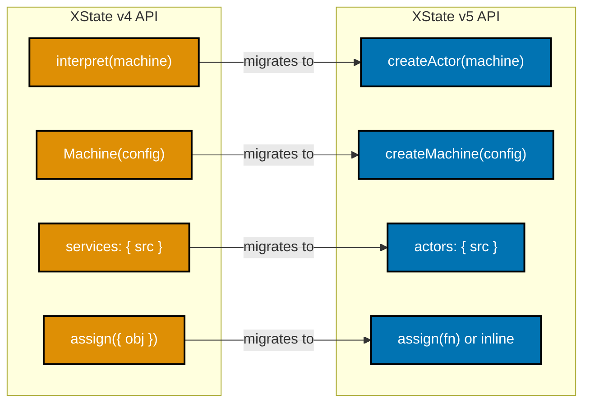

**v4 pattern (deprecated):**

```typescript
// v4: Machine() + interpret() + services config
import { Machine, interpret } from "xstate"; // => v4 imports

const machineV4 = Machine(
  {
    // => Machine() is removed in v5; use createMachine()
    id: "counter",
    context: { count: 0 },
    on: {
      INC: { actions: "increment" },
    },
  },
  {
    services: {
      // => 'services' key renamed to 'actors' in v5
      myService: () => Promise.resolve(42),
    },
    actions: {
      increment: (context) => {
        context.count += 1;
      },
      // => v4 actions receive context directly as first arg
    },
  },
);

const serviceV4 = interpret(machineV4).start();
// => interpret() removed in v5; use createActor()
```

**v5 equivalent:**

```typescript
// v5: createMachine() + createActor() + actors config
import { createMachine, createActor, assign, fromPromise } from "xstate";
// => v5 imports; all named exports, no default export

const machineV5 = createMachine(
  {
    // => createMachine() replaces Machine()
    id: "counter",
    context: { count: 0 },
    on: {
      INC: { actions: assign({ count: ({ context }) => context.count + 1 }) },
      // => assign() takes a function returning partial context (v5)
      // => v4 object-assign form still works but function form preferred
    },
  },
  {
    actors: {
      // => 'actors' replaces 'services' in implementation config
      myActor: fromPromise(() => Promise.resolve(42)),
      // => fromPromise() wraps async functions as actor logic
    },
  },
);

const actorV5 = createActor(machineV5).start();
// => createActor() replaces interpret()
// => API is identical after .start(): send(), getSnapshot(), subscribe()
```

**Key Takeaway:** The four most common v4 → v5 changes are: `Machine()` → `createMachine()`, `interpret()` → `createActor()`, `services:` → `actors:`, and object-assign → function-assign.

**Why It Matters:** XState v5 is a complete rewrite with improved TypeScript inference, smaller bundle size, and the unified actor model. The migration path is mechanical for most codebases — rename four patterns and update imports. Understanding these mappings lets you migrate incrementally and read v4 examples with confidence about what they map to in v5.

---

## Group 17: Expert Patterns (Examples 76–80)

### Example 76: Statechart vs Reducer — When XState Adds Value

A Redux-style reducer and an XState machine both manage state, but they model different things. A reducer is correct for simple linear state; an XState machine adds value when you need impossible-state prevention, complex branching, or side-effect orchestration.

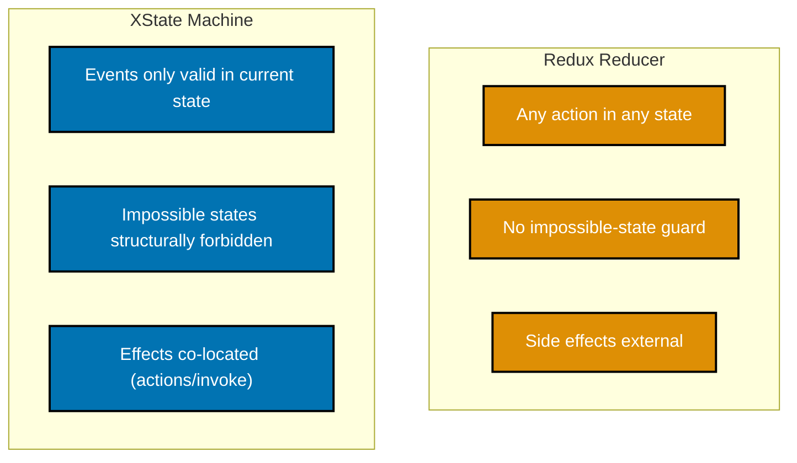

**Redux reducer approach:**

```typescript
// Counter reducer -- fine for simple linear state
type CounterState = { count: number; loading: boolean; error: string | null };

function counterReducer(state: CounterState, action: { type: string }): CounterState {
  // => Reducer handles all actions in all states -- no guard on loading
  switch (action.type) {
    case "INCREMENT":
      return { ...state, count: state.count + 1 };
    // => BUG RISK: can increment while loading=true; reducer allows it
    case "FETCH_START":
      return { ...state, loading: true };
    case "FETCH_SUCCESS":
      return { ...state, loading: false };
    default:
      return state;
  }
}
```

**XState machine approach:**

```typescript
import { createMachine, assign } from "xstate";

// Same counter but with impossible-state prevention
const counterMachine = createMachine({
  // => XState structurally forbids INCREMENT in 'loading' state
  id: "counter",
  initial: "idle",
  context: { count: 0 },
  states: {
    idle: {
      on: {
        INCREMENT: { actions: assign({ count: ({ context }) => context.count + 1 }) },
        // => INCREMENT only valid in 'idle'; ignored in 'loading'
        FETCH: "loading",
      },
    },
    loading: {
      // => No INCREMENT here -- the state makes it structurally impossible
      // => Reducer needs runtime guard; machine enforces this at definition time
      on: { SUCCESS: "idle", FAILURE: "error" },
    },
    error: { on: { RETRY: "loading" } },
  },
});
```

**Key Takeaway:** Choose a reducer for simple counters and flag flips. Choose XState when events must only be valid in specific states, or when you need co-located side effects and impossible-state guarantees.

**Why It Matters:** Reducers allow any action to fire in any state, pushing impossible-state prevention into runtime guards that are easy to forget. XState makes invalid transitions structurally impossible — if `INCREMENT` isn't listed in the `loading` state, it simply doesn't fire. This is the difference between "tested to be impossible" and "impossible by construction."

---

### Example 77: Preventing Impossible States with setup() Types

`setup()` lets you pre-declare the TypeScript types for context, events, and actors before writing the machine. Combined with discriminated union context, the compiler rejects invalid state+context combinations at compile time.

```typescript
import { setup, assign } from "xstate";

// Discriminated union context: each status has exactly the right fields
type FetchContext =
  | { status: "idle" }
  | { status: "loading" }
  | { status: "success"; data: string[] }
  // => 'data' only exists when status is 'success'
  | { status: "error"; message: string };
// => 'message' only exists when status is 'error'

// setup() declares types before the machine body
const fetchMachine = setup({
  types: {
    context: {} as FetchContext,
    // => TypeScript uses this annotation to type all context accesses
    events: {} as { type: "FETCH" } | { type: "SUCCESS"; data: string[] } | { type: "ERROR"; message: string },
    // => Exhaustive event union; unknown event types are compile errors
  },
}).createMachine({
  // => Machine body uses declared types; no `as any` needed
  id: "fetch",
  initial: "idle",
  context: { status: "idle" } as FetchContext,
  states: {
    idle: {
      on: {
        FETCH: {
          target: "loading",
          actions: assign(() => ({ status: "loading" as const })),
          // => assign returns new context shape; discriminant updated
        },
      },
    },
    loading: {
      on: {
        SUCCESS: {
          target: "success",
          actions: assign(({ event }) => ({
            status: "success" as const,
            data: event.data,
            // => TypeScript knows event.data exists because event type is SUCCESS
          })),
        },
        ERROR: {
          target: "error",
          actions: assign(({ event }) => ({
            status: "error" as const,
            message: event.message,
            // => TypeScript knows event.message exists because event type is ERROR
          })),
        },
      },
    },
    success: {},
    // => In 'success' state, context.status === 'success' and data is available
    error: {},
    // => In 'error' state, context.status === 'error' and message is available
  },
});
```

**Key Takeaway:** Use `setup({ types: { context, events } })` with a discriminated union context type. TypeScript will reject any action that assigns incompatible context for the current event type.

**Why It Matters:** Without discriminated union context, you can access `context.data` in the `error` state and TypeScript won't complain — runtime `undefined` awaits. `setup()` types combined with discriminated unions make this a compile-time error. Your IDE becomes a state machine verifier: if the types pass, the impossible states are truly impossible, not just tested for.

---

### Example 78: Server-Side Rendering and Client Hydration

A machine can be run on the server to compute initial state for a request, serialised to a snapshot, and sent to the client as JSON. The client creates an actor with `{ snapshot }` to hydrate directly into the correct state without re-running server logic.

```mermaid
%% Color Palette: Blue #0173B2, Orange #DE8F05, Teal #029E73, Purple #CC78BC, Brown #CA9161
sequenceDiagram
    participant Server
    participant Client
    participant Actor as Client Actor

    Server->>Server: createActor#40;machine#41;.start#40;#41;
    Server->>Server: run transitions #40;set initial state#41;
    Server->>Server: getPersistedSnapshot#40;#41;
    Server->>Client: JSON snapshot in HTML/props
    Client->>Actor: createActor#40;machine, #123;snapshot#125;#41;.start#40;#41;
    Actor->>Client: hydrated -- no flicker, no re-fetch
```

```typescript
import { createMachine, createActor } from "xstate";

const pageMachine = createMachine({
  // => Page state machine run on server for SSR
  id: "page",
  initial: "loading",
  context: { user: null as string | null, theme: "light" },
  states: {
    loading: {
      on: {
        LOADED: {
          target: "ready",
          actions: ({ context, event }) => {
            context.user = (event as any).user;
            // => Server sets user from session/DB during SSR
          },
        },
      },
    },
    ready: {},
  },
});

// --- SERVER SIDE (e.g. Next.js getServerSideProps) ---
function serverRender(sessionUser: string) {
  const serverActor = createActor(pageMachine).start();
  // => Create actor on server; does not run browser APIs

  serverActor.send({ type: "LOADED", user: sessionUser });
  // => Drive machine to the correct initial client state

  const snapshot = serverActor.getPersistedSnapshot();
  // => Serialisable snapshot; value: "ready", context.user set

  serverActor.stop();
  // => Clean up; no async work continues after response

  return JSON.stringify(snapshot);
  // => Serialised snapshot sent to client as prop or inline script
}

// --- CLIENT SIDE (e.g. React component) ---
function clientHydrate(serialisedSnapshot: string) {
  const snapshot = JSON.parse(serialisedSnapshot);
  // => Parse snapshot received from server

  const clientActor = createActor(pageMachine, { snapshot }).start();
  // => Hydrates directly into 'ready' state with correct context
  // => No loading flash; no duplicate server fetch

  console.log(clientActor.getSnapshot().value); // => "ready"
  console.log(clientActor.getSnapshot().context.user); // => sessionUser value
  // => Client picks up exactly where server left off
}

const serialised = serverRender("alice");
clientHydrate(serialised);
```

**Key Takeaway:** Run the machine to the desired state on the server, call `getPersistedSnapshot()`, serialise to JSON, and pass to the client. The client calls `createActor(machine, { snapshot })` to hydrate without re-running server logic.

**Why It Matters:** SSR without hydration creates a loading flash — the client starts in the initial state while the server has already computed the correct state. XState snapshot hydration eliminates this by transmitting the exact server state as a serialised plain object. This pattern also works for edge rendering and streaming HTML where state must be computed before the first byte is sent.

---

### Example 79: Deferred Events with raise and Cancellation

`raise({ type: 'EVENT' }, { delay: ms })` schedules a future event from the machine to itself. The returned cancel ID can be used to cancel the delayed raise if the machine transitions before the delay fires.

```typescript
import { createMachine, createActor, raise, cancel } from "xstate";

const idleTimeoutMachine = createMachine(
  {
    // => Resets a countdown timer on each user activity; logs out after inactivity
    id: "idleTimeout",
    initial: "active",
    context: { cancelId: null as string | null },
    states: {
      active: {
        entry: {
          type: "scheduleCheck",
          // => Named action; defined in actions config below
        },
        on: {
          ACTIVITY: {
            // => User action resets the idle timer
            target: "active",
            // => Re-entering 'active' triggers entry action again
            // => Previous raise is automatically cancelled on re-entry
          },
          IDLE_CHECK: "timedOut",
          // => Fires if ACTIVITY doesn't arrive within 5 s
        },
      },
      timedOut: { type: "final" },
      // => Terminal state: session expired
    },
  },
  {
    actions: {
      scheduleCheck: raise(
        { type: "IDLE_CHECK" },
        { delay: 5000, id: "idleCheck" },
        // => id allows external cancellation via cancel("idleCheck")
        // => Sends IDLE_CHECK to self after 5 s unless cancelled
      ),
    },
  },
);

const actor = createActor(idleTimeoutMachine).start();
// => Entry fires scheduleCheck; IDLE_CHECK scheduled in 5 s

// Simulate user activity at 3 s
setTimeout(() => {
  actor.send({ type: "ACTIVITY" });
  // => Re-enters 'active'; previous scheduled IDLE_CHECK is discarded
  // => New 5 s timer starts from this point
}, 3000);

// Without ACTIVITY, actor transitions to timedOut at t=5 s
// With ACTIVITY at t=3 s, timedOut fires at t=8 s (3 + 5)
```

**Key Takeaway:** `raise(event, { delay, id })` schedules a self-event. Re-entering the state that created the raise automatically cancels the previous one. Use `cancel(id)` for explicit cancellation.

**Why It Matters:** Deferred events are the XState-native way to implement timers, debounce, session expiry, and polling without external `setTimeout` references. They are automatically cancelled when the machine leaves the state, eliminating the most common timer bug: firing a callback after the component or flow that created it is gone.

---

### Example 80: Production Actor System — Full Mini-Service

A complete mini-service demonstrates: a root `AppMachine` that spawns `AuthActor`, `DataActor`, and `NotificationActor`; error boundaries that catch child failures; and a `STOP` event that gracefully shuts down all actors.

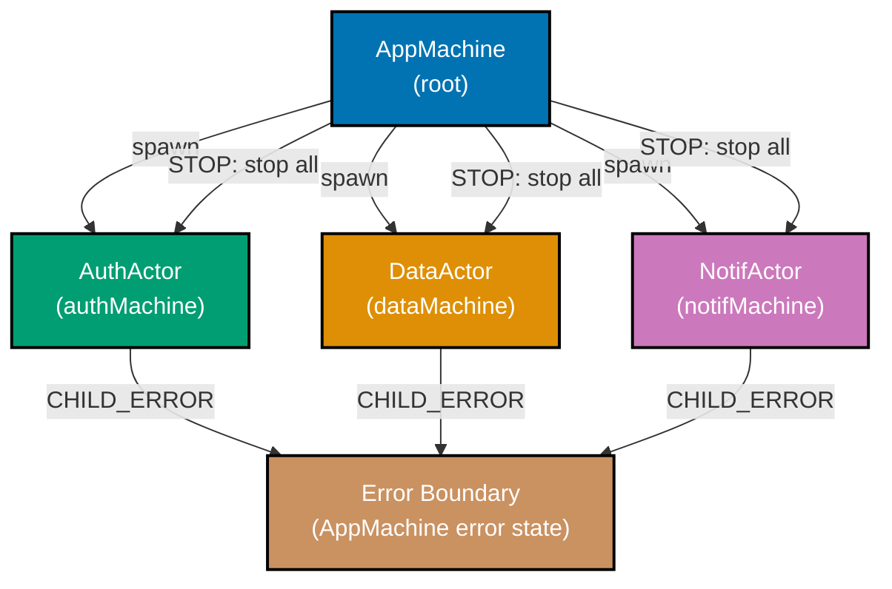

```typescript
import { createMachine, createActor, assign, sendParent, stopChild } from "xstate";

// Child machine template -- each child reports errors to parent
const makeChildMachine = (name: string) =>
  createMachine({
    // => Generic child machine; reports errors via sendParent
    id: name,
    initial: "running",
    states: {
      running: {
        on: {
          FAIL: {
            // => Simulates a child failure
            actions: sendParent({ type: "CHILD_ERROR", childId: name }),
            // => Notifies parent before stopping; parent can decide recovery
          },
        },
      },
    },
  });

const authMachine = makeChildMachine("auth");
const dataMachine = makeChildMachine("data");
const notifMachine = makeChildMachine("notif");

// Root AppMachine orchestrates all children
const appMachine = createMachine({
  // => Root actor: spawns children, handles errors, shuts down gracefully
  id: "app",
  initial: "running",
  context: {
    authRef: null as any,
    dataRef: null as any,
    notifRef: null as any,
    // => ActorRef handles for all child actors
    errorLog: [] as string[],
    // => Collects error reports from children
  },
  states: {
    running: {
      entry: assign({
        authRef: ({ spawn }) => spawn(authMachine, { id: "auth" }),
        dataRef: ({ spawn }) => spawn(dataMachine, { id: "data" }),
        notifRef: ({ spawn }) => spawn(notifMachine, { id: "notif" }),
        // => All three children spawn concurrently on entry
      }),
      on: {
        CHILD_ERROR: {
          // => Error boundary: catches failures from any child
          actions: assign({
            errorLog: ({ context, event }) => [
              ...context.errorLog,
              `${(event as any).childId} failed`,
              // => Log the failing child's id; real system would alert/recover
            ],
          }),
          // => Machine stays in 'running'; other children continue operating
          // => A stricter system could transition to 'degraded' or 'error'
        },
        STOP: {
          target: "stopped",
          // => Graceful shutdown trigger
        },
      },
    },
    stopped: {
      entry: [
        stopChild("auth"),
        // => stopChild sends stop signal to named child actor
        stopChild("data"),
        // => Each child's cleanup logic runs before it halts
        stopChild("notif"),
        // => All three stopped before AppMachine enters terminal state
      ],
      type: "final",
      // => App is fully shut down; no further events processed
    },
  },
});

// Start the production system
const app = createActor(appMachine).start();
// => All three child actors running

app.send({ type: "CHILD_ERROR", childId: "data" });
// => Error boundary catches it; errorLog updated; system stays running

console.log(app.getSnapshot().context.errorLog);
// => ["data failed"]

app.send({ type: "STOP" });
// => Graceful shutdown; all children stopped before AppMachine halts
console.log(app.getSnapshot().status); // => "done"
```

**Key Takeaway:** A production actor system uses `spawn` for child creation, `sendParent` for child-to-parent error reporting, `stopChild` for graceful teardown, and a `STOP` transition targeting a final state to sequence the shutdown correctly.

**Why It Matters:** Real applications are not single machines — they are systems of coordinated actors. This pattern gives you a blueprint for building any production service: children are isolated (one failure does not cascade), errors are observable (centralised error log), and shutdown is deterministic (all children stop before the root halts). XState's actor model makes these production concerns first-class, not afterthoughts bolted onto component lifecycle methods.
