## Group 1: Core Machine Concepts

### Example 1: createMachine — Blueprint for a State Machine

`createMachine` describes WHAT can happen in a system — which states exist, which events are valid, and which transitions connect them. It does not run anything; calling it has zero side effects. Think of it as the blueprint, not the building.

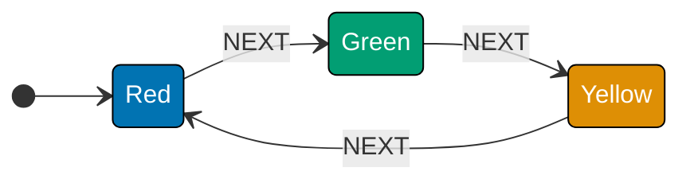

```typescript
import { createMachine } from "xstate";

// createMachine: pure function that returns a StateMachine value
// No timers, no subscriptions, no side effects — just a data structure
const trafficLight = createMachine({
  // id: appears in DevTools, error messages, and actor system logs
  id: "trafficLight",
  // initial: the state the actor occupies before any events are sent
  initial: "Red",
  // states: exhaustive map of every valid state the machine can occupy
  states: {
    // Each state lists only the events it handles; others are silently ignored
    Red: { on: { NEXT: "Green" } },
    // => NEXT in Red transitions to Green; all other events dropped
    Green: { on: { NEXT: "Yellow" } },
    // => NEXT in Green transitions to Yellow; all other events dropped
    Yellow: { on: { NEXT: "Red" } },
    // => NEXT in Yellow loops back to Red; completes the cycle
  },
  // => end of this block
});

// The returned machine is a plain JS value — safe to log, clone, or serialize
console.log(trafficLight.id);
// => Output: trafficLight
// The machine definition is inert — no execution has started yet
console.log(trafficLight.initial);
// => Output: Red
```

**Key Takeaway**: `createMachine` is a pure function that returns a static description of a state machine — calling it has no side effects and nothing runs until you wrap it in an actor.

**Why It Matters**: Separating the machine definition from its execution means you can serialize, inspect, visualize, and unit-test state machines without running them. This design makes XState machines portable: the same machine config can run in a browser, Node.js server, or React Native app. It also enables the XState VSCode extension to draw state diagrams directly from your source code.

---

### Example 2: createActor — Bringing a Machine to Life

`createActor` wraps a machine definition and gives it a live execution context. The actor holds the current state, processes incoming events, and notifies subscribers of state changes. You must call `.start()` before the actor begins processing events.

```typescript
import { createMachine, createActor } from "xstate";

// Define the machine blueprint first — pure data structure, nothing runs yet
// createMachine returns a StateMachine value; no side effects on construction
const toggle = createMachine({
  // => toggle: defined for use in this example
  id: "toggle",
  initial: "off",
  // Two states; each handles one event and transitions to the other state
  states: {
    // => states: all valid configurations
    off: { on: { TOGGLE: "on" } },
    // => TOGGLE from off transitions to on
    on: { on: { TOGGLE: "off" } },
    // => TOGGLE from on transitions back to off
  },
  // Machine definition is inert — safe to log, clone, or share across threads
});

// createActor wraps the machine and allocates a live execution context
// The actor is PAUSED after construction — it must be started before use
const actor = createActor(toggle);

// .start() activates the actor — entry actions fire, invocations and timers begin
actor.start();
// => Actor is now live; current state is "off" (the initial)

// .getSnapshot() returns a frozen, immutable point-in-time view of state
console.log(actor.getSnapshot().value);
// => Output: off

// .send() delivers a typed event to the running actor synchronously
actor.send({ type: "TOGGLE" });
// => XState looks up TOGGLE in off.on → fires transition → new state is on
console.log(actor.getSnapshot().value);
// => Output: on

// .stop() cancels all timers, subscriptions, and invocations
actor.stop();
// => Any subsequent .send() calls are safely ignored after stop()
```

**Key Takeaway**: `createActor(machine).start()` brings a machine definition to life; `.send()` drives state changes, and `.getSnapshot().value` reads the current state name.

**Why It Matters**: The actor model gives XState a principled execution environment. Actors are isolated units that communicate only through messages (events), making them naturally safe for concurrent UIs. When a React component sends an event to an actor, the actor processes it synchronously and emits a new snapshot — no shared mutable state, no race conditions, and a predictable update cycle.

---

### Example 3: States — Exhaustive Named Nodes

States are the named nodes in a state machine graph. Each state name represents a stable configuration your system can occupy. A well-named state describes the situation in business terms — not an implementation detail.

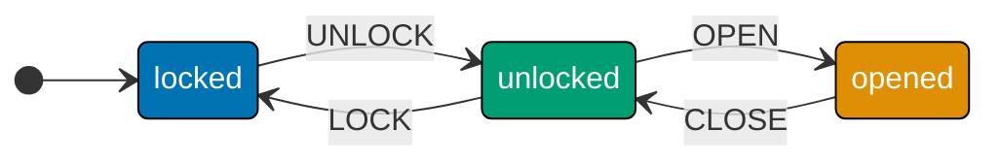

```typescript
import { createMachine, createActor } from "xstate";

// Each state explicitly lists only the events it accepts
// Any event not listed is silently dropped — no error thrown, no crash
const door = createMachine({
  // => door: defined for use in this example
  id: "door",
  initial: "locked",
  // states: defines every valid configuration the door can be in
  states: {
    // OPEN is absent from locked — you cannot open a locked door
    // The impossible transition is simply absent from the config
    locked: { on: { UNLOCK: "unlocked" } },
    // => UNLOCK: locked → unlocked; OPEN not listed — impossible by design
    // Both LOCK and OPEN are valid from unlocked — two paths out
    unlocked: { on: { LOCK: "locked", OPEN: "opened" } },
    // => LOCK: unlocked → locked; OPEN: unlocked → opened
    // LOCK is absent from opened — you cannot lock an open door
    // The impossible state is literally unrepresentable in the graph
    opened: { on: { CLOSE: "unlocked" } },
    // => CLOSE: opened → unlocked; LOCK not listed — impossible by design
  },
  // The machine config is the authoritative record of what is and is not possible
});
// => end of expression

const actor = createActor(door);
// start() activates the actor; current state is "locked" (the initial)
actor.start();
// Sending LOCK while in "locked" state — LOCK is not listed in locked.on
actor.send({ type: "LOCK" });
// => silently ignored; no error thrown; state unchanged
console.log(actor.getSnapshot().value);
// => Output: locked (LOCK was silently dropped — impossible transition)
actor.stop();
// => stop(): cleanup
```

**Key Takeaway**: States are explicit, exhaustive, and mutually exclusive — the machine can only be in one named state at a time, and any event not listed in the current state's `on` block is automatically ignored.

**Why It Matters**: Explicit states eliminate an entire class of bugs caused by implicit boolean combinations. Instead of managing `isLocked && !isOpen && !isUnlocked` flags that can be inconsistent, you have a single `value` property that is always one valid name. This makes impossible states literally unrepresentable — a door cannot be both `locked` and `opened` because there is no such state node.

---

### Example 4: Transitions — Per-State Event Routing

Transitions define the edges of the state graph: when an event arrives in a given state, a transition fires and moves the machine to a new state. The same event type can trigger different transitions — or be ignored — depending on the current state.

```typescript
import { createMachine, createActor } from "xstate";

// Transitions live inside each state's "on" map — keyed by event type
// The same event type (POWER) routes differently depending on current state
const light = createMachine({
  // => light: defined for use in this example
  id: "light",
  initial: "off",
  // states: each state defines its own independent routing table
  states: {
    // "off" state: accepts POWER; all other events silently dropped
    off: {
      // on: the routing table — maps event types to transition targets
      on: {
        // Shorthand: POWER: "on" ≡ POWER: { target: "on" }
        POWER: "on",
        // => POWER from off → on; DIM would be silently ignored here
      },
      // => "off" state fully defined: only POWER is accepted
    },
    // "on" state: accepts POWER; routes to "off" (opposite direction)
    on: {
      // on: the routing table — same event type, different target
      on: {
        // => on: event routing table
        POWER: "off",
        // => POWER from on → off (same event, different source = different target)
        // => Key insight: transitions are per-state, not global rules
      },
      // => "on" state fully defined: only POWER is accepted
    },
    // => states map complete: "off" and "on" each route POWER to the other
  },
  // => machine definition is inert; no execution starts until createActor
});

// createActor wraps the machine; allocates an execution context; still PAUSED
const actor = createActor(light);
// start() activates; current state is "off" (the initial)
actor.start();
// DIM is not listed in off.on → safely ignored, no error thrown
actor.send({ type: "DIM" });
// => no transition fires; machine stays in "off"
console.log(actor.getSnapshot().value);
// => Output: off (DIM silently dropped — transitions are per-state)
actor.send({ type: "POWER" });
// => off.on.POWER exists → transition fires to "on"
console.log(actor.getSnapshot().value);
// => Output: on
// stop() cancels any timers or subscriptions and halts the actor
actor.stop();
// => stop(): cleanup
```

**Key Takeaway**: Transitions are defined per-state — the same event type can trigger different transitions (or be ignored) depending on which state the machine currently occupies.

**Why It Matters**: Event-driven transitions make conditional logic declarative. Instead of `if (state === 'on') { state = 'off' } else if (...)`, you describe the graph and let XState handle routing. This means your business logic lives in the machine config — readable, visualizable, and testable in isolation — rather than scattered across event handlers and component lifecycle methods.

---

### Example 5: Snapshots — Reading the Full Machine State

A snapshot is a frozen point-in-time view of an actor's full state, including the current state value, context, and status. Snapshots are the primary way to read machine state without subscribing to changes.

```typescript
import { createMachine, createActor } from "xstate";

// Machine with context: shows all four useful snapshot fields
// context: extended state that travels alongside the state value
const machine = createMachine({
  // => machine: defined for use in this example
  id: "snap",
  initial: "idle",
  // context: initial shape — every field gets a default value here
  context: { count: 0 },
  // Two states with one event each — minimal setup to focus on snapshots
  states: {
    // => states: all valid configurations
    idle: { on: { START: "running" } },
    // => START in idle → running; all other events silently dropped
    running: { on: { STOP: "idle" } },
    // => STOP in running → idle; completes the round-trip
  },
  // => end of this block
});

// createActor allocates a live execution context for this machine
const actor = createActor(machine);
// start() makes the actor live; initial state is "idle"
actor.start();

// getSnapshot: returns a frozen, immutable point-in-time view
const snap = actor.getSnapshot();
// => snap is a stable object — safe to cache and compare by reference

// snap.value: current state name — string for flat machines
console.log(snap.value);
// => Output: idle

// snap.context: full context object — only changes via assign actions
console.log(snap.context);
// => Output: { count: 0 }

// snap.status: "active" | "done" | "error" | "stopped"
console.log(snap.status);
// => Output: active

// snap.matches("idle"): true if machine is in "idle" or a descendant of it
console.log(snap.matches("idle"));
// => Output: true
console.log(snap.matches("running"));
// => Output: false (machine is in "idle", not "running")
actor.stop();
// => stop(): cleanup
```

**Key Takeaway**: `actor.getSnapshot()` returns a frozen snapshot with `value` (state name), `context` (extended data), `status` (lifecycle), and `matches()` (state membership check).

**Why It Matters**: Snapshots are the XState equivalent of Redux state — a single, immutable description of the whole machine at an instant. Because snapshots are plain objects, they can be serialized to JSON for persistence, logging, or time-travel debugging. XState's inspect API and browser DevTools extension both work by recording and replaying snapshots, giving you a complete audit trail of every state change.

---

## Group 2: Guards and Context

### Example 6: Guards — Gating Transitions with Predicates

Guards are predicate functions attached to transitions. When a transition has a guard, XState evaluates it before committing the transition — if the guard returns `false`, the transition is skipped and the machine stays in its current state.

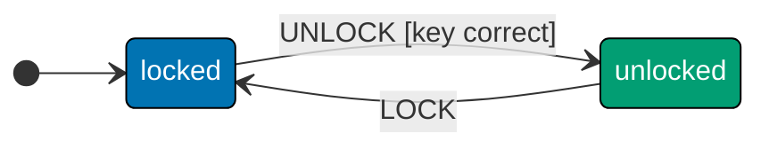

```typescript
import { createMachine, createActor } from "xstate";

// Guard: a pure predicate function on { context, event }
// Returns true to allow the transition; false to skip it entirely
// XState evaluates the guard BEFORE committing the transition
const vault = createMachine({
  // => vault: defined for use in this example
  id: "vault",
  initial: "locked",
  // states: locked has a guarded UNLOCK; unlocked has an unguarded LOCK
  states: {
    // locked state: UNLOCK has a guard — only correct key passes
    locked: {
      // on: UNLOCK is the only accepted event in locked state
      on: {
        // => on: event routing table
        UNLOCK: {
          // target: where to go when guard returns true
          target: "unlocked",
          // guard: predicate on { context, event } — must return boolean
          guard: ({ event }) => (event as any).key === "secret",
          // => guard false: UNLOCK silently ignored; state stays locked
          // => guard true: transition fires → machine enters unlocked
        },
        // All events except UNLOCK are silently dropped in locked state
      },
      // => end of this block
    },
    // unlocked state: LOCK has no guard — once unlocked, any caller can lock it
    unlocked: { on: { LOCK: "locked" } },
    // => LOCK: unlocked → locked; no guard means any LOCK event is accepted
  },
  // => vault config complete: one guarded path in, one unguarded path out
});

// createActor wraps the vault machine in a live execution context
const actor = createActor(vault);
// start() activates; current state is "locked" (the initial)
actor.start();

// Wrong key → guard evaluates to false → transition skipped, no error
actor.send({ type: "UNLOCK", key: "wrong" } as any);
// => guard: "wrong" === "secret" is false; transition NOT taken
console.log(actor.getSnapshot().value);
// => Output: locked (guard prevented the transition)

// Correct key → guard evaluates to true → transition fires
actor.send({ type: "UNLOCK", key: "secret" } as any);
// => guard: "secret" === "secret" is true; UNLOCK fires
console.log(actor.getSnapshot().value);
// => Output: unlocked
actor.stop();
// => stop(): cleanup
```

**Key Takeaway**: Guards are pure predicate functions on `{ context, event }` that gate transitions — a transition with a failing guard is skipped entirely, as if it were never defined.

**Why It Matters**: Guards move conditional logic out of event handlers and into the machine definition where it can be visualized. The XState VSCode extension shows guard names on transition arrows, turning your code into living documentation. When you ask "why didn't the checkout succeed?", you look at the guard condition in the machine config — not a React component's `onClick` handler buried in a component tree.

---

### Example 7: Context — Extended State in the Machine

Context is the extended state that travels alongside the current state value. While state names capture discrete modes (idle, loading, error), context holds quantitative or structured data — counts, user objects, API responses, error messages.

```typescript
import { createMachine, createActor } from "xstate";
// => createActor needed to run the machine; createMachine to define it

// context: declared at the machine root alongside initial and states
// Every field MUST have a default value — TypeScript infers the type from it
const player = createMachine({
  // id: identifies this machine in DevTools; initial: the starting state
  id: "player",
  initial: "stopped",
  // context object: three fields with typed defaults — all read-only until assign
  context: {
    // => context: persists across all transitions
    volume: 50,
    // => integer 0–100 representing audio volume; 50 = half
    currentTrack: null as string | null,
    // => null when idle; string filename when a track is loaded
    playbackRate: 1.0,
    // => 1.0 = normal speed; 2.0 = double; 0.5 = half speed
  },
  // states: context is completely separate — it persists across all state transitions
  states: {
    // => states: all valid configurations
    stopped: { on: { PLAY: "playing" } },
    // => PLAY: stopped → playing; context unchanged by this transition
    playing: { on: { STOP: "stopped", PAUSE: "paused" } },
    // => STOP: playing → stopped; PAUSE: playing → paused
    paused: { on: { RESUME: "playing" } },
    // => RESUME: paused → playing; context unchanged here too
  },
  // => three states form a simple audio playback lifecycle
});

// createActor wraps the machine; allocates context storage in the actor
const actor = createActor(player);
// start() activates the actor; context values are those declared above
actor.start();

// Read all three context fields from the initial snapshot
const snap = actor.getSnapshot();
// => snap: defined for use in this example
console.log(snap.context.volume);
// => Output: 50
console.log(snap.context.currentTrack);
// => Output: null (no track loaded yet)

// Transitioning states does NOT reset context — only assign actions change it
actor.send({ type: "PLAY" });
// => send event to drive state change
console.log(actor.getSnapshot().context.volume);
// => Output: 50 (PLAY changed state value but context is untouched)
actor.stop();
// => stop(): cleanup
```

**Key Takeaway**: Context holds structured, quantitative data that complements the discrete state value — it does not change unless an `assign` action explicitly updates it.

**Why It Matters**: The separation of state value and context maps directly to how UIs work. The state value controls which screen or component is visible, while context provides the data those components render. This split also enables exhaustive testing: you can enumerate all valid states while independently varying context values, giving far better test coverage than testing every combination of boolean flags.

---

### Example 8: assign — The Only Way to Update Context

`assign` is the only built-in way to update context in XState v5. It returns a new context object by merging the fields you provide with the existing context. Assign is always used as an action — it runs during transitions, never as a standalone call.

```typescript
import { createMachine, createActor, assign } from "xstate";
// => assign: the only built-in way to update context in XState v5

// assign lives inside a transition's "actions" array — never called standalone
// It receives { context, event } and produces a NEW context object (immutable)
const counter = createMachine({
  // => counter: defined for use in this example
  id: "counter",
  initial: "idle",
  // context: two fields — count (number) and lastOp (string label)
  context: { count: 0, lastOp: "none" as string },
  // states: single "idle" state with three events that each update context
  states: {
    // => states: all valid configurations
    idle: {
      // on: routing table for the idle state
      on: {
        // => on: event routing table
        INCREMENT: {
          // assign with function updaters — each receives { context, event }
          actions: assign({
            count: ({ context }) => context.count + 1,
            // => actions: effects on transition
            lastOp: () => "increment",
          }),
          // => NEW context created; original context object is never mutated
          // => lastOp updater ignores context; always returns "increment"
        },
        // => INCREMENT stays in idle state (no target); only context changes
        RESET: {
          // Static value shorthand: assign({ count: 0 }) ≡ assign({ count: () => 0 })
          // Use static values when the new value doesn't depend on old context
          actions: assign({ count: 0, lastOp: "reset" }),
          // => both fields set to their reset values atomically in one assign
        },
        // => end of this block
        ADD: {
          // event.amount comes from: actor.send({ type: "ADD", amount: 5 })
          actions: assign({
            // => actions: effects on transition
            count: ({ context, event }) => context.count + (event as any).amount,
            // => event payload is accessible via the second destructured argument
          }),
          // => end of nested block
        },
        // => end of this block
      },
      // => end of this block
    },
    // => end of this block
  },
  // => end of this block
});

// createActor allocates storage for context alongside state value
const actor = createActor(counter);
// start() activates; context starts as { count: 0, lastOp: "none" }
actor.start();
// => actor is live; send events to drive context changes

actor.send({ type: "INCREMENT" });
// => assign runs: count becomes 1; lastOp becomes "increment"
console.log(actor.getSnapshot().context);
// => Output: { count: 1, lastOp: 'increment' }

actor.send({ type: "ADD", amount: 5 } as any);
// => assign runs: count becomes 1 + 5 = 6; lastOp unchanged (ADD has no lastOp updater)
console.log(actor.getSnapshot().context.count);
// => Output: 6 (1 + 5)

actor.send({ type: "RESET" });
// => assign runs: count resets to 0; lastOp becomes "reset"
console.log(actor.getSnapshot().context);
// => Output: { count: 0, lastOp: 'reset' }
actor.stop();
// => stop() halts the actor; no further events processed
```

**Key Takeaway**: `assign` takes an object of field updaters (functions or static values) and produces a new context by merging the results — it never mutates the existing context object.

**Why It Matters**: Immutable context updates are essential for time-travel debugging and snapshot comparison. When XState's DevTools replay state transitions, they rely on each snapshot being a stable, independent value. If context were mutated in place, replaying events would alter previously-recorded snapshots, making debugging impossible. The `assign` pattern also makes it obvious at a glance which context fields each transition modifies.

---

### Example 9: Typed Events with setup()

XState v5 provides a `setup()` helper that wires TypeScript types for events, context, and guards into the machine config. This gives full type narrowing inside actions and guards, eliminating `as any` casts.

```typescript
import { setup, createActor, assign } from "xstate";
// => setup() used instead of createMachine() to enable TypeScript type wiring

// Discriminated union — each variant has a unique literal "type" field
// TypeScript narrows to the correct variant inside actions and guards
type BankEvent =
  // => part of machine configuration
  | { type: "DEPOSIT"; amount: number }
  // => DEPOSIT carries amount; TypeScript narrows event.amount to number
  | { type: "WITHDRAW"; amount: number }
  // => WITHDRAW carries amount; typed in guard and assign calls
  | { type: "FREEZE" }
  // => no payload needed; just the type literal
  | { type: "UNFREEZE" };
// => no payload; type literal is sufficient for routing

// setup() registers types BEFORE createMachine — enables full type inference
const bankMachine = setup({
  // types: the type registration block — zero runtime cost, TypeScript-only
  types: {
    // => types: TypeScript-only type registration
    events: {} as BankEvent,
    // => tells XState which event union to use for narrowing in actions/guards
    context: {} as { balance: number },
    // => tells XState the context shape for type-safe assign calls
  },
  // => setup returns a builder object; call .createMachine() to finish
}).createMachine({
  // id and initial: same as regular createMachine; types flow through automatically
  id: "bank",
  initial: "active",
  // context: initial values; shape must match the type registered above
  context: { balance: 1000 },
  // states: active has DEPOSIT (guarded by balance check) and FREEZE
  states: {
    // => states: all valid configurations
    active: {
      // on: event routing for the active state
      on: {
        // => on: event routing table
        DEPOSIT: {
          // actions: assign runs when DEPOSIT fires in the active state
          actions: assign({
            // => actions: effects on transition
            balance: ({ context, event }) => context.balance + event.amount,
            // => event.amount typed as number — no "as any" cast needed
          }),
          // => end of nested block
        },
        // => end of this block
        FREEZE: "frozen",
        // => FREEZE: active → frozen; no payload required
      },
      // => end of this block
    },
    // => end of this block
    frozen: {
      // DEPOSIT and WITHDRAW absent — both blocked while account is frozen
      on: { UNFREEZE: "active" },
      // => UNFREEZE: frozen → active; only way out of the frozen state
    },
    // => end of this block
  },
  // => end of this block
});
// => end of expression

const actor = createActor(bankMachine);
// => createActor: live execution context
actor.start();
// => start(): actor goes live
actor.send({ type: "DEPOSIT", amount: 500 });
// => send event to drive state change
console.log(actor.getSnapshot().context.balance);
// => Output: 1500
actor.stop();
// => stop(): cleanup
```

**Key Takeaway**: `setup({ types: { events: {} as EventUnion, context: {} as ContextType } }).createMachine(...)` enables full TypeScript narrowing so that event properties are typed inside actions and guards without any casts.

**Why It Matters**: Typed events turn the compiler into a completeness checker for your state machine. When you add a new event variant to the union, TypeScript flags every transition that does not handle the new shape, guiding you to update guards and actions consistently. In large teams, this prevents the most common XState mistake: sending an event with the wrong payload shape and discovering it only at runtime in production.

---

### Example 10: Guarded Transition Priority Lists

Guards can inspect both context and event simultaneously. When multiple guarded transitions exist for the same event, XState evaluates them in declaration order and fires the first one whose guard returns `true`.

```typescript
import { setup, createActor, assign } from "xstate";

// setup() lets you define named guards that transitions reference by string
// Named guards are reusable and appear labeled in XState DevTools diagrams
const account = setup({
  // => account: defined for use in this example
  types: {
    // => types: TypeScript-only type registration
    context: {} as { balance: number },
    // => context: persists across all transitions
    events: {} as { type: "WITHDRAW"; amount: number },
    // => event union type for narrowing
  },
  // => end of this block
  guards: {
    // hasFunds: reads BOTH context.balance and event.amount
    // Returns true only when the balance covers the withdrawal
    hasFunds: ({ context, event }) => context.balance >= event.amount,
    // => part of machine configuration
  },
  // => end of this block
}).createMachine({
  // => types registered; defining machine now
  id: "account",
  initial: "open",
  // => id for DevTools; initial: starting state
  context: { balance: 5000 },
  // => context: inline initial extended state
  states: {
    // => states: all valid configurations
    open: {
      // => open: account accepting transactions
      on: {
        // Array of transitions: XState tests them top-to-bottom
        WITHDRAW: [
          // => part of machine configuration
          {
            // => part of machine configuration
            guard: "hasFunds",
            // => first candidate; fires when guard returns true
            actions: assign({
              // => actions: effects on transition
              balance: ({ context, event }) => context.balance - event.amount,
              // => part of machine configuration
            }),
            // => end of nested block
          },
          // => end of this block
          {
            // => part of machine configuration
            target: "overdraft",
            // => no guard on this entry: fires when ALL above guards are false
            // => this is the "else" branch — always matched as last resort
          },
          // => end of this block
        ],
        // => end of array
      },
      // => end of this block
    },
    // => end of this block
    overdraft: {},
    // => overdraft: insufficient balance — no further withdrawals
  },
  // => end of this block
});
// => end of expression

const actor = createActor(account);
// => createActor: live execution context
actor.start();
// => start(): actor goes live
actor.send({ type: "WITHDRAW", amount: 3000 });
// => hasFunds: 5000 >= 3000 → true; first candidate fires
console.log(actor.getSnapshot().context.balance);
// => Output: 2000
actor.stop();
// => stop(): cleanup
```

**Key Takeaway**: Multiple guarded transitions for the same event form a priority list — XState fires the first transition whose guard returns `true`, and an entry with no guard always matches as the last fallback.

**Why It Matters**: Priority-ordered guards eliminate deeply nested `if/else` chains from event handlers. The order of transitions in the array is the business rule: "first check funds, then fall back to overdraft." When a product manager asks why a transaction was declined, the machine config reads like a specification, not an implementation detail.

---

## Group 3: Actions

### Example 11: Entry and Exit Actions

Entry actions run every time a state is entered; exit actions run every time a state is left. They are ideal for side effects that should always happen at state boundaries — starting animations, logging analytics events, acquiring or releasing resources.

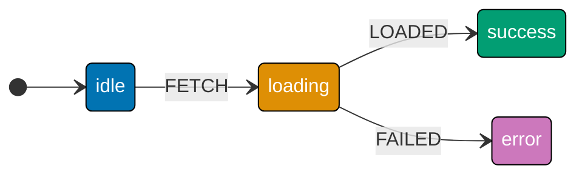

```typescript
import { createMachine, createActor } from "xstate";

// entry/exit actions fire at state boundaries, regardless of which transition caused it
// One entry action covers ALL paths into a state — no duplication needed
const fetch = createMachine({
  // => fetch: defined for use in this example
  id: "fetch",
  initial: "idle",
  // => id for DevTools; initial: starting state
  states: {
    // => states: all valid configurations
    idle: { on: { FETCH: "loading" } },
    // => idle: resting state; waiting for the first event
    loading: {
      // entry: array of actions — runs on ANY entry to this state
      entry: [() => console.log("[entry] spinner on")],
      // => fires whether arriving from idle, error-retry, or any other state
      // exit: array of actions — runs on ANY exit from this state
      exit: [() => console.log("[exit] spinner off")],
      // => fires whether leaving to success OR to error — one place, no duplication
      on: { LOADED: "success", FAILED: "error" },
      // => on: event routing table
    },
    // => end of this block
    success: {
      // Order: loading.exit runs first, THEN success.entry runs
      entry: [() => console.log("[entry] success")],
      // => entry: fires on any entry
      on: { RESET: "idle" },
      // => on: event routing table
    },
    // => end of this block
    error: {
      // => error: operation failed
      entry: [() => console.log("[entry] error")],
      // => same pattern as success.entry; error path handled symmetrically
      on: { RESET: "idle" },
      // => on: event routing table
    },
    // => end of this block
  },
  // => end of this block
});
// => end of expression

const actor = createActor(fetch);
// => createActor: live execution context
actor.start();
// => start(): actor goes live
actor.send({ type: "FETCH" });
// => Output: [entry] spinner on
actor.send({ type: "LOADED" });
// => Output: [exit] spinner off
// => Output: [entry] success
actor.stop();
// => stop(): cleanup
```

**Key Takeaway**: Entry actions fire on every entry to a state (regardless of which transition caused the entry); exit actions fire on every exit — use them for symmetric resource acquisition and release.

**Why It Matters**: Entry and exit actions enforce the invariant that certain side effects always happen at state boundaries, no matter how many transitions lead to or from a state. In a loading state with ten different ways to enter (retry, refresh, initial load), you write the spinner logic once in `entry` instead of duplicating it across all ten transitions. This is the state machine equivalent of RAII — resource lifecycle tied to state lifetime.

---

### Example 12: Transition Actions

Transition actions run when a specific transition fires, after the current state's exit actions and before the target state's entry actions. They are the right place for side effects specific to a particular event-to-state path, not general entry/exit behavior.

```typescript
import { createMachine, createActor, assign } from "xstate";

// Transition actions live in the "actions" array inside a specific transition
// They run only for that transition — not for other events in the same state
const order = createMachine({
  // => order: defined for use in this example
  id: "order",
  initial: "cart",
  // => id for DevTools; initial: starting state
  context: { discount: 0, total: 0 },
  // => context: inline initial extended state
  states: {
    // => states: all valid configurations
    cart: {
      // => cart: building the order
      on: {
        // => on: event routing table
        APPLY_PROMO: {
          // actions array: runs only when APPLY_PROMO fires from cart
          // These are NOT entry/exit — they fire for this event path only
          actions: [
            // => actions: effects on transition
            assign({ discount: ({ event }) => (event as any).pct }),
            // => stores the discount percentage from the event payload
            ({ event }) => console.log(`[t] promo: ${(event as any).code}`),
            // => second action runs AFTER assign — sees updated context
          ],
          // No target → stays in cart; context updated, state name unchanged
        },
        // => end of this block
        CHECKOUT: {
          // => CHECKOUT state definition
          target: "payment",
          // Transition action runs AFTER cart's exit, BEFORE payment's entry
          actions: assign({ total: ({ context }) => 100 - context.discount }),
          // => total computed from the just-updated context.discount
        },
        // => end of this block
      },
      // => end of this block
    },
    // => end of this block
    payment: { on: { PAY: "confirmed" } },
    // => payment: payment info tab
    confirmed: {},
    // => confirmed: terminal confirmation state
  },
  // => end of this block
});
// => end of expression

const actor = createActor(order);
// => createActor: live execution context
actor.start();
// => start(): actor goes live
actor.send({ type: "APPLY_PROMO", code: "SAVE15", pct: 15 } as any);
// => Output: [t] promo: SAVE15
console.log(actor.getSnapshot().context.discount);
// => Output: 15
actor.send({ type: "CHECKOUT" });
// => send event to drive state change
console.log(actor.getSnapshot().context.total);
// => Output: 85 (100 - 15)
actor.stop();
// => stop(): cleanup
```

**Key Takeaway**: Transition actions fire for a specific transition path — they run between the source state's exit and the target state's entry, in declaration order within the `actions` array.

**Why It Matters**: Separating transition actions from entry/exit actions gives precise control over when side effects run. If you need to log a specific user action (e.g., "promo applied via checkout flow" vs "promo applied via sidebar"), transition-level actions let you attach that logging to the exact path without polluting general entry/exit logic. This granularity is what makes XState traces meaningful for analytics and audit trails.

---

### Example 13: raise — Internal Event Chaining

`raise` sends an event to the same actor from within an action. The raised event is queued internally and dispatched after the current transition completes. Use `raise` to chain transitions without exposing internal events to external callers.

```typescript
import { createMachine, createActor, raise } from "xstate";

// raise is imported from "xstate" — it is a built-in action creator
// The raised event is internal — external senders never see PASSED or FAILED
const form = createMachine({
  // => form: defined for use in this example
  id: "form",
  initial: "editing",
  // => id for DevTools; initial: starting state
  states: {
    // => states: all valid configurations
    editing: {
      // => editing: user is modifying content
      on: {
        SUBMIT: {
          target: "validating",
          // => on: event routing table
          actions: [() => console.log("[t] submitted")],
          // => single action logs the submission before the transition completes
        },
      },
      // => transition action fires before entering validating
    },
    // => end of this block
    validating: {
      // => validating: checking input
      entry: [
        // entry actions run on entering validating
        () => console.log("[entry] validating"),
        // raise queues PASSED for delivery after all entry actions complete
        raise({ type: "PASSED" }),
        // => PASSED is never seen by external callers — it is machine-internal
        // => raise is synchronous: PASSED is queued before entry array finishes
      ],
      // => end of array
      on: {
        // PASSED fires automatically due to the raise in entry above
        PASSED: { target: "submitting" },
        // => PASSED state definition
        FAILED: "editing",
        // => FAILED: validation failed; return to editing for correction
      },
      // => end of this block
    },
    // => end of this block
    submitting: {
      // => submitting: sending data
      entry: [() => console.log("[entry] submitting")],
      // => reached automatically — no external event needed
      // => entry fires because PASSED transition delivered by raise
      on: { DONE: "complete" },
      // => on: event routing table
    },
    // => end of this block
    complete: {},
    // => complete: all steps finished
  },
  // => end of this block
});
// => end of expression

const actor = createActor(form);
// => createActor: live execution context
actor.start();
// External caller sends only SUBMIT — the internal validation chain is hidden
actor.send({ type: "SUBMIT" });
// => Output: [t] submitted
// => Output: [entry] validating
// => Output: [entry] submitting  (PASSED raised and processed internally)
console.log(actor.getSnapshot().value);
// => Output: submitting
actor.stop();
// => stop(): cleanup
```

**Key Takeaway**: `raise({ type: 'EVENT' })` enqueues an event for immediate self-delivery after the current transition, enabling automatic multi-step progressions without exposing internal events to external senders.

**Why It Matters**: `raise` keeps internal machine logic internal. Form validation, wizard step advancement, and multi-phase initialization are machine-internal concerns — external components should send one `SUBMIT` and get one result, not orchestrate a sequence of `VALIDATE`, `NORMALIZE`, `SUBMIT` calls. `raise` encapsulates that sequence inside the machine where it belongs, reducing the API surface that component authors must understand.

---

### Example 14: log — Built-in Logging Action

XState ships a built-in `log` action that prints to the console during development. It accepts a string, a value, or a function that receives `{ context, event }` and returns the value to log. Unlike custom `console.log` calls, `log` is traceable by XState's inspection tooling.

```typescript
import { createMachine, createActor, log, assign } from "xstate";

// log is imported from "xstate" — a first-class action factory, just like assign
// Unlike console.log, log participates in XState's inspection and DevTools protocols
const machine = createMachine({
  // => machine: defined for use in this example
  id: "logged",
  initial: "idle",
  // => id for DevTools; initial: starting state
  context: { attempts: 0 },
  // => context: inline initial extended state
  states: {
    // => states: all valid configurations
    idle: {
      // => idle: resting state; waiting for the first event
      on: {
        // => on: event routing table
        START: {
          // => START state definition
          target: "working",
          // => target: destination state
          actions: [
            // Static string: evaluated at definition time — no dynamic access
            log("Machine started"),
            // => printed as-is; also captured by XState inspector events
            // assign runs AFTER log — log captured the pre-increment context
            assign({ attempts: ({ context }) => context.attempts + 1 }),
            // => context.attempts is 1 after this assign fires
          ],
          // => end of array
        },
        // => end of this block
      },
      // => end of this block
    },
    // => end of this block
    working: {
      // => working: computation in progress
      entry: [
        // Function form: evaluated at execution time — sees live context/event
        log(({ context }) => `Attempt #${context.attempts}`),
        // => uses context AFTER the START transition's assign → prints: Attempt #1
      ],
      // => end of array
      on: { DONE: "idle" },
      // => on: event routing table
    },
    // => end of this block
  },
  // => end of this block
});
// => end of expression

const actor = createActor(machine);
// => createActor: live execution context
actor.start();
// => start(): actor goes live
actor.send({ type: "START" });
// => Output: Machine started
// => Output: Attempt #1
actor.stop();
// => stop(): cleanup
```

**Key Takeaway**: `log(message)` and `log(({ context, event }) => value)` are XState's built-in logging actions — they integrate with the inspection system and accept dynamic functions for context/event-aware messages.

**Why It Matters**: Using `log` instead of ad-hoc `console.log` calls means your debugging output participates in XState's inspection protocol. When you attach the XState browser extension or use `createActor(machine, { inspect: ... })`, `log` actions appear in the event trace alongside state transitions, giving you a chronological view of what was logged and when. You can also strip all `log` actions in production builds without touching business logic.

---

### Example 15: Multiple Actions — Strict Left-to-Right Order

Actions in an array execute left-to-right in strict order. This ordering guarantee is fundamental: `assign` runs before the next action sees the updated context, `raise` is queued immediately, and `log` captures the exact context at its position in the sequence.

```typescript
import { createMachine, createActor, assign, log, raise } from "xstate";

// Four actions in one array — order is strictly guaranteed by XState
// Each action sees the context as left by all previous actions
const pipeline = createMachine({
  // => pipeline: defined for use in this example
  id: "pipeline",
  initial: "ready",
  // => id for DevTools; initial: starting state
  context: { input: 0, doubled: 0 },
  // => context: inline initial extended state
  states: {
    // => states: all valid configurations
    ready: {
      // => ready: waiting to process next input
      on: {
        // => on: event routing table
        PROCESS: {
          // => PROCESS state definition
          target: "processed",
          // => target: destination state
          actions: [
            // Action 1: log fires first — context.input is still 0
            log(({ event }) => `[1] raw: ${(event as any).value}`),
            // => printed before assign; original context unchanged here
            // Action 2: assign updates context — runs after step 1
            assign({
              input: ({ event }) => (event as any).value,
              // => part of machine configuration
              doubled: ({ event }) => (event as any).value * 2,
            }),
            // => both fields computed from the same event in one assign call
            // Action 3: log after assign — doubled now has the assigned value
            log(({ context }) => `[3] doubled=${context.doubled}`),
            // => proves declaration order: doubled reflects the new value
            // Action 4: raise queues COMPLETE after all four steps finish
            raise({ type: "COMPLETE" }),
            // => COMPLETE delivered after this entire actions array completes
          ],
          // => end of array
        },
        // => end of this block
        COMPLETE: "done",
        // => raised COMPLETE triggers this transition after PROCESS finishes
      },
      // => end of this block
    },
    // => end of this block
    processed: { on: { COMPLETE: "done" } },
    // => processed: transformation complete
    done: { entry: [log("Pipeline done")] },
    // => done: terminal state
  },
  // => end of this block
});
// => end of expression

const actor = createActor(pipeline);
// => createActor: live execution context
actor.start();
// => start(): actor goes live
actor.send({ type: "PROCESS", value: 7 } as any);
// => Output: [1] raw: 7
// => Output: [3] doubled=14
// => Output: Pipeline done
actor.stop();
// => stop(): cleanup
```

**Key Takeaway**: Actions in an array run strictly left-to-right — `assign` updates context before subsequent actions read it, and `raise` queues an event that fires after all actions in the current step complete.

**Why It Matters**: Deterministic action ordering eliminates an entire category of sequencing bugs. When you need to "first sanitize input, then validate, then log the validated value, then raise a success event", the array ordering makes that sequence explicit and guaranteed. Compare this to Promise chains or event bus listeners where execution order depends on registration order and can be disrupted by any async operation in the chain.

---

## Group 4: Invocations

### Example 16: invoke with fromPromise — Async Operations

`invoke` starts an asynchronous operation when a state is entered and cleans it up when the state is exited. `fromPromise` wraps an async function so XState can manage its lifecycle. When the promise resolves, `onDone` fires; when it rejects, `onError` fires.

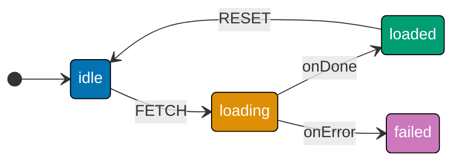

```typescript
import { createMachine, createActor, assign, fromPromise } from "xstate";

// Simulated fetch: replace with real fetch() in production
// Resolves to a user object after 50ms simulated latency
const fetchUser = async (id: string) => {
  // => fetchUser: factory function used by fromPromise
  await new Promise((r) => setTimeout(r, 50));
  // => simulates 50ms network round-trip
  return { id, name: "Alice" };
  // => resolved value becomes event.output in the onDone handler
};
// => part of machine configuration

const userMachine = createMachine({
  // => userMachine: defined for use in this example
  id: "user",
  initial: "idle",
  // => id for DevTools; initial: starting state
  context: { userId: "u1", user: null as { id: string; name: string } | null },
  // => context: inline initial extended state
  states: {
    // => states: all valid configurations
    idle: { on: { FETCH: "loading" } },
    // => idle: resting state; waiting for the first event
    loading: {
      // => loading: async operation in progress
      invoke: {
        // fromPromise wraps an async factory; input field passes data to it
        src: fromPromise(({ input }: { input: string }) => fetchUser(input)),
        // input: computed at invocation start from current context
        input: ({ context }) => context.userId,
        // => snapshot of userId at entry time — safe even if context changes later
        onDone: {
          // => onDone: transition on resolution
          target: "loaded",
          // => target: destination state
          actions: assign({ user: ({ event }) => event.output }),
          // => event.output is typed as { id: string; name: string }
        },
        // onError: fires when the async factory rejects or throws
        onError: { target: "failed" },
        // => onError: transition on rejection
      },
      // => end of this block
    },
    // => end of this block
    loaded: { on: { RESET: "idle" } },
    // => loaded: data received successfully
    failed: {},
    // => failed: operation failed; error captured
  },
  // => end of this block
});
// => end of expression

const actor = createActor(userMachine);
// => createActor: live execution context
actor.start();
// => start(): actor goes live
actor.send({ type: "FETCH" });
// => send event to drive state change
await new Promise((r) => setTimeout(r, 100));
// => wait for async operation to complete
console.log(actor.getSnapshot().value);
// => Output: loaded
console.log(actor.getSnapshot().context.user);
// => Output: { id: 'u1', name: 'Alice' }
actor.stop();
// => stop(): cleanup
```

**Key Takeaway**: `invoke` with `fromPromise` ties an async operation's lifecycle to a state — the promise starts on entry, is automatically cancelled (ignored) on exit, and routes to `onDone` or `onError` transitions on completion.

**Why It Matters**: Tying async operations to states eliminates race conditions caused by responses arriving after navigation away. When a user clicks "Go back" while a fetch is in flight, the machine exits `loading` and the in-flight response is silently ignored — no more "Can't perform a React state update on an unmounted component" errors. The machine always reflects the actual current need, not a stale pending operation.

---

### Example 17: invoke with fromCallback — Push-Based Sources

`fromCallback` wraps event-based sources — WebSocket connections, EventEmitter subscriptions, DOM event listeners — that push multiple events over time rather than resolving once. The callback receives a `sendBack` function and must return a cleanup function.

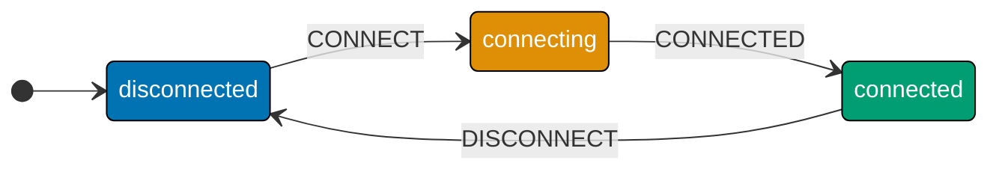

```typescript
import { createMachine, createActor, fromCallback } from "xstate";
// => imports: createMachine, createActor, fromCallback

const ws = createMachine({
  // => ws: defined for use in this example
  id: "ws",
  initial: "disconnected",
  // => id for DevTools; initial: starting state
  states: {
    // => states: all valid configurations
    disconnected: { on: { CONNECT: "connecting" } },
    // => disconnected: no active connection
    connecting: {
      // => connecting: handshake in progress
      invoke: {
        // => invoke: async op tied to state lifetime
        src: fromCallback(({ sendBack }) => {
          // fromCallback wraps any push-based source (WS, EventEmitter, timer)
          // sendBack: delivers events to the parent machine from the callback
          const t = setTimeout(() => sendBack({ type: "CONNECTED" }), 50);
          // => simulates WS handshake; signals success after 50ms

          // MUST return a cleanup function — called when state is exited
          return () => {
            // => resolved value becomes event.output in onDone
            clearTimeout(t);
            // => prevents stale sendBack after machine leaves connecting
            // => without this, ghost CONNECTED events could corrupt later states
          };
          // => part of machine configuration
        }),
        // => end of nested block
        onError: { target: "disconnected" },
        // => synchronous throw inside the callback routes here
      },
      // => end of this block
      on: { CONNECTED: "connected" },
      // => sendBack({ type: "CONNECTED" }) triggers this transition
    },
    // => end of this block
    connected: { on: { DISCONNECT: "disconnected" } },
    // => connected: live connection established
  },
  // => end of this block
});
// => end of expression

const actor = createActor(ws);
// => createActor: live execution context
actor.start();
// => start(): actor goes live
actor.send({ type: "CONNECT" });
// => send event to drive state change
await new Promise((r) => setTimeout(r, 100));
// => wait for async operation to complete
console.log(actor.getSnapshot().value);
// => Output: connected
actor.stop();
// => stop(): cleanup
```

**Key Takeaway**: `fromCallback` wraps push-based sources that emit multiple events over time — it receives `sendBack` to forward events to the machine and must return a cleanup function called on state exit.

**Why It Matters**: The cleanup return from `fromCallback` solves the subscription leak problem that plagues manual WebSocket management in React. When the machine leaves the `connected` state (user navigates away, session times out, error occurs), XState automatically calls the cleanup function — the socket closes, listeners unregister, and no "ghost" messages arrive in unrelated states. This is equivalent to the `useEffect` cleanup pattern but enforced by the machine, not by developer discipline.

---

### Example 18: invoke — Parameterizing with input

The `input` field on `invoke` computes a value from the current context and event and passes it to the invoked actor source. This allows parameterizing async operations without hardcoding values or using closures.

```typescript
import { createMachine, createActor, assign, fromPromise } from "xstate";

// Simulated paginated API; returns 3 items per page
const fetchPage = async ({ page }: { page: number }) => {
  // => fetchPage: factory function used by fromPromise
  // => accepts { page } destructured from the input object
  await new Promise((r) => setTimeout(r, 50));
  // => simulates network latency; replace with real fetch() in production
  return Array.from({ length: 3 }, (_, i) => `Item ${(page - 1) * 3 + i + 1}`);
  // => returns synthetic items for page N: Items 1-3, 4-6, 7-9...
  // => Array.from with length 3 produces exactly 3 items per page call
};
// => part of machine configuration

const paginated = createMachine({
  // => paginated: defined for use in this example
  id: "paginated",
  initial: "loading",
  // => id for DevTools; initial: starting state; machine starts fetching page 1 immediately
  context: { page: 1, items: [] as string[] },
  // => context: inline initial extended state
  states: {
    // => states: all valid configurations
    loading: {
      // => loading: async operation in progress
      invoke: {
        // => invoke: async op tied to state lifetime
        src: fromPromise(
          ({ input }: { input: { page: number } }) =>
            // => src: actor source factory
            fetchPage(input),
          // => input is passed directly to the async factory function
        ),
        // input: computed once at invocation start from the entry-time context
        input: ({ context }) => ({ page: context.page }),
        // => safe: even if context.page changes later, this invocation is fixed
        onDone: {
          // => onDone: transition on resolution
          target: "loaded",
          // => target: destination state
          actions: assign({ items: ({ event }) => event.output }),
          // => event.output is string[] returned by fetchPage; replaces previous items
        },
        // => end of this block
        onError: { target: "error" },
        // => onError: transition on rejection
      },
      // => end of this block
    },
    // => end of this block
    loaded: {
      // => loaded: data received successfully
      on: {
        // => on: event routing table
        NEXT: {
          // => NEXT state definition
          target: "loading",
          // Re-entering loading starts a NEW invocation with the updated page
          actions: assign({ page: ({ context }) => context.page + 1 }),
          // => page increments before loading re-invokes; input sees new value
        },
        // => end of this block
      },
      // => end of this block
    },
    // => end of this block
    error: {},
    // => error: operation failed
  },
  // => end of this block
});
// => end of expression

const actor = createActor(paginated);
// => createActor: live execution context
actor.start();
// => start(): actor goes live
await new Promise((r) => setTimeout(r, 100));
// => wait for async operation to complete
console.log(actor.getSnapshot().context.items);
// => Output: ['Item 1', 'Item 2', 'Item 3']
actor.send({ type: "NEXT" });
// => send event to drive state change
await new Promise((r) => setTimeout(r, 100));
// => wait for async operation to complete
console.log(actor.getSnapshot().context.items);
// => Output: ['Item 4', 'Item 5', 'Item 6']
actor.stop();
// => stop(): cleanup
```

**Key Takeaway**: The `input` field on `invoke` computes a snapshot of context values at invocation time and passes it to the async source — the invocation sees the state at entry, not whatever context becomes later.

**Why It Matters**: The `input` pattern prevents a subtle bug where a callback closure captures a context reference that mutates after invocation starts. By computing the input at the moment of state entry, the invocation always operates on the intended values. This is especially important in retry scenarios: when the machine re-enters a loading state with updated parameters, each invocation gets fresh input computed from the latest context.

---

### Example 19: onDone and onError — Handling Invocation Results

`onDone` and `onError` on an `invoke` block are special transitions that fire when the invoked actor completes or fails. `event.output` carries the resolved value; `event.error` carries the rejection reason.

```typescript
import { createMachine, createActor, assign, fromPromise } from "xstate";

// Succeeds for positive input; rejects for negative with a RangeError
const compute = async (n: number) => {
  // => compute: factory function used by fromPromise
  // => n: number input whose square is computed on the happy path
  await new Promise((r) => setTimeout(r, 30));
  // => wait for async operation to complete
  if (n < 0) throw new RangeError(`Negative: ${n}`);
  // => thrown error becomes event.error in the onError handler
  return n * n;
  // => resolved value becomes event.output in the onDone handler
};
// => part of machine configuration

const op = createMachine({
  // => op: defined for use in this example
  id: "op",
  initial: "idle",
  // => id for DevTools; initial: starting state
  context: { input: 5, result: null as number | null, err: null as string | null },
  // => context: three fields — input carries the value to compute; result and err start null
  states: {
    // => states: all valid configurations
    idle: { on: { RUN: "running" } },
    // => idle: resting state; waiting for the first event
    running: {
      // => running: child machine executing
      invoke: {
        // => invoke: async op tied to state lifetime
        src: fromPromise(({ input }: { input: number }) => compute(input)),
        // => src: actor source factory
        input: ({ context }) => context.input,
        // => snapshot of context.input taken at state entry
        onDone: {
          // => onDone: transition on resolution
          target: "success",
          // => target: destination state
          actions: assign({
            // => actions: effects on transition
            result: ({ event }) => event.output,
            // => event.output typed as number from the fromPromise generic
            err: null,
            // => part of machine configuration
          }),
          // => end of nested block
        },
        // => end of this block
        onError: {
          // => onError: transition on rejection
          target: "failure",
          // => target: destination state
          actions: assign({
            // event.error is typed as unknown — always verify before using .message
            err: ({ event }) =>
              // => part of machine configuration
              event.error instanceof Error ? event.error.message : String(event.error),
            // => handles both Error objects and primitive string rejections
            result: null,
            // => part of machine configuration
          }),
          // => end of nested block
        },
        // => end of this block
      },
      // => end of this block
    },
    // => end of this block
    success: {},
    // => success: operation completed
    failure: {},
    // => failure state definition
  },
  // => end of this block
});
// => end of expression

const actor = createActor(op);
// => createActor: live execution context
actor.start();
// => start(): actor goes live
actor.send({ type: "RUN" });
// => send event to drive state change
await new Promise((r) => setTimeout(r, 100));
// => wait for async operation to complete
console.log(actor.getSnapshot().value);
// => Output: success
console.log(actor.getSnapshot().context.result);
// => Output: 25 (5 × 5)
actor.stop();
// => stop(): cleanup
```

**Key Takeaway**: `onDone` receives `event.output` (the resolved value) and `onError` receives `event.error` (the rejection reason, typed as `unknown`) — always check `instanceof Error` before accessing `.message` on `event.error`.

**Why It Matters**: Explicit `onDone`/`onError` transitions force you to handle both the happy path and the failure path in the machine configuration, not in ad-hoc try/catch blocks scattered across components. When every async operation has named failure states with defined recovery paths, the UI always knows what to render and the user always has a clear action to take — no more blank screens from unhandled rejections.

---

### Example 20: invoke — Child Machines and Machine Output

A machine can invoke another machine as a child actor. The parent machine enters a state, launches the child, and waits for the child to reach its final state before transitioning via `onDone`. The child runs its own full lifecycle independently.

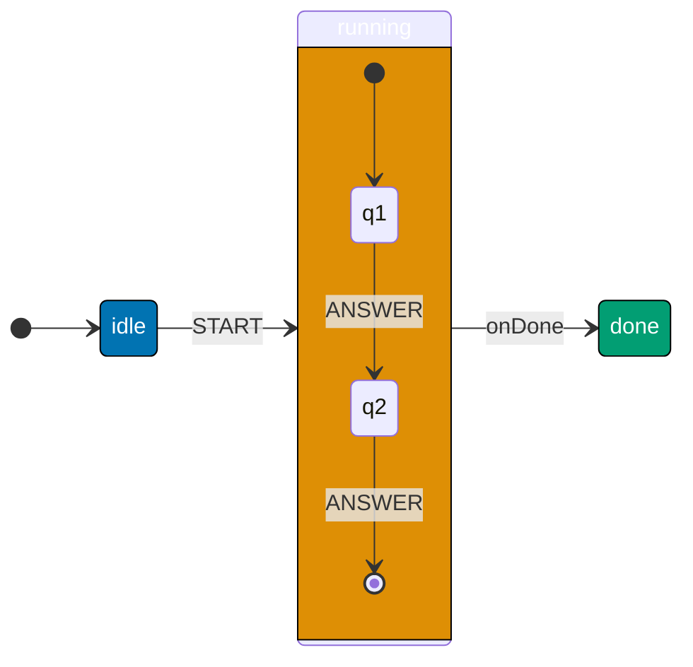

```typescript
import { createMachine, createActor, assign } from "xstate";
// => imports: createMachine to define, createActor to run, assign to update context

// Child machine: self-contained two-question wizard
// Defines its own states, context, and final state with output
// => wizard: runs independently; parent invokes it and receives its output
const wizard = createMachine({
  // => wizard: defined for use in this example
  id: "wizard",
  initial: "q1",
  // => id for DevTools; initial: starting state
  context: { answers: {} as Record<string, string> },
  // => context: answers starts as empty object; accumulates one key per question
  states: {
    // => states: all valid configurations
    q1: {
      // => q1: first wizard question
      on: {
        ANSWER: {
          target: "q2",
          // => on: event routing table
          // => ANSWER carries a value field; e.g., { type: "ANSWER", value: "Blue" }
          actions: assign({
            answers: ({ context, event }) =>
              // => actions: effects on transition
              ({ ...context.answers, q1: (event as any).value }),
            // => spread preserves existing answers; adds q1 key with the payload
          }),
        },
      },
      // => stores q1 answer then advances to q2
    },
    // => end of this block
    q2: {
      // => q2: second wizard question
      on: {
        ANSWER: {
          target: "done",
          // => on: event routing table
          // => same ANSWER event type as q1; different target and different key stored
          actions: assign({
            answers: ({ context, event }) =>
              // => actions: effects on transition
              ({ ...context.answers, q2: (event as any).value }),
            // => spread preserves q1 entry; adds q2 key with the payload
          }),
        },
      },
      // => stores q2 answer then enters the final state
    },
    // => end of this block
    done: {
      // => done: terminal state — wizard has no more questions
      type: "final" as const,
      // => type: "final" signals machine completion to parent's onDone handler
      // output: value delivered as event.output to the parent's onDone handler
      // => output function runs once when the final state is entered
      output: ({ context }: { context: Record<string, any> }) => context.answers,
      // => parent receives the complete answers map when the wizard finishes
      // => context.answers is { q1: "...", q2: "..." } at this point
    },
    // => end of this block
  },
  // => end of this block
});
// => wizard: child machine definition complete; inert until invoked by parent

// Parent machine: invokes the wizard and collects its result
// => parent events (ANSWER) are forwarded to the child wizard actor automatically
const parent = createMachine({
  // => parent: defined for use in this example
  id: "parent",
  initial: "idle",
  // => id for DevTools; initial: starting state
  context: { result: null as Record<string, string> | null },
  // => context: result starts null; populated when wizard finishes
  states: {
    // => states: all valid configurations
    idle: { on: { START: "running" } },
    // => idle: resting state; waiting for the first event
    running: {
      // Invoking a machine: child actor created automatically on state entry
      invoke: {
        // => invoke: async op tied to state lifetime
        src: wizard,
        // => src: the wizard machine; parent creates a child actor from it on entry
        // => child actor receives events sent to the parent while in running state
        onDone: {
          // => onDone: transition on resolution
          target: "done",
          // => target: destination state
          actions: assign({ result: ({ event }) => event.output }),
          // => event.output is the wizard's output function return value
          // => type of event.output is Record<string, string> — the answers map
        },
        // => end of this block
      },
      // => end of this block
    },
    // => end of this block
    done: {},
    // => done: terminal state; result context field now holds the answers map
  },
  // => end of this block
});
// => end of expression

const actor = createActor(parent);
// => createActor: live execution context
actor.start();
// => start(): actor goes live
actor.send({ type: "START" });
// => send event to drive state change; parent enters running; wizard child starts
actor.send({ type: "ANSWER", value: "Blue" } as any);
// => child: q1 → q2; answers.q1 = 'Blue'
actor.send({ type: "ANSWER", value: "Large" } as any);
// => child: q2 → done (final); parent's onDone fires with the answers map
await new Promise((r) => setTimeout(r, 10));
// => wait for async operation to complete
console.log(actor.getSnapshot().context.result);
// => Output: { q1: 'Blue', q2: 'Large' }
actor.stop();
// => stop(): cleanup
```

**Key Takeaway**: Invoking a machine as `src` creates a parent-child actor relationship — the child runs its full lifecycle, and the parent's `onDone` fires with the child's `output` when the child reaches a final state.

**Why It Matters**: Child machines are the XState mechanism for composing complex workflows without monolithic state machines. A checkout flow, an authentication wizard, and a form validation process each live in their own machine with their own states and context. The parent orchestrates when they run and collects their results, while each child is independently testable, reusable, and visualizable. This composability is what keeps large XState codebases manageable as they grow.

---

## Group 5: State Hierarchy

### Example 21: Compound States — Nested State Hierarchy

Compound states contain their own sub-machines. A compound state has an `initial` sub-state and its own `states` map. Events not handled in a child state bubble up to be handled by the parent state.

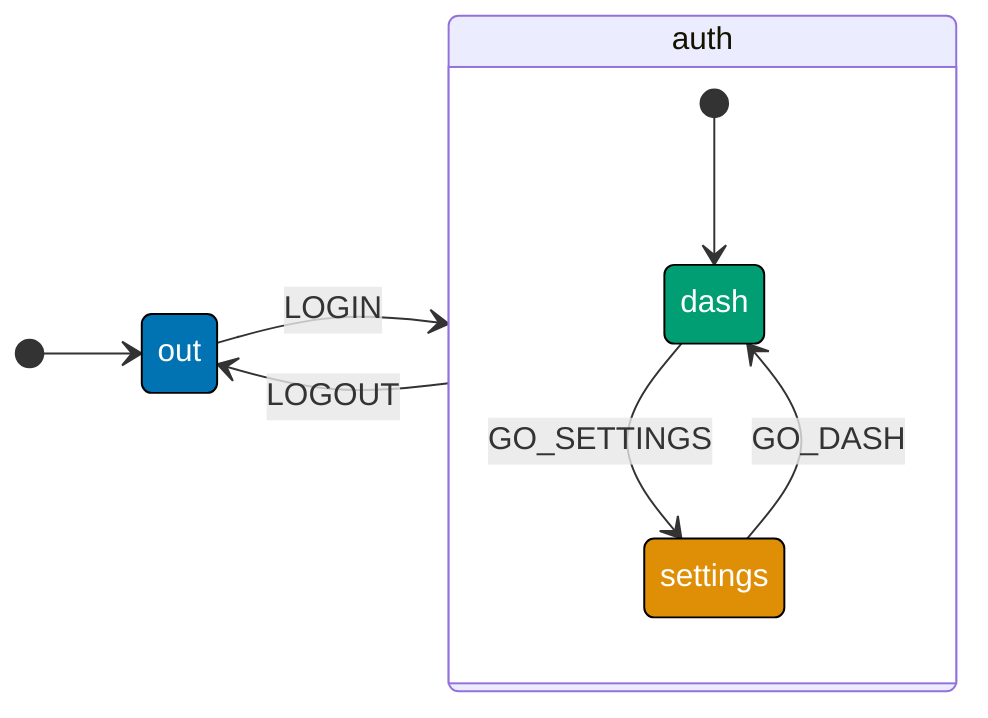

```typescript
import { createMachine, createActor } from "xstate";

// Compound state: a state node with its own "initial" and "states" properties
// Events unhandled by children automatically bubble up to the parent state
const app = createMachine({
  // => app: defined for use in this example
  id: "app",
  initial: "out",
  // => id for DevTools; initial: starting state
  states: {
    // => states: all valid configurations
    out: { on: { LOGIN: "auth" } },
    // => out: unauthenticated state
    auth: {
      // initial: the sub-state entered when auth itself is entered
      initial: "dash",
      // => machine value becomes { auth: "dash" } on LOGIN
      states: {
        // Sub-state names are relative — no "auth." prefix needed here
        dash: { on: { GO_SETTINGS: "settings" } },
        // => dash: dashboard sub-state
        settings: { on: { GO_DASH: "dash" } },
        // => settings: settings sub-state
      },
      // => end of this block
      on: {
        // LOGOUT is at the PARENT level — accessible from every sub-state
        LOGOUT: "out",
        // => dash and settings both inherit this transition automatically
        // => without nesting, LOGOUT would need to be in every sub-state
      },
      // => end of this block
    },
    // => end of this block
  },
  // => end of this block
});
// => end of expression

const actor = createActor(app);
// => createActor: live execution context
actor.start();
// => start(): actor goes live
actor.send({ type: "LOGIN" });
// => send event to drive state change
console.log(actor.getSnapshot().value);
// => Output: { auth: 'dash' }  — compound value is { parent: child }
actor.send({ type: "GO_SETTINGS" });
// => settings does not handle LOGOUT → event bubbles up to auth → fires
actor.send({ type: "LOGOUT" });
// => send event to drive state change
console.log(actor.getSnapshot().value);
// => Output: out
actor.stop();
// => stop(): cleanup
```

**Key Takeaway**: Compound states contain nested sub-machines; their `value` is an object `{ parentState: childState }`; and events not handled by a child bubble up to the parent, enabling shared transitions like `LOGOUT`.

**Why It Matters**: Hierarchical states directly model how real UIs are structured. An "authenticated" region shares a logout handler across all its sub-screens — dashboard, settings, profile, help. Without compound states, you would duplicate the `LOGOUT` transition in every sub-state or manage a flat boolean `isAuthenticated` flag alongside all the screen states. Nesting expresses the containment relationship that already exists in your UI and eliminates that duplication at the machine level.

---

### Example 22: Parallel States — Independent Concurrent Regions

Parallel states (`type: 'parallel'`) run multiple independent sub-machines simultaneously. Each region has its own current state, and both regions progress independently. The compound value is an object with one key per parallel region.

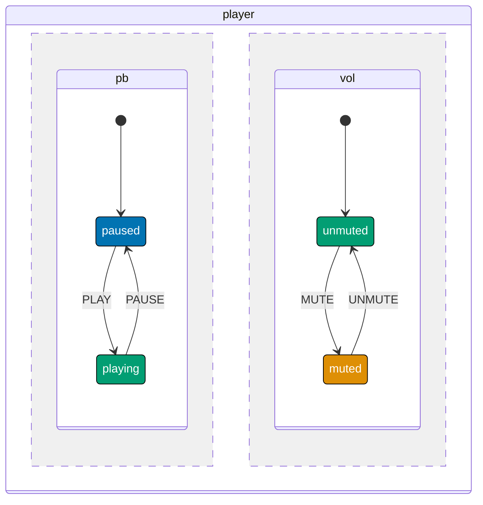

```typescript
import { createMachine, createActor } from "xstate";

// type: "parallel" — all child state nodes are active simultaneously
// No top-level "initial" property needed; all regions start together
const player = createMachine({
  // => player: defined for use in this example
  id: "player",
  type: "parallel",
  // => id: machine name in DevTools
  states: {
    // Region 1: playback — completely independent of volume state
    pb: {
      // => pb: playback region (independent of volume)
      initial: "paused",
      // => initial: sub-state entered first
      states: {
        // => states: all valid configurations
        paused: { on: { PLAY: "playing" } },
        // => PLAY only affects the pb region; vol region is unchanged
        playing: { on: { PAUSE: "paused" } },
        // => playing: audio is playing
      },
      // => end of this block
    },
    // Region 2: volume — completely independent of playback state
    vol: {
      // => vol: volume region (independent of playback)
      initial: "unmuted",
      // => initial: sub-state entered first
      states: {
        // => states: all valid configurations
        unmuted: { on: { MUTE: "muted" } },
        // => MUTE only affects the vol region; pb region is unchanged
        muted: { on: { UNMUTE: "unmuted" } },
        // => muted state definition
      },
      // => end of this block
    },
    // => end of this block
  },
  // => end of this block
});
// => end of expression

const actor = createActor(player);
// => createActor: live execution context
actor.start();
// => start(): actor goes live
console.log(actor.getSnapshot().value);
// => Output: { pb: 'paused', vol: 'unmuted' }  — one key per region

actor.send({ type: "PLAY" });
// => only pb region changes; vol stays unmuted
console.log(actor.getSnapshot().value);
// => Output: { pb: 'playing', vol: 'unmuted' }

actor.send({ type: "MUTE" });
// => only vol region changes; pb stays playing
console.log(actor.getSnapshot().value);
// => Output: { pb: 'playing', vol: 'muted' }
actor.stop();
// => stop(): cleanup
```

**Key Takeaway**: `type: 'parallel'` makes all child states active simultaneously and independently — the snapshot value is an object keyed by region name, and events are dispatched to all regions.

**Why It Matters**: Parallel states model orthogonal concerns that coexist without interfering. A video player's playback state is genuinely independent of its volume state — they run in parallel in the real world and should in the machine. Without parallel states, you would need a state for every combination: `playingMuted`, `playingUnmuted`, `pausedMuted`, `pausedUnmuted` — four states for two boolean flags, growing exponentially with each new independent concern.

---

### Example 23: History States — Restoring the Last Active Sub-State

History states are special pseudo-states that remember the last active sub-state of a compound state. When the machine re-enters a compound state via the history node, it restores the previously-occupied sub-state instead of going to the compound state's `initial`.

```typescript
import { createMachine, createActor } from "xstate";

// Multi-tab form: opening a help modal should restore the active tab on close
// Without history, CLOSE_HELP would always go back to personalInfo (the initial)
const form = createMachine({
  // => form: defined for use in this example
  id: "form",
  initial: "tabs",
  // => id for DevTools; initial: starting state
  states: {
    // => states: all valid configurations
    tabs: {
      // => tabs: multi-tab form compound state
      initial: "info",
      // => fresh entry always starts at "info" tab
      on: { HELP: "modal" },
      // => HELP is at parent level — works from any active tab
      states: {
        // => states: all valid configurations
        info: { on: { NEXT: "address" } },
        // => info: personal info tab
        address: { on: { NEXT: "payment", BACK: "info" } },
        // => address: address info tab
        payment: { on: { BACK: "address" } },
        // "hist": special pseudo-state — remembers the last active child
        hist: {
          // => hist: history pseudo-state
          type: "history" as const,
          // => "shallow" default: records the direct child that was active
          // => falls back to tabs.initial ("info") when no history exists yet
        },
        // => end of this block
      },
      // => end of this block
    },
    // => end of this block
    modal: {
      // => modal: help dialog overlay
      on: {
        // => on: event routing table
        CLOSE: "tabs.hist",
        // => "tabs.hist" is the history node — dot notation: parent.histName
        // => restores the last active tab instead of re-entering at "info"
      },
      // => end of this block
    },
    // => end of this block
  },
  // => end of this block
});
// => end of expression

const actor = createActor(form);
// => createActor: live execution context
actor.start();
// => start(): actor goes live
actor.send({ type: "NEXT" });
// => now on address tab — history will record "address"
actor.send({ type: "HELP" });
// => enters modal; history node has recorded "address"
console.log(actor.getSnapshot().value);
// => Output: modal
actor.send({ type: "CLOSE" });
// => tabs.hist restores "address", NOT "info" (the initial)
console.log(actor.getSnapshot().value);
// => Output: { tabs: 'address' }
actor.stop();
// => stop(): cleanup
```

**Key Takeaway**: A `type: 'history'` state node remembers the last active sub-state of its parent compound state — transitioning to it restores that position rather than starting at the parent's `initial`.

**Why It Matters**: History states eliminate the need to manually track "which tab was active before the modal opened" in component state. Without them, you store `lastActiveTab` in React state, pass it through props or context, and restore it on modal close — all boilerplate that can desync. The machine tracks this automatically, and `tabs.hist` is a single, expressive transition target that tells every reader exactly what happens: "return to where we were."

---

### Example 24: Final States — Machine Completion and Output

A final state (`type: 'final'`) signals that a machine has completed its work. When an actor reaches a final state, its `status` becomes `"done"` and subscribers receive a final snapshot. The `output` field computes the machine's return value.

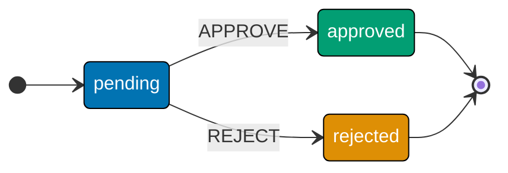

```typescript
import { createMachine, createActor } from "xstate";
// => imports: createMachine, createActor

type Ctx = { requestId: string };

// Final states signal completion — no further events accepted after entry
// output: function that computes the machine's return value on reaching final
const approval = createMachine({
  // => approval: defined for use in this example
  id: "approval",
  initial: "pending",
  // => id for DevTools; initial: starting state
  context: { requestId: "req-42" },
  // => context: inline initial extended state
  states: {
    // pending: two paths out; both lead to final states
    pending: { on: { APPROVE: "approved", REJECT: "rejected" } },
    // => pending: awaiting a decision
    approved: {
      // => approved: request accepted (final)
      type: "final" as const,
      // output: delivered as event.output to a parent machine's onDone handler
      output: ({ context }: { context: Ctx }) =>
        // => output: result to parent onDone as event.output
        ({ status: "approved", id: context.requestId }),
      // => parent receives this object when the child actor completes
    },
    // => end of this block
    rejected: {
      // => rejected: request declined (final)
      type: "final" as const,
      // => final: terminal; status becomes "done"
      output: ({ context }: { context: Ctx }) =>
        // => output: result to parent onDone as event.output
        ({ status: "rejected", id: context.requestId }),
      // => different shape returned for the rejection path
    },
    // => end of this block
  },
  // => end of this block
});
// => end of expression

const actor = createActor(approval);
// => createActor: live execution context
actor.subscribe((snap) => {
  // => part of machine configuration
  if (snap.status === "done") {
    // => conditional before the operation proceeds
    console.log("Result:", snap.output);
    // => snap.output holds the final state's output function return value
  }
  // => end of this block
});
// => end of expression
actor.start();
// => start(): actor goes live
actor.send({ type: "APPROVE" });
// => Output: Result: { status: 'approved', id: 'req-42' }
console.log(actor.getSnapshot().status);
// => Output: done
actor.stop();
// => stop(): cleanup
```

**Key Takeaway**: `type: 'final'` marks a completion state — the actor's `status` becomes `"done"`, its `output` field carries the result, and any parent machine's `onDone` fires with `event.output` equal to that result.

**Why It Matters**: Final states and machine output turn state machines into composable async computations. An approval workflow, a payment process, and a file upload each complete with a typed result value. Parent machines collect these results via `onDone` without polling, callbacks, or shared mutable state. The `status === 'done'` signal also lets React components unmount invocation-driven actors cleanly — the component knows when to show the result and when to hide the loading indicator.

---

## Group 6: Timing and Advanced Basics

### Example 25: after — Managed Delayed Transitions

`after` defines automatic transitions that fire after a specified number of milliseconds. The timer starts when the state is entered and is cancelled if the state is exited before the timer fires. This replaces `setTimeout` calls that leak when components unmount.

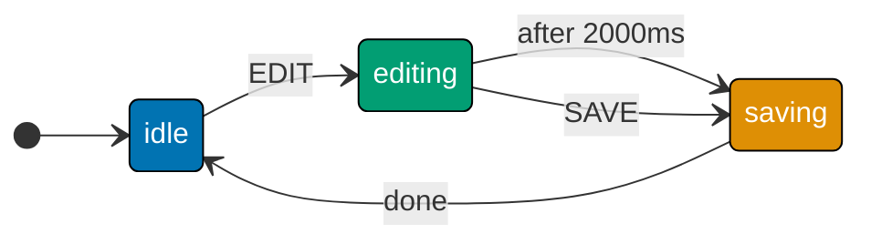

```typescript
import { createMachine, createActor, assign } from "xstate";
// => imports: assign needed to update isDirty and savedAt context fields

// after: fires automatic transitions when a timer expires
// XState owns the timer — it starts on state entry, cancels on state exit
const autoSave = createMachine({
  // => autoSave: defined for use in this example
  id: "autoSave",
  initial: "idle",
  // => id for DevTools; initial: starting state
  context: { isDirty: false, savedAt: null as number | null },
  // => context: inline initial extended state
  states: {
    // => states: all valid configurations
    idle: {
      // => idle: clean state; no pending unsaved changes
      on: {
        EDIT: {
          target: "editing",
          // => idle: resting state; waiting for the first event
          actions: assign({ isDirty: true }),
          // => isDirty: true signals that edits exist and need saving
        },
      },
    },
    // => actions: effects on transition
    editing: {
      // Manual SAVE bypasses the timer and transitions immediately
      // => SAVE provides an eager path; after 2000 is the lazy auto-save path
      on: { SAVE: "saving" },
      // after: each key is a delay in ms; value is a transition config
      after: {
        // => after: timer auto-transitions
        2000: {
          // => 2000 state definition
          target: "saving",
          // => target: destination state
          guard: ({ context }) => context.isDirty,
          // => timer fires after 2s; guard checks if there is unsaved work
          // => if isDirty is false, the timer fires but transition is skipped
        },
        // => end of this block
      },
      // => end of this block
    },
    // => end of this block
    saving: {
      // => saving: persisting to storage
      entry: [
        // => entry: fires on any entry
        () => console.log("[after] saving..."),
        // => entry fires when the 2s timer triggers the transition
        assign({ isDirty: false, savedAt: () => Date.now() }),
        // => clears the dirty flag and records the save timestamp
      ],
      // Short after timer simulates the save round-trip before returning to idle
      after: { 100: "idle" },
      // => after 100ms the saving state auto-transitions back to idle
    },
    // => end of this block
  },
  // => end of this block
});
// => end of expression

const actor = createActor(autoSave);
// => createActor: live execution context
actor.start();
// => start(): actor goes live; machine is in idle with isDirty: false
actor.send({ type: "EDIT" });
// => isDirty = true; 2s timer started on editing entry

await new Promise((r) => setTimeout(r, 2500));
// => 2s elapsed; guard passed (isDirty true); auto-save executed
// => Output: [after] saving...
console.log(actor.getSnapshot().value);
// => Output: idle (returned after saving)
console.log(actor.getSnapshot().context.isDirty);
// => Output: false (cleared by auto-save)
actor.stop();
// => stop(): cleanup
```

**Key Takeaway**: `after: { delayMs: target }` starts a timer on state entry and fires an automatic transition after the delay — the timer is automatically cleaned up if the state is exited before it fires.

**Why It Matters**: `after` eliminates `setTimeout` / `clearTimeout` pairs that are notoriously error-prone. Without XState, auto-save requires creating a timer on mount, clearing it on unmount, resetting it on every keypress, and hoping `clearTimeout` is called before the unmount race condition. With `after`, the machine owns the timer entirely — entering the state starts it, leaving the state cancels it, and the actor's lifecycle guarantees cleanup on `actor.stop()`.

---

### Example 26: always — Automatic Eventless Routing

`always` defines transitions that fire immediately after entering a state, without waiting for any event. XState evaluates `always` transitions in declaration order and takes the first one whose guard passes. A final entry with no guard acts as an unconditional fallback.

```typescript
import { createMachine, createActor, assign } from "xstate";
// => createMachine: builds the blueprint; createActor: creates runtime; assign: updates context

// "evaluating" is an ephemeral routing state — machine never stays here long
// always transitions fire immediately on entry and redirect to the right state
// => evaluating is entered on start AND on every RESET; always re-routes instantly
const scoreboard = createMachine({
  // => scoreboard: defined for use in this example
  id: "scoreboard",
  initial: "evaluating",
  // => id for DevTools; initial: starting state
  context: { score: 0 },
  // => context: inline initial extended state; override at createActor time for tests
  states: {
    // => states: all valid configurations
    evaluating: {
      // always: evaluated top-to-bottom immediately on entering this state
      // => no event required; XState checks guards the moment state is entered
      always: [
        // => always: immediate eventless transitions
        { guard: ({ context }) => context.score >= 90, target: "excellent" },
        // => first: 90+ → excellent; stops here if the guard is true
        { guard: ({ context }) => context.score >= 60, target: "passing" },
        // => second: 60-89 → passing (only reached when first guard failed)
        { target: "failing" },
        // => fallback: no guard — always matches when all others have failed
      ],
      // => end of array
    },
    // => end of this block
    excellent: {
      // => excellent: score >= 90 routing target
      entry: [() => console.log("Excellent!")],
      // => entry: fires on any entry
      on: { RESET: { target: "evaluating", actions: assign({ score: 0 }) } },
      // => RESET re-enters evaluating; always transitions re-route based on new score
    },
    // => end of this block
    passing: {
      // => passing: score 60-89 routing target
      entry: [() => console.log("Passing!")],
      // => entry: fires on any entry
      on: { RESET: { target: "evaluating", actions: assign({ score: 0 }) } },
      // => RESET re-enters evaluating; always transitions re-route based on new score
    },
    // => end of this block
    failing: {
      // => failing: score < 60 routing target
      entry: [() => console.log("Failing!")],
      // => entry: fires on any entry
      on: { RESET: { target: "evaluating", actions: assign({ score: 0 }) } },
      // => on: event routing table
    },
    // => end of this block
  },
  // => end of this block
});

// Test score 45 → always[0]: 45>=90? No; always[1]: 45>=60? No; fallback
const a1 = createActor(
  createMachine(
    // => createActor: live execution context
    { ...scoreboard.config, context: { score: 45 } },
    // => spread base config then override context.score to 45 for this test
  ),
);
// => spread base config; override context for this test
a1.start();
// => Output: Failing!
console.log(a1.getSnapshot().value);
// => Output: failing

// Test score 95 → always[0]: 95>=90? Yes → excellent; stops immediately
const a2 = createActor(
  createMachine(
    // => createActor: live execution context
    { ...scoreboard.config, context: { score: 95 } },
    // => spread base config then override context.score to 95 for this test
  ),
);
// => spread base config; override context for this test
a2.start();
// => Output: Excellent!
console.log(a2.getSnapshot().value);
// => Output: excellent

[a1, a2].forEach((a) => a.stop());
// => stop all actors
```

**Key Takeaway**: `always` transitions fire immediately on entering a state in declaration order — the first guard that passes (or the first entry with no guard) takes effect, making them ideal for computed routing based on context.

**Why It Matters**: `always` replaces the pattern of "enter a state, check a condition, immediately transition again" that would otherwise require a `raised` event or a complex entry action. Routing states — states whose sole purpose is to evaluate context and redirect — are a clean XState idiom for expressing decision trees. Instead of a conditional chain in a reducer, the machine explicitly models "I need to decide which path to take" as its own state node with documented transition logic.

---

### Example 27: Self-Transitions — Internal vs External

A self-transition returns to the same state. In XState v5, self-transitions have two modes: **external** (`reenter: true`) runs exit and entry actions; **internal** (`reenter: false`, the default) runs only the transition's own actions without re-running entry/exit. This distinction controls whether state-bound side effects repeat.

```typescript
import { createMachine, createActor, assign, log } from "xstate";

// entryCount reveals whether entry re-runs on each self-transition type
// increment via INC (internal) vs RESTART (external) shows the difference
const counter = createMachine({
  // => counter: defined for use in this example
  id: "counter",
  initial: "counting",
  // => id for DevTools; initial: starting state
  context: { count: 0, entryCount: 0 },
  // => context: inline initial extended state
  states: {
    // => states: all valid configurations
    counting: {
      // entry: runs when the state is (re-)entered — both initial and reenter
      entry: [
        // => entry: fires on any entry
        assign({ entryCount: ({ context }) => context.entryCount + 1 }),
        // => increments on initial entry AND on reenter: true self-transitions
        log(({ context }) => `[entry] n=${context.entryCount + 1}`),
        // => printed each time entry fires — reveals when re-entry occurs
      ],
      // => end of array
      on: {
        // INTERNAL self-transition: reenter defaults to false
        // Only the transition's own actions run — entry/exit do NOT fire
        INC: {
          // => INC state definition
          actions: [
            // => actions: effects on transition
            assign({ count: ({ context }) => context.count + 1 }),
            // => count increments; entry action does NOT re-run here
            log(({ context }) => `[inc] count=${context.count + 1}`),
            // => "[inc]" prefix distinguishes from "[entry]" lines
          ],
          // => end of array
        },
        // EXTERNAL self-transition: reenter: true forces full exit + re-entry
        RESTART: {
          // => RESTART state definition
          reenter: true,
          // => exit fires, then entry fires again — both re-run for reenter: true
          actions: [assign({ count: 0 })],
          // => count resets to 0; then entry runs and bumps entryCount
        },
        // => end of this block
      },
      // => end of this block
    },
    // => end of this block
  },
  // => end of this block
});
// => end of expression

const actor = createActor(counter);
// => createActor: live execution context
actor.start();
// => Output: [entry] n=1  (initial entry)
console.log(actor.getSnapshot().context);
// => Output: { count: 0, entryCount: 1 }

actor.send({ type: "INC" });
// => Output: [inc] count=1  (no [entry] — INC is internal, entry did NOT re-run)
console.log(actor.getSnapshot().context.entryCount);
// => Output: 1  (entryCount unchanged — INC does not re-enter)

actor.send({ type: "RESTART" });
// => reenter: true → exit fires, then entry fires → entryCount increments
// => Output: [entry] n=2
console.log(actor.getSnapshot().context);
// => Output: { count: 0, entryCount: 2 }
actor.stop();
// => stop(): cleanup
```

**Key Takeaway**: Internal self-transitions (`reenter: false`, default) run only the transition's actions without re-triggering entry/exit; external self-transitions (`reenter: true`) fully exit and re-enter the state, repeating all entry and exit actions.

**Why It Matters**: The distinction between internal and external self-transitions prevents a class of subtle bugs where "update context" and "re-initialize state" are conflated. A text editor incrementally updates its word count (internal — no re-initialization) but restores to defaults when a new document loads (external — full re-entry). Without this distinction, every context update would re-fire entry actions, causing animations to restart, timers to reset, and resources to be re-acquired on every keystroke. `reenter: false` is the safe default that makes incremental updates efficient.
