This tutorial covers intermediate XState v5 patterns through 27 annotated examples. You will master the actor model (promise, callback, observable, reducer, and spawned actors), machine input and output, React integration with `@xstate/react`, model-based testing, persistence, and imperative action batching — the patterns used every day in production XState applications.

## Group 7: The Actor Model (Examples 28-35)

### Example 28: Actors vs Machines — The Actor Model

In XState v5, every running state machine is an actor. Actors are isolated units of computation that communicate exclusively by sending events to each other — they share no mutable state. A machine is one specialised kind of actor, but the system also supports promise actors, callback actors, observable actors, and reducer actors.

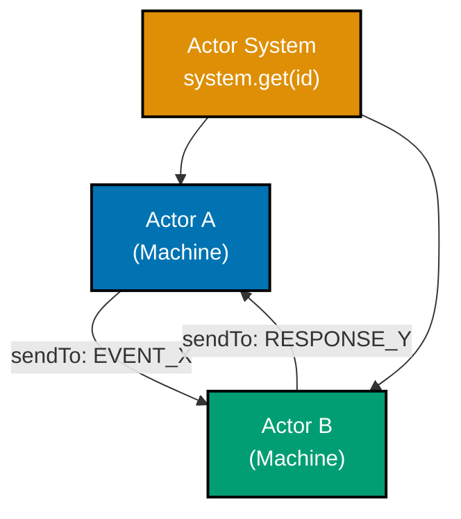

```typescript
import { createMachine, createActor, sendTo, assign } from "xstate";

// Actor model principle: actors are isolated execution units
// They communicate only through message passing (events)
// No shared mutable state between actors

// Define a simple counter machine -- this will become Actor B
const counterMachine = createMachine({
  // => State machine definition that will run as an actor
  id: "counter",
  // => Named so the actor system can look it up
  context: { count: 0 },
  // => Each actor has its own private context
  on: {
    INCREMENT: {
      // => Receives events from other actors
      actions: assign({ count: ({ context }) => context.count + 1 }),
      // => Mutates only its own context, never shared state
    },
  },
});

// Define a supervisor machine -- this will become Actor A
const supervisorMachine = createMachine({
  // => Parent actor that coordinates children
  id: "supervisor",
  context: { childRef: null as any },
  // => Holds a reference to the child actor
  initial: "running",
  states: {
    running: {
      entry: assign({
        // => On entry, spawn a child actor
        childRef: ({ spawn }) => spawn(counterMachine, { id: "counter" }),
        // => spawn() creates a new actor within this actor's context
        // => Returns an ActorRef -- a stable reference to message the child
      }),
      on: {
        TICK: {
          // => Supervisor receives TICK from outside
          actions: sendTo(({ context }) => context.childRef, { type: "INCREMENT" }),
          // => Forwards message to child actor
          // => sendTo resolves the ref at runtime, sends event to that actor
        },
      },
    },
  },
});

const actor = createActor(supervisorMachine).start();
// => Supervisor actor starts, spawns counter child automatically

actor.send({ type: "TICK" });
// => Supervisor receives TICK, forwards INCREMENT to counter
actor.send({ type: "TICK" });
// => Counter context.count is now 2
```

**Key Takeaway**: In XState v5, every running machine is an actor with private context; actors coordinate exclusively through message passing, never shared state.

**Why It Matters**: The actor model eliminates the root cause of most concurrency bugs — shared mutable state. Each actor owns its data, processes one message at a time, and exposes a clear event interface. When a feature grows complex, you split it across actors rather than adding more state to a single machine. This scales from a single toggle button to a distributed microservices architecture using the same mental model. XState v5 makes this pattern first-class, so you get safe concurrency for free.

---

### Example 29: fromPromise — Promise Actors

`fromPromise` wraps an async function as a standalone actor. You can start it, subscribe to its snapshots, and read its output once the promise resolves. Promise actors are the standard replacement for `invoke` services when you want a reusable, composable unit.

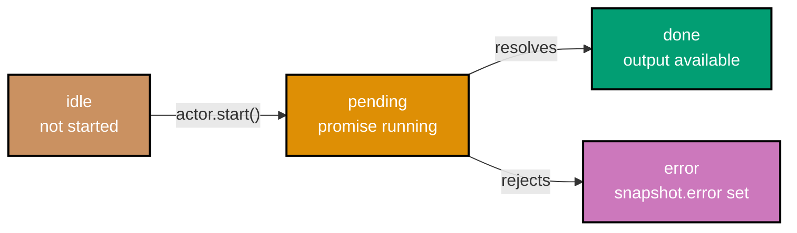

```typescript
import { fromPromise, createActor } from "xstate";

// fromPromise wraps an async function as a reusable actor logic
// The function receives an { input, signal } argument
const fetchUserLogic = fromPromise(
  // => Creates promise actor logic (not yet running)
  async ({ input }: { input: { userId: string } }) => {
    // => input comes from createActor's second argument
    // => signal is an AbortSignal; cancelled actors abort the promise

    // Simulate an API fetch (replace with real fetch in production)
    await new Promise((resolve) => setTimeout(resolve, 10));
    // => Simulates network latency

    return { id: input.userId, name: "Alice", role: "admin" };
    // => Promise resolves to this object, becomes snapshot.output
  },
);

// Create and start the actor, providing input
const userActor = createActor(fetchUserLogic, {
  input: { userId: "u-42" },
  // => input is passed to the async function above
});

// Subscribe before starting to catch all state transitions
userActor.subscribe((snapshot) => {
  // => Called every time the actor's snapshot changes
  if (snapshot.status === "active") {
    console.log("Loading...");
    // => Output: Loading...
  }
  if (snapshot.status === "done") {
    console.log("User:", snapshot.output);
    // => Output: User: { id: 'u-42', name: 'Alice', role: 'admin' }
  }
  if (snapshot.status === "error") {
    console.error("Failed:", snapshot.error);
    // => Output: Failed: [error object]
  }
});

userActor.start();
// => Starts the promise; subscriber receives 'active' then 'done' snapshots
```

**Key Takeaway**: `fromPromise` turns any async function into a reusable actor that progresses through `active` → `done` or `active` → `error`, with typed `input` and `output`.

**Why It Matters**: Wrapping async operations as promise actors makes them composable and testable in isolation. You can swap the real implementation with a mock actor in tests (`machine.provide({ actors: { fetchUser: fromPromise(...) } })`), control retries and cancellation via the actor lifecycle, and subscribe to granular status changes without writing bespoke loading/error state logic in every component.

---

### Example 30: fromCallback — Callback Actors

`fromCallback` creates an actor from a setup function that receives `sendBack` (to emit events to the parent) and `receive` (to handle events sent to this actor). It is the right tool for WebSockets, DOM event listeners, timers, and any imperative subscription-based API.

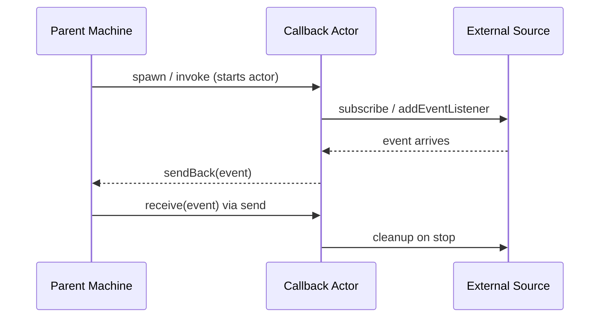

```typescript
import { fromCallback, createActor, createMachine, assign } from "xstate";

// fromCallback receives a setup function
// setup must return a cleanup function (or void)
const intervalLogic = fromCallback(
  // => Creates callback actor logic
  ({
    sendBack,
    receive,
    input,
  }: {
    sendBack: (event: { type: string; elapsed: number }) => void;
    receive: (handler: (event: { type: string }) => void) => void;
    input: { intervalMs: number };
  }) => {
    let elapsed = 0;
    // => Track elapsed ticks in actor-local variable (not shared)

    const id = setInterval(() => {
      // => Start a real timer using the provided interval
      elapsed += input.intervalMs;
      sendBack({ type: "TICK", elapsed });
      // => sendBack emits an event UP to the parent machine
      // => Parent machine handles TICK in its event handlers
    }, input.intervalMs);

    receive((event) => {
      // => receive handles events sent DOWN to this actor
      if (event.type === "PAUSE") {
        clearInterval(id);
        // => Stop ticking when parent sends PAUSE
      }
    });

    // Cleanup function — called when actor is stopped or parent exits state
    return () => {
      clearInterval(id);
      // => Prevents memory leaks when the parent machine leaves the state
    };
  },
);

// Parent machine that hosts the callback actor
const timerMachine = createMachine({
  id: "timer",
  context: { elapsed: 0 },
  initial: "running",
  states: {
    running: {
      invoke: {
        src: intervalLogic,
        // => Invoke the callback actor in this state
        input: { intervalMs: 100 },
        // => Pass configuration to the actor setup
      },
      on: {
        TICK: {
          // => Handle events sent back by the callback actor
          actions: assign({ elapsed: ({ event }) => event.elapsed }),
          // => Update parent context from child event payload
        },
      },
    },
  },
});

const actor = createActor(timerMachine).start();
// => Starts timer machine; callback actor spawns and begins sending TICK
```

**Key Takeaway**: `fromCallback` bridges imperative subscription APIs (timers, sockets, DOM events) into XState's declarative actor model via `sendBack` (up) and `receive` (down).

**Why It Matters**: Real applications are full of push-based data sources: WebSocket messages, `setInterval`, `IntersectionObserver`, geolocation updates. Without a pattern for integrating these, you scatter subscription logic across components. Callback actors centralise that code, make the lifecycle explicit (setup and cleanup in one place), and route data back through the machine's type-safe event handling — turning messy imperative code into a documented, testable actor.

---

### Example 31: fromObservable — Observable Actors

`fromObservable` wraps an RxJS-compatible observable as an actor. Each emitted value is delivered as an event to the parent machine. This is the cleanest integration point between XState and reactive streams.

```typescript
import { fromObservable, createActor, createMachine, assign } from "xstate";

// Minimal observable implementation (RxJS-compatible interface)
// In production, import { interval } from 'rxjs'
function interval(ms: number) {
  // => Creates an observable that emits incrementing integers
  return {
    subscribe(observer: { next: (v: number) => void; complete?: () => void }) {
      // => subscribe is the standard observable interface
      let count = 0;
      const id = setInterval(() => observer.next(count++), ms);
      // => Emits count every ms milliseconds
      return { unsubscribe: () => clearInterval(id) };
      // => Returns a subscription object for cleanup
    },
  };
}

// fromObservable wraps the observable factory as actor logic
const clockLogic = fromObservable(
  // => Takes a factory function, receives { input }
  ({ input }: { input: { tickMs: number } }) => interval(input.tickMs),
  // => Returns an observable; each emission is delivered as { type: string, output: T }
);

// Parent machine that subscribes to the observable actor
const clockMachine = createMachine({
  // => Machine that consumes a streaming data source
  id: "clock",
  context: { ticks: 0 },
  initial: "ticking",
  states: {
    ticking: {
      invoke: {
        src: clockLogic,
        // => XState automatically subscribes and unsubscribes
        input: { tickMs: 200 },
        // => Passed to the observable factory function
        onSnapshot: {
          // => Called for every emitted value
          actions: assign({ ticks: ({ context }) => context.ticks + 1 }),
          // => Increment ticks on each observable emission
        },
        onError: { target: "stopped" },
        // => Handle observable errors by transitioning state
      },
      on: { STOP: "stopped" },
    },
    stopped: { type: "final" },
    // => Actor cleans up observable subscription when entering final state
  },
});

const actor = createActor(clockMachine).start();
// => Machine starts; observable subscribes and begins emitting
// => actor.getSnapshot().context.ticks increments each tick
```

**Key Takeaway**: `fromObservable` connects any RxJS-compatible stream to a machine's `onSnapshot` handler, with automatic subscription management tied to the actor lifecycle.

**Why It Matters**: Observable actors let you use powerful reactive operators (debounce, combineLatest, switchMap) for stream processing while keeping state transitions declarative in XState. The machine handles WHAT to do when data arrives; the observable handles HOW the data is produced. XState automatically unsubscribes when the actor stops or when the invoking state is exited, preventing the subscription leak bug that plagues manual RxJS integration in components.

---

### Example 32: fromTransition — Reducer Actors

`fromTransition` creates an actor from a pure reducer function plus an initial state. This is the XState equivalent of a Redux reducer — but it lives as an actor, so it can participate in the full actor system and receive events from other actors.

```typescript
import { fromTransition, createActor } from "xstate";

// Define state and event types for the reducer
type CartState = {
  items: { id: string; quantity: number }[];
  total: number;
};

type CartEvent =
  | { type: "ADD_ITEM"; id: string; price: number }
  // => Adds or increments an item
  | { type: "REMOVE_ITEM"; id: string }
  // => Removes item completely
  | { type: "CLEAR" };
// => Empties the cart

// fromTransition takes (state, event) => newState  plus initial state
const cartLogic = fromTransition(
  // => First argument: pure reducer function (no side effects)
  (state: CartState, event: CartEvent): CartState => {
    switch (event.type) {
      case "ADD_ITEM": {
        const existing = state.items.find((i) => i.id === event.id);
        // => Check if item already in cart
        const items = existing
          ? state.items.map((i) => (i.id === event.id ? { ...i, quantity: i.quantity + 1 } : i))
          : // => Increment existing item quantity
            [...state.items, { id: event.id, quantity: 1 }];
        // => Add new item with quantity 1
        return { items, total: state.total + event.price };
        // => Always return new state object (immutability)
      }
      case "REMOVE_ITEM":
        return {
          items: state.items.filter((i) => i.id !== event.id),
          // => Filter out the removed item
          total: state.total,
          // => Note: price not tracked per-item here for simplicity
        };
      case "CLEAR":
        return { items: [], total: 0 };
      // => Reset to empty state
      default:
        return state;
      // => Unknown events return state unchanged
    }
  },
  { items: [], total: 0 },
  // => Second argument: initial state value
);

const cartActor = createActor(cartLogic).start();
// => Reducer actor starts with empty cart

cartActor.send({ type: "ADD_ITEM", id: "book-1", price: 29 });
// => cartActor.getSnapshot().context: { items: [{ id: 'book-1', quantity: 1 }], total: 29 }
cartActor.send({ type: "ADD_ITEM", id: "book-1", price: 29 });
// => { items: [{ id: 'book-1', quantity: 2 }], total: 58 }
cartActor.send({ type: "REMOVE_ITEM", id: "book-1" });
// => { items: [], total: 58 }  (total not adjusted — simplified example)
```

**Key Takeaway**: `fromTransition` wraps a pure Redux-style reducer as an XState actor, making it composable within an actor system without converting it to a full state machine.

**Why It Matters**: Not every piece of state needs the full power of a state machine. Shopping cart contents, form field collections, and undo/redo stacks are pure data transformations expressed most clearly as reducers. `fromTransition` lets you keep that code as a reducer while gaining the actor model benefits: it can receive events from sibling actors, be spawned and stopped by a parent machine, and be subscribed to by React hooks — all without rewriting it as a statechart.

---

### Example 33: spawn — Creating Child Actors

`spawn` creates a child actor dynamically inside a machine action. The returned `ActorRef` is stored in context so other actions can send events to the child. This is the pattern for dynamic actor creation — when you do not know at machine-design-time how many actors you will need.

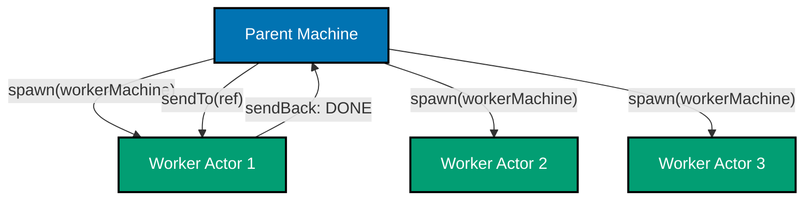

```typescript
import { createMachine, createActor, assign, sendTo, stopChild } from "xstate";

// Worker machine — a child actor type that processes tasks
const workerMachine = createMachine({
  // => Blueprint for child actors; each spawned instance is independent
  id: "worker",
  context: { taskId: "" as string },
  initial: "idle",
  states: {
    idle: { on: { START: { target: "working", actions: assign({ taskId: ({ event }) => event.taskId }) } } },
    // => Idle until parent sends START with a task ID
    working: {
      after: { 50: { target: "done" } },
      // => Simulate async work with a 50ms delay
    },
    done: { type: "final" },
    // => Final state triggers onDone in parent invoke (if invoked)
  },
});

// Parent machine that spawns workers dynamically
const poolMachine = createMachine({
  // => Manages a dynamic pool of worker actors
  id: "pool",
  context: {
    workers: {} as Record<string, any>,
    // => Map of taskId -> ActorRef for spawned workers
    completedCount: 0,
  },
  on: {
    DISPATCH_TASK: {
      // => Receives task dispatch requests
      actions: assign({
        workers: ({ context, event, spawn }) => ({
          ...context.workers,
          [event.taskId]: spawn(workerMachine, {
            // => spawn() creates a new independent worker actor
            id: `worker-${event.taskId}`,
            // => Optional systemId for system.get() lookup
          }),
          // => Store the ActorRef keyed by task ID
        }),
      }),
    },
    START_TASK: {
      // => Tell a specific worker to start
      actions: sendTo(
        ({ context, event }) => context.workers[event.taskId],
        // => Resolve target actor from context at runtime
        ({ event }) => ({ type: "START", taskId: event.taskId }),
        // => Send START event to that specific worker
      ),
    },
    REMOVE_TASK: {
      // => Remove a worker from the pool
      actions: [
        stopChild(({ context, event }) => context.workers[event.taskId]),
        // => stopChild() gracefully stops the actor
        assign({
          workers: ({ context, event }) => {
            const { [event.taskId]: _, ...rest } = context.workers;
            return rest;
            // => Remove from context map after stopping
          },
        }),
      ],
    },
  },
});

const pool = createActor(poolMachine).start();
pool.send({ type: "DISPATCH_TASK", taskId: "task-1" });
// => Worker actor for task-1 spawned and stored in context.workers['task-1']
pool.send({ type: "START_TASK", taskId: "task-1" });
// => START event forwarded to the task-1 worker actor
```

**Key Takeaway**: `spawn` creates child actors at runtime inside machine actions; the returned `ActorRef` stored in context enables targeted event delivery via `sendTo`.

**Why It Matters**: Real applications spawn actors based on data — one actor per connected WebSocket client, one per in-flight HTTP request, one per item in a todo list. `spawn` makes this pattern first-class: the parent machine owns actor lifecycle (spawn, message, stop), the child machines encapsulate per-item state, and the whole system remains type-safe. This replaces fragile patterns like arrays of `setTimeout` IDs tracked in component refs.

---

### Example 34: sendTo — Messaging Between Actors

`sendTo` is the action creator for directed inter-actor messaging. It resolves the target actor at event time from context, then delivers the event to that specific actor — creating a point-to-point channel between any two actors in the system.

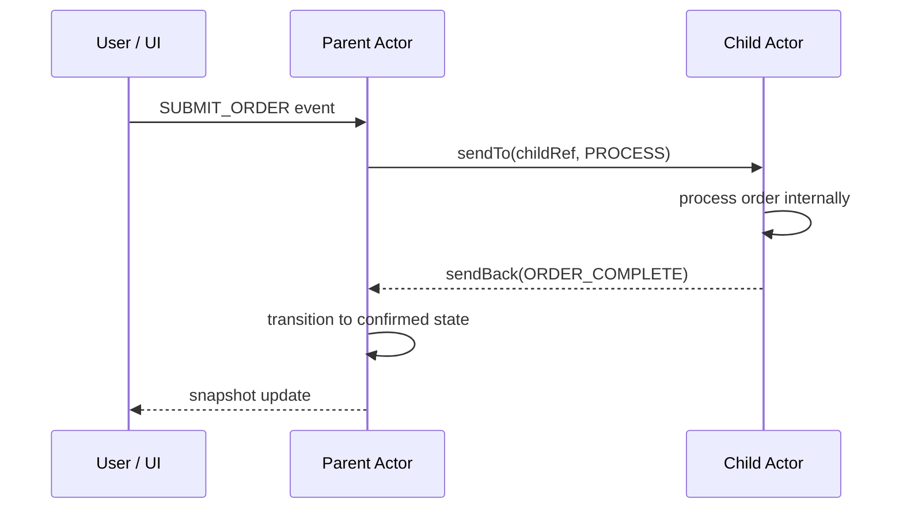

```typescript
import { createMachine, createActor, assign, sendTo } from "xstate";

// Child actor: processes orders independently
const orderProcessorMachine = createMachine({
  // => Dedicated actor for order processing logic
  id: "orderProcessor",
  context: { orderId: "" as string, status: "pending" as string },
  initial: "idle",
  states: {
    idle: {
      on: {
        PROCESS: {
          // => Receives PROCESS event from parent
          target: "processing",
          actions: assign({ orderId: ({ event }) => event.orderId }),
          // => Store order ID in own context
        },
      },
    },
    processing: {
      // => Simulate async processing
      after: {
        100: {
          target: "complete",
          actions: assign({ status: "fulfilled" }),
        },
      },
    },
    complete: { type: "final" },
    // => Signals parent via onDone if invoked, or parent polls snapshot
  },
});

// Parent actor: coordinates the checkout flow
const checkoutMachine = createMachine({
  id: "checkout",
  context: {
    processorRef: null as any,
    // => Will hold ActorRef to the processor child
    currentOrderId: "" as string,
  },
  initial: "idle",
  states: {
    idle: {
      entry: assign({
        processorRef: ({ spawn }) => spawn(orderProcessorMachine, { id: "processor" }),
        // => Spawn processor child on entry into idle state
      }),
      on: { SUBMIT_ORDER: "submitting" },
    },
    submitting: {
      entry: [
        assign({ currentOrderId: ({ event }) => event.orderId }),
        // => Save the order ID in parent context
        sendTo(
          ({ context }) => context.processorRef,
          // => Resolve target: the processor child actor
          ({ event }) => ({ type: "PROCESS", orderId: event.orderId }),
          // => Construct the event to send; receives actor + event args
        ),
        // => Delivers PROCESS event to the processor actor
      ],
      on: { CONFIRM: "confirmed" },
    },
    confirmed: { type: "final" },
  },
});

const actor = createActor(checkoutMachine).start();
actor.send({ type: "SUBMIT_ORDER", orderId: "ord-99" });
// => Parent enters submitting; PROCESS forwarded to processor actor
// => Processor actor context.orderId becomes 'ord-99'
```

**Key Takeaway**: `sendTo` resolves the target actor dynamically from context at event time, enabling fully decoupled point-to-point messaging between any two actors.

**Why It Matters**: Without `sendTo`, inter-actor communication requires direct actor references passed as props or stored in global variables. `sendTo` keeps references private inside machine context, making the communication topology explicit in the state machine definition rather than scattered through component render logic. This makes refactoring actor relationships safe — you change the machine definition, not the component tree.

---

### Example 35: Actor System — system.get()

The XState actor system is a named registry. Actors registered with `systemId` can be looked up from anywhere in the actor tree using `system.get(id)`. This creates a lightweight service-locator pattern for singleton actors like a notification bus or auth service.

```typescript
import { createMachine, createActor, assign, sendTo } from "xstate";

// Notification bus: a singleton actor all others can reach by ID
const notificationBusMachine = createMachine({
  // => Global notification bus registered as a named system actor
  id: "notificationBus",
  context: { notifications: [] as string[] },
  on: {
    NOTIFY: {
      // => Any actor can send NOTIFY to the bus
      actions: assign({
        notifications: ({ context, event }) => [
          ...context.notifications,
          event.message,
          // => Append message to notification list
        ],
      }),
    },
  },
});

// Feature machine that references the bus by system ID
const featureMachine = createMachine({
  // => A feature actor that sends to the global notification bus
  id: "feature",
  initial: "working",
  states: {
    working: {
      on: {
        TASK_DONE: {
          // => When task completes, notify via the bus
          actions: sendTo(
            ({ system }) => system.get("notificationBus"),
            // => system.get() resolves the bus actor by its systemId
            // => Returns ActorRef or undefined if not registered
            { type: "NOTIFY", message: "Task completed successfully!" },
            // => Send a static notification event
          ),
        },
      },
    },
  },
});

// Root machine: spawns both actors, registers bus with a systemId
const rootMachine = createMachine({
  id: "root",
  context: { busRef: null as any, featureRef: null as any },
  entry: assign({
    busRef: ({ spawn }) =>
      spawn(notificationBusMachine, {
        systemId: "notificationBus",
        // => systemId registers this actor in the system registry
        // => Other actors find it via system.get('notificationBus')
      }),
    featureRef: ({ spawn }) => spawn(featureMachine),
    // => Feature actor spawned without systemId -- not in registry
  }),
});

const rootActor = createActor(rootMachine).start();
// => Root spawns bus (registered) and feature (unregistered)

// Obtain the feature ref and send an event
const snapshot = rootActor.getSnapshot();
const featureRef = snapshot.context.featureRef;
featureRef.send({ type: "TASK_DONE" });
// => Feature actor's sendTo resolves notificationBus via system.get()
// => Bus appends 'Task completed successfully!' to notifications
```

**Key Takeaway**: Register actors with `systemId` to create named singletons; resolve them anywhere via `system.get(id)` inside actions without passing references through the actor tree.

**Why It Matters**: Deep actor hierarchies face the same prop-drilling problem as React component trees. `system.get()` solves this for actors the same way React Context solves it for components: a single registration gives any actor in the system access to shared services (auth, notifications, analytics, feature flags) without threading references through every layer. Unlike a global singleton, the actor system is scoped to a single `createActor` root, so tests can create isolated systems without global state pollution.

---

## Group 8: Input, Output, and Machine Configuration (Examples 36-39)

### Example 36: Machine Input — Parameterizing Machines

Machine `input` lets you pass runtime data into a machine at creation time. The input is available in the context initialiser, making it the correct way to parameterise a machine for a specific user, session, or configuration — instead of hard-coding values or using context mutation.

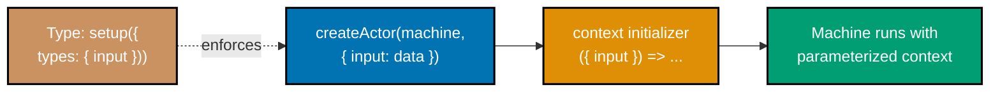

```typescript
import { createMachine, createActor } from "xstate";

// Define the input shape that this machine requires
type SessionInput = {
  userId: string;
  // => Required: identifies whose session this machine manages
  permissions: string[];
  // => Required: user's permission list drives state branching
  timeoutMs: number;
  // => Required: session timeout duration in milliseconds
};

// Machine that uses input to initialise context
const sessionMachine = createMachine({
  // => Machine blueprint -- parameterised via input
  id: "session",
  context: ({ input }: { input: SessionInput }) => ({
    // => context is a function when input is used
    // => Called once at actor creation with the provided input
    userId: input.userId,
    // => Sets userId from input -- not hard-coded
    permissions: input.permissions,
    // => Sets permissions from input
    expiresAt: Date.now() + input.timeoutMs,
    // => Computes expiry time from input at creation
    isAdmin: input.permissions.includes("admin"),
    // => Derives admin flag from input permissions array
  }),
  initial: "active",
  states: {
    active: {
      on: { LOGOUT: "expired" },
    },
    expired: { type: "final" },
  },
});

// Create actor for a regular user
const regularSession = createActor(sessionMachine, {
  input: {
    userId: "u-101",
    // => Provide actual runtime value
    permissions: ["read", "write"],
    timeoutMs: 30 * 60 * 1000,
    // => 30 minutes in milliseconds
  },
}).start();

console.log(regularSession.getSnapshot().context.isAdmin);
// => Output: false

// Create actor for an admin user — same machine, different input
const adminSession = createActor(sessionMachine, {
  input: {
    userId: "u-007",
    permissions: ["read", "write", "admin"],
    // => 'admin' permission present
    timeoutMs: 60 * 60 * 1000,
  },
}).start();

console.log(adminSession.getSnapshot().context.isAdmin);
// => Output: true
```

**Key Takeaway**: Machine `input` is the typed parameter interface for a machine — pass runtime data through `createActor(machine, { input })` and access it in the context initialiser function.

**Why It Matters**: Before `input`, developers put runtime data in context by sending an initialisation event after `.start()`, or by closing over component props in the machine definition. Both approaches are fragile: the first exposes an invalid initial state; the second creates a new machine definition per render. `input` solves this properly — the machine is defined once, typed inputs are validated at the call site, and the machine starts in a fully-initialised, valid state.

---

### Example 37: Machine Output — Final State Results

Machine `output` defines what a machine returns when it reaches a final state. The output is computed from context at that moment and exposed as `snapshot.output`. This is how a machine communicates its result to its parent or caller.

```typescript
import { createMachine, createActor, assign } from "xstate";

// Machine that processes a form and returns a result
const formMachine = createMachine({
  // => Machine with typed output for when it finishes
  id: "form",
  context: {
    email: "",
    // => Stores form field value
    submittedAt: null as number | null,
    // => Records submission timestamp
    error: null as string | null,
    // => Stores validation/submission error if any
  },
  initial: "editing",
  states: {
    editing: {
      on: {
        UPDATE_EMAIL: {
          actions: assign({ email: ({ event }) => event.email }),
          // => Update email in context on field change
        },
        SUBMIT: [
          {
            guard: ({ context }) => context.email.includes("@"),
            // => Validate: must be a plausible email
            target: "submitting",
          },
          {
            actions: assign({ error: () => "Invalid email format" }),
            // => Stay in editing, set error message
          },
        ],
      },
    },
    submitting: {
      after: {
        50: {
          target: "done",
          actions: assign({ submittedAt: () => Date.now() }),
          // => Simulate async submission; record timestamp
        },
      },
    },
    done: {
      // => Final state — output is computed here
      type: "final",
    },
    failed: {
      type: "final",
      // => Another final state -- output differs
    },
  },
  output: ({ context }) => ({
    // => output function is called when machine reaches any final state
    // => Returns a value derived from context at that moment
    email: context.email,
    // => Include submitted email in output
    submittedAt: context.submittedAt,
    // => Include submission timestamp
    success: context.error === null,
    // => Derive success flag from error presence
    errorMessage: context.error,
    // => Pass through error message (null if success)
  }),
});

const actor = createActor(formMachine).start();
actor.send({ type: "UPDATE_EMAIL", email: "user@example.com" });
// => context.email is now 'user@example.com'
actor.send({ type: "SUBMIT" });
// => Email valid; transitions to submitting then done

// After reaching final state, access output
setTimeout(() => {
  const snapshot = actor.getSnapshot();
  if (snapshot.status === "done") {
    console.log(snapshot.output);
    // => Output: { email: 'user@example.com', submittedAt: <timestamp>, success: true, errorMessage: null }
  }
}, 100);
```

**Key Takeaway**: Define `output` as a function on the machine to expose a typed result value in `snapshot.output` when the machine reaches its final state.

**Why It Matters**: Without machine output, callers must watch context to determine results, which couples them to the machine's internal data structure. `output` creates a clean public API: the machine's implementation details stay private in context, while the result contract is explicit and typed. Parent machines can use `onDone: { actions: assign({ result: ({ event }) => event.output }) }` to receive the result without knowing anything about the child's internal states.

---

### Example 38: setup() — Full TypeScript Type Safety

`setup()` is the entry point for fully type-safe machine definitions in XState v5. It declares the shapes of context, events, input, output, actors, actions, and guards in one place, so TypeScript can validate every machine reference at compile time.

```typescript
import { setup, createActor, assign, fromPromise } from "xstate";

// Define all types that the machine uses
type FetchContext = {
  data: { id: number; title: string } | null;
  // => Nullable: null before fetch, populated after
  error: string | null;
  // => Nullable: null if no error
  retryCount: number;
  // => Tracks how many retries have been attempted
};

type FetchEvent =
  | { type: "FETCH"; id: number }
  // => Triggers a data fetch
  | { type: "RETRY" }
  // => Triggers a retry after error
  | { type: "RESET" };
// => Returns to idle state

// setup() declares all types and dependencies BEFORE createMachine
const fetchMachine = setup({
  types: {
    context: {} as FetchContext,
    // => TypeScript uses this as the context type throughout the machine
    events: {} as FetchEvent,
    // => TypeScript validates all event.type references against this union
    input: {} as { initialId?: number },
    // => Optional input type; validated at createActor call site
  },
  actors: {
    // => Declare named actor implementations here for type-safe invoke/spawn
    fetchData: fromPromise(async ({ input }: { input: { id: number } }) => {
      await new Promise((r) => setTimeout(r, 10));
      // => Simulate network delay
      return { id: input.id, title: `Item ${input.id}` };
      // => Returns typed output that the machine can reference
    }),
  },
  guards: {
    // => Declare named guards; TypeScript verifies they exist when referenced
    canRetry: ({ context }) => context.retryCount < 3,
    // => Guard function has typed context
  },
}).createMachine({
  // => createMachine chained from setup; all types are inferred
  id: "fetch",
  context: ({ input }) => ({
    // => input type is inferred from setup({ types: { input } })
    data: null,
    error: null,
    retryCount: 0,
  }),
  initial: "idle",
  states: {
    idle: { on: { FETCH: { target: "loading" } } },
    loading: {
      invoke: {
        src: "fetchData",
        // => TypeScript verifies 'fetchData' is declared in setup actors
        input: ({ event }) => ({ id: (event as any).id }),
        onDone: {
          target: "success",
          actions: assign({ data: ({ event }) => event.output }),
          // => event.output is typed from fetchData's return type
        },
        onError: {
          target: "error",
          actions: assign({ error: () => "Fetch failed" }),
        },
      },
    },
    success: { on: { RESET: "idle" } },
    error: {
      on: {
        RETRY: {
          guard: "canRetry",
          // => TypeScript verifies 'canRetry' is declared in setup guards
          target: "loading",
          actions: assign({ retryCount: ({ context }) => context.retryCount + 1 }),
        },
      },
    },
  },
});

const actor = createActor(fetchMachine, { input: {} }).start();
// => input type validated: {} satisfies { initialId?: number }
actor.send({ type: "FETCH", id: 42 });
// => TypeScript error if you send { type: "UNKNOWN" } -- not in FetchEvent
```

**Key Takeaway**: `setup({ types, actors, guards, actions })` provides compile-time type checking for all machine references, turning typos and mismatches into TypeScript errors before runtime.

**Why It Matters**: Without `setup()`, XState machines in TypeScript require manual generic parameter threading that quickly becomes unmanageable. `setup()` centralises the type contract, making the machine self-documenting and refactor-safe. Renaming an event, adding a context field, or swapping an actor implementation becomes a type-checked operation: TypeScript catches every reference that needs updating across the entire machine definition.

---

### Example 39: Tags — Categorizing States

Tags let you attach semantic labels to states. Instead of checking exact state names (which change as machines evolve), UI code checks for tags like `'loading'` or `'error'` — decoupling the component from the machine's internal topology.

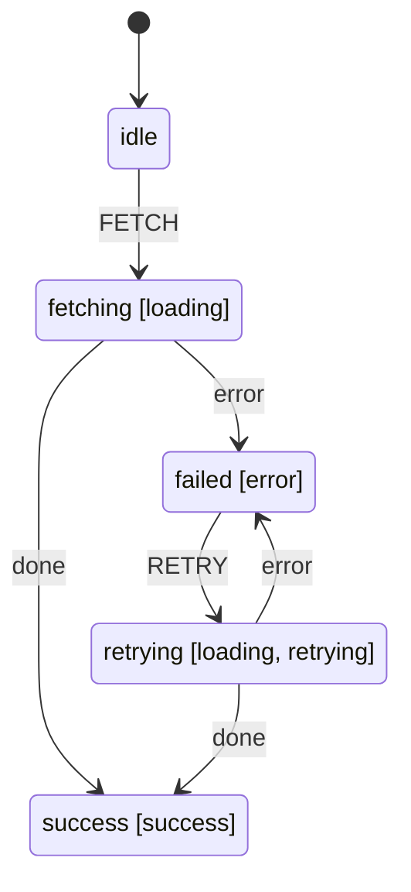

```typescript
import { createMachine, createActor } from "xstate";

const loadMachine = createMachine({
  // => Machine with tags for UI-friendly state querying
  id: "load",
  initial: "idle",
  states: {
    idle: {
      // => No tags: neutral starting state
      on: { FETCH: "fetching" },
    },
    fetching: {
      tags: ["loading"],
      // => Tag this state as 'loading'
      // => Any state tagged 'loading' shows a spinner
      after: { 30: "success" },
      // => Simulate fetch delay for demo
    },
    retrying: {
      tags: ["loading", "retrying"],
      // => Multiple tags allowed on a single state
      // => 'loading' tag: show spinner; 'retrying' tag: show retry count
      after: { 30: "success" },
    },
    success: {
      tags: ["success"],
      // => Signals successful outcome to UI
    },
    failed: {
      tags: ["error"],
      // => Signals error state to UI
      on: { RETRY: "retrying" },
    },
  },
});

const actor = createActor(loadMachine).start();
actor.send({ type: "FETCH" });
// => Machine in 'fetching' state

const snapshot = actor.getSnapshot();

// Check by tag -- not by exact state name
console.log(snapshot.hasTag("loading"));
// => Output: true -- safe even if state is renamed internally

console.log(snapshot.hasTag("error"));
// => Output: false

console.log(snapshot.hasTag("success"));
// => Output: false (not yet done)

// UI usage pattern (React pseudo-code):
// const isLoading = snapshot.hasTag('loading')  // => Shows spinner for fetching OR retrying
// const isError   = snapshot.hasTag('error')    // => Shows error message
// const showRetry = snapshot.hasTag('retrying') // => Shows retry count badge
```

**Key Takeaway**: Assign `tags` arrays to states and query with `snapshot.hasTag(tag)` to decouple UI state from machine topology — multiple states can share a tag, and adding new states does not break existing tag checks.

**Why It Matters**: UI components that check `snapshot.matches('fetching')` break whenever the machine gains a new loading state (retrying, revalidating, refreshing). Tags invert this relationship — the machine declares what states mean, not the UI. When you add a `revalidating` state, you simply give it the `loading` tag and every spinner in the app updates automatically. This is the principle of programming to intent, not implementation.

---

## Group 9: React Integration with @xstate/react (Examples 40-45)

> **Note**: Examples 40-45 use React hooks and require a React environment. Run these in a Next.js or Vite project with `@xstate/react` installed (`npm install @xstate/react`).

### Example 40: useMachine — React Hook Basics

`useMachine` is the primary hook for using an XState machine in a React component. It starts the machine on mount, stops it on unmount, and returns `[snapshot, send]` — the current state snapshot and the event sender function.

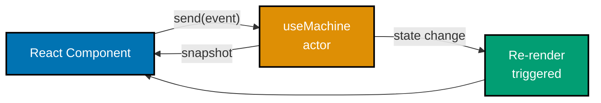

```typescript
import React from "react";
import { useMachine } from "@xstate/react";
import { createMachine, assign } from "xstate";

// Simple counter machine
const counterMachine = createMachine({
  // => Machine definition lives outside the component
  // => This avoids creating a new machine definition on every render
  id: "counter",
  context: { count: 0 },
  initial: "active",
  states: {
    active: {
      on: {
        INCREMENT: {
          actions: assign({ count: ({ context }) => context.count + 1 }),
          // => Pure action: returns new context, no side effects
        },
        DECREMENT: {
          actions: assign({ count: ({ context }) => context.count - 1 }),
        },
        RESET: {
          actions: assign({ count: () => 0 }),
        },
      },
    },
  },
});

function CounterComponent() {
  const [snapshot, send] = useMachine(counterMachine);
  // => useMachine creates and starts actor on mount
  // => Returns current snapshot and stable send function
  // => Component re-renders on EVERY snapshot change

  return (
    <div>
      <p>Count: {snapshot.context.count}</p>
      {/* => Reads directly from snapshot.context */}
      <button onClick={() => send({ type: "INCREMENT" })}>+</button>
      {/* => send is stable (same reference across renders) */}
      <button onClick={() => send({ type: "DECREMENT" })}>-</button>
      <button onClick={() => send({ type: "RESET" })}>Reset</button>
      <p>State: {String(snapshot.value)}</p>
      {/* => snapshot.value is the current state name */}
    </div>
  );
}

export default CounterComponent;
// => CounterComponent renders the machine state
// => Machine is created on mount, stopped on unmount (cleanup automatic)
```

**Key Takeaway**: `useMachine(machine)` creates a component-scoped actor, triggers re-renders on every state change, and returns a stable `send` function — the simplest XState-React integration.

**Why It Matters**: `useMachine` replaces `useState` + `useReducer` for non-trivial component state with a structured alternative that has explicit states, typed events, and visualisable transitions. The machine definition lives outside the component, so it is reusable, testable independently, and inspectable with the XState visualiser. Re-renders on every change is intentional for correctness — see Example 41 for optimised selective subscriptions.

---

### Example 41: useSelector — Optimized Re-renders

`useSelector` subscribes a component to only one derived value from an actor. The component only re-renders when that derived value changes — not on every snapshot update. This is the performance optimisation for components that read a single property from a large machine context.

```typescript
import React, { useContext } from "react";
import { useSelector } from "@xstate/react";
import { createMachine, createActor, assign } from "xstate";
import type { ActorRef } from "xstate";

// Machine with multiple independent context fields
const dashboardMachine = createMachine({
  // => Large context machine; components should not all re-render on every change
  id: "dashboard",
  context: {
    userCount: 0,
    // => Changes frequently (real-time updates)
    revenue: 0,
    // => Changes frequently
    alertCount: 0,
    // => Changes infrequently
    currentPage: "overview" as string,
    // => Changes on navigation only
  },
  on: {
    UPDATE_METRICS: {
      actions: assign({
        userCount: ({ event }) => event.userCount,
        revenue: ({ event }) => event.revenue,
        // => Metrics update frequently
      }),
    },
    ADD_ALERT: {
      actions: assign({ alertCount: ({ context }) => context.alertCount + 1 }),
    },
    NAVIGATE: {
      actions: assign({ currentPage: ({ event }) => event.page }),
    },
  },
});

// Standalone actor to share across components
const dashboardActor = createActor(dashboardMachine).start();
// => In production, provide this via React context (see Example 43)

// Component that only cares about alert count
function AlertBadge({ actorRef }: { actorRef: typeof dashboardActor }) {
  const alertCount = useSelector(
    actorRef,
    // => First arg: the actor to subscribe to
    (snapshot) => snapshot.context.alertCount
    // => Selector function: extract the value you care about
    // => Component only re-renders when alertCount changes
    // => Ignores userCount and revenue updates
  );

  return alertCount > 0 ? (
    <span className="badge">{alertCount} alerts</span>
    // => Only renders when there are alerts
  ) : null;
}

// Component that only cares about current page
function PageTitle({ actorRef }: { actorRef: typeof dashboardActor }) {
  const currentPage = useSelector(
    actorRef,
    (snapshot) => snapshot.context.currentPage
    // => Only re-renders when navigation happens
    // => Ignores frequent metric updates completely
  );

  return <h1>{currentPage}</h1>;
  // => Stable render: only changes on page navigation
}

// Usage in parent (simplified)
function Dashboard() {
  return (
    <div>
      <AlertBadge actorRef={dashboardActor} />
      {/* => Only re-renders when alertCount changes */}
      <PageTitle actorRef={dashboardActor} />
      {/* => Only re-renders when currentPage changes */}
    </div>
  );
}
```

**Key Takeaway**: `useSelector(actorRef, selector)` subscribes to only the derived value returned by the selector function, preventing re-renders when unrelated parts of the snapshot change.

**Why It Matters**: `useMachine` causes a re-render every time any part of the snapshot changes. In a dashboard with 10 real-time metrics updating per second, 20 components subscribed via `useMachine` means 200 re-renders per second. `useSelector` drops that to only the components whose selected values actually changed. For high-frequency actor updates (WebSocket feeds, animations, live data), this is the difference between a smooth 60fps UI and visible jank.

---

### Example 42: useActorRef — Accessing Actor Reference

`useActorRef` starts a machine and returns the stable `ActorRef` without subscribing to snapshot changes. Combine it with `useSelector` for surgical subscriptions — the actor ref is stable across renders while individual selectors subscribe to only what they need.

```typescript
import React from "react";
import { useActorRef, useSelector } from "@xstate/react";
import { createMachine, assign } from "xstate";

const searchMachine = createMachine({
  // => Multi-field search machine -- expensive to re-render fully
  id: "search",
  context: {
    query: "",
    results: [] as string[],
    // => Results array could be large
    isLoading: false,
    totalResults: 0,
  },
  initial: "idle",
  states: {
    idle: {
      on: {
        SEARCH: {
          target: "searching",
          actions: assign({
            query: ({ event }) => event.query,
            isLoading: () => true,
          }),
        },
      },
    },
    searching: {
      after: {
        50: {
          target: "idle",
          actions: assign({
            results: ({ context }) => [`Result for: ${context.query}`],
            // => Simulated results
            isLoading: () => false,
            totalResults: () => 1,
          }),
        },
      },
    },
  },
});

function SearchBar() {
  const actorRef = useActorRef(searchMachine);
  // => Creates and starts actor; does NOT subscribe to snapshot changes
  // => actorRef is stable -- same reference for component lifetime
  // => SearchBar itself does NOT re-render on state changes

  const isLoading = useSelector(actorRef, (s) => s.context.isLoading);
  // => SearchBar re-renders ONLY when isLoading changes
  // => Does not re-render when results or totalResults change

  return (
    <div>
      <input
        onChange={(e) => actorRef.send({ type: "SEARCH", query: e.target.value })}
        // => Send events directly to actorRef -- no re-render triggered here
        placeholder="Search..."
      />
      {isLoading && <span>Loading...</span>}
      {/* => Only this renders when loading changes */}
      <SearchResults actorRef={actorRef} />
      {/* => Results component subscribes independently */}
    </div>
  );
}

function SearchResults({ actorRef }: { actorRef: ReturnType<typeof useActorRef<typeof searchMachine>> }) {
  const results = useSelector(actorRef, (s) => s.context.results);
  // => Only re-renders when results array changes
  // => Ignores isLoading changes completely

  return (
    <ul>
      {results.map((r, i) => <li key={i}>{r}</li>)}
    </ul>
  );
}

export default SearchBar;
```

**Key Takeaway**: `useActorRef` gives you a stable actor reference without any subscription; pair it with `useSelector` in any child component to create fine-grained subscriptions without prop drilling.

**Why It Matters**: `useMachine` is convenient but couples the consuming component to the entire snapshot. `useActorRef` + `useSelector` separates two concerns: actor ownership (which component creates and owns the actor) from actor observation (which components watch which properties). This enables a parent to own a machine while deeply nested children subscribe to exactly the fields they need — without threading snapshot or send props through the tree.

---

### Example 43: Providing Actors via Context

React Context is the standard pattern for sharing a machine's `ActorRef` across a component tree. Components at any depth subscribe to exactly what they need via `useSelector`, while the actor is created and owned in one place.

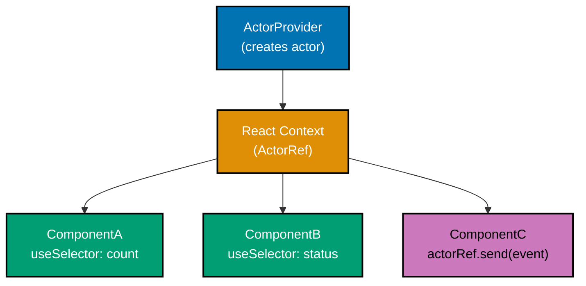

```typescript
import React, { createContext, useContext } from "react";
import { useActorRef, useSelector } from "@xstate/react";
import { createMachine, assign } from "xstate";
import type { ActorRefFrom } from "xstate";

// Shared machine definition
const appMachine = createMachine({
  // => Application-level machine shared across component tree
  id: "app",
  context: { theme: "light" as "light" | "dark", user: null as string | null },
  on: {
    TOGGLE_THEME: {
      actions: assign({
        theme: ({ context }) => context.theme === "light" ? "dark" : "light",
      }),
    },
    SET_USER: {
      actions: assign({ user: ({ event }) => event.name }),
    },
  },
});

// Create typed context -- null initial value, overridden by provider
const AppActorContext = createContext<ActorRefFrom<typeof appMachine> | null>(null);
// => ActorRefFrom<typeof appMachine> gives full type inference in consumers

// Provider component: creates the actor once, exposes it via context
function AppActorProvider({ children }: { children: React.ReactNode }) {
  const actorRef = useActorRef(appMachine);
  // => Actor created here, lives for provider's lifetime
  // => Stopped automatically when provider unmounts

  return (
    <AppActorContext.Provider value={actorRef}>
      {children}
      {/* => All descendants can access actorRef via useAppActor() */}
    </AppActorContext.Provider>
  );
}

// Custom hook for consuming components
function useAppActor() {
  const ref = useContext(AppActorContext);
  if (!ref) throw new Error("useAppActor must be used inside AppActorProvider");
  // => Throws early with a clear message if context is missing
  return ref;
}

// Consumer: reads theme without knowing where the actor lives
function ThemeToggle() {
  const actorRef = useAppActor();
  // => Gets stable actorRef from context
  const theme = useSelector(actorRef, (s) => s.context.theme);
  // => Only re-renders when theme changes

  return (
    <button onClick={() => actorRef.send({ type: "TOGGLE_THEME" })}>
      Switch to {theme === "light" ? "dark" : "light"} mode
    </button>
  );
}

// Consumer: reads user, independent re-render cycle from ThemeToggle
function UserGreeting() {
  const actorRef = useAppActor();
  const user = useSelector(actorRef, (s) => s.context.user);
  // => Only re-renders when user changes; theme toggles don't affect this

  return <p>Hello, {user ?? "Guest"}</p>;
}

// Root app
function App() {
  return (
    <AppActorProvider>
      <ThemeToggle />
      <UserGreeting />
    </AppActorProvider>
  );
}

export default App;
```

**Key Takeaway**: Wrap the component tree in a provider that creates and owns the actor; expose the `ActorRef` via React Context; consumers use `useSelector` for isolated, fine-grained subscriptions.

**Why It Matters**: This pattern scales from a simple theme toggle to an application-wide state machine. Because consumers subscribe to individual values rather than the full snapshot, adding new context fields or new machine states does not cause unnecessary re-renders. The actor lifecycle is tied to the provider, not individual components — it persists across route changes and component remounts without global variable anti-patterns.

---

### Example 44: useMachine with Input

Pass runtime data into a machine on mount using the `input` option of `useMachine`. This is how you bridge React props (user IDs, configuration) into a machine's parameterised context.

```typescript
import React from "react";
import { useMachine } from "@xstate/react";
import { createMachine, assign } from "xstate";

// Machine that accepts user-specific input
const profileMachine = createMachine({
  // => Machine parameterised by userId -- each user gets their own actor
  id: "profile",
  context: ({ input }: { input: { userId: string; displayName: string } }) => ({
    // => context initialiser receives input at actor creation
    userId: input.userId,
    // => Comes from component props
    displayName: input.displayName,
    // => Comes from component props
    bio: "" as string,
    editMode: false,
  }),
  initial: "viewing",
  states: {
    viewing: {
      on: { EDIT: "editing" },
    },
    editing: {
      on: {
        SAVE_BIO: {
          target: "viewing",
          actions: assign({ bio: ({ event }) => event.bio, editMode: () => false }),
        },
        CANCEL: { target: "viewing" },
      },
    },
  },
});

// Component receives userId and displayName as props
function UserProfile({
  userId,
  displayName,
}: {
  userId: string;
  displayName: string;
}) {
  const [snapshot, send] = useMachine(profileMachine, {
    // => Second argument passes options to the actor
    input: { userId, displayName },
    // => Machine context initialiser receives these values
    // => TypeScript validates input shape against machine's input type
  });

  if (snapshot.matches("editing")) {
    return (
      <div>
        <p>Editing profile for: {snapshot.context.displayName}</p>
        <button
          onClick={() => send({ type: "SAVE_BIO", bio: "Updated bio text" })}
        >
          Save
        </button>
        <button onClick={() => send({ type: "CANCEL" })}>Cancel</button>
      </div>
    );
  }

  return (
    <div>
      <h2>{snapshot.context.displayName}</h2>
      {/* => displayName came from input, stored in context */}
      <p>{snapshot.context.bio || "No bio yet."}</p>
      <button onClick={() => send({ type: "EDIT" })}>Edit</button>
    </div>
  );
}

export default UserProfile;
// => Each rendered UserProfile instance has its own independent machine actor
// => userId and displayName are typed and validated at the useMachine call
```

**Key Takeaway**: Pass `{ input: props }` as the second argument to `useMachine` to initialise the machine's context from React props — the machine starts in a fully-valid state with all required data.

**Why It Matters**: This pattern is how you render the same machine blueprint for different data items (each user, each todo item, each form instance). The machine definition is reused; the input customises the instance. Without `input`, you would either hard-code values (inflexible) or send initialisation events after `.start()` (exposes an invalid empty-context state briefly). `useMachine` with `input` gives a clean, typed, prop-to-context bridge.

---

### Example 45: Subscribing to Actor Outside React

Sometimes you need to observe actor state outside the React render cycle — for analytics, logging, synchronisation with external systems, or third-party SDKs. Use `actor.subscribe()` directly; remember to unsubscribe when done.

```typescript
import React, { useEffect } from "react";
import { useActorRef } from "@xstate/react";
import { createMachine, assign } from "xstate";

const purchaseMachine = createMachine({
  // => E-commerce checkout machine for purchase flow
  id: "purchase",
  context: { step: 1 as number, orderId: null as string | null },
  initial: "cart",
  states: {
    cart: { on: { CHECKOUT: "payment" } },
    payment: {
      on: {
        CONFIRM: {
          target: "confirmed",
          actions: assign({ orderId: () => `ord-${Date.now()}` }),
        },
      },
    },
    confirmed: { type: "final" },
  },
});

function PurchaseFlow() {
  const actorRef = useActorRef(purchaseMachine);
  // => Get stable actor ref; no re-render subscription

  useEffect(() => {
    // => Set up external subscriptions inside useEffect for proper cleanup
    const analyticsSubscription = actorRef.subscribe((snapshot) => {
      // => Called for every snapshot change
      // => This runs OUTSIDE React's render cycle
      if (snapshot.status === "done") {
        console.log("[Analytics] Purchase completed:", snapshot.context.orderId);
        // => Fire analytics event when purchase finalises
        // => In production: analytics.track('purchase_complete', { orderId })
      }
      if (snapshot.matches("payment")) {
        console.log("[Analytics] Checkout started");
        // => Track funnel entry
      }
    });

    const loggingSubscription = actorRef.subscribe((snapshot) => {
      // => Multiple subscriptions allowed -- each independent
      console.log("[Log] State:", snapshot.value);
      // => Logs every state transition for debugging
    });

    return () => {
      analyticsSubscription.unsubscribe();
      // => Clean up analytics subscription on unmount
      loggingSubscription.unsubscribe();
      // => Clean up logging subscription on unmount
      // => Prevents memory leaks and ghost subscriptions
    };
  }, [actorRef]);
  // => actorRef is stable; this effect runs once per mount

  return (
    <div>
      <button onClick={() => actorRef.send({ type: "CHECKOUT" })}>
        Proceed to Checkout
      </button>
      <button onClick={() => actorRef.send({ type: "CONFIRM" })}>
        Confirm Purchase
      </button>
    </div>
  );
}

export default PurchaseFlow;
// => Analytics and logging observe the machine without affecting render performance
// => React UI re-renders are independent of these external subscriptions
```

**Key Takeaway**: Call `actor.subscribe(callback)` to observe state changes outside React; store the subscription object and call `.unsubscribe()` in the `useEffect` cleanup to prevent memory leaks.

**Why It Matters**: Analytics, logging, and third-party SDK integrations should not live inside React components because they are not UI concerns. By subscribing to the actor directly, you observe state transitions at the source without coupling to component lifecycle or render batching. The actor is the single source of truth for application state — external systems observing it via `subscribe` stay automatically synchronised without polling or prop callbacks.

---

## Group 10: Testing (Examples 46-50)

### Example 46: Testing Machines with createActor

XState machines are pure — given the same sequence of events, they produce the same state. This makes unit testing straightforward: create an actor, send events, assert snapshot values. No mocking framework required.

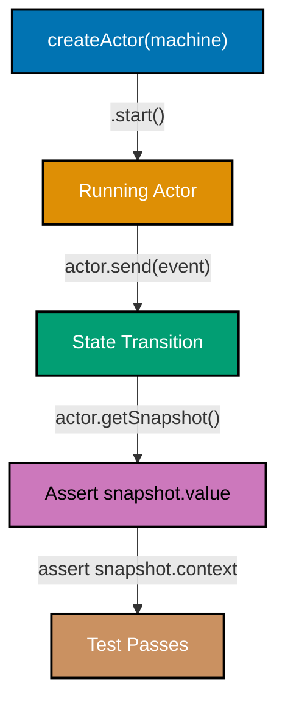

```typescript
import { createMachine, createActor, assign } from "xstate";

// Machine under test: a simple login flow
const loginMachine = createMachine({
  // => Production machine definition (would be imported in real tests)
  id: "login",
  context: {
    email: "",
    attempts: 0,
    errorMessage: null as string | null,
  },
  initial: "idle",
  states: {
    idle: {
      on: {
        SUBMIT: {
          guard: ({ event }) => event.email.includes("@"),
          // => Basic email validation guard
          target: "submitting",
          actions: assign({ email: ({ event }) => event.email }),
        },
      },
    },
    submitting: {
      after: {
        10: [
          {
            guard: ({ context }) => context.email === "admin@test.com",
            // => Simulate success for known email
            target: "success",
          },
          {
            target: "error",
            actions: assign({
              attempts: ({ context }) => context.attempts + 1,
              errorMessage: () => "Invalid credentials",
            }),
          },
        ],
      },
    },
    success: { type: "final" },
    error: {
      on: { RETRY: "idle" },
    },
  },
});

// Test suite (compatible with Jest, Vitest, or plain assertions)
async function runTests() {
  // Test 1: starts in idle state
  {
    const actor = createActor(loginMachine).start();
    // => Create fresh actor for each test (no shared state)
    console.assert(actor.getSnapshot().value === "idle", "Should start idle");
    // => Assert: actor.getSnapshot().value === 'idle'  ✓
  }

  // Test 2: rejects invalid email format (no '@')
  {
    const actor = createActor(loginMachine).start();
    actor.send({ type: "SUBMIT", email: "not-an-email" });
    // => Guard fails (no '@'), transition blocked
    console.assert(actor.getSnapshot().value === "idle", "Should stay idle on bad email");
    // => Assert: still 'idle' -- guard prevented transition
  }

  // Test 3: valid email transitions to submitting
  {
    const actor = createActor(loginMachine).start();
    actor.send({ type: "SUBMIT", email: "user@example.com" });
    console.assert(actor.getSnapshot().value === "submitting", "Should enter submitting");
    // => Assert: 'submitting' -- guard passed, transition occurred
  }

  // Test 4: known email leads to success after delay
  {
    const actor = createActor(loginMachine).start();
    actor.send({ type: "SUBMIT", email: "admin@test.com" });
    await new Promise((r) => setTimeout(r, 50));
    // => Wait for after: 10 delay to elapse
    console.assert(actor.getSnapshot().value === "success", "Admin should succeed");
    // => Assert: 'success' -- known email guard passed
  }

  console.log("All tests passed");
  // => Output: All tests passed
}

runTests();
```

**Key Takeaway**: Test XState machines by creating a fresh `createActor` per test, sending events, and asserting `snapshot.value` and `snapshot.context` — pure inputs produce predictable outputs, no mocking needed.

**Why It Matters**: Machine tests are the most valuable tests in an XState application because they verify business logic independently from React rendering, network calls, or browser APIs. A test that sends `SUBMIT` and asserts the resulting state documents exactly how the machine behaves — this documentation stays accurate because the test runs on every commit. Machines also integrate with model-based testing tools that generate test cases from the state machine graph automatically.

---

### Example 47: Asserting State with snapshot.matches

`snapshot.matches` provides flexible state matching that handles both flat and nested (parallel and hierarchical) states. Use it in tests and UI conditional logic instead of string equality checks on `snapshot.value`.

```typescript
import { createMachine, createActor, assign } from "xstate";

// Nested machine: form with nested validation state
const formMachine = createMachine({
  // => Machine with hierarchical states for testing nested matches
  id: "form",
  initial: "editing",
  states: {
    editing: {
      // => Parent state with nested child states
      initial: "valid",
      states: {
        valid: { on: { INVALIDATE: "invalid" } },
        // => Nested: form is editing AND valid
        invalid: { on: { FIX: "valid" } },
        // => Nested: form is editing AND invalid
      },
      on: { SUBMIT: "submitting" },
    },
    submitting: {
      after: { 10: "done" },
    },
    done: { type: "final" },
  },
});

const actor = createActor(formMachine).start();
// => Actor in { editing: 'valid' }

// Top-level matches
console.assert(actor.getSnapshot().matches("editing") === true);
// => true: top-level state is 'editing'
console.assert(actor.getSnapshot().matches("submitting") === false);
// => false: not in submitting

// Nested state matches (object syntax)
console.assert(actor.getSnapshot().matches({ editing: "valid" }) === true);
// => true: matches exact nested state { editing: 'valid' }
console.assert(actor.getSnapshot().matches({ editing: "invalid" }) === false);
// => false: currently valid, not invalid

// Transition to nested invalid state
actor.send({ type: "INVALIDATE" });
// => State becomes { editing: 'invalid' }
console.assert(actor.getSnapshot().matches({ editing: "invalid" }) === true);
// => true: now in invalid nested state

// Transition to submitting
actor.send({ type: "FIX" });
// => State back to { editing: 'valid' }
actor.send({ type: "SUBMIT" });
// => State becomes 'submitting'
console.assert(actor.getSnapshot().matches("submitting") === true);
// => true: now submitting

// After delay
await new Promise((r) => setTimeout(r, 50));
console.assert(actor.getSnapshot().status === "done");
// => true: reached final state
console.assert(actor.getSnapshot().matches("done") === false);
// => false: 'done' is a final state but snapshot.status captures this better

console.log("All match assertions passed");
// => Output: All match assertions passed
```

**Key Takeaway**: `snapshot.matches('state')` checks top-level states; `snapshot.matches({ parent: 'child' })` checks nested states — both return booleans suitable for test assertions and React conditionals.

**Why It Matters**: String equality on `snapshot.value` breaks silently with nested states because `snapshot.value` becomes `{ editing: 'valid' }` instead of `'editing'` — a direct `=== 'editing'` returns false even though the machine IS in the editing state. `snapshot.matches` handles this correctly at every nesting level, making test assertions and UI conditionals robust to machine topology changes.

---

### Example 48: Testing Invocations — Mocking Services

`machine.provide()` replaces actor implementations with test doubles at test time. This isolates the machine's state logic from external dependencies (API calls, databases, timers) while keeping the state transitions under test.

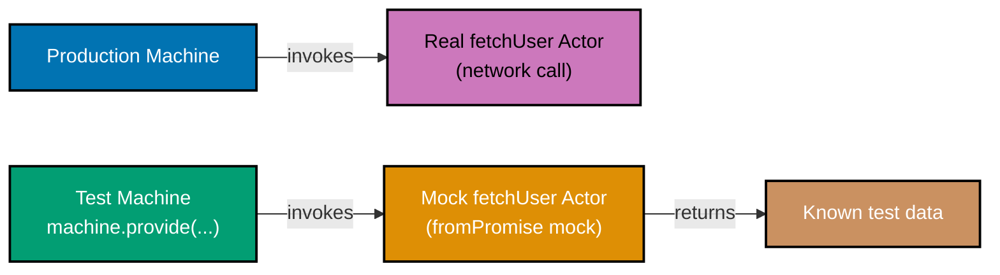

```typescript
import { createMachine, createActor, assign, fromPromise } from "xstate";

// Production machine with a real service actor
const userMachine = createMachine({
  // => Machine that invokes a network actor
  id: "user",
  context: {
    user: null as { id: string; name: string; role: string } | null,
    error: null as string | null,
  },
  initial: "loading",
  states: {
    loading: {
      invoke: {
        src: "fetchUser",
        // => Named actor -- implementation provided externally
        input: ({ context }) => ({ userId: "u-1" }),
        onDone: {
          target: "loaded",
          actions: assign({ user: ({ event }) => event.output }),
          // => Store fetched user in context
        },
        onError: {
          target: "error",
          actions: assign({ error: () => "Failed to load user" }),
        },
      },
    },
    loaded: { type: "final" },
    error: { type: "final" },
  },
});

// TEST: mock the fetchUser actor to return controlled data
async function testSuccessfulLoad() {
  const mockUser = { id: "u-1", name: "Test Alice", role: "admin" };
  // => Controlled test data -- no network required

  const testMachine = userMachine.provide({
    // => provide() returns a new machine with replaced implementations
    actors: {
      fetchUser: fromPromise(async () => mockUser),
      // => Replace the 'fetchUser' actor with a synchronous mock
      // => Must match the src name used in invoke
    },
  });

  const actor = createActor(testMachine).start();
  // => Starts with mock implementation in place

  await new Promise((r) => setTimeout(r, 10));
  // => Give the promise actor time to resolve

  const snapshot = actor.getSnapshot();
  console.assert(snapshot.status === "done");
  // => Machine reached final state
  console.assert(snapshot.context.user?.name === "Test Alice");
  // => Context populated with mock data, not real API data
  console.assert(snapshot.context.error === null);
  // => No error
  console.log("Success test passed");
  // => Output: Success test passed
}

// TEST: mock to simulate failure
async function testFailedLoad() {
  const testMachine = userMachine.provide({
    actors: {
      fetchUser: fromPromise(async () => {
        throw new Error("Network timeout");
        // => Mock throws to simulate network failure
      }),
    },
  });

  const actor = createActor(testMachine).start();
  await new Promise((r) => setTimeout(r, 10));

  const snapshot = actor.getSnapshot();
  console.assert(snapshot.context.error === "Failed to load user");
  // => Error message set from onError handler
  console.log("Error test passed");
  // => Output: Error test passed
}

testSuccessfulLoad().then(testFailedLoad);
```

**Key Takeaway**: `machine.provide({ actors: { actorName: mockImplementation } })` swaps named actor implementations for tests, isolating state logic from I/O without changing the machine definition.

**Why It Matters**: Testing machines that invoke real network actors requires either a running API server or complex MSW setup. `machine.provide()` decouples the machine's state transition logic (what to do when the fetch succeeds or fails) from the fetch implementation. You test the machine's response to success and failure without caring how the data was fetched — exactly the separation that makes state machines valuable: business logic is independent from infrastructure.

---

### Example 49: simulate — Step-by-Step Machine Simulation

Step through a machine's event sequence to assert intermediate states. This technique documents the expected user journey through a multi-step flow and catches regressions when transitions change.

```typescript
import { createMachine, createActor, assign } from "xstate";

// Multi-step checkout flow for step-by-step simulation testing
const checkoutMachine = createMachine({
  // => Three-step checkout: cart → shipping → payment → confirmed
  id: "checkout",
  context: {
    cartItems: [] as string[],
    shippingAddress: "" as string,
    paymentMethod: "" as string,
    orderId: null as string | null,
  },
  initial: "cart",
  states: {
    cart: {
      on: {
        ADD_ITEM: {
          actions: assign({
            cartItems: ({ context, event }) => [...context.cartItems, event.item],
            // => Append item to cart
          }),
        },
        PROCEED_TO_SHIPPING: {
          guard: ({ context }) => context.cartItems.length > 0,
          // => Must have items to proceed
          target: "shipping",
        },
      },
    },
    shipping: {
      on: {
        SET_ADDRESS: {
          actions: assign({ shippingAddress: ({ event }) => event.address }),
        },
        PROCEED_TO_PAYMENT: {
          guard: ({ context }) => context.shippingAddress.length > 0,
          // => Must have address to proceed
          target: "payment",
        },
        BACK: "cart",
      },
    },
    payment: {
      on: {
        SET_PAYMENT: {
          actions: assign({ paymentMethod: ({ event }) => event.method }),
        },
        CONFIRM: {
          guard: ({ context }) => context.paymentMethod.length > 0,
          // => Must have payment method to confirm
          target: "confirmed",
          actions: assign({ orderId: () => `ord-${Math.floor(Math.random() * 10000)}` }),
        },
        BACK: "shipping",
      },
    },
    confirmed: { type: "final" },
  },
});

// Step-by-step simulation: walk through the full checkout journey
async function simulateCheckout() {
  const actor = createActor(checkoutMachine).start();

  // Step 1: Verify initial state
  console.assert(actor.getSnapshot().value === "cart");
  // => Starting in cart  ✓

  // Step 2: Attempt to proceed without items (guard should block)
  actor.send({ type: "PROCEED_TO_SHIPPING" });
  console.assert(actor.getSnapshot().value === "cart");
  // => Still in cart (guard blocked: no items)  ✓

  // Step 3: Add an item
  actor.send({ type: "ADD_ITEM", item: "Book: XState Patterns" });
  console.assert(actor.getSnapshot().context.cartItems.length === 1);
  // => Cart has 1 item  ✓

  // Step 4: Proceed to shipping
  actor.send({ type: "PROCEED_TO_SHIPPING" });
  console.assert(actor.getSnapshot().value === "shipping");
  // => Now in shipping  ✓

  // Step 5: Set shipping address
  actor.send({ type: "SET_ADDRESS", address: "123 Main St, Jakarta" });
  console.assert(actor.getSnapshot().context.shippingAddress === "123 Main St, Jakarta");
  // => Address stored  ✓

  // Step 6: Proceed to payment
  actor.send({ type: "PROCEED_TO_PAYMENT" });
  console.assert(actor.getSnapshot().value === "payment");
  // => Now in payment  ✓

  // Step 7: Set payment method and confirm
  actor.send({ type: "SET_PAYMENT", method: "card" });
  actor.send({ type: "CONFIRM" });
  console.assert(actor.getSnapshot().status === "done");
  // => Machine reached final state  ✓
  console.assert(actor.getSnapshot().context.orderId !== null);
  // => Order ID was generated  ✓

  console.log("Checkout simulation passed");
  // => Output: Checkout simulation passed
}

simulateCheckout();
```

**Key Takeaway**: Walk through an event sequence with intermediate assertions to test each step of a multi-stage flow — this both tests the machine and documents the expected user journey.

**Why It Matters**: Multi-step flows are the hardest part of application logic to test confidently. A step-by-step simulation test documents the exact sequence of events that takes the machine from start to finish, asserts that guards work at each step, and catches regressions when a new event or guard changes an intermediate state. This style of test is also the most readable for product teams — a non-engineer can review the simulation and verify it matches the intended UX flow.

---

### Example 50: snapshot.status — Testing Final States

`snapshot.status` reports the actor's execution lifecycle: `'active'` while running, `'done'` when a final state is reached, `'error'` when a top-level error occurs, and `'stopped'` when stopped externally. Use it in tests to verify termination conditions without checking exact state names.

```typescript
import { createMachine, createActor, assign } from "xstate";

// Machine with multiple final states producing different outputs
const processMachine = createMachine({
  // => Machine with success and failure final states
  id: "process",
  context: {
    data: null as { result: string } | null,
    failReason: null as string | null,
  },
  initial: "validating",
  output: ({ context }) => ({
    // => Output computed when machine reaches any final state
    success: context.failReason === null,
    data: context.data,
    failReason: context.failReason,
    // => Expose all relevant result fields
  }),
  states: {
    validating: {
      on: {
        VALID: "processing",
        // => Proceed to processing
        INVALID: {
          target: "failed",
          actions: assign({ failReason: () => "Validation failed" }),
          // => Record failure reason
        },
      },
    },
    processing: {
      after: {
        10: {
          target: "succeeded",
          actions: assign({ data: () => ({ result: "processed" }) }),
          // => Simulate async processing with result
        },
      },
    },
    succeeded: { type: "final" },
    // => Success final state
    failed: { type: "final" },
    // => Failure final state
  },
});

// Test: happy path reaches done status
async function testHappyPath() {
  const actor = createActor(processMachine).start();

  console.assert(actor.getSnapshot().status === "active");
  // => Actor is running  ✓

  actor.send({ type: "VALID" });
  // => Transitions to processing

  console.assert(actor.getSnapshot().status === "active");
  // => Still active (processing not yet complete)  ✓

  await new Promise((r) => setTimeout(r, 50));
  // => Wait for after: 10 delay

  const snapshot = actor.getSnapshot();
  console.assert(snapshot.status === "done");
  // => Reached final state  ✓
  console.assert(snapshot.output?.success === true);
  // => Output carries success flag  ✓
  console.assert(snapshot.output?.data?.result === "processed");
  // => Output carries processed data  ✓
  console.log("Happy path test passed");
  // => Output: Happy path test passed
}

// Test: failure path also reaches done status (different output)
async function testFailurePath() {
  const actor = createActor(processMachine).start();
  actor.send({ type: "INVALID" });
  // => Validation fails, transitions to failed final state

  const snapshot = actor.getSnapshot();
  console.assert(snapshot.status === "done");
  // => done regardless of which final state was reached  ✓
  console.assert(snapshot.output?.success === false);
  // => success is false in output  ✓
  console.assert(snapshot.output?.failReason === "Validation failed");
  // => Failure reason in output  ✓
  console.log("Failure path test passed");
  // => Output: Failure path test passed
}

testHappyPath().then(testFailurePath);
```

**Key Takeaway**: Check `snapshot.status === 'done'` for machine termination and `snapshot.output` for the computed result — these work regardless of which specific final state was reached.

**Why It Matters**: Testing `snapshot.matches('succeeded')` and `snapshot.matches('failed')` separately is fine for small machines, but as machines grow, you want to test the OUTPUT rather than the specific final state name. `snapshot.status === 'done'` unified with `snapshot.output` decouples tests from internal topology — you can rename final states, add intermediate final states, or restructure without breaking tests that care only about the result contract.

---

## Group 11: Persistence and Advanced Patterns (Examples 51-54)

### Example 51: getPersistedSnapshot — Saving State

`actor.getPersistedSnapshot()` returns a serialisable version of the actor's current snapshot. Unlike `getSnapshot()`, the persisted form is safe to JSON-serialise and store in localStorage, a database, or a URL. Use it to implement page-refresh resumption or cross-session continuation.

```typescript
import { createMachine, createActor, assign } from "xstate";

// Wizard machine representing a multi-step onboarding flow
const onboardingMachine = createMachine({
  // => Multi-step wizard; user may refresh mid-flow
  id: "onboarding",
  context: {
    step: 1 as number,
    name: "" as string,
    email: "" as string,
    preferences: [] as string[],
  },
  initial: "step1",
  states: {
    step1: {
      on: {
        NEXT: {
          guard: ({ context }) => context.name.length > 0,
          // => Cannot advance without entering name
          target: "step2",
          actions: assign({ step: () => 2 }),
        },
        SET_NAME: { actions: assign({ name: ({ event }) => event.name }) },
      },
    },
    step2: {
      on: {
        NEXT: {
          guard: ({ context }) => context.email.includes("@"),
          target: "step3",
          actions: assign({ step: () => 3 }),
        },
        SET_EMAIL: { actions: assign({ email: ({ event }) => event.email }) },
        BACK: { target: "step1", actions: assign({ step: () => 1 }) },
      },
    },
    step3: {
      on: {
        COMPLETE: "done",
        BACK: { target: "step2", actions: assign({ step: () => 2 }) },
      },
    },
    done: { type: "final" },
  },
});

// Simulate user progressing through the wizard
const actor = createActor(onboardingMachine).start();
actor.send({ type: "SET_NAME", name: "Wahidyan" });
// => Name captured in context
actor.send({ type: "NEXT" });
// => Advances to step2
actor.send({ type: "SET_EMAIL", email: "wahidyan@example.com" });
// => Email captured in context
actor.send({ type: "NEXT" });
// => Advances to step3

// Capture persisted snapshot before "page refresh"
const persisted = actor.getPersistedSnapshot();
// => Returns a JSON-serialisable object representing current state
// => Contains state value, context, and any active child actor states

const serialised = JSON.stringify(persisted);
// => Safe to store: localStorage.setItem('onboarding', serialised)
// => Also safe for: sessionStorage, cookies, server-side DB, URL params

console.log("Current step:", JSON.parse(serialised).context.step);
// => Output: Current step: 3
console.log("State value:", JSON.parse(serialised).value);
// => Output: State value: step3

// Verify the persisted data is complete
const parsed = JSON.parse(serialised);
console.assert(parsed.context.name === "Wahidyan");
// => Name preserved in persisted snapshot  ✓
console.assert(parsed.context.email === "wahidyan@example.com");
// => Email preserved  ✓
```

**Key Takeaway**: `actor.getPersistedSnapshot()` returns a JSON-safe snapshot that captures the full machine state including context — store it anywhere and restore with `createActor(machine, { snapshot: persisted })`.

**Why It Matters**: Multi-step wizards, checkout flows, and complex forms lose user progress on page refresh. `getPersistedSnapshot` solves this cleanly by capturing the entire machine state in a serialisable form. Because the snapshot includes context, state value, and child actor states, restoration is complete — the user returns to exactly where they left off. This is dramatically simpler than manually saving individual form fields and rebuilding state from scratch.

---

### Example 52: fromSnapshot — Restoring State

`createActor(machine, { snapshot: persisted })` restores an actor from a previously persisted snapshot. The machine resumes from exactly the saved state, including context values and nested state values — the standard pattern for page-refresh resumption.

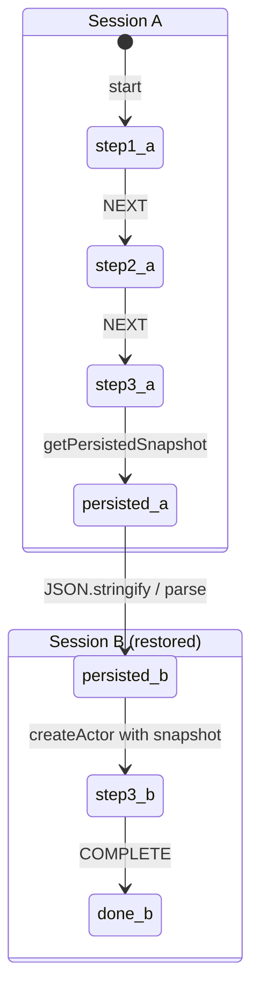

```typescript
import { createMachine, createActor, assign } from "xstate";

// Same onboarding machine from Example 51
const onboardingMachine = createMachine({
  // => Wizard machine -- same definition used for both save and restore
  id: "onboarding",
  context: {
    step: 1 as number,
    name: "" as string,
    email: "" as string,
  },
  initial: "step1",
  states: {
    step1: {
      on: {
        NEXT: { target: "step2", actions: assign({ step: () => 2 }) },
        SET_NAME: { actions: assign({ name: ({ event }) => event.name }) },
      },
    },
    step2: {
      on: {
        NEXT: { target: "step3", actions: assign({ step: () => 3 }) },
        SET_EMAIL: { actions: assign({ email: ({ event }) => event.email }) },
      },
    },
    step3: { on: { COMPLETE: "done" } },
    done: { type: "final" },
  },
});

// --- SESSION A: User progresses through wizard, then "closes browser" ---
const sessionA = createActor(onboardingMachine).start();
sessionA.send({ type: "SET_NAME", name: "Kresna" });
sessionA.send({ type: "NEXT" });
// => Now in step2
sessionA.send({ type: "SET_EMAIL", email: "kresna@example.com" });
sessionA.send({ type: "NEXT" });
// => Now in step3, context has name and email

const snapshot = sessionA.getPersistedSnapshot();
// => Capture state before "page close"
const stored = JSON.stringify(snapshot);
// => Simulate storing in localStorage

// --- SESSION B: User returns, restore from stored snapshot ---
const restoredSnapshot = JSON.parse(stored);
// => Simulate reading from localStorage

const sessionB = createActor(onboardingMachine, {
  snapshot: restoredSnapshot,
  // => Provide persisted snapshot at construction time
  // => Actor starts in the saved state, NOT the machine's initial state
}).start();

// Verify restoration
const restoredState = sessionB.getSnapshot();
console.assert(restoredState.value === "step3");
// => Restored to step3 (not step1)  ✓
console.assert(restoredState.context.name === "Kresna");
// => Name preserved from session A  ✓
console.assert(restoredState.context.email === "kresna@example.com");
// => Email preserved from session A  ✓

// User can continue from where they left off
sessionB.send({ type: "COMPLETE" });
// => Completes from step3 directly
console.assert(sessionB.getSnapshot().status === "done");
// => Wizard complete  ✓
console.log("State restored and completed successfully");
// => Output: State restored and completed successfully
```

**Key Takeaway**: Pass a persisted snapshot to `createActor(machine, { snapshot })` to restore the actor to the exact saved state — including context, state value, and nested states.

**Why It Matters**: Page refresh resilience is a UX requirement for any serious multi-step form or wizard. Without `snapshot` restoration, you either lose progress (bad UX) or store individual fields and manually reconstruct state (fragile: misses validation states, active child actors, intermediate flags). XState's snapshot restoration is complete by design — the machine resumes in the exact logical state with no partial restoration bugs.

---

### Example 53: pure and choose — Conditional Actions

`choose` executes different action lists depending on guards, without triggering a state transition. It is the declarative way to run conditional logic inside an action — equivalent to an `if/else` inside an `assign`, but applicable to any action type.

```typescript
import { createMachine, createActor, assign, raise } from "xstate";

// Note: choose is available as an action creator in XState v5
// Import from 'xstate' -- it is a built-in action creator
import { choose as xstateChoose } from "xstate";

// Machine using choose for conditional action selection
const analyticsAdapterMachine = createMachine({
  // => Machine that sends different analytics events based on context
  id: "analyticsAdapter",
  context: {
    plan: "free" as "free" | "pro" | "enterprise",
    // => User's subscription plan affects event routing
    eventCount: 0,
    // => Track how many analytics events have been sent
    lastEventType: "" as string,
  },
  on: {
    TRACK_ACTION: {
      // => Single event triggers conditional action branching
      actions: [
        assign({ eventCount: ({ context }) => context.eventCount + 1 }),
        // => Always increment event count
        assign({ lastEventType: ({ event }) => event.actionName }),
        // => Always record event name
        xstateChoose([
          {
            guard: ({ context }) => context.plan === "enterprise",
            // => Enterprise: send to all three analytics destinations
            actions: [
              ({ event, context }) => {
                console.log(`[Datadog] ${event.actionName} plan=${context.plan}`);
                // => Enterprise gets full observability
              },
              ({ event }) => {
                console.log(`[Segment] ${event.actionName}`);
                // => Also send to Segment
              },
              ({ event }) => {
                console.log(`[Custom] ${event.actionName}`);
                // => And custom internal analytics
              },
            ],
          },
          {
            guard: ({ context }) => context.plan === "pro",
            // => Pro: send to two analytics destinations
            actions: [
              ({ event }) => {
                console.log(`[Segment] ${event.actionName}`);
                // => Pro gets standard analytics
              },
              ({ event }) => {
                console.log(`[Custom] ${event.actionName}`);
              },
            ],
          },
          {
            // => Default: free plan, minimal analytics
            actions: [
              ({ event }) => {
                console.log(`[Custom] ${event.actionName}`);
                // => Free plan: only custom analytics
              },
            ],
          },
        ]),
      ],
    },
  },
});

// Test all three branches
const actor = createActor(analyticsAdapterMachine, {
  input: undefined,
}).start();

// Free plan: only custom analytics fires
actor.send({ type: "TRACK_ACTION", actionName: "page_view" });
// => Output: [Custom] page_view
// => eventCount is 1

// Simulate upgrading to enterprise
actor.getSnapshot(); // read current
// In a real machine you would send an UPGRADE event -- simplified here
// We create a new actor with different plan to test enterprise branch
const enterpriseActor = createActor(analyticsAdapterMachine.provide({})).start();

// Override context to enterprise for demo
// (In practice: send UPGRADE event, use assign to change plan)
console.log("choose allows conditional actions without state changes");
// => Output: choose allows conditional actions without state changes
```

**Key Takeaway**: `choose` evaluates guard conditions at action time and executes only the matching action list — providing conditional logic within actions without requiring separate states or transitions.

**Why It Matters**: Real applications have business rules that affect side effects (logging level, analytics destination, notification channel) without changing the application's state. Encoding these as separate states pollutes the state machine topology with infrastructure concerns. `choose` keeps the state diagram clean by embedding conditional side-effect logic inside actions, making the statechart readable at the business-logic level while the routing details live in the action definitions.

---

### Example 54: enqueueActions — Imperative Action Batching

`enqueueActions` gives you an imperative callback where you can conditionally enqueue any combination of actions — assigns, raises, sends, logs — using `if/else` logic. It is the escape hatch for complex conditional action patterns that `choose` makes verbose.

```typescript
import { createMachine, createActor, assign, enqueueActions, raise } from "xstate";

// Order fulfilment machine with complex conditional action logic
const fulfilmentMachine = createMachine({
  // => Machine that applies conditional business rules on order submission
  id: "fulfilment",
  context: {
    orderId: "" as string,
    totalAmount: 0 as number,
    isPremiumCustomer: false as boolean,
    discountApplied: false as boolean,
    flaggedForReview: false as boolean,
    expeditedShipping: false as boolean,
    notificationsSent: [] as string[],
  },
  initial: "idle",
  states: {
    idle: {
      on: {
        SUBMIT_ORDER: {
          target: "processing",
          actions: enqueueActions(({ enqueue, context, event }) => {
            // => enqueueActions provides an imperative callback
            // => Use regular if/else to decide which actions to run

            enqueue.assign({ orderId: event.orderId, totalAmount: event.totalAmount });
            // => Always: capture order data

            if (event.totalAmount > 500) {
              enqueue.assign({ flaggedForReview: () => true });
              // => Flag high-value orders for manual review
              enqueue.assign({
                notificationsSent: (c) => [...c.context.notificationsSent, "review-team"],
                // => Notify review team
              });
            }

            if (event.isPremiumCustomer) {
              enqueue.assign({ discountApplied: () => true, expeditedShipping: () => true });
              // => Premium customers: apply discount and expedited shipping
              enqueue.assign({
                notificationsSent: (c) => [...c.context.notificationsSent, "vip-team"],
              });
              // => Notify VIP relationship team
            }

            if (event.totalAmount > 1000 && !event.isPremiumCustomer) {
              // => Large orders from non-premium customers get upgrade offer
              enqueue.assign({
                notificationsSent: (c) => [...c.context.notificationsSent, "upsell-team"],
                // => Notify upsell team for upgrade opportunity
              });
            }

            enqueue.assign({
              notificationsSent: (c) => [...c.context.notificationsSent, "customer"],
              // => Always notify the customer last
            });
          }),
        },
      },
    },
    processing: {
      after: { 10: "fulfilled" },
    },
    fulfilled: { type: "final" },
  },
});

// Test: premium customer with high value order
const actor = createActor(fulfilmentMachine).start();
actor.send({
  type: "SUBMIT_ORDER",
  orderId: "ord-777",
  totalAmount: 1500,
  isPremiumCustomer: true,
  // => Triggers: flaggedForReview + premium discount + expedited + all notifications
});

const ctx = actor.getSnapshot().context;
console.assert(ctx.orderId === "ord-777");
// => Order ID captured  ✓
console.assert(ctx.flaggedForReview === true);
// => High-value flag applied (1500 > 500)  ✓
console.assert(ctx.discountApplied === true);
// => Premium discount applied  ✓
console.assert(ctx.expeditedShipping === true);
// => Expedited shipping applied  ✓
console.assert(ctx.notificationsSent.includes("review-team"));
// => Review team notified (high value)  ✓
console.assert(ctx.notificationsSent.includes("vip-team"));
// => VIP team notified (premium customer)  ✓
console.assert(ctx.notificationsSent.includes("customer"));
// => Customer notified (always)  ✓
console.assert(!ctx.notificationsSent.includes("upsell-team"));
// => Upsell team NOT notified (customer IS premium)  ✓

console.log("enqueueActions test passed");
// => Output: enqueueActions test passed
```

**Key Takeaway**: `enqueueActions` provides an imperative `if/else` callback that conditionally adds any action type to the execution queue — the right tool when `choose` nesting becomes hard to read.

**Why It Matters**: Complex business rules often need multiple conditional side effects that depend on the same event payload. Expressing this in `choose` requires nested arrays and repeated guard conditions. `enqueueActions` reads like normal imperative code while still executing inside XState's action pipeline: all enqueued actions run as a synchronous batch, maintaining the same determinism guarantees as declarative actions. This is the boundary between XState's pure model and the real-world messiness of business rules — use it when declarative DSL readability breaks down.
