This tutorial covers intermediate XState v5 patterns through 27 annotated examples. You will master the actor model (promise, callback, observable, reducer, and spawned actors), machine input and output, React integration with `@xstate/react`, model-based testing, persistence, and imperative action batching — the patterns used every day in production XState applications.

## Group 7: The Actor Model (Examples 28-35)

### Example 28: Actors vs Machines — The Actor Model

In XState v5, every running state machine is an actor. Actors are isolated units of computation that communicate exclusively by sending events to each other — they share no mutable state. A machine is one specialised kind of actor, but the system also supports promise actors, callback actors, observable actors, and reducer actors.

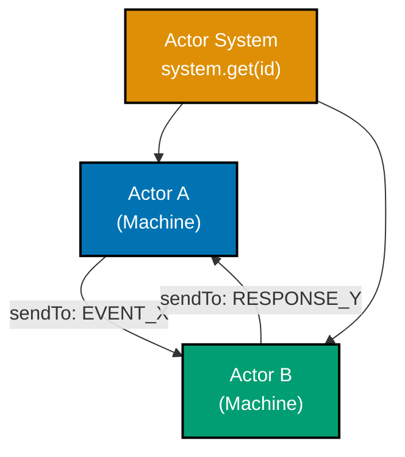

```typescript
import { createMachine, createActor, sendTo, assign } from "xstate";
// => createMachine: blueprint; createActor: runtime; sendTo: inter-actor messaging; assign: context update

// Actor model principle: actors are isolated execution units
// They communicate only through message passing (events)
// No shared mutable state between actors

// Define a simple counter machine -- this will become Actor B
const counterMachine = createMachine({
  // => State machine definition that will run as an actor
  id: "counter",
  // => Named so the actor system can look it up
  context: { count: 0 },
  // => Each actor has its own private context
  // => context.count starts at 0; incremented by INCREMENT events
  on: {
    // => top-level on: machine-level listener, active in every state
    INCREMENT: {
      // => Receives events from other actors
      actions: assign({ count: ({ context }) => context.count + 1 }),
      // => Mutates only its own context, never shared state
      // => context.count: N -> N+1 on each INCREMENT received
    },
  },
});
// => counterMachine is inert; no execution until createActor wraps it

// Define a supervisor machine -- this will become Actor A
const supervisorMachine = createMachine({
  // => Parent actor that coordinates children
  id: "supervisor",
  // => Unique id for system.get() lookups
  // => Enables supervisor to be retrieved anywhere in the actor system
  context: { childRef: null as any },
  // => Holds a reference to the child actor
  // => childRef: null until running entry action spawns the counter
  initial: "running",
  // => Machine starts in 'running' state immediately
  states: {
    // => states: all valid configurations for this actor
    running: {
      // => The only state; supervisor is always coordinating
      entry: assign({
        // => On entry, spawn a child actor
        childRef: ({ spawn }) => spawn(counterMachine, { id: "counter" }),
        // => spawn() creates a new actor within this actor's context
        // => Returns an ActorRef -- a stable reference to message the child
      }),
      on: {
        // => Event routing table for 'running' state
        TICK: {
          // => Supervisor receives TICK from outside
          actions: sendTo(({ context }) => context.childRef, { type: "INCREMENT" }),
          // => Forwards message to child actor
          // => sendTo resolves the ref at runtime, sends event to that actor
          // => Child actor processes INCREMENT asynchronously in its own queue
        },
      },
    },
  },
});
// => supervisorMachine: parent that owns and coordinates counterMachine child

const actor = createActor(supervisorMachine).start();
// => Supervisor actor starts, spawns counter child automatically
// => On start: entry action runs; childRef = spawned counter actor

actor.send({ type: "TICK" });
// => Supervisor receives TICK, forwards INCREMENT to counter
// => counter.context.count: 0 -> 1
actor.send({ type: "TICK" });
// => Counter context.count is now 2
// => counter.context.count: 1 -> 2
```

**Key Takeaway**: In XState v5, every running machine is an actor with private context; actors coordinate exclusively through message passing, never shared state.

**Why It Matters**: The actor model eliminates the root cause of most concurrency bugs — shared mutable state. Each actor owns its data, processes one message at a time, and exposes a clear event interface. When a feature grows complex, you split it across actors rather than adding more state to a single machine. This scales from a single toggle button to a distributed microservices architecture using the same mental model. XState v5 makes this pattern first-class, so you get safe concurrency for free.

---

### Example 29: fromPromise — Promise Actors

`fromPromise` wraps an async function as a standalone actor. You can start it, subscribe to its snapshots, and read its output once the promise resolves. Promise actors are the standard replacement for `invoke` services when you want a reusable, composable unit.

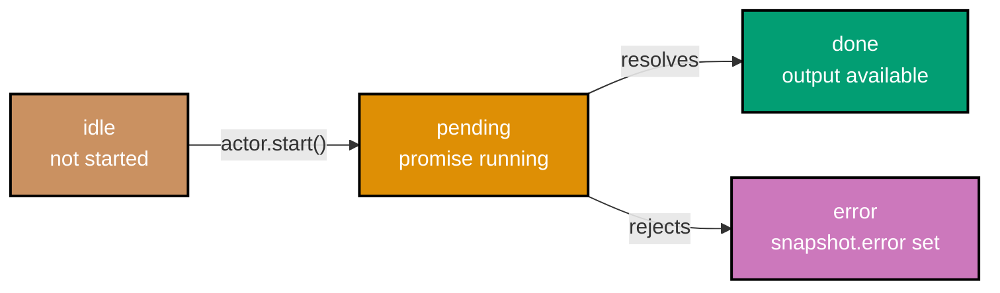

```typescript
import { fromPromise, createActor } from "xstate";
// => fromPromise: wraps async fn as actor logic; createActor: creates running instance

// fromPromise wraps an async function as a reusable actor logic
// The function receives an { input, signal } argument
const fetchUserLogic = fromPromise(
  // => Creates promise actor logic (not yet running)
  // => Logic is reusable: multiple actors can share the same fromPromise definition
  async ({ input }: { input: { userId: string } }) => {
    // => input comes from createActor's second argument
    // => signal is an AbortSignal; cancelled actors abort the promise
    // => input.userId: 'u-42' in this example

    // Simulate an API fetch (replace with real fetch in production)
    await new Promise((resolve) => setTimeout(resolve, 10));
    // => Simulates network latency
    // => In production: replace with fetch('/api/users/' + input.userId)

    return { id: input.userId, name: "Alice", role: "admin" };
    // => Promise resolves to this object, becomes snapshot.output
    // => snapshot.output: { id: 'u-42', name: 'Alice', role: 'admin' }
  },
);
// => fetchUserLogic is actor logic definition; reusable, not yet running

// Create and start the actor, providing input
const userActor = createActor(fetchUserLogic, {
  // => Creates a promise actor instance with typed input
  input: { userId: "u-42" },
  // => input is passed to the async function above
  // => input.userId: 'u-42' -> passed to async fn as input.userId
});
// => userActor: created but NOT started; promise does not begin yet

// Subscribe before starting to catch all state transitions
userActor.subscribe((snapshot) => {
  // => Called every time the actor's snapshot changes
  // => Triggered on: active (promise started), done (resolved), error (rejected)
  if (snapshot.status === "active") {
    // => Promise is pending; actor is running but not yet resolved
    console.log("Loading...");
    // => Output: Loading...
  }
  if (snapshot.status === "done") {
    // => Promise resolved; snapshot.output holds the return value
    console.log("User:", snapshot.output);
    // => Output: User: { id: 'u-42', name: 'Alice', role: 'admin' }
  }
  if (snapshot.status === "error") {
    // => Promise rejected; snapshot.error holds the thrown value
    console.error("Failed:", snapshot.error);
    // => Output: Failed: [error object]
  }
});

userActor.start();
// => Starts the promise; subscriber receives 'active' then 'done' snapshots
// => After ~10ms: status transitions from 'active' to 'done'
```

**Key Takeaway**: `fromPromise` turns any async function into a reusable actor that progresses through `active` → `done` or `active` → `error`, with typed `input` and `output`.

**Why It Matters**: Wrapping async operations as promise actors makes them composable and testable in isolation. You can swap the real implementation with a mock actor in tests (`machine.provide({ actors: { fetchUser: fromPromise(...) } })`), control retries and cancellation via the actor lifecycle, and subscribe to granular status changes without writing bespoke loading/error state logic in every component.

---

### Example 30: fromCallback — Callback Actors

`fromCallback` creates an actor from a setup function that receives `sendBack` (to emit events to the parent) and `receive` (to handle events sent to this actor). It is the right tool for WebSockets, DOM event listeners, timers, and any imperative subscription-based API.

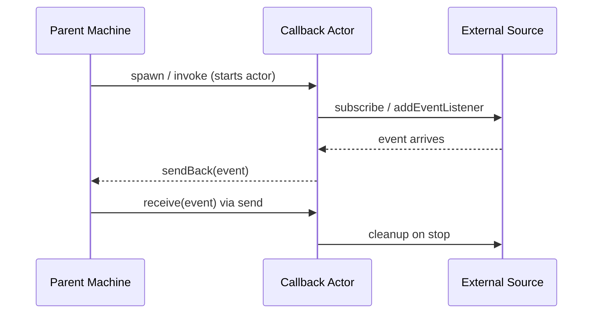

```typescript
import { fromCallback, createActor, createMachine, assign } from "xstate";
// => fromCallback: creates actor logic from a setup/teardown function
// => createActor: instantiates an actor from logic; createMachine: state machine blueprint
// => assign: context updater action

// fromCallback receives a setup function
// => setup function signature: ({ sendBack, receive, input }) => cleanupFn
// setup must return a cleanup function (or void)
const intervalLogic = fromCallback(
  // => Creates callback actor logic
  // => The setup function receives sendBack, receive, and input
  ({
    sendBack,
    // => sendBack: sends events UP to the parent machine
    // => Direction: child -> parent (upward communication)
    receive,
    // => receive: registers a handler for events sent DOWN to this actor
    // => Direction: parent -> child (downward commands)
    input,
    // => input: configuration passed from the parent's invoke block
    // => Typed at definition time; validated at invoke time
  }: {
    sendBack: (event: { type: string; elapsed: number }) => void;
    // => sendBack type: emits typed events to parent
    // => Typed union prevents sending unknown event types
    receive: (handler: (event: { type: string }) => void) => void;
    // => receive type: handles typed commands from parent
    // => Handler registered once; called for each incoming command
    input: { intervalMs: number };
    // => input type: how long each interval tick should be
    // => intervalMs: milliseconds between each TICK emission
  }) => {
    let elapsed = 0;
    // => Track elapsed ticks in actor-local variable (not shared)
    // => actor-local state is safe; no shared mutable reference
    // => elapsed starts at 0; increments by intervalMs each tick

    const id = setInterval(() => {
      // => Start a real timer using the provided interval
      // => setInterval fires every input.intervalMs milliseconds
      // => Callback runs on each tick until clearInterval is called
      elapsed += input.intervalMs;
      // => Accumulate elapsed time on each tick
      // => elapsed: 0 -> 100 -> 200 -> 300 ... (ms)
      sendBack({ type: "TICK", elapsed });
      // => sendBack emits an event UP to the parent machine
      // => Parent machine handles TICK in its event handlers
      // => Payload: { type: 'TICK', elapsed: <accumulated ms> }
    }, input.intervalMs);
    // => id holds the timer reference for cleanup
    // => id: NodeJS.Timeout | number depending on runtime

    receive((event) => {
      // => receive handles events sent DOWN to this actor
      // => Parent sends events here via sendTo(actorRef, event)
      // => Handler is called synchronously on event receipt
      if (event.type === "PAUSE") {
        // => PAUSE command: stop the interval immediately
        // => Checks event.type to dispatch to correct handler
        clearInterval(id);
        // => Stop ticking when parent sends PAUSE
        // => clearInterval cancels the timer; no more TICK events after this
        // => elapsed value is frozen at its last value
      }
    });

    // Cleanup function — called when actor is stopped or parent exits state
    return () => {
      // => Return value must be a cleanup function
      // => XState v5: cleanup called on actor.stop() and on state exit
      clearInterval(id);
      // => Prevents memory leaks when the parent machine leaves the state
      // => XState calls this automatically on actor stop or state exit
      // => Without this, the interval would keep firing after actor stops
    };
  },
);
// => intervalLogic is reusable actor logic; not yet running
// => Can be invoked by any machine's invoke block

// Parent machine that hosts the callback actor
const timerMachine = createMachine({
  // => Machine definition that invokes the callback actor
  // => timerMachine owns the callback actor's lifecycle
  id: "timer",
  // => id used for debugging and system lookup
  context: { elapsed: 0 },
  // => context.elapsed: mirrors elapsed time reported by the callback actor
  // => Initial value: 0 (no ticks yet)
  initial: "running",
  // => Machine starts running immediately on creation
  // => Entering 'running' immediately invokes the callback actor
  states: {
    // => states: all valid configurations for timerMachine
    running: {
      // => running: the active state; callback actor is alive here
      // => Actor lifecycle: created on entry, destroyed on exit
      invoke: {
        src: intervalLogic,
        // => Invoke the callback actor in this state
        // => Actor starts on state entry, stops on state exit
        // => src: references the fromCallback logic defined above
        input: { intervalMs: 100 },
        // => Pass configuration to the actor setup
        // => intervalMs: 100ms between each TICK event
        // => input value available as `input.intervalMs` inside fromCallback
      },
      on: {
        // => Event routing while in 'running' state
        TICK: {
          // => Handle events sent back by the callback actor
          // => TICK arrives from intervalLogic via sendBack
          actions: assign({ elapsed: ({ event }) => event.elapsed }),
          // => Update parent context from child event payload
          // => event.elapsed is the accumulated elapsed milliseconds
          // => context.elapsed: 0 -> 100 -> 200 (updated each tick)
        },
      },
    },
  },
});
// => timerMachine is inert until createActor wraps it

const actor = createActor(timerMachine).start();
// => Starts timer machine; callback actor spawns and begins sending TICK
// => actor.getSnapshot().context.elapsed updates every 100ms
// => actor.send({ type: 'PAUSE' }) stops the interval via receive handler
```

**Key Takeaway**: `fromCallback` bridges imperative subscription APIs (timers, sockets, DOM events) into XState's declarative actor model via `sendBack` (up) and `receive` (down).

**Why It Matters**: Real applications are full of push-based data sources: WebSocket messages, `setInterval`, `IntersectionObserver`, geolocation updates. Without a pattern for integrating these, you scatter subscription logic across components. Callback actors centralise that code, make the lifecycle explicit (setup and cleanup in one place), and route data back through the machine's type-safe event handling — turning messy imperative code into a documented, testable actor.

---

### Example 31: fromObservable — Observable Actors

`fromObservable` wraps an RxJS-compatible observable as an actor. Each emitted value is delivered as an event to the parent machine. This is the cleanest integration point between XState and reactive streams.

```typescript
import { fromObservable, createActor, createMachine, assign } from "xstate";
// => fromObservable: wraps observable factory as actor logic
// => createActor: creates running actor; createMachine: state machine blueprint; assign: context updater
// => All four are from the core 'xstate' package; no RxJS dependency required

// Minimal observable implementation (RxJS-compatible interface)
// In production, import { interval } from 'rxjs'
// => RxJS-compatible means the interface matches: { subscribe(observer) => { unsubscribe } }
function interval(ms: number) {
  // => Creates an observable that emits incrementing integers
  // => Compatible with RxJS Observable interface (subscribe/unsubscribe)
  // => ms: milliseconds between each emission
  return {
    subscribe(observer: { next: (v: number) => void; complete?: () => void }) {
      // => subscribe is the standard observable interface
      // => observer.next: called on each emission; observer.complete: called when stream ends
      // => Returns subscription object with unsubscribe method
      let count = 0;
      // => count: emission counter, starts at 0 and increments each tick
      // => count is actor-local; not shared with any other scope
      const id = setInterval(() => observer.next(count++), ms);
      // => Emits count every ms milliseconds
      // => count++ increments after passing value to observer.next
      // => Sequence: 0, 1, 2, 3 ... (post-increment)
      return { unsubscribe: () => clearInterval(id) };
      // => Returns a subscription object for cleanup
      // => XState calls unsubscribe() when the actor stops
      // => clearInterval(id) cancels the timer to prevent leaks
    },
  };
}
// => interval(ms) returns an observable object; calling subscribe() starts the stream
// => Calling unsubscribe() on the returned subscription stops the stream

// fromObservable wraps the observable factory as actor logic
const clockLogic = fromObservable(
  // => Takes a factory function, receives { input }
  // => Factory is called once when actor starts; returns the observable to subscribe to
  ({ input }: { input: { tickMs: number } }) => interval(input.tickMs),
  // => Returns an observable; each emission is delivered as { type: string, output: T }
  // => input.tickMs controls tick frequency from parent's invoke block
  // => interval(input.tickMs) creates fresh observable per actor instance
);
// => clockLogic is reusable actor logic (not yet running)
// => Multiple actors can use clockLogic independently with different tickMs

// Parent machine that subscribes to the observable actor
const clockMachine = createMachine({
  // => Machine that consumes a streaming data source
  // => Delegates tick production to the observable actor
  id: "clock",
  // => id: for debugging and system.get() lookup
  // => Unique across the actor system
  context: { ticks: 0 },
  // => context.ticks: counts how many observable emissions have been received
  // => Initial value: 0 (no ticks yet)
  initial: "ticking",
  // => Machine starts ticking immediately on creation
  // => First state entered is 'ticking'; observable subscribes immediately
  states: {
    // => states: all valid configurations for clockMachine
    ticking: {
      // => ticking: active state where observable is subscribed
      // => Entering this state starts the subscription; exiting stops it
      invoke: {
        src: clockLogic,
        // => XState automatically subscribes and unsubscribes
        // => Subscription created on state entry; destroyed on state exit
        // => No manual subscribe/unsubscribe management needed
        input: { tickMs: 200 },
        // => Passed to the observable factory function
        // => Observable emits every 200ms
        // => tickMs: 200 means ticks at 0ms, 200ms, 400ms, ...
        onSnapshot: {
          // => Called for every emitted value
          // => snapshot.output holds the emitted integer (count)
          // => Fires synchronously after each emission
          actions: assign({ ticks: ({ context }) => context.ticks + 1 }),
          // => Increment ticks on each observable emission
          // => context.ticks grows by 1 for every integer the observable emits
          // => After 3 emissions: context.ticks === 3
        },
        onError: { target: "stopped" },
        // => Handle observable errors by transitioning state
        // => If observable throws, machine moves to 'stopped'
        // => Prevents unhandled error from crashing the actor
      },
      on: { STOP: "stopped" },
      // => Explicit STOP event also transitions to stopped state
      // => Unsubscribes observable when exiting 'ticking'
    },
    stopped: { type: "final" },
    // => Actor cleans up observable subscription when entering final state
    // => type: 'final' stops the machine and emits snapshot.status === 'done'
    // => Observable's unsubscribe() is called automatically on state exit
  },
});
// => clockMachine is inert until createActor wraps it

const actor = createActor(clockMachine).start();
// => Machine starts; observable subscribes and begins emitting
// => actor.getSnapshot().context.ticks increments each tick
// => actor.send({ type: 'STOP' }) transitions to stopped and unsubscribes
// => actor.subscribe(cb) lets external code observe snapshot changes
```

**Key Takeaway**: `fromObservable` connects any RxJS-compatible stream to a machine's `onSnapshot` handler, with automatic subscription management tied to the actor lifecycle.

**Why It Matters**: Observable actors let you use powerful reactive operators (debounce, combineLatest, switchMap) for stream processing while keeping state transitions declarative in XState. The machine handles WHAT to do when data arrives; the observable handles HOW the data is produced. XState automatically unsubscribes when the actor stops or when the invoking state is exited, preventing the subscription leak bug that plagues manual RxJS integration in components.

---

### Example 32: fromTransition — Reducer Actors

`fromTransition` creates an actor from a pure reducer function plus an initial state. This is the XState equivalent of a Redux reducer — but it lives as an actor, so it can participate in the full actor system and receive events from other actors.

```typescript
import { fromTransition, createActor } from "xstate";
// => fromTransition: wraps a pure reducer as actor logic
// => createActor: creates a running actor instance from logic
// => Only two imports needed; no createMachine or assign required for reducer actors

// Define state and event types for the reducer
type CartState = {
  // => CartState: the shape of this actor's context (replaces machine context)
  // => Pure data structure; no XState-specific fields needed
  items: { id: string; quantity: number }[];
  // => items: array of cart items, each with id and quantity
  // => items grows on ADD_ITEM, shrinks on REMOVE_ITEM, empties on CLEAR
  total: number;
  // => total: cumulative price of all items in the cart
  // => total accumulates on ADD_ITEM (simplified: not decremented on REMOVE_ITEM)
};

type CartEvent =
  // => CartEvent: discriminated union of all events the reducer handles
  // => switch(event.type) provides exhaustive handling with TypeScript
  | { type: "ADD_ITEM"; id: string; price: number }
  // => Adds or increments an item
  // => price: used to update total
  | { type: "REMOVE_ITEM"; id: string }
  // => Removes item completely
  // => id: used to identify which item to remove
  | { type: "CLEAR" };
// => Empties the cart
// => Resets both items and total to zero

// fromTransition takes (state, event) => newState  plus initial state
const cartLogic = fromTransition(
  // => First argument: pure reducer function (no side effects)
  // => Receives current state and incoming event; returns new state
  // => Must be pure: same inputs always produce same outputs
  (state: CartState, event: CartEvent): CartState => {
    // => switch on event.type: exhaustive handling of all CartEvent variants
    // => TypeScript narrows event type in each case branch
    switch (event.type) {
      case "ADD_ITEM": {
        // => ADD_ITEM: add new item or increment existing item's quantity
        // => Two sub-cases: item exists (increment) vs item new (append)
        const existing = state.items.find((i) => i.id === event.id);
        // => Check if item already in cart
        // => existing is the matching item object, or undefined if not found
        // => find: returns first match or undefined; O(n) scan
        const items = existing
          ? state.items.map((i) => (i.id === event.id ? { ...i, quantity: i.quantity + 1 } : i))
          : // => Increment existing item quantity
            // => map returns new array; spread preserves other fields
            [...state.items, { id: event.id, quantity: 1 }];
        // => Add new item with quantity 1
        // => Spread preserves existing items; new item appended at end
        // => items is either the mapped array (existing) or the spread array (new)
        return { items, total: state.total + event.price };
        // => Always return new state object (immutability)
        // => total accumulates: state.total + event.price (price passed with event)
        // => New object reference ensures React/XState detects the change
      }
      case "REMOVE_ITEM":
        // => REMOVE_ITEM: drop item completely from cart by id
        // => Does not adjust total (simplified for this example)
        return {
          items: state.items.filter((i) => i.id !== event.id),
          // => Filter out the removed item
          // => filter returns new array; original is not mutated
          // => All other items preserved with their existing fields
          total: state.total,
          // => Note: price not tracked per-item here for simplicity
          // => In production you would subtract the item's price from total
          // => Production: total: state.total - removedItem.price
        };
      case "CLEAR":
        return { items: [], total: 0 };
      // => Reset to empty state
      // => Returns brand-new empty object; no mutation of previous state
      // => Both items and total reset to initial values
      default:
        return state;
      // => Unknown events return state unchanged
      // => TypeScript exhaustiveness check: all CartEvent variants should be handled above
      // => Returning same reference (not new object) avoids unnecessary re-renders
    }
  },
  { items: [], total: 0 },
  // => Second argument: initial state value
  // => Actor snapshot starts with this value before any events
  // => Same shape as CartState: empty items array, zero total
);
// => cartLogic is reusable actor logic (not yet running)
// => Can be shared across multiple createActor calls; each gets its own state

const cartActor = createActor(cartLogic).start();
// => Reducer actor starts with empty cart
// => cartActor.getSnapshot().context: { items: [], total: 0 }
// => .start() is required; actor is inert before start

cartActor.send({ type: "ADD_ITEM", id: "book-1", price: 29 });
// => cartActor.getSnapshot().context: { items: [{ id: 'book-1', quantity: 1 }], total: 29 }
// => new item added; quantity starts at 1; total is 29
cartActor.send({ type: "ADD_ITEM", id: "book-1", price: 29 });
// => { items: [{ id: 'book-1', quantity: 2 }], total: 58 }
// => existing item found; quantity incremented from 1 to 2
// => total: 29 + 29 = 58
cartActor.send({ type: "REMOVE_ITEM", id: "book-1" });
// => { items: [], total: 58 }  (total not adjusted — simplified example)
// => item filtered out of array; total unchanged (simplified)
// => items: [] because book-1 was the only item
```

**Key Takeaway**: `fromTransition` wraps a pure Redux-style reducer as an XState actor, making it composable within an actor system without converting it to a full state machine.

**Why It Matters**: Not every piece of state needs the full power of a state machine. Shopping cart contents, form field collections, and undo/redo stacks are pure data transformations expressed most clearly as reducers. `fromTransition` lets you keep that code as a reducer while gaining the actor model benefits: it can receive events from sibling actors, be spawned and stopped by a parent machine, and be subscribed to by React hooks — all without rewriting it as a statechart.

---

### Example 33: spawn — Creating Child Actors

`spawn` creates a child actor dynamically inside a machine action. The returned `ActorRef` is stored in context so other actions can send events to the child. This is the pattern for dynamic actor creation — when you do not know at machine-design-time how many actors you will need.

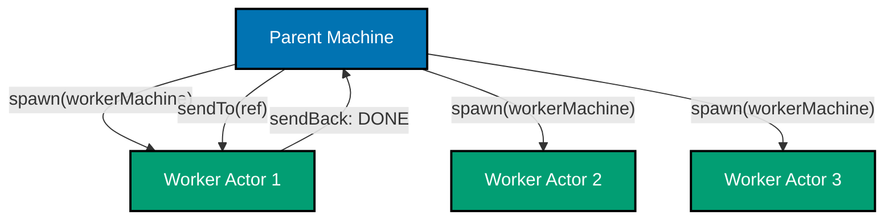

```typescript
import { createMachine, createActor, assign, sendTo, stopChild } from "xstate";
// => createMachine: machine blueprint; createActor: running instance
// => assign: context updater; sendTo: directed inter-actor messaging; stopChild: lifecycle control
// => stopChild: gracefully stops a spawned child actor by ref or id

// Worker machine — a child actor type that processes tasks
const workerMachine = createMachine({
  // => Blueprint for child actors; each spawned instance is independent
  // => Multiple worker actors can run simultaneously from one blueprint
  // => Blueprint is defined once; spawn() creates independent instances
  id: "worker",
  // => id identifies this machine type (not the spawned instance)
  // => Spawned instances are identified by their spawn id option
  context: { taskId: "" as string },
  // => context.taskId: set when parent sends START with the task ID
  // => Initially empty string; populated by START event
  initial: "idle",
  // => Each worker starts in idle, waiting for a START event
  // => idle: no work happening; worker ready to receive START
  states: {
    // => states: lifecycle of a single worker actor
    idle: { on: { START: { target: "working", actions: assign({ taskId: ({ event }) => event.taskId }) } } },
    // => Idle until parent sends START with a task ID
    // => assign stores event.taskId into worker's own context
    // => Transition: idle -> working on START event
    working: {
      // => working: simulates async processing in progress
      // => No events needed; auto-transitions after delay
      after: { 50: { target: "done" } },
      // => Simulate async work with a 50ms delay
      // => after: timed auto-transition; no explicit event needed
      // => Real use case: invoke a promise actor here
    },
    done: { type: "final" },
    // => Final state triggers onDone in parent invoke (if invoked)
    // => type: 'final' marks this actor's work as complete
    // => Worker snapshot.status becomes 'done' when this state is entered
  },
});
// => workerMachine is inert until spawn() wraps it
// => spawn(workerMachine) creates a live, running actor from this blueprint

// Parent machine that spawns workers dynamically
const poolMachine = createMachine({
  // => Manages a dynamic pool of worker actors
  // => Pool grows as DISPATCH_TASK events arrive; shrinks on REMOVE_TASK
  // => context.workers holds all live ActorRefs; keyed by taskId
  id: "pool",
  // => pool: root machine coordinating multiple worker children
  // => No states needed; machine-level 'on' handles all events
  context: {
    // => context holds all runtime references and counters
    workers: {} as Record<string, any>,
    // => Map of taskId -> ActorRef for spawned workers
    // => Keyed lookup enables targeted event delivery
    // => Initial value: {} (no workers yet)
    completedCount: 0,
    // => completedCount: tracks how many workers finished (demo field)
    // => Incremented in a real system when workers reach done state
  },
  on: {
    // => Machine-level events; active regardless of current state
    // => Handled in any state the machine is in
    DISPATCH_TASK: {
      // => Receives task dispatch requests
      // => Creates a new worker actor and registers it in context
      // => event.taskId: unique identifier for the task
      actions: assign({
        workers: ({ context, event, spawn }) => ({
          ...context.workers,
          // => Preserve all existing worker refs
          // => Spread operator: keeps task-2, task-3, etc. when adding task-1
          [event.taskId]: spawn(workerMachine, {
            // => spawn() creates a new independent worker actor
            // => Returns an ActorRef stored in context.workers[taskId]
            // => Actor starts immediately in 'idle' state
            id: `worker-${event.taskId}`,
            // => Optional systemId for system.get() lookup
            // => id: 'worker-task-1' for taskId: 'task-1'
          }),
          // => Store the ActorRef keyed by task ID
          // => context.workers['task-1'] = ActorRef for task-1 worker
        }),
      }),
    },
    START_TASK: {
      // => Tell a specific worker to start
      // => Looks up the worker by taskId, sends START event to it
      // => event.taskId: identifies which worker to start
      actions: sendTo(
        ({ context, event }) => context.workers[event.taskId],
        // => Resolve target actor from context at runtime
        // => Returns the ActorRef stored for this taskId
        // => context.workers[event.taskId]: ActorRef | undefined
        ({ event }) => ({ type: "START", taskId: event.taskId }),
        // => Send START event to that specific worker
        // => Worker transitions idle -> working upon receiving START
        // => taskId passed so worker can record which task it's processing
      ),
    },
    REMOVE_TASK: {
      // => Remove a worker from the pool
      // => Stops the actor then removes its ref from context
      // => Two actions run in sequence: stop then remove from map
      actions: [
        stopChild(({ context, event }) => context.workers[event.taskId]),
        // => stopChild() gracefully stops the actor
        // => Sends stop signal; actor transitions to stopped state
        // => Worker's cleanup runs; subscriptions removed
        assign({
          workers: ({ context, event }) => {
            const { [event.taskId]: _, ...rest } = context.workers;
            // => Destructure to exclude the removed taskId
            // => _: discarded ActorRef for the stopped worker
            return rest;
            // => Remove from context map after stopping
            // => Remaining workers are unaffected
            // => context.workers no longer contains event.taskId key
          },
        }),
      ],
    },
  },
});
// => poolMachine is inert until createActor wraps it

const pool = createActor(poolMachine).start();
// => Pool actor starts; context.workers is empty {}
// => Machine enters default initial state (no states defined; machine-level on only)
pool.send({ type: "DISPATCH_TASK", taskId: "task-1" });
// => Worker actor for task-1 spawned and stored in context.workers['task-1']
// => context.workers: { 'task-1': ActorRef<workerMachine> }
pool.send({ type: "START_TASK", taskId: "task-1" });
// => START event forwarded to the task-1 worker actor
// => Worker transitions from idle to working; will auto-complete after 50ms
// => After 50ms: worker snapshot.status === 'done'
```

**Key Takeaway**: `spawn` creates child actors at runtime inside machine actions; the returned `ActorRef` stored in context enables targeted event delivery via `sendTo`.

**Why It Matters**: Real applications spawn actors based on data — one actor per connected WebSocket client, one per in-flight HTTP request, one per item in a todo list. `spawn` makes this pattern first-class: the parent machine owns actor lifecycle (spawn, message, stop), the child machines encapsulate per-item state, and the whole system remains type-safe. This replaces fragile patterns like arrays of `setTimeout` IDs tracked in component refs.

---

### Example 34: sendTo — Messaging Between Actors

`sendTo` is the action creator for directed inter-actor messaging. It resolves the target actor at event time from context, then delivers the event to that specific actor — creating a point-to-point channel between any two actors in the system.

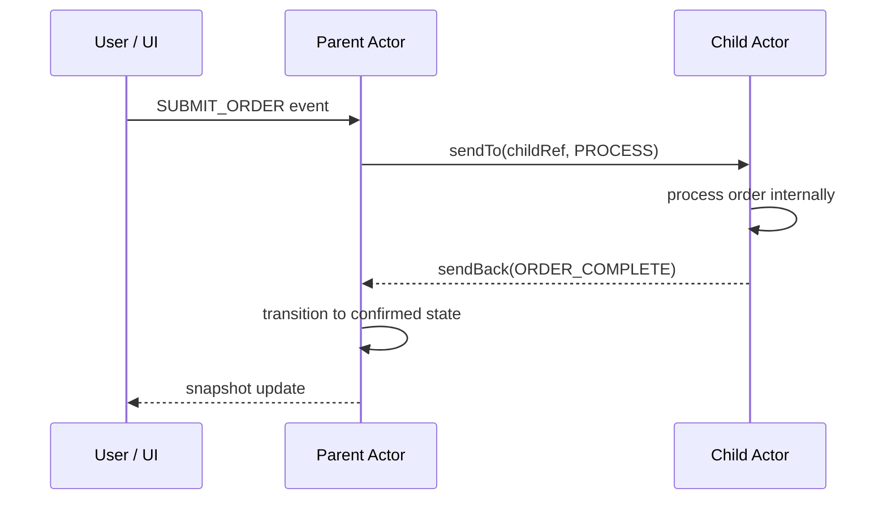

```typescript
import { createMachine, createActor, assign, sendTo } from "xstate";
// => createMachine: machine blueprint; createActor: running instance
// => assign: context updater action; sendTo: directed inter-actor event delivery

// Child actor: processes orders independently
const orderProcessorMachine = createMachine({
  // => Dedicated actor for order processing logic
  // => Encapsulates all order-processing state; parent stays clean
  id: "orderProcessor",
  // => id: identifies this machine type; not the specific spawned instance
  context: { orderId: "" as string, status: "pending" as string },
  // => orderId: populated when PROCESS event arrives from parent
  // => status: 'pending' initially; 'fulfilled' after processing completes
  initial: "idle",
  // => Starts in idle; waits for PROCESS event from parent
  states: {
    idle: {
      // => idle: waiting state; no processing happening
      on: {
        PROCESS: {
          // => Receives PROCESS event from parent
          // => Parent sends this via sendTo(processorRef, { type: 'PROCESS', orderId })
          target: "processing",
          // => Transition to processing state on PROCESS event
          actions: assign({ orderId: ({ event }) => event.orderId }),
          // => Store order ID in own context
          // => context.orderId: '' -> 'ord-99' (or whatever orderId is passed)
        },
      },
    },
    processing: {
      // => Simulate async processing
      // => Real use case: invoke a fromPromise actor that calls the API
      after: {
        100: {
          // => Auto-transition after 100ms simulated processing
          target: "complete",
          // => Move to complete state after delay
          actions: assign({ status: "fulfilled" }),
          // => Update status to fulfilled on completion
          // => context.status: 'pending' -> 'fulfilled'
        },
      },
    },
    complete: { type: "final" },
    // => Signals parent via onDone if invoked, or parent polls snapshot
    // => snapshot.status becomes 'done'; parent can read context.status
  },
});
// => orderProcessorMachine is inert until spawn() or invoke wraps it

// Parent actor: coordinates the checkout flow
const checkoutMachine = createMachine({
  // => Parent that owns the processor child's lifecycle
  id: "checkout",
  // => id: for debugging and actor system lookup
  context: {
    processorRef: null as any,
    // => Will hold ActorRef to the processor child
    // => null initially; set on idle state entry
    currentOrderId: "" as string,
    // => Tracks the current order being submitted
  },
  initial: "idle",
  // => Machine starts in idle; processor spawned immediately on entry
  states: {
    idle: {
      // => idle: spawns processor child; waits for SUBMIT_ORDER
      entry: assign({
        processorRef: ({ spawn }) => spawn(orderProcessorMachine, { id: "processor" }),
        // => Spawn processor child on entry into idle state
        // => Returns ActorRef stored in context.processorRef
        // => Processor starts in 'idle' state, ready for PROCESS event
      }),
      on: { SUBMIT_ORDER: "submitting" },
      // => SUBMIT_ORDER transitions to submitting; event.orderId is available
    },
    submitting: {
      // => submitting: parent records orderId, sends PROCESS to processor
      entry: [
        assign({ currentOrderId: ({ event }) => event.orderId }),
        // => Save the order ID in parent context
        // => context.currentOrderId: '' -> 'ord-99'
        sendTo(
          ({ context }) => context.processorRef,
          // => Resolve target: the processor child actor
          // => context.processorRef: ActorRef set in idle.entry
          ({ event }) => ({ type: "PROCESS", orderId: event.orderId }),
          // => Construct the event to send; receives actor + event args
          // => Processor receives { type: 'PROCESS', orderId: 'ord-99' }
        ),
        // => Delivers PROCESS event to the processor actor
        // => Processor transitions: idle -> processing
      ],
      on: { CONFIRM: "confirmed" },
      // => CONFIRM transitions to final confirmed state
    },
    confirmed: { type: "final" },
    // => Final state; checkout complete
    // => snapshot.status becomes 'done'
  },
});
// => checkoutMachine is inert until createActor wraps it

const actor = createActor(checkoutMachine).start();
// => Machine starts in idle; processor spawned immediately
// => context.processorRef is set to processor ActorRef
// => actor.value: 'idle' on start
actor.send({ type: "SUBMIT_ORDER", orderId: "ord-99" });
// => Parent enters submitting; PROCESS forwarded to processor actor
// => Processor actor context.orderId becomes 'ord-99'
// => Processor begins 100ms processing simulation
// => actor.value: 'idle' -> 'submitting'
```

**Key Takeaway**: `sendTo` resolves the target actor dynamically from context at event time, enabling fully decoupled point-to-point messaging between any two actors.

**Why It Matters**: Without `sendTo`, inter-actor communication requires direct actor references passed as props or stored in global variables. `sendTo` keeps references private inside machine context, making the communication topology explicit in the state machine definition rather than scattered through component render logic. This makes refactoring actor relationships safe — you change the machine definition, not the component tree.

---

### Example 35: Actor System — system.get()

The XState actor system is a named registry. Actors registered with `systemId` can be looked up from anywhere in the actor tree using `system.get(id)`. This creates a lightweight service-locator pattern for singleton actors like a notification bus or auth service.

```typescript
import { createMachine, createActor, assign, sendTo } from "xstate";
// => createMachine: machine blueprint; createActor: running instance
// => assign: context updater; sendTo: directed inter-actor event delivery
// => system.get() is accessed inside action callbacks, not imported separately

// Notification bus: a singleton actor all others can reach by ID
const notificationBusMachine = createMachine({
  // => Global notification bus registered as a named system actor
  // => Singleton: only one instance exists in the actor system
  id: "notificationBus",
  // => id: matches the systemId used when spawning for registry lookup
  context: { notifications: [] as string[] },
  // => notifications: append-only log of all messages received
  // => Initial value: [] (no messages yet)
  on: {
    // => Machine-level NOTIFY handler; active in all states
    NOTIFY: {
      // => Any actor can send NOTIFY to the bus
      // => No state required; bus just accumulates messages
      actions: assign({
        notifications: ({ context, event }) => [
          ...context.notifications,
          // => Spread: preserve all previous notifications
          event.message,
          // => Append message to notification list
          // => event.message: the string payload from the sender
        ],
      }),
      // => After action: context.notifications grows by one entry
    },
  },
});
// => notificationBusMachine is inert until spawn with systemId

// Feature machine that references the bus by system ID
const featureMachine = createMachine({
  // => A feature actor that sends to the global notification bus
  // => Does not hold a direct ref; uses system.get() for lookup
  id: "feature",
  // => id: feature machine's own identity (not registered in system)
  initial: "working",
  // => Starts in working state; waiting for TASK_DONE event
  states: {
    working: {
      // => working: active state; processes tasks
      on: {
        TASK_DONE: {
          // => When task completes, notify via the bus
          // => No state transition needed; stays in working
          actions: sendTo(
            ({ system }) => system.get("notificationBus"),
            // => system.get() resolves the bus actor by its systemId
            // => Returns ActorRef or undefined if not registered
            // => system is available in all action callbacks
            { type: "NOTIFY", message: "Task completed successfully!" },
            // => Send a static notification event
            // => Bus receives NOTIFY and appends the message
          ),
        },
      },
    },
  },
});
// => featureMachine is inert until spawn() wraps it

// Root machine: spawns both actors, registers bus with a systemId
const rootMachine = createMachine({
  // => Root actor owns both bus and feature actor lifecycles
  id: "root",
  // => id: identifies the root machine in the system
  context: { busRef: null as any, featureRef: null as any },
  // => busRef: ActorRef for the notification bus (also system-registered)
  // => featureRef: ActorRef for the feature actor
  entry: assign({
    // => Spawn both actors on root machine entry
    busRef: ({ spawn }) =>
      spawn(notificationBusMachine, {
        systemId: "notificationBus",
        // => systemId registers this actor in the system registry
        // => Other actors find it via system.get('notificationBus')
        // => systemId must match the string passed to system.get()
      }),
    featureRef: ({ spawn }) => spawn(featureMachine),
    // => Feature actor spawned without systemId -- not in registry
    // => Parent holds ref in context.featureRef for direct messaging
  }),
});
// => rootMachine is inert until createActor wraps it

const rootActor = createActor(rootMachine).start();
// => Root spawns bus (registered) and feature (unregistered)
// => Bus is accessible via system.get('notificationBus') from any actor

// Obtain the feature ref and send an event
const snapshot = rootActor.getSnapshot();
// => snapshot.context.featureRef: ActorRef for the feature actor
const featureRef = snapshot.context.featureRef;
// => featureRef: stable ActorRef; use to send events to the feature actor
featureRef.send({ type: "TASK_DONE" });
// => Feature actor's sendTo resolves notificationBus via system.get()
// => Bus appends 'Task completed successfully!' to notifications
// => bus context.notifications: ['Task completed successfully!']
```

**Key Takeaway**: Register actors with `systemId` to create named singletons; resolve them anywhere via `system.get(id)` inside actions without passing references through the actor tree.

**Why It Matters**: Deep actor hierarchies face the same prop-drilling problem as React component trees. `system.get()` solves this for actors the same way React Context solves it for components: a single registration gives any actor in the system access to shared services (auth, notifications, analytics, feature flags) without threading references through every layer. Unlike a global singleton, the actor system is scoped to a single `createActor` root, so tests can create isolated systems without global state pollution.

---

## Group 8: Input, Output, and Machine Configuration (Examples 36-39)

### Example 36: Machine Input — Parameterizing Machines

Machine `input` lets you pass runtime data into a machine at creation time. The input is available in the context initialiser, making it the correct way to parameterise a machine for a specific user, session, or configuration — instead of hard-coding values or using context mutation.

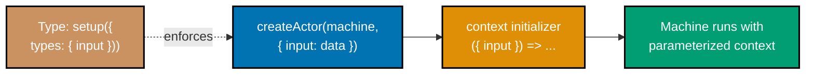

```typescript
import { createMachine, createActor } from "xstate";
// => createMachine: machine blueprint factory; createActor: runtime actor creator
// => No assign needed here; context initialiser function handles all setup

// Define the input shape that this machine requires
type SessionInput = {
  // => SessionInput: the typed contract for createActor's input option
  // => TypeScript validates this at the createActor call site
  userId: string;
  // => Required: identifies whose session this machine manages
  // => Used to personalise context and for server-side lookup
  permissions: string[];
  // => Required: user's permission list drives state branching
  // => Example: ['read', 'write', 'admin']
  timeoutMs: number;
  // => Required: session timeout duration in milliseconds
  // => Used to compute expiresAt: Date.now() + timeoutMs
};

// Machine that uses input to initialise context
const sessionMachine = createMachine({
  // => Machine blueprint -- parameterised via input
  // => Same blueprint used for every user; input differentiates each instance
  id: "session",
  // => id: for DevTools and system.get() lookup
  context: ({ input }: { input: SessionInput }) => ({
    // => context is a function when input is used
    // => Called once at actor creation with the provided input
    // => Returns the initial context object from input values
    userId: input.userId,
    // => Sets userId from input -- not hard-coded
    // => context.userId: 'u-101' (or whatever createActor provides)
    permissions: input.permissions,
    // => Sets permissions from input
    // => context.permissions: ['read', 'write'] (or admin list)
    expiresAt: Date.now() + input.timeoutMs,
    // => Computes expiry time from input at creation
    // => expiresAt: Unix timestamp in ms when session expires
    isAdmin: input.permissions.includes("admin"),
    // => Derives admin flag from input permissions array
    // => isAdmin: true if 'admin' is in permissions, false otherwise
  }),
  initial: "active",
  // => Machine starts in active state immediately on creation
  states: {
    active: {
      // => active: session is valid and in use
      on: { LOGOUT: "expired" },
      // => LOGOUT event transitions to expired (final) state
    },
    expired: { type: "final" },
    // => expired: session ended; snapshot.status becomes 'done'
  },
});
// => sessionMachine is inert until createActor wraps it with input

// Create actor for a regular user
const regularSession = createActor(sessionMachine, {
  // => Second argument provides input and other actor options
  input: {
    userId: "u-101",
    // => Provide actual runtime value
    // => context.userId will be 'u-101'
    permissions: ["read", "write"],
    // => No 'admin' permission; isAdmin will be false
    timeoutMs: 30 * 60 * 1000,
    // => 30 minutes in milliseconds
    // => 30 * 60 * 1000 = 1,800,000 ms
  },
}).start();
// => Actor starts; context initialised from input above

console.log(regularSession.getSnapshot().context.isAdmin);
// => Output: false
// => 'admin' not in ['read', 'write'] -> isAdmin: false

// Create actor for an admin user — same machine, different input
const adminSession = createActor(sessionMachine, {
  // => Same sessionMachine blueprint; different input creates different instance
  input: {
    userId: "u-007",
    // => Different userId; each instance is independent
    permissions: ["read", "write", "admin"],
    // => 'admin' permission present
    // => isAdmin: permissions.includes('admin') -> true
    timeoutMs: 60 * 60 * 1000,
    // => 60 minutes for admin sessions (longer timeout)
  },
}).start();
// => Actor starts with admin context

console.log(adminSession.getSnapshot().context.isAdmin);
// => Output: true
// => 'admin' in ['read', 'write', 'admin'] -> isAdmin: true
```

**Key Takeaway**: Machine `input` is the typed parameter interface for a machine — pass runtime data through `createActor(machine, { input })` and access it in the context initialiser function.

**Why It Matters**: Before `input`, developers put runtime data in context by sending an initialisation event after `.start()`, or by closing over component props in the machine definition. Both approaches are fragile: the first exposes an invalid initial state; the second creates a new machine definition per render. `input` solves this properly — the machine is defined once, typed inputs are validated at the call site, and the machine starts in a fully-initialised, valid state.

---

### Example 37: Machine Output — Final State Results

Machine `output` defines what a machine returns when it reaches a final state. The output is computed from context at that moment and exposed as `snapshot.output`. This is how a machine communicates its result to its parent or caller.

```typescript
import { createMachine, createActor, assign } from "xstate";
// => createMachine: machine blueprint; createActor: running actor; assign: context updater
// => output is declared inline in the machine definition; no separate import needed

// Machine that processes a form and returns a result
const formMachine = createMachine({
  // => Machine with typed output for when it finishes
  // => output: function called when any final state is reached
  id: "form",
  // => id: for DevTools and actor system lookup
  context: {
    email: "",
    // => Stores form field value
    // => Initial: empty string; updated by UPDATE_EMAIL events
    submittedAt: null as number | null,
    // => Records submission timestamp
    // => null until submission completes; then Date.now() value
    error: null as string | null,
    // => Stores validation/submission error if any
    // => null on success; string message on validation failure
  },
  initial: "editing",
  // => Machine starts in editing state; user enters data
  states: {
    editing: {
      // => editing: user is filling the form; all input events handled here
      on: {
        UPDATE_EMAIL: {
          // => Handles field change events from the UI
          actions: assign({ email: ({ event }) => event.email }),
          // => Update email in context on field change
          // => context.email: '' -> 'user@example.com' (from event)
        },
        SUBMIT: [
          // => SUBMIT is an array: guarded transitions checked in order
          {
            guard: ({ context }) => context.email.includes("@"),
            // => Validate: must be a plausible email
            // => Guard: returns true if '@' is present in email string
            target: "submitting",
            // => Guard passes: transition to submitting state
          },
          {
            // => Guard failed: no '@' in email; stay in editing
            actions: assign({ error: () => "Invalid email format" }),
            // => Stay in editing, set error message
            // => context.error: null -> 'Invalid email format'
          },
        ],
      },
    },
    submitting: {
      // => submitting: async operation in progress
      // => Auto-transitions after delay; no user events expected
      after: {
        50: {
          // => 50ms simulates network round-trip
          target: "done",
          // => Transition to done after 50ms
          actions: assign({ submittedAt: () => Date.now() }),
          // => Simulate async submission; record timestamp
          // => context.submittedAt: null -> <Unix ms timestamp>
        },
      },
    },
    done: {
      // => Final state — output is computed here
      // => snapshot.status becomes 'done' on entry
      type: "final",
      // => type: 'final' marks this as a terminal state
    },
    failed: {
      type: "final",
      // => Another final state -- output differs
      // => Both done and failed are final; output captures which path was taken
    },
  },
  output: ({ context }) => ({
    // => output function is called when machine reaches any final state
    // => Returns a value derived from context at that moment
    // => snapshot.output holds this value after status is 'done'
    email: context.email,
    // => Include submitted email in output
    // => Callers read output.email without accessing context directly
    submittedAt: context.submittedAt,
    // => Include submission timestamp
    // => null if failed before submission; timestamp if done
    success: context.error === null,
    // => Derive success flag from error presence
    // => true when error is null (no validation/submission failure)
    errorMessage: context.error,
    // => Pass through error message (null if success)
    // => Callers can display this message when success is false
  }),
});
// => formMachine is inert until createActor wraps it

const actor = createActor(formMachine).start();
// => Actor starts in editing state; context.email is ''
actor.send({ type: "UPDATE_EMAIL", email: "user@example.com" });
// => context.email is now 'user@example.com'
// => context.error remains null
actor.send({ type: "SUBMIT" });
// => Email valid; transitions to submitting then done
// => Guard passes: 'user@example.com'.includes('@') === true
// => value: 'editing' -> 'submitting'; after:50 timer starts

// After reaching final state, access output
setTimeout(() => {
  // => Wait 100ms to ensure 50ms after-delay has elapsed
  // => 100ms > 50ms: after: 50 has fired; machine is in done state
  const snapshot = actor.getSnapshot();
  // => snapshot.status is 'done' after final state reached
  if (snapshot.status === "done") {
    console.log(snapshot.output);
    // => Output: { email: 'user@example.com', submittedAt: <timestamp>, success: true, errorMessage: null }
    // => output.email: 'user@example.com'; output.success: true; output.submittedAt: non-null
  }
}, 100);
// => setTimeout gives the after: 50 delay time to complete
```

**Key Takeaway**: Define `output` as a function on the machine to expose a typed result value in `snapshot.output` when the machine reaches its final state.

**Why It Matters**: Without machine output, callers must watch context to determine results, which couples them to the machine's internal data structure. `output` creates a clean public API: the machine's implementation details stay private in context, while the result contract is explicit and typed. Parent machines can use `onDone: { actions: assign({ result: ({ event }) => event.output }) }` to receive the result without knowing anything about the child's internal states.

---

### Example 38: setup() — Full TypeScript Type Safety

`setup()` is the entry point for fully type-safe machine definitions in XState v5. It declares the shapes of context, events, input, output, actors, actions, and guards in one place, so TypeScript can validate every machine reference at compile time.

```typescript
import { setup, createActor, assign, fromPromise } from "xstate";

// Define all types that the machine uses
type FetchContext = {
  // => FetchContext: the full context shape for type checking everywhere
  data: { id: number; title: string } | null;
  // => Nullable: null before fetch, populated after
  // => { id: 42, title: 'Item 42' } on successful fetch
  error: string | null;
  // => Nullable: null if no error
  // => 'Fetch failed' on network error
  retryCount: number;
  // => Tracks how many retries have been attempted
  // => Starts at 0; canRetry guard checks this < 3
};

type FetchEvent =
  // => FetchEvent: union of all valid events; TypeScript rejects unknown types
  | { type: "FETCH"; id: number }
  // => Triggers a data fetch
  // => id: number is required; passed to fetchData actor as input
  | { type: "RETRY" }
  // => Triggers a retry after error
  // => Guard canRetry must pass: retryCount < 3
  | { type: "RESET" };
// => Returns to idle state
// => Resets data/error/retryCount is NOT done here (machine keeps context)

// setup() declares all types and dependencies BEFORE createMachine
const fetchMachine = setup({
  // => setup() is called once; returns a typed createMachine function
  // => All type declarations live here; machine body infers from them
  types: {
    context: {} as FetchContext,
    // => TypeScript uses this as the context type throughout the machine
    // => {} as FetchContext: cast tells TS the type; value is discarded
    events: {} as FetchEvent,
    // => TypeScript validates all event.type references against this union
    // => Sending { type: 'UNKNOWN' } will cause a compile-time error
    input: {} as { initialId?: number },
    // => Optional input type; validated at createActor call site
    // => initialId?: number means input is optional
  },
  actors: {
    // => Declare named actor implementations here for type-safe invoke/spawn
    // => Name 'fetchData' must match the src string in invoke blocks
    fetchData: fromPromise(async ({ input }: { input: { id: number } }) => {
      // => Async function receives typed input from invoke block
      // => input.id: the id passed from the FETCH event
      await new Promise((r) => setTimeout(r, 10));
      // => Simulate network delay
      // => Real implementation: await fetch(`/api/items/${input.id}`)
      return { id: input.id, title: `Item ${input.id}` };
      // => Returns typed output that the machine can reference
      // => event.output in onDone is typed as { id: number, title: string }
    }),
  },
  guards: {
    // => Declare named guards; TypeScript verifies they exist when referenced
    // => Name 'canRetry' must match the guard string in state definitions
    canRetry: ({ context }) => context.retryCount < 3,
    // => Guard function has typed context
    // => Returns true if fewer than 3 retries have been attempted
  },
}).createMachine({
  // => createMachine chained from setup; all types are inferred
  // => No manual generic parameters needed; setup provides full inference
  id: "fetch",
  // => id: for DevTools identification
  context: ({ input }) => ({
    // => input type is inferred from setup({ types: { input } })
    // => context initialiser function receives typed input
    data: null,
    // => data: null initially; populated on successful fetch
    error: null,
    // => error: null initially; set to error message on failure
    retryCount: 0,
    // => retryCount: 0 initially; incremented on each retry
  }),
  initial: "idle",
  // => Machine starts in idle, waiting for FETCH event
  states: {
    idle: { on: { FETCH: { target: "loading" } } },
    // => idle: waiting for user to trigger fetch
    // => FETCH event starts the loading process
    loading: {
      // => loading: fetch in progress; no user events during this state
      invoke: {
        src: "fetchData",
        // => TypeScript verifies 'fetchData' is declared in setup actors
        // => String 'fetchData' matched against setup({ actors }) keys
        input: ({ event }) => ({ id: (event as any).id }),
        // => Extract id from the FETCH event payload
        // => Passed to fetchData's async function as input.id
        onDone: {
          target: "success",
          // => Transition to success on resolve
          actions: assign({ data: ({ event }) => event.output }),
          // => event.output is typed from fetchData's return type
          // => context.data: null -> { id: 42, title: 'Item 42' }
        },
        onError: {
          target: "error",
          // => Transition to error state on reject
          actions: assign({ error: () => "Fetch failed" }),
          // => context.error: null -> 'Fetch failed'
        },
      },
    },
    success: { on: { RESET: "idle" } },
    // => success: data available; user can reset to fetch again
    // => RESET transitions back to idle; context.data is kept (not cleared)
    error: {
      // => error: fetch failed; user can retry or reset
      on: {
        RETRY: {
          guard: "canRetry",
          // => TypeScript verifies 'canRetry' is declared in setup guards
          // => String 'canRetry' matched against setup({ guards }) keys
          target: "loading",
          // => Retry: go back to loading for another attempt
          actions: assign({ retryCount: ({ context }) => context.retryCount + 1 }),
          // => context.retryCount: 0 -> 1 -> 2 -> (blocked at 3 by guard)
        },
      },
    },
  },
});
// => fetchMachine is fully typed; TypeScript catches all reference errors

const actor = createActor(fetchMachine, { input: {} }).start();
// => input type validated: {} satisfies { initialId?: number }
// => {} is valid because initialId is optional (?)
actor.send({ type: "FETCH", id: 42 });
// => TypeScript error if you send { type: "UNKNOWN" } -- not in FetchEvent
// => id: 42 passed to fetchData actor; returns { id: 42, title: 'Item 42' }
```

**Key Takeaway**: `setup({ types, actors, guards, actions })` provides compile-time type checking for all machine references, turning typos and mismatches into TypeScript errors before runtime.

**Why It Matters**: Without `setup()`, XState machines in TypeScript require manual generic parameter threading that quickly becomes unmanageable. `setup()` centralises the type contract, making the machine self-documenting and refactor-safe. Renaming an event, adding a context field, or swapping an actor implementation becomes a type-checked operation: TypeScript catches every reference that needs updating across the entire machine definition.

---

### Example 39: Tags — Categorizing States

Tags let you attach semantic labels to states. Instead of checking exact state names (which change as machines evolve), UI code checks for tags like `'loading'` or `'error'` — decoupling the component from the machine's internal topology.

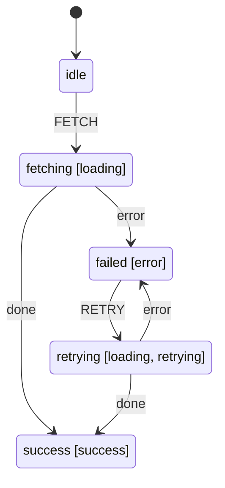

```typescript
import { createMachine, createActor } from "xstate";
// => createMachine: machine blueprint; createActor: running actor
// => tags is a built-in machine feature; no extra import needed

const loadMachine = createMachine({
  // => Machine with tags for UI-friendly state querying
  // => tags decouple UI checks from state name strings
  id: "load",
  // => id: for DevTools and system.get() lookup
  initial: "idle",
  // => Machine starts in idle; no fetch in progress
  states: {
    idle: {
      // => No tags: neutral starting state
      // => idle has no semantic label; UI shows nothing special
      on: { FETCH: "fetching" },
      // => FETCH event transitions to fetching; starts the load
    },
    fetching: {
      tags: ["loading"],
      // => Tag this state as 'loading'
      // => Any state tagged 'loading' shows a spinner
      // => snapshot.hasTag('loading') returns true in this state
      after: { 30: "success" },
      // => Simulate fetch delay for demo
      // => Real use: invoke a fromPromise actor here
    },
    retrying: {
      tags: ["loading", "retrying"],
      // => Multiple tags allowed on a single state
      // => 'loading' tag: show spinner; 'retrying' tag: show retry count
      // => snapshot.hasTag('loading') AND snapshot.hasTag('retrying') both true
      after: { 30: "success" },
      // => Auto-complete after 30ms (demo only)
    },
    success: {
      tags: ["success"],
      // => Signals successful outcome to UI
      // => snapshot.hasTag('success') true here; show success state
    },
    failed: {
      tags: ["error"],
      // => Signals error state to UI
      // => snapshot.hasTag('error') true here; show error message
      on: { RETRY: "retrying" },
      // => RETRY transitions to retrying state (tagged loading+retrying)
    },
  },
});
// => loadMachine is inert until createActor wraps it

const actor = createActor(loadMachine).start();
// => Actor starts in 'idle' state; no tags active
actor.send({ type: "FETCH" });
// => Machine in 'fetching' state
// => fetching has tags: ['loading']

const snapshot = actor.getSnapshot();
// => snapshot: current machine state including tags

// Check by tag -- not by exact state name
console.log(snapshot.hasTag("loading"));
// => Output: true -- safe even if state is renamed internally
// => hasTag: checks current state's tags array; returns boolean

console.log(snapshot.hasTag("error"));
// => Output: false
// => 'error' tag not in fetching state's tags array

console.log(snapshot.hasTag("success"));
// => Output: false (not yet done)
// => 'success' tag only present in success state

// UI usage pattern (React pseudo-code):
// const isLoading = snapshot.hasTag('loading')  // => Shows spinner for fetching OR retrying
// const isError   = snapshot.hasTag('error')    // => Shows error message
// const showRetry = snapshot.hasTag('retrying') // => Shows retry count badge
// => All three checks work regardless of which specific state is active
```

**Key Takeaway**: Assign `tags` arrays to states and query with `snapshot.hasTag(tag)` to decouple UI state from machine topology — multiple states can share a tag, and adding new states does not break existing tag checks.

**Why It Matters**: UI components that check `snapshot.matches('fetching')` break whenever the machine gains a new loading state (retrying, revalidating, refreshing). Tags invert this relationship — the machine declares what states mean, not the UI. When you add a `revalidating` state, you simply give it the `loading` tag and every spinner in the app updates automatically. This is the principle of programming to intent, not implementation.

---

## Group 9: React Integration with @xstate/react (Examples 40-45)

> **Note**: Examples 40-45 use React hooks and require a React environment. Run these in a Next.js or Vite project with `@xstate/react` installed (`npm install @xstate/react`).

### Example 40: useMachine — React Hook Basics

`useMachine` is the primary hook for using an XState machine in a React component. It starts the machine on mount, stops it on unmount, and returns `[snapshot, send]` — the current state snapshot and the event sender function.

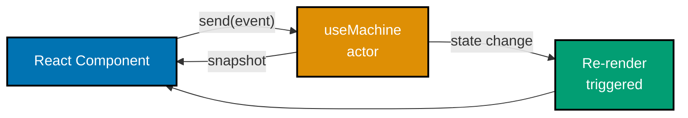

```typescript
import React from "react";
// => React is required for JSX and hooks
import { useMachine } from "@xstate/react";
// => useMachine: primary hook for XState in React; starts actor on mount
import { createMachine, assign } from "xstate";
// => createMachine: machine blueprint; assign: context updater

// Simple counter machine — defined OUTSIDE component for stable reference
// => module-level definition is created once, not on every render
const counterMachine = createMachine({
  // => Machine definition lives outside the component
  // => This avoids creating a new machine definition on every render
  id: "counter",
  // => Stable id for debugging and DevTools
  context: { count: 0 },
  // => Initial context; count starts at 0
  initial: "active",
  // => Machine starts in 'active' state; only one state needed here
  states: {
    // => states: all valid configurations for this machine
    active: {
      // => 'active' accepts INCREMENT, DECREMENT, and RESET events
      on: {
        // => Event routing table for 'active' state
        INCREMENT: {
          actions: assign({ count: ({ context }) => context.count + 1 }),
          // => Pure action: returns new context, no side effects
          // => context.count + 1: derived from previous value, not mutated
          // => assign produces { count: context.count + 1 }, replaces context
        },
        // => INCREMENT handler closed; next event handler follows
        DECREMENT: {
          actions: assign({ count: ({ context }) => context.count - 1 }),
          // => Decrements count; allows negative values by design
        },
        // => DECREMENT handler closed; control returns to event router
        RESET: {
          actions: assign({ count: () => 0 }),
          // => Resets count to zero unconditionally
          // => ignores context; always produces { count: 0 }
        },
        // => RESET handler closed; all three events now defined
      },
      // => on: block closed; 'active' state fully configured
    },
    // => active: state closed; states map complete
  },
  // => states: block closed; machine definition complete
});
// => counterMachine is defined once outside the component (stable reference)
// => Defining outside avoids re-creating machine definition on every render

// CounterComponent: function component wired to the counter machine
function CounterComponent() {
  // => useMachine(counterMachine): binds this component to the machine
  const [snapshot, send] = useMachine(counterMachine);
  // => useMachine creates and starts actor on mount
  // => Returns current snapshot and stable send function
  // => Component re-renders on EVERY snapshot change

  // snapshot.context.count: live count value from machine context
  // snapshot.value: current state name ('active')
  // send: stable function reference; safe to use in event handlers without useCallback
  // Pattern: read from snapshot, write with send; never mutate snapshot directly

  // JSX render: read snapshot, dispatch events with send
  return (
    <div>
      {/* => Container div; renders machine-driven UI */}
      <p>Count: {snapshot.context.count}</p>
      {/* => Reads directly from snapshot.context */}
      <button onClick={() => send({ type: "INCREMENT" })}>+</button>
      {/* => send is stable (same reference across renders) */}
      <button onClick={() => send({ type: "DECREMENT" })}>-</button>
      {/* => Sends DECREMENT event; machine handles context update */}
      <button onClick={() => send({ type: "RESET" })}>Reset</button>
      {/* => Sends RESET event; count returns to 0 */}
      <p>State: {String(snapshot.value)}</p>
      {/* => snapshot.value is the current state name */}
    </div>
  );
  // => Return value: React element tree driven by machine snapshot
}
// => function CounterComponent closed; component definition complete

export default CounterComponent;
// => CounterComponent renders the machine state
// => Machine is created on mount, stopped on unmount (cleanup automatic)
// => Default export makes this importable by other React components
```

**Key Takeaway**: `useMachine(machine)` creates a component-scoped actor, triggers re-renders on every state change, and returns a stable `send` function — the simplest XState-React integration.

**Why It Matters**: `useMachine` replaces `useState` + `useReducer` for non-trivial component state with a structured alternative that has explicit states, typed events, and visualisable transitions. The machine definition lives outside the component, so it is reusable, testable independently, and inspectable with the XState visualiser. Re-renders on every change is intentional for correctness — see Example 41 for optimised selective subscriptions.

---

### Example 41: useSelector — Optimized Re-renders

`useSelector` subscribes a component to only one derived value from an actor. The component only re-renders when that derived value changes — not on every snapshot update. This is the performance optimisation for components that read a single property from a large machine context.

```typescript
import React, { useContext } from "react";
// => React: required for JSX; useContext: for consuming React context
import { useSelector } from "@xstate/react";
// => useSelector: subscribes component to one derived value from an actor
// => Re-renders ONLY when the selected value changes (reference equality)
import { createMachine, createActor, assign } from "xstate";
// => createMachine: blueprint; createActor: runtime actor; assign: context updater
import type { ActorRef } from "xstate";
// => ActorRef: type for actor references; used in component prop types

// Machine with multiple independent context fields
const dashboardMachine = createMachine({
  // => Large context machine; components should not all re-render on every change
  // => Four fields update at different frequencies; useSelector isolates each
  id: "dashboard",
  // => id: for DevTools and system.get() lookup
  context: {
    userCount: 0,
    // => Changes frequently (real-time updates)
    // => WebSocket push: new users connecting/disconnecting
    revenue: 0,
    // => Changes frequently
    // => Updated on each transaction; high-frequency field
    alertCount: 0,
    // => Changes infrequently
    // => Only increments on ADD_ALERT; AlertBadge subscribes only to this
    currentPage: "overview" as string,
    // => Changes on navigation only
    // => PageTitle subscribes only to this; ignores metric updates
  },
  on: {
    // => Machine-level events; active in all states
    UPDATE_METRICS: {
      // => High-frequency event; could fire multiple times per second
      actions: assign({
        userCount: ({ event }) => event.userCount,
        // => Update userCount from event payload
        revenue: ({ event }) => event.revenue,
        // => Metrics update frequently
        // => Components not subscribed to these fields are NOT re-rendered
      }),
    },
    ADD_ALERT: {
      // => Low-frequency event; increments alertCount
      actions: assign({ alertCount: ({ context }) => context.alertCount + 1 }),
      // => context.alertCount: 0 -> 1 -> 2 ... (each ADD_ALERT)
    },
    NAVIGATE: {
      // => Navigation event; updates currentPage
      actions: assign({ currentPage: ({ event }) => event.page }),
      // => context.currentPage: 'overview' -> 'settings' -> ...
    },
  },
});
// => dashboardMachine is inert until createActor wraps it

// Standalone actor to share across components
const dashboardActor = createActor(dashboardMachine).start();
// => In production, provide this via React context (see Example 43)
// => Module-level actor: shared across all component instances

// Component that only cares about alert count
// => AlertBadge: subscribes only to alertCount; ignores all other context fields
function AlertBadge({ actorRef }: { actorRef: typeof dashboardActor }) {
  // => actorRef: the actor to subscribe to (typed as dashboardActor's type)
  const alertCount = useSelector(
    actorRef,
    // => First arg: the actor to subscribe to
    // => useSelector subscribes to this actor's snapshots internally
    (snapshot) => snapshot.context.alertCount
    // => Selector function: extract the value you care about
    // => Component only re-renders when alertCount changes
    // => Ignores userCount and revenue updates
    // => Reference equality check: re-renders only when alertCount !== previous
  );
  // => alertCount: number -- current value from machine context

  return alertCount > 0 ? (
    <span className="badge">{alertCount} alerts</span>
    {/* => Renders badge only when alerts exist */}
    // => Only renders when there are alerts
  ) : null;
  // => null: renders nothing when alertCount is 0
}

// Component that only cares about current page
// => PageTitle: subscribes only to currentPage; metric updates never cause re-renders
function PageTitle({ actorRef }: { actorRef: typeof dashboardActor }) {
  // => actorRef: same actor shared with AlertBadge; no extra cost
  const currentPage = useSelector(
    actorRef,
    // => Same actor ref; different selector function
    (snapshot) => snapshot.context.currentPage
    // => Only re-renders when navigation happens
    // => Ignores frequent metric updates completely
    // => UPDATE_METRICS fires 10x/second; PageTitle never re-renders for them
  );
  // => currentPage: string -- current navigation target

  // => Returns an h1 heading element showing the current page name
  return <h1>{currentPage}</h1>;
  {/* => Renders page title; stable unless NAVIGATE fires */}
  // => Stable render: only changes on page navigation
}

// Usage in parent (simplified)
// => Dashboard: parent component; distributes actorRef to children via props
// => Each child subscribes independently; Dashboard itself never re-renders for snapshots
function Dashboard() {
  // => Dashboard owns the actor ref; passes to children
  return (
    <div>
      {/* => Container for all dashboard sub-components */}
      <AlertBadge actorRef={dashboardActor} />
      {/* => Only re-renders when alertCount changes */}
      <PageTitle actorRef={dashboardActor} />
      {/* => Only re-renders when currentPage changes */}
    </div>
  );
  // => Dashboard itself does NOT re-render on metric updates
}
```

**Key Takeaway**: `useSelector(actorRef, selector)` subscribes to only the derived value returned by the selector function, preventing re-renders when unrelated parts of the snapshot change.

**Why It Matters**: `useMachine` causes a re-render every time any part of the snapshot changes. In a dashboard with 10 real-time metrics updating per second, 20 components subscribed via `useMachine` means 200 re-renders per second. `useSelector` drops that to only the components whose selected values actually changed. For high-frequency actor updates (WebSocket feeds, animations, live data), this is the difference between a smooth 60fps UI and visible jank.

---

### Example 42: useActorRef — Accessing Actor Reference

`useActorRef` starts a machine and returns the stable `ActorRef` without subscribing to snapshot changes. Combine it with `useSelector` for surgical subscriptions — the actor ref is stable across renders while individual selectors subscribe to only what they need.

```typescript
import React from "react";
// => React: required for JSX and component hooks
// => React namespace needed for JSX transform even without explicit React.createElement
import { useActorRef, useSelector } from "@xstate/react";
// => useActorRef: creates actor, returns stable ref WITHOUT subscribing
// => useSelector: subscribes to one derived value; re-renders only on change
import { createMachine, assign } from "xstate";
// => createMachine: machine blueprint; assign: context updater action
// => Both imports from 'xstate' core; no React coupling in machine definition

// searchMachine: four-field context machine demonstrating selective subscription
// => SearchBar subscribes to isLoading; SearchResults subscribes to results
const searchMachine = createMachine({
  // => Multi-field search machine -- expensive to re-render fully
  // => Four context fields: components subscribe only to what they need
  id: "search",
  // => id: for DevTools identification
  context: {
    // => Four fields; each component subscribes only to the one it needs
    query: "",
    // => Current search query string; set on SEARCH event
    results: [] as string[],
    // => Results array could be large
    // => Only SearchResults component subscribes to this field
    isLoading: false,
    // => Loading flag; SearchBar subscribes to this via useSelector
    totalResults: 0,
    // => Count of results; could be shown in a separate component
    // => Not subscribed to by SearchBar or SearchResults in this example
  },
  initial: "idle",
  // => Machine starts in idle; waiting for first search
  states: {
    // => Two states: idle (waiting) and searching (fetching)
    idle: {
      // => idle: no search in progress; waiting for SEARCH event
      on: {
        // => SEARCH: only event in idle state; triggers search flow
        SEARCH: {
          // => SEARCH event: user typed in input field
          target: "searching",
          // => Transition to searching state
          actions: assign({
            query: ({ event }) => event.query,
            // => Capture the search query from the event
            // => context.query: '' -> 'react hooks' (from event.query)
            isLoading: () => true,
            // => Set loading flag before results arrive
            // => context.isLoading: false -> true
          }),
          // => assign executes synchronously before state transition completes
        },
        // => SEARCH handler closed; idle state has one transition defined
      },
    },
    // => idle state closed; transitions to searching on SEARCH
    searching: {
      // => searching: fetch in progress; auto-completes after delay
      after: {
        50: {
          // => 50ms simulates async search request
          target: "idle",
          // => Return to idle after results arrive
          actions: assign({
            results: ({ context }) => [`Result for: ${context.query}`],
            // => Simulated results
            // => Real: fetch('/api/search?q=' + context.query)
            isLoading: () => false,
            // => Clear loading flag once results are in
            // => context.isLoading: true -> false
            totalResults: () => 1,
            // => Set result count; simplified to 1 for demo
          }),
          // => All three context fields updated atomically on the delayed transition
        },
        // => 50ms delayed transition closed; machine returns to idle with results
      },
    },
    // => searching state closed; after-delay transitions back to idle
  },
  // => states object closed; two states defined: idle and searching
});
// => searchMachine is inert until useActorRef wraps it
// => Blueprint only; no timers run until actor is started

// SearchBar: parent component that owns the actor and owns the isLoading selector
// => Actor ownership here means lifecycle is tied to SearchBar mount/unmount
function SearchBar() {
  // => SearchBar: owns the actor; delegates rendering to child components
  const actorRef = useActorRef(searchMachine);
  // => Creates and starts actor; does NOT subscribe to snapshot changes
  // => actorRef is stable -- same reference for component lifetime
  // => SearchBar itself does NOT re-render on state changes

  const isLoading = useSelector(actorRef, (s) => s.context.isLoading);
  // => SearchBar re-renders ONLY when isLoading changes
  // => Does not re-render when results or totalResults change
  // => isLoading: boolean -- reflects searching state

  // => return: renders input + loading indicator + SearchResults child
  // => SearchBar JSX mounts once; isLoading selector is the only re-render trigger
  return (
    <div>
      {/* => Container for search input and results */}
      {/* => SearchBar renders once; isLoading selector causes selective re-renders */}
      <input
        onChange={(e) => actorRef.send({ type: "SEARCH", query: e.target.value })}
        // => Send events directly to actorRef -- no re-render triggered here
        // => actorRef.send is stable; does not cause re-renders on its own
        placeholder="Search..."
        {/* => placeholder: shown when input is empty */}
      />
      {/* => Input field; fires SEARCH event on every keystroke */}
      {isLoading && <span>Loading...</span>}
      {/* => Only this renders when loading changes */}
      {/* => Conditionally rendered; shows spinner during search */}
      <SearchResults actorRef={actorRef} />
      {/* => Results component subscribes independently */}
      {/* => Passes same actorRef; no extra actor creation */}
      {/* => SearchResults has its own useSelector; updates independently */}
    </div>
  );
}
// => SearchBar re-renders only when isLoading changes; results changes don't affect it
// => actorRef passed down as prop; SearchResults consumes it with its own selector

// SearchResults: child component that owns the results selector
// => Independent re-render cycle from SearchBar; results vs isLoading are decoupled
function SearchResults({ actorRef }: { actorRef: ReturnType<typeof useActorRef<typeof searchMachine>> }) {
  // => actorRef: typed as the return type of useActorRef for searchMachine
  const results = useSelector(actorRef, (s) => s.context.results);
  // => Only re-renders when results array changes
  // => Ignores isLoading changes completely
  // => results: string[] -- current search results array

  // => return: renders an unordered list of result strings
  // => SearchResults has no send calls; it is a pure display component
  return (
    <ul>
      {/* => Unordered list of search results */}
      {/* => Renders when results changes; not when isLoading changes */}
      {results.map((r, i) => <li key={i}>{r}</li>)}
      {/* => Each result rendered as a list item */}
      {/* => key={i}: stable key for React reconciliation */}
    </ul>
  );
}
// => SearchResults re-renders only when results array reference changes
// => isLoading transitions do not affect this component at all
// => results=[] on mount; [] -> ['Result for: react hooks'] on first search

export default SearchBar;
// => SearchBar is the default export; use in parent components
// => Actor owned by SearchBar; lifecycle tied to SearchBar mount/unmount
// => Unmounting SearchBar stops the actor and all its timers
```

**Key Takeaway**: `useActorRef` gives you a stable actor reference without any subscription; pair it with `useSelector` in any child component to create fine-grained subscriptions without prop drilling.

**Why It Matters**: `useMachine` is convenient but couples the consuming component to the entire snapshot. `useActorRef` + `useSelector` separates two concerns: actor ownership (which component creates and owns the actor) from actor observation (which components watch which properties). This enables a parent to own a machine while deeply nested children subscribe to exactly the fields they need — without threading snapshot or send props through the tree.

---

### Example 43: Providing Actors via Context

React Context is the standard pattern for sharing a machine's `ActorRef` across a component tree. Components at any depth subscribe to exactly what they need via `useSelector`, while the actor is created and owned in one place.

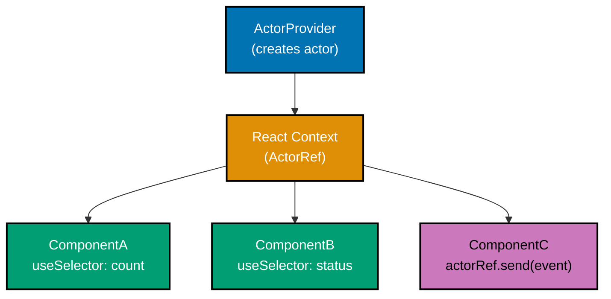

```typescript
import React, { createContext, useContext } from "react";
// => React: JSX and component functions; createContext: creates context object
// => useContext: reads context value in consumer components
// => createContext: factory for React Context object; takes default value as arg
import { useActorRef, useSelector } from "@xstate/react";
// => useActorRef: creates actor, returns ref; no snapshot subscription
// => useSelector: subscribes to one derived value; re-renders on change only
import { createMachine, assign } from "xstate";
// => createMachine: machine blueprint; assign: context updater
import type { ActorRefFrom } from "xstate";
// => ActorRefFrom<M>: utility type that extracts ActorRef type from a machine
// => Gives consumers full TypeScript inference without importing the machine directly

// Shared machine definition
// => appMachine: application-wide state -- two context fields, two machine-level events
const appMachine = createMachine({
  // => Application-level machine shared across component tree
  // => Theme and user: application-global state; all components share this
  id: "app",
  // => id: for DevTools and system.get() lookup
  context: { theme: "light" as "light" | "dark", user: null as string | null },
  // => theme: light/dark mode toggle; 'light' initially
  // => user: logged-in user name; null when not logged in
  on: {
    // => Machine-level events; no states defined; all events handled globally
    TOGGLE_THEME: {
      // => Toggles between light and dark mode
      actions: assign({
        theme: ({ context }) => context.theme === "light" ? "dark" : "light",
        // => Derive new theme from current: light -> dark -> light...
        // => Ternary toggle; no external data needed
      }),
      // => TOGGLE_THEME handler closed; theme field flips on each event
    },
    SET_USER: {
      // => Sets user name when login succeeds
      actions: assign({ user: ({ event }) => event.name }),
      // => context.user: null -> 'Alice' (from event.name)
    },
    // => SET_USER handler closed; user field set from event payload
  },
  // => on object closed; two global event handlers defined
});
// => appMachine is inert until useActorRef wraps it
// => Machine has no states; context-only machine with global event handlers

// Create typed context -- null initial value, overridden by provider
// => AppActorContext: React Context holding the ActorRef; null before provider renders
const AppActorContext = createContext<ActorRefFrom<typeof appMachine> | null>(null);
// => ActorRefFrom<typeof appMachine> gives full type inference in consumers
// => null: initial value; provider always sets a real ActorRef before render

// Provider component: creates the actor once, exposes it via context
// => AppActorProvider: wraps subtree; all descendants can access actorRef via useAppActor()
function AppActorProvider({ children }: { children: React.ReactNode }) {
  // => AppActorProvider: creates and owns the machine actor for its subtree
  // => children: React.ReactNode -- accepts any JSX tree as children
  const actorRef = useActorRef(appMachine);
  // => Actor created here, lives for provider's lifetime
  // => Stopped automatically when provider unmounts
  // => actorRef: stable reference; same object across re-renders

  // => return: wraps children in Context.Provider; passes actorRef as value
  return (
    <AppActorContext.Provider value={actorRef}>
      {/* => Makes actorRef available to all descendants via useContext */}
      {children}
      {/* => All descendants can access actorRef via useAppActor() */}
    </AppActorContext.Provider>
  );
}
// => AppActorProvider wraps the app root; actor lifecycle tied to provider
// => Single actor for entire subtree; no duplication at each consumer

// Custom hook for consuming components
// => useAppActor: encapsulates useContext + null guard; cleaner than raw useContext
function useAppActor() {
  // => Custom hook: type-safe actorRef accessor; throws if used outside provider
  const ref = useContext(AppActorContext);
  // => useContext reads from nearest AppActorContext.Provider ancestor
  if (!ref) throw new Error("useAppActor must be used inside AppActorProvider");
  // => Throws early with a clear message if context is missing
  // => Prevents silent undefined errors in consuming components
  return ref;
  // => Returns typed ActorRef; consumers can call .send() or pass to useSelector
}
// => useAppActor closed; returns ActorRefFrom<typeof appMachine>

// Consumer: reads theme without knowing where the actor lives
// => ThemeToggle: subscribes to theme only; SET_USER events never re-render this
function ThemeToggle() {
  // => ThemeToggle: standalone consumer; no props needed
  const actorRef = useAppActor();
  // => Gets stable actorRef from context
  // => Does not know or care where the actor was created
  const theme = useSelector(actorRef, (s) => s.context.theme);
  // => Only re-renders when theme changes
  // => SET_USER events do NOT cause ThemeToggle to re-render

  // => return: renders a button that sends TOGGLE_THEME on click
  return (
    <button onClick={() => actorRef.send({ type: "TOGGLE_THEME" })}>
      {/* => Click sends event directly to actor; no prop callbacks needed */}
      Switch to {theme === "light" ? "dark" : "light"} mode
      {/* => Derived from current theme; toggles displayed text */}
    </button>
  );
}
// => ThemeToggle re-renders only on theme changes; isolated from user updates

// Consumer: reads user, independent re-render cycle from ThemeToggle
// => UserGreeting: subscribes to user only; TOGGLE_THEME never re-renders this
function UserGreeting() {
  // => UserGreeting: reads only user; ignores theme entirely
  const actorRef = useAppActor();
  // => Same actorRef as ThemeToggle; no extra actor creation
  const user = useSelector(actorRef, (s) => s.context.user);
  // => Only re-renders when user changes; theme toggles don't affect this
  // => user: string | null -- null when not logged in

  // => return: renders greeting paragraph; 'Guest' fallback when not logged in
  return <p>Hello, {user ?? "Guest"}</p>;
  // => Fallback to 'Guest' when user is null
  // => <p> re-renders only when user changes; theme toggles don't trigger re-render
}
// => UserGreeting re-renders only on user changes; theme toggles don't affect it

// Root app
// => App: entry point; wraps entire tree in AppActorProvider
function App() {
  // => App: wraps tree in provider; machine actor is created once here
  // => return: renders provider wrapping both consumers
  return (
    <AppActorProvider>
      {/* => Provider creates actor; all descendants access via useAppActor() */}
      {/* => Actor created once on mount; persists for lifetime of AppActorProvider */}
      <ThemeToggle />
      {/* => ThemeToggle subscribes to theme only */}
      <UserGreeting />
      {/* => UserGreeting subscribes to user only */}
      {/* => Both components share one actor; no prop drilling or extra actors */}
    </AppActorProvider>
  );
}
// => Both consumers share one actor; independent re-render cycles
// => App closed; provider wraps both consumers in a single React tree

export default App;
// => App is the root component; export for use in entry point
// => Provider pattern: one actor, multiple isolated subscribers
```

**Key Takeaway**: Wrap the component tree in a provider that creates and owns the actor; expose the `ActorRef` via React Context; consumers use `useSelector` for isolated, fine-grained subscriptions.

**Why It Matters**: This pattern scales from a simple theme toggle to an application-wide state machine. Because consumers subscribe to individual values rather than the full snapshot, adding new context fields or new machine states does not cause unnecessary re-renders. The actor lifecycle is tied to the provider, not individual components — it persists across route changes and component remounts without global variable anti-patterns.

---

### Example 44: useMachine with Input

Pass runtime data into a machine on mount using the `input` option of `useMachine`. This is how you bridge React props (user IDs, configuration) into a machine's parameterised context.

```typescript
import React from "react";
// => React: required for JSX and functional component hooks
// => JSX transform needs React in scope even when not called directly
import { useMachine } from "@xstate/react";
// => useMachine: creates actor on mount, returns [snapshot, send]
// => Second argument accepts { input } to parameterise the machine
// => Destructured pair: snapshot for reading state, send for dispatching events
import { createMachine, assign } from "xstate";
// => createMachine: machine blueprint; assign: context updater
// => assign: pure context updater; returns new context object

// Machine that accepts user-specific input
// => profileMachine: same blueprint reused per user; input differentiates instances
const profileMachine = createMachine({
  // => Machine parameterised by userId -- each user gets their own actor
  // => Same blueprint; different input creates independent instances
  id: "profile",
  // => id: for DevTools identification
  context: ({ input }: { input: { userId: string; displayName: string } }) => ({
    // => context initialiser receives input at actor creation
    // => Function form required when machine uses input
    // => Arrow function: called once during actor start with the input object
    userId: input.userId,
    // => Comes from component props
    // => context.userId: stored for API calls or analytics
    displayName: input.displayName,
    // => Comes from component props
    // => context.displayName: shown in UI; editable via the machine
    bio: "" as string,
    // => bio: starts empty; updated by SAVE_BIO event
    // => type assertion: TypeScript sees bio as string, not string literal ''
    editMode: false,
    // => editMode: false initially; true when in editing state
    // => Not used for transitions; tracked for potential UI state checks
  }),
  // => context initialiser closed; four fields populated from input + defaults
  initial: "viewing",
  // => Machine starts in viewing state; profile is read-only initially
  states: {
    // => Two states: viewing (read-only) and editing (editable)
    viewing: {
      // => viewing: read-only profile display
      on: { EDIT: "editing" },
      // => EDIT event transitions to editing state; user clicks Edit button
      // => value: 'viewing' -> 'editing' on EDIT
    },
    // => viewing state closed; only EDIT event defined
    editing: {
      // => editing: bio is editable; save or cancel available
      on: {
        SAVE_BIO: {
          // => SAVE_BIO: saves the edited bio text
          target: "viewing",
          // => Return to viewing after save
          actions: assign({ bio: ({ event }) => event.bio, editMode: () => false }),
          // => context.bio updated from event.bio (user-entered text)
          // => context.editMode: true -> false after save
        },
        // => SAVE_BIO handler closed; bio saved and machine returns to viewing
        CANCEL: { target: "viewing" },
        // => CANCEL: discard edits, return to viewing without saving
        // => No action; bio stays unchanged; only state transitions
      },
      // => on object closed; two events in editing state: SAVE_BIO and CANCEL
    },
    // => editing state closed; two transitions defined
  },
  // => states object closed; viewing and editing states defined
});
// => profileMachine is inert until useMachine wraps it with input
// => Blueprint shared; each useMachine call creates an independent actor instance

// Component receives userId and displayName as props
// => UserProfile: per-user component; each instance has independent machine actor
function UserProfile({
  userId,
  // => userId: identifies this user in the backend
  displayName,
  // => displayName: shown in the profile header
}: {
  userId: string;
  // => userId prop: string type; maps to machine input
  displayName: string;
  // => displayName prop: string type; maps to machine input
  // => Both props required; TypeScript enforces this at call sites
}) {
  // => Destructured props: userId and displayName extracted from the props object
  const [snapshot, send] = useMachine(profileMachine, {
    // => useMachine creates a fresh actor per component instance
    // => Second argument passes options to the actor
    input: { userId, displayName },
    // => Machine context initialiser receives these values
    // => TypeScript validates input shape against machine's input type
    // => Each UserProfile rendered with different props gets its own actor
  });
  // => snapshot: current machine state; send: event dispatcher
  // => snapshot.value: 'viewing' initially; changes on EDIT/SAVE_BIO/CANCEL
  // => send: stable function reference; safe to use in onClick handlers

  // => Guard: check current state before rendering; early return for editing branch
  if (snapshot.matches("editing")) {
    // => Conditionally render editing UI when in editing state
    // => snapshot.matches('editing'): true when machine is in editing state
    // => Early return pattern: editing UI returned before viewing UI branch
    return (
      <div>
        {/* => Editing view: shows save/cancel controls */}
        {/* => Rendered only when snapshot.value === 'editing' */}
        <p>Editing profile for: {snapshot.context.displayName}</p>
        {/* => displayName: from input; displayed as context field */}
        {/* => context.displayName never changes; only bio changes */}
        <button
          onClick={() => send({ type: "SAVE_BIO", bio: "Updated bio text" })}
          // => SAVE_BIO event with bio text; machine transitions to viewing
          // => bio: 'Updated bio text' saved to context.bio
        >
          Save
          {/* => Save: label text; functional via onClick handler */}
        </button>
        {/* => Save button: sends SAVE_BIO to machine */}
        <button onClick={() => send({ type: "CANCEL" })}>Cancel</button>
        {/* => Cancel button: discards edits, returns to viewing */}
        {/* => CANCEL: value 'editing' -> 'viewing'; bio unchanged */}
      </div>
    );
    // => editing branch JSX closed; returned when snapshot.value === 'editing'
  }
  // => if block closed; falls through to viewing branch when not in editing state
  // => snapshot.matches('editing') was false; machine is in viewing state

  // => Viewing state branch: returned when snapshot.value === 'viewing'
  // => Default path: machine starts in viewing; this renders on initial mount
  return (
    <div>
      {/* => Viewing state: read-only profile display */}
      {/* => Rendered when snapshot.value === 'viewing' (default) */}
      <h2>{snapshot.context.displayName}</h2>
      {/* => displayName came from input, stored in context */}
      {/* => <h2>: profile name heading; read-only */}
      <p>{snapshot.context.bio || "No bio yet."}</p>
      {/* => bio: shows saved bio or fallback text */}
      {/* => 'No bio yet.' shown when context.bio is empty string */}
      <button onClick={() => send({ type: "EDIT" })}>Edit</button>
      {/* => Edit button: sends EDIT event; machine enters editing state */}
      {/* => value: 'viewing' -> 'editing' on click */}
    </div>
  );
}
// => UserProfile: each instance is independent; props become machine context
// => Two instances with different userId props run completely separate actors

export default UserProfile;
// => Each rendered UserProfile instance has its own independent machine actor
// => userId and displayName are typed and validated at the useMachine call
// => Default export allows import in parent page components
```

**Key Takeaway**: Pass `{ input: props }` as the second argument to `useMachine` to initialise the machine's context from React props — the machine starts in a fully-valid state with all required data.

**Why It Matters**: This pattern is how you render the same machine blueprint for different data items (each user, each todo item, each form instance). The machine definition is reused; the input customises the instance. Without `input`, you would either hard-code values (inflexible) or send initialisation events after `.start()` (exposes an invalid empty-context state briefly). `useMachine` with `input` gives a clean, typed, prop-to-context bridge.

---

### Example 45: Subscribing to Actor Outside React

Sometimes you need to observe actor state outside the React render cycle — for analytics, logging, synchronisation with external systems, or third-party SDKs. Use `actor.subscribe()` directly; remember to unsubscribe when done.

```typescript
import React, { useEffect } from "react";
// => React: JSX support; useEffect: for setting up and cleaning subscriptions
// => useEffect cleanup runs on unmount; correct place for subscription teardown
import { useActorRef } from "@xstate/react";
// => useActorRef: stable actor ref; no snapshot subscription
// => Actor state can be observed via actorRef.subscribe() in useEffect
import { createMachine, assign } from "xstate";
// => createMachine: machine blueprint; assign: context updater

// purchaseMachine: three-state checkout flow; external systems observe via subscribe
const purchaseMachine = createMachine({
  // => E-commerce checkout machine for purchase flow
  // => Three states: cart -> payment -> confirmed
  id: "purchase",
  // => id: for DevTools identification
  context: { step: 1 as number, orderId: null as string | null },
  // => step: tracks checkout progress (simplified; not used for transitions)
  // => orderId: null until CONFIRM; then timestamp-based ID
  initial: "cart",
  // => Machine starts in cart state; user has items to purchase
  states: {
    cart: { on: { CHECKOUT: "payment" } },
    // => cart: user reviews items; CHECKOUT transitions to payment
    payment: {
      // => payment: user enters payment details; CONFIRM finalises
      on: {
        CONFIRM: {
          // => CONFIRM: user confirms purchase
          target: "confirmed",
          // => Transition to confirmed (final) state
          actions: assign({ orderId: () => `ord-${Date.now()}` }),
          // => Generate orderId on confirmation
          // => context.orderId: null -> 'ord-1234567890' (timestamp-based)
        },
      },
    },
    confirmed: { type: "final" },
    // => confirmed: purchase complete; snapshot.status becomes 'done'
    // => Analytics subscription fires when status === 'done'
  },
});
// => purchaseMachine is inert until useActorRef wraps it

// PurchaseFlow: React component; no snapshot subscription; pure event dispatch + external observers
function PurchaseFlow() {
  // => PurchaseFlow: owns actor; external systems observe via subscribe
  const actorRef = useActorRef(purchaseMachine);
  // => Get stable actor ref; no re-render subscription
  // => actorRef is stable; safe to use in useEffect dependency array

  useEffect(() => {
    // => Set up external subscriptions inside useEffect for proper cleanup
    // => useEffect body runs after mount; cleanup runs on unmount
    const analyticsSubscription = actorRef.subscribe((snapshot) => {
      // => Called for every snapshot change
      // => This runs OUTSIDE React's render cycle
      // => Does not trigger re-renders; pure side-effect callback
      if (snapshot.status === "done") {
        // => done: machine reached confirmed (final) state
        console.log("[Analytics] Purchase completed:", snapshot.context.orderId);
        // => Fire analytics event when purchase finalises
        // => In production: analytics.track('purchase_complete', { orderId })
        // => snapshot.context.orderId: 'ord-1234567890'
      }
      if (snapshot.matches("payment")) {
        // => payment state: user entered checkout funnel
        console.log("[Analytics] Checkout started");
        // => Track funnel entry
        // => In production: analytics.track('checkout_started')
      }
    });
    // => analyticsSubscription: subscription object with .unsubscribe()

    const loggingSubscription = actorRef.subscribe((snapshot) => {
      // => Multiple subscriptions allowed -- each independent
      // => Second subscriber to same actor; no performance impact on first
      console.log("[Log] State:", snapshot.value);
      // => Logs every state transition for debugging
      // => Output: cart -> payment -> confirmed
    });
    // => loggingSubscription: separate subscription object

    return () => {
      // => Cleanup function: runs when component unmounts
      analyticsSubscription.unsubscribe();
      // => Clean up analytics subscription on unmount
      // => Without this: subscription fires after component is gone
      loggingSubscription.unsubscribe();
      // => Clean up logging subscription on unmount
      // => Prevents memory leaks and ghost subscriptions
      // => Both subscriptions removed; actor continues running independently
    };
  }, [actorRef]);
  // => actorRef is stable; this effect runs once per mount
  // => Empty-like dependency array: subscriptions set up once

  return (
    <div>
      {/* => Minimal UI; event dispatch only; no snapshot subscription */}
      <button onClick={() => actorRef.send({ type: "CHECKOUT" })}>
        Proceed to Checkout
        {/* => CHECKOUT: cart -> payment transition */}
      </button>
      <button onClick={() => actorRef.send({ type: "CONFIRM" })}>
        Confirm Purchase
        {/* => CONFIRM: payment -> confirmed transition; generates orderId */}
      </button>
    </div>
  );
}
// => PurchaseFlow does NOT re-render on state changes; UI is event-driven only

export default PurchaseFlow;
// => Analytics and logging observe the machine without affecting render performance
// => React UI re-renders are independent of these external subscriptions
```

**Key Takeaway**: Call `actor.subscribe(callback)` to observe state changes outside React; store the subscription object and call `.unsubscribe()` in the `useEffect` cleanup to prevent memory leaks.

**Why It Matters**: Analytics, logging, and third-party SDK integrations should not live inside React components because they are not UI concerns. By subscribing to the actor directly, you observe state transitions at the source without coupling to component lifecycle or render batching. The actor is the single source of truth for application state — external systems observing it via `subscribe` stay automatically synchronised without polling or prop callbacks.

---

## Group 10: Testing (Examples 46-50)

### Example 46: Testing Machines with createActor

XState machines are pure — given the same sequence of events, they produce the same state. This makes unit testing straightforward: create an actor, send events, assert snapshot values. No mocking framework required.

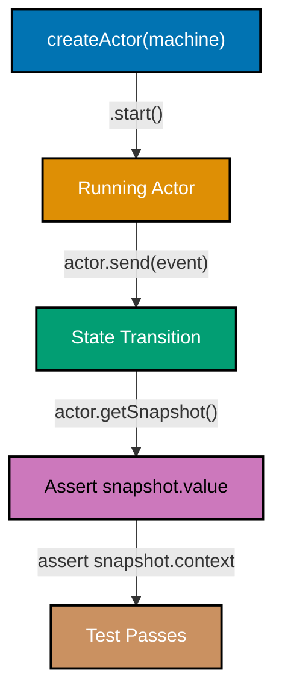

```typescript
import { createMachine, createActor, assign } from "xstate";
// => createMachine: machine blueprint; createActor: running actor instance
// => assign: context updater; no test framework imports needed for basic assertions

// Machine under test: a simple login flow
const loginMachine = createMachine({
  // => Production machine definition (would be imported in real tests)
  // => In real test files: import { loginMachine } from '../machines/login'
  id: "login",
  // => id: for DevTools and error messages
  context: {
    // => All machine state that tests need to assert is in context
    email: "",
    // => email: set from SUBMIT event; empty initially
    attempts: 0,
    // => attempts: increments on each failed login attempt
    errorMessage: null as string | null,
    // => errorMessage: null initially; set on authentication failure
  },
  initial: "idle",
  // => Machine starts in idle; waiting for user input
  states: {
    // => Four states: idle, submitting, success (final), error
    idle: {
      // => idle: login form shown; awaiting SUBMIT event
      on: {
        // => SUBMIT: only event accepted in idle state
        // => Guard prevents transition if email format is invalid
        SUBMIT: {
          guard: ({ event }) => event.email.includes("@"),
          // => Basic email validation guard
          // => Guard blocks transition if email has no '@'
          target: "submitting",
          // => Valid email: proceed to submitting state
          actions: assign({ email: ({ event }) => event.email }),
          // => Store submitted email in context
          // => context.email: '' -> 'user@example.com'
        },
      },
    },
    submitting: {
      // => submitting: async auth check simulated with delay
      after: {
        // => after: time-based auto-transition; no user event needed
        10: [
          // => After 10ms, evaluate guards to pick outcome
          // => Array form: checked in order; first matching guard wins
          {
            guard: ({ context }) => context.email === "admin@test.com",
            // => Simulate success for known email
            // => Only 'admin@test.com' succeeds in this demo
            target: "success",
            // => Known email: transition to final success state
          },
          {
            // => All other emails: transition to error
            // => Fallback: no guard; always matches if first guard failed
            target: "error",
            actions: assign({
              attempts: ({ context }) => context.attempts + 1,
              // => context.attempts: 0 -> 1 (increments per failure)
              errorMessage: () => "Invalid credentials",
              // => context.errorMessage: null -> 'Invalid credentials'
            }),
          },
        ],
      },
    },
    success: { type: "final" },
    // => success: login complete; snapshot.status becomes 'done'
    // => Final state: no further transitions possible
    error: {
      // => error: login failed; user can retry
      on: { RETRY: "idle" },
      // => RETRY: clear and try again; transitions to idle
      // => context.errorMessage persists in idle unless cleared explicitly
      // => In production: assign({ errorMessage: null }) on RETRY
    },
  },
});
// => loginMachine is the system under test
// => Pure function: same events → same states, every time

// Test suite (compatible with Jest, Vitest, or plain assertions)
async function runTests() {
  // => Each test creates a fresh actor; no shared mutable state between tests
  // => Block scopes {} ensure no variable leakage between tests
  // Test 1: starts in idle state
  {
    const actor = createActor(loginMachine).start();
    // => Create fresh actor for each test (no shared state)
    // => actor.start() is required before sending events or reading snapshot
    console.assert(actor.getSnapshot().value === "idle", "Should start idle");
    // => Assert: actor.getSnapshot().value === 'idle'  ✓
    // => getSnapshot() returns synchronous current state; no async needed
    // => Test 1 verifies: machine starts in correct initial state
  }

  // Test 2: rejects invalid email format (no '@')
  {
    const actor = createActor(loginMachine).start();
    // => Fresh actor; independent from Test 1
    actor.send({ type: "SUBMIT", email: "not-an-email" });
    // => Guard fails (no '@'), transition blocked
    // => 'not-an-email'.includes('@') === false -> guard returns false
    console.assert(actor.getSnapshot().value === "idle", "Should stay idle on bad email");
    // => Assert: still 'idle' -- guard prevented transition
    // => Machine did not move to submitting; state unchanged
    // => Test 2 verifies: guard blocks invalid input
  }

  // Test 3: valid email transitions to submitting
  {
    const actor = createActor(loginMachine).start();
    // => Fresh actor; independent from Tests 1 and 2
    actor.send({ type: "SUBMIT", email: "user@example.com" });
    // => 'user@example.com'.includes('@') === true -> guard passes
    console.assert(actor.getSnapshot().value === "submitting", "Should enter submitting");
    // => Assert: 'submitting' -- guard passed, transition occurred
    // => context.email is now 'user@example.com'
    // => Test 3 verifies: valid email advances state
  }

  // Test 4: known email leads to success after delay
  {
    const actor = createActor(loginMachine).start();
    // => Fresh actor; independent from previous tests
    actor.send({ type: "SUBMIT", email: "admin@test.com" });
    // => Known email; guard will pass after 10ms delay
    await new Promise((r) => setTimeout(r, 50));
    // => Wait for after: 10 delay to elapse
    // => 50ms > 10ms: gives plenty of time for auto-transition
    console.assert(actor.getSnapshot().value === "success", "Admin should succeed");
    // => Assert: 'success' -- known email guard passed
    // => snapshot.status is 'done' (final state reached)
    // => Test 4 verifies: time-based transitions work correctly
  }

  console.log("All tests passed");
  // => Output: All tests passed
}

runTests();
// => Runs all four test cases in sequence
// => Each test is isolated via fresh createActor() call
```

**Key Takeaway**: Test XState machines by creating a fresh `createActor` per test, sending events, and asserting `snapshot.value` and `snapshot.context` — pure inputs produce predictable outputs, no mocking needed.

**Why It Matters**: Machine tests are the most valuable tests in an XState application because they verify business logic independently from React rendering, network calls, or browser APIs. A test that sends `SUBMIT` and asserts the resulting state documents exactly how the machine behaves — this documentation stays accurate because the test runs on every commit. Machines also integrate with model-based testing tools that generate test cases from the state machine graph automatically.

---

### Example 47: Asserting State with snapshot.matches

`snapshot.matches` provides flexible state matching that handles both flat and nested (parallel and hierarchical) states. Use it in tests and UI conditional logic instead of string equality checks on `snapshot.value`.

```typescript
import { createMachine, createActor, assign } from "xstate";
// => createMachine: machine blueprint; createActor: running instance
// => snapshot.matches() is a method on the snapshot; no extra import needed

// Nested machine: form with nested validation state
const formMachine = createMachine({
  // => Machine with hierarchical states for testing nested matches
  // => editing has nested child states: valid and invalid
  id: "form",
  // => id: for DevTools identification
  initial: "editing",
  // => Machine starts in editing state (outer); then editing.valid (inner)
  states: {
    editing: {
      // => Parent state with nested child states
      // => When in editing, machine is ALSO in one of its children
      initial: "valid",
      // => editing starts in its 'valid' child state
      states: {
        valid: { on: { INVALIDATE: "invalid" } },
        // => Nested: form is editing AND valid
        // => snapshot.value: { editing: 'valid' }
        invalid: { on: { FIX: "valid" } },
        // => Nested: form is editing AND invalid
        // => snapshot.value: { editing: 'invalid' }
      },
      on: { SUBMIT: "submitting" },
      // => SUBMIT: exits editing (and its children); goes to submitting
    },
    submitting: {
      // => submitting: flat state; no children
      after: { 10: "done" },
      // => Auto-transition to done after 10ms
    },
    done: { type: "final" },
    // => done: terminal state; snapshot.status becomes 'done'
  },
});
// => formMachine is inert until createActor wraps it

const actor = createActor(formMachine).start();
// => Actor in { editing: 'valid' }
// => snapshot.value: { editing: 'valid' } (not 'editing' -- nested!)

// Top-level matches
console.assert(actor.getSnapshot().matches("editing") === true);
// => true: top-level state is 'editing'
// => matches('editing') works even though value is { editing: 'valid' }
console.assert(actor.getSnapshot().matches("submitting") === false);
// => false: not in submitting
// => Machine is in editing, not submitting

// Nested state matches (object syntax)
console.assert(actor.getSnapshot().matches({ editing: "valid" }) === true);
// => true: matches exact nested state { editing: 'valid' }
// => Object syntax required for nested state assertions
console.assert(actor.getSnapshot().matches({ editing: "invalid" }) === false);
// => false: currently valid, not invalid
// => Machine is in editing.valid, not editing.invalid

// Transition to nested invalid state
actor.send({ type: "INVALIDATE" });
// => State becomes { editing: 'invalid' }
// => INVALIDATE: editing.valid -> editing.invalid
console.assert(actor.getSnapshot().matches({ editing: "invalid" }) === true);
// => true: now in invalid nested state
// => snapshot.value is now { editing: 'invalid' }

// Transition to submitting
actor.send({ type: "FIX" });
// => State back to { editing: 'valid' }
// => FIX: editing.invalid -> editing.valid
actor.send({ type: "SUBMIT" });
// => State becomes 'submitting'
// => SUBMIT: editing -> submitting (exits all nested states)
console.assert(actor.getSnapshot().matches("submitting") === true);
// => true: now submitting
// => snapshot.value: 'submitting' (flat state, no nesting)

// After delay
await new Promise((r) => setTimeout(r, 50));
// => Wait 50ms > 10ms for auto-transition to done
console.assert(actor.getSnapshot().status === "done");
// => true: reached final state
// => snapshot.status: 'done' when any final state is entered
console.assert(actor.getSnapshot().matches("done") === false);
// => false: 'done' is a final state but snapshot.status captures this better
// => matches() works only on active states; use status for final state check

console.log("All match assertions passed");
// => Output: All match assertions passed
```

**Key Takeaway**: `snapshot.matches('state')` checks top-level states; `snapshot.matches({ parent: 'child' })` checks nested states — both return booleans suitable for test assertions and React conditionals.

**Why It Matters**: String equality on `snapshot.value` breaks silently with nested states because `snapshot.value` becomes `{ editing: 'valid' }` instead of `'editing'` — a direct `=== 'editing'` returns false even though the machine IS in the editing state. `snapshot.matches` handles this correctly at every nesting level, making test assertions and UI conditionals robust to machine topology changes.

---

### Example 48: Testing Invocations — Mocking Services

`machine.provide()` replaces actor implementations with test doubles at test time. This isolates the machine's state logic from external dependencies (API calls, databases, timers) while keeping the state transitions under test.

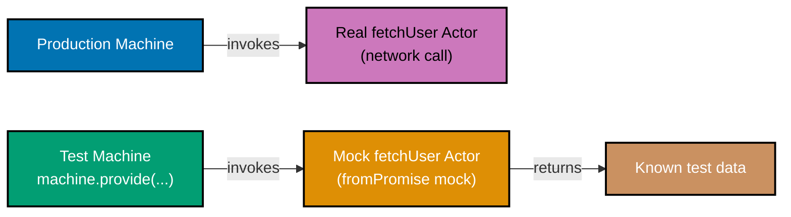

```typescript
import { createMachine, createActor, assign, fromPromise } from "xstate";
// => createMachine: machine blueprint; createActor: running instance
// => assign: context updater; fromPromise: wraps async fn as actor logic
// => fromPromise used for both production and mock implementations

// Production machine with a real service actor
const userMachine = createMachine({
  // => Machine that invokes a network actor
  // => 'fetchUser' is a named actor; swapped in tests via provide()
  id: "user",
  // => id: for DevTools identification
  context: {
    user: null as { id: string; name: string; role: string } | null,
    // => user: null initially; populated on successful fetch
    error: null as string | null,
    // => error: null on success; 'Failed to load user' on failure
  },
  initial: "loading",
  // => Machine starts loading immediately on creation
  states: {
    loading: {
      // => loading: fetch in progress; auto-transitions on completion
      invoke: {
        src: "fetchUser",
        // => Named actor -- implementation provided externally
        // => String 'fetchUser' matched against provide({ actors }) keys
        input: ({ context }) => ({ userId: "u-1" }),
        // => Pass userId to the fetchUser actor as input
        // => context available here but unused in this simplified example
        onDone: {
          target: "loaded",
          // => Successful fetch: transition to loaded (final) state
          actions: assign({ user: ({ event }) => event.output }),
          // => Store fetched user in context
          // => event.output: the value returned by fetchUser's async function
        },
        onError: {
          target: "error",
          // => Failed fetch: transition to error (final) state
          actions: assign({ error: () => "Failed to load user" }),
          // => context.error: null -> 'Failed to load user'
        },
      },
    },
    loaded: { type: "final" },
    // => loaded: user data available; snapshot.status is 'done'
    error: { type: "final" },
    // => error: fetch failed; snapshot.status is 'done'
    // => Both are final; snapshot.output or context.error distinguishes them
  },
});
// => userMachine: the system under test; fetchUser is the swappable dependency

// TEST: mock the fetchUser actor to return controlled data
async function testSuccessfulLoad() {
  const mockUser = { id: "u-1", name: "Test Alice", role: "admin" };
  // => Controlled test data -- no network required
  // => Same shape as the real API response

  const testMachine = userMachine.provide({
    // => provide() returns a new machine with replaced implementations
    // => Original userMachine is NOT mutated; testMachine is a new object
    actors: {
      fetchUser: fromPromise(async () => mockUser),
      // => Replace the 'fetchUser' actor with a synchronous mock
      // => Must match the src name used in invoke
      // => fromPromise wraps mockUser as instant-resolve promise actor
    },
  });
  // => testMachine: same state logic; different fetchUser implementation

  const actor = createActor(testMachine).start();
  // => Starts with mock implementation in place
  // => fetchUser mock resolves immediately to mockUser

  await new Promise((r) => setTimeout(r, 10));
  // => Give the promise actor time to resolve
  // => Even instant promises need one microtask tick

  const snapshot = actor.getSnapshot();
  // => snapshot: final state after mock resolved
  console.assert(snapshot.status === "done");
  // => Machine reached final state
  // => 'done': either loaded or error; check context to distinguish
  console.assert(snapshot.context.user?.name === "Test Alice");
  // => Context populated with mock data, not real API data
  // => user?.name: optional chain handles null case safely
  console.assert(snapshot.context.error === null);
  // => No error
  // => error is null: onDone path taken, not onError
  console.log("Success test passed");
  // => Output: Success test passed
}

// TEST: mock to simulate failure
async function testFailedLoad() {
  // => Second test: same machine logic, different mock behavior
  const testMachine = userMachine.provide({
    // => provide() again; returns a new machine each call
    actors: {
      fetchUser: fromPromise(async () => {
        // => Mock async function that throws instead of resolving
        throw new Error("Network timeout");
        // => Mock throws to simulate network failure
        // => XState catches this and routes to onError handler
      }),
    },
  });
  // => testMachine: same state logic; fetchUser always throws

  const actor = createActor(testMachine).start();
  // => Actor starts; mock fetchUser throws; onError fires
  await new Promise((r) => setTimeout(r, 10));
  // => Wait for rejection to propagate through onError handler

  const snapshot = actor.getSnapshot();
  // => snapshot: final state after mock threw
  console.assert(snapshot.context.error === "Failed to load user");
  // => Error message set from onError handler
  // => context.error: 'Failed to load user' (from assign in onError)
  console.log("Error test passed");
  // => Output: Error test passed
}

testSuccessfulLoad().then(testFailedLoad);
// => Run success test first, then failure test
// => Sequential: testFailedLoad starts after testSuccessfulLoad resolves
```

**Key Takeaway**: `machine.provide({ actors: { actorName: mockImplementation } })` swaps named actor implementations for tests, isolating state logic from I/O without changing the machine definition.

**Why It Matters**: Testing machines that invoke real network actors requires either a running API server or complex MSW setup. `machine.provide()` decouples the machine's state transition logic (what to do when the fetch succeeds or fails) from the fetch implementation. You test the machine's response to success and failure without caring how the data was fetched — exactly the separation that makes state machines valuable: business logic is independent from infrastructure.

---

### Example 49: simulate — Step-by-Step Machine Simulation

Step through a machine's event sequence to assert intermediate states. This technique documents the expected user journey through a multi-step flow and catches regressions when transitions change.

```typescript
import { createMachine, createActor, assign } from "xstate";
// => createMachine: machine blueprint; createActor: running instance
// => assign: context updater; step-by-step testing uses only these three

// Multi-step checkout flow for step-by-step simulation testing
const checkoutMachine = createMachine({
  // => Three-step checkout: cart → shipping → payment → confirmed
  // => Each step has guards that prevent skipping
  id: "checkout",
  // => id: for DevTools identification
  context: {
    // => All checkout progress stored in context; verified step by step
    cartItems: [] as string[],
    // => Items in cart; must be non-empty to proceed to shipping
    shippingAddress: "" as string,
    // => Delivery address; must be non-empty to proceed to payment
    paymentMethod: "" as string,
    // => Payment method; must be non-empty to confirm
    orderId: null as string | null,
    // => Generated on CONFIRM; null until then
  },
  initial: "cart",
  // => Machine starts in cart state; user adds items here
  states: {
    // => Four states: cart, shipping, payment, confirmed (final)
    cart: {
      // => cart: item collection phase
      on: {
        // => ADD_ITEM and PROCEED_TO_SHIPPING are the only events in cart state
        ADD_ITEM: {
          // => Appends item string to cartItems array
          actions: assign({
            cartItems: ({ context, event }) => [...context.cartItems, event.item],
            // => Append item to cart
            // => Spread preserves existing items; new item at end
          }),
        },
        PROCEED_TO_SHIPPING: {
          guard: ({ context }) => context.cartItems.length > 0,
          // => Must have items to proceed
          // => Guard: true if cartItems has at least one entry
          target: "shipping",
          // => Guard passes: advance to shipping step
        },
      },
    },
    shipping: {
      // => shipping: address collection phase
      on: {
        // => Three events in shipping: SET_ADDRESS, PROCEED_TO_PAYMENT, BACK
        SET_ADDRESS: {
          // => Captures delivery address from user input
          actions: assign({ shippingAddress: ({ event }) => event.address }),
          // => context.shippingAddress: '' -> '123 Main St, Jakarta'
        },
        PROCEED_TO_PAYMENT: {
          guard: ({ context }) => context.shippingAddress.length > 0,
          // => Must have address to proceed
          // => Guard: true if address string is not empty
          target: "payment",
          // => Guard passes: advance to payment step
        },
        BACK: "cart",
        // => BACK: return to cart without losing cartItems
        // => cartItems preserved in context; user can add/remove then re-proceed
      },
    },
    payment: {
      // => payment: payment method selection and confirmation
      on: {
        // => Three events in payment: SET_PAYMENT, CONFIRM, BACK
        SET_PAYMENT: {
          // => Captures payment method selection
          actions: assign({ paymentMethod: ({ event }) => event.method }),
          // => context.paymentMethod: '' -> 'card'
        },
        CONFIRM: {
          guard: ({ context }) => context.paymentMethod.length > 0,
          // => Must have payment method to confirm
          // => Guard: true if paymentMethod is non-empty
          target: "confirmed",
          // => Guard passes: generate orderId and complete
          actions: assign({ orderId: () => `ord-${Math.floor(Math.random() * 10000)}` }),
          // => orderId: null -> 'ord-7843' (random 4-digit suffix)
        },
        BACK: "shipping",
        // => BACK: return to shipping without losing paymentMethod
      },
    },
    confirmed: { type: "final" },
    // => confirmed: order placed; snapshot.status is 'done'
    // => context.orderId is set; user can read the order confirmation
  },
});
// => checkoutMachine is the system under test
// => Guards are synchronous; no async needed for guard-blocked assertions

// Step-by-step simulation: walk through the full checkout journey
async function simulateCheckout() {
  // => Each step sends one event and asserts expected state
  const actor = createActor(checkoutMachine).start();
  // => Fresh actor; context.cartItems is [], shippingAddress is ''

  // Step 1: Verify initial state
  console.assert(actor.getSnapshot().value === "cart");
  // => Starting in cart  ✓
  // => Machine initial state is 'cart' as defined in createMachine

  // Step 2: Attempt to proceed without items (guard should block)
  actor.send({ type: "PROCEED_TO_SHIPPING" });
  // => Guard: cartItems.length > 0 -> false (empty cart)
  console.assert(actor.getSnapshot().value === "cart");
  // => Still in cart (guard blocked: no items)  ✓
  // => Machine did not transition; remains in cart

  // Step 3: Add an item
  actor.send({ type: "ADD_ITEM", item: "Book: XState Patterns" });
  // => context.cartItems: [] -> ['Book: XState Patterns']
  console.assert(actor.getSnapshot().context.cartItems.length === 1);
  // => Cart has 1 item  ✓
  // => cartItems.length: 0 -> 1 after ADD_ITEM

  // Step 4: Proceed to shipping
  actor.send({ type: "PROCEED_TO_SHIPPING" });
  // => Guard: cartItems.length > 0 -> true (1 item)
  console.assert(actor.getSnapshot().value === "shipping");
  // => Now in shipping  ✓
  // => Machine transitioned to shipping; address required next

  // Step 5: Set shipping address
  actor.send({ type: "SET_ADDRESS", address: "123 Main St, Jakarta" });
  // => context.shippingAddress: '' -> '123 Main St, Jakarta'
  console.assert(actor.getSnapshot().context.shippingAddress === "123 Main St, Jakarta");
  // => Address stored  ✓
  // => shippingAddress persists in context for payment step

  // Step 6: Proceed to payment
  actor.send({ type: "PROCEED_TO_PAYMENT" });
  // => Guard: shippingAddress.length > 0 -> true
  console.assert(actor.getSnapshot().value === "payment");
  // => Now in payment  ✓
  // => Machine transitioned to payment; payment method required next

  // Step 7: Set payment method and confirm
  actor.send({ type: "SET_PAYMENT", method: "card" });
  // => context.paymentMethod: '' -> 'card'
  actor.send({ type: "CONFIRM" });
  // => Guard: paymentMethod.length > 0 -> true; orderId generated
  console.assert(actor.getSnapshot().status === "done");
  // => Machine reached final state  ✓
  // => snapshot.status: 'done' when confirmed (final) state entered
  console.assert(actor.getSnapshot().context.orderId !== null);
  // => Order ID was generated  ✓
  // => orderId: 'ord-NNNN' (random 4-digit suffix from Math.random)

  console.log("Checkout simulation passed");
  // => Output: Checkout simulation passed
  // => All 7 steps passed; machine reached confirmed final state
}

simulateCheckout();
// => Runs the full checkout journey simulation
// => Each assertion verifies a step in the user journey
// => Async because step 4 guard requires await if timed; here guards are sync
```

**Key Takeaway**: Walk through an event sequence with intermediate assertions to test each step of a multi-stage flow — this both tests the machine and documents the expected user journey.

**Why It Matters**: Multi-step flows are the hardest part of application logic to test confidently. A step-by-step simulation test documents the exact sequence of events that takes the machine from start to finish, asserts that guards work at each step, and catches regressions when a new event or guard changes an intermediate state. This style of test is also the most readable for product teams — a non-engineer can review the simulation and verify it matches the intended UX flow.

---

### Example 50: snapshot.status — Testing Final States

`snapshot.status` reports the actor's execution lifecycle: `'active'` while running, `'done'` when a final state is reached, `'error'` when a top-level error occurs, and `'stopped'` when stopped externally. Use it in tests to verify termination conditions without checking exact state names.

```typescript
import { createMachine, createActor, assign } from "xstate";
// => createMachine: blueprint; createActor: runner; assign: context updater

// Machine with multiple final states producing different outputs
const processMachine = createMachine({
  // => Machine with success and failure final states
  // => snapshot.status is 'done' for BOTH; output carries the difference
  id: "process",
  // => id: for DevTools identification
  context: {
    data: null as { result: string } | null,
    // => data: null until succeeded; set by after:10 assign
    failReason: null as string | null,
    // => failReason: null on success; set on INVALID
  },
  initial: "validating",
  // => validating: first state; awaits VALID or INVALID event
  output: ({ context }) => ({
    // => Output computed when machine reaches any final state
    // => output function runs once on entering succeeded or failed
    success: context.failReason === null,
    // => success: true if no failure reason was recorded
    data: context.data,
    // => data: { result: 'processed' } on success; null on failure
    failReason: context.failReason,
    // => Expose all relevant result fields
    // => failReason: 'Validation failed' on failure; null on success
  }),
  states: {
    validating: {
      // => validating: entry state; waits for VALID or INVALID
      on: {
        VALID: "processing",
        // => Proceed to processing
        // => VALID: transition to processing; no context change
        INVALID: {
          target: "failed",
          // => INVALID: skip processing; go directly to failed final state
          actions: assign({ failReason: () => "Validation failed" }),
          // => Record failure reason
          // => context.failReason: null -> 'Validation failed'
        },
      },
    },
    processing: {
      // => processing: simulates async work via timed transition
      after: {
        10: {
          target: "succeeded",
          // => After 10ms: transition to succeeded final state
          actions: assign({ data: () => ({ result: "processed" }) }),
          // => Simulate async processing with result
          // => context.data: null -> { result: 'processed' }
        },
      },
    },
    succeeded: { type: "final" },
    // => Success final state
    // => snapshot.status: 'done'; output.success: true; output.data: { result: 'processed' }
    failed: { type: "final" },
    // => Failure final state
    // => snapshot.status: 'done'; output.success: false; output.failReason: 'Validation failed'
  },
});
// => processMachine: two-terminal machine; both paths set snapshot.status to 'done'

// Test: happy path reaches done status
async function testHappyPath() {
  const actor = createActor(processMachine).start();
  // => Fresh actor; value='validating', status='active', data=null, failReason=null

  console.assert(actor.getSnapshot().status === "active");
  // => Actor is running  ✓
  // => status='active' before any final state is reached

  actor.send({ type: "VALID" });
  // => Transitions to processing
  // => value: 'validating' -> 'processing'; after:10 timer starts

  console.assert(actor.getSnapshot().status === "active");
  // => Still active (processing not yet complete)  ✓
  // => Timer not yet fired; still in processing state

  await new Promise((r) => setTimeout(r, 50));
  // => Wait for after: 10 delay
  // => 50ms > 10ms; timer has fired; machine transitioned to succeeded

  const snapshot = actor.getSnapshot();
  // => snapshot taken after timer fired and transition completed
  console.assert(snapshot.status === "done");
  // => Reached final state  ✓
  // => status: 'active' -> 'done' when succeeded entered
  console.assert(snapshot.output?.success === true);
  // => Output carries success flag  ✓
  // => failReason is null -> output.success = true
  console.assert(snapshot.output?.data?.result === "processed");
  // => Output carries processed data  ✓
  // => data: { result: 'processed' } set by after:10 assign
  console.log("Happy path test passed");
  // => Output: Happy path test passed
}

// Test: failure path also reaches done status (different output)
async function testFailurePath() {
  const actor = createActor(processMachine).start();
  // => Fresh actor; independent from testHappyPath; same initial state
  actor.send({ type: "INVALID" });
  // => Validation fails, transitions to failed final state
  // => failReason: null -> 'Validation failed'; value: 'validating' -> 'failed'

  const snapshot = actor.getSnapshot();
  // => Snapshot immediately after INVALID (synchronous transition)
  console.assert(snapshot.status === "done");
  // => done regardless of which final state was reached  ✓
  // => Both succeeded AND failed set status to 'done'
  console.assert(snapshot.output?.success === false);
  // => success is false in output  ✓
  // => failReason is non-null -> output.success = false
  console.assert(snapshot.output?.failReason === "Validation failed");
  // => Failure reason in output  ✓
  // => output.failReason matches the string set by assign action
  console.log("Failure path test passed");
  // => Output: Failure path test passed
}

testHappyPath().then(testFailurePath);
// => Run happy path first; then failure path when happy resolves
// => Sequential: ensures no shared state between the two test functions
```

**Key Takeaway**: Check `snapshot.status === 'done'` for machine termination and `snapshot.output` for the computed result — these work regardless of which specific final state was reached.

**Why It Matters**: Testing `snapshot.matches('succeeded')` and `snapshot.matches('failed')` separately is fine for small machines, but as machines grow, you want to test the OUTPUT rather than the specific final state name. `snapshot.status === 'done'` unified with `snapshot.output` decouples tests from internal topology — you can rename final states, add intermediate final states, or restructure without breaking tests that care only about the result contract.

---

## Group 11: Persistence and Advanced Patterns (Examples 51-54)

### Example 51: getPersistedSnapshot — Saving State

`actor.getPersistedSnapshot()` returns a serialisable version of the actor's current snapshot. Unlike `getSnapshot()`, the persisted form is safe to JSON-serialise and store in localStorage, a database, or a URL. Use it to implement page-refresh resumption or cross-session continuation.

```typescript
import { createMachine, createActor, assign } from "xstate";
// => createMachine: define wizard blueprint; createActor: run it; assign: update context

// Wizard machine representing a multi-step onboarding flow
const onboardingMachine = createMachine({
  // => Multi-step wizard; user may refresh mid-flow
  id: "onboarding",
  // => id: used by DevTools and for actor system lookup
  context: {
    // => All wizard progress stored in context for serialisation
    step: 1 as number,
    // => step: current step number (1-3); persisted so UI can restore progress bar
    name: "" as string,
    // => name: captured in step1; must be non-empty to advance
    email: "" as string,
    // => email: captured in step2; must contain '@' to advance
    preferences: [] as string[],
    // => preferences: collected in step3 (future use)
  },
  initial: "step1",
  // => Machine starts at step1; restored actor will start at saved state instead
  states: {
    // => states: three sequential steps plus done final state
    step1: {
      // => step1: name collection phase
      on: {
        // => on: events accepted in this state
        NEXT: {
          guard: ({ context }) => context.name.length > 0,
          // => Cannot advance without entering name
          // => Guard: name must be non-empty string
          target: "step2",
          // => Guard passes: advance to email collection
          actions: assign({ step: () => 2 }),
          // => context.step: 1 -> 2 (for progress bar UI)
        },
        SET_NAME: { actions: assign({ name: ({ event }) => event.name }) },
        // => SET_NAME: context.name: '' -> event.name value
      },
    },
    step2: {
      // => step2: email collection phase
      on: {
        NEXT: {
          guard: ({ context }) => context.email.includes("@"),
          // => Guard: email must contain '@' character
          // => Simple validation: rejects 'foo' but accepts 'foo@bar.com'
          target: "step3",
          // => Guard passes: advance to preferences step
          actions: assign({ step: () => 3 }),
          // => context.step: 2 -> 3 (for progress bar UI)
        },
        SET_EMAIL: { actions: assign({ email: ({ event }) => event.email }) },
        // => SET_EMAIL: context.email: '' -> event.email value
        BACK: { target: "step1", actions: assign({ step: () => 1 }) },
        // => BACK: return to name step; name value preserved
      },
    },
    step3: {
      // => step3: final step (preferences, review, submit)
      on: {
        COMPLETE: "done",
        // => COMPLETE: advance to final state
        BACK: { target: "step2", actions: assign({ step: () => 2 }) },
        // => BACK: return to email step; email value preserved
      },
    },
    done: { type: "final" },
    // => done: wizard complete; snapshot.status becomes 'done'
  },
});
// => onboardingMachine: three-step wizard ready for serialisation

// Simulate user progressing through the wizard
const actor = createActor(onboardingMachine).start();
// => Fresh actor; value='step1', context.step=1, name='', email=''
actor.send({ type: "SET_NAME", name: "Wahidyan" });
// => Name captured in context
// => context.name: '' -> 'Wahidyan'
actor.send({ type: "NEXT" });
// => Advances to step2
// => Guard passes (name.length > 0 -> true); context.step: 1 -> 2
actor.send({ type: "SET_EMAIL", email: "wahidyan@example.com" });
// => Email captured in context
// => context.email: '' -> 'wahidyan@example.com'
actor.send({ type: "NEXT" });
// => Advances to step3
// => Guard passes (email includes '@' -> true); context.step: 2 -> 3

// Capture persisted snapshot before "page refresh"
const persisted = actor.getPersistedSnapshot();
// => Returns a JSON-serialisable object representing current state
// => Contains state value, context, and any active child actor states
// => value: 'step3', context: { step: 3, name: 'Wahidyan', email: '...' }

const serialised = JSON.stringify(persisted);
// => Safe to store: localStorage.setItem('onboarding', serialised)
// => Also safe for: sessionStorage, cookies, server-side DB, URL params
// => serialised is a plain JSON string; no functions or circular refs

console.log("Current step:", JSON.parse(serialised).context.step);
// => Output: Current step: 3
// => context.step=3 confirms wizard reached step3 before save
console.log("State value:", JSON.parse(serialised).value);
// => Output: State value: step3
// => value='step3' confirms machine state was captured correctly

// Verify the persisted data is complete
const parsed = JSON.parse(serialised);
// => parsed: { value: 'step3', context: { step: 3, name: 'Wahidyan', email: '...' } }
console.assert(parsed.context.name === "Wahidyan");
// => Name preserved in persisted snapshot  ✓
// => All context fields survive JSON round-trip
console.assert(parsed.context.email === "wahidyan@example.com");
// => Email preserved  ✓
// => Snapshot is ready to pass to createActor as { snapshot: parsed }
```

**Key Takeaway**: `actor.getPersistedSnapshot()` returns a JSON-safe snapshot that captures the full machine state including context — store it anywhere and restore with `createActor(machine, { snapshot: persisted })`.

**Why It Matters**: Multi-step wizards, checkout flows, and complex forms lose user progress on page refresh. `getPersistedSnapshot` solves this cleanly by capturing the entire machine state in a serialisable form. Because the snapshot includes context, state value, and child actor states, restoration is complete — the user returns to exactly where they left off. This is dramatically simpler than manually saving individual form fields and rebuilding state from scratch.

---

### Example 52: fromSnapshot — Restoring State

`createActor(machine, { snapshot: persisted })` restores an actor from a previously persisted snapshot. The machine resumes from exactly the saved state, including context values and nested state values — the standard pattern for page-refresh resumption.

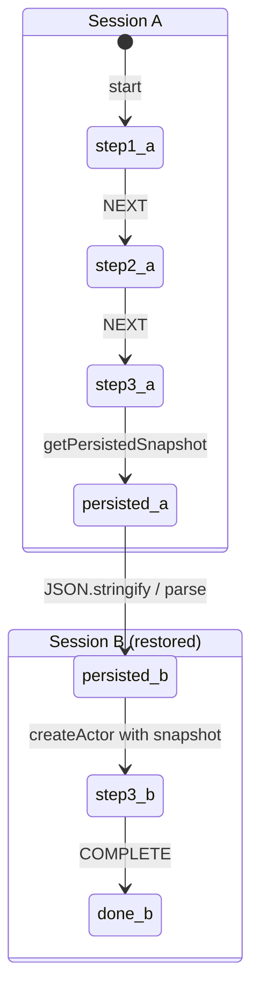

```typescript
import { createMachine, createActor, assign } from "xstate";
// => createMachine: blueprint; createActor: runner; assign: context updater

// Same onboarding machine from Example 51
const onboardingMachine = createMachine({
  // => Wizard machine -- same definition used for both save and restore
  // => Machine definition is stateless; snapshot holds the state
  id: "onboarding",
  // => id: identifies this machine in DevTools and actor system
  context: {
    // => All wizard progress stored in context; fully serialisable
    step: 1 as number,
    // => step: 1 | 2 | 3 — drives progress bar UI
    name: "" as string,
    // => name: entered in step1; required to advance
    email: "" as string,
    // => email: entered in step2; must contain '@' to advance
  },
  initial: "step1",
  // => initial: ignored when actor is restored from snapshot
  states: {
    step1: {
      // => step1: name collection
      on: {
        NEXT: { target: "step2", actions: assign({ step: () => 2 }) },
        // => NEXT: advance; context.step: 1 -> 2
        SET_NAME: { actions: assign({ name: ({ event }) => event.name }) },
        // => SET_NAME: context.name: '' -> event.name
      },
    },
    step2: {
      // => step2: email collection
      on: {
        NEXT: { target: "step3", actions: assign({ step: () => 3 }) },
        // => NEXT: advance; context.step: 2 -> 3
        SET_EMAIL: { actions: assign({ email: ({ event }) => event.email }) },
        // => SET_EMAIL: context.email: '' -> event.email
      },
    },
    step3: { on: { COMPLETE: "done" } },
    // => step3: final review; COMPLETE transitions to final state
    done: { type: "final" },
    // => done: snapshot.status becomes 'done'
  },
});

// --- SESSION A: User progresses through wizard, then "closes browser" ---
const sessionA = createActor(onboardingMachine).start();
// => Fresh actor; value='step1', name='', email='', step=1
sessionA.send({ type: "SET_NAME", name: "Kresna" });
// => context.name: '' -> 'Kresna'
sessionA.send({ type: "NEXT" });
// => Now in step2
// => context.step: 1 -> 2; value: 'step1' -> 'step2'
sessionA.send({ type: "SET_EMAIL", email: "kresna@example.com" });
// => context.email: '' -> 'kresna@example.com'
sessionA.send({ type: "NEXT" });
// => Now in step3, context has name and email
// => context.step: 2 -> 3; value: 'step2' -> 'step3'

const snapshot = sessionA.getPersistedSnapshot();
// => Capture state before "page close"
// => snapshot: { value: 'step3', context: { step: 3, name: 'Kresna', email: '...' } }
const stored = JSON.stringify(snapshot);
// => Simulate storing in localStorage
// => stored: JSON string safe for any storage medium

// --- SESSION B: User returns, restore from stored snapshot ---
const restoredSnapshot = JSON.parse(stored);
// => Simulate reading from localStorage
// => restoredSnapshot: plain object matching persisted shape

const sessionB = createActor(onboardingMachine, {
  snapshot: restoredSnapshot,
  // => Provide persisted snapshot at construction time
  // => Actor starts in the saved state, NOT the machine's initial state
  // => 'step1' initial is bypassed; actor enters 'step3' directly
}).start();
// => sessionB resumes at step3 with Kresna's name and email intact

// Verify restoration
const restoredState = sessionB.getSnapshot();
// => restoredState reflects the loaded snapshot
console.assert(restoredState.value === "step3");
// => Restored to step3 (not step1)  ✓
// => Machine resumed mid-flow, not from beginning
console.assert(restoredState.context.name === "Kresna");
// => Name preserved from session A  ✓
// => Context fields survive JSON round-trip intact
console.assert(restoredState.context.email === "kresna@example.com");
// => Email preserved from session A  ✓

// User can continue from where they left off
sessionB.send({ type: "COMPLETE" });
// => Completes from step3 directly
// => Only event needed: user skips steps 1 and 2 (already filled)
console.assert(sessionB.getSnapshot().status === "done");
// => Wizard complete  ✓
// => snapshot.status: 'active' -> 'done' after COMPLETE
console.log("State restored and completed successfully");
// => Output: State restored and completed successfully
```

**Key Takeaway**: Pass a persisted snapshot to `createActor(machine, { snapshot })` to restore the actor to the exact saved state — including context, state value, and nested states.

**Why It Matters**: Page refresh resilience is a UX requirement for any serious multi-step form or wizard. Without `snapshot` restoration, you either lose progress (bad UX) or store individual fields and manually reconstruct state (fragile: misses validation states, active child actors, intermediate flags). XState's snapshot restoration is complete by design — the machine resumes in the exact logical state with no partial restoration bugs.

---

### Example 53: pure and choose — Conditional Actions

`choose` executes different action lists depending on guards, without triggering a state transition. It is the declarative way to run conditional logic inside an action — equivalent to an `if/else` inside an `assign`, but applicable to any action type.

```typescript
import { createMachine, createActor, assign, raise } from "xstate";
// => createMachine: blueprint; createActor: runner; assign: context updater; raise: self-send

// Note: choose is available as an action creator in XState v5
// Import from 'xstate' -- it is a built-in action creator
import { choose as xstateChoose } from "xstate";
// => xstateChoose: selects action list based on guards at action-execution time
// => Aliased to avoid collision if local 'choose' variable exists

// Machine using choose for conditional action selection
const analyticsAdapterMachine = createMachine({
  // => Machine that sends different analytics events based on context
  // => No states: uses root-level 'on' for stateless event handling
  // => Stateless machine: events handled globally regardless of state
  id: "analyticsAdapter",
  // => id: identifies machine in DevTools
  context: {
    // => context: three fields tracking plan, event count, and last event type
    plan: "free" as "free" | "pro" | "enterprise",
    // => User's subscription plan affects event routing
    // => plan: 'free' | 'pro' | 'enterprise' — drives choose branching
    eventCount: 0,
    // => Track how many analytics events have been sent
    // => eventCount: 0 initially; incremented on each TRACK_ACTION
    lastEventType: "" as string,
    // => lastEventType: stores most recent actionName for inspection
  },
  on: {
    // => Root-level on: handles events regardless of current state
    TRACK_ACTION: {
      // => Single event triggers conditional action branching
      // => All TRACK_ACTION handling is done via this root-level handler
      actions: [
        // => actions array: all three run in order for every TRACK_ACTION
        assign({ eventCount: ({ context }) => context.eventCount + 1 }),
        // => Always increment event count
        // => context.eventCount: N -> N+1 for every TRACK_ACTION
        assign({ lastEventType: ({ event }) => event.actionName }),
        // => Always record event name
        // => context.lastEventType: '' -> event.actionName
        xstateChoose([
          // => Array of { guard, actions } branches; first matching guard wins
          {
            guard: ({ context }) => context.plan === "enterprise",
            // => Enterprise: send to all three analytics destinations
            // => Guard evaluates context.plan at action execution time
            actions: [
              // => Enterprise actions array: three side-effect functions
              ({ event, context }) => {
                console.log(`[Datadog] ${event.actionName} plan=${context.plan}`);
                // => Enterprise gets full observability
                // => Output: [Datadog] <actionName> plan=enterprise
              },
              ({ event }) => {
                console.log(`[Segment] ${event.actionName}`);
                // => Also send to Segment
                // => Output: [Segment] <actionName>
              },
              ({ event }) => {
                console.log(`[Custom] ${event.actionName}`);
                // => And custom internal analytics
                // => Output: [Custom] <actionName>
              },
            ],
          },
          {
            guard: ({ context }) => context.plan === "pro",
            // => Pro: send to two analytics destinations
            // => Only evaluated if enterprise guard was false
            actions: [
              // => Pro actions array: two side-effect functions
              ({ event }) => {
                console.log(`[Segment] ${event.actionName}`);
                // => Pro gets standard analytics
                // => Output: [Segment] <actionName>
              },
              ({ event }) => {
                console.log(`[Custom] ${event.actionName}`);
                // => Pro also gets custom analytics
                // => Output: [Custom] <actionName>
              },
            ],
          },
          {
            // => Default: free plan, minimal analytics
            // => Fallback branch: no guard needed; matches all remaining cases
            actions: [
              // => Free actions array: one side-effect function
              ({ event }) => {
                console.log(`[Custom] ${event.actionName}`);
                // => Free plan: only custom analytics
                // => Output: [Custom] <actionName>
              },
            ],
          },
        ]),
        // => choose evaluates guards top-to-bottom; first match wins
        // => Only one branch's actions run per TRACK_ACTION event
      ],
    },
  },
});
// => analyticsAdapterMachine: stateless router; plan context drives all branching
// => No state transitions occur; only side effects (console.log calls) differ by plan

// Test all three branches
const actor = createActor(analyticsAdapterMachine, {
  input: undefined,
  // => No input needed; plan defaults to 'free' from context initialiser
}).start();
// => actor.context: { plan: 'free', eventCount: 0, lastEventType: '' }

// Free plan: only custom analytics fires
actor.send({ type: "TRACK_ACTION", actionName: "page_view" });
// => Output: [Custom] page_view
// => eventCount is 1
// => choose: plan='free' -> neither enterprise nor pro guard matches -> default branch

// Simulate upgrading to enterprise
actor.getSnapshot(); // read current
// => getSnapshot(): { context: { plan: 'free', eventCount: 1, lastEventType: 'page_view' } }
// In a real machine you would send an UPGRADE event -- simplified here
// We create a new actor with different plan to test enterprise branch
const enterpriseActor = createActor(analyticsAdapterMachine.provide({})).start();
// => provide({}): no actor overrides needed; machine has no invoked actors
// => enterpriseActor starts with plan: 'free' (same default)
// => In a full example, initial context would be overridden to test all three branches

// Override context to enterprise for demo
// (In practice: send UPGRADE event, use assign to change plan)
console.log("choose allows conditional actions without state changes");
// => Output: choose allows conditional actions without state changes
// => choose: guards run during action phase, not transition phase
// => State machine value does not change; only side effects differ
```

**Key Takeaway**: `choose` evaluates guard conditions at action time and executes only the matching action list — providing conditional logic within actions without requiring separate states or transitions.

**Why It Matters**: Real applications have business rules that affect side effects (logging level, analytics destination, notification channel) without changing the application's state. Encoding these as separate states pollutes the state machine topology with infrastructure concerns. `choose` keeps the state diagram clean by embedding conditional side-effect logic inside actions, making the statechart readable at the business-logic level while the routing details live in the action definitions.

---

### Example 54: enqueueActions — Imperative Action Batching

`enqueueActions` gives you an imperative callback where you can conditionally enqueue any combination of actions — assigns, raises, sends, logs — using `if/else` logic. It is the escape hatch for complex conditional action patterns that `choose` makes verbose.

```typescript
import { createMachine, createActor, assign, enqueueActions, raise } from "xstate";
// => createMachine: blueprint; createActor: runner; assign: update context
// => enqueueActions: imperative action batching; raise: self-event dispatch

// Order fulfilment machine with complex conditional action logic
const fulfilmentMachine = createMachine({
  // => Machine that applies conditional business rules on order submission
  // => enqueueActions lets if/else control which assigns and raises run
  id: "fulfilment",
  // => id: for DevTools identification
  context: {
    // => All business-rule outcomes tracked as context flags
    orderId: "" as string,
    // => orderId: captured from event on SUBMIT_ORDER
    totalAmount: 0 as number,
    // => totalAmount: drives high-value and upsell thresholds
    isPremiumCustomer: false as boolean,
    // => isPremiumCustomer: drives discount, expedited, and VIP notification
    discountApplied: false as boolean,
    // => discountApplied: set true for premium customers
    flaggedForReview: false as boolean,
    // => flaggedForReview: set true for orders > 500
    expeditedShipping: false as boolean,
    // => expeditedShipping: set true for premium customers
    notificationsSent: [] as string[],
    // => notificationsSent: accumulates team names in dispatch order
  },
  initial: "idle",
  // => idle: waiting for first order submission
  states: {
    // => Two active states (idle, processing) plus one final state (fulfilled)
    idle: {
      // => idle: order not yet submitted
      on: {
        SUBMIT_ORDER: {
          target: "processing",
          // => SUBMIT_ORDER: transition to processing + run conditional actions
          actions: enqueueActions(({ enqueue, context, event }) => {
            // => enqueueActions provides an imperative callback
            // => Use regular if/else to decide which actions to run
            // => enqueue.assign / enqueue.raise replace declarative action arrays

            enqueue.assign({ orderId: event.orderId, totalAmount: event.totalAmount });
            // => Always: capture order data
            // => context.orderId: '' -> event.orderId; context.totalAmount: 0 -> event.totalAmount

            if (event.totalAmount > 500) {
              // => High-value threshold: > 500 triggers review workflow
              enqueue.assign({ flaggedForReview: () => true });
              // => Flag high-value orders for manual review
              // => context.flaggedForReview: false -> true
              enqueue.assign({
                notificationsSent: (c) => [...c.context.notificationsSent, "review-team"],
                // => Notify review team
                // => Append 'review-team' to notificationsSent array
              });
            }

            if (event.isPremiumCustomer) {
              // => Premium branch: discount + shipping upgrade + VIP notification
              enqueue.assign({ discountApplied: () => true, expeditedShipping: () => true });
              // => Premium customers: apply discount and expedited shipping
              // => context.discountApplied: false -> true; expeditedShipping: false -> true
              enqueue.assign({
                notificationsSent: (c) => [...c.context.notificationsSent, "vip-team"],
                // => Append 'vip-team' to notificationsSent array
              });
              // => Notify VIP relationship team
            }

            if (event.totalAmount > 1000 && !event.isPremiumCustomer) {
              // => Large orders from non-premium customers get upgrade offer
              // => Both conditions: totalAmount > 1000 AND NOT isPremiumCustomer
              enqueue.assign({
                notificationsSent: (c) => [...c.context.notificationsSent, "upsell-team"],
                // => Notify upsell team for upgrade opportunity
                // => Append 'upsell-team' to notificationsSent array
              });
            }

            enqueue.assign({
              notificationsSent: (c) => [...c.context.notificationsSent, "customer"],
              // => Always notify the customer last
              // => 'customer' always appended; guaranteed last in array
            });
          }),
        },
      },
    },
    processing: {
      // => processing: order in fulfilment pipeline (async simulation)
      after: { 10: "fulfilled" },
      // => after 10ms: auto-transition to fulfilled (simulates async processing)
    },
    fulfilled: { type: "final" },
    // => fulfilled: order complete; snapshot.status becomes 'done'
  },
});
// => fulfilmentMachine ready; enqueueActions runs conditionally on SUBMIT_ORDER

// Test: premium customer with high value order
const actor = createActor(fulfilmentMachine).start();
// => Fresh actor; all context flags default to false/empty
actor.send({
  type: "SUBMIT_ORDER",
  // => SUBMIT_ORDER: triggers enqueueActions callback
  orderId: "ord-777",
  // => orderId: will be assigned to context.orderId
  totalAmount: 1500,
  // => totalAmount: 1500 > 500 -> flaggedForReview; 1500 > 1000 but IS premium -> no upsell
  isPremiumCustomer: true,
  // => Triggers: flaggedForReview + premium discount + expedited + all notifications
  // => Expected notifications: ['review-team', 'vip-team', 'customer'] (order matters)
});

const ctx = actor.getSnapshot().context;
// => ctx: snapshot of context after all enqueued assigns ran synchronously
console.assert(ctx.orderId === "ord-777");
// => Order ID captured  ✓
// => enqueue.assign({ orderId }) ran first (unconditional)
console.assert(ctx.flaggedForReview === true);
// => High-value flag applied (1500 > 500)  ✓
// => totalAmount > 500 branch executed
console.assert(ctx.discountApplied === true);
// => Premium discount applied  ✓
// => isPremiumCustomer branch: discountApplied -> true
console.assert(ctx.expeditedShipping === true);
// => Expedited shipping applied  ✓
// => isPremiumCustomer branch: expeditedShipping -> true
console.assert(ctx.notificationsSent.includes("review-team"));
// => Review team notified (high value)  ✓
// => totalAmount > 500 branch appended 'review-team'
console.assert(ctx.notificationsSent.includes("vip-team"));
// => VIP team notified (premium customer)  ✓
// => isPremiumCustomer branch appended 'vip-team'
console.assert(ctx.notificationsSent.includes("customer"));
// => Customer notified (always)  ✓
// => Unconditional last enqueue appended 'customer'
console.assert(!ctx.notificationsSent.includes("upsell-team"));
// => Upsell team NOT notified (customer IS premium)  ✓
// => totalAmount > 1000 && !isPremiumCustomer = false: branch did not run

console.log("enqueueActions test passed");
// => Output: enqueueActions test passed
// => All conditional business rules verified via context assertions
```

**Key Takeaway**: `enqueueActions` provides an imperative `if/else` callback that conditionally adds any action type to the execution queue — the right tool when `choose` nesting becomes hard to read.

**Why It Matters**: Complex business rules often need multiple conditional side effects that depend on the same event payload. Expressing this in `choose` requires nested arrays and repeated guard conditions. `enqueueActions` reads like normal imperative code while still executing inside XState's action pipeline: all enqueued actions run as a synchronous batch, maintaining the same determinism guarantees as declarative actions. This is the boundary between XState's pure model and the real-world messiness of business rules — use it when declarative DSL readability breaks down.
