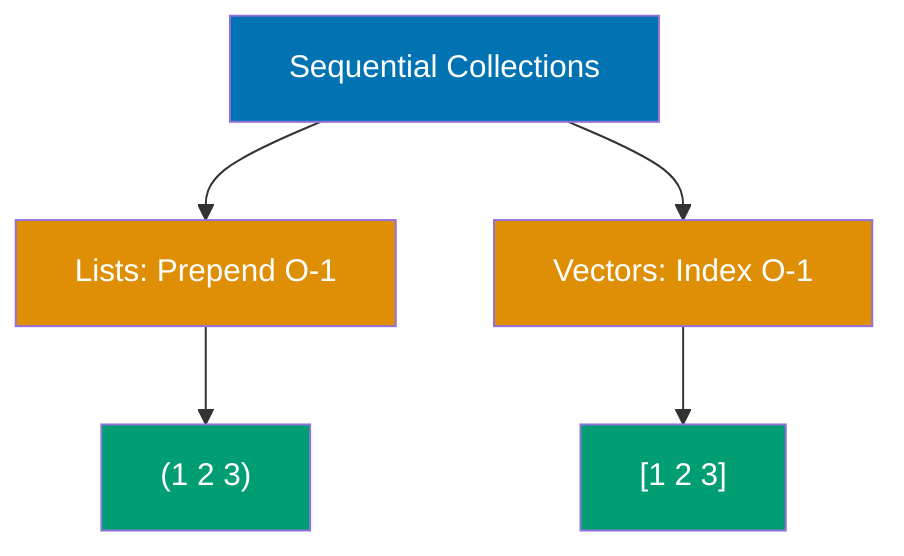
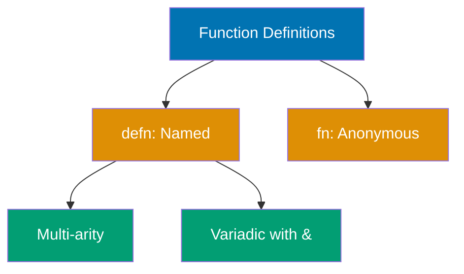
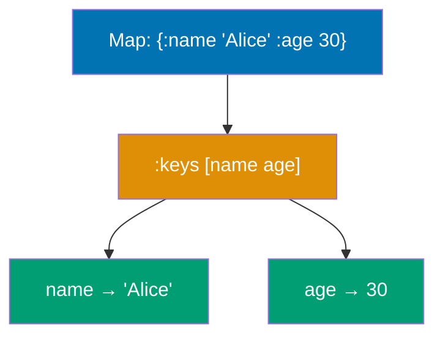
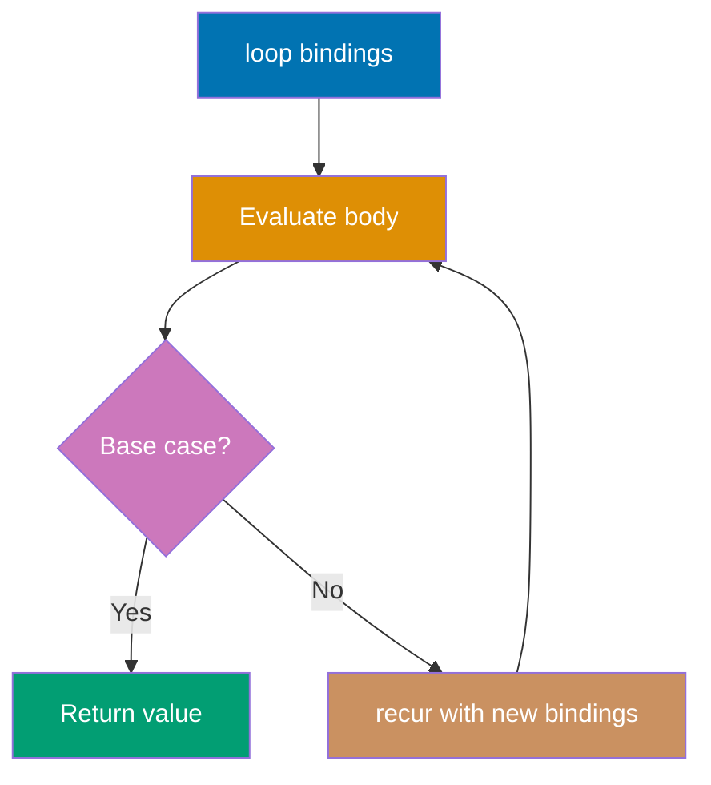
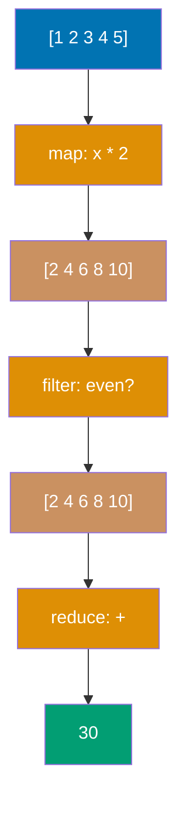
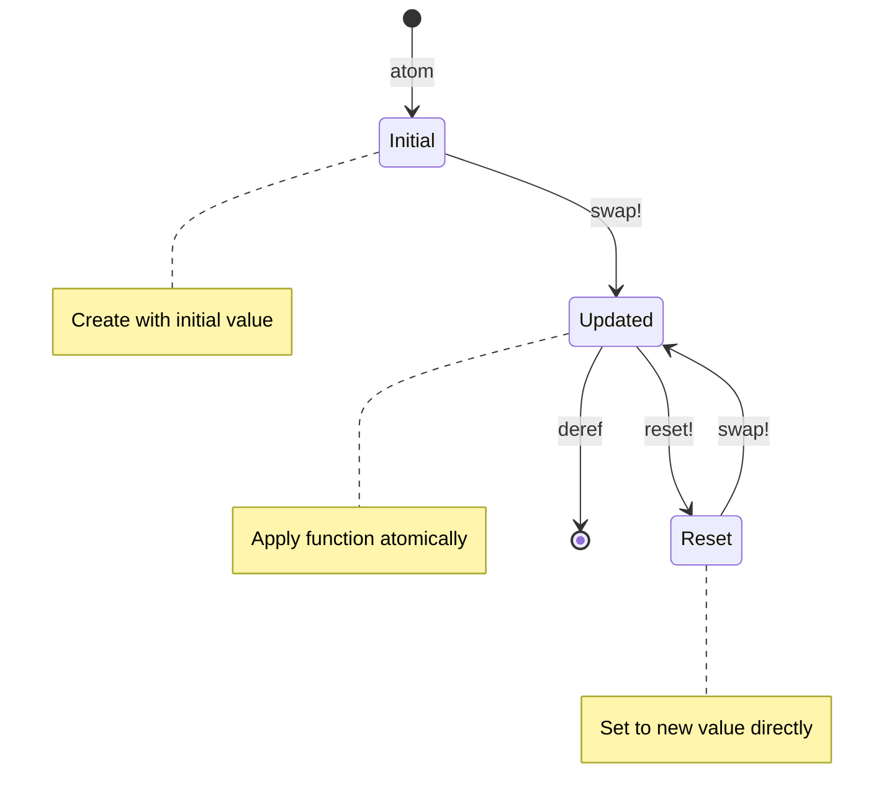
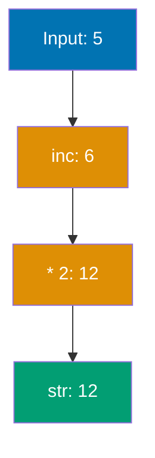
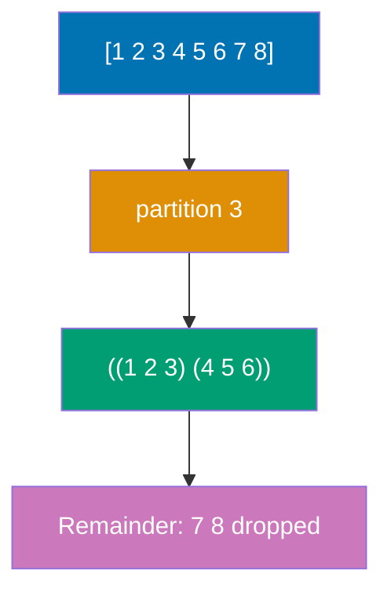

## Example 1: Hello World and Basic Values

Clojure is a functional, dynamically-typed Lisp that runs on the JVM. Code is written as expressions that evaluate to values. The REPL (Read-Eval-Print Loop) provides immediate feedback, making it ideal for interactive development.

```clojure
;; String literals
"Hello, World!"                     ;; => "Hello, World!" (string value)

;; Numbers
42                                  ;; => 42 (long integer)
3.14                                ;; => 3.14 (double)
22/7                                ;; => 22/7 (rational number, exact fraction)

;; Booleans and nil
true                                ;; => true (boolean true)
false                               ;; => false (boolean false)
nil                                 ;; => nil (represents absence of value)

;; Symbols and keywords
'hello                              ;; => hello (symbol, unevaluated)
:name                               ;; => :name (keyword, evaluates to itself)

;; Simple function call
(println "Hello, World!")           ;; => nil (prints to stdout)
                                    ;; => Output: Hello, World!

;; Arithmetic
(+ 1 2 3)                           ;; => 6 (addition, variadic)
(* 4 5)                             ;; => 20 (multiplication)
(/ 22 7)                            ;; => 22/7 (rational division, not truncated)
```

**Key Takeaway**: Everything in Clojure is an expression that returns a value. Keywords (`:name`) are self-evaluating identifiers commonly used as map keys, while symbols (`'hello`) represent names that can be bound to values.

**Why It Matters**: Clojure's expression-oriented design eliminates the statement vs. expression distinction found in Java/Python, enabling more composable code. Rational numbers (22/7) preserve exact precision unlike floating-point arithmetic—critical for financial systems requiring accuracy without rounding errors. Keywords-as-identifiers prevent typos and enable fast equality checks via identity comparison, making them efficient as map keys in performance-critical code.

---

## Example 2: Lists and Vectors

Clojure provides two primary sequential collections: lists (linked lists optimized for prepending) and vectors (indexed arrays optimized for random access). Lists use parentheses `()` and vectors use square brackets `[]`.



```clojure
;; Lists (linked lists, O(1) prepend)
'(1 2 3)                            ;; => (1 2 3) (quoted to prevent evaluation)
                                    ;; => Without quote, Clojure would try to call 1 as function
(list 1 2 3)                        ;; => Creates list with 3 elements
                                    ;; => (1 2 3) (explicit list construction)

(first '(1 2 3))                    ;; => Accesses first element
                                    ;; => 1 (O(1) operation for lists)
(rest '(1 2 3))                     ;; => Returns all elements except first
                                    ;; => (2 3) (also O(1) operation)
(cons 0 '(1 2 3))                   ;; => Prepends 0 to beginning of list
                                    ;; => (0 1 2 3) (O(1) prepend, creates new list)

;; Vectors (indexed arrays, O(1) index access)
[1 2 3]                             ;; => [1 2 3] (literal vector syntax)
                                    ;; => No quoting needed, not evaluated as function call
(vector 1 2 3)                      ;; => Constructs vector from arguments
                                    ;; => [1 2 3] (explicit vector construction)

(get [1 2 3] 0)                     ;; => Retrieves element at index 0
                                    ;; => 1 (zero-based indexing, returns nil if out of bounds)
(nth [1 2 3] 1)                     ;; => Gets element at index 1
                                    ;; => 2 (nth element, throws exception if out of bounds)
([1 2 3] 2)                         ;; => Vector used as function with index argument
                                    ;; => 3 (idiomatic vector indexing)

(conj [1 2 3] 4)                    ;; => Appends element to end of vector
                                    ;; => [1 2 3 4] (efficient O(log32 n) append)
(assoc [1 2 3] 1 99)                ;; => Updates element at index 1
                                    ;; => [1 99 3] (creates new vector with change)

;; Count works on both
(count '(1 2 3))                    ;; => Returns number of elements in list
                                    ;; => 3 (O(1) for lists)
(count [1 2 3])                     ;; => Returns number of elements in vector
                                    ;; => 3 (O(1) for vectors)
```

**Key Takeaway**: Use vectors `[]` for indexed access and when you need to add elements at the end. Use lists `()` when prepending elements or representing code (macros).

**Why It Matters**: Vectors use persistent bit-mapped vector tries providing O(log32 n) ≈ O(1) random access and append, while lists offer true O(1) prepend. This structural sharing enables Clojure's immutability-by-default without performance penalties in build systems and log processing. Unlike Python lists requiring full array copies on modification, Clojure vectors share most structure across versions, making them memory-efficient for large-scale data pipelines.

---

## Example 3: Maps and Sets

Maps are key-value associations (hash maps) optimized for lookup, while sets are unordered collections of unique values. Both use hash-based implementation for O(1) average-case operations.

```clojure
;; Maps (key-value associations)
{:name "Alice" :age 30}             ;; => Creates hash map with two key-value pairs
                                    ;; => {:name "Alice", :age 30} (persistent hash map)

(get {:name "Alice"} :name)         ;; => Looks up value for :name key
                                    ;; => "Alice" (O(log32 n) lookup)
(get {:name "Alice"} :email "N/A")  ;; => Looks up :email key with default value
                                    ;; => "N/A" (default returned if key missing)

({:name "Alice"} :name)             ;; => Map used as function with key argument
                                    ;; => "Alice" (map-as-function pattern)
(:name {:name "Alice"})             ;; => Keyword used as function with map argument
                                    ;; => "Alice" (idiomatic Clojure lookup style)

(assoc {:name "Alice"} :age 30)     ;; => Adds new key-value pair to map
                                    ;; => {:name "Alice", :age 30} (creates new map)
(dissoc {:name "Alice" :age 30} :age)
                                    ;; => Removes :age key from map
                                    ;; => {:name "Alice"} (creates new map without key)

(keys {:name "Alice" :age 30})      ;; => Extracts all keys from map
                                    ;; => (:name :age) (returns sequence of keys)
(vals {:name "Alice" :age 30})      ;; => Extracts all values from map
                                    ;; => ("Alice" 30) (returns sequence of values)

;; Sets (unique values)
#{1 2 3}                            ;; => Creates hash set literal
                                    ;; => #{1 3 2} (unordered, no guaranteed iteration order)
(set [1 2 2 3])                     ;; => Converts vector to set
                                    ;; => #{1 3 2} (duplicate 2 removed, only unique values)

(contains? #{1 2 3} 2)              ;; => Tests if set contains value 2
                                    ;; => true (O(log32 n) membership test)
(#{1 2 3} 2)                        ;; => Set used as function for membership
                                    ;; => 2 (returns value if present, nil if absent)

(conj #{1 2} 3)                     ;; => Adds element 3 to set
                                    ;; => #{1 3 2} (creates new set with added element)
(disj #{1 2 3} 2)                   ;; => Removes element 2 from set
                                    ;; => #{1 3} (creates new set without element)
```

**Key Takeaway**: Use keywords as map keys (`:name`) for idiomatic Clojure - they act as functions for lookups. Sets are perfect for membership testing and ensuring uniqueness.

**Why It Matters**: Persistent hash maps (HAMTs - Hash Array Mapped Tries) provide O(log32 n) lookups/inserts while enabling structural sharing—critical for real-time inventory systems managing large-scale updates immutably. Keywords-as-functions (`:name user`) eliminate the method dispatch overhead of Python's `user.get("name")`, resulting in faster map access. Sets' O(1) membership testing powers deduplication logic in financial transaction processing.

---

## Example 4: Defining Functions

Functions are first-class values in Clojure defined with `defn` (named) or `fn` (anonymous). Functions can have multiple arities (parameter counts) and support variadic arguments with `&`.



```clojure
;; Named function with defn
(defn greet [name]                  ;; => Defines named function 'greet'
                                    ;; => Takes one parameter: name
  (str "Hello, " name "!"))         ;; => Concatenates strings to form greeting
                                    ;; => Returns greeting string
                                    ;; => #'user/greet (var binding created in namespace)

(greet "Alice")                     ;; => Calls greet function with "Alice"
                                    ;; => "Hello, Alice!" (returns greeting)

;; Function with docstring
(defn add
  "Adds two numbers together"       ;; => Docstring (documentation shown in REPL with (doc add))
  [a b]                             ;; => Takes two parameters: a and b
  (+ a b))                          ;; => Adds parameters using + function
                                    ;; => Returns sum
                                    ;; => #'user/add (var created)

(add 3 4)                           ;; => Calls add with arguments 3 and 4
                                    ;; => 7 (returns sum)

;; Multi-arity function
(defn greet-multi
  ([] (greet-multi "World"))        ;; => Zero-argument arity
                                    ;; => Calls one-argument arity with default "World"
  ([name] (str "Hello, " name "!"))) ;; => One-argument arity
                                    ;; => Constructs greeting with provided name
                                    ;; => #'user/greet-multi (var created)

(greet-multi)                       ;; => Calls zero-argument arity
                                    ;; => "Hello, World!" (uses default value)
(greet-multi "Bob")                 ;; => Calls one-argument arity with "Bob"
                                    ;; => "Hello, Bob!" (uses provided name)

;; Variadic function (& rest)
(defn sum [& numbers]               ;; => & captures all arguments as sequence
                                    ;; => numbers becomes sequence of all arguments
  (reduce + 0 numbers))             ;; => Applies + across sequence with initial value 0
                                    ;; => Returns sum of all numbers
                                    ;; => #'user/sum (var created)

(sum 1 2 3 4 5)                     ;; => Calls sum with 5 arguments
                                    ;; => numbers is (1 2 3 4 5)
                                    ;; => 15 (returns sum)

;; Anonymous function (fn)
(fn [x] (* x x))                    ;; => Creates anonymous function (not bound to name)
                                    ;; => Takes one parameter x, returns x squared
                                    ;; => #function[...] (function object, no var)

((fn [x] (* x x)) 5)                ;; => Creates anonymous function and invokes immediately
                                    ;; => Passes 5 as argument
                                    ;; => 25 (returns 5 * 5)

;; Anonymous function shorthand #()
(#(* % %) 5)                        ;; => Shorthand anonymous function syntax
                                    ;; => % is first argument, %2 would be second
                                    ;; => 25 (returns 5 * 5, same as fn form)
```

**Key Takeaway**: Use `defn` for named functions, `fn` for anonymous functions when you need to pass behavior as a value. Multi-arity functions eliminate the need for optional parameters.

**Why It Matters**: Functions are first-class values enabling higher-order programming without object wrappers—unlike Java where lambda syntax remains verbose. Multi-arity functions provide clean API design without reflection or null checks for optional parameters (Python's `*args`/`**kwargs` require runtime parsing). Variadic `&` args combined with functional composition power Clojure's transducer pipelines for large-scale data processing, eliminating intermediate collection allocations that plague imperative loops.

---

## Example 5: Let Bindings

The `let` special form creates local bindings (variables) within a lexical scope. Bindings are immutable and shadowing is allowed. Let is fundamental for introducing intermediate values and improving code readability.

```clojure
;; Basic let binding
(let [x 10                          ;; => x bound to 10 (local scope)
      y 20]                         ;; => y bound to 20 (local scope)
  (+ x y))                          ;; => 30 (bindings available in body)

;; Multiple expressions in let body
(let [name "Alice"                  ;; => name bound to "Alice"
      age 30]                       ;; => age bound to 30
  (println "Name:" name)            ;; => nil, Output: Name: Alice
  (println "Age:" age)              ;; => nil, Output: Age: 30
  {:name name :age age})            ;; => {:name "Alice", :age 30} (last expr returned)

;; Sequential bindings (can reference earlier bindings)
(let [x 10                          ;; => x is 10
      y (* x 2)                     ;; => y is 20 (references x)
      z (+ x y)]                    ;; => z is 30 (references x and y)
  z)                                ;; => 30

;; Shadowing (inner binding hides outer)
(let [x 10]                         ;; => Outer x is 10
  (let [x 20]                       ;; => Inner x is 20 (shadows outer)
    x))                             ;; => 20 (inner binding used)

;; Let in function
(defn calculate [a b]
  (let [sum (+ a b)                 ;; => Local binding for sum
        product (* a b)             ;; => Local binding for product
        difference (- sum product)] ;; => Local binding using sum and product
    difference))                    ;; => Returns difference
                                    ;; => #'user/calculate

(calculate 5 3)                     ;; => -7 (sum=8, product=15, diff=-7)
```

**Key Takeaway**: Use `let` to introduce intermediate values and improve readability. Bindings are sequential (later bindings can reference earlier ones), and shadowing creates new bindings that hide outer ones within their scope.

**Why It Matters**: Lexical scoping with immutable bindings eliminates entire classes of bugs from variable shadowing errors that plague JavaScript codebases. Sequential binding (`y` referencing `x`) enables pipeline-style computation without nesting, making complex transformations readable in production analytics code. Unlike Java's `final` requiring verbose declarations, Clojure's immutability-by-default in `let` prevents accidental reassignment—critical for concurrent systems processing calculations safely across threads.

---

## Example 6: Destructuring Vectors

Destructuring allows extracting values from collections directly in bindings (`let`) or function parameters. Vector destructuring uses positional matching and supports `:as` to bind the entire collection.

```clojure
;; Basic vector destructuring
(let [[a b c] [1 2 3]]              ;; => a is 1, b is 2, c is 3
                                    ;; => Extracts elements by position
  (+ a b c))                        ;; => 6
                                    ;; => Sums extracted values

;; Destructuring with fewer bindings (ignores extras)
(let [[first second] [1 2 3 4]]     ;; => first is 1, second is 2 (3 and 4 ignored)
                                    ;; => Extra elements not destructured
  (+ first second))                 ;; => 3
                                    ;; => Only first two values used

;; Using & to capture rest
(let [[head & tail] [1 2 3 4]]      ;; => head is 1, tail is (2 3 4)
                                    ;; => & captures remaining elements as seq
  {:head head :tail tail})          ;; => {:head 1, :tail (2 3 4)}
                                    ;; => Maps head and tail into result

;; Using :as to bind entire collection
(let [[a b :as all] [1 2 3]]        ;; => a is 1, b is 2, all is [1 2 3]
                                    ;; => :as captures entire original vector
  {:first a :second b :all all})    ;; => {:first 1, :second 2, :all [1 2 3]}
                                    ;; => Can access both parts and whole

;; Nested destructuring
(let [[[a b] [c d]] [[1 2] [3 4]]]  ;; => a is 1, b is 2, c is 3, d is 4
                                    ;; => Destructures nested vectors recursively
  (+ a b c d))                      ;; => 10
                                    ;; => Sums all four extracted values

;; Function parameter destructuring
(defn sum-first-two [[a b]]         ;; => Destructures vector argument
                                    ;; => Parameters destructure on call
  (+ a b))                          ;; => #'user/sum-first-two

(sum-first-two [10 20 30])          ;; => 30 (only first two used)
                                    ;; => Function ignores third element

;; Destructuring with defaults (not built-in, manual check)
(defn greet [[name] ]
  (let [name (or name "Guest")]     ;; => Use "Guest" if name is nil
                                    ;; => Manual nil check and fallback
    (str "Hello, " name "!")))      ;; => #'user/greet
                                    ;; => Constructs greeting string

(greet ["Alice"])                   ;; => "Hello, Alice!"
                                    ;; => Name provided, uses it
(greet [nil])                       ;; => "Hello, Guest!"
                                    ;; => Name is nil, uses default
```

**Key Takeaway**: Vector destructuring uses positional matching. Use `& rest` to capture remaining elements and `:as` to bind the entire collection while also destructuring parts.

**Why It Matters**: Destructuring eliminates boilerplate index access (`arr[0]`, `arr[1]`) reducing cognitive load and preventing off-by-one errors common in imperative code. Pattern matching in function signatures enables self-documenting APIs—configuration parsers can destructure nested build specs without explicit getters. `:as` binding provides both atomic and decomposed views simultaneously, powering middleware chains in web frameworks where request maps need full context plus extracted parameters.

---

## Example 7: Destructuring Maps

Map destructuring extracts values by key using `:keys`, `:strs`, or `:syms`. It supports `:or` for defaults and `:as` to bind the entire map. This is idiomatic Clojure for working with structured data.



```clojure
;; Destructuring with :keys (keyword keys)
(let [{:keys [name age]} {:name "Alice" :age 30}]
                                    ;; => name is "Alice", age is 30
                                    ;; => :keys extracts values from map
  (str name " is " age))            ;; => "Alice is 30"
                                    ;; => Returns concatenated string

;; Function parameter destructuring
(defn greet-person [{:keys [name age]}]
                                    ;; => Destructures map argument
                                    ;; => Parameters auto-extracted from map
  (str "Hello " name ", age " age)) ;; => #'user/greet-person

(greet-person {:name "Bob" :age 25})
                                    ;; => "Hello Bob, age 25"
                                    ;; => Passes map, destructuring extracts values

;; Destructuring with defaults using :or
(defn greet-with-default [{:keys [name age] :or {age 18}}]
                                    ;; => age defaults to 18 if key missing
                                    ;; => :or provides fallback values
  (str name " is " age))            ;; => #'user/greet-with-default

(greet-with-default {:name "Charlie"})
                                    ;; => "Charlie is 18" (default used)
                                    ;; => age not in map, uses :or default

(greet-with-default {:name "Diana" :age 35})
                                    ;; => "Diana is 35" (provided value)
                                    ;; => :or ignored when key exists

;; Using :as to bind entire map
(let [{:keys [name] :as person} {:name "Eve" :age 40}]
                                    ;; => name is "Eve", person is entire map
                                    ;; => :as captures original map
  {:greeting (str "Hello " name)
   :data person})                   ;; => {:greeting "Hello Eve", :data {:name "Eve", :age 40}}
                                    ;; => Returns new map with greeting and original data

;; Destructuring with :strs (string keys)
(let [{:strs [name age]} {"name" "Frank" "age" 50}]
                                    ;; => For maps with string keys
                                    ;; => :strs extracts from string-keyed maps
  (str name " is " age))            ;; => "Frank is 50"
                                    ;; => String keys treated as variables

;; Destructuring with :syms (symbol keys)
(let [{:syms [name age]} {'name "Grace" 'age 60}]
                                    ;; => For maps with symbol keys (rare)
                                    ;; => :syms handles symbol-keyed maps
  (str name " is " age))            ;; => "Grace is 60"
                                    ;; => Symbol keys converted to variables

;; Nested map destructuring
(let [{:keys [name address]} {:name "Henry"
                               :address {:city "NYC" :zip 10001}}
      {:keys [city]} address]       ;; => Destructure nested address map
                                    ;; => Two-level destructuring: outer, then nested
  (str name " lives in " city))     ;; => "Henry lives in NYC"
                                    ;; => Accesses nested city from address
```

**Key Takeaway**: Use `:keys` for keyword-keyed maps (idiomatic Clojure), `:or` for default values, and `:as` to access both destructured parts and the entire map. This pattern is ubiquitous in Clojure codebases.

**Why It Matters**: Map destructuring is the foundation of Clojure's data-driven architecture—banking platforms can pass data maps through function pipelines without object deserialization overhead. `:or` defaults provide nil-safe access without verbose null checks, eliminating NullPointerExceptions that cause debugging challenges in Java projects. Keyword extraction via `:keys` is compiler-optimized for zero runtime overhead, making it efficient compared to Python's dictionary access while remaining more expressive.

---

## Example 8: Conditionals (if, when, cond)

Clojure provides several conditional forms: `if` for binary branching, `when` for side effects with implicit `do`, and `cond` for multi-way branching. All conditionals are expressions that return values.

```clojure
;; Basic if (binary branching)
(if true                            ;; => Condition evaluated
  "yes"                             ;; => Then branch
  "no")                             ;; => Else branch
                                    ;; => "yes" (condition is true)
                                    ;; => if is expression, returns value

(if false "yes" "no")               ;; => "no" (condition is false)
                                    ;; => Else branch executed

;; if without else returns nil
(if false "yes")                    ;; => nil (no else branch)

;; when (for side effects, implicit do)
(when true                          ;; => Condition evaluated
  (println "First effect")          ;; => nil, Output: First effect
  (println "Second effect")         ;; => nil, Output: Second effect
  "result")                         ;; => "result" (last expression returned)

;; when is equivalent to (if condition (do ...))
(when false                         ;; => Condition is false
  (println "Not executed")          ;; => This block never runs
  "result")                         ;; => nil (when returns nil when false)

;; cond (multi-way branching)
(defn describe-number [n]
  (cond
    (< n 0) "negative"              ;; => First matching clause
    (= n 0) "zero"                  ;; => Second matching clause
    (> n 0) "positive"))            ;; => Third matching clause
                                    ;; => #'user/describe-number

(describe-number -5)                ;; => "negative"
(describe-number 0)                 ;; => "zero"
(describe-number 10)                ;; => "positive"

;; cond with :else (catch-all)
(defn grade [score]
  (cond
    (>= score 90) "A"               ;; => 90 or above
    (>= score 80) "B"               ;; => 80-89
    (>= score 70) "C"               ;; => 70-79
    :else "F"))                     ;; => Catch-all (anything else)
                                    ;; => #'user/grade

(grade 95)                          ;; => "A"
(grade 75)                          ;; => "C"
(grade 60)                          ;; => "F"

;; if-let (conditional binding)
(defn process-user [user-map]
  (if-let [name (:name user-map)]   ;; => Binds name if value is truthy
    (str "Hello, " name)            ;; => Then branch (name is bound)
    "No name provided"))            ;; => Else branch (name is nil/false)
                                    ;; => #'user/process-user

(process-user {:name "Alice"})      ;; => "Hello, Alice"
(process-user {})                   ;; => "No name provided"

;; when-let (conditional binding for side effects)
(defn log-user [user-map]
  (when-let [name (:name user-map)] ;; => Binds name if truthy
    (println "User found:" name)    ;; => Output: User found: Alice
    (str "Logged: " name)))         ;; => "Logged: Alice"
                                    ;; => #'user/log-user

(log-user {:name "Alice"})          ;; => "Logged: Alice"
(log-user {})                       ;; => nil (when-let returns nil when falsey)
```

**Key Takeaway**: Use `if` for simple binary decisions, `when` for side effects when there's no else branch, and `cond` for multi-way branching. `if-let` and `when-let` combine conditional testing with binding, perfect for nil-safe operations.

**Why It Matters**: Conditionals as expressions (always returning values) enable functional composition unavailable in statement-based languages—your entire conditional logic becomes a pure function. `when-let` provides nil-safe binding eliminating Optional wrapping in Java or `?.` chains in JavaScript, reducing defensive programming boilerplate. `cond`'s pattern matching style powers business rule engines in financial systems for evaluating complex criteria efficiently without nested if-else pyramids.

---

## Example 9: Recursion and loop/recur

Clojure uses recursion instead of loops. The `recur` special form enables tail-call optimization for constant stack space. `loop` establishes a recursion point with initial bindings.



```clojure
;; Simple recursion (NOT tail-recursive, limited stack)
(defn factorial [n]
  (if (<= n 1)                      ;; => Base case
    1                               ;; => Return 1
    (* n (factorial (dec n)))))     ;; => Recursive call (NOT tail position)
                                    ;; => #'user/factorial

(factorial 5)                       ;; => 120 (5 * 4 * 3 * 2 * 1)

;; Tail recursion with recur (constant stack)
(defn factorial-recur [n]
  (loop [acc 1                      ;; => Accumulator initialized to 1
         n n]                       ;; => Counter initialized to n
    (if (<= n 1)                    ;; => Base case
      acc                           ;; => Return accumulator
      (recur (* acc n) (dec n)))))  ;; => Tail call (recur rebinds loop vars)
                                    ;; => #'user/factorial-recur

(factorial-recur 5)                 ;; => 120 (same result, constant stack)

;; recur in function (no loop)
(defn countdown [n]
  (when (> n 0)                     ;; => Continue if n > 0
    (println n)                     ;; => Output: n
    (recur (dec n))))               ;; => Tail call to countdown
                                    ;; => #'user/countdown

(countdown 3)                       ;; => nil
                                    ;; => Output: 3
                                    ;; => Output: 2
                                    ;; => Output: 1

;; loop for iterative process
(defn sum-range [n]
  (loop [i 0                        ;; => Loop counter
         sum 0]                     ;; => Accumulator
    (if (> i n)                     ;; => Exit condition
      sum                           ;; => Return sum
      (recur (inc i) (+ sum i)))))  ;; => Increment i, add to sum
                                    ;; => #'user/sum-range

(sum-range 5)                       ;; => 15 (0+1+2+3+4+5)

;; Multiple recursion points require loop
(defn fibonacci [n]
  (loop [a 0                        ;; => First Fibonacci number
         b 1                        ;; => Second Fibonacci number
         i 0]                       ;; => Counter
    (if (= i n)                     ;; => Reached target position
      a                             ;; => Return current value
      (recur b (+ a b) (inc i)))))  ;; => Shift values, increment counter
                                    ;; => #'user/fibonacci

(fibonacci 7)                       ;; => 13 (0 1 1 2 3 5 8 13)
```

**Key Takeaway**: Always use `recur` for tail-recursive calls to avoid stack overflow. Use `loop` to establish a recursion point with bindings. `recur` can only be used in tail position (last expression in a branch).

**Why It Matters**: JVM tail-call optimization via `recur` enables unbounded iteration with O(1) stack space—critical for processing infinite streams in real-time systems. Unlike Python's recursion limit causing crashes, Clojure's `loop`/`recur` handles massive iterations safely for large-scale data processing. Accumulator-passing style eliminates mutable counters preventing race conditions in concurrent code—enabling thread-safe calculations without locks.

---

## Example 10: Sequences and Lazy Evaluation

Clojure's sequence abstraction provides a unified interface over collections. Many sequence functions return lazy sequences that compute elements on-demand, enabling infinite sequences and efficient memory usage.

```clojure
;; Creating sequences
(seq [1 2 3])                       ;; => (1 2 3) (convert to sequence)
(seq {:a 1 :b 2})                   ;; => ([:a 1] [:b 2]) (map to seq of pairs)
(seq "hello")                       ;; => (\h \e \l \l \o) (string to char seq)

;; Lazy sequence with range
(range 5)                           ;; => (0 1 2 3 4) (lazy seq 0 to n-1)
(range 2 8)                         ;; => (2 3 4 5 6 7) (lazy seq from start to end-1)
(range 0 10 2)                      ;; => (0 2 4 6 8) (lazy seq with step)

;; Infinite lazy sequence
(def infinite-nums (range))         ;; => Infinite sequence 0, 1, 2, ...
                                    ;; => #'user/infinite-nums

(take 5 infinite-nums)              ;; => (0 1 2 3 4) (take first 5 elements)

;; repeat (lazy infinite repetition)
(take 3 (repeat "hello"))           ;; => ("hello" "hello" "hello")

;; cycle (lazy infinite repetition of collection)
(take 7 (cycle [1 2 3]))            ;; => (1 2 3 1 2 3 1)

;; iterate (lazy sequence from function application)
(take 5 (iterate inc 0))            ;; => (0 1 2 3 4) (apply inc repeatedly)
(take 5 (iterate #(* 2 %) 1))       ;; => (1 2 4 8 16) (powers of 2)

;; first and rest on sequences
(first [1 2 3])                     ;; => 1 (first element)
(rest [1 2 3])                      ;; => (2 3) (all but first)
(next [1 2 3])                      ;; => (2 3) (like rest, but realizes one element)

;; cons (construct sequence by prepending)
(cons 0 [1 2 3])                    ;; => (0 1 2 3) (prepend 0)

;; Forcing evaluation with doall and dorun
(def lazy-side-effects
  (map println [1 2 3]))            ;; => Lazy seq, not evaluated yet
                                    ;; => #'user/lazy-side-effects

(doall lazy-side-effects)           ;; => (nil nil nil), Output: 1 2 3
                                    ;; => Forces evaluation, retains results

(dorun (map println [4 5 6]))       ;; => nil, Output: 4 5 6
                                    ;; => Forces evaluation, discards results
```

**Key Takeaway**: Clojure sequences are lazy by default - elements are computed only when needed. This enables infinite sequences and efficient pipelines. Use `doall` to force evaluation when you need side effects or results immediately.

**Why It Matters**: Lazy evaluation defers computation until values are actually consumed, enabling memory-efficient processing of large-scale datasets that would exhaust RAM if eager. Systems can process infinite log streams using `iterate` without pre-allocating collections—impossible in Python without generator syntax overhead. Sequence abstraction unifies operations across lists/vectors/maps/sets with zero copying, making Clojure pipelines efficient for large data transformations.

---

## Example 11: Map, Filter, and Reduce

Higher-order functions `map`, `filter`, and `reduce` are fundamental to functional programming. They transform collections without explicit loops, returning lazy sequences (map/filter) or accumulated values (reduce).



```clojure
;; map (apply function to each element)
(map inc [1 2 3])                   ;; => (2 3 4) (increment each)
(map #(* 2 %) [1 2 3])              ;; => (2 4 6) (double each)
(map str [1 2 3])                   ;; => ("1" "2" "3") (convert to strings)

;; map with multiple collections
(map + [1 2 3] [10 20 30])          ;; => (11 22 33) (element-wise addition)
(map vector [:a :b] [1 2])          ;; => ([:a 1] [:b 2]) (zip into vectors)

;; filter (keep elements matching predicate)
(filter even? [1 2 3 4 5 6])        ;; => (2 4 6) (keep even numbers)
(filter #(> % 10) [5 15 8 20])      ;; => (15 20) (keep numbers > 10)

;; remove (opposite of filter)
(remove even? [1 2 3 4 5 6])        ;; => (1 3 5) (remove even numbers)

;; reduce (accumulate collection to single value)
(reduce + [1 2 3 4 5])              ;; => 15 (sum all elements)
(reduce * [1 2 3 4 5])              ;; => 120 (product of all elements)

;; reduce with initial value
(reduce + 10 [1 2 3])               ;; => 16 (10 + 1 + 2 + 3)

;; reduce to build a map
(reduce (fn [acc x] (assoc acc x (* x x)))
        {}                          ;; => Initial accumulator (empty map)
        [1 2 3 4])                  ;; => {1 1, 2 4, 3 9, 4 16} (map numbers to squares)

;; Pipeline with threading macro
(->> [1 2 3 4 5 6]                  ;; => Start with collection
     (map #(* 2 %))                 ;; => (2 4 6 8 10 12) (double each)
     (filter even?)                 ;; => (2 4 6 8 10 12) (all even after doubling)
     (reduce +))                    ;; => 42 (sum all)

;; map-indexed (map with index)
(map-indexed vector [:a :b :c])     ;; => ([0 :a] [1 :b] [2 :c])

;; keep (map + filter: apply fn, keep non-nil results)
(keep #(when (even? %) (* 2 %))     ;; => Returns (* 2 %) for even, nil for odd
      [1 2 3 4 5 6])                ;; => (4 8 12) (doubled evens, odds filtered)
```

**Key Takeaway**: `map` and `filter` are lazy (return lazy sequences), while `reduce` is eager. Combine them in pipelines with `->>` threading macro for readable data transformations. Use `keep` to combine mapping and filtering in one pass.

**Why It Matters**: Higher-order functions eliminate explicit loop state management preventing off-by-one errors and mutable accumulator bugs. Lazy `map`/`filter` compose without intermediate allocations—processing large-scale pipelines consumes O(1) memory versus Python's list comprehensions creating intermediate lists. `reduce`'s fold-left semantics enable parallelization via reducers, powering distributed analytics for massive data processing without MapReduce complexity.

---

## Example 12: Threading Macros (-> and ->>)

Threading macros improve readability by eliminating nested function calls. `->` (thread-first) inserts results as the first argument, while `->>` (thread-last) inserts as the last argument.

```clojure
;; Without threading (nested, hard to read)
(reduce + (filter even? (map #(* 2 %) [1 2 3 4 5])))
                                    ;; => Nested evaluation (inside-out, right-to-left)
                                    ;; => map doubles: (2 4 6 8 10)
                                    ;; => filter keeps evens: (2 4 6 8 10)
                                    ;; => reduce sums: 30

;; With ->> threading macro (readable left-to-right)
(->> [1 2 3 4 5]                    ;; => Starts with collection
                                    ;; => Threads value as LAST argument to each form
     (map #(* 2 %))                 ;; => Doubles each: [1 2 3 4 5] threaded to map
                                    ;; => (2 4 6 8 10)
     (filter even?)                 ;; => Filters for evens: (2 4 6 8 10) threaded to filter
                                    ;; => (2 4 6 8 10) (all already even)
     (reduce +))                    ;; => Sums all: (2 4 6 8 10) threaded to reduce
                                    ;; => 30

;; -> thread-first (result becomes first argument)
(-> {:name "Alice"}                 ;; => Starts with map
                                    ;; => Threads value as FIRST argument to each form
    (assoc :age 30)                 ;; => (assoc {:name "Alice"} :age 30)
                                    ;; => {:name "Alice", :age 30}
    (assoc :city "NYC")             ;; => (assoc previous-result :city "NYC")
                                    ;; => {:name "Alice", :age 30, :city "NYC"}
    (dissoc :age))                  ;; => (dissoc previous-result :age)
                                    ;; => {:name "Alice", :city "NYC"}

;; Equivalent without ->
(dissoc (assoc (assoc {:name "Alice"} :age 30) :city "NYC") :age)
                                    ;; => Same logic but nested (hard to read)
                                    ;; => {:name "Alice", :city "NYC"}

;; ->> thread-last (result becomes last argument)
(->> (range 10)                     ;; => Generates sequence 0 to 9
                                    ;; => (0 1 2 3 4 5 6 7 8 9)
     (map inc)                      ;; => Increments each: (map inc range-result)
                                    ;; => (1 2 3 4 5 6 7 8 9 10)
     (filter odd?)                  ;; => Keeps odd numbers: (filter odd? map-result)
                                    ;; => (1 3 5 7 9)
     (reduce +))                    ;; => Sums all: (reduce + filter-result)
                                    ;; => 25

;; as-> (thread with custom position)
(as-> [1 2 3] $                     ;; => Binds [1 2 3] to symbol $
                                    ;; => $ can appear anywhere in forms
  (map inc $)                       ;; => (map inc [1 2 3]) - $ is explicit
                                    ;; => (2 3 4)
  (filter even? $)                  ;; => (filter even? (2 3 4)) - $ refers to previous
                                    ;; => (2 4)
  (reduce + 10 $))                  ;; => (reduce + 10 (2 4)) - $ as third argument
                                    ;; => 16 (10 + 2 + 4)

;; cond-> (conditional threading)
(cond-> {:name "Alice"}             ;; => Starts with map, threads as first argument
                                    ;; => Only applies forms where condition is true
  true (assoc :age 30)              ;; => Condition true, applies (assoc map :age 30)
                                    ;; => {:name "Alice", :age 30}
  false (assoc :deleted true)       ;; => Condition false, skips this form entirely
                                    ;; => Map unchanged
  (= 1 1) (assoc :active true))     ;; => Condition true (1=1), applies assoc
                                    ;; => {:name "Alice", :age 30, :active true}

;; cond->> (conditional thread-last)
(cond->> [1 2 3 4 5]                ;; => Starts with collection, threads as last argument
                                    ;; => Only applies forms where condition is true
  true (map inc)                    ;; => Condition true, applies (map inc collection)
                                    ;; => (2 3 4 5 6)
  false (filter even?)              ;; => Condition false, skips filtering
                                    ;; => Collection unchanged
  (> 10 5) (reduce +))              ;; => Condition true (10>5), applies (reduce + collection)
                                    ;; => 20 (2+3+4+5+6)
```

**Key Takeaway**: Use `->` for operations that take the subject as the first argument (map updates), `->>` for sequence operations (last argument), and `as->` when you need explicit control over position. Threading macros dramatically improve code readability.

**Why It Matters**: Threading macros transform deeply nested function calls into readable left-to-right pipelines, significantly reducing cognitive load compared to inside-out evaluation. This isn't syntactic sugar—it enables interactive REPL-driven development where you build pipelines incrementally, adding transformations step-by-step. Data processing pipelines can use `->>` chains spanning many operations that would be incomprehensible as nested calls, improving code review efficiency.

---

## Example 13: Namespaces and require

Namespaces organize code into logical modules. `ns` declares a namespace, `require` loads other namespaces, and `:as` creates aliases. Keywords become qualified when prefixed with namespace.

```clojure
;; Declaring a namespace
(ns myapp.core                      ;; => Declare namespace myapp.core
  (:require [clojure.string :as str]
                                    ;; => Load clojure.string, alias as str
            [clojure.set :as set])) ;; => Load clojure.set, alias as set
                                    ;; => nil (ns is for declaration)

;; Using required namespaces with alias
(str/upper-case "hello")            ;; => "HELLO" (clojure.string/upper-case)
(str/split "a,b,c" #",")            ;; => ["a" "b" "c"] (clojure.string/split)

(set/union #{1 2} #{2 3})           ;; => #{1 3 2} (clojure.set/union)

;; Require without alias (use full namespace)
(ns example
  (:require [clojure.string]))      ;; => Load without alias
                                    ;; => nil

(clojure.string/upper-case "world") ;; => "WORLD" (full namespace path)

;; :refer to bring specific functions into namespace
(ns example2
  (:require [clojure.string :refer [upper-case split]]))
                                    ;; => Bring specific functions into scope

(upper-case "test")                 ;; => "TEST" (no prefix needed)
(split "x,y" #",")                  ;; => ["x" "y"]

;; :refer :all (import all public vars, not recommended)
(ns example3
  (:require [clojure.string :refer :all]))
                                    ;; => All clojure.string functions available

(reverse "abc")                     ;; => "cba" (clojure.string/reverse)

;; Qualified keywords with namespace
:user/name                          ;; => :user/name (keyword with namespace)
::name                              ;; => :current-ns/name (current namespace)

;; In namespace myapp.core
(ns myapp.core)
::status                            ;; => :myapp.core/status (auto-qualified)

;; Require in REPL
(require '[clojure.set :as set])    ;; => nil (load in REPL)
(set/difference #{1 2 3} #{2})      ;; => #{1 3}
```

**Key Takeaway**: Use `:as` to create short aliases for required namespaces (idiomatic). Avoid `:refer :all` in production code as it obscures function origins. Qualified keywords (`::key`) prevent collisions in large codebases.

**Why It Matters**: Explicit namespace management prevents the "import hell" plaguing Python projects where wildcard imports create hidden dependencies. Aliasing (`str/upper-case`) provides IDE autocomplete and jump-to-definition without classpath pollution—large codebases remain navigable through consistent aliasing. Qualified keywords (`::user/id`) enable collision-free data schemas across microservices, powering service-to-service data contracts without naming collision or serialization overhead.

---

## Example 14: Atoms (Synchronous State)

Atoms provide synchronous, independent state management. They support lock-free atomic updates via `swap!` (function-based) and `reset!` (value-based). Atoms are ideal for uncoordinated state that doesn't need transactions.



```clojure
;; Creating an atom
(def counter (atom 0))              ;; => Creates atom wrapping initial value 0
                                    ;; => Atoms provide thread-safe mutable reference
                                    ;; => #'user/counter (var created in namespace)

;; Reading atom value with deref or @
(deref counter)                     ;; => Dereferences atom to get current value
                                    ;; => 0 (reads wrapped value)
@counter                            ;; => @ is reader macro for deref
                                    ;; => 0 (shorthand syntax)

;; Updating with swap! (apply function)
(swap! counter inc)                 ;; => Applies inc function to current value atomically
                                    ;; => Uses compare-and-swap (CAS) for thread safety
                                    ;; => 1 (atomically increments 0 to 1)
@counter                            ;; => Reads updated value
                                    ;; => 1 (new state persisted)

(swap! counter + 5)                 ;; => Applies (+ current-value 5) atomically
                                    ;; => 6 (adds 5 to current value of 1)
@counter                            ;; => Reads updated value
                                    ;; => 6

;; swap! with custom function
(swap! counter #(* % 2))            ;; => Applies anonymous function (* current 2)
                                    ;; => 12 (doubles current value of 6)
@counter                            ;; => Reads updated value
                                    ;; => 12

;; Updating with reset! (set directly)
(reset! counter 0)                  ;; => Sets atom to exact value 0 (not function-based)
                                    ;; => Ignores previous value, direct assignment
                                    ;; => 0 (returns new value)
@counter                            ;; => Reads reset value
                                    ;; => 0

;; Atom with complex state (map)
(def user (atom {:name "Alice" :age 30}))
                                    ;; => Creates atom wrapping map
                                    ;; => Entire map is atomic value
                                    ;; => #'user/user

@user                               ;; => Dereferences to get current map
                                    ;; => {:name "Alice", :age 30}

(swap! user assoc :city "NYC")      ;; => Applies (assoc current-map :city "NYC")
                                    ;; => Creates new map with added key
                                    ;; => {:name "Alice", :age 30, :city "NYC"}
@user                               ;; => Reads updated map
                                    ;; => {:name "Alice", :age 30, :city "NYC"}

(swap! user update :age inc)        ;; => Applies (update current-map :age inc)
                                    ;; => Increments :age value from 30 to 31
                                    ;; => {:name "Alice", :age 31, :city "NYC"}
@user                               ;; => Reads updated map
                                    ;; => {:name "Alice", :age 31, :city "NYC"}

;; Atom with validator (constraints)
(def positive-counter
  (atom 0 :validator pos?))         ;; => Creates atom with validation function
                                    ;; => pos? checks value is positive
                                    ;; => Validator runs on every update
                                    ;; => #'user/positive-counter

(swap! positive-counter inc)        ;; => Attempts to set value to 1
                                    ;; => Validator checks: (pos? 1) => true
                                    ;; => 1 (update allowed)

(reset! positive-counter -5)        ;; => Attempts to set value to -5
                                    ;; => Validator checks: (pos? -5) => false
                                    ;; => Exception: Invalid reference state

;; Atom with watch (observe changes)
(def watched-atom (atom 0))         ;; => Creates atom to be watched
                                    ;; => #'user/watched-atom

(add-watch watched-atom :logger
  (fn [key ref old-val new-val]     ;; => Watch function receives 4 args
                                    ;; => key: :logger, ref: atom, old/new values
    (println "Changed from" old-val "to" new-val)))
                                    ;; => Registers watch with :logger key
                                    ;; => #<Atom ...> (watch attached)

(swap! watched-atom inc)            ;; => Increments 0 to 1
                                    ;; => Watch function triggered automatically
                                    ;; => 1, Output: Changed from 0 to 1
(reset! watched-atom 10)            ;; => Resets to 10
                                    ;; => Watch function triggered again
                                    ;; => 10, Output: Changed from 1 to 10
```

**Key Takeaway**: Use atoms for independent, synchronous state. `swap!` applies functions atomically (retries on contention), while `reset!` sets values directly. Validators enforce constraints, and watches observe changes.

**Why It Matters**: Atoms provide lock-free Compare-And-Swap (CAS) concurrency eliminating deadlock risks from traditional mutex-based synchronization. `swap!` with pure functions enables automatic retry on contention—build queue state updates can handle massive concurrent modifications without explicit locking. Validators prevent invalid state transitions at runtime, catching constraint violations that static typing misses (e.g., "balance must be non-negative" constraints).

---

## Example 15: Java Interop Basics

Clojure runs on the JVM and provides seamless Java interoperability. Access Java classes with imports, call methods with `.method`, and create instances with `new` or `ClassName.`.

```clojure
;; Importing Java classes
(import 'java.util.Date)            ;; => java.util.Date (import single class)
(import '(java.util Date Calendar)) ;; => java.util.Calendar (import multiple classes)

;; Creating Java objects
(new Date)                          ;; => #inst "2025-12-30..." (current date)
(Date.)                             ;; => #inst "2025-12-30..." (shorthand syntax)

;; Calling instance methods (.method object args)
(.toString (Date.))                 ;; => "Mon Dec 30 ..." (call toString method)

(def now (Date.))                   ;; => #'user/now
(.getTime now)                      ;; => 1735513200000 (milliseconds since epoch)

;; Calling static methods (ClassName/method args)
(System/currentTimeMillis)          ;; => 1735513200000 (static method call)
(Math/sqrt 16)                      ;; => 4.0 (static method from Math class)
(Math/pow 2 8)                      ;; => 256.0 (2^8)

;; Accessing static fields
Math/PI                             ;; => 3.141592653589793 (static field)
Integer/MAX_VALUE                   ;; => 2147483647 (max int value)

;; Chaining method calls (.. macro)
(.. (Date.) toString (substring 0 10))
                                    ;; => "Mon Dec 30" (chain toString and substring)

;; Equivalent without ..
(.substring (.toString (Date.)) 0 10)
                                    ;; => "Mon Dec 30" (nested, harder to read)

;; doto macro (thread-first with side effects)
(doto (java.util.HashMap.)          ;; => Create HashMap
  (.put "a" 1)                      ;; => Put "a" -> 1 (returns map)
  (.put "b" 2)                      ;; => Put "b" -> 2 (returns map)
  (.put "c" 3))                     ;; => {a=1, b=2, c=3} (returns original map)

;; Setting fields (rare, prefer immutability)
(def point (java.awt.Point. 10 20)) ;; => #'user/point (Point with x=10, y=20)
(set! (.x point) 30)                ;; => 30 (mutate x field to 30)
(.x point)                          ;; => 30 (field updated)

;; Working with Java arrays
(def arr (make-array Integer/TYPE 5))
                                    ;; => int[5] {0, 0, 0, 0, 0}
(aset arr 0 42)                     ;; => 42 (set index 0 to 42)
(aget arr 0)                        ;; => 42 (get index 0)
```

**Key Takeaway**: Use `.method` for instance methods, `ClassName/method` for static methods, and `ClassName.` for constructors. The `..` macro chains method calls, while `doto` applies multiple side effects to an object.

**Why It Matters**: Seamless JVM interop grants access to the entire Java ecosystem without FFI overhead—Clojure code calls Java at native speed with zero serialization. This hybrid approach combines functional programming benefits with battle-tested Java infrastructure: systems can use Clojure logic with Java's connection pools, getting immutability without sacrificing mature libraries. `doto` enables fluent builder patterns for Java APIs while maintaining Clojure's functional style.

---

## Example 16: Predicates and Type Checking

Clojure provides rich predicates for type checking and testing values. Predicates are functions that return boolean values and conventionally end with `?`.

```clojure
;; Type predicates
(nil? nil)                          ;; => Tests if value is nil
                                    ;; => true (nil is the only nil value)
(nil? 0)                            ;; => Tests if 0 is nil
                                    ;; => false (0 is a number, not nil)

(some? 42)                          ;; => Tests if value is not nil (opposite of nil?)
                                    ;; => true (42 is a value, not nil)
(some? nil)                         ;; => Tests if nil is not nil
                                    ;; => false (nil fails some? test)

(number? 42)                        ;; => Tests if value is numeric type
                                    ;; => true (42 is a number)
(number? "42")                      ;; => Tests if string is numeric type
                                    ;; => false (string "42" is not a number type)

(string? "hello")                   ;; => Tests if value is string type
                                    ;; => true ("hello" is a string)
(string? 'hello)                    ;; => Tests if symbol is string type
                                    ;; => false ('hello is symbol, not string)

(keyword? :name)                    ;; => Tests if value is keyword type
                                    ;; => true (:name is a keyword)
(keyword? "name")                   ;; => Tests if string is keyword type
                                    ;; => false ("name" is string, not keyword)

(symbol? 'x)                        ;; => Tests if value is symbol type
                                    ;; => true ('x is a symbol)
(symbol? :x)                        ;; => Tests if keyword is symbol type
                                    ;; => false (:x is keyword, not symbol)

;; Collection predicates
(coll? [1 2 3])                     ;; => Tests if vector is a collection
                                    ;; => true (vectors implement collection interface)
(coll? {:a 1})                      ;; => Tests if map is a collection
                                    ;; => true (maps implement collection interface)
(coll? 42)                          ;; => Tests if number is a collection
                                    ;; => false (numbers are not collections)

(sequential? [1 2 3])               ;; => Tests if vector has sequential semantics
                                    ;; => true (vectors have defined order)
(sequential? '(1 2 3))              ;; => Tests if list has sequential semantics
                                    ;; => true (lists have defined order)
(sequential? #{1 2 3})              ;; => Tests if set has sequential semantics
                                    ;; => false (sets are unordered)

(vector? [1 2 3])                   ;; => Tests if value is specifically a vector
                                    ;; => true (literal vector syntax)
(vector? '(1 2 3))                  ;; => Tests if list is a vector
                                    ;; => false (list is different type from vector)

(list? '(1 2 3))                    ;; => Tests if value is specifically a list
                                    ;; => true (quoted list syntax)
(list? [1 2 3])                     ;; => Tests if vector is a list
                                    ;; => false (vector is different type from list)

(map? {:a 1})                       ;; => Tests if value is a map
                                    ;; => true (literal map syntax)
(map? [[:a 1]])                     ;; => Tests if vector of pairs is a map
                                    ;; => false (vector is not a map)

(set? #{1 2 3})                     ;; => Tests if value is a set
                                    ;; => true (literal set syntax)
(set? [1 2 3])                      ;; => Tests if vector is a set
                                    ;; => false (vector is not a set)

;; Numeric predicates
(zero? 0)                           ;; => Tests if integer zero equals zero
                                    ;; => true (0 is zero)
(zero? 0.0)                         ;; => Tests if floating point zero equals zero
                                    ;; => true (0.0 is also zero)
(zero? 1)                           ;; => Tests if one equals zero
                                    ;; => false (1 is not zero)

(pos? 5)                            ;; => Tests if number is greater than zero
                                    ;; => true (5 is positive)
(pos? 0)                            ;; => Tests if zero is greater than zero
                                    ;; => false (0 is not positive)
(pos? -3)                           ;; => Tests if negative number is positive
                                    ;; => false (-3 is negative, not positive)

(neg? -5)                           ;; => Tests if number is less than zero
                                    ;; => true (-5 is negative)
(neg? 0)                            ;; => Tests if zero is less than zero
                                    ;; => false (0 is not negative)

(even? 4)                           ;; => Tests if number is divisible by 2
                                    ;; => true (4 is even)
(even? 3)                           ;; => Tests if 3 is divisible by 2
                                    ;; => false (3 is odd)

(odd? 3)                            ;; => Tests if number is not divisible by 2
                                    ;; => true (3 is odd)
(odd? 4)                            ;; => Tests if 4 is not divisible by 2
                                    ;; => false (4 is even)

;; Logical predicates
(true? true)                        ;; => Tests if value is exactly boolean true
                                    ;; => true (true is the true value)
(true? 1)                           ;; => Tests if 1 is exactly boolean true
                                    ;; => false (1 is truthy but not true value)

(false? false)                      ;; => Tests if value is exactly boolean false
                                    ;; => true (false is the false value)
(false? nil)                        ;; => Tests if nil is exactly boolean false
                                    ;; => false (nil is falsey but not false value)

;; Function predicates
(fn? inc)                           ;; => Tests if inc is a function object
                                    ;; => true (inc is built-in function)
(fn? #(+ % 1))                      ;; => Tests if anonymous fn is function object
                                    ;; => true (anonymous functions are functions)
(fn? 42)                            ;; => Tests if number is a function
                                    ;; => false (numbers are not functions)

(ifn? inc)                          ;; => Tests if inc implements IFn (invocable)
                                    ;; => true (functions are invocable)
(ifn? {:a 1})                       ;; => Tests if map is invocable
                                    ;; => true (maps can be called as functions)
(ifn? [1 2 3])                      ;; => Tests if vector is invocable
                                    ;; => true (vectors can be called with index)

;; Empty/contains predicates
(empty? [])                         ;; => Tests if vector has no elements
                                    ;; => true (empty vector)
(empty? [1])                        ;; => Tests if vector with one element is empty
                                    ;; => false (contains 1 element)
(empty? "")                         ;; => Tests if string has no characters
                                    ;; => true (empty string)
(empty? nil)                        ;; => Tests if nil is empty
                                    ;; => true (nil is considered empty)

(contains? {:a 1 :b 2} :a)          ;; => Tests if map has key :a
                                    ;; => true (:a key exists in map)
(contains? {:a 1 :b 2} :c)          ;; => Tests if map has key :c
                                    ;; => false (:c key not in map)
(contains? [1 2 3] 0)               ;; => Tests if vector has index 0
                                    ;; => true (index 0 exists in 3-element vector)
(contains? [1 2 3] 5)               ;; => Tests if vector has index 5
                                    ;; => false (only indices 0-2 exist)
```

**Key Takeaway**: Use type predicates for runtime checks. `nil?` vs `some?` are opposites. `contains?` checks for key/index existence, not value membership (use `some` for value search).

**Why It Matters**: Dynamic typing with rich predicates provides runtime flexibility without sacrificing safety—Clojure's spec system validates data contracts at API boundaries where static typing is too rigid. Predicate composition (`(s/and int? pos?)`) enables declarative validation replacing hundreds of lines of imperative checks. Unlike JavaScript's falsy values (0, "", [], all falsy), Clojure's strict `nil?`/`false?` distinction prevents truthiness bugs costing millions in production incidents.

---

## Example 17: String Operations

Clojure's `clojure.string` namespace provides functional string manipulation. Operations are pure (return new strings) and work well with threading macros.

```clojure
;; Require clojure.string
(require '[clojure.string :as str]) ;; => Imports string namespace with alias 'str'
                                    ;; => nil (require returns nil)

;; Basic operations
(str/upper-case "hello")            ;; => Converts all characters to uppercase
                                    ;; => "HELLO"
(str/lower-case "WORLD")            ;; => Converts all characters to lowercase
                                    ;; => "world"
(str/capitalize "clojure")          ;; => Uppercases first character only
                                    ;; => "Clojure" (rest unchanged)

;; Trimming
(str/trim "  hello  ")              ;; => Removes whitespace from both ends
                                    ;; => "hello"
(str/triml "  hello  ")             ;; => Removes whitespace from left only
                                    ;; => "hello  " (right whitespace preserved)
(str/trimr "  hello  ")             ;; => Removes whitespace from right only
                                    ;; => "  hello" (left whitespace preserved)

;; Splitting
(str/split "a,b,c" #",")            ;; => Splits string by comma regex pattern
                                    ;; => ["a" "b" "c"] (returns vector)
(str/split "a b c" #"\s+")          ;; => Splits by one or more whitespace characters
                                    ;; => ["a" "b" "c"]
(str/split "a:b:c" #":" 2)          ;; => Splits by colon, max 2 parts
                                    ;; => ["a" "b:c"] (remaining colons stay in last part)

;; Joining
(str/join ["a" "b" "c"])            ;; => Concatenates strings with no separator
                                    ;; => "abc"
(str/join ", " ["a" "b" "c"])       ;; => Concatenates with ", " between elements
                                    ;; => "a, b, c"

;; Replacing
(str/replace "hello world" "world" "clojure")
                                    ;; => Replaces ALL occurrences of "world"
                                    ;; => "hello clojure"
(str/replace "aaa" "a" "b")         ;; => Replaces all "a" with "b"
                                    ;; => "bbb"
(str/replace-first "aaa" "a" "b")   ;; => Replaces only first "a" with "b"
                                    ;; => "baa" (remaining "aa" unchanged)

;; Testing
(str/starts-with? "hello world" "hello")
                                    ;; => Tests if string begins with "hello"
                                    ;; => true
(str/ends-with? "hello world" "world")
                                    ;; => Tests if string ends with "world"
                                    ;; => true
(str/includes? "hello world" "lo")  ;; => Tests if "lo" appears anywhere in string
                                    ;; => true

;; Blank checking
(str/blank? "")                     ;; => Tests if string is empty
                                    ;; => true
(str/blank? "  ")                   ;; => Tests if string is whitespace-only
                                    ;; => true (whitespace counts as blank)
(str/blank? "hello")                ;; => Tests if string has content
                                    ;; => false (contains non-whitespace)
(str/blank? nil)                    ;; => Tests if nil is blank
                                    ;; => true (nil is considered blank)

;; Reverse
(str/reverse "hello")               ;; => Reverses character order in string
                                    ;; => "olleh"

;; Pipeline example
(->> "  HELLO, WORLD!  "            ;; => Starts with messy string
                                    ;; => Thread-last macro pipes through transformations
     str/trim                       ;; => Removes leading/trailing whitespace
                                    ;; => "HELLO, WORLD!"
     str/lower-case                 ;; => Converts to lowercase
                                    ;; => "hello, world!"
     (str/split #",\s*")            ;; => Splits by comma and optional whitespace
                                    ;; => ["hello" "world!"]
     (map str/capitalize)           ;; => Capitalizes each word in collection
                                    ;; => ("Hello" "World!")
     (str/join " and "))            ;; => Joins with " and " separator
                                    ;; => "Hello and World!"
```

**Key Takeaway**: Alias `clojure.string` as `str` and use threading macros for readable string transformations. All operations are pure (return new strings, never mutate).

**Why It Matters**: Immutable strings with functional transformations prevent the buffer overflow vulnerabilities plaguing C/C++ and the implicit mutation bugs in Python's string methods. Pipeline-style string processing (`->> s trim lower-case (split #",")`) reads like a Unix pipe chain, making text processing logic self-documenting. Log parsers can process large-scale build logs using pure string pipelines that are trivially parallelizable—impossible with stateful parsers.

---

## Example 18: Regular Expressions

Clojure uses Java regex with `#"pattern"` literal syntax. The `re-*` functions provide pattern matching, replacement, and extraction.

```clojure
;; Regex literals
#"hello"                            ;; => #"hello" (regex pattern object)
                                    ;; => Compiled at read-time
#"\d+"                              ;; => #"\d+" (one or more digits)
                                    ;; => \d matches digit characters
#"[a-z]+"                           ;; => #"[a-z]+" (one or more lowercase letters)
                                    ;; => [...] character class

;; Pattern matching with re-find
(re-find #"\d+" "abc123def")        ;; => "123" (first match)
                                    ;; => Finds first occurrence
(re-find #"\d+" "no numbers")       ;; => nil (no match)
                                    ;; => Returns nil if no match found

;; re-matches (entire string must match)
(re-matches #"\d+" "123")           ;; => "123" (entire string is digits)
                                    ;; => Must match entire string
(re-matches #"\d+" "123abc")        ;; => nil (extra chars don't match)
                                    ;; => Extra characters fail match

;; re-seq (sequence of all matches)
(re-seq #"\d+" "a1b22c333")         ;; => ("1" "22" "333") (all digit sequences)
                                    ;; => Returns lazy seq of all matches
(re-seq #"\w+" "hello world test")  ;; => ("hello" "world" "test") (all words)
                                    ;; => \w matches word characters

;; Capturing groups
(re-find #"(\w+)@(\w+)" "user@domain")
                                    ;; => ["user@domain" "user" "domain"]
                                    ;; => Vector: [full-match group1 group2]

(let [[full user domain] (re-find #"(\w+)@(\w+)" "alice@example")]
  {:user user :domain domain})     ;; => {:user "alice", :domain "example"}
                                    ;; => Destructures match vector

;; re-matches with groups
(re-matches #"(\d{3})-(\d{4})" "555-1234")
                                    ;; => ["555-1234" "555" "1234"]
                                    ;; => \d{3} matches exactly 3 digits

;; Replacing with clojure.string
(require '[clojure.string :as str])
                                    ;; => Loads string namespace
(str/replace "hello123world" #"\d+" "XXX")
                                    ;; => "helloXXXworld" (replace all matches)
                                    ;; => Replaces all digit sequences

;; Replace with function
(str/replace "a1b2c3" #"\d"
  (fn [match] (str "<" match ">"))) ;; => "a<1>b<2>c<3>"
                                    ;; => Function called for each match

;; Case-insensitive matching
(re-find #"(?i)hello" "HELLO")      ;; => "HELLO" (case-insensitive flag)
                                    ;; => (?i) makes pattern case-insensitive

;; Multiline matching
(re-seq #"(?m)^line" "line1\nline2")
                                    ;; => ("line" "line") (^ matches line start)
                                    ;; => (?m) makes ^ match line boundaries

;; Split with regex (clojure.string)
(str/split "a1b22c333" #"\d+")      ;; => ["a" "b" "c" ""] (split by digits)
                                    ;; => Splits string by regex matches
```

**Key Takeaway**: Use `#"pattern"` for regex literals. `re-find` returns first match, `re-seq` returns all matches, and `re-matches` requires entire string to match. Capturing groups return vectors with full match and groups.

**Why It Matters**: Clojure compiles regex literals at read-time (not runtime like Python) eliminating pattern compilation overhead in hot loops—critical for transaction validation processing. Capturing groups return Clojure vectors enabling immediate destructuring (`let [[_ user domain] match]`), integrating seamlessly with functional pipelines. Unlike JavaScript's stateful regex execution, Clojure regex is purely functional preventing subtle mutation bugs.

---

## Example 19: Anonymous Functions

Clojure provides two syntaxes for anonymous functions: `fn` (full syntax) and `#()` (shorthand). Both create function values that can be passed to higher-order functions or immediately invoked.

```clojure
;; Full fn syntax
(fn [x] (* x x))                    ;; => #function[...] (anonymous function)
                                    ;; => Takes parameter x, returns x * x

((fn [x] (* x x)) 5)                ;; => 25 (immediately invoked)
                                    ;; => Fn defined inline and called with 5

;; Multi-arity anonymous function
(fn
  ([x] (* x x))                     ;; => One-arg arity: square
  ([x y] (* x y)))                  ;; => Two-arg arity: multiply
                                    ;; => #function[...] (dispatch by arity)

((fn ([x] (* x x)) ([x y] (* x y))) 5)
                                    ;; => 25 (one-arg arity)
                                    ;; => Dispatch: 1 arg matches first arity

((fn ([x] (* x x)) ([x y] (* x y))) 3 4)
                                    ;; => 12 (two-arg arity)
                                    ;; => Dispatch: 2 args matches second arity

;; Shorthand #() syntax
#(* % %)                            ;; => #function[...] (% is first arg)
                                    ;; => Concise syntax for simple functions

(#(* % %) 5)                        ;; => 25
                                    ;; => Defines and calls inline

;; Multiple arguments with %1, %2, etc.
#(+ %1 %2)                          ;; => #function[...] (%1 first, %2 second)
                                    ;; => %1 and %2 are positional parameters

(#(+ %1 %2) 3 4)                    ;; => 7
                                    ;; => %1 = 3, %2 = 4

;; % is synonym for %1
#(- % 10)                           ;; => #function[...] (% is first arg)
                                    ;; => % shorthand for %1 when single arg

(#(- % 10) 15)                      ;; => 5
                                    ;; => % = 15, computes 15 - 10

;; Variadic with %&
#(apply + %&)                       ;; => #function[...] (%& is rest args)
                                    ;; => %& collects all remaining arguments

(#(apply + %&) 1 2 3 4 5)           ;; => 15 (sum all args)
                                    ;; => apply distributes %& to +

;; Common usage: passed to higher-order functions
(map #(* 2 %) [1 2 3])              ;; => (2 4 6)
                                    ;; => Anonymous fn passed to map
(filter #(> % 5) [3 6 9 2 8])       ;; => (6 9 8)
                                    ;; => Predicate function filters elements

(reduce #(+ %1 %2) [1 2 3 4])       ;; => 10
                                    ;; => Reduces with addition accumulator

;; When to use fn vs #()
;; Use fn for:
;; - Multi-line bodies
(fn [x]
  (println "Processing:" x)         ;; => Side effect: prints message
  (* x x))                          ;; => Return squared value
                                    ;; => fn allows multiple expressions

;; - Named parameters for clarity
(fn [name age]
  (str name " is " age " years old"))
                                    ;; => Named params improve readability

;; Use #() for:
;; - Simple one-liners
#(* % 2)

;; - Quick transformations
#(str/upper-case %)

;; Nested anonymous functions (prefer fn for readability)
(map (fn [x]
       (map (fn [y] (* x y))        ;; => Inner function: multiply x and y
            [1 2 3]))               ;; => Apply to each [1 2 3]
     [10 20])                       ;; => Outer function: call for each in [10 20]
                                    ;; => Result: ((10 20 30) (20 40 60))
```

**Key Takeaway**: Use `#()` for simple one-line functions in higher-order contexts. Use `fn` for multi-line bodies, multiple arities, or when parameter names improve clarity. `%` is first arg, `%1 %2 ...` for positional, `%&` for rest args.

**Why It Matters**: Anonymous function shorthand (`#(* % 2)`) reduces visual noise making functional transformations more scannable—data pipelines with dozens of transformations remain readable at a glance. Unlike JavaScript's verbose `function(x) { return x * 2; }` or Python's limited lambda syntax, `#()` provides full expression power in minimal characters. Pricing rules engines can use hundreds of inline `#()` functions for business logic that would be unmanageable with named function overhead.

---

## Example 20: Partial Application and Comp

`partial` creates new functions by fixing some arguments, while `comp` composes functions right-to-left. Both enable functional programming patterns like point-free style.



```clojure
;; partial (fix leading arguments)
(def add-10 (partial + 10))         ;; => #'user/add-10 (function that adds 10)
(add-10 5)                          ;; => 15 (10 + 5)
(add-10 20)                         ;; => 30 (10 + 20)

;; partial with multiple fixed args
(def multiply-by-100 (partial * 100))
                                    ;; => #'user/multiply-by-100
(multiply-by-100 5)                 ;; => 500 (100 * 5)

;; partial with map operations
(def add-timestamp
  (partial assoc :timestamp (System/currentTimeMillis)))
                                    ;; => Function that adds :timestamp to map

(add-timestamp {:user "Alice"} )    ;; => {:user "Alice", :timestamp 1735513200000}

;; Using partial in higher-order functions
(map (partial * 2) [1 2 3 4])       ;; => (2 4 6 8) (double each)
(filter (partial < 5) [3 6 9 2 8])  ;; => (6 9 8) (keep items > 5)

;; comp (compose functions right-to-left)
(def process (comp str inc #(* 2 %)))
                                    ;; => #'user/process
                                    ;; => Applies: (* 2 %), then inc, then str

(process 5)                         ;; => "11" ((5 * 2) + 1 = 11, then stringify)

;; Step-by-step: comp execution order
;; 1. (* 2 5) => 10
;; 2. (inc 10) => 11
;; 3. (str 11) => "11"

;; comp with multiple functions
(def transform
  (comp vec reverse (partial map inc)))
                                    ;; => #'user/transform
                                    ;; => map inc, reverse, convert to vector

(transform [1 2 3])                 ;; => [4 3 2]
;; Steps: [1 2 3] -> (2 3 4) -> (4 3 2) -> [4 3 2]

;; Point-free style (no explicit parameters)
(def double-and-str (comp str (partial * 2)))
                                    ;; => #'user/double-and-str

(map double-and-str [1 2 3])        ;; => ("2" "4" "6")

;; Combining partial and comp
(def process-users
  (comp (partial map :name)         ;; => Extract :name from each user
        (partial filter :active)))  ;; => Filter active users first
                                    ;; => #'user/process-users

(process-users [{:name "Alice" :active true}
                {:name "Bob" :active false}
                {:name "Charlie" :active true}])
                                    ;; => ("Alice" "Charlie")

;; juxt (apply multiple functions, return vector)
(def user-summary
  (juxt :name :age :city))          ;; => Apply all functions to same arg
                                    ;; => #'user/user-summary

(user-summary {:name "Alice" :age 30 :city "NYC"})
                                    ;; => ["Alice" 30 "NYC"]

;; juxt with predicates
((juxt even? odd? zero?) 4)         ;; => [true false false]
```

**Key Takeaway**: Use `partial` to create specialized functions by fixing arguments, and `comp` to build pipelines that apply right-to-left. `juxt` applies multiple functions to the same argument and collects results in a vector.

**Why It Matters**: Function composition eliminates intermediate variables and temporary functions, significantly reducing code size compared to imperative equivalents. `partial` enables dependency injection without framework magic—middleware stacks can use partially applied authentication functions with injected configs. `comp`'s right-to-left evaluation mirrors mathematical notation (f∘g∘h), making algebraic transformations provably correct—critical for financial calculations requiring auditable computations.

---

## Example 21: Apply and Variadic Functions

`apply` spreads a collection as individual arguments to a function. This bridges collections and variadic functions, enabling powerful functional patterns.

```clojure
;; Basic apply usage
(apply + [1 2 3 4 5])               ;; => 15 (equivalent to (+ 1 2 3 4 5))
(apply str ["hello" " " "world"])   ;; => "hello world"
(apply max [3 7 2 9 4])             ;; => 9 (max of all elements)

;; apply with additional fixed args
(apply + 10 [1 2 3])                ;; => 16 (10 + 1 + 2 + 3)
(apply str "prefix: " ["a" "b" "c"])
                                    ;; => "prefix: abc"

;; Variadic function definition
(defn sum-all [& numbers]           ;; => & collects rest args into sequence
  (reduce + 0 numbers))             ;; => Sum all collected numbers
                                    ;; => #'user/sum-all

(sum-all 1 2 3 4 5)                 ;; => 15 (args collected into numbers seq)

;; Variadic with required args
(defn greet [greeting & names]      ;; => greeting required, names variadic
  (str greeting " "
       (clojure.string/join ", " names) "!"))
                                    ;; => #'user/greet

(greet "Hello" "Alice" "Bob" "Charlie")
                                    ;; => "Hello Alice, Bob, Charlie!"

;; apply with user-defined variadic function
(apply sum-all [10 20 30])          ;; => 60 (spread vector as args)

;; Combining map and apply
(map #(apply + %) [[1 2] [3 4] [5 6]])
                                    ;; => (3 7 11) (sum each sub-vector)

;; apply for function dispatch
(defn operate [op & args]           ;; => op is function, args are operands
  (apply op args))                  ;; => Apply op to all args
                                    ;; => #'user/operate

(operate + 1 2 3 4)                 ;; => 10 (+ applied to 1 2 3 4)
(operate * 2 3 4)                   ;; => 24 (* applied to 2 3 4)
(operate str "a" "b" "c")           ;; => "abc"

;; apply with partial
(def add-100 (partial + 100))       ;; => #'user/add-100
(apply add-100 [1 2 3])             ;; => 106 (100 + 1 + 2 + 3)

;; Real-world example: merging maps
(apply merge [{:a 1} {:b 2} {:c 3}])
                                    ;; => {:a 1, :b 2, :c 3}

;; apply with into
(apply conj [1 2 3] [4 5 6])        ;; => [1 2 3 4 5 6] (conj each element)

;; Equivalent with into
(into [1 2 3] [4 5 6])              ;; => [1 2 3 4 5 6] (more idiomatic)
```

**Key Takeaway**: `apply` is essential for spreading collections as arguments to variadic functions. Use it to bridge collection-based data and functions expecting individual arguments. Common with `+`, `str`, `max`, `merge`, etc.

**Why It Matters**: `apply` enables generic higher-order programming over variadic functions without reflection overhead—calling `(apply f args)` is as fast as direct invocation. This pattern powers Clojure's data-driven architecture where function dispatch based on data maps (`(apply operation [f & args])`) replaces complex visitor patterns. Plugin systems can use `apply` to dynamically invoke build steps from configuration data, achieving zero-overhead metaprogramming impossible in statically typed languages.

---

## Example 22: Update and Update-in

`update` applies a function to a value at a key, while `update-in` works on nested paths. Both enable functional updates without mutation, returning new data structures.

```clojure
;; update (apply function to value at key)
(def user {:name "Alice" :age 30})  ;; => #'user/user
                                    ;; => Initial user map

(update user :age inc)              ;; => {:name "Alice", :age 31}
                                    ;; => Applies inc to :age value (30 + 1)

;; update with additional args
(update user :age + 5)              ;; => {:name "Alice", :age 35}
                                    ;; => (+ (:age user) 5) = 30 + 5

;; update with custom function
(update {:count 10} :count #(* % 2))
                                    ;; => {:count 20}
                                    ;; => Doubles :count value (10 * 2)

;; update with missing key (applies to nil)
(update {} :count (fnil inc 0))     ;; => {:count 1}
                                    ;; => fnil provides default 0 for nil

;; update-in (nested path)
(def data {:user {:profile {:name "Bob" :age 25}}})
                                    ;; => #'user/data (nested structure)

(update-in data [:user :profile :age] inc)
                                    ;; => {:user {:profile {:name "Bob", :age 26}}}
                                    ;; => Navigates path, increments age

;; update-in with additional args
(update-in data [:user :profile :age] + 10)
                                    ;; => {:user {:profile {:name "Bob", :age 35}}}
                                    ;; => Additional args: age + 10 = 25 + 10

;; update-in with vector paths
(def matrix {:rows [[1 2] [3 4]]})  ;; => #'user/matrix
                                    ;; => Vectors nested in map

(update-in matrix [:rows 0 1] * 10) ;; => {:rows [[1 20] [3 4]]}
                                    ;; => Row 0, index 1: 2 * 10 = 20

;; Combining update-in and assoc
(-> data
    (update-in [:user :profile :age] inc)
    (assoc-in [:user :profile :city] "NYC"))
                                    ;; => {:user {:profile {:name "Bob", :age 26, :city "NYC"}}}
                                    ;; => Update age, then add city

;; fnil with update (default for nil)
(defn increment-count [m key]
  (update m key (fnil inc 0)))      ;; => inc with default 0 for nil
                                    ;; => #'user/increment-count (wraps update)

(increment-count {} :visitors)      ;; => {:visitors 1} (nil -> 0 -> 1)
                                    ;; => Missing key treated as 0, then incremented
(increment-count {:visitors 5} :visitors)
                                    ;; => {:visitors 6} (5 -> 6)
                                    ;; => Existing key incremented normally

;; Real-world: updating nested counters
(def stats {:pages {:home {:views 0}
                    :about {:views 0}}})
                                    ;; => #'user/stats (nested counter structure)

(update-in stats [:pages :home :views] inc)
                                    ;; => {:pages {:home {:views 1}, :about {:views 0}}}
                                    ;; => Only home.views incremented

;; Pipeline with multiple updates
(-> {:users [{:name "Alice" :score 10}
             {:name "Bob" :score 20}]}
    (update-in [:users 0 :score] + 5)
    (update-in [:users 1 :score] * 2))
                                    ;; => {:users [{:name "Alice", :score 15}
                                    ;;             {:name "Bob", :score 40}]}
                                    ;; => Update both user scores sequentially
```

**Key Takeaway**: Use `update` to transform values at keys and `update-in` for nested paths. Combine with `fnil` to provide defaults for missing keys. All operations return new structures (immutable).

**Why It Matters**: Immutable updates with structural sharing enable safe concurrent modifications—multiple threads can `update-in` the same nested map simultaneously without locks, critical for inventory systems processing high-throughput updates. `fnil` provides elegant nil handling eliminating verbose `if (x == null) x = default` boilerplate, reducing counter initialization bugs. Unlike JavaScript's spread operators creating full copies, Clojure's persistent data structures share most unchanged nodes.

---

## Example 23: Get and Get-in

`get` retrieves values from associative structures (maps, vectors, sets) with optional defaults. `get-in` navigates nested paths, making it essential for working with hierarchical data.

```clojure
;; get from map
(get {:name "Alice" :age 30} :name) ;; => "Alice"
                                    ;; => Looks up :name key in map
(get {:name "Alice" :age 30} :email)
                                    ;; => nil (key doesn't exist)
                                    ;; => Returns nil for missing keys by default

;; get with default value
(get {:name "Alice"} :email "N/A")  ;; => "N/A" (default when key missing)
                                    ;; => Third arg provides fallback value

;; get from vector (by index)
(get [10 20 30] 0)                  ;; => 10 (index 0)
                                    ;; => get works on vectors too (by index)
(get [10 20 30] 5)                  ;; => nil (out of bounds)
                                    ;; => Out-of-bounds returns nil
(get [10 20 30] 5 :default)         ;; => :default (default when out of bounds)
                                    ;; => Default works for vectors too

;; get from set (membership test)
(get #{:a :b :c} :a)                ;; => :a (element exists)
                                    ;; => get checks set membership
(get #{:a :b :c} :d)                ;; => nil (element doesn't exist)
                                    ;; => Missing elements return nil

;; Keyword as function (idiomatic for maps)
(:name {:name "Alice" :age 30})     ;; => "Alice" (keyword looks itself up)
                                    ;; => Keywords are functions when applied to maps
(:email {:name "Alice"} "N/A")      ;; => "N/A" (keyword with default)
                                    ;; => Keywords support default values too

;; Map as function
({:name "Alice" :age 30} :name)     ;; => "Alice" (map looks up key)
                                    ;; => Maps are functions of their keys
({:a 1 :b 2} :c :default)           ;; => :default (with default)
                                    ;; => Maps also support defaults

;; get-in (nested path access)
(def data {:user {:profile {:name "Bob" :age 25}}})
                                    ;; => #'user/data (deeply nested structure)

(get-in data [:user :profile :name])
                                    ;; => "Bob" (navigate path)
                                    ;; => Follows path through nested maps

(get-in data [:user :profile :email])
                                    ;; => nil (path doesn't exist)
                                    ;; => Returns nil if any key missing

(get-in data [:user :profile :email] "N/A")
                                    ;; => "N/A" (default for missing path)
                                    ;; => Default returned if path incomplete

;; get-in with vector indices
(def matrix {:rows [[1 2 3]
                    [4 5 6]]})      ;; => #'user/matrix (vectors in map)

(get-in matrix [:rows 0 1])         ;; => 2 (row 0, index 1)
                                    ;; => Navigate: :rows → index 0 → index 1
(get-in matrix [:rows 1 2])         ;; => 6 (row 1, index 2)
                                    ;; => Each path element resolves level by level
(get-in matrix [:rows 3 0] :none)   ;; => :none (row doesn't exist)
                                    ;; => Default returned for invalid indices

;; get-in with mixed structures
(def complex {:users [{:name "Alice" :scores [10 20 30]}
                      {:name "Bob" :scores [40 50 60]}]})
                                    ;; => #'user/complex (mixed vectors and maps)

(get-in complex [:users 0 :scores 1])
                                    ;; => 20 (first user, second score)
                                    ;; => Navigate: :users → index 0 → :scores → index 1

;; Safe navigation with get-in
(get-in nil [:user :name])          ;; => nil (safe with nil input)
                                    ;; => get-in handles nil gracefully
(get-in {} [:user :name] "Guest")   ;; => "Guest" (empty map)
                                    ;; => Default returned for empty maps too

;; Combining with update-in
(-> data
    (update-in [:user :profile :age] inc)
    (get-in [:user :profile :age])) ;; => 26 (updated then retrieved)
                                    ;; => Thread: update age, then get-in to read it

;; Using get-in in function
(defn get-user-age [db user-id]
  (get-in db [:users user-id :age] 0))
                                    ;; => #'user/get-user-age
                                    ;; => Function wraps get-in with dynamic path

(get-user-age {:users {123 {:name "Alice" :age 30}}} 123)
                                    ;; => 30
                                    ;; => Resolves: :users → 123 → :age

(get-user-age {:users {}} 999)      ;; => 0 (default for missing user)
                                    ;; => Default 0 returned when path incomplete
```

**Key Takeaway**: Use `get` with default values for safe lookups. `get-in` is essential for nested data access. Keywords-as-functions (`:name map`) are idiomatic for map lookups in Clojure.

**Why It Matters**: `get-in` with defaults eliminates the `?.` null-check chains plaguing TypeScript codebases, reducing defensive programming boilerplate. Path-based navigation enables schema-free data access—microservices can exchange deeply nested JSON using `get-in` without rigid DTO classes. Keywords-as-functions leverage compiler optimizations making `(:name user)` efficient compared to Python's `user["name"]` while preventing typos through IDE autocomplete.

---

## Example 24: Assoc and Assoc-in

`assoc` adds or updates key-value pairs in maps and indexed values in vectors. `assoc-in` works on nested paths. Both return new structures (immutable).

```clojure
;; assoc in map (add or update)
(assoc {:name "Alice"} :age 30)     ;; => {:name "Alice", :age 30} (add key)
                                    ;; => Returns new map with added :age
(assoc {:name "Alice" :age 30} :age 31)
                                    ;; => {:name "Alice", :age 31} (update key)
                                    ;; => Updates existing key to new value

;; assoc multiple keys
(assoc {:name "Alice"} :age 30 :city "NYC")
                                    ;; => {:name "Alice", :age 30, :city "NYC"}
                                    ;; => Multiple key-value pairs added in one call

;; assoc in empty map
(assoc {} :key "value")             ;; => {:key "value"}
                                    ;; => Creates new map from empty map

;; assoc in vector (update by index)
(assoc [10 20 30] 1 99)             ;; => [10 99 30] (update index 1)
                                    ;; => Replaces element at index 1
(assoc [10 20 30] 0 :first)         ;; => [:first 20 30]
                                    ;; => Can replace with different types

;; assoc can't extend vector (use conj)
(assoc [10 20] 2 30)                ;; => [10 20 30] (add at exact next index)
                                    ;; => Exact next index works (length = next index)
(assoc [10 20] 5 30)                ;; => IndexOutOfBoundsException (can't skip indices)
                                    ;; => Can't skip indices (5 > 2)

;; assoc-in (nested path)
(def data {:user {:profile {:name "Bob"}}})
                                    ;; => #'user/data (nested structure)

(assoc-in data [:user :profile :age] 25)
                                    ;; => {:user {:profile {:name "Bob", :age 25}}}
                                    ;; => Updates nested path, preserves rest

;; assoc-in creates intermediate maps if missing
(assoc-in {} [:a :b :c] 42)         ;; => {:a {:b {:c 42}}} (creates path)
                                    ;; => Auto-creates intermediate maps

;; assoc-in with vectors
(def matrix {:rows [[1 2] [3 4]]})  ;; => #'user/matrix
                                    ;; => Vectors nested in map

(assoc-in matrix [:rows 0 1] 99)    ;; => {:rows [[1 99] [3 4]]}
                                    ;; => Update row 0, index 1 to 99

;; Chaining assoc with threading
(-> {}
    (assoc :name "Charlie")         ;; => {:name "Charlie"}
                                    ;; => First, add :name
    (assoc :age 35)                 ;; => {:name "Charlie", :age 35}
                                    ;; => Then add :age
    (assoc :city "SF"))             ;; => {:name "Charlie", :age 35, :city "SF"}
                                    ;; => Finally add :city

;; Combining assoc and dissoc
(-> {:a 1 :b 2 :c 3}
    (assoc :d 4)                    ;; => Add :d
                                    ;; => Adds new key :d
    (dissoc :b))                    ;; => {:a 1, :c 3, :d 4} (remove :b)
                                    ;; => dissoc removes :b key

;; Real-world: building nested structure
(-> {}
    (assoc-in [:config :db :host] "localhost")
                                    ;; => Creates nested config.db.host
    (assoc-in [:config :db :port] 5432)
                                    ;; => Adds db.port to existing structure
    (assoc-in [:config :app :name] "MyApp"))
                                    ;; => Adds app.name under config
                                    ;; => Result: {:config {:db {:host "localhost", :port 5432}
                                    ;;                      :app {:name "MyApp"}}}

;; Merging with assoc (overrides)
(def base {:a 1 :b 2})              ;; => #'user/base
(assoc base :b 99 :c 3)             ;; => {:a 1, :b 99, :c 3} (b overridden)
                                    ;; => assoc overwrites :b, adds :c

;; assoc vs merge
(merge {:a 1 :b 2} {:b 99 :c 3})    ;; => {:a 1, :b 99, :c 3} (same result)
                                    ;; => merge combines maps, assoc adds keys
                                    ;; => Similar result, different approaches
```

**Key Takeaway**: Use `assoc` to add/update keys in maps or indices in vectors. `assoc-in` creates intermediate structures if needed, perfect for building nested data. Both are immutable (return new structures).

**Why It Matters**: Immutable updates with path-based access enable safe transformation of deeply nested configurations without mutation bugs—build configuration updates can use `assoc-in` to modify nested structures without risk of shared reference corruption. Automatic path creation (`assoc-in {} [:a :b :c] 42`) eliminates nil checks required in JavaScript's optional chaining, making API response builders more concise. Structural sharing ensures O(log n) updates even on large-scale nested maps.

---

## Example 25: Merge and Merge-with

`merge` combines maps (later maps override earlier keys). `merge-with` uses a function to resolve conflicts, enabling custom merge strategies like summing or concatenating values.

```clojure
;; Basic merge
(merge {:a 1 :b 2} {:c 3})          ;; => {:a 1, :b 2, :c 3}
                                    ;; => Combines two maps, no conflicts

;; Merge with override (right-most wins)
(merge {:a 1 :b 2} {:b 99 :c 3})    ;; => {:a 1, :b 99, :c 3}
                                    ;; => :b from second map overrides first

;; Merge multiple maps
(merge {:a 1} {:b 2} {:c 3} {:d 4}) ;; => {:a 1, :b 2, :c 3, :d 4}
                                    ;; => Each subsequent map adds/overrides keys

;; Merge with nil (ignored)
(merge {:a 1} nil {:b 2})           ;; => {:a 1, :b 2} (nil maps ignored)
                                    ;; => nil values treated as empty maps

;; merge-with (custom conflict resolution)
(merge-with + {:a 1 :b 2} {:b 3 :c 4})
                                    ;; => {:a 1, :b 5, :c 4}
                                    ;; => :b values summed (2 + 3 = 5)

;; merge-with multiple maps
(merge-with + {:a 1} {:a 2} {:a 3}) ;; => {:a 6} (1 + 2 + 3)
                                    ;; => + function called twice for conflicts

;; merge-with with different functions
(merge-with * {:a 2 :b 3} {:b 4 :c 5})
                                    ;; => {:a 2, :b 12, :c 5}
                                    ;; => :b multiplied (3 * 4 = 12)

(merge-with str {:a "hello"} {:a "world"})
                                    ;; => {:a "helloworld"} (concatenate strings)
                                    ;; => str function creates combined value

;; merge-with for collections
(merge-with concat
  {:tags [:a :b]}
  {:tags [:c :d]})                  ;; => {:tags (:a :b :c :d)}
                                    ;; => concat function joins tag lists

(merge-with into
  {:items #{1 2}}
  {:items #{2 3}})                  ;; => {:items #{1 3 2}} (union sets)
                                    ;; => into function merges set membership

;; Real-world: aggregating stats
(defn aggregate-stats [stats-list]
  (apply merge-with +
    (map #(select-keys % [:views :clicks :shares])
         stats-list)))              ;; => #'user/aggregate-stats
                                    ;; => Extracts key fields, aggregates with +

(aggregate-stats
  [{:views 100 :clicks 10 :shares 5 :other :data}
   {:views 200 :clicks 15 :shares 3}
   {:views 150 :clicks 20 :shares 7}])
                                    ;; => {:views 450, :clicks 45, :shares 15}
                                    ;; => Sums all matching keys, ignores :other

;; Deep merge (recursive)
(defn deep-merge [& maps]
  (apply merge-with
    (fn [a b]
      (if (and (map? a) (map? b))
        (deep-merge a b)            ;; => Recursively merge nested maps
        b))                         ;; => Otherwise take newer value
    maps))                          ;; => #'user/deep-merge
                                    ;; => Closure recursively merges nested structures

(deep-merge
  {:user {:name "Alice" :age 30}}
  {:user {:age 31 :city "NYC"}})    ;; => {:user {:name "Alice", :age 31, :city "NYC"}}
                                    ;; => Nested merge: name preserved, age + city merged

;; Combining merge with update
(-> {:a 1 :b 2}
    (merge {:c 3})                  ;; => {:a 1, :b 2, :c 3}
    (update :a inc))                ;; => {:a 2, :b 2, :c 3}
                                    ;; => Thread: merge adds :c, then inc updates :a
```

**Key Takeaway**: `merge` is for simple map combination (last wins). `merge-with` provides custom conflict resolution with a function. Use `merge-with +` for aggregation, `merge-with concat` for combining collections.

**Why It Matters**: `merge-with` enables declarative data aggregation without imperative loops—analytics pipelines can use `merge-with +` to combine large-scale transaction statistics in minimal code versus extensive imperative accumulation. Custom merge strategies (`merge-with concat`) power configuration composition across environments without complex override logic. Unlike Python's `dict.update()` mutating in-place, Clojure's merge preserves original maps enabling undo/redo without snapshots.

---

## Example 26: Filter and Remove

`filter` keeps elements matching a predicate, while `remove` discards them. Both return lazy sequences, enabling efficient pipeline processing without intermediate collections.

```clojure
;; Basic filter
(filter even? [1 2 3 4 5 6])        ;; => (2 4 6) (keep even numbers)
                                    ;; => even? predicate evaluates each element
(filter odd? [1 2 3 4 5 6])         ;; => (1 3 5) (keep odd numbers)
                                    ;; => Returns lazy sequence, not evaluated yet

;; filter with custom predicate
(filter #(> % 10) [5 15 8 20 3 12]) ;; => (15 20 12) (keep numbers > 10)
                                    ;; => Anonymous predicate: % > 10

;; filter with keyword (truthy check)
(filter :active
  [{:name "Alice" :active true}
   {:name "Bob" :active false}
   {:name "Charlie" :active true}]) ;; => ({:name "Alice", :active true}
                                    ;;     {:name "Charlie", :active true})
                                    ;; => Keywords act as predicates: check truthiness

;; remove (opposite of filter)
(remove even? [1 2 3 4 5 6])        ;; => (1 3 5) (remove even numbers)
                                    ;; => Discards matching elements
(remove #(> % 10) [5 15 8 20])      ;; => (5 8) (remove numbers > 10)
                                    ;; => Opposite of filter: keep non-matches

;; filter and remove are lazy
(def filtered
  (filter even? (range 1000000)))   ;; => Lazy seq, not evaluated yet
                                    ;; => #'user/filtered (nothing computed yet)

(take 5 filtered)                   ;; => (0 2 4 6 8) (evaluate first 5)
                                    ;; => Only 5 elements computed on demand

;; Combining filter with other operations
(->> [1 2 3 4 5 6 7 8 9 10]
     (filter even?)                 ;; => (2 4 6 8 10)
     (map #(* % 2))                 ;; => (4 8 12 16 20)
     (filter #(> % 10))             ;; => (12 16 20)
     (reduce +))                    ;; => 48
                                    ;; => Chained: filter → map → filter → reduce

;; filter with nil-safe predicates
(filter some? [1 nil 2 nil 3])      ;; => (1 2 3) (remove nils)
                                    ;; => some? keeps non-nil values
(remove nil? [1 nil 2 nil 3])       ;; => (1 2 3) (same result)
                                    ;; => nil? removes nil values (same effect)

;; filterv (eager vector result)
(filterv even? [1 2 3 4 5 6])       ;; => [2 4 6] (vector, not lazy seq)
                                    ;; => filterv evaluates immediately to vector

;; Real-world: filtering users
(def users
  [{:name "Alice" :age 25 :active true}
   {:name "Bob" :age 17 :active false}
   {:name "Charlie" :age 30 :active true}])
                                    ;; => #'user/users (list of user maps)

(filter :active users)              ;; => Active users
                                    ;; => ({:name "Alice", :age 25, :active true}
                                    ;;     {:name "Charlie", :age 30, :active true})
                                    ;; => Keyword :active checks map value truthiness

(filter #(>= (:age %) 18) users)    ;; => Adult users
                                    ;; => ({:name "Alice", :age 25, :active true}
                                    ;;     {:name "Charlie", :age 30, :active true})
                                    ;; => Custom predicate: extract :age, check >= 18

(->> users
     (filter :active)               ;; => Active users
     (filter #(>= (:age %) 18))     ;; => Active adults
     (map :name))                   ;; => ("Alice" "Charlie")
                                    ;; => Pipeline: filter active, then adults, extract names

;; keep (filter + map combined)
(keep #(when (even? %) (* 2 %))     ;; => Double evens, discard odds
      [1 2 3 4 5 6])                ;; => (4 8 12) (nils from odds filtered)
                                    ;; => keep discards nils: filter + map combined
```

**Key Takeaway**: `filter` and `remove` are lazy and complementary (use whichever reads better). Combine with `map` and `reduce` in pipelines. Use `keep` to filter and transform in one pass.

**Why It Matters**: Lazy filtering defers predicate evaluation until values are consumed, enabling efficient processing of infinite streams—log processing can filter massive datasets without loading entire datasets into memory. `keep`'s combined filter-map operation eliminates intermediate sequences reducing memory allocation compared to chained `filter`/`map`. Unlike Python's filter requiring explicit `list()` conversion, Clojure's lazy sequences compose transparently with all sequence operations.

---

## Example 27: Take, Drop, and Partition

Collection slicing functions enable working with subsequences. `take` and `drop` extract portions, while `partition` groups elements into fixed-size chunks.



```clojure
;; take (first n elements)
(take 3 [1 2 3 4 5])                ;; => (1 2 3) (first 3 elements)
(take 10 [1 2 3])                   ;; => (1 2 3) (all elements if fewer than n)

;; take with infinite sequences
(take 5 (range))                    ;; => (0 1 2 3 4) (first 5 from infinite)
(take 3 (repeat "x"))               ;; => ("x" "x" "x")

;; take-while (take until predicate fails)
(take-while #(< % 5) [1 2 3 4 5 6 7])
                                    ;; => (1 2 3 4) (stop at first false)
(take-while even? [2 4 6 1 8 10])   ;; => (2 4 6) (stop at 1)

;; drop (skip first n elements)
(drop 2 [1 2 3 4 5])                ;; => (3 4 5) (skip first 2)
(drop 10 [1 2 3])                   ;; => () (empty if n > count)

;; drop-while (skip while predicate true)
(drop-while #(< % 5) [1 2 3 4 5 6 7])
                                    ;; => (5 6 7) (start from first false)

;; Combining take and drop
(take 3 (drop 2 [1 2 3 4 5 6]))     ;; => (3 4 5) (skip 2, take 3)

;; nth (get element at index)
(nth [10 20 30 40] 2)               ;; => 30 (zero-based index)
(nth (range) 100)                   ;; => 100 (works on infinite seqs)

;; partition (group into fixed-size chunks)
(partition 2 [1 2 3 4 5 6])         ;; => ((1 2) (3 4) (5 6))
(partition 3 [1 2 3 4 5 6 7 8])     ;; => ((1 2 3) (4 5 6)) (drops incomplete)

;; partition-all (include incomplete last chunk)
(partition-all 3 [1 2 3 4 5 6 7 8]) ;; => ((1 2 3) (4 5 6) (7 8))

;; partition with step
(partition 2 1 [1 2 3 4])           ;; => ((1 2) (2 3) (3 4)) (sliding window)
(partition 3 2 [1 2 3 4 5 6 7])     ;; => ((1 2 3) (3 4 5) (5 6 7))

;; partition-by (partition when function result changes)
(partition-by even? [1 1 2 2 2 3 3 4 5])
                                    ;; => ((1 1) (2 2 2) (3 3) (4) (5))
                                    ;; => Group consecutive even/odd

(partition-by identity "aabbccaaa") ;; => ((\a \a) (\b \b) (\c \c) (\a \a \a))
                                    ;; => Group consecutive identical chars

;; split-at (split at index)
(split-at 3 [1 2 3 4 5])            ;; => [(1 2 3) (4 5)] (vector of two parts)

;; Real-world: pagination
(defn paginate [coll page-size]
  (partition-all page-size coll))   ;; => #'user/paginate

(paginate (range 10) 3)             ;; => ((0 1 2) (3 4 5) (6 7 8) (9))

;; Processing in chunks
(->> (range 20)
     (partition 5)                  ;; => Groups of 5
     (map #(reduce + %))            ;; => Sum each group
     (reduce +))                    ;; => 190 (sum of all sums)
```

**Key Takeaway**: Use `take`/`drop` for subsequences, `take-while`/`drop-while` for predicate-based slicing. `partition` groups elements into chunks (useful for batching), and `partition-by` groups by changing values.

**Why It Matters**: Lazy slicing operations enable memory-efficient pagination over unbounded datasets—inventory queries can use `take`/`drop` to implement cursor-based pagination without loading massive datasets. `partition-by` provides run-length encoding in minimal code versus extensive imperative state tracking, powering data compression in log pipelines. Predicate-based slicing (`take-while`) stops evaluation early unlike Python's `itertools.takewhile` which requires explicit iteration, saving CPU cycles on large datasets.

---

This completes the **Beginner** section with examples 1-27 covering Clojure fundamentals (0-40% coverage). The next sections would be **Intermediate** (examples 28-54) and **Advanced** (examples 55-80).
