Master advanced Elixir concepts with 25 examples covering OTP, GenServer, Supervisor, metaprogramming, macros, and advanced concurrency patterns. These examples assume familiarity with intermediate Elixir.

## Example 61: GenServer Basics

GenServer (Generic Server) is OTP's abstraction for stateful processes with synchronous and asynchronous message handling. It provides a standardized way to build servers that maintain state and handle concurrent requests.

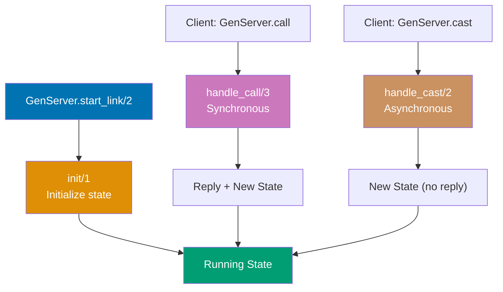

**Code**:

```elixir
defmodule Counter do
              # => Defines Counter module implementing GenServer
              # => GenServer provides stateful process abstraction
  use GenServer  # => imports GenServer behavior and callbacks
                 # => defines init/1, handle_call/3, handle_cast/2, handle_info/2
                 # => requires implementing specific callback functions
                 # => enables OTP supervision and error handling

  # Client API (public interface)
  # => Functions below called by external processes
  # => Wrap GenServer.call/cast operations for clean API
  def start_link(initial_value \\ 0) do  # => default parameter: initial_value = 0 if not provided
                                         # => \\ syntax provides default value
                                         # => allows calling with or without argument
    GenServer.start_link(__MODULE__, initial_value, name: __MODULE__)  # => {:ok, #PID<...>} (starts GenServer process)
                                                                         # => __MODULE__ is Counter atom (module name)
                                                                         # => initial_value passed to init/1 callback
                                                                         # => name: Counter registers process globally (enables Counter.get())
                                                                         # => Global registration allows access without PID
  end

  def increment do  # => public synchronous function wrapping async cast
    GenServer.cast(__MODULE__, :increment)  # => :ok (asynchronous, returns immediately)
                                            # => sends :increment message to Counter process
                                            # => does not wait for state update to complete
  end

  def get do  # => synchronous read operation
    GenServer.call(__MODULE__, :get)  # => waits for reply from server
                                      # => blocks calling process until server responds
                                      # => returns current counter state value
  end

  def add(value) do  # => synchronous write operation with parameter
    GenServer.call(__MODULE__, {:add, value})  # => returns new value after addition
                                               # => synchronous call waits for new state value
                                               # => tuple {:add, value} as message payload
  end

  # Server Callbacks (private implementation)
  @impl true  # => compiler warning if init/1 signature incorrect
  def init(initial_value) do  # => called when GenServer starts
    {:ok, initial_value}  # => {:ok, 0} (returns initial state to GenServer)
                          # => state is a single integer (counter value)
                          # => GenServer stores this state internally
  end

  @impl true  # => marks handle_cast/2 as GenServer callback
  def handle_cast(:increment, state) do  # => pattern matches :increment message
                                         # => state is current counter value
    {:noreply, state + 1}  # => {:noreply, 1} (updates state asynchronously)
                           # => new state = state + 1
                           # => no reply sent to caller (cast is fire-and-forget)
  end

  @impl true  # => marks handle_call/3 as GenServer callback
  def handle_call(:get, _from, state) do  # => :get message for reading state
                                          # => _from ignored (caller info not needed)
    {:reply, state, state}  # => {:reply, 2, 2} (returns current state)
                            # => first state: reply value sent to caller
                            # => second state: unchanged state for next message
  end

  @impl true  # => marks handle_call/3 as GenServer callback
  def handle_call({:add, value}, _from, state) do  # => pattern matches {:add, value} tuple
                                                   # => extracts value from message
    new_state = state + value  # => new_state is 7 (2 + 5)
                               # => calculates updated counter value
    {:reply, new_state, new_state}  # => {:reply, 7, 7} (returns new value and updates state)
                                    # => first new_state: reply value for caller
                                    # => second new_state: updated state for GenServer
  end
end

{:ok, _pid} = Counter.start_link(0)  # => {:ok, #PID<0.123.0>} (state = 0)
                                     # => starts Counter GenServer with initial value 0
                                     # => _pid discards process ID (unused)
Counter.increment()  # => :ok (state becomes 1, asynchronous)
                     # => cast returns immediately without waiting
Counter.increment()  # => :ok (state becomes 2)
                     # => second increment completes asynchronously
Counter.get()  # => 2 (synchronous call returns current state)
               # => blocks until server replies with state value
Counter.add(5)  # => 7 (state becomes 7, returns new value)
                # => synchronous add waits for state update
Counter.get()  # => 7
               # => confirms state updated to 7

defmodule UserRegistry do
  use GenServer  # => imports GenServer behavior
                 # => implements state management for user registry

  # Client API
  def start_link(_opts) do  # => _opts ignored (no options needed)
    GenServer.start_link(__MODULE__, %{}, name: __MODULE__)  # => {:ok, #PID<...>} (named process)
                                                             # => initial state: empty map %{}
                                                             # => registers as UserRegistry atom
  end

  def register(name, data) do  # => stores user data by name key
    GenServer.call(__MODULE__, {:register, name, data})  # => :ok (synchronous registration)
                                                         # => waits for server to store data
                                                         # => tuple {:register, name, data} as message
  end

  def lookup(name) do  # => retrieves user data by name
    GenServer.call(__MODULE__, {:lookup, name})  # => user data or :not_found
                                                 # => synchronous read operation
                                                 # => blocks until server replies
  end

  def list_all do  # => returns all registered users
    GenServer.call(__MODULE__, :list_all)  # => map of all registered users
                                           # => synchronous call returns entire state
  end

  # Server callbacks
  @impl true  # => compiler verification for init/1
  def init(_initial_state) do  # => _initial_state ignored (using empty map)
    {:ok, %{}}  # => {:ok, %{}} (empty map as initial state)
                # => GenServer stores %{} as registry state
  end

  @impl true  # => marks handle_call/3 implementation
  def handle_call({:register, name, data}, _from, state) do  # => pattern matches {:register, ...}
                                                             # => extracts name and data from message
    new_state = Map.put(state, name, data)  # => %{"alice" => %{age: 30, email: "alice@example.com"}}
                                            # => adds or updates user entry in map
    {:reply, :ok, new_state}  # => {:reply, :ok, new_state} (confirms registration)
                              # => :ok sent to caller
                              # => new_state becomes current GenServer state
  end

  @impl true  # => marks handle_call/3 implementation
  def handle_call({:lookup, name}, _from, state) do  # => pattern matches {:lookup, name}
                                                     # => extracts name to search for
    result = Map.get(state, name, :not_found)  # => %{age: 30, ...} or :not_found
                                               # => retrieves user data or default :not_found
    {:reply, result, state}  # => {:reply, result, state} (state unchanged)
                             # => returns user data to caller
                             # => state remains unchanged (read operation)
  end

  @impl true  # => marks handle_call/3 implementation
  def handle_call(:list_all, _from, state) do  # => pattern matches :list_all message
    {:reply, state, state}  # => {:reply, %{"alice" => ..., "bob" => ...}, state}
                            # => returns entire registry map to caller
                            # => state unchanged (read operation)
  end
end

{:ok, _pid} = UserRegistry.start_link([])  # => {:ok, #PID<0.124.0>}
                                           # => starts UserRegistry with empty state
UserRegistry.register("alice", %{age: 30, email: "alice@example.com"})  # => :ok (stores user data)
                                                                         # => state becomes %{"alice" => %{age: 30, ...}}
UserRegistry.register("bob", %{age: 25, email: "bob@example.com"})  # => :ok
                                                                     # => state becomes %{"alice" => ..., "bob" => ...}
UserRegistry.lookup("alice")  # => %{age: 30, email: "alice@example.com"}
                              # => retrieves alice's data from state
UserRegistry.lookup("charlie")  # => :not_found
                                # => charlie not in registry, returns default
UserRegistry.list_all()  # => %{"alice" => %{age: 30, email: "alice@example.com"}, "bob" => %{age: 25, email: "bob@example.com"}}
                         # => returns complete registry map with all users
```

**Key Takeaway**: GenServer provides a standard pattern for stateful servers. Use `call` for synchronous requests (wait for reply), `cast` for asynchronous messages (fire and forget). Separate client API from server callbacks.

**Why It Matters**: GenServer is the workhorse of production Elixir systems. It encapsulates the pattern of stateful process management—receiving messages, updating state, returning responses—into a structured, debuggable abstraction. Under the hood, GenServer uses `receive` loops and process dictionary storage, but it adds error reporting, tracing, timeout handling, and supervision integration automatically. Any time you need persistent state shared across requests—a cache, a counter, a connection pool, a rate limiter—GenServer is the right tool. The client/server separation (public API functions vs private callbacks) is the design pattern you will use most in Elixir systems.

---

## Example 62: GenServer State Management

GenServer state is immutable. Updates return new state, and the GenServer maintains the current state across calls. Understanding state transitions is crucial for building reliable servers.

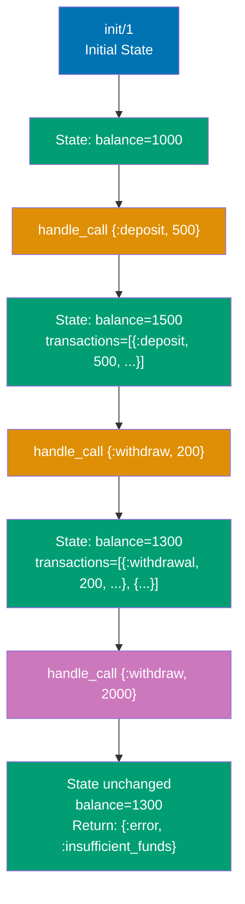

**Code**:

```elixir
defmodule Account do
  use GenServer  # => imports GenServer behavior and callbacks
                 # => enables state management for account operations

  # Struct to represent state
  defstruct balance: 0, transactions: []  # => defines Account state structure
                                          # => balance: integer (cents or dollars)
                                          # => transactions: list of tuples

  # Client API
  def start_link(initial_balance) do  # => public function to start Account GenServer
    GenServer.start_link(__MODULE__, initial_balance)  # => {:ok, #PID<...>}
                                                       # => starts Account GenServer with initial balance
                                                       # => __MODULE__ is Account atom
  end

  def deposit(pid, amount) when amount > 0 do  # => guard clause prevents negative deposits
                                               # => pid: process identifier for account
    GenServer.call(pid, {:deposit, amount})  # => {:ok, new_balance}
                                             # => guard ensures amount is positive
                                             # => synchronous call waits for balance update
  end

  def withdraw(pid, amount) when amount > 0 do  # => guard clause prevents negative withdrawals
                                                # => synchronous withdrawal operation
    GenServer.call(pid, {:withdraw, amount})  # => {:ok, new_balance} or {:error, :insufficient_funds}
                                              # => synchronous withdrawal request
                                              # => blocks until server validates and processes
  end

  def balance(pid) do  # => read-only balance check
    GenServer.call(pid, :balance)  # => current balance integer
                                   # => synchronous read, no state change
  end

  def transaction_history(pid) do  # => retrieves all transactions
    GenServer.call(pid, :transactions)  # => list of transaction tuples
                                        # => returns chronological history
  end

  # Server callbacks
  # => Private implementation called by GenServer
  # => Functions below handle messages from clients
  @impl true  # => compiler verification for init/1
              # => ensures callback signature matches behavior
  def init(initial_balance) do  # => called when GenServer starts
                                # => receives initial_balance from start_link
                                # => Must return {:ok, state} or {:stop, reason}
    state = %__MODULE__{balance: initial_balance}  # => %Account{balance: 1000, transactions: []}
                                                   # => __MODULE__ expands to Account
                                                   # => creates Account struct with empty transaction list
                                                   # => Struct provides compile-time field validation
    {:ok, state}  # => {:ok, %Account{...}}
                  # => returns initial state to GenServer
                  # => GenServer stores this as current state
  end

  @impl true  # => marks handle_call/3 implementation
  def handle_call({:deposit, amount}, _from, state) do  # => pattern matches {:deposit, amount}
                                                        # => extracts amount from message tuple
    new_balance = state.balance + amount  # => 1500 (1000 + 500)
                                          # => calculates updated balance
    transaction = {:deposit, amount, DateTime.utc_now()}  # => {:deposit, 500, ~U[2025-12-27 10:30:00Z]}
                                                          # => records transaction with UTC timestamp
    new_state = %{state | balance: new_balance, transactions: [transaction | state.transactions]}  # => %Account{balance: 1500, transactions: [{:deposit, 500, ...}]}
                                                                                                    # => immutable update: creates new state struct
                                                                                                    # => prepends transaction to history list
    {:reply, {:ok, new_balance}, new_state}  # => {:reply, {:ok, 1500}, new_state}
                                             # => returns success tuple with new balance
                                             # => updates GenServer state to new_state
  end

  @impl true  # => marks handle_call/3 implementation
  def handle_call({:withdraw, amount}, _from, state) do  # => pattern matches {:withdraw, amount}
                                                         # => validates withdrawal request
    if state.balance >= amount do  # => check sufficient funds
                                   # => guards against overdraft
      new_balance = state.balance - amount  # => 1300 (1500 - 200)
                                            # => deducts withdrawal amount
      transaction = {:withdrawal, amount, DateTime.utc_now()}  # => {:withdrawal, 200, ~U[2025-12-27 10:31:00Z]}
                                                               # => records withdrawal with timestamp
      new_state = %{state | balance: new_balance, transactions: [transaction | state.transactions]}  # => %Account{balance: 1300, transactions: [{:withdrawal, 200, ...}, ...]}
                                                                                                      # => immutable state update
                                                                                                      # => prepends transaction to history list
      {:reply, {:ok, new_balance}, new_state}  # => {:reply, {:ok, 1300}, new_state}
                                               # => returns success with new balance
                                               # => commits state change
    else  # => insufficient funds case
      {:reply, {:error, :insufficient_funds}, state}  # => {:reply, {:error, :insufficient_funds}, state}
                                                      # => returns error tuple
                                                      # => state unchanged (no transaction recorded)
    end
  end

  @impl true  # => marks handle_call/3 implementation
  def handle_call(:balance, _from, state) do  # => pattern matches :balance message
    {:reply, state.balance, state}  # => {:reply, 1300, state}
                                    # => returns current balance
                                    # => state unchanged (read operation)
  end

  @impl true  # => marks handle_call/3 implementation
  def handle_call(:transactions, _from, state) do  # => pattern matches :transactions message
    {:reply, Enum.reverse(state.transactions), state}  # => {:reply, [{:deposit, 500, ...}, {:withdrawal, 200, ...}], state}
                                                       # => reverses list for chronological order (oldest first)
                                                       # => state unchanged (read operation)
  end
end

{:ok, account} = Account.start_link(1000)  # => {:ok, #PID<0.125.0>} (initial balance 1000)
                                           # => starts Account GenServer with $1000
Account.deposit(account, 500)  # => {:ok, 1500} (balance becomes 1500)
                               # => adds $500 to account
Account.withdraw(account, 200)  # => {:ok, 1300} (balance becomes 1300)
                                # => removes $200 from account
Account.withdraw(account, 2000)  # => {:error, :insufficient_funds}
                                 # => rejected, balance stays 1300
                                 # => insufficient funds for $2000 withdrawal
Account.balance(account)  # => 1300
                          # => retrieves current balance
Account.transaction_history(account)  # => [{:deposit, 500, ~U[...]}, {:withdrawal, 200, ~U[...]}]
                                      # => returns chronological transaction history

defmodule TodoList do
  use GenServer  # => imports GenServer behavior
                 # => enables state management for todo list

  defstruct items: [], next_id: 1  # => defines state structure
                                   # => items: list of todo maps
                                   # => next_id: integer for auto-incrementing IDs

  def start_link do  # => starts TodoList GenServer
    GenServer.start_link(__MODULE__, [])  # => {:ok, #PID<...>}
                                          # => empty list as init argument (ignored)
  end

  def add_item(pid, description) do  # => adds new todo item
    GenServer.call(pid, {:add, description})  # => {:ok, id} (synchronous, returns item ID)
                                              # => waits for server to create item
  end

  def complete_item(pid, id) do  # => marks todo item as completed
    GenServer.call(pid, {:complete, id})  # => :ok (marks item as done)
                                          # => synchronous update operation
  end

  def list_items(pid) do  # => retrieves all todo items
    GenServer.call(pid, :list)  # => list of items
                                # => synchronous read operation
  end

  @impl true  # => compiler verification for init/1
  def init(_) do  # => _ ignores empty list argument
    {:ok, %__MODULE__{}}  # => {:ok, %TodoList{items: [], next_id: 1}}
                          # => initializes empty todo list with ID counter
  end

  @impl true  # => marks handle_call/3 implementation
  def handle_call({:add, description}, _from, state) do  # => pattern matches {:add, description}
                                                         # => extracts description from message
    item = %{id: state.next_id, description: description, completed: false}  # => %{id: 1, description: "Buy groceries", completed: false}
                                                                             # => creates new todo item map
                                                                             # => uses current next_id value
    new_items = [item | state.items]  # => prepend to list
                                      # => adds item to front of items list
    new_state = %{state | items: new_items, next_id: state.next_id + 1}  # => increment ID for next item
                                                                          # => %TodoList{items: [%{id: 1, ...}], next_id: 2}
                                                                          # => immutable state update
    {:reply, {:ok, item.id}, new_state}  # => {:reply, {:ok, 1}, %TodoList{items: [%{...}], next_id: 2}}
                                         # => returns item ID to caller
                                         # => updates GenServer state
  end

  @impl true  # => marks handle_call/3 implementation
  def handle_call({:complete, id}, _from, state) do  # => pattern matches {:complete, id}
                                                     # => extracts item ID to mark complete
    new_items = Enum.map(state.items, fn item ->  # => map over items
                                                  # => transforms each item in list
      if item.id == id, do: %{item | completed: true}, else: item  # => set completed: true for matching ID
                                                                   # => immutable update for matched item
    end)
    new_state = %{state | items: new_items}  # => update state with modified items
                                             # => %TodoList{items: [modified_items], ...}
    {:reply, :ok, new_state}  # => {:reply, :ok, %TodoList{...}}
                              # => confirms completion to caller
                              # => updates GenServer state
  end

  @impl true  # => marks handle_call/3 implementation
  def handle_call(:list, _from, state) do  # => pattern matches :list message
    {:reply, Enum.reverse(state.items), state}  # => {:reply, [oldest...newest], state}
                                                # => reverses for chronological order
                                                # => state unchanged (read operation)
  end
end

{:ok, todo} = TodoList.start_link()  # => {:ok, #PID<0.126.0>}
                                     # => starts TodoList GenServer
{:ok, id1} = TodoList.add_item(todo, "Buy groceries")  # => {:ok, 1}
                                                       # => creates first todo item with ID 1
{:ok, id2} = TodoList.add_item(todo, "Write code")  # => {:ok, 2}
                                                    # => creates second todo item with ID 2
TodoList.complete_item(todo, id1)  # => :ok (marks item 1 as completed)
                                   # => updates first item's completed field to true
TodoList.list_items(todo)  # => [%{id: 1, description: "Buy groceries", completed: true}, %{id: 2, description: "Write code", completed: false}]
                           # => returns all items in chronological order
```

**Key Takeaway**: GenServer state is immutable—updates return new state. Use structs for complex state to make transformations clear. Every callback returns a tuple specifying the reply (if any) and the new state.

**Why It Matters**: Managing complex state in GenServer requires treating state updates as pure functions—take old state, return new state, never mutate. This model enables state inspection at any point (log the entire state), state recovery (reconstruct from an event log), and unit testing without process overhead (test callback functions directly with state structs). Production GenServers that manage large states use structural sharing for efficiency. Understanding when to split state across multiple GenServers vs keeping it in one—balancing cohesion vs contention—is a key architectural decision in high-throughput systems.

---

## Example 63: GenServer Error Handling

GenServers can timeout, crash, or handle unexpected messages. Understanding error handling patterns ensures robust servers that fail gracefully.

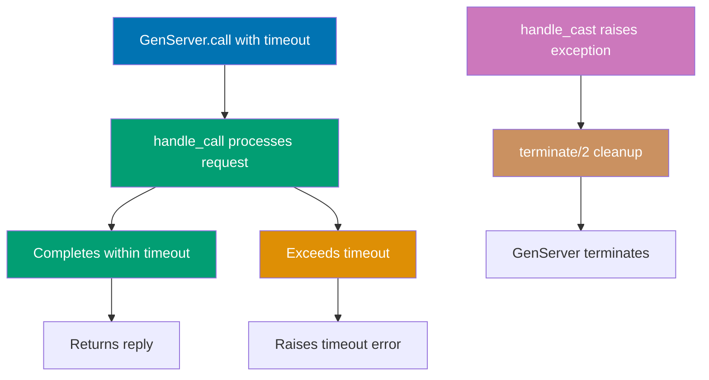

**Code**:

```elixir
defmodule ResilientServer do
  use GenServer  # => imports GenServer behavior
                 # => defines init/1, handle_call/3, handle_cast/2, handle_info/2, terminate/2

  def start_link do
    GenServer.start_link(__MODULE__, [])  # => {:ok, #PID<0.130.0>}
                                          # => starts ResilientServer process
                                          # => __MODULE__ is ResilientServer atom
  end

  def do_work(pid) do
    GenServer.call(pid, :work, 10_000)  # => :done (completes within timeout)
                                         # => 10_000 is 10 second timeout in milliseconds
                                         # => third argument specifies max wait time
                                         # => default timeout is 5000ms if omitted
  end

  def slow_work(pid) do
    GenServer.call(pid, :slow_work, 1_000)  # => raises timeout error after 1000ms
                                             # => 1_000 is 1 second timeout
                                             # => work takes 2s but timeout is 1s (error!)
                                             # => caller raises after waiting 1s
  end

  def crash_me(pid) do
    GenServer.cast(pid, :crash)  # => :ok (returns immediately)
                                 # => async message, no wait for crash
                                 # => cast returns immediately, crash happens in server
                                 # => server will terminate after processing message
  end

  @impl true  # => compiler warning if init/1 signature incorrect
  def init(_) do
    {:ok, %{}}  # => {:ok, %{}} (empty map as state)
                # => GenServer stores %{} as initial state
                # => state can be any term (map, struct, list, etc.)
  end

  @impl true  # => marks handle_call/3 as GenServer callback
  def handle_call(:work, _from, state) do
    # Simulate work
    :timer.sleep(500)  # => blocks process for 500ms
                       # => simulates computation or I/O
                       # => process cannot handle other messages during sleep
    {:reply, :done, state}  # => {:reply, :done, %{}}
                            # => returns :done to caller after 500ms
                            # => 500ms < 10s timeout, completes successfully
                            # => state unchanged
  end

  @impl true  # => marks handle_call/3 as GenServer callback
  def handle_call(:slow_work, _from, state) do
    # Too slow, will timeout
    :timer.sleep(2_000)  # => blocks for 2000ms (2 seconds)
                         # => exceeds 1s timeout from caller
                         # => caller raises timeout error after 1s
    {:reply, :done, state}  # => never executed (timeout occurs first)
                            # => caller raises exit signal at 1s mark
                            # => server continues execution but reply ignored
  end

  @impl true  # => marks handle_cast/2 as GenServer callback
  def handle_cast(:crash, _state) do
    raise "Server crashed!"  # => raises RuntimeError
                             # => server process terminates
                             # => terminate/2 called before shutdown
                             # => no reply sent (cast is fire-and-forget)
  end

  # Handle unexpected messages
  @impl true  # => marks handle_info/2 as GenServer callback
  def handle_info(msg, state) do
    Logger.warn("Unexpected message: #{inspect(msg)}")  # => logs warning with message content
                                                        # => inspect converts any term to string
                                                        # => useful for debugging unexpected sends
    {:noreply, state}  # => {:noreply, %{}} (state unchanged)
                       # => ignores message, continues running
                       # => handle_info catches all non-call/cast messages
                       # => handles raw send/2 messages, monitor signals, etc.
  end

  # Stop callback
  @impl true  # => marks terminate/2 as GenServer callback
  def terminate(reason, _state) do
    Logger.info("Server terminating: #{inspect(reason)}")  # => logs reason for termination
                                                           # => reason could be :normal, :shutdown, {:shutdown, term}, or error
                                                           # => useful for debugging crashes
    :ok  # => :ok (cleanup complete)
         # => return value ignored by GenServer
         # => called before GenServer shuts down
         # => use for closing files, connections, releasing resources
  end
end

{:ok, pid} = ResilientServer.start_link()  # => {:ok, #PID<0.130.0>}
                                           # => starts resilient server
                                           # => stores PID for later calls
ResilientServer.do_work(pid)  # => :done (completes successfully)
                              # => finishes in 500ms, well within 10s timeout
                              # => synchronous call blocks until reply

try do
  ResilientServer.slow_work(pid)  # => raises timeout error after 1s
                                   # => server still processing after 1s
                                   # => GenServer.call raises exit signal
                                   # => exception caught by try/rescue
rescue
  e in RuntimeError -> IO.puts("Caught timeout: #{inspect(e)}")  # => Output: Caught timeout: %RuntimeError{...}
                                                                  # => catches and prints timeout error
                                                                  # => caller continues execution (error handled)
                                                                  # => server process continues running
end

defmodule SafeServer do
  use GenServer  # => imports GenServer behavior
                 # => implements safe error handling patterns

  def start_link do
    GenServer.start_link(__MODULE__, [])  # => {:ok, #PID<0.131.0>}
                                          # => starts SafeServer process
  end

  def divide(pid, a, b) do
    GenServer.call(pid, {:divide, a, b})  # => calls division handler synchronously
                                          # => returns {:ok, result} or {:error, :division_by_zero}
                                          # => tuple {:divide, a, b} as message payload
  end

  @impl true  # => compiler verification for init/1
  def init(_) do
    {:ok, %{}}  # => {:ok, %{}} (empty state)
                # => stateless server (division doesn't need state)
  end

  @impl true  # => marks handle_call/3 implementation
  def handle_call({:divide, a, b}, _from, state) do
    try do
      result = a / b  # => 5.0 (normal case) or raises ArithmeticError (b=0)
                      # => Elixir's / operator raises on division by zero
      {:reply, {:ok, result}, state}  # => {:reply, {:ok, 5.0}, %{}}
                                      # => wraps result in :ok tuple
                                      # => successful division returns ok tuple
                                      # => state unchanged
    rescue
      ArithmeticError ->  # => catches division by zero error
                          # => prevents server crash
        {:reply, {:error, :division_by_zero}, state}  # => {:reply, {:error, :division_by_zero}, %{}}
                                                      # => returns error tuple instead of crashing
                                                      # => error handled gracefully, server continues
                                                      # => caller receives error, can decide how to handle
    end
  end

  # Alternative: return error tuple without exceptions (cleaner pattern)
  def handle_call_safe({:divide, _a, 0}, _from, state) do
    {:reply, {:error, :division_by_zero}, state}  # => {:reply, {:error, :division_by_zero}, %{}}
                                                  # => pattern matches zero divisor
                                                  # => no exception raised, just error tuple
                                                  # => checked before division (no crash)
  end
  def handle_call_safe({:divide, a, b}, _from, state) do
    {:reply, {:ok, a / b}, state}  # => {:reply, {:ok, result}, state}
                                   # => safe division, b is guaranteed non-zero by previous clause
                                   # => pattern matching ensures only non-zero divisors reach here
  end
end

{:ok, pid} = SafeServer.start_link()  # => {:ok, #PID<0.131.0>}
                                      # => starts safe division server
SafeServer.divide(pid, 10, 2)  # => {:ok, 5.0} (successful division)
                               # => 10 / 2 = 5.0, no error
                               # => returns ok tuple with result
SafeServer.divide(pid, 10, 0)  # => {:error, :division_by_zero}
                               # => division by zero caught in try/rescue
                               # => error tuple returned to caller
                               # => server remains alive and functional
                               # => can continue serving other requests
```

**Key Takeaway**: Handle timeouts with `GenServer.call/3` timeout parameter. Use `try/rescue` or error tuples for error handling. Implement `handle_info/2` for unexpected messages and `terminate/2` for cleanup.

**Why It Matters**: GenServer's supervision integration changes how you think about error handling. Rather than catching every exception, you allow unexpected errors to crash the GenServer and let Supervisors restart it with clean state. The `:terminate` callback runs on graceful shutdown, enabling state persistence before exit. `handle_info(:timeout, state)` enables periodic cleanup, lease expiration, and heartbeat checking. The combination of process isolation (error does not affect other processes), supervision (automatic restart), and clean initial state (no state corruption) makes crash-based error handling safer in Elixir than in imperative languages.

---

## Example 64: GenServer Named Processes

Named GenServers can be referenced by atom name instead of PID. This enables easier process discovery and module-level APIs that don't require passing PIDs around.


**Code**:

```elixir
# Named GenServer - Singleton pattern (one instance per application)
defmodule Cache do
  use GenServer  # => imports GenServer behavior
  # => Defines callbacks: init/1, handle_call/3, handle_cast/2

  # Start with name registration
  def start_link(_opts) do
    GenServer.start_link(__MODULE__, %{}, name: __MODULE__)  # => {:ok, #PID<...>} with name: Cache
    # => name: __MODULE__ registers process globally as Cache atom
    # => Now can reference as Cache instead of PID
    # => Process registry maps :Cache → PID
    # => %{} is initial state (empty map)
  end

  # Client API uses module name, not PID
  def put(key, value) do
    GenServer.cast(__MODULE__, {:put, key, value})  # => :ok (sends async message to Cache process)
    # => __MODULE__ resolves to Cache atom (finds PID via process registry)
    # => No need to pass PID around!
    # => cast/2 returns immediately (:ok), doesn't wait for reply
  end

  def get(key) do
    GenServer.call(__MODULE__, {:get, key})  # => returns value or nil
    # => Synchronous call to Cache process (found by name)
    # => Blocks until handle_call returns reply
  end

  def delete(key) do
    GenServer.cast(__MODULE__, {:delete, key})  # => :ok (async delete)
    # => Asynchronous, returns immediately
  end

  # Server Callbacks
  @impl true
  def init(_) do
    {:ok, %{}}  # => {:ok, %{}} (starts with empty map)
    # => State is in-memory cache (key-value pairs)
  end

  @impl true
  def handle_cast({:put, key, value}, state) do
    {:noreply, Map.put(state, key, value)}  # => {:noreply, %{user_1: %{name: "Alice"}}}
    # => Updates state with new key-value pair
  end

  @impl true
  def handle_cast({:delete, key}, state) do
    {:noreply, Map.delete(state, key)}  # => {:noreply, %{}} (removes key)
    # => State updated, key removed
  end

  @impl true
  def handle_call({:get, key}, _from, state) do
    {:reply, Map.get(state, key), state}  # => {:reply, %{name: "Alice"}, state}
    # => Returns value from cache, state unchanged
  end
end

# Usage: Singleton cache (one instance for whole application)
{:ok, _pid} = Cache.start_link([])  # => {:ok, #PID<...>} (Cache registered globally)
# => Process started and registered as Cache atom
Cache.put(:user_1, %{name: "Alice"})  # => :ok (stores in cache)
# => State now: %{user_1: %{name: "Alice"}}
# => Async cast operation
Cache.get(:user_1)  # => %{name: "Alice"} (retrieves from cache)
# => Sync call operation
Cache.delete(:user_1)  # => :ok (removes from cache)
# => State now: %{}
# => Async cast operation
Cache.get(:user_1)  # => nil (key not found)
# => Key was deleted, returns nil

# Named GenServer - Multiple instances with different names
defmodule Worker do
  use GenServer
  # => Multiple instances with different names

  def start_link(name) do
    GenServer.start_link(__MODULE__, [], name: name)  # => {:ok, #PID<...>} with name: :worker_1, :worker_2, etc.
    # => Each instance has unique name (passed as argument)
    # => Can start multiple Workers with different names
    # => name parameter allows dynamic registration
  end

  def ping(name) do
    GenServer.call(name, :ping)  # => :pong (calls specific worker by name)
    # => name is :worker_1 or :worker_2 (looks up PID by name)
    # => Routes to specific worker instance
  end

  @impl true
  def init(_) do
    {:ok, []}  # => {:ok, []} (empty list as state)
    # => Simple stateless worker
  end

  @impl true
  def handle_call(:ping, _from, state) do
    {:reply, :pong, state}  # => {:reply, :pong, []} (simple ping response)
    # => Returns :pong to caller
  end
end

# Usage: Multiple named workers (each with unique name)
{:ok, _} = Worker.start_link(:worker_1)  # => {:ok, #PID<...>} (worker_1 registered)
# => First worker instance started
{:ok, _} = Worker.start_link(:worker_2)  # => {:ok, #PID<...>} (worker_2 registered)
# => Two separate Worker processes, each with unique name
# => Second worker instance started
Worker.ping(:worker_1)  # => :pong (pings worker_1 by name)
# => Targets first worker
Worker.ping(:worker_2)  # => :pong (pings worker_2 by name)
# => Each worker responds independently
# => Targets second worker

# Naming comparison:
# PID-based (without names):
#   {:ok, pid} = GenServer.start_link(Worker, [])  # => must store/pass pid everywhere
#   GenServer.call(pid, :ping)  # => pass pid to every call
#
# Name-based (with names):
#   GenServer.start_link(Worker, [], name: :worker_1)  # => register with name once
#   GenServer.call(:worker_1, :ping)  # => reference by name anywhere
#
# Benefits of naming:
# ✅ No need to pass PIDs around (cleaner API)
# ✅ Process discovery (find by name)
# ✅ Singleton pattern (one instance per name)
# ⚠️ Names are global atoms (limited to ~1 million atoms)
# ⚠️ Name conflicts cause crashes (can't register same name twice)
```

**Key Takeaway**: Register GenServers with `name:` option to reference by atom instead of PID. Use `__MODULE__` for singleton services. Named processes enable cleaner APIs and easier process discovery.

**Why It Matters**: Named GenServers are the primary mechanism for building application services—components that live for the application lifetime and are accessed by name rather than pid. The `{:global, name}` registry works across distributed nodes; `{:via, Registry, {MyRegistry, name}}` enables dynamic naming with metadata. Production patterns: `MyApp.Cache`, `MyApp.RateLimiter`, and `MyApp.Config` are named GenServers that any code can call without passing pid references. Understanding name registration systems enables building services that survive process restarts and are discoverable across the application without dependency injection.

---

## Example 65: GenServer Best Practices

Well-designed GenServers separate client API from server implementation, keep callbacks simple, and provide clear error handling. Following patterns improves maintainability and testability.

**Code**:

```elixir
# Best Practice 1: Separate client API from server callbacks
defmodule BestPractices do
  use GenServer  # => imports GenServer behavior
                 # => defines init/1, handle_call/3, handle_cast/2

  # ✅ CLIENT API - Public interface (synchronous functions)
  # Users call these functions (they DON'T call handle_call directly)
  def start_link(opts \\ []) do
    GenServer.start_link(__MODULE__, opts, name: __MODULE__)  # => {:ok, #PID<0.170.0>}
                                                              # => starts GenServer with opts
                                                              # => name: __MODULE__ registers as BestPractices
                                                              # => opts passed to init/1
  end

  def create_user(name, email) do
    GenServer.call(__MODULE__, {:create_user, name, email})  # => {:ok, user} or {:error, reason}
                                                             # => Blocks until server replies
                                                             # => tuple {:create_user, name, email} as message
                                                             # => timeout: 5000ms (default)
  end

  def get_user(id) do
    GenServer.call(__MODULE__, {:get_user, id})  # => user map or nil
                                                 # => synchronous read from server state
                                                 # => tuple {:get_user, id} as message
  end
  # => Client API is CLEAN - no process details, just business operations
  # => Users never see PIDs, messages, or GenServer internals

  # ✅ SERVER CALLBACKS - Private implementation (handle_* functions)
  # These run inside GenServer process, users never call them directly

  # Best Practice 2: Use @impl for callback clarity
  @impl true  # => ✅ declares this is GenServer.init/1 callback
              # => compiler verifies signature matches behavior
              # => generates warning if signature wrong
  def init(_opts) do
    # Initialize state
    state = %{users: %{}, next_id: 1}  # => initial state structure
                                       # => users: map of id → user
                                       # => next_id: counter for user IDs
    {:ok, state}  # => {:ok, %{users: %{}, next_id: 1}}
                  # => GenServer stores this as initial state
  end
  # => @impl ensures callback signature matches behavior (compile-time check)
  # => If you change behavior, @impl catches signature mismatches

  @impl true  # => marks handle_call/3 as GenServer callback
  def handle_call({:create_user, name, email}, _from, state) do
    # ✅ Best Practice 3: Keep callbacks simple - delegate to private helpers
    {reply, new_state} = do_create_user(name, email, state)  # => delegates business logic to private function
                                                             # => callback is thin routing layer
                                                             # => {reply, new_state} unpacked below
    {:reply, reply, new_state}  # => {:reply, {:ok, %{id: 1, name: "Alice", ...}}, new_state}
                                # => returns reply to caller
                                # => updates GenServer state to new_state
  end
  # => Callback is THIN - just message routing, no business logic
  # => Business logic in do_create_user (easier to test)

  @impl true  # => marks handle_call/3 as GenServer callback
  def handle_call({:get_user, id}, _from, state) do
    user = Map.get(state.users, id)  # => retrieves user by id from users map
                                     # => %{id: 1, name: "Alice", ...} or nil
    {:reply, user, state}  # => {:reply, %{id: 1, name: "Alice", ...}, state}
                           # => returns user to caller
                           # => state unchanged (read operation)
  end

  # ✅ Best Practice 4: Extract complex logic to private functions
  defp do_create_user(name, email, state) do
    if valid_email?(email) do  # => validation check (must contain @)
                               # => returns true or false
      user = %{id: state.next_id, name: name, email: email}  # => creates user map
                                                             # => %{id: 1, name: "Alice", email: "alice@example.com"}
      new_users = Map.put(state.users, state.next_id, user)  # => adds user to users map
                                                             # => %{1 => %{id: 1, name: "Alice", ...}}
      new_state = %{state | users: new_users, next_id: state.next_id + 1}  # => updates state immutably
                                                                           # => %{users: %{1 => ...}, next_id: 2}
                                                                           # => increments next_id for next user
      {{:ok, user}, new_state}  # => returns success tuple + new state
                                # => {{:ok, %{id: 1, ...}}, new_state}
    else
      {{:error, :invalid_email}, state}  # => returns error tuple + unchanged state
                                         # => {{:error, :invalid_email}, original_state}
                                         # => state not modified on validation failure
    end
  end
  # => Private helper is TESTABLE - pure function (no side effects)
  # => Takes explicit inputs (name, email, state), returns explicit outputs (reply, new_state)
  # => No hidden GenServer state or process magic

  defp valid_email?(email), do: String.contains?(email, "@")  # => simple email validation
                                                              # => checks if email contains @ symbol
                                                              # => returns true or false

  # ✅ Best Practice 5: Use typespec for documentation
  @spec create_user(String.t(), String.t()) :: {:ok, map()} | {:error, atom()}
  # => Documents function signature: two strings in, ok/error tuple out
  # => Dialyzer can verify callers use correct types
  # => Self-documenting code (typespec as machine-readable docs)
end

# Testing GenServer with callbacks
defmodule BestPracticesTest do
  use ExUnit.Case  # => imports ExUnit test DSL
                   # => provides assert, test, setup macros

  setup do  # => runs before EACH test
            # => ensures fresh state per test (isolation)
    {:ok, _pid} = BestPractices.start_link()  # => starts GenServer for test
                                              # => each test gets independent instance
                                              # => _pid discards PID (not needed)
    :ok  # => return :ok (no context needed for tests)
         # => setup can return {:ok, context} to pass data to tests
  end
  # => Each test gets fresh GenServer instance
  # => No state leakage between tests

  test "creates user with valid email" do
    assert {:ok, user} = BestPractices.create_user("Alice", "alice@example.com")  # => calls client API
                                                                                   # => pattern matches {:ok, user} result
                                                                                   # => assertion passes if match succeeds
    # => GenServer.call → handle_call → do_create_user → validation passes → success
    assert user.name == "Alice"  # => verifies user.name field
                                 # => ensures correct data returned
    assert user.email == "alice@example.com"  # => verifies user.email field
  end

  test "rejects invalid email" do
    assert {:error, :invalid_email} = BestPractices.create_user("Bob", "invalid")  # => validation fails (no @)
                                                                                   # => pattern matches {:error, :invalid_email}
    # => GenServer.call → handle_call → do_create_user → validation fails → error
    # => State unchanged (user not created)
  end

  test "retrieves created user" do
    {:ok, user} = BestPractices.create_user("Charlie", "charlie@example.com")  # => creates user first
                                                                               # => user.id generated (1)
    assert BestPractices.get_user(user.id) == user  # => retrieves created user by ID
                                                    # => same user returned
                                                    # => proves state persisted
    # => State persists between calls (same GenServer process)
    # => First call (create) modifies state, second call (get) reads it
  end
end

# ✅ Best Practice 6: Extract business logic to pure modules (advanced pattern)
defmodule UserLogic do
  # Pure functions - NO side effects (no GenServer, no state, no I/O)
  # Easy to test without processes
  # All dependencies passed as arguments (explicit, not hidden)

  def create_user(users, next_id, name, email) do
    # => Takes explicit arguments (not hidden state from GenServer)
    # => users: current users map
    # => next_id: next available ID
    # => name, email: user data
    if valid_email?(email) do  # => validation check
                               # => same logic as before, but PURE
      user = %{id: next_id, name: name, email: email}  # => creates user map
                                                       # => %{id: 1, name: "Alice", email: "alice@example.com"}
      new_users = Map.put(users, next_id, user)  # => updates users map
                                                 # => %{1 => %{id: 1, ...}}
      {{:ok, user}, new_users, next_id + 1}  # => returns 3-tuple: (result, new_users, new_next_id)
                                             # => {{:ok, %{id: 1, ...}}, %{1 => ...}, 2}
    else
      {{:error, :invalid_email}, users, next_id}  # => error with unchanged state
                                                  # => users and next_id unchanged
    end
  end
  # => PURE function: same inputs always produce same outputs
  # => No hidden state, no side effects, no process spawning
  # => Can test with simple assertions (no process spawning)
  # => Deterministic: create_user(%{}, 1, "Alice", "alice@example.com") always returns same result

  defp valid_email?(email), do: String.contains?(email, "@")  # => simple validation
                                                              # => pure predicate function
end

# GenServer as thin wrapper around pure business logic
defmodule UserServer do
  use GenServer  # => imports GenServer behavior

  # Client API
  def start_link(_), do: GenServer.start_link(__MODULE__, %{}, name: __MODULE__)  # => {:ok, #PID<0.180.0>}
                                                                                  # => starts server with empty map
  def create_user(name, email), do: GenServer.call(__MODULE__, {:create, name, email})  # => calls server
                                                                                        # => delegates to handle_call

  # Server callbacks
  @impl true  # => marks init/1 as GenServer callback
  def init(_), do: {:ok, %{users: %{}, next_id: 1}}  # => initial state
                                                     # => %{users: %{}, next_id: 1}

  @impl true  # => marks handle_call/3 as GenServer callback
  def handle_call({:create, name, email}, _from, state) do
    # ✅ Delegate to pure business logic (UserLogic module)
    {reply, new_users, new_next_id} = UserLogic.create_user(state.users, state.next_id, name, email)
                                                # => calls PURE function in UserLogic
                                                # => UserLogic.create_user has NO process dependencies
                                                # => returns 3-tuple: (reply, new_users, new_next_id)
    # => UserLogic is PURE - takes values, returns values (no process magic)
    new_state = %{state | users: new_users, next_id: new_next_id}  # => reconstructs state from pure results
                                                                   # => %{users: new_users, next_id: new_next_id}
                                                                   # => immutable update
    {:reply, reply, new_state}  # => returns to caller
                                # => {:reply, {:ok, user}, new_state}
  end
  # => GenServer handles ONLY concurrency and state management
  # => UserLogic handles ONLY business rules and validation
  # => Clear separation of concerns!
end

# Benefits of this pattern:
# ✅ Test UserLogic without spawning processes (fast, simple unit tests)
#    - UserLogic.create_user(%{}, 1, "Alice", "alice@example.com") → assert result
#    - No GenServer.start_link, no setup, no teardown
# ✅ Test UserServer for concurrency bugs (slow, complex integration tests)
#    - Spawn multiple processes calling UserServer simultaneously
#    - Verify state consistency under load
# ✅ Reuse UserLogic in other contexts (web controller, CLI, background job)
#    - Phoenix controller can call UserLogic.create_user directly (no GenServer)
#    - CLI tool can use UserLogic without OTP application
# ✅ Clear separation: GenServer = concurrency, Pure modules = business logic
#    - UserServer = when/where to execute (process, state, messages)
#    - UserLogic = what to execute (validation, transformation, rules)
```

**Key Takeaway**: Separate client API from callbacks, use `@impl` for clarity, extract complex logic to private functions, and delegate business logic to pure modules for easier testing. Keep GenServer focused on state management and concurrency.

**Why It Matters**: GenServer best practices prevent two classes of production problems: bottlenecks and state corruption. Keeping callbacks fast (milliseconds, not seconds) prevents the process mailbox from backing up—slow `handle_call` blocks all callers. Separating client API (public functions) from server callbacks (handle\_\* functions) enables testing callbacks in isolation. Returning `{:reply, response, state}` before doing slow work (with a separate `handle_info` for the work result) enables non-blocking responses. These patterns distinguish naive GenServer usage from production-grade implementations that handle high concurrency gracefully.

---

## Example 66: Supervisor Basics

Supervisors monitor child processes and restart them on failure. They're the foundation of OTP's fault tolerance—processes are organized into supervision trees where supervisors restart failed children.

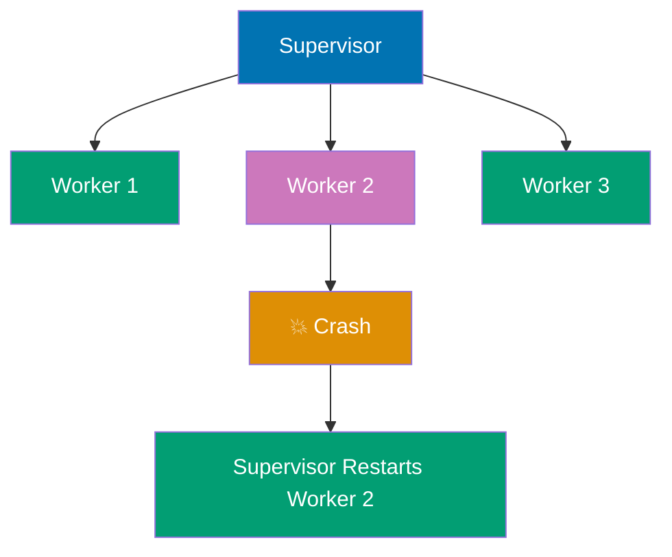

**Code**:

```elixir
defmodule Worker do
  use GenServer  # => imports GenServer behavior
                 # => defines init/1, handle_call/3, handle_cast/2

  # Client API
  def start_link(id) do
    GenServer.start_link(__MODULE__, id, name: via_tuple(id))  # => {:ok, #PID<0.140.0>}
                                                               # => starts Worker GenServer with id as state
                                                               # => registers worker with Registry using via_tuple
                                                               # => name: via_tuple(id) enables process discovery by id
  end

  def crash(id) do
    GenServer.cast(via_tuple(id), :crash)  # => :ok (returns immediately)
                                           # => sends async crash message to worker
                                           # => via_tuple(id) resolves to PID via Registry
                                           # => worker will crash when processing message
  end

  def ping(id) do
    GenServer.call(via_tuple(id), :ping)  # => {:pong, 1} (synchronous call)
                                          # => waits for worker reply
                                          # => via_tuple looks up PID from Registry
  end

  defp via_tuple(id), do: {:via, Registry, {WorkerRegistry, id}}  # => {:via, Registry, {WorkerRegistry, 1}}
                                                                   # => special tuple for Registry-based naming
                                                                   # => Registry is module, WorkerRegistry is registry name
                                                                   # => id is key to look up in registry

  # Server Callbacks
  @impl true  # => compiler warning if init/1 signature incorrect
  def init(id) do
    IO.puts("Worker #{id} starting...")  # => Output: Worker 1 starting...
                                         # => prints to console when worker starts
                                         # => useful for observing supervisor restarts
    {:ok, id}  # => {:ok, 1}
               # => returns worker ID as initial state
               # => supervisor receives :ok and considers child started
  end

  @impl true  # => marks handle_call/3 as GenServer callback
  def handle_call(:ping, _from, id) do
    {:reply, {:pong, id}, id}  # => {:reply, {:pong, 1}, 1}
                               # => replies with {:pong, id} tuple
                               # => state unchanged (id stays same)
                               # => caller receives {:pong, 1}
  end

  @impl true  # => marks handle_cast/2 as GenServer callback
  def handle_cast(:crash, _state) do
    raise "Worker crashed!"  # => raises RuntimeError
                             # => GenServer terminates immediately
                             # => supervisor detects exit signal
                             # => supervisor restarts worker according to strategy
  end
end

defmodule MySupervisor do
  use Supervisor  # => imports Supervisor behavior
                  # => defines init/1 callback

  def start_link(_opts) do
    Supervisor.start_link(__MODULE__, :ok, name: __MODULE__)  # => {:ok, #PID<0.139.0>}
                                                              # => starts supervisor process
                                                              # => name: __MODULE__ registers as MySupervisor atom
                                                              # => __MODULE__ resolves to MySupervisor
  end

  @impl true  # => compiler warning if init/1 signature incorrect
  def init(:ok) do
    # Start Registry for worker names
    children = [
      {Registry, keys: :unique, name: WorkerRegistry},  # => Registry child spec
                                                        # => keys: :unique means each key maps to one PID
                                                        # => name: WorkerRegistry is registry identifier
                                                        # => started FIRST (workers depend on registry)
      # Worker children
      {Worker, 1},  # => {Worker, 1} expands to Worker.start_link(1)
                    # => starts Worker with id=1
                    # => registered in WorkerRegistry as key 1
      {Worker, 2},  # => starts Worker with id=2
                    # => second worker, independent of first
      {Worker, 3}   # => starts Worker with id=3
                    # => third worker, independent of first two
    ]

    # :one_for_one strategy - restart only crashed child
    Supervisor.init(children, strategy: :one_for_one)  # => {:ok, {supervisor_flags, children}}
                                                       # => configures supervisor restart strategy
                                                       # => :one_for_one means if Worker 2 crashes, only Worker 2 restarts
                                                       # => Workers 1 and 3 remain unaffected
                                                       # => max_restarts: 3, max_seconds: 5 (default)
  end
end

# Start supervision tree
{:ok, _pid} = MySupervisor.start_link([])  # => {:ok, #PID<0.139.0>}
                                           # => supervisor starts and initializes
                                           # => supervisor starts all children in order
                                           # => _pid discards supervisor PID (unused)
# => Prints:
# => Worker 1 starting...
# => Worker 2 starting...
# => Worker 3 starting...
# => All three workers initialized successfully

Worker.ping(1)  # => {:pong, 1}
                # => Worker 1 is alive and responding
                # => via_tuple(1) resolves PID from Registry
Worker.crash(2)  # => :ok (returns immediately)
                 # => sends crash message to Worker 2
                 # => Worker 2 processes message and raises error
                 # => Supervisor detects Worker 2 exit signal
                 # => Supervisor restarts Worker 2 according to :one_for_one strategy
# => Prints: Worker 2 starting... (restart message)
:timer.sleep(100)  # => pauses for 100ms
                   # => waits for restart to complete
                   # => gives supervisor time to restart Worker 2
Worker.ping(2)  # => {:pong, 2}
                # => Worker 2 alive again with clean state!
                # => Demonstrates fault tolerance: crashed worker automatically recovers
                # => New Worker 2 process with fresh state (id=2)

# Child specification structure
child_spec = %{
  id: Worker,  # => unique identifier for child
               # => used to identify which child crashed in supervisor
               # => must be unique among siblings
  start: {Worker, :start_link, [1]},  # => {Module, function, args} tuple
                                      # => supervisor calls Worker.start_link(1) to start child
                                      # => must return {:ok, pid} or {:error, reason}
  restart: :permanent,  # => :permanent (always restart on exit)
                        # => :temporary (never restart)
                        # => :transient (restart only on abnormal exit, not :normal)
  shutdown: 5000,       # => 5000ms timeout for graceful shutdown
                        # => supervisor sends exit signal, waits 5s
                        # => if still alive after 5s, supervisor force-kills child
  type: :worker         # => :worker (regular process) or :supervisor (nested supervisor)
                        # => affects shutdown order (supervisors last)
}
# => This spec defines HOW supervisor manages this child
# => restart policy, shutdown timeout, start function all configured
# => supervisor uses this spec to restart crashed children

```

**Key Takeaway**: Supervisors restart failed child processes, providing fault tolerance. Use `:one_for_one` strategy to restart only crashed children. Supervision trees isolate failures and enable "let it crash" philosophy.

**Why It Matters**: Supervisors are the cornerstone of Elixir's let-it-crash philosophy—they make process crashes a recoverable event rather than an application failure. Instead of defensive exception handling throughout your code, you write happy-path code and let Supervisors restart crashed processes with clean state. The tree structure (supervisors supervising supervisors) enables fine-grained restart policies: restart only the affected subtree when something fails. Every production Elixir application is a supervision tree, and understanding supervisor semantics—start order, restart strategies, and shutdown sequences—is essential for building reliable systems.

---

## Example 67: Restart Strategies

Supervisors support different restart strategies based on child process dependencies. Choose the strategy that matches your process relationships.

**one_for_one Strategy**:

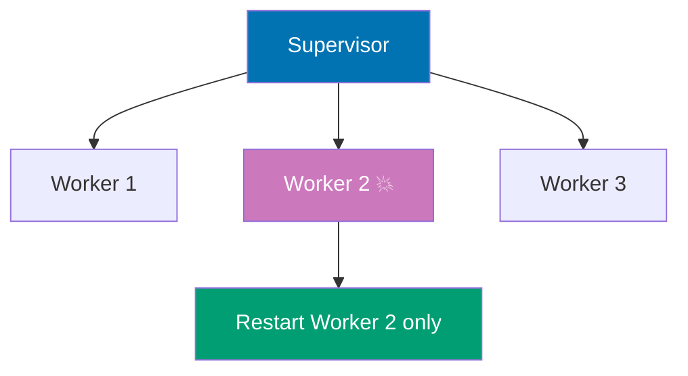

**one_for_all Strategy**:

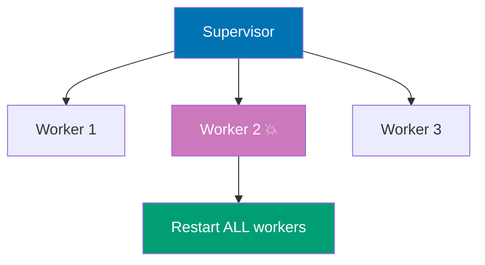

**rest_for_one Strategy**:

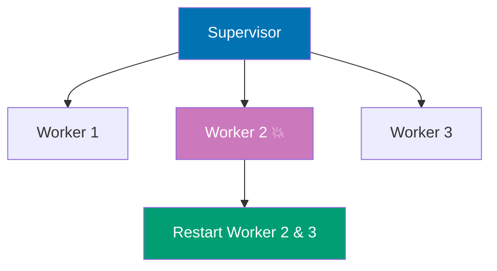

**Code**:

```elixir
# :one_for_one - Independent workers, restart crashed child only
defmodule OneForOneSupervisor do
  use Supervisor  # => imports Supervisor behavior
                  # => provides init/1 callback and supervision functions
                  # => enables this module to act as a supervisor

  def start_link(_opts) do
    Supervisor.start_link(__MODULE__, :ok)  # => {:ok, #PID<...>}
                                            # => starts supervisor process
                                            # => __MODULE__ is OneForOneSupervisor
  end

  @impl true  # => marks init/1 as Supervisor callback implementation
              # => compiler warns if signature doesn't match behavior
  def init(:ok) do
            # => receives :ok from start_link
            # => returns supervisor specification
    children = [
      {Worker, 1},  # => Worker 1 (independent process)
                    # => expands to Worker.start_link(1)
                    # => no state sharing with other workers
      {Worker, 2},  # => Worker 2 (independent process)
                    # => expands to Worker.start_link(2)
                    # => operates independently from Worker 1 and 3
      {Worker, 3}   # => Worker 3 (independent process)
                    # => expands to Worker.start_link(3)
                    # => no dependencies on other workers
    ]
    # => Children list defines 3 worker processes
    # => Workers are INDEPENDENT - Worker 2 crash doesn't affect Workers 1 or 3
    # => Each worker has its own state, mailbox, and lifecycle

    Supervisor.init(children, strategy: :one_for_one)  # => {:ok, {supervisor_flags, children}}
                                                       # => initializes supervisor with child specs
                                                       # => strategy: :one_for_one defines restart policy
    # => :one_for_one means: if Worker 2 crashes, ONLY Worker 2 restarts
    # => Workers 1 and 3 keep running with their current state
    # => Minimal blast radius: failure isolated to crashed process
    # => Use case: stateless workers, connection pool workers, task processors
  end
end

# :one_for_all - Tightly coupled workers, restart ALL on any crash
defmodule OneForAllSupervisor do
  use Supervisor  # => imports Supervisor behavior
                  # => enables supervision capabilities

  def start_link(_opts) do
                         # => _opts is ignored (no custom configuration)
    Supervisor.start_link(__MODULE__, :ok)  # => {:ok, #PID<...>}
                                            # => starts supervisor process
                                            # => calls init(:ok) callback
  end

  @impl true  # => marks init/1 as callback implementation
              # => compiler verifies correct signature
  def init(:ok) do
            # => receives :ok argument from start_link
            # => defines tightly coupled children
    children = [
      {DatabaseConnection, []},  # => Started FIRST (position 1)
                                 # => Must be up for Cache and APIServer
                                 # => expands to DatabaseConnection.start_link([])
      {Cache, []},               # => Started SECOND (position 2)
                                 # => Depends on database (caches DB queries)
                                 # => Invalid if database state changed
      {APIServer, []}            # => Started THIRD (position 3)
                                 # => Depends on cache (serves cached data)
                                 # => Invalid if cache state changed
    ]
    # => Workers are TIGHTLY COUPLED - if any crashes, ALL must restart for consistency
    # => Startup order: DatabaseConnection → Cache → APIServer
    # => All children depend on each other's state consistency

    Supervisor.init(children, strategy: :one_for_all)  # => {:ok, {supervisor_flags, children}}
                                                       # => initializes with one_for_all strategy
                                                       # => any child crash triggers ALL restarts
    # => :one_for_all means: if DatabaseConnection crashes, ALL THREE restart in order
    # => Why? Cache has stale DB state, APIServer has stale cache state
    # => Restart order preserves dependency chain: DatabaseConnection → Cache → APIServer
    # => Maximum blast radius: all children restarted (clean slate for all)
    # => Use case: workers with shared mutable state, game sessions, synchronized protocols
  end
end

# :rest_for_one - Startup-order dependencies, restart crashed child + later siblings
defmodule RestForOneSupervisor do
  use Supervisor  # => imports Supervisor behavior
                  # => enables rest_for_one restart strategy

  def start_link(_opts) do
                         # => _opts is ignored (no configuration)
    Supervisor.start_link(__MODULE__, :ok)  # => {:ok, #PID<...>}
                                            # => starts supervisor process
                                            # => calls init(:ok) callback
  end

  @impl true  # => marks init/1 as Supervisor callback
              # => compiler enforces correct signature
  def init(:ok) do
            # => receives :ok from start_link
            # => defines children with startup order dependencies
    children = [
      {DatabaseConnection, []},  # => Position 1: Started FIRST
                                 # => Foundation for later children
                                 # => expands to DatabaseConnection.start_link([])
      {Cache, []},               # => Position 2: Started SECOND
                                 # => Depends on DatabaseConnection (caches DB queries)
                                 # => Invalid if database restarts
      {APIServer, []}            # => Position 3: Started THIRD
                                 # => Depends on Cache (serves cached data)
                                 # => Invalid if cache restarts
    ]
    # => STARTUP ORDER MATTERS - later children depend on earlier children
    # => Child list position defines dependency chain
    # => Earlier children must be running for later children to function

    Supervisor.init(children, strategy: :rest_for_one)  # => {:ok, {supervisor_flags, children}}
                                                        # => initializes with rest_for_one strategy
                                                        # => restart policy based on position
    # => :rest_for_one means: restart crashed child + all LATER siblings
    # => Restart behavior by position:
    # => If DatabaseConnection (pos 1) crashes: restart DatabaseConnection, Cache, APIServer
    #      (all later children depend on database, must restart for consistency)
    # => If Cache (pos 2) crashes: restart Cache, APIServer (DatabaseConnection keeps running)
    #      (APIServer depends on cache, DatabaseConnection independent)
    # => If APIServer (pos 3) crashes: restart APIServer only (no children depend on it)
    #      (last child, nothing downstream to invalidate)
    # => Blast radius scales with position: earlier crash = more restarts
    # => Use case: initialization pipelines, dependent services, layered architectures
  end
end

# Supervisor with restart limits (prevent crash loops)
defmodule ConfiguredSupervisor do
  use Supervisor  # => imports Supervisor behavior
                  # => enables crash loop prevention

  def start_link(_opts) do
                         # => _opts is ignored (no custom options)
    Supervisor.start_link(__MODULE__, :ok)  # => {:ok, #PID<...>}
                                            # => starts supervisor with restart limits
                                            # => calls init(:ok) callback
  end

  @impl true  # => marks init/1 as Supervisor callback
              # => compiler enforces correct implementation
  def init(:ok) do
            # => receives :ok from start_link
            # => configures restart limits to prevent crash loops
    children = [{Worker, 1}]  # => single worker child
                              # => expands to Worker.start_link(1)
                              # => supervisor monitors this worker

    Supervisor.init(children,
      strategy: :one_for_one,  # => restart only crashed child (not siblings)
                               # => suitable for single-child supervisor
      max_restarts: 3,         # => allow MAX 3 restarts...
                               # => counts successful restarts
      max_seconds: 5           # => ...within 5 second sliding window
                               # => window slides with each restart
    )
    # => Returns {:ok, {supervisor_flags, children}}
    # => Restart budget: 3 restarts per 5 seconds
    # => Sliding window mechanism:
    # => Example timeline (crash loop scenario):
    # => t=0s: Worker crashes (1st restart) ✓ [1 restart in last 5s]
    # => t=2s: Worker crashes (2nd restart) ✓ [2 restarts in last 5s]
    # => t=4s: Worker crashes (3rd restart) ✓ [3 restarts in last 5s]
    # => t=5s: Worker crashes (4th restart in 5s) ✗ BUDGET EXCEEDED
    # => Supervisor crashes → escalates to parent supervisor (up supervision tree)
    # => Prevents infinite crash loops from depleting system resources
    # => If limit exceeded, supervisor itself crashes (escalates to parent)
    # => Parent supervisor decides how to handle supervisor crash
  end
end

# Example usage comparison - demonstrates different restart strategy behaviors
{:ok, one_for_one} = OneForOneSupervisor.start_link([])  # => {:ok, #PID<...>}
                                                          # => starts 3 independent workers
                                                          # => Workers 1, 2, 3 are isolated
# => Crash scenario: Worker 2 crashes
# => Restart behavior: only Worker 2 restarts
# => Workers 1 and 3 continue running with current state

{:ok, one_for_all} = OneForAllSupervisor.start_link([])  # => {:ok, #PID<...>}
                                                          # => starts 3 tightly coupled workers
                                                          # => DatabaseConnection, Cache, APIServer
# => Crash scenario: DatabaseConnection crashes
# => Restart behavior: ALL 3 restart in order (DatabaseConnection → Cache → APIServer)
# => Cache and APIServer had stale state, needed fresh start

{:ok, rest_for_one} = RestForOneSupervisor.start_link([])  # => {:ok, #PID<...>}
                                                            # => starts 3 workers with startup dependencies
                                                            # => Position matters for restart policy
# => Crash scenario: Cache (position 2) crashes
# => Restart behavior: Cache and APIServer restart (DatabaseConnection keeps running)
# => DatabaseConnection (position 1) unaffected, continues with current state
```

**Key Takeaway**: Choose restart strategy based on dependencies: `:one_for_one` for independent workers, `:one_for_all` for interdependent workers, `:rest_for_one` for startup-order dependencies. Configure `max_restarts` and `max_seconds` to prevent crash loops.

**Why It Matters**: Choosing the right restart strategy prevents cascading failures and ensures the supervision tree restores the correct state after crashes. `:one_for_one` is safest (restart only the crashed child) but risks inconsistent state between related processes. `:one_for_all` (restart all siblings) maintains consistency but increases disruption. `:rest_for_one` (restart from the crashed child onwards) handles ordered dependencies. Getting this wrong can either leave the system in an inconsistent state through under-restarting or create thundering herd problems through over-restarting. Production systems design restart strategies based on process dependencies, not just convenience.

---

## Example 68: Dynamic Supervisors

DynamicSupervisors start children on demand rather than at supervisor init. Use them for variable numbers of workers (connection pools, user sessions, task queues).

**Starting Children Dynamically**:

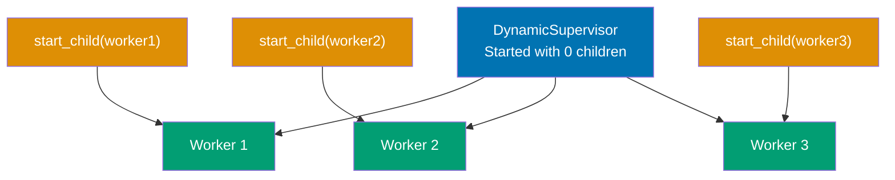

**Terminating Children**:

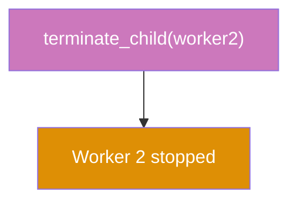

**Use Case - Connection Pool**:

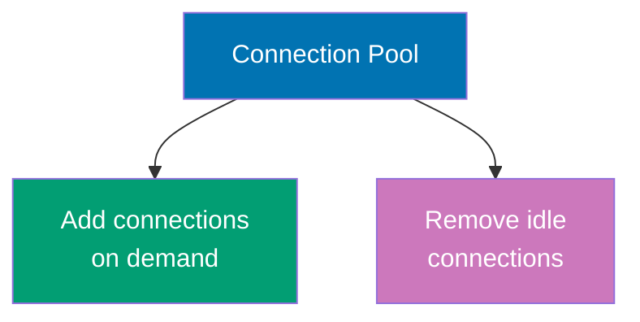

**Code**:

```elixir
defmodule DynamicWorker do
  use GenServer  # => imports GenServer behavior
                 # => defines init/1, handle_call/3

  def start_link(id) do
    GenServer.start_link(__MODULE__, id)  # => {:ok, #PID<0.150.0>}
                                          # => starts worker with id as initial state
                                          # => no name registration (dynamic workers not named)
  end

  def get_id(pid) do
    GenServer.call(pid, :get_id)  # => synchronous call to retrieve worker ID
                                  # => blocks until worker replies with ID
  end

  @impl true  # => compiler warning if init/1 signature incorrect
  def init(id) do
    IO.puts("DynamicWorker #{id} started")  # => Output: DynamicWorker 1 started
                                            # => prints when worker initializes
                                            # => useful for observing dynamic spawning
    {:ok, id}  # => {:ok, 1}
               # => stores id as state
               # => supervisor receives :ok signal
  end

  @impl true  # => marks handle_call/3 as GenServer callback
  def handle_call(:get_id, _from, id) do
    {:reply, id, id}  # => {:reply, 1, 1}
                      # => returns id to caller
                      # => state unchanged
  end
end

defmodule MyDynamicSupervisor do
  use DynamicSupervisor  # => imports DynamicSupervisor behavior
                         # => different from static Supervisor
                         # => children started at runtime, not init

  def start_link(_opts) do
    DynamicSupervisor.start_link(__MODULE__, :ok, name: __MODULE__)  # => {:ok, #PID<0.149.0>}
                                                                     # => starts supervisor with NO children initially
                                                                     # => name: __MODULE__ registers as MyDynamicSupervisor
  end
  # => Unlike static Supervisor, DynamicSupervisor starts with ZERO children
  # => Children added dynamically via start_child/2

  def start_worker(id) do
    child_spec = {DynamicWorker, id}  # => {DynamicWorker, 1}
                                      # => child spec tuple: {module, arg}
                                      # => expands to DynamicWorker.start_link(id)
    DynamicSupervisor.start_child(__MODULE__, child_spec)  # => {:ok, #PID<0.150.0>}
                                                           # => starts child process on demand
                                                           # => supervisor monitors child after start
  end
  # => Spawns NEW worker process at runtime (not compile time)
  # => Call this function whenever you need a new worker

  def stop_worker(pid) do
    DynamicSupervisor.terminate_child(__MODULE__, pid)  # => :ok
                                                        # => stops specific child by PID
                                                        # => sends shutdown signal to worker
                                                        # => waits for graceful exit
  end
  # => Gracefully stops worker, supervisor removes it from child list
  # => Use for scaling down, removing idle workers

  def count_workers do
    DynamicSupervisor.count_children(__MODULE__)  # => %{active: 3, specs: 3, supervisors: 0, workers: 3}
                                                  # => active: currently running children
                                                  # => specs: total child specs registered
                                                  # => supervisors: count of supervisor children (0 here)
                                                  # => workers: count of worker children (3 here)
  end
  # => Returns count of currently supervised children
  # => Useful for monitoring pool size, load balancing

  @impl true  # => compiler warning if init/1 signature incorrect
  def init(:ok) do
    DynamicSupervisor.init(strategy: :one_for_one)  # => {:ok, %{strategy: :one_for_one, ...}}
                                                    # => configures restart strategy
                                                    # => :one_for_one restarts only crashed child
  end
  # => Configured but starts with ZERO children (children added via start_child)
  # => No children list in init (unlike static Supervisor)
end

# Start supervisor (zero children initially)
{:ok, _sup} = MyDynamicSupervisor.start_link([])  # => {:ok, #PID<0.149.0>}
                                                  # => supervisor running, no children yet
                                                  # => _sup discards supervisor PID

# Add workers dynamically at runtime
{:ok, worker1} = MyDynamicSupervisor.start_worker(1)  # => {:ok, #PID<0.150.0>}
                                                      # => worker 1 started on demand
                                                      # => stores PID for later reference
# => Prints: DynamicWorker 1 started
# => Supervisor now has 1 child
{:ok, worker2} = MyDynamicSupervisor.start_worker(2)  # => {:ok, #PID<0.151.0>}
                                                      # => worker 2 started
# => Prints: DynamicWorker 2 started
# => Supervisor now has 2 children
{:ok, worker3} = MyDynamicSupervisor.start_worker(3)  # => {:ok, #PID<0.152.0>}
                                                      # => worker 3 started
# => Prints: DynamicWorker 3 started
# => Now supervisor has 3 children (added at runtime, not init time)
# => Each child started independently via start_child/2

DynamicWorker.get_id(worker1)  # => 1
                               # => retrieves worker 1's ID from state
                               # => synchronous call to worker1 PID
DynamicWorker.get_id(worker2)  # => 2
                               # => retrieves worker 2's ID

MyDynamicSupervisor.count_workers()  # => %{active: 3, specs: 3, supervisors: 0, workers: 3}
                                     # => confirms 3 workers currently supervised
                                     # => all 3 active and running

MyDynamicSupervisor.stop_worker(worker2)  # => :ok
                                          # => terminates worker 2 gracefully
                                          # => supervisor sends shutdown signal
                                          # => worker 2 removed from child list
# => Worker 2 process stopped and removed from supervisor
MyDynamicSupervisor.count_workers()  # => %{active: 2, specs: 2, supervisors: 0, workers: 2}
                                     # => Now only 2 workers (worker1 and worker3)
                                     # => worker2 PID no longer valid

# Connection Pool Example - Practical Use Case
defmodule Connection do
  use GenServer  # => imports GenServer behavior

  def start_link(url) do
    GenServer.start_link(__MODULE__, url)  # => {:ok, #PID<0.160.0>}
                                           # => starts connection GenServer
                                           # => url passed as init argument
  end

  @impl true  # => compiler verification for init/1
  def init(url) do
    # Simulate connection establishment
    {:ok, %{url: url, connected: true}}  # => {:ok, %{url: "db://localhost", connected: true}}
                                         # => stores connection state
                                         # => connected: true simulates successful connection
  end
  # => In real pool: connect to database, open socket, authenticate
  # => Handle connection errors in init (return {:error, reason} on failure)
end

defmodule ConnectionPool do
  use DynamicSupervisor  # => imports DynamicSupervisor behavior

  def start_link(_opts) do
    DynamicSupervisor.start_link(__MODULE__, :ok, name: __MODULE__)  # => {:ok, #PID<0.159.0>}
                                                                     # => pool starts with zero connections
                                                                     # => connections added on demand
  end

  def add_connection(url) do
    DynamicSupervisor.start_child(__MODULE__, {Connection, url})  # => {:ok, #PID<0.160.0>}
                                                                  # => adds connection to pool dynamically
                                                                  # => child spec: {Connection, url}
                                                                  # => expands to Connection.start_link(url)
  end
  # => Spawns new connection process on demand (e.g., high load)
  # => Call this when pool needs more capacity

  def remove_connection(pid) do
    DynamicSupervisor.terminate_child(__MODULE__, pid)  # => :ok
                                                        # => removes idle connection from pool
                                                        # => graceful shutdown
  end
  # => Reduces pool size when load decreases
  # => Call this to scale down, close idle connections

  @impl true  # => compiler warning if init/1 signature incorrect
  def init(:ok) do
    DynamicSupervisor.init(
      strategy: :one_for_one,  # => :one_for_one restart strategy
                               # => restart crashed connection only (others unaffected)
      max_restarts: 5,         # => allow MAX 5 restarts...
                               # => restart budget to prevent crash loops
      max_seconds: 10          # => ...within 10 second window
                               # => if 5 crashes in 10s, pool itself crashes
    )
    # => Prevents cascading failures: if DB unreachable, pool crashes (supervisor restarts pool with fresh state)
    # => Pool crash escalates to parent supervisor (up supervision tree)
  end
end

# Usage: Dynamic connection pool
{:ok, _} = ConnectionPool.start_link([])  # => {:ok, #PID<0.159.0>}
                                          # => pool starts with zero connections
                                          # => connections added on demand
{:ok, conn1} = ConnectionPool.add_connection("db://localhost")  # => {:ok, #PID<0.160.0>}
                                                                # => connection 1 added to pool
                                                                # => connects to local database
# => Connection to local DB established
# => Pool size: 1 connection
{:ok, conn2} = ConnectionPool.add_connection("db://remote")  # => {:ok, #PID<0.161.0>}
                                                            # => connection 2 added to pool
                                                            # => connects to remote database
# => Connection to remote DB established
# => Pool now has 2 active connections
# => Can handle more concurrent requests
ConnectionPool.remove_connection(conn1)  # => :ok
                                         # => closes local connection gracefully
                                         # => conn1 PID no longer valid
# => Pool now has 1 active connection (remote only)
# => Use case: scale pool up/down based on traffic, remove idle connections to save resources
# => Dynamic pool adapts to load (add connections on high traffic, remove on low traffic)
```

**Key Takeaway**: Use DynamicSupervisor for variable numbers of children started at runtime. Start children with `start_child/2`, stop with `terminate_child/2`. Ideal for pools, sessions, and dynamic workloads.

**Why It Matters**: DynamicSupervisor enables runtime process management—starting and stopping children based on application events rather than a fixed child list. This enables per-user processes (one GenServer per logged-in user), per-connection handlers, per-job workers, and any pattern where the number of concurrent processes is data-driven. Phoenix uses DynamicSupervisor internally to manage WebSocket channel processes and LiveView instances. Understanding DynamicSupervisor prevents the common mistake of manually tracking process pids in an ETS table when a supervised registry is the correct solution.

---

## Example 69: Application Module

Applications are OTP's top-level component. They bundle code, define dependencies, and specify a supervision tree. Every Mix project is an application.

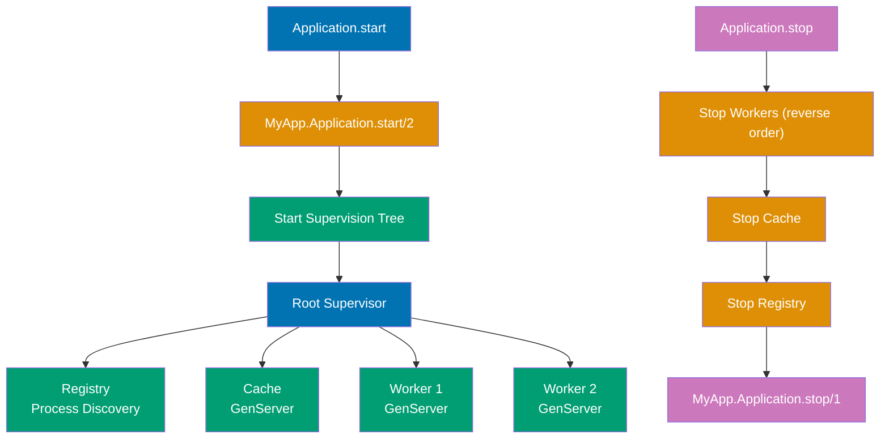

**Code**:

```elixir
# Mix Project - Defines application metadata
defmodule MyApp.MixProject do
  use Mix.Project  # => imports Mix.Project behavior

  def project do
    [
      app: :my_app,  # => application name (atom, must match module name)
      version: "0.1.0"  # => semantic version
    ]
  end
  # => Defines build metadata for mix (dependencies, compilers, paths)

  # Application callback - defines OTP application
  def application do
    [
      extra_applications: [:logger],  # => include Logger app (built-in Elixir app)
      # => extra_applications: dependencies NOT in deps() (built-in apps)
      mod: {MyApp.Application, []}    # => {Module, args} - application starts by calling Module.start/2 with args
      # => mod tuple specifies callback module and start args
    ]
  end
  # => When you run "mix run", OTP starts MyApp.Application.start(:normal, [])
  # => extra_applications ensures Logger starts BEFORE MyApp
  # => Application startup order: Logger → MyApp
end

# Application Module - OTP application behavior
defmodule MyApp.Application do
  use Application  # => imports Application behavior (requires start/2 and stop/1 callbacks)
  # => Makes this module an OTP application callback

  @impl true
  # => Marks start/2 as Application behavior callback implementation
  def start(_type, _args) do
    # => _type is :normal (regular start), :takeover (distributed failover), or :failover (node takeover)
    # => _args is [] (from mod: {MyApp.Application, []})
    # => This is the APPLICATION entry point (called by OTP)

    # Define supervision tree children
    children = [
      {Registry, keys: :unique, name: MyApp.Registry},  # => Registry child spec (process registry)
      # => Registry for process discovery (maps names → PIDs)
      MyApp.Cache,  # => shorthand for {MyApp.Cache, []} (assumes start_link/1 function exists)
      # => Cache GenServer (started with default args)
      {MyApp.Worker, 1},  # => Worker with arg=1
      # => First worker instance (arg passed to start_link/1)
      {MyApp.Worker, 2}   # => Worker with arg=2
      # => Second worker instance (different arg)
    ]
    # => Children start in ORDER: Registry → Cache → Worker 1 → Worker 2
    # => List order determines startup sequence

    opts = [strategy: :one_for_one, name: MyApp.Supervisor]  # => supervisor options
    # => :one_for_one: child crashes don't affect siblings
    # => name: registers supervisor with atom name
    Supervisor.start_link(children, opts)  # => {:ok, #PID<...>} (starts root supervisor)
    # => This PID is the APPLICATION's root supervisor (if it crashes, application crashes)
    # => Returns: {:ok, supervisor_pid}
  end
  # => start/2 MUST return {:ok, pid} or {:error, reason}
  # => The pid is the supervision tree root (OTP monitors it for application health)
  # => If start/2 returns {:error, reason}, application fails to start

  @impl true
  def stop(_state) do
    # => Called when application stops (before supervision tree shutdown)
    # => _state is the PID returned from start/2
    # Cleanup logic (close file handles, flush logs, graceful degradation)
    IO.puts("Application stopping...")  # => cleanup example
    :ok  # => must return :ok
  end
  # => After stop/1, OTP terminates supervision tree (children stop in reverse order)
  # => Shutdown order: Worker 2 → Worker 1 → Cache → Registry
end

# Application Configuration Access
defmodule MyApp.Config do
  def api_key, do: Application.get_env(:my_app, :api_key)  # => retrieves :api_key from :my_app config
  # => Returns nil if not configured (use pattern matching to handle)

  def timeout, do: Application.get_env(:my_app, :timeout, 3000)  # => returns :timeout or default 3000ms
  # => Third argument is DEFAULT value (returned if :timeout not configured)
end
# => Access config set in config/config.exs:
# => config :my_app, api_key: "secret", timeout: 5000

# Application Dependencies (in mix.exs)
def application do
  [
    mod: {MyApp.Application, []},  # => application module and start args
    extra_applications: [:logger, :crypto],  # => built-in Erlang/Elixir apps to start BEFORE MyApp
    # => :logger (Elixir), :crypto (Erlang) start first
    applications: [:httpoison]  # => third-party dependencies to start BEFORE MyApp
    # => :httpoison must start before MyApp (declared dependency)
  ]
  # => Start order: :logger → :crypto → :httpoison → :my_app
  # => OTP ensures dependency order automatically
end
# => If :httpoison fails to start, MyApp NEVER starts (dependency failure)

# Example usage of application lifecycle
# 1. Developer runs: mix run
#    => OTP reads mix.exs application/0
#    => Starts dependencies: Logger → Crypto → HTTPoison
#    => Calls MyApp.Application.start(:normal, [])
#    => Supervision tree starts (Registry → Cache → Workers)
#    => Application running ✓

# 2. Application stops (Ctrl+C or System.stop())
#    => OTP calls MyApp.Application.stop(pid)
#    => Cleanup logic runs (stop/1 callback)
#    => Supervision tree terminates (children shutdown in reverse)
#    => Dependencies stop in reverse: MyApp → HTTPoison → Crypto → Logger
#    => Application stopped ✓
```

**Key Takeaway**: Applications define the supervision tree and lifecycle. Implement `start/2` to initialize the supervision tree, `stop/1` for cleanup. Mix projects are applications that start automatically.

**Why It Matters**: The Application module defines the top-level entry point that the BEAM starts when your release launches. Every dependency (Phoenix, Ecto, Redis client) is also an Application that starts in dependency order before your application. Understanding application startup order is essential for debugging process-not-started errors during initialization. The `env` configuration in `mix.exs` scopes config to specific applications, preventing namespace collisions. Umbrella projects compose multiple Applications under one release. The Application behaviour is also how you integrate third-party services: wrapping them in a supervised process that starts with the Application.

---

## Example 70: Application Configuration

Application configuration uses `config/*.exs` files to manage environment-specific settings. Access config with `Application.get_env/3` and use runtime config for deployment.

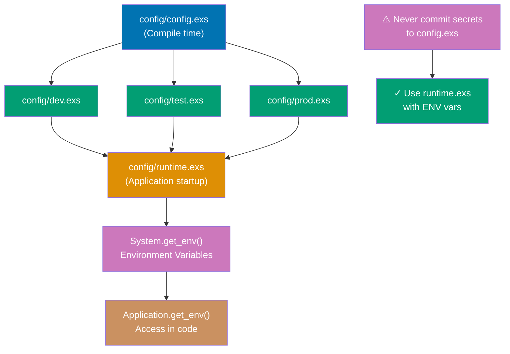

**Code**:

```elixir
# config/config.exs - Base configuration (COMPILE TIME)
import Config  # => imports Config module for config/2 macro

# Application-level configuration
config :my_app,  # => :my_app is the application name (atom)
  api_url: "https://api.example.com",  # => default API URL
  timeout: 5000,  # => 5000ms timeout
  max_retries: 3  # => retry failed requests 3 times
# => These values are READ AT COMPILE TIME and baked into release

# Module-specific configuration (nested under application)
config :my_app, MyApp.Repo,  # => config for MyApp.Repo module
  database: "my_app_dev",  # => database name
  username: "postgres",  # => ❌ BAD: hardcoded credentials (OK for dev, NOT for prod)
  password: "postgres",  # => ❌ SECURITY RISK: never commit production passwords
  hostname: "localhost"  # => database host
# => This config is for DEVELOPMENT only (overridden in prod.exs)

# Import environment-specific config
import_config "#{config_env()}.exs"  # => loads dev.exs, test.exs, or prod.exs based on MIX_ENV
# => config_env() returns :dev, :test, or :prod
# => Files loaded in order: config.exs → {env}.exs (env-specific overrides base)

# config/dev.exs - Development environment (COMPILE TIME)
import Config

config :my_app,
  debug: true,  # => enable debug logging in dev
  api_url: "http://localhost:4000"  # => override to use local API
# => These values OVERRIDE config.exs settings
# => Evaluated at compile time when MIX_ENV=dev

# config/prod.exs - Production environment (COMPILE TIME)
import Config

config :my_app,
  debug: false,  # => disable debug in production
  api_url: System.get_env("API_URL") || raise "API_URL not set"  # => ❌ PROBLEM: System.get_env at COMPILE time
# => This evaluates when building release (not at runtime!)
# => If API_URL not set during build, release fails to compile
# => ✅ SOLUTION: Use runtime.exs instead

# config/runtime.exs - Runtime configuration (APPLICATION STARTUP)
import Config

if config_env() == :prod do  # => only in production
  config :my_app,
    api_key: System.get_env("API_KEY") || raise "API_KEY not set",  # => ✅ GOOD: reads ENV at runtime
    # => Application CRASHES on startup if API_KEY missing (fail fast)
    database_url: System.get_env("DATABASE_URL") || raise "DATABASE_URL not set"  # => reads DATABASE_URL at startup
  # => runtime.exs evaluates when APPLICATION STARTS (not when building release)
  # => Perfect for secrets: API keys, DB URLs, etc.
end
# => Runtime config enables SAME release binary for different environments
# => Just change environment variables, no recompilation needed

# Accessing configuration in code
defmodule MyApp.API do
  def url, do: Application.get_env(:my_app, :api_url)  # => retrieves :api_url from :my_app config
  # => Returns "https://api.example.com" (or overridden value)

  def timeout, do: Application.get_env(:my_app, :timeout, 3000)  # => returns :timeout or default 3000ms
  # => Third argument is fallback if key not found

  def debug?, do: Application.get_env(:my_app, :debug, false)  # => returns boolean, defaults to false
  # => Useful for conditional logging

  def call_api do
    if debug?() do  # => check debug mode
      IO.puts("Calling #{url()} with timeout #{timeout()}")  # => log API call in debug mode
      # => Prints: "Calling https://api.example.com with timeout 5000"
    end
    # Make API call...
  end
end

# Accessing nested configuration
repo_config = Application.get_env(:my_app, MyApp.Repo)  # => retrieves MyApp.Repo config
# => repo_config = [database: "my_app_dev", username: "postgres", ...]
database = Keyword.get(repo_config, :database)  # => extracts :database from keyword list
# => database = "my_app_dev"

# Modifying configuration at runtime (rare, usually for testing)
Application.put_env(:my_app, :debug, true)  # => sets :debug to true at runtime
# => ⚠️ Changes are NOT persisted (lost on restart)
# => Useful in tests to override config

# Getting all application config
Application.get_all_env(:my_app)  # => returns all config for :my_app
# => [api_url: "...", timeout: 5000, max_retries: 3, debug: true, ...]

# Configuration timeline:
# 1. Build time (mix compile):
#    - config.exs loaded → base settings
#    - dev.exs/test.exs/prod.exs loaded → environment overrides
#    - Values baked into compiled beam files
#
# 2. Application startup (mix run, release start):
#    - runtime.exs loaded → runtime overrides from ENV vars
#    - Application.get_env/2,3 retrieves values
#
# 3. Runtime (application running):
#    - Application.put_env/3 can modify (not persisted)
#    - Application.get_env/2,3 retrieves current values

# Best practices:
# ✅ config.exs: defaults, development settings
# ✅ dev.exs: development overrides (local URLs, debug mode)
# ✅ test.exs: test-specific settings (test database)
# ✅ prod.exs: production settings (no secrets!)
# ✅ runtime.exs: secrets from ENV vars (API keys, DB URLs)
# ❌ NEVER commit secrets to any .exs file
# ❌ AVOID System.get_env in config.exs/prod.exs (compile time)
# ✅ USE System.get_env in runtime.exs only (runtime)
```

**Key Takeaway**: Use `config/*.exs` for environment-specific configuration. `config.exs` for all envs, `dev/test/prod.exs` for specific envs, `runtime.exs` for production secrets. Access with `Application.get_env/3`.

**Why It Matters**: Application configuration bridges compile-time defaults and runtime environment customization. The layered config system (`config/config.exs` through `config/runtime.exs`) enables environment-specific overrides without duplicating configuration. `Application.get_env/3` with defaults enables optional configuration with sensible fallbacks. Configuration validation at startup (in `Application.start/2`) catches misconfiguration before the system starts serving traffic—preferable to discovering configuration errors under production load. Centralizing configuration access in a `MyApp.Config` module reduces coupling between configuration keys and business logic.

---

## Example 71: Umbrella Projects

Umbrella projects bundle multiple applications that share code and dependencies. Use them for large systems with distinct domains or to separate web interface from business logic.

**Code**:

```bash
# Create umbrella project structure
mix new my_app --umbrella  # => creates apps/ directory for child applications
# => Structure:
# => my_app/
# =>   apps/         (child applications go here)
# =>   config/       (shared configuration)
# =>   mix.exs       (umbrella project definition)
# => --umbrella flag enables multi-app architecture
# => Returns "* creating my_app/apps/"

# Create child apps inside umbrella
cd my_app/apps
# => Navigate to apps directory
# => Working directory now my_app/apps/
mix new my_app_core  # => creates my_app_core app (business logic)
# => Core domain app without dependencies
# => Creates my_app_core/ directory with mix.exs, lib/, test/
mix new my_app_web --sup  # => creates my_app_web app (web interface) with supervision tree
# => --sup adds Application and Supervisor modules
# => Creates my_app_web/ directory with supervision setup
```

```elixir
# apps/my_app_core/mix.exs - Core business logic app
defmodule MyAppCore.MixProject do
  use Mix.Project

  def project do
    [
      app: :my_app_core,  # => application name (atom)
      # => Unique identifier for this app
      version: "0.1.0",  # => version
      # => Semantic versioning
      build_path: "../../_build",  # => ✅ shared build directory (umbrella root)
      # => All compiled BEAM files go here
      config_path: "../../config/config.exs",  # => ✅ shared config
      # => Configuration shared across apps
      deps_path: "../../deps",  # => ✅ shared dependencies (all apps use same versions)
      # => Single dependency directory for umbrella
      lockfile: "../../mix.lock"  # => ✅ shared lock file (dependency versions locked)
      # => Ensures version consistency
    ]
  end
  # => All umbrella apps share build artifacts and dependencies
  # => This enables: 1) consistent versions, 2) shared compilation, 3) faster builds
end

# apps/my_app_web/mix.exs - Web interface app
defmodule MyAppWeb.MixProject do
  use Mix.Project

  def project do
    [
      app: :my_app_web,  # => application name
      # => Web layer application
      deps: deps()  # => dependencies for web app
      # => Calls deps/0 function
    ]
  end

  defp deps do
    [
      {:my_app_core, in_umbrella: true},  # => ✅ depend on sibling app (in same umbrella)
      # => in_umbrella: true tells Mix to find :my_app_core in apps/ directory
      # => NOT from Hex (external package)
      # => Creates compile-time dependency
      {:phoenix, "~> 1.7"}  # => external dependency from Hex
      # => ~> means "compatible with 1.7.x"
    ]
  end
  # => Dependency order: Phoenix → my_app_core → my_app_web
  # => OTP starts apps in dependency order automatically
  # => Core starts before web
end

# apps/my_app_core/lib/my_app_core/users.ex - Business logic (core app)
defmodule MyAppCore.Users do
  def list_users do
    # Business logic (no web dependencies, pure Elixir)
    [%{id: 1, name: "Alice"}, %{id: 2, name: "Bob"}]  # => returns user list
    # => List of maps with id and name keys
  end
  # => Core app is INDEPENDENT - no Phoenix, no web concepts
  # => Can be used by: web app, CLI app, background workers, etc.
  # => Function signature: list_users() -> [%{id: integer, name: string}]
end

# apps/my_app_web/lib/my_app_web/controllers/user_controller.ex - Web layer
defmodule MyAppWeb.UserController do
  use MyAppWeb, :controller  # => imports Phoenix controller functionality
  # => Makes conn, render, and other Phoenix macros available

  def index(conn, _params) do
    users = MyAppCore.Users.list_users()  # => calls core app function
    # => Web app DEPENDS on core app (declared in deps)
    # => Core app is OBLIVIOUS to web app (no reverse dependency)
    # => users is [%{id: 1, name: "Alice"}, %{id: 2, name: "Bob"}]
    render(conn, "index.html", users: users)  # => renders view with data from core
    # => Passes users to template for rendering
  end
end
# => Clear separation: Core = business logic, Web = presentation layer
# => Core has zero knowledge of web layer (one-way dependency)

# Running umbrella commands
# From umbrella root (my_app/):
# mix test                           # => runs tests in ALL apps
# mix test --only apps/my_app_core   # => tests specific app only
# mix compile                        # => compiles ALL apps
# mix deps.get                       # => fetches deps for ALL apps (shared deps/)
# mix run --no-halt                  # => runs ALL applications

# Benefits of umbrella architecture:
# ✅ Shared dependencies (single deps/ directory, consistent versions)
# ✅ Clear domain boundaries (core vs web vs workers)
# ✅ Independent testing (test core without Phoenix)
# ✅ Flexible deployment (deploy web separately from workers)
# ✅ Code reuse (CLI, web, workers all use same core)
# ❌ Complexity overhead (more mix.exs files, dependency management)
# ❌ Tight coupling risk (easy to create circular dependencies)

# Use umbrella when:
# ✅ Large system with distinct domains (auth, billing, notifications)
# ✅ Multiple deployment targets (web, workers, CLI)
# ✅ Shared business logic across apps
# ❌ Small projects (unnecessary complexity)
# ❌ Single deployment target (regular app is simpler)
```

**Key Takeaway**: Umbrella projects bundle multiple apps sharing dependencies. Use for large systems with distinct domains. Apps can depend on each other using `in_umbrella: true`. Commands run across all apps or specific apps.

**Why It Matters**: Umbrella projects enable splitting a large application into independently compilable, separately deployable sub-applications while sharing dependencies and configuration. Each sub-app has its own module namespace, tests, and mix.exs, but they can call each other's public APIs and be released together or separately. This enables boundaries between domains (Accounts, Orders, Billing) without the operational overhead of microservices. Umbrella projects are the Elixir idiom for large-scale code organization—used by Nerves and many production Phoenix applications to manage complexity without microservice infrastructure.

---

## Example 72: Quote and Unquote

`quote` captures code as an Abstract Syntax Tree (AST). `unquote` injects values into quoted expressions. Understanding AST is fundamental to metaprogramming.

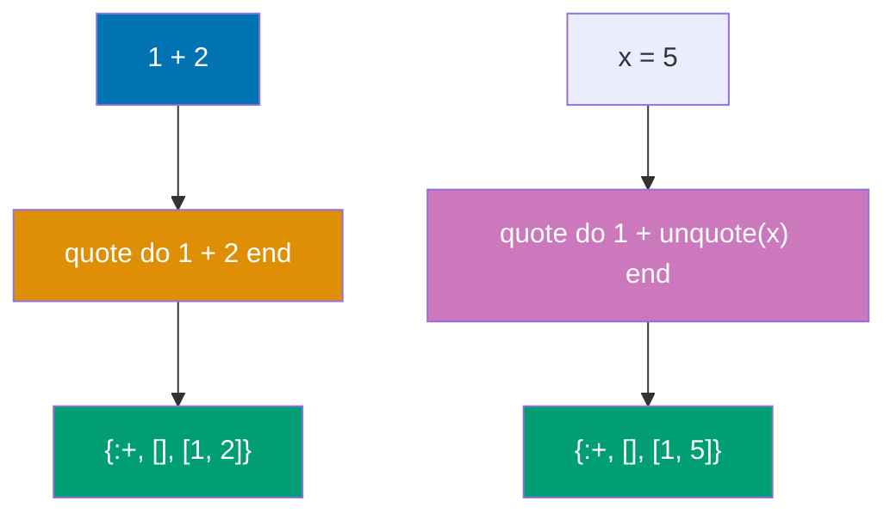

**Code**:

```elixir
# quote - captures code as AST (tuple representation)
quoted = quote do
  1 + 2  # => this code is NOT executed, it's captured as data structure
end
# => quoted = {:+, [context: Elixir, imports: [{1, Kernel}, {2, Kernel}]], [1, 2]}
# => AST format: {function_name, metadata, arguments}
# => {:+, metadata, [1, 2]} represents the + function called with args [1, 2]

{:+, _metadata, [1, 2]} = quoted  # => pattern matches AST tuple
# => Confirms structure: + operator with arguments 1 and 2

# Complex expressions also become AST
quoted = quote do
  if true, do: :yes, else: :no
end
# => {:if, [], [true, [do: :yes, else: :no]]}
# => if macro with condition true and keyword list of branches

# unquote - injects VALUES into quoted expressions
x = 5  # => x is a regular variable (not AST)
quoted = quote do
  1 + unquote(x)  # => unquote(x) evaluates x and injects value 5 into AST
end
# => {:+, [], [1, 5]}
# => Note: 5 is injected, NOT variable x
# => At quote time: x evaluated → 5 injected → AST contains literal 5

# WITHOUT unquote - variable name becomes AST variable reference
quoted = quote do
  1 + x  # => x is kept as variable reference (not evaluated)
end
# => {:+, [], [1, {:x, [], Elixir}]}
# => x becomes AST variable node, NOT value 5
# => If you eval_quoted this, it looks for variable x at eval time

# Evaluating quoted expressions
Code.eval_quoted(quote do: 1 + 2)  # => {3, []}
# => Returns {result, bindings}
# => result = 3 (evaluated expression)
# => bindings = [] (no variables bound)

# unquote with multiple values
a = 10  # => variable a
b = 20  # => variable b
quoted = quote do
  unquote(a) + unquote(b)  # => injects 10 and 20 into AST
end
# => {:+, [], [10, 20]}
# => Both values injected at quote time
Code.eval_quoted(quoted)  # => {30, []}
# => Evaluates 10 + 20 = 30

# unquote_splicing - injects list elements as separate arguments
args = [1, 2, 3]  # => list of arguments
quoted = quote do
  sum(unquote_splicing(args))  # => unquote_splicing expands [1, 2, 3] to separate args
end
# => {:sum, [], [1, 2, 3]}
# => Equivalent to: sum(1, 2, 3)
# => WITHOUT splicing: sum([1, 2, 3]) - would pass list as single arg

# Building function calls dynamically
defmodule Builder do
  def build_call(function, args) do
    quote do
      unquote(function)(unquote_splicing(args))  # => injects function name and spreads args
    end
  end
  # => function is injected as function reference
  # => args are spliced as separate arguments
end

quoted = Builder.build_call(:IO.puts, ["Hello"])  # => builds IO.puts("Hello")
# => Returns AST: {{:., [], [:IO, :puts]}, [], ["Hello"]}
Code.eval_quoted(quoted)  # => Prints: Hello
# => {nil, []} (IO.puts returns nil)

# Converting AST back to string
quote(do: 1 + 2) |> Macro.to_string()  # => "1 + 2"
# => AST → string representation (pretty print)
# => Useful for debugging macros (see generated code)

# Macro expansion - see how macros are transformed
Macro.expand(quote(do: unless true, do: :no), __ENV__)  # => expands unless macro
# => unless is a macro that rewrites to if with negated condition
# => Returns: {:if, [], [false, [do: :no, else: nil]]}
# => Shows underlying if implementation

# Key AST concepts:
# 1. Everything is a tuple: {function, metadata, arguments}
# 2. Literals (1, "hello", :atom) are kept as-is
# 3. Variables become {:var_name, metadata, context}
# 4. Function calls become {func, metadata, args}
# 5. quote captures code as AST (doesn't execute)
# 6. unquote injects values into AST at quote time
# 7. unquote_splicing expands lists as separate arguments
```

**Key Takeaway**: `quote` converts code to AST (tuple representation), `unquote` injects values into quoted expressions. AST is the foundation of macros—understanding it enables powerful metaprogramming.

**Why It Matters**: Quote and unquote are the foundation of Elixir's compile-time metaprogramming. `quote/2` returns the AST representation of code; `unquote/1` injects runtime values into AST fragments. This mechanism enables macros to generate code at compile time based on input—the DSL capabilities of Phoenix.Router, Ecto.Schema, and ExUnit.Case are all built on quote/unquote. Understanding AST structure makes library internals comprehensible: when you write `use Phoenix.Controller`, a macro injects controller infrastructure code into your module via quote/unquote. This knowledge is essential before writing macros and for debugging compile-time errors.

---

## Example 73: Writing Simple Macros

Macros receive code as AST and return transformed AST. They run at compile time, enabling code generation and custom syntax.

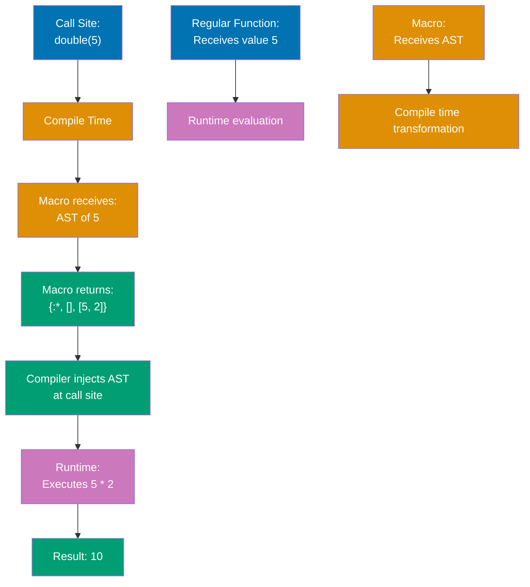

**Code**:

```elixir
defmodule MyMacros do
  # Simple macro - no arguments
  defmacro say_hello do
                   # => defmacro defines macro (runs at compile time)
    quote do  # => captures code as AST (doesn't execute)
      IO.puts("Hello from macro!")  # => this code runs in CALLER's context at runtime
    end
  end
  # => When user calls say_hello(), compiler replaces it with IO.puts("Hello from macro!")

  # Macro with arguments
  defmacro double(value) do
                    # => value is AST of argument passed at call site
                    # => Macros see CODE structure, not evaluated values
    quote do
      unquote(value) * 2  # => unquote injects value AST into multiplication expression
    end
    # => At compile time: double(5) becomes: 5 * 2
  end

  # Macro that generates function
  defmacro create_getter(name, value) do
                              # => This macro generates a complete function definition
    quote do
      def unquote(name)(), do: unquote(value)  # => generates function definition at compile time
                                                # => Expands to: def name(), do: "Alice"
    end
  end

  # Macro for logging
  defmacro log(message) do
                   # => Macro generates logging code with timestamp
    quote do
      IO.puts("[LOG #{DateTime.utc_now()}] #{unquote(message)}")  # => DateTime.utc_now() evaluated at RUNTIME in caller context
                                                                   # => Fresh timestamp on each execution
    end
  end

  # Macro with block (do...end)
  defmacro benchmark(name, do: block) do
                                # => block is AST of entire do...end content
    quote do
      {time, result} = :timer.tc(fn -> unquote(block) end)  # => :timer.tc measures function execution time
                                                             # => Returns {microseconds, result} tuple
      IO.puts("#{unquote(name)} took #{time}μs")
      result  # => Preserves original code's return value
    end
  end
end

defmodule Example do
  require MyMacros  # => makes macros available at compile time (REQUIRED for macro use)
                    # => require loads module and enables macro expansion
                    # => Without require, macro calls would fail at compile time
                    # => Functions don't need require, only macros do

  MyMacros.say_hello()  # => macro expands to: IO.puts("Hello from macro!")
                        # => Compiler replaces macro call with generated AST
                        # => Prints: Hello from macro! (at runtime)
                        # => Expansion happens during compilation, execution at runtime

  x = MyMacros.double(5)  # => macro expands to: x = 5 * 2
                          # => Compiler sees double(5), calls defmacro double at compile time
                          # => Macro returns AST {:*, [], [5, 2]}
                          # => AST injected into code: x = 5 * 2
                          # => x = 10 (at runtime)

  MyMacros.create_getter(:name, "Alice")  # => generates function def at compile time
                                          # => Macro receives :name and "Alice" as AST
                                          # => Returns function definition AST
                                          # => Expands to: def name(), do: "Alice"
                                          # => Compiler injects function into Example module
                                          # => Now name() function exists in Example module
                                          # => Function available for runtime calls

  def demo do
            # => Regular function definition (not a macro)
            # => Contains macro calls that expand at compile time
    MyMacros.log("Starting demo")  # => expands to: IO.puts("[LOG #{DateTime.utc_now()}] Starting demo")
                                    # => Macro injects logging code at compile time
                                    # => DateTime.utc_now() called at runtime (fresh timestamp)
                                    # => Prints: [LOG 2024-01-15 10:30:45.123456Z] Starting demo (timestamp at runtime)

    result = MyMacros.benchmark "computation" do
                                           # => benchmark macro with do block
                                           # => "computation" is label, do block is code to measure
      :timer.sleep(100)  # => sleep 100ms
                         # => Part of benchmarked block
      42  # => return value
          # => Last expression in block (returned by benchmark)
    end  # => benchmark macro expands at compile time
         # => Generated code wraps sleep and 42 with timing logic
    # => Expands to at compile time:
    # => {time, result} = :timer.tc(fn -> :timer.sleep(100); 42 end)
    # => IO.puts("computation took #{time}μs")
    # => result
    # => Executes at runtime:
    # => Measures sleep duration, prints time, returns 42
    # => Prints: computation took ~100000μs (100ms = 100,000 microseconds)
    # => result is 42
  end  # => demo function complete
end

# Macro Hygiene - variables don't leak by default
defmodule HygieneDemo do
              # => Demonstrates default hygienic macro behavior
              # => Elixir macros are hygienic by default (unlike C macros)
  defmacro create_var do
                  # => Macro that attempts to create variable in caller
                  # => Default hygiene prevents variable leakage
    quote do  # => Generates AST for variable assignment
              # => Variable created in ISOLATED SCOPE (not caller's scope)
      x = 42  # => creates x in MACRO's context (hygienic), NOT caller's context
              # => This x is scoped to macro expansion, invisible to caller
              # => Prevents accidental name collisions with caller's variables
    end  # => Returns assignment AST
  end
end

defmodule User do
  require HygieneDemo  # => Loads HygieneDemo macros for compile time
                       # => Makes create_var macro available

  def test do
          # => Function that demonstrates hygiene protection
          # => Attempts to access macro-created variable
    HygieneDemo.create_var()  # => macro expands and creates x in isolated scope
                              # => x exists in macro's private context only
                              # => Caller (test/0) cannot see or access x
    x  # => ** (CompileError) undefined function x/0
       # => ERROR! Variable x from macro doesn't exist in test/0 scope
       # => Compiler error: x is undefined in this context
       # => This is HYGIENE - prevents accidental variable capture
       # => Without hygiene, macros could silently overwrite caller's variables
  end
end

# Explicitly breaking hygiene with var!
defmodule UnhygieneDemo do
                # => Demonstrates intentional hygiene breaking
                # => Use var! when you WANT variable sharing
  defmacro create_var do
                  # => Macro that explicitly leaks variable to caller
                  # => Uses var! to break default hygiene
    quote do  # => Generates AST with unhygienic variable
              # => var! marks variable for caller's scope
      var!(x) = 42  # => var! explicitly creates variable in CALLER's context (unhygienic)
                    # => Breaks hygiene barrier intentionally
                    # => x will exist in caller's scope, not macro's scope
                    # => Use only when variable sharing is desired behavior
    end  # => Returns unhygienic assignment AST
  end
end

defmodule User2 do
  require UnhygieneDemo  # => Loads UnhygieneDemo macros for compile time
                         # => Enables create_var macro with var!

  def test do
          # => Function demonstrating intentional variable leak
          # => Successfully accesses macro-created variable
    UnhygieneDemo.create_var()  # => macro expands with var!(x) = 42
                                # => creates x in test/0 scope (intentional leak)
                                # => x is visible and accessible in this function
    x  # => 42 (works! variable explicitly leaked using var!)
       # => x exists in caller's scope thanks to var!
       # => Returns 42 successfully
       # => var! breaks hygiene when you WANT variable sharing between macro and caller
       # => Use cases: DSL variables, test setup, shared state
  end
end

# Pattern matching on AST
defmodule MiniTest do
            # => Demonstrates advanced macro technique: AST pattern matching
            # => Macros can destructure AST to analyze code structure
  defmacro assert({:==, _, [left, right]}) do  # => pattern matches AST of == expression
                                                # => Function head pattern matches tuple structure
                                                # => {:==, _, [left, right]} destructures AST
                                                # => :== is operator atom, _ is metadata (ignored)
                                                # => [left, right] are AST of left and right operands
    # => {:==, _, [left, right]} destructures: operator, metadata, [left_arg, right_arg]
    # => For assert(1 + 1 == 2):
    #    - left = {:+, [], [1, 1]} (AST of addition)
    #    - right = 2 (integer literal)
    # => Macro receives STRUCTURE of comparison, not evaluated values
    quote do  # => Generates assertion checking code
              # => Code injected at call site to evaluate and compare
      left_val = unquote(left)  # => evaluates left expression at runtime
                                # => unquote injects left AST into runtime code
                                # => For 1 + 1, left_val = 2 after evaluation
      # => left_val = 1 + 1 = 2
      right_val = unquote(right)  # => evaluates right expression at runtime
                                  # => unquote injects right AST into runtime code
                                  # => For 2, right_val = 2 (already evaluated)
      # => right_val = 2
      if left_val != right_val do  # => compares evaluated values at runtime
                                   # => Raises if assertion fails
        raise "Assertion failed: #{inspect(left_val)} != #{inspect(right_val)}"  # => raises on mismatch
                                                                                   # => inspect converts values to strings
                                                                                   # => Provides clear error messages
      end  # => if block ends
      # => If assertion passes (left_val == right_val), no raise
      # => Function returns nil (successful assertion)
    end  # => quote block returns assertion checking AST
    # => This shows how macros can inspect AST structure (pattern match on operator)
    # => Macros see code structure, enabling compile-time analysis
    # => Pattern matching on AST enables custom syntax validation
  end
end

require MiniTest  # => loads MiniTest macros for compile time
                  # => Makes assert macro available in current scope
MiniTest.assert(1 + 1 == 2)  # => macro call with == comparison
                             # => Compiler calls defmacro assert at compile time
                             # => Macro pattern matches {:==, _, [{:+, [], [1, 1]}, 2]}
                             # => Generates assertion code at compile time
                             # => Evaluates 1+1, compares to 2 at runtime
                             # => Passes (no raise, returns nil)
# => At compile time: pattern matches AST, generates assertion code
# => At runtime: evaluates expressions, performs comparison
# => Two-phase execution: compile (AST transformation), runtime (evaluation)
```

**Key Takeaway**: Macros transform AST at compile time. Use `defmacro` to define, `quote/unquote` to build AST, and `require` to use. Macros enable DSLs and code generation but should be used sparingly—prefer functions when possible.

**Why It Matters**: Macros execute at compile time and return AST, enabling patterns impossible with regular functions: custom control flow, DSL syntax, zero-overhead abstractions, and code generation. Unlike C preprocessor macros (text substitution), Elixir macros are hygienic (variables do not escape macro scope) and operate on structured AST (not raw text). The rule is to avoid macros when functions suffice—macros complicate debugging and increase compile time. When justified, macros enable library-quality APIs like `assert user.age >= 18` that produce informative failure messages by inspecting the expression AST.

---

## Example 74: Use Macro Pattern

The `use` macro is Elixir's mechanism for injecting code into modules. When you `use SomeModule`, it calls `SomeModule.__using__/1`, which typically injects functions or configuration.

**Code**:

```elixir
# Basic use macro - inject code with configuration
defmodule Loggable do
  defmacro __using__(opts) do  # => __using__ is special macro called by "use Loggable"
    # => opts is keyword list from use call (e.g., [level: :debug])
    # => Receives configuration from use statement
    level = Keyword.get(opts, :level, :info)  # => extract :level option, default :info
    # => This runs at COMPILE TIME (when MyApp is compiled)
    # => Keyword.get safely extracts option

    quote do  # => generates AST to inject into caller module
      # => Returns quoted code for injection
      def log(message) do
        IO.puts("[#{unquote(level) |> to_string() |> String.upcase()}] #{message}")
        # => unquote(level) injects compile-time value (:debug) into runtime code
        # => Expands to: IO.puts("[DEBUG] #{message}")
        # => Formats log level in brackets
      end
    end
    # => This function definition is INJECTED into MyApp module at compile time
    # => Creates log/1 in caller's namespace
  end
end

defmodule MyApp do
  use Loggable, level: :debug  # => calls Loggable.__using__([level: :debug])
  # => At compile time, injects log/1 function into MyApp
  # => Equivalent to:
  # => def log(message), do: IO.puts("[DEBUG] #{message}")
  # => Configures debug-level logging

  def start do
    log("Application starting...")  # => calls injected log/1 function
    # => Prints: [DEBUG] Application starting...
    # => Uses injected function
  end
end

MyApp.start()  # => prints "[DEBUG] Application starting..."
# => Demonstrates injected logging functionality

# Advanced use macro - default implementations with override
defmodule GenServerSimplified do
  defmacro __using__(_opts) do
    quote do
      @behaviour :gen_server  # => declares module implements :gen_server behavior (Erlang)
      # => Enables compile-time callback verification

      # Default callback implementations
      def init(args), do: {:ok, args}  # => default init: pass args as state
      # => Simplest possible initialization
      def handle_call(_msg, _from, state), do: {:reply, :ok, state}  # => default call: always reply :ok
      # => Ignores message content, always succeeds
      def handle_cast(_msg, state), do: {:noreply, state}  # => default cast: ignore messages
      # => No-op cast handler

      defoverridable init: 1, handle_call: 3, handle_cast: 2  # => allows caller to override these functions
      # => User can define their own init/1, handle_call/3, handle_cast/2
      # => Without defoverridable, redefining would cause compile error
      # => Enables optional customization
    end
  end
  # => Provides sensible defaults while allowing customization
  # => Reduces boilerplate for simple GenServers
end

# Use macro for test setup and imports
defmodule MyTestCase do
  defmacro __using__(_opts) do
    quote do
      import ExUnit.Assertions  # => makes assert/1, refute/1, etc. available
      # => Standard ExUnit assertions
      import MyTestCase.Helpers  # => makes custom assert_json/2 available
      # => Project-specific helpers

      setup do  # => ExUnit callback (runs before each test)
        # Setup code (runs at test time, NOT compile time)
        # => Executed for every test
        {:ok, %{user: %{name: "Test User"}}}  # => returns context passed to tests
        # => Context merged into test arguments
        # => Provides test data
      end
    end
  end
  # => Injects test helpers and setup into every test module that uses this
  # => Standardizes test configuration

  defmodule Helpers do
    def assert_json(response, expected) do
      assert Jason.decode!(response) == expected  # => custom assertion for JSON
      # => Decodes and compares JSON structures
    end
  end
end

defmodule MyTest do
  use ExUnit.Case  # => injects ExUnit test DSL (test macro, setup, etc.)
  # => Standard test framework
  use MyTestCase   # => injects MyTestCase setup and Helpers
  # => Both __using__ macros run at compile time, injecting code
  # => Adds project-specific setup

  test "example with helpers", %{user: user} do  # => %{user: user} is context from setup
    # => Pattern matches context map
    assert user.name == "Test User"  # => user from setup context
    # => Verifies setup data
    # Can use assert_json from Helpers (imported via use MyTestCase)
    # => assert_json(~s({"name": "Test"}), %{"name" => "Test"})
    # => Example of custom helper usage
  end
end

# Phoenix pattern - conditional code injection
defmodule MyAppWeb do
  # Helper function returns AST (NOT a macro)
  def controller do
    # => Regular function that returns quoted code
    quote do  # => returns quoted AST
      # => AST for controller functionality
      use Phoenix.Controller, namespace: MyAppWeb  # => nested use (injects Phoenix controller code)
      # => Delegates to Phoenix for core behavior

      import Plug.Conn  # => makes conn functions available (send_resp, put_status, etc.)
      # => HTTP connection manipulation
      import MyAppWeb.Gettext  # => makes gettext functions available (localization)
      # => Internationalization support
      alias MyAppWeb.Router.Helpers, as: Routes  # => alias for router helpers
      # => Shortens route helper references
    end
    # => This AST will be injected into caller when they use MyAppWeb, :controller
    # => Composite injection pattern
  end

  # __using__ dispatches to helper functions based on argument
  defmacro __using__(which) when is_atom(which) do  # => which is :controller, :view, :channel, etc.
    # => Dispatcher macro for different module types
    apply(__MODULE__, which, [])  # => calls MyAppWeb.controller(), MyAppWeb.view(), etc.
    # => Returns AST from helper function
    # => Pattern: different behaviors for different use cases
    # => Dynamic dispatch based on use argument
  end
end

defmodule MyAppWeb.UserController do
  use MyAppWeb, :controller  # => calls MyAppWeb.__using__(:controller)
  # => Which calls MyAppWeb.controller()
  # => Which returns quote do ... end AST
  # => Result: Phoenix.Controller, Plug.Conn, Gettext, Routes all injected
  # => Single line bootstraps entire controller environment

  def index(conn, _params) do
    # Now has access to Phoenix.Controller functions (from use Phoenix.Controller)
    # => All injected functionality available
    render(conn, "index.html")  # => render/2 from Phoenix.Controller
    # Also has: conn functions (Plug.Conn), Routes.*, gettext functions
    # => Multiple imports compose together
  end
end

# Usage flow for MyAppWeb.UserController:
# 1. Compiler sees: use MyAppWeb, :controller
# 2. Calls: MyAppWeb.__using__(:controller)
# 3. Which calls: MyAppWeb.controller()
# 4. Returns AST: quote do use Phoenix.Controller, ...; import Plug.Conn; ... end
# 5. AST expanded and injected into UserController
# 6. Now UserController has all Phoenix controller functionality
# => Multi-step expansion process
```

**Key Takeaway**: `use SomeModule` calls `SomeModule.__using__/1` to inject code. Common pattern for DSLs (GenServer, Phoenix controllers, test cases). The `use` macro enables framework behavior injection.

**Why It Matters**: The `use ModuleName` pattern is how Elixir achieves behavior injection without inheritance. When you `use Phoenix.Controller`, `use Ecto.Schema`, or `use GenServer`, a macro injects module-specific code (imports, callback definitions, configuration). This pattern enables compose-your-own-behavior: a module can `use` multiple behaviors, getting only what it needs. Understanding `__using__/1` demystifies framework magic—when Phoenix controller actions work, it is because `use Phoenix.Controller` injected the right infrastructure. Writing your own `use` macros enables building DSLs that libraries use rather than frameworks that impose structure.

---

## Example 75: Macro Best Practices

Macros are powerful but overuse leads to complex, hard-to-debug code. Follow best practices: prefer functions, use macros only when necessary, and keep them simple.

**Code**:

```elixir
# Anti-pattern: Macro for simple computation (BAD)
defmodule Bad do
  defmacro add(a, b) do  # => ❌ macro is overkill for simple addition
    # => Unnecessary AST manipulation
    quote do: unquote(a) + unquote(b)
    # => Generates addition code at compile time
  end
  # => Problem: adds compile-time overhead for NO benefit
  # => No DSL, no code generation, just regular computation
  # => Harder to debug than function
end

# Best practice: Use function for computations (GOOD)
defmodule Good do
  def add(a, b), do: a + b  # => ✅ function is sufficient (faster, simpler, debuggable)
  # => Functions handle runtime values perfectly
  # => Rule: If it can be a function, make it a function
  # => Clear, simple, maintainable
end

# Valid use case 1: DSL for code generation
defmodule SchemaGenerator do
  defmacro schema(fields) do  # => ✅ macro justified - generates struct + functions at compile time
    # => fields is [:name, :age, :email]
    # => Receives field list at compile time
    quote do
      defstruct unquote(fields)  # => generates: defstruct [:name, :age, :email]
      # => Creates struct definition at compile time
      # => defstruct only works at compile time

      def fields, do: unquote(fields)  # => generates function returning field list
      # => def fields, do: [:name, :age, :email]
      # => Introspection function generated
    end
    # => User writes: schema [:name, :age]
    # => Compiler generates: defstruct + fields/0 function
    # => Justification: Can't generate defstruct with a function (compile-time only)
    # => DRY: single source for struct and metadata
  end
end

# Valid use case 2: DSL for route definitions
defmodule Router do
  defmacro get(path, handler) do  # => ✅ macro justified - generates route functions
    # => Creates function clause for HTTP GET
    quote do
      def route("GET", unquote(path)), do: unquote(handler)  # => def route("GET", "/users"), do: UserController.index()
      # => Pattern-matched route function
    end
    # => Generates route function clauses at compile time
    # => User writes: get "/users", UserController.index()
    # => Compiler generates pattern-matching function clause
    # => Justification: Pattern-matched function clauses can't be generated dynamically
    # => Enables readable routing DSL
  end
end

# Valid use case 3: Compile-time optimization
defmodule Optimized do
  defmacro compute_at_compile_time(expr) do  # => ✅ macro justified - pre-computes expensive calculations
    # => Evaluates at compile time, not runtime
    result = Code.eval_quoted(expr) |> elem(0)  # => evaluates expression at COMPILE time
    # => For compute_at_compile_time(1000 * 1000), result = 1000000 (computed during compilation)
    # => Code.eval_quoted executes AST
    quote do: unquote(result)  # => injects pre-computed result (1000000) into code
    # => Runtime code contains: 1000000 (no multiplication executed at runtime)
    # => Justification: Moves computation from runtime to compile time (performance optimization)
    # => Zero runtime cost for constant calculations
  end
end

# Best practice: Document your macros
defmodule Documented do
  @doc """
  Generates a getter function.  # => ✅ documents what code is generated
  # => Clear explanation of macro purpose

  ## Examples  # => provides usage examples
  # => Shows concrete usage

      defmodule User do
        getter :name, "Default Name"  # => shows how to use macro
        # => Demonstrates syntax
      end

      User.name()  # => "Default Name"  # => shows generated behavior
      # => Expected runtime result
  """
  defmacro getter(name, default) do
    # => Generates simple getter function
    quote do
      def unquote(name)(), do: unquote(default)  # => generates: def name(), do: "Default Name"
      # => Injects function with default value
    end
  end
  # => Rule: Always document macros - users need to understand generated code
  # => Documentation critical for AST manipulation
end

# Best practice: Validate macro arguments at compile time
defmodule Validated do
  defmacro safe_divide(a, b) do
    # => Validates arguments before code generation
    if b == 0 do  # => compile-time check (runs when code compiles)
      # => Only works for literal values (not variables)
      raise ArgumentError, "Division by zero at compile time!"  # => ✅ fail fast at compile time
      # => Stops compilation immediately
    end
    # => For safe_divide(10, 0), compilation FAILS (error caught early)
    # => Prevents runtime errors

    quote do: unquote(a) / unquote(b)
    # => Generates division code if validation passes
  end
  # => Justification: Catch errors during development, not production
  # => Rule: Validate macro inputs when possible (static values only)
  # => Shift-left testing to compile time
end

# Critical pattern: Use bind_quoted to avoid duplicate evaluation
defmodule BindQuoted do
  # Anti-pattern: Double evaluation (BAD)
  defmacro bad_log(expr) do
    quote do
      result = unquote(expr)  # => evaluates expr FIRST time
      IO.puts("Result: #{inspect(unquote(expr))}")  # => evaluates expr SECOND time (❌ DUPLICATE)
      result
    end
  end
  # => Problem: For bad_log(expensive_calculation()), expensive_calculation() runs TWICE
  # => If expr has side effects (database call, file write), they happen TWICE

  # Best practice: bind_quoted evaluates once (GOOD)
  defmacro good_log(expr) do
    quote bind_quoted: [expr: expr] do  # => bind_quoted: evaluates expr ONCE, binds to variable
      # => expr variable contains PRE-EVALUATED result
      result = expr  # => uses pre-evaluated value (no re-execution)
      IO.puts("Result: #{inspect(expr)}")  # => uses same pre-evaluated value
      result  # => returns pre-evaluated value
    end
  end
  # => For good_log(expensive_calculation()), expensive_calculation() runs ONCE
  # => Rule: Always use bind_quoted unless you need AST manipulation
end

# Anti-pattern: Complex macro (BAD)
defmodule TooComplex do
  defmacro do_everything(name, type, opts) do
    # 50 lines of complex quote/unquote...  # => ❌ hard to debug, maintain, understand
    # => Generates multiple functions, validations, conversions
    # => Problem: When it breaks, stack traces point to macro expansion site (useless for debugging)
  end
  # => Rule: If macro > 20 lines, extract logic to helper functions
end

# Best practice: Keep macros simple (GOOD)
defmodule Simple do
  defmacro define_field(name, type) do  # => ✅ single, clear purpose (generate field getter)
    quote do
      def unquote(name)(), do: unquote(type)  # => one-liner, easy to understand
    end
  end
  # => Rule: Macro should do ONE thing (Single Responsibility Principle)
end

# Best practice: Extract logic to functions
defmodule Flexible do
  defmacro build(expr) do
    build_quoted(expr)  # => delegates to FUNCTION for logic
    # => Macro is thin wrapper, function contains business logic
  end

  def build_quoted(expr) do  # => ✅ function is testable, debuggable, composable
    quote do: unquote(expr) * 2  # => returns AST
  end
  # => Benefits:
  # => 1. Can test build_quoted/1 with ExUnit (macros hard to test)
  # => 2. Can reuse build_quoted/1 in other macros
  # => 3. Easier to debug (regular function, not AST manipulation)
  # => Rule: Macros for glue, functions for logic
end

# Summary of when to use macros:
# ✅ DSLs (routing, testing, schema definition)
# ✅ Code generation (can't do with functions)
# ✅ Compile-time optimization (move work from runtime to compile time)
# ✅ Syntax sugar for common patterns
# ❌ Simple computations (use functions)
# ❌ Runtime values (macros receive AST, not values)
# ❌ Complex logic (hard to debug, maintain)
```

**Key Takeaway**: Prefer functions over macros. Use macros only for DSLs, code generation, or compile-time optimization. Keep macros simple, document them, validate arguments, use `bind_quoted`, and provide function alternatives when possible.

**Why It Matters**: Macro best practices exist because macros are powerful but dangerous: they operate on AST, execute at compile time, and their errors are hard to debug. The hygiene rules (binding variables correctly, avoiding name collisions), the last-resort guideline (functions first), and the testing discipline (doctests for macro-generated behavior) prevent the common failure modes. Production macro bugs are particularly insidious because they surface as confusing compile-time errors or unexpected runtime behavior from generated code. Following these practices enables writing macros that library users find intuitive rather than mysterious.

---

## Example 76: Reflection and Module Introspection

Elixir provides functions to introspect modules at runtime. Use `__info__/1`, `Module` functions, and code reflection to discover functions, attributes, and module properties.

**Code**:

```elixir
# Define module with metadata for introspection
defmodule Introspection do
  @moduledoc "Example module for introspection"  # => module documentation (accessible at runtime)

  @my_attr "custom attribute"  # => custom module attribute (stored in module metadata)

  def public_function, do: :public  # => public function (exported, callable from outside)
  defp private_function, do: :private  # => private function (NOT exported, only internal use)

  def add(a, b), do: a + b  # => public function with arity 2
  def subtract(a, b), do: a - b  # => another public function with arity 2
end
# => Module compiled with metadata: functions list, attributes, moduledoc

# Get list of public functions (name, arity pairs)
Introspection.__info__(:functions)
# => [{:public_function, 0}, {:add, 2}, {:subtract, 2}]
# => Returns keyword list of {function_name, arity} for ALL public functions
# => private_function NOT included (private functions not exported)

# Get list of macros defined in module
Introspection.__info__(:macros)
# => []
# => No macros defined in Introspection module
# => For module with macros: [{:macro_name, arity}, ...]

# Get module attributes
Introspection.__info__(:attributes)
# => [my_attr: "custom attribute", vsn: [...]]
# => Returns keyword list of module attributes
# => Includes custom (@my_attr) and compiler-generated (@vsn) attributes
# => @moduledoc stored as @doc attribute, accessible via Code.fetch_docs/1

# Get module name
Introspection.__info__(:module)
# => Introspection
# => Returns module atom itself
# => Useful for generic introspection functions

# Check if function exists and is exported
function_exported?(Introspection, :add, 2)  # => true
# => Checks: module Introspection has public function add/2
# => Runtime check (works for compiled and loaded modules)
function_exported?(Introspection, :missing, 0)  # => false
# => Returns false - function doesn't exist
function_exported?(Introspection, :private_function, 0)  # => false
# => Returns false - private functions are NOT exported (even if they exist)

# Dynamic function call using apply
apply(Introspection, :add, [5, 3])  # => 8
# => apply(Module, :function, [args]) calls Module.function(args...)
# => Equivalent to: Introspection.add(5, 3)
# => Useful when function name determined at runtime (dynamic dispatch)

# Get all loaded modules in the BEAM VM
:code.all_loaded()  # => [{Module1, path}, {Module2, path}, ...]
# => Erlang function :code.all_loaded/0 returns ALL loaded modules
# => Includes Elixir modules (Elixir.MyModule) and Erlang modules (:gen_server)
|> Enum.filter(fn {mod, _path} -> mod |> to_string() |> String.starts_with?("Elixir.") end)
# => Filter only Elixir modules (names start with "Elixir.")
# => Erlang modules like :gen_server, :ets excluded
|> length()  # => e.g., 523 (number of loaded Elixir modules)
# => Returns count of Elixir modules currently in memory

# Check if module is loaded into BEAM VM
Code.ensure_loaded?(Introspection)  # => true
# => Module already compiled and loaded in memory
# => Returns true without trying to load (module exists)
Code.ensure_loaded?(:non_existent)  # => false
# => Module doesn't exist (returns false)
# => Use Code.ensure_loaded/1 to load if not loaded: {:module, Mod} or {:error, reason}

# Check if function defined during compilation (compile-time check)
Module.defines?(Introspection, {:add, 2})  # => true (during compilation)
# => Module.defines?/2 works ONLY during module compilation (not at runtime)
# => Inside module definition: checks if function clause exists
# => After compilation: use function_exported?/3 instead

# Introspecting behaviors
defmodule MyGenServer do
  @behaviour GenServer  # => declares module implements GenServer behavior (callback contract)

  def init(args), do: {:ok, args}  # => required GenServer callback
  def handle_call(_req, _from, state), do: {:reply, :ok, state}  # => required callback
  def handle_cast(_req, state), do: {:noreply, state}  # => required callback
end
# => @behaviour attribute stored in module metadata

MyGenServer.__info__(:attributes)  # => [behaviour: [GenServer], vsn: [...]]
|> Keyword.get_values(:behaviour)  # => [GenServer]
# => Extract all behaviors module implements
# => For multiple behaviors: [GenServer, :gen_event, MyBehaviour]
# => Use to verify module implements expected callbacks

# Introspecting struct fields
defmodule User do
  defstruct name: nil, age: nil, email: nil  # => defines struct with 3 fields
end
# => defstruct generates __struct__/0 and __struct__/1 functions

User.__struct__()  # => %User{name: nil, age: nil, email: nil}
# => Returns default struct instance
# => Includes :__struct__ key pointing to module name
|> Map.keys()  # => [:__struct__, :name, :age, :email]
# => Get all keys including metadata :__struct__ key
|> Enum.reject(&(&1 == :__struct__))  # => [:name, :age, :email]
# => Remove metadata key to get only user-defined fields
# => Useful for dynamic struct manipulation or validation

# Dynamic dispatch based on environment
defmodule Dynamic do
  def call_logger(:dev), do: apply(IO, :puts, ["Dev mode log"])  # => development: print to stdout
  # => apply(IO, :puts, ["Dev mode log"]) calls IO.puts("Dev mode log")
  def call_logger(:prod), do: apply(Logger, :info, ["Prod mode log"])  # => production: use Logger
  # => apply(Logger, :info, ["Prod mode log"]) calls Logger.info("Prod mode log")
end
# => Pattern matches on environment atom, dispatches to appropriate module

Dynamic.call_logger(:dev)  # => Prints: Dev mode log
# => Calls IO.puts dynamically through apply/3
# => No compilation dependency on Logger in :dev (logger might not be configured)

# Check if protocol has been consolidated (compile-time optimization)
implementations = Protocol.consolidated?(Enumerable)
# => true (in releases/production), false (in development)
# => Protocol consolidation pre-compiles all implementations for performance
# => Consolidated protocols faster (direct dispatch vs dynamic lookup)
# => mix release consolidates protocols automatically
# => Development: protocols not consolidated (allows dynamic reloading)
```

**Key Takeaway**: Use `__info__/1` for module metadata, `function_exported?/3` to check function existence, `apply/3` for dynamic calls. Introspection enables reflection, debugging tools, and dynamic dispatch.

**Why It Matters**: Runtime module introspection enables plugin architectures, protocol implementations, and framework features that depend on inspecting loaded code. `Module.functions/1`, `Code.loaded_modules/0`, and `__info__/1` are used by test frameworks to discover tests, by documentation generators to extract specs, and by Phoenix to introspect controller actions. Understanding reflection enables building extensible systems where components register capabilities at compile time and other components discover them at runtime. This is how Mix discovers tasks, how ExUnit finds test modules, and how Phoenix Live Dashboard introspects running applications.

---

## Example 77: Agent for Simple State

Agent wraps GenServer for simple state storage with functional API. Use for caches, configuration, or any simple state that doesn't need custom message handling.

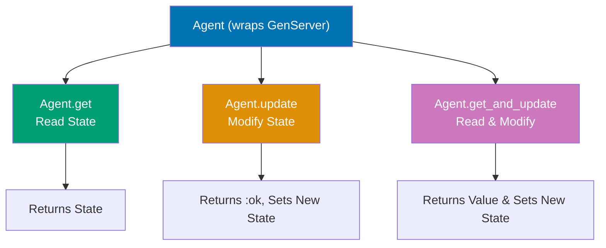

**Code**:

```elixir
# Start an Agent with empty map as initial state
{:ok, agent} = Agent.start_link(fn -> %{} end)
# => {:ok, #PID<0.123.0>}
# => Agent.start_link/1 spawns new process, runs initialization function
# => fn -> %{} end executed in Agent process, returns initial state (empty map)
# => Returns {:ok, pid} where pid is Agent process identifier

# Read state from Agent (doesn't modify state)
Agent.get(agent, fn state -> state end)  # => %{}
# => Agent.get/2 sends synchronous message to Agent process
# => Function executed INSIDE Agent process, receives current state
# => Returns function result to caller (state itself = %{})
# => State unchanged after get (read-only operation)

# Update state (write operation)
Agent.update(agent, fn state -> Map.put(state, :count, 0) end)
# => :ok
# => Agent.update/2 modifies state in Agent process
# => Function receives current state (%{}), returns new state (%{count: 0})
# => Agent process replaces old state with new state
# => Returns :ok (fire-and-forget, doesn't return new state to caller)
Agent.get(agent, fn state -> state end)  # => %{count: 0}
# => Verify state changed - now contains :count key

# Atomic read-and-update (get value AND modify state in single operation)
result = Agent.get_and_update(agent, fn state ->
  new_state = Map.update(state, :count, 1, &(&1 + 1))  # => increment :count (0 → 1)
  # => Map.update/4: if :count exists, apply &(&1 + 1), else set to 1 (default)
  {new_state.count, new_state}  # {return_value, new_state}
  # => Returns tuple: {value_to_return, new_state_to_store}
  # => {1, %{count: 1}} - return 1 to caller, store %{count: 1} as new state
end)
result  # => 1
# => result is first element of returned tuple (new_state.count)
# => State updated atomically (no race condition between read and write)
Agent.get(agent, fn state -> state end)  # => %{count: 1}
# => State persisted in Agent process

# Named Agent (register with atom for global access)
{:ok, _pid} = Agent.start_link(fn -> 0 end, name: Counter)
# => {:ok, #PID<0.456.0>}
# => Starts Agent with initial state 0 (integer)
# => name: Counter registers process globally (no need to pass PID)
# => Can reference Agent by atom :Counter instead of PID
# => Only ONE process can have name Counter at a time

# Update named Agent using atom reference
Agent.update(Counter, &(&1 + 1))  # => :ok
# => &(&1 + 1) is anonymous function: fn x -> x + 1 end
# => State: 0 → 1 (increment)
Agent.update(Counter, &(&1 + 1))  # => :ok
# => State: 1 → 2 (increment again)
Agent.get(Counter, &(&1))  # => 2
# => &(&1) is identity function: fn x -> x end (returns state as-is)
# => Returns current state: 2

# Build a proper Cache module using Agent
defmodule Cache do
  use Agent  # => injects Agent behavior and helper functions

  # Start Cache Agent with empty map
  def start_link(_opts) do
    Agent.start_link(fn -> %{} end, name: __MODULE__)
    # => __MODULE__ expands to Cache atom (module name as process name)
    # => Only one Cache Agent can run at a time (globally registered)
  end

  # Put key-value pair in cache
  def put(key, value) do
    Agent.update(__MODULE__, &Map.put(&1, key, value))
    # => Updates state: current_map → Map.put(current_map, key, value)
    # => __MODULE__ references globally registered Cache process
  end

  # Get value by key from cache
  def get(key) do
    Agent.get(__MODULE__, &Map.get(&1, key))
    # => Reads state, extracts value for key
    # => Returns nil if key doesn't exist
  end

  # Delete key from cache
  def delete(key) do
    Agent.update(__MODULE__, &Map.delete(&1, key))
    # => Removes key from state map
  end

  # Clear entire cache
  def clear do
    Agent.update(__MODULE__, fn _ -> %{} end)
    # => Replaces current state (ignores it via _) with empty map
    # => Nuclear option: wipes all cached data
  end
end

# Use the Cache module
{:ok, _} = Cache.start_link([])  # => {:ok, #PID<0.789.0>}
# => Starts Cache Agent process, registers as :Cache
Cache.put(:user_1, %{name: "Alice"})  # => :ok
# => Stores %{name: "Alice"} under key :user_1
# => State now: %{user_1: %{name: "Alice"}}
Cache.get(:user_1)  # => %{name: "Alice"}
# => Retrieves value for :user_1 key
Cache.delete(:user_1)  # => :ok
# => Removes :user_1 from cache
# => State now: %{} (empty)
Cache.get(:user_1)  # => nil


Agent.stop(agent)
```

**Key Takeaway**: Agent provides simple state storage with functional API. Use `get/2` to read, `update/2` to modify, `get_and_update/2` for both. Prefer Agent for simple state, GenServer for complex logic.

**Why It Matters**: Agent provides a simple abstraction for managing shared state when GenServer's full message-handling infrastructure is unnecessary. Unlike GenServer (suitable for complex state machines with multiple message types), Agent is ideal for single-responsibility state holders: counters, caches, configuration stores, and simple accumulators. The `Agent.update/2` and `Agent.get_and_update/2` functions make state transitions explicit. However, Agents have the same concurrency properties as GenServer—all updates serialize through a single process. For high-contention state, consider ETS; for simple persistent state, Agent is cleaner than full GenServer.

---

## Example 78: Registry for Process Discovery

Registry maps keys to processes, enabling process lookup and pub/sub patterns. Use it to avoid global names and support multiple processes per key.

```mermaid
%% Color Palette: Blue #0173B2, Orange #DE8F05, Teal #029E73, Purple #CC78BC, Brown #CA9161
graph TD
    Registry["Registry<br/>MyApp.Registry"] --> Unique["Unique Keys<br/>One PID per key"]
    Registry --> Duplicate["Duplicate Keys<br/>Multiple PIDs per key"]

    Register1["Registry.register(registry, key, value)"] --> Map1["key1 -> PID1"]
    Register2["Registry.register(registry, key1, value)"] --> Map1
    Register3["Registry.register(registry, key2, value)"] --> Map2["key2 -> PID2"]

    Lookup["Registry.lookup(registry, key1)"] --> Return["[{PID1, value}]"]

    PubSub["Registry (duplicate keys)"] --> Sub1["Subscriber 1"]
    PubSub --> Sub2["Subscriber 2"]
    PubSub --> Sub3["Subscriber 3"]
    Dispatch["dispatch(topic, message)"] --> Sub1
    Dispatch --> Sub2
    Dispatch --> Sub3

    style Registry fill:#0173B2,color:#fff
    style Unique fill:#029E73,color:#fff
    style Duplicate fill:#DE8F05,color:#fff
    style Map1 fill:#029E73,color:#fff
    style Map2 fill:#029E73,color:#fff
    style PubSub fill:#0173B2,color:#fff
    style Dispatch fill:#CC78BC,color:#fff
    style Sub1 fill:#029E73,color:#fff
    style Sub2 fill:#029E73,color:#fff
    style Sub3 fill:#029E73,color:#fff
```

**Code**:

```elixir
# Start a Registry with unique keys (one process per key)
{:ok, _} = Registry.start_link(keys: :unique, name: MyRegistry)
# => {:ok, #PID<0.200.0>}
# => keys: :unique means each key can map to at most ONE process
# => name: MyRegistry registers Registry globally for lookup
# => Registry process supervises key-to-PID mappings

# Register current process in Registry
{:ok, pid} = Agent.start_link(fn -> 0 end)  # => {:ok, #PID<0.201.0>}
# => Start Agent process
Registry.register(MyRegistry, :counter, nil)  # => {:ok, #PID<0.201.0>}
# => Associates key :counter with self() (current process = Agent)
# => Third argument (nil) is metadata (optional value attached to registration)
# => Returns {:ok, owner_pid} on success
# => For unique Registry: duplicate key registration fails {:error, {:already_registered, pid}}

# Lookup process by key
Registry.lookup(MyRegistry, :counter)  # => [{#PID<0.201.0>, nil}]
# => Returns list of {pid, metadata} tuples for key :counter
# => For :unique Registry: list has max 1 element
# => For non-existent key: returns []
# => Metadata is nil (we registered with nil above)

# Using Registry with via tuples for named processes
defmodule Worker do
  use GenServer

  # Start Worker registered in Registry
  def start_link(id) do
    GenServer.start_link(__MODULE__, id, name: via_tuple(id))
    # => name: via_tuple(id) uses Registry for process naming
    # => Instead of global name: Worker_1, uses Registry key: {WorkerRegistry, 1}
    # => Avoids global naming conflicts
  end

  # Get state using Registry lookup
  def get(id) do
    GenServer.call(via_tuple(id), :get)
    # => via_tuple(id) resolves to PID through Registry
    # => GenServer.call sends synchronous message to resolved process
  end

  # via tuple for Registry-based naming
  defp via_tuple(id) do
    {:via, Registry, {WorkerRegistry, id}}
    # => {:via, Module, {registry_name, key}} is standard pattern
    # => GenServer uses this to register/lookup through Registry
    # => Module: Registry (the lookup mechanism)
    # => {WorkerRegistry, id}: Registry name + key
  end

  @impl true
  def init(id), do: {:ok, id}  # => Initial state = id

  @impl true
  def handle_call(:get, _from, id), do: {:reply, id, id}
  # => Returns id (state) to caller
end

# Create Workers registered in Registry
{:ok, _} = Registry.start_link(keys: :unique, name: WorkerRegistry)
# => Registry for Worker processes
{:ok, _} = Worker.start_link(1)  # => {:ok, #PID<0.300.0>}
# => Starts Worker, registers as {WorkerRegistry, 1} → #PID<0.300.0>
{:ok, _} = Worker.start_link(2)  # => {:ok, #PID<0.301.0>}
# => Starts Worker, registers as {WorkerRegistry, 2} → #PID<0.301.0>

# Call Workers by ID (Registry resolves ID to PID)
Worker.get(1)  # => 1
# => via_tuple(1) → Registry lookup → finds #PID<0.300.0> → GenServer.call
Worker.get(2)  # => 2
# => via_tuple(2) → Registry lookup → finds #PID<0.301.0> → GenServer.call

# Registry with duplicate keys (for pub/sub)
{:ok, _} = Registry.start_link(keys: :duplicate, name: PubSub)
# => {:ok, #PID<0.400.0>}
# => keys: :duplicate allows MULTIPLE processes per key
# => Perfect for pub/sub: one topic key, many subscriber processes

# Create subscriber processes
{:ok, subscriber1} = Agent.start_link(fn -> [] end)  # => {:ok, #PID<0.401.0>}
{:ok, subscriber2} = Agent.start_link(fn -> [] end)  # => {:ok, #PID<0.402.0>}

# Register both subscribers to same topic (duplicate key allowed)
Registry.register(PubSub, :topic_1, nil)  # => {:ok, #PID<0.401.0>}
# => First subscriber registers for :topic_1
# Registry.register(PubSub, :topic_1, nil)  # => {:ok, #PID<0.402.0>}
# => Second subscriber ALSO registers for :topic_1 (duplicate key OK)

# Broadcast message to all subscribers of a topic
Registry.dispatch(PubSub, :topic_1, fn entries ->
  # => entries = [{#PID<0.401.0>, nil}, {#PID<0.402.0>, nil}]
  for {pid, _} <- entries do
    send(pid, {:message, "Hello subscribers!"})
  end
end)
# => Both subscriber1 and subscriber2 receive {:message, "Hello subscribers!"}

# Unregister from topic
Registry.unregister(PubSub, :topic_1)  # => :ok
# => Removes current process from :topic_1 subscriptions

# Register with metadata for pattern matching
Registry.register(MyRegistry, :user, %{role: :admin})  # => {:ok, #PID<...>}
# => Third argument is custom metadata attached to registration
Registry.match(MyRegistry, :user, %{role: :admin})  # => [{#PID<...>, %{role: :admin}}]
# => Returns registrations matching key AND metadata pattern

# Count registrations
Registry.count(MyRegistry)  # => 1
Registry.count_match(MyRegistry, :user, %{role: :admin})  # => 1
# => Count registrations matching key :user AND metadata pattern
```

**Key Takeaway**: Registry maps keys to PIDs for process discovery. Use `keys: :unique` for single process per key, `keys: :duplicate` for pub/sub. Replaces global names with dynamic process registration.

**Why It Matters**: Registry provides a scalable process lookup service with namespace isolation and duplicate name policies. Unlike global name registration, Registry is local to a node but supports concurrent reads with ETS-backed O(1) lookup. The `{:via, Registry, {MyRegistry, key}}` naming interface works transparently with GenServer, making it the standard way to build dynamic process directories. Production use cases: per-user session processes, per-resource lock holders, per-channel WebSocket processes. Phoenix.PubSub uses Registry internally. Understanding Registry prevents reinventing process lookup with manual ETS tables and pid tracking.

---

## Example 79: ETS Tables (In-Memory Storage)

ETS (Erlang Term Storage) provides fast in-memory key-value storage. Tables are owned by processes and survive process crashes (if heir is set). Use for caches, lookup tables, and shared state.

**Table Types**:

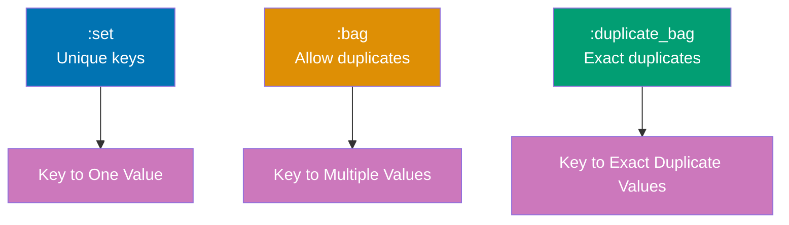

**Access Types**:

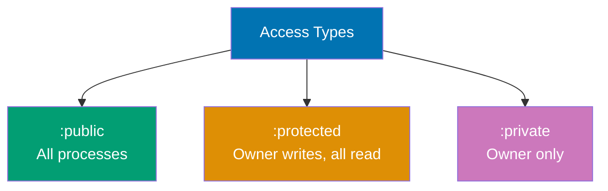

**Code**:

```elixir
# Create ETS table with :set type and :public access
table = :ets.new(:my_table, [:set, :public])
# => #Reference<0.1234567890.123456789.123456>
# => Returns table reference (NOT atom, even though first arg is atom)
# => :set - unique keys only (like Map)
# => :public - all processes can read AND write

# Insert single key-value pair (tuple format)
:ets.insert(table, {:key1, "value1"})  # => true
# => Stores {:key1, "value1"} in table
:ets.insert(table, {:key2, "value2"})  # => true

# Bulk insert multiple entries (list of tuples)
:ets.insert(table, [{:key3, "value3"}, {:key4, "value4"}])  # => true
# => Inserts multiple tuples in single operation (more efficient than loop)
# => All insertions succeed or entire operation fails (atomic)

# Lookup value by key
:ets.lookup(table, :key1)  # => [{:key1, "value1"}]
# => Returns LIST of matching tuples (always a list, even for :set)
# => Extract value: [{_key, value}] = :ets.lookup(...); value
:ets.lookup(table, :missing)  # => []
# => Empty list for non-existent keys (NOT nil or error)

# Update existing key (for :set, insert overwrites)
:ets.insert(table, {:key1, "updated"})  # => true
# => In :set table: replaces old {:key1, "value1"} with {:key1, "updated"}
:ets.lookup(table, :key1)  # => [{:key1, "updated"}]
# => Value changed from "value1" to "updated"

# Delete entry by key
:ets.delete(table, :key1)  # => true
# => Removes {:key1, "updated"} from table
:ets.lookup(table, :key1)  # => []
# => Verify deletion - key gone

# :set table - unique keys (overwrite on duplicate)
set_table = :ets.new(:set, [:set])  # => #Reference<...>
# => [:set] is table type (default, but explicit is clearer)
:ets.insert(set_table, {:a, 1})  # => true
# => Inserts {:a, 1}
:ets.insert(set_table, {:a, 2})  # => true (overwrites!)
# => Replaces {:a, 1} with {:a, 2} (unique key constraint)
:ets.lookup(set_table, :a)  # => [{:a, 2}]
# => Only latest value stored

# :bag table - allows multiple values per key (NO exact duplicates)
bag_table = :ets.new(:bag, [:bag])  # => #Reference<...>
# => [:bag] allows same key with DIFFERENT values
:ets.insert(bag_table, {:a, 1})  # => true
# => Inserts {:a, 1}
:ets.insert(bag_table, {:a, 2})  # => true
# => Inserts {:a, 2} (doesn't overwrite, adds to list)
:ets.lookup(bag_table, :a)  # => [{:a, 1}, {:a, 2}]
# => Returns ALL tuples with key :a

# Access control types
public = :ets.new(:public, [:public])  # => #Reference<...>
# => :public - ANY process can read AND write
protected = :ets.new(:protected, [:protected])  # => #Reference<...>
# => :protected - owner writes, ANY process reads (DEFAULT if not specified)
private = :ets.new(:private, [:private])  # => #Reference<...>
# => :private - ONLY owner process can access (read + write)

# Named tables (reference by atom instead of reference)
:ets.new(:named_table, [:named_table, :set, :public])  # => :named_table (atom!)
# => :named_table option makes table globally accessible by name
# => Returns atom :named_table instead of #Reference<...>
# => Only ONE table can have name :named_table at a time
:ets.insert(:named_table, {:key, "value"})  # => true
:ets.lookup(:named_table, :key)  # => [{:key, "value"}]
# => Lookup by atom name (convenient for global tables)

# Iterate over table entries
:ets.insert(table, {:a, 1})
:ets.insert(table, {:b, 2})
:ets.insert(table, {:c, 3})

:ets.tab2list(table)  # => [{:a, 1}, {:b, 2}, {:c, 3}]
# => Converts entire table to list (ORDER NOT GUARANTEED)
# => ⚠️ SLOW for large tables (copies all entries to list)
# => Use only for debugging or small tables
:ets.foldl(fn {k, v}, acc -> acc + v end, 0, table)  # => 6
# => Fold left over table entries: sum values 1 + 2 + 3 = 6
# => More memory-efficient than tab2list (no intermediate list)
# => Function receives {key, value} and accumulator

# Pattern matching queries
:ets.match(table, {:a, :'$1'})  # => [[1]]
# => Pattern: {:a, :'$1'} matches tuples with key :a, captures value as $1
# => Returns list of lists: [[captured_value]]
# => :'$1' is special ETS pattern variable (captures value)
:ets.match_object(table, {:a, :_})  # => [{:a, 1}]
# => Returns full matching tuples (not just captured values)
# => :_ is wildcard (matches anything, doesn't capture)
# => Difference: match returns captures, match_object returns objects

# Performance: ETS is FAST even for large tables
large_table = :ets.new(:large, [:set, :public])  # => #Reference<...>
Enum.each(1..1_000_000, fn i -> :ets.insert(large_table, {i, i * 2}) end)
# => Inserts 1 million entries: {1, 2}, {2, 4}, ..., {1000000, 2000000}
:ets.lookup(large_table, 500_000)  # => [{500000, 1000000}] (instant!)
# => O(1) lookup even with 1M entries (hash table)
# => Microsecond latency regardless of table size

# Table introspection
:ets.info(table)  # => [...metadata list...]
# => Returns keyword list of table metadata (type, size, owner, etc.)
# => Includes: :id, :name, :size, :type, :owner, :protection
:ets.info(table, :size)  # => 3
# => Get specific metadata field
# => :size returns number of entries in table

# Delete entire table (not just entry)
:ets.delete(table)  # => true
# => Destroys table completely (frees memory)
# => All entries removed, table reference invalid
# => Future operations on table reference will error
```

**Key Takeaway**: ETS provides O(1) in-memory storage with different table types (`:set`, `:bag`, `:duplicate_bag`) and access controls. Use for caches, shared state, or lookup tables. Tables are process-owned but can outlive processes with heir.

**Why It Matters**: ETS (Erlang Term Storage) provides mutable, concurrent in-memory storage with O(1) read access—unlike processes which serialize all access, ETS tables allow concurrent reads from multiple processes simultaneously. This makes ETS the right tool for read-heavy caches, counters, and lookup tables that would bottleneck as single-process GenServers. Phoenix PubSub, Plug session stores, and high-performance caches all use ETS internally. The trade-off: ETS data is not garbage collected (must be explicitly deleted) and is lost when the owning process crashes. Pair ETS with a supervised owner process for production use.

---

## Example 80: Erlang Interop

Elixir runs on the BEAM and can call Erlang modules directly. Use `:module_name` atom syntax to call Erlang functions. Access powerful Erlang libraries like `:timer`, `:crypto`, `:observer`.

**Code**:

```elixir
# Sleep using Erlang :timer module
:timer.sleep(1000)  # => :ok (blocks process for 1000ms)
                     # => Erlang modules prefixed with :

# Cryptographic hashing with Erlang :crypto
:crypto.hash(:sha256, "Hello, World!")  # => <<127, 131, 177, ...>> (32-byte binary)
                                         # => Args: algorithm, data to hash

# Hash and encode as hex string
:crypto.hash(:sha256, "Hello, World!")
|> Base.encode16(case: :lower)  # => "dffd6021bb...986f" (lowercase hex)
                                 # => case: :lower for lowercase (default :upper)

# Date/time functions from Erlang :calendar
:calendar.local_time()  # => {{2024, 12, 23}, {15, 30, 45}}
                         # => {{year, month, day}, {hour, minute, second}}

# Operating system information
:os.type()  # => {:unix, :darwin} or {:win32, :nt}
             # => {OS_family, OS_name} tuple
:os.getenv()  # => ['PATH=/usr/bin:...', 'HOME=/Users/username', ...]
               # => ALL environment variables as CHARLISTS (single quotes)
:os.getenv('HOME')  # => '/Users/username' (charlist argument required)

# List functions from Erlang :lists
:lists.seq(1, 10)  # => [1, 2, 3, 4, 5, 6, 7, 8, 9, 10]
                    # => Generate sequence (inclusive)
:lists.sum([1, 2, 3, 4, 5])  # => 15

# Random number generation with Erlang :rand
:rand.uniform()  # => 0.1234567 (random float 0.0-1.0)
                  # => Process-specific random state
:rand.uniform(100)  # => 42 (random int 1-100, inclusive)

# Erlang tuples (same syntax as Elixir)
user = {:user, "Alice", 30}  # => {:user, "Alice", 30} (tagged tuple)
{:user, name, age} = user    # => Pattern match extracts fields
name  # => "Alice" (destructured)

# Erlang string functions (work on CHARLISTS not binaries)
:string.uppercase('hello')  # => 'HELLO' (charlist, single quotes required)
                             # => Elixir: String.upcase("hello") for binaries
                             # => Different data types for strings

# Queue data structure from Erlang :queue
q = :queue.new()  # => {[], []} (empty FIFO queue)
                   # => O(1) amortized enqueue/dequeue
                   # => Two-list internal representation
q = :queue.in(1, q)  # => {[1], []} (enqueue 1)
# => Add to rear
q = :queue.in(2, q)  # => {[2, 1], []} (enqueue 2)
# => Second element added
q = :queue.in(3, q)  # => {[3, 2, 1], []} (enqueue 3)
# => Third element added
{{:value, item}, q} = :queue.out(q)  # => {{:value, 1}, {[2], [3]}}
                                      # => Dequeue from front (FIFO)
                                      # => Returns value and new queue
item  # => 1 (first in, first out)
# => Retrieved first item

# General balanced trees from Erlang :gb_trees
tree = :gb_trees.empty()  # => {0, nil} (empty balanced tree)
                           # => O(log N) operations
tree = :gb_trees.insert(:a, 1, tree)  # => {1, {:a, 1, nil, nil}}
tree = :gb_trees.insert(:b, 2, tree)  # => {2, ...} (auto-balances)
:gb_trees.lookup(:a, tree)  # => {:value, 1} (found)
                             # => Missing key: :none
```

**Key Takeaway**: Call Erlang modules with `:module_name` syntax. Elixir has full Erlang interop—leverage powerful Erlang libraries for crypto, timing, system monitoring, and more. Erlang uses charlists (single quotes) for strings.

**Why It Matters**: Elixir runs on the same BEAM as Erlang, giving it direct access to 30+ years of battle-tested Erlang libraries with zero FFI overhead. `:crypto` (cryptography), `:ssl` (TLS), `:ets` (in-memory storage), `:mnesia` (distributed database), and `:gen_tcp` (raw TCP) are all Erlang standard library modules callable from Elixir. This interoperability means you are not choosing between Elixir and Erlang—you get both. When an Elixir library does not exist for a specialized need, the Erlang standard library often does. Understanding `:erlang` module conventions makes this entire ecosystem available without wrapping or bridging code.

---

## Example 81: Behaviours (Contracts)

Behaviours define contracts for modules. They specify required callbacks, enabling compile-time verification and polymorphism. Built-in behaviours include GenServer, Supervisor, and Application.

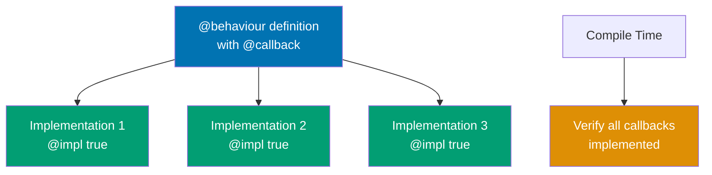

**Code**:

```elixir
# Define behaviour (contract) with callbacks
defmodule Parser do
  # @callback defines required function signature
  # => Declares contract that implementing modules must fulfill
  @callback parse(String.t()) :: {:ok, any()} | {:error, String.t()}
  # => parse/1 must accept String, return {:ok, data} or {:error, message}
  # => String.t() is type spec for binary string
  # => any() means return value can be any type
  # => :: separates function signature from return type
  # => | means union type (either {:ok, any()} OR {:error, String.t()})
  @callback format(any()) :: String.t()
  # => format/1 must accept any type, return String
  # => Both callbacks REQUIRED - implementing modules must define both
  # => Compiler verifies all @callback functions implemented
end
# => Parser behaviour defines contract for parse/format operations
# => Modules implementing Parser can be used polymorphically
# => Behaviour = interface/contract in other languages

# Implement Parser behaviour with JSON
defmodule JSONParser do
  @behaviour Parser  # => declares module implements Parser contract
  # => Compiler will verify parse/1 and format/1 are defined
  # => Missing callbacks trigger compile error
  # => Compile-time safety: interface verification

  @impl true  # => marks this function as behaviour implementation
  # => @impl true enables compiler to verify signature matches @callback
  # => Compiler ensures return type matches Parser.parse/1 spec
  def parse(string) do
    # => Implements Parser.parse/1 for JSON format
    case Jason.decode(string) do  # => parse JSON using Jason library
      # => Jason.decode/1 returns {:ok, map} or {:error, reason}
      {:ok, data} -> {:ok, data}  # => success: return parsed data
      # => data: parsed Elixir map from JSON string
      {:error, _} -> {:error, "Invalid JSON"}  # => failure: return error message
      # => _ discards Jason's specific error (returns generic message)
    end
  end
  # => {:ok, %{"name" => "Alice"}} for valid JSON
  # => {:error, "Invalid JSON"} for malformed JSON
  # => Return type matches Parser @callback spec

  @impl true
  # => Marks format/1 as Parser behaviour implementation
  def format(data) do
    # => Implements Parser.format/1 for JSON format
    Jason.encode!(data)  # => convert Elixir data to JSON string
    # => Jason.encode! raises on error (bang version)
    # => Bang functions (!): raise exception on error instead of returning tuple
  end
  # => %{"name" => "Alice"} → "{\"name\":\"Alice\"}"
  # => Returns JSON string representation
end
# => JSONParser implements Parser contract fully

# Implement Parser behaviour with CSV
defmodule CSVParser do
  @behaviour Parser
  # => Second implementation of same behaviour
  # => Demonstrates polymorphism: multiple implementations of one contract

  @impl true
  # => Implements Parser.parse/1 for CSV format
  def parse(string) do
    # => CSV parsing (simplified, no proper CSV library)
    rows = String.split(string, "\n")  # => split by newline
    # => "Name,Age\nAlice,30" → ["Name,Age", "Alice,30"]
    # => Each row is still raw string (not split by comma)
    {:ok, rows}  # => return as list of strings
    # => Wraps result in {:ok, data} tuple (matches Parser contract)
  end
  # => Simplified CSV (no proper parsing, just split)
  # => Production would use NimbleCSV library

  @impl true
  # => Implements Parser.format/1 for CSV format
  def format(rows) do
    # => CSV formatting: join rows with newline
    Enum.join(rows, "\n")  # => join rows with newline
    # => ["Name,Age", "Alice,30"] → "Name,Age\nAlice,30"
    # => Returns CSV string representation
  end
  # => Inverse of parse/1: list of strings → CSV string
end
# => Both JSONParser and CSVParser implement Parser contract
# => Can be used interchangeably wherever Parser expected
# => Polymorphism through behaviour contracts


# Polymorphic function using behaviour
defmodule FileProcessor do
  def process(content, parser_module) do
    # => parser_module can be ANY module implementing Parser behaviour
    # => JSONParser, CSVParser, or future implementations
    with {:ok, parsed} <- parser_module.parse(content) do  # => call parse/1
      # => parsed is whatever parse/1 returns (JSON map, CSV rows, etc.)
      # Process parsed data
      formatted = parser_module.format(parsed)  # => call format/1
      {:ok, formatted}  # => return formatted string
    end
  end
  # => Same code works for JSON, CSV, XML, YAML - any Parser implementation
end

# Use JSONParser
json = ~s({"name": "Alice"})  # => ~s(...) is sigil for string (no escaping needed)
FileProcessor.process(json, JSONParser)
# => {:ok, "{\"name\":\"Alice\"}"}
# => Calls JSONParser.parse → JSONParser.format

# Use CSVParser
csv = "Name,Age\nAlice,30"
FileProcessor.process(csv, CSVParser)
# => {:ok, "Name,Age\nAlice,30"}
# => Calls CSVParser.parse → CSVParser.format
# => Same function, different behaviour implementation

# Optional callbacks
defmodule Storage do
  @callback save(any()) :: :ok | {:error, String.t()}  # => REQUIRED callback
  @callback load() :: {:ok, any()} | {:error, String.t()}  # => REQUIRED callback
  @callback delete() :: :ok  # => OPTIONAL callback (marked below)
  @macrocallback config() :: Macro.t()  # => Macro callback (for compile-time macros)
  # => @macrocallback like @callback but for macros (rare)

  @optional_callbacks delete: 0, config: 0  # => marks delete/0 and config/0 as optional
  # => Implementations can omit these without compiler warning
  # => save/1 and load/0 still REQUIRED
end

# Implement Storage with optional callbacks omitted
defmodule FileStorage do
  @behaviour Storage  # => implements Storage behaviour

  @impl true
  def save(data), do: File.write("data.txt", inspect(data))
  # => Saves data to file (inspect converts Elixir term to string)
  # => Returns :ok or {:error, reason}

  @impl true
  def load do
    case File.read("data.txt") do
      {:ok, content} -> {:ok, content}  # => file exists: return content
      {:error, _} -> {:error, "File not found"}  # => file missing: error
    end
  end

  # delete/0 is optional - can omit without warning
  # => If delete/0 not in @optional_callbacks, compiler would error here
end
# => FileStorage only implements save/1 and load/0 (delete/0 omitted)
# => Compiles successfully because delete/0 is optional
```

**Key Takeaway**: Behaviours define contracts with `@callback`, implementations use `@behaviour` and `@impl`. Compile-time verification ensures all required callbacks are implemented. Use for polymorphism and plugin systems.

**Why It Matters**: Behaviours define contracts that modules must implement—Elixir's equivalent of interfaces, but with callback specifications rather than type constraints. The `@behaviour` declaration causes the compiler to warn if any required callback is missing, catching implementation errors at compile time. GenServer, Supervisor, Application, and Phoenix.Controller are all behaviours. Writing your own behaviours enables plugin systems: define a `MyApp.PaymentProvider` behaviour, and multiple payment provider modules can implement it with compiler-verified contracts. Combined with dynamic dispatch, behaviours enable strategy patterns without runtime type checking.

---

## Example 82: Comprehensions Deep Dive

Comprehensions generate collections from enumerables with filtering and transformations. They support lists, maps, and binaries with optional filters.

**Pipeline Flow**:

```mermaid
graph TD
    Input["Input: #91;1, 2, 3, 4, 5, 6#93;"] --> Generator["Generator: x from list"]
    Generator --> Filter1["Filter 1: rem#40;x, 2#41; == 0"]
    Filter1 --> Filter2["Filter 2: x greater than 2"]
    Filter2 --> Transform["Transform: x * 2"]
    Transform --> Output["Output: #91;8, 12#93;"]

    style Input fill:#0173B2,color:#fff
    style Generator fill:#DE8F05,color:#fff
    style Filter1 fill:#CC78BC,color:#fff
    style Filter2 fill:#CC78BC,color:#fff
    style Transform fill:#029E73,color:#fff
    style Output fill:#029E73,color:#fff
```

**Process Flow - Element by Element**:

```mermaid
graph TD
    G1["Element 1: fails filter 1"] --> G2["Element 2: fails filter 2"]
    G2 --> G3["Element 3: fails filter 1"]
    G3 --> G4["Element 4: passes both, 4*2 = 8"]
    G4 --> G5["Element 5: fails filter 1"]
    G5 --> G6["Element 6: passes both, 6*2 = 12"]

    style G1 fill:#CC78BC,color:#fff
    style G2 fill:#CC78BC,color:#fff
    style G3 fill:#CC78BC,color:#fff
    style G4 fill:#029E73,color:#fff
    style G5 fill:#CC78BC,color:#fff
    style G6 fill:#029E73,color:#fff
```

**Code**:

```elixir
# Simple comprehension - map over list
for x <- [1, 2, 3], do: x * 2  # => [2, 4, 6]
# => for x <- list iterates each element
# => do: x * 2 transforms each element

# Multiple generators (Cartesian product)
for x <- [1, 2], y <- [3, 4], do: {x, y}
# => [{1, 3}, {1, 4}, {2, 3}, {2, 4}]
# => Nested iteration: for each x, iterate all y values

# Comprehension with filter
for x <- 1..10, rem(x, 2) == 0, do: x  # => [2, 4, 6, 8, 10]
# => rem(x, 2) == 0 is FILTER (not generator)
# => Only includes elements where filter returns true

# Multiple filters (AND logic)
for x <- 1..10,
    rem(x, 2) == 0,  # => filter: must be even
    rem(x, 3) == 0,  # => filter: must be divisible by 3
    do: x  # => [6] (only 6 satisfies both)

# Pattern matching in generator
users = [
  {:user, "Alice", 30},
  {:user, "Bob", 25},
  {:admin, "Charlie", 35}  # => won't match pattern
]

for {:user, name, age} <- users, do: {name, age}
# => [{"Alice", 30}, {"Bob", 25}]
# => Pattern {:user, name, age} filters list

# Comprehension with custom output (into:)
for x <- [1, 2, 3], into: %{}, do: {x, x * 2}
# => %{1 => 2, 2 => 4, 3 => 6}
# => into: %{} specifies output type (map)

# Transform map using comprehension
for {k, v} <- %{a: 1, b: 2}, into: %{}, do: {k, v * 10}
# => %{a: 10, b: 20}
# => Iterate map entries as {key, value} tuples

# Map transformation with filter
for {key, val} <- %{a: 1, b: 2, c: 3},
    val > 1,  # => filter: only values > 1
    into: %{},
    do: {key, val * 2}
# => %{b: 4, c: 6} (a: 1 excluded)

# Binary comprehension (iterate bytes)
for <<c <- "hello">>, do: c
# => [104, 101, 108, 108, 111] (ASCII codes)
# => <<c <- binary>> extracts bytes

# Binary comprehension with transformation
for <<c <- "hello">>, into: "", do: <<c + 1>>
# => "ifmmp" (each character shifted by 1)
# => into: "" collects into binary string

# Nested iteration (flatten matrix)
matrix = [[1, 2, 3], [4, 5, 6], [7, 8, 9]]
for row <- matrix, x <- row, do: x * 2
# => [2, 4, 6, 8, 10, 12, 14, 16, 18]
# => Flattens and transforms in one pass

# Binary pattern matching (parse pixels)
pixels = <<213, 45, 132, 64, 76, 32, 76, 0, 0, 234>>
for <<r::8, g::8, b::8 <- pixels>>, do: {r, g, b}
# => [{213, 45, 132}, {64, 76, 32}]
# => Matches 3 bytes at a time as RGB

# Comprehension with reduce
for x <- 1..10, reduce: 0 do
  acc -> acc + x  # => accumulate sum
end
# => 55 (sum of 1 to 10)
# => reduce: 0 sets initial accumulator

# Multiple generators with reduce
for x <- 1..5, y <- 1..5, reduce: [] do
  acc -> [{x, y} | acc]  # => cons to list
end
# => [{5,5}, {5,4}, ..., {1,1}] (25 tuples)
# => Cartesian product with reduce

# Unique elements
for x <- [1, 2, 2, 3, 3, 3], uniq: true, do: x
# => [1, 2, 3]
# => uniq: true removes duplicates
```

**Key Takeaway**: Comprehensions generate collections with generators, filters, and transformations. Use `into:` for custom collection types, `reduce:` for accumulation, pattern matching for filtering. Support lists, maps, and binaries.

**Why It Matters**: Advanced comprehensions with multiple generators, guards, `into:`, and `reduce:` enable expressive data transformation that reads like a declarative specification. Multiple generators create the Cartesian product—all combinations of two input lists—useful for generating test cases, matrix operations, and graph edge creation. The `into:` option collecting into maps or MapSets turns comprehensions into full data structure builders, not just list creators. The `reduce:` option transforms comprehensions into explicit folds, useful when accumulating state through a transformation. These patterns appear in code generation, data normalization pipelines, and complex query building.

---

## Example 83: Bitstring Pattern Matching

Bitstrings enable binary pattern matching with precise control over bit sizes and types. Use for parsing binary protocols, image manipulation, and low-level data processing.

**Pattern Matching Example**:

```mermaid
graph TD
    Binary["Binary: #60;#60;1, 2, 3, 4#62;#62;"] --> Match["Pattern Match"]
    Match --> Parts["Pattern: #60;#60;a::8, b::8, rest::binary#62;#62;"]
    Parts --> Values["Result: a=1, b=2, rest=#60;#60;3,4#62;#62;"]

    style Binary fill:#0173B2,color:#fff
    style Match fill:#DE8F05,color:#fff
    style Parts fill:#029E73,color:#fff
    style Values fill:#CC78BC,color:#fff
```

**Type Specifiers**:

```mermaid
graph TD
    Format["Type Specifiers"] --> Int["integer #40;default#41;"]
    Format --> Float["float"]
    Format --> Bin["binary"]
    Format --> Bits["bits"]
    Format --> UTF["utf8/utf16/utf32"]

    style Format fill:#0173B2,color:#fff
    style Int fill:#029E73,color:#fff
    style Float fill:#029E73,color:#fff
    style Bin fill:#029E73,color:#fff
    style Bits fill:#029E73,color:#fff
    style UTF fill:#029E73,color:#fff
```

**Code**:

```elixir
# Basic binary pattern matching (default 8-bit bytes)
<<a, b, c>> = <<1, 2, 3>>
# => Pattern matches 3 bytes from binary
# => Default size: 8 bits per segment (1 byte)
a  # => 1
b  # => 2
c  # => 3

# Explicit size specification (equivalent to above)
<<a::8, b::8, c::8>> = <<1, 2, 3>>
# => ::8 explicitly specifies 8-bit size
# => a::8 means "bind a to an 8-bit integer"
a  # => 1
# => Same result as default (8 bits)

# Multi-byte integers (16-bit segments)
<<x::16, y::16>> = <<0, 1, 0, 2>>
# => x::16 reads 2 bytes as single 16-bit integer
# => Bytes: [0, 1] → integer 1 (big-endian by default)
# => Bytes: [0, 2] → integer 2
x  # => 1 (00000001 in 16 bits)
y  # => 2
# => Big-endian: most significant byte first

# Rest pattern (capture remaining bytes)
<<first, second, rest::binary>> = <<1, 2, 3, 4, 5>>
# => first, second: 8-bit integers (default)
# => rest::binary: remaining bytes as binary
first  # => 1
second  # => 2
rest  # => <<3, 4, 5>>
# => ::binary type captures rest as binary (not integer list)

# Parse IP address (4 bytes to dotted decimal)
ip = <<192, 168, 1, 1>>
<<a::8, b::8, c::8, d::8>> = ip
# => Destructures 4 bytes into 4 integers
"#{a}.#{b}.#{c}.#{d}"  # => "192.168.1.1"
# => String interpolation converts to readable format

# Parse RGB color (3-byte pattern)
color = <<213, 45, 132>>
<<r::8, g::8, b::8>> = color
# => r = red (213), g = green (45), b = blue (132)
{r, g, b}  # => {213, 45, 132}
# => Tuple of RGB components

# Type specifiers (integer, float, binary)
<<i::integer, f::float, b::binary>> = <<42, 3.14::float, "hello">>
# => i::integer - default 8-bit integer (42)
# => f::float - 64-bit float (default float size)
# => b::binary - remaining bytes as binary string
# => Must construct with matching types

# Signedness (signed vs unsigned integers)
<<signed::signed, unsigned::unsigned>> = <<-1, 255>>
# => ::signed interprets byte as two's complement (-128 to 127)
# => ::unsigned interprets byte as 0-255
signed  # => -1
# => Byte 255 (0xFF) as signed = -1 (two's complement)
unsigned  # => 255
# => Byte 255 (0xFF) as unsigned = 255

# Endianness (byte order)
<<big::16-big, little::16-little>> = <<1, 2, 3, 4>>
# => ::big (big-endian): most significant byte first
# => ::little (little-endian): least significant byte first
big  # => 258 (big-endian)
# => Bytes [1, 2] → (1 * 256) + 2 = 258
little  # => 1027 (little-endian)
# => Bytes [3, 4] → (4 * 256) + 3 = 1027


# Protocol packet parsing (custom binary format)
defmodule Packet do
  def parse(<<
    version::4,        # => 4 bits for version field
    header_length::4,  # => 4 bits for header length
    type::8,           # => 8 bits (1 byte) for packet type
    length::16,        # => 16 bits (2 bytes) for payload length
    rest::binary       # => Remaining bytes as payload
  >>) do
    # => Function head: pattern matches binary structure
    # => Total header: 4 + 4 + 8 + 16 = 32 bits (4 bytes)
    %{
      version: version,           # => Extract version nibble (0-15)
      header_length: header_length,  # => Extract header length nibble
      type: type,                 # => Extract type byte
      length: length,             # => Extract length word
      payload: rest               # => Remaining data
    }
  end
  # => Enables parsing custom binary protocols (network packets, file headers)
end

# Construct and parse packet
packet = <<4::4, 5::4, 6::8, 100::16, "payload">>
# => Construct binary: 4 (4 bits), 5 (4 bits), 6 (8 bits), 100 (16 bits), string
# => Total: 1 byte header + 2 bytes length + 7 bytes payload = 10 bytes
Packet.parse(packet)
# => %{version: 4, header_length: 5, type: 6, length: 100, payload: "payload"}
# => Parses structured binary into map

# UTF-8 codepoint extraction
<<codepoint::utf8, rest::binary>> = "Hello"
# => ::utf8 reads variable-length UTF-8 character (1-4 bytes)
# => "H" is 1 byte in UTF-8: 72 (ASCII)
codepoint  # => 72 (H)
# => Unicode codepoint (not byte value - coincidentally same for ASCII)
<<codepoint::utf8>>  # => "H"
# => Reconstruct UTF-8 character from codepoint

# Binary construction (size specifiers)
<<1, 2, 3>>  # => <<1, 2, 3>>
# => Default 8 bits per value: 3 bytes total
<<1::16, 2::16>>  # => <<0, 1, 0, 2>>
# => 16 bits per value: 4 bytes total
# => 1 as 16-bit big-endian: [0, 1]
# => 2 as 16-bit big-endian: [0, 2]
<<255::8, 128::8>>  # => <<255, 128>>
# => Explicit 8-bit size (same as default)

# Bit-level pattern matching (sub-byte precision)
<<a::1, b::1, c::6>> = <<128>>
# => Byte 128 = binary 10000000
# => a::1 = first bit = 1
# => b::1 = second bit = 0
# => c::6 = remaining 6 bits = 000000 = 0
a  # => 1 (first bit)
b  # => 0 (second bit)
c  # => 0 (remaining 6 bits)
# => Enables parsing bit flags, packed data structures
```

**Key Takeaway**: Bitstrings enable precise binary pattern matching with size (`::8`), type (`::integer`, `::float`, `::binary`), signedness, and endianness control. Use for parsing binary protocols, file formats, and low-level data.

**Why It Matters**: Bitstring pattern matching enables parsing binary protocols at the byte and bit level without external libraries. Network protocols (TCP, UDP, WebSocket frames), file format parsing (PNG headers, RIFF chunks), and embedded systems communication all benefit from Elixir's ability to match on arbitrary-width bit fields directly in pattern match syntax. This feature comes from Erlang's telecommunications heritage—Ericsson engineers needed to parse phone protocol headers without assembly code. Elixir inherits this capability and uses it in `Plug.Conn` for HTTP header parsing, `:ssl` for TLS record parsing, and custom binary protocol implementations.

---

## Example 84: Performance: Profiling and Optimization

Profiling identifies bottlenecks. Use `:timer.tc/1` for timing, `:observer.start()` for system monitoring, and Benchee for comprehensive benchmarking.

**Code**:

```elixir
# Basic timing with :timer.tc/1
{time, result} = :timer.tc(fn ->
  # => :timer.tc/1 measures execution time in microseconds
  Enum.reduce(1..1_000_000, 0, &+/2)
  # => Sums 1 million integers
end)
# => Returns {microseconds, function_result} tuple
# => time = execution time (μs), result = function return value

IO.puts("Took #{time}μs")
# => Prints: Took 123456μs (actual time varies)
# => μs = microseconds (1 second = 1,000,000 μs)

# Comprehensive benchmarking with Benchee
Benchee.run(%{
  # => Map of benchmark scenarios
  "Enum.map" => fn -> Enum.map(1..10_000, &(&1 * 2)) end,
  # => Eager evaluation: builds entire list immediately
  "for comprehension" => fn -> for x <- 1..10_000, do: x * 2 end,
  # => Syntactic sugar for Enum.map
  "Stream.map" => fn -> 1..10_000 |> Stream.map(&(&1 * 2)) |> Enum.to_list() end
  # => Lazy evaluation: builds list only when Enum.to_list() called
})
# => Benchee outputs: iterations/second, average time, memory usage
# => Shows statistical analysis with standard deviation

# Memory profiling
memory_before = :erlang.memory()
# => Snapshot of BEAM memory state before operation
# => Returns keyword list: [total: N, processes: M, binary: X, ...]
# PERFORM MEMORY-INTENSIVE OPERATION HERE
memory_after = :erlang.memory()
# => Snapshot after operation
used = memory_after[:total] - memory_before[:total]
# => Calculate memory delta (may be negative if GC runs)
IO.puts("Used #{used} bytes")
# => Note: includes GC effects, not perfectly accurate

# Process-specific metrics
Process.info(self(), :memory)
# => {:memory, 12345} (bytes used by current process heap)
# => Per-process memory, NOT total BEAM memory
Process.info(self(), :message_queue_len)
# => {:message_queue_len, 0} (messages waiting in mailbox)
# => Growing queue indicates backpressure/slow consumer

# ❌ BAD: List concatenation (O(n) per append, O(n²) total)
Enum.reduce(1..10_000, [], fn x, acc -> acc ++ [x] end)
# => Each ++ copies entire accumulator (expensive!)
# => 10,000 items: ~50 million operations
# => Quadratic time complexity

# ✅ GOOD: Cons + reverse (O(1) per cons, O(n) reverse, O(n) total)
Enum.reduce(1..10_000, [], fn x, acc -> [x | acc] end) |> Enum.reverse()
# => [x | acc] prepends in constant time (no copying)
# => Single reverse pass at end
# => Linear time complexity: ~10x-100x faster

# ❌ BAD: String concatenation (copies entire string each time)
Enum.reduce(1..1000, "", fn x, acc -> acc <> to_string(x) end)
# => Each <> allocates new binary (expensive!)
# => 1,000 items: millions of bytes copied
# => Quadratic time complexity

# ✅ GOOD: IO lists (deferred concatenation)
iolist = Enum.map(1..1000, &to_string/1)
# => Returns list of binaries (not yet concatenated)
# => No copying yet!
IO.iodata_to_binary(iolist)
# => Single-pass concatenation with known size
# => Allocates final binary once: ~100x faster

# ❌ BAD: Repeated expensive function calls
Enum.map(list, fn x -> expensive_function(x) end)
# => Calls expensive_function for each element
# => No caching (recalculates duplicates)

# ✅ GOOD: Memoization (cache results)
cache = Enum.map(list, &expensive_function/1) |> Map.new()
# => Pre-computes all unique values
# => Subsequent lookups: O(log n) instead of O(expensive)
# => Note: only worthwhile for repeated lookups

# ❌ BAD: Multiple Enum pipeline passes
list |> Enum.map(&transform/1) |> Enum.filter(&predicate/1) |> Enum.map(&final/1)
# => Pass 1: Enum.map builds intermediate list
# => Pass 2: Enum.filter builds filtered list
# => Pass 3: Enum.map builds final list
# => Three iterations, two intermediate allocations

# ✅ GOOD: Fused single reduce pass
list
|> Enum.reduce([], fn x, acc ->
  # => Single pass through list
  transformed = transform(x)
  # => Transform once
  if predicate(transformed), do: [final(transformed) | acc], else: acc
  # => Filter + final map inline
end)
|> Enum.reverse()
# => One iteration, zero intermediate allocations
# => Note: only optimize hot paths (profile first!)

# ❌ BAD: Eager evaluation of large data
1..10_000_000 |> Enum.map(&(&1 * 2)) |> Enum.take(10)
# => Enum.map builds 10 million item list
# => Then Enum.take discards 9,999,990 items
# => Wastes memory and CPU

# ✅ GOOD: Lazy evaluation with Stream
1..10_000_000 |> Stream.map(&(&1 * 2)) |> Enum.take(10)
# => Stream.map is lazy (no computation yet)
# => Enum.take(10) pulls only 10 items
# => Computes 10 values, not 10 million
# => ~1 million times less work!
```

**Key Takeaway**: Profile before optimizing. Use `:timer.tc/1` for timing, Benchee for benchmarking, `:observer` for system monitoring. Common optimizations: avoid list concatenation, use IO lists for strings, reduce enumerations, use streams for large data.

**Why It Matters**: Profiling before optimizing prevents wasted effort—premature optimization based on intuition often targets the wrong bottleneck. The BEAM provides profiling tools (`:fprof`, `:eprof`, `:cprof`) that measure actual hotspots. Memory profiling with `:observer` and `:erlang.memory/0` identifies binary accumulation, large ETS tables, and process heap growth. Key optimizations: tail recursion for loops, ETS for concurrent reads, binary references to avoid copying, process-per-request for isolation. Understanding BEAM performance characteristics (GC pauses, scheduling preemption, message copying costs) enables writing code that performs well under real production load.

---

## Example 85: Debugging Tools

Elixir provides tools for debugging: `IEx.pry` for breakpoints, `IO.inspect` with labels, `dbg` for pipeline debugging (Elixir 1.14+), and `:debugger` for GUI debugging.

**Code**:

```elixir
# IO.inspect with labels (pipeline debugging)
defmodule Debug do
  def process(data) do
    data
    |> transform()
    |> IO.inspect(label: "After transform")
    # => Prints: After transform: 10
    # => Returns value unchanged (passes through pipeline)
    |> validate()
    |> IO.inspect(label: "After validate")
    # => Prints: After validate: 10
    # => Non-invasive: doesn't break pipeline flow
    |> finalize()
  end

  defp transform(x), do: x * 2
  # => Doubles input
  defp validate(x), do: if x > 0, do: x, else: raise("Invalid")
  # => Ensures positive value
  defp finalize(x), do: x + 1
  # => Increments by 1
end

Debug.process(5)
# => Prints debug output, returns 11
# => Flow: 5 → transform(10) → validate(10) → finalize(11)

# dbg/1 for pipeline debugging (Elixir 1.14+)
result = [1, 2, 3]
         |> Enum.map(&(&1 * 2))
         # => [2, 4, 6]
         |> dbg()
         # => Prints: [2, 4, 6] (with code context)
         # => Shows: pipe |> Enum.map(...) #=> [2, 4, 6]
         |> Enum.sum()
         # => 12
         |> dbg()
         # => Prints: 12 (with code context)
         # => dbg is more informative than IO.inspect

# IEx.pry for breakpoints (interactive debugging)
defmodule User do
  def create(name, age) do
    require IEx
    # => Compile-time requirement for pry
    IEx.pry()
    # => STOPS EXECUTION HERE when running in IEx
    # => Opens interactive prompt with access to local variables
    # => Type 'respawn' to continue, 'continue' to skip breakpoints

    %{name: name, age: age}
    # => Returns user map
  end
end

# When stopped at pry, you can inspect variables:
binding()
# => Returns keyword list of all variables in scope
# => Example: [name: "Alice", age: 25]
# => Useful for inspecting function arguments and locals

# tap/2 for non-invasive inspection
def complex_calculation(x) do
  x
  |> step1()
  # => Performs step1 transformation
  |> tap(&IO.inspect(&1, label: "After step1"))
  # => tap/2 calls function with value, returns original value
  # => Prints value WITHOUT changing pipeline flow
  # => Like IO.inspect but more explicit
  |> step2()
  |> tap(&IO.inspect(&1, label: "After step2"))
  # => Multiple taps don't affect result
  |> step3()
end
# => tap/2 is pure (no side effects on return value)
# => Perfect for inserting debug prints without refactoring

# Conditional debugging with application config
def process(data) do
  if Application.get_env(:my_app, :debug) do
    # => Only executes in debug mode
    IO.inspect(data, label: "DEBUG")
    # => Conditional debugging without code changes
  end
  # ... rest of processing
end
# => Enable with: Application.put_env(:my_app, :debug, true)
# => Disable in production: config :my_app, debug: false

# Structured logging for production
require Logger
# => Compile-time requirement for Logger macros

def risky_operation do
  Logger.debug("Starting risky operation")
  # => Log level: debug (most verbose)
  # => Only appears when log level ≤ :debug
  # ... code
  Logger.info("Completed successfully")
  # => Log level: info (normal operations)
rescue
  e -> Logger.error("Failed: #{inspect(e)}")
  # => Log level: error (failures)
  # => inspect/1 converts exception to readable string
end
# => Logger levels: debug < info < warn < error
# => Production typically sets level to :info or :warn

# Pretty printing complex structures
big_struct = %{/* complex nested data */}
IO.inspect(big_struct, pretty: true, width: 80)
# => pretty: true formats with indentation
# => width: 80 wraps at 80 characters
# => Makes deeply nested structures readable
# => Alternative: IO.puts(inspect(big_struct, pretty: true))

# Stack trace formatting
try do
  raise "Error!"
  # => Raises exception
rescue
  e -> IO.puts(Exception.format(:error, e, __STACKTRACE__))
  # => Exception.format/3 creates human-readable trace
  # => :error = exception kind
  # => e = exception struct
  # => __STACKTRACE__ = special variable with call stack
  # => Output shows file:line for each frame
end
# => Use for debugging unexpected exceptions
# => Production: Logger.error(Exception.format(...)) instead of IO.puts
```

**Key Takeaway**: Use `IO.inspect/2` with labels for quick debugging, `dbg/1` for pipeline inspection, `IEx.pry` for breakpoints, and Logger for production. Leverage `tap/2` for non-invasive inspection and `:debugger` for GUI debugging.

**Why It Matters**: Production debugging in Elixir uses the BEAM's live introspection capabilities without restarting processes. `IEx.pry/0` breaks into an IEx session in the running context; `:observer.start()` provides a visual GUI showing process trees, memory, and message queues; `dbg/1` annotates pipelines with per-step output. Logger structured logging with metadata (request ID, user ID) enables log correlation across distributed requests. Understanding these tools transforms debugging from guesswork into systematic observation of live system state. The BEAM's design philosophy—processes are observable, code is hot-swappable—makes production debugging uniquely powerful.

---

## Mastery Achieved

You've completed all 25 advanced examples covering GenServer, Supervisor, OTP applications, metaprogramming, macros, advanced concurrency, and language internals. You now have deep knowledge of:

- **GenServer**: State management, error handling, naming, best practices
- **Supervision**: Restart strategies, DynamicSupervisor, fault tolerance
- **OTP Applications**: Lifecycle, configuration, umbrella projects
- **Metaprogramming**: Quote/unquote, macros, `use` pattern, reflection
- **Advanced Concurrency**: Agent, Registry, ETS, Erlang interop
- **Language Features**: Behaviours, comprehensions, bitstrings, profiling, debugging

**Next Steps**:

- Build production systems using OTP patterns
- Explore Phoenix framework for web applications
- Study Ecto for database interactions
- Read OTP Design Principles documentation
- Contribute to open-source Elixir projects

**Resources**:

- [Elixir Official Guides](https://hexdocs.pm/elixir/introduction.html)
- [Erlang OTP Documentation](https://www.erlang.org/doc/)
- [Elixir Forum](https://elixirforum.com/)
- [Awesome Elixir](https://github.com/h4cc/awesome-elixir)

**Related Content**:
