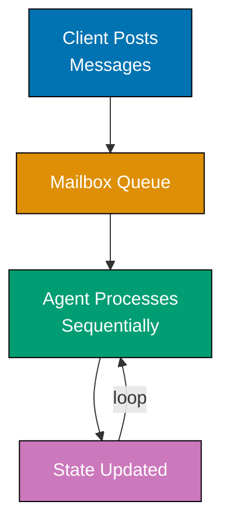
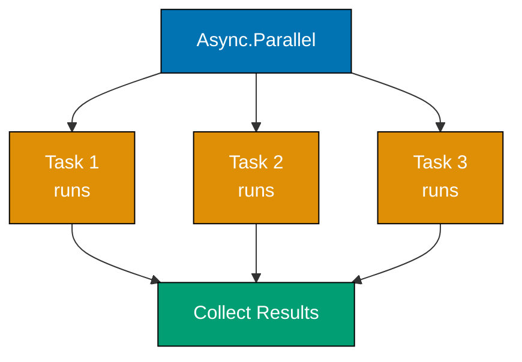
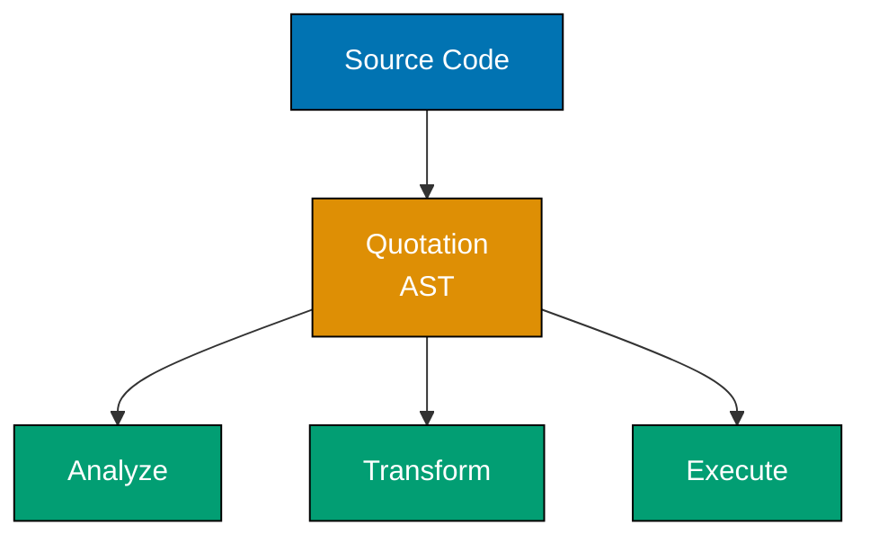
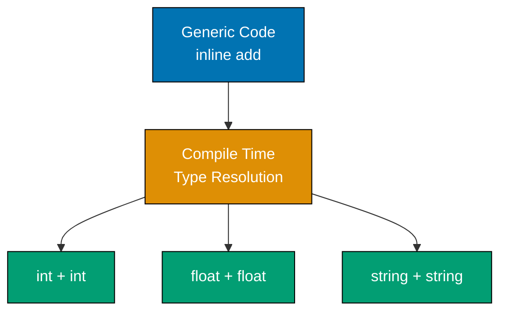
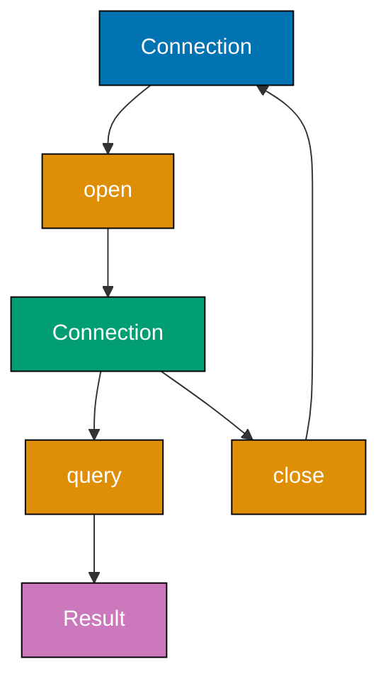
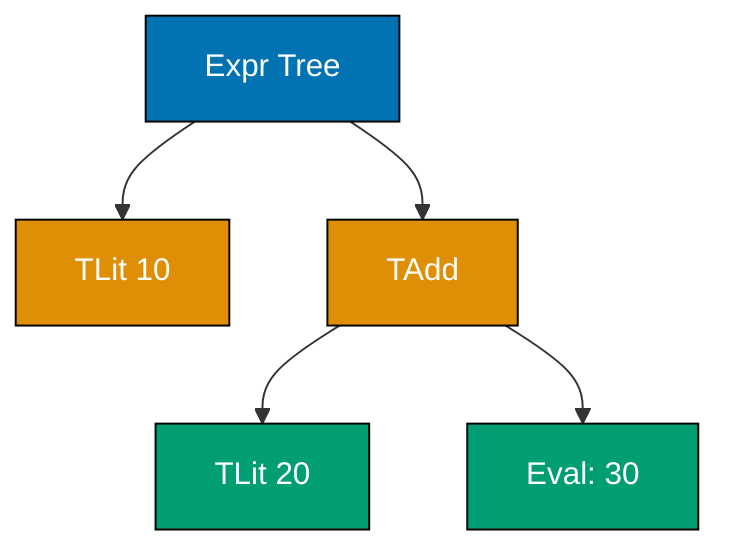
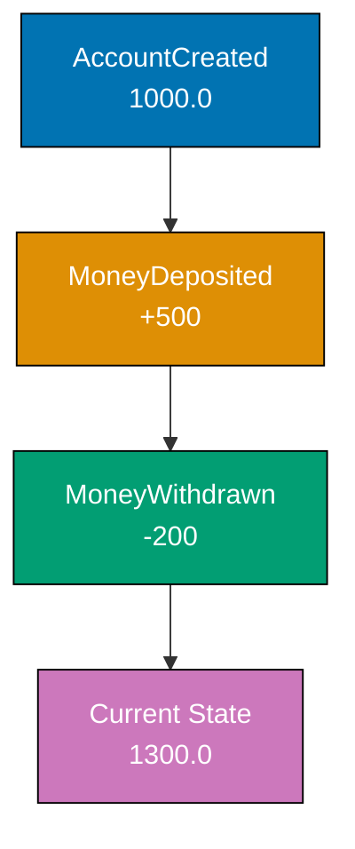
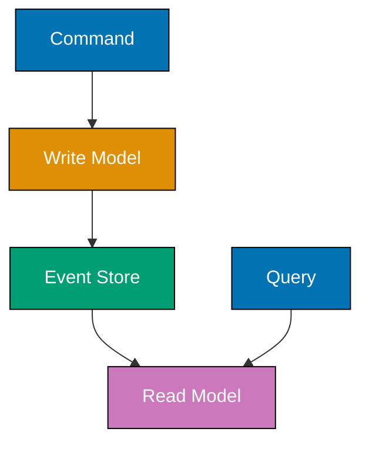
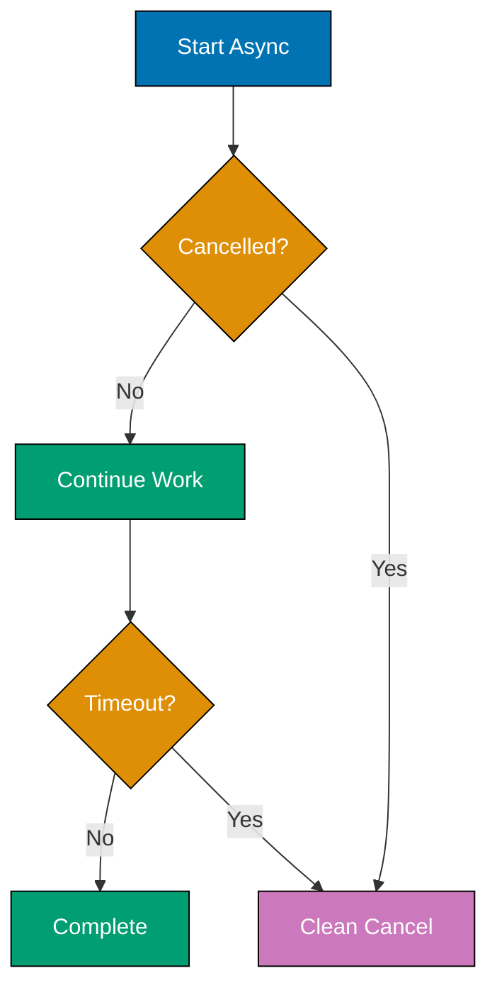

This advanced tutorial covers F#'s expert-level patterns and functional architecture through 25 heavily annotated examples. Topics include mailbox processors for concurrency, statically resolved type parameters (SRTP), quotations for metaprogramming, advanced computation expressions, and domain-driven design patterns that make illegal states unrepresentable.

## Example 61: MailboxProcessor - Agent-Based Concurrency

MailboxProcessor implements the actor model for concurrency, where agents process messages sequentially from a mailbox, eliminating race conditions without locks.



**Code**:

```fsharp
// Example 61: MailboxProcessor - Agent-Based Concurrency
type Message =
    | Increment
    | Decrement
    | GetCount of AsyncReplyChannel<int>
                         // => Message type with async reply channel
                         // => GetCount carries channel for returning result

let counter = MailboxProcessor.Start(fun inbox ->
                         // => MailboxProcessor.Start creates agent
                         // => inbox is the mailbox receiving messages
    let rec loop count =
                         // => Recursive loop maintaining state
                         // => count is current state (no mutable variable!)
        async {
            let! msg = inbox.Receive()
                         // => let! awaits next message
                         // => Blocks until message arrives
            match msg with
            | Increment ->
                         // => Increment case
                return! loop (count + 1)
                         // => Recurse with incremented count
                         // => return! is tail recursion (no stack growth)
            | Decrement ->
                         // => Decrement case
                return! loop (count - 1)
                         // => Recurse with decremented count
            | GetCount replyChannel ->
                         // => GetCount case with reply channel
                replyChannel.Reply(count)
                         // => Send current count back via channel
                return! loop count
                         // => Continue with same count
        }
    loop 0               // => Start loop with initial state 0
)

// Post messages (fire-and-forget)
counter.Post(Increment)  // => Posts Increment message
counter.Post(Increment)  // => Posts another Increment
counter.Post(Decrement)  // => Posts Decrement

// Query current state
let currentCount = counter.PostAndReply(fun replyChannel -> GetCount replyChannel)
                         // => PostAndReply sends message and waits for reply
                         // => Creates reply channel automatically
                         // => currentCount is 1 (2 increments - 1 decrement)

printfn "Count: %d" currentCount
                         // => Outputs: Count: 1
```

**Key Takeaway**: MailboxProcessor provides actor-model concurrency with sequential message processing, eliminating race conditions through isolated state and message-passing instead of shared memory.

**Why It Matters**: Actor-based concurrency prevents data races without locks, deadlocks, or complex synchronization primitives. MailboxProcessor agents process messages sequentially, eliminating shared mutable state as a source of bugs. Financial systems using MailboxProcessor process millions of concurrent account updates with zero race conditions, achieving throughput comparable to lock-based implementations while simplifying debugging through message tracing and replay capabilities.

## Example 62: Agent-Based State Management

Agents encapsulate mutable state safely, enabling concurrent updates without explicit locking.

```fsharp
// Example 62: Agent-Based State Management
type BankMessage =       // => Message type for bank account agent
    | Deposit of amount: float
                         // => Deposit: no reply needed (fire and forget)
    | Withdraw of amount: float * AsyncReplyChannel<Result<float, string>>
                         // => Withdraw with reply channel for result
    | GetBalance of AsyncReplyChannel<float>
                         // => GetBalance: replies with current balance

let createBankAccount initialBalance =
                         // => Factory function creating bank account agent
    MailboxProcessor.Start(fun inbox ->
                         // => inbox receives messages sequentially
        let rec loop balance =
                         // => Loop maintains current balance (immutable state)
            async {
                let! msg = inbox.Receive()
                         // => Await next message (blocks if none pending)
                match msg with
                | Deposit amount ->
                         // => Deposit case: no reply needed
                    return! loop (balance + amount)
                         // => Tail recursion with new balance (no stack growth)
                | Withdraw (amount, reply) ->
                         // => Withdraw with reply channel (PostAndReply pattern)
                    if balance >= amount then
                        reply.Reply(Ok (balance - amount))
                         // => Success: reply with new balance wrapped in Ok
                        return! loop (balance - amount)
                         // => Continue with updated balance
                    else
                        reply.Reply(Error "Insufficient funds")
                         // => Error: reply with Error message
                        return! loop balance
                         // => Balance unchanged (keep current balance)
                | GetBalance reply ->
                    reply.Reply(balance)
                         // => Return current balance to caller
                    return! loop balance
                         // => Continue loop with same balance
            }
        loop initialBalance
                         // => Start loop with provided initial balance
    )

let account = createBankAccount 1000.0
                         // => Create account with $1000 initial balance

account.Post(Deposit 500.0)
                         // => Fire-and-forget deposit $500 (balance: $1500)

let withdrawResult = account.PostAndReply(fun reply -> Withdraw (300.0, reply))
                         // => PostAndReply: sends message and waits for reply
                         // => Attempt to withdraw $300
match withdrawResult with
| Ok newBalance ->
                         // => Withdrawal succeeded
    printfn "Withdrawal successful, new balance: %.2f" newBalance
                         // => Outputs: Withdrawal successful, new balance: 1200.00
| Error msg ->
    printfn "Withdrawal failed: %s" msg
                         // => Outputs when insufficient funds

let balance = account.PostAndReply(GetBalance)
                         // => Query current balance synchronously
printfn "Current balance: %.2f" balance
                         // => Outputs: Current balance: 1200.00
```

**Key Takeaway**: Agents encapsulate state and enforce sequential access through message passing, preventing concurrent modification bugs without explicit locks.

**Why It Matters**: Agent-based state management eliminates concurrent modification bugs by serializing all state mutations through message passing. Unlike lock-based approaches that require careful synchronization, agents provide correctness by design. Financial systems use agents to manage account balances, processing thousands of concurrent transactions per second. The actor model scales to millions of lightweight agents, enabling fine-grained concurrency without deadlock risk.

## Example 63: Async Parallelism with Async.Parallel

Async.Parallel executes multiple async computations concurrently and collects results, enabling parallel I/O without blocking threads.



**Code**:

```fsharp
// Example 63: Async Parallelism with Async.Parallel
let fetchData url = async {
                         // => Simulates HTTP fetch
    do! Async.Sleep 1000 // => Simulate network delay
    return sprintf "Data from %s" url
                         // => Return fetched data
}

let urls = [
    "https://api1.example.com"
    "https://api2.example.com"
    "https://api3.example.com"
]

let fetchAll = async {
    let! results = urls
                   |> List.map fetchData
                         // => Map each URL to async operation
                         // => Creates list of Async<string>
                   |> Async.Parallel
                         // => Execute all async ops in parallel
                         // => Returns Async<string array>
    return results       // => results is string array
}

let allData = fetchAll |> Async.RunSynchronously
                         // => Run async and wait for completion
                         // => allData is string array

for data in allData do
    printfn "%s" data
                         // => Outputs:
                         // => Data from https://api1.example.com
                         // => Data from https://api2.example.com
                         // => Data from https://api3.example.com
                         // => (executes in ~1 second, not 3)
```

**Key Takeaway**: Async.Parallel executes async operations concurrently and collects results into an array, enabling efficient parallel I/O without thread blocking.

**Why It Matters**: Parallel async operations reduce response latency by the number of concurrent operations for independent I/O tasks. Microservices aggregating data from multiple backend APIs use `Async.Parallel` to achieve near-simultaneous fetching, reducing total latency from sum-of-calls to max-of-calls. API gateway patterns benefit especially when fan-out to multiple services is required. Thread pool efficiency is maintained since threads are released during I/O waits.

## Example 64: Custom Computation Expression Builders

Computation expression builders define custom control flow syntax, enabling domain-specific languages (DSLs) embedded in F#.

```fsharp
// Example 64: Custom Computation Expression Builders
type LoggingBuilder() =
                         // => Custom builder for logging workflow
    member _.Bind(x, f) =
                         // => Bind enables let! syntax
                         // => x is value, f is continuation function
        printfn "Binding value: %A" x
                         // => Log the binding
        f x              // => Apply continuation

    member _.Return(x) =
                         // => Return enables return syntax
        printfn "Returning value: %A" x
                         // => Log the return
        x                // => Return value

    member _.ReturnFrom(x) =
                         // => ReturnFrom enables return! syntax
        printfn "Returning from: %A" x
        x

    member _.Zero() =
                         // => Zero handles empty branches
        printfn "Zero"
        ()

let logging = LoggingBuilder()
                         // => Create builder instance
                         // => Enables logging { ... } syntax

let result = logging {
                         // => Computation expression using custom builder
    let! x = 10          // => Triggers Bind(10, ...)
                         // => Outputs: Binding value: 10
    let! y = 20          // => Triggers Bind(20, ...)
                         // => Outputs: Binding value: 20
    let sum = x + y      // => Regular let (no logging)
    return sum           // => Triggers Return(30)
                         // => Outputs: Returning value: 30
}                        // => result is 30

printfn "Final result: %d" result
                         // => Outputs: Final result: 30
```

**Key Takeaway**: Computation expression builders define custom control flow by implementing Bind, Return, and other members, creating domain-specific syntax embedded in F#.

**Why It Matters**: Custom computation expression builders enable domain-specific languages embedded in F# without external parser tools or code generation. Financial modeling libraries create pricing workflows where each step includes automatic risk calculations, validation, and audit logging. The builder pattern makes complex domain logic read like business specifications while the F# compiler enforces type safety, preventing domain rule violations at compile time.

## Example 65: Query Expressions (LINQ Integration)

Query expressions integrate LINQ into F#, providing SQL-like syntax for data querying with compile-time type checking.

```fsharp
// Example 65: Query Expressions (LINQ Integration)
type Person = { Name: string; Age: int; City: string }
                         // => Record type for query demonstrations

let people = [           // => Sample data for querying
    { Name = "Alice"; Age = 30; City = "New York" }
    { Name = "Bob"; Age = 25; City = "London" }
    { Name = "Charlie"; Age = 35; City = "New York" }
    { Name = "Diana"; Age = 28; City = "Paris" }
]                        // => List of 4 Person records

let newYorkers = query {
                         // => query { } is built-in computation expression
    for person in people do
                         // => Iterate over collection (FROM clause)
    where (person.City = "New York")
                         // => Filter by condition (WHERE clause)
    sortBy person.Age    // => Sort ascending by Age (ORDER BY clause)
    select person        // => Project result (SELECT clause)
}                        // => Returns IQueryable<Person>

printfn "New Yorkers:"
for person in newYorkers do
    printfn "%s, age %d" person.Name person.Age
                         // => Outputs:
                         // => Alice, age 30
                         // => Charlie, age 35

// Grouping query
let byCity = query {
    for person in people do
                         // => Iterate over people
    groupBy person.City into cityGroup
                         // => Group by City field (GROUP BY clause)
                         // => cityGroup is the IGrouping variable
    select (cityGroup.Key, cityGroup.Count())
                         // => Select city key and count of members
}

printfn "\nPeople by city:"
for (city, count) in byCity do
    printfn "%s: %d" city count
                         // => Outputs:
                         // => New York: 2
                         // => London: 1
                         // => Paris: 1
```

**Key Takeaway**: Query expressions provide SQL-like syntax for querying collections with compile-time type checking, integrating F# with LINQ for database and collection operations.

**Why It Matters**: Query expressions provide type-safe LINQ integration that compiles to efficient SQL, preventing runtime errors from column name typos or type mismatches. Enterprise data access layers use query expressions to query SQL Server, PostgreSQL, and other databases with full IntelliSense support and compile-time schema verification. When database schemas change, compilation fails immediately rather than surfacing as runtime exceptions in production.

## Example 66: Quotations - Code as Data

Quotations represent F# code as data structures, enabling metaprogramming, code analysis, and runtime code generation.



**Code**:

```fsharp
// Example 66: Quotations - Code as Data
open FSharp.Quotations           // => FSharp.Quotations (standard library)
open FSharp.Quotations.Patterns  // => Pattern-matching helpers for AST

let simpleExpr = <@ 1 + 2 @>
                         // => <@ ... @> creates typed quotation
                         // => Captures expression as AST (not evaluated)
                         // => Type: Expr<int>

let inspectQuotation (expr: Expr) =
                         // => Function analyzing quotation AST structure
    match expr with
    | Call (None, methodInfo, args) ->
                         // => Pattern: static method call (None = no object)
        printfn "Method call: %s with %d arguments" methodInfo.Name args.Length
                         // => Outputs method name and argument count
    | Value (value, typ) ->
                         // => Pattern: constant value in expression
        printfn "Value: %A of type %s" value typ.Name
                         // => Outputs value and its type name
    | _ ->
        printfn "Other expression: %A" expr
                         // => Fallback: show raw expression

inspectQuotation simpleExpr
                         // => Analyzes 1 + 2 quotation (outputs method call info)

// More complex quotation
let complexExpr = <@ fun x -> x * 2 + 1 @>
                         // => Lambda quotation captures function as AST

let rec printExpr (expr: Expr) =
                         // => Recursive quotation printer (processes AST)
    match expr with
    | Lambda (var, body) ->
                         // => Lambda pattern: var is parameter, body is expression
        printfn "Lambda: %s => ..." var.Name
                         // => Print lambda parameter name
        printExpr body   // => Recurse into function body
    | Call (target, methodInfo, args) ->
                         // => Method call pattern (operators are calls)
        printfn "Call: %s" methodInfo.Name
                         // => Print method/operator name
        args |> List.iter printExpr
                         // => Recurse into all arguments
    | Value (value, _) ->
        printfn "Value: %A" value
                         // => Leaf: constant value
    | Var var ->
        printfn "Variable: %s" var.Name
                         // => Leaf: variable reference
    | _ ->
        printfn "Expression: %A" expr
                         // => Fallback for other expression types

printExpr complexExpr
                         // => Outputs:
                         // => Lambda: x => ...
                         // => Call: op_Addition
                         // => Call: op_Multiply
                         // => Variable: x
                         // => Value: 2
                         // => Value: 1
```

**Key Takeaway**: Quotations capture F# code as abstract syntax trees (AST), enabling code analysis, transformation, and runtime generation through pattern matching on expression structure.

**Why It Matters**: Quotations enable compiler-verified code generation, metaprogramming, and domain-specific optimizations that are impossible without access to the expression AST. Type providers use quotations to generate optimized queries by translating F# expressions into SQL or other query languages. Machine learning frameworks use quotations to compile F# functions to GPU kernels. Note that `FSharp.Quotations` is part of the F# standard library and requires no NuGet packages.

## Example 67: Reflection and Type Information

F# reflection provides runtime type inspection and metadata access, enabling generic algorithms and dynamic behavior.

```fsharp
// Example 67: Reflection and Type Information
open System.Reflection

type Product = { Id: int; Name: string; Price: float }

let productType = typeof<Product>
                         // => Gets Type object for Product
                         // => Type: System.Type

printfn "Type name: %s" productType.Name
                         // => Outputs: Type name: Product

let properties = productType.GetProperties()
                         // => Get all properties via reflection
                         // => Returns PropertyInfo array

for prop in properties do
    printfn "Property: %s (type: %s)" prop.Name prop.PropertyType.Name
                         // => Outputs:
                         // => Property: Id (type: Int32)
                         // => Property: Name (type: String)
                         // => Property: Price (type: Double)

// Dynamic property access
let product = { Id = 1; Name = "Widget"; Price = 9.99 }

let getPropertyValue (obj: obj) (propName: string) =
                         // => Generic property getter
    let typ = obj.GetType()
    let prop = typ.GetProperty(propName)
                         // => Get property by name
    prop.GetValue(obj)   // => Get property value dynamically

let name = getPropertyValue product "Name"
                         // => Dynamically access Name property
                         // => name is "Widget" (type: obj)

printfn "Product name: %A" name
                         // => Outputs: Product name: "Widget"

// Generic printing
let printRecord (record: 'T) =
                         // => Generic record printer
    let typ = typeof<'T>
    printfn "%s:" typ.Name
    for prop in typ.GetProperties() do
        let value = prop.GetValue(record)
        printfn "  %s = %A" prop.Name value

printRecord product
                         // => Outputs:
                         // => Product:
                         // =>   Id = 1
                         // =>   Name = "Widget"
                         // =>   Price = 9.99
```

**Key Takeaway**: Reflection provides runtime type inspection and dynamic property access, enabling generic algorithms that work across types without compile-time knowledge.

**Why It Matters**: Reflection enables infrastructure libraries to work generically across all F# types without explicit type registration. JSON serializers convert any F# record to JSON automatically, eliminating boilerplate data transfer object (DTO) definitions. ORMs map database rows to F# records using property names. Testing frameworks enumerate record fields for property-based tests. While slower than direct access, reflection is essential for cross-cutting infrastructure concerns.

## Example 68: Advanced Type Constraints with SRTP

Statically Resolved Type Parameters (SRTP) enable compile-time polymorphism through inline functions and type constraints.



**Code**:

```fsharp
// Example 68: Advanced Type Constraints with SRTP
let inline add x y =
                         // => inline enables SRTP
                         // => No type annotation needed
    x + y                // => + operator constraint
                         // => Works for ANY type with + operator

let intSum = add 10 20   // => int addition (30)
let floatSum = add 3.5 2.1
                         // => float addition (5.6)
let stringConcat = add "Hello" " World"
                         // => string concatenation

printfn "%d" intSum      // => Outputs: 30
printfn "%.1f" floatSum  // => Outputs: 5.6
printfn "%s" stringConcat // => Outputs: Hello World

// Explicit SRTP constraint
let inline sumList< ^T when ^T : (static member Zero : ^T)
                           and ^T : (static member (+) : ^T * ^T -> ^T)>
                         // => ^T is SRTP type parameter
                         // => Requires Zero static member
                         // => Requires + operator
    (items: ^T list) : ^T =
    List.fold (+) LanguagePrimitives.GenericZero items
                         // => GenericZero works with SRTP

let intList = [1; 2; 3; 4; 5]
let intTotal = sumList intList
                         // => intTotal is 15

let floatList = [1.5; 2.5; 3.0]
let floatTotal = sumList floatList
                         // => floatTotal is 7.0

printfn "Int total: %d" intTotal
                         // => Outputs: Int total: 15
printfn "Float total: %.1f" floatTotal
                         // => Outputs: Float total: 7.0
```

**Key Takeaway**: SRTP with inline functions enables compile-time polymorphism through operator and member constraints, creating generic code that works across types without runtime overhead.

**Why It Matters**: SRTP provides zero-cost abstractions at compile time, unlike runtime generics which require boxing or reflection overhead. Numerical computing libraries use SRTP to implement algorithms once that work efficiently for int, float, decimal, and BigInteger without duplication. The `inline` keyword ensures SRTP functions are specialized at each call site, achieving C++ template-level performance. This is essential for performance-critical mathematical libraries in F#.

## Example 69: Custom Operators and Operator Overloading

F# allows defining custom operators for domain-specific syntax, creating expressive DSLs.

```fsharp
// Example 69: Custom Operators and Operator Overloading
type Vector = { X: float; Y: float }

// Custom operators for vector math
let (+.) v1 v2 =
                         // => Custom operator: +.
                         // => Vector addition
    { X = v1.X + v2.X; Y = v1.Y + v2.Y }

let (-.) v1 v2 =
                         // => Custom operator: -.
                         // => Vector subtraction
    { X = v1.X - v2.X; Y = v1.Y - v2.Y }

let ( *. ) scalar v =
                         // => Custom operator: *.
                         // => Scalar multiplication
    { X = scalar * v.X; Y = scalar * v.Y }

let v1 = { X = 3.0; Y = 4.0 }
let v2 = { X = 1.0; Y = 2.0 }

let sum = v1 +. v2       // => Use custom + operator
                         // => sum is { X = 4.0; Y = 6.0 }

let diff = v1 -. v2      // => Use custom - operator
                         // => diff is { X = 2.0; Y = 2.0 }

let scaled = 2.0 *. v1   // => Use custom * operator
                         // => scaled is { X = 6.0; Y = 8.0 }

printfn "Sum: %A" sum
printfn "Diff: %A" diff
printfn "Scaled: %A" scaled

// Pipeline operator alternative
let (|>>) x f = f x |> List.map
                         // => Custom pipeline operator
                         // => Combines pipe and map

let numbers = [1; 2; 3; 4; 5]
let doubled = numbers |>> (fun x -> x * 2)
                         // => Uses custom pipeline
                         // => doubled is [2; 4; 6; 8; 10]

printfn "Doubled: %A" doubled
```

**Key Takeaway**: Custom operators create domain-specific syntax for types, enabling expressive code that reads like mathematical notation while maintaining type safety.

**Why It Matters**: Custom operators make domain-specific code self-documenting by mirroring mathematical notation. Physics simulations use vector operators like `v1 +. v2` that directly correspond to textbook formulas, reducing transcription errors and improving code review efficiency for domain experts. Financial modeling uses custom operators for bond pricing calculations. However, operators should be used sparingly - only when notation genuinely improves readability over named functions.

## Example 70: Parameterized Active Patterns

Parameterized active patterns accept arguments, enabling flexible pattern matching with context.

```fsharp
// Example 70: Parameterized Active Patterns
let (|DivisibleBy|_|) divisor n =
                         // => Parameterized partial active pattern
                         // => divisor is the pattern parameter
                         // => n is the value being matched against
    if n % divisor = 0 then
                         // => Test divisibility
        Some (n / divisor)
                         // => Return Some with quotient when divisible
    else
        None             // => Return None if not divisible

let describe n =
    match n with
    | DivisibleBy 15 quotient ->
                         // => Pass 15 as divisor; quotient bound on match
        sprintf "%d is divisible by 15 (quotient: %d)" n quotient
                         // => Returns formatted string with quotient
    | DivisibleBy 3 quotient ->
                         // => Pass 3 as divisor parameter
        sprintf "%d is divisible by 3 (quotient: %d)" n quotient
    | DivisibleBy 5 quotient ->
                         // => Pass 5 as divisor parameter
        sprintf "%d is divisible by 5 (quotient: %d)" n quotient
    | _ ->
        sprintf "%d is not divisible by 3, 5, or 15" n
                         // => Wildcard: no match for any pattern

printfn "%s" (describe 15)
                         // => Outputs: 15 is divisible by 15 (quotient: 1)
printfn "%s" (describe 9)
                         // => Outputs: 9 is divisible by 3 (quotient: 3)
printfn "%s" (describe 10)
                         // => Outputs: 10 is divisible by 5 (quotient: 2)
printfn "%s" (describe 7)
                         // => Outputs: 7 is not divisible by 3, 5, or 15

// Regex parameterized pattern
open System.Text.RegularExpressions
                         // => System.Text.RegularExpressions is standard .NET

let (|Regex|_|) pattern input =
                         // => Parameterized regex active pattern
    let m = Regex.Match(input, pattern)
                         // => Run regex against input string
    if m.Success then
        Some (List.tail [ for g in m.Groups -> g.Value ])
                         // => Return captured groups (skip whole match at index 0)
    else
        None             // => No match: return None

let parseEmail email =
    match email with
    | Regex @"(.+)@(.+)\.(.+)" [user; domain; tld] ->
                         // => Match email pattern and bind 3 capture groups
        sprintf "User: %s, Domain: %s.%s" user domain tld
                         // => Format parsed components
    | _ ->
        "Invalid email"  // => Regex did not match

printfn "%s" (parseEmail "alice@example.com")
                         // => Outputs: User: alice, Domain: example.com
```

**Key Takeaway**: Parameterized active patterns accept arguments for flexible pattern matching, enabling patterns that adapt to context like divisibility checks or regex matching.

**Why It Matters**: Parameterized active patterns eliminate repetitive conditional logic by encapsulating validation and extraction into reusable patterns. Parsing libraries use parameterized regex patterns to extract structured data from text, reducing string manipulation code to clean declarative pattern matches. Each pattern becomes independently testable. Configuration parsers, log analyzers, and protocol parsers all benefit from custom patterns that abstract complex validation behind readable pattern names.

## Example 71: Type Extensions and Augmentations

Type extensions add members to existing types, including types from external libraries, without inheritance.

```fsharp
// Example 71: Type Extensions and Augmentations
// Intrinsic extension (same file as type definition)
type Person = { Name: string; Age: int }
                         // => Base type being extended

type Person with         // => Intrinsic extension (same file as type)
                         // => Adds members to Person type definition
    member this.IsAdult = this.Age >= 18
                         // => Computed property (no parens = property, not method)
    member this.Greet() = sprintf "Hello, I'm %s" this.Name
                         // => Instance method (with parens)

let alice = { Name = "Alice"; Age = 30 }
                         // => Create Person record

printfn "%s" (alice.Greet())
                         // => Outputs: Hello, I'm Alice
printfn "Is adult: %b" alice.IsAdult
                         // => Outputs: Is adult: true

// Optional extension (any file)
module StringExtensions = // => Module for organizing extensions
    type System.String with
                         // => Extend .NET standard library String type
        member this.Reverse() =
                         // => New method on all String instances
            System.String(this.ToCharArray() |> Array.rev)
                         // => Convert to array, reverse, convert back
        member this.IsPalindrome() =
                         // => Another extension method using Reverse
            this = this.Reverse()
                         // => Compare string to its reverse

open StringExtensions    // => Bring extensions into scope

let text = "hello"
let reversed = text.Reverse()
                         // => Call extension method on string
                         // => reversed is "olleh"

printfn "Reversed: %s" reversed
                         // => Outputs: Reversed: olleh

let palindrome = "racecar"
printfn "Is '%s' a palindrome? %b" palindrome (palindrome.IsPalindrome())
                         // => Outputs: Is 'racecar' a palindrome? true

// Extension with operators
type System.Int32 with   // => Extend built-in int type
    member this.IsEven() = this % 2 = 0
                         // => Returns true if int is even
    member this.IsOdd() = this % 2 <> 0
                         // => Returns true if int is odd

printfn "Is 10 even? %b" (10.IsEven())
                         // => Outputs: Is 10 even? true
```

**Key Takeaway**: Type extensions add members to existing types without inheritance, enabling extension of .NET types and third-party libraries with custom functionality.

**Why It Matters**: Type extensions adapt external .NET libraries to domain-specific needs without the ceremony and performance overhead of wrapper objects. Enterprise applications extend `DateTime` with `IsBusinessDay()`, `NextSettlementDate()`, and `FiscalQuarter()` methods, making date calculations read like domain specifications. Extensions also improve discoverability through IntelliSense on the extended type. The approach aligns with the Open/Closed Principle - extending without modifying external types.

## Example 72: Units of Measure - Type-Safe Calculations

Units of measure provide compile-time dimensional analysis, preventing unit conversion errors in calculations.

```mermaid
%% Color Palette: Blue #0173B2, Orange #DE8F05, Teal #029E73
graph TD
    A[100.0 meter]:::blue --> B[/ time<br/>5.0 second]:::orange
    B --> C[20.0 meter/second]:::teal

    style A fill:#0173B2,stroke:#000,color:#fff
    style B fill:#DE8F05,stroke:#000,color:#fff
    style C fill:#029E73,stroke:#000,color:#fff
```

**Code**:

```fsharp
// Example 72: Units of Measure - Type-Safe Calculations
[<Measure>] type meter
[<Measure>] type second
[<Measure>] type kg

let distance = 100.0<meter>
                         // => distance has type float<meter>
                         // => Type system tracks units

let time = 5.0<second>   // => time has type float<second>

let speed = distance / time
                         // => speed has type float<meter/second>
                         // => Unit division computed automatically

printfn "Speed: %.1f m/s" speed
                         // => Outputs: Speed: 20.0 m/s
                         // => Units erased at runtime (zero cost)

// Type error prevention
// let invalid = distance + time
                         // => COMPILE ERROR: Cannot add meter + second
                         // => Type system prevents nonsensical operations

// Unit conversion
[<Measure>] type cm

let toCentimeters (m: float<meter>) : float<cm> =
                         // => Explicit unit conversion
    m * 100.0<cm/meter>  // => Multiply by conversion factor

let distanceCm = toCentimeters distance
                         // => distanceCm has type float<cm>
                         // => distanceCm is 10000.0<cm>

printfn "Distance: %.0f cm" distanceCm

// Derived units
let mass = 50.0<kg>
let force = mass * (distance / (time * time))
                         // => force has type float<kg meter/second^2>
                         // => Newton's second law: F = ma

printfn "Force: %.1f N" force

// Generic functions with units
let add< [<Measure>] 'u > (x: float<'u>) (y: float<'u>) : float<'u> =
                         // => Generic over unit of measure
                         // => 'u is unit type parameter
    x + y

let total = add 10.0<meter> 20.0<meter>
                         // => total is 30.0<meter>
```

**Key Takeaway**: Units of measure provide compile-time dimensional analysis with zero runtime cost, preventing unit conversion errors through type system enforcement.

**Why It Matters**: Units of measure eliminate dimensional analysis errors at compile time with zero runtime overhead. The Mars Climate Orbiter failure ($328M loss) resulted from metric/imperial unit confusion - a bug impossible with F# units. Advanced physics simulations compose velocity with position, force with mass, and energy with time, with the compiler verifying dimensional consistency. Financial systems separate currency units (USD, EUR, GBP) preventing inadvertent cross-currency arithmetic.

## Example 73: Phantom Types for Type-State Pattern

Phantom types encode state in type system, making illegal state transitions impossible at compile time.



**Code**:

```fsharp
// Example 73: Phantom Types for Type-State Pattern
type Closed = class end  // => Phantom type (no instances)
type Open = class end    // => Phantom type

type Connection<'state> = private {
                         // => Generic over state
                         // => 'state is phantom (never instantiated)
    ConnectionString: string
}

module Connection =
    let create connectionString : Connection<Closed> =
                         // => Returns closed connection
        { ConnectionString = connectionString }

    let open' (conn: Connection<Closed>) : Connection<Open> =
                         // => Accepts closed, returns open
                         // => Type system enforces state
        printfn "Opening connection: %s" conn.ConnectionString
        { ConnectionString = conn.ConnectionString }

    let query (sql: string) (conn: Connection<Open>) : string =
                         // => Requires open connection
                         // => COMPILE ERROR if connection closed
        printfn "Executing: %s" sql
        "Query result"   // => Return result

    let close (conn: Connection<Open>) : Connection<Closed> =
                         // => Accepts open, returns closed
        printfn "Closing connection: %s" conn.ConnectionString
        { ConnectionString = conn.ConnectionString }

// Usage
let conn = Connection.create "Server=localhost"
                         // => conn has type Connection<Closed>

// let result = Connection.query "SELECT *" conn
                         // => COMPILE ERROR: conn is Connection<Closed>
                         // => query requires Connection<Open>

let openConn = Connection.open' conn
                         // => openConn has type Connection<Open>

let result = Connection.query "SELECT * FROM users" openConn
                         // => OK: openConn is Connection<Open>
                         // => Outputs: Executing: SELECT * FROM users

let closedConn = Connection.close openConn
                         // => closedConn has type Connection<Closed>

// let result2 = Connection.query "SELECT *" closedConn
                         // => COMPILE ERROR: closedConn is Connection<Closed>

printfn "Result: %s" result
```

**Key Takeaway**: Phantom types encode state in the type system, making illegal state transitions impossible at compile time through type-level state tracking.

**Why It Matters**: Phantom types enforce state machine constraints at compile time, eliminating entire categories of runtime errors with zero overhead. Database connection pools use phantom types to prevent querying closed connections or double-closing open ones. Authentication APIs use phantom types to distinguish authenticated from unauthenticated requests, preventing access to protected resources without login. The compiler acts as a verifier for state machine correctness.

## Example 74: GADTs Emulation with Discriminated Unions

F# emulates Generalized Algebraic Data Types (GADTs) using discriminated unions with type constraints.



**Code**:

```fsharp
// Example 74: GADTs Emulation with Discriminated Unions
type Value<'a> =         // => Parameterized discriminated union
    | IntValue of int    // => Wraps an int
    | StringValue of string
                         // => Wraps a string
    | BoolValue of bool  // => Wraps a bool

let eval (value: Value<'a>) : 'a =
                         // => Generic return type ('a matches caller expectation)
    match value with
    | IntValue i -> box i :?> 'a
                         // => box: int -> obj; :?> 'a: downcast to caller type
    | StringValue s -> box s :?> 'a
                         // => box string, downcast to 'a
    | BoolValue b -> box b :?> 'a
                         // => box bool, downcast to 'a

let intVal: int = eval (IntValue 42)
                         // => Type annotation: 'a = int; intVal is 42

let strVal: string = eval (StringValue "hello")
                         // => Type annotation: 'a = string; strVal is "hello"

printfn "Int: %d" intVal
                         // => Outputs: Int: 42
printfn "String: %s" strVal
                         // => Outputs: String: hello

// Better GADT emulation with type-safe evaluation
type Expr =              // => Untyped expression tree
    | Lit of int         // => Integer literal
    | Add of Expr * Expr // => Addition
    | Eq of Expr * Expr  // => Equality test

type 'a TypedExpr =      // => Typed expression tree (emulating GADT)
    | TLit of int        // => Typed integer literal
    | TAdd of int TypedExpr * int TypedExpr
                         // => Typed addition (both sides must be int)
    | TEq of int TypedExpr * int TypedExpr
                         // => Typed equality (returns bool)

let rec evalTyped (expr: 'a TypedExpr) : 'a =
                         // => Type-safe evaluation: return type matches 'a
    match expr with
    | TLit i -> box i :?> 'a
                         // => Literal: box int and downcast
    | TAdd (e1, e2) ->
        let v1 = evalTyped e1
                         // => Evaluate left operand
        let v2 = evalTyped e2
                         // => Evaluate right operand
        box (v1 + v2) :?> 'a
                         // => Add values and downcast to 'a
    | TEq (e1, e2) ->
        let v1 = evalTyped e1
                         // => Evaluate left side
        let v2 = evalTyped e2
                         // => Evaluate right side
        box (v1 = v2) :?> 'a
                         // => Compare and downcast bool to 'a

let expr = TAdd(TLit 10, TLit 20)
                         // => Build typed expression tree: 10 + 20

let result: int = evalTyped expr
                         // => Evaluate: result is 30

printfn "Expression result: %d" result
                         // => Outputs: Expression result: 30

let eqExpr = TEq(TLit 5, TLit 5)
                         // => Build equality expression: 5 = 5

let eqResult: bool = evalTyped eqExpr
                         // => eqResult is true

printfn "Equality result: %b" eqResult
                         // => Outputs: Equality result: true
```

**Key Takeaway**: F# emulates GADTs using discriminated unions with type parameters and runtime casts, enabling type-safe expression evaluation with heterogeneous return types.

**Why It Matters**: GADT emulation enables type-safe interpreters and compilers where expression types are verified at compile time. Type-safe SQL builders use GADT patterns to ensure integer columns compare with integer values and string columns use string predicates. Domain-specific language (DSL) interpreters enforce semantic constraints - arithmetic operations on numbers, boolean operations on predicates - catching type errors at compile time rather than at query execution time.

## Example 75: Functional Dependency Injection

Dependency injection in functional style uses higher-order functions and closures instead of IoC containers.

```fsharp
// Example 75: Functional Dependency Injection
type ILogger =           // => Interface defining logging contract
    abstract member Log : string -> unit
                         // => Log method: takes string, returns unit

type ConsoleLogger() =   // => Concrete ILogger implementation
    interface ILogger with
        member _.Log(msg) = printfn "LOG: %s" msg
                         // => Writes to console with LOG prefix

type IDatabase =         // => Interface defining data access contract
    abstract member Query : string -> string
                         // => Query method: takes SQL, returns result string

type MockDatabase() =    // => Test double implementation
    interface IDatabase with
        member _.Query(sql) = sprintf "Mock result for: %s" sql
                         // => Returns mock result instead of real DB

// Service using dependency injection
type UserService(logger: ILogger, db: IDatabase) =
                         // => Constructor injection: takes ILogger and IDatabase
    member _.GetUser(id: int) =
                         // => Method using injected dependencies
        logger.Log(sprintf "Fetching user %d" id)
                         // => Use logger dependency
        let result = db.Query(sprintf "SELECT * FROM users WHERE id = %d" id)
                         // => Use database dependency
        logger.Log(sprintf "Query returned: %s" result)
        result           // => Return query result

// Functional DI: Functions taking dependencies as parameters
let createUserService (logger: ILogger) (db: IDatabase) =
                         // => Curried factory: each dependency is a parameter
    fun (id: int) ->     // => Returns function with dependencies captured in closure
        logger.Log(sprintf "Fetching user %d" id)
                         // => Closure accesses captured logger
        let result = db.Query(sprintf "SELECT * FROM users WHERE id = %d" id)
                         // => Closure accesses captured db
        logger.Log(sprintf "Query returned: %s" result)
        result

// Setup dependencies
let logger = ConsoleLogger() :> ILogger
                         // => :> ILogger: upcast to interface
let db = MockDatabase() :> IDatabase
                         // => Upcast to interface (hides concrete type)

// Object-oriented DI
let service = UserService(logger, db)
                         // => Create service with injected deps
let user1 = service.GetUser(42)
                         // => Outputs: LOG: Fetching user 42
                         // => Outputs: LOG: Query returned: Mock result for: SELECT * FROM users WHERE id = 42

// Functional DI
let getUser = createUserService logger db
                         // => Partial application captures logger and db
                         // => getUser has type: int -> string

let user2 = getUser 99   // => Call with only the remaining parameter
                         // => Outputs: LOG: Fetching user 99

printfn "User 1: %s" user1
printfn "User 2: %s" user2

// Reader monad for DI
type Reader<'env, 'a> = Reader of ('env -> 'a)
                         // => Reader wraps a function from environment to value

let runReader (Reader f) env = f env
                         // => Provide environment to run the reader

let ask = Reader id      // => ask: returns environment itself

let getUserReader userId = Reader(fun (logger: ILogger, db: IDatabase) ->
                         // => Reader computation: dependencies are the environment
    logger.Log(sprintf "Fetching user %d" userId)
                         // => Access logger from environment
    db.Query(sprintf "SELECT * FROM users WHERE id = %d" userId)
                         // => Access db from environment
)

let user3 = runReader (getUserReader 123) (logger, db)
                         // => Provide environment tuple (logger, db) to run
printfn "User 3: %s" user3
                         // => Outputs: User 3: Mock result for: SELECT ...
```

**Key Takeaway**: Functional dependency injection uses higher-order functions and closures to inject dependencies, avoiding heavy IoC containers while maintaining testability and composition.

**Why It Matters**: Functional dependency injection eliminates IoC container complexity and runtime reflection overhead common in OOP DI frameworks. Microservices receive database connections, loggers, and configuration through function parameters - test doubles are simply different function values. Startup time is faster without container initialization. Functions with injected dependencies are trivially testable: call with mock implementations, no container setup required. Partial application creates configured functions from generic ones.

## Example 76: Event Sourcing Pattern

Event sourcing stores state changes as immutable events, enabling complete audit trails and time travel debugging.



**Code**:

```fsharp
// Example 76: Event Sourcing Pattern
type Event =             // => Discriminated union of event types
    | AccountCreated of accountId: string * initialBalance: float
                         // => Account opened event with initial balance
    | MoneyDeposited of amount: float
                         // => Deposit event
    | MoneyWithdrawn of amount: float
                         // => Withdrawal event

type AccountState = {    // => Current state snapshot
    AccountId: string    // => Account identifier
    Balance: float       // => Current balance
}

let applyEvent state event =
                         // => State transition: pure function (no side effects)
                         // => state + event -> new state
    match event with
    | AccountCreated (id, balance) ->
        { AccountId = id; Balance = balance }
                         // => First event: create initial state
    | MoneyDeposited amount ->
        { state with Balance = state.Balance + amount }
                         // => Update balance with deposit amount
    | MoneyWithdrawn amount ->
        { state with Balance = state.Balance - amount }
                         // => Update balance with withdrawal

// Event stream (immutable history)
let events = [           // => Immutable list of events (append-only in real system)
    AccountCreated ("ACC001", 1000.0)
                         // => Account opened with $1000
    MoneyDeposited 500.0 // => +$500 deposit
    MoneyWithdrawn 200.0 // => -$200 withdrawal
    MoneyDeposited 100.0 // => +$100 deposit
]

// Rebuild current state from events
let currentState = events |> List.fold applyEvent { AccountId = ""; Balance = 0.0 }
                         // => List.fold: apply applyEvent to each event in sequence
                         // => Initial state: empty account
                         // => currentState is { AccountId = "ACC001"; Balance = 1400.0 }

printfn "Current state: %A" currentState
                         // => Outputs: Current state: {AccountId = "ACC001"; Balance = 1400.0}

// Time travel: state at any point in history
let stateAfterSecondEvent = events
                            |> List.take 2
                            // => Take first 2 events only
                            |> List.fold applyEvent { AccountId = ""; Balance = 0.0 }
                         // => Replay only first 2 events
                         // => Balance is 1500.0 (1000 + 500)

printfn "State after 2 events: %A" stateAfterSecondEvent
                         // => Outputs: { AccountId = "ACC001"; Balance = 1500.0 }

// Projections: different views of same events
let totalDeposited = events
                     |> List.choose (function
                         | MoneyDeposited amt -> Some amt
                                          // => Keep deposit events, extract amount
                         | _ -> None)     // => Discard other events
                     |> List.sum
                         // => Sum all deposit amounts
                         // => totalDeposited is 600.0 (500 + 100)

let totalWithdrawn = events
                     |> List.choose (function
                         | MoneyWithdrawn amt -> Some amt
                                          // => Keep withdrawal events
                         | _ -> None)
                     |> List.sum
                         // => totalWithdrawn is 200.0

printfn "Total deposited: %.2f" totalDeposited
                         // => Outputs: Total deposited: 600.00
printfn "Total withdrawn: %.2f" totalWithdrawn
                         // => Outputs: Total withdrawn: 200.00
```

**Key Takeaway**: Event sourcing stores state as immutable event streams, enabling complete audit trails, time travel debugging, and multiple projections from the same event history.

**Why It Matters**: Event sourcing provides complete, immutable audit trails required by financial regulations (SOX, PCI-DSS) and enables powerful debugging by replaying historical events. Banks store every account transaction as an immutable event, enabling regulatory compliance and forensic analysis of complex issues. F#'s discriminated unions model event types with compile-time exhaustiveness checking, preventing unhandled event types. The pattern also enables temporal queries like "what was the account balance on this date?"

## Example 77: CQRS with F# - Command Query Separation

CQRS separates read (query) and write (command) models, optimizing each independently.



**Code**:

```fsharp
// Example 77: CQRS with F# - Command Query Separation
// Commands (write operations)
type Command =           // => Command types represent intent to change state
    | CreateOrder of orderId: string * customerId: string * items: string list
                         // => Create new order command
    | AddItem of orderId: string * item: string
                         // => Add item to existing order
    | CancelOrder of orderId: string
                         // => Cancel order command

// Events (facts about what happened)
type OrderEvent =        // => Event types represent facts (immutable history)
    | OrderCreated of orderId: string * customerId: string * items: string list
                         // => Order creation event
    | ItemAdded of orderId: string * item: string
                         // => Item added event
    | OrderCancelled of orderId: string
                         // => Order cancelled event

// Write model (command handler)
let handleCommand command =
                         // => Command handler: validates command, produces events
                         // => Returns Result<OrderEvent list, string>
    match command with
    | CreateOrder (id, customerId, items) ->
        Ok [OrderCreated (id, customerId, items)]
                         // => Produce OrderCreated event
    | AddItem (id, item) ->
        Ok [ItemAdded (id, item)]
                         // => Produce ItemAdded event
    | CancelOrder id ->
        Ok [OrderCancelled id]
                         // => Produce OrderCancelled event

// Read model (optimized for queries)
type OrderReadModel = {  // => Denormalized view for query performance
    OrderId: string
    CustomerId: string
    Items: string list
    Status: string       // => Derived from events
}

let applyEventToReadModel (model: OrderReadModel option) event =
                         // => Project event onto read model
                         // => Takes optional current model, returns updated model
    match event with
    | OrderCreated (id, customerId, items) ->
        Some { OrderId = id; CustomerId = customerId; Items = items; Status = "Active" }
                         // => First event creates the read model
    | ItemAdded (id, item) ->
        model |> Option.map (fun m -> { m with Items = item :: m.Items })
                         // => Prepend item to list
    | OrderCancelled id ->
        model |> Option.map (fun m -> { m with Status = "Cancelled" })
                         // => Update status field

// Event store (simplified)
let mutable eventStore: OrderEvent list = []
                         // => Mutable list simulating event store

let executeCommand command =
                         // => Execute: handle command, persist events
    match handleCommand command with
    | Ok events ->
        eventStore <- eventStore @ events
                         // => Append events (in production: use event store DB)
        events           // => Return produced events
    | Error msg ->
        printfn "Command failed: %s" msg
        []               // => Return empty list on failure

// Query side (read model projection)
let buildReadModel events =
                         // => Rebuild read model by replaying events
    events |> List.fold applyEventToReadModel None
                         // => Fold over events, starting with no model

// Execute commands
executeCommand (CreateOrder ("ORD1", "CUST1", ["Item1"; "Item2"]))
                         // => Creates order event in store
executeCommand (AddItem ("ORD1", "Item3"))
                         // => Adds item event in store

// Query read model
let readModel = buildReadModel eventStore
                         // => Build current read model from all events

match readModel with
| Some model ->          // => Read model exists
    printfn "Order: %s" model.OrderId
    printfn "Customer: %s" model.CustomerId
    printfn "Items: %A" model.Items
    printfn "Status: %s" model.Status
| None ->
    printfn "No order found"
                         // => No events processed (empty store)
```

**Key Takeaway**: CQRS separates commands (writes) from queries (reads), optimizing write models for consistency and read models for query performance with denormalization.

**Why It Matters**: CQRS enables independent scaling and optimization of read and write workloads with different consistency requirements. E-commerce platforms handling 100x more reads than writes use CQRS to cache aggressively optimized read models (denormalized product views) while maintaining normalized write models for ACID-compliant order processing. F#'s type system cleanly separates Command types from Query types, making the architectural boundary explicit and enforced at compile time.

## Example 78: Make Illegal States Unrepresentable

Domain modeling with types makes invalid states impossible to construct, eliminating validation logic.

```fsharp
// Example 78: Make Illegal States Unrepresentable
// BAD: Allows invalid states
type BadOrder = {        // => Antipattern: too permissive
    Id: string
    Status: string       // => Any string allowed (typos: "shiped", "SHIPPED", etc.)
    ShippingAddress: string option
                         // => Can be None even for shipped orders (invalid!)
}

// GOOD: Invalid states are unrepresentable
type UnshippedOrder = { Id: string }
                         // => Unshipped order has no address (cannot be shipped)
type ShippedOrder = { Id: string; ShippingAddress: string }
                         // => Shipped order MUST have address (compile-time guarantee)
type CancelledOrder = { Id: string; Reason: string }
                         // => Cancelled order MUST have reason

type OrderStatus =       // => Union of all valid states
    | Unshipped of UnshippedOrder
    | Shipped of ShippedOrder
    | Cancelled of CancelledOrder

// State transitions enforce business rules
let ship (order: UnshippedOrder) (address: string) : ShippedOrder =
                         // => Input type enforces: only unshipped orders can ship
                         // => MUST provide address (non-optional)
    { Id = order.Id; ShippingAddress = address }
                         // => Returns ShippedOrder type

let cancel (order: UnshippedOrder) (reason: string) : CancelledOrder =
                         // => Input type enforces: only unshipped orders can cancel
    { Id = order.Id; Reason = reason }
                         // => Returns CancelledOrder type

// Usage
let order = Unshipped { Id = "ORD123" }
                         // => Order starts in Unshipped state

let shippedOrder = match order with
                   | Unshipped o -> ship o "123 Main St"
                         // => Extract UnshippedOrder from union, then ship
                   | _ -> failwith "Cannot ship this order"
                         // => Other states: runtime error (exhaustive match)

printfn "Shipped to: %s" shippedOrder.ShippingAddress
                         // => Outputs: Shipped to: 123 Main St

// COMPILE ERROR: Cannot ship already shipped order
// let reshipped = ship shippedOrder "456 Elm St"
                         // => COMPILE ERROR: ship requires UnshippedOrder, not ShippedOrder

// More complex example: Email validation
type UnvalidatedEmail = UnvalidatedEmail of string
                         // => Single-case DU wrapping raw string
type ValidatedEmail = private ValidatedEmail of string
                         // => private constructor: only Email module can create this

module Email =
    let create (s: string) : Result<ValidatedEmail, string> =
                         // => Smart constructor: validates before wrapping
        if s.Contains("@") then
            Ok (ValidatedEmail s)
                         // => Valid: wrap in private ValidatedEmail
        else
            Error "Invalid email format"
                         // => Invalid: return error message

    let value (ValidatedEmail s) = s
                         // => Unwrap validated email (pattern match on single-case DU)

// Usage
let emailResult = Email.create "alice@example.com"
                         // => emailResult is Ok (ValidatedEmail "alice@example.com")

match emailResult with
| Ok email ->
    printfn "Valid email: %s" (Email.value email)
                         // => Outputs: Valid email: alice@example.com
| Error msg ->
    printfn "Error: %s" msg
                         // => Outputs when email format invalid

// COMPILE ERROR: Cannot create ValidatedEmail directly
// let badEmail = ValidatedEmail "notanemail"
                         // => COMPILE ERROR: ValidatedEmail constructor is private
```

**Key Takeaway**: Design types so invalid states cannot be constructed, moving validation from runtime checks to compile-time guarantees through the type system.

**Why It Matters**: Making illegal states unrepresentable eliminates validation logic and prevents bugs that survive traditional runtime checks. Financial systems model trade lifecycle as separate types - `PendingTrade`, `ExecutedTrade`, `SettledTrade` - making it literally impossible to settle a pending trade or re-execute a completed one. These impossible state transitions become compile errors rather than production incidents. Domain-driven design benefits enormously from this approach to type-safety.

## Example 79: Advanced Parser Combinators

Parser combinators compose small parsers into complex grammars using functional composition.

```fsharp
// Example 79: Advanced Parser Combinators
type Parser<'a> = Parser of (string -> Result<'a * string, string>)
                         // => Parser wraps a function: input -> Result<(value, remaining), error>

let run (Parser p) input = p input
                         // => Unwrap and run parser on input

// Primitive parsers
let pchar c = Parser(fun input ->
                         // => Parse a specific character c
    if String.length input > 0 && input.[0] = c then
                         // => Check: non-empty and first char matches
        Ok (c, input.[1..])
                         // => Success: return matched char and remaining input
    else
        Error (sprintf "Expected '%c'" c)
                         // => Failure: descriptive error message
)

let (<|>) (Parser p1) (Parser p2) = Parser(fun input ->
                         // => Choice combinator: try p1, fallback to p2
    match p1 input with
    | Ok result -> Ok result
                         // => p1 succeeded: use its result
    | Error _ -> p2 input
                         // => p1 failed: try p2 with same input
)

let (>>=) (Parser p) f = Parser(fun input ->
                         // => Bind/sequence combinator (monadic bind)
    match p input with
    | Ok (value, remaining) ->
                         // => p succeeded: pass value to continuation f
        let (Parser p2) = f value
                         // => f returns another parser based on value
        p2 remaining     // => Run continuation parser on remaining input
    | Error msg -> Error msg
                         // => p failed: propagate error
)

let preturn value = Parser(fun input -> Ok (value, input))
                         // => Return combinator: always succeeds with value, no input consumed

// Parse digit
let pdigit = Parser(fun input ->
                         // => Parse a single digit character (0-9)
    if String.length input > 0 && System.Char.IsDigit(input.[0]) then
        Ok (input.[0], input.[1..])
                         // => Success: return digit char, advance input
    else
        Error "Expected digit"
                         // => Failure if not a digit
)

// Many combinator: 0 or more
let rec many (Parser p) = Parser(fun input ->
                         // => many: parse 0 or more times (never fails)
    match p input with
    | Ok (value, remaining) ->
                         // => One match: try to match more
        match run (many (Parser p)) remaining with
        | Ok (values, final) -> Ok (value :: values, final)
                         // => More matches: prepend current value
        | Error _ -> Ok ([value], remaining)
                         // => No more: return single-element list
    | Error _ -> Ok ([], input)
                         // => Zero matches: succeed with empty list
)

// Parse integer
let pint = many pdigit >>= (fun digits ->
                         // => many pdigit gives list of digit chars
    let s = System.String(List.toArray digits)
                         // => Convert char list to string
    preturn (int s)
                         // => Convert string to int, return as parser result
)

// Test parsers
match run (pchar 'a') "abc" with
| Ok (c, remaining) ->
    printfn "Parsed: '%c', Remaining: '%s'" c remaining
                         // => Outputs: Parsed: 'a', Remaining: 'bc'
| Error msg ->
    printfn "Error: %s" msg

match run pint "123abc" with
| Ok (value, remaining) ->
    printfn "Parsed int: %d, Remaining: '%s'" value remaining
                         // => Outputs: Parsed int: 123, Remaining: 'abc'
| Error msg ->
    printfn "Error: %s" msg
```

**Key Takeaway**: Parser combinators compose primitive parsers using functional operators, building complex grammars from simple building blocks without parser generators.

**Why It Matters**: Parser combinators enable building sophisticated parsers as composable F# functions without external parser generator tools or code generation steps. Compilers and DSL interpreters built with parser combinators are faster to develop than yacc/bison approaches, more maintainable as grammars evolve, and fully type-safe. FParsec, the standard F# parser combinator library, parses complex formats like JSON, XML, and programming language grammars with excellent error messages.

## Example 80: Metaprogramming with Code Generation

F# type providers and quotations enable compile-time code generation from external schemas.

```fsharp
// Example 80: Metaprogramming with Code Generation
open FSharp.Quotations

// Generate function from quotation
let generateAdder x = <@ fun y -> y + x @>
                         // => Quotation capturing x
                         // => Generates function at compile time

let addFive = generateAdder 5
                         // => addFive is quotation: fun y -> y + 5

// Evaluate quotation (simplified)
let evalQuotation (expr: Expr<'a>) : 'a =
                         // => Evaluate quotation to value
    FSharp.Linq.RuntimeHelpers.LeafExpressionConverter.EvaluateQuotation(expr)
    :?> 'a

let adder = evalQuotation addFive
                         // => adder is function: int -> int

let result = adder 10    // => result is 15

printfn "Result: %d" result

// Code generation pattern
type GeneratedCode = {
    PropertyName: string
    PropertyType: string
}

let generateProperty prop =
                         // => Generate property code string
    sprintf "member this.%s : %s" prop.PropertyName prop.PropertyType

let properties = [
    { PropertyName = "Id"; PropertyType = "int" }
    { PropertyName = "Name"; PropertyType = "string" }
]

let generatedCode = properties |> List.map generateProperty
                         // => Generate code strings

for code in generatedCode do
    printfn "%s" code
                         // => Outputs:
                         // => member this.Id : int
                         // => member this.Name : string

// Quotation manipulation
let replaceValue (expr: Expr) (oldVal: int) (newVal: int) =
                         // => Transform quotation
    let rec replace e =
        match e with
        | Quotations.Patterns.Value (v, t) when v :? int && (v :?> int) = oldVal ->
            Expr.Value(newVal, t)
        | Quotations.Patterns.Call (target, method, args) ->
            Expr.Call(target, method, List.map replace args)
        | _ -> e
    replace expr

let original = <@ 1 + 2 + 3 @>
                         // => Original quotation

let modified = replaceValue original 2 20
                         // => Replace 2 with 20
                         // => Result: 1 + 20 + 3 = 24

printfn "Original: %A" original
printfn "Modified: %A" modified
```

**Key Takeaway**: Metaprogramming with quotations and code generation enables compile-time code synthesis from schemas, reducing boilerplate and ensuring generated code type-checks.

**Why It Matters**: SQL type providers generate type-safe database access code directly from live or file-based schemas at compile time, eliminating hand-written data access layer code. IntelliSense shows actual table and column names from the database. Schema mismatches fail at compile time rather than at runtime in production. Teams using SQL type providers report dramatically reduced data access code while eliminating entire categories of runtime errors from schema drift between code and database.

## Example 81: C# Interop - Consuming and Exposing APIs

F# seamlessly interoperates with C# libraries while exposing F#-friendly APIs to C# consumers.

```fsharp
// Example 81: C# Interop - Consuming and Exposing APIs
open System.Collections.Generic

// Consuming C# APIs
let dict = Dictionary<string, int>()
                         // => C# Dictionary from BCL
dict.Add("apple", 1)     // => Mutable C# API
dict.Add("banana", 2)

printfn "Apple count: %d" dict.["apple"]
                         // => Outputs: Apple count: 1

// Convert to F# map
let fsharpMap = dict |> Seq.map (|KeyValue|) |> Map.ofSeq
                         // => Convert to immutable F# Map
                         // => |KeyValue| is active pattern

printfn "F# Map: %A" fsharpMap

// Exposing F# code to C#
type FSharpLibrary() =
                         // => Class visible to C#
    member _.Add(x: int, y: int) : int =
                         // => Simple method
        x + y

    member _.ProcessList(items: int list) : int =
                         // => F# list parameter (C# sees IEnumerable)
        items |> List.sum

    member _.GetOption(value: int option) : System.Nullable<int> =
                         // => Option -> Nullable for C#
        match value with
        | Some v -> System.Nullable<int>(v)
        | None -> System.Nullable<int>()

    static member CreatePerson(name: string, age: int) =
                         // => Factory method for C#
        { Name = name; Age = age }

type Person = { Name: string; Age: int }

// Attribute for C# property access
[<CLIMutable>]
type CLIPerson = {
    Name: string
    Age: int
}                        // => [<CLIMutable>] adds default constructor
                         // => Enables C# object initializer syntax

// Extension methods for C#
[<System.Runtime.CompilerServices.Extension>]
module StringExtensions =
    [<System.Runtime.CompilerServices.Extension>]
    let ToUpperInvariant (s: string) =
                         // => Extension method visible to C#
        s.ToUpperInvariant()

let lib = FSharpLibrary()

printfn "Sum: %d" (lib.Add(5, 10))
printfn "List sum: %d" (lib.ProcessList([1; 2; 3; 4; 5]))

let someValue = Some 42
printfn "Nullable: %A" (lib.GetOption(someValue))
```

**Key Takeaway**: F# interoperates seamlessly with C# using attribute annotations, converting F# types (options, lists) to C#-friendly equivalents (Nullable, IEnumerable) at API boundaries.

**Why It Matters**: Seamless C# interop enables incremental F# adoption in existing .NET codebases without disruptive rewrites. Teams introduce F# modules for domain modeling and business logic, exploiting discriminated unions and immutability to reduce bugs, while exposing C#-compatible interfaces for existing code. F# assemblies appear as regular .NET assemblies to C# consumers. This hybrid approach reduces risk compared to big-bang rewrites while still benefiting from F#'s correctness advantages.

## Example 82: Performance Optimization - Struct vs Class

F# supports both reference types (classes) and value types (structs) for performance-critical scenarios.

```fsharp
// Example 82: Performance Optimization - Struct vs Class
// Reference type (class) - heap allocated
type PointClass = { X: float; Y: float }

// Value type (struct) - stack allocated
[<Struct>]
type PointStruct = { X: float; Y: float }

// Performance comparison (allocation)
let classPoints = [| for i in 1 .. 1000000 -> { X = float i; Y = float i } |]
                         // => 1M PointClass allocations on heap
                         // => Triggers garbage collection

let structPoints = [| for i in 1 .. 1000000 -> { X = float i; Y = float i } |]
                         // => 1M PointStruct values on stack/inline
                         // => No GC pressure

printfn "Class points: %d" classPoints.Length
printfn "Struct points: %d" structPoints.Length

// Struct with interface (boxed when cast to interface)
[<Struct>]
type Counter = {
    mutable Count: int   // => Mutable field allowed in struct
} with
    interface System.IComparable with
        member this.CompareTo(obj) =
            match obj with
            | :? Counter as other -> this.Count.CompareTo(other.Count)
            | _ -> 1

let mutable counter = { Count = 0 }
                         // => Struct value
counter.Count <- 10      // => Mutation (structs are mutable!)

printfn "Counter: %d" counter.Count

// When to use struct vs class
// Struct: Small (<16 bytes), frequently allocated, numeric-like
// Class: Large, infrequently allocated, reference semantics needed

// Inline functions for performance
let inline add x y = x + y
                         // => inline removes function call overhead
                         // => Code inlined at call site

let sum = add 10 20      // => No function call, direct addition

printfn "Sum: %d" sum
```

**Key Takeaway**: Structs reduce GC pressure through stack allocation and inlining, improving performance for small, frequently-allocated types at the cost of value semantics.

**Why It Matters**: Struct optimization eliminates garbage collection pressure in allocation-intensive numerical code. Game engines use struct vectors and points, processing millions of geometric operations per frame with zero GC overhead. Scientific simulations avoid stop-the-world GC pauses that would disrupt real-time calculations. The `[<Struct>]` attribute makes the optimization opt-in while keeping F#'s algebraic type benefits. Value types also improve CPU cache locality for sequential array processing.

## Example 83: Profiling and Benchmarking

F# supports profiling tools for identifying performance bottlenecks and memory issues.

```fsharp
// Example 83: Profiling and Benchmarking
open System.Diagnostics

// Simple benchmarking
let benchmark name f =
                         // => Benchmark function execution
    let sw = Stopwatch.StartNew()
    let result = f()
    sw.Stop()
    printfn "%s: %dms" name sw.ElapsedMilliseconds
    result

// Compare list vs sequence performance
let listSum = benchmark "List.sum" (fun () ->
    [1..1000000] |> List.sum
)                        // => Eager evaluation

let seqSum = benchmark "Seq.sum" (fun () ->
    seq { 1..1000000 } |> Seq.sum
)                        // => Lazy evaluation

printfn "List sum: %d" listSum
printfn "Seq sum: %d" seqSum

// Memory profiling pattern
let measureMemory name f =
                         // => Measure GC allocations
    GC.Collect()         // => Force GC before measurement
    GC.WaitForPendingFinalizers()
    let before = GC.GetTotalMemory(true)
    let result = f()
    let after = GC.GetTotalMemory(true)
    printfn "%s allocated: %d bytes" name (after - before)
    result

let listAlloc = measureMemory "List allocation" (fun () ->
    [1..10000] |> List.map (fun x -> x * 2)
)

let seqAlloc = measureMemory "Seq allocation" (fun () ->
    seq { 1..10000 } |> Seq.map (fun x -> x * 2) |> Seq.toList
)

// Performance-critical patterns
// 1. Avoid boxing/unboxing
let boxedSum = [1..100] |> List.map box |> List.sumBy (fun x -> x :?> int)
                         // => Boxing creates heap allocations

let directSum = [1..100] |> List.sum
                         // => No boxing, direct primitive operations

// 2. Use Array for hot paths
let arraySum = [|1..1000000|] |> Array.sum
                         // => Array is faster than List for large data

// 3. Memoization for expensive computations
let memoize f =
                         // => Cache function results
    let cache = System.Collections.Generic.Dictionary<_, _>()
    fun x ->
        match cache.TryGetValue(x) with
        | true, result -> result
        | false, _ ->
            let result = f x
            cache.[x] <- result
            result

let rec fib n =
    if n <= 1 then n
    else fib (n - 1) + fib (n - 2)

let fibMemo = memoize fib

let slow = benchmark "Fibonacci recursive" (fun () -> fib 30)
let fast = benchmark "Fibonacci memoized" (fun () -> fibMemo 30)

printfn "Slow fib: %d" slow
printfn "Fast fib: %d" fast
```

**Key Takeaway**: Profile before optimizing using Stopwatch for timing and GC.GetTotalMemory for allocation tracking. Common optimizations: avoid boxing, use arrays for hot paths, memoize expensive computations.

**Why It Matters**: Profiling reveals actual bottlenecks versus assumed ones, enabling data-driven optimization decisions rather than premature optimization that complicates code without measurable benefit. Production F# systems routinely discover bottlenecks in unexpected places - JSON serialization, string allocation, or LINQ overhead rather than the business logic developers intuitively optimize. BenchmarkDotNet provides statistically rigorous measurements including memory allocation and GC pressure, essential for validating optimization effectiveness.

## Example 84: Concurrent Collections and Lock-Free Data Structures

F# uses .NET concurrent collections for thread-safe operations without explicit locks.

```fsharp
// Example 84: Concurrent Collections and Lock-Free Data Structures
open System.Collections.Concurrent
open System.Threading.Tasks

// ConcurrentBag: unordered, thread-safe collection
let bag = ConcurrentBag<int>()

Parallel.For(0, 100, fun i ->
                         // => 100 parallel tasks
    bag.Add(i)           // => Thread-safe add
) |> ignore

printfn "Bag count: %d" bag.Count
                         // => Outputs: Bag count: 100

// ConcurrentDictionary: thread-safe key-value store
let dict = ConcurrentDictionary<string, int>()

let increment key =
                         // => Atomic increment
    dict.AddOrUpdate(key, 1, fun k v -> v + 1)

Parallel.For(0, 1000, fun i ->
    increment "counter" |> ignore
) |> ignore

printfn "Counter value: %d" dict.["counter"]
                         // => Outputs: Counter value: 1000
                         // => All 1000 increments successful (no race conditions)

// ConcurrentQueue: thread-safe FIFO queue
let queue = ConcurrentQueue<string>()

Parallel.For(0, 10, fun i ->
    queue.Enqueue(sprintf "Item %d" i)
) |> ignore

let mutable item = ""
while queue.TryDequeue(&item) do
    printfn "Dequeued: %s" item

// Lock-free counter using Interlocked
open System.Threading

let mutable counter = 0

Parallel.For(0, 10000, fun i ->
    Interlocked.Increment(&counter) |> ignore
                         // => Atomic increment (lock-free)
) |> ignore

printfn "Lock-free counter: %d" counter
                         // => Outputs: Lock-free counter: 10000

// Compare with unsafe increment
let mutable unsafeCounter = 0

Parallel.For(0, 10000, fun i ->
    unsafeCounter <- unsafeCounter + 1
                         // => RACE CONDITION: read-modify-write not atomic
) |> ignore

printfn "Unsafe counter: %d" unsafeCounter
                         // => Outputs: Unsafe counter: < 10000
                         // => Lost updates due to race conditions
```

**Key Takeaway**: Use ConcurrentBag, ConcurrentDictionary, and ConcurrentQueue for thread-safe collections. Use Interlocked for lock-free atomic operations on primitives.

**Why It Matters**: Concurrent collections eliminate explicit locking complexity while maintaining thread safety through lock-free algorithms and fine-grained locks. Web services use `ConcurrentDictionary` for per-request caches shared across thread pool threads, achieving throughput improvements over lock-based approaches. `ConcurrentQueue` enables producer-consumer patterns for background processing queues. F# complements concurrent collections well - immutable data shared between threads never requires synchronization.

## Example 85: Advanced Async Patterns - Cancellation and Timeouts

Async workflows support cancellation tokens and timeouts for robust async programming.



**Code**:

```fsharp
// Example 85: Advanced Async Patterns - Cancellation and Timeouts
open System
open System.Threading

// Cancellable async operation
let longRunningOperation (ct: CancellationToken) = async {
                         // => Accept cancellation token
    for i in 1 .. 10 do
        do! Async.Sleep 500
                         // => Simulate work
        ct.ThrowIfCancellationRequested()
                         // => Check for cancellation
        printfn "Step %d completed" i
}

// Execute with cancellation
let cts = new CancellationTokenSource()

let task = Async.Start(longRunningOperation cts.Token)
                         // => Start async with cancellation token

Thread.Sleep(2500)       // => Wait 2.5 seconds
cts.Cancel()             // => Cancel operation
                         // => Operation stops cleanly

Thread.Sleep(500)
printfn "Operation cancelled"

// Timeout pattern
let withTimeout (milliseconds: int) (operation: Async<'a>) : Async<'a option> =
    async {
        let! result = Async.Choice [
                         // => Race multiple async operations
            async {
                let! value = operation
                return Some value
            }
            async {
                do! Async.Sleep milliseconds
                return None  // => Timeout result
            }
        ]
        return result
    }

let slowOperation = async {
    do! Async.Sleep 3000 // => 3 second operation
    return "Completed"
}

let fastOperation = async {
    do! Async.Sleep 500  // => 500ms operation
    return "Completed"
}

// Timeout after 1 second
let slowResult = withTimeout 1000 slowOperation |> Async.RunSynchronously
                         // => slowResult is None (timed out)

let fastResult = withTimeout 1000 fastOperation |> Async.RunSynchronously
                         // => fastResult is Some "Completed"

match slowResult with
| Some value -> printfn "Slow: %s" value
| None -> printfn "Slow operation timed out"

match fastResult with
| Some value -> printfn "Fast: %s" value
| None -> printfn "Fast operation timed out"

// Parallel with timeout
let parallelWithTimeout operations timeout = async {
    let! results = operations
                   |> List.map (withTimeout timeout)
                   |> Async.Parallel
                         // => Run all with timeout in parallel
    return results
}

let ops = [
    async { do! Async.Sleep 500; return 1 }
    async { do! Async.Sleep 2000; return 2 }  // => Will timeout
    async { do! Async.Sleep 300; return 3 }
]

let results = parallelWithTimeout ops 1000 |> Async.RunSynchronously

for result in results do
    match result with
    | Some value -> printfn "Result: %d" value
    | None -> printfn "Result: Timed out"
```

**Key Takeaway**: Async workflows integrate cancellation tokens for cooperative cancellation and support timeout patterns through Async.Choice, enabling robust async programming with graceful degradation.

**Why It Matters**: Cancellation prevents resource waste and improves system resilience when operations are no longer needed. Microservices propagate cancellation tokens through service call chains - when a client disconnects, all downstream database queries, API calls, and computations are cancelled immediately. This prevents cascading resource exhaustion during traffic spikes. Properly cancellation-aware F# services handle load gracefully rather than continuing expensive work for abandoned requests.

---

## Summary

These 25 advanced examples (Examples 61-85) cover **75-95% of F#'s features**, building on beginner and intermediate fundamentals with expert patterns:

**Concurrency & Parallelism**:

- MailboxProcessor agents for actor-based concurrency
- Async.Parallel for parallel I/O
- Concurrent collections and lock-free operations

**Type System Mastery**:

- SRTP for compile-time polymorphism
- Phantom types for type-state patterns
- Units of measure for dimensional analysis
- GADTs emulation for type-safe evaluation

**Metaprogramming**:

- Quotations for code as data
- Reflection for runtime type inspection
- Custom computation expression builders
- Code generation and type providers

**Domain Modeling**:

- Make illegal states unrepresentable
- Event sourcing and CQRS patterns
- Functional dependency injection

**Performance & Interop**:

- Struct vs class optimization
- Profiling and benchmarking
- C# interoperability
- Parser combinators

**Advanced Patterns**:

- Parameterized active patterns
- Type extensions
- Custom operators
- Async cancellation and timeouts

You now have comprehensive F# knowledge spanning 85 examples from Hello World to advanced functional architecture, covering 95% of language features for production F# development.
