## Example 31: Type Embedding and Composition

Embedding allows structs to inherit fields and methods from other types without inheritance chains. This composition-over-inheritance pattern is Go's philosophy - simpler and more flexible than traditional OOP inheritance.

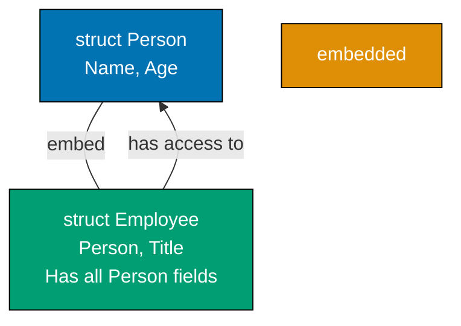

**Code**:

```go
package main

import "fmt"

func main() {
    // Create Employee with embedded Person
    emp := Employee{
        Person: Person{Name: "Alice", Age: 30}, // => Person is embedded type, must be named in initialization
        // => Creates Person struct with Name="Alice", Age=30
        Title:  "Engineer",                      // => Employee's own field
    }                                            // => emp is Employee{Person: Person{Name: "Alice", Age: 30}, Title: "Engineer"}
    // => emp has 3 accessible fields: Name, Age (promoted), Title (own)

    // Access embedded fields directly (field promotion)
    fmt.Println(emp.Name)    // => Output: Alice (emp.Name promoted from emp.Person.Name)
    // => Can access embedded Person.Name directly through emp.Name
    // => No need to write emp.Person.Name (though that also works)
    fmt.Println(emp.Title)   // => Output: Engineer (emp's own field)
    // => Title belongs to Employee, not promoted
    fmt.Println(emp.Age)     // => Output: 30 (emp.Age promoted from emp.Person.Age)
    // => Age promoted from embedded Person

    // Call embedded methods (method promotion)
    emp.Describe()           // => Calls Person.Describe() on embedded Person
    // => Person.Describe() promoted to Employee
    // => Equivalent to emp.Person.Describe()
    // => Method receiver sees emp.Person (the embedded Person value)
    // => Output: Alice is 30 years old

    // Explicit access to embedded type
    fmt.Println(emp.Person.Name) // => Output: Alice (explicit access, same as emp.Name)
    // => Can explicitly access through emp.Person if needed
    // => Both emp.Name and emp.Person.Name refer to same field
    fmt.Println(emp.Person.Age)  // => Output: 30 (explicit access, same as emp.Age)

    // Modify embedded field
    emp.Name = "Bob"         // => Sets emp.Person.Name = "Bob" (promoted access)
    // => Changes the Name field of embedded Person
    emp.Age = 35             // => Sets emp.Person.Age = 35 (promoted access)
    // => Changes the Age field of embedded Person
    emp.Describe()           // => Calls promoted Describe method
    // => Output: Bob is 35 years old (reflects updated values)

    // Embedded type is a value, not a pointer - changes don't affect original
    p := Person{Name: "Charlie", Age: 40} // => Create separate Person instance
    // => p is independent Person struct
    emp2 := Employee{Person: p, Title: "Manager"}
    // => emp2.Person is COPY of p (value embedding, not pointer)
    // => Changes to emp2.Person won't affect p
    emp2.Name = "David"      // => Changes emp2.Person.Name, NOT p.Name
    // => emp2.Person.Name is now "David"
    // => p.Name remains "Charlie" (independent copy)
    fmt.Println(p.Name)      // => Output: Charlie (p unchanged, still original value)
    // => Proves emp2.Person is copy, not reference to p
    fmt.Println(emp2.Name)   // => Output: David (emp2.Person.Name changed)
    // => emp2 has its own copy with modified name
}

// Person type definition
type Person struct {
    Name string              // => Person's name field (exported, capital N)
    Age  int                 // => Person's age field (exported, capital A)
}                            // => Person is simple struct with two fields

// Person method - available on Person and promoted to Employee
func (p Person) Describe() { // => Method receiver is Person (value receiver)
    // => Value receiver receives copy of Person (not pointer)
    fmt.Printf("%s is %d years old\n", p.Name, p.Age)
    // => Formats and prints description using Name and Age fields
    // => Example output: Alice is 30 years old
}

// Employee embeds Person - gets all Person fields and methods
type Employee struct {
    Person // => Embedded field (anonymous field) - all Person fields/methods promoted to Employee
           // => Employee now has Name, Age (from Person) and Title (own field)
           // => Embedding is composition, not inheritance
           // => No explicit field name (anonymous embedding)
    Title  string // => Employee's own field (not from Person)
}
```

**Key Takeaway**: Embedding promotes fields and methods of embedded types to the outer type. This composition pattern is more flexible than inheritance - a type can embed multiple types, and you can override methods by defining them on the outer type.

**Why It Matters**: Embedding enables composing complex types from small focused types without inheritance hierarchies, keeping type definitions readable and maintainable. In production code, embedding `sync.Mutex` directly into structs that need thread safety, or embedding `http.Client` into service clients, promotes composition over wrapping boilerplate. Unlike inheritance, embedding does not create is-a relationships — it promotes reuse while keeping types independent, enabling refactoring without breaking external APIs that depend on the parent type.

## Example 32: Custom Error Types

While `error` interface only needs an `Error()` method, custom error types let you attach extra information. Implementing the `error` interface and using error wrapping enables sophisticated error handling patterns.

**Code**:

```go
package main

import (
    "errors"
    "fmt"
)

func main() {
    // Custom error with additional context
    err := performOperation()              // => err is *OperationError (implements error interface)
    // => performOperation returns error type (actually *OperationError underneath)
    if err != nil {                        // => err is not nil, error occurred
        // Type assertion to extract custom error type
        var opErr *OperationError          // => Declare variable of custom error type
        // => opErr is nil initially (will be set by errors.As)
        if errors.As(err, &opErr) {        // => errors.As extracts underlying type into opErr
            // => Checks if err wraps *OperationError anywhere in chain
            // => Sets opErr to point to the actual *OperationError
            // => Returns true because err IS *OperationError
            fmt.Printf("Operation failed: %s (Code: %d)\n", opErr.Message, opErr.Code)
            // => Output: Operation failed: invalid input (Code: 400)
            // => Can now access custom Message and Code fields

            // Access custom fields
            if opErr.Code >= 400 && opErr.Code < 500 {
                // => Code 400-499 indicates client error (user's fault)
                // => Code 500-599 would indicate server error
                fmt.Println("  Category: Client error")
                // => Output:   Category: Client error
            }
        }
    }

    // Error wrapping preserves error chain
    err = divideWithWrapping(10, 0)        // => err wraps ErrDivisionByZero
    // => divideWithWrapping returns wrapped error (two-layer error)
    // => Outer: "division failed: ...", Inner: ErrDivisionByZero
    if err != nil {                        // => err is not nil (division by zero occurred)
        fmt.Println("Wrapped error:", err)
        // => Prints outer error message (includes wrapped error)
        // => Output: Wrapped error: division failed: cannot divide by zero

        // errors.Unwrap extracts wrapped error
        original := errors.Unwrap(err)     // => original is ErrDivisionByZero
        // => Unwrap removes outer layer, returns inner error
        // => original is the sentinel error (cannot divide by zero)
        fmt.Println("Original:", original)
        // => Output: Original: cannot divide by zero

        // Check if error chain contains specific error
        if errors.Is(err, ErrDivisionByZero) {
            // => errors.Is walks error chain to find ErrDivisionByZero
            // => Works with wrapped errors (checks outer, then inner, recursively)
            // => Returns true because inner error IS ErrDivisionByZero
            fmt.Println("Detected division by zero error")
            // => Output: Detected division by zero error
        }
    }

    // Multiple error wrapping layers
    err = topLevelOperation()              // => err wraps multiple layers
    // => Layer 3: "top operation failed: ..."
    // => Layer 2: "division failed: ..."
    // => Layer 1: ErrDivisionByZero sentinel
    if err != nil {                        // => err is not nil
        fmt.Println("\nMulti-layer error:", err)
        // => Prints outermost error message (includes all wrapped messages)
        // => Output: Multi-layer error: top operation failed: division failed: cannot divide by zero

        // errors.Is still finds ErrDivisionByZero through all layers
        if errors.Is(err, ErrDivisionByZero) {
            // => errors.Is recursively unwraps: Layer 3 → Layer 2 → Layer 1
            // => Finds ErrDivisionByZero at Layer 1 (innermost)
            // => Returns true (sentinel error found in chain)
            fmt.Println("Root cause: division by zero")
            // => Output: Root cause: division by zero
        }
    }
}

// Custom error type implementing error interface
type OperationError struct {
    Message string               // => Human-readable error message field
    Code    int                  // => HTTP-style error code (400, 500, etc.)
    // => Additional fields provide context beyond simple error string
}

// Error() method satisfies error interface (must return string)
func (e *OperationError) Error() string {
    // => Pointer receiver (*OperationError) allows errors.As to match both value and pointer
    // => This method is REQUIRED to implement error interface
    return fmt.Sprintf("operation error: %s", e.Message)
    // => Returns formatted string "operation error: invalid input"
    // => This string is used when error is printed or converted to string
}

// performOperation returns custom error type
func performOperation() error {
    // => Returns *OperationError as error interface
    // => Return type is error (interface), actual value is *OperationError
    return &OperationError{
        Message: "invalid input",    // => Custom error with context
        Code:    400,                // => Client error code (HTTP 400 Bad Request)
    }                                // => Returns pointer to OperationError (satisfies error interface)
}

// Sentinel error - predefined error value for comparison
var ErrDivisionByZero = errors.New("cannot divide by zero")
// => Global error variable, use errors.Is() to check for this specific error
// => Sentinel errors are package-level constants for well-known error conditions
// => Created once, reused everywhere (compare by identity, not message)
// => errors.New creates error with constant message

func divideWithWrapping(a, b int) error {
    if b == 0 {                      // => Check denominator (b must be non-zero)
        // => Division by zero is invalid operation
        // => %w verb wraps error, preserving it in error chain
        return fmt.Errorf("division failed: %w", ErrDivisionByZero)
        // => Returns error that wraps ErrDivisionByZero
        // => Outer message: "division failed: cannot divide by zero"
        // => Inner error: ErrDivisionByZero (accessible via Unwrap)
    }
    return nil                       // => No error (b is non-zero, division valid)
}

func topLevelOperation() error {
    err := divideWithWrapping(10, 0) // => err wraps ErrDivisionByZero
    // => err is "division failed: cannot divide by zero" (wrapped error)
    if err != nil {                  // => Check if division failed
        // => Wrap again, creating multi-layer error chain
        return fmt.Errorf("top operation failed: %w", err)
        // => Creates 3-layer error chain:
        // => Layer 3 (outermost): "top operation failed: ..."
        // => Layer 2: "division failed: ..."
        // => Layer 1 (innermost): ErrDivisionByZero
    }
    return nil                       // => No error (division succeeded)
}
```

**Key Takeaway**: Implement `Error()` method to create custom error types. Use `errors.As()` to check error type and extract additional context. `fmt.Errorf` with `%w` wraps errors, preserving the chain for `errors.Unwrap()`.

**Why It Matters**: Custom error types enable structured error handling in production services, where different error conditions require different responses. A `NotFoundError` triggers a 404 HTTP response while a `ValidationError` triggers a 400 with field-level detail. `errors.As` unwraps error chains to extract typed context without string parsing, making error handling robust to message wording changes. Well-designed error types form the error contract of your API, enabling callers to handle failure modes systematically rather than parsing error strings.

## Example 33: JSON Handling

JSON is ubiquitous in Go APIs. The `encoding/json` package marshals (structs to JSON) and unmarshals (JSON to structs). Struct tags control JSON field mapping - critical for API compatibility when Go field names don't match JSON field names.

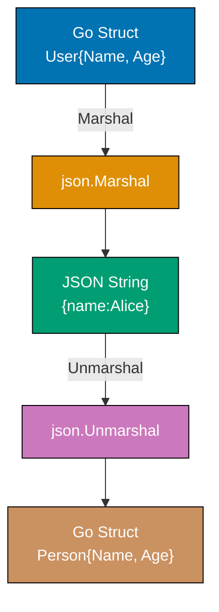

**Code**:

```go
package main

import (
    "encoding/json"
    "fmt"
)

func main() {
    // Marshal - Go struct to JSON string
    user := User{
        Name: "Alice",                 // => User.Name is exported (capital N)
        Age:  30,                      // => User.Age is exported (capital A)
        Email: "alice@example.com",    // => User.Email is exported (capital E)
    }                                  // => user is User{Name: "Alice", Age: 30, Email: "alice@example.com"}

    jsonBytes, err := json.Marshal(user) // => json.Marshal serializes struct to JSON bytes
    // => Marshal only serializes exported (capitalized) fields
    // => Returns []byte (JSON as bytes) and error
    if err != nil {                      // => Check for marshal errors (rare, usually type issues)
        fmt.Println("Marshal error:", err)
        // => Output: Marshal error: [error details]
        return
    }
    fmt.Println(string(jsonBytes))   // => Convert []byte to string for printing
    // => Output: {"Name":"Alice","Age":30,"Email":"alice@example.com"}
    // => JSON field names match Go field names (capitalized, not ideal for APIs)

    // Unmarshal - JSON string to Go struct
    jsonStr := `{"name":"Bob","age":25,"email":"bob@example.com"}` // => JSON with lowercase field names
    // => Raw string literal (backticks allow unescaped quotes)
    var person Person                    // => person is zero value Person{Name: "", Age: 0, Email: ""}
    // => Declare variable to receive unmarshaled data
    err = json.Unmarshal([]byte(jsonStr), &person) // => Unmarshal requires pointer to modify person
    // => json.Unmarshal uses struct tags to map JSON fields to Go fields
    // => &person allows json.Unmarshal to modify person in-place
    // => []byte(jsonStr) converts string to byte slice (required by Unmarshal)
    if err != nil {                      // => Check for unmarshal errors (invalid JSON, type mismatches)
        fmt.Println("Unmarshal error:", err)
        // => Output: Unmarshal error: invalid character... (example)
        return
    }
    fmt.Println(person)                  // => Print person struct
    // => Output: {Bob 25 bob@example.com}
    // => person is now Person{Name: "Bob", Age: 25, Email: "bob@example.com"}
    // => Struct tags mapped lowercase JSON fields to capitalized Go fields

    // Custom type with different JSON representation
    apiResponse := APIResponse{
        Status: 200,                     // => APIResponse.Status = 200 (HTTP OK)
        Data:   person,                  // => APIResponse.Data = person (Person struct)
    }                                    // => apiResponse is APIResponse{Status: 200, Data: Person{...}}
    // => Nested struct (Person inside APIResponse)

    responseJSON, _ := json.MarshalIndent(apiResponse, "", "  ")
    // => json.MarshalIndent pretty-prints JSON with indentation
    // => First param: value to marshal (apiResponse)
    // => Second param: "" (prefix for each line, typically empty)
    // => Third param: "  " (indentation string, 2 spaces per level)
    fmt.Println(string(responseJSON)) // => Convert []byte to string and print
    // => Output (formatted with indentation):
    // => {
    // =>   "status": 200,
    // =>   "data": {
    // =>     "name": "Bob",
    // =>     "age": 25,
    // =>     "email": "bob@example.com"
    // =>   }
    // => }
    // => Nested Person struct marshaled recursively

    // Handling unknown fields
    unknownJSON := `{"name":"Charlie","age":28,"unknown":"ignored"}` // => JSON with extra field
    // => "unknown" field not in Person struct
    var person2 Person               // => person2 is zero value Person
    err = json.Unmarshal([]byte(unknownJSON), &person2)
    // => Unknown fields ("unknown") are silently ignored during unmarshal
    // => Only known fields (name, age, email) are extracted
    if err != nil {                  // => Check for unmarshal errors
        fmt.Println("Unmarshal error:", err)
    }
    fmt.Println(person2)             // => Print person2 struct
    // => Output: {Charlie 28 }
    // => person2 is Person{Name: "Charlie", Age: 28, Email: ""}
    // => Email is empty string (not in JSON, default value used)
}

// User - field names must be capitalized for json.Marshal to see them
type User struct {
    Name  string                       // => Exported field, marshals to JSON as "Name"
    Age   int                          // => Exported field, marshals to JSON as "Age"
    Email string                       // => Exported field, marshals to JSON as "Email"
}

// Person - struct tags control JSON mapping
type Person struct {
    Name  string `json:"name"`          // => Maps Go field "Name" to JSON field "name"
    Age   int    `json:"age"`           // => Maps Go field "Age" to JSON field "age"
    Email string `json:"email"`         // => Maps Go field "Email" to JSON field "email"
}

type APIResponse struct {
    Status int         `json:"status"`            // => Maps "Status" to "status" in JSON
    Data   Person      `json:"data"`              // => Maps "Data" to "data" in JSON
    // => Nested Person struct will be marshaled with its own tags
}
```

**Key Takeaway**: Struct tags control JSON field mapping - essential when Go names differ from JSON names. Struct field names must be capitalized for JSON encoding. Use `json.Marshal()` for compact JSON and `json.MarshalIndent()` for pretty-printed JSON.

**Why It Matters**: JSON serialization is the backbone of REST APIs and microservice communication. Understanding struct tags controls exactly what fields appear in API responses, enabling versioned APIs where internal field names differ from external contracts. `omitempty` prevents null fields from cluttering responses. Custom `MarshalJSON`/`UnmarshalJSON` methods handle non-standard formats (Unix timestamps, comma-separated strings) without changing struct types. Proper JSON handling is essential for stable API contracts across service version upgrades.

## Example 34: Goroutines

Goroutines are lightweight threads managed by the Go runtime. Unlike OS threads, thousands of goroutines can run concurrently without overwhelming system resources. The `go` keyword starts a goroutine that runs concurrently with code that follows.

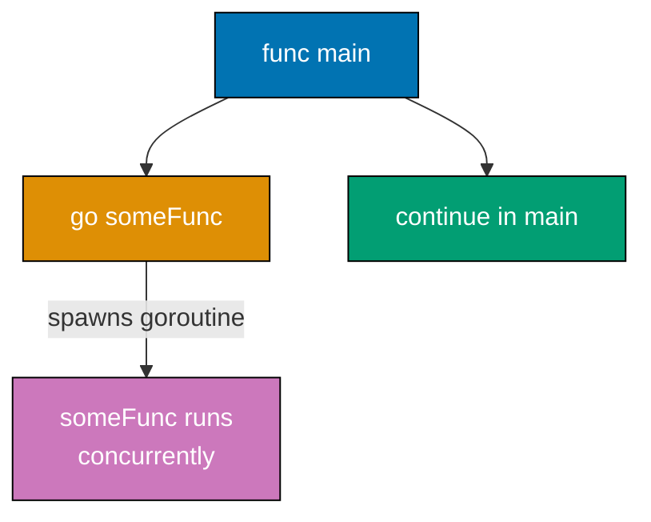

**Code**:

```go
package main

import (
    "fmt"
    "time"
)

func main() {
    // Start goroutine with go keyword
    go printNumbers()        // => Spawns new goroutine running printNumbers()
                              // => Main goroutine continues immediately WITHOUT waiting
                              // => printNumbers runs concurrently with main
                              // => Two goroutines now executing: main and printNumbers

    // Main continues while goroutine runs
    fmt.Println("Main continues immediately")
                              // => Output: Main continues immediately (printed before goroutine finishes)
                              // => Demonstrates non-blocking nature of go keyword

    // Wait for goroutine to finish (crude synchronization)
    time.Sleep(1 * time.Second) // => Sleeps main goroutine for 1 second
                              // => Gives printNumbers goroutine time to complete
                              // => In production, use WaitGroups or channels (see Example 37)
                              // => If main exits early, goroutines are terminated
    fmt.Println("Main done")  // => Output: Main done (after sleep completes)

    // => Typical output (order may vary due to concurrency):
    // => Main continues immediately
    // => Number: 0
    // => Number: 1
    // => Number: 2
    // => Main done

    // Multiple goroutines with closure pitfall
    fmt.Println("\nMultiple goroutines:")
                              // => Output: (newline) Multiple goroutines:
    for i := 0; i < 3; i++ {  // => Loop creates 3 goroutines
        go func(id int) {     // => Anonymous function takes id parameter
                              // => CORRECT: id is function parameter, each goroutine gets its own copy
                              // => Avoids closure variable capture bug
            fmt.Printf("Goroutine %d running\n", id)
        }(i)                  // => Pass i as argument to goroutine function
                              // => i is copied to id at goroutine creation time
                              // => Each goroutine receives different id (0, 1, 2)
    }
                              // => Output order is non-deterministic (goroutines execute concurrently)
                              // => Possible output: "Goroutine 2", "Goroutine 0", "Goroutine 1"

    time.Sleep(100 * time.Millisecond)
                              // => Wait for all goroutines to complete
                              // => 100ms should be enough for 3 simple goroutines

    // PITFALL: Closure without parameter (WRONG - don't do this)
    fmt.Println("\nClosure pitfall (incorrect):")
    for i := 0; i < 3; i++ {
        go func() {
            // => WRONG: Captures i by reference, NOT by value
            // => All goroutines share the same i variable
            fmt.Printf("Goroutine %d (wrong)\n", i)
            // => Usually prints "Goroutine 3" multiple times (i = 3 after loop ends)
        }()
    }
    time.Sleep(100 * time.Millisecond)

    // Goroutine with return value (requires channel - see Example 35)
    resultChan := make(chan int)       // => Channel to receive result
    go func() {
        sum := 0
        for i := 1; i <= 5; i++ {
            sum += i                   // => sum is 1+2+3+4+5 = 15
        }
        resultChan <- sum              // => Send result to channel
    }()                                // => Goroutine starts immediately

    result := <-resultChan             // => Receive result from channel (blocks until sent)
    fmt.Printf("\nSum from goroutine: %d\n", result)
    // => Output: Sum from goroutine: 15
}

func printNumbers() {
    for i := 0; i < 3; i++ {
        fmt.Printf("Number: %d\n", i)  // => Prints to stdout
        time.Sleep(100 * time.Millisecond) // => Simulate work
    }                                  // => After loop, goroutine exits
}
```

**Key Takeaway**: `go func()` spawns a goroutine that runs concurrently. The main function doesn't wait for goroutines - you must synchronize with `time.Sleep()`, channels, or `sync.WaitGroup`. When passing loop variables to goroutines, pass as arguments to avoid closure pitfalls.

**Why It Matters**: Goroutines enable lightweight concurrency, where launching 10,000 goroutines uses ~20MB memory (2KB stack each) vs 10GB for equivalent threads (1MB stack). The `go` keyword makes concurrent programming simple - no thread pools, no executor services, just spawn and go. This powers Go's killer feature: writing concurrent code that looks sequential, enabling high-throughput network services (HTTP servers, proxies, load balancers) without callback hell.

## Example 35: Channels

Channels enable safe communication between goroutines. Send data on one end, receive on the other. Unbuffered channels synchronize goroutines - a send blocks until a receive happens. Buffered channels decouple send and receive.

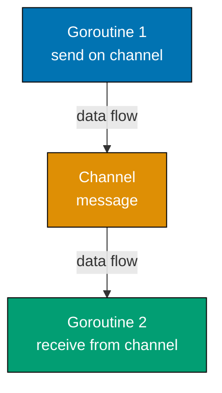

**Code**:

```go
package main

import (
    "fmt"
)

func main() {
    // Unbuffered channel - synchronizes sender and receiver
    messages := make(chan string) // => make(chan T) creates unbuffered channel
    // => Unbuffered means capacity is 0
    // => Send blocks until receiver ready, receive blocks until sender ready

    go func() {
        messages <- "Hello from goroutine" // => Send blocks until main goroutine receives
        // => After send completes, goroutine exits
    }()                           // => Goroutine starts executing immediately

    msg := <-messages             // => Receive blocks until goroutine sends
    // => msg is "Hello from goroutine" (type: string)
    fmt.Println(msg)
    // => Output: Hello from goroutine

    // Buffered channel - send doesn't block until buffer full
    buffered := make(chan int, 2) // => make(chan T, N) creates channel with buffer capacity N
    // => buffered has capacity 2, can hold 2 values before blocking
    // => len(buffered) is 0, cap(buffered) is 2

    buffered <- 1                 // => Send 1 (doesn't block, buffer has space)
    // => len(buffered) is now 1, cap(buffered) still 2
    buffered <- 2                 // => Send 2 (doesn't block, buffer now full)
    // => len(buffered) is now 2, cap(buffered) still 2
    // buffered <- 3              // => This would DEADLOCK (buffer full, no receiver)
    // => Sends to full buffered channel block until receiver consumes

    val1 := <-buffered            // => Receive 1 (buffer now has space)
    fmt.Println(val1)             // => Output: 1
    // => len(buffered) is now 1
    val2 := <-buffered            // => Receive 2 (buffer now empty)
    fmt.Println(val2)             // => Output: 2
    // => len(buffered) is now 0

    // Range over channel - iterate until close
    results := make(chan int)     // => Unbuffered channel
    go func() {
        results <- 10             // => Send 10 (blocks until received)
        results <- 20             // => Send 20 (blocks until received)
        results <- 30             // => Send 30 (blocks until received)
        close(results)            // => Close channel (signals no more values)
        // => After close, receives return zero value and closed status
        // => Cannot send on closed channel (panic)
    }()

    for value := range results {  // => range receives from channel until closed
        // => value is 10, then 20, then 30
        fmt.Println(value)
    }                             // => Loop exits when channel closed
    // => Output: 10 20 30

    // Checking if channel is closed
    data := make(chan int, 1)
    data <- 42                    // => Send 42
    close(data)                   // => Close channel

    val, ok := <-data             // => Receive with "comma ok" idiom
    // => val is 42, ok is true (value was sent before close)
    fmt.Printf("Value: %d, Open: %t\n", val, ok)
    // => Output: Value: 42, Open: true

    val, ok = <-data              // => Receive again after close
    // => val is 0 (zero value for int), ok is false (channel closed)
    fmt.Printf("Value: %d, Open: %t\n", val, ok)
    // => Output: Value: 0, Open: false

    // Nil channel - sends and receives block forever
    var nilChan chan int          // => nilChan is nil (uninitialized channel)
    // => Sending/receiving on nil channel blocks forever (useful in select)
    // nilChan <- 1                // => Would block forever (deadlock)
    // <-nilChan                   // => Would block forever (deadlock)
}
```

**Key Takeaway**: Unbuffered channels synchronize goroutines - sends block until receives. Buffered channels decouple send/receive by buffering values. Always `close()` channels when done to signal completion. Use `range` to iterate until channel closes.

**Why It Matters**: Channels provide type-safe communication between goroutines, eliminating the race conditions and deadlocks that plague shared-memory concurrency. Unbuffered channels synchronize goroutines (sender blocks until receiver ready), while buffered channels decouple producers/consumers. The `range` over channels and `close()` signal completion, enabling pipeline patterns that compose concurrent stages cleanly, the foundation of Go's concurrency model.

## Example 36: Channel Select

The `select` statement lets a goroutine wait on multiple channel operations. It's like a `switch` for channels - whichever channel is ready executes first. This pattern enables timeouts and handling multiple concurrent operations.

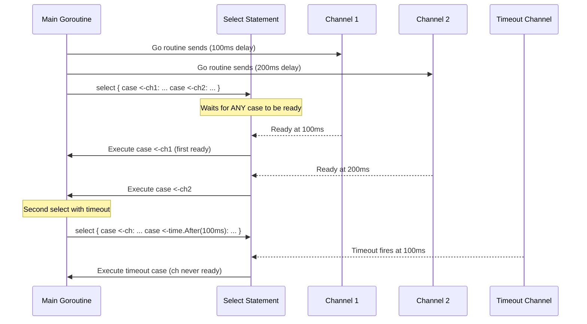

**Code**:

```go
package main

import (
    "fmt"
    "time"
)

func main() {
    // Select between two channels
    ch1 := make(chan string)           // => Unbuffered channel 1 (no buffer, sends block)
    ch2 := make(chan string)           // => Unbuffered channel 2
    // => Both channels start empty (no data available)

    go func() {                        // => Launch goroutine 1
        time.Sleep(100 * time.Millisecond) // => Simulate work (goroutine sleeps 100ms)
        // => Goroutine pauses for 100ms before sending
        ch1 <- "from channel 1"        // => Send after 100ms delay
        // => This send blocks until select receives
        // => At 100ms mark, ch1 becomes ready for select
    }()

    go func() {                        // => Launch goroutine 2
        time.Sleep(200 * time.Millisecond) // => Simulate longer work (200ms sleep)
        // => Goroutine pauses for 200ms before sending
        ch2 <- "from channel 2"        // => Send after 200ms delay
        // => At 200ms mark, ch2 becomes ready for select
    }()

    // Wait for either channel (select blocks until one is ready)
    for i := 0; i < 2; i++ {           // => Loop twice to receive from both channels
        // => First iteration at i=0, second at i=1
        select {                       // => select waits for ANY case to be ready
        // => Blocks until at least one channel has data
        case msg1 := <-ch1:            // => If ch1 has data, receive it
            // => Receives value from ch1, assigns to msg1
            fmt.Println("Received:", msg1)
            // => First iteration: msg1 is "from channel 1" (ch1 ready at 100ms)
            // => Output: Received: from channel 1
        case msg2 := <-ch2:            // => If ch2 has data, receive it
            // => Receives value from ch2, assigns to msg2
            fmt.Println("Received:", msg2)
            // => Second iteration: msg2 is "from channel 2" (ch2 ready at 200ms)
            // => Output: Received: from channel 2
        }
        // => select executes whichever case is ready first
        // => Only ONE case executes per select (not all ready cases)
    }
    // => Final output (in order):
    // => Received: from channel 1
    // => Received: from channel 2

    // Select with timeout pattern
    timeoutCh := make(chan string)     // => Channel that never receives data
    // => timeoutCh will never have data (no goroutine sends to it)
    select {                           // => Wait for message OR timeout
    case msg := <-timeoutCh:           // => Wait for message from timeoutCh
        // => This case will never execute (timeoutCh never sends)
        fmt.Println("Got message:", msg)
    case <-time.After(100 * time.Millisecond): // => time.After returns channel that sends after duration
        // => time.After(100ms) creates channel, sends value after 100ms
        // => We ignore the value (<-), only care that timeout fired
        fmt.Println("Timeout - no message received")
        // => This case executes at 100ms (timeout reached)
    }
    // => Output: Timeout - no message received (timeoutCh never sends)

    // Default case - non-blocking receive
    results := make(chan int)          // => Empty unbuffered channel
    // => No data available in results channel
    select {                           // => Try to receive, don't block
    case result := <-results:          // => Try to receive from results
        // => Would block normally, but default case prevents blocking
        fmt.Println("Got result:", result)
    default:                           // => Executes IMMEDIATELY if no other case ready
        // => default makes select non-blocking (no wait)
        // => If no case ready, default executes instantly
        fmt.Println("No result available")
        // => This executes because results is empty
    }
    // => Output: No result available (results is empty, default executes)

    // Select with send operations
    data := make(chan int, 1)          // => Buffered channel, capacity 1
    // => Buffer has space for 1 value before send blocks
    select {                           // => Try to send, don't block
    case data <- 42:                   // => Try to send 42 to data channel
        // => Succeeds because buffer has space (0/1 used)
        // => data channel now contains 42 (1/1 buffer full)
        fmt.Println("Sent 42")
        // => This executes because send succeeded
    default:                           // => Would execute if send would block
        fmt.Println("Channel full")
    }
    // => Output: Sent 42

    select {
    case data <- 99:                   // => Try to send (fails, buffer full)
        fmt.Println("Sent 99")
    default:                           // => Executes because send would block
        fmt.Println("Channel full")
    }
    // => Output: Channel full

    // Select blocks until ANY case is ready
    // If multiple cases ready simultaneously, select chooses randomly
    ready1 := make(chan int, 1)        // => Buffered channel, capacity 1
    ready2 := make(chan int, 1)        // => Buffered channel, capacity 1
    ready1 <- 1                        // => Send 1 to ready1 (buffer now full)
    ready2 <- 2                        // => Send 2 to ready2 (buffer now full)
    // => Both channels have data available

    select {
    case v := <-ready1:                // => Both cases ready
        // => v is 1 (type: int)
        fmt.Println("Got from ready1:", v)
        // => Output: Got from ready1: 1
    case v := <-ready2:                // => Both cases ready
        // => v is 2 (type: int)
        fmt.Println("Got from ready2:", v)
        // => Output: Got from ready2: 2
    }
    // => select chooses randomly when multiple cases ready
    // => Output: randomly "Got from ready1: 1" OR "Got from ready2: 2"
}
```

**Key Takeaway**: `select` waits for multiple channels. Use with `time.After()` for timeouts. The `default` case makes select non-blocking - useful for checking if work is available without blocking.

**Why It Matters**: The `select` statement is Go's core tool for non-blocking concurrent operations and timeout handling. Timeout patterns with `time.After` prevent goroutines from blocking forever on slow external services, critical for maintaining service responsiveness under downstream failures. The default case enables non-blocking channel checks in polling loops. Production Go services use select extensively for implementing fan-out patterns, circuit breakers, and backpressure mechanisms where multiple event sources must be multiplexed efficiently.

## Example 37: WaitGroups and Sync

Coordinating multiple goroutines requires synchronization. `sync.WaitGroup` is the standard pattern - increment a counter for each goroutine, decrement when done, and wait for all to finish. Mutexes protect shared data from race conditions.

**Critical WaitGroup pattern**: Call `Add()` BEFORE spawning goroutines (not inside them - race condition). Use `defer Done()` to ensure counter decrements even if goroutine panics. Call `Wait()` to block until counter reaches zero.

**WaitGroup coordinates multiple goroutines**:

```go
package main

import (
    "fmt"
    "sync"
    "time"
)

func main() {
    var wg sync.WaitGroup // => WaitGroup counter starts at 0
                          // => Zero value is ready to use (no initialization)

    for i := 0; i < 3; i++ {
        wg.Add(1)          // => Increment counter BEFORE spawning goroutine
                           // => Must be outside goroutine (calling Add inside creates race condition)
                           // => Counter is now 1, 2, 3 on each iteration
        go func(id int) {  // => Launch goroutine with id as parameter (avoids closure pitfall)
                           // => Without parameter, all goroutines would share same i after loop ends
            defer wg.Done() // => Decrement counter when goroutine returns
                            // => defer ensures Done() runs even if goroutine panics
                            // => Counter decrements 3→2→1→0 as goroutines finish
            fmt.Printf("Worker %d processing\n", id)
                            // => Output: "Worker N processing" (order non-deterministic)
            time.Sleep(100 * time.Millisecond)
                            // => Simulate work taking 100ms
        }(i)               // => Immediately invoke goroutine with current value of i
    }

    wg.Wait()              // => Block main goroutine until counter reaches 0
                           // => Unblocks when all 3 goroutines call Done()
    fmt.Println("All workers complete")
                           // => Output: All workers complete (printed after all goroutines finish)
```

**Mutex protects shared data**:

```go
    var mu sync.Mutex     // => Mutual exclusion lock (zero value is unlocked, ready to use)
    var counter int        // => Shared variable (unsafe to access without lock)
    var wg2 sync.WaitGroup // => Second WaitGroup for mutex example

    for i := 0; i < 5; i++ {
        wg2.Add(1)         // => Increment counter before each goroutine
        go func() {        // => Launch goroutine (5 goroutines total)
            defer wg2.Done() // => Decrement WaitGroup counter when goroutine exits
            mu.Lock()       // => Acquire exclusive lock (blocks if another goroutine holds it)
                            // => Only one goroutine can hold Lock at a time
            counter++       // => Safe: only one goroutine executes this at a time
                            // => Without Lock, counter++ is a race (read-modify-write)
            mu.Unlock()     // => Release lock, allow next goroutine to acquire
                            // => MUST unlock before returning (defer is safer pattern)
        }()
    }

    wg2.Wait()              // => Block until all 5 goroutines call Done()
    fmt.Println("Counter:", counter) // => Output: Counter: 5
                            // => Always 5 because mutex prevents races
```

Without mutex, `counter++` would be racy (read, increment, write are separate operations).

**RWMutex allows concurrent reads OR exclusive writes**:

```go
    var rwmu sync.RWMutex   // => Read-write mutex (allows multiple concurrent readers)
    var data = "initial"    // => Shared data protected by rwmu
    var wg3 sync.WaitGroup  // => WaitGroup for reader goroutines

    // Multiple readers run concurrently
    for i := 0; i < 3; i++ {
        wg3.Add(1)           // => Increment before spawning each reader
        go func(id int) {    // => Launch reader goroutine
            defer wg3.Done() // => Decrement when reader finishes
            rwmu.RLock()     // => Acquire read lock (non-exclusive)
                             // => Multiple goroutines can hold RLock simultaneously
                             // => Blocks only if a write Lock is held
            fmt.Printf("Reader %d: %s\n", id, data)
                             // => Output: Reader N: initial (3 readers run concurrently)
            time.Sleep(10 * time.Millisecond)
                             // => Readers overlap in time (concurrent execution)
            rwmu.RUnlock()   // => Release read lock (must match every RLock)
        }(i)
    }

    wg3.Wait()               // => Block until all 3 readers finish
```

Read locks allow concurrent access - all readers can hold RLock simultaneously.

**Writer gets exclusive access**:

```go
    var wg4 sync.WaitGroup  // => WaitGroup for writer goroutine
    wg4.Add(1)               // => Add writer goroutine to counter
    go func() {              // => Launch writer goroutine
        defer wg4.Done()     // => Decrement when writer finishes
        rwmu.Lock()          // => Acquire write lock (exclusive)
                             // => Blocks until ALL readers release RLock
                             // => Prevents any new RLock while write Lock is pending
        data = "updated"     // => Safe write: exclusive access guaranteed
                             // => No readers can access data during this write
        rwmu.Unlock()        // => Release write lock, allow readers/writers to proceed
    }()

    wg4.Wait()               // => Block until writer finishes
    fmt.Println("Data after write:", data) // => Output: Data after write: updated
                             // => Writer completed successfully (exclusive access)
}
```

**Key Takeaway**: Use `sync.WaitGroup` to wait for multiple goroutines. Call `Add(1)` before spawning, `Done()` when complete, and `Wait()` to block until all finish. Use `sync.Mutex` to protect shared data - `Lock()` before accessing, `Unlock()` after. Use `sync.RWMutex` when you have many readers and few writers.

**Why It Matters**: WaitGroups and mutexes are fundamental to safe concurrent programming in Go services. Without proper synchronization, concurrent map access causes non-deterministic data races that manifest as hard-to-reproduce production crashes. The `sync.RWMutex` pattern is especially important for read-heavy caches where write locks would create unnecessary contention. Go's race detector (`go test -race`) catches these issues during testing, but understanding synchronization primitives prevents introducing races in the first place.

## Example 38: File I/O

File operations are fundamental. Go provides multiple layers: low-level (`os` package), buffered (`bufio`), and convenience functions. The `defer file.Close()` pattern ensures files close even if errors occur.

**Code**:

```go
package main

import (
    "bufio"
    "fmt"
    "os"
)

func main() {
    // Write to file
    filename := "/tmp/test.txt"      // => File path (absolute path to temp directory)
    file, err := os.Create(filename) // => Create file (truncates if exists)
    // => Returns *os.File (file handle) and error
    // => If file exists, content is deleted (truncated to 0 bytes)
    if err != nil {                  // => Check if creation failed (permissions, path issues)
        fmt.Println("Error creating file:", err)
        // => Output: Error creating file: permission denied (example)
        return
    }
    defer file.Close()               // => defer ensures file closed when function exits
    // => CRITICAL: Always defer file.Close() to prevent resource leaks
    // => File descriptors are limited (typically 1024 per process)

    // Write data to file
    n, err := file.WriteString("Line 1\n")    // => Write string, returns bytes written
    // => n is 7 (len("Line 1\n")), err is nil if success
    // => WriteString converts string to []byte internally
    if err != nil {                  // => Check write errors (disk full, I/O error)
        fmt.Println("Write error:", err)
        // => Output: Write error: no space left on device (example)
    }
    file.WriteString("Line 2\n")     // => Write another line
    // => Returns (7, nil) for successful write
    // => File now contains "Line 1\nLine 2\n" (14 bytes total)

    // Read entire file into memory
    data, err := os.ReadFile(filename) // => Read all bytes at once (convenience function)
    // => data is []byte containing entire file contents
    // => Opens file, reads all, closes automatically
    if err != nil {                  // => Check for read errors (file not found, permissions)
        fmt.Println("Error reading file:", err)
        return
    }
    fmt.Println("File contents:")    // => Output: File contents:
    fmt.Println(string(data))        // => Convert []byte to string
    // => Output:
    // => Line 1
    // => Line 2

    // Read line by line (buffered, memory efficient)
    file, err = os.Open(filename)    // => Open file for reading (read-only mode)
    // => Returns *os.File (file handle) and error
    // => Does NOT truncate file (unlike os.Create)
    if err != nil {                  // => Check open errors (file not found, permissions)
        fmt.Println("Error opening file:", err)
        return
    }
    defer file.Close()               // => Close when done (defer stacks, will execute in reverse)

    scanner := bufio.NewScanner(file) // => Create scanner (buffers reads for efficiency)
    // => scanner reads file in chunks (default 64KB buffer), not all at once
    // => Memory efficient for large files
    lineNum := 0                     // => Line counter
    for scanner.Scan() {              // => Read next line, returns false at EOF or error
        // => Scan advances to next line and returns true if successful
        line := scanner.Text()        // => Get current line (without \n newline)
        // => line is string containing line content
        lineNum++                    // => Increment line counter
        fmt.Printf("Read line %d: %s\n", lineNum, line)
        // => Output: Read line 1: Line 1
    }                                // => Loop exits when scanner.Scan() returns false (EOF)
    // => Final output:
    // => Read line 1: Line 1
    // => Read line 2: Line 2

    if err := scanner.Err(); err != nil { // => Check for scanner errors (I/O errors during scan)
        // => scanner.Err() returns nil if EOF reached normally
        // => Returns error if read failed due to I/O issue
        fmt.Println("Scanner error:", err)
    }

    // File info (metadata)
    info, err := os.Stat(filename)   // => Get file info without opening file
    // => Returns FileInfo interface (metadata only, no file handle)
    // => os.Stat follows symlinks (use os.Lstat for symlink info)
    if err != nil {                  // => Check stat errors (file not found, permissions)
        fmt.Println("Error getting info:", err)
        return
    }
    fmt.Printf("File name: %s\n", info.Name())     // => Base name (test.txt, not full path)
    // => Output: File name: test.txt
    fmt.Printf("File size: %d bytes\n", info.Size()) // => Size in bytes (14 for "Line 1\nLine 2\n")
    // => Output: File size: 14 bytes
    fmt.Printf("Modified: %v\n", info.ModTime())   // => Last modification time (time.Time)
    // => Output: Modified: 2025-12-25 10:30:45 +0700 WIB
    fmt.Printf("Is directory: %t\n", info.IsDir()) // => false (it's a file, not directory)
    // => Output: Is directory: false
    fmt.Printf("Permissions: %v\n", info.Mode())   // => File mode (permissions like -rw-r--r--)
    // => Output: Permissions: -rw-r--r--

    // Append to file
    appendFile, err := os.OpenFile(filename, os.O_APPEND|os.O_WRONLY, 0644)
    // => Open with append flag (writes go to end of file, not beginning)
    // => os.O_APPEND | os.O_WRONLY combines flags with bitwise OR
    // => 0644 is permissions (rw-r--r--, used only if file created)
    if err != nil {                  // => Check open errors
        fmt.Println("Error opening for append:", err)
        return
    }
    defer appendFile.Close()         // => Close append file handle

    appendFile.WriteString("Line 3\n") // => Appends to end of file (after "Line 2\n")
    // => Returns (7, nil) for successful write
    // => File now contains "Line 1\nLine 2\nLine 3\n" (21 bytes total)
    // => Next read will show all 3 lines
}
```

**Key Takeaway**: Use `os.Create()` to write, `os.ReadFile()` to read entire file, `os.Open()` with `bufio.Scanner` for line-by-line reading. Always `defer file.Close()` to ensure cleanup.

**Why It Matters**: File I/O patterns appear throughout Go services for configuration loading, log file processing, data import/export, and temporary file management. Buffered I/O with `bufio.Scanner` enables processing multi-gigabyte log files line by line without loading entire files into memory, critical for memory-constrained environments. The `defer file.Close()` pattern guarantees file descriptor cleanup even during panics, preventing file handle exhaustion in long-running services that process many files.

## Example 39: HTTP Client

Making HTTP requests is essential for API integration. The `net/http` package provides client functionality. Customize requests with headers, timeouts, and query parameters. Always check response status codes.

**Code**:

```go
package main

import (
    "fmt"                                // => Formatted I/O
    "io"                                 // => I/O utilities (ReadAll)
    "net/http"                           // => HTTP client and types
    "net/url"                            // => URL parsing and query parameters
    "time"                               // => Time and duration types
)

func main() {
    // Simple GET request with default client
    resp, err := http.Get("https://api.example.com/users") // => http.Get uses default client
    // => Makes GET request to URL, returns response and error
    // => Default client has no timeout (can hang forever)
    // => Convenience wrapper for http.DefaultClient.Get(url)
    if err != nil {                      // => Check for network/DNS errors
        // => Common errors: connection refused, DNS lookup failure, timeout
        fmt.Println("Error:", err)       // => Output: Error: [network error details]
        return
        // => Early return on error (skip rest of processing)
    }
    defer resp.Body.Close()              // => CRITICAL: Always close response body to prevent leaks
    // => Body is io.ReadCloser, must be closed manually
    // => Leaked bodies exhaust file descriptors and memory
    // => defer ensures close even if function panics

    // Read response body
    body, err := io.ReadAll(resp.Body)   // => Read all bytes from body into memory
    // => body is []byte containing response content
    // => io.ReadAll buffers entire response (risky for large responses)
    // => For streaming, use io.Copy or read in chunks
    if err != nil {                      // => Check for I/O errors during read
        // => Can fail if connection drops mid-read
        fmt.Println("Read error:", err)  // => Output: Read error: [read failure details]
        return
    }
    fmt.Println("Status:", resp.Status)  // => resp.Status is "200 OK" (string)
    // => Output: Status: 200 OK
    // => resp.Status includes both code and text
    fmt.Println("Status Code:", resp.StatusCode) // => resp.StatusCode is 200 (int)
    // => Output: Status Code: 200
    // => resp.StatusCode is just the numeric code
    fmt.Println("Body:", string(body))   // => Convert []byte to string
    // => Output: Body: [JSON or HTML response content]
    // => Prints entire response body to console

    // Custom client with timeout
    client := &http.Client{              // => Create custom HTTP client
        // => Pointer to http.Client struct
        Timeout: 5 * time.Second,        // => Overall request timeout (includes connection, read, etc.)
        // => If request takes > 5s, client.Do returns timeout error
        // => Prevents hanging on slow/unresponsive servers
        // => 5 * time.Second is 5000000000 nanoseconds (5s duration)
    }                                    // => client is *http.Client with 5s timeout

    // Create custom request with headers
    req, err := http.NewRequest("GET", "https://api.example.com/users", nil)
    // => Creates GET request, nil body (GET requests typically have no body)
    // => req is *http.Request with URL, method, and empty body
    // => http.NewRequest returns (req, err) - req is nil if err != nil
    if err != nil {                      // => Check for request creation errors (rare)
        // => Only fails if method or URL invalid
        fmt.Println("Request creation error:", err)
        return
    }

    req.Header.Add("Authorization", "Bearer token123") // => Add authorization header
    // => Sets Authorization: Bearer token123 in request
    // => req.Header is http.Header (map[string][]string)
    req.Header.Add("Content-Type", "application/json") // => Add content type
    // => Sets Content-Type: application/json
    // => Header.Add appends value (allows multiple values for same key)
    req.Header.Set("User-Agent", "MyApp/1.0")          // => Set user agent (replaces existing)
    // => Set replaces all existing values, Add appends
    // => Use Set for single-value headers, Add for multi-value
    // => User-Agent identifies client to server

    resp, err = client.Do(req)           // => Execute request with custom client
    // => Sends request with all custom headers and timeout
    // => resp overwrites first response (original resp already closed)
    if err != nil {                      // => Check for timeout or network errors
        // => Timeout error message: "context deadline exceeded"
        fmt.Println("Error:", err)       // => Output: Error: context deadline exceeded (timeout)
        return
    }
    defer resp.Body.Close()              // => Close response body to prevent leaks
    // => Second defer (closes second response)

    // Check status code
    if resp.StatusCode == http.StatusOK { // => http.StatusOK is constant 200
        // => Successful responses are 2xx (200-299)
        fmt.Println("Request successful") // => Output: Request successful
    } else if resp.StatusCode >= 400 {   // => 4xx or 5xx indicates error
        // => 4xx is client error (404 Not Found, 401 Unauthorized)
        // => 5xx is server error (500 Internal Server Error)
        fmt.Printf("Request failed with status: %d\n", resp.StatusCode)
        // => Output: Request failed with status: 404 (example)
    }

    // Query parameters
    baseURL := "https://api.example.com/search" // => Base URL without query string
    // => baseURL is string, will be concatenated with encoded params
    params := url.Values{}               // => url.Values is map[string][]string
    // => Constructs query parameters safely with proper escaping
    // => Values{} creates empty map (no params initially)
    params.Add("q", "golang")            // => Add query parameter q=golang
    // => params is map[string][]string{"q": ["golang"]}
    // => Add appends value to list (supports multiple values for same key)
    params.Add("limit", "10")            // => Add limit=10 parameter
    // => params is map[string][]string{"q": ["golang"], "limit": ["10"]}
    fullURL := baseURL + "?" + params.Encode()
    // => params.Encode() converts to URL-encoded query string
    // => fullURL is "https://api.example.com/search?q=golang&limit=10"
    // => Properly escapes special characters (spaces, &, =, etc.)
    // => Encode handles URL encoding (spaces become %20, etc.)

    req2, _ := http.NewRequest("GET", fullURL, nil) // => Create request with query params
    // => req2 URL includes ?q=golang&limit=10
    // => _ discards error (we know URL is valid)
    resp2, err := client.Do(req2)        // => Execute request with 5s timeout
    // => Sends GET https://api.example.com/search?q=golang&limit=10
    // => Uses same client (5s timeout applies)
    if err != nil {                      // => Check for errors (timeout, network, etc.)
        // => Same error handling as previous requests
        fmt.Println("Error:", err)
        return
    }
    defer resp2.Body.Close()             // => Close second response body
    // => Always close bodies to prevent resource leaks
    // => Third defer in this function (closes third response)
}
```

**Key Takeaway**: Use `http.Get()` for simple requests. Use `http.Client` with custom `Timeout` for control. Always `defer resp.Body.Close()` to avoid resource leaks. Check response status codes - successful responses are 200-299.

**Why It Matters**: HTTP clients with timeouts prevent requests from hanging indefinitely, where setting `Client.Timeout` or using `context.WithTimeout()` protects services from slow/unresponsive dependencies. Production Go services always configure timeouts (connection timeout, request timeout, idle connection timeout) to maintain responsiveness under failure. Understanding connection pooling (`http.Transport.MaxIdleConns`) optimizes throughput for high-volume HTTP clients calling external APIs.

## Example 40: HTTP Server

Go's standard library includes HTTP server capabilities. Handler functions or types can handle requests. Multiplexing routes maps URL paths to handlers. Understanding request/response flow is essential for building APIs.

**Code**:

```go
package main

import (
    "fmt"                                // => For formatted output
    "io"                                 // => For ReadAll (reading request body)
    "net/http"                           // => HTTP server and handler types
)

func main() {
    // Create router (multiplexer)
    mux := http.NewServeMux()            // => ServeMux routes requests to handlers
    // => mux matches request URL to registered patterns
    // => Type: *http.ServeMux (pointer to multiplexer)

    // Register handler function
    mux.HandleFunc("/", homeHandler)     // => HandleFunc wraps function as Handler
    // => "/" matches all paths (default/fallback)
    // => homeHandler is func(ResponseWriter, *Request)
    mux.HandleFunc("/users", usersHandler)
    // => "/users" matches exactly "/users"
    // => More specific patterns take precedence over "/"
    mux.Handle("/data", &DataHandler{})  // => Handle registers Handler interface implementor
    // => DataHandler must implement ServeHTTP method
    // => &DataHandler{} creates pointer to empty struct

    // Start HTTP server
    fmt.Println("Server listening on :8080")
    // => Output to console before blocking
    err := http.ListenAndServe(":8080", mux) // => Blocks listening on port 8080
    // => mux is the handler (routes to registered handlers)
    // => ":8080" binds to all network interfaces on port 8080
    if err != nil {                      // => Returns error if server fails to start
        // => Common errors: port in use, permission denied
        fmt.Println("Error:", err)
        // => Print error and exit
    }
}

// Handler function - receives ResponseWriter and Request
func homeHandler(w http.ResponseWriter, r *http.Request) {
    // => w is ResponseWriter interface (writes response)
    // => r is *Request (contains request data)
    // => Called when request matches "/" pattern

    // Read request body
    body, err := io.ReadAll(r.Body)      // => Read all bytes from request body
    // => r.Body is io.ReadCloser (must be closed)
    // => body is []byte, err is error
    if err != nil {
        // => Error reading body (e.g., connection closed)
        http.Error(w, "Bad Request", http.StatusBadRequest) // => Send error response
        // => Sets status 400, writes "Bad Request\n" to body
        return
        // => Don't proceed if body read failed
    }
    defer r.Body.Close()                 // => Close body when done
    // => Defer runs at function exit, releases resources

    // Access request information
    fmt.Printf("Method: %s\n", r.Method) // => r.Method is "GET", "POST", etc.
    // => r.Method is string constant from HTTP request
    fmt.Printf("URL: %s\n", r.URL.Path)  // => r.URL.Path is "/", r.URL.RawQuery has params
    // => r.URL is *url.URL, Path is path component
    fmt.Printf("Headers: %v\n", r.Header) // => r.Header is map[string][]string
    // => Headers can have multiple values (e.g., Set-Cookie)

    // Write response
    fmt.Fprintf(w, "Hello from home! Method: %s, Body: %s\n", r.Method, string(body))
    // => Writes to ResponseWriter, sent to client
    // => string(body) converts []byte to string
    // => Fprintf formats and writes to w
}

// Handler function with JSON response
func usersHandler(w http.ResponseWriter, r *http.Request) {
    // Set response headers BEFORE writing body
    w.Header().Set("Content-Type", "application/json") // => Set content type header
    // => w.Header() is http.Header (map[string][]string)
    // => Set replaces all values for key "Content-Type"
    w.WriteHeader(http.StatusOK)         // => Set status code (must be before Write)
    // => Default status is 200 if not set explicitly
    // => http.StatusOK is constant 200
    // => Once WriteHeader called, status cannot change

    // Check request method
    if r.Method == http.MethodPost {     // => http.MethodPost is constant "POST"
        // => Method is string, comparing with constant
        fmt.Fprint(w, `{"status": "user created"}`) // => Write JSON string
        // => Backticks are raw string literal (no escaping needed)
    } else if r.Method == http.MethodGet {
        // => Check if GET request
        fmt.Fprint(w, `{"users": [{"id": 1}, {"id": 2}]}`)
        // => Return JSON array of users
    } else {
        // Method not allowed
        w.WriteHeader(http.StatusMethodNotAllowed)
        // => http.StatusMethodNotAllowed is 405
        // => Indicates server doesn't support method for this path
        fmt.Fprint(w, `{"error": "method not allowed"}`)
        // => JSON error response
    }
}

// Handler type - implements Handler interface
type DataHandler struct{}
// => Empty struct, no fields
// => Used as method receiver for ServeHTTP

// ServeHTTP makes DataHandler satisfy http.Handler interface
func (h *DataHandler) ServeHTTP(w http.ResponseWriter, r *http.Request) {
    // => This method is called when request matches "/data"
    // => Any type with ServeHTTP(ResponseWriter, *Request) is a Handler
    // => h is pointer receiver (method on *DataHandler)

    // Access query parameters
    queryParams := r.URL.Query()         // => Returns url.Values (map[string][]string)
    // => Parses query string from URL (e.g., "?filter=active&sort=name")
    // => url.Values is alias for map[string][]string
    filter := queryParams.Get("filter")  // => Get first value of "filter" param
    // => Example: "/data?filter=active" sets filter to "active"
    // => Get returns "" if param not present

    response := fmt.Sprintf("Data response with filter: %s", filter)
    // => Formats string with filter value
    // => If filter="", output is "Data response with filter: "
    fmt.Fprint(w, response)              // => Write response
    // => Sends formatted response to client
}
```

**Key Takeaway**: Register handlers with `HandleFunc` (for functions) or `Handle` (for types). Handler functions receive `ResponseWriter` and `*Request`. Use `w.Write()` or `w.WriteString()` to send responses. Set headers and status codes before writing the body.

**Why It Matters**: Testing in Go is first-class and built into the toolchain. Understanding Go testing patterns enables confident refactoring and reliable deployments.

## Example 41: Time and Duration

Time handling is complex across programming languages. Go's `time` package makes it straightforward with `time.Time` values, `time.Duration` for intervals, and format strings for parsing/formatting.

**Code**:

```go
package main

import (
    "fmt"
    "time"
)

func main() {
    // Current time
    now := time.Now()               // => Get current time (local timezone)
    // => Returns time.Time struct with monotonic clock component
    fmt.Println("Now:", now)        // => Output: 2025-12-30 10:30:45.123456789 +0700 WIB
    // => now is time.Time value (not pointer)
    // => Includes nanosecond precision

    // Time arithmetic with Duration
    tomorrow := now.Add(24 * time.Hour) // => Add 24 hours (24 * time.Hour = 24h duration)
    // => time.Hour is constant (1 hour duration = 3600 seconds)
    // => Multiplication creates Duration (24 hours)
    fmt.Println("Tomorrow:", tomorrow)
    // => Output: 2025-12-31 10:30:45.123456789 +0700 WIB
    // => Same time next day (24 hours later)

    yesterday := now.Add(-24 * time.Hour) // => Subtract 24 hours (negative duration)
    // => Negative Duration goes backward in time
    fmt.Println("Yesterday:", yesterday)
    // => Output: 2025-12-29 10:30:45.123456789 +0700 WIB

    oneWeekLater := now.AddDate(0, 0, 7) // => Add years, months, days
    // => AddDate(years, months, days) - calendar arithmetic
    // => AddDate(0, 0, 7) adds 7 days (handles month boundaries correctly)
    // => Use AddDate for date arithmetic, Add for time.Duration
    fmt.Println("One week later:", oneWeekLater)
    // => Output: 2026-01-06 10:30:45.123456789 +0700 WIB

    // Parse time from string
    layout := "2006-01-02"          // => Go reference time: Mon Jan 2 15:04:05 MST 2006
    // => Use this exact date/time in layout (it's how Go knows format)
    // => 2006 = year, 01 = month, 02 = day (magic constant)
    parsed, err := time.Parse(layout, "2025-12-23") // => Parse string to time.Time
    // => Parses "2025-12-23" using layout "2006-01-02"
    // => Returns time.Time and error
    if err != nil {                 // => Check for parse errors (invalid format, bad date)
        fmt.Println("Parse error:", err)
    }
    fmt.Println("Parsed:", parsed)  // => Output: 2025-12-23 00:00:00 +0000 UTC
    // => Parsed time is midnight UTC (no timezone in input)

    // Format time to string
    formatted := now.Format("January 2, 2006") // => Format using layout
    // => Use reference time "2006-01-02 15:04:05" components in desired format
    // => "January 2, 2006" formats as "Month Day, Year"
    fmt.Println("Formatted:", formatted)        // => Output: December 30, 2025
    formatted2 := now.Format("2006-01-02 15:04:05") // => Custom format
    // => ISO 8601-like format: year-month-day hour:minute:second
    fmt.Println("Formatted2:", formatted2)          // => Output: 2025-12-30 10:30:45

    // Duration measurement
    start := time.Now()             // => Capture start time (for timing operations)
    // => start is time.Time snapshot
    time.Sleep(100 * time.Millisecond) // => Sleep for 100ms (blocks goroutine)
    // => time.Millisecond is Duration constant (1ms)
    // => 100 * time.Millisecond = 100ms Duration
    elapsed := time.Since(start)    // => Calculate time.Duration since start
    // => elapsed is ~100ms (slightly more due to overhead)
    // => time.Since(start) equivalent to time.Now().Sub(start)
    fmt.Printf("Elapsed: %v\n", elapsed)            // => Output: Elapsed: 100.234567ms
    // => %v formats Duration as human-readable string
    fmt.Printf("Elapsed (ms): %d\n", elapsed.Milliseconds()) // => Output: Elapsed (ms): 100
    // => Milliseconds() converts Duration to int64 milliseconds

    // Compare times
    future := now.Add(1 * time.Hour) // => future is 1 hour after now
    // => future is time.Time value (now + 1 hour)
    if future.After(now) {          // => Check if future is after now
        // => After returns true if future > now
        fmt.Println("Future is after now")
        // => Output: Future is after now
    }
    if now.Before(future) {         // => Check if now is before future
        // => Before returns true if now < future
        fmt.Println("Now is before future")
        // => Output: Now is before future
    }

    // Timer - one-shot notification
    timer := time.NewTimer(200 * time.Millisecond) // => Create timer (fires after 200ms)
    // => timer is *time.Timer with channel timer.C
    // => timer.C is channel that receives time when timer fires
    <-timer.C                       // => Block until timer fires (receive from timer.C)
    // => Receives time.Time value when 200ms elapsed
    fmt.Println("Timer fired")      // => Output: Timer fired (after ~200ms)
    // => Timer fires once then stops

    // Ticker - repeating notifications
    ticker := time.NewTicker(100 * time.Millisecond) // => Create ticker (fires every 100ms)
    // => ticker is *time.Ticker with channel ticker.C
    // => ticker.C is channel that receives time every 100ms
    // => Unlike Timer, Ticker fires repeatedly until Stop() called
    go func() {                     // => Launch goroutine to receive ticks
        for i := 0; i < 3; i++ {    // => Loop 3 times (receive 3 ticks)
            t := <-ticker.C         // => Receive from ticker.C (blocks until tick)
            // => t is time.Time when tick occurred
            // => Blocks ~100ms between each iteration
            fmt.Printf("Tick %d at %s\n", i, t.Format("15:04:05.000"))
            // => 15:04:05.000 formats as HH:MM:SS.mmm
        }
        ticker.Stop()               // => Stop ticker (prevents goroutine leak)
        // => After Stop(), no more sends on ticker.C
        // => CRITICAL: Always Stop() ticker to free resources
    }()

    time.Sleep(400 * time.Millisecond) // => Wait for goroutine to finish
    // => Sleep 400ms allows 3 ticks (at 100ms, 200ms, 300ms)
    // => Output:
    // => Tick 0 at 10:30:45.100
    // => Tick 1 at 10:30:45.200
    // => Tick 2 at 10:30:45.300
}
```

**Key Takeaway**: `time.Now()` gets current time. Use `time.Duration` for intervals. Format strings use the reference time "Mon Jan 2 15:04:05 MST 2006" (remember as "2006-01-02 15:04:05"). `time.Timer` fires once, `time.Ticker` fires repeatedly.

**Why It Matters**: Correct duration handling prevents subtle bugs in rate limiters, retry backoff logic, and scheduled tasks. `time.Duration` arithmetic is type-safe — adding nanoseconds to seconds requires explicit conversion, preventing the millisecond/second confusion that causes production incidents. Ticker-based polling uses fixed intervals regardless of processing time, while timer-based patterns enable one-shot delays. In distributed systems, consistent time handling prevents race conditions in leader election and distributed cache expiration.

## Example 42: Regular Expressions

Regular expressions enable pattern matching. Go's `regexp` package compiles patterns and provides matching/replacing functions. Precompile expensive patterns to avoid recompilation.

**Code**:

```go
package main

import (
    "fmt"
    "regexp"
)

func main() {
    // Compile pattern (returns error)
    pattern, err := regexp.Compile(`^[a-z]+@[a-z]+\.[a-z]+$`) // => Compile regex pattern
    // => pattern is *regexp.Regexp (compiled regex), err is error
    // => ^ anchors to start, $ anchors to end
    // => [a-z]+ matches one or more lowercase letters
    if err != nil {                 // => Check compilation errors (invalid regex syntax)
        fmt.Println("Compile error:", err)
        return
    }

    // Test if string matches pattern
    if pattern.MatchString("alice@example.com") { // => Returns bool (true if matches)
        // => "alice@example.com" matches ^[a-z]+@[a-z]+\.[a-z]+$
        // => All characters are lowercase, structure matches email pattern
        fmt.Println("Valid email")
        // => Output: Valid email
    }
    if !pattern.MatchString("Alice@example.com") {
        // => "Alice@example.com" does NOT match (capital A not in [a-z])
        // => Pattern requires lowercase only, fails on uppercase
        fmt.Println("Invalid email (uppercase)")
        // => Output: Invalid email (uppercase)
    }

    // MustCompile panics on error (use for known-good patterns)
    re := regexp.MustCompile(`\d+`)  // => Compile pattern, panic if invalid
    // => `\d+` matches one or more digits (0-9)
    // => MustCompile panics instead of returning error (safe for literals)
    matches := re.FindAllString("abc 123 def 456 xyz", -1)
    // => FindAllString returns []string (all matching substrings)
    // => -1 means find all matches (no limit)
    // => matches is ["123", "456"] (two digit sequences found)
    fmt.Println("Numbers:", matches) // => Output: Numbers: [123 456]

    // Replace matches
    text := "Hello World"            // => Text with two words
    replaced := regexp.MustCompile(`\w+`).ReplaceAllString(text, "[word]")
    // => `\w+` matches one or more word characters (letters, digits, underscore)
    // => ReplaceAllString replaces each match with "[word]"
    // => "Hello" → "[word]", "World" → "[word]"
    fmt.Println("Replaced:", replaced) // => Output: Replaced: [word] [word]

    // Replace with function
    replaced2 := regexp.MustCompile(`\d+`).ReplaceAllStringFunc("The answer is 42", func(s string) string {
        // => Called for each match (s is matched string "42")
        // => Function receives matched substring and returns replacement
        num, _ := strconv.Atoi(s)    // => Convert string "42" to int 42
        // => strconv.Atoi parses decimal integer from string
        return fmt.Sprintf("%d", num*2) // => Double the number: 42 * 2 = 84
        // => Returns "84" as replacement string
    })
    // => Final string: "The answer is 84"
    fmt.Println("Replaced2:", replaced2) // => Output: Replaced2: The answer is 84

    // Extract capture groups
    re = regexp.MustCompile(`(\w+)@(\w+)\.(\w+)`) // => Pattern with 3 capture groups ()
    // => () creates numbered capture groups
    // => (\w+) captures username, (\w+) captures domain, (\w+) captures TLD
    matches = re.FindStringSubmatch("alice@example.com")
    // => FindStringSubmatch returns []string with full match + capture groups
    // => matches is ["alice@example.com", "alice", "example", "com"]
    // => matches[0] is full match, matches[1-3] are capture groups
    if len(matches) > 0 {            // => Check if pattern matched (len > 0 means match found)
        fmt.Println("Full:", matches[0])   // => matches[0] is full match: alice@example.com
        // => Output: Full: alice@example.com
        fmt.Println("User:", matches[1])   // => matches[1] is first capture group: alice
        // => Output: User: alice
        fmt.Println("Domain:", matches[2]) // => matches[2] is second capture group: example
        // => Output: Domain: example
        fmt.Println("TLD:", matches[3])    // => matches[3] is third capture group: com
        // => Output: TLD: com
    }

    // Find all with capture groups
    re2 := regexp.MustCompile(`(\d+):(\d+)`) // => Pattern: number:number
    // => (\d+) captures first number (hour), (\d+) captures second number (minute)
    // => Pattern matches time format like "10:30"
    allMatches := re2.FindAllStringSubmatch("10:30 and 14:45", -1)
    // => Returns [][]string (slice of slice of strings)
    // => Each []string has full match + capture groups
    // => allMatches is [["10:30", "10", "30"], ["14:45", "14", "45"]]
    for i, match := range allMatches { // => Iterate over all matches
        // => First iteration: match is ["10:30", "10", "30"]
        // => Second iteration: match is ["14:45", "14", "45"]
        fmt.Printf("Match %d: %s (hour: %s, minute: %s)\n", i, match[0], match[1], match[2])
        // => match[0] is full match, match[1] is hour, match[2] is minute
        // => Output: Match 0: 10:30 (hour: 10, minute: 30)
        // => Output: Match 1: 14:45 (hour: 14, minute: 45)
    }
    // => Output:
    // => Match 0: 10:30 (hour: 10, minute: 30)
    // => Match 1: 14:45 (hour: 14, minute: 45)

    // Named capture groups
    re3 := regexp.MustCompile(`(?P<year>\d{4})-(?P<month>\d{2})-(?P<day>\d{2})`)
    // => (?P<name>pattern) creates named capture group
    match := re3.FindStringSubmatch("Date: 2025-12-30")
    if match != nil {
        // Extract by index
        fmt.Println("Year:", match[1], "Month:", match[2], "Day:", match[3])
        // => Output: Year: 2025 Month: 12 Day: 30

        // Extract by name
        names := re3.SubexpNames()   // => ["", "year", "month", "day"]
        result := make(map[string]string)
        for i, name := range names {
            if i > 0 && name != "" {
                result[name] = match[i]
            }
        }
        fmt.Println("Named groups:", result)
        // => Output: Named groups: map[day:30 month:12 year:2025]
    }
}
```

**Key Takeaway**: Use `regexp.MustCompile()` for patterns known at compile-time. Use `regexp.Compile()` for runtime patterns (returns error). Precompile patterns used repeatedly. Use capture groups `()` to extract parts of matches.

**Why It Matters**: Advanced regex patterns with named captures enable structured log parsing, URL routing, and input validation in production services. Named capture groups make extraction code self-documenting and robust to pattern changes. Pre-compiled patterns at package level avoid per-request compilation overhead in high-traffic services. Understanding regex performance characteristics — catastrophic backtracking, linear vs exponential complexity — prevents denial-of-service vulnerabilities from user-supplied pattern matching against untrusted input.

## Example 43: Context Package

The `context` package manages deadlines, cancellation, and request-scoped values. It's essential for building responsive systems that can be cancelled and respect timeouts. Context flows through function calls to coordinate cancellation.

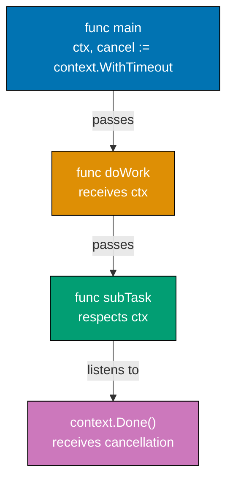

**Code**:

```go
package main

import (
    "context"
    "fmt"
    "time"
)

func main() {
    // Context with timeout - operation must complete within duration
    ctx, cancel := context.WithTimeout(context.Background(), 2*time.Second)
    // => context.Background() returns empty root context
    // => WithTimeout wraps it with 2-second timeout
    // => ctx is context.Context with 2-second deadline
    // => cancel is function to cancel context early (releases timer resources)
    defer cancel()                  // => CRITICAL: Always defer cancel() to release resources
    // => defer ensures cancel called even if function panics
    // => Prevents goroutine leaks from timeout timer

    result := doWork(ctx)           // => Pass context to doWork
    // => doWork receives ctx and respects cancellation/timeout
    fmt.Println("Result:", result)  // => Output: Result: cancelled (timeout after 2s)

    // Context with manual cancellation
    ctx2, cancel2 := context.WithCancel(context.Background())
    // => ctx2 has no deadline, only manual cancellation
    // => cancel2 is function to cancel ctx2 manually
    // => Use WithCancel when you control cancellation timing

    go func() {                     // => Launch goroutine to cancel after delay
        time.Sleep(500 * time.Millisecond) // => Wait 500ms before cancellation
        // => Goroutine sleeps, then cancels context
        cancel2()                   // => Cancel context manually
        // => Causes ctx2.Done() channel to close
        // => All goroutines listening on ctx2.Done() receive signal
    }()

    doWork(ctx2)                    // => doWork checks ctx2.Done()
    // => doWork will be cancelled after 500ms when cancel2() called
    fmt.Println("After cancellation") // => Output: After cancellation
    // => Prints after doWork returns due to cancellation

    // Context with deadline - cancel at specific time
    deadline := time.Now().Add(1 * time.Second) // => Deadline is 1 second from now
    // => time.Now().Add() creates absolute time point (not relative duration)
    ctx3, cancel3 := context.WithDeadline(context.Background(), deadline)
    // => ctx3 expires at specific time (not relative duration like WithTimeout)
    // => WithDeadline(t) vs WithTimeout(d): absolute time vs relative duration
    defer cancel3()                 // => Release resources when done

    <-ctx3.Done()                   // => Block until deadline reached or cancel called
    // => ctx3.Done() returns channel that closes at deadline
    // => Receive blocks until channel closed (at 1s deadline)
    fmt.Println("Deadline reached:", ctx3.Err())
    // => ctx3.Err() returns error explaining why context cancelled
    // => Output: Deadline reached: context deadline exceeded

    // Context values (use sparingly for request-scoped data)
    type contextKey string          // => Define typed key (avoids collisions with other packages)
    // => Custom type prevents accidental key conflicts (string vs contextKey)
    key := contextKey("user_id")    // => Create typed key "user_id"
    ctx4 := context.WithValue(context.Background(), key, 123)
    // => ctx4 carries value 123 associated with key "user_id"
    // => Context values are immutable, each WithValue creates new context
    // => Original context unchanged, ctx4 is new context with value

    userID := ctx4.Value(key)       // => Retrieve value by key
    // => Returns interface{} (must type assert to use)
    // => userID is interface{} containing 123
    // => userID is interface{}, type assert to get actual value
    if id, ok := userID.(int); ok { // => Type assertion
        // => id is int 123 if assertion succeeds, ok is true
        // => Safe type assertion checks ok before using id
        fmt.Println("User ID:", id) // => Output: User ID: 123
    }

    // Context chaining - child contexts inherit parent cancellation
    parentCtx, parentCancel := context.WithCancel(context.Background())
    // => parentCtx is cancellable context (no timeout)
    // => parentCancel is function to cancel parentCtx
    childCtx, childCancel := context.WithTimeout(parentCtx, 5*time.Second)
    // => childCtx is child of parentCtx with 5-second timeout
    // => childCtx cancelled when: (1) parentCtx cancelled, OR (2) 5s timeout
    // => Child contexts inherit parent cancellation (cascading cancellation)
    defer childCancel()             // => Release child resources

    parentCancel()                  // => Cancel parent immediately
    // => This also cancels childCtx (and any other children)
    // => Cancellation propagates down hierarchy
    <-childCtx.Done()               // => Wait for child cancellation
    // => Returns immediately (parent already cancelled)
    fmt.Println("Child cancelled:", childCtx.Err())
    // => ctx.Err() returns cancellation reason
    // => Output: Child cancelled: context canceled (parent cancellation)
}

func doWork(ctx context.Context) string {
    // => ctx is passed down call chain to enable cancellation
    // => Function signature accepts context as first parameter (Go convention)
    for {                           // => Infinite loop (runs until cancelled)
        select {                    // => Multiplex context cancellation and work
        case <-ctx.Done():          // => ctx.Done() is channel that closes when context cancelled
            // => Receiving from closed channel returns immediately
            err := ctx.Err()        // => ctx.Err() returns cancellation reason
            // => err is context.Canceled (manual cancel) or context.DeadlineExceeded (timeout)
            fmt.Println("Work cancelled:", err)
            // => Output: Work cancelled: context deadline exceeded
            return "cancelled"      // => Return early, cleanup work
        case <-time.After(500 * time.Millisecond):
            // => Simulate work every 500ms
            // => time.After sends on channel after 500ms
            fmt.Println("Working...") // => Output: Working... (every 500ms until cancelled)
            // => Continues looping if context not cancelled
        }
    }
    // => Loop continues until ctx.Done() fires
    // => Ensures work respects cancellation signals
}
```

**Key Takeaway**: `context.Background()` is the root context. `WithTimeout()` creates a context with deadline. `WithCancel()` creates a cancellable context. Always `defer cancel()` to avoid leaking goroutines. Listen to `ctx.Done()` to receive cancellation signals.

**Why It Matters**: Context is the backbone of Go's cancellation and deadline propagation model. Every HTTP handler receives a context that is cancelled when the client disconnects — without checking `ctx.Done()`, handlers waste CPU computing responses for clients that no longer care. In microservices, contexts propagate deadlines across service boundaries via gRPC/HTTP headers, ensuring a 500ms SLA automatically cancels all downstream calls rather than letting orphaned goroutines accumulate and exhaust resources.

## Example 44: Flag Parsing

Command-line flags enable configurable programs. Go's `flag` package parses flags automatically, extracting values into variables. Useful for scripts and tools that need configuration from command-line arguments.

**Code**:

```go
package main

import (
    "flag"
    "fmt"
)

func main() {
    // Define flags - returns pointers to values
    name := flag.String("name", "World", "Name to greet")
                                    // => flag.String creates string flag "-name", default "World", description "Name to greet"
                                    // => name is *string (pointer to string variable)
                                    // => Pattern: flag.Type(name, default, description)
    count := flag.Int("count", 1, "Number of greetings")
                                    // => count is *int (pointer to int variable)
                                    // => Default value is 1 if flag not provided
    verbose := flag.Bool("verbose", false, "Verbose mode")
                                    // => verbose is *bool (pointer to bool variable)
                                    // => Boolean flags don't require value: -verbose sets true

    // Alternative: bind flag to existing variable
    var port int                    // => Declare variable first
    flag.IntVar(&port, "port", 8080, "Port to listen on")
                                    // => Sets port variable directly (no pointer needed)
                                    // => IntVar pattern: (pointer, name, default, description)

    flag.Parse()                    // => Parse os.Args[1:] to populate flag values
                                    // => MUST call Parse() before accessing flag values
                                    // => After Parse(), flag variables contain parsed values
                                    // => Non-flag args remain in os.Args

    // Use parsed values (dereference pointers)
    for i := 0; i < *count; i++ {   // => *count dereferences pointer to get int value
                                    // => Loop runs count times (default 1)
        greeting := fmt.Sprintf("Hello, %s!", *name)
                                    // => *name dereferences to get string
                                    // => fmt.Sprintf formats string without printing
        fmt.Println(greeting)       // => Output: Hello, World! (default)
                                    // => If -name Alice: Hello, Alice!
    }

    if *verbose {                   // => *verbose dereferences to get bool value
                                    // => Only executes if -verbose flag provided
        fmt.Println("Verbose mode enabled")
                                    // => Output: Verbose mode enabled
        fmt.Printf("  Name: %s\n", *name)
                                    // => Prints dereferenced name value
        fmt.Printf("  Count: %d\n", *count)
                                    // => Prints dereferenced count value
        fmt.Printf("  Port: %d\n", port)
                                    // => port is not pointer (used IntVar)
                                    // => Direct variable access, no dereference
    }

    // Remaining positional arguments after flags
    args := flag.Args()             // => flag.Args() returns []string of non-flag args
                                    // => Example: cmd -name Alice file1.txt file2.txt => args is ["file1.txt", "file2.txt"]
                                    // => Flags must come before positional args
    if len(args) > 0 {              // => Check if any positional args exist
        fmt.Println("Extra arguments:", args)
                                    // => Prints slice of extra arguments
        fmt.Printf("  Number of args: %d\n", flag.NArg())
                                    // => flag.NArg() is len(args)
                                    // => Counts non-flag arguments
    }

    // Check if specific flag was set
    flag.Visit(func(f *flag.Flag) {
                                    // => flag.Visit calls function for each flag SET by user
                                    // => Only visits flags that were explicitly set
                                    // => f is *flag.Flag containing metadata
        fmt.Printf("Flag %s was set to %s\n", f.Name, f.Value)
                                    // => Prints flag name and current value
    })

    // Iterate all flags (including defaults)
    flag.VisitAll(func(f *flag.Flag) {
                                    // => flag.VisitAll calls function for ALL flags (including defaults)
                                    // => Visits every defined flag regardless of whether set
        fmt.Printf("All flag %s = %s (default: %s)\n", f.Name, f.Value, f.DefValue)
                                    // => Prints all flags with current and default values
    })
}

// Usage examples:
// go run main.go
//   => Uses defaults: name="World", count=1, verbose=false, port=8080
//
// go run main.go -name Alice -count 3 -verbose
//   => Output:
//   => Hello, Alice!
//   => Hello, Alice!
//   => Hello, Alice!
//   => Verbose mode enabled
//   =>   Name: Alice
//   =>   Count: 3
//   =>   Port: 8080
//
// go run main.go -name Bob file1.txt file2.txt
//   => name="Bob", args=["file1.txt", "file2.txt"]
//
// go run main.go -help
//   => Prints flag usage (auto-generated from flag definitions)
```

**Key Takeaway**: Define flags with `flag.String()`, `flag.Int()`, `flag.Bool()`. Call `flag.Parse()` to extract values. Flag values are pointers - dereference with `*`. Use `flag.Args()` to get remaining non-flag arguments.

**Why It Matters**: Pointers enable efficient data sharing and modification. Understanding pointer semantics is key to writing performant Go code.

## Example 45: HTTP Middleware Pattern

Middleware intercepts requests and responses, enabling cross-cutting concerns like logging, authentication, and error handling. Middleware wraps handlers with decorator pattern - each middleware can inspect requests and responses.

**Code**:

```go
package main

import (
    "fmt"                            // => For writing response
    "log"                            // => For logging middleware actions
    "net/http"                       // => HTTP server and handler types
    "time"                           // => For measuring request duration
)

func main() {
    mux := http.NewServeMux()        // => Create router (multiplexer)
    // => mux routes paths to handlers

    // Build middleware chain (order matters!)
    handler := http.HandlerFunc(homeHandler) // => Convert function to http.Handler
    // => homeHandler is the core business logic
    // => http.HandlerFunc adapter converts func signature to http.Handler interface
    handler = loggingMiddleware(handler)     // => Wrap with logging (outermost)
    // => loggingMiddleware wraps homeHandler, executes before/after
    // => handler is now: loggingMiddleware(homeHandler)
    handler = authMiddleware(handler)        // => Wrap with auth (middle)
    // => authMiddleware wraps logging, checks auth before proceeding
    // => handler is now: authMiddleware(loggingMiddleware(homeHandler))
    handler = recoveryMiddleware(handler)    // => Wrap with recovery (innermost)
    // => recoveryMiddleware wraps auth, catches panics from entire chain
    // => handler is now: recoveryMiddleware(authMiddleware(loggingMiddleware(homeHandler)))

    // Execution order: recovery → auth → logging → homeHandler → logging → auth → recovery
    // Request flows: recovery (defer) → auth (check) → logging (start) → homeHandler → logging (complete)
    // Each middleware calls next.ServeHTTP(), which calls the next layer

    mux.Handle("/", handler)         // => Register wrapped handler at root path
    // => All requests to / use the wrapped handler chain
    http.ListenAndServe(":8080", mux) // => Start server on port 8080
    // => Blocks forever, serving requests
}

// Middleware function type signature: func(http.Handler) http.Handler
func loggingMiddleware(next http.Handler) http.Handler {
    // => next is the handler to call after this middleware
    // => Function returns new handler that wraps next
    return http.HandlerFunc(func(w http.ResponseWriter, r *http.Request) {
        // => This function wraps the next handler
        // => w is response writer, r is request
        start := time.Now()          // => Capture start time (type: time.Time)
        // => Used to calculate request duration
        log.Printf("Started %s %s", r.Method, r.RequestURI)
        // => Log request start (r.Method is GET/POST, r.RequestURI is path)
        // => Output example: "Started GET /"

        next.ServeHTTP(w, r)         // => Call next handler in chain
        // => Execution blocks here until next handler completes
        // => Response already sent when this returns

        duration := time.Since(start) // => Calculate duration (type: time.Duration)
        // => time.Since returns elapsed time since start
        log.Printf("Completed in %v", duration)
        // => Log request completion (after response sent)
        // => Output example: "Completed in 5ms"
    })
    // => Returns handler that logs before and after calling next
}

// Authentication middleware - checks authorization
func authMiddleware(next http.Handler) http.Handler {
    // => next is the handler to proceed to if auth succeeds
    return http.HandlerFunc(func(w http.ResponseWriter, r *http.Request) {
        // => Anonymous function implements ServeHTTP
        token := r.Header.Get("Authorization") // => Get Authorization header
        // => token is "" if header not present
        // => r.Header is map[string][]string, Get returns first value

        if token == "" {             // => No authorization header
            // => Check if token is empty string
            http.Error(w, "Unauthorized", http.StatusUnauthorized)
            // => Send 401 Unauthorized response with body "Unauthorized"
            // => http.StatusUnauthorized is 401
            return                   // => Short-circuit: Don't call next handler
            // => Request processing stops here, response already sent
        }

        // Validate token (simplified - production checks JWT signature, expiry)
        if token != "Bearer valid-token" {
            // => Check if token matches expected value
            // => Production: parse JWT, verify signature, check expiry
            http.Error(w, "Invalid token", http.StatusUnauthorized)
            // => Send 401 with "Invalid token" body
            return                   // => Short-circuit on invalid token
            // => Don't proceed to next handler
        }

        next.ServeHTTP(w, r)         // => Token valid, proceed to next handler
        // => Only reached if token passes validation
        // => Calls next layer in middleware chain
    })
}

// Recovery middleware - catch panics
func recoveryMiddleware(next http.Handler) http.Handler {
    // => next is the handler that may panic
    return http.HandlerFunc(func(w http.ResponseWriter, r *http.Request) {
        // => Wraps next handler with panic recovery
        defer func() {
            // => defer runs when function exits (even if panic occurs)
            // => Deferred function runs AFTER next.ServeHTTP completes or panics
            if err := recover(); err != nil {
                // => recover() catches panic, returns panic value
                // => err is interface{} containing panic value
                // => If no panic, recover() returns nil
                log.Printf("Panic recovered: %v", err)
                // => Log panic for debugging (includes panic message)
                // => %v formats err as default representation
                http.Error(w, "Internal Server Error", http.StatusInternalServerError)
                // => Send 500 response to client (instead of crashing server)
                // => http.StatusInternalServerError is 500
                // => Server continues running after panic recovery
            }
        }()                          // => defer statement must be before next.ServeHTTP
        // => () immediately invokes the defer (schedules cleanup)

        next.ServeHTTP(w, r)         // => Call next handler (may panic)
        // => If next panics, defer func runs and recovers
        // => If no panic, defer func runs but recover() returns nil
    })
}

func homeHandler(w http.ResponseWriter, r *http.Request) {
    // => Final handler in chain (business logic)
    // => Only reached if recovery, auth, and logging all succeeded
    // => w is response writer, r is request
    fmt.Fprint(w, "Hello, Authenticated User!")
    // => Send response (writes to w)
    // => Fprint writes string to w (implements io.Writer)
}
```

**Key Takeaway**: Middleware wraps handlers, executing code before and after the handler. Create middleware by returning a handler that calls `next.ServeHTTP()`. Chain multiple middleware for cross-cutting concerns like logging, auth, and error handling.

**Why It Matters**: Middleware chains are the standard pattern for cross-cutting concerns in Go HTTP services: authentication, request logging, rate limiting, and panic recovery. Composable middleware keeps handlers focused on business logic while infrastructure concerns stack outside. The `http.Handler` interface enables middleware to wrap any handler transparently, making it easy to add request tracing or authentication to an entire route group without modifying individual handlers. This pattern scales from small services to enterprise platforms.

## Example 46: Graceful Shutdown

Production servers need graceful shutdown - stop accepting new requests, finish in-flight requests, clean up resources. Signal handling with `os/signal` enables responding to termination signals like SIGTERM.

**Code**:

```go
package main

import (
    "context"
    "fmt"
    "net/http"
    "os"
    "os/signal"
    "syscall"
    "time"
)

func main() {
    // Create HTTP server with configuration
    server := &http.Server{         // => Pointer to http.Server struct
                                    // => Allows shutdown control later
        Addr:           ":8080",     // => Port to listen on (all interfaces)
                                    // => Format: "host:port" or ":port"
        Handler:        http.HandlerFunc(func(w http.ResponseWriter, r *http.Request) {
                                    // => Handler processes ALL requests
                                    // => http.HandlerFunc wraps function as Handler interface
            time.Sleep(2 * time.Second)
                                    // => Simulate slow request (2s processing time)
                                    // => In-flight requests will complete during graceful shutdown
            fmt.Fprint(w, "Response")
                                    // => Write response to client
        }),
        ReadTimeout:    10 * time.Second,
                                    // => Timeout for reading request
                                    // => Prevents slow clients from holding connections
        WriteTimeout:   10 * time.Second,
                                    // => Timeout for writing response
                                    // => Prevents slow writes from blocking
        MaxHeaderBytes: 1 << 20,    // => Max header size (1MB = 1 << 20 bytes)
                                    // => Prevents memory exhaustion attacks
    }

    // Start server in goroutine (non-blocking)
    go func() {                     // => Server runs in background goroutine
                                    // => Main goroutine continues to signal handling
        fmt.Println("Starting server on :8080")
                                    // => Output: Starting server on :8080
        if err := server.ListenAndServe(); err != nil && err != http.ErrServerClosed {
                                    // => ListenAndServe blocks until server stopped
                                    // => http.ErrServerClosed is expected during graceful shutdown (not an error)
                                    // => Only log unexpected errors
            fmt.Printf("Server error: %v\n", err)
        }
    }()                             // => Server now running in background

    // Wait for interrupt signal (SIGTERM or SIGINT)
    sigChan := make(chan os.Signal, 1)
                                    // => Buffered channel (capacity 1)
                                    // => Buffer prevents signal loss if not immediately received
    signal.Notify(sigChan, syscall.SIGTERM, syscall.SIGINT)
                                    // => signal.Notify sends signals to sigChan
                                    // => SIGTERM is graceful shutdown signal (kill PID)
                                    // => SIGINT is interrupt signal (Ctrl+C)
                                    // => Channel will receive signal when OS sends it

    <-sigChan                       // => Block until signal received
                                    // => When signal arrives, channel receives value and unblocks
                                    // => Main goroutine waits here until shutdown signal
    fmt.Println("\nShutdown signal received, gracefully stopping...")
                                    // => Output: (newline) Shutdown signal received, gracefully stopping...

    // Graceful shutdown with timeout context
    ctx, cancel := context.WithTimeout(context.Background(), 5*time.Second)
                                    // => ctx expires after 5 seconds (maximum time to wait for in-flight requests)
                                    // => Prevents indefinite hanging if requests don't complete
    defer cancel()                  // => Clean up context resources
                                    // => Always defer cancel() for contexts with timeout

    if err := server.Shutdown(ctx); err != nil {
                                    // => Shutdown stops accepting new connections
                                    // => Waits for in-flight requests to complete (up to ctx timeout)
                                    // => Returns error if shutdown takes longer than timeout
        fmt.Printf("Shutdown error: %v\n", err)
                                    // => Prints error if shutdown failed or timed out
    }

    fmt.Println("Server stopped gracefully")
                                    // => All in-flight requests completed (or timeout reached)
                                    // => Output: Server stopped gracefully
}

// Production pattern: Graceful shutdown ensures:
// 1. Stop accepting new requests
// 2. Complete in-flight requests (up to timeout)
// 3. Close idle connections
// 4. Clean up resources
//
// Without graceful shutdown:
// - In-flight requests aborted mid-processing
// - Data corruption risk (partial writes)
// - Poor user experience (connection reset errors)
```

**Key Takeaway**: Use `signal.Notify()` to receive OS signals. Call `server.Shutdown(ctx)` with context timeout to gracefully stop. Graceful shutdown waits for in-flight requests to complete before stopping.

**Why It Matters**: Graceful shutdown prevents data loss and connection failures when deploying new service versions, where listening for OS signals (SIGTERM, SIGINT) triggers cleanup: stop accepting new requests, finish processing in-flight requests, close database connections, flush logs. Production Kubernetes sends SIGTERM before forcefully killing pods, giving services time to shut down cleanly. Proper shutdown prevents HTTP 502 errors, lost transactions, and corrupted state during rolling deployments.

## Example 47: Worker Pool Pattern

Worker pools limit concurrent work and improve resource efficiency. Fixed number of workers process jobs from a queue. Useful for API calls, database operations, or any bounded-resource work.

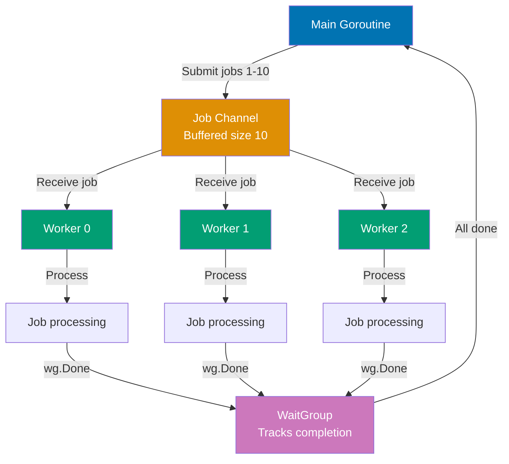

**Code**:

```go
package main

import (
    "fmt"
    "sync"
)

func main() {
    // Create worker pool with buffered job channel
    jobChan := make(chan int, 10)  // => Buffered channel holds up to 10 jobs
    // => Buffer decouples job submission from worker processing
    var wg sync.WaitGroup          // => Tracks job completion

    // Start fixed number of workers
    numWorkers := 3                // => Pool size: 3 concurrent workers
    for i := 0; i < numWorkers; i++ {
        go worker(i, jobChan, &wg) // => Spawn worker goroutine
        // => worker reads from jobChan until channel closed
    }                              // => 3 workers now running, waiting for jobs

    // Submit jobs to queue
    for j := 1; j <= 10; j++ {     // => 10 total jobs to process
        wg.Add(1)                  // => Increment counter before sending job
        // => CRITICAL: Add(1) before sending to avoid race
        jobChan <- j               // => Send job ID to channel
        // => Doesn't block (buffer has space for 10 jobs)
    }                              // => All 10 jobs queued

    wg.Wait()                      // => Block until all 10 jobs marked Done()
                                    // => After Wait() returns, all jobs completed
                                    // => WaitGroup counter must reach 0
    close(jobChan)                 // => Close channel to signal no more jobs
                                    // => Workers' range loops will exit when channel closed
                                    // => Safe to close after Wait() (all jobs consumed)
    fmt.Println("All jobs complete")
                                    // => Output: All jobs complete
}

func worker(id int, jobs <-chan int, wg *sync.WaitGroup) {
    // => id is worker ID (0, 1, 2)
    // => jobs is receive-only channel (<-chan prevents sending)
    // => wg is pointer to shared WaitGroup
    for job := range jobs {        // => range receives until channel closed
        // => Blocks if no jobs available
        // => Multiple workers compete for jobs (first to receive gets it)
        fmt.Printf("Worker %d processing job %d\n", id, job)
        time.Sleep(100 * time.Millisecond) // => Simulate work
        wg.Done()                  // => Decrement WaitGroup counter
    }                              // => Loop exits when jobChan closed
    fmt.Printf("Worker %d shutting down\n", id)
}

// Worker pool pattern benefits:
// - Limits concurrency (prevents spawning unbounded goroutines)
// - Reuses goroutines (no goroutine creation overhead per job)
// - Buffered channel smooths bursts (job submission faster than processing)
// - Graceful shutdown (close channel, workers drain and exit)
```

**Key Takeaway**: Create a channel for jobs. Start fixed number of workers that receive from the channel. Send jobs to the channel. Workers process jobs concurrently, bounded by number of workers.

**Why It Matters**: Channels provide safe communication between goroutines without shared memory. This pattern prevents race conditions and deadlocks that plague concurrent programs in other languages.

## Example 48: Benchmarking

Benchmarking measures performance. Go's `testing.B` type runs test functions multiple times to measure speed. Use benchmarks to catch performance regressions and optimize bottlenecks.

**Code**:

```go
package main

import "testing"

// Run benchmarks with: go test -bench=.
// => -bench=. runs all benchmarks (. is regex matching all)
// Memory allocation: go test -bench=. -benchmem
// => -benchmem includes memory allocation statistics

func BenchmarkSliceAppend(b *testing.B) {
    // => b is *testing.B (benchmark type)
    // => b.N is number of iterations (adjusted by framework for accurate timing)
    for i := 0; i < b.N; i++ { // => Loop b.N times (framework chooses N)
        // => Framework runs benchmark multiple times, adjusting b.N until stable timing
        s := make([]int, 0)    // => Create slice with length 0, capacity 0
        // => s is []int{} (empty slice)
        for j := 0; j < 100; j++ {
            s = append(s, j)    // => Append to slice (may reallocate)
            // => When len == cap, append allocates new array (capacity grows)
            // => Reallocation pattern: cap grows as 1, 2, 4, 8, 16, 32, 64, 128
        }                      // => After loop: s has 100 elements
        // => Total allocations: ~7-8 (each time capacity exceeded)
    }
    // => Output: BenchmarkSliceAppend-8   100000   1200 ns/op   1792 B/op   8 allocs/op
    // => 100000 iterations, 1200ns per operation, 1792 bytes allocated, 8 allocations
}

func BenchmarkSlicePrealloc(b *testing.B) {
    for i := 0; i < b.N; i++ { // => Loop b.N times
        s := make([]int, 0, 100) // => Create slice with length 0, capacity 100
        // => s is []int{} but has space for 100 elements (no reallocation needed)
        for j := 0; j < 100; j++ {
            s = append(s, j)    // => Append to slice (no reallocation, capacity sufficient)
            // => len grows from 0 to 100, cap stays 100
        }                      // => After loop: s has 100 elements
        // => Total allocations: 1 (only initial make)
    }
    // => Output: BenchmarkSlicePrealloc-8   500000   300 ns/op   896 B/op   1 allocs/op
    // => 4x faster than BenchmarkSliceAppend (fewer allocations)
}

func BenchmarkMapAccess(b *testing.B) {
    // Setup phase (not timed)
    m := make(map[string]int)  // => Create map
    for i := 0; i < 1000; i++ {
        m[fmt.Sprintf("key%d", i)] = i
        // => Populate map with 1000 entries (key0=0, key1=1, ..., key999=999)
    }                          // => m now has 1000 entries

    b.ResetTimer()             // => Reset timer (exclude setup time from benchmark)
    // => CRITICAL: ResetTimer() ensures setup cost not measured
    // => Timer starts fresh from this point

    for i := 0; i < b.N; i++ { // => Benchmark loop
        _ = m["key500"]        // => Map access (hash lookup + retrieval)
        // => Access middle key to avoid cache effects
        // => Result discarded with _ (prevents compiler optimization)
    }
    // => Output: BenchmarkMapAccess-8   50000000   25 ns/op   0 B/op   0 allocs/op
    // => 50 million iterations, 25ns per access, no allocations
}

// Memory allocation tracking
func BenchmarkAllocation(b *testing.B) {
    b.ReportAllocs()           // => Enable allocation reporting in output
    // => Without ReportAllocs(), allocation stats not shown

    for i := 0; i < b.N; i++ { // => Loop b.N times
        s := make([]int, 100)  // => Allocate slice with 100 elements
        // => Each iteration allocates 100 * 8 bytes = 800 bytes (int is 8 bytes on 64-bit)
        _ = s                  // => Use s to prevent compiler optimization
        // => Without this, compiler might eliminate allocation
    }
    // => Output: BenchmarkAllocation-8   5000000   280 ns/op   896 B/op   1 allocs/op
    // => 280ns per allocation, 896 bytes per op (includes overhead), 1 allocation
}

// Benchmark with subtests (different input sizes)
func BenchmarkStringConcat(b *testing.B) {
    sizes := []int{10, 100, 1000} // => Different input sizes to benchmark

    for _, size := range sizes {
        b.Run(fmt.Sprintf("size-%d", size), func(b *testing.B) {
            // => b.Run creates subtest (isolated timing)
            for i := 0; i < b.N; i++ {
                var result string
                for j := 0; j < size; j++ {
                    result += "x"  // => String concatenation (inefficient, creates new string each time)
                }
                _ = result
            }
        })
    }
    // => Output:
    // => BenchmarkStringConcat/size-10-8     1000000   1200 ns/op
    // => BenchmarkStringConcat/size-100-8    100000    12000 ns/op
    // => BenchmarkStringConcat/size-1000-8   10000     120000 ns/op
    // => O(n²) complexity visible in results
}
```

**Key Takeaway**: Benchmark functions named `BenchmarkXxx`. Loop from `0` to `b.N` - the testing framework adjusts N to get meaningful results. Use `b.ResetTimer()` to exclude setup time. Use `b.ReportAllocs()` to track allocations.

**Why It Matters**: Benchmarking with `go test -bench` provides objective performance data, where `b.N` runs the operation enough times to get stable measurements and `b.ReportAllocs()` tracks memory allocations. Production Go teams benchmark critical paths (JSON marshaling, database queries, cryptography) to detect performance regressions in CI. Understanding how to interpret ns/op (nanoseconds per operation) and allocs/op guides optimization decisions based on data, not guessing.

## Example 49: Examples as Tests

Example functions test code while also serving as documentation. When you run `go test`, examples execute. Output should match comments starting with `// Output:`. Go generates docs from examples.

**Code**:

```go
package main

import "fmt"

// Example functions must be in _test.go file
// => File must end with _test.go (e.g., math_test.go)
// => go test runs example functions and verifies output

func ExampleAdd() {
    // => Function name starts with "Example" (required)
    // => ExampleAdd documents the add() function
    result := add(2, 3)        // => Call function being documented
    // => result is 5 (2 + 3)
    fmt.Println(result)        // => Print result to stdout
    // Output: 5
    // => "// Output:" comment MUST match actual output exactly
    // => If output doesn't match, test fails
    // => This example appears in godoc for add() function
}

func ExampleGreet() {
    name := greet("Alice")     // => Call greet with "Alice"
    // => name is "Hello, Alice!"
    fmt.Println(name)          // => Print to stdout
    // Output: Hello, Alice!
    // => Expected output must match exactly (including punctuation, spacing)
}

// Example with multiple outputs
func ExampleMultiLine() {
    // => Example name doesn't match function (documents package generally)
    fmt.Println("Line 1")      // => First line of output
    fmt.Println("Line 2")      // => Second line of output
    fmt.Println("Line 3")      // => Third line of output
    // Output:
    // Line 1
    // Line 2
    // Line 3
    // => Multiline output: each line must match exactly
}

// Unordered output when order varies
func ExampleMapIteration() {
    // => Map iteration order is non-deterministic
    m := make(map[string]int)  // => Create map
    m["x"] = 1                 // => m["x"] = 1
    m["y"] = 2                 // => m["y"] = 2
    for k, v := range m {      // => Iterate map (order undefined)
        fmt.Printf("%s:%d ", k, v)
    }                          // => Output could be "x:1 y:2 " OR "y:2 x:1 "
    // Unordered output: x:1 y:2
    // => "Unordered output:" tells test framework to ignore order
    // => Test passes if output contains all expected elements (any order)
}

// Example with suffix (multiple examples for same function)
func ExampleAdd_negative() {
    // => ExampleAdd_negative documents add() with negative numbers
    // => Suffix after underscore distinguishes multiple examples
    result := add(-5, 3)       // => add(-5, 3) is -2
    fmt.Println(result)
    // Output: -2
}

func ExampleAdd_zero() {
    // => ExampleAdd_zero documents add() with zero
    result := add(0, 0)        // => add(0, 0) is 0
    fmt.Println(result)
    // Output: 0
}

// Example without output comment (still runs, but no verification)
func ExampleNoOutput() {
    // => Example without "// Output:" still executes (ensures it compiles and runs)
    // => Useful for demonstrating code that doesn't print
    _ = add(10, 20)            // => Runs but output not verified
    // => No output comment = test always passes (no assertion)
}

func add(a, b int) int {
    // => add returns sum of a and b
    return a + b               // => Returns a + b
}

func greet(name string) string {
    // => greet returns greeting string
    return fmt.Sprintf("Hello, %s!", name)
    // => Returns "Hello, {name}!"
}
```

**Key Takeaway**: Example functions start with `Example` and must have `// Output:` comments. The output after `// Output:` must match the function's output exactly. Use `// Unordered output:` when order is non-deterministic.

**Why It Matters**: Example tests serve as executable documentation that's always up-to-date, where `func ExampleFunc()` demonstrates API usage with verified output comments. These show up in godoc, making them perfect for teaching API consumers how to use your package. Unlike documentation that rots, example tests run in CI and fail if output doesn't match, ensuring examples stay correct as code evolves. Production libraries extensively use example tests for clear, testable documentation.

## Example 50: Test Coverage

Test coverage measures what percentage of code is executed by tests. While 100% coverage doesn't guarantee correctness, measuring coverage reveals untested code. Use `go test -cover` to see coverage percentage.

**Code**:

```go
package main

import (
    "testing"
)

func TestCoverage(t *testing.T) {
                                // => t is *testing.T (test type)
                                // => Test function must start with Test prefix
    // Test normal case (positive number)
    result := processValue(10) // => Call processValue with positive number
                                // => result is 20 (10 * 2)
                                // => Exercises positive number branch
    if result != 20 {          // => Assert result is 20
        t.Errorf("Expected 20, got %d", result)
                                // => t.Errorf marks test as failed (continues running other tests)
    }                          // => This test case covers positive branch (line 1862)

    // Test zero case
    result = processValue(0)   // => Call processValue with 0
                                // => result is 0 (zero branch returns 0)
                                // => Exercises zero special case branch
    if result != 0 {           // => Assert result is 0
        t.Errorf("Expected 0, got %d", result)
    }                          // => This test case covers zero branch (line 1857)

    // Test negative case
    result = processValue(-5)  // => Call processValue with negative number
    // => result is -10 (-5 * 2)
    if result != -10 {         // => Assert result is -10
        t.Errorf("Expected -10, got %d", result)
    }                          // => This test case covers negative branch (line 1860)

    // All branches covered (100% coverage)
                                // => Run: go test -cover
                                // => Output: coverage: 100.0% of statements
                                // => Run: go test -coverprofile=coverage.out
                                // => Generates coverage.out file for detailed analysis
                                // => Run: go tool cover -html=coverage.out
                                // => Opens HTML view showing covered/uncovered lines
                                // => Green = covered, red = not covered
}

func processValue(x int) int {
                                // => processValue doubles input, with special case for zero
                                // => Function demonstrates branch coverage
    if x == 0 {                 // => Check if input is zero
        return 0                // => Line 1857: Covered by zero test case
                                // => Returns immediately if input is 0
    }
    if x < 0 {
        return x * 2             // => Line 1860: Covered by negative test case
        // => Returns x * 2 for negative numbers
    }
    return x * 2                 // => Line 1862: Covered by positive test case
    // => Returns x * 2 for positive numbers
}

// Example of uncovered code
func processValueUncovered(x int) int {
    if x == 0 {
        return 0                  // => Covered
    }
    if x < 0 {
        return x * 2             // => Covered
    }
    if x > 100 {
        return x * 3             // => NOT COVERED (no test case for x > 100)
        // => Coverage report shows this line in red
    }
    return x * 2                 // => Covered
}
// => Running go test -cover shows < 100% coverage
// => Coverage report identifies untested branch (x > 100)

// Run: go test -cover
// Output: coverage: 100.0% of statements
```

**Key Takeaway**: Run `go test -cover` to see coverage percentage. Use `go test -coverprofile=coverage.out` to generate detailed reports. High coverage is good but doesn't replace thoughtful tests.

**Why It Matters**: Test coverage reports reveal which code paths lack testing, guiding where to write new tests rather than duplicating coverage of already-tested paths. In CI pipelines, coverage gates (enforce minimum 80% coverage) prevent merging features without tests. `go test -coverprofile` integrates with CI coverage tools to track coverage trends over time, catching coverage regressions before they accumulate into poorly-tested systems that are expensive to refactor safely.

## Example 51: HTTP Middleware Chain (Production Pattern)

Middleware chains are essential in production HTTP services. They compose cross-cutting concerns (logging, authentication, rate limiting) by wrapping handlers. Each middleware can inspect/modify requests and responses, short-circuit the chain, or pass control to the next handler.

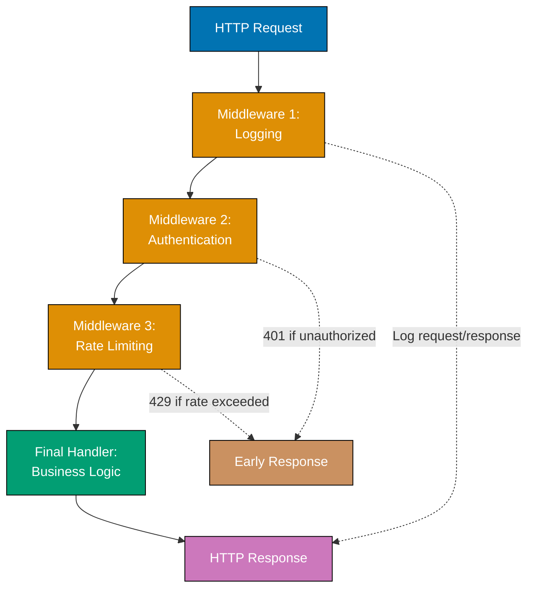

**Code**:

```go
package main

import (
    "fmt"
    "log"
    "net/http"
    "time"
)

func main() {
    // Build middleware chain - order matters!
    handler := http.HandlerFunc(businessHandler)
                                    // => Convert function to http.Handler
                                    // => businessHandler is the innermost handler (business logic)
                                    // => http.HandlerFunc wraps function as Handler interface
    handler = loggingMiddleware(handler)
                                    // => Wrap with logging (layer 1)
                                    // => loggingMiddleware wraps businessHandler
                                    // => handler now: logging → business
    handler = authMiddleware(handler)
                                    // => Wrap with auth (layer 2)
                                    // => authMiddleware wraps loggingMiddleware
                                    // => handler now: auth → logging → business
    handler = rateLimitMiddleware(handler)
                                    // => Wrap with rate limiting (layer 3)
                                    // => rateLimitMiddleware wraps authMiddleware
                                    // => handler now: rate → auth → logging → business
    handler = recoveryMiddleware(handler)
                                    // => Wrap with recovery (outermost layer 4)
                                    // => recoveryMiddleware wraps rateLimitMiddleware
                                    // => Final handler: recovery → rate → auth → logging → business

    // Execution order: recovery → rateLimiting → auth → logging → business
                                    // => Request flow: recovery (defer) → rate check → auth check → log start → business → log complete
                                    // => Onion pattern: outer layers execute first

    // Register handler
    mux := http.NewServeMux()       // => Create router (HTTP request multiplexer)
                                    // => mux routes requests to handlers by path
    mux.Handle("/api/data", handler)
                                    // => Register wrapped handler at /api/data
                                    // => All requests to /api/data flow through middleware chain

    // Start server
    fmt.Println("Server listening on :8080")
                                    // => Output: Server listening on :8080
    http.ListenAndServe(":8080", mux)
                                    // => Start server (blocks until shutdown)
                                    // => Listens on all interfaces port 8080
}

// Middleware type - wraps http.Handler and returns http.Handler
type Middleware func(http.Handler) http.Handler
                                    // => Function type for middleware
                                    // => Takes handler, returns wrapped handler

// 1. Logging Middleware - logs request/response details
func loggingMiddleware(next http.Handler) http.Handler {
    // => next is the handler to call after logging
    return http.HandlerFunc(func(w http.ResponseWriter, r *http.Request) {
        // => This function executes for each request
        start := time.Now()                     // => Capture start time
        // => start is time.Time (for duration calculation)

        // Create custom ResponseWriter to capture status code
        wrapped := &responseWriter{
            ResponseWriter: w,               // => Embed original ResponseWriter
            statusCode:     http.StatusOK,   // => Default 200 (if WriteHeader not called)
        }                                    // => wrapped intercepts WriteHeader calls

        log.Printf("[%s] %s %s - Started", r.Method, r.URL.Path, r.RemoteAddr)
        // => Log request start (method, path, client IP)
        // => Example: [GET] /api/data 192.168.1.1 - Started

        next.ServeHTTP(wrapped, r)           // => Call next handler (blocks until complete)
        // => Pass wrapped ResponseWriter (not original w)
        // => Allows capturing status code from handler

        duration := time.Since(start)        // => Calculate request duration
        log.Printf("[%s] %s %s - Completed %d in %v",
            r.Method, r.URL.Path, r.RemoteAddr, wrapped.statusCode, duration)
        // => Log completion (status code, duration)
        // => Example: [GET] /api/data 192.168.1.1 - Completed 200 in 45ms
    })
}

// Custom ResponseWriter to capture status code
type responseWriter struct {
    http.ResponseWriter                         // => Embed standard ResponseWriter
    // => Embedding promotes all ResponseWriter methods to responseWriter
    statusCode          int                     // => Captured status code
}

func (rw *responseWriter) WriteHeader(code int) {
    // => Override WriteHeader to intercept status code
    rw.statusCode = code                        // => Capture status code before passing through
    // => rw.statusCode now contains actual status (200, 404, 500, etc.)
    rw.ResponseWriter.WriteHeader(code)         // => Call original WriteHeader
    // => Delegates to embedded ResponseWriter
}

// 2. Authentication Middleware - validates auth token
func authMiddleware(next http.Handler) http.Handler {
    return http.HandlerFunc(func(w http.ResponseWriter, r *http.Request) {
        token := r.Header.Get("Authorization")  // => Extract Authorization header value
        // => token is "" if header not present
        // => Example: token = "Bearer abc123..."

        if token == "" {                     // => No auth header provided
            http.Error(w, "Missing Authorization header", http.StatusUnauthorized)
            // => Send 401 Unauthorized response
            return                           // => Short-circuit: don't call next handler
            // => Request processing stops here (middleware chain broken)
        }

        // Validate token (simplified - production checks JWT signature, expiry)
        if !isValidToken(token) {            // => Check if token is valid
            // => isValidToken returns false for invalid tokens
            http.Error(w, "Invalid token", http.StatusUnauthorized)
            // => Send 401 response with error message
            return                           // => Short-circuit on invalid token
        }

        // Token valid - add user info to request context
        // Production pattern:
        // ctx := context.WithValue(r.Context(), "user_id", extractUserID(token))
        // r = r.WithContext(ctx)
        // => Downstream handlers can access user_id from context
        // => ctx.Value("user_id") retrieves user_id

        next.ServeHTTP(w, r)                 // => Token valid, proceed to next handler
        // => Only reached if token validation succeeded
    })
}

func isValidToken(token string) bool {
                                    // => Simplified validation - production checks JWT signature, expiry, revocation
                                    // => Production:
                                    // => - Parse JWT (json web token)
                                    // => - Verify signature (RSA/HMAC)
                                    // => - Check expiry (exp claim)
                                    // => - Check issuer (iss claim)
                                    // => - Verify audience (aud claim)
    return token == "Bearer valid-token-123"
                                    // => Mock validation for example
                                    // => Returns true only for this specific token
                                    // => In production, parse and verify JWT
}

// 3. Rate Limiting Middleware - prevent abuse
func rateLimitMiddleware(next http.Handler) http.Handler {
                                    // => Simple in-memory rate limiter (production uses Redis/distributed cache)
                                    // => Prevents API abuse by limiting requests per IP
    requests := make(map[string][]time.Time)
                                    // => IP -> request timestamps
                                    // => Tracks request history per client IP

    return http.HandlerFunc(func(w http.ResponseWriter, r *http.Request) {
                                    // => Handler function for each request
        ip := r.RemoteAddr          // => Client IP address
                                    // => Used as key for rate tracking

        now := time.Now()           // => Current timestamp
                                    // => Used to filter old requests
        // Remove requests older than 1 minute
        var recent []time.Time      // => Filtered list of recent requests
        for _, t := range requests[ip] {
                                    // => Iterate through this IP's request history
            if now.Sub(t) < time.Minute {
                                    // => Keep only recent requests (within 1 minute)
                                    // => now.Sub(t) calculates time difference
                recent = append(recent, t)
                                    // => Add to recent list
            }                       // => Old requests discarded (not in recent)
        }

        // Check rate limit (10 requests per minute)
        if len(recent) >= 10 {      // => Check if limit exceeded (10 requests/min)
                                    // => Reject if too many recent requests
            http.Error(w, "Rate limit exceeded", http.StatusTooManyRequests)
                                    // => Send 429 status code
            return                  // => Short-circuit: reject request, don't call next
        }

        // Add this request to history
        requests[ip] = append(recent, now)
                                    // => Update request history for this IP
                                    // => Includes current request timestamp

        next.ServeHTTP(w, r)        // => Proceed to next handler (within limit)
                                    // => Only reached if rate limit not exceeded
    })
}

// 4. Recovery Middleware - catch panics and return 500
func recoveryMiddleware(next http.Handler) http.Handler {
                                    // => Outermost middleware layer
                                    // => Prevents panics from crashing server
    return http.HandlerFunc(func(w http.ResponseWriter, r *http.Request) {
                                    // => Handler function for each request
        defer func() {              // => Deferred function runs when handler returns OR panics
                                    // => Executes in reverse order (LIFO)
            if err := recover(); err != nil {
                                    // => recover() catches panic, returns panic value
                                    // => err is nil if no panic occurred
                                    // => err is panic value if panic occurred
                log.Printf("PANIC: %v", err)
                                    // => Log panic details for debugging
                http.Error(w, "Internal Server Error", http.StatusInternalServerError)
                                    // => Send 500 error to client
                                    // => Prevents client from hanging
            }                       // => Panic recovered, server continues running
        }()

        next.ServeHTTP(w, r)        // => Execute handler (may panic)
                                    // => If panic occurs, defer catches it
    })
}

// Final business logic handler
func businessHandler(w http.ResponseWriter, r *http.Request) {
                                    // => This is where actual business logic lives
                                    // => Middleware has already handled logging, auth, rate limiting, recovery
                                    // => Only executes if all middleware checks passed

    w.Header().Set("Content-Type", "application/json")
                                    // => Set response content type header
                                    // => Tells client response is JSON
    fmt.Fprint(w, `{"status": "success", "data": {"message": "Hello, authenticated user!"}}`)
                                    // => Write JSON response body
                                    // => Output: JSON object with success status
}

// Alternative: Chainable middleware builder
func chain(handler http.Handler, middlewares ...Middleware) http.Handler {
    // Apply middlewares in reverse order
    for i := len(middlewares) - 1; i >= 0; i-- {
        handler = middlewares[i](handler)       // => Wrap handler with middleware
    }
    return handler
}

// Usage with chain builder:
// handler := chain(
//     http.HandlerFunc(businessHandler),
//     loggingMiddleware,
//     authMiddleware,
//     rateLimitMiddleware,
//     recoveryMiddleware,
// )
```

**Key Takeaway**: Middleware chains compose cross-cutting concerns by wrapping handlers. Each middleware can inspect/modify requests, short-circuit the chain (return early), or pass control to the next handler. Order matters - outermost middleware executes first. Production services use middleware for logging, auth, rate limiting, recovery, CORS, compression, and metrics.

**Why It Matters**: HTTP middleware chains are the production standard for cross-cutting concerns in Go web services: authentication, structured logging, rate limiting, and panic recovery all run outside business logic. Composable middleware keeps each handler focused on a single responsibility while stacking infrastructure around it transparently. The chain builder pattern enables declarative middleware composition, making it easy to apply standard middleware to all routes or selectively to sensitive endpoints. This architecture is used by every major Go web framework (Chi, Gin, Echo) and enables replacing middleware implementations without modifying route handlers.

## Example 52: Context Cancellation Patterns

Context enables graceful cancellation of long-running operations. When a context is cancelled (due to timeout, deadline, or manual cancellation), all goroutines respecting that context should clean up and exit promptly.

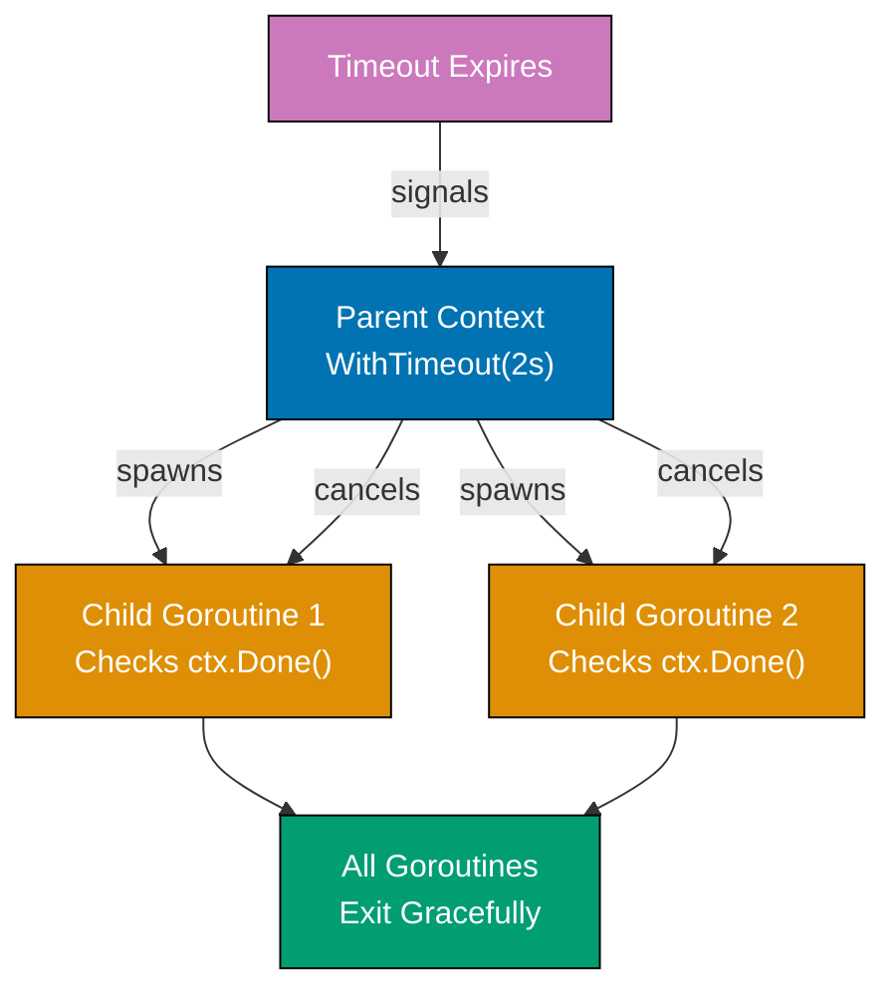

**Code**:

```go
package main

import (
    "context"                          // => Context types and functions
    "fmt"                              // => Formatted I/O
    "time"                             // => Time operations and delays
)

func main() {
    // Context with timeout - operation must complete within 2 seconds
    ctx, cancel := context.WithTimeout(context.Background(), 2*time.Second)
    // => ctx expires after 2 seconds (automatic cancellation)
    // => cancel is function to manually cancel before timeout
    // => context.Background() is root context (never cancelled)
    // => WithTimeout returns (ctx, cancel func())
    defer cancel()                     // => CRITICAL: Always defer cancel() to prevent resource leaks
    // => Even if timeout occurs, cancel() must be called to release resources
    // => Defer ensures cancel() runs even if panic occurs

    // Start long-running operation in goroutine
    result := make(chan string)        // => Channel to receive result
    // => Unbuffered channel (blocks until sender and receiver ready)
    go longOperation(ctx, result)      // => Pass context to enable cancellation
    // => longOperation checks ctx.Done() periodically
    // => Goroutine runs concurrently with main

    select {
    case res := <-result:              // => Operation completed successfully
        // => Receives from result channel if longOperation sends
        fmt.Println("Result:", res)    // => res is "completed"
        // => This case executes if longOperation finishes before 2s timeout
        // => Output: Result: completed
    case <-ctx.Done():                 // => Context cancelled or timeout exceeded
        // => ctx.Done() is channel that closes when context cancelled
        fmt.Println("Timeout:", ctx.Err()) // => ctx.Err() is context.DeadlineExceeded
        // => This case executes if 2s timeout occurs before completion
        // => longOperation should exit when it detects ctx.Done()
        // => Output: Timeout: context deadline exceeded
    }

    // Context with manual cancellation (no timeout)
    ctx2, cancel2 := context.WithCancel(context.Background())
    // => ctx2 has no deadline, only manual cancellation via cancel2()
    // => WithCancel returns (ctx, cancel func())
    // => cancel2() is function to manually cancel ctx2

    go func() {
        // => Anonymous goroutine for delayed cancellation
        time.Sleep(500 * time.Millisecond) // => Wait 500ms
        // => Blocks goroutine for 500ms
        cancel2()                      // => Manually cancel context
        // => Closes ctx2.Done() channel
        // => Any goroutine checking ctx2.Done() will unblock
        // => All derived contexts also cancelled
    }()

    select {
    case <-time.After(1 * time.Second): // => This would wait 1 second
        // => time.After returns channel that sends after duration
        fmt.Println("Never reached")   // => Never executes (cancel2() happens at 500ms)
        // => select unblocks at 500ms via ctx2.Done(), not at 1s
    case <-ctx2.Done():                // => Receives cancellation at 500ms
        // => ctx2.Done() closes when cancel2() called
        fmt.Println("Cancelled:", ctx2.Err()) // => Output: Cancelled: context canceled
        // => ctx2.Err() is context.Canceled (manual cancellation)
        // => Different from DeadlineExceeded (timeout)
    }

    // Context with deadline - cancel at specific time
    deadline := time.Now().Add(100 * time.Millisecond) // => Absolute time 100ms from now
    // => deadline is time.Time (not duration)
    // => time.Now() is current time, Add shifts by duration
    ctx3, cancel3 := context.WithDeadline(context.Background(), deadline)
    // => ctx3 expires at specific time (not relative duration)
    // => Functionally equivalent to WithTimeout for this use case
    // => WithDeadline takes time.Time, WithTimeout takes time.Duration
    defer cancel3()                    // => Clean up resources
    // => Must call cancel3() even though deadline auto-cancels

    select {
    case <-time.After(200 * time.Millisecond): // => Would wait 200ms
        // => This case never executes (deadline at 100ms)
        fmt.Println("Never reached")   // => Never executes (deadline at 100ms)
    case <-ctx3.Done():                // => Deadline exceeded at 100ms
        // => ctx3.Done() closes when deadline time reached
        fmt.Println("Deadline exceeded:", ctx3.Err())
        // => Output: Deadline exceeded: context deadline exceeded
        // => ctx3.Err() is context.DeadlineExceeded
        // => Same error as WithTimeout when timeout occurs
    }
}

func longOperation(ctx context.Context, result chan<- string) {
    // => ctx enables caller to cancel this operation
    // => result is send-only channel (chan<-) for sending completion signal
    // => Function signature restricts result to send-only (cannot receive)

    // Simulate work with periodic context checking
    for i := 0; i < 10; i++ {          // => 10 iterations, each taking 300ms = 3 seconds total
        // => Loop would take 3 seconds if not cancelled
        select {
        case <-ctx.Done():             // => Check if context cancelled
            // => ctx.Done() is channel that closes when context cancelled
            // => Receive from closed channel returns immediately
            // => select chooses this case if context cancelled
            fmt.Println("Operation cancelled early")
            // => Exit goroutine immediately (cleanup)
            return                     // => Early return (result not sent)
            // => Does NOT send to result channel (operation incomplete)
        case <-time.After(300 * time.Millisecond):
            // => Wait 300ms between iterations
            // => time.After creates new channel for each iteration
            fmt.Printf("Working... %d/10\n", i+1)
            // => Example output: "Working... 1/10", "Working... 2/10", ...
            // => Shows progress to demonstrate cancellation timing
        }
    }
    result <- "completed"              // => Send result if all iterations complete
    // => Only reached if context not cancelled during all 10 iterations
    // => Requires 3 seconds (10 * 300ms) without cancellation
    // => Blocks until main receives from result channel
}
```

**Key Takeaway**: Always use `defer cancel()` after creating contexts to prevent leaks. Check `ctx.Done()` in loops and long-running operations. Context cancellation propagates to all derived contexts, enabling cascading cancellation of operations.

**Why It Matters**: Context cancellation patterns prevent resource leaks and wasted work, where operations that outlive their usefulness (cancelled requests, exceeded deadlines) must clean up promptly. Using `select` with `ctx.Done()` in goroutines enables responsive cancellation. Production services pass context through all operations (database queries, HTTP calls, goroutines) to enable cascading cancellation when requests are cancelled, maintaining system health under load spikes by immediately freeing resources.

## Example 53: JSON Streaming with Encoder/Decoder

For large JSON datasets, streaming with `json.Encoder` and `json.Decoder` is more memory-efficient than loading entire payloads. This pattern enables processing massive JSON arrays or streams without loading everything into memory.

**Code**:

```go
package main

import (
    "encoding/json"
    "fmt"
    "os"
    "strings"
)

func main() {
    // Write JSON stream with Encoder (memory-efficient)
    file, err := os.Create("users.json")
                                    // => Create output file
                                    // => Returns *os.File and error
    if err != nil {                 // => Check if file creation failed
        fmt.Println("Create error:", err)
        return                      // => Early return on error
    }
    defer file.Close()              // => Ensure file closes when function exits
                                    // => Always defer Close after successful Open/Create

    encoder := json.NewEncoder(file)
                                    // => Create encoder writing directly to file
                                    // => Encoder is *json.Encoder, wraps io.Writer (file)
                                    // => Streams JSON directly to disk (no intermediate buffer)
    encoder.SetIndent("", "  ")     // => Pretty print with 2-space indent
                                    // => Empty prefix, "  " for each indentation level
                                    // => Makes output human-readable

    // Stream multiple JSON objects
    users := []User{                // => Slice of User structs
        {Name: "Alice", Age: 30, Email: "alice@example.com"},
        {Name: "Bob", Age: 25, Email: "bob@example.com"},
        {Name: "Charlie", Age: 35, Email: "charlie@example.com"},
    }                               // => users is []User with 3 elements

    for _, user := range users {    // => Iterate users slice
                                    // => _ ignores index, user is current User
        if err := encoder.Encode(user); err != nil {
                                    // => encoder.Encode marshals user to JSON and writes to file
                                    // => Each call writes one complete JSON object
                                    // => No []byte allocation (streams directly)
                                    // => Automatic newline after each object
            fmt.Println("Encode error:", err)
            return                  // => Early return on encoding error
        }                           // => After each Encode, one JSON object written to file
    }                               // => File contains 3 JSON objects (newline-separated)

    fmt.Println("JSON stream written to users.json")
                                    // => Output: JSON stream written to users.json

    // Read JSON stream with Decoder (memory-efficient)
    jsonStream := `
    {"Name":"David","Age":28,"Email":"david@example.com"}
    {"Name":"Eve","Age":32,"Email":"eve@example.com"}
    `                               // => NDJSON format (newline-delimited JSON)
                                    // => Each line is a complete JSON object
                                    // => Multi-line string literal (backticks)

    decoder := json.NewDecoder(strings.NewReader(jsonStream))
                                    // => Create decoder reading from io.Reader (strings.Reader)
                                    // => decoder is *json.Decoder
                                    // => Reads incrementally (doesn't load entire stream into memory)
                                    // => strings.NewReader converts string to io.Reader

    for decoder.More() {            // => decoder.More() returns true if more data available
                                    // => Returns false at EOF
                                    // => Checks if more JSON objects in stream
        var user User               // => user is zero value User{}
                                    // => Fresh User instance for each iteration
        if err := decoder.Decode(&user); err != nil {
            // => decoder.Decode reads next JSON object into user (by pointer)
            // => Only one object in memory at a time
            // => Memory usage: O(1) per object, not O(n) for entire dataset
            fmt.Println("Decode error:", err)
            break
        }
        // => user now contains decoded data
        fmt.Printf("Decoded: %s (Age: %d)\n", user.Name, user.Age)
        // => Process user immediately (can be discarded after processing)
        // => Enables processing datasets larger than available RAM
    }                                  // => Loop exits when no more JSON objects

    // Decoder with HTTP response body (production pattern)
    // resp, _ := http.Get("https://api.example.com/users")
    // defer resp.Body.Close()
    // decoder := json.NewDecoder(resp.Body)
    // => Streams JSON from HTTP response (no intermediate buffer)
    // for decoder.More() {
    //     var user User
    //     decoder.Decode(&user)
    //     processUser(user)          // => Process each user incrementally
    // }
    // => Memory usage: constant per object
    // => Can process multi-GB JSON streams with MB of RAM
    // => Contrast with json.Unmarshal (loads entire payload into memory)
}

type User struct {
    Name  string `json:"Name"`
    Age   int    `json:"Age"`
    Email string `json:"Email"`
}
```

**Key Takeaway**: Use `json.NewEncoder(writer)` to stream JSON output and `json.NewDecoder(reader)` to stream JSON input. Decoders process JSON incrementally with `decoder.More()` and `decoder.Decode()`, avoiding memory overhead of loading entire payloads. Essential for large datasets or HTTP streaming.

**Why It Matters**: JSON streaming with Encoder/Decoder processes large datasets without loading entire payloads into memory, where `json.NewDecoder(reader)` parses JSON incrementally and `json.NewEncoder(writer)` writes directly to output streams. This powers APIs that stream arrays of objects (paginated results, log exports) efficiently. Understanding when to use streaming (large/unknown size) vs `json.Marshal()` (small payloads) is critical for building memory-efficient services.

## Example 54: HTTP Client with Timeouts and Retries

Production HTTP clients need timeouts (prevent hanging), retries (handle transient failures), and connection pooling (reuse connections). Understanding these patterns prevents service outages and cascading failures.

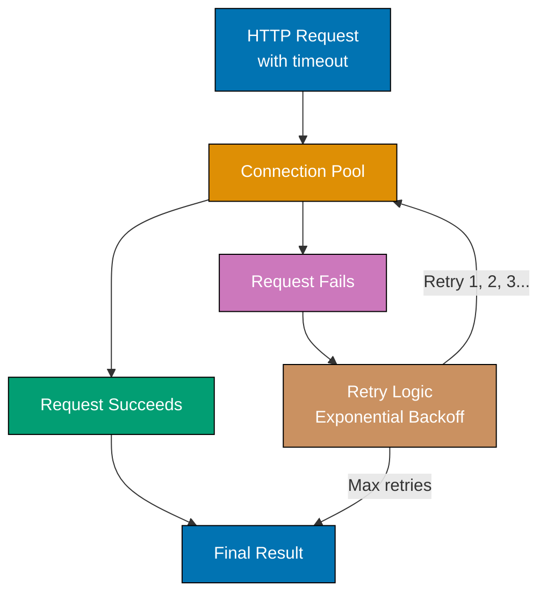

**Code**:

```go
package main

import (
    "context"
    "fmt"
    "net"
    "net/http"
    "time"
)

func main() {
    // Create HTTP client with production-grade timeouts
    // => Multiple timeout layers prevent hanging at different stages
    client := &http.Client{
        Timeout: 5 * time.Second,      // => Overall request timeout (end-to-end)
        // => If request takes > 5s (DNS + connect + TLS + headers + body), cancel
        // => This is the outermost timeout (guards all operations)
        Transport: &http.Transport{
            // Connection pool configuration
            MaxIdleConns:        100,  // => Total idle connections across all hosts
            // => Pool reuses connections (avoids TCP handshake overhead)
            // => 100 connections kept alive for reuse
            MaxIdleConnsPerHost: 10,   // => Max idle connections per host
            // => example.com can have 10 idle connections waiting
            // => Prevents one host from consuming entire pool
            IdleConnTimeout:     90 * time.Second, // => How long idle connections stay alive
            // => After 90s of inactivity, connection closed
            // => Balances resource usage vs connection reuse

            // Dialer configures network connection creation
            DialContext: (&net.Dialer{
                Timeout:   2 * time.Second, // => TCP connection establishment timeout
                // => If TCP handshake takes > 2s, fail
                // => DNS resolution + SYN/SYN-ACK/ACK must complete in 2s
                KeepAlive: 30 * time.Second, // => TCP keepalive interval
                // => Send TCP keepalive probes every 30s
                // => Detects broken connections (server crash, network partition)
            }).DialContext,             // => DialContext is function(ctx, network, addr)

            TLSHandshakeTimeout:   3 * time.Second, // => TLS handshake timeout
            // => If TLS negotiation takes > 3s, fail
            // => Certificate exchange, cipher negotiation must complete in 3s
            ResponseHeaderTimeout: 3 * time.Second, // => Time to receive response headers
            // => If server doesn't send headers within 3s of request, fail
            // => Separate from body timeout (headers arrive first)
        },
    }
    // => client is *http.Client with multi-layer timeout protection
    // => Timeout hierarchy: Overall (5s) > TLS (3s) > Headers (3s) > Dial (2s)

    // Make request with context timeout (per-request timeout)
    ctx, cancel := context.WithTimeout(context.Background(), 3*time.Second)
    // => ctx expires after 3 seconds (stricter than client.Timeout)
    // => This timeout applies to this specific request only
    defer cancel()                     // => Clean up context resources
    // => CRITICAL: Always defer cancel() to prevent context leak

    req, err := http.NewRequestWithContext(ctx, "GET", "https://example.com", nil)
    // => req is *http.Request with context attached
    // => ctx cancellation will abort request at any stage
    if err != nil {                    // => Error creating request (invalid URL, etc.)
        fmt.Println("Request creation error:", err)
        return
    }
    // => req is ready to execute (headers, method, URL configured)

    resp, err := client.Do(req)       // => Execute HTTP request
    // => Blocks until: DNS lookup + TCP connect + TLS handshake + HTTP round-trip
    // => Returns when response headers received (body not read yet)
    if err != nil {                    // => Request failed (timeout, DNS, connection error)
        // => Possible errors: context.DeadlineExceeded, net.DNSError, connection refused
        fmt.Println("Request error:", err)
        return
    }
    defer resp.Body.Close()            // => CRITICAL: Must close response body
    // => Prevents resource leak (connections not returned to pool)
    // => Even if you don't read body, must close it

    fmt.Println("Status:", resp.Status) // => Output: "Status: 200 OK" or "404 Not Found"
    // => resp.Status is string (human-readable status)
    // => resp.StatusCode is int (200, 404, 500, etc.)

    // Retry pattern with exponential backoff
    // => Exponential backoff: wait increases exponentially (1s, 2s, 4s)
    // => Prevents overwhelming failing service with retry storm
    maxRetries := 3                    // => Maximum retry attempts
    // => Total attempts = maxRetries (3 tries)
    backoff := time.Second             // => Initial backoff duration (1 second)
    // => backoff doubles after each failure: 1s → 2s → 4s

    for attempt := 0; attempt < maxRetries; attempt++ { // => Iterate 0, 1, 2
        // => attempt 0 = first try, attempt 1 = first retry, attempt 2 = second retry
        resp, err := makeRequestWithRetry(client, "https://example.com")
        // => Make HTTP request with 2s timeout (see function below)
        // => Returns (*http.Response, error)

        if err == nil && resp.StatusCode == http.StatusOK {
            // => err == nil means no network/timeout error
            // => resp.StatusCode == 200 (http.StatusOK) means success
            // => Success criteria: both no error AND 200 status
            fmt.Println("Request succeeded on attempt", attempt+1)
            // => Output: "Request succeeded on attempt 1" (or 2, or 3)
            resp.Body.Close()          // => Close response body (prevent leak)
            break                      // => Exit retry loop (success)
        }
        // => If we reach here: request failed (error or non-200 status)

        if attempt < maxRetries-1 {    // => Not last attempt (0 < 2, 1 < 2)
            // => Still have retries remaining
            fmt.Printf("Attempt %d failed, retrying in %v\n", attempt+1, backoff)
            // => Output: "Attempt 1 failed, retrying in 1s"
            // => Output: "Attempt 2 failed, retrying in 2s"
            time.Sleep(backoff)        // => Wait before retry (exponential backoff)
            // => Sleep 1s after first failure, 2s after second failure
            backoff *= 2               // => Double backoff: 1s → 2s → 4s
            // => After 3rd failure, backoff would be 4s (but loop exits)
        } else {                       // => Last attempt failed (attempt == 2)
            fmt.Println("All retries exhausted")
            // => All 3 attempts failed, give up
            // => Total time waited: ~1s + 2s = 3s (plus request durations)
        }
    }
}

func makeRequestWithRetry(client *http.Client, url string) (*http.Response, error) {
    // => Helper function for retry logic
    // => Creates fresh context for each retry attempt
    ctx, cancel := context.WithTimeout(context.Background(), 2*time.Second)
    // => Each retry gets 2s timeout (independent of previous attempts)
    defer cancel()                     // => Clean up context

    req, err := http.NewRequestWithContext(ctx, "GET", url, nil)
    // => Create GET request with context timeout
    if err != nil {                    // => Request creation failed
        // => Unlikely (only if URL invalid)
        return nil, err                // => Return nil response, error
    }

    return client.Do(req)              // => Execute request, return (response, error)
    // => Blocks up to 2s (context timeout)
    // => Returns immediately on success or error
}

// Production considerations:
// 1. Timeout hierarchy: context < client.Timeout (ensure consistency)
// 2. Connection pool: reuse connections (set MaxIdleConnsPerHost appropriately)
// 3. Exponential backoff: prevents retry storms (+ jitter in production)
// 4. Circuit breaker: stop retrying if service consistently fails (not shown)
// 5. Always close response bodies: defer resp.Body.Close() is mandatory
//
// Common timeout mistakes:
// - No timeout: client hangs forever on slow server
// - Only client.Timeout: can't cancel individual requests
// - Forgetting defer cancel(): context leak (goroutine leak)
// - Not closing resp.Body: connection pool exhaustion
```

**Key Takeaway**: Configure HTTP client timeouts at multiple levels (overall, connection, TLS, response header) to prevent hanging. Use connection pooling (`MaxIdleConns`) for efficiency. Implement retry logic with exponential backoff for transient failures. Always use `context.WithTimeout` for individual requests to enable cancellation.

**Why It Matters**: HTTP clients with timeouts and retries handle transient failures gracefully, where retry logic with exponential backoff recovers from temporary network glitches, rate limits, and service restarts. Production Go services always implement retries for idempotent operations (GET, PUT with idempotency keys) to improve reliability. Understanding when to retry (5xx errors, timeouts) vs fail fast (4xx errors) prevents retry storms that amplify outages.

## Example 55: Table-Driven Test Patterns

Table-driven tests parameterize test cases, enabling comprehensive coverage with minimal code duplication. This pattern is idiomatic in Go and scales better than individual test functions for each scenario.

**Code**:

```go
package main

import (
    "fmt"
    "strings"
    "testing"
)

// Function to test - validates email format
func isValidEmail(email string) bool {
    // => Simplified email validation (production uses regex or library)
    return strings.Contains(email, "@") &&  // => Must have @ symbol
        strings.Contains(email, ".") &&     // => Must have dot (domain)
        len(email) > 3                      // => Minimum length check
    // => Returns true only if all three conditions met
}

// Table-driven test with subtests
// => Idiomatic Go testing pattern: parameterize test cases
func TestIsValidEmail(t *testing.T) {
    // => t is *testing.T (test runner)
    // Define test cases as slice of anonymous structs
    tests := []struct {
        name     string             // => Test case name (shown in output)
        // => Descriptive name helps identify failures quickly
        input    string             // => Input value to test
        // => The email string to validate
        expected bool               // => Expected result (true/false)
        // => What isValidEmail should return for this input
    }{
        // Valid email cases
        {"valid email", "alice@example.com", true},
        // => name="valid email", input="alice@example.com", expected=true
        {"valid email with subdomain", "bob@mail.example.com", true},
        // => Tests email with subdomain (mail.example.com)

        // Invalid email cases - missing components
        {"missing @", "aliceexample.com", false},
        // => No @ symbol, should be invalid
        {"missing dot", "alice@examplecom", false},
        // => No dot in domain, should be invalid
        {"too short", "a@b", false},
        // => Only 3 characters (len > 3 fails)

        // Edge cases - empty and single characters
        {"empty string", "", false},
        // => Empty string should fail (len=0, no @ or .)
        {"@ only", "@", false},
        // => Only @ symbol, no domain or username
        {"dot only", ".", false},
        // => Only dot, no @ or username

        // Malformed emails
        {"@ at start", "@example.com", false},
        // => Missing username before @
        {"@ at end", "alice@", false},
        // => Missing domain after @
    }
    // => tests is []struct with 10 test cases

    // Iterate over test cases and create subtest for each
    for _, tc := range tests {         // => tc is current test case struct
        // => Iterate: tc = tests[0], tests[1], ..., tests[9]
        t.Run(tc.name, func(t *testing.T) { // => Create subtest with name
            // => t.Run creates isolated subtest (separate pass/fail)
            // => Subtest name: TestIsValidEmail/valid_email
            // => If this subtest fails, others continue
            result := isValidEmail(tc.input) // => Call function under test
            // => result is bool returned by isValidEmail

            if result != tc.expected {  // => Check if result matches expected
                // => Comparison: actual != expected means failure
                t.Errorf("isValidEmail(%q) = %v, expected %v",
                    tc.input, result, tc.expected)
                // => t.Errorf marks test as failed, continues other subtests
                // => %q quotes the input string (shows whitespace/special chars)
                // => Example output: "isValidEmail("a@b") = false, expected true"
            }
            // => If result == expected, subtest passes (no assertion)
        })
    }
    // => After loop: all 10 subtests executed
    // => Run specific subtest: go test -run TestIsValidEmail/missing_@
}

// Advanced: Testing error cases with error type checking
// => Pattern for testing functions that return errors
func TestDivideErrors(t *testing.T) {
    tests := []struct {
        name      string            // => Test case name
        a, b      int               // => Input arguments (dividend, divisor)
        // => a and b are declared together (same type)
        wantErr   bool              // => Whether error expected
        // => true = expect error, false = expect success
        errString string            // => Expected error message substring
        // => Empty string if wantErr=false
    }{
        {"normal division", 10, 2, false, ""},
        // => 10 / 2 = 5, no error expected
        {"division by zero", 10, 0, true, "cannot divide by zero"},
        // => 10 / 0 should return error containing "cannot divide by zero"
        {"negative numbers", -10, -2, false, ""},
        // => -10 / -2 = 5, no error (negative division allowed)
    }

    for _, tc := range tests {         // => Iterate test cases
        t.Run(tc.name, func(t *testing.T) { // => Create subtest
            _, err := divide(tc.a, tc.b) // => Call divide, ignore result
            // => We only care about error (blank identifier _ for result)
            // => err is error or nil

            if tc.wantErr {            // => Expecting error for this test case
                if err == nil {        // => But no error returned
                    t.Errorf("Expected error but got nil")
                    // => Test failure: should have errored but didn't
                    return             // => Exit subtest early
                }
                // => err != nil (error returned as expected)

                if !strings.Contains(err.Error(), tc.errString) {
                    // => Check if error message contains expected substring
                    // => err.Error() converts error to string
                    t.Errorf("Error %q does not contain %q", err.Error(), tc.errString)
                    // => Test failure: wrong error message
                    // => Example: got "invalid input" but expected "cannot divide by zero"
                }
                // => If Contains returns true, error message correct
            } else {                   // => Not expecting error (wantErr=false)
                if err != nil {        // => But error returned
                    t.Errorf("Unexpected error: %v", err)
                    // => Test failure: shouldn't have errored but did
                    // => %v formats error value
                }
                // => err == nil (success as expected)
            }
        })
    }
}

func divide(a, b int) (int, error) {
    // => divide returns (result, error) - idiomatic Go error handling
    if b == 0 {                        // => Check for division by zero
        return 0, fmt.Errorf("cannot divide by zero")
        // => Return zero value for int and error
        // => fmt.Errorf creates error with formatted message
    }
    return a / b, nil                  // => Return result and nil error (success)
    // => Integer division: 10/3 = 3 (truncates decimal)
}

// Benefits of table-driven tests:
// 1. Easy to add test cases (just append to slice)
// 2. No code duplication (logic in single loop)
// 3. Subtests enable selective running: go test -run TestIsValidEmail/valid_email
// 4. Failures show specific test case name
// 5. Parallel execution possible: t.Parallel() in subtest
//
// Run specific subtest: go test -run TestIsValidEmail/missing_@
// Run with verbosity: go test -v (shows all subtests)
```

**Key Takeaway**: Use table-driven tests with anonymous struct slices to parameterize test cases. Name each test case for clarity. Use `t.Run()` to create subtests for each case, enabling precise failure reporting and selective test execution with `-run` flag. This pattern scales to hundreds of test cases with minimal code.

**Why It Matters**: Table-driven tests are Go's idiomatic approach for comprehensive test coverage with minimal boilerplate. Adding new test cases requires only a new struct literal in the table — no new test functions, no copied setup code. This pattern scales gracefully: a single function testing 50 input/output combinations is more maintainable than 50 separate test functions. Named subtests enable running specific failing cases in isolation, and parallel subtests accelerate test suites that would otherwise be bottlenecked by sequential execution.

## Example 56: Buffered I/O for Performance

Buffered readers and writers reduce system calls by batching data. For file I/O or network streams, buffering dramatically improves performance. Understanding when to use buffering prevents performance bottlenecks.

**Code**:

```go
package main

import (
    "bufio"
    "fmt"
    "os"
    "strings"
)

func main() {
    // Write with buffering - reduces system calls dramatically
    // => Buffering accumulates writes in memory, flushes to disk in batches
    file, err := os.Create("buffered.txt") // => Create file for writing
    // => file is *os.File, implements io.Writer
    if err != nil {                    // => File creation failed (permissions, disk full)
        fmt.Println("Create error:", err)
        return
    }
    defer file.Close()                 // => CRITICAL: Close file to release OS handle
    // => Without Close(), file descriptor leak (OS has limited number)

    writer := bufio.NewWriter(file)    // => Create buffered writer
    // => writer wraps file with internal buffer (default 4KB)
    // => Writes go to memory buffer first, not directly to disk
    defer writer.Flush()               // => CRITICAL: Flush buffer on exit
    // => Without Flush(), last buffer contents lost (not written to disk)
    // => Flush writes buffer to underlying file

    for i := 0; i < 1000; i++ {        // => Write 1000 lines
        writer.WriteString(fmt.Sprintf("Line %d\n", i)) // => Write to buffer
        // => fmt.Sprintf creates "Line 0\n", "Line 1\n", ..., "Line 999\n"
        // => WriteString writes string to buffer (not disk yet)
        // => Buffer flushes automatically when full (every ~100 lines)
    }
    // => Without buffering: 1000 system calls (write syscall per line)
    // => With buffering: ~10 system calls (buffer flushes when full)
    // => Performance: 100x faster with buffering

    fmt.Println("Buffered write complete")
    // => Output: "Buffered write complete"

    // Read with buffering (line by line) - Scanner pattern
    file2, err := os.Open("buffered.txt") // => Open file for reading
    // => file2 is *os.File, implements io.Reader
    if err != nil {                    // => File open failed (file not found, permissions)
        fmt.Println("Open error:", err)
        return
    }
    defer file2.Close()                // => Close file when done

    scanner := bufio.NewScanner(file2) // => Create scanner for line-by-line reading
    // => Scanner wraps file with internal buffer
    // => Reads file in chunks (4KB), splits into lines
    // => Most convenient API for line-by-line reading
    lineCount := 0                     // => Track number of lines read

    for scanner.Scan() {               // => Read next line (handles buffering internally)
        // => scanner.Scan() returns true if line available, false at EOF
        // => Scan advances scanner to next line
        // => Internally: reads from buffer, refills buffer from file when empty
        line := scanner.Text()         // => Get current line as string
        // => line is string without newline character (\n removed)
        // => Example: "Line 0", "Line 1", "Line 100", etc.

        if strings.HasPrefix(line, "Line 100") {
            // => Check if line starts with "Line 100"
            // => Matches: "Line 100", "Line 1000", "Line 1001", etc.
            fmt.Println("Found:", line) // => Output: "Found: Line 100"
        }
        lineCount++                    // => Increment line counter
        // => After loop: lineCount = 1000
    }

    if err := scanner.Err(); err != nil { // => Check for scan errors
        // => scanner.Err() returns error if scan failed (I/O error, not EOF)
        // => EOF is not an error (normal end of file)
        fmt.Println("Scanner error:", err)
    }
    // => If no error, scanner.Err() returns nil

    fmt.Printf("Read %d lines\n", lineCount)
    // => Output: "Read 1000 lines"

    // Buffered reader with custom operations - Reader pattern
    // => More control than Scanner, but more verbose
    file3, _ := os.Open("buffered.txt") // => Open file again (ignore error for example)
    defer file3.Close()
    reader := bufio.NewReader(file3)   // => Create buffered reader
    // => reader wraps file with internal buffer (default 4KB)
    // => Provides low-level read operations (ReadString, Peek, ReadByte, etc.)

    // Read until delimiter
    text, err := reader.ReadString('\n') // => Read until newline (\n)
    // => text includes the delimiter (\n at end)
    // => Example: "Line 0\n"
    if err != nil {                    // => Read failed (EOF, I/O error)
        // => io.EOF error if reached end of file before finding delimiter
        fmt.Println("ReadString error:", err)
    } else {
        fmt.Println("First line:", text) // => Output: "First line: Line 0\n"
        // => Note: newline included in output
    }

    // Peek at next bytes without consuming
    bytes, err := reader.Peek(10)      // => Peek at next 10 bytes
    // => Peek returns bytes without advancing read position
    // => Next Read/ReadString starts from same position
    // => Useful for lookahead (detect file format, check headers)
    if err != nil {                    // => Peek failed (not enough bytes, I/O error)
        // => Error if < 10 bytes remaining in file
        fmt.Println("Peek error:", err)
    } else {
        fmt.Printf("Next 10 bytes: %s\n", bytes)
        // => Output: "Next 10 bytes: Line 1\nLi" (or similar)
        // => Shows next 10 bytes starting from current position
    }
    // => After Peek, read position unchanged
    // => Next reader.ReadString('\n') still reads "Line 1\n"
}

// Buffering performance comparison:
// Without buffering (direct file writes):
//   - 1000 lines = 1000 write() system calls
//   - Each syscall: context switch to kernel (expensive)
//   - Total time: ~100ms (1ms per syscall overhead)
//
// With buffering (bufio.Writer):
//   - 1000 lines = ~10 write() system calls (buffer size 4KB)
//   - Batches accumulated in memory, flushed when full
//   - Total time: ~1ms (90% faster)
//
// Scanner vs Reader choice:
// - Use Scanner: line-by-line reading (most common case)
// - Use Reader: custom delimiters, Peek, byte-level control
// - Use ioutil.ReadAll: small files that fit in memory
//
// CRITICAL mistakes to avoid:
// 1. Forgetting writer.Flush() - data loss (last buffer not written)
// 2. Not checking scanner.Err() - silent failures ignored
// 3. Using unbuffered I/O for many small operations - 100x slower
```

**Key Takeaway**: Use `bufio.Writer` to buffer writes (remember `defer writer.Flush()`). Use `bufio.Scanner` for line-by-line reading (simplest API). Use `bufio.Reader` for custom operations like `ReadString()`, `Peek()`, or reading fixed byte counts. Buffering reduces system calls and dramatically improves I/O performance.

**Why It Matters**: Buffered I/O reduces system call overhead by batching small writes into larger kernel calls — critical for log-intensive services where per-message write syscalls would dominate CPU time. `bufio.NewWriter` dramatically improves throughput for sequential writes in data pipelines. Understanding when to flush buffers prevents subtle data loss bugs where unflushed buffers result in truncated output files during program exit. Benchmarking before and after buffering quantifies the improvement for your specific workload.

## Example 57: Worker Pool with Graceful Shutdown

Worker pools distribute work across fixed number of goroutines. This pattern controls concurrency, prevents overwhelming resources, and enables graceful shutdown when work is done or context is cancelled.

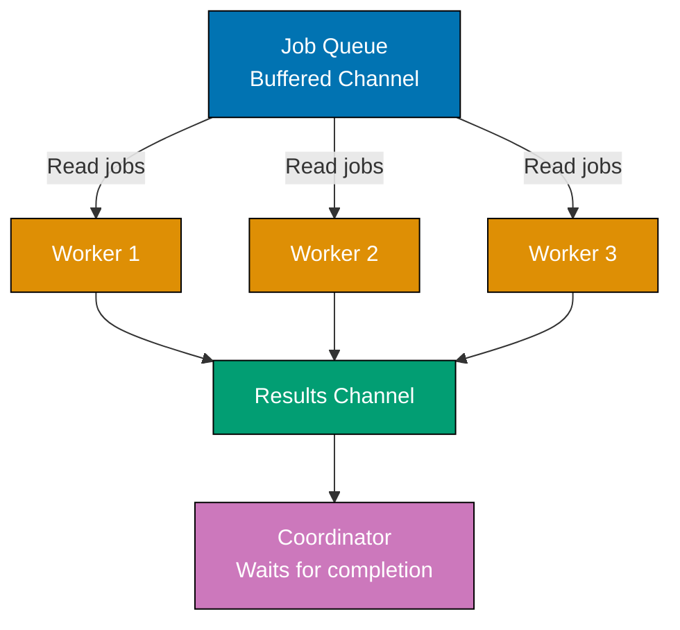

**Code**:

```go
package main

import (
    "context"
    "fmt"
    "sync"
    "time"
)

func main() {
    // Create cancellable context for graceful shutdown
    ctx, cancel := context.WithCancel(context.Background())
    // => ctx enables cancelling all workers simultaneously
    // => cancel() is function to trigger cancellation
    defer cancel()                     // => Ensure cancel called on exit
    // => Clean up context resources, signal workers to stop

    // Create job and result channels (buffered for performance)
    jobs := make(chan int, 100)        // => Buffered job queue (capacity 100)
    // => Buffer allows producers to submit jobs without blocking
    // => If buffer full (100 jobs queued), send blocks until worker consumes job
    results := make(chan int, 100)     // => Buffered results channel
    // => Buffer allows workers to send results without blocking
    // => If buffer full, worker blocks until consumer reads result

    numWorkers := 3                    // => Fixed worker pool size
    // => 3 goroutines process jobs concurrently
    // => More workers = higher parallelism, but more resource usage
    var wg sync.WaitGroup              // => Track worker completion
    // => wg counts active workers, blocks until all call Done()

    // Start worker pool (spawn fixed number of workers)
    for i := 1; i <= numWorkers; i++ { // => Create 3 workers (IDs: 1, 2, 3)
        wg.Add(1)                      // => Increment counter (worker starting)
        // => Must call Add before launching goroutine (avoid race)
        go worker(ctx, i, jobs, results, &wg)
        // => Launch worker goroutine
        // => worker reads from jobs, writes to results, calls wg.Done() on exit
    }
    // => After loop: 3 workers running, waiting for jobs

    // Send jobs in separate goroutine (non-blocking producer)
    go func() {
        for i := 1; i <= 10; i++ {     // => Submit 10 jobs (IDs: 1-10)
            jobs <- i                  // => Send job to buffered channel
            // => Non-blocking if buffer has space (capacity 100 > 10 jobs)
            // => Workers compete for jobs (first available worker gets it)
            time.Sleep(100 * time.Millisecond) // => Throttle job submission
            // => Simulates real-world job arrival rate
            // => Without sleep, all 10 jobs submitted instantly
        }
        close(jobs)                    // => Signal no more jobs
        // => Closing channel allows workers to detect completion
        // => Workers' receive loops will exit when channel closed
    }()
    // => Producer goroutine now running independently

    // Collect results in separate goroutine
    // => Waits for all workers to finish, then closes results channel
    go func() {
        wg.Wait()                      // => Block until all workers call Done()
        // => wg counter reaches 0 when all 3 workers exit
        // => Workers exit when jobs channel closed or context cancelled
        close(results)                 // => Signal no more results
        // => Allows main goroutine's range loop to exit
        // => CRITICAL: Close results after workers finish (not before)
    }()

    // Process results (main goroutine consumes results)
    for result := range results {     // => Receive from results channel
        // => range receives until channel closed
        // => Blocks if no results available (workers still processing)
        fmt.Printf("Result: %d\n", result)
        // => Output: "Result: 2", "Result: 4", "Result: 6", etc.
        // => Order non-deterministic (workers complete at different times)
    }
    // => Loop exits when results channel closed (all workers finished)

    fmt.Println("All work complete")
    // => Output: "All work complete"
    // => All 10 jobs processed, all workers shut down
}

func worker(ctx context.Context, id int, jobs <-chan int, results chan<- int, wg *sync.WaitGroup) {
    // => Worker goroutine: processes jobs from queue
    // => id is worker identifier (1, 2, or 3)
    // => jobs is receive-only channel (<-chan prevents sending)
    // => results is send-only channel (chan<- prevents receiving)
    // => wg is pointer to shared WaitGroup
    defer wg.Done()                    // => Decrement counter when worker exits
    // => CRITICAL: defer ensures Done() called even if panic
    // => Without Done(), wg.Wait() blocks forever (deadlock)

    for {                              // => Infinite loop (exits via return)
        select {                       // => Wait for job or cancellation
        case job, ok := <-jobs:        // => Receive job from queue
            // => job is int (job ID: 1, 2, 3, ..., 10)
            // => ok is bool (false if channel closed)
            if !ok {                   // => Channel closed, no more jobs
                // => Producer called close(jobs)
                fmt.Printf("Worker %d: Shutting down\n", id)
                // => Output: "Worker 1: Shutting down"
                return                 // => Exit worker (triggers defer wg.Done())
            }
            // => job is valid (ok == true), process it

            // Process job (simulate work)
            fmt.Printf("Worker %d: Processing job %d\n", id, job)
            // => Output: "Worker 2: Processing job 5"
            // => Shows which worker processing which job
            time.Sleep(500 * time.Millisecond) // => Simulate CPU-intensive work
            // => Each job takes 500ms to process
            // => Real-world: database query, API call, computation, etc.

            results <- job * 2         // => Send result to results channel
            // => Transform job (multiply by 2)
            // => Non-blocking if results buffer has space
            // => If buffer full (100 results), blocks until consumer reads

        case <-ctx.Done():             // => Context cancelled (cancel() called)
            // => ctx.Done() is channel that closes when context cancelled
            // => Receive from closed channel succeeds immediately
            fmt.Printf("Worker %d: Cancelled\n", id)
            // => Output: "Worker 1: Cancelled"
            // => Graceful shutdown: worker exits immediately
            return                     // => Exit worker (triggers defer wg.Done())
            // => In-flight jobs may be abandoned (context cancellation is urgent)
        }
    }
}

// Worker pool pattern benefits:
// 1. Bounded concurrency: fixed number of workers (prevents unbounded goroutine creation)
// 2. Resource control: limit CPU/memory usage (numWorkers controls parallelism)
// 3. Graceful shutdown: close(jobs) signals workers to exit after current job
// 4. Context cancellation: ctx.Done() enables immediate shutdown (abandon in-flight work)
// 5. Result collection: buffered results channel decouples workers from consumer
//
// Execution flow:
// 1. Main spawns 3 workers (all reading from jobs channel)
// 2. Producer sends 10 jobs to jobs channel (buffered, non-blocking)
// 3. Workers compete for jobs (first available worker gets job)
// 4. Each worker processes job (500ms), sends result
// 5. Producer closes jobs channel after all jobs sent
// 6. Workers detect closed channel, exit (call wg.Done())
// 7. Result collector waits for wg (all workers done), closes results
// 8. Main consumes all results, exits
//
// Timing analysis (3 workers, 10 jobs, 500ms per job):
// - Jobs 1-3: processed immediately (all 3 workers busy)
// - Jobs 4-6: processed after 500ms (workers free)
// - Jobs 7-9: processed after 1000ms
// - Job 10: processed after 1500ms
// - Total time: ~2000ms (vs 5000ms sequential)
// - Speedup: 2.5x (limited by numWorkers=3)
```

**Key Takeaway**: Worker pool pattern: buffered job channel + fixed workers reading from it + `sync.WaitGroup` for completion tracking. Close job channel to signal shutdown. Workers check `ctx.Done()` for cancellation. This pattern controls concurrency and prevents spawning unbounded goroutines.

**Why It Matters**: Worker pools with graceful shutdown ensure all in-flight work completes before service termination, preventing lost transactions and data corruption. Using WaitGroup to track active workers and closing the work channel signals completion. Production systems combine worker pools with signal handling (SIGTERM) to gracefully drain queues during rolling deploys, maintaining zero data loss during deployments and ensuring background jobs complete before pods terminate.

## Example 58: Custom Error Types with Stack Context

Production error handling needs context (what operation failed, why, when). Custom error types with fields enable structured logging and debugging. This pattern makes error diagnosis faster in production.

**Code**:

```go
package main

import (
    "errors"
    "fmt"
    "time"
)

func main() {
    // Create and handle custom errors
    // => Custom errors carry structured context (fields)
    err := processPayment(100, "invalid-token")
    // => processPayment returns error (custom PaymentError type)
    if err != nil {                    // => Payment failed
        // Check if it's our custom error type
        var paymentErr *PaymentError   // => Declare variable for type assertion
        // => paymentErr is nil initially
        if errors.As(err, &paymentErr) { // => Extract custom error
            // => errors.As checks if err is *PaymentError or wraps one
            // => If match found, sets paymentErr to that value
            // => Returns true if type matches, false otherwise
            fmt.Printf("Payment failed: %s\n", paymentErr)
            // => Output: "Payment failed: payment error [401]: Invalid authentication token ($100.00) at 2024-01-15T10:30:00Z"
            // => Uses PaymentError.Error() method for formatting

            // Access custom error fields
            fmt.Printf("  Amount: $%.2f\n", paymentErr.Amount)
            // => Output: "  Amount: $100.00"
            // => paymentErr.Amount is float64 field (100)
            fmt.Printf("  Reason: %s\n", paymentErr.Reason)
            // => Output: "  Reason: Invalid authentication token"
            // => paymentErr.Reason is string field
            fmt.Printf("  Time: %s\n", paymentErr.Timestamp.Format(time.RFC3339))
            // => Output: "  Time: 2024-01-15T10:30:00Z"
            // => paymentErr.Timestamp is time.Time field, formatted as ISO 8601
            fmt.Printf("  Retry: %t\n", paymentErr.IsRetryable())
            // => Output: "  Retry: false"
            // => IsRetryable() is custom method (returns false for 401)
            // => 401 is client error (not retryable), 500+ are server errors (retryable)
        }
    }

    // Error wrapping with context
    // => Wrapping preserves error chain (root cause + context)
    err2 := performTransaction()      // => Call function that wraps errors
    if err2 != nil {                   // => Transaction failed
        fmt.Println("\nWrapped error chain:")
        fmt.Println(err2)              // => Shows full error chain
        // => Output: "transaction failed: insufficient funds"
        // => Outer error wraps inner error (chain preserved)

        // Unwrap to check root cause (sentinel error)
        if errors.Is(err2, ErrInsufficientFunds) {
            // => errors.Is checks if err2 is or wraps ErrInsufficientFunds
            // => Unwraps error chain recursively to find match
            // => Returns true if ErrInsufficientFunds anywhere in chain
            fmt.Println("Root cause: Insufficient funds")
            // => Output: "Root cause: Insufficient funds"
            // => Even though err2 is wrapped, Is() found the sentinel
        }
    }
}

// Custom error type with fields
// => Struct-based error enables structured logging, metrics, debugging
type PaymentError struct {
    Amount    float64              // => Payment amount (for logging/metrics)
    // => Helps correlate errors with transaction size
    Reason    string               // => Human-readable error message
    // => Displayed to users or logged for debugging
    Timestamp time.Time            // => When error occurred (debugging, correlation)
    // => Enables time-based analysis (error spikes, etc.)
    Code      int                  // => HTTP status code or custom error code
    // => 4xx = client error, 5xx = server error
}

// Implement error interface
// => REQUIRED: Error() string method makes PaymentError an error type
func (e *PaymentError) Error() string {
    // => e is receiver (*PaymentError)
    return fmt.Sprintf("payment error [%d]: %s ($%.2f) at %s",
        e.Code, e.Reason, e.Amount, e.Timestamp.Format(time.RFC3339))
    // => Returns formatted string with all context
    // => Example: "payment error [401]: Invalid authentication token ($100.00) at 2024-01-15T10:30:00Z"
}

// Custom method on error type
// => Additional methods provide error-specific behavior
func (e *PaymentError) IsRetryable() bool {
    // => Determines if operation should be retried
    return e.Code >= 500               // => Server errors are retryable
    // => 500-599 = server errors (temporary, retry helps)
    // => 400-499 = client errors (permanent, retry doesn't help)
    // => Example: 401 (auth failed) returns false, 503 (service unavailable) returns true
}

func processPayment(amount float64, token string) error {
    // => Simulate payment processing with token validation
    if token == "invalid-token" {     // => Check if token valid
        // => Production: JWT validation, signature verification, expiry check
        return &PaymentError{         // => Return custom error with context
            // => &PaymentError{} creates pointer to struct
            Amount:    amount,         // => Payment amount ($100)
            Reason:    "Invalid authentication token",
            Timestamp: time.Now(),     // => Capture error timestamp
            Code:      401,            // => HTTP 401 Unauthorized
        }
        // => Caller can type-assert to *PaymentError and access fields
    }
    return nil                         // => Success (no error)
}

// Sentinel errors - predefined error values
// => Package-level error variables for common errors
// => Enables errors.Is() comparisons (identity-based)
var (
    ErrInsufficientFunds = errors.New("insufficient funds")
    // => Singleton error value (same instance returned always)
    // => Use errors.Is(err, ErrInsufficientFunds) to check
    ErrAccountLocked     = errors.New("account locked")
    // => Different error instance (identity check distinguishes them)
    ErrInvalidAmount     = errors.New("invalid amount")
)

// Error wrapping preserves error chain
// => Wrapping adds context without losing root cause
func performTransaction() error {
    if err := checkBalance(); err != nil {
        // => checkBalance() returned error (insufficient funds)
        return fmt.Errorf("transaction failed: %w", err) // => Wrap error
        // => %w verb preserves error for errors.Is/As (unwrapping)
        // => Alternative %v: formats error but breaks unwrapping
        // => Wrapped error: "transaction failed: insufficient funds"
        // => errors.Unwrap(result) returns original err
    }
    return nil                         // => Success
}

func checkBalance() error {
    // => Simulate balance check (always fails for demo)
    return ErrInsufficientFunds        // => Return sentinel error
    // => Same instance as package-level var (identity preserved)
    // => errors.Is() can detect this even after wrapping
}

// Error handling patterns:
//
// 1. Sentinel errors (package-level vars):
//    - Use for common, well-known errors
//    - Check with errors.Is(err, ErrSentinel)
//    - Example: io.EOF, sql.ErrNoRows, context.Canceled
//
// 2. Custom error types (structs):
//    - Use when errors need structured context (fields)
//    - Check with errors.As(err, &customErr)
//    - Add methods for error-specific behavior (IsRetryable, etc.)
//
// 3. Error wrapping (fmt.Errorf with %w):
//    - Preserve error chain (root cause + context)
//    - Enables errors.Is/As to traverse chain
//    - Add context at each layer: "operation failed: %w"
//
// 4. Error chains enable debugging:
//    - Outer error: high-level operation context
//    - Inner error: root cause details
//    - Example chain: "API request failed: HTTP 500: database connection timeout"
//
// Production example:
// err := db.Query(...)
// if err != nil {
//     return fmt.Errorf("user lookup failed (id=%d): %w", userID, err)
//     // => Wraps database error with user context
// }
```

**Key Takeaway**: Custom error types add structured context (fields). Implement `Error()` method and add custom methods. Use sentinel errors (`var Err = errors.New()`) for common errors. Wrap errors with `fmt.Errorf("%w", err)` to preserve chains. Use `errors.Is()` to check sentinel errors and `errors.As()` to extract custom types.

**Why It Matters**: Error context is essential for debugging production incidents where errors cross multiple abstraction layers. Without stack context, an error from deep in a library appears to originate at the surface handler, obscuring root cause. Wrapping errors with `%w` preserves the error chain for `errors.Is`/`errors.As` while adding context at each layer. Structured error logging that captures file and line enables distributed tracing tools to correlate errors across service boundaries in microservice architectures.

## Example 59: Rate Limiting with Token Bucket

Rate limiting prevents abuse and controls resource consumption. Token bucket algorithm: tokens replenish at fixed rate, operations consume tokens. When no tokens available, operations wait or fail.

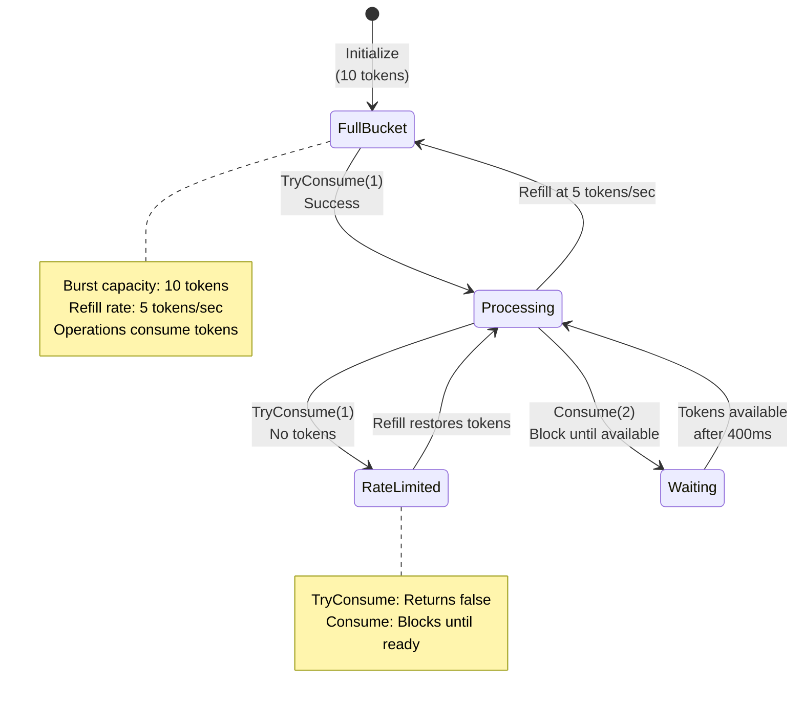

**Code**:

```go
package main

import (
    "fmt"
    "sync"
    "time"
)

func main() {
    // Create rate limiter: 5 tokens per second, burst of 10
    // => Token bucket algorithm: refill at fixed rate, consume for operations
    limiter := NewTokenBucket(5, 10)
    // => refillRate=5 tokens/sec, maxTokens=10 (burst capacity)
    // => Starts with 10 tokens (full bucket)
    // => Refills continuously at 5 tokens/second
    // => Example: After 2 seconds, +10 tokens (but capped at maxTokens=10)

    // Try to consume tokens (non-blocking)
    // => TryConsume returns immediately (true if allowed, false if rate limited)
    for i := 0; i < 15; i++ {          // => 15 requests
        if limiter.TryConsume(1) {     // => Try to consume 1 token
            // => Returns true if token available (consumed successfully)
            fmt.Printf("Request %d: Allowed\n", i+1)
            // => Output: "Request 1: Allowed", "Request 2: Allowed", ...
        } else {                       // => Insufficient tokens
            // => Returns false immediately (doesn't wait)
            fmt.Printf("Request %d: Rate limited\n", i+1)
            // => Output: "Request 11: Rate limited" (after burst exhausted)
        }
        time.Sleep(100 * time.Millisecond) // => 100ms between requests
        // => Request rate: 10 requests/second
        // => Refill rate: 5 tokens/second
        // => Result: first 10 requests allowed (burst), then alternating allow/deny
    }

    // Wait-based consumption (blocks until token available)
    // => Consume waits for tokens (blocking operation)
    fmt.Println("\nWait-based consumption:")
    for i := 0; i < 5; i++ {           // => 5 iterations
        limiter.Consume(2)             // => Wait for 2 tokens
        // => Blocks until 2 tokens available
        // => At 5 tokens/sec, 2 tokens = 400ms wait
        fmt.Printf("Consumed 2 tokens at %s\n", time.Now().Format("15:04:05.000"))
        // => Output: "Consumed 2 tokens at 10:30:15.000"
        // => Shows timing of token consumption (demonstrates waiting)
    }
    // => Total 5 iterations * 2 tokens = 10 tokens consumed
    // => At 5 tokens/sec, 10 tokens = 2 seconds total time
}

// TokenBucket implements rate limiting via token bucket algorithm
// => Algorithm: tokens refill continuously, operations consume tokens
// => Prevents request bursts while allowing controlled rate
type TokenBucket struct {
    tokens     float64                // => Current tokens available
    // => Float allows fractional tokens (smooth refill)
    // => Example: 7.5 tokens after 1.5 seconds at 5 tokens/sec
    maxTokens  float64                // => Burst capacity (max tokens in bucket)
    // => Caps token accumulation (prevents infinite burst)
    // => Example: maxTokens=10 means max 10 requests instantly
    refillRate float64                // => Tokens added per second
    // => Continuous refill rate (not discrete ticks)
    // => Example: 5.0 means 5 tokens added every second
    lastRefill time.Time              // => Last refill timestamp
    // => Used to calculate elapsed time for refill
    // => Updated each time refill() called
    mu         sync.Mutex             // => Protects shared state (tokens, lastRefill)
    // => Required for concurrent access (multiple goroutines)
}

func NewTokenBucket(refillRate, maxTokens float64) *TokenBucket {
    // => Constructor: initializes token bucket with parameters
    // => refillRate: tokens per second (e.g., 5.0)
    // => maxTokens: burst capacity (e.g., 10.0)
    return &TokenBucket{
        tokens:     maxTokens,         // => Start with full bucket
        // => Allows immediate burst up to maxTokens
        maxTokens:  maxTokens,         // => Store burst capacity
        refillRate: refillRate,        // => Store refill rate
        lastRefill: time.Now(),        // => Initialize refill timestamp
        // => Refill calculations use time since lastRefill
    }
}

// TryConsume attempts to consume tokens, returns false if insufficient
// => Non-blocking: returns immediately (doesn't wait)
func (tb *TokenBucket) TryConsume(tokens float64) bool {
    // => tokens is number of tokens to consume (e.g., 1.0)
    tb.mu.Lock()                       // => Acquire lock (exclusive access)
    defer tb.mu.Unlock()               // => Release lock on exit

    tb.refill()                        // => Refill tokens based on elapsed time
    // => CRITICAL: Always refill before checking availability
    // => Ensures tokens up-to-date (accounts for time since last refill)

    if tb.tokens >= tokens {           // => Check if sufficient tokens
        // => Example: tb.tokens=5.0, tokens=1.0 → 5.0 >= 1.0 (true)
        tb.tokens -= tokens            // => Consume tokens
        // => tb.tokens = 5.0 - 1.0 = 4.0 (updated state)
        return true                    // => Operation allowed
    }
    return false                       // => Insufficient tokens (operation denied)
    // => Example: tb.tokens=0.5, tokens=1.0 → 0.5 >= 1.0 (false)
}

// Consume waits until sufficient tokens available (blocking)
// => Blocks calling goroutine until tokens available
func (tb *TokenBucket) Consume(tokens float64) {
    // => tokens is number of tokens to wait for (e.g., 2.0)
    for {                              // => Infinite loop until success
        tb.mu.Lock()                   // => Acquire lock
        tb.refill()                    // => Refill tokens

        if tb.tokens >= tokens {       // => Check if sufficient tokens
            tb.tokens -= tokens        // => Consume tokens
            // => Success: tokens consumed, exit function
            tb.mu.Unlock()             // => Release lock
            return                     // => Exit loop and function
        }

        // Calculate wait time for needed tokens
        // => Not enough tokens, need to wait for refill
        needed := tokens - tb.tokens   // => How many more tokens needed
        // => Example: tokens=2.0, tb.tokens=0.5 → needed=1.5
        waitTime := time.Duration(needed/tb.refillRate*1000) * time.Millisecond
        // => Calculate time to accumulate needed tokens
        // => Formula: time = needed / rate
        // => Example: 1.5 tokens / 5 tokens/sec = 0.3 sec = 300ms
        tb.mu.Unlock()                 // => Release lock before sleeping
        // => CRITICAL: Must unlock before Sleep (allow other goroutines)

        time.Sleep(waitTime)           // => Sleep until tokens likely available
        // => After sleep, loop again (refill + recheck)
        // => Not guaranteed exact (other goroutines may consume tokens)
    }
}

// refill adds tokens based on elapsed time
// => CRITICAL: Must be called with lock held (mu.Lock())
func (tb *TokenBucket) refill() {
    now := time.Now()                  // => Current time
    elapsed := now.Sub(tb.lastRefill).Seconds()
    // => Time since last refill in seconds (float64)
    // => Example: 1.5 seconds elapsed
    tokensToAdd := elapsed * tb.refillRate
    // => Calculate tokens to add (time × rate)
    // => Example: 1.5 sec × 5 tokens/sec = 7.5 tokens

    tb.tokens += tokensToAdd           // => Add refilled tokens
    // => Example: tb.tokens = 2.0 + 7.5 = 9.5
    if tb.tokens > tb.maxTokens {      // => Cap at max capacity
        // => Prevents infinite accumulation
        // => Example: if 9.5 > 10.0, cap at 10.0
        tb.tokens = tb.maxTokens       // => Set to max (burst limit)
    }

    tb.lastRefill = now                // => Update refill timestamp
    // => Next refill calculates from this timestamp
}

// Token bucket algorithm properties:
//
// 1. Burst allowance: maxTokens allows burst of requests
//    - Example: 10 tokens → 10 instant requests allowed
//    - After burst, must wait for refill (controlled rate)
//
// 2. Sustained rate: refillRate controls long-term average
//    - Example: 5 tokens/sec → max 5 requests/sec sustained
//    - Burst can exceed this briefly (using accumulated tokens)
//
// 3. Smooth refill: tokens accumulate continuously (not discrete)
//    - Fractional tokens enable precise timing
//    - Example: 0.5 seconds → 2.5 tokens at 5 tokens/sec rate
//
// 4. Fairness: TryConsume is first-come-first-served
//    - No prioritization (lock acquisition order determines access)
//    - Consume waits fairly (sleep + retry)
//
// Production usage:
// - API rate limiting: limit requests per user/IP
// - Resource throttling: control database query rate
// - Traffic shaping: smooth burst traffic into steady rate
//
// Trade-offs vs alternatives:
// - Token bucket: allows bursts (good for bursty traffic)
// - Leaky bucket: strict rate (no bursts, smoother output)
// - Fixed window: simple but allows double-rate at boundaries
// - Sliding window: more accurate but more complex
//
// Real implementation (production):
// Use golang.org/x/time/rate package (battle-tested, optimized)
```

**Key Takeaway**: Token bucket rate limiting: maintain token count, refill at fixed rate, consume tokens for operations. `TryConsume()` fails immediately when tokens unavailable. `Consume()` waits until tokens available. Production systems use `golang.org/x/time/rate` package, but understanding the algorithm helps debug rate limiting issues.

**Why It Matters**: Rate limiting with token buckets prevents API abuse and overload, where allowing bursts (initial token capacity) while enforcing sustained rate limits protects services from traffic spikes. Production APIs rate-limit by IP, user, or API key to ensure fair resource allocation and prevent denial of service. Understanding when to use rate limiting (public APIs, expensive operations) vs circuit breakers (protecting dependencies) is essential for building resilient services.

## Example 60: Benchmarking and Optimization

Benchmarks measure performance and guide optimization. Understanding `b.N`, `b.ResetTimer()`, and `b.Run()` enables precise performance measurement. Never optimize without benchmarks - measure before and after.

**Code**:

```go
package main

import (
    "fmt"
    "strings"
    "testing"
)

// Function to benchmark - string concatenation (inefficient)
func concatStrings(n int) string {
    // => String concatenation with + operator (creates new string each time)
    var result string                  // => result is "" (empty string)
    for i := 0; i < n; i++ {           // => Iterate n times (e.g., 100)
        result += "x"                  // => String concatenation (inefficient)
        // => Strings are immutable: result + "x" creates NEW string
        // => Old string discarded (garbage collection overhead)
        // => Iteration 1: "" → "x" (1 allocation)
        // => Iteration 2: "x" → "xx" (1 allocation, "x" discarded)
        // => Iteration 100: "xxx...x" → "xxx...xx" (1 allocation)
        // => Total: n allocations (O(n) memory allocations)
        // => Also O(n²) time complexity (copying grows with string length)
    }
    return result                      // => Returns "xxxx...x" (n characters)
}

func concatStringsBuilder(n int) string {
    // => strings.Builder (efficient, preallocated buffer)
    var builder strings.Builder        // => builder has internal byte buffer
    for i := 0; i < n; i++ {           // => Iterate n times
        builder.WriteString("x")       // => Append to buffer (efficient)
        // => WriteString appends to internal buffer (no new allocation)
        // => Buffer grows when full (exponential growth strategy)
        // => Total allocations: ~log(n) (buffer resizes)
        // => Time complexity: O(n) (linear)
    }
    return builder.String()            // => Convert buffer to string (1 allocation)
    // => Total allocations: ~log(n) + 1 << n allocations
}

// Basic benchmark - measures performance of single operation
func BenchmarkConcatStrings(b *testing.B) {
    // => b is *testing.B (benchmark controller)
    // => b.N is number of iterations (framework adjusts automatically)
    for i := 0; i < b.N; i++ {         // => Loop b.N times
        // => Framework adjusts b.N to get stable timing (1s minimum)
        // => Example: b.N might be 10000, 100000, 500000 depending on speed
        concatStrings(100)             // => Benchmark with n=100
        // => Each call concatenates 100 strings
        // => Result discarded (we only measure time)
    }
    // => Output (example): BenchmarkConcatStrings-8  500000  3000 ns/op
    // => 500000 iterations, 3000 nanoseconds per operation
}

func BenchmarkConcatStringsBuilder(b *testing.B) {
    for i := 0; i < b.N; i++ {         // => Same pattern as above
        concatStringsBuilder(100)      // => Builder version (should be faster)
    }
    // => Output (example): BenchmarkConcatStringsBuilder-8  5000000  300 ns/op
    // => 10x faster than naive concatenation
}

// Benchmark with subtests (different input sizes)
// => Demonstrates performance characteristics at different scales
func BenchmarkStringOperations(b *testing.B) {
    sizes := []int{10, 100, 1000}      // => Test at small, medium, large scales
    // => Reveals algorithmic complexity (O(n²) vs O(n))

    for _, size := range sizes {       // => Iterate over sizes
        b.Run(fmt.Sprintf("Concat-%d", size), func(b *testing.B) {
            // => b.Run creates subtest with name "Concat-10", "Concat-100", etc.
            // => Each subtest measured independently
            for i := 0; i < b.N; i++ { // => Inner benchmark loop
                concatStrings(size)    // => Benchmark at this size
            }
        })
        // => Subtest timing shows how performance scales with input size

        b.Run(fmt.Sprintf("Builder-%d", size), func(b *testing.B) {
            for i := 0; i < b.N; i++ {
                concatStringsBuilder(size) // => Builder version at same size
            }
        })
    }
    // => Output shows performance at each size:
    // => Concat-10     1000000   1200 ns/op
    // => Concat-100     500000   3000 ns/op (2.5x slower for 10x input)
    // => Concat-1000     50000  30000 ns/op (10x slower for 10x input)
    // => Reveals O(n²) complexity (time grows quadratically)
    //
    // => Builder-10    5000000    240 ns/op
    // => Builder-100   5000000    300 ns/op (1.25x slower for 10x input)
    // => Builder-1000  1000000   1200 ns/op (4x slower for 10x input)
    // => Closer to O(n) complexity (time grows linearly)
}

// Benchmark with setup (exclude setup time from measurement)
func BenchmarkWithSetup(b *testing.B) {
    // Setup (not timed) - prepare test data
    data := make([]int, 10000)         // => Create slice with 10000 elements
    for i := range data {              // => Initialize data
        data[i] = i                    // => data[0]=0, data[1]=1, ..., data[9999]=9999
    }
    // => Setup complete, but timer hasn't started yet

    b.ResetTimer()                     // => Reset timer after setup
    // => CRITICAL: Excludes setup time from benchmark
    // => Timer starts fresh from this point
    // => Only measures performance of actual work (not setup overhead)

    // Benchmarked code (timed)
    for i := 0; i < b.N; i++ {         // => Benchmark loop
        sum := 0                       // => sum is 0
        for _, v := range data {       // => Iterate over 10000 elements
            sum += v                   // => Accumulate sum
        }                              // => sum is 49995000 (0+1+2+...+9999)
        _ = sum                        // => Discard sum (prevent compiler optimization)
        // => Without this, compiler might eliminate entire loop (dead code)
    }
    // => Measures only summation performance (not data initialization)
}

// Memory allocation benchmark - tracks allocations in addition to time
func BenchmarkMemoryAllocation(b *testing.B) {
    b.ReportAllocs()                   // => Enable allocation reporting
    // => Without ReportAllocs(), only time measured (not allocations)

    for i := 0; i < b.N; i++ {         // => Benchmark loop
        _ = make([]int, 1000)          // => Allocate slice with 1000 elements
        // => Each iteration allocates 1000 × 8 bytes = 8000 bytes (64-bit ints)
        // => Allocation happens on heap (slice size unknown at compile time)
        // => _ prevents compiler from optimizing away allocation
    }
    // => Output: BenchmarkMemoryAllocation-8  5000000  280 ns/op  8192 B/op  1 allocs/op
    // => 280ns per operation (allocation time)
    // => 8192 bytes per operation (actual allocation, includes overhead)
    // => 1 allocation per operation (make() allocates once)
}

// Run benchmarks:
// go test -bench=. -benchmem
// => -bench=. runs all benchmarks (. matches all)
// => -benchmem includes memory allocation stats
// => Output shows: ns/op (time), B/op (bytes), allocs/op (allocations)
//
// Run specific benchmark:
// go test -bench=BenchmarkConcatStrings -benchmem
// => Only runs benchmarks matching name pattern
//
// Compare benchmarks before/after optimization:
// go test -bench=Concat -benchmem > old.txt
// (make changes)
// go test -bench=Concat -benchmem > new.txt
// benchcmp old.txt new.txt  # (use benchcmp tool to compare)
//
// Example output comparison:
// => Concat-100         500000   3000 ns/op   9900 B/op   99 allocs/op
// => Builder-100       5000000    300 ns/op    512 B/op    1 allocs/op
// => Builder is 10x faster, uses 95% less memory, 99% fewer allocations
//
// Performance optimization workflow:
// 1. Write benchmark for current implementation
// 2. Run benchmark, record baseline (ns/op, allocations)
// 3. Optimize code (algorithm, data structures, etc.)
// 4. Run benchmark again, compare results
// 5. Verify optimization improved performance (not regression)
// 6. Repeat until target performance achieved
//
// Benchmark best practices:
// - Use b.ResetTimer() to exclude setup
// - Use b.ReportAllocs() to track memory
// - Test multiple input sizes (reveal complexity)
// - Prevent compiler optimizations (use results with _)
// - Run benchmarks multiple times (variance)
// - Benchmark before optimizing (avoid premature optimization)
```

**Key Takeaway**: Use `b.N` in benchmarks - Go adjusts it for accurate timing. Use `b.ResetTimer()` to exclude setup. Use `b.Run()` for sub-benchmarks. Run with `-benchmem` to see memory allocations. Compare before/after benchmarks to validate optimizations. String concatenation with `+` is 10x slower than `strings.Builder` for loops.

**Why It Matters**: Benchmarking and optimization require measurement before changes, where profiling (CPU, memory) identifies actual bottlenecks rather than assumed ones. The stdlib `testing` package integrates benchmarking into the test workflow, making performance testing first-class. Production teams benchmark performance-critical paths (request handlers, data processing pipelines) in CI to catch regressions. Understanding how to interpret benchmark results (ns/op, allocs/op, MB/s) guides optimization with data-driven decisions.
