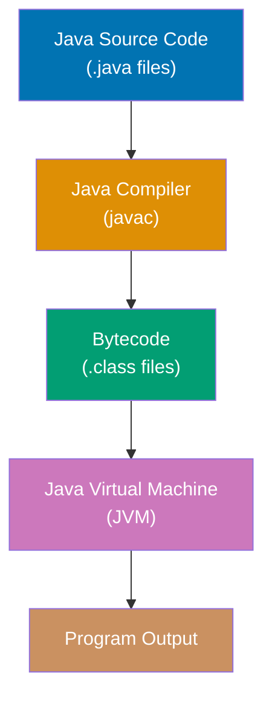
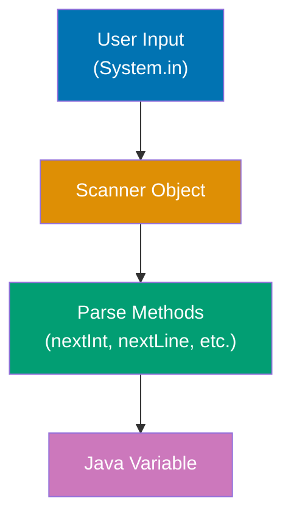
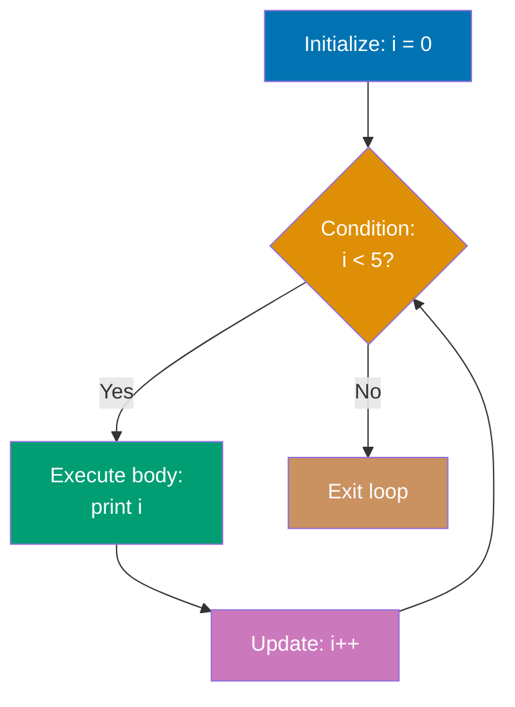
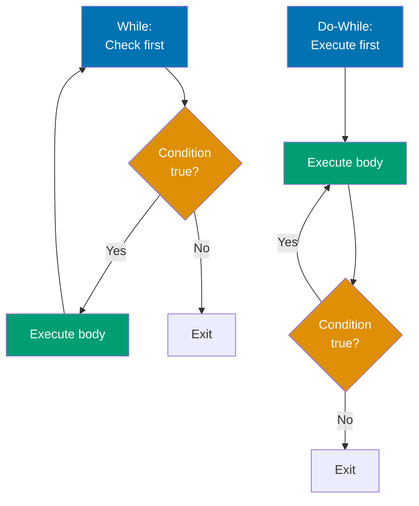
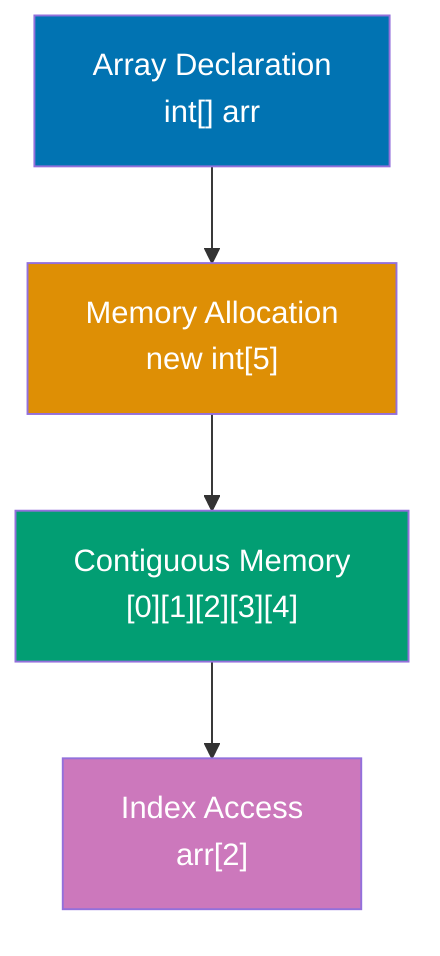
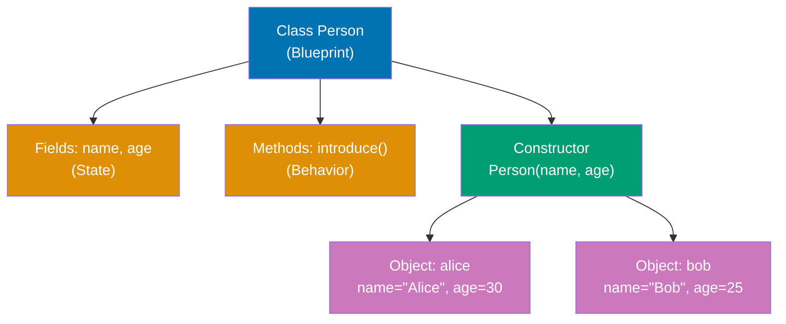
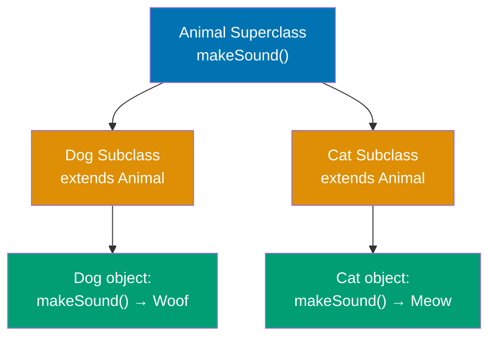
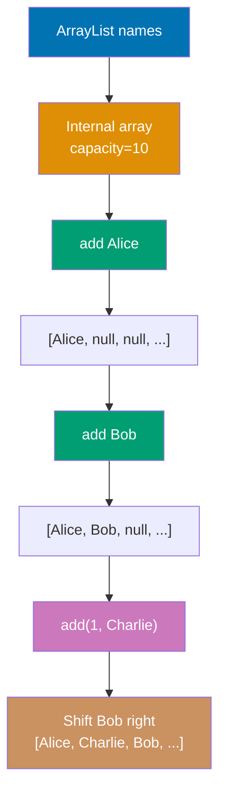
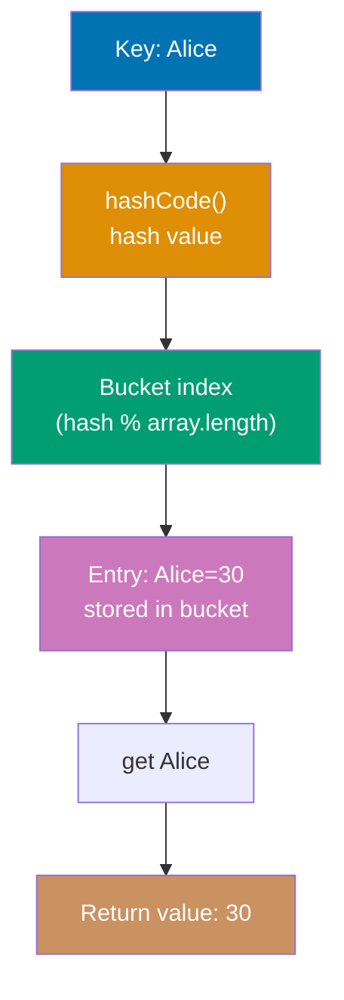
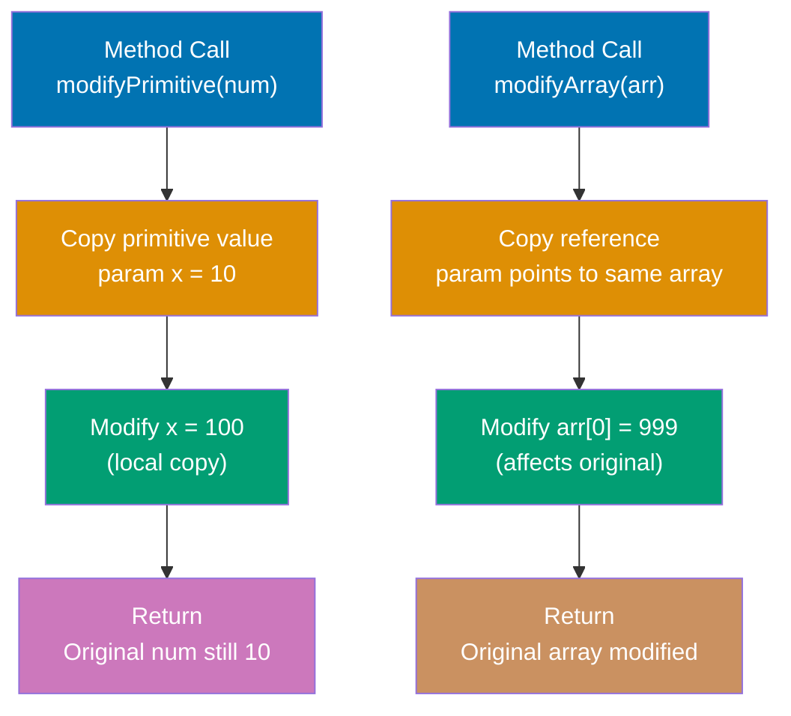

Learn Java fundamentals through 33 annotated code examples. Each example is self-contained, runnable in JShell or as standalone classes, and heavily commented to show what each line does, expected outputs, and intermediate values.

## Basic Syntax and Types

Core Java syntax: how programs are structured, how variables are declared, and how Java's type system enforces safety at compile time.

## Example 1: Hello World and JVM Compilation

Java programs run on the JVM (Java Virtual Machine). Code is compiled to bytecode (`.class` files) that the JVM executes. This example shows the simplest Java program and how the compilation pipeline works.



**Code**:

```java
// File: HelloWorld.java (filename must match public class name)
public class HelloWorld {                          // => Public class, one per .java file
    public static void main(String[] args) {       // => Entry point: JVM calls this first
                                                   // => args holds command-line arguments
        System.out.println("Hello, World!");       // => Output: Hello, World!
    }
}

// Compilation: javac HelloWorld.java → HelloWorld.class (bytecode)
// => javac converts source to platform-independent bytecode
// Execution: java HelloWorld → JVM loads .class and runs main()
// => JVM interprets or JIT-compiles bytecode to native code
// => Same .class runs on Windows/Linux/macOS (write once, run anywhere)
```

**Key Takeaway**: Java code is organized into classes with filenames matching public class names. The `public static void main(String[] args)` method is the fixed entry point recognized by the JVM. Code compiles to platform-independent bytecode (`.class` files) executed by the platform-specific JVM, enabling "write once, run anywhere" portability.

**Why It Matters**: The JVM architecture decouples code from operating systems through platform-independent bytecode. Before Java, C/C++ programs required separate compilation for Windows, Linux, and macOS—often with platform-specific code branches. Java's bytecode layer enables shipping one `.jar` file that runs identically across all platforms. This design allows the same codebase to run across heterogeneous infrastructure.

---

## Example 2: Variables and Type System

Java is statically typed with two categories: primitive types (stored on stack) and reference types (stored on heap). Types can be declared explicitly or inferred with `var`.

**Code**:

```java
// 8 PRIMITIVE TYPES
byte b = 127;                    // => b = 127 (8-bit signed integer, -128 to 127)
short s = 32000;                 // => s = 32000 (16-bit signed integer)
int i = 42;                      // => i = 42 (32-bit signed integer, default)
long l = 1000000L;               // => l = 1000000 (64-bit signed integer, L suffix required)
float f = 3.14f;                 // => f = 3.14 (32-bit floating point, f suffix required)
double d = 3.14159;              // => d = 3.14159 (64-bit floating point, default decimal type)
boolean bool = true;             // => bool = true (true or false, not 1/0)
char c = 'A';                    // => c = 'A' (16-bit Unicode character)

// REFERENCE TYPES
String str = "Hello";            // => str = "Hello" (reference type, stored on heap, can be null)
int[] array = {1, 2, 3};         // => array = [1, 2, 3] (reference to array object)

// TYPE INFERENCE
var num = 100;                   // => num = 100 (type: int, inferred from literal)
var text = "World";              // => text = "World" (type: String, inferred from literal)

System.out.println(i);           // => Output: 42
System.out.println(str);         // => Output: Hello
```

**Key Takeaway**: Java has 8 primitive types (stored on stack, cannot be null) and reference types (stored on heap, can be null). Use `var` for type inference in local variables while maintaining static type safety—the compiler infers types at compile time, not runtime.

**Why It Matters**: Java's explicit type system catches errors at compile time rather than runtime, preventing entire categories of bugs. The primitive/reference distinction optimizes memory layout—primitives avoid heap allocation overhead for simple values (ints, booleans), while reference types enable object sharing and polymorphism essential for OOP. This design lets the JVM optimize hot paths with primitive operations while maintaining object-oriented flexibility for complex data structures. Java's `var` keyword (introduced in Java 10) reduces boilerplate without sacrificing type safety—the compiler resolves types entirely at compile time, preserving performance and IDE support.

---

## Example 3: Basic Input/Output with Scanner

Java's `Scanner` class reads formatted input from various sources (console, files, strings). It's the standard way to handle user input in console applications and parse structured text data.



**Code**:

```java
import java.util.Scanner;        // => Scanner from java.util package

Scanner scanner = new Scanner(System.in);  // => Creates Scanner for console input
                                 // => Wraps System.in (standard input stream)

System.out.print("Enter your name: ");  // => Prompts user (no newline)
String name = scanner.nextLine();  // => Reads entire line from user
                                 // => Reads line: "Alice\n" → "Alice" (strips newline)

System.out.print("Enter your age: ");  // => Prompts for age
int age = scanner.nextInt();     // => Parses integer from input
                                 // => Parses integer (newline stays in buffer!)
scanner.nextLine();              // => Consume leftover \n from buffer
                                 // => REQUIRED after nextInt (prevents nextLine bug)

System.out.println("Hello, " + name + "! You are " + age + " years old.");  // => Outputs greeting
                                 // => Output: Hello, Alice! You are 25 years old.

scanner.close();                 // => Release resources (closes System.in)
```

**Key Takeaway**: Use `Scanner` for reading console input with type-safe parsing methods (`nextInt`, `nextDouble`, `nextLine`). Always call `scanner.nextLine()` after `nextInt()` or similar methods to consume leftover newlines that would otherwise interfere with subsequent `nextLine()` calls.

**Why It Matters**: Scanner's tokenized parsing eliminates manual string-to-type conversion boilerplate. The delimiter-based approach (default: whitespace) enables easy parsing of structured data like CSV files or space-separated integers. The newline consumption quirk (nextInt doesn't consume trailing \n) is a common beginner gotcha. Production code often prefers BufferedReader for performance or Files.readAllLines() for modern file I/O, but Scanner remains a standard teaching tool and is used in competitive programming and quick scripts.

---

## Control Flow and Iteration

Java's control flow constructs: conditional branches, loops, and iteration patterns that control program execution.

## Example 4: Control Flow - If/Else and Switch

Java provides `if/else` for conditional branching and `switch` for multi-way branching. Modern Java (14+) adds switch expressions for more concise pattern matching.

**Code**:

```java
int score = 85;                  // => score initialized to 85 (primitive int)
                                 // => Mutable local variable (can be reassigned)

// IF/ELSE - traditional conditional branching
if (score >= 90) {               // => First condition: score >= 90 (85 >= 90)
                                 // => Evaluates to false (85 < 90), skip block
    System.out.println("Grade: A");
} else if (score >= 80) {        // => Second condition: score >= 80 (85 >= 80)
                                 // => Evaluates to true, enter this block
                                 // => Short-circuit evaluation: remaining else-if blocks skipped
    System.out.println("Grade: B");  // => Output: Grade: B (executed)
} else if (score >= 70) {        // => Not evaluated (previous branch taken)
    System.out.println("Grade: C");
} else {                         // => Catch-all for score < 70
    System.out.println("Grade: F");
}

// SWITCH STATEMENT - multi-way branch
String day = "Monday";           // => day references String "Monday"
                                 // => String type (reference, not primitive)
switch (day) {                   // => Switch on String value (Java 7+)
    case "Monday":               // => Matches: day.equals("Monday") is true
                                 // => Uses equals() for String comparison, not ==
        System.out.println("Start of work week");
                                 // => Output: Start of work week
        break;                   // => Exit switch immediately (prevents fall-through)
    case "Friday":               // => Not matched (already exited via break)
        System.out.println("TGIF!");
        break;                   // => Exit switch if this case matched
    default:                     // => Matches any value not covered by cases
                                 // => Optional but recommended for completeness
        System.out.println("Midweek");
}

// SWITCH EXPRESSION - modern syntax (Java 14+)
int numLetters = switch (day) {  // => Switch as expression (returns value to numLetters)
                                 // => Returns value directly (not void like switch statement)
    case "Monday", "Friday" -> 6; // => Arrow syntax (implicit break, returns 6)
                                 // => Matches "Monday" (day value), returns 6
    case "Tuesday" -> 7;         // => Returns 7 if day is "Tuesday"
    case "Wednesday" -> 9;       // => Returns 9 if day is "Wednesday"
    default -> 0;                // => Required: compiler checks exhaustiveness
                                 // => Ensures all possible values handled
};                               // => numLetters assigned 6 (from "Monday" case)
System.out.println(numLetters);  // => Output: 6 (value returned by switch expression)
```

**Key Takeaway**: Use `if/else` for simple boolean conditions and modern switch expressions for multi-way branching based on discrete values. Switch expressions with arrow syntax (`->`) eliminate fall-through bugs and enable value-returning switches, making code safer and more concise than traditional switch statements.

**Why It Matters**: Switch expressions (Java 14+) fix a criticized control flow issue: the mandatory `break` keyword that caused fall-through bugs where forgetting `break` executed unintended cases. The arrow syntax (`->`) provides implicit break behavior and enables switches as expressions that return values, eliminating temporary variables. This aligns Java with modern languages while maintaining backward compatibility. Pattern matching in switch (Java 17+ preview, 21 stable) extends this further to type-safe object decomposition, bringing algebraic data type capabilities to Java's type system.

---

## Example 5: For Loop Basics

The `for` loop is used when you know how many iterations you need. It has three parts: initialization, condition, and update.



**Code**:

```java
// Basic for loop
for (int i = 0; i < 5; i++) {    // => i = 0; condition i < 5; increment i++
                                 // => Checks condition before each iteration
    System.out.print(i + " ");   // => Output: 0 1 2 3 4 (each iteration prints current i)
}                                // => Loop terminates when i = 5 (condition false)
System.out.println();            // => Newline

// Loop with step size
for (int i = 0; i < 10; i += 2) { // => Start at 0, increment by 2 each time
                                 // => Custom increment (not just i++)
    System.out.print(i + " ");   // => Output: 0 2 4 6 8
}
System.out.println();            // => Newline

// Countdown loop
for (int i = 5; i > 0; i--) {    // => Start at 5, decrement until i <= 0
                                 // => Reverse iteration
    System.out.print(i + " ");   // => Output: 5 4 3 2 1
}                                // => Stops when i = 0 (condition i > 0 is false)
System.out.println();            // => Newline
```

**Key Takeaway**: Use `for` loops when you know the iteration count. The loop has three parts: initialization (`int i = 0`), condition (`i < 5`), and update (`i++`). All three parts are optional but the semicolons are required.

**Why It Matters**: For loops are a common iteration construct in Java. The compact syntax (`for (init; condition; update)`) puts all loop control in one line, making iteration logic immediately visible—unlike while loops where initialization, condition, and update are scattered across multiple lines. Traditional for loops remain useful for index-based operations (accessing arrays by position, generating sequences, timing operations), though enhanced for-loops and streams are often used for simple collection iteration.

---

## Example 6: While and Do-While Loops

While loops continue as long as a condition is true. Do-while loops execute the body first, then check the condition.



**Code**:

```java
// WHILE - condition checked before execution
int count = 0;                   // => count = 0
while (count < 3) {              // => Check condition FIRST
                                 // => Loop may never execute if condition initially false
    System.out.print(count + " "); // => Output: 0 1 2
                                 // => Body executes 3 times (count: 0, 1, 2)
    count++;                     // => Increment count (manual update)
                                 // => count becomes 1, then 2, then 3
}                                // => Loop exits when count = 3 (3 < 3 is false)
System.out.println();            // => Newline

// DO-WHILE - body executes first, then condition checked
int num = 0;                     // => num = 0
do {
                                 // => Body executes before condition check
    System.out.print(num + " "); // => Executes at least ONCE (even if condition false)
                                 // => Guaranteed first execution
    num++;                       // => num becomes 1, 2, 3
} while (num < 3);               // => Check condition AFTER execution
                                 // => Continues while num < 3
System.out.println();            // => Output: 0 1 2
                                 // => Same output as while, but different execution order

// Demonstrating difference: condition false from start
int x = 10;
while (x < 5) {                  // => Condition false, body never executes
                                 // => 10 < 5 is false, skips body entirely
    System.out.println("while: " + x);
}                                // => No output
                                 // => While can execute 0 times

int y = 10;
do {
                                 // => Body executes before condition check
    System.out.println("do-while: " + y); // => Executes once: "do-while: 10"
                                 // => Guaranteed first execution regardless of condition
} while (y < 5);                 // => Condition false after first execution
                                 // => Do-while always executes at least once
```

**Key Takeaway**: Use `while` when you need condition-based looping (unknown iteration count). Use `do-while` when the body must execute at least once before checking the condition. The key difference: while checks before executing, do-while checks after.

**Why It Matters**: While loops are essential for unknown iteration counts—reading user input until valid, processing network data until stream ends, retrying operations until success. Do-while loops are rarer but critical for guaranteed-execution scenarios like menu systems (show menu at least once before checking user choice) or retry logic (attempt operation, then check if retry needed). Unlike for loops which are syntactic sugar for while loops, the do-while guarantee of at least one execution enables specific patterns impossible with while or for.

---

## Example 7: Enhanced For Loop (For-Each)

The enhanced for loop (for-each) simplifies iteration over arrays and collections without managing indices.

**Code**:

```java
// Enhanced for loop with arrays
int[] numbers = {10, 20, 30, 40, 50}; // => Array with 5 elements
for (int n : numbers) {          // => "for each n in numbers"
                                 // => No index needed, automatic iteration
    System.out.print(n + " ");   // => n is copy of each element
}                                // => Output: 10 20 30 40 50
                                 // => Cannot modify original array through n
System.out.println();            // => Newline

// Works with collections too
import java.util.List;
List<String> names = List.of("Alice", "Bob", "Charlie"); // => Immutable list
for (String name : names) {      // => Iterates over collection elements
                                 // => Works with any Iterable type
    System.out.println("Hello, " + name); // => Output: Hello, Alice / Hello, Bob / Hello, Charlie
}                                // => Each iteration: name is next element

// Multidimensional arrays
int[][] matrix = {{1, 2}, {3, 4}, {5, 6}}; // => 3 rows, 2 columns
for (int[] row : matrix) {       // => Each iteration: row is an int[] array
                                 // => Outer loop iterates over rows
    for (int value : row) {      // => Nested loop for elements in row
                                 // => Inner loop iterates over columns
        System.out.print(value + " "); // => Output: 1 2 3 4 5 6
    }
}
System.out.println();            // => Newline
```

**Key Takeaway**: Enhanced for loops (`for (element : collection)`) eliminate index management and off-by-one errors. Use when you need to access each element but don't need the index. Cannot modify array/collection elements (element variable is a copy).

**Why It Matters**: Enhanced for loops (Java 5, 2004) eliminated a major cause of array iteration bugs—off-by-one errors from manual index arithmetic. The syntax `for (Type elem : array)` lets the iterator handle bounds automatically, avoiding common mistakes like `i <= array.length` (throws exception) or `array[i+1]` (index out of bounds). The syntax also provides abstraction—works identically for arrays, Lists, Sets, and any Iterable, enabling generic code without knowing the collection type. Combined with streams (Java 8+), enhanced for loops are commonly used for simple iteration.

---

## Example 8: Array Basics

Arrays are fixed-size, indexed collections storing elements of a single type. They use zero-based indexing and have O(1) access time.



**Code**:

```java
// Array declaration and initialization
int[] numbers = {1, 2, 3, 4, 5}; // => Array literal: [1, 2, 3, 4, 5], length=5
int[] empty = new int[10];       // => Allocates array of 10 elements, initialized to 0

// Array access (zero-based indexing)
int first = numbers[0];          // => first is 1 (index 0 is first element)
int last = numbers[numbers.length - 1]; // => last is 5 (length is 5, so index 4 is last)

// Array mutation
numbers[2] = 99;                 // => Modifies index 2
                                 // => numbers becomes [1, 2, 99, 4, 5]

// Multidimensional arrays
int[][] matrix = {               // => 2D array (array of arrays)
    {1, 2, 3},                   // => Row 0
    {4, 5, 6}                    // => Row 1
};
int value = matrix[1][2];        // => Access row 1, column 2
                                 // => value is 6
```

**Key Takeaway**: Arrays have fixed size set at creation and use zero-based indexing. Access length via `.length` property (not method). Arrays are mutable—you can change elements but not the size.

**Why It Matters**: Arrays are Java's lowest-level data structure with O(1) random access and minimal overhead—just object header plus elements. This makes them useful for performance-sensitive code. The fixed-size limitation is often acceptable for known-size data, and the direct memory layout enables JIT optimizations like loop unrolling and SIMD vectorization that collections can't match. For dynamic sizing, ArrayList (backed by resizable arrays) is preferred.

---

## Example 9: Array Utilities

The `Arrays` class provides utility methods for sorting, copying, searching, and converting arrays to strings.

**Code**:

```java
import java.util.Arrays;         // => Import Arrays utility class

int[] numbers = {3, 1, 4, 1, 5, 9, 2, 6}; // => Unsorted array

// Copying arrays
int[] copy = Arrays.copyOf(numbers, numbers.length); // => Deep copy of entire array
                                 // => copy is [3, 1, 4, 1, 5, 9, 2, 6]
int[] partial = Arrays.copyOf(numbers, 3); // => Copy first 3 elements
                                 // => partial is [3, 1, 4]

// Sorting
Arrays.sort(numbers);            // => In-place sort (modifies original)
                                 // => numbers becomes [1, 1, 2, 3, 4, 5, 6, 9]
System.out.println(Arrays.toString(numbers)); // => Output: [1, 1, 2, 3, 4, 5, 6, 9]

// Binary search (requires sorted array)
int index = Arrays.binarySearch(numbers, 5); // => Searches for 5 in sorted array
                                 // => index is 5 (5 is at index 5)
int notFound = Arrays.binarySearch(numbers, 10); // => Returns negative if not found
                                 // => notFound is -9 (insertion point indicator)

// Filling arrays
int[] filled = new int[5];       // => [0, 0, 0, 0, 0]
Arrays.fill(filled, 42);         // => Fills all elements with 42
                                 // => filled is [42, 42, 42, 42, 42]

// Comparing arrays
int[] a = {1, 2, 3};
int[] b = {1, 2, 3};
int[] c = {1, 2, 4};
boolean same = Arrays.equals(a, b); // => true (same elements)
boolean diff = Arrays.equals(a, c); // => false (different elements)
```

**Key Takeaway**: Use `Arrays` utility class for common operations—sorting, copying, searching, filling, comparing. `Arrays.toString()` is essential for debugging (arrays don't have a useful default toString). Binary search requires sorted arrays.

**Why It Matters**: The `Arrays` class (Java 1.2, 1998) standardized common array operations that previously required manual loops—eliminating bugs from hand-written binary search or mergesort implementations. `Arrays.sort()` provides a single-line operation with dual-pivot quicksort. `Arrays.equals()` prevents the common mistake of using `==` (compares references, not contents). These utilities are fast, correct, and eliminate boilerplate.

---

## Object-Oriented Programming

Java's OOP model: classes, objects, inheritance hierarchies, interfaces, and the polymorphism that ties them together.

## Example 10: Classes and Objects

Classes are blueprints for objects, defining fields (state) and methods (behavior). Objects are instances of classes created with the `new` keyword.



**Code**:

```java
// CLASS DEFINITION
public class Person {            // => Blueprint for Person objects
    // FIELDS (instance variables)
    String name;                 // => Package-private field, each object has own copy
    int age;                     // => Auto-initialized (null for String, 0 for int)

    // CONSTRUCTOR
    public Person(String name, int age) {
                                 // => Constructor name MUST match class name
        this.name = name;        // => this.name: instance field, name: parameter
        this.age = age;          // => Assigns parameter to instance field
    }

    // METHOD
    public void introduce() {    // => Instance method, operates on specific object
        System.out.println("Hi, I'm " + name + " and I'm " + age + " years old.");
                                 // => name/age implicitly this.name/this.age
    }
}

// CREATING OBJECTS
Person alice = new Person("Alice", 30);
                                 // => new allocates heap memory + calls constructor
                                 // => alice holds reference to heap object
Person bob = new Person("Bob", 25);
                                 // => Separate object with independent state

// CALLING METHODS
alice.introduce();               // => this refers to alice object
                                 // => Output: Hi, I'm Alice and I'm 30 years old.
bob.introduce();                 // => this refers to bob object
                                 // => Output: Hi, I'm Bob and I'm 25 years old.

// FIELD ACCESS
System.out.println(alice.name);  // => Output: Alice
```

**Key Takeaway**: Classes define object templates with fields (state) and methods (behavior). Constructors initialize objects via `new` keyword. Each object has independent state—modifying one object doesn't affect others. Use `this` keyword to distinguish instance fields from parameters when names collide.

**Why It Matters**: Java's "everything is an object" philosophy (except primitives) encourages consistent OOP design where behavior and data are bundled together. This enables code organization through encapsulation—private fields hide implementation details while public methods expose controlled interfaces. The constructor mechanism standardized object initialization, preventing uninitialized memory bugs. Constructors must be explicitly called via `new`, making object lifetime explicit and simplifying garbage collection.

---

## Example 11: Inheritance and Polymorphism

Inheritance creates class hierarchies where subclasses extend superclasses, inheriting fields and methods. Polymorphism allows treating specialized objects through general types.



**Code**:

```java
// SUPERCLASS
class Animal {                   // => Base class (superclass, parent class)
                                 // => Defines common behavior for all animals
    public void makeSound() {    // => Instance method with default implementation
                                 // => Subclasses can override this method
        System.out.println("Some generic animal sound");
                                 // => Default output for base Animal class
    }
}

// SUBCLASSES
class Dog extends Animal {       // => Dog inherits from Animal (is-a relationship)
                                 // => Dog IS-A Animal (subtype relationship)
                                 // => Inherits all Animal fields and methods
    @Override                    // => Annotation verifies method signature matches superclass
                                 // => Compile error if signature doesn't match Animal.makeSound()
    public void makeSound() {    // => Overrides Animal's makeSound() method
                                 // => Replaces default implementation with Dog-specific behavior
        System.out.println("Woof!");  // => Dog's specific sound
                                 // => Output: Woof! (when Dog calls makeSound)
    }
}

class Cat extends Animal {       // => Cat also extends Animal (is-a relationship)
                                 // => Cat IS-A Animal (another subtype)
                                 // => Inherits all Animal fields and methods
    @Override                    // => Verifies override of Animal.makeSound()
                                 // => Compiler checks signature correctness
    public void makeSound() {    // => Cat's version of makeSound()
                                 // => Overrides default Animal implementation
        System.out.println("Meow!");  // => Cat's specific sound
                                 // => Output: Meow! (when Cat calls makeSound)
    }
}

// POLYMORPHISM
Animal animal1 = new Dog();      // => Dog object referenced as Animal type (upcast)
                                 // => Compile-time type: Animal, Runtime type: Dog
Animal animal2 = new Cat();      // => Cat object referenced as Animal type (upcast)
                                 // => Compile-time type: Animal, Runtime type: Cat
animal1.makeSound();             // => Calls Dog's makeSound() (dynamic dispatch)
                                 // => Output: Woof! (Dog's overridden method)
animal2.makeSound();             // => Calls Cat's makeSound() (dynamic dispatch)
                                 // => Output: Meow! (Cat's overridden method)

// ARRAY OF POLYMORPHIC OBJECTS
Animal[] animals = {new Dog(), new Cat(), new Dog()};
                                 // => Array of Animal references (compile-time type)
                                 // => Contains Dog and Cat objects (runtime types)
for (Animal a : animals) {       // => Iterate using Animal type (polymorphic iteration)
    a.makeSound();               // => Dynamic dispatch: calls actual object's method
                                 // => Output: Woof! Meow! Woof! (3 lines)
}
```

**Key Takeaway**: Inheritance (`extends`) creates is-a relationships where subclasses inherit superclass members. Override methods with `@Override` annotation to customize behavior. Polymorphism lets you reference subclass objects via superclass type—method calls dynamically dispatch to the actual object's overridden method at runtime.

**Why It Matters**: Polymorphism is Java's mechanism for code reuse and extensibility without modifying existing code. Before polymorphism, adding new types (like a new Animal subclass) required modifying every function that processed animals (switch statements checking type). With polymorphism, new subclasses integrate seamlessly—existing code calling `animal.makeSound()` works with new types without changes (Open/Closed Principle). This enables frameworks to operate on user-defined classes through interfaces. However, overuse can create deep inheritance hierarchies; modern Java favors composition (fields of interface types) over inheritance.

---

## Example 12: Interfaces and Abstraction

Interfaces define contracts (what methods a class must implement) without implementation. Classes can implement multiple interfaces, enabling flexible type hierarchies.

**Code**:

```java
// INTERFACE DEFINITION
public interface Drawable {      // => Contract for drawable objects
                                 // => Interface cannot be instantiated (abstract contract)
    void draw();                 // => Abstract method (no body, no implementation)
    double PI = 3.14159;         // => Constant (public static final by default)
}                                // => All methods implicitly public abstract
                                 // => All fields implicitly public static final

// CLASS IMPLEMENTING INTERFACE
class Circle implements Drawable {  // => Implements Drawable contract
                                    // => Must implement all methods
                                    // => Compile error if draw() not implemented
    @Override                       // => Indicates overriding interface method
    public void draw() {            // => Concrete implementation required
        System.out.println("Drawing a circle");  // => Output: Drawing a circle
    }
}

class Square implements Drawable {  // => Another Drawable implementation
    @Override                       // => Overrides draw()
    public void draw() {            // => Square's specific behavior
        System.out.println("Drawing a square");  // => Output: Drawing a square
    }
}

// MULTIPLE INTERFACE IMPLEMENTATION
interface Resizable {               // => Second interface (resizing capability)
                                    // => Independent contract from Drawable
    void resize(int factor);        // => Abstract resize method
}

class FlexibleCircle implements Drawable, Resizable {  // => Implements TWO interfaces
                                    // => Multiple interfaces allowed (unlike inheritance)
                                    // => Must implement draw() AND resize()
    @Override                       // => Implements Drawable.draw()
    public void draw() {            // => FlexibleCircle's draw behavior
        System.out.println("Drawing flexible circle");  // => Output: Drawing flexible circle
    }

    @Override                       // => Implements Resizable.resize()
    public void resize(int factor) {  // => FlexibleCircle's resize behavior
        System.out.println("Resizing by " + factor);  // => Output: Resizing by 3 (example)
    }
}

// POLYMORPHISM WITH INTERFACES
Drawable shape1 = new Circle();  // => Reference via interface type
                                 // => Variable type is Drawable (interface), runtime type is Circle (concrete)
Drawable shape2 = new Square();  // => shape2 = Square instance
shape1.draw();                   // => Calls Circle's draw() (dynamic dispatch)
                                 // => Output: Drawing a circle
shape2.draw();                   // => Calls Square's draw()
                                 // => Output: Drawing a square
```

**Key Takeaway**: Interfaces define method contracts without implementation, forcing implementing classes to provide behavior. Classes can implement multiple interfaces (unlike single-class inheritance), enabling flexible type hierarchies. Use interfaces to define capabilities (Drawable, Runnable, Comparable) rather than concrete types.

**Why It Matters**: Interfaces solve Java's single-inheritance limitation—while a class can only extend one superclass, it can implement unlimited interfaces, enabling role-based composition. This design pattern (interface segregation) prevents the brittle base class problem where changing a superclass breaks all subclasses. Java frameworks commonly depend on interfaces for dependency injection, repository patterns, and container callbacks. Java 8's default methods (interface methods with bodies) enabled interface evolution without breaking implementations, which was important for adding stream operations to the Collections framework.

---

## Collections and Data Structures

Java's collections framework: dynamic arrays, key-value maps, unique sets, and the iteration patterns that work across all collection types.

## Example 13: ArrayList - Dynamic Arrays

ArrayList is a resizable array implementation providing fast random access and automatic growth. It's Java's most commonly used collection type for ordered, index-accessible elements.



**Code**:

```java
import java.util.ArrayList;      // => ArrayList from java.util package

// CREATE ArrayList
ArrayList<String> names = new ArrayList<>();
                                 // => Creates empty ArrayList<String> with capacity 10
                                 // => Generic type ensures compile-time type safety
                                 // => names is [], size=0

// ADD ELEMENTS
names.add("Alice");              // => Appends to end, names is ["Alice"]
names.add("Bob");                // => names is ["Alice", "Bob"]
names.add(1, "Charlie");         // => Insert at index 1, shifts "Bob" right (O(n))
                                 // => names is ["Alice", "Charlie", "Bob"]

// ACCESS ELEMENTS
String first = names.get(0);     // => O(1) random access, first is "Alice"
int size = names.size();         // => size is 3

// MODIFY ELEMENTS
names.set(2, "Dave");            // => Replace index 2, names is ["Alice", "Charlie", "Dave"]

// REMOVE ELEMENTS
names.remove("Charlie");         // => Remove by value (O(n) search), names is ["Alice", "Dave"]
names.remove(0);                 // => Remove by index, names is ["Dave"]

// ITERATE
for (String name : names) {      // => Enhanced for-loop
    System.out.println(name);    // => Output: Dave
}

// CONTAINS AND SEARCH
boolean has = names.contains("Dave");
                                 // => Linear search O(n), has is true
int index = names.indexOf("Dave");
                                 // => index is 0 (returns -1 if not found)
```

**Key Takeaway**: ArrayList provides dynamic arrays that grow automatically, avoiding fixed-size limitations of primitive arrays. Use `add()` to append, `get(index)` to access, `set(index, value)` to modify, and `remove()` to delete. ArrayList maintains insertion order and allows duplicates, making it ideal for ordered collections with unknown size.

**Why It Matters**: ArrayList replaced manual array resizing logic (copying to larger arrays). The automatic doubling strategy (capacity doubles when full) provides amortized O(1) append performance, eliminating the O(n) cost of shifting elements in manual implementations. Generic types (`ArrayList<String>`) added in Java 5 (2004) eliminated ClassCastException runtime errors. ArrayList is internally a resizable `Object[]` array—understanding this reveals why random access is O(1) but insertion/deletion at arbitrary positions is O(n) due to element shifting.

---

## Example 14: HashMap - Key-Value Mappings

HashMap stores key-value pairs with O(1) average-case lookup using hash-based indexing. It's essential for fast associative data structures like caches, indexes, and dictionaries.



**Code**:

```java
import java.util.HashMap;
import java.util.Map;

// CREATE HashMap
HashMap<String, Integer> ages = new HashMap<>();
                                 // => Key type: String, Value type: Integer
                                 // => Backed by hash table (array + linked lists/trees)

// PUT key-value pairs
ages.put("Alice", 30);           // => Computes hash of "Alice" key using hashCode()
                                 // => Maps hash to bucket index: hash % array.length
                                 // => Stores Entry("Alice", 30) at computed bucket
                                 // => ages is {"Alice": 30}, size is 1
ages.put("Bob", 25);             // => Computes hash of "Bob", maps to bucket index
                                 // => Different hash likely results in different bucket
                                 // => Stores Entry("Bob", 25) at its bucket
                                 // => ages is {"Alice": 30, "Bob": 25}, size is 2
ages.put("Alice", 31);           // => Computes hash of "Alice" (same as before)
                                 // => Finds existing Entry with key "Alice" in bucket
                                 // => Overwrites old value 30 with new value 31
                                 // => ages is {"Alice": 31, "Bob": 25}, size still 2

// GET values by key
int aliceAge = ages.get("Alice");// => Computes hash of "Alice", looks up bucket
                                 // => aliceAge is 31 (value found)
Integer charlieAge = ages.get("Charlie");
                                 // => Computes hash, looks up bucket, key not found
                                 // => charlieAge is null (key doesn't exist, returns null)

// GET with default value (Java 8+)
int defaultAge = ages.getOrDefault("Charlie", 0);
                                 // => Looks up "Charlie", not found
                                 // => Returns default value 0 instead of null
                                 // => defaultAge is 0 (Charlie not in map)

// CHECK existence
boolean hasAlice = ages.containsKey("Alice");
                                 // => hasAlice is true
boolean has25 = ages.containsValue(25);
                                 // => has25 is true

// REMOVE
ages.remove("Bob");              // => ages is {"Alice": 31}

// ITERATE over entries
for (Map.Entry<String, Integer> entry : ages.entrySet()) {
    System.out.println(entry.getKey() + ": " + entry.getValue());
    // => Output: Alice: 31
}
```

**Key Takeaway**: HashMap provides O(1) average key-value lookup using hash codes. Keys must implement `hashCode()` and `equals()` properly. Use `put()` to insert/update, `get()` to retrieve, and `containsKey()` to check existence. HashMap does NOT maintain insertion order—use LinkedHashMap if order matters.

**Why It Matters**: HashMap provides near-constant-time lookup (vs O(log n) for TreeMap, O(n) for ArrayList search). The hash function distributes keys across buckets, enabling fast retrieval—useful for caches, database indexes, and routing tables. Java 8's HashMap improvements (tree bins when buckets exceed 8 elements) reduce worst-case from O(n) to O(log n) for lookups from hash collisions. String keys are common (configuration maps, JSON parsing), and String's cached `hashCode()` (computed once, stored in field) makes string-keyed HashMaps especially fast.

---

## Example 15: HashSet - Unique Collections

HashSet stores unique elements with O(1) add/contains operations. It's backed by HashMap internally, using elements as keys with a dummy value.

**Code**:

```java
import java.util.HashSet;

// CREATE HashSet
HashSet<String> unique = new HashSet<>();
                                 // => unique is empty HashSet<String>

// ADD elements (duplicates ignored)
unique.add("apple");             // => unique is {"apple"}, returns true (added)
                                 // => Uses hashCode() to determine bucket
unique.add("banana");            // => unique is {"apple", "banana"}
unique.add("apple");             // => unique unchanged (duplicate), returns false (not added)
                                 // => equals() comparison detects duplicate

// CONTAINS check
boolean has = unique.contains("apple");
                                 // => has is true (O(1) lookup via hash)

// REMOVE
unique.remove("banana");         // => unique is {"apple"}

// SIZE
int count = unique.size();       // => count is 1

// ITERATE (unordered!)
for (String item : unique) {     // => Iterates in hash table order (not insertion order)
    System.out.println(item);    // => Output: apple
}

// SET OPERATIONS
HashSet<Integer> set1 = new HashSet<>(Arrays.asList(1, 2, 3));
                                 // => set1 is {1, 2, 3}
HashSet<Integer> set2 = new HashSet<>(Arrays.asList(3, 4, 5));
                                 // => set2 is {3, 4, 5}

set1.addAll(set2);               // => Union: set1 is {1, 2, 3, 4, 5}
// set1.retainAll(set2);         // => Intersection: keeps only elements in both
// set1.removeAll(set2);         // => Difference: removes elements in set2
```

**Key Takeaway**: HashSet guarantees uniqueness using `equals()` and `hashCode()` for element comparison. Add, remove, and contains operations are O(1) average case. HashSet does NOT maintain order—use LinkedHashSet for insertion order or TreeSet for sorted order.

**Why It Matters**: HashSet implements mathematical set semantics (unique elements, set operations) with hash table performance, eliminating the O(n) duplicate-checking overhead of "contains before add" patterns with ArrayList. This makes HashSet useful for deduplication (removing duplicates from collections), membership testing (checking if element exists), and set algebra (union, intersection, difference). Internally, HashSet is a HashMap with elements as keys and a dummy `PRESENT` constant as value—understanding this reveals why HashSet has same performance characteristics as HashMap and why element `hashCode()` quality directly impacts performance.

---

## Core Language Features

Essential Java language features: operators, iteration patterns, method semantics, exception handling, and the String class.

## Example 16: Control Flow - Ternary and Operators

Beyond if/else, Java provides the ternary operator (`? :`) for inline conditional expressions and short-circuit logical operators for efficient boolean evaluation.

**Code**:

```java
// TERNARY OPERATOR - inline conditional expression
int age = 20;                    // => age is 20 (primitive int)
String status = (age >= 18) ? "adult" : "minor";
                                 // => Ternary syntax: (condition) ? valueIfTrue : valueIfFalse
                                 // => Evaluates age >= 18 → true
                                 // => status is "adult" (20 >= 18 is true)

// Equivalent if/else (more verbose)
String status2;                  // => Declare variable first
if (age >= 18) {                 // => Condition evaluates to true
    status2 = "adult";           // => Enters true branch
} else {
    status2 = "minor";
}                                // => status2 is "adult" (same result)

// SHORT-CIRCUIT OPERATORS
boolean a = true;                // => a is true
boolean b = false;               // => b is false

boolean and = a && b;            // => and is false (both must be true)
                                 // => Short-circuit: if a is false, b never evaluated
boolean or = a || b;             // => or is true (at least one true)
                                 // => Short-circuit: if a is true, b never evaluated

// Short-circuit prevents null pointer errors
String str = null;               // => str references null (no object)
if (str != null && str.length() > 0) {
                                 // => First condition: str != null → false
                                 // => Second condition: str.length() NOT evaluated (short-circuit)
                                 // => Safe: no NullPointerException (str.length() never called)
    System.out.println("Non-empty string");
}

// COMPARISON OPERATORS
int x = 10;                      // => x = 10 (primitive int)
int y = 20;                      // => y = 20 (primitive int)
boolean equal = (x == y);        // => Compares values: 10 == 20 → false
boolean notEqual = (x != y);     // => Compares values: 10 != 20 → true
boolean greater = (x > y);       // => Compares values: 10 > 20 → false
boolean lessOrEqual = (x <= y);  // => Compares values: 10 <= 20 → true

// REFERENCE vs VALUE equality
String s1 = new String("hello"); // => Creates NEW String object in heap
                                 // => s1 references object at memory location A
String s2 = new String("hello"); // => Creates ANOTHER new String object in heap
                                 // => s2 references object at memory location B
boolean refEqual = (s1 == s2);   // => Compares memory addresses (references)
                                 // => refEqual = false (different objects)
boolean valueEqual = s1.equals(s2);
                                 // => Compares string content using equals() method
                                 // => valueEqual = true (same content)
```

**Key Takeaway**: Use ternary operator (`condition ? true : false`) for simple inline conditionals, replacing verbose if/else. Logical operators `&&` and `||` short-circuit—right side only evaluated if necessary, preventing NullPointerExceptions. For objects, use `equals()` for value comparison, `==` for reference comparison.

**Why It Matters**: Short-circuit evaluation prevents defensive null checks from becoming nested if pyramids—`if (obj != null && obj.method())` is cleaner than nested `if (obj != null) { if (obj.method()) {...} }`. The ternary operator enables functional-style expressions where every construct returns a value (common in modern Java streams), though overuse creates unreadable one-liners. The `==` vs `equals()` distinction is important—`==` compares memory addresses for objects (reference equality), while `equals()` compares content (value equality). This design enables object identity checks (`list.remove(specific object reference)`) while requiring explicit value comparison.

---

## Example 17: Enhanced Loops and Iterators

Java's enhanced for-loop simplifies iteration over arrays and collections. Under the hood, it uses the Iterator pattern for type-safe traversal.

**Code**:

```java
import java.util.*;

// ENHANCED FOR with ArrayList
ArrayList<String> fruits = new ArrayList<>(Arrays.asList("apple", "banana", "cherry"));
                                 // => fruits is ["apple", "banana", "cherry"]

for (String fruit : fruits) {    // => Enhanced for-loop: for (element : collection)
                                 // => Internally uses Iterator (compiler translation)
                                 // => Iteration 1: fruit="apple"
                                 // => Iteration 2: fruit="banana"
                                 // => Iteration 3: fruit="cherry"
    System.out.println(fruit);   // => Output: apple, banana, cherry (3 lines)
}

// TRADITIONAL for loop with index
for (int i = 0; i < fruits.size(); i++) {
                                 // => Loop with explicit index i
                                 // => fruits.size() is 3
    System.out.println(i + ": " + fruits.get(i));
                                 // => Output: 0: apple, 1: banana, 2: cherry
                                 // => Use when index needed (numbering, parallel arrays)
}

// ITERATOR - manual iteration control
Iterator<String> iter = fruits.iterator();
                                 // => Creates iterator for fruits collection
                                 // => iter positioned before first element
while (iter.hasNext()) {         // => Check if more elements exist
                                 // => hasNext() returns true if elements remain
    String fruit = iter.next();  // => Get next element and advance iterator
                                 // => Iteration 1: fruit="apple"
                                 // => Iteration 2: fruit="banana"
                                 // => Iteration 3: fruit="cherry"
    System.out.println(fruit);   // => Output: apple, banana, cherry
    if (fruit.equals("banana")) {// => Check if current fruit is "banana"
        iter.remove();           // => Safe removal using iterator
                                 // => Removes "banana" from fruits collection
                                 // => fruits becomes ["apple", "cherry"]
    }
}

// CAUTION: ConcurrentModificationException
ArrayList<Integer> numbers = new ArrayList<>(Arrays.asList(1, 2, 3, 4));
                                 // => numbers is [1, 2, 3, 4]
for (Integer num : numbers) {    // => Enhanced for creates internal iterator
    // numbers.remove(num);      // => ERROR: Modifies collection during iteration
                                 // => Throws ConcurrentModificationException
                                 // => Fail-fast mechanism prevents iterator corruption
}

// CORRECT removal with removeIf (Java 8+)
numbers.removeIf(num -> num % 2 == 0);
                                 // => Lambda predicate: num -> num % 2 == 0
                                 // => Removes elements where predicate returns true
                                 // => Checks: 1 % 2 == 0 → false (keep)
                                 // => Checks: 2 % 2 == 0 → true (remove)
                                 // => Checks: 3 % 2 == 0 → false (keep)
                                 // => Checks: 4 % 2 == 0 → true (remove)
                                 // => numbers becomes [1, 3] (even numbers removed)
```

**Key Takeaway**: Enhanced for-loops (`for (element : collection)`) provide clean iteration syntax for read-only traversal. To remove elements during iteration, use `Iterator.remove()` or `Collection.removeIf()`, NOT direct collection modification which throws ConcurrentModificationException. Use traditional for-loops when you need the index.

**Why It Matters**: The enhanced for-loop (Java 5, 2004) eliminated index-out-of-bounds errors and verbose iterator boilerplate. It works with any `Iterable` type (Lists, Sets, arrays), providing uniform syntax across data structures. The ConcurrentModificationException (thrown when modifying collection during iteration) is Java's fail-fast mechanism to prevent iterator invalidation bugs—understanding this prevents the common mistake of `list.remove(element)` inside `for (element : list)`. Java 8's `removeIf()` method provided a safe removal API, using iterators internally to avoid the exception.

---

## Example 18: Methods and Parameter Passing

Java methods encapsulate reusable logic with parameters and return values. Parameters are pass-by-value—primitives copy values, objects copy references (both are value copies, but object references point to same heap object).



**Code**:

```java
// METHOD DEFINITION
public static int add(int a, int b) {
                                 // => public: accessible from anywhere
                                 // => static: belongs to class (not instance)
                                 // => int: return type (returns integer)
                                 // => add: method name
                                 // => (int a, int b): parameters (2 integers)
    return a + b;                // => Computes sum: 5 + 3 = 8
}

// METHOD CALL
int sum = add(5, 3);             // => Calls add method with arguments 5 and 3
                                 // => add(5, 3) evaluates to 8
                                 // => sum is 8

// PASS-BY-VALUE for primitives
public static void modifyPrimitive(int x) {
                                 // => Parameter x receives COPY of argument value
    x = 100;                     // => Modifies local copy only
                                 // => Original variable unchanged
}

int num = 10;                    // => num is 10
modifyPrimitive(num);            // => Passes copy of num's value (10) to method
                                 // => Method modifies copy to 100, not original
                                 // => num still 10 (primitive pass-by-value)

// PASS-BY-VALUE for references
public static void modifyArray(int[] arr) {
                                 // => Parameter arr receives COPY of reference
                                 // => Copy points to SAME heap array as original
    arr[0] = 999;                // => Modifies heap array via reference copy
                                 // => Changes visible to caller (same object)
}

public static void reassignArray(int[] arr) {
                                 // => Parameter arr receives COPY of reference
    arr = new int[]{100, 200};   // => Reassigns local reference copy to NEW array
                                 // => Original reference unchanged (still points to old array)
}

int[] numbers = {1, 2, 3};       // => numbers references array [1, 2, 3] in heap
modifyArray(numbers);            // => Passes copy of reference to modifyArray
                                 // => Method modifies heap array via reference copy
                                 // => numbers is [999, 2, 3] (heap modified)
reassignArray(numbers);          // => Passes copy of reference to reassignArray
                                 // => Method reassigns local copy to new array
                                 // => Original reference unchanged
                                 // => numbers still [999, 2, 3] (original reference intact)

// RETURN VALUES
public static String greet(String name) {
                                 // => Method returns String object
    return "Hello, " + name;     // => Concatenates "Hello, " with parameter name
                                 // => Returns new String object to caller
}

String message = greet("Alice"); // => Calls greet("Alice")
                                 // => greet returns "Hello, Alice"
                                 // => message is "Hello, Alice"

// VOID METHODS (no return value)
public static void printMessage(String msg) {
                                 // => void: method doesn't return value
                                 // => Used for side effects only
    System.out.println(msg);     // => Side effect: prints to console
                                 // => No return statement needed
}
```

**Key Takeaway**: Java is strictly pass-by-value—primitives copy values, objects copy reference values (not the objects themselves). Modifying object contents via reference affects the original, but reassigning the reference variable does not. Methods can return values via `return` keyword or be `void` for side-effects-only methods.

**Why It Matters**: Pass-by-value semantics prevent confusing aliasing bugs. However, "pass-by-value for references" can be tricky—object references are copied (so reassigning parameter doesn't affect caller), but the reference points to the same heap object (so modifying object contents affects caller). This design makes objects naturally shared (avoiding expensive deep copies) while preventing accidental parameter reassignment side effects. Understanding this distinction is crucial for debugging—`list.add()` modifies the shared List object, but `list = newList` only affects the local variable.

---

## Example 19: Exception Handling - Try/Catch/Finally

Exceptions handle errors gracefully without crashing programs. Java distinguishes checked exceptions (must handle or declare) from unchecked exceptions (runtime errors).

**Code**:

```java
// TRY-CATCH - handle exceptions
try {                            // => Protected code block (exceptions caught if thrown)
                                 // => Normal execution until exception occurs
    int result = 10 / 0;         // => ArithmeticException: division by zero
                                 // => Exception thrown, control jumps to catch block
    System.out.println(result);  // => Never executed (exception thrown above)
} catch (ArithmeticException e) {// => Catch specific exception type
                                 // => e parameter holds exception object
                                 // => Only executes if ArithmeticException thrown
    System.out.println("Cannot divide by zero!");
                                 // => Output: Cannot divide by zero!
}                                // => Program continues normally after catch

// MULTIPLE CATCH blocks (order matters: specific to general)
try {
    String text = null;          // => text references null (no object)
    System.out.println(text.length());
                                 // => NullPointerException (cannot call method on null)
                                 // => JVM throws NullPointerException automatically
} catch (NullPointerException e) {
                                 // => First catch: most specific exception
    System.out.println("Null reference!");
                                 // => Output: Null reference!
} catch (Exception e) {          // => Second catch: general catch-all
                                 // => Only executes if NOT NullPointerException
    System.out.println("Other error: " + e.getMessage());
                                 // => Gets error message from exception object
}

// FINALLY block (always executes, even if exception or return)
Scanner scanner = null;          // => Declare outside try (accessible in finally)
try {
    scanner = new Scanner(System.in);
                                 // => Create resource that needs cleanup
    // ... use scanner ...       // => Resource usage here
} catch (Exception e) {          // => Handle any exceptions
    System.out.println("Error: " + e);
} finally {                      // => Executes whether exception thrown or not
                                 // => Even executes if catch has return statement
    if (scanner != null) {       // => Check scanner was created
        scanner.close();         // => Cleanup resources (always runs)
                                 // => Prevents resource leaks
    }
}

// TRY-WITH-RESOURCES (Java 7+, automatic resource management)
try (Scanner s = new Scanner(System.in)) {
                                 // => Resources declared in () auto-close after try
                                 // => s must implement AutoCloseable interface
                                 // => Multiple resources: try (R1 r1 = ...; R2 r2 = ...)
    String input = s.nextLine(); // => Use resource normally
                                 // => input holds line read from console
}                                // => Scanner.close() called automatically (even if exception)
                                 // => Cleaner than manual finally block

// THROWING EXCEPTIONS
public static void checkAge(int age) throws IllegalArgumentException {
                                 // => throws declares method can throw exception
                                 // => Unchecked exception (doesn't require declaration)
                                 // => Checked exceptions MUST be declared or caught
    if (age < 0) {               // => Validate input
        throw new IllegalArgumentException("Age cannot be negative");
                                 // => throw keyword creates and throws exception
                                 // => Method execution stops immediately
    }                            // => If validation passes, method continues normally
}

try {
    checkAge(-5);                // => Calls method with invalid age
                                 // => Throws IllegalArgumentException immediately
} catch (IllegalArgumentException e) {
                                 // => Catches thrown exception
    System.out.println(e.getMessage());
                                 // => getMessage() returns "Age cannot be negative"
                                 // => Output: Age cannot be negative
}
```

**Key Takeaway**: Use try-catch blocks to handle exceptions gracefully. Catch specific exception types first, general types last. Use `finally` for cleanup code that must run regardless of exceptions. Use try-with-resources for automatic resource management of AutoCloseable objects like Scanner, streams, and database connections.

**Why It Matters**: Checked exceptions (IOException, SQLException) force explicit error handling via try-catch or throws declarations, preventing silent failures in file I/O or database operations. This design choice has sparked ongoing debate—proponents praise compile-time error handling enforcement, critics cite exception-handling boilerplate and generic `throws Exception` anti-patterns. Try-with-resources (Java 7, 2011) solved resource leak issues from forgotten `finally { stream.close(); }` blocks, automatically closing resources even when exceptions occur. Some modern languages chose explicit error returns instead of exceptions, but Java's exception model remains common in systems where failure scenarios must be documented and handled.

---

## Example 20: String Manipulation - Common Operations

Strings are immutable character sequences with extensive manipulation methods. String operations create new String objects rather than modifying existing ones.

**Code**:

```java
String text = "Hello, World!";   // => String literal stored in string pool

// LENGTH and ACCESS
int len = text.length();         // => len is 13
char first = text.charAt(0);     // => first is 'H' (zero-based index)

// SUBSTRING
String hello = text.substring(0, 5);
                                 // => hello is "Hello" (indices 0-4, end exclusive)
String world = text.substring(7);// => world is "World!" (from index 7 to end)

// CONCATENATION
String greeting = "Hi" + " " + "there";
                                 // => greeting is "Hi there"
String concat = "Hello".concat(" World");
                                 // => concat is "Hello World"

// CASE CONVERSION
String upper = text.toUpperCase();
                                 // => upper is "HELLO, WORLD!" (new String, original unchanged)
String lower = text.toLowerCase();
                                 // => lower is "hello, world!"

// TRIMMING
String padded = "  text  ";      // => String with leading and trailing whitespace
String trimmed = padded.trim();  // => trimmed is "text" (whitespace removed)

// SEARCH
boolean contains = text.contains("World");
                                 // => contains is true ("World" found at index 7)
boolean starts = text.startsWith("Hello");
                                 // => starts is true
int index = text.indexOf("World");
                                 // => index is 7 (first position of "World")
                                 // => Returns -1 if substring not found

// REPLACEMENT
String replaced = text.replace("World", "Java");
                                 // => replaced is "Hello, Java!" (original unchanged)

// SPLITTING
String csv = "apple,banana,cherry";
String[] fruits = csv.split(",");// => fruits is ["apple", "banana", "cherry"] (String array)

// IMMUTABILITY
String original = "Java";        // => original references String "Java"
original.toUpperCase();          // => Creates new String "JAVA", return value discarded
System.out.println(original);    // => Output: Java (lowercase, unchanged)

String modified = original.toUpperCase();
                                 // => modified is "JAVA", original still "Java"
System.out.println(modified);    // => Output: JAVA
```

**Key Takeaway**: Strings are immutable—all manipulation methods return new String objects rather than modifying originals. This prevents accidental modifications but requires assigning results to variables. Use `+` or `concat()` for simple concatenation, `StringBuilder` for loops or repeated modifications.

**Why It Matters**: String immutability enables the string pool (literal strings share memory, reducing heap usage), thread safety (immutable objects are inherently thread-safe), and security (strings can't be modified after security checks). However, naive string concatenation in loops (`str += "x"`) creates O(n²) complexity as each concatenation allocates a new string—for 1000 iterations, this creates 1000 temporary string objects. StringBuilder solves this with mutable character buffers, providing O(n) amortized append performance.

---

## Example 21: StringBuilder - Efficient String Construction

StringBuilder provides mutable string buffers for efficient string construction in loops or repeated modifications. Unlike String concatenation, StringBuilder modifies internal buffer instead of creating new objects.

**Code**:

```java
// STRING CONCATENATION (inefficient in loops)
String result = "";
for (int i = 0; i < 1000; i++) {
    result += i + " ";           // => Creates 1000 temporary String objects (slow!)
}

// STRINGBUILDER (efficient)
StringBuilder sb = new StringBuilder();
                                 // => Mutable character buffer (default capacity 16 chars)
                                 // => Internal char[] array grows when capacity exceeded
for (int i = 0; i < 1000; i++) {
    sb.append(i).append(" ");    // => append() modifies internal buffer in-place
                                 // => First append adds number, second adds space
                                 // => Method chaining: append() returns this for fluent API
                                 // => No temporary String objects created (O(n) vs O(n²))
}                                // => Loop completes with all 1000 numbers in buffer
String efficient = sb.toString();// => Convert final buffer to immutable String
                                 // => Creates single String from accumulated characters
                                 // => efficient is "0 1 2 ... 999 " (1000 numbers + spaces)

// COMMON StringBuilder OPERATIONS
StringBuilder builder = new StringBuilder("Hello");
builder.append(" World");        // => builder contains "Hello World"
builder.insert(5, ",");          // => builder contains "Hello, World"
builder.replace(7, 12, "Java");  // => builder contains "Hello, Java"
builder.delete(5, 6);            // => builder contains "Hello Java"
builder.reverse();               // => builder contains "avaJ olleH"

String final = builder.toString();
                                 // => final is "avaJ olleH"

// INITIAL CAPACITY (performance optimization)
StringBuilder sized = new StringBuilder(1000);
                                 // => Pre-allocate capacity to avoid resizing
// => Default capacity (16) doubles when full (expensive array copy)
// => Pre-sizing avoids resizing overhead for known large strings
```

**Key Takeaway**: Use StringBuilder for string construction in loops, repeated modifications, or when building large strings. It provides mutable buffer avoiding the O(n²) overhead of repeated String concatenation. Convert to String via `toString()` when construction is complete.

**Why It Matters**: StringBuilder's mutable design prevents the exponential object allocation of naive string concatenation—concatenating 10,000 strings with `+` creates 10,000 temporary String objects and copies characters repeatedly (O(n²) complexity). StringBuilder's internal `char[]` buffer grows exponentially (doubling when full), providing amortized O(1) append and O(n) total complexity. This performance difference is dramatic: concatenating 100,000 strings takes milliseconds with StringBuilder vs seconds with `+`. Java compilers optimize trivial cases (`"a" + "b" + "c"` → single String), but cannot optimize loop concatenation, making StringBuilder essential for string-intensive code. StringBuffer (thread-safe variant) predates StringBuilder but incurs synchronization overhead—use StringBuilder unless thread safety is required.

---

## Type System and Organization

Java's type system features: generics for type-safe collections, varargs, autoboxing, static members, access control, packages, and enums.

## Example 22: Generics - Type-Safe Collections

Generics enable type-safe collections and methods by parameterizing types. They provide compile-time type checking, eliminating ClassCastException errors at runtime.

**Code**:

```java
import java.util.*;

// GENERIC COLLECTIONS
ArrayList<String> strings = new ArrayList<>();
                                 // => <String> specifies type
                                 // => Diamond <> infers type (Java 7+)
strings.add("hello");            // => Type-safe at compile time
strings.add("world");
// strings.add(42);              // => Compile error: wrong type

String first = strings.get(0);   // => No cast needed
                                 // => Compiler knows type

// PRE-GENERICS (Java 1.4)
ArrayList rawList = new ArrayList();
                                 // => Raw type (no generics)
                                 // => Stores Object, no type safety
rawList.add("text");
rawList.add(123);                // => Accepts any type
String str = (String) rawList.get(0);
                                 // => Requires cast
                                 // => ClassCastException risk
// Integer fail = (Integer) rawList.get(0); // => Runtime error!

// GENERIC METHODS
public static <T> void printArray(T[] array) {
                                 // => <T> method-level type parameter
                                 // => Works with any reference type
    for (T element : array) {
        System.out.print(element + " ");
    }
    System.out.println();
}

Integer[] numbers = {1, 2, 3};
String[] words = {"hello", "world"};
printArray(numbers);             // => T inferred as Integer
                                 // => Output: 1 2 3
printArray(words);               // => T inferred as String
                                 // => Output: hello world

// BOUNDED TYPE PARAMETERS
public static <T extends Number> double sum(List<T> list) {
                                 // => T must extend Number
                                 // => Enables Number methods
    double total = 0;
    for (T num : list) {
        total += num.doubleValue();
                                 // => Can call Number methods
    }
    return total;                // => Return accumulated sum as double
}

List<Integer> ints = Arrays.asList(1, 2, 3);
                                 // => Arrays.asList() creates immutable List<Integer>
double result = sum(ints);       // => T inferred as Integer (fits Number bound)
                                 // => Calls sum<Integer>(List<Integer>)
                                 // => 1.doubleValue() + 2.doubleValue() + 3.doubleValue()
                                 // => result is 6.0

// WILDCARD TYPES
public static void printList(List<?> list) {
                                 // => ? is wildcard (unknown type)
                                 // => Unbounded wildcard: accepts List of any type
                                 // => Can accept List<String>, List<Integer>, etc.
                                 // => Cannot add elements (type unknown, type safety)
                                 // => Can only read as Object
    for (Object elem : list) {   // => Elements treated as Object (unknown type)
                                 // => elem type is Object (greatest common type)
                                 // => Cannot cast to specific type (unknown at compile time)
        System.out.print(elem + " ");
                                 // => elem.toString() called (Object method)
    }
}

List<String> names = Arrays.asList("Alice", "Bob");
List<Integer> nums = Arrays.asList(1, 2, 3);
printList(names);                // => ? resolves to String at runtime
                                 // => Output: Alice Bob
printList(nums);                 // => ? resolves to Integer at runtime
                                 // => Output: 1 2 3
                                 // => Wildcard enables method to accept any List type
```

**Key Takeaway**: Generics provide compile-time type safety for collections and methods, eliminating runtime ClassCastException errors. Use `<T>` for type parameters in generic classes/methods. Use bounded types (`<T extends Class>`) to restrict acceptable types. Use wildcards (`<?>`) for flexible method parameters accepting any generic type.

**Why It Matters**: Pre-generics Java (before 1.5, 2004) required unsafe casts and stored everything as Object, causing ClassCastException bugs when wrong types were retrieved. Generics enabled the Collections Framework to provide type-safe APIs without code duplication—one ArrayList implementation works for all types. The compiler uses type erasure (removing generic information at runtime) for backward compatibility with pre-generics bytecode, but this creates limitations: cannot create `new T[]` arrays, cannot use primitives as type parameters (`List<int>` illegal, must use `List<Integer>`), and cannot detect type at runtime (`list instanceof List<String>` illegal).

---

## Example 23: Varargs - Variable-Length Arguments

Varargs allows methods to accept variable numbers of arguments using `...` syntax. Arguments are treated as arrays inside the method.

**Code**:

```java
// VARARGS METHOD
public static int sum(int... numbers) {
                                 // => int... allows 0 or more int arguments
                                 // => Compiler converts to int[] array internally
                                 // => numbers parameter is int[] inside method body
    int total = 0;               // => Accumulator initialized to 0
    for (int num : numbers) {    // => Iterate over varargs array
                                 // => num takes each element value
        total += num;            // => Add num to running total
    }
    return total;                // => Return accumulated sum
}

// CALLING with different argument counts
int result1 = sum();             // => Called with 0 arguments
                                 // => numbers is empty array int[0]
                                 // => Loop doesn't execute (empty array)
                                 // => result1 is 0 (no additions)
int result2 = sum(5);            // => Called with 1 argument
                                 // => numbers is int[]{5}
                                 // => Loop executes once: total = 0 + 5
                                 // => result2 is 5
int result3 = sum(1, 2, 3, 4);   // => Called with 4 arguments
                                 // => numbers is int[]{1, 2, 3, 4}
                                 // => Loop: total = 0 + 1 + 2 + 3 + 4
                                 // => result3 is 10

// VARARGS with regular parameters
public static String format(String template, Object... args) {
                                 // => Regular parameter (template) MUST come first
                                 // => Varargs parameter (args) MUST be last
                                 // => args is Object[] inside method
    return String.format(template, args);
                                 // => Passes template and args array to String.format
                                 // => String.format replaces %s, %d with args elements
}

String msg = format("Hello %s, you have %d messages", "Alice", 5);
                                 // => template = "Hello %s, you have %d messages"
                                 // => args = new Object[]{"Alice", 5}
                                 // => String.format replaces %s with "Alice", %d with 5
                                 // => msg is "Hello Alice, you have 5 messages"

// VARARGS vs ARRAY parameter
public static void printArray(int[] array) {
                                 // => Requires explicit int[] array parameter
                                 // => Caller must create array manually
    for (int n : array) {        // => Iterate array elements
        System.out.print(n + " ");
                                 // => Output: 1 2 3
    }
}

printArray(new int[]{1, 2, 3});  // => Must create array explicitly with new int[]{}
                                 // => Verbose syntax (array literal required)

// Varargs equivalent (cleaner call syntax)
public static void printVarargs(int... numbers) {
                                 // => Varargs allows comma-separated arguments
                                 // => Compiler creates array automatically
    for (int n : numbers) {      // => numbers is int[] internally
        System.out.print(n + " ");
                                 // => Output: 1 2 3
    }
}

printVarargs(1, 2, 3);           // => No explicit array creation needed
                                 // => Compiler creates int[]{1, 2, 3} automatically
                                 // => Cleaner syntax for callers

// VARARGS RULES
// => 1. Only one varargs parameter allowed per method
// => 2. Varargs parameter MUST be LAST in parameter list
// public static void invalid(int... a, String s) {}  // => ERROR: varargs not last (compilation error)
```

**Key Takeaway**: Varargs (`Type... varName`) allows methods to accept variable numbers of arguments, treating them as arrays internally. Varargs must be the last parameter in the parameter list. Use varargs for flexible APIs (printf-style formatting, builders, utility methods) but prefer explicit arrays for performance-critical code to avoid hidden array allocation.

**Why It Matters**: Varargs eliminated the need for overloaded methods with different argument counts (`print(int a)`, `print(int a, int b)`, etc.) that plagued pre-Java 5 APIs. Methods like `String.format()`, `Arrays.asList()`, and logging frameworks depend on varargs for flexible argument lists. However, each varargs call creates a new array object (heap allocation), making it unsuitable for tight loops or performance-critical paths—hotspot compiler cannot always optimize away the allocation. The `@SafeVarargs` annotation (Java 7+) suppresses generic array creation warnings for varargs methods, necessary because varargs with generics `<T>` creates unchecked array allocation (due to type erasure) that the compiler warns about.

---

## Example 24: Autoboxing and Wrapper Classes

Java provides wrapper classes (Integer, Double, Boolean, etc.) to treat primitives as objects. Autoboxing automatically converts primitives to wrappers and vice versa.

**Code**:

```java
// WRAPPER CLASSES (manual boxing/unboxing)
int primitive = 42;              // => Primitive int value 42
Integer wrapped = Integer.valueOf(primitive);
                                 // => Explicit boxing: converts int 42 to Integer object
int unwrapped = wrapped.intValue();
                                 // => Explicit unboxing: extracts int from Integer object

// AUTOBOXING (Java 5+, automatic conversion)
Integer auto = 42;               // => Automatic int → Integer (compiler inserts valueOf)
int primitiveAuto = auto;        // => Automatic Integer → int (compiler inserts intValue)

// COLLECTIONS require objects (cannot use primitives)
ArrayList<Integer> numbers = new ArrayList<>();
                                 // => ArrayList<int> is ILLEGAL (generics require objects)
numbers.add(10);                 // => Autoboxing: 10 (int) → Integer.valueOf(10)
numbers.add(20);                 // => numbers is [10, 20] (Integer objects)
int first = numbers.get(0);      // => Auto-unboxing: Integer.intValue() → 10 (int)

// UTILITIES (wrapper class static methods)
String numberStr = "123";        // => String representation of number
int parsed = Integer.parseInt(numberStr);
                                 // => Parses String to primitive int, parsed is 123
Integer parsedObj = Integer.valueOf(numberStr);
                                 // => Parses String to Integer object

String binary = Integer.toBinaryString(42);
                                 // => Converts int to binary string, binary is "101010"
int max = Integer.MAX_VALUE;     // => Constant: maximum int value, 2147483647 (2^31 - 1)
int min = Integer.MIN_VALUE;     // => Constant: minimum int value, -2147483648 (-2^31)

// NULL POINTER RISK (auto-unboxing danger)
Integer nullValue = null;        // => nullValue references null (no Integer object)
// int danger = nullValue;       // => Auto-unboxing attempts nullValue.intValue()
                                 // => NullPointerException! (cannot call method on null)
if (nullValue != null) {         // => Check for null BEFORE auto-unboxing
    int safe = nullValue;        // => Safe: auto-unboxing only if nullValue not null
}

// WRAPPER CACHING (Integer.valueOf caches -128 to 127)
Integer a = 127;                 // => Autoboxing: Integer.valueOf(127) returns CACHED instance
Integer b = 127;                 // => valueOf returns SAME cached instance as a
System.out.println(a == b);      // => true (a and b reference same cached object)

Integer c = 128;                 // => Autoboxing: Integer.valueOf(128) creates NEW instance (not cached)
Integer d = 128;                 // => valueOf creates ANOTHER new Integer instance
System.out.println(c == d);      // => false (c and d reference different objects)
System.out.println(c.equals(d)); // => true (both hold value 128, value equality)
```

**Key Takeaway**: Wrapper classes (Integer, Double, Boolean) enable primitives to be used where objects are required (collections, generics). Autoboxing automatically converts primitives to wrappers and vice versa. Always use `equals()` for wrapper comparison, NOT `==` (except for cached values -128 to 127). Check for null before auto-unboxing to avoid NullPointerException.

**Why It Matters**: Autoboxing (Java 5, 2004) eliminated the tedious `Integer.valueOf()` and `intValue()` boilerplate that made pre-generics collections painful (`list.add(new Integer(5))`). However, automatic conversion hides performance costs—each autoboxing allocates a heap object, making loops like `Integer sum = 0; for (...) sum += i;` allocate many temporary Integer objects.

---

## Example 25: Static Members and Initialization

Static members belong to the class rather than instances. They're shared across all objects and accessible without creating instances. Static blocks initialize static fields.

**Code**:

```java
public class Counter {
    // STATIC FIELD - shared across all Counter objects
    private static int totalCount = 0;
                                 // => static: one copy shared by ALL instances
                                 // => Initialized when Counter class loaded

    // INSTANCE FIELD - each object has its own copy
    private int instanceCount = 0;
                                 // => NO static: each Counter has separate instanceCount

    // CONSTRUCTOR
    public Counter() {
        totalCount++;            // => Increment shared static field
                                 // => Tracks total Counter objects created
        instanceCount++;         // => Increment this object's instance field
                                 // => Always 1 for new objects (starts at 0, then++)
    }

    // STATIC METHOD - can be called without creating object
    public static int getTotalCount() {
                                 // => Called via Counter.getTotalCount() (no object needed)
                                 // => NO this reference (no specific object)
        return totalCount;       // => Can access static fields
        // return instanceCount; // => ERROR: cannot access instance field from static method
    }

    // INSTANCE METHOD - requires object
    public int getInstanceCount() {
                                 // => Called via c1.getInstanceCount() (requires object)
        return instanceCount;    // => Can access both instance and static fields
    }

    // STATIC INITIALIZATION BLOCK - runs once when class loaded
    static {                     // => Executes when class loaded by JVM
                                 // => Runs ONCE per class (before any object created)
        System.out.println("Counter class loaded");
                                 // => Output: Counter class loaded
        totalCount = 0;          // => Initialize static field
        // Complex initialization logic here (config loading, caches, etc.)
    }
}

// USAGE
Counter c1 = new Counter();      // => First Counter created, triggers class loading
                                 // => Static block runs: Output: Counter class loaded
                                 // => Constructor: totalCount=1, c1.instanceCount=1
Counter c2 = new Counter();      // => Static block does NOT run again
                                 // => Constructor: totalCount=2, c2.instanceCount=1
Counter c3 = new Counter();      // => Constructor: totalCount=3, c3.instanceCount=1

System.out.println(Counter.getTotalCount());
                                 // => Call static method via class name
                                 // => Returns 3 (Output: 3)
System.out.println(c1.getInstanceCount());
                                 // => Call instance method on c1
                                 // => Returns 1 (Output: 1)

// STATIC IMPORT
import static java.lang.Math.PI;
                                 // => Allows using PI without Math. prefix
import static java.lang.Math.sqrt;
                                 // => Allows calling sqrt() directly

double area = PI * sqrt(25);     // => PI is 3.14159..., sqrt(25) is 5.0
                                 // => area is 15.707...
```

**Key Takeaway**: Static members belong to the class, not instances—they're shared across all objects. Static methods can only access static fields (no `this` reference). Static blocks initialize static fields when class loads. Use static for utility methods (Math.sqrt), constants (Math.PI), and shared state (counters, caches).

**Why It Matters**: Static members provide class-level state and behavior without requiring object instantiation, essential for utility classes (Math, Collections, Arrays) and singleton patterns. However, static fields are effectively global variables, creating testing difficulties (cannot easily mock or reset) and thread-safety challenges (shared mutable state requires synchronization). The static initialization block runs exactly once when the class is first loaded, useful for expensive initialization (loading config files, initializing database pools) but creates class-loading side effects that can surprise developers. Modern Java favors dependency injection over static methods for better testability, though static utilities remain ubiquitous for pure functions without state.

---

## Example 26: Access Modifiers and Encapsulation

Access modifiers control visibility of classes, fields, and methods. Encapsulation hides implementation details, exposing only public API while keeping internals private.

**Code**:

```java
// ACCESS MODIFIERS: public, private, protected, package-private (default)

public class BankAccount {       // => public: accessible anywhere
    // PRIVATE fields
    private String accountNumber; // => Only accessible within class
                                 // => External code cannot read/write directly
    private double balance;       // => Encapsulation hides state
                                 // => Prevents direct manipulation

    // PUBLIC constructor
    public BankAccount(String accountNumber, double initialBalance) {  // => Public constructor
        this.accountNumber = accountNumber;                            // => Sets account number
        this.balance = initialBalance;                                 // => Sets initial balance
                                 // => Controlled initialization
    }

    // PUBLIC methods
    public void deposit(double amount) {  // => Public API for depositing
        if (amount > 0) {                 // => Validation: positive amounts only
            balance += amount;            // => Validation logic, updates balance
            logTransaction("DEPOSIT", amount);  // => Calls private helper to log transaction
        }                                 // => Rejects negative/zero amounts
    }

    public boolean withdraw(double amount) {  // => Public API for withdrawing
        if (amount > 0 && balance >= amount) {  // => Validates positive amount and sufficient balance
            balance -= amount;                  // => Deducts from balance
            logTransaction("WITHDRAW", amount); // => Logs withdrawal transaction
            return true;                        // => Success, returns true
        }
        return false;                           // => Failure (insufficient funds or invalid amount)
    }

    public double getBalance() {   // => Read-only access to balance
        return balance;            // => Returns current balance
                                   // => No setter, controlled modification
    }

    // PRIVATE helper
    private void logTransaction(String type, double amount) {  // => Private helper method
                                 // => Internal only, not accessible outside class
        System.out.println(type + ": $" + amount + ", Balance: $" + balance);  // => Logs transaction
    }
}

// PACKAGE-PRIVATE
class PackageHelper {              // => No public: same package only
                                   // => Only visible within package
    void helperMethod() {          // => Package-private method (no modifier)
                                   // => Accessible within package only
    }
}

// PROTECTED
class Animal {                     // => Base class
    protected String species;      // => Subclasses + same package
                                   // => Accessible in subclasses and package

    protected void makeSound() {   // => Subclasses can override
        System.out.println("Generic sound");  // => Output: Generic sound
    }
}

class Dog extends Animal {         // => Subclass of Animal
                                   // => Inherits protected members from Animal
    public void bark() {           // => Public method
        species = "Canine";        // => Access protected field from superclass
                                   // => species = "Canine"
        makeSound();               // => Call protected method from superclass
                                   // => Output: Generic sound
    }
}

// USAGE
BankAccount account = new BankAccount("12345", 1000);  // => Creates account, balance = 1000
account.deposit(500);              // => Public method accessible, balance = 1500
                                   // => Deposits 500
double bal = account.getBalance(); // => bal = 1500
                                   // => bal is 1500
// account.balance = 0;            // => ERROR: balance is private (cannot access directly)
// account.logTransaction();       // => ERROR: logTransaction is private
```

**Key Takeaway**: Use `private` for fields to hide implementation (encapsulation), `public` for API methods that clients should use, `protected` for inheritance-accessible members, and package-private (no modifier) for package-internal helpers. Encapsulation prevents direct field access, enforcing validation through methods.

**Why It Matters**: Encapsulation is Java's enforcement of information hiding—making fields private prevents clients from creating invalid state (negative balances, null required fields). Public getter/setter methods (JavaBeans pattern) enable validation and future implementation changes without breaking clients. This design enables evolution: changing `balance` from double to BigDecimal only affects BankAccount internals, not clients calling public methods. However, naive getters/setters that just expose fields without validation (anemic domain model anti-pattern) provide no value over public fields. Modern Java records (Java 14+) eliminate getter boilerplate for immutable data classes, though mutable state still benefits from encapsulation.

---

## Example 27: Packages and Imports

Packages organize classes into namespaces, preventing name collisions. Import statements make classes from other packages accessible without fully qualified names.

**Code**:

```java
// PACKAGE DECLARATION (must be first statement, before imports)
package com.example.myapp;       // => This file belongs to com.example.myapp package
                                 // => File must be in com/example/myapp/ directory

// IMPORT STATEMENTS (after package, before class)
import java.util.ArrayList;      // => Import specific class (ArrayList)
                                 // => ArrayList can now be used without java.util prefix
import java.util.HashMap;        // => Import HashMap from java.util
import java.util.List;           // => Import interface (List is interface, ArrayList implements it)

import java.time.*;              // => Import all classes from package (wildcard)
                                 // => Imports LocalDate, LocalTime, LocalDateTime, etc.
                                 // => Use for multiple classes from same package

import static java.lang.Math.PI; // => Static import (import static field)
                                 // => Allows using PI without Math. prefix
import static java.lang.Math.sqrt;  // => Static import for sqrt method
                                 // => Use PI and sqrt directly (no Math. prefix)

// AUTO-IMPORTED: java.lang.* (String, System, Integer, etc.)
                                 // => java.lang automatically imported (no explicit import needed)

public class App {
    public static void main(String[] args) {
        // Use imported classes without fully qualified names
        ArrayList<String> list = new ArrayList<>();
                                 // => ArrayList from java.util (imported)
                                 // => No need for java.util.ArrayList prefix
        LocalDate date = LocalDate.now();
                                 // => LocalDate from java.time.* (wildcard import)
                                 // => date holds current date

        double area = PI * sqrt(25);
                                 // => PI and sqrt from static import
                                 // => area is 3.14159... × 5 = 15.7...

        // Fully qualified name (no import needed)
        java.util.Scanner scanner = new java.util.Scanner(System.in);
                                 // => Fully qualified: package.ClassName
                                 // => Avoids import statement (verbose but explicit)
    }
}

// PACKAGE CONVENTIONS
// com.company.project.module - reverse domain name notation
// com.example.myapp.model    - models/entities
// com.example.myapp.service  - business logic
// com.example.myapp.util     - utility classes
// => Organizing structure: domain / project / layer / class

// NAME COLLISION resolution
import java.util.Date;
import java.sql.Date;            // => ERROR: Date conflicts (both java.util.Date and java.sql.Date)

// Solution: use fully qualified name for one
import java.util.Date;
// ... then use java.sql.Date for SQL dates explicitly
java.sql.Date sqlDate = new java.sql.Date(System.currentTimeMillis());
```

**Key Takeaway**: Packages organize classes into namespaces using reverse domain notation (`com.company.project`). Import statements make classes accessible without fully qualified names. Use wildcard imports (`import java.util.*`) for multiple classes from same package. Resolve name collisions by using fully qualified names for conflicting classes.

**Why It Matters**: Packages prevent namespace pollution where all names share a global namespace, causing conflicts when libraries define identically named classes. Java's package system enables modular development. The reverse domain name convention (`com.company.project`) helps create globally unique package names, preventing conflicts when combining third-party libraries. Wildcard imports (`import java.util.*`) are debated—they hide which classes are used (reducing IDE navigation) but eliminate import list maintenance. Modern IDEs auto-optimize imports. Java 9's module system (Project Jigsaw) added a layer above packages for stronger encapsulation and explicit dependencies.

---

## Example 28: Enums - Type-Safe Constants

Enums define fixed sets of named constants with type safety. Unlike integer constants, enums provide compile-time safety, namespacing, and can have fields and methods.

**Code**:

```java
// BASIC ENUM
public enum Day {                // => Enum type declaration
    MONDAY, TUESDAY, WEDNESDAY, THURSDAY, FRIDAY, SATURDAY, SUNDAY
}                                // => Each name is an enum constant (public static final)
                                 // => Constants implicitly numbered (MONDAY=0, TUESDAY=1, etc.)
                                 // => Type-safe: cannot use int where Day expected

// USAGE
Day today = Day.MONDAY;          // => Type-safe constant assignment
                                 // => today can only be Day values, not arbitrary ints
System.out.println(today);       // => Output: MONDAY (toString() returns name)
                                 // => Automatic name() and toString() methods

// SWITCH with enums
switch (today) {                 // => Switch on enum type
                                 // => Compile-time exhaustiveness checking possible
    case MONDAY:                 // => No Day.MONDAY needed (type inferred)
        System.out.println("Start of week");
                                 // => Output: Start of week
        break;                   // => Exit switch
    case FRIDAY:
        System.out.println("TGIF!");
                                 // => Output: TGIF!
        break;
    default:
        System.out.println("Midweek");
                                 // => Handles all other days
}

// ENUM with FIELDS and METHODS
public enum Planet {             // => Enum with state and behavior
    MERCURY(3.303e+23, 2.4397e6),// => Constructor call with mass and radius
    VENUS(4.869e+24, 6.0518e6),  // => Each constant has associated data
    EARTH(5.976e+24, 6.37814e6); // => Semicolon required when adding members

    private final double mass;   // => Enum can have fields (instance variables)
                                 // => final: constants are immutable
    private final double radius; // => Each enum constant has own mass/radius

    Planet(double mass, double radius) {
                                 // => Enum constructor (implicitly private)
                                 // => Cannot instantiate enum externally: new Planet(...) ← compile error
        this.mass = mass;        // => Initialize mass field
        this.radius = radius;    // => Initialize radius field
    }                            // => Constructor called once per constant

    public double mass() {       // => Enum can have methods (accessor)
                                 // => Returns mass field
        return mass;             // => Returns this constant's mass value
    }

    public double surfaceGravity() {
                                 // => Calculated method (computation from fields)
        final double G = 6.67300E-11;
                                 // => Gravitational constant
        return G * mass / (radius * radius);
                                 // => Returns surface gravity in m/s²
    }
}

// USAGE
Planet earth = Planet.EARTH;     // => References EARTH constant
                                 // => earth.mass() returns 5.976e+24 kg
double gravity = earth.surfaceGravity();
                                 // => Calls method on enum constant
                                 // => gravity is 9.802... m/s² (Earth's surface gravity)

// ENUM METHODS
Day[] allDays = Day.values();    // => Returns array of all enum constants
                                 // => allDays is [MONDAY, TUESDAY, ..., SUNDAY]
Day parsed = Day.valueOf("MONDAY");
                                 // => parsed is Day.MONDAY (String → enum)
int ordinal = Day.MONDAY.ordinal();
                                 // => ordinal is 0 (index in declaration order)

// ITERATING enums
for (Day day : Day.values()) {
    System.out.println(day);     // => Output: MONDAY, TUESDAY, ..., SUNDAY
}
```

**Key Takeaway**: Enums define type-safe constant sets preventing invalid values. Each enum constant is a singleton instance. Enums can have fields, constructors, and methods, making them more powerful than simple integer constants. Use `values()` to iterate all constants, `valueOf()` to parse strings, and `ordinal()` for declaration order.

**Why It Matters**: Pre-enum Java (before 1.5, 2004) used integer constants (`public static final int MONDAY = 0;`) which allowed invalid values (`day = 99`), lacked type safety (`int day = MONTH.JANUARY` compiles!), and had no namespacing (`NORTH` conflicts across enums). Enums fix all these issues—only valid constants allowed, compile-time type checking, and automatic namespacing. Enum constants are singleton instances created once during class loading, enabling safe `==` comparison (`day1 == day2` works, unlike String comparison). The ability to add fields/methods makes enums mini-classes—Joshua Bloch's Effective Java popularized the "enum singleton" pattern as the safest singleton implementation (serialization-safe, reflection-proof).

---

## Example 29: File I/O - Reading and Writing Files

Java provides multiple APIs for file operations. Modern NIO.2 (java.nio.file) offers simpler, more powerful file I/O than legacy java.io classes.

**Code**:

```java
import java.nio.file.*;                       // => Modern file I/O API (Java 7+)
                                               // => Replaces legacy java.io for most use cases
import java.io.IOException;                   // => Checked exception for I/O errors
                                               // => Must be declared or caught
import java.util.List;                        // => List collection interface
                                               // => For readAllLines() return type

// WRITE to file
String content = "Hello, File I/O!";          // => content = "Hello, File I/O!"
                                               // => String to write to file
Path path = Paths.get("output.txt");          // => path = output.txt (relative path from current directory)
                                               // => Path is abstraction over file system location
try {                                          // => Exception handling required
                                               // => File operations throw checked IOException
    Files.writeString(path, content);          // => Creates or overwrites output.txt, writes content
                                               // => Atomic operation: file created or error thrown
    System.out.println("File written successfully");
                                               // => Confirmation message
} catch (IOException e) {                      // => Checked exception must be caught
                                               // => Catches file write failures (permission denied, disk full, etc.)
    System.out.println("Error writing file: " + e.getMessage());
                                               // => Error handling with message display
}

// READ from file
try {
                                               // => Read operation requires exception handling
    String fileContent = Files.readString(path);  // => Reads entire file into String, fileContent = "Hello, File I/O!"
                                               // => Loads entire file content into memory
    System.out.println(fileContent);           // => Output: Hello, File I/O!
                                               // => Displays file contents
} catch (IOException e) {
                                               // => Catches read failures (file not found, no permission, etc.)
    System.out.println("Error reading file: " + e.getMessage());
                                               // => User-friendly error message
}

// READ lines as List
try {
                                               // => Line-by-line reading approach
    List<String> lines = Files.readAllLines(path);  // => List of lines, lines = ["Hello, File I/O!"]
                                               // => Each line is separate List element
    for (String line : lines) {                // => Iterate each line
                                               // => Enhanced for loop over line list
        System.out.println(line);              // => Output: Hello, File I/O!
                                               // => Prints each line separately
    }
} catch (IOException e) {
                                               // => Exception handling for read operation
    e.printStackTrace();                       // => Full stack trace to stderr
                                               // => Detailed error information for debugging
}

// APPEND to file
String moreContent = "\nAppended line";        // => moreContent = "\nAppended line"
                                               // => Newline character explicitly included
try {
                                               // => Append operation (doesn't overwrite)
    Files.writeString(path, moreContent, StandardOpenOption.APPEND);  // => Appends to file, now: "Hello, File I/O!\nAppended line"
                                               // => StandardOpenOption.APPEND: add to end, don't replace
} catch (IOException e) {
                                               // => Exception handling for append operation
    e.printStackTrace();                       // => Prints error stack
}

// CHECK file properties
boolean exists = Files.exists(path);           // => exists = true (file created above)
                                               // => Checks file existence (fast operation)
boolean isFile = Files.isRegularFile(path);    // => isFile = true (not directory)
                                               // => Distinguishes files from directories
long size = Files.size(path);                  // => size = 31 bytes (example)
                                               // => Returns file size in bytes (throws IOException if missing)

// DELETE file
try {
                                               // => Delete operation (permanent, no recycle bin)
    Files.delete(path);                        // => Deletes output.txt, throws if doesn't exist
                                               // => Throws NoSuchFileException if file missing
    // Files.deleteIfExists(path);             // => No exception variant
                                               // => Alternative: returns boolean, no exception if missing
} catch (IOException e) {
                                               // => Catches delete failures (permission denied, file in use)
    e.printStackTrace();                       // => Prints error if deletion fails
}

// CREATING directories
Path dir = Paths.get("my/nested/directory");   // => dir = my/nested/directory
                                               // => Path for nested directory structure
try {
                                               // => Directory creation requires exception handling
    Files.createDirectories(dir);              // => Creates all parent directories, no error if already exist
                                               // => Equivalent to mkdir -p on Unix
} catch (IOException e) {
                                               // => Catches creation failures (permission denied, invalid path)
    e.printStackTrace();                       // => Prints error if creation fails
}
```

**Key Takeaway**: Use java.nio.file (NIO.2) for modern file I/O—`Files.readString()` and `Files.writeString()` for simple text files, `Files.readAllLines()` for line-by-line processing. All file operations throw checked IOException requiring try-catch. Use `Paths.get()` to create Path objects representing file locations.

**Why It Matters**: NIO.2 (Java 7, 2011) provided a modern file API. The old approach required verbose FileInputStream/FileOutputStream/BufferedReader boilerplate with manual resource management (forgetting `close()` caused file descriptor leaks). NIO.2's utility methods (`Files.readString()`, added Java 11) reduce this to one-liners, while try-with-resources ensures automatic closing. Path abstraction works across filesystems (local disk, network shares, ZIP files) transparently. However, `readString()` and `readAllLines()` load entire files into memory—unsuitable for large files where streaming with `Files.lines()` (returns Stream<String>) is necessary. The checked IOException enforcement is debated but prevents silent file operation failures.

---

## Modern Java Basics

Modern Java features (Java 8-17): lambda expressions and functional interfaces, stream pipelines, Optional for null safety, and the java.time API for date and time.

## Example 30: Lambda Expressions and Functional Interfaces

Lambda expressions provide concise syntax for anonymous functions, enabling functional programming patterns. Functional interfaces (interfaces with one abstract method) can be implemented with lambdas.

**Code**:

```java
import java.util.*;
import java.util.function.*;

// FUNCTIONAL INTERFACE - interface with single abstract method
@FunctionalInterface
interface Calculator {
    int calculate(int a, int b);
}

// LAMBDA EXPRESSION - implements functional interface
Calculator add = (a, b) -> a + b;
                                 // => (parameters) -> expression (lambda syntax)
                                 // => Compiler infers parameter types (int a, int b) from Calculator interface
                                 // => Implements Calculator.calculate() method anonymously
                                 // => add is Calculator reference to lambda implementation
int sum = add.calculate(5, 3);   // => Calls lambda with arguments 5 and 3
                                 // => Lambda executes: 5 + 3
                                 // => sum is 8 (returned value)

// LAMBDA with BLOCK body
Calculator multiply = (a, b) -> {
                                 // => Block body requires curly braces
    int result = a * b;          // => Local variable in lambda block
                                 // => result holds product
    return result;               // => Explicit return needed for blocks
};                               // => multiply is Calculator implementation via lambda

// COMMON FUNCTIONAL INTERFACES (java.util.function package)

// Predicate<T> - takes T, returns boolean
Predicate<Integer> isEven = num -> num % 2 == 0;
                                 // => Type inferred from Predicate<Integer> declaration
                                 // => num is Integer (inferred, no explicit type needed)
                                 // => Lambda tests if number is even (remainder 0)
System.out.println(isEven.test(4));
                                 // => Calls test() method with argument 4
                                 // => Lambda evaluates: 4 % 2 == 0 → true
                                 // => Output: true

// Function<T, R> - takes T, returns R
Function<String, Integer> length = str -> str.length();
                                 // => Function<String, Integer> declares input/output types
                                 // => str is String (inferred from Function<String, ...>)
                                 // => Lambda calls String.length() method
                                 // => Returns Integer (inferred from Function<..., Integer>)
System.out.println(length.apply("hello"));
                                 // => Calls apply() method with "hello"
                                 // => Lambda executes: "hello".length() → 5
                                 // => Output: 5 (Integer value)

// Consumer<T> - takes T, returns nothing (void)
Consumer<String> printer = msg -> System.out.println(msg);
                                 // => Lambda consumes String, prints it (void return)
printer.accept("Hello Lambda"); // => Output: Hello Lambda

// Supplier<T> - takes nothing, returns T
Supplier<Double> random = () -> Math.random();
                                 // => No parameters → empty ()
                                 // => Supplier generates value on demand
double rand = random.get();      // => rand is random value 0.0 to 1.0

// LAMBDAS with COLLECTIONS
List<Integer> numbers = Arrays.asList(1, 2, 3, 4, 5);

// forEach with lambda
numbers.forEach(n -> System.out.print(n + " "));
                                 // => Output: 1 2 3 4 5

// removeIf with lambda
numbers.removeIf(n -> n % 2 == 0);
                                 // => Removes even numbers, numbers is [1, 3, 5]

// sort with lambda comparator
List<String> words = Arrays.asList("apple", "banana", "cherry");
words.sort((a, b) -> a.length() - b.length());
                                 // => Sort by length: ["apple", "banana", "cherry"]

// METHOD REFERENCE - shorthand for lambdas calling single method
Consumer<String> methodRef = System.out::println;
                                 // => Equivalent to: str -> System.out.println(str)
                                 // => :: operator creates method reference
words.forEach(System.out::println);
                                 // => forEach calls lambda for each element
                                 // => Output: apple, banana, cherry (each on new line)
```

**Key Takeaway**: Lambda expressions `(params) -> expression` provide concise syntax for functional interfaces (interfaces with one abstract method). Common functional interfaces: Predicate (condition), Function (transformation), Consumer (side effect), Supplier (factory). Method references (`Class::method`) are syntactic sugar for lambdas delegating to existing methods.

**Why It Matters**: Lambdas (Java 8, 2014) transformed Java from verbose OOP-only language to hybrid functional/OOP language, finally catching up to C#'s lambdas (2007) and modern languages. Pre-lambda Java required anonymous inner classes for callbacks (`new Runnable() { public void run() {...} }`), making functional patterns painfully verbose. Lambdas enable streams API (`list.stream().filter(...).map(...).collect()`), parallel processing, and reactive programming. The lambda syntax leverages type inference—compiler deduces parameter types from functional interface, eliminating boilerplate. However, lambdas capture variables from surrounding scope (closures), but Java enforces "effectively final" rule—captured variables cannot be modified, preventing subtle concurrency bugs from mutable closures.

---

## Example 31: Streams API - Functional Collection Processing

Streams provide declarative, functional-style operations on collections. They enable filtering, mapping, and reducing operations without explicit loops, supporting both sequential and parallel execution.

**Code**:

```java
import java.util.*;              // => Import Collections classes (List, Arrays)
import java.util.stream.*;       // => Import Stream API classes

List<Integer> numbers = Arrays.asList(1, 2, 3, 4, 5, 6, 7, 8, 9, 10);
                                 // => Creates immutable List of 10 integers
                                 // => numbers is [1, 2, 3, 4, 5, 6, 7, 8, 9, 10]

// FILTER - select elements matching predicate
List<Integer> evens = numbers.stream()
                                 // => Creates Stream<Integer> from numbers list
    .filter(n -> n % 2 == 0)     // => Lambda predicate: keep if n % 2 == 0 (even)
                                 // => Will filter: 2, 4, 6, 8, 10 pass, odds rejected
    .collect(Collectors.toList());
                                 // => Terminal operation: triggers stream execution
                                 // => evens is [2, 4, 6, 8, 10] (5 even numbers)

// MAP - transform each element
List<Integer> squares = numbers.stream()
                                 // => Creates stream from numbers list
    .map(n -> n * n)             // => Lambda: transform each n to n²
                                 // => Will square each: 1→1, 2→4, 3→9, 4→16, etc.
    .collect(Collectors.toList());
                                 // => squares is [1, 4, 9, 16, 25, 36, 49, 64, 81, 100]

// FILTER + MAP chain - composable operations
List<Integer> evenSquares = numbers.stream()
                                 // => Creates stream from numbers
    .filter(n -> n % 2 == 0)     // => Lazy: filter evens (2, 4, 6, 8, 10)
    .map(n -> n * n)             // => Lazy: square filtered values
    .collect(Collectors.toList());
                                 // => Terminal operation: triggers pipeline execution
                                 // => evenSquares is [4, 16, 36, 64, 100]

// REDUCE - combine all elements to single value
int sum = numbers.stream()       // => Creates stream
    .reduce(0, (a, b) -> a + b); // => Binary operator: accumulate a + b
                                 // => Initial value 0 (identity)
                                 // => Step 1: 0 + 1 = 1
                                 // => Step 2: 1 + 2 = 3
                                 // => Step 3: 3 + 3 = 6, ...
                                 // => Step 10: 45 + 10 = 55
                                 // => sum is 55 (sum of 1..10)

// COUNT - count elements matching filter
long count = numbers.stream()    // => Creates stream
    .filter(n -> n > 5)          // => Keeps 6, 7, 8, 9, 10 (5 elements)
                                 // => Elements > 5
    .count();                    // => Terminal operation: counts filtered elements
                                 // => count is 5 (5 numbers greater than 5)

// MIN / MAX - find minimum or maximum
Optional<Integer> max = numbers.stream()
                                 // => Creates stream
    .max(Integer::compareTo);    // => Method reference: natural ordering comparator
                                 // => Compares all elements to find maximum
                                 // => max is Optional[10] (wrapped in Optional)
int maxValue = max.orElse(0);    // => Unwraps Optional: 10 if present, 0 if empty
                                 // => maxValue is 10 (maximum value from list)

// SORT - order elements by comparator
List<Integer> sorted = numbers.stream()
                                 // => Creates stream
    .sorted(Comparator.reverseOrder())
                                 // => Sorts in reverse natural order (descending)
                                 // => Intermediate operation (sorts stream)
    .collect(Collectors.toList());
                                 // => Terminal: collect to list
                                 // => sorted is [10, 9, 8, 7, 6, 5, 4, 3, 2, 1]

// DISTINCT - remove duplicates
List<Integer> withDupes = Arrays.asList(1, 2, 2, 3, 3, 3, 4);
                                 // => List with duplicate elements
                                 // => withDupes is [1, 2, 2, 3, 3, 3, 4]
List<Integer> unique = withDupes.stream()
                                 // => Creates stream from withDupes
    .distinct()                  // => Removes duplicates (keeps first occurrence)
                                 // => Intermediate operation (stateful)
    .collect(Collectors.toList());
                                 // => Terminal: collect unique elements
                                 // => unique is [1, 2, 3, 4] (duplicates removed)

// PARALLEL STREAMS - concurrent execution
int parallelSum = numbers.parallelStream()
                                 // => Creates parallel stream (fork-join pool)
                                 // => Splits work across available CPU cores
    .filter(n -> n % 2 == 0)     // => Parallel filter: multiple threads process chunks
                                 // => Keeps even numbers: 2, 4, 6, 8, 10
    .mapToInt(n -> n)            // => Converts to IntStream (primitive int stream)
                                 // => Avoids autoboxing overhead
    .sum();                      // => Terminal: sum all filtered values
                                 // => parallelSum is 30 (2+4+6+8+10)

// STREAM from sources - creating streams
Stream<String> stream1 = Stream.of("a", "b", "c");
                                 // => Creates stream from varargs elements
                                 // => stream1 contains 3 elements: "a", "b", "c"
IntStream range = IntStream.range(1, 10);
                                 // => Creates IntStream of integers from 1 to 9
                                 // => Exclusive end: 10 not included
                                 // => range contains: 1, 2, 3, 4, 5, 6, 7, 8, 9
```

**Key Takeaway**: Streams enable functional collection processing with declarative operations: `filter` (select), `map` (transform), `reduce` (combine), `collect` (accumulate). Streams are lazy—intermediate operations (filter, map) don't execute until terminal operation (collect, count, reduce) is called. Use `parallelStream()` for concurrent processing on multi-core systems.

**Why It Matters**: Streams (Java 8, 2014) eliminated imperative loops for collection processing, making code more declarative and readable—`list.stream().filter().map().collect()` clearly expresses intent vs nested loops with temporary variables. Lazy evaluation optimizes performance: filtering 1 million elements then taking first 10 only processes ~10 elements, not the full million. Parallel streams leverage multi-core CPUs automatically—`parallelStream()` splits work across threads using fork/join pool, achieving near-linear speedup for CPU-bound operations. However, streams have overhead—for small collections (<100 elements), traditional loops are faster. The Optional return type for min/max forces null-safety, preventing NullPointerException from empty collections.

---

## Example 32: Optional - Null-Safe Value Containers

Optional is a container for values that may be absent, providing null-safe operations. It forces explicit handling of missing values, preventing NullPointerException.

**Code**:

```java
import java.util.Optional;       // => Optional class from java.util package

// CREATE Optional - three factory methods
Optional<String> present = Optional.of("hello");
                                 // => Creates Optional containing "hello" (non-null value required)
                                 // => present is Optional["hello"] (value present)
// Optional<String> nullError = Optional.of(null);
                                 // => Throws NullPointerException if argument is null
                                 // => Use ofNullable for potentially null values

Optional<String> maybe = Optional.ofNullable(null);
                                 // => Creates Optional from potentially null value
                                 // => null argument → Optional.empty() (safe handling)
                                 // => maybe is Optional.empty() (no value)

Optional<String> empty = Optional.empty();
                                 // => Creates explicitly empty Optional (no value)
                                 // => empty is Optional.empty() (singleton instance)

// CHECK presence
boolean hasValue = present.isPresent();
                                 // => hasValue is true
boolean isEmpty = empty.isEmpty();
                                 // => isEmpty is true (Java 11+)

// GET value (unsafe - throws if empty!)
String value = present.get();    // => value is "hello"
// String danger = empty.get();  // => NoSuchElementException!

// GET with default value (safe)
String withDefault = empty.orElse("default");
                                 // => withDefault is "default"
String withSupplier = empty.orElseGet(() -> "computed default");
                                 // => Supplier called only if empty (lazy)

// CONDITIONAL execution
present.ifPresent(val -> System.out.println("Value: " + val));
                                 // => Output: Value: hello
empty.ifPresent(val -> System.out.println("Not executed"));
                                 // => No output (empty Optional)

// MAP - transform value if present
Optional<Integer> length = present.map(String::length);
                                 // => length is Optional[5] ("hello".length())
Optional<Integer> emptyLength = empty.map(String::length);
                                 // => emptyLength is Optional.empty()

// FILTER - keep value if matches predicate
Optional<String> longEnough = present.filter(s -> s.length() > 3);
                                 // => longEnough is Optional["hello"] (5 > 3)
Optional<String> tooShort = present.filter(s -> s.length() > 10);
                                 // => tooShort is Optional.empty() (5 not > 10)

// FLATMAP - transform to Optional, avoid nesting
Optional<String> outer = Optional.of("hello");
Optional<String> flattened = outer.flatMap(s ->
    Optional.of(s.toUpperCase())
);                               // => flattened is Optional["HELLO"]
                                 // => map would give Optional[Optional["HELLO"]]

// CHAINING operations
String result = Optional.ofNullable("  text  ")
    .filter(s -> !s.isEmpty())   // => Keep non-empty
    .map(String::trim)           // => "text"
    .map(String::toUpperCase)    // => "TEXT"
    .orElse("EMPTY");            // => result is "TEXT"

// REAL-WORLD usage: method return types
public Optional<String> findUserById(int id) {
                                 // => Return type Optional signals: value may be absent
                                 // => Caller must handle both present and empty cases
                                 // => Forces explicit null handling at compile time
    // ... database lookup ...   // => Database query (may or may not find user)
    if (userFound) {             // => User exists in database
                                 // => Branch taken if database query successful
        return Optional.of(userName);
                                 // => Returns Optional containing user name
                                 // => Wraps found userName in Optional container
    }
    return Optional.empty();     // => Explicit "no result" signal (user not found)
                                 // => Returns empty Optional (no value)
                                 // => Prevents returning null (forces caller to handle absence)
}

Optional<String> user = findUserById(123);
                                 // => Calls method with user ID 123
                                 // => user is Optional (either present or empty)
                                 // => May contain user name or be empty
user.ifPresent(name -> System.out.println("Found: " + name));
                                 // => Lambda executes only if user present
                                 // => If present: prints "Found: [userName]"
                                 // => If empty: no output (lambda skipped)
```

**Key Takeaway**: Optional provides null-safe container for values that may be absent. Use `ofNullable()` to create from potentially null values, `orElse()` for default values, `map()`/`filter()` for transformations, and `ifPresent()` for conditional execution. Optional forces explicit missing-value handling, preventing NullPointerException.

**Why It Matters**: Optional (Java 8, 2014) brought functional null-handling from languages like Scala/Haskell to Java, forcing developers to acknowledge missing values explicitly. Before Optional, null returns were ambiguous—does `findUser()` returning null mean "not found" or "error"? Optional makes intent explicit: `Optional<User>` clearly signals "may be absent". However, Optional is NOT a general null replacement—use it for return types signaling potential absence, NOT for fields or parameters (creates more NullPointerExceptions from unwrapping). The `get()` method is dangerous (throws if empty), prefer `orElse()` or `ifPresent()`.

---

## Example 33: Date and Time API - Modern Temporal Types

Java 8's java.time package provides immutable, thread-safe date/time types replacing the notoriously buggy java.util.Date and Calendar. The new API clearly separates date, time, and datetime concepts.

**Code**:

```java
import java.time.*;              // => Date/time types (LocalDate, LocalTime, etc.)
import java.time.format.DateTimeFormatter;
                                 // => Formatting/parsing utilities

// CURRENT date/time
LocalDate today = LocalDate.now();
                                 // => today is 2026-01-02 (date only, no time)
                                 // => Queries system clock for current date
LocalTime now = LocalTime.now(); // => now is 14:30:45.123 (time only, no date)
                                 // => Queries system clock for current time
LocalDateTime datetime = LocalDateTime.now();
                                 // => datetime is 2026-01-02T14:30:45.123 (date+time)
                                 // => Combines date and time into single object

// CREATE specific date/time
LocalDate birthday = LocalDate.of(1990, 5, 15);
                                 // => birthday is 1990-05-15 (immutable)
LocalTime meeting = LocalTime.of(14, 30);
                                 // => meeting is 14:30 (immutable)

// DATE arithmetic
LocalDate tomorrow = today.plusDays(1);
                                 // => Returns NEW instance (immutable)
                                 // => tomorrow is 2026-01-03
                                 // => Original today unchanged (immutability)
LocalDate lastWeek = today.minusWeeks(1);
                                 // => lastWeek is 2025-12-26
                                 // => Subtracts 7 days from today

// EXTRACT components
int year = today.getYear();      // => year is 2026
                                 // => Extracts year component from date
Month month = today.getMonth();  // => month is Month.JANUARY (enum)
int day = today.getDayOfMonth(); // => day is 2

// COMPARISONS
boolean isBefore = birthday.isBefore(today);
                                 // => 1990-05-15 < 2026-01-02, isBefore is true
boolean isAfter = tomorrow.isAfter(today);
                                 // => 2026-01-03 > 2026-01-02, isAfter is true

// PERIOD - date duration
LocalDate start = LocalDate.of(2020, 1, 1);
LocalDate end = LocalDate.of(2026, 1, 2);
Period period = Period.between(start, end);
                                 // => period is P6Y1D (6 years, 1 day)
int years = period.getYears();   // => years is 6

// DURATION - time duration
LocalTime startTime = LocalTime.of(9, 0);
LocalTime endTime = LocalTime.of(17, 30);
Duration duration = Duration.between(startTime, endTime);
                                 // => duration is PT8H30M (8 hours, 30 minutes)
long hours = duration.toHours(); // => hours is 8 (truncates 30 minutes)

// FORMATTING
DateTimeFormatter formatter = DateTimeFormatter.ofPattern("dd/MM/yyyy");
String formatted = today.format(formatter);
                                 // => formatted is "02/01/2026"

// PARSING
LocalDate parsed = LocalDate.parse("15-05-1990",
    DateTimeFormatter.ofPattern("dd-MM-yyyy"));
                                 // => parsed is 1990-05-15

// ZONED date/time
ZonedDateTime zoned = ZonedDateTime.now(ZoneId.of("America/New_York"));
                                 // => zoned is 2026-01-02T09:30:45.123-05:00[America/New_York]

// INSTANT - machine timestamp
Instant timestamp = Instant.now();
                                 // => timestamp is 2026-01-02T14:30:45.123Z (UTC)
                                 // => Nanosecond precision, Unix epoch compatible
long epochSeconds = timestamp.getEpochSecond();
                                 // => epochSeconds is 1735826445
```

**Key Takeaway**: Use java.time types for date/time operations: LocalDate (date only), LocalTime (time only), LocalDateTime (date+time), ZonedDateTime (with timezone), Instant (machine timestamp). All types are immutable (methods return new instances). Use DateTimeFormatter for parsing/formatting with custom patterns.

**Why It Matters**: java.util.Date and Calendar (Java 1.0-1.1) were fundamentally broken—mutable (not thread-safe), 0-indexed months (January = 0), confusing constructors (year offset by 1900), and no timezone clarity. The java.time API (Java 8, 2014, based on Joda-Time library) fixed all issues with immutable types, clear method names (`plusDays` vs `add(Calendar.DAY_OF_MONTH, 1)`), and explicit timezone handling (LocalDateTime vs ZonedDateTime). Immutability eliminates shared-state concurrency bugs and enables safe caching. The distinction between human time (LocalDateTime) and machine time (Instant) prevents subtle bugs from timezone conversions. Modern applications use Instant for timestamps (database storage, logs) and ZonedDateTime for user-facing dates (meeting schedulers, calendars).

---
