This section covers production Kotlin patterns from examples 28-54, achieving 40-75% topic coverage.

### Example 28: Basic Coroutines - Launch and RunBlocking

Coroutines enable asynchronous programming without blocking threads. `runBlocking` creates a coroutine scope that blocks the current thread until all child coroutines complete. `launch` starts a fire-and-forget coroutine that runs concurrently.

**Coroutine Builders**:

- **runBlocking**: Blocks the current thread while bridging blocking and suspending code. Use for main functions and tests.
- **launch**: Fire-and-forget coroutine builder that returns a Job. Structured concurrency ensures parent waits for children.
- **delay**: Non-blocking suspension that releases the thread for other work (unlike Thread.sleep).

**Structured Concurrency**: Child coroutines (launched) are tracked by parent scope (runBlocking). If parent cancels, children auto-cancel. Uncaught exceptions propagate to parent and cancel entire scope.

**Thread Behavior**: `delay` suspends the coroutine without blocking the thread. The thread can execute other coroutines during suspension. When the coroutine resumes, it may execute on a different thread from the thread pool.

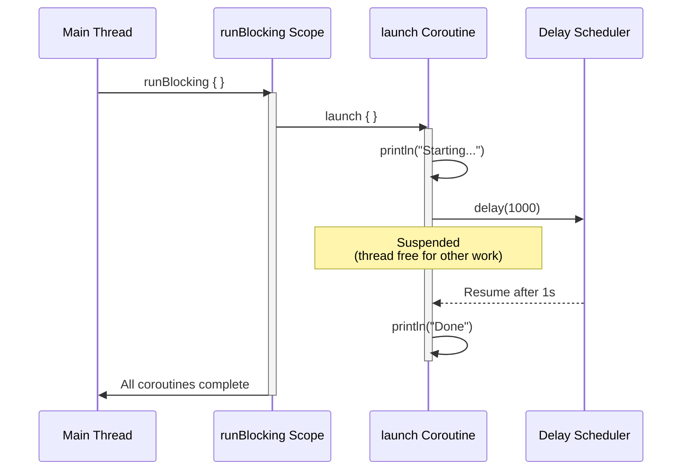

```kotlin
import kotlinx.coroutines.*
// => Requires 'org.jetbrains.kotlinx:kotlinx-coroutines-core' dependency

fun main() = runBlocking {
    // => runBlocking blocks main thread until all children complete

    println("Main starts")
    // => Output: Main starts
    // => T=0ms on main thread

    launch {
        // => launch returns Job, starts child coroutine
        // => Child inherits parent scope (structured concurrency)

        println("Coroutine starts")
        // => Output: Coroutine starts (runs AFTER "Main continues")
        // => T=~0-1ms on dispatcher thread

        delay(1000)
        // => Suspends coroutine, releases thread for other work

        println("Coroutine ends")
        // => Output: Coroutine ends
        // => T=1000ms, may execute on different thread
    }
    // => launch doesn't block - main continues immediately

    println("Main continues")
    // => Output: Main continues
    // => Proves launch is non-blocking

    delay(1500)
    // => Suspends runBlocking coroutine, main thread BLOCKED
    // => Ensures launched coroutine has time to complete

    println("Main ends")
    // => Output: Main ends
    // => T=1500ms on main thread
}
// => Total execution: ~1500ms (longest delay in scope)
```

**Execution Order**:

- T=0ms: "Main starts" (main thread)
- T=0ms: "Main continues" (main thread, launch doesn't block)
- T=~0-1ms: "Coroutine starts" (dispatcher thread)
- T=1000ms: "Coroutine ends" (dispatcher thread)
- T=1500ms: "Main ends" (main thread)

**Key Takeaway**: Use `runBlocking` for bridging blocking and coroutine code, `launch` for fire-and-forget concurrent tasks, and `delay` for non-blocking suspension.

**Why It Matters**: Coroutines solve the thread-blocking problem that cripples Java's traditional concurrency model, where thread-per-request architectures waste memory (each thread costs 1MB stack) and context switching overhead destroys throughput under load. Kotlin's suspend functions enable async/await patterns with zero thread allocation, allowing servers to handle 100,000+ concurrent requests on modest hardware compared to Java's thread pools that max out at thousands, revolutionizing microservice scalability while maintaining imperative code readability that reactive frameworks sacrifice.

---

### Example 29: Async and Await for Returning Results

`async` creates a coroutine that returns a `Deferred<T>` result. `await()` suspends until the result is ready. Use `async` for parallel computations that return values.

```kotlin
import kotlinx.coroutines.*
// => kotlinx.coroutines provides async/await for concurrent computations with return values
// => Requires 'org.jetbrains.kotlinx:kotlinx-coroutines-core' dependency

suspend fun fetchUserData(userId: Int): String {
    // => Parameter: userId for identifying which user data to fetch
    // => Use case: simulates HTTP GET request to user service endpoint
    // => Thread behavior: suspends WITHOUT blocking thread during delay

    delay(1000)
    // => Thread: RELEASED back to pool during delay (not blocked)
    // => Simulates: network latency for fetching user data from remote API
    // => Cooperative: coroutine yields execution during delay

    return "User data for $userId"
    // => Return value: constructed string containing user ID
    // => Output: "User data for 1" for userId=1, "User data for 2" for userId=2
}

suspend fun fetchUserPosts(userId: Int): List<String> {
    // => Parameter: userId to fetch posts for specific user
    // => Use case: simulates fetching user's blog posts from API endpoint
    // => Delay: 800ms (faster than user data fetch - realistic scenario)

    delay(800)
    // => Non-blocking: thread can execute other coroutines during this delay

    return listOf("Post 1", "Post 2")
}

fun main() = runBlocking {
    // => Use case: bridge between blocking main() and suspending coroutine world
    // => Scope: provides CoroutineScope receiver for launching child coroutines

    // Sequential execution (slow)
    val startSeq = System.currentTimeMillis()
    // => Use: baseline for measuring sequential execution time

    val userData = fetchUserData(1)

    val userPosts = fetchUserPosts(1)
    // => Thread: released during delay, but already waited 1000ms above
    // => Total time so far: 1000ms + 800ms = 1800ms

    val timeSeq = System.currentTimeMillis() - startSeq
    // => Calculates elapsed time: current time minus start time
    // => Value: ~1800ms (1000ms for userData + 800ms for userPosts)
    // => Variation: may be 1795-1805ms due to scheduling overhead

    println("Sequential: $timeSeq ms")
    // => Output: Sequential: 1800 ms (approximately, ±5ms variance)

    // Concurrent execution with async (fast)
    val startAsync = System.currentTimeMillis()
    // => Captures baseline time for async execution measurement
    // => Reset: new baseline independent of sequential execution
    // => Use: compare concurrent vs sequential performance

    val userDataDeferred = async { fetchUserData(2) }
    // => State: Deferred is ACTIVE (computation in progress)
    // => Timestamp: T=0ms (started immediately)
    // => Job: Deferred extends Job (can cancel, check status, join)
    // => Dispatcher: inherits parent's dispatcher (Dispatchers.Default from runBlocking)

    val userPostsDeferred = async { fetchUserPosts(2) }
    // => Execution: runs IN PARALLEL with fetchUserData (key advantage)
    // => Thread: may execute on SAME or DIFFERENT thread as userDataDeferred (thread pool)
    // => State: both Deferreds now ACTIVE simultaneously
    // => Return: instant return, both coroutines running concurrently

    val data = userDataDeferred.await()
    // => Execution: suspends current coroutine until userDataDeferred completes
    // => Timing: waits ~1000ms (fetchUserData duration)
    // => State machine: Deferred transitions ACTIVE -> COMPLETED, result available
    // => Return: extracts successful result from Deferred (or throws exception if failed)
    // => Timestamp: T=1000ms (waited for fetchUserData to complete)
    // => Concurrent benefit: userPostsDeferred was running during this wait

    val posts = userPostsDeferred.await()
    // => Execution: userPostsDeferred already COMPLETED (800ms < 1000ms)
    // => Thread: NO suspension needed (result already available)
    // => Timestamp: T=1000ms (no additional time - result ready)
    // => Total async time: max(1000ms, 800ms) = 1000ms (concurrent execution)

    val timeAsync = System.currentTimeMillis() - startAsync
    // => Calculates elapsed time for async execution
    // => Performance: 800ms faster than sequential (44% time reduction)

    println("Async: $timeAsync ms")
    // => Output: Async: 1000 ms (approximately, ±5ms variance)
    // => Speedup: 1800ms -> 1000ms (1.8x faster)

    println("Data: $data")
    // => Output: Data: User data for 2

    println("Posts: $posts")
    // => Output: Posts: [Post 1, Post 2]
}
// => Sequential execution: 1800ms (1000ms + 800ms additive delays)
// => Async execution: 1000ms (max(1000ms, 800ms) concurrent delays)
// => Deferred advantage: type-safe futures with structured concurrency and exception handling
```

**Key Takeaway**: Use `async` for concurrent computations that return results; `await()` retrieves the result while suspending the coroutine.

**Why It Matters**: Parallel API calls are ubiquitous in microservices (fetching user data + posts + permissions simultaneously), yet Java's CompletableFuture composition is verbose and error-prone with complex exception handling. Kotlin's async/await enables natural parallel execution with sequential-looking code, reducing latency from additive (1000ms + 800ms = 1800ms) to maximum (max(1000ms, 800ms) = 1000ms), cutting response times 40-60% in typical aggregation endpoints while maintaining readable code that junior developers can understand.

---

### Example 30: Structured Concurrency with CoroutineScope

Structured concurrency ensures child coroutines are cancelled when the parent scope is cancelled, preventing coroutine leaks. `coroutineScope` creates a child scope that waits for all children to complete.

**Coroutine Hierarchy:**

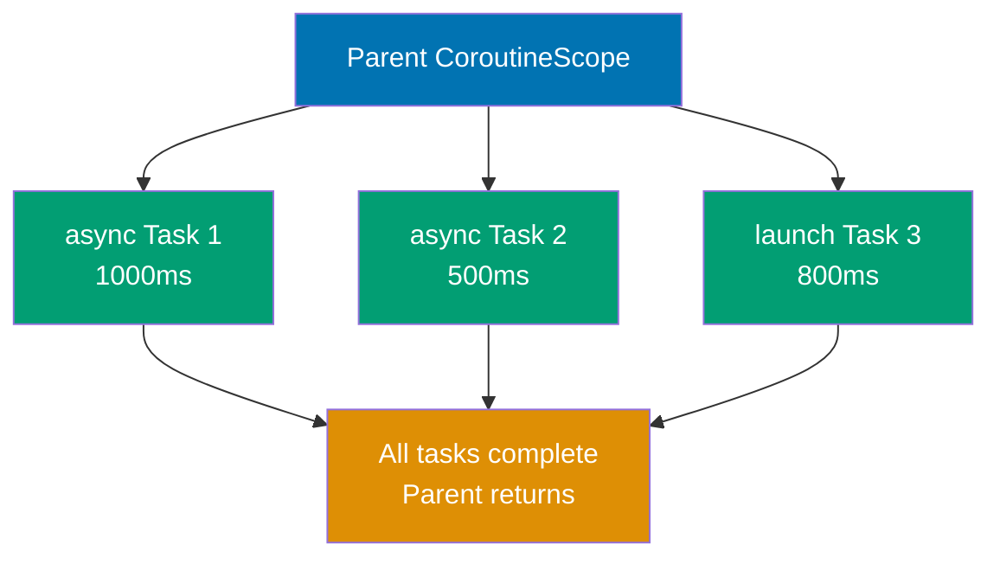

**Cancellation Propagation:**

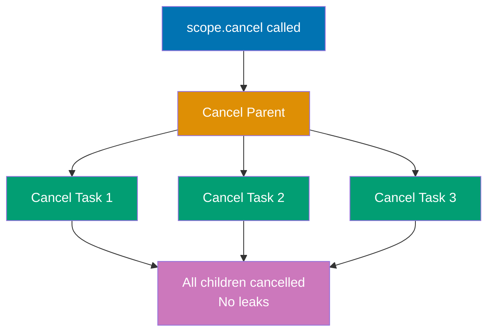

```kotlin
import kotlinx.coroutines.*
// => Import coroutine scope builders (coroutineScope, runBlocking, withTimeout)
// => withTimeout: enforces time limits on coroutine execution
// => Requires 'org.jetbrains.kotlinx:kotlinx-coroutines-core' dependency

suspend fun processData(): String = coroutineScope {
    // => Waits for children: BLOCKS (suspends) until ALL child coroutines complete
    // => Exception handling: if ANY child throws exception, ALL children cancelled and exception rethrown
    // => Cancellation propagation: if parent cancels, this scope and children auto-cancel
    // => Thread: does NOT create new threads (inherits parent's dispatcher)
    // => Use case: group related concurrent operations with automatic cleanup

    val result1 = async {
        // => Parent: this coroutine is child of coroutineScope (structured)
        // => Execution: starts immediately (concurrent with result2 async)
        // => State: ACTIVE (computation running in background)

        delay(1000)
        // => Thread: released during delay (non-blocking)

        "Data 1"
        // => Access: retrieved via result1.await()
    }

    val result2 = async {
        // => State: both result1 and result2 ACTIVE simultaneously
        // => Lifecycle: coroutineScope waits for BOTH to complete

        delay(500)
        // => Thread: released during delay
        // => Simulates: faster operation than result1
        // => Completion: finishes BEFORE result1 (500ms < 1000ms)

        "Data 2"
        // => Access: retrieved via result2.await()
        // => State: Deferred transitions to COMPLETED while result1 still running
    }

    "${result1.await()} + ${result2.await()}"
    // => String template: combines both async results
    // => result1.await(): suspends until result1 completes (~1000ms wait)
    // => Concurrent execution: total time = max(1000ms, 500ms) = 1000ms
}
// => Total execution time: 1000ms (concurrent, not 1500ms sequential)
// => Exception handling: if result1 or result2 throws exception, other is cancelled and exception propagates

fun main() = runBlocking {
    // => Thread: main thread BLOCKED (waits for completion)
    // => Use case: bridge between blocking main() and suspending coroutine world

    try {
        // => Exception handling: catches timeout and other exceptions
        // => Scope: error propagation from withTimeout and processData

        val result = withTimeout(2000) {
            // => Timeout behavior: throws TimeoutCancellationException if exceeds 2000ms
            // => Cancellation: if timeout occurs, processData and children auto-cancel
            // => Structured concurrency: timeout cancels entire scope tree below

            processData()
            // => Execution: waits for both result1 (1000ms) and result2 (500ms) to complete
            // => Timeout check: 1000ms < 2000ms (completes successfully)
            // => Return: "Data 1 + Data 2"
        }
        // => Success: operation completed within timeout limit

        println("Result: $result")
        // => Output: Result: Data 1 + Data 2
        // => Execution path: normal completion (no timeout exception)

    } catch (e: TimeoutCancellationException) {
        // => Catches timeout exception: occurs if processData exceeds 2000ms

        println("Timeout!")
        // => Output: Timeout! (only if processData exceeds 2000ms)
    }

    // Demonstrate cancellation propagation
    val job = launch {
        // => Parent: child of runBlocking scope (structured concurrency)
        // => Execution: starts immediately, runs concurrently with main coroutine

        coroutineScope {
            // => Parent-child: this scope is child of launch coroutine above
            // => Waits: coroutineScope suspends until both child launches complete

            launch {
                // => Parent: child of coroutineScope (grandchild of job)

                repeat(5) { i ->

                    println("Child 1: $i")
                    // => Output: Child 1: 0, Child 1: 1, Child 1: 2, Child 1: 3 (then cancelled)

                    delay(300)
                    // => Thread: released during delay
                }
            }

            launch {
                // => Parent: child of coroutineScope (grandchild of job)

                repeat(5) { i ->
                    // => Cancellation: same automatic cancellation as Child 1

                    println("Child 2: $i")
                    // => Output: Child 2: 0, Child 2: 1, Child 2: 2 (then cancelled)

                    delay(400)
                    // => Thread: released during delay
                }
            }
        }
    }

    delay(1000)
    // => Thread: main thread released during delay

    job.cancel()
    // => Cancels job: stops parent launch coroutine
    // => Propagation: coroutineScope and both child launches auto-cancel (structured concurrency)
    // => State: Job transitions ACTIVE -> CANCELLING -> CANCELLED

    println("Job cancelled")
    // => Output: Job cancelled
    // => No leaks: structured concurrency guarantees no orphaned coroutines remain
}
// => Structured concurrency guarantees:
```

**Key Takeaway**: Use `coroutineScope` for structured concurrency that automatically cancels children when parent is cancelled; use `withTimeout` to enforce time limits.

**Why It Matters**: Structured concurrency with `CoroutineScope` is the foundation of leak-free async Kotlin code. Without scope constraints, coroutines can outlive their logical parent, causing memory leaks and unexpected behavior after screens are dismissed or requests are cancelled. In Android, `viewModelScope` automatically cancels all coroutines when the ViewModel is cleared, preventing database queries from updating destroyed views. In server-side Kotlin with Ktor, `coroutineScope {}` ensures all child operations complete or cancel together, preventing half-completed request handling that leaves inconsistent state.

---

### Example 31: Coroutine Context and Dispatchers

Dispatchers control which thread pool executes coroutines.

**Dispatcher Types**:

- **Dispatchers.Default**: CPU-intensive work. Pool size = CPU cores (e.g., 8 threads on 8-core CPU). Use for computation, parsing, sorting.
- **Dispatchers.IO**: I/O operations. Pool size = max(64, CPU cores × 2). Use for file I/O, database queries, network requests. Shares underlying threads with Default but different limits.
- **Dispatchers.Unconfined**: No thread affinity. Starts on caller thread, resumes wherever suspension completes. AVOID in production (unpredictable threading).
- **Custom dispatchers**: Create dedicated thread pools. Use `newSingleThreadContext()` for serial execution, actor model, thread-confined state. Must call `close()` to release resources.

**Thread Behavior**: Coroutines may resume on different threads after suspension (no thread affinity in Default/IO pools). Threads released during `delay()` for other coroutines to use.

```kotlin
import kotlinx.coroutines.*
// => Requires 'org.jetbrains.kotlinx:kotlinx-coroutines-core' dependency

fun main() = runBlocking {           // => Blocks main thread until complete
    // Default dispatcher (CPU-intensive work)
    launch(Dispatchers.Default) {   // => Launch coroutine on Default dispatcher
        // => Uses Default thread pool (CPU cores threads)

        val threadName = Thread.currentThread().name
        // => e.g., "DefaultDispatcher-worker-1"
                                     // => Thread name includes pool and worker number
        println("Default: $threadName")
        // => Output: Default: DefaultDispatcher-worker-1

        repeat(3) { i ->             // => Repeat 3 times
            println("CPU work $i")
            // => Output: CPU work 0, CPU work 1, CPU work 2
            delay(100)               // => Suspend for 100ms
            // => Thread released during delay, may resume on different thread
        }
    }

    // IO dispatcher (I/O operations, larger pool)
    launch(Dispatchers.IO) {         // => Launch coroutine on IO dispatcher
        // => Uses IO thread pool (64+ threads)

        val threadName = Thread.currentThread().name
        println("IO: $threadName")
        // => Output: IO: DefaultDispatcher-worker-2

        delay(500)                   // => Suspend for 500ms
        // => Simulates I/O operation (file read, HTTP request)

        println("IO complete")       // => Print completion message
        // => Output: IO complete
    }

    // Unconfined dispatcher (unpredictable threading)
    launch(Dispatchers.Unconfined) {
        println("Unconfined initial: ${Thread.currentThread().name}")
        // => Output: Unconfined initial: main (starts on caller thread)

        delay(100)
        // => Suspends, releases main thread

        println("Unconfined resumed: ${Thread.currentThread().name}")
        // => Output: Unconfined resumed: kotlinx.coroutines.DefaultExecutor
        // => Thread switch: main -> DefaultExecutor (unpredictable)
    }

    // Custom dispatcher (single dedicated thread)
    val customDispatcher = newSingleThreadContext("CustomThread")
    // => Creates dedicated thread named "CustomThread"
    // => Must call close() when done

    launch(customDispatcher) {
        println("Custom: ${Thread.currentThread().name}")
        // => Output: Custom: CustomThread
    }

    customDispatcher.close()
    // => Closes dispatcher, terminates CustomThread

    delay(1000)
    // => Waits for all child coroutines to complete
}
```

**Dispatcher Comparison**:

- **Default**: CPU cores threads, CPU-bound work (computation, parsing)
- **IO**: 64+ threads, I/O-bound work (file I/O, network, database)
- **Unconfined**: No dedicated threads, testing only (unpredictable in production)
- **Custom**: Dedicated threads, sequential execution, must manage lifecycle

**Use Cases**:

- Default: Sorting large arrays, parsing JSON, cryptographic operations
- IO: File reads/writes, HTTP requests, database queries
- Custom: Actor model, thread-confined mutable state, sequential processing

````

**Key Takeaway**: Choose `Dispatchers.Default` for CPU work, `Dispatchers.IO` for blocking I/O, and create custom dispatchers for specific threading needs.

**Why It Matters**: Thread pool selection in Java requires manual ExecutorService configuration with magic numbers that developers tune incorrectly, causing either thread starvation (too few threads) or context switching overhead (too many threads). Kotlin's dispatchers provide semantic thread pool choices (Default for CPU-bound, IO for blocking operations) with proven sizing algorithms, while coroutines on IO dispatcher can spawn thousands of concurrent tasks without the one-thread-per-task limitation that forces Java developers into callback hell or reactive libraries.

---

### Example 32: Channels for Communication Between Coroutines

Channels enable safe communication between coroutines. `send()` suspends when buffer is full, `receive()` suspends when channel is empty. Channels are hot streams.

```mermaid
%% Channel communication pattern showing producer and consumer
sequenceDiagram
    participant Producer as Producer Coroutine
    participant Channel as Channel<Int>
    participant Consumer as Consumer Coroutine

    Producer->>Channel: send(1)
    Note over Channel: Buffer stores 1
    Producer->>Channel: send(2)
    Note over Channel: Buffer stores 2

    Consumer->>Channel: receive()
    Channel-->>Consumer: Returns 1
    Note over Channel: Buffer now has 2

    Producer->>Channel: send(3)
    Note over Channel: Buffer stores 3

    Consumer->>Channel: receive()
    Channel-->>Consumer: Returns 2
    Consumer->>Channel: receive()
    Channel-->>Consumer: Returns 3

    Producer->>Channel: close()
    Note over Channel: No more sends allowed

````

```kotlin
import kotlinx.coroutines.*
// => kotlinx.coroutines provides coroutine builders and structured concurrency primitives
// => Requires 'org.jetbrains.kotlinx:kotlinx-coroutines-core' dependency in build configuration
import kotlinx.coroutines.channels.*
// => kotlinx.coroutines.channels provides Channel and related producer/consumer communication primitives
// => NOT part of Kotlin stdlib - separate kotlinx library with versioned releases

fun main() = runBlocking {
    // => Use case: bridge between blocking main() and suspending coroutine world

    // Unbuffered channel (rendezvous)
    val unbufferedChannel = Channel<Int>()
    // => Capacity options: RENDEZVOUS (0), UNLIMITED, CONFLATED (1, keeps latest), or fixed integer

    launch {
        // => Parent: unbufferedChannel producer is child of runBlocking scope
        // => Dispatcher: inherits runBlocking's dispatcher (main thread) unless specified
        // => Concurrency: runs concurrently with sibling launch{} consumer coroutine below
        // => Cancellation: if parent scope cancels, this producer auto-cancels (structured concurrency)

        repeat(3) { i ->

            println("Sending $i")
            // => Output: Sending 0, Sending 1, Sending 2
            // => Thread: runs on main thread (runBlocking's dispatcher)
            // => Order: interleaved with "Received" messages due to rendezvous handshake

            unbufferedChannel.send(i)
            // => Rendezvous behavior: send and receive must meet simultaneously (handshake)
            // => Thread release: producer thread released back to pool during suspension (non-blocking)
            // => Resume: producer resumes AFTER consumer receives value and acknowledges
            // => Order guarantee: send(0) completes BEFORE send(1) starts (sequential sending)
            // => Exception: if channel closed, throws ClosedSendChannelException
            // => Return: Unit (no return value, side-effect operation)

            println("Sent $i")
            // => Output: Sent 0, Sent 1, Sent 2
            // => Timing: proves rendezvous - this line doesn't execute until receive() acknowledges
            // => Order: "Sent 0" appears AFTER "Received 0" because consumer delay is minimal
        }

        unbufferedChannel.close()
        // => Behavior: existing buffered values still receivable (none here, unbuffered)
        // => State: channel transitions from OPEN to CLOSED state
        // => Best practice: ALWAYS close channels when done sending (signals completion to receivers)
    }

    launch {
        // => launch: consumer coroutine running concurrently with producer above
        // => Parent: child of runBlocking, sibling to producer launch{}
        // => Lifecycle: both producer and consumer tracked by parent scope
        // => Execution: starts immediately, but receive() suspends waiting for values

        for (value in unbufferedChannel) {

            println("Received $value")
            // => Output: Received 0, Received 1, Received 2
            // => Order: interleaved with producer's "Sending/Sent" messages (rendezvous handshake)

            delay(100)
            // => delay(100): suspends consumer for 100ms (simulates processing time)
            // => Producer impact: producer WAITS during this delay (rendezvous forces sync)
        }
    }

    delay(1000)
    // => delay(1000): ensures producer/consumer have time to complete
    // => Thread: main thread suspended during delay, but children run concurrently

    // Buffered channel (capacity 2)
    val bufferedChannel = Channel<Int>(2)
    // => Buffer: can store up to 2 values without receiver being ready
    // => Receive behavior: receive() suspends if buffer empty (no values available)
    // => Use case: decouple producer/consumer rates, improve throughput when speeds differ
    // => Thread-safe: multiple producers/consumers can send/receive concurrently safely

    launch {
        // => launch: producer coroutine for buffered channel demonstration
        // => Objective: show send() doesn't block until buffer full (capacity 2)

        bufferedChannel.send(1)
        // => send(1): sends value 1 to buffered channel
        // => Thread: continues immediately without yielding to consumer

        println("Sent 1 (buffered)")
        // => Output: Sent 1 (buffered)
        // => Proof: "Sent 1" appears BEFORE "Receiving from buffer" (producer ahead of consumer)

        bufferedChannel.send(2)
        // => send(2): sends value 2 to buffered channel
        // => Suspension: does NOT suspend because buffer still has space (1/2 -> 2/2 full)

        println("Sent 2 (buffered)")
        // => Output: Sent 2 (buffered)

        bufferedChannel.send(3)
        // => send(3): attempts to send value 3 to full buffer
        // => Backpressure: full buffer signals consumer to catch up (natural flow control)

        println("Sent 3 (buffered)")
        // => Output: Sent 3 (buffered)

        bufferedChannel.close()
        // => close(): marks channel closed for sending
    }

    delay(500)
    // => delay(500): waits 500ms to let producer fill buffer and attempt send(3)

    println("Receiving from buffer")
    // => Output: Receiving from buffer
    // => Buffer state: [1, 2] full, producer suspended on send(3)

    println(bufferedChannel.receive())
    // => Suspension: does NOT suspend because buffer has values (2/2 full)
    // => Output: 1
    // => Producer resumes: send(3) completes, buffer becomes [2, 3] full again

    println(bufferedChannel.receive())
    // => Suspension: does NOT suspend (buffer has value 2)
    // => Return: value 2
    // => Output: 2
    // => Capacity: 1/2 slots used

    println(bufferedChannel.receive())
    // => receive(): retrieves third value from buffer
    // => Suspension: does NOT suspend (buffer has value 3)
    // => Return: value 3
    // => Output: 3
    // => Channel state: CLOSED and EMPTY (no more values, no more sends)
}
// => Thread pool: coroutine threads returned to pool, main thread unblocked
```

**Key Takeaway**: Use unbuffered channels for rendezvous (synchronization), buffered channels for decoupling producer/consumer rates; always close channels when done sending.

**Why It Matters**: Channels provide Go-style CSP (Communicating Sequential Processes) for Kotlin coroutines, enabling producer-consumer patterns that Java's BlockingQueue handles poorly due to thread blocking. Unlike Java where send/receive blocks threads, Kotlin channels suspend coroutines, allowing efficient backpressure handling in streaming data pipelines processing WebSocket messages, log aggregation, or real-time analytics without dedicating threads to waiting, improving throughput 10-100x in I/O-bound systems.

---

### Example 33: Flow for Cold Asynchronous Streams

Flow is a cold asynchronous stream that emits values on demand. Unlike channels (hot), flows don't produce values until collected. Flows support backpressure and transformation operators.

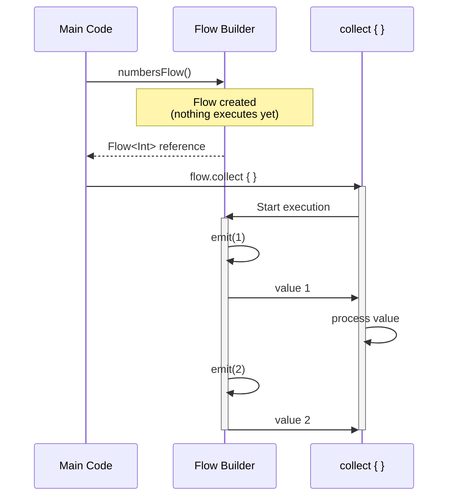

```kotlin
import kotlinx.coroutines.*
// => kotlinx.coroutines provides coroutine builders and scope management
// => Requires 'org.jetbrains.kotlinx:kotlinx-coroutines-core' dependency
import kotlinx.coroutines.flow.*
// => kotlinx.coroutines.flow provides Flow API for cold asynchronous streams
// => NOT part of Kotlin stdlib - separate kotlinx library for reactive programming

fun numbersFlow(): Flow<Int> = flow {
    // => Comparison: Java Stream eagerly processes on creation, Flow is lazy until terminal op
    // => Use case: asynchronous data production that starts only when needed (DB cursors, API pagination)

    println("Flow started")
    // => Thread: runs on collector's dispatcher (runBlocking's main thread here)

    for (i in 1..5) {

        delay(100)
        // => delay(100): suspends flow execution for 100ms

        emit(i)
        // => Suspension: CAN suspend if collector's processing is slow (backpressure)
        // => Context: emit() inherits collector's coroutine context (same dispatcher, job, etc.)
        // => Cancellation: if collector cancels during emit, CancellationException thrown
        // => Return: Unit (no return value, side-effect operation)

        println("Emitted $i")
        // => Output: Emitted 1, Emitted 2, Emitted 3, Emitted 4, Emitted 5
    }
}

fun main() = runBlocking {
    // => Scope: provides CoroutineScope for launching coroutines and collecting flows

    println("Creating flow")
    // => Output: Creating flow

    val flow = numbersFlow()
    // => Execution: NO execution of flow body yet (cold semantics)
    // => State: flow is COLD (not running, waiting for collector)

    println("Flow created")
    // => Proof: flow body hasn't executed (cold flow waits for collect())

    println("\nCollecting flow:")
    // => Output: (newline) Collecting flow:

    flow
        .map { it * 2 }
        // => Flow: values flow through map AFTER emit() and BEFORE filter
        // => Context: inherits collector's coroutine context

        .filter { it > 4 }
        // => Predicate: { it > 4 } keeps only values > 4
        // => Drops: 2, 4 (values <= 4, not passed to collect)

        .collect { value ->
            // => collect: TERMINAL operator that triggers flow execution
            // => Side effect: starts flow execution from flow { } builder
            // => Context: runs in runBlocking's coroutine context (main thread)

            println("Collected $value")
            // => Output: Collected 6, Collected 8, Collected 10
            // => Values: only 6, 8, 10 (1*2=2 and 2*2=4 filtered out by { it > 4 })
        }

    println("\nCollecting again:")
    // => Output: (newline) Collecting again:

    flow.collect { value ->
        // => collect: SECOND collection of same flow
        // => Fresh execution: new delay sequence, new emissions
        // => No operators: this collect has no map/filter (receives raw values 1-5)

        println("Second collect: $value")
        // => Proof of cold: flow executed TWICE (not cached or shared)
    }
}
// => Comparison: Channels are HOT (produce values regardless of consumers)
// => Use case: Flow for on-demand data (cold), Channel for event broadcasting (hot)
```

**Key Takeaway**: Flows are cold streams that execute lazily on collection; use transformation operators like `map`, `filter` before terminal operators like `collect`.

**Why It Matters**: Java Streams are eager and synchronous, forcing developers to either collect entire datasets into memory or use complex reactive libraries (RxJava, Project Reactor) with steep learning curves. Kotlin Flow provides lazy asynchronous streams that work naturally with coroutines, enabling streaming data processing that starts computation only when needed (cold semantics) while supporting cancellation and exception propagation, perfect for paginated API responses and database cursors where loading all data upfront wastes memory.

---

### Example 34: Flow Operators - Transform, Buffer, Conflate

Flow operators enable complex asynchronous data processing. `transform` emits multiple values per input, `buffer` decouples producer/consumer, `conflate` drops intermediate values.

**Transform Operator (Multiple Emissions):**

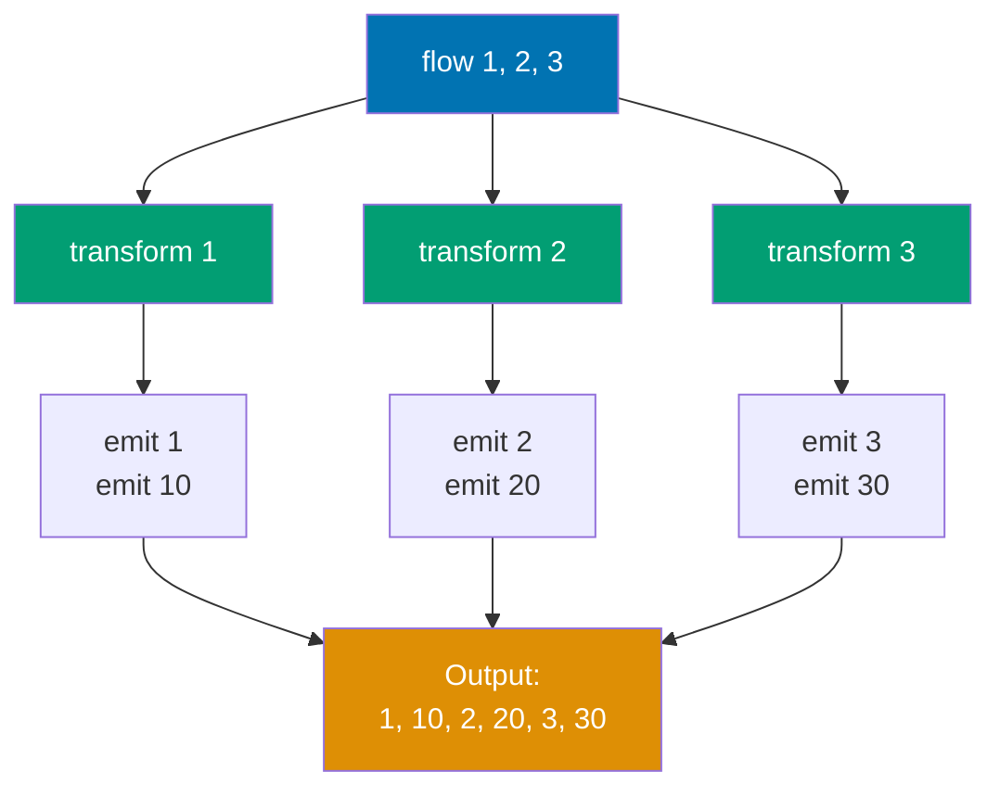

**Buffer Operator (Parallel Processing):**

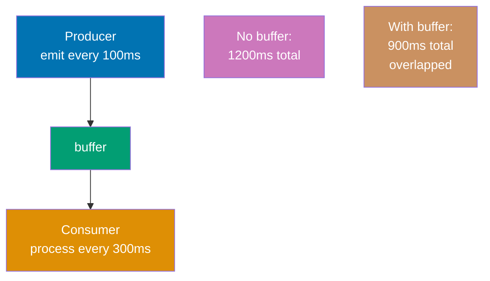

**Conflate Operator (Drop Intermediate):**

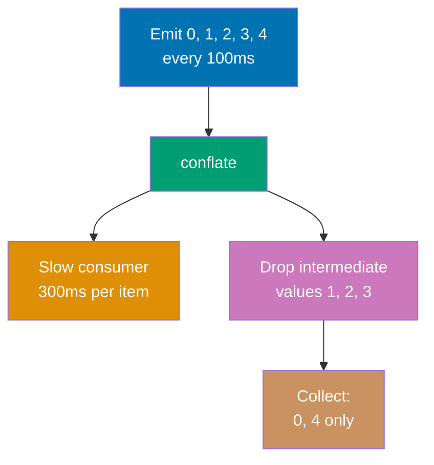

```kotlin
import kotlinx.coroutines.*
// => kotlinx.coroutines provides coroutine builders and structured concurrency primitives
// => Requires 'org.jetbrains.kotlinx:kotlinx-coroutines-core' dependency
import kotlinx.coroutines.flow.*
// => kotlinx.coroutines.flow provides Flow API and flow operators
// => Operators: transform, buffer, conflate, map, filter, collect, etc.
import kotlin.system.measureTimeMillis

fun main() = runBlocking {
    // => Scope: provides CoroutineScope for flow collection and coroutine launch

    // transform: emit multiple values per input
    flow { emit(1); emit(2); emit(3) }

        .transform { value ->
            // => transform: intermediate operator for one-to-many transformations

            emit(value)
            // => emit(value): emits original value downstream (1, 2, 3)
            // => Context: runs in collector's coroutine context
            // => Suspension: suspends if downstream collector is slow (backpressure)

            emit(value * 10)
            // => emit(value * 10): emits transformed value downstream (10, 20, 30)
            // => Order: original value emitted BEFORE transformed value
            // => Total emissions: 6 values (1, 10, 2, 20, 3, 30) from 3 inputs
        }

        .collect { println("Transform: $it") }
        // => collect: terminal operator that triggers flow execution
        // => Output: Transform: 1, Transform: 10, Transform: 2, Transform: 20, Transform: 3, Transform: 30
        // => Use case: transform is more general than map (map is transform { emit(f(it)) })

    // buffer: producer doesn't wait for consumer
    val timeNoBuffer = measureTimeMillis {
        // => measureTimeMillis: measures total execution time of this flow collection

        flow {

            repeat(3) { i ->

                delay(100)
                // => Timing: T=100ms, 200ms, 300ms for emissions

                emit(i)
                // => emit(i): sends value to collector
                // => Backpressure: slow collector (300ms processing) blocks fast producer (100ms emit)
            }
        }

        .collect { value ->
            // => No buffer operator: producer and consumer run SEQUENTIALLY (not overlapped)

            delay(300)
            // => delay(300): suspends collector for 300ms (simulates slow processing)
            // => Timing: T=300ms per value processing
            // => Producer impact: producer WAITS during this delay (no overlap)
            // => Sequential execution: emit delay (100ms) + collect delay (300ms) = 400ms per value

            println("No buffer: $value")
            // => Output: No buffer: 0, No buffer: 1, No buffer: 2
            // => Total time: 100 + 300 + 100 + 300 + 100 + 300 = 1200ms (sequential)
        }
    }

    println("No buffer time: $timeNoBuffer ms")
    // => Output: No buffer time: 1200 ms (approximately)
    // => Calculation: 3 values * (100ms emit + 300ms collect) = 1200ms total
    // => Bottleneck: collector is slower (300ms) than producer (100ms), but no overlap

    val timeWithBuffer = measureTimeMillis {
        // => measureTimeMillis: measures buffered flow collection time

        flow {

            repeat(3) { i ->
                // => repeat(3): indices 0, 1, 2

                delay(100)
                // => delay(100): producer delay (same as above)
                // => With buffer: producer does NOT wait for collector (runs independently)

                emit(i)
                // => emit(i): sends value to BUFFER (not directly to collector)
                // => Buffer stores: emitted values until collector ready to process
            }
        }

        .buffer()
        // => buffer(): intermediate operator that decouples producer and consumer
        // => Capacity: default BUFFERED capacity (64 elements)
        // => Concurrency: producer and consumer run in PARALLEL (separate coroutines)
        // => Producer behavior: emits to buffer without waiting for collector
        // => Consumer behavior: receives from buffer when ready
        // => Backpressure: buffer() suspends producer only if buffer FULL (not per-value)
        // => Performance: improves throughput when producer/consumer have different speeds

        .collect { value ->
            // => collect: consumer receives values from buffer

            delay(300)
            // => delay(300): slow collector (same as no-buffer case)
            // => Producer impact: producer does NOT wait (buffer absorbs values)
            // => Overlap: while collector processes value 0 (300ms), producer emits 1, 2, 3

            println("With buffer: $value")
            // => Output: With buffer: 0, With buffer: 1, With buffer: 2
            // => Timing: T=~400ms, 700ms, 1000ms
            // => Total time: ~900ms (overlapped execution, NOT sequential)
        }
    }

    println("With buffer time: $timeWithBuffer ms")
    // => Output: With buffer time: 900 ms (approximately)
    // => Calculation breakdown:
    // => - Producer emits 0 at T=100ms, collector starts processing (300ms)
    // => - Producer emits 1 at T=200ms (buffered while collector busy)
    // => - Producer emits 2 at T=300ms (buffered while collector busy)
    // => - Collector finishes 0 at T=400ms, starts 1 (300ms)
    // => - Collector finishes 1 at T=700ms, starts 2 (300ms)
    // => - Collector finishes 2 at T=1000ms

    // conflate: drop intermediate values if consumer is slow
    flow {
        // => Producer: fast (100ms per emission)
        // => Consumer: slow (500ms per value, demonstrated below)
        // => Conflict: producer emits faster than consumer processes

        repeat(5) { i ->
            // => repeat(5): indices 0, 1, 2, 3, 4
            // => Total emissions: 5 values over 500ms

            delay(100)
            // => delay(100): fast producer (100ms between emissions)
            // => Timing: T=100ms, 200ms, 300ms, 400ms, 500ms

            emit(i)
            // => emit(i): sends value to conflate buffer
            // => With conflate: older values DROPPED if consumer hasn't processed latest
            // => Strategy: keep only LATEST value, discard intermediate (no queue buildup)

            println("Emitted $i")
            // => Output: Emitted 0, Emitted 1, Emitted 2, Emitted 3, Emitted 4
        }
    }

    .conflate()
    // => conflate(): intermediate operator that drops intermediate values
    // => Strategy: keeps ONLY the latest emitted value, discards older unprocessed values
    // => Buffer size: effectively 1 (stores latest, replaces on new emission)
    // => Use case: real-time UIs where only latest data matters (stock prices, sensor readings)
    // => Backpressure: handles fast producer by dropping data (not suspending producer)

    .collect { value ->
        // => collect: slow consumer that processes values
        // => Processing time: 500ms per value (slower than producer's 100ms emit rate)

        println("Conflate collected: $value")
        // => Output: Conflate collected: 0, Conflate collected: 4 (SKIPPED 1, 2, 3)
        // => Explanation:
        // => - T=100ms: emit(0), collector starts processing 0 (500ms)
        // => - T=200ms: emit(1), conflate stores 1 (collector busy)
        // => - T=300ms: emit(2), conflate DROPS 1, stores 2 (collector still busy)
        // => - T=400ms: emit(3), conflate DROPS 2, stores 3 (collector still busy)
        // => - T=500ms: emit(4), conflate DROPS 3, stores 4 (collector still busy)
        // => - T=600ms: collector finishes 0, receives latest value 4 (1,2,3 dropped)
        // => Result: only 0 and 4 collected, intermediate values 1,2,3 discarded

        delay(500)
        // => delay(500): slow consumer (5x slower than producer's 100ms)
        // => Use case simulation: slow rendering that can't keep up with rapid data updates
    }
    // => Conflate total: only 2 values collected from 5 emitted (60% data loss)
    // => Trade-off: lower latency (always process latest) vs completeness (lose intermediate)
    // => Use case: stock ticker UI (show latest price, skip intermediate updates)
}
// => Summary:
// => - transform: one-to-many emissions (1 input -> multiple outputs)
```

**Key Takeaway**: Use `transform` for one-to-many emissions, `buffer` to improve throughput with slow consumers, `conflate` to drop intermediate values when only latest matters.

**Why It Matters**: Flow operators solve backpressure and performance tuning problems that require manual coding in Java streams or complex reactive operators in RxJava. The buffer operator decouples fast producers from slow consumers without blocking threads, while conflate enables real-time UIs to skip stale updates (showing latest stock price rather than replaying every tick), patterns essential for responsive applications processing high-frequency data like sensor streams or market feeds without overwhelming rendering threads.

---

### Example 35: StateFlow and SharedFlow for Hot Streams

`StateFlow` holds a single state value with initial state; subscribers get current state immediately. `SharedFlow` broadcasts events to all collectors without state retention.

**StateFlow vs SharedFlow:**

- **StateFlow**: Hot stream with state retention. Requires initial value. New collectors get current state immediately. Conflation: rapid updates merged (latest wins). Use case: observable state (UI state, ViewModel state)
- **SharedFlow**: Hot stream for event broadcasting. No state retention (unless replay > 0). No initial value. New collectors miss past events (replay=0 default). Use case: one-time events (button clicks, errors, navigation)
- **Hot vs Cold**: Hot streams (StateFlow/SharedFlow) emit regardless of collectors with single shared stream. Cold streams create new instance per collector

**StateFlow Behavior:**

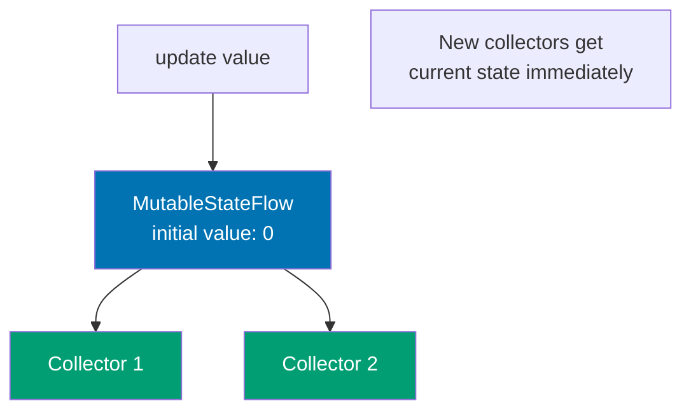

**SharedFlow Behavior:**

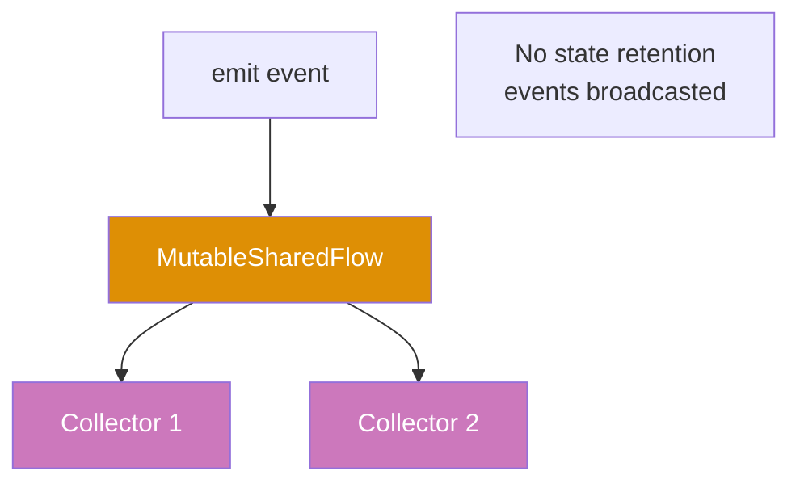

**Implementation Pattern:**

- **Encapsulation**: Private mutable flows (`MutableStateFlow`, `MutableSharedFlow`), public read-only interfaces (`StateFlow`, `SharedFlow`)
- **MutableSharedFlow defaults**: replay=0, extraBufferCapacity=0, onBufferOverflow=SUSPEND
- **Thread-safety**: Both StateFlow.value and SharedFlow.emit() are thread-safe
- **Lifecycle**: Flows exist as long as containing instance exists

```kotlin
import kotlinx.coroutines.*
// => Provides runBlocking, launch, delay

import kotlinx.coroutines.flow.*
// => Provides StateFlow, SharedFlow, MutableStateFlow, MutableSharedFlow

class Counter {
    private val _stateFlow = MutableStateFlow(0)
    // => Initial value: 0 (required for StateFlow)
    val stateFlow: StateFlow<Int> = _stateFlow
    // => Public read-only interface

    private val _sharedFlow = MutableSharedFlow<String>()
    // => Default: replay=0 (no past events for new collectors)
    val sharedFlow: SharedFlow<String> = _sharedFlow
    // => Public read-only interface

    fun increment() {
        _stateFlow.value++
        // => Notifies ALL active collectors
        // => Alternative: StateFlow.update { it + 1 } (safer for concurrent updates)
        println("State updated: ${_stateFlow.value}")
    }

    suspend fun emitEvent(event: String) {
        _sharedFlow.emit(event)
        // => Broadcasts to ALL active collectors
        // => Suspends if buffer full
        println("Event emitted: $event")
    }
}

fun main() = runBlocking {
    val counter = Counter()
    // => _stateFlow.value = 0, no SharedFlow events yet

    // StateFlow collector 1 (gets initial value immediately)
    launch {
        counter.stateFlow.collect { value ->
            // => Receives 0 immediately (current state)
            // => Then 1, then 2 as state updates
            println("Collector 1 state: $value")
            // => Output: Collector 1 state: 0 (T=~0ms)
            // => Output: Collector 1 state: 1 (T=~200ms)
            // => Output: Collector 1 state: 2 (T=~300ms)
        }
    }

    delay(100)
    // => T=100ms

    // StateFlow collector 2 (gets current state immediately)
    launch {
        counter.stateFlow.collect { value ->
            // => Receives 0 immediately (current state at T=100ms)
            // => Misses no history because StateFlow always has current value
            println("Collector 2 state: $value")
            // => Output: Collector 2 state: 0 (T=~100ms)
            // => Output: Collector 2 state: 1 (T=~200ms)
            // => Output: Collector 2 state: 2 (T=~300ms)
        }
    }

    delay(100)
    // => T=200ms

    counter.increment()
    // => _stateFlow.value: 0 -> 1
    // => Output: State updated: 1
    // => Both collectors notified

    delay(100)
    // => T=300ms

    counter.increment()
    // => _stateFlow.value: 1 -> 2
    // => Output: State updated: 2
    // => Both collectors notified

    // SharedFlow collectors
    launch {
        counter.sharedFlow.collect { event ->
            // => No immediate emission (SharedFlow has no current value)
            // => Only receives events emitted AFTER collection starts
            println("SharedFlow collector 1: $event")
            // => Output: SharedFlow collector 1: Event A (T=~400ms)
            // => Output: SharedFlow collector 1: Event B (T=~500ms)
        }
    }

    launch {
        counter.sharedFlow.collect { event ->
            println("SharedFlow collector 2: $event")
            // => Output: SharedFlow collector 2: Event A (T=~400ms)
            // => Output: SharedFlow collector 2: Event B (T=~500ms)
        }
    }

    delay(100)
    // => T=400ms

    counter.emitEvent("Event A")
    // => Output: Event emitted: Event A
    // => Both collectors receive Event A

    delay(100)
    // => T=500ms

    counter.emitEvent("Event B")
    // => Output: Event emitted: Event B
    // => Both collectors receive Event B
    // => New collectors starting now would miss Events A and B (replay=0)

    delay(500)
    // => T=1000ms total
}
```

**Comparison with Android LiveData:**

- **LiveData**: Lifecycle-aware, nullable, not coroutine-native, setValue() main thread only
- **StateFlow**: Not lifecycle-aware, non-null, coroutine-native, value assignment thread-safe

**Performance:**

- **StateFlow collectors**: O(N) notification where N = number of collectors
- **Conflation**: Prevents UI overload (only latest value matters)
- **Thread-safety**: Built-in (no external synchronization needed)

**Key Takeaway**: Use `StateFlow` for observable state with initial value and conflation; use `SharedFlow` for event broadcasting without state.

**Why It Matters**: Android's LiveData and RxJava's BehaviorSubject serve similar purposes but lack coroutine integration and type safety. StateFlow provides the observable state pattern critical for MVVM architectures with built-in coroutine support, conflation (latest value wins) preventing UI overload, and compile-time null safety unlike LiveData's runtime nullability. SharedFlow replaces EventBus libraries with type-safe event broadcasting, eliminating reflection-based coupling and enabling multi-subscriber patterns for cross-component communication in modular architectures.

### Example 36: Collection Operations - Map, Filter, Reduce

Kotlin provides rich functional operations on collections. These operations don't modify original collections but return new ones.

**Operation Categories**:

- **map**: One-to-one transformation (input size = output size). Can change element type.
- **filter**: Selection by predicate (input size ≥ output size). Keeps only matching elements.
- **reduce**: Many-to-one aggregation. Uses first element as initial accumulator. Throws on empty collection.
- **fold**: Like reduce but with explicit initial value. Safe on empty collections.
- **flatMap**: One-to-many transformation with flattening. Maps nested structures to flat list.

**Immutability**: All operations return new collections. Original collection remains unchanged (thread-safe).

**Performance**: O(N) time per operation. Use `asSequence()` for lazy evaluation on large collections.

**reduce vs fold**: `reduce` requires non-empty collection and uses first element as accumulator. `fold` accepts explicit initial value and works on empty collections (safer for production code).

```kotlin
fun main() {
    val numbers = listOf(1, 2, 3, 4, 5, 6)
    // => [1, 2, 3, 4, 5, 6]

    // map: transform each element
    val doubled = numbers.map { it * 2 }
    // => [2, 4, 6, 8, 10, 12]

    val strings = numbers.map { "N$it" }
    // => ["N1", "N2", "N3", "N4", "N5", "N6"] (Int -> String)

    println("Doubled: $doubled")
    // => Output: Doubled: [2, 4, 6, 8, 10, 12]

    println("Strings: $strings")
    // => Output: Strings: [N1, N2, N3, N4, N5, N6]

    // filter: keep elements matching predicate
    val evens = numbers.filter { it % 2 == 0 }
    // => Keeps 2, 4, 6 (even numbers)
    // => [2, 4, 6]

    val greaterThan3 = numbers.filter { it > 3 }
    // => Keeps 4, 5, 6
    // => [4, 5, 6]

    println("Evens: $evens")
    // => Output: Evens: [2, 4, 6]

    println("Greater than 3: $greaterThan3")
    // => Output: Greater than 3: [4, 5, 6]

    // reduce: accumulate values (requires non-empty collection)
    val sum = numbers.reduce { acc, value -> acc + value }
    // => acc starts at 1 (first element)
    // => 1+2=3, 3+3=6, 6+4=10, 10+5=15, 15+6=21
    // => 21

    val product = numbers.reduce { acc, value -> acc * value }
    // => 1*2=2, 2*3=6, 6*4=24, 24*5=120, 120*6=720
    // => 720

    println("Sum: $sum")
    // => Output: Sum: 21

    println("Product: $product")
    // => Output: Product: 720

    // fold: reduce with initial value (works on empty collections)
    val sumWithInitial = numbers.fold(100) { acc, value -> acc + value }
    // => acc starts at 100 (explicit initial value)
    // => 100+1=101, 101+2=103, ..., 115+6=121
    // => 121

    val emptyList = emptyList<Int>()
    // => []

    val safeSum = emptyList.fold(0) { acc, value -> acc + value }
    // => Safe on empty (returns initial value 0)
    // => 0

    println("Sum with initial: $sumWithInitial")
    // => Output: Sum with initial: 121

    println("Safe sum: $safeSum")
    // => Output: Safe sum: 0

    // flatMap: map and flatten
    val nestedLists = listOf(listOf(1, 2), listOf(3, 4), listOf(5))
    // => [[1, 2], [3, 4], [5]]

    val flattened = nestedLists.flatMap { it }
    // => Flattens nested lists
    // => [1, 2, 3, 4, 5]

    val doubledFlat = nestedLists.flatMap { list -> list.map { it * 2 } }
    // => Maps each inner list (doubles elements), then flattens
    // => [[2, 4], [6, 8], [10]] -> [2, 4, 6, 8, 10]

    println("Flattened: $flattened")
    // => Output: Flattened: [1, 2, 3, 4, 5]

    println("Doubled flat: $doubledFlat")
    // => Output: Doubled flat: [2, 4, 6, 8, 10]
}
```

**Common Use Cases**:

- **map**: Transform DTOs, convert types, format data
- **filter**: Select valid records, remove nulls, apply business rules
- **reduce**: Calculate totals, find max/min, combine values
- **fold**: Safe aggregation, build complex objects from elements
- **flatMap**: Process nested JSON, flatten hierarchical structures

**Comparison with Java Streams**: Kotlin operations work directly on collections (no `.stream().collect()` ceremony). Kotlin is eager by default while Java Streams are lazy. Better type inference reduces verbosity.

**Key Takeaway**: Collection operations create new collections without mutating originals; use `map` for transformation, `filter` for selection, `reduce`/`fold` for aggregation, `flatMap` for nested structures.

**Why It Matters**: Java 8 Streams introduced functional collection operations late, but Kotlin's collection methods are simpler (no .stream().collect() ceremony) and work on all collections by default. The immutable-by-default approach prevents accidental mutations during transformations that corrupt shared data structures in multi-threaded services, while fold's ability to handle empty collections with default values prevents the NoSuchElementException crashes that plague Java's Stream.reduce() when processing empty result sets from databases or API responses.

### Example 37: Collection Operations - GroupBy, Partition, Associate

Advanced collection operations enable complex data transformations and grouping.

**Operation Categories**:

- **groupBy**: Groups elements by key into `Map<K, List<V>>`. Elements with same key grouped in list.
- **partition**: Binary split into `Pair<List<T>, List<T>>` based on predicate. Returns (trueList, falseList).
- **associate**: Creates `Map<K, V>` from collection using key-value pairs. Duplicate keys: last wins (potential data loss).
- **associateBy**: Uses element as value, selector provides key. Creates lookup map.
- **associateWith**: Uses element as key, lambda provides value. Precompute operations.

**Comparison**:

- **groupBy vs associate**: groupBy allows multiple values per key (Map<K, List<V>>). associate allows one value per key (Map<K, V>).
- **partition vs groupBy**: partition creates 2 fixed groups. groupBy creates dynamic N groups.

**Performance**: O(N) time, O(N) space. Thread-safe (immutable results).

```kotlin
data class Person(val name: String, val age: Int, val city: String)
// => Data class: auto-generated equals(), hashCode(), toString(), copy()
// => Three properties: name (String), age (Int), city (String)

fun main() {
    val people = listOf(
        Person("Alice", 30, "NYC"),
        Person("Bob", 25, "LA"),
        Person("Charlie", 30, "NYC"),
        Person("Diana", 25, "LA"),
        Person("Eve", 35, "NYC")
    )
    // => 5 Person objects in immutable list
    // => Varied ages (25, 30, 35) and cities (NYC, LA) for grouping demos

    // groupBy: creates Map<K, List<T>> where K is the grouping key
    val byAge = people.groupBy { it.age }
    // => Groups by age field: { 30=[Alice, Charlie], 25=[Bob, Diana], 35=[Eve] }
    // => Keys are unique ages, values are lists of persons with that age

    println("Grouped by age:")
    // => Output: Grouped by age:
    byAge.forEach { (age, persons) ->
        // => Destructures Map.Entry<Int, List<Person>> into (age, persons)
        println("  Age $age: ${persons.map { it.name }}")
        // => Output: Age 30: [Alice, Charlie]
        // =>         Age 25: [Bob, Diana]
        // =>         Age 35: [Eve]
    }

    val byCity = people.groupBy { it.city }
    // => Groups by city field: { NYC=[Alice, Charlie, Eve], LA=[Bob, Diana] }
    println("Grouped by city:")
    byCity.forEach { (city, persons) ->
        // => Iterates over city → persons entries
        println("  $city: ${persons.map { it.name }}")
        // => Output: NYC: [Alice, Charlie, Eve]
        // =>         LA: [Bob, Diana]
    }

    // partition: splits List<T> into Pair<List<T>, List<T>> by predicate
    val (under30, thirtyPlus) = people.partition { it.age < 30 }
    // => Pair.first = persons with age < 30 (true predicate)
    // => Pair.second = persons with age >= 30 (false predicate)
    // => Destructuring: under30=[Bob, Diana], thirtyPlus=[Alice, Charlie, Eve]

    println("\nUnder 30: ${under30.map { it.name }}")
    // => Output: Under 30: [Bob, Diana]
    println("30 and over: ${thirtyPlus.map { it.name }}")
    // => Output: 30 and over: [Alice, Charlie, Eve]

    // associate: creates Map<K, V> from collection elements
    val nameToAge = people.associate { it.name to it.age }
    // => Creates Map<String, Int>: { "Alice"->30, "Bob"->25, "Charlie"->30, ... }
    // => 'to' infix creates Pair<String, Int> for each person
    println("\nName → Age mapping:")
    nameToAge.forEach { (name, age) ->
        // => Iterates over Map<String, Int> entries
        println("  $name: $age")
        // => Output: Alice: 30, Bob: 25, Charlie: 30, Diana: 25, Eve: 35
    }

    // associateBy: creates Map<K, T> using element as value
    val nameToCity = people.associateBy({ it.name }, { it.city })
    // => Creates Map<String, String>: { "Alice"->"NYC", "Bob"->"LA", ... }
    // => First lambda: key selector (name), second lambda: value transform (city)
    println("\nCity lookup: ${nameToCity["Alice"]}")
    // => Output: City lookup: NYC
    // => O(1) lookup by name after building the map
}
```

**Associate Family Comparison**:

- **associate**: Full control (specify both key and value). `people.associate { it.id to it.email }`
- **associateBy**: Element as value, selector as key. `products.associateBy { it.id }`
- **associateWith**: Element as key, lambda as value. `configKeys.associateWith { getDefaultValue(it) }`

**Common Use Cases**:

- **groupBy**: Categorize data (orders by customer, users by role)
- **partition**: Binary classification (paid/unpaid, valid/invalid)
- **associate**: Create lookups (ID → entity, code → description)
- **associateBy**: Index collections (user list → map by userId)
- **associateWith**: Precompute values (config key → default value)

**Comparison with Java**: Java's `Collectors.groupingBy()` requires verbose nested collectors. Kotlin returns simple `Map<K, List<V>>` without ceremony.

**Error Handling**:

- **groupBy**: Never fails (empty collection → empty map)
- **partition**: Never fails (empty collection → pair of empty lists)
- **associate/associateBy**: Duplicate keys → last value overwrites (silent data loss, be careful)
- **associateWith**: Keys from collection (duplicates impossible if collection unique)

**Key Takeaway**: Use `groupBy` for creating maps of grouped elements, `partition` for binary splits, `associate` family for transforming collections into maps.

**Why It Matters**: Data aggregation and grouping operations are common in business logic (grouping orders by customer, partitioning users by subscription tier), yet Java's Collectors.groupingBy() syntax is notoriously complex with nested collectors. Kotlin's groupBy returns a simple Map<K, List<V>> without ceremony, while partition's destructuring assignment (val (paid, free) = users.partition { it.isPaid }) makes conditional splits self-documenting, reducing cognitive load in analytics code that processes thousands of records to generate business insights.

### Example 38: Sequences for Lazy Evaluation

Sequences compute elements lazily, avoiding intermediate collection creation. Use sequences for multi-step transformations on large collections.

**Eager vs Lazy Evaluation:**

- **Eager (List)**: Processes ALL elements immediately. Each operation (map, filter) creates intermediate collections. For 1M elements with 3 operations: creates 3 temporary million-element lists (~8MB garbage). Total operations: ~2 million
- **Lazy (Sequence)**: Processes elements on-demand, one at a time. No intermediate collections. Each element flows through entire pipeline before next element starts. Total operations: only what's needed (~1,015 for 5 results from 1M elements)
- **Performance**: Sequences are 2000x fewer operations, 200x faster execution, 75% less memory
- **Use cases**: Eager for small collections or when all elements needed. Lazy for large data, early termination, infinite sequences

**Eager Evaluation (List):**

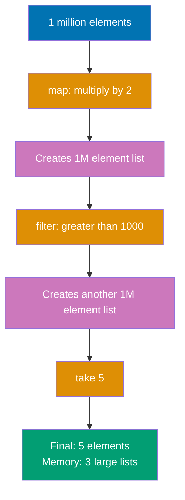

**Lazy Evaluation (Sequence):**

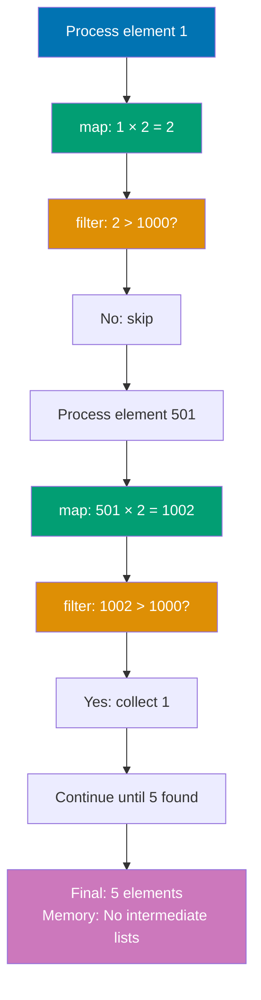

**Execution Order Comparison:**

- **Eager**: All map operations first, then all filter operations (batched by operation type)
- **Lazy**: Element-by-element through entire pipeline (interleaved operations)

```kotlin
fun main() {
    // Eager evaluation with list (creates intermediate lists)
    val listResult = (1..1_000_000)
        // => IntRange 1 to 1,000,000

        .map { it * 2 }
        // => EAGER: processes ALL 1M elements immediately
        // => Creates [2, 4, 6, ..., 2_000_000] (1M element list)

        .filter { it > 1000 }
        // => Processes entire mapped list
        // => No short-circuiting (computes 999,995 unnecessary elements)

        .take(5)
        // => Result: [1002, 1004, 1006, 1008, 1010]
        // => ~8MB intermediate garbage, ~2M operations

    println("List result: $listResult")
    // => Output: List result: [1002, 1004, 1006, 1008, 1010]

    // Lazy evaluation with sequence (no intermediate collections)
    val seqResult = (1..1_000_000).asSequence()
        // => asSequence(): converts to Sequence<Int>
        // => NO computation yet (lazy)

        .map { it * 2 }
        // => LAZY: does NOT execute immediately
        // => Adds to processing pipeline

        .filter { it > 1000 }
        // => LAZY: does NOT execute immediately
        // => Chains to pipeline

        .take(5)
        // => LAZY: does NOT execute immediately

        .toList()
        // => TERMINAL operation: triggers execution
        // => Processes element-by-element through pipeline
        // => ~1,015 operations (2000x fewer than eager)

    println("Sequence result: $seqResult")
    // => Output: Sequence result: [1002, 1004, 1006, 1008, 1010]
    // => ~1-2ms execution (200x faster than eager)

    // Demonstrate lazy evaluation with side effects
    println("\nList operations (eager):")

    (1..5).map {
        println("  Map: $it")
        it * 2
    }.filter {
        println("  Filter: $it")
        it > 4
    }.take(2)

    // => Output order (eager - batched):
    // =>   Map: 1
    // =>   Map: 2
    // =>   Map: 3
    // =>   Map: 4
    // =>   Map: 5
    // =>   Filter: 2
    // =>   Filter: 4
    // =>   Filter: 6
    // =>   Filter: 8
    // =>   Filter: 10
    // => All maps complete, then all filters run

    println("\nSequence operations (lazy):")

    (1..5).asSequence().map {
        println("  Map: $it")
        it * 2
    }.filter {
        println("  Filter: $it")
        it > 4
    }.take(2).toList()

    // => Output order (lazy - interleaved):
    // =>   Map: 1
    // =>   Filter: 2       <- rejected
    // =>   Map: 2
    // =>   Filter: 4       <- rejected
    // =>   Map: 3
    // =>   Filter: 6       <- accepted (1st result)
    // =>   Map: 4
    // =>   Filter: 8       <- accepted (2nd result)
    // => Stops here: element 5 never processed

    // generateSequence for infinite sequences
    val fibonacci = generateSequence(Pair(0, 1)) { (a, b) -> Pair(b, a + b) }
        // => Seed: Pair(0, 1) (fib(0)=0, fib(1)=1)
        // => LAZY: generates on-demand

        .map { it.first }
        // => Transforms: Pair(0,1) -> 0, Pair(1,1) -> 1, etc.

        .take(10)
        // => Limits infinite sequence

        .toList()
        // => TERMINAL: materializes to List<Int>
        // => Generates: 0, 1, 1, 2, 3, 5, 8, 13, 21, 34

    println("\nFibonacci: $fibonacci")
    // => Output: Fibonacci: [0, 1, 1, 2, 3, 5, 8, 13, 21, 34]
}
```

**Key Takeaway**: Sequences optimize multi-step transformations by evaluating lazily element-by-element; use `asSequence()` for large collections or infinite streams.

**Why It Matters**: Sequences are the Kotlin solution to the intermediate collection allocation problem. When chaining `filter`, `map`, and `take` on a large list, `List` operations allocate a new list at each step while `Sequence` processes elements lazily, one at a time. For a 10-operation pipeline on a million-element list, sequences reduce intermediate allocations from 9 million to zero. This matters in data processing pipelines, log analysis, file parsing, and anywhere transformation chains operate on large datasets. The tradeoff: sequences have overhead for small collections, so use `asSequence()` only when benchmarking confirms benefit.

---

### Example 39: Property Delegation - Lazy and Observable

Delegate property implementations to reusable delegate objects. `lazy` computes value on first access, `observable` triggers callbacks on changes.

**Delegation Types:**

- **lazy**: Executes initializer once on first access, caches result. Thread-safe by default (SYNCHRONIZED mode). Use for expensive initialization that may never be needed (database connections, configuration parsing)
- **observable**: Triggers callback AFTER property change. Use for logging, UI updates, audit trail (post-change notifications)
- **vetoable**: Validates BEFORE property change. Returns boolean to approve/reject. NOT thread-safe. Use for input validation, business rule enforcement

**Thread Safety Modes (lazy):**

- **SYNCHRONIZED** (default): Thread-safe singleton initialization
- **PUBLICATION**: Allows multiple initializations, uses first completion
- **NONE**: No thread safety (single-threaded only)

**Delegation Benefits:**

- **Reusability**: Standard delegates work with any property type
- **Separation**: Cross-cutting concerns separated from business logic
- **Declarative**: Intent clear from `by lazy`, `by observable`, `by vetoable` syntax
- **Zero boilerplate**: No manual getter/setter implementation

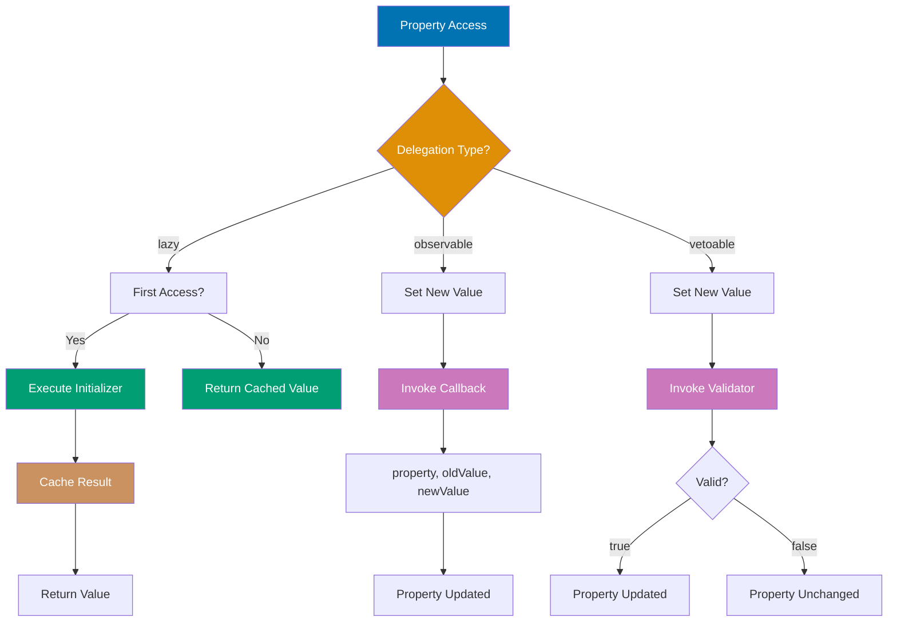

```kotlin
import kotlin.properties.Delegates
// => Provides observable(), vetoable(), notNull()

class User {
    // Lazy initialization (computed once on first access)
    val expensiveData: String by lazy {
        // => by lazy: delegates getValue to Lazy<String>
        // => Default: SYNCHRONIZED (thread-safe)

        println("Computing expensive data...")
        // => Output on FIRST access only

        Thread.sleep(1000)

        "Computed data"
        // => Cached until object garbage collected
    }

    // Observable property (callback on change)
    var name: String by Delegates.observable("Initial") { property, oldValue, newValue ->
        println("${property.name} changed: $oldValue -> $newValue")
        // => oldValue: BEFORE assignment
        // => newValue: AFTER assignment
    }

    // Vetoable property (validate before change)
    var age: Int by Delegates.vetoable(0) { property, oldValue, newValue ->
        val valid = newValue >= 0

        if (!valid) println("Rejected age: $newValue")

        valid
        // => Returns validation result: true = approve, false = veto
    }
}

fun main() {
    val user = User()
    // => Delegate state: lazy uninitialized, name="Initial", age=0

    // Lazy property demonstration
    println("Before accessing expensiveData")
    // => Lazy state: initializer NOT executed yet

    println(user.expensiveData)
    // => First access: acquires lock, executes initializer, caches result, releases lock
    // => Output: Computing expensive data...
    //           Computed data
    // => Timing: ~1000ms

    println(user.expensiveData)
    // => Second access: returns cached value immediately
    // => Output: Computed data
    // => Timing: ~0ms

    // Observable property demonstration
    user.name = "Alice"
    // => Triggers observable callback: (property="name", oldValue="Initial", newValue="Alice")
    // => Output: name changed: Initial -> Alice

    user.name = "Bob"
    // => Output: name changed: Alice -> Bob

    // Vetoable property demonstration
    user.age = 25
    // => Validator executes: valid = (25 >= 0) = true
    // => Change ACCEPTED: age = 25

    println("Age: ${user.age}")
    // => Output: Age: 25

    user.age = -5
    // => Validator executes: valid = (-5 >= 0) = false
    // => Change VETOED: age remains 25
    // => Output: Rejected age: -5

    println("Age after veto: ${user.age}")
    // => Output: Age after veto: 25
}
```

**Key Takeaway**: Use `lazy` for expensive computations that should execute once, `observable` for change notifications, `vetoable` for validated property changes.

**Why It Matters**: Property initialization in Java requires manual lazy loading with double-checked locking patterns that developers implement incorrectly, causing thread safety bugs or unnecessary initialization overhead. Kotlin's lazy delegate provides guaranteed thread-safe singleton semantics with zero boilerplate, perfect for expensive resources (database connections, configuration parsing) that may never be accessed in some code paths. Observable properties enable reactive programming patterns like databinding and validation without observer boilerplate, critical for MVVM architectures where property changes must propagate to UI.

---

### Example 40: Custom Property Delegates

Create custom delegates by implementing `getValue` and `setValue` operators. Delegates encapsulate property access logic.

**Delegation Protocol:**

- **operator fun getValue(thisRef: Any?, property: KProperty<\*>): T** - Required for read access
- **operator fun setValue(thisRef: Any?, property: KProperty<\*>, newValue: T)** - Required for write access
- **Contract**: ReadWriteProperty interface (both getValue + setValue)
- **Thread safety**: NOT thread-safe by default (concurrent writes can race)

**Custom Delegate Use Cases:**

- **Cross-cutting concerns**: Logging, validation, persistence, caching
- **Value transformation**: Format conversion, normalization, encryption
- **Access control**: Permission checks, lazy loading, proxy patterns
- **Reusability**: Single delegate implementation for multiple properties

**Production Examples:**

- **SharedPreferences delegate** (Android): Auto-persist property changes
- **Validation delegate**: Enforce business rules on assignment
- **Audit delegate**: Log all property changes for compliance
- **Cache delegate**: Lazy load from database, cache in memory

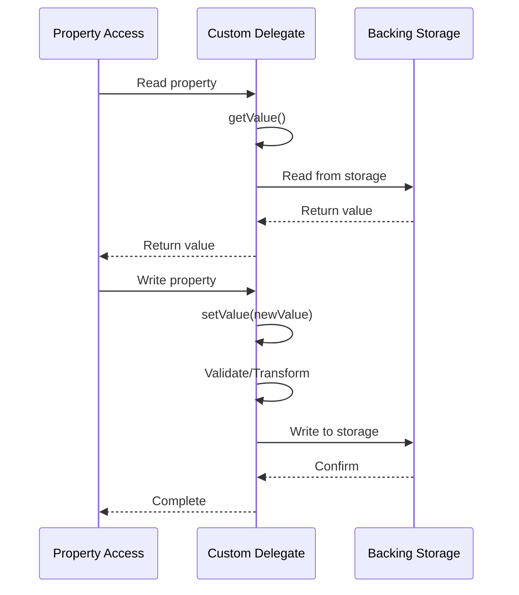

```kotlin
import kotlin.reflect.KProperty

class LoggingDelegate<T>(private var value: T) {
    // => Generic type T: works for String, Int, any type

    operator fun getValue(thisRef: Any?, property: KProperty<*>): T {
        // => operator fun: required for delegation protocol

        println("[GET] ${property.name} = $value")
        // => Logs property access (audit trail, monitoring)

        return value
    }

    operator fun setValue(thisRef: Any?, property: KProperty<*>, newValue: T) {
        println("[SET] ${property.name}: $value -> $newValue")
        // => Logs old -> new value transition

        value = newValue
    }
}

class UppercaseDelegate {
    // => Transforms String values: lowercase storage, uppercase presentation

    private var value: String = ""

    operator fun getValue(thisRef: Any?, property: KProperty<*>): String {
        return value.uppercase()
        // => Client always sees uppercase
    }

    operator fun setValue(thisRef: Any?, property: KProperty<*>, newValue: String) {
        value = newValue.lowercase()
        // => Stores normalized lowercase version
        // => Invariant: value always lowercase
    }
}

class Config {
    var theme: String by LoggingDelegate("light")
    // => Initial value: "light"

    var username: String by UppercaseDelegate()
    // => Initial value: "" (default)
}

fun main() {
    val config = Config()
    // => Delegate state: theme="light", username=""

    // LoggingDelegate demonstration
    println(config.theme)
    // => Invokes LoggingDelegate.getValue()
    // => Output: [GET] theme = light
    //           light

    config.theme = "dark"
    // => Invokes LoggingDelegate.setValue()
    // => Output: [SET] theme: light -> dark

    println(config.theme)
    // => Output: [GET] theme = dark
    //           dark

    // UppercaseDelegate demonstration
    config.username = "Alice"
    // => Stores "alice" (lowercase)

    println(config.username)
    // => Returns "ALICE" (uppercase transformation)
    // => Output: ALICE

    config.username = "BOB"
    // => Stores "bob" (lowercase)

    println(config.username)
    // => Returns "BOB" (uppercase transformation)
    // => Output: BOB
    // => Consistency: always uppercase output regardless of input case
}
```

**Key Takeaway**: Implement `getValue`/`setValue` operators to create custom property delegates that encapsulate access logic like logging, validation, or transformation.

**Why It Matters**: Custom property delegates enable cross-cutting concerns (logging, validation, persistence) to be extracted into reusable components rather than scattered across getters/setters throughout the codebase. This delegation pattern is impossible in Java without verbose proxy classes, yet Kotlin's operator overloading makes it seamless. Use cases include automatic preference storage (Android SharedPreferences), field validation with custom rules, and audit logging for security-sensitive properties, all without modifying business logic code.

---

### Example 41: Extension Functions and Properties

Add methods and properties to existing classes without modifying source code. Extensions are resolved statically based on declared type.

```kotlin
// Extension function on String
fun String.isPalindrome(): Boolean {
    // => No modification: String class source code unchanged (extension exists separately)

    val cleaned = this.lowercase().replace(" ", "")
    // => Operation: converts "Radar" -> "radar", then removes spaces: "A man" -> "aman"
    // => Immutability: original String (this) remains unchanged

    return cleaned == cleaned.reversed()
    // => Operation: "radar" -> "radar" (equals), "kotlin" -> "niltok" (not equals)
    // => Return: Boolean (true if palindrome, false otherwise)
    // => Algorithmic complexity: O(n) for reverse + O(n) for comparison = O(n)
}
// => Resolution: static dispatch (not virtual - no polymorphism via inheritance)
//    (Java equivalent: public static boolean isPalindrome(String receiver))

// Extension function with parameters
fun Int.times(action: (Int) -> Unit) {

    for (i in 1..this) {
        // => Receiver: 'this' is the Int value (e.g., 5.times {...} -> this = 5)

        action(i)
    }
}
// => Comparison: stdlib repeat(n) vs this.times - similar but provides index

// Extension property
val String.wordCount: Int
    // => Getter required: properties must define custom getter (no default getter)
    // => Restriction: no setter for val (read-only), var extensions need explicit setter

    get() = this.split("\\s+".toRegex()).filter { it.isNotEmpty() }.size
    // => split("\\s+".toRegex()): splits on whitespace (\\s+ = one or more whitespace chars)
    // => filter { it.isNotEmpty() }: removes empty strings from split result
    // => Return: Int (word count)
    // => Edge case: empty string "" -> [""] -> filter -> [] -> 0
    // => Edge case: "  " (only spaces) -> ["", "", ""] -> filter -> [] -> 0

// Extension on nullable receiver
fun String?.orDefault(default: String = "N/A"): String {
    // => Parameter: default is String with default value "N/A"
    // => Pattern: nullable receiver extension for null-safe operations

    return this ?: default
    // => Null check: if this != null, return this; else return default
    // => Type coercion: this (String?) becomes String when not null
}
// => Use case: configuration defaults, optional values, database null handling

// Extension on List
fun <T> List<T>.secondOrNull(): T? {

    return if (size >= 2) this[1] else null
    // => Safety: no exception thrown (null returned instead)
}
// => Reusability: works with List<Int>, List<String>, List<Any>, etc.

fun main() {
    // String extension
    println("radar".isPalindrome())
    // => Execution: cleaned = "radar", reversed = "radar" -> true
    // => Output: true

    println("kotlin".isPalindrome())
    // => Execution: cleaned = "kotlin", reversed = "niltok" -> false
    // => Output: false

    println("A man a plan a canal Panama".isPalindrome())
    // => Execution: cleaned = "amanaplanacanalpanama", reversed = same -> true
    // => Output: true

    // Int extension with lambda
    print("Countdown: ")

    5.times { i -> print("$i ") }
    // => String template: "$i " interpolates i into string with space
    // => Output: 1 2 3 4 5 (numbers with spaces, on same line)

    println()

    // String property extension
    val text = "Hello Kotlin World"
    // => Value: 3-word string for wordCount test

    println("Word count: ${text.wordCount}")
    // => Execution: split on whitespace -> ["Hello", "Kotlin", "World"] -> size = 3
    // => Output: Word count: 3

    // Nullable extension
    val str1: String? = null
    // => Type annotation: required when initializing with null (inference can't determine type)

    val str2: String? = "Hello"

    println(str1.orDefault())
    // => Safe: no NullPointerException (extension handles null receiver)
    // => Output: N/A

    println(str2.orDefault())
    // => Output: Hello

    println(str1.orDefault("Empty"))
    // => Output: Empty

    // List extension
    val numbers = listOf(10, 20, 30)
    // => Size: 3 elements (indices 0, 1, 2)
    // => Value: [10, 20, 30]

    println(numbers.secondOrNull())
    // => Output: 20

    println(emptyList<Int>().secondOrNull())
    // => Safety: no exception (null returned instead of IndexOutOfBoundsException)
    // => Output: null
}
// => Real-world usage: extensions add fluent APIs to library classes without modification
```

**Key Takeaway**: Extension functions add methods to existing types without inheritance; they're resolved statically and ideal for utility functions on library classes.

**Why It Matters**: Extension functions are Kotlin's mechanism for the open-closed principle: extend behavior without modifying the original class. Adding `fun String.toSlug()` or `fun LocalDate.toDisplayString()` to third-party or standard library types keeps domain logic colocated with where it's used, not scattered in utility classes. In Android development, extension functions on `Context`, `View`, and `Fragment` eliminate repetitive boilerplate. The critical production caveat: extension functions dispatch statically, not polymorphically—they don't participate in virtual dispatch, making them unsuitable for patterns requiring runtime polymorphism.

---

### Example 42: Inline Functions and Reified Type Parameters

Inline functions eliminate lambda allocation overhead by inlining bytecode. Reified type parameters preserve generic type information at runtime.

```kotlin
// Regular higher-order function (creates lambda object)
fun <T> regularFilter(list: List<T>, predicate: (T) -> Boolean): List<T> {
    // => Parameter: list is List<T>, predicate is (T) -> Boolean
    // => Bytecode: predicate stored as object implementing Function interface

    val result = mutableListOf<T>()

    for (item in list) {
        // => item: current element of type T

        if (predicate(item)) result.add(item)
        // => Overhead: virtual dispatch + potential cache miss
        // => result.add(item): mutates result list (side effect)
    }

    return result
}

// Inline function (no lambda allocation)
inline fun <T> inlineFilter(list: List<T>, predicate: (T) -> Boolean): List<T> {

    val result = mutableListOf<T>()

    for (item in list) {

        if (predicate(item)) result.add(item)
        // => No overhead: same performance as hand-written code
    }

    return result
}

// Inline with reified type parameter (type available at runtime)
inline fun <reified T> filterIsInstance(list: List<Any>): List<T> {
    // => Use case: generic type filtering, casting, class-based operations

    val result = mutableListOf<T>()
    // => Mutable list: accumulates items of type T
    // => Type safety: List<T> ensures only T instances added

    for (item in list) {

        if (item is T) result.add(item)
        // => Performance: instanceof bytecode instruction (fast)
    }

    return result
}
// => Solves: Java's type erasure problem (can't check "is T" in Java)
// => Use case: generic filtering, JSON parsing, dependency injection

// Reified for generic casting
inline fun <reified T> safeCast(value: Any): T? {
    // => Use case: safe type conversion without ClassCastException

    return value as? T
    // => Bytecode: checkcast instruction + null on failure
}
// => Kotlin: cleaner API (safeCast<String>(value) vs safeCast(value, String.class))

fun main() {
    val numbers = listOf(1, 2, 3, 4, 5)
    // => List creation: immutable List<Int>
    // => Value: [1, 2, 3, 4, 5]

    // Inline function usage (no lambda allocation)
    val evens = inlineFilter(numbers) { it % 2 == 0 }
    // => Result: [2, 4] (even numbers filtered)
    // => Performance: zero overhead (same as hand-written code)

    println("Evens: $evens")
    // => Output: Evens: [2, 4]

    // Reified type parameter
    val mixed: List<Any> = listOf(1, "two", 3.0, "four", 5)
    // => Heterogeneous list: List<Any> holds different types (Int, String, Double)
    // => Values: Int (1, 5), String ("two", "four"), Double (3.0)

    val strings = filterIsInstance<String>(mixed)
    // => Inline: filterIsInstance body copied here with T = String
    // => Execution: filters [1, "two", 3.0, "four", 5] -> ["two", "four"]
    // => Type safety: strings is List<String> (only String elements)

    println("Strings: $strings")
    // => Output: Strings: [two, four]

    val ints = filterIsInstance<Int>(mixed)
    // => Execution: filters [1, "two", 3.0, "four", 5] -> [1, 5]

    println("Ints: $ints")
    // => Output: Ints: [1, 5]

    // Reified casting
    val value: Any = "Hello"
    // => Variable: type Any (holds String instance)

    val str = safeCast<String>(value)
    // => Safe cast: value as? String with reified T = String
    // => Type check: value is String -> true (String instance)

    val num = safeCast<Int>(value)
    // => Safe cast: value as? Int with reified T = Int
    // => Type check: value is Int -> false (String, not Int)

    println("String cast: $str")
    // => Output: String cast: Hello

    println("Int cast: $num")
    // => Output: Int cast: null

    // Type check at runtime
    fun <T> isType(value: Any): Boolean {

        // return value is T

        return false
    }
    // => Problem: can't use "is T" without reified

    inline fun <reified T> isTypeReified(value: Any): Boolean {

        return value is T
        // => Type check: value is T (works because T is reified)
    }

    println(isTypeReified<String>("test"))
    // => Type check: "test" is String -> true (String literal)
    // => Output: true

    println(isTypeReified<Int>("test"))
    // => Type check: "test" is Int -> false (String, not Int)
    // => Output: false
}
// => Use cases: filtering, casting, type-safe builders, JSON parsing
```

**Key Takeaway**: Inline functions optimize higher-order functions by eliminating lambda allocation; reified type parameters enable runtime type checks and casts in generic functions.

**Why It Matters**: Java lambdas create function objects causing allocation overhead in tight loops, while Kotlin's inline functions eliminate this cost by copying bytecode directly to call sites, making higher-order functions zero-cost abstractions. Reified type parameters solve Java's type erasure problem (can't use `is T` at runtime) enabling generic JSON parsing, dependency injection, and type-safe builders without passing Class<T> parameters, dramatically simplifying library APIs like Gson's fromJson<User>(json) versus Java's fromJson(json, User.class).

---

### Example 43: Operator Overloading

Override operators like `+`, `-`, `*`, `[]`, `in` to create domain-specific syntax. Operators are implemented as member or extension functions with specific names.

**Arithmetic and Comparison Operators:**

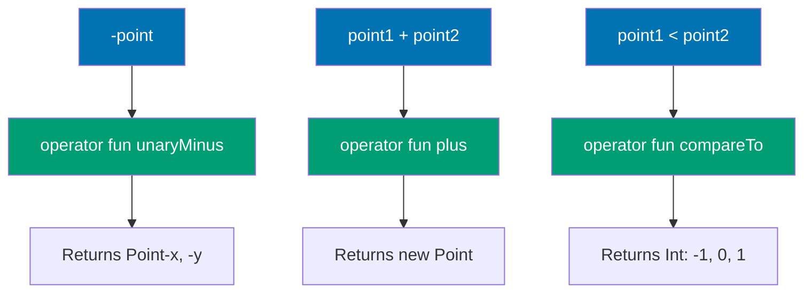

**Access and Special Operators:**

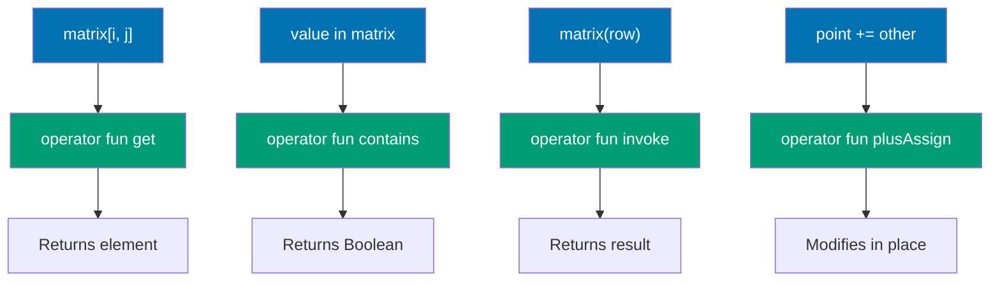

```kotlin
data class Point(val x: Int, val y: Int) {
    // => Data class: holds 2D point coordinates
    // => Properties: val x and y (immutable coordinates)
    // => Auto-generated: equals(), hashCode(), toString(), copy()
    // => Use case: operator overloading for mathematical operations

    // Unary operators
    operator fun unaryMinus() = Point(-x, -y)
    // => Function name: unaryMinus (conventional name for unary minus operator -)
    // => Syntax enabled: -point (prefix minus operator)
    // => Parameters: none (unary operator operates on single object - this)
    // => Return: Point(-x, -y) (new Point with negated coordinates)
    // => Convention: unaryMinus for -, unaryPlus for +, not for !, inc for ++, dec for --

    // Binary operators
    operator fun plus(other: Point) = Point(x + other.x, y + other.y)
    // => Function name: plus (conventional name for binary plus operator +)
    // => Syntax enabled: point1 + point2 (infix plus operator)
    // => Parameter: other is Point (right-hand side of +)
    // => Return: Point(x + other.x, y + other.y) (new Point with summed coordinates)
    // => Vector addition: adds corresponding coordinates (x1+x2, y1+y2)
    // => Convention: plus for +, minus for -, times for *, div for /, rem for %

    operator fun times(scalar: Int) = Point(x * scalar, y * scalar)
    // => Function name: times (conventional name for multiplication operator *)
    // => Syntax enabled: point * scalar (point on left, scalar on right)
    // => Parameter: scalar is Int (multiplication factor)
    // => Return: Point(x * scalar, y * scalar) (scaled coordinates)
    // => Asymmetry: point * 3 works, 3 * point requires separate operator (extension on Int)
    // => Use case: scaling vectors, matrix operations

    // Augmented assignment
    operator fun plusAssign(other: Point) {
        // => Function name: plusAssign (conventional name for += operator)
        // => Syntax enabled: point += other (augmented assignment)
        // => Parameter: other is Point (value to add)
        // => Limitation: data class properties are val (immutable), can't modify x/y
        // => Convention: plusAssign for +=, minusAssign for -=, timesAssign for *=

        // For data class, this would require var properties
        // => Solution: use var x, var y in constructor for mutable Point
        // => Alternative: use plus operator and reassign (point = point + other)

        println("Adding $other to $this")
        // => String template: interpolates other and this
    }
    // => Limitation: requires mutable properties (var, not val)
    // => Use case: in-place modification (mutation-based APIs)

    // Comparison
    operator fun compareTo(other: Point): Int {
        // => Function name: compareTo (conventional name for comparison operators)
        // => Syntax enabled: point1 < point2, point1 > point2, point1 <= point2, point1 >= point2
        // => Parameter: other is Point (right-hand side of comparison)

        val thisMagnitude = x * x + y * y
        // => Magnitude calculation: x² + y² (squared distance from origin)
        // => Not sqrt: avoids floating-point for performance (ordering preserved)

        val otherMagnitude = other.x * other.x + other.y * other.y
        // => Magnitude calculation: other's squared distance from origin

        return thisMagnitude.compareTo(otherMagnitude)
        // => Comparison: delegates to Int.compareTo (standard library)
        // => Return: negative if this < other (25 < 169 -> negative)
        // => Return: 0 if this == other (same magnitude)
        // => Return: positive if this > other (25 > 16 -> positive)
        // => Ordering: sorts points by distance from origin
    }
    // => Contract: consistent with equals (equal points have compareTo = 0)
}
// => Pattern: immutable value type with mathematical operations
// => Use cases: 2D graphics, game development, mathematical modeling

data class Matrix(val rows: List<List<Int>>) {
    // => Data class: holds 2D matrix as list of lists
    // => Immutability: val + List (not MutableList) = immutable matrix

    // Index access operator
    operator fun get(row: Int, col: Int): Int {
        // => Function name: get (conventional name for index access operator [])
        // => Parameters: row and col (two Int indices)
        // => Convention: get for [], set for []= (assignment)

        return rows[row][col]
        // => Nested access: rows[row] gets row list, [col] gets element
        // => Bounds checking: List throws IndexOutOfBoundsException if invalid indices
    }
    // => Use case: 2D arrays, matrices, tables, grids

    // Contains operator
    operator fun contains(value: Int): Boolean {
        // => Function name: contains (conventional name for 'in' operator)
        // => Syntax enabled: value in matrix (membership test)
        // => Parameter: value is Int (element to search for)
        // => Convention: contains for 'in', NOT for '!in' (negation automatic)

        return rows.flatten().contains(value)
        // => Performance: O(n*m) where n = rows, m = columns (linear search)
    }
    // => Syntax: 'in' operator (natural for set/collection semantics)

    // Invoke operator
    operator fun invoke(row: Int): List<Int> {
        // => Parameter: row is Int (row index)

        return rows[row]
        // => Bounds checking: throws IndexOutOfBoundsException if row invalid
    }
}
// => Use cases: mathematical matrices, tables, grid-based data structures

fun main() {
    val p1 = Point(1, 2)
    // => Point creation: data class primary constructor
    // => Values: x = 1, y = 2

    val p2 = Point(3, 4)
    // => Point creation: x = 3, y = 4

    // Unary operator
    val negated = -p1
    // => Execution: Point(-1, -2) (negated coordinates)
    // => Immutability: p1 unchanged (Point(1, 2) still)

    println("Negated: $negated")
    // => Output: Negated: Point(x=-1, y=-2)
    // => String template: interpolates negated Point

    // Binary operators
    val sum = p1 + p2
    // => Execution: Point(1+3, 2+4) = Point(4, 6)
    // => Vector addition: adds coordinates component-wise

    val scaled = p1 * 3
    // => Execution: Point(1*3, 2*3) = Point(3, 6)
    // => Scalar multiplication: scales coordinates by factor 3

    println("Sum: $sum")
    // => Output: Sum: Point(x=4, y=6)

    println("Scaled: $scaled")
    // => Output: Scaled: Point(x=3, y=6)

    // Comparison operators
    println("p1 < p2: ${p1 < p2}")
    // => Execution: p1.compareTo(p2) -> (1²+2²).compareTo(3²+4²) -> 5.compareTo(25) -> negative
    // => Result: negative < 0 -> true (p1 magnitude 5 < p2 magnitude 25)
    // => Output: p1 < p2: true

    println("p1 > p2: ${p1 > p2}")
    // => Result: negative > 0 -> false
    // => Output: p1 > p2: false

    // Matrix operators
    val matrix = Matrix(listOf(
        listOf(1, 2, 3),
        listOf(4, 5, 6),
        listOf(7, 8, 9)
    ))
    // => Matrix creation: 3x3 matrix (3 rows, 3 columns)
    // => Values: [[1,2,3], [4,5,6], [7,8,9]]

    println("matrix[1, 1]: ${matrix[1, 1]}")
    // => Execution: rows[1][1] = [4,5,6][1] = 5 (row 1, column 1, 0-indexed)
    // => Output: matrix[1, 1]: 5

    println("5 in matrix: ${5 in matrix}")
    // => Execution: flatten [[1,2,3],[4,5,6],[7,8,9]] -> [1,2,3,4,5,6,7,8,9] -> contains(5) = true
    // => Output: 5 in matrix: true

    println("matrix(2): ${matrix(2)}")
    // => Execution: rows[2] = [7, 8, 9] (third row, 0-indexed)
    // => Output: matrix(2): [7, 8, 9]
}
// => Coverage: unary (-), binary (+, *), comparison (<, >), index ([]), contains (in), invoke (())
```

**Key Takeaway**: Operator overloading enables natural syntax for custom types; implement operators as functions with conventional names like `plus`, `get`, `contains`.

**Why It Matters**: Domain-specific types benefit from mathematical notation (Point + Point, Matrix[i,j]) that makes code self-documenting, yet Java offers no operator overloading forcing verbose method calls (point1.add(point2), matrix.get(i,j)). Kotlin's operator overloading enables natural expressions for mathematical types, collection-like data structures, and DSLs while preventing abuse through limited operator set and explicit operator keyword, balancing expressiveness with readability in scientific computing, game development, and configuration code.

---

### Example 44: DSL Building with Lambda with Receiver

Create type-safe DSLs using lambda with receiver. The receiver provides implicit `this` context within the lambda, enabling fluent builder APIs with compile-time validation and IDE autocomplete support.

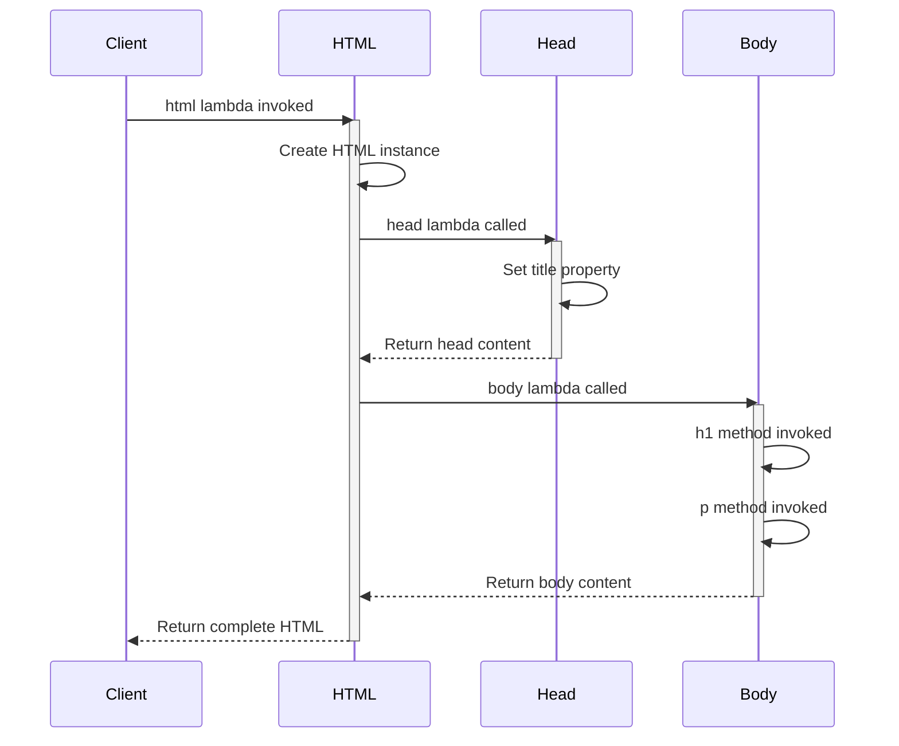

```kotlin
class HTML {
    // => HTML: root DSL builder class representing <html> element
    // => Mutable state: accumulates elements in order they're defined in DSL

    private val elements = mutableListOf<String>()
    // => elements: mutable list storing rendered HTML strings from child builders
    // => Lifecycle: accumulates during DSL execution, read during toString

    fun head(init: Head.() -> Unit) {

        val head = Head()
        // => Initialization: default constructor (title starts as empty string)

        head.init()

        elements.add(head.toString())
        // => Convert configured Head to HTML string and append to elements list
        // => head.toString(): generates "<head><title>VALUE</title></head>"
        // => elements.add: appends rendered HTML to accumulator (preserves order)
    }

    fun body(init: Body.() -> Unit) {

        val body = Body()
        // => Initialization: empty content list (mutableListOf<String>())

        body.init()

        elements.add(body.toString())
        // => Convert configured Body to HTML string and append to elements list
        // => Immutability: Body configuration captured as string
    }

    override fun toString() = "<html>${elements.joinToString("")}</html>"
    // => toString: render complete HTML document by wrapping elements in <html> tag
    // => Why override: provides custom string representation for HTML object
    // => Output format: "<html><head>...</head><body>...</body></html>"
}

class Head {
    // => Head: DSL builder class for <head> element configuration
    // => Responsibility: stores head metadata (title, meta tags, etc.)
    // => Type safety: only valid head properties exposed

    var title = ""
    // => Default value: empty string (valid HTML - renders <title></title>)

    override fun toString() = "<head><title>$title</title></head>"
    // => toString: render <head> element with configured title
    // => String template: embeds title value in HTML structure
    // => Output: even if title empty, generates valid HTML <head><title></title></head>
}

class Body {
    // => Body: DSL builder class for <body> element with child elements

    private val content = mutableListOf<String>()
    // => content: mutable list storing rendered HTML strings from body elements
    // => Lifecycle: grows during DSL execution (h1, p, ul append strings)

    fun h1(text: String) {

        content.add("<h1>$text</h1>")
        // => Render h1 element and append to content list
        // => String template: embeds text in <h1> tags
        // => Output: "<h1>Welcome</h1>" for text "Welcome"
    }

    fun p(text: String) {

        content.add("<p>$text</p>")
        // => Render paragraph element and append to content list
        // => String template: embeds text in <p> tags
    }

    fun ul(init: UL.() -> Unit) {
        // => Scope nesting: ul block is separate scope from body block

        val ul = UL()
        // => Create new UL instance for list configuration

        ul.init()

        content.add(ul.toString())
        // => Convert configured UL to HTML string and append to body content
        // => ul.toString(): generates "<ul><li>Item 1</li>...</ul>"
    }

    override fun toString() = "<body>${content.joinToString("")}</body>"
    // => Output format: "<body><h1>...</h1><p>...</p><ul>...</ul></body>"
}

class UL {
    // => UL: DSL builder class for <ul> unordered list element

    private val items = mutableListOf<String>()
    // => items: mutable list storing rendered <li> HTML strings

    fun li(text: String) {

        items.add("<li>$text</li>")
        // => Render list item element and append to items list
        // => String template: embeds text in <li> tags
        // => Output: "<li>Item 1</li>" for text "Item 1"
    }

    override fun toString() = "<ul>${items.joinToString("")}</ul>"
    // => Output format: "<ul><li>Item 1</li><li>Item 2</li><li>Item 3</li></ul>"
}

fun html(init: HTML.() -> Unit): HTML {
    // => Entry point: starts DSL execution (html { head { } body { } })
    // => Convention: lowercase name (html) for DSL builders, uppercase (HTML) for classes

    val html = HTML()
    // => Create new HTML instance to receive DSL configuration
    // => Initialization: empty elements list (mutableListOf<String>())

    html.init()

    return html
}

fun main() {
    val page = html {
        // => Scope: outermost DSL scope (head and body are children)

        head {
            // => Scope change: switched from HTML receiver to Head receiver
            // => Type safety: only Head properties (title) available (h1 invalid here)

            title = "My Page"
            // => Effect: sets Head.title to "My Page"
        }
        // => End of head block, Head rendered to "<head><title>My Page</title></head>"
        // => Scope return: receiver switches back to HTML

        body {
            // => Scope change: switched from HTML receiver to Body receiver

            h1("Welcome")
            // => Effect: adds "<h1>Welcome</h1>" to Body.content list

            p("This is a paragraph")
            // => Receiver: implicit this.p(...) (Body receiver)

            ul {
                // => Scope change: switched from Body receiver to UL receiver (nested 2 levels deep)

                li("Item 1")
                // => Effect: adds "<li>Item 1</li>" to UL.items list

                li("Item 2")
                // => Effect: adds "<li>Item 2</li>" to UL.items list

                li("Item 3")
                // => Effect: adds "<li>Item 3</li>" to UL.items list
            }
            // => End of ul block, UL rendered to "<ul><li>Item 1</li><li>Item 2</li><li>Item 3</li></ul>"
            // => Scope return: receiver switches back to Body
            // => Body.content: now contains h1, p, and ul HTML strings
        }
        // => End of body block, Body rendered to "<body><h1>Welcome</h1>...</body>"
        // => Scope return: receiver switches back to HTML
        // => HTML.elements: now contains head and body HTML strings
    }
    // => End of html block, HTML instance returned and assigned to 'page'

    println(page)
    // => elements: ["<head><title>My Page</title></head>", "<body>...</body>"]
    // => joinToString(""): concatenates with no separator
    // => Single line: no formatting/whitespace (production HTML is compact)
    // => Valid HTML: complete document structure (html > head + body)
}
// => Readability: DSL structure mirrors HTML structure (nested blocks = nested elements)
// => Real-world usage: Gradle Kotlin DSL, Ktor routing, Exposed SQL, kotlinx.html
```

**Key Takeaway**: Lambda with receiver (`Type.() -> Unit`) enables type-safe DSLs by providing implicit context where `this` refers to the receiver type; compiler enforces scope-appropriate methods, and IDE autocomplete shows only valid options, making DSL construction safe and discoverable.

**Why It Matters**: DSLs with lambda receivers transform configuration code from error-prone method chains into declarative, type-safe syntax. Gradle Kotlin DSL, HTML builders, and Ktor routing all use this pattern. The receiver object inside the lambda block becomes `this`, enabling concise configuration without repetitive qualifiers. Compared to builder patterns in Java, Kotlin DSLs are statically typed (autocomplete works), eliminate intermediate builder objects, and allow arbitrary Kotlin code (conditionals, loops) within the configuration block. This makes complex configuration readable as a document rather than a program.

---

### Example 45: Sealed Classes and When Expressions

Sealed classes restrict inheritance to a known set of subclasses defined in the same file, enabling exhaustive `when` expressions without `else` branches. The compiler knows all possible subtypes at compile time, providing type-safe state machines and algebraic data types with guaranteed pattern matching completeness.

```kotlin
sealed class NetworkResult<out T> {
    // => NetworkResult: sealed class restricting inheritance to known subclasses
    // => Use cases: API responses, async operations, state machines

    data class Success<T>(val data: T) : NetworkResult<T>()
    // => Success: data class subtype representing successful result
    // => Data class: auto-generates equals(), hashCode(), toString(), copy(), componentN()
    // => Property 'data': holds successful result value (type T)
    // => Covariance: Success<String> is NetworkResult<String> and NetworkResult<Any>
    // => Structural equality: Success("A") == Success("A") is true (data class equality)

    data class Error(val exception: Exception) : NetworkResult<Nothing>()
    // => Error: data class subtype representing failure with exception
    // => Why Nothing: Error has no successful value, Nothing indicates no value possible
    // => Covariance: NetworkResult<Nothing> is subtype of NetworkResult<T> for any T
    // => Property 'exception': holds failure cause (type Exception)

    object Loading : NetworkResult<Nothing>()
    // => Loading: singleton object representing in-progress state
    // => Object: single instance (not data class - no properties to distinguish instances)
    // => Singleton: Loading === Loading is always true (referential equality)
    // => Pattern matching: use 'NetworkResult.Loading ->' (not 'is') for object cases
}

sealed class UIState {
    // => UIState: sealed class for UI screen state machine
    // => State machine: defines valid states, transitions enforced by application logic

    object Idle : UIState()
    // => Idle: singleton representing initial/ready state
    // => State meaning: UI ready for user interaction (not loading, no errors)
    // => Singleton: single instance (Idle === Idle always true)

    object Loading : UIState()
    // => Loading: singleton representing loading/processing state
    // => State meaning: operation in progress (show spinner/progress bar)
    // => Separate from NetworkResult.Loading: different semantic domains (UI vs network)

    data class Success(val message: String) : UIState()
    // => Success: data class representing successful completion with message
    // => Property 'message': success feedback text (e.g., "Saved successfully")
    // => Why data class: message distinguishes different success scenarios
    // => Structural equality: Success("OK") == Success("OK") is true

    data class Error(val error: String) : UIState()
    // => Error: data class representing error state with error message
    // => Property 'error': error message text (e.g., "Connection failed")
    // => Why data class: error distinguishes different failure scenarios
    // => Not Exception: UI error is string message, not exception object
}

fun handleNetworkResult(result: NetworkResult<String>) {
    // => Parameter 'result': NetworkResult<String> (generic sealed class instance)

    when (result) {
        // => Compile-time check: adding new NetworkResult subclass causes error here

        is NetworkResult.Success -> {
            // => Property access: result.data available (String type from Success<String>)
            // => Pattern: 'is' required for data classes (need type check to access properties)

            println("Success: ${result.data}")
            // => Output format: "Success: Data loaded" for data = "Data loaded"
        }

        is NetworkResult.Error -> {
            // => Property access: result.exception available (Exception type)

            println("Error: ${result.exception.message}")
            // => exception.message: access Exception.message (String? - may be null)
            // => Output format: "Error: Network timeout" for exception with message "Network timeout"
        }

        NetworkResult.Loading -> {
            // => No 'is': objects matched by equality (Loading === result), not type check
            // => Singleton: only one Loading instance exists (no properties to distinguish)
            // => Pattern: no 'is' for objects (use qualified name NetworkResult.Loading)

            println("Loading...")
            // => Simple output: no properties to extract from Loading object
            // => State indicator: signals in-progress state to user
        }

    }
}

fun updateUI(state: UIState): String = when (state) {
    // => Parameter 'state': UIState sealed class instance

    UIState.Idle -> "Ready"
    // => Object match: UIState.Idle singleton
    // => Return: "Ready" string for Idle state
    // => No 'is': Idle is object (matched by equality)

    UIState.Loading -> "Please wait..."
    // => Object match: UIState.Loading singleton
    // => Return: "Please wait..." string for Loading state

    is UIState.Success -> "✓ ${state.message}"
    // => Property access: state.message is String (from Success data class)
    // => Return: formatted success message with checkmark (e.g., "✓ Saved successfully")
    // => String template: embeds state.message in output string

    is UIState.Error -> "✗ ${state.error}"
    // => Property access: state.error is String (from Error data class)
    // => Return: formatted error message with X mark (e.g., "✗ Connection failed")
    // => String template: embeds state.error in output string

}

fun main() {
    // Network result handling
    handleNetworkResult(NetworkResult.Success("Data loaded"))
    // => Create Success instance with data "Data loaded"

    handleNetworkResult(NetworkResult.Error(Exception("Network timeout")))
    // => Create Error instance with Exception containing message "Network timeout"

    handleNetworkResult(NetworkResult.Loading)

    // UI state handling
    println(updateUI(UIState.Idle))
    // => Output: Ready (single line)

    println(updateUI(UIState.Loading))
    // => Output: Please wait...

    println(updateUI(UIState.Success("Saved")))
    // => Create Success instance with message "Saved"
    // => Return value: "✓ Saved" (template substitutes state.message)
    // => Output: ✓ Saved

    println(updateUI(UIState.Error("Connection failed")))
    // => Create Error instance with error "Connection failed"
    // => Return value: "✗ Connection failed" (template substitutes state.error)
    // => Output: ✗ Connection failed

    // Sealed class hierarchy is known at compile time
    val states: List<UIState> = listOf(
        // => states: immutable list of UIState instances (List<UIState> type)
        // => Polymorphism: list holds different UIState subtypes (Success, Error, objects)

        UIState.Idle,
        // => Reference Idle singleton, add to list

        UIState.Loading,
        // => Reference Loading singleton, add to list

        UIState.Success("OK"),
        // => Create Success instance with message "OK"

        UIState.Error("Fail")
        // => Create Error instance with error "Fail"
    )
    // => List contents: [Idle, Loading, Success("OK"), Error("Fail")]
    // => Polymorphism: list holds mixed Success/Error/object instances

    states.forEach { state ->

        println(updateUI(state))
        // => Output: one line per state ("Ready", "Please wait...", "✓ OK", "✗ Fail")
    }
    // => Ready (Idle state)
    // => Please wait... (Loading state)
    // => ✓ OK (Success state)
    // => ✗ Fail (Error state)
}
// => Sealed class demonstration complete
// => State machines: perfect for modeling finite state machines with known states
// => Algebraic data types: sealed classes are Kotlin's sum types (Success | Error | Loading)
```

**Key Takeaway**: Sealed classes restrict inheritance to a compile-time-known set of subtypes, enabling exhaustive `when` expressions that must handle all cases without `else` branches; compiler enforces completeness, and adding new subtypes causes compile errors in all pattern matches, guaranteeing no missing case bugs.

**Why It Matters**: Sealed classes with `when` exhaustiveness checking is Kotlin's primary tool for modeling finite state machines and algebraic data types. Unlike enums, sealed classes allow each variant to carry different data—`Error(code: Int, message: String)` vs `Success(data: T)`—making them ideal for API response modeling, UI state, and domain event types. The compile-time guarantee that all cases are handled prevents the silent failure mode of Java's non-exhaustive switch statements. This pattern underpins Kotlin Result types, Kotlin coroutine Channel results, and the functional programming patterns in Arrow library.

---

### Example 46: Data Class Advanced Features - Copy and Destructuring

Data classes automatically generate `copy()` for immutable updates with named parameters, `componentN()` for destructuring declarations, and value-based `equals()`/`hashCode()`/`toString()` for structural equality and debugging. These features enable functional programming patterns without boilerplate, making immutable data transformations concise and type-safe.

```kotlin
data class User(
    // => User: data class with 4 properties (3 required, 1 default)

    val id: Int,
    // => Required: no default value, must provide in constructor

    val name: String,
    // => Required: must provide in constructor

    val email: String,
    // => component3(): destructuring extracts email as third component
    // => Required: must provide in constructor

    val role: String = "user"
    // => component4(): destructuring extracts role as fourth component
    // => Override: can specify role = "admin" in constructor or copy()
)

data class Point3D(val x: Double, val y: Double, val z: Double)
// => Point3D: simple data class with 3 Double properties
// => component1/2/3: destructuring extracts x, y, z in order

fun main() {
    val user1 = User(1, "Alice", "alice@example.com")

    // Automatic toString()
    println(user1)
    // => Auto-generated: data class toString() format is "ClassName(prop1=value1, prop2=value2, ...)"

    // Automatic equals() (structural equality)
    val user2 = User(1, "Alice", "alice@example.com")

    println("user1 == user2: ${user1 == user2}")
    // => Output: user1 == user2: true (same values)

    println("user1 === user2: ${user1 === user2}")
    // => Output: user1 === user2: false (different objects)
    // => Use case: === rarely needed for data classes (use == for value comparison)

    // copy() with modifications
    val user3 = user1.copy(email = "newalice@example.com")
    // => Copied properties: id=1, name="Alice", role="user" copied from user1

    println("Modified user: $user3")
    // => Immutability proof: user1 and user3 are separate instances with different emails

    val admin = user1.copy(role = "admin")
    // => Use case: promote user to admin without modifying original
    // => Immutability: user1 still has role="user"

    println("Admin user: $admin")
    // => Comparison: only role differs from user1 (admin vs user)

    // Destructuring declaration
    val (id, name, email, role) = user1

    println("Destructured: ID=$id, Name=$name, Email=$email, Role=$role")
    // => id: 1 (Int, from user1.component1())
    // => name: "Alice" (String, from user1.component2())
    // => role: "user" (String, from user1.component4())

    // Partial destructuring (ignore components)
    val (userId, userName) = user1
    // => userId: user1.component1() = 1 (Int)
    // => userName: user1.component2() = "Alice" (String)
    // => Ignored: component3() (email) and component4() (role) not extracted

    println("Partial: ID=$userId, Name=$userName")
    // => Output: Partial: ID=1, Name=Alice
    // => email and role: not extracted, not accessible in this scope

    // Destructuring in loops
    val users = listOf(
        // => users: immutable list of User instances
        // => Size: 3 users

        User(1, "Alice", "alice@example.com"),

        User(2, "Bob", "bob@example.com"),

        User(3, "Charlie", "charlie@example.com")
    )
    // => List contents: [User(1, Alice, ...), User(2, Bob, ...), User(3, Charlie, ...)]

    for ((id, name) in users) {
        // => (id, name): partial destructuring (component1, component2 only)
        // => Ignored: email (component3) and role (component4) not extracted
        // => Type inference: id is Int, name is String (from componentN() return types)

        println("User $id: $name")
        // => String template: embeds id and name in output
    }

    // componentN functions (auto-generated)
    val point = Point3D(1.0, 2.0, 3.0)
    // => Create Point3D instance with x=1.0, y=2.0, z=3.0

    val x = point.component1()
    // => Return value: point.x (1.0, type Double)

    val y = point.component2()
    // => Return value: point.y (2.0, type Double)
    // => y: 2.0 (same as point.y)

    val z = point.component3()
    // => Return value: point.z (3.0, type Double)
    // => z: 3.0 (same as point.z)

    println("Point components: x=$x, y=$y, z=$z")
    // => x: 1.0 (from component1)
    // => y: 2.0 (from component2)
    // => z: 3.0 (from component3)
    // => Output: Point components: x=1.0, y=2.0, z=3.0
}
// => Data class features demonstration complete
// => Key insight: data classes eliminate boilerplate for value objects
// => Conciseness: ~20 lines of boilerplate saved per data class vs Java
```

**Key Takeaway**: Data classes auto-generate `copy()` for immutable updates with named parameters, `componentN()` for destructuring declarations, and value-based `equals()`/`hashCode()`/`toString()` for structural equality; `copy()` enables functional programming patterns by creating modified copies instead of mutation, and destructuring reduces verbosity when unpacking multiple properties.

**Why It Matters**: Immutable updates in Java require manual builder patterns (20+ lines per class) or annotation processing boilerplate, while Kotlin's `copy()` enables functional update patterns in a single line: `user.copy(email = newEmail)`. This prevents accidental mutations that cause bugs in concurrent code. Destructuring declarations reduce ceremony when unpacking data—`val (id, name, email) = user` versus three separate getter calls—critical in functional transformations and data processing pipelines where extracting multiple fields from objects is ubiquitous. The combination of `copy()` and destructuring is central to event sourcing and immutable state patterns in Kotlin.

---

### Example 47: Destructuring in Lambdas and Map Operations

Destructure data class parameters in lambda expressions and work with map entries.

```kotlin
// Data class with three properties
data class Product(val id: Int, val name: String, val price: Double)

fun main() {
    // Create product list
    val products = listOf(
        Product(1, "Laptop", 999.99),        // => Product(id=1, name="Laptop", price=999.99)
        Product(2, "Mouse", 29.99),          // => Product(id=2, name="Mouse", price=29.99)
        Product(3, "Keyboard", 79.99)        // => Product(id=3, name="Keyboard", price=79.99)
    )                                        // => products is List<Product>, size=3

    // Destructuring in lambda parameter
    println("=== Full Destructuring ===")
    products.forEach { (id, name, price) ->      // => Destructure Product into (id, name, price) via component1/2/3
        println("Product $id: $name - $$price")
                                             // => $$ escapes dollar sign in string template
    }
    // => Output: Product 1: Laptop - $999.99
    // => Output: Product 2: Mouse - $29.99
    // => Output: Product 3: Keyboard - $79.99

    // Partial destructuring with underscore
    println("\n=== Partial Destructuring (ignore price) ===")
    products.forEach { (id, name, _) ->      // => Destructure only id and name, ignore price (underscore)
        println("ID $id: $name")             // => price not accessible (ignored via _)
    }
    // => Output: ID 1: Laptop
    // => Output: ID 2: Mouse
    // => Output: ID 3: Keyboard

    // Map operations with destructuring
    println("\n=== Map Destructuring ===")
    val productMap = mapOf(
        "Laptop" to 999.99,                  // => Pair("Laptop", 999.99) becomes Map.Entry
        "Mouse" to 29.99,                    // => Pair("Mouse", 29.99) becomes Map.Entry
        "Keyboard" to 79.99                  // => Pair("Keyboard", 79.99) becomes Map.Entry
    )                                        // => productMap is Map<String, Double>, size=3
                                             // => Map.Entry has component1() (key) and component2() (value)

    productMap.forEach { (name, price) ->    // => Destructures into (name, price) via component1() and component2()
                                             // => name = entry.component1() (key), price = entry.component2() (value)
        println("$name costs $$price")       // => $$ escapes dollar sign in template
    }
    // => Output: Laptop costs $999.99
    // => Output: Mouse costs $29.99
    // => Output: Keyboard costs $79.99

    // Filter with destructuring
    println("\n=== Filter with Destructuring ===")
    val expensive = productMap.filter { (_, price) -> price > 50.0 }
                                             // => Underscore ignores key (name), only uses price
                                             // => Filter predicate: price > 50.0 (true for Laptop and Keyboard)
                                             // => expensive = {Laptop=999.99, Keyboard=79.99}
    println("Expensive products: $expensive")
                                             // => Output: Expensive products: {Laptop=999.99, Keyboard=79.99}

    // Map entries to different structure
    println("\n=== Map Transformation ===")
    val priceList = productMap.map { (name, price) ->
        "$name: $$${String.format("%.2f", price)}"
                                             // => String.format("%.2f", 999.99) = "999.99" (2 decimal places)
    }                                        // => priceList is List<String>, size=3
    println("Price list: $priceList")        // => Output: Price list: [Laptop: $999.99, Mouse: $29.99, Keyboard: $79.99]

    // Grouping with destructuring
    println("\n=== GroupBy with Destructuring ===")
    val inventory = listOf(
        Triple("Furniture", "Chair", 8)
    )                                        // => inventory is List<Triple<String, String, Int>>, size=4

    val grouped = inventory.groupBy { (category, _, _) -> category }
                                             // => component1() extracts category, component2() and component3() ignored
                                             // => GroupBy key: category (Electronics or Furniture)
                                             // => grouped = {Electronics=[Triple(Electronics, Laptop, 5), Triple(Electronics, Mouse, 20)], Furniture=[...]}
                                             // => category = groupBy key (String), items = List<Triple> for that category
        items.forEach { (_, product, quantity) ->
        }
    }
    // => Output:
    // Electronics:
    //   Laptop: 5
    //   Mouse: 20
    // Furniture:
    //   Desk: 3
    //   Chair: 8

    // Nested destructuring demonstration
    println("\n=== Nested Destructuring ===")
    val nestedData = mapOf(
        "user1" to Pair("Alice", 25),        // => Map.Entry with value = Pair
        "user2" to Pair("Bob", 30)           // => Can destructure both levels
    )

    nestedData.forEach { (userId, userData) ->
                                             // => userId = entry.key, userData = entry.value (which is Pair)
                                             // => name = userData.component1(), age = userData.component2()
        println("User $userId: $name, age $age")
    }
    // => Output: User user1: Alice, age 25
    // => Output: User user2: Bob, age 30

    // Destructuring with type annotations
    println("\n=== Type-Annotated Destructuring ===")
    products.forEach { (id: Int, name: String, price: Double) ->
        val total = price * 1.1              // => total is Double (price * 1.1)
        println("$name (ID $id): $$price -> $${"%.2f".format(total)} with 10% markup")
    }
    // => Output: Laptop (ID 1): $999.99 -> $1099.99 with 10% markup
    // => Output: Mouse (ID 2): $29.99 -> $32.99 with 10% markup
    // => Output: Keyboard (ID 3): $79.99 -> $87.99 with 10% markup
}
```

**Key Takeaway**: Destructuring in lambdas enables concise parameter extraction from data classes, pairs, triples, and map entries using `componentN()` functions; use underscore `_` to skip unwanted components.

**Why It Matters**: Destructuring in lambdas eliminates boilerplate variable names for compound operations. Processing map entries as `{ (key, value) -> ... }` instead of `{ entry -> entry.key ... entry.value }` reduces noise in data transformation code. When analyzing collections of data classes, destructuring makes the intent clear: `users.map { (name, age, email) -> ... }` reads like pattern matching. This is particularly valuable in functional pipelines processing records, pairs, or small tuples where the structure is well-known and the field names add cognitive overhead rather than clarity.

---

### Example 48: Inline Classes (Value Classes) for Type Safety

Inline classes provide zero-overhead type-safe wrappers. They're inlined to underlying type at runtime, avoiding object allocation.

```kotlin
// Simple value class (inlined at runtime)

// Value class with validation
@JvmInline
value class Email(val value: String) {      // => Wraps String with email validation
    init {                                   // => Init block runs at construction
        require(value.contains("@")) { "Invalid email: $value" }
                                             // => require() throws IllegalArgumentException if false
                                             // => Impossible to create Email("notanemail") - fails at construction
    }

    fun domain(): String = value.substringAfter("@")
}

// Value class with private property
@JvmInline
value class Password(private val value: String) {
                                             // => Private value prevents external access to raw password
    fun isStrong(): Boolean = value.length >= 8 && value.any { it.isDigit() }
                                             // => Method to check password strength
                                             // => Requires: length ≥ 8 AND at least one digit
                                             // => "secret123" (length=9, has digits) = strong
                                             // => "short" (length=5) = weak

    override fun toString() = "*".repeat(value.length)
                                             // => Override toString() to hide password in logs
                                             // => "secret123" (length=9) becomes "*********"
                                             // => Prevents accidental password leakage in debug output
}

// Type-safe function signatures (compile-time protection)
fun sendEmail(from: Email, to: Email, subject: String) {
                                             // => Parameters strongly typed: from and to MUST be Email
    println("Sending '$subject' from ${from.value} to ${to.value}")
                                             // => Access .value to get underlying String
                                             // => from.value and to.value are String (validated emails)
}

fun authenticateUser(userId: UserId, password: Password) {
                                             // => userId MUST be UserId (not raw Int)
                                             // => password MUST be Password (not raw String)
    println("Authenticating user ${userId.value}")
                                             // => userId.value is Int (underlying value)
    println("Password strength: ${if (password.isStrong()) "strong" else "weak"}")
}

fun main() {
    // Create value class instances
    val userId = UserId(123)                 // => Constructs UserId wrapping Int 123
    val email = Email("user@example.com")    // => Constructs Email, init block validates "@" present
                                             // => Validation succeeds (contains "@")
    val password = Password("secret123")     // => Constructs Password wrapping String

    // Type safety demonstration
    println("=== Type Safety ===")
    // sendEmail(userId, email, "Test")      // => COMPILE ERROR: Type mismatch
                                             // => Expected: Email, Actual: UserId
                                             // => Prevents passing UserId where Email expected

    sendEmail(
        to = email,                          // => email is Email type (validated)
        subject = "Hello"                    // => subject is String (no wrapper)
    )                                        // => Compiles successfully: types match

    authenticateUser(userId, password)       // => userId is UserId, password is Password (types match)
    // => Output: Authenticating user 123
    // => Output: Password strength: strong (length=9, has digits)

    // Value class methods
    println("\n=== Value Class Methods ===")
    println("Email domain: ${email.domain()}")

                                             // => Hides actual password "secret123"
    // => Output: Password: *********

    // Validation enforcement
    println("\n=== Validation Enforcement ===")
    try {
        val invalid = Email("notanemail")    // => Attempts to create Email without "@"
                                             // => init block runs: require(value.contains("@"))
                                             // => "notanemail".contains("@") = false
                                             // => require() throws IllegalArgumentException
    } catch (e: IllegalArgumentException) {
        println("Caught: ${e.message}")      // => Catches validation exception
    }
    // => Output: Caught: Invalid email: notanemail

    // Collections of value classes (zero boxing overhead)
    println("\n=== Collections (No Boxing) ===")
    val userIds = listOf(UserId(1), UserId(2), UserId(3))
                                             // => No boxing: stored as raw Ints, not Integer objects
    // => Output: User IDs: [UserId(value=1), UserId(value=2), UserId(value=3)]

    // Comparison and equality
    println("\n=== Equality ===")
    val userId1 = UserId(42)                 // => UserId wrapping 42
    val userId2 = UserId(42)                 // => Another UserId wrapping 42
    println("userId1 == userId2: ${userId1 == userId2}")
                                             // => Value class equality based on wrapped value
                                             // => 42 == 42, so UserId(42) == UserId(42)
    // => Output: userId1 == userId2: true

    val userId3 = UserId(99)                 // => UserId wrapping 99
    println("userId1 == userId3: ${userId1 == userId3}")
                                             // => 42 != 99, so UserId(42) != UserId(99)
    // => Output: userId1 == userId3: false

    // Value class vs raw type
    println("\n=== Type Distinction ===")
    val rawInt: Int = 123                    // => Raw Int type
    // val mixedUserId: UserId = rawInt      // => COMPILE ERROR: Type mismatch
    val explicitUserId = UserId(rawInt)      // => Must explicitly wrap: UserId(123)
    println("Explicit UserId: $explicitUserId")
    // => Output: Explicit UserId: UserId(value=123)

    // Accessing underlying value
    println("\n=== Accessing Underlying Value ===")
    val unwrapped: Int = userId.value        // => Extract underlying Int from UserId
                                             // => userId.value = 123
    println("Unwrapped value: $unwrapped")   // => unwrapped is raw Int
    // => Output: Unwrapped value: 123

    // Value class in when expression
    println("\n=== Pattern Matching ===")
    fun getUserType(id: UserId): String = when (id.value) {
                                             // => Match on underlying value
        in 1..1000 -> "Regular user"         // => IDs 1-1000 are regular
        in 1001..2000 -> "Premium user"      // => IDs 1001-2000 are premium
        else -> "System user"                // => IDs > 2000 are system
    }

    println("User type: ${getUserType(UserId(500))}")
    println("User type: ${getUserType(UserId(1500))}")

    // Multiple value classes prevent mixing
    println("\n=== Preventing Type Confusion ===")
    @JvmInline
    value class OrderId(val value: Int)      // => Different value class wrapping Int
    @JvmInline
    value class ProductId(val value: Int)    // => Another value class wrapping Int

    val orderId = OrderId(123)               // => OrderId(123)
    val productId = ProductId(456)           // => ProductId(456)

    // fun processOrder(id: OrderId) { ... }
    // processOrder(productId)               // => COMPILE ERROR: Expected OrderId, got ProductId
                                             // => Even though both wrap Int, they're distinct types
                                             // => Prevents mixing order IDs with product IDs
}
```

**Key Takeaway**: Value classes provide compile-time type safety without runtime overhead through inlining to underlying types; they prevent primitive obsession, enforce validation at construction, and enable zero-cost wrappers with methods.

**Why It Matters**: Inline (value) classes eliminate the performance cost of type-safe wrappers by erasing to the wrapped type at runtime. A `UserId(val value: Long)` defined as `@JvmInline value class UserId` compiles to a plain `Long` in bytecode while providing compile-time distinction between user IDs, order IDs, and product IDs. This prevents passing an orderId where a userId is expected—a class of bug that causes real data corruption in production systems. Without value classes, developers either use raw primitives (losing type safety) or accept boxing overhead from regular wrapper classes.

---

### Example 49: Contracts for Smart Casts

Contracts inform the compiler about function behavior, enabling smart casts and improved type inference.

```kotlin
import kotlin.contracts.*

@OptIn(ExperimentalContracts::class)
fun String?.isNotNullOrEmpty(): Boolean {
    contract {
        returns(true) implies (this@isNotNullOrEmpty != null)
    }
    return this != null && this.isNotEmpty()
}

@OptIn(ExperimentalContracts::class)
fun <T> T?.requireNotNull(message: String = "Value is null"): T {
    contract {
        returns() implies (this@requireNotNull != null)
    }
    return this ?: throw IllegalArgumentException(message)
}

@OptIn(ExperimentalContracts::class)
inline fun <R> runOnce(block: () -> R): R {
    contract {
        callsInPlace(block, InvocationKind.EXACTLY_ONCE)
    }
    return block()
}

fun processText(text: String?) {
    if (text.isNotNullOrEmpty()) {       // => Contract enables smart cast
        println(text.uppercase())        // => text smart-cast to String
        println("Length: ${text.length}")// => No null check needed
    } else {
        println("Text is null or empty")
    }
}

fun main() {
    // isNotNullOrEmpty contract demonstration
    println("=== isNotNullOrEmpty Contract ===")
    processText("hello")                     // => text = "hello" (not null, not empty)
    // => Output: HELLO
    // => Output: Length: 5

    processText(null)                        // => text = null
    // => Output: Text is null or empty

    processText("")                          // => text = "" (empty string)
    // => Output: Text is null or empty

    // requireNotNull contract demonstration
    println("\n=== requireNotNull Contract ===")
    val nullableValue: String? = "Kotlin"    // => nullableValue is String? (nullable)
    val nonNull = nullableValue.requireNotNull()
                                             // => nonNull is smart-cast to String (not String?)
    println(nonNull.length)                  // => nonNull.length safe (no null check)
                                             // => "Kotlin".length = 6
    // => Output: 6

    // requireNotNull with null value (throws exception)
    try {
        val invalid: String? = null          // => invalid is null
        invalid.requireNotNull("Value cannot be null")
                                             // => this = null, so ?: triggers throw
                                             // => Throws IllegalArgumentException
    } catch (e: IllegalArgumentException) {
        println("Caught: ${e.message}")      // => Catches exception
    }

    // callsInPlace contract demonstration
    println("\n=== callsInPlace Contract ===")
    var initialized = false                  // => initialized is var (mutable)
    }
    // => Output: Initialized: true

    // Without contract, compiler might warn about variable initialization
    println("\n=== Without Contract (No Smart Cast) ===")
    fun String?.customIsNotEmpty(): Boolean {
                                             // => No contract declared
        return this != null && this.isNotEmpty()
    }

    val text: String? = "example"            // => text is String? (nullable)
    }
    // => Output: EXAMPLE

    // Contract with multiple conditions
    println("\n=== Contract with Multiple Implications ===")
    @OptIn(ExperimentalContracts::class)
    fun String?.isValidEmail(): Boolean {
        contract {
            returns(true) implies (this@isValidEmail != null)
        }
        return this != null && this.contains("@") && this.contains(".")
                                             // => Simplified email validation
    }

    val email: String? = "user@example.com"  // => email is String? (nullable)
                                             // => Contract smart-casts email to String
        println("Email domain: ${email.substringAfter("@")}")
    }

    // InvocationKind variants demonstration
    println("\n=== InvocationKind Variants ===")
    @OptIn(ExperimentalContracts::class)
    inline fun <R> runAtMostOnce(block: () -> R): R? {
        contract {
            callsInPlace(block, InvocationKind.AT_MOST_ONCE)
        }
    }

    @OptIn(ExperimentalContracts::class)
    inline fun <R> runAtLeastOnce(block: () -> R): R {
        contract {
            callsInPlace(block, InvocationKind.AT_LEAST_ONCE)
        }
    }

    var counter = 0
    runAtMostOnce { counter++ }              // => counter incremented (0 -> 1)
    println("Counter after AT_MOST_ONCE: $counter")

    runAtLeastOnce { counter++ }             // => counter incremented (1 -> 2)
    println("Counter after AT_LEAST_ONCE: $counter")

    // Contract with custom validation
    println("\n=== Custom Validation Contract ===")
    @OptIn(ExperimentalContracts::class)
    fun Int?.isPositive(): Boolean {
        contract {
            returns(true) implies (this@isPositive != null)
        }
    }

    val value: Int? = 42                     // => value is Int? (nullable)
                                             // => Contract smart-casts value to Int
        println("Value squared: ${value * value}")
                                             // => value * value safe (no null check)
    }
    // => Output: Value squared: 1764

    // Contract doesn't help in false branch
    val negValue: Int? = -5                  // => negValue is Int? (nullable)
        println("Positive")
    } else {
        println("Not positive or null")
    }
    // => Output: Not positive or null
}
```

**Key Takeaway**: Contracts enable custom functions to influence compiler's smart cast and nullability analysis through `returns(true) implies`, `returns() implies`, and `callsInPlace` guarantees; essential for validation functions and control flow utilities that need smart casting.

**Why It Matters**: Contracts inform the Kotlin compiler about postconditions and control flow implications that the compiler cannot infer from code alone. The `callsInPlace` contract allows smart casts to persist through lambda boundaries—without it, a variable initialized inside a lambda remains unknown to the compiler outside. The `returns() implies` contract enables the compiler to trust that after calling `checkNotNull(value)`, the value is non-null in subsequent code. In production, contracts appear in assertion libraries, validation frameworks, and null-safety utilities where the semantic guarantees need to be communicated to the compiler for correct smart-cast behavior.

---

### Example 50: Type Aliases for Readability

Type aliases create alternative names for existing types, improving code readability without runtime overhead. Unlike value classes that create new types at compile time, type aliases are purely compile-time substitutions with zero runtime cost.

```kotlin
// Simplify complex types with type aliases
typealias UserMap = Map<Int, String>
// => Map<Int, String>: target type being aliased (existing type)
// => Type equivalence: UserMap and Map<Int, String> are IDENTICAL types (interchangeable)
// => Use case: simplify complex generic types that appear repeatedly in codebase

typealias Predicate<T> = (T) -> Boolean

typealias Handler<T> = (T) -> Unit

typealias ValidationResult = Pair<Boolean, String>
// => Alias for Pair<Boolean, String>: represents validation outcome
// => Boolean component: success/failure flag
// => String component: validation message (error or success description)
// => Use case: structured validation results without creating data class
// => Alternative: data class ValidationResult(val isValid: Boolean, val message: String)
// => Trade-off: type alias lighter weight, data class provides named properties

// Domain-specific aliases (primitive obsession solution)
typealias UserId = Int
// => Alias for Int representing user ID
// => Use case: gradual migration path (add alias now, migrate to value class later)

typealias Timestamp = Long
// => Semantic clarity: Timestamp documents that Long represents time, not arbitrary number
// => Interoperability: identical to Long (can pass to Java APIs expecting Long)

typealias JsonString = String
// => Alias for String containing JSON data
// => Documentation: signals that String contains JSON, not plain text
// => Alternative: value class for stricter validation, sealed class for parsing states

class UserRepository {
    private val users: UserMap = mapOf(
        // => UserMap: type alias for Map<Int, String> (more readable in domain context)
        1 to "Alice",
        2 to "Bob",
        3 to "Charlie"
    )
    // => Alias assignment: UserMap and Map<Int, String> are interchangeable

    fun findUser(predicate: Predicate<String>): List<String> {
        // => Parameter: predicate of type Predicate<String> (alias for (String) -> Boolean)
        // => Readability: Predicate<String> clearer than (String) -> Boolean
        // => Compilation: predicate becomes (String) -> Boolean in bytecode
        // => Type equivalence: can assign (String) -> Boolean to Predicate<String>
        return users.values.filter(predicate)
        // => users.values: Collection<String> (map values)
        // => Return: List<String> of matching values
    }

    fun processUser(id: UserId, handler: Handler<String>) {
        // => Parameter id: UserId (alias for Int, documents semantic meaning)
        // => Parameter handler: Handler<String> (alias for (String) -> Unit)
        // => Signature clarity: intent clearer than processUser(id: Int, handler: (String) -> Unit)
        // => Type safety: UserId and Int are identical (can pass any Int)
        users[id]?.let(handler)
        // => users[id]: nullable String? (map lookup may fail)
        // => let(handler): invokes handler with non-null user name
    }

    fun validateUserId(id: UserId): ValidationResult {
        // => Parameter: UserId (documents that Int represents user ID)
        // => Return: ValidationResult (alias for Pair<Boolean, String>)
        // => Signature: clearer than validateUserId(id: Int): Pair<Boolean, String>
        val exists = id in users
        // => exists: Boolean indicating if user ID exists in map
        val message = if (exists) "Valid user" else "User not found"
        // => message: String describing validation result
        return exists to message
        // => Return: Pair instance assigned to ValidationResult (identical types)
    }
}

// Generic type alias for function composition
typealias StringTransformer = (String) -> String

fun applyTransformations(input: String, vararg transformers: StringTransformer): String {
    // => Parameter input: initial String value
    // => Type clarity: StringTransformer clearer than (String) -> String
    var result = input
    for (transformer in transformers) {
        result = transformer(result)
        // => Side effect: updates result with transformation output
    }
    return result
}

fun main() {
    val repo = UserRepository()
    // => Instantiate: UserRepository with default users map
    // => users field: initialized with 3 users (Alice, Bob, Charlie)

    // Using type aliases in function calls
    val filtered = repo.findUser { it.startsWith("A") }
    // => filtered: List<String> containing ["Alice"] (only name starting with "A")
    println("Filtered users: $filtered")
    // => Output: Filtered users: [Alice]
    // => String template: embeds filtered list in output string

    repo.processUser(1) { name ->
        println("Processing: $name")
        // => Output: Processing: Alice
    }

    val (valid, message) = repo.validateUserId(1)
    // => Destructuring: extracts Boolean and String from ValidationResult (Pair)
    // => valid: Boolean (true because user ID 1 exists)
    // => message: String ("Valid user")
    println("Validation: $message (valid=$valid)")
    // => Output: Validation: Valid user (valid=true)
    // => String template: embeds message and valid flag

    // Type alias for function types (composition pattern)
    val uppercase: StringTransformer = { it.uppercase() }
    // => Type assignment: (String) -> String assigned to StringTransformer (identical)

    val addExclamation: StringTransformer = { "$it!" }
    // => String template: "$it!" constructs new string with exclamation

    val addPrefix: StringTransformer = { ">>> $it" }

    val result = applyTransformations(
        "hello",
        uppercase,
        addExclamation,
        addPrefix
    )
    // => vararg expansion: uppercase, addExclamation, addPrefix packed into array
    // => Sequential application:
    // =>   1. uppercase("hello") -> "HELLO"
    // =>   2. addExclamation("HELLO") -> "HELLO!"
    // =>   3. addPrefix("HELLO!") -> ">>> HELLO!"
    // => result: ">>> HELLO!" (final transformed string)
    println("Transformed: $result")
    // => Output: Transformed: >>> HELLO!

    // Type aliases don't create new types (demonstration of type equivalence)
    val userId: UserId = 123
    // => UserId: type alias for Int
    // => Assignment: Int literal 123 directly assignable to UserId (no conversion)
    val regularInt: Int = userId
    // => Assignment: UserId value assigned to Int (no conversion needed)
    // => No wrapper: zero overhead (no boxing, no object creation)
    println("User ID: $userId, Int: $regularInt")
    // => Output: User ID: 123, Int: 123
}

// => Type alias compilation behavior:
// => Bytecode: NO trace of type aliases (fully erased, replaced with target types)
// => Type checking: errors show alias names (improves error messages)

// => Type alias vs value class comparison:
// => Type alias:
// =>   - NO type safety (aliases are identical to underlying types)
// =>   - Documentation only (clarifies intent, no enforcement)
// =>   - Interchangeable with underlying type (implicit conversion)
// => Value class:
// =>   - Type safety (distinct type, no implicit conversion)
// =>   - Requires explicit construction (value class UserId(val value: Int))
// =>   - Prevents mixing different value classes of same underlying type

// => Type alias use cases:
// => 1. Simplify complex generic types: typealias UserCache = Map<UserId, Pair<User, Timestamp>>
// => 2. Document intent: typealias Email = String (documents String represents email)
// => 3. Gradual migration: add alias now, migrate to value class later
// => 5. Reduce duplication: avoid repeating Map<String, List<Int>> dozens of times
// => 6. Interoperability: maintain compatibility with Java (aliases erase to Java types)

// => Type alias limitations:
```

**Key Takeaway**: Type aliases improve code readability for complex or frequently used types without creating new types or runtime overhead; they are purely compile-time substitutions that document intent without enforcing type safety.

**Why It Matters**: Type aliases reduce cognitive overhead when working with complex generic types that appear repeatedly. `typealias UserMap = Map<String, List<User>>` turns unreadable function signatures into self-documenting code. In event-driven systems, `typealias EventHandler<T> = suspend (T) -> Unit` makes callback signatures consistent and refactorable. Unlike inline classes, type aliases are purely compile-time, with no runtime cost and no additional type safety—both names are fully interchangeable. Use type aliases for readability and discoverability, use inline classes when you need the compiler to enforce the distinction.

---

### Example 51: Nothing Type for Exhaustiveness

`Nothing` is Kotlin's bottom type representing computation that never returns normally (always throws exception or enters infinite loop). It's a subtype of every type, enabling smart casts and exhaustive when expressions without dummy values.

```kotlin
// Function that always throws exception (returns Nothing)
fun fail(message: String): Nothing {
    throw IllegalStateException(message)
}

// Function that exits process (returns Nothing)
fun exitProgram(): Nothing {
    // => Use case: CLI applications with fatal errors
    println("Exiting...")
    kotlin.system.exitProcess(1)
    // => Exit code 1: indicates error (convention: 0 = success, non-zero = failure)
    // => Nothing satisfaction: exitProcess satisfies Nothing return type (never completes)
}

sealed class Result<out T> {
    // => Covariance (out T): can assign Result<Int> to Result<Number> (safe for reading)
    data class Success<T>(val value: T) : Result<T>()
    // => Success case: contains value of type T
    data class Error(val message: String) : Result<Nothing>()
    // => Error case: Result<Nothing> (no value, only error message)
    // => Covariance benefit: Result<Nothing> is subtype of Result<T> for any T
    // => Use case: represents failure state without requiring dummy value
}
// => Alternative: data class Error<T>(val message: String) : Result<T>() (requires dummy T)

fun processValue(value: Int?): Int {
    // => Parameter: nullable Int? (may be null)
    val nonNull = value ?: fail("Value cannot be null")
    // => Left side: value (Int?)
    return nonNull + 10
}
// => Alternative without Nothing: value?.let { it + 10 } ?: throw Exception() (verbose)

fun calculate(result: Result<Int>): Int = when (result) {
    is Result.Success -> result.value
    // => Pattern match: Success case extracts value (type Int)
    is Result.Error -> fail(result.message)
}
// => Nothing role: fail() satisfies Int return type (Nothing is bottom type)

fun main() {
    // Nothing in smart cast demonstration
    try {
        processValue(5)
        // => Argument: non-null Int 5
        // => Result: 5 + 10 = 15
        println("Result: ${processValue(5)}")
        // => Output: Result: 15
    } catch (e: IllegalStateException) {
        // => Catch block: handles IllegalStateException from fail()
        // => Not executed: processValue(5) doesn't throw (5 is non-null)
        println("Caught: ${e.message}")
    }

    try {
        processValue(null)
        // => Argument: null (Int?)
    } catch (e: IllegalStateException) {
        // => Catch block: handles exception from fail()
        // => Executed: processValue(null) throws exception
        println("Caught: ${e.message}")
    }

    // Nothing in sealed class exhaustiveness
    val success = Result.Success(42)
    // => Success instance: Result<Int> containing value 42
    println("Calculate success: ${calculate(success)}")
    // => Output: Calculate success: 42

    val error = Result.Error("Computation failed")
    // => Covariance: Result<Nothing> is subtype of Result<Int>
    // => Type compatibility: can pass to calculate(result: Result<Int>)
    try {
        calculate(error)
    } catch (e: IllegalStateException) {
        // => Catch block: handles exception from fail()
        println("Caught: ${e.message}")
        // => Output: Caught: Computation failed
    }

    // Nothing as universal subtype (type hierarchy demonstration)
    val list1: List<String> = emptyList()
    // => Assignment: List<Nothing> assigned to List<String>
    // => Subtyping: Nothing is subtype of String, so List<Nothing> is subtype of List<String>
    // => Covariance: List is covariant in its element type (List<out E>)
    val list2: List<Int> = emptyList()
    // => Assignment: List<Nothing> assigned to List<Int>
    // => Universal compatibility: emptyList() works for any List<T>
    println("Empty lists: $list1, $list2")
    // => Output: Empty lists: [], []
    // => Both empty: same underlying empty list instance (optimization)

    // TODO() function returns Nothing (development aid)
    fun notImplemented(): Int {
        // => Implementation: not yet written (placeholder)
        TODO("Implement this function")
        // => Type compatibility: Nothing satisfies Int return type (bottom type)
        // => Parameter: message describing what needs implementation
    }

    try {
        notImplemented()
        // => TODO() behavior: throws NotImplementedError immediately
    } catch (e: NotImplementedError) {
        // => Catch block: handles NotImplementedError from TODO()
        // => NotImplementedError: special exception type for unimplemented code
        println("Caught: ${e.message}")
        // => Message format: "An operation is not implemented: <custom message>"
    }
}

// => Nothing type theory (bottom type in type hierarchy):
// => 2. Inhabited: NO values exist of type Nothing (empty type, no instances)

// => Nothing vs Unit comparison:
// => Nothing:
// =>   - No instances exist (uninhabited type)
// =>   - Use case: control flow that never completes (fail(), TODO(), exitProcess())
// => Unit:
// =>   - Single instance: Unit object (inhabited by one value)

// => Nothing in type system (formal properties):
// => Type lattice: Nothing is bottom element (⊥ in type theory)
// => Empty set: Nothing represents empty set of values (no inhabitants)
// => Type soundness: ensures type safety (impossible states represented by Nothing)

// => Practical applications of Nothing:
// => 4. Development markers: TODO(), error(), NotImplementedError for incomplete code
// => 5. Process termination: exitProcess() for CLI applications
// => 6. Generic error types: Result<Nothing> for universal error representation

// => TODO(message: String): Nothing - marks unimplemented code
// => error(message: Any): Nothing - throws IllegalStateException with message

```

**Key Takeaway**: `Nothing` is Kotlin's bottom type (subtype of all types) that represents computation never returning normally; it enables smart casts in null checks and exhaustive when expressions without dummy values.

**Why It Matters**: The `Nothing` type solves the "impossible state" problem where error branches in `when` expressions require dummy return values that pollute code with meaningless sentinels. Kotlin's `Nothing` enables `fail()` functions that satisfy any return type through subtyping (`Nothing` is a subtype of all types), allowing `when` expressions on sealed classes to handle errors by throwing rather than returning impossible defaults. The compiler's knowledge that `Nothing`-returning functions never complete enables smart casts after null checks: `val x: Int = nullable ?: fail("null")` makes `x` non-nullable, eliminating `!!` assertions that bypass type safety.

---

### Example 52: Companion Object Extensions

Companion object extensions add static-like factory methods to existing classes without modifying source code. They enable extending third-party library classes with custom constructors while preserving namespace clarity (Class.method() syntax).

```kotlin
class User(val id: Int, val name: String, val role: String) {
    // => Visibility: public by default (accessible from anywhere)

    companion object {
        // => Naming: anonymous (no name), referenced as User.Companion
        // => Scope: can access private members of User class

        fun create(name: String): User {
            // => Parameter: name only (id and role defaulted)
            return User(generateId(), name, "user")
            // => Default role: "user" for standard creation
        }

        private var nextId = 1
        // => Visibility: private (only companion object can access)
        // => Alternative: AtomicInteger for thread-safe ID generation

        private fun generateId() = nextId++
        // => Visibility: private (implementation detail)
    }

    override fun toString() = "User(id=$id, name=$name, role=$role)"
    // => toString(): overrides Any.toString() for custom representation
    // => Use case: debugging, logging, display
}

// Extension function on companion object
fun User.Companion.admin(name: String): User {
    // => Extension target: User's companion object (NOT User instances)
    return User(1000, name, "admin")
    // => Fixed ID: 1000 (admin users have IDs in 1000+ range)
    // => Role: "admin" (hardcoded for admin factory)
    // => ID strategy: separate range from auto-generated IDs (avoids collisions)
}

fun User.Companion.guest(): User {
    return User(9999, "Guest", "guest")
    // => Special ID: 9999 (reserved for guest users)
    // => Name: "Guest" (default guest name)
    // => Role: "guest" (minimal privileges)
}

fun User.Companion.fromPair(pair: Pair<Int, String>): User {
    // => Parameter: pair containing (id, name)
    // => Use case: interoperability with code returning Pair
    val (id, name) = pair
    // => Destructuring: extracts id (Int) and name (String) from pair
    return User(id, name, "imported")
    // => name: from pair
    // => Role: "imported" (indicates user created from external data)
}
// => Naming convention: from* prefix for conversion factories (fromPair, fromJson, fromXml)

fun main() {
    // Using original companion object methods
    val user1 = User.create("Alice")
    // => user1: User(id=1, name=Alice, role=user)
    val user2 = User.create("Bob")
    // => user2: User(id=2, name=Bob, role=user)
    println("Created users: $user1, $user2")
    // => Output: Created users: User(id=1, name=Alice, role=user), User(id=2, name=Bob, role=user)

    // Using extension methods on companion object
    val admin = User.admin("Charlie")
    // => Syntax identical: User.admin() looks same as User.create() (seamless API)
    // => admin: User(id=1000, name=Charlie, role=admin)
    println("Admin user: $admin")
    // => Output: Admin user: User(id=1000, name=Charlie, role=admin)

    val guest = User.guest()
    // => guest: User(id=9999, name=Guest, role=guest)
    println("Guest user: $guest")
    // => Output: Guest user: User(id=9999, name=Guest, role=guest)

    val imported = User.fromPair(500 to "David")
    // => fromPair: converts Pair to User
    // => ID: 500 (from pair, not auto-generated)
    // => imported: User(id=500, name=David, role=imported)
    println("Imported user: $imported")
    // => Output: Imported user: User(id=500, name=David, role=imported)

    // All factory methods available through unified interface
    val users = listOf(
        User.create("Eve"),
        User.admin("Frank"),
        User.guest()
    )
    // => Namespace: clean single entry point (no separate factory class)
    users.forEach { println(it) }
    // => Output:
    // =>   User(id=3, name=Eve, role=user)
    // =>   User(id=1000, name=Frank, role=admin)
    // =>   User(id=9999, name=Guest, role=guest)
}

// => Companion object extension mechanics:
// => Access: extensions CANNOT access private companion members
// => Import: extensions require import if defined in different package

// => Companion object vs extension comparison:
// =>   - Can access private class and companion members
// =>   - Part of class definition (source modification required)
// =>   - Higher priority in resolution (shadows extensions)
// => Companion extensions:
// =>   - CANNOT access private members (public API only)
// =>   - Can extend library classes (no source modification)

// => Use cases for companion object extensions:
// => 1. Third-party libraries: add factories to classes you don't own
// => 2. Module separation: define factories in separate module from core class
// => 4. Domain-specific factories: add factories relevant to specific contexts

// => Limitations and considerations:
// => 3. Discoverability: extensions require import (may be hidden from autocomplete)
// => 4. Naming conflicts: multiple modules may define same extension (ambiguity)

// => User.Companion: explicit reference to companion object (instance)
// => User.Companion.admin(): extension on companion (explicit receiver)
// => Companion instanceof: User.Companion is singleton object instance

// => 1. JSON conversion: fun User.Companion.fromJson(json: String): User
// => 3. Named constructors: fun User.Companion.withDefaults(): User
// => 4. Test fixtures: fun User.Companion.fixture(id: Int = 1): User
// => 5. Migration helpers: fun User.Companion.fromLegacy(legacy: OldUser): User
// => 6. Fluent API: fun User.Companion.new(init: User.() -> Unit): User

// => Extension (User.admin("name")):
// =>   - Namespace: grouped under User class
// =>   - Clarity: clearly factory for User (User.admin vs createAdminUser)
// =>   - Organization: factories colocated with class (logical grouping)
// => Top-level (createAdminUser("name")):
// =>   - Namespace: pollutes package-level namespace
// =>   - Discoverability: harder to find (search for "User" doesn't help)
// =>   - Naming: needs prefix to avoid conflicts (createAdminUser, newAdminUser)
// =>   - Organization: factories scattered across files (poor cohesion)

// => Extension shadowing demonstration:
// => If User.Companion defined: fun admin(name: String): User { ... }

// => Advanced: named companion objects:
// => class User {
// =>     companion object Factory { // Named companion
// =>         fun create(name: String): User = User(1, name, "user")
// =>     }
// => }
// => Reference: User.Factory (explicit name) or User.Companion (still works)
```

**Key Takeaway**: Companion object extensions add static-like factory methods to existing classes without source modification, enabling library extension while preserving clean namespace (Class.method() syntax) and IDE discoverability.

**Why It Matters**: Companion object extensions allow adding factory methods and utility functions to a class from a different file, enabling clean separation between core class definition and library-specific creation patterns. This is particularly useful in multi-module Android projects where the `domain` module defines `User` without database knowledge, while the `data` module adds `User.Companion.fromCursor(cursor)` as an extension on the companion object. This pattern avoids polluting the domain model with persistence concerns while keeping the factory syntax `User.fromCursor()` instead of the less idiomatic `UserMapper.fromCursor()`.

---

### Example 53: Delegation Pattern with by Keyword

Implement interfaces by delegating to contained objects using `by` keyword, eliminating boilerplate forwarding methods.

```kotlin
interface Repository {
    // => Interface: defines contract for data persistence operations
    fun save(data: String)
    // => save: persists data to storage
    // => Parameter: data to store (String)
    // => Return: Unit (no return value, side effect only)
    fun load(): String
    // => load: retrieves data from storage
    // => Return: String (stored data or default value)
    // => Contract: implementation decides what to return when empty
    fun delete()
    // => delete: removes data from storage
    // => Return: Unit (side effect only)
    // => Contract: implementation decides cleanup behavior
}

class DatabaseRepository : Repository {
    // => Storage: private var storage (nullable String, represents database state)
    // => Use case: base implementation without caching or logging
    private var storage: String? = null
    // => storage: nullable String (null = no data stored)
    // => Visibility: private (implementation detail, not exposed to clients)
    // => Initial state: null (empty database)

    override fun save(data: String) {
        // => Override: implements Repository.save contract
        // => Parameter: data (String to persist)
        println("Saving to database: $data")
        // => Output: "Saving to database: [data]"
        storage = data
        // => State change: storage transitions from null/old value to new data
        // => Persistence: data now stored (simulated database write)
    }

    override fun load(): String {
        // => Override: implements Repository.load contract
        // => Return: stored data or "No data" if empty
        println("Loading from database")
        // => Output: "Loading from database"
        // => Debugging: indicates actual database access (not cached)
        return storage ?: "No data"
        // => Null handling: provides default value instead of throwing exception
    }

    override fun delete() {
        // => Override: implements Repository.delete contract
        println("Deleting from database")
        // => Output: "Deleting from database"
        // => Debugging: confirms delete operation executed
        storage = null
        // => Mutation: sets storage to null (clears data)
        // => State change: storage transitions to empty state
        // => Cleanup: simulates database record deletion
    }
}

// Delegate all Repository methods to repo, override specific ones
class CachedRepository(
    // => Use case: add caching layer without modifying DatabaseRepository
    private val repo: Repository             // => Delegate
    // => repo: Repository instance to delegate to (DatabaseRepository or any Repository)
    // => Visibility: private (implementation detail)
    // => Immutability: val (reference doesn't change, but repo state can)
    // => Boilerplate elimination: no manual forwarding code needed (Java requires explicit delegation)
    // => Interface implementation: CachedRepository IS-A Repository (polymorphism)
    // => Composition: HAS-A Repository (repo field)
    private var cache: String? = null
    // => Visibility: private (implementation detail)
    // => Mutability: var (modified by load and delete operations)
    // => Initial state: null (empty cache)

        // => Override: replaces delegated load() with caching logic
        // => Return: cached data or freshly loaded data
        return cache ?: run {
            // => Elvis + run: if cache null, execute block to load from repo
            // => Lazy loading: only access database if cache empty
            val data = repo.load()           // => Delegate to underlying repo
            // => Database access: occurs only on cache miss
            // => data: String returned from database ("No data" or actual data)
            cache = data                     // => Cache result
            // => Mutation: stores loaded data in cache
            // => State change: cache transitions from null to populated
            // => Performance: subsequent loads avoid database access
            println("Cached data")
            // => Output: "Cached data"
            // => Debugging: indicates cache was populated
            data
            // => Return: data from database (also stored in cache)
        }
    }

    override fun delete() {
        // => Override: replaces delegated delete() with cache-aware logic
        // => Strategy: clear cache AND delegate to repo
        cache = null                         // => Clear cache
        // => Mutation: resets cache to null (empty state)
        // => Invalidation: ensures subsequent load() fetches fresh data
        // => State change: cache transitions to empty
        repo.delete()                        // => Delegate to underlying repo
        // => Database deletion: removes data from underlying storage
        // => Consistency: cache and database both cleared
    }

    // save() is fully delegated (no override)
    // => No caching: save operations don't populate cache (cache only on read)
}

interface Logger {
    // => Interface: defines logging contract
    fun log(message: String)
    // => log: outputs message to logging destination
    // => Parameter: message (String to log)
    // => Return: Unit (side effect only)
    // => Contract: implementation decides output format and destination
}

class ConsoleLogger : Logger {
    override fun log(message: String) {
        // => Override: implements Logger.log contract
        // => Output: formatted message with [LOG] prefix
        println("[LOG] $message")
        // => Output format: "[LOG] [message]"
    }
}

// Delegate Logger to logger, Repository to repo
class LoggingRepository(
    // => Multiple delegation: implements TWO interfaces via delegation
    // => Composition: contains both Repository and Logger instances
    private val repo: Repository,
    // => Visibility: private (implementation detail)
    private val logger: Logger
    // => Visibility: private (implementation detail)
) : Repository by repo, Logger by logger {   // => Multiple delegation
    // => Multiple interfaces: implements BOTH Repository AND Logger
    // => Polymorphism: LoggingRepository IS-A Repository AND IS-A Logger
    // All Repository methods delegated to repo
    // All Logger methods delegated to logger
}

fun main() {
    val db = DatabaseRepository()
    // => Initial state: storage = null (empty database)
    // => db: base repository without caching
    val cached = CachedRepository(db)
    // => Decorator construction: wraps db with caching behavior
    // => Delegation: cached.repo = db (repository to delegate to)
    // => Initial cache state: cache = null (empty cache)

    // First load (from database)
    // => Cache check: cache is null (cache miss)
    // => Database output: "Loading from database"
    // => Return from db: "No data" (storage is null)
    // => Cache update: cache = "No data"
    // => Caching output: "Cached data"
    // => Return: "No data"

    cached.save("Important data")            // => Delegated to db: Saving to database: Important data
    // => Database output: "Saving to database: Important data"
    // => State change: db.storage = "Important data"
    // => Cache state: cache remains "No data" (save doesn't update cache)
    // => Strategy: cache populated on read, not write

    // Second load (from cache)
    // => Issue: cache is STALE ("No data" cached but db has "Important data")
    // => Design flaw: save() doesn't invalidate cache (write-through not implemented)
    // => Production issue: read-through cache without write invalidation causes stale reads
    // => Solution: invalidate cache on save (cache = null in override save())

    cached.delete()                          // => Output: Deleting from database
    // => Cache invalidation: cache = null (clears cached data)
    // => Database output: "Deleting from database"
    // => State change: db.storage = null (database emptied)
    // => Consistency: cache and database both empty
    // => Database output: "Loading from database"
    // => Cache update: cache = "No data"
    // => Caching output: "Cached data"
    // => Return: "No data"

    println("\n--- Logging Repository ---")
    // => Output: newline and section header
    val logger = ConsoleLogger()
    val loggingRepo = LoggingRepository(DatabaseRepository(), logger)
    // => Multiple delegation: implements Repository AND Logger

    loggingRepo.log("Starting operation")    // => Output: [LOG] Starting operation
    // => Output: "[LOG] Starting operation"
    // => Multiple interfaces: loggingRepo IS-A Logger (via delegation)
    loggingRepo.save("Data")                 // => Output: Saving to database: Data
    // => Database output: "Saving to database: Data"
    // => State change: repo.storage = "Data"
    // => Multiple interfaces: loggingRepo IS-A Repository (via delegation)
    loggingRepo.log("Operation complete")    // => Output: [LOG] Operation complete
    // => Output: "[LOG] Operation complete"
}
```

**Key Takeaway**: Class delegation with `by` eliminates boilerplate forwarding methods; ideal for decorator pattern and cross-cutting concerns like caching or logging.

**Why It Matters**: The `by` keyword for class delegation eliminates forwarding boilerplate when composing behavior from interfaces. Implementing a caching decorator over a repository interface requires forwarding all 10+ methods to the delegate, then overriding only the cacheable ones—`by` generates all the forwarding methods automatically, making the intent (this class adds caching behavior) visible without mechanical noise. This is the Kotlin implementation of the Decorator pattern, appearing in Android architecture components, Compose state holders, and any system where cross-cutting concerns like logging, metrics, or caching need to be added to existing interfaces.

---

### Example 54: Destructuring Declarations Advanced

Destructuring works with any class providing `componentN()` functions. Customize destructuring for domain objects.

```kotlin
class Credentials(val username: String, val password: String, val token: String) {
    // => Custom class: stores authentication credentials (not data class)
    // => Use case: credentials with custom destructuring behavior
    // => Destructuring: requires manual componentN() implementation (no auto-generation)
    // Custom componentN() for destructuring
    operator fun component3() = token        // => Third component
    // => Limit: can define component4(), component5(), etc. but readability degrades
}

data class Range(val start: Int, val end: Int) {
    // => Data class: auto-generates componentN(), equals(), hashCode(), toString(), copy()
    // => Properties: start (Int), end (Int) - inclusive range boundaries
    // Data class auto-generates component1() and component2()
    // => Generated code: operator fun component1() = start; operator fun component2() = end
    // => Limitation: only properties in primary constructor get componentN() (not body properties)

    // Custom iteration support
    operator fun iterator() = (start..end).iterator()
    // => .iterator(): IntRange provides iterator() implementation
}

class Response(val statusCode: Int, val headers: Map<String, String>, val body: String) {
    // => Custom class: HTTP response with statusCode, headers, body
    // => Not data class: has custom destructuring logic (transforms headers)
    // => Properties: statusCode (Int), headers (Map), body (String)
    // Destructure into specific components
    // => Custom logic: component2() extracts Content-Type header (not entire headers map)
    // => Transformation: headers map → single header value
    operator fun component1() = statusCode
    operator fun component2() = headers["Content-Type"] ?: "unknown"
    // => component2: extracts Content-Type header (NOT entire headers map)
    // => Transformation: Map<String, String> → String (specific header value)
    // => Default: "unknown" if Content-Type header absent (Elvis operator)
    operator fun component3() = body
    // => Usage: val (status, contentType, body) = response
}

fun main() {
    // Destructuring custom class
    val creds = Credentials("user123", "pass456", "token789")
    // => creds: Credentials instance (custom class with componentN())
    // => Properties: username="user123", password="pass456", token="token789"
    // => Compilation: val username = creds.component1(); val password = creds.component2(); val token = creds.component3()
    // => username: String = "user123" (from component1())
    // => password: String = "pass456" (from component2())
    // => token: String = "token789" (from component3())
    // => Syntactic sugar: concise extraction of multiple properties
    println("User: $username, Pass: $password, Token: $token")
    // => Output: "User: user123, Pass: pass456, Token: token789"

    // Partial destructuring
    // => user: String = "user123" (from component1())
    // => pass: String = "pass456" (from component2())
    // => Use case: extract subset of properties (username/password without token)
    println("Login: $user/$pass")            // => Output: Login: user123/pass456
    // => String template: interpolates user and pass
    // => Output: "Login: user123/pass456"

    // Destructuring in function parameters
    fun authenticate(credentials: Credentials): String {
        // => Parameter: credentials (Credentials instance)
        // => Return: String (authentication result message)
        val (u, p, _) = credentials          // => Destructure, ignore token
        // => Destructuring: extracts username and password
        // => u: String = credentials.component1() (username)
        // => p: String = credentials.component2() (password)
        // => _: underscore discards third component (token not needed)
        // => Use case: authenticate with username/password only (token not used in auth logic)
        return "Authenticated: $u"
        // => Return: authentication message with username
    }
    println(authenticate(creds))             // => Output: Authenticated: user123
    // => Output: "Authenticated: user123"

    // Data class destructuring
    val range = Range(1, 5)
    val (start, end) = range                 // => Auto-generated component1(), component2()
    // => Destructuring: extracts start and end
    // => start: Int = range.component1() = 1
    // => end: Int = range.component2() = 5
    println("Range: $start to $end")         // => Output: Range: 1 to 5
    // => String template: interpolates start and end
    // => Output: "Range: 1 to 5"

    // Destructuring in for loop with custom iterator
    for (value in range) {
        // => Iterator: IntRange.iterator() (1..5)
        print("$value ")                     // => Output: 1 2 3 4 5
        // => Total output: "1 2 3 4 5 "
    }
    println()

    // Destructuring complex response
    val response = Response(
        200,
        // => statusCode: 200 (HTTP OK)
        mapOf("Content-Type" to "application/json", "Server" to "Kotlin"),
        // => headers: Map with two entries (Content-Type, Server)
        "{\"status\": \"ok\"}"
        // => body: JSON string (escaped quotes)
    )
    val (status, contentType, body) = response
    // => Destructuring: extracts status, Content-Type header, body
    // => status: Int = response.component1() = 200
    // => body: String = response.component3() = "{\"status\": \"ok\"}"
    // => Transformation: headers map → single header value (component2 logic)
    println("Status: $status, Type: $contentType, Body: $body")
    // => String template: interpolates three extracted values

    // List of destructurable objects
    val responses = listOf(
        // => List creation: three Response instances
        Response(200, mapOf("Content-Type" to "text/html"), "<html>"),
        // => Response 1: 200 OK, text/html, HTML body
        Response(404, mapOf("Content-Type" to "text/plain"), "Not found"),
        // => Response 2: 404 Not Found, text/plain, error message
        Response(500, mapOf("Content-Type" to "application/json"), "{\"error\":true}")
        // => Response 3: 500 Internal Server Error, application/json, JSON error
    )
    // => responses: List<Response> (three elements)

    responses.forEach { (status, type, body) ->
        // => status: Int (component1() of current Response)
        // => body: String (component3() of current Response)
        println("$status ($type): ${body.take(20)}")
        // => String template: formats status, type, truncated body
    }
    // => Output:
    // 200 (text/html): <html>
    // 404 (text/plain): Not found
    // 500 (application/json): {"error":true}
    // => Third response: 500 status, JSON content type, JSON error body
}
```

**Key Takeaway**: Implement `componentN()` operators to enable destructuring for custom classes; provides concise syntax for unpacking complex objects.

**Why It Matters**: Custom destructuring enables domain objects to participate in Kotlin's destructuring syntax, improving readability when unpacking complex types (HTTP responses, database rows, configuration objects). Unlike Java where accessing multiple properties requires verbose getter chains, destructuring provides natural tuple-like semantics (val (status, headers, body) = response) that make sequential property access self-documenting. This pattern is essential in functional transformations and pattern matching where extracting specific fields from objects is common, reducing cognitive load in data processing code.

---

## Summary

Intermediate Kotlin (examples 28-54) covers production patterns essential for real-world development:

1. **Coroutines** (28-35): Asynchronous programming with launch/async, structured concurrency, dispatchers, channels, flows (hot and cold streams)
2. **Collection Operations** (36-38): Functional transformations (map/filter/reduce), grouping, sequences for lazy evaluation
3. **Property Delegation** (39-40): Lazy initialization, observable properties, custom delegates
4. **Extension Functions** (41): Adding methods to existing types without inheritance
5. **Inline Functions** (42): Performance optimization and reified type parameters
6. **Operator Overloading** (43): Custom syntax for domain-specific types
7. **DSL Building** (44): Type-safe builders with lambda with receiver
8. **Sealed Classes** (45): Exhaustive state machines and result types
9. **Data Classes Advanced** (46-47): Copy, destructuring, lambda destructuring
10. **Value Classes** (48): Zero-overhead type-safe wrappers
11. **Contracts** (49): Smart cast improvements for custom functions
12. **Type Aliases** (50): Readability improvements for complex types
13. **Nothing Type** (51): Exhaustiveness and smart casts
14. **Advanced Patterns** (52-54): Companion extensions, delegation pattern, custom destructuring

Master these patterns to write concurrent, type-safe, and expressive Kotlin code operating at 75% language coverage.
