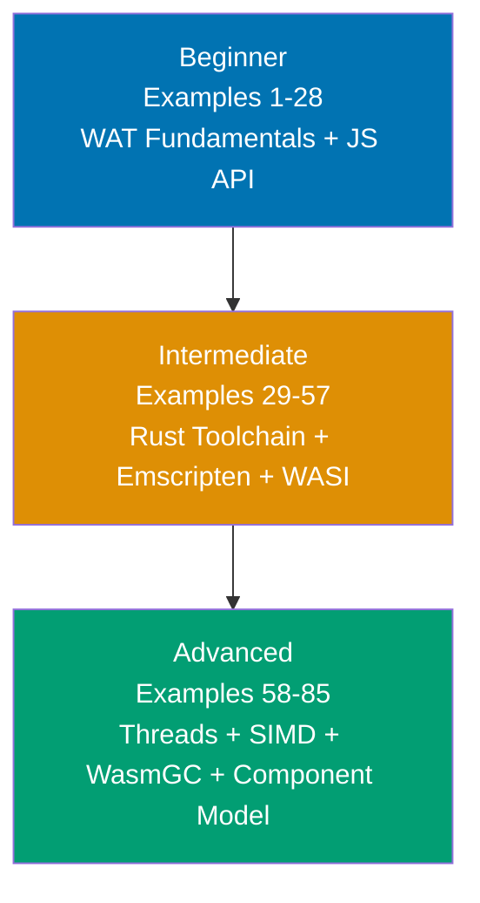

## What is By-Example Learning?

By-example learning is a **code-first approach** designed for experienced developers who want to pick up WebAssembly rapidly. Instead of lengthy theoretical explanations, you see working code first, observe what it does, and build understanding through annotated examples that show every step.

This tutorial assumes you already know at least one programming language well and want to understand WebAssembly from WAT binary fundamentals up through the modern component model and WASIp3 async model.

## What is WebAssembly?

WebAssembly (Wasm) is a **portable binary instruction format** — a compilation target for multiple source languages — designed to execute at near-native speed in browsers, servers, and edge runtimes. The W3C ratified WebAssembly 3.0 on September 17, 2025, standardizing nine new features including WasmGC, tail calls, exception handling, multiple memories, Memory64, Relaxed SIMD, typed references, deterministic profile, and JS String Builtins.

Wasm is **not** a programming language you write by hand in production. It is the target your toolchain produces: Rust through `wasm-pack`, C/C++ through Emscripten, AssemblyScript through `asc`, Kotlin through the Kotlin/Wasm compiler, and dozens more. Understanding the binary format — WebAssembly Text (WAT) format — gives you a mental model of what every toolchain produces and how the runtime executes it.

## Learning Path

Progress from WAT binary fundamentals through production toolchains to cutting-edge features. Each level builds on the previous.

## Coverage Philosophy

This tutorial covers WebAssembly comprehensively through practical, annotated examples. The coverage percentage reflects concept breadth — focus is on **outcomes and understanding**, not duration.

### What's Covered

- **WAT Fundamentals**: Module structure, value types, functions, control flow, memory model
- **JavaScript API**: `WebAssembly.instantiateStreaming`, `WebAssembly.Memory`, imports/exports
- **AssemblyScript**: Typed subset of TypeScript compiling to Wasm (NOT the same as TypeScript)
- **Rust + wasm-pack + wasm-bindgen**: The dominant Wasm-from-Rust toolchain (wasm-bindgen 0.2.120)
- **Emscripten**: C/C++ to Wasm compilation (Emscripten 5.0.6, requires Node.js 18.3.0+)
- **Performance patterns**: Boundary optimization, SIMD, Web Workers, wasm-opt
- **WASI**: WASIp1 (stable legacy), WASIp2 (current stable, January 2024), WASIp3 (February 2026, native async)
- **Debugging**: DWARF debug info, Chrome DevTools WASM extension
- **Threads**: SharedArrayBuffer, atomic operations, Emscripten pthreads, wasm-bindgen-rayon
- **SIMD**: Fixed 128-bit SIMD (universally available), Relaxed SIMD (Chrome/Firefox/Edge shipped)
- **WasmGC**: Garbage collection for managed-language compilation (Baseline Dec 11, 2024)
- **Exception handling**: `throw`/`catch`/`exnref`, JS `WebAssembly.Tag` API (Wasm 3.0)
- **Component Model**: WIT interfaces, `wit-bindgen` v0.57.1, WASIp2 components, composition
- **Production**: Memory64, multi-memory, Cloudflare Workers deployment, ESM source phase imports

### What's NOT Covered

- **Wasm interpreter internals**: Spectest, reference interpreter implementation details
- **Compiler backend specifics**: LLVM WebAssembly target internals
- **Browser engine JIT**: Cranelift, V8 Liftoff/TurboFan WebAssembly tiers
- **All source languages**: Go, C#, Python, Java, Dart — covered in toolchain-specific guides

## Tutorial Structure: 85 Examples Across 3 Levels

### Beginner (Examples 1-28: WAT Fundamentals + JS API + AssemblyScript)

**Focus**: Understanding the Wasm binary model and JavaScript integration

Learn the WAT text format (the human-readable representation of Wasm binaries), the JavaScript `WebAssembly` API, linear memory, and AssemblyScript as a typed entry point for writing Wasm directly. By example 28, you understand what every compiled `.wasm` file is made of.

**Key topics**: Module structure, value types, functions, control flow, WABT tooling, `instantiateStreaming`, memory pages, string encoding, AssemblyScript setup and types.

### Intermediate (Examples 29-57: Rust Toolchain + Emscripten + Performance + WASI)

**Focus**: Production toolchains and real-world patterns

Master `wasm-pack` and `wasm-bindgen` for Rust-to-Wasm compilation, Emscripten for C/C++ porting, performance optimization techniques, and WASI for server-side Wasm execution. By example 57, you can build, optimize, and debug production Wasm modules.

**Key topics**: `#[wasm_bindgen]`, JS class exports, `web-sys`, async Rust in Wasm, Emscripten C interop, wasm-opt, Web Workers, WASI file I/O, DWARF debugging.

### Advanced (Examples 58-85: Threads + SIMD + WasmGC + Component Model + Production)

**Focus**: Cutting-edge Wasm 3.0 features and deployment

Explore shared memory and atomics, SIMD vector operations, WasmGC typed references, exception handling, the Component Model with WIT interfaces, WASIp3 async, and production deployment patterns. By example 85, you understand the full breadth of the WebAssembly ecosystem as of 2025-2026.

**Key topics**: Atomic operations, futex primitives, fixed/relaxed SIMD, GC struct/array types, `throw`/`catch`, WIT interface files, `wit-bindgen`, component composition, Cloudflare Workers, ESM source phase imports.

## Prerequisites

- Familiarity with at least one compiled or systems language (C, C++, Rust, Go, Java)
- Basic JavaScript knowledge for the JS API sections (Examples 9-16, 37-38)
- Rust basics helpful for Examples 29-38 (see the Rust By Example tutorial)
- C basics helpful for Examples 39-44 (just enough to read function signatures)
- `wabt` installed for WAT examples: `brew install wabt` or download from [github.com/WebAssembly/wabt](https://github.com/WebAssembly/wabt)
- A modern browser (Chrome 119+, Firefox 120+, Safari 18.2+) for browser-API examples

## Toolchain Versions Referenced

| Tool                | Version     | Notes                                        |
| ------------------- | ----------- | -------------------------------------------- |
| WABT                | 1.0.40      | `wat2wasm`, `wasm-objdump`, `wasm-decompile` |
| Emscripten          | 5.0.6       | Requires Node.js 18.3.0+                     |
| wasm-bindgen        | 0.2.120     | CLI version MUST match crate version exactly |
| wasm-pack           | 0.14.0      | WASI support, macOS ARM support              |
| Binaryen/wasm-opt   | version_129 | 10-20% typical size reduction                |
| AssemblyScript      | 0.28.x      | NOT TypeScript — explicit low-level types    |
| wit-bindgen         | v0.57.1     | WIT guest bindings generator                 |
| Wasmtime            | v44.0.0     | WASIp2 + experimental WASIp3                 |
| wasm-feature-detect | 1.8.0       | Browser feature detection                    |
