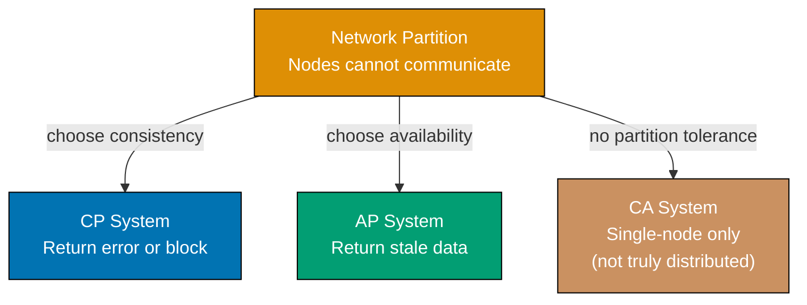
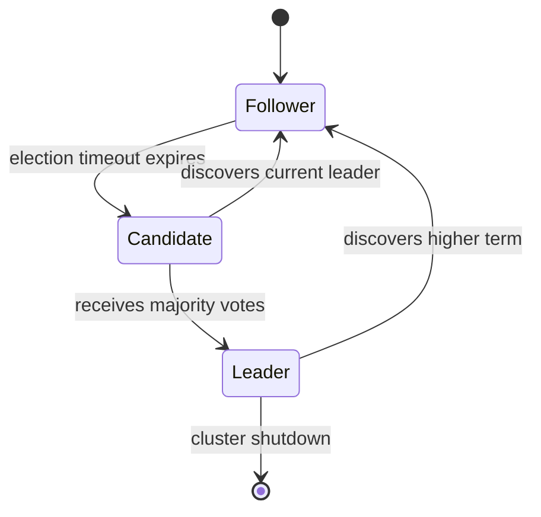
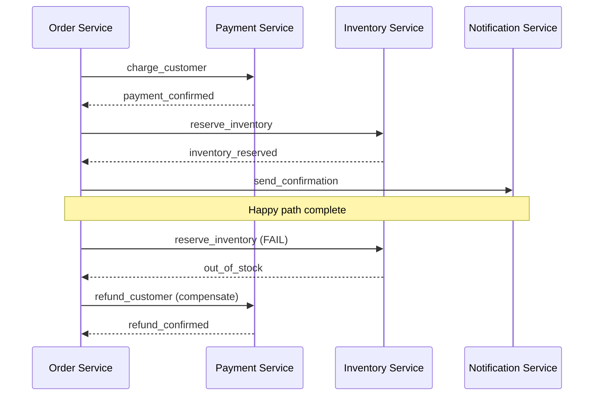
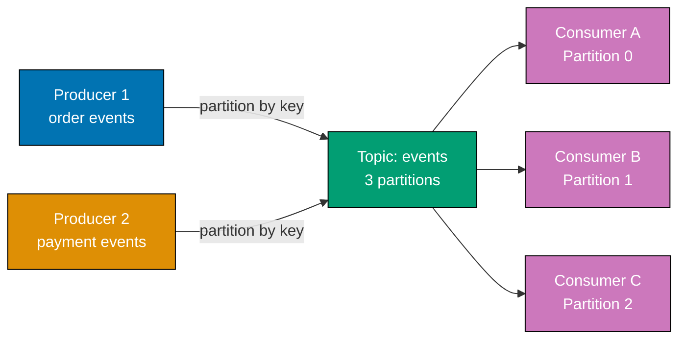
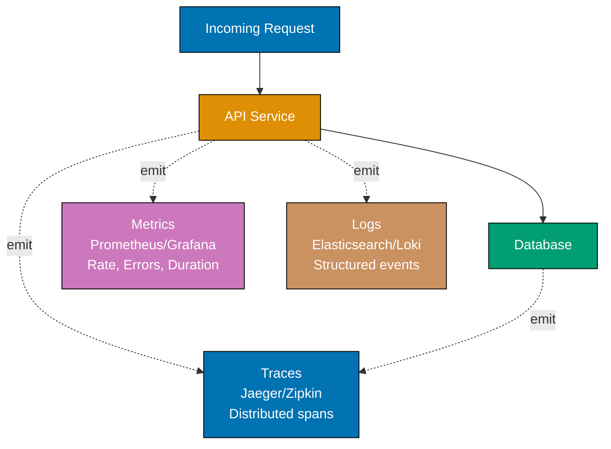
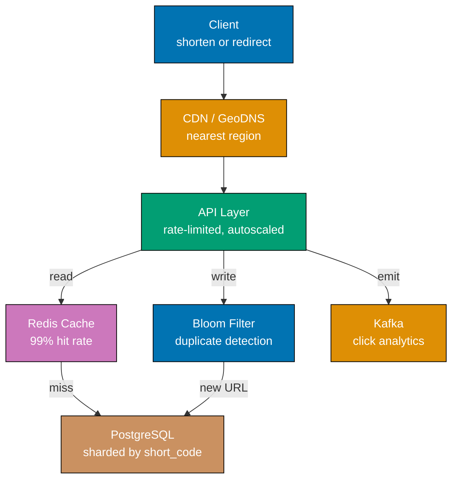

This section covers Examples 58-85, taking you from 70% to 95% coverage of system design concepts. These examples address global-scale distributed systems challenges: consensus protocols, event-driven architectures, observability, deployment strategies, and capacity planning. Each example includes implementations in Go and Python — copy, adapt, and run the code directly.

## CAP Theorem and Distributed Consistency

### Example 58: CAP Theorem — Partition Tolerance Forces a Choice

The CAP theorem (Brewer, 2000; formally proved by Gilbert and Lynch, 2002) states that a distributed system can guarantee at most two of three properties simultaneously: Consistency (every read sees the most recent write), Availability (every request receives a response), and Partition tolerance (the system operates despite network splits). Because network partitions are unavoidable in real distributed systems, engineers must choose between CP (sacrifice availability) and AP (sacrifice consistency) during a partition.






```go
// CAP theorem demonstration: simulating CP vs AP behavior during partition
package main

import (
    "fmt"
    "errors"
    "sync"
)

type CPDatabase struct {
    data        map[string]string // => primary data store
    partitioned bool              // => partition flag; true means split-brain risk
    mu          sync.Mutex
}

func NewCPDatabase() *CPDatabase {
    return &CPDatabase{data: make(map[string]string)}
}

func (db *CPDatabase) Write(key, value string) bool {
    // => Writes always succeed on primary node
    db.mu.Lock()
    defer db.mu.Unlock()
    db.data[key] = value
    return true // => write confirmed
}

func (db *CPDatabase) Read(key string) (string, error) {
    // => CP: refuses reads during partition to prevent stale data
    if db.partitioned {
        return "", errors.New("Service unavailable: partition detected")
        // => raises instead of returning possibly stale value
    }
    db.mu.Lock()
    defer db.mu.Unlock()
    return db.data[key], nil // => returns current consistent value
}

type APDatabase struct {
    data        map[string]string // => local data, may diverge from other nodes
    partitioned bool
}

func NewAPDatabase() *APDatabase {
    return &APDatabase{data: make(map[string]string)}
}

func (db *APDatabase) Write(key, value string) bool {
    db.data[key] = value // => writes locally even during partition
    return true          // => always acknowledges write
}

func (db *APDatabase) Read(key string) string {
    // => AP: always responds, even if value is stale
    return db.data[key]
    // => caller cannot know if value is the most recent globally
}

func main() {
    // Demonstrate the tradeoff
    cpDB := NewCPDatabase() // => CP database instance
    apDB := NewAPDatabase() // => AP database instance

    cpDB.Write("user:1", "alice") // => stored: {"user:1": "alice"}
    apDB.Write("user:1", "alice") // => stored: {"user:1": "alice"}

    // Simulate partition
    cpDB.partitioned = true // => partition starts
    apDB.partitioned = true // => partition starts

    _, err := cpDB.Read("user:1") // => returns error (CP refuses)
    if err != nil {
        fmt.Printf("CP during partition: %v\n", err)
        // => Output: CP during partition: Service unavailable: partition detected
    }

    val := apDB.Read("user:1") // => returns "alice" (possibly stale)
    fmt.Printf("AP during partition: %s\n", val)
    // => Output: AP during partition: alice
}
```




```python
# CAP theorem demonstration: simulating CP vs AP behavior during partition
import threading
import time

class CPDatabase:
    # CP system: consistency over availability
    # During a partition, refuses to serve stale reads
    def __init__(self):
        self.data = {}          # => primary data store
        self.partitioned = False # => partition flag; True means split-brain risk
        self.lock = threading.Lock()

    def write(self, key, value):
        # => Writes always succeed on primary node
        with self.lock:
            self.data[key] = value
            return True         # => write confirmed

    def read(self, key):
        # => CP: refuses reads during partition to prevent stale data
        if self.partitioned:
            raise Exception("Service unavailable: partition detected")
            # => raises instead of returning possibly stale value
        with self.lock:
            return self.data.get(key)   # => returns current consistent value


class APDatabase:
    # AP system: availability over consistency
    # During a partition, returns last-known value (possibly stale)
    def __init__(self):
        self.data = {}          # => local data, may diverge from other nodes
        self.partitioned = False

    def write(self, key, value):
        self.data[key] = value  # => writes locally even during partition
        return True             # => always acknowledges write

    def read(self, key):
        # => AP: always responds, even if value is stale
        return self.data.get(key)
        # => caller cannot know if value is the most recent globally


# Demonstrate the tradeoff
cp_db = CPDatabase()            # => CP database instance
ap_db = APDatabase()            # => AP database instance

cp_db.write("user:1", "alice")  # => stored: {"user:1": "alice"}
ap_db.write("user:1", "alice")  # => stored: {"user:1": "alice"}

# Simulate partition
cp_db.partitioned = True        # => partition starts
ap_db.partitioned = True        # => partition starts

try:
    val = cp_db.read("user:1")  # => raises Exception (CP refuses)
except Exception as e:
    print(f"CP during partition: {e}")
    # => Output: CP during partition: Service unavailable: partition detected

val = ap_db.read("user:1")      # => returns "alice" (possibly stale)
print(f"AP during partition: {val}")
# => Output: AP during partition: alice
```




**Key Takeaway**: During a network partition, CP systems protect data integrity by refusing requests, while AP systems maintain availability at the cost of potentially returning stale data. Choose CP for financial transactions and AP for social feeds or recommendation engines.

**Why It Matters**: Every distributed system designer must consciously choose a partition strategy before deployment. DynamoDB, Cassandra, and CouchDB are AP systems used by Amazon and Netflix for their shopping carts and viewer histories respectively, because brief staleness is acceptable. HBase, ZooKeeper, and etcd are CP systems used in Kubernetes and distributed coordination because split-brain data would cause catastrophic inconsistency.

---

### Example 59: PACELC — Extending CAP with Latency

PACELC (proposed by Daniel Abadi, 2012) extends CAP by observing that even when no partition exists, distributed systems face a latency-consistency tradeoff: to achieve strong consistency, the system must wait for replication acknowledgements (higher latency), while low latency requires returning before full replication (eventual consistency). PACELC classifies systems as PA/EL, PA/EC, PC/EL, or PC/EC.




```go
// PACELC tradeoff simulation: replication consistency vs latency
package main

import (
    "fmt"
    "sync"
    "time"
)

type ReplicationStrategy struct {
    nodes []map[string]string // => 3-node cluster; node[0] is primary
}

func NewReplicationStrategy(n int) *ReplicationStrategy {
    nodes := make([]map[string]string, n)
    for i := range nodes {
        nodes[i] = make(map[string]string)
    }
    return &ReplicationStrategy{nodes: nodes}
}

func (rs *ReplicationStrategy) WriteSynchronous(key, value string) map[string]interface{} {
    // PC/EC path: wait for all replicas before acknowledging.
    start := time.Now()
    // Simulate replication to all nodes with network delay
    for _, node := range rs.nodes {
        time.Sleep(10 * time.Millisecond) // => 10ms per replica round-trip
        node[key] = value
    }
    latencyMs := float64(time.Since(start).Milliseconds())
    // => All 3 nodes written: latency = ~30ms (3 x 10ms)
    return map[string]interface{}{
        "ack": true, "consistent": true, "latency_ms": latencyMs,
    }
}

func (rs *ReplicationStrategy) WriteAsynchronous(key, value string) map[string]interface{} {
    // PA/EL path: acknowledge after primary write, replicate async.
    start := time.Now()
    rs.nodes[0][key] = value // => write to primary only
    latencyMs := float64(time.Since(start).Microseconds()) / 1000.0
    // => Only primary written: latency = ~0ms
    // Async replication happens eventually (simulated)
    go func() {
        for _, node := range rs.nodes[1:] {
            time.Sleep(10 * time.Millisecond) // => background replication, caller unblocked
            node[key] = value
        }
    }() // => fire-and-forget replication
    return map[string]interface{}{
        "ack": true, "consistent": false, "latency_ms": latencyMs,
    }
}

func (rs *ReplicationStrategy) ReadQuorum(key string, quorum int) map[string]interface{} {
    // Read from majority quorum to detect inconsistency.
    values := make([]string, 0, quorum)
    for _, node := range rs.nodes[:quorum] {
        values = append(values, node[key])
        // => read from quorum nodes; majority rules
    }
    consistent := true
    for _, v := range values[1:] {
        if v != values[0] {
            consistent = false
            break
        }
    }
    // => consistent=true if all quorum nodes agree
    return map[string]interface{}{
        "value": values[0], "consistent": consistent,
    }
}

func main() {
    strategy := NewReplicationStrategy(3)

    syncResult := strategy.WriteSynchronous("order:42", "confirmed")
    // => {"ack": true, "consistent": true, "latency_ms": 30}
    fmt.Printf("Sync write: %v\n", syncResult)

    asyncResult := strategy.WriteAsynchronous("feed:99", "post_data")
    // => {"ack": true, "consistent": false, "latency_ms": 0.x}
    fmt.Printf("Async write: %v\n", asyncResult)
}
```




```python
# PACELC tradeoff simulation: replication consistency vs latency
import time
import random

class ReplicationStrategy:
    """Demonstrates latency vs consistency tradeoff in replication."""

    def __init__(self, nodes=3):
        self.nodes = [{"data": {}} for _ in range(nodes)]
        # => 3-node cluster; node[0] is primary

    def write_synchronous(self, key, value):
        """PC/EC path: wait for all replicas before acknowledging."""
        start = time.time()
        # Simulate replication to all nodes with network delay
        for node in self.nodes:
            time.sleep(0.01)    # => 10ms per replica round-trip
            node["data"][key] = value
        latency_ms = (time.time() - start) * 1000
        # => All 3 nodes written: latency = ~30ms (3 x 10ms)
        return {"ack": True, "consistent": True, "latency_ms": round(latency_ms)}

    def write_asynchronous(self, key, value):
        """PA/EL path: acknowledge after primary write, replicate async."""
        start = time.time()
        self.nodes[0]["data"][key] = value  # => write to primary only
        latency_ms = (time.time() - start) * 1000
        # => Only primary written: latency = ~0ms
        # Async replication happens eventually (simulated)
        def replicate():
            for node in self.nodes[1:]:
                time.sleep(0.01)    # => background replication, caller unblocked
                node["data"][key] = value
        t = threading.Thread(target=replicate, daemon=True)
        import threading
        t = threading.Thread(target=replicate, daemon=True)
        t.start()               # => fire-and-forget replication
        return {"ack": True, "consistent": False, "latency_ms": round(latency_ms, 2)}

    def read_quorum(self, key, quorum=2):
        """Read from majority quorum to detect inconsistency."""
        values = []
        for node in self.nodes[:quorum]:
            values.append(node["data"].get(key))
            # => read from quorum nodes; majority rules
        consistent = len(set(str(v) for v in values)) == 1
        # => consistent=True if all quorum nodes agree
        return {"value": values[0], "consistent": consistent}

strategy = ReplicationStrategy()

sync_result = strategy.write_synchronous("order:42", "confirmed")
# => {"ack": True, "consistent": True, "latency_ms": 30}
print(f"Sync write: {sync_result}")

async_result = strategy.write_asynchronous("feed:99", "post_data")
# => {"ack": True, "consistent": False, "latency_ms": 0.x}
print(f"Async write: {async_result}")
```




**Key Takeaway**: PACELC reveals that latency-consistency tradeoffs exist even outside partition scenarios. Systems like DynamoDB (PA/EL) optimize for latency, while systems like MySQL with synchronous replication (PC/EC) optimize for consistency at higher latency cost.

**Why It Matters**: Teams building globally distributed services must choose PACELC positioning before selecting their database stack. A payment processor writing to PostgreSQL with synchronous replication accepts 30-50ms added latency to ensure zero data loss. A social media feed system using Cassandra accepts eventual consistency for sub-millisecond writes. Misaligning the tradeoff with business requirements causes either data integrity failures (financial) or user experience degradation (social).

---

## Distributed Consensus

### Example 60: Raft Consensus — Leader Election Basics

Raft (Ongaro and Ousterhout, 2014) is a consensus algorithm designed to be understandable. It decomposes consensus into leader election, log replication, and safety. Every Raft cluster has one leader at a time; the leader receives all writes, replicates them to followers via AppendEntries RPCs, and commits entries once a majority acknowledges. Leaders are elected via randomized timeouts: the first follower that times out becomes a candidate, requests votes, and wins if a majority grants them.






```go
// Raft leader election simulation (simplified)
package main

import (
    "fmt"
    "math/rand"
    "time"
)

const (
    Follower  = "follower"
    Candidate = "candidate"
    Leader    = "leader"
)

type RaftNode struct {
    ID              int
    State           string
    CurrentTerm     int
    VotedFor        int    // => -1 means no vote
    VotesReceived   int
    ClusterSize     int
    ElectionTimeout time.Duration
}

func NewRaftNode(id, clusterSize int) *RaftNode {
    // Randomized timeout: 150-300ms (Raft spec range)
    timeout := time.Duration(150+rand.Intn(150)) * time.Millisecond
    // => random timeout prevents simultaneous elections (split votes)
    return &RaftNode{
        ID:              id,
        State:           Follower,  // => all nodes start as followers
        CurrentTerm:     0,         // => monotonically increasing election term
        VotedFor:        -1,        // => no vote yet
        ClusterSize:     clusterSize, // => total nodes; majority = size/2 + 1
        ElectionTimeout: timeout,
    }
}

func (n *RaftNode) StartElection() int {
    // Transition to candidate and request votes.
    n.State = Candidate        // => become candidate
    n.CurrentTerm++            // => increment term (new election epoch)
    n.VotedFor = n.ID          // => vote for self
    n.VotesReceived = 1        // => count self-vote
    fmt.Printf("Node %d: starting election for term %d\n", n.ID, n.CurrentTerm)
    return n.CurrentTerm       // => return term for RequestVote RPCs
}

func (n *RaftNode) ReceiveVote(voterID, term int) {
    // Process an incoming vote grant.
    if term == n.CurrentTerm && n.State == Candidate {
        n.VotesReceived++      // => tally the vote
        majority := n.ClusterSize/2 + 1
        // => majority required: 3 of 5, 2 of 3, etc.
        if n.VotesReceived >= majority {
            n.State = Leader   // => won election!
            fmt.Printf("Node %d: elected LEADER for term %d\n", n.ID, n.CurrentTerm)
            fmt.Printf("  Votes: %d/%d\n", n.VotesReceived, n.ClusterSize)
        }
    }
}

func (n *RaftNode) GrantVote(candidateID, candidateTerm int) bool {
    // Decide whether to grant vote to candidate.
    if candidateTerm > n.CurrentTerm {
        n.CurrentTerm = candidateTerm // => update to higher term
        n.State = Follower            // => step down if was leader/candidate
        n.VotedFor = -1               // => reset vote for new term
    }
    if n.VotedFor == -1 || n.VotedFor == candidateID {
        n.VotedFor = candidateID      // => grant vote
        return true                   // => true = vote granted
    }
    return false                      // => false = already voted this term
}

func main() {
    // Simulate 5-node cluster election
    nodes := make([]*RaftNode, 5)
    for i := range nodes {
        nodes[i] = NewRaftNode(i, 5)
    }
    // => [node0, node1, node2, node3, node4], all followers, term=0

    // Node 0's timeout fires first (smallest random timeout)
    term := nodes[0].StartElection()
    // => node0 becomes candidate, term=1, votes=1

    // Other nodes grant votes
    for _, n := range nodes[1:] {
        granted := n.GrantVote(0, term) // => each follower evaluates vote request
        if granted {
            nodes[0].ReceiveVote(n.ID, term)
            // => node0 accumulates votes; becomes leader at 3/5
        }
    }
    // Output shows node0 becoming leader when majority (3) grants vote
}
```




```python
# Raft leader election simulation (simplified)
import random
import time

class RaftNode:
    FOLLOWER = "follower"
    CANDIDATE = "candidate"
    LEADER = "leader"

    def __init__(self, node_id, cluster_size):
        self.id = node_id                   # => unique node identifier
        self.state = self.FOLLOWER          # => all nodes start as followers
        self.current_term = 0               # => monotonically increasing election term
        self.voted_for = None               # => candidate voted for in current term
        self.votes_received = 0             # => votes received as candidate
        self.cluster_size = cluster_size    # => total nodes; majority = size//2 + 1
        # Randomized timeout: 150-300ms (Raft spec range)
        self.election_timeout = random.uniform(0.15, 0.30)
        # => random timeout prevents simultaneous elections (split votes)

    def start_election(self):
        """Transition to candidate and request votes."""
        self.state = self.CANDIDATE         # => become candidate
        self.current_term += 1              # => increment term (new election epoch)
        self.voted_for = self.id            # => vote for self
        self.votes_received = 1             # => count self-vote
        print(f"Node {self.id}: starting election for term {self.current_term}")
        return self.current_term            # => return term for RequestVote RPCs

    def receive_vote(self, voter_id, term):
        """Process an incoming vote grant."""
        if term == self.current_term and self.state == self.CANDIDATE:
            self.votes_received += 1        # => tally the vote
            majority = self.cluster_size // 2 + 1
            # => majority required: 3 of 5, 2 of 3, etc.
            if self.votes_received >= majority:
                self.state = self.LEADER    # => won election!
                print(f"Node {self.id}: elected LEADER for term {self.current_term}")
                print(f"  Votes: {self.votes_received}/{self.cluster_size}")

    def grant_vote(self, candidate_id, candidate_term):
        """Decide whether to grant vote to candidate."""
        if candidate_term > self.current_term:
            self.current_term = candidate_term  # => update to higher term
            self.state = self.FOLLOWER          # => step down if was leader/candidate
            self.voted_for = None               # => reset vote for new term
        if (self.voted_for is None or self.voted_for == candidate_id):
            self.voted_for = candidate_id       # => grant vote
            return True                         # => True = vote granted
        return False                            # => False = already voted this term

# Simulate 5-node cluster election
nodes = [RaftNode(i, 5) for i in range(5)]
# => [node0, node1, node2, node3, node4], all followers, term=0

# Node 0's timeout fires first (smallest random timeout)
term = nodes[0].start_election()
# => node0 becomes candidate, term=1, votes=1

# Other nodes grant votes
for n in nodes[1:]:
    granted = n.grant_vote(0, term)     # => each follower evaluates vote request
    if granted:
        nodes[0].receive_vote(n.id, term)
        # => node0 accumulates votes; becomes leader at 3/5

# Output shows node0 becoming leader when majority (3) grants vote
```




**Key Takeaway**: Raft's randomized election timeouts prevent simultaneous elections. A candidate becomes leader when it receives votes from a strict majority (floor(n/2) + 1) of the cluster, ensuring at most one leader per term.

**Why It Matters**: Raft powers etcd (Kubernetes' state store), CockroachDB, TiKV, and Consul. Understanding leader election prevents misconfigurations like split clusters where two network partitions each have fewer than majority nodes — the minority partition correctly refuses to elect a leader rather than form a split brain. Engineers at companies running Kubernetes clusters must understand that etcd requires at least three nodes because two-node clusters cannot form a majority after losing one node.

---

### Example 61: Paxos Concepts — Two-Phase Agreement

Paxos (Lamport, 1989) is the foundational distributed consensus algorithm. It proceeds in two phases: Prepare/Promise (a proposer broadcasts a proposal number, acceptors promise not to accept older proposals and return any previously accepted value) and Accept/Accepted (the proposer sends an accept request with the highest previously-accepted value or its own, acceptors accept if no higher promise was made). A value is chosen when a majority of acceptors accept the same proposal.




```go
// Paxos single-decree consensus simulation
package main

import "fmt"

type Acceptor struct {
    ID            int
    PromisedID    int         // => highest proposal number promised
    AcceptedID    int         // => proposal number of last accepted value
    AcceptedValue string      // => last accepted value (if any)
}

func NewAcceptor(id int) *Acceptor {
    return &Acceptor{ID: id, PromisedID: -1, AcceptedID: -1}
}

type PrepareResponse struct {
    Promise       bool
    AcceptedID    int
    AcceptedValue string
}

func (a *Acceptor) Prepare(proposalID int) PrepareResponse {
    // Phase 1: respond to Prepare(n) from proposer.
    if proposalID > a.PromisedID {
        a.PromisedID = proposalID
        // => promise to reject proposals with id < proposalID
        return PrepareResponse{
            Promise:       true,
            AcceptedID:    a.AcceptedID,    // => tell proposer what we accepted before
            AcceptedValue: a.AcceptedValue,
            // => proposer must use this value if non-empty (safety constraint)
        }
    }
    return PrepareResponse{Promise: false} // => already promised to a higher proposal
}

type AcceptResponse struct {
    Accepted bool
    Value    string
}

func (a *Acceptor) Accept(proposalID int, value string) AcceptResponse {
    // Phase 2: respond to Accept(n, v) from proposer.
    if proposalID >= a.PromisedID {
        // => only accept if we haven't promised something higher
        a.AcceptedID = proposalID
        a.AcceptedValue = value     // => record the accepted value
        a.PromisedID = proposalID   // => update promise to this id
        return AcceptResponse{Accepted: true, Value: value}
    }
    return AcceptResponse{Accepted: false} // => rejected: already promised higher
}

type Proposer struct {
    ID              int
    Acceptors       []*Acceptor // => list of Acceptor objects
    ProposalCounter int         // => local counter for unique proposal IDs
}

func NewProposer(id int, acceptors []*Acceptor) *Proposer {
    return &Proposer{ID: id, Acceptors: acceptors}
}

func (p *Proposer) Propose(desiredValue string) (string, bool) {
    // Run full Paxos protocol to get consensus on a value.
    p.ProposalCounter++
    // => unique proposal_id: combine proposer_id and counter
    proposalID := p.ID*100 + p.ProposalCounter

    // --- Phase 1: Prepare ---
    var promises []PrepareResponse
    for _, acceptor := range p.Acceptors {
        response := acceptor.Prepare(proposalID)
        // => send Prepare(proposalID) to each acceptor
        if response.Promise {
            promises = append(promises, response) // => collect promises
        }
    }

    majority := len(p.Acceptors)/2 + 1
    if len(promises) < majority {
        return "", false // => failed to get majority promises; retry needed
    }

    // Safety: if any acceptor already accepted a value, use highest-id one
    valueToPropose := desiredValue
    highestAcceptedID := -1
    for _, pr := range promises {
        if pr.AcceptedValue != "" && pr.AcceptedID > highestAcceptedID {
            // => must preserve previously chosen value (Paxos safety rule)
            highestAcceptedID = pr.AcceptedID
            valueToPropose = pr.AcceptedValue
            // => cannot use desiredValue; must preserve consensus
        }
    }

    // --- Phase 2: Accept ---
    acceptedCount := 0
    for _, acceptor := range p.Acceptors {
        response := acceptor.Accept(proposalID, valueToPropose)
        if response.Accepted {
            acceptedCount++ // => tally acceptances
        }
    }

    if acceptedCount >= majority {
        return valueToPropose, true // => consensus reached!
    }
    return "", false               // => failed; retry with higher id
}

func main() {
    // 3-acceptor Paxos run
    acceptors := []*Acceptor{NewAcceptor(0), NewAcceptor(1), NewAcceptor(2)}
    // => a0, a1, a2
    proposer := NewProposer(1, acceptors)

    result, ok := proposer.Propose("commit_transaction_42")
    // => Phase 1: all 3 promise; no prior accepted values
    // => Phase 2: all 3 accept "commit_transaction_42"
    // => result = "commit_transaction_42" (consensus achieved)
    if ok {
        fmt.Printf("Consensus: %s\n", result)
    }
}
```




```python
# Paxos single-decree consensus simulation
class Acceptor:
    def __init__(self, acceptor_id):
        self.id = acceptor_id
        self.promised_id = -1       # => highest proposal number promised
        self.accepted_id = -1       # => proposal number of last accepted value
        self.accepted_value = None  # => last accepted value (if any)

    def prepare(self, proposal_id):
        """Phase 1: respond to Prepare(n) from proposer."""
        if proposal_id > self.promised_id:
            self.promised_id = proposal_id
            # => promise to reject proposals with id < proposal_id
            return {
                "promise": True,
                "accepted_id": self.accepted_id,    # => tell proposer what we accepted before
                "accepted_value": self.accepted_value
                # => proposer must use this value if non-None (safety constraint)
            }
        return {"promise": False}   # => already promised to a higher proposal

    def accept(self, proposal_id, value):
        """Phase 2: respond to Accept(n, v) from proposer."""
        if proposal_id >= self.promised_id:
            # => only accept if we haven't promised something higher
            self.accepted_id = proposal_id
            self.accepted_value = value         # => record the accepted value
            self.promised_id = proposal_id      # => update promise to this id
            return {"accepted": True, "value": value}
        return {"accepted": False}              # => rejected: already promised higher


class Proposer:
    def __init__(self, proposer_id, acceptors):
        self.id = proposer_id
        self.acceptors = acceptors          # => list of Acceptor objects
        self.proposal_counter = 0           # => local counter for unique proposal IDs

    def propose(self, desired_value):
        """Run full Paxos protocol to get consensus on a value."""
        self.proposal_counter += 1
        # => unique proposal_id: combine proposer_id and counter
        proposal_id = self.id * 100 + self.proposal_counter

        # --- Phase 1: Prepare ---
        promises = []
        for acceptor in self.acceptors:
            response = acceptor.prepare(proposal_id)
            # => send Prepare(proposal_id) to each acceptor
            if response["promise"]:
                promises.append(response)   # => collect promises

        majority = len(self.acceptors) // 2 + 1
        if len(promises) < majority:
            return None             # => failed to get majority promises; retry needed

        # Safety: if any acceptor already accepted a value, use highest-id one
        prior = [p for p in promises if p["accepted_value"] is not None]
        if prior:
            # => must preserve previously chosen value (Paxos safety rule)
            chosen_prior = max(prior, key=lambda p: p["accepted_id"])
            value_to_propose = chosen_prior["accepted_value"]
            # => cannot use desired_value; must preserve consensus
        else:
            value_to_propose = desired_value    # => free to propose our value

        # --- Phase 2: Accept ---
        accepted_count = 0
        for acceptor in self.acceptors:
            response = acceptor.accept(proposal_id, value_to_propose)
            if response["accepted"]:
                accepted_count += 1             # => tally acceptances

        if accepted_count >= majority:
            return value_to_propose             # => consensus reached!
        return None                             # => failed; retry with higher id

# 3-acceptor Paxos run
acceptors = [Acceptor(i) for i in range(3)]    # => a0, a1, a2
proposer = Proposer(proposer_id=1, acceptors=acceptors)

result = proposer.propose("commit_transaction_42")
# => Phase 1: all 3 promise; no prior accepted values
# => Phase 2: all 3 accept "commit_transaction_42"
# => result = "commit_transaction_42" (consensus achieved)
print(f"Consensus: {result}")
```




**Key Takeaway**: Paxos' two-phase protocol ensures safety (no two nodes decide different values) by requiring proposers to adopt any previously accepted value. The liveness tradeoff is that competing proposers can starve each other — Multi-Paxos adds a stable leader to solve this.

**Why It Matters**: Paxos underpins Google Chubby (distributed lock service used by Bigtable and GFS), Apache Zookeeper's ZAB protocol, and Google Spanner's TrueTime-based commit protocol. While Raft is more understandable for implementation, Paxos' theoretical model explains why distributed databases require quorum acknowledgement for durability, and why a two-node cluster cannot achieve consensus (no majority possible with one failed node).

---

## Event-Driven Architecture

### Example 62: Event Sourcing — State as Append-Only Event Log

Event sourcing stores state changes as an immutable, ordered sequence of events rather than overwriting current state. The current state is derived by replaying events from the log. This provides a complete audit trail, enables temporal queries ("what was the state at time T?"), and supports event-driven integration via projections and read models.





```go
// Event sourcing: order aggregate with immutable event log
package main

import "fmt"

type Event struct {
    EventType   string            // => "OrderPlaced", "ItemAdded", "OrderShipped", etc.
    AggregateID string            // => which aggregate this event belongs to
    Timestamp   string            // => ISO timestamp for ordering
    Data        map[string]interface{} // => event payload; immutable after append
}

type EventStore struct {
    log []Event // => the immutable log
}

func (es *EventStore) Append(event Event) {
    es.log = append(es.log, event) // => append only; no updates
    fmt.Printf("Appended: %s @ %s\n", event.EventType, event.Timestamp)
}

func (es *EventStore) GetEvents(aggregateID string) []Event {
    var events []Event
    for _, e := range es.log {
        if e.AggregateID == aggregateID {
            events = append(events, e)
        }
    }
    return events // => filter log for one aggregate's history
}

type OrderState struct {
    Items    []string
    Status   string
    Total    float64
    Customer string
}

type OrderAggregate struct {
    OrderID string
    Store   *EventStore
    State   OrderState // => state derived from events, not stored directly
}

func NewOrderAggregate(orderID string, store *EventStore) *OrderAggregate {
    oa := &OrderAggregate{OrderID: orderID, Store: store}
    oa.State = oa.replay() // => state derived from events, not stored directly
    return oa
}

func (oa *OrderAggregate) replay() OrderState {
    // Rebuild state from event log — the core ES mechanism.
    state := OrderState{Status: "new"}
    for _, event := range oa.Store.GetEvents(oa.OrderID) {
        // => apply each event in order to evolve state
        switch event.EventType {
        case "OrderPlaced":
            state.Status = "placed"
            state.Customer = event.Data["customer"].(string)
        case "ItemAdded":
            state.Items = append(state.Items, event.Data["item"].(string))
            state.Total += event.Data["price"].(float64)
            // => total accumulates from ItemAdded events
        case "OrderShipped":
            state.Status = "shipped"
        }
    }
    return state // => current state as of all replayed events
}

func (oa *OrderAggregate) PlaceOrder(customer string) {
    event := Event{
        EventType:   "OrderPlaced",
        AggregateID: oa.OrderID,
        Timestamp:   "2026-03-20T10:00:00Z",
        Data:        map[string]interface{}{"customer": customer},
    }
    oa.Store.Append(event)  // => emit event; do NOT write state directly
    oa.State = oa.replay()  // => update in-memory state
}

func (oa *OrderAggregate) AddItem(item string, price float64) {
    event := Event{
        EventType:   "ItemAdded",
        AggregateID: oa.OrderID,
        Timestamp:   "2026-03-20T10:01:00Z",
        Data:        map[string]interface{}{"item": item, "price": price},
    }
    oa.Store.Append(event)
    oa.State = oa.replay()
}

func main() {
    // Run event sourcing demo
    store := &EventStore{}
    order := NewOrderAggregate("order-42", store)

    order.PlaceOrder("alice")        // => appends OrderPlaced event
    order.AddItem("laptop", 999.99)  // => appends ItemAdded event
    order.AddItem("mouse", 29.99)    // => appends ItemAdded event

    fmt.Printf("Current state: %+v\n", order.State)
    // => {Items:[laptop mouse] Status:placed Total:1029.98 Customer:alice}

    // Temporal query: reconstruct state after first event only
    pastEvents := store.GetEvents("order-42")[:1]
    // => only OrderPlaced event; state would be {Items:[], Status:placed, ...}
    _ = pastEvents
}
```




```python
# Event sourcing: order aggregate with immutable event log
from dataclasses import dataclass, field
from typing import List, Optional
from datetime import datetime

@dataclass
class Event:
    event_type: str         # => "OrderPlaced", "ItemAdded", "OrderShipped", etc.
    aggregate_id: str       # => which aggregate this event belongs to
    timestamp: str          # => ISO timestamp for ordering
    data: dict              # => event payload; immutable after append

class EventStore:
    """Append-only event log — never update or delete events."""

    def __init__(self):
        self._log: List[Event] = []     # => the immutable log

    def append(self, event: Event):
        self._log.append(event)         # => append only; no updates
        print(f"Appended: {event.event_type} @ {event.timestamp}")

    def get_events(self, aggregate_id: str) -> List[Event]:
        return [e for e in self._log if e.aggregate_id == aggregate_id]
        # => filter log for one aggregate's history

class OrderAggregate:
    """Reconstitutes current state by replaying events."""

    def __init__(self, order_id: str, store: EventStore):
        self.order_id = order_id
        self.store = store
        # Replay all past events to restore current state
        self._state = self._replay()    # => state derived from events, not stored directly

    def _replay(self) -> dict:
        """Rebuild state from event log — the core ES mechanism."""
        state = {"items": [], "status": "new", "total": 0}
        for event in self.store.get_events(self.order_id):
            # => apply each event in order to evolve state
            if event.event_type == "OrderPlaced":
                state["status"] = "placed"
                state["customer"] = event.data["customer"]
            elif event.event_type == "ItemAdded":
                state["items"].append(event.data["item"])
                state["total"] += event.data["price"]
                # => total accumulates from ItemAdded events
            elif event.event_type == "OrderShipped":
                state["status"] = "shipped"
                state["tracking"] = event.data["tracking_number"]
        return state    # => current state as of all replayed events

    def place_order(self, customer: str):
        event = Event("OrderPlaced", self.order_id, "2026-03-20T10:00:00Z",
                      {"customer": customer})
        self.store.append(event)        # => emit event; do NOT write state directly
        self._state = self._replay()    # => update in-memory state

    def add_item(self, item: str, price: float):
        event = Event("ItemAdded", self.order_id, "2026-03-20T10:01:00Z",
                      {"item": item, "price": price})
        self.store.append(event)
        self._state = self._replay()

    @property
    def state(self) -> dict:
        return self._state              # => always derived from events

# Run event sourcing demo
store = EventStore()
order = OrderAggregate("order-42", store)

order.place_order("alice")              # => appends OrderPlaced event
order.add_item("laptop", 999.99)        # => appends ItemAdded event
order.add_item("mouse", 29.99)          # => appends ItemAdded event

print(f"Current state: {order.state}")
# => {"items": ["laptop","mouse"], "status":"placed", "total":1029.98, "customer":"alice"}

# Temporal query: reconstruct state after first event only
past_state_events = store.get_events("order-42")[:1]
# => only OrderPlaced event; state would be {"items":[], "status":"placed", ...}
```




**Key Takeaway**: Event sourcing makes every state transition explicit and auditable by storing events rather than current state. Replaying events reconstructs any historical state, enabling time-travel queries impossible with traditional CRUD.

**Why It Matters**: Event sourcing powers financial systems at banks and trading platforms where every transaction must be auditable and reversible. Companies like LinkedIn and Airbnb use event sourcing with Kafka as the event store to build audit logs, feed projections, and analytics pipelines from the same event stream. The append-only constraint also eliminates write conflicts in concurrent systems, since events are immutable facts.

---

### Example 63: CQRS — Separating Read and Write Models

Command Query Responsibility Segregation (CQRS) separates the model used to handle commands (writes) from the model used to handle queries (reads). The write side uses a normalized domain model optimized for consistency; the read side uses denormalized projections optimized for query performance. CQRS pairs naturally with event sourcing: events from the write side update read-side projections asynchronously.




```go
// CQRS: separate command and query handlers with independent models
package main

import (
    "fmt"
)

// --- Write Side: Command Model ---
type Product struct {
    ProductID string
    Name      string
    Price     float64
    Stock     int
}

type ProductCommandHandler struct {
    products map[string]*Product // => write-side store
    events   []map[string]interface{} // => event log for projection
}

func NewProductCommandHandler() *ProductCommandHandler {
    return &ProductCommandHandler{
        products: make(map[string]*Product),
    }
}

func (h *ProductCommandHandler) CreateProduct(productID, name string, price float64, stock int) error {
    if _, exists := h.products[productID]; exists {
        return fmt.Errorf("Product %s already exists", productID)
        // => command handler enforces uniqueness invariant
    }
    h.products[productID] = &Product{productID, name, price, stock}
    // Emit event for read-side projection to consume
    h.events = append(h.events, map[string]interface{}{
        "type": "ProductCreated", "id": productID,
        "name": name, "price": price, "stock": stock,
    })
    // => event published; query side will update eventually
    return nil
}

func (h *ProductCommandHandler) UpdateStock(productID string, delta int) error {
    product := h.products[productID]
    newStock := product.Stock + delta
    if newStock < 0 {
        return fmt.Errorf("Stock cannot go negative")
        // => command model enforces non-negative stock invariant
    }
    product.Stock = newStock
    h.events = append(h.events, map[string]interface{}{
        "type": "StockUpdated", "id": productID, "new_stock": newStock,
    })
    return nil
}

// --- Read Side: Query Model (Projection) ---
type CatalogItem struct {
    ID           string
    Name         string
    Price        float64
    Stock        int
    Available    bool   // => computed field for queries
    DisplayPrice string // => pre-formatted for API responses
}

type ProductQueryHandler struct {
    catalog []CatalogItem // => flat list for O(1) search
}

func (q *ProductQueryHandler) ApplyEvent(event map[string]interface{}) {
    // Update projection when event arrives from write side.
    switch event["type"] {
    case "ProductCreated":
        stock := event["stock"].(int)
        price := event["price"].(float64)
        q.catalog = append(q.catalog, CatalogItem{
            ID:           event["id"].(string),
            Name:         event["name"].(string),
            Price:        price,
            Stock:        stock,
            Available:    stock > 0,                    // => computed field for queries
            DisplayPrice: fmt.Sprintf("$%.2f", price),  // => pre-formatted; avoids repeated computation
        })
    case "StockUpdated":
        id := event["id"].(string)
        newStock := event["new_stock"].(int)
        for i := range q.catalog {
            if q.catalog[i].ID == id {
                q.catalog[i].Stock = newStock
                q.catalog[i].Available = newStock > 0
                // => projection updated asynchronously; may lag briefly
            }
        }
    }
}

func (q *ProductQueryHandler) GetAvailableProducts() []CatalogItem {
    // Read query: fast scan of denormalized projection.
    var result []CatalogItem
    for _, p := range q.catalog {
        if p.Available {
            result = append(result, p)
        }
    }
    return result
    // => no joins, no computation; just filter pre-built projection
}

func main() {
    // Wire up CQRS
    commands := NewProductCommandHandler()
    queries := &ProductQueryHandler{}

    commands.CreateProduct("p1", "Laptop", 999.99, 10)
    commands.CreateProduct("p2", "Mouse", 29.99, 0)  // => stock=0, not available
    commands.CreateProduct("p3", "Keyboard", 79.99, 5)

    // Sync events to query side (in production: Kafka/SNS/outbox pattern)
    for _, event := range commands.events {
        queries.ApplyEvent(event) // => projection updated from events
    }

    available := queries.GetAvailableProducts()
    // => [Laptop, Keyboard]; p2 excluded because stock=0
    names := make([]string, len(available))
    for i, p := range available {
        names[i] = p.Name
    }
    fmt.Printf("Available: %v\n", names)
    // => Output: Available: [Laptop Keyboard]
}
```




```python
# CQRS: separate command and query handlers with independent models
from dataclasses import dataclass, field
from typing import List, Dict

# --- Write Side: Command Model ---
@dataclass
class Product:
    """Normalized write model — enforces business rules."""
    product_id: str
    name: str
    price: float
    stock: int

class ProductCommandHandler:
    """Handles state-changing commands; enforces invariants."""

    def __init__(self):
        self._products: Dict[str, Product] = {}     # => write-side store
        self._events: List[dict] = []               # => event log for projection

    def create_product(self, product_id: str, name: str, price: float, stock: int):
        if product_id in self._products:
            raise ValueError(f"Product {product_id} already exists")
            # => command handler enforces uniqueness invariant
        product = Product(product_id, name, price, stock)
        self._products[product_id] = product
        # Emit event for read-side projection to consume
        self._events.append({"type": "ProductCreated", "id": product_id,
                              "name": name, "price": price, "stock": stock})
        # => event published; query side will update eventually

    def update_stock(self, product_id: str, delta: int):
        product = self._products[product_id]
        new_stock = product.stock + delta
        if new_stock < 0:
            raise ValueError("Stock cannot go negative")
            # => command model enforces non-negative stock invariant
        product.stock = new_stock
        self._events.append({"type": "StockUpdated", "id": product_id,
                              "new_stock": new_stock})

    @property
    def events(self):
        return self._events                 # => read-side consumes these

# --- Read Side: Query Model (Projection) ---
class ProductQueryHandler:
    """Handles read queries against a denormalized projection."""

    def __init__(self):
        # Read model: denormalized for fast queries; includes computed fields
        self._catalog: List[dict] = []      # => flat list for O(1) search

    def apply_event(self, event: dict):
        """Update projection when event arrives from write side."""
        if event["type"] == "ProductCreated":
            self._catalog.append({
                "id": event["id"],
                "name": event["name"],
                "price": event["price"],
                "stock": event["stock"],
                "available": event["stock"] > 0,    # => computed field for queries
                "display_price": f"${event['price']:.2f}"
                # => pre-formatted for API responses; avoids repeated computation
            })
        elif event["type"] == "StockUpdated":
            for item in self._catalog:
                if item["id"] == event["id"]:
                    item["stock"] = event["new_stock"]
                    item["available"] = event["new_stock"] > 0
                    # => projection updated asynchronously; may lag briefly

    def get_available_products(self) -> List[dict]:
        """Read query: fast scan of denormalized projection."""
        return [p for p in self._catalog if p["available"]]
        # => no joins, no computation; just filter pre-built projection

    def get_by_price_range(self, min_price: float, max_price: float) -> List[dict]:
        return [p for p in self._catalog
                if min_price <= p["price"] <= max_price]
        # => read model supports multiple query shapes without affecting write model

# Wire up CQRS
commands = ProductCommandHandler()
queries = ProductQueryHandler()

commands.create_product("p1", "Laptop", 999.99, 10)
commands.create_product("p2", "Mouse", 29.99, 0)   # => stock=0, not available
commands.create_product("p3", "Keyboard", 79.99, 5)

# Sync events to query side (in production: Kafka/SNS/outbox pattern)
for event in commands.events:
    queries.apply_event(event)          # => projection updated from events

available = queries.get_available_products()
# => [{"id":"p1","name":"Laptop","available":True,...},
#     {"id":"p3","name":"Keyboard","available":True,...}]
# => p2 excluded because stock=0

print(f"Available: {[p['name'] for p in available]}")
# => Output: Available: ['Laptop', 'Keyboard']
```




**Key Takeaway**: CQRS optimizes separately for writes (consistency, business rules) and reads (denormalized, fast projections). The read side can use completely different storage (Redis, Elasticsearch) from the write side (PostgreSQL), each tuned for its workload.

**Why It Matters**: High-scale systems like Microsoft's Azure and booking platforms use CQRS because read traffic typically exceeds write traffic by 10-100x. Separating the models allows independent scaling: read replicas can be added without affecting the write master. The tradeoff is eventual consistency between write and read sides — acceptable for product catalogs and social feeds but requires careful design for account balances or inventory reservation.

---

## Distributed Transactions

### Example 64: Saga Pattern — Long-Running Transactions Without 2PC

The Saga pattern (Garcia-Molina and Salem, 1987) manages long-running distributed transactions by decomposing them into a sequence of local transactions, each publishing an event or message. If a step fails, compensating transactions undo the previous steps. Sagas avoid holding distributed locks (which cause deadlocks at scale) by making each step and its compensation independently atomic.






```go
// Saga pattern: orchestration-based with compensation
package main

import (
    "fmt"
)

type SagaStep struct {
    Name         string
    Action       func(map[string]interface{}) error // => forward transaction
    Compensation func(map[string]interface{})       // => undo action for rollback
}

type SagaOrchestrator struct {
    Steps     []SagaStep
    Completed []SagaStep // => successfully completed steps
}

func (s *SagaOrchestrator) Execute(context map[string]interface{}) map[string]interface{} {
    // Run all steps; compensate on failure.
    for _, step := range s.Steps {
        fmt.Printf("  Executing: %s\n", step.Name)
        err := step.Action(context) // => run forward step
        if err != nil {
            fmt.Printf("  FAILED: %s — %v\n", step.Name, err)
            s.compensate(context) // => rollback in reverse order
            return map[string]interface{}{"success": false, "failed_at": step.Name}
        }
        s.Completed = append(s.Completed, step)
        // => record completion for compensation ordering
    }
    return map[string]interface{}{"success": true} // => all steps completed
}

func (s *SagaOrchestrator) compensate(context map[string]interface{}) {
    // Run compensations in reverse order (LIFO).
    for i := len(s.Completed) - 1; i >= 0; i-- {
        // => reverse order ensures proper undo (reverse dependency)
        step := s.Completed[i]
        fmt.Printf("  Compensating: %s\n", step.Name)
        step.Compensation(context)
    }
}

func main() {
    chargePayment := func(ctx map[string]interface{}) error {
        ctx["payment_id"] = "pay-789" // => payment charged
        fmt.Printf("    charged customer $%v\n", ctx["amount"])
        return nil
    }
    refundPayment := func(ctx map[string]interface{}) {
        fmt.Printf("    refunded payment %v\n", ctx["payment_id"])
        // => compensation: reverse the payment
    }
    reserveInventory := func(ctx map[string]interface{}) error {
        if _, ok := ctx["simulate_stock_failure"]; ok {
            return fmt.Errorf("out of stock") // => simulated failure
        }
        ctx["reservation_id"] = "res-456"
        fmt.Println("    inventory reserved")
        return nil
    }
    releaseInventory := func(ctx map[string]interface{}) {
        fmt.Printf("    released reservation %v\n", ctx["reservation_id"])
        // => compensation: release the reserved inventory
    }
    sendConfirmation := func(ctx map[string]interface{}) error {
        fmt.Println("    confirmation email sent")
        return nil
    }
    cancelConfirmation := func(ctx map[string]interface{}) {
        fmt.Println("    confirmation email cancelled")
        // => compensation: in practice, send cancellation email
    }

    // Happy path
    fmt.Println("=== Happy Path ===")
    saga := &SagaOrchestrator{
        Steps: []SagaStep{
            {"charge_payment", chargePayment, refundPayment},
            {"reserve_inventory", reserveInventory, releaseInventory},
            {"send_confirmation", sendConfirmation, cancelConfirmation},
        },
    }
    result := saga.Execute(map[string]interface{}{"amount": 99.99})
    fmt.Printf("Result: %v\n", result) // => {"success": true}

    // Failure path (inventory fails)
    fmt.Println("\n=== Failure Path ===")
    saga2 := &SagaOrchestrator{
        Steps: []SagaStep{
            {"charge_payment", chargePayment, refundPayment},
            {"reserve_inventory", reserveInventory, releaseInventory},
            {"send_confirmation", sendConfirmation, cancelConfirmation},
        },
    }
    result = saga2.Execute(map[string]interface{}{
        "amount": 99.99, "simulate_stock_failure": true,
    })
    // => charge_payment succeeds → reserve_inventory FAILS
    // => compensate: refund_payment (charges reversed)
    fmt.Printf("Result: %v\n", result) // => {"success": false, "failed_at": "reserve_inventory"}
}
```




```python
# Saga pattern: choreography-based with compensation
from enum import Enum
from typing import Callable, List, Optional

class SagaStep:
    """One step in a saga: forward action + compensating action."""

    def __init__(self, name: str, action: Callable, compensation: Callable):
        self.name = name
        self.action = action            # => forward transaction
        self.compensation = compensation # => undo action for rollback

class SagaOrchestrator:
    """Coordinates saga steps; runs compensations on failure."""

    def __init__(self, steps: List[SagaStep]):
        self.steps = steps              # => ordered list of saga steps
        self.completed: List[SagaStep] = []  # => successfully completed steps

    def execute(self, context: dict) -> dict:
        """Run all steps; compensate on failure."""
        for step in self.steps:
            try:
                print(f"  Executing: {step.name}")
                step.action(context)    # => run forward step
                self.completed.append(step)
                # => record completion for compensation ordering
            except Exception as e:
                print(f"  FAILED: {step.name} — {e}")
                self._compensate(context)   # => rollback in reverse order
                return {"success": False, "failed_at": step.name}
        return {"success": True}        # => all steps completed

    def _compensate(self, context: dict):
        """Run compensations in reverse order (LIFO)."""
        for step in reversed(self.completed):
            # => reverse order ensures proper undo (reverse dependency)
            try:
                print(f"  Compensating: {step.name}")
                step.compensation(context)
            except Exception as e:
                print(f"  Compensation failed: {step.name} — {e}")
                # => compensation failures require manual intervention
                # => this is a known saga weakness; use idempotent compensations

# Simulate an order placement saga
def charge_payment(ctx):
    ctx["payment_id"] = "pay-789"       # => payment charged
    print(f"    charged customer ${ctx['amount']}")

def refund_payment(ctx):
    print(f"    refunded payment {ctx.get('payment_id')}")
    # => compensation: reverse the payment

def reserve_inventory(ctx):
    if ctx.get("simulate_stock_failure"):
        raise Exception("out of stock")  # => simulated failure
    ctx["reservation_id"] = "res-456"
    print("    inventory reserved")

def release_inventory(ctx):
    print(f"    released reservation {ctx.get('reservation_id')}")
    # => compensation: release the reserved inventory

def send_confirmation(ctx):
    print("    confirmation email sent")

def cancel_confirmation(ctx):
    print("    confirmation email cancelled")
    # => compensation: in practice, send cancellation email

# Define saga steps
order_saga = SagaOrchestrator([
    SagaStep("charge_payment", charge_payment, refund_payment),
    SagaStep("reserve_inventory", reserve_inventory, release_inventory),
    SagaStep("send_confirmation", send_confirmation, cancel_confirmation),
])

# Happy path
print("=== Happy Path ===")
result = order_saga.execute({"amount": 99.99})
# => Executing: charge_payment → Executing: reserve_inventory → Executing: send_confirmation
print(f"Result: {result}")  # => {"success": True}

# Failure path (inventory fails)
print("\n=== Failure Path ===")
order_saga.completed = []   # => reset for demo
result = order_saga.execute({"amount": 99.99, "simulate_stock_failure": True})
# => charge_payment succeeds → reserve_inventory FAILS
# => compensate: release_inventory (no-op) → refund_payment (charges reversed)
print(f"Result: {result}")  # => {"success": False, "failed_at": "reserve_inventory"}
```




**Key Takeaway**: Sagas replace two-phase commit with compensating transactions. Each step commits locally and publishes an event; failures trigger reverse compensation. The tradeoff is that the system is temporarily inconsistent between saga steps.

**Why It Matters**: Uber, Airbnb, and Amazon use saga patterns for booking and order workflows spanning multiple microservices. Two-phase commit fails at scale because it holds database locks across service boundaries — a 100ms network partition causes lock contention in the entire transaction coordinator. Sagas eliminate distributed locks by accepting temporary inconsistency, with compensations ensuring eventual consistency. The pattern is essential for any microservices architecture where a single user action touches multiple bounded contexts.

---

### Example 65: Two-Phase Commit — Atomic Distributed Transactions

Two-phase commit (2PC) coordinates an atomic transaction across multiple participants. In Phase 1 (Prepare), the coordinator asks all participants to prepare and lock resources. In Phase 2 (Commit/Abort), if all prepared successfully the coordinator broadcasts Commit; if any failed, it broadcasts Abort. The critical weakness: the coordinator is a single point of failure — if it crashes after Phase 1, participants hold locks indefinitely.




```go
// Two-phase commit simulation with coordinator and participants
package main

import (
    "fmt"
    "math/rand"
)

const (
    StateReady     = "ready"
    StatePrepared  = "prepared"
    StateCommitted = "committed"
    StateAborted   = "aborted"
)

type Participant struct {
    Name           string
    State          string
    FailureRate    float64           // => probability of prepare failure
    LockedResource map[string]interface{} // => holds lock during prepared state
}

func NewParticipant(name string, failureRate float64) *Participant {
    return &Participant{Name: name, State: StateReady, FailureRate: failureRate}
}

func (p *Participant) Prepare(transactionID string, operation map[string]interface{}) bool {
    // Phase 1: lock resource and vote.
    if rand.Float64() < p.FailureRate {
        fmt.Printf("  %s: VOTE ABORT (simulated failure)\n", p.Name)
        return false // => vote abort; coordinator will abort all
    }
    p.LockedResource = operation // => lock resource (DANGEROUS if coordinator crashes)
    p.State = StatePrepared
    fmt.Printf("  %s: VOTE COMMIT (prepared, resource locked)\n", p.Name)
    return true // => vote commit
}

func (p *Participant) Commit(transactionID string) {
    // Phase 2a: apply and release lock.
    p.State = StateCommitted
    fmt.Printf("  %s: COMMITTED\n", p.Name)
    p.LockedResource = nil // => release lock after commit
}

func (p *Participant) Abort(transactionID string) {
    // Phase 2b: rollback and release lock.
    p.State = StateAborted
    p.LockedResource = nil // => release lock after abort
    fmt.Printf("  %s: ABORTED (lock released)\n", p.Name)
}

type TwoPhaseCoordinator struct{}

func (c *TwoPhaseCoordinator) Execute(transactionID string,
    participants []*Participant, operations []map[string]interface{}) bool {

    fmt.Println("\n--- Phase 1: Prepare ---")
    votes := make([]bool, len(participants))
    for i, participant := range participants {
        votes[i] = participant.Prepare(transactionID, operations[i])
        // => collect votes; any false means abort entire transaction
    }

    allPrepared := true
    for _, v := range votes {
        if !v {
            allPrepared = false
            break
        }
    }
    // => 2PC is blocking: if coordinator crashes here, participants hold locks forever

    action := "Abort"
    if allPrepared {
        action = "Commit"
    }
    fmt.Printf("\n--- Phase 2: %s ---\n", action)
    for _, participant := range participants {
        if allPrepared {
            participant.Commit(transactionID) // => commit all
        } else {
            participant.Abort(transactionID) // => abort all (release locks)
        }
    }
    return allPrepared
}

func main() {
    coord := &TwoPhaseCoordinator{}
    operations := []map[string]interface{}{
        {"insert": "order"}, {"debit": 99.99}, {"decrement": 1},
    }

    // Demonstrate 2PC success
    fmt.Println("=== Success Case ===")
    participantsOK := []*Participant{
        NewParticipant("OrderDB", 0.0),
        NewParticipant("PaymentDB", 0.0),
        NewParticipant("InventoryDB", 0.0),
    }
    success := coord.Execute("txn-001", participantsOK, operations)
    result := "aborted"
    if success {
        result = "committed"
    }
    fmt.Printf("Result: %s\n", result)

    // Demonstrate 2PC failure
    fmt.Println("\n=== Failure Case ===")
    participantsFail := []*Participant{
        NewParticipant("OrderDB", 0.0),
        NewParticipant("PaymentDB", 1.0), // => always fails
        NewParticipant("InventoryDB", 0.0),
    }
    success = coord.Execute("txn-002", participantsFail, operations)
    result = "aborted"
    if success {
        result = "committed"
    }
    fmt.Printf("Result: %s\n", result)
}
```




```python
# Two-phase commit simulation with coordinator and participants
from enum import Enum
import random

class ParticipantState(Enum):
    READY = "ready"
    PREPARED = "prepared"
    COMMITTED = "committed"
    ABORTED = "aborted"

class Participant:
    def __init__(self, name: str, failure_rate: float = 0.0):
        self.name = name
        self.state = ParticipantState.READY
        self.failure_rate = failure_rate    # => probability of prepare failure
        self._locked_resource = None        # => holds lock during prepared state

    def prepare(self, transaction_id: str, operation: dict) -> bool:
        """Phase 1: lock resource and vote."""
        if random.random() < self.failure_rate:
            print(f"  {self.name}: VOTE ABORT (simulated failure)")
            return False                    # => vote abort; coordinator will abort all
        self._locked_resource = operation   # => lock resource (DANGEROUS if coordinator crashes)
        self.state = ParticipantState.PREPARED
        print(f"  {self.name}: VOTE COMMIT (prepared, resource locked)")
        return True                         # => vote commit

    def commit(self, transaction_id: str):
        """Phase 2a: apply and release lock."""
        if self.state != ParticipantState.PREPARED:
            raise Exception(f"{self.name}: cannot commit, not prepared")
        self.state = ParticipantState.COMMITTED
        print(f"  {self.name}: COMMITTED")
        self._locked_resource = None        # => release lock after commit

    def abort(self, transaction_id: str):
        """Phase 2b: rollback and release lock."""
        self.state = ParticipantState.ABORTED
        self._locked_resource = None        # => release lock after abort
        print(f"  {self.name}: ABORTED (lock released)")


class TwoPhaseCoordinator:
    """Orchestrates 2PC across multiple participants."""

    def execute(self, transaction_id: str, participants: list, operations: list) -> bool:
        print(f"\n--- Phase 1: Prepare ---")
        votes = []
        for participant, operation in zip(participants, operations):
            vote = participant.prepare(transaction_id, operation)
            votes.append(vote)
            # => collect votes; any False means abort entire transaction

        all_prepared = all(votes)           # => unanimous commit requires ALL votes
        # => 2PC is blocking: if coordinator crashes here, participants hold locks forever

        print(f"\n--- Phase 2: {'Commit' if all_prepared else 'Abort'} ---")
        for participant in participants:
            if all_prepared:
                participant.commit(transaction_id)  # => commit all
            else:
                participant.abort(transaction_id)   # => abort all (release locks)

        return all_prepared

# Demonstrate 2PC success
coord = TwoPhaseCoordinator()
participants_ok = [
    Participant("OrderDB", failure_rate=0.0),
    Participant("PaymentDB", failure_rate=0.0),
    Participant("InventoryDB", failure_rate=0.0),
]
operations = [{"insert": "order"}, {"debit": 99.99}, {"decrement": 1}]

print("=== Success Case ===")
success = coord.execute("txn-001", participants_ok, operations)
# => Phase 1: all vote COMMIT
# => Phase 2: all COMMITTED
print(f"Result: {'committed' if success else 'aborted'}")

# Demonstrate 2PC failure
print("\n=== Failure Case ===")
participants_fail = [
    Participant("OrderDB", failure_rate=0.0),
    Participant("PaymentDB", failure_rate=1.0),  # => always fails
    Participant("InventoryDB", failure_rate=0.0),
]
success = coord.execute("txn-002", participants_fail, operations)
# => Phase 1: PaymentDB votes ABORT
# => Phase 2: ALL abort (OrderDB and InventoryDB also abort)
print(f"Result: {'committed' if success else 'aborted'}")
```




**Key Takeaway**: 2PC guarantees atomicity across distributed systems but introduces a blocking problem: participants hold locks between phases, and coordinator crash leaves them locked indefinitely. Three-phase commit (3PC) and Paxos-based commit protocols address this at the cost of more network round trips.

**Why It Matters**: Google Spanner uses a variant of 2PC with TrueTime to provide globally consistent transactions across data centers, accepting 10-14ms commit latency for cross-region transactions. Most modern microservices architectures avoid 2PC entirely in favor of sagas (Example 64) because 2PC creates distributed lock contention that destroys throughput at scale. Understanding 2PC's blocking nature explains why databases offering "distributed transactions" often impose significant performance penalties.

---

## Distributed Data Structures

### Example 66: Vector Clocks — Causality Tracking Without Synchronized Clocks

Vector clocks (Lamport, 1978; generalized by Fidge and Mattern, 1988) track causal ordering of events across distributed nodes without synchronized physical clocks. Each node maintains a vector of logical counters — one per node. When a node sends a message it increments its own counter; the receiver merges by taking the component-wise maximum. Two events are causally related if one vector dominates the other component-wise; if neither dominates, the events are concurrent.




```go
// Vector clock implementation for causal ordering
package main

import "fmt"

type VectorClock struct {
    NodeID string
    Clock  map[string]int
}

func NewVectorClock(nodeID string, nodes []string) *VectorClock {
    clock := make(map[string]int)
    for _, n := range nodes {
        clock[n] = 0
    }
    // => {"A": 0, "B": 0, "C": 0}
    return &VectorClock{NodeID: nodeID, Clock: clock}
}

func (vc *VectorClock) Tick() map[string]int {
    // Increment own counter before sending a message.
    vc.Clock[vc.NodeID]++
    // => own counter advances; signals local event occurred
    snapshot := make(map[string]int)
    for k, v := range vc.Clock {
        snapshot[k] = v
    }
    return snapshot // => return snapshot for transmission
}

func (vc *VectorClock) Receive(incoming map[string]int) {
    // Merge incoming vector clock on message receipt.
    for node, ts := range incoming {
        if current, ok := vc.Clock[node]; !ok || ts > current {
            vc.Clock[node] = ts
        }
        // => merge: local knowledge updated if incoming is more recent
    }
    vc.Clock[vc.NodeID]++ // => increment own counter on receive
}

func (vc *VectorClock) HappensBefore(other map[string]int) bool {
    // Returns true if self happened-before other.
    // Condition: all components of self <= other, with at least one strictly <
    allLeq := true
    anyLt := false
    allNodes := make(map[string]bool)
    for k := range vc.Clock {
        allNodes[k] = true
    }
    for k := range other {
        allNodes[k] = true
    }
    for n := range allNodes {
        selfVal := vc.Clock[n]
        otherVal := other[n]
        if selfVal > otherVal {
            allLeq = false
        }
        if selfVal < otherVal {
            anyLt = true
        }
    }
    return allLeq && anyLt // => true means self causally precedes other
}

func (vc *VectorClock) ConcurrentWith(other map[string]int) bool {
    // Neither clock happens-before the other — events are concurrent.
    aBeforeB := vc.HappensBefore(other)
    temp := &VectorClock{NodeID: vc.NodeID, Clock: other}
    bBeforeA := temp.HappensBefore(vc.Clock)
    return !aBeforeB && !bBeforeA
    // => concurrent: neither causal order established
}

func main() {
    // Simulate three nodes
    nodes := []string{"A", "B", "C"}
    vcA := NewVectorClock("A", nodes)
    vcB := NewVectorClock("B", nodes)

    // A performs local event
    snapA1 := vcA.Tick() // => A: {"A":1, "B":0, "C":0}
    fmt.Printf("A after tick: %v\n", vcA.Clock)

    // A sends message to B
    vcB.Receive(snapA1) // => B merges: {"A":1, "B":1, "C":0}
    fmt.Printf("B after receive: %v\n", vcB.Clock)

    // C performs independent event without receiving from A first
    vcC := NewVectorClock("C", nodes)
    snapC1 := vcC.Tick() // => C: {"A":0, "B":0, "C":1}

    // Compare: does A's event happen-before C's event?
    // A clock: {"A":1,"B":0,"C":0}, C clock: {"A":0,"B":0,"C":1}
    fmt.Printf("A before C? %v\n", vcA.HappensBefore(snapC1))
    // => false: A[A]=1 > C[A]=0, so A does NOT happen-before C
    fmt.Printf("A concurrent with C? %v\n", vcA.ConcurrentWith(snapC1))
    // => true: neither dominates — events are concurrent
}
```




```python
# Vector clock implementation for causal ordering
from copy import deepcopy

class VectorClock:
    def __init__(self, node_id: str, nodes: list):
        self.node_id = node_id
        # Initialize all counters to 0 for all known nodes
        self.clock = {n: 0 for n in nodes}
        # => {"node_a": 0, "node_b": 0, "node_c": 0}

    def tick(self):
        """Increment own counter before sending a message."""
        self.clock[self.node_id] += 1
        # => own counter advances; signals local event occurred
        return deepcopy(self.clock)     # => return snapshot for transmission

    def receive(self, incoming_clock: dict):
        """Merge incoming vector clock on message receipt."""
        # Take component-wise maximum: max(local[n], incoming[n]) for each n
        for node, ts in incoming_clock.items():
            self.clock[node] = max(self.clock.get(node, 0), ts)
            # => merge: local knowledge updated if incoming is more recent
        self.clock[self.node_id] += 1   # => increment own counter on receive

    def happens_before(self, other_clock: dict) -> bool:
        """
        Returns True if self happened-before other.
        Condition: all components of self <= other, with at least one strictly <
        """
        all_leq = all(self.clock.get(n, 0) <= other_clock.get(n, 0)
                      for n in set(list(self.clock) + list(other_clock)))
        any_lt = any(self.clock.get(n, 0) < other_clock.get(n, 0)
                     for n in set(list(self.clock) + list(other_clock)))
        return all_leq and any_lt       # => True means self causally precedes other

    def concurrent_with(self, other_clock: dict) -> bool:
        """Neither clock happens-before the other — events are concurrent."""
        a_before_b = self.happens_before(other_clock)
        # Check if other happens before self
        temp = VectorClock(self.node_id, list(self.clock.keys()))
        temp.clock = other_clock
        b_before_a = temp.happens_before(self.clock)
        return not a_before_b and not b_before_a
        # => concurrent: neither causal order established

# Simulate three nodes
nodes = ["A", "B", "C"]
vc_a = VectorClock("A", nodes)
vc_b = VectorClock("B", nodes)

# A performs local event
snap_a1 = vc_a.tick()               # => A: {"A":1, "B":0, "C":0}
print(f"A after tick: {vc_a.clock}")

# A sends message to B
vc_b.receive(snap_a1)               # => B merges: {"A":1, "B":1, "C":0}
print(f"B after receive: {vc_b.clock}")

# B performs independent event without receiving from A first
vc_c = VectorClock("C", nodes)
snap_c1 = vc_c.tick()               # => C: {"A":0, "B":0, "C":1}

# Compare: does A's event happen-before C's event?
# A clock: {"A":1,"B":0,"C":0}, C clock: {"A":0,"B":0,"C":1}
print(f"A before C? {vc_a.happens_before(snap_c1)}")
# => False: A[A]=1 > C[A]=0, so A does NOT happen-before C
print(f"A concurrent with C? {vc_a.concurrent_with(snap_c1)}")
# => True: neither dominates — events are concurrent
```




**Key Takeaway**: Vector clocks establish causal ordering without synchronized clocks. Two events are causally related if one vector dominates the other; otherwise they are concurrent and may need conflict resolution (last-write-wins or merge).

**Why It Matters**: Amazon DynamoDB uses vector clocks to detect conflicting writes when multiple clients update the same key concurrently. Riak uses vector clocks for its conflict resolution model. Git's commit graph is conceptually equivalent — merging branches requires understanding which commits are causally ordered versus concurrent. Any distributed system allowing concurrent writes to the same object needs a causality tracking mechanism to detect and resolve conflicts without losing data.

---

### Example 67: Gossip Protocol — Epidemic Information Dissemination

The gossip protocol (Demers et al., 1987) spreads information through a cluster by having each node periodically select a random peer and exchange state. Like a biological epidemic, information spreads exponentially — after O(log N) rounds, all N nodes have the information. Gossip is used for membership management, failure detection, and distributed state convergence in Cassandra, Consul, and Redis Cluster.




```go
// Gossip protocol simulation: failure detection via heartbeat gossip
package main

import (
    "fmt"
    "math/rand"
    "time"
)

type NodeState struct {
    NodeID         string
    Heartbeat      int     // => monotonically increasing; updated on each gossip round
    LastUpdated    float64 // => local time when this state was last updated
    SuspectedFailed bool   // => true if heartbeat hasn't advanced recently
}

type GossipNode struct {
    ID         string
    Membership map[string]*NodeState // => membership table of known cluster state
}

const (
    GossipFanout   = 2   // => gossip to 2 random peers per round
    FailureTimeout = 3.0 // => seconds without heartbeat update = suspected failure
)

func NewGossipNode(nodeID string) *GossipNode {
    now := float64(time.Now().UnixMilli()) / 1000.0
    membership := map[string]*NodeState{
        nodeID: {NodeID: nodeID, Heartbeat: 0, LastUpdated: now},
    }
    // => starts knowing only itself
    return &GossipNode{ID: nodeID, Membership: membership}
}

func (g *GossipNode) JoinCluster(peerMembership map[string]*NodeState) {
    // Merge peer's membership table on join.
    for nodeID, state := range peerMembership {
        if _, exists := g.Membership[nodeID]; !exists {
            g.Membership[nodeID] = state
            // => learn about nodes the peer knows
        }
    }
}

func (g *GossipNode) HeartbeatTick() {
    // Increment own heartbeat counter — proof of liveness.
    g.Membership[g.ID].Heartbeat++
    g.Membership[g.ID].LastUpdated = float64(time.Now().UnixMilli()) / 1000.0
    // => other nodes detect failure if this counter stops advancing
}

func (g *GossipNode) Gossip(peers []*GossipNode) {
    // Select random peers and exchange membership tables.
    n := GossipFanout
    if len(peers) < n {
        n = len(peers)
    }
    perm := rand.Perm(len(peers))
    for i := 0; i < n; i++ {
        peers[perm[i]].ReceiveGossip(g.Membership) // => push own table to peer
    }
}

func (g *GossipNode) ReceiveGossip(incoming map[string]*NodeState) {
    // Merge incoming membership table: take higher heartbeat per node.
    now := float64(time.Now().UnixMilli()) / 1000.0
    for nodeID, incomingState := range incoming {
        local, exists := g.Membership[nodeID]
        if !exists {
            g.Membership[nodeID] = incomingState
            // => discovered new node via gossip
        } else if incomingState.Heartbeat > local.Heartbeat {
            // => incoming has fresher state; update local view
            g.Membership[nodeID] = incomingState
            g.Membership[nodeID].LastUpdated = now
        }
    }
}

func (g *GossipNode) DetectFailures() []string {
    // Mark nodes suspected failed if heartbeat stale.
    now := float64(time.Now().UnixMilli()) / 1000.0
    var suspected []string
    for nodeID, state := range g.Membership {
        if nodeID == g.ID {
            continue // => don't suspect ourselves
        }
        age := now - state.LastUpdated
        state.SuspectedFailed = age > FailureTimeout
        // => if heartbeat hasn't advanced in FailureTimeout, suspect failure
        if state.SuspectedFailed {
            suspected = append(suspected, nodeID)
        }
    }
    return suspected
}

func main() {
    // Build a 5-node cluster
    cluster := make([]*GossipNode, 5)
    for i := range cluster {
        cluster[i] = NewGossipNode(fmt.Sprintf("node-%d", i))
    }

    // Bootstrap: all nodes join with knowledge of node-0's membership
    for _, node := range cluster[1:] {
        node.JoinCluster(cluster[0].Membership) // => initial cluster discovery
    }

    // Simulate 3 gossip rounds (each node heartbeats and gossips)
    for round := 0; round < 3; round++ {
        for _, node := range cluster {
            node.HeartbeatTick() // => advance own heartbeat
        }
        for _, node := range cluster {
            var peers []*GossipNode
            for _, n := range cluster {
                if n.ID != node.ID {
                    peers = append(peers, n)
                }
            }
            node.Gossip(peers) // => gossip to 2 random peers
        }
    }

    // After 3 rounds, every node should know about all 5 members
    keys := make([]string, 0)
    for k := range cluster[0].Membership {
        keys = append(keys, k)
    }
    fmt.Printf("node-0 knows: %v\n", keys)
    // => node-0 knows: [node-0 node-1 node-2 node-3 node-4]

    // Simulate node-4 failure (stops heartbeating)
    time.Sleep(100 * time.Millisecond) // => brief pause for timing
    suspected := cluster[0].DetectFailures()
    fmt.Printf("Suspected failed (before timeout): %v\n", suspected)
    // => [] — node-4 recently heartbeated, not yet suspected
}
```




```python
# Gossip protocol simulation: failure detection via heartbeat gossip
import random
import time
from dataclasses import dataclass, field
from typing import Dict

@dataclass
class NodeState:
    node_id: str
    heartbeat: int = 0          # => monotonically increasing; updated on each gossip round
    last_updated: float = 0.0   # => local time when this state was last updated
    suspected_failed: bool = False  # => True if heartbeat hasn't advanced recently

class GossipNode:
    GOSSIP_FANOUT = 2           # => gossip to 2 random peers per round
    FAILURE_TIMEOUT = 3.0       # => seconds without heartbeat update = suspected failure

    def __init__(self, node_id: str):
        self.id = node_id
        # Each node maintains a membership table of known cluster state
        self.membership: Dict[str, NodeState] = {
            node_id: NodeState(node_id, heartbeat=0, last_updated=time.time())
        }
        # => starts knowing only itself

    def join_cluster(self, peer_membership: Dict[str, NodeState]):
        """Merge peer's membership table on join."""
        for node_id, state in peer_membership.items():
            if node_id not in self.membership:
                self.membership[node_id] = state
                # => learn about nodes the peer knows

    def heartbeat(self):
        """Increment own heartbeat counter — proof of liveness."""
        self.membership[self.id].heartbeat += 1
        self.membership[self.id].last_updated = time.time()
        # => other nodes detect failure if this counter stops advancing

    def gossip(self, peers: list):
        """Select random peers and exchange membership tables."""
        targets = random.sample(peers, min(self.GOSSIP_FANOUT, len(peers)))
        for peer in targets:
            peer.receive_gossip(self.membership)    # => push own table to peer

    def receive_gossip(self, incoming: Dict[str, NodeState]):
        """Merge incoming membership table: take higher heartbeat per node."""
        for node_id, incoming_state in incoming.items():
            if node_id not in self.membership:
                self.membership[node_id] = incoming_state
                # => discovered new node via gossip
            else:
                local = self.membership[node_id]
                if incoming_state.heartbeat > local.heartbeat:
                    # => incoming has fresher state; update local view
                    self.membership[node_id] = incoming_state
                    self.membership[node_id].last_updated = time.time()

    def detect_failures(self):
        """Mark nodes suspected failed if heartbeat stale."""
        now = time.time()
        for node_id, state in self.membership.items():
            if node_id == self.id:
                continue        # => don't suspect ourselves
            age = now - state.last_updated
            state.suspected_failed = age > self.FAILURE_TIMEOUT
            # => if heartbeat hasn't advanced in FAILURE_TIMEOUT, suspect failure
        return [nid for nid, s in self.membership.items() if s.suspected_failed]

# Build a 5-node cluster
cluster = [GossipNode(f"node-{i}") for i in range(5)]

# Bootstrap: all nodes join with knowledge of node-0's membership
for node in cluster[1:]:
    node.join_cluster(cluster[0].membership)    # => initial cluster discovery

# Simulate 3 gossip rounds (each node heartbeats and gossips)
for round_num in range(3):
    for node in cluster:
        node.heartbeat()                        # => advance own heartbeat
    for node in cluster:
        peers = [n for n in cluster if n.id != node.id]
        node.gossip(peers)                      # => gossip to 2 random peers

# After 3 rounds, every node should know about all 5 members
print(f"node-0 knows: {list(cluster[0].membership.keys())}")
# => node-0 knows: ['node-0', 'node-1', 'node-2', 'node-3', 'node-4']

# Simulate node-4 failure (stops heartbeating)
time.sleep(0.1)                                 # => brief pause for timing
suspected = cluster[0].detect_failures()
print(f"Suspected failed (before timeout): {suspected}")
# => [] — node-4 recently heartbeated, not yet suspected
```




**Key Takeaway**: Gossip spreads information to all N nodes in O(log N) gossip rounds by having each node contact a random subset of peers. The protocol is resilient to node failures and network partitions because it requires no central coordinator.

**Why It Matters**: Apache Cassandra uses gossip for cluster membership and failure detection, allowing the ring to reconfigure automatically when nodes join or leave. HashiCorp Consul uses gossip (SWIM protocol) for service mesh health checking. Gossip scales to thousands of nodes without a single point of failure, unlike centralized membership registries. The tradeoff is eventual consistency — it takes several gossip rounds for cluster-wide convergence after a topology change.

---

### Example 68: Bloom Filter — Space-Efficient Probabilistic Set Membership

A Bloom filter (Burton Howard Bloom, 1970) is a space-efficient probabilistic data structure that tests set membership. It uses k hash functions mapping elements to positions in a bit array. To add an element, set all k positions to 1. To query, check if all k positions are 1 — if any is 0, the element is definitely absent; if all are 1, the element is probably present (false positives possible, false negatives impossible). False positive rate: (1 - e^(-kn/m))^k where n=elements, m=bits, k=hash functions.




```go
// Bloom filter implementation with configurable false positive rate
package main

import (
    "crypto/sha256"
    "encoding/hex"
    "fmt"
    "math"
    "strconv"
)

type BloomFilter struct {
    m        int     // => bit array size
    k        int     // => number of hash functions
    bitArray []bool  // => all bits start at false
    count    int     // => track actual element count
}

func NewBloomFilter(expectedElements int, fpRate float64) *BloomFilter {
    // Optimal bit array size: m = -n*ln(p) / (ln(2))^2
    m := int(math.Ceil(
        -float64(expectedElements) * math.Log(fpRate) / (math.Log(2) * math.Log(2)),
    ))
    // => m bits needed for n elements at target false positive rate p

    // Optimal number of hash functions: k = (m/n) * ln(2)
    k := int(math.Round(float64(m) / float64(expectedElements) * math.Log(2)))
    if k < 1 {
        k = 1
    }
    // => k hash functions minimizes false positive rate for given m and n

    fmt.Printf("Bloom filter: %d bits, %d hash functions\n", m, k)
    fmt.Printf("  Space: %.2f KB for %d elements\n",
        float64(m)/8/1024, expectedElements)

    return &BloomFilter{m: m, k: k, bitArray: make([]bool, m)}
}

func (bf *BloomFilter) hashPositions(item string) []int {
    // Generate k independent bit positions for an item.
    positions := make([]int, bf.k)
    for i := 0; i < bf.k; i++ {
        // Derive k independent hashes using different seeds
        hashInput := fmt.Sprintf("%d:%s", i, item)
        hash := sha256.Sum256([]byte(hashInput))
        hexStr := hex.EncodeToString(hash[:])
        val, _ := strconv.ParseUint(hexStr[:16], 16, 64)
        positions[i] = int(val % uint64(bf.m)) // => position in bit array
    }
    return positions
}

func (bf *BloomFilter) Add(item string) {
    // Set k bit positions to 1 for the item.
    for _, pos := range bf.hashPositions(item) {
        bf.bitArray[pos] = true // => set bit at each hash position
    }
    bf.count++
    // => item is now "in" the filter; cannot be removed without false negatives
}

func (bf *BloomFilter) MightContain(item string) bool {
    // Return true if item MIGHT be in set; false if DEFINITELY absent.
    for _, pos := range bf.hashPositions(item) {
        if !bf.bitArray[pos] {
            return false // => definitely not in set; at least one bit is 0
        }
    }
    return true // => probably in set (false positive possible)
}

func (bf *BloomFilter) FalsePositiveProbability() float64 {
    // Estimate current false positive rate based on element count.
    if bf.count == 0 {
        return 0.0
    }
    // p = (1 - e^(-k*n/m))^k
    p := math.Pow(1-math.Exp(-float64(bf.k)*float64(bf.count)/float64(bf.m)),
        float64(bf.k))
    return p // => actual FP rate grows as more elements added
}

func main() {
    // Demo: URL deduplication (web crawler use case)
    bf := NewBloomFilter(10000, 0.01)
    // => Bloom filter: ~95851 bits (~11.5 KB), ~7 hash functions
    // => Compare: storing 10000 URLs as strings = ~250 KB+

    crawledURLs := []string{
        "https://example.com/page1",
        "https://example.com/page2",
        "https://news.site/article/42",
    }
    for _, url := range crawledURLs {
        bf.Add(url) // => mark as crawled
    }

    // Check membership
    fmt.Println(bf.MightContain("https://example.com/page1"))
    // => true (definitely crawled — no false negatives)

    fmt.Println(bf.MightContain("https://example.com/page999"))
    // => false (definitely NOT crawled — bit was 0)

    fmt.Println(bf.MightContain("https://unknown.com/new"))
    // => false (definitely not crawled) OR true (rare false positive ~1%)

    fmt.Printf("FP rate at %d elements: %.4f\n", bf.count, bf.FalsePositiveProbability())
    // => FP rate at 3 elements: ~0.0000 (very low at this fill level)
}
```




```python
# Bloom filter implementation with configurable false positive rate
import hashlib
import math

class BloomFilter:
    def __init__(self, expected_elements: int, false_positive_rate: float):
        # Optimal bit array size: m = -n*ln(p) / (ln(2))^2
        self.m = math.ceil(
            -expected_elements * math.log(false_positive_rate) / (math.log(2) ** 2)
        )
        # => m bits needed for n elements at target false positive rate p

        # Optimal number of hash functions: k = (m/n) * ln(2)
        self.k = max(1, round((self.m / expected_elements) * math.log(2)))
        # => k hash functions minimizes false positive rate for given m and n

        self.bit_array = [0] * self.m   # => all bits start at 0
        self.count = 0                   # => track actual element count

        print(f"Bloom filter: {self.m} bits, {self.k} hash functions")
        print(f"  Space: {self.m/8/1024:.2f} KB for {expected_elements} elements")

    def _hash_positions(self, item: str) -> list:
        """Generate k independent bit positions for an item."""
        positions = []
        for i in range(self.k):
            # Derive k independent hashes using different seeds
            hash_input = f"{i}:{item}".encode()
            digest = int(hashlib.sha256(hash_input).hexdigest(), 16)
            positions.append(digest % self.m)   # => position in bit array
        return positions

    def add(self, item: str):
        """Set k bit positions to 1 for the item."""
        for pos in self._hash_positions(item):
            self.bit_array[pos] = 1             # => set bit at each hash position
        self.count += 1
        # => item is now "in" the filter; cannot be removed without false negatives

    def might_contain(self, item: str) -> bool:
        """Return True if item MIGHT be in set; False if DEFINITELY absent."""
        for pos in self._hash_positions(item):
            if self.bit_array[pos] == 0:
                return False    # => definitely not in set; at least one bit is 0
        return True             # => probably in set (false positive possible)

    def false_positive_probability(self) -> float:
        """Estimate current false positive rate based on element count."""
        if self.count == 0:
            return 0.0
        # p = (1 - e^(-k*n/m))^k
        p = (1 - math.exp(-self.k * self.count / self.m)) ** self.k
        return p                # => actual FP rate grows as more elements added

# Demo: URL deduplication (web crawler use case)
bf = BloomFilter(expected_elements=10000, false_positive_rate=0.01)
# => Bloom filter: ~95851 bits (~11.5 KB), ~7 hash functions
# => Compare: storing 10000 URLs as strings = ~250 KB+

crawled_urls = [
    "https://example.com/page1",
    "https://example.com/page2",
    "https://news.site/article/42",
]
for url in crawled_urls:
    bf.add(url)                 # => mark as crawled

# Check membership
print(bf.might_contain("https://example.com/page1"))
# => True (definitely crawled — no false negatives)

print(bf.might_contain("https://example.com/page999"))
# => False (definitely NOT crawled — bit was 0)

print(bf.might_contain("https://unknown.com/new"))
# => False (definitely not crawled) OR True (rare false positive ~1%)

print(f"FP rate at {bf.count} elements: {bf.false_positive_probability():.4f}")
# => FP rate at 3 elements: ~0.0000 (very low at this fill level)
```




**Key Takeaway**: Bloom filters provide O(k) lookup and O(k) insertion with zero false negatives and tunable false positive rates. They are ideal for "definitely not in set" fast-path checks before expensive operations like disk reads or database queries.

**Why It Matters**: Google's Bigtable and LevelDB use Bloom filters in their SSTable layers to avoid disk reads for keys that don't exist — reducing unnecessary I/O by up to 90%. Cassandra uses Bloom filters per SSTable to skip tables that don't contain the queried partition key. Browsers use Bloom filters for Safe Browsing malware URL checks. The space efficiency (10,000 URLs in 12 KB vs 250 KB for raw strings) makes Bloom filters essential for memory-constrained systems handling large datasets.

---

## Distributed Caching

### Example 69: Distributed Caching Strategies — Cache-Aside, Write-Through, Write-Behind

Three primary distributed caching strategies differ in how they handle cache population and invalidation. Cache-aside (lazy loading): application reads from cache; on miss, loads from DB and populates cache. Write-through: writes go to cache and DB synchronously, ensuring consistency at write cost. Write-behind (write-back): writes go to cache immediately, DB updated asynchronously for lower write latency but risk of data loss on cache crash.

```mermaid
graph TD
    subgraph CacheAside["Cache-Aside (Lazy Load)"]
        CA1["App reads cache"] -->|miss| CA2["Load from DB"]
        CA2 --> CA3["Populate cache"]
        CA3 --> CA4["Return to App"]
    end
    subgraph WriteThrough["Write-Through"]
        WT1["App writes"] --> WT2["Write to cache"]
        WT2 --> WT3["Write to DB (sync)"]
        WT3 --> WT4["Ack to App"]
    end
    subgraph WriteBehind["Write-Behind"]
        WB1["App writes"] --> WB2["Write to cache"]
        WB2 --> WB3["Ack to App (fast)"]
        WB2 -->|async| WB4["Flush to DB"]
    end

    style CA1 fill:#0173B2,stroke:#000,color:#fff
    style WT1 fill:#029E73,stroke:#000,color:#fff
    style WB1 fill:#CC78BC,stroke:#000,color:#fff
    style CA2 fill:#DE8F05,stroke:#000,color:#fff
    style WT2 fill:#CA9161,stroke:#000,color:#fff
    style WB2 fill:#CA9161,stroke:#000,color:#fff
```






```go
// Distributed caching strategies comparison
package main

import (
    "fmt"
    "time"
)

type MockDatabase struct {
    store      map[string]string
    readCount  int
    writeCount int
}

func NewMockDatabase() *MockDatabase {
    return &MockDatabase{
        store: map[string]string{"user:1": "alice", "user:2": "bob"},
    }
}

func (db *MockDatabase) Read(key string) string {
    db.readCount++
    time.Sleep(10 * time.Millisecond) // => simulate 10ms DB latency
    return db.store[key]
}

func (db *MockDatabase) Write(key, value string) {
    db.writeCount++
    db.store[key] = value
}

type MockCache struct {
    store     map[string]string
    hitCount  int
    missCount int
}

func NewMockCache() *MockCache {
    return &MockCache{store: make(map[string]string)}
}

func (c *MockCache) Get(key string) (string, bool) {
    val, ok := c.store[key]
    if ok {
        c.hitCount++
        return val, true // => cache hit; no DB access needed
    }
    c.missCount++
    return "", false // => cache miss; caller must load from DB
}

func (c *MockCache) Set(key, value string) {
    c.store[key] = value // => in production: set with TTL expiry
}

func cacheAsideRead(key string, cache *MockCache, db *MockDatabase) string {
    // Cache-aside: check cache first; load from DB on miss.
    if val, ok := cache.Get(key); ok {
        return val
    }
    val := db.Read(key)  // => cache miss: go to DB (slow path)
    if val != "" {
        cache.Set(key, val) // => populate cache for subsequent reads
    }
    return val // => subsequent reads are cache hits
}

func writeThroughWrite(key, value string, cache *MockCache, db *MockDatabase) {
    // Write-through: write to both cache and DB synchronously.
    cache.Set(key, value) // => update cache immediately
    db.Write(key, value)  // => synchronously persist to DB
    // => write latency = cache latency + DB latency
    // => benefit: cache always consistent with DB after write
}

func writeBehindWrite(key, value string, cache *MockCache, writeQueue *[][]string) {
    // Write-behind: write to cache; queue DB write for async flush.
    cache.Set(key, value) // => update cache immediately (fast)
    *writeQueue = append(*writeQueue, []string{key, value})
    // => DB write deferred; app gets fast ack but data not yet durable
    // => risk: cache crash before flush = data loss
}

func main() {
    db := NewMockDatabase()
    cache := NewMockCache()
    var writeQueue [][]string

    // First read: cache miss, DB read
    val := cacheAsideRead("user:1", cache, db)
    // => cache miss → DB read (10ms) → cache populated
    fmt.Printf("First read: %s, DB reads: %d\n", val, db.readCount) // => DB reads: 1

    // Second read: cache hit, no DB
    val = cacheAsideRead("user:1", cache, db)
    fmt.Printf("Second read: %s, DB reads: %d\n", val, db.readCount) // => DB reads: 1
    fmt.Printf("Cache hits: %d, misses: %d\n", cache.hitCount, cache.missCount)
    // => Cache hits: 1, misses: 1

    // Write-through demo
    writeThroughWrite("user:3", "charlie", cache, db)
    // => cache and DB both have "charlie"; consistent immediately
    fmt.Printf("Write-through DB count: %d\n", db.writeCount) // => 1

    // Write-behind demo
    writeBehindWrite("user:4", "diana", cache, &writeQueue)
    // => cache has "diana"; DB does not yet
    fmt.Printf("Write-behind queue: %v\n", writeQueue) // => [[user:4 diana]]
    fmt.Printf("Write-behind DB writes: %d\n", db.writeCount) // => 1 (DB not yet written)
}
```




```python
# Distributed caching strategies comparison
import time

class MockDatabase:
    def __init__(self):
        self.store = {"user:1": "alice", "user:2": "bob"}
        self.read_count = 0
        self.write_count = 0

    def read(self, key):
        self.read_count += 1
        time.sleep(0.01)            # => simulate 10ms DB latency
        return self.store.get(key)

    def write(self, key, value):
        self.write_count += 1
        self.store[key] = value

class MockCache:
    def __init__(self, ttl_seconds=60):
        self.store = {}
        self.ttl = ttl_seconds
        self.hit_count = 0
        self.miss_count = 0

    def get(self, key):
        if key in self.store:
            self.hit_count += 1
            return self.store[key]  # => cache hit; no DB access needed
        self.miss_count += 1
        return None                 # => cache miss; caller must load from DB

    def set(self, key, value):
        self.store[key] = value     # => in production: set with TTL expiry

    def delete(self, key):
        self.store.pop(key, None)

def cache_aside_read(key, cache, db):
    """Cache-aside: check cache first; load from DB on miss."""
    value = cache.get(key)
    if value is None:
        value = db.read(key)        # => cache miss: go to DB (slow path)
        if value:
            cache.set(key, value)   # => populate cache for subsequent reads
    return value                    # => subsequent reads are cache hits

def write_through_write(key, value, cache, db):
    """Write-through: write to both cache and DB synchronously."""
    cache.set(key, value)           # => update cache immediately
    db.write(key, value)            # => synchronously persist to DB
    # => write latency = cache latency + DB latency
    # => benefit: cache always consistent with DB after write

def write_behind_write(key, value, cache, write_queue):
    """Write-behind: write to cache; queue DB write for async flush."""
    cache.set(key, value)           # => update cache immediately (fast)
    write_queue.append((key, value))
    # => DB write deferred; app gets fast ack but data not yet durable
    # => risk: cache crash before flush = data loss

# Demonstrate cache-aside
db = MockDatabase()
cache = MockCache()
write_queue = []

# First read: cache miss, DB read
val = cache_aside_read("user:1", cache, db)
# => cache miss → DB read (10ms) → cache populated
print(f"First read: {val}, DB reads: {db.read_count}")  # => DB reads: 1

# Second read: cache hit, no DB
val = cache_aside_read("user:1", cache, db)
print(f"Second read: {val}, DB reads: {db.read_count}") # => DB reads: 1 (no new DB read)
print(f"Cache hits: {cache.hit_count}, misses: {cache.miss_count}")
# => Cache hits: 1, misses: 1

# Write-through demo
write_through_write("user:3", "charlie", cache, db)
# => cache and DB both have "charlie"; consistent immediately
print(f"Write-through DB count: {db.write_count}")  # => 1

# Write-behind demo
write_behind_write("user:4", "diana", cache, write_queue)
# => cache has "diana"; DB does not yet
print(f"Write-behind queue: {write_queue}")     # => [("user:4", "diana")]
print(f"Write-behind DB writes: {db.write_count}")  # => 1 (DB not yet written)
```




**Key Takeaway**: Cache-aside is the safest default (no stale writes on cache failure). Write-through ensures consistency. Write-behind maximizes write throughput at the cost of potential data loss if the cache crashes before flushing. Choose based on consistency vs performance requirements.

**Why It Matters**: Instagram uses Redis as a cache-aside cache for user profiles, reducing MySQL load by 80-90% at peak. Airbnb uses write-through caching for pricing data where stale prices cause revenue loss. High-frequency trading systems use write-behind caching to absorb burst writes at microsecond latency, flushing to persistent storage asynchronously. The correct cache strategy depends on the business cost of staleness versus the cost of write latency.

---

### Example 70: Leader Election — Distributed Lock with Expiring Leases

Leader election ensures exactly one node acts as coordinator at any time, preventing split-brain scenarios. Distributed systems implement leader election using lease-based locking: a node acquires a lock with a TTL (time-to-live); if the leader fails, the lock expires and another node can acquire it. etcd and ZooKeeper provide linearizable key-value stores used to implement leader election in Kubernetes operators and distributed schedulers.




```go
// Leader election using expiring lease pattern
package main

import (
    "fmt"
    "sync"
    "time"
)

type LockEntry struct {
    Holder    string
    ExpiresAt time.Time
}

type DistributedLockSimulator struct {
    lockStore map[string]*LockEntry // => {key: {holder, expiresAt}}
    mu        sync.Mutex            // => protect lockStore
}

func NewDistributedLockSimulator() *DistributedLockSimulator {
    return &DistributedLockSimulator{lockStore: make(map[string]*LockEntry)}
}

func (d *DistributedLockSimulator) Acquire(key, holderID string, ttl time.Duration) bool {
    // Try to acquire lock; returns true if successful.
    d.mu.Lock()
    defer d.mu.Unlock()
    now := time.Now()
    existing := d.lockStore[key]
    if existing != nil && existing.ExpiresAt.After(now) {
        return false // => lock held by another node, not expired
    }
    // Lock is free (not held, or TTL expired)
    d.lockStore[key] = &LockEntry{
        Holder:    holderID,
        ExpiresAt: now.Add(ttl),
        // => lease expires in ttl; must be renewed
    }
    return true // => lock acquired
}

func (d *DistributedLockSimulator) Renew(key, holderID string, ttl time.Duration) bool {
    // Renew lease; prevents expiry if leader is still alive.
    d.mu.Lock()
    defer d.mu.Unlock()
    entry := d.lockStore[key]
    if entry != nil && entry.Holder == holderID {
        entry.ExpiresAt = time.Now().Add(ttl)
        return true // => lease extended
    }
    return false // => no longer the holder (lease stolen)
}

func (d *DistributedLockSimulator) CurrentLeader(key string) string {
    // Return current lock holder, or empty if expired.
    d.mu.Lock()
    defer d.mu.Unlock()
    entry := d.lockStore[key]
    if entry != nil && entry.ExpiresAt.After(time.Now()) {
        return entry.Holder // => valid leader
    }
    return "" // => no current leader
}

type LeaderElectionNode struct {
    ID       string
    Lock     *DistributedLockSimulator
    IsLeader bool
    running  bool
}

const (
    LeaseTTL      = 5 * time.Second // => 5 second lease TTL
    RenewInterval = 2 * time.Second // => renew every 2s (well before TTL expiry)
)

func (n *LeaderElectionNode) Start() {
    // Begin election loop in background goroutine.
    n.running = true
    go n.electionLoop()
}

func (n *LeaderElectionNode) electionLoop() {
    for n.running {
        if n.IsLeader {
            // Leader: renew lease to stay leader
            renewed := n.Lock.Renew("election/leader", n.ID, LeaseTTL)
            if !renewed {
                n.IsLeader = false // => lost leadership (lock stolen or expired)
                fmt.Printf("%s: lost leadership!\n", n.ID)
            }
        } else {
            // Follower: try to acquire leadership
            acquired := n.Lock.Acquire("election/leader", n.ID, LeaseTTL)
            if acquired {
                n.IsLeader = true
                fmt.Printf("%s: elected LEADER\n", n.ID)
            }
            // => followers poll at RenewInterval; first to acquire becomes leader
        }
        time.Sleep(RenewInterval)
    }
}

func main() {
    // Simulate 3-node cluster
    lock := NewDistributedLockSimulator()
    nodes := make([]*LeaderElectionNode, 3)
    for i := range nodes {
        nodes[i] = &LeaderElectionNode{
            ID: fmt.Sprintf("worker-%d", i), Lock: lock,
        }
        nodes[i].Start() // => all nodes start election loop
    }

    time.Sleep(100 * time.Millisecond) // => brief time for first node to win
    leaderID := lock.CurrentLeader("election/leader")
    fmt.Printf("Current leader: %s\n", leaderID)
    // => Current leader: worker-0 (first to acquire)

    var leaders []string
    for _, n := range nodes {
        if n.IsLeader {
            leaders = append(leaders, n.ID)
        }
    }
    fmt.Printf("Nodes claiming leadership: %v\n", leaders)
    // => Exactly 1 node should be leader at any time
}
```




```python
# Leader election using expiring lease pattern
import time
import threading
import uuid

class DistributedLockSimulator:
    """Simulates etcd-style compare-and-swap with TTL leases."""

    def __init__(self):
        self._lock_store = {}           # => {key: {"holder": id, "expires_at": float}}
        self._mutex = threading.Lock()  # => protect lock_store

    def acquire(self, key: str, holder_id: str, ttl_seconds: float) -> bool:
        """Try to acquire lock; returns True if successful."""
        with self._mutex:
            now = time.time()
            existing = self._lock_store.get(key)
            if existing and existing["expires_at"] > now:
                return False            # => lock held by another node, not expired
            # Lock is free (not held, or TTL expired)
            self._lock_store[key] = {
                "holder": holder_id,
                "expires_at": now + ttl_seconds
                # => lease expires in ttl_seconds; must be renewed
            }
            return True                 # => lock acquired

    def renew(self, key: str, holder_id: str, ttl_seconds: float) -> bool:
        """Renew lease; prevents expiry if leader is still alive."""
        with self._mutex:
            entry = self._lock_store.get(key)
            if entry and entry["holder"] == holder_id:
                entry["expires_at"] = time.time() + ttl_seconds
                return True             # => lease extended
            return False                # => no longer the holder (lease stolen)

    def current_leader(self, key: str):
        """Return current lock holder, or None if expired."""
        entry = self._lock_store.get(key)
        if entry and entry["expires_at"] > time.time():
            return entry["holder"]      # => valid leader
        return None                     # => no current leader

class LeaderElectionNode:
    LEASE_TTL = 5.0         # => 5 second lease TTL
    RENEW_INTERVAL = 2.0    # => renew every 2s (well before TTL expiry)

    def __init__(self, node_id: str, lock: DistributedLockSimulator):
        self.id = node_id
        self.lock = lock
        self.is_leader = False
        self._running = False

    def start(self):
        """Begin election loop in background thread."""
        self._running = True
        t = threading.Thread(target=self._election_loop, daemon=True)
        t.start()

    def _election_loop(self):
        while self._running:
            if self.is_leader:
                # Leader: renew lease to stay leader
                renewed = self.lock.renew("election/leader", self.id, self.LEASE_TTL)
                if not renewed:
                    self.is_leader = False  # => lost leadership (lock stolen or expired)
                    print(f"{self.id}: lost leadership!")
            else:
                # Follower: try to acquire leadership
                acquired = self.lock.acquire("election/leader", self.id, self.LEASE_TTL)
                if acquired:
                    self.is_leader = True
                    print(f"{self.id}: elected LEADER")
                # => followers poll at RENEW_INTERVAL; first to acquire becomes leader
            time.sleep(self.RENEW_INTERVAL)

# Simulate 3-node cluster
lock = DistributedLockSimulator()
nodes = [LeaderElectionNode(f"worker-{i}", lock) for i in range(3)]
for node in nodes:
    node.start()            # => all nodes start election loop

time.sleep(0.1)             # => brief time for first node to win election
leader_id = lock.current_leader("election/leader")
print(f"Current leader: {leader_id}")
# => Current leader: worker-0 (first to acquire)

leaders = [n for n in nodes if n.is_leader]
print(f"Nodes claiming leadership: {[n.id for n in leaders]}")
# => Exactly 1 node should be leader at any time
```




**Key Takeaway**: Expiring leases ensure that a failed leader's lock expires automatically, enabling another node to take over. The TTL must be long enough to survive transient network hiccups but short enough to recover quickly from failures.

**Why It Matters**: Kubernetes uses etcd-based leader election for controller manager and scheduler components — only one instance runs active control loops at a time, preventing duplicate pod creation. Apache Kafka uses ZooKeeper (or KRaft) leader election to elect partition leaders. Setting the lease TTL too short (under 1 second) causes spurious leadership changes under load; too long (over 30 seconds) causes slow failover when the leader crashes. Real-world systems typically use 5-15 second leases with 1/3 TTL renewal intervals.

---

## Geo-Replication and Global Systems

### Example 71: Geo-Replication — Multi-Region Active-Active vs Active-Passive

Geo-replication distributes data across multiple geographic regions for latency reduction and disaster recovery. Active-passive (primary-replica) routes all writes to one region and replicates to read-only replicas in other regions. Active-active allows writes in all regions, requiring conflict resolution (last-write-wins or CRDT merges). Active-active provides lowest write latency globally but requires careful handling of write conflicts.




```go
// Geo-replication: active-passive and active-active models
package main

import (
    "fmt"
    "time"
)

type DataEntry struct {
    Value     string
    Timestamp float64
}

type RegionNode struct {
    Region          string
    IsPrimary       bool              // => true = accepts writes; false = read-only in A/P
    Data            map[string]*DataEntry // => local data store
    ReplicationLagMs int              // => simulated replication delay
}

func NewRegionNode(region string, isPrimary bool) *RegionNode {
    return &RegionNode{
        Region:    region,
        IsPrimary: isPrimary,
        Data:      make(map[string]*DataEntry),
    }
}

func (r *RegionNode) Write(key, value string, timestamp float64) bool {
    if !r.IsPrimary {
        return false // => active-passive: reject writes on replicas
    }
    r.Data[key] = &DataEntry{Value: value, Timestamp: timestamp}
    return true
}

func (r *RegionNode) ActiveActiveWrite(key, value string, timestamp float64) bool {
    // Active-active: always accept writes; use last-write-wins on conflict.
    existing := r.Data[key]
    if existing != nil && existing.Timestamp > timestamp {
        return false // => local version is newer; reject older write
    }
    r.Data[key] = &DataEntry{Value: value, Timestamp: timestamp}
    // => last-write-wins based on timestamp (requires clock synchronization)
    return true
}

func (r *RegionNode) ReplicateFrom(source *RegionNode) {
    // Pull replication: sync data from another region.
    time.Sleep(time.Duration(r.ReplicationLagMs) * time.Millisecond)
    for key, entry := range source.Data {
        local := r.Data[key]
        if local == nil || entry.Timestamp > local.Timestamp {
            r.Data[key] = entry // => accept newer version from source
        }
    }
}

func main() {
    // Demonstrate active-passive
    primary := NewRegionNode("us-east-1", true)
    replicaEU := NewRegionNode("eu-west-1", false)
    replicaEU.ReplicationLagMs = 80 // => 80ms replication lag
    replicaAP := NewRegionNode("ap-southeast-1", false)
    replicaAP.ReplicationLagMs = 150 // => 150ms replication lag

    ts := float64(time.Now().UnixMilli()) / 1000.0
    primary.Write("config:theme", "dark", ts) // => only us-east-1 accepts write
    // Async replication to replicas
    replicaEU.ReplicateFrom(primary)
    replicaAP.ReplicateFrom(primary)

    usVal := primary.Data["config:theme"].Value   // => "dark" (immediate)
    euVal := replicaEU.Data["config:theme"].Value // => "dark" (after 80ms lag)
    fmt.Printf("US: %s, EU: %s\n", usVal, euVal)

    // Active-active conflict resolution
    aaUS := NewRegionNode("us-east-1", false)
    aaEU := NewRegionNode("eu-west-1", false)

    tsUS := float64(time.Now().UnixMilli()) / 1000.0
    tsEU := tsUS + 0.001 // => EU write is 1ms later (wins last-write-wins)
    aaUS.ActiveActiveWrite("prefs:color", "blue", tsUS)
    aaEU.ActiveActiveWrite("prefs:color", "red", tsEU)
    // => EU has "red" (its own write), US has "blue"

    // Cross-replicate: both converge to EU's value (higher timestamp)
    aaUS.ActiveActiveWrite("prefs:color",
        aaEU.Data["prefs:color"].Value,
        aaEU.Data["prefs:color"].Timestamp)
    fmt.Printf("After convergence — US: %s\n", aaUS.Data["prefs:color"].Value)
    // => After convergence — US: red (last-write-wins resolved conflict)
}
```




```python
# Geo-replication: active-passive and active-active models
import time
from typing import Optional

class RegionNode:
    def __init__(self, region: str, is_primary: bool = False):
        self.region = region
        self.is_primary = is_primary    # => True = accepts writes; False = read-only in A/P
        self.data = {}                  # => local data store
        self.replication_lag_ms = 0     # => simulated replication delay

    def write(self, key: str, value: str, timestamp: float) -> bool:
        if not self.is_primary:
            return False                # => active-passive: reject writes on replicas
        self.data[key] = {"value": value, "timestamp": timestamp}
        return True

    def active_active_write(self, key: str, value: str, timestamp: float) -> bool:
        """Active-active: always accept writes; use last-write-wins on conflict."""
        existing = self.data.get(key)
        if existing and existing["timestamp"] > timestamp:
            return False                # => local version is newer; reject older write
        self.data[key] = {"value": value, "timestamp": timestamp}
        # => last-write-wins based on timestamp (requires clock synchronization)
        return True

    def replicate_from(self, source: "RegionNode"):
        """Pull replication: sync data from another region."""
        time.sleep(self.replication_lag_ms / 1000)  # => simulate cross-region latency
        for key, entry in source.data.items():
            local = self.data.get(key)
            if not local or entry["timestamp"] > local["timestamp"]:
                self.data[key] = entry  # => accept newer version from source

class ActivePassiveSetup:
    def __init__(self):
        self.primary = RegionNode("us-east-1", is_primary=True)
        self.replica_eu = RegionNode("eu-west-1", is_primary=False)
        self.replica_eu.replication_lag_ms = 80     # => 80ms replication lag
        self.replica_ap = RegionNode("ap-southeast-1", is_primary=False)
        self.replica_ap.replication_lag_ms = 150    # => 150ms replication lag

    def write(self, key: str, value: str):
        ts = time.time()
        self.primary.write(key, value, ts)          # => write to primary
        # Async replication to replicas (production: via WAL streaming)
        self.replica_eu.replicate_from(self.primary)
        self.replica_ap.replicate_from(self.primary)

    def read_local(self, region_name: str, key: str):
        """Route read to nearest region."""
        region_map = {
            "us-east-1": self.primary,
            "eu-west-1": self.replica_eu,
            "ap-southeast-1": self.replica_ap
        }
        node = region_map[region_name]
        entry = node.data.get(key)
        return entry["value"] if entry else None
        # => eu/ap reads may see slightly stale data (replication lag)

# Demonstrate active-passive
ap = ActivePassiveSetup()
ap.write("config:theme", "dark")    # => only us-east-1 accepts write

us_val = ap.read_local("us-east-1", "config:theme")    # => "dark" (immediate)
eu_val = ap.read_local("eu-west-1", "config:theme")    # => "dark" (after 80ms lag)
print(f"US: {us_val}, EU: {eu_val}")
# => US: dark, EU: dark (after replication)

# Active-active conflict resolution
aa_us = RegionNode("us-east-1")
aa_eu = RegionNode("eu-west-1")

# Concurrent writes to same key in different regions
ts_us = time.time()
ts_eu = ts_us + 0.001               # => EU write is 1ms later (wins last-write-wins)
aa_us.active_active_write("prefs:color", "blue", ts_us)
aa_eu.active_active_write("prefs:color", "red", ts_eu)
# => EU has "red" (its own write), US has "blue"

# Cross-replicate: both converge to EU's value (higher timestamp)
aa_us.active_active_write("prefs:color",
                           aa_eu.data["prefs:color"]["value"],
                           aa_eu.data["prefs:color"]["timestamp"])
print(f"After convergence — US: {aa_us.data['prefs:color']['value']}")
# => After convergence — US: red (last-write-wins resolved conflict)
```




**Key Takeaway**: Active-passive provides simple consistency (no conflicts) at the cost of cross-region write latency. Active-active minimizes write latency globally but requires conflict resolution — last-write-wins, CRDTs, or application-level merge logic.

**Why It Matters**: Cloudflare uses active-active with CRDTs for their Workers KV global key-value store, allowing edge writes anywhere with eventual consistency. DynamoDB Global Tables uses active-active with last-write-wins. GitHub's active-passive MySQL setup caused the 2018 October incident when a primary failover left replicas 5 minutes behind, resulting in data appearing temporarily lost. The replication topology choice determines both normal-case latency and failure-case data loss window (RPO).

---

## Stream Processing

### Example 72: Kafka Concepts — Topics, Partitions, Consumer Groups

Apache Kafka is a distributed commit log used as a message broker and event streaming platform. Producers write messages to topics, which are split into partitions for parallelism and scalability. Consumer groups read from topics with each partition assigned to exactly one consumer in the group, enabling parallel processing. Message ordering is guaranteed within a partition but not across partitions.






```go
// Kafka concepts simulation: topics, partitions, consumer groups
package main

import (
    "crypto/md5"
    "encoding/binary"
    "fmt"
)

type KafkaMessage struct {
    Key       string // => determines partition (hash-based routing)
    Value     string // => message payload
    Offset    int    // => monotonically increasing position in partition
    Partition int    // => which partition this message belongs to
}

type KafkaTopic struct {
    Name          string
    NumPartitions int
    Partitions    [][]KafkaMessage // => each partition is an ordered append-only log
}

func NewKafkaTopic(name string, numPartitions int) *KafkaTopic {
    partitions := make([][]KafkaMessage, numPartitions)
    for i := range partitions {
        partitions[i] = []KafkaMessage{}
    }
    return &KafkaTopic{Name: name, NumPartitions: numPartitions, Partitions: partitions}
}

func (t *KafkaTopic) assignPartition(key string) int {
    // Hash key to partition: same key always goes to same partition.
    hash := md5.Sum([]byte(key))
    val := binary.BigEndian.Uint32(hash[:4])
    return int(val) % t.NumPartitions
    // => guarantees ordering for events with the same key (e.g., same user_id)
}

func (t *KafkaTopic) Produce(key, value string) KafkaMessage {
    // Append message to determined partition.
    partitionID := t.assignPartition(key)
    offset := len(t.Partitions[partitionID]) // => next offset in this partition
    msg := KafkaMessage{Key: key, Value: value, Offset: offset, Partition: partitionID}
    t.Partitions[partitionID] = append(t.Partitions[partitionID], msg)
    // => append-only; never modify existing messages
    return msg
}

type ConsumerGroup struct {
    GroupID          string
    Topic            *KafkaTopic
    CommittedOffsets map[int]int // => last consumed position per partition
}

func NewConsumerGroup(groupID string, topic *KafkaTopic) *ConsumerGroup {
    offsets := make(map[int]int)
    for i := 0; i < topic.NumPartitions; i++ {
        offsets[i] = 0 // => offset = next message to consume; starts at 0
    }
    return &ConsumerGroup{GroupID: groupID, Topic: topic, CommittedOffsets: offsets}
}

func (cg *ConsumerGroup) AssignPartitions(consumers []string) map[string][]int {
    // Assign partitions to consumers — each partition to exactly one consumer.
    assignment := make(map[string][]int)
    for pid := 0; pid < cg.Topic.NumPartitions; pid++ {
        consumer := consumers[pid%len(consumers)]
        assignment[consumer] = append(assignment[consumer], pid)
        // => if 3 partitions, 2 consumers: consumer0 gets [0,2], consumer1 gets [1]
    }
    return assignment
}

func (cg *ConsumerGroup) Consume(partitionID, maxMessages int) []KafkaMessage {
    // Pull messages from a partition starting at committed offset.
    partition := cg.Topic.Partitions[partitionID]
    start := cg.CommittedOffsets[partitionID]
    end := start + maxMessages
    if end > len(partition) {
        end = len(partition)
    }
    // => read from committed offset forward (at-least-once delivery)
    return partition[start:end]
}

func (cg *ConsumerGroup) Commit(partitionID, offset int) {
    // Mark messages up to offset as processed.
    cg.CommittedOffsets[partitionID] = offset + 1
    // => next consume will start at offset+1; prevents reprocessing
}

func main() {
    // Demo: order processing pipeline
    topic := NewKafkaTopic("order-events", 3)

    // Producers write to topic (partition by order_id for ordering)
    msgs := []KafkaMessage{
        topic.Produce("order:100", `{"event":"placed","amount":99}`),
        topic.Produce("order:200", `{"event":"placed","amount":50}`),
        topic.Produce("order:100", `{"event":"paid","amount":99}`), // => same key->same partition
        topic.Produce("order:300", `{"event":"placed","amount":25}`),
        topic.Produce("order:200", `{"event":"paid","amount":50}`),
    }

    // Show partition assignment (order:100 always same partition)
    for _, msg := range msgs {
        fmt.Printf("  key=%s -> partition=%d, offset=%d\n", msg.Key, msg.Partition, msg.Offset)
    }
    // => order:100 -> same partition (consistent; both "placed" and "paid" together)

    // Consumer group with 2 consumers
    group := NewConsumerGroup("order-processor", topic)
    assignment := group.AssignPartitions([]string{"worker-0", "worker-1"})
    fmt.Printf("\nPartition assignment: %v\n", assignment)
    // => {"worker-0": [0, 2], "worker-1": [1]}

    // Worker-0 reads its partitions
    for _, pid := range assignment["worker-0"] {
        messages := group.Consume(pid, 10)
        for _, msg := range messages {
            fmt.Printf("  worker-0 processing: %s -> %s\n", msg.Key, msg.Value)
        }
        if len(messages) > 0 {
            group.Commit(pid, messages[len(messages)-1].Offset)
            // => commit last offset; prevents reprocessing after crash
        }
    }
}
```




```python
# Kafka concepts simulation: topics, partitions, consumer groups
import hashlib
from collections import defaultdict
from typing import List, Dict, Optional

class KafkaMessage:
    def __init__(self, key: str, value: str, offset: int, partition: int):
        self.key = key              # => determines partition (hash-based routing)
        self.value = value          # => message payload
        self.offset = offset        # => monotonically increasing position in partition
        self.partition = partition  # => which partition this message belongs to

class KafkaTopic:
    def __init__(self, name: str, num_partitions: int):
        self.name = name
        self.num_partitions = num_partitions
        # Each partition is an ordered append-only log
        self.partitions: List[List[KafkaMessage]] = [[] for _ in range(num_partitions)]
        # => partitions[0] = log for partition 0, etc.

    def _assign_partition(self, key: str) -> int:
        """Hash key to partition: same key always goes to same partition."""
        hash_val = int(hashlib.md5(key.encode()).hexdigest(), 16)
        return hash_val % self.num_partitions
        # => guarantees ordering for events with the same key (e.g., same user_id)

    def produce(self, key: str, value: str) -> KafkaMessage:
        """Append message to determined partition."""
        partition_id = self._assign_partition(key)
        partition = self.partitions[partition_id]
        offset = len(partition)             # => next offset in this partition
        msg = KafkaMessage(key, value, offset, partition_id)
        partition.append(msg)               # => append-only; never modify existing messages
        return msg

class ConsumerGroup:
    def __init__(self, group_id: str, topic: KafkaTopic):
        self.group_id = group_id
        self.topic = topic
        # Track committed offsets: last consumed position per partition
        self.committed_offsets: Dict[int, int] = {
            p: 0 for p in range(topic.num_partitions)
        }
        # => offset = next message to consume; starts at 0 (beginning of log)

    def assign_partitions(self, consumers: List[str]) -> Dict[str, List[int]]:
        """Assign partitions to consumers — each partition to exactly one consumer."""
        assignment = defaultdict(list)
        for partition_id in range(self.topic.num_partitions):
            # Round-robin assignment
            consumer = consumers[partition_id % len(consumers)]
            assignment[consumer].append(partition_id)
            # => if 3 partitions, 2 consumers: consumer0 gets [0,2], consumer1 gets [1]
        return dict(assignment)

    def consume(self, partition_id: int, max_messages: int = 10) -> List[KafkaMessage]:
        """Pull messages from a partition starting at committed offset."""
        partition = self.topic.partitions[partition_id]
        start = self.committed_offsets[partition_id]
        # => read from committed offset forward (at-least-once delivery)
        messages = partition[start:start + max_messages]
        return messages

    def commit(self, partition_id: int, offset: int):
        """Mark messages up to offset as processed."""
        self.committed_offsets[partition_id] = offset + 1
        # => next consume will start at offset+1; prevents reprocessing

# Demo: order processing pipeline
topic = KafkaTopic("order-events", num_partitions=3)

# Producers write to topic (partition by order_id for ordering)
msgs = [
    topic.produce("order:100", '{"event":"placed","amount":99}'),
    topic.produce("order:200", '{"event":"placed","amount":50}'),
    topic.produce("order:100", '{"event":"paid","amount":99}'),    # => same key→same partition
    topic.produce("order:300", '{"event":"placed","amount":25}'),
    topic.produce("order:200", '{"event":"paid","amount":50}'),
]

# Show partition assignment (order:100 always same partition)
for msg in msgs:
    print(f"  key={msg.key} → partition={msg.partition}, offset={msg.offset}")
# => order:100 → partition=2 (consistent; both "placed" and "paid" on same partition)
# => guarantees order:100 events processed in sequence by same consumer

# Consumer group with 2 consumers
group = ConsumerGroup("order-processor", topic)
assignment = group.assign_partitions(["worker-0", "worker-1"])
print(f"\nPartition assignment: {assignment}")
# => {"worker-0": [0, 2], "worker-1": [1]}

# Worker-0 reads its partitions
for partition_id in assignment["worker-0"]:
    messages = group.consume(partition_id)
    for msg in messages:
        print(f"  worker-0 processing: {msg.key} → {msg.value}")
    if messages:
        group.commit(partition_id, messages[-1].offset)
        # => commit last offset; prevents reprocessing after crash
```




**Key Takeaway**: Kafka's partitioning model guarantees message ordering per key (all events for the same order_id land on the same partition) while enabling parallel consumption across partitions. Consumer groups provide exactly-once logical semantics when using committed offsets correctly.

**Why It Matters**: LinkedIn (Kafka's creator) processes 7 trillion messages per day through Kafka. Netflix uses Kafka for real-time event pipelines feeding recommendation systems and A/B test tracking. Partitioning by entity key (user_id, order_id) ensures that all events for an entity are processed in sequence by the same consumer, which is essential for correctness in stateful stream processing where out-of-order events could corrupt derived state.

---

## Service Infrastructure

### Example 73: Service Mesh — Sidecar Proxy Pattern

A service mesh manages service-to-service communication by deploying a sidecar proxy (like Envoy) alongside each service instance. The sidecar intercepts all network traffic, providing observability (metrics, tracing), security (mTLS), and traffic control (retries, circuit breaking, canary routing) without code changes. The control plane (Istio, Linkerd) pushes configuration to all sidecars.




```go
// Service mesh sidecar proxy pattern simulation
package main

import (
    "fmt"
    "math"
    "sort"
    "time"
)

type SidecarProxy struct {
    ServiceName      string
    failureCount     int
    circuitOpen      bool    // => true = circuit open; reject calls
    failureThreshold int     // => open circuit after 3 failures
    recoveryTimeout  float64 // => seconds before trying half-open
    lastFailureTime  float64
    metrics          struct {
        requests  int
        errors    int
        latencies []float64
    }
}

func NewSidecarProxy(serviceName string) *SidecarProxy {
    return &SidecarProxy{
        ServiceName:      serviceName,
        failureThreshold: 3,
        recoveryTimeout:  5.0,
    }
}

func (s *SidecarProxy) Call(upstream func() (string, error), retries int) (string, error) {
    // Intercept outgoing call: apply circuit breaker + retries + metrics.
    if s.circuitOpen {
        elapsed := float64(time.Now().UnixMilli())/1000.0 - s.lastFailureTime
        if elapsed < s.recoveryTimeout {
            s.metrics.errors++
            return "", fmt.Errorf("Circuit OPEN for %s (fast fail)", s.ServiceName)
            // => reject call without attempting upstream; protects upstream from load
        }
        s.circuitOpen = false // => half-open: allow one probe
        s.failureCount = 0   // => reset counter for probe
    }

    var lastErr error
    for attempt := 0; attempt <= retries; attempt++ {
        start := time.Now()
        s.metrics.requests++
        result, err := upstream() // => actual call to upstream service
        if err == nil {
            latency := float64(time.Since(start).Microseconds()) / 1000.0
            s.metrics.latencies = append(s.metrics.latencies, latency)
            s.failureCount = 0 // => reset on success
            return result, nil
        }
        lastErr = err
        s.failureCount++
        s.metrics.errors++
        if attempt < retries {
            backoff := 50 * time.Millisecond * time.Duration(math.Pow(2, float64(attempt)))
            time.Sleep(backoff) // => exponential backoff: 50ms, 100ms
        }
    }

    // All retries exhausted
    s.lastFailureTime = float64(time.Now().UnixMilli()) / 1000.0
    if s.failureCount >= s.failureThreshold {
        s.circuitOpen = true // => open circuit after threshold reached
        fmt.Printf("  Circuit OPENED for %s\n", s.ServiceName)
    }
    return "", lastErr // => propagate error to caller
}

func (s *SidecarProxy) MetricsSummary() map[string]interface{} {
    // Return aggregated metrics (Prometheus-compatible in production).
    lats := make([]float64, len(s.metrics.latencies))
    copy(lats, s.metrics.latencies)
    sort.Float64s(lats)
    p99 := 0.0
    if len(lats) > 0 {
        p99 = lats[int(float64(len(lats))*0.99)]
    }
    errRate := 0.0
    if s.metrics.requests > 0 {
        errRate = float64(s.metrics.errors) / float64(s.metrics.requests)
    }
    return map[string]interface{}{
        "service":      s.ServiceName,
        "requests":     s.metrics.requests,
        "error_rate":   errRate,
        "p99_latency":  p99,
        "circuit_open": s.circuitOpen,
    }
}

func main() {
    // Simulate payment service sidecar
    paymentSidecar := NewSidecarProxy("payment-service")

    callCount := 0
    flakyPaymentUpstream := func() (string, error) {
        // Simulated upstream that fails 60% of the time.
        callCount++
        if callCount%5 == 0 || callCount%5 == 1 || callCount%5 == 2 {
            return "", fmt.Errorf("upstream timeout") // => 60% failure rate
        }
        return "payment_ok", nil
    }

    // Make several calls through sidecar
    for i := 0; i < 6; i++ {
        result, err := paymentSidecar.Call(flakyPaymentUpstream, 2)
        if err != nil {
            fmt.Printf("Call %d: ERROR — %v\n", i+1, err)
        } else {
            fmt.Printf("Call %d: %s\n", i+1, result)
        }
    }

    fmt.Printf("\nSidecar metrics: %v\n", paymentSidecar.MetricsSummary())
    // => Shows error_rate, circuit_open status, p99_latency
}
```




```python
# Service mesh sidecar proxy pattern simulation
import time
import random
from typing import Optional, Callable

class SidecarProxy:
    """Simulates Envoy-like sidecar: intercepts calls, adds cross-cutting concerns."""

    def __init__(self, service_name: str):
        self.service_name = service_name
        # Circuit breaker state
        self.failure_count = 0
        self.circuit_open = False           # => True = circuit open; reject calls
        self.failure_threshold = 3          # => open circuit after 3 failures
        self.recovery_timeout = 5.0         # => seconds before trying half-open
        self.last_failure_time = 0.0
        # Metrics (in production: exported to Prometheus)
        self.metrics = {"requests": 0, "errors": 0, "latencies": []}

    def call(self, upstream: Callable, method: str, retries: int = 2) -> Optional[str]:
        """Intercept outgoing call: apply circuit breaker + retries + metrics."""
        # Circuit breaker: fail fast when upstream is unhealthy
        if self.circuit_open:
            elapsed = time.time() - self.last_failure_time
            if elapsed < self.recovery_timeout:
                self.metrics["errors"] += 1
                raise Exception(f"Circuit OPEN for {self.service_name} (fast fail)")
                # => reject call without attempting upstream; protects upstream from load
            else:
                self.circuit_open = False   # => half-open: allow one probe
                self.failure_count = 0      # => reset counter for probe

        last_error = None
        for attempt in range(retries + 1):
            start = time.time()
            self.metrics["requests"] += 1
            try:
                result = upstream()         # => actual call to upstream service
                latency = time.time() - start
                self.metrics["latencies"].append(latency * 1000)  # => ms
                self.failure_count = 0      # => reset on success
                return result
            except Exception as e:
                last_error = e
                self.failure_count += 1
                self.metrics["errors"] += 1
                if attempt < retries:
                    time.sleep(0.05 * (2 ** attempt))   # => exponential backoff
                    # => wait 50ms, 100ms before each retry

        # All retries exhausted
        self.last_failure_time = time.time()
        if self.failure_count >= self.failure_threshold:
            self.circuit_open = True        # => open circuit after threshold reached
            print(f"  Circuit OPENED for {self.service_name}")
        raise last_error                    # => propagate error to caller

    def metrics_summary(self) -> dict:
        """Return aggregated metrics (Prometheus-compatible in production)."""
        lats = self.metrics["latencies"]
        return {
            "service": self.service_name,
            "requests": self.metrics["requests"],
            "error_rate": self.metrics["errors"] / max(1, self.metrics["requests"]),
            "p99_latency_ms": sorted(lats)[int(len(lats)*0.99)] if lats else 0,
            "circuit_open": self.circuit_open,
        }

# Simulate payment service sidecar
payment_sidecar = SidecarProxy("payment-service")

call_count = [0]
def flaky_payment_upstream():
    """Simulated upstream that fails 60% of the time."""
    call_count[0] += 1
    if call_count[0] % 5 in (0, 1, 2):  # => 60% failure rate
        raise Exception("upstream timeout")
    return "payment_ok"

# Make several calls through sidecar
for i in range(6):
    try:
        result = payment_sidecar.call(flaky_payment_upstream, "POST /charge")
        print(f"Call {i+1}: {result}")
    except Exception as e:
        print(f"Call {i+1}: ERROR — {e}")

print(f"\nSidecar metrics: {payment_sidecar.metrics_summary()}")
# => Shows error_rate, circuit_open status, p99_latency
```




**Key Takeaway**: The sidecar proxy pattern decouples cross-cutting concerns (retries, circuit breaking, mTLS, telemetry) from service code. Services focus on business logic; the mesh handles reliability and observability uniformly across all services.

**Why It Matters**: Lyft created Envoy specifically to handle their microservices communication complexity, eventually donating it to the CNCF. Istio's service mesh allows teams to add mTLS between all services with zero code changes — each service pod gets an Envoy sidecar injected automatically. Without a service mesh, each microservice team must independently implement circuit breaking, retries, and tracing, creating inconsistent reliability patterns and duplicated operational code across hundreds of services.

---

## Reliability Engineering

### Example 74: Chaos Engineering — Fault Injection Testing

Chaos engineering (Netflix, 2011) is the practice of intentionally injecting failures into production systems to verify that resilience mechanisms work correctly. The Chaos Monkey model randomly terminates instances; more sophisticated tools inject latency, packet loss, disk failures, and memory pressure. The core principle: if failures will occur anyway, discover weaknesses in controlled experiments rather than during actual incidents.




```go
// Chaos engineering: fault injection framework
package main

import (
    "fmt"
    "math/rand"
    "time"
)

type FaultExperiment struct {
    FaultType   string  // => "latency", "exception", "corruption"
    Probability float64 // => 0.0-1.0 chance of injecting
    DelayMs     int     // => for latency faults
}

type ChaosMonkey struct {
    Enabled     bool              // => set false in production; true in chaos tests
    Experiments []FaultExperiment // => registered fault injection rules
}

func (cm *ChaosMonkey) Register(faultType string, probability float64, delayMs int) {
    // Register a fault injection rule.
    cm.Experiments = append(cm.Experiments, FaultExperiment{
        FaultType: faultType, Probability: probability, DelayMs: delayMs,
    })
}

func (cm *ChaosMonkey) Inject(fn func() (map[string]interface{}, error)) (map[string]interface{}, error) {
    // Wrap function with fault injection.
    if !cm.Enabled {
        return fn() // => pass-through in production
    }
    for _, exp := range cm.Experiments {
        if rand.Float64() < exp.Probability {
            switch exp.FaultType {
            case "latency":
                delay := time.Duration(exp.DelayMs) * time.Millisecond
                fmt.Printf("  [CHAOS] Injecting %dms latency\n", exp.DelayMs)
                time.Sleep(delay) // => simulate slow upstream
            case "exception":
                fmt.Println("  [CHAOS] Injecting exception: TimeoutError")
                return nil, fmt.Errorf("Chaos-injected failure")
            case "corruption":
                result, _ := fn()
                fmt.Println("  [CHAOS] Corrupting response data")
                _ = result
                return nil, nil // => return nil instead of valid data
            }
        }
    }
    return fn()
}

type OrderService struct {
    chaos        *ChaosMonkey
    successCount int
    failureCount int
}

func (os *OrderService) PlaceOrder(userID string, amount float64) map[string]interface{} {
    start := time.Now()
    result, err := os.chaos.Inject(func() (map[string]interface{}, error) {
        // Actual payment processing logic.
        return map[string]interface{}{
            "status": "charged", "amount": amount, "user": userID,
        }, nil
    })

    latency := float64(time.Since(start).Milliseconds())
    if err != nil {
        os.failureCount++
        return map[string]interface{}{
            "error": err.Error(), "fallback": "order_queued_for_retry",
        }
        // => graceful degradation: queue for retry rather than returning 500
    }
    if result == nil {
        os.failureCount++
        return map[string]interface{}{"error": "payment_corrupted"}
    }
    os.successCount++
    return map[string]interface{}{
        "order": "placed", "payment": result, "latency_ms": latency,
    }
}

func main() {
    // Configure chaos experiment: 30% latency + 20% exception injection
    chaos := &ChaosMonkey{Enabled: true}
    chaos.Register("latency", 0.30, 300)   // => 30% chance 300ms lag
    chaos.Register("exception", 0.20, 0)   // => 20% timeout

    orders := &OrderService{chaos: chaos}

    // Run 5 orders under chaos conditions
    for i := 0; i < 5; i++ {
        result := orders.PlaceOrder(fmt.Sprintf("user-%d", i), 99.99)
        fmt.Printf("Order %d: %v\n", i+1, result)
    }

    fmt.Printf("\nSuccess: %d, Failures: %d\n", orders.successCount, orders.failureCount)
    // => Shows how the system behaves under fault injection
}
```




```python
# Chaos engineering: fault injection framework
import random
import time
import functools
from typing import Callable, Optional

class ChaosMonkey:
    """Injects configurable faults into function calls for resilience testing."""

    def __init__(self, enabled: bool = True):
        self.enabled = enabled          # => set False in production; True in chaos tests
        self.experiments = []           # => registered fault injection rules

    def register(self, fault_type: str, probability: float, **kwargs):
        """Register a fault injection rule."""
        self.experiments.append({
            "type": fault_type,
            "probability": probability, # => 0.0-1.0 chance of injecting
            **kwargs
        })

    def inject(self, func: Callable) -> Callable:
        """Decorator: wrap function with fault injection."""
        @functools.wraps(func)
        def wrapper(*args, **kwargs):
            if not self.enabled:
                return func(*args, **kwargs)    # => pass-through in production

            for experiment in self.experiments:
                if random.random() < experiment["probability"]:
                    fault = experiment["type"]
                    if fault == "latency":
                        delay = experiment.get("delay_ms", 500) / 1000
                        print(f"  [CHAOS] Injecting {delay*1000}ms latency")
                        time.sleep(delay)       # => simulate slow upstream
                    elif fault == "exception":
                        error_class = experiment.get("error", Exception)
                        print(f"  [CHAOS] Injecting exception: {error_class.__name__}")
                        raise error_class("Chaos-injected failure")
                    elif fault == "corruption":
                        result = func(*args, **kwargs)
                        print(f"  [CHAOS] Corrupting response data")
                        return None             # => return None instead of valid data
            return func(*args, **kwargs)
        return wrapper

class PaymentService:
    def __init__(self, chaos: ChaosMonkey):
        self.chaos = chaos

    @property
    def charge(self):
        """Property returns chaos-wrapped method for dynamic injection."""
        return self.chaos.inject(self._charge)

    def _charge(self, amount: float, user_id: str) -> dict:
        """Actual payment processing logic."""
        return {"status": "charged", "amount": amount, "user": user_id}
        # => in production: calls payment gateway, logs transaction

class OrderService:
    """Higher-level service that calls PaymentService — tests resilience."""

    def __init__(self, payment: PaymentService):
        self.payment = payment
        self.success_count = 0
        self.failure_count = 0

    def place_order(self, user_id: str, amount: float) -> dict:
        try:
            start = time.time()
            result = self.payment.charge(amount, user_id)
            latency = (time.time() - start) * 1000
            if result is None:
                self.failure_count += 1
                return {"error": "payment_corrupted"}   # => handle None response
            self.success_count += 1
            return {"order": "placed", "payment": result, "latency_ms": round(latency)}
        except Exception as e:
            self.failure_count += 1
            return {"error": str(e), "fallback": "order_queued_for_retry"}
            # => graceful degradation: queue for retry rather than returning 500

# Configure chaos experiment: 30% latency + 20% exception injection
chaos = ChaosMonkey(enabled=True)
chaos.register("latency", probability=0.30, delay_ms=300)   # => 30% chance 300ms lag
chaos.register("exception", probability=0.20, error=TimeoutError)  # => 20% timeout

payment = PaymentService(chaos)
orders = OrderService(payment)

# Run 5 orders under chaos conditions
for i in range(5):
    result = orders.place_order(f"user-{i}", 99.99)
    print(f"Order {i+1}: {result}")

print(f"\nSuccess: {orders.success_count}, Failures: {orders.failure_count}")
# => Shows how the system behaves under fault injection
# => failures should trigger fallback paths, not propagate as 500 errors
```




**Key Takeaway**: Chaos engineering validates that resilience mechanisms (retries, circuit breakers, fallbacks) actually work under failure conditions. Experiments should start in staging, graduating to production only with automated safety checks and abort conditions.

**Why It Matters**: Netflix's Chaos Monkey was created after their 2011 move to AWS when they realized that testing resilience in staging doesn't uncover production-specific failure modes. Amazon runs continuous chaos experiments on AWS, finding that without regular fault injection, teams stop maintaining and testing their fallback paths until they are needed in a real incident. Gremlin, the commercial chaos platform, reports that companies running regular chaos experiments resolve incidents 30-50% faster because their on-call engineers have seen the failure modes before.

---

### Example 75: Blue-Green and Canary Deployments

Blue-green deployments maintain two identical production environments: blue (current live) and green (new version). Traffic switches from blue to green atomically — instant rollback by switching back. Canary deployments gradually shift a percentage of traffic to the new version, monitoring error rates and latency before full rollout. Canary reduces blast radius; blue-green ensures instant rollback capability.

```yaml
# Blue-green deployment: Kubernetes service routing
# Two identical deployments; service selector switches between them

# Blue deployment (current production)
apiVersion: apps/v1
kind: Deployment
metadata:
  name: api-blue # => current live version
  labels:
    version: blue
    app: api
spec:
  replicas: 10 # => 10 pods serving production traffic
  selector:
    matchLabels:
      version: blue
  template:
    metadata:
      labels:
        version: blue
        app: api
    spec:
      containers:
        - name: api
          image: api:v1.2.3 # => current version
---
# Green deployment (new version, deployed alongside blue)
apiVersion: apps/v1
kind: Deployment
metadata:
  name: api-green # => new version; not yet receiving traffic
  labels:
    version: green
    app: api
spec:
  replicas: 10 # => same replica count as blue
  selector:
    matchLabels:
      version: green
  template:
    metadata:
      labels:
        version: green
        app: api
    spec:
      containers:
        - name: api
          image: api:v1.3.0 # => new version
---
# Service: initially points to blue
apiVersion: v1
kind: Service
metadata:
  name: api-service
spec:
  selector:
    version: blue # => CHANGE TO "green" to switch traffic instantly
    app: api
  ports:
    - port: 80
      targetPort: 8080
  # => rollback: change selector back to "blue" — instant, no redeployment needed
```




```go
// Canary deployment: gradual traffic shifting with automated rollback
package main

import (
    "fmt"
    "math"
    "math/rand"
    "sort"
)

type CanaryRouter struct {
    CanaryPercentage float64   // => start with 5% to canary
    StableMetrics    []float64 // => latencies for stable version
    CanaryMetrics    []float64 // => latencies for canary version
    StableErrors     int
    CanaryErrors     int
    StableRequests   int
    CanaryRequests   int
}

func NewCanaryRouter(canaryPct float64) *CanaryRouter {
    return &CanaryRouter{CanaryPercentage: canaryPct}
}

func (cr *CanaryRouter) Route() string {
    // Route incoming request to stable or canary based on percentage.
    if rand.Float64() < cr.CanaryPercentage {
        return "canary" // => send to new version
    }
    return "stable" // => send to current version
}

func (cr *CanaryRouter) Record(version string, latencyMs float64, isError bool) {
    // Record request outcome for automated analysis.
    if version == "stable" {
        cr.StableRequests++
        cr.StableMetrics = append(cr.StableMetrics, latencyMs)
        if isError {
            cr.StableErrors++
        }
    } else {
        cr.CanaryRequests++
        cr.CanaryMetrics = append(cr.CanaryMetrics, latencyMs)
        if isError {
            cr.CanaryErrors++
        }
    }
}

func (cr *CanaryRouter) ShouldRollback() bool {
    // Automated rollback: trigger if canary error rate significantly higher.
    if cr.CanaryRequests < 100 {
        return false // => insufficient data; wait for more requests
    }
    canaryErrRate := float64(cr.CanaryErrors) / float64(cr.CanaryRequests)
    stableReq := cr.StableRequests
    if stableReq == 0 {
        stableReq = 1
    }
    stableErrRate := float64(cr.StableErrors) / float64(stableReq)
    // Rollback if canary error rate > 2x stable error rate
    if canaryErrRate > stableErrRate*2.0 {
        return true // => canary is significantly worse
    }
    // Rollback if canary p99 latency > 1.5x stable p99
    if len(cr.CanaryMetrics) >= 50 && len(cr.StableMetrics) >= 50 {
        stableSorted := make([]float64, len(cr.StableMetrics))
        copy(stableSorted, cr.StableMetrics)
        sort.Float64s(stableSorted)
        canarySorted := make([]float64, len(cr.CanaryMetrics))
        copy(canarySorted, cr.CanaryMetrics)
        sort.Float64s(canarySorted)
        stableP99 := stableSorted[int(float64(len(stableSorted))*0.99)]
        canaryP99 := canarySorted[int(float64(len(canarySorted))*0.99)]
        if canaryP99 > stableP99*1.5 {
            return true // => canary latency regression
        }
    }
    return false // => canary healthy; continue rollout
}

func main() {
    // Simulate canary rollout with a slightly regressed canary
    router := NewCanaryRouter(0.10) // => 10% canary

    for i := 0; i < 200; i++ {
        version := router.Route()
        var isError bool
        var latency float64
        // Simulate: canary has 5% error rate vs stable's 1%
        if version == "canary" {
            isError = rand.Float64() < 0.05            // => 5% error rate
            latency = rand.NormFloat64()*20 + 120      // => 120ms avg latency
        } else {
            isError = rand.Float64() < 0.01            // => 1% error rate
            latency = rand.NormFloat64()*10 + 80       // => 80ms avg latency
        }
        latency = math.Max(latency, 1)
        router.Record(version, latency, isError)
    }

    stableReq := router.StableRequests
    if stableReq == 0 {
        stableReq = 1
    }
    fmt.Printf("Stable error rate: %.2f%%\n",
        float64(router.StableErrors)/float64(stableReq)*100)
    fmt.Printf("Canary error rate: %.2f%%\n",
        float64(router.CanaryErrors)/float64(max(1, router.CanaryRequests))*100)
    fmt.Printf("Should rollback: %v\n", router.ShouldRollback())
    // => Should rollback: True (canary error rate ~5x stable rate)
}

func max(a, b int) int {
    if a > b {
        return a
    }
    return b
}
```




```python
# Canary deployment: gradual traffic shifting with automated rollback
import random
import statistics

class CanaryRouter:
    """Routes traffic between stable and canary versions; monitors metrics."""

    def __init__(self, canary_percentage: float = 0.05):
        self.canary_percentage = canary_percentage  # => start with 5% to canary
        self.stable_metrics = []        # => latencies for stable version
        self.canary_metrics = []        # => latencies for canary version
        self.stable_errors = 0
        self.canary_errors = 0
        self.stable_requests = 0
        self.canary_requests = 0

    def route(self) -> str:
        """Route incoming request to stable or canary based on percentage."""
        if random.random() < self.canary_percentage:
            return "canary"             # => send to new version
        return "stable"                 # => send to current version

    def record(self, version: str, latency_ms: float, error: bool):
        """Record request outcome for automated analysis."""
        if version == "stable":
            self.stable_requests += 1
            self.stable_metrics.append(latency_ms)
            if error:
                self.stable_errors += 1
        else:
            self.canary_requests += 1
            self.canary_metrics.append(latency_ms)
            if error:
                self.canary_errors += 1

    def should_rollback(self) -> bool:
        """Automated rollback: trigger if canary error rate significantly higher."""
        if self.canary_requests < 100:
            return False                # => insufficient data; wait for more requests
        canary_err_rate = self.canary_errors / self.canary_requests
        stable_err_rate = self.stable_errors / max(1, self.stable_requests)
        # Rollback if canary error rate > 2x stable error rate
        if canary_err_rate > stable_err_rate * 2.0:
            return True                 # => canary is significantly worse
        # Rollback if canary p99 latency > 1.5x stable p99
        if len(self.canary_metrics) >= 50 and len(self.stable_metrics) >= 50:
            stable_p99 = sorted(self.stable_metrics)[int(len(self.stable_metrics)*0.99)]
            canary_p99 = sorted(self.canary_metrics)[int(len(self.canary_metrics)*0.99)]
            if canary_p99 > stable_p99 * 1.5:
                return True             # => canary latency regression
        return False                    # => canary healthy; continue rollout

    def promote(self):
        """Promote canary to full traffic (100%)."""
        self.canary_percentage = 1.0    # => all traffic to canary
        print("Canary promoted to 100%")

# Simulate canary rollout with a slightly regressed canary
router = CanaryRouter(canary_percentage=0.10)   # => 10% canary

for i in range(200):
    version = router.route()
    # Simulate: canary has 5% error rate vs stable's 1%
    if version == "canary":
        error = random.random() < 0.05  # => 5% error rate
        latency = random.gauss(120, 20) # => 120ms avg latency
    else:
        error = random.random() < 0.01  # => 1% error rate
        latency = random.gauss(80, 10)  # => 80ms avg latency
    router.record(version, latency, error)

print(f"Stable error rate: {router.stable_errors/max(1,router.stable_requests):.2%}")
print(f"Canary error rate: {router.canary_errors/max(1,router.canary_requests):.2%}")
print(f"Should rollback: {router.should_rollback()}")
# => Should rollback: True (canary error rate ~5x stable rate)
```




**Key Takeaway**: Blue-green deployments provide instant atomic rollback by keeping the previous environment live. Canary deployments reduce blast radius by exposing only a small percentage of traffic to new code while monitoring key metrics for regressions before full promotion.

**Why It Matters**: Facebook deploys to production multiple times per day using canary deployments starting at 1% of traffic, automatically rolling back when error rates exceed thresholds. Amazon's deployment system requires all service deployments to pass canary health checks before proceeding. A blue-green deployment for a major database schema change at a payments company reduced the rollback window from 45 minutes (redeploy) to 30 seconds (selector switch), directly reducing financial exposure during incidents.

---

### Example 76: Feature Flags — Progressive Feature Rollout

Feature flags (feature toggles) decouple code deployment from feature activation. A flag evaluation service controls which users or segments see new features, enabling gradual rollouts, A/B testing, kill switches for broken features, and trunk-based development where incomplete features ship disabled. Flags eliminate long-lived feature branches by allowing code to be deployed with features hidden behind a flag check.




```go
// Feature flag system with percentage rollout and targeting rules
package main

import (
    "crypto/sha256"
    "encoding/hex"
    "fmt"
    "strconv"
)

type TargetingRule struct {
    Conditions map[string]interface{} // => attribute conditions
    Value      bool                   // => flag value if conditions match
}

type FeatureFlag struct {
    FlagID            string
    Enabled           bool            // => global on/off switch
    RolloutPercentage float64         // => 0.0-1.0 gradual rollout
    TargetingRules    []TargetingRule // => specific user/group rules
}

type FeatureFlagService struct {
    flags map[string]*FeatureFlag
}

func NewFeatureFlagService() *FeatureFlagService {
    return &FeatureFlagService{flags: make(map[string]*FeatureFlag)}
}

func (s *FeatureFlagService) Register(flag *FeatureFlag) {
    s.flags[flag.FlagID] = flag
}

func (s *FeatureFlagService) IsEnabled(flagID string, userContext map[string]interface{}) bool {
    // Evaluate flag for a specific user context.
    flag, ok := s.flags[flagID]
    if !ok || !flag.Enabled {
        return false // => flag not found or globally disabled
    }

    userID, _ := userContext["user_id"].(string)

    // Check targeting rules first (highest priority)
    for _, rule := range flag.TargetingRules {
        if s.matchesRule(rule, userContext) {
            return rule.Value
            // => explicit targeting overrides percentage rollout
        }
    }

    // Percentage rollout: deterministic based on user_id hash
    // Same user always gets same result (consistent bucketing)
    hashInput := fmt.Sprintf("%s:%s", flagID, userID)
    hash := sha256.Sum256([]byte(hashInput))
    hexStr := hex.EncodeToString(hash[:])
    hashVal, _ := strconv.ParseUint(hexStr[:8], 16, 64)
    bucket := float64(hashVal%100) / 100.0 // => user's bucket: 0.0-1.0
    return bucket < flag.RolloutPercentage
    // => deterministic: user "abc" always in same bucket for same flag
}

func (s *FeatureFlagService) matchesRule(rule TargetingRule, ctx map[string]interface{}) bool {
    // Check if user context matches targeting rule.
    for attr, value := range rule.Conditions {
        if ctx[attr] != value {
            return false // => context doesn't match condition
        }
    }
    return true // => all conditions matched
}

func main() {
    // Configure flags
    service := NewFeatureFlagService()

    // New checkout flow: 10% rollout
    service.Register(&FeatureFlag{
        FlagID:            "new_checkout_v2",
        Enabled:           true,
        RolloutPercentage: 0.10, // => 10% of users see new checkout
        TargetingRules: []TargetingRule{
            {Conditions: map[string]interface{}{"is_employee": true}, Value: true},
            // => all employees always see new checkout (for testing)
            {Conditions: map[string]interface{}{"plan": "enterprise"}, Value: false},
            // => enterprise users excluded (compliance review pending)
        },
    })

    // Emergency kill switch (set Enabled=false to instantly disable)
    service.Register(&FeatureFlag{
        FlagID:            "ai_recommendations",
        Enabled:           true,
        RolloutPercentage: 1.0, // => 100% rollout (can kill if issues found)
    })

    // Test flag evaluation
    users := []map[string]interface{}{
        {"user_id": "user-001", "is_employee": true},  // => targeting rule: true
        {"user_id": "user-002", "plan": "enterprise"}, // => targeting rule: false
        {"user_id": "user-003"},                        // => percentage bucket
        {"user_id": "user-100"},                        // => percentage bucket
    }

    for _, user := range users {
        result := service.IsEnabled("new_checkout_v2", user)
        fmt.Printf("  %s: new_checkout=%v\n", user["user_id"], result)
    }
    // => user-001: new_checkout=true (employee targeting rule)
    // => user-002: new_checkout=false (enterprise exclusion rule)
    // => user-003: depends on hash bucket (deterministic)
    // => user-100: depends on hash bucket (consistent across calls)
}
```




```python
# Feature flag system with percentage rollout and targeting rules
import hashlib
from typing import Optional, Dict, Any

class FeatureFlag:
    def __init__(self, flag_id: str, enabled: bool = False,
                 rollout_percentage: float = 0.0,
                 targeting_rules: Optional[list] = None):
        self.flag_id = flag_id
        self.enabled = enabled                  # => global on/off switch
        self.rollout_percentage = rollout_percentage  # => 0.0-1.0 gradual rollout
        self.targeting_rules = targeting_rules or []  # => specific user/group rules

class FeatureFlagService:
    """Evaluates feature flags for users; supports targeting and rollout."""

    def __init__(self):
        self._flags: Dict[str, FeatureFlag] = {}

    def register(self, flag: FeatureFlag):
        self._flags[flag.flag_id] = flag

    def is_enabled(self, flag_id: str, user_context: Dict[str, Any]) -> bool:
        """Evaluate flag for a specific user context."""
        flag = self._flags.get(flag_id)
        if flag is None or not flag.enabled:
            return False                    # => flag not found or globally disabled

        user_id = user_context.get("user_id", "")

        # Check targeting rules first (highest priority)
        for rule in flag.targeting_rules:
            if self._matches_rule(rule, user_context):
                return rule.get("value", True)
                # => explicit targeting overrides percentage rollout
                # => allows beta testers or employees to always see feature

        # Percentage rollout: deterministic based on user_id hash
        # Same user always gets same result (consistent bucketing)
        hash_input = f"{flag_id}:{user_id}".encode()
        hash_val = int(hashlib.sha256(hash_input).hexdigest()[:8], 16)
        bucket = (hash_val % 100) / 100.0   # => user's bucket: 0.0-1.0
        return bucket < flag.rollout_percentage
        # => deterministic: user "abc" always in same bucket for same flag

    def _matches_rule(self, rule: dict, context: Dict[str, Any]) -> bool:
        """Check if user context matches targeting rule."""
        for attr, value in rule.get("conditions", {}).items():
            if context.get(attr) != value:
                return False            # => context doesn't match condition
        return True                     # => all conditions matched

# Configure flags
service = FeatureFlagService()

# New checkout flow: 10% rollout
service.register(FeatureFlag(
    "new_checkout_v2",
    enabled=True,
    rollout_percentage=0.10,            # => 10% of users see new checkout
    targeting_rules=[
        {"conditions": {"is_employee": True}, "value": True},
        # => all employees always see new checkout (for testing)
        {"conditions": {"plan": "enterprise"}, "value": False},
        # => enterprise users excluded (compliance review pending)
    ]
))

# Emergency kill switch (set enabled=False to instantly disable)
service.register(FeatureFlag(
    "ai_recommendations",
    enabled=True,
    rollout_percentage=1.0,             # => 100% rollout (can kill if issues found)
))

# Test flag evaluation
users = [
    {"user_id": "user-001", "is_employee": True},       # => targeting rule: True
    {"user_id": "user-002", "plan": "enterprise"},      # => targeting rule: False
    {"user_id": "user-003"},                            # => percentage bucket
    {"user_id": "user-100"},                            # => percentage bucket
]

for user in users:
    result = service.is_enabled("new_checkout_v2", user)
    print(f"  {user['user_id']}: new_checkout={result}")
# => user-001: new_checkout=True (employee targeting rule)
# => user-002: new_checkout=False (enterprise exclusion rule)
# => user-003: depends on hash bucket (deterministic)
# => user-100: depends on hash bucket (consistent across calls)
```




**Key Takeaway**: Feature flags decouple deployment from release. Percentage-based rollout with deterministic user bucketing ensures each user gets a consistent experience, while targeting rules allow specific segments to be included or excluded regardless of rollout percentage.

**Why It Matters**: Facebook uses Gatekeeper (their internal feature flag system) to run thousands of simultaneous experiments and gradual rollouts without needing separate deployment pipelines per feature. Etsy pioneered the concept of "continuous deployment with feature flags" to deploy 50+ times per day while keeping the main branch always deployable. LaunchDarkly serves 20 trillion flag evaluations per day. Feature flags eliminate the merge conflict and integration risk of long-lived feature branches, which was a primary cause of integration failures in large codebases.

---

## Observability

### Example 77: Observability — Metrics, Logs, and Traces (The Three Pillars)

Observability is the ability to understand a system's internal state from its external outputs. The three pillars are metrics (aggregated numeric measurements over time — RED: Rate, Errors, Duration), logs (timestamped structured event records), and distributed traces (correlated execution paths spanning multiple services). Together they answer: "Is the system healthy?" (metrics), "What happened?" (logs), and "Where is the slow path?" (traces).






```go
// Observability: structured logging, metrics, and distributed tracing
package main

import (
    "encoding/json"
    "fmt"
    "math/rand"
    "sort"
    "time"
)

type MetricsRegistry struct {
    counters   map[string]float64   // => counter_name -> value
    histograms map[string][]float64 // => histogram_name -> [values]
}

func NewMetricsRegistry() *MetricsRegistry {
    return &MetricsRegistry{
        counters:   make(map[string]float64),
        histograms: make(map[string][]float64),
    }
}

func (m *MetricsRegistry) Increment(name string, labels map[string]string) {
    key := name + labelStr(labels)
    m.counters[key]++
    // => counter: monotonically increasing; rate() over time = requests/sec
}

func (m *MetricsRegistry) Observe(name string, value float64, labels map[string]string) {
    key := name + labelStr(labels)
    m.histograms[key] = append(m.histograms[key], value)
    // => histogram: observe distribution of values; percentiles computed at query time
}

func (m *MetricsRegistry) Summary() map[string]interface{} {
    result := make(map[string]interface{})
    for k, v := range m.counters {
        result[k] = v
    }
    for k, vals := range m.histograms {
        if len(vals) > 0 {
            sorted := make([]float64, len(vals))
            copy(sorted, vals)
            sort.Float64s(sorted)
            n := len(sorted)
            result[k+"_p50"] = sorted[n/2]
            result[k+"_p99"] = sorted[int(float64(n)*0.99)]
        }
    }
    return result
}

func labelStr(labels map[string]string) string {
    if len(labels) == 0 {
        return ""
    }
    s := "{"
    for k, v := range labels {
        s += fmt.Sprintf(`%s="%s",`, k, v)
    }
    return s[:len(s)-1] + "}"
}

type StructuredLogger struct {
    Service string
}

func (l *StructuredLogger) Log(level, message, traceID string, extra map[string]interface{}) {
    entry := map[string]interface{}{
        "timestamp": time.Now().UTC().Format(time.RFC3339),
        "level":     level,   // => INFO, WARN, ERROR — enables log filtering
        "service":   l.Service,
        "message":   message,
        "trace_id":  traceID, // => links log to distributed trace
    }
    for k, v := range extra {
        entry[k] = v // => structured fields; queryable in Elasticsearch
    }
    data, _ := json.Marshal(entry)
    fmt.Println(string(data)) // => JSON: grep, jq, Elasticsearch all parse it
}

type Span struct {
    SpanID       string
    TraceID      string // => shared across all spans in request
    ParentSpanID string // => links to parent span (call chain)
    Name         string
    StartTime    time.Time
}

func NewSpan(name, traceID, parentSpanID string) *Span {
    return &Span{
        SpanID:       fmt.Sprintf("%08x", rand.Uint32()),
        TraceID:      traceID,
        ParentSpanID: parentSpanID,
        Name:         name,
        StartTime:    time.Now(),
    }
}

func (s *Span) Finish() {
    duration := float64(time.Since(s.StartTime).Microseconds()) / 1000.0
    fmt.Printf("TRACE span=%s trace=%s op=%s duration=%.1fms\n",
        s.SpanID, s.TraceID, s.Name, duration)
    // => trace: waterfall view in Jaeger shows where time is spent
}

func main() {
    metrics := NewMetricsRegistry()
    logger := &StructuredLogger{Service: "api-service"}

    handleRequest := func(userID, endpoint string) {
        // Instrumented handler emitting all three observability signals.
        traceID := fmt.Sprintf("%08x", rand.Uint32()) // => unique per request
        rootSpan := NewSpan("handle_request", traceID, "")

        logger.Log("INFO", "request_started", traceID, map[string]interface{}{
            "endpoint": endpoint, "user_id": userID,
        })

        metrics.Increment("http_requests_total",
            map[string]string{"endpoint": endpoint, "method": "GET"})

        dbSpan := NewSpan("db_query", traceID, rootSpan.SpanID)
        time.Sleep(20 * time.Millisecond) // => simulate 20ms DB query
        dbSpan.Finish()                   // => DB span shows DB latency in trace

        durationMs := float64(time.Since(rootSpan.StartTime).Microseconds()) / 1000.0
        metrics.Observe("http_request_duration_ms", durationMs,
            map[string]string{"endpoint": endpoint})

        logger.Log("INFO", "request_completed", traceID, map[string]interface{}{
            "duration_ms": durationMs, "status": 200,
        })
        rootSpan.Finish()
    }

    handleRequest("user-42", "/api/profile")
    fmt.Printf("\nMetrics: %v\n", metrics.Summary())
    // => Shows request count and latency percentiles per endpoint
}
```




```python
# Observability: structured logging, metrics, and distributed tracing
import time
import uuid
import json

class MetricsRegistry:
    """Prometheus-style metrics: counters and histograms."""
    def __init__(self):
        self._counters = {}             # => counter_name -> value
        self._histograms = {}           # => histogram_name -> [values]

    def increment(self, name: str, labels: dict = None, value: float = 1):
        key = f"{name}{self._label_str(labels)}"
        self._counters[key] = self._counters.get(key, 0) + value
        # => counter: monotonically increasing; rate() over time = requests/sec

    def observe(self, name: str, value: float, labels: dict = None):
        key = f"{name}{self._label_str(labels)}"
        self._histograms.setdefault(key, []).append(value)
        # => histogram: observe distribution of values; percentiles computed at query time

    def _label_str(self, labels):
        if not labels:
            return ""
        return "{" + ",".join(f'{k}="{v}"' for k, v in sorted(labels.items())) + "}"

    def summary(self) -> dict:
        result = {}
        for k, v in self._counters.items():
            result[k] = v               # => counter totals
        for k, vals in self._histograms.items():
            if vals:
                sorted_vals = sorted(vals)
                n = len(sorted_vals)
                result[f"{k}_p50"] = sorted_vals[n // 2]
                result[f"{k}_p99"] = sorted_vals[int(n * 0.99)]
        return result

class StructuredLogger:
    """JSON structured logger; every log entry is machine-parseable."""
    def __init__(self, service: str):
        self.service = service

    def log(self, level: str, message: str, trace_id: str = None, **kwargs):
        entry = {
            "timestamp": time.strftime("%Y-%m-%dT%H:%M:%SZ", time.gmtime()),
            "level": level,             # => INFO, WARN, ERROR — enables log filtering
            "service": self.service,
            "message": message,
            "trace_id": trace_id,       # => links log to distributed trace
            **kwargs                    # => structured fields; queryable in Elasticsearch
        }
        print(json.dumps(entry))        # => JSON: grep, jq, Elasticsearch all parse it

class Span:
    """OpenTelemetry-style span: one operation in a distributed trace."""
    def __init__(self, name: str, trace_id: str, parent_span_id: str = None):
        self.span_id = str(uuid.uuid4())[:8]    # => unique span ID
        self.trace_id = trace_id                 # => shared across all spans in request
        self.parent_span_id = parent_span_id     # => links to parent span (call chain)
        self.name = name
        self.start_time = time.time()

    def finish(self):
        duration_ms = (time.time() - self.start_time) * 1000
        print(f"TRACE span={self.span_id} trace={self.trace_id} "
              f"op={self.name} duration={duration_ms:.1f}ms")
        # => trace: waterfall view in Jaeger shows where time is spent

metrics = MetricsRegistry()
logger = StructuredLogger("api-service")

def handle_request(user_id: str, endpoint: str):
    """Instrumented handler emitting all three observability signals."""
    trace_id = str(uuid.uuid4())[:8]    # => unique per request; propagated downstream
    root_span = Span("handle_request", trace_id)

    logger.log("INFO", "request_started", trace_id=trace_id,
               endpoint=endpoint, user_id=user_id)
    # => structured log: machine-parseable; query "all logs for trace_id=abc123"

    metrics.increment("http_requests_total",
                      labels={"endpoint": endpoint, "method": "GET"})
    # => counter: rate() in Grafana = requests/second per endpoint

    db_span = Span("db_query", trace_id, parent_span_id=root_span.span_id)
    time.sleep(0.02)                    # => simulate 20ms DB query
    db_span.finish()                    # => DB span shows DB latency in trace

    duration_ms = (time.time() - root_span.start_time) * 1000
    metrics.observe("http_request_duration_ms",
                    duration_ms, labels={"endpoint": endpoint})
    # => histogram: p99 latency visible in Grafana dashboard

    logger.log("INFO", "request_completed", trace_id=trace_id,
               duration_ms=round(duration_ms, 1), status=200)
    root_span.finish()

handle_request("user-42", "/api/profile")
print(f"\nMetrics: {metrics.summary()}")
# => Shows request count and latency percentiles per endpoint
```




**Key Takeaway**: The three pillars answer complementary questions: metrics tell you when something is wrong (error rate spike), traces show where (slow DB span), and logs explain why (SQL query plan missing index). Correlating all three via trace_id enables rapid root cause analysis.

**Why It Matters**: Google's SRE book established the RED method (Rate, Errors, Duration) as the minimum metric set for every service. Shopify attributed their 2021 Black Friday success to implementing distributed tracing six months earlier — they traced a 200ms p99 latency increase to a single Redis call in the checkout path, fixing it before peak traffic. Teams without observability spend 60-80% of incident time reproducing the problem; teams with full observability spend that time fixing it.

---

## SLAs, SLOs, and SLIs

### Example 78: SLA, SLO, SLI — Reliability Target Hierarchy

SLI (Service Level Indicator) is a quantitative measurement of service behavior (e.g., request success rate). SLO (Service Level Objective) is the target value for an SLI (e.g., 99.9% success rate). SLA (Service Level Agreement) is the contractual commitment to customers with defined consequences for violations. The hierarchy flows: SLA >= SLO > SLI measurements. SLOs should be stricter than SLAs to provide a buffer.




```go
// SLI/SLO/SLA tracking with error budget calculation
package main

import (
    "fmt"
    "math"
)

type SLO struct {
    SLIName    string  // => e.g., "availability"
    Target     float64 // => e.g., 0.999 = 99.9% availability
    WindowDays int     // => rolling window for measurement
}

func (s SLO) ErrorBudgetMinutes() float64 {
    // Allowed failure minutes within the SLO window.
    return (1.0 - s.Target) * float64(s.WindowDays) * 24 * 60
    // => 99.9% SLO, 30-day window: 0.1% x 43200 minutes = 43.2 minutes downtime allowed
}

type SLOTracker struct {
    Slo          SLO
    Measurements []float64 // => time-series of SLI values
    BadMinutes   float64   // => minutes where SLI breached SLO
}

func (t *SLOTracker) Record(value float64, durationMinutes float64) {
    // Record an SLI measurement for a time interval.
    t.Measurements = append(t.Measurements, value)
    if value < t.Slo.Target {
        t.BadMinutes += durationMinutes
        // => this interval breached target; counts against error budget
    }
}

func (t *SLOTracker) ErrorBudgetUsedPercent() float64 {
    allowed := t.Slo.ErrorBudgetMinutes()
    if allowed == 0 {
        return 100.0
    }
    return (t.BadMinutes / allowed) * 100
    // => 0% = no budget consumed; 100% = budget exhausted; >100% = SLO violated
}

func (t *SLOTracker) ErrorBudgetRemainingPercent() float64 {
    return math.Max(0.0, 100.0-t.ErrorBudgetUsedPercent())
}

func (t *SLOTracker) Summary() map[string]interface{} {
    if len(t.Measurements) == 0 {
        return nil
    }
    sum := 0.0
    for _, v := range t.Measurements {
        sum += v
    }
    avgSLI := sum / float64(len(t.Measurements))
    return map[string]interface{}{
        "slo_target":               fmt.Sprintf("%.2f%%", t.Slo.Target*100),
        "avg_sli":                  fmt.Sprintf("%.3f%%", avgSLI*100),
        "slo_met":                  avgSLI >= t.Slo.Target,
        "error_budget_allowed_min": math.Round(t.Slo.ErrorBudgetMinutes()*10) / 10,
        "error_budget_used_min":    math.Round(t.BadMinutes*10) / 10,
        "error_budget_remaining":   fmt.Sprintf("%.1f%%", t.ErrorBudgetRemainingPercent()),
    }
}

func main() {
    // 30-day availability SLO: 99.9%
    availabilitySLO := SLO{SLIName: "availability", Target: 0.999, WindowDays: 30}
    // => allows 43.2 minutes of downtime per 30 days

    tracker := &SLOTracker{Slo: availabilitySLO}

    // 28 perfect days + 2 degraded days (97% availability each)
    for i := 0; i < 28; i++ {
        tracker.Record(1.0, 60*24) // => 1440 min/day perfect
    }
    for i := 0; i < 2; i++ {
        tracker.Record(0.97, 60*24) // => 3% downtime = 43.2 bad min/day
    }

    fmt.Printf("%v\n", tracker.Summary())
    // => {"slo_target":"99.90%", "avg_sli":"99.800%", "slo_met": false,
    //     "error_budget_allowed_min":43.2, "error_budget_used_min":86.4,
    //     "error_budget_remaining":"0.0%"}
    // => Two degraded days consumed 200% of the error budget — SLO violated
}
```




```python
# SLI/SLO/SLA tracking with error budget calculation
from dataclasses import dataclass, field
from typing import List

@dataclass
class SLO:
    """Service Level Objective: internal reliability target."""
    sli_name: str
    target: float           # => e.g., 0.999 = 99.9% availability
    window_days: int = 30   # => rolling window for measurement

    @property
    def error_budget_minutes(self) -> float:
        """Allowed failure minutes within the SLO window."""
        return (1.0 - self.target) * self.window_days * 24 * 60
        # => 99.9% SLO, 30-day window: 0.1% × 43200 minutes = 43.2 minutes downtime allowed

class SLOTracker:
    """Tracks SLI measurements against SLO targets and error budget burn."""

    def __init__(self, slo: SLO):
        self.slo = slo
        self.measurements: List[float] = []     # => time-series of SLI values
        self.bad_minutes = 0.0                  # => minutes where SLI breached SLO

    def record(self, value: float, duration_minutes: float = 1.0):
        """Record an SLI measurement for a time interval."""
        self.measurements.append(value)
        if value < self.slo.target:
            self.bad_minutes += duration_minutes
            # => this interval breached target; counts against error budget

    @property
    def error_budget_used_percent(self) -> float:
        allowed = self.slo.error_budget_minutes
        return (self.bad_minutes / allowed) * 100 if allowed else 100.0
        # => 0% = no budget consumed; 100% = budget exhausted; >100% = SLO violated

    @property
    def error_budget_remaining_percent(self) -> float:
        return max(0.0, 100.0 - self.error_budget_used_percent)

    def summary(self) -> dict:
        if not self.measurements:
            return {}
        avg_sli = sum(self.measurements) / len(self.measurements)
        return {
            "slo_target": f"{self.slo.target * 100:.2f}%",
            "avg_sli": f"{avg_sli * 100:.3f}%",
            "slo_met": avg_sli >= self.slo.target,      # => True = within SLO
            "error_budget_allowed_min": round(self.slo.error_budget_minutes, 1),
            "error_budget_used_min": round(self.bad_minutes, 1),
            "error_budget_remaining": f"{self.error_budget_remaining_percent:.1f}%",
        }

# 30-day availability SLO: 99.9%
availability_slo = SLO(sli_name="availability", target=0.999, window_days=30)
# => allows 43.2 minutes of downtime per 30 days

tracker = SLOTracker(availability_slo)

# 28 perfect days + 2 degraded days (97% availability each)
for _ in range(28):
    tracker.record(1.0, duration_minutes=60 * 24)   # => 1440 min/day perfect
for _ in range(2):
    tracker.record(0.97, duration_minutes=60 * 24)  # => 3% downtime = 43.2 bad min/day

print(tracker.summary())
# => {"slo_target":"99.90%", "avg_sli":"99.80%", "slo_met": False,
#     "error_budget_allowed_min":43.2, "error_budget_used_min":86.4,
#     "error_budget_remaining":"0.0%"}
# => Two degraded days consumed 200% of the error budget — SLO violated
```




**Key Takeaway**: Error budgets quantify how much unreliability is permitted under the SLO. When the error budget is exhausted, reliability work takes priority over feature development — this is the SRE model for balancing innovation speed against stability.

**Why It Matters**: Google's SRE book introduced error budgets as a mechanism to resolve the tension between developers (want to ship fast) and operations (want stability). When Twitter experienced repeated availability incidents in 2022-2023, the lack of clear SLOs meant there was no agreed threshold for when to halt deployments and focus on reliability work. Companies like Spotify use weekly error budget reviews to decide whether to approve risky deployments based on remaining budget, creating a data-driven reliability culture.

---

## Capacity Planning

### Example 79: Back-of-Envelope Estimation — Storage and Throughput

Back-of-envelope estimation helps validate system design decisions quickly without detailed analysis. Key reference numbers: 1 million requests/day = ~12 RPS, hard disk sequential read = 100 MB/s, SSD random read = 100K IOPS, network round-trip (same DC) = 0.5ms, (cross-region) = 100ms. Mastering these numbers enables rapid feasibility checks.




```go
// Back-of-envelope estimation toolkit
package main

import (
    "fmt"
    "math"
)

// Storage size reference numbers
const (
    UUIDBytes          = 16
    URLBytes           = 100 // => average URL length
    UserProfileKB      = 1   // => compressed user profile
    PhotoCompressedKB  = 300 // => JPEG photo (compressed)
)

func estimateRPS(dau, actionsPerUser int, peakMultiplier float64) map[string]interface{} {
    // Estimate RPS from DAU and usage patterns.
    totalDaily := dau * actionsPerUser
    avgRPS := float64(totalDaily) / 86400.0 // => 86400 seconds per day
    peakRPS := avgRPS * peakMultiplier       // => peak = 2-3x average (traffic spikes)
    return map[string]interface{}{
        "daily_requests": totalDaily,
        "avg_rps":        int(math.Round(avgRPS)),
        "peak_rps":       int(math.Round(peakRPS)), // => size infrastructure for peak
    }
}

func estimateStoragePerYear(recordsPerDay, bytesPerRecord, replicationFactor int) map[string]interface{} {
    // Estimate storage growth with replication overhead.
    rawBytesPerYear := float64(recordsPerDay) * float64(bytesPerRecord) * 365
    totalWithReplication := rawBytesPerYear * float64(replicationFactor)
    // => 3x replication: primary + 2 replicas (standard for durability)
    return map[string]interface{}{
        "raw_gb_per_year":   math.Round(rawBytesPerYear/1e9*10) / 10,
        "total_gb_per_year": math.Round(totalWithReplication/1e9*10) / 10,
        "daily_write_mb":    math.Round(float64(recordsPerDay)*float64(bytesPerRecord)/1e6*10) / 10,
    }
}

func serversNeeded(peakRPS, rpsPerServer int, safetyFactor float64) int {
    // Estimate server count with safety margin.
    raw := math.Ceil(float64(peakRPS) / float64(rpsPerServer))
    return int(math.Ceil(raw * safetyFactor)) // => 1.5x safety margin for headroom
}

func main() {
    // URL shortener at scale (100M DAU, 3 actions/user/day)
    fmt.Println("=== URL Shortener: 100M DAU ===")
    rps := estimateRPS(100_000_000, 3, 3.0)
    fmt.Printf("RPS estimate: %v\n", rps)
    // => {"daily_requests": 300000000, "avg_rps": 3472, "peak_rps": 10417}

    storage := estimateStoragePerYear(300_000_000, URLBytes+UUIDBytes, 3)
    fmt.Printf("Storage estimate: %v\n", storage)
    // => {"raw_gb_per_year": 12.7, "total_gb_per_year": 38.1, "daily_write_mb": 34.8}

    cacheServers := serversNeeded(rps["peak_rps"].(int), 50_000, 1.5)
    fmt.Printf("Redis servers needed: %d\n", cacheServers)
    // => 1 server (10K RPS is well within 50K capacity per Redis node)

    apiServers := serversNeeded(rps["peak_rps"].(int), 2_000, 1.5)
    fmt.Printf("API servers needed: %d\n", apiServers)
    // => 8 servers (10K RPS / 2K per server x 1.5 safety = ~8 instances)
}
```




```python
# Back-of-envelope estimation toolkit
import math

# Reference performance numbers (industry-standard estimates)
PERF = {
    "disk_sequential_read_mb_s": 100,       # => spinning disk sequential: 100 MB/s
    "ssd_random_iops": 100_000,             # => NVMe SSD random IOPS: 100K
    "network_same_dc_ms": 0.5,              # => same datacenter RTT: 0.5ms
    "network_cross_region_ms": 100,         # => cross-region RTT: ~100ms
}

# Storage size reference numbers
SIZES = {
    "uuid_bytes": 16,
    "url_bytes": 100,           # => average URL length
    "user_profile_kb": 1,       # => compressed user profile
    "photo_compressed_kb": 300, # => JPEG photo (compressed)
}

def estimate_requests_per_second(daily_active_users: int,
                                  actions_per_user_per_day: int,
                                  peak_multiplier: float = 2.5) -> dict:
    """Estimate RPS from DAU and usage patterns."""
    total_daily = daily_active_users * actions_per_user_per_day
    avg_rps = total_daily / 86_400      # => 86400 seconds per day
    peak_rps = avg_rps * peak_multiplier    # => peak = 2-3x average (traffic spikes)
    return {
        "daily_requests": f"{total_daily:,}",
        "avg_rps": round(avg_rps),
        "peak_rps": round(peak_rps),    # => size infrastructure for peak, not average
    }

def estimate_storage_per_year(records_per_day: int,
                               bytes_per_record: int,
                               replication_factor: int = 3) -> dict:
    """Estimate storage growth with replication overhead."""
    raw_bytes_per_year = records_per_day * bytes_per_record * 365
    total_with_replication = raw_bytes_per_year * replication_factor
    # => 3x replication: primary + 2 replicas (standard for durability)
    return {
        "raw_gb_per_year": round(raw_bytes_per_year / 1e9, 1),
        "total_gb_per_year": round(total_with_replication / 1e9, 1),
        "daily_write_mb": round(records_per_day * bytes_per_record / 1e6, 1),
    }

def servers_needed(peak_rps: int, rps_per_server: int,
                   safety_factor: float = 1.5) -> int:
    """Estimate server count with safety margin."""
    raw = math.ceil(peak_rps / rps_per_server)
    return math.ceil(raw * safety_factor)   # => 1.5x safety margin for headroom

# URL shortener at scale (100M DAU, 3 actions/user/day)
print("=== URL Shortener: 100M DAU ===")
rps = estimate_requests_per_second(
    daily_active_users=100_000_000,
    actions_per_user_per_day=3,
    peak_multiplier=3.0
)
print(f"RPS estimate: {rps}")
# => {"daily_requests": "300,000,000", "avg_rps": 3472, "peak_rps": 10417}

storage = estimate_storage_per_year(
    records_per_day=300_000_000,
    bytes_per_record=SIZES["url_bytes"] + SIZES["uuid_bytes"],  # => 116 bytes/record
    replication_factor=3
)
print(f"Storage estimate: {storage}")
# => {"raw_gb_per_year": 12.7, "total_gb_per_year": 38.1, "daily_write_mb": 34.8}

cache_servers = servers_needed(peak_rps=rps["peak_rps"], rps_per_server=50_000)
print(f"Redis servers needed: {cache_servers}")
# => 1 server (10K RPS is well within 50K capacity per Redis node)

api_servers = servers_needed(peak_rps=rps["peak_rps"], rps_per_server=2_000)
print(f"API servers needed: {api_servers}")
# => 8 servers (10K RPS / 2K per server × 1.5 safety = ~8 instances)
```




**Key Takeaway**: Back-of-envelope estimates validate feasibility before detailed design. The key quantities to internalize are: seconds per day (86,400), bytes per record, replication factor (3x), and the 2-3x peak-to-average ratio for traffic spikes.

**Why It Matters**: System design interviews at FAANG companies begin with capacity estimation because it reveals whether a candidate understands scale implications. More practically, engineers at Stripe and Coinbase use these calculations to determine whether a proposed system requires sharding (storage > 1 TB per server) or partitioned message queues (throughput > 100K RPS per topic). A URL shortener serving 10K RPS fits on a single Redis node; a photo storage system accumulating 40 GB/day requires a distributed object store from day one.

---

### Example 80: Capacity Planning — Database Sizing and Sharding Decision

Capacity planning determines when a single database node becomes insufficient and sharding is required. Key metrics: storage capacity (typically shard when > 500 GB-1 TB per node for managed DBs), write throughput (shard when > 5,000 writes/second), and query latency (shard when response time degrades despite indexing and caching). The sharding key choice is the most consequential decision: it must distribute writes evenly and support the most frequent query patterns.




```go
// Database capacity planning and sharding decision calculator
package main

import (
    "fmt"
    "math"
)

type DatabaseCapacity struct {
    StorageGB   float64 // => current data size in GB
    ReadRPS     int     // => reads per second
    WriteRPS    int     // => writes per second
    P99QueryMs  float64 // => p99 query latency
}

var shardThresholds = map[string]float64{
    "storage_gb":     500,   // => consider sharding above 500 GB
    "write_rps":      5000,  // => RDBMS write limit before lock contention
    "read_rps":       50000, // => read limit (add read replicas first)
    "p99_latency_ms": 100,   // => latency SLO violation triggers action
}

func assessShardingNeed(current DatabaseCapacity, growthRate float64) map[string]interface{} {
    // Assess whether sharding is needed now or in the near future.
    issues := []string{}
    urgency := "ok"

    storagePct := current.StorageGB / shardThresholds["storage_gb"] * 100
    if storagePct >= 100 {
        issues = append(issues, fmt.Sprintf("Storage exceeded: %.0f GB", current.StorageGB))
        urgency = "urgent"
    } else if storagePct >= 70 {
        issues = append(issues, fmt.Sprintf("Storage at %.0f%% of limit", storagePct))
        urgency = "soon" // => plan sharding within 6 months
    }

    if float64(current.WriteRPS) > shardThresholds["write_rps"] {
        issues = append(issues, fmt.Sprintf("Write RPS %d exceeds threshold", current.WriteRPS))
        urgency = "critical" // => write contention is happening now
    }

    if current.P99QueryMs > shardThresholds["p99_latency_ms"] {
        issues = append(issues, fmt.Sprintf("p99 latency %.0fms exceeds SLO", current.P99QueryMs))
        if urgency != "critical" {
            urgency = "urgent"
        }
    }

    // Project months until storage threshold
    monthlyGrowthGB := current.StorageGB * (growthRate - 1) / 12
    var monthsToLimit interface{} = nil
    if monthlyGrowthGB > 0 && storagePct < 100 {
        remainingGB := shardThresholds["storage_gb"] - current.StorageGB
        monthsToLimit = int(math.Round(remainingGB / monthlyGrowthGB))
    }

    recommendations := map[string]string{
        "ok":       "No sharding needed. Monitor quarterly.",
        "soon":     "Plan sharding strategy. Add read replicas now.",
        "urgent":   "Implement sharding within 3 months.",
        "critical": "EMERGENCY: shard or implement write queue immediately.",
    }

    return map[string]interface{}{
        "urgency":                urgency,
        "issues":                 issues,
        "months_to_storage_limit": monthsToLimit,
        "recommendation":         recommendations[urgency],
    }
}

func chooseShardKeyAdvice(entity string) map[string]interface{} {
    // Recommend shard key for common entity types.
    advice := map[string]map[string]interface{}{
        "users": {
            "shard_key":           "user_id",
            "rationale":           "Even distribution; most queries filter by user_id",
            "hotspot_risk":        "low",
            "cross_shard_queries": []string{"global user counts", "admin search by email"},
        },
        "orders": {
            "shard_key":           "user_id (not order_id)",
            "rationale":           "Order history fetched by user; collocates same-user orders",
            "hotspot_risk":        "low",
            "cross_shard_queries": []string{"merchant revenue reports"},
        },
    }
    if a, ok := advice[entity]; ok {
        return a
    }
    return map[string]interface{}{"shard_key": "analyze access patterns first"}
}

func main() {
    // Assess a growing database
    current := DatabaseCapacity{StorageGB: 380, ReadRPS: 8000, WriteRPS: 1200, P99QueryMs: 85}
    result := assessShardingNeed(current, 2.5)
    fmt.Printf("Assessment: %s — %s\n", result["urgency"], result["recommendation"])
    // => soon — Plan sharding strategy. Add read replicas now.
    fmt.Printf("Months to limit: %v\n", result["months_to_storage_limit"])
    // => ~5 months at 2.5x annual growth

    advice := chooseShardKeyAdvice("orders")
    fmt.Printf("Shard key: %s (%s)\n", advice["shard_key"], advice["rationale"])
    // => user_id — collocates same-user orders; avoids cross-shard joins
}
```




```python
# Database capacity planning and sharding decision calculator
from dataclasses import dataclass
from typing import Optional

@dataclass
class DatabaseCapacity:
    """Current or projected database load metrics."""
    storage_gb: float               # => current data size in GB
    read_rps: int                   # => reads per second
    write_rps: int                  # => writes per second
    p99_query_ms: float             # => p99 query latency

SHARD_THRESHOLDS = {
    "storage_gb": 500,          # => consider sharding above 500 GB
    "write_rps": 5_000,         # => RDBMS write limit before lock contention
    "read_rps": 50_000,         # => read limit (add read replicas first)
    "p99_latency_ms": 100,      # => latency SLO violation triggers action
}

def assess_sharding_need(current: DatabaseCapacity,
                          growth_rate_per_year: float = 2.0) -> dict:
    """Assess whether sharding is needed now or in the near future."""
    issues = []
    urgency = "ok"

    storage_pct = current.storage_gb / SHARD_THRESHOLDS["storage_gb"] * 100
    if storage_pct >= 100:
        issues.append(f"Storage exceeded: {current.storage_gb} GB")
        urgency = "urgent"
    elif storage_pct >= 70:
        issues.append(f"Storage at {storage_pct:.0f}% of limit")
        urgency = "soon"            # => plan sharding within 6 months

    if current.write_rps > SHARD_THRESHOLDS["write_rps"]:
        issues.append(f"Write RPS {current.write_rps} exceeds threshold")
        urgency = "critical"        # => write contention is happening now

    if current.p99_query_ms > SHARD_THRESHOLDS["p99_latency_ms"]:
        issues.append(f"p99 latency {current.p99_query_ms}ms exceeds SLO")
        urgency = max(urgency, "urgent", key=["ok","soon","urgent","critical"].index)

    # Project months until storage threshold
    monthly_growth_gb = current.storage_gb * (growth_rate_per_year - 1) / 12
    months_to_limit = None
    if monthly_growth_gb > 0 and storage_pct < 100:
        remaining_gb = SHARD_THRESHOLDS["storage_gb"] - current.storage_gb
        months_to_limit = round(remaining_gb / monthly_growth_gb)

    recommendations = {
        "ok": "No sharding needed. Monitor quarterly.",
        "soon": "Plan sharding strategy. Add read replicas now.",
        "urgent": "Implement sharding within 3 months.",
        "critical": "EMERGENCY: shard or implement write queue immediately.",
    }

    return {
        "urgency": urgency,
        "issues": issues,
        "months_to_storage_limit": months_to_limit,
        "recommendation": recommendations[urgency],
    }

def choose_shard_key_advice(entity: str) -> dict:
    """Recommend shard key for common entity types."""
    advice = {
        "users": {
            "shard_key": "user_id",
            "rationale": "Even distribution; most queries filter by user_id",
            "hotspot_risk": "low",
            "cross_shard_queries": ["global user counts", "admin search by email"],
        },
        "orders": {
            "shard_key": "user_id (not order_id)",
            "rationale": "Order history fetched by user; collocates same-user orders",
            "hotspot_risk": "low",
            "cross_shard_queries": ["merchant revenue reports"],
        },
        "time_series_events": {
            "shard_key": "entity_id + time_bucket",
            "rationale": "Avoid hotspot on latest time bucket; distribute by entity",
            "hotspot_risk": "high if shard by time alone",
            "cross_shard_queries": ["date-range analytics"],
        },
    }
    return advice.get(entity, {"shard_key": "analyze access patterns first"})

# Assess a growing database
current = DatabaseCapacity(storage_gb=380, read_rps=8_000,
                            write_rps=1_200, p99_query_ms=85)
result = assess_sharding_need(current, growth_rate_per_year=2.5)
print(f"Assessment: {result['urgency']} — {result['recommendation']}")
# => soon — Plan sharding strategy. Add read replicas now.
print(f"Months to limit: {result['months_to_storage_limit']}")
# => ~5 months at 2.5x annual growth (storage: 380 GB, growing ~25 GB/month)

advice = choose_shard_key_advice("orders")
print(f"Shard key: {advice['shard_key']} ({advice['rationale']})")
# => user_id — collocates same-user orders; avoids cross-shard joins
```




**Key Takeaway**: Shard before hitting limits, not after. The 70% storage threshold triggers planning, 100% triggers urgency. The shard key must balance distribution (avoid hotspots) with query locality (minimize cross-shard joins) and must align with the most frequent access patterns.

**Why It Matters**: Pinterest migrated from a single MySQL server to a sharded architecture in 2012 when their database reached 300 GB and 2,000 writes/second — close to practical limits. Instagram sharded by user_id enabling scale to hundreds of millions of users but created challenges for feed queries spanning multiple users' shards. Choosing the wrong shard key (e.g., sequential IDs creating write hotspots, or category IDs concentrating writes on popular categories) is the most common reason sharding projects fail to achieve expected throughput improvements.

---

### Example 81: Data Lake Architecture — Ingestion, Storage, and Query Layers

A data lake stores raw, unprocessed data at scale in a centralized repository, enabling diverse analytics workloads. The architecture has three layers: ingestion (streaming via Kafka, batch via ETL), storage (object storage like S3 partitioned by date/entity), and query (Spark for batch, Flink for streaming, Presto/Athena for ad-hoc SQL). Delta Lake and Iceberg table formats add ACID transactions on top of object storage.




```go
// Data lake architecture: partition strategy and query patterns
package main

import (
    "fmt"
    "time"
)

type DataLakePartitioner struct {
    BasePath string // => s3://my-data-lake/events
}

func (d *DataLakePartitioner) PartitionPath(eventDate time.Time,
    entityType, region string) string {
    // Generate partition path for predicate pushdown optimization.
    return fmt.Sprintf("%s/entity_type=%s/region=%s/year=%d/month=%02d/day=%02d/",
        d.BasePath,
        entityType,           // => partition by event type
        region,               // => partition by region
        eventDate.Year(),
        eventDate.Month(),
        eventDate.Day())
    // => Athena/Spark pushes year/month/day predicates to skip irrelevant partitions
    // => full scan without partitioning = reading all data for every query
}

func (d *DataLakePartitioner) IsSmallFileRisk(eventsPerDay, bytesPerEvent int) bool {
    dailyBytes := eventsPerDay * bytesPerEvent
    return dailyBytes < 1024*1024 // => <1 MB: small-file problem
    // => small files cause metadata overhead to exceed read overhead in Hadoop/Spark
}

func validateEventSchema(event map[string]interface{}, requiredFields []string) bool {
    // Schema validation at ingestion: reject invalid events early.
    for _, f := range requiredFields {
        if _, ok := event[f]; !ok {
            return false
        }
    }
    return true
    // => invalid events are quarantined, not silently dropped
}

func main() {
    lake := &DataLakePartitioner{BasePath: "s3://analytics-lake"}
    path := lake.PartitionPath(time.Date(2026, 3, 20, 0, 0, 0, 0, time.UTC), "click", "us")
    fmt.Printf("Partition path: %s\n", path)
    // => s3://analytics-lake/entity_type=click/region=us/year=2026/month=03/day=20/

    // Validate events before writing
    events := []map[string]interface{}{
        {"event_type": "click", "user_id": "u1", "timestamp": "2026-03-20T10:00:00Z"},
        {"event_type": "click", "timestamp": "missing_user_id"}, // => invalid; rejected
    }
    required := []string{"event_type", "user_id", "timestamp"}
    validCount := 0
    invalidCount := 0
    for _, e := range events {
        if validateEventSchema(e, required) {
            validCount++
        } else {
            invalidCount++
        }
    }
    fmt.Printf("Valid: %d, Invalid: %d\n", validCount, invalidCount)
    // => Valid: 1, Invalid: 1

    smallFileRisk := lake.IsSmallFileRisk(1000, 500)
    fmt.Printf("Small file risk: %v\n", smallFileRisk)
    // => true (1000 x 500 = 500 KB < 1 MB threshold)
}
```




```python
# Data lake architecture: partition strategy and query patterns
from datetime import date
from typing import List

class DataLakePartitioner:
    """Manages Hive-style partition paths for S3/GCS/ADLS storage."""

    def __init__(self, base_path: str):
        self.base_path = base_path      # => s3://my-data-lake/events

    def partition_path(self, event_date: date,
                       entity_type: str, region: str = "us") -> str:
        """Generate partition path for predicate pushdown optimization."""
        return (f"{self.base_path}/"
                f"entity_type={entity_type}/"     # => partition by event type
                f"region={region}/"               # => partition by region
                f"year={event_date.year}/"
                f"month={event_date.month:02d}/"  # => zero-padded for correct sort
                f"day={event_date.day:02d}/")
        # => Athena/Spark pushes year/month/day predicates to skip irrelevant partitions
        # => full scan without partitioning = reading all data for every query

    def is_small_file_risk(self, events_per_day: int, bytes_per_event: int) -> bool:
        daily_bytes = events_per_day * bytes_per_event
        return daily_bytes < 1024 * 1024    # => <1 MB: small-file problem
        # => small files cause metadata overhead to exceed read overhead in Hadoop/Spark

def validate_event_schema(event: dict, required_fields: List[str]) -> bool:
    """Schema validation at ingestion: reject invalid events early."""
    return all(f in event for f in required_fields)
    # => invalid events are quarantined, not silently dropped

# Efficient vs inefficient query patterns
QUERY_PATTERNS = {
    "efficient": """
        -- Partition pruning: WHERE clause uses partition columns
        SELECT user_id, COUNT(*) AS events
        FROM events
        WHERE year=2026 AND month=3 AND day=20  -- => scans only one daily partition
          AND entity_type='click'               -- => further partition pruning
        GROUP BY user_id
        LIMIT 100;
        -- Cost: reads only matching partition files; ~100x less data than full scan
    """,
    "inefficient": """
        -- Full scan: WHERE clause doesn't use partition columns
        SELECT user_id, COUNT(*) AS events
        FROM events
        WHERE user_id = 'user-42';  -- => user_id is NOT a partition key
        -- Cost: reads entire data lake to find one user; catastrophically expensive
        -- Fix: add user_id to partition key OR use Iceberg secondary index
    """,
}

# Demo
lake = DataLakePartitioner("s3://analytics-lake")
path = lake.partition_path(date(2026, 3, 20), "click", "us")
print(f"Partition path: {path}")
# => s3://analytics-lake/entity_type=click/region=us/year=2026/month=03/day=20/

# Validate events before writing
events = [
    {"event_type": "click", "user_id": "u1", "timestamp": "2026-03-20T10:00:00Z"},
    {"event_type": "click", "timestamp": "missing_user_id"},   # => invalid; rejected
]
required = ["event_type", "user_id", "timestamp"]
valid = [e for e in events if validate_event_schema(e, required)]
invalid = [e for e in events if not validate_event_schema(e, required)]
print(f"Valid: {len(valid)}, Invalid: {len(invalid)}")
# => Valid: 1, Invalid: 1

small_file_risk = lake.is_small_file_risk(events_per_day=1000, bytes_per_event=500)
print(f"Small file risk: {small_file_risk}")
# => True (1000 × 500 = 500 KB < 1 MB threshold; compact files or increase batch size)
```




**Key Takeaway**: Partition strategy is the most impactful design decision for data lake query performance. Partitioning by date and entity type enables query engines to skip irrelevant partitions, reducing scan costs by 10-100x compared to full table scans.

**Why It Matters**: Netflix stores petabytes of viewing events in Iceberg tables on S3, enabling data scientists to query a year of watch history for 200 million subscribers in minutes. Without proper partitioning, the same query would take hours and cost thousands of dollars in compute. LinkedIn's data lake handles 1 trillion events per day because Hive partitioning allows analysts to run queries that scan only relevant partitions, keeping compute costs proportional to query scope rather than total data size.

---

### Example 82: Stream Processing — Tumbling Window Aggregations

Stream processing applies operations to continuous, unbounded data streams. Tumbling windows group events into fixed, non-overlapping time intervals — each event belongs to exactly one window. A watermark tracks the maximum observed event timestamp minus a late-arrival tolerance; windows older than the watermark are closed and results emitted. This enables correct aggregations even when events arrive out of order due to network delays.




```go
// Stream processing: tumbling window with watermark for late events
package main

import (
    "fmt"
    "sort"
)

type WindowResult struct {
    WindowStartMs int
    WindowEndMs   int
    Counts        map[string]int
}

type TumblingWindowAggregator struct {
    WindowSizeMs     int
    WatermarkDelayMs int
    // => watermark_delay: tolerate events up to this many ms late
    windows          map[int]map[string]int // => windows[window_start_ms][user_id] = count
    maxEventTimeMs   int                    // => track latest observed event time
}

func NewTumblingWindowAggregator(windowSizeMs, watermarkDelayMs int) *TumblingWindowAggregator {
    return &TumblingWindowAggregator{
        WindowSizeMs:     windowSizeMs,
        WatermarkDelayMs: watermarkDelayMs,
        windows:          make(map[int]map[string]int),
    }
}

func (t *TumblingWindowAggregator) windowStart(tsMs int) int {
    // Assign event to its window bucket.
    return (tsMs / t.WindowSizeMs) * t.WindowSizeMs
    // => floor to window boundary: ts=65000, size=60000 -> window_start=60000
}

func (t *TumblingWindowAggregator) Process(userID, eventType string, tsMs int) []WindowResult {
    // Process one event; return any completed (closed) windows.
    if tsMs > t.maxEventTimeMs {
        t.maxEventTimeMs = tsMs
    }
    window := t.windowStart(tsMs)
    if t.windows[window] == nil {
        t.windows[window] = make(map[string]int)
    }
    t.windows[window][userID]++
    // => accumulate event into its time bucket

    watermark := t.maxEventTimeMs - t.WatermarkDelayMs
    // => events before watermark are considered late and rejected

    // Close and emit windows whose end is before the watermark
    var toClose []int
    for w := range t.windows {
        if w+t.WindowSizeMs <= watermark {
            toClose = append(toClose, w)
        }
    }
    sort.Ints(toClose)

    var completed []WindowResult
    for _, w := range toClose {
        completed = append(completed, WindowResult{
            WindowStartMs: w,
            WindowEndMs:   w + t.WindowSizeMs,
            Counts:        t.windows[w],
            // => emit final counts; window removed from state
        })
        delete(t.windows, w)
    }
    return completed
}

func main() {
    // 1-minute tumbling windows, tolerate 5s late arrivals
    agg := NewTumblingWindowAggregator(60_000, 5_000)

    stream := []struct {
        UserID    string
        EventType string
        TsMs      int
    }{
        // Window [0, 60s): events at 10s and 20s
        {"user-1", "click", 10_000},
        {"user-2", "click", 20_000},
        // Window [60, 120s): events at 70s, 75s, 80s
        {"user-1", "click", 70_000},
        {"user-3", "click", 75_000},
        {"user-2", "click", 80_000},
        // Event at 130s: watermark=125s, closes window [0,60s)
        {"user-1", "view", 130_000},
    }

    for _, e := range stream {
        completed := agg.Process(e.UserID, e.EventType, e.TsMs)
        for _, window := range completed {
            fmt.Printf("Window [%ds-%ds]: %v\n",
                window.WindowStartMs/1000, window.WindowEndMs/1000, window.Counts)
        }
    }
    // => Window [0s-60s]: map[user-1:1 user-2:1]
    // => first window closed when ts=130s pushed watermark to 125s > 60s (window end)
}
```




```python
# Stream processing: tumbling window with watermark for late events
from collections import defaultdict
from typing import List

class TumblingWindowAggregator:
    """Fixed non-overlapping windows with watermark for out-of-order events."""

    def __init__(self, window_size_ms: int, watermark_delay_ms: int = 5_000):
        self.window_size_ms = window_size_ms
        self.watermark_delay_ms = watermark_delay_ms
        # => watermark_delay: tolerate events up to this many ms late
        self._windows = defaultdict(lambda: defaultdict(int))
        # => _windows[window_start_ms][user_id] = event_count
        self._max_event_time_ms = 0     # => track latest observed event time

    def _window_start(self, ts_ms: int) -> int:
        """Assign event to its window bucket."""
        return (ts_ms // self.window_size_ms) * self.window_size_ms
        # => floor to window boundary: ts=65000, size=60000 → window_start=60000

    def process(self, user_id: str, event_type: str, ts_ms: int) -> List[dict]:
        """Process one event; return any completed (closed) windows."""
        self._max_event_time_ms = max(self._max_event_time_ms, ts_ms)
        window = self._window_start(ts_ms)
        self._windows[window][user_id] += 1
        # => accumulate event into its time bucket

        watermark = self._max_event_time_ms - self.watermark_delay_ms
        # => events before watermark are considered late and rejected
        # => watermark advances as newer events arrive

        # Close and emit windows whose end is before the watermark
        completed = []
        to_close = [w for w in self._windows if w + self.window_size_ms <= watermark]
        for w in sorted(to_close):
            completed.append({
                "window_start_ms": w,
                "window_end_ms": w + self.window_size_ms,
                "counts": dict(self._windows.pop(w))
                # => emit final counts; window removed from state
            })
        return completed

# 1-minute tumbling windows, tolerate 5s late arrivals
agg = TumblingWindowAggregator(window_size_ms=60_000, watermark_delay_ms=5_000)

stream = [
    # Window [0, 60s): events at 10s and 20s
    ("user-1", "click", 10_000),
    ("user-2", "click", 20_000),
    # Window [60, 120s): events at 70s, 75s, 80s
    ("user-1", "click", 70_000),
    ("user-3", "click", 75_000),
    ("user-2", "click", 80_000),
    # Event at 130s: watermark=125s, closes window [0,60s)
    ("user-1", "view", 130_000),
]

for user_id, event_type, ts in stream:
    completed = agg.process(user_id, event_type, ts)
    for window in completed:
        print(f"Window [{window['window_start_ms']//1000}s-"
              f"{window['window_end_ms']//1000}s]: {window['counts']}")
# => Window [0s-60s]: {'user-1': 1, 'user-2': 1}
# => first window closed when ts=130s pushed watermark to 125s > 60s (window end)
```




**Key Takeaway**: Tumbling windows produce non-overlapping, fixed-interval aggregations. The watermark controls the latency-completeness tradeoff: a larger watermark delay tolerates more late events but delays result emission. Setting watermark too small drops late events; too large delays downstream consumers.

**Why It Matters**: Uber's real-time surge pricing uses 1-minute tumbling windows to aggregate ride requests and driver availability per geographic hexagon. Twitter detects trending topics using tumbling windows over the tweet stream, identifying topics with accelerating mention rates. LinkedIn's feature engineering pipeline processes 5 trillion events per day through tumbling and sliding windows to compute real-time recommendation features. Incorrect watermark configuration is the most common cause of data loss in stream processing pipelines — late events that arrive after the watermark has passed are silently dropped.

---

### Example 83: Incident Management — Runbooks and Blameless Post-Mortems

Incident management is a structured process for detecting, responding to, and learning from service disruptions. Runbooks provide step-by-step instructions for known failure modes, reducing response time and improvisation under stress. Blameless post-mortems focus on systemic failures and process improvements rather than individual culpability, creating psychological safety that encourages reporting and learning.




```go
// Incident management: runbook execution and post-mortem structure
package main

import (
    "fmt"
    "strings"
)

type IncidentAction struct {
    Timestamp string // => when action was taken
    Actor     string // => who took this action
    Action    string // => what was done
    Outcome   string // => result observed
}

type Incident struct {
    ID         string
    Severity   string // => P1 (critical), P2 (major), P3 (minor)
    Summary    string
    Driver     string // => incident commander (single decision-maker)
    Actions    []IncidentAction
    RootCause  string
    Resolution string
}

var runbooks = map[string][]string{
    "high_error_rate": {
        "1. Check recent deployments: kubectl rollout history deployment/api",
        "2. Compare error rate before/after last deploy in Grafana",
        "3. If deploy caused: rollback — kubectl rollout undo deployment/api",
        "4. If not deploy: check DB connection pool utilization",
        "5. If pool exhausted: increase pool_size or restart app pods",
        "6. Verify error rate returns to baseline (< SLO threshold)",
    },
    "high_latency": {
        "1. Check p99 latency breakdown per endpoint in Jaeger traces",
        "2. Identify slowest span: DB query, external API, or CPU-bound",
        "3. If slow DB query: check pg_stat_statements; EXPLAIN the query",
        "4. If missing index: CREATE INDEX CONCURRENTLY (non-blocking)",
        "5. If external API slow: enable circuit breaker or increase timeout",
        "6. Confirm p99 latency below SLO threshold",
    },
}

func executeRunbook(failureType string) []string {
    // Return runbook steps for known failure type.
    steps, ok := runbooks[failureType]
    if !ok {
        return []string{"No runbook found. Escalate to on-call lead immediately."}
    }
    return steps
    // => runbooks prevent improvisation; consistency reduces errors under stress
}

func generatePostMortem(incident Incident) string {
    // Generate blameless post-mortem template.
    var actionLines []string
    for _, a := range incident.Actions {
        actionLines = append(actionLines,
            fmt.Sprintf("- %s [%s]: %s -> %s", a.Timestamp, a.Actor, a.Action, a.Outcome))
    }
    rootCause := incident.RootCause
    if rootCause == "" {
        rootCause = "TBD — complete 5-Whys analysis"
    }

    return fmt.Sprintf(`## Post-Mortem: %s (%s)

### Impact Summary
%s

### Timeline
%s

### Root Cause
%s

### Action Items
| Action | Owner | Priority | Due |
|--------|-------|----------|-----|
| [Prevent recurrence] | [team] | P1 | [date] |
| [Improve detection] | [team] | P2 | [date] |

### Lessons Learned
- What worked well in the response?
- What should be improved?`,
        incident.ID, incident.Severity,
        incident.Summary,
        strings.Join(actionLines, "\n"),
        rootCause)
}

func main() {
    // Demo incident
    incident := Incident{
        ID:       "INC-2026-042",
        Severity: "P1",
        Summary:  "Payment API error rate reached 8% (SLO: 1%) for 22 minutes",
        Driver:   "alice@example.com",
        Actions: []IncidentAction{
            {"10:15", "PagerDuty", "Alert fired", "error_rate=8%"},
            {"10:17", "alice", "Checked deployment history",
                "Found deploy at 10:05 with 3 unhealthy pods"},
            {"10:19", "alice", "Rolled back deployment",
                "error_rate returning to 0.8% baseline"},
            {"10:37", "alice", "Confirmed recovery", "SLO restored"},
        },
        RootCause:  "Null pointer in payment handler introduced by v1.3.0 deploy",
        Resolution: "Rolled back to v1.2.3; hotfix v1.3.1 deployed at 14:00",
    }

    // Execute runbook steps
    steps := executeRunbook("high_error_rate")
    fmt.Println("Runbook steps:")
    for _, step := range steps[:3] { // => show first 3 steps
        fmt.Printf("  %s\n", step)
    }

    // Generate post-mortem
    pm := generatePostMortem(incident)
    if len(pm) > 400 {
        fmt.Printf("\nPost-mortem (first 400 chars):\n%s...\n", pm[:400])
    }
}
```




```python
# Incident management: runbook execution and post-mortem structure
from dataclasses import dataclass, field
from typing import List, Optional

@dataclass
class IncidentAction:
    timestamp: str
    actor: str              # => who took this action
    action: str             # => what was done
    outcome: str            # => result observed

@dataclass
class Incident:
    id: str
    severity: str           # => P1 (critical), P2 (major), P3 (minor)
    summary: str
    driver: str             # => incident commander (single decision-maker)
    actions: List[IncidentAction] = field(default_factory=list)
    root_cause: Optional[str] = None
    resolution: Optional[str] = None

RUNBOOKS = {
    "high_error_rate": [
        "1. Check recent deployments: kubectl rollout history deployment/api",
        "2. Compare error rate before/after last deploy in Grafana",
        "3. If deploy caused: rollback — kubectl rollout undo deployment/api",
        "4. If not deploy: check DB connection pool utilization",
        "5. If pool exhausted: increase pool_size or restart app pods",
        "6. Verify error rate returns to baseline (< SLO threshold)",
    ],
    "high_latency": [
        "1. Check p99 latency breakdown per endpoint in Jaeger traces",
        "2. Identify slowest span: DB query, external API, or CPU-bound",
        "3. If slow DB query: check pg_stat_statements; EXPLAIN the query",
        "4. If missing index: CREATE INDEX CONCURRENTLY (non-blocking)",
        "5. If external API slow: enable circuit breaker or increase timeout",
        "6. Confirm p99 latency below SLO threshold",
    ],
}

def execute_runbook(failure_type: str) -> List[str]:
    """Return runbook steps for known failure type."""
    return RUNBOOKS.get(failure_type,
                        ["No runbook found. Escalate to on-call lead immediately."])
    # => runbooks prevent improvisation; consistency reduces errors under stress

def generate_post_mortem(incident: Incident) -> str:
    """Generate blameless post-mortem template."""
    action_lines = "\n".join(
        f"- {a.timestamp} [{a.actor}]: {a.action} → {a.outcome}"
        for a in incident.actions
    )
    return f"""
## Post-Mortem: {incident.id} ({incident.severity})

### Impact Summary
{incident.summary}

### Timeline
{action_lines}

### Root Cause
{incident.root_cause or 'TBD — complete 5-Whys analysis'}

### 5-Whys Analysis
1. Why did the incident occur?
2. Why did that cause the incident?
3. Why did the root condition exist?
4. Why was it not detected earlier?
5. Why did our safeguards not prevent impact?

### Action Items
| Action | Owner | Priority | Due |
|--------|-------|----------|-----|
| [Prevent recurrence] | [team] | P1 | [date] |
| [Improve detection] | [team] | P2 | [date] |
| [Update runbook] | [team] | P3 | [date] |

### Lessons Learned
- What worked well in the response?
- What should be improved?
""".strip()

# Demo incident
incident = Incident(
    id="INC-2026-042",
    severity="P1",
    summary="Payment API error rate reached 8% (SLO: 1%) for 22 minutes",
    driver="alice@example.com"
)
incident.actions = [
    IncidentAction("10:15", "PagerDuty", "Alert fired", "error_rate=8%"),
    IncidentAction("10:17", "alice", "Checked deployment history",
                   "Found deploy at 10:05 with 3 unhealthy pods"),
    IncidentAction("10:19", "alice", "Rolled back deployment",
                   "error_rate returning to 0.8% baseline"),
    IncidentAction("10:37", "alice", "Confirmed recovery", "SLO restored"),
]
incident.root_cause = "Null pointer in payment handler introduced by v1.3.0 deploy"
incident.resolution = "Rolled back to v1.2.3; hotfix v1.3.1 deployed at 14:00"

# Execute runbook steps
steps = execute_runbook("high_error_rate")
print("Runbook steps:")
for step in steps[:3]:      # => show first 3 steps
    print(f"  {step}")

# Generate post-mortem
pm = generate_post_mortem(incident)
print(f"\nPost-mortem (first 400 chars):\n{pm[:400]}...")
```




**Key Takeaway**: Runbooks eliminate improvisation during high-stress incidents by providing documented step-by-step responses. Blameless post-mortems focus on systemic and process fixes rather than individual culpability, building the psychological safety needed to report and learn from failures.

**Why It Matters**: Google's SRE book established that blameless post-mortems are essential for a learning culture — if engineers fear punishment for incidents, they hide failures instead of documenting and fixing them. PagerDuty research shows teams with documented runbooks resolve P1 incidents 40% faster than teams that improvise. Etsy's blameless post-mortem culture allowed them to increase deployment frequency from weekly to 50+ deployments per day by removing the fear that a bad deployment would result in blame rather than systemic improvement.

---

## Geo-Distribution

### Example 84: Multi-Region Strategy — Data Residency and Routing

Global systems must serve users with low latency while enforcing data residency requirements (GDPR for EU users, PIPL for Chinese users, LGPD for Brazilian users). GeoDNS routes users to the nearest region based on IP geolocation. Data residency rules override latency optimization: EU user data must remain in EU regions regardless of where the nearest edge node is.




```go
// Multi-region routing with data residency enforcement
package main

import "fmt"

type Region struct {
    Name             string
    Continent        string
    LatencyMs        map[string]int // => typical latency from user zones
    AllowedUserZones []string       // => data residency: which user zones allowed
}

var regions = []Region{
    {
        Name: "us-east-1", Continent: "americas",
        LatencyMs:        map[string]int{"us": 20, "eu": 110, "ap": 200},
        AllowedUserZones: []string{"us", "ca", "latam"},
    },
    {
        Name: "eu-west-1", Continent: "europe",
        LatencyMs:        map[string]int{"us": 110, "eu": 15, "ap": 180},
        AllowedUserZones: []string{"eu"}, // => GDPR: EU data must stay in EU
    },
    {
        Name: "ap-southeast-1", Continent: "asia-pacific",
        LatencyMs:        map[string]int{"us": 200, "eu": 180, "ap": 25},
        AllowedUserZones: []string{"ap", "au"},
    },
}

func contains(slice []string, item string) bool {
    for _, s := range slice {
        if s == item {
            return true
        }
    }
    return false
}

func routeUser(userZone string, regs []Region) map[string]interface{} {
    // Route user to compliant region with lowest latency.
    var compliant []Region
    for _, r := range regs {
        if contains(r.AllowedUserZones, userZone) {
            compliant = append(compliant, r)
        }
    }
    // => EU users: only eu-west-1 is compliant

    if len(compliant) == 0 {
        return map[string]interface{}{"error": "no_compliant_region_for_" + userZone}
    }

    // Among compliant regions, choose lowest latency
    best := compliant[0]
    for _, r := range compliant[1:] {
        if r.LatencyMs[userZone] < best.LatencyMs[userZone] {
            best = r
        }
    }
    return map[string]interface{}{
        "user_zone":  userZone,
        "routed_to":  best.Name,
        "latency_ms": best.LatencyMs[userZone],
        "compliance": fmt.Sprintf("%s_data_stays_in_%s", userZone, best.Continent),
    }
}

func failoverRoute(userZone, failedRegion string, regs []Region) map[string]interface{} {
    // Re-route on region failure; must remain compliant.
    var available []Region
    for _, r := range regs {
        if r.Name != failedRegion {
            available = append(available, r)
        }
    }
    result := routeUser(userZone, available)
    if _, hasErr := result["error"]; hasErr {
        return map[string]interface{}{
            "action": "serve_cached_or_return_503",
            "reason": "no_compliant_region_available_for_" + userZone,
            // => EU user during EU outage: cannot route to US; return 503
        }
    }
    result["note"] = "failover_from_" + failedRegion
    return result
}

func main() {
    // Route users from different zones
    for _, zone := range []string{"us", "eu", "ap"} {
        result := routeUser(zone, regions)
        fmt.Printf("%s: %s (%vms) — %s\n",
            zone, result["routed_to"], result["latency_ms"], result["compliance"])
    }
    // => us: us-east-1 (20ms) — us_data_stays_in_americas
    // => eu: eu-west-1 (15ms) — eu_data_stays_in_europe
    // => ap: ap-southeast-1 (25ms) — ap_data_stays_in_asia-pacific

    // EU region failure scenario
    euFailover := failoverRoute("eu", "eu-west-1", regions)
    fmt.Printf("\nEU failover: %v\n", euFailover)
    // => {"action":"serve_cached_or_return_503","reason":"no_compliant_region_available_for_eu"}
}
```




```python
# Multi-region routing with data residency enforcement
from dataclasses import dataclass
from typing import Optional, List

@dataclass
class Region:
    name: str                   # => "us-east-1", "eu-west-1", "ap-southeast-1"
    continent: str              # => "americas", "europe", "asia-pacific"
    latency_ms: dict            # => typical latency from user zones
    allowed_user_zones: list    # => data residency: which user zones allowed here

REGIONS = [
    Region("us-east-1", "americas",
           latency_ms={"us": 20, "eu": 110, "ap": 200},
           allowed_user_zones=["us", "ca", "latam"]),
    Region("eu-west-1", "europe",
           latency_ms={"us": 110, "eu": 15, "ap": 180},
           allowed_user_zones=["eu"]),      # => GDPR: EU data must stay in EU
    Region("ap-southeast-1", "asia-pacific",
           latency_ms={"us": 200, "eu": 180, "ap": 25},
           allowed_user_zones=["ap", "au"]),
]

def route_user(user_zone: str, regions: List[Region]) -> dict:
    """Route user to compliant region with lowest latency."""
    # Filter to compliant regions first (residency overrides latency)
    compliant = [r for r in regions if user_zone in r.allowed_user_zones]
    # => EU users: only eu-west-1 is compliant; US users: only us-east-1

    if not compliant:
        return {"error": f"no_compliant_region_for_{user_zone}"}

    # Among compliant regions, choose lowest latency
    best = min(compliant, key=lambda r: r.latency_ms.get(user_zone, 999))
    return {
        "user_zone": user_zone,
        "routed_to": best.name,
        "latency_ms": best.latency_ms.get(user_zone),
        "compliance": f"{user_zone}_data_stays_in_{best.continent}",
    }

def failover_route(user_zone: str, failed_region: str,
                   regions: List[Region]) -> dict:
    """Re-route on region failure; must remain compliant."""
    available = [r for r in regions if r.name != failed_region]
    result = route_user(user_zone, available)
    if "error" in result:
        return {
            "action": "serve_cached_or_return_503",
            "reason": f"no_compliant_region_available_for_{user_zone}",
            # => EU user during EU outage: cannot route to US; return 503 or cached response
        }
    return {**result, "note": f"failover_from_{failed_region}"}

# Route users from different zones
for zone in ["us", "eu", "ap"]:
    result = route_user(zone, REGIONS)
    print(f"{zone}: {result['routed_to']} ({result['latency_ms']}ms) — {result['compliance']}")
# => us: us-east-1 (20ms) — us_data_stays_in_americas
# => eu: eu-west-1 (15ms) — eu_data_stays_in_europe
# => ap: ap-southeast-1 (25ms) — ap_data_stays_in_asia-pacific

# EU region failure scenario
eu_failover = failover_route("eu", "eu-west-1", REGIONS)
print(f"\nEU failover: {eu_failover}")
# => {"action": "serve_cached_or_return_503", "reason": "no_compliant_region_available_for_eu"}
# => Cannot route EU users to US region; GDPR violation
```




**Key Takeaway**: Data residency requirements are hard constraints that override latency optimization. Systems must encode compliance rules into routing logic, not treat them as operational afterthoughts. A region failure for a residency-constrained user zone has no compliant failover — graceful degradation (cached responses or 503) is the only valid option.

**Why It Matters**: LinkedIn was fined by EU regulators for transferring EU user data to US servers without adequate protection. Microsoft Azure built dedicated EU-sovereign cloud regions specifically to meet GDPR data residency requirements for European enterprise customers. Designing for multi-region compliance from the start is far cheaper than retrofitting: Slack required two years of engineering work to move from a single US region to globally distributed multi-region architecture, delaying their enterprise expansion into GDPR-sensitive markets.

---

## Systems Design Synthesis

### Example 85: URL Shortener at Scale — Applying Advanced Patterns

A URL shortener handles write-heavy URL creation and read-heavy redirect lookups. This synthesis applies principles from Examples 58-84: Bloom filters for duplicate detection, cache-aside for hot redirects, event publishing for analytics, and multi-region routing for global performance. Designing it end-to-end demonstrates how individual patterns compose into a coherent, scalable architecture.






```go
// URL shortener synthesis: applies advanced system design patterns
package main

import (
    "crypto/sha256"
    "encoding/hex"
    "fmt"
    "strconv"
    "strings"
)

// URLShortener applies patterns from Examples 58-84.
// Target: 100M DAU, 300M daily redirects (~10K peak RPS)
// Storage: 12.7 GB raw/year (116 bytes x 300M x 365) + 3x replication = 38 GB/year
type URLShortener struct {
    bloom       []bool            // => Bloom filter: fast negative lookup (Example 68)
    cache       map[string]string // => Cache-aside: hot redirects (Example 69)
    cacheHits   int
    cacheMisses int
    db          map[string]string // => Simulated DB sharded by short_code (Example 80)
    clickEvents []map[string]string // => Click events for analytics (Example 72/82)
    metrics     map[string]int
}

const base62Chars = "abcdefghijklmnopqrstuvwxyzABCDEFGHIJKLMNOPQRSTUVWXYZ0123456789"

func NewURLShortener() *URLShortener {
    return &URLShortener{
        bloom:   make([]bool, 10*1024*1024), // => 10M bits; ~1% FP rate at 1M URLs
        cache:   make(map[string]string),
        db:      make(map[string]string),
        metrics: map[string]int{"creates": 0, "redirects": 0},
    }
}

func (u *URLShortener) base62Encode(num uint64, length int) string {
    // Encode integer to 7-character base-62 short code.
    var result []byte
    for num > 0 {
        result = append([]byte{base62Chars[num%62]}, result...)
        num /= 62 // => 62^7 = 3.5 trillion unique codes
    }
    for len(result) < length {
        result = append([]byte{'a'}, result...)
    }
    if len(result) > length {
        result = result[:length]
    }
    return string(result)
}

func (u *URLShortener) shortCode(longURL string) string {
    // Deterministic hash-based short code: same URL -> same code.
    hash := sha256.Sum256([]byte(longURL))
    hexStr := hex.EncodeToString(hash[:])
    val, _ := strconv.ParseUint(hexStr[:12], 16, 64)
    return u.base62Encode(val, 7)
    // => deterministic: idempotent creates (duplicate URLs return same code)
}

func (u *URLShortener) bloomContains(url string) bool {
    // Check Bloom filter: false = definitely not stored.
    for i := 0; i < 7; i++ { // => 7 independent hash functions
        input := fmt.Sprintf("%d:%s", i, url)
        hash := sha256.Sum256([]byte(input))
        hexStr := hex.EncodeToString(hash[:])
        h, _ := strconv.ParseUint(hexStr[:8], 16, 64)
        if !u.bloom[h%uint64(len(u.bloom))] {
            return false // => definitely absent (no false negatives)
        }
    }
    return true // => probably present (1% false positive rate)
}

func (u *URLShortener) bloomAdd(url string) {
    for i := 0; i < 7; i++ {
        input := fmt.Sprintf("%d:%s", i, url)
        hash := sha256.Sum256([]byte(input))
        hexStr := hex.EncodeToString(hash[:])
        h, _ := strconv.ParseUint(hexStr[:8], 16, 64)
        u.bloom[h%uint64(len(u.bloom))] = true
        // => mark URL bits; cannot remove individual entries
    }
}

func (u *URLShortener) Shorten(longURL string) map[string]string {
    // Create short URL with Bloom-filter deduplication.
    if u.bloomContains(longURL) {
        code := u.shortCode(longURL)
        if _, exists := u.db[code]; exists {
            return map[string]string{"short_code": code, "status": "existing"}
            // => idempotent: return existing mapping
        }
    }

    code := u.shortCode(longURL)
    u.db[code] = longURL          // => write to DB (sharded by code)
    u.cache[code] = longURL       // => write-through cache (Example 69)
    u.bloomAdd(longURL)           // => register in Bloom filter
    u.metrics["creates"]++
    return map[string]string{
        "short_code": code,
        "short_url":  "https://shrt.ly/" + code,
    }
}

func (u *URLShortener) Redirect(shortCode, userZone string) string {
    // Resolve short code to long URL; publish click event.
    u.metrics["redirects"]++

    // Cache-aside: check cache first (99% hit rate for popular URLs)
    longURL, ok := u.cache[shortCode]
    if ok {
        u.cacheHits++ // => hot URL: no DB access needed
    } else {
        u.cacheMisses++
        longURL = u.db[shortCode] // => cold URL: DB lookup
        if longURL != "" {
            u.cache[shortCode] = longURL // => populate cache for next request
        }
    }

    if longURL != "" {
        // Publish to Kafka for analytics (Example 72)
        u.clickEvents = append(u.clickEvents, map[string]string{
            "short_code": shortCode,
            "user_zone":  userZone,
            "timestamp":  "2026-03-20T10:00:00Z",
        })
    }

    return longURL // => 302 Redirect to longURL; "" -> 404
}

func (u *URLShortener) Stats() map[string]interface{} {
    totalCache := u.cacheHits + u.cacheMisses
    hitRate := 0.0
    if totalCache > 0 {
        hitRate = float64(u.cacheHits) / float64(totalCache)
    }
    return map[string]interface{}{
        "urls_stored":    len(u.db),
        "cache_hit_rate": fmt.Sprintf("%.1f%%", hitRate*100),
        "creates":        u.metrics["creates"],
        "redirects":      u.metrics["redirects"],
        "click_events":   len(u.clickEvents),
    }
}

func main() {
    shortener := NewURLShortener()

    r1 := shortener.Shorten("https://example.com/very/long/path?utm_source=email")
    fmt.Printf("Shortened: %v\n", r1)
    // => {"short_code": "aBcXy12", "short_url": "https://shrt.ly/aBcXy12"}

    r2 := shortener.Shorten("https://example.com/very/long/path?utm_source=email")
    fmt.Printf("Duplicate: %v\n", r2)
    // => {"short_code": "aBcXy12", "status": "existing"} — idempotent

    for _, zone := range []string{"us", "eu", "eu", "ap"} {
        shortener.Redirect(r1["short_code"], zone)
    }

    fmt.Printf("\nStats: %v\n", shortener.Stats())
    // => {"urls_stored": 1, "cache_hit_rate": "75.0%", "creates": 1,
    //     "redirects": 4, "click_events": 4}
}

// Ensure strings import used
var _ = strings.Join
```




```python
# URL shortener synthesis: applies advanced system design patterns
import hashlib
import string
from typing import Optional

class URLShortener:
    """
    URL shortener applying patterns from Examples 58-84.
    Target: 100M DAU, 300M daily redirects (~10K peak RPS)
    Storage: 12.7 GB raw/year (116 bytes × 300M × 365) + 3x replication = 38 GB/year
    """

    BASE62 = string.ascii_letters + string.digits  # => 62 chars for short codes

    def __init__(self):
        # Bloom filter: fast negative lookup before DB (Example 68)
        self._bloom = [0] * (10 * 1024 * 1024)     # => 10M bits; ~1% FP rate at 1M URLs
        # Cache-aside: hot redirects served from memory (Example 69)
        self._cache: dict = {}          # => {short_code: long_url}
        self._cache_hits = 0
        self._cache_misses = 0
        # Simulated DB sharded by short_code (Example 80)
        self._db: dict = {}
        # Click events for analytics pipeline (Example 72/82)
        self._click_events: list = []
        self._metrics = {"creates": 0, "redirects": 0}

    def _base62_encode(self, num: int, length: int = 7) -> str:
        """Encode integer to 7-character base-62 short code."""
        result = []
        while num > 0:
            result.append(self.BASE62[num % 62])
            num //= 62              # => 62^7 = 3.5 trillion unique codes
        return "".join(reversed(result)).zfill(length)[:length]

    def _short_code(self, long_url: str) -> str:
        """Deterministic hash-based short code: same URL → same code."""
        hash_val = int(hashlib.sha256(long_url.encode()).hexdigest()[:12], 16)
        return self._base62_encode(hash_val)
        # => deterministic: idempotent creates (duplicate URLs return same code)

    def _bloom_contains(self, url: str) -> bool:
        """Check Bloom filter: False = definitely not stored."""
        for i in range(7):          # => 7 independent hash functions
            h = int(hashlib.sha256(f"{i}:{url}".encode()).hexdigest()[:8], 16)
            if self._bloom[h % len(self._bloom)] == 0:
                return False        # => definitely absent (no false negatives)
        return True                 # => probably present (1% false positive rate)

    def _bloom_add(self, url: str):
        for i in range(7):
            h = int(hashlib.sha256(f"{i}:{url}".encode()).hexdigest()[:8], 16)
            self._bloom[h % len(self._bloom)] = 1
            # => mark URL bits; cannot remove individual entries

    def shorten(self, long_url: str) -> dict:
        """Create short URL with Bloom-filter deduplication."""
        # Fast path: Bloom filter negative = definitely new URL
        if self._bloom_contains(long_url):
            code = self._short_code(long_url)
            if code in self._db:
                return {"short_code": code, "status": "existing"}
                # => idempotent: return existing mapping

        code = self._short_code(long_url)
        self._db[code] = long_url           # => write to DB (sharded by code)
        self._cache[code] = long_url        # => write-through cache (Example 69)
        self._bloom_add(long_url)           # => register in Bloom filter
        self._metrics["creates"] += 1
        return {"short_code": code, "short_url": f"https://shrt.ly/{code}"}

    def redirect(self, short_code: str, user_zone: str = "us") -> Optional[str]:
        """Resolve short code to long URL; publish click event."""
        self._metrics["redirects"] += 1

        # Cache-aside: check cache first (99% hit rate for popular URLs)
        long_url = self._cache.get(short_code)
        if long_url:
            self._cache_hits += 1   # => hot URL: no DB access needed
        else:
            self._cache_misses += 1
            long_url = self._db.get(short_code)  # => cold URL: DB lookup
            if long_url:
                self._cache[short_code] = long_url  # => populate cache for next request

        if long_url:
            # Publish to Kafka for analytics (Example 72 — consumer group reads)
            self._click_events.append({
                "short_code": short_code,
                "user_zone": user_zone,
                "timestamp": "2026-03-20T10:00:00Z"
            })
            # => Flink tumbling window (Example 82): count clicks per code per minute
            # => Data lake (Example 81): partition by date/zone for analytics queries

        return long_url     # => 302 Redirect to long_url; None → 404

    @property
    def stats(self) -> dict:
        total_cache = self._cache_hits + self._cache_misses
        return {
            "urls_stored": len(self._db),
            "cache_hit_rate": f"{self._cache_hits / max(1, total_cache):.1%}",
            "creates": self._metrics["creates"],
            "redirects": self._metrics["redirects"],
            "click_events": len(self._click_events),
        }

# Demo
shortener = URLShortener()

r1 = shortener.shorten("https://example.com/very/long/path?utm_source=email")
print(f"Shortened: {r1}")
# => {"short_code": "aBcXy12", "short_url": "https://shrt.ly/aBcXy12"}

r2 = shortener.shorten("https://example.com/very/long/path?utm_source=email")
print(f"Duplicate: {r2}")
# => {"short_code": "aBcXy12", "status": "existing"} — idempotent

for zone in ["us", "eu", "eu", "ap"]:
    url = shortener.redirect(r1["short_code"], zone)

print(f"\nStats: {shortener.stats}")
# => {"urls_stored": 1, "cache_hit_rate": "75.0%", "creates": 1,
#     "redirects": 4, "click_events": 4}
```




**Key Takeaway**: Production systems compose multiple patterns: Bloom filters for fast negative lookups, cache-aside for hot-path reads, event publishing for analytics, and deterministic hashing for idempotent creates. Each pattern addresses a specific bottleneck; the architecture emerges from their composition.

**Why It Matters**: Bit.ly handles 10 billion redirects per month by combining all the patterns shown here: Redis cache with 99%+ hit rate, PostgreSQL sharded by short code, Kafka for click analytics, and CDN edge caching for the hottest links. The synthesis of these patterns reduced their infrastructure cost 10x compared to a naive single-database implementation, and provides the observability needed to diagnose regressions and operate reliably at global scale. Understanding how individual system design patterns compose enables engineers to design and evolve systems serving billions of users while maintaining the reliability and performance guarantees their SLOs require.
