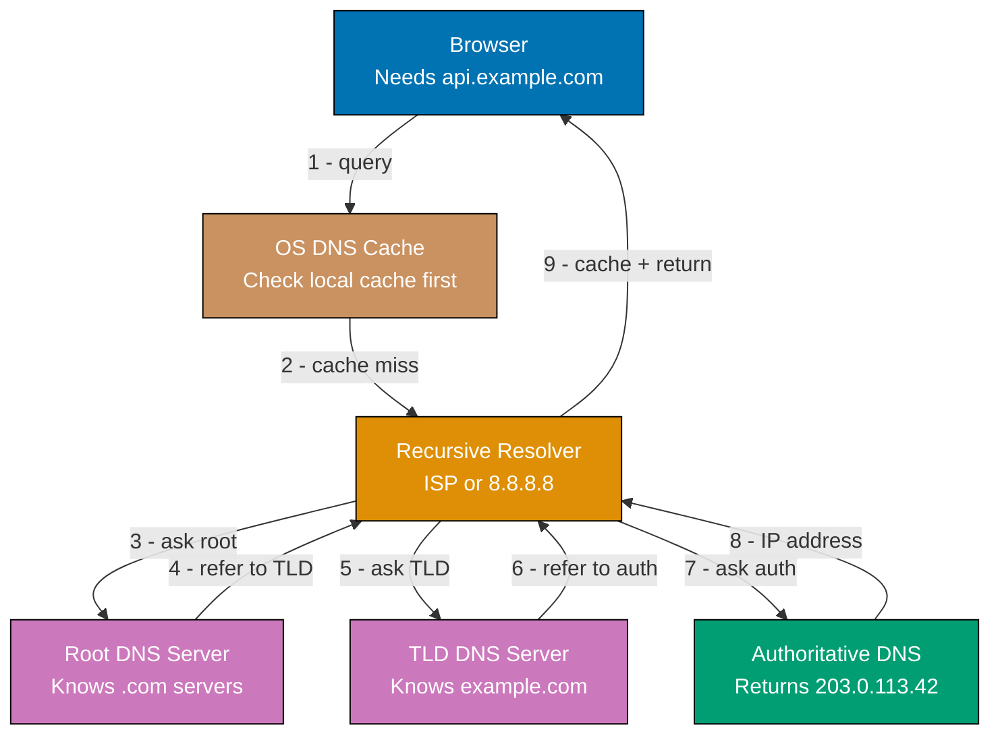
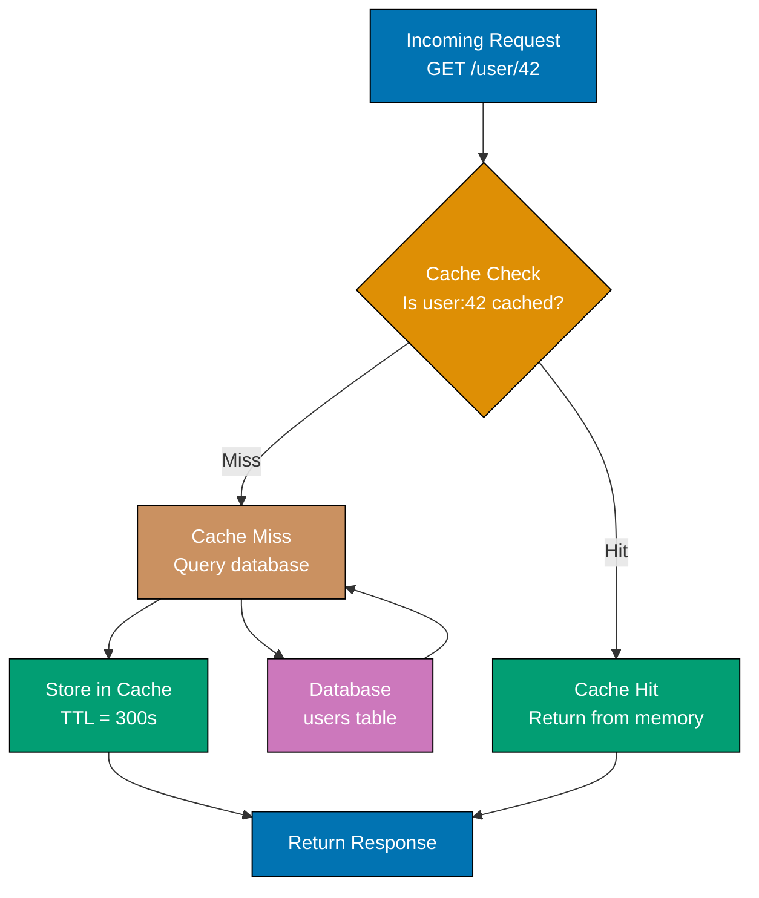
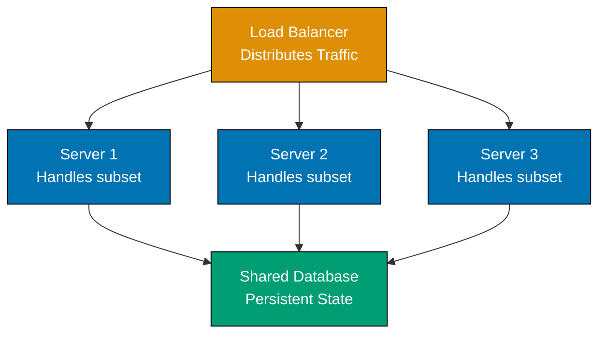
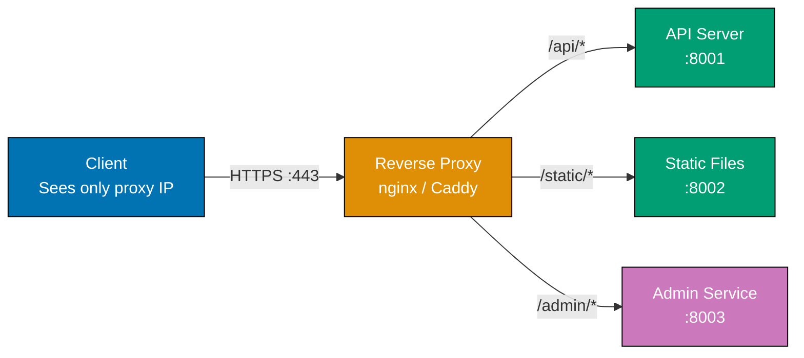
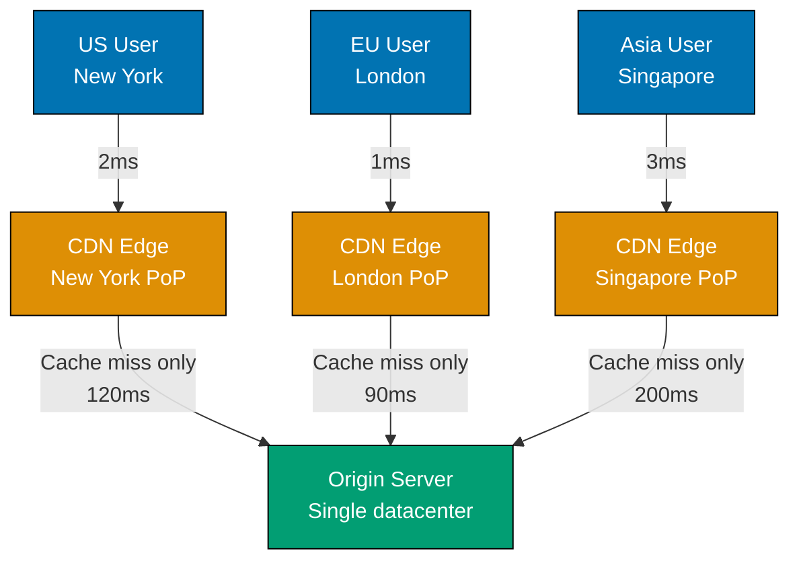
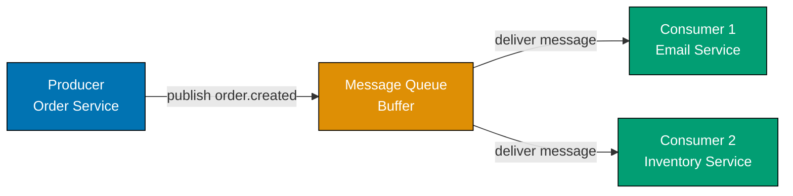
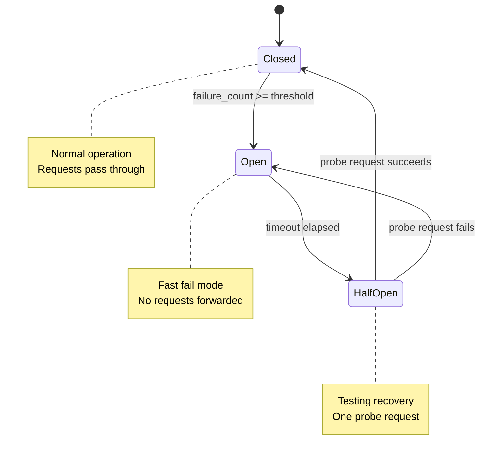

These 28 examples cover the foundational 0-30% of system design — the vocabulary, mental models, and building blocks every engineer must understand before tackling distributed systems at scale. Each example is self-contained and uses Python, YAML, SQL, or shell depending on what best demonstrates the concept.

## Client-Server and HTTP Fundamentals

### Example 1: The Client-Server Model

Every networked application separates concerns into two roles: a client that initiates requests and a server that processes them and returns responses. This separation allows independent scaling, deployment, and evolution of each side — you can replace the server implementation without changing clients, as long as the agreed interface remains stable.


```python
# client_server_demo.py
# Self-contained simulation of client-server interaction using Python's http.server
# No external dependencies — only standard library

import http.server        # => Built-in HTTP server from Python standard library
import threading          # => Used to run server and client concurrently
import urllib.request     # => Built-in HTTP client from Python standard library
import json               # => JSON encoding/decoding from standard library

# --- SERVER SIDE ---

class SimpleHandler(http.server.BaseHTTPRequestHandler):
    # => Subclass BaseHTTPRequestHandler to define how requests are handled
    # => Each incoming connection creates a new instance of this class

    def do_GET(self):
        # => Called automatically when a GET request arrives
        # => self.path contains the URL path (e.g., "/api/hello")
        response = {"message": "Hello from server", "path": self.path}
        # => response is {"message": "Hello from server", "path": "/api/hello"}

        body = json.dumps(response).encode("utf-8")
        # => body is b'{"message": "Hello from server", "path": "/api/hello"}'
        # => .encode("utf-8") converts str to bytes — HTTP bodies are bytes

        self.send_response(200)
        # => Sends "HTTP/1.1 200 OK" status line to client

        self.send_header("Content-Type", "application/json")
        # => Tells client how to interpret the body bytes

        self.end_headers()
        # => Sends blank line separating headers from body (required by HTTP spec)

        self.wfile.write(body)
        # => Writes response body bytes to the network socket

    def log_message(self, format, *args):
        pass
        # => Suppress default request logging to keep demo output clean

# --- CLIENT SIDE ---

def run_server(port):
    server = http.server.HTTPServer(("localhost", port), SimpleHandler)
    # => Creates server bound to localhost:8080
    # => SimpleHandler will handle each incoming request

    server.handle_request()
    # => Handles exactly one request then returns
    # => In production, use serve_forever() instead

def run_client(port):
    url = f"http://localhost:{port}/api/hello"
    # => url is "http://localhost:8080/api/hello"

    with urllib.request.urlopen(url) as response:
        # => Opens HTTP connection, sends GET request, waits for response
        # => 'with' block ensures connection is closed when done

        status = response.status
        # => status is 200 (HTTP OK)

        body = json.loads(response.read().decode("utf-8"))
        # => response.read() returns raw bytes from server
        # => .decode("utf-8") converts bytes to str
        # => json.loads() parses JSON string into Python dict
        # => body is {"message": "Hello from server", "path": "/api/hello"}

    print(f"Status: {status}")       # => Output: Status: 200
    print(f"Body: {body}")           # => Output: Body: {'message': 'Hello from server', 'path': '/api/hello'}

PORT = 8080
server_thread = threading.Thread(target=run_server, args=(PORT,))
# => Creates thread to run server without blocking main thread

server_thread.start()
# => Server is now listening on localhost:8080

run_client(PORT)
# => Client sends request, server handles it, client prints response

server_thread.join()
# => Waits for server thread to finish before program exits
```

**Key Takeaway**: The client-server model is a contract — the client sends a request, the server returns a response, and neither knows the other's implementation details. This contract is the foundation of all networked systems.

**Why It Matters**: Every system design decision — caching, load balancing, CDNs, microservices — builds on top of the client-server model. Engineers who understand the request-response cycle can reason about latency sources, failure modes, and scalability bottlenecks at each hop between client and server. Netflix, Google, and every major web service architect their systems as layered client-server interactions, each optimized independently.

---

### Example 2: HTTP Methods and Status Codes

HTTP defines a small vocabulary of methods (verbs) and status codes that carry semantic meaning. Using them correctly lets clients and servers communicate intent unambiguously — a `PUT` means "replace this resource entirely" while `PATCH` means "modify only these fields," and status code `409 Conflict` means the request was valid but violates a business rule.

```python
# http_semantics.py
# Demonstrates HTTP method semantics and status code meanings
# Uses only Python standard library

from http.server import BaseHTTPRequestHandler, HTTPServer
import json
import urllib.parse

# In-memory "database" — a simple dict simulating a resource store
USERS = {
    "1": {"id": "1", "name": "Alice", "email": "alice@example.com"}
}
# => USERS is {"1": {"id": "1", "name": "Alice", "email": "alice@example.com"}}

class ResourceHandler(BaseHTTPRequestHandler):

    def _parse_id(self):
        # => Extracts resource ID from URL path like "/users/1"
        parts = self.path.strip("/").split("/")
        # => parts is ["users", "1"] for path "/users/1"
        return parts[1] if len(parts) >= 2 else None
        # => Returns "1", or None if no ID in path

    def _send_json(self, status, data):
        body = json.dumps(data).encode("utf-8")
        # => Serializes data dict to JSON bytes
        self.send_response(status)    # => Sends HTTP status line
        self.send_header("Content-Type", "application/json")
        self.end_headers()
        self.wfile.write(body)

    def do_GET(self):
        # => GET: retrieve a resource — safe (no side effects) and idempotent
        user_id = self._parse_id()   # => user_id is "1"
        if user_id in USERS:
            self._send_json(200, USERS[user_id])
            # => 200 OK: resource found and returned
        else:
            self._send_json(404, {"error": "Not Found"})
            # => 404 Not Found: valid request but resource doesn't exist

    def do_POST(self):
        # => POST: create a new resource — NOT idempotent (each call creates another)
        length = int(self.headers.get("Content-Length", 0))
        body = json.loads(self.rfile.read(length))
        # => Reads exactly Content-Length bytes from request body
        # => body is {"name": "Bob", "email": "bob@example.com"}

        new_id = str(len(USERS) + 1)
        # => new_id is "2" (simple auto-increment)
        USERS[new_id] = {**body, "id": new_id}
        # => USERS["2"] = {"name": "Bob", "email": "bob@example.com", "id": "2"}

        self._send_json(201, USERS[new_id])
        # => 201 Created: new resource created; body contains the created resource

    def do_PUT(self):
        # => PUT: replace a resource entirely — idempotent (same result every time)
        user_id = self._parse_id()
        length = int(self.headers.get("Content-Length", 0))
        body = json.loads(self.rfile.read(length))

        if user_id not in USERS:
            self._send_json(404, {"error": "Not Found"})
            return

        USERS[user_id] = {**body, "id": user_id}
        # => Replaces ALL fields — fields not in body are lost
        self._send_json(200, USERS[user_id])
        # => 200 OK: replacement successful

    def do_DELETE(self):
        # => DELETE: remove a resource — idempotent
        user_id = self._parse_id()
        if user_id in USERS:
            del USERS[user_id]           # => Removes user from dict
            self._send_json(204, {})
            # => 204 No Content: success but nothing to return
        else:
            self._send_json(404, {"error": "Not Found"})

    def log_message(self, format, *args):
        pass

# Key status code groups:
# 2xx => Success (200 OK, 201 Created, 204 No Content)
# 3xx => Redirection (301 Moved Permanently, 304 Not Modified)
# 4xx => Client error (400 Bad Request, 401 Unauthorized, 403 Forbidden, 404 Not Found, 409 Conflict)
# 5xx => Server error (500 Internal Server Error, 503 Service Unavailable)
```

**Key Takeaway**: HTTP methods carry semantic contracts — GET is safe, PUT/DELETE are idempotent, POST is neither. Status codes signal outcomes precisely, enabling clients to handle errors without parsing response bodies.

**Why It Matters**: Misusing HTTP semantics creates subtle bugs that are hard to debug in production. A non-idempotent DELETE can cause data loss if retried; a `200 OK` on a failed creation misleads clients into thinking the operation succeeded. Well-designed APIs use the HTTP vocabulary correctly, enabling caches, load balancers, and client libraries to make correct assumptions about retry safety and cacheability.

---

### Example 3: REST API Design Basics

REST (Representational State Transfer) organizes APIs around resources identified by URLs, using HTTP methods to express operations. Good REST API design treats URLs as nouns (what you're acting on) and HTTP methods as verbs (what you're doing), making the API self-describing and consistent.

```python
# rest_api_design.py
# Demonstrates REST API URL design principles
# No external dependencies

# REST URL design principles encoded as a routing table
# Each entry shows: (method, url_pattern, operation, notes)

REST_DESIGN_EXAMPLES = [
    # --- RESOURCE COLLECTIONS ---
    ("GET",    "/users",          "List all users",          "Returns array of user objects"),
    ("POST",   "/users",          "Create new user",         "Body contains new user data"),

    # --- INDIVIDUAL RESOURCES ---
    ("GET",    "/users/{id}",     "Get specific user",       "Returns single user object"),
    ("PUT",    "/users/{id}",     "Replace user",            "Body contains full replacement"),
    ("PATCH",  "/users/{id}",     "Partial update",          "Body contains only changed fields"),
    ("DELETE", "/users/{id}",     "Delete user",             "Returns 204 No Content"),

    # --- NESTED RESOURCES (relationships) ---
    ("GET",    "/users/{id}/orders",     "List user's orders",    "Scoped to specific user"),
    ("POST",   "/users/{id}/orders",     "Create order for user", "Order belongs to user"),
    ("GET",    "/users/{id}/orders/{oid}", "Specific order",      "Fully qualified resource"),
]

# PASS: GOOD URL patterns
GOOD_PATTERNS = {
    "/users":           "Plural noun — represents the collection",
    "/users/42":        "ID identifies specific resource in collection",
    "/users/42/orders": "Nested resource shows relationship",
    "/search?q=alice":  "Query parameters for filtering/searching",
}
# => Each URL is a noun; HTTP method provides the verb

# FAIL: BAD URL patterns (common anti-patterns)
BAD_PATTERNS = {
    "/getUser":          "Verb in URL — method is already GET",
    "/deleteUser/42":    "Verb in URL — method is already DELETE",
    "/user":             "Singular noun for collection is confusing",
    "/users/getOrders":  "Mixed resource + action — use /users/{id}/orders",
    "/createNewOrder":   "Action in URL — use POST /orders instead",
}
# => URLs should identify resources, not actions

def demonstrate_rest_convention():
    print("=== REST URL Design ===")
    for method, pattern, operation, notes in REST_DESIGN_EXAMPLES:
        print(f"{method:6} {pattern:30} | {operation}")
        # => Prints e.g.: "GET    /users                         | List all users"

    print("\n=== PASS: Good Patterns ===")
    for url, reason in GOOD_PATTERNS.items():
        print(f"  {url:30} => {reason}")

    print("\n=== FAIL: Anti-Patterns ===")
    for url, reason in BAD_PATTERNS.items():
        print(f"  {url:30} => {reason}")

demonstrate_rest_convention()
# => Output: REST URL Design table followed by good/bad pattern examples
```

**Key Takeaway**: Design REST APIs around resources (nouns) in URLs and use HTTP methods (verbs) for operations. Consistent URL structure — plural collections, ID-based individual resources, nested sub-resources — makes APIs predictable and reduces the learning curve for consumers.

**Why It Matters**: Poorly designed REST APIs cost teams months of developer time in confusion, workarounds, and migrations. Companies like Stripe and Twilio built developer-beloved products partly through excellent API design. A consistent REST design lets API gateways, SDKs, documentation generators, and client libraries work correctly with minimal configuration — enabling teams to iterate on features rather than debating endpoint naming conventions.

---

### Example 4: DNS Resolution — How Names Become Addresses

DNS (Domain Name System) translates human-readable names like `api.example.com` into IP addresses that routers can forward packets to. Without DNS, every application would need to track raw IP addresses — which change during deployments, migrations, and scaling events. DNS is the internet's phone book, and understanding its resolution chain explains why DNS changes can take time to propagate.



```python
# dns_simulation.py
# Simulates the DNS resolution chain with caching
# No external dependencies

import time

# Simulated DNS hierarchy
DNS_ROOT = {
    "com": "tld-ns-com.example",
    "org": "tld-ns-org.example",
}
# => ROOT knows which server handles each top-level domain (TLD)

DNS_TLD_COM = {
    "example.com": "ns1.example.com",
    "stripe.com":  "ns1.stripe.com",
}
# => TLD server knows which authoritative nameserver handles each domain

DNS_AUTHORITATIVE = {
    "api.example.com":  "203.0.113.42",
    "www.example.com":  "203.0.113.43",
    "mail.example.com": "203.0.113.44",
}
# => Authoritative server stores the actual A records (name -> IP)

class DNSCache:
    def __init__(self):
        self._cache = {}
        # => cache is empty dict: {}

    def get(self, name):
        entry = self._cache.get(name)
        # => Returns None if not cached
        if entry and entry["expires"] > time.time():
            return entry["ip"]
            # => Cache hit: return IP if TTL not expired
        return None
        # => Cache miss: None

    def set(self, name, ip, ttl_seconds=300):
        self._cache[name] = {
            "ip": ip,
            "expires": time.time() + ttl_seconds,
        }
        # => Stores IP with expiry timestamp
        # => After ttl_seconds, the entry is considered stale

class RecursiveResolver:
    def __init__(self):
        self.cache = DNSCache()
        # => Each resolver maintains its own cache
        self.queries = 0
        # => Track how many upstream queries we make

    def resolve(self, hostname):
        # => Main resolution method: check cache first, then query hierarchy
        cached = self.cache.get(hostname)
        if cached:
            print(f"  Cache hit: {hostname} => {cached}")
            return cached
            # => Avoids all upstream queries when cached

        print(f"  Cache miss: {hostname} — querying DNS hierarchy")

        # Step 1: Ask root for TLD nameserver
        tld = hostname.split(".")[-1]
        # => tld is "com" for "api.example.com"
        tld_ns = DNS_ROOT.get(tld)
        # => tld_ns is "tld-ns-com.example"
        self.queries += 1

        # Step 2: Ask TLD for authoritative nameserver
        domain = ".".join(hostname.split(".")[-2:])
        # => domain is "example.com" for "api.example.com"
        auth_ns = DNS_TLD_COM.get(domain)
        # => auth_ns is "ns1.example.com"
        self.queries += 1

        # Step 3: Ask authoritative server for actual IP
        ip = DNS_AUTHORITATIVE.get(hostname)
        # => ip is "203.0.113.42"
        self.queries += 1

        if ip:
            self.cache.set(hostname, ip, ttl_seconds=300)
            # => Cache for 300 seconds (5 minutes) — TTL from DNS record
            print(f"  Resolved and cached: {hostname} => {ip}")
        return ip

resolver = RecursiveResolver()

# First resolution — cold cache, requires full hierarchy traversal
ip1 = resolver.resolve("api.example.com")
# => Cache miss: queries root, TLD, authoritative (3 upstream queries)
# => Output: Cache miss: api.example.com — querying DNS hierarchy
# => Output: Resolved and cached: api.example.com => 203.0.113.42
print(f"Result: {ip1}, Queries made: {resolver.queries}")
# => Output: Result: 203.0.113.42, Queries made: 3

# Second resolution — warm cache, zero upstream queries
ip2 = resolver.resolve("api.example.com")
# => Output: Cache hit: api.example.com => 203.0.113.42
print(f"Result: {ip2}, Queries made: {resolver.queries}")
# => Output: Result: 203.0.113.42, Queries made: 3 (unchanged — served from cache)
```

**Key Takeaway**: DNS resolves names through a hierarchy (root → TLD → authoritative) with caching at each level. The TTL on DNS records controls how long caches hold the answer — low TTLs enable fast updates but increase resolver load; high TTLs reduce load but slow down IP changes.

**Why It Matters**: DNS propagation delays are a common source of production incidents. When you change a server's IP address, clients with cached old records continue connecting to the old server until their TTL expires — potentially minutes to hours depending on configuration. Production engineers use short TTLs (60-300 seconds) before planned migrations, set record changes, then restore longer TTLs afterward. Understanding DNS TTL behavior prevents outage surprises during deployments.

---

## Load Balancing

### Example 5: Round-Robin Load Balancing

Round-robin distributes requests across a pool of servers in circular order — server 1, server 2, server 3, server 1, ... This is the simplest load balancing algorithm: no state required beyond a counter, no knowledge of server health or capacity. It works well when all servers have identical capacity and requests have roughly equal cost.

```python
# round_robin_lb.py
# Simulates a round-robin load balancer
# No external dependencies

import itertools

class RoundRobinLoadBalancer:
    def __init__(self, servers):
        self.servers = servers
        # => servers is ["server-1:8080", "server-2:8080", "server-3:8080"]

        self._cycle = itertools.cycle(servers)
        # => Creates an infinite iterator: 1, 2, 3, 1, 2, 3, 1, ...
        # => itertools.cycle wraps around automatically

        self.request_counts = {s: 0 for s in servers}
        # => request_counts is {"server-1:8080": 0, "server-2:8080": 0, "server-3:8080": 0}

    def next_server(self):
        server = next(self._cycle)
        # => Returns next server in rotation
        # => After server-3, wraps back to server-1

        self.request_counts[server] += 1
        # => Tracks how many requests each server received

        return server

    def distribution_report(self):
        total = sum(self.request_counts.values())
        # => total is total number of requests dispatched
        print(f"\nLoad distribution ({total} requests):")
        for server, count in self.request_counts.items():
            pct = (count / total * 100) if total > 0 else 0
            print(f"  {server}: {count} requests ({pct:.1f}%)")
            # => Each server should receive ~33.3% of traffic

# Initialize balancer with three backend servers
lb = RoundRobinLoadBalancer([
    "server-1:8080",
    "server-2:8080",
    "server-3:8080",
])

# Simulate 9 incoming requests
for i in range(9):
    server = lb.next_server()
    print(f"Request {i+1} => {server}")
    # => Request 1 => server-1:8080
    # => Request 2 => server-2:8080
    # => Request 3 => server-3:8080
    # => Request 4 => server-1:8080  (wraps around)
    # => Request 5 => server-2:8080
    # => Request 6 => server-3:8080
    # => Request 7 => server-1:8080
    # => Request 8 => server-2:8080
    # => Request 9 => server-3:8080

lb.distribution_report()
# => Load distribution (9 requests):
# =>   server-1:8080: 3 requests (33.3%)
# =>   server-2:8080: 3 requests (33.3%)
# =>   server-3:8080: 3 requests (33.3%)
# => Perfect even distribution for uniform workloads
```

**Key Takeaway**: Round-robin load balancing achieves even request distribution with zero configuration overhead. It is ideal for stateless services where all servers are equivalent and requests have similar cost.

**Why It Matters**: Round-robin is the default algorithm in most load balancers (Nginx, HAProxy, AWS ALB) because it works reliably for the majority of use cases at near-zero computational overhead. When requests vary widely in cost — such as a mix of cheap reads and expensive writes — round-robin can overload specific servers. Engineers recognize these limitations and graduate to least-connections or weighted algorithms when workload is heterogeneous.

---

### Example 6: Least-Connections Load Balancing

Least-connections directs each new request to the server currently handling the fewest active connections. Unlike round-robin, it adapts to variable request cost — a server processing a slow database query receives fewer new requests while busy, preventing overload. This requires the load balancer to track active connection counts per server.

```python
# least_connections_lb.py
# Simulates least-connections load balancing
# No external dependencies

import random
import time
from dataclasses import dataclass, field

@dataclass
class Server:
    name: str
    active_connections: int = 0
    # => Tracks currently in-flight requests
    total_handled: int = 0
    # => Tracks total requests processed (for reporting)

class LeastConnectionsLB:
    def __init__(self, servers):
        self.servers = servers
        # => servers is list of Server objects

    def pick_server(self):
        # => Select server with fewest active connections
        chosen = min(self.servers, key=lambda s: s.active_connections)
        # => min() returns Server with lowest active_connections value
        # => If tie, min() picks first in list (acceptable for this algorithm)

        chosen.active_connections += 1
        # => Increment BEFORE dispatching — connection is "active" now
        chosen.total_handled += 1
        return chosen

    def complete_request(self, server):
        server.active_connections -= 1
        # => Decrement AFTER response sent — connection is "released" now
        # => Must always be called to prevent connection count leak

    def status(self):
        print("Server status (active connections | total handled):")
        for s in self.servers:
            print(f"  {s.name}: {s.active_connections} active | {s.total_handled} total")

lb = LeastConnectionsLB([
    Server("server-A"),
    Server("server-B"),
    Server("server-C"),
])

# Simulate a slow request to server-A
slow_server = lb.pick_server()
print(f"Slow request => {slow_server.name}")
# => Slow request => server-A  (first request, all at 0, picks server-A)
# => server-A now has 1 active connection; B and C have 0

# Next two requests should go to B and C (fewer connections than A)
r2 = lb.pick_server()
print(f"Request 2 => {r2.name}")
# => Request 2 => server-B  (0 connections vs server-A's 1)

r3 = lb.pick_server()
print(f"Request 3 => {r3.name}")
# => Request 3 => server-C  (0 connections vs A's 1 and B's 1)

# Request 4: all at 1 (A=1, B=1, C=1) — picks first (A)
r4 = lb.pick_server()
print(f"Request 4 => {r4.name}")
# => Request 4 => server-A  (tie broken by list order)

# Now complete the slow request on server-A
lb.complete_request(slow_server)
# => server-A.active_connections decremented: 2 -> 1

lb.status()
# => Server status:
# =>   server-A: 1 active | 2 total
# =>   server-B: 1 active | 1 total
# =>   server-C: 1 active | 1 total
```

**Key Takeaway**: Least-connections routes traffic to the most available server based on real-time load, not a fixed rotation. It naturally throttles servers processing slow requests and prevents hot spots when request costs vary.

**Why It Matters**: In production APIs where 95% of requests complete in 10ms but 5% trigger slow database queries taking 2-3 seconds, round-robin can build up a queue on any server. Least-connections prevents this by measuring actual server load rather than assuming uniformity. Services like database connection pools, gRPC load balancers, and Envoy Proxy use least-connections as a default for long-lived connections where request duration varies significantly.

---

## Caching

### Example 7: In-Memory Caching with TTL

A cache stores the result of expensive operations so future requests can be served from fast memory instead of re-computing or re-fetching from a slow source. TTL (Time-To-Live) ensures stale data is evicted — without TTL, a cache would grow forever and serve outdated information indefinitely.



```python
# in_memory_cache.py
# Implements a simple TTL-based in-memory cache
# No external dependencies

import time
from typing import Any, Optional

class TTLCache:
    def __init__(self, default_ttl: int = 300):
        self._store: dict = {}
        # => _store is empty dict; will hold {key: {"value": v, "expires": t}}
        self.default_ttl = default_ttl
        # => default_ttl is 300 seconds (5 minutes)
        self.hits = 0
        self.misses = 0
        # => Track hit/miss ratio for monitoring

    def get(self, key: str) -> Optional[Any]:
        entry = self._store.get(key)
        # => Returns None if key never set

        if entry is None:
            self.misses += 1
            return None
            # => Cache miss: key not present

        if time.time() > entry["expires"]:
            del self._store[key]
            # => Evict expired entry (lazy eviction on access)
            self.misses += 1
            return None
            # => Cache miss: key existed but TTL expired

        self.hits += 1
        return entry["value"]
        # => Cache hit: return stored value

    def set(self, key: str, value: Any, ttl: Optional[int] = None):
        ttl = ttl or self.default_ttl
        # => Use provided TTL or fall back to default
        self._store[key] = {
            "value": value,
            "expires": time.time() + ttl,
        }
        # => Stores value with absolute expiry timestamp

    def delete(self, key: str):
        self._store.pop(key, None)
        # => Remove key if exists; no-op if not (dict.pop with default)

    def hit_rate(self) -> float:
        total = self.hits + self.misses
        return (self.hits / total * 100) if total > 0 else 0.0
        # => Returns percentage of requests served from cache

# Simulate expensive database query
def fetch_user_from_db(user_id: int) -> dict:
    time.sleep(0.01)
    # => Simulate 10ms DB query latency
    return {"id": user_id, "name": f"User{user_id}", "role": "member"}
    # => Returns {"id": 1, "name": "User1", "role": "member"}

cache = TTLCache(default_ttl=5)
# => Cache with 5-second TTL for this demo (use 300+ in production)

# First call — cold cache, must hit database
key = "user:1"
user = cache.get(key)
# => user is None (cache miss)
if user is None:
    user = fetch_user_from_db(1)
    # => user is {"id": 1, "name": "User1", "role": "member"}
    cache.set(key, user)
    # => Stored in cache; expires in 5 seconds
print(f"First call: {user}")  # => Output: First call: {'id': 1, 'name': 'User1', 'role': 'member'}

# Second call — warm cache, instant response from memory
user = cache.get(key)
# => user is {"id": 1, "name": "User1", "role": "member"} (cache hit)
print(f"Second call: {user}")  # => Output: Second call: {'id': 1, 'name': 'User1', 'role': 'member'}

print(f"Cache hit rate: {cache.hit_rate():.1f}%")
# => Output: Cache hit rate: 50.0% (1 hit / 2 total)

# Simulate TTL expiry
time.sleep(6)
# => 6 seconds pass; TTL was 5 seconds so entry is now expired

user = cache.get(key)
# => user is None (cache miss: TTL expired, entry evicted)
print(f"After TTL: {user}")   # => Output: After TTL: None
print(f"Cache hit rate: {cache.hit_rate():.1f}%")
# => Output: Cache hit rate: 33.3% (1 hit / 3 total)
```

**Key Takeaway**: In-memory caching eliminates repeated expensive operations by storing results with a TTL. The hit rate measures effectiveness — a high hit rate means most requests are served from cache; a low hit rate means the cache is providing little benefit.

**Why It Matters**: Database query latency is typically 1-100ms; in-memory cache reads complete in microseconds — a 100-10,000x speedup. Instagram, Twitter, and Reddit use Redis to cache user profiles, timelines, and session data, reducing database load by 90%+ for read-heavy workloads. Without caching, popular content would trigger duplicate database queries from thousands of concurrent users, overwhelming even powerful database servers.

---

### Example 8: Cache Invalidation Strategies

Cache invalidation — deciding when and how to remove stale cache entries — is one of the hardest problems in computer science. Three core strategies exist: TTL-based expiry (entries expire automatically after a set time), write-through (cache is updated on every write), and write-around (cache is bypassed on writes, entries are evicted).

```python
# cache_invalidation.py
# Demonstrates three cache invalidation strategies
# No external dependencies

import time

# Shared in-memory storage (simulates database)
DB = {"product:1": {"name": "Widget", "price": 9.99, "stock": 100}}

# ===========================================================================
# STRATEGY 1: TTL-Based Expiry
# Cache entries expire automatically after a fixed duration.
# Simple to implement; accepts brief windows of stale data.
# ===========================================================================

class TTLStrategy:
    def __init__(self, ttl=5):
        self._cache = {}
        self.ttl = ttl
        # => ttl is 5 seconds for this demo

    def get(self, key):
        entry = self._cache.get(key)
        if entry and entry["expires"] > time.time():
            return entry["value"]
            # => Cache hit: value still fresh
        return None
        # => Cache miss: entry absent or expired

    def set(self, key, value):
        self._cache[key] = {"value": value, "expires": time.time() + self.ttl}
        # => Entry expires at current time + TTL seconds

    def update_db_and_cache(self, key, value):
        DB[key] = value
        # => Write to "database"
        # => Cache NOT updated here — entry expires naturally after TTL
        # => During TTL window, cache serves stale data — ACCEPTABLE for non-critical reads

print("=== TTL Strategy ===")
ttl_cache = TTLStrategy(ttl=3)
ttl_cache.set("product:1", DB["product:1"].copy())
print(f"Read: {ttl_cache.get('product:1')}")
# => Read: {'name': 'Widget', 'price': 9.99, 'stock': 100}

# Update price in DB without touching cache
DB["product:1"]["price"] = 12.99
print(f"DB updated, cache still shows: {ttl_cache.get('product:1')}")
# => DB updated, cache still shows: {'name': 'Widget', 'price': 9.99, 'stock': 100}
# => Stale data for up to TTL seconds — acceptable for product listings

# ===========================================================================
# STRATEGY 2: Write-Through
# Every write updates cache AND database atomically.
# Cache is always fresh; adds latency on every write.
# ===========================================================================

class WriteThroughStrategy:
    def __init__(self):
        self._cache = {}

    def get(self, key):
        return self._cache.get(key)
        # => Always fresh because every write updates cache immediately

    def write(self, key, value):
        DB[key] = value
        # => 1. Write to database first
        self._cache[key] = value
        # => 2. Then update cache — always consistent with DB
        # => Trade-off: every write has both DB and cache latency

print("\n=== Write-Through Strategy ===")
wt_cache = WriteThroughStrategy()
wt_cache.write("product:1", {"name": "Widget", "price": 9.99, "stock": 100})
print(f"Read: {wt_cache.get('product:1')}")
# => Read: {'name': 'Widget', 'price': 9.99, 'stock': 100}

wt_cache.write("product:1", {"name": "Widget", "price": 14.99, "stock": 95})
# => Writes to DB AND cache atomically
print(f"After write: {wt_cache.get('product:1')}")
# => After write: {'name': 'Widget', 'price': 14.99, 'stock': 95}  (always fresh)

# ===========================================================================
# STRATEGY 3: Cache-Aside (Lazy Loading) with Explicit Invalidation
# Application manages cache population on misses, and explicitly deletes
# entries on writes. Cache is populated on demand; writes invalidate.
# ===========================================================================

class CacheAsideStrategy:
    def __init__(self):
        self._cache = {}

    def get(self, key):
        if key in self._cache:
            return self._cache[key]
            # => Cache hit

        value = DB.get(key)
        # => Cache miss: load from database
        if value:
            self._cache[key] = value
            # => Populate cache for future reads
        return value

    def write(self, key, value):
        DB[key] = value
        # => Write to database
        self._cache.pop(key, None)
        # => Invalidate cache entry — forces re-load on next read
        # => Simpler than write-through but next read is slower (cache miss)

print("\n=== Cache-Aside Strategy ===")
ca_cache = CacheAsideStrategy()
result = ca_cache.get("product:1")
print(f"First read (miss): {result}")
# => First read (miss): {'name': 'Widget', 'price': 14.99, 'stock': 95}

result = ca_cache.get("product:1")
print(f"Second read (hit): {result}")
# => Second read (hit): {'name': 'Widget', 'price': 14.99, 'stock': 95}

ca_cache.write("product:1", {"name": "Widget", "price": 16.99, "stock": 90})
# => DB updated; cache entry deleted
result = ca_cache.get("product:1")
print(f"After write+invalidate (miss then fresh): {result}")
# => After write+invalidate (miss then fresh): {'name': 'Widget', 'price': 16.99, 'stock': 90}
```

**Key Takeaway**: Choose cache invalidation strategy based on freshness requirements: TTL for data where brief staleness is acceptable, write-through for data that must always be current, cache-aside for read-heavy workloads where writes are infrequent.

**Why It Matters**: Cache invalidation bugs cause some of the hardest-to-reproduce production incidents — a user sees their old profile photo for hours, a price update doesn't reflect for key customers, or an A/B test leaks stale feature flags. Major e-commerce sites lose revenue when stale prices persist in cache after a promotion starts. Choosing the right strategy for each data type is a critical system design decision that balances performance against correctness.

---

## Database Fundamentals

### Example 9: SQL vs NoSQL — When to Use Each

SQL databases (PostgreSQL, MySQL) store data in structured tables with enforced schemas and support powerful JOIN operations across related tables. NoSQL databases (MongoDB, DynamoDB) store data in flexible documents or key-value pairs without enforced schemas, enabling faster iteration and horizontal scaling. Neither is universally better — the choice depends on data structure, query patterns, and consistency requirements.

```sql
-- sql_vs_nosql_schema.sql
-- SQL schema for a simple e-commerce order system
-- Demonstrates relational model with normalization

-- Users table: one row per user, structured columns
CREATE TABLE users (
    id          SERIAL PRIMARY KEY,        -- Auto-incrementing unique identifier
    email       VARCHAR(255) UNIQUE NOT NULL,  -- Enforced uniqueness at DB level
    name        VARCHAR(100) NOT NULL,
    created_at  TIMESTAMPTZ DEFAULT NOW()  -- Timezone-aware timestamp
);
-- => Schema enforced: every row must have email and name
-- => UNIQUE constraint prevents duplicate emails at database level (not just application)

-- Products table: normalized, not embedded in orders
CREATE TABLE products (
    id          SERIAL PRIMARY KEY,
    name        VARCHAR(200) NOT NULL,
    price_cents INTEGER NOT NULL CHECK (price_cents > 0),  -- Store money as integers!
    stock       INTEGER NOT NULL DEFAULT 0
);
-- => price_cents as integer avoids floating-point rounding errors (never store money as float)
-- => CHECK constraint enforces business rule at database level

-- Orders table: references users (foreign key)
CREATE TABLE orders (
    id          SERIAL PRIMARY KEY,
    user_id     INTEGER REFERENCES users(id) ON DELETE RESTRICT,
    -- => REFERENCES enforces referential integrity: cannot create order for non-existent user
    -- => ON DELETE RESTRICT: cannot delete user who has orders (prevents orphaned orders)
    status      VARCHAR(20) NOT NULL DEFAULT 'pending'
                CHECK (status IN ('pending', 'paid', 'shipped', 'cancelled')),
    -- => CHECK constraint acts as application-layer enum validation
    created_at  TIMESTAMPTZ DEFAULT NOW()
);

-- Order items: junction table linking orders to products
CREATE TABLE order_items (
    id          SERIAL PRIMARY KEY,
    order_id    INTEGER REFERENCES orders(id) ON DELETE CASCADE,
    -- => ON DELETE CASCADE: deleting an order also deletes its items
    product_id  INTEGER REFERENCES products(id) ON DELETE RESTRICT,
    quantity    INTEGER NOT NULL CHECK (quantity > 0),
    unit_price_cents INTEGER NOT NULL  -- Snapshot price at time of order
    -- => Store price at order time — product price may change later
);

-- JOIN query: fetch full order details across 4 tables
-- SQL shines here: one query spans all related data
SELECT
    o.id         AS order_id,
    u.name       AS customer,
    u.email,
    p.name       AS product,
    oi.quantity,
    oi.unit_price_cents / 100.0  AS unit_price,
    -- => Divide by 100 for display; store as cents to avoid float issues
    (oi.quantity * oi.unit_price_cents) / 100.0  AS line_total
FROM orders o
    JOIN users u       ON u.id = o.user_id
    JOIN order_items oi ON oi.order_id = o.id
    JOIN products p    ON p.id = oi.product_id
WHERE o.status = 'paid'
ORDER BY o.created_at DESC;
-- => Returns: order_id, customer, email, product, quantity, unit_price, line_total
-- => SQL JOIN reads across tables without data duplication — normalization pays off here
```

```python
# nosql_schema.py
# Equivalent NoSQL document model for comparison
# Shows how the same data looks in document-oriented storage

# MongoDB-style document for a single order
# All related data embedded in one document
order_document = {
    "_id": "order_001",
    # => MongoDB uses _id as primary key; can be any unique value

    "customer": {
        "id": "user_123",
        "name": "Alice",
        "email": "alice@example.com",
        # => Customer data embedded (denormalized) — no JOIN needed
        # => Trade-off: if Alice changes her email, must update ALL orders
    },

    "items": [
        {
            "product_id": "prod_456",
            "name": "Widget Pro",
            # => Product name embedded — no JOIN needed
            # => Trade-off: if product is renamed, old orders show old name (may be desired)
            "quantity": 2,
            "unit_price_cents": 1299,
        },
        {
            "product_id": "prod_789",
            "name": "Gadget Plus",
            "quantity": 1,
            "unit_price_cents": 4999,
        },
    ],
    # => items is a list embedded in the document — retrieved in single read

    "status": "paid",
    "total_cents": 7597,
    # => total_cents is 2*1299 + 4999 = 7597 (pre-computed, stored for fast retrieval)
    "created_at": "2026-03-20T10:00:00Z",
}

# Fetching the full order requires zero JOINs — one document read
# ORDER document contains everything: customer, items, prices
# => Faster reads; no JOIN overhead

# When to use SQL:
# - Complex relationships requiring JOINs
# - Strong consistency and ACID transactions required
# - Schema is stable and well-understood
# - Reporting and analytics with ad-hoc queries

# When to use NoSQL (document):
# - Data naturally fits a document hierarchy
# - High write throughput; horizontal scaling needed
# - Schema evolves frequently during early product development
# - Read pattern always fetches the complete document
```

**Key Takeaway**: SQL databases enforce schema integrity and enable flexible queries across related data through JOINs; NoSQL document stores embed related data together for faster single-document reads. Choose SQL when data relationships are complex and consistency is critical; choose NoSQL when schema flexibility and read performance on denormalized data take priority.

**Why It Matters**: The wrong database choice creates costly migrations later. Instagram started with PostgreSQL for user profiles and photos — the relational model fit their social graph queries. DynamoDB powers Amazon's shopping cart because each user's cart is a self-contained document fetched in a single read with predictable sub-millisecond latency. Most mature systems use both: SQL for transactional data requiring consistency, NoSQL for high-throughput or schema-flexible workloads.

---

### Example 10: Database Indexing Basics

A database index is a data structure (typically a B-tree) that lets the database find rows matching a condition without scanning the entire table. Without an index, a query like `WHERE email = 'alice@example.com'` scans every row — O(n). With an index, it's O(log n). Indexes dramatically speed up reads at the cost of slightly slower writes (the index must be updated on INSERT/UPDATE/DELETE).

```sql
-- database_indexing.sql
-- Demonstrates index creation, usage, and trade-offs

-- Create a large users table (conceptually)
CREATE TABLE users (
    id         SERIAL PRIMARY KEY,      -- Primary key creates index automatically
    email      VARCHAR(255) NOT NULL,   -- NOT NULL but no index yet
    username   VARCHAR(100) NOT NULL,
    country    VARCHAR(2),
    created_at TIMESTAMPTZ DEFAULT NOW()
);
-- => Primary key (id) is auto-indexed — lookups by id are O(log n)
-- => email, username, country are NOT indexed yet — lookups require full table scan

-- Scenario 1: Slow query — no index on email
-- EXPLAIN shows "Seq Scan" (sequential/full-table scan)
EXPLAIN SELECT * FROM users WHERE email = 'alice@example.com';
-- => Seq Scan on users (cost=0.00..12500.00 rows=1 width=64)
-- => "Seq Scan" means reading every row — O(n) where n is table size
-- => Cost 12500 means expensive: 1 million rows * cost per row

-- Fix: Add an index on email for fast lookups
CREATE UNIQUE INDEX idx_users_email ON users (email);
-- => UNIQUE: enforces uniqueness AND creates index
-- => Index name: idx_users_email (convention: idx_tablename_column)
-- => B-tree index created: lookups now O(log n) instead of O(n)

-- After index: same query uses index scan
EXPLAIN SELECT * FROM users WHERE email = 'alice@example.com';
-- => Index Scan using idx_users_email on users (cost=0.56..8.58 rows=1 width=64)
-- => Cost dropped from 12500 to 8.58 — ~1500x speedup for this query!
-- => "Index Scan" means B-tree traversal: O(log n)

-- Scenario 2: Composite index for multi-column queries
CREATE INDEX idx_users_country_created ON users (country, created_at DESC);
-- => Composite index: covers queries filtering on country AND sorting by created_at
-- => Column ORDER matters: country first means index works for:
-- =>   WHERE country = 'US'                      (uses index)
-- =>   WHERE country = 'US' ORDER BY created_at  (uses index)
-- => But NOT for: WHERE created_at > '2026-01-01' (country is first column)

-- Query that uses the composite index efficiently
SELECT id, username, created_at
FROM users
WHERE country = 'US'
ORDER BY created_at DESC
LIMIT 20;
-- => Index scan on idx_users_country_created
-- => Retrieves only US users, pre-sorted by created_at — no additional sort step

-- Index trade-off demonstration
-- Every INSERT must update ALL indexes on the table
INSERT INTO users (email, username, country)
VALUES ('bob@example.com', 'bob', 'UK');
-- => Updates: B-tree for PRIMARY KEY (id)
-- =>          B-tree for idx_users_email (email)
-- =>          B-tree for idx_users_country_created (country, created_at)
-- => Write overhead: 3 index updates per INSERT (acceptable; indexes are worth it for read-heavy tables)

-- When NOT to index
-- Columns with low cardinality (few distinct values) benefit less from B-tree indexes
-- Example: a "status" column with only 3 values (active, inactive, deleted)
-- B-tree index on status still helps but not as dramatically as unique/high-cardinality columns
-- => Index selectivity: high-cardinality columns (email, id) benefit most
-- => Low-cardinality (boolean, enum): partial indexes or no index may be better
```

**Key Takeaway**: Index columns used in WHERE clauses, JOIN conditions, and ORDER BY expressions. Composite indexes must have the most selective (highest cardinality) column first. Every index speeds up reads and slows writes slightly — index only columns actually used in queries.

**Why It Matters**: Missing indexes are the most common cause of database performance degradation in production. A query that takes 200ms on a 10,000-row table can take 200 seconds on a 10-million-row table without an index — a linear slowdown that catches teams off-guard as products grow. PostgreSQL's `EXPLAIN ANALYZE` reveals "Seq Scan" as the signature of a missing index. Adding the right index is often the fastest performance win available: a single `CREATE INDEX` that takes minutes to build can make a critical query 1000x faster overnight.

---

## Scaling Strategies

### Example 11: Vertical Scaling — Scale Up

Vertical scaling (scale up) increases the capacity of a single server by adding more CPU cores, memory, or faster storage. It requires no application changes — the same code runs on larger hardware. The limit is the largest available machine; beyond that, you must scale horizontally.

```python
# vertical_scaling.py
# Simulates how vertical scaling improves throughput on a single server
# No external dependencies

import concurrent.futures
import time
import math

def cpu_bound_task(n):
    # => Simulates a CPU-intensive operation (e.g., image processing, ML inference)
    result = sum(math.sqrt(i) for i in range(n))
    # => Computes square root of integers 0..n-1 and sums them
    # => This is intentionally CPU-bound: no I/O waits
    return result

def benchmark_workers(num_workers, tasks_per_batch=8, work_size=100_000):
    # => Simulates a server with num_workers CPU cores available
    start = time.time()

    with concurrent.futures.ProcessPoolExecutor(max_workers=num_workers) as executor:
        # => ProcessPoolExecutor creates num_workers processes
        # => Equivalent to having num_workers CPU cores available on the server
        futures = [
            executor.submit(cpu_bound_task, work_size)
            for _ in range(tasks_per_batch)
        ]
        # => Submits tasks_per_batch tasks to the worker pool
        results = [f.result() for f in futures]
        # => Waits for all tasks to complete

    elapsed = time.time() - start
    throughput = tasks_per_batch / elapsed
    # => throughput is tasks completed per second
    return elapsed, throughput

print("=== Vertical Scaling Simulation ===")
print("(Increasing CPU cores on a single server)\n")

configs = [
    (1, "Small instance (1 core)"),
    (2, "Medium instance (2 cores)"),
    (4, "Large instance (4 cores)"),
]
# => Each config represents a different EC2/VM size

baseline_throughput = None
for cores, label in configs:
    elapsed, throughput = benchmark_workers(num_workers=cores)
    # => elapsed decreases as cores increase (parallel execution)
    if baseline_throughput is None:
        baseline_throughput = throughput
        speedup = 1.0
    else:
        speedup = throughput / baseline_throughput
        # => speedup is how much faster vs 1-core baseline

    print(f"{label}:")
    print(f"  Time: {elapsed:.2f}s | Throughput: {throughput:.1f} tasks/s | Speedup: {speedup:.1f}x")
    # => Example output:
    # => Small instance (1 core):  Time: 2.40s | Throughput: 3.3 tasks/s  | Speedup: 1.0x
    # => Medium instance (2 cores): Time: 1.25s | Throughput: 6.4 tasks/s  | Speedup: 1.9x
    # => Large instance (4 cores):  Time: 0.68s | Throughput: 11.8 tasks/s | Speedup: 3.6x

# Vertical scaling limits:
# => Linear improvement up to core count; diminishing returns beyond single-machine limits
# => Maximum: largest available instance (e.g., AWS c7i.metal = 192 vCPUs, 384 GB RAM)
# => Cost: exponential — 2x cores often costs 2x+ (larger instances are premium-priced)
# => Downtime: resizing a VM requires restart — brief downtime during scale events
# => Single point of failure: one large server is more dangerous than many small ones
```

**Key Takeaway**: Vertical scaling delivers near-linear throughput improvement proportional to added CPU/memory up to single-machine limits. It requires zero code changes and is the right first response to performance problems before introducing distributed complexity.

**Why It Matters**: Vertical scaling is the fastest path from "our server is slow" to "our server is fast" — a larger instance type is available in minutes on any cloud provider. Most startups begin here because it is operationally simple: no load balancer, no distributed state, no network partitions. The constraint is cost (larger machines have exponentially higher prices) and the hard ceiling of the largest available VM size, which drives teams toward horizontal scaling as products mature.

---

### Example 12: Horizontal Scaling — Scale Out

Horizontal scaling (scale out) adds more servers behind a load balancer rather than making a single server bigger. Each server handles a subset of requests; the load balancer distributes traffic across all of them. Horizontal scaling enables theoretically unlimited capacity by adding nodes, but requires stateless services — each request must be completable by any server without shared local state.



```python
# horizontal_scaling.py
# Simulates a horizontally-scaled service cluster
# No external dependencies

import hashlib
import json

class StatelessServer:
    # => Each server is identical and holds NO local state
    # => Any request can be routed to any server instance

    def __init__(self, server_id):
        self.server_id = server_id
        # => server_id is "server-1", "server-2", etc.
        self.requests_handled = 0

    def handle(self, request):
        # => Processes request using only data in the request itself
        # => NO reference to self._user_sessions or any instance-level state
        self.requests_handled += 1

        result = {
            "server": self.server_id,
            # => Which server handled this request
            "user_id": request["user_id"],
            "data": f"Processed by {self.server_id}: {request['payload']}",
        }
        # => Result is deterministic: same input on ANY server => same output
        return result

class SharedDatabase:
    # => Persistent state lives in shared DB, NOT individual servers
    # => All servers read/write the same database

    def __init__(self):
        self._sessions = {}
        # => Sessions stored in DB, not in server memory

    def save_session(self, user_id, session_data):
        self._sessions[user_id] = session_data
        # => Stored centrally — any server can read it

    def get_session(self, user_id):
        return self._sessions.get(user_id)
        # => Any server retrieves the same session data

class HorizontalCluster:
    def __init__(self, num_servers):
        self.servers = [StatelessServer(f"server-{i+1}") for i in range(num_servers)]
        # => Creates num_servers identical server instances
        self.db = SharedDatabase()
        self._round_robin_idx = 0
        # => Simple round-robin routing

    def add_server(self):
        # => Horizontal scaling: add a new server to the cluster
        new_id = f"server-{len(self.servers)+1}"
        self.servers.append(StatelessServer(new_id))
        print(f"Scaled out: added {new_id} (total: {len(self.servers)} servers)")
        # => New server is immediately ready to handle requests
        # => No state migration needed: servers are stateless

    def route_request(self, request):
        server = self.servers[self._round_robin_idx % len(self.servers)]
        # => Route to next server in rotation
        self._round_robin_idx += 1
        return server.handle(request)

cluster = HorizontalCluster(num_servers=2)
# => Cluster starts with 2 servers

# Send 4 requests
for i in range(4):
    req = {"user_id": f"user_{i}", "payload": f"data_{i}"}
    result = cluster.route_request(req)
    print(f"Request {i}: handled by {result['server']}")
    # => Request 0: handled by server-1
    # => Request 1: handled by server-2
    # => Request 2: handled by server-1
    # => Request 3: handled by server-2

# Scale out: add a third server under load
cluster.add_server()
# => Output: Scaled out: added server-3 (total: 3 servers)

result = cluster.route_request({"user_id": "user_4", "payload": "data_4"})
print(f"After scale-out: {result['server']}")
# => After scale-out: server-3 (new server immediately takes traffic)

print("\nRequest counts:")
for s in cluster.servers:
    print(f"  {s.server_id}: {s.requests_handled} requests")
# => server-1: 2 requests
# => server-2: 2 requests
# => server-3: 1 request (joined mid-stream)
```

**Key Takeaway**: Horizontal scaling requires stateless services — every server must produce the same result for the same request regardless of which instance handles it. Shared databases or distributed caches hold persistent state; individual server instances remain disposable.

**Why It Matters**: Horizontal scaling is how web-scale companies like Amazon and Google handle billions of requests. Adding a server takes seconds on cloud platforms (AWS Auto Scaling, Kubernetes HPA), making horizontal scaling the foundation of elastic capacity management. The critical design constraint is statelessness: services that store user sessions in server memory cannot scale horizontally because subsequent requests may hit a different server with no knowledge of that session.

---

### Example 13: Stateless vs Stateful Services

A stateless service holds no session data between requests — every request contains all information needed to process it. A stateful service stores client state between requests, creating affinity between client and server instance. Stateless services scale horizontally without coordination; stateful services require sticky routing or state synchronization.

```python
# stateless_vs_stateful.py
# Compares stateless (JWT auth) vs stateful (session auth) approaches
# No external dependencies — uses simple dict-based simulation

import hashlib
import json
import base64
import time

# ===========================================================================
# STATEFUL approach: Server-side session storage
# Server stores session in memory; client sends only session ID
# ===========================================================================

class StatefulAuthServer:
    def __init__(self, server_id):
        self.server_id = server_id
        self._sessions = {}
        # => Sessions stored in THIS server's memory
        # => If request hits a DIFFERENT server, session is not found

    def login(self, username, password):
        # => Validates credentials and creates server-side session
        if password == "secret":
            session_id = hashlib.md5(f"{username}{time.time()}".encode()).hexdigest()
            # => session_id is a random 32-char hex string: "a1b2c3..."
            self._sessions[session_id] = {
                "username": username,
                "expires": time.time() + 3600,
            }
            # => Session stored in server memory — not in DB, not shared
            return {"session_id": session_id}
        return {"error": "Invalid credentials"}

    def get_profile(self, session_id):
        session = self._sessions.get(session_id)
        # => Lookup in THIS server's memory
        if not session:
            return {"error": "Session not found — wrong server? Session expired?"}
            # => PROBLEM: if load balancer routes to a different server, this fails
        return {"username": session["username"], "server": self.server_id}

# Demonstrate stateful problem: session tied to one server
server_A = StatefulAuthServer("server-A")
server_B = StatefulAuthServer("server-B")

login_result = server_A.login("alice", "secret")
session_id = login_result["session_id"]
# => session_id is stored only in server-A's memory

profile_on_A = server_A.get_profile(session_id)
print(f"Profile on A: {profile_on_A}")
# => Profile on A: {'username': 'alice', 'server': 'server-A'}  (works)

profile_on_B = server_B.get_profile(session_id)
print(f"Profile on B: {profile_on_B}")
# => Profile on B: {'error': 'Session not found — wrong server? Session expired?'}
# => FAILS: session exists in A but not in B — horizontal scaling broken!

# ===========================================================================
# STATELESS approach: JWT-like tokens (simplified, no real crypto)
# Token contains all user info; server validates signature, no storage needed
# ===========================================================================

SECRET_KEY = "super-secret-key-never-hardcode-in-real-code"

def create_token(username):
    payload = json.dumps({"username": username, "exp": time.time() + 3600})
    # => payload is '{"username": "alice", "exp": 1742000000.0}'
    b64_payload = base64.b64encode(payload.encode()).decode()
    # => b64_payload is base64-encoded payload string

    signature = hashlib.sha256(f"{b64_payload}{SECRET_KEY}".encode()).hexdigest()
    # => signature is HMAC-like hash: prevents tampering without secret key
    # => Real JWT uses proper HMAC-SHA256; this is simplified for demonstration

    return f"{b64_payload}.{signature}"
    # => Token format: "base64payload.signature"
    # => Contains user info — no server-side storage required

def verify_token(token):
    parts = token.split(".")
    if len(parts) != 2:
        return None, "Invalid token format"

    b64_payload, signature = parts
    expected_sig = hashlib.sha256(f"{b64_payload}{SECRET_KEY}".encode()).hexdigest()
    # => Recompute signature with the same secret key

    if signature != expected_sig:
        return None, "Invalid signature — token tampered!"
        # => Detects token forgery or corruption

    payload = json.loads(base64.b64decode(b64_payload).decode())
    # => Decode and parse the payload embedded in the token

    if payload["exp"] < time.time():
        return None, "Token expired"

    return payload, None
    # => Returns (payload_dict, None) on success; (None, error_str) on failure

# Demonstrate stateless: any server can validate any token
token = create_token("alice")
# => token is "eyJ1c2VybmFtZS....<signature>"

# Any server validates by checking signature — no shared state needed
for server_id in ["server-A", "server-B", "server-C"]:
    payload, err = verify_token(token)
    if err:
        print(f"{server_id}: {err}")
    else:
        print(f"{server_id}: valid token for '{payload['username']}'")
        # => server-A: valid token for 'alice'
        # => server-B: valid token for 'alice'
        # => server-C: valid token for 'alice'
        # => ALL servers can validate — no session lookup, no sticky routing
```

**Key Takeaway**: Stateless services embed all necessary context in each request (e.g., JWT tokens) so any server instance can handle any request. Stateful services create server affinity that breaks horizontal scaling unless solved with sticky sessions or centralized session stores.

**Why It Matters**: Statelessness is a prerequisite for cloud-native scaling. AWS Lambda, Kubernetes pods, and serverless functions are all stateless by design — they can be created, destroyed, and replaced without coordination. Companies migrating from monoliths to microservices frequently hit stateful session bugs when load balancers distribute traffic across instances. JWTs have become the industry standard for stateless authentication precisely because they eliminate the session-server affinity problem.

---

## Proxies

### Example 14: Forward Proxy — Client-Side Intermediary

A forward proxy sits between clients and the internet, acting on behalf of the clients. Clients route requests through the proxy; the destination server sees only the proxy's IP, not the client's. Forward proxies provide anonymity, content filtering, caching, and access control for outbound traffic.

```python
# forward_proxy.py
# Simulates a forward proxy that intercepts and filters outbound requests
# No external dependencies

class ForwardProxy:
    # => Sits between clients and external internet
    # => Client configures its HTTP_PROXY setting to route through this proxy
    # => External servers see proxy IP, not client IP

    def __init__(self):
        self.blocklist = {"malware.example.com", "ads.tracker.example"}
        # => Set of domains the proxy refuses to forward
        # => Used for content filtering (corporate policy, parental controls)

        self.cache = {}
        # => Proxy-level cache: shared across all clients behind this proxy
        # => Multiple clients requesting same URL served from cache

        self.request_log = []
        # => Audit log: tracks all outbound requests for compliance

    def handle_request(self, client_ip, method, url):
        domain = url.split("/")[2] if "/" in url else url
        # => Extracts domain from URL e.g., "https://api.example.com/data" => "api.example.com"

        # Step 1: Log the request (audit trail)
        self.request_log.append({
            "client": client_ip,
            "method": method,
            "url": url,
            "domain": domain,
        })
        # => Every request logged regardless of outcome

        # Step 2: Check blocklist (content filtering)
        if domain in self.blocklist:
            print(f"[BLOCKED] {client_ip} -> {url}")
            return {"status": 403, "body": "Access denied by proxy policy"}
            # => 403 Forbidden: proxy refuses to forward this request
            # => Client sees 403; external server never sees the request

        # Step 3: Check proxy cache (bandwidth saving)
        if method == "GET" and url in self.cache:
            print(f"[CACHE HIT] {client_ip} -> {url}")
            return {"status": 200, "body": self.cache[url], "from_cache": True}
            # => Served from proxy cache: no bandwidth to external server

        # Step 4: Forward to external server
        print(f"[FORWARD] {client_ip} -> {url}")
        # => In a real proxy: open TCP connection to domain, forward request
        # => External server sees proxy's IP, not client_ip
        response_body = f"Response from {domain}"
        # => Simulated response from external server

        # Step 5: Cache GET responses
        if method == "GET":
            self.cache[url] = response_body
            # => Cache response for future requests to same URL

        return {"status": 200, "body": response_body}

proxy = ForwardProxy()

# Client 1 requests a legitimate site
r1 = proxy.handle_request("192.168.1.10", "GET", "https://api.example.com/data")
# => [FORWARD] 192.168.1.10 -> https://api.example.com/data
print(f"Response: {r1['status']} - {r1['body']}")
# => Response: 200 - Response from api.example.com

# Client 2 requests the same URL — served from proxy cache
r2 = proxy.handle_request("192.168.1.11", "GET", "https://api.example.com/data")
# => [CACHE HIT] 192.168.1.11 -> https://api.example.com/data
print(f"Response: {r2['status']} - cached={r2.get('from_cache', False)}")
# => Response: 200 - cached=True  (no external request made)

# Client tries blocked domain
r3 = proxy.handle_request("192.168.1.10", "GET", "https://malware.example.com/file")
# => [BLOCKED] 192.168.1.10 -> https://malware.example.com/file
print(f"Response: {r3['status']} - {r3['body']}")
# => Response: 403 - Access denied by proxy policy

print(f"\nAudit log: {len(proxy.request_log)} entries")
# => Audit log: 3 entries  (all requests logged including blocked ones)
```

**Key Takeaway**: A forward proxy intercepts outbound client requests, providing filtering, caching, logging, and IP masking. The external server never sees the original client's identity — it communicates only with the proxy's IP address.

**Why It Matters**: Corporate networks use forward proxies to enforce acceptable-use policies, log employee internet activity for compliance, and reduce external bandwidth costs through shared caching. VPNs operate on similar principles — routing client traffic through an intermediary to mask origin IP. Security teams use forward proxy logs to detect data exfiltration: an unusual spike in outbound traffic to an unknown domain is a red flag in any proxy audit log.

---

### Example 15: Reverse Proxy — Server-Side Intermediary

A reverse proxy sits in front of backend servers, accepting requests from clients on the servers' behalf. Clients see only the proxy's address; backend topology is hidden. Reverse proxies provide SSL termination, load balancing, compression, request routing, and protection against direct server exposure.



```python
# reverse_proxy.py
# Simulates a reverse proxy with path-based routing and SSL termination
# No external dependencies

class BackendService:
    def __init__(self, name, port):
        self.name = name
        self.port = port
        # => Each backend service runs on a private port (not exposed publicly)

    def handle(self, path, headers):
        # => Simulates handling a proxied request
        client_ip = headers.get("X-Forwarded-For", "unknown")
        # => Reverse proxy adds X-Forwarded-For header with original client IP
        # => Backend sees proxy IP at TCP level but real IP in header
        return {
            "service": self.name,
            "port": self.port,
            "path": path,
            "client_ip": client_ip,
            "body": f"Hello from {self.name} at {path}",
        }

class ReverseProxy:
    # => Sits in front of backend services
    # => Clients connect to proxy; backends are never directly exposed

    def __init__(self):
        self.routes = []
        # => Ordered list of (path_prefix, backend) tuples
        self.ssl_terminated = True
        # => SSL termination: proxy handles HTTPS; backends use plain HTTP internally
        # => Backends don't need SSL certificates — proxy handles encryption

        self.request_count = 0

    def add_route(self, path_prefix, backend):
        self.routes.append((path_prefix, backend))
        # => Routes checked in order; first match wins

    def _match_backend(self, path):
        for prefix, backend in self.routes:
            if path.startswith(prefix):
                return backend
                # => First matching prefix wins
        return None
        # => No route matched — 404

    def handle(self, client_ip, method, path, headers=None):
        self.request_count += 1
        headers = headers or {}

        # Add proxy headers before forwarding
        headers["X-Forwarded-For"] = client_ip
        # => Tells backend the original client IP
        headers["X-Forwarded-Proto"] = "https" if self.ssl_terminated else "http"
        # => Tells backend original protocol (useful for redirect URL generation)
        headers["X-Request-Id"] = f"req-{self.request_count:04d}"
        # => Tracing ID added by proxy for distributed tracing

        backend = self._match_backend(path)
        if not backend:
            return {"status": 404, "body": "No route matched"}
            # => 404: proxy couldn't find a backend for this path

        response = backend.handle(path, headers)
        # => Forwards request to matched backend
        response["status"] = 200
        response["via_proxy"] = True
        # => Proxy optionally adds Via header (per HTTP spec)
        return response

# Setup
api_service    = BackendService("api-service", 8001)
static_service = BackendService("static-service", 8002)
admin_service  = BackendService("admin-service", 8003)

proxy = ReverseProxy()
proxy.add_route("/api/",    api_service)     # => /api/* -> api-service:8001
proxy.add_route("/static/", static_service)  # => /static/* -> static-service:8002
proxy.add_route("/admin/",  admin_service)   # => /admin/* -> admin-service:8003

# Client requests
r = proxy.handle("203.0.113.1", "GET", "/api/users")
print(f"Path /api/users -> {r['service']} (client ip: {r['client_ip']})")
# => Path /api/users -> api-service (client ip: 203.0.113.1)

r = proxy.handle("203.0.113.1", "GET", "/static/app.js")
print(f"Path /static/app.js -> {r['service']}")
# => Path /static/app.js -> static-service

r = proxy.handle("203.0.113.1", "GET", "/unknown/path")
print(f"Status: {r['status']}, body: {r['body']}")
# => Status: 404, body: No route matched
```

**Key Takeaway**: A reverse proxy routes external requests to appropriate backend services based on URL path, hostname, or other criteria, while hiding the backend topology from clients. It centralizes cross-cutting concerns like SSL termination, logging, and rate limiting.

**Why It Matters**: Nginx and Caddy handle reverse proxying for the majority of production web infrastructure. Every microservices architecture uses a reverse proxy (or API gateway) as the single entry point — clients call one address; the proxy routes to dozens of specialized services. SSL termination at the proxy layer means backend developers never deal with certificates; the proxy handles encryption and forwards plain HTTP internally, simplifying backend service configuration significantly.

---

## Latency and Throughput

### Example 16: Measuring Latency and Throughput

Latency is the time for one request to complete (milliseconds). Throughput is how many requests the system processes per second (requests/sec or RPS). They are related but distinct — a system can have low latency on individual requests but low throughput if it can only process one request at a time, or high throughput with high per-request latency if it batches requests.

```python
# latency_throughput.py
# Measures latency and throughput of a simulated service
# No external dependencies

import time
import statistics
import concurrent.futures

def simulate_request(request_id, latency_ms=20):
    # => Simulates an API request with fixed latency
    start = time.perf_counter()
    # => perf_counter is higher-resolution than time.time()

    time.sleep(latency_ms / 1000)
    # => Simulates I/O wait (database query, network call, etc.)

    end = time.perf_counter()
    return {
        "id": request_id,
        "latency_ms": (end - start) * 1000,
        # => Actual measured latency in milliseconds
    }

def measure_sequential(num_requests, latency_ms):
    # => Sends requests one at a time — simulates single-threaded server
    start = time.perf_counter()
    results = [simulate_request(i, latency_ms) for i in range(num_requests)]
    # => Each request waits for previous to complete
    total_time = time.perf_counter() - start

    latencies = [r["latency_ms"] for r in results]
    throughput = num_requests / total_time
    # => throughput is requests per second
    return latencies, throughput

def measure_concurrent(num_requests, latency_ms, max_workers):
    # => Sends requests concurrently — simulates multi-threaded or async server
    start = time.perf_counter()
    with concurrent.futures.ThreadPoolExecutor(max_workers=max_workers) as executor:
        futures = [executor.submit(simulate_request, i, latency_ms) for i in range(num_requests)]
        results = [f.result() for f in futures]
        # => All requests in-flight simultaneously; complete when slowest finishes
    total_time = time.perf_counter() - start

    latencies = [r["latency_ms"] for r in results]
    throughput = num_requests / total_time
    return latencies, throughput

NUM_REQUESTS = 20
LATENCY_MS = 20
# => Each simulated request takes 20ms

print("=== Latency and Throughput Measurement ===\n")

# Sequential: 20 requests * 20ms each = ~400ms total, 50 RPS
seq_latencies, seq_throughput = measure_sequential(NUM_REQUESTS, LATENCY_MS)
print(f"Sequential ({NUM_REQUESTS} requests):")
print(f"  p50 latency: {statistics.median(seq_latencies):.1f}ms")
# => p50 latency: 20.x ms  (median: half of requests faster, half slower)
print(f"  p99 latency: {sorted(seq_latencies)[int(0.99*len(seq_latencies))]:.1f}ms")
# => p99 latency: ~20ms (all similar latency in sequential case)
print(f"  Throughput: {seq_throughput:.1f} RPS")
# => Throughput: ~50 RPS (1000ms / 20ms per request = 50)

# Concurrent: all 20 requests in-flight simultaneously = ~20ms total, 1000 RPS
conc_latencies, conc_throughput = measure_concurrent(NUM_REQUESTS, LATENCY_MS, max_workers=20)
print(f"\nConcurrent ({NUM_REQUESTS} requests, {20} workers):")
print(f"  p50 latency: {statistics.median(conc_latencies):.1f}ms")
# => p50 latency: ~20ms  (same per-request latency — concurrency doesn't reduce latency)
print(f"  Throughput: {conc_throughput:.1f} RPS")
# => Throughput: ~1000 RPS (20 requests in ~20ms = 1000/sec)
# => KEY INSIGHT: concurrency improves THROUGHPUT, not individual request LATENCY

print("\nKey insight: concurrency increases throughput without changing per-request latency")
# => Latency and throughput are independent axes; optimize each separately
```

**Key Takeaway**: Latency measures per-request delay; throughput measures system-wide capacity. Concurrency increases throughput by handling multiple requests simultaneously but does not reduce individual request latency — that requires algorithmic improvements, caching, or faster infrastructure.

**Why It Matters**: Confusing latency and throughput leads to wrong optimization strategies. Adding more server threads increases throughput (more concurrent requests) but won't fix a slow database query that causes high latency. Google's Site Reliability Engineering practice tracks p50, p95, and p99 latency percentiles separately from RPS — high p99 latency (slow requests for 1% of users) often signals queue buildup, while throughput capacity determines how many users the system can serve simultaneously.

---

### Example 17: The P50/P95/P99 Latency Percentiles

Percentile latency measures tell a more complete story than averages. P50 (median) shows typical performance; P95 shows what 95% of users experience; P99 shows worst-case performance for 1 in 100 requests. Averages hide outliers — a system averaging 50ms might have P99 of 2 seconds, making 1% of users wait 40x longer than typical.

```python
# latency_percentiles.py
# Analyzes latency distribution using percentile statistics
# No external dependencies

import random
import statistics
import time

def simulate_service_latencies(num_samples=1000):
    # => Generates realistic latency distribution (not uniform — real systems have tail latency)
    latencies = []

    for _ in range(num_samples):
        # Simulate a service with mixed latency sources
        base = random.gauss(20, 5)
        # => Gaussian distribution: most requests ~20ms ± 5ms (fast path)

        # 5% of requests hit slow database queries
        if random.random() < 0.05:
            base += random.uniform(100, 500)
            # => Slow path: adds 100-500ms to those requests
            # => These become the P95-P99 tail

        # 1% of requests experience GC pause or lock contention
        if random.random() < 0.01:
            base += random.uniform(500, 2000)
            # => Very slow path: adds 0.5-2 seconds
            # => These become the P99+ outliers

        latencies.append(max(1, base))
        # => Ensure minimum 1ms (no negative latencies)

    return latencies

def analyze_latencies(latencies):
    sorted_latencies = sorted(latencies)
    n = len(sorted_latencies)
    # => Sort ascending to compute percentiles by index

    def percentile(p):
        idx = int(p / 100 * n)
        # => Index for pth percentile
        return sorted_latencies[min(idx, n-1)]
        # => Return value at that index

    avg = statistics.mean(latencies)
    # => avg is arithmetic mean — often misleading for skewed distributions

    p50 = percentile(50)   # => Median: half faster, half slower
    p75 = percentile(75)   # => 75% of requests faster than this
    p95 = percentile(95)   # => 95% of requests faster than this
    p99 = percentile(99)   # => 99% of requests faster than this
    p999 = percentile(99.9) # => 99.9% faster — worst 1 in 1000 requests

    print(f"Samples: {n}")
    print(f"Average: {avg:.1f}ms  ← misleading! hides tail latency")
    print(f"P50:     {p50:.1f}ms  ← typical experience for most users")
    print(f"P75:     {p75:.1f}ms  ← upper-middle experience")
    print(f"P95:     {p95:.1f}ms  ← slow for 1 in 20 requests")
    print(f"P99:     {p99:.1f}ms  ← very slow for 1 in 100 requests")
    print(f"P99.9:   {p999:.1f}ms ← worst 1 in 1000 requests")
    print(f"\nTail ratio (P99/P50): {p99/p50:.1f}x slower")
    # => A healthy service has P99/P50 ratio under 5x
    # => Ratios over 10x indicate significant tail latency problems

    # Distribution breakdown
    slow_5pct = sum(1 for l in latencies if l > p95)
    print(f"\nRequests over P95 ({p95:.0f}ms): {slow_5pct} of {n} ({slow_5pct/n*100:.1f}%)")
    # => These are the users experiencing degraded performance

latencies = simulate_service_latencies(1000)
analyze_latencies(latencies)
# => Example output:
# => Average: 33.5ms  <- misleading!
# => P50:     20.3ms  <- most users are happy
# => P95:     120.4ms <- 1 in 20 waits 6x longer
# => P99:     850.2ms <- 1 in 100 waits nearly a second
# => P99.9:   1823ms  <- worst case approaches 2 seconds
# => Tail ratio: 41.8x slower
```

**Key Takeaway**: Always measure P95 and P99 latency alongside the median — averages obscure tail latency where real user pain lives. A service with P50 of 20ms and P99 of 2000ms has serious tail latency problems despite a healthy average.

**Why It Matters**: At scale, rare slow requests affect millions of users. A service with P99 of 2 seconds means 10,000 users per million requests wait nearly 2 seconds. Amazon famously found that every 100ms of latency cost 1% in sales — tail latency directly impacts revenue. Google's SRE teams set SLOs (Service Level Objectives) based on P99 latency, not averages, because P99 represents actual user experience for a meaningful portion of real traffic.

---

## Storage Basics

### Example 18: Block Storage vs File Storage vs Object Storage

Three storage abstractions serve different use cases. Block storage presents raw disk blocks to the operating system (like a physical hard drive); file storage organizes data in hierarchical directories (like a NAS); object storage stores data as flat key-value pairs with metadata and HTTP access (like S3). Each trades flexibility, performance, and scalability differently.

```python
# storage_types.py
# Demonstrates the three storage paradigms with Python file system simulations
# No external dependencies

import os
import json
import hashlib
import tempfile
import shutil

# ===========================================================================
# FILE STORAGE: Hierarchical directory tree
# Use case: shared file systems, home directories, NFS/SMB shares
# ===========================================================================

class FileStorage:
    # => Hierarchical: directories contain files; files have names and paths
    # => Mutable: files can be partially updated (seek + write)
    # => POSIX semantics: permissions, hard links, symlinks

    def __init__(self, root_dir):
        self.root = root_dir
        os.makedirs(root_dir, exist_ok=True)
        # => Creates root directory if not exists

    def write_file(self, path, content):
        # => path is relative: "reports/2026/monthly.pdf"
        full_path = os.path.join(self.root, path)
        # => full_path is absolute OS path
        os.makedirs(os.path.dirname(full_path), exist_ok=True)
        # => Creates intermediate directories: "reports/2026/"
        with open(full_path, "w") as f:
            f.write(content)
        # => File stored in hierarchical directory structure

    def read_file(self, path):
        full_path = os.path.join(self.root, path)
        with open(full_path) as f:
            return f.read()

    def list_directory(self, dir_path=""):
        full_path = os.path.join(self.root, dir_path)
        return os.listdir(full_path)
        # => Returns filenames in directory — hierarchical navigation

# ===========================================================================
# OBJECT STORAGE: Flat key-value with metadata
# Use case: image hosting, video storage, backup, CDN origin, data lakes
# ===========================================================================

class ObjectStorage:
    # => Flat: no directories — objects identified by globally unique key
    # => Immutable: entire object replaced on write; no partial updates
    # => HTTP API: access via GET/PUT/DELETE — no file system semantics

    def __init__(self):
        self._store = {}
        # => _store is {key: {"data": str, "metadata": dict, "etag": str}}

    def put_object(self, key, data, metadata=None):
        # => key is the full "path": "images/user-123/avatar.jpg"
        # => Looks like a path but it's just a string — no real directories
        etag = hashlib.md5(data.encode()).hexdigest()
        # => ETag is content hash: lets clients detect changes cheaply

        self._store[key] = {
            "data": data,
            "metadata": metadata or {},
            "etag": etag,
            "size": len(data),
        }
        # => Object stored as single atomic unit — no partial writes possible

    def get_object(self, key):
        return self._store.get(key)
        # => Returns full object dict or None if not found

    def list_objects(self, prefix=""):
        # => Simulates S3-style prefix listing (not true directory listing)
        return [k for k in self._store if k.startswith(prefix)]
        # => prefix="images/user-123/" returns all objects with that prefix
        # => Looks like listing a directory but is actually a key prefix filter

    def delete_object(self, key):
        return self._store.pop(key, None)
        # => Removes entire object — no partial deletion possible

# --- Demonstration ---

with tempfile.TemporaryDirectory() as tmp:
    print("=== File Storage ===")
    fs = FileStorage(tmp)
    fs.write_file("reports/2026/q1.txt", "Q1 2026 Report")
    # => Creates directories: tmp/reports/2026/
    fs.write_file("reports/2026/q2.txt", "Q2 2026 Report")
    contents = fs.list_directory("reports/2026")
    print(f"Directory listing: {sorted(contents)}")
    # => Directory listing: ['q1.txt', 'q2.txt']

print("\n=== Object Storage ===")
os_store = ObjectStorage()
os_store.put_object(
    key="images/user-123/avatar.jpg",
    data="<binary image data>",
    metadata={"content-type": "image/jpeg", "user-id": "123"},
)
# => Stored at flat key — no real directory structure
os_store.put_object(
    key="images/user-456/avatar.jpg",
    data="<other image data>",
    metadata={"content-type": "image/jpeg", "user-id": "456"},
)
user_images = os_store.list_objects(prefix="images/user-123/")
print(f"Objects with prefix 'images/user-123/': {user_images}")
# => Objects with prefix 'images/user-123/': ['images/user-123/avatar.jpg']

obj = os_store.get_object("images/user-123/avatar.jpg")
print(f"Object metadata: {obj['metadata']}, ETag: {obj['etag']}")
# => Object metadata: {'content-type': 'image/jpeg', 'user-id': '123'}, ETag: abc123...

print("\nStorage comparison:")
print("  File:   Hierarchical, mutable, POSIX, shared NAS, not web-native")
print("  Object: Flat keys, immutable, HTTP API, infinitely scalable, CDN-friendly")
print("  Block:  Raw sectors, OS manages, fast I/O, used for DB volumes")
# => Block storage not simulated here — it operates at OS level (sda, nvme), not application level
```

**Key Takeaway**: Use block storage for database volumes (raw I/O performance), file storage for shared file systems needing directory structure, and object storage for web-served binary content at scale (images, videos, backups) where HTTP access and infinite horizontal scale matter more than POSIX semantics.

**Why It Matters**: AWS S3 (object storage) hosts exabytes of user content for Netflix, Airbnb, and Dropbox because objects are immutable, distributed globally via CDN, and have no capacity limit per bucket. Databases use EBS (block storage) because they require low-latency random reads and writes at the block level. Choosing the wrong storage type causes either severe performance issues (using object storage for a database) or unnecessary complexity (using block storage for image hosting that needs global distribution).

---

### Example 19: CDN — Content Delivery Network Basics

A CDN is a geographically distributed network of edge servers that cache and serve static content (images, CSS, JS, video) close to users. When a user requests content, the CDN edge nearest to them serves it — reducing round-trip latency from hundreds of milliseconds (origin server) to single-digit milliseconds (nearby edge). The origin server is only contacted when the edge cache misses.



```python
# cdn_simulation.py
# Simulates CDN edge caching and origin fallback
# No external dependencies

import time

class CDNEdge:
    # => Edge server located in a geographic region (PoP = Point of Presence)
    # => Serves cached content to nearby users at low latency

    def __init__(self, location, latency_to_origin_ms):
        self.location = location
        # => location is "New York", "London", etc.
        self.latency_to_origin_ms = latency_to_origin_ms
        # => Round-trip latency from this edge to the origin server
        self._cache = {}
        # => Local edge cache: stores content with TTL

    def serve(self, path, user_location):
        edge_latency_ms = 5
        # => User-to-edge latency (edge is geographically close to user)
        # => Typically 1-10ms for users in the same region

        cached = self._cache.get(path)
        if cached and cached["expires"] > time.time():
            total_latency = edge_latency_ms
            # => Cache hit: served from edge memory — only edge RTT
            return {
                "status": 200,
                "from": f"CDN Edge ({self.location})",
                "cache": "HIT",
                "latency_ms": total_latency,
                "content": cached["content"],
            }

        # Cache miss: fetch from origin
        total_latency = edge_latency_ms + self.latency_to_origin_ms
        # => User->edge (5ms) + edge->origin (varies by region)
        content = self._fetch_from_origin(path)
        # => Contacts origin server; adds origin round-trip to latency
        self._cache[path] = {
            "content": content,
            "expires": time.time() + 3600,
            # => Cache for 1 hour — static assets typically cached longer (days/weeks)
        }
        return {
            "status": 200,
            "from": f"CDN Edge ({self.location}) [fetched from origin]",
            "cache": "MISS",
            "latency_ms": total_latency,
            "content": content,
        }

    def _fetch_from_origin(self, path):
        # => Simulates HTTP request from edge to origin server
        return f"<content of {path}>"

class CDN:
    def __init__(self, edges):
        self.edges = edges
        # => edges is dict: {"New York": CDNEdge(...), "London": CDNEdge(...)}

    def request(self, user_location, path):
        edge = self.edges.get(user_location)
        if not edge:
            edge = list(self.edges.values())[0]
            # => Fallback to first edge if user location not mapped
        return edge.serve(path, user_location)

cdn = CDN({
    "New York":  CDNEdge("New York",  latency_to_origin_ms=120),
    "London":    CDNEdge("London",    latency_to_origin_ms=90),
    "Singapore": CDNEdge("Singapore", latency_to_origin_ms=200),
})

asset = "/static/app.js"

# New York user — cache miss (first request to this edge)
r = cdn.request("New York", asset)
print(f"NY miss:  {r['latency_ms']}ms | {r['cache']} | via {r['from']}")
# => NY miss:  125ms | MISS | via CDN Edge (New York) [fetched from origin]

# Second NY user — cache hit (edge cached from first request)
r = cdn.request("New York", asset)
print(f"NY hit:   {r['latency_ms']}ms | {r['cache']} | via {r['from']}")
# => NY hit:   5ms | HIT | via CDN Edge (New York)
# => 125ms -> 5ms: 25x speedup after cache warm

# London user — independent edge, own cache
r = cdn.request("London", asset)
print(f"London:   {r['latency_ms']}ms | {r['cache']} | via {r['from']}")
# => London:   95ms | MISS | via CDN Edge (London) [fetched from origin]
# => London edge fetches independently; no shared cache between edges
```

**Key Takeaway**: CDN edge servers cache static content near users, reducing latency from hundreds of milliseconds (cross-continent) to single-digit milliseconds (regional edge). The origin server handles only cache misses; warm cache edges serve the vast majority of traffic.

**Why It Matters**: Static assets (JavaScript bundles, images, fonts, videos) constitute 70-90% of web page weight. Without a CDN, every user globally fetches these from a single origin server — users in Singapore wait 300ms round-trips to a US-East server. Cloudflare, Fastly, and AWS CloudFront reduce this to under 10ms by caching at 200+ edge locations worldwide. Netflix uses CDNs to deliver the majority of its video traffic without touching its origin servers — CDN hit rates above 95% are common for popular content.

---

### Example 20: API Rate Limiting — Token Bucket Algorithm

Rate limiting protects backend services from being overwhelmed by too many requests from a single client. The token bucket algorithm allows bursts (use accumulated tokens) while enforcing a long-term average rate. A bucket holds up to `capacity` tokens; tokens refill at a fixed rate; each request consumes one token; requests are rejected when the bucket is empty.

```python
# rate_limiter_token_bucket.py
# Implements the token bucket rate limiting algorithm
# No external dependencies

import time
import threading

class TokenBucket:
    # => Token bucket: allows burst traffic up to 'capacity' while
    # => enforcing 'refill_rate' requests per second on average

    def __init__(self, capacity, refill_rate):
        self.capacity = capacity
        # => capacity is max tokens bucket can hold (burst limit)
        # => e.g., capacity=10 allows burst of 10 requests

        self.refill_rate = refill_rate
        # => refill_rate is tokens added per second
        # => e.g., refill_rate=5 allows sustained 5 RPS

        self.tokens = float(capacity)
        # => Start full: client can immediately burst up to capacity

        self.last_refill = time.monotonic()
        # => monotonic clock: won't jump backwards (system clock can)

        self._lock = threading.Lock()
        # => Lock needed: multiple threads may call allow() concurrently

    def _refill(self):
        now = time.monotonic()
        elapsed = now - self.last_refill
        # => elapsed is seconds since last refill check

        tokens_to_add = elapsed * self.refill_rate
        # => Tokens earned during elapsed time: elapsed_sec * tokens_per_sec
        # => e.g., 0.5s elapsed * 5 tokens/s = 2.5 tokens earned

        self.tokens = min(self.capacity, self.tokens + tokens_to_add)
        # => Add earned tokens but never exceed capacity
        # => min() enforces the burst limit

        self.last_refill = now
        # => Update timestamp for next refill calculation

    def allow(self, tokens_requested=1):
        with self._lock:
            # => Acquire lock: only one thread refills and checks at a time
            self._refill()
            # => First, add any tokens earned since last call

            if self.tokens >= tokens_requested:
                self.tokens -= tokens_requested
                # => Consume token(s): deduct from bucket
                return True
                # => Request allowed: client has available capacity

            return False
            # => Request rejected: bucket empty — client exceeded rate limit

    def status(self):
        return f"{self.tokens:.2f}/{self.capacity} tokens"
        # => Current fill level for monitoring/debugging

# Simulate rate limiting: 5 RPS sustained, burst up to 10
limiter = TokenBucket(capacity=10, refill_rate=5)

print("=== Token Bucket Rate Limiter ===")
print(f"Initial: {limiter.status()}")
# => Initial: 10.00/10 tokens  (starts full)

# Burst: 10 requests immediately — all should pass (bucket starts full)
burst_allowed = 0
for i in range(12):
    allowed = limiter.allow()
    if allowed:
        burst_allowed += 1
    print(f"  Request {i+1:2d}: {'ALLOW' if allowed else 'REJECT'} | {limiter.status()}")
    # => Request  1: ALLOW | 9.00/10 tokens
    # => Request  2: ALLOW | 8.00/10 tokens
    # => ...
    # => Request 10: ALLOW | 0.00/10 tokens
    # => Request 11: REJECT | 0.00/10 tokens  (bucket empty)
    # => Request 12: REJECT | 0.00/10 tokens

print(f"\nBurst allowed: {burst_allowed}/12")
# => Burst allowed: 10/12  (10 allowed, 2 rejected after bucket empty)

# Wait for refill: 5 tokens/sec * 1 second = 5 tokens refilled
time.sleep(1.0)
print(f"\nAfter 1s wait: {limiter.status()}")
# => After 1s wait: 5.00/10 tokens  (5 tokens refilled)

# 5 more requests should succeed
for i in range(5):
    allowed = limiter.allow()
    print(f"  Request {i+1}: {'ALLOW' if allowed else 'REJECT'} | {limiter.status()}")
    # => All 5 allowed; bucket depletes back to 0
```

**Key Takeaway**: Token bucket allows configurable burst capacity while enforcing sustained average rates. Capacity controls burst size; refill rate controls long-term throughput limit. Clients are rejected only when they exhaust their accumulated tokens.

**Why It Matters**: Rate limiting is essential infrastructure for any public API. Stripe, GitHub, and Twitter API all use token bucket or similar algorithms to prevent individual clients from monopolizing server capacity. Without rate limiting, a single misbehaving client — intentional (DDoS) or accidental (infinite retry loop) — can degrade service for all users. Token bucket is preferred over fixed-window rate limiting because it smooths burst traffic gracefully rather than allowing all burst at the window boundary and then blocking entirely.

---

## API Design Patterns

### Example 21: Pagination — Offset vs Cursor

Pagination limits how much data a single API response returns. Without pagination, a `GET /orders` endpoint on a table with 10 million rows would return gigabytes of data, crashing both server and client. Two approaches exist: offset-based (skip N rows, return K) and cursor-based (return K rows after a specific marker). Cursor pagination handles live data correctly; offset pagination is simpler but shows duplicates or gaps when data changes between pages.

```python
# pagination.py
# Demonstrates offset-based and cursor-based pagination
# No external dependencies

import hashlib
import time

# Simulated database of orders (sorted by created_at desc)
ORDERS = [
    {"id": f"ord_{i:04d}", "amount": 100 + i, "created_at": 1000000 - i}
    for i in range(1, 101)
]
# => 100 orders: ord_0001 (created_at=999999) through ord_0100 (created_at=999900)
# => Sorted descending by created_at (newest first)

# ===========================================================================
# APPROACH 1: Offset Pagination
# Skip `offset` rows, return `limit` rows
# Simple but breaks when rows are inserted/deleted between pages
# ===========================================================================

def get_orders_offset(offset, limit):
    # => offset: how many rows to skip from the beginning
    # => limit: how many rows to return
    page_data = ORDERS[offset: offset + limit]
    # => Slice the list — equivalent to SQL: LIMIT 10 OFFSET 20

    return {
        "data": page_data,
        "total": len(ORDERS),
        # => total: lets client calculate total pages
        "has_next": offset + limit < len(ORDERS),
        # => has_next: true if more pages exist
        "next_offset": offset + limit if offset + limit < len(ORDERS) else None,
    }

print("=== Offset Pagination ===")
page1 = get_orders_offset(offset=0, limit=5)
print(f"Page 1: {[o['id'] for o in page1['data']]} | has_next={page1['has_next']}")
# => Page 1: ['ord_0001', 'ord_0002', 'ord_0003', 'ord_0004', 'ord_0005'] | has_next=True

page2 = get_orders_offset(offset=5, limit=5)
print(f"Page 2: {[o['id'] for o in page2['data']]} | has_next={page2['has_next']}")
# => Page 2: ['ord_0006', 'ord_0007', 'ord_0008', 'ord_0009', 'ord_0010'] | has_next=True

# Problem with offset: if a new order is inserted BEFORE page 2 is fetched,
# ord_0005 from page 1 appears again at the start of page 2 (shifted by 1)
# => New insert at position 0 shifts all rows: OFFSET 5 now points to what was OFFSET 4

# ===========================================================================
# APPROACH 2: Cursor Pagination
# Return rows after a specific cursor (usually the last item's ID or timestamp)
# Stable under inserts/deletes — cursor points to a specific item, not a position
# ===========================================================================

def get_orders_cursor(after_id, limit):
    # => after_id: ID of last item seen (None for first page)
    # => Return limit items that come AFTER after_id in sort order

    if after_id is None:
        start_idx = 0
        # => First page: start from beginning
    else:
        # Find position of cursor item
        positions = [i for i, o in enumerate(ORDERS) if o["id"] == after_id]
        if not positions:
            return {"error": "Invalid cursor"}
        start_idx = positions[0] + 1
        # => start_idx is one past the cursor item

    page_data = ORDERS[start_idx: start_idx + limit]
    # => Returns items after the cursor

    next_cursor = page_data[-1]["id"] if len(page_data) == limit else None
    # => next_cursor is ID of last item in this page
    # => None means no more pages (fewer items returned than limit)

    return {
        "data": page_data,
        "next_cursor": next_cursor,
        # => Client passes next_cursor as after_id in next request
    }

print("\n=== Cursor Pagination ===")
page1 = get_orders_cursor(after_id=None, limit=5)
print(f"Page 1: {[o['id'] for o in page1['data']]} | next_cursor={page1['next_cursor']}")
# => Page 1: ['ord_0001', ..., 'ord_0005'] | next_cursor=ord_0005

page2 = get_orders_cursor(after_id=page1["next_cursor"], limit=5)
print(f"Page 2: {[o['id'] for o in page2['data']]} | next_cursor={page2['next_cursor']}")
# => Page 2: ['ord_0006', ..., 'ord_0010'] | next_cursor=ord_0010
# => If a new order is inserted at the top between page 1 and page 2,
# => cursor still starts from ord_0005 — no duplicate or skipped items
```

**Key Takeaway**: Use cursor pagination for live, frequently-updated data — it is stable when rows are inserted or deleted between page fetches. Use offset pagination for static data or administrative UIs where simplicity matters more than correctness under concurrent writes.

**Why It Matters**: Offset pagination is a hidden bug in most APIs that only surfaces in high-traffic production systems. On a feed with millions of concurrent users scrolling through live content, offset pagination causes users to see duplicate posts or miss items as new content is inserted. Twitter, Instagram, and Slack switched to cursor-based pagination for their activity feeds specifically because offset pagination produced incorrect results at scale. Implementing cursor pagination correctly from the start prevents a painful and risky migration later.

---

### Example 22: Idempotency Keys — Safe Retries

A client retrying a failed request can accidentally trigger duplicate operations — double-charging a credit card, creating duplicate orders. An idempotency key is a unique client-generated ID included with a request; the server stores results keyed by this ID and returns the stored result on duplicate requests without re-executing the operation.

```python
# idempotency.py
# Demonstrates idempotency keys for safe payment retries
# No external dependencies

import uuid
import time

class PaymentProcessor:
    # => Simulates a payment service with idempotency support
    # => Clients include an idempotency key; server deduplicates retries

    def __init__(self):
        self._processed = {}
        # => _processed is {idempotency_key: {"result": ..., "created_at": timestamp}}
        self._charge_count = 0
        # => Tracks actual charges — must not increment on retries

    def charge(self, idempotency_key, user_id, amount_cents):
        # => idempotency_key: UUID generated by client BEFORE the first attempt
        # => Same key on retry => same result; no duplicate charge

        # Step 1: Check if this key was already processed
        existing = self._processed.get(idempotency_key)
        if existing:
            print(f"  [IDEMPOTENT REPLAY] key={idempotency_key[:8]}... returning cached result")
            return existing["result"]
            # => Return exact same response as original request
            # => No duplicate charge — operation is idempotent

        # Step 2: Execute the actual charge (only for first request with this key)
        self._charge_count += 1
        charge_id = f"charge_{self._charge_count:04d}"
        # => charge_id is "charge_0001" for first charge

        result = {
            "charge_id": charge_id,
            "user_id": user_id,
            "amount_cents": amount_cents,
            "status": "success",
            "timestamp": time.time(),
        }
        # => result is the authoritative payment record

        # Step 3: Store result under idempotency key
        self._processed[idempotency_key] = {
            "result": result,
            "created_at": time.time(),
        }
        # => Stored result survives retries — key acts as deduplication token

        print(f"  [CHARGED] {charge_id} for user={user_id}, amount={amount_cents}c")
        return result

processor = PaymentProcessor()

# Client generates idempotency key BEFORE making the request
idem_key = str(uuid.uuid4())
# => idem_key is a UUID: "a1b2c3d4-e5f6-..."
# => Client stores this key to use for all retry attempts

print("=== Payment with Idempotency Key ===")
print(f"Idempotency key: {idem_key[:8]}...\n")

# First attempt (network might time out before client receives response)
result1 = processor.charge(idem_key, user_id="user_42", amount_cents=4999)
# => [CHARGED] charge_0001 for user=user_42, amount=4999c
print(f"Attempt 1: {result1['charge_id']} | total charges: {processor._charge_count}\n")
# => Attempt 1: charge_0001 | total charges: 1

# Retry 1: client timed out, retries with SAME key
result2 = processor.charge(idem_key, user_id="user_42", amount_cents=4999)
# => [IDEMPOTENT REPLAY] key=a1b2c3d4... returning cached result
print(f"Attempt 2: {result2['charge_id']} | total charges: {processor._charge_count}\n")
# => Attempt 2: charge_0001 | total charges: 1 (no new charge!)

# Retry 2: client still unsure, retries again
result3 = processor.charge(idem_key, user_id="user_42", amount_cents=4999)
# => [IDEMPOTENT REPLAY] returning cached result
print(f"Attempt 3: {result3['charge_id']} | total charges: {processor._charge_count}\n")
# => Attempt 3: charge_0001 | total charges: 1 (still no duplicate!)

# New payment with different key — does create a new charge
new_key = str(uuid.uuid4())
result4 = processor.charge(new_key, user_id="user_42", amount_cents=1000)
# => [CHARGED] charge_0002 for user=user_42, amount=1000c
print(f"New payment: {result4['charge_id']} | total charges: {processor._charge_count}")
# => New payment: charge_0002 | total charges: 2
```

**Key Takeaway**: Idempotency keys enable safe retries by making operations idempotent — the server stores the result of the first execution and returns it on duplicate requests without re-executing. Clients generate the key before the first attempt and reuse it for all retries.

**Why It Matters**: Network failures happen in production. A client that charges a credit card and never receives a response (timeout) must retry — but a naive retry without idempotency creates a duplicate charge. Stripe's API requires idempotency keys for all payment mutations and stores results for 24 hours, enabling safe retry loops in client code. Every financial API, order management system, and message queue delivery mechanism uses idempotency to guarantee exactly-once semantics in unreliable networks.

---

### Example 23: Health Checks — Liveness and Readiness

Health checks tell orchestration systems (Kubernetes, load balancers, AWS ALB) whether a service instance is fit to receive traffic. A liveness check answers "is the process alive?" — if it fails, restart the instance. A readiness check answers "is the service ready to handle requests?" — if it fails, stop routing traffic to it but don't restart it. Separating these two prevents thrashing restarts when a service is temporarily unready (waiting for DB connections, cache warm-up).

```python
# health_checks.py
# Implements liveness and readiness health check endpoints
# No external dependencies

import time
import threading

class ServiceHealthChecker:
    # => Tracks service health for liveness and readiness probes
    # => Kubernetes calls /healthz (liveness) and /ready (readiness) periodically

    def __init__(self):
        self._started_at = time.time()
        self._db_connected = False
        # => False initially — service starts connecting to DB asynchronously
        self._cache_warmed = False
        # => False initially — cache populates after DB connection

        self._consecutive_errors = 0
        # => Tracks recent error rate — too many errors signals liveness failure
        self._max_allowed_errors = 10
        # => After 10 consecutive errors, consider process unhealthy (restart it)

    def simulate_startup(self):
        # => Simulates async startup tasks that happen after process starts
        def connect_db():
            time.sleep(2)
            # => Simulates 2-second database connection setup
            self._db_connected = True
            print("  [DB] Connection established")

        def warm_cache():
            time.sleep(3)
            # => Cache warm-up starts after DB connects; takes 1 more second
            self._cache_warmed = True
            print("  [CACHE] Warm-up complete")

        threading.Thread(target=connect_db, daemon=True).start()
        threading.Thread(target=warm_cache, daemon=True).start()
        # => Both run concurrently; cache warm-up overlaps with DB connection

    def liveness_check(self):
        # => Answers: "Is this process fundamentally healthy?"
        # => Failure causes Kubernetes to RESTART the pod
        # => Should only fail for truly unrecoverable states

        if self._consecutive_errors >= self._max_allowed_errors:
            return {
                "status": "unhealthy",
                "reason": f"Too many errors: {self._consecutive_errors}",
                "action": "restart",
            }
            # => Signal orchestrator to restart — process is stuck

        uptime = time.time() - self._started_at
        return {
            "status": "healthy",
            "uptime_seconds": round(uptime, 1),
        }
        # => Process is alive and not in a stuck error loop

    def readiness_check(self):
        # => Answers: "Is this service ready to handle requests?"
        # => Failure causes load balancer to REMOVE from rotation (no restart)
        # => Should fail during startup or temporary unavailability

        issues = []

        if not self._db_connected:
            issues.append("database not connected")
            # => Not ready: can't serve requests without DB

        if not self._cache_warmed:
            issues.append("cache not warmed")
            # => Not ready: serving requests before cache warm-up would hammer DB

        if issues:
            return {
                "status": "not_ready",
                "issues": issues,
                # => Load balancer stops sending traffic until issues resolve
            }

        return {"status": "ready"}
        # => All dependencies healthy: service can accept traffic

checker = ServiceHealthChecker()
checker.simulate_startup()
# => Starts async DB connection (2s) and cache warm-up (3s)

print("=== Health Check Simulation ===")
for t in [0, 1, 2, 3]:
    time.sleep(1)
    elapsed = t + 1
    liveness = checker.liveness_check()
    readiness = checker.readiness_check()
    print(f"t={elapsed}s: liveness={liveness['status']}, readiness={readiness['status']}", end="")
    if "issues" in readiness:
        print(f" ({', '.join(readiness['issues'])})")
    else:
        print()
    # => t=1s: liveness=healthy, readiness=not_ready (database not connected, cache not warmed)
    # => t=2s: liveness=healthy, readiness=not_ready (database not connected, cache not warmed)
    # => t=3s: liveness=healthy, readiness=not_ready (cache not warmed)
    # => t=4s: liveness=healthy, readiness=ready
```

**Key Takeaway**: Separate liveness (should I restart?) from readiness (should I route traffic here?). A failing readiness check removes the instance from the load balancer pool without restarting; a failing liveness check triggers a restart. This separation prevents crash loops during temporary unavailability.

**Why It Matters**: Kubernetes pods that fail readiness checks during startup prevent broken instances from serving production traffic before they are ready — a critical safety mechanism during deployments. Without separate liveness and readiness checks, a pod that is temporarily unready (waiting for cache warm-up) would be restarted repeatedly, causing the warm-up to never complete (restart loop). Google SRE guidelines mandate separate liveness and readiness probes for all production services.

---

### Example 24: Message Queue Basics — Decoupling Services

A message queue decouples services by placing messages in a buffer between producer and consumer. The producer writes to the queue without waiting for the consumer to process the message — it can continue handling other requests immediately. The consumer processes messages at its own pace. This asynchronous communication pattern handles load spikes, enables retry logic, and prevents cascading failures.



```python
# message_queue.py
# Simulates a simple message queue with publish/subscribe
# No external dependencies

import queue
import threading
import time
import json

class SimpleMessageQueue:
    # => In-memory message queue (simulates RabbitMQ, SQS, Kafka at concept level)
    # => Producer publishes; consumers subscribe and process asynchronously

    def __init__(self, name):
        self.name = name
        self._queue = queue.Queue()
        # => Thread-safe FIFO queue from Python standard library
        self._subscribers = []
        # => List of consumer callback functions

    def publish(self, message):
        # => Producer calls this to put a message into the queue
        envelope = {
            "id": f"msg_{int(time.time()*1000)}",
            # => Unique message ID for deduplication and tracing
            "payload": message,
            "published_at": time.time(),
        }
        self._queue.put(envelope)
        # => Put adds to queue; non-blocking (returns immediately)
        # => Producer does NOT wait for consumer — key benefit of queuing
        print(f"  [QUEUE] Published: {message.get('type', 'unknown')} msg_id={envelope['id'][-4:]}")
        return envelope["id"]

    def subscribe(self, consumer_fn):
        self._subscribers.append(consumer_fn)
        # => Register a consumer function to process messages
        # => Multiple consumers possible (fan-out pattern)

    def start_consuming(self):
        # => Background thread that delivers messages to subscribers
        def delivery_loop():
            while True:
                try:
                    envelope = self._queue.get(timeout=0.1)
                    # => Blocks until a message arrives (timeout=0.1s prevents busy-wait)
                    for subscriber in self._subscribers:
                        try:
                            subscriber(envelope)
                            # => Each subscriber processes the message independently
                        except Exception as e:
                            print(f"  [ERROR] Consumer failed: {e}")
                            # => In production: move to dead-letter queue for investigation
                except queue.Empty:
                    continue
                    # => No message yet; loop again

        t = threading.Thread(target=delivery_loop, daemon=True)
        t.start()
        # => daemon=True: thread exits when main program exits

# --- Services ---

mq = SimpleMessageQueue("order-events")

# Consumer 1: Email notification service
def email_consumer(envelope):
    msg = envelope["payload"]
    if msg["type"] == "order.created":
        print(f"  [EMAIL] Sending confirmation to {msg['email']} for order {msg['order_id']}")
        # => Sends email asynchronously; order service didn't wait for this

# Consumer 2: Inventory update service
def inventory_consumer(envelope):
    msg = envelope["payload"]
    if msg["type"] == "order.created":
        for item in msg["items"]:
            print(f"  [INVENTORY] Reserving {item['qty']} x {item['sku']}")
            # => Decrements stock for each ordered item

mq.subscribe(email_consumer)
mq.subscribe(inventory_consumer)
# => Both services consume from same queue — fan-out pattern

mq.start_consuming()
# => Background consumer thread started

print("=== Message Queue Demo ===\n")

# Order service publishes event — doesn't wait for email or inventory
mq.publish({
    "type": "order.created",
    "order_id": "ord_001",
    "email": "alice@example.com",
    "items": [{"sku": "SKU-A", "qty": 2}, {"sku": "SKU-B", "qty": 1}],
})
# => [QUEUE] Published: order.created
# => Order service immediately available to handle next request

mq.publish({
    "type": "order.created",
    "order_id": "ord_002",
    "email": "bob@example.com",
    "items": [{"sku": "SKU-C", "qty": 1}],
})
# => [QUEUE] Published: order.created

time.sleep(0.5)
# => Allow consumers to process the queued messages
print("\nAll messages processed asynchronously")
# => [EMAIL] Sending confirmation to alice@example.com for order ord_001
# => [INVENTORY] Reserving 2 x SKU-A
# => [INVENTORY] Reserving 1 x SKU-B
# => [EMAIL] Sending confirmation to bob@example.com for order ord_002
```

**Key Takeaway**: Message queues decouple producers from consumers, enabling asynchronous processing. The producer returns immediately after publishing; multiple consumers process messages independently at their own pace, allowing different services to scale independently.

**Why It Matters**: Synchronous service calls create tight coupling — if the email service is slow, the order service becomes slow. Message queues break this dependency: even if the email service goes down for maintenance, orders continue flowing through the queue and emails are sent when the service restarts. AWS SQS, RabbitMQ, and Apache Kafka are foundational infrastructure at Amazon, Uber, and LinkedIn, handling billions of messages daily for event-driven architectures where services communicate without waiting on each other.

---

### Example 25: Service Discovery — How Services Find Each Other

In a dynamic environment where services scale in and out, IP addresses change constantly. Service discovery solves the problem of "how does Service A find the current address of Service B?" Either services register themselves in a registry (service-side registration), or the orchestrator registers them (platform-side registration). Consumers query the registry at request time instead of using hardcoded IP addresses.

```python
# service_discovery.py
# Simulates a service registry with health-based deregistration
# No external dependencies

import time
import uuid

class ServiceRegistry:
    # => Central store of available service instances
    # => Services register on startup, deregister on shutdown
    # => Registry removes instances that fail health checks

    def __init__(self):
        self._registry = {}
        # => registry is {service_name: {instance_id: {"address": ..., "healthy": bool}}}

    def register(self, service_name, host, port):
        # => Called when a service instance starts
        instance_id = str(uuid.uuid4())[:8]
        # => Short UUID: "a1b2c3d4" — unique per instance

        if service_name not in self._registry:
            self._registry[service_name] = {}
            # => Create service entry if first instance of this service

        self._registry[service_name][instance_id] = {
            "address": f"{host}:{port}",
            "registered_at": time.time(),
            "healthy": True,
        }
        print(f"  [REGISTRY] Registered {service_name}@{host}:{port} (id={instance_id})")
        return instance_id
        # => Returns instance_id for later deregistration

    def deregister(self, service_name, instance_id):
        if service_name in self._registry:
            removed = self._registry[service_name].pop(instance_id, None)
            # => Remove instance from registry (service shutdown)
            if removed:
                print(f"  [REGISTRY] Deregistered {service_name} id={instance_id}")

    def mark_unhealthy(self, service_name, instance_id):
        if service_name in self._registry and instance_id in self._registry[service_name]:
            self._registry[service_name][instance_id]["healthy"] = False
            # => Health check failed: mark unhealthy but don't remove yet
            # => Load balancer will stop routing to this instance

    def get_healthy_instances(self, service_name):
        instances = self._registry.get(service_name, {})
        return [
            inst["address"]
            for inst in instances.values()
            if inst["healthy"]
        ]
        # => Returns list of addresses for healthy instances only
        # => Consumer uses these to make requests (with client-side load balancing)

registry = ServiceRegistry()

print("=== Service Discovery Demo ===\n")

# API Gateway service: 2 instances start up
gw1 = registry.register("api-gateway", "10.0.1.1", 8080)
gw2 = registry.register("api-gateway", "10.0.1.2", 8080)
# => [REGISTRY] Registered api-gateway@10.0.1.1:8080 (id=...)
# => [REGISTRY] Registered api-gateway@10.0.1.2:8080 (id=...)

# User service: 1 instance
us1 = registry.register("user-service", "10.0.2.1", 9001)

print()
# Consumer looks up api-gateway instances
gateways = registry.get_healthy_instances("api-gateway")
print(f"Healthy api-gateway instances: {gateways}")
# => Healthy api-gateway instances: ['10.0.1.1:8080', '10.0.1.2:8080']

# One gateway fails health check
registry.mark_unhealthy("api-gateway", gw1)
# => Instance 1 fails health check

gateways = registry.get_healthy_instances("api-gateway")
print(f"After health check failure: {gateways}")
# => After health check failure: ['10.0.1.2:8080']
# => Traffic automatically routes only to healthy instance

# Scale out: third gateway starts
gw3 = registry.register("api-gateway", "10.0.1.3", 8080)
gateways = registry.get_healthy_instances("api-gateway")
print(f"After scale-out: {gateways}")
# => After scale-out: ['10.0.1.2:8080', '10.0.1.3:8080']
# => New instance immediately discoverable; no config changes needed

# Service deregisters on clean shutdown
registry.deregister("api-gateway", gw2)
gateways = registry.get_healthy_instances("api-gateway")
print(f"After graceful shutdown of gw2: {gateways}")
# => After graceful shutdown of gw2: ['10.0.1.3:8080']
```

**Key Takeaway**: Service registries enable dynamic service discovery by maintaining a live catalog of healthy instances. Services register on startup, deregister on shutdown, and consumers query the registry at request time — eliminating hardcoded IP addresses that break when services scale or move.

**Why It Matters**: Kubernetes solves service discovery automatically through DNS and kube-proxy — every Service resource gets a stable DNS name that resolves to current pod IPs, removing the need for explicit registries in most cloud-native architectures. In non-Kubernetes environments, tools like Consul and Eureka (Netflix's open-source registry) serve this role. Understanding service discovery is prerequisite knowledge for microservices architecture: without it, service-to-service calls require manual configuration updates every time an instance's address changes.

---

### Example 26: Circuit Breaker Pattern

A circuit breaker prevents a service from repeatedly calling a failing dependency, allowing the failed system time to recover while failing fast for new requests. Like an electrical circuit breaker, it trips to "open" after too many failures (fast-fail new requests), then transitions to "half-open" to test if the dependency has recovered.



```python
# circuit_breaker.py
# Implements the circuit breaker pattern
# No external dependencies

import time

class CircuitBreaker:
    CLOSED    = "CLOSED"
    # => Normal state: requests pass through
    OPEN      = "OPEN"
    # => Tripped state: requests fail fast without calling dependency
    HALF_OPEN = "HALF_OPEN"
    # => Testing state: one probe request allowed to check recovery

    def __init__(self, failure_threshold=3, recovery_timeout=5):
        self.state = self.CLOSED
        # => Start in CLOSED (normal) state

        self.failure_threshold = failure_threshold
        # => Open circuit after this many consecutive failures

        self.recovery_timeout = recovery_timeout
        # => Seconds to wait before attempting recovery (HALF_OPEN)

        self._failure_count = 0
        # => Counts consecutive failures in CLOSED state

        self._last_failure_time = None
        # => When the circuit opened — used to calculate recovery timeout

    def _should_attempt_reset(self):
        if self._last_failure_time is None:
            return False
        elapsed = time.time() - self._last_failure_time
        return elapsed >= self.recovery_timeout
        # => True if enough time has passed to try recovery

    def call(self, fn, *args, **kwargs):
        # => Wraps a function call with circuit breaker logic

        if self.state == self.OPEN:
            if self._should_attempt_reset():
                self.state = self.HALF_OPEN
                print(f"  [CB] OPEN -> HALF_OPEN (testing recovery)")
                # => Transition: try one probe request
            else:
                raise Exception(f"Circuit OPEN — fast fail (dependency unavailable)")
                # => Fail immediately without calling the dependency
                # => Caller gets fast error instead of waiting for timeout

        try:
            result = fn(*args, **kwargs)
            # => Call the wrapped function (e.g., HTTP request to dependency)

            if self.state == self.HALF_OPEN:
                self.state = self.CLOSED
                self._failure_count = 0
                print(f"  [CB] HALF_OPEN -> CLOSED (dependency recovered)")
                # => Probe succeeded: circuit closes, normal operation resumes

            return result

        except Exception as e:
            self._failure_count += 1
            # => Increment failure counter

            if self.state == self.HALF_OPEN or self._failure_count >= self.failure_threshold:
                self.state = self.OPEN
                self._last_failure_time = time.time()
                print(f"  [CB] -> OPEN (failures={self._failure_count}, threshold={self.failure_threshold})")
                # => Trip circuit: stop forwarding requests

            raise
            # => Re-raise so caller knows the call failed

    def status(self):
        return f"state={self.state}, failures={self._failure_count}"

# Simulated dependency (payment processor)
call_count = [0]

def call_payment_service():
    call_count[0] += 1
    n = call_count[0]
    if 2 <= n <= 7:
        raise Exception("Payment service timeout")
        # => Calls 2-7 simulate the dependency being down
    return {"status": "ok", "call": n}
    # => Calls 1 and 8+ succeed

cb = CircuitBreaker(failure_threshold=3, recovery_timeout=2)

print("=== Circuit Breaker Demo ===\n")
for i in range(12):
    try:
        result = cb.call(call_payment_service)
        print(f"  Call {i+1:2d}: SUCCESS {result} | {cb.status()}")
    except Exception as e:
        print(f"  Call {i+1:2d}: FAIL '{e}' | {cb.status()}")

    if i == 8:
        print("  (waiting 2s for recovery timeout...)")
        time.sleep(2.1)
        # => After recovery_timeout, circuit transitions to HALF_OPEN
    # => Call  1: SUCCESS — circuit CLOSED, normal
    # => Call  2-4: FAIL — failures accumulate
    # => Call  4: circuit trips OPEN (failures=3 >= threshold=3)
    # => Call  5-7: FAIL 'Circuit OPEN' — fast fail, dependency not called
    # => (wait 2s)
    # => Call  9: HALF_OPEN -> probes dependency -> succeeds -> CLOSED
    # => Call 10-12: SUCCESS — circuit CLOSED again
```

**Key Takeaway**: Circuit breakers prevent cascading failures by failing fast when a dependency is unavailable, allowing both the caller and the dependency time to recover. The three states — closed (normal), open (fast-fail), half-open (testing recovery) — automate resilience without manual intervention.

**Why It Matters**: Without circuit breakers, a slow database can cause an API service's thread pool to fill with waiting requests, cascading the failure to clients that would otherwise succeed. Netflix's Hystrix library popularized circuit breakers for microservices — every inter-service call in their streaming platform runs through a circuit breaker. Resilience4j and Polly are modern equivalents used across Java and .NET ecosystems. Circuit breakers are a foundational resilience pattern that every distributed system engineer must understand.

---

### Example 27: Consistent Hashing — Distributing Data Across Nodes

Consistent hashing assigns data to nodes in a way that minimizes redistribution when nodes are added or removed. In simple modular hashing (`key % N`), adding a node changes the assignment of most keys. Consistent hashing maps both keys and nodes to a ring; each key belongs to the nearest clockwise node. Adding a node affects only the keys between it and its predecessor on the ring.

```python
# consistent_hashing.py
# Implements consistent hashing for distributed cache key routing
# No external dependencies

import hashlib
import bisect

class ConsistentHashRing:
    # => Hash ring: maps both nodes and keys to positions 0 to 2^32
    # => Keys route to the nearest clockwise node on the ring

    def __init__(self, virtual_nodes=3):
        self.virtual_nodes = virtual_nodes
        # => virtual_nodes: each physical node gets N positions on ring
        # => More virtual nodes = better load distribution
        # => virtual_nodes=3 means 3 positions per server

        self._ring = {}
        # => ring is {hash_position: node_name} mapping

        self._sorted_positions = []
        # => Sorted list of hash positions for efficient binary search

    def _hash(self, key):
        h = hashlib.md5(key.encode()).hexdigest()
        # => MD5 produces 128-bit hash; use first 32 bits as ring position
        return int(h[:8], 16)
        # => int(..., 16) converts hex string to integer
        # => Range: 0 to 2^32-1 (4 billion positions)

    def add_node(self, node_name):
        # => Place node at virtual_nodes positions on the ring
        for i in range(self.virtual_nodes):
            virtual_key = f"{node_name}:vnode:{i}"
            # => Each virtual node has unique key: "cache-1:vnode:0", "cache-1:vnode:1", etc.
            position = self._hash(virtual_key)
            # => Hashes to a position on the ring

            self._ring[position] = node_name
            bisect.insort(self._sorted_positions, position)
            # => bisect.insort: maintains sorted order efficiently (O(n) but simple)

        print(f"  Added {node_name} at {self.virtual_nodes} ring positions")

    def remove_node(self, node_name):
        for i in range(self.virtual_nodes):
            virtual_key = f"{node_name}:vnode:{i}"
            position = self._hash(virtual_key)
            del self._ring[position]
            self._sorted_positions.remove(position)
            # => Removes node's positions from ring
        print(f"  Removed {node_name}")

    def get_node(self, key):
        # => Find which node should store/serve this key
        if not self._sorted_positions:
            return None

        key_position = self._hash(key)
        # => Hash the key to a ring position

        idx = bisect.bisect_right(self._sorted_positions, key_position)
        # => bisect_right: find insertion point (first position > key_position)
        # => This is the "nearest clockwise node"

        if idx == len(self._sorted_positions):
            idx = 0
            # => Wrap around: key_position is past the last node, use first node

        return self._ring[self._sorted_positions[idx]]
        # => Return the node name at this position

ring = ConsistentHashRing(virtual_nodes=3)

print("=== Consistent Hash Ring ===\n")
ring.add_node("cache-1")
ring.add_node("cache-2")
ring.add_node("cache-3")
# => Each node placed at 3 positions on the 0..2^32 ring

print()
test_keys = ["user:1", "user:2", "user:3", "product:A", "product:B", "session:X"]
original_assignments = {}

for key in test_keys:
    node = ring.get_node(key)
    original_assignments[key] = node
    print(f"  {key:15} -> {node}")
    # => user:1          -> cache-2
    # => user:2          -> cache-1
    # => user:3          -> cache-3
    # => etc.

print(f"\nAdding cache-4 (simulates scale-out):")
ring.add_node("cache-4")
print()

moved = 0
for key in test_keys:
    new_node = ring.get_node(key)
    changed = new_node != original_assignments[key]
    if changed:
        moved += 1
    print(f"  {key:15} -> {new_node} {'[MOVED]' if changed else '[stable]'}")
    # => Most keys remain on same node — only keys between cache-4 and its predecessor move

print(f"\nKeys moved after adding 1 node: {moved}/{len(test_keys)}")
# => Keys moved: 2/6 (approximately 1/N of keys move when adding 1 node to N+1 total)
# => With modular hashing (key % N), ALL keys would reassign (cache invalidation disaster)
```

**Key Takeaway**: Consistent hashing minimizes key redistribution when nodes join or leave a cluster — approximately 1/N of keys migrate when adding the (N+1)th node, versus all keys migrating with modular hashing. Virtual nodes improve load distribution across unequal clusters.

**Why It Matters**: Distributed caches (Memcached, Redis Cluster) and databases (Cassandra, DynamoDB) use consistent hashing to distribute data across nodes. When a cache node fails and is replaced, consistent hashing moves only the affected portion of cached keys to other nodes — preserving the majority of the cache warm state. Systems using modular hashing would invalidate the entire cache on a single node addition, causing a thundering herd of cache misses that can bring down a database. Consistent hashing is the algorithm that makes elastic cache scaling practical.

---

### Example 28: Availability, Reliability, and SLAs

Availability measures what percentage of time a service is operational (99.9% = "three nines" = 8.76 hours downtime/year). Reliability measures whether the service performs its intended function correctly when available. SLAs (Service Level Agreements) are contracts with consequences; SLOs (Service Level Objectives) are internal targets. These metrics drive architecture decisions around redundancy, failover, and operational runbooks.

```python
# availability_sla.py
# Demonstrates availability calculation and SLA tier definitions
# No external dependencies

from datetime import timedelta

# ============================================================
# SLA TIER DEFINITIONS
# ============================================================

SLA_TIERS = {
    "99.0%":  {"nines": 2, "downtime_per_year": timedelta(days=3, hours=15, minutes=36)},
    "99.9%":  {"nines": 3, "downtime_per_year": timedelta(hours=8, minutes=45, seconds=36)},
    "99.95%": {"nines": 3.5, "downtime_per_year": timedelta(hours=4, minutes=22, seconds=48)},
    "99.99%": {"nines": 4, "downtime_per_year": timedelta(minutes=52, seconds=36)},
    "99.999%":{"nines": 5, "downtime_per_year": timedelta(minutes=5, seconds=15)},
}
# => "nines": number of 9s in the percentage
# => "three nines" = 99.9% = 8h 45m downtime/year

YEAR_SECONDS = 365 * 24 * 3600
# => YEAR_SECONDS is 31,536,000 seconds per year

def availability_seconds(percentage):
    return YEAR_SECONDS * (percentage / 100)
    # => Returns seconds of uptime per year for given percentage

def downtime_seconds(percentage):
    return YEAR_SECONDS * (1 - percentage / 100)
    # => Returns seconds of allowed downtime per year

def format_duration(seconds):
    h = int(seconds // 3600)
    m = int((seconds % 3600) // 60)
    s = int(seconds % 60)
    if h > 24:
        d = h // 24
        h = h % 24
        return f"{d}d {h}h {m}m"
    return f"{h}h {m}m {s}s"
    # => Returns human-readable duration string

print("=== Availability SLA Tiers ===\n")
print(f"{'SLA':8} {'Downtime/Year':20} {'Downtime/Month':18} {'Architecture Required'}")
print("-" * 80)

for sla, tiers in [
    ("99.0%",   "Single server, no redundancy"),
    ("99.9%",   "Redundant servers, health checks, basic failover"),
    ("99.95%",  "Multi-AZ deployment, automated failover"),
    ("99.99%",  "Multi-region active-active, zero-downtime deploys"),
    ("99.999%", "Global redundancy, chaos engineering, dedicated SRE team"),
]:
    pct = float(sla.rstrip("%"))
    annual_downtime = downtime_seconds(pct)
    monthly_downtime = annual_downtime / 12
    print(f"{sla:8} {format_duration(annual_downtime):20} {format_duration(monthly_downtime):18} {tiers}")
    # => 99.0%    3d 15h 36m           7h 13m 48s         Single server, no redundancy
    # => 99.9%    8h 45m 36s           43m 49s             Redundant servers...
    # => 99.99%   52m 36s              4m 23s              Multi-region...
    # => 99.999%  5m 15s               26s                 Global redundancy...

# ============================================================
# COMPOSITE AVAILABILITY: chained dependencies multiply
# ============================================================

print("\n=== Composite Availability (Chained Services) ===\n")

component_availabilities = {
    "API Gateway":    0.9999,   # => 99.99% — 52 min/year downtime
    "Auth Service":   0.9999,   # => 99.99%
    "User Service":   0.9990,   # => 99.9%  — 8.75 hr/year downtime
    "Database":       0.9995,   # => 99.95%
}
# => Each component may fail independently

composite = 1.0
for component, availability in component_availabilities.items():
    composite *= availability
    # => Composite = product of all availabilities
    # => If any component fails, the whole chain fails
    # => Each additional dependency multiplies (reduces) overall availability

    print(f"  + {component:20} {availability*100:.3f}% => composite: {composite*100:.4f}%")
    # => + API Gateway           99.990% => composite: 99.9900%
    # => + Auth Service          99.990% => composite: 99.9800%
    # => + User Service          99.900% => composite: 99.8802%
    # => + Database              99.950% => composite: 99.8302%

annual_downtime = downtime_seconds(composite * 100)
print(f"\nComposite availability: {composite*100:.4f}% ({format_duration(annual_downtime)} downtime/year)")
# => Composite availability: 99.8302% (14h 43m 23s downtime/year)
# => Even with all components at 99.9%+, composite drops below 99.9%!

print("\nLesson: Serial dependencies multiply failure probabilities.")
print("Redundancy (parallel paths) improves composite availability.")
# => Solution: active-active redundancy means both paths must fail simultaneously
# => P(both fail) = P(A fails) * P(B fails) = 0.001 * 0.001 = 0.000001 (99.9999%)
```

**Key Takeaway**: Availability is multiplicative across dependent services — a chain of four 99.9% components achieves only 99.6% composite availability. Achieving high composite availability requires redundancy at each tier so that component failures don't cascade to system outages.

**Why It Matters**: SLA commitments have financial and reputational consequences. AWS charges 10-30% service credits when SLAs are missed; a 99.99% SLA for a payment platform means at most 52 minutes of downtime per year — a constraint that directly drives multi-AZ deployment architecture. Understanding composite availability explains why distributed systems require redundancy at every layer: a single 99.9% database in a four-service chain pulls the whole system below the target SLA regardless of how reliable the other services are.
