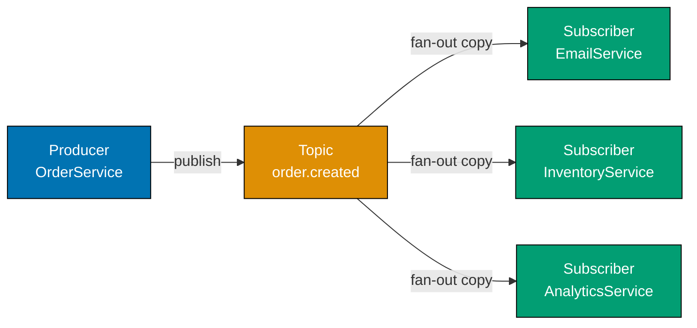
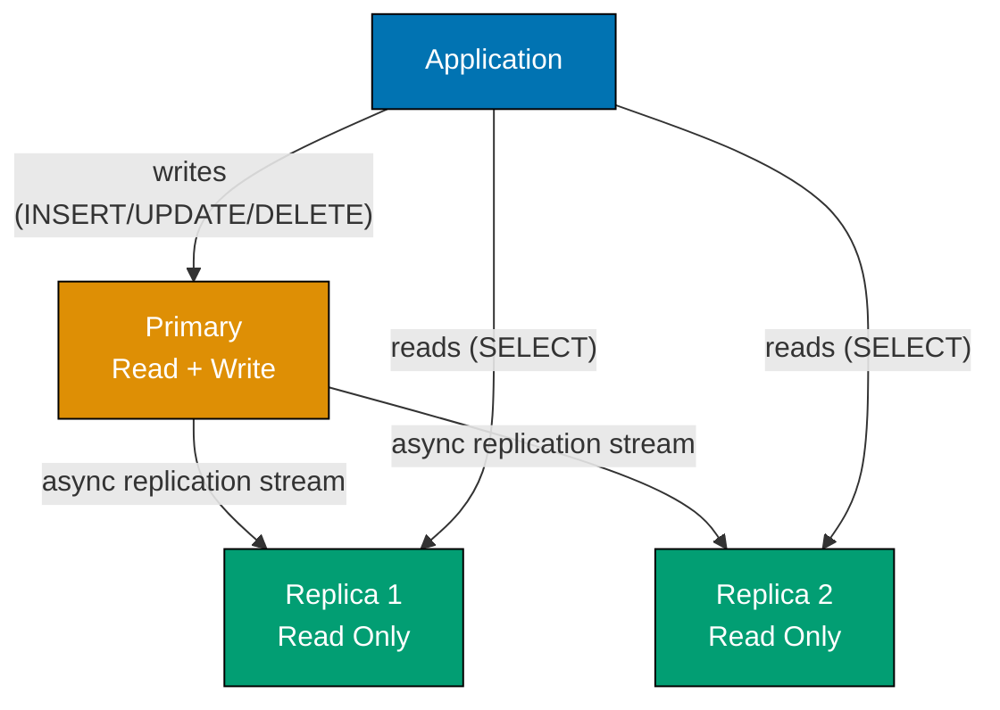
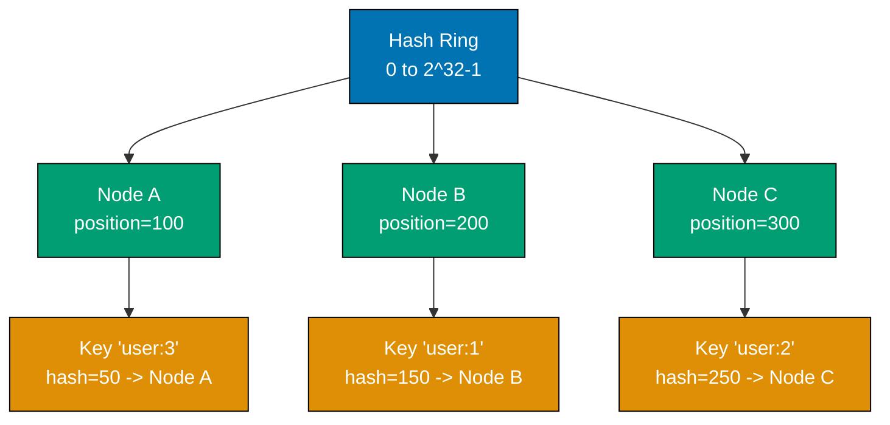
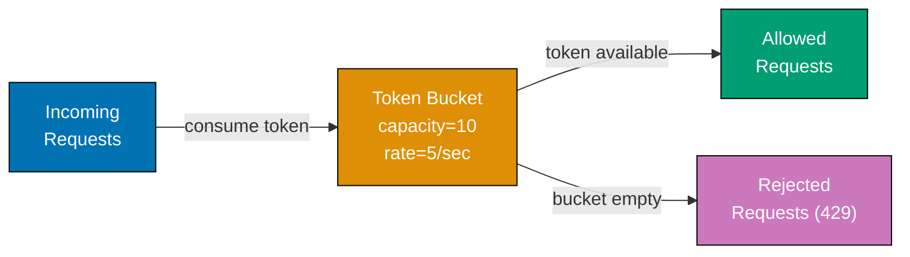
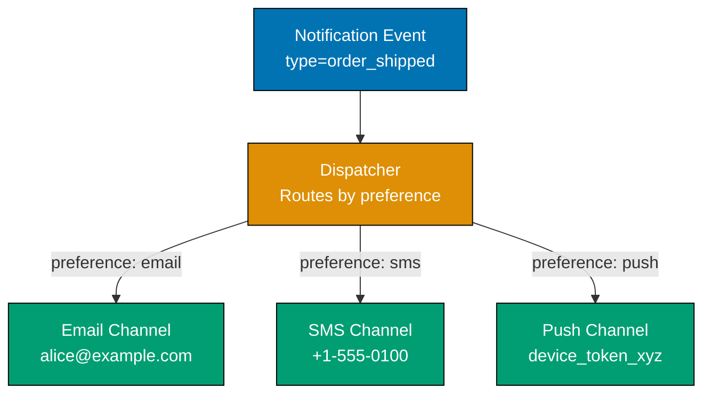

This section covers intermediate system design concepts through 29 annotated examples (Examples 29-57). Each example demonstrates a production-relevant pattern with working code in Go and Python, diagrams, and explanations targeted at engineers who already understand basic distributed systems primitives.

## Message Queues

### Example 29: Publish-Subscribe Pattern with Message Queue

Pub/sub decouples producers from consumers: a producer publishes a message to a topic, and all subscribers to that topic receive a copy independently. This differs from point-to-point queues where exactly one consumer receives each message. Pub/sub enables fan-out — one event notifying many downstream services simultaneously.






```go
package main

import (
    "encoding/json"
    "fmt"
    "sync"
    "time"
)

// PubSubBroker: central coordinator holding topic -> subscriber mappings
type PubSubBroker struct {
    subscribers map[string][]func(map[string]interface{})
    mu          sync.Mutex
}

func NewPubSubBroker() *PubSubBroker {
    return &PubSubBroker{
        subscribers: make(map[string][]func(map[string]interface{})),
        // => subscribers is {} initially
    }
}

func (b *PubSubBroker) Subscribe(topic string, handler func(map[string]interface{})) {
    // Acquire lock before mutating shared subscriber map
    // => prevents race conditions when multiple services subscribe concurrently
    b.mu.Lock()
    defer b.mu.Unlock()
    b.subscribers[topic] = append(b.subscribers[topic], handler)
    // => handler is appended to topic's subscriber list
    fmt.Printf("[BROKER] Subscribed handler to topic '%s'\n", topic)
}

func (b *PubSubBroker) Publish(topic string, message map[string]interface{}) {
    // Snapshot subscriber list under lock to avoid holding lock during handler execution
    // => handlers can themselves call Subscribe without deadlocking
    b.mu.Lock()
    handlers := make([]func(map[string]interface{}), len(b.subscribers[topic]))
    copy(handlers, b.subscribers[topic])
    // => handlers is a shallow copy of the list at publish time
    b.mu.Unlock()

    jsonBytes, _ := json.Marshal(message)
    fmt.Printf("[BROKER] Publishing to '%s': %s\n", topic, string(jsonBytes))

    // Deliver to each subscriber independently — one slow handler doesn't block others
    var wg sync.WaitGroup
    for _, handler := range handlers {
        wg.Add(1)
        // Each handler runs in a separate goroutine simulating async delivery
        // => production systems use worker pools or async event loops instead
        go func(h func(map[string]interface{})) {
            defer wg.Done()
            h(message)
            // => message delivered concurrently to each subscriber
        }(handler)
    }
    wg.Wait()
}

// Subscriber services — each receives its own copy of the event
func emailService(message map[string]interface{}) {
    // Receives order.created event and sends confirmation email
    // => processes independently; failure here doesn't affect inventory service
    orderID := message["order_id"].(string)
    email := message["customer_email"].(string)
    fmt.Printf("[EMAIL]     Sending confirmation for order %s to %s\n", orderID, email)
}

func inventoryService(message map[string]interface{}) {
    // Decrements stock for each item in the order
    // => processes independently; can retry without affecting email service
    items := message["items"].([]interface{})
    for _, item := range items {
        m := item.(map[string]interface{})
        fmt.Printf("[INVENTORY] Reserving %.0f x %s\n", m["qty"].(float64), m["sku"].(string))
    }
}

func analyticsService(message map[string]interface{}) {
    // Records the order event for reporting dashboards
    // => decoupled from order placement; dashboard latency doesn't affect checkout
    fmt.Printf("[ANALYTICS] Recorded order %s worth $%.2f\n",
        message["order_id"].(string), message["total"].(float64))
}

func main() {
    // Wire up the broker
    broker := NewPubSubBroker()
    // => broker.subscribers is {}

    broker.Subscribe("order.created", emailService)
    // => broker.subscribers["order.created"] = [emailService]

    broker.Subscribe("order.created", inventoryService)
    // => broker.subscribers["order.created"] = [emailService, inventoryService]

    broker.Subscribe("order.created", analyticsService)
    // => broker.subscribers["order.created"] = [emailService, inventoryService, analyticsService]

    // Producer publishes a single event — all three subscribers receive a copy
    orderEvent := map[string]interface{}{
        "order_id":       "ORD-7821",
        "customer_email": "alice@example.com",
        "items": []interface{}{
            map[string]interface{}{"sku": "WIDGET-A", "qty": float64(2)},
            map[string]interface{}{"sku": "GADGET-B", "qty": float64(1)},
        },
        "total": 149.99,
    }
    broker.Publish("order.created", orderEvent)
    // => Output (order may vary due to goroutines):
    // [BROKER] Publishing to 'order.created': {...}
    // [EMAIL]     Sending confirmation for order ORD-7821 to alice@example.com
    // [INVENTORY] Reserving 2 x WIDGET-A
    // [INVENTORY] Reserving 1 x GADGET-B
    // [ANALYTICS] Recorded order ORD-7821 worth $149.99

    time.Sleep(100 * time.Millisecond) // allow goroutines to finish
}
```




```python
import json
import threading
from collections import defaultdict
from typing import Callable

# PubSub broker: central coordinator holding topic -> subscriber mappings
class PubSubBroker:
    def __init__(self):
        # defaultdict(list) auto-creates empty list for unknown topics
        # => self._subscribers is {} initially
        self._subscribers: dict[str, list[Callable]] = defaultdict(list)
        # Lock ensures thread-safe subscribe/publish across goroutines
        # => self._lock is a reentrant threading lock
        self._lock = threading.Lock()

    def subscribe(self, topic: str, handler: Callable) -> None:
        # Acquire lock before mutating shared subscriber map
        # => prevents race conditions when multiple services subscribe concurrently
        with self._lock:
            self._subscribers[topic].append(handler)
            # => handler is appended to topic's subscriber list
            print(f"[BROKER] Subscribed handler to topic '{topic}'")

    def publish(self, topic: str, message: dict) -> None:
        # Snapshot subscriber list under lock to avoid holding lock during handler execution
        # => handlers can themselves call subscribe without deadlocking
        with self._lock:
            handlers = list(self._subscribers[topic])
            # => handlers is a shallow copy of the list at publish time

        print(f"[BROKER] Publishing to '{topic}': {message}")
        # Deliver to each subscriber independently — one slow handler doesn't block others
        for handler in handlers:
            # Each handler runs in a separate thread simulating async delivery
            # => production systems use worker pools or async event loops instead
            t = threading.Thread(target=handler, args=(message,), daemon=True)
            t.start()
            # => message delivered concurrently to each subscriber


# Subscriber services — each receives its own copy of the event
def email_service(message: dict) -> None:
    # Receives order.created event and sends confirmation email
    # => processes independently; failure here doesn't affect inventory service
    order_id = message["order_id"]
    email = message["customer_email"]
    print(f"[EMAIL]     Sending confirmation for order {order_id} to {email}")

def inventory_service(message: dict) -> None:
    # Decrements stock for each item in the order
    # => processes independently; can retry without affecting email service
    for item in message["items"]:
        print(f"[INVENTORY] Reserving {item['qty']} x {item['sku']}")

def analytics_service(message: dict) -> None:
    # Records the order event for reporting dashboards
    # => decoupled from order placement; dashboard latency doesn't affect checkout
    print(f"[ANALYTICS] Recorded order {message['order_id']} "
          f"worth ${message['total']:.2f}")


# Wire up the broker
broker = PubSubBroker()
# => broker._subscribers is {}

broker.subscribe("order.created", email_service)
# => broker._subscribers["order.created"] = [email_service]

broker.subscribe("order.created", inventory_service)
# => broker._subscribers["order.created"] = [email_service, inventory_service]

broker.subscribe("order.created", analytics_service)
# => broker._subscribers["order.created"] = [email_service, inventory_service, analytics_service]

# Producer publishes a single event — all three subscribers receive a copy
order_event = {
    "order_id": "ORD-7821",
    "customer_email": "alice@example.com",
    "items": [{"sku": "WIDGET-A", "qty": 2}, {"sku": "GADGET-B", "qty": 1}],
    "total": 149.99,
}
broker.publish("order.created", order_event)
# => Output (order may vary due to threading):
# [BROKER] Publishing to 'order.created': {...}
# [EMAIL]     Sending confirmation for order ORD-7821 to alice@example.com
# [INVENTORY] Reserving 2 x WIDGET-A
# [INVENTORY] Reserving 1 x GADGET-B
# [ANALYTICS] Recorded order ORD-7821 worth $149.99

import time; time.sleep(0.1)  # allow daemon threads to finish before exit
```




**Key takeaway:** Pub/sub decouples event producers from consumers so each subscriber receives an independent copy and fails independently — adding a new consumer requires zero changes to the producer.

**Why It Matters:** In monoliths, adding a new post-order action (e.g., fraud check) means modifying the checkout function. With pub/sub, the fraud service subscribes to `order.created` independently. This eliminates coupling, allows services to be deployed separately, and means a crashing analytics service never blocks a user's checkout. Kafka, RabbitMQ, and Google Pub/Sub all implement this pattern at scale.

---

### Example 30: Point-to-Point Queue (Work Queue)

In a point-to-point queue, each message is delivered to exactly one consumer. Multiple workers compete to process messages, enabling horizontal scaling of CPU-intensive tasks. This differs from pub/sub where every subscriber gets a copy — here only one worker wins each message.




```go
package main

import (
    "fmt"
    "math/rand"
    "sync"
    "time"
)

// WorkQueue wraps Go's buffered channel with producer/consumer helpers
type WorkQueue struct {
    ch        chan map[string]string
    processed int
    mu        sync.Mutex
}

func NewWorkQueue(maxSize int) *WorkQueue {
    return &WorkQueue{
        // Buffered channel provides natural backpressure
        // => maxSize=20 means send blocks when 20 items are queued
        ch: make(chan map[string]string, maxSize),
    }
}

func (wq *WorkQueue) Enqueue(task map[string]string) {
    // Send blocks if channel is full — provides natural backpressure to producers
    // => producer slows down automatically when workers can't keep up
    wq.ch <- task
    fmt.Printf("[QUEUE] Enqueued task %s (qsize~=%d)\n", task["id"], len(wq.ch))
}

func (wq *WorkQueue) StartWorker(workerID int, wg *sync.WaitGroup) {
    // Each worker runs range on channel — exactly one worker receives each item
    // => competitive consumption: workers race to acquire each task
    go func() {
        defer wg.Done()
        for task := range wq.ch {
            // Simulate variable processing time (e.g., image resize, PDF render)
            duration := time.Duration(50+rand.Intn(100)) * time.Millisecond
            time.Sleep(duration)
            // => only one worker processes this task; others process different tasks

            wq.mu.Lock()
            wq.processed++
            count := wq.processed
            wq.mu.Unlock()
            fmt.Printf("[WORKER-%d] Processed task %s in %dms (total=%d)\n",
                workerID, task["id"], duration.Milliseconds(), count)
        }
    }()
}

func (wq *WorkQueue) Shutdown() {
    // Closing the channel signals all workers to exit when drained
    // => range loop exits when channel is closed and empty
    close(wq.ch)
}

func main() {
    numWorkers := 3
    wq := NewWorkQueue(20)
    // => wq.ch is empty, bounded at 20 items

    // Start three competing workers — they share the same channel
    var wg sync.WaitGroup
    for i := 0; i < numWorkers; i++ {
        wg.Add(1)
        wq.StartWorker(i, &wg)
    }
    // => workers[0], workers[1], workers[2] all blocked on channel receive

    // Enqueue 9 tasks — distributed across 3 workers, ~3 tasks each
    for i := 0; i < 9; i++ {
        wq.Enqueue(map[string]string{
            "id":      fmt.Sprintf("TASK-%03d", i),
            "payload": fmt.Sprintf("data_%d", i),
        })
    }
    // => Output example (worker assignment varies):
    // [QUEUE] Enqueued task TASK-000 (qsize=1)
    // [WORKER-0] Processed task TASK-000 in 80ms (total=1)
    // [WORKER-1] Processed task TASK-001 in 120ms (total=2)
    // ... (each task processed by exactly one worker)

    wq.Shutdown()
    wg.Wait()
    // => all workers exit via channel close, Wait returns when all done
    fmt.Printf("[DONE] All tasks processed. Total: %d\n", wq.processed)
    // => Output: [DONE] All tasks processed. Total: 9
}
```




```python
import queue
import threading
import time
import random

# WorkQueue wraps Python's thread-safe Queue with producer/consumer helpers
class WorkQueue:
    def __init__(self, max_size: int = 100):
        # queue.Queue is thread-safe FIFO with optional bounded size
        # => max_size=100 means put() blocks when 100 items are queued (backpressure)
        self._q: queue.Queue = queue.Queue(maxsize=max_size)
        self._processed = 0
        self._lock = threading.Lock()

    def enqueue(self, task: dict) -> None:
        # put() blocks if queue is full — provides natural backpressure to producers
        # => producer slows down automatically when workers can't keep up
        self._q.put(task)
        print(f"[QUEUE] Enqueued task {task['id']} (qsize={self._q.qsize()})")

    def start_worker(self, worker_id: int) -> threading.Thread:
        # Each worker runs get() in a loop — exactly one worker unblocks per item
        # => competitive consumption: workers race to acquire each task
        def work_loop():
            while True:
                # get() blocks until an item is available — no busy-waiting
                # => CPU is released to OS when queue is empty
                task = self._q.get()
                if task is None:
                    # Poison pill: None signals worker to exit gracefully
                    # => clean shutdown without killing threads forcefully
                    self._q.task_done()
                    break

                # Simulate variable processing time (e.g., image resize, PDF render)
                duration = random.uniform(0.05, 0.15)
                time.sleep(duration)
                # => only one worker processes this task; others process different tasks

                with self._lock:
                    self._processed += 1
                print(f"[WORKER-{worker_id}] Processed task {task['id']} "
                      f"in {duration:.2f}s (total={self._processed})")
                # task_done() decrements internal counter used by join()
                self._q.task_done()

        t = threading.Thread(target=work_loop, daemon=True)
        t.start()
        return t

    def shutdown(self, num_workers: int) -> None:
        # Send one poison pill per worker so each exits exactly once
        # => avoids sending too few (workers hang) or too many (spurious exits)
        for _ in range(num_workers):
            self._q.put(None)
        self._q.join()
        # => join() blocks until all task_done() calls match all get() calls


NUM_WORKERS = 3
wq = WorkQueue(max_size=20)
# => wq._q is empty, bounded at 20 items

# Start three competing workers — they share the same queue
workers = [wq.start_worker(i) for i in range(NUM_WORKERS)]
# => workers[0], workers[1], workers[2] all blocked on get()

# Enqueue 9 tasks — distributed across 3 workers, ~3 tasks each
for i in range(9):
    wq.enqueue({"id": f"TASK-{i:03d}", "payload": f"data_{i}"})
# => Output example (worker assignment varies):
# [QUEUE] Enqueued task TASK-000 (qsize=1)
# [WORKER-0] Processed task TASK-000 in 0.08s (total=1)
# [WORKER-1] Processed task TASK-001 in 0.12s (total=2)
# [WORKER-2] Processed task TASK-002 in 0.06s (total=3)
# ... (each task processed by exactly one worker)

wq.shutdown(NUM_WORKERS)
# => all workers exit via poison pill, join() returns when queue drained
print(f"[DONE] All tasks processed. Total: {wq._processed}")
# => Output: [DONE] All tasks processed. Total: 9
```




**Key takeaway:** Point-to-point queues distribute work across competing consumers so each task is processed exactly once — adding workers scales throughput linearly up to queue saturation.

**Why It Matters:** Image processing, email sending, and report generation are inherently parallel tasks. A single-threaded processor becomes a bottleneck. Work queues let you horizontally scale workers independently of the API layer — if a task backlog grows, deploy more workers. SQS, RabbitMQ (default mode), and Celery all implement this competing-consumer pattern.

---

## Database Replication

### Example 31: Master-Slave Replication

Master-slave (primary-replica) replication routes all writes to one primary node, which streams changes to read-only replicas. Reads scale horizontally across replicas while the primary handles all mutations. Replica lag — the delay between primary write and replica visibility — is a critical operational concern.






```go
package main

import (
    "fmt"
    "sync"
    "time"
)

type Record struct {
    ID      int
    Value   string
    Version int // monotonically increasing — detects replication order issues
}

// PrimaryNode: accepts writes and broadcasts to registered replicas
type PrimaryNode struct {
    nodeID   string
    store    map[int]*Record
    replicas []*ReplicaNode
    version  int
    mu       sync.Mutex
}

func NewPrimaryNode(nodeID string) *PrimaryNode {
    return &PrimaryNode{
        nodeID: nodeID,
        store:  make(map[int]*Record),
    }
}

func (p *PrimaryNode) RegisterReplica(r *ReplicaNode) {
    // Replicas register at startup; primary pushes changes to all of them
    p.replicas = append(p.replicas, r)
    fmt.Printf("[%s] Replica '%s' registered\n", p.nodeID, r.nodeID)
}

func (p *PrimaryNode) Write(recordID int, value string) *Record {
    p.mu.Lock()
    p.version++
    record := &Record{ID: recordID, Value: value, Version: p.version}
    p.store[recordID] = record
    // => write committed to primary synchronously
    p.mu.Unlock()

    fmt.Printf("[%s] WRITE id=%d value='%s' version=%d\n",
        p.nodeID, recordID, value, record.Version)

    // Replicate asynchronously — primary doesn't wait for replicas to confirm
    // => this is the source of replica lag; primary returns immediately
    for _, replica := range p.replicas {
        go replica.applyReplication(record)
    }

    return record
}

func (p *PrimaryNode) Read(recordID int) *Record {
    // Primary reads are always consistent — no lag possible
    p.mu.Lock()
    defer p.mu.Unlock()
    return p.store[recordID]
}

// ReplicaNode: read-only; applies replication events from primary
type ReplicaNode struct {
    nodeID string
    store  map[int]*Record
    lagMs  float64 // Simulated replication lag in milliseconds
    mu     sync.Mutex
}

func NewReplicaNode(nodeID string, lagMs float64) *ReplicaNode {
    return &ReplicaNode{
        nodeID: nodeID,
        store:  make(map[int]*Record),
        // real MySQL/PostgreSQL lag is 1-500ms typically
        // => high-traffic primaries can push lag to seconds under write storms
        lagMs: lagMs,
    }
}

func (r *ReplicaNode) applyReplication(record *Record) {
    // Simulate network + disk write delay on replica
    time.Sleep(time.Duration(r.lagMs) * time.Millisecond)
    r.mu.Lock()
    r.store[record.ID] = record
    r.mu.Unlock()
    fmt.Printf("[%s] REPLICATED id=%d version=%d (lag=%.0fms)\n",
        r.nodeID, record.ID, record.Version, r.lagMs)
}

func (r *ReplicaNode) Read(recordID int) *Record {
    // Reads from replica — may return stale data if replication hasn't caught up
    r.mu.Lock()
    record := r.store[recordID]
    r.mu.Unlock()
    staleness := "FRESH"
    if record == nil {
        staleness = "STALE/MISSING"
    }
    fmt.Printf("[%s] READ id=%d -> %s\n", r.nodeID, recordID, staleness)
    return record
}

func main() {
    // Setup: one primary, two replicas with different lag characteristics
    primary := NewPrimaryNode("primary")
    replica1 := NewReplicaNode("replica-1", 30)
    replica2 := NewReplicaNode("replica-2", 80)

    primary.RegisterReplica(replica1)
    primary.RegisterReplica(replica2)
    // => [primary] Replica 'replica-1' registered
    // => [primary] Replica 'replica-2' registered

    // Write to primary
    primary.Write(1, "hello")
    // => [primary] WRITE id=1 value='hello' version=1

    // Immediately read from replica — may be stale!
    time.Sleep(10 * time.Millisecond) // 10ms — replica-1 lag is 30ms, so both are still behind
    replica1.Read(1)
    // => [replica-1] READ id=1 -> STALE/MISSING (replication hasn't arrived yet)

    time.Sleep(100 * time.Millisecond) // wait 100ms — both replicas have now caught up
    replica1.Read(1)
    // => [replica-1] READ id=1 -> FRESH
    // => replica-1 returns Record{ID:1, Value:"hello", Version:1}
}
```




```python
import time
import threading
from dataclasses import dataclass, field
from typing import Optional

@dataclass
class Record:
    id: int
    value: str
    version: int  # monotonically increasing — detects replication order issues

# PrimaryNode: accepts writes and broadcasts to registered replicas
class PrimaryNode:
    def __init__(self, node_id: str):
        self.node_id = node_id
        # In-memory store simulating the primary's data store
        self._store: dict[int, Record] = {}
        self._replicas: list["ReplicaNode"] = []
        self._version = 0
        self._lock = threading.Lock()

    def register_replica(self, replica: "ReplicaNode") -> None:
        # Replicas register at startup; primary pushes changes to all of them
        self._replicas.append(replica)
        print(f"[{self.node_id}] Replica '{replica.node_id}' registered")

    def write(self, record_id: int, value: str) -> Record:
        with self._lock:
            self._version += 1
            record = Record(id=record_id, value=value, version=self._version)
            self._store[record_id] = record
            # => write committed to primary synchronously

        print(f"[{self.node_id}] WRITE id={record_id} value='{value}' "
              f"version={record.version}")

        # Replicate asynchronously — primary doesn't wait for replicas to confirm
        # => this is the source of replica lag; primary returns immediately
        for replica in self._replicas:
            threading.Thread(
                target=replica._apply_replication,
                args=(record,),
                daemon=True
            ).start()

        return record

    def read(self, record_id: int) -> Optional[Record]:
        # Primary reads are always consistent — no lag possible
        with self._lock:
            return self._store.get(record_id)


# ReplicaNode: read-only; applies replication events from primary
class ReplicaNode:
    def __init__(self, node_id: str, replication_lag_ms: float = 50.0):
        self.node_id = node_id
        self._store: dict[int, Record] = {}
        # Simulated replication lag: real MySQL/PostgreSQL lag is 1-500ms typically
        # => high-traffic primaries can push lag to seconds under write storms
        self._lag_ms = replication_lag_ms
        self._lock = threading.Lock()

    def _apply_replication(self, record: Record) -> None:
        # Simulate network + disk write delay on replica
        time.sleep(self._lag_ms / 1000.0)
        with self._lock:
            self._store[record.id] = record
        print(f"[{self.node_id}] REPLICATED id={record.id} "
              f"version={record.version} (lag={self._lag_ms}ms)")

    def read(self, record_id: int) -> Optional[Record]:
        # Reads from replica — may return stale data if replication hasn't caught up
        with self._lock:
            record = self._store.get(record_id)
        staleness = "FRESH" if record else "STALE/MISSING"
        print(f"[{self.node_id}] READ id={record_id} -> {staleness}")
        return record


# Setup: one primary, two replicas with different lag characteristics
primary = PrimaryNode("primary")
replica1 = ReplicaNode("replica-1", replication_lag_ms=30)
replica2 = ReplicaNode("replica-2", replication_lag_ms=80)

primary.register_replica(replica1)
primary.register_replica(replica2)
# => [primary] Replica 'replica-1' registered
# => [primary] Replica 'replica-2' registered

# Write to primary
primary.write(1, "hello")
# => [primary] WRITE id=1 value='hello' version=1

# Immediately read from replica — may be stale!
time.sleep(0.01)  # 10ms — replica-1 lag is 30ms, so both replicas are still behind
r = replica1.read(1)
# => [replica-1] READ id=1 -> STALE/MISSING (replication hasn't arrived yet)

time.sleep(0.1)  # wait 100ms — both replicas have now caught up
r = replica1.read(1)
# => [replica-1] READ id=1 -> FRESH
# => replica-1 returns Record(id=1, value='hello', version=1)
```




**Key takeaway:** Master-slave replication scales reads horizontally but introduces replica lag — reads immediately after writes may return stale data, requiring applications to read from the primary for consistency-critical operations.

**Why It Matters:** Most web applications are read-heavy (10:1 read-write ratio or higher). Routing reads to replicas multiplies read throughput proportional to replica count. However, replica lag creates "read-your-own-write" inconsistency: a user updates their profile and immediately sees the old value. Systems handle this by reading from the primary after a user's own writes, or by waiting for replica confirmation (semi-synchronous replication).

---

### Example 32: Multi-Master Replication and Conflict Resolution

Multi-master (active-active) replication allows writes to any node, with changes propagated to all peers. This enables geographic write distribution but introduces write conflicts when two nodes modify the same record concurrently. Conflict resolution strategies (last-write-wins, application-defined merge) determine which value survives.




```go
package main

import (
    "fmt"
    "sync"
    "time"
)

type ConflictStrategy int

const (
    LastWriteWins   ConflictStrategy = iota // highest timestamp wins — simple, lossy
    HighestVersion                          // highest version counter wins
)

type VersionedRecord struct {
    ID        int
    Value     string
    Timestamp float64 // wall clock at write time — used for LWW
    NodeID    string  // which master originated this write
    Version   int     // logical clock increment per write
}

type MasterNode struct {
    nodeID   string
    strategy ConflictStrategy
    store    map[int]*VersionedRecord
    peers    []*MasterNode
    mu       sync.Mutex
}

func NewMasterNode(nodeID string, strategy ConflictStrategy) *MasterNode {
    return &MasterNode{
        nodeID:   nodeID,
        strategy: strategy,
        store:    make(map[int]*VersionedRecord),
    }
}

func (m *MasterNode) AddPeer(peer *MasterNode) {
    // Bidirectional peering: each master knows all other masters
    m.peers = append(m.peers, peer)
}

func (m *MasterNode) Write(recordID int, value string) *VersionedRecord {
    m.mu.Lock()
    current := m.store[recordID]
    newVersion := 1
    if current != nil {
        newVersion = current.Version + 1
    }
    record := &VersionedRecord{
        ID:        recordID,
        Value:     value,
        Timestamp: float64(time.Now().UnixNano()) / 1e9,
        NodeID:    m.nodeID,
        Version:   newVersion,
    }
    m.store[recordID] = record
    m.mu.Unlock()

    fmt.Printf("[%s] LOCAL WRITE id=%d value='%s' v=%d ts=%.4f\n",
        m.nodeID, recordID, value, record.Version, record.Timestamp)

    // Propagate to peers asynchronously — conflict possible if both wrote concurrently
    for _, peer := range m.peers {
        go peer.receiveReplication(record)
    }
    return record
}

func (m *MasterNode) receiveReplication(incoming *VersionedRecord) {
    // Simulate network delay — this is when conflicts become visible
    time.Sleep(50 * time.Millisecond)
    m.mu.Lock()
    defer m.mu.Unlock()

    existing := m.store[incoming.ID]
    if existing == nil {
        // No local record — apply unconditionally
        m.store[incoming.ID] = incoming
        fmt.Printf("[%s] REPLICATED id=%d from %s (no conflict)\n",
            m.nodeID, incoming.ID, incoming.NodeID)
        return
    }

    // CONFLICT: both nodes have a version of this record
    // => apply conflict resolution strategy
    winner := m.resolveConflict(existing, incoming)
    m.store[incoming.ID] = winner
    loserNode := incoming.NodeID
    if winner == incoming {
        loserNode = existing.NodeID
    }
    fmt.Printf("[%s] CONFLICT id=%d: winner='%s' from %s, DISCARDED write from %s\n",
        m.nodeID, incoming.ID, winner.Value, winner.NodeID, loserNode)
}

func (m *MasterNode) resolveConflict(local, incoming *VersionedRecord) *VersionedRecord {
    if m.strategy == LastWriteWins {
        // LWW: higher timestamp wins — assumes clocks are synchronized (NTP)
        // => clock skew can cause older writes to win; data loss is possible
        if local.Timestamp >= incoming.Timestamp {
            return local
        }
        return incoming
    }
    // Version-based: higher logical version wins
    // => version monotonicity only holds if both nodes started from same base
    if local.Version >= incoming.Version {
        return local
    }
    return incoming
}

func (m *MasterNode) Read(recordID int) *VersionedRecord {
    m.mu.Lock()
    defer m.mu.Unlock()
    return m.store[recordID]
}

func main() {
    // Two geographically distributed masters (e.g., US-East and EU-West)
    masterUS := NewMasterNode("master-us", LastWriteWins)
    masterEU := NewMasterNode("master-eu", LastWriteWins)
    masterUS.AddPeer(masterEU)
    masterEU.AddPeer(masterUS)

    // Concurrent writes to same record from different nodes — guaranteed conflict
    masterUS.Write(42, "US value")
    masterEU.Write(42, "EU value")
    // => [master-us] LOCAL WRITE id=42 value='US value' v=1 ts=...
    // => [master-eu] LOCAL WRITE id=42 value='EU value' v=1 ts=...

    time.Sleep(200 * time.Millisecond) // wait for replication to propagate
    // => [master-us] CONFLICT id=42: winner='EU value' from master-eu (or vice versa)
    // => Both masters converge to same value — eventual consistency achieved

    usResult := masterUS.Read(42)
    euResult := masterEU.Read(42)
    fmt.Printf("US reads: '%s', EU reads: '%s'\n", usResult.Value, euResult.Value)
    // => Both nodes converge to the same value (LWW picks one winner)
    // => Output: US reads: 'EU value', EU reads: 'EU value'  (or both 'US value')
}
```




```python
import time
import threading
from dataclasses import dataclass
from typing import Optional
from enum import Enum

class ConflictStrategy(Enum):
    LAST_WRITE_WINS = "lww"      # highest timestamp wins — simple, lossy
    HIGHEST_VERSION = "version"  # highest version counter wins

@dataclass
class VersionedRecord:
    id: int
    value: str
    timestamp: float    # wall clock at write time — used for LWW
    node_id: str        # which master originated this write
    version: int        # logical clock increment per write

class MasterNode:
    def __init__(self, node_id: str, strategy: ConflictStrategy):
        self.node_id = node_id
        self._strategy = strategy
        self._store: dict[int, VersionedRecord] = {}
        self._peers: list["MasterNode"] = []
        self._lock = threading.Lock()

    def add_peer(self, peer: "MasterNode") -> None:
        # Bidirectional peering: each master knows all other masters
        self._peers.append(peer)

    def write(self, record_id: int, value: str) -> VersionedRecord:
        with self._lock:
            current = self._store.get(record_id)
            # Increment version relative to existing record, or start at 1
            new_version = (current.version + 1) if current else 1
            record = VersionedRecord(
                id=record_id,
                value=value,
                timestamp=time.time(),
                node_id=self.node_id,
                version=new_version,
            )
            self._store[record_id] = record
        print(f"[{self.node_id}] LOCAL WRITE id={record_id} "
              f"value='{value}' v={record.version} ts={record.timestamp:.4f}")

        # Propagate to peers asynchronously — conflict possible if both wrote concurrently
        for peer in self._peers:
            threading.Thread(
                target=peer._receive_replication,
                args=(record,),
                daemon=True,
            ).start()
        return record

    def _receive_replication(self, incoming: VersionedRecord) -> None:
        # Simulate network delay — this is when conflicts become visible
        time.sleep(0.05)
        with self._lock:
            existing = self._store.get(incoming.id)
            if existing is None:
                # No local record — apply unconditionally
                self._store[incoming.id] = incoming
                print(f"[{self.node_id}] REPLICATED id={incoming.id} "
                      f"from {incoming.node_id} (no conflict)")
                return

            # CONFLICT: both nodes have a version of this record
            # => apply conflict resolution strategy
            winner = self._resolve_conflict(existing, incoming)
            self._store[incoming.id] = winner
            loser_node = incoming.node_id if winner == existing else existing.node_id
            print(f"[{self.node_id}] CONFLICT id={incoming.id}: "
                  f"winner='{winner.value}' from {winner.node_id}, "
                  f"DISCARDED write from {loser_node}")

    def _resolve_conflict(
        self, local: VersionedRecord, incoming: VersionedRecord
    ) -> VersionedRecord:
        if self._strategy == ConflictStrategy.LAST_WRITE_WINS:
            # LWW: higher timestamp wins — assumes clocks are synchronized (NTP)
            # => clock skew can cause older writes to win; data loss is possible
            return local if local.timestamp >= incoming.timestamp else incoming
        else:  # HIGHEST_VERSION
            # Version-based: higher logical version wins
            # => version monotonicity only holds if both nodes started from same base
            return local if local.version >= incoming.version else incoming

    def read(self, record_id: int) -> Optional[VersionedRecord]:
        with self._lock:
            return self._store.get(record_id)


# Two geographically distributed masters (e.g., US-East and EU-West)
master_us = MasterNode("master-us", ConflictStrategy.LAST_WRITE_WINS)
master_eu = MasterNode("master-eu", ConflictStrategy.LAST_WRITE_WINS)
master_us.add_peer(master_eu)
master_eu.add_peer(master_us)

# Concurrent writes to same record from different nodes — guaranteed conflict
master_us.write(42, "US value")
master_eu.write(42, "EU value")
# => [master-us] LOCAL WRITE id=42 value='US value' v=1 ts=...
# => [master-eu] LOCAL WRITE id=42 value='EU value' v=1 ts=...

time.sleep(0.2)  # wait for replication to propagate
# => [master-us] CONFLICT id=42: winner='EU value' from master-eu (or vice versa)
# => Both masters converge to same value — eventual consistency achieved

us_result = master_us.read(42)
eu_result = master_eu.read(42)
print(f"US reads: '{us_result.value}', EU reads: '{eu_result.value}'")
# => Both nodes converge to the same value (LWW picks one winner)
# => Output: US reads: 'EU value', EU reads: 'EU value'  (or both 'US value')
```




**Key takeaway:** Multi-master replication enables geographic write distribution but requires explicit conflict resolution — last-write-wins is simple but lossy, while application-defined merges preserve data at the cost of complexity.

**Why It Matters:** Global applications (e.g., Google Docs, CRDTs in collaborative editing) need low-latency writes in every region. Routing all writes to a single master in US-East adds 200ms+ latency for EU users. Multi-master solves write latency but introduces conflicts. CassandraDB, DynamoDB, and CouchDB use this pattern with LWW or vector-clock conflict detection.

---

## Database Sharding

### Example 33: Range-Based Sharding

Range sharding partitions data by a sorted key range — shard 0 owns IDs 1-10000, shard 1 owns 10001-20000, etc. A routing layer maps each key to its shard. Range sharding enables efficient range scans but suffers from hotspots when traffic concentrates on one range.




```go
package main

import (
    "fmt"
    "sort"
)

type Shard struct {
    ShardID    int
    RangeStart int // Inclusive lower bound of key range this shard owns
    RangeEnd   int // Inclusive upper bound of key range this shard owns
    store      map[int]map[string]string
}

func NewShard(shardID, rangeStart, rangeEnd int) *Shard {
    return &Shard{
        ShardID:    shardID,
        RangeStart: rangeStart,
        RangeEnd:   rangeEnd,
        store:      make(map[int]map[string]string),
    }
}

func (s *Shard) Insert(key int, value map[string]string) {
    s.store[key] = value
    fmt.Printf("[Shard-%d] INSERT key=%d range=[%d,%d]\n",
        s.ShardID, key, s.RangeStart, s.RangeEnd)
}

func (s *Shard) Get(key int) (map[string]string, bool) {
    v, ok := s.store[key]
    return v, ok
}

func (s *Shard) RangeScan(start, end int) []map[string]string {
    // Range scan is efficient: only keys in this shard's range are relevant
    // => no cross-shard communication needed for queries within one shard's range
    var results []map[string]string
    for k, v := range s.store {
        if k >= start && k <= end {
            results = append(results, v)
        }
    }
    return results
}

// RangeShardRouter: maps any key to its owning shard
type RangeShardRouter struct {
    shards      []*Shard
    breakpoints []int
}

func NewRangeShardRouter(shards []*Shard) *RangeShardRouter {
    // Shards must be sorted by RangeStart for binary search to work correctly
    sort.Slice(shards, func(i, j int) bool {
        return shards[i].RangeStart < shards[j].RangeStart
    })
    // Extract RangeStart values as sorted breakpoints for binary search
    // => sort.SearchInts(breakpoints, key) gives index for routing
    breakpoints := make([]int, len(shards))
    for i, s := range shards {
        breakpoints[i] = s.RangeStart
    }
    return &RangeShardRouter{shards: shards, breakpoints: breakpoints}
}

func (r *RangeShardRouter) Route(key int) *Shard {
    // Binary search returns insertion point — subtract 1 to find owning shard
    // => example: key=15000, breakpoints=[1,10001,20001], search=2 -> shard index 1
    idx := sort.SearchInts(r.breakpoints, key+1) - 1
    if idx < 0 {
        return nil // key is below first shard's RangeStart
    }
    shard := r.shards[idx]
    // Verify key is within this shard's upper bound (handles gaps in ranges)
    if key > shard.RangeEnd {
        return nil // key falls in an unassigned gap
    }
    return shard
}

func (r *RangeShardRouter) Insert(key int, value map[string]string) error {
    shard := r.Route(key)
    if shard == nil {
        return fmt.Errorf("no shard configured for key=%d", key)
    }
    shard.Insert(key, value)
    return nil
}

func (r *RangeShardRouter) Get(key int) (map[string]string, bool) {
    shard := r.Route(key)
    if shard == nil {
        return nil, false
    }
    return shard.Get(key)
}

func (r *RangeShardRouter) CrossShardRangeScan(start, end int) []map[string]string {
    // Cross-shard range scan: must query every shard whose range overlaps [start, end]
    // => this is why range sharding is good for range queries within a shard
    // => but cross-shard scans still require fan-out to multiple shards
    var results []map[string]string
    for _, shard := range r.shards {
        if shard.RangeStart <= end && shard.RangeEnd >= start {
            results = append(results, shard.RangeScan(start, end)...)
        }
    }
    return results
}

func main() {
    // Configure three shards covering user IDs 1 to 30000
    shards := []*Shard{
        NewShard(0, 1, 10000),
        NewShard(1, 10001, 20000),
        NewShard(2, 20001, 30000),
    }
    router := NewRangeShardRouter(shards)
    // => router.breakpoints = [1, 10001, 20001]

    // Insert records — router sends each to the correct shard
    router.Insert(500, map[string]string{"name": "Alice", "plan": "free"})
    // => [Shard-0] INSERT key=500 range=[1,10000]
    router.Insert(15000, map[string]string{"name": "Bob", "plan": "pro"})
    // => [Shard-1] INSERT key=15000 range=[10001,20000]
    router.Insert(25000, map[string]string{"name": "Charlie", "plan": "enterprise"})
    // => [Shard-2] INSERT key=25000 range=[20001,30000]

    // Point lookup — O(log n) routing via binary search, then O(1) store lookup
    record, _ := router.Get(15000)
    fmt.Printf("GET 15000: %v\n", record)
    // => GET 15000: map[name:Bob plan:pro]

    // Range scan crossing shard boundary — fan-out to shards 0 and 1
    results := router.CrossShardRangeScan(9000, 11000)
    fmt.Printf("Range scan [9000, 11000]: %d records\n", len(results))
    // => Range scan [9000, 11000]: 2 records (Alice from Shard-0, Bob from Shard-1)

    // Hotspot demonstration: all new users cluster at the top of the range
    // => shard-2 receives all traffic while shard-0 and shard-1 sit idle
    // => solution: hash sharding (Example 34) distributes writes uniformly
}
```




```python
import bisect
from dataclasses import dataclass, field
from typing import Optional

@dataclass
class Shard:
    shard_id: int
    # Inclusive lower bound of key range this shard owns
    range_start: int
    # Inclusive upper bound of key range this shard owns
    range_end: int
    # In-memory store simulating the shard's database partition
    _store: dict[int, dict] = field(default_factory=dict)

    def insert(self, key: int, value: dict) -> None:
        self._store[key] = value
        print(f"[Shard-{self.shard_id}] INSERT key={key} range=[{self.range_start},{self.range_end}]")

    def get(self, key: int) -> Optional[dict]:
        return self._store.get(key)

    def range_scan(self, start: int, end: int) -> list[dict]:
        # Range scan is efficient: only keys in this shard's range are relevant
        # => no cross-shard communication needed for queries within one shard's range
        return [v for k, v in self._store.items() if start <= k <= end]


# RangeShardRouter: maps any key to its owning shard
class RangeShardRouter:
    def __init__(self, shards: list[Shard]):
        # Shards must be sorted by range_start for bisect to work correctly
        self._shards = sorted(shards, key=lambda s: s.range_start)
        # Extract range_start values as sorted breakpoints for binary search
        # => bisect_right(breakpoints, key) gives index of owning shard
        self._breakpoints = [s.range_start for s in self._shards]

    def route(self, key: int) -> Optional[Shard]:
        # bisect_right returns insertion point — subtract 1 to find owning shard
        # => example: key=15000, breakpoints=[1,10001,20001], bisect_right=2 -> shard index 1
        idx = bisect.bisect_right(self._breakpoints, key) - 1
        if idx < 0:
            return None  # key is below first shard's range_start
        shard = self._shards[idx]
        # Verify key is within this shard's upper bound (handles gaps in ranges)
        if key > shard.range_end:
            return None  # key falls in an unassigned gap
        return shard

    def insert(self, key: int, value: dict) -> None:
        shard = self.route(key)
        if shard is None:
            raise ValueError(f"No shard configured for key={key}")
        shard.insert(key, value)

    def get(self, key: int) -> Optional[dict]:
        shard = self.route(key)
        return shard.get(key) if shard else None

    def cross_shard_range_scan(self, start: int, end: int) -> list[dict]:
        # Cross-shard range scan: must query every shard whose range overlaps [start, end]
        # => this is why range sharding is good for range queries within a shard
        # => but cross-shard scans still require fan-out to multiple shards
        results = []
        for shard in self._shards:
            if shard.range_start <= end and shard.range_end >= start:
                results.extend(shard.range_scan(start, end))
        return results


# Configure three shards covering user IDs 1 to 30000
shards = [
    Shard(shard_id=0, range_start=1,     range_end=10000),
    Shard(shard_id=1, range_start=10001, range_end=20000),
    Shard(shard_id=2, range_start=20001, range_end=30000),
]
router = RangeShardRouter(shards)
# => router._breakpoints = [1, 10001, 20001]

# Insert records — router sends each to the correct shard
router.insert(500,   {"name": "Alice",   "plan": "free"})
# => [Shard-0] INSERT key=500 range=[1,10000]
router.insert(15000, {"name": "Bob",     "plan": "pro"})
# => [Shard-1] INSERT key=15000 range=[10001,20000]
router.insert(25000, {"name": "Charlie", "plan": "enterprise"})
# => [Shard-2] INSERT key=25000 range=[20001,30000]

# Point lookup — O(log n) routing via bisect, then O(1) store lookup
record = router.get(15000)
print(f"GET 15000: {record}")
# => GET 15000: {'name': 'Bob', 'plan': 'pro'}

# Range scan crossing shard boundary — fan-out to shards 0 and 1
results = router.cross_shard_range_scan(9000, 11000)
print(f"Range scan [9000, 11000]: {len(results)} records")
# => Range scan [9000, 11000]: 2 records (Alice from Shard-0, Bob from Shard-1)

# Hotspot demonstration: all new users cluster at the top of the range
# => shard-2 receives all traffic while shard-0 and shard-1 sit idle
# => solution: hash sharding (Example 34) distributes writes uniformly
```




**Key takeaway:** Range sharding enables efficient range scans within a shard but creates hotspots when write patterns are skewed — adding all new records to one shard while others remain underloaded.

**Why It Matters:** Relational databases like MySQL and PostgreSQL can't scale writes beyond one machine. Range sharding is the default strategy for time-series data (partition by month), order IDs (partition by range), and geographic keys (partition by region code). HBase and Bigtable use range-partitioned tablets. The hotspot problem drives adoption of hash sharding for write-heavy workloads.

---

### Example 34: Hash-Based Sharding

Hash sharding applies a hash function to the partition key and uses modulo to select a shard. This distributes writes uniformly regardless of key ordering, eliminating hotspots. The trade-off is that range scans require querying all shards in parallel.




```go
package main

import (
    "crypto/md5"
    "encoding/binary"
    "fmt"
)

type ShardNode struct {
    ShardID int
    store   map[string]map[string]interface{}
}

func NewShardNode(id int) *ShardNode {
    return &ShardNode{ShardID: id, store: make(map[string]map[string]interface{})}
}

func (s *ShardNode) Put(key string, value map[string]interface{}) {
    s.store[key] = value
}

func (s *ShardNode) Get(key string) (map[string]interface{}, bool) {
    v, ok := s.store[key]
    return v, ok
}

func (s *ShardNode) AllItems() []struct {
    Key   string
    Value map[string]interface{}
} {
    var items []struct {
        Key   string
        Value map[string]interface{}
    }
    for k, v := range s.store {
        items = append(items, struct {
            Key   string
            Value map[string]interface{}
        }{k, v})
    }
    return items
}

type HashShardRouter struct {
    numShards int
    shards    []*ShardNode
}

func NewHashShardRouter(numShards int) *HashShardRouter {
    shards := make([]*ShardNode, numShards)
    for i := 0; i < numShards; i++ {
        shards[i] = NewShardNode(i)
    }
    // => shards = [ShardNode(0), ShardNode(1), ShardNode(2), ShardNode(3)]
    return &HashShardRouter{numShards: numShards, shards: shards}
}

func (r *HashShardRouter) shardIndex(key string) int {
    // MD5 hash produces a 128-bit value — deterministic for same key
    // => same key ALWAYS routes to the same shard across all application instances
    hash := md5.Sum([]byte(key))
    // Convert first 4 bytes to unsigned int for modulo operation
    hashInt := binary.BigEndian.Uint32(hash[:4])
    // Modulo maps the hash space uniformly onto shard count
    // => for 4 shards, shard = hashInt % 4 — each shard gets ~25% of keys
    return int(hashInt) % r.numShards
}

func (r *HashShardRouter) Put(key string, value map[string]interface{}) {
    idx := r.shardIndex(key)
    r.shards[idx].Put(key, value)
    fmt.Printf("[ROUTER] PUT '%s' -> Shard-%d\n", key, idx)
}

func (r *HashShardRouter) Get(key string) (map[string]interface{}, bool) {
    idx := r.shardIndex(key)
    return r.shards[idx].Get(key)
}

func (r *HashShardRouter) ScatterGatherAll() []struct {
    Key   string
    Value map[string]interface{}
} {
    // Range queries require scatter-gather: query every shard, merge results
    // => O(numShards) network round trips vs O(1) for point lookups
    // => this is the primary cost of hash sharding for analytical queries
    var results []struct {
        Key   string
        Value map[string]interface{}
    }
    for _, shard := range r.shards {
        results = append(results, shard.AllItems()...)
    }
    return results
}

func (r *HashShardRouter) DistributionStats() map[int]int {
    // Show how evenly keys are distributed across shards
    // => uniform distribution confirms hash function is working correctly
    stats := make(map[int]int)
    for _, s := range r.shards {
        stats[s.ShardID] = len(s.store)
    }
    return stats
}

func main() {
    router := NewHashShardRouter(4)
    // => 4 shards, each will hold ~25% of keys

    // Insert user records — hash distributes them across shards
    users := []struct {
        key   string
        value map[string]interface{}
    }{
        {"user:alice", map[string]interface{}{"age": 30, "plan": "pro"}},
        {"user:bob", map[string]interface{}{"age": 25, "plan": "free"}},
        {"user:charlie", map[string]interface{}{"age": 35, "plan": "enterprise"}},
        {"user:diana", map[string]interface{}{"age": 28, "plan": "pro"}},
        {"user:eve", map[string]interface{}{"age": 22, "plan": "free"}},
        {"user:frank", map[string]interface{}{"age": 40, "plan": "enterprise"}},
        {"user:grace", map[string]interface{}{"age": 31, "plan": "pro"}},
        {"user:henry", map[string]interface{}{"age": 27, "plan": "free"}},
    }

    for _, u := range users {
        router.Put(u.key, u.value)
    }
    // => [ROUTER] PUT 'user:alice' -> Shard-X  (shard varies by hash)
    // => keys distribute roughly evenly — no single shard overwhelmed

    // Point lookup — O(1): compute hash, go directly to correct shard
    alice, _ := router.Get("user:alice")
    fmt.Printf("GET user:alice: %v\n", alice)
    // => GET user:alice: map[age:30 plan:pro]

    // Distribution report — verify even spread
    stats := router.DistributionStats()
    fmt.Printf("Shard distribution: %v\n", stats)
    // => Shard distribution: map[0:2 1:2 2:2 3:2]  (approximately even)

    // Scatter-gather: to find all "pro" users, must query all 4 shards
    allRecords := router.ScatterGatherAll()
    proCount := 0
    for _, r := range allRecords {
        if r.Value["plan"] == "pro" {
            proCount++
        }
    }
    fmt.Printf("Pro users (scatter-gather): %d\n", proCount)
    // => Pro users (scatter-gather): 3  (alice, diana, grace)
    // => required querying all 4 shards — expensive for large shard counts
}
```




```python
import hashlib
from dataclasses import dataclass, field
from typing import Optional, Any

@dataclass
class ShardNode:
    shard_id: int
    _store: dict[str, Any] = field(default_factory=dict)

    def put(self, key: str, value: Any) -> None:
        self._store[key] = value

    def get(self, key: str) -> Optional[Any]:
        return self._store.get(key)

    def all_items(self) -> list[tuple[str, Any]]:
        return list(self._store.items())


class HashShardRouter:
    def __init__(self, num_shards: int):
        self._num_shards = num_shards
        # Each shard is an independent storage node
        self._shards = [ShardNode(i) for i in range(num_shards)]
        # => self._shards = [ShardNode(0), ShardNode(1), ShardNode(2), ShardNode(3)]

    def _shard_index(self, key: str) -> int:
        # MD5 hash produces a 128-bit integer — deterministic for same key
        # => same key ALWAYS routes to the same shard across all application instances
        hash_bytes = hashlib.md5(key.encode()).digest()
        # Convert first 4 bytes to unsigned int for modulo operation
        hash_int = int.from_bytes(hash_bytes[:4], byteorder="big")
        # Modulo maps the hash space uniformly onto shard count
        # => for 4 shards, shard = hash_int % 4 — each shard gets ~25% of keys
        return hash_int % self._num_shards

    def put(self, key: str, value: Any) -> None:
        idx = self._shard_index(key)
        self._shards[idx].put(key, value)
        print(f"[ROUTER] PUT '{key}' -> Shard-{idx}")

    def get(self, key: str) -> Optional[Any]:
        idx = self._shard_index(key)
        return self._shards[idx].get(key)

    def scatter_gather_all(self) -> list[tuple[str, Any]]:
        # Range queries require scatter-gather: query every shard, merge results
        # => O(num_shards) network round trips vs O(1) for point lookups
        # => this is the primary cost of hash sharding for analytical queries
        results = []
        for shard in self._shards:
            results.extend(shard.all_items())
        return results

    def distribution_stats(self) -> dict[int, int]:
        # Show how evenly keys are distributed across shards
        # => uniform distribution confirms hash function is working correctly
        return {s.shard_id: len(s._store) for s in self._shards}


router = HashShardRouter(num_shards=4)
# => 4 shards, each will hold ~25% of keys

# Insert user records — hash distributes them across shards
users = [
    ("user:alice",   {"age": 30, "plan": "pro"}),
    ("user:bob",     {"age": 25, "plan": "free"}),
    ("user:charlie", {"age": 35, "plan": "enterprise"}),
    ("user:diana",   {"age": 28, "plan": "pro"}),
    ("user:eve",     {"age": 22, "plan": "free"}),
    ("user:frank",   {"age": 40, "plan": "enterprise"}),
    ("user:grace",   {"age": 31, "plan": "pro"}),
    ("user:henry",   {"age": 27, "plan": "free"}),
]

for key, value in users:
    router.put(key, value)
# => [ROUTER] PUT 'user:alice' -> Shard-X  (shard varies by hash)
# => keys distribute roughly evenly — no single shard overwhelmed

# Point lookup — O(1): compute hash, go directly to correct shard
alice = router.get("user:alice")
print(f"GET user:alice: {alice}")
# => GET user:alice: {'age': 30, 'plan': 'pro'}

# Distribution report — verify even spread
stats = router.distribution_stats()
print(f"Shard distribution: {stats}")
# => Shard distribution: {0: 2, 1: 2, 2: 2, 3: 2}  (approximately even)

# Scatter-gather: to find all "pro" users, must query all 4 shards
all_records = router.scatter_gather_all()
pro_users = [(k, v) for k, v in all_records if v["plan"] == "pro"]
print(f"Pro users (scatter-gather): {len(pro_users)}")
# => Pro users (scatter-gather): 3  (alice, diana, grace)
# => required querying all 4 shards — expensive for large shard counts
```




**Key takeaway:** Hash sharding eliminates hotspots by distributing writes uniformly across shards, but makes range queries expensive because the data ordering is destroyed by hashing.

**Why It Matters:** Hash sharding is the default strategy in Cassandra (partition key hashing), Redis Cluster (CRC16 slot assignment), and DynamoDB (partition key hashing). When user IDs, order IDs, or session tokens are the access pattern, hash sharding ensures no single node becomes a bottleneck. The scatter-gather cost for analytics is typically acceptable because analytical queries run on separate read replicas or data warehouses.

---

## Consistent Hashing

### Example 35: Consistent Hashing Ring

Consistent hashing maps both nodes and keys onto a circular hash ring. Each key is assigned to the nearest node clockwise on the ring. When a node is added or removed, only the keys between the removed node and its predecessor need to be remapped — minimizing data movement compared to modulo hashing.






```go
package main

import (
    "crypto/sha256"
    "encoding/binary"
    "fmt"
    "sort"
)

type Node struct {
    NodeID  string
    Address string // e.g., "cache-1.internal:6379"
}

type ConsistentHashRing struct {
    virtualNodes   int
    ringPositions  []uint64            // sorted list of hash positions on the ring
    positionToNode map[uint64]*Node    // maps ring position -> Node
}

func NewConsistentHashRing(virtualNodes int) *ConsistentHashRing {
    return &ConsistentHashRing{
        // virtualNodes: each physical node gets N positions on the ring
        // => more virtual nodes = more uniform distribution across fewer physical nodes
        // => 100-200 virtual nodes per physical node is typical (Cassandra default: 256)
        virtualNodes:   virtualNodes,
        positionToNode: make(map[uint64]*Node),
    }
}

func (r *ConsistentHashRing) hash(key string) uint64 {
    // SHA-256 gives 256-bit hash; take first 8 bytes for a 64-bit ring
    // => consistent: same input always produces same hash across all instances
    digest := sha256.Sum256([]byte(key))
    return binary.BigEndian.Uint64(digest[:8])
}

func (r *ConsistentHashRing) AddNode(node *Node) {
    // Place N virtual nodes on the ring for this physical node
    for i := 0; i < r.virtualNodes; i++ {
        // Virtual node key: "nodeID:replica_N" — each has a unique ring position
        virtualKey := fmt.Sprintf("%s:replica_%d", node.NodeID, i)
        position := r.hash(virtualKey)
        r.ringPositions = append(r.ringPositions, position)
        r.positionToNode[position] = node
    }
    // Sort to maintain sorted order for binary search
    sort.Slice(r.ringPositions, func(i, j int) bool {
        return r.ringPositions[i] < r.ringPositions[j]
    })
    fmt.Printf("[RING] Added node '%s' with %d virtual nodes\n", node.NodeID, r.virtualNodes)
}

func (r *ConsistentHashRing) RemoveNode(node *Node) {
    // Remove all virtual nodes for this physical node
    for i := 0; i < r.virtualNodes; i++ {
        virtualKey := fmt.Sprintf("%s:replica_%d", node.NodeID, i)
        position := r.hash(virtualKey)
        // Only keys between removed node and its predecessor need remapping
        // => O(k/N) keys remapped, where k=total keys, N=node count
        delete(r.positionToNode, position)
        idx := sort.Search(len(r.ringPositions), func(j int) bool {
            return r.ringPositions[j] >= position
        })
        if idx < len(r.ringPositions) && r.ringPositions[idx] == position {
            r.ringPositions = append(r.ringPositions[:idx], r.ringPositions[idx+1:]...)
        }
    }
    fmt.Printf("[RING] Removed node '%s'\n", node.NodeID)
}

func (r *ConsistentHashRing) GetNode(key string) *Node {
    if len(r.ringPositions) == 0 {
        panic("Ring has no nodes")
    }
    keyHash := r.hash(key)
    // Find the first ring position >= keyHash (clockwise lookup)
    idx := sort.Search(len(r.ringPositions), func(i int) bool {
        return r.ringPositions[i] >= keyHash
    })
    // Wrap around: if keyHash is past the last position, use position 0
    // => this is what makes it a "ring" — the last node wraps to serve before the first
    if idx == len(r.ringPositions) {
        idx = 0
    }
    position := r.ringPositions[idx]
    return r.positionToNode[position]
}

func main() {
    // Build a cache cluster with 3 nodes
    ring := NewConsistentHashRing(50)
    nodeA := &Node{"cache-a", "10.0.0.1:6379"}
    nodeB := &Node{"cache-b", "10.0.0.2:6379"}
    nodeC := &Node{"cache-c", "10.0.0.3:6379"}

    ring.AddNode(nodeA)
    ring.AddNode(nodeB)
    ring.AddNode(nodeC)
    // => 150 total positions on ring (50 virtual * 3 physical)

    // Route several cache keys to their owning nodes
    keys := []string{"user:alice", "user:bob", "session:xyz", "product:123", "cart:456"}
    assignments := make(map[string]string)
    for _, key := range keys {
        node := ring.GetNode(key)
        assignments[key] = node.NodeID
        fmt.Printf("[RING] '%s' -> %s (%s)\n", key, node.NodeID, node.Address)
    }

    // Simulate adding a 4th node (scale-out event)
    nodeD := &Node{"cache-d", "10.0.0.4:6379"}
    ring.AddNode(nodeD)
    // => [RING] Added node 'cache-d' with 50 virtual nodes

    // Check which keys changed assignment — only ~25% should move (1/4 of keys)
    fmt.Println("\n[RING] Key reassignments after adding cache-d:")
    moved := 0
    for _, key := range keys {
        newNode := ring.GetNode(key)
        if assignments[key] != newNode.NodeID {
            moved++
            fmt.Printf("  MOVED '%s': %s -> %s\n", key, assignments[key], newNode.NodeID)
        }
    }
    fmt.Printf("  %d/%d keys remapped (~%.0f%%, expected ~25%%)\n",
        moved, len(keys), float64(moved)/float64(len(keys))*100)
    // => Only ~25% of keys remapped — consistent hashing's key advantage
}
```




```python
import hashlib
import bisect
from dataclasses import dataclass

@dataclass
class Node:
    node_id: str
    address: str  # e.g., "cache-1.internal:6379"

class ConsistentHashRing:
    def __init__(self, virtual_nodes: int = 100):
        # virtual_nodes: each physical node gets N positions on the ring
        # => more virtual nodes = more uniform distribution across fewer physical nodes
        # => 100-200 virtual nodes per physical node is typical in production (Cassandra default: 256)
        self._virtual_nodes = virtual_nodes
        # Sorted list of hash positions on the ring — used for binary search
        self._ring_positions: list[int] = []
        # Maps ring position -> Node (one entry per virtual node)
        self._position_to_node: dict[int, Node] = {}

    def _hash(self, key: str) -> int:
        # SHA-256 gives 256-bit hash; take first 8 bytes for a 64-bit ring
        # => consistent: same input always produces same hash across all instances
        digest = hashlib.sha256(key.encode()).digest()
        return int.from_bytes(digest[:8], byteorder="big")

    def add_node(self, node: Node) -> None:
        # Place N virtual nodes on the ring for this physical node
        for i in range(self._virtual_nodes):
            # Virtual node key: "node_id:replica_N" — each has a unique ring position
            virtual_key = f"{node.node_id}:replica_{i}"
            position = self._hash(virtual_key)
            bisect.insort(self._ring_positions, position)
            # => insort maintains sorted order — O(n) insert but ring changes are infrequent
            self._position_to_node[position] = node
        print(f"[RING] Added node '{node.node_id}' with {self._virtual_nodes} virtual nodes")

    def remove_node(self, node: Node) -> None:
        # Remove all virtual nodes for this physical node
        for i in range(self._virtual_nodes):
            virtual_key = f"{node.node_id}:replica_{i}"
            position = self._hash(virtual_key)
            # Only keys between removed node and its predecessor need remapping
            # => O(k/N) keys remapped, where k=total keys, N=node count
            # => contrast with modulo: O(k) keys remapped when N changes
            idx = bisect.bisect_left(self._ring_positions, position)
            if idx < len(self._ring_positions) and self._ring_positions[idx] == position:
                self._ring_positions.pop(idx)
                del self._position_to_node[position]
        print(f"[RING] Removed node '{node.node_id}'")

    def get_node(self, key: str) -> Node:
        if not self._ring_positions:
            raise RuntimeError("Ring has no nodes")
        key_hash = self._hash(key)
        # Find the first ring position >= key_hash (clockwise lookup)
        idx = bisect.bisect_left(self._ring_positions, key_hash)
        # Wrap around: if key_hash is past the last position, use position 0 (the ring's beginning)
        # => this is what makes it a "ring" — the last node wraps to serve positions before the first
        if idx == len(self._ring_positions):
            idx = 0
        position = self._ring_positions[idx]
        return self._position_to_node[position]


# Build a cache cluster with 3 nodes
ring = ConsistentHashRing(virtual_nodes=50)
node_a = Node("cache-a", "10.0.0.1:6379")
node_b = Node("cache-b", "10.0.0.2:6379")
node_c = Node("cache-c", "10.0.0.3:6379")

ring.add_node(node_a)
ring.add_node(node_b)
ring.add_node(node_c)
# => 150 total positions on ring (50 virtual * 3 physical)

# Route several cache keys to their owning nodes
keys = ["user:alice", "user:bob", "session:xyz", "product:123", "cart:456"]
assignments = {}
for key in keys:
    node = ring.get_node(key)
    assignments[key] = node.node_id
    print(f"[RING] '{key}' -> {node.node_id} ({node.address})")

# Simulate adding a 4th node (scale-out event)
node_d = Node("cache-d", "10.0.0.4:6379")
ring.add_node(node_d)
# => [RING] Added node 'cache-d' with 50 virtual nodes

# Check which keys changed assignment — only ~25% should move (1/4 of keys)
print("\n[RING] Key reassignments after adding cache-d:")
moved = 0
for key in keys:
    new_node = ring.get_node(key)
    changed = assignments[key] != new_node.node_id
    if changed:
        moved += 1
        print(f"  MOVED '{key}': {assignments[key]} -> {new_node.node_id}")
print(f"  {moved}/{len(keys)} keys remapped (~{moved/len(keys)*100:.0f}%, expected ~25%)")
# => Only ~25% of keys remapped — consistent hashing's key advantage
```




**Key takeaway:** Consistent hashing remaps only `1/N` of keys when a node is added or removed, versus modulo hashing which remaps nearly all keys — making it essential for cache clusters where remapping means cache misses.

**Why It Matters:** Memcached and Redis Cluster use consistent hashing to minimize cache invalidation during node scaling events. Without it, adding one cache server causes ~50% of all cache keys to miss simultaneously (thundering herd). Amazon DynamoDB, Cassandra, and Riak all use consistent hashing variants with virtual nodes for even load distribution across heterogeneous hardware.

---

## Rate Limiting

### Example 36: Token Bucket Rate Limiter

The token bucket algorithm maintains a bucket that fills with tokens at a fixed rate. Each request consumes one token. If the bucket is empty, the request is rejected or queued. The bucket has a maximum capacity, allowing short bursts above the sustained rate — a key distinction from fixed-window rate limiting.






```go
package main

import (
    "fmt"
    "sync"
    "time"
)

type TokenBucketRateLimiter struct {
    capacity   float64
    refillRate float64
    tokens     float64
    lastRefill time.Time
    mu         sync.Mutex
}

func NewTokenBucketRateLimiter(capacity, refillRate float64) *TokenBucketRateLimiter {
    return &TokenBucketRateLimiter{
        // capacity: maximum tokens the bucket can hold (burst limit)
        // => capacity=10 means a user can send 10 requests instantaneously after idle
        capacity: capacity,
        // refillRate: tokens added per second (sustained rate limit)
        // => refillRate=5 means 5 requests/second sustained throughput
        refillRate: refillRate,
        // Start with full bucket — user gets burst allowance from first request
        tokens:     capacity,
        lastRefill: time.Now(),
    }
}

func (t *TokenBucketRateLimiter) refill() {
    now := time.Now()
    elapsed := now.Sub(t.lastRefill).Seconds()
    // Add tokens proportional to elapsed time
    // => 0.5s elapsed at 5 tokens/sec = 2.5 new tokens
    newTokens := elapsed * t.refillRate
    // min() enforces capacity ceiling — tokens never exceed bucket size
    t.tokens += newTokens
    if t.tokens > t.capacity {
        t.tokens = t.capacity
    }
    t.lastRefill = now
}

func (t *TokenBucketRateLimiter) Allow(tokensNeeded float64) bool {
    t.mu.Lock()
    defer t.mu.Unlock()
    // Refill before checking — lazy evaluation avoids background threads
    // => refill happens on each request, not on a timer (more efficient)
    t.refill()
    if t.tokens >= tokensNeeded {
        // Sufficient tokens: consume and allow request
        t.tokens -= tokensNeeded
        // => t.tokens decremented by tokensNeeded
        return true
    }
    // Insufficient tokens: reject with 429 Too Many Requests
    return false
}

func (t *TokenBucketRateLimiter) TokenCount() float64 {
    t.mu.Lock()
    defer t.mu.Unlock()
    t.refill()
    return t.tokens
}

func main() {
    // Rate limiter: 10-token burst, 5 tokens/sec sustained
    limiter := NewTokenBucketRateLimiter(10, 5)
    // => limiter.tokens = 10.0 (full bucket at startup)

    // Burst phase: 10 rapid requests should all succeed (consume the full bucket)
    fmt.Println("=== Burst phase (10 rapid requests) ===")
    for i := 0; i < 12; i++ {
        result := limiter.Allow(1.0)
        status := "ALLOWED"
        if !result {
            status = "REJECTED"
        }
        fmt.Printf("  Request %02d: %s (tokens remaining: %.2f)\n",
            i+1, status, limiter.TokenCount())
    }
    // => Requests 1-10: ALLOWED (bucket drains from 10 to 0)
    // => Requests 11-12: REJECTED (bucket empty, 429)

    // Wait for refill: 0.4s at 5 tokens/sec = 2 new tokens
    fmt.Println("\n=== After 0.4s wait (5 tokens/sec * 0.4s = 2 tokens) ===")
    time.Sleep(400 * time.Millisecond)
    for i := 0; i < 3; i++ {
        result := limiter.Allow(1.0)
        status := "ALLOWED"
        if !result {
            status = "REJECTED"
        }
        fmt.Printf("  Request %d: %s (tokens: %.2f)\n",
            i+1, status, limiter.TokenCount())
    }
    // => Request 1: ALLOWED  (2 tokens -> 1 token)
    // => Request 2: ALLOWED  (1 token -> 0 tokens)
    // => Request 3: REJECTED (0 tokens, 0.4s hasn't refilled enough for a 3rd)
}
```




```python
import time
import threading

class TokenBucketRateLimiter:
    def __init__(self, capacity: float, refill_rate: float):
        # capacity: maximum tokens the bucket can hold (burst limit)
        # => capacity=10 means a user can send 10 requests instantaneously after idle
        self._capacity = capacity
        # refill_rate: tokens added per second (sustained rate limit)
        # => refill_rate=5 means 5 requests/second sustained throughput
        self._refill_rate = refill_rate
        # Start with full bucket — user gets burst allowance from first request
        self._tokens = float(capacity)
        # Track when we last refilled to compute elapsed time
        self._last_refill = time.monotonic()
        # Lock ensures atomic check-and-consume across concurrent requests
        self._lock = threading.Lock()

    def _refill(self) -> None:
        now = time.monotonic()
        elapsed = now - self._last_refill
        # Add tokens proportional to elapsed time
        # => 0.5s elapsed at 5 tokens/sec = 2.5 new tokens
        new_tokens = elapsed * self._refill_rate
        # min() enforces capacity ceiling — tokens never exceed bucket size
        self._tokens = min(self._capacity, self._tokens + new_tokens)
        self._last_refill = now

    def allow(self, tokens_needed: float = 1.0) -> bool:
        with self._lock:
            # Refill before checking — lazy evaluation avoids background threads
            # => refill happens on each request, not on a timer (more efficient)
            self._refill()
            if self._tokens >= tokens_needed:
                # Sufficient tokens: consume and allow request
                self._tokens -= tokens_needed
                # => self._tokens decremented by tokens_needed
                return True
            # Insufficient tokens: reject with 429 Too Many Requests
            return False

    @property
    def token_count(self) -> float:
        with self._lock:
            self._refill()
            return self._tokens


# Rate limiter: 10-token burst, 5 tokens/sec sustained
limiter = TokenBucketRateLimiter(capacity=10, refill_rate=5)
# => limiter._tokens = 10.0 (full bucket at startup)

# Burst phase: 10 rapid requests should all succeed (consume the full bucket)
print("=== Burst phase (10 rapid requests) ===")
for i in range(12):
    result = limiter.allow()
    status = "ALLOWED" if result else "REJECTED"
    print(f"  Request {i+1:02d}: {status} (tokens remaining: {limiter.token_count:.2f})")
# => Requests 1-10: ALLOWED (bucket drains from 10 to 0)
# => Requests 11-12: REJECTED (bucket empty, 429)

# Wait for refill: 0.4s at 5 tokens/sec = 2 new tokens
print("\n=== After 0.4s wait (5 tokens/sec * 0.4s = 2 tokens) ===")
time.sleep(0.4)
for i in range(3):
    result = limiter.allow()
    status = "ALLOWED" if result else "REJECTED"
    print(f"  Request {i+1}: {status} (tokens: {limiter.token_count:.2f})")
# => Request 1: ALLOWED  (2 tokens -> 1 token)
# => Request 2: ALLOWED  (1 token -> 0 tokens)
# => Request 3: REJECTED (0 tokens, 0.4s hasn't refilled enough for a 3rd)
```




**Key takeaway:** Token bucket allows short bursts up to the bucket capacity while enforcing a sustained rate — the bucket absorbs traffic spikes without rejecting legitimate bursty clients.

**Why It Matters:** Fixed-window rate limiting (e.g., 100 requests/minute) allows 200 requests in two seconds straddling a window boundary. Token bucket prevents this by continuously tracking consumption. Stripe, AWS API Gateway, and Nginx all use token bucket variants. The burst capacity parameter is critical — too small and legitimate users are rejected during normal traffic spikes; too large and the rate limit loses meaning.

---

### Example 37: Sliding Window Rate Limiter

The sliding window algorithm maintains a log of request timestamps and counts requests in a rolling time window. Unlike fixed windows, it has no boundary burst problem — the window always represents the most recent N seconds of activity regardless of clock alignment.




```go
package main

import (
    "fmt"
    "sync"
    "time"
)

type SlidingWindowRateLimiter struct {
    maxRequests   int
    windowSeconds float64
    requestTimes  []float64
    mu            sync.Mutex
}

func NewSlidingWindowRateLimiter(maxRequests int, windowSeconds float64) *SlidingWindowRateLimiter {
    return &SlidingWindowRateLimiter{
        // maxRequests: maximum allowed requests within any windowSeconds interval
        // => windowSeconds=60, maxRequests=100 means: at most 100 req in any 60s window
        maxRequests:   maxRequests,
        windowSeconds: windowSeconds,
    }
}

func (s *SlidingWindowRateLimiter) Allow() (bool, map[string]interface{}) {
    s.mu.Lock()
    defer s.mu.Unlock()

    now := float64(time.Now().UnixNano()) / 1e9
    // Evict timestamps older than the sliding window
    // => ensures slice always reflects only the last windowSeconds
    windowStart := now - s.windowSeconds
    filtered := s.requestTimes[:0]
    for _, t := range s.requestTimes {
        if t >= windowStart {
            filtered = append(filtered, t)
        }
    }
    s.requestTimes = filtered

    currentCount := len(s.requestTimes)
    remaining := s.maxRequests - currentCount

    if currentCount < s.maxRequests {
        // Under limit: record this request's timestamp
        s.requestTimes = append(s.requestTimes, now)
        // => slice grows by 1; will be evicted after windowSeconds
        return true, map[string]interface{}{
            "allowed":   true,
            "count":     currentCount + 1,
            "remaining": remaining - 1,
            "reset_in":  s.windowSeconds,
        }
    }
    // At limit: calculate when the oldest request will expire
    // => tells caller when to retry — important for retry-after headers
    oldest := s.requestTimes[0]
    retryAfter := (oldest + s.windowSeconds) - now
    return false, map[string]interface{}{
        "allowed":             false,
        "count":               currentCount,
        "remaining":           0,
        "retry_after_seconds": retryAfter,
    }
}

func main() {
    // Limiter: 5 requests per 10-second sliding window
    limiter := NewSlidingWindowRateLimiter(5, 10)

    fmt.Println("=== Phase 1: Fill the window ===")
    for i := 0; i < 7; i++ {
        allowed, info := limiter.Allow()
        status := "OK "
        if !allowed {
            status = "429"
        }
        fmt.Printf("  Request %d: %s | count=%v | remaining=%v\n",
            i+1, status, info["count"], info["remaining"])
        time.Sleep(100 * time.Millisecond) // 100ms between requests
    }
    // => Requests 1-5: OK  (window fills to capacity)
    // => Requests 6-7: 429 (window at limit)

    fmt.Println("\n=== Phase 2: Wait for window to slide ===")
    time.Sleep(1500 * time.Millisecond) // 1.5s: oldest requests have NOT expired (window=10s)
    allowed, _ := limiter.Allow()
    status := "OK"
    if !allowed {
        status = "429"
    }
    fmt.Printf("  After 1.5s: %s — oldest requests still within 10s window\n", status)
    // => Still 429 — sliding window correctly rejects

    // Contrast with fixed window: requests clustered at the end of minute 0
    // and start of minute 1 would all pass fixed-window but are caught by sliding window
    fmt.Println("\n=== Demonstrating sliding window advantage ===")
    limiter2 := NewSlidingWindowRateLimiter(5, 10)
    for i := 0; i < 5; i++ {
        limiter2.Allow() // fill the first 5
    }
    allowed2, _ := limiter2.Allow()
    result := "BLOCKED (correct)"
    if allowed2 {
        result = "BYPASSED (bad)"
    }
    fmt.Printf("  Bypass attempt: %s\n", result)
    // => BLOCKED (correct) — sliding window has no boundary vulnerability
}
```




```python
import time
import threading
from collections import deque

class SlidingWindowRateLimiter:
    def __init__(self, max_requests: int, window_seconds: float):
        # max_requests: maximum allowed requests within any window_seconds interval
        # => window_seconds=60, max_requests=100 means: at most 100 req in any 60s window
        self._max_requests = max_requests
        self._window_seconds = window_seconds
        # Deque of timestamps for recent requests — left end is oldest
        # => deque allows O(1) removal from both ends (unlike list which is O(n) for left)
        self._request_times: deque[float] = deque()
        self._lock = threading.Lock()

    def allow(self) -> tuple[bool, dict]:
        with self._lock:
            now = time.monotonic()
            # Evict timestamps older than the sliding window
            # => ensures deque always reflects only the last window_seconds
            window_start = now - self._window_seconds
            while self._request_times and self._request_times[0] < window_start:
                self._request_times.popleft()
                # => O(1) removal from left end of deque

            current_count = len(self._request_times)
            remaining = self._max_requests - current_count

            if current_count < self._max_requests:
                # Under limit: record this request's timestamp
                self._request_times.append(now)
                # => deque grows by 1; will be evicted after window_seconds
                return True, {
                    "allowed": True,
                    "count": current_count + 1,
                    "remaining": remaining - 1,
                    "reset_in": self._window_seconds,
                }
            else:
                # At limit: calculate when the oldest request will expire
                # => tells caller when to retry — important for retry-after headers
                oldest = self._request_times[0]
                retry_after = (oldest + self._window_seconds) - now
                return False, {
                    "allowed": False,
                    "count": current_count,
                    "remaining": 0,
                    "retry_after_seconds": retry_after,
                }


# Limiter: 5 requests per 10-second sliding window
limiter = SlidingWindowRateLimiter(max_requests=5, window_seconds=10)

print("=== Phase 1: Fill the window ===")
for i in range(7):
    allowed, info = limiter.allow()
    status = "OK " if allowed else "429"
    print(f"  Request {i+1}: {status} | count={info.get('count', info.get('count', '?'))} "
          f"| remaining={info.get('remaining', 0)}")
    time.sleep(0.1)  # 100ms between requests
# => Requests 1-5: OK  (window fills to capacity)
# => Requests 6-7: 429 (window at limit)

print("\n=== Phase 2: Wait for window to slide ===")
time.sleep(1.5)  # 1.5s: oldest requests from phase 1 have NOT expired yet (window=10s)
allowed, info = limiter.allow()
print(f"  After 1.5s: {'OK' if allowed else '429'} — oldest requests still within 10s window")
# => Still 429 — sliding window correctly rejects; fixed window would reset at :00/:10/:20

# Contrast with fixed window: requests clustered at the end of minute 0
# and start of minute 1 would all pass fixed-window but are caught by sliding window
print("\n=== Demonstrating sliding window advantage ===")
# Simulate fixed-window bypass attempt: 5 requests at t=9.9s, then 5 at t=10.1s
limiter2 = SlidingWindowRateLimiter(max_requests=5, window_seconds=10)
for i in range(5):
    limiter2.allow()  # fill the first 5
# Now requests come in before the window expires — sliding window correctly rejects
allowed, info = limiter2.allow()
print(f"  Bypass attempt: {'BYPASSED (bad)' if allowed else 'BLOCKED (correct)'}")
# => BLOCKED (correct) — sliding window has no boundary vulnerability
```




**Key takeaway:** Sliding window rate limiting eliminates the fixed-window boundary burst problem by always measuring the most recent `window_seconds` of activity relative to each request.

**Why It Matters:** Fixed windows allow 2x the intended rate at window boundaries — a known attack vector for APIs. Sliding windows prevent this at the cost of O(max_requests) memory per user (storing timestamps). GitHub's API uses sliding windows. At scale, Redis sorted sets (ZRANGEBYSCORE + ZADD + ZREMRANGEBYSCORE) implement sliding windows efficiently with O(log N) operations per request.

---

## Circuit Breaker Pattern

### Example 38: Circuit Breaker with Three States

The circuit breaker pattern wraps external calls and tracks failures. After a failure threshold is reached, the circuit "opens" and rejects requests immediately without attempting the call — protecting the downstream service from overload. After a timeout, it enters "half-open" state to probe recovery.





```go
package main

import (
    "fmt"
    "sync"
    "time"
)

type CircuitState int

const (
    Closed   CircuitState = iota // normal: requests pass through to downstream
    Open                         // tripped: requests fail fast, downstream is protected
    HalfOpen                     // probing: one request allowed to test recovery
)

func (s CircuitState) String() string {
    switch s {
    case Closed:
        return "CLOSED"
    case Open:
        return "OPEN"
    case HalfOpen:
        return "HALF_OPEN"
    }
    return "UNKNOWN"
}

type CircuitBreakerOpenError struct {
    Message string
}

func (e *CircuitBreakerOpenError) Error() string { return e.Message }

type CircuitBreaker struct {
    failureThreshold  int
    recoveryTimeout   time.Duration
    successThreshold  int
    state             CircuitState
    failureCount      int
    successCount      int
    openedAt          time.Time
    mu                sync.Mutex
}

func NewCircuitBreaker(failureThreshold int, recoveryTimeout time.Duration, successThreshold int) *CircuitBreaker {
    return &CircuitBreaker{
        // failureThreshold: consecutive failures before tripping to OPEN
        // => 5 failures means a transient spike doesn't trip the circuit
        failureThreshold: failureThreshold,
        // recoveryTimeout: duration to wait in OPEN before trying HALF_OPEN
        // => gives downstream service time to restart/recover
        recoveryTimeout: recoveryTimeout,
        // successThreshold: consecutive successes in HALF_OPEN before closing
        // => 2 successes confirms recovery is stable, not a fluke
        successThreshold: successThreshold,
        state:            Closed,
    }
}

func (cb *CircuitBreaker) State() CircuitState {
    cb.mu.Lock()
    defer cb.mu.Unlock()
    return cb.state
}

func (cb *CircuitBreaker) Call(fn func() (interface{}, error)) (interface{}, error) {
    cb.mu.Lock()
    if cb.state == Open {
        elapsed := time.Since(cb.openedAt)
        if elapsed >= cb.recoveryTimeout {
            // Timeout expired: transition to HALF_OPEN to probe recovery
            cb.state = HalfOpen
            cb.successCount = 0
            fmt.Printf("[CB] OPEN -> HALF_OPEN (timeout elapsed: %.1fs)\n", elapsed.Seconds())
        } else {
            // Still within timeout: fast-fail without calling downstream
            // => protects downstream from receiving requests during recovery
            remaining := cb.recoveryTimeout - elapsed
            cb.mu.Unlock()
            return nil, &CircuitBreakerOpenError{
                Message: fmt.Sprintf("Circuit OPEN. Retry in %.1fs", remaining.Seconds()),
            }
        }
    }
    cb.mu.Unlock()

    // Attempt the actual call (outside lock to avoid holding lock during I/O)
    result, err := fn()
    if err != nil {
        cb.onFailure()
        return nil, err
    }
    cb.onSuccess()
    return result, nil
}

func (cb *CircuitBreaker) onSuccess() {
    cb.mu.Lock()
    defer cb.mu.Unlock()
    if cb.state == HalfOpen {
        cb.successCount++
        fmt.Printf("[CB] HALF_OPEN success %d/%d\n", cb.successCount, cb.successThreshold)
        if cb.successCount >= cb.successThreshold {
            // Enough consecutive successes: close the circuit — normal operation resumes
            cb.state = Closed
            cb.failureCount = 0
            fmt.Println("[CB] HALF_OPEN -> CLOSED (service recovered)")
        }
    } else if cb.state == Closed {
        // Successful call resets consecutive failure counter
        cb.failureCount = 0
    }
}

func (cb *CircuitBreaker) onFailure() {
    cb.mu.Lock()
    defer cb.mu.Unlock()
    cb.failureCount++
    fmt.Printf("[CB] Failure %d/%d\n", cb.failureCount, cb.failureThreshold)
    if cb.state == HalfOpen {
        // Probe failed: recovery not complete, re-open immediately
        cb.state = Open
        cb.openedAt = time.Now()
        fmt.Println("[CB] HALF_OPEN -> OPEN (probe failed)")
    } else if cb.failureCount >= cb.failureThreshold {
        // Threshold reached: trip to OPEN
        cb.state = Open
        cb.openedAt = time.Now()
        fmt.Println("[CB] CLOSED -> OPEN (failure threshold reached)")
    }
}

func main() {
    // Simulate a payment service that fails temporarily
    callCount := 0
    paymentService := func() (interface{}, error) {
        callCount++
        n := callCount
        // Fail for calls 1-6, succeed after
        if n <= 6 {
            return nil, fmt.Errorf("Payment gateway timeout (call #%d)", n)
        }
        return map[string]interface{}{
            "status": "success", "amount": 99.99,
            "txn_id": fmt.Sprintf("TXN-%d", n),
        }, nil
    }

    cb := NewCircuitBreaker(3, 500*time.Millisecond, 2)
    // => cb.state = CLOSED, cb.failureCount = 0

    // Phase 1: failures trip the circuit
    for i := 0; i < 4; i++ {
        result, err := cb.Call(paymentService)
        if err != nil {
            if _, ok := err.(*CircuitBreakerOpenError); ok {
                fmt.Printf("  [FAST FAIL] %s\n", err)
            } else {
                fmt.Printf("  [ERROR] %s | state=%s\n", err, cb.State())
            }
        } else {
            fmt.Printf("  Payment OK: %v\n", result)
        }
    }
    // => Calls 1-3: error (failureCount hits threshold=3)
    // => Call 4: FAST FAIL (circuit OPEN — paymentService never called)

    time.Sleep(600 * time.Millisecond) // wait for recoveryTimeout=0.5s

    // Phase 2: probe recovery
    callCount = 6 // next call will succeed
    for i := 0; i < 3; i++ {
        result, err := cb.Call(paymentService)
        if err != nil {
            fmt.Printf("  [ERROR] %s | state=%s\n", err, cb.State())
        } else {
            fmt.Printf("  Payment OK: %v | state=%s\n", result, cb.State())
        }
    }
    // => Call 1 in HALF_OPEN: success (successCount=1)
    // => Call 2 in HALF_OPEN: success (successCount=2 >= threshold=2) -> CLOSED
    // => Call 3 in CLOSED: success (normal operation)
}
```




```python
import time
import threading
from enum import Enum
from typing import Callable, Any

class CircuitState(Enum):
    CLOSED = "CLOSED"        # normal: requests pass through to downstream
    OPEN = "OPEN"            # tripped: requests fail fast, downstream is protected
    HALF_OPEN = "HALF_OPEN"  # probing: one request allowed to test recovery

class CircuitBreakerOpenError(Exception):
    """Raised when the circuit is open and a request is rejected without attempting the call."""
    pass

class CircuitBreaker:
    def __init__(
        self,
        failure_threshold: int = 5,
        recovery_timeout: float = 30.0,
        success_threshold: int = 2,
    ):
        # failure_threshold: consecutive failures before tripping to OPEN
        # => 5 failures means a transient spike doesn't trip the circuit
        self._failure_threshold = failure_threshold
        # recovery_timeout: seconds to wait in OPEN before trying HALF_OPEN
        # => gives downstream service time to restart/recover
        self._recovery_timeout = recovery_timeout
        # success_threshold: consecutive successes in HALF_OPEN before closing
        # => 2 successes confirms recovery is stable, not a fluke
        self._success_threshold = success_threshold

        self._state = CircuitState.CLOSED
        self._failure_count = 0
        self._success_count = 0
        # Timestamp when circuit opened — used to compute recovery_timeout expiry
        self._opened_at: float = 0.0
        self._lock = threading.Lock()

    @property
    def state(self) -> CircuitState:
        return self._state

    def call(self, func: Callable, *args, **kwargs) -> Any:
        with self._lock:
            if self._state == CircuitState.OPEN:
                elapsed = time.monotonic() - self._opened_at
                if elapsed >= self._recovery_timeout:
                    # Timeout expired: transition to HALF_OPEN to probe recovery
                    self._state = CircuitState.HALF_OPEN
                    self._success_count = 0
                    print(f"[CB] OPEN -> HALF_OPEN (timeout elapsed: {elapsed:.1f}s)")
                else:
                    # Still within timeout: fast-fail without calling downstream
                    # => protects downstream from receiving requests during recovery
                    remaining = self._recovery_timeout - elapsed
                    raise CircuitBreakerOpenError(
                        f"Circuit OPEN. Retry in {remaining:.1f}s"
                    )

        # Attempt the actual call (outside lock to avoid holding lock during I/O)
        try:
            result = func(*args, **kwargs)
            self._on_success()
            return result
        except Exception as exc:
            self._on_failure()
            raise

    def _on_success(self) -> None:
        with self._lock:
            if self._state == CircuitState.HALF_OPEN:
                self._success_count += 1
                print(f"[CB] HALF_OPEN success {self._success_count}/{self._success_threshold}")
                if self._success_count >= self._success_threshold:
                    # Enough consecutive successes: close the circuit — normal operation resumes
                    self._state = CircuitState.CLOSED
                    self._failure_count = 0
                    print("[CB] HALF_OPEN -> CLOSED (service recovered)")
            elif self._state == CircuitState.CLOSED:
                # Successful call resets consecutive failure counter
                self._failure_count = 0

    def _on_failure(self) -> None:
        with self._lock:
            self._failure_count += 1
            print(f"[CB] Failure {self._failure_count}/{self._failure_threshold}")
            if self._state == CircuitState.HALF_OPEN:
                # Probe failed: recovery not complete, re-open immediately
                self._state = CircuitState.OPEN
                self._opened_at = time.monotonic()
                print("[CB] HALF_OPEN -> OPEN (probe failed)")
            elif self._failure_count >= self._failure_threshold:
                # Threshold reached: trip to OPEN
                self._state = CircuitState.OPEN
                self._opened_at = time.monotonic()
                print("[CB] CLOSED -> OPEN (failure threshold reached)")


# Simulate a payment service that fails temporarily
call_count = {"n": 0}
def payment_service(amount: float) -> dict:
    call_count["n"] += 1
    n = call_count["n"]
    # Fail for calls 1-6, succeed after
    if n <= 6:
        raise ConnectionError(f"Payment gateway timeout (call #{n})")
    return {"status": "success", "amount": amount, "txn_id": f"TXN-{n}"}


cb = CircuitBreaker(failure_threshold=3, recovery_timeout=0.5, success_threshold=2)
# => cb._state = CLOSED, cb._failure_count = 0

# Phase 1: failures trip the circuit
for i in range(4):
    try:
        result = cb.call(payment_service, 99.99)
        print(f"  Payment OK: {result}")
    except CircuitBreakerOpenError as e:
        print(f"  [FAST FAIL] {e}")
    except ConnectionError as e:
        print(f"  [ERROR] {e} | state={cb.state.value}")
# => Calls 1-3: ConnectionError (failure_count hits threshold=3)
# => Call 4: FAST FAIL (circuit OPEN — payment_service never called)

time.sleep(0.6)  # wait for recovery_timeout=0.5s

# Phase 2: probe recovery
call_count["n"] = 6  # next call will succeed
for i in range(3):
    try:
        result = cb.call(payment_service, 50.00)
        print(f"  Payment OK: {result} | state={cb.state.value}")
    except Exception as e:
        print(f"  [ERROR] {e} | state={cb.state.value}")
# => Call 1 in HALF_OPEN: success (success_count=1)
# => Call 2 in HALF_OPEN: success (success_count=2 >= threshold=2) -> CLOSED
# => Call 3 in CLOSED: success (normal operation)
```




**Key takeaway:** The circuit breaker prevents cascading failures by fast-failing requests when a downstream service is unhealthy, giving it time to recover without being overwhelmed by retries.

**Why It Matters:** Without circuit breakers, a slow payment gateway causes request queues to back up, threads to exhaust, and the entire checkout service to fail. Netflix's Hystrix popularized this pattern. Modern equivalents include Resilience4j (Java), Polly (.NET), and built-in support in service meshes like Istio. The half-open state is critical — without it, the circuit stays open forever or re-opens immediately on the first retry.

---

## API Gateway

### Example 39: API Gateway with Request Routing and Authentication

An API gateway is a single entry point for all client requests that handles cross-cutting concerns — authentication, rate limiting, routing, and request transformation — so individual microservices don't need to implement them. It decouples clients from service topology changes.




```go
package main

import (
    "fmt"
    "regexp"
    "strings"
    "time"
)

type Request struct {
    Method  string
    Path    string
    Headers map[string]string
    Body    map[string]interface{}
}

type Response struct {
    Status int
    Body   map[string]interface{}
}

type MiddlewareFn func(*Request, func(*Request) *Response) *Response

type APIGateway struct {
    routes      []struct {
        method  string
        pattern string
        handler func(*Request, map[string]string) *Response
    }
    middleware   []MiddlewareFn
    validTokens map[string]string
}

func NewAPIGateway() *APIGateway {
    return &APIGateway{
        // Simulated JWT token store: token -> user_id
        validTokens: map[string]string{
            "token-alice": "user-alice",
            "token-admin": "user-admin",
        },
    }
}

func (g *APIGateway) Use(mw MiddlewareFn) {
    // Register middleware in the pipeline — order matters
    // => authentication before rate limiting before routing
    g.middleware = append(g.middleware, mw)
}

func (g *APIGateway) Route(method, pattern string, handler func(*Request, map[string]string) *Response) {
    // Register a route: HTTP method + URL pattern (supports :param style) + handler
    g.routes = append(g.routes, struct {
        method  string
        pattern string
        handler func(*Request, map[string]string) *Response
    }{method, pattern, handler})
}

func (g *APIGateway) findHandler(req *Request) (func(*Request, map[string]string) *Response, map[string]string) {
    for _, route := range g.routes {
        if route.method != req.Method {
            continue
        }
        // Convert :param segments to named regex groups
        // => /users/:id becomes /users/(?P<id>[^/]+)
        regexStr := regexp.MustCompile(`:(\w+)`).ReplaceAllString(route.pattern, `(?P<$1>[^/]+)`)
        re := regexp.MustCompile("^" + regexStr + "$")
        match := re.FindStringSubmatch(req.Path)
        if match != nil {
            params := make(map[string]string)
            for i, name := range re.SubexpNames() {
                if i > 0 && name != "" {
                    params[name] = match[i]
                }
            }
            return route.handler, params
        }
    }
    return nil, nil
}

func (g *APIGateway) Handle(req *Request) *Response {
    // Build middleware chain from innermost (routing) outward
    routingHandler := func(r *Request) *Response {
        handler, params := g.findHandler(r)
        if handler == nil {
            return &Response{404, map[string]interface{}{"error": "Not Found", "path": r.Path}}
        }
        return handler(r, params)
    }

    // Compose middleware stack: each wraps the next
    chain := routingHandler
    for i := len(g.middleware) - 1; i >= 0; i-- {
        mw := g.middleware[i]
        next := chain
        chain = func(r *Request) *Response {
            return mw(r, next)
        }
    }

    return chain(req)
}

// --- Middleware implementations ---

var gateway *APIGateway // package-level for middleware closure access

func authMiddleware(req *Request, next func(*Request) *Response) *Response {
    // Extract Bearer token from Authorization header
    authHeader := req.Headers["Authorization"]
    if !strings.HasPrefix(authHeader, "Bearer ") {
        return &Response{401, map[string]interface{}{"error": "Missing or invalid Authorization header"}}
    }
    token := authHeader[7:] // strip "Bearer " prefix
    // Validate token against token store (production: verify JWT signature)
    userID, ok := gateway.validTokens[token]
    if !ok {
        return &Response{401, map[string]interface{}{"error": "Invalid token"}}
    }
    // Attach user_id to headers so downstream handlers can use it
    req.Headers["X-User-Id"] = userID
    return next(req)
}

// Simple in-memory rate limiter per IP
var rateLimitStore = map[string][]float64{}

func rateLimitMiddleware(req *Request, next func(*Request) *Response) *Response {
    clientIP := req.Headers["X-Forwarded-For"]
    if clientIP == "" {
        clientIP = "127.0.0.1"
    }
    now := float64(time.Now().UnixNano()) / 1e9
    window := 1.0 // 1-second sliding window
    limit := 10   // 10 requests per second per IP
    // Evict timestamps outside the window
    var filtered []float64
    for _, t := range rateLimitStore[clientIP] {
        if now-t < window {
            filtered = append(filtered, t)
        }
    }
    rateLimitStore[clientIP] = filtered
    if len(rateLimitStore[clientIP]) >= limit {
        return &Response{429, map[string]interface{}{"error": "Rate limit exceeded"}}
    }
    rateLimitStore[clientIP] = append(rateLimitStore[clientIP], now)
    return next(req)
}

func loggingMiddleware(req *Request, next func(*Request) *Response) *Response {
    start := time.Now()
    resp := next(req)
    elapsed := time.Since(start)
    fmt.Printf("[GATEWAY] %s %s -> %d (%.2fms)\n",
        req.Method, req.Path, resp.Status, float64(elapsed.Microseconds())/1000)
    return resp
}

// --- Service handlers ---

func getUser(req *Request, params map[string]string) *Response {
    userID := params["id"]
    requester := req.Headers["X-User-Id"]
    // => X-User-Id was injected by authMiddleware — service trusts the gateway
    return &Response{200, map[string]interface{}{
        "user_id": userID, "requested_by": requester, "status": "active",
    }}
}

func listProducts(req *Request, params map[string]string) *Response {
    return &Response{200, map[string]interface{}{
        "products": []string{"widget-a", "gadget-b"}, "total": 2,
    }}
}

func main() {
    // Assemble the gateway
    gateway = NewAPIGateway()
    gateway.Use(loggingMiddleware)      // outermost: logs all requests including auth failures
    gateway.Use(authMiddleware)         // second: authenticates before rate limiting
    gateway.Use(rateLimitMiddleware)    // innermost middleware: rate limit authenticated users

    gateway.Route("GET", "/api/users/:id", getUser)
    gateway.Route("GET", "/api/products", listProducts)

    // Authenticated request
    req1 := &Request{"GET", "/api/users/42",
        map[string]string{"Authorization": "Bearer token-alice", "X-Forwarded-For": "1.2.3.4"}, nil}
    resp1 := gateway.Handle(req1)
    fmt.Printf("Response: %d %v\n", resp1.Status, resp1.Body)
    // => [GATEWAY] GET /api/users/42 -> 200 (Xms)
    // => Response: 200 map[requested_by:user-alice status:active user_id:42]

    // Unauthenticated request
    req2 := &Request{"GET", "/api/products",
        map[string]string{"X-Forwarded-For": "1.2.3.5"}, nil}
    resp2 := gateway.Handle(req2)
    fmt.Printf("Response: %d %v\n", resp2.Status, resp2.Body)
    // => [GATEWAY] GET /api/products -> 401 (Xms)
    // => Response: 401 map[error:Missing or invalid Authorization header]
}
```




```python
import re
import time
from dataclasses import dataclass
from typing import Callable, Optional

@dataclass
class Request:
    method: str          # HTTP method: GET, POST, PUT, DELETE
    path: str            # URL path: /api/users/123
    headers: dict        # includes Authorization header
    body: Optional[dict] # request payload

@dataclass
class Response:
    status: int          # HTTP status code
    body: dict           # response payload

# Middleware type: takes (request, next_handler) and returns response
# => chain pattern: each middleware calls next() to pass to the next layer
MiddlewareFn = Callable[[Request, Callable], Response]


class APIGateway:
    def __init__(self):
        self._routes: list[tuple[str, str, Callable]] = []
        # Middleware stack: applied in order (first added = outermost)
        self._middleware: list[MiddlewareFn] = []
        # Simulated JWT token store: token -> user_id
        self._valid_tokens = {
            "token-alice": "user-alice",
            "token-admin": "user-admin",
        }

    def use(self, middleware: MiddlewareFn) -> None:
        # Register middleware in the pipeline — order matters
        # => authentication before rate limiting before routing
        self._middleware.append(middleware)

    def route(self, method: str, pattern: str, handler: Callable) -> None:
        # Register a route: HTTP method + URL pattern (supports :param style) + handler
        self._routes.append((method, pattern, handler))

    def _find_handler(self, request: Request) -> tuple[Optional[Callable], dict]:
        for method, pattern, handler in self._routes:
            if method != request.method:
                continue
            # Convert :param segments to named regex groups
            # => /users/:id becomes /users/(?P<id>[^/]+)
            regex = re.sub(r":(\w+)", r"(?P<\1>[^/]+)", pattern)
            match = re.fullmatch(regex, request.path)
            if match:
                return handler, match.groupdict()
        return None, {}

    def handle(self, request: Request) -> Response:
        # Build middleware chain from innermost (routing) outward
        def routing_handler(req: Request) -> Response:
            handler, params = self._find_handler(req)
            if handler is None:
                return Response(404, {"error": "Not Found", "path": req.path})
            return handler(req, params)

        # Compose middleware stack: each wraps the next
        chain = routing_handler
        for mw in reversed(self._middleware):
            captured = chain  # capture current chain to avoid closure over loop var
            def make_chain(middleware, next_fn):
                return lambda req: middleware(req, next_fn)
            chain = make_chain(mw, captured)

        return chain(request)


# --- Middleware implementations ---

def auth_middleware(request: Request, next_handler: Callable) -> Response:
    # Extract Bearer token from Authorization header
    auth_header = request.headers.get("Authorization", "")
    if not auth_header.startswith("Bearer "):
        return Response(401, {"error": "Missing or invalid Authorization header"})
    token = auth_header[7:]  # strip "Bearer " prefix
    # Validate token against token store (production: verify JWT signature)
    gateway._valid_tokens  # accessed via closure — simulates token DB lookup
    # Attach user_id to headers so downstream handlers can use it
    request.headers["X-User-Id"] = gateway._valid_tokens.get(token, "")
    if not request.headers["X-User-Id"]:
        return Response(401, {"error": "Invalid token"})
    return next_handler(request)

# Simple in-memory rate limiter per IP
_rate_limit_store: dict[str, list[float]] = {}

def rate_limit_middleware(request: Request, next_handler: Callable) -> Response:
    client_ip = request.headers.get("X-Forwarded-For", "127.0.0.1")
    now = time.monotonic()
    window = 1.0   # 1-second sliding window
    limit = 10     # 10 requests per second per IP
    timestamps = _rate_limit_store.setdefault(client_ip, [])
    # Evict timestamps outside the window
    _rate_limit_store[client_ip] = [t for t in timestamps if now - t < window]
    if len(_rate_limit_store[client_ip]) >= limit:
        return Response(429, {"error": "Rate limit exceeded"})
    _rate_limit_store[client_ip].append(now)
    return next_handler(request)

def logging_middleware(request: Request, next_handler: Callable) -> Response:
    start = time.monotonic()
    response = next_handler(request)
    elapsed_ms = (time.monotonic() - start) * 1000
    print(f"[GATEWAY] {request.method} {request.path} -> {response.status} "
          f"({elapsed_ms:.2f}ms)")
    return response


# --- Service handlers ---

def get_user(request: Request, params: dict) -> Response:
    user_id = params.get("id", "unknown")
    requester = request.headers.get("X-User-Id", "anonymous")
    # => X-User-Id was injected by auth_middleware — service trusts the gateway
    return Response(200, {"user_id": user_id, "requested_by": requester, "status": "active"})

def list_products(request: Request, params: dict) -> Response:
    return Response(200, {"products": ["widget-a", "gadget-b"], "total": 2})


# Assemble the gateway
gateway = APIGateway()
gateway.use(logging_middleware)   # outermost: logs all requests including auth failures
gateway.use(auth_middleware)      # second: authenticates before rate limiting
gateway.use(rate_limit_middleware)  # innermost middleware: rate limit authenticated users

gateway.route("GET",  "/api/users/:id", get_user)
gateway.route("GET",  "/api/products",  list_products)

# Authenticated request
req1 = Request("GET", "/api/users/42",
               {"Authorization": "Bearer token-alice", "X-Forwarded-For": "1.2.3.4"}, None)
resp1 = gateway.handle(req1)
print(f"Response: {resp1.status} {resp1.body}")
# => [GATEWAY] GET /api/users/42 -> 200 (Xms)
# => Response: 200 {'user_id': '42', 'requested_by': 'user-alice', 'status': 'active'}

# Unauthenticated request
req2 = Request("GET", "/api/products", {"X-Forwarded-For": "1.2.3.5"}, None)
resp2 = gateway.handle(req2)
print(f"Response: {resp2.status} {resp2.body}")
# => [GATEWAY] GET /api/products -> 401 (Xms)
# => Response: 401 {'error': 'Missing or invalid Authorization header'}
```




**Key takeaway:** An API gateway centralizes cross-cutting concerns (auth, rate limiting, logging) so each microservice implements only its business logic — changes to auth policy update one place, not every service.

**Why It Matters:** Without an API gateway, every microservice must implement authentication, rate limiting, and logging independently. As the service count grows to dozens, this becomes unmanageable. AWS API Gateway, Kong, and Nginx serve this role in production. Service meshes (Istio, Linkerd) push this further — handling auth and observability at the infrastructure layer via sidecar proxies.

---

## Service Discovery

### Example 40: Service Registry and Client-Side Discovery

Service discovery solves the problem of services finding each other in dynamic environments where IP addresses change on restarts. A service registry (like Consul or Eureka) stores service locations. Client-side discovery means the client queries the registry and load-balances itself — no proxy in the request path.




```go
package main

import (
    "fmt"
    "sync"
    "time"
)

type ServiceInstance struct {
    InstanceID  string
    ServiceName string
    Host        string
    Port        int
    RegisteredAt time.Time
    Metadata    map[string]string
}

func (s *ServiceInstance) Address() string {
    return fmt.Sprintf("%s:%d", s.Host, s.Port)
}

type ServiceRegistry struct {
    ttl       time.Duration
    instances map[string]map[string]*ServiceInstance
    // => {serviceName: {instanceID: ServiceInstance}}
    mu sync.Mutex
}

func NewServiceRegistry(ttl time.Duration) *ServiceRegistry {
    return &ServiceRegistry{
        // ttl: instances must re-register within this window or be evicted
        // => prevents stale instances from accumulating after crashes
        ttl:       ttl,
        instances: make(map[string]map[string]*ServiceInstance),
    }
}

func (r *ServiceRegistry) Register(inst *ServiceInstance) {
    r.mu.Lock()
    defer r.mu.Unlock()
    if r.instances[inst.ServiceName] == nil {
        r.instances[inst.ServiceName] = make(map[string]*ServiceInstance)
    }
    inst.RegisteredAt = time.Now()
    r.instances[inst.ServiceName][inst.InstanceID] = inst
    fmt.Printf("[REGISTRY] Registered %s/%s at %s\n",
        inst.ServiceName, inst.InstanceID, inst.Address())
}

func (r *ServiceRegistry) Deregister(serviceName, instanceID string) {
    r.mu.Lock()
    defer r.mu.Unlock()
    if svc, ok := r.instances[serviceName]; ok {
        delete(svc, instanceID)
        fmt.Printf("[REGISTRY] Deregistered %s/%s\n", serviceName, instanceID)
    }
}

func (r *ServiceRegistry) Heartbeat(serviceName, instanceID string) bool {
    // Services send periodic heartbeats to renew their TTL
    // => if a service crashes, heartbeats stop and the registry evicts it after TTL
    r.mu.Lock()
    defer r.mu.Unlock()
    if svc, ok := r.instances[serviceName]; ok {
        if inst, ok := svc[instanceID]; ok {
            inst.RegisteredAt = time.Now()
            return true
        }
    }
    return false
}

func (r *ServiceRegistry) Discover(serviceName string) []*ServiceInstance {
    // Return only live instances (within TTL)
    r.mu.Lock()
    defer r.mu.Unlock()
    now := time.Now()
    svc := r.instances[serviceName]
    var live []*ServiceInstance
    var expired []string
    for id, inst := range svc {
        if now.Sub(inst.RegisteredAt) < r.ttl {
            live = append(live, inst)
        } else {
            expired = append(expired, id)
        }
    }
    // Evict expired instances in-place
    for _, id := range expired {
        delete(svc, id)
        fmt.Printf("[REGISTRY] Evicted expired instance %s/%s\n", serviceName, id)
    }
    return live
}

type ServiceClient struct {
    registry   *ServiceRegistry
    rrCounters map[string]int
    // Round-robin counter per service — simple, stateless load distribution
}

func NewServiceClient(registry *ServiceRegistry) *ServiceClient {
    return &ServiceClient{
        registry:   registry,
        rrCounters: make(map[string]int),
    }
}

func (c *ServiceClient) GetInstance(serviceName string) *ServiceInstance {
    instances := c.registry.Discover(serviceName)
    if len(instances) == 0 {
        fmt.Printf("[CLIENT] No live instances for '%s'\n", serviceName)
        return nil
    }
    // Round-robin selection across available instances
    idx := c.rrCounters[serviceName] % len(instances)
    c.rrCounters[serviceName] = idx + 1
    selected := instances[idx]
    fmt.Printf("[CLIENT] Resolved '%s' -> %s (instance %s)\n",
        serviceName, selected.Address(), selected.InstanceID)
    return selected
}

func (c *ServiceClient) Call(serviceName, endpoint string) map[string]interface{} {
    inst := c.GetInstance(serviceName)
    if inst == nil {
        return map[string]interface{}{"error": "Service unavailable", "service": serviceName}
    }
    // In real code: make HTTP request to inst.Address() + endpoint
    // => simulating success response here
    return map[string]interface{}{"status": "ok", "served_by": inst.Address(), "endpoint": endpoint}
}

func main() {
    // Setup registry with two payment service instances
    registry := NewServiceRegistry(5 * time.Second)

    // Services register on startup
    inst1 := &ServiceInstance{InstanceID: "payment-a", ServiceName: "payment-service",
        Host: "10.0.1.10", Port: 8080}
    inst2 := &ServiceInstance{InstanceID: "payment-b", ServiceName: "payment-service",
        Host: "10.0.1.11", Port: 8080}

    registry.Register(inst1)
    registry.Register(inst2)
    // => [REGISTRY] Registered payment-service/payment-a at 10.0.1.10:8080
    // => [REGISTRY] Registered payment-service/payment-b at 10.0.1.11:8080

    client := NewServiceClient(registry)

    // Client calls are round-robined across both instances
    for i := 0; i < 4; i++ {
        result := client.Call("payment-service", "/charge")
        fmt.Printf("  Call %d: %s\n", i+1, result["served_by"])
    }
    // => Call 1: 10.0.1.10:8080 (payment-a)
    // => Call 2: 10.0.1.11:8080 (payment-b)
    // => Call 3: 10.0.1.10:8080 (payment-a)  (round-robin wraps)
    // => Call 4: 10.0.1.11:8080 (payment-b)

    // Simulate instance crash: payment-a stops sending heartbeats, TTL expires
    time.Sleep(6 * time.Second) // wait for TTL=5s to expire
    result := client.Call("payment-service", "/charge")
    fmt.Printf("  After crash: %v\n", result)
    // => [REGISTRY] Evicted expired instance payment-service/payment-a
    // => [CLIENT] Resolved 'payment-service' -> 10.0.1.11:8080 (only payment-b alive)
}
```




```python
import time
import random
import threading
from dataclasses import dataclass, field
from typing import Optional

@dataclass
class ServiceInstance:
    instance_id: str      # unique ID: "payment-service-a8f3"
    service_name: str     # logical name: "payment-service"
    host: str             # IP or hostname: "10.0.1.45"
    port: int             # port: 8080
    registered_at: float  # Unix timestamp for health expiry
    metadata: dict = field(default_factory=dict)

    @property
    def address(self) -> str:
        return f"{self.host}:{self.port}"


class ServiceRegistry:
    """Central registry: services register here; clients query here."""

    def __init__(self, ttl_seconds: float = 30.0):
        # ttl_seconds: instances must re-register within this window or be evicted
        # => prevents stale instances from accumulating after crashes
        self._ttl = ttl_seconds
        self._instances: dict[str, dict[str, ServiceInstance]] = {}
        # => {service_name: {instance_id: ServiceInstance}}
        self._lock = threading.Lock()

    def register(self, instance: ServiceInstance) -> None:
        with self._lock:
            service = self._instances.setdefault(instance.service_name, {})
            instance.registered_at = time.monotonic()
            service[instance.instance_id] = instance
            print(f"[REGISTRY] Registered {instance.service_name}/{instance.instance_id} "
                  f"at {instance.address}")

    def deregister(self, service_name: str, instance_id: str) -> None:
        with self._lock:
            service = self._instances.get(service_name, {})
            if instance_id in service:
                del service[instance_id]
                print(f"[REGISTRY] Deregistered {service_name}/{instance_id}")

    def heartbeat(self, service_name: str, instance_id: str) -> bool:
        # Services send periodic heartbeats (e.g., every 10s) to renew their TTL
        # => if a service crashes, heartbeats stop and the registry evicts it after TTL
        with self._lock:
            instance = self._instances.get(service_name, {}).get(instance_id)
            if instance:
                instance.registered_at = time.monotonic()
                return True
            return False

    def discover(self, service_name: str) -> list[ServiceInstance]:
        # Return only live instances (within TTL)
        with self._lock:
            now = time.monotonic()
            instances = self._instances.get(service_name, {})
            live = [
                inst for inst in instances.values()
                if (now - inst.registered_at) < self._ttl
            ]
            # Evict expired instances in-place
            expired = [
                iid for iid, inst in instances.items()
                if (now - inst.registered_at) >= self._ttl
            ]
            for iid in expired:
                del instances[iid]
                print(f"[REGISTRY] Evicted expired instance {service_name}/{iid}")
            return live


class ServiceClient:
    """Client-side discovery: client resolves service instances and load-balances itself."""

    def __init__(self, registry: ServiceRegistry):
        self._registry = registry
        # Round-robin counter per service — simple, stateless load distribution
        self._rr_counters: dict[str, int] = {}

    def get_instance(self, service_name: str) -> Optional[ServiceInstance]:
        instances = self._registry.discover(service_name)
        if not instances:
            print(f"[CLIENT] No live instances for '{service_name}'")
            return None
        # Round-robin selection across available instances
        idx = self._rr_counters.get(service_name, 0) % len(instances)
        self._rr_counters[service_name] = idx + 1
        selected = instances[idx]
        print(f"[CLIENT] Resolved '{service_name}' -> {selected.address} "
              f"(instance {selected.instance_id})")
        return selected

    def call(self, service_name: str, endpoint: str) -> dict:
        instance = self.get_instance(service_name)
        if instance is None:
            return {"error": "Service unavailable", "service": service_name}
        # In real code: make HTTP request to instance.address + endpoint
        # => simulating success response here
        return {"status": "ok", "served_by": instance.address, "endpoint": endpoint}


# Setup registry with two payment service instances
registry = ServiceRegistry(ttl_seconds=5.0)

# Services register on startup
inst1 = ServiceInstance("payment-a", "payment-service", "10.0.1.10", 8080, 0)
inst2 = ServiceInstance("payment-b", "payment-service", "10.0.1.11", 8080, 0)
registry.register(inst1)
registry.register(inst2)
# => [REGISTRY] Registered payment-service/payment-a at 10.0.1.10:8080
# => [REGISTRY] Registered payment-service/payment-b at 10.0.1.11:8080

client = ServiceClient(registry)

# Client calls are round-robined across both instances
for i in range(4):
    result = client.call("payment-service", "/charge")
    print(f"  Call {i+1}: {result['served_by']}")
# => Call 1: 10.0.1.10:8080 (payment-a)
# => Call 2: 10.0.1.11:8080 (payment-b)
# => Call 3: 10.0.1.10:8080 (payment-a)  (round-robin wraps)
# => Call 4: 10.0.1.11:8080 (payment-b)

# Simulate instance crash: payment-a stops sending heartbeats, TTL expires
time.sleep(6.0)  # wait for TTL=5s to expire
result = client.call("payment-service", "/charge")
print(f"  After crash: {result}")
# => [REGISTRY] Evicted expired instance payment-service/payment-a
# => [CLIENT] Resolved 'payment-service' -> 10.0.1.11:8080 (only payment-b alive)
```




**Key takeaway:** Service registries with TTL-based health expiry automatically remove crashed instances — clients always discover only live services without manual intervention.

**Why It Matters:** In container environments (Kubernetes, ECS), service IP addresses change on every restart. Hard-coding IPs in config files causes outages. Service discovery (Consul, Eureka, Kubernetes DNS) provides stable logical names that resolve to current healthy instances. Client-side discovery puts load-balancing logic in the client; server-side discovery (via a load balancer proxy) centralizes it — both patterns are in wide use.

---

## Health Checks

### Example 41: Health Check Endpoints with Dependency Probing

Health checks allow orchestrators (Kubernetes, load balancers) to route traffic only to healthy instances. A basic liveness check confirms the process is running; a readiness check confirms all dependencies (database, cache, downstream services) are reachable and the instance can serve traffic.




```go
package main

import (
    "fmt"
    "math/rand"
    "time"
)

type HealthStatus struct {
    Healthy   bool
    Status    string // "healthy" | "degraded" | "unhealthy"
    Checks    map[string]map[string]interface{}
    Timestamp float64
}

type HealthChecker struct {
    // Registry of named checks: each returns (bool, string)
    // => bool: check passed, string: human-readable message
    checks map[string]func() (bool, string)
}

func NewHealthChecker() *HealthChecker {
    return &HealthChecker{checks: make(map[string]func() (bool, string))}
}

func (h *HealthChecker) Register(name string, checkFn func() (bool, string)) {
    // Register a named dependency check
    // => checks are registered at startup and run on each health probe
    h.checks[name] = checkFn
}

func (h *HealthChecker) CheckLiveness() *HealthStatus {
    // Liveness: is the process alive? Almost always returns healthy.
    // => Kubernetes kills and restarts the pod if liveness fails
    // => should NOT include dependency checks — only self-checks
    return &HealthStatus{
        Healthy: true,
        Status:  "healthy",
        Checks: map[string]map[string]interface{}{
            "process": {"healthy": true, "message": "Process is running"},
        },
        Timestamp: float64(time.Now().Unix()),
    }
}

func (h *HealthChecker) CheckReadiness() *HealthStatus {
    // Readiness: can this instance serve traffic?
    // => Kubernetes removes pod from Service endpoints if readiness fails
    // => includes all dependency checks (DB, cache, downstream services)
    results := make(map[string]map[string]interface{})
    allHealthy := true

    for name, checkFn := range h.checks {
        ok, message := checkFn()
        results[name] = map[string]interface{}{"healthy": ok, "message": message}
        if !ok {
            allHealthy = false
        }
    }

    // Degraded: some checks pass, some fail — instance can partially serve
    anyHealthy := false
    for _, r := range results {
        if r["healthy"].(bool) {
            anyHealthy = true
            break
        }
    }
    status := "unhealthy"
    if allHealthy {
        status = "healthy"
    } else if anyHealthy {
        status = "degraded" // load balancer may still route to this instance
    }

    return &HealthStatus{
        Healthy:   allHealthy,
        Status:    status,
        Checks:    results,
        Timestamp: float64(time.Now().Unix()),
    }
}

func main() {
    // --- Simulated dependency checkers ---
    dbCallCount := 0

    checkDatabase := func() (bool, string) {
        dbCallCount++
        // Simulate DB timeout on 3rd check
        if dbCallCount == 3 {
            return false, "Database connection timeout after 5000ms"
        }
        latencyMs := 1.0 + rand.Float64()*19.0
        return true, fmt.Sprintf("PostgreSQL reachable (latency=%.1fms)", latencyMs)
    }

    checkRedis := func() (bool, string) {
        latencyMs := 0.5 + rand.Float64()*4.5
        return true, fmt.Sprintf("Redis PING ok (latency=%.1fms)", latencyMs)
    }

    checkDownstreamPayment := func() (bool, string) {
        // => if payment service is down, this instance is not ready to process payments
        if rand.Float64() > 0.2 { // 80% uptime simulation
            return true, "Payment gateway /health returned 200"
        }
        return false, "Payment gateway /health returned 503"
    }

    checker := NewHealthChecker()
    checker.Register("database", checkDatabase)
    checker.Register("redis", checkRedis)
    checker.Register("payment-gateway", checkDownstreamPayment)

    fmt.Println("=== Liveness Probe ===")
    liveness := checker.CheckLiveness()
    httpCode := 200
    if !liveness.Healthy {
        httpCode = 503
    }
    fmt.Printf("  Status: %s (HTTP %d)\n", liveness.Status, httpCode)
    // => Status: healthy (HTTP 200)

    fmt.Println("\n=== Readiness Probe (Run 1: all healthy) ===")
    readiness := checker.CheckReadiness()
    fmt.Printf("  Status: %s\n", readiness.Status)
    for dep, result := range readiness.Checks {
        icon := "OK"
        if !result["healthy"].(bool) {
            icon = "FAIL"
        }
        fmt.Printf("  [%s] %s: %s\n", icon, dep, result["message"])
    }

    fmt.Println("\n=== Readiness Probe (Run 2: simulate DB failure on call 3) ===")
    // Force DB check to be call #3 (fails)
    dbCallCount = 2
    readiness2 := checker.CheckReadiness()
    fmt.Printf("  Status: %s\n", readiness2.Status)
    for dep, result := range readiness2.Checks {
        icon := "OK"
        if !result["healthy"].(bool) {
            icon = "FAIL"
        }
        fmt.Printf("  [%s] %s: %s\n", icon, dep, result["message"])
    }
    // => [FAIL] database: Database connection timeout after 5000ms
    // => Status: degraded or unhealthy (DB failed)
    // => Kubernetes removes this instance from Service load balancing
}
```




```python
import time
import random
from dataclasses import dataclass
from typing import Callable

@dataclass
class HealthStatus:
    healthy: bool
    status: str          # "healthy" | "degraded" | "unhealthy"
    checks: dict         # per-dependency check results
    timestamp: float     # when this check ran


class HealthChecker:
    def __init__(self):
        # Registry of named checks: each is a callable returning (bool, str)
        # => bool: check passed, str: human-readable message
        self._checks: dict[str, Callable[[], tuple[bool, str]]] = {}

    def register(self, name: str, check_fn: Callable[[], tuple[bool, str]]) -> None:
        # Register a named dependency check
        # => checks are registered at startup and run on each health probe
        self._checks[name] = check_fn

    def check_liveness(self) -> HealthStatus:
        # Liveness: is the process alive? Almost always returns healthy.
        # => Kubernetes kills and restarts the pod if liveness fails
        # => should NOT include dependency checks — only self-checks
        return HealthStatus(
            healthy=True,
            status="healthy",
            checks={"process": (True, "Process is running")},
            timestamp=time.time(),
        )

    def check_readiness(self) -> HealthStatus:
        # Readiness: can this instance serve traffic?
        # => Kubernetes removes pod from Service endpoints if readiness fails
        # => includes all dependency checks (DB, cache, downstream services)
        results = {}
        all_healthy = True

        for name, check_fn in self._checks.items():
            try:
                ok, message = check_fn()
                results[name] = {"healthy": ok, "message": message}
                if not ok:
                    all_healthy = False
            except Exception as e:
                # Unhandled exception in check = treat as failure
                results[name] = {"healthy": False, "message": f"Check threw: {e}"}
                all_healthy = False

        # Degraded: some checks pass, some fail — instance can partially serve
        any_healthy = any(v["healthy"] for v in results.values())
        if all_healthy:
            status = "healthy"
        elif any_healthy:
            status = "degraded"   # load balancer may still route to this instance
        else:
            status = "unhealthy"  # load balancer removes from rotation

        return HealthStatus(
            healthy=all_healthy,
            status=status,
            checks=results,
            timestamp=time.time(),
        )


# --- Simulated dependency checkers ---

# Simulate DB connection pool: occasionally slow
_db_call_count = {"n": 0}
def check_database() -> tuple[bool, str]:
    _db_call_count["n"] += 1
    # Simulate DB timeout on 3rd check
    if _db_call_count["n"] == 3:
        return False, "Database connection timeout after 5000ms"
    latency_ms = random.uniform(1, 20)
    return True, f"PostgreSQL reachable (latency={latency_ms:.1f}ms)"

def check_redis() -> tuple[bool, str]:
    # Simulate Redis PING roundtrip
    latency_ms = random.uniform(0.5, 5)
    return True, f"Redis PING ok (latency={latency_ms:.1f}ms)"

def check_downstream_payment() -> tuple[bool, str]:
    # Simulate payment service health endpoint call
    # => if payment service is down, this instance is not ready to process payments
    available = random.random() > 0.2  # 80% uptime simulation
    if available:
        return True, "Payment gateway /health returned 200"
    return False, "Payment gateway /health returned 503"


checker = HealthChecker()
checker.register("database", check_database)
checker.register("redis", check_redis)
checker.register("payment-gateway", check_downstream_payment)

print("=== Liveness Probe ===")
liveness = checker.check_liveness()
print(f"  Status: {liveness.status} (HTTP {200 if liveness.healthy else 503})")
# => Status: healthy (HTTP 200)

print("\n=== Readiness Probe (Run 1: all healthy) ===")
readiness = checker.check_readiness()
print(f"  Status: {readiness.status}")
for dep, result in readiness.checks.items():
    icon = "OK" if result["healthy"] else "FAIL"
    print(f"  [{icon}] {dep}: {result['message']}")

print("\n=== Readiness Probe (Run 2: simulate DB failure on call 3) ===")
# Force DB check to be call #3 (fails)
_db_call_count["n"] = 2
readiness2 = checker.check_readiness()
print(f"  Status: {readiness2.status}")
for dep, result in readiness2.checks.items():
    icon = "OK" if result["healthy"] else "FAIL"
    print(f"  [{icon}] {dep}: {result['message']}")
# => [FAIL] database: Database connection timeout after 5000ms
# => Status: degraded or unhealthy (DB failed)
# => Kubernetes removes this instance from Service load balancing
```




**Key takeaway:** Separate liveness and readiness probes allow orchestrators to distinguish between "process is stuck" (kill it) and "dependencies are down" (stop routing traffic but don't kill it).

**Why It Matters:** A pod that has lost its database connection is not liveness-failed — killing it won't help if the database is down. But it IS readiness-failed — traffic should not route to it. Kubernetes uses `/healthz` for liveness and `/readyz` for readiness. AWS ALB target health checks use a single endpoint. Getting these probe semantics wrong causes cascading restarts or traffic to dead instances during database outages.

---

## Microservices Communication

### Example 42: Synchronous vs Asynchronous Communication

Synchronous communication (HTTP/gRPC) couples caller and callee temporally — the caller waits for a response. Asynchronous communication (message queues) decouples them — the caller publishes an event and continues. Each pattern has distinct failure modes and latency characteristics.




```go
package main

import (
    "fmt"
    "math/rand"
    "sync"
    "time"
)

// --- Synchronous HTTP-style communication ---

type PaymentServiceSync struct{}

func (p *PaymentServiceSync) Charge(orderID string, amount float64) (map[string]interface{}, error) {
    // Simulate network latency + payment processing time
    processingTime := time.Duration(100+rand.Intn(400)) * time.Millisecond
    time.Sleep(processingTime)
    // Simulate occasional failures (20% failure rate)
    if rand.Float64() < 0.2 {
        return nil, fmt.Errorf("Payment gateway timeout for order %s", orderID)
    }
    return map[string]interface{}{
        "order_id": orderID, "status": "charged", "amount": amount,
        "latency_ms": processingTime.Milliseconds(),
    }, nil
}

type OrderServiceSync struct {
    payment       *PaymentServiceSync
    responseTimes []float64
}

func (o *OrderServiceSync) PlaceOrder(orderID string, amount float64) map[string]interface{} {
    start := time.Now()
    // BLOCKING: order service waits for payment before returning to user
    // => if payment is slow, user sees slow response
    // => if payment is down, order placement fails immediately
    result, err := o.payment.Charge(orderID, amount)
    o.responseTimes = append(o.responseTimes, time.Since(start).Seconds())
    if err != nil {
        // => caller must handle downstream failure directly
        return map[string]interface{}{"order_id": orderID, "status": "failed", "reason": err.Error()}
    }
    return map[string]interface{}{"order_id": orderID, "status": "confirmed", "payment": result}
}

// --- Asynchronous message-queue communication ---

type PaymentWorkerAsync struct {
    resultStore map[string]map[string]interface{}
    mu          sync.Mutex
}

func (w *PaymentWorkerAsync) Process(event map[string]interface{}) {
    orderID := event["order_id"].(string)
    // Simulate async payment processing — worker controls its own pace
    time.Sleep(time.Duration(100+rand.Intn(400)) * time.Millisecond)
    w.mu.Lock()
    defer w.mu.Unlock()
    if rand.Float64() < 0.2 {
        w.resultStore[orderID] = map[string]interface{}{"status": "payment_failed"}
    } else {
        w.resultStore[orderID] = map[string]interface{}{
            "status": "payment_completed", "amount": event["amount"],
        }
    }
}

type OrderServiceAsync struct {
    eventCh       chan map[string]interface{}
    resultStore   map[string]map[string]interface{}
    responseTimes []float64
    mu            sync.Mutex
}

func (o *OrderServiceAsync) PlaceOrder(orderID string, amount float64) map[string]interface{} {
    start := time.Now()
    // NON-BLOCKING: enqueue event and return immediately to user
    // => user gets instant acknowledgment — payment happens asynchronously
    event := map[string]interface{}{
        "order_id": orderID, "amount": amount,
        "timestamp": time.Now().Unix(),
    }
    o.eventCh <- event
    elapsed := time.Since(start).Seconds()
    o.mu.Lock()
    o.responseTimes = append(o.responseTimes, elapsed)
    o.mu.Unlock()
    // => response time is channel send latency (~microseconds), not payment latency
    return map[string]interface{}{
        "order_id": orderID, "status": "pending",
        "message": "Order accepted, payment processing in background",
    }
}

func (o *OrderServiceAsync) GetOrderStatus(orderID string) map[string]interface{} {
    // Caller polls for eventual result — or receives webhook when ready
    if result, ok := o.resultStore[orderID]; ok {
        return result
    }
    return map[string]interface{}{"status": "pending"}
}

func main() {
    fmt.Println("=== Synchronous Pattern ===")
    syncPayment := &PaymentServiceSync{}
    syncOrders := &OrderServiceSync{payment: syncPayment}

    for i := 0; i < 3; i++ {
        result := syncOrders.PlaceOrder(fmt.Sprintf("ORD-%03d", i), 99.99)
        fmt.Printf("  %s: %s\n", result["order_id"], result["status"])
    }

    avgSync := 0.0
    for _, t := range syncOrders.responseTimes {
        avgSync += t
    }
    avgSync /= float64(len(syncOrders.responseTimes))
    fmt.Printf("  Avg response time: %.0fms (includes payment latency)\n", avgSync*1000)
    // => Avg response time: ~200ms (blocks for payment processing)

    fmt.Println("\n=== Asynchronous Pattern ===")
    resultStore := make(map[string]map[string]interface{})
    eventCh := make(chan map[string]interface{}, 100)
    asyncOrders := &OrderServiceAsync{
        eventCh: eventCh, resultStore: resultStore,
    }
    worker := &PaymentWorkerAsync{resultStore: resultStore}

    // Start background worker
    go func() {
        for event := range eventCh {
            worker.Process(event)
        }
    }()

    for i := 0; i < 3; i++ {
        result := asyncOrders.PlaceOrder(fmt.Sprintf("ORD-A%03d", i), 99.99)
        fmt.Printf("  %s: %s (returned immediately)\n", result["order_id"], result["status"])
    }

    avgAsync := 0.0
    for _, t := range asyncOrders.responseTimes {
        avgAsync += t
    }
    avgAsync /= float64(len(asyncOrders.responseTimes))
    fmt.Printf("  Avg response time: %.2fms (queue enqueue only)\n", avgAsync*1000)
    // => Avg response time: ~0.10ms — 2000x faster than synchronous

    time.Sleep(1 * time.Second) // allow worker to process
    fmt.Println("\n=== Eventual results after async processing ===")
    for i := 0; i < 3; i++ {
        status := asyncOrders.GetOrderStatus(fmt.Sprintf("ORD-A%03d", i))
        fmt.Printf("  ORD-A%03d: %v\n", i, status)
    }
    // => ORD-A000: map[amount:99.99 status:payment_completed]
    // => ORD-A001: map[amount:99.99 status:payment_completed]
    // => ORD-A002: map[status:payment_failed]
}
```




```python
import time
import threading
import queue
import random
from dataclasses import dataclass
from typing import Optional

# --- Synchronous HTTP-style communication ---

class PaymentServiceSync:
    """Simulates a downstream payment service called synchronously."""

    def charge(self, order_id: str, amount: float) -> dict:
        # Simulate network latency + payment processing time
        processing_time = random.uniform(0.1, 0.5)
        time.sleep(processing_time)
        # Simulate occasional failures (20% failure rate)
        if random.random() < 0.2:
            raise ConnectionError(f"Payment gateway timeout for order {order_id}")
        return {"order_id": order_id, "status": "charged", "amount": amount,
                "latency_ms": int(processing_time * 1000)}


class OrderServiceSync:
    """Order service using synchronous calls — caller blocks until payment completes."""

    def __init__(self, payment: PaymentServiceSync):
        self._payment = payment
        self._response_times: list[float] = []

    def place_order(self, order_id: str, amount: float) -> dict:
        start = time.monotonic()
        try:
            # BLOCKING: order service waits for payment before returning to user
            # => if payment is slow, user sees slow response
            # => if payment is down, order placement fails immediately
            result = self._payment.charge(order_id, amount)
            self._response_times.append(time.monotonic() - start)
            return {"order_id": order_id, "status": "confirmed", "payment": result}
        except ConnectionError as e:
            self._response_times.append(time.monotonic() - start)
            # => caller must handle downstream failure directly
            return {"order_id": order_id, "status": "failed", "reason": str(e)}


# --- Asynchronous message-queue communication ---

class PaymentWorkerAsync:
    """Background worker processes payment events from queue."""

    def __init__(self, result_store: dict):
        self._result_store = result_store  # shared dict simulating a results database

    def process(self, event: dict) -> None:
        order_id = event["order_id"]
        # Simulate async payment processing — worker controls its own pace
        processing_time = random.uniform(0.1, 0.5)
        time.sleep(processing_time)
        # Store result so caller can poll or receive webhook
        if random.random() < 0.2:
            self._result_store[order_id] = {"status": "payment_failed"}
        else:
            self._result_store[order_id] = {
                "status": "payment_completed",
                "amount": event["amount"],
            }


class OrderServiceAsync:
    """Order service using async messaging — returns immediately after enqueuing."""

    def __init__(self, event_queue: queue.Queue, result_store: dict):
        self._queue = event_queue
        self._result_store = result_store
        self._response_times: list[float] = []

    def place_order(self, order_id: str, amount: float) -> dict:
        start = time.monotonic()
        # NON-BLOCKING: enqueue event and return immediately to user
        # => user gets instant acknowledgment — payment happens asynchronously
        event = {"order_id": order_id, "amount": amount, "timestamp": time.time()}
        self._queue.put(event)
        elapsed = time.monotonic() - start
        self._response_times.append(elapsed)
        # => response time is queue enqueue latency (~microseconds), not payment latency
        return {"order_id": order_id, "status": "pending",
                "message": "Order accepted, payment processing in background"}

    def get_order_status(self, order_id: str) -> dict:
        # Caller polls for eventual result — or receives webhook when ready
        return self._result_store.get(order_id, {"status": "pending"})


print("=== Synchronous Pattern ===")
sync_payment = PaymentServiceSync()
sync_orders = OrderServiceSync(sync_payment)

sync_results = []
for i in range(3):
    result = sync_orders.place_order(f"ORD-{i:03d}", 99.99)
    sync_results.append(result)
    print(f"  {result['order_id']}: {result['status']}")

avg_sync = sum(sync_orders._response_times) / len(sync_orders._response_times)
print(f"  Avg response time: {avg_sync*1000:.0f}ms (includes payment latency)")
# => Avg response time: ~200ms (blocks for payment processing)

print("\n=== Asynchronous Pattern ===")
event_queue = queue.Queue()
result_store = {}
async_orders = OrderServiceAsync(event_queue, result_store)
worker = PaymentWorkerAsync(result_store)

# Start background worker
def worker_loop():
    while True:
        try:
            event = event_queue.get(timeout=2.0)
            worker.process(event)
            event_queue.task_done()
        except queue.Empty:
            break

threading.Thread(target=worker_loop, daemon=True).start()

for i in range(3):
    result = async_orders.place_order(f"ORD-A{i:03d}", 99.99)
    print(f"  {result['order_id']}: {result['status']} (returned immediately)")

avg_async = sum(async_orders._response_times) / len(async_orders._response_times)
print(f"  Avg response time: {avg_async*1000:.2f}ms (queue enqueue only)")
# => Avg response time: ~0.10ms — 2000x faster than synchronous

time.sleep(1.0)  # allow worker to process
print("\n=== Eventual results after async processing ===")
for i in range(3):
    status = async_orders.get_order_status(f"ORD-A{i:03d}")
    print(f"  ORD-A{i:03d}: {status}")
# => ORD-A000: {'status': 'payment_completed', 'amount': 99.99}
# => ORD-A001: {'status': 'payment_completed', 'amount': 99.99}
# => ORD-A002: {'status': 'payment_failed'}
```




**Key takeaway:** Synchronous calls are simple but couple caller availability to callee availability — async messaging decouples them at the cost of eventual consistency and more complex status tracking.

**Why It Matters:** E-commerce checkout that synchronously calls payment, inventory, fraud, and shipping would chain four failure points into a single user request. Async messaging (Kafka, SQS) lets each service process independently and retry without blocking users. The trade-off is that users see "pending" instead of "confirmed" — acceptable for most workflows, but not for financial transactions that require immediate confirmation.

---

## Data Serialization

### Example 43: JSON Serialization and Schema Validation

JSON is the dominant wire format for REST APIs — human-readable, language-agnostic, and widely supported. Schema validation (using JSON Schema) ensures incoming data matches expected structure before processing, preventing malformed data from corrupting business logic.




```go
package main

import (
    "encoding/json"
    "fmt"
    "strings"
)

// SchemaValidator: JSON Schema subset validator — demonstrates key validation concepts
// Production: use a library like github.com/santhosh-tekuri/jsonschema
type SchemaValidator struct{}

func (v *SchemaValidator) Validate(data interface{}, schema map[string]interface{}) []string {
    var errors []string
    v.validateNode(data, schema, "$", &errors)
    return errors
}

func (v *SchemaValidator) validateNode(value interface{}, schema map[string]interface{}, path string, errors *[]string) {
    expectedType, _ := schema["type"].(string)
    if expectedType == "" {
        return
    }

    // Type validation
    valid := false
    switch expectedType {
    case "object":
        _, valid = value.(map[string]interface{})
    case "array":
        _, valid = value.([]interface{})
    case "string":
        _, valid = value.(string)
    case "integer":
        if f, ok := value.(float64); ok {
            valid = f == float64(int(f))
        }
    case "number":
        _, valid = value.(float64)
    case "boolean":
        _, valid = value.(bool)
    }

    if !valid {
        *errors = append(*errors, fmt.Sprintf("%s: expected %s, got %T", path, expectedType, value))
        return
    }

    switch expectedType {
    case "object":
        obj := value.(map[string]interface{})
        // Required fields check
        if required, ok := schema["required"].([]interface{}); ok {
            for _, req := range required {
                reqStr := req.(string)
                if _, exists := obj[reqStr]; !exists {
                    *errors = append(*errors, fmt.Sprintf("%s.%s: required field is missing", path, reqStr))
                }
            }
        }
        // Validate each declared property
        if props, ok := schema["properties"].(map[string]interface{}); ok {
            for prop, propSchema := range props {
                if val, exists := obj[prop]; exists {
                    v.validateNode(val, propSchema.(map[string]interface{}), path+"."+prop, errors)
                }
            }
        }
    case "string":
        s := value.(string)
        if minLen, ok := schema["minLength"].(float64); ok && float64(len(s)) < minLen {
            *errors = append(*errors, fmt.Sprintf("%s: string too short (min=%.0f, got=%d)", path, minLen, len(s)))
        }
        if maxLen, ok := schema["maxLength"].(float64); ok && float64(len(s)) > maxLen {
            *errors = append(*errors, fmt.Sprintf("%s: string too long (max=%.0f, got=%d)", path, maxLen, len(s)))
        }
    case "integer", "number":
        num := value.(float64)
        if minimum, ok := schema["minimum"].(float64); ok && num < minimum {
            *errors = append(*errors, fmt.Sprintf("%s: value %.0f < minimum %.0f", path, num, minimum))
        }
        if maximum, ok := schema["maximum"].(float64); ok && num > maximum {
            *errors = append(*errors, fmt.Sprintf("%s: value %.0f > maximum %.0f", path, num, maximum))
        }
    }
}

func main() {
    // Define schema for an order creation request
    orderSchema := map[string]interface{}{
        "type":     "object",
        "required": []interface{}{"order_id", "customer_email", "items", "total_cents"},
        "properties": map[string]interface{}{
            "order_id":       map[string]interface{}{"type": "string", "minLength": 3.0, "maxLength": 50.0},
            "customer_email": map[string]interface{}{"type": "string", "minLength": 5.0, "maxLength": 255.0},
            "items":          map[string]interface{}{"type": "array"},
            "total_cents":    map[string]interface{}{"type": "integer", "minimum": 1.0},
            "discount_pct":   map[string]interface{}{"type": "number", "minimum": 0.0, "maximum": 100.0},
        },
    }

    validator := &SchemaValidator{}

    // Test 1: valid order payload
    validJSON := `{"order_id":"ORD-001","customer_email":"alice@example.com","items":[{"sku":"WIDGET","qty":2,"price_cents":999}],"total_cents":1998,"discount_pct":10.0}`
    // Serialize to JSON wire format
    // => compact serialization: no spaces (saves bandwidth)
    fmt.Printf("Serialized size: %d bytes\n", len(validJSON))
    // => Serialized size: ~120 bytes

    // Deserialize and validate
    var parsed map[string]interface{}
    json.Unmarshal([]byte(validJSON), &parsed)
    // => parsed is a Go map identical to validOrder
    errs := validator.Validate(parsed, orderSchema)
    fmt.Printf("Valid order errors: %v\n", errs)
    // => Valid order errors: []

    // Test 2: invalid payload — missing required field, negative total
    invalidJSON := `{"order_id":"X","items":[],"total_cents":-50}`
    var parsed2 map[string]interface{}
    json.Unmarshal([]byte(invalidJSON), &parsed2)
    errs2 := validator.Validate(parsed2, orderSchema)
    fmt.Println("Invalid order errors:")
    for _, err := range errs2 {
        fmt.Printf("  - %s\n", err)
    }
    // => Invalid order errors:
    // =>   - $.order_id: string too short (min=3, got=1)
    // =>   - $.customer_email: required field is missing
    // =>   - $.total_cents: value -50 < minimum 1

    // Test 3: demonstrate JSON type coercion gotcha
    coercionJSON := `{"total_cents":"1998"}`
    var parsed3 map[string]interface{}
    json.Unmarshal([]byte(coercionJSON), &parsed3)
    errs3 := validator.Validate(parsed3, map[string]interface{}{
        "type": "object",
        "properties": map[string]interface{}{
            "total_cents": map[string]interface{}{"type": "integer"},
        },
    })
    fmt.Printf("Type coercion errors: %v\n", errs3)
    // => Type coercion errors: [$.total_cents: expected integer, got string]
    // => JSON doesn't auto-coerce — "1998" != 1998 in schema validation

    _ = strings.Contains // suppress unused import
}
```




```python
import json
from typing import Any

# JSON Schema subset validator — demonstrates key validation concepts
# Production: use jsonschema library (pip install jsonschema)
class SchemaValidator:
    def validate(self, data: Any, schema: dict) -> list[str]:
        """Returns list of validation error messages (empty = valid)."""
        errors: list[str] = []
        self._validate_node(data, schema, path="$", errors=errors)
        return errors

    def _validate_node(self, value: Any, schema: dict, path: str, errors: list) -> None:
        expected_type = schema.get("type")
        # Type validation
        type_map = {
            "object": dict, "array": list, "string": str,
            "integer": int, "number": (int, float), "boolean": bool,
        }
        if expected_type and not isinstance(value, type_map.get(expected_type, object)):
            errors.append(f"{path}: expected {expected_type}, got {type(value).__name__}")
            return  # type mismatch prevents further validation

        if expected_type == "object":
            # Required fields check
            for req in schema.get("required", []):
                if req not in value:
                    errors.append(f"{path}.{req}: required field is missing")
            # Validate each declared property
            for prop, prop_schema in schema.get("properties", {}).items():
                if prop in value:
                    self._validate_node(value[prop], prop_schema, f"{path}.{prop}", errors)

        elif expected_type == "string":
            min_len = schema.get("minLength", 0)
            max_len = schema.get("maxLength", float("inf"))
            if len(value) < min_len:
                errors.append(f"{path}: string too short (min={min_len}, got={len(value)})")
            if len(value) > max_len:
                errors.append(f"{path}: string too long (max={max_len}, got={len(value)})")

        elif expected_type in ("integer", "number"):
            minimum = schema.get("minimum")
            maximum = schema.get("maximum")
            if minimum is not None and value < minimum:
                errors.append(f"{path}: value {value} < minimum {minimum}")
            if maximum is not None and value > maximum:
                errors.append(f"{path}: value {value} > maximum {maximum}")


# Define schema for an order creation request
ORDER_SCHEMA = {
    "type": "object",
    "required": ["order_id", "customer_email", "items", "total_cents"],
    "properties": {
        "order_id": {"type": "string", "minLength": 3, "maxLength": 50},
        "customer_email": {"type": "string", "minLength": 5, "maxLength": 255},
        "items": {
            "type": "array",
        },
        "total_cents": {"type": "integer", "minimum": 1},
        "discount_pct": {"type": "number", "minimum": 0, "maximum": 100},
    },
}

validator = SchemaValidator()

# Test 1: valid order payload
valid_order = {
    "order_id": "ORD-001",
    "customer_email": "alice@example.com",
    "items": [{"sku": "WIDGET", "qty": 2, "price_cents": 999}],
    "total_cents": 1998,
    "discount_pct": 10.0,
}
# Serialize to JSON wire format
json_bytes = json.dumps(valid_order, separators=(",", ":"))
# => compact serialization: no spaces (saves bandwidth)
# => json_bytes = '{"order_id":"ORD-001","customer_email":"alice@example.com",...}'
print(f"Serialized size: {len(json_bytes.encode())} bytes")
# => Serialized size: ~120 bytes

# Deserialize and validate
parsed = json.loads(json_bytes)
# => parsed is a Python dict identical to valid_order
errors = validator.validate(parsed, ORDER_SCHEMA)
print(f"Valid order errors: {errors}")
# => Valid order errors: []

# Test 2: invalid payload — missing required field, negative total
invalid_order = {
    "order_id": "X",  # too short: minLength=3
    # customer_email: MISSING (required)
    "items": [],
    "total_cents": -50,  # below minimum=1
}
json_bytes2 = json.dumps(invalid_order)
parsed2 = json.loads(json_bytes2)
errors2 = validator.validate(parsed2, ORDER_SCHEMA)
print(f"Invalid order errors:")
for err in errors2:
    print(f"  - {err}")
# => Invalid order errors:
# =>   - $.order_id: string too short (min=3, got=1)
# =>   - $.customer_email: required field is missing
# =>   - $.total_cents: value -50 < minimum 1

# Test 3: demonstrate JSON type coercion gotcha
coercion_issue = '{"total_cents": "1998"}'  # string instead of integer
parsed3 = json.loads(coercion_issue)
errors3 = validator.validate(parsed3, ORDER_SCHEMA)
print(f"Type coercion errors: {errors3}")
# => Type coercion errors: ['$.total_cents: expected integer, got str']
# => JSON doesn't auto-coerce — "1998" != 1998 in schema validation
```




**Key takeaway:** JSON schema validation at API boundaries rejects malformed data before it enters business logic — catching errors at ingress prevents data corruption deep in processing pipelines.

**Why It Matters:** Without schema validation, malformed payloads (wrong types, missing fields, out-of-range values) reach database writes where they cause constraint errors, null pointer exceptions, or silent data corruption. OpenAPI specifications use JSON Schema to define API contracts. FastAPI and Pydantic, Go's `encoding/json` with struct tags, and Java's Jackson all provide schema-aware deserialization. Validating at the boundary is the "fail fast" principle applied to data.

---

### Example 44: Protocol Buffers Serialization

Protocol Buffers (protobuf) is a binary serialization format developed by Google. It is 3-10x smaller and 5-100x faster than JSON for equivalent data. The schema is defined in `.proto` files and compiled to language-specific classes — providing type safety and forward/backward compatibility via field numbering.




```go
package main

import (
    "encoding/json"
    "fmt"
)

// Minimal protobuf encoder/decoder for demonstration
// Production: use google.golang.org/protobuf
// This implements wire types 0 (varint) and 2 (length-delimited)

func encodeVarint(value uint64) []byte {
    // Varint: uses 7 bits per byte, MSB=1 means more bytes follow
    // => small numbers (0-127) fit in 1 byte; large numbers use up to 10 bytes
    var result []byte
    for value > 0x7F {
        result = append(result, byte(value&0x7F)|0x80)
        value >>= 7
    }
    result = append(result, byte(value&0x7F))
    return result
}

func decodeVarint(buf []byte, pos int) (uint64, int) {
    var result uint64
    shift := uint(0)
    for {
        b := buf[pos]
        pos++
        result |= uint64(b&0x7F) << shift
        if b&0x80 == 0 {
            break
        }
        shift += 7
    }
    return result, pos
}

// ProtoOrder simulates generated code from:
//
//  message Order {
//    uint32 order_id   = 1;   // field number 1, wire type 0 (varint)
//    string item_sku   = 2;   // field number 2, wire type 2 (length-delimited)
//    uint32 quantity   = 3;   // field number 3, wire type 0
//    uint32 price_cents = 4;  // field number 4, wire type 0
//  }
type ProtoOrder struct {
    OrderID    uint32
    ItemSku    string
    Quantity   uint32
    PriceCents uint32
}

func (o *ProtoOrder) Serialize() []byte {
    var buf []byte
    // Each field: tag (field_number << 3 | wire_type) + value
    // Wire type 0 = varint, wire type 2 = length-delimited (bytes/string)
    for _, f := range []struct {
        fieldNum  uint64
        wireType  uint64
        value     uint64
    }{
        {1, 0, uint64(o.OrderID)},    // field 1: varint
        {3, 0, uint64(o.Quantity)},    // field 3: varint
        {4, 0, uint64(o.PriceCents)},  // field 4: varint
    } {
        tag := (f.fieldNum << 3) | f.wireType
        buf = append(buf, encodeVarint(tag)...)
        buf = append(buf, encodeVarint(f.value)...)
    }
    // String field (wire type 2): tag + length + UTF-8 bytes
    skuBytes := []byte(o.ItemSku)
    tag2 := (2 << 3) | 2 // field 2, wire type 2
    buf = append(buf, encodeVarint(uint64(tag2))...)
    buf = append(buf, encodeVarint(uint64(len(skuBytes)))...)
    buf = append(buf, skuBytes...)
    return buf
}

func DeserializeProtoOrder(data []byte) *ProtoOrder {
    fields := make(map[uint64]interface{})
    pos := 0
    for pos < len(data) {
        tag, newPos := decodeVarint(data, pos)
        pos = newPos
        fieldNum := tag >> 3
        wireType := tag & 0x07
        if wireType == 0 { // varint
            value, newPos := decodeVarint(data, pos)
            pos = newPos
            fields[fieldNum] = value
        } else if wireType == 2 { // length-delimited
            length, newPos := decodeVarint(data, pos)
            pos = newPos
            value := string(data[pos : pos+int(length)])
            pos += int(length)
            fields[fieldNum] = value
        }
    }
    order := &ProtoOrder{}
    if v, ok := fields[1].(uint64); ok {
        order.OrderID = uint32(v)
    }
    if v, ok := fields[2].(string); ok {
        order.ItemSku = v
    }
    if v, ok := fields[3].(uint64); ok {
        order.Quantity = uint32(v)
    }
    if v, ok := fields[4].(uint64); ok {
        order.PriceCents = uint32(v)
    }
    return order
}

func main() {
    order := &ProtoOrder{OrderID: 7821, ItemSku: "WIDGET-A-PREMIUM", Quantity: 5, PriceCents: 2999}

    // Serialize to protobuf binary
    protoBytes := order.Serialize()
    fmt.Printf("Protobuf size: %d bytes\n", len(protoBytes))
    // => Protobuf size: ~25 bytes

    // Equivalent JSON representation
    jsonRepr := map[string]interface{}{
        "order_id":    order.OrderID,
        "item_sku":    order.ItemSku,
        "quantity":    order.Quantity,
        "price_cents": order.PriceCents,
    }
    jsonBytes, _ := json.Marshal(jsonRepr)
    fmt.Printf("JSON size:     %d bytes\n", len(jsonBytes))
    // => JSON size: ~70 bytes
    // => Protobuf is ~2.8x smaller for this payload

    fmt.Printf("Size reduction: %.0f%%\n", (1-float64(len(protoBytes))/float64(len(jsonBytes)))*100)
    // => Size reduction: ~64%

    // Round-trip: serialize then deserialize
    decoded := DeserializeProtoOrder(protoBytes)
    fmt.Printf("Decoded: order_id=%d, sku=%s, qty=%d, price=%d\n",
        decoded.OrderID, decoded.ItemSku, decoded.Quantity, decoded.PriceCents)
    // => Decoded: order_id=7821, sku=WIDGET-A-PREMIUM, qty=5, price=2999
}
```




```python
import struct
import io
from dataclasses import dataclass
from typing import Optional

# Minimal protobuf encoder/decoder for demonstration
# Production: use google.protobuf library (pip install protobuf)
# This implements wire types 0 (varint) and 2 (length-delimited)

def encode_varint(value: int) -> bytes:
    """Encode unsigned integer as protobuf varint (variable-length encoding)."""
    # Varint: uses 7 bits per byte, MSB=1 means more bytes follow
    # => small numbers (0-127) fit in 1 byte; large numbers use up to 10 bytes
    result = bytearray()
    while value > 0x7F:
        result.append((value & 0x7F) | 0x80)
        value >>= 7
    result.append(value & 0x7F)
    return bytes(result)

def decode_varint(buf: bytes, pos: int) -> tuple[int, int]:
    """Decode varint at buf[pos], return (value, new_pos)."""
    result = 0
    shift = 0
    while True:
        byte = buf[pos]; pos += 1
        result |= (byte & 0x7F) << shift
        if not (byte & 0x80):
            break
        shift += 7
    return result, pos

@dataclass
class ProtoOrder:
    """
    Simulates generated code from:
      message Order {
        uint32 order_id   = 1;   // field number 1, wire type 0 (varint)
        string item_sku   = 2;   // field number 2, wire type 2 (length-delimited)
        uint32 quantity   = 3;   // field number 3, wire type 0
        uint32 price_cents = 4;  // field number 4, wire type 0
      }
    """
    order_id: int
    item_sku: str
    quantity: int
    price_cents: int

    def serialize(self) -> bytes:
        buf = bytearray()
        # Each field: tag (field_number << 3 | wire_type) + value
        # Wire type 0 = varint, wire type 2 = length-delimited (bytes/string)
        for field_num, wire_type, value in [
            (1, 0, self.order_id),    # field 1: varint
            (3, 0, self.quantity),    # field 3: varint
            (4, 0, self.price_cents), # field 4: varint
        ]:
            tag = (field_num << 3) | wire_type
            buf += encode_varint(tag) + encode_varint(value)
        # String field (wire type 2): tag + length + UTF-8 bytes
        sku_bytes = self.item_sku.encode("utf-8")
        tag2 = (2 << 3) | 2  # field 2, wire type 2
        buf += encode_varint(tag2) + encode_varint(len(sku_bytes)) + sku_bytes
        return bytes(buf)

    @classmethod
    def deserialize(cls, data: bytes) -> "ProtoOrder":
        fields = {}
        pos = 0
        while pos < len(data):
            tag, pos = decode_varint(data, pos)
            field_num = tag >> 3
            wire_type = tag & 0x07
            if wire_type == 0:  # varint
                value, pos = decode_varint(data, pos)
                fields[field_num] = value
            elif wire_type == 2:  # length-delimited
                length, pos = decode_varint(data, pos)
                value = data[pos:pos+length].decode("utf-8")
                pos += length
                fields[field_num] = value
        return cls(
            order_id=fields.get(1, 0),
            item_sku=fields.get(2, ""),
            quantity=fields.get(3, 0),
            price_cents=fields.get(4, 0),
        )


import json

order = ProtoOrder(order_id=7821, item_sku="WIDGET-A-PREMIUM", quantity=5, price_cents=2999)

# Serialize to protobuf binary
proto_bytes = order.serialize()
print(f"Protobuf size: {len(proto_bytes)} bytes")
# => Protobuf size: ~25 bytes

# Equivalent JSON representation
json_repr = {
    "order_id": order.order_id,
    "item_sku": order.item_sku,
    "quantity": order.quantity,
    "price_cents": order.price_cents,
}
json_bytes = json.dumps(json_repr, separators=(",", ":")).encode()
print(f"JSON size:     {len(json_bytes)} bytes")
# => JSON size: ~70 bytes
# => Protobuf is ~2.8x smaller for this payload

print(f"Size reduction: {(1 - len(proto_bytes)/len(json_bytes))*100:.0f}%")
# => Size reduction: ~64%

# Round-trip: serialize then deserialize
decoded = ProtoOrder.deserialize(proto_bytes)
print(f"Decoded: order_id={decoded.order_id}, sku={decoded.item_sku}, "
      f"qty={decoded.quantity}, price={decoded.price_cents}")
# => Decoded: order_id=7821, sku=WIDGET-A-PREMIUM, qty=5, price=2999
assert decoded == order  # round-trip fidelity guaranteed
```




**Key takeaway:** Protobuf's binary encoding and field-number schema make it 2-10x smaller than JSON and significantly faster to encode/decode — critical for high-throughput inter-service communication where JSON parsing overhead accumulates.

**Why It Matters:** At Google scale, 1 billion API calls/day with 10KB JSON payloads = 10TB of data. Switching to protobuf reduces this to ~2TB, cutting network costs and latency. gRPC uses protobuf as its default wire format. Kafka topics often use protobuf or Avro instead of JSON. The schema evolution story is compelling — adding a new field with a new field number is backward compatible; old consumers ignore unknown fields.

---

## Database Indexing

### Example 45: B-Tree Index vs Sequential Scan

A database index is a separate data structure that maps column values to row locations, enabling O(log N) lookups instead of O(N) full table scans. B-tree indexes are the default in PostgreSQL, MySQL, and SQLite. Understanding when indexes help (selective queries) versus when they hurt (small tables, high-write tables) is essential.




```go
package main

import (
    "fmt"
    "math/rand"
    "sort"
    "time"
)

type IndexEntry struct {
    Value int // indexed column value (e.g., user_id)
    RowID int // pointer to actual row (e.g., heap tuple ID)
}

// BTreeIndexSimulator simulates a simplified B-tree index with sorted slice for binary search.
type BTreeIndexSimulator struct {
    // Sorted list of (value, rowID) pairs — maintained in value order
    // => real B-trees use pages of sorted key-pointer pairs for disk efficiency
    entries []IndexEntry
}

func (b *BTreeIndexSimulator) Insert(value, rowID int) {
    entry := IndexEntry{Value: value, RowID: rowID}
    // Binary search to find insertion point — maintains sorted order
    idx := sort.Search(len(b.entries), func(i int) bool {
        return b.entries[i].Value > value || (b.entries[i].Value == value && b.entries[i].RowID >= rowID)
    })
    b.entries = append(b.entries, IndexEntry{})
    copy(b.entries[idx+1:], b.entries[idx:])
    b.entries[idx] = entry
}

func (b *BTreeIndexSimulator) PointLookup(value int) []int {
    // Find all rowIDs where indexed column == value. O(log N).
    // Binary search to find leftmost entry with this value
    lo := sort.Search(len(b.entries), func(i int) bool {
        return b.entries[i].Value >= value
    })
    var rowIDs []int
    for lo < len(b.entries) && b.entries[lo].Value == value {
        rowIDs = append(rowIDs, b.entries[lo].RowID)
        lo++
    }
    return rowIDs
    // => O(log N) to find start position + O(k) to collect k matching entries
}

func (b *BTreeIndexSimulator) RangeLookup(low, high int) []int {
    // Find all rowIDs where low <= value <= high. O(log N + k).
    lo := sort.Search(len(b.entries), func(i int) bool {
        return b.entries[i].Value >= low
    })
    var rowIDs []int
    for lo < len(b.entries) && b.entries[lo].Value <= high {
        rowIDs = append(rowIDs, b.entries[lo].RowID)
        lo++
    }
    return rowIDs
    // => B-tree range scans are efficient because entries are sorted
}

type TableSimulator struct {
    rows  []map[string]interface{}
    index *BTreeIndexSimulator
}

func NewTableSimulator(rows []map[string]interface{}) *TableSimulator {
    t := &TableSimulator{rows: rows, index: &BTreeIndexSimulator{}}
    // Build B-tree index on 'user_id' column
    for rowID, row := range rows {
        t.index.Insert(row["user_id"].(int), rowID)
    }
    return t
}

func (t *TableSimulator) SequentialScan(userID int) []map[string]interface{} {
    // Full table scan: O(N) — reads every row to find matches.
    var results []map[string]interface{}
    for _, row := range t.rows {
        if row["user_id"].(int) == userID {
            results = append(results, row)
        }
    }
    return results
}

func (t *TableSimulator) IndexScan(userID int) []map[string]interface{} {
    // Index + heap fetch: O(log N + k) — reads only matching rows.
    rowIDs := t.index.PointLookup(userID)
    // => O(log N) to find rowIDs in index
    var results []map[string]interface{}
    for _, rid := range rowIDs {
        results = append(results, t.rows[rid])
    }
    // => O(k) heap fetches, where k = number of matching rows
    return results
}

func (t *TableSimulator) IndexRangeScan(low, high int) []map[string]interface{} {
    // Range query using index: efficiently finds rows in [low, high].
    rowIDs := t.index.RangeLookup(low, high)
    var results []map[string]interface{}
    for _, rid := range rowIDs {
        results = append(results, t.rows[rid])
    }
    return results
}

func main() {
    // Generate 100,000 rows simulating an orders table
    rand.Seed(42)
    numRows := 100000
    rows := make([]map[string]interface{}, numRows)
    statuses := []string{"pending", "complete", "failed"}
    for i := 0; i < numRows; i++ {
        rows[i] = map[string]interface{}{
            "row_id":  i,
            "user_id": rand.Intn(10000) + 1, // 10k distinct users
            "amount":  10.0 + rand.Float64()*490.0,
            "status":  statuses[rand.Intn(3)],
        }
    }
    table := NewTableSimulator(rows)

    targetUser := 5000

    // Sequential scan: O(N)
    t0 := time.Now()
    seqResult := table.SequentialScan(targetUser)
    seqTime := time.Since(t0)

    // Index scan: O(log N + k)
    t0 = time.Now()
    idxResult := table.IndexScan(targetUser)
    idxTime := time.Since(t0)

    fmt.Printf("Rows in table: %d\n", numRows)
    fmt.Printf("Matching rows for user_id=%d: %d\n", targetUser, len(seqResult))
    fmt.Printf("Sequential scan:  %.2fms\n", float64(seqTime.Microseconds())/1000)
    fmt.Printf("Index scan:       %.4fms\n", float64(idxTime.Microseconds())/1000)
    if idxTime > 0 {
        fmt.Printf("Speedup: %.0fx\n", float64(seqTime)/float64(idxTime))
    }
    // => Sequential scan:  ~15ms
    // => Index scan:       ~0.05ms
    // => Speedup: ~300x for 100k rows

    // Range query: find users 4000-4010
    rangeResult := table.IndexRangeScan(4000, 4010)
    fmt.Printf("\nRange [4000,4010]: %d rows found via index\n", len(rangeResult))
    // => efficiently returns only rows in that user_id range

    _ = idxResult // suppress unused
}
```




```python
import time
import bisect
import random
from dataclasses import dataclass
from typing import Optional

@dataclass(order=True)
class IndexEntry:
    value: int        # indexed column value (e.g., user_id)
    row_id: int       # pointer to actual row (e.g., heap tuple ID)

class BTreeIndexSimulator:
    """Simulates a simplified B-tree index with sorted array for binary search."""

    def __init__(self):
        # Sorted list of (value, row_id) pairs — maintained in value order
        # => real B-trees use pages of sorted key-pointer pairs for disk efficiency
        self._entries: list[IndexEntry] = []

    def insert(self, value: int, row_id: int) -> None:
        entry = IndexEntry(value=value, row_id=row_id)
        # bisect.insort maintains sorted order — O(n) insert (acceptable for batch build)
        # => real B-trees insert in O(log n) with page splits
        bisect.insort(self._entries, entry)

    def point_lookup(self, value: int) -> list[int]:
        """Find all row_ids where indexed column == value. O(log N)."""
        # Binary search to find leftmost entry with this value
        lo = bisect.bisect_left(self._entries, IndexEntry(value, 0))
        row_ids = []
        while lo < len(self._entries) and self._entries[lo].value == value:
            row_ids.append(self._entries[lo].row_id)
            lo += 1
        return row_ids
        # => O(log N) to find start position + O(k) to collect k matching entries

    def range_lookup(self, low: int, high: int) -> list[int]:
        """Find all row_ids where low <= value <= high. O(log N + k)."""
        lo = bisect.bisect_left(self._entries, IndexEntry(low, 0))
        hi = bisect.bisect_right(self._entries, IndexEntry(high, float("inf")))
        return [e.row_id for e in self._entries[lo:hi]]
        # => B-tree range scans are efficient because entries are sorted


class TableSimulator:
    """Simulates a heap table with optional index."""

    def __init__(self, rows: list[dict]):
        self._rows = rows  # list of row dicts, index = row_id
        # Build B-tree index on 'user_id' column
        self._index = BTreeIndexSimulator()
        for row_id, row in enumerate(rows):
            self._index.insert(row["user_id"], row_id)

    def sequential_scan(self, user_id: int) -> list[dict]:
        """Full table scan: O(N) — reads every row to find matches."""
        return [row for row in self._rows if row["user_id"] == user_id]

    def index_scan(self, user_id: int) -> list[dict]:
        """Index + heap fetch: O(log N + k) — reads only matching rows."""
        row_ids = self._index.point_lookup(user_id)
        # => O(log N) to find row_ids in index
        # Fetch actual rows by row_id (heap access)
        return [self._rows[rid] for rid in row_ids]
        # => O(k) heap fetches, where k = number of matching rows

    def index_range_scan(self, low: int, high: int) -> list[dict]:
        """Range query using index: efficiently finds rows in [low, high]."""
        row_ids = self._index.range_lookup(low, high)
        return [self._rows[rid] for rid in row_ids]


# Generate 100,000 rows simulating an orders table
random.seed(42)
NUM_ROWS = 100_000
rows = [
    {
        "row_id": i,
        "user_id": random.randint(1, 10_000),  # 10k distinct users
        "amount": random.uniform(10, 500),
        "status": random.choice(["pending", "complete", "failed"]),
    }
    for i in range(NUM_ROWS)
]
table = TableSimulator(rows)

TARGET_USER = 5000

# Sequential scan: O(N)
t0 = time.perf_counter()
seq_result = table.sequential_scan(TARGET_USER)
seq_time = (time.perf_counter() - t0) * 1000

# Index scan: O(log N + k)
t0 = time.perf_counter()
idx_result = table.index_scan(TARGET_USER)
idx_time = (time.perf_counter() - t0) * 1000

print(f"Rows in table: {NUM_ROWS:,}")
print(f"Matching rows for user_id={TARGET_USER}: {len(seq_result)}")
print(f"Sequential scan:  {seq_time:.2f}ms")
print(f"Index scan:       {idx_time:.4f}ms")
print(f"Speedup: {seq_time/idx_time:.0f}x")
# => Sequential scan:  ~15ms
# => Index scan:       ~0.05ms
# => Speedup: ~300x for 100k rows

# Range query: find users 4000-4010
range_result = table.index_range_scan(4000, 4010)
print(f"\nRange [4000,4010]: {len(range_result)} rows found via index")
# => efficiently returns only rows in that user_id range
```




**Key takeaway:** B-tree indexes reduce point queries from O(N) sequential scans to O(log N) binary searches — providing 100-1000x speedup for selective queries on large tables.

**Why It Matters:** A query without an index on a million-row table does a full table scan — reading every page from disk. At 8KB per page and 10 rows per page, that's 800MB of I/O. The same query with an index reads the B-tree root, a few index pages, and only the matching heap pages — often under 1MB. This is why database performance tuning starts with `EXPLAIN ANALYZE` to identify missing indexes.

---

## Connection Pooling

### Example 46: Database Connection Pool

Opening a new database connection takes 20-200ms (TCP handshake, TLS, authentication, session setup). A connection pool maintains a set of pre-established connections that requests borrow and return. This reduces per-request overhead to microseconds and bounds the maximum load on the database server.




```go
package main

import (
    "fmt"
    "sync"
    "time"
)

type DBConnection struct {
    ConnID          int
    Host            string
    InUse           bool
    CreatedAt       time.Time
    QueriesExecuted int
}

func (c *DBConnection) Execute(sql string) map[string]interface{} {
    // Simulate query execution latency
    time.Sleep(5 * time.Millisecond) // 5ms query time
    c.QueriesExecuted++
    return map[string]interface{}{
        "rows":  []map[string]string{{"id": "1", "result": "ok"}},
        "query": sql,
    }
}

type ConnectionPool struct {
    host        string
    minSize     int
    maxSize     int
    idle        chan *DBConnection
    allConns    []*DBConnection
    mu          sync.Mutex
    connCounter int
}

func NewConnectionPool(host string, minSize, maxSize int) *ConnectionPool {
    p := &ConnectionPool{
        host:    host,
        minSize: minSize,
        maxSize: maxSize,
        idle:    make(chan *DBConnection, maxSize),
    }
    // Pre-warm: create minSize connections at pool startup
    // => avoids cold start latency on first requests
    for i := 0; i < minSize; i++ {
        conn := p.createConnection()
        p.idle <- conn
    }
    return p
}

func (p *ConnectionPool) createConnection() *DBConnection {
    // Opening a real connection: TCP handshake + TLS + DB auth = 20-200ms
    // => simulated as 20ms here
    time.Sleep(20 * time.Millisecond)
    p.mu.Lock()
    p.connCounter++
    conn := &DBConnection{
        ConnID:    p.connCounter,
        Host:      p.host,
        CreatedAt: time.Now(),
    }
    p.allConns = append(p.allConns, conn)
    total := len(p.allConns)
    p.mu.Unlock()
    fmt.Printf("[POOL] Created connection #%d (total=%d)\n", conn.ConnID, total)
    return conn
}

func (p *ConnectionPool) Acquire(timeout time.Duration) (*DBConnection, error) {
    // Try to get an idle connection first
    select {
    case conn := <-p.idle:
        // => got idle connection immediately — no creation overhead
        conn.InUse = true
        return conn, nil
    default:
    }

    // No idle connections: create a new one if under maxSize
    p.mu.Lock()
    underLimit := len(p.allConns) < p.maxSize
    p.mu.Unlock()

    if underLimit {
        conn := p.createConnection()
        conn.InUse = true
        return conn, nil
    }

    // At max: wait for a connection to be returned
    // => prevents overwhelming the database with too many connections
    fmt.Println("[POOL] Pool exhausted — waiting for available connection")
    select {
    case conn := <-p.idle:
        conn.InUse = true
        return conn, nil
    case <-time.After(timeout):
        return nil, fmt.Errorf("no connection available within %s", timeout)
    }
}

func (p *ConnectionPool) Release(conn *DBConnection) {
    // Always return connection to pool
    conn.InUse = false
    p.idle <- conn
    // => connection returned to idle channel for next Acquire()
}

func (p *ConnectionPool) Stats() map[string]int {
    idleCount := len(p.idle)
    p.mu.Lock()
    total := len(p.allConns)
    p.mu.Unlock()
    return map[string]int{
        "total_connections": total,
        "idle":              idleCount,
        "in_use":            total - idleCount,
        "max_size":          p.maxSize,
    }
}

func main() {
    // Simulate 5 concurrent requests hitting the pool
    pool := NewConnectionPool("db.internal:5432", 2, 5)
    // => [POOL] Created connection #1 (total=1)
    // => [POOL] Created connection #2 (total=2)

    type queryResult struct {
        queryNum int
        connID   int
        result   string
    }
    var results []queryResult
    var resultsMu sync.Mutex

    runQuery := func(queryNum int, wg *sync.WaitGroup) {
        defer wg.Done()
        conn, err := pool.Acquire(5 * time.Second)
        if err != nil {
            fmt.Printf("  Query %d: error: %s\n", queryNum, err)
            return
        }
        defer pool.Release(conn)
        // Inside: conn is exclusively ours until we Release
        result := conn.Execute(fmt.Sprintf("SELECT * FROM orders WHERE id = %d", queryNum))
        rows := result["rows"].([]map[string]string)
        resultsMu.Lock()
        results = append(results, queryResult{queryNum, conn.ConnID, rows[0]["result"]})
        resultsMu.Unlock()
    }

    // Launch 5 concurrent goroutines — pool starts with 2, will grow to handle demand
    var wg sync.WaitGroup
    for i := 0; i < 5; i++ {
        wg.Add(1)
        go runQuery(i, &wg)
    }
    wg.Wait()

    fmt.Println("\nQuery results:")
    for _, r := range results {
        fmt.Printf("  Query %d: served by conn #%d -> %s\n", r.queryNum, r.connID, r.result)
    }

    fmt.Printf("\nPool stats: %v\n", pool.Stats())
    // => Pool stats: map[idle:5 in_use:0 max_size:5 total_connections:5]
    // => Pool grew from 2 to 5 connections to handle concurrent demand
    // => All connections returned to idle after queries complete
}
```




```python
import time
import threading
import queue
from dataclasses import dataclass
from contextlib import contextmanager

@dataclass
class DBConnection:
    conn_id: int
    host: str
    in_use: bool = False
    created_at: float = 0.0
    queries_executed: int = 0

    def execute(self, sql: str) -> dict:
        # Simulate query execution latency
        time.sleep(0.005)  # 5ms query time
        self.queries_executed += 1
        return {"rows": [{"id": 1, "result": "ok"}], "query": sql}


class ConnectionPool:
    def __init__(self, host: str, min_size: int = 2, max_size: int = 10):
        self._host = host
        self._min_size = min_size
        self._max_size = max_size
        # Queue of idle connections — get() blocks when pool is exhausted
        # => blocking prevents opening more connections than max_size allows
        self._idle: queue.Queue[DBConnection] = queue.Queue()
        self._all_conns: list[DBConnection] = []
        self._lock = threading.Lock()
        self._conn_counter = 0
        # Pre-warm: create min_size connections at pool startup
        # => avoids cold start latency on first requests
        for _ in range(min_size):
            conn = self._create_connection()
            self._idle.put(conn)

    def _create_connection(self) -> DBConnection:
        # Opening a real connection: TCP handshake + TLS + DB auth = 20-200ms
        # => simulated as 20ms here
        time.sleep(0.02)
        with self._lock:
            self._conn_counter += 1
            conn = DBConnection(
                conn_id=self._conn_counter,
                host=self._host,
                created_at=time.monotonic(),
            )
            self._all_conns.append(conn)
        print(f"[POOL] Created connection #{conn.conn_id} (total={len(self._all_conns)})")
        return conn

    @contextmanager
    def acquire(self, timeout: float = 5.0):
        # Try to get an idle connection first
        conn = None
        try:
            conn = self._idle.get_nowait()
            # => got idle connection immediately — no creation overhead
        except queue.Empty:
            # No idle connections: create a new one if under max_size
            with self._lock:
                if len(self._all_conns) < self._max_size:
                    pass  # will create below
                else:
                    # At max: wait for a connection to be returned
                    # => prevents overwhelming the database with too many connections
                    conn = None

            if conn is None:
                with self._lock:
                    under_limit = len(self._all_conns) < self._max_size
                if under_limit:
                    conn = self._create_connection()
                else:
                    # Block until a connection becomes available (or timeout)
                    print(f"[POOL] Pool exhausted — waiting for available connection")
                    try:
                        conn = self._idle.get(timeout=timeout)
                    except queue.Empty:
                        raise TimeoutError(f"No connection available within {timeout}s")

        conn.in_use = True
        try:
            yield conn
            # => caller uses connection inside this with block
        finally:
            # Always return connection to pool, even on exception
            conn.in_use = False
            self._idle.put(conn)
            # => connection returned to idle queue for next acquire()

    def stats(self) -> dict:
        idle_count = self._idle.qsize()
        in_use = len(self._all_conns) - idle_count
        return {
            "total_connections": len(self._all_conns),
            "idle": idle_count,
            "in_use": in_use,
            "max_size": self._max_size,
        }


# Simulate 5 concurrent requests hitting the pool
pool = ConnectionPool(host="db.internal:5432", min_size=2, max_size=5)
# => [POOL] Created connection #1 (total=1)
# => [POOL] Created connection #2 (total=2)

results = []
errors = []

def run_query(query_num: int):
    try:
        with pool.acquire() as conn:
            # Inside context: conn is exclusively ours until we exit the with block
            result = conn.execute(f"SELECT * FROM orders WHERE id = {query_num}")
            results.append((query_num, conn.conn_id, result["rows"][0]["result"]))
    except Exception as e:
        errors.append((query_num, str(e)))

# Launch 5 concurrent threads — pool starts with 2, will grow to handle demand
threads = [threading.Thread(target=run_query, args=(i,)) for i in range(5)]
for t in threads:
    t.start()
for t in threads:
    t.join()

print("\nQuery results:")
for qnum, cid, res in sorted(results):
    print(f"  Query {qnum}: served by conn #{cid} -> {res}")

print(f"\nPool stats: {pool.stats()}")
# => Pool stats: {'total_connections': 5, 'idle': 5, 'in_use': 0, 'max_size': 5}
# => Pool grew from 2 to 5 connections to handle concurrent demand
# => All connections returned to idle after queries complete
```




**Key takeaway:** Connection pooling amortizes the 20-200ms connection setup cost across many requests — a 5-connection pool serves thousands of requests per second by reusing the same connections.

**Why It Matters:** Without pooling, each HTTP request that touches the database opens a connection (20ms overhead) and closes it — making 50-requests/second throughput require 1000ms of connection overhead per second. PostgreSQL's max_connections defaults to 100 — without pooling, 100 concurrent Node.js workers exhaust the server. PgBouncer, HikariCP (Java), and SQLAlchemy's pool handle this in production.

---

## Session Management

### Example 47: Distributed Session with Token-Based Authentication

Stateful sessions store user data on the server (memory or Redis) keyed by a session ID. Stateless JWTs embed user data in a signed token that any server can verify without shared state. The trade-off is revocability: sessions can be invalidated instantly; JWTs cannot until they expire.




```go
package main

import (
    "crypto/hmac"
    "crypto/rand"
    "crypto/sha256"
    "encoding/base64"
    "encoding/json"
    "fmt"
    "strings"
    "time"
)

// --- Server-Side Session Store ---

type SessionStore struct {
    sessions map[string]map[string]interface{}
    ttl      int
}

func NewSessionStore(ttlSeconds int) *SessionStore {
    return &SessionStore{
        sessions: make(map[string]map[string]interface{}),
        ttl:      ttlSeconds,
    }
}

func (s *SessionStore) Create(userID string, data map[string]interface{}) string {
    // Generate cryptographically random session ID — 32 bytes = 256 bits of entropy
    // => impossible to guess; not derived from user data
    b := make([]byte, 32)
    rand.Read(b)
    sessionID := base64.URLEncoding.EncodeToString(b)
    if data == nil {
        data = map[string]interface{}{}
    }
    s.sessions[sessionID] = map[string]interface{}{
        "user_id":    userID,
        "data":       data,
        "created_at": float64(time.Now().Unix()),
        "expires_at": float64(time.Now().Unix()) + float64(s.ttl),
    }
    return sessionID
    // => session ID is returned to client as httponly cookie
}

func (s *SessionStore) Get(sessionID string) map[string]interface{} {
    session, ok := s.sessions[sessionID]
    if !ok {
        return nil // session not found
    }
    if float64(time.Now().Unix()) > session["expires_at"].(float64) {
        // Expired: delete from store and return nil
        delete(s.sessions, sessionID)
        return nil
    }
    return session
}

func (s *SessionStore) Invalidate(sessionID string) bool {
    // Immediate invalidation: server deletes session -> client's cookie becomes useless
    // => this is the key advantage over JWTs: instant revocation
    if _, ok := s.sessions[sessionID]; ok {
        delete(s.sessions, sessionID)
        return true
    }
    return false
}

// --- Stateless JWT (simplified, HMAC-SHA256) ---

type JWTService struct {
    secret []byte
    expiry int
}

func NewJWTService(secret string, expirySeconds int) *JWTService {
    return &JWTService{secret: []byte(secret), expiry: expirySeconds}
}

func (j *JWTService) base64url(data []byte) string {
    return strings.TrimRight(base64.URLEncoding.EncodeToString(data), "=")
}

func (j *JWTService) sign(data string) string {
    mac := hmac.New(sha256.New, j.secret)
    mac.Write([]byte(data))
    return j.base64url(mac.Sum(nil))
}

func (j *JWTService) CreateToken(userID string, roles []string) string {
    headerJSON, _ := json.Marshal(map[string]string{"alg": "HS256", "typ": "JWT"})
    header := j.base64url(headerJSON)
    payloadJSON, _ := json.Marshal(map[string]interface{}{
        "sub":   userID,
        "roles": roles,
        "iat":   time.Now().Unix(),
        "exp":   time.Now().Unix() + int64(j.expiry),
    })
    payload := j.base64url(payloadJSON)
    signature := j.sign(header + "." + payload)
    token := header + "." + payload + "." + signature
    // => token is self-contained: any server can verify it with the secret
    // => no database lookup needed for validation
    return token
}

func (j *JWTService) VerifyToken(token string) map[string]interface{} {
    parts := strings.Split(token, ".")
    if len(parts) != 3 {
        return nil // malformed token
    }
    header, payload, signature := parts[0], parts[1], parts[2]
    // Recompute signature and compare — prevents tampering
    expectedSig := j.sign(header + "." + payload)
    if !hmac.Equal([]byte(signature), []byte(expectedSig)) {
        return nil // signature invalid — token was tampered with or wrong secret
    }
    // Decode claims
    padded := payload
    if m := len(padded) % 4; m != 0 {
        padded += strings.Repeat("=", 4-m)
    }
    decoded, err := base64.URLEncoding.DecodeString(padded)
    if err != nil {
        return nil
    }
    var claims map[string]interface{}
    json.Unmarshal(decoded, &claims)
    if float64(time.Now().Unix()) > claims["exp"].(float64) {
        return nil // token expired — client must re-authenticate
    }
    return claims
}

func main() {
    // --- Comparison ---

    fmt.Println("=== Server-Side Session ===")
    store := NewSessionStore(30)

    // Login: create session
    sessionID := store.Create("user-alice", map[string]interface{}{
        "cart_items": 3, "preferred_lang": "en",
    })
    fmt.Printf("Session created: %s...\n", sessionID[:20])
    // => sessionID is random, e.g., "zxK9mP2wLvQ3..."

    // Subsequent request: validate session
    session := store.Get(sessionID)
    data := session["data"].(map[string]interface{})
    fmt.Printf("Session user: %s, cart: %v\n", session["user_id"], data["cart_items"])
    // => Session user: user-alice, cart: 3

    // Logout: instant invalidation — session cookie is useless immediately
    store.Invalidate(sessionID)
    sessionAfter := store.Get(sessionID)
    fmt.Printf("After invalidation: %v\n", sessionAfter)
    // => After invalidation: <nil> (server no longer recognizes the session ID)

    fmt.Println("\n=== JWT (Stateless) ===")
    jwt := NewJWTService("super-secret-key-256-bits-minimum", 30)

    // Login: create JWT
    token := jwt.CreateToken("user-bob", []string{"user", "admin"})
    fmt.Printf("JWT created: %s...\n", token[:50])
    // => JWT is three base64url segments joined by dots

    // Subsequent request: verify JWT — no database lookup
    claims := jwt.VerifyToken(token)
    fmt.Printf("JWT claims: sub=%s, roles=%v\n", claims["sub"], claims["roles"])
    // => JWT claims: sub=user-bob, roles=[user admin]

    // Tampered JWT: change one character
    tampered := token[:len(token)-1]
    if token[len(token)-1] != 'X' {
        tampered += "X"
    } else {
        tampered += "Y"
    }
    result := jwt.VerifyToken(tampered)
    fmt.Printf("Tampered JWT: %v\n", result)
    // => Tampered JWT: <nil> (HMAC mismatch detected)

    // JWT revocation problem: cannot invalidate before expiry
    // => to "logout" a JWT user, must maintain a blocklist (defeats stateless advantage)
    // => or use very short expiry (5-15 minutes) with refresh token rotation
    fmt.Println("\nJWT revocation: no built-in way to invalidate before exp")
    fmt.Println("Solution: short expiry (15min) + refresh token stored server-side")
}
```




```python
import time
import hmac
import hashlib
import base64
import json
import secrets
from typing import Optional

# --- Server-Side Session Store ---

class SessionStore:
    """In-memory session store (production: Redis with TTL)."""

    def __init__(self, ttl_seconds: int = 3600):
        # Sessions stored as {session_id: {user_id, data, expires_at}}
        self._sessions: dict[str, dict] = {}
        self._ttl = ttl_seconds

    def create(self, user_id: str, data: dict = None) -> str:
        # Generate cryptographically random session ID — 32 bytes = 256 bits of entropy
        # => impossible to guess; not derived from user data
        session_id = secrets.token_urlsafe(32)
        self._sessions[session_id] = {
            "user_id": user_id,
            "data": data or {},
            "created_at": time.time(),
            "expires_at": time.time() + self._ttl,
        }
        return session_id
        # => session ID is returned to client as httponly cookie

    def get(self, session_id: str) -> Optional[dict]:
        session = self._sessions.get(session_id)
        if session is None:
            return None  # session not found
        if time.time() > session["expires_at"]:
            # Expired: delete from store and return None
            del self._sessions[session_id]
            return None
        return session

    def invalidate(self, session_id: str) -> bool:
        # Immediate invalidation: server deletes session -> client's cookie becomes useless
        # => this is the key advantage over JWTs: instant revocation
        if session_id in self._sessions:
            del self._sessions[session_id]
            return True
        return False


# --- Stateless JWT (simplified, HMAC-SHA256) ---

class JWTService:
    def __init__(self, secret: str, expiry_seconds: int = 3600):
        self._secret = secret.encode()
        self._expiry = expiry_seconds

    def _base64url(self, data: bytes) -> str:
        return base64.urlsafe_b64encode(data).rstrip(b"=").decode()

    def _sign(self, data: str) -> str:
        return self._base64url(
            hmac.new(self._secret, data.encode(), hashlib.sha256).digest()
        )

    def create_token(self, user_id: str, roles: list[str]) -> str:
        header = self._base64url(json.dumps({"alg": "HS256", "typ": "JWT"}).encode())
        payload = self._base64url(json.dumps({
            "sub": user_id,
            "roles": roles,
            "iat": int(time.time()),
            "exp": int(time.time()) + self._expiry,
        }).encode())
        signature = self._sign(f"{header}.{payload}")
        token = f"{header}.{payload}.{signature}"
        # => token is self-contained: any server can verify it with the secret
        # => no database lookup needed for validation
        return token

    def verify_token(self, token: str) -> Optional[dict]:
        try:
            header, payload, signature = token.split(".")
        except ValueError:
            return None  # malformed token
        # Recompute signature and compare — prevents tampering
        expected_sig = self._sign(f"{header}.{payload}")
        if not hmac.compare_digest(signature, expected_sig):
            return None  # signature invalid — token was tampered with or wrong secret
        # Decode claims
        padding = 4 - len(payload) % 4
        claims = json.loads(base64.urlsafe_b64decode(payload + "=" * padding))
        if time.time() > claims["exp"]:
            return None  # token expired — client must re-authenticate
        return claims


# --- Comparison ---

print("=== Server-Side Session ===")
store = SessionStore(ttl_seconds=30)

# Login: create session
session_id = store.create("user-alice", {"cart_items": 3, "preferred_lang": "en"})
print(f"Session created: {session_id[:20]}...")
# => session_id is random, e.g., "zxK9mP2wLvQ3..."

# Subsequent request: validate session
session = store.get(session_id)
print(f"Session user: {session['user_id']}, cart: {session['data']['cart_items']}")
# => Session user: user-alice, cart: 3

# Logout: instant invalidation — session cookie is useless immediately
store.invalidate(session_id)
session_after = store.get(session_id)
print(f"After invalidation: {session_after}")
# => After invalidation: None (server no longer recognizes the session ID)

print("\n=== JWT (Stateless) ===")
jwt = JWTService(secret="super-secret-key-256-bits-minimum", expiry_seconds=30)

# Login: create JWT
token = jwt.create_token("user-bob", roles=["user", "admin"])
print(f"JWT created: {token[:50]}...")
# => JWT is three base64url segments joined by dots

# Subsequent request: verify JWT — no database lookup
claims = jwt.verify_token(token)
print(f"JWT claims: sub={claims['sub']}, roles={claims['roles']}")
# => JWT claims: sub=user-bob, roles=['user', 'admin']

# Tampered JWT: change one character
tampered = token[:-1] + ("X" if token[-1] != "X" else "Y")
result = jwt.verify_token(tampered)
print(f"Tampered JWT: {result}")
# => Tampered JWT: None (HMAC mismatch detected)

# JWT revocation problem: cannot invalidate before expiry
# => to "logout" a JWT user, must maintain a blocklist (defeats stateless advantage)
# => or use very short expiry (5-15 minutes) with refresh token rotation
print("\nJWT revocation: no built-in way to invalidate before exp")
print("Solution: short expiry (15min) + refresh token stored server-side")
```




**Key takeaway:** Sessions provide instant revocability at the cost of server-side state; JWTs are stateless and scalable but cannot be revoked until expiry — choose based on whether immediate logout is a security requirement.

**Why It Matters:** Stateless JWTs enable horizontal scaling without sticky sessions or shared session stores — any server can validate any token. This is why JWTs dominate microservices auth (OAuth 2.0 / OIDC). However, when a user's account is compromised or terminated, JWTs remain valid until expiry. Hybrid approaches (short JWT expiry + server-side refresh token rotation) balance scalability with revocability.

---

## Notification Systems

### Example 48: Multi-Channel Notification Dispatcher

A notification system routes messages to users across multiple channels (email, SMS, push) based on user preferences and message priority. A fan-out dispatcher sends to all applicable channels, while a fallback dispatcher tries channels in priority order until one succeeds.






```go
package main

import (
    "fmt"
    "strings"
)

type Channel int

const (
    ChannelEmail Channel = iota
    ChannelSMS
    ChannelPush
)

func (c Channel) String() string {
    switch c {
    case ChannelEmail:
        return "email"
    case ChannelSMS:
        return "sms"
    case ChannelPush:
        return "push"
    }
    return "unknown"
}

type Priority int

const (
    PriorityLow      Priority = iota // marketing, newsletters — fanout acceptable
    PriorityHigh                      // order confirmations — at least one channel must succeed
    PriorityCritical                  // security alerts — all available channels
)

type NotificationEvent struct {
    EventType string
    Title     string
    Body      string
    Priority  Priority
    Metadata  map[string]string
}

type UserPreferences struct {
    UserID    string
    Channels  []Channel // Ordered preference list: first = preferred channel
    Email     string
    Phone     string
    PushToken string
}

// Channel senders — return (success, message)
type EmailSender struct{}

func (e *EmailSender) Send(to, title, body string) (bool, string) {
    if to == "" || !strings.Contains(to, "@") {
        return false, fmt.Sprintf("Invalid email: %s", to)
    }
    fmt.Printf("  [EMAIL] -> %s: %s\n", to, title)
    return true, fmt.Sprintf("Email delivered to %s", to)
}

type SMSSender struct{}

func (s *SMSSender) Send(phone, body string) (bool, string) {
    if phone == "" || !strings.HasPrefix(phone, "+") {
        return false, fmt.Sprintf("Invalid phone: %s", phone)
    }
    // SMS body truncated to 160 chars (single SMS segment)
    truncated := body
    if len(truncated) > 160 {
        truncated = truncated[:160]
    }
    fmt.Printf("  [SMS]   -> %s: %s\n", phone, truncated)
    return true, fmt.Sprintf("SMS delivered to %s", phone)
}

type PushSender struct{}

func (p *PushSender) Send(token, title, body string) (bool, string) {
    if token == "" {
        return false, "No push token"
    }
    display := token
    if len(display) > 16 {
        display = display[:16] + "..."
    }
    fmt.Printf("  [PUSH]  -> %s: %s\n", display, title)
    return true, fmt.Sprintf("Push delivered to %s", display)
}

type NotificationDispatcher struct {
    email *EmailSender
    sms   *SMSSender
    push  *PushSender
}

func NewNotificationDispatcher() *NotificationDispatcher {
    return &NotificationDispatcher{
        email: &EmailSender{},
        sms:   &SMSSender{},
        push:  &PushSender{},
    }
}

func (d *NotificationDispatcher) sendViaChannel(ch Channel, event *NotificationEvent, prefs *UserPreferences) (bool, string) {
    switch ch {
    case ChannelEmail:
        if prefs.Email != "" {
            return d.email.Send(prefs.Email, event.Title, event.Body)
        }
    case ChannelSMS:
        if prefs.Phone != "" {
            return d.sms.Send(prefs.Phone, event.Body)
        }
    case ChannelPush:
        if prefs.PushToken != "" {
            return d.push.Send(prefs.PushToken, event.Title, event.Body)
        }
    }
    return false, fmt.Sprintf("Channel %s not configured for user %s", ch, prefs.UserID)
}

func (d *NotificationDispatcher) DispatchFanout(event *NotificationEvent, prefs *UserPreferences) map[string]interface{} {
    // Send to ALL configured channels — for CRITICAL alerts.
    results := map[string]interface{}{}
    sent := 0
    for _, ch := range prefs.Channels {
        ok, msg := d.sendViaChannel(ch, event, prefs)
        results[ch.String()] = map[string]interface{}{"success": ok, "message": msg}
        if ok {
            sent++
        }
    }
    return map[string]interface{}{"strategy": "fanout", "sent": sent, "results": results}
}

func (d *NotificationDispatcher) DispatchFallback(event *NotificationEvent, prefs *UserPreferences) map[string]interface{} {
    // Try channels in preference order; stop at first success — for HIGH priority.
    for _, ch := range prefs.Channels {
        ok, msg := d.sendViaChannel(ch, event, prefs)
        if ok {
            return map[string]interface{}{
                "strategy": "fallback", "sent": 1, "channel": ch.String(), "message": msg,
            }
        }
    }
    return map[string]interface{}{"strategy": "fallback", "sent": 0, "message": "All channels failed"}
}

func (d *NotificationDispatcher) Dispatch(event *NotificationEvent, prefs *UserPreferences) map[string]interface{} {
    switch event.Priority {
    case PriorityCritical:
        return d.DispatchFanout(event, prefs)
    case PriorityHigh:
        return d.DispatchFallback(event, prefs)
    default:
        // LOW priority: use only preferred channel (first in list)
        if len(prefs.Channels) > 0 {
            ch := prefs.Channels[0]
            ok, msg := d.sendViaChannel(ch, event, prefs)
            sent := 0
            if ok {
                sent = 1
            }
            return map[string]interface{}{"strategy": "preferred_only", "sent": sent, "message": msg}
        }
        return map[string]interface{}{"strategy": "preferred_only", "sent": 0, "message": "No channels"}
    }
}

func main() {
    dispatcher := NewNotificationDispatcher()
    user := &UserPreferences{
        UserID:    "user-alice",
        Channels:  []Channel{ChannelPush, ChannelEmail, ChannelSMS},
        Email:     "alice@example.com",
        Phone:     "+15550100",
        PushToken: "device_token_abc123xyz",
    }

    fmt.Println("=== CRITICAL: Security Alert (fanout - all channels) ===")
    securityEvent := &NotificationEvent{
        EventType: "security_alert",
        Title:     "New login from unknown device",
        Body:      "We detected a login from IP 192.168.1.1 in New York",
        Priority:  PriorityCritical,
        Metadata:  map[string]string{"ip": "192.168.1.1", "location": "New York"},
    }
    result := dispatcher.Dispatch(securityEvent, user)
    fmt.Printf("  Sent to %v channels via %s\n", result["sent"], result["strategy"])
    // => [PUSH] -> device_token_abc1...: New login from unknown device
    // => [EMAIL] -> alice@example.com: New login from unknown device
    // => [SMS]   -> +15550100: We detected a login...
    // => Sent to 3 channels via fanout

    fmt.Println("\n=== HIGH: Order Shipped (fallback - first success) ===")
    orderEvent := &NotificationEvent{
        EventType: "order_shipped",
        Title:     "Your order has shipped!",
        Body:      "Order ORD-001 shipped via FedEx, tracking: 123456789",
        Priority:  PriorityHigh,
        Metadata:  map[string]string{"order_id": "ORD-001"},
    }
    result = dispatcher.Dispatch(orderEvent, user)
    ch, _ := result["channel"].(string)
    fmt.Printf("  Sent via %s (strategy=%s)\n", ch, result["strategy"])
    // => [PUSH] -> device_token_abc1...: Your order has shipped!
    // => Sent via push (strategy=fallback) — stopped after first success
}
```




```python
import time
from dataclasses import dataclass
from typing import Optional
from enum import Enum

class Channel(Enum):
    EMAIL = "email"
    SMS = "sms"
    PUSH = "push"

class Priority(Enum):
    LOW = "low"         # marketing, newsletters — fanout acceptable
    HIGH = "high"       # order confirmations — at least one channel must succeed
    CRITICAL = "critical"  # security alerts — all available channels

@dataclass
class NotificationEvent:
    event_type: str          # "order_shipped", "security_alert", "promotion"
    title: str
    body: str
    priority: Priority
    metadata: dict

@dataclass
class UserPreferences:
    user_id: str
    # Ordered preference list: first = preferred channel
    channels: list[Channel]
    email: Optional[str] = None
    phone: Optional[str] = None
    push_token: Optional[str] = None


# Channel senders — return (success, message)
class EmailSender:
    def send(self, to: str, title: str, body: str) -> tuple[bool, str]:
        # Simulate occasional email delivery failure
        if not to or "@" not in to:
            return False, f"Invalid email: {to}"
        print(f"  [EMAIL] -> {to}: {title}")
        return True, f"Email delivered to {to}"

class SMSSender:
    def send(self, phone: str, body: str) -> tuple[bool, str]:
        if not phone or not phone.startswith("+"):
            return False, f"Invalid phone: {phone}"
        # SMS body truncated to 160 chars (single SMS segment)
        truncated = body[:160]
        print(f"  [SMS]   -> {phone}: {truncated}")
        return True, f"SMS delivered to {phone}"

class PushSender:
    def send(self, token: str, title: str, body: str) -> tuple[bool, str]:
        if not token:
            return False, "No push token"
        print(f"  [PUSH]  -> {token[:16]}...: {title}")
        return True, f"Push delivered to {token[:16]}..."


class NotificationDispatcher:
    def __init__(self):
        self._email = EmailSender()
        self._sms = SMSSender()
        self._push = PushSender()

    def _send_via_channel(
        self, channel: Channel, event: NotificationEvent, prefs: UserPreferences
    ) -> tuple[bool, str]:
        if channel == Channel.EMAIL and prefs.email:
            return self._email.send(prefs.email, event.title, event.body)
        elif channel == Channel.SMS and prefs.phone:
            return self._sms.send(prefs.phone, event.body)
        elif channel == Channel.PUSH and prefs.push_token:
            return self._push.send(prefs.push_token, event.title, event.body)
        return False, f"Channel {channel.value} not configured for user {prefs.user_id}"

    def dispatch_fanout(self, event: NotificationEvent, prefs: UserPreferences) -> dict:
        """Send to ALL configured channels — for CRITICAL alerts."""
        results = {}
        for channel in prefs.channels:
            ok, msg = self._send_via_channel(channel, event, prefs)
            results[channel.value] = {"success": ok, "message": msg}
        succeeded = sum(1 for r in results.values() if r["success"])
        return {"strategy": "fanout", "sent": succeeded, "results": results}

    def dispatch_fallback(self, event: NotificationEvent, prefs: UserPreferences) -> dict:
        """Try channels in preference order; stop at first success — for HIGH priority."""
        for channel in prefs.channels:
            ok, msg = self._send_via_channel(channel, event, prefs)
            if ok:
                return {"strategy": "fallback", "sent": 1,
                        "channel": channel.value, "message": msg}
        return {"strategy": "fallback", "sent": 0,
                "message": "All channels failed"}

    def dispatch(self, event: NotificationEvent, prefs: UserPreferences) -> dict:
        if event.priority == Priority.CRITICAL:
            return self.dispatch_fanout(event, prefs)
        elif event.priority == Priority.HIGH:
            return self.dispatch_fallback(event, prefs)
        else:
            # LOW priority: use only preferred channel (first in list)
            channel = prefs.channels[0] if prefs.channels else None
            if channel:
                ok, msg = self._send_via_channel(channel, event, prefs)
                return {"strategy": "preferred_only", "sent": int(ok), "message": msg}
            return {"strategy": "preferred_only", "sent": 0, "message": "No channels"}


dispatcher = NotificationDispatcher()
user = UserPreferences(
    user_id="user-alice",
    channels=[Channel.PUSH, Channel.EMAIL, Channel.SMS],
    email="alice@example.com",
    phone="+15550100",
    push_token="device_token_abc123xyz",
)

print("=== CRITICAL: Security Alert (fanout - all channels) ===")
security_event = NotificationEvent(
    event_type="security_alert",
    title="New login from unknown device",
    body="We detected a login from IP 192.168.1.1 in New York",
    priority=Priority.CRITICAL,
    metadata={"ip": "192.168.1.1", "location": "New York"},
)
result = dispatcher.dispatch(security_event, user)
print(f"  Sent to {result['sent']} channels via {result['strategy']}")
# => [PUSH] -> device_token_abc1...: New login from unknown device
# => [EMAIL] -> alice@example.com: New login from unknown device
# => [SMS]   -> +15550100: We detected a login...
# => Sent to 3 channels via fanout

print("\n=== HIGH: Order Shipped (fallback - first success) ===")
order_event = NotificationEvent(
    event_type="order_shipped",
    title="Your order has shipped!",
    body="Order ORD-001 shipped via FedEx, tracking: 123456789",
    priority=Priority.HIGH,
    metadata={"order_id": "ORD-001"},
)
result = dispatcher.dispatch(order_event, user)
print(f"  Sent via {result.get('channel', '?')} (strategy={result['strategy']})")
# => [PUSH] -> device_token_abc1...: Your order has shipped!
# => Sent via push (strategy=fallback) — stopped after first success
```




**Key takeaway:** Fan-out sends to all channels for critical alerts; fallback tries channels in preference order for routine notifications — matching delivery guarantee to business importance.

**Why It Matters:** Notification systems underpin user engagement across every digital product. Systems like Twilio, Firebase Cloud Messaging, and SendGrid expose channel-specific APIs. At scale, notification dispatchers use queues (SQS/Kafka) to decouple high-volume event ingestion from channel-specific delivery — a single "order.shipped" event fanout to millions of users cannot happen synchronously. Priority routing also manages cost: push is near-free, SMS costs $0.01/message.

---

## Search Systems

### Example 49: Inverted Index for Full-Text Search

A search engine's core data structure is an inverted index: a mapping from each word to the list of documents containing it. Given a query, the search engine finds the intersection of posting lists for query terms and ranks results by relevance (TF-IDF). This is the foundation of Elasticsearch, Solr, and Lucene.




```go
package main

import (
    "fmt"
    "math"
    "regexp"
    "sort"
    "strings"
)

type Document struct {
    DocID int
    Title string
    Body  string
}

func (d *Document) Text() string {
    return d.Title + " " + d.Body
}

type PostingEntry struct {
    DocID     int
    TermFreq  int   // how many times this term appears in the document
    Positions []int // positions where term appears (for phrase queries)
}

type InvertedIndex struct {
    index      map[string][]PostingEntry
    documents  map[int]*Document
    docLengths map[int]int
    docCount   int
}

func NewInvertedIndex() *InvertedIndex {
    return &InvertedIndex{
        index:      make(map[string][]PostingEntry),
        documents:  make(map[int]*Document),
        docLengths: make(map[int]int),
    }
}

var tokenRegex = regexp.MustCompile(`[a-z0-9]+`)

func (idx *InvertedIndex) tokenize(text string) []string {
    // Lowercase, split on non-alphanumeric, filter short tokens
    matches := tokenRegex.FindAllString(strings.ToLower(text), -1)
    // => removes punctuation, normalizes case
    // Production: also apply stemming (run/running -> run) and stop-word removal
    var tokens []string
    for _, t := range matches {
        if len(t) > 2 {
            tokens = append(tokens, t)
        }
    }
    return tokens
}

func (idx *InvertedIndex) AddDocument(doc *Document) {
    idx.documents[doc.DocID] = doc
    idx.docCount++
    tokens := idx.tokenize(doc.Text())
    idx.docLengths[doc.DocID] = len(tokens)

    // Count term frequencies and positions
    termPositions := make(map[string][]int)
    for pos, token := range tokens {
        termPositions[token] = append(termPositions[token], pos)
    }
    // Add to inverted index
    for term, positions := range termPositions {
        entry := PostingEntry{DocID: doc.DocID, TermFreq: len(positions), Positions: positions}
        idx.index[term] = append(idx.index[term], entry)
    }
}

func (idx *InvertedIndex) idf(term string) float64 {
    // IDF (Inverse Document Frequency): rare terms are more discriminative
    // => IDF = log(N / df), where N=total docs, df=docs containing term
    df := len(idx.index[term])
    if df == 0 {
        return 0.0
    }
    return math.Log(float64(idx.docCount) / float64(df))
}

func (idx *InvertedIndex) tfIdf(term string, docID, termFreq int) float64 {
    // TF = termFreq / docLength (normalized)
    docLen := idx.docLengths[docID]
    if docLen == 0 {
        docLen = 1
    }
    tf := float64(termFreq) / float64(docLen)
    // TF-IDF = TF * IDF: high for terms that appear often in this doc but rarely elsewhere
    return tf * idx.idf(term)
}

func (idx *InvertedIndex) Search(query string, topK int) []map[string]interface{} {
    queryTerms := idx.tokenize(query)
    if len(queryTerms) == 0 {
        return nil
    }

    // Gather candidate docIDs: union of all posting lists
    candidateScores := make(map[int]float64)
    for _, term := range queryTerms {
        for _, entry := range idx.index[term] {
            // Accumulate TF-IDF scores across all query terms
            score := idx.tfIdf(term, entry.DocID, entry.TermFreq)
            candidateScores[entry.DocID] += score
            // => documents matching more query terms get higher cumulative scores
        }
    }

    // Sort by score descending, return topK
    type scored struct {
        docID int
        score float64
    }
    var ranked []scored
    for id, s := range candidateScores {
        ranked = append(ranked, scored{id, s})
    }
    sort.Slice(ranked, func(i, j int) bool {
        return ranked[i].score > ranked[j].score
    })

    var results []map[string]interface{}
    for i, r := range ranked {
        if i >= topK {
            break
        }
        doc := idx.documents[r.docID]
        results = append(results, map[string]interface{}{
            "doc_id": r.docID,
            "title":  doc.Title,
            "score":  math.Round(r.score*10000) / 10000,
        })
    }
    return results
}

func main() {
    // Build a small document corpus
    docs := []*Document{
        {1, "Introduction to Python", "Python is a high-level programming language used for web development machine learning and automation"},
        {2, "Python Machine Learning", "Machine learning with Python using scikit-learn tensorflow and neural networks for data science"},
        {3, "Web Development with Django", "Django is a Python web framework for building scalable web applications with database ORM routing"},
        {4, "Database Design Principles", "Relational database design normalization indexing transactions and query optimization with SQL"},
        {5, "System Design Interviews", "System design patterns scalability load balancing caching database sharding microservices"},
    }

    index := NewInvertedIndex()
    for _, doc := range docs {
        index.AddDocument(doc)
    }

    fmt.Println("=== Search: 'python machine learning' ===")
    results := index.Search("python machine learning", 3)
    for _, r := range results {
        fmt.Printf("  [%.4f] %s\n", r["score"], r["title"])
    }
    // => [0.xxxx] Python Machine Learning   (highest: has both terms densely)
    // => [0.xxxx] Introduction to Python    (has 'python' but not 'machine learning')
    // => [0.xxxx] Web Development with Django (has 'python' in body)

    fmt.Println("\n=== Search: 'database indexing' ===")
    results2 := index.Search("database indexing", 3)
    for _, r := range results2 {
        fmt.Printf("  [%.4f] %s\n", r["score"], r["title"])
    }
    // => [0.xxxx] Database Design Principles (has both terms)
    // => [0.xxxx] System Design Interviews  (has 'database' in context)
}
```




```python
import math
import re
from collections import defaultdict
from dataclasses import dataclass, field

@dataclass
class Document:
    doc_id: int
    title: str
    body: str

    @property
    def text(self) -> str:
        return f"{self.title} {self.body}"

@dataclass
class PostingEntry:
    doc_id: int
    # Term frequency: how many times this term appears in the document
    # => higher TF = term is more important to this document
    term_freq: int
    # Positions where term appears (for phrase queries)
    positions: list[int] = field(default_factory=list)


class InvertedIndex:
    def __init__(self):
        # Inverted index: {term -> [PostingEntry, ...]}
        # => sorted by doc_id for efficient intersection
        self._index: dict[str, list[PostingEntry]] = defaultdict(list)
        self._documents: dict[int, Document] = {}
        # Document length (term count) for TF-IDF normalization
        self._doc_lengths: dict[int, int] = {}
        self._doc_count = 0

    def _tokenize(self, text: str) -> list[str]:
        # Lowercase, split on non-alphanumeric, filter short tokens
        tokens = re.findall(r"[a-z0-9]+", text.lower())
        # => removes punctuation, normalizes case
        # Production: also apply stemming (run/running -> run) and stop-word removal
        return [t for t in tokens if len(t) > 2]

    def add_document(self, doc: Document) -> None:
        self._documents[doc.doc_id] = doc
        self._doc_count += 1
        tokens = self._tokenize(doc.text)
        self._doc_lengths[doc.doc_id] = len(tokens)
        # Count term frequencies and positions
        term_positions: dict[str, list[int]] = defaultdict(list)
        for pos, token in enumerate(tokens):
            term_positions[token].append(pos)
        # Add to inverted index
        for term, positions in term_positions.items():
            entry = PostingEntry(doc_id=doc.doc_id,
                                 term_freq=len(positions), positions=positions)
            self._index[term].append(entry)

    def _idf(self, term: str) -> float:
        # IDF (Inverse Document Frequency): rare terms are more discriminative
        # => IDF = log(N / df), where N=total docs, df=docs containing term
        df = len(self._index.get(term, []))
        if df == 0:
            return 0.0
        return math.log(self._doc_count / df)

    def _tf_idf(self, term: str, doc_id: int, term_freq: int) -> float:
        # TF = term_freq / doc_length (normalized)
        doc_len = self._doc_lengths.get(doc_id, 1)
        tf = term_freq / doc_len
        # TF-IDF = TF * IDF: high for terms that appear often in this doc but rarely elsewhere
        return tf * self._idf(term)

    def search(self, query: str, top_k: int = 5) -> list[dict]:
        query_terms = self._tokenize(query)
        if not query_terms:
            return []

        # Gather candidate doc_ids: union of all posting lists
        # => AND semantics: intersect posting lists (stricter, fewer results)
        # => OR semantics: union posting lists (broader, more results)
        candidate_scores: dict[int, float] = defaultdict(float)
        for term in query_terms:
            for entry in self._index.get(term, []):
                # Accumulate TF-IDF scores across all query terms
                score = self._tf_idf(term, entry.doc_id, entry.term_freq)
                candidate_scores[entry.doc_id] += score
                # => documents matching more query terms get higher cumulative scores

        # Sort by score descending, return top_k
        ranked = sorted(candidate_scores.items(), key=lambda x: x[1], reverse=True)
        results = []
        for doc_id, score in ranked[:top_k]:
            doc = self._documents[doc_id]
            results.append({
                "doc_id": doc_id,
                "title": doc.title,
                "score": round(score, 4),
            })
        return results


# Build a small document corpus
docs = [
    Document(1, "Introduction to Python", "Python is a high-level programming language used for web development machine learning and automation"),
    Document(2, "Python Machine Learning", "Machine learning with Python using scikit-learn tensorflow and neural networks for data science"),
    Document(3, "Web Development with Django", "Django is a Python web framework for building scalable web applications with database ORM routing"),
    Document(4, "Database Design Principles", "Relational database design normalization indexing transactions and query optimization with SQL"),
    Document(5, "System Design Interviews", "System design patterns scalability load balancing caching database sharding microservices"),
]

index = InvertedIndex()
for doc in docs:
    index.add_document(doc)

print("=== Search: 'python machine learning' ===")
results = index.search("python machine learning", top_k=3)
for r in results:
    print(f"  [{r['score']:.4f}] {r['title']}")
# => [0.xxxx] Python Machine Learning   (highest: has both terms densely)
# => [0.xxxx] Introduction to Python    (has 'python' but not 'machine learning')
# => [0.xxxx] Web Development with Django (has 'python' in body)

print("\n=== Search: 'database indexing' ===")
results2 = index.search("database indexing", top_k=3)
for r in results2:
    print(f"  [{r['score']:.4f}] {r['title']}")
# => [0.xxxx] Database Design Principles (has both terms)
# => [0.xxxx] System Design Interviews  (has 'database' in context)
```




**Key takeaway:** The inverted index maps terms to document posting lists, enabling O(1) term lookup and O(k) result collection — making full-text search over millions of documents feasible with TF-IDF ranking.

**Why It Matters:** Without an inverted index, a search query scans every document's text — O(N\*M) where N=documents, M=doc length. With an inverted index, each query term is a direct lookup into a pre-built posting list. Elasticsearch (built on Lucene) extends this with distributed inverted indexes, BM25 ranking, fuzzy matching, and aggregations. Every search box in a production application uses this fundamental data structure.

---

## Blob Storage

### Example 50: Object Storage with Metadata Indexing

Blob (Binary Large Object) storage systems store files as opaque byte sequences identified by keys. Unlike filesystems, object storage provides flat namespaces with rich metadata, versioning, and HTTP access. Internally, objects are stored on distributed storage nodes with metadata (size, content-type, checksums) tracked in a separate database.




```go
package main

import (
    "crypto/md5"
    "crypto/sha256"
    "fmt"
    "sort"
    "time"

)


type ObjectMetadata struct {
    Key            string
    Bucket         string
    SizeBytes      int
    ContentType    string
    ETag           string
    VersionID      string
    CreatedAt      float64
    LastModified   float64
    CustomMetadata map[string]string
}

type StoredObject struct {
    Metadata *ObjectMetadata
    Content  []byte
}

type ObjectStore struct {
    contentStore  map[string][]byte                     // versionID -> bytes
    metadataIndex map[string][]*ObjectMetadata          // "bucket/key" -> versions (newest first)
}

func NewObjectStore() *ObjectStore {
    return &ObjectStore{
        contentStore:  make(map[string][]byte),
        metadataIndex: make(map[string][]*ObjectMetadata),
    }
}

func (s *ObjectStore) Put(bucket, key string, content []byte, contentType string, metadata map[string]string) *ObjectMetadata {
    // Compute ETag (content hash) for integrity verification
    // => clients can verify they received the exact bytes they uploaded
    hash := md5.Sum(content)
    etag := fmt.Sprintf("%x", hash)
    versionID := fmt.Sprintf("%d", time.Now().UnixNano())
    now := float64(time.Now().Unix())
    if metadata == nil {
        metadata = map[string]string{}
    }
    meta := &ObjectMetadata{
        Key: key, Bucket: bucket, SizeBytes: len(content),
        ContentType: contentType, ETag: etag, VersionID: versionID,
        CreatedAt: now, LastModified: now, CustomMetadata: metadata,
    }
    // Store content indexed by versionID (not key) to support versioning
    // => old version content is still accessible by old versionID
    s.contentStore[versionID] = content
    indexKey := bucket + "/" + key
    // Prepend new version — latest is always [0]
    s.metadataIndex[indexKey] = append([]*ObjectMetadata{meta}, s.metadataIndex[indexKey]...)
    fmt.Printf("[STORE] PUT s3://%s/%s (%d bytes, etag=%s..., v=%s...)\n",
        bucket, key, len(content), etag[:8], versionID[:8])
    return meta
}

func (s *ObjectStore) Get(bucket, key, versionID string) *StoredObject {
    indexKey := bucket + "/" + key
    versions := s.metadataIndex[indexKey]
    if len(versions) == 0 {
        return nil
    }
    var meta *ObjectMetadata
    if versionID != "" {
        for _, v := range versions {
            if v.VersionID == versionID {
                meta = v
                break
            }
        }
    } else {
        meta = versions[0] // latest version
    }
    if meta == nil {
        return nil
    }
    content := s.contentStore[meta.VersionID]
    return &StoredObject{Metadata: meta, Content: content}
}

func (s *ObjectStore) Delete(bucket, key string) bool {
    indexKey := bucket + "/" + key
    if _, ok := s.metadataIndex[indexKey]; !ok {
        return false
    }
    delete(s.metadataIndex, indexKey)
    fmt.Printf("[STORE] DELETE s3://%s/%s\n", bucket, key)
    return true
}

func (s *ObjectStore) ListObjects(bucket, prefix string) []*ObjectMetadata {
    var results []*ObjectMetadata
    for indexKey, versions := range s.metadataIndex {
        expected := bucket + "/" + prefix
        if len(versions) > 0 && len(indexKey) >= len(bucket)+1 &&
            indexKey[:len(bucket)+1] == bucket+"/" &&
            (prefix == "" || len(indexKey) >= len(expected) && indexKey[:len(expected)] == expected) {
            results = append(results, versions[0])
        }
    }
    sort.Slice(results, func(i, j int) bool {
        return results[i].Key < results[j].Key
    })
    return results
}

func (s *ObjectStore) GeneratePresignedURL(bucket, key string, expiresIn int) string {
    // Presigned URLs allow temporary public access to private objects
    // => signed with HMAC to prevent URL forgery
    expiry := time.Now().Unix() + int64(expiresIn)
    hash := sha256.Sum256([]byte(fmt.Sprintf("%s/%s/%d", bucket, key, expiry)))
    token := fmt.Sprintf("%x", hash)[:16]
    return fmt.Sprintf("https://storage.example.com/%s/%s?expiry=%d&token=%s",
        bucket, key, expiry, token)
}

func main() {
    store := NewObjectStore()

    // Upload user avatar
    avatarBytes := append([]byte{0xff, 0xd8, 0xff}, make([]byte, 1000)...)
    avatarBytes = append(avatarBytes, 0xff, 0xd9)
    meta := store.Put("profile-images", "users/alice/avatar.jpg",
        avatarBytes, "image/jpeg",
        map[string]string{"user_id": "alice", "original_filename": "photo.jpg"})
    fmt.Printf("Uploaded: %d bytes, etag=%s...\n", meta.SizeBytes, meta.ETag[:8])

    // Upload updated avatar (creates new version)
    updatedBytes := append([]byte{0xff, 0xd8, 0xff}, make([]byte, 2000)...)
    updatedBytes = append(updatedBytes, 0xff, 0xd9)
    meta2 := store.Put("profile-images", "users/alice/avatar.jpg",
        updatedBytes, "image/jpeg", nil)
    fmt.Printf("Updated:  %d bytes (new version)\n", meta2.SizeBytes)

    // Retrieve latest version
    obj := store.Get("profile-images", "users/alice/avatar.jpg", "")
    fmt.Printf("GET latest: %d bytes, version=%s...\n",
        obj.Metadata.SizeBytes, obj.Metadata.VersionID[:8])

    // Retrieve original version by versionID
    original := store.Get("profile-images", "users/alice/avatar.jpg", meta.VersionID)
    fmt.Printf("GET v1:     %d bytes (original preserved)\n", original.Metadata.SizeBytes)

    // Presigned URL for temporary public access
    url := store.GeneratePresignedURL("profile-images", "users/alice/avatar.jpg", 300)
    fmt.Printf("Presigned URL: %s\n", url)

    // List all user objects
    objects := store.ListObjects("profile-images", "users/alice/")
    keys := make([]string, len(objects))
    for i, o := range objects {
        keys[i] = o.Key
    }
    fmt.Printf("Objects under users/alice/: %v\n", keys)

    
}
```




```python
import hashlib
import time
import uuid
from dataclasses import dataclass, field
from typing import Optional

@dataclass
class ObjectMetadata:
    key: str               # user-provided identifier: "uploads/user-123/avatar.jpg"
    bucket: str            # namespace: "profile-images"
    size_bytes: int        # byte length of content
    content_type: str      # MIME type: "image/jpeg"
    etag: str              # MD5 or SHA-256 of content — integrity check
    version_id: str        # unique ID per version — enables versioning
    created_at: float
    last_modified: float
    custom_metadata: dict = field(default_factory=dict)

@dataclass
class StoredObject:
    metadata: ObjectMetadata
    content: bytes         # raw bytes — could be image, PDF, video chunk

class ObjectStore:
    """Simplified object storage — models S3/GCS bucket behavior."""

    def __init__(self):
        # Content store: version_id -> bytes (in production: distributed block storage)
        self._content_store: dict[str, bytes] = {}
        # Metadata index: (bucket, key) -> list of ObjectMetadata (newest first)
        # => list enables versioning: all versions of an object are retained
        self._metadata_index: dict[tuple[str, str], list[ObjectMetadata]] = {}

    def put(
        self,
        bucket: str,
        key: str,
        content: bytes,
        content_type: str = "application/octet-stream",
        metadata: dict = None,
    ) -> ObjectMetadata:
        # Compute ETag (content hash) for integrity verification
        # => clients can verify they received the exact bytes they uploaded
        etag = hashlib.md5(content).hexdigest()
        version_id = str(uuid.uuid4())
        now = time.time()
        obj_meta = ObjectMetadata(
            key=key,
            bucket=bucket,
            size_bytes=len(content),
            content_type=content_type,
            etag=etag,
            version_id=version_id,
            created_at=now,
            last_modified=now,
            custom_metadata=metadata or {},
        )
        # Store content indexed by version_id (not key) to support versioning
        # => old version content is still accessible by old version_id
        self._content_store[version_id] = content
        index_key = (bucket, key)
        versions = self._metadata_index.setdefault(index_key, [])
        # Prepend new version — latest is always versions[0]
        versions.insert(0, obj_meta)
        print(f"[STORE] PUT s3://{bucket}/{key} "
              f"({len(content)} bytes, etag={etag[:8]}..., v={version_id[:8]}...)")
        return obj_meta

    def get(
        self, bucket: str, key: str, version_id: str = None
    ) -> Optional[StoredObject]:
        index_key = (bucket, key)
        versions = self._metadata_index.get(index_key, [])
        if not versions:
            return None  # key does not exist in this bucket
        if version_id:
            # Retrieve a specific historical version
            meta = next((v for v in versions if v.version_id == version_id), None)
        else:
            meta = versions[0]  # latest version
        if meta is None:
            return None
        content = self._content_store.get(meta.version_id)
        return StoredObject(metadata=meta, content=content)

    def delete(self, bucket: str, key: str) -> bool:
        # Soft delete: marks latest version as deleted (versioned buckets)
        # => in non-versioned mode: removes all versions immediately
        index_key = (bucket, key)
        if index_key not in self._metadata_index:
            return False
        del self._metadata_index[index_key]
        print(f"[STORE] DELETE s3://{bucket}/{key}")
        return True

    def list_objects(self, bucket: str, prefix: str = "") -> list[ObjectMetadata]:
        # List objects matching prefix — simulates S3 ListObjectsV2
        results = []
        for (b, k), versions in self._metadata_index.items():
            if b == bucket and k.startswith(prefix) and versions:
                results.append(versions[0])  # latest version of each key
        return sorted(results, key=lambda m: m.key)

    def generate_presigned_url(self, bucket: str, key: str, expires_in: int = 3600) -> str:
        # Presigned URLs allow temporary public access to private objects
        # => signed with HMAC to prevent URL forgery
        # => production: signed with AWS credentials; expiry enforced by S3
        expiry = int(time.time()) + expires_in
        token = hashlib.sha256(f"{bucket}/{key}/{expiry}".encode()).hexdigest()[:16]
        return f"https://storage.example.com/{bucket}/{key}?expiry={expiry}&token={token}"


store = ObjectStore()

# Upload user avatar
avatar_bytes = b"\xff\xd8\xff" + b"\x00" * 1000 + b"\xff\xd9"  # fake JPEG
meta = store.put(
    bucket="profile-images",
    key="users/alice/avatar.jpg",
    content=avatar_bytes,
    content_type="image/jpeg",
    metadata={"user_id": "alice", "original_filename": "photo.jpg"},
)
print(f"Uploaded: {meta.size_bytes} bytes, etag={meta.etag[:8]}...")

# Upload updated avatar (creates new version)
updated_bytes = b"\xff\xd8\xff" + b"\x01" * 2000 + b"\xff\xd9"
meta2 = store.put("profile-images", "users/alice/avatar.jpg",
                  updated_bytes, "image/jpeg")
print(f"Updated:  {meta2.size_bytes} bytes (new version)")

# Retrieve latest version
obj = store.get("profile-images", "users/alice/avatar.jpg")
print(f"GET latest: {obj.metadata.size_bytes} bytes, version={obj.metadata.version_id[:8]}...")

# Retrieve original version by version_id
original = store.get("profile-images", "users/alice/avatar.jpg",
                     version_id=meta.version_id)
print(f"GET v1:     {original.metadata.size_bytes} bytes (original preserved)")

# Presigned URL for temporary public access
url = store.generate_presigned_url("profile-images", "users/alice/avatar.jpg", expires_in=300)
print(f"Presigned URL: {url}")
# => https://storage.example.com/profile-images/users/alice/avatar.jpg?expiry=...&token=...

# List all user objects
objects = store.list_objects("profile-images", prefix="users/alice/")
print(f"Objects under users/alice/: {[o.key for o in objects]}")
```




**Key takeaway:** Object storage's flat namespace with version IDs and content-addressed ETags enables immutable, versioned file storage with integrity verification — each upload creates a new addressable version without overwriting the old one.

**Why It Matters:** Traditional file servers don't scale to billions of files or exabytes of data. S3, Google Cloud Storage, and Azure Blob Storage solve this with eventual consistency, geo-replication, and virtually unlimited storage. Presigned URLs eliminate the need to proxy large file downloads through application servers — clients download directly from storage, dramatically reducing application server bandwidth and cost.

---

## Logging and Monitoring

### Example 51: Structured Logging with Correlation IDs

Structured logging emits log entries as machine-parseable JSON rather than free-form text, enabling log aggregation platforms (Datadog, ELK Stack) to index, filter, and alert on specific fields. Correlation IDs link all log entries from a single request across multiple services, enabling distributed tracing.




```go
package main

import (
    "encoding/json"
    "fmt"
    "sync"
    "time"

)

// goroutine-local context via explicit parameter passing (Go idiom)
// Go doesn't have thread-local storage; context is passed explicitly.

type RequestContext struct {
    CorrelationID string
    UserID        string
}

type StructuredLogger struct {
    service     string
    environment string
}

func NewStructuredLogger(service, environment string) *StructuredLogger {
    return &StructuredLogger{service: service, environment: environment}
}

func (l *StructuredLogger) buildEntry(level, message string, ctx *RequestContext, extra map[string]interface{}) map[string]interface{} {
    entry := map[string]interface{}{
        "timestamp":   time.Now().UTC().Format("2006-01-02T15:04:05Z"),
        "level":       level,
        "service":     l.service,
        "environment": l.environment,
        "message":     message,
    }
    // Inject correlation ID if set in context
    // => links this log entry to the originating HTTP request
    if ctx != nil && ctx.CorrelationID != "" {
        entry["correlation_id"] = ctx.CorrelationID
    }
    if ctx != nil && ctx.UserID != "" {
        entry["user_id"] = ctx.UserID
    }
    for k, v := range extra {
        entry[k] = v
    }
    return entry
}

func (l *StructuredLogger) emit(entry map[string]interface{}) {
    // Emit as single-line JSON — log aggregators parse this
    // => newlines within fields are escaped; one log event = one JSON line
    b, _ := json.Marshal(entry)
    fmt.Println(string(b))
}

func (l *StructuredLogger) Info(msg string, ctx *RequestContext, extra map[string]interface{}) {
    l.emit(l.buildEntry("INFO", msg, ctx, extra))
}

func (l *StructuredLogger) Warn(msg string, ctx *RequestContext, extra map[string]interface{}) {
    l.emit(l.buildEntry("WARN", msg, ctx, extra))
}

func (l *StructuredLogger) Error(msg string, ctx *RequestContext, extra map[string]interface{}) {
    l.emit(l.buildEntry("ERROR", msg, ctx, extra))
}

func main() {
    // Simulate two microservices sharing the same correlation ID
    orderLogger := NewStructuredLogger("order-service", "production")
    paymentLogger := NewStructuredLogger("payment-service", "production")

    fmt.Println("=== Request 1: Successful order ===")
    ctx1 := &RequestContext{
        CorrelationID: fmt.Sprintf("%d", time.Now().UnixNano()),
        UserID:        "user-alice",
    }
    orderLogger.Info("Order received", ctx1, map[string]interface{}{
        "order_id": "ORD-001", "amount": 99.99, "items_count": 3,
    })
    // => {"timestamp":"...","level":"INFO","service":"order-service",
    //     "correlation_id":"<uuid>","user_id":"user-alice",
    //     "message":"Order received","order_id":"ORD-001","amount":99.99}

    // Simulate calling payment service (passes correlation_id in X-Correlation-ID header)
    // => correlation_id propagated via HTTP header to downstream services
    paymentLogger.Info("Payment initiated", ctx1, map[string]interface{}{
        "order_id": "ORD-001", "amount": 99.99, "gateway": "stripe",
    })
    paymentLogger.Info("Payment completed", ctx1, map[string]interface{}{
        "order_id": "ORD-001", "txn_id": "txn_abc123", "duration_ms": 142,
    })
    orderLogger.Info("Order confirmed", ctx1, map[string]interface{}{
        "order_id": "ORD-001", "status": "confirmed",
    })
    fmt.Printf("  All entries share correlation_id=%s... for tracing\n", ctx1.CorrelationID[:8])

    fmt.Println("\n=== Request 2: Payment failure with error context ===")
    ctx2 := &RequestContext{
        CorrelationID: fmt.Sprintf("%d", time.Now().UnixNano()),
        UserID:        "user-bob",
    }
    orderLogger.Info("Order received", ctx2, map[string]interface{}{
        "order_id": "ORD-002", "amount": 299.99,
    })

    paymentLogger.Error("Payment failed", ctx2, map[string]interface{}{
        "order_id":      "ORD-002",
        "error_type":    "ConnectionError",
        "error_message": "Payment gateway timeout after 5000ms",
        "retry_count":   3,
        "duration_ms":   5001,
    })
    orderLogger.Warn("Order failed, will retry", ctx2, map[string]interface{}{
        "order_id":           "ORD-002",
        "retry_scheduled_at": "2026-03-20T10:00:30Z",
    })

    // Unstructured log (bad) vs structured log (good)
    fmt.Println("\n=== Unstructured vs Structured comparison ===")
    fmt.Println("UNSTRUCTURED: ERROR payment failed for user bob order ORD-002 after 5001ms")
    fmt.Println("STRUCTURED:   {level:ERROR, user_id:user-bob, order_id:ORD-002, duration_ms:5001}")
    fmt.Println("=> Structured enables: filter by user_id, alert on duration_ms>5000, count by error_type")

    _ = sync.Mutex{} // suppress unused import
}
```




```python
import json
import time
import uuid
import threading
from typing import Optional
from contextlib import contextmanager

# Thread-local storage holds the current request's correlation ID
# => prevents correlation ID leakage between concurrent requests
_local = threading.local()

class StructuredLogger:
    def __init__(self, service_name: str, environment: str = "production"):
        self._service = service_name
        self._env = environment

    def _build_entry(self, level: str, message: str, **kwargs) -> dict:
        entry = {
            "timestamp": time.strftime("%Y-%m-%dT%H:%M:%SZ", time.gmtime()),
            "level": level,
            "service": self._service,
            "environment": self._env,
            "message": message,
        }
        # Inject correlation ID if set in thread-local context
        # => links this log entry to the originating HTTP request
        correlation_id = getattr(_local, "correlation_id", None)
        if correlation_id:
            entry["correlation_id"] = correlation_id
        # Inject user context if set
        user_id = getattr(_local, "user_id", None)
        if user_id:
            entry["user_id"] = user_id
        # Merge additional structured fields from caller
        entry.update(kwargs)
        return entry

    def _emit(self, entry: dict) -> None:
        # Emit as single-line JSON — log aggregators parse this
        # => newlines within fields are escaped; one log event = one JSON line
        print(json.dumps(entry, separators=(",", ":")))

    def info(self, message: str, **kwargs) -> None:
        self._emit(self._build_entry("INFO", message, **kwargs))

    def warn(self, message: str, **kwargs) -> None:
        self._emit(self._build_entry("WARN", message, **kwargs))

    def error(self, message: str, **kwargs) -> None:
        self._emit(self._build_entry("ERROR", message, **kwargs))

    def debug(self, message: str, **kwargs) -> None:
        self._emit(self._build_entry("DEBUG", message, **kwargs))


@contextmanager
def request_context(correlation_id: str = None, user_id: str = None):
    """Set per-request context for structured logging."""
    _local.correlation_id = correlation_id or str(uuid.uuid4())
    _local.user_id = user_id
    try:
        yield _local.correlation_id
    finally:
        # Clean up thread-local after request completes
        _local.correlation_id = None
        _local.user_id = None


# Simulate two microservices sharing the same correlation ID
order_logger = StructuredLogger("order-service")
payment_logger = StructuredLogger("payment-service")

print("=== Request 1: Successful order ===")
with request_context(user_id="user-alice") as corr_id:
    order_logger.info("Order received",
                      order_id="ORD-001", amount=99.99, items_count=3)
    # => {"timestamp":"...","level":"INFO","service":"order-service",
    #     "correlation_id":"<uuid>","user_id":"user-alice",
    #     "message":"Order received","order_id":"ORD-001","amount":99.99}

    # Simulate calling payment service (passes correlation_id in X-Correlation-ID header)
    # => correlation_id propagated via HTTP header to downstream services
    _local.correlation_id = corr_id  # payment service reads from header and sets locally
    payment_logger.info("Payment initiated",
                        order_id="ORD-001", amount=99.99, gateway="stripe")

    payment_logger.info("Payment completed",
                        order_id="ORD-001", txn_id="txn_abc123", duration_ms=142)

    order_logger.info("Order confirmed", order_id="ORD-001", status="confirmed")
    print(f"  All entries share correlation_id={corr_id[:8]}... for tracing")

print("\n=== Request 2: Payment failure with error context ===")
with request_context(user_id="user-bob") as corr_id:
    order_logger.info("Order received", order_id="ORD-002", amount=299.99)

    try:
        raise ConnectionError("Payment gateway timeout after 5000ms")
    except ConnectionError as e:
        payment_logger.error("Payment failed",
                             order_id="ORD-002",
                             error_type=type(e).__name__,
                             error_message=str(e),
                             # Stack traces as structured fields — not embedded in message string
                             # => log aggregators can filter by error_type or error_message
                             retry_count=3,
                             duration_ms=5001)
        order_logger.warn("Order failed, will retry",
                          order_id="ORD-002",
                          retry_scheduled_at="2026-03-20T10:00:30Z")

# Unstructured log (bad) vs structured log (good)
print("\n=== Unstructured vs Structured comparison ===")
print("UNSTRUCTURED: ERROR payment failed for user bob order ORD-002 after 5001ms")
print("STRUCTURED:   {level:ERROR, user_id:user-bob, order_id:ORD-002, duration_ms:5001}")
print("=> Structured enables: filter by user_id, alert on duration_ms>5000, count by error_type")
```




**Key takeaway:** Structured logging with correlation IDs enables distributed request tracing — a single `correlation_id` links all log entries across services, turning scattered log lines into a coherent request timeline.

**Why It Matters:** In microservices, a single user request spawns calls to 5-10 services. Without correlation IDs, debugging a failure means manually correlating timestamps across service logs — painful with millisecond precision. With structured logging, `correlation_id = "abc-123"` retrieves the complete request timeline across all services in one query. DataDog, Splunk, and the ELK Stack are built around structured log ingestion and querying.

---

### Example 52: Metrics Collection and Alerting

Metrics capture quantitative system behavior over time — request counts, latency percentiles, error rates, resource utilization. A metrics system collects time-series data, stores it efficiently, and evaluates alert rules to notify on-call engineers when thresholds are breached.




```go
package main

import (
    "fmt"
    "math"
    "math/rand"
    "sort"
    "sync"
    "time"
)

type MetricPoint struct {
    Value     float64
    Timestamp float64
    Labels    map[string]string
}

type MetricsRegistry struct {
    data      map[string][]MetricPoint
    counters  map[string]float64
    retention float64
    mu        sync.Mutex
}

func NewMetricsRegistry(retentionSeconds float64) *MetricsRegistry {
    return &MetricsRegistry{
        data:      make(map[string][]MetricPoint),
        counters:  make(map[string]float64),
        retention: retentionSeconds,
    }
}

func (r *MetricsRegistry) Record(name string, value float64, labels map[string]string) {
    r.mu.Lock()
    defer r.mu.Unlock()
    // Record a metric observation — O(1) append
    point := MetricPoint{Value: value, Timestamp: float64(time.Now().UnixNano()) / 1e9, Labels: labels}
    r.data[name] = append(r.data[name], point)
    // Keep bounded
    if len(r.data[name]) > 10000 {
        r.data[name] = r.data[name][1:]
    }
}

func (r *MetricsRegistry) Increment(name string, by float64, labels map[string]string) {
    r.mu.Lock()
    r.counters[name] += by
    val := r.counters[name]
    r.mu.Unlock()
    r.Record(name, val, labels)
}

func (r *MetricsRegistry) recentValues(name string, windowSeconds float64) []float64 {
    r.mu.Lock()
    defer r.mu.Unlock()
    cutoff := float64(time.Now().UnixNano())/1e9 - windowSeconds
    var values []float64
    for _, p := range r.data[name] {
        if p.Timestamp >= cutoff {
            values = append(values, p.Value)
        }
    }
    return values
}

func (r *MetricsRegistry) Percentile(name string, p float64, windowSeconds float64) (float64, bool) {
    values := r.recentValues(name, windowSeconds)
    if len(values) == 0 {
        return 0, false
    }
    sort.Float64s(values)
    idx := int(float64(len(values)) * p / 100)
    if idx >= len(values) {
        idx = len(values) - 1
    }
    return values[idx], true
}

func (r *MetricsRegistry) Rate(name string, windowSeconds float64) float64 {
    values := r.recentValues(name, windowSeconds)
    if len(values) == 0 {
        return 0.0
    }
    return float64(len(values)) / windowSeconds
}

func (r *MetricsRegistry) Average(name string, windowSeconds float64) (float64, bool) {
    values := r.recentValues(name, windowSeconds)
    if len(values) == 0 {
        return 0, false
    }
    sum := 0.0
    for _, v := range values {
        sum += v
    }
    return sum / float64(len(values)), true
}

type AlertRule struct {
    Name          string
    Metric        string
    Aggregation   string // "p99", "p95", "avg", "rate"
    Threshold     float64
    Direction     string  // "above" or "below"
    WindowSeconds float64
    Severity      string // "warning" | "critical"
}

type AlertManager struct {
    registry *MetricsRegistry
    rules    []AlertRule
    firing   map[string]bool
}

func NewAlertManager(registry *MetricsRegistry) *AlertManager {
    return &AlertManager{registry: registry, firing: make(map[string]bool)}
}

func (a *AlertManager) AddRule(rule AlertRule) {
    a.rules = append(a.rules, rule)
}

func (a *AlertManager) Evaluate() []map[string]interface{} {
    var events []map[string]interface{}
    for _, rule := range a.rules {
        var current float64
        var ok bool

        if len(rule.Aggregation) > 1 && rule.Aggregation[0] == 'p' {
            pct := 0.0
            fmt.Sscanf(rule.Aggregation[1:], "%f", &pct)
            current, ok = a.registry.Percentile(rule.Metric, pct, rule.WindowSeconds)
        } else if rule.Aggregation == "avg" {
            current, ok = a.registry.Average(rule.Metric, rule.WindowSeconds)
        } else if rule.Aggregation == "rate" {
            current = a.registry.Rate(rule.Metric, rule.WindowSeconds)
            ok = current > 0
        }

        if !ok {
            continue
        }

        breached := (rule.Direction == "above" && current > rule.Threshold) ||
            (rule.Direction == "below" && current < rule.Threshold)

        if breached && !a.firing[rule.Name] {
            a.firing[rule.Name] = true
            events = append(events, map[string]interface{}{
                "type": "FIRING", "rule": rule.Name,
                "severity": rule.Severity,
                "current":  math.Round(current*100) / 100,
                "threshold": rule.Threshold, "metric": rule.Metric,
            })
        } else if !breached && a.firing[rule.Name] {
            delete(a.firing, rule.Name)
            events = append(events, map[string]interface{}{
                "type": "RESOLVED", "rule": rule.Name,
                "current": math.Round(current*100) / 100,
            })
        }
    }
    return events
}

func main() {
    registry := NewMetricsRegistry(300)
    alertManager := NewAlertManager(registry)

    // Define alert rules
    alertManager.AddRule(AlertRule{
        Name: "high_p99_latency", Metric: "http_request_duration_ms",
        Aggregation: "p99", Threshold: 500,
        Direction: "above", WindowSeconds: 60, Severity: "critical",
    })
    alertManager.AddRule(AlertRule{
        Name: "high_error_rate", Metric: "http_errors",
        Aggregation: "rate", Threshold: 0.05,
        Direction: "above", WindowSeconds: 60, Severity: "warning",
    })

    // Simulate normal traffic (low latency)
    for i := 0; i < 50; i++ {
        registry.Record("http_request_duration_ms", 20+rand.Float64()*130, nil)
        if rand.Float64() < 0.01 { // 1% error rate
            registry.Increment("http_errors", 1, nil)
        }
    }

    events := alertManager.Evaluate()
    fmt.Printf("Normal traffic alerts: %v\n", events)
    // => Normal traffic alerts: []

    // Simulate degraded service (high latency spike)
    for i := 0; i < 20; i++ {
        registry.Record("http_request_duration_ms", 600+rand.Float64()*600, nil)
        registry.Increment("http_errors", 1, nil)
    }

    events = alertManager.Evaluate()
    fmt.Println("Degraded service alerts:")
    for _, event := range events {
        fmt.Printf("  [%s] %s: current=%v > threshold=%v (severity=%s)\n",
            event["type"], event["rule"], event["current"],
            event["threshold"], event["severity"])
    }
    // => [FIRING] high_p99_latency: current=900.xx > threshold=500 (severity=critical)
    // => [FIRING] high_error_rate: current=0.xx > threshold=0.05 (severity=warning)
}
```




```python
import time
import statistics
from collections import defaultdict, deque
from dataclasses import dataclass, field
from typing import Optional

@dataclass
class MetricPoint:
    value: float
    timestamp: float = field(default_factory=time.monotonic)
    labels: dict = field(default_factory=dict)

class MetricsRegistry:
    """Collects and stores time-series metrics."""

    def __init__(self, retention_seconds: float = 300.0):
        # Deque of MetricPoints per metric name — auto-discards old data
        self._data: dict[str, deque[MetricPoint]] = defaultdict(
            lambda: deque(maxlen=10000)
        )
        self._retention = retention_seconds
        self._counters: dict[str, float] = defaultdict(float)

    def record(self, name: str, value: float, labels: dict = None) -> None:
        # Record a metric observation — O(1) append to deque
        point = MetricPoint(value=value, labels=labels or {})
        self._data[name].append(point)

    def increment(self, name: str, by: float = 1.0, labels: dict = None) -> None:
        # Increment a cumulative counter (e.g., request count, error count)
        self._counters[name] += by
        self.record(name, self._counters[name], labels)

    def _recent_values(self, name: str, window_seconds: float) -> list[float]:
        """Get values within the last window_seconds."""
        cutoff = time.monotonic() - window_seconds
        return [p.value for p in self._data[name] if p.timestamp >= cutoff]

    def percentile(self, name: str, p: float, window_seconds: float = 60.0) -> Optional[float]:
        """Calculate Pth percentile (e.g., P99 latency) over recent window."""
        values = self._recent_values(name, window_seconds)
        if not values:
            return None
        sorted_vals = sorted(values)
        idx = int(len(sorted_vals) * p / 100)
        return sorted_vals[min(idx, len(sorted_vals) - 1)]

    def rate(self, name: str, window_seconds: float = 60.0) -> float:
        """Calculate events per second over the window."""
        values = self._recent_values(name, window_seconds)
        if not values:
            return 0.0
        return len(values) / window_seconds

    def average(self, name: str, window_seconds: float = 60.0) -> Optional[float]:
        values = self._recent_values(name, window_seconds)
        return statistics.mean(values) if values else None


@dataclass
class AlertRule:
    name: str
    metric: str
    # Aggregation: "p99", "p95", "avg", "rate"
    aggregation: str
    threshold: float
    # Direction: "above" (alert when metric > threshold) or "below"
    direction: str = "above"
    window_seconds: float = 60.0
    severity: str = "warning"  # "warning" | "critical"

class AlertManager:
    def __init__(self, registry: MetricsRegistry):
        self._registry = registry
        self._rules: list[AlertRule] = []
        self._firing: set[str] = set()  # currently firing alert names

    def add_rule(self, rule: AlertRule) -> None:
        self._rules.append(rule)

    def evaluate(self) -> list[dict]:
        """Evaluate all alert rules and return newly fired or resolved alerts."""
        events = []
        for rule in self._rules:
            # Compute current metric value using specified aggregation
            if rule.aggregation.startswith("p"):
                pct = float(rule.aggregation[1:])
                current = self._registry.percentile(
                    rule.metric, pct, rule.window_seconds
                )
            elif rule.aggregation == "avg":
                current = self._registry.average(rule.metric, rule.window_seconds)
            elif rule.aggregation == "rate":
                current = self._registry.rate(rule.metric, rule.window_seconds)
            else:
                current = None

            if current is None:
                continue  # no data yet

            breached = (
                (rule.direction == "above" and current > rule.threshold) or
                (rule.direction == "below" and current < rule.threshold)
            )

            if breached and rule.name not in self._firing:
                self._firing.add(rule.name)
                events.append({
                    "type": "FIRING",
                    "rule": rule.name,
                    "severity": rule.severity,
                    "current": round(current, 2),
                    "threshold": rule.threshold,
                    "metric": rule.metric,
                })
            elif not breached and rule.name in self._firing:
                self._firing.discard(rule.name)
                events.append({
                    "type": "RESOLVED",
                    "rule": rule.name,
                    "current": round(current, 2),
                })

        return events


registry = MetricsRegistry()
alert_manager = AlertManager(registry)

# Define alert rules
alert_manager.add_rule(AlertRule(
    name="high_p99_latency",
    metric="http_request_duration_ms",
    aggregation="p99",
    threshold=500,   # alert if P99 latency > 500ms
    severity="critical",
))
alert_manager.add_rule(AlertRule(
    name="high_error_rate",
    metric="http_errors",
    aggregation="rate",
    threshold=0.05,  # alert if error rate > 0.05/sec (3/minute)
    severity="warning",
))

# Simulate normal traffic (low latency)
import random
for _ in range(50):
    registry.record("http_request_duration_ms", random.uniform(20, 150))
    if random.random() < 0.01:  # 1% error rate
        registry.increment("http_errors")

events = alert_manager.evaluate()
print(f"Normal traffic alerts: {events}")
# => Normal traffic alerts: []

# Simulate degraded service (high latency spike)
for _ in range(20):
    registry.record("http_request_duration_ms", random.uniform(600, 1200))
    registry.increment("http_errors")  # errors accumulating

events = alert_manager.evaluate()
print(f"Degraded service alerts:")
for event in events:
    print(f"  [{event['type']}] {event['rule']}: "
          f"current={event['current']} > threshold={event.get('threshold', '?')} "
          f"(severity={event.get('severity', 'n/a')})")
# => [FIRING] high_p99_latency: current=900.xx > threshold=500 (severity=critical)
# => [FIRING] high_error_rate: current=0.xx > threshold=0.05 (severity=warning)
```




**Key takeaway:** Metrics with percentile aggregation and threshold-based alerting detect service degradation — P99 latency captures tail latency that averages hide, and rate-based error alerts fire before users report failures.

**Why It Matters:** Averages lie — a service with 95% requests at 10ms and 5% at 2000ms has a 110ms average, masking severe tail latency. P99 alerts catch this. Prometheus, Datadog, and CloudWatch all implement this metrics model. The four golden signals (latency, traffic, errors, saturation) define the minimal viable monitoring set for any production service.

---

### Example 53: Distributed Tracing with Span Propagation

Distributed tracing records the causal chain of operations across services as a tree of "spans." Each span captures start time, duration, service name, and operation type. A trace is the complete tree representing one user request. Trace context (trace_id, span_id) propagates via HTTP headers across service boundaries.




```go
package main

import (
    "fmt"
    "sort"
    "strings"
    "time"

)

type Span struct {
    TraceID      string
    SpanID       string
    ParentSpanID string // empty for root span
    Service      string
    Operation    string
    StartTime    time.Time
    EndTime      time.Time
    Tags         map[string]interface{}
    Status       string // "ok" | "error"
    ErrorMessage string
}

func (s *Span) DurationMs() float64 {
    if s.EndTime.IsZero() {
        return 0
    }
    return float64(s.EndTime.Sub(s.StartTime).Microseconds()) / 1000.0
}

func (s *Span) Finish(status, errMsg string) {
    s.EndTime = time.Now()
    s.Status = status
    s.ErrorMessage = errMsg
}

type Tracer struct {
    service string
    spans   []*Span
}

func NewTracer(service string) *Tracer {
    return &Tracer{service: service}
}

func (t *Tracer) StartSpan(operation, traceID, parentSpanID string) *Span {
    if traceID == "" {
        traceID = fmt.Sprintf("%d", time.Now().UnixNano())
    }
    span := &Span{
        TraceID:      traceID,
        SpanID:       fmt.Sprintf("%d", time.Now().UnixNano())[:8],
        ParentSpanID: parentSpanID,
        Service:      t.service,
        Operation:    operation,
        StartTime:    time.Now(),
        Tags:         make(map[string]interface{}),
        Status:       "ok",
    }
    t.spans = append(t.spans, span)
    return span
}

func renderTrace(spans []*Span) string {
    if len(spans) == 0 {
        return "(no spans)"
    }
    // Build parentID -> children mapping
    children := make(map[string][]*Span)
    for _, span := range spans {
        children[span.ParentSpanID] = append(children[span.ParentSpanID], span)
    }

    var lines []string
    var renderNode func(parentID string, depth int)
    renderNode = func(parentID string, depth int) {
        nodeSpans := children[parentID]
        sort.Slice(nodeSpans, func(i, j int) bool {
            return nodeSpans[i].StartTime.Before(nodeSpans[j].StartTime)
        })
        for _, span := range nodeSpans {
            indent := strings.Repeat("  ", depth)
            dur := fmt.Sprintf("%.1fms", span.DurationMs())
            statusIcon := "OK"
            if span.Status != "ok" {
                statusIcon = "ERR"
            }
            lines = append(lines, fmt.Sprintf("%s[%s] %s.%s (%s) span=%s",
                indent, statusIcon, span.Service, span.Operation, dur, span.SpanID))
            renderNode(span.SpanID, depth+1)
        }
    }

    renderNode("", 0)
    return strings.Join(lines, "\n")
}

func main() {
    // Simulate a distributed trace: API -> OrderService -> PaymentService + InventoryService
    apiTracer := NewTracer("api-gateway")
    orderTracer := NewTracer("order-service")
    paymentTracer := NewTracer("payment-service")
    inventoryTracer := NewTracer("inventory-service")

    var allSpans []*Span
    traceID := fmt.Sprintf("%d", time.Now().UnixNano())

    // Root span: API gateway receives HTTP request
    rootSpan := apiTracer.StartSpan("HTTP POST /orders", traceID, "")
    allSpans = append(allSpans, rootSpan)
    time.Sleep(2 * time.Millisecond) // 2ms routing

    // Child span: order service processes the request
    orderSpan := orderTracer.StartSpan("createOrder", traceID, rootSpan.SpanID)
    allSpans = append(allSpans, orderSpan)
    orderSpan.Tags["order_id"] = "ORD-001"
    time.Sleep(5 * time.Millisecond) // 5ms business logic

    // Parallel children: payment and inventory called concurrently
    paySpan := paymentTracer.StartSpan("chargeCard", traceID, orderSpan.SpanID)
    allSpans = append(allSpans, paySpan)
    paySpan.Tags["amount"] = 99.99
    time.Sleep(45 * time.Millisecond) // 45ms payment processing
    paySpan.Finish("ok", "")

    invSpan := inventoryTracer.StartSpan("reserveItems", traceID, orderSpan.SpanID)
    allSpans = append(allSpans, invSpan)
    invSpan.Tags["sku"] = "WIDGET-A"
    time.Sleep(10 * time.Millisecond) // 10ms inventory check
    invSpan.Finish("ok", "")

    orderSpan.Finish("ok", "")
    rootSpan.Finish("ok", "")

    fmt.Println("=== Distributed Trace ===")
    fmt.Printf("Trace ID: %s...\n", traceID[:16])
    fmt.Println(renderTrace(allSpans))
    // => [OK] api-gateway.HTTP POST /orders (Xms) span=...
    // =>   [OK] order-service.createOrder (Xms) span=...
    // =>     [OK] payment-service.chargeCard (45ms) span=...
    // =>     [OK] inventory-service.reserveItems (10ms) span=...

    // Calculate critical path
    fmt.Printf("\nTotal request duration: %.1fms\n", allSpans[0].DurationMs())
    slowest := allSpans[0]
    for _, s := range allSpans {
        if s.DurationMs() > slowest.DurationMs() {
            slowest = s
        }
    }
    fmt.Printf("Slowest span: %s.%s (%.1fms)\n",
        slowest.Service, slowest.Operation, slowest.DurationMs())
    // => Slowest span: payment-service.chargeCard (45ms) — optimization target
}
```




```python
import time
import uuid
from dataclasses import dataclass, field
from typing import Optional
from contextlib import contextmanager

@dataclass
class Span:
    trace_id: str            # shared across all spans in one request
    span_id: str             # unique to this operation
    parent_span_id: Optional[str]  # None for root span; points to caller for child spans
    service: str
    operation: str
    start_time: float
    end_time: Optional[float] = None
    tags: dict = field(default_factory=dict)
    # Status: "ok" | "error"
    status: str = "ok"
    error_message: Optional[str] = None

    @property
    def duration_ms(self) -> Optional[float]:
        if self.end_time is None:
            return None
        return (self.end_time - self.start_time) * 1000

    def finish(self, status: str = "ok", error: str = None) -> None:
        self.end_time = time.monotonic()
        self.status = status
        self.error_message = error


class Tracer:
    """Collects spans and renders trace trees."""

    def __init__(self, service_name: str):
        self._service = service_name
        # All spans for all traces (production: sent to Jaeger/Zipkin/DataDog APM)
        self._spans: list[Span] = []

    @contextmanager
    def start_span(
        self, operation: str, trace_id: str = None, parent_span_id: str = None
    ):
        """Context manager that creates a span and finishes it on exit."""
        span = Span(
            trace_id=trace_id or str(uuid.uuid4()),
            span_id=str(uuid.uuid4())[:8],
            parent_span_id=parent_span_id,
            service=self._service,
            operation=operation,
            start_time=time.monotonic(),
        )
        self._spans.append(span)
        try:
            yield span
            span.finish("ok")
        except Exception as e:
            span.finish("error", str(e))
            raise

    def get_trace(self, trace_id: str) -> list[Span]:
        return [s for s in self._spans if s.trace_id == trace_id]


class TraceRenderer:
    """Renders a trace tree as ASCII for visualization."""

    @staticmethod
    def render(spans: list[Span]) -> str:
        if not spans:
            return "(no spans)"
        # Build parent_id -> children mapping
        children: dict[Optional[str], list[Span]] = {}
        span_map: dict[str, Span] = {}
        for span in spans:
            children.setdefault(span.parent_span_id, []).append(span)
            span_map[span.span_id] = span

        lines = []
        def render_node(span_id: Optional[str], depth: int) -> None:
            node_spans = children.get(span_id, [])
            for span in sorted(node_spans, key=lambda s: s.start_time):
                indent = "  " * depth
                dur = f"{span.duration_ms:.1f}ms" if span.duration_ms else "running"
                status_icon = "OK" if span.status == "ok" else "ERR"
                lines.append(f"{indent}[{status_icon}] {span.service}.{span.operation} "
                              f"({dur}) span={span.span_id}")
                render_node(span.span_id, depth + 1)

        render_node(None, 0)
        return "\n".join(lines)


# Simulate a distributed trace: API -> OrderService -> PaymentService + InventoryService
api_tracer = Tracer("api-gateway")
order_tracer = Tracer("order-service")
payment_tracer = Tracer("payment-service")
inventory_tracer = Tracer("inventory-service")

# Collect all spans across all tracers for rendering
all_spans: list[Span] = []

trace_id = str(uuid.uuid4())

# Root span: API gateway receives HTTP request
with api_tracer.start_span("HTTP POST /orders", trace_id=trace_id) as root_span:
    all_spans.append(root_span)
    time.sleep(0.002)  # 2ms routing

    # Child span: order service processes the request
    with order_tracer.start_span("createOrder",
                                  trace_id=trace_id,
                                  parent_span_id=root_span.span_id) as order_span:
        all_spans.append(order_span)
        order_span.tags["order_id"] = "ORD-001"
        time.sleep(0.005)  # 5ms business logic

        # Parallel children: payment and inventory called concurrently
        with payment_tracer.start_span("chargeCard",
                                        trace_id=trace_id,
                                        parent_span_id=order_span.span_id) as pay_span:
            all_spans.append(pay_span)
            pay_span.tags["amount"] = 99.99
            time.sleep(0.045)  # 45ms payment processing

        with inventory_tracer.start_span("reserveItems",
                                          trace_id=trace_id,
                                          parent_span_id=order_span.span_id) as inv_span:
            all_spans.append(inv_span)
            inv_span.tags["sku"] = "WIDGET-A"
            time.sleep(0.010)  # 10ms inventory check

print("=== Distributed Trace ===")
print(f"Trace ID: {trace_id[:16]}...")
print(TraceRenderer.render(all_spans))
# => [OK] api-gateway.HTTP POST /orders (Xms) span=...
# =>   [OK] order-service.createOrder (Xms) span=...
# =>     [OK] payment-service.chargeCard (45ms) span=...
# =>     [OK] inventory-service.reserveItems (10ms) span=...

# Calculate critical path
total_duration = all_spans[0].duration_ms
print(f"\nTotal request duration: {total_duration:.1f}ms")
slowest = max(all_spans, key=lambda s: s.duration_ms or 0)
print(f"Slowest span: {slowest.service}.{slowest.operation} ({slowest.duration_ms:.1f}ms)")
# => Slowest span: payment-service.chargeCard (45ms) — optimization target
```




**Key takeaway:** Distributed tracing connects operations across services into a causal trace tree, revealing the critical path — the sequence of spans that determines total request duration and where optimization effort should focus.

**Why It Matters:** Without distributed tracing, a 500ms request in a microservices system requires manually correlating timestamps across service logs. Jaeger, Zipkin, and AWS X-Ray implement OpenTelemetry to auto-instrument frameworks and collect traces. The critical path analysis reveals that optimizing a 5ms database query has negligible impact when a 450ms payment API call dominates — tracing makes this visible immediately.

---

### Example 54: Key-Value Cache with TTL and LRU Eviction

An in-memory cache stores frequently accessed data to reduce database load. LRU (Least Recently Used) eviction removes the item accessed longest ago when the cache is full. TTL (Time-To-Live) ensures cached data doesn't become stale indefinitely — each entry expires after a configured duration.




```go
package main

import (
    "container/list"
    "fmt"
    "time"
)

type CacheEntry struct {
    Key       string
    Value     interface{}
    ExpiresAt time.Time
    Hits      int
}

// LRUCache with per-entry TTL and hit/miss tracking.
type LRUCache struct {
    maxSize    int
    defaultTTL time.Duration
    items      map[string]*list.Element
    order      *list.List // front = MRU, back = LRU
    hits       int
    misses     int
    evictions  int
}

func NewLRUCache(maxSize int, defaultTTL time.Duration) *LRUCache {
    return &LRUCache{
        maxSize:    maxSize,
        defaultTTL: defaultTTL,
        items:      make(map[string]*list.Element),
        // list maintains access order; we move to front on access
        // => most recently accessed item is always at front
        // => LRU item is always at back
        order: list.New(),
    }
}

func (c *LRUCache) Set(key string, value interface{}, ttl time.Duration) {
    if ttl == 0 {
        ttl = c.defaultTTL
    }
    expiresAt := time.Now().Add(ttl)
    entry := &CacheEntry{Key: key, Value: value, ExpiresAt: expiresAt}

    if elem, ok := c.items[key]; ok {
        // Update existing entry: remove and re-insert to move to MRU
        c.order.Remove(elem)
        delete(c.items, key)
    }

    elem := c.order.PushFront(entry)
    c.items[key] = elem

    // Enforce capacity: evict LRU item when over maxSize
    for c.order.Len() > c.maxSize {
        back := c.order.Back()
        evicted := back.Value.(*CacheEntry)
        c.order.Remove(back)
        delete(c.items, evicted.Key)
        c.evictions++
        // => Remove removes least recently used (back of list)
        fmt.Printf("[CACHE] LRU eviction: '%s' (size=%d)\n", evicted.Key, c.order.Len())
    }
}

func (c *LRUCache) Get(key string) (interface{}, bool) {
    elem, ok := c.items[key]
    if !ok {
        c.misses++
        return nil, false // cache miss
    }

    entry := elem.Value.(*CacheEntry)
    if time.Now().After(entry.ExpiresAt) {
        // TTL expired: treat as miss, remove stale entry
        c.order.Remove(elem)
        delete(c.items, key)
        c.misses++
        fmt.Printf("[CACHE] TTL expired: '%s'\n", key)
        return nil, false
    }

    // Cache hit: move to front (most recently used position)
    c.order.MoveToFront(elem)
    entry.Hits++
    c.hits++
    return entry.Value, true
}

func (c *LRUCache) Delete(key string) bool {
    if elem, ok := c.items[key]; ok {
        c.order.Remove(elem)
        delete(c.items, key)
        return true
    }
    return false
}

func (c *LRUCache) HitRate() float64 {
    total := c.hits + c.misses
    if total == 0 {
        return 0.0
    }
    return float64(c.hits) / float64(total)
}

func (c *LRUCache) Stats() map[string]interface{} {
    return map[string]interface{}{
        "size":      c.order.Len(),
        "max_size":  c.maxSize,
        "hits":      c.hits,
        "misses":    c.misses,
        "hit_rate":  fmt.Sprintf("%.1f%%", c.HitRate()*100),
        "evictions": c.evictions,
    }
}

func main() {
    cache := NewLRUCache(3, 2*time.Second)
    // => cache is empty, capacity=3

    // Fill the cache to max capacity
    cache.Set("user:1", map[string]string{"name": "Alice", "plan": "pro"}, 0)
    cache.Set("user:2", map[string]string{"name": "Bob", "plan": "free"}, 0)
    cache.Set("user:3", map[string]string{"name": "Carol", "plan": "enterprise"}, 0)
    // => cache has 3 entries (at capacity)

    // Access user:1 — moves it to "most recently used" front
    result, _ := cache.Get("user:1")
    fmt.Printf("GET user:1: %v\n", result.(map[string]string)["name"])
    // => GET user:1: Alice (cache hit, user:1 moves to MRU)
    // => LRU order is now: user:2 (LRU), user:3, user:1 (MRU)

    // Add a 4th entry — evicts user:2 (LRU)
    cache.Set("user:4", map[string]string{"name": "Dave", "plan": "free"}, 0)
    // => [CACHE] LRU eviction: 'user:2'

    _, ok := cache.Get("user:2")
    fmt.Printf("GET user:2: found=%v\n", ok)
    // => GET user:2: found=false (evicted — cache miss)

    // TTL expiry demo
    cache.Set("session:xyz", map[string]string{"token": "abc123"}, 100*time.Millisecond)
    time.Sleep(150 * time.Millisecond) // wait for TTL to expire
    _, ok = cache.Get("session:xyz")
    fmt.Printf("GET session:xyz after TTL: found=%v\n", ok)
    // => [CACHE] TTL expired: 'session:xyz'
    // => GET session:xyz after TTL: found=false

    fmt.Printf("Cache stats: %v\n", cache.Stats())
    // => Cache stats: map[evictions:1 hit_rate:33.3% hits:1 max_size:3 misses:2 size:3]
}
```




```python
import time
from collections import OrderedDict
from dataclasses import dataclass
from typing import Optional, Any

@dataclass
class CacheEntry:
    value: Any
    expires_at: float   # monotonic timestamp when entry should expire
    hits: int = 0       # access count for observability


class LRUCache:
    """LRU cache with per-entry TTL and hit/miss tracking."""

    def __init__(self, max_size: int, default_ttl: float = 300.0):
        # OrderedDict maintains insertion order; we reorder on access (move_to_end)
        # => most recently accessed item is always at the end
        # => LRU item is always at the beginning (OrderedDict.popitem(last=False))
        self._store: OrderedDict[str, CacheEntry] = OrderedDict()
        self._max_size = max_size
        self._default_ttl = default_ttl
        # Counters for observability
        self._hits = 0
        self._misses = 0
        self._evictions = 0

    def set(self, key: str, value: Any, ttl: float = None) -> None:
        effective_ttl = ttl if ttl is not None else self._default_ttl
        expires_at = time.monotonic() + effective_ttl
        entry = CacheEntry(value=value, expires_at=expires_at)

        if key in self._store:
            # Update existing entry: remove and re-insert to move to "most recent" end
            del self._store[key]

        self._store[key] = entry
        # Enforce capacity: evict LRU item when over max_size
        while len(self._store) > self._max_size:
            evicted_key, _ = self._store.popitem(last=False)
            # => popitem(last=False) removes least recently used (front of OrderedDict)
            self._evictions += 1
            print(f"[CACHE] LRU eviction: '{evicted_key}' (size={len(self._store)})")

    def get(self, key: str) -> Optional[Any]:
        entry = self._store.get(key)
        if entry is None:
            self._misses += 1
            return None  # cache miss

        now = time.monotonic()
        if now > entry.expires_at:
            # TTL expired: treat as miss, remove stale entry
            del self._store[key]
            self._misses += 1
            print(f"[CACHE] TTL expired: '{key}'")
            return None

        # Cache hit: move to end (most recently used position)
        self._store.move_to_end(key)
        entry.hits += 1
        self._hits += 1
        return entry.value

    def delete(self, key: str) -> bool:
        if key in self._store:
            del self._store[key]
            return True
        return False

    @property
    def hit_rate(self) -> float:
        total = self._hits + self._misses
        return self._hits / total if total > 0 else 0.0

    def stats(self) -> dict:
        return {
            "size": len(self._store),
            "max_size": self._max_size,
            "hits": self._hits,
            "misses": self._misses,
            "hit_rate": f"{self.hit_rate:.1%}",
            "evictions": self._evictions,
        }


cache = LRUCache(max_size=3, default_ttl=2.0)
# => cache._store is empty, capacity=3

# Fill the cache to max capacity
cache.set("user:1", {"name": "Alice", "plan": "pro"})
cache.set("user:2", {"name": "Bob",   "plan": "free"})
cache.set("user:3", {"name": "Carol", "plan": "enterprise"})
# => cache._store has 3 entries (at capacity)

# Access user:1 — moves it to "most recently used" end
result = cache.get("user:1")
print(f"GET user:1: {result['name']}")
# => GET user:1: Alice (cache hit, user:1 moves to MRU end)
# => LRU order is now: user:2 (LRU), user:3, user:1 (MRU)

# Add a 4th entry — evicts user:2 (LRU)
cache.set("user:4", {"name": "Dave", "plan": "free"})
# => [CACHE] LRU eviction: 'user:2'

result = cache.get("user:2")
print(f"GET user:2: {result}")
# => GET user:2: None (evicted — cache miss)

# TTL expiry demo
cache.set("session:xyz", {"token": "abc123"}, ttl=0.1)  # 100ms TTL
time.sleep(0.15)  # wait for TTL to expire
expired = cache.get("session:xyz")
print(f"GET session:xyz after TTL: {expired}")
# => [CACHE] TTL expired: 'session:xyz'
# => GET session:xyz after TTL: None

print(f"Cache stats: {cache.stats()}")
# => Cache stats: {'size': 3, 'max_size': 3, 'hits': 1, 'misses': 2,
#                  'hit_rate': '33.3%', 'evictions': 1}
```




**Key takeaway:** LRU eviction preserves the working set (frequently accessed data) in cache while TTL bounds staleness — combining both policies ensures the cache serves fresh, high-value data within memory limits.

**Why It Matters:** Redis and Memcached implement LRU variants as their default eviction policy. Without TTL, cached database records become permanently stale after source updates. Without LRU, a one-time bulk scan (e.g., a background job reading all users) evicts the entire working set, causing a cache stampede. Redis's `maxmemory-policy allkeys-lru` is the recommended default for most caching workloads.

---

### Example 55: Write-Through and Write-Back Cache Patterns

Cache write strategies determine data consistency between cache and storage. Write-through updates both cache and storage synchronously on every write — strong consistency, higher write latency. Write-back (write-behind) updates the cache immediately and asynchronously flushes to storage — lower write latency, risk of data loss on cache crash.




```go
package main

import (
    "fmt"
    "sync"
    "time"
)

// Simulated database (slow writes: 20ms)
type SlowDatabase struct {
    store      map[string]interface{}
    writeCount int
    mu         sync.Mutex
}

func NewSlowDatabase() *SlowDatabase {
    return &SlowDatabase{store: make(map[string]interface{})}
}

func (db *SlowDatabase) Write(key string, value interface{}) {
    time.Sleep(20 * time.Millisecond) // 20ms write latency
    db.mu.Lock()
    db.store[key] = value
    db.writeCount++
    db.mu.Unlock()
}

func (db *SlowDatabase) Read(key string) (interface{}, bool) {
    time.Sleep(5 * time.Millisecond) // 5ms read latency
    db.mu.Lock()
    defer db.mu.Unlock()
    v, ok := db.store[key]
    return v, ok
}

type WriteThroughCache struct {
    cache map[string]interface{}
    db    *SlowDatabase
    mu    sync.Mutex
}

func NewWriteThroughCache(db *SlowDatabase) *WriteThroughCache {
    return &WriteThroughCache{cache: make(map[string]interface{}), db: db}
}

func (c *WriteThroughCache) Write(key string, value interface{}) float64 {
    start := time.Now()
    // Write to both cache and DB synchronously
    // => write latency = DB write latency (20ms) + negligible cache write
    c.mu.Lock()
    c.cache[key] = value
    c.mu.Unlock()
    c.db.Write(key, value)
    // => DB write completes before this method returns — strong consistency
    // => if process crashes, data is already in DB — no data loss
    return float64(time.Since(start).Microseconds()) / 1000.0
}

func (c *WriteThroughCache) Read(key string) (interface{}, bool) {
    c.mu.Lock()
    v, ok := c.cache[key]
    c.mu.Unlock()
    if ok {
        return v, true
    }
    // Cache miss: read from DB and populate cache
    v, ok = c.db.Read(key)
    if ok {
        c.mu.Lock()
        c.cache[key] = v
        c.mu.Unlock()
    }
    return v, ok
}

type WriteBackCache struct {
    cache         map[string]interface{}
    db            *SlowDatabase
    dirty         map[string]bool
    writeBuffer   []struct{ key string; value interface{} }
    mu            sync.Mutex
    flushInterval time.Duration
    running       bool
}

func NewWriteBackCache(db *SlowDatabase, flushInterval time.Duration) *WriteBackCache {
    c := &WriteBackCache{
        cache:         make(map[string]interface{}),
        db:            db,
        dirty:         make(map[string]bool),
        flushInterval: flushInterval,
        running:       true,
    }
    go c.backgroundFlush()
    return c
}

func (c *WriteBackCache) Write(key string, value interface{}) float64 {
    start := time.Now()
    c.mu.Lock()
    c.cache[key] = value
    c.dirty[key] = true
    c.writeBuffer = append(c.writeBuffer, struct{ key string; value interface{} }{key, value})
    c.mu.Unlock()
    // Returns immediately — DB write happens in background
    // => write latency = cache write only (~microseconds)
    // => if crash occurs before flush, dirty data is lost
    return float64(time.Since(start).Microseconds()) / 1000.0
}

func (c *WriteBackCache) backgroundFlush() {
    for c.running {
        time.Sleep(c.flushInterval)
        c.mu.Lock()
        pending := make([]struct{ key string; value interface{} }, len(c.writeBuffer))
        copy(pending, c.writeBuffer)
        c.writeBuffer = nil
        c.dirty = make(map[string]bool)
        c.mu.Unlock()
        // Flush to DB outside the lock (slow operation)
        for _, item := range pending {
            c.db.Write(item.key, item.value)
            // => DB writes happen asynchronously in batch
        }
    }
}

func (c *WriteBackCache) Read(key string) (interface{}, bool) {
    c.mu.Lock()
    v, ok := c.cache[key]
    c.mu.Unlock()
    if ok {
        return v, true
    }
    v, ok = c.db.Read(key)
    if ok {
        c.mu.Lock()
        c.cache[key] = v
        c.mu.Unlock()
    }
    return v, ok
}

func (c *WriteBackCache) Shutdown() {
    c.running = false
}

func main() {
    db1 := NewSlowDatabase()
    db2 := NewSlowDatabase()
    wtCache := NewWriteThroughCache(db1)
    wbCache := NewWriteBackCache(db2, 50*time.Millisecond)

    fmt.Println("=== Write-Through (strong consistency) ===")
    var wtTimes []float64
    for i := 0; i < 3; i++ {
        latency := wtCache.Write(fmt.Sprintf("key:%d", i), fmt.Sprintf("value:%d", i))
        wtTimes = append(wtTimes, latency)
        fmt.Printf("  Write key:%d: %.1fms\n", i, latency)
    }
    avgWT := 0.0
    for _, t := range wtTimes {
        avgWT += t
    }
    avgWT /= float64(len(wtTimes))
    fmt.Printf("  Avg write latency: %.1fms\n", avgWT)
    fmt.Printf("  DB writes completed: %d\n", db1.writeCount)
    // => Each write: ~20ms (waits for DB)
    // => DB writes completed: 3 (synchronous)

    fmt.Println("\n=== Write-Back (low latency, async flush) ===")
    var wbTimes []float64
    for i := 0; i < 3; i++ {
        latency := wbCache.Write(fmt.Sprintf("key:%d", i), fmt.Sprintf("value:%d", i))
        wbTimes = append(wbTimes, latency)
        fmt.Printf("  Write key:%d: %.4fms\n", i, latency)
    }
    avgWB := 0.0
    for _, t := range wbTimes {
        avgWB += t
    }
    avgWB /= float64(len(wbTimes))
    fmt.Printf("  Avg write latency: %.4fms\n", avgWB)
    db2.mu.Lock()
    fmt.Printf("  DB writes completed immediately: %d\n", db2.writeCount)
    db2.mu.Unlock()
    // => Each write: ~0.001ms (returns after cache update)
    // => DB writes completed immediately: 0 (async flush pending)

    time.Sleep(200 * time.Millisecond) // wait for background flush
    db2.mu.Lock()
    fmt.Printf("  DB writes completed after flush: %d\n", db2.writeCount)
    db2.mu.Unlock()
    // => DB writes completed after flush: 3

    wbCache.Shutdown()

    fmt.Println("\n=== Trade-off summary ===")
    fmt.Printf("  Write-through: %.1fms/write, zero data loss risk\n", avgWT)
    fmt.Printf("  Write-back:    %.4fms/write, flush latency data loss risk\n", avgWB)
}
```




```python
import time
import threading
from collections import deque
from typing import Any, Optional

# Simulated database (slow writes: 20ms)
class SlowDatabase:
    def __init__(self):
        self._store: dict[str, Any] = {}
        self._write_count = 0

    def write(self, key: str, value: Any) -> None:
        time.sleep(0.020)  # 20ms write latency
        self._store[key] = value
        self._write_count += 1

    def read(self, key: str) -> Optional[Any]:
        time.sleep(0.005)  # 5ms read latency
        return self._store.get(key)


class WriteThroughCache:
    """Cache + storage written synchronously on every write."""

    def __init__(self, db: SlowDatabase):
        self._cache: dict[str, Any] = {}
        self._db = db

    def write(self, key: str, value: Any) -> float:
        start = time.monotonic()
        # Write to both cache and DB synchronously
        # => write latency = DB write latency (20ms) + negligible cache write
        self._cache[key] = value
        self._db.write(key, value)
        # => DB write completes before this method returns — strong consistency
        # => if process crashes, data is already in DB — no data loss
        return (time.monotonic() - start) * 1000

    def read(self, key: str) -> Optional[Any]:
        # Cache read: O(1), no DB call needed
        if key in self._cache:
            return self._cache[key]
        # Cache miss: read from DB and populate cache
        value = self._db.read(key)
        if value is not None:
            self._cache[key] = value
        return value


class WriteBackCache:
    """Cache written immediately; DB flushed asynchronously in background."""

    def __init__(self, db: SlowDatabase, flush_interval: float = 0.1):
        self._cache: dict[str, Any] = {}
        self._db = db
        # Dirty set: keys that have been written to cache but not yet flushed to DB
        self._dirty: set[str] = set()
        # Write-ahead buffer for ordering (production: durable journal like Redis AOF)
        self._write_buffer: deque[tuple[str, Any]] = deque()
        self._lock = threading.Lock()
        # Background flush thread
        self._flush_interval = flush_interval
        self._running = True
        threading.Thread(target=self._background_flush, daemon=True).start()

    def write(self, key: str, value: Any) -> float:
        start = time.monotonic()
        with self._lock:
            self._cache[key] = value
            self._dirty.add(key)
            self._write_buffer.append((key, value))
        # Returns immediately — DB write happens in background
        # => write latency = cache write only (~microseconds)
        # => if crash occurs before flush, dirty data is lost
        return (time.monotonic() - start) * 1000

    def _background_flush(self) -> None:
        while self._running:
            time.sleep(self._flush_interval)
            with self._lock:
                pending = list(self._write_buffer)
                self._write_buffer.clear()
                self._dirty.clear()
            # Flush to DB outside the lock (slow operation)
            for key, value in pending:
                self._db.write(key, value)
                # => DB writes happen asynchronously in batch

    def read(self, key: str) -> Optional[Any]:
        if key in self._cache:
            return self._cache[key]
        value = self._db.read(key)
        if value is not None:
            self._cache[key] = value
        return value

    def shutdown(self) -> None:
        self._running = False


db1 = SlowDatabase()
db2 = SlowDatabase()
wt_cache = WriteThroughCache(db1)
wb_cache = WriteBackCache(db2, flush_interval=0.05)

print("=== Write-Through (strong consistency) ===")
wt_times = []
for i in range(3):
    latency = wt_cache.write(f"key:{i}", f"value:{i}")
    wt_times.append(latency)
    print(f"  Write key:{i}: {latency:.1f}ms")
print(f"  Avg write latency: {sum(wt_times)/len(wt_times):.1f}ms")
print(f"  DB writes completed: {db1._write_count}")
# => Each write: ~20ms (waits for DB)
# => DB writes completed: 3 (synchronous)

print("\n=== Write-Back (low latency, async flush) ===")
wb_times = []
for i in range(3):
    latency = wb_cache.write(f"key:{i}", f"value:{i}")
    wb_times.append(latency)
    print(f"  Write key:{i}: {latency:.4f}ms")
print(f"  Avg write latency: {sum(wb_times)/len(wb_times):.4f}ms")
print(f"  DB writes completed immediately: {db2._write_count}")
# => Each write: ~0.001ms (returns after cache update)
# => DB writes completed immediately: 0 (async flush pending)

time.sleep(0.2)  # wait for background flush
print(f"  DB writes completed after flush: {db2._write_count}")
# => DB writes completed after flush: 3

wb_cache.shutdown()

print("\n=== Trade-off summary ===")
print(f"  Write-through: {sum(wt_times)/len(wt_times):.1f}ms/write, zero data loss risk")
print(f"  Write-back:    {sum(wb_times)/len(wb_times):.4f}ms/write, flush latency data loss risk")
```




**Key takeaway:** Write-through prioritizes consistency over latency by persisting synchronously; write-back prioritizes throughput by batching DB writes asynchronously at the risk of losing unflushed data on crash.

**Why It Matters:** Write-back is the default strategy in database buffer pools (PostgreSQL's shared_buffers, InnoDB buffer pool) — dirty pages are flushed asynchronously. This is why databases need WAL (Write-Ahead Logging) to survive crashes without losing committed transactions. Redis's AOF (Append-Only File) provides durable write-back via fsync policies. Choosing the wrong strategy causes either latency spikes (write-through under write storms) or data loss (write-back without durable journals).

---

### Example 56: Load Balancer Algorithms — Round Robin, Least Connections, and Weighted

A load balancer distributes requests across server instances to prevent any single server from becoming a bottleneck. Different algorithms suit different workloads: round-robin is simple and uniform; least-connections routes to the least-busy server; weighted routing handles heterogeneous hardware.




```go
package main

import (
    "fmt"
    "math/rand"
    "sync"
    "time"
)

type BackendServer struct {
    ServerID          string
    Host              string
    Port              int
    Weight            int
    ActiveConnections int
    TotalRequests     int
    mu                sync.Mutex
}

func (s *BackendServer) HandleRequest(duration time.Duration) map[string]interface{} {
    s.mu.Lock()
    s.ActiveConnections++
    s.TotalRequests++
    s.mu.Unlock()
    time.Sleep(duration) // simulate request processing
    s.mu.Lock()
    s.ActiveConnections--
    s.mu.Unlock()
    return map[string]interface{}{
        "served_by":   s.ServerID,
        "duration_ms": duration.Milliseconds(),
    }
}

type LoadBalancer struct {
    servers []*BackendServer
    rrIndex int
    mu      sync.Mutex
}

func NewLoadBalancer(servers []*BackendServer) *LoadBalancer {
    return &LoadBalancer{servers: servers}
}

func (lb *LoadBalancer) RoundRobin() *BackendServer {
    // Distribute requests cyclically — simple, ignores server load.
    lb.mu.Lock()
    defer lb.mu.Unlock()
    server := lb.servers[lb.rrIndex%len(lb.servers)]
    lb.rrIndex++
    return server
}

func (lb *LoadBalancer) LeastConnections() *BackendServer {
    // Route to server with fewest active connections — adapts to load.
    lb.mu.Lock()
    defer lb.mu.Unlock()
    // Choose server with minimum activeConnections — O(N) scan
    // => production: maintain min-heap for O(log N) selection
    best := lb.servers[0]
    for _, s := range lb.servers[1:] {
        s.mu.Lock()
        bestConns := best.ActiveConnections
        sConns := s.ActiveConnections
        s.mu.Unlock()
        best.mu.Lock()
        bestConns = best.ActiveConnections
        best.mu.Unlock()
        if sConns < bestConns {
            best = s
        }
    }
    return best
}

func (lb *LoadBalancer) WeightedRoundRobin() *BackendServer {
    // Weight-aware round-robin — powerful servers get proportionally more traffic.
    lb.mu.Lock()
    defer lb.mu.Unlock()
    // Expand server list by weight: server with weight=3 appears 3 times
    // => production: use GCD normalization to avoid large lists
    var pool []*BackendServer
    for _, s := range lb.servers {
        for i := 0; i < s.Weight; i++ {
            pool = append(pool, s)
        }
    }
    server := pool[lb.rrIndex%len(pool)]
    lb.rrIndex++
    return server
}

func (lb *LoadBalancer) DistributionStats() map[string]int {
    stats := make(map[string]int)
    for _, s := range lb.servers {
        stats[s.ServerID] = s.TotalRequests
    }
    return stats
}

func main() {
    // Three servers: server-3 is 2x as powerful (weight=2)
    servers := []*BackendServer{
        {ServerID: "server-1", Host: "10.0.0.1", Port: 8080, Weight: 1},
        {ServerID: "server-2", Host: "10.0.0.2", Port: 8080, Weight: 1},
        {ServerID: "server-3", Host: "10.0.0.3", Port: 8080, Weight: 2}, // 2x capacity
    }
    lb := NewLoadBalancer(servers)

    simulateRequests := func(algorithm string, count int) {
        for _, s := range servers {
            s.TotalRequests = 0
            s.ActiveConnections = 0
        }
        lb.mu.Lock()
        lb.rrIndex = 0
        lb.mu.Unlock()

        var wg sync.WaitGroup
        for i := 0; i < count; i++ {
            var server *BackendServer
            switch algorithm {
            case "round_robin":
                server = lb.RoundRobin()
            case "least_connections":
                server = lb.LeastConnections()
            default:
                server = lb.WeightedRoundRobin()
            }
            duration := time.Duration(1+rand.Intn(10)) * time.Millisecond
            wg.Add(1)
            go func(s *BackendServer, d time.Duration) {
                defer wg.Done()
                s.HandleRequest(d)
            }(server, duration)
            time.Sleep(1 * time.Millisecond) // small delay between requests
        }
        wg.Wait()
    }

    fmt.Println("=== Round Robin (uniform weights) ===")
    simulateRequests("round_robin", 30)
    stats := lb.DistributionStats()
    fmt.Printf("  Distribution: %v\n", stats)
    // => Distribution: map[server-1:10 server-2:10 server-3:10]
    // => Equal distribution — ignores server-3's higher capacity

    fmt.Println("\n=== Least Connections (adapts to load) ===")
    simulateRequests("least_connections", 30)
    stats = lb.DistributionStats()
    fmt.Printf("  Distribution: %v\n", stats)
    // => Distribution: roughly equal for uniform request durations

    fmt.Println("\n=== Weighted Round Robin (capacity-aware) ===")
    simulateRequests("weighted_round_robin", 40)
    stats = lb.DistributionStats()
    fmt.Printf("  Distribution: %v\n", stats)
    // => Distribution: server-1 gets ~25%, server-2 ~25%, server-3 ~50%
    // => server-3 receives 2x traffic proportional to its weight
    total := 0
    for _, c := range stats {
        total += c
    }
    for sid, count := range stats {
        fmt.Printf("    %s: %d/%d = %.0f%%\n", sid, count, total, float64(count)/float64(total)*100)
    }
}
```




```python
import threading
import time
import random
from dataclasses import dataclass, field
from typing import Optional
from collections import deque

@dataclass
class BackendServer:
    server_id: str
    host: str
    port: int
    weight: int = 1              # relative capacity (higher = more traffic)
    active_connections: int = 0  # current in-flight requests
    total_requests: int = 0
    _lock: threading.Lock = field(default_factory=threading.Lock, repr=False)

    def handle_request(self, duration: float) -> dict:
        with self._lock:
            self.active_connections += 1
            self.total_requests += 1
        time.sleep(duration)  # simulate request processing
        with self._lock:
            self.active_connections -= 1
        return {"served_by": self.server_id, "duration_ms": int(duration * 1000)}


class LoadBalancer:
    def __init__(self, servers: list[BackendServer]):
        self._servers = servers
        self._rr_index = 0
        self._lock = threading.Lock()

    def round_robin(self) -> BackendServer:
        """Distribute requests cyclically — simple, ignores server load."""
        with self._lock:
            server = self._servers[self._rr_index % len(self._servers)]
            self._rr_index += 1
        return server

    def least_connections(self) -> BackendServer:
        """Route to server with fewest active connections — adapts to load."""
        with self._lock:
            # Choose server with minimum active_connections — O(N) scan
            # => production: maintain min-heap for O(log N) selection
            return min(self._servers, key=lambda s: s.active_connections)

    def weighted_round_robin(self) -> BackendServer:
        """Weight-aware round-robin — powerful servers get proportionally more traffic."""
        with self._lock:
            # Expand server list by weight: server with weight=3 appears 3 times
            # => production: use GCD normalization to avoid large lists
            pool = [s for s in self._servers for _ in range(s.weight)]
            server = pool[self._rr_index % len(pool)]
            self._rr_index += 1
        return server

    def distribution_stats(self) -> dict:
        return {s.server_id: s.total_requests for s in self._servers}


# Three servers: server-3 is 2x as powerful (weight=2)
servers = [
    BackendServer("server-1", "10.0.0.1", 8080, weight=1),
    BackendServer("server-2", "10.0.0.2", 8080, weight=1),
    BackendServer("server-3", "10.0.0.3", 8080, weight=2),  # 2x capacity
]
lb = LoadBalancer(servers)

def simulate_requests(algorithm: str, count: int) -> None:
    for s in servers:
        s.total_requests = 0
        s.active_connections = 0
    lb._rr_index = 0

    threads = []
    for i in range(count):
        if algorithm == "round_robin":
            server = lb.round_robin()
        elif algorithm == "least_connections":
            server = lb.least_connections()
        else:
            server = lb.weighted_round_robin()
        duration = random.uniform(0.001, 0.010)
        t = threading.Thread(target=server.handle_request, args=(duration,), daemon=True)
        threads.append(t)
        t.start()
        time.sleep(0.001)  # small delay between requests

    for t in threads:
        t.join()

print("=== Round Robin (uniform weights) ===")
simulate_requests("round_robin", 30)
stats = lb.distribution_stats()
print(f"  Distribution: {stats}")
# => Distribution: {'server-1': 10, 'server-2': 10, 'server-3': 10}
# => Equal distribution — ignores server-3's higher capacity

print("\n=== Least Connections (adapts to load) ===")
simulate_requests("least_connections", 30)
stats = lb.distribution_stats()
print(f"  Distribution: {stats}")
# => Distribution: roughly equal for uniform request durations

print("\n=== Weighted Round Robin (capacity-aware) ===")
simulate_requests("weighted_round_robin", 40)
stats = lb.distribution_stats()
print(f"  Distribution: {stats}")
# => Distribution: server-1 gets ~25%, server-2 ~25%, server-3 ~50%
# => server-3 receives 2x traffic proportional to its weight
total = sum(stats.values())
for sid, count in stats.items():
    print(f"    {sid}: {count}/{total} = {count/total:.0%}")
```




**Key takeaway:** Round-robin distributes uniformly across identical servers; least-connections adapts to variable request durations; weighted routing handles heterogeneous hardware by routing proportionally to server capacity.

**Why It Matters:** AWS ALB and Nginx use round-robin by default. Least-connections is critical when request processing times vary significantly — a slow endpoint that takes 500ms will back up requests on one server if using round-robin. HAProxy's `balance leastconn` implements least-connections. Weighted routing enables phased migrations: gradually increase weight on new instance type while decreasing weight on old, achieving zero-downtime hardware upgrades.

---

### Example 57: Idempotency Keys for Safe Retries

Idempotency ensures that retrying an operation produces the same result as executing it once. Without idempotency, retrying a failed payment request may charge the user twice. Idempotency keys allow clients to safely retry operations — the server deduplicates based on the key and returns the original result.




```go
package main

import (
    "crypto/sha256"
    "fmt"
    "sort"
    "time"

)

type IdempotencyRecord struct {
    Key         string
    RequestHash string
    Response    map[string]interface{}
    Status      string // "processing" | "completed" | "failed"
    CreatedAt   float64
    CompletedAt float64
}

type IdempotencyStore struct {
    store map[string]*IdempotencyRecord
    ttl   float64 // seconds
}

func NewIdempotencyStore(ttlSeconds float64) *IdempotencyStore {
    return &IdempotencyStore{
        store: make(map[string]*IdempotencyRecord),
        ttl:   ttlSeconds,
    }
}

func (s *IdempotencyStore) Get(key string) *IdempotencyRecord {
    record, ok := s.store[key]
    if !ok {
        return nil
    }
    if float64(time.Now().Unix())-record.CreatedAt > s.ttl {
        delete(s.store, key)
        return nil
    }
    return record
}

func (s *IdempotencyStore) Create(key, requestHash string) *IdempotencyRecord {
    record := &IdempotencyRecord{
        Key:         key,
        RequestHash: requestHash,
        Status:      "processing",
        CreatedAt:   float64(time.Now().Unix()),
    }
    s.store[key] = record
    return record
}

func (s *IdempotencyStore) Complete(key string, response map[string]interface{}, status string) {
    if record, ok := s.store[key]; ok {
        record.Response = response
        record.Status = status
        record.CompletedAt = float64(time.Now().Unix())
    }
}

type PaymentService struct {
    idempotencyStore *IdempotencyStore
    actualCharges    []map[string]interface{}
    chargeCount      int
}

func NewPaymentService() *PaymentService {
    return &PaymentService{
        idempotencyStore: NewIdempotencyStore(86400), // 24-hour TTL
    }
}

func (svc *PaymentService) Charge(idempotencyKey, orderID string, amount float64, currency string) (map[string]interface{}, error) {
    // Build request hash from sorted body fields
    bodyStr := fmt.Sprintf("[amount:%.2f currency:%s order_id:%s]", amount, currency, orderID)
    hash := sha256.Sum256([]byte(bodyStr))
    requestHash := fmt.Sprintf("%x", hash)

    // Check idempotency store BEFORE processing
    existing := svc.idempotencyStore.Get(idempotencyKey)
    if existing != nil {
        if existing.RequestHash != requestHash {
            // Same key, different payload — reject with 422
            // => prevents key reuse for different operations
            return map[string]interface{}{
                "error": "Idempotency key already used with different request body",
                "status": 422,
            }, nil
        }
        if existing.Status == "completed" {
            // Duplicate request: return cached response — no side effects
            // => client retried a completed request; replay the original result
            fmt.Printf("[PAYMENT] IDEMPOTENT replay for key=%s...\n", idempotencyKey[:16])
            return existing.Response, nil
        }
        if existing.Status == "processing" {
            return map[string]interface{}{
                "error": "Request is already being processed", "status": 409,
            }, nil
        }
    }

    // First request: create idempotency record BEFORE processing
    svc.idempotencyStore.Create(idempotencyKey, requestHash)

    // Process the payment
    svc.chargeCount++
    chargeNum := svc.chargeCount
    if chargeNum == 2 {
        // Simulate a network failure during processing — client will retry
        svc.idempotencyStore.Complete(idempotencyKey, nil, "failed")
        return nil, fmt.Errorf("Payment gateway timeout")
    }

    // Payment succeeded
    txnID := fmt.Sprintf("TXN-%s", fmt.Sprintf("%d", time.Now().UnixNano())[:8])
    response := map[string]interface{}{
        "status":     "success",
        "txn_id":     txnID,
        "order_id":   orderID,
        "amount":     amount,
        "currency":   currency,
        "charged_at": float64(time.Now().Unix()),
    }
    svc.actualCharges = append(svc.actualCharges, map[string]interface{}{
        "txn_id": txnID, "amount": amount,
    })
    svc.idempotencyStore.Complete(idempotencyKey, response, "completed")
    fmt.Printf("[PAYMENT] Charged $%.2f -> %s (charge #%d)\n", amount, txnID, chargeNum)
    return response, nil
}

func main() {
    svc := NewPaymentService()
    idemKey := fmt.Sprintf("%d", time.Now().UnixNano())

    fmt.Println("=== Scenario 1: First successful charge ===")
    result1, _ := svc.Charge(idemKey, "ORD-001", 99.99, "USD")
    fmt.Printf("  Result: %s txn=%s\n", result1["status"], result1["txn_id"])

    fmt.Println("\n=== Scenario 2: Retry of same request (network retry) ===")
    result2, _ := svc.Charge(idemKey, "ORD-001", 99.99, "USD")
    fmt.Printf("  Result: %s txn=%s\n", result2["status"], result2["txn_id"])
    fmt.Printf("  Same txn_id? %v\n", result1["txn_id"] == result2["txn_id"])
    // => [PAYMENT] IDEMPOTENT replay for key=...
    // => Same txn_id? true — same result returned, no second charge

    fmt.Printf("\nActual charges in ledger: %d\n", len(svc.actualCharges))
    // => Actual charges in ledger: 1 — retried request was NOT re-processed

    fmt.Println("\n=== Scenario 3: New request with different idempotency key ===")
    newKey := fmt.Sprintf("%d", time.Now().UnixNano())
    result3, err := svc.Charge(newKey, "ORD-002", 49.99, "USD")
    if err != nil {
        fmt.Printf("  Error: %s\n", err)
    } else {
        fmt.Printf("  Result: %s txn=%s\n", result3["status"], result3["txn_id"])
    }
    fmt.Printf("Actual charges after new key: %d\n", len(svc.actualCharges))
    // => Actual charges after new key: 2 — new key = new charge

    _ = sort.Strings // suppress unused import
}
```




```python
import time
import uuid
import hashlib
from dataclasses import dataclass, field
from typing import Optional, Any

@dataclass
class IdempotencyRecord:
    key: str
    request_hash: str    # hash of request body — detects key reuse with different payload
    response: Any        # stored response to replay on duplicate requests
    status: str          # "processing" | "completed" | "failed"
    created_at: float
    completed_at: Optional[float] = None

class IdempotencyStore:
    """Stores idempotency key -> response mappings (production: Redis or Postgres)."""

    def __init__(self, ttl_seconds: float = 86400.0):
        # 24-hour TTL: keys expire after one day — clients won't retry indefinitely
        self._store: dict[str, IdempotencyRecord] = {}
        self._ttl = ttl_seconds

    def get(self, key: str) -> Optional[IdempotencyRecord]:
        record = self._store.get(key)
        if record and (time.time() - record.created_at) > self._ttl:
            del self._store[key]
            return None
        return record

    def create(self, key: str, request_hash: str) -> IdempotencyRecord:
        record = IdempotencyRecord(
            key=key,
            request_hash=request_hash,
            response=None,
            status="processing",
            created_at=time.time(),
        )
        self._store[key] = record
        return record

    def complete(self, key: str, response: Any, status: str = "completed") -> None:
        if key in self._store:
            self._store[key].response = response
            self._store[key].status = status
            self._store[key].completed_at = time.time()


class PaymentService:
    def __init__(self):
        self._idempotency_store = IdempotencyStore()
        self._actual_charges: list[dict] = []  # simulates payment processor ledger
        self._charge_count = 0

    def charge(
        self, idempotency_key: str, order_id: str, amount: float, currency: str
    ) -> dict:
        request_body = {"order_id": order_id, "amount": amount, "currency": currency}
        request_hash = hashlib.sha256(
            str(sorted(request_body.items())).encode()
        ).hexdigest()

        # Check idempotency store BEFORE processing
        existing = self._idempotency_store.get(idempotency_key)
        if existing:
            if existing.request_hash != request_hash:
                # Same key, different payload — reject with 422 Unprocessable Entity
                # => prevents key reuse for different operations
                return {"error": "Idempotency key already used with different request body",
                        "status": 422}
            if existing.status == "completed":
                # Duplicate request: return cached response — no side effects
                # => client retried a completed request; replay the original result
                print(f"[PAYMENT] IDEMPOTENT replay for key={idempotency_key[:16]}...")
                return existing.response
            if existing.status == "processing":
                # Request is still in-flight (concurrent duplicate)
                return {"error": "Request is already being processed", "status": 409}

        # First request: create idempotency record BEFORE processing
        # => must write record before processing to handle concurrent duplicates
        record = self._idempotency_store.create(idempotency_key, request_hash)

        # Process the payment (simulate occasional transient failure)
        self._charge_count += 1
        charge_num = self._charge_count
        if charge_num == 2:
            # Simulate a network failure during processing — client will retry
            self._idempotency_store.complete(idempotency_key, None, "failed")
            raise ConnectionError("Payment gateway timeout")

        # Payment succeeded
        txn_id = f"TXN-{uuid.uuid4().hex[:8].upper()}"
        response = {
            "status": "success",
            "txn_id": txn_id,
            "order_id": order_id,
            "amount": amount,
            "currency": currency,
            "charged_at": time.time(),
        }
        self._actual_charges.append({"txn_id": txn_id, "amount": amount})
        self._idempotency_store.complete(idempotency_key, response, "completed")
        print(f"[PAYMENT] Charged ${amount} -> {txn_id} (charge #{charge_num})")
        return response


svc = PaymentService()
idem_key = str(uuid.uuid4())

print("=== Scenario 1: First successful charge ===")
result1 = svc.charge(idem_key, "ORD-001", 99.99, "USD")
print(f"  Result: {result1['status']} txn={result1['txn_id']}")

print("\n=== Scenario 2: Retry of same request (network retry) ===")
result2 = svc.charge(idem_key, "ORD-001", 99.99, "USD")
print(f"  Result: {result2['status']} txn={result2['txn_id']}")
print(f"  Same txn_id? {result1['txn_id'] == result2['txn_id']}")
# => [PAYMENT] IDEMPOTENT replay for key=...
# => Same txn_id? True — same result returned, no second charge

print(f"\nActual charges in ledger: {len(svc._actual_charges)}")
# => Actual charges in ledger: 1 — retried request was NOT re-processed

print("\n=== Scenario 3: New request with different idempotency key ===")
new_key = str(uuid.uuid4())
result3 = svc.charge(new_key, "ORD-002", 49.99, "USD")
print(f"  Result: {result3['status']} txn={result3.get('txn_id', result3.get('error', '?'))}")
print(f"Actual charges after new key: {len(svc._actual_charges)}")
# => Actual charges after new key: 2 — new key = new charge
```




**Key takeaway:** Idempotency keys enable safe retries by recording request outcomes and replaying the original response on duplicates — ensuring "at-most-once" semantics for state-changing operations.

**Why It Matters:** HTTP is unreliable — requests time out, connections reset, load balancers drop packets. Without idempotency, every timeout forces a choice between "retry and risk double-charging" or "don't retry and risk losing the transaction." Stripe, PayPal, and Twilio require idempotency keys for payment and messaging APIs. The Stripe API header `Idempotency-Key` is the canonical implementation. Idempotency also enables exactly-once processing in message queues when combined with at-least-once delivery.
