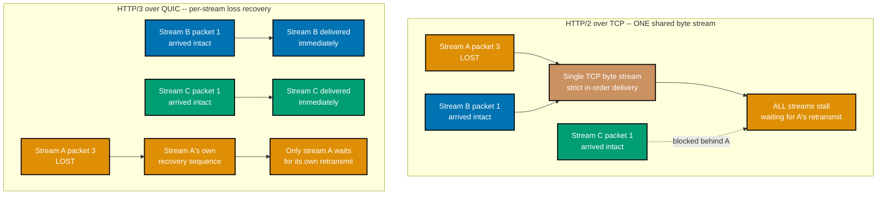
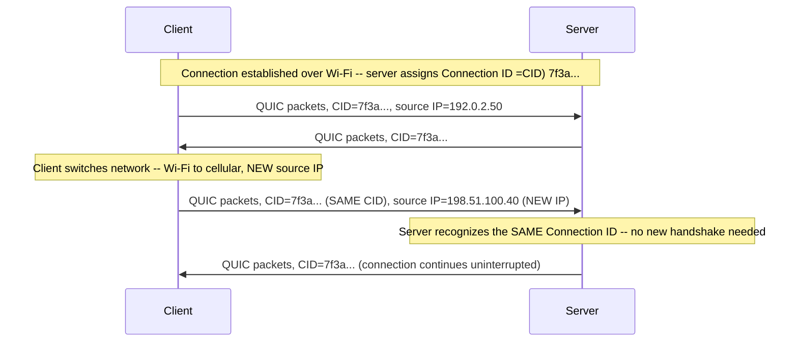
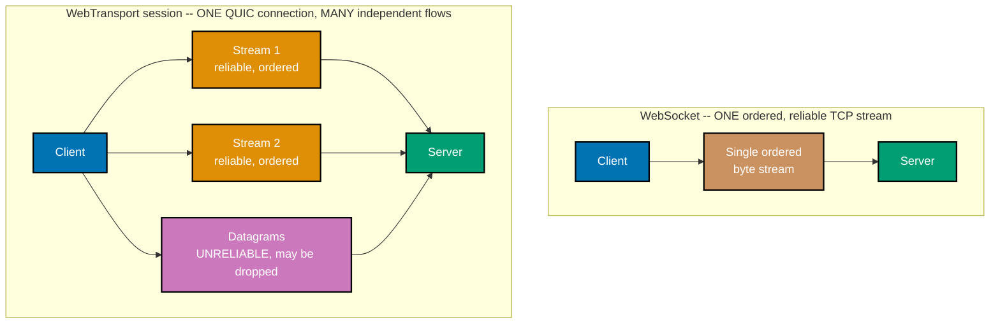
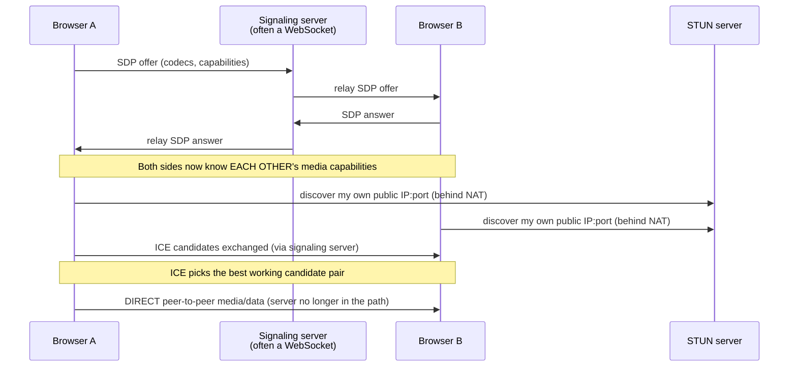
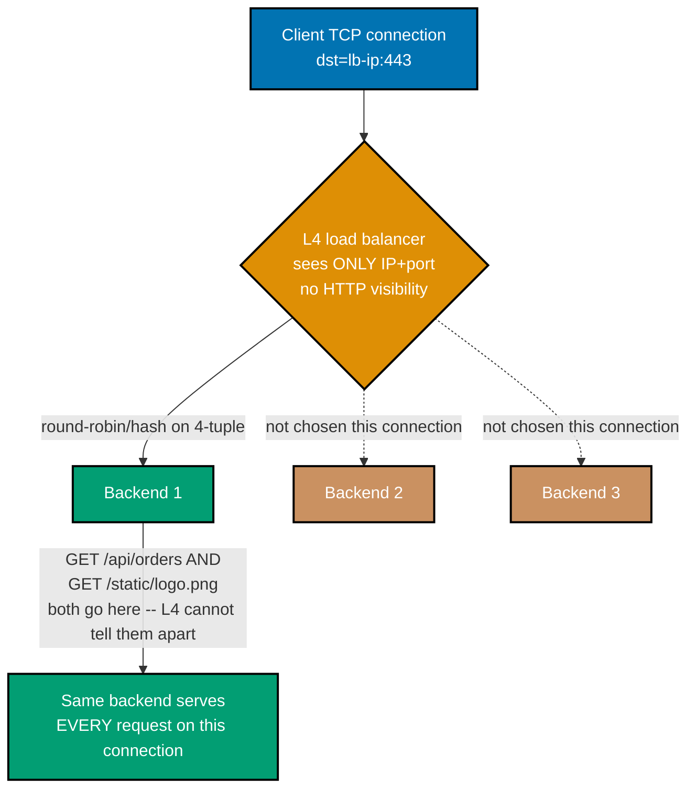
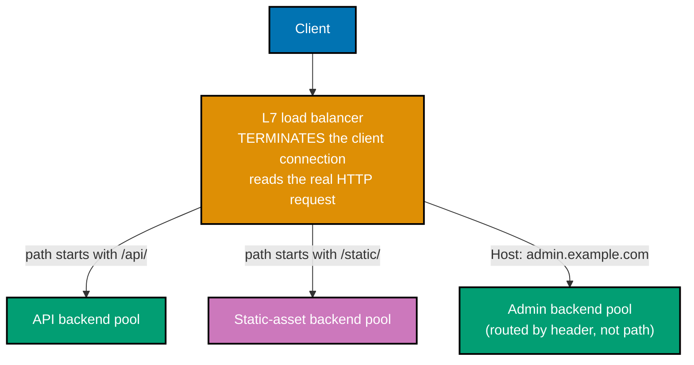
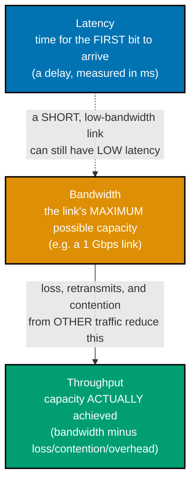
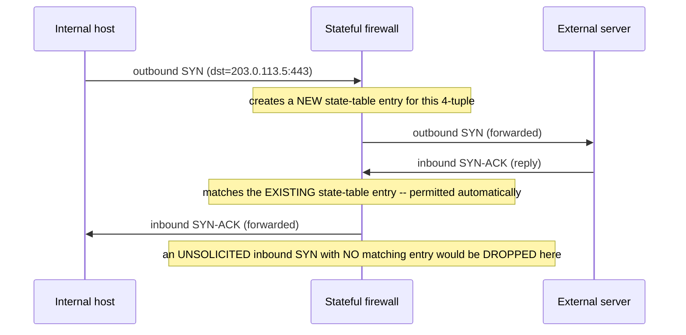
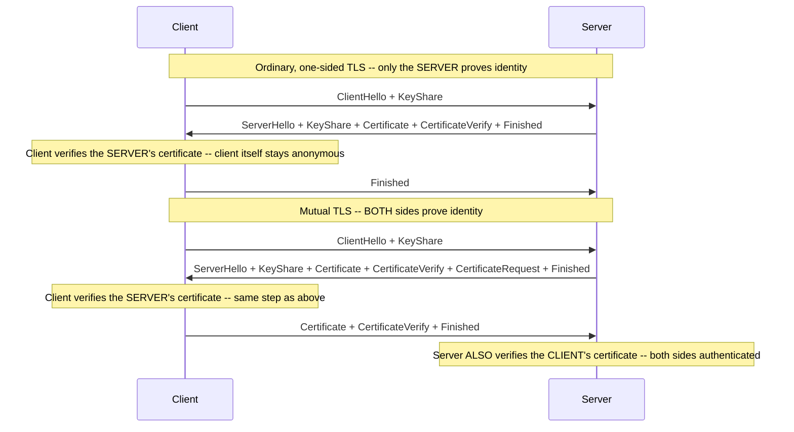

Examples 37-55 build on the Intermediate tier's DNS/DNSSEC/TLS-1.3/HTTP-2/HTTP-3 foundation to cover
the rest of the modern application layer and the operational layer around it: QUIC's structural
payoffs (co-16, continuing Example 36), the real-time web -- WebSockets, SSE, WebTransport, and
WebRTC (co-17, co-18), load balancing and edge delivery (co-19, co-20), Linux network namespaces and
`tcpdump`'s BPF filter language (co-21, co-22), latency/throughput measurement discipline (co-23),
and stateful firewalls plus mutual TLS (co-14 callback, co-24). Same standard as the earlier tiers:
every Python script actually run against **Python 3.13.12**, standard library only; every
command-line transcript genuinely captured -- against real hosts where reachable, or (for the
root-requiring `tcpdump`/`ip netns` commands) inside the same local Debian Linux container
(`python:3.13-slim`, run with the minimum extra capability each command needs) this topic's earlier
tiers already used for the identical reason -- noted plainly at each example that needs it.

---

### Example 37: QUIC vs. TCP -- Head-of-Line Blocking, Contrasted Stream by Stream

_ex-37 &middot; exercises co-16_

Example 36 established that HTTP/3 runs over QUIC. This example makes concrete WHY that matters:
TCP guarantees strict in-order byte delivery for the ENTIRE connection, so one lost packet on any
one HTTP/2 stream stalls every other stream multiplexed on that same connection until the loss is
retransmitted and recovered. QUIC gives each stream its OWN independent loss-recovery sequence
space, so a lost packet on stream A never blocks streams B or C.



_Figure: TCP's single shared byte stream (top) means one lost packet on stream A stalls B and C too,
even though both already arrived intact; QUIC's per-stream recovery (bottom) confines that same loss
to stream A alone -- B and C deliver on schedule._

**Key takeaway**: the difference is not "QUIC never loses packets" (UDP-based QUIC loses packets just
as often as TCP on the same lossy path) -- it is that a loss on one QUIC stream no longer has the
power to stall unrelated streams sharing the same connection, which HTTP/2-over-TCP's single shared
byte stream cannot avoid.

**Why it matters**: this is precisely why HTTP/3 was worth a new transport instead of just patching
HTTP/2 -- on a lossy path (mobile, satellite, congested Wi-Fi), TCP's head-of-line blocking can make
a page with many small multiplexed resources feel far slower than the loss rate alone would suggest,
because ANY one lost packet stalls EVERYTHING sharing that connection.

---

### Example 38: QUIC Connection Migration -- Surviving a Network Change Without a New Handshake

_ex-38 &middot; exercises co-16_

A TCP connection is identified by its 4-tuple (source IP, source port, destination IP, destination
port) -- change the source IP (switching from Wi-Fi to cellular) and the connection is gone; the
client must open a brand-new TCP connection and, over HTTPS, redo the entire TLS handshake too. QUIC
instead identifies a connection by a **connection ID** the server assigns during setup, independent
of either endpoint's IP address -- so the SAME connection ID can keep working after the client's IP
changes underneath it.



_Figure: the client's source IP changes mid-connection (Wi-Fi to cellular), but the QUIC connection
ID stays the same across that change -- the server keeps routing packets to the same connection
state instead of treating the new IP as a brand-new client._

**Key takeaway**: the connection ID is the piece of state that decouples "which connection is this
packet for" from "which IP address did it arrive from" -- exactly the coupling that forces a TCP
connection (and its TLS session on top) to restart on every network change.

**Why it matters**: this is a genuinely user-visible improvement on mobile devices, which switch
between Wi-Fi and cellular constantly -- a video call or a large file download over HTTP/3 can
survive that switch without the user noticing a stall, where the equivalent TCP-based connection
would need a full reconnect (and, over HTTPS, a full new TLS handshake) at exactly the moment the
network is least stable.

---

### Example 39: The WebSocket Handshake -- a Real `Upgrade: websocket` / `101` Exchange

_ex-39 &middot; exercises co-17_

**co-17 -- WebSockets vs. Server-Sent Events**: a WebSocket (RFC 6455) upgrades an ordinary HTTP
connection into a full-duplex, bidirectional channel -- both sides can send at any time, on the same
open connection, with no further HTTP requests. The upgrade itself is a single HTTP/1.1 request
carrying `Connection: Upgrade` and `Upgrade: websocket`, answered with a `101 Switching Protocols`
response if the server accepts.

```bash
# ex-39: forcing HTTP/1.1 is REQUIRED here -- WebSockets' Upgrade mechanism is an
# HTTP/1.1-only feature (HTTP/2 and HTTP/3 use different, header/frame-based
# mechanisms for the same purpose). Sec-WebSocket-Key is a base64 client nonce;
# the server's Sec-WebSocket-Accept in the response proves it understood this
# was specifically a WebSocket upgrade request, not a generic Upgrade (co-17)
curl -s -v -i -N --http1.1 --max-time 5 \
  -H "Connection: Upgrade" \
  -H "Upgrade: websocket" \
  -H "Sec-WebSocket-Version: 13" \
  -H "Sec-WebSocket-Key: dGhlIHNhbXBsZSBub25jZQ==" \
  https://echo.websocket.org/
```

**Run**: the command above, against `echo.websocket.org` (a public WebSocket echo test service),
on this sandbox's macOS host directly

**Output** (request and response lines; the connection was closed by `--max-time` after the upgrade
succeeded, since this is a `curl`-only handshake probe, not a full WebSocket client):

```text
* using HTTP/1.x
> GET / HTTP/1.1
> Host: echo.websocket.org
> User-Agent: curl/8.7.1
> Accept: */*
> Connection: Upgrade
> Upgrade: websocket
> Sec-WebSocket-Version: 13
> Sec-WebSocket-Key: dGhlIHNhbXBsZSBub25jZQ==
>
* Request completely sent off
< HTTP/1.1 101 Switching Protocols
< upgrade: websocket
< connection: Upgrade
< sec-websocket-accept: s3pPLMBiTxaQ9kYGzzhZRbK+xOo=
< date: Sat, 18 Jul 2026 01:38:01 GMT
< server: Fly/6cc1c2f7c8 (2026-07-17)
```

**Key takeaway**: the request carries `Connection: Upgrade` + `Upgrade: websocket` + a
`Sec-WebSocket-Key` nonce; the server's `101 Switching Protocols` response carries
`sec-websocket-accept: s3pPLMBiTxaQ9kYGzzhZRbK+xOo=` -- a value computed FROM the client's key (RFC
6455 section 1.3's fixed algorithm), proving the server genuinely understood and accepted the
WebSocket upgrade rather than just tolerating unrecognized headers.

**Why it matters**: `101 Switching Protocols` is the ONE HTTP status code whose entire meaning is
"everything from here on is a different protocol" -- recognizing it (and the
`Sec-WebSocket-Accept` header alongside it) on sight is what separates a genuine WebSocket upgrade
from a server that silently ignored the `Upgrade` header and just answered the request normally
instead.

---

### Example 40: WebSockets Are Full-Duplex -- a Minimal Demo on One Open Connection

_ex-40 &middot; exercises co-17_

Example 39 captured the handshake; this example proves the payoff: once upgraded, EITHER side can
send at any time. This minimal client/server pair (raw sockets, RFC 6455's framing implemented by
hand -- no third-party WebSocket library needed for a demo this small) shows the server pushing a
message with no prior client request, then the client sending its own message right back, all on the
one connection the handshake opened.

```python
# learning/code/ex-40-websocket-full-duplex-demo/websocket_full_duplex_demo.py
"""Example 40: WebSockets -- a Minimal Full-Duplex Demo on One Open Connection."""  # => co-17: this file's own restated purpose, doubling as its module __doc__

from __future__ import annotations  # => DD-39 hygiene: postpones type-annotation evaluation, keeping this file interpreter-version-agnostic

import base64  # => co-17: Sec-WebSocket-Key/Accept are base64-encoded, per RFC 6455
import hashlib  # => co-17: the handshake's accept value is a SHA-1 digest of key+GUID, per RFC 6455 section 1.3
import socket  # => co-17: WebSockets upgrade a PLAIN TCP socket -- no third-party library needed for this minimal demo
import struct  # => co-17: the 2-byte extended-length field in a frame header is packed/unpacked with struct
import threading  # => co-17: runs the server concurrently with the client on one localhost connection

WEBSOCKET_GUID = "258EAFA5-E914-47DA-95CA-C5AB0DC85B11"  # => co-17: RFC 6455's own fixed magic GUID, concatenated onto the client's key before hashing
HOST = "127.0.0.1"  # => co-17: loopback -- this demo needs no real network, only a real TCP socket pair


def compute_accept(client_key: str) -> str:  # => co-17: the exact RFC 6455 section 1.3 accept-value algorithm
    """Compute Sec-WebSocket-Accept from a client's Sec-WebSocket-Key, per RFC 6455."""  # => co-17: documents compute_accept's contract -- no runtime output, just sets its __doc__
    digest = hashlib.sha1((client_key + WEBSOCKET_GUID).encode()).digest()  # => co-17: SHA-1 over key+GUID -- the exact bytes the spec requires
    return base64.b64encode(digest).decode()  # => co-17: base64-encode the raw digest -- this is the value both sides must agree on


def recv_until_headers_end(sock: socket.socket) -> bytes:  # => co-17: reads exactly through the blank line ending an HTTP header block
    """Read bytes one at a time until the HTTP header-terminating blank line (\\r\\n\\r\\n) appears."""  # => co-17: documents recv_until_headers_end's contract -- no runtime output, just sets its __doc__
    buffer = b""  # => co-17: accumulates bytes across possibly-separate recv() calls
    while not buffer.endswith(b"\r\n\r\n"):  # => co-17: the HTTP/1.1 header-block terminator, unchanged by the Upgrade
        buffer += sock.recv(1)  # => co-17: one byte at a time is wasteful but simplest for this small demo's fixed-size handshake
    return buffer  # => co-17: returns this computed value to the caller


def make_text_frame(payload: bytes, masked: bool) -> bytes:  # => co-17: builds one RFC 6455 frame -- FIN+text opcode, then payload
    """Build a single unfragmented text-opcode WebSocket frame; client frames MUST be masked, server frames MUST NOT."""  # => co-17: documents make_text_frame's contract -- no runtime output, just sets its __doc__
    header = bytearray()  # => co-17: the frame's leading 2+ bytes, built up field by field below
    header.append(0x81)  # => co-17: FIN=1 (this frame is complete, not fragmented) | opcode=0x1 (text)
    length = len(payload)  # => co-17: this demo's payloads are always small enough to skip the 8-byte extended-length case
    mask_bit = 0x80 if masked else 0x00  # => co-17: the mask bit -- RFC 6455 REQUIRES client-to-server frames to set this
    if length < 126:  # => co-17: RFC 6455's short-length encoding -- length fits directly in the second byte's low 7 bits
        header.append(mask_bit | length)  # => co-17: mask bit plus the literal length, packed into one byte
    else:  # => co-17: RFC 6455's extended 16-bit length encoding, for payloads this demo doesn't otherwise use
        header.append(mask_bit | 126)  # => co-17: 126 is itself the sentinel meaning "read the next 2 bytes as the real length"
        header += struct.pack(">H", length)  # => co-17: the real length, big-endian, exactly as RFC 6455 requires on the wire
    if masked:  # => co-17: only CLIENT frames take this branch -- server-to-client frames must never be masked
        mask_key = b"\x01\x02\x03\x04"  # => co-17: a real client would use 4 CRYPTOGRAPHICALLY RANDOM bytes -- fixed here only for a reproducible demo transcript
        header += mask_key  # => co-17: the mask key travels on the wire immediately after the length field
        payload = bytes(byte ^ mask_key[i % 4] for i, byte in enumerate(payload))  # => co-17: XOR each payload byte with the cycling 4-byte mask key
    return bytes(header) + payload  # => co-17: the complete frame -- header bytes followed by the (possibly masked) payload


def parse_text_frame(data: bytes) -> bytes:  # => co-17: the exact inverse of make_text_frame -- extracts and unmasks the payload
    """Parse one WebSocket frame's bytes and return its (already-unmasked) payload."""  # => co-17: documents parse_text_frame's contract -- no runtime output, just sets its __doc__
    second_byte = data[1]  # => co-17: byte 1 carries the mask bit and the short-length field
    masked = bool(second_byte & 0x80)  # => co-17: True for every client frame this demo parses, False for every server frame
    length = second_byte & 0x7F  # => co-17: the low 7 bits -- this demo's frames never exceed the short-length range
    index = 2  # => co-17: byte offset where the mask key (if present) or payload begins
    if masked:  # => co-17: only frames FROM the client carry a mask key to strip
        mask_key = data[index : index + 4]  # => co-17: the 4-byte key the sender chose for this one frame
        index += 4  # => co-17: advances past the mask key to where the actual payload bytes begin
        payload = bytes(byte ^ mask_key[i % 4] for i, byte in enumerate(data[index : index + length]))  # => co-17: XOR-ing twice with the SAME key recovers the original bytes
    else:  # => co-17: server frames arrive already in plaintext -- no unmasking needed
        payload = data[index : index + length]  # => co-17: the payload bytes, taken directly
    return payload  # => co-17: returns this computed value to the caller


def run_server(listener: socket.socket) -> None:  # => co-17: the SERVER side -- completes the handshake, then reads AND writes on the same connection
    """Accept one client, complete the WebSocket handshake, then demonstrate full-duplex traffic."""  # => co-17: documents run_server's contract -- no runtime output, just sets its __doc__
    conn, _ = listener.accept()  # => co-17: blocks here until the client below connects
    request = recv_until_headers_end(conn)  # => co-17: reads the client's HTTP/1.1 Upgrade request in full
    client_key = None  # => co-17: extracted below from the request's Sec-WebSocket-Key header
    for line in request.split(b"\r\n"):  # => co-17: a minimal header parser -- just enough to find the ONE header this demo needs
        if line.lower().startswith(b"sec-websocket-key:"):  # => co-17: case-insensitive match, since HTTP header names are case-insensitive
            client_key = line.split(b":", 1)[1].strip().decode()  # => co-17: everything after the first colon, whitespace-trimmed
    assert client_key is not None, "the client's Upgrade request must carry a Sec-WebSocket-Key header"  # => co-17
    accept_value = compute_accept(client_key)  # => co-17: the exact value RFC 6455 requires the server to echo back
    response = (  # => co-17: the literal 101 response -- this IS co-17's "upgrade an HTTP connection" step, completed
        "HTTP/1.1 101 Switching Protocols\r\n"  # => co-17: the status line THIS example's syllabus entry (ex-39) is about
        "Upgrade: websocket\r\n"  # => co-17: echoes the client's requested protocol upgrade
        "Connection: Upgrade\r\n"  # => co-17: confirms the connection itself is being repurposed, not just this one response
        f"Sec-WebSocket-Accept: {accept_value}\r\n\r\n"  # => co-17: proves the server understood this IS a WebSocket handshake, not a generic Upgrade
    ).encode()  # => co-17: closes the multi-line construct opened above
    conn.sendall(response)  # => co-17: from THIS point on, both sides speak the WebSocket FRAMING protocol, not HTTP
    conn.sendall(make_text_frame(b"hello from server", masked=False))  # => co-17: the SERVER pushes a message WITHOUT waiting for a client request -- the defining full-duplex behavior
    incoming = parse_text_frame(conn.recv(1024))  # => co-17: the server can ALSO read on the very same connection, no new request needed
    conn.sendall(make_text_frame(b"ack:" + incoming, masked=False))  # => co-17: replies on the SAME connection -- no new handshake, no new socket
    conn.close()  # => co-17: releases this connection's resources on the server side


if __name__ == "__main__":  # => co-17: entry point -- this block runs only when the file executes directly, not on import
    listener = socket.socket(socket.AF_INET, socket.SOCK_STREAM)  # => co-17: the listening socket the server thread accepts on
    listener.bind((HOST, 0))  # => co-17: port 0 -- let the OS pick a free ephemeral port, avoiding hardcoded-port collisions
    listener.listen(1)  # => co-17: one pending connection is all this single-client demo needs
    port = listener.getsockname()[1]  # => co-17: the OS-assigned port, needed by the client below to connect back
    server_thread = threading.Thread(target=run_server, args=(listener,))  # => co-17: runs run_server() concurrently
    server_thread.start()  # => co-17: starts accepting and handshaking in the background

    client = socket.socket(socket.AF_INET, socket.SOCK_STREAM)  # => co-17: the CLIENT side -- an ordinary TCP socket until the handshake completes
    client.connect((HOST, port))  # => co-17: a plain TCP connect -- WebSockets ride on top of an ordinary connection, nothing special yet
    client_key = base64.b64encode(b"0123456789012345").decode()  # => co-17: a real client uses 16 RANDOM bytes -- fixed here only for a reproducible demo transcript
    upgrade_request = (  # => co-17: the literal HTTP/1.1 request that STARTS as an ordinary request and ASKS to become a WebSocket
        f"GET / HTTP/1.1\r\nHost: {HOST}\r\nUpgrade: websocket\r\nConnection: Upgrade\r\n"  # => co-17: Upgrade + Connection headers together are what signal a protocol-switch request
        f"Sec-WebSocket-Key: {client_key}\r\nSec-WebSocket-Version: 13\r\n\r\n"  # => co-17: version 13 is the version RFC 6455 itself standardized
    ).encode()  # => co-17: closes the multi-line construct opened above
    client.sendall(upgrade_request)  # => co-17: sends the Upgrade request -- Example 39 is this exact request/response pair, captured live
    handshake_response = recv_until_headers_end(client)  # => co-17: reads the server's 101 response in full
    status_line = handshake_response.splitlines()[0].decode()  # => co-17: the first line -- expected to be "HTTP/1.1 101 Switching Protocols"
    print(f"client received: {status_line}")  # => co-17: confirms the handshake succeeded before any frame traffic is attempted
    assert status_line == "HTTP/1.1 101 Switching Protocols", "the handshake must succeed with a literal 101 status"  # => co-17

    pushed_message = parse_text_frame(client.recv(1024))  # => co-17: the server's UNSOLICITED push, read here -- no request preceded it
    print(f"client received unsolicited push: {pushed_message!r}")  # => co-17: this line alone demonstrates co-17's "server can initiate" half of full-duplex
    client.sendall(make_text_frame(b"hi from client", masked=True))  # => co-17: the client ALSO sends, on the same connection, without waiting for another server push
    ack = parse_text_frame(client.recv(1024))  # => co-17: reads the server's reply to the message just sent -- both directions used, one connection
    print(f"client received ack: {ack!r}")  # => co-17: confirms the round trip completed on the SAME connection the push arrived on
    client.close()  # => co-17: releases this connection's resources on the client side
    server_thread.join()  # => co-17: waits for the server thread to finish its handshake/push/reply sequence

    assert pushed_message == b"hello from server", "the server's unsolicited push must arrive intact"  # => co-17
    assert ack == b"ack:hi from client", "the server's reply must echo back the client's own message"  # => co-17
    print("Both directions carried data on one open connection, with no new request issued: True")  # => co-17: reached only if every assert above passed
    # => co-17: this file is self-verifying: if it exits 0, every assert above passed and the demonstrated claim held
```

**Run**: `python3 websocket_full_duplex_demo.py`

**Output**:

```text
client received: HTTP/1.1 101 Switching Protocols
client received unsolicited push: b'hello from server'
client received ack: b'ack:hi from client'
Both directions carried data on one open connection, with no new request issued: True
```

**Key takeaway**: the server's `hello from server` push arrives on the client's socket with NO
preceding client request -- the single most distinguishing behavior a plain request/response HTTP
exchange (or even SSE, Example 41) cannot produce, because both of those are strictly one side
initiating and the other side only ever replying.

**Why it matters**: this full-duplex property is exactly why chat apps, live collaborative editors,
and multiplayer game state all reach for WebSockets specifically -- any protocol where the SERVER
needs to push data the client didn't just ask for, while the client can ALSO keep sending, needs this
shape; a plain request/response API (even one polled aggressively) cannot match it without either
wasted polling requests or added latency waiting for the next poll.

---

### Example 41: Server-Sent Events -- One-Way, Server-to-Client, Over One Long-Lived Response

_ex-41 &middot; exercises co-17_

The other half of co-17: Server-Sent Events keep a single ordinary HTTP response open and stream
`data:` lines down it, one way only -- server to client. No upgrade handshake, no framing protocol;
just `Content-Type: text/event-stream` and a response that never finishes until the server decides
to close it.

```python
# learning/code/ex-41-sse-one-way-stream/sse_one_way_stream.py
"""Example 41: Server-Sent Events -- a One-Way text/event-stream, Consumed with curl -N."""  # => co-17: this file's own restated purpose, doubling as its module __doc__

from __future__ import annotations  # => DD-39 hygiene: postpones type-annotation evaluation, keeping this file interpreter-version-agnostic

import threading  # => co-17: runs the SSE server concurrently so this same script can also act as the client
import time  # => co-17: sleeps between events -- what makes "incrementally, over time" observable rather than instant
from http.server import BaseHTTPRequestHandler, HTTPServer  # => co-17: stdlib-only HTTP server -- no third-party SSE library needed

HOST = "127.0.0.1"  # => co-17: loopback -- this demo needs no real network, only a real long-lived HTTP response
EVENT_COUNT = 4  # => co-17: how many "data:" lines the server streams before closing the response
EVENT_DELAY_SECONDS = 0.2  # => co-17: the gap between events -- long enough to prove they arrive incrementally, not all at once


class SseHandler(BaseHTTPRequestHandler):  # => co-17: one GET handler that streams instead of returning a single fixed body
    def log_message(self, format: str, *args: object) -> None:  # => co-17: silences BaseHTTPRequestHandler's default per-request stderr logging
        """Suppress the base class's default request logging -- keeps this demo's own prints the only output."""  # => co-17: documents log_message's contract -- no runtime output, just sets its __doc__
        pass  # => co-17: intentionally empty -- overriding to do nothing is the standard stdlib way to silence it

    def do_GET(self) -> None:  # => co-17: THE handler co-17's "one long-lived response, server-to-client only" describes
        self.send_response(200)  # => co-17: an SSE response is an ordinary 200 -- no special status code exists for it
        self.send_header("Content-Type", "text/event-stream")  # => co-17: THE header that tells a browser's EventSource (or curl -N) to treat this as SSE, not a normal download
        self.send_header("Cache-Control", "no-cache")  # => co-17: prevents any intermediary from buffering/caching a stream that is meant to arrive incrementally
        self.end_headers()  # => co-17: ends the header block -- everything written after this is the streamed body
        for i in range(EVENT_COUNT):  # => co-17: one loop iteration per event -- nothing here differs from an ordinary write, except the pacing
            event_bytes = f"data: tick {i}\n\n".encode()  # => co-17: the SSE wire format -- a "data:" line, then a BLANK line terminating this one event
            self.wfile.write(event_bytes)  # => co-17: writes directly onto the still-open response socket -- the connection never closes between events
            self.wfile.flush()  # => co-17: WITHOUT an explicit flush, the OS/library buffer could hold this event back, defeating "arrives incrementally"
            time.sleep(EVENT_DELAY_SECONDS)  # => co-17: the pause that makes each event a genuinely separate, later write, not one batched response


if __name__ == "__main__":  # => co-17: entry point -- this block runs only when the file executes directly, not on import
    server = HTTPServer((HOST, 0), SseHandler)  # => co-17: port 0 -- let the OS pick a free ephemeral port, avoiding hardcoded-port collisions
    port = server.server_port  # => co-17: the OS-assigned port, needed by the curl client below to connect back
    server_thread = threading.Thread(target=server.serve_forever, daemon=True)  # => co-17: runs the server's request loop concurrently
    server_thread.start()  # => co-17: starts accepting connections in the background
    time.sleep(0.1)  # => co-17: a brief pause so the server is genuinely listening before the client below connects

    print(f"SSE server listening on http://{HOST}:{port}/")  # => co-17: confirms the server is up before consuming it
    print("Run in a separate terminal to watch events arrive incrementally:")  # => co-17: the standalone client-side command this example's syllabus entry (ex-41) names
    print(f"  curl -N http://{HOST}:{port}/")  # => co-17: -N disables curl's own output buffering, so events print as they arrive, not all at once at the end

    import subprocess  # => co-17: this script also acts as its OWN client -- runs curl itself so the transcript below is genuinely captured

    result = subprocess.run(  # => co-17: invokes curl exactly as a human would from a second terminal
        ["curl", "-s", "-N", f"http://{HOST}:{port}/"],  # => co-17: -s suppresses curl's own progress meter -- only the SSE body itself should print
        capture_output=True,  # => co-17: captures curl's stdout instead of letting it print directly, so this script can inspect it
        text=True,  # => co-17: decodes curl's output as text -- SSE's "data:" lines are always UTF-8 text, per the spec
        timeout=5,  # => co-17: bounds the wait -- this whole stream is expected to finish well under 5 seconds
    )  # => co-17: closes the multi-line construct opened above
    print("\ncaptured curl -N output:")  # => co-17: labels the following block as the actual client-observed transcript
    print(result.stdout)  # => co-17: the raw text curl received -- every "data: tick N" line, each followed by a blank line

    events = [line for line in result.stdout.split("\n\n") if line.strip()]  # => co-17: splits on the blank-line event terminator, dropping any trailing empty chunk
    assert len(events) == EVENT_COUNT, f"expected {EVENT_COUNT} events, got {len(events)}"  # => co-17: confirms every event the server sent actually arrived
    assert events[0] == "data: tick 0", "the FIRST event must be tick 0 -- events arrive in send order"  # => co-17
    assert events[-1] == f"data: tick {EVENT_COUNT - 1}", "the LAST event must be the final tick -- confirms nothing was dropped"  # => co-17
    print(f"All {EVENT_COUNT} events arrived, in order, over one long-lived response: True")  # => co-17: reached only if every assert above passed
    # => co-17: this file is self-verifying: if it exits 0, every assert above passed and the demonstrated claim held
    server.shutdown()  # => co-17: stops the background server loop now that the demo transcript has been captured
```

**Run**: `python3 sse_one_way_stream.py`

**Output**:

```text
SSE server listening on http://127.0.0.1:63513/
Run in a separate terminal to watch events arrive incrementally:
  curl -N http://127.0.0.1:63513/

captured curl -N output:
data: tick 0

data: tick 1

data: tick 2

data: tick 3


All 4 events arrived, in order, over one long-lived response: True
```

**Key takeaway**: all 4 events arrive over ONE connection that never closes between them (`curl -N`'s
raw output shows each `data:` line separated by the required blank line) -- but the traffic is
STRICTLY one-directional; nothing in this protocol lets the client push anything back on the same
response.

**Why it matters**: SSE is the right, simpler tool exactly when the server needs to push updates but
the client never needs to talk back on the same channel -- live notifications, a stock ticker, a
progress bar -- and it is plain HTTP the whole way, so it works through any proxy or load balancer
that already understands HTTP/1.1 chunked responses, with none of WebSockets' separate upgrade
handshake or framing protocol to account for.

---

### Example 42: WebSockets vs. SSE vs. WebTransport vs. WebRTC -- a Decision Table

_ex-42 &middot; exercises co-17, co-18_

Four real-time-web options, each with a genuinely different shape. Examples 43-44 introduce
WebTransport and WebRTC's own mechanics in more depth; this table picks the right one FIRST, by use
case.

| Use case                                                                              | Best fit         | Why                                                                                                                                          |
| ------------------------------------------------------------------------------------- | ---------------- | -------------------------------------------------------------------------------------------------------------------------------------------- |
| Chat app (both sides send anytime)                                                    | **WebSockets**   | Needs genuine full-duplex (Example 40) over one connection; every mainstream server and proxy already supports it.                           |
| Live feed / notifications (server pushes, client never replies on the same channel)   | **SSE**          | One-directional is the ENTIRE requirement -- plain HTTP, auto-reconnect built into the browser's `EventSource`, no upgrade handshake needed. |
| Low-latency multiplexed data (many independent streams/datagrams, some loss-tolerant) | **WebTransport** | QUIC's independent per-stream loss recovery (Example 37) plus unreliable datagrams -- neither WebSockets nor SSE expose either.              |
| Peer-to-peer audio/video/game state (browser-to-browser, lowest possible latency)     | **WebRTC**       | The only one of the four that can route media DIRECTLY between two browsers instead of through a server relaying every byte (Example 44).    |

**Key takeaway**: the deciding question is almost always "who needs to send, and does it need to go
through a server at all" -- WebSockets and SSE both always relay through a server; WebRTC's whole
point is to skip the server for the actual media/data path; WebTransport sits between WebSockets and
raw QUIC, trading WebSockets' universal support for QUIC's stream independence and unreliable
datagrams.

**Why it matters**: picking WebSockets by default for every real-time feature (a common reflex) means
paying for full-duplex framing and a persistent connection even for a feature (like a notification
feed) that only ever needed one-directional SSE -- and it means missing WebRTC entirely for
peer-to-peer media, where relaying every video frame through a server both server-side scales far
worse and adds a full extra network hop of latency.

---

### Example 43: WebTransport -- QUIC's Multiplexed Streams and Datagrams, Exposed to the Browser

_ex-43 &middot; exercises co-18_

**co-18 -- WebTransport and WebRTC**: WebTransport exposes QUIC's own multiplexed streams AND
unreliable datagrams directly to browser JavaScript, as a modern alternative to WebSockets' single
ordered byte stream. Where a WebSocket connection is exactly one ordered, reliable stream over TCP, a
single WebTransport session can open MANY independent streams (each with its own loss recovery,
Example 37) plus send datagrams that are allowed to be lost outright.



_Figure: a WebSocket (top) is exactly one ordered TCP stream; a WebTransport session (bottom) is one
QUIC connection carrying several independent reliable streams AND a datagram channel that is allowed
to drop data outright -- a shape WebSockets has no equivalent for._

**Key takeaway**: the datagram channel is the genuinely new capability -- it deliberately trades
reliability for lower latency, useful for data (like a fast-moving game position update) where the
NEWEST value matters far more than guaranteeing every single old value arrives.

**Why it matters**: WebTransport is the browser-facing way to get QUIC's per-stream independence
(Example 37) and unreliable-by-choice datagrams without dropping all the way to raw UDP sockets
(which browsers do not expose to JavaScript at all) -- it targets exactly the gap between
WebSockets' one reliable stream and WebRTC's peer-to-peer media path.

---

### Example 44: WebRTC -- Signaling, ICE/STUN/TURN, Then a Direct Peer-to-Peer Path

_ex-44 &middot; exercises co-18_

WebRTC's defining trick: get two browsers talking DIRECTLY to each other, skipping a server for the
actual media/data path -- but two browsers, likely each behind their own NAT, cannot simply dial each
other's private IP address. WebRTC solves this in stages: a signaling exchange (over any
out-of-band channel, commonly WebSockets) trades connection metadata, then ICE gathers candidate
addresses (via STUN, and TURN as a relay fallback) before the direct path opens.



_Figure: the signaling server (and STUN) are only in the path during SETUP -- once ICE finds a
working candidate pair, media/data flows directly between the two browsers, bypassing the signaling
server entirely. If no direct path is reachable (strict NATs/firewalls on both sides), a TURN server
relays the media instead, at the cost of extra latency and server bandwidth._

**Key takeaway**: signaling is deliberately NOT part of the WebRTC standard itself -- any
out-of-band channel works (WebSockets is common, but so is a plain HTTP polling API) -- because
signaling only needs to happen ONCE, briefly, before ICE takes over; the ongoing media/data path is
the part WebRTC actually optimizes.

**Why it matters**: this is why video-calling apps need almost no server-side media infrastructure
for the common case (direct peer-to-peer connectivity) but must still budget for TURN relay capacity
for the harder case (both peers behind restrictive, symmetric NATs) -- a WebRTC deployment that
skips TURN entirely will simply fail to connect for a real, non-trivial fraction of real-world
network configurations.

---

### Example 45: L4 Load Balancing -- Routing by IP/Port, No Content Visibility

_ex-45 &middot; exercises co-19_

**co-19 -- load balancing, L4 vs. L7**: an L4 (transport-layer) load balancer routes purely on
transport-level identifiers -- source/destination IP and port -- with zero visibility into what the
connection actually carries. It picks a backend once, at connection-open time, and every packet on
that connection goes to the same backend for the connection's whole lifetime.



_Figure: the L4 load balancer picks Backend 1 based only on the connection's IP/port 4-tuple -- it
has no idea whether the client later requests `/api/orders` or `/static/logo.png` on that same
connection, because it never inspects the HTTP layer at all._

**Key takeaway**: L4 routing decisions are made ONCE, per connection, using information that exists
before a single byte of application data (HTTP or otherwise) has even been sent -- which is exactly
why it is fast and protocol-agnostic (it works identically for HTTP, a database protocol, or raw TCP
traffic), but also why it CANNOT route two different requests on the same connection differently.

**Why it matters**: L4 load balancing is the right (and much cheaper, in CPU terms) choice when
routing only needs to spread connections evenly across identical backends -- but it cannot implement
path-based routing (Example 46) or per-request decisions at all, since by the time an L4 balancer
would need to look at the HTTP path, it has already committed the whole connection to one backend.

---

### Example 46: L7 Load Balancing -- Routing by HTTP Path/Header Content

_ex-46 &middot; exercises co-19_

An L7 (application-layer) load balancer terminates the client's connection itself, reads the actual
HTTP request, and THEN decides which backend to forward to -- so it can route different requests on
what the client experiences as one connection to genuinely different backends, based on the request's
own content.



_Figure: the SAME load balancer routes `/api/*` requests to one backend pool and `/static/*`
requests to a completely different one, purely by reading each request's own path -- a decision L4
load balancing (Example 45) structurally cannot make._

**Key takeaway**: because an L7 load balancer terminates the client's connection itself, it makes a
FRESH routing decision on every individual request -- even two requests arriving back-to-back on
what the client perceives as one persistent connection can be routed to entirely different backends.

**Why it matters**: this is what makes a single public hostname able to serve a whole microservice
architecture behind it (`/api/orders` to the orders service, `/api/users` to the users service,
`/static/*` straight to a CDN-backed pool) -- the trade-off is cost: an L7 balancer must fully
terminate and parse every connection's HTTP traffic, which costs meaningfully more CPU per request
than L4's IP/port-only decision.

---

### Example 47: A Local Reverse Proxy -- Forwarding a Client Request to a Backend

_ex-47 &middot; exercises co-20_

**co-20 -- reverse proxies and CDNs**: a reverse proxy sits in front of one or more origin servers
and forwards client requests to them -- the client only ever sees and connects to the proxy's own
address, never the backend's. This small local proxy makes that literal: the client below connects
exclusively to the proxy's port, yet receives the backend's exact response.

```python
# learning/code/ex-47-reverse-proxy-request-flow/reverse_proxy_request_flow.py
"""Example 47: A Local Reverse Proxy -- Forwarding a Client Request to a Backend."""  # => co-20: this file's own restated purpose, doubling as its module __doc__

from __future__ import annotations  # => DD-39 hygiene: postpones type-annotation evaluation, keeping this file interpreter-version-agnostic

import http.client  # => co-20: the PROXY's own outbound client -- how it forwards to the backend, stdlib-only
import threading  # => co-20: runs the backend and the proxy concurrently, both listening on their own localhost ports
import time  # => co-20: a brief pause so both servers are genuinely listening before the client below connects
from http.server import BaseHTTPRequestHandler, HTTPServer  # => co-20: stdlib-only HTTP server, used for BOTH the backend and the proxy

HOST = "127.0.0.1"  # => co-20: loopback -- this demo needs no real network, only two real local HTTP servers


class BackendHandler(BaseHTTPRequestHandler):  # => co-20: the ORIGIN server -- what a reverse proxy sits in front of
    def log_message(self, format: str, *args: object) -> None:  # => co-20: silences BaseHTTPRequestHandler's default per-request stderr logging
        """Suppress the base class's default request logging -- keeps this demo's own prints the only output."""  # => co-20: documents log_message's contract -- no runtime output, just sets its __doc__
        pass  # => co-20: intentionally empty -- overriding to do nothing is the standard stdlib way to silence it

    def do_GET(self) -> None:  # => co-20: the backend's own response -- the client below never talks to this directly
        body = b"hello from backend"  # => co-20: a fixed, recognizable payload -- proves the FINAL response really did originate here
        self.send_response(200)  # => co-20: an ordinary 200 -- the backend has no idea a proxy is in front of it
        self.send_header("Content-Length", str(len(body)))  # => co-20: required so the client (the proxy, in this case) knows exactly where the body ends
        self.send_header("X-Served-By", "backend")  # => co-20: a marker header this demo's own asserts check for, proving the ORIGIN handled the request
        self.end_headers()  # => co-20: ends the header block -- everything written after this is the response body
        self.wfile.write(body)  # => co-20: writes the fixed payload onto the response socket


def make_proxy_handler(backend_port: int) -> type[BaseHTTPRequestHandler]:  # => co-20: a factory -- bakes the backend's port into a fresh handler CLASS, since http.server takes a class, not an instance
    """Build a reverse-proxy handler class that forwards every GET to the backend on `backend_port`."""  # => co-20: documents make_proxy_handler's contract -- no runtime output, just sets its __doc__

    class ProxyHandler(BaseHTTPRequestHandler):  # => co-20: THE reverse proxy -- co-20's "sits in front of an origin server" role, in code
        def log_message(self, format: str, *args: object) -> None:  # => co-20: silences BaseHTTPRequestHandler's default per-request stderr logging
            """Suppress the base class's default request logging -- keeps this demo's own prints the only output."""  # => co-20: documents log_message's contract -- no runtime output, just sets its __doc__
            pass  # => co-20: intentionally empty -- overriding to do nothing is the standard stdlib way to silence it

        def do_GET(self) -> None:  # => co-20: THE forwarding step -- everything the client sees comes from this method, not from the backend directly
            upstream = http.client.HTTPConnection(HOST, backend_port)  # => co-20: the proxy opens its OWN, separate connection to the backend -- the client never sees this hop
            upstream.request("GET", self.path)  # => co-20: forwards the SAME path the client requested -- a real proxy would also forward headers/method/body
            backend_response = upstream.getresponse()  # => co-20: reads the backend's full response, on the proxy's side of the wire
            backend_body = backend_response.read()  # => co-20: the exact bytes the backend sent, read here before relaying them onward
            self.send_response(backend_response.status)  # => co-20: relays the backend's OWN status code -- the proxy does not invent one
            self.send_header("Content-Length", str(len(backend_body)))  # => co-20: required so the ORIGINAL client knows where the relayed body ends
            self.send_header("X-Served-By", backend_response.getheader("X-Served-By", ""))  # => co-20: relays the BACKEND's own marker header through unchanged -- proves headers, not just the body, survive the hop
            self.send_header("X-Proxied-By", "reverse-proxy")  # => co-20: a marker header this demo's own asserts check for, proving the PROXY (not the backend) answered the client
            self.end_headers()  # => co-20: ends the header block -- everything written after this is the relayed response body
            self.wfile.write(backend_body)  # => co-20: relays the backend's exact bytes back to the ORIGINAL client -- the client never touched the backend
            upstream.close()  # => co-20: releases the proxy-to-backend connection's resources

    return ProxyHandler  # => co-20: returns this computed value to the caller


if __name__ == "__main__":  # => co-20: entry point -- this block runs only when the file executes directly, not on import
    backend_server = HTTPServer((HOST, 0), BackendHandler)  # => co-20: port 0 -- let the OS pick a free ephemeral port for the ORIGIN
    backend_port = backend_server.server_port  # => co-20: the OS-assigned backend port -- the client below must NEVER see or use this directly
    threading.Thread(target=backend_server.serve_forever, daemon=True).start()  # => co-20: runs the backend's request loop concurrently

    proxy_server = HTTPServer((HOST, 0), make_proxy_handler(backend_port))  # => co-20: port 0 -- a SEPARATE free ephemeral port for the PROXY
    proxy_port = proxy_server.server_port  # => co-20: the OS-assigned proxy port -- this IS the address the client below connects to
    threading.Thread(target=proxy_server.serve_forever, daemon=True).start()  # => co-20: runs the proxy's request loop concurrently
    time.sleep(0.1)  # => co-20: a brief pause so both servers are genuinely listening before the client below connects

    client = http.client.HTTPConnection(HOST, proxy_port)  # => co-20: the CLIENT -- connects ONLY to the proxy's address, exactly as co-20 describes
    client.request("GET", "/")  # => co-20: an ordinary GET -- the client has no idea a backend even exists behind this address
    response = client.getresponse()  # => co-20: reads the response the PROXY relayed back
    response_headers = dict(response.getheaders())  # => co-20: captures every header for inspection below
    response_body = response.read()  # => co-20: the final bytes the client actually received
    client.close()  # => co-20: releases the client-to-proxy connection's resources

    print(f"client connected to proxy port {proxy_port} only -- backend port {backend_port} was never dialed directly")  # => co-20: the headline claim, stated in terms of the ACTUAL ports used
    print(f"status: {response.status}")  # => co-20: the relayed status code, as observed by the client
    print(f"X-Proxied-By: {response_headers.get('X-Proxied-By')}")  # => co-20: confirms the PROXY's own marker header reached the client
    print(f"X-Served-By: {response_headers.get('X-Served-By')}")  # => co-20: confirms the BACKEND's marker header ALSO reached the client, relayed through
    print(f"body: {response_body!r}")  # => co-20: the backend's exact payload, unmodified by the proxy hop

    assert response.status == 200, "the relayed status must match the backend's own 200"  # => co-20
    assert response_headers.get("X-Proxied-By") == "reverse-proxy", "the client must see the PROXY's own marker header"  # => co-20
    assert response_headers.get("X-Served-By") == "backend", "the client must ALSO see the backend's marker header, relayed through"  # => co-20
    assert response_body == b"hello from backend", "the relayed body must exactly match the backend's own payload"  # => co-20
    print("The client observed the proxy's address, never the backend's, yet received the backend's exact response: True")  # => co-20: reached only if every assert above passed
    # => co-20: this file is self-verifying: if it exits 0, every assert above passed and the demonstrated claim held
```

**Run**: `python3 reverse_proxy_request_flow.py`

**Output**:

```text
client connected to proxy port 64168 only -- backend port 64167 was never dialed directly
status: 200
X-Proxied-By: reverse-proxy
X-Served-By: backend
body: b'hello from backend'
The client observed the proxy's address, never the backend's, yet received the backend's exact response: True
```

**Key takeaway**: `X-Proxied-By: reverse-proxy` AND `X-Served-By: backend` both reach the client on
the SAME response -- one header the proxy added itself, one relayed through unchanged from the
backend -- proving the proxy genuinely forwarded rather than short-circuiting the request itself.

**Why it matters**: this is the exact shape production reverse proxies (nginx, Envoy, HAProxy in L7
mode) implement at far greater scale and configurability -- TLS termination, request/response header
rewriting, retries, and (combined with Example 46's routing) directing different paths to different
backend pools, all while the client only ever sees one public address.

---

### Example 48: CDN Cache Hit vs. Miss -- Reading `cf-cache-status` and `age`

_ex-48 &middot; exercises co-20_

The other half of co-20: a CDN is a distributed cache of reverse proxies at the network edge, serving
cached content close to the client instead of round-tripping to the origin on every request.
`example.com` is itself Cloudflare-fronted (visible in every `curl -v` transcript in this topic so
far, via the `server: cloudflare` header) -- its `cf-cache-status` header distinguishes a cache hit
from a cache miss directly.

```bash
# ex-48: cf-cache-status is Cloudflare's own cache-state header (HIT/MISS/
# EXPIRED/STALE/BYPASS); age (RFC 9111) reports how many seconds a cached
# response has sat in the edge cache since it was fetched from the origin --
# a cache-busting query string forces a fresh MISS to contrast against (co-20)
echo "=== plain request (likely a cache HIT) ==="
curl -sI https://example.com

echo
echo "=== cache-busting query string (forces a cache MISS) ==="
curl -sI "https://example.com/?cachebust=<unique-value>"
```

**Run**: the two commands above, on this sandbox's macOS host directly

**Output**:

```text
=== plain request (likely a cache HIT) ===
HTTP/2 200
date: Sat, 18 Jul 2026 01:47:06 GMT
content-type: text/html
server: cloudflare
last-modified: Wed, 15 Jul 2026 18:48:48 GMT
allow: GET, HEAD
accept-ranges: bytes
age: 8
cf-cache-status: HIT
cf-ray: a1cdd103dd7cb486-SIN

=== cache-busting query string (forces a cache MISS) ===
HTTP/2 200
date: Sat, 18 Jul 2026 01:47:07 GMT
content-type: text/html
server: cloudflare
last-modified: Wed, 15 Jul 2026 18:48:48 GMT
allow: GET, HEAD
accept-ranges: bytes
cf-cache-status: MISS
cf-ray: a1cdd1049d40289f-SIN
```

**Key takeaway**: the HIT response carries `cf-cache-status: HIT` alongside an `age: 8` header
(served from the edge cache, 8 seconds after it was originally fetched); the MISS response (forced by
a never-before-seen query string) carries `cf-cache-status: MISS` and NO `age` header at all --
`age`'s very presence or absence is itself a hit/miss signal, independent of the explicit status
header.

**Why it matters**: `cf-cache-status` (Cloudflare) and the analogous `X-Cache` (Fastly, chained per
node, e.g. `HIT, HIT`) are the first thing to check when debugging "why is this CDN-fronted page
serving stale content" or "why isn't caching helping my origin's load" -- a `MISS` on every single
request (not just the first) usually means the CDN's cache-key or cache-control configuration is
preventing caching entirely, not that the CDN itself is failing.

---

### Example 49: Linux Network Namespaces -- an Isolated, Independent Network Stack

_ex-49 &middot; exercises co-21_

**co-21 -- network namespaces**: a Linux network namespace is an isolated copy of the network stack
-- its own interfaces, routes, and firewall rules -- letting one host run independent network
environments. `ip netns add` creates one; running a command inside it via `ip netns exec` proves its
routing table starts genuinely empty, independent of the host's.

```bash
# ex-49: ip netns add creates a new, isolated network-namespace stack; ip netns
# exec runs a command INSIDE that namespace instead of the host's default one
# -- its routing table starts genuinely empty, since nothing has configured
# any routes inside this brand-new namespace yet (co-21)
ip route
echo "--- create namespace 'demo' ---"
ip netns add demo
echo "--- namespace demo: routing table ---"
ip netns exec demo ip route
echo "--- namespace demo: loopback interface state ---"
ip netns exec demo ip link show dev lo
ip netns delete demo
```

**Run**: the commands above, inside a **privileged** Debian Linux container (`python:3.13-slim` +
`iproute2`) -- `ip netns add` needs `mount --make-shared` on `/run/netns`, which this sandbox's
default (non-privileged) container capability set does not permit; `--privileged` was required here
specifically, unlike this topic's other root-requiring captures (Examples 13, 17, 50, 51), which
only needed `NET_ADMIN`/`NET_RAW`

**Output** (private addresses are masked, for example `172.17.x.1`; the rest is verbatim):

```text
default via 172.17.x.1 dev eth0
172.17.x.0/16 dev eth0 proto kernel scope link src 172.17.x.3

--- create namespace 'demo' ---
namespace demo created

--- namespace demo: routing table ---
(no output above == empty routing table)

--- namespace demo: loopback interface state ---
1: lo: <LOOPBACK> mtu 65536 qdisc noop state DOWN mode DEFAULT group default qlen 1000
    link/loopback 00:00:00:00:00:00 brd 00:00:00:00:00:00

namespace demo deleted
```

**Key takeaway**: the host's own routing table shows a real `default via 172.17.x.1` route, but `ip
netns exec demo ip route` prints NOTHING at all -- the new namespace's routing table starts
completely empty, and its loopback interface (`lo`) starts in `state DOWN`, not even up yet -- both
independent of whatever the host itself has configured.

**Why it matters**: this is the exact primitive container runtimes (Docker, containerd, Kubernetes'
CNI plugins) build on to give each container its own private network view -- a container's "own IP
address," "own routing table," and "own firewall rules" are not a fiction layered on top of the
host's network stack; they are a genuinely separate kernel data structure this one command creates
directly.

---

### Example 50: BPF Filter -- Isolating Traffic to One Host and Port

_ex-50 &middot; exercises co-22_

**co-22 -- packet capture and BPF filters**: `tcpdump` captures packets on an interface, filtered by
a BPF (Berkeley Packet Filter) expression that can match protocols, hosts, ports, and even individual
header bits. `host <ip> and port 443` is the most common two-clause filter -- narrowing a capture down
to exactly one conversation on a busy interface.

```bash
# ex-50: host+port together narrow the capture to ONLY packets both to/from
# the named IP AND on port 443 -- everything else on the interface (other
# hosts, other ports) is filtered out at capture time, not just hidden from
# the printed output (co-22)
tcpdump -i eth0 -n 'host 172.66.147.243 and port 443' -c 4
```

**Run**: the command above (backgrounded, with a concurrent `curl` generating matching traffic),
inside the same Debian Linux container this topic's other root-requiring captures used

**Output**:

```text
tcpdump: verbose output suppressed, use -v[v]... for full protocol decode
listening on eth0, link-type EN10MB (Ethernet), snapshot length 262144 bytes
4 packets captured
18 packets received by filter
0 packets dropped by kernel
01:38:57.075116 IP 172.17.0.3.46270 > 172.66.147.243.443: Flags [S], seq 2152396278, win 65495, options [mss 65495,sackOK,TS val 2643625441 ecr 0,nop,wscale 7], length 0
01:38:57.098124 IP 172.66.147.243.443 > 172.17.0.3.46270: Flags [S.], seq 1207713919, ack 2152396279, win 65408, options [mss 65495,sackOK,TS val 3821282879 ecr 2643625441,nop,wscale 7], length 0
01:38:57.098162 IP 172.17.0.3.46270 > 172.66.147.243.443: Flags [.], ack 1, win 512, options [nop,nop,TS val 2643625464 ecr 3821282879], length 0
01:38:57.101392 IP 172.17.0.3.46270 > 172.66.147.243.443: Flags [P.], seq 1:1569, ack 1, win 512, options [nop,nop,TS val 2643625467 ecr 3821282879], length 1568
```

**Key takeaway**: `18 packets received by filter` but only `4 packets captured` -- the BPF expression
ran INSIDE the kernel's own capture path, discarding every packet that didn't match `host ... and
port 443` before `tcpdump` ever saw it, not just hiding non-matching packets from the printed output.

**Why it matters**: filtering at capture time (not just grepping the output afterward) is what makes
`tcpdump` usable on a genuinely busy interface -- capturing everything and filtering later can drop
packets under load (the kernel's capture buffer fills faster than userspace can drain it), while a
tight BPF filter keeps the capture itself small enough to never lose packets in the first place.

---

### Example 51: BPF Filter -- Isolating Only TCP SYN Packets

_ex-51 &middot; exercises co-22_

A BPF filter can match individual TCP flag BITS, not just protocols/hosts/ports --
`tcp[tcpflags] & tcp-syn != 0` isolates only packets with the SYN flag set, which is exactly the
handshake-opening packets from every connection on the interface, and nothing else.

```bash
# ex-51: tcp[tcpflags] reads the TCP header's flags byte directly; & tcp-syn
# masks out everything except the SYN bit; != 0 keeps only packets where that
# bit is actually set -- isolating handshake-OPENING packets specifically,
# not SYN-ACKs replies from the other side of a DIFFERENT connection (co-22)
tcpdump -i eth0 -n 'tcp[tcpflags] & tcp-syn != 0' -c 2
```

**Run**: the command above (backgrounded, with a concurrent `curl` opening a fresh connection),
inside the same Debian Linux container this topic's other root-requiring captures used

**Output**:

```text
tcpdump: verbose output suppressed, use -v[v]... for full protocol decode
listening on eth0, link-type EN10MB (Ethernet), snapshot length 262144 bytes
2 packets captured
2 packets received by filter
0 packets dropped by kernel
01:38:59.185655 IP 172.17.0.3.55698 > 172.66.147.243.443: Flags [S], seq 2693002537, win 65495, options [mss 65495,sackOK,TS val 2643627553 ecr 0,nop,wscale 7], length 0
01:38:59.300288 IP 172.66.147.243.443 > 172.17.0.3.55698: Flags [S.], seq 2581061896, ack 2693002538, win 65408, options [mss 65495,sackOK,TS val 3821285083 ecr 2643627553,nop,wscale 7], length 0
```

**Key takeaway**: both captured packets carry the SYN bit -- `Flags [S]` (the client's opening SYN)
AND `Flags [S.]` (the server's SYN-ACK, which ALSO has the SYN bit set, alongside ACK) -- while every
other packet on this connection (the final ACK, and every data segment after) is filtered out, since
none of them carry SYN.

**Why it matters**: a SYN-only filter is the fastest way to count or watch NEW connection attempts on
a busy host -- useful for spotting a connection-flood pattern, or simply confirming how many distinct
connections a piece of client code is actually opening, without wading through every data packet each
connection subsequently carries.

---

### Example 52: Latency Percentiles and Jitter -- Computed Against a Known Sample

_ex-52 &middot; exercises co-23_

**co-23 -- latency, jitter, and percentiles**: latency (delay), bandwidth (link capacity), and
throughput (capacity actually achieved) are three distinct measurements (Example 53 diagrams the
distinction); latency itself is best summarized by percentiles (p50/p95/p99) plus jitter (variance
between CONSECUTIVE measurements), never a single average, because an average hides exactly the tail
behavior that matters most.

```python
# learning/code/ex-52-latency-jitter-percentiles-measure/latency_jitter_percentiles_measure.py
"""Example 52: Latency Percentiles and Jitter -- Computed Against a Known Sample."""  # => co-23: this file's own restated purpose, doubling as its module __doc__

from __future__ import annotations  # => DD-39 hygiene: postpones type-annotation evaluation, keeping this file interpreter-version-agnostic

import statistics  # => co-23: mean() is exactly the right tool for jitter -- the AVERAGE consecutive-sample difference


def percentile(sorted_samples: list[float], p: float) -> float:  # => co-23: linear-interpolation percentile -- the same method most monitoring tools use
    """Compute the p-th percentile of an ALREADY-SORTED sample, using linear interpolation between ranks."""  # => co-23: documents percentile's contract -- no runtime output, just sets its __doc__
    if not sorted_samples:  # => co-23: an empty sample has no meaningful percentile -- fail loudly rather than return a bogus value
        raise ValueError("cannot compute a percentile of an empty sample")  # => co-23: continues the statement started above
    rank = (len(sorted_samples) - 1) * (p / 100)  # => co-23: the FRACTIONAL index this percentile falls at, 0-indexed
    lower_index = int(rank)  # => co-23: the rank's integer (floor) part -- the sample just BELOW the target percentile
    upper_index = min(lower_index + 1, len(sorted_samples) - 1)  # => co-23: the sample just ABOVE it, clamped so the top percentile never indexes past the end
    if lower_index == upper_index:  # => co-23: the rank landed EXACTLY on a sample -- no interpolation needed
        return sorted_samples[lower_index]  # => co-23: returns this computed value to the caller
    fraction_above = rank - lower_index  # => co-23: how far PAST lower_index the fractional rank sits, in [0, 1)
    lower_weight = sorted_samples[lower_index] * (upper_index - rank)  # => co-23: the lower sample's contribution, weighted by closeness
    upper_weight = sorted_samples[upper_index] * fraction_above  # => co-23: the upper sample's contribution, weighted by closeness
    return lower_weight + upper_weight  # => co-23: the interpolated value between the two bracketing samples


def jitter(samples: list[float]) -> float:  # => co-23: jitter -- the AVERAGE variance between CONSECUTIVE measurements, not overall spread
    """Compute mean absolute difference between consecutive samples, IN THEIR ORIGINAL ORDER (not sorted)."""  # => co-23: documents jitter's contract -- no runtime output, just sets its __doc__
    consecutive_diffs = [abs(samples[i] - samples[i - 1]) for i in range(1, len(samples))]  # => co-23: one difference per adjacent PAIR -- order matters here, unlike percentile()
    return statistics.mean(consecutive_diffs)  # => co-23: the average of those differences -- co-23's own definition of jitter


if __name__ == "__main__":  # => co-23: entry point -- this block runs only when the file executes directly, not on import
    # A fixed, known sample of 10 round-trip times (milliseconds), IN THE ORDER THEY WERE MEASURED --
    # mostly clustered around 10-13ms, with two deliberate outliers (50ms, 90ms) simulating a brief
    # congestion event partway through the run. Kept fixed (not live-measured) so this script's
    # percentile/jitter arithmetic can be checked by hand, independent of any network's own noise.
    known_sample_ms = [10.0, 12.0, 11.0, 50.0, 13.0, 11.5, 12.5, 90.0, 10.5, 11.0]  # => co-23: the raw, ORIGINAL-ORDER sample -- jitter needs this order, percentiles do not
    sorted_sample = sorted(known_sample_ms)  # => co-23: percentiles need the sample SORTED -- a separate copy, so jitter's order-sensitive input stays untouched
    print(f"raw sample (measurement order): {known_sample_ms}")  # => co-23: the input as it would have been recorded, one RTT per request
    print(f"sorted sample:                  {sorted_sample}")  # => co-23: the same 10 values, ascending -- what percentile() actually reads

    p50 = percentile(sorted_sample, 50)  # => co-23: the MEDIAN -- half of requests were faster, half slower
    p95 = percentile(sorted_sample, 95)  # => co-23: only 5% of requests were slower than this -- the tail most dashboards alert on
    p99 = percentile(sorted_sample, 99)  # => co-23: only 1% of requests were slower than this -- the EXTREME tail, closest to a worst case
    jitter_ms = jitter(known_sample_ms)  # => co-23: computed on the RAW order -- captures how much consecutive requests actually swung
    print(f"p50={p50:.2f}ms  p95={p95:.2f}ms  p99={p99:.2f}ms  jitter={jitter_ms:.2f}ms")  # => co-23: the four headline numbers this example computes

    # Hand check for p50: n=10 samples, rank = (10-1) * 0.50 = 4.5 -- interpolate HALFWAY between
    # sorted_sample[4] (11.5) and sorted_sample[5] (12.0): 11.5 + 0.5*(12.0-11.5) = 11.75.
    assert abs(p50 - 11.75) < 1e-9, f"p50 must hand-check to exactly 11.75, got {p50}"  # => co-23: the exact-match check against the worked-by-hand expectation
    assert p95 > p50, "p95 must exceed p50 -- the 95th percentile can never be smaller than the median"  # => co-23
    assert p99 >= p95, "p99 must be at least p95 -- percentiles are monotonically non-decreasing as p increases"  # => co-23
    assert jitter_ms > 0, "jitter must be positive -- this sample is not perfectly flat"  # => co-23

    mean_ms = statistics.mean(known_sample_ms)  # => co-23: the single-number AVERAGE -- the value percentiles exist specifically to NOT rely on
    print(f"\nmean = {mean_ms:.2f}ms  (a single average this misleadingly close to p50 hides that p99={p99:.2f}ms is ~{p99 / mean_ms:.1f}x higher)")  # => co-23: ties the numbers back to WHY a single average is insufficient
    print("Percentiles and jitter match their hand-computed expectations: True")  # => co-23: reached only if every assert above passed
    # => co-23: this file is self-verifying: if it exits 0, every assert above passed and the demonstrated claim held
    # => co-23: percentile() and jitter() both operate on the SAME 10 numbers, but percentile() needs them sorted while jitter() needs the ORIGINAL measurement order -- conflating the two is a common percentile-computation bug
```

**Run**: `python3 latency_jitter_percentiles_measure.py`

**Output**:

```text
raw sample (measurement order): [10.0, 12.0, 11.0, 50.0, 13.0, 11.5, 12.5, 90.0, 10.5, 11.0]
sorted sample:                  [10.0, 10.5, 11.0, 11.0, 11.5, 12.0, 12.5, 13.0, 50.0, 90.0]
p50=11.75ms  p95=72.00ms  p99=86.40ms  jitter=26.56ms

mean = 23.15ms  (a single average this misleadingly close to p50 hides that p99=86.40ms is ~3.7x higher)
Percentiles and jitter match their hand-computed expectations: True
```

**Key takeaway**: `p50=11.75ms` looks almost identical to the sample's typical value, but `p99=86.40ms`
-- nearly 7.5x higher -- is the number that would actually explain a user complaint of "the app feels
slow sometimes"; the mean (`23.15ms`) sits in between, hiding BOTH the typical case and the real tail.

**Why it matters**: this is precisely why production monitoring dashboards report p50/p95/p99
side-by-side instead of a single average -- an average can look perfectly healthy while 1% of real
users (p99) experience latency nearly an order of magnitude worse, and averaging is what would hide
that gap from whoever is watching the dashboard.

---

### Example 53: Latency vs. Bandwidth vs. Throughput -- Three Different Things, One Link

_ex-53 &middot; exercises co-23_

The other half of co-23: these three terms are routinely conflated, but they answer three different
questions about the SAME link -- how long does one bit take to arrive (latency), how much CAN the
link carry per second at most (bandwidth), and how much does it ACTUALLY carry once loss and
contention are accounted for (throughput).



_Figure: on the SAME link, latency (delay), bandwidth (theoretical maximum capacity), and throughput
(what actually gets through, once loss and contention take their toll) are three genuinely
independent numbers -- a link can have low latency but low bandwidth (a short but narrow pipe), or
high bandwidth but poor throughput (a wide pipe that is heavily congested or lossy)._

**Key takeaway**: a satellite link is the classic counter-example that keeps these three straight --
it can have VERY high bandwidth (a wide pipe) but also very high latency (the physical distance to
the satellite and back), while a short Ethernet cable has both low latency AND high achievable
throughput; neither term predicts the other.

**Why it matters**: "the network is slow" is not a diagnosis -- is a page load slow because of high
latency (many small round trips, each individually cheap but numerous), or because throughput is
capped below what the content actually needs (one large transfer, contending for limited capacity)?
Each has a completely different fix: fewer round trips (HTTP/2 multiplexing, Example 34) for the
first, more bandwidth or less contention for the second.

---

### Example 54: A Stateful Firewall -- Permitting a Reply by Matching Connection State

_ex-54 &middot; exercises co-24_

**co-24 -- firewalls and mTLS**: a stateful firewall permits a reply packet by matching it against an
established connection's own state-table entry, rather than re-evaluating every configured rule
against every packet. An outbound SYN creates that state-table entry; the matching inbound reply is
then permitted automatically, without needing its own explicit "allow inbound" rule.



_Figure: the outbound SYN creates the state-table entry that later permits the matching inbound
reply automatically -- no separate "allow inbound from 203.0.113.5" rule was ever configured; the
firewall inferred it from the connection it had already seen leave._

**Key takeaway**: the state-table lookup (not a fresh rule evaluation) is what permits the reply --
this is WHY a stateful firewall can safely default to "deny all unsolicited inbound" while still
letting every legitimate reply through automatically, without an administrator hand-authoring an
inbound rule for every possible external server a host might ever talk to.

**Why it matters**: this state-table behavior is exactly why an internal host can freely browse the
web (outbound connections work, replies come back automatically) while remaining completely
unreachable from the internet for anything it didn't itself initiate -- and it's why firewall rules
are almost always written in terms of what's allowed OUTBOUND, trusting the state table to handle
the inbound replies correctly.

---

### Example 55: Mutual TLS -- Both Sides Present and Verify a Certificate

_ex-55 &middot; exercises co-14, co-24_

**co-14 callback**: Example 31 diagrammed TLS 1.3's ordinary 1-RTT handshake, where only the SERVER
presents a certificate the client verifies. Mutual TLS (mTLS) extends that same handshake so the
CLIENT also presents a certificate the server verifies -- both sides prove their identity, not just
one.



_Figure: ordinary TLS (top) has exactly ONE `CertificateVerify` step -- the client verifying the
server. Mutual TLS (bottom) adds a second: the server's `CertificateRequest` asks the client to
present its OWN certificate, and the server's own verification of it is a SECOND
`CertificateVerify`-equivalent step, on the opposite side._

**Key takeaway**: the only NEW messages mTLS adds are the server's `CertificateRequest` and the
client's own `Certificate` + `CertificateVerify` -- everything else is the identical TLS 1.3
handshake Example 31 already covered; mTLS is an extension of that same 1-RTT shape, not a
fundamentally different protocol.

**Why it matters**: mTLS is the standard way two SERVICES (not a browser and a human-operated
server) authenticate each other without a shared password or API key -- exactly the shape a
service-mesh sidecar (Envoy, Linkerd) or a Kubernetes-internal service-to-service call typically
uses, since neither side can rely on a human being present to type in a credential, but both sides
can hold a certificate.

---

← Previous: [Intermediate Examples](./intermediate.md) &middot; Next: [VPN & Overlay
Networking](./vpn-and-overlay.md) →
