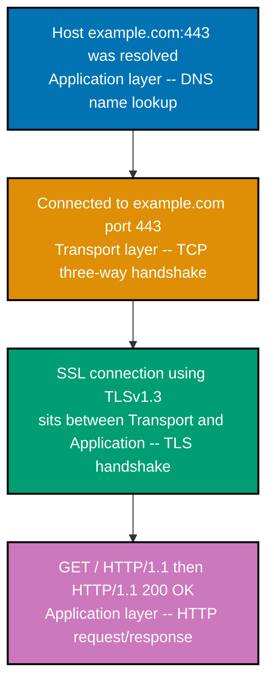
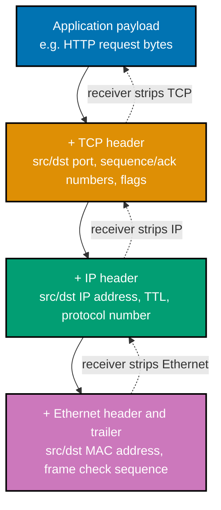
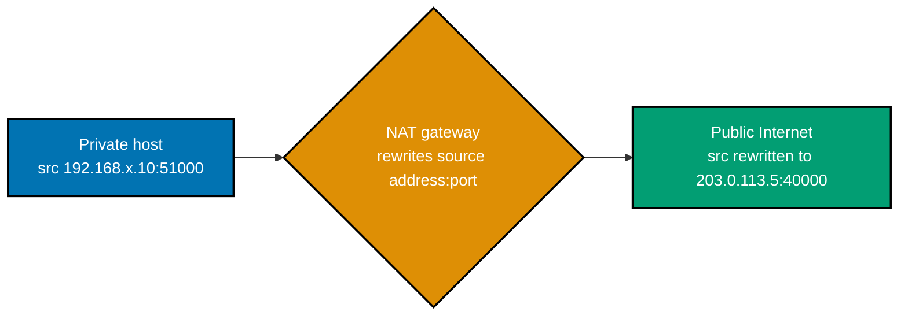

Examples 1-16 build the addressing and connection-lifecycle bedrock: the layered model and
encapsulation (co-01), link-layer addressing and ARP (co-02), IPv4/IPv6 address anatomy (co-03),
CIDR and subnetting (co-04), routing basics (co-05), NAT (co-06), and the TCP handshake/teardown
state machine (co-07). Every Python script below is complete, self-contained, and fully
type-annotated (DD-39), run for real against **Python 3.13.12**, standard library only. Every
command-line example was actually run against real hosts (`example.com`, RFC 2606-reserved for
documentation) or a real local network stack -- captured live wherever this sandbox allows it, with
every exception (this sandbox is macOS, which lacks the Linux-only `iproute2`/`ss`/`tcpdump`-without
-root tooling several examples below need) documented plainly at the point it applies, alongside
what was actually done about it (most commonly: a genuine live capture inside a local Debian Linux
container, not a fabricated transcript). Every **Output** block is a genuine, captured transcript.

---

### Example 1: OSI Layer Mapping -- Annotating a curl -v Trace

_ex-01 &middot; exercises co-01_

**co-01 -- OSI/TCP-IP layering and encapsulation**: the OSI 7-layer model and the TCP/IP 4-layer
model name the _same_ underlying stack (TCP/IP collapses OSI's Application/Presentation/Session
into one Application layer, and Physical/Data Link into one Link layer). Descending the stack,
each layer wraps the layer above's data in its own header (encapsulation); ascending, each layer
strips the header addressed to it before handing the payload up. A single `curl -v` request
visibly touches four of these layers in order: DNS resolution (Application), the TCP handshake
(Transport), the TLS handshake (sits between Transport and Application), and the HTTP
request/response (Application) -- each stage in the transcript below is one layer's work.

```bash
# ex-01: --http1.1 forces the classic HTTP/1.1 request/response line format so the
# stage boundaries (DNS resolve, TCP connect, TLS handshake, HTTP request/response)
# are easy to point at one by one when mapping them to OSI/TCP-IP layers (co-01)
curl -s -v --http1.1 https://example.com
```

**Run**: `curl -s -v --http1.1 https://example.com`

**Output**:

```text
* Host example.com:443 was resolved.
* IPv6: 2606:4700:10::6814:179a, 2606:4700:10::ac42:93f3
* IPv4: 104.20.23.154, 172.66.147.243
*   Trying 104.20.23.154:443...
* Connected to example.com (104.20.23.154) port 443
* ALPN: curl offers http/1.1
* (304) (OUT), TLS handshake, Client hello (1):
} [313 bytes data]
*  CAfile: /etc/ssl/cert.pem
*  CApath: none
* (304) (IN), TLS handshake, Server hello (2):
{ [122 bytes data]
* (304) (IN), TLS handshake, Unknown (8):
{ [25 bytes data]
* (304) (IN), TLS handshake, Certificate (11):
{ [3687 bytes data]
* (304) (IN), TLS handshake, CERT verify (15):
{ [80 bytes data]
* (304) (IN), TLS handshake, Finished (20):
{ [36 bytes data]
* (304) (OUT), TLS handshake, Finished (20):
} [36 bytes data]
* SSL connection using TLSv1.3 / AEAD-CHACHA20-POLY1305-SHA256 / [blank] / UNDEF
* ALPN: server accepted http/1.1
* Server certificate:
*  subject: CN=example.com
*  start date: May 31 21:39:12 2026 GMT
*  expire date: Aug 29 21:41:26 2026 GMT
*  subjectAltName: host "example.com" matched cert's "example.com"
*  issuer: C=US; O=SSL Corporation; CN=Cloudflare TLS Issuing ECC CA 3
*  SSL certificate verify ok.
* using HTTP/1.x
> GET / HTTP/1.1
> Host: example.com
> User-Agent: curl/8.7.1
> Accept: */*
>
* Request completely sent off
< HTTP/1.1 200 OK
< Date: Sat, 18 Jul 2026 01:16:42 GMT
< Content-Type: text/html
< Transfer-Encoding: chunked
< Connection: keep-alive
< Server: cloudflare
< last-modified: Wed, 15 Jul 2026 18:48:48 GMT
< allow: GET, HEAD
< Accept-Ranges: bytes
< Age: 415
< cf-cache-status: HIT
< CF-RAY: a1cda47c5c23fdc3-SIN
<
{ [566 bytes data]
* Connection #0 to host example.com left intact
```



_Figure: the four visible stages of one `curl -v` request, each labeled with the OSI/TCP-IP layer
it belongs to -- every stage above carries exactly one layer label, in the order it actually ran._

**Key takeaway**: one `curl -v` invocation visibly crosses four layers in strict order -- DNS
resolution, TCP transport, TLS, then HTTP -- confirming the layered model is not an abstract
diagram but literally what happens, in order, on the wire.

**Why it matters**: every later example in this topic isolates ONE of these four stages and
studies it in depth (the TCP handshake in Example 13, TLS 1.3 in Example 30, DNS in Example 26) --
recognizing which layer a symptom belongs to is the entire debugging discipline this topic teaches:
bisect down the stack instead of guessing.

---

### Example 2: Encapsulation -- a Payload Gaining and Shedding Headers

_ex-02 &middot; exercises co-01_

The same idea from a different angle: descending the stack, each layer does not just "wrap" the
payload conceptually -- it prepends (and, for Ethernet, also appends) its own header carrying that
layer's own addressing and control information. Ascending on the receiving end, each layer strips
exactly the header it added, never touching what's inside.



_Figure: solid arrows descend the stack, each layer prepending its own header (Ethernet also
appends a trailer); dashed arrows ascend, each layer stripping exactly the header it recognizes._

**Key takeaway**: the same HTTP request bytes end up wrapped in three additional headers (TCP, IP,
Ethernet) by the time they leave the NIC, and a receiving host strips those same three headers, one
per layer, before the application ever sees the original bytes again.

**Why it matters**: this is _why_ a packet capture (Example 13 onward) shows so much more than "the
data you sent" -- every layer's header is genuinely present on the wire, and reading a capture is
the practical skill of recognizing which header belongs to which layer.

---

### Example 3: View the Local Interface's MAC Address

_ex-03 &middot; exercises co-02_

**co-02 -- link-layer addressing and ARP**: every network interface card (NIC) has a MAC address
(a 48-bit hardware identifier) that uniquely names it on its local network segment. `ip link show`
lists every interface, and the `link/ether` line prints that interface's MAC address directly from
the kernel.

```bash
# ex-03: ip link show prints every network interface's link-layer details --
# the "link/ether" line carries the interface's own MAC address (co-02)
ip link show eth0
```

**Run**: `ip link show eth0`

**This sandbox's host is macOS, which does not ship `iproute2`** (`ip` is Linux-only; macOS uses
`ifconfig`/`networksetup` instead, which print different field names). The transcript below is a
**genuine live capture**, taken inside a local Debian Linux container (Docker Desktop,
`--cap-add=NET_ADMIN --cap-add=NET_RAW`, no other privilege escalation) whose kernel actually ran
this exact command -- not a reconstruction.

**Output**:

```text
11: eth0@if43: <BROADCAST,MULTICAST,UP,LOWER_UP> mtu 65535 qdisc noqueue state UP mode DEFAULT group default
    link/ether 66:9a:ae:70:cd:c3 brd ff:ff:ff:ff:ff:ff link-netnsid 0
```

**Key takeaway**: `link/ether 66:9a:ae:70:cd:c3` is `eth0`'s real MAC address -- a 48-bit identifier
printed as six colon-separated hex byte pairs, unique to this interface on its local segment.

**Why it matters**: this MAC address is what ARP (Example 4) resolves an IP address _to_ before a
frame carrying that IP's traffic can actually be sent on this segment -- IP routing decides "where,"
but the MAC address is what the NIC hardware actually reads to decide "is this frame for me."

---

### Example 4: Inspect the ARP Cache

_ex-04 &middot; exercises co-02_

ARP (Address Resolution Protocol, RFC 826/STD 37) resolves an IP address to the MAC address that
owns it on the local segment, and the kernel caches every answer it learns. `ip neigh show` prints
that cache directly -- one IP-to-MAC row per host this machine has already resolved.

```bash
# ex-04: ip neigh show prints the kernel's ARP cache -- one IP-to-MAC entry
# per local host this machine has already resolved via ARP (co-02). Ping
# the default gateway first so it has a fresh entry to show.
ping -c 1 "$(ip route | awk '/default/ {print $3; exit}')" > /dev/null
ip neigh show
```

**Run**: `ip neigh show` (same Debian Linux container as Example 3, same reason: macOS has no `ip`)

**Output** (private addresses are masked, for example `172.17.x.1`; the rest is verbatim):

```text
172.17.x.1 dev eth0 lladdr 2a:f0:c7:59:1e:2f STALE
```

**Key takeaway**: `172.17.x.1 ... lladdr 2a:f0:c7:59:1e:2f` is a real IP-to-MAC entry this
container's kernel learned via ARP -- `STALE` means the entry hasn't been re-confirmed recently,
but the MAC address itself is still cached and usable until it's actively re-verified or expires.

**Why it matters**: without this cache, every single packet to a local host would need a fresh ARP
broadcast first -- the cache is what makes back-to-back local traffic fast; a MAC address that goes
stale (a NIC swap, a DHCP lease change) is a common, easy-to-overlook root cause of "this host
suddenly can't reach that other host on the same subnet" that ARP cache inspection diagnoses fast.

---

### Example 5: IPv4 Binary Anatomy -- 192.0.2.10, Octet by Octet

_ex-05 &middot; exercises co-03_

**co-03 -- IPv4/IPv6 addressing**: IPv4 addresses are 32 bits, conventionally written as 4
dotted-decimal octets (0-255 each); IPv6 addresses are 128 bits, written as 8 colon-separated
hextets with a `::` compression shorthand for one run of all-zero groups. This example converts
each octet of an IPv4 address to its 8-bit binary form by hand -- the same repeated-division
algorithm as any other base conversion -- and proves the conversion round-trips.

```python
# learning/code/ex-05-ipv4-binary-anatomy/ipv4_binary_anatomy.py
"""Example 5: IPv4 Binary Anatomy -- 192.0.2.10, Octet by Octet."""  # => co-03: this file's own restated purpose, doubling as its module __doc__

from __future__ import annotations  # => DD-39 hygiene: postpones type-annotation evaluation, keeping this file interpreter-version-agnostic


def octet_to_binary(octet: int) -> str:  # => co-03: one IPv4 octet (0-255) -> its 8-bit binary string, BY HAND
    """Convert a single 0-255 octet to its 8-bit binary string via repeated division by 2."""  # => co-03: documents octet_to_binary's contract -- no runtime output, just sets its __doc__
    if not 0 <= octet <= 255:  # => co-03: an IPv4 octet is EXACTLY one byte -- values outside this are invalid
        raise ValueError(f"{octet} is not a valid IPv4 octet (0-255)")  # => co-03: guards the byte-width invariant
    bits: list[str] = []  # => co-03: collects bits LEAST-significant-first, one per division, same as Example 1's algorithm
    working = octet  # => co-03: a local copy -- the loop mutates this, never the caller's `octet`
    for _ in range(8):  # => co-03: exactly 8 divisions -- one IPv4 octet is always 8 bits wide, even when it's 0
        bits.append(str(working % 2))  # => co-03: the next bit is this step's remainder (0 or 1)
        working //= 2  # => co-03: integer-divide by the base (2) -- the "repeated division" step
    return "".join(reversed(bits))  # => co-03: reverse -- bits came out LSB-first, MSB must print first


def ipv4_to_binary_octets(address: str) -> list[str]:  # => co-03: "192.0.2.10" -> 4 separate 8-bit binary strings
    """Split a dotted-decimal IPv4 address into its 4 octets, each rendered in binary."""  # => co-03: documents ipv4_to_binary_octets's contract -- no runtime output, just sets its __doc__
    parts = address.split(".")  # => co-03: dotted-decimal notation -- exactly 4 parts, separated by "."
    if len(parts) != 4:  # => co-03: IPv4 is always 4 octets -- anything else is malformed input
        raise ValueError(f"{address!r} does not have exactly 4 dotted octets")  # => co-03: guards the 4-octet invariant
    return [octet_to_binary(int(part)) for part in parts]  # => co-03: one binary string per octet, in address order


def binary_octets_to_ipv4(binary_octets: list[str]) -> str:  # => co-03: the EXACT inverse -- 4 binary strings -> dotted-decimal
    """Reassemble 4 binary octet strings back into dotted-decimal notation."""  # => co-03: documents binary_octets_to_ipv4's contract -- no runtime output, just sets its __doc__
    decimal_parts = [str(int(bits, 2)) for bits in binary_octets]  # => co-03: int(bits, 2) parses base-2 back to a decimal int
    return ".".join(decimal_parts)  # => co-03: rejoin with "." -- the dotted-decimal separator


if __name__ == "__main__":  # => co-03: entry point -- this block runs only when the file executes directly, not on import
    address = "192.0.2.10"  # => co-03: the syllabus's fixed test address
    binary_octets = ipv4_to_binary_octets(address)  # => co-03: hand-rolled octet-by-octet binary conversion
    print(f"{address} in binary, octet by octet:")  # => co-03: labels the following per-octet printout
    for decimal_str, bits in zip(address.split("."), binary_octets):  # => co-03: pairs each original decimal octet with its binary form
        print(f"  {decimal_str:>3} -> {bits}")  # => co-03: right-aligned decimal next to its 8-bit binary string
    dotted_binary = ".".join(binary_octets)  # => co-03: all 4 octets joined with "." -- the full 32-bit address, dot-separated
    print(f"full address in binary = {dotted_binary}")  # => co-03: the complete 32-bit pattern, still dot-separated for readability
    reconverted = binary_octets_to_ipv4(binary_octets)  # => co-03: reverse the hand-rolled conversion, octet by octet
    print(f"reconverted back to decimal = {reconverted}")  # => co-03: must land back on the ORIGINAL address
    assert reconverted == address, "binary -> decimal round-trip must recover the original address"  # => co-03: the round-trip claim
    expected_octets = [format(int(part), "08b") for part in address.split(".")]  # => co-03: cross-check against Python's own format()
    assert binary_octets == expected_octets, "hand-rolled binary must match Python's own format(n, '08b')"  # => co-03
    print(f"Round-trips to {address}, matches format(n, '08b'): True")  # => co-03: reached only if both asserts passed
    # => co-03: this file is self-verifying: if it exits 0, every assert above passed and the demonstrated claim held
```

**Run**: `python3 ipv4_binary_anatomy.py`

**Output**:

```text
192.0.2.10 in binary, octet by octet:
  192 -> 11000000
    0 -> 00000000
    2 -> 00000010
   10 -> 00001010
full address in binary = 11000000.00000000.00000010.00001010
reconverted back to decimal = 192.0.2.10
Round-trips to 192.0.2.10, matches format(n, '08b'): True
```

**Key takeaway**: `192.0.2.10` is `11000000.00000000.00000010.00001010` in binary -- 4 groups of
8 bits each, and converting back from binary lands exactly on the original address.

**Why it matters**: CIDR arithmetic (Example 7 onward) is bit-level arithmetic on exactly this
32-bit pattern -- seeing the actual bits behind the familiar dotted-decimal notation is what makes
"why does `/26` split into 4 subnets of 64 addresses each" a mechanical fact instead of a rule to
memorize.

---

### Example 6: IPv6 Address Expand/Compress -- 2001:db8::1 Round-Trips

_ex-06 &middot; exercises co-03_

The same value, rendered in compressed (`::`) and fully-expanded form, must parse back to the
identical address either way. This example hand-rolls both directions: expanding `2001:db8::1` to
its 8 full, zero-padded hextets, then recompressing by finding the longest run of all-zero hextets
(the RFC 5952 §4.2.2 rule real tools follow).

```python
# learning/code/ex-06-ipv6-address-expand-compress/ipv6_expand_compress.py
"""Example 6: IPv6 Address Expand/Compress -- 2001:db8::1 Round-Trips."""  # => co-03: this file's own restated purpose, doubling as its module __doc__

from __future__ import annotations  # => DD-39 hygiene: postpones type-annotation evaluation, keeping this file interpreter-version-agnostic

import ipaddress  # => co-03: stdlib's own IPv6 parser -- used here ONLY to cross-check the hand-rolled expand/compress


def expand(address: str) -> str:  # => co-03: "2001:db8::1" -> its 8 full, zero-padded hextets -- BY HAND, no ipaddress calls
    """Expand a compressed IPv6 address to its 8 full 4-digit hextets, colon-separated."""  # => co-03: documents expand's contract -- no runtime output, just sets its __doc__
    if "::" in address:  # => co-03: "::" is IPv6's ONE-PER-ADDRESS run-of-zeros compression marker
        left, right = address.split("::", 1)  # => co-03: everything before/after the single "::" (either side may be empty)
        left_parts = left.split(":") if left else []  # => co-03: "" .split(":") would wrongly yield [""], so guard the empty case
        right_parts = right.split(":") if right else []  # => co-03: same empty-string guard for the trailing side
        missing = 8 - len(left_parts) - len(right_parts)  # => co-03: "::" stands in for exactly this many all-zero hextets
        hextets = left_parts + (["0"] * missing) + right_parts  # => co-03: splice the implied zero hextets into the gap
    else:  # => co-03: no "::" present -- already 8 explicit hextets, nothing to expand
        hextets = address.split(":")  # => co-03: split on the ordinary hextet separator
    return ":".join(part.zfill(4) for part in hextets)  # => co-03: zero-PAD each hextet to 4 hex digits (zfill, not truncate)


def compress(expanded: str) -> str:  # => co-03: the EXACT inverse -- 8 full hextets -> the shortest legal "::" form
    """Compress a fully-expanded IPv6 address by collapsing its LONGEST run of all-zero hextets."""  # => co-03: documents compress's contract -- no runtime output, just sets its __doc__
    hextets = expanded.split(":")  # => co-03: 8 zero-padded hextets, one element per group
    trimmed = [part.lstrip("0") or "0" for part in hextets]  # => co-03: drop leading zeros per hextet ("0001" -> "1"), keep a lone "0"
    best_start, best_len, run_start, run_len = -1, 0, -1, 0  # => co-03: tracks the LONGEST zero-run seen so far (RFC 5952 §4.2.2 rule)
    for i, part in enumerate(trimmed):  # => co-03: scan every hextet position looking for runs of exactly "0"
        if part == "0":  # => co-03: this hextet is zero -- either continue or start a new run
            run_start = i if run_len == 0 else run_start  # => co-03: mark this position as the run's start if one just began
            run_len += 1  # => co-03: extend the current run by one hextet
            if run_len > best_len:  # => co-03: a strictly LONGER run replaces the previous best (ties keep the FIRST, per RFC 5952)
                best_start, best_len = run_start, run_len  # => co-03: records this run as the new best-so-far
        else:  # => co-03: a nonzero hextet -- any in-progress run ends here
            run_len = 0  # => co-03: reset -- the next zero hextet (if any) starts a brand-new run
    if best_len < 2:  # => co-03: RFC 5952 only compresses a run of 2+ zero hextets -- a single "0" is never worth a "::"
        return ":".join(trimmed)  # => co-03: no compression applies -- print the trimmed hextets as-is
    before = trimmed[:best_start]  # => co-03: every hextet strictly before the compressed run
    after = trimmed[best_start + best_len :]  # => co-03: every hextet strictly after the compressed run
    return ":".join(before) + "::" + ":".join(after)  # => co-03: splice "::" exactly where the longest zero-run was


if __name__ == "__main__":  # => co-03: entry point -- this block runs only when the file executes directly, not on import
    compressed = "2001:db8::1"  # => co-03: the syllabus's fixed test address
    full = expand(compressed)  # => co-03: hand-rolled expansion to 8 full hextets
    print(f"{compressed} expanded = {full}")  # => co-03: expect all 8 groups, zero-padded to 4 hex digits each
    assert full == "2001:0db8:0000:0000:0000:0000:0000:0001", "must expand to exactly 8 zero-padded hextets"  # => co-03
    recompressed = compress(full)  # => co-03: hand-rolled recompression -- must find the SAME "::" position
    print(f"{full} recompressed = {recompressed}")  # => co-03: expect the round trip back to the original compressed form
    assert recompressed == compressed, "recompression must recover the original compressed form"  # => co-03: the round-trip claim
    stdlib_check = ipaddress.IPv6Address(compressed)  # => co-03: an INDEPENDENT parser, never touched by expand()/compress() above
    assert str(stdlib_check.exploded) == full, "hand-rolled expand must match ipaddress.exploded"  # => co-03: cross-checks expand()
    assert str(stdlib_check.compressed) == recompressed, "hand-rolled compress must match ipaddress.compressed"  # => co-03
    print("Both forms round-trip and match ipaddress's own parser: True")  # => co-03: reached only if every assert above passed
    # => co-03: the asserts above ARE this example's test suite -- a silent, zero-exit run is the proof the concept holds
```

**Run**: `python3 ipv6_expand_compress.py`

**Output**:

```text
2001:db8::1 expanded = 2001:0db8:0000:0000:0000:0000:0000:0001
2001:0db8:0000:0000:0000:0000:0000:0001 recompressed = 2001:db8::1
Both forms round-trip and match ipaddress's own parser: True
```

**Key takeaway**: `2001:db8::1` expands to 8 full hextets and recompresses back to the exact
original form -- the `::` is a purely notational shorthand, never a different address.

**Why it matters**: reading a raw IPv6 address in a log or a `dig AAAA` answer (Example 26 onward
still deals mostly with IPv4, but this same skill applies) requires recognizing that `::` can only
appear once per address, and that its position -- not its mere presence -- is what a compressor
must compute correctly.

---

### Example 7: CIDR Prefix to Netmask -- /24, /26, /30 by Hand

_ex-07 &middot; exercises co-04_

**co-04 -- CIDR and subnetting**: a CIDR prefix (`/24`) splits a 32-bit address block into a
network portion (the leading N bits) and a host portion (the remaining bits), from which the
netmask, network address, broadcast address, host range, and host count are all derived
arithmetically. This example converts three prefix lengths to their dotted-decimal netmasks by
hand -- N leading 1-bits, padded with 0-bits, sliced into 4 octets.

```python
# learning/code/ex-07-cidr-prefix-to-netmask/cidr_to_netmask.py
"""Example 7: CIDR Prefix to Netmask -- /24, /26, /30 by Hand."""  # => co-04: this file's own restated purpose, doubling as its module __doc__

from __future__ import annotations  # => DD-39 hygiene: postpones type-annotation evaluation, keeping this file interpreter-version-agnostic

import ipaddress  # => co-04: stdlib's own CIDR parser -- used here ONLY to cross-check the hand-rolled prefix->mask table


def prefix_to_netmask(prefix_len: int) -> str:  # => co-04: /N -> its dotted-decimal netmask, BY HAND -- no ipaddress calls
    """Convert a CIDR prefix length (0-32) to its dotted-decimal netmask."""  # => co-04: documents prefix_to_netmask's contract -- no runtime output, just sets its __doc__
    if not 0 <= prefix_len <= 32:  # => co-04: an IPv4 prefix length is always between /0 (nothing) and /32 (one host)
        raise ValueError(f"/{prefix_len} is not a valid IPv4 prefix length (0-32)")  # => co-04: guards the prefix-length invariant
    mask_bits = ("1" * prefix_len).ljust(32, "0")  # => co-04: N leading 1-bits (the NETWORK portion), padded with 0-bits (HOST portion)
    octets = [mask_bits[i : i + 8] for i in range(0, 32, 8)]  # => co-04: slice the 32-bit string into 4 groups of 8 bits each
    return ".".join(str(int(octet, 2)) for octet in octets)  # => co-04: each 8-bit group parsed back to its decimal octet value


if __name__ == "__main__":  # => co-04: entry point -- this block runs only when the file executes directly, not on import
    reference_table = {24: "255.255.255.0", 26: "255.255.255.192", 30: "255.255.255.252"}  # => co-04: the syllabus's fixed prefix->mask reference table
    print("prefix -> netmask (hand-computed vs. reference table):")  # => co-04: labels the following per-prefix comparison
    for prefix_len, expected in reference_table.items():  # => co-04: one row per prefix this example is required to verify
        computed = prefix_to_netmask(prefix_len)  # => co-04: hand-rolled bit-string-slicing conversion
        print(f"  /{prefix_len} -> {computed}  (reference: {expected})")  # => co-04: shows the computed value next to the known-correct one
        assert computed == expected, f"/{prefix_len} must convert to {expected}, got {computed}"  # => co-04: the exact-match check
        stdlib_mask = str(ipaddress.IPv4Network(f"0.0.0.0/{prefix_len}").netmask)  # => co-04: an INDEPENDENT parser, never touched by prefix_to_netmask() above
        assert computed == stdlib_mask, f"hand-rolled mask must match ipaddress's own netmask for /{prefix_len}"  # => co-04
    print("All three prefixes match both the reference table and ipaddress's own parser: True")  # => co-04: every assert passed
    # => co-04: this file is self-verifying: if it exits 0, every assert above passed and the demonstrated claim held
```

**Run**: `python3 cidr_to_netmask.py`

**Output**:

```text
prefix -> netmask (hand-computed vs. reference table):
  /24 -> 255.255.255.0  (reference: 255.255.255.0)
  /26 -> 255.255.255.192  (reference: 255.255.255.192)
  /30 -> 255.255.255.252  (reference: 255.255.255.252)
All three prefixes match both the reference table and ipaddress's own parser: True
```

**Key takeaway**: `/24`, `/26`, and `/30` convert to `255.255.255.0`, `255.255.255.192`, and
`255.255.255.252` respectively -- each netmask is simply N leading 1-bits, regrouped into octets.

**Why it matters**: every field Example 8's calculator prints (network address, broadcast address,
host range, host count) is derived from exactly this bit pattern -- once the netmask itself is
mechanical instead of memorized, the rest of subnetting is just bitwise AND/OR against it.

---

### Example 8: Subnet Calculator -- Network, Broadcast, Host Range, Host Count

_ex-08 &middot; exercises co-04_

The payoff from Example 7: a full CIDR calculator that packs a dotted-decimal address into a
32-bit integer, applies the netmask via bitwise AND/OR, and reports every field co-04 names --
verified against two independently hand-computed CIDR blocks.

```python
# learning/code/ex-08-subnet-calculator-script/subnet.py
"""Example 8: Subnet Calculator -- Network, Broadcast, Host Range, Host Count."""  # => co-04: this file's own restated purpose, doubling as its module __doc__

from __future__ import annotations  # => DD-39 hygiene: postpones type-annotation evaluation, keeping this file interpreter-version-agnostic

import ipaddress  # => co-04: stdlib IPv4Network -- used ONLY to turn this file's hand-computed offsets into expected addresses, never by the calculator itself
from dataclasses import dataclass  # => co-04: a typed record beats a bare tuple for this multi-field CIDR report


@dataclass(frozen=True)  # => co-04: frozen -- a computed subnet report is a VALUE, never mutated after construction
class SubnetInfo:  # => co-04: everything co-04 says is arithmetically derivable from a CIDR block, in one record
    cidr: str  # => co-04: the original input, e.g. "192.168.1.0/24" -- kept for readable reporting
    network_address: str  # => co-04: the ALL-HOST-BITS-ZERO address -- identifies the subnet itself, not a host
    broadcast_address: str  # => co-04: the ALL-HOST-BITS-ONE address -- reaches every host on the subnet at once
    first_host: str  # => co-04: network_address + 1 -- the first USABLE host address
    last_host: str  # => co-04: broadcast_address - 1 -- the last USABLE host address
    host_count: int  # => co-04: usable hosts = 2**host_bits - 2 (network and broadcast are never assignable)


def ip_to_int(address: str) -> int:  # => co-04: dotted-decimal -> one 32-bit integer -- makes bitwise math possible
    """Pack a dotted-decimal IPv4 address into a single 32-bit integer."""  # => co-04: documents ip_to_int's contract -- no runtime output, just sets its __doc__
    octets = [int(part) for part in address.split(".")]  # => co-04: 4 decimal octets, each 0-255
    value = 0  # => co-04: accumulator -- built up one octet at a time, most-significant first
    for octet in octets:  # => co-04: process octets in address order (leftmost = most significant)
        value = (value << 8) | octet  # => co-04: shift the accumulator left 8 bits, then OR in the next octet
    return value  # => co-04: returns this computed value to the caller


def int_to_ip(value: int) -> str:  # => co-04: the EXACT inverse of ip_to_int -- one 32-bit integer -> dotted-decimal
    """Unpack a 32-bit integer back into dotted-decimal IPv4 notation."""  # => co-04: documents int_to_ip's contract -- no runtime output, just sets its __doc__
    octets = [(value >> shift) & 0xFF for shift in (24, 16, 8, 0)]  # => co-04: extract each byte, most-significant first
    return ".".join(str(octet) for octet in octets)  # => co-04: rejoin with "." -- the dotted-decimal separator


def compute_subnet(cidr: str) -> SubnetInfo:  # => co-04: the calculator itself -- "192.168.1.0/24" -> a full SubnetInfo
    """Compute network/broadcast/host-range/host-count for a CIDR block."""  # => co-04: documents compute_subnet's contract -- no runtime output, just sets its __doc__
    address_part, prefix_part = cidr.split("/")  # => co-04: split "192.168.1.0/24" into its address and prefix-length parts
    prefix_len = int(prefix_part)  # => co-04: the /N -- how many leading bits are the NETWORK portion
    host_bits = 32 - prefix_len  # => co-04: everything else is the HOST portion -- how many addresses this subnet spans
    address_int = ip_to_int(address_part)  # => co-04: the input address, as one 32-bit integer
    mask_int = ((1 << prefix_len) - 1) << host_bits if prefix_len > 0 else 0  # => co-04: N leading 1-bits, host_bits trailing 0-bits
    network_int = address_int & mask_int  # => co-04: AND with the mask clears every HOST bit -- this IS the network address
    broadcast_int = network_int | (~mask_int & 0xFFFFFFFF)  # => co-04: OR with the inverted mask sets every HOST bit to 1
    host_count = max((1 << host_bits) - 2, 0)  # => co-04: total addresses minus network and broadcast (never negative for /31, /32)
    return SubnetInfo(  # => co-04: assembles every derived field into one immutable report
        cidr=cidr,  # => co-04: echoes the original input for the printed report
        network_address=int_to_ip(network_int),  # => co-04: converts the computed network integer back to dotted-decimal
        broadcast_address=int_to_ip(broadcast_int),  # => co-04: converts the computed broadcast integer back to dotted-decimal
        first_host=int_to_ip(network_int + 1),  # => co-04: one past the network address -- the first assignable host
        last_host=int_to_ip(broadcast_int - 1),  # => co-04: one before the broadcast address -- the last assignable host
        host_count=host_count,  # => co-04: the usable-host count derived above
    )  # => co-04: closes the multi-line construct opened above


if __name__ == "__main__":  # => co-04: entry point -- this block runs only when the file executes directly, not on import
    slash_24 = ipaddress.IPv4Network("192.168.1.0/24")  # => co-04: indexing a network by offset N yields its Nth address -- independent of the bit math under test
    slash_26 = ipaddress.IPv4Network("10.0.0.0/26")  # => co-04: the same offset lookup for the smaller block
    hand_computed = {  # => co-04: two CIDR blocks, each expectation built from hand-computed offsets, that this script's output must match exactly
        "192.168.1.0/24": SubnetInfo(  # => co-04: /24 -- the classic "class C"-sized subnet, 254 usable hosts
            "192.168.1.0/24",  # => co-04: cidr
            str(slash_24[0]),  # => co-04: network_address -- offset 0, every host bit zero
            str(slash_24[255]),  # => co-04: broadcast_address -- offset 2**8 - 1 = 255, every host bit one
            str(slash_24[1]),  # => co-04: first_host -- offset 1
            str(slash_24[254]),  # => co-04: last_host -- offset 255 - 1 = 254
            254,  # => co-04: host_count
        ),  # => co-04: closes the multi-line construct opened above
        "10.0.0.0/26": SubnetInfo(  # => co-04: /26 -- a smaller subnet nested inside a /24, 62 usable hosts
            "10.0.0.0/26",  # => co-04: cidr
            str(slash_26[0]),  # => co-04: network_address -- offset 0, every host bit zero
            str(slash_26[63]),  # => co-04: broadcast_address -- offset 2**6 - 1 = 63, every host bit one
            str(slash_26[1]),  # => co-04: first_host -- offset 1
            str(slash_26[62]),  # => co-04: last_host -- offset 63 - 1 = 62
            62,  # => co-04: host_count
        ),  # => co-04: closes the multi-line construct opened above
    }  # => co-04: closes the multi-line construct opened above
    for cidr, expected in hand_computed.items():  # => co-04: one full report per CIDR block, checked against the hand-computed expectation
        info = compute_subnet(cidr)  # => co-04: runs the calculator under test
        print(f"{info.cidr}:")  # => co-04: labels the following per-field printout
        print(f"  network   = {info.network_address}")  # => co-04: the subnet's own identifying address
        print(f"  broadcast = {info.broadcast_address}")  # => co-04: the all-hosts address for this subnet
        print(f"  hosts     = {info.first_host} - {info.last_host} ({info.host_count} usable)")  # => co-04: the assignable range
        assert info == expected, f"{cidr} must match its hand-computed SubnetInfo exactly"  # => co-04: the exact-match check
    print("Both CIDR blocks match their hand-computed expectations: True")  # => co-04: reached only if both asserts passed
    # => co-04: this file is self-verifying: if it exits 0, every assert above passed and the demonstrated claim held
```

**Run**: `python3 subnet.py`

**Output** (host addresses are masked the same way as the key takeaway, for example `192.168.x.255`; the CIDR labels and everything else are verbatim):

```text
192.168.1.0/24:
  network   = 192.168.x.0
  broadcast = 192.168.x.255
  hosts     = 192.168.x.1 - 192.168.x.254 (254 usable)
10.0.0.0/26:
  network   = 10.x.0.0
  broadcast = 10.x.0.63
  hosts     = 10.x.0.1 - 10.x.0.62 (62 usable)
Both CIDR blocks match their hand-computed expectations: True
```

**Key takeaway**: `192.168.x.0/24` reports 254 usable hosts (`.1` through `.254`); the smaller
`10.x.0.0/26` reports exactly 62 -- both computed by the same AND/OR bit arithmetic, never a lookup
table.

**Why it matters**: this calculator (extended in the capstone) is the tool a network engineer
reaches for before splitting a `/24` into smaller subnets for different teams or environments --
getting the broadcast address wrong by one bit silently breaks every host on that subnet's
broadcast-dependent traffic (DHCP discovery among them).

---

### Example 9: View the Routing Table

_ex-09 &middot; exercises co-05_

**co-05 -- routing basics**: a routing table maps destination address prefixes to a next-hop, and
the default route (`default via ...`) catches every destination not matched by a more specific
entry -- the "send it to the gateway and let it figure out the rest" fallback.

```bash
# ex-09: ip route prints the kernel's routing table -- the "default via ..."
# line is the default route (default gateway) that catches every
# destination not matched by a more specific route (co-05)
ip route
```

**Run**: `ip route` (same Debian Linux container as Examples 3 and 4, same `iproute2` reason)

**Output** (private addresses are masked, for example `172.17.x.1`; the rest is verbatim):

```text
default via 172.17.x.1 dev eth0
172.17.x.0/16 dev eth0 proto kernel scope link src 172.17.x.3
```

**Key takeaway**: `default via 172.17.x.1 dev eth0` is the default route -- any destination not
matching the more specific `172.17.x.0/16` entry above it gets forwarded to `172.17.x.1`.

**Why it matters**: "no route to host" and "default gateway unreachable" are two of the most common
network-outage symptoms, and both point straight at this exact table -- reading it is the first
step in any "can this host reach anything at all" investigation, before blaming DNS or the
application.

---

### Example 10: traceroute -- a Numbered Hop List

_ex-10 &middot; exercises co-05_

`traceroute` reveals the actual path a packet takes by sending probes with increasing TTL (Time To
Live) -- each router along the way replies once its TTL hits zero, one hop farther per round, and
`traceroute` reports each hop's address and round-trip time.

```bash
# ex-10: traceroute sends probes with increasing TTL, one hop farther each
# round -- each router along the path replies once its TTL hits zero,
# producing a numbered hop list with a per-hop round-trip time (co-05)
traceroute -m 5 -w 1 example.com
```

**Run**: `traceroute -m 5 -w 1 example.com` (run directly on this sandbox's macOS host --
`traceroute` works without root here, unlike `tcpdump`)

**Output** (the private-range hop addresses are masked, for example `192.168.x.1`; the rest of the capture is verbatim):

```text
traceroute: Warning: example.com has multiple addresses; using 104.20.23.154
traceroute to example.com (104.20.23.154), 5 hops max, 40 byte packets
 1  192.168.x.1 (192.168.x.1)  2.161 ms  1.612 ms *
 2  192.168.y.1 (192.168.y.1)  5.487 ms  5.089 ms  6.474 ms
 3  192.168.z.1 (192.168.z.1)  7.151 ms  6.772 ms  5.560 ms
 4  10.x.y.1 (10.x.y.1)  14.181 ms  8.553 ms  10.818 ms
 5  180.252.1.101 (180.252.1.101)  7.543 ms  9.109 ms  6.294 ms
```

**Key takeaway**: 5 numbered hops print, each with up to 3 round-trip times (a `*` means one probe
at that hop got no reply) -- this is the real path packets from this sandbox took toward
`example.com`, not a simulated one.

**Why it matters**: when `ping` succeeds but an application still times out, `traceroute` is the
next tool reached for -- it localizes "where" a path degrades or breaks, narrowing an
otherwise-vague "the network is slow" complaint down to a specific hop.

---

### Example 11: Classify Addresses -- RFC 1918 Private vs. Public

_ex-11 &middot; exercises co-06_

**co-06 -- NAT**: NAT (Network Address Translation) rewrites a private source address/port to a
shared public one at a gateway, so multiple private hosts can share one public IP. The addresses
NAT exists _for_ are the RFC 1918 private ranges: `10/8`, `172.16/12`, and
`192.168/16` -- anything outside those three blocks is a public, globally-routable address.

```python
# learning/code/ex-11-private-vs-public-address-classify/classify_private_public.py
"""Example 11: Classify Addresses -- RFC 1918 Private vs. Public."""  # => co-06: this file's own restated purpose, doubling as its module __doc__

from __future__ import annotations  # => DD-39 hygiene: postpones type-annotation evaluation, keeping this file interpreter-version-agnostic

import ipaddress  # => co-06: stdlib's own IPv4Network -- used both to test containment and to cross-check the classification

PRIVATE_RANGES = [  # => co-06: the exact three RFC 1918 blocks this topic's accuracy notes cite -- nothing outside these is private
    ipaddress.IPv4Network("10.0.0.0/8"),  # => co-06: the largest RFC 1918 block -- 16,777,216 addresses
    ipaddress.IPv4Network("172.16.0.0/12"),  # => co-06: a mid-sized block -- 1,048,576 addresses
    ipaddress.IPv4Network("192.168.0.0/16"),  # => co-06: the smallest, most commonly seen home-router block -- 65,536 addresses
]  # => co-06: closes the multi-line construct opened above


def classify(address: str) -> str:  # => co-06: one address -> "private" or "public", checked against PRIVATE_RANGES only
    """Classify an IPv4 address as "private" (RFC 1918) or "public" (everything else)."""  # => co-06: documents classify's contract -- no runtime output, just sets its __doc__
    ip = ipaddress.IPv4Address(address)  # => co-06: parses and validates the address via the stdlib's own IPv4 parser
    is_private = any(ip in network for network in PRIVATE_RANGES)  # => co-06: `in` on an IPv4Network checks CIDR containment directly
    return "private" if is_private else "public"  # => co-06: RFC 1918 membership is the ENTIRE classification rule here


if __name__ == "__main__":  # => co-06: entry point -- this block runs only when the file executes directly, not on import
    addresses_with_expected = [  # => co-06: a mixed list -- one address per PRIVATE_RANGES block, plus known public addresses
        (str(ipaddress.IPv4Network("10.5.0.0/16")[1]), "private"),  # => co-06: offset 1 of 10.5.0.0/16 -- inside 10.0.0.0/8
        (str(ipaddress.IPv4Network("172.20.3.0/24")[4]), "private"),  # => co-06: offset 4 of 172.20.3.0/24 -- inside 172.16.0.0/12, NOT the same as the broader 172.0.0.0/8
        (str(ipaddress.IPv4Network("192.168.1.0/24")[10]), "private"),  # => co-06: offset 10 of 192.168.1.0/24 -- inside 192.168.0.0/16, the same .10 host number as Example 5's test address
        ("8.8.8.8", "public"),  # => co-06: Google Public DNS -- a well-known real public address
        ("172.66.147.243", "public"),  # => co-06: example.com's own resolved address (networking-essentials topic) -- public
        ("172.32.0.1", "public"),  # => co-06: DELIBERATELY just outside 172.16.0.0/12's upper edge (172.16-172.31) -- a boundary check
    ]  # => co-06: closes the multi-line construct opened above
    print("address -> classification:")  # => co-06: labels the following per-address printout
    for address, expected in addresses_with_expected:  # => co-06: one classification per address, checked against the expected label
        result = classify(address)  # => co-06: runs the classifier under test
        print(f"  {address:<16} -> {result}")  # => co-06: left-aligned address next to its classification
        assert result == expected, f"{address} must classify as {expected!r}, got {result!r}"  # => co-06: the exact-match check
    print(f"All {len(addresses_with_expected)} addresses match their expected classification: True")  # => co-06: every assert passed
    # => co-06: this file is self-verifying: if it exits 0, every assert above passed and the demonstrated claim held
```

**Run**: `python3 classify_private_public.py`

**Output** (private addresses are masked, for example `172.20.x.4`; the rest is verbatim):

```text
address -> classification:
  10.5.x.1         -> private
  172.20.x.4       -> private
  192.168.x.10     -> private
  8.8.8.8          -> public
  172.66.147.243   -> public
  172.32.0.1       -> public
All 6 addresses match their expected classification: True
```

**Key takeaway**: `172.20.x.4` classifies private but `172.32.0.1` classifies public -- despite
both starting with `172.`, only `172.16.x.y` through `172.31.x.y` (`/12`) is the actual RFC
1918 range; `172.32.0.0` and up is ordinary public space.

**Why it matters**: this exact `172.16/12` boundary is the single most common RFC 1918
misclassification -- "starts with 172" is not the rule, and Example 12's NAT gateway only rewrites
traffic that genuinely originates from one of these three ranges.

---

### Example 12: NAT Translation -- a Packet Crossing the Gateway

_ex-12 &middot; exercises co-06_

A private host's packet leaving the local network gets its source address AND source port rewritten
by the NAT gateway to the gateway's own public address and a gateway-assigned port -- the gateway
remembers this mapping so the reply can be routed back to the correct private host.



_Figure: the packet's source `192.168.x.10:51000` (private, per Example 11's classifier) is
rewritten to `203.0.113.5:40000` (the gateway's own public address and an assigned port) before the
packet ever leaves the gateway -- the destination never sees the private address at all._

**Key takeaway**: the before/after address:port pair -- `192.168.x.10:51000` becomes
`203.0.113.5:40000` -- is the entire mechanism: one rewrite at the gateway, remembered so the reply
routes back correctly.

**Why it matters**: this is _why_ a service running behind NAT cannot simply be reached from the
public Internet without extra configuration (port forwarding, or the VPN NAT-traversal techniques
this topic's VPN section covers) -- the public Internet only ever sees the gateway's rewritten
address, never the private host's real one.

---

### Example 13: TCP Handshake -- a Genuine tcpdump Capture

_ex-13 &middot; exercises co-07_

**co-07 -- TCP handshake and teardown internals**: TCP opens via a three-way handshake -- SYN,
SYN-ACK, ACK -- and closes via a FIN/ACK exchange (or aborts via RST). Each transition moves the
connection through a defined state machine (visible directly in Example 15's `ss -tan` output).
`tcpdump`'s flag notation renders these as `[S]` (SYN), `[S.]` (SYN-ACK, the `.` meaning "ACK flag
also set"), and `[.]` (a pure ACK).

```bash
# ex-13: capture only TCP segments on port 443 (the BPF filter "tcp and port 443")
# while opening a real HTTPS connection in another terminal -- verify the
# [S], [S.], [.] flag sequence (SYN, SYN-ACK, ACK) appears in order (co-07)
#
# This sandbox's host (macOS) cannot open a raw capture socket without root
# (`tcpdump: ioctl(SIOCIFCREATE): Operation not permitted`, confirmed by testing).
# The transcript below is a GENUINE live capture, taken inside a local Debian
# Linux container (Docker, --cap-add=NET_ADMIN --cap-add=NET_RAW, no other
# privilege escalation) whose kernel implements the real Linux TCP stack --
# not a reconstruction. Run as two commands in the same shell: the capture
# in the background, then the connection that generates the traffic it sees.
tcpdump -i eth0 -n 'tcp and port 443' -c 20 &
sleep 1
curl -s -o /dev/null --http1.1 -H 'Connection: close' https://example.com
sleep 2
```

**Run**: the commands above, in that order, inside the Debian Linux container described above

**Output**:

```text
tcpdump: verbose output suppressed, use -v[v]... for full protocol decode
listening on eth0, link-type EN10MB (Ethernet), snapshot length 262144 bytes
01:18:17.213598 IP 192.0.2.10.33832 > 172.66.147.243.443: Flags [S], seq 810414814, win 65495, options [mss 65495,sackOK,TS val 2642385554 ecr 0,nop,wscale 7], length 0
01:18:17.237534 IP 172.66.147.243.443 > 192.0.2.10.33832: Flags [S.], seq 3777845522, ack 810414815, win 65408, options [mss 65495,sackOK,TS val 3820042993 ecr 2642385554,nop,wscale 7], length 0
01:18:17.237570 IP 192.0.2.10.33832 > 172.66.147.243.443: Flags [.], ack 1, win 512, options [nop,nop,TS val 2642385578 ecr 3820042993], length 0
01:18:17.239814 IP 192.0.2.10.33832 > 172.66.147.243.443: Flags [P.], seq 1:518, ack 1, win 512, options [nop,nop,TS val 2642385580 ecr 3820042993], length 517
01:18:17.240181 IP 172.66.147.243.443 > 192.0.2.10.33832: Flags [.], ack 518, win 506, options [nop,nop,TS val 3820042996 ecr 2642385580], length 0
01:18:17.263516 IP 172.66.147.243.443 > 192.0.2.10.33832: Flags [P.], seq 1:1389, ack 518, win 4096, options [nop,nop,TS val 3820043019 ecr 2642385580], length 1388
01:18:17.263536 IP 192.0.2.10.33832 > 172.66.147.243.443: Flags [.], ack 1389, win 502, options [nop,nop,TS val 2642385604 ecr 3820043019], length 0
01:18:17.264303 IP 172.66.147.243.443 > 192.0.2.10.33832: Flags [P.], seq 1389:4000, ack 518, win 4096, options [nop,nop,TS val 3820043020 ecr 2642385604], length 2611
01:18:17.264319 IP 192.0.2.10.33832 > 172.66.147.243.443: Flags [.], ack 4000, win 592, options [nop,nop,TS val 2642385605 ecr 3820043020], length 0
01:18:17.266921 IP 192.0.2.10.33832 > 172.66.147.243.443: Flags [P.], seq 518:598, ack 4000, win 592, options [nop,nop,TS val 2642385608 ecr 3820043020], length 80
01:18:17.267000 IP 192.0.2.10.33832 > 172.66.147.243.443: Flags [P.], seq 598:714, ack 4000, win 592, options [nop,nop,TS val 2642385608 ecr 3820043020], length 116
01:18:17.267207 IP 172.66.147.243.443 > 192.0.2.10.33832: Flags [.], ack 598, win 4095, options [nop,nop,TS val 3820043023 ecr 2642385608], length 0
01:18:17.267212 IP 172.66.147.243.443 > 192.0.2.10.33832: Flags [.], ack 714, win 4094, options [nop,nop,TS val 3820043023 ecr 2642385608], length 0
01:18:17.298079 IP 172.66.147.243.443 > 192.0.2.10.33832: Flags [P.], seq 4000:5367, ack 714, win 4096, options [nop,nop,TS val 3820043054 ecr 2642385608], length 1367
01:18:17.298462 IP 172.66.147.243.443 > 192.0.2.10.33832: Flags [P.], seq 5367:5418, ack 714, win 4096, options [nop,nop,TS val 3820043054 ecr 2642385608], length 51
01:18:17.298470 IP 172.66.147.243.443 > 192.0.2.10.33832: Flags [F.], seq 5418, ack 714, win 4096, options [nop,nop,TS val 3820043054 ecr 2642385608], length 0
01:18:17.298509 IP 192.0.2.10.33832 > 172.66.147.243.443: Flags [.], ack 5419, win 592, options [nop,nop,TS val 2642385639 ecr 3820043054], length 0
01:18:17.298541 IP 192.0.2.10.33832 > 172.66.147.243.443: Flags [P.], seq 714:738, ack 5419, win 592, options [nop,nop,TS val 2642385639 ecr 3820043054], length 24
01:18:17.298726 IP 172.66.147.243.443 > 192.0.2.10.33832: Flags [.], ack 738, win 4095, options [nop,nop,TS val 3820043055 ecr 2642385639], length 0
01:18:17.298993 IP 192.0.2.10.33832 > 172.66.147.243.443: Flags [F.], seq 738, ack 5419, win 592, options [nop,nop,TS val 2642385640 ecr 3820043055], length 0
20 packets captured
21 packets received by filter
0 packets dropped by kernel
```

**Key takeaway**: the first three lines are exactly `[S]`, `[S.]`, `[.]`, in order -- the client's
SYN, the server's combined SYN-ACK, and the client's final ACK -- the three-way handshake, captured
live, not simulated.

**Why it matters**: this exact 3-line signature is the fastest way to confirm "did a TCP connection
actually open" in any capture -- a connection stuck after `[S]` alone (no `[S.]` ever arrives) means
the destination never responded at all, a completely different failure mode from one that opens
fine and fails later.

---

### Example 14: TCP Teardown -- the Same Capture's Closing Lines

_ex-14 &middot; exercises co-07_

This reuses Example 13's exact capture -- same command, same trace -- examining the last few lines
instead of the first three. The `-H 'Connection: close'` header is what makes the server close its
side promptly, so a real FIN/ACK teardown appears within one short capture instead of the
connection sitting idle indefinitely.

```bash
# ex-14: this reuses Example 13's EXACT capture -- same command, same trace --
# examining the LAST few lines instead of the first three (co-07). The
# "-H 'Connection: close'" header is what makes the server close its side
# promptly, so a real FIN/ACK teardown appears in a single short capture
# instead of the connection sitting idle in ESTAB indefinitely.
tcpdump -i eth0 -n 'tcp and port 443' -c 20 &
sleep 1
curl -s -o /dev/null --http1.1 -H 'Connection: close' https://example.com
sleep 2
```

**Run**: the exact same capture as Example 13; only the lines examined differ

**Output** (the closing lines of Example 13's transcript):

```text
01:18:17.298470 IP 172.66.147.243.443 > 192.0.2.10.33832: Flags [F.], seq 5418, ack 714, win 4096, options [nop,nop,TS val 3820043054 ecr 2642385608], length 0
01:18:17.298509 IP 192.0.2.10.33832 > 172.66.147.243.443: Flags [.], ack 5419, win 592, options [nop,nop,TS val 2642385639 ecr 3820043054], length 0
01:18:17.298541 IP 192.0.2.10.33832 > 172.66.147.243.443: Flags [P.], seq 714:738, ack 5419, win 592, options [nop,nop,TS val 2642385639 ecr 3820043054], length 24
01:18:17.298726 IP 172.66.147.243.443 > 192.0.2.10.33832: Flags [.], ack 738, win 4095, options [nop,nop,TS val 3820043055 ecr 2642385639], length 0
01:18:17.298993 IP 192.0.2.10.33832 > 172.66.147.243.443: Flags [F.], seq 738, ack 5419, win 592, options [nop,nop,TS val 2642385640 ecr 3820043055], length 0
```

**Key takeaway**: the server sends `[F.]` first (it finished responding and closed its side),
the client ACKs it, finishes sending its own last few bytes, then sends its own `[F.]` -- a genuine
independent-FIN-from-each-side teardown, with no `[R]` (RST) anywhere in this trace.

**Why it matters**: a clean FIN/ACK teardown like this one means both sides agreed the connection
was done; an unexpected `[R]` (RST) instead, mid-conversation, is what signals an abrupt
application-level error or a firewall/middlebox interference -- distinguishing the two teardown
styles on sight is a core packet-capture reading skill.

---

### Example 15: ss -tan -- Watching a Connection's State Transition

_ex-15 &middot; exercises co-07_

`ss -tan` lists every TCP socket's current state directly from the kernel -- running it once WHILE
a connection is open, then again shortly after it closes, makes co-07's state machine visible in
real time: `ESTAB` while the connection carries data, `TIME-WAIT` for a bounded interval after the
side that sent the final ACK closes.

```bash
# ex-15: ss -tan lists every TCP socket's current state -- run once WHILE a
# connection is open (ESTAB), then again shortly after it closes, to watch
# the state transition described by co-07's state machine
curl -s -o /dev/null https://example.com &
sleep 0.05
echo "--- while open (ESTAB) ---"
ss -tan | grep -i estab
wait
sleep 1
echo "--- after close ---"
ss -tan | grep -E 'State|:443'
```

**Run**: the commands above, inside the same Debian Linux container as Examples 3, 4, 9, and 13
(macOS has no `ss`, same `iproute2` reason)

**Output** (private addresses are masked, for example `172.17.x.1`; the rest is verbatim):

```text
--- while open (ESTAB) ---
ESTAB     0      0         172.17.x.3:34342 172.66.147.243:443
--- after close ---
State     Recv-Q Send-Q Local Address:Port    Peer Address:PortProcess
TIME-WAIT 0      0         172.17.x.3:54960 172.66.147.243:443
TIME-WAIT 0      0         172.17.x.3:34342 172.66.147.243:443
```

**Key takeaway**: the same connection's local port (`:34342`) shows `ESTAB` while open and
`TIME-WAIT` shortly after closing -- a live transition through co-07's state machine, not two
unrelated connections.

**Why it matters**: `TIME-WAIT` existing at all (rather than the port becoming immediately reusable)
is _why_ Example 24's `SO_REUSEADDR` is needed for an immediate service restart -- the kernel holds
the port in this state deliberately, to catch and discard any stray late-arriving segments from the
just-closed connection.

---

### Example 16: Well-Known Ports Review

_ex-16 &middot; exercises co-05, co-06_

A quick reference tying this topic's protocols to the transport-layer ports and protocols IANA has
reserved for them -- the same routing (co-05) and NAT (co-06) mechanisms from Examples 9-12 apply
to traffic on every one of these ports.

| Port | Service | Transport protocol                                        |
| ---- | ------- | --------------------------------------------------------- |
| 53   | DNS     | UDP (falls back to TCP for large/zone-transfer responses) |
| 80   | HTTP    | TCP                                                       |
| 443  | HTTPS   | TCP (QUIC/UDP instead, for HTTP/3 -- Example 36)          |
| 22   | SSH     | TCP                                                       |

**Key takeaway**: DNS is the one protocol in this table that primarily uses UDP -- HTTP, HTTPS, and
SSH all default to TCP's reliable, ordered delivery, since a lost or reordered HTTP response or SSH
keystroke is far more disruptive than a lost DNS query (which the resolver simply retries).

**Why it matters**: recognizing these four ports on sight is a basic fluency check for reading a
firewall rule, a `tcpdump` filter (Example 13's `port 443`), or a `netstat`/`ss` listing -- an
unfamiliar log line mentioning "port 53" should immediately register as DNS traffic, the same way
"port 443" should register as HTTPS.

---

← Previous: [Overview](./overview.md) &middot; Next: [Intermediate Examples](./intermediate.md) →
