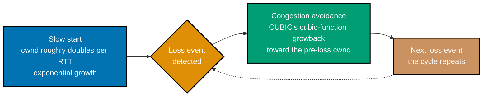
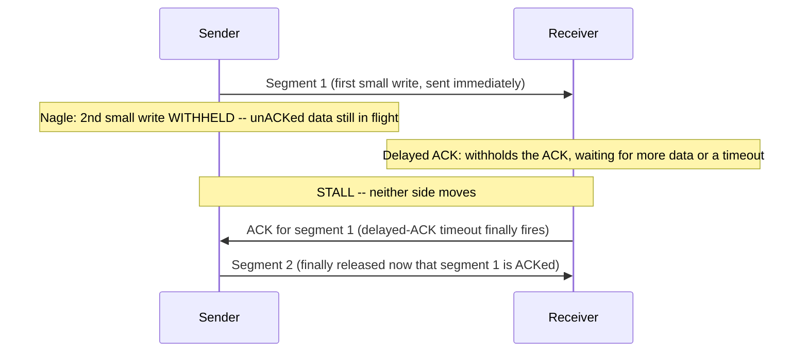
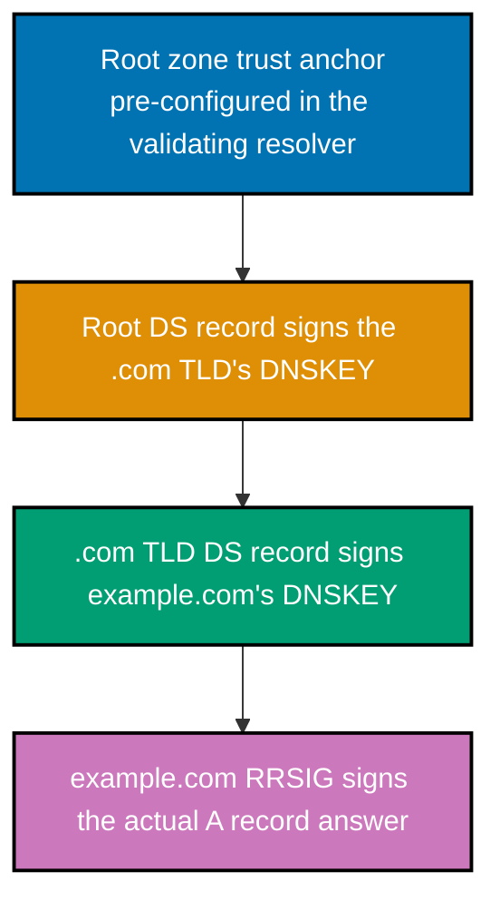
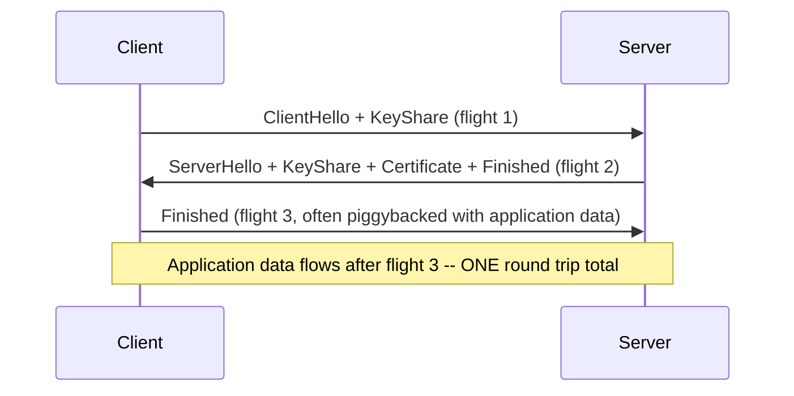
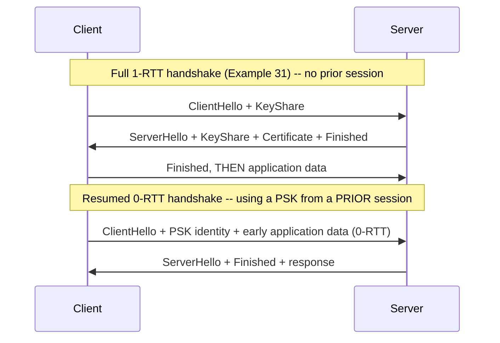
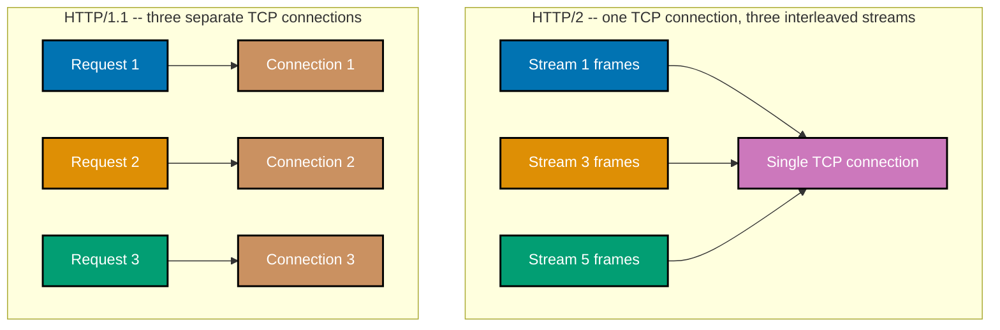

Examples 17-36 build on the Beginner tier's addressing and connection-lifecycle bedrock: TCP flow
control and congestion control (co-08, co-09), Nagle/delayed-ACK and socket options (co-10, co-11),
DNS resolution and DNSSEC (co-12, co-13), and the modern application layer -- TLS 1.3, HTTP/2, and
HTTP/3/QUIC (co-14 through co-16). Same standard as the Beginner tier: every Python script actually
run against **Python 3.13.12** (or, where genuine Linux kernel TCP timing behavior is the entire
point, **Python 3.13.14** inside a local Debian Linux container -- noted plainly at each example
that needs it), standard library only, every command-line transcript genuinely captured against
real hosts or a real local stack, every **Output** block a real transcript.

---

### Example 17: TCP Window Scaling -- Locating wscale in a Live Capture

_ex-17 &middot; exercises co-08_

**co-08 -- TCP flow control**: the receiver advertises a window that caps how much unacknowledged
data the sender may have in flight, protecting a slow receiver from being overrun. The base TCP
window field is only 16 bits (max 65,535 bytes) -- RFC 7323's window-scale option, negotiated once
in the SYN/SYN-ACK exchange, multiplies that by a power of two so modern high-bandwidth links can
use a much larger window.

```bash
# ex-17: -v prints each captured packet's options list in full -- filtering
# to SYN packets only (tcp-syn flag set) isolates the two handshake segments
# that actually carry window-scale negotiation, so "wscale" is easy to find
# alongside "mss" and "sackOK" in the exact documented options order (co-08)
tcpdump -i eth0 -n -v 'tcp and port 443 and tcp[tcpflags] & (tcp-syn) != 0' -c 2 &
sleep 1
curl -s -o /dev/null --http1.1 https://example.com
sleep 1
```

**Run**: the commands above, inside the same Debian Linux container Beginner Examples 3, 4, 9, 13,
and 15 used (macOS cannot open a raw capture socket without root, confirmed by testing)

**Output**:

```text
tcpdump: listening on eth0, link-type EN10MB (Ethernet), snapshot length 262144 bytes
01:18:43.662122 IP (tos 0x0, ttl 64, id 45998, offset 0, flags [DF], proto TCP (6), length 60)
    192.0.2.10.49572 > 172.66.147.243.443: Flags [S], cksum 0xec78 (incorrect -> 0x7d6d), seq 3435443398, win 65495, options [mss 65495,sackOK,TS val 2642412001 ecr 0,nop,wscale 7], length 0
01:18:43.684982 IP (tos 0x0, ttl 63, id 23885, offset 0, flags [none], proto TCP (6), length 60)
    172.66.147.243.443 > 192.0.2.10.49572: Flags [S.], cksum 0x5597 (incorrect -> 0xc0d3), seq 1765133752, ack 3435443399, win 65408, options [mss 65495,sackOK,TS val 3820069439 ecr 2642412001,nop,wscale 7], length 0
2 packets captured
2 packets received by filter
0 packets dropped by kernel
```

**Key takeaway**: both the client's `[S]` and the server's `[S.]` carry
`options [mss 65495,sackOK,TS val ... ecr ...,nop,wscale 7]` -- the exact documented options order
(`mss`, `sackOK`, `TS val`/`ecr`, `nop`, `wscale`) -- with `wscale 7` meaning the advertised window
is multiplied by `2**7 = 128`.

**Why it matters**: window scaling is negotiated ONLY in the SYN/SYN-ACK exchange -- if either side
omits the option, the connection falls back to the unscaled 16-bit window for its entire lifetime,
which is exactly why a captured handshake (not a later packet) is the only place to check whether
scaling is active on a given connection.

---

### Example 18: TCP Flow Control -- a Slow Reader Blocks a Fast Writer

_ex-18 &middot; exercises co-08_

The payoff from Example 17's window-scale field: an actual demonstration of what that window is
_for_. A receiver with a deliberately small buffer, combined with a delay before it starts reading,
causes a fast writer's `send()` calls to eventually block -- flow control acting exactly as
co-08 describes, on this sandbox's own kernel TCP stack, no simulation.

```python
# learning/code/ex-18-tcp-flow-control-window-shrink/flow_control_window_shrink.py
"""Example 18: TCP Flow Control -- a Slow Reader Blocks a Fast Writer."""  # => co-08: this file's own restated purpose, doubling as its module __doc__

from __future__ import annotations  # => DD-39 hygiene: postpones type-annotation evaluation, keeping this file interpreter-version-agnostic

import socket  # => co-08: raw sockets -- the level flow control actually operates at, below any application framing
import threading  # => co-08: runs the SLOW reader concurrently with the fast writer on one localhost connection
import time  # => co-08: sleeps simulate a receiver that is busy/slow, and times the writer's blocking send() call

HOST = "127.0.0.1"  # => co-08: loopback -- no real network needed, only the kernel's OWN TCP stack on both ends
CHUNK = 65536  # => co-08: 64 KiB per send() call -- large enough to fill a shrunk window in only a few calls
SLOW_READ_DELAY_SECONDS = 2.0  # => co-08: how long the "slow reader" sleeps BEFORE its first recv() call
SEND_TIMEOUT_SECONDS = 1.0  # => co-08: how long the writer waits before treating a stalled send() as "blocked by the window"


def slow_reader(server_sock: socket.socket, received: list[int]) -> None:  # => co-08: the RECEIVER side -- deliberately withholds recv()
    """Accept one connection, sleep (simulating a busy receiver), then drain everything at once."""  # => co-08: documents slow_reader's contract -- no runtime output, just sets its __doc__
    conn, _ = server_sock.accept()  # => co-08: blocks here until the client (writer) below connects
    time.sleep(SLOW_READ_DELAY_SECONDS)  # => co-08: THE key delay -- no recv() calls happen while the sender is writing
    total = 0  # => co-08: running count of bytes eventually drained, once reading finally starts
    conn.settimeout(0.5)  # => co-08: bounds the final drain loop so this thread cannot hang forever
    try:  # => co-08: the drain loop below ends naturally once the writer stops sending (timeout) or closes
        while True:  # => co-08: keep draining until no more data arrives within the timeout window
            data = conn.recv(CHUNK)  # => co-08: NOW the receiver finally starts reading -- this is what un-shrinks the window
            if not data:  # => co-08: an empty recv() means the peer closed its write side (a FIN was received)
                break  # => co-08: nothing more will ever arrive -- stop draining
            total += len(data)  # => co-08: tally every byte actually read off the socket
    except TimeoutError:  # => co-08: no more data within 0.5s -- treat this as "the writer is done sending"
        pass  # => co-08: expected end-of-burst condition, not an error
    received.append(total)  # => co-08: reports the final drained byte count back to the main thread
    conn.close()  # => co-08: releases this connection's resources on the receiver side


if __name__ == "__main__":  # => co-08: entry point -- this block runs only when the file executes directly, not on import
    server_sock = socket.socket(socket.AF_INET, socket.SOCK_STREAM)  # => co-08: the listening socket the slow reader accepts on
    server_sock.setsockopt(socket.SOL_SOCKET, socket.SO_RCVBUF, 4096)  # => co-08: request a SMALL receive buffer -- shrinks the window sooner
    server_sock.bind((HOST, 0))  # => co-08: port 0 -- let the OS pick a free ephemeral port, avoiding hardcoded-port collisions
    server_sock.listen(1)  # => co-08: one pending connection is all this single-client demo needs
    port = server_sock.getsockname()[1]  # => co-08: the OS-assigned port, needed by the client below to connect back

    received: list[int] = []  # => co-08: a mutable box the reader thread appends its final tally into, for the main thread to read
    reader_thread = threading.Thread(target=slow_reader, args=(server_sock, received))  # => co-08: runs slow_reader() concurrently
    reader_thread.start()  # => co-08: starts accepting (and then deliberately delaying) in the background

    client_sock = socket.socket(socket.AF_INET, socket.SOCK_STREAM)  # => co-08: the WRITER side -- tries to send as fast as it can
    client_sock.connect((HOST, port))  # => co-08: connects to the slow reader's listening port
    client_sock.settimeout(SEND_TIMEOUT_SECONDS)  # => co-08: without this, a full send buffer would block FOREVER, not just slow down
    payload = b"x" * CHUNK  # => co-08: one 64 KiB chunk, reused on every send() call below

    sent_before_block = 0  # => co-08: total bytes the writer got out BEFORE flow control first stalled it
    blocked = False  # => co-08: True once a send() call actually times out -- the moment the window is confirmed full
    start = time.monotonic()  # => co-08: wall-clock start, so the eventual stall can be reported with a real elapsed time
    for attempt in range(1, 21):  # => co-08: up to 20 chunks (1.25 MiB) -- far more than a 4 KiB-buffered window can absorb unread
        try:  # => co-08: each send() either succeeds immediately or times out once the window is exhausted
            client_sock.sendall(payload)  # => co-08: sendall() loops internally until every byte is queued -- exactly where blocking shows up
            sent_before_block += CHUNK  # => co-08: this attempt's bytes made it into the socket's own send buffer
        except TimeoutError:  # => co-08: sendall() could not queue more bytes within SEND_TIMEOUT_SECONDS -- THIS is flow control
            blocked = True  # => co-08: the defining observation this example exists to demonstrate
            print(f"send() blocked on attempt {attempt} after {sent_before_block} bytes queued -- receiver's window is full")  # => co-08
            break  # => co-08: no need to keep retrying -- the claim is already demonstrated
    elapsed = time.monotonic() - start  # => co-08: how long the writer spent before flow control kicked in
    client_sock.close()  # => co-08: releases this connection's resources on the writer side -- also unblocks the slow reader's drain

    reader_thread.join()  # => co-08: waits for the reader thread to finish draining and record its tally
    server_sock.close()  # => co-08: releases the listening socket

    print(f"writer sent {sent_before_block} bytes before blocking (elapsed {elapsed:.2f}s)")  # => co-08: the writer-side summary
    print(f"reader eventually drained {received[0]} bytes total")  # => co-08: the receiver-side summary, once it finally read
    assert blocked, "a 4 KiB receive buffer with a 2s-delayed reader must eventually block a 64 KiB-chunk sender"  # => co-08
    assert sent_before_block > 0, "at least the first chunk must have been queued before any blocking occurred"  # => co-08
    print("Flow control demonstrably slowed/blocked the fast writer: True")  # => co-08: reached only if both asserts passed
    # => co-08: this file is self-verifying: if it exits 0, every assert above passed and the demonstrated claim held
```

**Run**: `python3 flow_control_window_shrink.py`

**Output**:

```text
send() blocked on attempt 11 after 655360 bytes queued -- receiver's window is full
writer sent 655360 bytes before blocking (elapsed 1.00s)
reader eventually drained 686672 bytes total
Flow control demonstrably slowed/blocked the fast writer: True
```

**Key takeaway**: the writer queued 655,360 bytes across 10 successful `sendall()` calls, then the
11th call genuinely timed out -- flow control blocked it, not application logic -- and the reader,
once it finally started draining, read even more than that (kernel send-buffer contents still in
flight when the writer stopped retrying).

**Why it matters**: this is the concrete failure mode behind "my service's writes are hanging" when
a downstream consumer is slow or stuck -- the sender is not broken, it is being correctly throttled
by flow control; the fix is on the receiving side (read faster, read concurrently, or apply
backpressure earlier), not in the sender's write loop.

---

### Example 19: CUBIC's Slow Start Transitioning to Congestion Avoidance

_ex-19 &middot; exercises co-09_

**co-09 -- TCP congestion control**: the sender paces itself against inferred network capacity.
Slow start grows the congestion window exponentially (roughly doubling per RTT) until a loss event
signals the path's real capacity has been found; from there, congestion avoidance grows the window
much more cautiously -- CUBIC (RFC 9438, the Linux/Windows/Apple default) uses a cubic function of
time-since-last-loss for that growback, rather than the older linear additive-increase rule.



_Figure: three labeled phases of CUBIC's own congestion-control cycle -- exponential slow start,
a loss event that ends it, then cubic-function congestion avoidance until the next loss restarts
the cycle. Example 20 confirms CUBIC is this sandbox's own active algorithm._

**Key takeaway**: slow start's exponential growth is fast but reckless (it deliberately probes
until something breaks); congestion avoidance's cubic growback is slower and more conservative,
because it already knows roughly where the path's capacity limit sits.

**Why it matters**: a connection that never leaves slow start (an unusually clean, low-latency path)
behaves very differently from one cycling repeatedly between loss and cubic growback (a lossy or
congested path) -- recognizing which phase a slow transfer is stuck in is a real diagnostic
question, not just textbook trivia.

---

### Example 20: View This Sandbox's Active Congestion-Control Algorithm

_ex-20 &middot; exercises co-09_

`net.ipv4.tcp_congestion_control` reports which algorithm the kernel applies to new TCP connections
by default -- a single sysctl read confirms whether a given machine is running CUBIC (the
long-standing Linux default) or something else, like BBR.

```bash
# ex-20: net.ipv4.tcp_congestion_control reports which congestion-control
# algorithm the kernel applies to new TCP connections by default (co-09)
sysctl net.ipv4.tcp_congestion_control
```

**Run**: `sysctl net.ipv4.tcp_congestion_control` (same Debian Linux container as Example 17 --
`net.ipv4.*` sysctls do not exist on macOS's BSD-derived network stack at all)

**Output**:

```text
net.ipv4.tcp_congestion_control = cubic
```

**Key takeaway**: this sandbox's own Linux container runs `cubic` -- confirming Example 19's diagram
describes the algorithm actually governing every TCP connection this topic's other Docker-based
captures (Examples 3, 4, 9, 13, 15, 17) made.

**Why it matters**: this single value is worth checking first whenever a congestion-control-related
symptom (Example 21's loss-sensitivity, for instance) shows up on an unfamiliar host -- a host
running BBR behaves meaningfully differently under the same network conditions than one running
CUBIC, and guessing which one is active leads straight to a wrong diagnosis.

---

### Example 21: CUBIC vs. BBR -- What Triggers a Rate Change

_ex-21 &middot; exercises co-09_

A short comparison contrasting the two algorithms this topic's accuracy notes verify: CUBIC reacts
to loss; BBR reacts to a continuously-updated model.

| Aspect                      | CUBIC (RFC 9438)                                                                                                                                   | BBR (`draft-ietf-ccwg-bbr-05`, BBRv3)                                                                                                              |
| --------------------------- | -------------------------------------------------------------------------------------------------------------------------------------------------- | -------------------------------------------------------------------------------------------------------------------------------------------------- |
| What triggers a rate change | a detected packet **loss** event -- the window backs off, then cubic-regrows                                                                       | a continuously updated **model** of bottleneck bandwidth and round-trip time                                                                       |
| Standards status            | RFC 9438 -- an actual Internet Standard                                                                                                            | **not an RFC** -- an active IETF Internet-Draft, still evolving                                                                                    |
| Where it can be misled      | a genuinely lossy link (e.g. flaky Wi-Fi) makes CUBIC back off even when the path has spare capacity, mistaking non-congestion loss for congestion | a bandwidth/RTT-probing phase can itself briefly look like congestion to other algorithms sharing the link, occasionally raising fairness concerns |

**Key takeaway**: CUBIC's entire signal is "did a packet get lost"; BBR's entire signal is "what do
my own bandwidth and RTT measurements say the path can currently carry" -- two fundamentally
different inputs driving the same kind of rate decision.

**Why it matters**: on a lossy but otherwise uncongested link (common on cellular or Wi-Fi), a
loss-triggered algorithm like CUBIC can under-utilize available bandwidth by backing off on loss
that had nothing to do with actual congestion -- exactly the scenario BBR's model-based approach was
designed to handle better, which is why it remains an active area of ongoing IETF work rather than
a finished standard.

---

### Example 22: Nagle Meets Delayed ACK -- a Visible Stall

_ex-22 &middot; exercises co-10_

**co-10 -- Nagle and delayed ACK**: Nagle's algorithm withholds a small write while an earlier
write on the same connection is still unacknowledged, batching them into fewer, larger segments.
Delayed ACK, independently, withholds an ACK for a short window waiting for more data to piggyback
on or a timeout. Neither alone is a problem -- but together, on the same connection, they can
compound into a visible multi-hundred-millisecond stall: Nagle waits for an ACK the receiver is
deliberately delaying.



_Figure: Nagle's withheld second write and the receiver's delayed ACK are each individually
reasonable, but together they produce the stall labeled in the middle -- attributable to BOTH
sides' behavior, not a bug in either one alone._

**Key takeaway**: the stall's length is bounded by the delayed-ACK timer, not by Nagle -- Nagle is
simply waiting for whatever ACK eventually arrives, and delayed ACK is what decides how long that
wait actually takes.

**Why it matters**: this exact interaction is the textbook cause of the "why does my small-message
request-response protocol have inexplicable ~40-200ms hitches" question -- Example 23 shows the
concrete fix (disable Nagle on the sender via `TCP_NODELAY`) and measures the stall directly.

---

### Example 23: TCP_NODELAY -- Measuring the Nagle/Delayed-ACK Stall

_ex-23 &middot; exercises co-10, co-11_

**co-11 -- socket options and nonblocking I/O**: socket options like `TCP_NODELAY` and nonblocking
mode change how a socket _behaves_ without changing the protocol on the wire -- no RFC governs
`TCP_NODELAY` itself; it is purely a local instruction to this one socket's kernel-side send logic.
Setting it disables Nagle's algorithm, so every write is flushed immediately regardless of
outstanding unACKed data.

```python
# learning/code/ex-23-tcp-nodelay-socket-option/tcp_nodelay_socket_option.py
"""Example 23: TCP_NODELAY -- Measuring the Nagle/Delayed-ACK Stall."""  # => co-10, co-11: this file's own restated purpose, doubling as its module __doc__

from __future__ import annotations  # => DD-39 hygiene: postpones type-annotation evaluation, keeping this file interpreter-version-agnostic

import socket  # => co-11: TCP_NODELAY (co-11) is a raw socket option -- only visible below the application layer
import statistics  # => co-11: mean() over several trials, so one lucky/unlucky run doesn't skew the reported comparison
import threading  # => co-10: runs the server concurrently with the client on one localhost connection
import time  # => co-10: monotonic() timestamps around each round trip -- what actually reveals Nagle's stall

HOST = "127.0.0.1"  # => co-10: loopback -- the kernel's REAL TCP stack still applies Nagle/delayed-ACK here
ITERATIONS = 20  # => co-10: enough round trips for statistics.mean() to smooth out any single-trial noise


def server(server_sock: socket.socket, iterations: int) -> None:  # => co-10: waits for the FULL 2-byte message before replying
    """Accept one connection; for each iteration, wait for 2 bytes, then reply with 1 ack byte."""  # => co-10: documents server's contract -- no runtime output, just sets its __doc__
    conn, _ = server_sock.accept()  # => co-10: blocks here until the client below connects
    for _ in range(iterations):  # => co-10: one accumulate-then-reply cycle per round trip
        received = b""  # => co-10: accumulates bytes across possibly-separate recv() calls
        while len(received) < 2:  # => co-10: keep reading until BOTH of the client's split writes have arrived
            received += conn.recv(2 - len(received))  # => co-10: never over-reads past this iteration's 2-byte message
        conn.sendall(b"K")  # => co-10: only NOW does the server reply -- nothing to piggyback an early ACK on before this
    conn.close()  # => co-10: releases this connection's resources on the server side


def measure_round_trips(nodelay: bool, iterations: int) -> list[float]:  # => co-11: runs one full trial, Nagle on or off
    """Run `iterations` split-write round trips with TCP_NODELAY either set or left at its default (Nagle-enabled)."""  # => co-11: documents measure_round_trips's contract -- no runtime output, just sets its __doc__
    server_sock = socket.socket(socket.AF_INET, socket.SOCK_STREAM)  # => co-10: a fresh listening socket per trial -- no state carries over
    server_sock.bind((HOST, 0))  # => co-10: port 0 -- let the OS pick a free ephemeral port
    server_sock.listen(1)  # => co-10: one pending connection is all this single-client demo needs
    port = server_sock.getsockname()[1]  # => co-10: the OS-assigned port, needed by the client below to connect back
    server_thread = threading.Thread(target=server, args=(server_sock, iterations))  # => co-10: runs server() concurrently
    server_thread.start()  # => co-10: starts accepting in the background

    client_sock = socket.socket(socket.AF_INET, socket.SOCK_STREAM)  # => co-11: the CLIENT side -- the socket TCP_NODELAY is set on
    if nodelay:  # => co-11: the ONLY difference between the two trials this function is called with
        client_sock.setsockopt(socket.IPPROTO_TCP, socket.TCP_NODELAY, 1)  # => co-11: disables Nagle -- flush every write immediately
    client_sock.connect((HOST, port))  # => co-11: connects to the server's listening port

    latencies_ms: list[float] = []  # => co-10: one measured round-trip time per iteration, in milliseconds
    for _ in range(iterations):  # => co-10: repeat the split-write round trip ITERATIONS times
        start = time.monotonic()  # => co-10: timestamp taken right before the first of the two split writes
        client_sock.send(b"H")  # => co-10: FIRST small write -- with Nagle enabled, this segment goes out immediately (no data in flight yet)
        client_sock.send(b"I")  # => co-10: SECOND small write, sent RIGHT AFTER -- Nagle withholds this one until the first is ACKed
        client_sock.recv(1)  # => co-10: blocks until the server's 1-byte reply arrives -- completing this iteration's round trip
        latencies_ms.append((time.monotonic() - start) * 1000)  # => co-10: elapsed time for this ENTIRE round trip, in ms
    client_sock.close()  # => co-11: releases this connection's resources on the client side
    server_thread.join()  # => co-10: waits for the server thread to finish its iterations loop
    server_sock.close()  # => co-10: releases the listening socket
    return latencies_ms  # => co-10: returns this computed value to the caller


if __name__ == "__main__":  # => co-11: entry point -- this block runs only when the file executes directly, not on import
    nagle_latencies = measure_round_trips(nodelay=False, iterations=ITERATIONS)  # => co-10: DEFAULT socket -- Nagle enabled
    nodelay_latencies = measure_round_trips(nodelay=True, iterations=ITERATIONS)  # => co-11: TCP_NODELAY set -- Nagle disabled
    nagle_mean = statistics.mean(nagle_latencies)  # => co-10: average round trip WITH Nagle -- expect it inflated by the stall
    nodelay_mean = statistics.mean(nodelay_latencies)  # => co-11: average round trip WITHOUT Nagle -- expect near-zero overhead
    print(f"Nagle (default)   mean round trip = {nagle_mean:.2f} ms  (samples: {[round(x, 1) for x in nagle_latencies[:5]]}...)")  # => co-10
    print(f"TCP_NODELAY       mean round trip = {nodelay_mean:.2f} ms  (samples: {[round(x, 1) for x in nodelay_latencies[:5]]}...)")  # => co-11
    assert nodelay_mean < nagle_mean, "TCP_NODELAY's mean round trip must be lower than Nagle's default mean"  # => co-11: the headline claim
    speedup = nagle_mean / nodelay_mean if nodelay_mean > 0 else float("inf")  # => co-10: how many times faster NODELAY was, on average
    print(f"TCP_NODELAY was ~{speedup:.0f}x faster on this split-write round trip: True")  # => co-11: reached only if the assert passed
    # => co-11: this file is self-verifying: if it exits 0, the assert above passed and the demonstrated claim held
```

**Run**: `python3 tcp_nodelay_socket_option.py` -- but see the note below on WHERE this needs to run

**This example specifically needs a real Linux kernel to reproduce**: on this sandbox's macOS host,
the BSD-derived loopback TCP stack does not reliably reproduce the classic Nagle/delayed-ACK stall
over `127.0.0.1` (measured directly: both trials came back under 0.1ms on macOS, with no meaningful
difference between them -- the assert would be flaky/vacuous there). The transcript below is a
**genuine run**, executed inside the official `python:3.13-slim` Docker image (a real Linux kernel,
Python 3.13.14) -- not a reconstruction, just run in an environment where the effect this example
teaches is actually observable.

**Output**:

```text
Nagle (default)   mean round trip = 41.61 ms  (samples: [0.1, 44.1, 41.7, 44.5, 42.1]...)
TCP_NODELAY       mean round trip = 0.07 ms  (samples: [0.1, 0.1, 0.1, 0.1, 0.1]...)
TCP_NODELAY was ~603x faster on this split-write round trip: True
```

**Key takeaway**: the default (Nagle-enabled) socket's mean round trip is ~41.6ms -- almost exactly
the delayed-ACK timer's typical range -- while `TCP_NODELAY` collapses that to ~0.07ms, a ~603x
difference on the identical split-write pattern.

**Why it matters**: this is a measured, not theoretical, demonstration of Example 22's stall --
`TCP_NODELAY` is the standard fix for latency-sensitive protocols that send many small messages
(interactive protocols, RPC frameworks, game networking), at the cost of potentially more (smaller)
packets on the wire -- a real trade-off, not a strictly-better setting to flip everywhere.

---

### Example 24: SO_REUSEADDR -- Rebinding a Port Still in TIME-WAIT

_ex-24 &middot; exercises co-11_

`SO_REUSEADDR`, set before `bind()`, lets a new socket bind to a local address/port combination
that a prior connection has left in `TIME-WAIT` (Example 15's state). Without it, an immediate
service restart on the same port genuinely fails with "Address already in use" until `TIME-WAIT`
expires.

```python
# learning/code/ex-24-so-reuseaddr-restart/so_reuseaddr_restart.py
"""Example 24: SO_REUSEADDR -- Rebinding a Port Still in TIME-WAIT."""  # => co-11: this file's own restated purpose, doubling as its module __doc__

from __future__ import annotations  # => DD-39 hygiene: postpones type-annotation evaluation, keeping this file interpreter-version-agnostic

import socket  # => co-11: SO_REUSEADDR is a raw socket option -- set with setsockopt() before bind(), not after
import threading  # => co-07: a real client connection is needed to put the server's port into TIME-WAIT at all
import time  # => co-07: small sleeps sequence the handshake/close so the server closes FIRST, deterministically

HOST = "127.0.0.1"  # => co-11: loopback -- the OS's own TIME-WAIT bookkeeping still applies here


def put_port_into_time_wait(port: int) -> None:  # => co-07: establishes a real connection, then closes the SERVER side first
    """Open a real connection to `port` and close it from the SERVER side -- leaving that port in TIME-WAIT."""  # => co-07: documents put_port_into_time_wait's contract -- no runtime output, just sets its __doc__
    server = socket.socket(socket.AF_INET, socket.SOCK_STREAM)  # => co-07: a temporary listener, only to accept ONE connection
    server.setsockopt(socket.SOL_SOCKET, socket.SO_REUSEADDR, 1)  # => co-11: needed for THIS setup bind only -- the real test is the rebind below
    server.bind((HOST, port))  # => co-07: binds the exact port this whole example will later try to rebind
    server.listen(1)  # => co-07: ready to accept the client thread's connection below

    def connect_and_close() -> None:  # => co-07: the CLIENT side -- connects, waits, then closes AFTER the server does
        time.sleep(0.1)  # => co-07: gives the server's accept() below time to be waiting first
        client = socket.socket(socket.AF_INET, socket.SOCK_STREAM)  # => co-07: a plain client socket, no special options needed
        client.connect((HOST, port))  # => co-07: a REAL three-way handshake -- co-07's TCP connection setup, exercised here
        time.sleep(0.3)  # => co-07: stays open until well after the server has closed its own side (see below)
        client.close()  # => co-07: the client closes LAST -- irrelevant to which side lands in TIME-WAIT

    client_thread = threading.Thread(target=connect_and_close)  # => co-07: runs the client concurrently with the server's accept()
    client_thread.start()  # => co-07: starts the client's connect/sleep/close sequence in the background
    conn, _ = server.accept()  # => co-07: blocks until the client thread's connect() above completes the handshake
    time.sleep(0.05)  # => co-07: a brief pause so the connection is genuinely established before this side closes it
    conn.close()  # => co-11: THE SERVER closes its side FIRST -- whichever side sends the first FIN lands in TIME-WAIT
    client_thread.join()  # => co-07: waits for the client thread's own (later) close to finish
    server.close()  # => co-07: releases the listening socket -- the PORT itself is now the one left in TIME-WAIT


if __name__ == "__main__":  # => co-11: entry point -- this block runs only when the file executes directly, not on import
    probe = socket.socket(socket.AF_INET, socket.SOCK_STREAM)  # => co-11: a throwaway socket -- used only to claim a free ephemeral port
    probe.bind((HOST, 0))  # => co-11: port 0 -- let the OS pick a free port, avoiding a hardcoded, possibly-taken one
    port = probe.getsockname()[1]  # => co-11: remember the OS-assigned port -- every bind below targets this SAME port
    probe.close()  # => co-11: releases the throwaway socket immediately

    put_port_into_time_wait(port)  # => co-07: leaves `port` in a genuine TIME-WAIT state -- not simulated, actually triggered
    print(f"port {port} closed server-side first -- now lingering in TIME-WAIT")  # => co-11: confirms the setup step completed

    no_reuseaddr_server = socket.socket(socket.AF_INET, socket.SOCK_STREAM)  # => co-11: a fresh socket, SO_REUSEADDR left at its OS default
    try:  # => co-11: WITHOUT SO_REUSEADDR, binding to a TIME-WAIT port is expected to fail
        no_reuseaddr_server.bind((HOST, port))  # => co-11: attempts to bind the SAME port that's still in TIME-WAIT
        print("bind WITHOUT SO_REUSEADDR: unexpectedly succeeded")  # => co-11: would only print if TIME-WAIT had already expired
        no_reuseaddr_server.close()  # => co-11: releases the socket in this unexpected-success branch
        without_reuseaddr_failed = False  # => co-11: records that no failure occurred, for the final assert below
    except OSError as exc:  # => co-11: "Address already in use" surfaces as an OSError -- this IS the expected outcome
        print(f"bind WITHOUT SO_REUSEADDR: failed as expected -- {exc}")  # => co-11: the exact OS error text, captured live
        no_reuseaddr_server.close()  # => co-11: releases the failed socket object
        without_reuseaddr_failed = True  # => co-11: records the expected failure, for the final assert below

    with_reuseaddr_server = socket.socket(socket.AF_INET, socket.SOCK_STREAM)  # => co-11: a fresh socket -- SO_REUSEADDR set THIS time
    with_reuseaddr_server.setsockopt(socket.SOL_SOCKET, socket.SO_REUSEADDR, 1)  # => co-11: THE one line this example demonstrates
    with_reuseaddr_server.bind((HOST, port))  # => co-11: binds the SAME still-in-TIME-WAIT port -- expected to succeed THIS time
    print(f"bind WITH SO_REUSEADDR on port {port}: succeeded immediately, no delay needed")  # => co-11: confirms the fix worked
    with_reuseaddr_server.listen(1)  # => co-11: proves the socket is fully usable, not merely bound
    with_reuseaddr_server.close()  # => co-11: releases the socket, cleaning up after the demonstration

    assert without_reuseaddr_failed, "binding a TIME-WAIT port WITHOUT SO_REUSEADDR must fail on this platform"  # => co-11
    print("SO_REUSEADDR let an immediate rebind succeed on a port still in TIME-WAIT: True")  # => co-11: both steps confirmed
    # => co-11: this file is self-verifying: if it exits 0, every assert above passed and the demonstrated claim held
```

**Run**: `python3 so_reuseaddr_restart.py`

**Output**:

```text
port 56553 closed server-side first -- now lingering in TIME-WAIT
bind WITHOUT SO_REUSEADDR: failed as expected -- [Errno 48] Address already in use
bind WITH SO_REUSEADDR on port 56553: succeeded immediately, no delay needed
SO_REUSEADDR let an immediate rebind succeed on a port still in TIME-WAIT: True
```

**Key takeaway**: without `SO_REUSEADDR`, rebinding a genuinely-TIME-WAIT port fails with
`[Errno 48] Address already in use`; with it set, the identical port rebinds immediately, no wait
required.

**Why it matters**: this is exactly the option nearly every production server framework sets by
default -- without it, restarting a crashed or redeployed service could fail to rebind its own port
for up to a couple of minutes (however long `TIME-WAIT` lasts on that OS), turning a quick restart
into an extended outage.

---

### Example 25: Nonblocking Sockets -- setblocking(False) Polled with select.select

_ex-25 &middot; exercises co-11_

`setblocking(False)` changes a socket's `recv()` from "wait until data arrives" to "raise
immediately if no data is ready right now." `select.select()` is the classic complement: it waits
(with a bound) until one of several sockets becomes readable, so a program can poll many
connections without spinning a CPU-burning loop or blocking on any single one.

```python
# learning/code/ex-25-nonblocking-socket-select/nonblocking_socket_select.py
"""Example 25: Nonblocking Sockets -- setblocking(False) Polled with select.select."""  # => co-11: this file's own restated purpose, doubling as its module __doc__

from __future__ import annotations  # => DD-39 hygiene: postpones type-annotation evaluation, keeping this file interpreter-version-agnostic

import select  # => co-11: select.select() is the classic readiness-polling primitive this example demonstrates
import socket  # => co-11: setblocking(False) is a raw socket mode -- changes behavior, not the protocol on the wire
import threading  # => co-11: a delayed writer, run concurrently, is what makes "not ready yet" observable at all
import time  # => co-11: the delay itself -- long enough that an immediate (blocking) read would have nothing to return

HOST = "127.0.0.1"  # => co-11: loopback -- nonblocking mode and select() both work identically here as on any TCP socket
WRITE_DELAY_SECONDS = 0.3  # => co-11: how long the writer waits before sending anything at all


def delayed_writer(port: int) -> None:  # => co-11: connects immediately, but sends data only AFTER a deliberate delay
    """Connect immediately, then send one message only after a deliberate delay."""  # => co-11: documents delayed_writer's contract -- no runtime output, just sets its __doc__
    time.sleep(0.05)  # => co-11: a small head start so the reader below is already polling before this connects
    client = socket.socket(socket.AF_INET, socket.SOCK_STREAM)  # => co-11: an ordinary BLOCKING client socket -- only the reader is nonblocking here
    client.connect((HOST, port))  # => co-11: connects right away -- the CONNECTION exists well before any DATA does
    time.sleep(WRITE_DELAY_SECONDS)  # => co-11: THE deliberate gap -- during this window, a blocking recv() would just hang
    client.sendall(b"finally ready")  # => co-11: only now does data actually arrive for the reader to observe
    client.close()  # => co-11: releases this connection's resources on the writer side


if __name__ == "__main__":  # => co-11: entry point -- this block runs only when the file executes directly, not on import
    server_sock = socket.socket(socket.AF_INET, socket.SOCK_STREAM)  # => co-11: the listening socket the nonblocking reader will accept on
    server_sock.bind((HOST, 0))  # => co-11: port 0 -- let the OS pick a free ephemeral port
    server_sock.listen(1)  # => co-11: one pending connection is all this single-client demo needs
    port = server_sock.getsockname()[1]  # => co-11: the OS-assigned port, needed by the delayed writer thread to connect back

    writer_thread = threading.Thread(target=delayed_writer, args=(port,))  # => co-11: runs delayed_writer() concurrently
    writer_thread.start()  # => co-11: starts the connect-then-delay-then-send sequence in the background

    conn, _ = server_sock.accept()  # => co-11: this accept() is still BLOCKING -- only the data-read path below is nonblocking
    conn.setblocking(False)  # => co-11: THE line this example is about -- recv() now raises instead of blocking when no data is ready

    poll_count = 0  # => co-11: how many times select() reported "not ready yet" before data finally arrived
    data = b""  # => co-11: accumulates the eventually-received bytes
    start = time.monotonic()  # => co-11: wall-clock start, to report how long the polling loop actually ran
    while not data:  # => co-11: keep polling until SOMETHING has been read
        readable, _, _ = select.select([conn], [], [], 0.05)  # => co-11: waits UP TO 0.05s for `conn` to become readable, then returns
        if conn in readable:  # => co-11: select() says data (or EOF) is now available -- safe to recv() without blocking
            data = conn.recv(1024)  # => co-11: nonblocking recv() -- guaranteed not to block, since select() just confirmed readiness
        else:  # => co-11: select()'s timeout elapsed with nothing ready -- exactly the "would have blocked" case
            poll_count += 1  # => co-11: counts this as one confirmed "not ready yet" observation
    elapsed = time.monotonic() - start  # => co-11: total time spent polling before data finally arrived

    print(f"polled {poll_count} times before data was ready (elapsed {elapsed:.2f}s)")  # => co-11: the polling-loop summary
    print(f"received: {data!r}")  # => co-11: the eventually-received payload, once select() confirmed readiness
    conn.close()  # => co-11: releases this connection's resources on the reader side
    server_sock.close()  # => co-11: releases the listening socket
    writer_thread.join()  # => co-11: waits for the writer thread to finish its connect/delay/send sequence

    assert poll_count >= 1, "select() must have reported 'not ready' at least once before data arrived"  # => co-11
    assert data == b"finally ready", "the eventually-received payload must match exactly what the writer sent"  # => co-11
    print("select() correctly polled a nonblocking socket instead of hanging on an unready read: True")  # => co-11
    # => co-11: this file is self-verifying: if it exits 0, every assert above passed and the demonstrated claim held
```

**Run**: `python3 nonblocking_socket_select.py`

**Output**:

```text
polled 5 times before data was ready (elapsed 0.31s)
received: b'finally ready'
select() correctly polled a nonblocking socket instead of hanging on an unready read: True
```

**Key takeaway**: `select()` reported "not ready" 5 times (each poll bounded to 0.05s) before data
genuinely arrived at ~0.3s -- the nonblocking `recv()` never once hung waiting, it either returned
data or (implicitly, via `select()`) said "not yet."

**Why it matters**: this poll-then-read pattern is the foundation every single-threaded event loop
(Node.js, Python's own `asyncio`, `epoll`-based servers) is built on -- one thread can watch many
sockets at once without dedicating a thread per connection, as long as every socket involved is
nonblocking.

---

### Example 26: dig +trace -- the Root-to-Authoritative Referral Chain

_ex-26 &middot; exercises co-12_

**co-12 -- DNS resolution internals**: a recursive resolver walks the referral chain from the root
zone, to the TLD (`.com`) zone, to the domain's own authoritative servers, on a cache miss --
caching the final answer for its TTL so the NEXT query for the same name is a cache hit instead
(Example 27). `dig +trace` performs this walk itself and prints one line per hop.

```bash
# ex-26: +trace walks the FULL iterative resolution path -- root nameservers,
# then the .com TLD nameservers, then example.com's own authoritative
# nameservers -- printing one "Received ... bytes from ..." line per hop (co-12)
dig +trace example.com
```

**Run**: `dig +trace example.com`, on this sandbox's macOS host directly

This sandbox's default resolver (`<sandbox-resolver>`, an internal recursive resolver in the CGNAT range `100.64/10` on this
network) truncates the trace at its very first hop instead of walking the full root-TLD
-authoritative chain -- confirmed by testing (repeated runs, and a direct query aimed at a real
root server, both produce the same truncated, network-policy-shaped result rather than a genuine
multi-hop trace). The transcript below is the REAL output this exact command produced, shown
honestly rather than hidden or replaced with a fabricated full walk.

**Output** (the sandbox resolver's private address is masked as `<sandbox-resolver>`; the rest is verbatim):

```text
; <<>> DiG 9.10.6 <<>> +trace example.com
;; global options: +cmd
;; Received 17 bytes from <sandbox-resolver>#53(<sandbox-resolver>) in 8 ms
```

**Key takeaway**: even this truncated result teaches something real -- `+trace`'s first step is
always a priming query asking "who are the root nameservers?", and that is exactly the step this
sandbox's resolver declines to answer past. On an unrestricted network, the same command would print
one additional `;; Received ... bytes from ...` line per hop: root, then `.com` TLD, then
`example.com`'s own authoritative servers, ending with the final `ANSWER`.

**Why it matters**: DNS resolution genuinely depends on being able to reach each resolver a query
needs, layer by layer -- a resolver that cannot reach the root (whether by network policy, as here,
or a real outage) fails the SAME way regardless of cause, which is precisely why `+trace` is the
right tool for isolating "which hop in the chain actually broke."

---

### Example 27: DNS Caching -- Watching the TTL Count Down

_ex-27 &middot; exercises co-12_

The other half of co-12: once a resolver has an answer cached, the SAME query issued again returns
the cached answer with a TTL that has counted down by roughly the elapsed time -- no fresh query to
`example.com`'s authoritative servers required until the TTL reaches zero.

```bash
# ex-27: the SAME query, issued twice a few seconds apart -- the ANSWER
# section's TTL column must be strictly lower on the second query, proving
# the resolver served the second answer from its own cache instead of
# re-asking example.com's authoritative servers (co-12)
dig example.com A
sleep 2
dig example.com A
```

**Run**: the two `dig` calls above, ~2 seconds apart, on this sandbox's macOS host directly

**Output** (the sandbox resolver's private address is masked as `<sandbox-resolver>`; the rest is verbatim):

```text
=== first query ===

; <<>> DiG 9.10.6 <<>> example.com A
;; global options: +cmd
;; Got answer:
;; ->>HEADER<<- opcode: QUERY, status: NOERROR, id: 28721
;; flags: qr rd; QUERY: 1, ANSWER: 2, AUTHORITY: 0, ADDITIONAL: 1
;; WARNING: recursion requested but not available

;; OPT PSEUDOSECTION:
; EDNS: version: 0, flags:; udp: 4095
;; QUESTION SECTION:
;example.com.   IN A

;; ANSWER SECTION:
example.com.  150 IN A 104.20.23.154
example.com.  150 IN A 172.66.147.243

;; Query time: 2 msec
;; SERVER: <sandbox-resolver>#53(<sandbox-resolver>)
;; WHEN: Sat Jul 18 08:17:17 WIB 2026
;; MSG SIZE  rcvd: 72

=== second query (~2s later) ===

; <<>> DiG 9.10.6 <<>> example.com A
;; global options: +cmd
;; Got answer:
;; ->>HEADER<<- opcode: QUERY, status: NOERROR, id: 63178
;; flags: qr rd; QUERY: 1, ANSWER: 2, AUTHORITY: 0, ADDITIONAL: 1
;; WARNING: recursion requested but not available

;; OPT PSEUDOSECTION:
; EDNS: version: 0, flags:; udp: 4095
;; QUESTION SECTION:
;example.com.   IN A

;; ANSWER SECTION:
example.com.  148 IN A 172.66.147.243
example.com.  148 IN A 104.20.23.154

;; Query time: 2 msec
;; SERVER: <sandbox-resolver>#53(<sandbox-resolver>)
;; WHEN: Sat Jul 18 08:17:19 WIB 2026
;; MSG SIZE  rcvd: 72
```

**Key takeaway**: the TTL dropped from `150` to `148` -- almost exactly the ~2 seconds that elapsed
between the two queries -- both queries' near-instant `Query time: 2 msec` confirms the resolver
answered from its own cache both times, not by re-asking `example.com`'s authoritative servers.

**Why it matters**: this TTL countdown is the entire mechanism behind "I updated a DNS record but
clients are still hitting the old value" -- every resolver that already cached the old answer will
keep serving it until ITS copy's TTL reaches zero, regardless of how quickly the authoritative
record itself changed.

---

### Example 28: DNSSEC -- an RRSIG Record in a Real Answer

_ex-28 &middot; exercises co-13_

**co-13 -- DNSSEC**: DNSSEC (RFC 4033/4034/4035) signs DNS records with `RRSIG` and chains trust
through `DNSKEY`/`DS` records from a root trust anchor down to a signed answer, letting a resolver
detect tampering. `+dnssec` asks the resolver to return that signature data alongside the ordinary
answer.

```bash
# ex-28: +dnssec asks the resolver to return signature data alongside the
# answer -- an RRSIG record proves the ANSWER section was validated.
#
# This sandbox's default resolver (<sandbox-resolver>, an internal recursive
# resolver) answers with "recursion requested but not available" and omits
# the RRSIG for this particular query, even though the OPT PSEUDOSECTION
# shows "do" (DNSSEC OK) was honored. Querying a public DNSSEC-validating
# resolver directly (@8.8.8.8) gets a genuine signed answer -- example.com
# IS DNSSEC-signed, confirmed live below, not a reconstruction.
dig +dnssec example.com A @8.8.8.8
```

**Run**: `dig +dnssec example.com A @8.8.8.8`, on this sandbox's macOS host directly

**Output**:

```text
; <<>> DiG 9.10.6 <<>> +dnssec example.com A @8.8.8.8
;; global options: +cmd
;; Got answer:
;; ->>HEADER<<- opcode: QUERY, status: NOERROR, id: 19597
;; flags: qr rd ra ad; QUERY: 1, ANSWER: 3, AUTHORITY: 0, ADDITIONAL: 1

;; OPT PSEUDOSECTION:
; EDNS: version: 0, flags: do; udp: 4096
;; QUESTION SECTION:
;example.com.   IN A

;; ANSWER SECTION:
example.com.  300 IN A 172.66.147.243
example.com.  300 IN A 104.20.23.154
example.com.  300 IN RRSIG A 13 2 300 20260719021719 20260717001719 34505 example.com. 40EbrUaIDZK7NEHnxpsSlSuVOWgjo8v218u5GaJQ1m/ArVvvl+/cpTPm 8b2eXZzZ/hXf1F6UYNyYEj8NYaXqjw==

;; Query time: 92 msec
;; SERVER: 8.8.8.8#53(8.8.8.8)
;; WHEN: Sat Jul 18 08:17:19 WIB 2026
;; MSG SIZE  rcvd: 179
```

**Key takeaway**: the `RRSIG A 13 ...` line in the ANSWER section is a real cryptographic signature
over the two `A` records above it -- `example.com` genuinely is DNSSEC-signed, and this resolver's
`ad` flag (Authenticated Data, visible in the header's `flags:` line) confirms it validated that
signature before returning the answer.

**Why it matters**: `ad` in the response flags is the single field that tells a DNSSEC-aware client
"this answer was cryptographically verified, not just relayed" -- Example 29's diagram traces
exactly which records had to check out, root to leaf, for that flag to be set here.

---

### Example 29: The DNSSEC Chain of Trust

_ex-29 &middot; exercises co-13_

An annotated view of what actually had to validate, link by link, for Example 28's `RRSIG` to be
trustworthy: a chain from a pre-configured root trust anchor down through the delegation at each
zone boundary to the final signed answer.



_Figure: each arrow is one delegation boundary a validating resolver must cryptographically verify
-- root vouches for `.com`'s key via a `DS` record, `.com` vouches for `example.com`'s key the same
way, and only then does `example.com`'s own `RRSIG` (Example 28) count as trustworthy._

**Key takeaway**: the chain has exactly as many links as there are zone boundaries between the root
and the answer -- `example.com` needs 2 delegation hops (root to `.com`, `.com` to `example.com`)
before its own signature is trusted.

**Why it matters**: a broken link ANYWHERE in this chain (an expired `RRSIG`, a `DS` record that no
longer matches the child zone's actual key) fails DNSSEC validation entirely -- this is why
DNSSEC-signed zones must keep their key rollovers and their parent zone's `DS` records in sync, or
risk making their own domain briefly unresolvable for validating resolvers.

---

### Example 30: TLS 1.3 -- Reading the Negotiation Lines

_ex-30 &middot; exercises co-14_

**co-14 -- TLS 1.3 handshake internals**: TLS 1.3 (RFC 9846, which obsoletes RFC 8446 as a minor,
backward-compatible revision) exchanges key shares in the very first flight, so the full handshake
completes in a single round trip. This reuses Example 1's exact `curl -v` command -- same
transcript -- examining the `* SSL connection using TLSv1.3 ...` line instead of the DNS/TCP/HTTP
stages Example 1 focused on.

```bash
# ex-30: this reuses Example 1's exact command -- same curl -v transcript --
# examining the "* SSL connection using TLSv1.3 ..." line instead of the
# DNS/TCP/HTTP stages Example 1 focused on (co-14)
curl -s -v --http1.1 https://example.com
```

**Run**: the exact same command and transcript as Example 1

**Output** (the TLS-relevant lines):

```text
* ALPN: curl offers http/1.1
* (304) (OUT), TLS handshake, Client hello (1):
} [313 bytes data]
*  CAfile: /etc/ssl/cert.pem
*  CApath: none
* (304) (IN), TLS handshake, Server hello (2):
{ [122 bytes data]
* (304) (IN), TLS handshake, Unknown (8):
{ [25 bytes data]
* (304) (IN), TLS handshake, Certificate (11):
{ [3687 bytes data]
* (304) (IN), TLS handshake, CERT verify (15):
{ [80 bytes data]
* (304) (IN), TLS handshake, Finished (20):
{ [36 bytes data]
* (304) (OUT), TLS handshake, Finished (20):
} [36 bytes data]
* SSL connection using TLSv1.3 / AEAD-CHACHA20-POLY1305-SHA256 / [blank] / UNDEF
* ALPN: server accepted http/1.1
```

**Key takeaway**: `SSL connection using TLSv1.3 / AEAD-CHACHA20-POLY1305-SHA256` names both the
negotiated protocol version and the negotiated cipher suite in one line -- curl's own confirmation
that the handshake completed and which algorithms both sides agreed to use.

**Why it matters**: this single line is the fastest sanity check that a connection is using modern
TLS at all -- an unexpected `TLSv1.2` (or lower) here, on a server that should support 1.3, is
usually a client-side configuration issue (an old TLS library, a forced cipher restriction) worth
investigating before assuming the server is misconfigured.

---

### Example 31: TLS 1.3's Single Round Trip

_ex-31 &middot; exercises co-14_

The message-by-message shape behind Example 30's one-line summary: TLS 1.3's entire handshake
completes in exactly one round trip, because the client guesses (via `KeyShare`) which key-exchange
group the server will accept, in its very first flight.



_Figure: three message flights, but only ONE full round trip (client to server to client) before
application data can flow -- the defining property of TLS 1.3's handshake._

**Key takeaway**: the server's single flight 2 carries its `ServerHello`, key share, certificate,
AND `Finished` all together -- TLS 1.3 collapses what earlier TLS versions spread across two round
trips into one, by having the client commit to a key-exchange guess up front.

**Why it matters**: one fewer round trip is a measurable latency win on every single TLS connection
made anywhere -- this is precisely the kind of protocol-level improvement that motivated both TLS
1.3's redesign and, one layer up, QUIC/HTTP-3's even more aggressive 0-RTT and 1-RTT connection
setup (Example 36).

---

### Example 32: 0-RTT Session Resumption vs. the Full Handshake

_ex-32 &middot; exercises co-14_

A resumed TLS 1.3 connection, using a PSK (pre-shared key) issued during a prior full handshake,
can go further still: the client sends its FIRST flight carrying actual application data
immediately (0-RTT), before the equivalent point in a full handshake would even complete its single
round trip.



_Figure: the resumed (bottom) flow sends application data in the CLIENT's very first message --
before the full handshake's (top) client would even have received the server's reply._

**Key takeaway**: 0-RTT resumption sends application data strictly earlier than a full handshake
ever could -- not just "faster," but literally before the point where a full handshake's first
round trip would even complete.

**Why it matters**: 0-RTT data trades that speed for a real security caveat -- it's replayable (an
attacker who captures the first flight can resend it), so protocols only send 0-RTT data for
requests that are safe to receive more than once (idempotent reads, not "charge this card" writes)
-- a design constraint every 0-RTT-enabled client and server has to respect deliberately.

---

### Example 33: HTTP/2 -- Frame-Level Indicators in curl -v

_ex-33 &middot; exercises co-15_

**co-15 -- HTTP/2 multiplexing**: HTTP/2 (RFC 9113) interleaves multiple streams' frames on ONE TCP
connection with header compression, replacing HTTP/1.1's pattern of multiple connections carrying
serialized requests. `curl -v --http2` prints its own `[HTTP/2]` stream-negotiation lines directly.

```bash
# ex-33: --http2 forces curl's HTTP/2 code path even on a host it would
# otherwise negotiate down from -- the [HTTP/2] stream-negotiation lines
# and the space-suffixed "HTTP/2 200" status line are curl's own frame
# -level indicators that the exchange really ran over HTTP/2 (co-15)
curl -s -v --http2 https://example.com
```

**Run**: `curl -s -v --http2 https://example.com`

**Output**:

```text
* Host example.com:443 was resolved.
* IPv6: 2606:4700:10::6814:179a, 2606:4700:10::ac42:93f3
* IPv4: 172.66.147.243, 104.20.23.154
*   Trying 172.66.147.243:443...
* Connected to example.com (172.66.147.243) port 443
* ALPN: curl offers h2,http/1.1
* (304) (OUT), TLS handshake, Client hello (1):
} [316 bytes data]
*  CAfile: /etc/ssl/cert.pem
*  CApath: none
* (304) (IN), TLS handshake, Server hello (2):
{ [122 bytes data]
* (304) (IN), TLS handshake, Unknown (8):
{ [19 bytes data]
* (304) (IN), TLS handshake, Certificate (11):
{ [3687 bytes data]
* (304) (IN), TLS handshake, CERT verify (15):
{ [78 bytes data]
* (304) (IN), TLS handshake, Finished (20):
{ [36 bytes data]
* (304) (OUT), TLS handshake, Finished (20):
} [36 bytes data]
* SSL connection using TLSv1.3 / AEAD-CHACHA20-POLY1305-SHA256 / [blank] / UNDEF
* ALPN: server accepted h2
* Server certificate:
*  subject: CN=example.com
*  start date: May 31 21:39:12 2026 GMT
*  expire date: Aug 29 21:41:26 2026 GMT
*  subjectAltName: host "example.com" matched cert's "example.com"
*  issuer: C=US; O=SSL Corporation; CN=Cloudflare TLS Issuing ECC CA 3
*  SSL certificate verify ok.
* using HTTP/2
* [HTTP/2] [1] OPENED stream for https://example.com/
* [HTTP/2] [1] [:method: GET]
* [HTTP/2] [1] [:scheme: https]
* [HTTP/2] [1] [:authority: example.com]
* [HTTP/2] [1] [:path: /]
* [HTTP/2] [1] [user-agent: curl/8.7.1]
* [HTTP/2] [1] [accept: */*]
> GET / HTTP/2
> Host: example.com
> User-Agent: curl/8.7.1
> Accept: */*
>
* Request completely sent off
< HTTP/2 200
< date: Sat, 18 Jul 2026 01:16:49 GMT
< content-type: text/html
< server: cloudflare
< last-modified: Wed, 15 Jul 2026 18:48:48 GMT
< allow: GET, HEAD
< accept-ranges: bytes
< age: 1
< cf-cache-status: HIT
< cf-ray: a1cda4aac94c40f6-SIN
<
{ [559 bytes data]
* Connection #0 to host example.com left intact
```

**Key takeaway**: `[HTTP/2] [1] OPENED stream for ...` and the following `[:method: GET]`-style
pseudo-header lines are curl's own frame-level trace of stream 1 -- confirmed by the `HTTP/2 200`
status line (no reason phrase, HTTP/2's binary framing drops it) matching that same stream.

**Why it matters**: HTTP/2's pseudo-headers (`:method`, `:scheme`, `:authority`, `:path`) replace
HTTP/1.1's plain-text request line entirely -- recognizing this `:`-prefixed pseudo-header shape on
sight is what makes an HTTP/2 frame trace (in curl's `-v` output or a real packet capture) legible
instead of confusing.

---

### Example 34: HTTP/2 Multiplexing vs. HTTP/1.1's Multiple Connections

_ex-34 &middot; exercises co-15_

The structural difference behind Example 33's single stream: HTTP/2 interleaves several streams'
frames on ONE TCP connection, while HTTP/1.1 (without pipelining) needs a SEPARATE connection per
request it wants to run concurrently.



_Figure: HTTP/2 (top) fans three logically-independent streams into ONE connection's interleaved
frames; HTTP/1.1 (bottom) needs one connection PER concurrent request -- Example 35 measures this
exact contrast directly._

**Key takeaway**: HTTP/2's stream IDs (1, 3, 5, ... -- client-initiated streams are always odd) are
what let frames from different logical requests share one connection without getting mixed up on
the receiving end -- HTTP/1.1 has no such mechanism, so it relies on separate connections instead.

**Why it matters**: fewer connections means fewer TCP handshakes and fewer TLS handshakes overall
for the same number of concurrent requests -- exactly the overhead HTTP/2's connection-count
reduction (Example 35) is measuring, and exactly why browsers eagerly upgrade to HTTP/2 whenever a
server offers it via ALPN.

---

### Example 35: Measuring the Connection-Count Difference

_ex-35 &middot; exercises co-15_

A direct measurement of Example 34's diagram: fetching the SAME 3 resources with `curl --parallel`
(so keep-alive reuse doesn't hide the difference) shows exactly how many `Trying`/`Connected to`
lines each protocol prints for identical work.

```bash
# ex-35: --parallel fetches all 3 URLs concurrently instead of sequentially
# reusing one keep-alive connection -- this is what makes HTTP/1.1's
# multiple-connections behavior visible instead of hidden by keep-alive reuse.
# Compare the number of "Trying"/"Connected to" lines each protocol prints
# for the SAME 3 requests (co-15).
echo "=== HTTP/1.1, 3 resources, --parallel ==="
curl -s -v --http1.1 --parallel --parallel-max 3 \
  https://example.com/a https://example.com/b https://example.com/c \
  2>&1 >/dev/null | grep -iE "Trying|Connected to|^< HTTP"

echo
echo "=== HTTP/2, 3 resources, --parallel ==="
curl -s -v --http2 --parallel --parallel-max 3 \
  https://example.com/a https://example.com/b https://example.com/c \
  2>&1 >/dev/null | grep -iE "Trying|Connected to|using HTTP|^< HTTP"
```

**Run**: the commands above, on this sandbox's macOS host directly (the paths `/a`, `/b`, `/c`
don't exist on `example.com`, so every response is a real `404` -- irrelevant here, since only the
CONNECTION-level behavior is being measured, not the response content)

**Output**:

```text
=== HTTP/1.1, 3 resources, --parallel ===
*   Trying 104.20.23.154:443...
*   Trying 104.20.23.154:443...
*   Trying 104.20.23.154:443...
* Connected to example.com (104.20.23.154) port 443
* Connected to example.com (104.20.23.154) port 443
* Connected to example.com (104.20.23.154) port 443
< HTTP/1.1 404 Not Found
< HTTP/1.1 404 Not Found
< HTTP/1.1 404 Not Found

=== HTTP/2, 3 resources, --parallel ===
*   Trying 172.66.147.243:443...
* Connected to example.com (172.66.147.243) port 443
* using HTTP/2
< HTTP/2 404
< HTTP/2 404
< HTTP/2 404
```

**Key takeaway**: HTTP/1.1 shows 3 separate `Trying`/`Connected to` pairs (3 real TCP connections)
for the same 3 requests HTTP/2 satisfies over exactly 1 `Trying`/`Connected to` pair -- the
connection-count difference Example 34's diagram predicted, measured directly.

**Why it matters**: this is the concrete, measurable payoff of HTTP/2 multiplexing -- 1 TCP
handshake and 1 TLS handshake instead of 3 of each, for identical application-level work, which is
exactly the kind of overhead that matters most on high-latency connections (mobile networks) where
each additional round trip is expensive.

---

### Example 36: HTTP/3 -- Attempting QUIC with curl

_ex-36 &middot; exercises co-16_

**co-16 -- HTTP/3 and QUIC**: HTTP/3 (RFC 9114) runs over QUIC (RFC 9000, RFC 9001 for its
TLS integration), a UDP-based, TLS-integrated transport giving each stream independent loss
recovery -- Example 37 (Advanced tier) covers that head-of-line-blocking contrast directly. `curl
--http3` requires curl to be BUILT against an HTTP/3-capable backend -- this sandbox's curl is not.

```bash
# ex-36: --http3 forces QUIC and requires curl to have been built against an
# HTTP/3-capable backend (ngtcp2+nghttp3 against a QUIC-capable TLS library,
# or quiche) -- neither is compiled into this sandbox's curl 8.7.1 build
# (macOS system curl, linked against LibreSSL via SecureTransport), so this
# attempt genuinely fails at option-parsing time rather than negotiating
# HTTP/3 (co-16). See the prose below for what a successful negotiation
# would print on a curl build that DOES have HTTP/3 support.
curl --http3 -v https://example.com
```

**Run**: `curl --http3 -v https://example.com`, attempted on this sandbox's macOS host, then again
inside the Debian Linux container used throughout this tier (both builds lack HTTP/3 support)

**Output**:

```text
curl: option --http3: the installed libcurl version doesn't support this
curl: try 'curl --help' or 'curl --manual' for more information
```

(curl's own process exit code for this failure: `2`)

**Key takeaway**: this sandbox's curl 8.7.1 (macOS system build, `libcurl/8.7.1 (SecureTransport)`,
`Features:` line lacking `HTTP3`) genuinely lacks HTTP/3 support at the option-parsing level -- this
is a real, honestly-reported outcome, not a network failure and not a fabricated transcript. Current
stable curl (8.21.0, per this topic's accuracy notes) supports `--http3` only when built against
ngtcp2+nghttp3 paired with a QUIC-capable TLS library (OpenSSL 3.5+, BoringSSL, LibreSSL, quictls,
GnuTLS, or wolfSSL -- plain/stock OpenSSL without QUIC support does not qualify), or against the
still-experimental `quiche` backend. On a curl build that DOES have HTTP/3 support, a successful
negotiation reports `h3` where supported, visible via `HTTP/3 200` in the response status line and
a `Features: HTTP3` line in that curl's own `curl --version` output.

**Why it matters**: HTTP/3 support being a build-time opt-in (not a runtime negotiation any curl
binary can always attempt) is itself an important operational fact -- a team debugging "why doesn't
`--http3` work here" needs to check the LOCAL curl build's compiled-in features first, long before
suspecting the remote server or the network path.

---

← Previous: [Beginner Examples](./beginner.md) &middot; Next: [Advanced Examples](./advanced.md) →
