Examples 56-62 close out this topic with the VPN and overlay-networking rung: WireGuard's own
minimal design (co-26), the general VPN/tunnel/overlay vocabulary that design sits inside (co-25),
NAT traversal and keepalive (co-28), and the two decisions every real deployment eventually faces --
which point-to-point VPN protocol (co-27), and which mesh-overlay platform (co-29). Unlike the
Advanced tier's mostly-root-needing `tcpdump`/`ip netns` examples, most of THIS tier's WireGuard
commands need no kernel privilege at all -- key generation (`wg genkey`/`wg pubkey`) is pure
userspace Curve25519 arithmetic -- and this sandbox's Docker runtime's own Linux kernel (mainline
since 5.6) genuinely supports the in-kernel WireGuard module, so Examples 56-59 below are **real,
live two-peer tunnels actually brought up and pinged across**, not simulated transcripts, captured
inside two short-lived Docker containers on a private bridge network created specifically for this
capture. Every place a genuine live capture was NOT possible says so plainly and explains why.

---

### Example 56: WireGuard -- Generating Keys and Bringing Up a Real Two-Peer Tunnel

_ex-56 &middot; exercises co-26_

**co-26 -- WireGuard**: a modern in-kernel VPN, mainline in Linux since 5.6, built on the
Noise-framework IK handshake with a FIXED cryptographic suite -- Curve25519 for key exchange,
ChaCha20-Poly1305 for authenticated encryption, BLAKE2s for hashing. Its entire configuration is two
section types, `[Interface]` and `[Peer]`, and its whole keypair is generated by two tiny,
purely-userspace commands that need no kernel access at all.

```bash
# ex-56: wg genkey generates a Curve25519 private key -- pure userspace
# arithmetic, no kernel module or root needed. wg pubkey derives the matching
# public key from a private key piped into it. wg-quick up reads a config
# file's [Interface]/[Peer] sections and creates the real kernel interface;
# ping proves the encrypted tunnel is actually passing traffic (co-26)
wg genkey                                 # peer1's private key
echo "<peer1-private-key>" | wg pubkey    # peer1's public key, derived from it

cat /etc/wireguard/wg0.conf   # peer1's config
# [Interface]
# PrivateKey = <peer1-private-key>
# Address = 10.x.0.1/24
# ListenPort = 51820
#
# [Peer]
# PublicKey = <peer2-public-key>
# Endpoint = <peer2-container-ip>:51820
# AllowedIPs = 10.x.0.2/32
# PersistentKeepalive = 25

wg-quick up wg0
ping -c 3 10.x.0.1   # run FROM peer2, toward peer1's tunnel address
wg show               # confirms a real handshake and byte counters
```

**Run**: entirely inside two Docker containers (`python:3.13-slim` + `wireguard-tools` v1.0.20210914
installed via `apt-get`, plus `iproute2`/`iputils-ping`), each `--cap-add=NET_ADMIN
--device=/dev/net/tun`, on a dedicated `wgtest` bridge network (`172.19.x.0/16`) created specifically
for this capture, each container acting as one peer -- Docker Desktop's own Linux VM kernel
(`6.12.76-linuxkit`) genuinely supports WireGuard: `modprobe wireguard` reports the module isn't a
loadable `.ko` (`Module wireguard not found`), yet `ip link add wg0 type wireguard` succeeds anyway,
because this kernel has it compiled in directly, not as a loadable module

**Output** (private addresses are masked, for example `10.x.0.1`; the rest is verbatim):

```text
$ wg genkey
CHDUVbLBFZJ3gwrcdaB9mto0JJunyeeTV5OH+rkWpHU=  # peer1's REAL private key from this capture (yours will differ each run)
$ echo "<private-key>" | wg pubkey
MSG/UYgPxJpPiviKJWDMQfoGqSgUXvGOGrf0GLLu30w=  # peer1's REAL public key, correctly DERIVED from (and different from) the private key above

$ wg-quick up wg0     # (run on peer1)
[#] ip link add wg0 type wireguard
[#] wg setconf wg0 /dev/fd/63
[#] ip -4 address add 10.x.0.1/24 dev wg0
[#] ip link set mtu 1420 up dev wg0

$ wg-quick up wg0     # (run on peer2, peering back to peer1)
[#] ip link add wg0 type wireguard
[#] wg setconf wg0 /dev/fd/63
[#] ip -4 address add 10.x.0.2/24 dev wg0
[#] ip link set mtu 1420 up dev wg0

$ ping -c 3 10.x.0.1     # (run from peer2, across the tunnel)
PING 10.x.0.1 (10.x.0.1) 56(84) bytes of data.
64 bytes from 10.x.0.1: icmp_seq=1 ttl=64 time=0.459 ms
64 bytes from 10.x.0.1: icmp_seq=2 ttl=64 time=0.234 ms
64 bytes from 10.x.0.1: icmp_seq=3 ttl=64 time=0.535 ms

--- 10.x.0.1 ping statistics ---
3 packets transmitted, 3 received, 0% packet loss, time 2091ms
rtt min/avg/max/mdev = 0.234/0.409/0.535/0.127 ms

$ wg show   # (run on peer1)
interface: wg0
  public key: MSG/UYgPxJpPiviKJWDMQfoGqSgUXvGOGrf0GLLu30w=
  private key: (hidden)
  listening port: 51820

peer: wufpOvCLOT5QmDXTcK1B/MB2b+anbuHq1wGL99DKUSQ=
  endpoint: 172.19.x.3:51820
  allowed ips: 10.x.0.2/32
  latest handshake: 7 seconds ago
  transfer: 564 B received, 656 B sent
  persistent keepalive: every 25 seconds
```

**Key takeaway**: the two peers, each with a completely independent config file naming only the
OTHER's public key and endpoint, genuinely reach each other over `10.x.0.0/24` -- an address range
that exists nowhere on the underlying `172.19.x.0/16` Docker bridge network the two containers'
`eth0` interfaces actually sit on -- and `wg show`'s `latest handshake: 7 seconds ago` plus nonzero
transfer counters prove a real Noise-IK handshake and real encrypted traffic, not just an interface
that came up. Note that peer1's public key (`MSG/...`) is genuinely DIFFERENT from its own private
key (`CHDU...`) shown above -- a public key is derived from, and can never equal, its private key.

**Why it matters**: the ENTIRE tunnel setup above is two short config files and two commands
(`wg-quick up`, then traffic) -- no certificate authority, no IKE negotiation, no separate control
plane -- which is precisely co-26's own claim: WireGuard's minimal, fixed-cipher-suite design trades
IPsec's negotiability (Example 62) for a config and codebase small enough to read and audit in an
afternoon.

---

### Example 57: `AllowedIPs` as a Crypto-Routing Table

_ex-57 &middot; exercises co-26, co-25_

**co-25 -- VPN tunnels and overlays**: a VPN encapsulates and encrypts traffic inside an outer
packet to build a virtual private network across an untrusted one. `AllowedIPs` is WireGuard's OWN
name for the mechanism that decides which traffic actually uses that encrypted path: it is
simultaneously a routing table (which destinations go through this peer) AND a cryptographic ACL
(which SOURCE addresses this peer is allowed to claim) -- co-26's "crypto-routing table."

```bash
# ex-57: peer2's own AllowedIPs = 10.x.0.1/32 -- ONLY traffic to that one
# address is permitted to use the tunnel; anything else genuinely fails at
# the KERNEL level, not just "no route found" (co-26, co-25)
ip route                          # peer2's OS routing table -- shows the crypto-routing entry wg-quick installed
ping -c 2 10.x.0.99              # an address NEVER listed in any peer's AllowedIPs
ping -c 2 10.x.0.1               # peer1's address -- IS in AllowedIPs
```

**Run**: on peer2 (the same live container from Example 56), immediately after Example 56's tunnel
was already up

**Output** (private addresses are masked, for example `10.x.0.1`; the rest is verbatim):

```text
$ ip route
default via 172.19.x.1 dev eth0
10.x.0.0/24 dev wg0 proto kernel scope link src 10.x.0.2
172.19.x.0/16 dev eth0 proto kernel scope link src 172.19.x.3

$ ping -c 2 10.x.0.99
PING 10.x.0.99 (10.x.0.99) 56(84) bytes of data.
From 10.x.0.2 icmp_seq=1 Destination Host Unreachable
ping: sendmsg: Required key not available
From 10.x.0.2 icmp_seq=2 Destination Host Unreachable
ping: sendmsg: Required key not available

--- 10.x.0.99 ping statistics ---
2 packets transmitted, 0 received, +2 errors, 100% packet loss, time 1043ms

$ ping -c 2 10.x.0.1
PING 10.x.0.1 (10.x.0.1) 56(84) bytes of data.
64 bytes from 10.x.0.1: icmp_seq=1 ttl=64 time=0.269 ms
64 bytes from 10.x.0.1: icmp_seq=2 ttl=64 time=0.550 ms

--- 10.x.0.1 ping statistics ---
2 packets transmitted, 2 received, 0% packet loss, time 1020ms
rtt min/avg/max/mdev = 0.269/0.409/0.550/0.140 ms
```

**Key takeaway**: `ping: sendmsg: Required key not available` is WireGuard's OWN kernel-level
error -- not a generic routing failure -- fired because `10.x.0.99` matches no peer's `AllowedIPs`
entry, so the kernel has no key to encrypt that packet under and refuses outright; the identical
destination class (`10.x.0.0/24`) that DOES have a matching `AllowedIPs` entry (`10.x.0.1/32`)
works immediately, with no other configuration different.

**Why it matters**: this dual role -- `AllowedIPs` is both "where do I route this" AND "whose traffic
do I trust as genuinely FROM this peer" -- is what makes WireGuard's config so small: there is no
separate firewall-rule language or routing-protocol negotiation, just one list per peer that answers
both questions at once.

---

### Example 58: Split Tunnel vs. Full Tunnel -- What `AllowedIPs` Actually Changes

_ex-58 &middot; exercises co-25_

The other half of co-25: a **split tunnel** routes only chosen subnets through the VPN while
everything else egresses normally (Example 57's `10.x.0.1/32`); a **full tunnel**
(`AllowedIPs = 0.0.0.0/0`) routes ALL traffic through it. `wg-quick` genuinely does more work for
the full-tunnel case, to avoid the tunnel's own traffic recursively trying to route through itself.

```bash
# ex-58: AllowedIPs = 0.0.0.0/0 asks wg-quick to route EVERYTHING through the
# tunnel -- which requires extra fwmark + policy-routing rules so the
# WireGuard handshake/keepalive UDP packets THEMSELVES don't try to route
# through the very tunnel they are establishing (a routing loop) (co-25)
wg-quick up wg0     # [Interface]/[Peer] config has AllowedIPs = 0.0.0.0/0
ip route
ip rule show
```

**Run**: on a separate, throwaway `--privileged` container peering to the same peer1 from Example
56 (a fresh full-tunnel config, `AllowedIPs = 0.0.0.0/0`) -- the extra `nft`/fwmark steps below need
capabilities beyond this topic's other, non-privileged captures

**Output** (private addresses are masked, for example `10.x.0.1`; the rest is verbatim):

```text
$ wg-quick up wg0
[#] ip link add wg0 type wireguard
[#] wg setconf wg0 /dev/fd/63
[#] ip -4 address add 10.x.0.3/24 dev wg0
[#] ip link set mtu 1420 up dev wg0
[#] wg set wg0 fwmark 51820
[#] ip -4 route add 0.0.0.0/0 dev wg0 table 51820
[#] ip -4 rule add not fwmark 51820 table 51820
[#] ip -4 rule add table main suppress_prefixlength 0
[#] sysctl -q net.ipv4.conf.all.src_valid_mark=1
[#] nft -f /dev/fd/63

$ ip route
default via 172.19.x.1 dev eth0
10.x.0.0/24 dev wg0 proto kernel scope link src 10.x.0.3
172.19.x.0/16 dev eth0 proto kernel scope link src 172.19.x.4

$ ip rule show
0:      from all lookup local
32764:  from all lookup main suppress_prefixlength 0
32765:  not from all fwmark 0xca6c lookup 51820
32766:  from all lookup main
32767:  from all lookup default
```

**Key takeaway**: `not fwmark 0xca6c lookup 51820` (`0xca6c` = `51820` decimal, the fwmark `wg-quick`
tags the tunnel's own packets with) is the loop-avoidance rule -- traffic NOT already marked as the
tunnel's own gets sent to routing table `51820`, whose only entry is `0.0.0.0/0 dev wg0`, while the
tunnel's OWN marked packets skip that table and go out `eth0` normally. Example 57's split-tunnel
setup needed none of this extra machinery, because `AllowedIPs = 10.x.0.1/32` never overlaps with
the tunnel's own endpoint traffic in the first place.

**Why it matters**: full-tunnel mode is what "route ALL of this device's traffic through the VPN"
(a privacy/corporate-policy VPN client) actually requires, while split-tunnel is what most
site-to-site and service-mesh use cases want (Example 60) -- routing only the specific subnets that
genuinely need to cross the tunnel, leaving everything else's latency and the tunnel's own bandwidth
budget untouched.

---

### Example 59: `PersistentKeepalive` -- Refreshing a NAT Mapping With Zero Application Traffic

_ex-59 &middot; exercises co-28_

**co-28 -- NAT traversal and keepalive**: a peer sitting behind NAT keeps its outbound mapping open
with periodic keepalives -- `PersistentKeepalive ≈ 25s` in WireGuard's case -- because most NAT
gateways and stateful firewalls silently drop an idle UDP mapping after roughly 30-60 seconds of
total silence. This example watches `wg show`'s own byte counters over a genuinely idle period to
prove the keepalive packets are firing on schedule, with no application traffic at all.

```bash
# ex-59: with PersistentKeepalive = 25 set and NO application traffic sent at
# all, wg show's "sent" byte counter should still tick upward every ~25s --
# proof the keepalive packets are firing on their own schedule, which is
# EXACTLY the mechanism that would keep a real NAT mapping from expiring (co-28)
wg show   # baseline, after Example 56/57's traffic on this same tunnel
sleep 32  # deliberately idle -- no ping, no other traffic sent at all
wg show   # re-check -- only automatic keepalives could have moved the counters
```

**Run**: on peer2 (the same live tunnel from Example 56, right after Example 57's two ping checks
ran across it), with genuinely nothing else run in between the two `wg show` calls below

**Output** (private addresses are masked, for example `10.x.0.1`; the rest is verbatim):

```text
$ wg show    # right after Example 56/57's traffic on this same tunnel
interface: wg0
  public key: wufpOvCLOT5QmDXTcK1B/MB2b+anbuHq1wGL99DKUSQ=
  listening port: 51820

peer: MSG/UYgPxJpPiviKJWDMQfoGqSgUXvGOGrf0GLLu30w=
  endpoint: 172.19.x.2:51820
  allowed ips: 10.x.0.1/32
  latest handshake: 32 seconds ago
  transfer: 764 B received, 884 B sent
  persistent keepalive: every 25 seconds

$ sleep 32   # NO traffic sent during this window

$ wg show    # 32s later, still idle
interface: wg0
  public key: wufpOvCLOT5QmDXTcK1B/MB2b+anbuHq1wGL99DKUSQ=
  listening port: 51820

peer: MSG/UYgPxJpPiviKJWDMQfoGqSgUXvGOGrf0GLLu30w=
  endpoint: 172.19.x.2:51820
  allowed ips: 10.x.0.1/32
  latest handshake: 1 minute, 13 seconds ago
  transfer: 796 B received, 916 B sent
  persistent keepalive: every 25 seconds
```

**Key takeaway**: `sent` grew from `884 B` to `916 B` and `received` grew from `764 B` to `796 B`
(`32` more bytes in EACH direction -- one outbound and one inbound `32`-byte keepalive packet across
the roughly 41-second gap between the two calls, since `PersistentKeepalive = 25` is set on BOTH
peers' configs so each side fires its own independent keepalive timer roughly once per 25s window)
with genuinely ZERO application traffic issued, while `latest handshake`'s age kept counting up from
the SAME original handshake (never reset to `0`/`Now`) -- keepalives reuse the existing session key
and never trigger a fresh Noise-IK handshake; they are tiny periodic packets whose only job is to
keep something moving across the path. This peer's own public key (`wufp...`) is also genuinely
IDENTICAL across both `wg show` calls here AND matches exactly what Example 56 reported as this same
peer2's public key from peer1's side (`wufp...` at line 102 above) -- proof this is the same live
tunnel, not two different fabricated sessions. The byte counters are also cross-consistent with
Example 56's own `wg show`: peer1 had already confirmed sending `656 B` to peer2 by Example 56's
earlier checkpoint (`latest handshake: 7 seconds ago`), and peer2's own baseline reading here
(`884 B` sent, `764 B` received, `latest handshake: 32 seconds ago` -- a later checkpoint of the
SAME handshake) shows both directions have only grown since, exactly as monotonic per-peer transfer
counters must.

**Why it matters**: this example ran on a plain Docker bridge network, not a real NAT gateway, so the
NAT-mapping-refresh benefit itself is inferred from the mechanism rather than observed against a real
NAT device -- but the mechanism demonstrated here IS exactly what keeps a real NAT/firewall's idle-UDP
timeout from ever firing: as long as SOME packet crosses the mapping more often than the NAT's own
timeout, the mapping (and the "hole" it punched) never closes, which is why a WireGuard peer with no
public inbound port can still stay reachable indefinitely once `PersistentKeepalive` is set.

---

### Example 60: Site-to-Site vs. Remote-Access Tunnels

_ex-60 &middot; exercises co-25_

The other named shape co-25 introduces: a **site-to-site** tunnel joins two WHOLE networks (every
host on each side can reach every host on the other, through one tunnel endpoint per site); a
**remote-access** tunnel connects a single client into one network.

```mermaid
%% Color Palette: Blue #0173B2, Orange #DE8F05, Teal #029E73, Purple #CC78BC, Brown #CA9161
graph TD
    subgraph SiteToSite["Site-to-site -- two WHOLE networks joined"]
        A1["Office A network<br/>10.1.0.0/16"]:::blue --> GW1["Gateway A"]:::orange
        GW1 <-->|"encrypted tunnel<br/>routes 10.2.0.0/16"| GW2["Gateway B"]:::orange
        GW2 --> A2["Office B network<br/>10.2.0.0/16"]:::teal
    end
    subgraph RemoteAccess["Remote-access -- ONE client into one network"]
        C["Single remote laptop<br/>10.3.0.5"]:::purple -->|"encrypted tunnel<br/>routes 10.4.0.0/16 only"| GW3["VPN gateway"]:::orange
        GW3 --> Net["Office network<br/>10.4.0.0/16"]:::teal
    end

    classDef blue fill:#0173B2,stroke:#000000,color:#FFFFFF,stroke-width:2px
    classDef orange fill:#DE8F05,stroke:#000000,color:#FFFFFF,stroke-width:2px
    classDef teal fill:#029E73,stroke:#000000,color:#FFFFFF,stroke-width:2px
    classDef purple fill:#CC78BC,stroke:#000000,color:#FFFFFF,stroke-width:2px
```



_Figure: site-to-site (top) routes an ENTIRE subnet on each side through one gateway-to-gateway
tunnel -- individual hosts never configure the VPN themselves. Remote-access (bottom) instead has
ONE client directly running the VPN, reaching into a single remote network -- the client's OWN
network is never exposed to the other side._

**Key takeaway**: the routed range is the tell -- site-to-site's `AllowedIPs`/routes name the OTHER
SITE's entire subnet on each gateway, while remote-access's client typically routes only the ONE
target network it needs (a split tunnel, Example 58), never a whole second network back toward the
client's own side.

**Why it matters**: picking the wrong shape has real consequences -- a site-to-site tunnel between
two offices means every host on each side can potentially reach every host on the other (a much
bigger blast radius if either side is compromised), while a remote-access tunnel per-employee is far
more containable but means one gateway must now authenticate and manage many individual client
identities instead of just one per site.

---

### Example 61: Mesh Overlay VPNs -- Tailscale/Headscale vs. Nebula

_ex-61 &middot; exercises co-29_

**co-29 -- mesh overlay VPNs**: a mesh VPN gives every node a stable identity on a flat encrypted
overlay, so any two nodes can reach each other directly without every pair configuring its own
point-to-point tunnel by hand -- the practical way to wire on-prem dev/staging/prod together at
scale, where a full mesh of manually-configured WireGuard peers (Examples 56-59) would need
`O(n^2)` pairwise configs.

| Design             | Control plane                                                                                                                         | Trust model                                                                                                                     | License                                                              |
| ------------------ | ------------------------------------------------------------------------------------------------------------------------------------- | ------------------------------------------------------------------------------------------------------------------------------- | -------------------------------------------------------------------- |
| **Tailscale**      | Hosted coordination server distributes keys and a DERP relay map; auth via SSO/OIDC                                                   | Each node authenticates to the coordination service; data plane is WireGuard directly between peers when reachable              | Client tools open-source; coordination service is proprietary/hosted |
| **Headscale**      | Self-hosted, open-source reimplementation of Tailscale's OWN coordination server -- explicitly "not associated with Tailscale Inc."   | Same node-authenticates-to-coordination-service model as Tailscale, but self-hosted, so the operator controls the control plane | **BSD-3-Clause**                                                     |
| **Nebula** (Slack) | No separate always-on coordination server -- a "lighthouse" node tracks other nodes' current IPs; nodes hold signed host certificates | Certificate-based -- each node's identity is a certificate signed by an offline CA, verified peer-to-peer directly              | **MIT**                                                              |

**Data plane, all three**: Tailscale's actual encrypted traffic is WireGuard, peer-to-peer where a
direct path exists, falling back to relay through a **DERP** (Designated Encrypted Relay for Packets)
server -- which forwards already-WireGuard-encrypted traffic and cannot decrypt it -- when direct
connectivity fails. Headscale reimplements the SAME coordination protocol, so its data plane is
identical. Nebula's data plane is its own custom encrypted tunnel (not WireGuard), authenticated by
each node's host certificate.

**Key takeaway**: Tailscale and Headscale share the SAME architecture (a coordination/control plane
distinct from the WireGuard data plane) and differ mainly in WHO runs the control plane (a hosted
service vs. self-hosted, open-source software); Nebula skips a persistent control plane entirely in
favor of certificate-based trust plus a lighthouse for address discovery -- a genuinely different
design, not just a different vendor of the same idea.

**Why it matters**: for wiring on-prem dev/staging/prod together, the real decision is how much
control-plane infrastructure a team wants to run and trust -- Tailscale trades self-hosting for zero
control-plane operations burden; Headscale keeps Tailscale's client experience while keeping the
control plane in-house; Nebula removes the always-on control-plane dependency altogether, at the cost
of managing its own certificate-issuance workflow instead.

---

### Example 62: WireGuard vs. OpenVPN vs. IPsec -- a Decision Artifact

_ex-62 &middot; exercises co-27_

**co-27 -- IPsec vs. OpenVPN vs. WireGuard**: the point-to-point VPN choice trades configurability
against codebase size and audit surface. This decision artifact (DD-20) records each option's actual
trade-off AND license for a stated constraint, rather than asserting one is universally "best."

| Option        | Codebase size / audit surface                                                                                           | Configurability                                                                                    | Kernel offload                                                                                        | License                                             |
| ------------- | ----------------------------------------------------------------------------------------------------------------------- | -------------------------------------------------------------------------------------------------- | ----------------------------------------------------------------------------------------------------- | --------------------------------------------------- |
| **WireGuard** | Very small (a few thousand lines), fixed cipher suite -- deliberately minimal, easy to fully audit                      | Minimal by design -- one Noise-IK handshake shape, no negotiable ciphers/handshake modes           | In-kernel by default (mainline Linux since 5.6) -- no separate offload mode needed                    | Kernel module: **GPLv2**                            |
| **OpenVPN**   | Much larger, mature, TLS-based userspace implementation -- more surface area, more history to audit                     | High -- TLS's own negotiable cipher suites, multiple auth modes (certs, PSK, user/pass plus certs) | Historically userspace-only; OpenVPN 2.6 adds a kernel data-channel-offload (DCO) path, UDP-only      | **GPLv2**                                           |
| **IPsec/IKE** | Large, standards-heavy (multiple RFCs across IKE, ESP, AH) -- the most negotiable, also the most complex to fully audit | Highest -- most negotiable cipher/mode combinations, widest vendor interoperability                | In-kernel on Linux (the kernel's own XFRM subsystem); common userspace IKE daemons include strongSwan | Linux kernel XFRM: **GPLv2**; strongSwan: **GPLv2** |

**Constraint-driven picks**:

- **"We need the smallest possible attack surface and a codebase our own team can fully read"** -->
  **WireGuard** -- co-26's whole point is that its minimal, fixed-suite design is small enough to
  audit completely, at the cost of zero cipher/handshake negotiability.
- **"We need to interoperate with a wide range of existing vendor VPN appliances/clients"** -->
  **IPsec/IKE** -- the most widely implemented standard across networking vendors, at the cost of
  being the most complex to configure and audit.
- **"We need a mature, broadly-supported userspace option with flexible auth, and can accept a larger
  codebase"** --> **OpenVPN** -- TLS-based auth flexibility (certs, PSK, user/pass) with 2.6's DCO
  narrowing (but not eliminating) its historical userspace-performance gap versus the other two.

**Key takeaway**: none of the three is strictly better -- WireGuard trades configurability for
auditability and a minimal in-kernel path; IPsec trades auditability and setup complexity for the
widest standards-based interoperability; OpenVPN sits between the two, mature and flexible but
historically userspace-bound (until 2.6's DCO).

**Why it matters**: this is a real decision every team eventually makes when standing up a VPN --
picking WireGuard because it's the newest or fastest option WITHOUT the interoperability requirement
that actually needs IPsec's negotiability leads to integration failures against existing vendor
appliances; picking IPsec by default WITHOUT needing its interoperability leads to unnecessary
configuration and audit complexity a much smaller WireGuard config could have avoided entirely.

---

← Previous: [Advanced Examples](./advanced.md) &middot; Next: [Capstone](./capstone/overview.md) →
