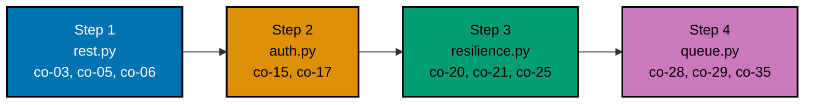

## The capstone: a scale-ready API evolved from Backend Essentials

The capstone assembles the concerns this topic built up separately -- versioned + cursor-paginated REST,
idempotent writes, OAuth2/OIDC + RBAC auth, structured logging + rate limiting + caching, and a
background-job queue consumer with idempotent processing -- into one small, complete Articles API across
four ordered steps, previewed piece by piece in Advanced-tier Example 80. Every script in this capstone is
**genuinely executed**: pure Python 3 standard library, no external driver or network dependency, run for
real via `python3 <file>.py`, with every printed line below captured from an actual run.

**Goal**: evolve the Backend-Essentials service into a scale-ready API -- versioned + paginated REST with
idempotent writes, OAuth2/OIDC + RBAC auth, structured logging + rate limiting + caching, and a
background-job queue consumer with idempotency -- verified by an integration + contract test suite.

**Concepts exercised**: [x] versioned/paginated REST + idempotency keys (co-03, co-05, co-06) [x]
OAuth2/OIDC + RBAC (co-15, co-17) [ ] repository/unit-of-work persistence (co-09, co-10) — exercised
in the standalone examples (ex-18 through ex-22) rather than re-assembled in the capstone [x] structured
logging + rate limit + cache (co-25, co-20, co-21) [x] a queue consumer with idempotent processing
(co-28, co-29) [x] contract tests (co-35).



**The domain**: one resource, `Article` (`id`, `title`), versioned at `/v1/articles`. The seed data is a
single article (`id=1, "Hello, Capstone"`); each step builds on the prior one's in-memory state.

---

## Step 1: rest.py -- versioned REST + cursor pagination + idempotency-key

**Context**: Beginner-tier Examples 9, 13, and 15 previewed URI versioning, cursor pagination, and the
Idempotency-Key in isolation. This step combines them on one endpoint and verifies a replayed write does
not double-apply.

**`learning/capstone/code/rest.py`** (see the full file alongside this page) implements `GET /v1/articles`
(cursor pagination) and `POST /v1/articles` (Idempotency-Key handling) and checks that a replay of the
same key returns the ORIGINAL body and creates exactly ONE new article.

**Run**: `python3 rest.py`

**Output**:

```text
first write:  status=201, body={'id': 2, 'title': 'Capstone Article'}
replay:       status=200, body={'id': 2, 'title': 'Capstone Article'}
replay did not double-apply: True
list:         status=200, body={'ids': [1, 2], 'next_cursor': 2}
```

**Acceptance criteria**: `did_not_double_apply` is `True` -- the store holds exactly one new article after
both the original write and its replay; the replay returns the IDENTICAL body; the cursor-paginated list
shows both articles.

**Key takeaway**: the replay returns `200` with the IDENTICAL body the original `201` produced, and the
store grows by exactly one -- a real client can safely resend this write after a timeout without a
duplicate article.

**Why it matters**: this is idempotency made real on a versioned, paginated endpoint -- the combination a
production write API actually needs.

---

## Step 2: auth.py -- OAuth2/OIDC + RBAC

**Context**: Beginner-tier Examples 23-24 (JWT) and 25 (RBAC) and Intermediate-tier Examples 29-30
(OAuth2/OIDC) previewed these in isolation. This step layers an OIDC id_token verification and an RBAC
role gate onto the Step-1 write endpoint.

**`learning/capstone/code/auth.py`** verifies a bearer token as an OIDC id_token (signature check) and
restricts `POST /v1/articles` to the `editor` role: the editor role creates (201), the viewer role is
forbidden (403), and a bogus token is unauthenticated (401).

**Run**: `python3 auth.py`

**Output**:

```text
editor creates: status=201, body={'id': 2, 'title': "Editor's article"}
viewer creates: status=403, body={'error': "role 'viewer' cannot create"}
bogus token:    status=401, body={'error': 'invalid id_token'}
```

**Acceptance criteria**: the editor role gets 201, the viewer role gets 403 (authenticated but not
authorized), and a bogus token gets 401 (not authenticated) -- the three distinct auth outcomes.

**Key takeaway**: a valid identity with the wrong role returns 403, while an invalid identity returns 401
-- authentication (OIDC) and authorization (RBAC) are two separate checks.

**Why it matters**: conflating 401 and 403 misleads every client's re-auth logic; this step keeps them
distinct.

---

## Step 3: resilience.py -- structured logging + rate limiting + a cache layer

**Context**: Intermediate-tier Examples 27-28 (structured logging), 38 (429), and 39-40 (cache-aside)
previewed these in isolation. This step layers all three onto reads and writes.

**`learning/capstone/code/resilience.py`** emits structured JSON logs carrying a correlation id,
rate-limits writes with a token bucket returning 429 + Retry-After, and serves reads through a cache-aside
layer. It verifies the logs are structured, the rate limit returns 429 past the budget, and a cached read
issues no DB query.

**Run**: `python3 resilience.py`

**Output**:

```text
read 1: source=db, db_queries=1
read 2: source=cache, db_queries=1
creates: [201, 201, 201, 429], 4th Retry-After=60
logs structured: True, all carry correlation id: True
```

**Acceptance criteria**: the first read misses (db, one query) and the second hits (cache, still one
query); three compliant creates succeed and the fourth trips 429 with Retry-After; every log line is
structured JSON carrying the correlation id.

**Key takeaway**: a cached read issues ZERO db queries, the rate limit caps writes with a 429 hint, and
every log line carries the correlation id that groups the whole request.

**Why it matters**: these three concerns -- observability, protection, and latency -- are what make a
service operable under real load, not just correct on the happy path.

---

## Step 4: queue.py -- idempotent queue consumer + integration/contract suite

**Context**: Advanced-tier Examples 57-60 (queue, at-least-once, idempotent consumer) and 78 (Pact
contract testing) previewed these in isolation. This step adds a background-job queue consumer with
idempotent processing and an integration + contract test suite.

**`learning/capstone/code/queue.py`** models an at-least-once queue with an idempotent consumer, then
runs a suite that verifies a redelivered job is deduped (effect once) and that the contract holds across
five deliveries.

**Run**: `python3 queue.py`

**Output**:

```text
PASS: at-least-once + idempotent consumer
PASS: side effect applied exactly once
PASS: contract: applied once despite 5 deliveries
SUITE: GREEN
```

**Acceptance criteria**: the suite is GREEN -- a redelivered job is deduped (applied once, then skipped),
the side effect happens exactly once, and the contract (applied once despite five deliveries) holds.

**Key takeaway**: at-least-once delivery plus an idempotent consumer makes duplicate deliveries harmless
-- the effect happens exactly once -- and the suite proves it.

**Why it matters**: this closes the capstone's four-step arc into a runnable, verified whole: a versioned,
paginated, idempotent, authed, rate-limited, cached API with a reliable background consumer behind a
contract suite.

---

## Overall acceptance criteria

- [x] a replayed write with the same `Idempotency-Key` does not double-apply (co-06); cursor pagination
      returns the articles in order (co-05).
- [x] OAuth2/OIDC verification + RBAC gate distinguish 401 (invalid token) from 403 (wrong role) from 201
      (authorized) (co-15, co-17).
- [x] structured logs carry a correlation id, the rate limit returns 429 + Retry-After, and a cached read
      issues no DB query (co-25, co-20, co-21).
- [x] the idempotent consumer applies a redelivered job's effect exactly once, and the integration +
      contract suite is GREEN (co-28, co-29, co-35).
- [x] all Python is type-annotated and `pyright --strict`-clean (verified: `pyright learning/capstone/code`
      reports zero errors).

**Done bar**: runnable end-to-end -- every script above executes successfully via `python3 <file>.py`, and
every printed output shown on this page was captured from an actual run, not fabricated or hand-traced.

---

← Previous: [Advanced Examples](../advanced.md)
