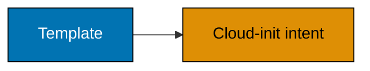
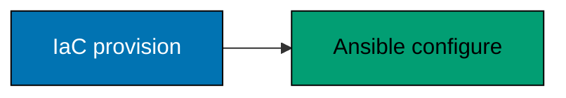
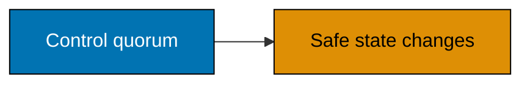
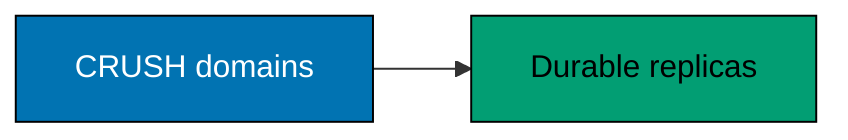

## Advanced: repeatable delivery, recovery, and failure reasoning

Every artifact is a safe skeleton. Validate locally first; only an owner may supply lab endpoint, storage, and
identity inputs outside git and run a real tool against a disposable or explicitly approved environment.

### Example 57: Describe Packer's Image Contract

_ex-57 · exercises co-24_

**Brief explanation**: Packer builds repeatable machine images from a source configuration. A golden image
contains generic guest readiness, not per-environment addresses, credentials, or application data.

```hcl
# => Names an image contract; it contains no connection details or build command.
name = "cloud-init-ready-template"
```

**Verification**: The name states a generic contract and no ISO, endpoint, or credential value.

**Key takeaway**: Bake reusable guest prerequisites once and keep instance identity for first boot.

**Why it matters**: Image contracts reduce snowflake hosts and make replacement testable. Keeping identity out
of the image prevents one template from accidentally becoming an environment-specific secret container.

---

### Example 58: Skeleton a Proxmox Template Build

_ex-58 · exercises co-24_

**Brief explanation**: A Proxmox image build requires a verified ISO, builder configuration, and a template
conversion step. The bundled Packer file deliberately supplies none of the environment-specific inputs.

```hcl
# => Declares a build reference only; it cannot connect because source connection fields are absent.
sources = ["source.proxmox-iso.lab_template"]
```

**Verification**: The reference is incomplete by design and therefore safe to review without a target.

**Key takeaway**: An incomplete safe skeleton is preferable to a copy-paste production build command.

**Why it matters**: Image builders can create guests, write storage, and transmit credentials. A reviewed
contract makes missing owner inputs obvious instead of encouraging a tutorial to carry dangerous defaults.

---

### Example 59: Bake Cloud Init Readiness

_ex-59 · exercises co-24, co-22_

**Brief explanation**: A reusable image should include cloud-init support and the guest agent when those are
part of the platform contract. Its first boot still receives each guest's non-secret identity and network intent.

```yaml
# => Lists one generic package requirement; it does not install software on a host.
packages: [qemu-guest-agent]
```

**Verification**: The YAML has no address, repository override, or key material.

**Key takeaway**: Bake generic readiness; inject per-guest intent at first boot.

**Why it matters**: This separation makes images reusable across dev, staging, and production-shaped labs.
It also reduces drift because a rebuilt guest starts from the same verified prerequisites.

---

### Example 60: Split Image and First Boot Work

_ex-60 · exercises co-25_

**Brief explanation**: Immutable delivery divides responsibility: Packer bakes a baseline, cloud-init configures
an instance, and IaC declares desired placement. This keeps a running guest from becoming undocumented configuration.

```bash
# => Prints the responsibility split without invoking a builder, API, or guest command.
printf '%s\n' 'Packer=bake once; cloud-init=configure at boot; IaC=declare desired guest state'
```

**Verification**: Each responsibility is assigned once and no layer is asked to store a secret in source.

**Key takeaway**: Replace changed guests from a contract instead of repairing undocumented drift.

**Why it matters**: The split gives a reviewer clear places to inspect image contents, instance inputs, and
infrastructure changes. It also makes recovery from a failed host a rebuild exercise rather than memory work.

---

### Example 61: Compare Immutable and Mutable Guests

_ex-61 · exercises co-25_

**Brief explanation**: Immutable replacement favors reproducibility; in-place change can be useful for urgent
repair but accumulates drift. Choose an exception process rather than silently normalizing manual mutation.

```bash
# => Prints the trade-off without touching a guest.
printf '%s\n' 'replace from contract for repeatability; document and reconcile exceptional in-place repair'
```

**Verification**: The model allows an exception but requires it to be reconciled into the contract.

**Key takeaway**: Mutable repair is a controlled exception, not the source of truth.

**Why it matters**: A manually fixed guest may recover today yet fail differently after the next host loss.
Reconciliation preserves useful learning while restoring the reproducible baseline needed for reliable operations.

---

### Example 62: Clone a Golden Template

_ex-62 · exercises co-26, co-25_

**Brief explanation**: Clones should derive from one approved template and receive declared environment inputs.
This produces comparable guests without duplicating images or embedding a real template identifier in the course.

```hcl
# => Records a placeholder template contract and creates no VM resource.
template = "owner-approved-cloud-init-template"
```

**Verification**: The value is a non-routable placeholder and contains no node, guest ID, or secret.

**Key takeaway**: One image contract plus declared inputs reduces environment drift.

**Why it matters**: A shared template makes patching, audit, and rebuild work predictable. Environment differences
then become reviewable variables instead of hidden image forks with inconsistent maintenance history.

---

### Example 63: Skeleton an Ansible VM Task

_ex-63 · exercises co-30_

**Brief explanation**: `community.proxmox.proxmox_kvm` can manage Proxmox KVM guests through the API. A safe
course skeleton names the collection and intent without endpoint, credentials, or a live guest identity.

```yaml
# => Identifies the maintained collection; this is not an executable play with a target.
community.proxmox.proxmox_kvm: {}
```

**Verification**: The module path is present and the mapping is empty, so it cannot create a guest.

**Key takeaway**: Use the current Proxmox collection and supply live inputs only in an approved inventory.

**Why it matters**: Automation modules can make irreversible infrastructure changes. Keeping targets and secrets
outside teaching source lets a team review module semantics separately from its environment-specific authorization.

---

### Example 64: Check Ansible Convergence

_ex-64 · exercises co-30_

**Brief explanation**: An unchanged desired state should converge without unintended changes on a second run.
Treat unexpected changes as drift or incomplete declaration rather than normal noise.

```bash
# => Prints the convergence expectation and does not run Ansible.
printf '%s\n' 'second unchanged play run should report no unintended changes; investigate drift'
```

**Verification**: The statement requires investigation rather than hiding a changed result.

**Key takeaway**: Convergence evidence makes procedural automation repeatable.

**Why it matters**: Idempotent behavior protects a fleet from repeated automation runs. It also exposes manual
changes that would otherwise disappear into a configuration gap and complicate recovery.

---

### Example 65: Select the Proxmox Collection

_ex-65 · exercises co-30_

**Brief explanation**: The older `community.general` Proxmox module path is deprecated or redirected. Author
against the `community.proxmox` collection and verify current module documentation before production use.

```bash
# => Prints the selected collection and does not install it.
printf '%s\n' 'use community.proxmox for maintained Proxmox Ansible modules'
```

**Verification**: The collection name matches the module skeleton in Example 63.

**Key takeaway**: Dependency names age; verify the maintained path before automating a platform.

**Why it matters**: A stale module can conceal unsupported behavior behind an old tutorial. Current documentation,
pinning, and a lab convergence run turn a migration from guesswork into an evidenced change.

---

### Example 66: Compare Terraform and Ansible

_ex-66 · exercises co-31_

**Brief explanation**: Terraform or OpenTofu declares desired infrastructure state. Ansible procedurally
converges host or guest configuration; the tools complement rather than replace each other.

```bash
# => Prints the boundary without invoking either automation engine.
printf '%s\n' 'Terraform/OpenTofu=desired substrate; Ansible=procedural configuration convergence'
```

**Verification**: The model gives each tool a primary responsibility and does not claim either is universally superior.

**Key takeaway**: Choose a clear handoff between resource declaration and configuration convergence.

**Why it matters**: Overlapping tools without ownership can fight, duplicate state, and obscure incident recovery.
A written boundary lets reviewers know where a VM is created and where its operating system is configured.

---

### Example 67: Define the Provision Configure Handoff

_ex-67 · exercises co-31_

**Brief explanation**: Provisioning ends when a guest exists with its declared hardware, network, and bootstrap
contract. Configuration begins when an approved mechanism converges the guest's internal services.

```bash
# => Prints the handoff contract without reaching a guest over SSH.
printf '%s\n' 'IaC outputs non-secret guest identity; configuration verifies bootstrap then converges services'
```

**Verification**: The handoff uses non-secret identity and a bootstrap check, not a copied private key.

**Key takeaway**: A clear handoff prevents IaC state from becoming a hidden configuration system.

**Why it matters**: Boundary confusion is a common source of drift and secret sprawl. Explicit outputs and
checks make failure ownership clear when a guest exists but cannot yet serve its intended workload.

---

### Example 68: Trace the PXE Boot Chain

_ex-68 · exercises co-32_

**Brief explanation**: PXE boot uses network services to give a machine an address and boot program before a
local operating system exists. It is powerful and must be isolated from networks where unintended machines may boot.

```bash
# => Prints the sequence and never starts DHCP, TFTP, or a network listener.
printf '%s\n' 'DHCP address and boot hint -> TFTP or HTTP boot artifact -> approved installer'
```

**Verification**: The sequence starts with controlled network assignment and ends with an approved artifact.

**Key takeaway**: PXE is a provisioning control plane and needs network isolation and artifact provenance.

**Why it matters**: A careless DHCP or boot service can affect devices beyond the intended lab. Segment the
service, authenticate or verify artifacts where possible, and document rollback before unattended provisioning.

---

### Example 69: Plan an Unattended Install

_ex-69 · exercises co-32_

**Brief explanation**: An answer file can automate OS or Proxmox installation after PXE boot. Treat it as
infrastructure code: review disk selection, network scope, package source, post-install access, and secret delivery.

```yaml
# => Marks an answer-file review artifact; no disk, password, or network value is provided.
autoinstall: { version: 1 }
```

**Verification**: The YAML contains no destructive disk match or credential, so it is safe as a structural example.

**Key takeaway**: Unattended installation is safe only when its target and inputs are tightly controlled.

**Why it matters**: Automation makes repeated host builds possible but also repeats mistakes rapidly. Review
the answer file in a disposable lab and prove it selects only approved hardware before a wider rollout.

---

### Example 70: Describe PBS Backups

_ex-70 · exercises co-33_

**Brief explanation**: Proxmox Backup Server supports efficient backup workflows, but no backup job alone proves
recovery. A usable process also has retention, authorization, off-host placement, and a tested restore.

```bash
# => Prints the backup evidence model without contacting a PBS datastore.
printf '%s\n' 'backup evidence = snapshot + retention + access + restore test + recorded result'
```

**Verification**: The output includes a restore test, the condition that converts a backup claim into evidence.

**Key takeaway**: Backup success is incomplete until an authorized restore boots and is checked.

**Why it matters**: Backup metadata can be green while a guest cannot start, its data is incomplete, or the
only authorized operator cannot access the datastore. Test the whole recovery chain routinely.

---

### Example 71: Plan a PBS Backup

_ex-71 · exercises co-33_

**Brief explanation**: A PBS backup plan identifies the guest, datastore, schedule, retention, encryption or
access policy, and verification owner. Do not place a real datastore address or credential in a lesson artifact.

```bash
# => Prints planning fields and does not invoke vzdump or proxmox-backup-client.
printf '%s\n' 'record guest scope, datastore owner, schedule, retention, alert, and restore drill'
```

**Verification**: The fields include a restore drill and avoid an embedded backup target.

**Key takeaway**: A backup policy is an owned recovery contract rather than a scheduled command.

**Why it matters**: Schedule frequency and retention determine available recovery points, while authorization
determines whether they are usable under stress. Record both with the workload owner and test them together.

---

### Example 72: Rehearse a PBS Restore

_ex-72 · exercises co-33_

**Brief explanation**: Restore into a new disposable guest when possible, then prove boot and application health
before deciding whether to promote it. Do not overwrite the source before validation unless an approved incident runbook requires it.

```bash
# => Prints safe restore sequence and does not restore a guest.
printf '%s\n' 'select snapshot -> restore to disposable target -> boot -> health check -> record promote or remove'
```

**Verification**: The order validates the restored copy before a promotion or destructive source decision.

**Key takeaway**: A restore drill proves recovery without turning the source outage into an irreversible experiment.

**Why it matters**: The restore procedure is often the first time access, boot, network, and data assumptions
meet. A disposable target isolates those assumptions and produces evidence for the actual recovery objective.

---

### Example 73: Compare Recovery Tiers

_ex-73 · exercises co-33, co-14_

**Brief explanation**: A local ZFS snapshot, off-host replication, and PBS backup protect different failure
scopes. Choose tiers by recovery point, recovery time, independence, and operational procedure.

```bash
# => Prints tier roles without operating a snapshot, stream, or datastore.
printf '%s\n' 'snapshot=fast local rollback; replication=off-host copy; PBS=tested guest recovery tier'
```

**Verification**: The output names each tier's scope instead of declaring any one universally sufficient.

**Key takeaway**: Layered recovery controls must be mapped to the failures they actually survive.

**Why it matters**: A snapshot can be excellent for operator error and useless for host loss. Combining tiers
deliberately prevents a comforting backup label from masking an unprotected failure domain.

---

### Example 74: Compare Terraform and OpenTofu Licenses

_ex-74 · exercises co-29_

**Brief explanation**: Terraform and OpenTofu use similar configuration language but have different licensing
and governance histories. Verify current terms from official sources before adopting either in a policy-sensitive organization.

```bash
# => Prints a license-review prompt; it does not install either tool.
printf '%s\n' 'review current Terraform and OpenTofu license, governance, support, and provider compatibility'
```

**Verification**: The prompt requests current official verification rather than presenting a stale legal conclusion.

**Key takeaway**: Tool compatibility does not eliminate licensing and support due diligence.

**Why it matters**: An IaC binary becomes part of the platform supply chain. A deliberate choice protects
procurement, contributor, and deployment expectations before state and automation depend on it.

---

### Example 75: Plan an OpenTofu Swap

_ex-75 · exercises co-29_

**Brief explanation**: An OpenTofu evaluation should start with formatting and a plan in an isolated copy of
state or a disposable lab. Never point a newly selected binary at critical infrastructure as the first experiment.

```bash
# => Prints the staged evaluation sequence without running a tool.
printf '%s\n' 'copy lab configuration -> fmt check -> init -> plan -> compare -> approve migration separately'
```

**Verification**: The sequence plans before apply and isolates the first evaluation from production state.

**Key takeaway**: Validate tool substitution through an isolated plan comparison first.

**Why it matters**: Small provider or state differences can matter more than syntax compatibility. A sandbox
comparison provides evidence while preserving the ability to stop before an unintended infrastructure change.

---

### Example 76: Reason About Failure Domains

_ex-76 · exercises co-34_

**Brief explanation**: Quorum protects control-plane consistency, while storage placement protects data copies
from correlated loss. Both require an explicit answer to the question: what still works when this unit fails?

```bash
# => Prints the analysis question without changing cluster or CRUSH configuration.
printf '%s\n' 'for disk, host, rack, and partition loss: name surviving votes, replicas, capacity, and recovery action'
```

**Verification**: The model requires capacity and recovery action, not merely a replica count.

**Key takeaway**: Resilience is a reasoned claim about named failures, not a feature checkbox.

**Why it matters**: Distributed systems fail across boundaries that diagrams often omit. Explicit scenarios make
the platform's real blast radius visible before an outage turns an unstated assumption into data loss.

---

### Example 77: Compare Quorum and CRUSH

_ex-77 · exercises co-34, co-07, co-19_

**Brief explanation**: Corosync quorum determines whether the control plane can safely change shared state.
Ceph CRUSH determines where data replicas should live; neither replaces the other.

```bash
# => Prints the layer distinction without querying a cluster.
printf '%s\n' 'quorum protects control-plane consistency; CRUSH placement protects storage failure-domain spread'
```

**Verification**: The sentence assigns distinct layers and does not claim that healthy storage grants quorum.

**Key takeaway**: Control-plane and data-plane resilience must be designed and tested separately.

**Why it matters**: A cluster can have durable replicas but correctly refuse configuration changes, or it can
have quorum while storage replicas violate a rack-loss objective. Separate tests reveal these different risks.

---

### Example 78: Keep Secrets out of State

_ex-78 · exercises co-27_

**Brief explanation**: API tokens, private keys, and sensitive guest values must not be committed in source,
examples, or unprotected state. Sensitive flags reduce display but do not eliminate state exposure risk.

```bash
# => Runs a local source scan only; it does not print environment variables or secrets.
rg -n 'BEGIN (RSA|OPENSSH) PRIVATE KEY|api_token\s*=\s*"[^$][^"]+"' . || true
```

**Verification**: In this course, the scan should find no token literal or private-key block.

**Key takeaway**: Secret handling requires external input, protected state, narrow access, and rotation.

**Why it matters**: Infrastructure state and logs can be as sensitive as source files. Use protected backends,
redacted review outputs, short-lived credentials, and incident response for accidental disclosure.

---

### Example 79: Locate the Substrate Layer

_ex-79 · exercises co-01_

**Brief explanation**: This course owns the layer from physical host through Proxmox, storage, and VM delivery.
It stops before operating an application platform or Kubernetes control plane above the guests.

```bash
# => Prints the scope boundary without deploying any workload.
printf '%s\n' 'bare metal -> hypervisor -> storage -> VM; application and Kubernetes control planes are later layers'
```

**Verification**: The sequence includes the VM boundary and names the higher layers as out of scope.

**Key takeaway**: Keep substrate responsibility distinct from the platforms it enables.

**Why it matters**: Scope boundaries prevent duplicated runbooks and unclear incident ownership. A sound VM
substrate is necessary for later platforms, but it is not itself a substitute for their operations and security.

---

### Example 80: Assemble the Bare Metal Capstone

_ex-80 · exercises co-05, co-21, co-24, co-26, co-23, co-33_

**Brief explanation**: The capstone combines an image contract, cloud-init, external-secret IaC, an approved
Proxmox lab, and tested recovery evidence. It remains a skeleton until an owner supplies safe local inputs.

```bash
# => Validates bundled text only; it never initializes a provider or contacts a Proxmox host.
sh code/validate-skeleton.sh
```

**Verification**: The script reports local validation passed and rejects a token-shaped literal in capstone files.

**Key takeaway**: A reproducible substrate is proven by reviewed contracts and restore evidence, not a demo alone.

**Why it matters**: The integrated path exposes the dependencies that isolated commands hide: quorum, storage,
guest delivery, secret boundaries, and recovery. Completion requires an owner-approved lab restore that boots and passes a real health check.

## Advanced architecture snapshots

These diagrams are accessible relationship summaries; their text labels communicate each dependency.












