> **Owner-operated lab only.** This capstone is a reviewable skeleton, not an unattended installer. Its
> files contain no endpoint, credential, private key, disk identifier, or production guest. An owner must
> supply those values outside version control after validating the lab boundary and recovery plan.

## Goal

Design a reproducible VM substrate: a cloud-init-ready golden image contract, an external-secret Terraform or
OpenTofu plan, per-environment variables, and a tested Proxmox Backup Server restore decision. The finished
lab proves a guest can be replaced rather than repaired in place and documents what happens when a disk, host,
or quorum vote fails.

## 1. Validate the skeleton

```sh
# => Checks local teaching files only; it never initializes a provider or calls a Proxmox API.
sh ../code/validate-skeleton.sh
```

## 2. Review image and first-boot responsibilities

Read [template.pkr.hcl](./packer/template.pkr.hcl) and [cloud-init.yaml](./cloud-init/cloud-init.yaml).
The image contract installs only generic guest readiness; per-guest hostname, authorized public key, and
network intent belong to cloud-init. Keep private keys and real addresses outside this repository.

## 3. Review the IaC contract

Read [main.tf](./terraform/main.tf) and [variables.tf](./terraform/variables.tf). The provider endpoint and
API token are intentionally variables with no defaults. Run `tofu fmt -check` or `terraform fmt -check` only
after installing your selected tool; run `init`, `plan`, and `apply` only against the owner-approved lab.

## 4. Record the recovery decision

Use [recovery-drill.md](./recovery-drill.md) before creating a backup. A restore is complete only when the
restored guest boots, gets the expected non-secret configuration, passes an owner-defined health check, and
the original outage decision is recorded. A successful backup job alone proves neither recoverability nor
correct failure-domain placement.

## Acceptance criteria

- The image, cloud-init, and IaC responsibilities are separated and reviewable.
- One configuration can describe dev, staging, and production-shaped lab guests without copying secrets.
- Cluster membership, quorum, storage model, migration compatibility, and recovery expectations are recorded
  before an owner applies any change.
- A PBS backup and restore drill is evidenced by a booting, checked restored guest; no token appears in git,
  shell history, plan output retained in the repository, or Terraform/OpenTofu state committed to git.

```mermaid
%% Color Palette: Blue #0173B2, Orange #DE8F05, Teal #029E73, Purple #CC78BC; labels, not colors, carry meaning.
flowchart LR
    accTitle: Acceptance criteria
    accDescr: Flowchart with 4 nodes and 3 connections. Nodes: Golden image contract, Cloud-init guest intent, Reviewed IaC plan, Backup and restore evidence. Connections: Golden image contract to Cloud-init guest intent, Cloud-init guest intent to Reviewed IaC plan, Reviewed IaC plan to Backup and restore evidence.
    I["Golden image<br/>contract"]:::blue --> C["Cloud-init guest<br/>intent"]:::orange
    C --> T["Reviewed IaC plan"]:::teal
    T --> R["Backup and restore<br/>evidence"]:::purple
    classDef blue fill:#0173B2,stroke:#000000,color:#FFFFFF,stroke-width:2px
    classDef orange fill:#DE8F05,stroke:#000000,color:#000000,stroke-width:2px
    classDef teal fill:#029E73,stroke:#000000,color:#000000,stroke-width:2px
    classDef purple fill:#CC78BC,stroke:#000000,color:#000000,stroke-width:2px
    classDef default fill:#FFFFFF,stroke:#000000,color:#000000
```


