## Goal

Stand up a complete, reproducible personal development **forge** from an empty machine profile -- a
versioned Neovim config repo you can `git clone` and use to edit, navigate, search, and run code with
LSP + Treesitter -- and prove editing fluency by driving a scripted refactor in it with **no
mouse, no arrow keys**. This is the Pass-0 boundary capstone: it integrates topics 1-3 (Just Enough
Nvim, Just Enough Lua, Extending Neovim) into one artifact you actually keep using for the rest of this
journey, starting with the very next topic (Just Enough Python).

```mermaid
%% Color Palette: Blue #0173B2, Orange #DE8F05, Teal #029E73, Purple #CC78BC, Brown #CA9161
flowchart LR
    accTitle: Goal
    accDescr: Flowchart with 5 nodes and 4 connections. Nodes: Bootstrap vim.pack. add40pinned41, Open sample LSP + Treesitter, Mouse-free refactor vimgrep + macro + cdo, :terminal check beside the source, Healthcheck :checkhealth, zero missing dep. Connections: Bootstrap vim.pack. add40pinned41 to Open sample LSP + Treesitter, Open sample LSP + Treesitter to Mouse-free refactor vimgrep + macro + cdo, Mouse-free refactor vimgrep + macro + cdo to :terminal check beside the source, :terminal check beside the source to Healthcheck :checkhealth, zero missing dep.
    A["Bootstrap<br/>vim.pack.<br/>add#40;pinned#41;"]:::blue
    B["Open sample<br/>LSP + Treesitter"]:::orange
    C["Mouse-free refactor<br/>vimgrep + macro +<br/>cdo"]:::teal
    D[":terminal check<br/>beside the source"]:::purple
    E["Healthcheck<br/>:checkhealth, zero<br/>missing dep"]:::brown
    A --> B --> C --> D --> E

    classDef blue fill:#0173B2,stroke:#000000,color:#FFFFFF,stroke-width:2px
    classDef orange fill:#DE8F05,stroke:#000000,color:#000000,stroke-width:2px
    classDef teal fill:#029E73,stroke:#000000,color:#000000,stroke-width:2px
    classDef purple fill:#CC78BC,stroke:#000000,color:#000000,stroke-width:2px
    classDef brown fill:#CA9161,stroke:#000000,color:#000000,stroke-width:2px
    classDef default fill:#FFFFFF,stroke:#000000,color:#000000
```



## Concepts exercised

- [x] raw-form editing (topic 1 -- Just Enough Nvim)
- [x] Lua modules, closures, metatables (topic 2 -- Just Enough Lua)
- [x] plugin manager + LSP + Treesitter + a user command + an autocommand (topic 3 -- Extending Neovim)
- [x] a reproducible config repo layout
- [x] the `:terminal` build/run loop

All colocated code lives under `code/`: the versioned Neovim config in `nvim-config/`, the sample
Python project in `sample-project/`, and the complete launch sequence with real, captured output in
`transcript.md`. Every listing below is the complete file, verbatim -- nothing on this page is
truncated or paraphrased. The config reuses topic 3's own proven capstone config file-for-file (same
pinned plugin versions, same modules); nothing here is re-derived from scratch.

## Step 1: bootstrap the forge

`code/nvim-config/init.lua` is the single entry point. Its first act is `vim.pack.add({...})`, the
same built-in, Git-backed plugin manager topic 3 taught, installing three plugins each pinned to an
exact tag or commit hash.

**`code/nvim-config/init.lua`** (complete file, content and quoting verbatim; indentation shown as
2-space here for page-display width -- the source file itself is tab-indented per `stylua`)

```lua
-- init.lua -- Pass-0 capstone forge: complete config entry point
-- Reproducible from an empty ~/.config/nvim: copy this whole nvim-config/ tree into
-- $XDG_CONFIG_HOME/nvim (default ~/.config/nvim) and restart Neovim.
-- Reuses the same pinned plugins, require order, and vim.lsp.enable call as
-- topic-03 (Extending Neovim)'s capstone config; comments rewritten for this page.

vim.pack.add({ -- vim.pack: Neovim's built-in, Git-backed plugin manager
  {
    src = "https://github.com/neovim/nvim-lspconfig",
    version = "v2.10.0", -- pinned tag
  },
  {
    src = "https://github.com/neovim-treesitter/nvim-treesitter",
    version = "df7489eeea351bece7fd0f9c825be5cb6a1438f0", -- pinned commit (active fork ships no tags)
  },
  {
    src = "https://github.com/neovim-treesitter/treesitter-parser-registry",
    version = "6eb15358bb9fc88f0d3401d8538d56652e9bdf3c", -- required companion repo
  },
})

require("options")
require("keymaps")
require("lsp")
require("treesitter")
require("plugins.greet").setup()

vim.lsp.enable("pyright")
```

The remaining five modules and one auto-discovered LSP config file -- `lua/options.lua`,
`lua/keymaps.lua`, `lua/lsp.lua`, `lua/treesitter.lua`, `lua/plugins/greet.lua`, and
`lsp/pyright.lua` -- are byte-identical to the files topic 3's own capstone already built and
verified; see
[Extending Neovim's capstone](../extending-neovim/learning/capstone/overview.md) for their annotated
listings, or `code/nvim-config/` in this folder for the files themselves.

**Verify**: `nvim --headless "+qa"` against a totally empty `$XDG_CONFIG_HOME` seeded only with
`code/nvim-config/`.

**Output** (real, unedited -- see `transcript.md` Step 1 for the full session):

```text
vim.pack: 100% Installing plugins (3/3)
$ echo $?
0
```

**Key takeaway**: The same `vim.pack.add({...})` call that bootstrapped topic 3's capstone bootstraps
this one too -- no separate installer, no bootstrap script, and it exits `0` on a completely fresh
machine profile.

**Why it matters**: A forge you cannot reproduce from empty isn't actually reproducible -- this step is
the proof, not just the claim.

## Step 2: open the sample project, verify LSP + Treesitter

`code/sample-project/` is a small Python project: `greetkit.py` (two functions) and
`test_greetkit.py` (a stdlib `unittest` suite). Opening `greetkit.py` in the forge exercises the exact
LSP + Treesitter wiring topic 3 built.

**`code/sample-project/greetkit.py`** (complete file, as shipped -- before the Step 3 refactor)

```python
"""greetkit -- a tiny greeting library, the capstone's sample Python project."""


def build_message(nam: str) -> str:
    """Build a greeting message for nam."""
    if not nam:
        nam = "World"
    return f"Hello, {nam}!"


def shout_message(nam: str) -> str:
    """Build an all-caps greeting message for nam."""
    return build_message(nam).upper()
```

**Verify**: open the file, install the Python Treesitter parser once, then inspect the active parser
language and the attached LSP client.

**Output** (real, unedited):

```text
ts_active: true python
lsp_attached: true pyright
```

**Key takeaway**: Treesitter reports the buffer's language as `python` and a real `pyright` client
attaches -- both driven purely by `code/nvim-config/`, with zero project-specific configuration beyond
the `.py` file extension.

**Why it matters**: This is the payoff of topic 3's "language intelligence" half landing on a fresh
project instead of the topic's own scratch file -- proof the forge generalizes.

## Step 3: drive a scripted, mouse-free refactor

`greetkit.py` deliberately names its parameter `nam` in **8** places across its two functions. The
refactor renames every occurrence to `name` without touching the mouse or arrow keys: `:vimgrep`
populates the quickfix list with every match, a macro is defined directly on register `q` (`ciw` --
"change inner word" -- is the motion), then `:cdo` replays that one macro at every quickfix entry --
motions + a macro + the quickfix list, the exact workflow topic 1 (Just Enough Nvim) taught, now
driving a real refactor instead of a single-file demo.

**The refactor** (three Ex commands, run headless for a scripted, reproducible transcript):

```vim
:vimgrep /\<nam\>/g greetkit.py
:let @q = "ciwname\<Esc>"
:cdo normal @q
:wall
```

**Verify**: count whole-word occurrences of `nam` before and after.

**Output** (condensed from the real run's two `grep -noE '\<nam\>' greetkit.py | wc -l` counts -- see
`transcript.md` Step 3 for the full session including the quickfix listing):

```text
before: 8
after:  0
```

**Key takeaway**: `:cdo` iterates the quickfix list produced by `:vimgrep` and replays register `q`'s
macro at each of the 8 entries in one command -- no per-occurrence hand-editing, no mouse.

**Why it matters**: This is the mouse-free workflow's actual payoff -- a multi-occurrence rename that
would take 8 manual edits collapses to 4 keystrokes-worth of Ex commands, and because it is scripted,
it is **provably repeatable**: replaying the identical three commands against a fresh copy of the
pre-refactor file reproduces the identical post-refactor file, byte for byte -- verified, not merely
claimed.

## Step 4: run the sample project's check from `:terminal`

With the refactor landed, `test_greetkit.py`'s three `unittest` cases exercise the renamed
`build_message`/`shout_message` functions, run from a real `:terminal` job beside the source -- the
DD-17 build/run loop topic 3 already taught.

**`code/sample-project/test_greetkit.py`** (complete file)

```python
"""Stdlib unittest suite for greetkit -- the capstone's :terminal check."""

import unittest

from greetkit import build_message, shout_message


class GreetkitTests(unittest.TestCase):
    def test_build_message_with_name(self):
        self.assertEqual(build_message("Neovim"), "Hello, Neovim!")

    def test_build_message_default(self):
        self.assertEqual(build_message(""), "Hello, World!")

    def test_shout_message(self):
        self.assertEqual(shout_message("Neovim"), "HELLO, NEOVIM!")


if __name__ == "__main__":
    unittest.main()
```

**Verify**: `:terminal python3 -m unittest test_greetkit -v`.

**Output** (real, unedited -- see `transcript.md` Step 4 for the full session):

```text
test_build_message_default (test_greetkit.GreetkitTests.test_build_message_default) ... ok
test_build_message_with_name (test_greetkit.GreetkitTests.test_build_message_with_name) ... ok
test_shout_message (test_greetkit.GreetkitTests.test_shout_message) ... ok

----------------------------------------------------------------------
Ran 3 tests in 0.000s

OK
```

**Key takeaway**: All three cases pass against the refactored source, run from inside the forge's own
`:terminal`, with no context switch out of Neovim.

**Why it matters**: A forge that can only edit isn't a forge -- the `:terminal` loop is what makes it a
place you can also **run and check** the code you just refactored, end to end.

## Acceptance criteria

- From an empty `$XDG_CONFIG_HOME/nvim` seeded only with `code/nvim-config/`, `nvim --headless "+qa"`
  installs all three pinned plugins and exits `0`.
- Opening `code/sample-project/greetkit.py` shows real Treesitter highlighting (parser language
  `python`) and a real `pyright` LSP client attached.
- The scripted `:vimgrep` + macro-register + `:cdo` refactor renames all 8 occurrences of `nam` to
  `name` with zero mouse/arrow-key input, and replaying the identical commands against a fresh copy of
  the pre-refactor file reproduces the identical result.
- `python3 -m unittest test_greetkit -v`, run from `:terminal` beside the source, reports all 3 cases
  `ok`.
- `nvim --headless "+checkhealth" "+qa"` exits `0` and reports no missing required dependency for any
  mechanism this config actually declares (`vim.pack`, `vim.lsp`, Treesitter).

## Pass retrospective / synthesis

Two Cross-Cutting Big Ideas recurred across Pass 0, and this capstone is where they visibly compound:

- **`mechanism-vs-policy`** -- topic 1 opened with vanilla Neovim as pure mechanism (motions, registers,
  the quickfix list) with zero built-in policy about how to use them. Topic 3 layered policy on top:
  `vim.pack`'s pinned versions are a reproducibility _policy_; `vim.lsp.enable('pyright')` is a
  _policy_ choice about which language server backs which filetype. This capstone's Step 3 shows the
  mechanism (`:cdo` + a macro register) staying exactly as raw and reusable as topic 1 left it, while
  Step 1 and Step 2 show the policy layer (pinned plugins, an LSP config file discovered purely by
  filesystem location) doing the opinionated work around it.
- **`abstraction-and-its-cost`** -- topic 2 named Lua's tables as one universal abstraction standing in
  for arrays, maps, objects, and modules, at the cost of no compiler-enforced shape. Topic 3 built on
  that same table-as-module pattern for every one of its own config modules (`options`, `keymaps`,
  `lsp`, `treesitter`, `plugins.greet`) and for the Language Server Protocol itself, which abstracts
  away each language's own tooling behind one uniform client/server contract. This capstone's
  `nvim-config/lua/` tree is that abstraction paying off directly: five independent modules, each a
  plain Lua table, `require()`-d into one `init.lua` with no framework in between.

**Explain in your own words** (no answer key -- the value is in articulating it, not reading it):

1. Where in this capstone's four steps did _mechanism_ (something you could use however you wanted) and
   _policy_ (a specific opinionated choice) sit closest together, and what would break if you swapped
   which layer made which decision?
2. `lua/plugins/greet.lua` and the Language Server Protocol are both abstractions this capstone relies
   on. What does each one hide, and what is the one situation where that hidden detail would leak back
   into view?
3. If you had to extend this forge for a language other than Python (say, the Bash the very next pass
   uses), which files would you touch, and which would stay untouched purely because of how this
   config's abstraction boundaries are drawn?

## Done bar

This capstone is runnable end to end: a reader who copies `code/nvim-config/` into a fresh
`$XDG_CONFIG_HOME/nvim` and follows `transcript.md`'s exact commands, in order, reaches the identical
output shown on this page and in `transcript.md` -- verified against a real, running Neovim v0.12.3
session (not merely described), including a genuine network install of every pinned plugin, a genuine
`pyright` attachment, a genuine mouse-free refactor whose replay was independently re-verified to
reproduce byte-identical output, and a genuine `unittest` run from a real `:terminal` job. The same
honest exception `transcript.md`'s acceptance-criteria section documents for topic 3's own capstone
applies here too: this sandbox's own `:checkhealth` reports one unrelated tmux `$TERM` `ERROR` -- a
setting of the machine running Neovim, not a dependency this config installs or controls. Every
mechanism this capstone combines traces to a primary source already cited in topics 1-3's Accuracy
notes and DD-35 citations; no new fact was needed to write this page, beyond the one new,
independently-verified finding surfaced while re-running `:checkhealth` here: `nvim-lspconfig` v2.10.0
now marks its own `:checkhealth lspconfig` integration deprecated in favor of `:checkhealth vim.lsp`
(the plugin itself still functions; only its healthcheck hook is being retired).

---

← Previous: [3 · Extending Neovim Drilling](../extending-neovim/drilling/overview.md)
