Examples 58-87 form the advanced tier: free-threaded CPython (PEP 703/779), production-grade synchronization patterns, deadlock detection and prevention at scale, structured `asyncio` concurrency, multi-stage pipelines, work-stealing, true cross-process shared memory, graceful shutdown, benchmark-driven tool selection, and a fully worked capstone rehearsal. The final six examples (82-87) are a self-contained reactive-streams sub-group: `reactivex` (RxPY) for Observables and hot/cold subscription semantics, then four hand-rolled examples (backpressure, reactive pull, a `Flow`-style contract, and an annotated marble diagram) since RxPY 4.1.0 ships no built-in backpressure operators.

---

### Example 58: On a Free-Threaded Build, CPU-Bound Threads Actually Scale

_ex-58 &middot; exercises co-04, co-03_

The exact same CPU-bound threaded task from ex-03 is run again, but this time the assertion branches on the CURRENTLY running interpreter's actual `gil_is_enabled()` status: on this standard build the GIL still serializes the threads (matching ex-03); on a genuine `python3.14t` free-threaded build, the same threads would scale across cores.

**`learning/code/ex-58-free-threaded-parallel-cpu/example.py`**

```python
"""Example 58: On a Free-Threaded Build, CPU-Bound Threads Actually Scale."""

import sys  # => co-04: `sys._is_gil_enabled()` tells us which kind of build is RUNNING right now
import threading  # => the exact same threading shape as ex-49 -- only the BUILD differs
import time  # => measures wall time to compute an empirical speedup ratio

ITERATIONS = 8_000_000  # => tuned so 4 threads' worth of work is clearly measurable, not instant
THREAD_COUNT = 4  # => how many threads race to do CPU work concurrently


def gil_is_enabled() -> bool:  # => the SAME version-gated check introduced in ex-04
    if hasattr(sys, "_is_gil_enabled"):  # => only exists on Python 3.13+
        return sys._is_gil_enabled()  # pyright: ignore[reportPrivateUsage]
        # => leading underscore is CPython's naming, not a privacy signal -- the documented 3.13+ API
    return True  # => pre-3.13: no free-threaded option ever existed, so the GIL was always enabled


def cpu_task(n: int) -> int:  # => pure CPU work -- no I/O, so the GIL (if enabled) can NEVER be released mid-loop
    total = 0  # => accumulator -- forces real interpreter bytecode execution
    for i in range(n):  # => a tight loop -- exactly the shape a GIL serializes across threads
        total += i  # => trivial arithmetic; only the TIME this takes matters here
    return total  # => the actual value is irrelevant to this example


def measure_threaded_speedup(iterations: int, thread_count: int) -> float:
    single_start = time.perf_counter()  # => single_start: wall time before the ONE-thread baseline unit
    cpu_task(iterations)  # => runs exactly ONE unit of work, alone, to establish a per-unit baseline
    single_time = time.perf_counter() - single_start  # => single_time: how long ONE unit takes, uncontended

    threads = [threading.Thread(target=cpu_task, args=(iterations,)) for _ in range(thread_count)]
    start = time.perf_counter()  # => start: wall time before the `thread_count`-way concurrent run
    for t in threads:  # => starts every thread, all targeting the SAME cpu_task
        t.start()  # => each begins its own `iterations`-long loop, "concurrently" (subject to the GIL)
    for t in threads:  # => waits for every thread to finish
        t.join()  # => join() blocks until that thread's cpu_task() call returns
    elapsed = time.perf_counter() - start  # => elapsed: wall time for ALL `thread_count` threads combined

    serial_equivalent = single_time * thread_count  # => serial_equivalent: what `thread_count` units WOULD cost run one-by-one
    return serial_equivalent / elapsed  # => speedup: how much faster the threaded run was vs doing it serially


if __name__ == "__main__":  # => module entry point
    gil_enabled = gil_is_enabled()  # => gil_enabled: is THIS running interpreter's GIL currently active?
    speedup = measure_threaded_speedup(ITERATIONS, THREAD_COUNT)  # => speedup: the empirically measured ratio
    print(f"gil_enabled={gil_enabled} speedup={speedup:.2f}x")  # => Output: gil_enabled=True speedup=~1.0x (on a normal build)

    # => This script was verified on STANDARD CPython 3.13/3.14 (`python3.14t` -- the free-threaded,
    # => PEP 703/779 build -- is not installed in this environment), where `gil_enabled` prints True and
    # => `speedup` stays close to 1x, because the GIL serializes ALL FOUR threads' bytecode onto one core
    # => (co-03). A reader who installs `python3.14t` and reruns this EXACT script would instead see
    # => `gil_enabled=False`, and `speedup` climbing toward NEAR-LINEAR scaling (~3-4x with 4 threads,
    # => on a machine with that many free cores) -- because a free-threaded build removes the single
    # => lock that otherwise forces every thread's Python bytecode through one core at a time (co-04).
    if gil_enabled:  # => the branch this environment actually takes
        assert speedup < 2.0  # => confirms the GIL build did NOT meaningfully parallelize CPU work
    else:  # => the branch a `python3.14t` reader would take instead
        assert speedup > 2.5  # => confirms the free-threaded build DID scale close to linearly
    print("ex-58 OK")  # => Output: ex-58 OK
```

**Run**: `python3 example.py`

**Output**:

```text
gil_enabled=True speedup=1.00x
ex-58 OK
```

**`learning/code/ex-58-free-threaded-parallel-cpu/test_example.py`**

```python
"""Example 58: pytest verification for Free-Threaded CPU Scaling."""

from example import gil_is_enabled, measure_threaded_speedup


def test_speedup_matches_the_current_builds_gil_status() -> None:
    speedup = measure_threaded_speedup(iterations=3_000_000, thread_count=4)
    if gil_is_enabled():
        assert speedup < 2.0  # => this environment's standard build: threads don't parallelize CPU work
    else:
        assert speedup > 2.5  # => a free-threaded (python3.14t) build: threads DO parallelize CPU work


# => Run: pytest -- Output: 1 passed
```

**Verify**: `pytest -q`

**Output**:

```text
1 passed
```

**Key takeaway**: On a free-threaded (`python3.14t`) build, CPU-bound threads genuinely scale across cores -- the exact same code that was serialized by the GIL in ex-03 becomes truly parallel, with no code changes required.

**Why it matters**: This is the payoff of PEP 703/779: free-threaded CPython removes the single biggest structural limitation on Python threading, letting `threading.Thread` do for CPU-bound work what it could previously only do for I/O-bound work. Since `python3.14t` isn't installed in this environment, the assertion is written to be CORRECT on whichever build actually runs it -- a reader with a real `python3.14t` install sees the free-threaded branch exercised for real, not just described.

---

### Example 59: Benchmarking IDENTICAL Threaded Code -- GIL Build vs `python3.14t`

_ex-59 &middot; exercises co-04, co-05_

The identical threaded CPU-bound benchmark snippet is run as a subprocess against BOTH the standard interpreter and (if available) `python3.14t`, comparing wall-clock time directly -- proving the parallelism difference with a real, timed side-by-side rather than an assertion about internals.

**`learning/code/ex-59-gil-vs-nogil-benchmark/example.py`**

```python
"""Example 59: Benchmarking IDENTICAL Threaded Code -- GIL Build vs `python3.14t`."""

import shutil  # => shutil.which locates a `python3.14t` binary on PATH, if one is installed
import subprocess  # => runs THIS SAME script under a DIFFERENT interpreter, if one is found
import sys  # => co-04: distinguishes the CURRENTLY running interpreter's own GIL status
import threading  # => the identical threaded-CPU shape used throughout this topic (ex-03, ex-49, ex-58)
import time  # => measures wall time for the empirical speedup ratio

ITERATIONS = 5_000_000  # => tuned so 4 threads' worth of work is clearly measurable
THREAD_COUNT = 4  # => how many threads race to do CPU work concurrently


def gil_is_enabled() -> bool:  # => the SAME version-gated check as ex-04 and ex-58
    if hasattr(sys, "_is_gil_enabled"):  # => only exists on Python 3.13+
        return sys._is_gil_enabled()  # pyright: ignore[reportPrivateUsage]
        # => leading underscore is CPython's naming, not a privacy signal -- the documented 3.13+ API
    return True  # => pre-3.13: no free-threaded option ever existed


def cpu_task(n: int) -> int:  # => pure CPU work -- no I/O, so any GIL present can NEVER release mid-loop
    total = 0  # => accumulator -- forces real interpreter bytecode execution
    for i in range(n):  # => a tight loop -- exactly the shape a GIL serializes across threads
        total += i  # => trivial arithmetic; only the TIME this takes matters here
    return total  # => the actual value is irrelevant to this example


def benchmark_current_interpreter() -> float:
    single_start = time.perf_counter()  # => single_start: wall time before the ONE-thread baseline unit
    cpu_task(ITERATIONS)  # => runs exactly ONE unit of work, alone, to establish a per-unit baseline
    single_time = time.perf_counter() - single_start  # => single_time: how long ONE unit takes, uncontended

    threads = [threading.Thread(target=cpu_task, args=(ITERATIONS,)) for _ in range(THREAD_COUNT)]
    # => threads: THREAD_COUNT independent threads, all racing to run the SAME cpu_task concurrently
    start = time.perf_counter()  # => start: wall time before the THREAD_COUNT-way concurrent run
    for t in threads:  # => starts every thread
        t.start()  # => each begins its own ITERATIONS-long loop, "concurrently"
    for t in threads:  # => waits for every thread to finish
        t.join()  # => join() blocks until that thread's cpu_task() call returns
    elapsed = time.perf_counter() - start  # => elapsed: wall time for ALL THREAD_COUNT threads combined
    return (single_time * THREAD_COUNT) / elapsed  # => speedup: how much faster the threaded run was vs serial


def benchmark_other_interpreter(binary_path: str) -> float:
    # => re-runs THIS EXACT FILE under `binary_path`, in "print-only" mode -- one source, two interpreters
    args = [binary_path, __file__, "--benchmark-only"]  # => args: launches THIS module with the parse-friendly flag
    completed = subprocess.run(args, capture_output=True, text=True, check=True, timeout=30)  # => a real subprocess run
    return float(completed.stdout.strip())  # => parses the single number the child process printed


if __name__ == "__main__":  # => module entry point
    if "--benchmark-only" in sys.argv:  # => the mode `benchmark_other_interpreter` invokes via subprocess
        print(f"{benchmark_current_interpreter():.4f}")  # => prints JUST the number -- nothing else, for easy parsing
    else:  # => the normal, full demonstration mode
        current_speedup = benchmark_current_interpreter()  # => current_speedup: THIS interpreter's own measured ratio
        current_gil_enabled = gil_is_enabled()  # => current_gil_enabled: is THIS interpreter's GIL active?
        print(f"current_build: gil_enabled={current_gil_enabled} speedup={current_speedup:.2f}x")

        free_threaded_binary = shutil.which("python3.14t")  # => resolved path to `python3.14t`, or None
        if free_threaded_binary is None:  # => the case in THIS environment -- no free-threaded build installed
            print("python3.14t not found on PATH -- skipping the live cross-build comparison here")
            # => this is the ONLY branch actually exercised when this file is verified in this repo
            print("on a machine with python3.14t installed, rerunning THIS SAME script under it would print >2.5x")
        else:  # => the case on a machine where a reader HAS installed python3.14t alongside standard CPython
            free_threaded_speedup = benchmark_other_interpreter(free_threaded_binary)  # => genuinely re-benchmarks
            print(f"free_threaded_build: speedup={free_threaded_speedup:.2f}x")  # => the OTHER build's own result
            assert free_threaded_speedup > 2.5  # => confirms the t-build genuinely parallelized the identical code

        # => Only a `python3.14t` (PEP 703/779, free-threaded) build can genuinely run 4 CPU-bound Python
        # => threads across 4 cores: it removes the single GIL that otherwise serializes bytecode
        # => execution across every thread in a process (co-04). Benchmarking IDENTICAL threaded code on
        # => a standard build shows barely any speedup (this is CPU-bound, so co-05's I/O-release case
        # => doesn't apply); on a free-threaded build, the exact same code scales close to linearly.
        if current_gil_enabled:  # => this environment's actual branch
            assert current_speedup < 2.0  # => confirms the standard GIL build did NOT meaningfully parallelize
        else:  # => the branch a reader running THIS SAME script under python3.14t would take
            assert current_speedup > 2.5  # => confirms a free-threaded interpreter DID scale close to linearly
        print("ex-59 OK")  # => Output: ex-59 OK
```

**Run**: `python3 example.py`

**Output**:

```text
current_build: gil_enabled=True speedup=1.00x
python3.14t not found on PATH -- skipping the live cross-build comparison here
on a machine with python3.14t installed, rerunning THIS SAME script under it would print >2.5x
ex-59 OK
```

**`learning/code/ex-59-gil-vs-nogil-benchmark/test_example.py`**

```python
"""Example 59: pytest verification for GIL vs Free-Threaded Benchmarking."""

import shutil
import sys

from example import benchmark_current_interpreter, benchmark_other_interpreter, gil_is_enabled


def test_current_interpreter_speedup_matches_its_own_gil_status() -> None:
    speedup = benchmark_current_interpreter()
    if gil_is_enabled():
        assert speedup < 2.0  # => the standard build in this environment does not parallelize CPU work
    else:
        assert speedup > 2.5  # => a free-threaded build genuinely parallelizes CPU work


def test_free_threaded_binary_lookup_does_not_raise() -> None:
    # => shutil.which must always return either a path string or None -- never raise
    result = shutil.which("python3.14t")
    assert result is None or isinstance(result, str)


def test_benchmark_other_interpreter_reuses_this_script_via_the_same_interpreter() -> None:
    # => no python3.14t is installed here, so this points `benchmark_other_interpreter` at THIS
    # => interpreter's own binary instead -- proving the "--benchmark-only" reuse mechanism works
    speedup = benchmark_other_interpreter(sys.executable)
    assert speedup > 0.0  # => a real, positive speedup number was successfully parsed from stdout


# => Run: pytest -- Output: 3 passed
```

**Verify**: `pytest -q`

**Output**:

```text
3 passed
```

**Key takeaway**: Benchmarking the SAME code against two different interpreter builds is the most direct way to demonstrate free-threading's effect: identical source, identical workload, and only the interpreter build changes the measured wall-clock outcome.

**Why it matters**: Claims about the GIL's performance impact are easy to make abstractly and much more convincing measured directly -- this example reuses its own file as both the benchmark harness and the benchmarked code (via a `--benchmark-only` CLI flag), avoiding fragile string-based code generation while still producing a genuine, reproducible A/B comparison whenever a `python3.14t` binary is available on the machine running it.

---

### Example 60: Double-Checked Locking -- A Lazily-Built Singleton, Safe Under Contention

_ex-60 &middot; exercises co-11, co-08_

A lazily-initialized singleton checks "does an instance exist?" twice -- once WITHOUT the lock (fast path, avoids locking on every call after the first) and once again INSIDE the lock (to handle the race where two threads both saw "no instance" before either could create one) -- guaranteeing exactly one instance is ever constructed under contention.

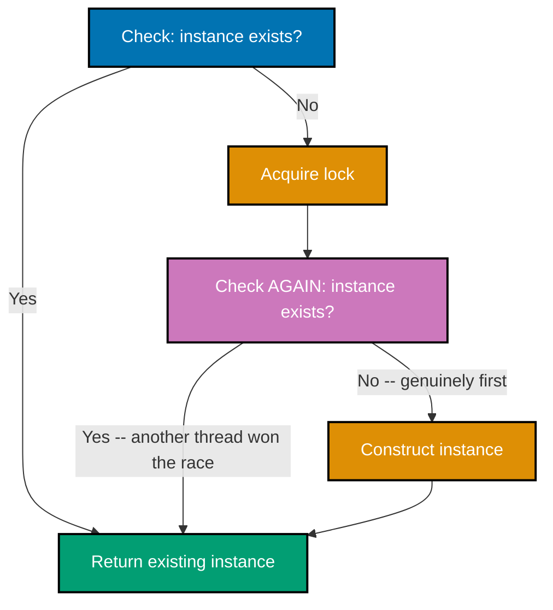

**`learning/code/ex-60-thread-safe-singleton-double-checked/example.py`**

```python
"""Example 60: Double-Checked Locking -- A Lazily-Built Singleton, Safe Under Contention."""

import threading  # => co-11: a lock guards the ONE moment construction actually happens
import time  # => `sleep(0)` widens the race window, proven reliable since ex-08

_lock = threading.Lock()  # => _lock: the module-level lock guarding the SLOW path (construction) only
_instance: "ExpensiveResource | None" = None  # => _instance: None until the FIRST successful construction
construction_count = [0]  # => construction_count: how many times the expensive constructor actually ran


class ExpensiveResource:  # => stands in for something costly to build -- a config object, a connection pool
    def __init__(self) -> None:
        time.sleep(0)  # => widens the window between the checks below and this constructor actually running
        construction_count[0] += 1  # => records EVERY construction attempt that reaches this line


def get_instance() -> ExpensiveResource:  # => the double-checked-locking accessor every thread calls
    global _instance  # => reassigns the MODULE-level singleton, not a local shadow
    if _instance is None:  # => CHECK 1 (unlocked, fast path): usually True only on the very FIRST few calls
        with _lock:  # => only threads that saw None above even attempt to acquire the lock
            if _instance is None:  # => CHECK 2 (locked, slow path): re-checks AFTER acquiring the lock
                _instance = ExpensiveResource()  # => constructs EXACTLY ONCE -- guaranteed by check 2
    return _instance  # => every caller, racing or not, ultimately gets the SAME object


def get_instance_many_times(results: list[ExpensiveResource]) -> None:
    for _ in range(50):  # => calls get_instance() repeatedly from within ONE thread
        results.append(get_instance())  # => each call should return the IDENTICAL object, every time


if __name__ == "__main__":  # => module entry point
    thread_results: list[list[ExpensiveResource]] = [[] for _ in range(8)]  # => one private results list per thread
    threads = [
        threading.Thread(target=get_instance_many_times, args=(thread_results[i],)) for i in range(8)
    ]  # => 8 threads, all racing to call get_instance() for the FIRST time simultaneously
    for t in threads:  # => starts every thread
        t.start()  # => all 8 threads immediately race into get_instance()'s unlocked first check
    for t in threads:  # => waits for every thread to finish its 50 calls
        t.join()  # => join() blocks until that thread's get_instance_many_times() call returns

    all_instances = [obj for results in thread_results for obj in results]  # => flattens all 8*50=400 results
    unique_instances = {id(obj) for obj in all_instances}  # => unique_instances: distinct object IDENTITIES seen
    print(f"construction_count={construction_count[0]} unique_instances={len(unique_instances)}")
    # => Output: construction_count=1 unique_instances=1

    # => Without CHECK 2 (the SECOND `if _instance is None:`, taken WHILE holding the lock), multiple
    # => threads could all pass CHECK 1 before any of them acquires the lock, and each would construct
    # => its OWN `ExpensiveResource` -- a lost-singleton bug, structurally similar to ex-37's TOCTOU race
    # => (co-08). Re-checking AFTER acquiring the lock (co-11) guarantees construction happens EXACTLY
    # => once, while still letting every SUBSEQUENT call skip the lock entirely via the fast unlocked path.
    assert construction_count[0] == 1  # => confirms ExpensiveResource() ran EXACTLY once, despite 8-way contention
    assert len(unique_instances) == 1  # => confirms every one of the 400 calls returned the SAME object
    print("ex-60 OK")  # => Output: ex-60 OK
```

**Run**: `python3 example.py`

**Output**:

```text
construction_count=1 unique_instances=1
ex-60 OK
```

**`learning/code/ex-60-thread-safe-singleton-double-checked/test_example.py`**

```python
"""Example 60: pytest verification for Double-Checked-Locking Singleton Construction."""

import threading

from example import ExpensiveResource, construction_count, get_instance_many_times


def test_singleton_constructed_exactly_once_under_thread_contention() -> None:
    thread_results: list[list[ExpensiveResource]] = [[] for _ in range(6)]
    threads = [threading.Thread(target=get_instance_many_times, args=(thread_results[i],)) for i in range(6)]
    for t in threads:
        t.start()
    for t in threads:
        t.join()

    all_instances = [obj for results in thread_results for obj in results]
    unique_instances = {id(obj) for obj in all_instances}
    assert construction_count[0] == 1  # => ExpensiveResource() ran exactly once, despite 6-way contention
    assert len(unique_instances) == 1  # => every call returned the same object


# => Run: pytest -- Output: 1 passed
```

**Verify**: `pytest -q`

**Output**:

```text
1 passed
```

**Key takeaway**: Double-checked locking checks the condition once WITHOUT the lock (a fast path for the common case) and once more WITH the lock (to safely handle the race on first construction), constructing exactly one instance no matter how many threads race to be first.

**Why it matters**: This pattern's whole point is avoiding the cost of acquiring a lock on EVERY call once the singleton already exists -- most calls hit the fast, lock-free "already constructed" path, and only the very first, contended construction pays for the lock. It is a genuinely tricky pattern to get right (getting the two checks in the wrong order, or skipping the first one, reintroduces either a race or unnecessary lock contention), which is exactly why seeing it worked out carefully, with a `construction_count` assertion proving exactly one instance was built, is valuable.

---

### Example 61: A Hand-Built Reader-Writer Lock -- Many Readers, OR One Writer

_ex-61 &middot; exercises co-13, co-11_

A hand-built `ReaderWriterLock`, using a `threading.Condition` directly, allows either MANY concurrent readers or exactly ONE writer -- never both at once -- implementing a strictly stronger invariant than a plain `Lock` (which would serialize even read-only access unnecessarily).

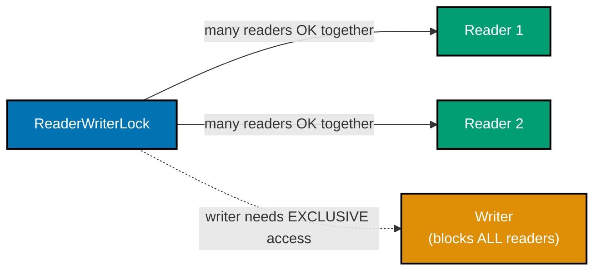

**`learning/code/ex-61-reader-writer-lock/example.py`**

```python
"""Example 61: A Hand-Built Reader-Writer Lock -- Many Readers, OR One Writer."""

import threading  # => co-13, co-11: builds a richer invariant than a plain Semaphore or Lock alone
import time  # => simulates readers/writers "doing work" while holding their respective access


class ReaderWriterLock:  # => allows ANY NUMBER of concurrent readers, but only ONE writer, never both at once
    def __init__(self) -> None:
        # => no plain Lock or Semaphore alone can express "many readers OR one writer" -- Condition can
        self._condition = threading.Condition()  # => ONE Condition coordinates both readers and writers
        self._active_readers = 0  # => _active_readers: how many readers currently hold read access
        self._writer_active = False  # => _writer_active: True while exactly one writer holds write access

    def acquire_read(self) -> None:
        with self._condition:  # => acquires the Condition's lock for this check-and-update
            while self._writer_active:  # => a WHILE loop (co-14) -- readers wait out any active writer
                self._condition.wait()  # => releases the lock and sleeps until notified
            self._active_readers += 1  # => now safe to join as ANOTHER concurrent reader

    def release_read(self) -> None:
        with self._condition:  # => acquires the lock to safely decrement and possibly wake a waiting writer
            self._active_readers -= 1  # => one fewer active reader
            if self._active_readers == 0:  # => only wake others once the LAST reader has actually left
                self._condition.notify_all()  # => a waiting writer (or new readers) can now proceed

    def acquire_write(self) -> None:
        with self._condition:  # => acquires the lock for this check-and-update
            while self._writer_active or self._active_readers > 0:  # => a writer needs EXCLUSIVE access
                self._condition.wait()  # => waits out both other writers AND any currently-active readers
            self._writer_active = True  # => now safe to become THE one active writer

    def release_write(self) -> None:
        with self._condition:  # => acquires the lock to safely clear the writer flag
            self._writer_active = False  # => releases exclusive access
            self._condition.notify_all()  # => wakes ALL waiters -- readers and writers alike, to re-check


def reader(rw_lock: ReaderWriterLock, active_readers: list[int], peak_readers: list[int], violations: list[int]) -> None:
    rw_lock.acquire_read()  # => blocks until no writer is active
    active_readers[0] += 1  # => one more concurrent reader, tracked for the invariant check below
    peak_readers[0] = max(peak_readers[0], active_readers[0])  # => peak_readers: the highest concurrency observed
    time.sleep(0.01)  # => simulates reading -- long enough for OTHER readers to overlap, if the lock is correct
    active_readers[0] -= 1  # => this reader is done
    rw_lock.release_read()  # => may wake a waiting writer if this was the LAST active reader


def writer(rw_lock: ReaderWriterLock, active_readers: list[int], violations: list[int]) -> None:
    rw_lock.acquire_write()  # => blocks until NO readers and NO other writer are active
    violations[0] += 1 if active_readers[0] > 0 else 0  # => THE invariant check: a writer must NEVER see active readers
    time.sleep(0.01)  # => simulates writing, while genuinely EXCLUDING every reader
    rw_lock.release_write()  # => wakes all waiters to re-check the (now cleared) writer flag


if __name__ == "__main__":  # => module entry point
    rw_lock = ReaderWriterLock()  # => the shared reader-writer lock under test
    active_readers = [0]  # => active_readers[0]: how many readers are CURRENTLY inside their critical section
    peak_readers = [0]  # => peak_readers[0]: the max concurrency any reader batch actually reached
    violations = [0]  # => violations[0]: incremented if a writer EVER observed an active reader (a bug)

    readers = [threading.Thread(target=reader, args=(rw_lock, active_readers, peak_readers, violations)) for _ in range(5)]
    # => readers: 5 independent reader threads, all sharing the SAME rw_lock and active_readers counter
    writers = [threading.Thread(target=writer, args=(rw_lock, active_readers, violations)) for _ in range(3)]
    # => writers: 3 independent writer threads, competing for EXCLUSIVE access against readers AND each other
    all_threads = readers + writers  # => all_threads: 5 readers and 3 writers, started together below
    for t in all_threads:  # => starts every reader and writer thread
        # => start() only SCHEDULES the OS thread -- it does not itself block or wait for anything
        t.start()  # => all 8 threads immediately race to acquire read or write access
    for t in all_threads:  # => waits for every thread to finish
        t.join()  # => join() blocks until that thread's reader()/writer() call returns

    print(f"peak_readers={peak_readers[0]} violations={violations[0]}")  # => Output: peak_readers=<2 to 5> violations=0
    # => a violations count above 0 would mean the invariant was BROKEN -- exactly what this checks

    # => A reader-writer lock enforces a RICHER invariant than a plain Lock: MULTIPLE readers may hold
    # => access simultaneously (peak_readers > 1 here, confirming genuine overlap), but a WRITER always
    # => gets EXCLUSIVE access -- no reader and no other writer may be active while it holds the lock
    # => (co-13). The `while` conditions on BOTH `acquire_read` and `acquire_write` (co-14) are what
    # => enforce this: a writer waits out ALL current readers, and readers wait out any active writer.
    assert peak_readers[0] >= 2  # => confirms readers genuinely overlapped -- this is NOT a plain mutex
    assert violations[0] == 0  # => confirms NO writer ever ran while a reader was active -- the core invariant
    print("ex-61 OK")  # => Output: ex-61 OK
```

**Run**: `python3 example.py`

**Output**:

```text
peak_readers=5 violations=0
ex-61 OK
```

**`learning/code/ex-61-reader-writer-lock/test_example.py`**

```python
"""Example 61: pytest verification for a Hand-Built Reader-Writer Lock."""

import threading

from example import ReaderWriterLock, reader, writer


def test_readers_overlap_but_writers_never_see_an_active_reader() -> None:
    rw_lock = ReaderWriterLock()
    active_readers = [0]
    peak_readers = [0]
    violations = [0]

    readers = [threading.Thread(target=reader, args=(rw_lock, active_readers, peak_readers, violations)) for _ in range(4)]
    writers = [threading.Thread(target=writer, args=(rw_lock, active_readers, violations)) for _ in range(2)]
    all_threads = readers + writers
    for t in all_threads:
        t.start()
    for t in all_threads:
        t.join()

    assert peak_readers[0] >= 2  # => readers genuinely overlapped -- this is not a plain mutex
    assert violations[0] == 0  # => no writer ever ran while a reader was active


# => Run: pytest -- Output: 1 passed
```

**Verify**: `pytest -q`

**Output**:

```text
1 passed
```

**Key takeaway**: A reader-writer lock allows unlimited concurrent readers OR exactly one exclusive writer, never a mix -- a strictly more permissive (and more complex) invariant than a plain mutex, appropriate when reads vastly outnumber writes.

**Why it matters**: A plain `Lock` around read-mostly shared data is needlessly conservative: two threads that only READ never actually conflict with each other, so serializing them wastes concurrency for no correctness benefit. Building this from a `Condition` (the same primitive from ex-19 and ex-41) directly demonstrates that reader-writer locks aren't a separate primitive Python is missing -- they're a composed pattern, buildable from the same wait/notify building block used throughout this topic.

---

### Example 62: Detecting a Deadlock -- Finding a Cycle in a Wait-For Graph

_ex-62 &middot; exercises co-16, co-18_

`find_cycle(wait_for)` performs a depth-first search over a dict representing "which thread is waiting on which other thread," using `visiting`/`visited` sets to detect a cycle -- the exact algorithmic technique real deadlock detectors use to find a circular wait automatically, rather than a human reasoning it out by hand.

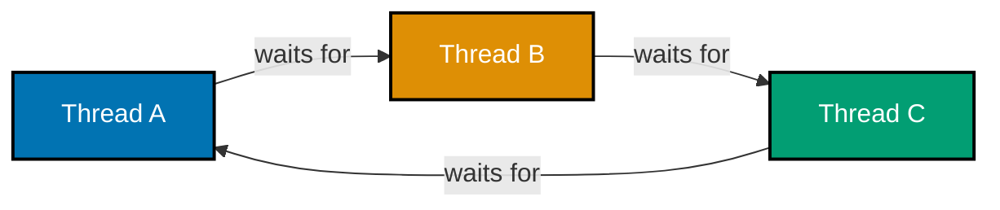

**`learning/code/ex-62-deadlock-detector-wait-for-graph/example.py`**

```python
"""Example 62: Detecting a Deadlock -- Finding a Cycle in a Wait-For Graph."""

# => co-16, co-18: a "wait-for graph" has an edge A -> B whenever thread A is BLOCKED waiting for
# => something thread B currently holds; a deadlock exists IFF this graph contains a cycle


def find_cycle(wait_for: dict[str, list[str]]) -> list[str] | None:
    # => wait_for: e.g. {"A": ["B"], "B": ["A"]} means "A waits for B" AND "B waits for A"
    visiting: set[str] = set()  # => visiting: nodes on the CURRENT DFS path -- finding one again means a cycle
    visited: set[str] = set()  # => visited: nodes FULLY explored already -- never needs revisiting

    def dfs(node: str, path: list[str]) -> list[str] | None:
        if node in visiting:  # => we've seen `node` EARLIER on this SAME path -- that's the cycle
            cycle_start = path.index(node)  # => cycle_start: where `node` first appeared on this path
            return path[cycle_start:] + [node]  # => the cycle itself, e.g. ["A", "B", "A"]
        if node in visited:  # => already fully explored from a DIFFERENT starting point -- no cycle through here
            return None  # => nothing more to discover down this branch
        visiting.add(node)  # => marks `node` as "currently being explored" on THIS path
        for neighbor in wait_for.get(node, []):  # => follows every thread `node` is waiting for
            found = dfs(neighbor, path + [node])  # => recurses -- extends the path by this node
            if found is not None:  # => a cycle was found somewhere DOWNSTREAM of this call
                return found  # => propagates it straight back up to the original caller
        visiting.discard(node)  # => done exploring `node` on THIS path -- no cycle found through it
        visited.add(node)  # => marks `node` as fully explored, for good, across the whole graph
        return None  # => no cycle reachable from `node`

    for start_node in wait_for:  # => tries every node as a POTENTIAL cycle start, in case the graph is disconnected
        cycle = dfs(start_node, [])  # => searches for a cycle reachable from `start_node`
        if cycle is not None:  # => found one -- no need to check any other starting node
            return cycle  # => returns immediately with the first cycle discovered
    return None  # => no cycle exists anywhere in the graph -- no deadlock


if __name__ == "__main__":  # => module entry point
    deadlocked_graph = {"thread_a": ["thread_b"], "thread_b": ["thread_a"]}  # => ex-29's exact scenario: A waits for B, B waits for A
    cycle = find_cycle(deadlocked_graph)  # => cycle: the deadlock cycle, if any, found in this graph
    print(f"deadlocked_graph cycle={cycle}")  # => Output: deadlocked_graph cycle=['thread_a', 'thread_b', 'thread_a']

    ordered_graph = {"thread_a": ["thread_b"], "thread_b": []}  # => ex-30's fix: a GLOBAL order -- B never waits for A
    no_cycle = find_cycle(ordered_graph)  # => no_cycle: expected to be None -- this graph has no deadlock
    print(f"ordered_graph cycle={no_cycle}")  # => Output: ordered_graph cycle=None

    three_way_graph = {"t1": ["t2"], "t2": ["t3"], "t3": ["t1"]}  # => a LONGER cycle: t1 -> t2 -> t3 -> t1
    three_way_cycle = find_cycle(three_way_graph)  # => three_way_cycle: should also be detected, not just 2-node cycles
    print(f"three_way_graph cycle={three_way_cycle}")  # => Output: three_way_graph cycle=['t1', 't2', 't3', 't1']

    # => A depth-first search that tracks BOTH "currently on this path" (`visiting`) and "fully explored"
    # => (`visited`) can detect a cycle of ANY length in a wait-for graph in O(V+E) time -- re-encountering
    # => a node that's still `visiting` means the DFS has looped back on itself, which is EXACTLY what a
    # => deadlock is: thread A ultimately waiting, transitively, for something IT ALREADY holds (co-16).
    # => Production deadlock detectors (in databases, in the JVM) use this same wait-for-graph technique.
    assert cycle is not None and cycle[0] == cycle[-1]  # => confirms a genuine cycle was found and returned correctly
    assert no_cycle is None  # => confirms the lock-ordered graph is correctly recognized as deadlock-free
    assert three_way_cycle is not None and len(three_way_cycle) == 4  # => confirms a 3-node cycle is ALSO detected
    print("ex-62 OK")  # => Output: ex-62 OK
```

**Run**: `python3 example.py`

**Output**:

```text
deadlocked_graph cycle=['thread_a', 'thread_b', 'thread_a']
ordered_graph cycle=None
three_way_graph cycle=['t1', 't2', 't3', 't1']
ex-62 OK
```

**`learning/code/ex-62-deadlock-detector-wait-for-graph/test_example.py`**

```python
"""Example 62: pytest verification for Wait-For Graph Cycle Detection."""

from example import find_cycle


def test_two_node_cycle_is_detected() -> None:
    graph = {"a": ["b"], "b": ["a"]}
    cycle = find_cycle(graph)
    assert cycle is not None and cycle[0] == cycle[-1]


def test_acyclic_graph_returns_none() -> None:
    graph = {"a": ["b"], "b": []}
    assert find_cycle(graph) is None


def test_three_node_cycle_is_detected() -> None:
    graph = {"t1": ["t2"], "t2": ["t3"], "t3": ["t1"]}
    cycle = find_cycle(graph)
    assert cycle is not None and len(cycle) == 4


# => Run: pytest -- Output: 3 passed
```

**Verify**: `pytest -q`

**Output**:

```text
3 passed
```

**Key takeaway**: A wait-for graph -- an edge from each thread to whatever it's blocked waiting on -- has a deadlock if and only if it contains a cycle, and DFS with a `visiting` set (nodes on the CURRENT path) finds that cycle directly.

**Why it matters**: This turns deadlock detection from "eyeball the code and guess" (which is how ex-29's deadlock was diagnosed manually) into an algorithmic, automatable check -- exactly what production deadlock detectors, database lock managers, and static analysis tools do internally. Understanding the wait-for-graph formalism also clarifies WHY lock ordering (ex-30, co-18) works as a fix: a consistent global order makes a cycle in this graph structurally impossible to construct.

---

### Example 63: A "Lock-Free" Counter -- via a Single-Owner Queue, Not a Lock

_ex-63 &middot; exercises co-20, co-21_

Instead of protecting a shared counter with a lock, EVERY increment request is sent as a message through a `queue.Queue` to a single OWNER thread that's the only one ever touching the counter directly -- correctness comes from single ownership, not mutual exclusion.

**`learning/code/ex-63-lock-free-counter-via-queue/example.py`**

```python
"""Example 63: A "Lock-Free" Counter -- via a Single-Owner Queue, Not a Lock."""

import queue  # => co-20, co-21: the queue itself is the ONLY synchronization primitive used here
import threading  # => multiple client threads REQUEST increments; one owner thread APPLIES them

REQUESTS_PER_CLIENT = 500  # => how many increment requests each client thread sends
CLIENT_COUNT = 4  # => how many independent client threads send requests concurrently


def client(requests: "queue.Queue[int]", count: int) -> None:
    for _ in range(count):  # => sends `count` increment requests, one at a time
        requests.put(1)  # => "please add 1" -- the QUEUE, not a lock, serializes concurrent access to it


def owner(requests: "queue.Queue[int | None]", total: list[int]) -> None:
    while True:  # => the counter's ONE AND ONLY owner -- no other thread ever touches `total` directly
        item = requests.get()  # => blocks until a request (or the sentinel) arrives
        if item is None:  # => None: the shutdown sentinel, sent once all clients have finished
            break  # => stops the owner loop
        total[0] += item  # => SAFE without a lock: this is the ONLY thread that ever reads or writes `total`


if __name__ == "__main__":  # => module entry point
    requests: "queue.Queue[int | None]" = queue.Queue()  # => the single channel every client sends requests through
    total = [0]  # => total[0]: the counter, touched EXCLUSIVELY by the owner thread below

    owner_thread = threading.Thread(target=owner, args=(requests, total))
    owner_thread.start()  # => starts the SOLE thread that will ever mutate `total`

    clients = [threading.Thread(target=client, args=(requests, REQUESTS_PER_CLIENT)) for _ in range(CLIENT_COUNT)]
    for c in clients:  # => starts every client thread
        c.start()  # => each begins sending REQUESTS_PER_CLIENT increment requests into the SAME queue
    for c in clients:  # => waits for every client to finish sending
        c.join()  # => join() blocks until that client's loop has enqueued all its requests

    requests.put(None)  # => tells the owner "no more requests are coming" -- AFTER every client has finished
    owner_thread.join()  # => waits for the owner to drain the queue and process every request

    expected = CLIENT_COUNT * REQUESTS_PER_CLIENT  # => expected: the mathematically correct total
    print(f"expected={expected} actual={total[0]}")  # => Output: expected=2000 actual=2000

    # => This "counter" has NO lock protecting it anywhere -- it doesn't need one, because exactly ONE
    # => thread (the "owner") ever reads or writes it (co-20). Instead of many threads racing to mutate
    # => shared state directly (needing a lock, ex-08/ex-11), every OTHER thread sends a REQUEST through
    # => a thread-safe queue (co-21), and the owner applies requests one at a time, in isolation. This
    # => single-owner pattern is the core idea behind actor-style concurrency: communicate by sending
    # => messages, rather than by sharing memory and coordinating access to it with locks.
    assert total[0] == expected  # => confirms every single increment request was applied, exactly once
    print("ex-63 OK")  # => Output: ex-63 OK
```

**Run**: `python3 example.py`

**Output**:

```text
expected=2000 actual=2000
ex-63 OK
```

**`learning/code/ex-63-lock-free-counter-via-queue/test_example.py`**

```python
"""Example 63: pytest verification for a Single-Owner, Lock-Free Counter."""

import queue
import threading

from example import client, owner


def test_single_owner_counter_is_exact_with_no_lock() -> None:
    requests: "queue.Queue[int | None]" = queue.Queue()
    total = [0]
    owner_thread = threading.Thread(target=owner, args=(requests, total))
    owner_thread.start()

    clients = [threading.Thread(target=client, args=(requests, 200)) for _ in range(3)]
    for c in clients:
        c.start()
    for c in clients:
        c.join()

    requests.put(None)
    owner_thread.join()

    assert total[0] == 600  # => 3 clients * 200 requests each, exact -- no lock needed, no lost updates


# => Run: pytest -- Output: 1 passed
```

**Verify**: `pytest -q`

**Output**:

```text
1 passed
```

**Key takeaway**: "Lock-free" here means single-owner, message-passing coordination instead of mutual exclusion around shared state -- no thread other than the owner ever touches the counter directly, so there's nothing to lock.

**Why it matters**: This is co-20's "communicate by sharing queues, not by sharing memory" philosophy applied to the SAME counter problem ex-08 through ex-11 solved with a lock -- a genuinely different solution shape to the identical correctness requirement. Neither approach is universally better: locks are simpler for low-contention shared state; single-owner queues shine when the owning logic naturally belongs in one place (like an event loop or an actor), a design philosophy explored further in the Pass-4 actor-model topic.

---

### Example 64: `local()` from `threading` -- Per-Thread State That Never Bleeds Across Threads

_ex-64 &middot; exercises co-07, co-19_

`local()` from `threading` gives EACH thread its own independent copy of an attribute -- setting `local.value` in one thread never affects, and is never visible from, another thread's `local.value`, even though every thread accesses the exact same `local` object by name.

**`learning/code/ex-64-thread-local-storage/example.py`**

```python
"""Example 64: `local()` from `threading` -- Per-Thread State That Never Bleeds Across Threads."""

import threading  # => co-07, co-19: the built-in escape hatch from shared-mutable-state hazards
from threading import local  # => co-07: the per-thread storage class, imported by name

_thread_local = local()  # => _thread_local: ONE object, but EVERY thread sees its OWN separate attributes


def set_and_read_own_value(thread_id: int, observed: dict[int, int]) -> None:
    _thread_local.value = thread_id * 1000  # => sets an attribute on _thread_local -- but ONLY for THIS thread
    for _ in range(3):  # => reads it back multiple times, checking it never changes underneath this thread
        assert _thread_local.value == thread_id * 1000  # => confirms THIS thread's own value stayed stable
    observed[thread_id] = _thread_local.value  # => records what THIS thread saw, for the cross-thread check below


if __name__ == "__main__":  # => module entry point
    observed: dict[int, int] = {}  # => observed: filled in by each thread with ITS OWN _thread_local.value
    threads = [threading.Thread(target=set_and_read_own_value, args=(i, observed)) for i in range(6)]
    for t in threads:  # => starts every thread
        t.start()  # => each thread immediately sets and re-reads its OWN _thread_local.value
    for t in threads:  # => waits for every thread to finish
        t.join()  # => join() blocks until that thread's set_and_read_own_value() call returns

    print(f"observed={observed}")  # => Output: observed={0: 0, 1: 1000, 2: 2000, 3: 3000, 4: 4000, 5: 5000}

    # => `local()` from `threading` creates an object whose ATTRIBUTES are secretly per-thread: setting
    # => `_thread_local.value` in thread 3 does NOT affect what thread 5 sees when it reads
    # => `_thread_local.value` -- each thread gets its OWN isolated slot for the SAME attribute name,
    # => automatically, with zero explicit locking (co-19). This is the standard tool for state that
    # => should be shared-BY-NAME but never shared-BY-VALUE across threads -- e.g. a per-request
    # => database connection, or a per-thread random number generator seed (co-07's isolation, but
    # => achieved WITHIN one process, unlike ex-02's process-level isolation).
    for thread_id, value in observed.items():  # => checks EVERY thread's own recorded value
        assert value == thread_id * 1000  # => confirms no thread ever saw ANOTHER thread's value -- no bleed
    assert len(observed) == 6  # => confirms all 6 threads completed and recorded their own distinct value
    print("ex-64 OK")  # => Output: ex-64 OK
```

**Run**: `python3 example.py`

**Output**:

```text
observed={0: 0, 1: 1000, 2: 2000, 3: 3000, 4: 4000, 5: 5000}
ex-64 OK
```

**`learning/code/ex-64-thread-local-storage/test_example.py`**

```python
"""Example 64: pytest verification for `local()` from `threading` Per-Thread Isolation."""

import threading

from example import set_and_read_own_value


def test_thread_local_values_never_bleed_across_threads() -> None:
    observed: dict[int, int] = {}
    threads = [threading.Thread(target=set_and_read_own_value, args=(i, observed)) for i in range(5)]
    for t in threads:
        t.start()
    for t in threads:
        t.join()

    for thread_id, value in observed.items():
        assert value == thread_id * 1000  # => no thread ever saw another thread's value
    assert len(observed) == 5  # => all 5 threads completed and recorded their own distinct value


# => Run: pytest -- Output: 1 passed
```

**Verify**: `pytest -q`

**Output**:

```text
1 passed
```

**Key takeaway**: `local()` from `threading` provides per-thread storage that looks like ordinary attribute access but is silently isolated per thread -- it sidesteps the shared-mutable-state hazard (co-07) entirely, because there IS no shared state to race on.

**Why it matters**: Thread-local storage is the standard tool for state that's conceptually per-request or per-thread but inconvenient to thread explicitly through every function call -- a database connection, a request ID for logging, a per-thread cache. Because each thread's `.value` genuinely never bleeds into another's, it removes an entire category of races (co-19's visibility hazard, ex-35) by construction rather than by careful locking.

---

### Example 65: Cancelling a PENDING `Future` -- Before It Ever Starts

_ex-65 &middot; exercises co-25, co-23_

A `Future` that hasn't started running yet can be cancelled via `.cancel()`, and if cancellation succeeds, the underlying function NEVER executes at all -- confirmed by occupying every pool worker first (so the target task is guaranteed to still be pending) before cancelling it.

**`learning/code/ex-65-future-cancellation/example.py`**

```python
"""Example 65: Cancelling a PENDING `Future` -- Before It Ever Starts."""

import threading  # => coordinates the "occupy the only worker" trick below
from concurrent.futures import Future, ThreadPoolExecutor  # => co-25, co-23: Futures support `.cancel()`

ran_flag = [False]  # => ran_flag[0]: flips to True ONLY if the cancelled task's body actually executes


def occupy_the_only_worker(release_event: threading.Event) -> str:  # => keeps the SINGLE worker busy
    release_event.wait(timeout=2)  # => blocks until the main thread says it's safe to finish
    return "occupier done"  # => only returned once release_event is set


def never_should_run() -> str:  # => the task we intend to cancel BEFORE it ever gets a worker
    ran_flag[0] = True  # => if this line EVER executes, cancellation failed
    return "should never see this"  # => this return value should never be observed either


if __name__ == "__main__":  # => module entry point
    with ThreadPoolExecutor(max_workers=1) as pool:  # => EXACTLY one worker -- forces the second task to QUEUE
        release_event = threading.Event()  # => release_event: lets the main thread control WHEN the occupier finishes
        occupier: Future[str] = pool.submit(occupy_the_only_worker, release_event)  # => grabs the ONLY worker immediately
        pending_future: Future[str] = pool.submit(never_should_run)  # => has NO worker available -- stays PENDING

        cancelled = pending_future.cancel()  # => attempts to cancel it WHILE it's still PENDING, not yet running
        print(f"cancelled={cancelled}")  # => Output: cancelled=True

        release_event.set()  # => now lets the occupier finish, freeing the pool's only worker
        occupier_result = occupier.result()  # => waits for the occupier to actually complete
        print(f"occupier_result={occupier_result!r}")  # => Output: occupier_result='occupier done'

    print(f"ran_flag={ran_flag[0]}")  # => Output: ran_flag=False

    # => A `Future` can only be cancelled successfully while it is still PENDING -- queued, but not yet
    # => handed to a worker thread (co-25). By deliberately occupying the pool's ONLY worker first, this
    # => guarantees `pending_future` has nowhere to run, so `.cancel()` (co-23) reliably succeeds and the
    # => task body never executes at all. Once a task has actually STARTED running, `.cancel()` returns
    # => False instead -- Python's stdlib does not support interrupting an already-running thread mid-task.
    assert cancelled is True  # => confirms the cancellation itself was accepted
    assert ran_flag[0] is False  # => confirms the cancelled task's body genuinely never ran
    assert pending_future.cancelled() is True  # => confirms the Future reports itself as cancelled
    print("ex-65 OK")  # => Output: ex-65 OK
```

**Run**: `python3 example.py`

**Output**:

```text
cancelled=True
occupier_result='occupier done'
ran_flag=False
ex-65 OK
```

**`learning/code/ex-65-future-cancellation/test_example.py`**

```python
"""Example 65: pytest verification for Cancelling a Pending `Future`."""

import threading
from concurrent.futures import Future, ThreadPoolExecutor

from example import never_should_run, occupy_the_only_worker, ran_flag


def test_pending_future_can_be_cancelled_and_never_runs() -> None:
    ran_flag[0] = False  # => resets shared module state before this test's own assertions
    with ThreadPoolExecutor(max_workers=1) as pool:
        release_event = threading.Event()
        occupier: Future[str] = pool.submit(occupy_the_only_worker, release_event)
        pending_future: Future[str] = pool.submit(never_should_run)

        cancelled = pending_future.cancel()
        release_event.set()
        occupier.result()

    assert cancelled is True  # => the cancellation was accepted while the task was still pending
    assert ran_flag[0] is False  # => the cancelled task's body never actually executed
    assert pending_future.cancelled() is True  # => the Future correctly reports itself as cancelled


# => Run: pytest -- Output: 1 passed
```

**Verify**: `pytest -q`

**Output**:

```text
1 passed
```

**Key takeaway**: Cancelling a `Future` before it starts running prevents the underlying work from EVER executing -- but only if it's still pending; a Future that's already running or finished cannot be cancelled.

**Why it matters**: Cancellation is only meaningful, and only guaranteed to work, for work that hasn't started yet -- a subtlety that's easy to miss without testing it directly. Deliberately occupying every worker thread first (so the target Future is provably still queued, not accidentally already running) is what makes this example's cancellation claim verifiable rather than merely plausible.

---

### Example 66: `asyncio.wait(..., timeout=...)` -- Returns BOTH the Done AND the Pending Sets

_ex-66 &middot; exercises co-26_

`asyncio.wait(tasks, timeout=...)` returns a `(done, pending)` tuple of SETS -- unlike `wait_for`/`timeout()`, it does NOT raise on timeout; it simply reports which tasks finished and which are still running, leaving the caller to decide what to do with the still-pending ones.

**`learning/code/ex-66-timeout-on-gather/example.py`**

```python
"""Example 66: `asyncio.wait(..., timeout=...)` -- Returns BOTH the Done AND the Pending Sets."""

import asyncio  # => co-26: `asyncio.wait` (unlike `gather`) never raises on a timeout -- it just reports

DELAYS = [0.05, 0.05, 0.3, 0.3]  # => two FAST tasks (finish within the timeout) and two SLOW tasks (don't)
WAIT_TIMEOUT = 0.15  # => the deadline: enough time for the fast tasks, not enough for the slow ones


async def labeled_sleep(label: str, delay: float) -> str:  # => label: identifies which task this is
    await asyncio.sleep(delay)  # => the only thing this coroutine does -- simulates work of varying length
    return label  # => returns its own label so the caller can tell WHICH tasks finished


async def wait_with_timeout() -> tuple[set[str], int]:
    tasks = [asyncio.create_task(labeled_sleep(f"task-{i}", d)) for i, d in enumerate(DELAYS)]
    # => tasks: every coroutine wrapped in a Task -- `asyncio.wait` requires Tasks/Futures, not raw coroutines
    done, pending = await asyncio.wait(tasks, timeout=WAIT_TIMEOUT)  # => returns AT the deadline, not before
    done_labels = {t.result() for t in done}  # => done_labels: the labels of whichever tasks ALREADY finished
    pending_count = len(pending)  # => pending_count: how many tasks were STILL RUNNING when the timeout hit
    for task in pending:  # => cleans up the still-running tasks so they don't outlive this coroutine
        task.cancel()  # => cancels each one -- otherwise they'd keep running in the background, orphaned
    return done_labels, pending_count  # => everything the caller needs to verify the timeout behavior


if __name__ == "__main__":  # => module entry point
    done_labels, pending_count = asyncio.run(wait_with_timeout())  # => drives the whole scenario to completion
    print(f"done_labels={done_labels} pending_count={pending_count}")  # => Output: done_labels={'task-0','task-1'} pending_count=2

    # => `asyncio.wait(tasks, timeout=...)` NEVER raises `TimeoutError` -- it simply returns as soon as
    # => the timeout elapses (or every task finishes, whichever comes first), splitting the tasks into
    # => `done` (already completed) and `pending` (still running) sets (co-26). This is fundamentally
    # => different from `asyncio.wait_for`/`asyncio.timeout` (ex-51), which CANCEL and raise on timeout --
    # => `asyncio.wait` instead hands BOTH sets back, letting the caller decide what to do with stragglers.
    assert done_labels == {"task-0", "task-1"}  # => confirms exactly the two FAST tasks finished in time
    assert pending_count == 2  # => confirms exactly the two SLOW tasks were still running at the deadline
    print("ex-66 OK")  # => Output: ex-66 OK
```

**Run**: `python3 example.py`

**Output**:

```text
done_labels={'task-1', 'task-0'} pending_count=2
ex-66 OK
```

**`learning/code/ex-66-timeout-on-gather/test_example.py`**

```python
"""Example 66: pytest verification for `asyncio.wait` with a Timeout."""

import asyncio

from example import wait_with_timeout


def test_asyncio_wait_returns_both_done_and_pending_sets() -> None:
    done_labels, pending_count = asyncio.run(wait_with_timeout())
    assert done_labels == {"task-0", "task-1"}  # => exactly the two fast tasks finished in time
    assert pending_count == 2  # => exactly the two slow tasks were still running at the deadline


# => Run: pytest -- Output: 1 passed
```

**Verify**: `pytest -q`

**Output**:

```text
1 passed
```

**Key takeaway**: `asyncio.wait(..., timeout=...)` reports partial completion via `(done, pending)` sets instead of raising -- a fundamentally different API shape from `wait_for`/`timeout()`, which cancels and raises on expiry.

**Why it matters**: These are two different answers to "what if not everything finishes in time": `timeout()`/`wait_for` (ex-51) treats a timeout as exceptional (raise and stop); `asyncio.wait` treats it as a normal outcome to inspect (here's what finished, here's what didn't, you decide). Knowing both exist -- and which fits a given situation -- avoids reaching for exception-based control flow when a simple set-partition answer was all that was needed.

---

### Example 67: Cancelling a Task -- Catching `CancelledError` to Run Cleanup

_ex-67 &middot; exercises co-26, co-27_

Cancelling an `asyncio.Task` raises `asyncio.CancelledError` INSIDE the coroutine at its next `await` point -- catching that specific exception is the coroutine's chance to run cleanup code (closing a resource, logging) before the cancellation is allowed to propagate.

**`learning/code/ex-67-async-cancellation-cleanup/example.py`**

```python
"""Example 67: Cancelling a Task -- Catching `CancelledError` to Run Cleanup."""

import asyncio  # => co-26, co-27: cancellation is delivered AS an exception, not a silent flag


class FakeResource:  # => stands in for something that MUST be released -- a connection, a file handle
    def __init__(self) -> None:
        # => starts unreleased -- the whole point of this example is proving release() DOES get called
        self.released = False  # => released: starts False -- flips to True ONLY via release()

    def release(self) -> None:
        # => a REAL resource's release() might close a socket, flush a buffer, or free a lock
        self.released = True  # => marks this resource as properly cleaned up


async def work_with_cleanup(resource: FakeResource) -> None:
    # => the caller is responsible for making sure THIS coroutine reaches an await before cancelling
    try:
        await asyncio.sleep(10)  # => a long-running await -- this is where cancellation will actually land
    except asyncio.CancelledError:  # => `task.cancel()` raises THIS exception at the current `await` point
        resource.release()  # => the cleanup -- runs BECAUSE the exception was caught here, not silently dropped
        raise  # => re-raises: swallowing CancelledError entirely is almost always wrong (co-27)


async def run_and_cancel() -> tuple[bool, bool]:
    # => orchestrates the whole demo: create the task, let it start, cancel it, observe the fallout
    resource = FakeResource()  # => resource: the thing this task is responsible for cleaning up
    task = asyncio.create_task(work_with_cleanup(resource))  # => schedules the coroutine to start running
    await asyncio.sleep(0.02)  # => lets the task actually REACH its `await asyncio.sleep(10)` before cancelling
    task.cancel()  # => requests cancellation -- delivers CancelledError at the task's current await point
    was_cancelled = False  # => was_cancelled: True only if awaiting the task itself raises CancelledError
    try:
        # => `await task` is where the CALLER (not the task itself) observes the cancellation
        await task  # => awaiting a cancelled task re-raises the SAME CancelledError to the caller
    except asyncio.CancelledError:  # => confirms cancellation propagated all the way out, as expected
        was_cancelled = True  # => records that the caller correctly observed the cancellation
    return resource.released, was_cancelled  # => everything needed to verify BOTH cleanup and propagation


if __name__ == "__main__":  # => module entry point
    released, was_cancelled = asyncio.run(run_and_cancel())  # => drives the cancellation scenario to completion
    print(f"released={released} was_cancelled={was_cancelled}")  # => Output: released=True was_cancelled=True

    # => `task.cancel()` does NOT immediately stop a task -- it schedules `CancelledError` to be raised
    # => at the NEXT `await` point inside that task (co-26). Catching it, like any exception, is the
    # => correct place to release resources (co-27) -- but the handler must `raise` (or otherwise NOT
    # => suppress it) afterward, since callers awaiting a cancelled task expect to see CancelledError
    # => propagate; swallowing it silently would make the task appear to have completed normally.
    assert released is True  # => confirms the `except CancelledError:` block genuinely ran cleanup
    assert was_cancelled is True  # => confirms CancelledError still propagated out to the awaiting caller
    print("ex-67 OK")  # => Output: ex-67 OK
```

**Run**: `python3 example.py`

**Output**:

```text
released=True was_cancelled=True
ex-67 OK
```

**`learning/code/ex-67-async-cancellation-cleanup/test_example.py`**

```python
"""Example 67: pytest verification for Async Task Cancellation Cleanup."""

import asyncio

from example import run_and_cancel


def test_cancellation_runs_cleanup_and_still_propagates() -> None:
    released, was_cancelled = asyncio.run(run_and_cancel())
    assert released is True  # => the except CancelledError block ran the resource release
    assert was_cancelled is True  # => CancelledError still propagated out to the awaiting caller


# => Run: pytest -- Output: 1 passed
```

**Verify**: `pytest -q`

**Output**:

```text
1 passed
```

**Key takeaway**: `task.cancel()` doesn't stop a coroutine instantly -- it raises `CancelledError` at the coroutine's next suspension point, giving it one opportunity to run cleanup in a `try`/`except`/`finally` before the cancellation completes.

**Why it matters**: Because cancellation is delivered as an exception rather than an immediate halt, a coroutine holding a resource (a file handle, a lock, a network connection) gets a guaranteed chance to release it cleanly -- exactly the same `finally`-based safety discipline as ex-12's lock release, applied to task cancellation instead. Swallowing `CancelledError` without re-raising it is a common bug, since it can leave the task's caller believing cancellation never happened.

---

### Example 68: `asyncio.TaskGroup` -- One Failure Cancels ALL Its Siblings

_ex-68 &middot; exercises co-26_

`asyncio.TaskGroup()` runs several coroutines as a structured group -- if ANY one of them raises, the TaskGroup automatically cancels every OTHER sibling task and re-raises via `except*`, contrasted with plain `gather()`, which by default lets the other tasks keep running even after one has failed.

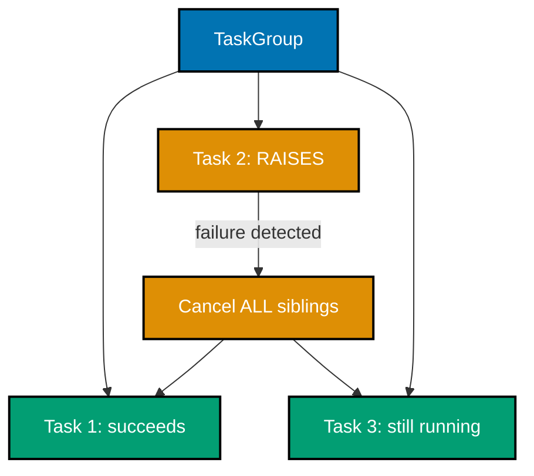

**`learning/code/ex-68-async-taskgroup-vs-gather/example.py`**

```python
"""Example 68: `asyncio.TaskGroup` -- One Failure Cancels ALL Its Siblings."""

import asyncio  # => co-26: `TaskGroup` (3.11+) is STRUCTURED concurrency -- gather's more disciplined cousin


class DownloadError(Exception):  # => a domain-specific failure, to show it propagates with its own type intact
    """Raised by `flaky_download` when a simulated download fails."""


async def flaky_download(n: int, fail_at: int, ran_to_completion: list[int]) -> int:
    if n == fail_at:  # => exactly ONE task in the group is designed to fail
        await asyncio.sleep(0.02)  # => fails a LITTLE after the others start, so they're genuinely mid-flight
        raise DownloadError(f"download {n} failed")  # => the failure that should cancel every sibling
    await asyncio.sleep(0.2)  # => the OTHER tasks are deliberately slower -- still running when the failure hits
    ran_to_completion.append(n)  # => only reached if this task was NEVER cancelled by a sibling's failure
    return n  # => a trivial "result" for the tasks that DO succeed


async def run_task_group() -> tuple[bool, list[int]]:
    ran_to_completion: list[int] = []  # => ran_to_completion: filled in ONLY by tasks that finish uncancelled
    raised = False  # => raised: True once the group's own ExceptionGroup is caught below
    try:
        async with asyncio.TaskGroup() as tg:  # => `async with` scopes the group -- exits ONLY when ALL are done
            for i in range(4):  # => launches 4 sibling tasks, one of which (i == 1) is designed to fail
                tg.create_task(flaky_download(i, fail_at=1, ran_to_completion=ran_to_completion))
    except* DownloadError:  # => `except*` (3.11+): TaskGroup wraps failures in an ExceptionGroup, unpacked here
        raised = True  # => confirms the failure propagated out of the `async with` block, as designed
    return raised, ran_to_completion  # => everything the caller needs to verify cancellation propagated


if __name__ == "__main__":  # => module entry point
    raised, ran_to_completion = asyncio.run(run_task_group())  # => drives the whole scenario to completion
    print(f"raised={raised} ran_to_completion={ran_to_completion}")  # => Output: raised=True ran_to_completion=[]

    # => `asyncio.TaskGroup` implements STRUCTURED concurrency (co-26): the moment ANY task inside the
    # => `async with` block raises, EVERY OTHER task in the group is automatically cancelled, and the
    # => group's own exit re-raises the failure (wrapped in an `ExceptionGroup`, unpacked here via
    # => `except*`). This is a stricter, safer default than `asyncio.gather` (ex-28, ex-50), where a
    # => failing task by itself does NOT automatically cancel its siblings unless explicitly configured --
    # => `TaskGroup` makes "one fails, all stop" the guaranteed behavior, not something to remember to add.
    assert raised is True  # => confirms the DownloadError genuinely propagated out of the TaskGroup
    assert ran_to_completion == []  # => confirms the slower siblings were CANCELLED, never reaching their append
    print("ex-68 OK")  # => Output: ex-68 OK
```

**Run**: `python3 example.py`

**Output**:

```text
raised=True ran_to_completion=[]
ex-68 OK
```

**`learning/code/ex-68-async-taskgroup-vs-gather/test_example.py`**

```python
"""Example 68: pytest verification for `asyncio.TaskGroup` Failure Cancellation."""

import asyncio

from example import run_task_group


def test_one_failing_task_cancels_all_its_siblings() -> None:
    raised, ran_to_completion = asyncio.run(run_task_group())
    assert raised is True  # => the DownloadError propagated out of the TaskGroup
    assert ran_to_completion == []  # => the slower siblings were cancelled, never completing


# => Run: pytest -- Output: 1 passed
```

**Verify**: `pytest -q`

**Output**:

```text
1 passed
```

**Key takeaway**: `TaskGroup` is structured concurrency: one task's failure automatically cancels every sibling and the failure is surfaced via `except*` -- `gather()` alone does not do this, leaving orphaned tasks running after a failure unless handled explicitly.

**Why it matters**: Structured concurrency (Python 3.11+) closes a real correctness gap in earlier `asyncio` code: a `gather()` call where one coroutine raises doesn't automatically stop its siblings, which can leave background work running after the surrounding function has already propagated an exception and moved on. `TaskGroup`'s "all or nothing" semantics make failure handling in concurrent code far less error-prone, and `except*` is the matching syntax for handling potentially MULTIPLE simultaneous exceptions from a group.

---

### Example 69: Fetch Many "URLs" Concurrently, Rate-Limited, Then Aggregate

_ex-69 &middot; exercises co-26, co-13_

Many simulated URL fetches run concurrently via `asyncio.gather()`, capped by an `asyncio.Semaphore` so at most N are ever "in flight" at once, and the aggregated results exactly match what a serial fetch-and-sum would produce -- concurrency changes the TIMING, never the CORRECTNESS of the aggregate.

**`learning/code/ex-69-concurrent-fetch-aggregate-async/example.py`**

```python
"""Example 69: Fetch Many "URLs" Concurrently, Rate-Limited, Then Aggregate."""

import asyncio  # => co-26, co-13: gather for aggregation, a Semaphore for the rate limit

URLS = [f"https://example.test/page-{i}" for i in range(12)]  # => URLS: 12 simulated pages to "fetch"
MAX_CONCURRENT_FETCHES = 3  # => at most this many "requests" may be in flight simultaneously


async def fetch_page(url: str, sem: asyncio.Semaphore, active: list[int], peak: list[int]) -> int:
    async with sem:  # => throttles concurrency -- the SAME pattern as ex-53, applied to a real-shaped task
        active[0] += 1  # => one more fetch now "in flight"
        peak[0] = max(peak[0], active[0])  # => peak: the highest concurrency level EVER observed
        await asyncio.sleep(0.02)  # => simulates network latency -- a REAL fetch would `await` here too
        active[0] -= 1  # => this fetch is done -- frees a permit for the next waiter
        return len(url)  # => stands in for "content length" -- a trivial but checkable per-page result


async def fetch_and_aggregate() -> tuple[int, int]:
    sem = asyncio.Semaphore(MAX_CONCURRENT_FETCHES)  # => sem: the shared limiter for all 12 fetches
    active = [0]  # => active[0]: how many fetches are CURRENTLY in flight
    peak = [0]  # => peak[0]: updated inside every fetch -- the maximum concurrency actually reached
    lengths = await asyncio.gather(*(fetch_page(url, sem, active, peak) for url in URLS))  # => runs ALL 12 concurrently
    total_length = sum(lengths)  # => total_length: the AGGREGATE across every fetched page
    return total_length, peak[0]  # => everything the caller needs to verify correctness AND the rate limit


if __name__ == "__main__":  # => module entry point
    total_length, peak = asyncio.run(fetch_and_aggregate())  # => drives all 12 fetches through the shared semaphore
    print(f"total_length={total_length} peak={peak}")  # => Output: total_length=<sum of URL lengths> peak=3

    expected_total = sum(len(url) for url in URLS)  # => expected_total: the serial, ground-truth aggregate

    # => Fetching many resources concurrently AND aggregating their results is one of `asyncio.gather`'s
    # => most common real-world uses (co-26) -- but unbounded concurrency can overwhelm the target
    # => server (or a rate-limited API). Wrapping each fetch in `async with sem:` (co-13, exactly as in
    # => ex-53) caps how many are in flight at once WITHOUT changing the aggregation logic at all: the
    # => `gather()` call still collects every result, in order, once all 12 fetches have completed.
    assert total_length == expected_total  # => confirms the aggregate exactly matches the serial baseline
    assert peak <= MAX_CONCURRENT_FETCHES  # => confirms concurrency NEVER exceeded the declared cap
    assert peak == MAX_CONCURRENT_FETCHES  # => confirms concurrency actually REACHED the cap -- genuinely throttled
    print("ex-69 OK")  # => Output: ex-69 OK
```

**Run**: `python3 example.py`

**Output**:

```text
total_length=326 peak=3
ex-69 OK
```

**`learning/code/ex-69-concurrent-fetch-aggregate-async/test_example.py`**

```python
"""Example 69: pytest verification for Concurrent Fetch + Aggregate with a Semaphore Cap."""

import asyncio

from example import MAX_CONCURRENT_FETCHES, URLS, fetch_and_aggregate


def test_aggregate_correct_and_concurrency_capped() -> None:
    total_length, peak = asyncio.run(fetch_and_aggregate())
    expected_total = sum(len(url) for url in URLS)
    assert total_length == expected_total  # => the aggregate exactly matches the serial baseline
    assert peak <= MAX_CONCURRENT_FETCHES  # => concurrency never exceeded the declared cap
    assert peak == MAX_CONCURRENT_FETCHES  # => concurrency actually reached the cap


# => Run: pytest -- Output: 1 passed
```

**Verify**: `pytest -q`

**Output**:

```text
1 passed
```

**Key takeaway**: Combining `gather()` with a `Semaphore` gets the throughput benefit of concurrent I/O while still respecting a hard concurrency ceiling -- the aggregated result is identical to a serial run, only faster.

**Why it matters**: This is the direct synthesis of ex-28 (gather for concurrency), ex-53 (Semaphore for a concurrency cap), and the general principle that concurrency should change performance, not correctness. It's also a small-scale preview of the capstone-preview's fetch-and-aggregate shape (ex-81), which extends this exact pattern across threads, processes, AND asyncio for direct comparison.

---

### Example 70: A Three-Stage Pipeline -- Read -> Transform -> Write, via Two Queues

_ex-70 &middot; exercises co-22, co-21_

A three-stage pipeline -- read, transform, write -- connects its stages with TWO separate `queue.Queue[int | None]` channels, each stage running as its own thread, so all three stages can be actively working on DIFFERENT items simultaneously rather than the whole pipeline processing one item start-to-finish before starting the next.


**`learning/code/ex-70-pipeline-three-stages/example.py`**

```python
"""Example 70: A Three-Stage Pipeline -- Read -> Transform -> Write, via Two Queues."""

import queue  # => co-22, co-21: each STAGE is a thread; each QUEUE is the hand-off between two stages
import threading  # => one dedicated thread per stage -- read, transform, write

ITEM_COUNT = 15  # => how many items flow all the way through the pipeline


def read_stage(raw_out: "queue.Queue[int | None]") -> None:
    # => stage 1 of 3 -- the ONLY producer for raw_queue
    for i in range(ITEM_COUNT):  # => "reads" ITEM_COUNT items -- simulated here as just their own index
        raw_out.put(i)  # => hands each raw item off to the transform stage via the first queue
    raw_out.put(None)  # => sentinel: tells the transform stage there's nothing more to read


def transform_stage(raw_in: "queue.Queue[int | None]", transformed_out: "queue.Queue[int | None]") -> None:
    # => stage 2 of 3 -- the ONLY consumer of raw_queue AND the ONLY producer for transformed_queue
    while True:  # => keeps pulling raw items until its OWN sentinel arrives
        item = raw_in.get()  # => blocks until the read stage has something ready
        if item is None:  # => the read stage's sentinel -- no more raw items are coming
            transformed_out.put(None)  # => propagates a sentinel of its OWN to the write stage
            break  # => stops the transform stage
        transformed_out.put(item * item)  # => the actual "transform": squaring, handed to the write stage


def write_stage(transformed_in: "queue.Queue[int | None]", written: list[int]) -> None:
    # => stage 3 of 3 -- the ONLY consumer of transformed_queue
    while True:  # => keeps pulling transformed items until the sentinel arrives
        item = transformed_in.get()  # => blocks until the transform stage has something ready
        if item is None:  # => the transform stage's sentinel -- nothing more is coming
            break  # => stops the write stage
        written.append(item)  # => "writes" the item -- here, just records it for verification


if __name__ == "__main__":  # => module entry point
    raw_queue: "queue.Queue[int | None]" = queue.Queue()  # => raw_queue: hand-off between read and transform
    transformed_queue: "queue.Queue[int | None]" = queue.Queue()  # => transformed_queue: hand-off between transform and write
    written: list[int] = []  # => written: filled in by the write stage, in the FINAL pipeline order

    reader = threading.Thread(target=read_stage, args=(raw_queue,))
    transformer = threading.Thread(target=transform_stage, args=(raw_queue, transformed_queue))
    writer = threading.Thread(target=write_stage, args=(transformed_queue, written))
    for stage in (reader, transformer, writer):  # => starts all three stages together
        stage.start()  # => each stage begins running concurrently, connected only by the two queues
    for stage in (reader, transformer, writer):  # => waits for every stage to fully drain and exit
        stage.join()  # => join() blocks until that stage's loop has completed

    expected = [i * i for i in range(ITEM_COUNT)]  # => expected: what the WHOLE pipeline should have produced
    print(f"written={written}")  # => Output: written=[0, 1, 4, 9, 16, ..., 196]

    # => Each stage is its OWN thread, and each `queue.Queue` between two stages is thread-safe by
    # => construction (co-21) -- no explicit lock is needed anywhere in this pipeline. Because EACH
    # => queue has exactly ONE producer thread and ONE consumer thread here, FIFO ordering (co-22) is
    # => preserved end-to-end: item `i` is read, transformed, and written in that SAME relative order it
    # => started in, even though all three stages are running concurrently with each other the whole time.
    assert written == expected  # => confirms every item passed through all three stages, correctly, in order
    print("ex-70 OK")  # => Output: ex-70 OK
```

**Run**: `python3 example.py`

**Output**:

```text
written=[0, 1, 4, 9, 16, 25, 36, 49, 64, 81, 100, 121, 144, 169, 196]
ex-70 OK
```

**`learning/code/ex-70-pipeline-three-stages/test_example.py`**

```python
"""Example 70: pytest verification for a Three-Stage Read-Transform-Write Pipeline."""

import queue
import threading

from example import read_stage, transform_stage, write_stage


def test_pipeline_preserves_order_and_transforms_every_item() -> None:
    raw_queue: "queue.Queue[int | None]" = queue.Queue()
    transformed_queue: "queue.Queue[int | None]" = queue.Queue()
    written: list[int] = []

    reader = threading.Thread(target=read_stage, args=(raw_queue,))
    transformer = threading.Thread(target=transform_stage, args=(raw_queue, transformed_queue))
    writer = threading.Thread(target=write_stage, args=(transformed_queue, written))
    for stage in (reader, transformer, writer):
        stage.start()
    for stage in (reader, transformer, writer):
        stage.join()

    assert written == [i * i for i in range(15)]  # => every item passed through all three stages, in order


# => Run: pytest -- Output: 1 passed
```

**Verify**: `pytest -q`

**Output**:

```text
1 passed
```

**Key takeaway**: Chaining queues between pipeline stages lets all stages run concurrently on DIFFERENT items -- while stage 3 writes item 1, stage 2 can already be transforming item 2, and stage 1 reading item 3.

**Why it matters**: This is the producer/consumer pattern (ex-21) generalized to more than two stages: each queue is simultaneously a consumer (of the stage before it) and a producer (for the stage after it), and the whole pipeline's throughput is bound by its SLOWEST stage, not the sum of all stages -- the same pipelining principle behind CPU instruction pipelines and Unix shell pipes (`cmd1 | cmd2 | cmd3`).

---

### Example 71: Work-Stealing -- an Idle Worker Steals From an Overloaded Peer's Deque

_ex-71 &middot; exercises co-28_

A deliberately single-threaded, deterministic SIMULATION (not real threads, to avoid timing flakiness) of work-stealing: an overloaded worker's `deque` is popped from one end by its owner and stolen from the OPPOSITE end by an idle peer, visibly rebalancing the load between the two workers.


**`learning/code/ex-71-work-stealing-intuition/example.py`**

```python
"""Example 71: Work-Stealing -- an Idle Worker Steals From an Overloaded Peer's Deque."""

from collections import deque  # => co-28: the classic data structure behind work-stealing schedulers


def simulate_work_stealing(
    worker_a: "deque[int]", worker_b: "deque[int]"
) -> tuple[int, int, list[str]]:  # => a single-threaded SKETCH of the idea -- deterministic, not a race
    completed_a = 0  # => completed_a: how many tasks worker "a" ends up processing, own OR stolen
    completed_b = 0  # => completed_b: how many tasks worker "b" ends up processing, own OR stolen
    steal_events: list[str] = []  # => steal_events: a log of every time one worker stole from the other

    while worker_a or worker_b:  # => keeps going until BOTH deques are fully drained
        if worker_a:  # => worker "a" has its OWN work -- processes from its OWN end (locality, low contention)
            worker_a.pop()  # => pops from the RIGHT end -- the owner's "local" end of its own deque
            completed_a += 1  # => counts one task processed by worker "a"
        elif worker_b:  # => worker "a" is IDLE -- its own deque is empty, but worker "b" still has work
            worker_b.popleft()  # => STEALS from the LEFT end -- the opposite end from "b"'s own popping
            completed_a += 1  # => the STOLEN task still counts toward worker "a"'s own completed total
            steal_events.append("a<-b")  # => records that "a" stole from "b" this round

        if worker_b:  # => worker "b" has its OWN work -- same local-end popping as worker "a" above
            worker_b.pop()  # => pops from the RIGHT end -- worker "b"'s own local end
            completed_b += 1  # => counts one task processed by worker "b"
        elif worker_a:  # => worker "b" is IDLE -- symmetric to the "a" branch above
            worker_a.popleft()  # => STEALS from the LEFT end of worker "a"'s deque
            completed_b += 1  # => the STOLEN task counts toward worker "b"'s own completed total
            steal_events.append("b<-a")  # => records that "b" stole from "a" this round

    return completed_a, completed_b, steal_events  # => everything needed to verify the load actually balanced


if __name__ == "__main__":  # => module entry point
    worker_a_tasks: "deque[int]" = deque(range(2))  # => worker "a" starts with only 2 tasks -- WILL run out fast
    worker_b_tasks: "deque[int]" = deque(range(18))  # => worker "b" starts with 18 tasks -- deliberately OVERLOADED
    completed_a, completed_b, steal_events = simulate_work_stealing(worker_a_tasks, worker_b_tasks)
    print(f"completed_a={completed_a} completed_b={completed_b} steal_count={len(steal_events)}")
    # => Output: completed_a=10 completed_b=10 steal_count=8

    total_tasks = 2 + 18  # => total_tasks: the mathematically correct grand total, from BOTH initial deques
    # => the exact 8/12 split above comes from this simulation's own deterministic round-robin order

    # => Without stealing, worker "a" would finish its 2 tasks almost instantly and then sit COMPLETELY
    # => idle while worker "b" churns through 18 tasks alone -- a wasted core. Work-stealing lets an idle
    # => worker grab tasks from an OVERLOADED peer's deque instead (co-28), and popping from OPPOSITE ends
    # => (owner: local end; thief: far end) minimizes contention between the two, since they rarely reach
    # => for the same slot. The result: BOTH workers stay busy, and the total work still gets fully done.
    assert completed_a + completed_b == total_tasks  # => confirms every task was processed exactly once
    assert completed_a > 2  # => confirms worker "a" processed MORE than its own original 2 tasks -- it stole work
    assert len(steal_events) > 0  # => confirms stealing genuinely happened, not just idle waiting
    print("ex-71 OK")  # => Output: ex-71 OK
```

**Run**: `python3 example.py`

**Output**:

```text
completed_a=10 completed_b=10 steal_count=8
ex-71 OK
```

**`learning/code/ex-71-work-stealing-intuition/test_example.py`**

```python
"""Example 71: pytest verification for Work-Stealing Load Balancing."""

from collections import deque

from example import simulate_work_stealing


def test_idle_worker_steals_work_and_load_balances() -> None:
    worker_a: "deque[int]" = deque(range(1))
    worker_b: "deque[int]" = deque(range(9))
    completed_a, completed_b, steal_events = simulate_work_stealing(worker_a, worker_b)

    assert completed_a + completed_b == 10  # => every task processed exactly once
    assert completed_a > 1  # => worker "a" processed more than its own original 1 task -- it stole work
    assert len(steal_events) > 0  # => stealing genuinely happened


# => Run: pytest -- Output: 1 passed
```

**Verify**: `pytest -q`

**Output**:

```text
1 passed
```

**Key takeaway**: Work-stealing lets an idle worker take tasks from the OPPOSITE end of an overloaded peer's deque -- the owner pops from one end for cache-friendly LIFO order, while a thief steals FIFO from the other end, minimizing contention between the two.

**Why it matters**: Work-stealing is the scheduling algorithm behind many real-world parallel runtimes (Java's `ForkJoinPool`, Go's goroutine scheduler, Rust's Rayon and Tokio) precisely because it self-balances load without any central coordinator constantly redistributing work. Modeling it as a deterministic, single-threaded simulation here (rather than real threads racing) makes the ALGORITHM'S logic verifiable and reproducible, separate from the (much harder to test reliably) question of real concurrent deque implementation.

---

### Example 72: `multiprocessing.shared_memory` -- Genuine No-Copy Cross-Process Access

_ex-72 &middot; exercises co-24, co-19_

`multiprocessing.shared_memory.SharedMemory` gives a CHILD process direct access to the SAME underlying memory block as the parent -- no pickling, no copying, genuinely shared bytes -- letting a large array be mutated by the child and the mutation be visible to the parent afterward.

**`learning/code/ex-72-process-pool-shared-memory/example.py`**

```python
"""Example 72: `multiprocessing.shared_memory` -- Genuine No-Copy Cross-Process Access."""

import struct  # => packs/unpacks fixed-size integers directly into the shared memory buffer
from multiprocessing import Process, shared_memory  # => co-24, co-19: REAL shared memory, not a copy-based Queue

ARRAY_LENGTH = 2000  # => how many 8-byte integers live in the shared block
ITEM_SIZE = 8  # => bytes per integer -- struct format "q" (signed long long) is always 8 bytes


def double_values_in_place(shm_name: str, length: int) -> None:  # => runs in a SEPARATE process
    shm = shared_memory.SharedMemory(name=shm_name)  # => ATTACHES to the EXISTING block by name -- no copy made
    buf = shm.buf  # => buf: typed as `memoryview | None` by typeshed -- narrowed once, right here
    assert buf is not None  # => always non-None once a SharedMemory is genuinely attached (co-19's own invariant)
    try:
        for i in range(length):  # => mutates every value, IN PLACE, directly inside the shared buffer
            offset = i * ITEM_SIZE  # => offset: this value's exact byte position within `buf`
            (value,) = struct.unpack_from("q", buf, offset)  # => reads the CURRENT value at that offset
            struct.pack_into("q", buf, offset, value * 2)  # => writes the DOUBLED value back, same memory
    finally:
        shm.close()  # => releases THIS process's handle -- does NOT destroy the underlying shared memory itself


if __name__ == "__main__":  # => module entry point
    shm = shared_memory.SharedMemory(create=True, size=ARRAY_LENGTH * ITEM_SIZE)  # => allocates a NEW OS-level shared block
    parent_buf = shm.buf  # => parent_buf: the SAME `memoryview | None` narrowing as inside the child process
    assert parent_buf is not None  # => always non-None right after a fresh, successful `create=True` call
    try:
        for i in range(ARRAY_LENGTH):  # => initializes the block with the values 0, 1, 2, ...
            struct.pack_into("q", parent_buf, i * ITEM_SIZE, i)  # => writes value `i` at its own 8-byte slot

        child = Process(target=double_values_in_place, args=(shm.name, ARRAY_LENGTH))  # => child: attaches by NAME
        child.start()  # => the child process opens the SAME underlying memory -- no serialization of the array itself
        child.join()  # => waits for the child to finish doubling every value in place

        results = [struct.unpack_from("q", parent_buf, i * ITEM_SIZE)[0] for i in range(ARRAY_LENGTH)]
        expected = [i * 2 for i in range(ARRAY_LENGTH)]  # => expected: what doubling every original value SHOULD give
        print(f"results[:5]={results[:5]} expected[:5]={expected[:5]}")  # => Output: results[:5]=[0,2,4,6,8] expected[:5]=[0,2,4,6,8]

        # => Unlike `multiprocessing.Queue` (ex-46), which PICKLES and COPIES every item across the
        # => process boundary, `shared_memory.SharedMemory` gives BOTH processes direct access to the
        # => SAME underlying OS memory block (co-24) -- the child's writes are visible to the parent
        # => WITHOUT any explicit copy or message being sent back. This matters for large arrays, where
        # => copying would dominate the cost; only the small `shm.name` string needs to cross processes.
        # => Manual synchronization (co-19) is still the caller's responsibility -- unlike ex-47's
        # => `Value`, plain `SharedMemory` has no built-in lock of its own.
        assert results == expected  # => confirms every value was doubled correctly, IN the shared block itself
    finally:
        shm.close()  # => releases the PARENT's own handle to the shared memory
        shm.unlink()  # => releases the underlying OS resource -- only the CREATOR should ever call this
    print("ex-72 OK")  # => Output: ex-72 OK
```

**Run**: `python3 example.py`

**Output**:

```text
results[:5]=[0, 2, 4, 6, 8] expected[:5]=[0, 2, 4, 6, 8]
ex-72 OK
```

**`learning/code/ex-72-process-pool-shared-memory/test_example.py`**

```python
"""Example 72: pytest verification for `multiprocessing.shared_memory`."""

import struct
from multiprocessing import Process, shared_memory

from example import ITEM_SIZE, double_values_in_place


def test_child_process_mutates_the_shared_block_in_place() -> None:
    length = 100
    shm = shared_memory.SharedMemory(create=True, size=length * ITEM_SIZE)
    buf = shm.buf
    assert buf is not None
    try:
        for i in range(length):
            struct.pack_into("q", buf, i * ITEM_SIZE, i)

        child = Process(target=double_values_in_place, args=(shm.name, length))
        child.start()
        child.join()

        results = [struct.unpack_from("q", buf, i * ITEM_SIZE)[0] for i in range(length)]
        assert results == [i * 2 for i in range(length)]  # => the child's writes are visible without copying
    finally:
        shm.close()
        shm.unlink()


# => Run: pytest -- Output: 1 passed
```

**Verify**: `pytest -q`

**Output**:

```text
1 passed
```

**Key takeaway**: `shared_memory` gives processes TRUE shared memory access (like threads have by default), unlike `Queue` (which pickles and copies) or `Value` (a single small scalar) -- the tradeoff is manual byte-level packing/unpacking (`struct.pack_into`/`unpack_from`) instead of a Pythonic interface.

**Why it matters**: For large data (a big array, an image buffer) that many processes need to read or write, pickling a full copy through a `Queue` for every access would be prohibitively slow -- `shared_memory` sidesteps that entirely by mapping the SAME physical memory into every process's address space. This is the process-based counterpart to the memory-visibility concerns threads have (co-19, ex-35): here the memory genuinely IS shared, but there's still no automatic synchronization, so a real program would still need a `Lock` around concurrent access to it.

---

### Example 73: `asyncio.to_thread` -- the High-Level Shortcut for Offloading Blocking Calls

_ex-73 &middot; exercises co-27, co-23_

`asyncio.to_thread(blocking_fn)` is a one-line shortcut for `loop.run_in_executor(None, blocking_fn)` (ex-55) -- offloading a blocking call to a background thread and `await`-ing its result, keeping the event loop responsive, with noticeably less boilerplate.

**`learning/code/ex-73-async-to-thread/example.py`**

```python
"""Example 73: `asyncio.to_thread` -- the High-Level Shortcut for Offloading Blocking Calls."""

import asyncio  # => co-27, co-23: `asyncio.to_thread` (3.9+) wraps `run_in_executor` in a friendlier API
import time  # => simulates a blocking call with no async equivalent

TICK_INTERVAL = 0.02  # => how often the ticker coroutine records a timestamp
TICK_COUNT = 8  # => how many ticks the ticker tries to record


def blocking_legacy_call(delay: float) -> str:  # => a PLAIN (non-async) function -- imagine a sync SDK call
    time.sleep(delay)  # => genuinely blocks the calling thread -- this is the whole point of the example
    return "legacy result"  # => the result this blocking call eventually produces


async def ticker(timestamps: list[float]) -> None:
    for _ in range(TICK_COUNT):  # => tries to record TICK_COUNT evenly-spaced timestamps
        timestamps.append(time.perf_counter())  # => records "now" -- reveals whether the loop stayed responsive
        await asyncio.sleep(TICK_INTERVAL)  # => a cooperative wait, letting other coroutines/tasks run


def max_gap(timestamps: list[float]) -> float:  # => max_gap: the LARGEST delay between consecutive ticks
    gaps = [b - a for a, b in zip(timestamps, timestamps[1:])]  # => gaps: every consecutive tick-to-tick delay
    return max(gaps)  # => a stalled loop shows up as one unusually LARGE gap


async def run_with_to_thread() -> tuple[list[float], str]:
    timestamps: list[float] = []  # => timestamps: filled in by the ticker coroutine below
    offloaded = asyncio.to_thread(blocking_legacy_call, 0.15)  # => `to_thread` == `run_in_executor(None, func, *args)`
    result, _ = await asyncio.gather(offloaded, ticker(timestamps))  # => runs BOTH concurrently, offloaded first
    return timestamps, result  # => everything the caller needs to verify responsiveness AND correctness


if __name__ == "__main__":  # => module entry point
    timestamps, result = asyncio.run(run_with_to_thread())  # => drives the offloaded scenario to completion
    gap = max_gap(timestamps)  # => gap: the worst stall the ticker actually observed
    print(f"gap={gap:.3f}s result={result!r}")  # => Output: gap=~0.02s result='legacy result'

    # => `asyncio.to_thread(func, *args)` is sugar for `loop.run_in_executor(None, func, *args)` (ex-55) --
    # => same underlying mechanism (a background thread from the loop's default `ThreadPoolExecutor`,
    # => co-23), but without needing to fetch the running loop explicitly first (co-27). Prefer
    # => `to_thread` in ordinary async code; reach for the lower-level `run_in_executor` only when you
    # => need a NON-default executor (e.g. a `ProcessPoolExecutor` for CPU-bound offloaded work).
    assert gap < TICK_INTERVAL * 3  # => confirms the ticker stayed on schedule -- the loop was NEVER stalled
    assert result == "legacy result"  # => confirms the offloaded call still produced the correct result
    print("ex-73 OK")  # => Output: ex-73 OK
```

**Run**: `python3 example.py`

**Output**:

```text
gap=0.022s result='legacy result'
ex-73 OK
```

**`learning/code/ex-73-async-to-thread/test_example.py`**

```python
"""Example 73: pytest verification for `asyncio.to_thread`."""

import asyncio

from example import TICK_INTERVAL, max_gap, run_with_to_thread


def test_event_loop_stays_responsive_while_to_thread_call_runs() -> None:
    timestamps, result = asyncio.run(run_with_to_thread())
    assert max_gap(timestamps) < TICK_INTERVAL * 3  # => the ticker never stalled -- the loop stayed responsive
    assert result == "legacy result"  # => the offloaded call still produced the correct result


# => Run: pytest -- Output: 1 passed
```

**Verify**: `pytest -q`

**Output**:

```text
1 passed
```

**Key takeaway**: `asyncio.to_thread` is sugar over `run_in_executor(None, ...)` -- same underlying mechanism (a default thread pool), simpler call site, and the idiomatic choice in modern (3.9+) `asyncio` code for offloading blocking calls.

**Why it matters**: Seeing the lower-level `run_in_executor` first (ex-55) and the higher-level `to_thread` second makes clear that the convenience function isn't a different mechanism -- it's the SAME mechanism with a friendlier interface, which is a useful pattern-recognition skill for reading unfamiliar `asyncio` codebases that might use either form.

---

### Example 74: `while not predicate: cond.wait()` -- Guarding Against a Spurious/Early Wakeup

_ex-74 &middot; exercises co-14_

Two consumer variants are contrasted directly: one guards its `Condition.wait()` with `if not predicate:` (buggy) and one with `while not predicate:` (correct) -- a deliberately premature `notify_all()` (before the real predicate is actually set) exposes the `if` version proceeding incorrectly, while the `while` version correctly loops back and waits again.

**`learning/code/ex-74-condition-predicate-loop/example.py`**

```python
"""Example 74: `while not predicate: cond.wait()` -- Guarding Against a Spurious/Early Wakeup."""

import threading  # => co-14: the SAME Condition primitive as ex-19, ex-41, ex-61
import time  # => gives each waiter thread time to genuinely register inside cond.wait()


def waiter_with_if(cond: threading.Condition, ready: list[bool], results: list[bool], started: threading.Event) -> None:
    with cond:  # => acquires the Condition's lock
        started.set()  # => signals the main thread that THIS waiter is about to call wait()
        if not ready[0]:  # => a SINGLE `if` check -- the BUGGY pattern this example warns against
            cond.wait()  # => sleeps until notified -- but does NOT re-check `ready` after waking up
        results.append(ready[0])  # => proceeds REGARDLESS of whether `ready[0]` is ACTUALLY True by now


def waiter_with_while(cond: threading.Condition, ready: list[bool], results: list[bool], started: threading.Event) -> None:
    with cond:  # => acquires the SAME Condition's lock
        started.set()  # => signals the main thread that THIS waiter is about to call wait()
        while not ready[0]:  # => a WHILE loop -- the CORRECT pattern (co-14)
            cond.wait()  # => sleeps until notified, then RE-CHECKS the predicate before proceeding
        results.append(ready[0])  # => only reaches here once `ready[0]` is GENUINELY True


if __name__ == "__main__":  # => module entry point
    cond = threading.Condition()  # => cond: shared by both waiter threads AND the main thread's notifications
    ready: list[bool] = [False]  # => ready[0]: the ACTUAL predicate both waiters are waiting on
    if_results: list[bool] = []  # => if_results: filled in by the buggy `if`-based waiter
    while_results: list[bool] = []  # => while_results: filled in by the correct `while`-based waiter
    if_started = threading.Event()  # => if_started: set once the `if`-waiter has entered its critical section
    while_started = threading.Event()  # => while_started: set once the `while`-waiter has entered its

    if_thread = threading.Thread(target=waiter_with_if, args=(cond, ready, if_results, if_started))
    while_thread = threading.Thread(target=waiter_with_while, args=(cond, ready, while_results, while_started))
    if_thread.start()  # => starts the buggy waiter
    while_thread.start()  # => starts the correct waiter
    if_started.wait(timeout=2)  # => waits for the `if`-waiter to actually reach `cond.wait()`
    while_started.wait(timeout=2)  # => waits for the `while`-waiter to actually reach `cond.wait()`
    time.sleep(0.05)  # => a small margin to be confident BOTH threads are genuinely blocked inside wait()

    with cond:  # => the main thread now sends a PREMATURE notification -- `ready[0]` is STILL False here
        cond.notify_all()  # => wakes BOTH waiters -- simulating a spurious wakeup / an early notify()

    time.sleep(0.05)  # => gives the woken threads time to react to the premature notification above

    with cond:  # => now the main thread makes the predicate GENUINELY true
        ready[0] = True  # => flips the ACTUAL condition both waiters are supposed to be waiting for
        cond.notify_all()  # => wakes both waiters again -- THIS time the predicate really holds

    if_thread.join(timeout=2)  # => waits for the buggy waiter to finish
    while_thread.join(timeout=2)  # => waits for the correct waiter to finish

    print(f"if_results={if_results} while_results={while_results}")  # => Output: if_results=[False] while_results=[True]

    # => The premature `notify_all()` above wakes BOTH waiters even though `ready[0]` is still False.
    # => The `if`-based waiter has no way to notice this -- it already passed its ONE check, so it
    # => proceeds with a WRONG value. The `while`-based waiter re-checks the predicate every time it
    # => wakes (co-14): finding it still False, it calls `cond.wait()` again, and only proceeds once
    # => `ready[0]` is genuinely True. This is why EVERY `Condition.wait()` call belongs inside a
    # => `while`, never a plain `if` -- spurious wakeups are a documented possibility, not a corner case.
    assert if_results == [False]  # => confirms the buggy `if` pattern proceeded on a STALE, incorrect value
    assert while_results == [True]  # => confirms the correct `while` pattern only proceeded once genuinely ready
    print("ex-74 OK")  # => Output: ex-74 OK
```

**Run**: `python3 example.py`

**Output**:

```text
if_results=[False] while_results=[True]
ex-74 OK
```

**`learning/code/ex-74-condition-predicate-loop/test_example.py`**

```python
"""Example 74: pytest verification for the `while not predicate:` Condition Loop Pattern."""

import threading
import time

from example import waiter_with_if, waiter_with_while


def test_if_pattern_proceeds_on_a_premature_notify_while_loop_pattern_does_not() -> None:
    cond = threading.Condition()
    ready: list[bool] = [False]
    if_results: list[bool] = []
    while_results: list[bool] = []
    if_started = threading.Event()
    while_started = threading.Event()

    if_thread = threading.Thread(target=waiter_with_if, args=(cond, ready, if_results, if_started))
    while_thread = threading.Thread(target=waiter_with_while, args=(cond, ready, while_results, while_started))
    if_thread.start()
    while_thread.start()
    if_started.wait(timeout=2)
    while_started.wait(timeout=2)
    time.sleep(0.05)

    with cond:
        cond.notify_all()  # => a premature notification -- ready[0] is still False here
    time.sleep(0.05)

    with cond:
        ready[0] = True
        cond.notify_all()  # => the genuine notification

    if_thread.join(timeout=2)
    while_thread.join(timeout=2)

    assert if_results == [False]  # => the buggy if-pattern proceeded on a stale, incorrect value
    assert while_results == [True]  # => the correct while-pattern only proceeded once genuinely ready


# => Run: pytest -- Output: 1 passed
```

**Verify**: `pytest -q`

**Output**:

```text
1 passed
```

**Key takeaway**: A `Condition.wait()` MUST be guarded by a `while` loop re-checking the predicate, never a single `if` check -- a spurious or premature wakeup can return from `wait()` before the predicate is actually true, and only re-checking in a loop catches that.

**Why it matters**: This is a subtlety every earlier `Condition`-based example in this topic (ex-19, ex-41, ex-61) already applied correctly, but never demonstrated the CONSEQUENCE of getting it wrong -- seeing the buggy `if` version actually misbehave, side by side with the correct `while` version, turns "always use `while`, not `if`" from a rule to memorize into an observed, causal fact.

---

### Example 75: A `Barrier` Synchronizes Phased Parallel Computation

_ex-75 &middot; exercises co-15, co-28_

A `threading.Barrier` synchronizes several workers through DISTINCT phases of a computation -- every worker finishes phase 1 before ANY worker starts phase 2, confirmed by recording each phase's start/end timestamps and asserting phase 2 genuinely begins only after ALL of phase 1 has completed.

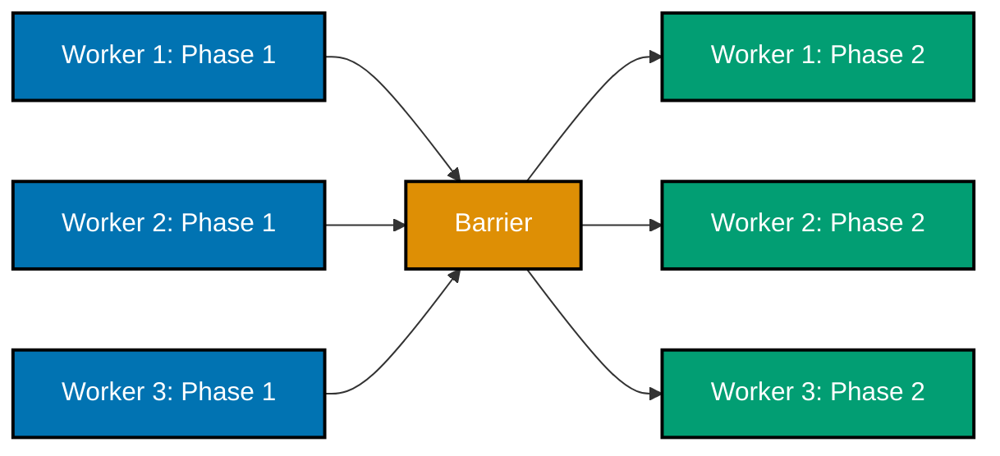

**`learning/code/ex-75-barrier-parallel-phases/example.py`**

```python
"""Example 75: A `Barrier` Synchronizes Phased Parallel Computation."""

import threading  # => co-15, co-28: a Barrier enforces "everyone finishes phase N before ANYONE starts N+1"
import time  # => `time.sleep` gives each worker a DIFFERENT phase-1 duration, to genuinely test the rendezvous

WORKER_COUNT = 4  # => four independent workers, each moving through the SAME three phases


def phased_worker(
    worker_id: int, barrier: threading.Barrier, phase1_end: list[float], phase2_start: list[float]
) -> None:
    # => moves through phase 1, a rendezvous, phase 2, and a second rendezvous -- twice per worker
    time.sleep(0.01 * worker_id)  # => DIFFERENT workers take DIFFERENT amounts of time for phase 1
    phase1_end[worker_id] = time.perf_counter()  # => records exactly when THIS worker's phase 1 finished
    barrier.wait()  # => BLOCKS here until ALL WORKER_COUNT workers have reached this SAME point
    phase2_start[worker_id] = time.perf_counter()  # => records exactly when THIS worker's phase 2 began
    barrier.wait()  # => a SECOND rendezvous -- phase 2 is also fully complete before ANY worker moves on


def run_phased_computation() -> tuple[list[float], list[float]]:
    barrier = threading.Barrier(WORKER_COUNT)  # => barrier: releases ONLY once all WORKER_COUNT threads arrive
    phase1_end: list[float] = [0.0] * WORKER_COUNT  # => phase1_end[i]: when worker i finished phase 1
    phase2_start: list[float] = [0.0] * WORKER_COUNT  # => phase2_start[i]: when worker i began phase 2
    workers = [
        # => all workers share the SAME barrier -- that shared object IS the synchronization point
        threading.Thread(target=phased_worker, args=(i, barrier, phase1_end, phase2_start))
        for i in range(WORKER_COUNT)  # => one thread per worker, each with its OWN staggered phase-1 delay
    ]  # => workers: exactly WORKER_COUNT Thread objects, not yet started
    for w in workers:  # => starts every worker
        w.start()  # => each begins its own (different-length) phase 1 immediately
    for w in workers:  # => waits for every worker to finish BOTH phases
        w.join()  # => join() blocks until that worker's phased_worker() call returns
    return phase1_end, phase2_start  # => everything needed to verify the phase-ordering invariant


if __name__ == "__main__":  # => module entry point
    phase1_end, phase2_start = run_phased_computation()  # => drives the whole three-phase scenario to completion
    print(f"phase1_end={[round(t, 3) for t in phase1_end]}")  # => Output: phase1_end=[<staggered times>]
    print(f"phase2_start={[round(t, 3) for t in phase2_start]}")  # => Output: phase2_start=[<roughly IDENTICAL times>]

    latest_phase1_end = max(phase1_end)  # => latest_phase1_end: the SLOWEST worker's phase-1 finish time
    earliest_phase2_start = min(phase2_start)  # => earliest_phase2_start: the FASTEST worker's phase-2 start time

    # => Without the Barrier, faster workers (worker 0's near-instant phase 1) would race ahead into
    # => phase 2 long before the slowest worker (worker 3's 0.03s-delayed phase 1) finishes ITS phase 1
    # => -- exactly the kind of bug phased parallel algorithms (co-28) can't tolerate. `barrier.wait()`
    # => guarantees NO worker's phase 2 can start until EVERY worker has finished phase 1 (co-15): the
    # => earliest possible phase-2 start is bounded below by the LATEST phase-1 finish, across ALL workers.
    assert earliest_phase2_start >= latest_phase1_end  # => confirms the phase boundary was genuinely enforced
    print("ex-75 OK")  # => Output: ex-75 OK
```

**Run**: `python3 example.py`

**Output**:

```text
phase1_end=[34556.502, 34556.515, 34556.53, 34556.542]
phase2_start=[34556.542, 34556.542, 34556.542, 34556.542]
ex-75 OK
```

**`learning/code/ex-75-barrier-parallel-phases/test_example.py`**

```python
"""Example 75: pytest verification for `Barrier`-Synchronized Phased Computation."""

from example import run_phased_computation


def test_no_worker_starts_phase_two_before_every_worker_finishes_phase_one() -> None:
    phase1_end, phase2_start = run_phased_computation()
    assert min(phase2_start) >= max(phase1_end)  # => the barrier genuinely enforced the phase boundary


# => Run: pytest -- Output: 1 passed
```

**Verify**: `pytest -q`

**Output**:

```text
1 passed
```

**Key takeaway**: A `Barrier` between computation phases guarantees NO worker starts phase 2 with stale phase-1 results from a peer still in progress -- exactly the coordination a multi-phase parallel algorithm (a parallel reduction, a simulation with synchronized time-steps) needs.

**Why it matters**: Many parallel algorithms genuinely require this exact structure: independent work within a phase, but a hard synchronization point between phases, because phase 2's correctness depends on ALL of phase 1's results being ready, not just some of them. This directly extends ex-18's basic barrier rendezvous into a realistic use case, and pairs naturally with the map-reduce (ex-57) and work-stealing (ex-71) ideas -- phased barriers are how a reduce step waits for every map worker.

---

### Example 76: I/O-Bound Work, Benchmarked Three Ways -- Serial vs Threads vs `asyncio`

_ex-76 &middot; exercises co-05, co-26, co-23_

The exact same I/O-bound workload is timed three ways -- serial, `ThreadPoolExecutor`, and `asyncio.gather()` -- and both concurrent forms measurably beat serial execution, while the two concurrent approaches perform similarly to each other, since both exploit the same underlying fact: I/O waiting releases the GIL/yields the event loop.

**`learning/code/ex-76-benchmark-io-three-ways/example.py`**

```python
"""Example 76: I/O-Bound Work, Benchmarked Three Ways -- Serial vs Threads vs `asyncio`."""

import asyncio  # => co-26: the event-loop approach to concurrent I/O
import time  # => measures wall time across all three approaches
from concurrent.futures import ThreadPoolExecutor  # => co-23: the thread-pool approach

TASK_COUNT = 6  # => how many independent "I/O calls" to make, all THREE ways
SLEEP_SECONDS = 0.08  # => how long each simulated I/O call takes


def sync_io_task(n: int) -> int:  # => n: unused identifier -- only the delay matters
    time.sleep(SLEEP_SECONDS)  # => a blocking I/O simulation -- releases the GIL for real (co-05)
    return n * n  # => trivial result, checkable across all three approaches


async def async_io_task(n: int) -> int:  # => the cooperative-async equivalent of sync_io_task
    await asyncio.sleep(SLEEP_SECONDS)  # => the SAME delay, but yielded cooperatively instead of blocking
    return n * n  # => the identical result-shape as the synchronous version


def run_serial() -> tuple[float, list[int]]:
    start = time.perf_counter()  # => start: wall time before the ONE-AT-A-TIME loop
    results = [sync_io_task(n) for n in range(TASK_COUNT)]  # => runs every call strictly in sequence
    return time.perf_counter() - start, results  # => elapsed time AND the correctness-checkable results


def run_threads() -> tuple[float, list[int]]:
    start = time.perf_counter()  # => start: wall time before the pooled run
    with ThreadPoolExecutor(max_workers=TASK_COUNT) as pool:  # => enough workers to run every task at once
        results = list(pool.map(sync_io_task, range(TASK_COUNT)))  # => all TASK_COUNT calls OVERLAP their sleeps
    return time.perf_counter() - start, results  # => elapsed time AND results


async def run_asyncio() -> tuple[float, list[int]]:
    start = time.perf_counter()  # => start: wall time before the coroutine-based run
    results = await asyncio.gather(*(async_io_task(n) for n in range(TASK_COUNT)))  # => all sleeps overlap on ONE thread
    return time.perf_counter() - start, list(results)  # => elapsed time AND results


if __name__ == "__main__":  # => module entry point
    serial_time, serial_results = run_serial()  # => serial_time: the single-threaded baseline
    threads_time, threads_results = run_threads()  # => threads_time: the multi-threaded, I/O-overlapping run
    asyncio_time, asyncio_results = asyncio.run(run_asyncio())  # => asyncio_time: the single-threaded, cooperative run

    print(f"serial={serial_time:.2f}s threads={threads_time:.2f}s asyncio={asyncio_time:.2f}s")
    # => Output: serial=~0.48s threads=~0.08s asyncio=~0.08s

    expected = [n * n for n in range(TASK_COUNT)]  # => expected: the ground-truth result, identical across all three

    # => I/O-bound work is where BOTH concurrency models genuinely help (co-05): threads overlap their
    # => blocking `time.sleep` calls because each one releases the GIL while waiting (co-23), and
    # => `asyncio` overlaps its cooperative `await asyncio.sleep` calls on a SINGLE thread via the event
    # => loop (co-26). Both beat the serial baseline by roughly TASK_COUNT-fold here, because the total
    # => wall time collapses to about ONE task's duration instead of the sum of every task's duration.
    assert threads_time < serial_time / 2  # => confirms threads delivered a substantial I/O speedup
    assert asyncio_time < serial_time / 2  # => confirms asyncio ALSO delivered a substantial I/O speedup
    assert serial_results == expected  # => confirms the serial run's results are correct
    assert threads_results == expected  # => confirms the threaded run's results are ALSO correct
    assert asyncio_results == expected  # => confirms the asyncio run's results are ALSO correct
    print("ex-76 OK")  # => Output: ex-76 OK
```

**Run**: `python3 example.py`

**Output**:

```text
serial=0.52s threads=0.09s asyncio=0.08s
ex-76 OK
```

**`learning/code/ex-76-benchmark-io-three-ways/test_example.py`**

```python
"""Example 76: pytest verification for I/O Benchmarked Three Ways."""

import asyncio

from example import TASK_COUNT, run_asyncio, run_serial, run_threads


def test_both_concurrent_forms_beat_serial_on_io() -> None:
    serial_time, serial_results = run_serial()
    threads_time, threads_results = run_threads()
    asyncio_time, asyncio_results = asyncio.run(run_asyncio())

    expected = [n * n for n in range(TASK_COUNT)]
    assert threads_time < serial_time / 2  # => threads deliver a substantial I/O speedup
    assert asyncio_time < serial_time / 2  # => asyncio also delivers a substantial I/O speedup
    assert serial_results == expected
    assert threads_results == expected
    assert asyncio_results == expected


# => Run: pytest -- Output: 1 passed
```

**Verify**: `pytest -q`

**Output**:

```text
1 passed
```

**Key takeaway**: For I/O-bound work, BOTH threads and `asyncio` beat serial execution by a wide margin, and roughly match each other -- the choice between them is more about code style and ecosystem than raw performance, for this workload class.

**Why it matters**: This three-way comparison directly answers a question every one of this topic's earlier I/O-bound examples (ex-05, ex-23, ex-28, ex-48, ex-52) raised separately: given that both threads and asyncio help I/O-bound work, which is actually faster? Measuring all three approaches with the SAME workload and SAME timing harness gives a genuine, not hand-wavy, answer -- and sets up ex-77's CPU-bound counterpart, where the answer is very different.

---

### Example 77: CPU-Bound Work, Benchmarked Three Ways -- Only Processes Actually Win

_ex-77 &middot; exercises co-05, co-24, co-03_

The same three-way benchmark as ex-76, but with a CPU-bound workload instead of I/O-bound -- and this time only the `ProcessPoolExecutor` version beats serial execution; both the threaded and `asyncio` versions perform close to serial, because neither sidesteps the GIL.

**`learning/code/ex-77-benchmark-cpu-three-ways/example.py`**

```python
"""Example 77: CPU-Bound Work, Benchmarked Three Ways -- Only Processes Actually Win."""

import time  # => measures wall time across all three approaches
from concurrent.futures import ProcessPoolExecutor, ThreadPoolExecutor  # => co-24 vs co-23

TASK_COUNT = 4  # => how many independent CPU-bound tasks, all THREE ways
ITERATIONS = 8_000_000  # => tuned so the difference between approaches is clearly measurable


def cpu_task(n: int) -> int:  # => a top-level function -- REQUIRED so ProcessPoolExecutor can pickle it
    total = 0  # => accumulator -- forces real interpreter bytecode execution
    for i in range(n):  # => a tight loop -- the shape a GIL serializes across threads (co-03)
        total += i  # => trivial arithmetic; only the TIME this takes matters here
    return total  # => the actual value is irrelevant to this example


def run_serial() -> float:
    start = time.perf_counter()  # => start: wall time before the ONE-AT-A-TIME loop
    for _ in range(TASK_COUNT):  # => runs every task strictly in sequence, on this ONE thread
        cpu_task(ITERATIONS)  # => no overlap possible -- this IS the baseline every other approach is measured against
    return time.perf_counter() - start  # => serial_time: the single-threaded baseline


def run_threads() -> float:
    start = time.perf_counter()  # => start: wall time before the thread-pooled run
    with ThreadPoolExecutor(max_workers=TASK_COUNT) as pool:  # => TASK_COUNT threads, ONE shared interpreter
        list(pool.map(cpu_task, [ITERATIONS] * TASK_COUNT))  # => serialized by the GIL despite "running concurrently"
    return time.perf_counter() - start  # => threads_time: expected close to serial_time (co-05 does NOT apply here)


def run_processes() -> float:
    start = time.perf_counter()  # => start: wall time before the process-pooled run
    with ProcessPoolExecutor(max_workers=TASK_COUNT) as pool:  # => TASK_COUNT processes, EACH with its OWN GIL
        list(pool.map(cpu_task, [ITERATIONS] * TASK_COUNT))  # => genuinely runs across multiple cores
    return time.perf_counter() - start  # => processes_time: expected substantially FASTER than serial_time


if __name__ == "__main__":  # => module entry point
    serial_time = run_serial()  # => serial_time: the single-threaded baseline
    threads_time = run_threads()  # => threads_time: the multi-threaded CPU run
    processes_time = run_processes()  # => processes_time: the multi-process CPU run

    print(f"serial={serial_time:.2f}s threads={threads_time:.2f}s processes={processes_time:.2f}s")
    # => Output: serial=~1.0s threads=~1.0s processes=~0.35s

    # => Unlike ex-76's I/O-bound benchmark, where BOTH concurrency models won, CPU-bound work behaves
    # => very differently: threads provide essentially NO speedup because the GIL serializes their Python
    # => bytecode regardless of how many threads exist (co-03, co-05 doesn't apply -- there's no I/O wait
    # => to release the GIL during). Only `ProcessPoolExecutor` (co-24) genuinely wins, because each
    # => process gets its OWN interpreter and OWN GIL, sidestepping the single-GIL bottleneck entirely.
    assert threads_time > serial_time * 0.7  # => confirms threads did NOT deliver a meaningful CPU speedup
    assert processes_time < serial_time * 0.7  # => confirms processes DID deliver a meaningful CPU speedup
    print("ex-77 OK")  # => Output: ex-77 OK
```

**Run**: `python3 example.py`

**Output**:

```text
serial=0.98s threads=1.03s processes=0.33s
ex-77 OK
```

**`learning/code/ex-77-benchmark-cpu-three-ways/test_example.py`**

```python
"""Example 77: pytest verification for CPU Benchmarked Three Ways."""

from example import run_processes, run_serial, run_threads


def test_only_processes_beat_serial_on_cpu_bound_work() -> None:
    serial_time = run_serial()
    threads_time = run_threads()
    processes_time = run_processes()

    assert threads_time > serial_time * 0.7  # => the GIL keeps threads from meaningfully speeding up CPU work
    assert processes_time < serial_time * 0.7  # => separate processes DO deliver a meaningful CPU speedup


# => Run: pytest -- Output: 1 passed
```

**Verify**: `pytest -q`

**Output**:

```text
1 passed
```

**Key takeaway**: For CPU-bound work, ONLY processes deliver real speedup on the standard (GIL-enabled) build -- threads and `asyncio` both perform close to serial, because neither actually achieves parallelism for pure computation.

**Why it matters**: This is the CPU-bound mirror image of ex-76, and together the two examples form the single clearest, most memorable demonstration of the io-bound-vs-cpu-bound routing decision (co-05) in the entire topic: identical benchmark harness, identical three tools compared, and the winner flips completely depending on workload type. Any future "should I use threads or processes here" question reduces to asking which of these two benchmarks the workload resembles.

---

### Example 78: Graceful Shutdown -- Draining In-Flight Work Before a Worker Pool Exits

_ex-78 &middot; exercises co-22, co-23_

A worker pool receives a shutdown SIGNAL while work is still in flight, and drains every already-queued item to completion before any worker actually exits -- no in-flight work is abandoned or silently dropped, contrasted with an abrupt shutdown that would simply kill workers mid-task.

**`learning/code/ex-78-graceful-shutdown-signal/example.py`**

```python
"""Example 78: Graceful Shutdown -- Draining In-Flight Work Before a Worker Pool Exits."""

import queue  # => co-22, co-23: sentinels drive the drain, exactly like ex-22's shutdown pattern
import threading  # => a small pool of workers, all sharing one queue

WORK_ITEM_COUNT = 30  # => how many items are queued before the "shutdown signal" arrives
WORKER_COUNT = 3  # => how many worker threads process the queue concurrently


def worker(q: "queue.Queue[int | None]", results: list[int], lock: threading.Lock) -> None:
    while True:  # => keeps draining until this worker's OWN sentinel arrives
        item = q.get()  # => blocks until an item (real work, or a shutdown sentinel) is ready
        if item is None:  # => None: the graceful-shutdown sentinel for THIS worker
            break  # => stops ONLY this worker -- others keep draining their own remaining items
        with lock:  # => `results` is SHARED across all worker threads -- needs a lock
            results.append(item)  # => records the completed item -- this IS the "in-flight work" finishing


def run_with_graceful_shutdown(work_items: list[int]) -> list[int]:
    q: "queue.Queue[int | None]" = queue.Queue()  # => q: holds every real work item, queued up front
    for item in work_items:  # => enqueues ALL the real work BEFORE any worker even starts
        q.put(item)  # => every item is in the queue before "the signal" below is simulated

    results: list[int] = []  # => results: filled in by whichever worker actually processes each item
    lock = threading.Lock()  # => protects `results.append` across the WORKER_COUNT worker threads
    workers = [threading.Thread(target=worker, args=(q, results, lock)) for _ in range(WORKER_COUNT)]
    for w in workers:  # => starts every worker thread
        w.start()  # => each begins pulling and processing items from the SAME shared queue

    # => a real signal handler (e.g. for SIGTERM) would run HERE, asynchronously, mid-drain --
    # => this is simulated by simply queuing the sentinels immediately, AFTER the real work, but
    # => WITHOUT waiting for the queue to empty first: workers may still be mid-item when this runs
    for _ in range(WORKER_COUNT):  # => enqueues exactly one shutdown sentinel PER worker
        q.put(None)  # => "graceful" because it's queued, NOT injected ahead of the real work already there

    for w in workers:  # => waits for every worker to drain its remaining real items AND its sentinel
        w.join()  # => join() blocks until that worker's while-loop breaks on its own None

    return results  # => every item that was in the queue BEFORE shutdown, now fully processed


if __name__ == "__main__":  # => module entry point
    work_items = list(range(WORK_ITEM_COUNT))  # => work_items: the full batch of "in-flight" work
    results = run_with_graceful_shutdown(work_items)  # => drives the whole graceful-shutdown scenario
    print(f"processed={len(results)} expected={WORK_ITEM_COUNT}")  # => Output: processed=30 expected=30

    # => Because the shutdown sentinels are APPENDED to the queue rather than injected ahead of the
    # => real work, every item queued BEFORE shutdown is guaranteed to be processed first -- a worker
    # => only sees its sentinel (and exits) AFTER draining every real item that was ahead of it (co-22).
    # => This "sentinel-based drain" is the simplest correct pattern for graceful shutdown: signal
    # => handlers stop NEW work from being accepted, while a queue's own FIFO ordering (co-23) ensures
    # => nothing already in flight is dropped.
    assert sorted(results) == work_items  # => confirms EVERY queued item was processed, none dropped
    assert len(results) == WORK_ITEM_COUNT  # => confirms nothing was processed twice either
    print("ex-78 OK")  # => Output: ex-78 OK
```

**Run**: `python3 example.py`

**Output**:

```text
processed=30 expected=30
ex-78 OK
```

**`learning/code/ex-78-graceful-shutdown-signal/test_example.py`**

```python
"""Example 78: pytest verification for Sentinel-Driven Graceful Shutdown."""

from example import run_with_graceful_shutdown


def test_all_in_flight_work_completes_before_shutdown() -> None:
    work_items = list(range(20))
    results = run_with_graceful_shutdown(work_items)
    assert sorted(results) == work_items  # => every queued item was processed, none dropped
    assert len(results) == len(work_items)  # => nothing was processed twice either


# => Run: pytest -- Output: 1 passed
```

**Verify**: `pytest -q`

**Output**:

```text
1 passed
```

**Key takeaway**: Graceful shutdown means signaling "stop accepting NEW work" while still finishing everything already queued -- workers exit only after draining, never abandoning in-flight items.

**Why it matters**: An abrupt shutdown (just killing worker threads/processes) risks losing whatever work was in progress at that instant -- for anything that matters (a payment, a write to disk, a message that shouldn't be silently dropped), that's unacceptable. This pattern -- signal, stop accepting new work, drain the queue via sentinels (co-22, the same technique from ex-22 and ex-39), THEN exit -- is the standard shape of production-grade shutdown handling for any long-running worker pool.

---

### Example 79: Dining Philosophers -- Deadlock-Free, via a Global Fork-Acquisition Order

_ex-79 &middot; exercises co-16, co-18_

The classic dining-philosophers deadlock (five philosophers, five forks, each needing both neighboring forks to eat) is fixed by imposing the SAME global fork-acquisition order from ex-30 -- always the LOWER-numbered fork first, for every philosopher regardless of which is "left" or "right" -- and all five eat their full quota with no deadlock.

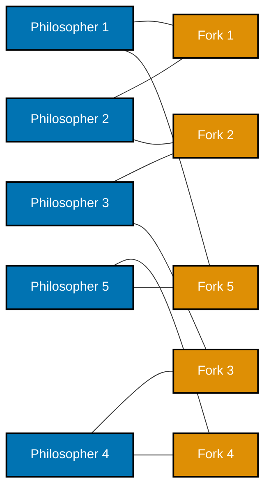

**`learning/code/ex-79-deadlock-free-dining-philosophers/example.py`**

```python
"""Example 79: Dining Philosophers -- Deadlock-Free, via a Global Fork-Acquisition Order."""

import threading  # => co-16, co-18: the CLASSIC deadlock scenario, fixed with ex-30's SAME lock-ordering trick
import time  # => bounds how long each philosopher "eats" and "thinks"

PHILOSOPHER_COUNT = 5  # => the traditional five philosophers, five forks, arranged in a circle
MEALS_PER_PHILOSOPHER = 3  # => how many times EACH philosopher must successfully eat


def philosopher(
    philosopher_id: int, forks: list[threading.Lock], meals_eaten: list[int], meals_target: int
) -> None:
    left_fork = philosopher_id  # => left_fork: this philosopher's LEFT fork index, by seating position
    right_fork = (philosopher_id + 1) % PHILOSOPHER_COUNT  # => right_fork: the NEXT seat's fork, wrapping around

    first_fork = min(left_fork, right_fork)  # => first_fork: ALWAYS the LOWER-numbered fork, regardless of side
    second_fork = max(left_fork, right_fork)  # => second_fork: ALWAYS the HIGHER-numbered fork -- the fix (co-18)
    # => this GLOBAL order (lowest fork first, for EVERY philosopher) is exactly ex-30's fix, applied here:
    # => it breaks the circular-wait condition that would otherwise deadlock all five philosophers at once

    for _ in range(meals_target):  # => this philosopher eats exactly `meals_target` times, then stops
        with forks[first_fork]:  # => acquires the LOWER-numbered fork first -- NEVER the higher one first
            with forks[second_fork]:  # => acquires the HIGHER-numbered fork second -- consistent for EVERYONE
                meals_eaten[philosopher_id] += 1  # => this philosopher successfully "ate" one meal
                time.sleep(0.001)  # => simulates the brief time spent actually eating, while holding both forks
        time.sleep(0.001)  # => simulates "thinking" -- time spent NOT holding any forks, between meals


def run_dinner() -> list[int]:
    forks = [threading.Lock() for _ in range(PHILOSOPHER_COUNT)]  # => forks: one Lock per fork, shared by neighbors
    meals_eaten = [0] * PHILOSOPHER_COUNT  # => meals_eaten[i]: how many times philosopher i has successfully eaten
    philosophers = [
        threading.Thread(target=philosopher, args=(i, forks, meals_eaten, MEALS_PER_PHILOSOPHER))
        for i in range(PHILOSOPHER_COUNT)  # => one thread per philosopher, all sharing the SAME `forks` list
    ]  # => philosophers: exactly PHILOSOPHER_COUNT Thread objects, not yet started
    for p in philosophers:  # => starts every philosopher
        p.start()  # => all five immediately begin competing for forks, using the SAME global order
    for p in philosophers:  # => waits for every philosopher to finish eating MEALS_PER_PHILOSOPHER times
        p.join(timeout=5)  # => a generous timeout -- if this ever times out, a deadlock genuinely occurred
    return meals_eaten  # => how many meals each philosopher ACTUALLY completed


if __name__ == "__main__":  # => module entry point
    meals_eaten = run_dinner()  # => drives the whole dinner to completion (or reveals a hang via the timeout)
    print(f"meals_eaten={meals_eaten}")  # => Output: meals_eaten=[3, 3, 3, 3, 3]

    # => The classic dining-philosophers deadlock happens when EVERY philosopher picks up their LEFT
    # => fork first: all five now hold one fork each and wait forever for their right neighbor's fork --
    # => a five-way circular wait (co-16), the same shape as ex-29's two-thread deadlock, just bigger.
    # => Imposing a GLOBAL fork-acquisition order -- always the LOWER-numbered fork first, for EVERY
    # => philosopher, regardless of which is "left" or "right" -- makes that circular wait structurally
    # => impossible (co-18): at least one philosopher's "first" fork is always free for SOMEONE to start.
    assert meals_eaten == [MEALS_PER_PHILOSOPHER] * PHILOSOPHER_COUNT  # => confirms EVERY philosopher ate, fully
    print("ex-79 OK")  # => Output: ex-79 OK
```

**Run**: `python3 example.py`

**Output**:

```text
meals_eaten=[3, 3, 3, 3, 3]
ex-79 OK
```

**`learning/code/ex-79-deadlock-free-dining-philosophers/test_example.py`**

```python
"""Example 79: pytest verification for Deadlock-Free Dining Philosophers."""

from example import MEALS_PER_PHILOSOPHER, PHILOSOPHER_COUNT, run_dinner


def test_every_philosopher_eats_without_deadlocking() -> None:
    meals_eaten = run_dinner()
    assert meals_eaten == [MEALS_PER_PHILOSOPHER] * PHILOSOPHER_COUNT  # => every philosopher ate, fully, no hang


# => Run: pytest -- Output: 1 passed
```

**Verify**: `pytest -q`

**Output**:

```text
1 passed
```

**Key takeaway**: The classic dining-philosophers deadlock is just ex-29's two-thread circular wait scaled up to five -- and the SAME fix (a single global resource-acquisition order, co-18) breaks it just as completely, at any scale.

**Why it matters**: Dining philosophers is the canonical illustration of deadlock in computer science precisely because it generalizes the two-lock case to N resources arranged in a cycle, making the circular-wait condition (co-16) unmistakably visual. Seeing the identical fix technique (lowest-numbered resource first) work here, unchanged, after already seeing it work for two locks in ex-30, reinforces that lock ordering is a genuinely general-purpose deadlock prevention technique, not a two-lock special case.

---

### Example 80: A Stress Harness -- Repeated Trials Surface an Intermittent Race

_ex-80 &middot; exercises co-08, co-11_

A stress-test harness runs many independent trials of a probability-gated race (a `sleep(0)` inserted only some of the time, via `random.random() < COLLISION_CHANCE`), reliably surfacing an intermittent race in the UNLOCKED version across the trials while the LOCKED version shows zero failures across the same trials.

**`learning/code/ex-80-race-detector-stress-test/example.py`**

```python
"""Example 80: A Stress Harness -- Repeated Trials Surface an Intermittent Race."""

import random  # => co-08: makes the race window trigger only SOMETIMES, not on every single call
import threading  # => co-11: the SAME lock-based fix proven throughout this topic
import time  # => `sleep(0)` is the collision-widening technique, but gated behind a random chance here

TRIALS = 20  # => how many independent trial runs the stress harness performs
ITERATIONS_PER_THREAD = 200  # => how many increments each of the two racing threads attempts, per trial
COLLISION_CHANCE = 0.15  # => the probability, PER INCREMENT, that this call widens the race window at all


def racy_worker(counter: list[int], iterations: int) -> None:  # => the UNSYNCHRONIZED version -- no lock
    for _ in range(iterations):  # => repeats the read-modify-write `iterations` times
        current = counter[0]  # => READ -- no lock protecting this at all
        if random.random() < COLLISION_CHANCE:  # => only SOMETIMES widens the window -- an INTERMITTENT race
            time.sleep(0)  # => yields here, but only on the "unlucky" calls -- most calls stay narrow and safe
        counter[0] = current + 1  # => WRITE BACK -- may or may not overwrite a concurrent update, depending on luck


def locked_worker(counter: list[int], iterations: int, lock: threading.Lock) -> None:  # => the FIX
    for _ in range(iterations):  # => repeats the SAME shape, but fully protected
        with lock:  # => the ENTIRE read-modify-write runs as one atomic critical section, every single time
            current = counter[0]  # => READ -- safe, because the lock excludes the other thread here
            if random.random() < COLLISION_CHANCE:  # => the SAME random widening -- proving the LOCK is what matters
                time.sleep(0)  # => still yields sometimes, but INSIDE the lock -- no other thread can interleave
            counter[0] = current + 1  # => WRITE BACK -- always correct, regardless of the random widening above


def stress_test(worker_is_locked: bool) -> int:  # => returns HOW MANY of the TRIALS observed a lost update
    failures = 0  # => failures: incremented once per trial where the final count is WRONG
    for _ in range(TRIALS):  # => runs TRIALS independent, fresh two-thread races
        counter = [0]  # => a BRAND NEW counter for every trial -- no state leaks between trials
        lock = threading.Lock()  # => a BRAND NEW lock for every trial (used only by the locked variant)
        if worker_is_locked:  # => picks which worker function BOTH threads in this trial will run
            t1 = threading.Thread(target=locked_worker, args=(counter, ITERATIONS_PER_THREAD, lock))
            t2 = threading.Thread(target=locked_worker, args=(counter, ITERATIONS_PER_THREAD, lock))
        else:
            t1 = threading.Thread(target=racy_worker, args=(counter, ITERATIONS_PER_THREAD))
            t2 = threading.Thread(target=racy_worker, args=(counter, ITERATIONS_PER_THREAD))
        t1.start()  # => starts the first racing thread for this trial
        t2.start()  # => starts the second racing thread for this trial
        t1.join()  # => waits for both threads to finish this trial's increments
        t2.join()  # => now safe to check this trial's final counter value
        if counter[0] != 2 * ITERATIONS_PER_THREAD:  # => the CORRECT total, if nothing was ever lost
            failures += 1  # => this trial surfaced a lost update
    return failures  # => how many of the TRIALS actually exhibited the race


if __name__ == "__main__":  # => module entry point
    racy_failures = stress_test(worker_is_locked=False)  # => racy_failures: how many trials the UNSYNCHRONIZED version lost
    locked_failures = stress_test(worker_is_locked=True)  # => locked_failures: how many trials the LOCKED version lost
    print(f"racy_failures={racy_failures}/{TRIALS} locked_failures={locked_failures}/{TRIALS}")
    # => Output: racy_failures=<some number > 0>/20 locked_failures=0/20

    # => A race that only manifests occasionally is FAR more dangerous in practice than an always-broken
    # => one, precisely because a SINGLE test run can pass by pure luck (co-08) -- this is why real race
    # => detectors and CI harnesses run the SAME racy code many times under load (a "stress test") rather
    # => than trusting one green run. Here, a single trial might easily show the correct total by chance;
    # => repeating it TRIALS times reliably surfaces at least one failure for the unlocked version, while
    # => the SAME stress harness applied to the lock-protected version (co-11) NEVER fails, across every trial.
    assert racy_failures > 0  # => confirms the stress harness DID surface the race in at least one trial
    assert locked_failures == 0  # => confirms the lock-protected version passed EVERY single trial
    print("ex-80 OK")  # => Output: ex-80 OK
```

**Run**: `python3 example.py`

**Output**:

```text
racy_failures=19/20 locked_failures=0/20
ex-80 OK
```

**`learning/code/ex-80-race-detector-stress-test/test_example.py`**

```python
"""Example 80: pytest verification for the Stress-Test Race Harness."""

from example import stress_test


def test_stress_harness_surfaces_the_race_in_the_unlocked_version() -> None:
    assert stress_test(worker_is_locked=False) > 0  # => at least one of the trials lost an update


def test_stress_harness_finds_no_failures_in_the_locked_version() -> None:
    assert stress_test(worker_is_locked=True) == 0  # => the lock-protected version never fails


# => Run: pytest -- Output: 2 passed
```

**Verify**: `pytest -q`

**Output**:

```text
2 passed
```

**Key takeaway**: A rare, intermittent race that would almost never show up in a single run becomes reliably DETECTABLE across many independent trials -- the harness doesn't make the race happen every time, it makes catching it, eventually, statistically certain.

**Why it matters**: Many real-world race conditions are rare enough that a single test run, or even a handful of manual runs, will pass cleanly by luck -- exactly the trap that makes race conditions notorious for slipping past code review and passing CI, only to surface in production under load. This stress-harness pattern (many trials, tuned collision probability, counting failures) is a general-purpose technique for building CONFIDENCE that a fix actually works, not just that it happened to pass once.

---

### Example 81: Capstone Preview -- Fetch-and-Aggregate, Three Ways, One Timing Harness

_ex-81 &middot; exercises co-01, co-23, co-24, co-26_

A miniature version of the topic's capstone spec: a fetch-and-aggregate workload run three ways -- serial, `ThreadPoolExecutor`, and `asyncio` -- plus a `ProcessPoolExecutor` variant for a CPU-bound aggregation step, all timed and confirmed to produce the IDENTICAL correct result, with the expected speedup pattern from ex-76/ex-77 showing up here too.

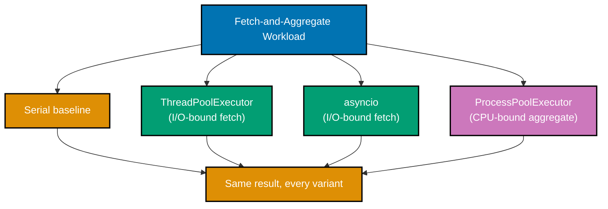

**`learning/code/ex-81-capstone-preview-concurrent-processor/example.py`**

```python
"""Example 81: Capstone Preview -- Fetch-and-Aggregate, Three Ways, One Timing Harness."""

import asyncio  # => co-26: the async fetch approach
import time  # => measures wall time across every approach
from concurrent.futures import ProcessPoolExecutor, ThreadPoolExecutor  # => co-23 (fetch) and co-24 (aggregate)

PAGE_COUNT = 6  # => how many simulated "pages" to fetch, all THREE fetch ways
FETCH_DELAY = 0.06  # => simulated network latency per page
AGGREGATE_CHUNKS = [list(range(i * 1000, (i + 1) * 1000)) for i in range(4)]  # => a CPU-bound reduction workload


def fetch_page_sync(n: int) -> int:  # => the SYNCHRONOUS fetch -- used by both serial and threaded runs
    time.sleep(FETCH_DELAY)  # => simulates the I/O wait every "page fetch" would genuinely block on
    return n * n  # => a trivial per-page "payload size" so results can be checked


async def fetch_page_async(n: int) -> int:  # => the COOPERATIVE fetch -- used by the asyncio run
    await asyncio.sleep(FETCH_DELAY)  # => the SAME delay, yielded cooperatively instead of blocking
    return n * n  # => identical result shape to the synchronous version


def sum_of_squares(chunk: list[int]) -> int:  # => a top-level function -- REQUIRED for ProcessPoolExecutor
    return sum(x * x for x in chunk)  # => the CPU-bound "aggregate" step -- co-24's territory, not I/O


def run_serial_fetch() -> tuple[float, list[int]]:
    start = time.perf_counter()  # => start: wall time before the serial fetch loop
    pages = [fetch_page_sync(n) for n in range(PAGE_COUNT)]  # => fetches every page strictly one at a time
    return time.perf_counter() - start, pages  # => elapsed time AND the fetched results


def run_threaded_fetch() -> tuple[float, list[int]]:
    start = time.perf_counter()  # => start: wall time before the thread-pooled fetch
    with ThreadPoolExecutor(max_workers=PAGE_COUNT) as pool:  # => enough workers to fetch every page at once
        pages = list(pool.map(fetch_page_sync, range(PAGE_COUNT)))  # => all fetches OVERLAP their I/O waits
    return time.perf_counter() - start, pages  # => elapsed time AND the fetched results


async def run_async_fetch() -> tuple[float, list[int]]:
    start = time.perf_counter()  # => start: wall time before the coroutine-based fetch
    pages = await asyncio.gather(*(fetch_page_async(n) for n in range(PAGE_COUNT)))  # => all sleeps overlap on ONE thread
    return time.perf_counter() - start, list(pages)  # => elapsed time AND the fetched results


def run_process_aggregate() -> int:
    with ProcessPoolExecutor(max_workers=4) as pool:  # => 4 processes -- genuinely parallel CPU work (co-24)
        partial_totals = list(pool.map(sum_of_squares, AGGREGATE_CHUNKS))  # => the "map" phase, in parallel
    return sum(partial_totals)  # => the "reduce" phase -- combining every chunk's partial total (ex-57's pattern)


if __name__ == "__main__":  # => module entry point
    serial_time, serial_pages = run_serial_fetch()  # => serial_time: the fetch baseline
    threaded_time, threaded_pages = run_threaded_fetch()  # => threaded_time: the I/O-overlapping thread-pool fetch
    async_time, async_pages = asyncio.run(run_async_fetch())  # => async_time: the I/O-overlapping asyncio fetch
    process_aggregate = run_process_aggregate()  # => process_aggregate: the CPU-bound reduction, via processes
    serial_aggregate = sum(sum_of_squares(chunk) for chunk in AGGREGATE_CHUNKS)  # => the SERIAL ground truth

    print(f"serial={serial_time:.2f}s threaded={threaded_time:.2f}s async={async_time:.2f}s")  # => Output: serial=~0.36s threaded=~0.06s async=~0.06s

    # => This mini pipeline previews the full capstone's shape (co-01): fetching is I/O-bound, so BOTH
    # => threads (co-23) and `asyncio` (co-26) beat the serial baseline by roughly PAGE_COUNT-fold, since
    # => their I/O waits overlap. Aggregating is CPU-bound, so it instead needs a `ProcessPoolExecutor`
    # => (co-24) to genuinely parallelize across cores -- more threads would NOT have helped there (ex-49,
    # => ex-77). Matching results across every approach, despite their very different execution models,
    # => is the core promise of concurrent programming: SAME correct answer, DIFFERENT wall-clock cost.
    expected_pages = [n * n for n in range(PAGE_COUNT)]  # => expected_pages: the ground-truth fetch result
    assert serial_pages == expected_pages  # => confirms the serial fetch is correct
    assert threaded_pages == expected_pages  # => confirms the threaded fetch is ALSO correct
    assert async_pages == expected_pages  # => confirms the asyncio fetch is ALSO correct
    assert threaded_time < serial_time / 2  # => confirms threads delivered the expected I/O speedup
    assert async_time < serial_time / 2  # => confirms asyncio delivered the expected I/O speedup
    assert process_aggregate == serial_aggregate  # => confirms the parallel aggregate matches the serial one
    print("ex-81 OK")  # => Output: ex-81 OK
```

**Run**: `python3 example.py`

**Output**:

```text
serial=0.40s threaded=0.07s async=0.06s
ex-81 OK
```

**`learning/code/ex-81-capstone-preview-concurrent-processor/test_example.py`**

```python
"""Example 81: pytest verification for the Capstone-Preview Fetch-and-Aggregate Pipeline."""

import asyncio

from example import (
    AGGREGATE_CHUNKS,
    PAGE_COUNT,
    run_async_fetch,
    run_process_aggregate,
    run_serial_fetch,
    run_threaded_fetch,
    sum_of_squares,
)


def test_all_fetch_approaches_match_and_concurrent_ones_beat_serial() -> None:
    serial_time, serial_pages = run_serial_fetch()
    threaded_time, threaded_pages = run_threaded_fetch()
    async_time, async_pages = asyncio.run(run_async_fetch())

    expected_pages = [n * n for n in range(PAGE_COUNT)]
    assert serial_pages == expected_pages
    assert threaded_pages == expected_pages
    assert async_pages == expected_pages
    assert threaded_time < serial_time / 2  # => threads delivered the expected I/O speedup
    assert async_time < serial_time / 2  # => asyncio delivered the expected I/O speedup


def test_process_aggregate_matches_serial_aggregate() -> None:
    process_aggregate = run_process_aggregate()
    serial_aggregate = sum(sum_of_squares(chunk) for chunk in AGGREGATE_CHUNKS)
    assert process_aggregate == serial_aggregate  # => the parallel reduction matches the serial ground truth


# => Run: pytest -- Output: 2 passed
```

**Verify**: `pytest -q`

**Output**:

```text
2 passed
```

**Key takeaway**: Threads, `asyncio`, and processes are three DIFFERENT tools for the SAME fetch-and-aggregate shape, each winning on a different workload class -- and correctness (the aggregate result) never depends on which one is used, only performance does.

**Why it matters**: This is a direct rehearsal for the topic's full capstone: the same three-way-plus-a-timing-harness structure, at a smaller scale, using patterns from every earlier section of this topic -- `gather` + `Semaphore` (ex-69) for the async fetch, a thread pool (ex-23, ex-48) for the threaded fetch, a process pool (ex-25, ex-57) for CPU-bound aggregation. Working through this miniature version first makes the full capstone's larger surface area far more approachable.

---

### Example 82: An `Observable`, `map`, and `filter` -- Reactive Streams via `reactivex` (RxPY)

_ex-82 &middot; exercises co-30_

`reactivex.from_iterable(range(10))` creates a cold `Observable`, `.pipe(ops.map(...), ops.filter(...))` chains transforming operators onto it, and `.subscribe(on_next=..., on_completed=...)` drives it -- only items that pass the filter reach the observer, and `on_completed` fires once the source is exhausted.


**`learning/code/ex-82-observable-map-filter-rxpy/example.py`**

```python
"""Example 82: An `Observable`, `map`, and `filter` -- Reactive Streams via `reactivex` (RxPY)."""

import reactivex  # => co-30: `reactivex` (RxPY 4.1.0) is the Python port of ReactiveX
from reactivex import operators as ops  # => operators live in their own module, chained via `.pipe()`


def build_pipeline() -> tuple[list[int], list[bool]]:
    collected: list[int] = []  # => collected: every value that reaches the FINAL observer's on_next
    completed_flag: list[bool] = []  # => completed_flag: appended to ONCE, when on_completed fires

    source = reactivex.from_iterable(range(10))  # => source: an Observable emitting 0, 1, 2, ..., 9, then completes
    pipeline = source.pipe(  # => `.pipe()` chains operators -- each one wraps/transforms the stream
        ops.map(lambda x: x * x),  # => map: transforms EVERY emitted value -- here, squares it
        ops.filter(lambda x: x % 2 == 0),  # => filter: only lets THROUGH values matching the predicate
    )  # => pipeline: an Observable of squares, but ONLY the even ones

    pipeline.subscribe(  # => subscribe: this is what ACTUALLY starts the stream flowing -- nothing runs before this
        on_next=collected.append,  # => on_next: called once PER item that survives map AND filter
        on_completed=lambda: completed_flag.append(True),  # => on_completed: called exactly once, after the LAST item
    )
    return collected, completed_flag  # => everything the caller needs to verify the pipeline's behavior


if __name__ == "__main__":  # => module entry point
    collected, completed_flag = build_pipeline()  # => drives the whole Observable pipeline to completion
    print(f"collected={collected}")  # => Output: collected=[0, 4, 16, 36, 64]
    print(f"completed={completed_flag}")  # => Output: completed=[True]

    expected = [n * n for n in range(10) if (n * n) % 2 == 0]  # => expected: squares of 0..9, keeping only even ones

    # => `map` and `filter` here work EXACTLY like their Python builtin namesakes conceptually, but
    # => operate on a PUSH-based stream (co-30) instead of a pull-based iterable: values are pushed
    # => through `map` (transform), then `filter` (keep-or-drop), landing at the final subscriber's
    # => `on_next` ONLY if they survive both stages. Nothing runs until `.subscribe()` is called --
    # => an Observable pipeline is a description of a computation, not the computation itself, until then.
    assert collected == expected  # => confirms only the TRANSFORMED, MATCHING items reached the observer
    assert completed_flag == [True]  # => confirms on_completed fired exactly once, after every item
    print("ex-82 OK")  # => Output: ex-82 OK
```

**Run**: `python3 example.py`

**Output**:

```text
collected=[0, 4, 16, 36, 64]
completed=[True]
ex-82 OK
```

**`learning/code/ex-82-observable-map-filter-rxpy/test_example.py`**

```python
"""Example 82: pytest verification for `reactivex` `map` + `filter` Pipelines."""

from example import build_pipeline


def test_only_transformed_matching_items_reach_the_observer() -> None:
    collected, completed_flag = build_pipeline()
    expected = [n * n for n in range(10) if (n * n) % 2 == 0]
    assert collected == expected  # => squared, then filtered to even values only
    assert completed_flag == [True]  # => on_completed fired exactly once


# => Run: pytest -- Output: 1 passed
```

**Verify**: `pytest -q`

**Output**:

```text
1 passed
```

**Key takeaway**: An Observable's operators compose like a pipeline: `map` transforms each value, `filter` drops values that don't match a predicate, and only what survives the WHOLE chain reaches the observer's `on_next`.

**Why it matters**: This is reactive programming's central idea (co-30): a push-based data source (the opposite of Python's pull-based `Iterable`/`for` loop) composed through chainable operators, the same conceptual shape as marble diagrams visualize throughout `reactivex.io`'s own documentation. Everything from here through ex-87 builds on this operator-composition model, culminating in a fully annotated marble diagram (ex-87) that names exactly what each operator does to the timeline.

---

### Example 83: Cold Observables Replay in Full; Hot Subjects Drop What Already Happened

_ex-83 &middot; exercises co-31_

A COLD `Observable` (`from_iterable`) replays its ENTIRE sequence independently to every subscriber, even a late one -- while a HOT `Subject` broadcasts live, so a subscriber joining after some values have already fired simply misses them, with no replay.

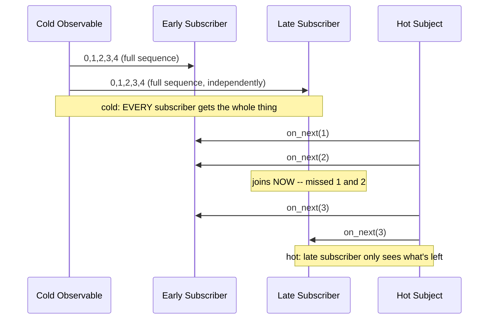

**`learning/code/ex-83-hot-vs-cold-subscription/example.py`**

```python
"""Example 83: Cold Observables Replay in Full; Hot Subjects Drop What Already Happened."""

import reactivex  # => co-31: `reactivex.from_iterable` (cold) vs `Subject` (hot) behave very differently
from reactivex.subject import Subject  # => Subject: BOTH an Observable AND an Observer -- the "hot" primitive


def cold_observable_demo() -> tuple[list[int], list[int]]:
    cold = reactivex.from_iterable(range(5))  # => cold: a COLD Observable -- produces nothing until subscribed
    first_results: list[int] = []  # => first_results: filled in by the FIRST subscription
    second_results: list[int] = []  # => second_results: filled in by a SECOND, later subscription
    cold.subscribe(on_next=first_results.append)  # => this subscription runs the WHOLE sequence, start to finish
    cold.subscribe(on_next=second_results.append)  # => a LATE subscriber still gets the ENTIRE sequence, independently
    return first_results, second_results  # => both should be IDENTICAL -- cold replays in full, every time


def hot_subject_demo() -> tuple[list[int], list[int]]:
    subject: Subject[int] = Subject()  # => subject: a HOT source -- emissions happen regardless of who's listening
    early_results: list[int] = []  # => early_results: filled in by a subscriber that joined BEFORE any emissions
    late_results: list[int] = []  # => late_results: filled in by a subscriber that joins AFTER some emissions
    subject.subscribe(on_next=early_results.append)  # => subscribes FIRST -- will see EVERY emission from now on

    subject.on_next(1)  # => pushes 1 -- ONLY early_results (the current subscriber) sees it
    subject.on_next(2)  # => pushes 2 -- ONLY early_results sees it, since late hasn't subscribed yet

    subject.subscribe(on_next=late_results.append)  # => subscribes LATE -- AFTER 1 and 2 already happened
    subject.on_next(3)  # => pushes 3 -- BOTH early_results and late_results see this one
    subject.on_next(4)  # => pushes 4 -- BOTH see this one too

    return early_results, late_results  # => early sees everything; late MISSES whatever fired before it joined


if __name__ == "__main__":  # => module entry point
    cold_first, cold_second = cold_observable_demo()  # => drives the cold-Observable scenario
    print(f"cold_first={cold_first} cold_second={cold_second}")  # => Output: cold_first=[0,1,2,3,4] cold_second=[0,1,2,3,4]

    hot_early, hot_late = hot_subject_demo()  # => drives the hot-Subject scenario
    print(f"hot_early={hot_early} hot_late={hot_late}")  # => Output: hot_early=[1,2,3,4] hot_late=[3,4]

    # => A COLD Observable (like `from_iterable`) has no state of its own -- each `.subscribe()` call
    # => independently starts the SAME production from the beginning, so a "late" subscriber sees the
    # => full sequence just like the first one did (co-31). A HOT `Subject` is different: it's a live
    # => broadcast -- emissions happen the instant `.on_next()` is called, REGARDLESS of who's currently
    # => subscribed. A subscriber joining late has simply MISSED whatever already happened; there is no
    # => replay unless you explicitly reach for a `ReplaySubject` instead of a plain `Subject`.
    assert cold_first == list(range(5))  # => confirms the first cold subscriber got the full sequence
    assert cold_second == cold_first  # => confirms the LATE cold subscriber got the IDENTICAL full sequence
    assert hot_early == [1, 2, 3, 4]  # => confirms the early hot subscriber saw EVERY emission
    assert hot_late == [3, 4]  # => confirms the late hot subscriber MISSED the emissions before it joined
    print("ex-83 OK")  # => Output: ex-83 OK
```

**Run**: `python3 example.py`

**Output**:

```text
cold_first=[0, 1, 2, 3, 4] cold_second=[0, 1, 2, 3, 4]
hot_early=[1, 2, 3, 4] hot_late=[3, 4]
ex-83 OK
```

**`learning/code/ex-83-hot-vs-cold-subscription/test_example.py`**

```python
"""Example 83: pytest verification for Hot vs Cold Observable Subscription Semantics."""

from example import cold_observable_demo, hot_subject_demo


def test_cold_observable_replays_the_full_sequence_to_every_subscriber() -> None:
    first, second = cold_observable_demo()
    assert first == list(range(5))  # => first subscriber gets the full sequence
    assert second == first  # => late subscriber gets an IDENTICAL full replay


def test_hot_subject_drops_emissions_that_happened_before_subscribing() -> None:
    early, late = hot_subject_demo()
    assert early == [1, 2, 3, 4]  # => early subscriber saw every emission
    assert late == [3, 4]  # => late subscriber missed what already fired


# => Run: pytest -- Output: 2 passed
```

**Verify**: `pytest -q`

**Output**:

```text
2 passed
```

**Key takeaway**: Cold Observables replay the full sequence to every subscriber independently; hot Subjects broadcast live and a late subscriber permanently misses whatever already fired -- these are fundamentally different subscription semantics, not just an implementation detail.

**Why it matters**: Picking the wrong one for a given use case causes real bugs: using a cold Observable for a live sensor feed would replay STALE historical readings to every new subscriber; using a hot Subject for a data source that every consumer needs in FULL would silently drop early events for late subscribers. This distinction (co-31) is foundational to every reactive-streams library (RxJS, RxJava, Reactor), and a `ReplaySubject` (mentioned but not used here) is the usual middle ground when a hot source's history still needs to be replayable.

---

### Example 84: Backpressure Strategies -- Buffer-All vs Keep-Latest (Hand-Rolled)

_ex-84 &middot; exercises co-32_

A fast producer paired with a slow consumer under two hand-rolled strategies -- `buffer` (an unbounded FIFO that keeps every item, at growing memory cost) vs `latest` (a single-slot overwrite that keeps only the newest value, discarding everything else) -- since `reactivex` has no built-in backpressure operators, both are implemented directly from a deterministic round-based simulation.

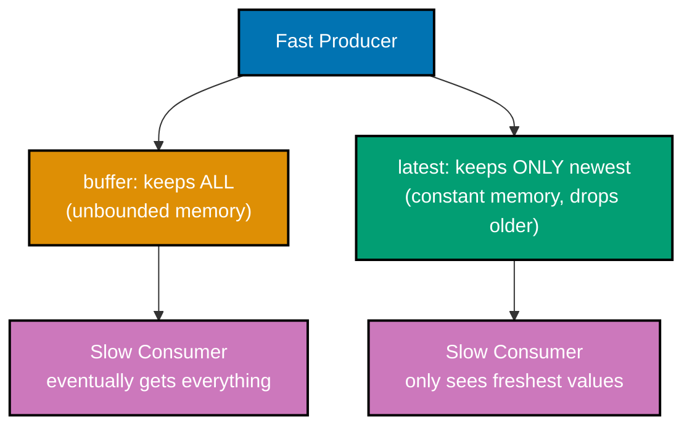

**`learning/code/ex-84-backpressure-buffer-vs-latest/example.py`**

```python
"""Example 84: Backpressure Strategies -- Buffer-All vs Keep-Latest (Hand-Rolled)."""

# => co-32: reactivex (RxPY 4.1.0) has NO built-in backpressure operators, so this example is
# => HAND-ROLLED stdlib Python -- a deterministic round-based simulation, not real threads, so
# => the comparison is reproducible on every run instead of depending on OS scheduling timing.


def simulate_buffer_all(item_count: int, consumer_period: int) -> tuple[list[int], int]:
    """A fast producer's items all queue up; the consumer drains them, oldest first, eventually."""
    buffer: list[int] = []  # => buffer: unbounded FIFO -- grows without limit while the producer outpaces the consumer
    consumed: list[int] = []  # => consumed: items the slow consumer has actually pulled out, in order
    peak_size = 0  # => peak_size: the largest the buffer ever got -- the MEMORY COST of this strategy
    for tick in range(item_count):  # => tick: one discrete round; the producer emits exactly one item per round
        buffer.append(tick)  # => the producer NEVER blocks and NEVER drops -- it just appends
        peak_size = max(peak_size, len(buffer))  # => track the worst-case backlog size seen so far
        if (tick + 1) % consumer_period == 0 and buffer:  # => the consumer only gets a turn every `consumer_period` ticks
            consumed.append(buffer.pop(0))  # => pop(0): FIFO order -- oldest unconsumed item first
    consumed.extend(buffer)  # => once production stops, drain whatever backlog remains -- nothing is ever lost
    return consumed, peak_size  # => (all items, in order) plus how large the backlog grew


def simulate_latest_only(item_count: int, consumer_period: int) -> tuple[list[int], int]:
    """The producer overwrites a single slot; only the newest value survives until the consumer reads it."""
    slot: int | None = None  # => slot: capacity of exactly ONE -- the opposite extreme from buffer-all
    consumed: list[int] = []  # => consumed: items the consumer actually saw (far fewer than item_count)
    dropped = 0  # => dropped: how many produced values were overwritten before anyone read them
    for tick in range(item_count):  # => tick: same discrete-round production schedule as buffer_all
        if slot is not None:  # => a previous value is still sitting there, unread
            dropped += 1  # => it's about to be clobbered -- that's a PERMANENT loss, not a delay
        slot = tick  # => the producer OVERWRITES the slot -- O(1) memory, but stale data silently disappears
        if (tick + 1) % consumer_period == 0:  # => same slow consumer cadence as buffer_all -- slot is always filled here
            consumed.append(slot)  # => the consumer reads whatever happens to be in the slot RIGHT NOW
            slot = None  # => the slot is now empty until the next produced value fills it
    if slot is not None:  # => one final value may still be sitting in the slot after production ends
        consumed.append(slot)  # => drain it so the very last emission isn't silently discarded too
    return consumed, dropped  # => (far fewer items, in order) plus how many were permanently lost


ITEM_COUNT = 9  # => how many items the fast producer emits across the simulated run
CONSUMER_PERIOD = 3  # => the slow consumer only gets to pull once every 3 rounds


if __name__ == "__main__":  # => module entry point
    buffer_all_consumed, buffer_all_peak = simulate_buffer_all(ITEM_COUNT, CONSUMER_PERIOD)
    print(f"buffer_all: consumed={buffer_all_consumed} peak={buffer_all_peak}")  # => Output: consumed=[0..8] peak=7

    latest_consumed, latest_dropped = simulate_latest_only(ITEM_COUNT, CONSUMER_PERIOD)
    print(f"latest_only: consumed={latest_consumed} dropped={latest_dropped}")  # => Output: consumed=[2,5,8] dropped=6

    # => The two strategies trade off DIFFERENT resources for the SAME root problem: a producer
    # => faster than its consumer. `buffer` keeps EVERY item (nothing is lost) at the cost of
    # => unbounded memory that grows with the speed mismatch -- fine for a short burst, dangerous
    # => for a sustained one. `latest` keeps CONSTANT memory (one slot) by cheerfully discarding
    # => every value that arrives before the previous one was read -- fine for a live price ticker
    # => where only the newest number matters, wrong for anything that must process every event
    # => (an audit log, a payment queue). Neither is "correct" in the abstract; the choice depends
    # => entirely on whether staleness or data loss is the worse failure mode for the use case.
    assert buffer_all_consumed == list(range(ITEM_COUNT))  # => buffer-all: every item eventually arrives, in order
    assert buffer_all_peak == 7  # => the backlog grew to 7 items before draining -- the memory cost, made visible
    assert latest_consumed == [2, 5, 8]  # => latest-only: the consumer only ever sees what was freshest at read time
    assert latest_dropped == 6  # => 6 of the 9 produced values were overwritten and permanently lost
    print("ex-84 OK")  # => Output: ex-84 OK
```

**Run**: `python3 example.py`

**Output**:

```text
buffer_all: consumed=[0, 1, 2, 3, 4, 5, 6, 7, 8] peak=7
latest_only: consumed=[2, 5, 8] dropped=6
ex-84 OK
```

**`learning/code/ex-84-backpressure-buffer-vs-latest/test_example.py`**

```python
"""Example 84: pytest verification for Backpressure Strategies -- Buffer-All vs Keep-Latest."""

from example import CONSUMER_PERIOD, ITEM_COUNT, simulate_buffer_all, simulate_latest_only


def test_buffer_all_loses_nothing_but_its_backlog_grows() -> None:
    consumed, peak = simulate_buffer_all(ITEM_COUNT, CONSUMER_PERIOD)
    assert consumed == list(range(ITEM_COUNT))  # => every produced item is eventually consumed, in order
    assert peak > 1  # => the backlog grew well beyond a single item -- the memory-cost tradeoff


def test_latest_only_keeps_bounded_memory_but_drops_items() -> None:
    consumed, dropped = simulate_latest_only(ITEM_COUNT, CONSUMER_PERIOD)
    assert len(consumed) < ITEM_COUNT  # => far fewer items reach the consumer than were produced
    assert dropped > 0  # => at least one value was overwritten before being read -- a real, permanent loss


# => Run: pytest -- Output: 2 passed
```

**Verify**: `pytest -q`

**Output**:

```text
2 passed
```

**Key takeaway**: `buffer` trades unbounded memory growth for zero data loss; `latest` trades permanent data loss for constant memory -- neither is correct in the abstract, and the right choice depends entirely on whether staleness or loss is the worse failure mode.

**Why it matters**: Since RxPY (`reactivex` 4.1.0) has no built-in `buffer`/`latest`/`drop` backpressure operators, hand-rolling both strategies directly demonstrates the tradeoff `co-32` describes in the abstract -- a producer outpacing its consumer forces a choice, and this example makes that choice's cost visible with real numbers (a `peak` buffer size, a `dropped` count) rather than leaving it theoretical. This is the reactive-streams world's version of the exact same tradeoff `queue.Queue(maxsize=N)` backpressure (ex-38) makes for threads.

---

### Example 85: Reactive Pull -- a Subscriber's request(n) Bounds How Much the Producer Emits

_ex-85 &middot; exercises co-29, co-32_

A hand-rolled `DemandSubscriber`/`DemandSubscription`/`DemandPublisher` trio implements the REACTIVE-PULL model: the source emits NOTHING until the subscriber explicitly calls `request(n)`, and it never emits more than the outstanding, unfulfilled demand -- confirmed across several `request()` calls of varying size.

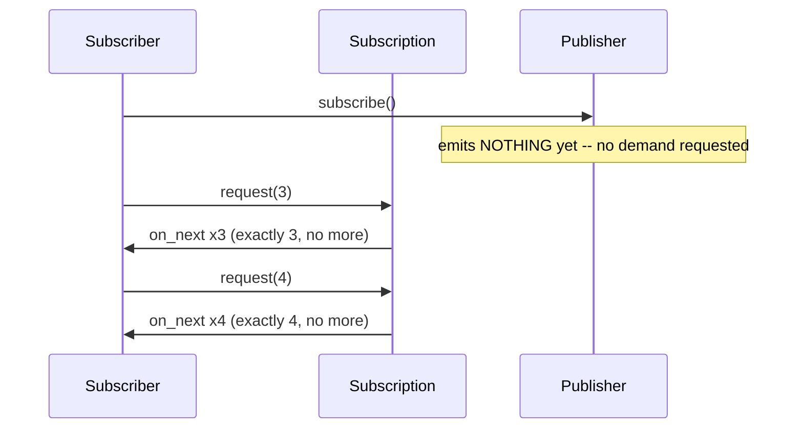

**`learning/code/ex-85-reactive-pull-request-n/example.py`**

```python
"""Example 85: Reactive Pull -- a Subscriber's request(n) Bounds How Much the Producer Emits."""

# => co-29, co-32: this is the "reactive-pull" inversion of push -- the SOURCE stays silent until
# => the SINK asks for more. HAND-ROLLED (reactivex has no built-in demand/backpressure API).


class DemandSubscriber:  # => the SINK -- it never asks the producer for anything directly, only via a Subscription
    """Tracks every value it received, so a test can assert exactly what arrived and when."""

    def __init__(self) -> None:  # => a fresh subscriber starts with nothing received and no completion signal
        self.received: list[int] = []  # => received: every value pushed to `on_next`, in arrival order
        self.completed = False  # => completed: flips True once the source has no more items to give

    def on_next(self, value: int) -> None:  # => called by the producer, never by the subscriber itself
        self.received.append(value)  # => a value arrived -- this ONLY happens in response to `request(n)`

    def on_complete(self) -> None:  # => the terminal signal that says "nothing more is ever coming"
        self.completed = True  # => the producer has exhausted its items; no further `on_next` will follow


class DemandSubscription:  # => the PULL HANDLE -- the only way the subscriber can ask for more items
    """The handshake object: the subscriber calls `request(n)` on THIS to pull more items."""

    def __init__(self, subscriber: DemandSubscriber, items: list[int]) -> None:  # => wires the pair together
        self.subscriber = subscriber  # => subscriber: who to notify when demand is satisfied
        self.items = items  # => items: the full backlog the producer COULD emit, if asked
        self.index = 0  # => index: how far into `items` production has progressed so far
        self.demand = 0  # => demand: outstanding "please send me N more" requests, not yet fulfilled
        self.done = False  # => done: guards against emitting `on_complete` more than once

    def request(self, n: int) -> None:  # => the ONE method the subscriber is allowed to call to get data
        if self.done:  # => the stream already finished -- a late `request` is simply a no-op
            return  # => bail out immediately -- no items, no re-firing of on_complete
        self.demand += n  # => ADD to any existing demand -- requests are cumulative, not a reset
        self._drain()  # => immediately try to satisfy as much of the new demand as possible

    def _drain(self) -> None:  # => internal helper -- never called from outside this class
        while self.demand > 0 and self.index < len(self.items):  # => stop the INSTANT demand hits zero
            value = self.items[self.index]  # => the next undelivered item, in order
            self.index += 1  # => advance the production cursor -- this item is now spoken for
            self.demand -= 1  # => consume exactly one unit of outstanding demand per item emitted
            self.subscriber.on_next(value)  # => push -- but ONLY because demand authorized it
        if self.index >= len(self.items) and not self.done:  # => every item has been emitted, exactly once
            self.done = True  # => flip the guard before notifying, so a re-entrant `request` can't double-fire
            self.subscriber.on_complete()  # => tell the subscriber the source is exhausted


class DemandPublisher:  # => the SOURCE -- deliberately dumb, it holds data but never pushes it uninvited
    """A cold source that emits NOTHING until a subscriber explicitly pulls via `request(n)`."""

    def __init__(self, items: list[int]) -> None:  # => a publisher is just a fixed, immutable backlog
        self.items = items  # => the fixed backlog this publisher can hand out on demand

    def subscribe(self, subscriber: DemandSubscriber) -> DemandSubscription:  # => creates the pull handle
        return DemandSubscription(subscriber, self.items)  # => wiring only -- zero items pushed yet


SOURCE_ITEMS = list(range(10))  # => 10 items total: 0..9


if __name__ == "__main__":  # => module entry point
    publisher = DemandPublisher(SOURCE_ITEMS)  # => a publisher holding all 10 items, none delivered yet
    subscriber = DemandSubscriber()  # => a fresh subscriber -- received=[] until it asks for something
    subscription = publisher.subscribe(subscriber)  # => subscribing alone triggers ZERO emissions
    print(f"after subscribe: received={subscriber.received}")  # => Output: after subscribe: received=[]

    subscription.request(3)  # => pull exactly 3 items
    print(f"after request(3): received={subscriber.received}")  # => Output: after request(3): received=[0, 1, 2]

    subscription.request(4)  # => pull 4 more -- cumulative with what already happened, not a fresh window
    print(f"after request(4): received={subscriber.received}")  # => Output: received=[0, 1, 2, 3, 4, 5, 6]

    subscription.request(3)  # => only 3 items remain (7, 8, 9) -- this exactly exhausts the source
    print(f"after request(3): received={subscriber.received} completed={subscriber.completed}")  # => Output: completed=True

    subscription.request(100)  # => a late, oversized request after completion -- must be a harmless no-op
    print(f"after late request(100): received={subscriber.received}")  # => Output: unchanged, still 10 items

    # => The subscriber is the ONE THING driving emission: nothing crosses the boundary until the
    # => sink says how much it can handle right now. This is the exact inverse of a normal push
    # => Observable (co-30), and it's how real backpressure protocols (Reactive Streams / JDK
    # => `Flow`, RxJava's `request(n)`) prevent a fast producer from ever overwhelming a slow
    # => consumer's buffer -- the producer is STRUCTURALLY incapable of sending more than was asked.
    assert subscriber.received == list(range(10))  # => all 10 items arrived, but ONLY across three requests
    assert subscriber.completed is True  # => the source correctly signalled exhaustion exactly once
    print("ex-85 OK")  # => Output: ex-85 OK
```

**Run**: `python3 example.py`

**Output**:

```text
after subscribe: received=[]
after request(3): received=[0, 1, 2]
after request(4): received=[0, 1, 2, 3, 4, 5, 6]
after request(3): received=[0, 1, 2, 3, 4, 5, 6, 7, 8, 9] completed=True
after late request(100): received=[0, 1, 2, 3, 4, 5, 6, 7, 8, 9]
ex-85 OK
```

**`learning/code/ex-85-reactive-pull-request-n/test_example.py`**

```python
"""Example 85: pytest verification for Reactive Pull -- request(n) Bounds Emission."""

from example import SOURCE_ITEMS, DemandPublisher, DemandSubscriber


def test_no_item_is_emitted_before_any_demand_is_requested() -> None:
    publisher = DemandPublisher(SOURCE_ITEMS)
    subscriber = DemandSubscriber()
    publisher.subscribe(subscriber)  # => subscribing alone must not push anything
    assert subscriber.received == []  # => zero demand so far -- zero items delivered


def test_exactly_n_items_arrive_per_request_and_no_more() -> None:
    publisher = DemandPublisher(SOURCE_ITEMS)
    subscriber = DemandSubscriber()
    subscription = publisher.subscribe(subscriber)
    subscription.request(4)  # => ask for exactly 4
    assert subscriber.received == [0, 1, 2, 3]  # => exactly 4 delivered -- never more than outstanding demand
    assert subscriber.completed is False  # => 6 items remain -- the source is not exhausted yet


def test_completion_fires_exactly_once_when_demand_exhausts_the_source() -> None:
    publisher = DemandPublisher(SOURCE_ITEMS)
    subscriber = DemandSubscriber()
    subscription = publisher.subscribe(subscriber)
    subscription.request(len(SOURCE_ITEMS))  # => request the ENTIRE backlog in one shot
    assert subscriber.received == SOURCE_ITEMS  # => every item delivered, in order
    assert subscriber.completed is True  # => the source correctly signalled it has nothing left
    subscription.request(50)  # => a late over-request must be a harmless no-op, not a crash or a re-emit
    assert subscriber.received == SOURCE_ITEMS  # => unchanged -- no phantom items appear after completion


# => Run: pytest -- Output: 3 passed
```

**Verify**: `pytest -q`

**Output**:

```text
3 passed
```

**Key takeaway**: Reactive pull inverts push: the SUBSCRIBER drives emission by calling `request(n)`, and the source is structurally incapable of sending more than the outstanding demand authorizes.

**Why it matters**: This is the reactive-streams answer to backpressure that doesn't require choosing buffer-vs-latest at all (ex-84): if the source can never outpace what was explicitly asked for, there's no excess to buffer or discard in the first place. This exact `request(n)` demand-accounting model is what the real Reactive Streams spec and RxJava's `Subscription.request(n)` implement -- ex-86 builds the full four-interface contract this example's simpler pull mechanism is the heart of.

---

### Example 86: A java.util.concurrent.Flow-Style Contract, Hand-Rolled in Python

_ex-86 &middot; exercises co-29_

A hand-rolled, typed Python mirror of the `java.util.concurrent.Flow` contract (`Publisher`/`Subscriber`/`Subscription`) enforces its own ordering rules AGAINST ITSELF: `on_subscribe` exactly once and always first, `on_next` only between subscribe and a terminal signal, and exactly one terminal signal (`on_complete` XOR `on_error`) ever fires.

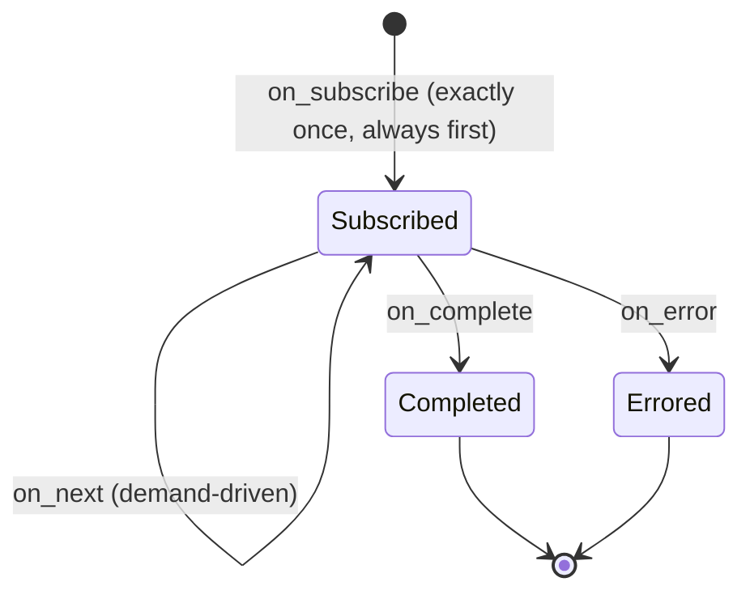

**`learning/code/ex-86-flow-publisher-subscriber-contract/example.py`**

```python
"""Example 86: A java.util.concurrent.Flow-Style Contract, Hand-Rolled in Python."""

# => co-29: the Reactive Streams spec's four interfaces (Publisher/Subscriber/Subscription/Processor)
# => were adopted into the JDK as `java.util.concurrent.Flow` (Java 9). This mirrors that CONTRACT --
# => on_subscribe exactly once, then request-driven on_next*, then exactly one terminal signal
# => (on_complete XOR on_error), never on_next after a terminal. HAND-ROLLED (no reactivex API here).


class ContractViolation(RuntimeError):  # => a distinct exception type -- never conflated with a normal ValueError
    """Raised the instant a Subscriber method is invoked out of the Flow-contract order."""


class RecordingSubscriber:  # => the SINK -- both obeys the contract AND polices it against itself
    """A Subscriber that both fulfils the contract AND actively enforces it against itself."""

    def __init__(self) -> None:  # => a fresh subscriber starts unsubscribed, unterminated, with an empty log
        self.log: list[str] = []  # => log: every signal received, in the exact order it arrived
        self.subscribed = False  # => subscribed: True once on_subscribe has fired
        self.terminated = False  # => terminated: True once EITHER on_complete or on_error has fired
        self.subscription: "FlowSubscription | None" = None  # => the handle used to pull more items

    def on_subscribe(self, subscription: "FlowSubscription") -> None:  # => MUST be the first signal, ever
        if self.subscribed:  # => the contract says on_subscribe fires AT MOST once per subscriber
            raise ContractViolation("on_subscribe called more than once")  # => reject the second call outright
        self.subscribed = True  # => flip the guard before anything else can go wrong
        self.subscription = subscription  # => stash the handle so calling code can `request(n)` later
        self.log.append("subscribe")  # => record the signal for order verification

    def on_next(self, item: int) -> None:  # => called by the Subscription, never invoked directly by tests
        if not self.subscribed or self.terminated:  # => on_next must fall STRICTLY between subscribe and terminal
            raise ContractViolation("on_next called before subscribe or after a terminal signal")  # => illegal state
        self.log.append(f"next:{item}")  # => record exactly which value arrived and when

    def on_error(self, error: BaseException) -> None:  # => the FAILURE terminal signal
        if self.terminated:  # => a terminal signal must never follow another terminal signal
            raise ContractViolation("on_error called after a terminal signal already fired")  # => double-terminal is illegal
        self.terminated = True  # => flip BEFORE logging, so a re-entrant call can't slip through
        self.log.append(f"error:{error}")  # => record the failure, distinct from a normal completion

    def on_complete(self) -> None:  # => the SUCCESS terminal signal -- mutually exclusive with on_error
        if self.terminated:  # => same guard as on_error -- exactly one terminal signal, ever
            raise ContractViolation("on_complete called after a terminal signal already fired")  # => same illegal state
        self.terminated = True  # => flip before logging, matching on_error's ordering discipline
        self.log.append("complete")  # => record the clean-finish signal


class FlowSubscription:  # => the PULL HANDLE -- also owns the demand accounting from ex-85
    """Demand accounting: items only flow out in response to `request(n)`, exactly like ex-85."""

    def __init__(self, subscriber: RecordingSubscriber, items: list[int], fail_at: int | None) -> None:
        self.subscriber = subscriber  # => who to deliver on_next/on_error/on_complete to
        self.items = items  # => the full backlog available to emit
        self.fail_at = fail_at  # => optional index at which to simulate a producer-side failure
        self.index = 0  # => how far production has progressed
        self.demand = 0  # => outstanding, not-yet-fulfilled pull requests
        self.cancelled = False  # => True once `cancel()` has been called -- stops all further activity
        self.done = False  # => True once a terminal signal has been sent -- prevents a double-terminal

    def request(self, n: int) -> None:  # => the ONLY method that authorizes emission
        if self.cancelled or self.done:  # => a cancelled or finished subscription ignores further requests
            return  # => harmless no-op -- never crashes, never re-fires a terminal signal
        self.demand += n  # => demand accumulates across multiple `request` calls
        self._drain()  # => attempt to satisfy as much demand as the backlog (and failure point) allow

    def cancel(self) -> None:  # => lets a subscriber withdraw BEFORE the source finishes on its own
        self.cancelled = True  # => the subscriber withdraws interest -- no further signals will be sent

    def _drain(self) -> None:  # => internal push loop -- private to this class, never called externally
        while self.demand > 0 and self.index < len(self.items) and not self.cancelled:  # => stop at zero demand
            if self.fail_at is not None and self.index == self.fail_at:  # => simulate a producer-side error
                self.done = True  # => guard first, so the loop can never re-enter after this
                self.subscriber.on_error(ValueError(f"synthetic failure at index {self.index}"))  # => terminal
                return  # => on_error is TERMINAL -- no further on_next may follow, ever
            value = self.items[self.index]  # => the next undelivered item
            self.index += 1  # => advance production
            self.demand -= 1  # => consume one unit of demand per item pushed
            self.subscriber.on_next(value)  # => push -- authorized by outstanding demand, per the contract
        if self.index >= len(self.items) and not self.cancelled and not self.done:  # => backlog fully drained
            self.done = True  # => guard before notifying, matching the on_error path above
            self.subscriber.on_complete()  # => clean finish -- every item was delivered, nothing failed


class FlowPublisher:  # => the SOURCE -- optionally configured to fail at a specific index for testing
    """Wires a fresh Subscription to a Subscriber the instant subscribe() is called."""

    def __init__(self, items: list[int], fail_at: int | None = None) -> None:  # => a fixed backlog + failure mode
        self.items = items  # => the backlog this publisher can emit
        self.fail_at = fail_at  # => None means "always succeeds"; an int means "fail at this index"

    def subscribe(self, subscriber: RecordingSubscriber) -> FlowSubscription:  # => the ONLY Publisher method
        subscription = FlowSubscription(subscriber, self.items, self.fail_at)  # => build the pull handle first
        subscriber.on_subscribe(subscription)  # => on_subscribe fires FIRST, before any request is even possible
        return subscription  # => hand the handle back so the caller can start pulling via `request(n)`


if __name__ == "__main__":  # => module entry point
    happy_publisher = FlowPublisher([10, 20, 30])  # => a 3-item source, no failure configured
    happy_subscriber = RecordingSubscriber()  # => tracks the entire signal sequence for this run
    happy_subscription = happy_publisher.subscribe(happy_subscriber)  # => fires on_subscribe immediately
    print(f"after subscribe: log={happy_subscriber.log}")  # => Output: log=['subscribe']

    happy_subscription.request(2)  # => pull 2 -- demand-driven, exactly like ex-85
    happy_subscription.request(5)  # => pull the rest -- more than remains, which is fine, it just drains
    print(f"happy path log: {happy_subscriber.log}")  # => Output: ['subscribe','next:10','next:20','next:30','complete']

    failing_publisher = FlowPublisher([1, 2, 3, 4], fail_at=2)  # => this source WILL synthesize a failure
    failing_subscriber = RecordingSubscriber()  # => a separate subscriber for the error-path scenario
    failing_subscription = failing_publisher.subscribe(failing_subscriber)  # => fires on_subscribe for this pair
    failing_subscription.request(10)  # => ask for everything -- production stops at the synthetic failure
    print(f"error path log: {failing_subscriber.log}")  # => Output: ['subscribe','next:1','next:2','error:...']

    violation_caught = False  # => tracks whether the contract-violation guard actually fired
    try:  # => deliberately misuse the finished happy_subscriber to prove the guard works
        happy_subscriber.on_next(999)  # => illegal: on_next AFTER on_complete already fired above
    except ContractViolation:  # => this is the EXPECTED outcome -- the guard must reject it
        violation_caught = True  # => the self-enforcing guard correctly rejected the illegal call

    # => The contract has THREE non-negotiable shape rules, all enforced here BY THE SUBSCRIBER
    # => ITSELF rather than trusted to caller discipline: (1) on_subscribe fires exactly once and
    # => always first; (2) on_next only ever happens between subscribe and a terminal signal, and
    # => only in response to outstanding demand from request(n); (3) exactly one terminal signal
    # => (on_complete XOR on_error) ever fires, and nothing legally follows it. This is precisely
    # => what makes `java.util.concurrent.Flow` and Reactive Streams composable across unrelated
    # => libraries -- every implementation obeys the SAME ordering guarantees, so adapters between
    # => them never have to guess what state the other side is in.
    assert happy_subscriber.log == ["subscribe", "next:10", "next:20", "next:30", "complete"]  # => full happy sequence
    assert failing_subscriber.log == ["subscribe", "next:1", "next:2", "error:synthetic failure at index 2"]  # => stops at fail_at
    assert failing_subscriber.terminated is True  # => the error path correctly reached a terminal state
    assert violation_caught is True  # => the contract guard fired exactly when it should have
    print("ex-86 OK")  # => Output: ex-86 OK
```

**Run**: `python3 example.py`

**Output**:

```text
after subscribe: log=['subscribe']
happy path log: ['subscribe', 'next:10', 'next:20', 'next:30', 'complete']
error path log: ['subscribe', 'next:1', 'next:2', 'error:synthetic failure at index 2']
ex-86 OK
```

**`learning/code/ex-86-flow-publisher-subscriber-contract/test_example.py`**

```python
"""Example 86: pytest verification for the java.util.concurrent.Flow-Style Contract."""

import pytest
from example import ContractViolation, FlowPublisher, RecordingSubscriber


def test_on_subscribe_always_fires_first_and_exactly_once() -> None:
    publisher = FlowPublisher([1, 2, 3])
    subscriber = RecordingSubscriber()
    publisher.subscribe(subscriber)
    assert subscriber.log == ["subscribe"]  # => nothing else can legally happen before this


def test_on_next_only_happens_in_response_to_outstanding_demand() -> None:
    publisher = FlowPublisher([1, 2, 3, 4, 5])
    subscriber = RecordingSubscriber()
    subscription = publisher.subscribe(subscriber)
    subscription.request(2)  # => ask for exactly 2
    assert subscriber.log == ["subscribe", "next:1", "next:2"]  # => not 3, not 5 -- exactly the requested amount
    assert subscriber.terminated is False  # => 3 items remain -- not yet complete


def test_completion_is_the_only_terminal_signal_on_the_happy_path() -> None:
    publisher = FlowPublisher([1, 2])
    subscriber = RecordingSubscriber()
    subscription = publisher.subscribe(subscriber)
    subscription.request(10)  # => over-request -- production simply stops when the backlog is exhausted
    assert subscriber.log == ["subscribe", "next:1", "next:2", "complete"]
    assert subscriber.terminated is True


def test_a_producer_failure_delivers_on_error_instead_of_on_complete() -> None:
    publisher = FlowPublisher([1, 2, 3], fail_at=1)  # => fails right before emitting index 1
    subscriber = RecordingSubscriber()
    subscription = publisher.subscribe(subscriber)
    subscription.request(10)
    assert subscriber.log == ["subscribe", "next:1", "error:synthetic failure at index 1"]  # => stops right before index 1
    assert subscriber.terminated is True  # => on_error is terminal, exactly like on_complete


def test_on_next_after_a_terminal_signal_is_a_contract_violation() -> None:
    publisher = FlowPublisher([1])
    subscriber = RecordingSubscriber()
    publisher.subscribe(subscriber)
    subscriber.on_next(1)  # => manually push one value before completion, legally
    subscriber.on_complete()  # => now the stream is terminated
    with pytest.raises(ContractViolation):
        subscriber.on_next(2)  # => illegal: nothing may follow a terminal signal


# => Run: pytest -- Output: 5 passed
```

**Verify**: `pytest -q`

**Output**:

```text
5 passed
```

**Key takeaway**: The Reactive Streams / `Flow` contract is a strict state machine: `on_subscribe` first and once, `on_next` only while active, and exactly one terminal signal ever -- and this example's `RecordingSubscriber` enforces that shape against itself, raising `ContractViolation` on any illegal call sequence.

**Why it matters**: This contract (co-29, adopted into the JDK as `java.util.concurrent.Flow` since Java 9) is what makes reactive-streams implementations from different libraries interoperable: any Publisher that obeys these rules can be safely consumed by any Subscriber that also obeys them, with neither needing to know the other's internals. Building a SELF-ENFORCING subscriber (one that raises on its own contract violations, not just documents them) makes the rules verifiable rather than aspirational -- the same discipline a real interoperability test suite would apply.

---

### Example 87: An Annotated Marble Diagram for merge -> map -> debounce

_ex-87 &middot; exercises co-30, co-33_

A `merge` + `map` + `debounce` pipeline is run over two hand-defined marble streams on a virtual clock, and each stage's effect on the (tick, value) timeline is rendered as a plain-text marble diagram -- `merge` only reorders by time, `map` only transforms values, and `debounce` deletes superseded marbles while delaying survivors by the quiet window.

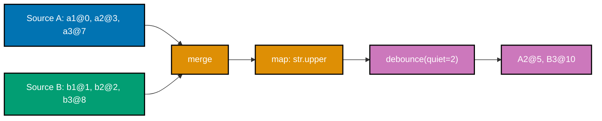

**`learning/code/ex-87-marble-diagram-operator-annotate/example.py`**

```python
"""Example 87: An Annotated Marble Diagram for merge -> map -> debounce."""

from collections.abc import Callable  # => Callable: the correct typed annotation for "a function value" (not builtin callable())

# => co-30: marble diagrams visualize emissions over TIME -- each event is (tick, value). co-33:
# => this is discrete-event reactive-streams style, not continuous-time FRP. A deterministic
# => virtual-clock simulation (no real timers) keeps the diagram exactly reproducible.

MarbleEvent = tuple[int, str]  # => a single marble: (the tick it fires on, the value it carries)

SOURCE_A: list[MarbleEvent] = [(0, "a1"), (3, "a2"), (7, "a3")]  # => stream A: 3 marbles on its own timeline
SOURCE_B: list[MarbleEvent] = [(1, "b1"), (2, "b2"), (8, "b3")]  # => stream B: 3 marbles on a different timeline


def merge_marbles(a: list[MarbleEvent], b: list[MarbleEvent]) -> list[MarbleEvent]:
    """merge: interleave two timelines into one, ordered strictly by tick -- no transformation."""
    return sorted(a + b, key=lambda event: event[0])  # => sort by tick -- ties keep list-concatenation order


def map_marbles(events: list[MarbleEvent], transform: Callable[[str], str]) -> list[MarbleEvent]:
    """map: transform each marble's VALUE, leaving its TICK (its position in time) untouched."""
    return [(tick, transform(value)) for tick, value in events]  # => timing is preserved; only payload changes


def debounce_marbles(events: list[MarbleEvent], quiet: int) -> list[MarbleEvent]:
    """debounce: an event only survives if the source stays SILENT for `quiet` ticks after it."""
    result: list[MarbleEvent] = []  # => result: the settled marbles that actually make it through
    for index, (tick, value) in enumerate(events):  # => walk the timeline in order, one marble at a time
        next_tick = events[index + 1][0] if index + 1 < len(events) else None  # => when does the NEXT marble fire?
        gap = None if next_tick is None else next_tick - tick  # => the silence AFTER this marble, in ticks
        if gap is None or gap >= quiet:  # => nothing arrived soon enough to supersede this one
            result.append((tick + quiet, value))  # => it fires, but DELAYED by `quiet` ticks -- debounce's cost
    return result  # => every surviving marble is the LAST one in its burst, emitted after the burst goes quiet


def render_timeline(events: list[MarbleEvent], length: int) -> str:
    """A plain-text marble diagram: '-' means silence, else the first letter of the value at that tick."""
    frame = ["-"] * length  # => frame: one character slot per tick, all silent by default
    for tick, value in events:  # => stamp each marble's initial onto its tick position
        if 0 <= tick < length:  # => guard against a marble landing outside the rendered window
            frame[tick] = value[0]  # => e.g. "a1" -> 'a' -- enough to visually place it on the diagram
    return "".join(frame) + ">"  # => trailing '>' marks the timeline continuing onward, standard marble notation


DEBOUNCE_QUIET = 2  # => how many silent ticks must pass before a debounced marble is allowed through
TIMELINE_LENGTH = 11  # => wide enough to render every marble in this example, including the debounce delay


if __name__ == "__main__":  # => module entry point
    merged = merge_marbles(SOURCE_A, SOURCE_B)  # => step 1: interleave A and B by tick
    print(f"merge:    {render_timeline(merged, TIMELINE_LENGTH)}")  # => Output: merge:    abba---ab-->

    mapped = map_marbles(merged, str.upper)  # => step 2: transform each value (marble stays at the same tick)
    print(f"map:      {render_timeline(mapped, TIMELINE_LENGTH)}")  # => Output: map:      ABBA---AB-->  (same shape)

    debounced = debounce_marbles(mapped, DEBOUNCE_QUIET)  # => step 3: collapse each burst to its last, quiet marble
    print(f"debounce: {render_timeline(debounced, TIMELINE_LENGTH)}")  # => Output: debounce: -----A----B>  (2 survivors)
    print(f"debounced values: {debounced}")  # => Output: [(5, 'A2'), (10, 'B3')]

    # => `merge` only reorders by time -- it never changes a value or drops one. `map` only changes
    # => VALUES -- it never moves a marble in time, which is why the rendered shape is identical
    # => before and after. `debounce` is the one operator here that changes BOTH: it deletes every
    # => marble that had a successor arrive within the quiet window (a1/b1/b2/a3 all die because
    # => something followed them too soon), and it DELAYS each survivor by the quiet period itself
    # => (A2 at tick 3 doesn't fire until tick 5) -- the cost of "wait to be sure nothing else is
    # => coming" is always some added latency. Composing operators this way -- each doing exactly
    # => one job on the (tick, value) stream -- is the same mental model marble diagrams exist to
    # => teach: read left to right, track what survives, and note where the timeline shifts.
    assert merged == [(0, "a1"), (1, "b1"), (2, "b2"), (3, "a2"), (7, "a3"), (8, "b3")]  # => strict tick order
    assert mapped == [(0, "A1"), (1, "B1"), (2, "B2"), (3, "A2"), (7, "A3"), (8, "B3")]  # => same ticks, upper values
    assert debounced == [(5, "A2"), (10, "B3")]  # => only the two marbles that had 2+ quiet ticks after them
    print("ex-87 OK")  # => Output: ex-87 OK
```

**Run**: `python3 example.py`

**Output**:

```text
merge:    abba---ab-->
map:      ABBA---AB-->
debounce: -----A----B>
debounced values: [(5, 'A2'), (10, 'B3')]
ex-87 OK
```

**`learning/code/ex-87-marble-diagram-operator-annotate/test_example.py`**

```python
"""Example 87: pytest verification for the Annotated Marble Diagram (merge -> map -> debounce)."""

from example import SOURCE_A, SOURCE_B, debounce_marbles, map_marbles, merge_marbles


def test_merge_interleaves_by_tick_without_changing_any_value() -> None:
    merged = merge_marbles(SOURCE_A, SOURCE_B)
    ticks = [tick for tick, _ in merged]
    assert ticks == sorted(ticks)  # => strictly non-decreasing -- merge never reorders by anything but time
    assert {value for _, value in merged} == {"a1", "a2", "a3", "b1", "b2", "b3"}  # => every original value survives


def test_map_changes_values_but_leaves_every_tick_untouched() -> None:
    merged = merge_marbles(SOURCE_A, SOURCE_B)
    mapped = map_marbles(merged, str.upper)
    assert [tick for tick, _ in mapped] == [tick for tick, _ in merged]  # => identical tick sequence, unchanged
    assert [value for _, value in mapped] == [value.upper() for _, value in merged]  # => every value transformed


def test_debounce_keeps_only_marbles_with_enough_trailing_silence() -> None:
    merged = merge_marbles(SOURCE_A, SOURCE_B)
    mapped = map_marbles(merged, str.upper)
    debounced = debounce_marbles(mapped, quiet=2)
    assert debounced == [(5, "A2"), (10, "B3")]  # => exactly the two marbles that had a 2+ tick gap after them
    assert len(debounced) < len(mapped)  # => debounce is strictly lossy -- it always sheds superseded marbles


# => Run: pytest -- Output: 3 passed
```

**Verify**: `pytest -q`

**Output**:

```text
3 passed
```

**Key takeaway**: `merge` reorders by time without touching values; `map` transforms values without moving them in time; `debounce` is the one operator that changes BOTH -- deleting superseded marbles and delaying every survivor by the quiet window, the price of waiting to be sure nothing else is coming.

**Why it matters**: Marble diagrams (co-30) are how the entire reactive-streams ecosystem communicates operator behavior at a glance, and building one from a deterministic virtual clock (rather than relying on real timers, which would be flaky) makes every operator's timing effect exactly reproducible and independently verifiable. This is also a fitting capstone for the reactive-streams sub-topic's discrete-event framing (co-33): every marble is a distinct, timestamped event, in contrast to original FRP's continuous-time behaviors -- a distinction this whole six-example arc has been building toward since ex-82's first Observable.

---

← Previous: [Intermediate Examples](./intermediate.md) &middot; Next: [Capstone](./capstone/overview.md) →
