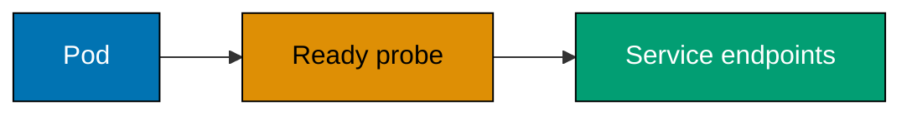
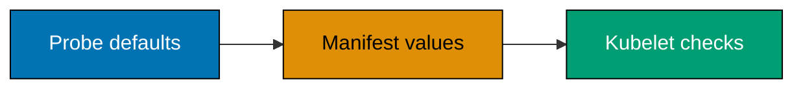
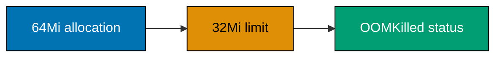

## Advanced

Every artifact is self-contained. Each command declares its required runtime—Docker, a Compose-capable Docker engine, a local Kubernetes cluster, a registry, or a systemd user session—so examples that need infrastructure do not pretend to run in a bare shell. Use disposable names and placeholders; never provide a real credential in a lesson artifact.

### Example 56: Readiness probe

_ex-56 · exercises co-25_



**Brief explanation**: The core API creates a complete Pod for this probe. Its readiness result controls whether Kubernetes includes the Pod in Service endpoints.

```yaml
# => The core API creates a complete Pod for this probe.
apiVersion: v1
# => A Pod encloses the process whose readiness is observed.
kind: Pod
# => The name is targeted by the verification commands.
metadata: { name: ex56 }
# => Busybox sleeps until verification creates its readiness marker.
spec:
  # => The app container remains available for `kubectl exec`.
  containers:
    # => This name identifies the process within the Pod.
    - name: app
      # => Busybox provides shell tools for the probe and test.
      image: busybox:1.37
      # => Sleep leaves `/tmp/ready` absent at startup.
      command: ["sh", "-c", "sleep 3600"]
      # => Readiness becomes true only after the marker exists.
      readinessProbe: { exec: { command: ["sh", "-c", "test -f /tmp/ready"] }, periodSeconds: 3 }
```

**Verification**: Save as `ex56.yaml` and apply it; `kubectl get pod/ex56` stays `0/1 Ready` until `kubectl exec ex56 -- touch /tmp/ready`, then `kubectl wait --for=condition=Ready pod/ex56` succeeds.

**Key takeaway**: Readiness answers whether a running process should receive traffic; it does not decide whether the process deserves a restart.

**Why it matters**: Readiness answers whether a running process should receive traffic; it does not decide whether the process deserves a restart. The marker makes that distinction visible: the container stays alive while Kubernetes reports it unready. This prevents a service from receiving requests before caches, migrations, or dependencies are usable. Choose a readiness signal that reflects real serving capability, then verify endpoint removal and restoration during a rollout instead of confusing a live PID with an available application.

---

### Example 57: Startup probe

_ex-57 · exercises co-25_


**Brief explanation**: The core API creates a complete Pod for startup gating. A startup probe delays liveness and readiness checks until a slow initialization path has succeeded.

```yaml
# => The core API creates a complete Pod for startup gating.
apiVersion: v1
# => A Pod lets both probes run without an external server.
kind: Pod
# => The name is targeted by the verification command.
metadata: { name: ex57 }
# => Busybox creates its startup marker before sleeping.
spec:
  # => The app container exposes the same initialized state to both probes.
  containers:
    # => This name identifies the process in `kubectl describe`.
    - name: app
      # => Busybox includes the shell and `touch` used by the example.
      image: busybox:1.37
      # => The marker models successful initialization.
      command: ["sh", "-c", "touch /tmp/started; sleep 3600"]
      # => Startup succeeds only after initialization leaves its marker.
      startupProbe: { exec: { command: ["sh", "-c", "test -f /tmp/started"] }, periodSeconds: 5, failureThreshold: 30 }
      # => Liveness begins only after startup has succeeded.
      livenessProbe: { exec: { command: ["sh", "-c", "test -f /tmp/started"] }, periodSeconds: 5 }
```

**Verification**: Save as `ex57.yaml`, apply it, and `kubectl describe pod/ex57`; startup succeeds before liveness probes run, and `kubectl wait --for=condition=Ready pod/ex57` succeeds.

**Key takeaway**: Startup probes give slow but healthy applications a bounded initialization window before liveness begins to judge them.

**Why it matters**: Startup probes give slow but healthy applications a bounded initialization window before liveness begins to judge them. Without that gate, a liveness probe can repeatedly restart a service that simply has not finished loading models, warming caches, or running migrations. The shared marker shows the intended ordering directly. Set the failure threshold from measured startup behavior, not wishful timing, and keep the startup check narrow enough that it confirms initialization rather than ordinary request readiness.

---

### Example 58: Probe defaults

_ex-58 · exercises co-25_



**Brief explanation**: This standalone Pod intentionally omits `periodSeconds` and `failureThreshold`. Kubernetes applies documented probe defaults, which the manifest can inspect without inventing values.

```yaml
# => This standalone Pod intentionally omits periodSeconds and failureThreshold.
apiVersion: v1
# => A Pod exposes the API-defaulted readiness probe for direct inspection.
kind: Pod
# => The fixed name is used by the local verification command.
metadata: { name: ex58 }
# => The long-running container gives the API server a complete probe-bearing object.
spec:
  containers:
    - name: app
      image: busybox:1.37 # => Busybox supplies the shell used by the trivial successful probe.
      command: ["sh", "-c", "sleep 3600"] # => Keep the Pod alive while its spec is read.
      readinessProbe: { exec: { command: ["sh", "-c", "true"] } } # => Omit timing fields so Kubernetes applies defaults.
# => The core API defaults omitted probe timing on this admitted Pod specification.
# => `ex58` names the sole local object read by the following jsonpath command.
# => The shell's `true` result keeps the probe behavior independent of network setup.
# => The long sleep prevents normal command completion from removing the probe-bearing container.
# => Only timing fields are omitted; the probe action itself remains an explicit valid declaration.
```

```bash
# => Read the defaulted fields from the actual local Pod object, not from a copied value.
kubectl get pod/ex58 -o jsonpath='{.spec.containers[0].readinessProbe.periodSeconds} {.spec.containers[0].readinessProbe.failureThreshold}{"\n"}'
```

**Verification**: Save the YAML artifact as `ex58.yaml`, apply it in a local cluster, then run the Bash command. It prints `10 3` from `pod/ex58`'s defaulted readiness-probe object. Delete the exact local object afterwards with `kubectl delete -f ex58.yaml`.

**Key takeaway**: Probe defaults are policy, even when omitted from YAML.

**Why it matters**: Probe defaults are policy, even when omitted from YAML. A ten-second period and three consecutive failures can be reasonable for a stable HTTP service yet dangerously slow or aggressively noisy for another workload. Reading the defaulted Pod object proves the values actually sent to kubelet, rather than relying on memory or documentation drift. Make timing explicit when service-level behavior requires it, and retain defaults only after confirming their failure window matches the application's recovery and traffic expectations.

---

### Example 59: Resource requests

_ex-59 · exercises co-26_


**Brief explanation**: The core API creates a complete Pod for scheduler inspection. Resource requests guide placement by declaring the CPU and memory the scheduler must reserve.

```yaml
# => The core API creates a complete Pod for scheduler inspection.
apiVersion: v1
# => A Pod encloses the container whose requests are declared.
kind: Pod
# => The name is used by the verification command.
metadata: { name: ex59 }
# => Busybox stays alive while its resources are inspected.
spec:
  # => One container carries scheduler-visible requests.
  containers:
    # => The app name appears in `kubectl describe` output.
    - name: app
      # => Busybox supplies a small shell runtime.
      image: busybox:1.37
      # => Sleep keeps the Pod alive after placement.
      command: ["sh", "-c", "sleep 3600"]
      # => Requests reserve scheduler capacity before placement.
      resources: { requests: { cpu: 100m, memory: 128Mi } }
```

**Verification**: Save as `ex59.yaml`, apply it, then run `kubectl describe pod/ex59`; the app container shows CPU and memory requests.

**Key takeaway**: Resource requests are the scheduler's planning inputs and the baseline for CPU-utilization autoscaling.

**Why it matters**: Resource requests are the scheduler's planning inputs and the baseline for CPU-utilization autoscaling. They do not reserve a private CPU core, but they tell Kubernetes how much capacity a Pod needs to be placed responsibly. The described Pod makes the request visible in the actual admitted object. Set requests from observed normal demand, then revisit them when workload shape changes; zero or arbitrary requests lead to poor packing, unreliable HPA percentages, and avoidable node pressure.

---

### Example 60: Resource limits

_ex-60 · exercises co-26_


**Brief explanation**: The core API creates a complete Pod whose limits Kubernetes enforces. The runtime constrains CPU and memory use after scheduling, protecting neighboring workloads from unbounded consumption.

```yaml
# => The core API creates a complete Pod whose limits Kubernetes enforces.
apiVersion: v1
# => A Pod encloses the limited container.
kind: Pod
# => The name is used by the verification command.
metadata: { name: ex60 }
# => Busybox stays alive while its limits are inspected.
spec:
  # => One container carries CPU and memory limits.
  containers:
    # => The app name appears in `kubectl describe` output.
    - name: app
      # => Busybox supplies a small shell runtime.
      image: busybox:1.37
      # => Sleep avoids deliberately causing an OOM in this example.
      command: ["sh", "-c", "sleep 3600"]
      # => Limits cap CPU execution and memory consumption.
      resources: { limits: { cpu: 500m, memory: 256Mi } }
```

**Verification**: Save as `ex60.yaml`, apply it, then run `kubectl describe pod/ex60`; the app container shows the supplied CPU and memory limits.

**Key takeaway**: Limits constrain the runtime after scheduling.

**Why it matters**: Limits constrain the runtime after scheduling. CPU overuse is throttled, while memory overuse can end in an OOM kill, so the two settings have different operational consequences. The local object lets you confirm the values Kubernetes admitted before load makes a discrepancy expensive. Set a memory limit high enough for legitimate peaks and a request representative of steady use; then instrument allocations and throttling. A copied limit with no measurement is a failure mode disguised as a safeguard.

---

### Example 61: QoS classes

_ex-61 · exercises co-26_


**Brief explanation**: This List carries three standalone Pods so the API computes three QoS outcomes together. Each request-and-limit combination produces a QoS class that affects eviction behavior under node pressure.

```yaml
# => This List carries three standalone Pods so the API computes three QoS outcomes together.
apiVersion: v1
kind: List
items:
  - apiVersion: v1
    kind: Pod
    metadata: { name: ex61-guaranteed }
    spec:
      containers:
        - name: app
          image: busybox:1.37 # => The same small image keeps all QoS differences limited to resources.
          command: ["sh", "-c", "sleep 3600"]
          resources: { requests: { cpu: 100m, memory: 32Mi }, limits: { cpu: 100m, memory: 32Mi } } # => Equal CPU and memory requests/limits produce Guaranteed QoS.
  - apiVersion: v1
    kind: Pod
    metadata: { name: ex61-burstable }
    spec:
      containers:
        - name: app
          image: busybox:1.37
          command: ["sh", "-c", "sleep 3600"]
          resources: { requests: { memory: 16Mi }, limits: { memory: 32Mi } } # => Unequal memory declarations produce Burstable QoS.
  - apiVersion: v1
    kind: Pod
    metadata: { name: ex61-besteffort }
    spec:
      containers: [{ name: app, image: busybox:1.37, command: ["sh", "-c", "sleep 3600"] }] # => No requests or limits produces BestEffort QoS.
# => The List API submits each item as its own named Pod object.
# => `ex61-guaranteed` is the object used to inspect the Guaranteed result.
# => Each Pod uses the same image so QoS differs only because of resource fields.
# => The sleep command keeps each test object present after it has been admitted.
# => Guaranteed requires a request and equal limit for every declared CPU resource.
# => Guaranteed also requires a request and equal limit for every declared memory resource.
# => The guaranteed Pod requests one tenth of one CPU core.
# => The guaranteed Pod requests thirty-two mebibytes of memory.
# => Its matching CPU limit satisfies the CPU part of the Guaranteed rule.
# => Its matching memory limit satisfies the memory part of the Guaranteed rule.
# => `ex61-burstable` models a Pod with resource declarations that are not equal.
# => The Burstable Pod has a memory request smaller than its memory limit.
# => Its sixteen-mebibyte request is scheduler-visible capacity.
# => Its thirty-two-mebibyte limit is a runtime ceiling rather than a reservation.
# => The intentionally absent CPU request and limit do not turn this Pod into BestEffort.
# => Any nonempty request or limit excludes a Pod from BestEffort.
# => `ex61-besteffort` deliberately has no `resources` field at all.
# => BestEffort Pods have no CPU or memory requests declared for any container.
# => BestEffort Pods have no CPU or memory limits declared for any container.
# => The separate names allow one table command to compare computed API results.
# => QoS is written by Kubernetes to Pod status rather than to the manifest spec.
# => The custom column path reads the API-computed status value directly.
# => Waiting for Pod admission ensures status has been populated before inspection.
# => Deleting the List manifest removes all three independently created objects.
# => This artifact distinguishes QoS classification from application priority or scheduling order.
```

```bash
# => Read Kubernetes' computed QoS class for all three concrete local Pod objects.
kubectl get pods ex61-guaranteed ex61-burstable ex61-besteffort -o custom-columns=NAME:.metadata.name,QOS:.status.qosClass
```

**Verification**: Save the YAML as `ex61.yaml`, apply it in a local cluster, wait for the Pods, then run the Bash command. Its QoS column prints `Guaranteed`, `Burstable`, and `BestEffort` for the three named objects. Delete all three with `kubectl delete -f ex61.yaml`.

**Key takeaway**: QoS is computed from every container's requests and limits, so it is an outcome of resource design rather than a label you set directly.

**Why it matters**: QoS is computed from every container's requests and limits, so it is an outcome of resource design rather than a label you set directly. The three local Pods expose the exact distinctions: equal CPU and memory requests/limits yield Guaranteed, partial declarations yield Burstable, and no declarations yield BestEffort. This affects eviction priority under node pressure. Inspect the computed class after admission, especially for multi-container Pods where one omitted resource can change the workload's class.

---

### Example 62: OOMKilled

_ex-62 · exercises co-26_



**Brief explanation**: Save this complete Pod as `ex62.yaml`; on cgroup v2 nodes, its 32 MiB limit is reflected by `memory.max`. On cgroup v1 or when host cgroups are unavailable, inspect the declared limit portably through the Kubernetes Pod resource.

```bash
# => Save this complete Pod as ex62.yaml; cgroup v2 runtimes enforce its 32 MiB limit through memory.max.
cat > ex62.yaml <<'YAML'
apiVersion: v1 # => Create one disposable Pod whose failed container remains inspectable.
kind: Pod # => A bare Pod avoids a controller creating replacement Pods during the diagnosis.
metadata: { name: ex62-oom } # => Every later command addresses this exact Kubernetes object.
spec:
  restartPolicy: Never # => Preserve the failed terminal state instead of restarting the process.
  containers:
    - name: allocate # => The status path identifies this container by position zero.
      image: python:3.13-alpine # => Python can allocate memory without adding a test-only package.
      resources: { limits: { memory: 32Mi } } # => The runtime enforces this memory ceiling through its cgroup.
      command: ["python3", "-c", "bytearray(64 * 1024 * 1024)"] # => Allocate 64 MiB, exceeding the 32 MiB limit.
YAML
# => Create the defined Pod and wait until the memory-limited process terminates.
kubectl apply -f ex62.yaml && kubectl wait --for=jsonpath='{.status.phase}'=Failed pod/ex62-oom --timeout=60s
# => Read the local Pod status artifact rather than guessing why the process ended.
kubectl get pod/ex62-oom -o jsonpath='{.status.containerStatuses[0].state.terminated.reason} {.status.containerStatuses[0].state.terminated.exitCode}{"\n"}'
# => Portably inspect the Kubernetes-declared limit when cgroup v1 does not expose memory.max.
kubectl get pod/ex62-oom -o jsonpath='{.spec.containers[0].resources.limits.memory}{"\n"}'
# => The YAML heredoc creates a file the API server can validate and admit.
# => A bare Pod avoids a Deployment hiding the first failed termination state.
# => `restartPolicy: Never` preserves the result for inspection after failure.
# => The `allocate` container is position zero in the status array requested later.
# => Python is used solely because bytearray allocation is deterministic and self-contained.
# => The 32Mi limit is applied by the container runtime through a memory cgroup.
# => The allocation is intentionally twice the configured ceiling.
# => `kubectl wait` avoids reading status before the kernel has terminated the process.
# => The jsonpath reads the current terminated state because the Pod is not restarted.
# => `OOMKilled` is the Kubernetes termination reason surfaced from the runtime.
# => Exit 137 is the observable SIGKILL-style result for this controlled memory failure.
```

**Verification**: In a local Kubernetes cluster, the final command reads `pod/ex62-oom` and prints `OOMKilled 137`. That is the concrete container-status result of the 64 MiB allocation crossing the Pod's 32 MiB cgroup-backed memory limit. Remove the disposable object with `kubectl delete -f ex62.yaml`.

**Key takeaway**: `OOMKilled` is not an application exception; it is the kernel enforcing the container's cgroup memory limit.

**Why it matters**: `OOMKilled` is not an application exception; it is the kernel enforcing the container's cgroup memory limit. The exit code alone is not enough to explain every failure, but the terminated reason plus the declared limit establish the causal chain. Inspect that local status before raising a limit: an unexpectedly large allocation, an incorrect unit, or concurrency may be the root cause. Treat limits as testable operational contracts, not as decorative YAML.

---

### Example 63: HorizontalPodAutoscaler

_ex-63 · exercises co-27_


**Brief explanation**: Save every object needed for this HPA as `ex63.yaml`; do not depend on an earlier lesson's Deployment. The target workload, metrics request, and scaling bounds stay reviewable as one complete artifact.

```yaml
# => Save every object needed for this HPA as ex63.yaml; do not depend on an earlier lesson's Deployment.
apiVersion: apps/v1
kind: Deployment # => The HPA changes this controller's desired replica count.
metadata: { name: ex63-api }
spec:
  replicas: 1 # => Start with a single measurable replica.
  selector: { matchLabels: { app: ex63-api } } # => Bind the Deployment to only its own Pods.
  template:
    metadata: { labels: { app: ex63-api } } # => Match the Deployment selector.
    spec:
      containers:
        - name: api
          image: busybox:1.37 # => Use a small image that is available on common local clusters.
          command: ["sh", "-c", "sleep 3600"] # => Keep the Pod alive while metrics are observed.
          resources: { requests: { cpu: 100m, memory: 32Mi } } # => CPU utilization has a nonzero request denominator.
---
apiVersion: autoscaling/v2
kind: HorizontalPodAutoscaler # => This controller writes the target Deployment's scale subresource.
metadata: { name: ex63-api }
spec:
  scaleTargetRef: { apiVersion: apps/v1, kind: Deployment, name: ex63-api } # => Target the local Deployment above.
  minReplicas: 1 # => Never reduce the example below one available Pod.
  maxReplicas: 3 # => Cap local experimentation at three replicas.
  metrics: [{ type: Resource, resource: { name: cpu, target: { type: Utilization, averageUtilization: 70 } } }] # => Request a 70% average CPU target.
# => `apps/v1` selects the Deployment controller API.
# => `ex63-api` is both the Deployment name and the HPA target name.
# => One initial replica keeps the observed scale baseline explicit.
# => The app label prevents the controller from selecting unrelated Pods.
# => The template repeats the selected label because selectors are immutable.
# => Busybox is only a stable, inspectable local workload for the HPA object.
# => The sleep command deliberately avoids workload-specific application assumptions.
# => The 100m request makes CPU utilization a calculable percentage.
# => The memory request lets the local Pod be scheduled predictably.
# => The document separator begins a second independently admitted object.
# => `autoscaling/v2` supports resource metric targets in the current HPA API.
# => HPA writes through the scale subresource rather than creating Pods itself.
# => The lower bound preserves one serving replica during low utilization.
# => The upper bound limits the local experiment's capacity expansion.
# => Resource metrics read container usage from metrics-server.
# => `Utilization` compares measured CPU to each container's requested CPU.
# => Seventy percent is the controller's requested average, not a CPU limit.
# => Missing metrics can leave the current metric value unknown without invalidating the manifest.
# => HPA behavior policies can further constrain this raw recommendation.
# => The verification reads HPA spec fields before attempting synthetic load.
```

**Verification**: With metrics-server installed, save the block as `ex63.yaml`, run `kubectl apply -f ex63.yaml`, then `kubectl get hpa/ex63-api -o jsonpath='{.spec.scaleTargetRef.name} {.spec.minReplicas} {.spec.maxReplicas}{"\n"}'`. It prints `ex63-api 1 3`; after metrics arrive, `kubectl get hpa/ex63-api` also reports a CPU target instead of `<unknown>`.

**Key takeaway**: CPU utilization is a percentage of the requested CPU, not an absolute amount of work.

**Why it matters**: CPU utilization is a percentage of the requested CPU, not an absolute amount of work. Omitting a request leaves the HPA without the denominator it needs, while absent metrics leave it unable to calculate a recommendation. The self-contained target makes those prerequisites visible. In production, choose a resource request that reflects normal load, then validate scaling with realistic traffic and an explicit upper bound so an incident cannot create unbounded capacity.

---

### Example 64: HPA formula

_ex-64 · exercises co-27_


**Brief explanation**: Three replicas are currently averaging 140% of their requested CPU. The HPA formula computes a desired replica count from observed utilization and the configured target.

```text
# => Three replicas are currently averaging 140% of their requested CPU.
currentReplicas = 3; currentUtilization = 140
# => The HPA target is 70%, so the raw desired replica count is rounded up.
desiredReplicas = ceil(currentReplicas * currentUtilization / 70) = 6
```

**Verification**: This calculation is a local decision artifact: substitute `currentReplicas=3` and `currentUtilization=140`, then the displayed formula evaluates to `6`. Compare it with `kubectl get hpa/ex63-api -o yaml` from Example 63, whose controller applies the same ratio before any configured behavior policies constrain the change.

**Key takeaway**: The formula reveals the feedback loop behind a scale-out event: a target at twice the desired utilization recommends twice as many replicas.

**Why it matters**: The formula reveals the feedback loop behind a scale-out event: a target at twice the desired utilization recommends twice as many replicas. Rounding up protects capacity, but it can also amplify a bad metric or an undersized request. Knowing the arithmetic lets you distinguish a justified recommendation from a surprising one. Pair it with min/max bounds and scale-up policies, because the raw number is an input to control behavior rather than an automatic production decision.

---

### Example 65: StatefulSet

_ex-65 · exercises co-28_


**Brief explanation**: The core API provides the headless Service for stable DNS. A StatefulSet combines that service with ordinal Pod identities so clients can address stable peers.

```yaml
# => The core API provides the headless Service for stable DNS.
apiVersion: v1
# => A headless Service publishes per-Pod StatefulSet records.
kind: Service
# => Its name is referenced by the StatefulSet serviceName.
metadata: { name: ex65 }
# => `None` disables a single virtual cluster IP.
spec: { clusterIP: None, selector: { app: ex65 } }
---
# => The apps API provides the StatefulSet controller.
apiVersion: apps/v1
# => StatefulSet preserves ordinal identity across replacements.
kind: StatefulSet
# => Pod names receive this stable prefix.
metadata: { name: ex65 }
# => Two replicas demonstrate `ex65-0` and `ex65-1` identities.
spec:
  # => The governing headless Service creates stable DNS names.
  serviceName: ex65
  # => Two Pods make both ordinal names observable.
  replicas: 2
  # => Selector and template labels bind the controller to its Pods.
  selector: { matchLabels: { app: ex65 } }
  # => Both Pods run a long-lived, inspectable container.
  template:
    {
      metadata: { labels: { app: ex65 } },
      spec: { containers: [{ name: app, image: busybox:1.37, command: ["sh", "-c", "sleep 3600"] }] },
    }
# => The headless Service exists solely to provide the StatefulSet DNS identity domain.
# => The two replicas give `kubectl get pods` two stable ordinal names to inspect.
# => The template container runs long enough for both replicas to become Ready.
# => The StatefulSet name is the shared prefix used to derive both ordinal Pod names.
# => This manifest intentionally leaves storage out so the check isolates stable network identity.
```

**Verification**: With a local Kubernetes cluster, save as `ex65.yaml`, apply it, wait for `statefulset/ex65`, then run `kubectl get pods -l app=ex65 -o name`; output includes `pod/ex65-0` and `pod/ex65-1`.

**Key takeaway**: StatefulSet names are identities, not merely labels.

**Why it matters**: StatefulSet names are identities, not merely labels. `ex65-0` keeps its ordinal across replacement, which lets peers use stable hostnames and lets operators reason about ordering. That is essential for clustered databases and quorum systems, where an anonymous interchangeable replica can be unsafe. Verify the generated object names before adding persistent state: the governing Service, selector, and StatefulSet name jointly form the identity contract that clients and recovery procedures depend on.

---

### Example 66: StatefulSet storage

_ex-66 · exercises co-28_

**Brief explanation**: The core API provides the headless Service needed for stable DNS. StatefulSet volume claim templates then create one persistent claim per ordinal replica.

```yaml
# => The core API provides the headless Service needed for stable DNS.
apiVersion: v1
# => A Service governs StatefulSet Pod identities.
kind: Service
# => This name matches the StatefulSet serviceName.
metadata: { name: ex66 }
# => `None` makes the governing Service headless.
spec: { clusterIP: None, selector: { app: ex66 } }
# => This document separator starts the independently valid StatefulSet object.
---
# => The apps API provides the StatefulSet controller.
apiVersion: apps/v1
# => A StatefulSet owns ordinal Pods and per-ordinal storage.
kind: StatefulSet
# => The name prefixes the Pod and PVC names.
metadata: { name: ex66 }
# => The desired state binds identity, container, and claim template.
spec:
  # => The headless Service supplies stable per-Pod DNS.
  serviceName: ex66
  # => One replica demonstrates one retained PVC on a local cluster.
  replicas: 1
  # => The selector binds the controller to the Pod label.
  selector: { matchLabels: { app: ex66 } }
  # => The Pod mounts its ordinal-specific storage claim.
  template:
    {
      metadata: { labels: { app: ex66 } },
      spec:
        {
          containers:
            [
              {
                name: app,
                image: busybox:1.37,
                command: ["sh", "-c", "sleep 3600"],
                volumeMounts: [{ name: data, mountPath: /data }],
              },
            ],
        },
    }
  # => The claim template creates a persistent volume claim per ordinal.
  volumeClaimTemplates:
    [{ metadata: { name: data }, spec: { accessModes: ["ReadWriteOnce"], resources: { requests: { storage: 1Gi } } } }]
# => The template name is the prefix Kubernetes uses when generating per-ordinal PVC names.
# => `data-ex66-0` is therefore a concrete claim object tied to the first StatefulSet identity.
# => The mount and claim-template names match, binding the generated PVC to `/data`.
# => ReadWriteOnce matches the single-replica lesson and many local dynamic provisioners.
# => The requested one gibibyte is interpreted by the cluster's default StorageClass.
# => No application data is written, so the example demonstrates identity rather than a database protocol.
# => The headless Service must exist for the StatefulSet's stable network identity.
# => The StatefulSet controller creates the PVC alongside its ordinal Pod.
# => PVC status, not the manifest, proves that provisioning succeeded.
# => Deleting a Pod does not change its ordinal's PVC name.
# => PV reclaim behavior remains a separate StorageClass lifecycle concern.
# => Volume claim retention policy should be chosen explicitly in a stateful production workload.
# => The verification reads the generated `data-ex66-0` local object by its deterministic name.
# => A cluster with no dynamic provisioner can leave this PVC Pending, which is an observable prerequisite failure.
# => The claim template gives the Pod mount and generated PVC one matching `data` identity.
# => The default StorageClass must fulfill this manifest's ReadWriteOnce one-gibibyte request.
# => One replica keeps the stateful storage relationship observable without an external database.
```

**Verification**: Save as `ex66.yaml`, apply it, and wait for `statefulset/ex66`; `kubectl get pvc` shows the `data-ex66-0` claim created by this manifest.

**Key takeaway**: A StatefulSet volume-claim template creates storage per ordinal, so `data-ex66-0` belongs to the logical replica `ex66-0` rather than to whichever Pod happens to run today.

**Why it matters**: A StatefulSet volume-claim template creates storage per ordinal, so `data-ex66-0` belongs to the logical replica `ex66-0` rather than to whichever Pod happens to run today. This avoids the data mix-ups an interchangeable Deployment volume can cause. Storage behavior still depends on the cluster's StorageClass and reclaim policy, so inspect the resulting PVC and its bound PV locally before assuming deletion, replacement, or resizing will preserve the data you intend.

---

### Example 67: DaemonSet

_ex-67 · exercises co-29_

**Brief explanation**: The apps API provides the DaemonSet controller. It ensures one matching Pod is scheduled on each eligible node instead of maintaining a fixed replica total.

```yaml
# => The apps API provides the DaemonSet controller.
apiVersion: apps/v1
# => DaemonSet schedules one matching Pod onto every eligible node.
kind: DaemonSet
# => The name is used by the desired-count assertion.
metadata: { name: ex67 }
# => Selector and template labels bind the controller to agent Pods.
spec:
  # => This selector chooses the DaemonSet's own Pod template.
  selector: { matchLabels: { app: ex67 } }
  # => The template supplies the lightweight node agent.
  template:
    {
      metadata: { labels: { app: ex67 } },
      spec: { containers: [{ name: agent, image: busybox:1.37, command: ["sh", "-c", "sleep 3600"] }] },
    }
# => The status's desired number is calculated from eligible nodes, not from a fixed replica count.
# => The ready number confirms node agents have passed normal Pod readiness.
# => The template uses no privileged or host-mounted settings, keeping this fleet-wide demo safe.
# => Matching selector and template labels allow the DaemonSet to own only its generated Pods.
```

**Verification**: With a local Kubernetes cluster, save as `ex67.yaml`, apply it, then run `kubectl rollout status daemonset/ex67 && kubectl get daemonset/ex67 -o jsonpath='{.status.desiredNumberScheduled} {.status.numberReady}'`; the two numbers match when one agent is ready per eligible node.

**Key takeaway**: A DaemonSet turns one Pod specification into a fleet-wide node agent.

**Why it matters**: A DaemonSet turns one Pod specification into a fleet-wide node agent. That is appropriate for log collectors, network agents, and storage helpers, but any privilege or host access is multiplied by every eligible node. The status comparison makes the controller's promise visible: desired scheduled Pods and ready Pods should agree. Add node selectors, tolerations, and least privilege deliberately; a DaemonSet is an infrastructure deployment, not a convenient shortcut for a normal service.

---

### Example 68: Job

_ex-68 · exercises co-30_

**Brief explanation**: This finite Job artifact runs one task to completion and uses `backoffLimit: 2` to bound controller-created retry Pods after failure. The terminal Job status distinguishes successful completion from retries exhausted after failures.

```yaml
# => The batch API provides the Job controller.
apiVersion: batch/v1
# => A Job tracks finite work until successful completion.
kind: Job
# => The name is used by wait and status commands.
metadata: { name: ex68 }
# => A finite Pod template defines the work and retry semantics.
spec:
  # => A failed Pod is not restarted in place; the Job may create a replacement up to this limit.
  backoffLimit: 2
  # => The template contains work that exits successfully once.
  template:
    # => Jobs permit only `Never` or `OnFailure`, never `Always`.
    spec:
      # => Never leaves a terminated Pod visible while the Job controller handles retries.
      restartPolicy: Never
      # => This command terminates after emitting its completion marker.
      containers: [{ name: task, image: busybox:1.37, command: ["sh", "-c", "echo complete"] }]
```

**Verification**: With a local Kubernetes cluster, save as `ex68.yaml`, run `kubectl apply -f ex68.yaml && kubectl wait --for=condition=complete job/ex68`; `kubectl get job/ex68 -o jsonpath='{.status.succeeded}'` prints `1`. `restartPolicy: Never` is valid because the Job controller—not kubelet restart-in-place behavior—handles retry Pods.

**Key takeaway**: A Job's success condition is a completed workload, not a continuously healthy process.

**Why it matters**: A Job's success condition is a completed workload, not a continuously healthy process. `restartPolicy: Never` preserves each failed attempt as evidence, while `backoffLimit` bounds how many replacement Pods the Job controller may create. This distinction matters for migrations, reports, and data repair: task code must tolerate retry without duplicating irreversible effects. Read the Job's succeeded and failed status rather than treating a terminated Pod alone as a trustworthy completion signal.

---

### Example 69: Job parallelism

_ex-69 · exercises co-30_

**Brief explanation**: This parallel Job artifact requires four successful task completions while permitting at most two task Pods to run concurrently. `completions` defines the total work while `parallelism` limits concurrent execution.

```yaml
# => The batch API provides the Job controller.
apiVersion: batch/v1
# => A Job runs Pods until its completion target is met.
kind: Job
# => The name is used by the verification command.
metadata: { name: ex69 }
# => The Job declares completion count, parallelism, and a finite Pod.
spec:
  # => Four successful Pods finish the Job.
  completions: 4
  # => At most two task Pods run simultaneously.
  parallelism: 2
  # => The template creates terminating task Pods.
  template:
    {
      spec:
        {
          restartPolicy: Never,
          containers: [{ name: task, image: busybox:1.37, command: ["sh", "-c", "sleep 2; echo done"] }],
        },
    }
# => Four successful task completions are required before this Job reaches Complete.
# => Two concurrent task Pods are allowed in each wave.
# => The sleep makes the parallelism bound observable through `kubectl get pods --watch`.
# => The task exits zero after writing its completion marker.
# => `Never` leaves retries to the Job controller instead of restarting one Pod in place.
# => Job status aggregates successes across all task Pod instances.
# => The final jsonpath reads the required four-success outcome from that status object.
```

**Verification**: With a local Kubernetes cluster, save as `ex69.yaml`, apply it, and watch `kubectl get pods -l job-name=ex69 --watch`; no more than two Pods run at once. After `kubectl wait --for=condition=complete job/ex69`, run `kubectl get job/ex69 -o jsonpath='{.status.succeeded}'`; it prints `4`.

**Key takeaway**: `completions` answers how many successful task executions are required; `parallelism` answers how much concurrency the cluster may use to reach that total.

**Why it matters**: `completions` answers how many successful task executions are required; `parallelism` answers how much concurrency the cluster may use to reach that total. They are independent controls, so four completions with parallelism two executes in waves rather than requiring four simultaneous Pods. This matters when a batch workload shares a database, API quota, or finite nodes with services. Observe both the maximum running Pods and final succeeded count before choosing production throughput settings.

---

### Example 70: CronJob

_ex-70 · exercises co-30_

**Brief explanation**: The batch API provides the recurring Job controller. A CronJob creates Jobs on its schedule, leaving each execution's Pod lifecycle to the Job controller.

```yaml
# => The batch API provides the recurring Job controller.
apiVersion: batch/v1
# => CronJob creates Jobs on a schedule rather than serving traffic.
kind: CronJob
# => The name is used by the created-Job assertion.
metadata: { name: ex70 }
# => The desired schedule and finite Job template are declared here.
spec:
  # => This five-field schedule runs once per minute for local observation.
  schedule: "*/1 * * * *"
  # => Job template defines the work created on each tick.
  jobTemplate:
    # => The Job template contains the terminating Pod definition.
    spec:
      # => The Pod exits after recording a timestamp.
      template:
        # => CronJob task Pods use a permitted finite-work restart policy.
        spec:
          {
            restartPolicy: Never,
            containers: [{ name: task, image: busybox:1.37, command: ["sh", "-c", "date; exit 0"] }],
          }
# => The controller evaluates this five-field expression once per minute in its configured time zone.
# => Each tick creates a new Job object with a generated `ex70-` name.
# => The job template's Pod exits successfully after printing one timestamp.
# => The owner reference connects each generated Job back to the named CronJob source.
```

**Verification**: With a local Kubernetes cluster, save as `ex70.yaml`, apply it, then run `kubectl get jobs --watch`; within one minute, a Job whose name begins `ex70-` appears. Run `kubectl get job -o custom-columns=NAME:.metadata.name,OWNER:.metadata.ownerReferences[0].name` to see that Job's owner as `ex70`, then clean up the local artifact with `kubectl delete -f ex70.yaml`.

**Key takeaway**: A CronJob schedules Jobs; it does not guarantee a perfectly punctual, exactly-once transaction.

**Why it matters**: A CronJob schedules Jobs; it does not guarantee a perfectly punctual, exactly-once transaction. The local owned Job demonstrates the controller boundary: schedule evaluation creates a separate batch object that may retry or overlap according to policy. Make every scheduled task idempotent and give it a business-level deduplication key. Set a concurrency policy and deadline intentionally when duplicate execution or stale work would be costly, then monitor the Jobs rather than only the CronJob definition.

---

### Example 71: CronJob at-least-once caveat

_ex-71 · exercises co-30_

**Brief explanation**: A schedule expresses an intended time, not an exactly-once business transaction. Controllers can retry or overlap work, so the called operation must tolerate duplicate delivery.

```text
# => A schedule expresses an intended time, not an exactly-once business transaction.
scheduled-time -> zero-or-more-created-Jobs
# => The task must make repeated attempts converge on one safe business result.
attempt-with-idempotency-key -> one-logical-effect
```

**Verification**: This local decision artifact has two concrete outcomes to inspect: a scheduler can create zero or multiple Jobs for one scheduled time, while an idempotency key lets task code collapse retries to one logical effect. Apply Example 70's `ex70.yaml` and inspect the actual Job objects it creates; do not infer exactly-once delivery from the CronJob object's existence.

**Key takeaway**: Cron scheduling has distributed-systems failure modes: controllers can be unavailable, Jobs can be retried, and an operator can replay work.

**Why it matters**: Cron scheduling has distributed-systems failure modes: controllers can be unavailable, Jobs can be retried, and an operator can replay work. A timestamp is not a safe deduplication key on its own. Design a task to accept a stable business key, record successful processing atomically where possible, and make repeats harmless. The caveat belongs in the workload design before the first scheduled run, because the controller cannot repair a duplicate external payment or message after it happens.

---

### Example 72: Reconciliation loop

_ex-72 · exercises co-31_

**Brief explanation**: The Deployment stores desired replicas in `spec` and reports actual availability in `status`. The reconciliation loop continually acts on the difference between those two states.

```text
# => The Deployment stores desired replicas in spec and reports actual availability in status.
spec.replicas = 3; status.availableReplicas = 2
# => Its controller creates one replacement Pod until those values converge.
reconcile() -> create-one-Pod -> status.availableReplicas = 3
```

**Verification**: Apply the Deployment artifact in Example 73, then `kubectl get deployment/ex73 -o jsonpath='{.spec.replicas} {.status.availableReplicas}{"\n"}'`. Once it prints `1 1`, the local Deployment object shows declared desired state and controller-reported observed state converged.

**Key takeaway**: Kubernetes controllers do not execute a one-off deployment script and stop; they repeatedly compare a declared `spec` with observed `status`.

**Why it matters**: Kubernetes controllers do not execute a one-off deployment script and stop; they repeatedly compare a declared `spec` with observed `status`. That loop is why a missing Pod returns without an operator recreating it. It also means manual changes that disagree with the manifest will be overwritten or create drift. Read both fields when debugging a workload: desired state tells you the contract, while status tells you what the controller has actually achieved so far.

---

### Example 73: Self-heal Pod deletion

_ex-73 · exercises co-31_

**Brief explanation**: Save a controller-owned local artifact before testing recovery. Deleting one owned Pod lets the Deployment controller demonstrate replacement without deleting the desired-state declaration.

```bash
# => Save a controller-owned local artifact before testing recovery.
cat > ex73.yaml <<'YAML'
apiVersion: apps/v1 # => Use a Deployment because it reconciles a replica count.
kind: Deployment # => Its controller owns and replaces the generated Pod.
metadata: { name: ex73 }
spec:
  replicas: 1 # => The desired state requires exactly one available Pod.
  selector: { matchLabels: { app: ex73 } }
  template:
    metadata: { labels: { app: ex73 } }
    spec:
      containers: [{ name: app, image: busybox:1.37, command: ["sh", "-c", "sleep 3600"] }] # => Stay running until deliberately deleted.
YAML
# => Create the Deployment and wait for its first controller-owned Pod.
kubectl apply -f ex73.yaml && kubectl rollout status deployment/ex73
# => Capture the controller-created Pod name before deliberately deleting that exact instance.
old_pod="$(kubectl get pod -l app=ex73 -o jsonpath='{.items[0].metadata.name}')"
# => Delete only the captured Pod and wait until the API confirms that instance is gone.
kubectl delete pod "$old_pod" --wait=true && kubectl wait --for=delete "pod/$old_pod" --timeout=60s
# => Poll until the controller creates a Pod with a different generated name.
new_pod=""; until test -n "$new_pod"; do new_pod="$(kubectl get pod -l app=ex73 -o jsonpath='{.items[0].metadata.name}')"; test "$new_pod" = "$old_pod" && new_pod=""; sleep 1; done
# => Wait for the replacement itself to report Ready, not merely for an old rollout to remain complete.
kubectl wait --for=condition=Ready "pod/$new_pod" --timeout=60s
# => Assert that the Deployment reports its declared one available replica after the replacement is Ready.
available_replicas="$(kubectl get deployment/ex73 -o jsonpath='{.status.availableReplicas}')" && test "$available_replicas" = 1
# => The YAML file is the durable desired-state artifact; the generated Pod is not.
# => `apps/v1` selects the controller that maintains a replica count.
# => The Deployment selector and template label have the same isolated `ex73` value.
# => One replica makes the recovery invariant simple to observe.
# => Busybox sleeps so deletion is an intentional test rather than an application crash.
# => Rollout status waits for initial controller convergence before the Pod is selected.
# => The first command substitution obtains the exact generated Pod name from the local API.
# => Deletion changes only observed state; it does not edit the Deployment spec.
# => `kubectl wait --for=delete` excludes the old Pod before a replacement is selected.
# => The loop rejects the old generated name and waits until a new controller-created Pod exists.
# => The Pod-level Ready condition proves the selected replacement has passed readiness.
# => The status assertion proves the Deployment returned to its declared availability target.
# => The deletion command never relies on a copied placeholder Pod identifier.
```

**Verification**: In a local Kubernetes cluster, the commands capture the original `ex73-...` Pod, wait for that exact Pod to disappear, then wait for a different generated Pod to become Ready. The final status assertion succeeds only when `deployment/ex73` reports one available replica, proving the Deployment reconciled its declared replica count. Clean up the exact artifact with `kubectl delete -f ex73.yaml`.

**Key takeaway**: Deleting a managed Pod tests the important boundary between an instance and the desired workload.

**Why it matters**: Deleting a managed Pod tests the important boundary between an instance and the desired workload. The Pod is disposable; the Deployment remains the source of truth and creates a replacement. This is the behavior that makes node loss and process crashes recoverable, but it also means hand-editing a managed Pod is not a durable fix. Verify a new generated Pod name and restored availability, then change the Deployment template when you need a lasting correction.

---

### Example 74: Declarative versus imperative

_ex-74 · exercises co-32_

**Brief explanation**: An imperative command describes an action executed now. A declarative manifest records the desired result, making it reproducible and reviewable after the command finishes.

```text
# => An imperative command describes an action executed now.
kubectl-create -> creates-one-object-now
# => A manifest records a desired object that can be reviewed and applied repeatedly.
kubectl-apply-f-ex74-yaml -> reconciles-declared-object
```

**Verification**: Save the following local object as `ex74.yaml`: `apiVersion: v1`, `kind: ConfigMap`, `metadata: { name: ex74 }`, and `data: { mode: declarative }`. Run `kubectl apply -f ex74.yaml` twice; the first result says `created` and the second says `unchanged`. `kubectl get configmap/ex74 -o jsonpath='{.data.mode}{"\n"}'` prints `declarative`, an inspectable desired-state artifact.

**Key takeaway**: Imperative commands are useful for exploration, but the command history is not a reviewable desired-state record.

**Why it matters**: Imperative commands are useful for exploration, but the command history is not a reviewable desired-state record. A manifest can be versioned, diffed, re-applied, and reconciled after a new cluster or operator session. The repeated `apply` result is concrete evidence that the object definition, not a transient shell action, is the contract. Use imperative commands to investigate; capture the resulting supported configuration declaratively before it becomes production infrastructure.

---

### Example 75: Scale Deployment

_ex-75 · exercises co-20_

**Brief explanation**: Create a disposable Deployment with one long-running container. Scaling changes its declared replica count, which the controller reconciles by creating or removing Pods.

```bash
# => Create a disposable Deployment with one long-running container.
kubectl create deployment ex75 --image=busybox:1.37 -- sh -c 'sleep 3600'
# => Change the controller's desired replica count from one to three.
kubectl scale deployment/ex75 --replicas=3
# => Wait until the controller reports all three replicas available.
kubectl rollout status deployment/ex75
# => Read the local Deployment status object rather than counting terminal Pods.
kubectl get deployment/ex75 -o jsonpath='{.spec.replicas} {.status.availableReplicas}{"\n"}'
```

**Verification**: In a local Kubernetes cluster, the final command prints `3 3`: `spec.replicas` is the requested target and `status.availableReplicas` is the reconciled result. Remove the temporary controller and its Pods with `kubectl delete deployment/ex75`.

**Key takeaway**: Scaling a Deployment changes desired state, then leaves the controller to create or remove Pods until availability catches up.

**Why it matters**: Scaling a Deployment changes desired state, then leaves the controller to create or remove Pods until availability catches up. That separation explains why a scale command returning successfully does not prove capacity is ready. Inspect both `spec.replicas` and `status.availableReplicas`, particularly when probes, quotas, image pulls, or scheduling constraints delay convergence. For durable changes, record the new replica count in the manifest or autoscaling policy; a one-off `kubectl scale` will otherwise become untracked drift.

---

### Example 76: Rollback Deployment

_ex-76 · exercises co-20_

**Brief explanation**: Create revision one from a known local image reference. Updating the image creates a rollout revision that `undo` can restore after a bad deployment.

```bash
# => Create revision one from a known local image reference.
kubectl create deployment ex76 --image=nginx:1.27-alpine
# => Wait for revision one before changing the Pod template.
kubectl rollout status deployment/ex76
# => Change the image to create revision two in the Deployment history.
kubectl set image deployment/ex76 nginx=nginx:1.28-alpine
# => Wait for the new revision, then restore the prior ReplicaSet template.
kubectl rollout status deployment/ex76 && kubectl rollout undo deployment/ex76
# => Confirm the restored Deployment template uses the revision-one image.
kubectl rollout status deployment/ex76 && kubectl get deployment/ex76 -o jsonpath='{.spec.template.spec.containers[0].image}{"\n"}'
```

**Verification**: In a local Kubernetes cluster, the final command prints `nginx:1.27-alpine`, which is the prior template restored by `kubectl rollout undo`. `kubectl rollout history deployment/ex76` shows the recorded revisions. Remove the temporary workload with `kubectl delete deployment/ex76`.

**Key takeaway**: A Deployment rollback restores a previous Pod template; it does not restore external database state, queues, or incompatible clients.

**Why it matters**: A Deployment rollback restores a previous Pod template; it does not restore external database state, queues, or incompatible clients. The final image value is the local artifact proving which revision returned, while rollout status proves that revision became available. Keep revision history, make schema changes backward compatible, and verify readiness after every undo. A fast rollback command is valuable only when the prior application version can still safely operate against the surrounding system.

---

### Example 77: ConfigMap volume mount

_ex-77 · exercises co-22_

**Brief explanation**: This paired ConfigMap-and-Pod artifact projects `APP_MODE` as the read-only file `/etc/app/APP_MODE` inside the container. A volume projection is suited to processes that read configuration from files rather than environment variables.

```yaml
# => The core API creates the ConfigMap consumed by this Pod.
apiVersion: v1
# => A ConfigMap holds non-secret training configuration.
kind: ConfigMap
# => The name is referenced by the Pod volume.
metadata: { name: ex77-config }
# => This key becomes the mounted APP_MODE file.
data: { APP_MODE: training }
# => This document separator starts the Pod consuming the ConfigMap volume.
---
# => The core API creates the runnable volume-mount Pod.
apiVersion: v1
# => A Pod encloses the container and ConfigMap volume.
kind: Pod
# => The name is used by the verification command.
metadata: { name: ex77 }
# => The Pod declares the projected volume and a long-running container.
spec:
  # => The volume reads its files from the ConfigMap.
  volumes: [{ name: config, configMap: { name: ex77-config } }]
  # => The app mounts the file at the documented path.
  containers:
    [
      {
        name: app,
        image: busybox:1.37,
        command: ["sh", "-c", "sleep 3600"],
        volumeMounts: [{ name: config, mountPath: /etc/app, readOnly: true }],
      },
    ]
# => `ex77-config` is a non-secret ConfigMap object stored separately from the image.
# => The APP_MODE key becomes a file because ConfigMap volume keys map to filenames.
# => The Pod volume name is the local reference that binds ConfigMap data to the container.
# => The read-only mount prevents the application from treating projected configuration as writable state.
# => `/etc/app/APP_MODE` is the exact local artifact printed by verification.
# => The sleeping process keeps the Pod available for an explicit `kubectl exec` read.
# => The ConfigMap key becomes a file because no `items` path remapping is configured.
# => The same ex77 YAML document defines both the projected input and its consuming Pod.
# => Deleting that manifest removes the temporary ConfigMap and Pod together.
```

**Verification**: Save as `ex77.yaml`, apply it, wait for `pod/ex77`, then run `kubectl exec ex77 -- cat /etc/app/APP_MODE`; the supplied ConfigMap produces `training`.

**Key takeaway**: A ConfigMap volume presents each key as a file, which fits applications that already consume configuration files without rebuilding their image.

**Why it matters**: A ConfigMap volume presents each key as a file, which fits applications that already consume configuration files without rebuilding their image. The `cat` result proves the projection path and content in the running container, not merely that the ConfigMap exists. Keep this mechanism for non-secret values and mount it read-only. Remember that a process may need explicit reload support to observe later ConfigMap updates; mounting a changed file does not automatically make an application re-read configuration.

---

### Example 78: Environment injection

_ex-78 · exercises co-22_

**Brief explanation**: This paired ConfigMap-and-Pod artifact selects `APP_MODE` with `valueFrom` and injects it into the process environment at container start. Unlike a volume projection, an existing process does not receive later ConfigMap updates automatically.

```yaml
# => The core API creates the ConfigMap consumed by this Pod.
apiVersion: v1
# => A ConfigMap holds non-secret process configuration.
kind: ConfigMap
# => The name is referenced by the environment key selector.
metadata: { name: ex78-config }
# => This value is injected into the application process.
data: { APP_MODE: training }
# => This document separator starts the Pod consuming the ConfigMap environment value.
---
# => The core API creates the runnable environment-injection Pod.
apiVersion: v1
# => A Pod encloses the container whose environment is inspected.
kind: Pod
# => The name is used by the verification command.
metadata: { name: ex78 }
# => The Pod runs long enough to inspect injected environment.
spec:
  # => The app container reads one key from the ConfigMap.
  containers:
    # => This name is targeted by `kubectl exec`.
    - name: app
      # => Busybox provides `printenv` for verification.
      image: busybox:1.37
      # => Sleep keeps the container running after startup.
      command: ["sh", "-c", "sleep 3600"]
      # => valueFrom projects the ConfigMap key into process environment.
      env: [{ name: APP_MODE, valueFrom: { configMapKeyRef: { name: ex78-config, key: APP_MODE } } }]
```

**Verification**: Save as `ex78.yaml`, apply it, wait for `pod/ex78`, then run `kubectl exec ex78 -- printenv APP_MODE`; the supplied ConfigMap injects `training`.

**Key takeaway**: Environment injection selects a ConfigMap key at container startup and exposes it through the normal process environment.

**Why it matters**: Environment injection selects a ConfigMap key at container startup and exposes it through the normal process environment. It is concise for twelve-factor-style configuration, but unlike a volume projection it does not update inside an already-running process. The direct `printenv` result confirms the exact key the container received. Use clear names, keep confidential values in a Secret instead, and restart or roll out the workload deliberately when a changed environment value must take effect.

---

### Example 79: Build, ship, run

_ex-79 · exercises co-13_

**Brief explanation**: Create an isolated local build context with a complete Dockerfile and no registry dependency. Saving and loading the image archive proves build, shipment, and runtime are separate evidence-bearing steps.

```bash
# => Create an isolated local build context with a complete Dockerfile and no registry dependency.
workdir="$(mktemp -d)" && cd "$workdir" && printf 'FROM alpine:3.21\nCMD ["sh", "-c", "echo ex79-ok"]\n' > Dockerfile
# => Build a named image artifact from exactly that local source.
docker build --tag ex79:local .
# => Ship the image into a portable local archive, then remove the local tag to prove load is required.
docker save --output ex79.tar ex79:local && docker image rm ex79:local
# => Load the shipped archive and run the restored image by its recorded tag.
docker load --input ex79.tar && docker run --rm ex79:local
```

**Verification**: With Docker installed, run the block in a disposable directory. The final local runtime result is exactly `ex79-ok`, proving the image survived build, archive shipment, local removal, reload, and execution. Inspect the named artifact with `docker image inspect ex79:local --format '{{.Id}}'`; remove the temporary directory, `ex79.tar`, and image when finished.

**Key takeaway**: Build, ship, and run are separate transitions with distinct evidence.

**Why it matters**: Build, ship, and run are separate transitions with distinct evidence. A successful build does not prove a registry or archive contains the intended artifact, and a tag alone is not immutable provenance. This local round trip demonstrates the transfer boundary without requiring credentials or a public registry. In a delivery pipeline, record the image digest after building, sign or attest it where appropriate, and deploy that immutable digest rather than assuming a mutable tag still identifies the tested bytes.

---

### Example 80: Rootless Podman run

_ex-80 · exercises co-33, co-34_

**Brief explanation**: Ask the local Podman host whether this invoking user is in rootless mode. The UID map distinguishes container UID zero from the unprivileged host identity that owns the user namespace.

```bash
# => Ask the local Podman host whether this invoking user is in rootless mode.
podman info --format '{{.Host.Security.Rootless}}'
# => Run an OCI container without sudo and show UID zero only inside its user namespace.
podman run --rm alpine:3.21 id -u
# => Inspect the caller's subordinate user-namespace mapping created by rootless Podman.
podman unshare cat /proc/self/uid_map
```

**Verification**: On Linux with rootless Podman, the commands print `true`, then `0`, then a UID mapping whose host range belongs to the invoking unprivileged user. The first result confirms rootless mode; the second and third distinguish container UID zero from host root. No long-running root daemon is created by this transient `--rm` container.

**Key takeaway**: Rootless Podman demonstrates that container UID zero need not be host UID zero.

**Why it matters**: Rootless Podman demonstrates that container UID zero need not be host UID zero. The user-namespace map is the evidence: the container can behave like root internally while its host identity is mapped into the caller's subordinate range. This reduces the blast radius of a runtime escape and removes reliance on a privileged daemon for ordinary local work. It does not remove every risk—mounted sockets, host paths, and capabilities still matter—so inspect the effective mappings and mounts before trusting isolation.

---

### Example 81: Docker–Podman OCI parity

_ex-81 · exercises co-33_

**Brief explanation**: Create a complete local image source once, shared only through explicit archive artifacts. Docker and Podman then load and run each other's supported archive formats to demonstrate OCI-compatible boundaries.

```bash
# => Create a complete local image source once, shared only through explicit archive artifacts.
workdir="$(mktemp -d)" && cd "$workdir" && printf 'FROM alpine:3.21\nCMD ["sh", "-c", "echo oci-ok"]\n' > Dockerfile
# => Docker produces a Docker archive; Podman can load that interoperable archive.
docker build --tag localhost/ex81:local . && docker save --output ex81-docker.tar localhost/ex81:local
# => Run the Docker-produced image through Podman and observe its immutable command result.
podman load --input ex81-docker.tar && podman run --rm localhost/ex81:local
# => Podman writes an actual OCI image-layout archive, not a Docker-save archive.
podman save --format oci-archive --output ex81.oci.tar localhost/ex81:local
# => Docker loads the OCI archive and runs the same local tag and command.
docker load --input ex81.oci.tar && docker run --rm localhost/ex81:local
```

**Verification**: With Docker and rootless Podman installed, run the block in a disposable directory. Both the Podman run after `ex81-docker.tar` and Docker run after `ex81.oci.tar` print `oci-ok`. `podman image inspect localhost/ex81:local --format '{{.Digest}}'` identifies the local loaded image; the `oci-archive` option is the concrete archive-format boundary being tested.

**Key takeaway**: Interoperability is more precise than saying every archive is OCI.

**Why it matters**: Interoperability is more precise than saying every archive is OCI. Docker's `save` produces Docker archive format, which Podman can read; Podman's `oci-archive` explicitly produces an OCI image-layout archive, which Docker can load. The two successful runs prove a shared image contract at real engine boundaries. In production, prefer a registry and digest-pinned references over tar transfer, but understand the archive formats when air-gapped delivery or incident recovery requires moving images directly.

---

### Example 82: Quadlet systemd unit

_ex-82 · exercises co-35_

**Brief explanation**: This description appears in the generated systemd user service's status output. Quadlet translates the declarative container source into a systemd user service that owns the running Podman container.

```ini
[Unit]
# => This description appears in the generated systemd user service's status output.
Description=Example 82 rootless Quadlet container
[Container]
# => Podman pulls this exact public image before the generated service starts it.
Image=docker.io/library/alpine:3.21
# => The generated service owns a predictably named local container instance.
ContainerName=ex82
# => This long-lived process keeps the example service active for inspection.
Exec=/bin/sh -c 'while true; do sleep 3600; done'
[Install]
# => The user manager starts this generated service with its normal default target.
WantedBy=default.target
# => The Unit section labels the generated service in systemctl status output.
# => The Container section is translated by Quadlet into Podman run parameters.
# => The Install section specifies the user-manager target associated with the source unit.
```

**Verification**: On Linux with Podman, cgroup v2, and a reachable systemd user manager, first run `test -f /sys/fs/cgroup/cgroup.controllers && systemctl --user show-environment >/dev/null`. Save the unit as `~/.config/containers/systemd/ex82.container`, run `podman pull docker.io/library/alpine:3.21`, then `systemctl --user daemon-reload && systemctl --user start ex82.service`. `systemctl --user is-active ex82.service` prints `active`, and `podman ps --filter name=ex82 --format '{{.Names}} {{.Status}}'` reports the running local container.

**Key takeaway**: Quadlet lets systemd own a declarative container lifecycle without first generating and maintaining a static service file.

**Why it matters**: Quadlet lets systemd own a declarative container lifecycle without first generating and maintaining a static service file. The user-manager and cgroup-v2 preflight prevents a common category error: a valid `.container` file cannot start where the user systemd session is unavailable. Inspect both the generated `ex82.service` state and the named Podman container. When the source changes, reload the user manager so Quadlet regenerates the transient service; edit the `.container` source, not generated output.

---

### Example 83: Containers capstone

_ex-83 · exercises co-09, co-17, co-20, co-21, co-25, co-31_

**Brief explanation**: This capstone builds one non-root Node image, verifies it against real PostgreSQL and Redis services in Compose, and deploys the same image to kind. Its liveness, readiness, Service, and Ingress checks make configuration, dependency reachability, and controller recovery observable end to end.

This capstone packages a small Node HTTP service once, runs it with PostgreSQL and Redis in Compose,
then deploys that same image to kind. The application exposes separate liveness and readiness routes:
Compose readiness proves service-DNS connectivity to both dependencies, while Kubernetes injects only the
configuration and Secret it needs for its single-service deployment.

Save these files in an otherwise empty local directory. `.dockerignore` keeps local credentials and
workstation files outside the `context: .` Docker build context.

```dockerfile
# => The build stage validates the source before it can enter the runtime stage.
FROM node:24-alpine AS build
# => Use a deterministic working directory for the single application artifact.
WORKDIR /app
# => Copy only the server source; this application has no package dependencies.
COPY app/server.mjs ./server.mjs
# => Fail the image build early if the self-contained Node source has invalid syntax.
RUN node --check server.mjs

# => Start a fresh Node runtime stage instead of inheriting the build filesystem.
FROM node:24-alpine AS runtime
# => Create the dedicated non-root identity that owns and runs the application.
RUN addgroup -S app && adduser -S -G app -u 10001 app
# => Receive only the validated runtime artifact from the prior stage.
COPY --from=build --chown=app:app /app/server.mjs /app/server.mjs
# => Declare the non-privileged listener and drop root before process startup.
ENV PORT=8080
USER app
EXPOSE 8080
CMD ["node", "/app/server.mjs"]
# => The command uses exec form so the non-root Node process receives shutdown signals directly.
# => No application source other than the syntax-checked server crosses the stage boundary.
# => Node remains because it is this application's runtime, not because the image installs build dependencies.
```

```dockerignore
# => Never send real credentials or local Compose input into the Docker build context.
.env
# => local.env is a machine-specific input file copied from the safe template.
local.env
# => Exclude repository and dependency state that the runtime image does not need.
.git
# => Package directories are irrelevant because this capstone uses Node built-ins only.
node_modules
# => Debug logs are workstation artifacts and can make build contexts needlessly large.
npm-debug.log
# => Test output never changes the server image and therefore remains local.
coverage
# => Generated output is not an input to this self-contained runtime source.
dist
# => Finder metadata has no place in a reproducible Linux image context.
.DS_Store
```

Save this application as `app/server.mjs`; it never returns its token and treats configured dependency
URLs as actual TCP endpoints.

```javascript
import http from "node:http"; // => Use Node's built-in HTTP server; no package install is required.
import net from "node:net"; // => Probe Compose dependency DNS endpoints through TCP.

const port = Number(process.env.PORT ?? "8080"); // => Listen on the declared non-privileged port.
const message = process.env.APP_MESSAGE ?? "containers capstone"; // => Read non-secret configuration at runtime.
const hasToken = Boolean(process.env.API_TOKEN); // => Test only whether a Secret value was supplied.
const dependencyUrls = [process.env.DATABASE_URL, process.env.CACHE_URL].filter(Boolean); // => Omit local-only dependencies in Kubernetes.

const canConnect = (value) =>
  new Promise((resolve) => {
    // => Resolve a dependency check as a boolean.
    const url = new URL(value); // => Parse the service-DNS URL without logging credentials.
    const socket = net.connect(Number(url.port), url.hostname); // => Open a TCP connection to PostgreSQL or Redis.
    socket.setTimeout(1_000); // => Bound unavailable-dependency checks to one second.
    socket.once("connect", () => socket.end(() => resolve(true))); // => A connection proves the service is reachable.
    socket.once("timeout", () => socket.destroy()); // => Destroy stalled sockets so the event loop can recover.
    socket.once("error", () => resolve(false)); // => Report connection errors as a failed readiness dependency.
    socket.once("close", () => resolve(false)); // => A close without connect is also not ready.
  });

http
  .createServer(async (request, response) => {
    // => Serve liveness, readiness, and a small observable response.
    if (request.url === "/livez") return response.writeHead(200).end("live"); // => Liveness asks only whether the process can answer.
    if (request.url === "/readyz") {
      // => Readiness additionally requires the token and configured dependencies.
      const checks = await Promise.all(dependencyUrls.map(canConnect)); // => Check every supplied endpoint concurrently.
      const ready = hasToken && checks.every(Boolean); // => Require the Secret and all configured dependencies.
      return response.writeHead(ready ? 200 : 503).end(ready ? message : "dependency or token missing"); // => Return a probe-friendly status.
    }
    response.writeHead(200, { "content-type": "application/json" }); // => Return non-secret runtime state for route verification.
    response.end(JSON.stringify({ message, tokenConfigured: hasToken, dependencyCount: dependencyUrls.length })); // => Keep credential values out of responses.
  })
  .listen(port, "0.0.0.0"); // => Bind all container interfaces so Compose and Kubernetes can reach the server.
// => The root route deliberately shows configuration state without exposing a credential value.
// => A missing local dependency URL does not make the Kubernetes-only workload falsely unhealthy.
// => A supplied Compose dependency must complete a real TCP connection before readiness can pass.
// => The liveness route stays independent of dependencies so Kubernetes can distinguish failure modes.
// => Every check returns an HTTP status, enabling Docker and Kubernetes health mechanisms to consume it.
```

Save the tracked-safe template as `.env.example`, copy it to untracked `local.env`, and replace only
the obvious placeholders on your machine.

```dotenv
# => This template has placeholders only; never commit local.env or .env.
API_TOKEN=replace-with-your-local-token
# => PostgreSQL receives the same local-only password that Compose interpolates into DATABASE_URL.
POSTGRES_PASSWORD=replace-with-your-local-password
```

The Compose file supplies the application, database, and cache together. Its explicit build context
uses the `.dockerignore` above automatically.

```yaml
services:
  app:
    image: containers-capstone:local # => Compose and kind use this same locally built tag.
    build:
      context: . # => Docker applies .dockerignore to this exact build context.
      dockerfile: Dockerfile # => Build the multi-stage recipe saved above.
    ports: ["8080:8080"] # => Publish the application route for the local readiness check.
    environment:
      APP_MESSAGE: "compose containers capstone" # => Inject non-secret configuration at runtime.
      API_TOKEN: "${API_TOKEN:?Set API_TOKEN through --env-file local.env}" # => Require the untracked local input.
      DATABASE_URL: "postgres://app:${POSTGRES_PASSWORD:?Set POSTGRES_PASSWORD through --env-file local.env}@db:5432/app" # => Use the database service DNS name.
      CACHE_URL: "redis://cache:6379" # => Use the cache service DNS name.
    depends_on:
      db: { condition: service_healthy } # => Start app only after PostgreSQL reports healthy.
      cache: { condition: service_healthy } # => Start app only after Redis reports healthy.
    healthcheck:
      test: [
          "CMD",
          "node",
          "-e",
          "fetch('http://127.0.0.1:8080/readyz').then(r => process.exit(r.ok ? 0 : 1)).catch(() => process.exit(1))",
        ] # => Container health follows readiness.
      interval: 5s
      timeout: 3s
      retries: 10
  db:
    image: postgres:17-alpine # => Run a real PostgreSQL dependency, not a static-page substitute.
    environment:
      POSTGRES_DB: app
      POSTGRES_USER: app
      POSTGRES_PASSWORD: "${POSTGRES_PASSWORD:?Set POSTGRES_PASSWORD through --env-file local.env}" # => Reuse the required local input.
    volumes: ["postgres-data:/var/lib/postgresql/data"] # => Persist PostgreSQL data outside the container lifecycle.
    healthcheck:
      test: ["CMD-SHELL", "pg_isready -U app -d app"] # => Gate application startup on database availability.
      interval: 5s
      timeout: 3s
      retries: 10
  cache:
    image: redis:7-alpine # => Run a real cache dependency on Compose service DNS.
    healthcheck:
      test: ["CMD", "redis-cli", "ping"] # => Gate application startup on Redis availability.
      interval: 5s
      timeout: 3s
      retries: 10
volumes:
  postgres-data: {} # => Let Docker manage the database data independently of its container.
# => `app`, `db`, and `cache` share the default Compose network and resolve each other by service name.
# => The application image tag is stable so the exact built image can be loaded into kind later.
# => `build.context` names the directory whose .dockerignore excludes local credentials and noise.
# => The Dockerfile name remains explicit when this example is copied into a new directory.
# => Port 8080 publishes only the Node listener; PostgreSQL and Redis stay internal to Compose.
# => APP_MESSAGE is ordinary runtime configuration and does not enter an image layer.
# => API_TOKEN interpolation stops Compose early when a user has not provided local.env correctly.
# => DATABASE_URL reuses the PostgreSQL password instead of duplicating it in the Compose source.
# => CACHE_URL targets the cache service name that Compose DNS provides on the default network.
# => `depends_on` waits for PostgreSQL health rather than merely container process creation.
# => The Redis health condition provides the same startup gate for the cache endpoint.
# => The app health check asks the server's readiness route, not a shell-only process check.
# => Its five-second interval makes the `--wait` command react promptly without continuous polling.
# => The three-second timeout bounds a hung health-check invocation.
# => Ten retries give PostgreSQL and Redis reasonable local startup time inside the 90-second outer bound.
# => PostgreSQL creates the named application database during its first initialization.
# => The `app` database user matches the username embedded in DATABASE_URL.
# => POSTGRES_PASSWORD comes only from the untracked input, never from a committed literal.
# => The named volume lets a recreated database container retain its initialized data.
# => `pg_isready` validates that PostgreSQL accepts connection attempts for the intended user and database.
# => The database health timings mirror the application timings for predictable Compose convergence.
# => Redis has no published host port because only the application needs its cache endpoint.
# => `redis-cli ping` distinguishes a live cache server from a container that has merely started.
# => The cache uses the same bounded health cadence as the other services.
# => `postgres-data` is Docker-managed state, unlike bind-mounted source or credentials.
# => All three service definitions are self-contained; no prior example supplies their network identity.
# => The local stack therefore tests application-to-database and application-to-cache DNS paths together.
# => `docker compose --env-file local.env up --wait` can wait for each declared health check deterministically.
```

For kind with ingress-nginx installed, save this complete workload as `ex83.yaml`. The Secret value is
an intentionally unusable placeholder; use your cluster's secret workflow for any real value.

```yaml
apiVersion: v1
kind: ConfigMap
metadata:
  name: ex83-config # => Name the non-secret runtime configuration object.
data:
  APP_MESSAGE: "kubernetes containers capstone" # => Kubernetes supplies a distinct visible message.
---
apiVersion: v1
kind: Secret
metadata:
  name: ex83-secret # => Keep the token reference separate from configuration.
type: Opaque
stringData:
  API_TOKEN: replace-through-your-secret-workflow # => This is a safe placeholder, never a real secret.
---
apiVersion: apps/v1
kind: Deployment
metadata:
  name: ex83 # => The Deployment continually reconciles the desired application replica.
spec:
  replicas: 1 # => One replica makes replacement proof easy to observe locally.
  selector:
    matchLabels: { app: ex83 } # => Match only this workload's Pods.
  template:
    metadata:
      labels: { app: ex83 } # => Give the Service its stable selector label.
    spec:
      securityContext:
        seccompProfile: { type: RuntimeDefault } # => Apply the runtime's default syscall filter.
      containers:
        - name: app
          image: containers-capstone:local # => Match the exact tag loaded into kind.
          imagePullPolicy: IfNotPresent # => Do not attempt to pull the local-only image remotely.
          ports: [{ containerPort: 8080 }] # => Declare the Node listener used by probes and Service.
          envFrom:
            - configMapRef: { name: ex83-config } # => Inject non-secret configuration at runtime.
            - secretRef: { name: ex83-secret } # => Reference the Secret without embedding a real value.
          securityContext:
            allowPrivilegeEscalation: false # => Prevent a compromised process from gaining privilege.
            capabilities: { drop: ["ALL"] } # => Drop Linux capabilities not needed by the HTTP server.
            runAsNonRoot: true # => Enforce the Dockerfile's non-root application user.
          resources:
            requests: { cpu: 50m, memory: 64Mi } # => Reserve a small scheduler-planning footprint.
            limits: { cpu: 250m, memory: 128Mi } # => Bound CPU and memory consumption.
          livenessProbe:
            httpGet: { path: /livez, port: 8080 } # => Restart a process that cannot answer at all.
            initialDelaySeconds: 3
            periodSeconds: 10
          readinessProbe:
            httpGet: { path: /readyz, port: 8080 } # => Route traffic only after token configuration is usable.
            periodSeconds: 5
---
apiVersion: v1
kind: Service
metadata:
  name: ex83 # => Give ready Pods a stable cluster-local endpoint.
spec:
  selector: { app: ex83 } # => Route only to Pods from this Deployment.
  ports: [{ port: 80, targetPort: 8080 }] # => Translate Service port 80 to the non-root listener.
---
apiVersion: networking.k8s.io/v1
kind: Ingress
metadata:
  name: ex83 # => Name the externally routed HTTP object.
spec:
  ingressClassName: nginx # => Require the installed ingress-nginx controller explicitly.
  rules:
    - host: ex83.test # => Keep the demonstration host local and deterministic.
      http:
        paths:
          - path: /
            pathType: Prefix
            backend:
              service:
                name: ex83 # => Route this host to the ready Pod Service.
                port: { number: 80 } # => Match the Service's public port.
# => The ConfigMap is a separate non-secret API object, so its message can change without rebuilding the image.
# => The Secret appears only as an intentionally unusable example value and must be replaced through cluster tooling.
# => The Deployment owns the Pod template and recreates its single desired replica after deletion.
# => One replica keeps the self-healing assertion observable on a small local kind cluster.
# => The selector and template label agree, which is required for a Deployment to manage its Pods.
# => The Service uses that same label to find the ready Pods created by the Deployment.
# => RuntimeDefault seccomp is a pod-level baseline that complements the container-level security restrictions.
# => The image name exactly matches the tag constructed by Compose and later loaded into kind.
# => IfNotPresent keeps a local kind node from attempting to fetch this deliberately local image remotely.
# => Declaring container port 8080 makes the listener clear to probes and Service maintainers.
# => envFrom projects the ConfigMap at container start rather than baking configuration into the Docker image.
# => The Secret reference projects API_TOKEN without writing a real credential into the Deployment manifest.
# => Disabled privilege escalation prevents a process from acquiring additional privileges through exec behavior.
# => Dropped capabilities are appropriate because the HTTP server needs neither privileged ports nor kernel control.
# => runAsNonRoot makes the platform reject an image that would run this workload as root.
# => The CPU request lets the scheduler reserve a small predictable share before placing the Pod.
# => The memory request records normal expected use, while the memory limit prevents unlimited allocation.
# => The CPU limit prevents this teaching workload from monopolizing a local cluster node.
# => Liveness uses /livez so a dependency outage does not cause an otherwise healthy process to restart repeatedly.
# => The initial delay gives the Node process a short startup window before liveness begins.
# => The ten-second liveness period makes ongoing process failure detection visible without excessive requests.
# => Readiness uses /readyz, so the Service excludes a Pod that lacks its required Secret configuration.
# => The five-second readiness period allows a recovered Pod to re-enter endpoints promptly.
# => The Service exposes conventional port 80 while retaining the image's non-privileged port 8080 internally.
# => Ingress uses an explicit class rather than relying on a cluster-specific default controller.
# => The local host name makes `curl --resolve` sufficient; the system hosts file remains unchanged.
# => Prefix path routing ensures the root request and any later application paths share one backend.
# => The backend object names the Service, not a Pod IP, preserving stable discovery as Pods are replaced.
# => Its port number matches the Service port and not the container target port by accident.
# => ConfigMap, Secret, Deployment, Service, and Ingress are all present in one apply-ready manifest.
# => The application continues to work in Kubernetes without Compose-only DATABASE_URL and CACHE_URL settings.
# => In that mode the readiness check still requires API_TOKEN, proving Secret injection rather than returning ready unconditionally.
# => A real production deployment would use a managed Secret rather than applying this placeholder object.
# => The non-root Dockerfile user and runAsNonRoot setting form a defense-in-depth runtime constraint.
# => Resource requests and limits make the workload schedulable and bounded even in a shared cluster.
# => Probe paths map directly to code branches, making liveness and readiness semantics inspectable.
# => A Ready replacement Pod must exist before Service endpoints and Ingress routing can safely recover.
# => The Deployment status, rather than a successful delete command, is the source of truth for restored availability.
# => The Ingress controller is an external cluster prerequisite and the example checks it only through its named Service.
# => The manifest contains no base64 material because base64 is encoding, not meaningful secret protection.
# => Every resource uses a stable `ex83` name so the verification commands can target exact objects.
# => No host port belongs to the Kubernetes Service; the final route proof goes through ingress-nginx instead.
# => The application response includes its ConfigMap message, making the Ingress assertion meaningful.
# => Deleting a Pod leaves the Deployment, Service selector, ConfigMap, Secret reference, and Ingress declaration intact.
# => Controller reconciliation therefore produces a new Pod name while preserving the requested configuration.
# => The apply-ready document separators keep the workload resources independent while allowing one atomic apply command.
# => The explicit object references make this manifest portable across local clusters that provide ingress-nginx.
```

```bash
# => Copy the safe template locally; do not add local.env or .env to source control.
cp .env.example local.env
# => Build the app/database/cache stack, wait for health, and fail after a bounded 90 seconds.
docker compose --env-file local.env up -d --build --wait --wait-timeout 90
# => Prove Compose readiness succeeds after PostgreSQL and Redis become reachable by service DNS.
curl --fail http://127.0.0.1:8080/readyz
# => Release the local host port before the local cluster test.
docker compose down
# => Load the same image tag that the Deployment references into a kind cluster named kind.
kind load docker-image containers-capstone:local --name kind
# => Create ConfigMap, placeholder Secret, Deployment, Service, and Ingress, then await readiness.
kubectl apply -f ex83.yaml && kubectl rollout status deployment/ex83 --timeout=90s
# => Record the exact controller-owned Pod before testing self-healing.
old_pod="$(kubectl get pod -l app=ex83 -o jsonpath='{.items[0].metadata.name}')"
# => Capture the old identity before deletion so a still-running object cannot be misreported as its replacement.
# => Delete that exact object and wait until the API confirms it has disappeared.
kubectl delete pod "$old_pod" --wait=true && kubectl wait --for=delete "pod/$old_pod" --timeout=60s
# => Bound the search for a replacement; only a different Pod name can satisfy the proof.
new_pod=""
# => Each iteration either observes a new controller-created identity or consumes one second of the 60-second bound.
for attempt in $(seq 1 60); do candidate="$(kubectl get pod -l app=ex83 -o jsonpath='{.items[0].metadata.name}')"; if test -n "$candidate" && test "$candidate" != "$old_pod"; then new_pod="$candidate"; break; fi; sleep 1; done
# => The explicit Ready wait proves the replacement can receive Service traffic, not simply that it exists.
test -n "$new_pod" && kubectl wait --for=condition=Ready "pod/$new_pod" --timeout=60s
# => Assert that the Deployment returned to its declared available-replica target.
test "$(kubectl get deployment/ex83 -o jsonpath='{.status.availableReplicas}')" = 1
# => Start the ingress controller tunnel in the background and ensure shell exit stops it.
kubectl -n ingress-nginx port-forward service/ingress-nginx-controller 8081:80 & controller_pid=$!
trap 'kill "$controller_pid" 2>/dev/null || true' EXIT
# => Bound tunnel/readiness convergence before attempting the asserted Ingress request.
for attempt in $(seq 1 30); do if curl --noproxy '*' --silent --fail --resolve ex83.test:8081:127.0.0.1 http://ex83.test:8081/ >/dev/null; then break; fi; test "$attempt" = 30 && exit 1; sleep 1; done
# => Prove the Ingress selected the ready Service rather than merely opening a local TCP port.
curl --noproxy '*' --fail --resolve ex83.test:8081:127.0.0.1 http://ex83.test:8081/ | grep -F '"message":"kubernetes containers capstone"'
```

**Verification**: With Docker Compose, kind, kubectl, and ingress-nginx installed in kind, the Compose
command waits for the application, PostgreSQL, and Redis health checks. `kind load` transfers the exact
locally built tag before the Deployment uses it. The bounded replacement loop proves a different Pod
became Ready and that the Deployment restored one available replica. The bounded controller loop then
proves the `ex83.test` Ingress reaches the ready Service. Clean up with `kubectl delete -f ex83.yaml`.

**Key takeaway**: One non-root image can serve a dependency-aware Compose stack and a Kubernetes workload
when configuration, Secret references, health semantics, resources, and network identities are explicit.

**Why it matters**: Multi-stage builds constrain what crosses into the runtime image; they do not mean a
Node service has no Node runtime. Compose validates the application against real database and cache service
DNS, while Kubernetes adds Secret references, probes, resource policy, and declarative reconciliation. The
replacement and Ingress checks make those controls observable instead of assuming that a successful build is
a deployment.

---

← Previous: [Intermediate Examples](./intermediate.md) · Next: [Capstone](./capstone/overview.md) →
