## Intermediate

Every artifact is self-contained. Each command declares its required runtime—Docker, a Compose-capable Docker engine, a local Kubernetes cluster, a registry, or a systemd user session—so examples that need infrastructure do not pretend to run in a bare shell. Use disposable names and placeholders; never provide a real credential in a lesson artifact.

### Example 28: Named volume

_ex-28 · exercises co-16_

**Brief explanation**: Named storage outlives a container removal. Docker manages the volume independently, so a replacement container can mount and read the same data.

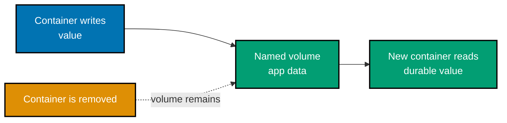

```bash
# => named storage outlives a container removal
docker volume create app-data
# => writes durable data through the managed volume mount
docker run --rm -v app-data:/data alpine:3.21 sh -c 'echo durable >/data/value'
```

**Verification**: Save the commands as `ex28-named-volume.sh` and run them, then run `docker run --rm -v app-data:/data alpine:3.21 cat /data/value`. It prints `durable`, proving the named volume outlived the writer container. Remove only this example's volume with `docker volume rm app-data`.

**Key takeaway**: Named volumes retain application data independently of container lifecycle.

**Why it matters**: Named volumes retain application data independently of container lifecycle. Storage choice decides whether data follows the container, the Docker engine, or a selected host path. Inspect the mount declaration and test the named local artifact after the container exits. The observed persistence boundary should match the workload's recovery needs; otherwise replacement can silently discard state or expose host files more broadly than intended.

---

### Example 29: Bind mount

_ex-29 · exercises co-16_

**Brief explanation**: A bind mount projects a deliberate host path into the container. Host edits become visible at the mounted path, coupling the workload to that host filesystem.

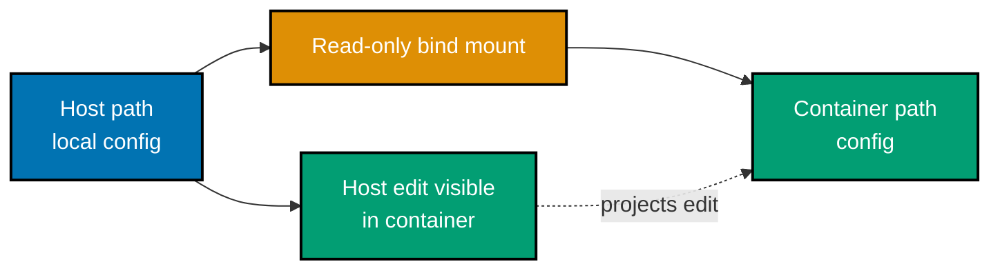

```bash
# => a bind mount projects a deliberate host path into the container
mkdir -p local-config && printf 'dev\n' > local-config/mode
# => the container sees host edits directly through the mount
docker run --rm -v "$PWD/local-config:/config:ro" alpine:3.21 cat /config/mode
```

**Verification**: Save the commands as `ex29-bind-mount.sh` and run them from an empty directory. The supplied `docker run` prints `dev` from `local-config/mode`; changing that host file to `test` and rerunning prints `test`, demonstrating the live host-path projection.

**Key takeaway**: Bind mounts expose a selected host path and couple deployment to that host.

**Why it matters**: Bind mounts expose a selected host path and couple deployment to that host. Storage choice decides whether data follows the container, the Docker engine, or a selected host path. Inspect the mount declaration and test the named local artifact after the container exits. The observed persistence boundary should match the workload's recovery needs; otherwise replacement can silently discard state or expose host files more broadly than intended.

---

### Example 30: Volume versus bind mount

_ex-30 · exercises co-16_

**Brief explanation**: Volumes are Docker-managed persistent application storage. Bind mounts instead expose a chosen host path, so ownership and portability differ even when both persist data.

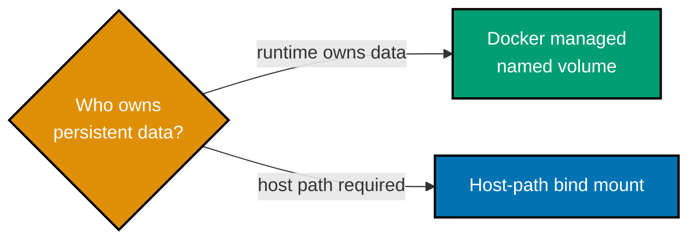

```text
# => volumes are Docker-managed persistent application storage
named-volume -> runtime-managed-data
# => bind mounts deliberately expose a host filesystem path
bind-mount -> host-path-projection
```

**Verification**: Save the text fence as `ex30-volume-versus-bind-mount.txt`. `sed -n '2p;4p' ex30-volume-versus-bind-mount.txt` must print `named-volume -> runtime-managed-data` and `bind-mount -> host-path-projection`, the two concrete storage ownership choices documented by this example.

**Key takeaway**: Volume and bind choices decide whether the runtime or host owns persistence.

**Why it matters**: Volume and bind choices decide whether the runtime or host owns persistence. Storage choice decides whether data follows the container, the Docker engine, or a selected host path. Inspect the mount declaration and test the named local artifact after the container exits. The observed persistence boundary should match the workload's recovery needs; otherwise replacement can silently discard state or expose host files more broadly than intended.

---

### Example 31: Compose two services

_ex-31 · exercises co-17_

**Brief explanation**: Compose creates an app and PostgreSQL on its project network. The service keys become DNS names, allowing the app to connect without hard-coding a container address.

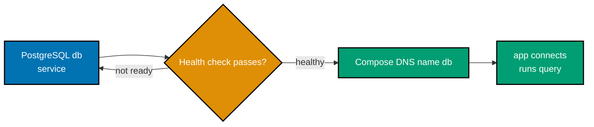

```yaml
# => Compose creates an app and PostgreSQL on its project network.
services:
  # => The app waits for a database that has accepted connections.
  app:
    # => Alpine supplies the portable client shell for this focused example.
    image: alpine:3.21
    # => The app proves Compose DNS and PostgreSQL initialization work together.
    command:
      [
        "sh",
        "-c",
        "apk add --no-cache postgresql17-client >/dev/null && until pg_isready -h db -U lesson -d lesson; do sleep 1; done && psql postgresql://lesson:${POSTGRES_PASSWORD:-training-password}@db:5432/lesson -tAc 'SELECT 1' | grep -x 1",
      ]
    # => Health-gating avoids treating merely-started PostgreSQL as ready.
    depends_on: { db: { condition: service_healthy } }
  # => The db service name is the hostname used by the app command.
  db:
    # => PostgreSQL is the companion database defined by this artifact.
    image: postgres:17-alpine
    # => These safe training values initialize the role and database.
    environment: { POSTGRES_DB: lesson, POSTGRES_USER: lesson, POSTGRES_PASSWORD: training-password }
    # => pg_isready makes actual database readiness observable to Compose.
    healthcheck: { test: ["CMD-SHELL", "pg_isready -U lesson -d lesson"], interval: 2s, timeout: 2s, retries: 15 }
# => The isolated project network is created automatically from these two service declarations.
# => The `app` command exits only after its SQL query produces the expected scalar value.
# => No host port is published because service-to-service traffic remains in the Compose network.
# => The `lesson` database name is carried consistently through init, readiness, and connection URL.
# => The disposable password is scoped solely to this local teaching artifact.
```

**Verification**: With Docker Compose, save as `compose.ex31.yaml`, run `docker compose -f compose.ex31.yaml up --abort-on-container-exit --exit-code-from app`; the `app` output contains `1` after `db` becomes healthy.

**Key takeaway**: Compose turns an application and database dependency into a versioned local topology.

**Why it matters**: Compose turns an application and database dependency into a versioned local topology. The service name `db` becomes DNS inside the project network, while the health check prevents the app from treating a merely-started database as usable. This separates startup order from readiness and makes the connection contract executable. Keep training credentials local and replace them with managed secrets in real deployments.

---

### Example 32: Compose up

_ex-32 · exercises co-17_

**Brief explanation**: Write this self-contained two-service artifact before starting it. `docker compose up` materializes its declared services and network as one inspectable project.

```bash
# => write this self-contained two-service artifact before starting it
docker compose -f compose.ex32.yaml config
# => up creates exactly the app and db services declared in that artifact
docker compose -f compose.ex32.yaml up -d
```

**Verification**: With Docker Compose, first save this full artifact as `compose.ex32.yaml`:

```yaml
# => Compose declares the same complete app-and-db topology in this example.
services:
  # => App reports its service name after the database health gate succeeds.
  app:
    {
      image: alpine:3.21,
      command: ["sh", "-c", "echo app-ready; sleep 3600"],
      depends_on: { db: { condition: service_healthy } },
    }
  # => PostgreSQL initializes a disposable training database.
  db:
    {
      image: postgres:17-alpine,
      environment: { POSTGRES_DB: lesson, POSTGRES_USER: lesson, POSTGRES_PASSWORD: training-password },
      healthcheck: { test: ["CMD-SHELL", "pg_isready -U lesson -d lesson"], interval: 2s, timeout: 2s, retries: 15 },
    }
# => `docker compose config` resolves this exact YAML before containers are created.
# => The app is held until the database healthcheck returns success.
# => `app-ready` is the concrete log token verified after startup.
# => The app remains running so `docker compose ps` can show both service states.
# => The PostgreSQL image initializes the requested database on first start.
# => Its health check uses the same database and user supplied in environment.
# => Compose creates a private default network for the declared services.
# => No image from another example is needed to start this artifact.
# => The project can be removed with `docker compose -f compose.ex32.yaml down -v`.
# => The health gate expresses readiness, not merely service creation order.
```

Then run the two commands above followed by `docker compose -f compose.ex32.yaml ps`; both services are running and `docker compose -f compose.ex32.yaml logs app` contains `app-ready`.

**Key takeaway**: `docker compose up` materializes the services, networks, and health dependencies declared in one local artifact.

**Why it matters**: `docker compose up` materializes the services, networks, and health dependencies declared in one local artifact. It is useful because the project state can be inspected with `ps` and logs instead of reconstructed from hand-run commands. Starting a stack does not prove it is ready, so keep the health gate and verify the application log. Tear the disposable project down after the check.

---

### Example 33: Compose networking and depends_on

_ex-33 · exercises co-17_

**Brief explanation**: Compose groups services on a shared default network. `depends_on` with a health condition delays the client until PostgreSQL accepts connections.

```yaml
# => Compose groups services on a shared default network.
services:
  # => The app waits for PostgreSQL's explicit health check.
  app:
    { image: alpine:3.21, command: ["sh", "-c", "nc -z db 5432"], depends_on: { db: { condition: service_healthy } } }
  # => PostgreSQL receives a safe, non-secret initialization password.
  db:
    {
      image: postgres:17-alpine,
      environment: { POSTGRES_PASSWORD: training-password },
      healthcheck: { test: ["CMD-SHELL", "pg_isready -U postgres"], interval: 2s, timeout: 2s, retries: 10 },
    }
# => `db` is a Compose DNS name because it is also the declared service key.
# => The app's TCP check is intentionally directed to PostgreSQL's standard port 5432.
# => The health condition delays the client until PostgreSQL accepts connections.
# => The database uses a disposable password and creates no host-mounted persistence.
# => The artifact relies only on images declared in this same Compose file.
# => `--exit-code-from app` makes the network check a concrete command result.
```

**Verification**: Save as `compose.ex33.yaml`, run `docker compose -f compose.ex33.yaml up --abort-on-container-exit --exit-code-from app`, and then `docker compose -f compose.ex33.yaml logs app`. The app exits 0 only when `nc -z db 5432` reaches the named `db` service after its health check. Run `docker compose -f compose.ex33.yaml down -v` afterwards.

**Key takeaway**: Health-gated dependencies prevent apps treating started databases as ready.

**Why it matters**: Health-gated dependencies prevent apps treating started databases as ready. Compose makes the service graph, network names, startup conditions, and teardown visible in one local file. Read the service definitions together: a dependency declaration controls ordering, while a health check decides readiness. Run the file only with disposable training data, then inspect the named services and logs before applying the same topology to a production environment.

---

### Example 34: Compose app, DB, and cache

_ex-34 · exercises co-17_

**Brief explanation**: Compose runs a small Node application that reads `DATABASE_URL` and `CACHE_URL`, then opens TCP connections to both configured services before reporting ready. The exact runnable files are course-owned at `learning/code/ex-34-compose-db-cache/`: `app/server.mjs`, `Dockerfile`, `compose.yaml`, and `.env.example`.

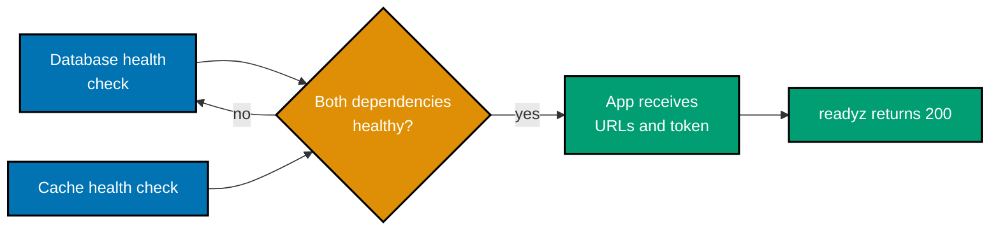

```yaml
# => Compose declares the locally built application and both backing services.
services:
  # => The app is built from this example's own Dockerfile and Node source.
  app:
    # => The working directory supplies the Dockerfile and app/server.mjs build inputs.
    build: .
    # => Host port 8080 exposes the application's readiness endpoint for verification.
    ports:
      # => Requests to localhost:8080 reach the Node server listening in the container.
      - "8080:8080"
    # => Runtime configuration is passed to the process rather than baked into its image.
    environment:
      # => This fake token is only checked for presence and is safe for the lesson.
      API_TOKEN: "${API_TOKEN:?Set API_TOKEN through --env-file}"
      # => The URL uses Compose DNS `db` and the same supplied database password.
      DATABASE_URL: "postgres://app:${POSTGRES_PASSWORD:?Set POSTGRES_PASSWORD through --env-file}@db:5432/app"
      # => The URL uses Compose DNS `cache` and Redis's standard TCP port.
      CACHE_URL: "redis://cache:6379"
    # => Startup waits for both backing services to report their own readiness.
    depends_on:
      # => PostgreSQL must accept connections before the app starts.
      db:
        # => Compose observes the database health command rather than only container start.
        condition: service_healthy
      # => Redis must answer its health command before the app starts.
      cache:
        # => Compose observes cache readiness before it launches the Node process.
        condition: service_healthy
    # => The app's health check calls its own route, which opens both configured TCP connections.
    healthcheck:
      # => Node fetch fails the container health check unless `/readyz` returns HTTP 200.
      test:
        # => The list selects Compose's exec-form health-check command without a shell wrapper.
        [
          # => `CMD` tells Docker to execute the following program directly.
          "CMD",
          # => Node runs the inline readiness request in the same image as the application.
          "node",
          "-e",
          "fetch('http://127.0.0.1:8080/readyz').then(r => process.exit(r.ok ? 0 : 1)).catch(() => process.exit(1))",
        ]
      # => A short interval makes the disposable verification complete promptly.
      interval: 2s
      # => A failed local request does not hang the health state.
      timeout: 2s
      # => Retries allow the server process to bind after the dependencies become healthy.
      retries: 10
  # => PostgreSQL initializes the application database using only safe training values.
  db:
    # => The official image starts a real PostgreSQL server for the application URL.
    image: postgres:17-alpine
    # => These variables create the same database and user named in DATABASE_URL.
    environment:
      # => PostgreSQL creates the disposable application database at initialization.
      POSTGRES_DB: app
      # => PostgreSQL creates the application user at initialization.
      POSTGRES_USER: app
      # => The supplied fake password is shared with the app's DATABASE_URL.
      POSTGRES_PASSWORD: "${POSTGRES_PASSWORD:?Set POSTGRES_PASSWORD through --env-file}"
    # => PostgreSQL readiness confirms that the named database can accept a connection.
    healthcheck:
      # => `pg_isready` targets the database and user created above.
      test: ["CMD-SHELL", "pg_isready -U app -d app"]
      # => The check repeats quickly because this stack is disposable.
      interval: 2s
      # => A stalled readiness probe is bounded.
      timeout: 2s
      # => Compose has several attempts before marking the service unhealthy.
      retries: 10
  # => Redis exposes a real cache listener on the Compose network.
  cache:
    # => The official image starts Redis, which accepts the cache URL's TCP connections.
    image: redis:7-alpine
    # => Redis's own CLI tests the service protocol instead of only its process state.
    healthcheck:
      # => A PONG response proves the cache server is ready.
      test: ["CMD", "redis-cli", "ping"]
      # => The check repeats quickly because this stack is disposable.
      interval: 2s
      # => A stalled readiness probe is bounded.
      timeout: 2s
      # => Compose has several attempts before marking the service unhealthy.
      retries: 10
# => No volume is declared, so `down -v` removes the example's disposable database state.
# => The default Compose network resolves `db` and `cache` by their service keys.
# => Only port 8080 is published; database and cache traffic remains internal to the stack.
# => The application health command verifies the runtime URLs by opening actual TCP connections.
```

**Verification**: Copy the four exact files from `learning/code/ex-34-compose-db-cache/` into an empty `ex34/` directory, then run `docker compose --env-file .env.example up --build --wait`. `curl --fail --silent http://127.0.0.1:8080/readyz` prints `database and cache reachable`; `docker compose ps` reports all three services healthy. This verifies the Node source consumed both URLs and successfully connected to the real Compose PostgreSQL and Redis services. Finish with `docker compose down -v`.

**Key takeaway**: App database and cache need explicit readiness and configuration contracts.

**Why it matters**: App database and cache need explicit readiness and configuration contracts. Compose makes the service graph, network names, startup conditions, and teardown visible in one local file. Read the service definitions together: a dependency declaration controls ordering, while the app's readiness route proves that configured dependencies are reachable. Run the file only with disposable training data, then inspect the named services and logs before applying the same topology to a production environment.

---

### Example 35: Kubernetes architecture

_ex-35 · exercises co-18_

**Brief explanation**: The API server persists desired state in etcd and exposes the control plane. The scheduler and kubelet then translate that desired state into a running workload on a node.

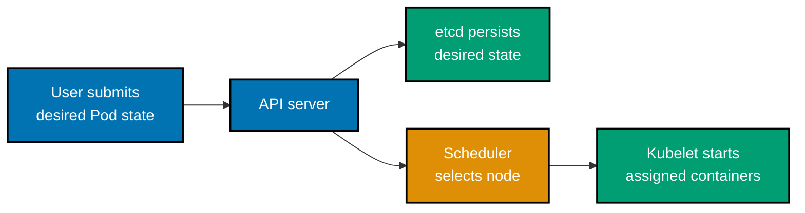

```text
# => API server persists desired state in etcd and exposes the control plane
kube-apiserver -> etcd
# => scheduler assigns pods; kubelet makes assigned containers run
scheduler -> kubelet
```

**Verification**: Save the text artifact as `ex35-architecture.txt`; its first arrow must end at `etcd` and its second at `kubelet`, recording respectively the control-plane storage path and node execution path. This is a decision artifact, not a Kubernetes manifest.

**Key takeaway**: Kubernetes failures are easier to isolate when each component has a precise responsibility.

**Why it matters**: Kubernetes failures are easier to isolate when each component has a precise responsibility. The API server accepts and exposes desired state, etcd persists it, the scheduler selects a node, and kubelet starts the assigned containers. A Pending Pod therefore is not solved by changing a Service. This small map distinguishes the control-plane write path from the node execution path before troubleshooting a real workload.

---

### Example 36: Pod manifest

_ex-36 · exercises co-19_

**Brief explanation**: The core API provides the Pod object. Its manifest groups the container specification, identity, and scheduling settings into Kubernetes' smallest deployable unit.

```yaml
# => The core API provides the Pod object.
apiVersion: v1
# => A Pod is Kubernetes' smallest deployable unit.
kind: Pod
# => The name is used by the apply and status commands.
metadata: { name: ex36 }
# => The Pod spec declares one runnable web container.
spec:
  # => nginx remains running so the scheduled Pod is observable.
  containers: [{ name: web, image: nginx:1.27-alpine }]
```

**Verification**: With a local Kubernetes cluster, save as `ex36.yaml`, run `kubectl apply -f ex36.yaml && kubectl wait --for=condition=Ready pod/ex36`; `kubectl get pod/ex36` reports `1/1 Running`.

**Key takeaway**: A Pod is scheduled as one unit, so its containers share an IP address, localhost ports, and declared volumes.

**Why it matters**: A Pod is scheduled as one unit, so its containers share an IP address, localhost ports, and declared volumes. That is ideal for tightly coupled helpers but makes independent scaling impossible. Apply this standalone manifest and inspect `pod/ex36` to see the boundary Kubernetes actually schedules. Split components into separate Deployments when they need independent rollout, failure isolation, or capacity decisions rather than merely separate processes.

---

### Example 37: Multi-container Pod

_ex-37 · exercises co-19_

**Brief explanation**: The core API provides the shared Pod boundary. Containers in one Pod share network identity and can coordinate through localhost while retaining separate processes.

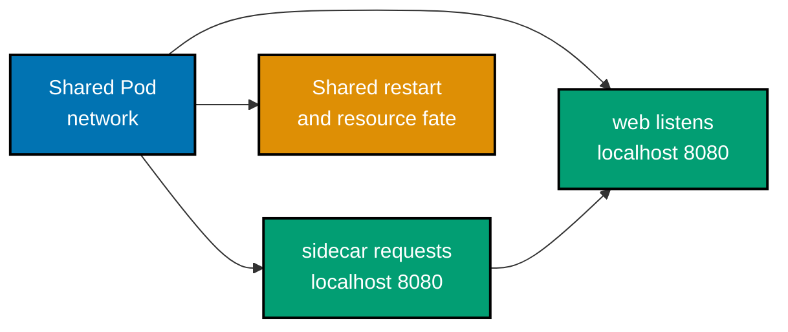

```yaml
# => The core API provides the shared Pod boundary.
apiVersion: v1
# => One Pod can run cooperating application and sidecar containers.
kind: Pod
# => The name is used by the localhost verification command.
metadata: { name: ex37 }
# => Both containers share this Pod's network namespace.
spec:
  # => The web container listens only on its Pod-local loopback address.
  containers:
    - { name: web, image: busybox:1.37, command: ["sh", "-c", "httpd -f -p 8080 -h /www"] }
    # => The sidecar stays alive so it can query its sibling via localhost.
    - { name: sidecar, image: busybox:1.37, command: ["sh", "-c", "sleep 3600"] }
# => `web` and `sidecar` are separate processes but share Pod localhost.
```

**Verification**: With a local Kubernetes cluster, apply `ex37.yaml`, wait for `pod/ex37`, then run `kubectl exec ex37 -c sidecar -- wget -qO- http://127.0.0.1:8080`; successful HTML proves the sidecar reached its sibling through shared localhost.

**Key takeaway**: Sidecars share the Pod network and fate with the primary container, which makes local proxying or log collection simple but couples resources and restarts.

**Why it matters**: Sidecars share the Pod network and fate with the primary container, which makes local proxying or log collection simple but couples resources and restarts. They are not a replacement for a separately scaled service. The local `ex37` manifest lets you inspect both containers under one Pod IP. Budget both containers together, because one sidecar's memory pressure can make the whole Pod unavailable.

---

### Example 38: Deployment manifest

_ex-38 · exercises co-20_

**Brief explanation**: This Deployment artifact declares three nginx replicas and the matching labels that let its controller own the generated Pod set. The controller continually compares those declared replicas with observed Pods and creates replacements when needed.

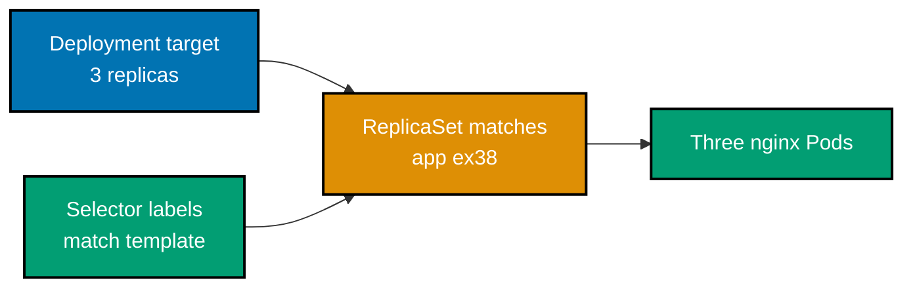

```yaml
# => The apps API provides the Deployment controller.
apiVersion: apps/v1
# => A Deployment manages ReplicaSets and its matching Pods.
kind: Deployment
# => The name is used by rollout and replica assertions.
metadata: { name: ex38 }
# => The desired state declares replicas, a selector, and template.
spec:
  # => Three replicas are the controller's target count.
  replicas: 3
  # => Selector and template labels must match for ownership.
  selector: { matchLabels: { app: ex38 } }
  # => The template creates the nginx Pods managed by the Deployment.
  template: { metadata: { labels: { app: ex38 } }, spec: { containers: [{ name: web, image: nginx:1.27-alpine }] } }
```

**Verification**: With a local Kubernetes cluster, apply `ex38.yaml`, wait for `deployment/ex38`, then run `kubectl get pods -l app=ex38 --no-headers | wc -l`; it prints `3` after the rollout completes.

**Key takeaway**: A Deployment makes replica count and Pod template declarative, allowing its controller to replace lost Pods and roll forward a changed image.

**Why it matters**: A Deployment makes replica count and Pod template declarative, allowing its controller to replace lost Pods and roll forward a changed image. The selector must match the template labels exactly; otherwise the controller cannot safely own its Pods. Apply `ex38.yaml` and compare desired versus available replicas to distinguish declared intent from a healthy workload. Do not patch a child Pod when the Deployment owns it.

---

### Example 39: Rolling update

_ex-39 · exercises co-20_

**Brief explanation**: This rolling-update Deployment sets `maxSurge: 1` and `maxUnavailable: 0` so a changed image can replace its sole Ready Pod without a service gap. The rollout status command observes that controller-managed transition instead of assuming an image update completed.

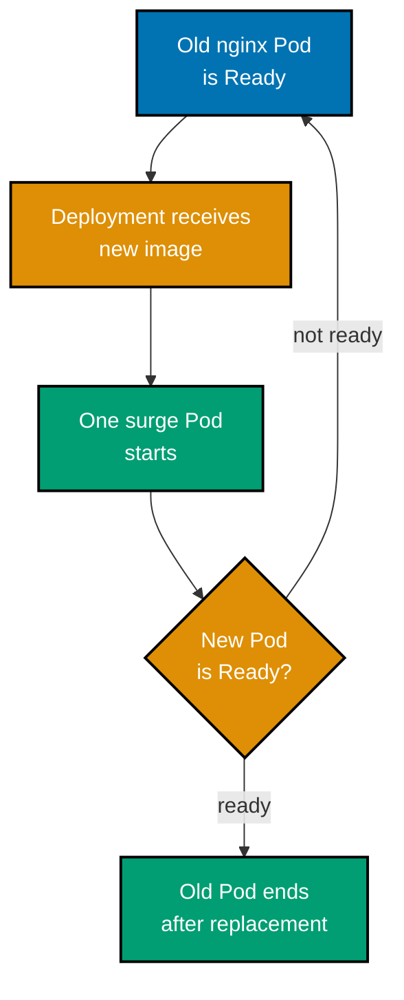

```yaml
# => The apps API provides the Deployment controller.
apiVersion: apps/v1
# => A Deployment owns the ReplicaSets used for rolling updates.
kind: Deployment
# => The name is used by the verification commands.
metadata: { name: ex39 }
# => The desired state defines one Pod, its selector, and rollout policy.
spec:
  # => One ready replica remains available during the update.
  replicas: 1
  # => The selector binds this controller to its Pod template.
  selector: { matchLabels: { app: ex39 } }
  # => Surge adds one replacement while no ready Pod is made unavailable.
  strategy: { type: RollingUpdate, rollingUpdate: { maxSurge: 1, maxUnavailable: 0 } }
  # => The template supplies the runnable nginx Pod.
  template: { metadata: { labels: { app: ex39 } }, spec: { containers: [{ name: web, image: nginx:1.27-alpine }] } }
```

**Verification**: Save as `ex39.yaml`, run `kubectl apply -f ex39.yaml`, then `kubectl set image deployment/ex39 web=nginx:1.28-alpine` and `kubectl rollout status deployment/ex39`; the manifest keeps one Ready Pod available until replacement.

**Key takeaway**: `maxUnavailable` and `maxSurge` are availability and capacity policy during a rollout, not cosmetic Deployment fields.

**Why it matters**: `maxUnavailable` and `maxSurge` are availability and capacity policy during a rollout, not cosmetic Deployment fields. A zero-unavailable setting preserves service capacity but can require temporary spare capacity; an aggressive setting releases capacity faster but risks fewer ready endpoints. The `ex39` rollout makes that trade-off observable with one Ready Pod maintained throughout. Choose values from availability objectives and actual cluster headroom.

---

### Example 40: ReplicaSet ownership

_ex-40 · exercises co-20_

**Brief explanation**: This creates the local Deployment whose ReplicaSet ownership is inspected. Kubernetes records controller references so the ReplicaSet can be traced back to the Deployment that declared it.

```bash
# => Creates the local Deployment whose ReplicaSet ownership is inspected.
kubectl create deployment ex40 --image=nginx:1.27-alpine
# => A Pod owner reference identifies this Deployment's managing ReplicaSet.
kubectl get pod -l app=ex40 -o jsonpath='{.items[0].metadata.ownerReferences[0].kind}'
# => Deployment owns the ReplicaSet which owns the selected Pod.
kubectl get rs -l app=ex40
```

**Verification**: Run the supplied commands in a local cluster. The jsonpath prints `ReplicaSet` for the Pod created by `deployment/ex40`, and the final command lists the same Deployment's ReplicaSet selected by `app=ex40`, proving the local ownership chain.

**Key takeaway**: Owner references explain why deleting a Deployment-owned Pod creates another one: the ReplicaSet still has an unmet desired count.

**Why it matters**: Owner references explain why deleting a Deployment-owned Pod creates another one: the ReplicaSet still has an unmet desired count. Inspecting this chain prevents wasting time debugging a Pod as if it were standalone. The `ex40` workload declares its own selector and template so the command observes a real owner relationship. Use the owning controller for durable changes; direct Pod edits vanish during reconciliation.

---

### Example 41: kubectl apply

_ex-41 · exercises co-32_

**Brief explanation**: The Deployment is the complete desired-state artifact submitted by `apply`. `kubectl rollout status` then observes controller convergence rather than merely successful API submission.

```yaml
# => The Deployment is the complete desired-state artifact submitted by apply.
apiVersion: apps/v1
# => Deployment manages replica intent through a ReplicaSet.
kind: Deployment
# => The name is the exact rollout-status target.
metadata: { name: ex41 }
# => The specification declares desired replicated state.
spec:
  # => One replica keeps the example inexpensive and observable.
  replicas: 1
  # => Selector and template labels form the controller ownership contract.
  selector: { matchLabels: { app: ex41 } }
  # => The template is copied into controller-created Pods.
  template:
    # => Matching labels bind the Pod template to the selector.
    metadata: { labels: { app: ex41 } }
    # => The Pod specification supplies the container runtime.
    spec:
      # => nginx stays alive while rollout status observes readiness.
      containers: [{ name: app, image: nginx:1.27-alpine }]
```

```bash
# => apply records the supplied ex41 YAML declaration as desired state.
kubectl apply -f ex41.yaml
# => rollout status observes this Deployment's controller convergence.
kubectl rollout status deployment/ex41
```

**Verification**: Save the supplied manifest as `ex41.yaml`, run `kubectl apply -f ex41.yaml`, then `kubectl rollout status deployment/ex41`. The command reports a successful rollout for the exact Deployment defined by the artifact, showing that apply submitted desired state and the controller converged it.

**Key takeaway**: Declarative apply makes the manifest the reviewable record of desired state, while an imperative command changes a live cluster without necessarily updating source.

**Why it matters**: Declarative apply makes the manifest the reviewable record of desired state, while an imperative command changes a live cluster without necessarily updating source. This matters during recovery: reapplying `ex41.yaml` recreates the declared Deployment consistently. The rollout-status check observes convergence rather than mere API acceptance. Reserve imperative commands for diagnostics or controlled exceptions, then capture durable changes back in the manifest.

---

### Example 42: ClusterIP Service

_ex-42 · exercises co-21_

**Brief explanation**: This ClusterIP Service artifact gives selected `app: ex42` Pods a stable DNS name that is reachable only from inside the cluster. The Service virtual IP routes to ready matching endpoints while individual Pod addresses can change.

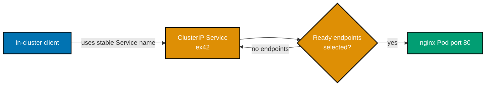

```yaml
# => The core API provides the Service object.
apiVersion: v1
# => A Service exposes selected Pods through stable discovery.
kind: Service
# => The name becomes the cluster-local DNS name.
metadata: { name: ex42 }
# => ClusterIP is the internal-only Service type.
spec:
  # => Matching nginx Pods are the endpoints for this virtual IP.
  selector: { app: ex42 }
  # => Port 80 forwards to the nginx container port.
  ports: [{ port: 80, targetPort: 80 }]
  # => ClusterIP explicitly documents this private routing contract.
  type: ClusterIP
```

**Verification**: In a local cluster, run `kubectl run ex42-backend --image=nginx:1.27-alpine --restart=Never --labels=app=ex42`, wait for it Ready, then apply `ex42.yaml`. `kubectl run ex42-client --rm -i --restart=Never --image=busybox:1.37 -- wget -qO- http://ex42` returns nginx HTML, proving this artifact's ClusterIP is reachable from a Pod.

**Key takeaway**: ClusterIP is the default internal contract between workloads: callers use a durable Service name while Pods are replaced, rescheduled, or scaled.

**Why it matters**: ClusterIP is the default internal contract between workloads: callers use a durable Service name while Pods are replaced, rescheduled, or scaled. Its selector must match ready Pods or the virtual address has no usable endpoints. Keeping the sample backend in this artifact makes that dependency reviewable. Use ClusterIP for in-cluster traffic; publish a port only when an external caller has a deliberate need.

---

### Example 43: NodePort Service

_ex-43 · exercises co-21_

**Brief explanation**: This NodePort Service artifact maps the selected backend to port `30080` on each eligible node for an explicitly local exposure test. The explicit node port makes the wider network exposure visible in the manifest.

```yaml
# => The core API provides the Service object.
apiVersion: v1
# => A Service receives a cluster and node-facing virtual port.
kind: Service
# => The name is used by the endpoint and port assertion.
metadata: { name: ex43 }
# => NodePort publishes a selected Pod port through each node.
spec:
  # => This selector targets the backend declared by this example's verification.
  selector: { app: ex43 }
  # => The explicit node port is inside the default 30000–32767 range.
  ports: [{ port: 80, targetPort: 80, nodePort: 30080 }]
  # => NodePort exposes the port through cluster nodes.
  type: NodePort
```

**Verification**: In a local cluster, run `kubectl run ex43-backend --image=nginx:1.27-alpine --restart=Never --labels=app=ex43`, wait for it Ready, then apply `ex43.yaml`. `kubectl get service/ex43 -o jsonpath='{.spec.ports[0].nodePort}'` prints `30080`; test a host mapping only when the local cluster supports it.

**Key takeaway**: NodePort opens the same port on every eligible node, which is useful for simple local demonstrations but expands the reachable surface compared with ClusterIP.

**Why it matters**: NodePort opens the same port on every eligible node, which is useful for simple local demonstrations but expands the reachable surface compared with ClusterIP. The configured port must be within the cluster range and host routing differs by local Kubernetes implementation. Inspect the assigned node port first, then test a mapped host address only where the cluster documents that mapping. Do not treat NodePort as an Internet-ready load balancer.

---

### Example 44: LoadBalancer Service

_ex-44 · exercises co-21_

**Brief explanation**: This LoadBalancer Service artifact requests an implementation-provided external address for the selected nginx backend. A local cluster needs a tunnel, MetalLB, or another controller to fulfill that request.

```yaml
# => The core API provides the Service object.
apiVersion: v1
# => A Service can request an external load-balancer integration.
kind: Service
# => The name is used by the status assertion.
metadata: { name: ex44 }
# => The Service selects the existing nginx demonstration Pods.
spec:
  # => The selector chooses the Deployment's Pods.
  selector: { app: ex44 }
  # => Port 80 forwards to nginx port 80.
  ports: [{ port: 80, targetPort: 80 }]
  # => LoadBalancer requests an implementation-provided external address.
  type: LoadBalancer
```

**Verification**: In a local cluster with minikube tunnel, MetalLB, or another LoadBalancer implementation, run `kubectl run ex44-backend --image=nginx:1.27-alpine --restart=Never --labels=app=ex44`, then apply `ex44.yaml`. `kubectl get service/ex44 -w` reports a non-empty `.status.loadBalancer.ingress` after that implementation provisions an address.

**Key takeaway**: A LoadBalancer Service requests an external integration; Kubernetes alone does not manufacture an address on a laptop cluster.

**Why it matters**: A LoadBalancer Service requests an external integration; Kubernetes alone does not manufacture an address on a laptop cluster. Minikube tunnel, MetalLB, or a cloud controller supplies that capability and reports the result in Service status. Waiting for that status separates a valid request from a reachable endpoint. Cost, address allocation, and perimeter policy belong to the selected load-balancer implementation rather than the Service YAML alone.

---

### Example 45: Service DNS discovery

_ex-45 · exercises co-21_

**Brief explanation**: A local backend supplies the endpoints selected by the Service created next. The temporary client resolves the Service name, not the backend Pod IP, to demonstrate stable discovery.

```bash
# => A local backend supplies the endpoints selected by the Service created next.
kubectl run ex45-backend --image=nginx:1.27-alpine --restart=Never --labels=app=ex45
# => Expose creates the named ClusterIP Service that DNS resolves.
kubectl expose pod ex45-backend --name ex45 --port=80 --target-port=80
# => A temporary Pod queries this example's stable Service DNS name.
kubectl run ex45-client --rm -i --restart=Never --image=busybox:1.37 -- nslookup ex45
```

**Verification**: Run the supplied commands in a local cluster after `pod/ex45-backend` is Ready. The `nslookup ex45` output contains the ClusterIP for `ex45.default.svc.cluster.local`, not the backend Pod IP, proving the supplied Service name is the client contract.

**Key takeaway**: Service DNS gives clients a stable name while Deployments replace Pods and their individual addresses.

**Why it matters**: Service DNS gives clients a stable name while Deployments replace Pods and their individual addresses. Calling `ex45` delegates endpoint selection to Kubernetes instead of coupling application code to a temporary Pod IP. DNS only works when the Service selector has ready endpoints, so inspect both the Service and EndpointSlices while debugging. This is the everyday discovery contract for in-cluster traffic.

---

### Example 46: ConfigMap environment injection

_ex-46 · exercises co-22_

**Brief explanation**: The core API creates the non-secret configuration object. A consuming Pod can project its values into the process environment without rebuilding the image.

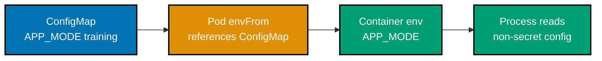

```yaml
# => The core API creates the non-secret configuration object.
apiVersion: v1
# => ConfigMap holds non-confidential key-value configuration.
kind: ConfigMap
# => This name is referenced by the consuming Pod.
metadata: { name: ex46-config }
# => APP_MODE is projected into the application environment.
data: { APP_MODE: training }
---
# => The core API creates a runnable ConfigMap consumer.
apiVersion: v1
# => A Pod hosts the container that reads the injected variable.
kind: Pod
# => This name is targeted by the verification command.
metadata: { name: ex46 }
# => The container imports every key from the named ConfigMap.
spec:
  # => Busybox remains available for `printenv` inspection.
  containers:
    [
      {
        name: app,
        image: busybox:1.37,
        command: ["sh", "-c", "sleep 3600"],
        envFrom: [{ configMapRef: { name: ex46-config } }],
      },
    ]
# => The ConfigMap and Pod are separate API objects joined by the explicit name `ex46-config`.
# => `envFrom` projects the APP_MODE key as an environment variable named APP_MODE.
# => The sleeping command preserves the process long enough for the supplied exec check.
# => The ConfigMap value is intentionally non-secret and visible in the manifest.
# => The container image is fully named inside this example.
# => `kubectl apply -f ex46.yaml` creates both documents together.
# => `kubectl exec ex46` addresses only this example's named Pod.
# => The expected `training` value originates in the data map above.
# => Cleanup can remove both local objects with `kubectl delete -f ex46.yaml`.
```

**Verification**: With a local Kubernetes cluster, save as `ex46.yaml`, apply it, wait for `pod/ex46`, then run `kubectl exec ex46 -- printenv APP_MODE`; stdout is `training`.

**Key takeaway**: ConfigMap injection separates non-secret environment settings from an image, allowing the same image digest to run in different environments.

**Why it matters**: ConfigMap injection separates non-secret environment settings from an image, allowing the same image digest to run in different environments. It is still configuration visible to readers of the Pod specification and process environment, so it must not carry credentials. The `printenv` check proves the API projected the named key into this Pod. Plan configuration changes with rollout behavior in mind because existing processes do not automatically reread environment variables.

---

### Example 47: Secret injection

_ex-47 · exercises co-22_

**Brief explanation**: The core API creates the Secret object. A Pod reference delivers the declared value at runtime while keeping the reference separate from ordinary configuration.

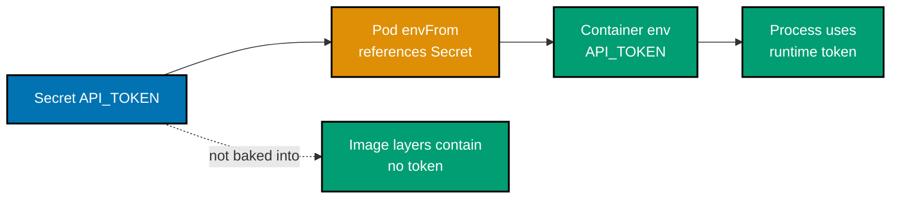

```yaml
# => The core API creates the Secret object.
apiVersion: v1
# => A Secret holds sensitive input separately from an image.
kind: Secret
# => The name is referenced by the consuming Pod.
metadata: { name: ex47-secret }
# => stringData accepts a safe training token and is encoded by the API server.
stringData: { API_TOKEN: training-token }
---
# => The core API creates a Secret-consuming Pod.
apiVersion: v1
# => A Pod hosts the process that needs the token.
kind: Pod
# => The name is targeted by the verification command.
metadata: { name: ex47 }
# => The container imports the Secret at runtime rather than baking it into an image.
spec:
  # => Busybox remains alive while the injected variable is inspected.
  containers:
    [
      {
        name: app,
        image: busybox:1.37,
        command: ["sh", "-c", "sleep 3600"],
        envFrom: [{ secretRef: { name: ex47-secret } }],
      },
    ]
# => The Secret and Pod are joined only through the explicitly named `ex47-secret` reference.
# => `envFrom` maps the secret key into the app process environment at container start.
# => The sample token is a non-production teaching value and is never an image-layer input.
# => The sleeping command leaves the Pod inspectable by the supplied local verification.
# => The API server stores the Secret separately from this Pod specification.
# => `kubectl apply -f ex47.yaml` is sufficient to create both required objects.
# => `kubectl exec ex47` scopes the observable environment read to this Pod.
# => The test confirms injection, not encryption or access-control policy.
# => `kubectl delete -f ex47.yaml` removes the example-specific Secret and Pod together.
```

**Verification**: With a local Kubernetes cluster, save as `ex47.yaml`, apply it, wait for `pod/ex47`, then run `kubectl exec ex47 -- printenv API_TOKEN`; stdout is `training-token` and no value appears in the image configuration.

**Key takeaway**: Runtime Secret injection keeps a token out of image layers and Docker build history, but it exposes the value to the process and to principals allowed to read the Secret.

**Why it matters**: Runtime Secret injection keeps a token out of image layers and Docker build history, but it exposes the value to the process and to principals allowed to read the Secret. `stringData` is convenient for a disposable lesson, not a substitute for protected secret delivery. Verify projection with the named Pod, then delete it. In production, combine least-privilege RBAC, encryption at rest, rotation, and an external secret workflow.

---

### Example 48: Secret encoding is not encryption

_ex-48 · exercises co-22_

**Brief explanation**: Base64 encodes bytes for transport and is reversible. Anyone who can read the Secret object can decode its data, so encoding is not confidentiality protection.

```bash
# => base64 encodes bytes for transport and is reversible
# => macOS and GNU base64 both encode the newline-free input this way.
printf %s replace-me | base64
# => anyone who can read the value can decode it
printf %s cmVwbGFjZS1tZQ== | base64 -d 2>/dev/null || printf %s cmVwbGFjZS1tZQ== | base64 -D
```

**Verification**: On macOS or Linux, run the commands exactly as shown; the second prints `replace-me`, demonstrating base64 is reversible encoding rather than encryption.

**Key takeaway**: Base64 converts bytes into transport-safe text, but anyone who can read the encoded value can reverse it.

**Why it matters**: Base64 converts bytes into transport-safe text, but anyone who can read the encoded value can reverse it. Kubernetes uses this representation in Secret `data`, which is why it must never be described as encryption. Protect Secrets with RBAC, encryption at rest, and external secret-management controls where appropriate. The local decode proves the distinction without exposing any real credential.

---

### Example 49: Namespace

_ex-49 · exercises co-23_

**Brief explanation**: The core API creates an isolation namespace. Namespaced workload names and policy objects can coexist without colliding with objects in another namespace.

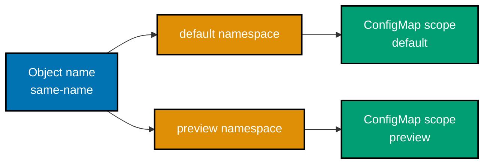

```yaml
# => The core API creates an isolation namespace.
apiVersion: v1
# => Namespace scopes names and policy boundaries.
kind: Namespace
# => This namespace is used by the same-name-object demonstration.
metadata: { name: preview }
```

**Verification**: With a local Kubernetes cluster, save as `ex49.yaml`, run `kubectl apply -f ex49.yaml && kubectl create configmap same-name -n default --from-literal=scope=default && kubectl create configmap same-name -n preview --from-literal=scope=preview`; both ConfigMaps coexist because their namespaces differ.

**Key takeaway**: Namespaces let same-name objects coexist but do not replace RBAC.

**Why it matters**: Namespaces let same-name objects coexist but do not replace RBAC. Kernel isolation and resource controls are host-enforced mechanisms, so application code cannot safely substitute for them. Inspect the local runtime state that the command exposes and record the observed namespace or limit. The result should drive capacity and security decisions with evidence rather than assumptions about what a container runtime normally provides.

---

### Example 50: Labels and selectors

_ex-50 · exercises co-23_

**Brief explanation**: This creates the local object whose equality label is selected below. An equality selector matches an exact key-value pair, making its chosen workload set predictable.

```bash
# => Creates the local object whose equality label is selected below.
kubectl run ex50 --image=busybox:1.37 --restart=Never --labels=app=ex50,tier=frontend -- sleep 3600
# => An equality selector returns the supplied ex50 label, not an undeclared workload.
kubectl get pods -l app=ex50
```

**Verification**: Run the supplied commands in a local cluster. The second command lists `pod/ex50` with `app=ex50`; `kubectl get pod/ex50 --show-labels` also shows `tier=frontend`, proving the selector is using this example's declared object.

**Key takeaway**: Equality selectors are the exact binding mechanism a Service or controller uses to find a workload.

**Why it matters**: Equality selectors are the exact binding mechanism a Service or controller uses to find a workload. A wrong key or value silently produces no selected objects, even when Pods are healthy. Create and label the named `ex50` Pod in the supplied command, then observe that `app=ex50` returns it. This keeps labels as a deliberate routing contract rather than decorative metadata and avoids relying on an undeclared generic `web` Pod.

---

### Example 51: Set-based selector

_ex-51 · exercises co-23_

**Brief explanation**: This creates the label set that the set-based selectors will query. `in`, `notin`, and existence operators express selection rules that equality matching cannot represent alone.

```bash
# => Creates the label set that the set-based selectors will query.
kubectl run ex51 --image=busybox:1.37 --restart=Never --labels=environment=staging,tier=frontend -- sleep 3600
# => `in` matches the declared staging environment.
kubectl get pods -l 'environment in (staging,production)'
# => `notin` retains the declared non-batch tier.
kubectl get pods -l 'tier notin (batch)'
```

**Verification**: Run the supplied commands in a local cluster. Both selector queries return `pod/ex51`; changing its tier to `batch` makes only the `notin` query exclude it, proving the result comes from this example's declared labels.

**Key takeaway**: Set-based selectors express a controlled group such as allowed environments without issuing multiple equality queries.

**Why it matters**: Set-based selectors express a controlled group such as allowed environments without issuing multiple equality queries. They still require the key to exist, and Kubernetes selector syntax intentionally has no logical OR across arbitrary expressions. The supplied `ex51` object gives the query a real label set to inspect. Use these selectors when policy genuinely spans categories, but keep label vocabulary small enough that routing rules remain reviewable.

---

### Example 52: Ingress manifest

_ex-52 · exercises co-24_

**Brief explanation**: This complete Deployment supplies the backend selected by the Service below. The companion Service and Ingress route host and path traffic to its ready Pods through stable labels.

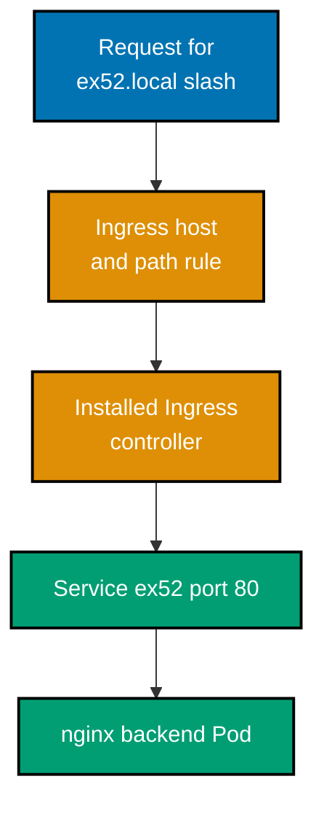

```yaml
# => This complete Deployment supplies the backend selected by the Service below.
apiVersion: apps/v1
# => Deployment maintains the disposable nginx backend Pod.
kind: Deployment
# => The name and label stay local to Example 52.
metadata: { name: ex52-backend }
spec:
  # => One ready Pod is sufficient for the route demonstration.
  replicas: 1
  selector: { matchLabels: { app: ex52 } }
  template:
    metadata: { labels: { app: ex52 } }
    spec:
      containers: [{ name: nginx, image: nginx:1.27-alpine, ports: [{ containerPort: 80 }] }]
---
# => This Service supplies a stable in-cluster backend for the Ingress.
apiVersion: v1
kind: Service
metadata: { name: ex52 }
spec:
  selector: { app: ex52 }
  ports: [{ port: 80, targetPort: 80 }]
---
# => The networking API provides the stable Ingress resource.
apiVersion: networking.k8s.io/v1
# => Ingress maps HTTP requests to a stable Service backend.
kind: Ingress
# => The name is used by route inspection commands.
metadata: { name: ex52 }
# => Rules declare host and path matching for HTTP traffic.
spec:
  # => Bind this route to the explicitly installed ingress-nginx class.
  ingressClassName: nginx
  # => The host is passed to the controller for virtual-host routing.
  rules:
    - host: ex52.local
      # => The HTTP path forwards to a Service, not a Pod IP.
      http: { paths: [{ path: /, pathType: Prefix, backend: { service: { name: ex52, port: { number: 80 } } } }] }
# => `ingressClassName: nginx` names the controller implementation required by verification.
# => The exact host rule is `ex52.local`; it is not inferred from a Service name.
# => The Prefix path matches the root request sent by the supplied curl command.
# => The backend names this artifact's Service rather than the Deployment or a Pod IP.
# => Service port 80 maps to nginx's declared container port 80.
# => The Deployment selector and Service selector both use the local `app: ex52` label.
# => A single replica keeps the endpoint set simple while still being controller managed.
# => The nginx container is declared in this same multi-document YAML artifact.
# => The controller endpoint remains an explicit cluster prerequisite, not a hidden host assumption.
# => `--resolve` supplies the test-only host mapping without editing a system hosts file.
# => A successful curl proves host matching, controller routing, Service selection, and ready backend response.
# => Deleting `ex52.yaml` removes all route components created by this example.
# => The Ingress object is valid only with its declared networking.k8s.io/v1 API version.
# => This diagram's request path corresponds exactly to the manifest's Ingress, Service, and Deployment objects.
```

**Verification**: With ingress-nginx installed, save the complete fence as `ex52.yaml`, apply it, and wait for `deployment/ex52-backend`. `kubectl get ingressclass/nginx` and `kubectl -n ingress-nginx get service/ingress-nginx-controller` confirm the required class and controller endpoint. In one terminal, run `kubectl -n ingress-nginx port-forward service/ingress-nginx-controller 8081:80`; in another, run `controller_port=8081 && curl --fail --resolve ex52.local:"$controller_port":127.0.0.1 "http://ex52.local:$controller_port/"`. The request returns nginx HTML through that concrete controller-service port-forward.

**Key takeaway**: An Ingress is a routing declaration, not a proxy process.

**Why it matters**: An Ingress is a routing declaration, not a proxy process. A controller must watch it and configure a data plane before host and path rules can accept traffic. That distinction explains why a valid manifest can still be unreachable on a local cluster. Verify the Service backend, controller installation, and controller address separately; each is a required local artifact in the request path.

---

### Example 53: Ingress controller required

_ex-53 · exercises co-24_

**Brief explanation**: An IngressClass reveals installed data-plane controllers. An Ingress object only defines routing intent; its selected controller implements the actual traffic handling.

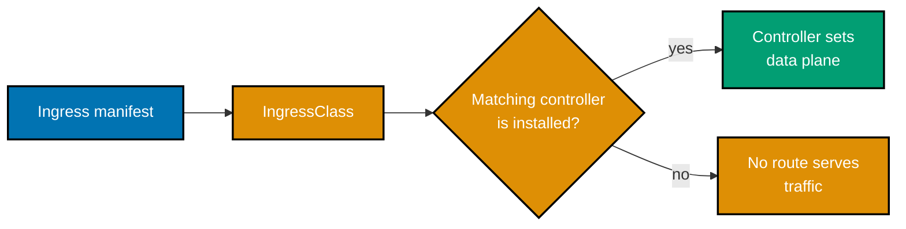

```bash
# => an IngressClass reveals installed data-plane controllers
kubectl get ingressclass
# => no controller means the manifest has no routing effect
kubectl get pods -A -l app.kubernetes.io/component=controller
```

**Verification**: Run the two supplied commands in the local cluster. A configured class appears in `kubectl get ingressclass`; a cluster with no matching controller has no controller Pods and cannot make an Ingress route traffic. This observes the local controller prerequisite, not an undeclared Service.

**Key takeaway**: An Ingress is only desired routing state; an Ingress controller must watch it and configure a data plane.

**Why it matters**: An Ingress is only desired routing state; an Ingress controller must watch it and configure a data plane. A cluster can accept the YAML and still serve no request when no matching controller exists. Listing `IngressClass` and controller Pods makes that prerequisite observable before blaming hosts, paths, or Services. Record the installed controller's class and address, because those implementation details determine how a local route is actually reached.

---

### Example 54: Ingress frozen and Gateway API

_ex-54 · exercises co-24_

**Brief explanation**: Ingress remains deployed widely but its API is frozen. Gateway API provides a newer extensible model for richer routing and policy without implying every cluster has adopted it.

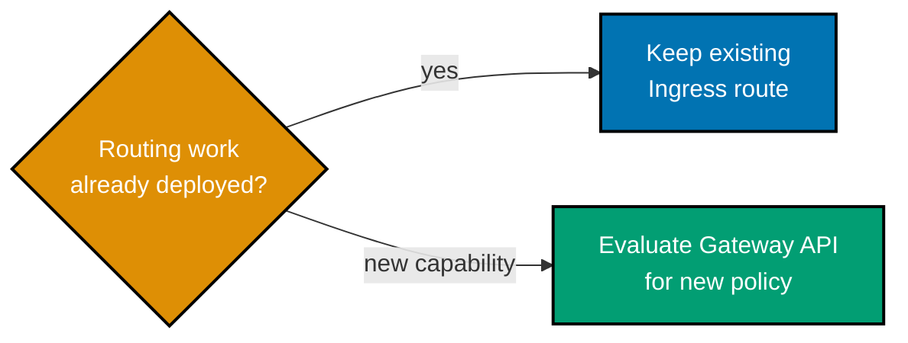

```text
# => Ingress remains deployed widely but its API is frozen
Ingress -> existing-http-routing
# => Gateway API evolves role-oriented portable traffic policy
Gateway-API -> new-traffic-policy
```

**Verification**: Save the two-line decision artifact as `ex54-traffic-api.txt`. Its `Ingress -> existing-http-routing` and `Gateway-API -> new-traffic-policy` entries state the observable decision: retain an existing Ingress deliberately, but evaluate Gateway API for new routing work.

**Key takeaway**: Ingress remains a stable compatibility API, but it is frozen and no longer receives new features.

**Why it matters**: Ingress remains a stable compatibility API, but it is frozen and no longer receives new features. Gateway API separates infrastructure ownership from application route ownership and is the recommended direction for new traffic-policy investment. The local decision artifact makes the migration choice explicit rather than implying an existing Ingress is broken. Evaluate controller support and policy needs before replacing a working route; the two APIs are not mechanically interchangeable.

---

### Example 55: Liveness probe

_ex-55 · exercises co-25_

**Brief explanation**: The core API creates a runnable probe demonstration Pod. Its liveness probe restarts a process that cannot satisfy the declared HTTP health contract.

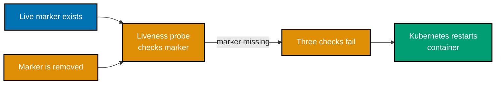

```yaml
# => The core API creates a runnable probe demonstration Pod.
apiVersion: v1
# => A Pod exposes a container whose liveness can be deliberately broken.
kind: Pod
# => The name is used by the restart-count assertion.
metadata: { name: ex55 }
# => The process is restarted after three failed liveness checks.
spec:
  # => Busybox serves while a marker exists and exits on its removal.
  containers:
    - {
        name: app,
        image: busybox:1.37,
        command: ["sh", "-c", "touch /tmp/live; while test -f /tmp/live; do sleep 1; done; exit 1"],
        livenessProbe: { exec: { command: ["sh", "-c", "test -f /tmp/live"] }, periodSeconds: 2, failureThreshold: 3 },
      }
# => `/tmp/live` is created before Kubernetes evaluates the first liveness probe.
# => The exec probe checks that one container-local file rather than a remote dependency.
# => A two-second period makes three failed observations visible in a short local test.
# => failureThreshold three controls when kubelet restarts this same container.
# => `kubectl exec ... rm /tmp/live` is the deliberate local failure trigger.
# => restart count is reported by Pod status after kubelet recreates the process.
```

**Verification**: With a local Kubernetes cluster, save as `ex55.yaml`, apply it, wait for `pod/ex55`, run `kubectl exec ex55 -- rm /tmp/live`, then watch `kubectl get pod/ex55`; the container restart count increases after the failed liveness checks.

**Key takeaway**: Liveness should detect a process that cannot recover while running, not a transient dependency or ordinary overload.

**Why it matters**: Liveness should detect a process that cannot recover while running, not a transient dependency or ordinary overload. In this Pod, removing the marker deliberately makes three probe checks fail and Kubernetes restarts the container, which is visible in restart count. A probe that is too strict can turn a temporary fault into a restart storm. Choose a cheap invariant that the process itself owns and test its failure behavior before deployment.

---

← Previous: [Learning Overview](./overview.md) · Next: [Advanced Examples](./advanced.md) →
