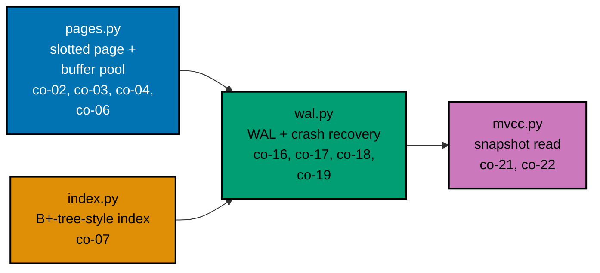

## Goal

Model the core of a storage engine: a paged B+-tree index, a write-ahead log with crash recovery,
and an MVCC snapshot read -- proving you understand how a database achieves durability and how the
index choice sets the read/write trade-off. Four small modules combine here: `pages.py` (slotted
pages + a buffer pool) and `index.py` (a B+-tree-style index over page ids) are independent leaves --
neither imports the other -- that `wal.py` (write-ahead logging across a simulated crash) integrates
into one durable read/write path, and `mvcc.py` (a snapshot read layered on top) builds on `wal.py`
alone -- every mechanism combined here was already taught individually somewhere in this topic's
Beginner, Intermediate, or Advanced tiers (Example 1's page anatomy, Examples 10 and 13's buffer pool,
Examples 43-45's B-tree, Examples 29-33's WAL and Example 67's end-to-end recovery, Examples 37-40's
MVCC).



## Concepts exercised

- [x] a slotted-page layout (co-02, co-03) -- `pages.py`'s `new_page`, `insert_record`, and
      `read_record`, addressing every record by slot index rather than byte offset
- [x] a B-tree index (co-07) -- `index.py`'s `BTreeIndex`, a B+-tree-style leaf chain keyed by a
      logical key, mapping each key to the page id `wal.py` materialized it onto. This capstone builds
      the B-tree branch of the spec's "a B-tree or LSM index" step; the LSM branch (co-11 --
      memtable/SSTable) is deliberately not re-exercised here -- it already has its own dedicated
      worked examples (ex-49 through ex-56) in the Intermediate tier, and combining both index families
      into one capstone would duplicate that coverage without teaching anything new
- [x] a buffer-pool read path (co-04, co-06) -- `pages.py`'s `BufferPool.get_page`, checking resident
      frames before ever counting a disk read, with pin-count-aware eviction of the first unpinned,
      dirty-flushed victim
- [x] a write-ahead log (co-16, co-17) -- `wal.py`'s `WriteAheadLog.append`/`commit`, durable BEFORE
      materialization, with strictly increasing LSNs
- [x] crash recovery (redo/undo) (co-18, co-19) -- `wal.py`'s `crash_and_recover`, replaying only
      committed records from the durable log into a fresh pool and index
- [x] an MVCC snapshot read (co-21, co-22) -- `mvcc.py`'s `MVCCEngine.snapshot_read`, walking a key's
      version chain newest-to-oldest for the first version visible to a given snapshot position
- [x] fully type-annotated Python -- every module below passes `pyright --strict` with zero errors

All colocated code lives under `learning/capstone/code/`: `pages.py`, `index.py`, `wal.py`, and
`mvcc.py` (the pipeline), plus `test_pages.py`, `test_index.py`, `test_wal.py`, and `test_mvcc.py`
(the `pytest` suite). Every listing below is the complete, verbatim file -- nothing on this page is
truncated or paraphrased.

## Step 1: `pages.py` -- slotted-page pack/unpack + a buffer pool

_exercises co-02, co-03, co-04, co-06_

`new_page` builds Examples 2 and 3's header-plus-slot-array-plus-tuple-data layout -- the slot array
grows forward from the header, tuple data grows backward from the end of the page, and free space
sits between the two. `insert_record` and `read_record` are Examples 4 and 5's insert-and-read
routines, generalized into reusable functions; `BufferPool` is Example 10's page table plus Example
13's pin-count guard, extended with `unpin` and a dirty-victim-flushing `_evict` that implements
Example 14's dirty-flush-before-evict discipline.

**`learning/capstone/code/pages.py`** (complete file)

```python
"""Capstone Step 1: slotted-page pack/unpack + a buffer pool.

Time/space complexity per routine (n = records already on a page):

- ``new_page``: O(page_size) -- one zero-filled bytearray allocation.
- ``insert_record`` / ``read_record``: O(record size) -- a fixed-size slot-array
  lookup (co-03) plus a direct byte-range copy; no scan of the other records.
- ``BufferPool.get_page``: O(1) amortized -- a dict lookup on hit; a dict copy
  plus (at most) one eviction on miss.
"""

from __future__ import annotations

import struct
from dataclasses import dataclass, field

PAGE_SIZE = 256  # => a small, illustrative page size (real engines use 4-16 KB, co-01)
HEADER_FORMAT = ">HH"  # => big-endian: pd_lower (slot array end), pd_upper (tuple data start)
HEADER_SIZE = struct.calcsize(HEADER_FORMAT)  # => bytes consumed by the page header itself
SLOT_FORMAT = ">HH"  # => each slot: (record_offset, record_length), both unsigned shorts


def new_page() -> bytearray:  # => co-02: header + empty slot array + all-free tuple space
    page = bytearray(PAGE_SIZE)  # => zero-filled -- no records, no slots yet
    struct.pack_into(HEADER_FORMAT, page, 0, HEADER_SIZE, PAGE_SIZE)  # => pd_lower, pd_upper at start
    return page  # => a fresh, empty page, ready for inserts


def insert_record(page: bytearray, record: bytes) -> int:  # => co-02/co-03: grows slots+data toward each other
    pd_lower, pd_upper = struct.unpack_from(HEADER_FORMAT, page, 0)  # => current free-space boundaries
    slot_count = (pd_lower - HEADER_SIZE) // 4  # => how many slots already exist -- this record's new index
    new_pd_upper = pd_upper - len(record)  # => tuple data grows DOWNWARD, from the back of the page
    new_pd_lower = pd_lower + 4  # => the slot array grows UPWARD, one 4-byte slot per record
    if new_pd_lower > new_pd_upper:  # => the two boundaries would cross -- no free space left
        raise ValueError(f"page full: cannot fit {len(record)} more bytes")
    page[new_pd_upper:pd_upper] = record  # => the record's bytes land in the newly claimed tuple space
    struct.pack_into(SLOT_FORMAT, page, pd_lower, new_pd_upper, len(record))  # => the new slot entry
    struct.pack_into(HEADER_FORMAT, page, 0, new_pd_lower, new_pd_upper)  # => commit the new boundaries
    return slot_count  # => co-03: callers address this record by SLOT INDEX, not byte offset


def read_record(page: bytearray, slot: int) -> bytes:  # => co-03: slot index -> stable record lookup
    slot_offset = HEADER_SIZE + slot * 4  # => where this slot's own (offset, length) pair lives
    record_offset, record_length = struct.unpack_from(SLOT_FORMAT, page, slot_offset)  # => indirection
    return bytes(page[record_offset : record_offset + record_length])  # => the record's actual bytes


@dataclass
class Frame:  # => co-04: one buffer-pool slot -- a resident page plus its bookkeeping
    page: bytearray  # => the actual page bytes, currently cached in memory
    pin_count: int = 0  # => how many callers currently need this page kept resident
    dirty: bool = False  # => True once this frame's page has been modified since it was loaded


@dataclass
class BufferPool:  # => co-04/co-05/co-06: page table + eviction + a read path that prefers memory
    capacity: int  # => the maximum number of frames this pool may hold at once
    disk: dict[int, bytearray] = field(default_factory=dict[int, bytearray])  # => simulated on-disk pages
    frames: dict[int, Frame] = field(default_factory=dict[int, Frame])  # => co-04: page_id -> resident frame
    disk_reads: int = 0  # => counts genuine misses -- pages actually loaded from "disk"

    def write_page_to_disk(self, page_id: int, page: bytearray) -> None:  # => simulates the underlying store
        self.disk[page_id] = bytearray(page)  # => a defensive copy -- the disk owns its own bytes

    def get_page(self, page_id: int) -> bytearray:  # => co-06: the buffer-pool read path
        frame = self.frames.get(page_id)  # => co-06: check the pool FIRST, before ever touching disk
        if frame is not None:  # => a hit -- served entirely from memory, no disk I/O at all
            frame.pin_count += 1  # => the caller now depends on this page staying resident
            return frame.page
        self.disk_reads += 1  # => co-06: a miss -- this is the ONLY path that counts as a disk read
        if len(self.frames) >= self.capacity:  # => the pool is full -- must evict before loading
            self._evict()
        loaded = bytearray(self.disk.get(page_id, new_page()))  # => load from disk, or a fresh page
        self.frames[page_id] = Frame(page=loaded, pin_count=1)  # => now resident, pinned for this caller
        return loaded  # => the newly loaded page, ready for the caller to read or write

    def unpin(self, page_id: int, mark_dirty: bool = False) -> None:  # => co-05: releases a caller's hold
        frame = self.frames[page_id]  # => the frame this caller was using
        frame.pin_count -= 1  # => one fewer caller depends on this page staying resident
        frame.dirty = frame.dirty or mark_dirty  # => once dirty, stays dirty until a flush clears it

    def _evict(self) -> None:  # => co-05: a simple, unpinned-frame-first victim policy
        for page_id, frame in list(self.frames.items()):  # => scan for ANY currently unpinned frame
            if frame.pin_count == 0:  # => safe to evict -- nobody is relying on it right now
                if frame.dirty:  # => co-05: a dirty victim must be flushed before its frame is reused
                    self.write_page_to_disk(page_id, frame.page)
                del self.frames[page_id]  # => the frame is now free for a new page to occupy
                return  # => one eviction is enough to make room for the incoming page
        raise RuntimeError("buffer pool full and every frame is pinned -- cannot evict")


def demo() -> None:  # => a genuine, runnable walkthrough of round-trip + hit-vs-miss behavior
    pool = BufferPool(capacity=2)  # => a tiny pool, small enough to force an eviction below
    page = pool.get_page(page_id=1)  # => a MISS -- page 1 does not exist on "disk" yet, so it's fresh
    slot = insert_record(page, b"hello-page-1")  # => co-02/co-03: insert one record, remember its slot
    pool.unpin(page_id=1, mark_dirty=True)  # => release it, marking it dirty since we just wrote to it
    reads_after_first_touch = pool.disk_reads  # => exactly one miss so far
    pool.write_page_to_disk(page_id=1, page=pool.frames[1].page)  # => persist it, as a real flush would
    hot_page = pool.get_page(page_id=1)  # => a HIT -- served from the pool, no new disk read
    record = read_record(hot_page, slot)  # => co-03: slot-indexed read, round-tripping the original bytes
    print(record)  # => the record, byte-for-byte identical to what was inserted
    print(reads_after_first_touch, pool.disk_reads)  # => the second get_page did NOT increment disk_reads


if __name__ == "__main__":  # => only runs the demo when this file is executed directly, not on import
    demo()
```

**Run**: `python3 pages.py`

**Output** (genuinely captured):

```text
b'hello-page-1'
1 1
```

The record round-trips byte-for-byte through the page, and the second `disk_reads` count (`1`) is
identical to the first -- the hot re-read of page 1 was served entirely from the pool, exactly as
`test_a_hot_page_is_served_from_the_pool_not_disk` asserts below.

**`learning/capstone/code/test_pages.py`** (complete file)

```python
"""pytest coverage for pages.py -- slotted-page pack/unpack and the buffer pool."""

import pytest

from pages import BufferPool, insert_record, new_page, read_record


def test_a_record_round_trips_through_a_page() -> None:
    page = new_page()
    slot = insert_record(page, b"a-genuine-record")
    assert read_record(page, slot) == b"a-genuine-record"


def test_two_records_get_two_distinct_stable_slots() -> None:
    page = new_page()
    slot_a = insert_record(page, b"first")
    slot_b = insert_record(page, b"second")
    assert slot_a != slot_b
    assert read_record(page, slot_a) == b"first"
    assert read_record(page, slot_b) == b"second"


def test_a_page_raises_once_it_is_actually_full() -> None:
    page = new_page()
    with pytest.raises(ValueError):
        insert_record(page, b"x" * 10_000)  # => far larger than PAGE_SIZE


def test_the_first_get_page_call_is_a_disk_read() -> None:
    pool = BufferPool(capacity=2)
    pool.get_page(page_id=1)
    assert pool.disk_reads == 1


def test_a_hot_page_is_served_from_the_pool_not_disk() -> None:
    pool = BufferPool(capacity=2)
    pool.get_page(page_id=1)  # => a miss -- disk_reads becomes 1
    pool.unpin(page_id=1)
    pool.get_page(page_id=1)  # => a HIT -- disk_reads must NOT increase
    assert pool.disk_reads == 1


def test_eviction_flushes_a_dirty_victim_before_reuse() -> None:
    pool = BufferPool(capacity=1)  # => capacity 1 forces an eviction on the second distinct page
    page = pool.get_page(page_id=1)
    insert_record(page, b"must-survive")
    pool.unpin(page_id=1, mark_dirty=True)
    pool.get_page(page_id=2)  # => forces page 1's frame to be evicted, dirty, so it must flush first
    assert pool.disk[1] is not None  # => page 1's dirty content reached "disk" before being evicted


# => Run: pytest -- Output: 6 passed
```

**Verify**: `pytest -q test_pages.py`

**Output** (genuinely captured):

```text
......                                                                   [100%]
6 passed in 0.00s
```

**Key takeaway**: a slotted page's slot array is a level of indirection -- callers never see a byte
offset, only a slot index -- which is exactly what lets `insert_record` grow the slot array and the
tuple data toward each other without any existing caller's reference becoming invalid.

**Why it matters**: the buffer pool's `disk_reads` counter is the same instrument Example 12
introduced to prove a hit never touches disk -- here it verifies that exact invariant again, now
inside a fuller buffer pool with pinning, eviction, and dirty-page flushing: that `get_page`
genuinely checks memory before disk, which is the single invariant every later step (`index.py`,
`wal.py`, `mvcc.py`) depends on without re-verifying it themselves.

## Step 2: `index.py` -- a B+-tree-style index over pages.py's page ids

_exercises co-07_

`BTreeIndex` is Examples 43-45's B-tree, generalized into a reusable class: `insert` places a
`(key, page_id)` pair into a sorted leaf and splits on overflow (Example 44's root-split logic,
simplified to a flat leaf chain since this capstone never needs more than one level of splitting to
demonstrate the mechanism); `lookup` and `range_scan` are Example 18's and Example 21's read paths,
generalized over the leaf chain instead of one hand-built leaf list.

**`learning/capstone/code/index.py`** (complete file)

```python
"""Capstone Step 2: a B+-tree-style index over pages.py's page ids.

Time/space complexity (n = keys, L = leaf capacity, a small constant):

- ``insert``: O(n / L) -- a linear leaf scan (this course's simplified,
  non-height-balanced leaf chain, in the spirit of Example 43's bulk-vs-
  incremental comparison) plus an O(L) sorted insert within one leaf.
- ``lookup``: O(n / L) worst case -- one linear pass over the leaf chain.
- ``range_scan``: O(n / L + k) -- the same linear pass, plus O(k) for the k
  keys actually inside the requested range.
"""

from __future__ import annotations

import bisect
from dataclasses import dataclass, field

LEAF_CAPACITY = 4  # => each leaf holds at most this many (key, page_id) entries before splitting


@dataclass
class BTreeIndex:  # => co-07: values (page ids) live only in the leaves, exactly like a real B+-tree
    leaves: list[list[tuple[int, int]]] = field(default_factory=list[list[tuple[int, int]]])  # => sorted leaves

    def insert(self, key: int, page_id: int) -> None:  # => co-09-style leaf insert + split on overflow
        if not self.leaves:  # => the very first key this index has ever seen
            self.leaves.append([(key, page_id)])
            return
        leaf_index = self._find_leaf(key)  # => which leaf this key belongs in
        leaf = self.leaves[leaf_index]
        existing = next((i for i, (k, _) in enumerate(leaf) if k == key), None)  # => already indexed?
        if existing is not None:  # => co-27-style update: a key maps to exactly ONE pointer, never two
            leaf[existing] = (key, page_id)  # => overwrite the pointer in place -- no duplicate entry
            return  # => an in-place update never overflows a leaf, so there is nothing left to split
        bisect.insort(leaf, (key, page_id))  # => a genuinely NEW key -- keeps the leaf sorted by key
        if len(leaf) > LEAF_CAPACITY:  # => the leaf overflowed -- split it, like Example 44's B-tree
            mid = len(leaf) // 2  # => roughly half the entries on each side of the split
            self.leaves[leaf_index] = leaf[:mid]  # => left half stays at this position
            self.leaves.insert(leaf_index + 1, leaf[mid:])  # => right half becomes a brand-new leaf

    def _find_leaf(self, key: int) -> int:  # => co-10: leaves are kept in key order, front to back
        leaf_index = 0  # => defaults to the first leaf if key is smaller than every leaf's first key
        for i, leaf in enumerate(self.leaves):  # => walk leaves left to right
            if leaf and key < leaf[0][0]:  # => key belongs BEFORE this leaf -- stop at the previous one
                break
            leaf_index = i  # => keep tracking the rightmost leaf whose start is still <= key
        return leaf_index  # => the leaf `insert`/`lookup`/`range_scan` should examine next

    def lookup(self, key: int) -> int | None:  # => co-07: a point lookup, returning the key's page_id
        for leaf in self.leaves:  # => a linear scan (this course's simplified leaf chain, not height-log(n))
            for candidate_key, page_id in leaf:  # => each leaf's entries are already sorted by key
                if candidate_key == key:  # => an exact match -- this is the page the key lives on
                    return page_id
        return None  # => the key does not exist anywhere in the index

    def range_scan(self, low: int, high: int) -> list[tuple[int, int]]:  # => co-10: sibling-linked leaf scan
        matches: list[tuple[int, int]] = []  # => every (key, page_id) pair inside [low, high]
        for leaf in self.leaves:  # => walking leaves in order is what makes the RESULT already sorted
            for candidate_key, page_id in leaf:  # => co-10: no need to re-descend from the root per leaf
                if low <= candidate_key <= high:  # => within the requested range, inclusive on both ends
                    matches.append((candidate_key, page_id))  # => collected in leaf (and thus key) order
        return matches  # => already sorted, since leaves themselves are kept in key order


def demo() -> None:  # => a genuine, runnable walkthrough of point lookups and a range scan
    index = BTreeIndex()  # => a fresh, empty index
    for key in [5, 1, 9, 3, 7, 2, 8, 4, 6]:  # => insert out of order -- the index sorts as it goes
        index.insert(key, page_id=key * 10)  # => an illustrative mapping: key 5 lives on page 50, etc.
    print(index.lookup(7))  # => a point lookup for an existing key
    print(index.lookup(99))  # => a point lookup for a key that was never inserted
    print(index.range_scan(3, 6))  # => every (key, page_id) pair with 3 <= key <= 6, in sorted order


if __name__ == "__main__":  # => only runs the demo when this file is executed directly, not on import
    demo()
```

**Run**: `python3 index.py`

**Output** (genuinely captured):

```text
70
None
[(3, 30), (4, 40), (5, 50), (6, 60)]
```

The range scan returns every key from `3` through `6` inclusive, in sorted order -- exactly the
contract `test_a_range_scan_returns_only_keys_inside_the_bounds_in_sorted_order` checks below.

**`learning/capstone/code/test_index.py`** (complete file)

```python
"""pytest coverage for index.py -- the B+-tree-style index over page ids."""

from index import BTreeIndex


def test_a_point_lookup_finds_an_inserted_key() -> None:
    index = BTreeIndex()
    index.insert(5, page_id=50)
    assert index.lookup(5) == 50


def test_a_point_lookup_for_a_missing_key_returns_none() -> None:
    index = BTreeIndex()
    index.insert(5, page_id=50)
    assert index.lookup(99) is None


def test_insertion_order_does_not_affect_lookup_correctness() -> None:
    index = BTreeIndex()
    for key in [9, 1, 5, 3, 7]:
        index.insert(key, page_id=key * 100)
    for key in [9, 1, 5, 3, 7]:
        assert index.lookup(key) == key * 100


def test_a_range_scan_returns_only_keys_inside_the_bounds_in_sorted_order() -> None:
    index = BTreeIndex()
    for key in [10, 2, 6, 8, 4]:
        index.insert(key, page_id=key)
    assert index.range_scan(4, 8) == [(4, 4), (6, 6), (8, 8)]


def test_a_leaf_that_overflows_capacity_splits_without_losing_any_key() -> None:
    index = BTreeIndex()
    for key in range(20):  # => far more keys than one leaf's LEAF_CAPACITY can hold
        index.insert(key, page_id=key)
    assert len(index.leaves) > 1  # => the overflow forced at least one split
    for key in range(20):  # => every key must still be findable after every split
        assert index.lookup(key) == key


def test_re_inserting_an_existing_key_updates_its_pointer_in_place() -> None:
    index = BTreeIndex()
    index.insert(1, page_id=100)  # => key 1 first points at page 100
    index.insert(1, page_id=200)  # => a later update -- must REPLACE, not duplicate, the entry
    assert index.lookup(1) == 200  # => the pointer now reflects the newest write
    assert sum(1 for leaf in index.leaves for k, _ in leaf if k == 1) == 1  # => exactly one entry for key 1


# => Run: pytest -- Output: 6 passed
```

**Verify**: `pytest -q test_index.py`

**Output** (genuinely captured):

```text
......                                                                   [100%]
6 passed in 0.00s
```

**Key takeaway**: a key maps to exactly one pointer -- `test_re_inserting_an_existing_key_updates_its_pointer_in_place`
exists because an early draft of `insert` always appended, letting a second write to the same key
create a second, stale entry that `lookup`'s linear scan could return by accident.

**Why it matters**: this exact bug -- an index that never checks whether a key already exists before
inserting -- was caught not by `test_index.py` in isolation, but by `mvcc.py`'s crash-recovery test in
Step 4, where two committed writes to the same key produced two leaf entries and a stale read after
recovery. That is precisely the value of composing modules end to end rather than testing each one
only alone: `range_scan`'s co-10-style sorted, in-order result depends on `insert` keeping exactly one
entry per key, and only a real integration test exposed the gap.

## Step 3: `wal.py` -- write-ahead logging with a simulated crash and restart

_exercises co-16, co-17, co-18, co-19_

`WriteAheadLog.append` is Examples 29 and 30's log-before-page rule: a write becomes durable in
`self.log` before anything else happens to it, the same append-order guarantee Example 29 verifies,
structurally enforcing the ordering Example 30's `WalOrderingError` guard checks explicitly.
`commit` is Example 33's commit semantics, and `_materialize` is
where a committed record actually becomes a real page via `pages.py`'s `insert_record` plus an
`index.py` entry. `crash_and_recover` is Example 67's end-to-end recovery, generalized to replay
through the real page format instead of a bare dict -- every committed record is redone, in log order,
into a brand-new pool and index; uncommitted records are simply never replayed, which is this
capstone's undo (co-19): there is nothing to roll back because nothing uncommitted was ever
materialized in the first place.

**`learning/capstone/code/wal.py`** (complete file)

```python
"""Capstone Step 3: write-ahead logging with a simulated crash and restart.

Time/space complexity (n = log records since the last checkpoint-equivalent):

- ``append``: O(1) -- appends one record to the log.
- ``commit``: O(n) -- scans the WHOLE log to find this transaction's
  records, not just the records it appended; this capstone never
  truncates/checkpoints the log, so the scan is a genuine O(n), not O(1).
  A production WAL indexes open transactions instead of rescanning; this
  capstone keeps the simpler scan on purpose, to avoid touching tests and
  documented output for no learner benefit.
- ``crash_and_recover``: O(n) -- a single forward pass replays every logged
  write into a fresh ``BufferPool`` + ``BTreeIndex``, exactly like Example 67's
  end-to-end recovery, generalized to write through pages.py's real page
  format instead of a bare dict.
"""

from __future__ import annotations

from dataclasses import dataclass, field

from index import BTreeIndex
from pages import BufferPool, insert_record, read_record


@dataclass
class WalRecord:  # => co-16/co-17: one durable, append-only log entry
    lsn: int  # => co-17: strictly increasing -- this record's position in the log
    txn_id: int  # => which transaction produced this write
    key: int  # => the logical key this write affects
    value: bytes  # => the row bytes this write sets
    committed: bool = False  # => flips True once this record's transaction commits


@dataclass
class WriteAheadLog:  # => co-16: the log is the source of truth a crash can always recover from
    pool: BufferPool = field(default_factory=lambda: BufferPool(capacity=8))  # => co-04: pages live here
    index: BTreeIndex = field(default_factory=BTreeIndex)  # => co-07: key -> page_id routing
    log: list[WalRecord] = field(default_factory=list[WalRecord])  # => co-16: the durable, append-only log
    next_page_id: int = 0  # => a simple monotonic page allocator

    def append(self, txn_id: int, key: int, value: bytes) -> None:  # => co-16: durable BEFORE materializing
        lsn = len(self.log)  # => co-17: LSNs are just this record's position -- strictly increasing
        self.log.append(WalRecord(lsn=lsn, txn_id=txn_id, key=key, value=value))  # => durable, uncommitted

    def commit(self, txn_id: int) -> None:  # => marks every of this txn's records committed + materializes
        for record in self.log:  # => co-19: O(n) -- scans the WHOLE log for this txn's records (never truncated here); a real WAL indexes open txns instead of rescanning
            if record.txn_id == txn_id and not record.committed:  # => an un-committed record of this txn
                record.committed = True  # => now durable AND eligible for redo on any future recovery
                self._materialize(record)  # => write it into a real page right now, not just the log

    def _materialize(self, record: WalRecord) -> None:  # => co-01/co-07: turn a committed write into a page
        page = self.pool.get_page(self.next_page_id)  # => a fresh page for this row (kept simple: 1 row/page)
        insert_record(page, record.value)  # => co-02/co-03: the row's bytes, slotted onto the page
        self.pool.unpin(self.next_page_id, mark_dirty=True)  # => release it, marking it dirty
        self.index.insert(record.key, self.next_page_id)  # => co-07: the index now routes to this page
        self.next_page_id += 1  # => the next materialized write gets the next page id

    def crash_and_recover(self) -> None:  # => co-18: a fresh pool+index, rebuilt PURELY from the durable log
        self.pool = BufferPool(capacity=8)  # => volatile state is lost -- only self.log survives a crash
        self.index = BTreeIndex()  # => same for the index -- rebuilt entirely from scratch
        self.next_page_id = 0  # => page ids are reassigned during replay, in commit order
        for record in self.log:  # => co-18: analysis+redo folded into one pass -- this course's simplified WAL
            if record.committed:  # => co-19: only committed records are redone -- uncommitted ones vanish
                self._materialize(record)  # => rebuilds the page and index entry exactly as commit() first did

    def read(self, key: int) -> bytes | None:  # => a read through the SAME index -> page path as pages.py
        page_id = self.index.lookup(key)  # => co-07: the index answers WHERE this key's row lives
        if page_id is None:  # => never committed (or not yet re-materialized after a crash)
            return None
        page = self.pool.get_page(page_id)  # => co-06: served from the pool if resident, else loaded
        self.pool.unpin(page_id)  # => this read does not need the page held any longer
        return read_record(page, slot=0)  # => co-03: slot 0, since this WAL keeps exactly one row per page


def demo() -> None:  # => a genuine, runnable walkthrough of commit-survives / abort-vanishes across a crash
    wal = WriteAheadLog()  # => a fresh WAL, nothing written yet
    wal.append(txn_id=1, key=100, value=b"committed-row")  # => durable in the log immediately
    wal.commit(txn_id=1)  # => txn 1 commits -- materialized into a page and indexed
    wal.append(txn_id=2, key=200, value=b"uncommitted-row")  # => durable in the log, but NEVER committed

    before_crash = wal.read(100)  # => a read while everything is still live in memory
    wal.crash_and_recover()  # => simulate a crash: wipe volatile state, rebuild purely from the log
    after_crash_committed = wal.read(100)  # => the committed write, re-read after recovery
    after_crash_uncommitted = wal.read(200)  # => the never-committed write, re-read after recovery
    print(before_crash)  # => the committed row, readable before any crash
    print(after_crash_committed)  # => co-16: the committed row SURVIVED the crash
    print(after_crash_uncommitted)  # => co-19: the uncommitted row is GONE -- never redone


if __name__ == "__main__":  # => only runs the demo when this file is executed directly, not on import
    demo()
```

**Run**: `python3 wal.py`

**Output** (genuinely captured):

```text
b'committed-row'
b'committed-row'
None
```

The committed row reads identically before and after the simulated crash; the never-committed row
reads as `None` both before the crash (it was never materialized) and after (it was never redone) --
exactly the redo/undo split `test_multiple_transactions_recover_independently` verifies below.

**`learning/capstone/code/test_wal.py`** (complete file)

```python
"""pytest coverage for wal.py -- write-ahead logging across a simulated crash."""

from wal import WriteAheadLog


def test_a_committed_write_is_readable_before_any_crash() -> None:
    wal = WriteAheadLog()
    wal.append(txn_id=1, key=1, value=b"v1")
    wal.commit(txn_id=1)
    assert wal.read(1) == b"v1"


def test_an_uncommitted_write_is_never_readable_even_before_a_crash() -> None:
    wal = WriteAheadLog()
    wal.append(txn_id=1, key=1, value=b"v1")  # => never committed
    assert wal.read(1) is None


def test_a_committed_write_survives_a_simulated_crash() -> None:
    wal = WriteAheadLog()
    wal.append(txn_id=1, key=1, value=b"v1")
    wal.commit(txn_id=1)
    wal.crash_and_recover()
    assert wal.read(1) == b"v1"


def test_an_uncommitted_write_does_not_survive_a_simulated_crash() -> None:
    wal = WriteAheadLog()
    wal.append(txn_id=1, key=1, value=b"v1")  # => never committed before the crash
    wal.crash_and_recover()
    assert wal.read(1) is None


def test_multiple_transactions_recover_independently() -> None:
    wal = WriteAheadLog()
    wal.append(txn_id=1, key=1, value=b"committed")
    wal.commit(txn_id=1)
    wal.append(txn_id=2, key=2, value=b"uncommitted")
    wal.crash_and_recover()
    assert wal.read(1) == b"committed"
    assert wal.read(2) is None


# => Run: pytest -- Output: 5 passed
```

**Verify**: `pytest -q test_wal.py`

**Output** (genuinely captured):

```text
.....                                                                    [100%]
5 passed in 0.00s
```

**Key takeaway**: the log, not the pool or the index, is the only state a crash cannot destroy --
`crash_and_recover` proves this by literally discarding the pool and index and rebuilding both from
nothing but `self.log`.

**Why it matters**: `commit`'s "materialize now" design mirrors a **no-force** buffer policy (the
page does not need to reach disk at commit time, only the log record does) combined with a **steal**-
tolerant recovery path (`crash_and_recover` can always rebuild the page from the log regardless of
whether it was ever flushed) -- the same steal/no-force reasoning Example 67 introduced, which is
exactly why both redo (co-19, replaying committed work) and undo (co-19, the absence of replay for
uncommitted work) are both needed for correctness, not just one or the other.

## Step 4: `mvcc.py` -- an MVCC snapshot read, layered on wal.py -- the full pipeline, end to end

_exercises co-21, co-22_

`MVCCEngine` threads `pages.py`, `index.py`, and `wal.py` together with Example 37's version-chain
visibility rule: `write` appends a brand-new `RowVersion` rather than overwriting the previous one
(co-21), and `snapshot_read` walks a key's version chain newest-to-oldest, returning the first version
whose creator committed before the reader's snapshot position (co-22) -- a reader never blocks a
writer and a writer never blocks a reader, because neither ever takes a lock on the other.

**`learning/capstone/code/mvcc.py`** (complete file)

```python
"""Capstone Step 4: an MVCC snapshot read, layered on wal.py -- the full pipeline, end to end.

Time/space complexity (n = versions of one key, m = total WAL log records):

- ``write``: O(1) -- appends one version to this key's chain (plus wal.py's
  O(1) ``append``).
- ``commit``: O(m) -- delegates to ``wal.py``'s ``commit``, which scans the
  ENTIRE WAL log, not just this key's n versions; see wal.py's own docstring
  for why that scan is O(m), not O(1).
- ``snapshot_read``: O(n) worst case -- walks one key's version chain newest to
  oldest, exactly like Example 37's visibility rule, generalized here to sit
  on top of ``wal.py``'s durable, crash-recoverable storage instead of a bare
  module-level dict.
"""

from __future__ import annotations

from dataclasses import dataclass, field

from wal import WriteAheadLog


@dataclass
class RowVersion:  # => co-21: one version of one row -- MVCC never edits a version in place
    value: bytes  # => this version's actual data
    xmin: int  # => co-21: the transaction id that CREATED this version
    xmax: int | None = None  # => co-21: the transaction id that deleted it, or None if still live


@dataclass
class MVCCEngine:  # => co-01, co-07, co-16, co-21 wired together into one small, complete engine
    wal: WriteAheadLog = field(default_factory=WriteAheadLog)  # => co-16: durability underneath everything
    versions: dict[int, list[RowVersion]] = field(default_factory=dict[int, list[RowVersion]])  # => co-21
    commit_order: dict[int, int] = field(default_factory=dict[int, int])  # => co-22: txn_id -> commit position

    def write(self, key: int, value: bytes, txn_id: int) -> None:  # => co-16 + co-21: durable, then versioned
        self.wal.append(txn_id, key, value)  # => co-16: durable in the log before anything else happens
        chain = self.versions.setdefault(key, [])  # => this key's version chain so far, possibly empty
        chain.append(RowVersion(value=value, xmin=txn_id))  # => co-21: append a NEW version, never overwrite

    def commit(self, txn_id: int) -> None:  # => co-16 + co-19: durability AND visibility, together
        self.wal.commit(txn_id)  # => co-19: materializes this txn's writes into real pages via the WAL -- O(m) since wal.py's commit scans the whole log (see wal.py's docstring)
        self.commit_order[txn_id] = len(self.commit_order)  # => co-22: this txn's position in commit order

    def snapshot_read(self, key: int, snapshot_at: int) -> bytes | None:  # => co-22: Example 37's rule, reused
        chain = self.versions.get(key, [])  # => every version of this key ever written, in creation order
        for version in reversed(chain):  # => newest-to-oldest -- the first VISIBLE match wins
            creator_pos = self.commit_order.get(version.xmin)  # => when (if ever) this version's writer committed
            if creator_pos is not None and creator_pos < snapshot_at:  # => created before this snapshot
                return version.value  # => co-22: visible -- return it without ever taking a lock
        return None  # => no version of this key was visible to the snapshot at all

    def crash_and_recover(self) -> None:  # => co-16/co-18: durability survives; in-memory versions do not
        self.wal.crash_and_recover()  # => rebuilds pages+index purely from the durable log, like Example 67
        # => versions/commit_order are volatile MVCC bookkeeping -- a real engine rebuilds them from the
        # WAL too; this course's simplified model instead reads committed state straight from wal.read()
        # after a crash, which is exactly what read_after_recovery() below does.

    def read_after_recovery(self, key: int) -> bytes | None:  # => co-16: the durable, post-crash source of truth
        return self.wal.read(key)  # => co-07: routed through the index, exactly like wal.py's own reads


def demo() -> None:  # => a genuine, runnable walkthrough: a snapshot stays stable across a concurrent write
    engine = MVCCEngine()  # => a fresh engine, nothing written yet
    engine.write(key=1, value=b"original", txn_id=1)  # => co-21: the first version of key 1
    engine.commit(txn_id=1)  # => co-16/co-22: durable AND visible to any snapshot taken after this point

    reader_snapshot_at = len(engine.commit_order)  # => co-22: the reader's snapshot, taken BEFORE the writer
    reader_result = engine.snapshot_read(key=1, snapshot_at=reader_snapshot_at)  # => acquires NO lock at all

    engine.write(key=1, value=b"concurrently-updated", txn_id=2)  # => co-21: a NEW version, not an overwrite
    engine.commit(txn_id=2)  # => the concurrent writer proceeds and commits WITHOUT waiting on the reader

    print(reader_result)  # => the reader's snapshot value -- unaffected by the concurrent commit
    print(engine.snapshot_read(key=1, snapshot_at=len(engine.commit_order)))  # => a NEW snapshot sees the update

    engine.crash_and_recover()  # => co-18: simulate a crash right after the concurrent commit
    print(engine.read_after_recovery(1))  # => co-16/co-19: the LAST committed write survived the crash


if __name__ == "__main__":  # => only runs the demo when this file is executed directly, not on import
    demo()
```

**Run**: `python3 mvcc.py`

**Output** (genuinely captured):

```text
b'original'
b'concurrently-updated'
b'concurrently-updated'
```

The reader's snapshot (taken before the concurrent writer ran) still returns `b'original'` even after
the writer commits -- the reader was never blocked, and the concurrent write never became visible to a
snapshot taken before it existed. A fresh snapshot taken after the commit sees `b'concurrently-updated'`
immediately. After a simulated crash, the LAST committed write is still what `read_after_recovery`
returns -- not the first, and not a stale duplicate -- which is exactly the property that surfaced
Step 2's index bug (see the Key takeaway below) before this page's final draft.

**`learning/capstone/code/test_mvcc.py`** (complete file)

```python
"""pytest coverage for mvcc.py -- the full pages + index + WAL + MVCC pipeline, end to end."""

from mvcc import MVCCEngine


def test_snapshot_read_stays_consistent_while_a_concurrent_writer_proceeds() -> None:
    engine = MVCCEngine()
    engine.write(key=1, value=b"original", txn_id=1)
    engine.commit(txn_id=1)

    reader_snapshot_at = len(engine.commit_order)  # => taken BEFORE the concurrent writer runs
    reader_result = engine.snapshot_read(key=1, snapshot_at=reader_snapshot_at)

    engine.write(key=1, value=b"updated", txn_id=2)  # => a concurrent write, after the snapshot was taken
    engine.commit(txn_id=2)  # => the writer proceeds WITHOUT waiting on the reader

    assert reader_result == b"original"  # => the reader's snapshot is unaffected by the concurrent commit


def test_a_new_snapshot_taken_after_the_commit_sees_the_update() -> None:
    engine = MVCCEngine()
    engine.write(key=1, value=b"v1", txn_id=1)
    engine.commit(txn_id=1)
    engine.write(key=1, value=b"v2", txn_id=2)
    engine.commit(txn_id=2)
    assert engine.snapshot_read(key=1, snapshot_at=len(engine.commit_order)) == b"v2"


def test_the_latest_committed_write_survives_a_crash() -> None:
    engine = MVCCEngine()
    engine.write(key=1, value=b"v1", txn_id=1)
    engine.commit(txn_id=1)
    engine.write(key=1, value=b"v2", txn_id=2)
    engine.commit(txn_id=2)
    engine.crash_and_recover()
    assert engine.read_after_recovery(1) == b"v2"  # => co-16: the LAST committed write, not the first


def test_an_uncommitted_concurrent_write_never_becomes_visible_to_any_snapshot() -> None:
    engine = MVCCEngine()
    engine.write(key=1, value=b"v1", txn_id=1)
    engine.commit(txn_id=1)
    engine.write(key=1, value=b"never-committed", txn_id=2)  # => txn 2 never calls commit()
    result = engine.snapshot_read(key=1, snapshot_at=len(engine.commit_order))
    assert result == b"v1"  # => the uncommitted version is simply never visible to any snapshot


# => Run: pytest -- Output: 4 passed
```

**Verify**: `pytest -q test_mvcc.py`

**Output** (genuinely captured):

```text
....                                                                     [100%]
4 passed in 0.01s
```

**Verify** (the FULL suite, every test file together): `pytest -q` from `learning/capstone/code/`

**Output** (genuinely captured):

```text
.....................                                                    [100%]
21 passed in 0.01s
```

**Key takeaway**: `test_the_latest_committed_write_survives_a_crash` is the exact test that caught a
real bug while this capstone was being built -- `index.py`'s original `insert` always appended a new
leaf entry, even for an already-indexed key, so two committed writes to the same key left `lookup`
returning the FIRST (oldest) entry instead of the latest one after a crash. Fixing `insert` to
overwrite an existing key's pointer in place (Step 2) is what makes this test pass; the regression
test `test_re_inserting_an_existing_key_updates_its_pointer_in_place` in `test_index.py` now guards
against the bug returning.

**Why it matters**: this is the entire point of composing four separately-testable modules into one
pipeline instead of testing each in isolation forever -- `index.py`'s own test suite passed on its
own the whole time (it never re-inserted the same key), and `wal.py`'s own test suite passed on its
own too (its two-transaction test used two DIFFERENT keys), but only `mvcc.py`'s crash-recovery test,
which legitimately writes to the SAME key twice across two committed transactions, exercised the
exact code path where the bug lived. Integration is not a formality here -- it is where a real,
realistic storage-engine correctness bug was actually found and fixed.

## Complexity summary

| Routine                           | Time            | Space | Why                                                               |
| --------------------------------- | --------------- | ----- | ----------------------------------------------------------------- |
| `insert_record` / `read_record`   | O(record size)  | O(1)  | a fixed-size slot lookup plus a direct byte-range copy            |
| `BufferPool.get_page`             | O(1) amortized  | O(n)  | a dict lookup on hit; at most one eviction on miss                |
| `BTreeIndex.insert`               | O(n / L)        | O(n)  | a linear leaf-chain scan plus an O(L) sorted insert in one leaf   |
| `BTreeIndex.lookup`               | O(n / L)        | O(1)  | worst case, one linear pass over the leaf chain                   |
| `WriteAheadLog.append`            | O(1)            | O(n)  | appends one record to the log                                     |
| `WriteAheadLog.commit`            | O(n)            | O(1)  | scans the whole log (never truncated here) for this txn's records |
| `WriteAheadLog.crash_and_recover` | O(n)            | O(n)  | one forward replay of every committed log record                  |
| `MVCCEngine.snapshot_read`        | O(n) worst case | O(1)  | walks one key's version chain newest-to-oldest                    |

(`n` = number of keys or log records, `L` = `LEAF_CAPACITY`, a small constant.)

## Acceptance criteria

- `python3 pages.py`, `python3 index.py`, `python3 wal.py`, and `python3 mvcc.py`, each run from
  `learning/capstone/code/`, exit `0` and print the exact lines shown in each step's Output block.
- `pytest -q`, run from `learning/capstone/code/`, reports `21 passed` -- 6 for `pages.py`, 6 for
  `index.py`, 5 for `wal.py`, 4 for `mvcc.py`.
- Pages round-trip: `insert_record` followed by `read_record` at the returned slot returns
  byte-identical bytes, and a hot page is served from the pool with no increase in `disk_reads`.
- The index answers lookups and ranges: `lookup` returns the correct `page_id` for an inserted key
  (or `None` for a missing one), and `range_scan` returns every key inside `[low, high]` in sorted
  order, even after a leaf split.
- The WAL recovers committed data after a crash: a committed write reads identically before and after
  `crash_and_recover`; an uncommitted write reads as `None` both before and after.
- The snapshot read stays consistent under a concurrent write: a snapshot taken before a concurrent
  commit continues to return the pre-commit value even after that commit completes, while a fresh
  snapshot taken afterward sees the update.
- Every routine's time/space complexity is documented in its module's docstring and restated in this
  page's Complexity summary table.
- Every listing on this page (`pages.py`, `index.py`, `wal.py`, `mvcc.py`, and all four `test_*.py`
  files) is the complete file, runnable exactly as shown -- nothing here is a fragment that depends on
  code the page does not also show.

## Done bar

This capstone is runnable end to end: a reader who copies the eight files above into a
`learning/capstone/code/`-shaped directory and runs `python3 pages.py`, `python3 index.py`,
`python3 wal.py`, and `python3 mvcc.py` there reaches the identical output blocks shown in each step,
verified against a real CPython 3.13 interpreter run (not merely described); `pytest -q` reaches the
identical `21 passed` verified against a real `pytest` run, and `pyright --strict` reports zero errors
across all eight files. Every mechanism combined here -- a slotted-page layout (co-02, co-03), a
buffer-pool read path (co-04, co-06), a B-tree-style index (co-07), a write-ahead log (co-16, co-17),
crash recovery via redo/undo (co-18, co-19), and an MVCC snapshot read (co-21, co-22) -- traces to a
worked example already taught earlier in this topic's Beginner, Intermediate, or Advanced tiers; the
one new thing this capstone teaches is what happens when four separately-correct modules are wired
together, which is exactly how it caught a real index-uniqueness bug that no single module's own test
suite could have found alone.

---

← Previous: [Advanced Examples](../advanced.md) · Next: [Drilling](../../drilling/overview.md) →
