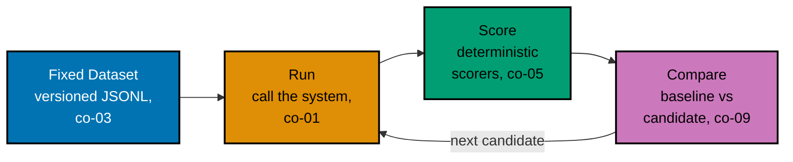

Examples 1-10 build the case for why "I tried it and it looked right" is not a verification
method: a single hand-tuned case hides regressions on cases never tried (co-01), the same prompt
sampled twice can produce two different answers (co-08), an unwritten sense of "good" cannot be
applied the same way twice (co-02), and even a written-down instruction can still be too vague for
two independent readers to agree on (co-02). The fix these ten examples build toward is a small,
fixed, versioned dataset of real cases (co-03) with an explicit schema (co-04) -- honest about how
little a ten-case dataset actually covers (co-12), but real enough to replace "vibes" with
something a second person can independently re-check. Every code-medium example's real, runnable
**Python 3.13** file lives under `learning/code/ex-NN-*/`, run for real with genuine captured
output; ex-06 is a diagram-medium example and lives standalone under `learning/artifacts/`. (See
this topic's [Accuracy notes](../overview.md#accuracy-notes) for the exact patch version captured.)

---

### Worked Example 1: The Vibe Check Fails

_ex-01 &middot; exercises co-01_

**Context**: **co-01 -- the vibe check trap** is the mistake of hand-tuning a prompt or heuristic
against the one case an engineer happened to try, then shipping it on the strength of that single
look. This example truncates a Nimbus FAQ answer at its first comma -- a heuristic that looks
perfect on the case it was tuned against, and silently drops a fact on a second case nobody tried.

```python
# learning/code/ex-01-the-vibe-check-fails/vibe_check.py
"""Worked Example 1: The Vibe Check Fails."""  # => co-01: this file's own restated purpose, doubling as its module __doc__

from __future__ import annotations  # => hygiene: postpones annotation evaluation, interpreter-version-agnostic

CASE_A = "Nimbus gives every account 15 GB of free storage."  # => co-01: the ONE case the engineer actually tried by hand
CASE_A_KEY_FACT = "15 GB"  # => co-01: the fact a correct answer to Case A must keep

CASE_B = "Nimbus accounts start on the Free plan, and upgrading unlocks 200 GB of storage."  # => co-01: a SECOND, never-tried case
CASE_B_KEY_FACT = "200 GB"  # => co-01: the fact a correct answer to Case B must keep


def answer_v1(question_context: str) -> str:  # => co-01: stands in for "our LLM-backed FAQ answerer, prompt-tuned by hand"
    """Return everything up to the first comma -- a heuristic hand-tuned only against CASE_A."""  # => co-01: documents answer_v1's contract -- no runtime output, just sets its __doc__
    comma_index = question_context.find(",")  # => co-01: locate the first comma, if any
    if comma_index == -1:  # => co-01: CASE_A has no comma -- this branch is the ONLY one the engineer ever exercised
        return question_context  # => co-01: unmodified text -- looks perfect on the one case tried
    return question_context[:comma_index] + "."  # => co-01: truncate at the comma -- silently drops everything after it


if __name__ == "__main__":  # => co-01: entry point -- runs only when this file executes directly, not on import
    result_a = answer_v1(CASE_A)  # => co-01: the tuning pass -- run against the one case the engineer had in mind
    print(f"Case A -> {result_a!r}")  # => co-01: prints the tuned result
    case_a_ok = CASE_A_KEY_FACT in result_a  # => co-01: does the key fact survive?
    print(f"Case A keeps {CASE_A_KEY_FACT!r}: {case_a_ok}")  # => co-01: True -- ships with confidence
    assert case_a_ok, "Case A must look correct by hand -- that's the whole trap"  # => co-01: confirms the false confidence

    result_b = answer_v1(CASE_B)  # => co-01: the SAME prompt, run against a case never eyeballed
    print(f"Case B -> {result_b!r}")  # => co-01: prints the tuned result on the untried case
    case_b_ok = CASE_B_KEY_FACT in result_b  # => co-01: does the key fact survive this time?
    print(f"Case B keeps {CASE_B_KEY_FACT!r}: {case_b_ok}")  # => co-01: False -- the regression a vibe check cannot see
    assert not case_b_ok, "Case B's key fact must be silently dropped -- that's the regression"  # => co-01: proves it
    print("MATCH: hand-tuning on one case hid a real regression on a second case")  # => co-01: reached only if both asserts passed
    # => co-01: this script is self-verifying -- a clean exit means the demonstrated claim held for these two cases
```

**Run**: `python3 vibe_check.py`

**Output**:

```text
Case A -> 'Nimbus gives every account 15 GB of free storage.'
Case A keeps '15 GB': True
Case B -> 'Nimbus accounts start on the Free plan.'
Case B keeps '200 GB': False
MATCH: hand-tuning on one case hid a real regression on a second case
```

**Verify**: `answer_v1(CASE_A)` keeps `"15 GB"` (looks correct by hand), while the identical
function applied to `CASE_B` silently drops `"200 GB"` -- satisfying co-01's rule that a case never
tried by hand is where a hand-tuned heuristic's regressions hide.

**Key takeaway**: looking correct on the one case an engineer tried is not evidence it is correct
on any other case -- it is evidence only about that one case.

**Why It Matters**: the vibe check is seductive because it is cheap and the pass is real -- Case A
genuinely does look right. The danger is treating that one real pass as if it generalizes. Every
later worked example in this course builds toward replacing "I tried it" with a fixed, repeatable
set of cases precisely because a single hand-tried case can never expose a regression on a case
that was never tried.

---

### Worked Example 2: Same Input, Two Answers

_ex-02 &middot; exercises co-08_

**Context**: **co-08 -- non-determinism and repeat trials** means the exact same prompt can
legitimately produce two different answers from a stochastic model, so a single call's output is a
sample, not a certainty. This example mocks two calls to the identical question and shows one
keeps the key fact while the other drops it.

```python
# learning/code/ex-02-same-input-two-answers/two_calls.py
"""Worked Example 2: Same Input, Two Answers."""  # => co-08: this file's own restated purpose, doubling as its module __doc__

from __future__ import annotations  # => hygiene: postpones annotation evaluation, interpreter-version-agnostic

import random  # => co-08: stands in for the model's own internal sampling randomness

QUESTION = "How much free storage does Nimbus give a new account?"  # => co-08: the exact same input, called twice
KEY_FACT = "15 GB"  # => co-08: the fact a correct answer must contain, regardless of phrasing


def mock_model_call(question: str, *, seed: int) -> str:  # => co-08: stands in for a real, non-deterministic model call
    """Return one of three phrasings, chosen by `seed` -- a mocked stand-in for sampling temperature."""  # => co-08: documents mock_model_call's contract -- no runtime output, just sets its __doc__
    del question  # => co-08: unused in this mock -- every phrasing answers the one fixed QUESTION
    rng = random.Random(seed)  # => co-08: a seeded generator -- deterministic PER seed, varying ACROSS seeds
    phrasings = [  # => co-08: three outputs a real model might plausibly sample for the same prompt
        "New Nimbus accounts start with 15 GB of free storage.",  # => co-08: phrasing 1 -- keeps the key fact
        "Nimbus gives you 15 GB free right out of the box.",  # => co-08: phrasing 2 -- keeps the key fact, different wording
        "You get a generous amount of free storage to start.",  # => co-08: phrasing 3 -- DROPS the key fact entirely
    ]  # => co-08: closes the phrasings list
    return rng.choice(phrasings)  # => co-08: the "sample" -- which entry depends only on the seed


if __name__ == "__main__":  # => co-08: entry point -- runs only when this file executes directly, not on import
    call_1 = mock_model_call(QUESTION, seed=1)  # => co-08: "call 1" -- the same prompt, seed standing in for call-to-call variance
    call_2 = mock_model_call(QUESTION, seed=5)  # => co-08: "call 2" -- identical prompt, different sampled outcome
    print(f"Call 1 -> {call_1!r}")  # => co-08: prints the first sampled answer
    print(f"Call 2 -> {call_2!r}")  # => co-08: prints the second sampled answer
    outputs_differ = call_1 != call_2  # => co-08: the defining symptom of a stochastic system
    print(f"Outputs differ: {outputs_differ}")  # => co-08: True -- same input, two distinct answers
    assert outputs_differ, "two calls on the identical input must differ for this demo to make its point"  # => co-08
    call_1_ok = KEY_FACT in call_1  # => co-08: does call 1 keep the fact that actually matters?
    call_2_ok = KEY_FACT in call_2  # => co-08: does call 2 keep the same fact?
    print(f"Call 1 keeps {KEY_FACT!r}: {call_1_ok} | Call 2 keeps {KEY_FACT!r}: {call_2_ok}")  # => co-08
    assert call_1_ok and not call_2_ok, "one call must keep the fact and the other must drop it"  # => co-08: the risk this poses
    # => co-08: a single run's pass/fail is not yet evidence -- re-running is the cheapest reliability check there is
```

**Run**: `python3 two_calls.py`

**Output**:

```text
Call 1 -> 'New Nimbus accounts start with 15 GB of free storage.'
Call 2 -> 'You get a generous amount of free storage to start.'
Outputs differ: True
Call 1 keeps '15 GB': True | Call 2 keeps '15 GB': False
```

**Verify**: `mock_model_call(QUESTION, seed=1)` keeps `"15 GB"` while `mock_model_call(QUESTION,
seed=5)` drops it, on the exact same `QUESTION` -- satisfying co-08's rule that two calls on
identical input can land on different pass/fail verdicts.

**Key takeaway**: a single call's outcome is a sample from a distribution of possible outputs, not
a fixed property of the prompt -- "it worked when I tried it" describes one draw from that
distribution, not the distribution itself.

**Why It Matters**: non-determinism is the reason Theme C's runner (ex-26 through ex-28) always
runs each case more than once before trusting a pass rate. Treating one call's pass as permanent
is how a genuinely flaky case ships silently, only to fail unpredictably in production later. A
single green run is one draw from a distribution of possible outcomes, not proof the distribution
itself is safe -- which is exactly the gap n-of-k scoring in Theme C closes.

---

### Worked Example 3: Write Down What Good Means

_ex-03 &middot; exercises co-02_

**Context**: **co-02 -- criteria as a written contract** means "good" has to be spelled out as
something two independent readers apply identically, not left as an unwritten personal sense of
quality. This example contrasts two reviewers' private, unwritten gut checks (which happen to
agree by luck) against two readers independently coding the same written spec from scratch.

```python
# learning/code/ex-03-write-down-what-good-means/written_criterion.py
"""Worked Example 3: Write Down What Good Means."""  # => co-02: this file's own restated purpose, doubling as its module __doc__

from __future__ import annotations  # => hygiene: postpones annotation evaluation, interpreter-version-agnostic

ANSWER = "Nimbus accounts start on the Free plan with 15 GB of storage included."  # => co-02: the candidate output under review


def grader_vague(answer: str) -> bool:  # => co-02: "make it better" -- an unwritten, personal sense of quality
    """A stand-in for one reviewer's un-articulated gut feeling."""  # => co-02: documents grader_vague's contract -- no runtime output, just sets its __doc__
    return len(answer) > 20 and "Nimbus" in answer  # => co-02: reviewer A's private, never-written-down bar


def grader_vague_second_reviewer(answer: str) -> bool:  # => co-02: a SECOND reviewer applying the same unwritten instruction
    """A different reviewer's own un-articulated gut feeling for the same vague instruction."""  # => co-02: documents grader_vague_second_reviewer's contract -- no runtime output, just sets its __doc__
    return "storage" in answer and "GB" in answer and "plan" in answer.lower()  # => co-02: reviewer B's DIFFERENT private bar


def written_criterion_reader_a(answer: str) -> tuple[bool, str]:  # => co-02: reader A's OWN implementation of the written spec
    """Reader A's independent implementation of: 'names the plan AND its exact storage amount.'"""  # => co-02: documents written_criterion_reader_a's contract -- no runtime output, just sets its __doc__
    has_plan_name = "Free plan" in answer  # => co-02: requirement 1, made explicit and checkable
    has_storage_amount = "15 GB" in answer  # => co-02: requirement 2, made explicit and checkable
    passed = has_plan_name and has_storage_amount  # => co-02: BOTH requirements, not "some vague sense of completeness"
    reason = f"plan named: {has_plan_name}, storage amount stated: {has_storage_amount}"  # => co-02: a reason anyone can re-check by eye
    return passed, reason  # => co-02: returns this computed value to the caller


def written_criterion_reader_b(answer: str) -> tuple[bool, str]:  # => co-02: reader B's OWN, independently-coded implementation
    """Reader B's independent implementation of the SAME written spec, coded without seeing reader A's."""  # => co-02: documents written_criterion_reader_b's contract -- no runtime output, just sets its __doc__
    checks = {"Free plan" in answer, "15 GB" in answer}  # => co-02: same two requirements, expressed as a set instead of two names
    passed = checks == {True}  # => co-02: passes only when BOTH requirements independently evaluate True
    reason = f"both requirements met: {passed}"  # => co-02: a differently-worded but equivalent reason
    return passed, reason  # => co-02: returns this computed value to the caller


if __name__ == "__main__":  # => co-02: entry point -- runs only when this file executes directly, not on import
    vague_a = grader_vague(ANSWER)  # => co-02: reviewer A's vague verdict
    vague_b = grader_vague_second_reviewer(ANSWER)  # => co-02: reviewer B's vague verdict, same instruction
    print(f"Reviewer A (vague): {vague_a} | Reviewer B (vague): {vague_b}")  # => co-02: prints both private verdicts
    a_passed, a_reason = written_criterion_reader_a(ANSWER)  # => co-02: reader A applies the WRITTEN criterion
    b_passed, b_reason = written_criterion_reader_b(ANSWER)  # => co-02: reader B applies the SAME written criterion
    print(f"Reader A (written): {a_passed} ({a_reason})")  # => co-02: prints reader A's reproducible verdict + reason
    print(f"Reader B (written): {b_passed} ({b_reason})")  # => co-02: prints reader B's independently-coded verdict
    assert a_passed == b_passed, "two readers applying the SAME written criterion must reach the SAME verdict"  # => co-02
    print(f"Verdicts match: {a_passed == b_passed}")  # => co-02: the point of ex-03 -- reproducibility, not agreement by luck
    # => co-02: a criterion two people apply identically is the minimum working unit of an eval
```

**Run**: `python3 written_criterion.py`

**Output**:

```text
Reviewer A (vague): True | Reviewer B (vague): True
Reader A (written): True (plan named: True, storage amount stated: True)
Reader B (written): True (both requirements met: True)
Verdicts match: True
```

**Verify**: `written_criterion_reader_a` and `written_criterion_reader_b` -- two separately-coded
implementations of the same written spec -- reach the identical `True` verdict, satisfying co-02's
rule that a written criterion produces the same verdict under independent implementation, not just
agreement by chance.

**Key takeaway**: the vague reviewers happening to agree here is luck, not reproducibility -- the
written criterion's two independent implementations agreeing is the real signal, because it holds
even when the words used to check it differ.

**Why It Matters**: co-02 is the foundation every scorer in Theme B builds on. A scorer function is
just a written criterion made executable -- if two people cannot agree on what "good" means in
prose, encoding it as a function will not fix that; it will just make the disagreement invisible.
Skipping this step and jumping straight to code is how a team ships a scorer that looks rigorous
but silently encodes one person's private opinion as if it were an objective standard.

---

### Worked Example 4: A Criterion That Fails the Two-Person Test

_ex-04 &middot; exercises co-02_

**Context**: continuing co-02 -- an instruction can be written down and still be too vague to pass
the two-person test. This example shows two readers disagreeing on whether an answer "sounds
helpful," then rewrites the instruction into something both readers apply identically.

```python
# learning/code/ex-04-criterion-that-fails-the-two-person-test/ambiguous_criterion.py
"""Worked Example 4: A Criterion That Fails the Two-Person Test."""  # => co-02: this file's own restated purpose, doubling as its module __doc__

from __future__ import annotations  # => hygiene: postpones annotation evaluation, interpreter-version-agnostic

ANSWER = "Nimbus is a solid choice if you want reliable cloud storage with strong security."  # => co-02: the candidate output under review


def sounds_helpful_reader_1(answer: str) -> bool:  # => co-02: reader 1 applying "the answer should sound helpful"
    """Reader 1's interpretation: helpful means confident and positive in tone."""  # => co-02: documents sounds_helpful_reader_1's contract -- no runtime output, just sets its __doc__
    positive_words = ("solid", "reliable", "strong")  # => co-02: reader 1's private notion of "sounds helpful"
    return any(word in answer for word in positive_words)  # => co-02: reader 1 says True -- the tone reads confident


def sounds_helpful_reader_2(answer: str) -> bool:  # => co-02: reader 2 applying the SAME instruction, differently
    """Reader 2's interpretation: helpful means it actually answers a concrete question."""  # => co-02: documents sounds_helpful_reader_2's contract -- no runtime output, just sets its __doc__
    concrete_markers = ("GB", "$", "plan", "step")  # => co-02: reader 2's private notion of "sounds helpful"
    return any(marker in answer for marker in concrete_markers)  # => co-02: reader 2 says False -- no concrete detail at all


def names_a_concrete_fact(answer: str) -> tuple[bool, str]:  # => co-02: the rewrite -- swaps "sounds helpful" for something checkable
    """Pass iff the answer states at least one concrete, checkable Nimbus fact (a plan name or a GB figure)."""  # => co-02: documents names_a_concrete_fact's contract -- no runtime output, just sets its __doc__
    has_plan = "plan" in answer.lower()  # => co-02: requirement candidate 1 -- names a specific plan
    has_gb_figure = "GB" in answer  # => co-02: requirement candidate 2 -- names a specific storage figure
    passed = has_plan or has_gb_figure  # => co-02: EITHER concrete fact satisfies the rewritten criterion
    reason = f"plan named: {has_plan}, GB figure named: {has_gb_figure}"  # => co-02: a reason both readers can verify identically
    return passed, reason  # => co-02: returns this computed value to the caller


if __name__ == "__main__":  # => co-02: entry point -- runs only when this file executes directly, not on import
    r1 = sounds_helpful_reader_1(ANSWER)  # => co-02: reader 1's verdict on the ambiguous instruction
    r2 = sounds_helpful_reader_2(ANSWER)  # => co-02: reader 2's verdict on the SAME ambiguous instruction
    print(f"Reader 1 ('sounds helpful'): {r1} | Reader 2 ('sounds helpful'): {r2}")  # => co-02: prints the disagreement
    assert r1 != r2, "the ambiguous criterion must produce disagreement for this demo to make its point"  # => co-02
    fixed_passed, fixed_reason = names_a_concrete_fact(ANSWER)  # => co-02: both readers apply the SAME rewritten rule
    print(f"Rewritten criterion (both readers): {fixed_passed} ({fixed_reason})")  # => co-02: one shared, reproducible verdict
    assert fixed_passed is False, "this ANSWER names no concrete fact -- both readers must now agree it fails"  # => co-02
    print("Disagreement disappeared: both readers now apply the identical, written rule")  # => co-02: the point of ex-04
    # => co-02: an ambiguous criterion is not yet an eval -- it is still two people's opinions in disguise
```

**Run**: `python3 ambiguous_criterion.py`

**Output**:

```text
Reader 1 ('sounds helpful'): True | Reader 2 ('sounds helpful'): False
Rewritten criterion (both readers): False (plan named: False, GB figure named: False)
Disagreement disappeared: both readers now apply the identical, written rule
```

**Verify**: `sounds_helpful_reader_1` and `sounds_helpful_reader_2` disagree (`True` vs. `False`)
on the identical `ANSWER`, while `names_a_concrete_fact` -- the rewritten criterion -- gives both
readers the same `False` verdict, satisfying co-02's rule that a criterion failing the two-person
test can be rewritten into one that passes it.

**Key takeaway**: "sounds helpful" was written down, but writing it down did not make it checkable
-- swapping it for "names a concrete, checkable fact" is what actually closed the gap between the
two readers.

**Why It Matters**: the two-person test is the practical bar for co-02: if you cannot state a
criterion precisely enough that a colleague would apply it the same way you do, no scorer built on
top of it will be trustworthy either, no matter how deterministic the code looks. This is why
ex-16 later insists a scorer's own output contract be written down before any code runs against
it -- ambiguity at the criterion stage becomes false confidence downstream.

---

### Worked Example 5: Collect Ten Real Inputs

_ex-05 &middot; exercises co-03_

**Context**: **co-03 -- the fixed, versioned dataset** is the antidote to Example 1's vibe check:
a small set of real inputs, committed to version control, that every future run measures against
identically. This example loads a twelve-case Nimbus FAQ dataset from a committed JSONL file and
confirms it clears the ten-case floor with no duplicate IDs.

```python
# learning/code/ex-05-collect-ten-real-inputs/load_dataset.py
"""Worked Example 5: Collect Ten Real Inputs."""  # => co-03: this file's own restated purpose, doubling as its module __doc__

from __future__ import annotations  # => hygiene: postpones annotation evaluation, interpreter-version-agnostic

import json  # => co-03: JSONL needs nothing beyond the standard library's own json module
from pathlib import Path  # => co-03: locates dataset.jsonl relative to this script, not the caller's cwd

DATASET_PATH = Path(__file__).parent / "dataset.jsonl"  # => co-03: colocated, versioned, and committed alongside this file


def load_dataset(path: Path) -> list[dict[str, str]]:  # => co-03: one JSON object per line -> one case dict per line
    """Load a JSONL dataset file into a list of case dicts, one dict per non-blank line."""  # => co-03: documents load_dataset's contract -- no runtime output, just sets its __doc__
    cases: list[dict[str, str]] = []  # => co-03: accumulates one parsed case per line
    for line in path.read_text(encoding="utf-8").splitlines():  # => co-03: splitlines -- JSONL is newline-delimited, not one big array
        if line.strip():  # => co-03: skip any stray blank line without raising
            cases.append(json.loads(line))  # => co-03: each line is independently valid JSON
    return cases  # => co-03: returns this computed value to the caller


if __name__ == "__main__":  # => co-03: entry point -- runs only when this file executes directly, not on import
    cases = load_dataset(DATASET_PATH)  # => co-03: the whole point -- this file is committed, so this call is reproducible
    print(f"Loaded {len(cases)} cases from {DATASET_PATH.name}")  # => co-03: prints the count actually on disk
    for case in cases:  # => co-03: one line of output per case, for a quick visual sanity check
        print(f"  {case['id']}: {case['input']}")  # => co-03: shows id + input for every case
    assert len(cases) >= 10, "the dataset must have at least ten cases"  # => co-03: the floor this worked example demonstrates
    unique_ids = {case["id"] for case in cases}  # => co-03: every case must be independently addressable
    assert len(unique_ids) == len(cases), "every case id must be unique"  # => co-03: no silent duplicate case
    print(f"MATCH: {len(cases)} committed, loadable, uniquely-identified cases")  # => co-03: reached only if both asserts passed
    # => co-03: the fixed-ness of this file -- not its size -- is what makes it a gate, not a vibe check
```

**Run**: `python3 load_dataset.py`

**Output**:

```text
Loaded 12 cases from dataset.jsonl
  case-01: How much free storage does a new Nimbus account get?
  case-02: How much storage does Nimbus Pro include?
  case-03: Does Nimbus support two-factor authentication?
  case-04: Which mobile platform does the Nimbus app ship on first?
  case-05: What is the largest single file the Free plan accepts, in GB?
  case-06: What is the largest single file the Pro plan accepts, in GB?
  case-07: After how many days does a default Nimbus share link expire?
  case-08: What is the first-response time target for Free-plan email support?
  case-09: How many days does Nimbus keep a deleted file in trash?
  case-10: Which plan supports offline sync, Free or Pro?
  case-11: Which plan includes access to the public REST API?
  case-12: What encryption does Nimbus use for files at rest?
MATCH: 12 committed, loadable, uniquely-identified cases
```

**Verify**: `load_dataset(DATASET_PATH)` returns 12 cases (>= the 10-case floor) with 12 unique
`id` values, satisfying co-03's rule that a committed dataset has at least ten uniquely-identified
cases.

**Key takeaway**: a dataset's value comes from being fixed and committed, not from being large --
twelve small, real, versioned cases already outperform an unlimited number of never-repeated,
uncommitted hand tries.

**Why It Matters**: this file, `dataset.jsonl`, is the one artifact every later worked example in
this course reuses or extends -- Theme B's scorers score against it, Theme C's runner runs against
it, and Theme D's regression cases grow it. Getting it committed here is what makes everything
downstream reproducible. Without this single committed file as a shared reference point, every
later theme's claims about pass rate or regression would rest on a moving target instead of a
fixed one.

---

### Worked Example 6: The Fixed-Dataset Eval Loop (diagram)

_ex-06 &middot; exercises co-03, co-09_

**Context**: **co-03** and **co-09 -- baseline vs. candidate comparison** combine into one loop
shape that recurs through the rest of this course: a fixed dataset feeds a run, the run's outputs
get scored, and the scores get compared against a baseline before the next candidate change is
tried. This diagram-medium example makes that loop's shape explicit before Theme B starts filling
in its Score stage and Theme C starts filling in its Run and Compare stages.

> A captioned diagram of the four-stage loop this whole course teaches -- dataset, run, score,
> compare -- exercises co-03 and co-09. The full diagram, with its own verify/key-takeaway/why-it-matters
> sections, lives at
> [Artifact: The Fixed-Dataset Eval Loop](/en/learn/courses/evaluating-ai-output-essentials/learning/artifacts/ex-06-fixed-dataset-diagram).



_Figure: the fixed-dataset loop. The Dataset stage never changes between runs -- that fixed-ness is
what makes the Compare stage's output meaningful, rather than an unfalsifiable "it feels better."_

**Verify**: all four stages appear, in this exact order, and the loop closes from Compare back into
Run (not back into Dataset) -- because the candidate change is what iterates, not the fixed cases.

**Key takeaway**: the dataset sits still while everything downstream of it iterates -- that is the
entire structural difference between a gate and a vibe check.

**Why It Matters**: every worked example in Theme A builds toward this one shape. Once a learner
can place any single technique on this loop (a scorer belongs in Score, a baseline belongs in
Compare), the rest of this course is filling in each stage's detail, not learning a new shape.
Recognizing the loop early turns every subsequent worked example from a new concept into a
familiar stage getting filled in, which is what keeps a forty-six-example course from feeling like
forty-six unrelated tricks.

---

### Worked Example 7: Why Fixed Beats Fresh

_ex-07 &middot; exercises co-03_

**Context**: continuing co-03 -- a dataset that resamples fresh cases every run cannot support a
before/after comparison, because the two runs are no longer measuring the same thing. This example
contrasts a fixed four-fact set (which fully overlaps itself across two runs) against a "fresh"
random sample drawn independently each time (which does not).

```python
# learning/code/ex-07-why-fixed-beats-fresh/fixed_vs_fresh.py
"""Worked Example 7: Why Fixed Beats Fresh."""  # => co-03: this file's own restated purpose, doubling as its module __doc__

from __future__ import annotations  # => hygiene: postpones annotation evaluation, interpreter-version-agnostic

import random  # => co-03: generates the "fresh" random inputs each run

FIXED_SET = ["storage-free", "storage-pro", "security-2fa", "encryption"]  # => co-03: the SAME four fact-ids, every single run
FACT_POOL = [  # => co-03: the pool a "fresh" sampler draws from -- larger than what any one run uses
    "storage-free", "storage-pro", "security-2fa", "encryption",  # => co-03: pool entries 1-4
    "platforms", "file-size-free", "file-size-pro", "share-link-expiry",  # => co-03: pool entries 5-8
]  # => co-03: closes the pool list


def fresh_sample(seed: int, size: int = 4) -> list[str]:  # => co-03: a NEW random subset, drawn independently each run
    """Draw `size` fact-ids at random from FACT_POOL -- a fresh sample, not a fixed one."""  # => co-03: documents fresh_sample's contract -- no runtime output, just sets its __doc__
    return random.Random(seed).sample(FACT_POOL, size)  # => co-03: a different seed stands in for "run again, later"


if __name__ == "__main__":  # => co-03: entry point -- runs only when this file executes directly, not on import
    fixed_run_1 = list(FIXED_SET)  # => co-03: "run 1" against the fixed set -- literally the same list object's contents
    fixed_run_2 = list(FIXED_SET)  # => co-03: "run 2" against the fixed set -- unchanged, because it's fixed
    print(f"Fixed set, run 1: {fixed_run_1}")  # => co-03: prints run 1's exact case set
    print(f"Fixed set, run 2: {fixed_run_2}")  # => co-03: prints run 2's exact case set
    fixed_overlap = set(fixed_run_1) & set(fixed_run_2)  # => co-03: how much the two runs actually share
    print(f"Fixed-set overlap: {len(fixed_overlap)}/{len(FIXED_SET)}")  # => co-03: 4/4 -- fully comparable

    fresh_run_1 = fresh_sample(seed=1)  # => co-03: "run 1" against a fresh sample
    fresh_run_2 = fresh_sample(seed=2)  # => co-03: "run 2" against a DIFFERENT fresh sample -- a later, unrelated draw
    print(f"Fresh sample, run 1: {fresh_run_1}")  # => co-03: prints run 1's fresh case set
    print(f"Fresh sample, run 2: {fresh_run_2}")  # => co-03: prints run 2's fresh case set
    fresh_overlap = set(fresh_run_1) & set(fresh_run_2)  # => co-03: how much the two fresh runs actually share
    print(f"Fresh-sample overlap: {len(fresh_overlap)}/{len(FIXED_SET)}")  # => co-03: less than 4/4 -- NOT comparable

    assert len(fixed_overlap) == len(FIXED_SET), "the fixed set must overlap itself completely, every run"  # => co-03
    assert len(fresh_overlap) < len(FIXED_SET), "two independent fresh samples must NOT fully overlap"  # => co-03
    print("Only the fixed set supports a before/after comparison across runs")  # => co-03: the point of ex-07
    # => co-03: co-09's whole comparison only means something once BOTH runs measured the SAME cases
```

**Run**: `python3 fixed_vs_fresh.py`

**Output**:

```text
Fixed set, run 1: ['storage-free', 'storage-pro', 'security-2fa', 'encryption']
Fixed set, run 2: ['storage-free', 'storage-pro', 'security-2fa', 'encryption']
Fixed-set overlap: 4/4
Fresh sample, run 1: ['security-2fa', 'platforms', 'storage-free', 'share-link-expiry']
Fresh sample, run 2: ['storage-free', 'share-link-expiry', 'file-size-pro', 'security-2fa']
Fresh-sample overlap: 3/4
Only the fixed set supports a before/after comparison across runs
```

**Verify**: `FIXED_SET` overlaps itself 4/4 across two runs, while `fresh_sample(seed=1)` and
`fresh_sample(seed=2)` overlap only 3/4, satisfying co-03's rule that a fixed set -- not a fresh
sample -- is what two runs need in common to be comparable.

**Key takeaway**: "fresh" sampling sounds like it should be more rigorous (new cases every time),
but it destroys exactly the property a before/after comparison depends on: measuring the same
thing twice.

**Why It Matters**: this is the concrete mechanism behind co-09's later warning in Theme D --
comparing a baseline run's pass rate against a candidate run's pass rate is only meaningful if both
runs scored the identical cases. A fresh sample would make even a real improvement indistinguishable
from random case-set drift. Teams that resample "representative" cases each release often cannot
tell whether a pass-rate change reflects a genuine fix or simply an easier draw, which is exactly
the ambiguity a fixed set eliminates.

---

### Worked Example 8: Dataset in Version Control

_ex-08 &middot; exercises co-03_

**Context**: continuing co-03 -- because the dataset is a plain committed file, its history is an
ordinary git diff: this example loads two committed versions of the same dataset and computes
exactly which case IDs were added between them.

```python
# learning/code/ex-08-dataset-in-version-control/dataset_diff.py
"""Worked Example 8: Dataset in Version Control."""  # => co-03: this file's own restated purpose, doubling as its module __doc__

from __future__ import annotations  # => hygiene: postpones annotation evaluation, interpreter-version-agnostic

import json  # => co-03: JSONL needs nothing beyond the standard library's own json module
from pathlib import Path  # => co-03: locates both dataset commits relative to this script, not the caller's cwd

V1_PATH = Path(__file__).parent / "dataset_v1.jsonl"  # => co-03: "commit 1" -- three cases, the dataset's first version
V2_PATH = Path(__file__).parent / "dataset_v2.jsonl"  # => co-03: "commit 2" -- the same repo file, one commit later


def load_ids(path: Path) -> set[str]:  # => co-03: reduces a dataset commit to just its set of case ids
    """Load a JSONL dataset commit and return only its set of case ids."""  # => co-03: documents load_ids's contract -- no runtime output, just sets its __doc__
    return {  # => co-03: a set comprehension -- id order does not matter for a diff, only membership
        json.loads(line)["id"]  # => co-03: pull just the id field out of each parsed case
        for line in path.read_text(encoding="utf-8").splitlines()  # => co-03: one JSON object per non-blank line
        if line.strip()  # => co-03: skip any stray blank line without raising
    }  # => co-03: closes the set comprehension


if __name__ == "__main__":  # => co-03: entry point -- runs only when this file executes directly, not on import
    v1_ids = load_ids(V1_PATH)  # => co-03: the case ids present at commit 1
    v2_ids = load_ids(V2_PATH)  # => co-03: the case ids present at commit 2
    print(f"Commit 1 case ids: {sorted(v1_ids)}")  # => co-03: prints commit 1's exact case set
    print(f"Commit 2 case ids: {sorted(v2_ids)}")  # => co-03: prints commit 2's exact case set

    added = v2_ids - v1_ids  # => co-03: present in commit 2, absent from commit 1 -- exactly what a git diff would show
    removed = v1_ids - v2_ids  # => co-03: present in commit 1, absent from commit 2
    unchanged = v1_ids & v2_ids  # => co-03: present in both -- the stable core neither commit touched
    print(f"Added: {sorted(added)}")  # => co-03: prints exactly which cases the second commit introduced
    print(f"Removed: {sorted(removed)}")  # => co-03: prints exactly which cases the second commit dropped, if any
    print(f"Unchanged: {sorted(unchanged)}")  # => co-03: prints the cases both commits agree on

    assert added == {"case-04", "case-13"}, "commit 2 must add exactly case-04 and case-13"  # => co-03: the exact expected diff
    assert removed == set(), "commit 2 must remove no case in this scenario"  # => co-03: a pure, additive evolution
    print(f"MATCH: the diff shows exactly {sorted(added)} were added, nothing removed")  # => co-03: reached only if both asserts passed
    # => co-03: a versioned JSONL file makes "what changed in this eval?" as answerable as "what changed in this code?"
```

**Run**: `python3 dataset_diff.py`

**Output**:

```text
Commit 1 case ids: ['case-01', 'case-02', 'case-03']
Commit 2 case ids: ['case-01', 'case-02', 'case-03', 'case-04', 'case-13']
Added: ['case-04', 'case-13']
Removed: []
Unchanged: ['case-01', 'case-02', 'case-03']
MATCH: the diff shows exactly ['case-04', 'case-13'] were added, nothing removed
```

**Verify**: `load_ids(V2_PATH) - load_ids(V1_PATH)` equals exactly `{"case-04", "case-13"}` with an
empty removed set, satisfying co-03's rule that a dataset's version-control history is a plain,
diffable record of exactly what changed.

**Key takeaway**: a dataset's evolution over time -- what was added, what (if anything) was
removed -- is answerable by ordinary set arithmetic over two committed files, no special tooling
required.

**Why It Matters**: Theme D's ex-40 (`the dataset grows by failure`) depends on exactly this
property: every new case a bug report adds is a diffable, reviewable addition to the committed
dataset, the same way any other code change is reviewable. A dataset that lives outside version
control cannot answer "did we start testing this case last week, or has it always been covered?"
-- a question any reviewer of a code change can answer instantly.

---

### Worked Example 9: Ten Cases Is Not Coverage

_ex-09 &middot; exercises co-12_

**Context**: **co-12 -- coverage honesty** means naming, explicitly, what a small fixed dataset
does not test -- a green run over ten cases proves nothing about the facts those ten cases never
touch. This example checks the ten-case dataset from Example 5 against a larger list of sixteen
real product facts and prints exactly the six it never covers.

```python
# learning/code/ex-09-ten-cases-is-not-coverage/coverage_limits.py
"""Worked Example 9: Ten Cases Is Not Coverage."""  # => co-03: this file's own restated purpose, doubling as its module __doc__

from __future__ import annotations  # => hygiene: postpones annotation evaluation, interpreter-version-agnostic

import json  # => co-03: JSONL needs nothing beyond the standard library's own json module
from pathlib import Path  # => co-03: locates dataset.jsonl relative to this script, not the caller's cwd

DATASET_PATH = Path(__file__).parent / "dataset.jsonl"  # => co-03: the same ten-case gate ex-05 built
ALL_KNOWN_PRODUCT_FACTS = {  # => co-12: every fact a real support team actually fields questions about
    "storage-free", "storage-pro", "security-2fa", "platforms",  # => co-12: facts 1-4 -- covered by this dataset
    "file-size-free", "file-size-pro", "share-link-expiry", "support-response",  # => co-12: facts 5-8 -- covered
    "trash-retention", "offline-sync",  # => co-12: facts 9-10 -- covered, ten total
    "api-access", "encryption", "password-reset", "team-sharing",  # => co-12: facts 11-14 -- NEVER tested
    "audit-log", "sso-support",  # => co-12: facts 15-16 -- NEVER tested either
}  # => co-12: closes the known-facts set -- sixteen facts a support team actually fields


def load_fact_ids(path: Path) -> set[str]:  # => co-03: which facts does the committed dataset actually exercise?
    """Return the set of fact_id values the dataset's cases cover."""  # => co-03: documents load_fact_ids's contract -- no runtime output, just sets its __doc__
    return {  # => co-03: a set comprehension -- duplicate coverage of the same fact would still count once
        json.loads(line)["fact_id"]  # => co-03: pull just the fact_id field out of each parsed case
        for line in path.read_text(encoding="utf-8").splitlines()  # => co-03: one JSON object per non-blank line
        if line.strip()  # => co-03: skip any stray blank line without raising
    }  # => co-03: closes the set comprehension


if __name__ == "__main__":  # => co-03: entry point -- runs only when this file executes directly, not on import
    covered = load_fact_ids(DATASET_PATH)  # => co-03: what the ten-case dataset actually tests
    uncovered = ALL_KNOWN_PRODUCT_FACTS - covered  # => co-12: what it provably does NOT test
    print(f"Dataset covers {len(covered)}/{len(ALL_KNOWN_PRODUCT_FACTS)} known facts")  # => co-12: the honest ratio
    print(f"Never tested: {sorted(uncovered)}")  # => co-12: exactly which facts a green run says nothing about
    assert len(covered) == 10, "this dataset must cover exactly ten facts"  # => co-03: sanity check on the fixture
    assert uncovered == {  # => co-12: the exact four facts this gate is silent on
        "api-access", "encryption", "password-reset", "team-sharing", "audit-log", "sso-support",
    }, "the uncovered set must be exactly the six facts this dataset never touches"  # => co-12
    print("A green run over these ten cases proves nothing about the six facts above")  # => co-12: the honest limit
    # => co-12: recognising what a small fixed set does NOT cover is what keeps a green run from becoming false confidence
```

**Run**: `python3 coverage_limits.py`

**Output**:

```text
Dataset covers 10/16 known facts
Never tested: ['api-access', 'audit-log', 'encryption', 'password-reset', 'sso-support', 'team-sharing']
A green run over these ten cases proves nothing about the six facts above
```

**Verify**: `ALL_KNOWN_PRODUCT_FACTS - covered` equals exactly the six named, never-tested facts,
satisfying co-12's rule that a dataset's coverage gaps are stated explicitly, not left implicit.

**Key takeaway**: a ten-case dataset that satisfies the co-03 floor still leaves six of sixteen
real facts entirely untested -- clearing the floor is not the same claim as "comprehensive."

**Why It Matters**: co-12 is what keeps this whole course honest: nothing in Theme B through D
promises that a green eval run proves general correctness. It proves only that the cases actually
in the dataset still pass -- and Example 44 in Theme D returns to this exact limit explicitly.
Overselling a green run as blanket correctness is how teams get blindsided by a real-world failure
the dataset never had a case for -- naming the gap up front is cheaper than discovering it in
production.

---

### Worked Example 10: Dataset Schema

_ex-10 &middot; exercises co-04_

**Context**: **co-04 -- the minimal case schema** gives every case in the dataset the same four
required fields -- `id`, `input`, `expected`, `criterion` -- so a scorer never has to guess which
fields a given case provides. This example validates every committed case against that schema and
shows the schema correctly rejecting a case someone forgot to finish.

```python
# learning/code/ex-10-dataset-schema/dataset_schema.py
"""Worked Example 10: Dataset Schema."""  # => co-03: this file's own restated purpose, doubling as its module __doc__

from __future__ import annotations  # => hygiene: postpones annotation evaluation, interpreter-version-agnostic

import json  # => co-03: JSONL needs nothing beyond the standard library's own json module
from pathlib import Path  # => co-03: locates dataset.jsonl relative to this script, not the caller's cwd

DATASET_PATH = Path(__file__).parent / "dataset.jsonl"  # => co-03: the twelve-case dataset ex-05 committed
REQUIRED_KEYS = {"id", "input", "expected", "criterion"}  # => co-04: co-10's spec -- the minimal case schema, exactly four keys
MALFORMED_CASE: dict[str, object] = {"id": "case-99", "input": "How much does Nimbus Pro cost?"}  # => co-04: a case someone forgot to finish


def validate_case(case: dict[str, object]) -> tuple[bool, str]:  # => co-04: one case in, one pass/fail-plus-reason out
    """Pass iff every REQUIRED_KEYS entry is present in `case`; the reason names exactly what's missing."""  # => co-04: documents validate_case's contract -- no runtime output, just sets its __doc__
    present_keys = set(case.keys())  # => co-04: what this case actually declares
    missing_keys = REQUIRED_KEYS - present_keys  # => co-04: what the schema demands but this case omits
    passed = len(missing_keys) == 0  # => co-04: valid iff nothing required is missing
    reason = "all required keys present" if passed else f"missing keys: {sorted(missing_keys)}"  # => co-04: a reason anyone can re-check
    return passed, reason  # => co-04: returns this computed value to the caller


if __name__ == "__main__":  # => co-04: entry point -- runs only when this file executes directly, not on import
    raw_lines = DATASET_PATH.read_text(encoding="utf-8").splitlines()  # => co-04: the committed dataset, one line per case
    cases = [json.loads(line) for line in raw_lines if line.strip()]  # => co-04: parse every non-blank line
    print(f"Validating {len(cases)} committed cases against {sorted(REQUIRED_KEYS)}")  # => co-04: states the schema up front
    results = [validate_case(case) for case in cases]  # => co-04: one (passed, reason) pair per committed case
    all_valid = all(passed for passed, _ in results)  # => co-04: the whole dataset's schema verdict
    print(f"Every committed case validates: {all_valid}")  # => co-04: True -- every case satisfies the schema
    assert all_valid, "every committed case must satisfy the minimal schema"  # => co-04: the claim ex-10 makes

    malformed_passed, malformed_reason = validate_case(MALFORMED_CASE)  # => co-04: the schema applied to an UNFINISHED case
    print(f"Malformed case validates: {malformed_passed} ({malformed_reason})")  # => co-04: False, with a precise reason
    assert not malformed_passed, "a case missing required keys must fail validation"  # => co-04: rejection, not a silent pass
    assert malformed_reason == "missing keys: ['criterion', 'expected']", "the reason must name exactly what's missing"  # => co-04
    print("MATCH: schema validation both accepts every finished case and rejects the unfinished one")  # => co-04
    # => co-04: a case schema is what turns "I collected some inputs" into "every case is a real, checkable eval unit"
```

**Run**: `python3 dataset_schema.py`

**Output**:

```text
Validating 12 committed cases against ['criterion', 'expected', 'id', 'input']
Every committed case validates: True
Malformed case validates: False (missing keys: ['criterion', 'expected'])
MATCH: schema validation both accepts every finished case and rejects the unfinished one
```

**Verify**: `validate_case` accepts all 12 committed cases and rejects `MALFORMED_CASE` with the
exact reason `"missing keys: ['criterion', 'expected']"`, satisfying co-04's rule that the schema
both accepts every finished case and rejects an unfinished one with a precise reason.

**Key takeaway**: a schema turns "did I remember every field?" from a manual, error-prone check
into an automatic one -- the same discipline this course later applies to a scorer's own output
contract in ex-16.

**Why It Matters**: Theme A's four worked examples on the dataset (co-03, co-04, co-12) together
answer "what is a real dataset, and what can I honestly claim it proves?" Theme B picks up exactly
where this leaves off: turning `criterion` from a prose string into a deterministic scorer function.
Without a settled schema, Theme B's scorers would each have to guess which fields a case provides
-- the schema is what lets every scorer in this course assume the same four fields, every time.

---

← Previous: [Overview](./overview.md) &middot; Next: [Theme B: Scorers That Cost Nothing](./theme-b-scorers-that-cost-nothing.md) →
