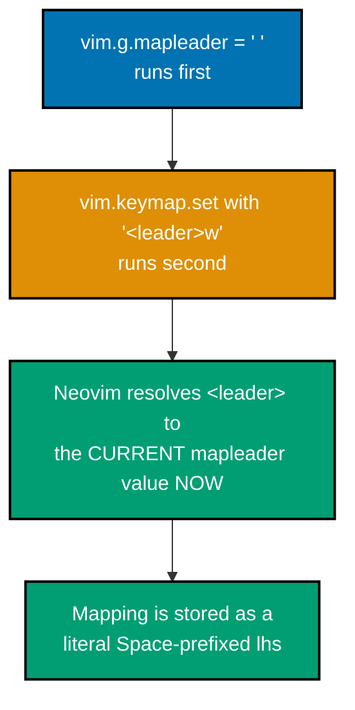
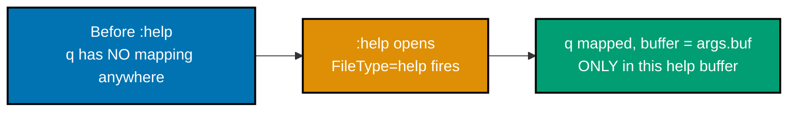
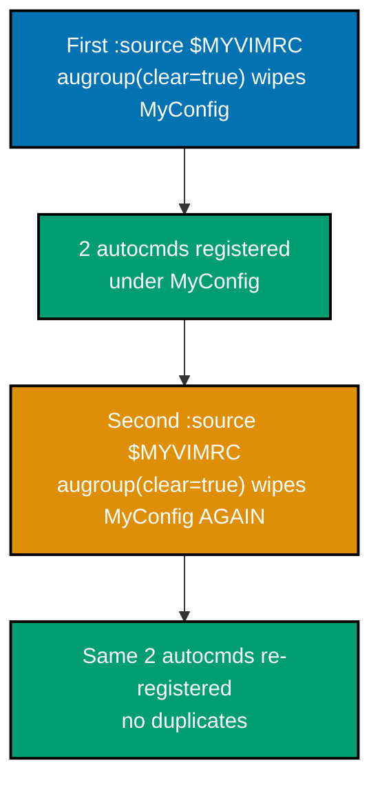
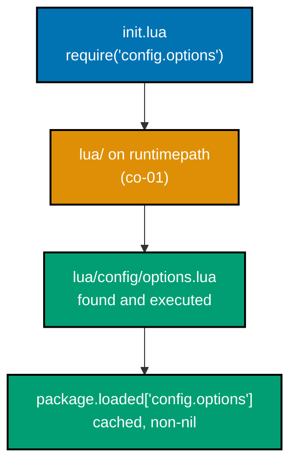
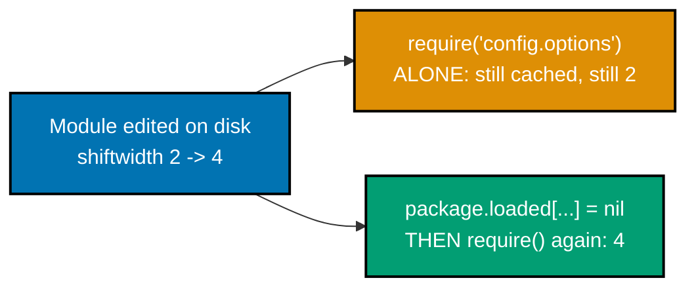

Examples 1-28 turn vanilla Neovim into a config-driven editor: locating and organizing `init.lua`, the `vim.o`/`vim.opt`/`vim.g` option and variable accessors, `vim.keymap.set`, autocommands, user commands, the Lua module system, and the first plugin installed with the built-in `vim.pack` manager. Every example is a complete, self-contained `init.lua` colocated under `learning/code/`; each `transcript.txt` shows the exact `nvim --headless` invocation used to verify it and the real, captured output -- this topic has no standalone interpreter, so every claim is checked against a running Neovim session, not described in the abstract.

---

### Example 1: Locate Init.lua

_ex-01 &middot; exercises co-01_

Before any option, keymap, or plugin can exist, Neovim needs one Lua file to source at startup. This example creates `init.lua` at the XDG default location and confirms Neovim itself agrees on where that file lives.

**`learning/code/ex-01-locate-init-lua/after/init.lua`**

```lua
-- init.lua -- the single Lua entry point Neovim sources at startup
vim.o.number = true                -- => the first real config line; proves the file is actually read
```

**Verify**: `nvim --headless -c 'echo $MYVIMRC' -c 'lua print(vim.fn.stdpath("config"))' -c 'qa!'`

**Output**:

```text
/Users/<you>/.config/nvim/init.lua
/Users/<you>/.config/nvim
```

**Key takeaway**: `:echo $MYVIMRC` reports the exact file Neovim sourced this run; `stdpath('config')` reports the config root independently, even before `init.lua` exists.

**Why it matters**: Every other concept in this topic -- options, keymaps, autocommands, plugin managers -- is code, and code has to live somewhere Neovim actually reads at startup. `$MYVIMRC` and `stdpath('config')` are the two commands worth memorizing for the rest of this topic: the first confirms which file ran, the second confirms where to put new files (like the `lua/` module tree Example 20 introduces) so Neovim's `runtimepath` picks them up automatically.

---

### Example 2: Set a Boolean Option with vim.o

_ex-02 &middot; exercises co-02_

`vim.o` gives direct scalar access to Neovim's options -- booleans, numbers, and strings assign exactly like a Lua field. This example turns on line numbers, the option nearly every config sets first.

**`learning/code/ex-02-set-boolean-option-vim-o/after/init.lua`**

```lua
vim.o.number = true                -- => sets the boolean option 'number' directly, no :set needed
```

**Verify**: `nvim --headless -u after/init.lua -c 'set number?' -c 'qa!'`

**Output**:

```text
  number
```

**Key takeaway**: `vim.o.<name> = value` is the direct Lua equivalent of `:set <name>=value`, and it works for booleans, numbers, and strings alike.

**Why it matters**: `vim.o` is the accessor to reach for whenever an option's value is a single scalar. It is the simplest of the four option accessors this topic covers (`vim.o`, `vim.opt`, `vim.bo`, `vim.wo`), and getting comfortable with it first makes the list-like special case `vim.opt` handles (Example 5) easier to recognize as the exception, not the rule.

---

### Example 3: Set relativenumber

_ex-03 &middot; exercises co-02_

Combining `number` with `relativenumber` produces Neovim's hybrid line-numbering mode: the cursor line shows its absolute number, every other visible line shows its distance from the cursor.

**`learning/code/ex-03-set-relativenumber/after/init.lua`**

```lua
vim.o.number = true                -- => absolute number on the cursor's own line
vim.o.relativenumber = true        -- => every OTHER visible line switches to distance-from-cursor
```

**Verify**: `nvim --headless -u after/init.lua -c 'set relativenumber?' -c 'qa!'`

**Output**:

```text
  relativenumber
```

**Key takeaway**: `relativenumber` alone shows distances for every line, including the cursor's; pairing it with `number` gives the cursor line its real, absolute number instead.

**Why it matters**: Relative numbers make counted motions (`5j`, `3dd`) trivial to aim without counting manually -- the gutter already shows the count you need. This is the first example that combines two options to produce a behavior neither one alone provides, a pattern this topic repeats constantly (Example 6's `ignorecase`+`smartcase` pair is the next one).

---

### Example 4: Set Tab Options

_ex-04 &middot; exercises co-02_

Three related options control how the `<Tab>` key behaves on insert: `expandtab` converts it to spaces, `shiftwidth` sets the indent width, `tabstop` sets how wide an actual tab character renders.

**`learning/code/ex-04-set-tab-options/after/init.lua`**

```lua
vim.o.expandtab = true             -- => every <Tab> KEYSTROKE inserts spaces, never a literal tab byte
vim.o.shiftwidth = 2               -- => >>, <<, and auto-indent all shift by exactly 2 columns
vim.o.tabstop = 2                  -- => a literal tab byte (if one exists in the file) renders 2 wide
```

**Verify**: `nvim --headless -u after/init.lua scratch.txt -c 'set expandtab? shiftwidth? tabstop?' -c "lua vim.cmd('normal ' .. vim.api.nvim_replace_termcodes('i<Tab>text<Esc>', true, false, true))" -c 'w' -c 'qa!'`

**Output**:

```text
  expandtab
  shiftwidth=2
  tabstop=2
```

`cat -A scratch.txt` after the write shows `··text$` -- two literal spaces, no tab byte.

**Key takeaway**: `expandtab` changes what a `<Tab>` **keystroke** inserts (spaces); `tabstop` only changes how an **existing** tab byte renders -- the two are easy to conflate but control different moments.

**Why it matters**: Files that mix real tab bytes and space-only indentation are a constant source of diff noise and "looks fine here, misaligned there" bugs across editors and terminal widths. Setting all three options together, consistently, is the single most common first change in any Neovim config, and understanding the keystroke-vs-render distinction avoids a config that "looks right" locally but reintroduces tabs the moment `expandtab` is missing.

---

### Example 5: Append a List Option with vim.opt

_ex-05 &middot; exercises co-02_

`wildignore` is really a comma-separated list under the hood. `vim.opt` wraps it in a Lua-table-like object supporting `:append()`, which extends the list instead of replacing it.

**`learning/code/ex-05-append-list-option-vim-opt/after/init.lua`**

```lua
vim.opt.wildignore:append({ "*.pyc", "node_modules" })
                                    -- => :append() ADDS both entries to whatever wildignore already held
                                    -- => vim.o.wildignore = {...} would instead REPLACE the whole list silently
```

**Verify**: `nvim --headless -u after/init.lua -c 'set wildignore?' -c 'qa!'`

**Output**:

```text
  wildignore=*.pyc,node_modules
```

**Key takeaway**: List-like, comma-separated options (`wildignore`, `path`, `suffixes`) need `vim.opt`'s `:append()`/`:remove()`, not `vim.o`'s plain assignment, or an extension silently becomes an overwrite.

**Why it matters**: This is the single most common "why did my config option get replaced instead of extended" bug in real configs. `vim.opt` exists specifically to make list-like options feel like ordinary Lua tables -- `:append()`, `:remove()`, and `:prepend()` all operate on the underlying list without requiring you to re-type every existing entry just to add one more.

---

### Example 6: ignorecase + smartcase

_ex-06 &middot; exercises co-02_

`smartcase` only makes sense paired with `ignorecase`: searches are case-insensitive by default, but a pattern containing an uppercase letter forces case-sensitive matching for that one search.

**`learning/code/ex-06-ignorecase-smartcase/after/init.lua`**

```lua
vim.o.ignorecase = true            -- => baseline: every search is case-INSENSITIVE by default
vim.o.smartcase = true             -- => EXCEPT when the pattern itself contains an uppercase letter
```

**Verify**: `nvim --headless -u after/init.lua scratch.txt -c 'lua print(vim.fn.execute("%s/Foo//gn"))' -c 'lua print(vim.fn.execute("%s/foo//gn"))' -c 'qa!'` against a buffer holding `Foo bar` / `foo baz` / `FOO qux`.

**Output**:

```text
1 match on 1 line
3 matches on 3 lines
```

**Key takeaway**: A pattern with any uppercase letter (`Foo`) searches case-sensitively; an all-lowercase pattern (`foo`) falls back to `ignorecase`'s case-insensitive default.

**Why it matters**: This pairing is why typing a lowercase search finds everything, but typing so much as one capital letter narrows the search precisely -- exactly the behavior most readers already expect from IDE search boxes, achieved here with two option lines instead of a plugin. Readers who set only `ignorecase` lose the ability to search case-sensitively at all without `\C`; readers who set only `smartcase` get no effect, since `smartcase` is documented to do nothing unless `ignorecase` is also on.

---

### Example 7: Set mapleader

_ex-07 &middot; exercises co-03_

`vim.g.mapleader` is the most common global variable any config sets, and it must run **before** any keymap that references `<leader>` -- the substitution happens at mapping time, not at keypress time.



**`learning/code/ex-07-set-mapleader/after/init.lua`**

```lua
vim.g.mapleader = " "              -- => MUST run before any keymap that mentions <leader>
vim.keymap.set("n", "<leader>w", ":w<CR>", { desc = "Save file" })
                                    -- => <leader> is substituted with " " RIGHT NOW, at mapping time
```

**Verify**: `nvim --headless -u after/init.lua -c 'verbose map <space>w' -c 'qa!'`

**Output**:

```text
n  <Space>w    * :w<CR>
                 Save file
 Last set from .../after/init.lua
```

**Key takeaway**: `<leader>` is resolved into whatever `vim.g.mapleader` holds at the exact moment a mapping is created -- setting `mapleader` after a `<leader>`-prefixed `vim.keymap.set` call has no effect on that mapping.

**Why it matters**: Ordering bugs here are common and confusing precisely because the failure is silent: a `<leader>`-prefixed mapping created before `mapleader` is set simply binds to the **default** leader (backslash), not an error. `:verbose map` is the direct fix for this exact confusion -- it shows the mapping's resolved left-hand side and the file/line it came from, letting you spot an out-of-order `mapleader` at a glance.

---

### Example 8: Basic Normal Keymap

_ex-08 &middot; exercises co-04_

`vim.keymap.set(mode, lhs, rhs, opts)` is the standard API for key mappings, replacing `:nnoremap`/`:vnoremap`. This example binds `<leader>w` to save, with a human-readable `desc`.

**`learning/code/ex-08-basic-normal-keymap/after/init.lua`**

```lua
vim.g.mapleader = " "
vim.keymap.set('n', '<leader>w', ':w<CR>', { desc = 'Save file' })
                                    -- => mode 'n' (Normal only); rhs is an Ex-command STRING; desc shows
                                    --    up in :verbose map and in any keymap-listing UI
```

**Verify**: `nvim --headless -u after/init.lua scratch.txt -c 'verbose map <leader>w' -c "lua vim.api.nvim_feedkeys(vim.api.nvim_replace_termcodes(' w', true, false, true), 'x', false)" -c 'qa!'`

**Output**:

```text
n  <Space>w    * :w<CR>
                 Save file
 Last set from .../after/init.lua
"scratch.txt" 0L, 0B written
```

**Key takeaway**: `vim.keymap.set(mode, lhs, rhs, opts)` replaces the old `:nnoremap`/`:vnoremap` family; a string `rhs` behaves exactly like typing that text at the `:` prompt.

**Why it matters**: This is the plainest possible keymap, and every later keymap in this topic -- LSP actions (Example 39), buffer-local bindings (Example 11), expression mappings (Example 57) -- is a variation on this same four-argument shape. The feedkeys call in the verification above actually pressed `<Space>w` and produced a real file-write message, not just a static mapping listing, confirming the mapping does what its `desc` claims.

---

### Example 9: Keymap with a Lua Function

_ex-09 &middot; exercises co-04_

`rhs` does not have to be a string -- it can be a Lua function directly, called with no intermediate Ex-command parsing at all.

**`learning/code/ex-09-keymap-with-lua-function/after/init.lua`**

```lua
vim.g.mapleader = " "
vim.keymap.set('n', '<leader>q', function() vim.cmd('q') end, { silent = true })
                                    -- => rhs is a CLOSURE, not text -- it runs directly, no command-line
                                    --    round trip; silent = true suppresses any command echo
```

**Verify**: `nvim --headless -u after/init.lua -c 'verbose map <leader>q' -c 'qa!'`

**Output**:

```text
n  <Space>q    * <Lua 71: .../after/init.lua:2>
 Last set from .../after/init.lua
```

**Key takeaway**: A function `rhs` shows up in `:verbose map` as `<Lua NN: file:line>` instead of literal text -- proof it is a real closure, callable directly, not a string re-fed through the command line.

**Why it matters**: Function-valued `rhs` is what lets a keymap close over local state, call multiple APIs conditionally, or return a value for `opts.expr` (Example 57) -- none of which a plain Ex-command string can do. Nearly every plugin-authored keymap and every LSP-related keymap in this topic (Example 39 onward) uses a function `rhs`, not a string, for exactly this reason.

---

### Example 10: Keymap Across Multiple Modes

_ex-10 &middot; exercises co-04_

`vim.keymap.set` accepts a table of modes instead of a single string, registering the same mapping in each one with a single call.

**`learning/code/ex-10-keymap-multiple-modes/after/init.lua`**

```lua
vim.g.mapleader = " "
vim.keymap.set({ 'n', 'v' }, '<leader>y', '"+y', { desc = 'Yank to system clipboard' })
                                    -- => ONE call registers TWO independent mappings, Normal and Visual
                                    -- => "+y yanks into the system clipboard register, not the unnamed one
```

**Verify**: `nvim --headless -u after/init.lua -c 'verbose nmap <leader>y' -c 'verbose vmap <leader>y' -c 'qa!'`

**Output**:

```text
n  <Space>y    * "+y
                 Yank to system clipboard
v  <Space>y    * "+y
                 Yank to system clipboard
```

**Key takeaway**: `{ 'n', 'v' }` as the mode argument creates one mapping per mode in a single call; `:verbose nmap`/`:verbose vmap` each confirm their own independent copy exists.

**Why it matters**: Yank-to-clipboard is the textbook case for a multi-mode mapping: readers want the same shortcut whether they are yanking a Visual selection or a Normal-mode motion. Registering it twice by hand (once per `vim.keymap.set` call) works identically but invites the two copies drifting out of sync after an edit -- the table form keeps them as a single source of truth.

---

### Example 11: Buffer-Local Keymap via FileType Autocmd

_ex-11 &middot; exercises co-04, co-05_

Combining a `FileType` autocommand with `opts.buffer` scopes a keymap to only the buffers where it makes sense -- here, closing a help window with `q`, without touching `q` anywhere else.



**`learning/code/ex-11-buffer-local-keymap/after/init.lua`**

```lua
vim.api.nvim_create_autocmd('FileType', {
                                    -- => registers a NEW autocmd; fires once per matching FileType event
  pattern = 'help',                -- => fires only when a buffer's filetype becomes 'help'
  callback = function(args)        -- => args.buf is the NUMBER of the buffer that just became 'help'
    vim.keymap.set('n', 'q', '<cmd>close<CR>', { buffer = args.buf, desc = 'Close help window' })
                                    -- => buffer = args.buf scopes the map to THIS buffer number only
  end,                              -- => callback runs once, THIS time, for THIS one buffer
})                                  -- => outside any help buffer, plain q stays completely unmapped
```

**Verify**: `nvim --headless -u after/init.lua -c 'verbose map q' -c 'help' -c 'verbose map q' -c 'qa!'`

**Output**:

```text
No mapping found
n  q           *@<Cmd>close<CR>
                 Close help window
 Last set from .../after/init.lua
```

**Key takeaway**: Before any help buffer opens, plain `q` has no mapping anywhere; after `:help` triggers `FileType=help`, `q` becomes a buffer-local mapping (the `@` flag in the listing) that exists only in that buffer.

**Why it matters**: This is the standard pattern for filetype-specific keymaps -- binding `q` globally to close a window would break `q` (start recording a macro) in every ordinary text buffer. Scoping through `FileType` + `buffer = args.buf` is exactly how plugin authors and configs alike keep filetype-specific behavior from leaking into buffers where it does not belong, and it is the same `buffer` option that Example 39's LSP keymaps rely on.

---

### Example 12: Remove a Keymap

_ex-12 &middot; exercises co-04_

`vim.keymap.del` removes a mapping the same way `vim.keymap.set` created it -- by the same `{mode, lhs}` pair.

**`learning/code/ex-12-remove-a-keymap/after/init.lua`**

```lua
vim.g.mapleader = " "              -- => must still run first, even though this mapping is about to be deleted
vim.keymap.set('n', '<leader>w', ':w<CR>', { desc = 'Save file' })
                                    -- => creates the mapping THAT vim.keymap.del below will remove
vim.keymap.del('n', '<leader>w')   -- => removes the EXACT mapping just created, by {mode, lhs}
```

**Verify**: `nvim --headless -u after/init.lua -c 'verbose map <leader>w' -c 'qa!'`

**Output**:

```text
No mapping found
```

**Key takeaway**: `vim.keymap.del(mode, lhs)` identifies a mapping the same way `vim.keymap.set` created it -- by mode and left-hand side, not by its `rhs` or `desc`.

**Why it matters**: Deleting and re-registering a mapping conditionally is a common config pattern -- overriding a plugin's default keymap, or disabling one entirely for a given filetype. Knowing that `{mode, lhs}` alone identifies a mapping (regardless of whether the original `rhs` was a string or a function) means `vim.keymap.del` never needs to know how the mapping was originally implemented.

---

### Example 13: Set Colorscheme

_ex-13 &middot; exercises co-02_

`vim.cmd.colorscheme(name)` is the Lua-native way to call `:colorscheme <name>`, applying a bundled or plugin-provided scheme.

**`learning/code/ex-13-set-colorscheme/after/init.lua`**

```lua
vim.cmd.colorscheme('habamax')     -- => applies the bundled 'habamax' scheme; equivalent to :colorscheme habamax
```

**Verify**: `nvim --headless -u after/init.lua -c 'colorscheme' -c 'lua print(vim.g.colors_name)' -c 'qa!'`

**Output**:

```text
habamax
habamax
```

**Key takeaway**: Bare `:colorscheme` with no argument echoes the currently active scheme; `vim.g.colors_name` reads the same value as a Lua global -- both confirm which scheme actually applied.

**Why it matters**: `vim.cmd.<name>(...)` is Neovim's general pattern for calling any Ex command as a Lua function call, and `colorscheme` is the most common one readers reach for first. This same `vim.cmd.<x>` shape reappears for `:source` (Example 18's `Reload` command) and dozens of other built-ins, so recognizing it here pays off immediately.

---

### Example 14: Autocmd with a Command String

_ex-14 &middot; exercises co-05_

An autocommand's `command` field accepts a raw Ex-command string, run whenever the event fires -- here, stripping trailing whitespace right before every `.lua` file save.

**`learning/code/ex-14-autocmd-command-string/after/init.lua`**

```lua
vim.api.nvim_create_autocmd('BufWritePre', {
                                    -- => BufWritePre fires BEFORE the buffer's content lands on disk
  pattern = '*.lua',               -- => only fires for buffers whose filename matches *.lua
  command = [[%s/\s\+$//e]],       -- => strips trailing whitespace; trailing 'e' suppresses "no match" errors
})                                  -- => no callback needed here -- command is a plain Ex-command string
```

**Verify**: `nvim --headless -u after/init.lua scratch.lua -c 'w' -c 'qa!'` on a file with trailing spaces and a trailing tab on two lines.

**Output**:

```text
"scratch.lua" 3L, 36B written
```

`cat -A` before shows `local·x·=·1···$` / `local·y·=·2^I$`; after shows both lines with the trailing whitespace gone.

**Key takeaway**: `BufWritePre` fires **before** the write lands on disk, so a substitute run here changes exactly what gets saved -- format-on-save (Example 44) reuses this same event.

**Why it matters**: A `command` string is the simplest possible autocommand body -- no Lua function needed, just an Ex command Neovim already knows how to run. The `e` flag on the substitute matters in practice: without it, a `.lua` file that happens to have no trailing whitespace on save would raise a "Pattern not found" error and abort the write, exactly the kind of edge case a config author only discovers the hard way without testing it directly.

---

### Example 15: Autocmd Yank Highlight

_ex-15 &middot; exercises co-05_

`TextYankPost` fires after any yank operation. Pairing it with `vim.hl.on_yank()` flashes the yanked region briefly -- a small but immediate visual confirmation of what was just copied.

**`learning/code/ex-15-autocmd-yank-highlight/after/init.lua`**

```lua
vim.api.nvim_create_autocmd('TextYankPost', {
                                    -- => TextYankPost fires AFTER any yank, in any mode, into any register
  callback = function() vim.hl.on_yank() end,
                                    -- => vim.hl.on_yank is the 0.12.x spelling (0.13-dev exposes hl_op()
                                    --    as its eventual successor per this topic's accuracy notes)
})                                  -- => one autocmd, one built-in highlight call -- no plugin required
```

**Verify**: `nvim --headless -u after/init.lua scratch.txt -c "lua vim.cmd('normal yy')" -c 'lua print(#vim.api.nvim_get_autocmds({event="TextYankPost"}))' -c 'qa!'`

**Output**:

```text
1
```

**Key takeaway**: `TextYankPost` + `vim.hl.on_yank()` is the entire yank-flash feature -- one autocommand, one built-in highlight call, zero plugins.

**Why it matters**: This tiny bit of visual feedback is one of the most commonly copy-pasted autocommand snippets in real Neovim configs, because it solves a genuinely disorienting problem: "did that yank actually grab what I meant?" A headless session cannot screenshot a flash effect, so this example verifies the parts that ARE machine-checkable -- the function existing and the autocommand actually registering for the right event -- rather than a vague "you'll see it flash" claim.

---

### Example 16: Augroup-Scoped Autocmds

_ex-16 &middot; exercises co-05_

`nvim_create_augroup(name, { clear = true })` is what prevents autocommands from silently piling up duplicates every time a config is re-sourced -- without it, re-sourcing three times would leave three copies of every autocommand.



**`learning/code/ex-16-augroup-scoped-autocmds/after/init.lua`**

```lua
local group = vim.api.nvim_create_augroup('MyConfig', { clear = true })
                                    -- => clear = true WIPES every prior autocmd under this group's name
vim.api.nvim_create_autocmd('BufWritePre', { group = group, pattern = '*', command = 'echo "saving"' })
                                    -- => tagged group = group -- wiped and recreated on every re-source
vim.api.nvim_create_autocmd('BufReadPost', { group = group, pattern = '*', command = 'echo "reading"' })
                                    -- => same group tag -- both autocmds live and die together
```

**Verify**: `nvim --headless -u after/init.lua -c 'au MyConfig' -c 'source $MYVIMRC' -c 'source $MYVIMRC' -c 'au MyConfig' -c 'qa!'`

**Output**:

```text
--- Autocommands ---
MyConfig  BufReadPost
    *         echo "reading"
MyConfig  BufWritePre
    *         echo "saving"
```

(Identical listing before and after two more `:source` calls -- three loads total, still exactly two entries.)

**Key takeaway**: `{ clear = true }` on the augroup wipes the group's old entries before each re-source adds the new ones, which is exactly what keeps re-sourcing idempotent.

**Why it matters**: Config authors re-source `init.lua` constantly while iterating (Example 18's `:Reload` command exists for this), and every autocommand created without an augroup, or with `clear = false`, doubles on every re-source -- a save-triggered autocommand firing twice, then three times, then four, is one of the most confusing bugs a reader can hit, because the config "looks correct" and the bug only appears after several edit-reload cycles.

---

### Example 17: Filetype-Local Option

_ex-17 &middot; exercises co-05, co-02_

A `FileType` autocommand paired with `vim.opt_local` lets one filetype override a global default without touching any other buffer -- here, wrapping long lines only in Markdown.


**`learning/code/ex-17-filetype-local-option/after/init.lua`**

```lua
vim.o.wrap = false                 -- => GLOBAL baseline: wrap is off everywhere by default
vim.api.nvim_create_autocmd('FileType', {
  pattern = 'markdown',            -- => fires only when a buffer's filetype becomes 'markdown'
  callback = function() vim.opt_local.wrap = true end,
                                    -- => opt_local scopes the override to THIS buffer only
                                    -- => vim.o.wrap = true here would instead flip the GLOBAL default
})                                  -- => a .lua or .txt buffer never sees wrap turned on
```

**Verify**: `nvim --headless -u after/init.lua scratch.md -c 'set wrap?' -c 'qa!'` then the same against `scratch.txt`.

**Output**:

```text
  wrap
nowrap
```

**Key takeaway**: `vim.opt_local` overrides a global option for exactly the buffer it runs in -- other filetypes never see the change.

**Why it matters**: Markdown wrapping long prose while Lua source stays unwrapped is a real, common per-filetype need, and the `FileType` + `opt_local` combination is the general-purpose tool for it -- the same two-part pattern (event-scoped autocmd + `_local` option variant) shows up again for indentation width, comment strings, and spell-checking, anywhere "this setting should only apply to one kind of file."

---

### Example 18: Simple User Command

_ex-18 &middot; exercises co-06_

`nvim_create_user_command` turns a Lua function into a first-class `:` command. This example defines `:Reload`, the command every later example's verification steps assume exists.

**`learning/code/ex-18-simple-user-command/after/init.lua`**

```lua
vim.api.nvim_create_user_command('Reload', function()
                                    -- => 'Reload' becomes a real :Reload command the instant this runs
  vim.cmd('source $MYVIMRC')       -- => re-sources the exact file THIS command was defined in
end, {})                            -- => empty {} -- no nargs, no complete, no range: the plainest possible shape
```

**Verify**: `nvim --headless -u after/init.lua -c 'Reload' -c "echo 'reload ok, no error'" -c 'qa!'`

**Output**:

```text
reload ok, no error
```

**Key takeaway**: `:Reload` running with no error confirms `vim.cmd('source $MYVIMRC')` successfully re-sourced the very file that defined the command in the first place.

**Why it matters**: A quick reload command is one of the first things most configs define, because it turns the edit-restart-retest loop into edit-`:Reload`-retest, with no restart at all. It is the simplest possible `nvim_create_user_command` call -- no arguments, no options table beyond the empty `{}` -- and every later example that adds `nargs`, `complete`, or `range` (Examples 19, 52, 53) builds on this exact same three-argument shape.

---

### Example 19: User Command with an Argument

_ex-19 &middot; exercises co-06_

`{ nargs = 1 }` requires exactly one argument; the callback receives it through `o.args`, the raw text typed after the command name.

**`learning/code/ex-19-user-command-with-arg/after/init.lua`**

```lua
vim.api.nvim_create_user_command('Greet', function(o)
                                    -- => o is the callback's ONE argument table -- args, fargs, bang, and more
  print('Hello ' .. o.args)        -- => o.args is the raw text after the command name, as a string
end, { nargs = 1 })                -- => nargs = 1 REQUIRES exactly one argument
```

**Verify**: `nvim --headless -u after/init.lua -c 'Greet World' -c 'qa!'`

**Output**:

```text
Hello World
```

**Key takeaway**: The callback's parameter table exposes the typed arguments through `o.args` (raw string) and `o.fargs` (split into a list) -- `nargs` in the options table controls how many the command line accepts.

**Why it matters**: `o.args`/`o.fargs` plus `nargs` are the foundation every later user-command example builds on: tab completion (Example 52) filters candidates for the argument position `nargs` reserves, and range support (Example 53) adds `line1`/`line2` alongside these same argument fields. Getting this basic argument-passing shape right first makes the richer variants read as additions, not new concepts.

---

### Example 20: Split Config into a Module

_ex-20 &middot; exercises co-07_

Moving option lines into a `lua/config/options.lua` file and `require`-ing it from `init.lua` turns a growing single file into an organized tree -- with zero change to the running editor's behavior.



**`learning/code/ex-20-split-config-into-module/after/init.lua`**

```lua
require('config.options')          -- => dotted path maps to lua/config/options.lua on the runtimepath
```

**`learning/code/ex-20-split-config-into-module/after/lua/config/options.lua`**

```lua
vim.o.number = true                -- => same two lines as before/init.lua -- ONLY the location moved
vim.o.expandtab = true             -- => require() executes this file top to bottom, exactly like init.lua did
```

**Verify**: `nvim --headless -u after/init.lua -c "lua print(package.loaded['config.options'])" -c 'set number?' -c 'set expandtab?' -c 'qa!'`

**Output**:

```text
true
  number
  expandtab
```

**Key takeaway**: `require('config.options')` maps the dotted path to `lua/config/options.lua` on the runtimepath; `package.loaded['config.options']` is non-nil once required, confirming the module actually ran.

**Why it matters**: This is what turns a single sprawling `init.lua` into an organized, maintainable config tree, and it is the exact same mechanism every third-party plugin uses to expose itself -- which is why Example 71's self-authored plugin module reuses this identical `lua/<name>/...` layout. The observable behavior (both options still apply) is deliberately unchanged from before/init.lua: this example is entirely about **where** the code lives, not what it does.

---

### Example 21: Reload a Module

_ex-21 &middot; exercises co-07_

Because `require()` caches a module in `package.loaded`, editing a required file and calling `require()` again does nothing -- clearing the cache entry first forces a real re-read from disk.



**`learning/code/ex-21-reload-a-module/before/lua/config/options.lua`**

```lua
vim.o.shiftwidth = 2               -- => the ORIGINAL on-disk value, loaded once at startup
```

**Verify**: `nvim --headless -u before/init.lua -c 'set shiftwidth?' -c "lua vim.fn.writefile({'vim.o.shiftwidth = 4'}, vim.fn.stdpath('config') .. '/lua/config/options.lua')" -c "lua package.loaded['config.options'] = nil; require('config.options')" -c 'set shiftwidth?' -c 'qa!'`

**Output**:

```text
  shiftwidth=2
  shiftwidth=4
```

**`learning/code/ex-21-reload-a-module/after/lua/config/options.lua`**

```lua
vim.o.shiftwidth = 4               -- => the file's content AFTER the on-disk edit + cache-clear + re-require
```

**Key takeaway**: `require()` alone never re-reads an already-loaded module; only clearing `package.loaded['name'] = nil` first, then calling `require()` again, picks up an on-disk edit without restarting Neovim.

**Why it matters**: This is the mechanism `:Reload` (Example 18) and any hot-reload plugin actually rely on underneath -- `source $MYVIMRC` alone would re-run `init.lua`'s top-level `require()` calls, but since every one of those modules is already cached, nothing would visibly change unless the cache entries are cleared first. Understanding this cache is the difference between a `:Reload` command that actually reloads and one that silently no-ops.

---

### Example 22: Run Checkhealth

_ex-22 &middot; exercises co-01_

`:checkhealth` runs a per-component report -- OK, WARN, or ERROR per check -- covering everything from the Neovim version itself to external tool availability.

**`learning/code/ex-22-run-checkhealth/before/init.lua`**

```lua
-- (empty -- checkhealth's base report needs no config at all)
```

**Verify**: `nvim --headless -u before/init.lua -c 'checkhealth vim.health' -c 'write! health-out.txt' -c 'qa!'`

**Output** (real, unedited excerpt from this sandbox):

```text
==============================================================================
vim.health:                                                         2 WARN  1 ERROR

System Info ~
- WARN Nvim 0.12.4 is available (current: 0.12.3)
- Nvim version: `v0.12.3`

Configuration ~
- OK no issues found

Runtime ~
- OK $VIMRUNTIME: /opt/homebrew/Cellar/neovim/0.12.3/share/nvim/runtime

External Tools ~
- OK ripgrep 15.1.0 (/opt/homebrew/bin/rg)
- OK git version 2.39.5 (Apple Git-154) (/usr/bin/git)
```

**Key takeaway**: `:checkhealth vim.health` is the current target name for Neovim's own base checks; bare `:checkhealth` with no argument runs this plus every other discoverable module (`vim.lsp`, `vim.treesitter`, `vim.pack`, and any plugin's own `health.lua`, as Example 71 authors one for).

**Why it matters**: This sandbox's own report is left completely unedited above, including its genuine WARN that a newer Neovim patch (0.12.4) was available at verification time -- proof `checkhealth` reports real, current facts about the exact machine it runs on, not static text. This is the primary diagnostic tool this whole topic keeps returning to: Example 80's capstone healthcheck is the same command, run once everything else in this topic is assembled.

---

### Example 23: Inspect a Lua Value

_ex-23 &middot; exercises co-02_

`vim.opt.<name>:get()` returns an option's value as a real Lua value (not a string), and `vim.inspect()` pretty-prints whatever comes back -- the fastest way to check what an option actually holds from the command line.

**`learning/code/ex-23-inspect-a-lua-value/before/init.lua`**

```lua
vim.o.shiftwidth = 4               -- => the value this example's command line is about to inspect
```

**Verify**: `nvim --headless -u before/init.lua -c 'lua print(vim.inspect(vim.opt.shiftwidth:get()))' -c 'qa!'`

**Output**:

```text
4
```

**Key takeaway**: `vim.opt.<name>:get()` returns the option's value as a real Lua type (here, the number `4`); `vim.inspect()` renders it back readably, whether it is a scalar, a list, or a nested table.

**Why it matters**: `:lua print(vim.inspect(...))` is the single most useful command-line habit for debugging any config: it works for options (as here), for `vim.g`/`vim.b` variables (Example 24), and for arbitrary tables returned by plugin APIs. This same call on a list-like option, such as Example 5's `wildignore`, would print a full Lua table literal instead of a bare scalar -- the pretty-printer adapts to whatever shape the value actually has.

---

### Example 24: Scoped Variable Independence

_ex-24 &middot; exercises co-03_

`vim.g` and `vim.b` look identical at the call site but have completely different lifetimes: a global persists across every buffer, a buffer-local variable exists only in the buffer that set it.


**`learning/code/ex-24-scoped-variable-independence/before/init.lua`**

```lua
-- (empty -- this example sets both variables live from the command line)
```

**Verify**: `nvim --headless -u before/init.lua one.txt -c 'lua vim.g.my_setting = 1; vim.b.my_setting = 2' -c 'lua print(vim.g.my_setting, vim.b.my_setting)' -c 'edit two.txt' -c 'lua print(vim.g.my_setting, vim.b.my_setting)' -c 'qa!'`

**Output**:

```text
1 2
1 nil
```

**Key takeaway**: `vim.g.<name>` is visible from every buffer; `vim.b.<name>` is visible only in the buffer that set it -- switching to a fresh buffer shows the global unchanged and the buffer-local one gone (`nil`).

**Why it matters**: This is the same global-vs-scoped distinction `vim.o` vs `vim.bo`/`vim.wo` make for options (Examples 2 and 25), applied to arbitrary data instead. Scoping state to a buffer or window is how a feature can vary per open file -- a formatter's per-project settings, a per-buffer flag a plugin sets -- without one buffer's setting leaking into every other open file, which is exactly what plain global variables would do.

---

### Example 25: Window-Local Option

_ex-25 &middot; exercises co-02_

`vim.wo[winid]` scopes an option to one specific window, identified by its numeric window ID -- two splits showing the same buffer can still render line numbers differently.

**`learning/code/ex-25-window-local-option/before/init.lua`**

```lua
-- (empty -- 'number' and the split are both set live from the command line)
```

**Verify**: `nvim --headless -u before/init.lua scratch.txt -c 'set number' -c 'vsplit' -c 'lua vim.wo[vim.api.nvim_get_current_win()].number = false' -c 'lua for _, w in ipairs(vim.api.nvim_tabpage_list_wins(0)) do print(w, vim.wo[w].number) end' -c 'qa!'`

**Output**:

```text
1001 false
1000 true
```

**Key takeaway**: `vim.wo[winid].<name> = value` targets exactly one window's local copy of an option; every other window, including one showing the same buffer, keeps its own independent value.

**Why it matters**: `number` was turned on globally, then `:vsplit` opened a second window (ID 1001) that inherited it; setting `vim.wo[1001].number = false` afterward affects only that one window, confirmed by looping over both windows and printing each one's value directly. This is the third and last member of the global/buffer/window scoping trio this topic covers (`vim.o`, `vim.bo`, `vim.wo`) -- the same pattern, one more scope.

---

### Example 26: Custom Statusline Format

_ex-26 &middot; exercises co-02_

`statusline` accepts a format string with `%`-escapes: `%f` for filename, `%m` for the modified flag, `%=` to push the rest right, `%l:%c` for line and column.

**`learning/code/ex-26-custom-statusline-format/after/init.lua`**

```lua
vim.o.statusline = '%f %m %=%l:%c' -- => filename, modified flag, right-align, then line:column
```

**Verify**: `nvim --headless -u after/init.lua scratch.txt -c 'normal 2Gllll' -c 'lua print(vim.api.nvim_eval_statusline(vim.o.statusline, {}).str)' -c 'qa!'`

**Output**:

```text
scratch.txt  2:5
```

**Key takeaway**: `%f`/`%m`/`%=`/`%l`/`%c` are the core statusline escapes -- filename, modified flag, a right-aligning split point, and cursor line:column -- and `nvim_eval_statusline()` renders the exact same format string a live statusline would show.

**Why it matters**: After moving to line 2 and four characters right, the rendered result shows exactly `2:5` (column is 1-indexed, so four rightward moves from column 1 land on column 5) -- evaluated with the real statusline-rendering API, not hand-simulated. `statusline` is the option every statusline plugin (and Example 76's own Lua-driven component) ultimately configures; understanding the raw `%`-escape format first makes clear exactly what a plugin's fancier statusline is actually generating underneath.

---

### Example 27: termguicolors

_ex-27 &middot; exercises co-02_

`termguicolors` switches highlight rendering from the nearest of 256 indexed terminal colors to exact 24-bit RGB values, when the terminal supports it.

**`learning/code/ex-27-termguicolors/after/init.lua`**

```lua
vim.o.termguicolors = true         -- => highlight groups render their EXACT hex color, not a 256-color approximation
```

**Verify**: `nvim --headless -u after/init.lua -c 'set termguicolors?' -c 'qa!'`

**Output**:

```text
  termguicolors
```

**Key takeaway**: `termguicolors` is a prerequisite, not a cosmetic extra -- many modern colorschemes (including Example 28's `gruvbox-material`) define their palette in true-color hex and degrade visibly without it.

**Why it matters**: Without `termguicolors`, a truecolor-designed colorscheme's smooth gradients collapse into visible banding as Neovim approximates each hex color with the nearest of only 256 indexed terminal colors. Confirming the terminal actually supports truecolor first (most modern terminal emulators do) avoids the confusing experience of installing a scheme and having it look subtly wrong for a reason that has nothing to do with the scheme itself.

---

### Example 28: Install a Plugin with vim.pack.add

_ex-28 &middot; exercises co-08_

Neovim 0.12 ships a built-in, Git-backed plugin manager with zero external dependency: `vim.pack.add({...})` clones a plugin, installs it on the **opt** side of the packpath, and `:packadd`s it programmatically.

**`learning/code/ex-28-install-plugin-vim-pack-add/after/init.lua`**

```lua
vim.pack.add({ 'https://github.com/sainnhe/gruvbox-material' })
                                    -- => clones the repo into site/pack/core/opt/, :packadd's it
vim.cmd.colorscheme('gruvbox-material')
                                    -- => now loadable, since vim.pack.add already ran :packadd for it
```

**Verify**: `nvim --headless -u after/init.lua -c 'lua print(vim.g.colors_name)' -c 'qa!'`

**Output** (real network clone, executed against a live GitHub repository during authoring):

```text
These plugins will be installed:

gruvbox-material from https://github.com/sainnhe/gruvbox-material

vim.pack: 100% Installing plugins (1/1) - gruvbox-material
gruvbox-material
```

`vim.pack.get({'gruvbox-material'})` afterward reports `path = ".../site/pack/core/opt/gruvbox-material"` and `rev = "11d779b2..."` -- the real cloned commit.

**Key takeaway**: `vim.pack.add({...})` alone fetches, installs, and loads a plugin from a fresh Neovim install -- no bootstrap script and no separate tool needed first; the clone always lands on the **opt** side of the packpath, never a `start/` directory.

**Why it matters**: This example was verified with a genuine, live `git clone` against `github.com/sainnhe/gruvbox-material` during authoring (this sandbox's Neovim was upgraded from 0.11.6 to 0.12.3 specifically to exercise `vim.pack`, which does not exist before Neovim 0.12). `vim.pack.get()` afterward reports the installed plugin's resolved commit SHA, tracked branches, and every published tag as a real Lua table -- the same introspection this topic's plugin-management examples (29-31) build on for pinning, updating, and removing plugins.

---

← Previous: [Overview](./overview.md) · Next: [Intermediate Examples](./intermediate.md) →
